# Parent Section Magnitude-Probability Distributions

Only fault sections with at least one triggered aftershock are plotted. Sections are sorted by total supraseismogenic trigger rate (decreasing)

## Table Of Contents

* [Tank Canyon](#tank-canyon)
* [Garlock (Central)](#garlock-central)
* [Little Lake](#little-lake)
* [Owl Lake](#owl-lake)
* [Airport Lake](#airport-lake)
* [Panamint Valley](#panamint-valley)
* [Garlock (East)](#garlock-east)
* [Ash Hill](#ash-hill)
* [Blackwater](#blackwater)
* [Hunter Mountain-Saline Valley](#hunter-mountain-saline-valley)
* [Garlock (West)](#garlock-west)
* [Gravel Hills-Harper Lk](#gravel-hills-harper-lk)
* [McLean Lake](#mclean-lake)
* [Goldstone Lake](#goldstone-lake)
* [So Sierra Nevada](#so-sierra-nevada)
* [San Andreas (Mojave S)](#san-andreas-mojave-s)
* [Coyote Canyon](#coyote-canyon)
* [Lenwood-Lockhart-Old Woman Springs](#lenwood-lockhart-old-woman-springs)
* [Death Valley (So)](#death-valley-so)
* [San Andreas (Mojave N)](#san-andreas-mojave-n)
* [Nelson Lake](#nelson-lake)
* [Towne Pass](#towne-pass)
* [Bicycle Lake](#bicycle-lake)
* [San Andreas (San Bernardino N)](#san-andreas-san-bernardino-n)
* [Paradise](#paradise)
* [Garlic Springs](#garlic-springs)
* [Helendale-So Lockhart](#helendale-so-lockhart)
* [San Andreas (San Bernardino S)](#san-andreas-san-bernardino-s)
* [Death Valley (Black Mtns Frontal)](#death-valley-black-mtns-frontal)
* [Coyote Lake](#coyote-lake)
* [San Andreas (Big Bend)](#san-andreas-big-bend)
* [San Andreas (Parkfield)](#san-andreas-parkfield)
* [Red Pass](#red-pass)
* [Sierra Nevada  (No Extension)](#sierra-nevada--no-extension)
* [Death Valley (No)](#death-valley-no)
* [San Andreas (Coachella) rev](#san-andreas-coachella-rev)
* [Scodie Lineament](#scodie-lineament)
* [San Andreas (San Gorgonio Pass-Garnet HIll)](#san-andreas-san-gorgonio-pass-garnet-hill)
* [San Jacinto (San Bernardino)](#san-jacinto-san-bernardino)
* [Manix-Afton Hills](#manix-afton-hills)
* [Death Valley (Fish Lake Valley)](#death-valley-fish-lake-valley)
* [San Andreas (Carrizo) rev](#san-andreas-carrizo-rev)
* [Cady](#cady)
* [White Wolf (Extension)](#white-wolf-extension)
* [Elsinore (Glen Ivy) rev](#elsinore-glen-ivy-rev)
* [San Andreas (Cholame) rev](#san-andreas-cholame-rev)
* [San Andreas (North Branch Mill Creek)](#san-andreas-north-branch-mill-creek)
* [Deep Springs](#deep-springs)
* [Baker](#baker)
* [Ludlow](#ludlow)
* [Calico-Hidalgo](#calico-hidalgo)
* [Santa Ynez (West)](#santa-ynez-west)
* [Independence rev 2011](#independence-rev-2011)
* [Santa Rosa Island](#santa-rosa-island)
* [Owens Valley](#owens-valley)
* [Oceanic - West Huasna](#oceanic---west-huasna)
* [San Andreas (Creeping Section) 2011 CFM](#san-andreas-creeping-section-2011-cfm)
* [Cleghorn Pass](#cleghorn-pass)
* [San Jacinto (Lytle Creek connector)](#san-jacinto-lytle-creek-connector)
* [San Jacinto (San Jacinto Valley) rev](#san-jacinto-san-jacinto-valley-rev)
* [Lost Hills](#lost-hills)
* [Cleghorn Lake](#cleghorn-lake)
* [Kern Canyon (North Kern) 2011](#kern-canyon-north-kern-2011)
* [White Mountains](#white-mountains)
* [San Jacinto (Anza) rev](#san-jacinto-anza-rev)
* [Santa Ynez (East)](#santa-ynez-east)
* [Lake Isabella (Seismicity)](#lake-isabella-seismicity)
* [San Jacinto (Stepovers Combined)](#san-jacinto-stepovers-combined)
* [Mission Ridge-Arroyo Parida-Santa Ana](#mission-ridge-arroyo-parida-santa-ana)
* [Dry Mountain](#dry-mountain)
* [Ortigalita (North)](#ortigalita-north)
* [Brawley (Seismic Zone) alt 1](#brawley-seismic-zone-alt-1)
* [Pleito](#pleito)
* [Ventura-Pitas Point](#ventura-pitas-point)
* [Whittier alt 1](#whittier-alt-1)
* [Tin Mountain](#tin-mountain)
* [Santa Ynez River](#santa-ynez-river)
* [Rose Canyon](#rose-canyon)
* [Elysian Park (Upper)](#elysian-park-upper)
* [Imperial](#imperial)
* [San Pedro Basin](#san-pedro-basin)
* [Chino alt 1](#chino-alt-1)
* [Kern Canyon (South Kern) 2011](#kern-canyon-south-kern-2011)
* [Channel Islands Thrust](#channel-islands-thrust)
* [Red Mountain](#red-mountain)
* [Blue Cut](#blue-cut)
* [San Jacinto (Clark) rev](#san-jacinto-clark-rev)
* [Sierra Madre](#sierra-madre)
* [Santa Cruz Island](#santa-cruz-island)
* [Santa Susana East (connector)](#santa-susana-east-connector)
* [Kern Canyon (Lake Isabella) 2011](#kern-canyon-lake-isabella-2011)
* [Big Pine (Central)](#big-pine-central)
* [Bullion Mountains](#bullion-mountains)
* [Ortigalita (South)](#ortigalita-south)
* [Santa Cruz Catalina Ridge alt1](#santa-cruz-catalina-ridge-alt1)
* [Oak Ridge (Onshore)](#oak-ridge-onshore)
* [San Luis Range 2011 CFM](#san-luis-range-2011-cfm)
* [White Wolf](#white-wolf)
* [San Gorgonio Pass](#san-gorgonio-pass)
* [San Diego Trough north alt1](#san-diego-trough-north-alt1)
* [San Clemente](#san-clemente)
* [Camp Rock 2011](#camp-rock-2011)
* [Mission Creek](#mission-creek)
* [Hunting Creek - Berryessa 2011 CFM](#hunting-creek---berryessa-2011-cfm)
* [Sierra Madre (San Fernando)](#sierra-madre-san-fernando)
* [Coronado Bank alt1](#coronado-bank-alt1)
* [Hosgri (Extension)](#hosgri-extension)
* [Rinconada 2011 CFM](#rinconada-2011-cfm)
* [San Andreas (Peninsula) 2011 CFM](#san-andreas-peninsula-2011-cfm)
* [Elsinore (Coyote Mountains)](#elsinore-coyote-mountains)
* [Hayward (So) 2011 CFM](#hayward-so-2011-cfm)
* [Great Valley 07 (Orestimba)](#great-valley-07-orestimba)
* [San Andreas (Santa Cruz Mts) 2011 CFM](#san-andreas-santa-cruz-mts-2011-cfm)
* [Surprise Valley 2011 CFM](#surprise-valley-2011-cfm)
* [Great Valley 05 Pittsburg - Kirby Hills alt1](#great-valley-05-pittsburg---kirby-hills-alt1)
* [Pinto Mtn](#pinto-mtn)
* [Santa Susana alt 1](#santa-susana-alt-1)
* [Cucamonga](#cucamonga)
* [Robinson Creek](#robinson-creek)
* [Hector Mine](#hector-mine)
* [Northridge](#northridge)
* [Channel Islands Western Deep Ramp](#channel-islands-western-deep-ramp)
* [Palos Verdes](#palos-verdes)
* [Pisgah-Bullion Mtn-Mesquite Lk](#pisgah-bullion-mtn-mesquite-lk)
* [Earthquake Valley (So Extension)](#earthquake-valley-so-extension)
* [La Panza 2011](#la-panza-2011)
* [Elsinore (Stepovers Combined)](#elsinore-stepovers-combined)
* [Likely 2011 CFM](#likely-2011-cfm)
* [Great Valley 09 (Laguna Seca)](#great-valley-09-laguna-seca)
* [San Cayetano](#san-cayetano)
* [Raymond](#raymond)
* [Homestead Valley 2011](#homestead-valley-2011)
* [Mission (connected) 2011 CFM](#mission-connected-2011-cfm)
* [Clamshell-Sawpit](#clamshell-sawpit)
* [North Frontal  (East)](#north-frontal--east)
* [Elsinore (Julian)](#elsinore-julian)
* [Kickapoo](#kickapoo)
* [Sheephole](#sheephole)
* [Hayward (No) 2011 CFM](#hayward-no-2011-cfm)
* [Elmore Ranch](#elmore-ranch)
* [Gillem - Big Crack 2011 CFM](#gillem---big-crack-2011-cfm)
* [Monte Vista - Shannon 2011 CFM](#monte-vista---shannon-2011-cfm)
* [Garberville - Briceland 2011 CFM](#garberville---briceland-2011-cfm)
* [Great Valley 08 (Quinto)](#great-valley-08-quinto)
* [Emerson-Copper Mtn 2011](#emerson-copper-mtn-2011)
* [Owens Valley Keough Hot Springs](#owens-valley-keough-hot-springs)
* [Hosgri](#hosgri)
* [Shoreline](#shoreline)
* [Great Valley 03 Mysterious Ridge](#great-valley-03-mysterious-ridge)
* [Greenville (So) 2011 CFM](#greenville-so-2011-cfm)
* [Yorba Linda](#yorba-linda)
* [Cleghorn](#cleghorn)
* [Burnt Mtn](#burnt-mtn)
* [Polaris 2011 CFM](#polaris-2011-cfm)
* [San Jacinto (Coyote Creek)](#san-jacinto-coyote-creek)
* [Cedar Mtn-Mahogany Mtn](#cedar-mtn-mahogany-mtn)
* [Great Valley 03a Dunnigan Hills](#great-valley-03a-dunnigan-hills)
* [Fitzhugh Creek](#fitzhugh-creek)
* [Greenville (No) 2011 CFM](#greenville-no-2011-cfm)
* [Los Alamos 2011 CFM](#los-alamos-2011-cfm)
* [Johnson Valley (No) 2011 rev](#johnson-valley-no-2011-rev)
* [Malibu Coast (Extension) alt 1](#malibu-coast-extension-alt-1)
* [Calaveras (So) - Paicines extension 2011 CFM](#calaveras-so---paicines-extension-2011-cfm)
* [Los Osos 2011](#los-osos-2011)
* [Mount Diablo Thrust South](#mount-diablo-thrust-south)
* [Almanor 2011 CFM](#almanor-2011-cfm)
* [Concord 2011 CFM](#concord-2011-cfm)
* [San Jacinto (Borrego)](#san-jacinto-borrego)
* [Green Valley 2011 CFM](#green-valley-2011-cfm)
* [Big Pine (East)](#big-pine-east)
* [Elysian Park (Lower CFM)](#elysian-park-lower-cfm)
* [Rodgers Creek - Healdsburg 2011 CFM](#rodgers-creek---healdsburg-2011-cfm)
* [Hayward (So) extension 2011 CFM](#hayward-so-extension-2011-cfm)
* [Elsinore (Temecula) rev](#elsinore-temecula-rev)
* [Mount Diablo Thrust North CFM](#mount-diablo-thrust-north-cfm)
* [San Diego Trough south](#san-diego-trough-south)
* [San Andreas (North Coast) 2011 CFM](#san-andreas-north-coast-2011-cfm)
* [Morales (East)](#morales-east)
* [Malibu Coast alt 1](#malibu-coast-alt-1)
* [Fontana (Seismicity)](#fontana-seismicity)
* [Carson Range (Genoa)](#carson-range-genoa)
* [Simi-Santa Rosa](#simi-santa-rosa)
* [San Luis Range - Oceano 2011 CFM](#san-luis-range---oceano-2011-cfm)
* [San Jacinto (Superstition Mtn)](#san-jacinto-superstition-mtn)
* [West Tahoe](#west-tahoe)
* [East Huasna 2011 CFM](#east-huasna-2011-cfm)
* [Del Valle](#del-valle)
* [Newport-Inglewood alt 1](#newport-inglewood-alt-1)
* [Verdugo](#verdugo)
* [Bennett Valley 2011 CFM](#bennett-valley-2011-cfm)
* [Redondo Canyon alt 1](#redondo-canyon-alt-1)
* [Hartley Springs 2011 CFM](#hartley-springs-2011-cfm)

## Tank Canyon
*[(top)](#table-of-contents)*

| 1 Week | 1 Month | 1 Year | 10 Year |
|-----|-----|-----|-----|
|  |  |  |  |

| Magnitude | 1 wk TI Prob | 1 wk TD Prob | 1 wk ETAS Prob | 1 wk ETAS/TD Gain | 1 wk ETAS Triggered Only | 1 mo TI Prob | 1 mo TD Prob | 1 mo ETAS Prob | 1 mo ETAS/TD Gain | 1 mo ETAS Triggered Only | 1 yr TI Prob | 1 yr TD Prob | 1 yr ETAS Prob | 1 yr ETAS/TD Gain | 1 yr ETAS Triggered Only | 10 yr TI Prob | 10 yr TD Prob | 10 yr ETAS Prob | 10 yr ETAS/TD Gain | 10 yr ETAS Triggered Only |
|-----|-----|-----|-----|-----|-----|-----|-----|-----|-----|-----|-----|-----|-----|-----|-----|-----|-----|-----|-----|-----|
| 6.0 | 4.8284557E-5 | 5.796635E-5 | 0.0038677454 | 66.72398 | 0.00381 | 2.0691741E-4 | 2.484074E-4 | 0.010215931 | 41.12571 | 0.00997 | 0.0025163088 | 0.0030208372 | 0.032800604 | 10.858117 | 0.02987 | 0.02488006 | 0.029864404 | 0.08006892 | 2.6810822 | 0.05175 |
| 6.1 | 1.7796336E-5 | 2.0873764E-5 | 0.001350846 | 64.71502 | 0.00133 | 7.626778E-5 | 8.945614E-5 | 0.0036491377 | 40.79248 | 0.00356 | 9.281647E-4 | 0.0010886216 | 0.011747006 | 10.790716 | 0.01067 | 0.009242975 | 0.010836975 | 0.029601397 | 2.7315185 | 0.01897 |
| 6.2 | 1.7796336E-5 | 2.0873764E-5 | 0.001350846 | 64.71502 | 0.00133 | 7.626778E-5 | 8.945614E-5 | 0.0036491377 | 40.79248 | 0.00356 | 9.281647E-4 | 0.0010886216 | 0.011747006 | 10.790716 | 0.01067 | 0.009242975 | 0.010836975 | 0.029601397 | 2.7315185 | 0.01897 |
| 6.3 | 1.3515912E-5 | 1.575988E-5 | 0.0010057443 | 63.816746 | 9.9E-4 | 5.792405E-5 | 6.7540735E-5 | 0.0027073624 | 40.084885 | 0.00264 | 7.049971E-4 | 8.220222E-4 | 0.0086855525 | 10.56608 | 0.00787 | 0.007027647 | 0.008192427 | 0.0219488 | 2.6791568 | 0.01387 |
| 6.4 | 1.0870146E-5 | 1.2618259E-5 | 6.926097E-4 | 54.88948 | 6.8E-4 | 4.658551E-5 | 5.407723E-5 | 0.001943975 | 35.948124 | 0.00189 | 5.67031E-4 | 6.582093E-4 | 0.0066442667 | 10.094459 | 0.00599 | 0.005655863 | 0.006564614 | 0.016906276 | 2.575365 | 0.01041 |
| 6.5 | 7.964826E-6 | 9.196251E-6 | 4.7919192E-4 | 52.10731 | 4.7E-4 | 3.4134522E-5 | 3.941197E-5 | 0.0012593638 | 31.953842 | 0.00122 | 4.1550855E-4 | 4.7974577E-4 | 0.0044978173 | 9.375419 | 0.00402 | 0.0041473247 | 0.0047884025 | 0.01159565 | 2.4216113 | 0.00684 |
| 6.6 | 6.6317E-6 | 7.6124184E-6 | 3.8760953E-4 | 50.918053 | 3.8E-4 | 2.8421264E-5 | 3.2624295E-5 | 9.125956E-4 | 27.972883 | 8.8E-4 | 3.4597394E-4 | 3.971375E-4 | 0.0034159382 | 8.601398 | 0.00302 | 0.0034543579 | 0.00396543 | 0.0090750875 | 2.2885506 | 0.00513 |
| 6.7 | 4.793663E-6 | 5.4308543E-6 | 2.554295E-4 | 47.033024 | 2.5E-4 | 2.0544108E-5 | 2.3274906E-5 | 5.432628E-4 | 23.341137 | 5.2E-4 | 2.500958E-4 | 2.8333953E-4 | 0.0019528663 | 6.8923187 | 0.00167 | 0.0024981452 | 0.0028304753 | 0.00562255 | 1.9864331 | 0.0028 |
| 6.8 | 4.382823E-6 | 4.969316E-6 | 2.3496817E-4 | 47.28381 | 2.3E-4 | 1.8783392E-5 | 2.1296917E-5 | 5.112865E-4 | 24.007534 | 4.9E-4 | 2.286638E-4 | 2.5926338E-4 | 0.0017588745 | 6.784122 | 0.0015 | 0.0022842865 | 0.0025902835 | 0.0050738337 | 1.9587947 | 0.00249 |
| 6.9 | 2.729601E-6 | 3.0735694E-6 | 1.0307326E-4 | 33.535362 | 1.0E-4 | 1.1698237E-5 | 1.317238E-5 | 3.0316855E-4 | 23.015472 | 2.9E-4 | 1.4241673E-4 | 1.6036315E-4 | 9.0024446E-4 | 5.613786 | 7.4E-4 | 0.001423255 | 0.0016026403 | 0.0028805889 | 1.797402 | 0.00128 |
| 7.0 | 1.8987357E-6 | 2.126954E-6 | 7.212681E-5 | 33.910843 | 7.0E-5 | 8.137413E-6 | 9.115489E-6 | 1.391143E-4 | 15.26131 | 1.3E-4 | 9.90685E-5 | 1.1097613E-4 | 4.609373E-4 | 4.1534815 | 3.5E-4 | 9.902435E-4 | 0.0011092757 | 0.0016486768 | 1.4862641 | 5.4E-4 |
| 7.1 | 1.4928986E-6 | 1.6641375E-6 | 3.1664087E-5 | 19.027327 | 3.0E-5 | 6.398121E-6 | 7.1320014E-6 | 4.7131718E-5 | 6.608484 | 4.0E-5 | 7.789434E-5 | 8.682925E-5 | 2.7681276E-4 | 3.1880128 | 1.9E-4 | 7.786704E-4 | 8.680111E-4 | 0.0011577593 | 1.3338071 | 2.9E-4 |
| 7.2 | 1.069082E-6 | 1.1828638E-6 | 2.1182841E-5 | 17.908098 | 2.0E-5 | 4.581772E-6 | 5.0694093E-6 | 2.5069308E-5 | 4.945213 | 2.0E-5 | 5.5781646E-5 | 6.171884E-5 | 1.5171329E-4 | 2.4581356 | 9.0E-5 | 5.576765E-4 | 6.170693E-4 | 7.6697674E-4 | 1.2429346 | 1.5E-4 |
| 7.3 | 8.776551E-7 | 9.770052E-7 | 2.0976986E-5 | 21.4707 | 2.0E-5 | 3.7613736E-6 | 4.1871617E-6 | 2.4187078E-5 | 5.7764854 | 2.0E-5 | 4.579376E-5 | 5.097802E-5 | 1.2097445E-4 | 2.373071 | 7.0E-5 | 4.5784327E-4 | 5.0971424E-4 | 6.296531E-4 | 1.235306 | 1.2E-4 |
| 7.4 | 7.55721E-7 | 8.510284E-7 | 1.085102E-5 | 12.75048 | 1.0E-5 | 3.2388E-6 | 3.6472622E-6 | 1.3647226E-5 | 3.7417724 | 1.0E-5 | 3.9431678E-5 | 4.440503E-5 | 1.0440237E-4 | 2.351138 | 6.0E-5 | 3.942468E-4 | 4.4401243E-4 | 5.539636E-4 | 1.2476308 | 1.1E-4 |
| 7.5 | 5.587665E-7 | 6.305647E-7 | 1.0630559E-5 | 16.85879 | 1.0E-5 | 2.3947114E-6 | 2.7024203E-6 | 1.2702393E-5 | 4.7003765 | 1.0E-5 | 2.915522E-5 | 3.2901968E-5 | 7.290065E-5 | 2.2156928 | 4.0E-5 | 2.9151395E-4 | 3.2901968E-4 | 3.8899994E-4 | 1.1823 | 6.0E-5 |

## Garlock (Central)
*[(top)](#table-of-contents)*

| 1 Week | 1 Month | 1 Year | 10 Year |
|-----|-----|-----|-----|
|  |  |  |  |

| Magnitude | 1 wk TI Prob | 1 wk TD Prob | 1 wk ETAS Prob | 1 wk ETAS/TD Gain | 1 wk ETAS Triggered Only | 1 mo TI Prob | 1 mo TD Prob | 1 mo ETAS Prob | 1 mo ETAS/TD Gain | 1 mo ETAS Triggered Only | 1 yr TI Prob | 1 yr TD Prob | 1 yr ETAS Prob | 1 yr ETAS/TD Gain | 1 yr ETAS Triggered Only | 10 yr TI Prob | 10 yr TD Prob | 10 yr ETAS Prob | 10 yr ETAS/TD Gain | 10 yr ETAS Triggered Only |
|-----|-----|-----|-----|-----|-----|-----|-----|-----|-----|-----|-----|-----|-----|-----|-----|-----|-----|-----|-----|-----|
| 6.0 | 5.5131142E-5 | 7.0252914E-5 | 0.005749854 | 81.845055 | 0.00568 | 2.3625491E-4 | 3.0104956E-4 | 0.014336823 | 47.622803 | 0.01404 | 0.0028726095 | 0.0036591839 | 0.038909722 | 10.633443 | 0.03538 | 0.028357591 | 0.03608289 | 0.092337094 | 2.5590272 | 0.05836 |
| 6.1 | 5.5131142E-5 | 7.0252914E-5 | 0.005749854 | 81.845055 | 0.00568 | 2.3625491E-4 | 3.0104956E-4 | 0.014336823 | 47.622803 | 0.01404 | 0.0028726095 | 0.0036591839 | 0.038909722 | 10.633443 | 0.03538 | 0.028357591 | 0.03608289 | 0.092337094 | 2.5590272 | 0.05836 |
| 6.2 | 4.216245E-5 | 5.166702E-5 | 0.0035614856 | 68.93151 | 0.00351 | 1.806837E-4 | 2.2141146E-4 | 0.009049457 | 40.87167 | 0.00883 | 0.0021976046 | 0.0026923837 | 0.025710244 | 9.549249 | 0.02308 | 0.021759989 | 0.02669258 | 0.06384373 | 2.3918154 | 0.03817 |
| 6.3 | 4.216245E-5 | 5.166702E-5 | 0.0035614856 | 68.93151 | 0.00351 | 1.806837E-4 | 2.2141146E-4 | 0.009049457 | 40.87167 | 0.00883 | 0.0021976046 | 0.0026923837 | 0.025710244 | 9.549249 | 0.02308 | 0.021759989 | 0.02669258 | 0.06384373 | 2.3918154 | 0.03817 |
| 6.4 | 3.6858168E-5 | 4.411584E-5 | 0.002783995 | 63.10647 | 0.00274 | 1.5795401E-4 | 1.8905434E-4 | 0.0072277235 | 38.230934 | 0.00704 | 0.0019213937 | 0.0022993318 | 0.020617116 | 8.966568 | 0.01836 | 0.019048655 | 0.02285164 | 0.05275238 | 2.3084724 | 0.0306 |
| 6.5 | 3.39199E-5 | 4.0023286E-5 | 0.0025399232 | 63.461136 | 0.0025 | 1.453629E-4 | 1.7151721E-4 | 0.006580418 | 38.365932 | 0.00641 | 0.0017683565 | 0.0020862438 | 0.018761383 | 8.9929 | 0.01671 | 0.017543508 | 0.02076252 | 0.047916777 | 2.3078496 | 0.02773 |
| 6.6 | 3.3571985E-5 | 3.947746E-5 | 0.0025293792 | 64.07147 | 0.00249 | 1.4387199E-4 | 1.6917827E-4 | 0.0065580974 | 38.76442 | 0.00639 | 0.0017502342 | 0.0020578213 | 0.018703496 | 9.08898 | 0.01668 | 0.017365133 | 0.02048383 | 0.047557656 | 2.321717 | 0.02764 |
| 6.7 | 3.2580007E-5 | 3.8093858E-5 | 0.0024180033 | 63.474888 | 0.00238 | 1.3962112E-4 | 1.632493E-4 | 0.006302247 | 38.60505 | 0.00614 | 0.0016985617 | 0.0019857697 | 0.017874157 | 9.001122 | 0.01592 | 0.016856372 | 0.019776449 | 0.045703363 | 2.3109994 | 0.02645 |
| 6.8 | 3.2185937E-5 | 3.7521055E-5 | 0.0023774332 | 63.362644 | 0.00234 | 1.3793244E-4 | 1.6079473E-4 | 0.006189825 | 38.495197 | 0.00603 | 0.0016780337 | 0.0019559395 | 0.01756535 | 8.980517 | 0.01564 | 0.016654192 | 0.01948324 | 0.04496687 | 2.307977 | 0.02599 |
| 6.9 | 3.165394E-5 | 3.672561E-5 | 0.0023466407 | 63.896576 | 0.00231 | 1.3565269E-4 | 1.5738611E-4 | 0.006036461 | 38.35447 | 0.00588 | 0.0016503202 | 0.0019145131 | 0.017105374 | 8.934582 | 0.01522 | 0.01638118 | 0.01907586 | 0.043912858 | 2.3020122 | 0.02532 |
| 7.0 | 3.0903822E-5 | 3.5630834E-5 | 0.00230555 | 64.70659 | 0.00227 | 1.3243823E-4 | 1.5269476E-4 | 0.0059218137 | 38.782036 | 0.00577 | 0.0016112428 | 0.0018574947 | 0.016759763 | 9.022778 | 0.01493 | 0.015996104 | 0.018515008 | 0.042806763 | 2.3120034 | 0.02475 |
| 7.1 | 3.0069863E-5 | 3.4397097E-5 | 0.0021943229 | 63.793835 | 0.00216 | 1.2886449E-4 | 1.4740792E-4 | 0.0056865914 | 38.577244 | 0.00554 | 0.0015677959 | 0.0017932352 | 0.016207341 | 9.038046 | 0.01444 | 0.01556781 | 0.017882649 | 0.041453466 | 2.318083 | 0.024 |
| 7.2 | 2.7957109E-5 | 3.1286367E-5 | 0.0018512295 | 59.170483 | 0.00182 | 1.1981068E-4 | 1.3407765E-4 | 0.0047734557 | 35.602173 | 0.00464 | 0.0014577188 | 0.0016311926 | 0.013681504 | 8.387424 | 0.01207 | 0.014481937 | 0.016286217 | 0.036098212 | 2.2164886 | 0.02014 |
| 7.3 | 2.4519275E-5 | 2.6719412E-5 | 0.0014066825 | 52.646465 | 0.00138 | 1.0507837E-4 | 1.14506816E-4 | 0.003554113 | 31.038439 | 0.00344 | 0.0012785783 | 0.0013932437 | 0.009881401 | 7.092371 | 0.0085 | 0.012712469 | 0.013930428 | 0.028218577 | 2.025679 | 0.01449 |
| 7.4 | 2.3225532E-5 | 2.5203923E-5 | 0.0012951719 | 51.387714 | 0.00127 | 9.95342E-5 | 1.0801242E-4 | 0.0032276753 | 29.882448 | 0.00312 | 0.0012111551 | 0.0013142723 | 0.0089342445 | 6.797864 | 0.00763 | 0.012045753 | 0.013148054 | 0.026085682 | 1.9839958 | 0.01311 |
| 7.5 | 2.097765E-5 | 2.2487986E-5 | 9.724666E-4 | 43.24383 | 9.5E-4 | 8.9901114E-5 | 9.637359E-5 | 0.002436148 | 25.278172 | 0.00234 | 0.0010939965 | 0.0011727286 | 0.0069759153 | 5.9484477 | 0.00581 | 0.010886264 | 0.011742581 | 0.021901866 | 1.8651664 | 0.01028 |
| 7.6 | 1.511254E-5 | 1.5995334E-5 | 5.4598687E-4 | 34.134132 | 5.3E-4 | 6.476642E-5 | 6.854967E-5 | 0.0014184571 | 20.692398 | 0.00135 | 7.882459E-4 | 8.342805E-4 | 0.0042114607 | 5.048015 | 0.00338 | 0.007854558 | 0.008385628 | 0.014315482 | 1.7071449 | 0.00598 |
| 7.7 | 9.934069E-6 | 1.0682508E-5 | 2.1068037E-4 | 19.721994 | 2.0E-4 | 4.2573887E-5 | 4.5781377E-5 | 4.557626E-4 | 9.955196 | 4.1E-4 | 5.182138E-4 | 5.572461E-4 | 0.0015666833 | 2.8114748 | 0.00101 | 0.00517007 | 0.0056296107 | 0.007429421 | 1.3197043 | 0.00181 |
| 7.8 | 6.7562896E-6 | 8.431477E-6 | 1.4843029E-4 | 17.604307 | 1.4E-4 | 2.8955206E-5 | 3.61344E-5 | 3.0612465E-4 | 8.471834 | 2.7E-4 | 3.5247262E-4 | 4.3984767E-4 | 0.0011295442 | 2.568035 | 6.9E-4 | 0.0035191406 | 0.0044482257 | 0.005652843 | 1.2708086 | 0.00121 |
| 7.9 | 3.975453E-6 | 5.3728795E-6 | 7.53725E-5 | 14.028325 | 7.0E-5 | 1.7037546E-5 | 2.3026425E-5 | 1.7302297E-4 | 7.514105 | 1.5E-4 | 2.0741238E-4 | 2.8031075E-4 | 6.901958E-4 | 2.4622524 | 4.1E-4 | 0.002072189 | 0.0028345888 | 0.0035724912 | 1.2603208 | 7.4E-4 |
| 8.0 | 1.6729537E-6 | 2.078155E-6 | 3.2078093E-5 | 15.435852 | 3.0E-5 | 7.169782E-6 | 8.906349E-6 | 7.890572E-5 | 8.859492 | 7.0E-5 | 8.7288594E-5 | 1.08429434E-4 | 2.1841751E-4 | 2.0143747 | 1.1E-4 | 8.7254314E-4 | 0.001097267 | 0.0013070366 | 1.1911746 | 2.1E-4 |
| 8.1 | 3.6733252E-7 | 3.1499187E-7 | 3.1499187E-7 | 1.0 | 0.0 | 1.5742813E-6 | 1.3499646E-6 | 1.3499646E-6 | 1.0 | 0.0 | 1.9166706E-5 | 1.643571E-5 | 2.6435546E-5 | 1.6084212 | 1.0E-5 | 1.9165053E-4 | 1.6643589E-4 | 1.8643256E-4 | 1.1201464 | 2.0E-5 |

## Little Lake
*[(top)](#table-of-contents)*

| 1 Week | 1 Month | 1 Year | 10 Year |
|-----|-----|-----|-----|
|  |  |  |  |

| Magnitude | 1 wk TI Prob | 1 wk TD Prob | 1 wk ETAS Prob | 1 wk ETAS/TD Gain | 1 wk ETAS Triggered Only | 1 mo TI Prob | 1 mo TD Prob | 1 mo ETAS Prob | 1 mo ETAS/TD Gain | 1 mo ETAS Triggered Only | 1 yr TI Prob | 1 yr TD Prob | 1 yr ETAS Prob | 1 yr ETAS/TD Gain | 1 yr ETAS Triggered Only | 10 yr TI Prob | 10 yr TD Prob | 10 yr ETAS Prob | 10 yr ETAS/TD Gain | 10 yr ETAS Triggered Only |
|-----|-----|-----|-----|-----|-----|-----|-----|-----|-----|-----|-----|-----|-----|-----|-----|-----|-----|-----|-----|-----|
| 6.0 | 2.8424427E-5 | 3.120616E-5 | 0.0027011228 | 86.55736 | 0.00267 | 1.2181328E-4 | 1.3373457E-4 | 0.006752849 | 50.494415 | 0.00662 | 0.0014820677 | 0.0016271356 | 0.018839084 | 11.578066 | 0.01724 | 0.014722223 | 0.016165627 | 0.043506384 | 2.6912897 | 0.02779 |
| 6.1 | 2.8424427E-5 | 3.120616E-5 | 0.0027011228 | 86.55736 | 0.00267 | 1.2181328E-4 | 1.3373457E-4 | 0.006752849 | 50.494415 | 0.00662 | 0.0014820677 | 0.0016271356 | 0.018839084 | 11.578066 | 0.01724 | 0.014722223 | 0.016165627 | 0.043506384 | 2.6912897 | 0.02779 |
| 6.2 | 2.8424427E-5 | 3.120616E-5 | 0.0027011228 | 86.55736 | 0.00267 | 1.2181328E-4 | 1.3373457E-4 | 0.006752849 | 50.494415 | 0.00662 | 0.0014820677 | 0.0016271356 | 0.018839084 | 11.578066 | 0.01724 | 0.014722223 | 0.016165627 | 0.043506384 | 2.6912897 | 0.02779 |
| 6.3 | 1.48860645E-5 | 1.6081593E-5 | 0.0017260541 | 107.33104 | 0.00171 | 6.379586E-5 | 6.891945E-5 | 0.004048645 | 58.74459 | 0.00398 | 7.7643775E-4 | 8.387995E-4 | 0.011250059 | 13.412095 | 0.01042 | 0.007737305 | 0.008359154 | 0.024552649 | 2.937217 | 0.01633 |
| 6.4 | 1.48860645E-5 | 1.6081593E-5 | 0.0017260541 | 107.33104 | 0.00171 | 6.379586E-5 | 6.891945E-5 | 0.004048645 | 58.74459 | 0.00398 | 7.7643775E-4 | 8.387995E-4 | 0.011250059 | 13.412095 | 0.01042 | 0.007737305 | 0.008359154 | 0.024552649 | 2.937217 | 0.01633 |
| 6.5 | 1.2797581E-5 | 1.3765735E-5 | 0.001513745 | 109.96471 | 0.0015 | 5.4845623E-5 | 5.899482E-5 | 0.0036687818 | 62.1882 | 0.00361 | 6.675408E-4 | 7.180509E-4 | 0.010221222 | 14.234676 | 0.00951 | 0.006655392 | 0.0071598585 | 0.021883678 | 3.05644 | 0.01483 |
| 6.6 | 9.661896E-6 | 1.0289158E-5 | 0.0013002759 | 126.3734 | 0.00129 | 4.1407468E-5 | 4.4095737E-5 | 0.0031939568 | 72.43233 | 0.00315 | 5.040193E-4 | 5.367496E-4 | 0.008772327 | 16.343426 | 0.00824 | 0.005028777 | 0.0053561367 | 0.018107472 | 3.380696 | 0.01282 |
| 6.7 | 7.767871E-6 | 8.199779E-6 | 0.0011481905 | 140.02701 | 0.00114 | 3.329045E-5 | 3.514151E-5 | 0.0028250434 | 80.390495 | 0.00279 | 4.0523586E-4 | 4.2777765E-4 | 0.0077046636 | 18.010908 | 0.00728 | 0.004044977 | 0.0042708935 | 0.0153832305 | 3.6018763 | 0.01116 |
| 6.8 | 6.4235196E-6 | 6.735819E-6 | 9.6672936E-4 | 143.52069 | 9.6E-4 | 2.752908E-5 | 2.886755E-5 | 0.0022588032 | 78.24714 | 0.00223 | 3.35115E-4 | 3.5141854E-4 | 0.0061493805 | 17.498735 | 0.0058 | 0.003346101 | 0.0035098887 | 0.01241851 | 3.5381494 | 0.00894 |
| 6.9 | 3.1283696E-6 | 3.1122067E-6 | 5.6311046E-4 | 180.93607 | 5.6E-4 | 1.3407229E-5 | 1.3337969E-5 | 0.0013633199 | 102.213455 | 0.00135 | 1.6322079E-4 | 1.6237919E-4 | 0.0036018207 | 22.181541 | 0.00344 | 0.0016310095 | 0.0016227537 | 0.006924137 | 4.266906 | 0.00531 |
| 7.0 | 2.290603E-6 | 2.2287015E-6 | 2.8222808E-4 | 126.633415 | 2.8E-4 | 9.816834E-6 | 9.551549E-6 | 7.99544E-4 | 83.70831 | 7.9E-4 | 1.19513395E-4 | 1.16284944E-4 | 0.0022160409 | 19.056988 | 0.0021 | 0.0011944914 | 0.0011623431 | 0.004368612 | 3.7584531 | 0.00321 |
| 7.1 | 1.293693E-6 | 1.1776951E-6 | 1.11177564E-4 | 94.40267 | 1.1E-4 | 5.5443866E-6 | 5.047259E-6 | 3.6504545E-4 | 72.325485 | 3.6E-4 | 6.750081E-5 | 6.144935E-5 | 0.0011113848 | 18.086195 | 0.00105 | 6.7480316E-4 | 6.14392E-4 | 0.0022633784 | 3.6839318 | 0.00165 |
| 7.2 | 4.715842E-7 | 3.0918443E-7 | 1.0309182E-5 | 33.343147 | 1.0E-5 | 2.0210737E-6 | 1.3250755E-6 | 1.1325063E-5 | 8.54673 | 1.0E-5 | 2.4606294E-5 | 1.613268E-5 | 5.6132034E-5 | 3.4793992 | 4.0E-5 | 2.460357E-4 | 1.6131563E-4 | 2.3130434E-4 | 1.433862 | 7.0E-5 |
| 7.3 | 3.9430947E-7 | 2.3098025E-7 | 1.0230978E-5 | 44.293736 | 1.0E-5 | 1.6898966E-6 | 9.89915E-7 | 1.0989905E-5 | 11.101868 | 1.0E-5 | 2.0574296E-5 | 1.2052149E-5 | 4.2051786E-5 | 3.4891527 | 3.0E-5 | 2.0572392E-4 | 1.20515026E-4 | 1.8050779E-4 | 1.4978032 | 6.0E-5 |
| 7.4 | 3.547123E-7 | 1.9679635E-7 | 1.0196794E-5 | 51.813942 | 1.0E-5 | 1.5201948E-6 | 8.4341264E-7 | 1.0843404E-5 | 12.856583 | 1.0E-5 | 1.8508214E-5 | 1.0268501E-5 | 4.0268194E-5 | 3.921526 | 3.0E-5 | 1.8506673E-4 | 1.0268033E-4 | 1.6267417E-4 | 1.5842777 | 6.0E-5 |
| 7.5 | 2.6354266E-7 | 1.4423487E-7 | 1.4423487E-7 | 1.0 | 0.0 | 1.129468E-6 | 6.1814933E-7 | 6.1814933E-7 | 1.0 | 0.0 | 1.3751187E-5 | 7.5259427E-6 | 1.7525866E-5 | 2.3287272 | 1.0E-5 | 1.3750336E-4 | 7.525693E-5 | 1.1525392E-4 | 1.5314726 | 4.0E-5 |
| 7.6 | 1.269913E-7 | 7.5727044E-8 | 7.5727044E-8 | 1.0 | 0.0 | 5.4424834E-7 | 3.2454443E-7 | 3.2454443E-7 | 1.0 | 0.0 | 6.6262032E-6 | 3.9513216E-6 | 3.9513216E-6 | 1.0 | 0.0 | 6.626006E-5 | 3.951255E-5 | 5.951176E-5 | 1.5061483 | 2.0E-5 |

## Owl Lake
*[(top)](#table-of-contents)*

| 1 Week | 1 Month | 1 Year | 10 Year |
|-----|-----|-----|-----|
| 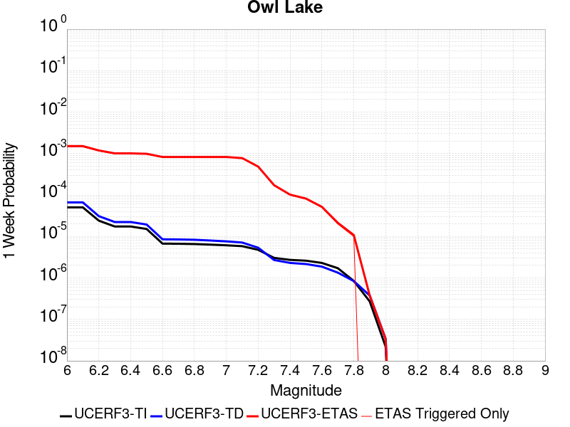 |  | 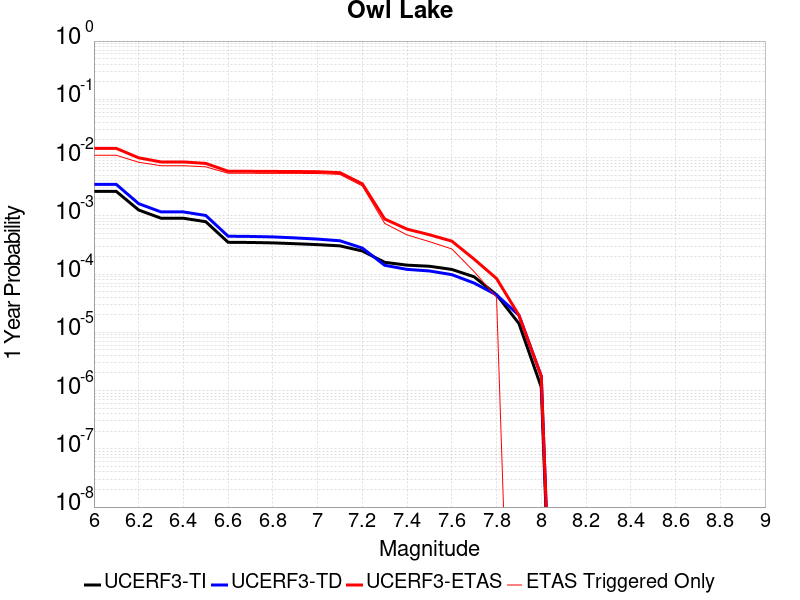 |  |

| Magnitude | 1 wk TI Prob | 1 wk TD Prob | 1 wk ETAS Prob | 1 wk ETAS/TD Gain | 1 wk ETAS Triggered Only | 1 mo TI Prob | 1 mo TD Prob | 1 mo ETAS Prob | 1 mo ETAS/TD Gain | 1 mo ETAS Triggered Only | 1 yr TI Prob | 1 yr TD Prob | 1 yr ETAS Prob | 1 yr ETAS/TD Gain | 1 yr ETAS Triggered Only | 10 yr TI Prob | 10 yr TD Prob | 10 yr ETAS Prob | 10 yr ETAS/TD Gain | 10 yr ETAS Triggered Only |
|-----|-----|-----|-----|-----|-----|-----|-----|-----|-----|-----|-----|-----|-----|-----|-----|-----|-----|-----|-----|-----|
| 6.0 | 5.0320643E-5 | 6.636149E-5 | 0.0015162652 | 22.84857 | 0.00145 | 2.1564208E-4 | 2.8438168E-4 | 0.004153281 | 14.604602 | 0.00387 | 0.0026222812 | 0.00345791 | 0.014370046 | 4.1557026 | 0.01095 | 0.02591553 | 0.0341423 | 0.053198673 | 1.5581455 | 0.01973 |
| 6.1 | 5.0320643E-5 | 6.636149E-5 | 0.0015162652 | 22.84857 | 0.00145 | 2.1564208E-4 | 2.8438168E-4 | 0.004153281 | 14.604602 | 0.00387 | 0.0026222812 | 0.00345791 | 0.014370046 | 4.1557026 | 0.01095 | 0.02591553 | 0.0341423 | 0.053198673 | 1.5581455 | 0.01973 |
| 6.2 | 2.4125871E-5 | 3.098269E-5 | 0.0011909468 | 38.4391 | 0.00116 | 1.0339249E-4 | 1.3277736E-4 | 0.0030823858 | 23.214691 | 0.00295 | 0.0012580766 | 0.0016155228 | 0.009902114 | 6.129356 | 0.0083 | 0.012509781 | 0.016071297 | 0.030928621 | 1.9244632 | 0.0151 |
| 6.3 | 1.7433485E-5 | 2.2356835E-5 | 0.0010123347 | 45.28077 | 9.9E-4 | 7.471279E-5 | 9.5812386E-5 | 0.0026855643 | 28.029406 | 0.00259 | 9.0924866E-4 | 0.0011660426 | 0.008407589 | 7.210361 | 0.00725 | 0.009055373 | 0.01162957 | 0.024478385 | 2.10484 | 0.013 |
| 6.4 | 1.7433485E-5 | 2.2356835E-5 | 0.0010123347 | 45.28077 | 9.9E-4 | 7.471279E-5 | 9.5812386E-5 | 0.0026855643 | 28.029406 | 0.00259 | 9.0924866E-4 | 0.0011660426 | 0.008407589 | 7.210361 | 0.00725 | 0.009055373 | 0.01162957 | 0.024478385 | 2.10484 | 0.013 |
| 6.5 | 1.5182742E-5 | 1.9430352E-5 | 9.894115E-4 | 50.920925 | 9.7E-4 | 6.506727E-5 | 8.327114E-5 | 0.002583063 | 31.019909 | 0.0025 | 7.919061E-4 | 0.0010135059 | 0.007936482 | 7.830722 | 0.00693 | 0.0078909 | 0.010119047 | 0.022205492 | 2.1944253 | 0.01221 |
| 6.6 | 6.7271576E-6 | 8.548157E-6 | 8.285412E-4 | 96.92629 | 8.2E-4 | 2.8830356E-5 | 3.6634476E-5 | 0.0020365613 | 55.591385 | 0.002 | 3.5095305E-4 | 4.4593913E-4 | 0.00582354 | 13.059047 | 0.00538 | 0.0035039932 | 0.004468226 | 0.013457878 | 3.0119064 | 0.00903 |
| 6.7 | 6.682835E-6 | 8.4806015E-6 | 8.2847365E-4 | 97.69043 | 8.2E-4 | 2.8640408E-5 | 3.634496E-5 | 0.0020362723 | 56.02626 | 0.002 | 3.4864116E-4 | 4.424157E-4 | 0.00581004 | 13.132535 | 0.00537 | 0.003480947 | 0.004433152 | 0.013403209 | 3.0234041 | 0.00901 |
| 6.8 | 6.5774975E-6 | 8.327072E-6 | 8.283202E-4 | 99.473175 | 8.2E-4 | 2.8188972E-5 | 3.5686993E-5 | 0.002025616 | 56.760624 | 0.00199 | 3.4314668E-4 | 4.3440814E-4 | 0.005782084 | 13.310257 | 0.00535 | 0.0034261728 | 0.0043532955 | 0.013264334 | 3.0469637 | 0.00895 |
| 6.9 | 6.363419E-6 | 8.0002355E-6 | 8.279937E-4 | 103.49616 | 8.2E-4 | 2.727151E-5 | 3.4286306E-5 | 0.002024218 | 59.038677 | 0.00199 | 3.3198006E-4 | 4.173614E-4 | 0.0057651284 | 13.813276 | 0.00535 | 0.0033148455 | 0.004183282 | 0.013085884 | 3.1281378 | 0.00894 |
| 7.0 | 6.1342453E-6 | 7.632424E-6 | 8.2762615E-4 | 108.43556 | 8.2E-4 | 2.6289357E-5 | 3.271001E-5 | 0.0020126451 | 61.52995 | 0.00198 | 3.2002592E-4 | 3.981771E-4 | 0.005716059 | 14.355569 | 0.00532 | 0.0031956544 | 0.00399197 | 0.012826561 | 3.2130907 | 0.00887 |
| 7.1 | 5.842926E-6 | 7.142961E-6 | 7.7713747E-4 | 108.79767 | 7.7E-4 | 2.504087E-5 | 3.0612362E-5 | 0.0019405539 | 63.39119 | 0.00191 | 3.0482994E-4 | 3.7264716E-4 | 0.0055007357 | 14.761243 | 0.00513 | 0.0030441214 | 0.0037374226 | 0.012295318 | 3.2897854 | 0.00859 |
| 7.2 | 4.77173E-6 | 5.3591634E-6 | 4.8535658E-4 | 90.56574 | 4.8E-4 | 2.045011E-5 | 2.2967664E-5 | 0.0011729413 | 51.069244 | 0.00115 | 2.4895166E-4 | 2.7959948E-4 | 0.003538688 | 12.656276 | 0.00326 | 0.0024867293 | 0.0028089995 | 0.008353381 | 2.9737926 | 0.00556 |
| 7.3 | 3.0494948E-6 | 2.7109647E-6 | 1.727105E-4 | 63.708134 | 1.7E-4 | 1.3069198E-5 | 1.1618369E-5 | 3.116149E-4 | 26.820879 | 3.0E-4 | 1.5910587E-4 | 1.4144463E-4 | 8.8133995E-4 | 6.2309895 | 7.4E-4 | 0.0015899199 | 0.0014235033 | 0.002871439 | 2.0171638 | 0.00145 |
| 7.4 | 2.7263884E-6 | 2.3061473E-6 | 1.02305916E-4 | 44.362263 | 1.0E-4 | 1.1684469E-5 | 9.883452E-6 | 2.0988147E-4 | 21.235645 | 2.0E-4 | 1.4224913E-4 | 1.2032448E-4 | 5.9026794E-4 | 4.9056344 | 4.7E-4 | 0.0014215811 | 0.0012114698 | 0.0021703069 | 1.7914659 | 9.6E-4 |
| 7.5 | 2.6090431E-6 | 2.1660758E-6 | 8.2165905E-5 | 37.93307 | 8.0E-5 | 1.1181565E-5 | 9.283149E-6 | 1.5928176E-4 | 17.15816 | 1.5E-4 | 1.3612706E-4 | 1.1301658E-4 | 4.729759E-4 | 4.1850133 | 3.6E-4 | 0.001360437 | 0.001138222 | 0.0019173343 | 1.6844993 | 7.8E-4 |
| 7.6 | 2.3008756E-6 | 1.8732376E-6 | 5.1873143E-5 | 27.691706 | 5.0E-5 | 9.860858E-6 | 8.028137E-6 | 1.08027336E-4 | 13.45609 | 1.0E-4 | 1.20049335E-4 | 9.7738266E-5 | 3.6771188E-4 | 3.76221 | 2.7E-4 | 0.001199845 | 9.852252E-4 | 0.0015546636 | 1.5779779 | 5.7E-4 |
| 7.7 | 1.7184348E-6 | 1.3423282E-6 | 2.13423E-5 | 15.899466 | 2.0E-5 | 7.3646997E-6 | 5.7528227E-6 | 3.575265E-5 | 6.2148013 | 3.0E-5 | 8.966153E-5 | 7.0038404E-5 | 1.800307E-4 | 2.5704567 | 1.1E-4 | 8.962536E-4 | 7.080495E-4 | 9.978442E-4 | 1.4092859 | 2.9E-4 |
| 7.8 | 8.4612907E-7 | 8.4087924E-7 | 1.0840871E-5 | 12.892303 | 1.0E-5 | 3.6262625E-6 | 3.6037634E-6 | 1.3603727E-5 | 3.774867 | 1.0E-5 | 4.4148852E-5 | 4.3874956E-5 | 8.38732E-5 | 1.9116418 | 4.0E-5 | 4.414008E-4 | 4.4413717E-4 | 5.540883E-4 | 1.2475612 | 1.1E-4 |
| 7.9 | 2.716738E-7 | 3.7694025E-7 | 3.7694025E-7 | 1.0 | 0.0 | 1.1643157E-6 | 1.6154573E-6 | 1.6154573E-6 | 1.0 | 0.0 | 1.4175452E-5 | 1.9668027E-5 | 1.9668027E-5 | 1.0 | 0.0 | 1.4174548E-4 | 1.9843443E-4 | 2.1843046E-4 | 1.1007689 | 2.0E-5 |
| 8.0 | 2.1995428E-8 | 3.386013E-8 | 3.386013E-8 | 1.0 | 0.0 | 9.426611E-8 | 1.4511484E-7 | 1.4511484E-7 | 1.0 | 0.0 | 1.1476893E-6 | 1.7667724E-6 | 1.7667724E-6 | 1.0 | 0.0 | 1.14768345E-5 | 1.7968985E-5 | 1.7968985E-5 | 1.0 | 0.0 |

## Airport Lake
*[(top)](#table-of-contents)*

| 1 Week | 1 Month | 1 Year | 10 Year |
|-----|-----|-----|-----|
|  |  |  |  |

| Magnitude | 1 wk TI Prob | 1 wk TD Prob | 1 wk ETAS Prob | 1 wk ETAS/TD Gain | 1 wk ETAS Triggered Only | 1 mo TI Prob | 1 mo TD Prob | 1 mo ETAS Prob | 1 mo ETAS/TD Gain | 1 mo ETAS Triggered Only | 1 yr TI Prob | 1 yr TD Prob | 1 yr ETAS Prob | 1 yr ETAS/TD Gain | 1 yr ETAS Triggered Only | 10 yr TI Prob | 10 yr TD Prob | 10 yr ETAS Prob | 10 yr ETAS/TD Gain | 10 yr ETAS Triggered Only |
|-----|-----|-----|-----|-----|-----|-----|-----|-----|-----|-----|-----|-----|-----|-----|-----|-----|-----|-----|-----|-----|
| 6.0 | 1.2387061E-5 | 1.31032575E-5 | 0.0020330767 | 155.15813 | 0.00202 | 5.3086325E-5 | 5.6155768E-5 | 0.0049858787 | 88.78658 | 0.00493 | 6.461343E-4 | 6.835104E-4 | 0.012235609 | 17.90113 | 0.01156 | 0.0064425888 | 0.0068168915 | 0.024584938 | 3.6064734 | 0.01789 |
| 6.1 | 1.2387061E-5 | 1.31032575E-5 | 0.0020330767 | 155.15813 | 0.00202 | 5.3086325E-5 | 5.6155768E-5 | 0.0049858787 | 88.78658 | 0.00493 | 6.461343E-4 | 6.835104E-4 | 0.012235609 | 17.90113 | 0.01156 | 0.0064425888 | 0.0068168915 | 0.024584938 | 3.6064734 | 0.01789 |
| 6.2 | 1.2387061E-5 | 1.31032575E-5 | 0.0020330767 | 155.15813 | 0.00202 | 5.3086325E-5 | 5.6155768E-5 | 0.0049858787 | 88.78658 | 0.00493 | 6.461343E-4 | 6.835104E-4 | 0.012235609 | 17.90113 | 0.01156 | 0.0064425888 | 0.0068168915 | 0.024584938 | 3.6064734 | 0.01789 |
| 6.3 | 1.2387061E-5 | 1.31032575E-5 | 0.0020330767 | 155.15813 | 0.00202 | 5.3086325E-5 | 5.6155768E-5 | 0.0049858787 | 88.78658 | 0.00493 | 6.461343E-4 | 6.835104E-4 | 0.012235609 | 17.90113 | 0.01156 | 0.0064425888 | 0.0068168915 | 0.024584938 | 3.6064734 | 0.01789 |
| 6.4 | 1.2387061E-5 | 1.31032575E-5 | 0.0020330767 | 155.15813 | 0.00202 | 5.3086325E-5 | 5.6155768E-5 | 0.0049858787 | 88.78658 | 0.00493 | 6.461343E-4 | 6.835104E-4 | 0.012235609 | 17.90113 | 0.01156 | 0.0064425888 | 0.0068168915 | 0.024584938 | 3.6064734 | 0.01789 |
| 6.5 | 6.9922594E-6 | 7.38498E-6 | 0.0015673734 | 212.238 | 0.00156 | 2.996648E-5 | 3.164956E-5 | 0.0037215329 | 117.5856 | 0.00369 | 3.6478083E-4 | 3.8527072E-4 | 0.009041934 | 23.469042 | 0.00866 | 0.003641826 | 0.0038465653 | 0.01737433 | 4.5168424 | 0.01358 |
| 6.6 | 6.9922594E-6 | 7.38498E-6 | 0.0015673734 | 212.238 | 0.00156 | 2.996648E-5 | 3.164956E-5 | 0.0037215329 | 117.5856 | 0.00369 | 3.6478083E-4 | 3.8527072E-4 | 0.009041934 | 23.469042 | 0.00866 | 0.003641826 | 0.0038465653 | 0.01737433 | 4.5168424 | 0.01358 |
| 6.7 | 5.477277E-6 | 5.7861116E-6 | 0.0013857781 | 239.50076 | 0.00138 | 2.3473833E-5 | 2.4797408E-5 | 0.0032547172 | 131.25232 | 0.00323 | 2.8575645E-4 | 3.0187052E-4 | 0.0077696154 | 25.73824 | 0.00747 | 0.0028538927 | 0.0030149885 | 0.014599954 | 4.842458 | 0.01162 |
| 6.8 | 3.9950432E-6 | 4.2191186E-6 | 0.0010942145 | 259.3467 | 0.00109 | 1.7121502E-5 | 1.8081826E-5 | 0.0025480362 | 140.91696 | 0.00253 | 2.0843433E-4 | 2.2012675E-4 | 0.0059488653 | 27.024727 | 0.00573 | 0.0020823893 | 0.002199358 | 0.0110298935 | 5.0150514 | 0.00885 |
| 6.9 | 2.95695E-6 | 3.1230477E-6 | 7.1312085E-4 | 228.34132 | 7.1E-4 | 1.2672582E-5 | 1.3384434E-5 | 0.0018233602 | 136.2299 | 0.00181 | 1.5427776E-4 | 1.6294557E-4 | 0.004302271 | 26.403118 | 0.00414 | 0.001541707 | 0.0016284833 | 0.008077963 | 4.9604216 | 0.00646 |
| 7.0 | 1.456072E-6 | 1.5408239E-6 | 2.715404E-4 | 176.23065 | 2.7E-4 | 6.2402937E-6 | 6.60352E-6 | 7.4659864E-4 | 113.06071 | 7.4E-4 | 7.597293E-5 | 8.03959E-5 | 0.0020302392 | 25.25302 | 0.00195 | 7.594696E-4 | 8.03767E-4 | 0.003761388 | 4.6796994 | 0.00296 |
| 7.1 | 6.995192E-7 | 7.4090326E-7 | 1.0074083E-4 | 135.97029 | 1.0E-4 | 2.997936E-6 | 3.1752998E-6 | 3.531742E-4 | 111.225464 | 3.5E-4 | 3.649926E-5 | 3.8659273E-5 | 0.0010386206 | 26.866014 | 0.001 | 3.6493264E-4 | 3.8659273E-4 | 0.0019259974 | 4.9819803 | 0.00154 |

## Panamint Valley
*[(top)](#table-of-contents)*

| 1 Week | 1 Month | 1 Year | 10 Year |
|-----|-----|-----|-----|
| 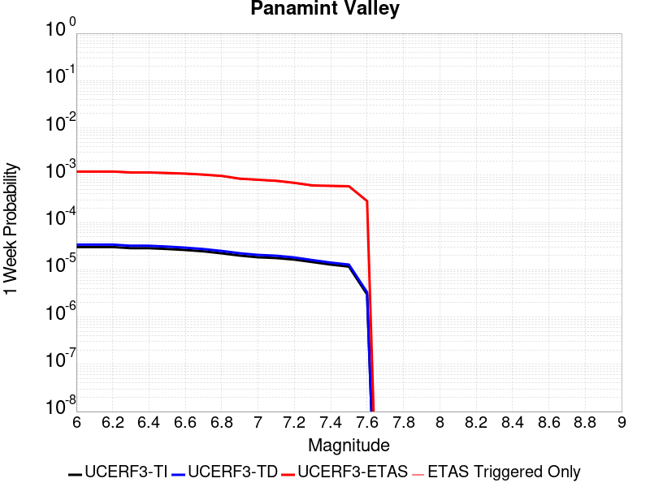 |  |  |  |

| Magnitude | 1 wk TI Prob | 1 wk TD Prob | 1 wk ETAS Prob | 1 wk ETAS/TD Gain | 1 wk ETAS Triggered Only | 1 mo TI Prob | 1 mo TD Prob | 1 mo ETAS Prob | 1 mo ETAS/TD Gain | 1 mo ETAS Triggered Only | 1 yr TI Prob | 1 yr TD Prob | 1 yr ETAS Prob | 1 yr ETAS/TD Gain | 1 yr ETAS Triggered Only | 10 yr TI Prob | 10 yr TD Prob | 10 yr ETAS Prob | 10 yr ETAS/TD Gain | 10 yr ETAS Triggered Only |
|-----|-----|-----|-----|-----|-----|-----|-----|-----|-----|-----|-----|-----|-----|-----|-----|-----|-----|-----|-----|-----|
| 6.0 | 3.0211835E-5 | 3.3985398E-5 | 0.001193946 | 35.131145 | 0.00116 | 1.2947287E-4 | 1.4564373E-4 | 0.0032351937 | 22.213064 | 0.00309 | 0.0015751923 | 0.0017717998 | 0.010666013 | 6.019875 | 0.00891 | 0.015640736 | 0.01758359 | 0.032860167 | 1.8687973 | 0.01555 |
| 6.1 | 3.0211835E-5 | 3.3985398E-5 | 0.001193946 | 35.131145 | 0.00116 | 1.2947287E-4 | 1.4564373E-4 | 0.0032351937 | 22.213064 | 0.00309 | 0.0015751923 | 0.0017717998 | 0.010666013 | 6.019875 | 0.00891 | 0.015640736 | 0.01758359 | 0.032860167 | 1.8687973 | 0.01555 |
| 6.2 | 3.0211835E-5 | 3.3985398E-5 | 0.001193946 | 35.131145 | 0.00116 | 1.2947287E-4 | 1.4564373E-4 | 0.0032351937 | 22.213064 | 0.00309 | 0.0015751923 | 0.0017717998 | 0.010666013 | 6.019875 | 0.00891 | 0.015640736 | 0.01758359 | 0.032860167 | 1.8687973 | 0.01555 |
| 6.3 | 2.8573924E-5 | 3.2103522E-5 | 0.0011420678 | 35.574535 | 0.00111 | 1.2245393E-4 | 1.3757942E-4 | 0.0031271682 | 22.729912 | 0.00299 | 0.001489857 | 0.0016737703 | 0.010129593 | 6.0519614 | 0.00847 | 0.01479908 | 0.016618231 | 0.031073945 | 1.8698707 | 0.0147 |
| 6.4 | 2.8573924E-5 | 3.2103522E-5 | 0.0011420678 | 35.574535 | 0.00111 | 1.2245393E-4 | 1.3757942E-4 | 0.0031271682 | 22.729912 | 0.00299 | 0.001489857 | 0.0016737703 | 0.010129593 | 6.0519614 | 0.00847 | 0.01479908 | 0.016618231 | 0.031073945 | 1.8698707 | 0.0147 |
| 6.5 | 2.7468774E-5 | 3.0829244E-5 | 0.001110796 | 36.030594 | 0.00108 | 1.1771801E-4 | 1.3211879E-4 | 0.0030217369 | 22.871363 | 0.00289 | 0.0014322745 | 0.0016073869 | 0.00985411 | 6.1305156 | 0.00826 | 0.014230782 | 0.015964093 | 0.030085009 | 1.8845423 | 0.01435 |
| 6.6 | 2.6135967E-5 | 2.9253257E-5 | 0.0010792225 | 36.892387 | 0.00105 | 1.1200648E-4 | 1.2536523E-4 | 0.0029450117 | 23.491455 | 0.00282 | 0.0013628257 | 0.0015252795 | 0.009493108 | 6.223848 | 0.00798 | 0.013544982 | 0.015154443 | 0.028715765 | 1.8948745 | 0.01377 |
| 6.7 | 2.4498746E-5 | 2.7342086E-5 | 0.0010273147 | 37.572655 | 0.001 | 1.04990395E-4 | 1.1717525E-4 | 0.002866853 | 24.46637 | 0.00275 | 0.0012775084 | 0.0014257001 | 0.009084765 | 6.372143 | 0.00767 | 0.012701893 | 0.014171662 | 0.027155021 | 1.9161494 | 0.01317 |
| 6.8 | 2.2244329E-5 | 2.4936131E-5 | 9.649127E-4 | 38.695366 | 9.4E-4 | 9.532935E-5 | 1.0686488E-4 | 0.0026665912 | 24.952925 | 0.00256 | 0.0011600169 | 0.0013003252 | 0.008411067 | 6.4684334 | 0.00712 | 0.011539802 | 0.012932883 | 0.024886265 | 1.9242628 | 0.01211 |
| 6.9 | 1.9902658E-5 | 2.2290924E-5 | 8.4227265E-4 | 37.785454 | 8.2E-4 | 8.529431E-5 | 9.552913E-5 | 0.0024453045 | 25.597475 | 0.00235 | 0.0010379635 | 0.0011624652 | 0.0074451533 | 6.404625 | 0.00629 | 0.010331288 | 0.011568946 | 0.022155043 | 1.9150442 | 0.01071 |
| 7.0 | 1.8353881E-5 | 2.056681E-5 | 8.0055074E-4 | 38.924404 | 7.8E-4 | 7.865712E-5 | 8.814059E-5 | 0.0022079537 | 25.050364 | 0.00212 | 9.5722964E-4 | 0.0010726011 | 0.0068464014 | 6.38299 | 0.00578 | 0.009531168 | 0.0106791705 | 0.020344835 | 1.9050951 | 0.00977 |
| 7.1 | 1.7667631E-5 | 1.9773222E-5 | 7.597586E-4 | 38.42361 | 7.4E-4 | 7.571623E-5 | 8.473973E-5 | 0.0021145677 | 24.953676 | 0.00203 | 9.2145515E-4 | 0.0010312354 | 0.0066054813 | 6.4054055 | 0.00558 | 0.009176437 | 0.010269388 | 0.019632239 | 1.9117244 | 0.00946 |
| 7.2 | 1.6381597E-5 | 1.8158824E-5 | 6.881467E-4 | 37.895992 | 6.7E-4 | 7.020495E-5 | 7.782131E-5 | 0.0019276773 | 24.770561 | 0.00185 | 8.544101E-4 | 9.4707985E-4 | 0.0059423447 | 6.274386 | 0.005 | 0.008511325 | 0.009435088 | 0.017835079 | 1.8902928 | 0.00848 |
| 7.3 | 1.4520491E-5 | 1.5966963E-5 | 6.059575E-4 | 37.950706 | 5.9E-4 | 6.222919E-5 | 6.842814E-5 | 0.0016383207 | 23.942207 | 0.00157 | 7.57377E-4 | 8.3281036E-4 | 0.004899421 | 5.882997 | 0.00407 | 0.0075480095 | 0.008300003 | 0.01535099 | 1.8495162 | 0.00711 |
| 7.4 | 1.2852287E-5 | 1.4145856E-5 | 5.9413764E-4 | 42.000828 | 5.8E-4 | 5.5080065E-5 | 6.0623777E-5 | 0.0015805316 | 26.07115 | 0.00152 | 6.7039346E-4 | 7.3786033E-4 | 0.004664961 | 6.322281 | 0.00393 | 0.0066837464 | 0.007357025 | 0.01412685 | 1.9201851 | 0.00682 |
| 7.5 | 1.1637851E-5 | 1.2837149E-5 | 5.828298E-4 | 45.40181 | 5.7E-4 | 4.987555E-5 | 5.5015284E-5 | 0.0015649322 | 28.445408 | 0.00151 | 6.070656E-4 | 6.6962093E-4 | 0.004517043 | 6.7456717 | 0.00385 | 0.006054099 | 0.0066789286 | 0.013264648 | 1.9860442 | 0.00663 |
| 7.6 | 3.0068115E-6 | 3.3331687E-6 | 2.8333222E-4 | 85.00387 | 2.8E-4 | 1.2886271E-5 | 1.4284972E-5 | 7.642743E-4 | 53.50198 | 7.5E-4 | 1.5687906E-4 | 1.7391294E-4 | 0.0020435876 | 11.750637 | 0.00187 | 0.0015676835 | 0.001739208 | 0.0049036946 | 2.8194988 | 0.00317 |

## Garlock (East)
*[(top)](#table-of-contents)*

| 1 Week | 1 Month | 1 Year | 10 Year |
|-----|-----|-----|-----|
|  |  |  |  |

| Magnitude | 1 wk TI Prob | 1 wk TD Prob | 1 wk ETAS Prob | 1 wk ETAS/TD Gain | 1 wk ETAS Triggered Only | 1 mo TI Prob | 1 mo TD Prob | 1 mo ETAS Prob | 1 mo ETAS/TD Gain | 1 mo ETAS Triggered Only | 1 yr TI Prob | 1 yr TD Prob | 1 yr ETAS Prob | 1 yr ETAS/TD Gain | 1 yr ETAS Triggered Only | 10 yr TI Prob | 10 yr TD Prob | 10 yr ETAS Prob | 10 yr ETAS/TD Gain | 10 yr ETAS Triggered Only |
|-----|-----|-----|-----|-----|-----|-----|-----|-----|-----|-----|-----|-----|-----|-----|-----|-----|-----|-----|-----|-----|
| 6.0 | 4.5092507E-5 | 6.2906794E-5 | 0.0010028477 | 15.941802 | 9.4E-4 | 1.9323928E-4 | 2.695752E-4 | 0.002828885 | 10.493862 | 0.00256 | 0.0023501497 | 0.0032775842 | 0.010424084 | 3.1804168 | 0.00717 | 0.023254504 | 0.03235364 | 0.045416865 | 1.4037637 | 0.0135 |
| 6.1 | 4.5092507E-5 | 6.2906794E-5 | 0.0010028477 | 15.941802 | 9.4E-4 | 1.9323928E-4 | 2.695752E-4 | 0.002828885 | 10.493862 | 0.00256 | 0.0023501497 | 0.0032775842 | 0.010424084 | 3.1804168 | 0.00717 | 0.023254504 | 0.03235364 | 0.045416865 | 1.4037637 | 0.0135 |
| 6.2 | 2.6674514E-5 | 3.4512483E-5 | 8.044859E-4 | 23.309998 | 7.7E-4 | 1.1431433E-4 | 1.4790244E-4 | 0.0021076126 | 14.250019 | 0.00196 | 0.0013908884 | 0.001799258 | 0.0069599557 | 3.8682368 | 0.00517 | 0.01382215 | 0.017891733 | 0.02712355 | 1.5159823 | 0.0094 |
| 6.3 | 2.6674514E-5 | 3.4512483E-5 | 8.044859E-4 | 23.309998 | 7.7E-4 | 1.1431433E-4 | 1.4790244E-4 | 0.0021076126 | 14.250019 | 0.00196 | 0.0013908884 | 0.001799258 | 0.0069599557 | 3.8682368 | 0.00517 | 0.01382215 | 0.017891733 | 0.02712355 | 1.5159823 | 0.0094 |
| 6.4 | 2.5312667E-5 | 3.2341675E-5 | 7.923171E-4 | 24.498333 | 7.6E-4 | 1.0847834E-4 | 1.3859998E-4 | 0.002078331 | 14.995176 | 0.00194 | 0.0013199237 | 0.001686178 | 0.006787562 | 4.025412 | 0.00511 | 0.013121112 | 0.01677974 | 0.025894191 | 1.543182 | 0.00927 |
| 6.5 | 2.5312667E-5 | 3.2341675E-5 | 7.923171E-4 | 24.498333 | 7.6E-4 | 1.0847834E-4 | 1.3859998E-4 | 0.002078331 | 14.995176 | 0.00194 | 0.0013199237 | 0.001686178 | 0.006787562 | 4.025412 | 0.00511 | 0.013121112 | 0.01677974 | 0.025894191 | 1.543182 | 0.00927 |
| 6.6 | 2.246556E-5 | 2.813642E-5 | 7.581159E-4 | 26.944292 | 7.3E-4 | 9.627742E-5 | 1.20579214E-4 | 0.0019903537 | 16.506607 | 0.00187 | 0.0011715472 | 0.0014670868 | 0.0063698837 | 4.3418584 | 0.00491 | 0.011653901 | 0.014620015 | 0.023261799 | 1.5910926 | 0.00877 |
| 6.7 | 2.2241198E-5 | 2.7806154E-5 | 7.5778586E-4 | 27.25245 | 7.3E-4 | 9.531594E-5 | 1.1916392E-4 | 0.001988941 | 16.6908 | 0.00187 | 0.0011598538 | 0.0014498787 | 0.0063228034 | 4.360919 | 0.00488 | 0.011538187 | 0.0144502055 | 0.023054054 | 1.5954137 | 0.00873 |
| 6.8 | 1.9528685E-5 | 2.3900653E-5 | 7.038844E-4 | 29.450426 | 6.8E-4 | 8.369167E-5 | 1.0242746E-4 | 0.0018522482 | 18.083513 | 0.00175 | 0.0010184698 | 0.0012463606 | 0.005800677 | 4.6540923 | 0.00456 | 0.010138147 | 0.012437694 | 0.020417197 | 1.641558 | 0.00808 |
| 6.9 | 1.3318621E-5 | 1.5201007E-5 | 6.6519115E-4 | 43.759674 | 6.5E-4 | 5.7078556E-5 | 6.514558E-5 | 0.0016850401 | 25.865763 | 0.00162 | 6.9470983E-4 | 7.928645E-4 | 0.004879622 | 6.154421 | 0.00409 | 0.0069254204 | 0.007940986 | 0.015024288 | 1.8919927 | 0.00714 |
| 7.0 | 1.1760853E-5 | 1.3109839E-5 | 6.631013E-4 | 50.580433 | 6.5E-4 | 5.0402683E-5 | 5.618384E-5 | 0.001656094 | 29.47634 | 0.0016 | 6.134799E-4 | 6.838286E-4 | 0.004681093 | 6.845419 | 0.004 | 0.0061178906 | 0.006857582 | 0.013710264 | 1.9992856 | 0.0069 |
| 7.1 | 1.0064758E-5 | 1.090491E-5 | 6.508979E-4 | 59.688522 | 6.4E-4 | 4.3133965E-5 | 4.673451E-5 | 0.0016066616 | 34.378487 | 0.00156 | 5.2502943E-4 | 5.688476E-4 | 0.00437668 | 7.6939416 | 0.00381 | 0.005237907 | 0.005714025 | 0.012176884 | 2.1310518 | 0.0065 |
| 7.2 | 9.768808E-6 | 1.0500772E-5 | 6.5049407E-4 | 61.947258 | 6.4E-4 | 4.186565E-5 | 4.500255E-5 | 0.0016049324 | 35.66314 | 0.00156 | 5.095951E-4 | 5.477718E-4 | 0.0043257014 | 7.8969035 | 0.00378 | 0.0050842804 | 0.005504284 | 0.011888946 | 2.1599443 | 0.00642 |
| 7.3 | 9.344516E-6 | 9.946395E-6 | 5.9994054E-4 | 60.317383 | 5.9E-4 | 4.004731E-5 | 4.2626732E-5 | 0.001512564 | 35.483932 | 0.00147 | 4.8746695E-4 | 5.1886035E-4 | 0.004097003 | 7.8961573 | 0.00358 | 0.0048639905 | 0.005215945 | 0.01127418 | 2.1614838 | 0.00609 |
| 7.4 | 9.023491E-6 | 9.49255E-6 | 5.594873E-4 | 58.939625 | 5.5E-4 | 3.867153E-5 | 4.068174E-5 | 0.0013406288 | 32.954067 | 0.0013 | 4.7072413E-4 | 4.95191E-4 | 0.003633636 | 7.3378477 | 0.00314 | 0.004697283 | 0.004979378 | 0.010402241 | 2.0890641 | 0.00545 |
| 7.5 | 7.081253E-6 | 7.0893525E-6 | 2.7708744E-4 | 39.085014 | 2.7E-4 | 3.0347876E-5 | 3.038259E-5 | 6.203647E-4 | 20.418427 | 5.9E-4 | 3.6942272E-4 | 3.6984598E-4 | 0.0018093134 | 4.8920727 | 0.00144 | 0.003688092 | 0.0037251879 | 0.0065047946 | 1.7461655 | 0.00279 |
| 7.6 | 6.116396E-6 | 5.9608415E-6 | 1.5595995E-4 | 26.164082 | 1.5E-4 | 2.6212863E-5 | 2.5546216E-5 | 3.4553805E-4 | 13.525997 | 3.2E-4 | 3.1909486E-4 | 3.1098103E-4 | 0.0011707136 | 3.764582 | 8.6E-4 | 0.0031863707 | 0.003136586 | 0.004831254 | 1.5402906 | 0.0017 |
| 7.7 | 4.797145E-6 | 4.7587923E-6 | 1.3475817E-4 | 28.317726 | 1.3E-4 | 2.055903E-5 | 2.0394666E-5 | 2.3039037E-4 | 11.2966 | 2.1E-4 | 2.5027743E-4 | 2.482769E-4 | 7.6814776E-4 | 3.093916 | 5.2E-4 | 0.0024999576 | 0.002510134 | 0.003497649 | 1.3934113 | 9.9E-4 |
| 7.8 | 3.4028885E-6 | 3.979809E-6 | 8.397949E-5 | 21.101385 | 8.0E-5 | 1.4583726E-5 | 1.7056214E-5 | 1.2705434E-4 | 7.449152 | 1.1E-4 | 1.775424E-4 | 2.076397E-4 | 5.075774E-4 | 2.4445105 | 3.0E-4 | 0.0017740062 | 0.0021019245 | 0.0027405792 | 1.3038429 | 6.4E-4 |
| 7.9 | 2.5928412E-6 | 3.373588E-6 | 6.337339E-5 | 18.785158 | 6.0E-5 | 1.1112129E-5 | 1.44581545E-5 | 1.04456856E-4 | 7.224771 | 9.0E-5 | 1.3528178E-4 | 1.7601387E-4 | 3.9597516E-4 | 2.2496815 | 2.2E-4 | 0.0013519945 | 0.0017818334 | 0.002260978 | 1.2689055 | 4.8E-4 |
| 8.0 | 1.3743648E-6 | 1.673991E-6 | 3.1673942E-5 | 18.921213 | 3.0E-5 | 5.8901214E-6 | 7.174228E-6 | 5.7173867E-5 | 7.9693413 | 5.0E-5 | 7.1709874E-5 | 8.7342756E-5 | 1.7733489E-4 | 2.0303333 | 9.0E-5 | 7.1686733E-4 | 8.839922E-4 | 0.0010538419 | 1.1921394 | 1.7E-4 |
| 8.1 | 3.6733252E-7 | 3.1499187E-7 | 3.1499187E-7 | 1.0 | 0.0 | 1.5742813E-6 | 1.3499646E-6 | 1.3499646E-6 | 1.0 | 0.0 | 1.9166706E-5 | 1.643571E-5 | 2.6435546E-5 | 1.6084212 | 1.0E-5 | 1.9165053E-4 | 1.6643589E-4 | 1.8643256E-4 | 1.1201464 | 2.0E-5 |

## Ash Hill
*[(top)](#table-of-contents)*

| 1 Week | 1 Month | 1 Year | 10 Year |
|-----|-----|-----|-----|
|  |  |  |  |

| Magnitude | 1 wk TI Prob | 1 wk TD Prob | 1 wk ETAS Prob | 1 wk ETAS/TD Gain | 1 wk ETAS Triggered Only | 1 mo TI Prob | 1 mo TD Prob | 1 mo ETAS Prob | 1 mo ETAS/TD Gain | 1 mo ETAS Triggered Only | 1 yr TI Prob | 1 yr TD Prob | 1 yr ETAS Prob | 1 yr ETAS/TD Gain | 1 yr ETAS Triggered Only | 10 yr TI Prob | 10 yr TD Prob | 10 yr ETAS Prob | 10 yr ETAS/TD Gain | 10 yr ETAS Triggered Only |
|-----|-----|-----|-----|-----|-----|-----|-----|-----|-----|-----|-----|-----|-----|-----|-----|-----|-----|-----|-----|-----|
| 6.0 | 2.1545662E-5 | 2.3194681E-5 | 7.2317844E-4 | 31.17863 | 7.0E-4 | 9.2335285E-5 | 9.9402445E-5 | 0.0015592573 | 15.686308 | 0.00146 | 0.0011236023 | 0.0012096328 | 0.005454492 | 4.509213 | 0.00425 | 0.011179381 | 0.01203847 | 0.0194877 | 1.6187854 | 0.00754 |
| 6.1 | 2.1545662E-5 | 2.3194681E-5 | 7.2317844E-4 | 31.17863 | 7.0E-4 | 9.2335285E-5 | 9.9402445E-5 | 0.0015592573 | 15.686308 | 0.00146 | 0.0011236023 | 0.0012096328 | 0.005454492 | 4.509213 | 0.00425 | 0.011179381 | 0.01203847 | 0.0194877 | 1.6187854 | 0.00754 |
| 6.2 | 2.1545662E-5 | 2.3194681E-5 | 7.2317844E-4 | 31.17863 | 7.0E-4 | 9.2335285E-5 | 9.9402445E-5 | 0.0015592573 | 15.686308 | 0.00146 | 0.0011236023 | 0.0012096328 | 0.005454492 | 4.509213 | 0.00425 | 0.011179381 | 0.01203847 | 0.0194877 | 1.6187854 | 0.00754 |
| 6.3 | 1.0025529E-5 | 1.0747037E-5 | 2.7074423E-4 | 25.192455 | 2.6E-4 | 4.2965847E-5 | 4.605799E-5 | 4.760382E-4 | 10.335627 | 4.3E-4 | 5.229836E-4 | 5.60625E-4 | 0.0020897673 | 3.727567 | 0.00153 | 0.005217545 | 0.0055934195 | 0.008507031 | 1.5208998 | 0.00293 |
| 6.4 | 1.0025529E-5 | 1.0747037E-5 | 2.7074423E-4 | 25.192455 | 2.6E-4 | 4.2965847E-5 | 4.605799E-5 | 4.760382E-4 | 10.335627 | 4.3E-4 | 5.229836E-4 | 5.60625E-4 | 0.0020897673 | 3.727567 | 0.00153 | 0.005217545 | 0.0055934195 | 0.008507031 | 1.5208998 | 0.00293 |
| 6.5 | 6.9617327E-6 | 7.456704E-6 | 1.9745529E-4 | 26.480236 | 1.9E-4 | 2.9835655E-5 | 3.1956963E-5 | 3.219477E-4 | 10.074415 | 2.9E-4 | 3.6318856E-4 | 3.8901521E-4 | 0.0014885874 | 3.8265529 | 0.0011 | 0.0036259557 | 0.0038841967 | 0.006035807 | 1.5539395 | 0.00216 |
| 6.6 | 4.9919777E-6 | 5.346739E-6 | 1.3534604E-4 | 25.313757 | 1.3E-4 | 2.1394015E-5 | 2.2914432E-5 | 2.4290939E-4 | 10.600717 | 2.2E-4 | 2.60441E-4 | 2.789542E-4 | 0.0011287171 | 4.0462456 | 8.5E-4 | 0.0026013597 | 0.0027866988 | 0.004432101 | 1.5904484 | 0.00165 |
| 6.7 | 3.6630722E-6 | 3.9246606E-6 | 1.1392423E-4 | 29.02779 | 1.1E-4 | 1.5698786E-5 | 1.6819899E-5 | 1.7681721E-4 | 10.5123825 | 1.6E-4 | 1.9111596E-4 | 2.0476876E-4 | 8.446377E-4 | 4.124837 | 6.4E-4 | 0.0019095168 | 0.002046364 | 0.003293806 | 1.6095896 | 0.00125 |
| 6.8 | 2.5599613E-6 | 2.7449514E-6 | 8.274473E-5 | 30.144335 | 8.0E-5 | 1.0971216E-5 | 1.1764052E-5 | 1.4176252E-4 | 12.050484 | 1.3E-4 | 1.3356637E-4 | 1.4322287E-4 | 5.8315985E-4 | 4.0716953 | 4.4E-4 | 0.0013348613 | 0.0014317906 | 0.0023404877 | 1.6346577 | 9.1E-4 |
| 6.9 | 1.7684905E-6 | 1.896889E-6 | 7.189676E-5 | 37.90246 | 7.0E-5 | 7.579223E-6 | 8.129524E-6 | 1.2812855E-4 | 15.760892 | 1.2E-4 | 9.2273134E-5 | 9.8976954E-5 | 4.489423E-4 | 4.5358267 | 3.5E-4 | 9.223483E-4 | 9.897696E-4 | 0.0016990668 | 1.7166287 | 7.1E-4 |

## Blackwater
*[(top)](#table-of-contents)*

| 1 Week | 1 Month | 1 Year | 10 Year |
|-----|-----|-----|-----|
| 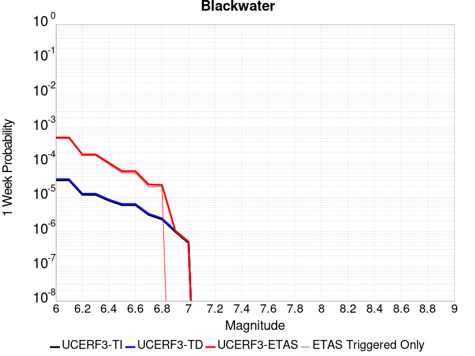 |  |  |  |

| Magnitude | 1 wk TI Prob | 1 wk TD Prob | 1 wk ETAS Prob | 1 wk ETAS/TD Gain | 1 wk ETAS Triggered Only | 1 mo TI Prob | 1 mo TD Prob | 1 mo ETAS Prob | 1 mo ETAS/TD Gain | 1 mo ETAS Triggered Only | 1 yr TI Prob | 1 yr TD Prob | 1 yr ETAS Prob | 1 yr ETAS/TD Gain | 1 yr ETAS Triggered Only | 10 yr TI Prob | 10 yr TD Prob | 10 yr ETAS Prob | 10 yr ETAS/TD Gain | 10 yr ETAS Triggered Only |
|-----|-----|-----|-----|-----|-----|-----|-----|-----|-----|-----|-----|-----|-----|-----|-----|-----|-----|-----|-----|-----|
| 6.0 | 3.0708583E-5 | 3.309619E-5 | 5.3307967E-4 | 16.10698 | 5.0E-4 | 1.3160157E-4 | 1.4183388E-4 | 0.0014616466 | 10.305343 | 0.00132 | 0.0016010714 | 0.0017255963 | 0.0054092286 | 3.1347013 | 0.00369 | 0.015895851 | 0.017135808 | 0.024281232 | 1.4169878 | 0.00727 |
| 6.1 | 3.0708583E-5 | 3.309619E-5 | 5.3307967E-4 | 16.10698 | 5.0E-4 | 1.3160157E-4 | 1.4183388E-4 | 0.0014616466 | 10.305343 | 0.00132 | 0.0016010714 | 0.0017255963 | 0.0054092286 | 3.1347013 | 0.00369 | 0.015895851 | 0.017135808 | 0.024281232 | 1.4169878 | 0.00727 |
| 6.2 | 1.1707779E-5 | 1.2545242E-5 | 1.7254324E-4 | 13.75368 | 1.6E-4 | 5.017523E-5 | 5.3764266E-5 | 5.537374E-4 | 10.299357 | 5.0E-4 | 6.107122E-4 | 6.5439293E-4 | 0.0019435488 | 2.9700027 | 0.00129 | 0.006090366 | 0.006525631 | 0.008939774 | 1.3699478 | 0.00243 |
| 6.3 | 1.1707779E-5 | 1.2545242E-5 | 1.7254324E-4 | 13.75368 | 1.6E-4 | 5.017523E-5 | 5.3764266E-5 | 5.537374E-4 | 10.299357 | 5.0E-4 | 6.107122E-4 | 6.5439293E-4 | 0.0019435488 | 2.9700027 | 0.00129 | 0.006090366 | 0.006525631 | 0.008939774 | 1.3699478 | 0.00243 |
| 6.4 | 7.929244E-6 | 8.480176E-6 | 9.847941E-5 | 11.612897 | 9.0E-5 | 3.3982033E-5 | 3.6343128E-5 | 3.2633258E-4 | 8.97921 | 2.9E-4 | 4.136527E-4 | 4.4239179E-4 | 0.0012820202 | 2.8979294 | 8.4E-4 | 0.0041288356 | 0.0044155167 | 0.006008452 | 1.3607585 | 0.0016 |
| 6.5 | 5.8832115E-6 | 6.286048E-6 | 5.6285735E-5 | 8.954073 | 5.0E-5 | 2.521352E-5 | 2.6939942E-5 | 2.1693483E-4 | 8.052535 | 1.9E-4 | 3.0693135E-4 | 3.2794697E-4 | 8.577732E-4 | 2.6155849 | 5.3E-4 | 0.0030650778 | 0.0032748834 | 0.0043413793 | 1.3256592 | 0.00107 |
| 6.6 | 5.8832115E-6 | 6.286048E-6 | 5.6285735E-5 | 8.954073 | 5.0E-5 | 2.521352E-5 | 2.6939942E-5 | 2.1693483E-4 | 8.052535 | 1.9E-4 | 3.0693135E-4 | 3.2794697E-4 | 8.577732E-4 | 2.6155849 | 5.3E-4 | 0.0030650778 | 0.0032748834 | 0.0043413793 | 1.3256592 | 0.00107 |
| 6.7 | 3.0715053E-6 | 3.281496E-6 | 2.3281431E-5 | 7.0947614 | 2.0E-5 | 1.3163528E-5 | 1.4063485E-5 | 6.4062784E-5 | 4.5552564 | 5.0E-5 | 1.6025416E-4 | 1.7121063E-4 | 4.1116955E-4 | 2.401542 | 2.4E-4 | 0.0016013865 | 0.0017109019 | 0.0022000636 | 1.2859087 | 4.9E-4 |
| 6.8 | 2.2722281E-6 | 2.4287758E-6 | 2.2428727E-5 | 9.234581 | 2.0E-5 | 9.738084E-6 | 1.0409003E-5 | 6.040848E-5 | 5.803484 | 5.0E-5 | 1.1855473E-4 | 1.2672316E-4 | 3.0670036E-4 | 2.4202392 | 1.8E-4 | 0.001184915 | 0.0012665992 | 0.0016161558 | 1.2759805 | 3.5E-4 |
| 6.9 | 9.952399E-7 | 1.0653588E-6 | 1.0653588E-6 | 1.0 | 0.0 | 4.265307E-6 | 4.5658185E-6 | 1.4565773E-5 | 3.190178 | 1.0E-5 | 5.1928873E-5 | 5.5587938E-5 | 1.15584604E-4 | 2.079311 | 6.0E-5 | 5.191674E-4 | 5.5579096E-4 | 7.057076E-4 | 1.2697357 | 1.5E-4 |
| 7.0 | 4.7385504E-7 | 5.0756074E-7 | 5.0756074E-7 | 1.0 | 0.0 | 2.0308057E-6 | 2.1752603E-6 | 1.2175238E-5 | 5.597141 | 1.0E-5 | 2.4724779E-5 | 2.6483794E-5 | 4.6483263E-5 | 1.7551588 | 2.0E-5 | 2.4722028E-4 | 2.6483793E-4 | 2.9482998E-4 | 1.1132468 | 3.0E-5 |

## Hunter Mountain-Saline Valley
*[(top)](#table-of-contents)*

| 1 Week | 1 Month | 1 Year | 10 Year |
|-----|-----|-----|-----|
| 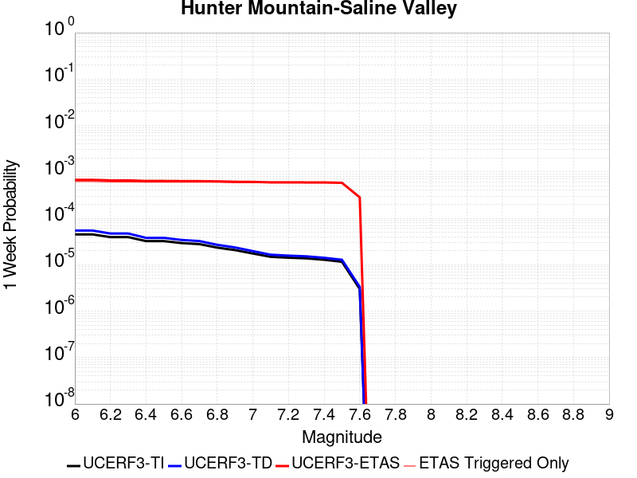 | 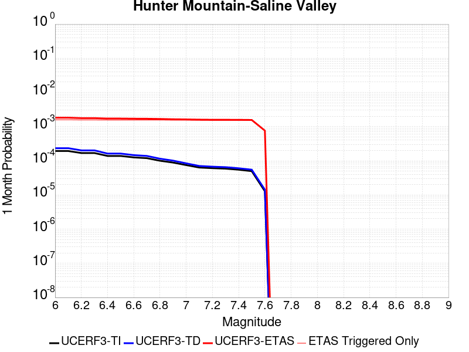 | 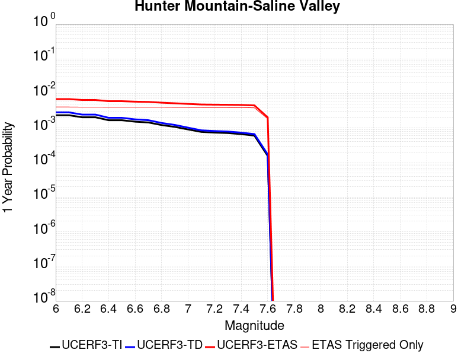 |  |

| Magnitude | 1 wk TI Prob | 1 wk TD Prob | 1 wk ETAS Prob | 1 wk ETAS/TD Gain | 1 wk ETAS Triggered Only | 1 mo TI Prob | 1 mo TD Prob | 1 mo ETAS Prob | 1 mo ETAS/TD Gain | 1 mo ETAS Triggered Only | 1 yr TI Prob | 1 yr TD Prob | 1 yr ETAS Prob | 1 yr ETAS/TD Gain | 1 yr ETAS Triggered Only | 10 yr TI Prob | 10 yr TD Prob | 10 yr ETAS Prob | 10 yr ETAS/TD Gain | 10 yr ETAS Triggered Only |
|-----|-----|-----|-----|-----|-----|-----|-----|-----|-----|-----|-----|-----|-----|-----|-----|-----|-----|-----|-----|-----|
| 6.0 | 4.5103672E-5 | 5.4571992E-5 | 6.7453814E-4 | 12.360519 | 6.2E-4 | 1.9328714E-4 | 2.3385909E-4 | 0.0018234872 | 7.797376 | 0.00159 | 0.002350731 | 0.0028436056 | 0.006902032 | 2.4272115 | 0.00407 | 0.023260195 | 0.028092787 | 0.03490586 | 1.2425202 | 0.00701 |
| 6.1 | 4.5103672E-5 | 5.4571992E-5 | 6.7453814E-4 | 12.360519 | 6.2E-4 | 1.9328714E-4 | 2.3385909E-4 | 0.0018234872 | 7.797376 | 0.00159 | 0.002350731 | 0.0028436056 | 0.006902032 | 2.4272115 | 0.00407 | 0.023260195 | 0.028092787 | 0.03490586 | 1.2425202 | 0.00701 |
| 6.2 | 3.9363465E-5 | 4.7064877E-5 | 6.5703614E-4 | 13.960223 | 6.1E-4 | 1.6868966E-4 | 2.0169078E-4 | 0.0017713741 | 8.782623 | 0.00157 | 0.002051862 | 0.0024528939 | 0.0064829844 | 2.6429942 | 0.00404 | 0.020330196 | 0.024274237 | 0.031084804 | 1.2805676 | 0.00698 |
| 6.3 | 3.9363465E-5 | 4.7064877E-5 | 6.5703614E-4 | 13.960223 | 6.1E-4 | 1.6868966E-4 | 2.0169078E-4 | 0.0017713741 | 8.782623 | 0.00157 | 0.002051862 | 0.0024528939 | 0.0064829844 | 2.6429942 | 0.00404 | 0.020330196 | 0.024274237 | 0.031084804 | 1.2805676 | 0.00698 |
| 6.4 | 3.2311684E-5 | 3.795214E-5 | 6.3792936E-4 | 16.808784 | 6.0E-4 | 1.384713E-4 | 1.626423E-4 | 0.0017223886 | 10.590041 | 0.00156 | 0.0016845843 | 0.0019784442 | 0.005990491 | 3.0278795 | 0.00402 | 0.016718714 | 0.019617062 | 0.026440527 | 1.3478332 | 0.00696 |
| 6.5 | 3.2311684E-5 | 3.795214E-5 | 6.3792936E-4 | 16.808784 | 6.0E-4 | 1.384713E-4 | 1.626423E-4 | 0.0017223886 | 10.590041 | 0.00156 | 0.0016845843 | 0.0019784442 | 0.005990491 | 3.0278795 | 0.00402 | 0.016718714 | 0.019617062 | 0.026440527 | 1.3478332 | 0.00696 |
| 6.6 | 2.9305844E-5 | 3.4182853E-5 | 6.3416234E-4 | 18.55206 | 6.0E-4 | 1.2559042E-4 | 1.4649007E-4 | 0.0017062615 | 11.647626 | 0.00156 | 0.0015279909 | 0.0017821203 | 0.0057949563 | 3.25172 | 0.00402 | 0.015175272 | 0.017686214 | 0.024503473 | 1.385456 | 0.00694 |
| 6.7 | 2.7826512E-5 | 3.2345237E-5 | 6.323258E-4 | 19.54927 | 6.0E-4 | 1.19251024E-4 | 1.3861542E-4 | 0.0016983992 | 12.252599 | 0.00156 | 0.0014509142 | 0.0016863967 | 0.0056996173 | 3.379761 | 0.00402 | 0.014414776 | 0.01674368 | 0.023547815 | 1.4063703 | 0.00692 |
| 6.8 | 2.3389874E-5 | 2.6867507E-5 | 6.268514E-4 | 23.331207 | 6.0E-4 | 1.0023846E-4 | 1.1514164E-4 | 0.001674962 | 14.54697 | 0.00156 | 0.00121972 | 0.0014009953 | 0.0054153632 | 3.8653688 | 0.00402 | 0.01213047 | 0.013927842 | 0.02073174 | 1.4885106 | 0.0069 |
| 6.9 | 2.069209E-5 | 2.3570727E-5 | 6.135568E-4 | 26.030458 | 5.9E-4 | 8.867737E-5 | 1.0101369E-4 | 0.0016408581 | 16.243917 | 0.00154 | 0.0010791123 | 0.001229184 | 0.005204292 | 4.2339406 | 0.00398 | 0.010738871 | 0.012228882 | 0.019004991 | 1.5541071 | 0.00686 |
| 7.0 | 1.7462342E-5 | 1.9634126E-5 | 6.0962257E-4 | 31.04913 | 5.9E-4 | 7.483646E-5 | 8.414367E-5 | 0.0016240141 | 19.30049 | 0.00154 | 9.1075303E-4 | 0.0010239903 | 0.0049899253 | 4.8730197 | 0.00397 | 0.009070295 | 0.010196352 | 0.016976507 | 1.6649588 | 0.00685 |
| 7.1 | 1.4807709E-5 | 1.6442245E-5 | 5.964327E-4 | 36.27441 | 5.8E-4 | 6.3460066E-5 | 7.046495E-5 | 0.0016003571 | 22.711391 | 0.00153 | 7.723524E-4 | 8.575896E-4 | 0.0048042024 | 5.6019826 | 0.00395 | 0.007696735 | 0.008545788 | 0.0153174205 | 1.7923942 | 0.00683 |
| 7.2 | 1.4180048E-5 | 1.5698814E-5 | 5.956897E-4 | 37.94489 | 5.8E-4 | 6.077022E-5 | 6.727898E-5 | 0.0015871767 | 23.590973 | 0.00152 | 7.396263E-4 | 8.1883004E-4 | 0.0047556036 | 5.8078036 | 0.00394 | 0.0073716943 | 0.00816108 | 0.014925422 | 1.8288537 | 0.00682 |
| 7.3 | 1.3730402E-5 | 1.5172541E-5 | 5.951637E-4 | 39.22637 | 5.8E-4 | 5.8843252E-5 | 6.502365E-5 | 0.0015849248 | 24.374592 | 0.00152 | 7.161811E-4 | 7.913914E-4 | 0.0047182813 | 5.962007 | 0.00393 | 0.007138774 | 0.007888664 | 0.014644942 | 1.8564541 | 0.00681 |
| 7.4 | 1.2810095E-5 | 1.410972E-5 | 5.9410156E-4 | 42.105835 | 5.8E-4 | 5.489925E-5 | 6.0468916E-5 | 0.001580377 | 26.135363 | 0.00152 | 6.681934E-4 | 7.359762E-4 | 0.0046630837 | 6.3359165 | 0.00393 | 0.006661878 | 0.0073382827 | 0.014098309 | 1.9212 | 0.00681 |
| 7.5 | 1.1595659E-5 | 1.2801013E-5 | 5.827937E-4 | 45.527157 | 5.7E-4 | 4.9694736E-5 | 5.4860422E-5 | 0.0015647776 | 28.522886 | 0.00151 | 6.0486543E-4 | 6.677366E-4 | 0.004515166 | 6.7618966 | 0.00385 | 0.006032217 | 0.0066601736 | 0.013236083 | 1.9873481 | 0.00662 |
| 7.6 | 2.997694E-6 | 3.3252948E-6 | 2.8332436E-4 | 85.20278 | 2.8E-4 | 1.28471975E-5 | 1.4251226E-5 | 7.642405E-4 | 53.6263 | 7.5E-4 | 1.564034E-4 | 1.7350215E-4 | 0.0020431776 | 11.776094 | 0.00187 | 0.0015629337 | 0.0017351025 | 0.0048996024 | 2.8238115 | 0.00317 |

## Garlock (West)
*[(top)](#table-of-contents)*

| 1 Week | 1 Month | 1 Year | 10 Year |
|-----|-----|-----|-----|
|  |  |  |  |

| Magnitude | 1 wk TI Prob | 1 wk TD Prob | 1 wk ETAS Prob | 1 wk ETAS/TD Gain | 1 wk ETAS Triggered Only | 1 mo TI Prob | 1 mo TD Prob | 1 mo ETAS Prob | 1 mo ETAS/TD Gain | 1 mo ETAS Triggered Only | 1 yr TI Prob | 1 yr TD Prob | 1 yr ETAS Prob | 1 yr ETAS/TD Gain | 1 yr ETAS Triggered Only | 10 yr TI Prob | 10 yr TD Prob | 10 yr ETAS Prob | 10 yr ETAS/TD Gain | 10 yr ETAS Triggered Only |
|-----|-----|-----|-----|-----|-----|-----|-----|-----|-----|-----|-----|-----|-----|-----|-----|-----|-----|-----|-----|-----|
| 6.0 | 2.5181727E-5 | 2.5202135E-5 | 5.151898E-4 | 20.442307 | 4.9E-4 | 1.0791722E-4 | 1.080047E-4 | 0.001197887 | 11.0910635 | 0.00109 | 0.0013131002 | 0.0013141674 | 0.00404058 | 3.074631 | 0.00273 | 0.013053683 | 0.013144457 | 0.01798005 | 1.3678807 | 0.0049 |
| 6.1 | 2.5077732E-5 | 2.5103205E-5 | 5.150909E-4 | 20.51893 | 4.9E-4 | 1.0747157E-4 | 1.07580745E-4 | 0.0011974635 | 11.130835 | 0.00109 | 0.001307681 | 0.0013090121 | 0.0040354384 | 3.0828123 | 0.00273 | 0.013000126 | 0.0130935125 | 0.017929355 | 1.3693311 | 0.0049 |
| 6.2 | 2.494612E-5 | 2.498488E-5 | 5.1497266E-4 | 20.611372 | 4.9E-4 | 1.0690756E-4 | 1.07073676E-4 | 0.001196957 | 11.178816 | 0.00109 | 0.0013008224 | 0.0013028459 | 0.004029289 | 3.0926828 | 0.00273 | 0.012932341 | 0.013032575 | 0.017868716 | 1.371081 | 0.0049 |
| 6.3 | 2.4733758E-5 | 2.4804243E-5 | 5.147921E-4 | 20.754194 | 4.9E-4 | 1.0599751E-4 | 1.0629959E-4 | 0.0011961837 | 11.252948 | 0.00109 | 0.0012897556 | 0.0012934325 | 0.0040199016 | 3.1079328 | 0.00273 | 0.012822957 | 0.012939542 | 0.017776137 | 1.3737842 | 0.0049 |
| 6.4 | 2.3237335E-5 | 2.318352E-5 | 5.131722E-4 | 22.135214 | 4.9E-4 | 9.958477E-5 | 9.935417E-5 | 0.0011892458 | 11.969763 | 0.00109 | 0.0012117702 | 0.0012089686 | 0.003935668 | 3.2553933 | 0.00273 | 0.012051838 | 0.012104375 | 0.016935185 | 1.3990961 | 0.00489 |
| 6.5 | 2.2732203E-5 | 2.2998063E-5 | 5.129868E-4 | 22.305653 | 4.9E-4 | 9.742009E-5 | 9.8559416E-5 | 0.001188452 | 12.0582285 | 0.00109 | 0.0011854442 | 0.0011993032 | 0.003926029 | 3.273592 | 0.00273 | 0.011791403 | 0.012008769 | 0.016840046 | 1.4023124 | 0.00489 |
| 6.6 | 2.1319436E-5 | 2.1778224E-5 | 5.117676E-4 | 23.49905 | 4.9E-4 | 9.136581E-5 | 9.333192E-5 | 0.0011832302 | 12.677659 | 0.00109 | 0.001111811 | 0.001135726 | 0.0038626255 | 3.4010186 | 0.00273 | 0.011062649 | 0.0113796545 | 0.01620412 | 1.4239556 | 0.00488 |
| 6.7 | 1.970802E-5 | 2.0398069E-5 | 5.1038805E-4 | 25.02139 | 4.9E-4 | 8.446021E-5 | 8.741738E-5 | 0.0011773221 | 13.467827 | 0.00109 | 0.001027818 | 0.0010637887 | 0.0037908845 | 3.5635693 | 0.00273 | 0.010230771 | 0.010667368 | 0.0154953115 | 1.4525899 | 0.00488 |
| 6.8 | 1.8744462E-5 | 1.9905692E-5 | 5.0989597E-4 | 25.615585 | 4.9E-4 | 8.033094E-5 | 8.530733E-5 | 0.0011752143 | 13.776242 | 0.00109 | 9.775903E-4 | 0.0010381235 | 0.0037652894 | 3.6270149 | 0.00273 | 0.009733009 | 0.010413141 | 0.015242325 | 1.4637586 | 0.00488 |
| 6.9 | 1.7559682E-5 | 1.895803E-5 | 5.0894875E-4 | 26.846077 | 4.9E-4 | 7.5253614E-5 | 8.124618E-5 | 0.0011711576 | 14.414926 | 0.00109 | 9.158276E-4 | 9.887248E-4 | 0.0037160255 | 3.7584023 | 0.00273 | 0.0091206245 | 0.009923607 | 0.014745279 | 1.485879 | 0.00487 |
| 7.0 | 1.6794445E-5 | 1.8220819E-5 | 5.082119E-4 | 27.891825 | 4.9E-4 | 7.197421E-5 | 7.8086894E-5 | 0.0011680018 | 14.957719 | 0.00109 | 8.759337E-4 | 9.5029466E-4 | 0.0036777004 | 3.8700633 | 0.00273 | 0.008724891 | 0.0095425 | 0.014366028 | 1.5054785 | 0.00487 |
| 7.1 | 1.6337795E-5 | 1.7721602E-5 | 4.977131E-4 | 28.085108 | 4.8E-4 | 7.0017246E-5 | 7.5947515E-5 | 0.0011558655 | 15.219266 | 0.00108 | 8.521265E-4 | 9.2427013E-4 | 0.0036317653 | 3.9293332 | 0.00271 | 0.008488664 | 0.009284343 | 0.014089313 | 1.5175349 | 0.00485 |
| 7.2 | 1.5780008E-5 | 1.7170225E-5 | 4.97162E-4 | 28.954891 | 4.8E-4 | 6.762685E-5 | 7.358461E-5 | 0.0011435059 | 15.540014 | 0.00107 | 8.2304585E-4 | 8.955257E-4 | 0.0035831167 | 4.001132 | 0.00269 | 0.008200042 | 0.008999176 | 0.0137758 | 1.5307846 | 0.00482 |
| 7.3 | 1.5058865E-5 | 1.6623266E-5 | 4.8661546E-4 | 29.273155 | 4.7E-4 | 6.45364E-5 | 7.124063E-5 | 0.0011311651 | 15.87809 | 0.00106 | 7.854473E-4 | 8.6701073E-4 | 0.0035346958 | 4.0768766 | 0.00267 | 0.00782677 | 0.00871586 | 0.013444285 | 1.5425082 | 0.00477 |
| 7.4 | 1.4887923E-5 | 1.6459222E-5 | 4.864515E-4 | 29.55495 | 4.7E-4 | 6.380382E-5 | 7.053762E-5 | 0.0011104642 | 15.742866 | 0.00104 | 7.7653467E-4 | 8.5845834E-4 | 0.0034462349 | 4.0144463 | 0.00259 | 0.0077382675 | 0.0086307125 | 0.013280235 | 1.5387182 | 0.00469 |
| 7.5 | 1.4509299E-5 | 1.6051208E-5 | 4.2604463E-4 | 26.54284 | 4.1E-4 | 6.218123E-5 | 6.8789086E-5 | 0.0010087244 | 14.66402 | 9.4E-4 | 7.567935E-4 | 8.3718647E-4 | 0.0031552443 | 3.7688668 | 0.00232 | 0.0075422134 | 0.008419003 | 0.012692717 | 1.5076271 | 0.00431 |
| 7.6 | 1.2756717E-5 | 1.4055129E-5 | 2.640516E-4 | 18.78685 | 2.5E-4 | 5.4670498E-5 | 6.023488E-5 | 6.6019874E-4 | 10.960405 | 6.0E-4 | 6.6541E-4 | 7.331136E-4 | 0.0022619918 | 3.085459 | 0.00153 | 0.006634211 | 0.007383898 | 0.0101930015 | 1.3804364 | 0.00283 |
| 7.7 | 1.0328985E-5 | 1.1464573E-5 | 2.1146228E-4 | 18.444847 | 2.0E-4 | 4.4266326E-5 | 4.913296E-5 | 4.591128E-4 | 9.344294 | 4.1E-4 | 5.388092E-4 | 5.9803E-4 | 0.001607426 | 2.6878686 | 0.00101 | 0.0053750467 | 0.0060405903 | 0.007839656 | 1.2978296 | 0.00181 |
| 7.8 | 7.0306583E-6 | 8.902813E-6 | 1.4890157E-4 | 16.725227 | 1.4E-4 | 3.0131043E-5 | 3.8154354E-5 | 3.0814405E-4 | 8.076249 | 2.7E-4 | 3.667837E-4 | 4.644304E-4 | 0.00115411 | 2.4850008 | 6.9E-4 | 0.003661789 | 0.0046969377 | 0.0059012547 | 1.2564046 | 0.00121 |
| 7.9 | 4.060633E-6 | 5.4672782E-6 | 7.5466894E-5 | 13.803376 | 7.0E-5 | 1.7402595E-5 | 2.3430983E-5 | 1.7342747E-4 | 7.4016304 | 1.5E-4 | 2.11856E-4 | 2.8523497E-4 | 6.9511804E-4 | 2.4370015 | 4.1E-4 | 0.0021165414 | 0.0028851798 | 0.0036230448 | 1.2557431 | 7.4E-4 |
| 8.0 | 1.6729537E-6 | 2.078155E-6 | 3.2078093E-5 | 15.435852 | 3.0E-5 | 7.169782E-6 | 8.906349E-6 | 7.890572E-5 | 8.859492 | 7.0E-5 | 8.7288594E-5 | 1.08429434E-4 | 2.1841751E-4 | 2.0143747 | 1.1E-4 | 8.7254314E-4 | 0.001097267 | 0.0013070366 | 1.1911746 | 2.1E-4 |
| 8.1 | 3.6733252E-7 | 3.1499187E-7 | 3.1499187E-7 | 1.0 | 0.0 | 1.5742813E-6 | 1.3499646E-6 | 1.3499646E-6 | 1.0 | 0.0 | 1.9166706E-5 | 1.643571E-5 | 2.6435546E-5 | 1.6084212 | 1.0E-5 | 1.9165053E-4 | 1.6643589E-4 | 1.8643256E-4 | 1.1201464 | 2.0E-5 |

## Gravel Hills-Harper Lk
*[(top)](#table-of-contents)*

| 1 Week | 1 Month | 1 Year | 10 Year |
|-----|-----|-----|-----|
| 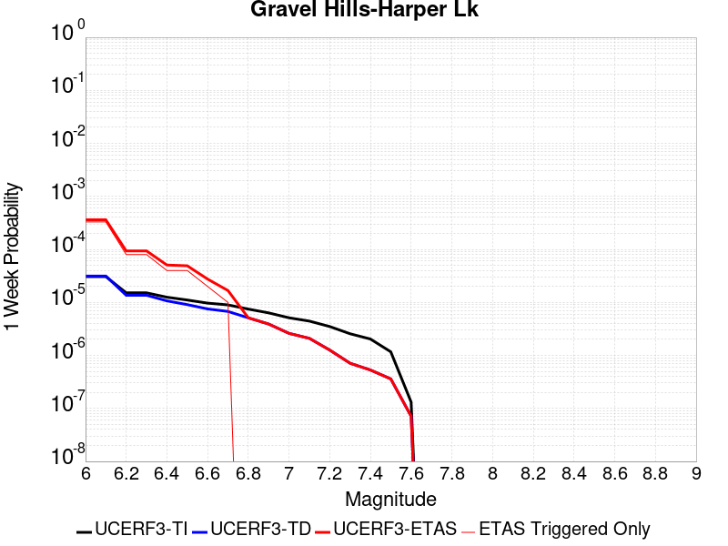 |  |  |  |

| Magnitude | 1 wk TI Prob | 1 wk TD Prob | 1 wk ETAS Prob | 1 wk ETAS/TD Gain | 1 wk ETAS Triggered Only | 1 mo TI Prob | 1 mo TD Prob | 1 mo ETAS Prob | 1 mo ETAS/TD Gain | 1 mo ETAS Triggered Only | 1 yr TI Prob | 1 yr TD Prob | 1 yr ETAS Prob | 1 yr ETAS/TD Gain | 1 yr ETAS Triggered Only | 10 yr TI Prob | 10 yr TD Prob | 10 yr ETAS Prob | 10 yr ETAS/TD Gain | 10 yr ETAS Triggered Only |
|-----|-----|-----|-----|-----|-----|-----|-----|-----|-----|-----|-----|-----|-----|-----|-----|-----|-----|-----|-----|-----|
| 6.0 | 3.0679566E-5 | 3.1465184E-5 | 3.614548E-4 | 11.4874525 | 3.3E-4 | 1.3147724E-4 | 1.3484505E-4 | 9.947291E-4 | 7.3768306 | 8.6E-4 | 0.0015995599 | 0.0016407187 | 0.0038271255 | 2.332591 | 0.00219 | 0.015880952 | 0.016307615 | 0.020380102 | 1.2497292 | 0.00414 |
| 6.1 | 3.0679566E-5 | 3.1465184E-5 | 3.614548E-4 | 11.4874525 | 3.3E-4 | 1.3147724E-4 | 1.3484505E-4 | 9.947291E-4 | 7.3768306 | 8.6E-4 | 0.0015995599 | 0.0016407187 | 0.0038271255 | 2.332591 | 0.00219 | 0.015880952 | 0.016307615 | 0.020380102 | 1.2497292 | 0.00414 |
| 6.2 | 1.514536E-5 | 1.3635392E-5 | 9.36343E-5 | 6.867005 | 8.0E-5 | 6.490707E-5 | 5.843615E-5 | 3.1842096E-4 | 5.4490404 | 2.6E-4 | 7.8995706E-4 | 7.112398E-4 | 0.0013407917 | 1.8851472 | 6.3E-4 | 0.007871548 | 0.0070908363 | 0.008381618 | 1.1820352 | 0.0013 |
| 6.3 | 1.514536E-5 | 1.3635392E-5 | 9.36343E-5 | 6.867005 | 8.0E-5 | 6.490707E-5 | 5.843615E-5 | 3.1842096E-4 | 5.4490404 | 2.6E-4 | 7.8995706E-4 | 7.112398E-4 | 0.0013407917 | 1.8851472 | 6.3E-4 | 0.007871548 | 0.0070908363 | 0.008381618 | 1.1820352 | 0.0013 |
| 6.4 | 1.2532521E-5 | 1.0689826E-5 | 5.06894E-5 | 4.7418356 | 4.0E-5 | 5.37097E-5 | 4.581277E-5 | 2.0580544E-4 | 4.4923162 | 1.6E-4 | 6.537194E-4 | 5.576335E-4 | 9.274272E-4 | 1.6631482 | 3.7E-4 | 0.0065179965 | 0.0055629327 | 0.006447982 | 1.1590976 | 8.9E-4 |
| 6.5 | 1.1094058E-5 | 9.083774E-6 | 4.908341E-5 | 5.403416 | 4.0E-5 | 4.7545094E-5 | 3.89299E-5 | 1.3892601E-4 | 3.5686197 | 1.0E-4 | 5.787078E-4 | 4.738725E-4 | 6.737777E-4 | 1.4218545 | 2.0E-4 | 0.0057720304 | 0.004729028 | 0.0052863793 | 1.1178576 | 5.6E-4 |
| 6.6 | 9.688328E-6 | 7.531784E-6 | 2.7531632E-5 | 3.6553934 | 2.0E-5 | 4.1520743E-5 | 3.2278687E-5 | 8.2277074E-5 | 2.5489597 | 5.0E-5 | 5.053978E-4 | 3.929247E-4 | 5.1287754E-4 | 1.305282 | 1.2E-4 | 0.0050424994 | 0.0039225565 | 0.004261223 | 1.0863382 | 3.4E-4 |
| 6.7 | 8.974824E-6 | 6.7494916E-6 | 1.6749424E-5 | 2.481583 | 1.0E-5 | 3.8462964E-5 | 2.8926084E-5 | 6.892493E-5 | 2.3827949 | 4.0E-5 | 4.6818596E-4 | 3.5212038E-4 | 4.5208517E-4 | 1.2838938 | 1.0E-4 | 0.004672008 | 0.0035158454 | 0.0037450367 | 1.0651882 | 2.3E-4 |
| 6.8 | 7.4780046E-6 | 5.116252E-6 | 5.116252E-6 | 1.0 | 0.0 | 3.20482E-5 | 2.1926619E-5 | 4.192618E-5 | 1.9121133 | 2.0E-5 | 3.9011694E-4 | 2.6692526E-4 | 3.069146E-4 | 1.1498147 | 4.0E-5 | 0.0038943281 | 0.002666185 | 0.0027559448 | 1.0336661 | 9.0E-5 |
| 6.9 | 6.3409307E-6 | 3.9075426E-6 | 3.9075426E-6 | 1.0 | 0.0 | 2.7175134E-5 | 1.674651E-5 | 3.6746176E-5 | 2.1942587 | 2.0E-5 | 3.3080703E-4 | 2.0387067E-4 | 2.3386456E-4 | 1.1471221 | 3.0E-5 | 0.0033031502 | 0.0020369345 | 0.0020968122 | 1.029396 | 6.0E-5 |
| 7.0 | 5.1239335E-6 | 2.6058885E-6 | 2.6058885E-6 | 1.0 | 0.0 | 2.195953E-5 | 1.11680465E-5 | 2.1167934E-5 | 1.8954017 | 1.0E-5 | 2.6732447E-4 | 1.3596273E-4 | 1.5596002E-4 | 1.1470791 | 2.0E-5 | 0.0026700313 | 0.0013588208 | 0.0013887801 | 1.022048 | 3.0E-5 |
| 7.1 | 4.438899E-6 | 2.0984994E-6 | 2.0984994E-6 | 1.0 | 0.0 | 1.9023713E-5 | 8.993539E-6 | 1.8993449E-5 | 2.1118994 | 1.0E-5 | 2.315891E-4 | 1.0949106E-4 | 1.2948886E-4 | 1.1826433 | 2.0E-5 | 0.002313479 | 0.0010943931 | 0.0011243602 | 1.0273825 | 3.0E-5 |
| 7.2 | 3.50367E-6 | 1.2615911E-6 | 1.2615911E-6 | 1.0 | 0.0 | 1.5015643E-5 | 5.406808E-6 | 1.5406755E-5 | 2.84951 | 1.0E-5 | 1.8280011E-4 | 6.582599E-5 | 8.582467E-5 | 1.3038114 | 2.0E-5 | 0.0018264982 | 6.580731E-4 | 6.880534E-4 | 1.0455576 | 3.0E-5 |
| 7.3 | 2.561638E-6 | 7.119307E-7 | 7.119307E-7 | 1.0 | 0.0 | 1.0978401E-5 | 3.051128E-6 | 3.051128E-6 | 1.0 | 0.0 | 1.3365384E-4 | 3.714687E-5 | 3.714687E-5 | 1.0 | 0.0 | 0.0013357349 | 3.7140862E-4 | 3.814049E-4 | 1.0269145 | 1.0E-5 |
| 7.4 | 2.0368864E-6 | 5.304955E-7 | 5.304955E-7 | 1.0 | 0.0 | 8.729483E-6 | 2.2735503E-6 | 2.2735503E-6 | 1.0 | 0.0 | 1.06276275E-4 | 2.768013E-5 | 2.768013E-5 | 1.0 | 0.0 | 0.0010622547 | 2.7676736E-4 | 2.8676458E-4 | 1.0361215 | 1.0E-5 |
| 7.5 | 1.1681728E-6 | 3.6031287E-7 | 3.6031287E-7 | 1.0 | 0.0 | 5.0064455E-6 | 1.5441972E-6 | 1.5441972E-6 | 1.0 | 0.0 | 6.0951766E-5 | 1.8800443E-5 | 1.8800443E-5 | 1.0 | 0.0 | 6.093505E-4 | 1.8798899E-4 | 1.8798899E-4 | 1.0 | 0.0 |
| 7.6 | 1.3154387E-7 | 7.1198265E-8 | 7.1198265E-8 | 1.0 | 0.0 | 5.6375933E-7 | 3.051354E-7 | 3.051354E-7 | 1.0 | 0.0 | 6.863748E-6 | 3.7150185E-6 | 3.7150185E-6 | 1.0 | 0.0 | 6.863536E-5 | 3.7149723E-5 | 3.7149723E-5 | 1.0 | 0.0 |

## McLean Lake
*[(top)](#table-of-contents)*

| 1 Week | 1 Month | 1 Year | 10 Year |
|-----|-----|-----|-----|
|  | 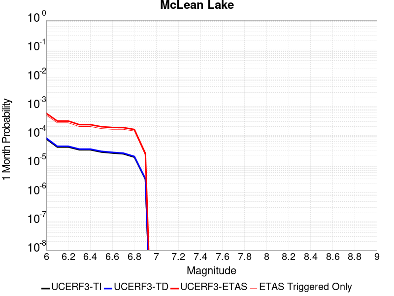 |  |  |

| Magnitude | 1 wk TI Prob | 1 wk TD Prob | 1 wk ETAS Prob | 1 wk ETAS/TD Gain | 1 wk ETAS Triggered Only | 1 mo TI Prob | 1 mo TD Prob | 1 mo ETAS Prob | 1 mo ETAS/TD Gain | 1 mo ETAS Triggered Only | 1 yr TI Prob | 1 yr TD Prob | 1 yr ETAS Prob | 1 yr ETAS/TD Gain | 1 yr ETAS Triggered Only | 10 yr TI Prob | 10 yr TD Prob | 10 yr ETAS Prob | 10 yr ETAS/TD Gain | 10 yr ETAS Triggered Only |
|-----|-----|-----|-----|-----|-----|-----|-----|-----|-----|-----|-----|-----|-----|-----|-----|-----|-----|-----|-----|-----|
| 6.0 | 1.7360222E-5 | 1.8501789E-5 | 1.8849864E-4 | 10.18813 | 1.7E-4 | 7.439883E-5 | 7.929125E-5 | 5.792516E-4 | 7.3053665 | 5.0E-4 | 9.0542925E-4 | 9.64992E-4 | 0.002673342 | 2.7703254 | 0.00171 | 0.009017491 | 0.009612858 | 0.01332681 | 1.3863525 | 0.00375 |
| 6.1 | 9.062689E-6 | 9.592268E-6 | 7.95916E-5 | 8.297474 | 7.0E-5 | 3.8839516E-5 | 4.110912E-5 | 3.1109803E-4 | 7.5676155 | 2.7E-4 | 4.727685E-4 | 5.003975E-4 | 0.0014199371 | 2.8376184 | 9.2E-4 | 0.0047176396 | 0.0049935905 | 0.0069836034 | 1.3985134 | 0.002 |
| 6.2 | 9.062689E-6 | 9.592268E-6 | 7.95916E-5 | 8.297474 | 7.0E-5 | 3.8839516E-5 | 4.110912E-5 | 3.1109803E-4 | 7.5676155 | 2.7E-4 | 4.727685E-4 | 5.003975E-4 | 0.0014199371 | 2.8376184 | 9.2E-4 | 0.0047176396 | 0.0049935905 | 0.0069836034 | 1.3985134 | 0.002 |
| 6.3 | 7.2575485E-6 | 7.667767E-6 | 5.7667385E-5 | 7.5207534 | 5.0E-5 | 3.110341E-5 | 3.2861484E-5 | 2.3285492E-4 | 7.0859523 | 2.0E-4 | 3.786182E-4 | 4.0002225E-4 | 0.0011197343 | 2.7991798 | 7.2E-4 | 0.0037797375 | 0.003993727 | 0.0055773766 | 1.3965344 | 0.00159 |
| 6.4 | 7.2575485E-6 | 7.667767E-6 | 5.7667385E-5 | 7.5207534 | 5.0E-5 | 3.110341E-5 | 3.2861484E-5 | 2.3285492E-4 | 7.0859523 | 2.0E-4 | 3.786182E-4 | 4.0002225E-4 | 0.0011197343 | 2.7991798 | 7.2E-4 | 0.0037797375 | 0.003993727 | 0.0055773766 | 1.3965344 | 0.00159 |
| 6.5 | 6.06582E-6 | 6.4039245E-6 | 5.6403605E-5 | 8.807662 | 5.0E-5 | 2.5996113E-5 | 2.7445138E-5 | 1.9744047E-4 | 7.1940055 | 1.7E-4 | 3.164567E-4 | 3.340998E-4 | 9.73886E-4 | 2.9149551 | 6.4E-4 | 0.0031600643 | 0.0033366138 | 0.0046920762 | 1.4062389 | 0.00136 |
| 6.6 | 5.598744E-6 | 5.910306E-6 | 4.591007E-5 | 7.7677994 | 4.0E-5 | 2.3994397E-5 | 2.5329673E-5 | 1.8532563E-4 | 7.316542 | 1.6E-4 | 2.9209262E-4 | 3.083515E-4 | 9.181634E-4 | 2.9776518 | 6.1E-4 | 0.0029170897 | 0.0030798658 | 0.004335985 | 1.4078487 | 0.00126 |
| 6.7 | 5.246996E-6 | 5.539203E-6 | 4.553898E-5 | 8.221215 | 4.0E-5 | 2.2486933E-5 | 2.3739261E-5 | 1.8373546E-4 | 7.7397294 | 1.6E-4 | 2.73744E-4 | 2.8899353E-4 | 8.688259E-4 | 3.0063853 | 5.8E-4 | 0.0027340704 | 0.002886801 | 0.0040733656 | 1.411031 | 0.00119 |
| 6.8 | 4.02324E-6 | 4.246936E-6 | 4.4246764E-5 | 10.418515 | 4.0E-5 | 1.7242342E-5 | 1.820106E-5 | 1.5819851E-4 | 8.69172 | 1.4E-4 | 2.099053E-4 | 2.2158133E-4 | 6.214927E-4 | 2.8048062 | 4.0E-4 | 0.0020970714 | 0.0022141882 | 0.0030523285 | 1.3785316 | 8.4E-4 |
| 6.9 | 6.835972E-7 | 7.1399705E-7 | 2.0713982E-5 | 29.011301 | 2.0E-5 | 2.9296991E-6 | 3.0599856E-6 | 2.3059923E-5 | 7.535959 | 2.0E-5 | 3.56685E-5 | 3.7255006E-5 | 9.725277E-5 | 2.610462 | 6.0E-5 | 3.5662777E-4 | 3.7251884E-4 | 5.124667E-4 | 1.3756799 | 1.4E-4 |

## Goldstone Lake
*[(top)](#table-of-contents)*

| 1 Week | 1 Month | 1 Year | 10 Year |
|-----|-----|-----|-----|
|  | 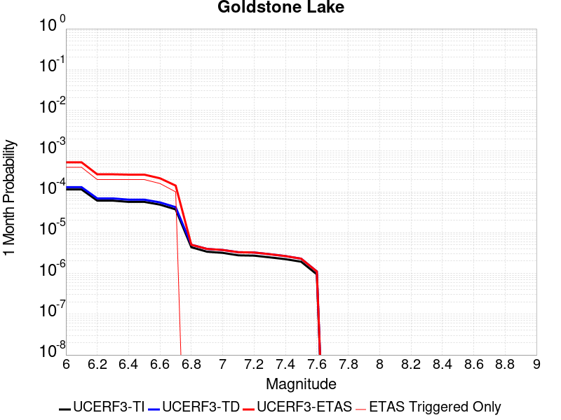 |  |  |

| Magnitude | 1 wk TI Prob | 1 wk TD Prob | 1 wk ETAS Prob | 1 wk ETAS/TD Gain | 1 wk ETAS Triggered Only | 1 mo TI Prob | 1 mo TD Prob | 1 mo ETAS Prob | 1 mo ETAS/TD Gain | 1 mo ETAS Triggered Only | 1 yr TI Prob | 1 yr TD Prob | 1 yr ETAS Prob | 1 yr ETAS/TD Gain | 1 yr ETAS Triggered Only | 10 yr TI Prob | 10 yr TD Prob | 10 yr ETAS Prob | 10 yr ETAS/TD Gain | 10 yr ETAS Triggered Only |
|-----|-----|-----|-----|-----|-----|-----|-----|-----|-----|-----|-----|-----|-----|-----|-----|-----|-----|-----|-----|-----|
| 6.0 | 2.671352E-5 | 3.0376628E-5 | 1.3037359E-4 | 4.2919044 | 1.0E-4 | 1.1448149E-4 | 1.3018015E-4 | 5.301281E-4 | 4.0722647 | 4.0E-4 | 0.001392921 | 0.0015839875 | 0.0029618016 | 1.869839 | 0.00138 | 0.013842222 | 0.015746472 | 0.018748447 | 1.1906441 | 0.00305 |
| 6.1 | 2.671352E-5 | 3.0376628E-5 | 1.3037359E-4 | 4.2919044 | 1.0E-4 | 1.1448149E-4 | 1.3018015E-4 | 5.301281E-4 | 4.0722647 | 4.0E-4 | 0.001392921 | 0.0015839875 | 0.0029618016 | 1.869839 | 0.00138 | 0.013842222 | 0.015746472 | 0.018748447 | 1.1906441 | 0.00305 |
| 6.2 | 1.4197047E-5 | 1.6096516E-5 | 7.609555E-5 | 4.7274547 | 6.0E-5 | 6.0843064E-5 | 6.89838E-5 | 2.6897E-4 | 3.8990314 | 2.0E-4 | 7.4051257E-4 | 8.396528E-4 | 0.0014691238 | 1.7496802 | 6.3E-4 | 0.007380498 | 0.008374499 | 0.009861938 | 1.1776152 | 0.0015 |
| 6.3 | 1.4197047E-5 | 1.6096516E-5 | 7.609555E-5 | 4.7274547 | 6.0E-5 | 6.0843064E-5 | 6.89838E-5 | 2.6897E-4 | 3.8990314 | 2.0E-4 | 7.4051257E-4 | 8.396528E-4 | 0.0014691238 | 1.7496802 | 6.3E-4 | 0.007380498 | 0.008374499 | 0.009861938 | 1.1776152 | 0.0015 |
| 6.4 | 1.3238931E-5 | 1.5008711E-5 | 7.500781E-5 | 4.997618 | 6.0E-5 | 5.6737044E-5 | 6.432201E-5 | 2.6430914E-4 | 4.109155 | 2.0E-4 | 6.9055456E-4 | 7.8293716E-4 | 0.0014124439 | 1.8040323 | 6.3E-4 | 0.006884126 | 0.007811414 | 0.009240165 | 1.1829057 | 0.00144 |
| 6.5 | 1.3238931E-5 | 1.5008711E-5 | 7.500781E-5 | 4.997618 | 6.0E-5 | 5.6737044E-5 | 6.432201E-5 | 2.6430914E-4 | 4.109155 | 2.0E-4 | 6.9055456E-4 | 7.8293716E-4 | 0.0014124439 | 1.8040323 | 6.3E-4 | 0.006884126 | 0.007811414 | 0.009240165 | 1.1829057 | 0.00144 |
| 6.6 | 1.1328278E-5 | 1.2855381E-5 | 5.2854866E-5 | 4.1114974 | 4.0E-5 | 4.8548856E-5 | 5.5093864E-5 | 2.1508505E-4 | 3.9039745 | 1.6E-4 | 5.90922E-4 | 6.706571E-4 | 0.0011703217 | 1.7450376 | 5.0E-4 | 0.0058935313 | 0.0066957204 | 0.00783802 | 1.1706015 | 0.00115 |
| 6.7 | 8.651175E-6 | 9.8247265E-6 | 4.9824335E-5 | 5.07132 | 4.0E-5 | 3.707594E-5 | 4.2105803E-5 | 1.4210159E-4 | 3.3748696 | 1.0E-4 | 4.5130608E-4 | 5.126081E-4 | 8.524338E-4 | 1.6629348 | 3.4E-4 | 0.0045039062 | 0.0051231356 | 0.005879242 | 1.1475867 | 7.6E-4 |
| 6.8 | 1.0215377E-6 | 1.1754793E-6 | 1.1754793E-6 | 1.0 | 0.0 | 4.378012E-6 | 5.037759E-6 | 5.037759E-6 | 1.0 | 0.0 | 5.3300988E-5 | 6.133311E-5 | 9.133126E-5 | 1.4891022 | 3.0E-5 | 5.3288206E-4 | 6.13173E-4 | 6.531485E-4 | 1.0651945 | 4.0E-5 |
| 6.9 | 7.9360774E-7 | 9.2834586E-7 | 9.2834586E-7 | 1.0 | 0.0 | 3.4011714E-6 | 3.9786196E-6 | 3.9786196E-6 | 1.0 | 0.0 | 4.1408475E-5 | 4.8438687E-5 | 4.8438687E-5 | 1.0 | 0.0 | 4.140076E-4 | 4.842883E-4 | 4.842883E-4 | 1.0 | 0.0 |
| 7.0 | 7.4382757E-7 | 8.7473853E-7 | 8.7473853E-7 | 1.0 | 0.0 | 3.1878285E-6 | 3.7488744E-6 | 3.7488744E-6 | 1.0 | 0.0 | 3.8811122E-5 | 4.5641656E-5 | 4.5641656E-5 | 1.0 | 0.0 | 3.8804344E-4 | 4.563295E-4 | 4.563295E-4 | 1.0 | 0.0 |
| 7.1 | 6.4709513E-7 | 7.711347E-7 | 7.711347E-7 | 1.0 | 0.0 | 2.773262E-6 | 3.304859E-6 | 3.304859E-6 | 1.0 | 0.0 | 3.376394E-5 | 4.0235976E-5 | 4.0235976E-5 | 1.0 | 0.0 | 3.375881E-4 | 4.0229288E-4 | 4.0229288E-4 | 1.0 | 0.0 |
| 7.2 | 6.356704E-7 | 7.5884054E-7 | 7.5884054E-7 | 1.0 | 0.0 | 2.7242988E-6 | 3.25217E-6 | 3.25217E-6 | 1.0 | 0.0 | 3.3167835E-5 | 3.959451E-5 | 3.959451E-5 | 1.0 | 0.0 | 3.3162883E-4 | 3.958805E-4 | 3.958805E-4 | 1.0 | 0.0 |
| 7.3 | 5.7695723E-7 | 6.8966074E-7 | 6.8966074E-7 | 1.0 | 0.0 | 2.4726714E-6 | 2.9556859E-6 | 2.9556859E-6 | 1.0 | 0.0 | 3.0104358E-5 | 3.598494E-5 | 3.598494E-5 | 1.0 | 0.0 | 3.0100282E-4 | 3.5979686E-4 | 3.5979686E-4 | 1.0 | 0.0 |
| 7.4 | 5.209647E-7 | 6.193549E-7 | 6.193549E-7 | 1.0 | 0.0 | 2.232704E-6 | 2.654376E-6 | 2.654376E-6 | 1.0 | 0.0 | 2.718283E-5 | 3.2316606E-5 | 3.2316606E-5 | 1.0 | 0.0 | 2.7179506E-4 | 3.231246E-4 | 3.231246E-4 | 1.0 | 0.0 |
| 7.5 | 4.512955E-7 | 5.3489146E-7 | 5.3489146E-7 | 1.0 | 0.0 | 1.934122E-6 | 2.2923903E-6 | 2.2923903E-6 | 1.0 | 0.0 | 2.3547682E-5 | 2.7909547E-5 | 2.7909547E-5 | 1.0 | 0.0 | 2.3545188E-4 | 2.7906572E-4 | 2.7906572E-4 | 1.0 | 0.0 |
| 7.6 | 2.21172E-7 | 2.6039737E-7 | 2.6039737E-7 | 1.0 | 0.0 | 9.478797E-7 | 1.1159884E-6 | 1.1159884E-6 | 1.0 | 0.0 | 1.1540374E-5 | 1.3587103E-5 | 1.3587103E-5 | 1.0 | 0.0 | 1.1539775E-4 | 1.3586554E-4 | 1.3586554E-4 | 1.0 | 0.0 |

## So Sierra Nevada
*[(top)](#table-of-contents)*

| 1 Week | 1 Month | 1 Year | 10 Year |
|-----|-----|-----|-----|
|  |  |  |  |

| Magnitude | 1 wk TI Prob | 1 wk TD Prob | 1 wk ETAS Prob | 1 wk ETAS/TD Gain | 1 wk ETAS Triggered Only | 1 mo TI Prob | 1 mo TD Prob | 1 mo ETAS Prob | 1 mo ETAS/TD Gain | 1 mo ETAS Triggered Only | 1 yr TI Prob | 1 yr TD Prob | 1 yr ETAS Prob | 1 yr ETAS/TD Gain | 1 yr ETAS Triggered Only | 10 yr TI Prob | 10 yr TD Prob | 10 yr ETAS Prob | 10 yr ETAS/TD Gain | 10 yr ETAS Triggered Only |
|-----|-----|-----|-----|-----|-----|-----|-----|-----|-----|-----|-----|-----|-----|-----|-----|-----|-----|-----|-----|-----|
| 6.0 | 1.15488665E-5 | 1.1079722E-5 | 1.9107772E-4 | 17.245716 | 1.8E-4 | 4.9494203E-5 | 4.748373E-5 | 5.4746E-4 | 11.529423 | 5.0E-4 | 6.024253E-4 | 5.779738E-4 | 0.00203713 | 3.524606 | 0.00146 | 0.006007948 | 0.005765975 | 0.008390753 | 1.4552184 | 0.00264 |
| 6.1 | 1.15488665E-5 | 1.1079722E-5 | 1.9107772E-4 | 17.245716 | 1.8E-4 | 4.9494203E-5 | 4.748373E-5 | 5.4746E-4 | 11.529423 | 5.0E-4 | 6.024253E-4 | 5.779738E-4 | 0.00203713 | 3.524606 | 0.00146 | 0.006007948 | 0.005765975 | 0.008390753 | 1.4552184 | 0.00264 |
| 6.2 | 1.15488665E-5 | 1.1079722E-5 | 1.9107772E-4 | 17.245716 | 1.8E-4 | 4.9494203E-5 | 4.748373E-5 | 5.4746E-4 | 11.529423 | 5.0E-4 | 6.024253E-4 | 5.779738E-4 | 0.00203713 | 3.524606 | 0.00146 | 0.006007948 | 0.005765975 | 0.008390753 | 1.4552184 | 0.00264 |
| 6.3 | 1.15488665E-5 | 1.1079722E-5 | 1.9107772E-4 | 17.245716 | 1.8E-4 | 4.9494203E-5 | 4.748373E-5 | 5.4746E-4 | 11.529423 | 5.0E-4 | 6.024253E-4 | 5.779738E-4 | 0.00203713 | 3.524606 | 0.00146 | 0.006007948 | 0.005765975 | 0.008390753 | 1.4552184 | 0.00264 |
| 6.4 | 1.15488665E-5 | 1.1079722E-5 | 1.9107772E-4 | 17.245716 | 1.8E-4 | 4.9494203E-5 | 4.748373E-5 | 5.4746E-4 | 11.529423 | 5.0E-4 | 6.024253E-4 | 5.779738E-4 | 0.00203713 | 3.524606 | 0.00146 | 0.006007948 | 0.005765975 | 0.008390753 | 1.4552184 | 0.00264 |
| 6.5 | 1.15488665E-5 | 1.1079722E-5 | 1.9107772E-4 | 17.245716 | 1.8E-4 | 4.9494203E-5 | 4.748373E-5 | 5.4746E-4 | 11.529423 | 5.0E-4 | 6.024253E-4 | 5.779738E-4 | 0.00203713 | 3.524606 | 0.00146 | 0.006007948 | 0.005765975 | 0.008390753 | 1.4552184 | 0.00264 |
| 6.6 | 7.587044E-6 | 6.935689E-6 | 9.6935066E-5 | 13.976271 | 9.0E-5 | 3.2515498E-5 | 2.9724059E-5 | 3.4971454E-4 | 11.76537 | 3.2E-4 | 3.9580427E-4 | 3.6183326E-4 | 0.0012415148 | 3.4311795 | 8.8E-4 | 0.003951 | 0.0036127327 | 0.005137205 | 1.4219722 | 0.00153 |
| 6.7 | 7.587044E-6 | 6.935689E-6 | 9.6935066E-5 | 13.976271 | 9.0E-5 | 3.2515498E-5 | 2.9724059E-5 | 3.4971454E-4 | 11.76537 | 3.2E-4 | 3.9580427E-4 | 3.6183326E-4 | 0.0012415148 | 3.4311795 | 8.8E-4 | 0.003951 | 0.0036127327 | 0.005137205 | 1.4219722 | 0.00153 |
| 6.8 | 5.9026956E-6 | 5.1794364E-6 | 6.517913E-5 | 12.584211 | 6.0E-5 | 2.5297022E-5 | 2.2197402E-5 | 2.4219252E-4 | 10.91085 | 2.2E-4 | 3.0794772E-4 | 2.7022103E-4 | 8.900535E-4 | 3.293798 | 6.2E-4 | 0.0030752132 | 0.0026990408 | 0.0037462069 | 1.3879771 | 0.00105 |
| 6.9 | 5.0118915E-6 | 4.2524644E-6 | 6.4252206E-5 | 15.109406 | 6.0E-5 | 2.1479358E-5 | 1.8224722E-5 | 2.0822126E-4 | 11.425208 | 1.9E-4 | 2.614798E-4 | 2.2186415E-4 | 7.31751E-4 | 3.2981942 | 5.1E-4 | 0.0026117235 | 0.002216499 | 0.003064615 | 1.3826376 | 8.5E-4 |
| 7.0 | 4.4924795E-6 | 3.713954E-6 | 4.3713804E-5 | 11.770153 | 4.0E-5 | 1.925334E-5 | 1.5916852E-5 | 1.8591415E-4 | 11.680334 | 1.7E-4 | 2.3438422E-4 | 1.9377106E-4 | 6.2368775E-4 | 3.2186835 | 4.3E-4 | 0.0023413717 | 0.001936084 | 0.0026347288 | 1.3608545 | 7.0E-4 |
| 7.1 | 3.9118436E-6 | 3.1120105E-6 | 4.3111886E-5 | 13.853387 | 4.0E-5 | 1.6764936E-5 | 1.3337123E-5 | 1.1333579E-4 | 8.497768 | 1.0E-4 | 2.0409399E-4 | 1.6236794E-4 | 4.5232085E-4 | 2.7857769 | 2.9E-4 | 0.0020390663 | 0.0016225493 | 0.0021317217 | 1.3138102 | 5.1E-4 |
| 7.2 | 3.4200818E-6 | 2.6054847E-6 | 3.2605407E-5 | 12.514142 | 3.0E-5 | 1.4657411E-5 | 1.11663185E-5 | 1.01165315E-4 | 9.059863 | 9.0E-5 | 1.7843937E-4 | 1.3594194E-4 | 3.959066E-4 | 2.912321 | 2.6E-4 | 0.0017829615 | 0.0013586376 | 0.0017880534 | 1.3160635 | 4.3E-4 |
| 7.3 | 2.6593618E-6 | 1.8284468E-6 | 3.1828393E-5 | 17.407337 | 3.0E-5 | 1.13972155E-5 | 7.836179E-6 | 7.783563E-5 | 9.932856 | 7.0E-5 | 1.3875226E-4 | 9.540159E-5 | 2.8538346E-4 | 2.991391 | 1.9E-4 | 0.0013866565 | 9.536353E-4 | 0.0012433587 | 1.3038095 | 2.9E-4 |
| 7.4 | 2.2577992E-6 | 1.4364622E-6 | 2.1436434E-5 | 14.923075 | 2.0E-5 | 9.676246E-6 | 6.1562537E-6 | 6.615588E-5 | 10.746127 | 6.0E-5 | 1.1780193E-4 | 7.495006E-5 | 2.449373E-4 | 3.2680068 | 1.7E-4 | 0.001177395 | 7.4927293E-4 | 0.0010090781 | 1.3467431 | 2.6E-4 |
| 7.5 | 1.489319E-6 | 7.3541264E-7 | 1.0735405E-5 | 14.597798 | 1.0E-5 | 6.3827797E-6 | 3.1517645E-6 | 2.3151702E-5 | 7.3456316 | 2.0E-5 | 7.770758E-5 | 3.837206E-5 | 1.18369E-4 | 3.0847702 | 8.0E-5 | 7.7680405E-4 | 3.836548E-4 | 5.1360496E-4 | 1.3387163 | 1.3E-4 |
| 7.6 | 1.0680322E-6 | 4.659796E-7 | 1.0465975E-5 | 22.460157 | 1.0E-5 | 4.577273E-6 | 1.997054E-6 | 1.1997034E-5 | 6.007366 | 1.0E-5 | 5.5726876E-5 | 2.4313864E-5 | 6.431289E-5 | 2.645112 | 4.0E-5 | 5.5712904E-4 | 2.431123E-4 | 3.030977E-4 | 1.2467395 | 6.0E-5 |
| 7.7 | 5.509146E-7 | 1.5581199E-7 | 1.5581199E-7 | 1.0 | 0.0 | 2.3610605E-6 | 6.677655E-7 | 6.677655E-7 | 1.0 | 0.0 | 2.8745531E-5 | 8.130016E-6 | 8.130016E-6 | 1.0 | 0.0 | 2.8741814E-4 | 8.12973E-5 | 8.12973E-5 | 1.0 | 0.0 |

## San Andreas (Mojave S)
*[(top)](#table-of-contents)*

| 1 Week | 1 Month | 1 Year | 10 Year |
|-----|-----|-----|-----|
| 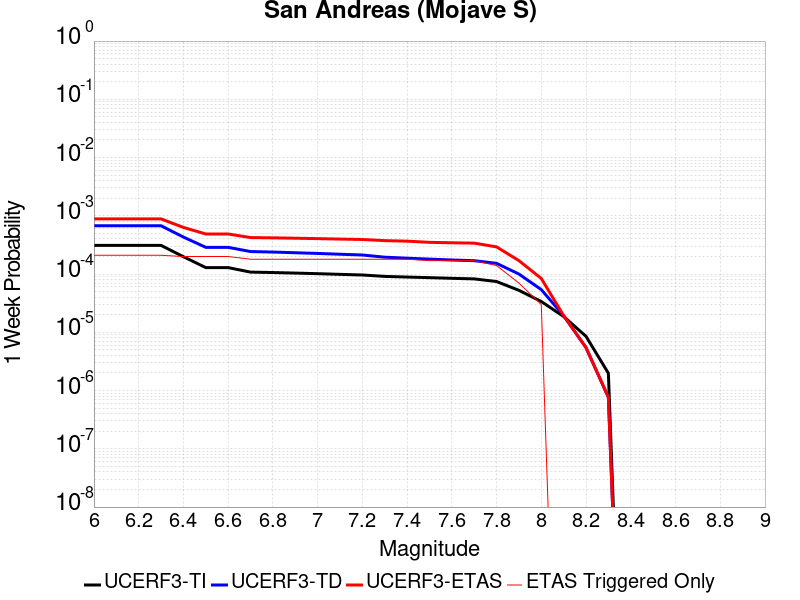 |  |  |  |

| Magnitude | 1 wk TI Prob | 1 wk TD Prob | 1 wk ETAS Prob | 1 wk ETAS/TD Gain | 1 wk ETAS Triggered Only | 1 mo TI Prob | 1 mo TD Prob | 1 mo ETAS Prob | 1 mo ETAS/TD Gain | 1 mo ETAS Triggered Only | 1 yr TI Prob | 1 yr TD Prob | 1 yr ETAS Prob | 1 yr ETAS/TD Gain | 1 yr ETAS Triggered Only | 10 yr TI Prob | 10 yr TD Prob | 10 yr ETAS Prob | 10 yr ETAS/TD Gain | 10 yr ETAS Triggered Only |
|-----|-----|-----|-----|-----|-----|-----|-----|-----|-----|-----|-----|-----|-----|-----|-----|-----|-----|-----|-----|-----|
| 6.0 | 3.1064058E-4 | 6.747043E-4 | 8.845626E-4 | 1.3110374 | 2.1E-4 | 0.0013306376 | 0.002888514 | 0.0033870696 | 1.1725994 | 5.0E-4 | 0.016080605 | 0.03462661 | 0.03589125 | 1.0365222 | 0.00131 | 0.1496549 | 0.28663692 | 0.28827766 | 1.0057241 | 0.0023 |
| 6.1 | 3.1064058E-4 | 6.747043E-4 | 8.845626E-4 | 1.3110374 | 2.1E-4 | 0.0013306376 | 0.002888514 | 0.0033870696 | 1.1725994 | 5.0E-4 | 0.016080605 | 0.03462661 | 0.03589125 | 1.0365222 | 0.00131 | 0.1496549 | 0.28663692 | 0.28827766 | 1.0057241 | 0.0023 |
| 6.2 | 3.1064058E-4 | 6.747043E-4 | 8.845626E-4 | 1.3110374 | 2.1E-4 | 0.0013306376 | 0.002888514 | 0.0033870696 | 1.1725994 | 5.0E-4 | 0.016080605 | 0.03462661 | 0.03589125 | 1.0365222 | 0.00131 | 0.1496549 | 0.28663692 | 0.28827766 | 1.0057241 | 0.0023 |
| 6.3 | 3.1064058E-4 | 6.747043E-4 | 8.845626E-4 | 1.3110374 | 2.1E-4 | 0.0013306376 | 0.002888514 | 0.0033870696 | 1.1725994 | 5.0E-4 | 0.016080605 | 0.03462661 | 0.03589125 | 1.0365222 | 0.00131 | 0.1496549 | 0.28663692 | 0.28827766 | 1.0057241 | 0.0023 |
| 6.4 | 1.9872203E-4 | 4.318848E-4 | 6.3179847E-4 | 1.4628865 | 2.0E-4 | 8.5138786E-4 | 0.0018496502 | 0.0022988177 | 1.2428392 | 4.5E-4 | 0.010316478 | 0.022293096 | 0.023427237 | 1.050874 | 0.00116 | 0.098504856 | 0.19703239 | 0.19863833 | 1.0081506 | 0.002 |
| 6.5 | 1.291105E-4 | 2.8761322E-4 | 4.875557E-4 | 1.6951784 | 2.0E-4 | 5.5321335E-4 | 0.0012320485 | 0.0016315557 | 1.3242625 | 4.0E-4 | 0.006714592 | 0.0148978485 | 0.015892802 | 1.066785 | 0.00101 | 0.065152965 | 0.13807017 | 0.13956131 | 1.0107999 | 0.00173 |
| 6.6 | 1.291105E-4 | 2.8761322E-4 | 4.875557E-4 | 1.6951784 | 2.0E-4 | 5.5321335E-4 | 0.0012320485 | 0.0016315557 | 1.3242625 | 4.0E-4 | 0.006714592 | 0.0148978485 | 0.015892802 | 1.066785 | 0.00101 | 0.065152965 | 0.13807017 | 0.13956131 | 1.0107999 | 0.00173 |
| 6.7 | 1.08001186E-4 | 2.4342406E-4 | 4.2338023E-4 | 1.7392703 | 1.8E-4 | 4.6278012E-4 | 0.0010428295 | 0.0014224332 | 1.3640132 | 3.8E-4 | 0.0056198016 | 0.012622835 | 0.013590464 | 1.076657 | 9.8E-4 | 0.054797906 | 0.11921291 | 0.120710246 | 1.0125602 | 0.0017 |
| 6.8 | 1.0624356E-4 | 2.3860046E-4 | 4.1855752E-4 | 1.7542192 | 1.8E-4 | 4.5525006E-4 | 0.0010221732 | 0.0014017848 | 1.371377 | 3.8E-4 | 0.0055285925 | 0.01237422 | 0.013342094 | 1.0782169 | 9.8E-4 | 0.053930566 | 0.117162056 | 0.11866288 | 1.0128099 | 0.0017 |
| 6.9 | 1.0393785E-4 | 2.3230357E-4 | 4.1226175E-4 | 1.7746682 | 1.8E-4 | 4.4537184E-4 | 9.952073E-4 | 0.0013748292 | 1.3814499 | 3.8E-4 | 0.0054089287 | 0.012049583 | 0.013017775 | 1.0803506 | 9.8E-4 | 0.05279156 | 0.11445948 | 0.1159649 | 1.0131524 | 0.0017 |
| 7.0 | 1.0155622E-4 | 2.2599897E-4 | 4.059583E-4 | 1.7962838 | 1.8E-4 | 4.3516833E-4 | 9.682079E-4 | 0.0013378497 | 1.3817793 | 3.7E-4 | 0.005285311 | 0.011724443 | 0.012683071 | 1.0817631 | 9.7E-4 | 0.05161361 | 0.11171984 | 0.11321215 | 1.0133576 | 0.00168 |
| 7.1 | 9.885595E-5 | 2.1888265E-4 | 3.9884326E-4 | 1.8221785 | 1.8E-4 | 4.2359953E-4 | 9.377316E-4 | 0.0013073846 | 1.3941993 | 3.7E-4 | 0.0051451353 | 0.011357316 | 0.012306413 | 1.083567 | 9.6E-4 | 0.05027629 | 0.10860426 | 0.11009289 | 1.0137069 | 0.00167 |
| 7.2 | 9.6411415E-5 | 2.125122E-4 | 3.9247394E-4 | 1.8468302 | 1.8E-4 | 4.1312634E-4 | 9.1044896E-4 | 0.0012701212 | 1.3950493 | 3.6E-4 | 0.005018219 | 0.01102856 | 0.011958193 | 1.0842932 | 9.4E-4 | 0.049064007 | 0.10579402 | 0.10726052 | 1.0138618 | 0.00164 |
| 7.3 | 9.1180635E-5 | 1.9479371E-4 | 3.7475865E-4 | 1.9238745 | 1.8E-4 | 3.907156E-4 | 8.345632E-4 | 0.0011942628 | 1.4310033 | 3.6E-4 | 0.004746591 | 0.010113581 | 0.011044075 | 1.0920043 | 9.4E-4 | 0.046464786 | 0.09798661 | 0.09946591 | 1.015097 | 0.00164 |
| 7.4 | 8.887388E-5 | 1.8727897E-4 | 3.6724526E-4 | 1.960953 | 1.8E-4 | 3.8083247E-4 | 8.023774E-4 | 0.0011620885 | 1.4483067 | 3.6E-4 | 0.0046267817 | 0.009725285 | 0.010656144 | 1.0957153 | 9.4E-4 | 0.045316286 | 0.09462135 | 0.09609712 | 1.0155965 | 0.00163 |
| 7.5 | 8.6750515E-5 | 1.8059391E-4 | 3.505632E-4 | 1.9411685 | 1.7E-4 | 3.7173493E-4 | 7.7374437E-4 | 0.0011234736 | 1.4519957 | 3.5E-4 | 0.004516484 | 0.009379733 | 0.010301011 | 1.09822 | 9.3E-4 | 0.04425787 | 0.09158487 | 0.0930565 | 1.0160685 | 0.00162 |
| 7.6 | 8.453092E-5 | 1.7446902E-4 | 3.4443938E-4 | 1.9742149 | 1.7E-4 | 3.6222505E-4 | 7.475102E-4 | 0.001087256 | 1.4545033 | 3.4E-4 | 0.0044011753 | 0.009063034 | 0.009974697 | 1.1005913 | 9.2E-4 | 0.04315024 | 0.088743635 | 0.09021076 | 1.0165322 | 0.00161 |
| 7.7 | 8.259102E-5 | 1.6968958E-4 | 3.3966074E-4 | 2.0016594 | 1.7E-4 | 3.539135E-4 | 7.270384E-4 | 0.0010667912 | 1.4673107 | 3.4E-4 | 0.004300386 | 0.008815835 | 0.009727725 | 1.1034377 | 9.2E-4 | 0.042181134 | 0.08649418 | 0.08796492 | 1.017004 | 0.00161 |
| 7.8 | 7.444844E-5 | 1.5290553E-4 | 2.9288413E-4 | 1.915458 | 1.4E-4 | 3.1902574E-4 | 6.551449E-4 | 9.449549E-4 | 1.4423602 | 2.9E-4 | 0.0038772223 | 0.007947266 | 0.008681386 | 1.0923737 | 7.4E-4 | 0.03810269 | 0.07832232 | 0.079529725 | 1.0154158 | 0.00131 |
| 7.9 | 5.2586525E-5 | 1.0011239E-4 | 1.7010538E-4 | 1.6991441 | 7.0E-5 | 2.2535135E-4 | 4.2898257E-4 | 5.989096E-4 | 1.3961165 | 1.7E-4 | 0.0027402006 | 0.005210366 | 0.0056580217 | 1.0859163 | 4.5E-4 | 0.027066574 | 0.052222524 | 0.052990224 | 1.0147005 | 8.1E-4 |
| 8.0 | 3.379877E-5 | 5.4101976E-5 | 8.410035E-5 | 1.5544784 | 3.0E-5 | 1.4484383E-4 | 2.3184501E-4 | 3.1182647E-4 | 1.3449781 | 8.0E-5 | 0.0017620471 | 0.002819061 | 0.0029486946 | 1.0459846 | 1.3E-4 | 0.017481409 | 0.028848516 | 0.029101016 | 1.0087526 | 2.6E-4 |
| 8.1 | 1.8668277E-5 | 1.9322531E-5 | 1.9322531E-5 | 1.0 | 0.0 | 8.000444E-5 | 8.280823E-5 | 9.28074E-5 | 1.1207509 | 1.0E-5 | 9.736188E-4 | 0.0010077246 | 0.0010277043 | 1.0198267 | 2.0E-5 | 0.009693642 | 0.010805754 | 0.010845322 | 1.0036618 | 4.0E-5 |
| 8.2 | 8.541571E-6 | 5.465789E-6 | 5.465789E-6 | 1.0 | 0.0 | 3.660622E-5 | 2.34246E-5 | 2.34246E-5 | 1.0 | 0.0 | 4.455896E-4 | 2.8515726E-4 | 2.8515726E-4 | 1.0 | 0.0 | 0.0044469717 | 0.0032435213 | 0.0032435213 | 1.0 | 0.0 |
| 8.3 | 1.983087E-6 | 7.668296E-7 | 7.668296E-7 | 1.0 | 0.0 | 8.498917E-6 | 3.2864084E-6 | 3.2864084E-6 | 1.0 | 0.0 | 1.034694E-4 | 4.0011306E-5 | 4.0011306E-5 | 1.0 | 0.0 | 0.0010342124 | 4.724499E-4 | 4.724499E-4 | 1.0 | 0.0 |

## Coyote Canyon
*[(top)](#table-of-contents)*

| 1 Week | 1 Month | 1 Year | 10 Year |
|-----|-----|-----|-----|
|  |  |  |  |

| Magnitude | 1 wk TI Prob | 1 wk TD Prob | 1 wk ETAS Prob | 1 wk ETAS/TD Gain | 1 wk ETAS Triggered Only | 1 mo TI Prob | 1 mo TD Prob | 1 mo ETAS Prob | 1 mo ETAS/TD Gain | 1 mo ETAS Triggered Only | 1 yr TI Prob | 1 yr TD Prob | 1 yr ETAS Prob | 1 yr ETAS/TD Gain | 1 yr ETAS Triggered Only | 10 yr TI Prob | 10 yr TD Prob | 10 yr ETAS Prob | 10 yr ETAS/TD Gain | 10 yr ETAS Triggered Only |
|-----|-----|-----|-----|-----|-----|-----|-----|-----|-----|-----|-----|-----|-----|-----|-----|-----|-----|-----|-----|-----|
| 6.0 | 3.5090034E-5 | 4.036513E-5 | 9.036311E-5 | 2.238643 | 5.0E-5 | 1.503772E-4 | 1.7298339E-4 | 4.429367E-4 | 2.5605736 | 2.7E-4 | 0.0018293047 | 0.0021042947 | 0.0031321272 | 1.4884452 | 0.00103 | 0.018143194 | 0.020869615 | 0.022906205 | 1.0975864 | 0.00208 |
| 6.1 | 3.5090034E-5 | 4.036513E-5 | 9.036311E-5 | 2.238643 | 5.0E-5 | 1.503772E-4 | 1.7298339E-4 | 4.429367E-4 | 2.5605736 | 2.7E-4 | 0.0018293047 | 0.0021042947 | 0.0031321272 | 1.4884452 | 0.00103 | 0.018143194 | 0.020869615 | 0.022906205 | 1.0975864 | 0.00208 |
| 6.2 | 1.841879E-5 | 2.1060194E-5 | 5.1059564E-5 | 2.4244583 | 3.0E-5 | 7.8935285E-5 | 9.0255424E-5 | 2.102446E-4 | 2.3294399 | 1.2E-4 | 9.606133E-4 | 0.0010984079 | 0.0015579025 | 1.4183279 | 4.6E-4 | 0.0095647145 | 0.010939874 | 0.011998168 | 1.0967374 | 0.00107 |
| 6.3 | 1.841879E-5 | 2.1060194E-5 | 5.1059564E-5 | 2.4244583 | 3.0E-5 | 7.8935285E-5 | 9.0255424E-5 | 2.102446E-4 | 2.3294399 | 1.2E-4 | 9.606133E-4 | 0.0010984079 | 0.0015579025 | 1.4183279 | 4.6E-4 | 0.0095647145 | 0.010939874 | 0.011998168 | 1.0967374 | 0.00107 |
| 6.4 | 1.712201E-5 | 1.9565581E-5 | 4.9564995E-5 | 2.5332747 | 3.0E-5 | 7.337798E-5 | 8.385037E-5 | 2.038403E-4 | 2.4310007 | 1.2E-4 | 8.930107E-4 | 0.0010205007 | 0.0014600516 | 1.4307209 | 4.4E-4 | 0.008894307 | 0.0101680625 | 0.011177691 | 1.0992941 | 0.00102 |
| 6.5 | 1.4744935E-5 | 1.6837288E-5 | 4.6836783E-5 | 2.7817295 | 3.0E-5 | 6.3191044E-5 | 7.215834E-5 | 1.7215112E-4 | 2.3857412 | 1.0E-4 | 7.6907943E-4 | 8.7826716E-4 | 0.0012679247 | 1.4436662 | 3.9E-4 | 0.007664232 | 0.008757159 | 0.00965919 | 1.1030049 | 9.1E-4 |
| 6.6 | 1.2017839E-5 | 1.3724348E-5 | 4.3723936E-5 | 3.185866 | 3.0E-5 | 5.150401E-5 | 5.8817808E-5 | 1.388131E-4 | 2.3600523 | 8.0E-5 | 6.268809E-4 | 7.159601E-4 | 0.0010257381 | 1.432675 | 3.1E-4 | 0.0062511545 | 0.007145228 | 0.0078997975 | 1.1056046 | 7.6E-4 |
| 6.7 | 1.00956095E-5 | 1.1533734E-5 | 4.153339E-5 | 3.6010356 | 3.0E-5 | 4.326618E-5 | 4.9429844E-5 | 1.1942638E-4 | 2.4160786 | 7.0E-5 | 5.266384E-4 | 6.0172915E-4 | 8.615727E-4 | 1.4318281 | 2.6E-4 | 0.005253921 | 0.006009526 | 0.0066754995 | 1.1108197 | 6.7E-4 |

## Lenwood-Lockhart-Old Woman Springs
*[(top)](#table-of-contents)*

| 1 Week | 1 Month | 1 Year | 10 Year |
|-----|-----|-----|-----|
| 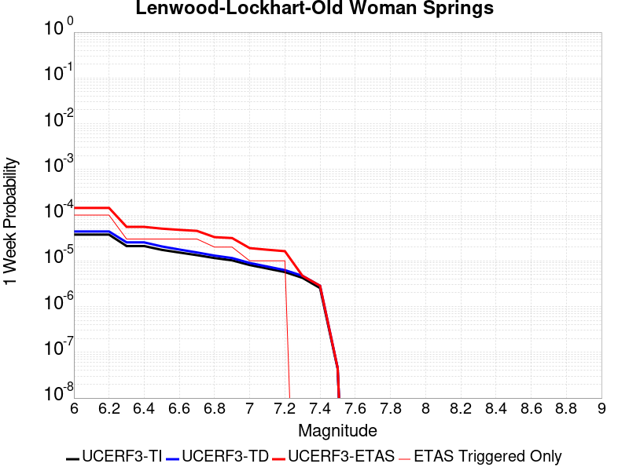 | 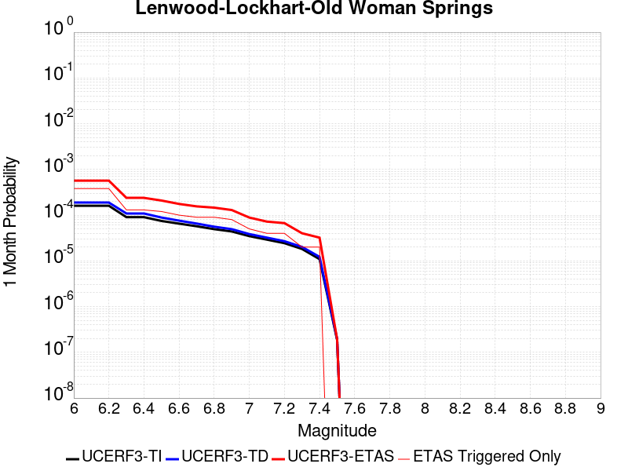 |  |  |

| Magnitude | 1 wk TI Prob | 1 wk TD Prob | 1 wk ETAS Prob | 1 wk ETAS/TD Gain | 1 wk ETAS Triggered Only | 1 mo TI Prob | 1 mo TD Prob | 1 mo ETAS Prob | 1 mo ETAS/TD Gain | 1 mo ETAS Triggered Only | 1 yr TI Prob | 1 yr TD Prob | 1 yr ETAS Prob | 1 yr ETAS/TD Gain | 1 yr ETAS Triggered Only | 10 yr TI Prob | 10 yr TD Prob | 10 yr ETAS Prob | 10 yr ETAS/TD Gain | 10 yr ETAS Triggered Only |
|-----|-----|-----|-----|-----|-----|-----|-----|-----|-----|-----|-----|-----|-----|-----|-----|-----|-----|-----|-----|-----|
| 6.0 | 3.744542E-5 | 4.3962966E-5 | 1.4395858E-4 | 3.2745419 | 1.0E-4 | 1.604705E-4 | 1.8840008E-4 | 5.683285E-4 | 3.0166044 | 3.8E-4 | 0.0019519776 | 0.0022915301 | 0.0034289176 | 1.4963442 | 0.00114 | 0.019349206 | 0.022697017 | 0.024827536 | 1.0938679 | 0.00218 |
| 6.1 | 3.744542E-5 | 4.3962966E-5 | 1.4395858E-4 | 3.2745419 | 1.0E-4 | 1.604705E-4 | 1.8840008E-4 | 5.683285E-4 | 3.0166044 | 3.8E-4 | 0.0019519776 | 0.0022915301 | 0.0034289176 | 1.4963442 | 0.00114 | 0.019349206 | 0.022697017 | 0.024827536 | 1.0938679 | 0.00218 |
| 6.2 | 3.744542E-5 | 4.3962966E-5 | 1.4395858E-4 | 3.2745419 | 1.0E-4 | 1.604705E-4 | 1.8840008E-4 | 5.683285E-4 | 3.0166044 | 3.8E-4 | 0.0019519776 | 0.0022915301 | 0.0034289176 | 1.4963442 | 0.00114 | 0.019349206 | 0.022697017 | 0.024827536 | 1.0938679 | 0.00218 |
| 6.3 | 2.1079984E-5 | 2.5353596E-5 | 5.5352837E-5 | 2.183234 | 3.0E-5 | 9.0339665E-5 | 1.0865386E-4 | 2.3863974E-4 | 2.19633 | 1.3E-4 | 0.0010993304 | 0.0013220779 | 0.0017115623 | 1.2946001 | 3.9E-4 | 0.010939079 | 0.013144341 | 0.014022643 | 1.0668198 | 8.9E-4 |
| 6.4 | 2.1079984E-5 | 2.5353596E-5 | 5.5352837E-5 | 2.183234 | 3.0E-5 | 9.0339665E-5 | 1.0865386E-4 | 2.3863974E-4 | 2.19633 | 1.3E-4 | 0.0010993304 | 0.0013220779 | 0.0017115623 | 1.2946001 | 3.9E-4 | 0.010939079 | 0.013144341 | 0.014022643 | 1.0668198 | 8.9E-4 |
| 6.5 | 1.7397282E-5 | 2.0662535E-5 | 5.0661914E-5 | 2.451873 | 3.0E-5 | 7.455765E-5 | 8.855078E-5 | 2.0854016E-4 | 2.3550346 | 1.2E-4 | 9.073613E-4 | 0.0010775843 | 0.001417218 | 1.3151805 | 3.4E-4 | 0.009036654 | 0.010724886 | 0.011447057 | 1.067336 | 7.3E-4 |
| 6.6 | 1.52050325E-5 | 1.76798E-5 | 4.767927E-5 | 2.696822 | 3.0E-5 | 6.51628E-5 | 7.576841E-5 | 1.7576084E-4 | 2.3197112 | 1.0E-4 | 7.9306826E-4 | 9.220979E-4 | 0.0012418028 | 1.3467147 | 3.2E-4 | 0.007902439 | 0.009183581 | 0.009837519 | 1.0712074 | 6.6E-4 |
| 6.7 | 1.332523E-5 | 1.5264091E-5 | 4.5263634E-5 | 2.965367 | 3.0E-5 | 5.7106878E-5 | 6.541593E-5 | 1.5541005E-4 | 2.3757217 | 9.0E-5 | 6.950544E-4 | 7.9615373E-4 | 0.0010359626 | 1.3012093 | 2.4E-4 | 0.006928845 | 0.007933645 | 0.008479281 | 1.068775 | 5.5E-4 |
| 6.8 | 1.1525329E-5 | 1.303105E-5 | 3.303079E-5 | 2.5347757 | 2.0E-5 | 4.9393333E-5 | 5.5846183E-5 | 1.4584116E-4 | 2.6114793 | 9.0E-5 | 6.011979E-4 | 6.7971944E-4 | 8.895767E-4 | 1.308741 | 2.1E-4 | 0.00599574 | 0.006776856 | 0.0072039417 | 1.0630213 | 4.3E-4 |
| 6.9 | 1.0253909E-5 | 1.15144985E-5 | 3.1514268E-5 | 2.7369206 | 2.0E-5 | 4.3944583E-5 | 4.9346934E-5 | 1.2934298E-4 | 2.6210947 | 8.0E-5 | 5.3489394E-4 | 6.0063694E-4 | 8.005168E-4 | 1.3327799 | 2.0E-4 | 0.0053360825 | 0.005990515 | 0.0063483585 | 1.059735 | 3.6E-4 |
| 7.0 | 8.104563E-6 | 8.991321E-6 | 1.8991232E-5 | 2.1121736 | 1.0E-5 | 3.4733377E-5 | 3.8533675E-5 | 8.853175E-5 | 2.2975163 | 5.0E-5 | 4.2279682E-4 | 4.6904891E-4 | 5.98988E-4 | 1.2770265 | 1.3E-4 | 0.0042199334 | 0.0046808375 | 0.0049296673 | 1.0531592 | 2.5E-4 |
| 7.1 | 6.7986157E-6 | 7.515848E-6 | 1.7515773E-5 | 2.3305118 | 1.0E-5 | 2.91366E-5 | 3.221039E-5 | 7.2209106E-5 | 2.2417953 | 4.0E-5 | 3.5468035E-4 | 3.9209312E-4 | 4.7206174E-4 | 1.2039531 | 8.0E-5 | 0.003541148 | 0.0039142296 | 0.004083564 | 1.0432613 | 1.7E-4 |
| 7.2 | 5.6893327E-6 | 6.280039E-6 | 1.6279977E-5 | 2.592337 | 1.0E-5 | 2.4382627E-5 | 2.6914187E-5 | 6.691311E-5 | 2.486165 | 4.0E-5 | 2.9681803E-4 | 3.2763294E-4 | 4.0760674E-4 | 1.2440957 | 8.0E-5 | 0.002964219 | 0.0032716978 | 0.0034311742 | 1.0487443 | 1.6E-4 |
| 7.3 | 4.253348E-6 | 4.706927E-6 | 4.706927E-6 | 1.0 | 0.0 | 1.8228506E-5 | 2.01724E-5 | 4.0171995E-5 | 1.9914337 | 2.0E-5 | 2.2190946E-4 | 2.4557312E-4 | 2.9556084E-4 | 1.2035553 | 5.0E-5 | 0.00221688 | 0.0024531984 | 0.0025629285 | 1.0447295 | 1.1E-4 |
| 7.4 | 2.5448119E-6 | 2.8520535E-6 | 2.8520535E-6 | 1.0 | 0.0 | 1.0906291E-5 | 1.22230385E-5 | 3.2222793E-5 | 2.6362345 | 2.0E-5 | 1.3277601E-4 | 1.4880698E-4 | 1.8880103E-4 | 1.2687646 | 4.0E-5 | 0.001326967 | 0.0014872355 | 0.0015571314 | 1.0469972 | 7.0E-5 |
| 7.5 | 4.3706837E-8 | 4.5629356E-8 | 4.5629356E-8 | 1.0 | 0.0 | 1.8731501E-7 | 1.9555438E-7 | 1.9555438E-7 | 1.0 | 0.0 | 2.2805577E-6 | 2.3808725E-6 | 2.3808725E-6 | 1.0 | 0.0 | 2.2805343E-5 | 2.3808525E-5 | 2.3808525E-5 | 1.0 | 0.0 |

## Death Valley (So)
*[(top)](#table-of-contents)*

| 1 Week | 1 Month | 1 Year | 10 Year |
|-----|-----|-----|-----|
|  | 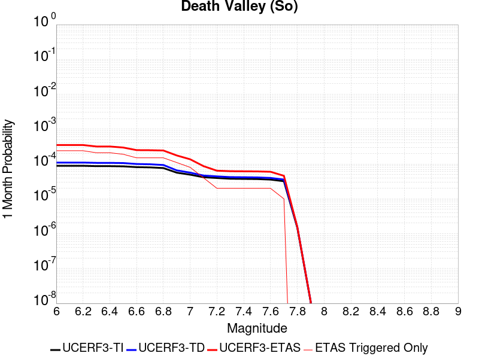 |  |  |

| Magnitude | 1 wk TI Prob | 1 wk TD Prob | 1 wk ETAS Prob | 1 wk ETAS/TD Gain | 1 wk ETAS Triggered Only | 1 mo TI Prob | 1 mo TD Prob | 1 mo ETAS Prob | 1 mo ETAS/TD Gain | 1 mo ETAS Triggered Only | 1 yr TI Prob | 1 yr TD Prob | 1 yr ETAS Prob | 1 yr ETAS/TD Gain | 1 yr ETAS Triggered Only | 10 yr TI Prob | 10 yr TD Prob | 10 yr ETAS Prob | 10 yr ETAS/TD Gain | 10 yr ETAS Triggered Only |
|-----|-----|-----|-----|-----|-----|-----|-----|-----|-----|-----|-----|-----|-----|-----|-----|-----|-----|-----|-----|-----|
| 6.0 | 2.0684236E-5 | 2.5618423E-5 | 6.5617394E-5 | 2.5613365 | 4.0E-5 | 8.864371E-5 | 1.09788714E-4 | 3.4976235E-4 | 3.185777 | 2.4E-4 | 0.0010787029 | 0.0013358749 | 0.0022945923 | 1.7176702 | 9.6E-4 | 0.010734817 | 0.013281729 | 0.015324236 | 1.1537832 | 0.00207 |
| 6.1 | 2.0684236E-5 | 2.5618423E-5 | 6.5617394E-5 | 2.5613365 | 4.0E-5 | 8.864371E-5 | 1.09788714E-4 | 3.4976235E-4 | 3.185777 | 2.4E-4 | 0.0010787029 | 0.0013358749 | 0.0022945923 | 1.7176702 | 9.6E-4 | 0.010734817 | 0.013281729 | 0.015324236 | 1.1537832 | 0.00207 |
| 6.2 | 2.0684236E-5 | 2.5618423E-5 | 6.5617394E-5 | 2.5613365 | 4.0E-5 | 8.864371E-5 | 1.09788714E-4 | 3.4976235E-4 | 3.185777 | 2.4E-4 | 0.0010787029 | 0.0013358749 | 0.0022945923 | 1.7176702 | 9.6E-4 | 0.010734817 | 0.013281729 | 0.015324236 | 1.1537832 | 0.00207 |
| 6.3 | 2.0240292E-5 | 2.5118497E-5 | 6.511749E-5 | 2.592412 | 4.0E-5 | 8.6741224E-5 | 1.0764636E-4 | 3.1762375E-4 | 2.9506223 | 2.1E-4 | 0.0010555626 | 0.0013098232 | 0.0022086443 | 1.6862156 | 9.0E-4 | 0.010505628 | 0.013024284 | 0.014978495 | 1.1500437 | 0.00198 |
| 6.4 | 2.0240292E-5 | 2.5118497E-5 | 6.511749E-5 | 2.592412 | 4.0E-5 | 8.6741224E-5 | 1.0764636E-4 | 3.1762375E-4 | 2.9506223 | 2.1E-4 | 0.0010555626 | 0.0013098232 | 0.0022086443 | 1.6862156 | 9.0E-4 | 0.010505628 | 0.013024284 | 0.014978495 | 1.1500437 | 0.00198 |
| 6.5 | 1.9962767E-5 | 2.4807747E-5 | 5.4807002E-5 | 2.2092698 | 3.0E-5 | 8.55519E-5 | 1.0631468E-4 | 2.962945E-4 | 2.7869575 | 1.9E-4 | 0.0010410968 | 0.0012936293 | 0.0021724908 | 1.6793767 | 8.8E-4 | 0.010362327 | 0.012864228 | 0.014759528 | 1.1473311 | 0.00192 |
| 6.6 | 1.8937297E-5 | 2.3311568E-5 | 5.331087E-5 | 2.2868848 | 3.0E-5 | 8.115732E-5 | 9.990298E-5 | 2.49888E-4 | 2.5013068 | 1.5E-4 | 9.876423E-4 | 0.0012156547 | 0.0020446456 | 1.6819297 | 8.3E-4 | 0.009832645 | 0.0120931 | 0.013821936 | 1.1429607 | 0.00175 |
| 6.7 | 1.8621096E-5 | 2.2912203E-5 | 5.2911517E-5 | 2.309316 | 3.0E-5 | 7.980225E-5 | 9.8191544E-5 | 2.481768E-4 | 2.5274765 | 1.5E-4 | 9.711593E-4 | 0.0011948409 | 0.0019739089 | 1.6520265 | 7.8E-4 | 0.009669261 | 0.011887211 | 0.013507716 | 1.1363235 | 0.00164 |
| 6.8 | 1.7830353E-5 | 2.1806247E-5 | 5.1805593E-5 | 2.3757224 | 3.0E-5 | 7.641356E-5 | 9.345208E-5 | 2.4343806E-4 | 2.6049507 | 1.5E-4 | 9.29938E-4 | 0.0011371992 | 0.001866369 | 1.641198 | 7.3E-4 | 0.009260561 | 0.011316643 | 0.012849102 | 1.1354164 | 0.00155 |
| 6.9 | 1.3135183E-5 | 1.5304242E-5 | 2.5304089E-5 | 1.6534036 | 1.0E-5 | 5.6292425E-5 | 6.558799E-5 | 1.7558078E-4 | 2.6770263 | 1.1E-4 | 6.8514474E-4 | 7.982477E-4 | 0.0012279045 | 1.5382499 | 4.3E-4 | 0.006830362 | 0.007954813 | 0.008976619 | 1.1284513 | 0.00103 |
| 7.0 | 1.1507512E-5 | 1.3154444E-5 | 2.3154313E-5 | 1.7601894 | 1.0E-5 | 4.9316975E-5 | 5.6375004E-5 | 1.363705E-4 | 2.4189887 | 8.0E-5 | 6.002687E-4 | 6.861553E-4 | 9.959426E-4 | 1.4514828 | 3.1E-4 | 0.0059864987 | 0.006841068 | 0.0075859376 | 1.108882 | 7.5E-4 |
| 7.1 | 9.715903E-6 | 1.0865454E-5 | 1.0865454E-5 | 1.0 | 0.0 | 4.1638916E-5 | 4.6565423E-5 | 8.656356E-5 | 1.8589665 | 4.0E-5 | 5.068359E-4 | 5.667908E-4 | 6.967171E-4 | 1.2292315 | 1.3E-4 | 0.0050568148 | 0.0056539057 | 0.0059720967 | 1.056278 | 3.2E-4 |
| 7.2 | 9.233269E-6 | 1.0286473E-5 | 1.0286473E-5 | 1.0 | 0.0 | 3.9570554E-5 | 4.4084165E-5 | 6.408328E-5 | 1.4536576 | 2.0E-5 | 4.81665E-4 | 5.3659675E-4 | 6.365431E-4 | 1.1862597 | 1.0E-4 | 0.0048062233 | 0.005353442 | 0.005562318 | 1.0390171 | 2.1E-4 |
| 7.3 | 8.8041315E-6 | 9.808313E-6 | 9.808313E-6 | 1.0 | 0.0 | 3.7731446E-5 | 4.2034975E-5 | 6.203413E-5 | 1.4757743 | 2.0E-5 | 4.592835E-4 | 5.1165983E-4 | 6.116087E-4 | 1.1953423 | 1.0E-4 | 0.0045833546 | 0.0051052445 | 0.0052942745 | 1.0370266 | 1.9E-4 |
| 7.4 | 8.708749E-6 | 9.707323E-6 | 9.707323E-6 | 1.0 | 0.0 | 3.7322676E-5 | 4.1602176E-5 | 6.160134E-5 | 1.4807241 | 2.0E-5 | 4.5430884E-4 | 5.06393E-4 | 6.0634234E-4 | 1.197375 | 1.0E-4 | 0.004533812 | 0.0050528166 | 0.0052418564 | 1.0374128 | 1.9E-4 |
| 7.5 | 8.612678E-6 | 9.604964E-6 | 9.604964E-6 | 1.0 | 0.0 | 3.6910955E-5 | 4.116351E-5 | 6.116268E-5 | 1.4858472 | 2.0E-5 | 4.492982E-4 | 5.010547E-4 | 5.9100956E-4 | 1.1795311 | 9.0E-5 | 0.004483909 | 0.0049996753 | 0.005178775 | 1.0358224 | 1.8E-4 |
| 7.6 | 8.319024E-6 | 9.28406E-6 | 9.28406E-6 | 1.0 | 0.0 | 3.5652476E-5 | 3.9788243E-5 | 5.978745E-5 | 1.5026411 | 2.0E-5 | 4.3398244E-4 | 4.8431839E-4 | 5.742748E-4 | 1.1857382 | 9.0E-5 | 0.0043313587 | 0.004833053 | 0.0050022313 | 1.0350045 | 1.7E-4 |
| 7.7 | 7.4718328E-6 | 8.3453E-6 | 8.3453E-6 | 1.0 | 0.0 | 3.2021748E-5 | 3.57651E-5 | 4.5764744E-5 | 1.2795922 | 1.0E-5 | 3.8979502E-4 | 4.3535716E-4 | 5.153223E-4 | 1.1836772 | 8.0E-5 | 0.00389112 | 0.004345448 | 0.004494796 | 1.0343689 | 1.5E-4 |
| 7.8 | 3.4586725E-7 | 3.648288E-7 | 3.648288E-7 | 1.0 | 0.0 | 1.4822873E-6 | 1.5635511E-6 | 1.5635511E-6 | 1.0 | 0.0 | 1.80467E-5 | 1.9036073E-5 | 1.9036073E-5 | 1.0 | 0.0 | 1.8045233E-4 | 1.9034486E-4 | 1.9034486E-4 | 1.0 | 0.0 |
| 7.9 | 2.5591178E-9 | 2.6696871E-9 | 2.6696871E-9 | 1.0 | 0.0 | 1.0967647E-8 | 1.1441516E-8 | 1.1441516E-8 | 1.0 | 0.0 | 1.335311E-7 | 1.3930045E-7 | 1.3930045E-7 | 1.0 | 0.0 | 1.3353102E-6 | 1.3930046E-6 | 1.3930046E-6 | 1.0 | 0.0 |

## San Andreas (Mojave N)
*[(top)](#table-of-contents)*

| 1 Week | 1 Month | 1 Year | 10 Year |
|-----|-----|-----|-----|
|  | 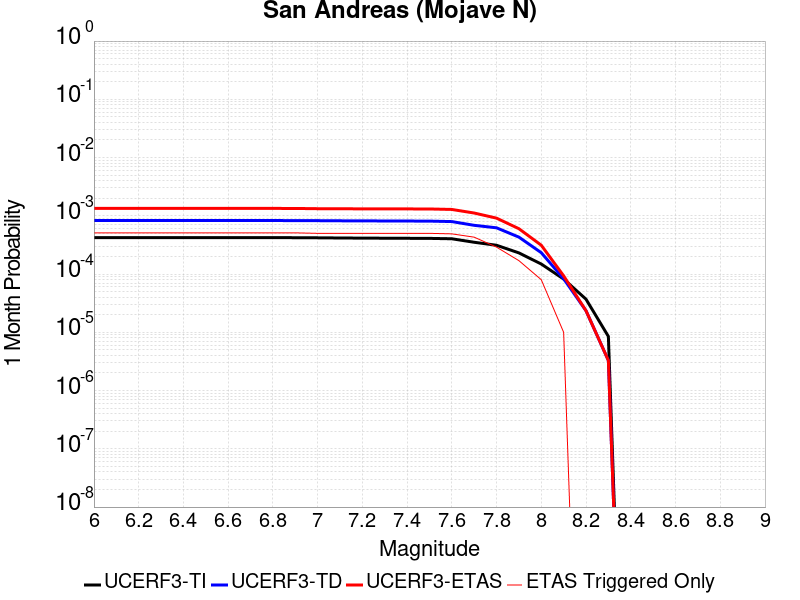 |  |  |

| Magnitude | 1 wk TI Prob | 1 wk TD Prob | 1 wk ETAS Prob | 1 wk ETAS/TD Gain | 1 wk ETAS Triggered Only | 1 mo TI Prob | 1 mo TD Prob | 1 mo ETAS Prob | 1 mo ETAS/TD Gain | 1 mo ETAS Triggered Only | 1 yr TI Prob | 1 yr TD Prob | 1 yr ETAS Prob | 1 yr ETAS/TD Gain | 1 yr ETAS Triggered Only | 10 yr TI Prob | 10 yr TD Prob | 10 yr ETAS Prob | 10 yr ETAS/TD Gain | 10 yr ETAS Triggered Only |
|-----|-----|-----|-----|-----|-----|-----|-----|-----|-----|-----|-----|-----|-----|-----|-----|-----|-----|-----|-----|-----|
| 6.0 | 9.877682E-5 | 1.9409315E-4 | 4.240485E-4 | 2.184768 | 2.3E-4 | 4.2326056E-4 | 8.315628E-4 | 0.0013411387 | 1.6127931 | 5.1E-4 | 0.0051410277 | 0.010077406 | 0.011225716 | 1.113949 | 0.00116 | 0.05023708 | 0.09835201 | 0.100218415 | 1.0189768 | 0.00207 |
| 6.1 | 9.877682E-5 | 1.9409315E-4 | 4.240485E-4 | 2.184768 | 2.3E-4 | 4.2326056E-4 | 8.315628E-4 | 0.0013411387 | 1.6127931 | 5.1E-4 | 0.0051410277 | 0.010077406 | 0.011225716 | 1.113949 | 0.00116 | 0.05023708 | 0.09835201 | 0.100218415 | 1.0189768 | 0.00207 |
| 6.2 | 9.877682E-5 | 1.9409315E-4 | 4.240485E-4 | 2.184768 | 2.3E-4 | 4.2326056E-4 | 8.315628E-4 | 0.0013411387 | 1.6127931 | 5.1E-4 | 0.0051410277 | 0.010077406 | 0.011225716 | 1.113949 | 0.00116 | 0.05023708 | 0.09835201 | 0.100218415 | 1.0189768 | 0.00207 |
| 6.3 | 9.877682E-5 | 1.9409315E-4 | 4.240485E-4 | 2.184768 | 2.3E-4 | 4.2326056E-4 | 8.315628E-4 | 0.0013411387 | 1.6127931 | 5.1E-4 | 0.0051410277 | 0.010077406 | 0.011225716 | 1.113949 | 0.00116 | 0.05023708 | 0.09835201 | 0.100218415 | 1.0189768 | 0.00207 |
| 6.4 | 9.877682E-5 | 1.9409315E-4 | 4.240485E-4 | 2.184768 | 2.3E-4 | 4.2326056E-4 | 8.315628E-4 | 0.0013411387 | 1.6127931 | 5.1E-4 | 0.0051410277 | 0.010077406 | 0.011225716 | 1.113949 | 0.00116 | 0.05023708 | 0.09835201 | 0.100218415 | 1.0189768 | 0.00207 |
| 6.5 | 9.861474E-5 | 1.9383078E-4 | 4.237862E-4 | 2.186372 | 2.3E-4 | 4.2256617E-4 | 8.304391E-4 | 0.0013400156 | 1.6136229 | 5.1E-4 | 0.0051326132 | 0.010063851 | 0.011212178 | 1.114104 | 0.00116 | 0.050156746 | 0.098229796 | 0.10009646 | 1.019003 | 0.00207 |
| 6.6 | 9.861474E-5 | 1.9383078E-4 | 4.237862E-4 | 2.186372 | 2.3E-4 | 4.2256617E-4 | 8.304391E-4 | 0.0013400156 | 1.6136229 | 5.1E-4 | 0.0051326132 | 0.010063851 | 0.011212178 | 1.114104 | 0.00116 | 0.050156746 | 0.098229796 | 0.10009646 | 1.019003 | 0.00207 |
| 6.7 | 9.8552715E-5 | 1.9373032E-4 | 4.2368576E-4 | 2.1869874 | 2.3E-4 | 4.223004E-4 | 8.3000876E-4 | 0.0013395854 | 1.6139413 | 5.1E-4 | 0.0051293927 | 0.01005866 | 0.011206992 | 1.1141635 | 0.00116 | 0.050125998 | 0.098182976 | 0.10004974 | 1.019013 | 0.00207 |
| 6.8 | 9.8464974E-5 | 1.9358192E-4 | 4.235374E-4 | 2.1878974 | 2.3E-4 | 4.219245E-4 | 8.293732E-4 | 0.0013389502 | 1.6144122 | 5.1E-4 | 0.0051248376 | 0.010050993 | 0.011199335 | 1.1142515 | 0.00116 | 0.05008251 | 0.09811299 | 0.0999799 | 1.0190281 | 0.00207 |
| 6.9 | 9.825824E-5 | 1.9326196E-4 | 4.232175E-4 | 2.1898644 | 2.3E-4 | 4.2103877E-4 | 8.280028E-4 | 0.0013375806 | 1.6154299 | 5.1E-4 | 0.0051141046 | 0.010034463 | 0.011172924 | 1.113455 | 0.00115 | 0.049980022 | 0.09796208 | 0.09982028 | 1.0189686 | 0.00206 |
| 7.0 | 9.781462E-5 | 1.9257552E-4 | 4.2253124E-4 | 2.1941066 | 2.3E-4 | 4.1913814E-4 | 8.250628E-4 | 0.0013246502 | 1.6055144 | 5.0E-4 | 0.005091073 | 0.009998998 | 0.011137499 | 1.1138616 | 0.00115 | 0.04976007 | 0.097638436 | 0.0994973 | 1.0190382 | 0.00206 |
| 7.1 | 9.7121134E-5 | 1.9159251E-4 | 4.2154844E-4 | 2.2002344 | 2.3E-4 | 4.1616702E-4 | 8.208525E-4 | 0.0013204421 | 1.6086228 | 5.0E-4 | 0.005055068 | 0.009948207 | 0.011086767 | 1.1144487 | 0.00115 | 0.04941613 | 0.097174905 | 0.09903473 | 1.0191389 | 0.00206 |
| 7.2 | 9.663819E-5 | 1.9090026E-4 | 4.2085635E-4 | 2.2045877 | 2.3E-4 | 4.1409794E-4 | 8.178876E-4 | 0.0013174787 | 1.6108309 | 5.0E-4 | 0.0050299936 | 0.009912439 | 0.011051039 | 1.1148659 | 0.00115 | 0.049176537 | 0.09684814 | 0.09870863 | 1.0192105 | 0.00206 |
| 7.3 | 9.6277574E-5 | 1.9042526E-4 | 4.2038146E-4 | 2.207593 | 2.3E-4 | 4.125529E-4 | 8.158532E-4 | 0.0013154453 | 1.6123554 | 5.0E-4 | 0.0050112694 | 0.009887895 | 0.011026523 | 1.1151538 | 0.00115 | 0.04899759 | 0.09662155 | 0.09848251 | 1.0192603 | 0.00206 |
| 7.4 | 9.593308E-5 | 1.8982294E-4 | 4.1977927E-4 | 2.2114255 | 2.3E-4 | 4.1107697E-4 | 8.132734E-4 | 0.0013128668 | 1.6142994 | 5.0E-4 | 0.0049933824 | 0.00985677 | 0.010995435 | 1.1155211 | 0.00115 | 0.04882661 | 0.09633968 | 0.09820122 | 1.0193226 | 0.00206 |
| 7.5 | 9.561707E-5 | 1.8928363E-4 | 4.192401E-4 | 2.2148778 | 2.3E-4 | 4.0972308E-4 | 8.109635E-4 | 0.0013105581 | 1.6160506 | 5.0E-4 | 0.0049769743 | 0.009828901 | 0.010967598 | 1.1158519 | 0.00115 | 0.048669744 | 0.09608582 | 0.09794788 | 1.0193791 | 0.00206 |
| 7.6 | 9.418194E-5 | 1.8580563E-4 | 4.1576292E-4 | 2.2376227 | 2.3E-4 | 4.0357444E-4 | 7.96067E-4 | 0.001285677 | 1.615036 | 4.9E-4 | 0.004902454 | 0.009649157 | 0.010778156 | 1.117005 | 0.00114 | 0.047957025 | 0.09446791 | 0.09632425 | 1.0196505 | 0.00205 |
| 7.7 | 8.202141E-5 | 1.6029038E-4 | 3.6025833E-4 | 2.2475355 | 2.0E-4 | 3.51473E-4 | 6.86778E-4 | 0.0011164827 | 1.6256821 | 4.3E-4 | 0.00427079 | 0.008329522 | 0.009390609 | 1.1273887 | 0.00107 | 0.04189639 | 0.08226675 | 0.084028795 | 1.0214187 | 0.00192 |
| 7.8 | 7.2859846E-5 | 1.4523414E-4 | 2.852138E-4 | 1.9638207 | 1.4E-4 | 3.1221908E-4 | 6.2228355E-4 | 9.121031E-4 | 1.4657354 | 2.9E-4 | 0.003794643 | 0.007550025 | 0.008284438 | 1.0972729 | 7.4E-4 | 0.037304975 | 0.074755974 | 0.07596805 | 1.0162137 | 0.00131 |
| 7.9 | 5.3874453E-5 | 1.0050546E-4 | 1.7049842E-4 | 1.6964096 | 7.0E-5 | 2.3087008E-4 | 4.3066658E-4 | 6.005934E-4 | 1.3945669 | 1.7E-4 | 0.0028072202 | 0.005230771 | 0.005678417 | 1.0855794 | 4.5E-4 | 0.02772022 | 0.052447177 | 0.053214695 | 1.0146341 | 8.1E-4 |
| 8.0 | 3.468538E-5 | 5.4288335E-5 | 8.428671E-5 | 1.5525749 | 3.0E-5 | 1.4864317E-4 | 2.3264355E-4 | 3.1262494E-4 | 1.3437937 | 8.0E-5 | 0.0018082283 | 0.0028287582 | 0.0029583904 | 1.0458266 | 1.3E-4 | 0.017935853 | 0.028961267 | 0.029213738 | 1.0087175 | 2.6E-4 |
| 8.1 | 1.9152367E-5 | 1.9415891E-5 | 1.9415891E-5 | 1.0 | 0.0 | 8.207899E-5 | 8.320831E-5 | 9.320748E-5 | 1.1201704 | 1.0E-5 | 9.988535E-4 | 0.0010125911 | 0.0010325707 | 1.0197313 | 2.0E-5 | 0.009943757 | 0.010863188 | 0.010902754 | 1.0036422 | 4.0E-5 |
| 8.2 | 8.643924E-6 | 5.4798497E-6 | 5.4798497E-6 | 1.0 | 0.0 | 3.704486E-5 | 2.348486E-5 | 2.348486E-5 | 1.0 | 0.0 | 4.5092785E-4 | 2.858907E-4 | 2.858907E-4 | 1.0 | 0.0 | 0.0045001395 | 0.0032514327 | 0.0032514327 | 1.0 | 0.0 |
| 8.3 | 1.983087E-6 | 7.668296E-7 | 7.668296E-7 | 1.0 | 0.0 | 8.498917E-6 | 3.2864084E-6 | 3.2864084E-6 | 1.0 | 0.0 | 1.034694E-4 | 4.0011306E-5 | 4.0011306E-5 | 1.0 | 0.0 | 0.0010342124 | 4.724499E-4 | 4.724499E-4 | 1.0 | 0.0 |

## Nelson Lake
*[(top)](#table-of-contents)*

| 1 Week | 1 Month | 1 Year | 10 Year |
|-----|-----|-----|-----|
|  |  | 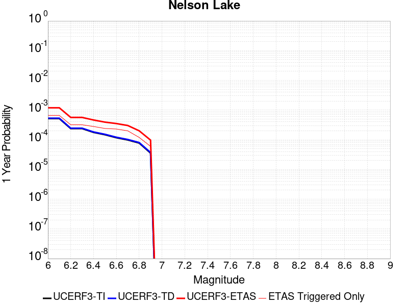 | 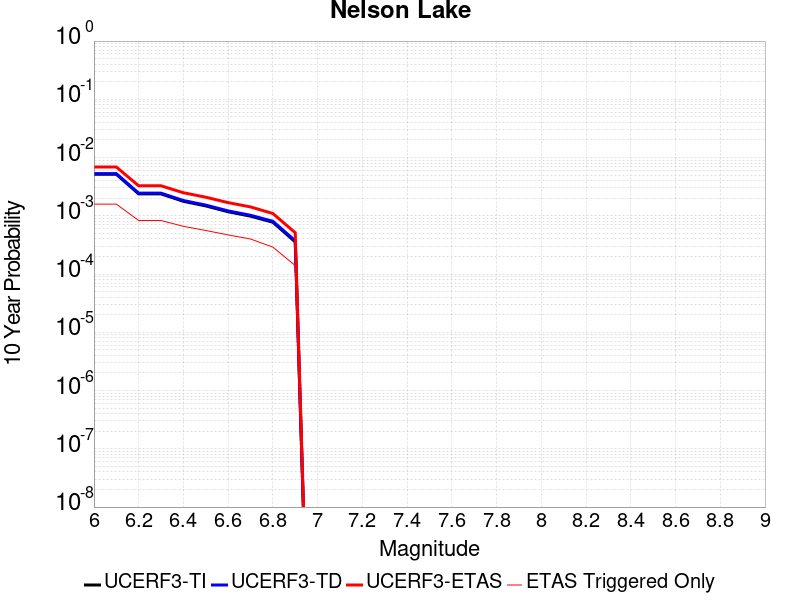 |

| Magnitude | 1 wk TI Prob | 1 wk TD Prob | 1 wk ETAS Prob | 1 wk ETAS/TD Gain | 1 wk ETAS Triggered Only | 1 mo TI Prob | 1 mo TD Prob | 1 mo ETAS Prob | 1 mo ETAS/TD Gain | 1 mo ETAS Triggered Only | 1 yr TI Prob | 1 yr TD Prob | 1 yr ETAS Prob | 1 yr ETAS/TD Gain | 1 yr ETAS Triggered Only | 10 yr TI Prob | 10 yr TD Prob | 10 yr ETAS Prob | 10 yr ETAS/TD Gain | 10 yr ETAS Triggered Only |
|-----|-----|-----|-----|-----|-----|-----|-----|-----|-----|-----|-----|-----|-----|-----|-----|-----|-----|-----|-----|-----|
| 6.0 | 9.913453E-6 | 1.0192293E-5 | 6.0191785E-5 | 5.905617 | 5.0E-5 | 4.2485535E-5 | 4.3680586E-5 | 2.1367316E-4 | 4.8917193 | 1.7E-4 | 5.1713863E-4 | 5.316917E-4 | 0.0011913407 | 2.240661 | 6.6E-4 | 0.0051593683 | 0.0053052236 | 0.0068867886 | 1.2981147 | 0.00159 |
| 6.1 | 9.913453E-6 | 1.0192293E-5 | 6.0191785E-5 | 5.905617 | 5.0E-5 | 4.2485535E-5 | 4.3680586E-5 | 2.1367316E-4 | 4.8917193 | 1.7E-4 | 5.1713863E-4 | 5.316917E-4 | 0.0011913407 | 2.240661 | 6.6E-4 | 0.0051593683 | 0.0053052236 | 0.0068867886 | 1.2981147 | 0.00159 |
| 6.2 | 4.5596407E-6 | 4.696332E-6 | 4.4696142E-5 | 9.517246 | 4.0E-5 | 1.954117E-5 | 2.0126989E-5 | 1.20124976E-4 | 5.9683533 | 1.0E-4 | 2.3788778E-4 | 2.450198E-4 | 5.649414E-4 | 2.305697 | 3.2E-4 | 0.0023763329 | 0.0024476226 | 0.003275591 | 1.3382746 | 8.3E-4 |
| 6.3 | 4.5596407E-6 | 4.696332E-6 | 4.4696142E-5 | 9.517246 | 4.0E-5 | 1.954117E-5 | 2.0126989E-5 | 1.20124976E-4 | 5.9683533 | 1.0E-4 | 2.3788778E-4 | 2.450198E-4 | 5.649414E-4 | 2.305697 | 3.2E-4 | 0.0023763329 | 0.0024476226 | 0.003275591 | 1.3382746 | 8.3E-4 |
| 6.4 | 3.4025713E-6 | 3.509912E-6 | 3.350981E-5 | 9.547193 | 3.0E-5 | 1.4582367E-5 | 1.50423975E-5 | 1.0504104E-4 | 6.982999 | 9.0E-5 | 1.7752586E-4 | 1.8312664E-4 | 4.6307535E-4 | 2.5287166 | 2.8E-4 | 0.001773841 | 0.0018298404 | 0.0024886327 | 1.3600272 | 6.6E-4 |
| 6.5 | 2.8352947E-6 | 2.9278688E-6 | 3.2927783E-5 | 11.24633 | 3.0E-5 | 1.2151207E-5 | 1.2547953E-5 | 9.254695E-5 | 7.375462 | 8.0E-5 | 1.479309E-4 | 1.5276136E-4 | 3.927247E-4 | 2.5708377 | 2.4E-4 | 0.0014783246 | 0.0015266375 | 0.0020857826 | 1.3662592 | 5.6E-4 |
| 6.6 | 2.251518E-6 | 2.3290781E-6 | 3.2329008E-5 | 13.880602 | 3.0E-5 | 9.649328E-6 | 9.981729E-6 | 8.998093E-5 | 9.014564 | 8.0E-5 | 1.1747423E-4 | 1.2152141E-4 | 3.5149345E-4 | 2.8924408 | 2.3E-4 | 0.0011741214 | 0.0012146112 | 0.0016840404 | 1.3864851 | 4.7E-4 |
| 6.7 | 1.8911853E-6 | 1.9591491E-6 | 3.195909E-5 | 16.31274 | 3.0E-5 | 8.105055E-6 | 8.39633E-6 | 7.8395744E-5 | 9.336906 | 7.0E-5 | 9.867457E-5 | 1.022211E-4 | 3.0220064E-4 | 2.9563432 | 2.0E-4 | 9.863076E-4 | 0.0010217984 | 0.0014213896 | 1.3910667 | 4.0E-4 |
| 6.8 | 1.4874814E-6 | 1.5438383E-6 | 3.1543794E-5 | 20.432056 | 3.0E-5 | 6.374905E-6 | 6.6164357E-6 | 5.6616103E-5 | 8.556889 | 5.0E-5 | 7.76117E-5 | 8.055265E-5 | 2.0054299E-4 | 2.489589 | 1.2E-4 | 7.75846E-4 | 8.052856E-4 | 0.0010950521 | 1.3598307 | 2.9E-4 |
| 6.9 | 6.835972E-7 | 7.1399705E-7 | 2.0713982E-5 | 29.011301 | 2.0E-5 | 2.9296991E-6 | 3.0599856E-6 | 2.3059923E-5 | 7.535959 | 2.0E-5 | 3.56685E-5 | 3.7255006E-5 | 9.725277E-5 | 2.610462 | 6.0E-5 | 3.5662777E-4 | 3.7251884E-4 | 5.124667E-4 | 1.3756799 | 1.4E-4 |

## Towne Pass
*[(top)](#table-of-contents)*

| 1 Week | 1 Month | 1 Year | 10 Year |
|-----|-----|-----|-----|
|  |  |  |  |

| Magnitude | 1 wk TI Prob | 1 wk TD Prob | 1 wk ETAS Prob | 1 wk ETAS/TD Gain | 1 wk ETAS Triggered Only | 1 mo TI Prob | 1 mo TD Prob | 1 mo ETAS Prob | 1 mo ETAS/TD Gain | 1 mo ETAS Triggered Only | 1 yr TI Prob | 1 yr TD Prob | 1 yr ETAS Prob | 1 yr ETAS/TD Gain | 1 yr ETAS Triggered Only | 10 yr TI Prob | 10 yr TD Prob | 10 yr ETAS Prob | 10 yr ETAS/TD Gain | 10 yr ETAS Triggered Only |
|-----|-----|-----|-----|-----|-----|-----|-----|-----|-----|-----|-----|-----|-----|-----|-----|-----|-----|-----|-----|-----|
| 6.0 | 3.849728E-6 | 3.8945495E-6 | 1.1389412E-4 | 29.244492 | 1.1E-4 | 1.649873E-5 | 1.6690845E-5 | 3.2668567E-4 | 19.572746 | 3.1E-4 | 2.0085352E-4 | 2.0319645E-4 | 0.0010630217 | 5.2314973 | 8.6E-4 | 0.0020067208 | 0.0020305358 | 0.0036173072 | 1.7814546 | 0.00159 |
| 6.1 | 3.849728E-6 | 3.8945495E-6 | 1.1389412E-4 | 29.244492 | 1.1E-4 | 1.649873E-5 | 1.6690845E-5 | 3.2668567E-4 | 19.572746 | 3.1E-4 | 2.0085352E-4 | 2.0319645E-4 | 0.0010630217 | 5.2314973 | 8.6E-4 | 0.0020067208 | 0.0020305358 | 0.0036173072 | 1.7814546 | 0.00159 |
| 6.2 | 3.849728E-6 | 3.8945495E-6 | 1.1389412E-4 | 29.244492 | 1.1E-4 | 1.649873E-5 | 1.6690845E-5 | 3.2668567E-4 | 19.572746 | 3.1E-4 | 2.0085352E-4 | 2.0319645E-4 | 0.0010630217 | 5.2314973 | 8.6E-4 | 0.0020067208 | 0.0020305358 | 0.0036173072 | 1.7814546 | 0.00159 |
| 6.3 | 3.849728E-6 | 3.8945495E-6 | 1.1389412E-4 | 29.244492 | 1.1E-4 | 1.649873E-5 | 1.6690845E-5 | 3.2668567E-4 | 19.572746 | 3.1E-4 | 2.0085352E-4 | 2.0319645E-4 | 0.0010630217 | 5.2314973 | 8.6E-4 | 0.0020067208 | 0.0020305358 | 0.0036173072 | 1.7814546 | 0.00159 |
| 6.4 | 3.849728E-6 | 3.8945495E-6 | 1.1389412E-4 | 29.244492 | 1.1E-4 | 1.649873E-5 | 1.6690845E-5 | 3.2668567E-4 | 19.572746 | 3.1E-4 | 2.0085352E-4 | 2.0319645E-4 | 0.0010630217 | 5.2314973 | 8.6E-4 | 0.0020067208 | 0.0020305358 | 0.0036173072 | 1.7814546 | 0.00159 |
| 6.5 | 1.1953545E-6 | 1.2030553E-6 | 3.120302E-5 | 25.93648 | 3.0E-5 | 5.1229376E-6 | 5.155942E-6 | 4.5155735E-5 | 8.757999 | 4.0E-5 | 6.236998E-5 | 6.27719E-5 | 2.0276311E-4 | 3.2301574 | 1.4E-4 | 6.235248E-4 | 6.2755344E-4 | 9.173714E-4 | 1.461822 | 2.9E-4 |
| 6.6 | 1.1953545E-6 | 1.2030553E-6 | 3.120302E-5 | 25.93648 | 3.0E-5 | 5.1229376E-6 | 5.155942E-6 | 4.5155735E-5 | 8.757999 | 4.0E-5 | 6.236998E-5 | 6.27719E-5 | 2.0276311E-4 | 3.2301574 | 1.4E-4 | 6.235248E-4 | 6.2755344E-4 | 9.173714E-4 | 1.461822 | 2.9E-4 |
| 6.7 | 8.375951E-7 | 8.410697E-7 | 2.0841053E-5 | 24.77922 | 2.0E-5 | 3.5896885E-6 | 3.60458E-6 | 3.3604472E-5 | 9.322715 | 3.0E-5 | 4.370358E-5 | 4.3884935E-5 | 1.3388098E-4 | 3.0507276 | 9.0E-5 | 4.3694986E-4 | 4.387684E-4 | 6.3868065E-4 | 1.4556214 | 2.0E-4 |
| 6.8 | 6.38041E-7 | 6.39218E-7 | 2.0639205E-5 | 32.288208 | 2.0E-5 | 2.7344586E-6 | 2.739503E-6 | 3.2739423E-5 | 11.950861 | 3.0E-5 | 3.3291526E-5 | 3.335298E-5 | 1.2334998E-4 | 3.6983197 | 9.0E-5 | 3.3286537E-4 | 3.3348353E-4 | 4.834335E-4 | 1.4496473 | 1.5E-4 |
| 6.9 | 5.3460053E-7 | 5.345355E-7 | 2.0534524E-5 | 38.41564 | 2.0E-5 | 2.2911431E-6 | 2.2908646E-6 | 3.2290794E-5 | 14.095462 | 3.0E-5 | 2.789431E-5 | 2.7890954E-5 | 9.7889E-5 | 3.5097044 | 7.0E-5 | 2.789081E-4 | 2.7887785E-4 | 3.8884717E-4 | 1.3943279 | 1.1E-4 |
| 7.0 | 3.557783E-7 | 3.5324413E-7 | 2.0353236E-5 | 57.618046 | 2.0E-5 | 1.5247632E-6 | 1.5139026E-6 | 3.1513857E-5 | 20.816303 | 3.0E-5 | 1.8563835E-5 | 1.8431618E-5 | 5.843088E-5 | 3.170144 | 4.0E-5 | 1.8562283E-4 | 1.8430172E-4 | 2.542888E-4 | 1.3797419 | 7.0E-5 |
| 7.1 | 3.037942E-7 | 3.0002388E-7 | 2.0300018E-5 | 67.66134 | 2.0E-5 | 1.3019744E-6 | 1.2858161E-6 | 3.1285777E-5 | 24.331455 | 3.0E-5 | 1.5851423E-5 | 1.5654707E-5 | 5.565408E-5 | 3.555102 | 4.0E-5 | 1.5850292E-4 | 1.5653679E-4 | 2.2652582E-4 | 1.4471092 | 7.0E-5 |
| 7.2 | 2.0808248E-7 | 2.021783E-7 | 2.0202175E-5 | 99.92257 | 2.0E-5 | 8.917818E-7 | 8.6647816E-7 | 2.086646E-5 | 24.081924 | 2.0E-5 | 1.0857389E-5 | 1.0549325E-5 | 3.0549116E-5 | 2.8958359 | 2.0E-5 | 1.0856859E-4 | 1.054887E-4 | 1.5548343E-4 | 1.4739344 | 5.0E-5 |
| 7.3 | 1.1162073E-7 | 1.06369825E-7 | 1.0106369E-5 | 95.01161 | 1.0E-5 | 4.7837443E-7 | 4.5587063E-7 | 1.0455866E-5 | 22.936039 | 1.0E-5 | 5.8241935E-6 | 5.550213E-6 | 1.5550157E-5 | 2.8017228 | 1.0E-5 | 5.8240406E-5 | 5.5500943E-5 | 8.5499276E-5 | 1.5405014 | 3.0E-5 |

## Bicycle Lake
*[(top)](#table-of-contents)*

| 1 Week | 1 Month | 1 Year | 10 Year |
|-----|-----|-----|-----|
|  | 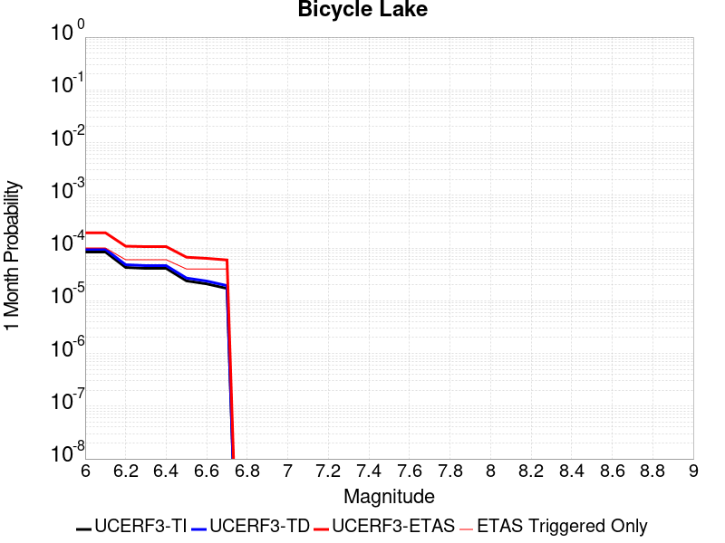 | 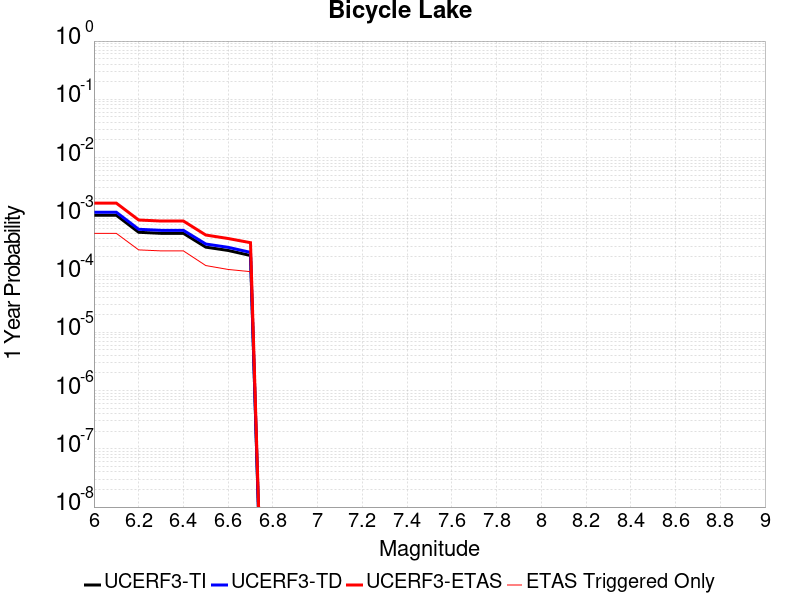 |  |

| Magnitude | 1 wk TI Prob | 1 wk TD Prob | 1 wk ETAS Prob | 1 wk ETAS/TD Gain | 1 wk ETAS Triggered Only | 1 mo TI Prob | 1 mo TD Prob | 1 mo ETAS Prob | 1 mo ETAS/TD Gain | 1 mo ETAS Triggered Only | 1 yr TI Prob | 1 yr TD Prob | 1 yr ETAS Prob | 1 yr ETAS/TD Gain | 1 yr ETAS Triggered Only | 10 yr TI Prob | 10 yr TD Prob | 10 yr ETAS Prob | 10 yr ETAS/TD Gain | 10 yr ETAS Triggered Only |
|-----|-----|-----|-----|-----|-----|-----|-----|-----|-----|-----|-----|-----|-----|-----|-----|-----|-----|-----|-----|-----|
| 6.0 | 1.9621975E-5 | 2.2097447E-5 | 4.2097006E-5 | 1.9050618 | 2.0E-5 | 8.4091465E-5 | 9.470067E-5 | 1.946912E-4 | 2.0558586 | 1.0E-4 | 0.0010233327 | 0.0011525059 | 0.0016519296 | 1.4333373 | 5.0E-4 | 0.01018633 | 0.011478599 | 0.012565972 | 1.0947305 | 0.0011 |
| 6.1 | 1.9621975E-5 | 2.2097447E-5 | 4.2097006E-5 | 1.9050618 | 2.0E-5 | 8.4091465E-5 | 9.470067E-5 | 1.946912E-4 | 2.0558586 | 1.0E-4 | 0.0010233327 | 0.0011525059 | 0.0016519296 | 1.4333373 | 5.0E-4 | 0.01018633 | 0.011478599 | 0.012565972 | 1.0947305 | 0.0011 |
| 6.2 | 9.9971285E-6 | 1.1255827E-5 | 3.1255604E-5 | 2.7768373 | 2.0E-5 | 4.2844134E-5 | 4.823866E-5 | 1.0823577E-4 | 2.2437556 | 6.0E-5 | 5.2150246E-4 | 5.8719947E-4 | 8.470468E-4 | 1.4425197 | 2.6E-4 | 0.0052028033 | 0.005861584 | 0.006497833 | 1.1085455 | 6.4E-4 |
| 6.3 | 9.589428E-6 | 1.0798527E-5 | 3.079831E-5 | 2.8520846 | 2.0E-5 | 4.10969E-5 | 4.627887E-5 | 1.0627609E-4 | 2.296428 | 6.0E-5 | 5.002399E-4 | 5.6335144E-4 | 8.132106E-4 | 1.4435227 | 2.5E-4 | 0.0049911533 | 0.0056243236 | 0.00625078 | 1.1113834 | 6.3E-4 |
| 6.4 | 9.589428E-6 | 1.0798527E-5 | 3.079831E-5 | 2.8520846 | 2.0E-5 | 4.10969E-5 | 4.627887E-5 | 1.0627609E-4 | 2.296428 | 6.0E-5 | 5.002399E-4 | 5.6335144E-4 | 8.132106E-4 | 1.4435227 | 2.5E-4 | 0.0049911533 | 0.0056243236 | 0.00625078 | 1.1113834 | 6.3E-4 |
| 6.5 | 5.557707E-6 | 6.2857107E-6 | 2.6285585E-5 | 4.1818 | 2.0E-5 | 2.3818526E-5 | 2.6938633E-5 | 6.693756E-5 | 2.4848163 | 4.0E-5 | 2.8995197E-4 | 3.2795538E-4 | 4.6790947E-4 | 1.4267473 | 1.4E-4 | 0.0028957394 | 0.0032773502 | 0.003616236 | 1.1034024 | 3.4E-4 |
| 6.6 | 4.8742945E-6 | 5.5133855E-6 | 2.5513275E-5 | 4.6275153 | 2.0E-5 | 2.0889667E-5 | 2.3628729E-5 | 6.3627784E-5 | 2.6928146 | 4.0E-5 | 2.54302E-4 | 2.87668E-4 | 4.076335E-4 | 1.4170276 | 1.2E-4 | 0.002540112 | 0.0028755253 | 0.0031846338 | 1.1074964 | 3.1E-4 |
| 6.7 | 3.991108E-6 | 4.515989E-6 | 2.4515899E-5 | 5.4286885 | 2.0E-5 | 1.7104636E-5 | 1.9354238E-5 | 5.9353464E-5 | 3.0666907 | 4.0E-5 | 2.0822904E-4 | 2.3563785E-4 | 3.4561194E-4 | 1.4667081 | 1.1E-4 | 0.0020803404 | 0.0023563786 | 0.0026257425 | 1.1143126 | 2.7E-4 |

## San Andreas (San Bernardino N)
*[(top)](#table-of-contents)*

| 1 Week | 1 Month | 1 Year | 10 Year |
|-----|-----|-----|-----|
|  |  | 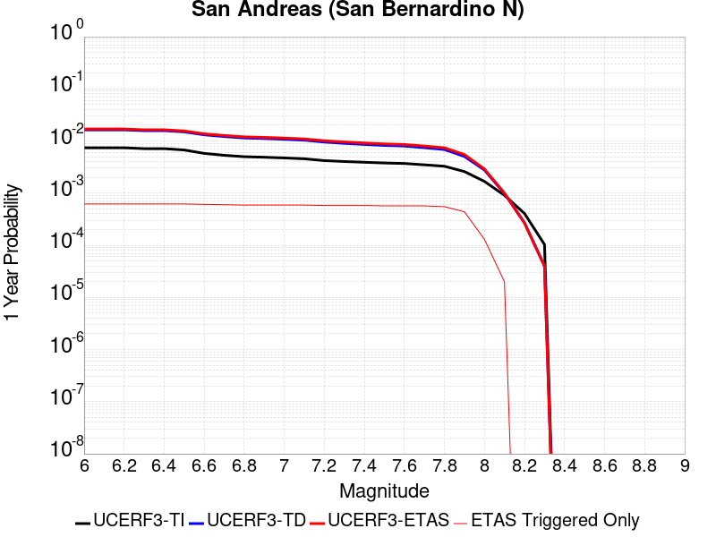 |  |

| Magnitude | 1 wk TI Prob | 1 wk TD Prob | 1 wk ETAS Prob | 1 wk ETAS/TD Gain | 1 wk ETAS Triggered Only | 1 mo TI Prob | 1 mo TD Prob | 1 mo ETAS Prob | 1 mo ETAS/TD Gain | 1 mo ETAS Triggered Only | 1 yr TI Prob | 1 yr TD Prob | 1 yr ETAS Prob | 1 yr ETAS/TD Gain | 1 yr ETAS Triggered Only | 10 yr TI Prob | 10 yr TD Prob | 10 yr ETAS Prob | 10 yr ETAS/TD Gain | 10 yr ETAS Triggered Only |
|-----|-----|-----|-----|-----|-----|-----|-----|-----|-----|-----|-----|-----|-----|-----|-----|-----|-----|-----|-----|-----|
| 6.0 | 1.4273766E-4 | 3.161376E-4 | 4.3609965E-4 | 1.3794615 | 1.2E-4 | 6.115894E-4 | 0.0013541778 | 0.0016138257 | 1.1917384 | 2.6E-4 | 0.0074207084 | 0.016363978 | 0.016973833 | 1.037268 | 6.2E-4 | 0.07177748 | 0.15029658 | 0.15120576 | 1.0060493 | 0.00107 |
| 6.1 | 1.4273766E-4 | 3.161376E-4 | 4.3609965E-4 | 1.3794615 | 1.2E-4 | 6.115894E-4 | 0.0013541778 | 0.0016138257 | 1.1917384 | 2.6E-4 | 0.0074207084 | 0.016363978 | 0.016973833 | 1.037268 | 6.2E-4 | 0.07177748 | 0.15029658 | 0.15120576 | 1.0060493 | 0.00107 |
| 6.2 | 1.4273766E-4 | 3.161376E-4 | 4.3609965E-4 | 1.3794615 | 1.2E-4 | 6.115894E-4 | 0.0013541778 | 0.0016138257 | 1.1917384 | 2.6E-4 | 0.0074207084 | 0.016363978 | 0.016973833 | 1.037268 | 6.2E-4 | 0.07177748 | 0.15029658 | 0.15120576 | 1.0060493 | 0.00107 |
| 6.3 | 1.3730655E-4 | 3.0518573E-4 | 4.2514913E-4 | 1.3930832 | 1.2E-4 | 5.883239E-4 | 0.001307289 | 0.0015669491 | 1.1986248 | 2.6E-4 | 0.0071393442 | 0.01580149 | 0.016411694 | 1.0386168 | 6.2E-4 | 0.06914291 | 0.14559646 | 0.14651068 | 1.0062791 | 0.00107 |
| 6.4 | 1.3730655E-4 | 3.0518573E-4 | 4.2514913E-4 | 1.3930832 | 1.2E-4 | 5.883239E-4 | 0.001307289 | 0.0015669491 | 1.1986248 | 2.6E-4 | 0.0071393442 | 0.01580149 | 0.016411694 | 1.0386168 | 6.2E-4 | 0.06914291 | 0.14559646 | 0.14651068 | 1.0062791 | 0.00107 |
| 6.5 | 1.2942807E-4 | 2.8932988E-4 | 4.0929517E-4 | 1.4146315 | 1.2E-4 | 5.545738E-4 | 0.0012394012 | 0.0014990789 | 1.2095188 | 2.6E-4 | 0.0067310524 | 0.014986552 | 0.015597261 | 1.0407504 | 6.2E-4 | 0.06530788 | 0.13873914 | 0.13966069 | 1.0066423 | 0.00107 |
| 6.6 | 1.1125901E-4 | 2.537176E-4 | 3.7368713E-4 | 1.4728469 | 1.2E-4 | 4.767372E-4 | 0.0010869103 | 0.0013466276 | 1.2389501 | 2.6E-4 | 0.005788839 | 0.013153472 | 0.013755448 | 1.0457656 | 6.1E-4 | 0.056403454 | 0.12302898 | 0.123958565 | 1.0075558 | 0.00106 |
| 6.7 | 1.02209575E-4 | 2.3506685E-4 | 3.45041E-4 | 1.467842 | 1.1E-4 | 4.3796748E-4 | 0.0010070418 | 0.00125679 | 1.2480018 | 2.5E-4 | 0.0053192247 | 0.01219223 | 0.012784915 | 1.0486116 | 6.0E-4 | 0.051936906 | 0.11482068 | 0.115723565 | 1.0078634 | 0.00102 |
| 6.8 | 9.610582E-5 | 2.2032406E-4 | 3.302998E-4 | 1.4991546 | 1.1E-4 | 4.1181705E-4 | 9.439049E-4 | 0.0011936689 | 1.2646072 | 2.5E-4 | 0.0050023515 | 0.011431754 | 0.012015008 | 1.0510206 | 5.9E-4 | 0.048912346 | 0.1082225 | 0.1091232 | 1.0083226 | 0.00101 |
| 6.9 | 9.3877505E-5 | 2.1487933E-4 | 3.2485567E-4 | 1.5118053 | 1.1E-4 | 4.0227012E-4 | 9.2058704E-4 | 0.0011703569 | 1.2713158 | 2.5E-4 | 0.0048866454 | 0.011150793 | 0.011734215 | 1.0523211 | 5.9E-4 | 0.04780577 | 0.10581279 | 0.10671592 | 1.0085351 | 0.00101 |
| 7.0 | 9.1019785E-5 | 2.0814833E-4 | 3.1812544E-4 | 1.5283593 | 1.1E-4 | 3.900265E-4 | 8.917599E-4 | 0.001141537 | 1.2800945 | 2.5E-4 | 0.0047382377 | 0.010803353 | 0.011386978 | 1.0540227 | 5.9E-4 | 0.046384744 | 0.10278319 | 0.10368937 | 1.0088165 | 0.00101 |
| 7.1 | 8.771155E-5 | 1.9989353E-4 | 3.0987154E-4 | 1.5501829 | 1.1E-4 | 3.758525E-4 | 8.564058E-4 | 0.0011061918 | 1.2916677 | 2.5E-4 | 0.0045664064 | 0.01037709 | 0.010960967 | 1.0562661 | 5.9E-4 | 0.044737056 | 0.09909467 | 0.100004576 | 1.0091822 | 0.00101 |
| 7.2 | 8.0830236E-5 | 1.8394848E-4 | 2.9392826E-4 | 1.5978836 | 1.1E-4 | 3.4636928E-4 | 7.881126E-4 | 0.0010279234 | 1.304285 | 2.4E-4 | 0.0042088944 | 0.009553162 | 0.010127621 | 1.0601329 | 5.8E-4 | 0.041300658 | 0.09182531 | 0.09273348 | 1.0098902 | 0.001 |
| 7.3 | 7.7668235E-5 | 1.7338296E-4 | 2.833639E-4 | 1.6343237 | 1.1E-4 | 3.328214E-4 | 7.428583E-4 | 9.8268E-4 | 1.3228364 | 2.4E-4 | 0.0040445733 | 0.009006873 | 0.009581649 | 1.0638152 | 5.8E-4 | 0.03971748 | 0.087092124 | 0.088005036 | 1.0104821 | 0.001 |
| 7.4 | 7.520177E-5 | 1.6558339E-4 | 2.7556517E-4 | 1.6642078 | 1.1E-4 | 3.2225347E-4 | 7.0945016E-4 | 9.492799E-4 | 1.3380501 | 2.4E-4 | 0.0039163795 | 0.0086034145 | 0.009178424 | 1.066835 | 5.8E-4 | 0.038480744 | 0.08354814 | 0.08445543 | 1.0108595 | 9.9E-4 |
| 7.5 | 7.274697E-5 | 1.5845922E-4 | 2.5844338E-4 | 1.6309772 | 1.0E-4 | 3.1173544E-4 | 6.789343E-4 | 9.087781E-4 | 1.3385363 | 2.3E-4 | 0.003788775 | 0.008234753 | 0.008800059 | 1.0686488 | 5.7E-4 | 0.03724827 | 0.08026466 | 0.081166 | 1.0112296 | 9.8E-4 |
| 7.6 | 7.1185845E-5 | 1.5415733E-4 | 2.5414192E-4 | 1.648588 | 1.0E-4 | 3.0504653E-4 | 6.6050707E-4 | 8.9035515E-4 | 1.3479873 | 2.3E-4 | 0.0037076178 | 0.008012074 | 0.008577507 | 1.0705726 | 5.7E-4 | 0.036463667 | 0.078254156 | 0.079157464 | 1.0115433 | 9.8E-4 |
| 7.7 | 6.709961E-5 | 1.4324463E-4 | 2.432303E-4 | 1.6980065 | 1.0E-4 | 2.8753807E-4 | 6.1376113E-4 | 8.4362E-4 | 1.3745086 | 2.3E-4 | 0.003495157 | 0.007446978 | 0.0080127325 | 1.0759711 | 5.7E-4 | 0.034406938 | 0.073082365 | 0.07399075 | 1.0124295 | 9.8E-4 |
| 7.8 | 6.300812E-5 | 1.3208245E-4 | 2.2207056E-4 | 1.6813025 | 9.0E-5 | 2.7000686E-4 | 5.659449E-4 | 7.8582036E-4 | 1.3885105 | 2.2E-4 | 0.0032823787 | 0.0068686386 | 0.007414861 | 1.079524 | 5.5E-4 | 0.032343175 | 0.06773997 | 0.06863494 | 1.0132118 | 9.6E-4 |
| 7.9 | 4.983037E-5 | 9.728091E-5 | 1.5727508E-4 | 1.6167105 | 6.0E-5 | 2.1354125E-4 | 4.1685157E-4 | 5.767849E-4 | 1.3836696 | 1.6E-4 | 0.0025967648 | 0.005063368 | 0.00550114 | 1.0864587 | 4.4E-4 | 0.025666296 | 0.0506703 | 0.051420268 | 1.014801 | 7.9E-4 |
| 8.0 | 3.2211527E-5 | 5.333152E-5 | 8.332992E-5 | 1.5624892 | 3.0E-5 | 1.380421E-4 | 2.2854365E-4 | 3.0852537E-4 | 1.3499626 | 8.0E-5 | 0.0016793669 | 0.0027789702 | 0.002908609 | 1.0466499 | 1.3E-4 | 0.016667323 | 0.02837451 | 0.028627131 | 1.0089031 | 2.6E-4 |
| 8.1 | 1.743376E-5 | 1.8836954E-5 | 1.8836954E-5 | 1.0 | 0.0 | 7.471398E-5 | 8.07273E-5 | 9.07265E-5 | 1.1238638 | 1.0E-5 | 9.0926304E-4 | 9.824124E-4 | 0.0010023927 | 1.020338 | 2.0E-5 | 0.009055517 | 0.010490617 | 0.010530197 | 1.003773 | 4.0E-5 |
| 8.2 | 7.831616E-6 | 5.1597067E-6 | 5.1597067E-6 | 1.0 | 0.0 | 3.3563636E-5 | 2.2112841E-5 | 2.2112841E-5 | 1.0 | 0.0 | 4.0856065E-4 | 2.6919067E-4 | 2.6919067E-4 | 1.0 | 0.0 | 0.004078103 | 0.003044315 | 0.003044315 | 1.0 | 0.0 |
| 8.3 | 1.983087E-6 | 7.668296E-7 | 7.668296E-7 | 1.0 | 0.0 | 8.498917E-6 | 3.2864084E-6 | 3.2864084E-6 | 1.0 | 0.0 | 1.034694E-4 | 4.0011306E-5 | 4.0011306E-5 | 1.0 | 0.0 | 0.0010342124 | 4.724499E-4 | 4.724499E-4 | 1.0 | 0.0 |

## Paradise
*[(top)](#table-of-contents)*

| 1 Week | 1 Month | 1 Year | 10 Year |
|-----|-----|-----|-----|
|  | 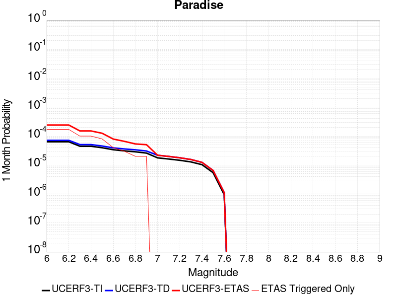 |  |  |

| Magnitude | 1 wk TI Prob | 1 wk TD Prob | 1 wk ETAS Prob | 1 wk ETAS/TD Gain | 1 wk ETAS Triggered Only | 1 mo TI Prob | 1 mo TD Prob | 1 mo ETAS Prob | 1 mo ETAS/TD Gain | 1 mo ETAS Triggered Only | 1 yr TI Prob | 1 yr TD Prob | 1 yr ETAS Prob | 1 yr ETAS/TD Gain | 1 yr ETAS Triggered Only | 10 yr TI Prob | 10 yr TD Prob | 10 yr ETAS Prob | 10 yr ETAS/TD Gain | 10 yr ETAS Triggered Only |
|-----|-----|-----|-----|-----|-----|-----|-----|-----|-----|-----|-----|-----|-----|-----|-----|-----|-----|-----|-----|-----|
| 6.0 | 1.4851273E-5 | 1.6694854E-5 | 8.669368E-5 | 5.1928387 | 7.0E-5 | 6.364676E-5 | 7.154755E-5 | 2.4153538E-4 | 3.3758724 | 1.7E-4 | 7.7462377E-4 | 8.707668E-4 | 0.001320375 | 1.5163358 | 4.5E-4 | 0.0077192914 | 0.008675928 | 0.009736645 | 1.1222597 | 0.00107 |
| 6.1 | 1.4851273E-5 | 1.6694854E-5 | 8.669368E-5 | 5.1928387 | 7.0E-5 | 6.364676E-5 | 7.154755E-5 | 2.4153538E-4 | 3.3758724 | 1.7E-4 | 7.7462377E-4 | 8.707668E-4 | 0.001320375 | 1.5163358 | 4.5E-4 | 0.0077192914 | 0.008675928 | 0.009736645 | 1.1222597 | 0.00107 |
| 6.2 | 1.4851273E-5 | 1.6694854E-5 | 8.669368E-5 | 5.1928387 | 7.0E-5 | 6.364676E-5 | 7.154755E-5 | 2.4153538E-4 | 3.3758724 | 1.7E-4 | 7.7462377E-4 | 8.707668E-4 | 0.001320375 | 1.5163358 | 4.5E-4 | 0.0077192914 | 0.008675928 | 0.009736645 | 1.1222597 | 0.00107 |
| 6.3 | 1.0426831E-5 | 1.1888727E-5 | 5.188825E-5 | 4.3644915 | 4.0E-5 | 4.4685654E-5 | 5.0950726E-5 | 1.5094563E-4 | 2.9625804 | 1.0E-4 | 5.43912E-4 | 6.201545E-4 | 8.3002425E-4 | 1.3384153 | 2.1E-4 | 0.0054258266 | 0.006184847 | 0.006642002 | 1.0739154 | 4.6E-4 |
| 6.4 | 1.0426831E-5 | 1.1888727E-5 | 5.188825E-5 | 4.3644915 | 4.0E-5 | 4.4685654E-5 | 5.0950726E-5 | 1.5094563E-4 | 2.9625804 | 1.0E-4 | 5.43912E-4 | 6.201545E-4 | 8.3002425E-4 | 1.3384153 | 2.1E-4 | 0.0054258266 | 0.006184847 | 0.006642002 | 1.0739154 | 4.6E-4 |
| 6.5 | 9.25027E-6 | 1.0620054E-5 | 5.061963E-5 | 4.7664194 | 4.0E-5 | 3.964341E-5 | 4.551375E-5 | 1.2551011E-4 | 2.7576306 | 8.0E-5 | 4.8255164E-4 | 5.539939E-4 | 7.2389975E-4 | 1.3066926 | 1.7E-4 | 0.0048150513 | 0.0055266283 | 0.005894583 | 1.0665786 | 3.7E-4 |
| 6.6 | 7.904275E-6 | 9.159603E-6 | 2.9159419E-5 | 3.1834807 | 2.0E-5 | 3.3875025E-5 | 3.925487E-5 | 7.92533E-5 | 2.0189419 | 4.0E-5 | 4.1235037E-4 | 4.7782718E-4 | 5.7777937E-4 | 1.2091807 | 1.0E-4 | 0.0041158604 | 0.004768395 | 0.004937584 | 1.0354815 | 1.7E-4 |
| 6.7 | 7.2061953E-6 | 8.407318E-6 | 2.840715E-5 | 3.3788598 | 2.0E-5 | 3.088333E-5 | 3.6030888E-5 | 6.60298E-5 | 1.832589 | 3.0E-5 | 3.7593965E-4 | 4.385914E-4 | 4.985651E-4 | 1.1367416 | 6.0E-5 | 0.003753043 | 0.0043776273 | 0.0044871457 | 1.0250177 | 1.1E-4 |
| 6.8 | 6.6948724E-6 | 7.84223E-6 | 2.7842074E-5 | 3.5502748 | 2.0E-5 | 2.8691995E-5 | 3.3609143E-5 | 5.3608474E-5 | 1.5950562 | 2.0E-5 | 3.4926904E-4 | 4.0911807E-4 | 4.5909762E-4 | 1.1221641 | 5.0E-5 | 0.003487206 | 0.0040840064 | 0.0041835983 | 1.0243858 | 1.0E-4 |
| 6.9 | 6.0421025E-6 | 7.130678E-6 | 2.7130536E-5 | 3.8047624 | 2.0E-5 | 2.5894467E-5 | 3.055971E-5 | 5.05591E-5 | 1.6544365 | 2.0E-5 | 3.1521954E-4 | 3.7200435E-4 | 3.919969E-4 | 1.0537428 | 2.0E-5 | 0.0031477278 | 0.0037141545 | 0.0037639688 | 1.013412 | 5.0E-5 |
| 7.0 | 4.134091E-6 | 5.0803487E-6 | 5.0803487E-6 | 1.0 | 0.0 | 1.7717413E-5 | 2.177275E-5 | 2.177275E-5 | 1.0 | 0.0 | 2.1568815E-4 | 2.6505254E-4 | 2.6505254E-4 | 1.0 | 0.0 | 0.0021547892 | 0.0026475172 | 0.0026574908 | 1.0037671 | 1.0E-5 |
| 7.1 | 3.7674888E-6 | 4.6319055E-6 | 4.6319055E-6 | 1.0 | 0.0 | 1.6146281E-5 | 1.985088E-5 | 1.985088E-5 | 1.0 | 0.0 | 1.9656324E-4 | 2.4165919E-4 | 2.4165919E-4 | 1.0 | 0.0 | 0.0019638946 | 0.0024141145 | 0.0024240904 | 1.0041323 | 1.0E-5 |
| 7.2 | 3.4065345E-6 | 4.156755E-6 | 4.156755E-6 | 1.0 | 0.0 | 1.4599351E-5 | 1.7814553E-5 | 1.7814553E-5 | 1.0 | 0.0 | 1.777326E-4 | 2.1687208E-4 | 2.1687208E-4 | 1.0 | 0.0 | 0.0017759053 | 0.0021667527 | 0.002176731 | 1.0046052 | 1.0E-5 |
| 7.3 | 2.9934936E-6 | 3.6293434E-6 | 3.6293434E-6 | 1.0 | 0.0 | 1.2829195E-5 | 1.5554244E-5 | 1.5554244E-5 | 1.0 | 0.0 | 1.5618425E-4 | 1.8935793E-4 | 1.8935793E-4 | 1.0 | 0.0 | 0.0015607453 | 0.0018921113 | 0.0019020924 | 1.0052751 | 1.0E-5 |
| 7.4 | 2.4049796E-6 | 2.8890036E-6 | 2.8890036E-6 | 1.0 | 0.0 | 1.0307015E-5 | 1.2381393E-5 | 1.2381393E-5 | 1.0 | 0.0 | 1.2548068E-4 | 1.5073447E-4 | 1.5073447E-4 | 1.0 | 0.0 | 0.0012540985 | 0.0015064639 | 0.0015164487 | 1.006628 | 1.0E-5 |
| 7.5 | 1.2710091E-6 | 1.5134775E-6 | 1.5134775E-6 | 1.0 | 0.0 | 5.44717E-6 | 6.486323E-6 | 6.486323E-6 | 1.0 | 0.0 | 6.631728E-5 | 7.896937E-5 | 7.896937E-5 | 1.0 | 0.0 | 6.6297496E-4 | 7.8953576E-4 | 7.9952786E-4 | 1.0126556 | 1.0E-5 |
| 7.6 | 2.21172E-7 | 2.6039737E-7 | 2.6039737E-7 | 1.0 | 0.0 | 9.478797E-7 | 1.1159884E-6 | 1.1159884E-6 | 1.0 | 0.0 | 1.1540374E-5 | 1.3587103E-5 | 1.3587103E-5 | 1.0 | 0.0 | 1.1539775E-4 | 1.3586554E-4 | 1.3586554E-4 | 1.0 | 0.0 |

## Garlic Springs
*[(top)](#table-of-contents)*

| 1 Week | 1 Month | 1 Year | 10 Year |
|-----|-----|-----|-----|
|  | 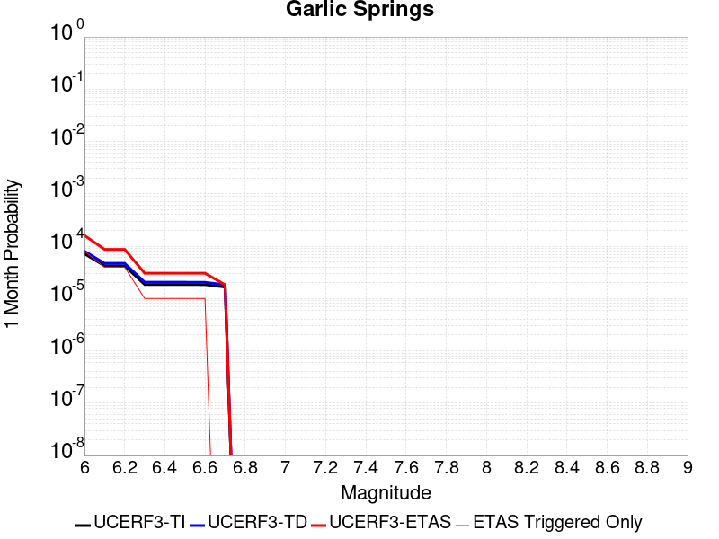 |  |  |

| Magnitude | 1 wk TI Prob | 1 wk TD Prob | 1 wk ETAS Prob | 1 wk ETAS/TD Gain | 1 wk ETAS Triggered Only | 1 mo TI Prob | 1 mo TD Prob | 1 mo ETAS Prob | 1 mo ETAS/TD Gain | 1 mo ETAS Triggered Only | 1 yr TI Prob | 1 yr TD Prob | 1 yr ETAS Prob | 1 yr ETAS/TD Gain | 1 yr ETAS Triggered Only | 10 yr TI Prob | 10 yr TD Prob | 10 yr ETAS Prob | 10 yr ETAS/TD Gain | 10 yr ETAS Triggered Only |
|-----|-----|-----|-----|-----|-----|-----|-----|-----|-----|-----|-----|-----|-----|-----|-----|-----|-----|-----|-----|-----|
| 6.0 | 1.6760017E-5 | 1.8777133E-5 | 1.8777133E-5 | 1.0 | 0.0 | 7.182667E-5 | 8.0471604E-5 | 1.6046516E-4 | 1.9940594 | 8.0E-5 | 8.7413884E-4 | 9.794189E-4 | 0.0014389682 | 1.4692063 | 4.6E-4 | 0.008707083 | 0.009762568 | 0.010713196 | 1.0973748 | 9.6E-4 |
| 6.1 | 9.852767E-6 | 1.0973752E-5 | 1.0973752E-5 | 1.0 | 0.0 | 4.222546E-5 | 4.702992E-5 | 8.702804E-5 | 1.8504823 | 4.0E-5 | 5.139737E-4 | 5.7250983E-4 | 8.523495E-4 | 1.4887946 | 2.8E-4 | 0.005127866 | 0.0057173073 | 0.006313877 | 1.1043445 | 6.0E-4 |
| 6.2 | 9.852767E-6 | 1.0973752E-5 | 1.0973752E-5 | 1.0 | 0.0 | 4.222546E-5 | 4.702992E-5 | 8.702804E-5 | 1.8504823 | 4.0E-5 | 5.139737E-4 | 5.7250983E-4 | 8.523495E-4 | 1.4887946 | 2.8E-4 | 0.005127866 | 0.0057173073 | 0.006313877 | 1.1043445 | 6.0E-4 |
| 6.3 | 4.3167724E-6 | 4.7780964E-6 | 4.7780964E-6 | 1.0 | 0.0 | 1.8500323E-5 | 2.0477524E-5 | 3.047732E-5 | 1.4883302 | 1.0E-5 | 2.2521814E-4 | 2.4930836E-4 | 3.3928594E-4 | 1.3609087 | 9.0E-5 | 0.0022499003 | 0.0024925452 | 0.002711997 | 1.0880432 | 2.2E-4 |
| 6.4 | 4.3167724E-6 | 4.7780964E-6 | 4.7780964E-6 | 1.0 | 0.0 | 1.8500323E-5 | 2.0477524E-5 | 3.047732E-5 | 1.4883302 | 1.0E-5 | 2.2521814E-4 | 2.4930836E-4 | 3.3928594E-4 | 1.3609087 | 9.0E-5 | 0.0022499003 | 0.0024925452 | 0.002711997 | 1.0880432 | 2.2E-4 |
| 6.5 | 4.3167724E-6 | 4.7780964E-6 | 4.7780964E-6 | 1.0 | 0.0 | 1.8500323E-5 | 2.0477524E-5 | 3.047732E-5 | 1.4883302 | 1.0E-5 | 2.2521814E-4 | 2.4930836E-4 | 3.3928594E-4 | 1.3609087 | 9.0E-5 | 0.0022499003 | 0.0024925452 | 0.002711997 | 1.0880432 | 2.2E-4 |
| 6.6 | 4.301311E-6 | 4.7609647E-6 | 4.7609647E-6 | 1.0 | 0.0 | 1.8434059E-5 | 2.0404104E-5 | 3.04039E-5 | 1.4900875 | 1.0E-5 | 2.2441156E-4 | 2.4841467E-4 | 3.3839233E-4 | 1.3622074 | 9.0E-5 | 0.0022418506 | 0.0024836282 | 0.0027030818 | 1.0883601 | 2.2E-4 |
| 6.7 | 3.8599724E-6 | 4.2711204E-6 | 4.2711204E-6 | 1.0 | 0.0 | 1.6542634E-5 | 1.8304801E-5 | 1.8304801E-5 | 1.0 | 0.0 | 2.0138794E-4 | 2.2286095E-4 | 3.028431E-4 | 1.3588883 | 8.0E-5 | 0.0020120554 | 0.0022286095 | 0.0024281638 | 1.089542 | 2.0E-4 |

## Helendale-So Lockhart
*[(top)](#table-of-contents)*

| 1 Week | 1 Month | 1 Year | 10 Year |
|-----|-----|-----|-----|
|  |  |  |  |

| Magnitude | 1 wk TI Prob | 1 wk TD Prob | 1 wk ETAS Prob | 1 wk ETAS/TD Gain | 1 wk ETAS Triggered Only | 1 mo TI Prob | 1 mo TD Prob | 1 mo ETAS Prob | 1 mo ETAS/TD Gain | 1 mo ETAS Triggered Only | 1 yr TI Prob | 1 yr TD Prob | 1 yr ETAS Prob | 1 yr ETAS/TD Gain | 1 yr ETAS Triggered Only | 10 yr TI Prob | 10 yr TD Prob | 10 yr ETAS Prob | 10 yr ETAS/TD Gain | 10 yr ETAS Triggered Only |
|-----|-----|-----|-----|-----|-----|-----|-----|-----|-----|-----|-----|-----|-----|-----|-----|-----|-----|-----|-----|-----|
| 6.0 | 1.7296055E-5 | 1.8103841E-5 | 4.81033E-5 | 2.6570768 | 3.0E-5 | 7.412385E-5 | 7.7585704E-5 | 1.8757717E-4 | 2.417677 | 1.1E-4 | 9.0208417E-4 | 9.442173E-4 | 0.0012938868 | 1.3703274 | 3.5E-4 | 0.008984311 | 0.009404174 | 0.010087686 | 1.0726817 | 6.9E-4 |
| 6.1 | 1.7296055E-5 | 1.8103841E-5 | 4.81033E-5 | 2.6570768 | 3.0E-5 | 7.412385E-5 | 7.7585704E-5 | 1.8757717E-4 | 2.417677 | 1.1E-4 | 9.0208417E-4 | 9.442173E-4 | 0.0012938868 | 1.3703274 | 3.5E-4 | 0.008984311 | 0.009404174 | 0.010087686 | 1.0726817 | 6.9E-4 |
| 6.2 | 1.7296055E-5 | 1.8103841E-5 | 4.81033E-5 | 2.6570768 | 3.0E-5 | 7.412385E-5 | 7.7585704E-5 | 1.8757717E-4 | 2.417677 | 1.1E-4 | 9.0208417E-4 | 9.442173E-4 | 0.0012938868 | 1.3703274 | 3.5E-4 | 0.008984311 | 0.009404174 | 0.010087686 | 1.0726817 | 6.9E-4 |
| 6.3 | 1.0669118E-5 | 1.1135489E-5 | 4.1135154E-5 | 3.6940591 | 3.0E-5 | 4.5723988E-5 | 4.7722668E-5 | 1.2771886E-4 | 2.6762722 | 8.0E-5 | 5.5654737E-4 | 5.8087136E-4 | 7.607668E-4 | 1.3096993 | 1.8E-4 | 0.0055515557 | 0.005793827 | 0.00624122 | 1.0772189 | 4.5E-4 |
| 6.4 | 1.0669118E-5 | 1.1135489E-5 | 4.1135154E-5 | 3.6940591 | 3.0E-5 | 4.5723988E-5 | 4.7722668E-5 | 1.2771886E-4 | 2.6762722 | 8.0E-5 | 5.5654737E-4 | 5.8087136E-4 | 7.607668E-4 | 1.3096993 | 1.8E-4 | 0.0055515557 | 0.005793827 | 0.00624122 | 1.0772189 | 4.5E-4 |
| 6.5 | 8.790038E-6 | 9.1702495E-6 | 3.9169976E-5 | 4.2714186 | 3.0E-5 | 3.767105E-5 | 3.9300485E-5 | 1.1929734E-4 | 3.0355182 | 8.0E-5 | 4.585485E-4 | 4.7837992E-4 | 6.482986E-4 | 1.3551961 | 1.7E-4 | 0.0045760344 | 0.0047736657 | 0.0051817084 | 1.0854778 | 4.1E-4 |
| 6.6 | 7.396949E-6 | 7.715581E-6 | 3.771535E-5 | 4.888206 | 3.0E-5 | 3.1700827E-5 | 3.3066364E-5 | 1.1306372E-4 | 3.419297 | 8.0E-5 | 3.858892E-4 | 4.025096E-4 | 5.624452E-4 | 1.397346 | 1.6E-4 | 0.003852198 | 0.004017913 | 0.004386426 | 1.0917176 | 3.7E-4 |
| 6.7 | 6.4600285E-6 | 6.7380697E-6 | 3.6737867E-5 | 5.452284 | 3.0E-5 | 2.7685543E-5 | 2.8877126E-5 | 9.8875105E-5 | 3.423994 | 7.0E-5 | 3.3701936E-4 | 3.5152308E-4 | 4.614844E-4 | 1.312814 | 1.1E-4 | 0.0033650869 | 0.003509752 | 0.0037887692 | 1.0794977 | 2.8E-4 |
| 6.8 | 5.600104E-6 | 5.836042E-6 | 2.5835925E-5 | 4.42696 | 2.0E-5 | 2.4000226E-5 | 2.5011372E-5 | 8.500987E-5 | 3.3988488 | 6.0E-5 | 2.9216358E-4 | 3.044715E-4 | 3.944441E-4 | 1.2955042 | 9.0E-5 | 0.0029177975 | 0.003040605 | 0.0032499665 | 1.0688552 | 2.1E-4 |
| 6.9 | 4.839122E-6 | 5.039537E-6 | 2.5039437E-5 | 4.9685984 | 2.0E-5 | 2.0738931E-5 | 2.159784E-5 | 7.159676E-5 | 3.3149965 | 5.0E-5 | 2.5246723E-4 | 2.6292243E-4 | 3.429014E-4 | 1.3041923 | 8.0E-5 | 0.002521806 | 0.002626161 | 0.0028056884 | 1.0683612 | 1.8E-4 |
| 7.0 | 3.6937633E-6 | 3.845229E-6 | 1.3845191E-5 | 3.6006155 | 1.0E-5 | 1.5830317E-5 | 1.6479451E-5 | 4.6478955E-5 | 2.820419 | 3.0E-5 | 1.9271708E-4 | 2.0061915E-4 | 2.5060913E-4 | 1.2491784 | 5.0E-5 | 0.0019255003 | 0.0020044118 | 0.002144131 | 1.069706 | 1.4E-4 |
| 7.1 | 2.7858857E-6 | 2.8978693E-6 | 1.289784E-5 | 4.4508014 | 1.0E-5 | 1.1939455E-5 | 1.2419382E-5 | 4.2419008E-5 | 3.4155493 | 3.0E-5 | 1.4535317E-4 | 1.511957E-4 | 1.8119116E-4 | 1.1983883 | 3.0E-5 | 0.0014525814 | 0.0015109498 | 0.0015908289 | 1.0528668 | 8.0E-5 |
| 7.2 | 2.1672065E-6 | 2.2540248E-6 | 1.2254002E-5 | 5.4364986 | 1.0E-5 | 9.2879945E-6 | 9.660072E-6 | 3.9659782E-5 | 4.105537 | 3.0E-5 | 1.1307546E-4 | 1.176052E-4 | 1.4760168E-4 | 1.2550608 | 3.0E-5 | 0.0011301794 | 0.0011754478 | 0.0012453656 | 1.0594817 | 7.0E-5 |
| 7.3 | 1.4823496E-6 | 1.5422185E-6 | 1.5422185E-6 | 1.0 | 0.0 | 6.3529114E-6 | 6.6094917E-6 | 2.660936E-5 | 4.0259314 | 2.0E-5 | 7.734395E-5 | 8.046775E-5 | 1.0046614E-4 | 1.2485268 | 2.0E-5 | 7.731704E-4 | 8.044012E-4 | 8.54361E-4 | 1.062108 | 5.0E-5 |
| 7.4 | 4.2321457E-7 | 4.4109012E-7 | 4.4109012E-7 | 1.0 | 0.0 | 1.8137755E-6 | 1.8903852E-6 | 2.1890348E-5 | 11.579835 | 2.0E-5 | 2.2082493E-5 | 2.3015242E-5 | 4.301478E-5 | 1.8689693 | 2.0E-5 | 2.2080299E-4 | 2.3013311E-4 | 2.601262E-4 | 1.1303294 | 3.0E-5 |
| 7.5 | 5.6942316E-8 | 5.941599E-8 | 5.941599E-8 | 1.0 | 0.0 | 2.440385E-7 | 2.5463993E-7 | 2.5463993E-7 | 1.0 | 0.0 | 2.9711643E-6 | 3.1002376E-6 | 3.1002376E-6 | 1.0 | 0.0 | 2.9711247E-5 | 3.1002022E-5 | 3.1002022E-5 | 1.0 | 0.0 |

## San Andreas (San Bernardino S)
*[(top)](#table-of-contents)*

| 1 Week | 1 Month | 1 Year | 10 Year |
|-----|-----|-----|-----|
|  | 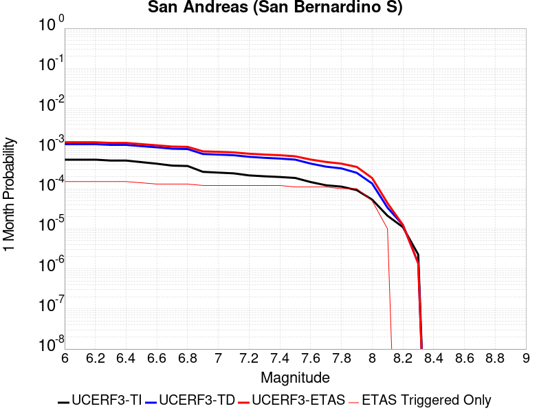 |  | 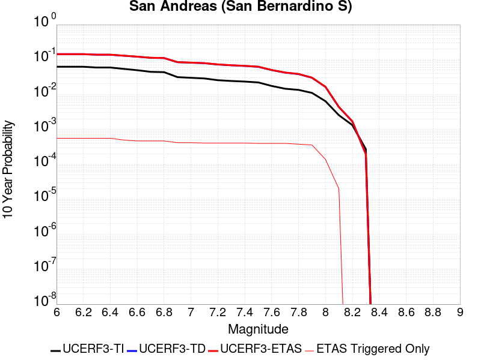 |

| Magnitude | 1 wk TI Prob | 1 wk TD Prob | 1 wk ETAS Prob | 1 wk ETAS/TD Gain | 1 wk ETAS Triggered Only | 1 mo TI Prob | 1 mo TD Prob | 1 mo ETAS Prob | 1 mo ETAS/TD Gain | 1 mo ETAS Triggered Only | 1 yr TI Prob | 1 yr TD Prob | 1 yr ETAS Prob | 1 yr ETAS/TD Gain | 1 yr ETAS Triggered Only | 10 yr TI Prob | 10 yr TD Prob | 10 yr ETAS Prob | 10 yr ETAS/TD Gain | 10 yr ETAS Triggered Only |
|-----|-----|-----|-----|-----|-----|-----|-----|-----|-----|-----|-----|-----|-----|-----|-----|-----|-----|-----|-----|-----|
| 6.0 | 1.2336002E-4 | 3.0008948E-4 | 3.5007446E-4 | 1.166567 | 5.0E-5 | 5.2857865E-4 | 0.0012854899 | 0.0014352971 | 1.116537 | 1.5E-4 | 0.006416472 | 0.015543484 | 0.015868355 | 1.0209007 | 3.3E-4 | 0.06234337 | 0.14285627 | 0.14333627 | 1.00336 | 5.6E-4 |
| 6.1 | 1.2336002E-4 | 3.0008948E-4 | 3.5007446E-4 | 1.166567 | 5.0E-5 | 5.2857865E-4 | 0.0012854899 | 0.0014352971 | 1.116537 | 1.5E-4 | 0.006416472 | 0.015543484 | 0.015868355 | 1.0209007 | 3.3E-4 | 0.06234337 | 0.14285627 | 0.14333627 | 1.00336 | 5.6E-4 |
| 6.2 | 1.2336002E-4 | 3.0008948E-4 | 3.5007446E-4 | 1.166567 | 5.0E-5 | 5.2857865E-4 | 0.0012854899 | 0.0014352971 | 1.116537 | 1.5E-4 | 0.006416472 | 0.015543484 | 0.015868355 | 1.0209007 | 3.3E-4 | 0.06234337 | 0.14285627 | 0.14333627 | 1.00336 | 5.6E-4 |
| 6.3 | 1.1712257E-4 | 2.8797207E-4 | 3.3795767E-4 | 1.1735779 | 5.0E-5 | 5.018573E-4 | 0.001233608 | 0.0013834229 | 1.1214446 | 1.5E-4 | 0.006093008 | 0.01492059 | 0.015245666 | 1.021787 | 3.3E-4 | 0.059286322 | 0.13756467 | 0.13804764 | 1.0035108 | 5.6E-4 |
| 6.4 | 1.1712257E-4 | 2.8797207E-4 | 3.3795767E-4 | 1.1735779 | 5.0E-5 | 5.018573E-4 | 0.001233608 | 0.0013834229 | 1.1214446 | 1.5E-4 | 0.006093008 | 0.01492059 | 0.015245666 | 1.021787 | 3.3E-4 | 0.059286322 | 0.13756467 | 0.13804764 | 1.0035108 | 5.6E-4 |
| 6.5 | 1.0689076E-4 | 2.6809986E-4 | 3.1808647E-4 | 1.1864476 | 5.0E-5 | 4.5802278E-4 | 0.0011485183 | 0.0012883574 | 1.1217562 | 1.4E-4 | 0.0055621783 | 0.013898174 | 0.014194004 | 1.0212855 | 3.0E-4 | 0.05425003 | 0.12881182 | 0.12924741 | 1.0033816 | 5.0E-4 |
| 6.6 | 9.7648895E-5 | 2.5054725E-4 | 3.0053474E-4 | 1.1995132 | 5.0E-5 | 4.1842813E-4 | 0.0010733557 | 0.0012032161 | 1.1209855 | 1.3E-4 | 0.005082469 | 0.012994168 | 0.01327053 | 1.0212681 | 2.8E-4 | 0.049677886 | 0.12097161 | 0.121384755 | 1.0034152 | 4.7E-4 |
| 6.7 | 8.757013E-5 | 2.3125445E-4 | 2.812429E-4 | 1.2161621 | 5.0E-5 | 3.7524657E-4 | 9.907364E-4 | 0.0011206076 | 1.1310855 | 1.3E-4 | 0.00455906 | 0.011999588 | 0.0122762285 | 1.0230541 | 2.8E-4 | 0.04466656 | 0.11227982 | 0.11269704 | 1.003716 | 4.7E-4 |
| 6.8 | 8.562978E-5 | 2.2685292E-4 | 2.7684157E-4 | 1.2203572 | 5.0E-5 | 3.6693315E-4 | 9.7188674E-4 | 0.0011017604 | 1.1336304 | 1.3E-4 | 0.004458263 | 0.01177259 | 0.012049293 | 1.023504 | 2.8E-4 | 0.043698758 | 0.11029001 | 0.11070818 | 1.0037915 | 4.7E-4 |
| 6.9 | 6.124075E-5 | 1.7069813E-4 | 2.2068959E-4 | 1.2928648 | 5.0E-5 | 2.6243398E-4 | 7.313591E-4 | 8.512713E-4 | 1.1639581 | 1.2E-4 | 0.0031904527 | 0.00886815 | 0.009125845 | 1.0290585 | 2.6E-4 | 0.031450346 | 0.08419993 | 0.084584564 | 1.0045681 | 4.2E-4 |
| 7.0 | 5.8598747E-5 | 1.6498787E-4 | 2.1497962E-4 | 1.3030026 | 5.0E-5 | 2.5111332E-4 | 7.069001E-4 | 8.2681526E-4 | 1.1696353 | 1.2E-4 | 0.0030530186 | 0.008572741 | 0.008830512 | 1.0300686 | 2.6E-4 | 0.03011414 | 0.08151753 | 0.081903294 | 1.0047323 | 4.2E-4 |
| 7.1 | 5.613814E-5 | 1.5917298E-4 | 2.0916502E-4 | 1.3140737 | 5.0E-5 | 2.4056983E-4 | 6.819924E-4 | 8.0191053E-4 | 1.175835 | 1.2E-4 | 0.0029250039 | 0.008271826 | 0.008529676 | 1.031172 | 2.6E-4 | 0.028868021 | 0.078816354 | 0.07919404 | 1.004792 | 4.1E-4 |
| 7.2 | 4.991222E-5 | 1.4523676E-4 | 1.9522948E-4 | 1.3442155 | 5.0E-5 | 2.1389198E-4 | 6.2229513E-4 | 7.4222044E-4 | 1.1927146 | 1.2E-4 | 0.002601025 | 0.0075502265 | 0.0078082634 | 1.0341761 | 2.6E-4 | 0.025707912 | 0.072269924 | 0.07265029 | 1.0052632 | 4.1E-4 |
| 7.3 | 4.7410045E-5 | 1.3717797E-4 | 1.8717111E-4 | 1.36444 | 5.0E-5 | 2.0317009E-4 | 5.8777345E-4 | 7.077029E-4 | 1.2040403 | 1.2E-4 | 0.0024707897 | 0.0071327467 | 0.007390892 | 1.0361916 | 2.6E-4 | 0.024434982 | 0.06855203 | 0.06893393 | 1.0055709 | 4.1E-4 |
| 7.4 | 4.5556746E-5 | 1.3125638E-4 | 1.8124982E-4 | 1.3808838 | 5.0E-5 | 1.952286E-4 | 5.6240644E-4 | 6.8233896E-4 | 1.2132488 | 1.2E-4 | 0.002374317 | 0.006825879 | 0.0070841047 | 1.0378304 | 2.6E-4 | 0.023491086 | 0.065804236 | 0.066187255 | 1.0058206 | 4.1E-4 |
| 7.5 | 4.3084514E-5 | 1.2360894E-4 | 1.63604E-4 | 1.3235612 | 4.0E-5 | 1.8463485E-4 | 5.2964536E-4 | 6.395871E-4 | 1.2075762 | 1.1E-4 | 0.0022456115 | 0.006429438 | 0.0066778306 | 1.0386337 | 2.5E-4 | 0.022230545 | 0.062204733 | 0.062579855 | 1.0060303 | 4.0E-4 |
| 7.6 | 3.408608E-5 | 9.838868E-5 | 1.3838474E-4 | 1.4065108 | 4.0E-5 | 1.4607502E-4 | 4.215977E-4 | 5.315513E-4 | 1.2608023 | 1.1E-4 | 0.0017770125 | 0.005120897 | 0.005369617 | 1.0485696 | 2.5E-4 | 0.017628696 | 0.050035115 | 0.0504151 | 1.0075943 | 4.0E-4 |
| 7.7 | 2.8315713E-5 | 8.251823E-5 | 1.2251493E-4 | 1.4847014 | 4.0E-5 | 1.2134742E-4 | 3.5360164E-4 | 4.6356276E-4 | 1.3109745 | 1.1E-4 | 0.0014764034 | 0.004296611 | 0.004545537 | 1.0579354 | 2.5E-4 | 0.01466633 | 0.04228543 | 0.042668518 | 1.0090595 | 4.0E-4 |
| 7.8 | 2.6222975E-5 | 7.4660275E-5 | 1.0465804E-4 | 1.4017901 | 3.0E-5 | 1.1237934E-4 | 3.1993337E-4 | 4.199014E-4 | 1.3124651 | 1.0E-4 | 0.0013673597 | 0.003888238 | 0.0041173436 | 1.0589228 | 2.3E-4 | 0.013589768 | 0.03844993 | 0.038815316 | 1.009503 | 3.8E-4 |
| 7.9 | 2.1469694E-5 | 5.7903162E-5 | 8.7901426E-5 | 1.5180764 | 3.0E-5 | 9.200973E-5 | 2.4813283E-4 | 3.48108E-4 | 1.40291 | 1.0E-4 | 0.0011196428 | 0.003016835 | 0.0032461411 | 1.0760088 | 2.3E-4 | 0.011140184 | 0.030163256 | 0.030512398 | 1.0115751 | 3.6E-4 |
| 8.0 | 1.2420249E-5 | 3.1332525E-5 | 4.133221E-5 | 1.3191472 | 1.0E-5 | 5.322855E-5 | 1.3427534E-4 | 1.8426862E-4 | 1.3723192 | 5.0E-5 | 6.478649E-4 | 0.0016335774 | 0.0017134467 | 1.0488923 | 8.0E-5 | 0.0064597935 | 0.016528832 | 0.016666519 | 1.0083301 | 1.4E-4 |
| 8.1 | 4.9197724E-6 | 7.827271E-6 | 7.827271E-6 | 1.0 | 0.0 | 2.1084568E-5 | 3.3545013E-5 | 4.354468E-5 | 1.2980969 | 1.0E-5 | 2.566744E-4 | 4.0833413E-4 | 4.1833005E-4 | 1.0244797 | 1.0E-5 | 0.002563781 | 0.0043868436 | 0.004406756 | 1.0045391 | 2.0E-5 |
| 8.2 | 2.5634774E-6 | 2.9089954E-6 | 2.9089954E-6 | 1.0 | 0.0 | 1.0986286E-5 | 1.2467063E-5 | 1.2467063E-5 | 1.0 | 0.0 | 1.3374983E-4 | 1.5177597E-4 | 1.5177597E-4 | 1.0 | 0.0 | 0.0013366934 | 0.0017061684 | 0.0017061684 | 1.0 | 0.0 |
| 8.3 | 5.2850464E-7 | 3.211945E-7 | 3.211945E-7 | 1.0 | 0.0 | 2.2650179E-6 | 1.3765473E-6 | 1.3765473E-6 | 1.0 | 0.0 | 2.7576245E-5 | 1.6759346E-5 | 1.6759346E-5 | 1.0 | 0.0 | 2.7572823E-4 | 1.9887649E-4 | 1.9887649E-4 | 1.0 | 0.0 |

## Death Valley (Black Mtns Frontal)
*[(top)](#table-of-contents)*

| 1 Week | 1 Month | 1 Year | 10 Year |
|-----|-----|-----|-----|
|  |  | 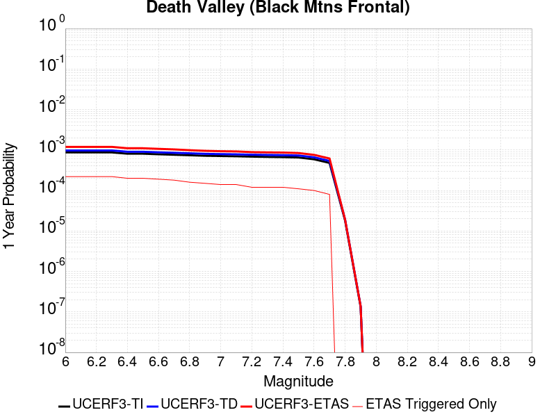 | 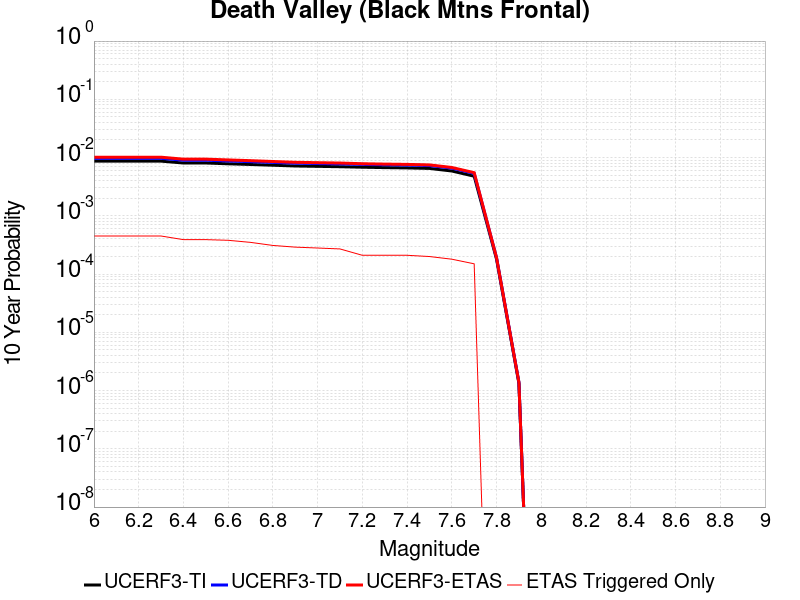 |

| Magnitude | 1 wk TI Prob | 1 wk TD Prob | 1 wk ETAS Prob | 1 wk ETAS/TD Gain | 1 wk ETAS Triggered Only | 1 mo TI Prob | 1 mo TD Prob | 1 mo ETAS Prob | 1 mo ETAS/TD Gain | 1 mo ETAS Triggered Only | 1 yr TI Prob | 1 yr TD Prob | 1 yr ETAS Prob | 1 yr ETAS/TD Gain | 1 yr ETAS Triggered Only | 10 yr TI Prob | 10 yr TD Prob | 10 yr ETAS Prob | 10 yr ETAS/TD Gain | 10 yr ETAS Triggered Only |
|-----|-----|-----|-----|-----|-----|-----|-----|-----|-----|-----|-----|-----|-----|-----|-----|-----|-----|-----|-----|-----|
| 6.0 | 1.6707214E-5 | 1.867056E-5 | 2.8670374E-5 | 1.5355926 | 1.0E-5 | 7.160038E-5 | 8.001427E-5 | 1.5000868E-4 | 1.8747739 | 7.0E-5 | 8.71386E-4 | 9.7374606E-4 | 0.0011935318 | 1.2257116 | 2.2E-4 | 0.00867977 | 0.009695647 | 0.010141284 | 1.0459626 | 4.5E-4 |
| 6.1 | 1.6707214E-5 | 1.867056E-5 | 2.8670374E-5 | 1.5355926 | 1.0E-5 | 7.160038E-5 | 8.001427E-5 | 1.5000868E-4 | 1.8747739 | 7.0E-5 | 8.71386E-4 | 9.7374606E-4 | 0.0011935318 | 1.2257116 | 2.2E-4 | 0.00867977 | 0.009695647 | 0.010141284 | 1.0459626 | 4.5E-4 |
| 6.2 | 1.6707214E-5 | 1.867056E-5 | 2.8670374E-5 | 1.5355926 | 1.0E-5 | 7.160038E-5 | 8.001427E-5 | 1.5000868E-4 | 1.8747739 | 7.0E-5 | 8.71386E-4 | 9.7374606E-4 | 0.0011935318 | 1.2257116 | 2.2E-4 | 0.00867977 | 0.009695647 | 0.010141284 | 1.0459626 | 4.5E-4 |
| 6.3 | 1.6707214E-5 | 1.867056E-5 | 2.8670374E-5 | 1.5355926 | 1.0E-5 | 7.160038E-5 | 8.001427E-5 | 1.5000868E-4 | 1.8747739 | 7.0E-5 | 8.71386E-4 | 9.7374606E-4 | 0.0011935318 | 1.2257116 | 2.2E-4 | 0.00867977 | 0.009695647 | 0.010141284 | 1.0459626 | 4.5E-4 |
| 6.4 | 1.5515609E-5 | 1.7338483E-5 | 2.733831E-5 | 1.5767417 | 1.0E-5 | 6.649377E-5 | 7.430571E-5 | 1.3430126E-4 | 1.807415 | 6.0E-5 | 8.0926094E-4 | 9.0430264E-4 | 0.0011041218 | 1.2209649 | 2.0E-4 | 0.008063202 | 0.009006913 | 0.0093934005 | 1.0429101 | 3.9E-4 |
| 6.5 | 1.5515609E-5 | 1.7338483E-5 | 2.733831E-5 | 1.5767417 | 1.0E-5 | 6.649377E-5 | 7.430571E-5 | 1.3430126E-4 | 1.807415 | 6.0E-5 | 8.0926094E-4 | 9.0430264E-4 | 0.0011041218 | 1.2209649 | 2.0E-4 | 0.008063202 | 0.009006913 | 0.0093934005 | 1.0429101 | 3.9E-4 |
| 6.6 | 1.5041828E-5 | 1.6809407E-5 | 2.6809239E-5 | 1.594895 | 1.0E-5 | 6.4463384E-5 | 7.203836E-5 | 1.3203404E-4 | 1.8328296 | 6.0E-5 | 7.8455906E-4 | 8.7672E-4 | 0.0010665534 | 1.2165269 | 1.9E-4 | 0.00781795 | 0.008733268 | 0.00910995 | 1.0431318 | 3.8E-4 |
| 6.7 | 1.4634985E-5 | 1.6356273E-5 | 2.6356109E-5 | 1.6113763 | 1.0E-5 | 6.271985E-5 | 7.009646E-5 | 1.3009226E-4 | 1.8559034 | 6.0E-5 | 7.6334673E-4 | 8.53096E-4 | 0.0010329424 | 1.2108161 | 1.8E-4 | 0.007607299 | 0.008498848 | 0.008845873 | 1.040832 | 3.5E-4 |
| 6.8 | 1.4209158E-5 | 1.5882297E-5 | 2.5882138E-5 | 1.6296219 | 1.0E-5 | 6.089497E-5 | 6.806524E-5 | 1.2806116E-4 | 1.8814472 | 6.0E-5 | 7.4114406E-4 | 8.2838483E-4 | 9.882523E-4 | 1.192987 | 1.6E-4 | 0.007386771 | 0.008253585 | 0.008561026 | 1.0372494 | 3.1E-4 |
| 6.9 | 1.3780098E-5 | 1.5404834E-5 | 2.540468E-5 | 1.6491369 | 1.0E-5 | 5.9056227E-5 | 6.601908E-5 | 1.2601512E-4 | 1.9087682 | 6.0E-5 | 7.1877235E-4 | 8.0349133E-4 | 9.533708E-4 | 1.1865352 | 1.5E-4 | 0.0071645193 | 0.008006458 | 0.008294136 | 1.0359308 | 2.9E-4 |
| 7.0 | 1.3585064E-5 | 1.5188394E-5 | 2.5188241E-5 | 1.6583874 | 1.0E-5 | 5.8220405E-5 | 6.5091524E-5 | 1.2508762E-4 | 1.9217191 | 6.0E-5 | 7.086029E-4 | 7.922066E-4 | 9.320957E-4 | 1.1765816 | 1.4E-4 | 0.007063476 | 0.007894417 | 0.008172207 | 1.0351881 | 2.8E-4 |
| 7.1 | 1.3398601E-5 | 1.4981575E-5 | 2.4981426E-5 | 1.6674765 | 1.0E-5 | 5.742131E-5 | 6.4205204E-5 | 1.2420135E-4 | 1.9344437 | 6.0E-5 | 6.9888023E-4 | 7.814234E-4 | 9.21314E-4 | 1.1790203 | 1.4E-4 | 0.0069668638 | 0.007787346 | 0.008055244 | 1.0344017 | 2.7E-4 |
| 7.2 | 1.3126312E-5 | 1.4679792E-5 | 2.4679644E-5 | 1.6811986 | 1.0E-5 | 5.6254412E-5 | 6.291191E-5 | 1.0290939E-4 | 1.6357697 | 4.0E-5 | 6.846822E-4 | 7.656887E-4 | 8.8559685E-4 | 1.1566017 | 1.2E-4 | 0.006825765 | 0.00763109 | 0.007839487 | 1.0273091 | 2.1E-4 |
| 7.3 | 1.2922429E-5 | 1.4454016E-5 | 2.4453871E-5 | 1.6918392 | 1.0E-5 | 5.5380664E-5 | 6.1944345E-5 | 1.0194186E-4 | 1.6457009 | 4.0E-5 | 6.74051E-4 | 7.5391686E-4 | 8.738264E-4 | 1.1590488 | 1.2E-4 | 0.006720101 | 0.0075141727 | 0.007722595 | 1.0277371 | 2.1E-4 |
| 7.4 | 1.2768878E-5 | 1.4283997E-5 | 2.4283854E-5 | 1.7000742 | 1.0E-5 | 5.4722615E-5 | 6.1215724E-5 | 1.0121328E-4 | 1.653387 | 4.0E-5 | 6.660441E-4 | 7.45052E-4 | 8.649626E-4 | 1.1609426 | 1.2E-4 | 0.0066405144 | 0.0074261203 | 0.007634561 | 1.0280685 | 2.1E-4 |
| 7.5 | 1.2521929E-5 | 1.40122365E-5 | 2.4012097E-5 | 1.7136519 | 1.0E-5 | 5.366431E-5 | 6.0051094E-5 | 1.0004869E-4 | 1.6660595 | 4.0E-5 | 6.531671E-4 | 7.308822E-4 | 8.408018E-4 | 1.150393 | 1.1E-4 | 0.006512506 | 0.0072853607 | 0.007483904 | 1.0272523 | 2.0E-4 |
| 7.6 | 1.1301089E-5 | 1.2648349E-5 | 2.2648223E-5 | 1.790607 | 1.0E-5 | 4.8432343E-5 | 5.4206117E-5 | 8.420449E-5 | 1.553413 | 3.0E-5 | 5.895042E-4 | 6.597649E-4 | 7.59699E-4 | 1.1514691 | 1.0E-4 | 0.0058794282 | 0.0065786145 | 0.0067574303 | 1.0271814 | 1.8E-4 |
| 7.7 | 9.189108E-6 | 1.0283521E-5 | 1.0283521E-5 | 1.0 | 0.0 | 3.93813E-5 | 4.407152E-5 | 5.4071075E-5 | 1.2268939 | 1.0E-5 | 4.7936183E-4 | 5.3644367E-4 | 6.1640074E-4 | 1.1490502 | 8.0E-5 | 0.004783291 | 0.0053519984 | 0.005501196 | 1.027877 | 1.5E-4 |
| 7.8 | 3.4586725E-7 | 3.648288E-7 | 3.648288E-7 | 1.0 | 0.0 | 1.4822873E-6 | 1.5635511E-6 | 1.5635511E-6 | 1.0 | 0.0 | 1.80467E-5 | 1.9036073E-5 | 1.9036073E-5 | 1.0 | 0.0 | 1.8045233E-4 | 1.9034486E-4 | 1.9034486E-4 | 1.0 | 0.0 |
| 7.9 | 2.5591178E-9 | 2.6696871E-9 | 2.6696871E-9 | 1.0 | 0.0 | 1.0967647E-8 | 1.1441516E-8 | 1.1441516E-8 | 1.0 | 0.0 | 1.335311E-7 | 1.3930045E-7 | 1.3930045E-7 | 1.0 | 0.0 | 1.3353102E-6 | 1.3930046E-6 | 1.3930046E-6 | 1.0 | 0.0 |

## Coyote Lake
*[(top)](#table-of-contents)*

| 1 Week | 1 Month | 1 Year | 10 Year |
|-----|-----|-----|-----|
|  |  |  | 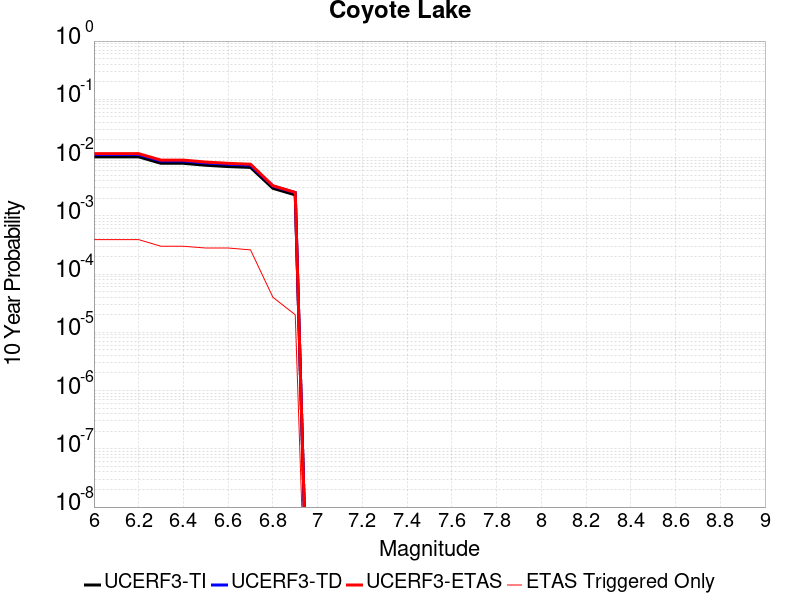 |

| Magnitude | 1 wk TI Prob | 1 wk TD Prob | 1 wk ETAS Prob | 1 wk ETAS/TD Gain | 1 wk ETAS Triggered Only | 1 mo TI Prob | 1 mo TD Prob | 1 mo ETAS Prob | 1 mo ETAS/TD Gain | 1 mo ETAS Triggered Only | 1 yr TI Prob | 1 yr TD Prob | 1 yr ETAS Prob | 1 yr ETAS/TD Gain | 1 yr ETAS Triggered Only | 10 yr TI Prob | 10 yr TD Prob | 10 yr ETAS Prob | 10 yr ETAS/TD Gain | 10 yr ETAS Triggered Only |
|-----|-----|-----|-----|-----|-----|-----|-----|-----|-----|-----|-----|-----|-----|-----|-----|-----|-----|-----|-----|-----|
| 6.0 | 1.980352E-5 | 2.1707021E-5 | 4.1706586E-5 | 1.9213408 | 2.0E-5 | 8.486947E-5 | 9.302718E-5 | 1.3302347E-4 | 1.4299419 | 4.0E-5 | 0.0010327959 | 0.0011320895 | 0.0013118857 | 1.158818 | 1.8E-4 | 0.010280091 | 0.011270401 | 0.011656006 | 1.0342139 | 3.9E-4 |
| 6.1 | 1.980352E-5 | 2.1707021E-5 | 4.1706586E-5 | 1.9213408 | 2.0E-5 | 8.486947E-5 | 9.302718E-5 | 1.3302347E-4 | 1.4299419 | 4.0E-5 | 0.0010327959 | 0.0011320895 | 0.0013118857 | 1.158818 | 1.8E-4 | 0.010280091 | 0.011270401 | 0.011656006 | 1.0342139 | 3.9E-4 |
| 6.2 | 1.980352E-5 | 2.1707021E-5 | 4.1706586E-5 | 1.9213408 | 2.0E-5 | 8.486947E-5 | 9.302718E-5 | 1.3302347E-4 | 1.4299419 | 4.0E-5 | 0.0010327959 | 0.0011320895 | 0.0013118857 | 1.158818 | 1.8E-4 | 0.010280091 | 0.011270401 | 0.011656006 | 1.0342139 | 3.9E-4 |
| 6.3 | 1.5344787E-5 | 1.6820884E-5 | 1.6820884E-5 | 1.0 | 0.0 | 6.576172E-5 | 7.208785E-5 | 9.208641E-5 | 1.2774192 | 2.0E-5 | 8.003548E-4 | 8.7737746E-4 | 0.0010172547 | 1.1594265 | 1.4E-4 | 0.007974784 | 0.00874518 | 0.009042556 | 1.0340046 | 3.0E-4 |
| 6.4 | 1.5344787E-5 | 1.6820884E-5 | 1.6820884E-5 | 1.0 | 0.0 | 6.576172E-5 | 7.208785E-5 | 9.208641E-5 | 1.2774192 | 2.0E-5 | 8.003548E-4 | 8.7737746E-4 | 0.0010172547 | 1.1594265 | 1.4E-4 | 0.007974784 | 0.00874518 | 0.009042556 | 1.0340046 | 3.0E-4 |
| 6.5 | 1.4189697E-5 | 1.5558186E-5 | 1.5558186E-5 | 1.0 | 0.0 | 6.081157E-5 | 6.667658E-5 | 8.6675245E-5 | 1.2999355 | 2.0E-5 | 7.401293E-4 | 8.1154524E-4 | 9.314479E-4 | 1.1477461 | 1.2E-4 | 0.0073766913 | 0.008091759 | 0.008369493 | 1.0343231 | 2.8E-4 |
| 6.6 | 1.3469301E-5 | 1.47717665E-5 | 1.47717665E-5 | 1.0 | 0.0 | 5.7724297E-5 | 6.3306376E-5 | 8.330511E-5 | 1.3159039 | 2.0E-5 | 7.025667E-4 | 7.7054254E-4 | 8.904501E-4 | 1.1556144 | 1.2E-4 | 0.0070034964 | 0.0076846126 | 0.007962461 | 1.0361564 | 2.8E-4 |
| 6.7 | 1.3027966E-5 | 1.4281927E-5 | 1.4281927E-5 | 1.0 | 0.0 | 5.5832945E-5 | 6.120716E-5 | 7.120655E-5 | 1.1633695 | 1.0E-5 | 6.7955407E-4 | 7.450021E-4 | 8.549202E-4 | 1.1475406 | 1.1E-4 | 0.006774798 | 0.007430923 | 0.0076889913 | 1.0347289 | 2.6E-4 |
| 6.8 | 5.695434E-6 | 6.2244944E-6 | 6.2244944E-6 | 1.0 | 0.0 | 2.4408775E-5 | 2.6676302E-5 | 2.6676302E-5 | 1.0 | 0.0 | 2.971363E-4 | 3.2476554E-4 | 3.347623E-4 | 1.0307814 | 1.0E-5 | 0.0029673933 | 0.0032458503 | 0.0032857205 | 1.0122834 | 4.0E-5 |
| 6.9 | 4.385688E-6 | 4.7931144E-6 | 4.7931144E-6 | 1.0 | 0.0 | 1.879567E-5 | 2.0541918E-5 | 2.0541918E-5 | 1.0 | 0.0 | 2.2881327E-4 | 2.5009786E-4 | 2.6009537E-4 | 1.0399743 | 1.0E-5 | 0.002285778 | 0.0025009785 | 0.0025209286 | 1.0079769 | 2.0E-5 |

## San Andreas (Big Bend)
*[(top)](#table-of-contents)*

| 1 Week | 1 Month | 1 Year | 10 Year |
|-----|-----|-----|-----|
| 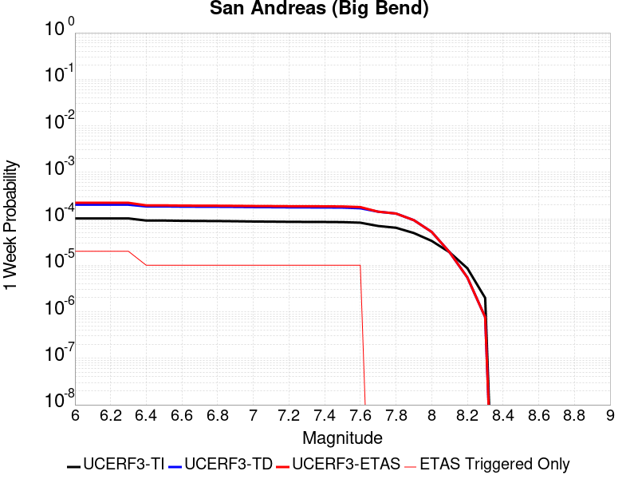 |  |  | 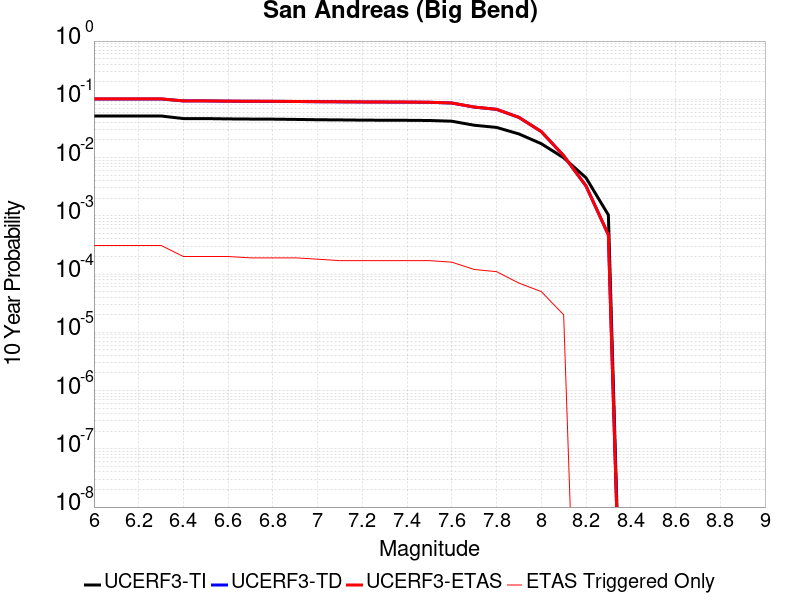 |

| Magnitude | 1 wk TI Prob | 1 wk TD Prob | 1 wk ETAS Prob | 1 wk ETAS/TD Gain | 1 wk ETAS Triggered Only | 1 mo TI Prob | 1 mo TD Prob | 1 mo ETAS Prob | 1 mo ETAS/TD Gain | 1 mo ETAS Triggered Only | 1 yr TI Prob | 1 yr TD Prob | 1 yr ETAS Prob | 1 yr ETAS/TD Gain | 1 yr ETAS Triggered Only | 10 yr TI Prob | 10 yr TD Prob | 10 yr ETAS Prob | 10 yr ETAS/TD Gain | 10 yr ETAS Triggered Only |
|-----|-----|-----|-----|-----|-----|-----|-----|-----|-----|-----|-----|-----|-----|-----|-----|-----|-----|-----|-----|-----|
| 6.0 | 1.0179969E-4 | 2.0080687E-4 | 2.2080285E-4 | 1.0995781 | 2.0E-5 | 4.362114E-4 | 8.60318E-4 | 9.302578E-4 | 1.0812953 | 7.0E-5 | 0.0052979486 | 0.010424351 | 0.010592579 | 1.016138 | 1.7E-4 | 0.051734097 | 0.1014857 | 0.10176423 | 1.0027447 | 3.1E-4 |
| 6.1 | 1.0179969E-4 | 2.0080687E-4 | 2.2080285E-4 | 1.0995781 | 2.0E-5 | 4.362114E-4 | 8.60318E-4 | 9.302578E-4 | 1.0812953 | 7.0E-5 | 0.0052979486 | 0.010424351 | 0.010592579 | 1.016138 | 1.7E-4 | 0.051734097 | 0.1014857 | 0.10176423 | 1.0027447 | 3.1E-4 |
| 6.2 | 1.0179969E-4 | 2.0080687E-4 | 2.2080285E-4 | 1.0995781 | 2.0E-5 | 4.362114E-4 | 8.60318E-4 | 9.302578E-4 | 1.0812953 | 7.0E-5 | 0.0052979486 | 0.010424351 | 0.010592579 | 1.016138 | 1.7E-4 | 0.051734097 | 0.1014857 | 0.10176423 | 1.0027447 | 3.1E-4 |
| 6.3 | 1.0179969E-4 | 2.0080687E-4 | 2.2080285E-4 | 1.0995781 | 2.0E-5 | 4.362114E-4 | 8.60318E-4 | 9.302578E-4 | 1.0812953 | 7.0E-5 | 0.0052979486 | 0.010424351 | 0.010592579 | 1.016138 | 1.7E-4 | 0.051734097 | 0.1014857 | 0.10176423 | 1.0027447 | 3.1E-4 |
| 6.4 | 9.1639464E-5 | 1.8437792E-4 | 1.9437607E-4 | 1.0542264 | 1.0E-5 | 3.9268145E-4 | 7.89952E-4 | 8.399125E-4 | 1.0632449 | 5.0E-5 | 0.0047704205 | 0.009575372 | 0.009694222 | 1.0124122 | 1.2E-4 | 0.046693064 | 0.09381153 | 0.09399276 | 1.0019319 | 2.0E-4 |
| 6.5 | 9.1639464E-5 | 1.8437792E-4 | 1.9437607E-4 | 1.0542264 | 1.0E-5 | 3.9268145E-4 | 7.89952E-4 | 8.399125E-4 | 1.0632449 | 5.0E-5 | 0.0047704205 | 0.009575372 | 0.009694222 | 1.0124122 | 1.2E-4 | 0.046693064 | 0.09381153 | 0.09399276 | 1.0019319 | 2.0E-4 |
| 6.6 | 9.042622E-5 | 1.8244829E-4 | 1.9244647E-4 | 1.0548 | 1.0E-5 | 3.8748336E-4 | 7.8168715E-4 | 8.3164807E-4 | 1.0639142 | 5.0E-5 | 0.0047074095 | 0.009475624 | 0.009594487 | 1.012544 | 1.2E-4 | 0.046089325 | 0.09290548 | 0.0930869 | 1.0019528 | 2.0E-4 |
| 6.7 | 8.9836685E-5 | 1.8159159E-4 | 1.9158977E-4 | 1.0550586 | 1.0E-5 | 3.8495753E-4 | 7.7801774E-4 | 8.2797883E-4 | 1.0642159 | 5.0E-5 | 0.00467679 | 0.009431336 | 0.0095502045 | 1.0126035 | 1.2E-4 | 0.045795817 | 0.09249973 | 0.09267216 | 1.0018641 | 1.9E-4 |
| 6.8 | 8.9471854E-5 | 1.8105932E-4 | 1.9105752E-4 | 1.0552205 | 1.0E-5 | 3.8339442E-4 | 7.75738E-4 | 8.2569924E-4 | 1.0644047 | 5.0E-5 | 0.004657841 | 0.00940382 | 0.009522691 | 1.0126407 | 1.2E-4 | 0.04561414 | 0.09224692 | 0.09241939 | 1.0018697 | 1.9E-4 |
| 6.9 | 8.858234E-5 | 1.7987892E-4 | 1.8987713E-4 | 1.055583 | 1.0E-5 | 3.7958333E-4 | 7.706821E-4 | 8.2064356E-4 | 1.0648276 | 5.0E-5 | 0.004611638 | 0.009342793 | 0.009461673 | 1.0127242 | 1.2E-4 | 0.04517103 | 0.091686994 | 0.09185957 | 1.0018823 | 1.9E-4 |
| 7.0 | 8.7433385E-5 | 1.7826671E-4 | 1.8826492E-4 | 1.0560857 | 1.0E-5 | 3.746607E-4 | 7.6377665E-4 | 8.037461E-4 | 1.0523313 | 4.0E-5 | 0.004551957 | 0.009259437 | 0.009368419 | 1.0117698 | 1.1E-4 | 0.044598386 | 0.09092137 | 0.091085 | 1.0017997 | 1.8E-4 |
| 7.1 | 8.684964E-5 | 1.7738611E-4 | 1.8738434E-4 | 1.0563642 | 1.0E-5 | 3.7215967E-4 | 7.600049E-4 | 7.999745E-4 | 1.0525912 | 4.0E-5 | 0.0045216335 | 0.009213906 | 0.009322892 | 1.0118284 | 1.1E-4 | 0.04430731 | 0.09050287 | 0.09065749 | 1.0017084 | 1.7E-4 |
| 7.2 | 8.606521E-5 | 1.7629213E-4 | 1.8629037E-4 | 1.056714 | 1.0E-5 | 3.6879873E-4 | 7.5531914E-4 | 7.9528894E-4 | 1.0529177 | 4.0E-5 | 0.0044808835 | 0.009157337 | 0.00926633 | 1.0119022 | 1.1E-4 | 0.043916024 | 0.08998334 | 0.09013804 | 1.0017192 | 1.7E-4 |
| 7.3 | 8.568266E-5 | 1.7571205E-4 | 1.8571029E-4 | 1.0569013 | 1.0E-5 | 3.6715972E-4 | 7.528345E-4 | 7.9280435E-4 | 1.0530925 | 4.0E-5 | 0.0044610105 | 0.00912734 | 0.009236337 | 1.0119417 | 1.1E-4 | 0.043725148 | 0.08970444 | 0.08985919 | 1.0017251 | 1.7E-4 |
| 7.4 | 8.5432206E-5 | 1.7533782E-4 | 1.8533606E-4 | 1.0570228 | 1.0E-5 | 3.6608664E-4 | 7.5123156E-4 | 7.9120154E-4 | 1.0532058 | 4.0E-5 | 0.004447999 | 0.009107988 | 0.009216987 | 1.0119673 | 1.1E-4 | 0.043600157 | 0.08952458 | 0.08967936 | 1.0017289 | 1.7E-4 |
| 7.5 | 8.4791965E-5 | 1.7403076E-4 | 1.8402902E-4 | 1.0574511 | 1.0E-5 | 3.633435E-4 | 7.4563315E-4 | 7.856033E-4 | 1.0536057 | 4.0E-5 | 0.0044147377 | 0.009040395 | 0.0091494005 | 1.0120577 | 1.1E-4 | 0.043280575 | 0.0889021 | 0.08905698 | 1.0017422 | 1.7E-4 |
| 7.6 | 8.241105E-5 | 1.684837E-4 | 1.7848202E-4 | 1.059343 | 1.0E-5 | 3.531424E-4 | 7.2187337E-4 | 7.518517E-4 | 1.0415286 | 3.0E-5 | 0.0042910352 | 0.008753479 | 0.008852605 | 1.011324 | 1.0E-4 | 0.042091176 | 0.08627858 | 0.086424775 | 1.0016944 | 1.6E-4 |
| 7.7 | 7.00432E-5 | 1.4211683E-4 | 1.4211683E-4 | 1.0 | 0.0 | 3.001506E-4 | 6.0893E-4 | 6.289178E-4 | 1.0328245 | 2.0E-5 | 0.0036482112 | 0.007388561 | 0.0074481177 | 1.0080607 | 6.0E-5 | 0.035888977 | 0.07354971 | 0.07366089 | 1.0015116 | 1.2E-4 |
| 7.8 | 6.415362E-5 | 1.297541E-4 | 1.297541E-4 | 1.0 | 0.0 | 2.749151E-4 | 5.5597053E-4 | 5.7595945E-4 | 1.0359532 | 2.0E-5 | 0.0033419547 | 0.006747963 | 0.006797625 | 1.0073596 | 5.0E-5 | 0.03292141 | 0.0672817 | 0.0673843 | 1.0015249 | 1.1E-4 |
| 7.9 | 4.939911E-5 | 9.345801E-5 | 9.345801E-5 | 1.0 | 0.0 | 2.116933E-4 | 4.0047284E-4 | 4.2046484E-4 | 1.0499209 | 2.0E-5 | 0.0025743195 | 0.0048648654 | 0.004904671 | 1.0081822 | 4.0E-5 | 0.025447013 | 0.048936196 | 0.04900277 | 1.0013604 | 7.0E-5 |
| 8.0 | 3.344983E-5 | 5.225443E-5 | 5.225443E-5 | 1.0 | 0.0 | 1.4334853E-4 | 2.2392833E-4 | 2.339261E-4 | 1.0446471 | 1.0E-5 | 0.0017438711 | 0.0027229206 | 0.0027428663 | 1.007325 | 2.0E-5 | 0.017302496 | 0.02793573 | 0.027984334 | 1.0017399 | 5.0E-5 |
| 8.1 | 1.9104898E-5 | 1.9186356E-5 | 1.9186356E-5 | 1.0 | 0.0 | 8.1875565E-5 | 8.222465E-5 | 9.222383E-5 | 1.121608 | 1.0E-5 | 9.963791E-4 | 0.001000626 | 0.0010106161 | 1.0099838 | 1.0E-5 | 0.009919235 | 0.010756767 | 0.010776552 | 1.0018393 | 2.0E-5 |
| 8.2 | 8.643924E-6 | 5.4798497E-6 | 5.4798497E-6 | 1.0 | 0.0 | 3.704486E-5 | 2.348486E-5 | 2.348486E-5 | 1.0 | 0.0 | 4.5092785E-4 | 2.858907E-4 | 2.858907E-4 | 1.0 | 0.0 | 0.0045001395 | 0.0032514327 | 0.0032514327 | 1.0 | 0.0 |
| 8.3 | 1.983087E-6 | 7.668296E-7 | 7.668296E-7 | 1.0 | 0.0 | 8.498917E-6 | 3.2864084E-6 | 3.2864084E-6 | 1.0 | 0.0 | 1.034694E-4 | 4.0011306E-5 | 4.0011306E-5 | 1.0 | 0.0 | 0.0010342124 | 4.724499E-4 | 4.724499E-4 | 1.0 | 0.0 |

## San Andreas (Parkfield)
*[(top)](#table-of-contents)*

| 1 Week | 1 Month | 1 Year | 10 Year |
|-----|-----|-----|-----|
|  |  |  |  |

| Magnitude | 1 wk TI Prob | 1 wk TD Prob | 1 wk ETAS Prob | 1 wk ETAS/TD Gain | 1 wk ETAS Triggered Only | 1 mo TI Prob | 1 mo TD Prob | 1 mo ETAS Prob | 1 mo ETAS/TD Gain | 1 mo ETAS Triggered Only | 1 yr TI Prob | 1 yr TD Prob | 1 yr ETAS Prob | 1 yr ETAS/TD Gain | 1 yr ETAS Triggered Only | 10 yr TI Prob | 10 yr TD Prob | 10 yr ETAS Prob | 10 yr ETAS/TD Gain | 10 yr ETAS Triggered Only |
|-----|-----|-----|-----|-----|-----|-----|-----|-----|-----|-----|-----|-----|-----|-----|-----|-----|-----|-----|-----|-----|
| 6.0 | 5.556969E-4 | 7.788437E-4 | 7.888359E-4 | 1.0128295 | 1.0E-5 | 0.0023793848 | 0.0033341812 | 0.0033840144 | 1.0149462 | 5.0E-5 | 0.028586963 | 0.04023991 | 0.040383875 | 1.0035776 | 1.5E-4 | 0.25176284 | 0.33731642 | 0.33750862 | 1.0005697 | 2.9E-4 |
| 6.1 | 1.925858E-4 | 3.0304783E-4 | 3.1304482E-4 | 1.0329881 | 1.0E-5 | 8.2510663E-4 | 0.0012982241 | 0.001318198 | 1.0153856 | 2.0E-5 | 0.0099994885 | 0.015792182 | 0.01588076 | 1.005609 | 9.0E-5 | 0.095613256 | 0.14979222 | 0.14991125 | 1.0007946 | 1.4E-4 |
| 6.2 | 9.4306815E-5 | 1.8250331E-4 | 1.9250148E-4 | 1.0547836 | 1.0E-5 | 4.0410945E-4 | 7.819238E-4 | 8.0190814E-4 | 1.025558 | 2.0E-5 | 0.0049089384 | 0.009478576 | 0.009547912 | 1.007315 | 7.0E-5 | 0.048019063 | 0.09188674 | 0.091977544 | 1.0009882 | 1.0E-4 |
| 6.3 | 9.283051E-5 | 1.7946832E-4 | 1.8946652E-4 | 1.0557102 | 1.0E-5 | 3.9778434E-4 | 7.689244E-4 | 7.8890903E-4 | 1.0259904 | 2.0E-5 | 0.0048322747 | 0.009321672 | 0.00939102 | 1.0074394 | 7.0E-5 | 0.047285385 | 0.09053965 | 0.0906306 | 1.0010045 | 1.0E-4 |
| 6.4 | 9.138826E-5 | 1.770899E-4 | 1.8708812E-4 | 1.0564585 | 1.0E-5 | 3.916052E-4 | 7.5873715E-4 | 7.78722E-4 | 1.0263395 | 2.0E-5 | 0.0047573745 | 0.009198696 | 0.009268053 | 1.0075397 | 7.0E-5 | 0.046568092 | 0.089441724 | 0.08953278 | 1.001018 | 1.0E-4 |
| 6.5 | 9.000255E-5 | 1.746699E-4 | 1.8466816E-4 | 1.0572408 | 1.0E-5 | 3.8566816E-4 | 7.483717E-4 | 7.683567E-4 | 1.0267047 | 2.0E-5 | 0.0046854047 | 0.009073567 | 0.009142932 | 1.0076448 | 7.0E-5 | 0.045878403 | 0.08832737 | 0.088418536 | 1.0010321 | 1.0E-4 |
| 6.6 | 8.8109264E-5 | 1.7148067E-4 | 1.8147896E-4 | 1.0583056 | 1.0E-5 | 3.7755648E-4 | 7.3471136E-4 | 7.5469667E-4 | 1.0272015 | 2.0E-5 | 0.0045870654 | 0.008908638 | 0.008978014 | 1.0077876 | 7.0E-5 | 0.04493529 | 0.086858675 | 0.08694999 | 1.0010513 | 1.0E-4 |
| 6.7 | 8.738073E-5 | 1.7015127E-4 | 1.8014957E-4 | 1.0587612 | 1.0E-5 | 3.7443507E-4 | 7.290171E-4 | 7.490025E-4 | 1.0274142 | 2.0E-5 | 0.0045492216 | 0.008839916 | 0.008909298 | 1.0078486 | 7.0E-5 | 0.04457213 | 0.086258985 | 0.08635036 | 1.0010593 | 1.0E-4 |
| 6.8 | 8.710195E-5 | 1.6960612E-4 | 1.7960442E-4 | 1.0589502 | 1.0E-5 | 3.7324068E-4 | 7.266821E-4 | 7.466675E-4 | 1.0275023 | 2.0E-5 | 0.0045347405 | 0.008811726 | 0.008881109 | 1.007874 | 7.0E-5 | 0.04443313 | 0.08600653 | 0.086097926 | 1.0010628 | 1.0E-4 |
| 6.9 | 8.6801556E-5 | 1.6901553E-4 | 1.7901385E-4 | 1.0591562 | 1.0E-5 | 3.7195362E-4 | 7.2415237E-4 | 7.441379E-4 | 1.0275985 | 2.0E-5 | 0.0045191357 | 0.008781176 | 0.008850561 | 1.0079015 | 7.0E-5 | 0.044283327 | 0.08573254 | 0.08582397 | 1.0010664 | 1.0E-4 |
| 7.0 | 8.5571606E-5 | 1.6654332E-4 | 1.7654165E-4 | 1.0600344 | 1.0E-5 | 3.6668387E-4 | 7.13563E-4 | 7.335487E-4 | 1.0280083 | 2.0E-5 | 0.004455241 | 0.008653281 | 0.008722675 | 1.0080194 | 7.0E-5 | 0.043669727 | 0.08458075 | 0.084672295 | 1.0010823 | 1.0E-4 |
| 7.1 | 7.82589E-5 | 1.5135074E-4 | 1.6134922E-4 | 1.0660617 | 1.0E-5 | 3.3535215E-4 | 6.484855E-4 | 6.6847255E-4 | 1.0308211 | 2.0E-5 | 0.0040752706 | 0.0078668995 | 0.007936349 | 1.008828 | 7.0E-5 | 0.040013418 | 0.077491894 | 0.07758415 | 1.0011904 | 1.0E-4 |
| 7.2 | 7.690929E-5 | 1.4872287E-4 | 1.5872139E-4 | 1.0672292 | 1.0E-5 | 3.2956956E-4 | 6.372288E-4 | 6.5721606E-4 | 1.0313659 | 2.0E-5 | 0.004005129 | 0.007730829 | 0.007800288 | 1.0089847 | 7.0E-5 | 0.0393371 | 0.07626493 | 0.076357305 | 1.0012112 | 1.0E-4 |
| 7.3 | 7.5543794E-5 | 1.4568791E-4 | 1.4568791E-4 | 1.0 | 0.0 | 3.2371894E-4 | 6.242281E-4 | 6.342218E-4 | 1.0160098 | 1.0E-5 | 0.003934157 | 0.007573656 | 0.007633202 | 1.0078622 | 6.0E-5 | 0.038652334 | 0.07482772 | 0.07491099 | 1.0011128 | 9.0E-5 |
| 7.4 | 7.4214564E-5 | 1.4269682E-4 | 1.4269682E-4 | 1.0 | 0.0 | 3.1802364E-4 | 6.114152E-4 | 6.214091E-4 | 1.0163455 | 1.0E-5 | 0.003865065 | 0.007418731 | 0.0074782865 | 1.0080277 | 6.0E-5 | 0.03798529 | 0.07340127 | 0.07348467 | 1.0011362 | 9.0E-5 |
| 7.5 | 6.149578E-5 | 1.1196503E-4 | 1.1196503E-4 | 1.0 | 0.0 | 2.6352672E-4 | 4.7976198E-4 | 4.8975716E-4 | 1.0208336 | 1.0E-5 | 0.0032037178 | 0.00582549 | 0.0058851405 | 1.0102396 | 6.0E-5 | 0.03157923 | 0.058584154 | 0.05866888 | 1.0014462 | 9.0E-5 |
| 7.6 | 6.0643448E-5 | 1.10251094E-4 | 1.10251094E-4 | 1.0 | 0.0 | 2.598746E-4 | 4.7241923E-4 | 4.824145E-4 | 1.0211576 | 1.0E-5 | 0.0031593828 | 0.0057365666 | 0.0057962225 | 1.0103992 | 6.0E-5 | 0.031148417 | 0.057744972 | 0.05782978 | 1.0014685 | 9.0E-5 |
| 7.7 | 5.1652263E-5 | 9.179838E-5 | 9.179838E-5 | 1.0 | 0.0 | 2.2134806E-4 | 3.9336234E-4 | 4.033584E-4 | 1.0254118 | 1.0E-5 | 0.002691582 | 0.0047786795 | 0.0048184884 | 1.0083305 | 4.0E-5 | 0.026592141 | 0.048560265 | 0.048626866 | 1.0013715 | 7.0E-5 |
| 7.8 | 4.8090482E-5 | 8.564368E-5 | 8.564368E-5 | 1.0 | 0.0 | 2.060858E-4 | 3.6699275E-4 | 3.7698908E-4 | 1.0272385 | 1.0E-5 | 0.0025062072 | 0.004458991 | 0.0044988124 | 1.0089307 | 4.0E-5 | 0.024781305 | 0.045324653 | 0.04539148 | 1.0014744 | 7.0E-5 |
| 7.9 | 3.970278E-5 | 6.754111E-5 | 6.754111E-5 | 1.0 | 0.0 | 1.7014367E-4 | 2.894298E-4 | 2.994269E-4 | 1.0345407 | 1.0E-5 | 0.002069531 | 0.0035181176 | 0.003548012 | 1.0084972 | 3.0E-5 | 0.020503636 | 0.03589899 | 0.035947196 | 1.0013428 | 5.0E-5 |
| 8.0 | 2.8982335E-5 | 4.072124E-5 | 4.072124E-5 | 1.0 | 0.0 | 1.2420409E-4 | 1.7450792E-4 | 1.8450618E-4 | 1.057294 | 1.0E-5 | 0.0015111357 | 0.002122565 | 0.0021425225 | 1.0094025 | 2.0E-5 | 0.015009012 | 0.02202231 | 0.02206143 | 1.0017763 | 4.0E-5 |
| 8.1 | 1.8836186E-5 | 1.8694205E-5 | 1.8694205E-5 | 1.0 | 0.0 | 8.0724014E-5 | 8.011556E-5 | 9.0114765E-5 | 1.1248097 | 1.0E-5 | 9.823717E-4 | 9.749711E-4 | 9.849614E-4 | 1.0102468 | 1.0E-5 | 0.009780403 | 0.010494972 | 0.010514761 | 1.0018857 | 2.0E-5 |
| 8.2 | 8.643924E-6 | 5.4798497E-6 | 5.4798497E-6 | 1.0 | 0.0 | 3.704486E-5 | 2.348486E-5 | 2.348486E-5 | 1.0 | 0.0 | 4.5092785E-4 | 2.858907E-4 | 2.858907E-4 | 1.0 | 0.0 | 0.0045001395 | 0.0032514327 | 0.0032514327 | 1.0 | 0.0 |
| 8.3 | 1.983087E-6 | 7.668296E-7 | 7.668296E-7 | 1.0 | 0.0 | 8.498917E-6 | 3.2864084E-6 | 3.2864084E-6 | 1.0 | 0.0 | 1.034694E-4 | 4.0011306E-5 | 4.0011306E-5 | 1.0 | 0.0 | 0.0010342124 | 4.724499E-4 | 4.724499E-4 | 1.0 | 0.0 |

## Red Pass
*[(top)](#table-of-contents)*

| 1 Week | 1 Month | 1 Year | 10 Year |
|-----|-----|-----|-----|
|  |  | 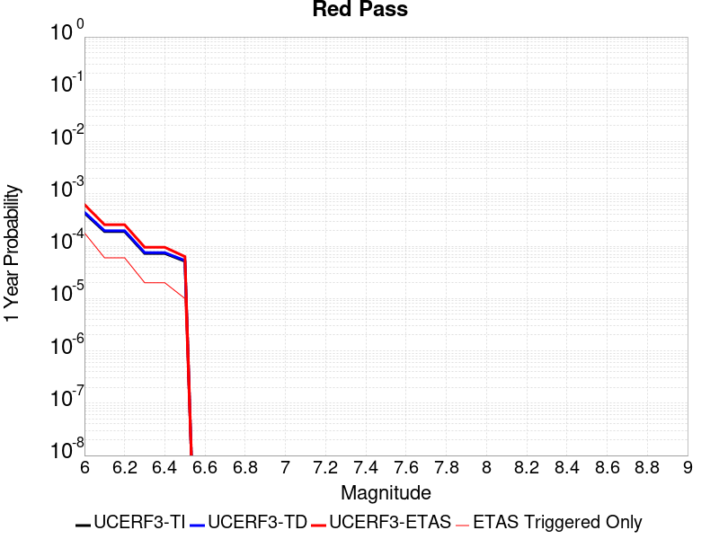 |  |

| Magnitude | 1 wk TI Prob | 1 wk TD Prob | 1 wk ETAS Prob | 1 wk ETAS/TD Gain | 1 wk ETAS Triggered Only | 1 mo TI Prob | 1 mo TD Prob | 1 mo ETAS Prob | 1 mo ETAS/TD Gain | 1 mo ETAS Triggered Only | 1 yr TI Prob | 1 yr TD Prob | 1 yr ETAS Prob | 1 yr ETAS/TD Gain | 1 yr ETAS Triggered Only | 10 yr TI Prob | 10 yr TD Prob | 10 yr ETAS Prob | 10 yr ETAS/TD Gain | 10 yr ETAS Triggered Only |
|-----|-----|-----|-----|-----|-----|-----|-----|-----|-----|-----|-----|-----|-----|-----|-----|-----|-----|-----|-----|-----|
| 6.0 | 8.258278E-6 | 8.551305E-6 | 1.855122E-5 | 2.1694021 | 1.0E-5 | 3.539214E-5 | 3.6648038E-5 | 5.6647303E-5 | 1.5457119 | 2.0E-5 | 4.308141E-4 | 4.4611638E-4 | 6.260361E-4 | 1.4033022 | 1.8E-4 | 0.0042997985 | 0.004453966 | 0.004742674 | 1.0648205 | 2.9E-4 |
| 6.1 | 3.649988E-6 | 3.7753332E-6 | 3.7753332E-6 | 1.0 | 0.0 | 1.5642712E-5 | 1.6179927E-5 | 1.6179927E-5 | 1.0 | 0.0 | 1.9043336E-4 | 1.9697756E-4 | 2.5696575E-4 | 1.3045433 | 6.0E-5 | 0.0019027026 | 0.001968497 | 0.0020982411 | 1.0659102 | 1.3E-4 |
| 6.2 | 3.649988E-6 | 3.7753332E-6 | 3.7753332E-6 | 1.0 | 0.0 | 1.5642712E-5 | 1.6179927E-5 | 1.6179927E-5 | 1.0 | 0.0 | 1.9043336E-4 | 1.9697756E-4 | 2.5696575E-4 | 1.3045433 | 6.0E-5 | 0.0019027026 | 0.001968497 | 0.0020982411 | 1.0659102 | 1.3E-4 |
| 6.3 | 1.3924937E-6 | 1.4411233E-6 | 1.4411233E-6 | 1.0 | 0.0 | 5.9678164E-6 | 6.176236E-6 | 6.176236E-6 | 1.0 | 0.0 | 7.265574E-5 | 7.51945E-5 | 9.519299E-5 | 1.2659569 | 2.0E-5 | 7.263199E-4 | 7.518293E-4 | 7.917992E-4 | 1.0531635 | 4.0E-5 |
| 6.4 | 1.3924937E-6 | 1.4411233E-6 | 1.4411233E-6 | 1.0 | 0.0 | 5.9678164E-6 | 6.176236E-6 | 6.176236E-6 | 1.0 | 0.0 | 7.265574E-5 | 7.51945E-5 | 9.519299E-5 | 1.2659569 | 2.0E-5 | 7.263199E-4 | 7.518293E-4 | 7.917992E-4 | 1.0531635 | 4.0E-5 |
| 6.5 | 9.876812E-7 | 1.022196E-6 | 1.022196E-6 | 1.0 | 0.0 | 4.2329125E-6 | 4.38084E-6 | 4.38084E-6 | 1.0 | 0.0 | 5.153449E-5 | 5.3336724E-5 | 6.333619E-5 | 1.1874781 | 1.0E-5 | 5.1522546E-4 | 5.333672E-4 | 5.533566E-4 | 1.0374776 | 2.0E-5 |

## Sierra Nevada  (No Extension)
*[(top)](#table-of-contents)*

| 1 Week | 1 Month | 1 Year | 10 Year |
|-----|-----|-----|-----|
|  | 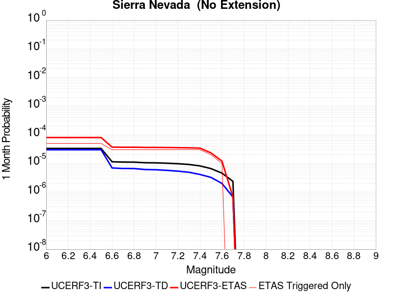 |  |  |

| Magnitude | 1 wk TI Prob | 1 wk TD Prob | 1 wk ETAS Prob | 1 wk ETAS/TD Gain | 1 wk ETAS Triggered Only | 1 mo TI Prob | 1 mo TD Prob | 1 mo ETAS Prob | 1 mo ETAS/TD Gain | 1 mo ETAS Triggered Only | 1 yr TI Prob | 1 yr TD Prob | 1 yr ETAS Prob | 1 yr ETAS/TD Gain | 1 yr ETAS Triggered Only | 10 yr TI Prob | 10 yr TD Prob | 10 yr ETAS Prob | 10 yr ETAS/TD Gain | 10 yr ETAS Triggered Only |
|-----|-----|-----|-----|-----|-----|-----|-----|-----|-----|-----|-----|-----|-----|-----|-----|-----|-----|-----|-----|-----|
| 6.0 | 7.7690465E-6 | 6.9763832E-6 | 4.6976103E-5 | 6.73359 | 4.0E-5 | 3.329549E-5 | 2.9898645E-5 | 7.989715E-5 | 2.6722667 | 5.0E-5 | 4.0529718E-4 | 3.6399104E-4 | 5.239328E-4 | 1.4394113 | 1.6E-4 | 0.004045588 | 0.0036374647 | 0.003866628 | 1.0630008 | 2.3E-4 |
| 6.1 | 7.7690465E-6 | 6.9763832E-6 | 4.6976103E-5 | 6.73359 | 4.0E-5 | 3.329549E-5 | 2.9898645E-5 | 7.989715E-5 | 2.6722667 | 5.0E-5 | 4.0529718E-4 | 3.6399104E-4 | 5.239328E-4 | 1.4394113 | 1.6E-4 | 0.004045588 | 0.0036374647 | 0.003866628 | 1.0630008 | 2.3E-4 |
| 6.2 | 7.7690465E-6 | 6.9763832E-6 | 4.6976103E-5 | 6.73359 | 4.0E-5 | 3.329549E-5 | 2.9898645E-5 | 7.989715E-5 | 2.6722667 | 5.0E-5 | 4.0529718E-4 | 3.6399104E-4 | 5.239328E-4 | 1.4394113 | 1.6E-4 | 0.004045588 | 0.0036374647 | 0.003866628 | 1.0630008 | 2.3E-4 |
| 6.3 | 7.7690465E-6 | 6.9763832E-6 | 4.6976103E-5 | 6.73359 | 4.0E-5 | 3.329549E-5 | 2.9898645E-5 | 7.989715E-5 | 2.6722667 | 5.0E-5 | 4.0529718E-4 | 3.6399104E-4 | 5.239328E-4 | 1.4394113 | 1.6E-4 | 0.004045588 | 0.0036374647 | 0.003866628 | 1.0630008 | 2.3E-4 |
| 6.4 | 7.7690465E-6 | 6.9763832E-6 | 4.6976103E-5 | 6.73359 | 4.0E-5 | 3.329549E-5 | 2.9898645E-5 | 7.989715E-5 | 2.6722667 | 5.0E-5 | 4.0529718E-4 | 3.6399104E-4 | 5.239328E-4 | 1.4394113 | 1.6E-4 | 0.004045588 | 0.0036374647 | 0.003866628 | 1.0630008 | 2.3E-4 |
| 6.5 | 7.7690465E-6 | 6.9763832E-6 | 4.6976103E-5 | 6.73359 | 4.0E-5 | 3.329549E-5 | 2.9898645E-5 | 7.989715E-5 | 2.6722667 | 5.0E-5 | 4.0529718E-4 | 3.6399104E-4 | 5.239328E-4 | 1.4394113 | 1.6E-4 | 0.004045588 | 0.0036374647 | 0.003866628 | 1.0630008 | 2.3E-4 |
| 6.6 | 2.653E-6 | 1.6148814E-6 | 2.161485E-5 | 13.38479 | 2.0E-5 | 1.136995E-5 | 6.920902E-6 | 3.6920694E-5 | 5.3346653 | 3.0E-5 | 1.3842035E-4 | 8.4258754E-5 | 1.8425033E-4 | 2.1867204 | 1.0E-4 | 0.0013833415 | 8.4227155E-4 | 0.0010021367 | 1.1898025 | 1.6E-4 |
| 6.7 | 2.5902466E-6 | 1.5502146E-6 | 2.1550184E-5 | 13.90142 | 2.0E-5 | 1.11010095E-5 | 6.64376E-6 | 3.664356E-5 | 5.5154853 | 3.0E-5 | 1.351464E-4 | 8.0884805E-5 | 1.8087673E-4 | 2.236226 | 1.0E-4 | 0.0013506424 | 8.085567E-4 | 9.684273E-4 | 1.1977235 | 1.6E-4 |
| 6.8 | 2.5853892E-6 | 1.5470148E-6 | 2.1546984E-5 | 13.928105 | 2.0E-5 | 1.1080193E-5 | 6.6300463E-6 | 3.662985E-5 | 5.524825 | 3.0E-5 | 1.34893E-4 | 8.071786E-5 | 1.8070979E-4 | 2.2387834 | 1.0E-4 | 0.0013481114 | 8.0688833E-4 | 9.667592E-4 | 1.1981326 | 1.6E-4 |
| 6.9 | 2.458257E-6 | 1.4220883E-6 | 2.142206E-5 | 15.063804 | 2.0E-5 | 1.0535345E-5 | 6.0946504E-6 | 3.609447E-5 | 5.92232 | 3.0E-5 | 1.2826028E-4 | 7.419986E-5 | 1.7419244E-4 | 2.3476114 | 1.0E-4 | 0.0012818627 | 7.417528E-4 | 9.016341E-4 | 1.2155453 | 1.6E-4 |
| 7.0 | 2.4341468E-6 | 1.399052E-6 | 2.1399024E-5 | 15.295374 | 2.0E-5 | 1.0432016E-5 | 5.995924E-6 | 3.5995745E-5 | 6.0033693 | 3.0E-5 | 1.270024E-4 | 7.2997944E-5 | 1.7299065E-4 | 2.3698015 | 1.0E-4 | 0.0012692984 | 7.297416E-4 | 8.896248E-4 | 1.2190957 | 1.6E-4 |
| 7.1 | 2.3652476E-6 | 1.3340014E-6 | 2.1333975E-5 | 15.992469 | 2.0E-5 | 1.0136736E-5 | 5.717136E-6 | 3.5716963E-5 | 6.2473526 | 3.0E-5 | 1.2340778E-4 | 6.960393E-5 | 1.6959697E-4 | 2.4366007 | 1.0E-4 | 0.0012333926 | 6.9582294E-4 | 8.5571164E-4 | 1.2297835 | 1.6E-4 |
| 7.2 | 2.272158E-6 | 1.2503074E-6 | 2.1250282E-5 | 16.996046 | 2.0E-5 | 9.737784E-6 | 5.3584495E-6 | 3.5358287E-5 | 6.5986047 | 3.0E-5 | 1.1855107E-4 | 6.523718E-5 | 1.6523065E-4 | 2.5327682 | 1.0E-4 | 0.0011848784 | 6.5218186E-4 | 8.120775E-4 | 1.2451704 | 1.6E-4 |
| 7.3 | 2.1382127E-6 | 1.1419947E-6 | 2.1141972E-5 | 18.513195 | 2.0E-5 | 9.163737E-6 | 4.8942543E-6 | 3.4894107E-5 | 7.1296067 | 3.0E-5 | 1.1156279E-4 | 5.9585927E-5 | 1.5957997E-4 | 2.6781487 | 1.0E-4 | 0.001115068 | 5.957007E-4 | 7.5560535E-4 | 1.2684313 | 1.6E-4 |
| 7.4 | 1.9048055E-6 | 9.575474E-7 | 2.0957528E-5 | 21.886675 | 2.0E-5 | 8.163426E-6 | 4.1037683E-6 | 3.4103647E-5 | 8.310325 | 3.0E-5 | 9.9385186E-5 | 4.996224E-5 | 1.4995724E-4 | 3.0014117 | 1.0E-4 | 9.934074E-4 | 4.995108E-4 | 6.5943087E-4 | 1.3201535 | 1.6E-4 |
| 7.5 | 1.5373403E-6 | 7.5602395E-7 | 1.0756016E-5 | 14.227084 | 1.0E-5 | 6.5885843E-6 | 3.2400987E-6 | 2.3240034E-5 | 7.1726313 | 2.0E-5 | 8.021306E-5 | 3.9447492E-5 | 1.1944434E-4 | 3.0279322 | 8.0E-5 | 8.0184115E-4 | 3.944054E-4 | 5.243541E-4 | 1.32948 | 1.3E-4 |
| 7.6 | 1.0680322E-6 | 4.659796E-7 | 1.0465975E-5 | 22.460157 | 1.0E-5 | 4.577273E-6 | 1.997054E-6 | 1.1997034E-5 | 6.007366 | 1.0E-5 | 5.5726876E-5 | 2.4313864E-5 | 6.431289E-5 | 2.645112 | 4.0E-5 | 5.5712904E-4 | 2.431123E-4 | 3.030977E-4 | 1.2467395 | 6.0E-5 |
| 7.7 | 5.509146E-7 | 1.5581199E-7 | 1.5581199E-7 | 1.0 | 0.0 | 2.3610605E-6 | 6.677655E-7 | 6.677655E-7 | 1.0 | 0.0 | 2.8745531E-5 | 8.130016E-6 | 8.130016E-6 | 1.0 | 0.0 | 2.8741814E-4 | 8.12973E-5 | 8.12973E-5 | 1.0 | 0.0 |

## Death Valley (No)
*[(top)](#table-of-contents)*

| 1 Week | 1 Month | 1 Year | 10 Year |
|-----|-----|-----|-----|
|  |  |  |  |

| Magnitude | 1 wk TI Prob | 1 wk TD Prob | 1 wk ETAS Prob | 1 wk ETAS/TD Gain | 1 wk ETAS Triggered Only | 1 mo TI Prob | 1 mo TD Prob | 1 mo ETAS Prob | 1 mo ETAS/TD Gain | 1 mo ETAS Triggered Only | 1 yr TI Prob | 1 yr TD Prob | 1 yr ETAS Prob | 1 yr ETAS/TD Gain | 1 yr ETAS Triggered Only | 10 yr TI Prob | 10 yr TD Prob | 10 yr ETAS Prob | 10 yr ETAS/TD Gain | 10 yr ETAS Triggered Only |
|-----|-----|-----|-----|-----|-----|-----|-----|-----|-----|-----|-----|-----|-----|-----|-----|-----|-----|-----|-----|-----|
| 6.0 | 2.0074807E-5 | 2.2500446E-5 | 3.2500222E-5 | 1.4444256 | 1.0E-5 | 8.603206E-5 | 9.642696E-5 | 1.364231E-4 | 1.4147818 | 4.0E-5 | 0.001046937 | 0.0011733733 | 0.0013231974 | 1.1276865 | 1.5E-4 | 0.010420183 | 0.011672693 | 0.011909892 | 1.0203208 | 2.4E-4 |
| 6.1 | 2.0074807E-5 | 2.2500446E-5 | 3.2500222E-5 | 1.4444256 | 1.0E-5 | 8.603206E-5 | 9.642696E-5 | 1.364231E-4 | 1.4147818 | 4.0E-5 | 0.001046937 | 0.0011733733 | 0.0013231974 | 1.1276865 | 1.5E-4 | 0.010420183 | 0.011672693 | 0.011909892 | 1.0203208 | 2.4E-4 |
| 6.2 | 2.0074807E-5 | 2.2500446E-5 | 3.2500222E-5 | 1.4444256 | 1.0E-5 | 8.603206E-5 | 9.642696E-5 | 1.364231E-4 | 1.4147818 | 4.0E-5 | 0.001046937 | 0.0011733733 | 0.0013231974 | 1.1276865 | 1.5E-4 | 0.010420183 | 0.011672693 | 0.011909892 | 1.0203208 | 2.4E-4 |
| 6.3 | 1.9050609E-5 | 2.1337288E-5 | 3.1337077E-5 | 1.4686531 | 1.0E-5 | 8.164292E-5 | 9.144236E-5 | 1.314387E-4 | 1.437394 | 4.0E-5 | 9.935491E-4 | 0.0011127489 | 0.0012625819 | 1.1346513 | 1.5E-4 | 0.009891188 | 0.011072595 | 0.011309938 | 1.0214351 | 2.4E-4 |
| 6.4 | 1.9050609E-5 | 2.1337288E-5 | 3.1337077E-5 | 1.4686531 | 1.0E-5 | 8.164292E-5 | 9.144236E-5 | 1.314387E-4 | 1.437394 | 4.0E-5 | 9.935491E-4 | 0.0011127489 | 0.0012625819 | 1.1346513 | 1.5E-4 | 0.009891188 | 0.011072595 | 0.011309938 | 1.0214351 | 2.4E-4 |
| 6.5 | 1.8367004E-5 | 2.0561336E-5 | 3.056113E-5 | 1.4863397 | 1.0E-5 | 7.8713354E-5 | 8.811707E-5 | 1.2811355E-4 | 1.4539015 | 4.0E-5 | 9.5791375E-4 | 0.0010723039 | 0.0012121538 | 1.13042 | 1.4E-4 | 0.009537951 | 0.010672084 | 0.01089963 | 1.0213215 | 2.3E-4 |
| 6.6 | 1.779439E-5 | 1.9911244E-5 | 2.9911045E-5 | 1.5022188 | 1.0E-5 | 7.625944E-5 | 8.533114E-5 | 1.2532773E-4 | 1.468722 | 4.0E-5 | 9.280632E-4 | 0.0010384179 | 0.0011782725 | 1.1346805 | 1.4E-4 | 0.009241969 | 0.010336416 | 0.0105640385 | 1.0220214 | 2.3E-4 |
| 6.7 | 1.7025437E-5 | 1.9043726E-5 | 2.9043536E-5 | 1.5250974 | 1.0E-5 | 7.296412E-5 | 8.161345E-5 | 1.2161019E-4 | 1.4900752 | 4.0E-5 | 8.87976E-4 | 9.93197E-4 | 0.001133058 | 1.140819 | 1.4E-4 | 0.008844362 | 0.009888301 | 0.010116027 | 1.0230298 | 2.3E-4 |
| 6.8 | 1.6545107E-5 | 1.851284E-5 | 2.8512653E-5 | 1.5401556 | 1.0E-5 | 7.090568E-5 | 7.933836E-5 | 1.19335185E-4 | 1.5041298 | 4.0E-5 | 8.629347E-4 | 9.655226E-4 | 0.0011053873 | 1.1448592 | 1.4E-4 | 0.008595915 | 0.009613981 | 0.009831865 | 1.0226634 | 2.2E-4 |
| 6.9 | 1.615478E-5 | 1.8087881E-5 | 2.8087701E-5 | 1.5528463 | 1.0E-5 | 6.9232934E-5 | 7.751722E-5 | 1.1751412E-4 | 1.5159743 | 4.0E-5 | 8.4258494E-4 | 9.433697E-4 | 0.0010832376 | 1.1482642 | 1.4E-4 | 0.008393973 | 0.009394345 | 0.009612278 | 1.0231984 | 2.2E-4 |
| 7.0 | 1.5894311E-5 | 1.7805834E-5 | 2.7805656E-5 | 1.5616037 | 1.0E-5 | 6.81167E-5 | 7.6308526E-5 | 1.1630547E-4 | 1.5241479 | 4.0E-5 | 8.2900526E-4 | 9.286663E-4 | 0.0010685363 | 1.1506138 | 1.4E-4 | 0.008259195 | 0.009248544 | 0.00946651 | 1.0235676 | 2.2E-4 |
| 7.1 | 1.5602263E-5 | 1.7483784E-5 | 2.748361E-5 | 1.5719485 | 1.0E-5 | 6.6865134E-5 | 7.4928386E-5 | 1.1492539E-4 | 1.5338031 | 4.0E-5 | 8.137789E-4 | 9.118773E-4 | 0.0010517497 | 1.1533895 | 1.4E-4 | 0.008108052 | 0.009082039 | 0.009300041 | 1.0240036 | 2.2E-4 |
| 7.2 | 1.5323829E-5 | 1.7170905E-5 | 2.7170734E-5 | 1.5823705 | 1.0E-5 | 6.56719E-5 | 7.358755E-5 | 1.1358461E-4 | 1.5435302 | 4.0E-5 | 7.99262E-4 | 8.9556625E-4 | 0.0010354408 | 1.1561856 | 1.4E-4 | 0.007963934 | 0.008920249 | 0.009138286 | 1.024443 | 2.2E-4 |
| 7.3 | 1.4556212E-5 | 1.6302716E-5 | 2.6302552E-5 | 1.6133847 | 1.0E-5 | 6.238227E-5 | 6.986695E-5 | 1.0986415E-4 | 1.5724769 | 4.0E-5 | 7.592395E-4 | 8.503039E-4 | 9.801934E-4 | 1.1527566 | 1.3E-4 | 0.0075665074 | 0.008471149 | 0.00867937 | 1.02458 | 2.1E-4 |
| 7.4 | 1.411725E-5 | 1.5808211E-5 | 2.5808054E-5 | 1.6325727 | 1.0E-5 | 6.0501097E-5 | 6.774775E-5 | 1.0774504E-4 | 1.5903854 | 4.0E-5 | 7.363519E-4 | 8.245226E-4 | 9.444236E-4 | 1.1454188 | 1.2E-4 | 0.0073391674 | 0.008215268 | 0.008413626 | 1.0241449 | 2.0E-4 |
| 7.5 | 1.3503312E-5 | 1.5126531E-5 | 2.512638E-5 | 1.6610801 | 1.0E-5 | 5.7870053E-5 | 6.482641E-5 | 1.0482382E-4 | 1.6169925 | 4.0E-5 | 7.043401E-4 | 7.8898156E-4 | 8.988948E-4 | 1.1393102 | 1.1E-4 | 0.007021119 | 0.007862429 | 0.008050935 | 1.0239756 | 1.9E-4 |
| 7.6 | 1.1279839E-5 | 1.2626528E-5 | 2.2626402E-5 | 1.7919734 | 1.0E-5 | 4.834127E-5 | 5.4112596E-5 | 8.411097E-5 | 1.5543696 | 3.0E-5 | 5.88396E-4 | 6.58627E-4 | 7.5856113E-4 | 1.151731 | 1.0E-4 | 0.005868405 | 0.0065673026 | 0.006736186 | 1.0257158 | 1.7E-4 |
| 7.7 | 9.189108E-6 | 1.0283521E-5 | 1.0283521E-5 | 1.0 | 0.0 | 3.93813E-5 | 4.407152E-5 | 5.4071075E-5 | 1.2268939 | 1.0E-5 | 4.7936183E-4 | 5.3644367E-4 | 6.1640074E-4 | 1.1490502 | 8.0E-5 | 0.004783291 | 0.0053519984 | 0.005501196 | 1.027877 | 1.5E-4 |
| 7.8 | 3.4586725E-7 | 3.648288E-7 | 3.648288E-7 | 1.0 | 0.0 | 1.4822873E-6 | 1.5635511E-6 | 1.5635511E-6 | 1.0 | 0.0 | 1.80467E-5 | 1.9036073E-5 | 1.9036073E-5 | 1.0 | 0.0 | 1.8045233E-4 | 1.9034486E-4 | 1.9034486E-4 | 1.0 | 0.0 |
| 7.9 | 2.5591178E-9 | 2.6696871E-9 | 2.6696871E-9 | 1.0 | 0.0 | 1.0967647E-8 | 1.1441516E-8 | 1.1441516E-8 | 1.0 | 0.0 | 1.335311E-7 | 1.3930045E-7 | 1.3930045E-7 | 1.0 | 0.0 | 1.3353102E-6 | 1.3930046E-6 | 1.3930046E-6 | 1.0 | 0.0 |

## San Andreas (Coachella) rev
*[(top)](#table-of-contents)*

| 1 Week | 1 Month | 1 Year | 10 Year |
|-----|-----|-----|-----|
| 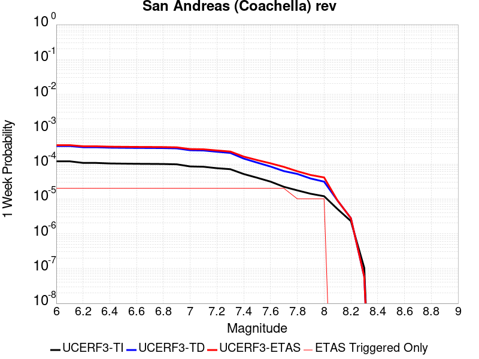 |  |  |  |

| Magnitude | 1 wk TI Prob | 1 wk TD Prob | 1 wk ETAS Prob | 1 wk ETAS/TD Gain | 1 wk ETAS Triggered Only | 1 mo TI Prob | 1 mo TD Prob | 1 mo ETAS Prob | 1 mo ETAS/TD Gain | 1 mo ETAS Triggered Only | 1 yr TI Prob | 1 yr TD Prob | 1 yr ETAS Prob | 1 yr ETAS/TD Gain | 1 yr ETAS Triggered Only | 10 yr TI Prob | 10 yr TD Prob | 10 yr ETAS Prob | 10 yr ETAS/TD Gain | 10 yr ETAS Triggered Only |
|-----|-----|-----|-----|-----|-----|-----|-----|-----|-----|-----|-----|-----|-----|-----|-----|-----|-----|-----|-----|-----|
| 6.0 | 1.1925945E-4 | 3.2733803E-4 | 3.473315E-4 | 1.0610789 | 2.0E-5 | 5.110118E-4 | 0.0014021277 | 0.0014820156 | 1.0569762 | 8.0E-5 | 0.0062038354 | 0.016938623 | 0.01705659 | 1.0069644 | 1.2E-4 | 0.060334753 | 0.15267034 | 0.15285675 | 1.0012211 | 2.2E-4 |
| 6.1 | 1.1925945E-4 | 3.2733803E-4 | 3.473315E-4 | 1.0610789 | 2.0E-5 | 5.110118E-4 | 0.0014021277 | 0.0014820156 | 1.0569762 | 8.0E-5 | 0.0062038354 | 0.016938623 | 0.01705659 | 1.0069644 | 1.2E-4 | 0.060334753 | 0.15267034 | 0.15285675 | 1.0012211 | 2.2E-4 |
| 6.2 | 1.07432395E-4 | 3.0234526E-4 | 3.223392E-4 | 1.0661296 | 2.0E-5 | 4.603433E-4 | 0.0012951259 | 0.0013750223 | 1.0616901 | 8.0E-5 | 0.005590286 | 0.015655253 | 0.015773375 | 1.0075451 | 1.2E-4 | 0.05451731 | 0.14184146 | 0.14201309 | 1.00121 | 2.0E-4 |
| 6.3 | 1.0718766E-4 | 3.017983E-4 | 3.2179226E-4 | 1.0662494 | 2.0E-5 | 4.592948E-4 | 0.0012927842 | 0.0013726808 | 1.0618019 | 8.0E-5 | 0.005577586 | 0.015627153 | 0.015745277 | 1.007559 | 1.2E-4 | 0.054396555 | 0.14160971 | 0.14178139 | 1.0012124 | 2.0E-4 |
| 6.4 | 1.0355944E-4 | 2.9387916E-4 | 3.138733E-4 | 1.0680351 | 2.0E-5 | 4.4375064E-4 | 0.0012588782 | 0.0013387774 | 1.0634687 | 8.0E-5 | 0.0053892885 | 0.015220184 | 0.015338358 | 1.0077642 | 1.2E-4 | 0.052604496 | 0.13816981 | 0.13833356 | 1.0011852 | 1.9E-4 |
| 6.5 | 1.0227914E-4 | 2.910735E-4 | 3.1106765E-4 | 1.0686911 | 2.0E-5 | 4.382655E-4 | 0.0012468654 | 0.0013267655 | 1.064081 | 8.0E-5 | 0.0053228354 | 0.015075962 | 0.015194153 | 1.0078397 | 1.2E-4 | 0.051971316 | 0.136949 | 0.13711298 | 1.0011973 | 1.9E-4 |
| 6.6 | 1.0116757E-4 | 2.8873098E-4 | 3.087252E-4 | 1.0692487 | 2.0E-5 | 4.3350324E-4 | 0.0012368355 | 0.0013167366 | 1.0646012 | 8.0E-5 | 0.0052651367 | 0.014955532 | 0.015073737 | 1.0079038 | 1.2E-4 | 0.051421247 | 0.13592719 | 0.13609137 | 1.0012078 | 1.9E-4 |
| 6.7 | 1.0050676E-4 | 2.873166E-4 | 3.0731084E-4 | 1.0695896 | 2.0E-5 | 4.3067214E-4 | 0.0012307797 | 0.0013106812 | 1.0649195 | 8.0E-5 | 0.005230834 | 0.01488281 | 0.015001025 | 1.007943 | 1.2E-4 | 0.051094085 | 0.13531192 | 0.1354762 | 1.0012141 | 1.9E-4 |
| 6.8 | 9.976819E-5 | 2.853531E-4 | 3.053474E-4 | 1.0700686 | 2.0E-5 | 4.2750788E-4 | 0.0012223726 | 0.0013022749 | 1.0653665 | 8.0E-5 | 0.0051924936 | 0.014781849 | 0.014900075 | 1.0079981 | 1.2E-4 | 0.050728295 | 0.13446361 | 0.13462806 | 1.001223 | 1.9E-4 |
| 6.9 | 9.77719E-5 | 2.8032195E-4 | 3.0031634E-4 | 1.0713265 | 2.0E-5 | 4.1895514E-4 | 0.0012008306 | 0.0012807345 | 1.0665406 | 8.0E-5 | 0.0050888555 | 0.014523101 | 0.014641358 | 1.0081427 | 1.2E-4 | 0.049738888 | 0.13229203 | 0.1324569 | 1.0012462 | 1.9E-4 |
| 7.0 | 8.500761E-5 | 2.4766565E-4 | 2.676607E-4 | 1.080734 | 2.0E-5 | 3.6426744E-4 | 0.0010609957 | 0.0011309214 | 1.0659058 | 7.0E-5 | 0.0044259406 | 0.012841888 | 0.012950475 | 1.0084558 | 1.1E-4 | 0.04338823 | 0.11814933 | 0.11830807 | 1.0013435 | 1.8E-4 |
| 7.1 | 8.319876E-5 | 2.4369264E-4 | 2.6368778E-4 | 1.0820506 | 2.0E-5 | 3.5651738E-4 | 0.0010439822 | 0.0011139092 | 1.066981 | 7.0E-5 | 0.004331963 | 0.012637171 | 0.012745781 | 1.0085945 | 1.1E-4 | 0.042484846 | 0.116369456 | 0.11652851 | 1.0013669 | 1.8E-4 |
| 7.2 | 7.563917E-5 | 2.2417592E-4 | 2.4417145E-4 | 1.0891956 | 2.0E-5 | 3.2412758E-4 | 9.6040324E-4 | 0.001030336 | 1.072816 | 7.0E-5 | 0.0039391145 | 0.0116309095 | 0.01173963 | 1.0093476 | 1.1E-4 | 0.03870018 | 0.10777538 | 0.10793598 | 1.0014901 | 1.8E-4 |
| 7.3 | 7.082985E-5 | 2.073362E-4 | 2.2733206E-4 | 1.0964417 | 2.0E-5 | 3.0352117E-4 | 8.88284E-4 | 9.5822185E-4 | 1.0787337 | 7.0E-5 | 0.0036891096 | 0.010761855 | 0.010870671 | 1.0101113 | 1.1E-4 | 0.03628465 | 0.10029767 | 0.10045961 | 1.0016147 | 1.8E-4 |
| 7.4 | 5.146215E-5 | 1.4276853E-4 | 1.6276567E-4 | 1.1400669 | 2.0E-5 | 2.2053342E-4 | 6.117225E-4 | 6.816797E-4 | 1.1143609 | 7.0E-5 | 0.0026816884 | 0.007422478 | 0.007531661 | 1.0147098 | 1.1E-4 | 0.02649557 | 0.07086292 | 0.07103016 | 1.0023601 | 1.8E-4 |
| 7.5 | 4.0285166E-5 | 1.0944253E-4 | 1.2944033E-4 | 1.1827244 | 2.0E-5 | 1.7263928E-4 | 4.689554E-4 | 5.389226E-4 | 1.1491979 | 7.0E-5 | 0.002099857 | 0.005694655 | 0.005794085 | 1.0174603 | 1.0E-4 | 0.020801254 | 0.055022955 | 0.055183604 | 1.0029197 | 1.7E-4 |
| 7.6 | 3.1168736E-5 | 8.441267E-5 | 1.0441098E-4 | 1.2369113 | 2.0E-5 | 1.3357346E-4 | 3.6171856E-4 | 4.3169325E-4 | 1.1934506 | 7.0E-5 | 0.0016250437 | 0.004395057 | 0.0044946177 | 1.0226529 | 1.0E-4 | 0.016132116 | 0.042820677 | 0.042983398 | 1.0038 | 1.7E-4 |
| 7.7 | 2.2100989E-5 | 6.2408275E-5 | 8.240702E-5 | 1.3204503 | 2.0E-5 | 9.4715084E-5 | 2.6743664E-4 | 3.3741794E-4 | 1.2616743 | 7.0E-5 | 0.001152546 | 0.003251186 | 0.0033508611 | 1.030658 | 1.0E-4 | 0.011465867 | 0.03190961 | 0.032074183 | 1.0051576 | 1.7E-4 |
| 7.8 | 1.7484861E-5 | 5.1814186E-5 | 6.181367E-5 | 1.1929873 | 1.0E-5 | 7.493296E-5 | 2.2204191E-4 | 2.820286E-4 | 1.2701592 | 6.0E-5 | 9.1192697E-4 | 0.002700012 | 0.0027797958 | 1.0295495 | 8.0E-5 | 0.009081938 | 0.026648527 | 0.02679453 | 1.0054789 | 1.5E-4 |
| 7.9 | 1.3967285E-5 | 3.8237675E-5 | 4.8237293E-5 | 1.2615122 | 1.0E-5 | 5.985842E-5 | 1.6386545E-4 | 2.2385562E-4 | 1.366094 | 6.0E-5 | 7.2853256E-4 | 0.0019932375 | 0.0020730782 | 1.0400558 | 8.0E-5 | 0.0072614877 | 0.019916428 | 0.02005364 | 1.0068893 | 1.4E-4 |
| 8.0 | 1.1887396E-5 | 3.107819E-5 | 4.1077878E-5 | 1.3217591 | 1.0E-5 | 5.094499E-5 | 1.3318544E-4 | 1.8317878E-4 | 1.3753664 | 5.0E-5 | 6.200787E-4 | 0.0016203277 | 0.0016902143 | 1.0431311 | 7.0E-5 | 0.006183513 | 0.016285317 | 0.0164132 | 1.0078527 | 1.3E-4 |
| 8.1 | 5.100864E-6 | 8.978668E-6 | 8.978668E-6 | 1.0 | 0.0 | 2.1860664E-5 | 3.847944E-5 | 4.8479058E-5 | 1.259869 | 1.0E-5 | 2.6612106E-4 | 4.6838663E-4 | 4.7838193E-4 | 1.0213399 | 1.0E-5 | 0.002658026 | 0.004920349 | 0.0049502016 | 1.0060672 | 3.0E-5 |
| 8.2 | 2.3004484E-6 | 2.7885583E-6 | 2.7885583E-6 | 1.0 | 0.0 | 9.859027E-6 | 1.19509095E-5 | 1.19509095E-5 | 1.0 | 0.0 | 1.2002704E-4 | 1.4549264E-4 | 1.4549264E-4 | 1.0 | 0.0 | 0.0011996223 | 0.0015984807 | 0.0015984807 | 1.0 | 0.0 |
| 8.3 | 1.0424446E-7 | 5.8219563E-8 | 5.8219563E-8 | 1.0 | 0.0 | 4.4676187E-7 | 2.495124E-7 | 2.495124E-7 | 1.0 | 0.0 | 5.439312E-6 | 3.0378094E-6 | 3.0378094E-6 | 1.0 | 0.0 | 5.4391792E-5 | 3.193819E-5 | 3.193819E-5 | 1.0 | 0.0 |

## Scodie Lineament
*[(top)](#table-of-contents)*

| 1 Week | 1 Month | 1 Year | 10 Year |
|-----|-----|-----|-----|
|  | 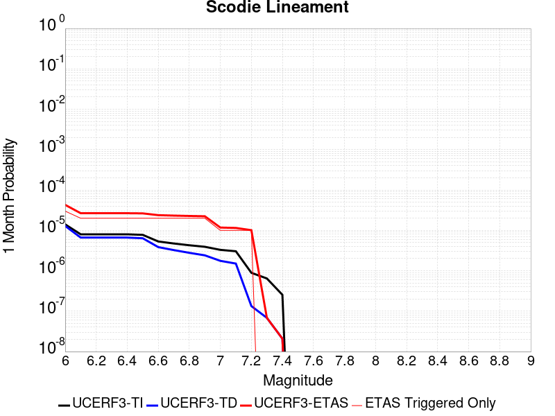 | 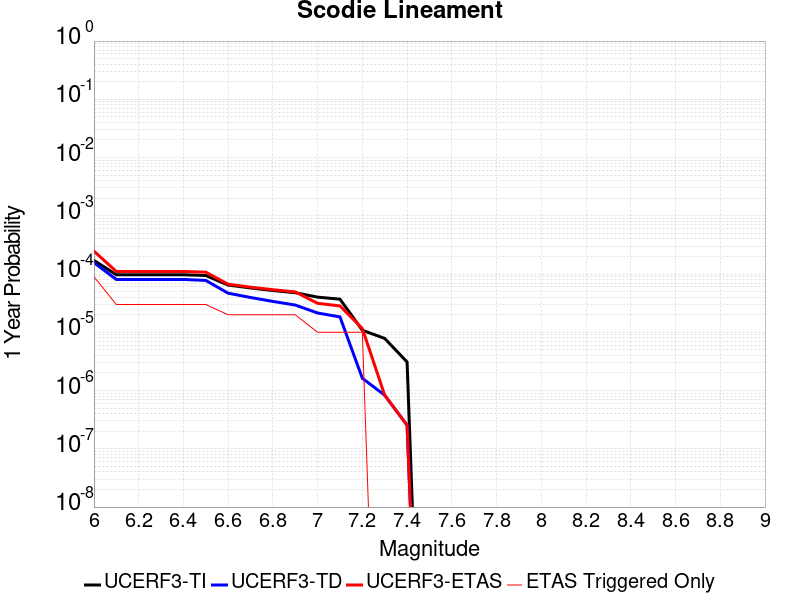 | 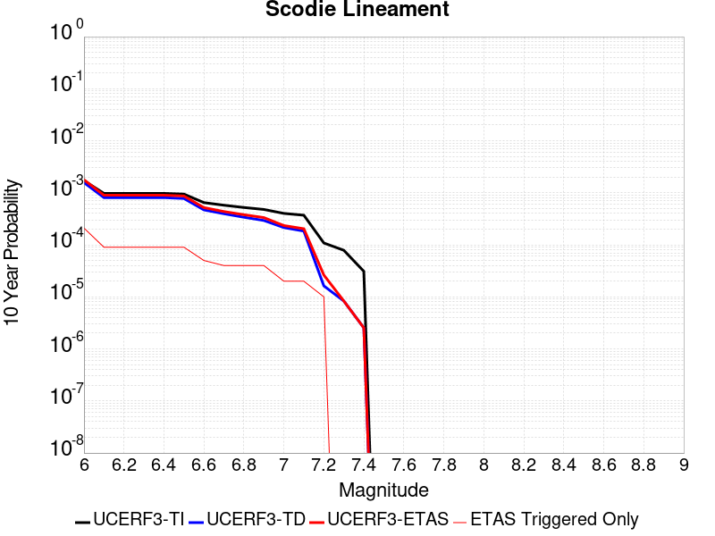 |

| Magnitude | 1 wk TI Prob | 1 wk TD Prob | 1 wk ETAS Prob | 1 wk ETAS/TD Gain | 1 wk ETAS Triggered Only | 1 mo TI Prob | 1 mo TD Prob | 1 mo ETAS Prob | 1 mo ETAS/TD Gain | 1 mo ETAS Triggered Only | 1 yr TI Prob | 1 yr TD Prob | 1 yr ETAS Prob | 1 yr ETAS/TD Gain | 1 yr ETAS Triggered Only | 10 yr TI Prob | 10 yr TD Prob | 10 yr ETAS Prob | 10 yr ETAS/TD Gain | 10 yr ETAS Triggered Only |
|-----|-----|-----|-----|-----|-----|-----|-----|-----|-----|-----|-----|-----|-----|-----|-----|-----|-----|-----|-----|-----|
| 6.0 | 3.2919327E-6 | 3.0133565E-6 | 1.3013327E-5 | 4.3185487 | 1.0E-5 | 1.4108206E-5 | 1.2914339E-5 | 4.291395E-5 | 3.3229692 | 3.0E-5 | 1.7175387E-4 | 1.5722391E-4 | 2.4720977E-4 | 1.572342 | 9.0E-5 | 0.0017162118 | 0.0015714383 | 0.0017811083 | 1.1334256 | 2.1E-4 |
| 6.1 | 1.8663811E-6 | 1.5490589E-6 | 1.1549044E-5 | 7.4555225 | 1.0E-5 | 7.998751E-6 | 6.6388097E-6 | 2.6638678E-5 | 4.012568 | 2.0E-5 | 9.738045E-5 | 8.082501E-5 | 1.10822584E-4 | 1.3711423 | 3.0E-5 | 9.7337784E-4 | 8.0800493E-4 | 8.979322E-4 | 1.1112955 | 9.0E-5 |
| 6.2 | 1.8663811E-6 | 1.5490589E-6 | 1.1549044E-5 | 7.4555225 | 1.0E-5 | 7.998751E-6 | 6.6388097E-6 | 2.6638678E-5 | 4.012568 | 2.0E-5 | 9.738045E-5 | 8.082501E-5 | 1.10822584E-4 | 1.3711423 | 3.0E-5 | 9.7337784E-4 | 8.0800493E-4 | 8.979322E-4 | 1.1112955 | 9.0E-5 |
| 6.3 | 1.8663811E-6 | 1.5490589E-6 | 1.1549044E-5 | 7.4555225 | 1.0E-5 | 7.998751E-6 | 6.6388097E-6 | 2.6638678E-5 | 4.012568 | 2.0E-5 | 9.738045E-5 | 8.082501E-5 | 1.10822584E-4 | 1.3711423 | 3.0E-5 | 9.7337784E-4 | 8.0800493E-4 | 8.979322E-4 | 1.1112955 | 9.0E-5 |
| 6.4 | 1.8663811E-6 | 1.5490589E-6 | 1.1549044E-5 | 7.4555225 | 1.0E-5 | 7.998751E-6 | 6.6388097E-6 | 2.6638678E-5 | 4.012568 | 2.0E-5 | 9.738045E-5 | 8.082501E-5 | 1.10822584E-4 | 1.3711423 | 3.0E-5 | 9.7337784E-4 | 8.0800493E-4 | 8.979322E-4 | 1.1112955 | 9.0E-5 |
| 6.5 | 1.8106311E-6 | 1.4909926E-6 | 1.1490978E-5 | 7.7069316 | 1.0E-5 | 7.759824E-6 | 6.3899556E-6 | 2.6389827E-5 | 4.1298923 | 2.0E-5 | 9.447177E-5 | 7.779543E-5 | 1.07793094E-4 | 1.3855968 | 3.0E-5 | 9.4431615E-4 | 7.777306E-4 | 8.6766056E-4 | 1.1156313 | 9.0E-5 |
| 6.6 | 1.2414679E-6 | 8.9976135E-7 | 1.0899752E-5 | 12.114048 | 1.0E-5 | 5.320566E-6 | 3.8561147E-6 | 2.3856037E-5 | 6.1865473 | 2.0E-5 | 6.477596E-5 | 4.6947276E-5 | 6.694634E-5 | 1.4259897 | 2.0E-5 | 6.475708E-4 | 4.6938224E-4 | 5.193588E-4 | 1.106473 | 5.0E-5 |
| 6.7 | 1.1062215E-6 | 7.5943603E-7 | 1.0759429E-5 | 14.167656 | 1.0E-5 | 4.7409408E-6 | 3.254722E-6 | 2.3254657E-5 | 7.144898 | 2.0E-5 | 5.7719422E-5 | 3.9625593E-5 | 5.96248E-5 | 1.5047044 | 2.0E-5 | 5.770443E-4 | 3.9619225E-4 | 4.361764E-4 | 1.100921 | 4.0E-5 |
| 6.8 | 1.0006736E-6 | 6.5004406E-7 | 1.0650037E-5 | 16.383562 | 1.0E-5 | 4.288594E-6 | 2.7859005E-6 | 2.2785845E-5 | 8.1789875 | 2.0E-5 | 5.221238E-5 | 3.3917873E-5 | 5.3917192E-5 | 1.5896397 | 2.0E-5 | 5.220012E-4 | 3.3913302E-4 | 3.7911948E-4 | 1.1179078 | 4.0E-5 |
| 6.9 | 9.167364E-7 | 5.6316645E-7 | 1.0563161E-5 | 18.75673 | 1.0E-5 | 3.9288643E-6 | 2.4135686E-6 | 2.241352E-5 | 9.286465 | 2.0E-5 | 4.7832873E-5 | 2.9384859E-5 | 4.938427E-5 | 1.6806027 | 2.0E-5 | 4.782258E-4 | 2.9381542E-4 | 3.3380365E-4 | 1.1360999 | 4.0E-5 |
| 7.0 | 7.6987664E-7 | 4.113416E-7 | 4.113416E-7 | 1.0 | 0.0 | 3.2994672E-6 | 1.7628915E-6 | 1.1762874E-5 | 6.6724887 | 1.0E-5 | 4.0170275E-5 | 2.1463033E-5 | 3.146282E-5 | 1.4659073 | 1.0E-5 | 4.0163012E-4 | 2.1461345E-4 | 2.3460916E-4 | 1.0931708 | 2.0E-5 |
| 7.1 | 7.1038727E-7 | 3.5211795E-7 | 3.5211795E-7 | 1.0 | 0.0 | 3.0445133E-6 | 1.5090762E-6 | 1.1509062E-5 | 7.62656 | 1.0E-5 | 3.706632E-5 | 1.8372884E-5 | 2.83727E-5 | 1.5442704 | 1.0E-5 | 3.7060137E-4 | 1.8371714E-4 | 2.0371347E-4 | 1.108843 | 2.0E-5 |
| 7.2 | 2.0799602E-7 | 3.1187685E-8 | 3.1187685E-8 | 1.0 | 0.0 | 8.914113E-7 | 1.336615E-7 | 1.013366E-5 | 75.81584 | 1.0E-5 | 1.0852878E-5 | 1.6273277E-6 | 1.1627311E-5 | 7.145034 | 1.0E-5 | 1.08523476E-4 | 1.6273165E-5 | 2.6273003E-5 | 1.6144986 | 1.0E-5 |
| 7.3 | 1.5048182E-7 | 1.5946263E-8 | 1.5946263E-8 | 1.0 | 0.0 | 6.449219E-7 | 6.834112E-8 | 6.834112E-8 | 1.0 | 0.0 | 7.851896E-6 | 8.320529E-7 | 8.320529E-7 | 1.0 | 0.0 | 7.851618E-5 | 8.3205005E-6 | 8.3205005E-6 | 1.0 | 0.0 |
| 7.4 | 5.9334678E-8 | 4.8685624E-9 | 4.8685624E-9 | 1.0 | 0.0 | 2.5429145E-7 | 2.0865269E-8 | 2.0865269E-8 | 1.0 | 0.0 | 3.095994E-6 | 2.5403463E-7 | 2.5403463E-7 | 1.0 | 0.0 | 3.095951E-5 | 2.5403444E-6 | 2.5403444E-6 | 1.0 | 0.0 |

## San Andreas (San Gorgonio Pass-Garnet HIll)
*[(top)](#table-of-contents)*

| 1 Week | 1 Month | 1 Year | 10 Year |
|-----|-----|-----|-----|
|  |  |  | 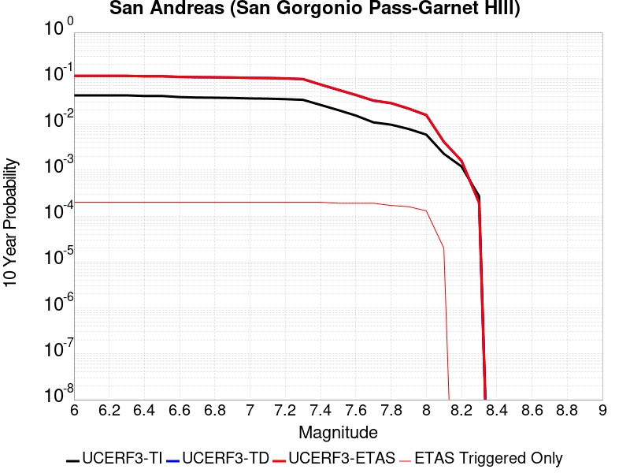 |

| Magnitude | 1 wk TI Prob | 1 wk TD Prob | 1 wk ETAS Prob | 1 wk ETAS/TD Gain | 1 wk ETAS Triggered Only | 1 mo TI Prob | 1 mo TD Prob | 1 mo ETAS Prob | 1 mo ETAS/TD Gain | 1 mo ETAS Triggered Only | 1 yr TI Prob | 1 yr TD Prob | 1 yr ETAS Prob | 1 yr ETAS/TD Gain | 1 yr ETAS Triggered Only | 10 yr TI Prob | 10 yr TD Prob | 10 yr ETAS Prob | 10 yr ETAS/TD Gain | 10 yr ETAS Triggered Only |
|-----|-----|-----|-----|-----|-----|-----|-----|-----|-----|-----|-----|-----|-----|-----|-----|-----|-----|-----|-----|-----|
| 6.0 | 8.31567E-5 | 2.3386451E-4 | 2.6385748E-4 | 1.1282494 | 3.0E-5 | 3.5633717E-4 | 0.0010018935 | 0.0010818134 | 1.0797688 | 8.0E-5 | 0.004329778 | 0.012129918 | 0.012258342 | 1.0105873 | 1.3E-4 | 0.042463828 | 0.11259502 | 0.1127725 | 1.0015763 | 2.0E-4 |
| 6.1 | 8.31567E-5 | 2.3386451E-4 | 2.6385748E-4 | 1.1282494 | 3.0E-5 | 3.5633717E-4 | 0.0010018935 | 0.0010818134 | 1.0797688 | 8.0E-5 | 0.004329778 | 0.012129918 | 0.012258342 | 1.0105873 | 1.3E-4 | 0.042463828 | 0.11259502 | 0.1127725 | 1.0015763 | 2.0E-4 |
| 6.2 | 8.31567E-5 | 2.3386451E-4 | 2.6385748E-4 | 1.1282494 | 3.0E-5 | 3.5633717E-4 | 0.0010018935 | 0.0010818134 | 1.0797688 | 8.0E-5 | 0.004329778 | 0.012129918 | 0.012258342 | 1.0105873 | 1.3E-4 | 0.042463828 | 0.11259502 | 0.1127725 | 1.0015763 | 2.0E-4 |
| 6.3 | 8.31567E-5 | 2.3386451E-4 | 2.6385748E-4 | 1.1282494 | 3.0E-5 | 3.5633717E-4 | 0.0010018935 | 0.0010818134 | 1.0797688 | 8.0E-5 | 0.004329778 | 0.012129918 | 0.012258342 | 1.0105873 | 1.3E-4 | 0.042463828 | 0.11259502 | 0.1127725 | 1.0015763 | 2.0E-4 |
| 6.4 | 8.059055E-5 | 2.2944735E-4 | 2.5944048E-4 | 1.130719 | 3.0E-5 | 3.4534236E-4 | 9.829777E-4 | 0.001062899 | 1.0813054 | 8.0E-5 | 0.0041964394 | 0.011902156 | 0.012030609 | 1.0107924 | 1.3E-4 | 0.041180745 | 0.110576175 | 0.110754065 | 1.0016087 | 2.0E-4 |
| 6.5 | 8.059055E-5 | 2.2944735E-4 | 2.5944048E-4 | 1.130719 | 3.0E-5 | 3.4534236E-4 | 9.829777E-4 | 0.001062899 | 1.0813054 | 8.0E-5 | 0.0041964394 | 0.011902156 | 0.012030609 | 1.0107924 | 1.3E-4 | 0.041180745 | 0.110576175 | 0.110754065 | 1.0016087 | 2.0E-4 |
| 6.6 | 7.619237E-5 | 2.2189032E-4 | 2.5188367E-4 | 1.1351719 | 3.0E-5 | 3.2649786E-4 | 9.506143E-4 | 0.0010305382 | 1.0840762 | 8.0E-5 | 0.0039678677 | 0.0115128625 | 0.0116413655 | 1.0111617 | 1.3E-4 | 0.03897764 | 0.10711278 | 0.107291356 | 1.0016671 | 2.0E-4 |
| 6.7 | 7.440636E-5 | 2.1864849E-4 | 2.4864194E-4 | 1.1371765 | 3.0E-5 | 3.188454E-4 | 9.367307E-4 | 0.0010166558 | 1.0853235 | 8.0E-5 | 0.0038750346 | 0.011345596 | 0.011474121 | 1.0113282 | 1.3E-4 | 0.038081564 | 0.10562121 | 0.105800085 | 1.0016936 | 2.0E-4 |
| 6.8 | 7.3735864E-5 | 2.1712016E-4 | 2.4711364E-4 | 1.1381423 | 3.0E-5 | 3.1597257E-4 | 9.3018543E-4 | 0.001010111 | 1.0859244 | 8.0E-5 | 0.0038401815 | 0.011266734 | 0.01139527 | 1.0114084 | 1.3E-4 | 0.03774495 | 0.10492276 | 0.10510177 | 1.0017061 | 2.0E-4 |
| 6.9 | 7.27575E-5 | 2.1480983E-4 | 2.4480338E-4 | 1.1396284 | 3.0E-5 | 3.117806E-4 | 9.20291E-4 | 0.0010002174 | 1.086849 | 8.0E-5 | 0.003789323 | 0.011147508 | 0.01127606 | 1.0115318 | 1.3E-4 | 0.037253562 | 0.10387066 | 0.104049884 | 1.0017254 | 2.0E-4 |
| 7.0 | 7.102591E-5 | 2.1065009E-4 | 2.4064377E-4 | 1.1423863 | 3.0E-5 | 3.0436125E-4 | 9.0247596E-4 | 9.824038E-4 | 1.088565 | 8.0E-5 | 0.003699303 | 0.010932805 | 0.011061384 | 1.0117608 | 1.3E-4 | 0.03638325 | 0.101972826 | 0.10215243 | 1.0017613 | 2.0E-4 |
| 7.1 | 7.028513E-5 | 2.0900648E-4 | 2.390002E-4 | 1.1435062 | 3.0E-5 | 3.0118722E-4 | 8.954368E-4 | 9.7536517E-4 | 1.0892619 | 8.0E-5 | 0.0036607897 | 0.01084796 | 0.010976549 | 1.0118538 | 1.3E-4 | 0.036010686 | 0.10121585 | 0.1013956 | 1.001776 | 2.0E-4 |
| 7.2 | 6.8498244E-5 | 2.0508505E-4 | 2.3507889E-4 | 1.1462507 | 3.0E-5 | 2.9353087E-4 | 8.78642E-4 | 9.5857173E-4 | 1.0909696 | 8.0E-5 | 0.003567883 | 0.010645497 | 0.010774113 | 1.0120817 | 1.3E-4 | 0.035111405 | 0.09940783 | 0.09958795 | 1.0018119 | 2.0E-4 |
| 7.3 | 6.622592E-5 | 1.973576E-4 | 2.2735167E-4 | 1.1519784 | 3.0E-5 | 2.8379448E-4 | 8.4554625E-4 | 9.2547864E-4 | 1.0945334 | 8.0E-5 | 0.0034497243 | 0.010246415 | 0.0103750825 | 1.0125574 | 1.3E-4 | 0.033966612 | 0.09590419 | 0.096085005 | 1.0018854 | 2.0E-4 |
| 7.4 | 5.1050705E-5 | 1.4692261E-4 | 1.7691821E-4 | 1.2041591 | 3.0E-5 | 2.1877038E-4 | 6.295173E-4 | 7.094669E-4 | 1.1270015 | 8.0E-5 | 0.002660276 | 0.0076376316 | 0.0077666384 | 1.016891 | 1.3E-4 | 0.02628654 | 0.07287696 | 0.07306238 | 1.0025444 | 2.0E-4 |
| 7.5 | 3.9302922E-5 | 1.11326524E-4 | 1.313243E-4 | 1.1796317 | 2.0E-5 | 1.6843023E-4 | 4.7702674E-4 | 5.4699334E-4 | 1.1466722 | 7.0E-5 | 0.0020487092 | 0.005792404 | 0.0059117093 | 1.0205967 | 1.2E-4 | 0.020299247 | 0.05602189 | 0.056201246 | 1.0032015 | 1.9E-4 |
| 7.6 | 2.9851626E-5 | 8.49747E-5 | 1.04973E-4 | 1.2353442 | 2.0E-5 | 1.2792926E-4 | 3.6412658E-4 | 4.341011E-4 | 1.1921709 | 7.0E-5 | 0.0015564259 | 0.004424255 | 0.004543724 | 1.0270032 | 1.2E-4 | 0.0154556995 | 0.043204896 | 0.043386687 | 1.0042076 | 1.9E-4 |
| 7.7 | 2.1135214E-5 | 6.355116E-5 | 8.354989E-5 | 1.3146871 | 2.0E-5 | 9.0576345E-5 | 2.723337E-4 | 3.4231463E-4 | 1.2569675 | 7.0E-5 | 0.0011022091 | 0.003310627 | 0.0034302298 | 1.0361269 | 1.2E-4 | 0.010967582 | 0.032592565 | 0.032776374 | 1.0056396 | 1.9E-4 |
| 7.8 | 1.883379E-5 | 5.5660596E-5 | 6.566004E-5 | 1.1796503 | 1.0E-5 | 8.0713755E-5 | 2.3852361E-4 | 2.985093E-4 | 1.2514874 | 6.0E-5 | 9.822468E-4 | 0.0029001608 | 0.0029998708 | 1.0343808 | 1.0E-4 | 0.0097791655 | 0.028704397 | 0.028869517 | 1.0057524 | 1.7E-4 |
| 7.9 | 1.5156185E-5 | 4.1675128E-5 | 5.1674713E-5 | 1.2399412 | 1.0E-5 | 6.495346E-5 | 1.7859548E-4 | 2.3858476E-4 | 1.3358947 | 6.0E-5 | 7.9052144E-4 | 0.0021722328 | 0.0022720157 | 1.0459356 | 1.0E-4 | 0.007877152 | 0.02176709 | 0.021923605 | 1.0071906 | 1.6E-4 |
| 8.0 | 1.1405907E-5 | 2.9986788E-5 | 3.9986488E-5 | 1.3334702 | 1.0E-5 | 4.8881542E-5 | 1.2850849E-4 | 1.7850206E-4 | 1.3890294 | 5.0E-5 | 5.9497025E-4 | 0.0015634688 | 0.0016333595 | 1.0447023 | 7.0E-5 | 0.005933798 | 0.015778678 | 0.015906626 | 1.008109 | 1.3E-4 |
| 8.1 | 4.3511436E-6 | 7.373693E-6 | 7.373693E-6 | 1.0 | 0.0 | 1.8647626E-5 | 3.160116E-5 | 4.1600844E-5 | 1.3164341 | 1.0E-5 | 2.2701119E-4 | 3.8467633E-4 | 3.9467248E-4 | 1.0259858 | 1.0E-5 | 0.0022677942 | 0.004118566 | 0.004138483 | 1.0048361 | 2.0E-5 |
| 8.2 | 2.3042528E-6 | 2.7350309E-6 | 2.7350309E-6 | 1.0 | 0.0 | 9.875332E-6 | 1.1721509E-5 | 1.1721509E-5 | 1.0 | 0.0 | 1.2022553E-4 | 1.4270007E-4 | 1.4270007E-4 | 1.0 | 0.0 | 0.0012016051 | 0.0015990696 | 0.0015990696 | 1.0 | 0.0 |
| 8.3 | 5.202968E-7 | 3.1628537E-7 | 3.1628537E-7 | 1.0 | 0.0 | 2.2298414E-6 | 1.3555081E-6 | 1.3555081E-6 | 1.0 | 0.0 | 2.714798E-5 | 1.6503198E-5 | 1.6503198E-5 | 1.0 | 0.0 | 2.7144665E-4 | 1.9580164E-4 | 1.9580164E-4 | 1.0 | 0.0 |

## San Jacinto (San Bernardino)
*[(top)](#table-of-contents)*

| 1 Week | 1 Month | 1 Year | 10 Year |
|-----|-----|-----|-----|
|  |  | 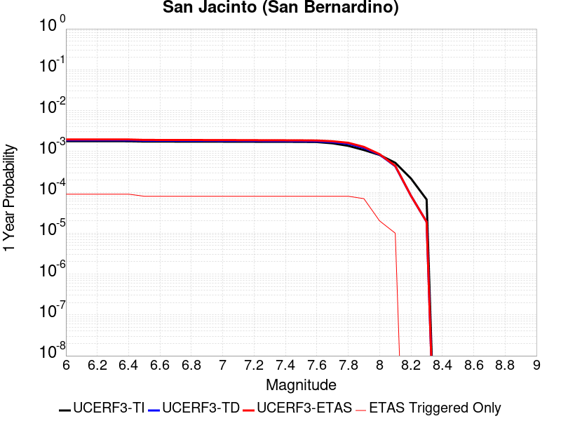 |  |

| Magnitude | 1 wk TI Prob | 1 wk TD Prob | 1 wk ETAS Prob | 1 wk ETAS/TD Gain | 1 wk ETAS Triggered Only | 1 mo TI Prob | 1 mo TD Prob | 1 mo ETAS Prob | 1 mo ETAS/TD Gain | 1 mo ETAS Triggered Only | 1 yr TI Prob | 1 yr TD Prob | 1 yr ETAS Prob | 1 yr ETAS/TD Gain | 1 yr ETAS Triggered Only | 10 yr TI Prob | 10 yr TD Prob | 10 yr ETAS Prob | 10 yr ETAS/TD Gain | 10 yr ETAS Triggered Only |
|-----|-----|-----|-----|-----|-----|-----|-----|-----|-----|-----|-----|-----|-----|-----|-----|-----|-----|-----|-----|-----|
| 6.0 | 3.409352E-5 | 3.600249E-5 | 6.600141E-5 | 1.8332456 | 3.0E-5 | 1.461069E-4 | 1.5428728E-4 | 1.8428265E-4 | 1.1944125 | 3.0E-5 | 0.0017774 | 0.001876831 | 0.0019666622 | 1.0478631 | 9.0E-5 | 0.01763251 | 0.019358097 | 0.019554226 | 1.0101316 | 2.0E-4 |
| 6.1 | 3.409352E-5 | 3.600249E-5 | 6.600141E-5 | 1.8332456 | 3.0E-5 | 1.461069E-4 | 1.5428728E-4 | 1.8428265E-4 | 1.1944125 | 3.0E-5 | 0.0017774 | 0.001876831 | 0.0019666622 | 1.0478631 | 9.0E-5 | 0.01763251 | 0.019358097 | 0.019554226 | 1.0101316 | 2.0E-4 |
| 6.2 | 3.409352E-5 | 3.600249E-5 | 6.600141E-5 | 1.8332456 | 3.0E-5 | 1.461069E-4 | 1.5428728E-4 | 1.8428265E-4 | 1.1944125 | 3.0E-5 | 0.0017774 | 0.001876831 | 0.0019666622 | 1.0478631 | 9.0E-5 | 0.01763251 | 0.019358097 | 0.019554226 | 1.0101316 | 2.0E-4 |
| 6.3 | 3.409352E-5 | 3.600249E-5 | 6.600141E-5 | 1.8332456 | 3.0E-5 | 1.461069E-4 | 1.5428728E-4 | 1.8428265E-4 | 1.1944125 | 3.0E-5 | 0.0017774 | 0.001876831 | 0.0019666622 | 1.0478631 | 9.0E-5 | 0.01763251 | 0.019358097 | 0.019554226 | 1.0101316 | 2.0E-4 |
| 6.4 | 3.400795E-5 | 3.589515E-5 | 6.589407E-5 | 1.8357375 | 3.0E-5 | 1.4574021E-4 | 1.5382729E-4 | 1.8382269E-4 | 1.1949939 | 3.0E-5 | 0.0017729428 | 0.0018712406 | 0.0019610722 | 1.0480064 | 9.0E-5 | 0.017588645 | 0.019303178 | 0.019499317 | 1.010161 | 2.0E-4 |
| 6.5 | 3.341482E-5 | 3.5155765E-5 | 6.515471E-5 | 1.8533151 | 3.0E-5 | 1.4319851E-4 | 1.5065886E-4 | 1.8065434E-4 | 1.1990954 | 3.0E-5 | 0.0017420477 | 0.0018327299 | 0.0019125832 | 1.0435708 | 8.0E-5 | 0.017284546 | 0.018924711 | 0.019101305 | 1.0093313 | 1.8E-4 |
| 6.6 | 3.3364955E-5 | 3.509298E-5 | 6.5091925E-5 | 1.8548418 | 3.0E-5 | 1.4298483E-4 | 1.5038982E-4 | 1.8038531E-4 | 1.1994516 | 3.0E-5 | 0.0017394501 | 0.0018294598 | 0.0019093135 | 1.0436487 | 8.0E-5 | 0.017258976 | 0.018892575 | 0.019069174 | 1.0093476 | 1.8E-4 |
| 6.7 | 3.335922E-5 | 3.5082754E-5 | 6.50817E-5 | 1.855091 | 3.0E-5 | 1.4296026E-4 | 1.5034601E-4 | 1.8034149E-4 | 1.1995097 | 3.0E-5 | 0.0017391514 | 0.0018289272 | 0.0019087809 | 1.0436615 | 8.0E-5 | 0.017256035 | 0.018887365 | 0.019063966 | 1.0093502 | 1.8E-4 |
| 6.8 | 3.327683E-5 | 3.4976816E-5 | 6.4975764E-5 | 1.857681 | 3.0E-5 | 1.4260718E-4 | 1.4989203E-4 | 1.7988755E-4 | 1.200114 | 3.0E-5 | 0.0017348597 | 0.0018234095 | 0.0019032635 | 1.0437938 | 8.0E-5 | 0.017213784 | 0.018833136 | 0.019009747 | 1.0093776 | 1.8E-4 |
| 6.9 | 3.3235785E-5 | 3.4917768E-5 | 6.491672E-5 | 1.8591315 | 3.0E-5 | 1.4243131E-4 | 1.49639E-4 | 1.7963452E-4 | 1.2004524 | 3.0E-5 | 0.0017327217 | 0.0018203339 | 0.0019001883 | 1.043868 | 8.0E-5 | 0.017192734 | 0.018803004 | 0.01897962 | 1.009393 | 1.8E-4 |
| 7.0 | 3.3197095E-5 | 3.4857694E-5 | 6.485665E-5 | 1.860612 | 3.0E-5 | 1.422655E-4 | 1.4938158E-4 | 1.793771E-4 | 1.200798 | 3.0E-5 | 0.0017307063 | 0.001817205 | 0.0018970596 | 1.0439436 | 8.0E-5 | 0.017172894 | 0.01877238 | 0.018949002 | 1.0094086 | 1.8E-4 |
| 7.1 | 3.3129716E-5 | 3.47379E-5 | 6.473686E-5 | 1.8635801 | 3.0E-5 | 1.4197677E-4 | 1.4886823E-4 | 1.7886376E-4 | 1.2014905 | 3.0E-5 | 0.0017271966 | 0.0018109654 | 0.0018908205 | 1.0440953 | 8.0E-5 | 0.017138338 | 0.018711457 | 0.01888809 | 1.0094398 | 1.8E-4 |
| 7.2 | 3.3034008E-5 | 3.4605342E-5 | 6.4604304E-5 | 1.8668882 | 3.0E-5 | 1.4156665E-4 | 1.4830018E-4 | 1.7829574E-4 | 1.2022624 | 3.0E-5 | 0.0017222111 | 0.001804061 | 0.0018839167 | 1.0442644 | 8.0E-5 | 0.017089253 | 0.018643849 | 0.018820493 | 1.0094746 | 1.8E-4 |
| 7.3 | 3.2956614E-5 | 3.447309E-5 | 6.447206E-5 | 1.870214 | 3.0E-5 | 1.4123498E-4 | 1.4773346E-4 | 1.7772903E-4 | 1.2030385 | 3.0E-5 | 0.0017181796 | 0.0017971725 | 0.0018770286 | 1.0444344 | 8.0E-5 | 0.017049557 | 0.018576592 | 0.018753247 | 1.0095096 | 1.8E-4 |
| 7.4 | 3.2915937E-5 | 3.439478E-5 | 6.4393746E-5 | 1.8721954 | 3.0E-5 | 1.4106068E-4 | 1.4739788E-4 | 1.7739345E-4 | 1.2035007 | 3.0E-5 | 0.0017160608 | 0.0017930934 | 0.00187295 | 1.0445356 | 8.0E-5 | 0.017028693 | 0.018536855 | 0.018713517 | 1.0095304 | 1.8E-4 |
| 7.5 | 3.281791E-5 | 3.4259683E-5 | 6.425865E-5 | 1.8756349 | 3.0E-5 | 1.406406E-4 | 1.4681896E-4 | 1.7681454E-4 | 1.2043033 | 3.0E-5 | 0.0017109542 | 0.0017860567 | 0.0018659137 | 1.0447115 | 8.0E-5 | 0.016978411 | 0.018467735 | 0.018644411 | 1.0095668 | 1.8E-4 |
| 7.6 | 3.2521442E-5 | 3.39846E-5 | 6.3983585E-5 | 1.8827227 | 3.0E-5 | 1.3937015E-4 | 1.4564018E-4 | 1.7563581E-4 | 1.2059572 | 3.0E-5 | 0.0016955109 | 0.0017717284 | 0.0018515867 | 1.0450736 | 8.0E-5 | 0.016826328 | 0.01832535 | 0.018502051 | 1.0096425 | 1.8E-4 |
| 7.7 | 3.0287873E-5 | 3.246845E-5 | 6.246748E-5 | 1.9239438 | 3.0E-5 | 1.297987E-4 | 1.391431E-4 | 1.6913892E-4 | 1.2155753 | 3.0E-5 | 0.0015791537 | 0.001692752 | 0.0017726165 | 1.0471803 | 8.0E-5 | 0.01567979 | 0.017536119 | 0.017712964 | 1.0100845 | 1.8E-4 |
| 7.8 | 2.6316151E-5 | 2.9678711E-5 | 5.9677823E-5 | 2.0107956 | 3.0E-5 | 1.1277862E-4 | 1.2718828E-4 | 1.5718446E-4 | 1.2358408 | 3.0E-5 | 0.0013722149 | 0.0015474184 | 0.0016272946 | 1.051619 | 8.0E-5 | 0.013637724 | 0.016077382 | 0.016254488 | 1.0110159 | 1.8E-4 |
| 7.9 | 2.0761147E-5 | 2.3431265E-5 | 4.3430795E-5 | 1.8535404 | 2.0E-5 | 8.897331E-5 | 1.0041584E-4 | 1.2041384E-4 | 1.1991518 | 2.0E-5 | 0.0010827117 | 0.0012218781 | 0.0012917925 | 1.0572189 | 7.0E-5 | 0.010774517 | 0.012799971 | 0.012967795 | 1.0131112 | 1.7E-4 |
| 8.0 | 1.5738568E-5 | 1.6043394E-5 | 2.6043233E-5 | 1.6232995 | 1.0E-5 | 6.744926E-5 | 6.8755595E-5 | 7.875491E-5 | 1.1454327 | 1.0E-5 | 8.2088535E-4 | 8.3677855E-4 | 8.567618E-4 | 1.0238812 | 2.0E-5 | 0.008178596 | 0.008871087 | 0.008940467 | 1.0078208 | 7.0E-5 |
| 8.1 | 1.0105832E-5 | 8.336244E-6 | 8.336244E-6 | 1.0 | 0.0 | 4.3309992E-5 | 3.5726272E-5 | 3.5726272E-5 | 1.0 | 0.0 | 5.2717153E-4 | 4.3488108E-4 | 4.4487673E-4 | 1.0229847 | 1.0E-5 | 0.005259227 | 0.00468032 | 0.004690273 | 1.0021266 | 1.0E-5 |
| 8.2 | 4.189207E-6 | 1.5801045E-6 | 1.5801045E-6 | 1.0 | 0.0 | 1.7953622E-5 | 6.771859E-6 | 6.771859E-6 | 1.0 | 0.0 | 2.1856341E-4 | 8.244429E-5 | 8.244429E-5 | 1.0 | 0.0 | 0.0021834858 | 9.575395E-4 | 9.575395E-4 | 1.0 | 0.0 |
| 8.3 | 1.2758221E-6 | 3.6194777E-7 | 3.6194777E-7 | 1.0 | 0.0 | 5.4677976E-6 | 1.5512038E-6 | 1.5512038E-6 | 1.0 | 0.0 | 6.65684E-5 | 1.8885747E-5 | 1.8885747E-5 | 1.0 | 0.0 | 6.6548464E-4 | 2.2777634E-4 | 2.2777634E-4 | 1.0 | 0.0 |

## Manix-Afton Hills
*[(top)](#table-of-contents)*

| 1 Week | 1 Month | 1 Year | 10 Year |
|-----|-----|-----|-----|
|  | 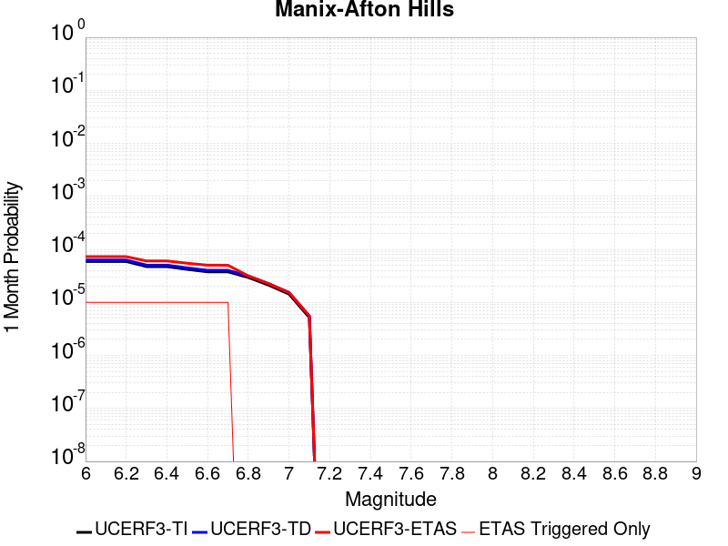 |  |  |

| Magnitude | 1 wk TI Prob | 1 wk TD Prob | 1 wk ETAS Prob | 1 wk ETAS/TD Gain | 1 wk ETAS Triggered Only | 1 mo TI Prob | 1 mo TD Prob | 1 mo ETAS Prob | 1 mo ETAS/TD Gain | 1 mo ETAS Triggered Only | 1 yr TI Prob | 1 yr TD Prob | 1 yr ETAS Prob | 1 yr ETAS/TD Gain | 1 yr ETAS Triggered Only | 10 yr TI Prob | 10 yr TD Prob | 10 yr ETAS Prob | 10 yr ETAS/TD Gain | 10 yr ETAS Triggered Only |
|-----|-----|-----|-----|-----|-----|-----|-----|-----|-----|-----|-----|-----|-----|-----|-----|-----|-----|-----|-----|-----|
| 6.0 | 1.3783202E-5 | 1.4711221E-5 | 1.4711221E-5 | 1.0 | 0.0 | 5.906953E-5 | 6.304667E-5 | 7.304604E-5 | 1.1586027 | 1.0E-5 | 7.189342E-4 | 7.673403E-4 | 8.5727125E-4 | 1.1171982 | 9.0E-5 | 0.0071661277 | 0.007648664 | 0.007837211 | 1.0246509 | 1.9E-4 |
| 6.1 | 1.3783202E-5 | 1.4711221E-5 | 1.4711221E-5 | 1.0 | 0.0 | 5.906953E-5 | 6.304667E-5 | 7.304604E-5 | 1.1586027 | 1.0E-5 | 7.189342E-4 | 7.673403E-4 | 8.5727125E-4 | 1.1171982 | 9.0E-5 | 0.0071661277 | 0.007648664 | 0.007837211 | 1.0246509 | 1.9E-4 |
| 6.2 | 1.3783202E-5 | 1.4711221E-5 | 1.4711221E-5 | 1.0 | 0.0 | 5.906953E-5 | 6.304667E-5 | 7.304604E-5 | 1.1586027 | 1.0E-5 | 7.189342E-4 | 7.673403E-4 | 8.5727125E-4 | 1.1171982 | 9.0E-5 | 0.0071661277 | 0.007648664 | 0.007837211 | 1.0246509 | 1.9E-4 |
| 6.3 | 1.10494875E-5 | 1.1793241E-5 | 1.1793241E-5 | 1.0 | 0.0 | 4.7354086E-5 | 5.054154E-5 | 6.0541035E-5 | 1.197847 | 1.0E-5 | 5.763835E-4 | 6.151799E-4 | 6.951307E-4 | 1.1299633 | 8.0E-5 | 0.005748908 | 0.00613581 | 0.0062948284 | 1.0259165 | 1.6E-4 |
| 6.4 | 1.10494875E-5 | 1.1793241E-5 | 1.1793241E-5 | 1.0 | 0.0 | 4.7354086E-5 | 5.054154E-5 | 6.0541035E-5 | 1.197847 | 1.0E-5 | 5.763835E-4 | 6.151799E-4 | 6.951307E-4 | 1.1299633 | 8.0E-5 | 0.005748908 | 0.00613581 | 0.0062948284 | 1.0259165 | 1.6E-4 |
| 6.5 | 9.788949E-6 | 1.0454414E-5 | 1.0454414E-5 | 1.0 | 0.0 | 4.1951964E-5 | 4.4803914E-5 | 5.4803466E-5 | 1.2231848 | 1.0E-5 | 5.1064545E-4 | 5.4536044E-4 | 5.953332E-4 | 1.0916325 | 5.0E-5 | 0.0050947363 | 0.005441148 | 0.005550549 | 1.0201063 | 1.1E-4 |
| 6.6 | 8.810006E-6 | 9.413714E-6 | 9.413714E-6 | 1.0 | 0.0 | 3.775662E-5 | 4.0343915E-5 | 5.034351E-5 | 1.2478589 | 1.0E-5 | 4.5958988E-4 | 4.9108535E-4 | 5.410608E-4 | 1.1017653 | 5.0E-5 | 0.0045864056 | 0.004900884 | 0.0050003934 | 1.0203044 | 1.0E-4 |
| 6.7 | 8.80128E-6 | 9.404193E-6 | 9.404193E-6 | 1.0 | 0.0 | 3.7719226E-5 | 4.0303115E-5 | 5.030271E-5 | 1.2481098 | 1.0E-5 | 4.591348E-4 | 4.9058883E-4 | 5.405643E-4 | 1.1018684 | 5.0E-5 | 0.004581874 | 0.0048959404 | 0.004995451 | 1.0203251 | 1.0E-4 |
| 6.8 | 6.8994877E-6 | 7.3801443E-6 | 7.3801443E-6 | 1.0 | 0.0 | 2.9568899E-5 | 3.1628853E-5 | 3.1628853E-5 | 1.0 | 0.0 | 3.5994186E-4 | 3.850214E-4 | 4.050137E-4 | 1.0519252 | 2.0E-5 | 0.003593594 | 0.0038443485 | 0.0039041177 | 1.0155473 | 6.0E-5 |
| 6.9 | 4.9328037E-6 | 5.2710093E-6 | 5.2710093E-6 | 1.0 | 0.0 | 2.1140417E-5 | 2.258988E-5 | 2.258988E-5 | 1.0 | 0.0 | 2.5735417E-4 | 2.7500323E-4 | 2.9499774E-4 | 1.0727065 | 2.0E-5 | 0.0025705635 | 0.0027472344 | 0.0027970972 | 1.0181501 | 5.0E-5 |
| 7.0 | 3.347973E-6 | 3.5900646E-6 | 3.5900646E-6 | 1.0 | 0.0 | 1.4348378E-5 | 1.5385924E-5 | 1.5385924E-5 | 1.0 | 0.0 | 1.746775E-4 | 1.8731161E-4 | 1.8731161E-4 | 1.0 | 0.0 | 0.0017454025 | 0.00187194 | 0.0018819212 | 1.005332 | 1.0E-5 |
| 7.1 | 1.2073567E-6 | 1.2934943E-6 | 1.2934943E-6 | 1.0 | 0.0 | 5.1743755E-6 | 5.5435444E-6 | 5.5435444E-6 | 1.0 | 0.0 | 6.29962E-5 | 6.74922E-5 | 6.74922E-5 | 1.0 | 0.0 | 6.297835E-4 | 6.7487714E-4 | 6.848704E-4 | 1.0148075 | 1.0E-5 |

## Death Valley (Fish Lake Valley)
*[(top)](#table-of-contents)*

| 1 Week | 1 Month | 1 Year | 10 Year |
|-----|-----|-----|-----|
| 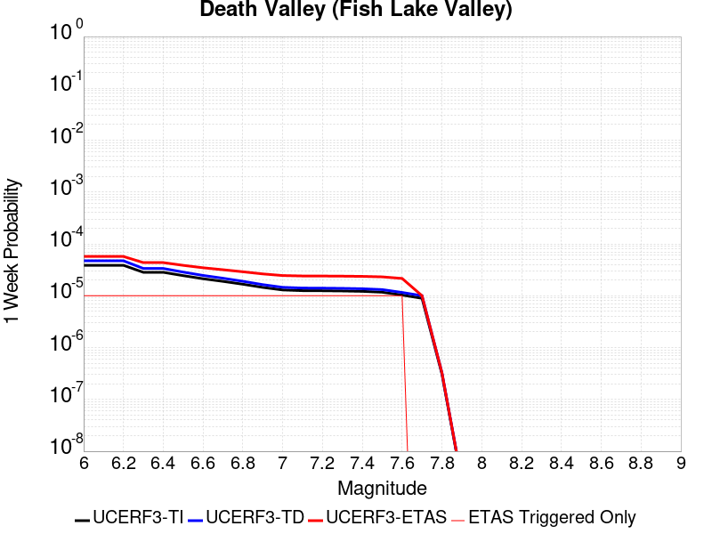 | 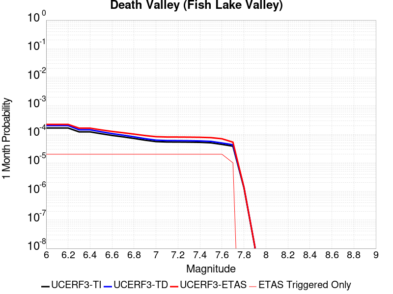 |  | 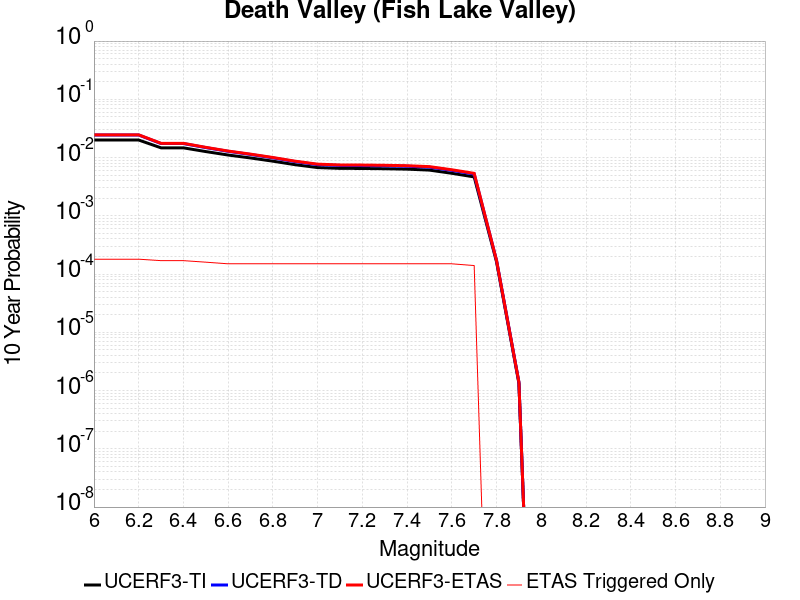 |

| Magnitude | 1 wk TI Prob | 1 wk TD Prob | 1 wk ETAS Prob | 1 wk ETAS/TD Gain | 1 wk ETAS Triggered Only | 1 mo TI Prob | 1 mo TD Prob | 1 mo ETAS Prob | 1 mo ETAS/TD Gain | 1 mo ETAS Triggered Only | 1 yr TI Prob | 1 yr TD Prob | 1 yr ETAS Prob | 1 yr ETAS/TD Gain | 1 yr ETAS Triggered Only | 10 yr TI Prob | 10 yr TD Prob | 10 yr ETAS Prob | 10 yr ETAS/TD Gain | 10 yr ETAS Triggered Only |
|-----|-----|-----|-----|-----|-----|-----|-----|-----|-----|-----|-----|-----|-----|-----|-----|-----|-----|-----|-----|-----|
| 6.0 | 3.872328E-5 | 4.7268895E-5 | 5.7268422E-5 | 1.2115456 | 1.0E-5 | 1.6594635E-4 | 2.0256694E-4 | 2.2256289E-4 | 1.0987128 | 2.0E-5 | 0.0020185246 | 0.0024636039 | 0.0025733327 | 1.04454 | 1.1E-4 | 0.02000288 | 0.024388881 | 0.024564492 | 1.0072004 | 1.8E-4 |
| 6.1 | 3.872328E-5 | 4.7268895E-5 | 5.7268422E-5 | 1.2115456 | 1.0E-5 | 1.6594635E-4 | 2.0256694E-4 | 2.2256289E-4 | 1.0987128 | 2.0E-5 | 0.0020185246 | 0.0024636039 | 0.0025733327 | 1.04454 | 1.1E-4 | 0.02000288 | 0.024388881 | 0.024564492 | 1.0072004 | 1.8E-4 |
| 6.2 | 3.872328E-5 | 4.7268895E-5 | 5.7268422E-5 | 1.2115456 | 1.0E-5 | 1.6594635E-4 | 2.0256694E-4 | 2.2256289E-4 | 1.0987128 | 2.0E-5 | 0.0020185246 | 0.0024636039 | 0.0025733327 | 1.04454 | 1.1E-4 | 0.02000288 | 0.024388881 | 0.024564492 | 1.0072004 | 1.8E-4 |
| 6.3 | 2.8356371E-5 | 3.3610693E-5 | 4.361036E-5 | 1.2975143 | 1.0E-5 | 1.2152165E-4 | 1.4403832E-4 | 1.6403545E-4 | 1.138832 | 2.0E-5 | 0.0014785219 | 0.001752335 | 0.0018521597 | 1.0569667 | 1.0E-4 | 0.014687235 | 0.01739221 | 0.017559253 | 1.0096045 | 1.7E-4 |
| 6.4 | 2.8356371E-5 | 3.3610693E-5 | 4.361036E-5 | 1.2975143 | 1.0E-5 | 1.2152165E-4 | 1.4403832E-4 | 1.6403545E-4 | 1.138832 | 2.0E-5 | 0.0014785219 | 0.001752335 | 0.0018521597 | 1.0569667 | 1.0E-4 | 0.014687235 | 0.01739221 | 0.017559253 | 1.0096045 | 1.7E-4 |
| 6.5 | 2.4448687E-5 | 2.8608209E-5 | 3.8607923E-5 | 1.34954 | 1.0E-5 | 1.0477588E-4 | 1.2260114E-4 | 1.4259868E-4 | 1.1631106 | 2.0E-5 | 0.0012748998 | 0.0014916973 | 0.0015915481 | 1.0669377 | 1.0E-4 | 0.012676105 | 0.014821712 | 0.01497934 | 1.010635 | 1.6E-4 |
| 6.6 | 2.1298161E-5 | 2.4660607E-5 | 3.466036E-5 | 1.405495 | 1.0E-5 | 9.127464E-5 | 1.0568422E-4 | 1.2568211E-4 | 1.189223 | 2.0E-5 | 0.0011107022 | 0.0012859798 | 0.001375864 | 1.0698955 | 9.0E-5 | 0.011051672 | 0.012788794 | 0.012936876 | 1.011579 | 1.5E-4 |
| 6.7 | 1.8959729E-5 | 2.178146E-5 | 3.178124E-5 | 1.4590961 | 1.0E-5 | 8.125345E-5 | 9.3345916E-5 | 1.1334405E-4 | 1.2142369 | 2.0E-5 | 9.888117E-4 | 0.0011359196 | 0.0012258174 | 1.0791409 | 9.0E-5 | 0.009844234 | 0.011303794 | 0.011452098 | 1.0131199 | 1.5E-4 |
| 6.8 | 1.6691629E-5 | 1.9018706E-5 | 2.9018516E-5 | 1.5257881 | 1.0E-5 | 7.153359E-5 | 8.150629E-5 | 1.0150466E-4 | 1.2453598 | 2.0E-5 | 8.7057345E-4 | 9.919042E-4 | 0.0010818149 | 1.0906446 | 9.0E-5 | 0.008671708 | 0.009876527 | 0.010025045 | 1.0150375 | 1.5E-4 |
| 6.9 | 1.450505E-5 | 1.6389824E-5 | 2.638966E-5 | 1.6101247 | 1.0E-5 | 6.216302E-5 | 7.024026E-5 | 9.023886E-5 | 1.284717 | 2.0E-5 | 7.5657194E-4 | 8.548484E-4 | 9.447715E-4 | 1.1051918 | 9.0E-5 | 0.007540013 | 0.008516532 | 0.008665255 | 1.0174628 | 1.5E-4 |
| 7.0 | 1.2940855E-5 | 1.453821E-5 | 2.4538065E-5 | 1.6878326 | 1.0E-5 | 5.545963E-5 | 6.230516E-5 | 8.2303915E-5 | 1.3209807 | 2.0E-5 | 6.750118E-4 | 7.583071E-4 | 8.482389E-4 | 1.1185954 | 9.0E-5 | 0.006729651 | 0.0075578135 | 0.00770668 | 1.019697 | 1.5E-4 |
| 7.1 | 1.2544658E-5 | 1.4078437E-5 | 2.4078296E-5 | 1.7102962 | 1.0E-5 | 5.3761712E-5 | 6.033479E-5 | 8.0333586E-5 | 1.3314637 | 2.0E-5 | 6.5435225E-4 | 7.343341E-4 | 8.2426803E-4 | 1.12247 | 9.0E-5 | 0.006524288 | 0.0073196692 | 0.0074685714 | 1.0203427 | 1.5E-4 |
| 7.2 | 1.2489416E-5 | 1.4015902E-5 | 2.4015762E-5 | 1.7134653 | 1.0E-5 | 5.3524967E-5 | 6.00668E-5 | 8.00656E-5 | 1.3329426 | 2.0E-5 | 6.514716E-4 | 7.310735E-4 | 8.210077E-4 | 1.1230166 | 9.0E-5 | 0.006495651 | 0.007287278 | 0.0074361847 | 1.0204338 | 1.5E-4 |
| 7.3 | 1.2368307E-5 | 1.3880038E-5 | 2.3879898E-5 | 1.7204491 | 1.0E-5 | 5.3005948E-5 | 5.948455E-5 | 7.948336E-5 | 1.3362018 | 2.0E-5 | 6.451563E-4 | 7.239894E-4 | 8.1392424E-4 | 1.1242212 | 9.0E-5 | 0.0064328653 | 0.0072168987 | 0.0073658163 | 1.0206345 | 1.5E-4 |
| 7.4 | 1.2161707E-5 | 1.3648089E-5 | 2.3647954E-5 | 1.7326933 | 1.0E-5 | 5.212056E-5 | 5.8490532E-5 | 7.8489364E-5 | 1.3419157 | 2.0E-5 | 6.3438306E-4 | 7.118952E-4 | 8.018311E-4 | 1.1263331 | 9.0E-5 | 0.006325751 | 0.0070967353 | 0.007245671 | 1.0209864 | 1.5E-4 |
| 7.5 | 1.1707948E-5 | 1.314573E-5 | 2.3145598E-5 | 1.7606933 | 1.0E-5 | 5.0175953E-5 | 5.6337656E-5 | 7.633653E-5 | 1.3549824 | 2.0E-5 | 6.10721E-4 | 6.857007E-4 | 7.7563897E-4 | 1.1311626 | 9.0E-5 | 0.0060904534 | 0.0068364325 | 0.006985407 | 1.0217912 | 1.5E-4 |
| 7.6 | 1.0319538E-5 | 1.157981E-5 | 2.1579694E-5 | 1.863562 | 1.0E-5 | 4.4225842E-5 | 4.9626844E-5 | 6.962585E-5 | 1.4029877 | 2.0E-5 | 5.383166E-4 | 6.040445E-4 | 6.939901E-4 | 1.1489056 | 9.0E-5 | 0.0053701443 | 0.0060245576 | 0.006173654 | 1.0247481 | 1.5E-4 |
| 7.7 | 8.937764E-6 | 1.0022941E-5 | 1.0022941E-5 | 1.0 | 0.0 | 3.830414E-5 | 4.295478E-5 | 5.295435E-5 | 1.232793 | 1.0E-5 | 4.6625308E-4 | 5.2285404E-4 | 6.0281216E-4 | 1.1529263 | 8.0E-5 | 0.0046527605 | 0.005216748 | 0.005356018 | 1.0266967 | 1.4E-4 |
| 7.8 | 3.108007E-7 | 3.2846788E-7 | 3.2846788E-7 | 1.0 | 0.0 | 1.3320023E-6 | 1.4077187E-6 | 1.4077187E-6 | 1.0 | 0.0 | 1.6217007E-5 | 1.7138846E-5 | 1.7138846E-5 | 1.0 | 0.0 | 1.6215823E-4 | 1.713756E-4 | 1.713756E-4 | 1.0 | 0.0 |
| 7.9 | 2.5591178E-9 | 2.6696871E-9 | 2.6696871E-9 | 1.0 | 0.0 | 1.0967647E-8 | 1.1441516E-8 | 1.1441516E-8 | 1.0 | 0.0 | 1.335311E-7 | 1.3930045E-7 | 1.3930045E-7 | 1.0 | 0.0 | 1.3353102E-6 | 1.3930046E-6 | 1.3930046E-6 | 1.0 | 0.0 |

## San Andreas (Carrizo) rev
*[(top)](#table-of-contents)*

| 1 Week | 1 Month | 1 Year | 10 Year |
|-----|-----|-----|-----|
|  |  |  |  |

| Magnitude | 1 wk TI Prob | 1 wk TD Prob | 1 wk ETAS Prob | 1 wk ETAS/TD Gain | 1 wk ETAS Triggered Only | 1 mo TI Prob | 1 mo TD Prob | 1 mo ETAS Prob | 1 mo ETAS/TD Gain | 1 mo ETAS Triggered Only | 1 yr TI Prob | 1 yr TD Prob | 1 yr ETAS Prob | 1 yr ETAS/TD Gain | 1 yr ETAS Triggered Only | 10 yr TI Prob | 10 yr TD Prob | 10 yr ETAS Prob | 10 yr ETAS/TD Gain | 10 yr ETAS Triggered Only |
|-----|-----|-----|-----|-----|-----|-----|-----|-----|-----|-----|-----|-----|-----|-----|-----|-----|-----|-----|-----|-----|
| 6.0 | 1.1674632E-4 | 2.4332498E-4 | 2.633201E-4 | 1.0821747 | 2.0E-5 | 5.002454E-4 | 0.0010424062 | 0.0010723749 | 1.0287496 | 3.0E-5 | 0.006073493 | 0.012617926 | 0.012736412 | 1.0093902 | 1.2E-4 | 0.0591016 | 0.12065402 | 0.120812304 | 1.0013119 | 1.8E-4 |
| 6.1 | 1.1674632E-4 | 2.4332498E-4 | 2.633201E-4 | 1.0821747 | 2.0E-5 | 5.002454E-4 | 0.0010424062 | 0.0010723749 | 1.0287496 | 3.0E-5 | 0.006073493 | 0.012617926 | 0.012736412 | 1.0093902 | 1.2E-4 | 0.0591016 | 0.12065402 | 0.120812304 | 1.0013119 | 1.8E-4 |
| 6.2 | 1.1674632E-4 | 2.4332498E-4 | 2.633201E-4 | 1.0821747 | 2.0E-5 | 5.002454E-4 | 0.0010424062 | 0.0010723749 | 1.0287496 | 3.0E-5 | 0.006073493 | 0.012617926 | 0.012736412 | 1.0093902 | 1.2E-4 | 0.0591016 | 0.12065402 | 0.120812304 | 1.0013119 | 1.8E-4 |
| 6.3 | 1.1674632E-4 | 2.4332498E-4 | 2.633201E-4 | 1.0821747 | 2.0E-5 | 5.002454E-4 | 0.0010424062 | 0.0010723749 | 1.0287496 | 3.0E-5 | 0.006073493 | 0.012617926 | 0.012736412 | 1.0093902 | 1.2E-4 | 0.0591016 | 0.12065402 | 0.120812304 | 1.0013119 | 1.8E-4 |
| 6.4 | 1.1674632E-4 | 2.4332498E-4 | 2.633201E-4 | 1.0821747 | 2.0E-5 | 5.002454E-4 | 0.0010424062 | 0.0010723749 | 1.0287496 | 3.0E-5 | 0.006073493 | 0.012617926 | 0.012736412 | 1.0093902 | 1.2E-4 | 0.0591016 | 0.12065402 | 0.120812304 | 1.0013119 | 1.8E-4 |
| 6.5 | 1.13136164E-4 | 2.3652466E-4 | 2.5651994E-4 | 1.0845377 | 2.0E-5 | 4.847792E-4 | 0.0010132849 | 0.0010432545 | 1.0295767 | 3.0E-5 | 0.0058862255 | 0.012267408 | 0.0123859355 | 1.009662 | 1.2E-4 | 0.057327334 | 0.11762535 | 0.11778418 | 1.0013503 | 1.8E-4 |
| 6.6 | 1.13136164E-4 | 2.3652466E-4 | 2.5651994E-4 | 1.0845377 | 2.0E-5 | 4.847792E-4 | 0.0010132849 | 0.0010432545 | 1.0295767 | 3.0E-5 | 0.0058862255 | 0.012267408 | 0.0123859355 | 1.009662 | 1.2E-4 | 0.057327334 | 0.11762535 | 0.11778418 | 1.0013503 | 1.8E-4 |
| 6.7 | 1.1149675E-4 | 2.3343669E-4 | 2.5343202E-4 | 1.0856563 | 2.0E-5 | 4.777557E-4 | 0.0010000608 | 0.0010300309 | 1.0299681 | 3.0E-5 | 0.0058011734 | 0.012108203 | 0.01222675 | 1.0097907 | 1.2E-4 | 0.05652051 | 0.11624688 | 0.11640596 | 1.0013684 | 1.8E-4 |
| 6.8 | 1.1103589E-4 | 2.3245816E-4 | 2.5245352E-4 | 1.086017 | 2.0E-5 | 4.7578133E-4 | 9.958703E-4 | 0.0010258405 | 1.0300944 | 3.0E-5 | 0.005777263 | 0.0120577505 | 0.012176303 | 1.0098321 | 1.2E-4 | 0.056293584 | 0.11580715 | 0.115966305 | 1.0013744 | 1.8E-4 |
| 6.9 | 1.1053259E-4 | 2.3138185E-4 | 2.5137723E-4 | 1.0864172 | 2.0E-5 | 4.7362508E-4 | 9.912612E-4 | 0.0010212314 | 1.0302345 | 3.0E-5 | 0.0057511497 | 0.012002253 | 0.012110933 | 1.0090549 | 1.1E-4 | 0.05604569 | 0.11532332 | 0.11547371 | 1.0013041 | 1.7E-4 |
| 7.0 | 1.1005377E-4 | 2.3039016E-4 | 2.5038555E-4 | 1.0867893 | 2.0E-5 | 4.7157376E-4 | 9.870143E-4 | 0.0010169847 | 1.0303648 | 3.0E-5 | 0.0057263062 | 0.011951115 | 0.0120598 | 1.0090941 | 1.1E-4 | 0.055809796 | 0.11487561 | 0.11501723 | 1.0012329 | 1.6E-4 |
| 7.1 | 1.0308142E-4 | 2.1548544E-4 | 2.3548113E-4 | 1.0927937 | 2.0E-5 | 4.417027E-4 | 9.231832E-4 | 9.531555E-4 | 1.0324663 | 3.0E-5 | 0.0053644776 | 0.011182146 | 0.011281027 | 1.0088428 | 1.0E-4 | 0.052368138 | 0.108131535 | 0.10826532 | 1.0012372 | 1.5E-4 |
| 7.2 | 1.0027479E-4 | 2.0956367E-4 | 2.2955949E-4 | 1.0954164 | 2.0E-5 | 4.296783E-4 | 8.978219E-4 | 9.2779496E-4 | 1.0333842 | 3.0E-5 | 0.0052187922 | 0.0108764935 | 0.010975406 | 1.0090941 | 1.0E-4 | 0.050979212 | 0.10543535 | 0.105569534 | 1.0012727 | 1.5E-4 |
| 7.3 | 9.816942E-5 | 2.0431461E-4 | 2.1431256E-4 | 1.0489341 | 1.0E-5 | 4.2065824E-4 | 8.753412E-4 | 8.9532364E-4 | 1.0228282 | 2.0E-5 | 0.005109493 | 0.010605487 | 0.010694533 | 1.0083961 | 9.0E-5 | 0.049935985 | 0.103018686 | 0.103144266 | 1.001219 | 1.4E-4 |
| 7.4 | 9.5634205E-5 | 1.9800827E-4 | 2.080063E-4 | 1.0504929 | 1.0E-5 | 4.0979648E-4 | 8.4833184E-4 | 8.683149E-4 | 1.0235556 | 2.0E-5 | 0.0049778637 | 0.0102797905 | 0.010368865 | 1.0086651 | 9.0E-5 | 0.048678253 | 0.100104466 | 0.100230455 | 1.0012585 | 1.4E-4 |
| 7.5 | 8.052417E-5 | 1.6120363E-4 | 1.7120202E-4 | 1.0620234 | 1.0E-5 | 3.4505792E-4 | 6.9068995E-4 | 7.1067613E-4 | 1.0289365 | 2.0E-5 | 0.0041929903 | 0.008376808 | 0.008466055 | 1.010654 | 9.0E-5 | 0.04114753 | 0.08284498 | 0.08297338 | 1.00155 | 1.4E-4 |
| 7.6 | 7.897024E-5 | 1.5773512E-4 | 1.6773354E-4 | 1.0633874 | 1.0E-5 | 3.384E-4 | 6.758327E-4 | 6.9581915E-4 | 1.0295731 | 2.0E-5 | 0.0041122385 | 0.008197296 | 0.008286558 | 1.0108892 | 9.0E-5 | 0.040369697 | 0.081185855 | 0.08131449 | 1.0015844 | 1.4E-4 |
| 7.7 | 6.707427E-5 | 1.3282998E-4 | 1.3282998E-4 | 1.0 | 0.0 | 2.8742946E-4 | 5.691472E-4 | 5.791415E-4 | 1.0175601 | 1.0E-5 | 0.003493839 | 0.0069073834 | 0.0069570383 | 1.0071887 | 5.0E-5 | 0.034394164 | 0.06907934 | 0.069172435 | 1.0013477 | 1.0E-4 |
| 7.8 | 6.147705E-5 | 1.2203727E-4 | 1.2203727E-4 | 1.0 | 0.0 | 2.6344648E-4 | 5.229121E-4 | 5.3290685E-4 | 1.0191137 | 1.0E-5 | 0.0032027436 | 0.006347895 | 0.006387641 | 1.0062613 | 4.0E-5 | 0.031569764 | 0.063543044 | 0.063627325 | 1.0013263 | 9.0E-5 |
| 7.9 | 4.7636717E-5 | 8.88427E-5 | 8.88427E-5 | 1.0 | 0.0 | 2.0414138E-4 | 3.806989E-4 | 3.906951E-4 | 1.0262575 | 1.0E-5 | 0.0024825884 | 0.0046251663 | 0.0046550278 | 1.0064563 | 3.0E-5 | 0.024550365 | 0.046649244 | 0.046706446 | 1.0012262 | 6.0E-5 |
| 8.0 | 3.3554235E-5 | 5.2164494E-5 | 5.2164494E-5 | 1.0 | 0.0 | 1.4379594E-4 | 2.2354297E-4 | 2.3354073E-4 | 1.0447241 | 1.0E-5 | 0.0017493097 | 0.0027182405 | 0.0027381862 | 1.0073377 | 2.0E-5 | 0.017356034 | 0.027894506 | 0.027943112 | 1.0017425 | 5.0E-5 |
| 8.1 | 1.9175432E-5 | 1.9198285E-5 | 1.9198285E-5 | 1.0 | 0.0 | 8.217783E-5 | 8.227578E-5 | 9.227495E-5 | 1.1215324 | 1.0E-5 | 0.0010000558 | 0.0010012479 | 0.0010112379 | 1.0099776 | 1.0E-5 | 0.009955673 | 0.010765004 | 0.010784789 | 1.0018378 | 2.0E-5 |
| 8.2 | 8.643924E-6 | 5.4798497E-6 | 5.4798497E-6 | 1.0 | 0.0 | 3.704486E-5 | 2.348486E-5 | 2.348486E-5 | 1.0 | 0.0 | 4.5092785E-4 | 2.858907E-4 | 2.858907E-4 | 1.0 | 0.0 | 0.0045001395 | 0.0032514327 | 0.0032514327 | 1.0 | 0.0 |
| 8.3 | 1.983087E-6 | 7.668296E-7 | 7.668296E-7 | 1.0 | 0.0 | 8.498917E-6 | 3.2864084E-6 | 3.2864084E-6 | 1.0 | 0.0 | 1.034694E-4 | 4.0011306E-5 | 4.0011306E-5 | 1.0 | 0.0 | 0.0010342124 | 4.724499E-4 | 4.724499E-4 | 1.0 | 0.0 |

## Cady
*[(top)](#table-of-contents)*

| 1 Week | 1 Month | 1 Year | 10 Year |
|-----|-----|-----|-----|
|  |  |  |  |

| Magnitude | 1 wk TI Prob | 1 wk TD Prob | 1 wk ETAS Prob | 1 wk ETAS/TD Gain | 1 wk ETAS Triggered Only | 1 mo TI Prob | 1 mo TD Prob | 1 mo ETAS Prob | 1 mo ETAS/TD Gain | 1 mo ETAS Triggered Only | 1 yr TI Prob | 1 yr TD Prob | 1 yr ETAS Prob | 1 yr ETAS/TD Gain | 1 yr ETAS Triggered Only | 10 yr TI Prob | 10 yr TD Prob | 10 yr ETAS Prob | 10 yr ETAS/TD Gain | 10 yr ETAS Triggered Only |
|-----|-----|-----|-----|-----|-----|-----|-----|-----|-----|-----|-----|-----|-----|-----|-----|-----|-----|-----|-----|-----|
| 6.0 | 1.9892565E-5 | 2.1859016E-5 | 3.18588E-5 | 1.4574671 | 1.0E-5 | 8.525106E-5 | 9.3678645E-5 | 1.336749E-4 | 1.4269516 | 4.0E-5 | 0.0010374374 | 0.0011400316 | 0.0012199405 | 1.0700935 | 8.0E-5 | 0.010326075 | 0.011350849 | 0.011518919 | 1.0148069 | 1.7E-4 |
| 6.1 | 1.9892565E-5 | 2.1859016E-5 | 3.18588E-5 | 1.4574671 | 1.0E-5 | 8.525106E-5 | 9.3678645E-5 | 1.336749E-4 | 1.4269516 | 4.0E-5 | 0.0010374374 | 0.0011400316 | 0.0012199405 | 1.0700935 | 8.0E-5 | 0.010326075 | 0.011350849 | 0.011518919 | 1.0148069 | 1.7E-4 |
| 6.2 | 1.9892565E-5 | 2.1859016E-5 | 3.18588E-5 | 1.4574671 | 1.0E-5 | 8.525106E-5 | 9.3678645E-5 | 1.336749E-4 | 1.4269516 | 4.0E-5 | 0.0010374374 | 0.0011400316 | 0.0012199405 | 1.0700935 | 8.0E-5 | 0.010326075 | 0.011350849 | 0.011518919 | 1.0148069 | 1.7E-4 |
| 6.3 | 1.1117327E-5 | 1.2176738E-5 | 2.2176615E-5 | 1.821228 | 1.0E-5 | 4.764482E-5 | 5.218515E-5 | 7.2184106E-5 | 1.3832308 | 2.0E-5 | 5.7992124E-4 | 6.3520053E-4 | 6.751751E-4 | 1.0629323 | 4.0E-5 | 0.0057841022 | 0.0063369554 | 0.0064065116 | 1.0109763 | 7.0E-5 |
| 6.4 | 1.1117327E-5 | 1.2176738E-5 | 2.2176615E-5 | 1.821228 | 1.0E-5 | 4.764482E-5 | 5.218515E-5 | 7.2184106E-5 | 1.3832308 | 2.0E-5 | 5.7992124E-4 | 6.3520053E-4 | 6.751751E-4 | 1.0629323 | 4.0E-5 | 0.0057841022 | 0.0063369554 | 0.0064065116 | 1.0109763 | 7.0E-5 |
| 6.5 | 6.103093E-6 | 6.672103E-6 | 6.672103E-6 | 1.0 | 0.0 | 2.615585E-5 | 2.8594486E-5 | 2.8594486E-5 | 1.0 | 0.0 | 3.1840094E-4 | 3.4809482E-4 | 3.5809132E-4 | 1.0287178 | 1.0E-5 | 0.0031794512 | 0.0034767296 | 0.0034866948 | 1.0028663 | 1.0E-5 |
| 6.6 | 5.817237E-6 | 6.365738E-6 | 6.365738E-6 | 1.0 | 0.0 | 2.4930776E-5 | 2.728152E-5 | 2.728152E-5 | 1.0 | 0.0 | 3.034899E-4 | 3.3211432E-4 | 3.4211102E-4 | 1.0301001 | 1.0E-5 | 0.0030307577 | 0.003317402 | 0.0033273688 | 1.0030044 | 1.0E-5 |
| 6.7 | 4.8846314E-6 | 5.3406343E-6 | 5.3406343E-6 | 1.0 | 0.0 | 2.0933967E-5 | 2.2888298E-5 | 2.2888298E-5 | 1.0 | 0.0 | 2.5484123E-4 | 2.7864118E-4 | 2.886384E-4 | 1.0358784 | 1.0E-5 | 0.0025454918 | 0.0027840736 | 0.0027940457 | 1.0035819 | 1.0E-5 |
| 6.8 | 1.7788773E-6 | 1.9399313E-6 | 1.9399313E-6 | 1.0 | 0.0 | 7.6237375E-6 | 8.313974E-6 | 8.313974E-6 | 1.0 | 0.0 | 9.281505E-5 | 1.01219506E-4 | 1.01219506E-4 | 1.0 | 0.0 | 9.2776294E-4 | 0.0010118886 | 0.0010118886 | 1.0 | 0.0 |
| 6.9 | 7.5455404E-7 | 8.297202E-7 | 8.297202E-7 | 1.0 | 0.0 | 3.233799E-6 | 3.5559406E-6 | 3.5559406E-6 | 1.0 | 0.0 | 3.937079E-5 | 4.3293054E-5 | 4.3293054E-5 | 1.0 | 0.0 | 3.9363815E-4 | 4.3287914E-4 | 4.3287914E-4 | 1.0 | 0.0 |
| 7.0 | 6.8578805E-7 | 7.541916E-7 | 7.541916E-7 | 1.0 | 0.0 | 2.9390883E-6 | 3.2322475E-6 | 3.2322475E-6 | 1.0 | 0.0 | 3.578281E-5 | 3.9352235E-5 | 3.9352235E-5 | 1.0 | 0.0 | 3.577705E-4 | 3.9348513E-4 | 3.9348513E-4 | 1.0 | 0.0 |

## White Wolf (Extension)
*[(top)](#table-of-contents)*

| 1 Week | 1 Month | 1 Year | 10 Year |
|-----|-----|-----|-----|
|  |  |  |  |

| Magnitude | 1 wk TI Prob | 1 wk TD Prob | 1 wk ETAS Prob | 1 wk ETAS/TD Gain | 1 wk ETAS Triggered Only | 1 mo TI Prob | 1 mo TD Prob | 1 mo ETAS Prob | 1 mo ETAS/TD Gain | 1 mo ETAS Triggered Only | 1 yr TI Prob | 1 yr TD Prob | 1 yr ETAS Prob | 1 yr ETAS/TD Gain | 1 yr ETAS Triggered Only | 10 yr TI Prob | 10 yr TD Prob | 10 yr ETAS Prob | 10 yr ETAS/TD Gain | 10 yr ETAS Triggered Only |
|-----|-----|-----|-----|-----|-----|-----|-----|-----|-----|-----|-----|-----|-----|-----|-----|-----|-----|-----|-----|-----|
| 6.0 | 8.222555E-6 | 6.0667057E-6 | 1.6066646E-5 | 2.648331 | 1.0E-5 | 3.5239045E-5 | 2.5999947E-5 | 4.5999426E-5 | 1.7692124 | 2.0E-5 | 4.289509E-4 | 3.1650998E-4 | 3.5649733E-4 | 1.1263384 | 4.0E-5 | 0.0042812387 | 0.0031612439 | 0.0033307066 | 1.0536063 | 1.7E-4 |
| 6.1 | 8.222555E-6 | 6.0667057E-6 | 1.6066646E-5 | 2.648331 | 1.0E-5 | 3.5239045E-5 | 2.5999947E-5 | 4.5999426E-5 | 1.7692124 | 2.0E-5 | 4.289509E-4 | 3.1650998E-4 | 3.5649733E-4 | 1.1263384 | 4.0E-5 | 0.0042812387 | 0.0031612439 | 0.0033307066 | 1.0536063 | 1.7E-4 |
| 6.2 | 8.222555E-6 | 6.0667057E-6 | 1.6066646E-5 | 2.648331 | 1.0E-5 | 3.5239045E-5 | 2.5999947E-5 | 4.5999426E-5 | 1.7692124 | 2.0E-5 | 4.289509E-4 | 3.1650998E-4 | 3.5649733E-4 | 1.1263384 | 4.0E-5 | 0.0042812387 | 0.0031612439 | 0.0033307066 | 1.0536063 | 1.7E-4 |
| 6.3 | 8.222555E-6 | 6.0667057E-6 | 1.6066646E-5 | 2.648331 | 1.0E-5 | 3.5239045E-5 | 2.5999947E-5 | 4.5999426E-5 | 1.7692124 | 2.0E-5 | 4.289509E-4 | 3.1650998E-4 | 3.5649733E-4 | 1.1263384 | 4.0E-5 | 0.0042812387 | 0.0031612439 | 0.0033307066 | 1.0536063 | 1.7E-4 |
| 6.4 | 5.821773E-6 | 3.5572016E-6 | 1.3557166E-5 | 3.8111885 | 1.0E-5 | 2.4950215E-5 | 1.5245067E-5 | 3.524476E-5 | 2.3118799 | 2.0E-5 | 3.0372653E-4 | 1.8559398E-4 | 2.2558655E-4 | 1.2154843 | 4.0E-5 | 0.0030331176 | 0.0018544982 | 0.0020142014 | 1.0861167 | 1.6E-4 |
| 6.5 | 5.766023E-6 | 3.4991353E-6 | 1.34991005E-5 | 3.8578389 | 1.0E-5 | 2.4711293E-5 | 1.4996214E-5 | 3.4995915E-5 | 2.3336499 | 2.0E-5 | 3.0081844E-4 | 1.8256472E-4 | 2.2255741E-4 | 1.2190604 | 4.0E-5 | 0.0030041158 | 0.0018242556 | 0.0019839637 | 1.0875471 | 1.6E-4 |
| 6.6 | 4.643576E-6 | 2.332643E-6 | 1.233262E-5 | 5.286973 | 1.0E-5 | 1.9900888E-5 | 9.997005E-6 | 2.9996805E-5 | 3.0005794 | 2.0E-5 | 2.4226638E-4 | 1.2170716E-4 | 1.4170473E-4 | 1.1643089 | 2.0E-5 | 0.0024200242 | 0.0012164476 | 0.0013163259 | 1.0821066 | 1.0E-4 |
| 6.7 | 3.9529173E-6 | 1.6483629E-6 | 1.1648346E-5 | 7.0666156 | 1.0E-5 | 1.6940963E-5 | 7.064394E-6 | 2.7064252E-5 | 3.8310792 | 2.0E-5 | 2.0623671E-4 | 8.600579E-5 | 1.06004074E-4 | 1.2325225 | 2.0E-5 | 0.002060454 | 8.5974357E-4 | 9.496662E-4 | 1.1045923 | 9.0E-5 |
| 6.8 | 3.4377522E-6 | 1.2245362E-6 | 1.1224524E-5 | 9.1663475 | 1.0E-5 | 1.473314E-5 | 5.2480023E-6 | 2.5247897E-5 | 4.810954 | 2.0E-5 | 1.7936122E-4 | 6.389264E-5 | 8.389137E-5 | 1.3130051 | 2.0E-5 | 0.0017921652 | 6.3875184E-4 | 6.887199E-4 | 1.0782276 | 5.0E-5 |
| 6.9 | 3.1367306E-6 | 1.0033893E-6 | 1.1003379E-5 | 10.966211 | 1.0E-5 | 1.3443062E-5 | 4.3002333E-6 | 2.4300147E-5 | 5.6508904 | 2.0E-5 | 1.63657E-4 | 5.235416E-5 | 7.235311E-5 | 1.3819935 | 2.0E-5 | 0.0016353652 | 5.234259E-4 | 5.6340493E-4 | 1.0763797 | 4.0E-5 |
| 7.0 | 2.8298145E-6 | 7.4287595E-7 | 7.4287595E-7 | 1.0 | 0.0 | 1.2127721E-5 | 3.1837506E-6 | 1.3183719E-5 | 4.1409397 | 1.0E-5 | 1.47645E-4 | 3.8761526E-5 | 4.8761136E-5 | 1.2579778 | 1.0E-5 | 0.0014754693 | 3.8755263E-4 | 4.0754487E-4 | 1.0515859 | 2.0E-5 |
| 7.1 | 2.4091064E-6 | 5.4228286E-7 | 5.4228286E-7 | 1.0 | 0.0 | 1.03247E-5 | 2.3240675E-6 | 1.2324044E-5 | 5.3027906 | 1.0E-5 | 1.2569598E-4 | 2.8295197E-5 | 3.8294915E-5 | 1.3534069 | 1.0E-5 | 0.001256249 | 2.8291997E-4 | 3.0291433E-4 | 1.0706713 | 2.0E-5 |
| 7.2 | 1.3875518E-6 | 1.07434374E-7 | 1.07434374E-7 | 1.0 | 0.0 | 5.9466374E-6 | 4.6043297E-7 | 1.0460429E-5 | 22.718678 | 1.0E-5 | 7.23979E-5 | 5.6057584E-6 | 1.5605701E-5 | 2.78387 | 1.0E-5 | 7.2374323E-4 | 5.605628E-5 | 6.605572E-5 | 1.1783822 | 1.0E-5 |
| 7.3 | 7.056077E-7 | 5.0022493E-8 | 5.0022493E-8 | 1.0 | 0.0 | 3.0240296E-6 | 2.143821E-7 | 2.143821E-7 | 1.0 | 0.0 | 3.681694E-5 | 2.6100993E-6 | 2.6100993E-6 | 1.0 | 0.0 | 3.681084E-4 | 2.6100734E-5 | 2.6100734E-5 | 1.0 | 0.0 |
| 7.4 | 5.9334678E-8 | 4.8685624E-9 | 4.8685624E-9 | 1.0 | 0.0 | 2.5429145E-7 | 2.0865269E-8 | 2.0865269E-8 | 1.0 | 0.0 | 3.095994E-6 | 2.5403463E-7 | 2.5403463E-7 | 1.0 | 0.0 | 3.095951E-5 | 2.5403444E-6 | 2.5403444E-6 | 1.0 | 0.0 |

## Elsinore (Glen Ivy) rev
*[(top)](#table-of-contents)*

| 1 Week | 1 Month | 1 Year | 10 Year |
|-----|-----|-----|-----|
| 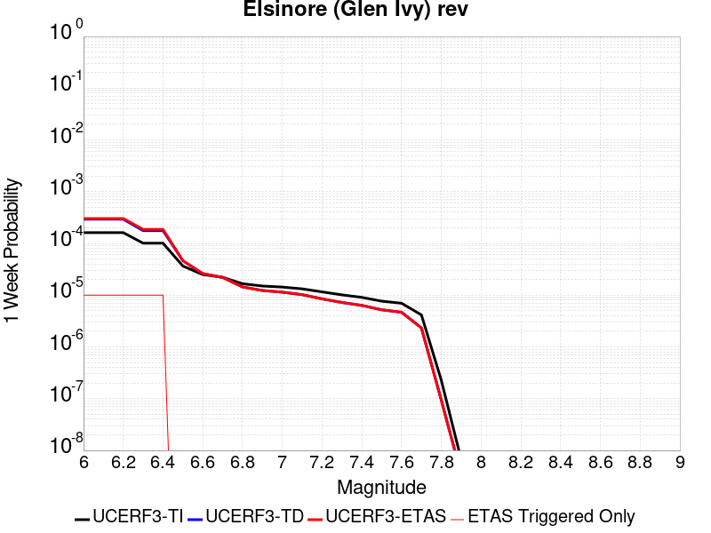 | 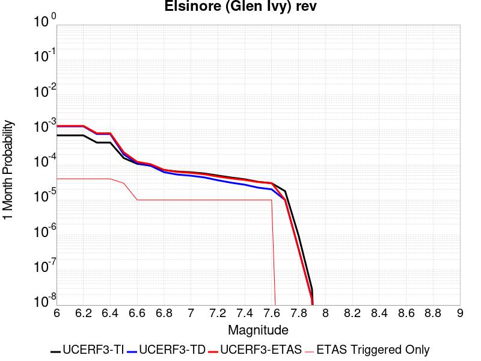 |  |  |

| Magnitude | 1 wk TI Prob | 1 wk TD Prob | 1 wk ETAS Prob | 1 wk ETAS/TD Gain | 1 wk ETAS Triggered Only | 1 mo TI Prob | 1 mo TD Prob | 1 mo ETAS Prob | 1 mo ETAS/TD Gain | 1 mo ETAS Triggered Only | 1 yr TI Prob | 1 yr TD Prob | 1 yr ETAS Prob | 1 yr ETAS/TD Gain | 1 yr ETAS Triggered Only | 10 yr TI Prob | 10 yr TD Prob | 10 yr ETAS Prob | 10 yr ETAS/TD Gain | 10 yr ETAS Triggered Only |
|-----|-----|-----|-----|-----|-----|-----|-----|-----|-----|-----|-----|-----|-----|-----|-----|-----|-----|-----|-----|-----|
| 6.0 | 1.6204086E-4 | 2.9362022E-4 | 3.0361727E-4 | 1.0340476 | 1.0E-5 | 6.94276E-4 | 0.0012579202 | 0.0012978698 | 1.0317585 | 4.0E-5 | 0.008420097 | 0.015235162 | 0.015343486 | 1.0071101 | 1.1E-4 | 0.081081145 | 0.13969512 | 0.13983278 | 1.0009854 | 1.6E-4 |
| 6.1 | 1.6204086E-4 | 2.9362022E-4 | 3.0361727E-4 | 1.0340476 | 1.0E-5 | 6.94276E-4 | 0.0012579202 | 0.0012978698 | 1.0317585 | 4.0E-5 | 0.008420097 | 0.015235162 | 0.015343486 | 1.0071101 | 1.1E-4 | 0.081081145 | 0.13969512 | 0.13983278 | 1.0009854 | 1.6E-4 |
| 6.2 | 1.6204086E-4 | 2.9362022E-4 | 3.0361727E-4 | 1.0340476 | 1.0E-5 | 6.94276E-4 | 0.0012579202 | 0.0012978698 | 1.0317585 | 4.0E-5 | 0.008420097 | 0.015235162 | 0.015343486 | 1.0071101 | 1.1E-4 | 0.081081145 | 0.13969512 | 0.13983278 | 1.0009854 | 1.6E-4 |
| 6.3 | 1.0111737E-4 | 1.7703768E-4 | 1.8703593E-4 | 1.0564752 | 1.0E-5 | 4.332882E-4 | 7.58629E-4 | 7.985987E-4 | 1.0526867 | 4.0E-5 | 0.005262531 | 0.0092178825 | 0.009307053 | 1.0096736 | 9.0E-5 | 0.0513964 | 0.08702082 | 0.08713951 | 1.0013639 | 1.3E-4 |
| 6.4 | 1.0111737E-4 | 1.7703768E-4 | 1.8703593E-4 | 1.0564752 | 1.0E-5 | 4.332882E-4 | 7.58629E-4 | 7.985987E-4 | 1.0526867 | 4.0E-5 | 0.005262531 | 0.0092178825 | 0.009307053 | 1.0096736 | 9.0E-5 | 0.0513964 | 0.08702082 | 0.08713951 | 1.0013639 | 1.3E-4 |
| 6.5 | 3.6624708E-5 | 4.639301E-5 | 4.639301E-5 | 1.0 | 0.0 | 1.569536E-4 | 1.9881407E-4 | 2.2880812E-4 | 1.1508647 | 3.0E-5 | 0.001909235 | 0.0024182373 | 0.0024481649 | 1.0123757 | 3.0E-5 | 0.01892915 | 0.023740914 | 0.023789726 | 1.0020561 | 5.0E-5 |
| 6.6 | 2.5051324E-5 | 2.614908E-5 | 2.614908E-5 | 1.0 | 0.0 | 1.073584E-4 | 1.1206293E-4 | 1.2206181E-4 | 1.0892255 | 1.0E-5 | 0.0013063047 | 0.0013635567 | 0.0013735432 | 1.0073237 | 1.0E-5 | 0.012986525 | 0.013565315 | 0.013575179 | 1.0007272 | 1.0E-5 |
| 6.7 | 2.2189772E-5 | 2.207403E-5 | 2.207403E-5 | 1.0 | 0.0 | 9.509556E-5 | 9.459976E-5 | 1.0459882E-4 | 1.1056985 | 1.0E-5 | 0.0011571734 | 0.0011511799 | 0.0011611684 | 1.0086768 | 1.0E-5 | 0.011511663 | 0.011466023 | 0.011475908 | 1.0008621 | 1.0E-5 |
| 6.8 | 1.6654378E-5 | 1.4438445E-5 | 1.4438445E-5 | 1.0 | 0.0 | 7.137396E-5 | 6.187761E-5 | 7.1876995E-5 | 1.1615994 | 1.0E-5 | 8.686314E-4 | 7.531047E-4 | 7.6309714E-4 | 1.0132684 | 1.0E-5 | 0.008652439 | 0.0075108632 | 0.007520788 | 1.0013214 | 1.0E-5 |
| 6.9 | 1.5042909E-5 | 1.23326745E-5 | 1.23326745E-5 | 1.0 | 0.0 | 6.446802E-5 | 5.2853266E-5 | 6.285274E-5 | 1.189193 | 1.0E-5 | 7.8461546E-4 | 6.433017E-4 | 6.5329525E-4 | 1.0155348 | 1.0E-5 | 0.007818509 | 0.006418618 | 0.0064285537 | 1.0015479 | 1.0E-5 |
| 7.0 | 1.4361385E-5 | 1.14519435E-5 | 1.14519435E-5 | 1.0 | 0.0 | 6.154734E-5 | 4.907885E-5 | 5.907836E-5 | 1.2037437 | 1.0E-5 | 7.490812E-4 | 5.973741E-4 | 6.073681E-4 | 1.01673 | 1.0E-5 | 0.007465612 | 0.0059616743 | 0.0059716147 | 1.0016674 | 1.0E-5 |
| 7.1 | 1.3265571E-5 | 1.0245398E-5 | 1.0245398E-5 | 1.0 | 0.0 | 5.6851208E-5 | 4.3908123E-5 | 5.3907683E-5 | 1.2277383 | 1.0E-5 | 6.919436E-4 | 5.344528E-4 | 5.4444745E-4 | 1.0187007 | 1.0E-5 | 0.006897931 | 0.0053350315 | 0.005344978 | 1.0018644 | 1.0E-5 |
| 7.2 | 1.1596403E-5 | 8.50544E-6 | 8.50544E-6 | 1.0 | 0.0 | 4.9697923E-5 | 3.6451387E-5 | 4.6451023E-5 | 1.274328 | 1.0E-5 | 6.049042E-4 | 4.4370696E-4 | 4.5370252E-4 | 1.0225275 | 1.0E-5 | 0.006032603 | 0.004429626 | 0.004439581 | 1.0022476 | 1.0E-5 |
| 7.3 | 1.0150827E-5 | 7.23907E-6 | 7.23907E-6 | 1.0 | 0.0 | 4.3502816E-5 | 3.1024225E-5 | 4.1023915E-5 | 1.3223188 | 1.0E-5 | 5.2951806E-4 | 3.776559E-4 | 3.8765214E-4 | 1.0264691 | 1.0E-5 | 0.005282581 | 0.0037705277 | 0.00378049 | 1.0026422 | 1.0E-5 |
| 7.4 | 9.080705E-6 | 6.352785E-6 | 6.352785E-6 | 1.0 | 0.0 | 3.8916725E-5 | 2.7225946E-5 | 3.7225673E-5 | 1.3672867 | 1.0E-5 | 4.7370812E-4 | 3.3142683E-4 | 3.4142353E-4 | 1.0301626 | 1.0E-5 | 0.004726996 | 0.0033094764 | 0.0033194434 | 1.0030116 | 1.0E-5 |
| 7.5 | 7.671649E-6 | 5.2258497E-6 | 5.2258497E-6 | 1.0 | 0.0 | 3.287808E-5 | 2.2396314E-5 | 3.239609E-5 | 1.4464921 | 1.0E-5 | 4.0021708E-4 | 2.7264224E-4 | 2.8263952E-4 | 1.0366681 | 1.0E-5 | 0.0039949706 | 0.0027232026 | 0.0027331754 | 1.0036621 | 1.0E-5 |
| 7.6 | 6.990086E-6 | 4.687739E-6 | 4.687739E-6 | 1.0 | 0.0 | 2.9957167E-5 | 2.0090161E-5 | 3.0089961E-5 | 1.4977461 | 1.0E-5 | 3.6466747E-4 | 2.4457145E-4 | 2.54569E-4 | 1.0408778 | 1.0E-5 | 0.0036406964 | 0.002443139 | 0.0024531146 | 1.004083 | 1.0E-5 |
| 7.7 | 4.163505E-6 | 2.3296475E-6 | 2.3296475E-6 | 1.0 | 0.0 | 1.7843471E-5 | 9.984169E-6 | 9.984169E-6 | 1.0 | 0.0 | 2.172226E-4 | 1.21551224E-4 | 1.21551224E-4 | 1.0 | 0.0 | 0.0021701038 | 0.0012149204 | 0.0012149204 | 1.0 | 0.0 |
| 7.8 | 2.2692414E-7 | 9.385943E-8 | 9.385943E-8 | 1.0 | 0.0 | 9.725317E-7 | 4.0225464E-7 | 4.0225464E-7 | 1.0 | 0.0 | 1.1840509E-5 | 4.8974425E-6 | 4.8974425E-6 | 1.0 | 0.0 | 1.1839878E-4 | 4.8973674E-5 | 4.8973674E-5 | 1.0 | 0.0 |
| 7.9 | 6.676829E-9 | 3.4399772E-9 | 3.4399772E-9 | 1.0 | 0.0 | 2.861498E-8 | 1.4742759E-8 | 1.4742759E-8 | 1.0 | 0.0 | 3.4838732E-7 | 1.7949307E-7 | 1.7949307E-7 | 1.0 | 0.0 | 3.4838679E-6 | 1.7949295E-6 | 1.7949295E-6 | 1.0 | 0.0 |

## San Andreas (Cholame) rev
*[(top)](#table-of-contents)*

| 1 Week | 1 Month | 1 Year | 10 Year |
|-----|-----|-----|-----|
|  | 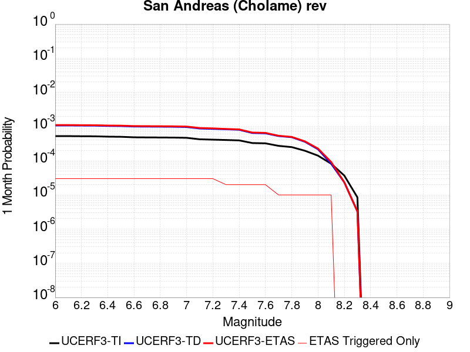 |  |  |

| Magnitude | 1 wk TI Prob | 1 wk TD Prob | 1 wk ETAS Prob | 1 wk ETAS/TD Gain | 1 wk ETAS Triggered Only | 1 mo TI Prob | 1 mo TD Prob | 1 mo ETAS Prob | 1 mo ETAS/TD Gain | 1 mo ETAS Triggered Only | 1 yr TI Prob | 1 yr TD Prob | 1 yr ETAS Prob | 1 yr ETAS/TD Gain | 1 yr ETAS Triggered Only | 10 yr TI Prob | 10 yr TD Prob | 10 yr ETAS Prob | 10 yr ETAS/TD Gain | 10 yr ETAS Triggered Only |
|-----|-----|-----|-----|-----|-----|-----|-----|-----|-----|-----|-----|-----|-----|-----|-----|-----|-----|-----|-----|-----|
| 6.0 | 1.2302514E-4 | 2.5213862E-4 | 2.7213356E-4 | 1.0793015 | 2.0E-5 | 5.27144E-4 | 0.0010801482 | 0.0011101158 | 1.0277439 | 3.0E-5 | 0.0063991086 | 0.013072014 | 0.013170707 | 1.0075499 | 1.0E-4 | 0.06217949 | 0.12443058 | 0.12457067 | 1.0011258 | 1.6E-4 |
| 6.1 | 1.2302514E-4 | 2.5213862E-4 | 2.7213356E-4 | 1.0793015 | 2.0E-5 | 5.27144E-4 | 0.0010801482 | 0.0011101158 | 1.0277439 | 3.0E-5 | 0.0063991086 | 0.013072014 | 0.013170707 | 1.0075499 | 1.0E-4 | 0.06217949 | 0.12443058 | 0.12457067 | 1.0011258 | 1.6E-4 |
| 6.2 | 1.2203569E-4 | 2.5030645E-4 | 2.7030145E-4 | 1.079882 | 2.0E-5 | 5.2290526E-4 | 0.0010723026 | 0.0011022703 | 1.0279472 | 3.0E-5 | 0.006347804 | 0.0129776355 | 0.013076338 | 1.0076056 | 1.0E-4 | 0.061695136 | 0.12361675 | 0.12375697 | 1.0011343 | 1.6E-4 |
| 6.3 | 1.2142645E-4 | 2.491661E-4 | 2.6916113E-4 | 1.0802478 | 2.0E-5 | 5.202953E-4 | 0.0010674193 | 0.0010973873 | 1.0280752 | 3.0E-5 | 0.006316212 | 0.012918889 | 0.013017597 | 1.0076406 | 1.0E-4 | 0.06139677 | 0.12311087 | 0.12325117 | 1.0011396 | 1.6E-4 |
| 6.4 | 1.1865206E-4 | 2.4422092E-4 | 2.6421604E-4 | 1.081873 | 2.0E-5 | 5.0840975E-4 | 0.0010462429 | 0.0010762115 | 1.0286441 | 3.0E-5 | 0.006172335 | 0.012664088 | 0.012762822 | 1.0077963 | 1.0E-4 | 0.060036868 | 0.12090351 | 0.12104417 | 1.0011634 | 1.6E-4 |
| 6.5 | 1.17443946E-4 | 2.421537E-4 | 2.6214888E-4 | 1.0825722 | 2.0E-5 | 5.032341E-4 | 0.0010373904 | 0.0010673593 | 1.0288887 | 3.0E-5 | 0.006109677 | 0.012557554 | 0.012656298 | 1.0078633 | 1.0E-4 | 0.059444077 | 0.11997763 | 0.12011844 | 1.0011736 | 1.6E-4 |
| 6.6 | 1.13579066E-4 | 2.3524289E-4 | 2.5523818E-4 | 1.0849985 | 2.0E-5 | 4.866766E-4 | 0.0010077958 | 0.0010377655 | 1.029738 | 3.0E-5 | 0.0059092017 | 0.012201327 | 0.012300107 | 1.0080959 | 1.0E-4 | 0.057545185 | 0.11689143 | 0.11703272 | 1.0012088 | 1.6E-4 |
| 6.7 | 1.1271412E-4 | 2.336858E-4 | 2.5368112E-4 | 1.085565 | 2.0E-5 | 4.829711E-4 | 0.0010011276 | 0.0010310976 | 1.0299362 | 3.0E-5 | 0.005864331 | 0.01212105 | 0.012219838 | 1.0081501 | 1.0E-4 | 0.057119697 | 0.11619493 | 0.116336346 | 1.001217 | 1.6E-4 |
| 6.8 | 1.1217975E-4 | 2.3256983E-4 | 2.525652E-4 | 1.0859756 | 2.0E-5 | 4.8068175E-4 | 9.963487E-4 | 0.0010263188 | 1.03008 | 3.0E-5 | 0.005836608 | 0.012063511 | 0.0121623045 | 1.0081894 | 1.0E-4 | 0.056856725 | 0.11569312 | 0.115834616 | 1.001223 | 1.6E-4 |
| 6.9 | 1.1146753E-4 | 2.3105709E-4 | 2.5105246E-4 | 1.0865387 | 2.0E-5 | 4.7763053E-4 | 9.898704E-4 | 0.0010198407 | 1.030277 | 3.0E-5 | 0.0057996577 | 0.011985509 | 0.01208431 | 1.0082434 | 1.0E-4 | 0.056506127 | 0.11501348 | 0.11515508 | 1.0012312 | 1.6E-4 |
| 7.0 | 1.0965793E-4 | 2.2728977E-4 | 2.4728524E-4 | 1.0879734 | 2.0E-5 | 4.698779E-4 | 9.7373687E-4 | 0.0010037076 | 1.0307791 | 3.0E-5 | 0.005705768 | 0.0117912255 | 0.011890046 | 1.0083809 | 1.0E-4 | 0.055614736 | 0.11331484 | 0.113447845 | 1.0011737 | 1.5E-4 |
| 7.1 | 9.927982E-5 | 2.0547757E-4 | 2.2547347E-4 | 1.0973142 | 2.0E-5 | 4.2541555E-4 | 8.80322E-4 | 9.102956E-4 | 1.0340484 | 3.0E-5 | 0.0051671406 | 0.010665542 | 0.010764476 | 1.009276 | 1.0E-4 | 0.05048634 | 0.10340853 | 0.10354301 | 1.0013006 | 1.5E-4 |
| 7.2 | 9.696786E-5 | 2.0051954E-4 | 2.2051553E-4 | 1.099721 | 2.0E-5 | 4.1551032E-4 | 8.5908745E-4 | 8.890617E-4 | 1.0348908 | 3.0E-5 | 0.00504711 | 0.010409511 | 0.010508469 | 1.0095066 | 1.0E-4 | 0.04934009 | 0.10114636 | 0.10128119 | 1.001333 | 1.5E-4 |
| 7.3 | 9.4727984E-5 | 1.9481099E-4 | 2.0480904E-4 | 1.0513219 | 1.0E-5 | 4.0591392E-4 | 8.346381E-4 | 8.5462135E-4 | 1.0239425 | 2.0E-5 | 0.0049308087 | 0.010114641 | 0.01020373 | 1.008808 | 9.0E-5 | 0.048228268 | 0.09851684 | 0.09864304 | 1.001281 | 1.4E-4 |
| 7.4 | 9.220358E-5 | 1.885154E-4 | 1.9851352E-4 | 1.0530361 | 1.0E-5 | 3.9509835E-4 | 8.076739E-4 | 8.2765776E-4 | 1.0247425 | 2.0E-5 | 0.004799717 | 0.009789341 | 0.00987846 | 1.0091037 | 9.0E-5 | 0.046973653 | 0.09559427 | 0.09572089 | 1.0013245 | 1.4E-4 |
| 7.5 | 7.71631E-5 | 1.5185357E-4 | 1.6185206E-4 | 1.0658429 | 1.0E-5 | 3.306571E-4 | 6.506389E-4 | 6.706259E-4 | 1.030719 | 2.0E-5 | 0.0040183207 | 0.007892828 | 0.007982118 | 1.0113127 | 9.0E-5 | 0.03946433 | 0.07831838 | 0.07844742 | 1.0016476 | 1.4E-4 |
| 7.6 | 7.5634416E-5 | 1.4844738E-4 | 1.584459E-4 | 1.067354 | 1.0E-5 | 3.241072E-4 | 6.360481E-4 | 6.560354E-4 | 1.0314242 | 2.0E-5 | 0.0039388672 | 0.007716457 | 0.0078057623 | 1.0115734 | 9.0E-5 | 0.038697794 | 0.076681465 | 0.076810725 | 1.0016857 | 1.4E-4 |
| 7.7 | 6.3783E-5 | 1.2365259E-4 | 1.2365259E-4 | 1.0 | 0.0 | 2.7332708E-4 | 5.2983203E-4 | 5.3982675E-4 | 1.0188639 | 1.0E-5 | 0.0033226798 | 0.0064316522 | 0.006481331 | 1.007724 | 5.0E-5 | 0.032734364 | 0.064570144 | 0.064663686 | 1.0014488 | 1.0E-4 |
| 7.8 | 5.863422E-5 | 1.142205E-4 | 1.142205E-4 | 1.0 | 0.0 | 2.512653E-4 | 4.894246E-4 | 4.9941975E-4 | 1.0204221 | 1.0E-5 | 0.003054864 | 0.0059424853 | 0.0059822476 | 1.0066912 | 4.0E-5 | 0.030132094 | 0.059686445 | 0.059771072 | 1.0014179 | 9.0E-5 |
| 7.9 | 4.595283E-5 | 8.4306725E-5 | 8.4306725E-5 | 1.0 | 0.0 | 1.9692584E-4 | 3.612645E-4 | 3.712609E-4 | 1.0276705 | 1.0E-5 | 0.0023949358 | 0.0043895314 | 0.0044194 | 1.0068045 | 3.0E-5 | 0.023692891 | 0.044382483 | 0.044439822 | 1.0012919 | 6.0E-5 |
| 8.0 | 3.2950178E-5 | 5.08E-5 | 5.08E-5 | 1.0 | 0.0 | 1.412074E-4 | 2.1769613E-4 | 2.2769395E-4 | 1.0459256 | 1.0E-5 | 0.0017178444 | 0.0026472306 | 0.0026671777 | 1.0075351 | 2.0E-5 | 0.017046256 | 0.027193451 | 0.027242092 | 1.0017887 | 5.0E-5 |
| 8.1 | 1.9177472E-5 | 1.9198456E-5 | 1.9198456E-5 | 1.0 | 0.0 | 8.218658E-5 | 8.227651E-5 | 9.227569E-5 | 1.1215314 | 1.0E-5 | 0.0010001622 | 0.0010012568 | 0.0010112468 | 1.0099775 | 1.0E-5 | 0.009956728 | 0.01076512 | 0.0107849045 | 1.0018378 | 2.0E-5 |
| 8.2 | 8.643924E-6 | 5.4798497E-6 | 5.4798497E-6 | 1.0 | 0.0 | 3.704486E-5 | 2.348486E-5 | 2.348486E-5 | 1.0 | 0.0 | 4.5092785E-4 | 2.858907E-4 | 2.858907E-4 | 1.0 | 0.0 | 0.0045001395 | 0.0032514327 | 0.0032514327 | 1.0 | 0.0 |
| 8.3 | 1.983087E-6 | 7.668296E-7 | 7.668296E-7 | 1.0 | 0.0 | 8.498917E-6 | 3.2864084E-6 | 3.2864084E-6 | 1.0 | 0.0 | 1.034694E-4 | 4.0011306E-5 | 4.0011306E-5 | 1.0 | 0.0 | 0.0010342124 | 4.724499E-4 | 4.724499E-4 | 1.0 | 0.0 |

## San Andreas (North Branch Mill Creek)
*[(top)](#table-of-contents)*

| 1 Week | 1 Month | 1 Year | 10 Year |
|-----|-----|-----|-----|
|  |  |  |  |

| Magnitude | 1 wk TI Prob | 1 wk TD Prob | 1 wk ETAS Prob | 1 wk ETAS/TD Gain | 1 wk ETAS Triggered Only | 1 mo TI Prob | 1 mo TD Prob | 1 mo ETAS Prob | 1 mo ETAS/TD Gain | 1 mo ETAS Triggered Only | 1 yr TI Prob | 1 yr TD Prob | 1 yr ETAS Prob | 1 yr ETAS/TD Gain | 1 yr ETAS Triggered Only | 10 yr TI Prob | 10 yr TD Prob | 10 yr ETAS Prob | 10 yr ETAS/TD Gain | 10 yr ETAS Triggered Only |
|-----|-----|-----|-----|-----|-----|-----|-----|-----|-----|-----|-----|-----|-----|-----|-----|-----|-----|-----|-----|-----|
| 6.0 | 1.3461156E-5 | 2.3506776E-5 | 3.350654E-5 | 1.4253993 | 1.0E-5 | 5.7689394E-5 | 1.0073945E-4 | 1.3073643E-4 | 1.2977679 | 3.0E-5 | 7.02142E-4 | 0.0012258161 | 0.0013157057 | 1.0733305 | 9.0E-5 | 0.0069992766 | 0.012233093 | 0.012381258 | 1.0121118 | 1.5E-4 |
| 6.1 | 1.3461156E-5 | 2.3506776E-5 | 3.350654E-5 | 1.4253993 | 1.0E-5 | 5.7689394E-5 | 1.0073945E-4 | 1.3073643E-4 | 1.2977679 | 3.0E-5 | 7.02142E-4 | 0.0012258161 | 0.0013157057 | 1.0733305 | 9.0E-5 | 0.0069992766 | 0.012233093 | 0.012381258 | 1.0121118 | 1.5E-4 |
| 6.2 | 1.3461156E-5 | 2.3506776E-5 | 3.350654E-5 | 1.4253993 | 1.0E-5 | 5.7689394E-5 | 1.0073945E-4 | 1.3073643E-4 | 1.2977679 | 3.0E-5 | 7.02142E-4 | 0.0012258161 | 0.0013157057 | 1.0733305 | 9.0E-5 | 0.0069992766 | 0.012233093 | 0.012381258 | 1.0121118 | 1.5E-4 |
| 6.3 | 1.3461156E-5 | 2.3506776E-5 | 3.350654E-5 | 1.4253993 | 1.0E-5 | 5.7689394E-5 | 1.0073945E-4 | 1.3073643E-4 | 1.2977679 | 3.0E-5 | 7.02142E-4 | 0.0012258161 | 0.0013157057 | 1.0733305 | 9.0E-5 | 0.0069992766 | 0.012233093 | 0.012381258 | 1.0121118 | 1.5E-4 |
| 6.4 | 1.3461156E-5 | 2.3506776E-5 | 3.350654E-5 | 1.4253993 | 1.0E-5 | 5.7689394E-5 | 1.0073945E-4 | 1.3073643E-4 | 1.2977679 | 3.0E-5 | 7.02142E-4 | 0.0012258161 | 0.0013157057 | 1.0733305 | 9.0E-5 | 0.0069992766 | 0.012233093 | 0.012381258 | 1.0121118 | 1.5E-4 |
| 6.5 | 1.3450706E-5 | 2.3495735E-5 | 3.34955E-5 | 1.4255991 | 1.0E-5 | 5.764461E-5 | 1.0069214E-4 | 1.3068912E-4 | 1.2979078 | 3.0E-5 | 7.0159714E-4 | 0.0012252406 | 0.0013151304 | 1.073365 | 9.0E-5 | 0.006993862 | 0.012227403 | 0.012375569 | 1.0121175 | 1.5E-4 |
| 6.6 | 1.3074523E-5 | 2.3110017E-5 | 3.3109784E-5 | 1.4327028 | 1.0E-5 | 5.6032466E-5 | 9.9039185E-5 | 1.2903621E-4 | 1.3028804 | 3.0E-5 | 6.8198174E-4 | 0.0012051383 | 0.0012950299 | 1.0745902 | 9.0E-5 | 0.006798926 | 0.0120285675 | 0.012176763 | 1.0123203 | 1.5E-4 |
| 6.7 | 1.3050216E-5 | 2.3085311E-5 | 3.308508E-5 | 1.4331659 | 1.0E-5 | 5.59283E-5 | 9.893332E-5 | 1.2893035E-4 | 1.3032045 | 3.0E-5 | 6.8071426E-4 | 0.0012038508 | 0.0012937424 | 1.0746701 | 9.0E-5 | 0.0067863287 | 0.012015832 | 0.012164029 | 1.0123335 | 1.5E-4 |
| 6.8 | 1.29049395E-5 | 2.293372E-5 | 3.293349E-5 | 1.4360292 | 1.0E-5 | 5.530571E-5 | 9.828369E-5 | 1.2828074E-4 | 1.3052088 | 3.0E-5 | 6.73139E-4 | 0.0011959502 | 0.0012858426 | 1.075164 | 9.0E-5 | 0.0067110364 | 0.011937677 | 0.012085886 | 1.0124153 | 1.5E-4 |
| 6.9 | 1.2867369E-5 | 2.2893122E-5 | 3.2892895E-5 | 1.4368024 | 1.0E-5 | 5.51447E-5 | 9.810971E-5 | 1.2810677E-4 | 1.3057501 | 3.0E-5 | 6.711799E-4 | 0.0011938344 | 0.0012837269 | 1.0752974 | 9.0E-5 | 0.006691564 | 0.011916745 | 0.012064958 | 1.0124373 | 1.5E-4 |
| 7.0 | 1.2495996E-5 | 2.2293154E-5 | 3.2292934E-5 | 1.4485582 | 1.0E-5 | 5.3553173E-5 | 9.5538606E-5 | 1.2553575E-4 | 1.3139791 | 3.0E-5 | 6.518148E-4 | 0.0011625647 | 0.0012524601 | 1.077325 | 9.0E-5 | 0.0064990623 | 0.011607327 | 0.011755586 | 1.0127729 | 1.5E-4 |
| 7.1 | 1.2452067E-5 | 2.2238226E-5 | 3.2238004E-5 | 1.4496661 | 1.0E-5 | 5.3364907E-5 | 9.5303214E-5 | 1.2530036E-4 | 1.3147547 | 3.0E-5 | 6.4952404E-4 | 0.0011597018 | 0.0012495975 | 1.0775162 | 9.0E-5 | 0.0064762887 | 0.011578998 | 0.01172726 | 1.0128045 | 1.5E-4 |
| 7.2 | 1.2002777E-5 | 2.1616754E-5 | 3.161654E-5 | 1.4625942 | 1.0E-5 | 5.143946E-5 | 9.263996E-5 | 1.2263718E-4 | 1.3238044 | 3.0E-5 | 6.2609545E-4 | 0.0011273106 | 0.001217209 | 1.079746 | 9.0E-5 | 0.006243344 | 0.011258403 | 0.011406714 | 1.0131733 | 1.5E-4 |
| 7.3 | 1.1923425E-5 | 2.1486576E-5 | 3.148636E-5 | 1.4653969 | 1.0E-5 | 5.109939E-5 | 9.208209E-5 | 1.2207933E-4 | 1.3257662 | 3.0E-5 | 6.219575E-4 | 0.0011205255 | 0.0012104247 | 1.0802294 | 9.0E-5 | 0.0062021962 | 0.011191265 | 0.011339586 | 1.0132533 | 1.5E-4 |
| 7.4 | 1.16105175E-5 | 2.0860489E-5 | 3.086028E-5 | 1.4793651 | 1.0E-5 | 4.975841E-5 | 8.9399044E-5 | 1.1939636E-4 | 1.3355441 | 3.0E-5 | 6.0564023E-4 | 0.0010878925 | 0.0011777945 | 1.0826387 | 9.0E-5 | 0.006039923 | 0.01086884 | 0.01101721 | 1.0136509 | 1.5E-4 |
| 7.5 | 1.1037265E-5 | 1.956039E-5 | 2.9560193E-5 | 1.5112273 | 1.0E-5 | 4.7301706E-5 | 8.382756E-5 | 1.13825045E-4 | 1.3578476 | 3.0E-5 | 5.757461E-4 | 0.0010201249 | 0.0011000432 | 1.0783417 | 8.0E-5 | 0.005742567 | 0.010198223 | 0.010336796 | 1.0135878 | 1.4E-4 |
| 7.6 | 1.0720915E-5 | 1.900222E-5 | 2.9002029E-5 | 1.5262443 | 1.0E-5 | 4.5945973E-5 | 8.143555E-5 | 1.1143311E-4 | 1.3683594 | 3.0E-5 | 5.592486E-4 | 9.910291E-4 | 0.0010709498 | 1.0806441 | 8.0E-5 | 0.005578433 | 0.009909907 | 0.01004852 | 1.0139873 | 1.4E-4 |
| 7.7 | 9.276279E-6 | 1.6447744E-5 | 2.644758E-5 | 1.6079761 | 1.0E-5 | 3.9754876E-5 | 7.048844E-5 | 1.0048632E-4 | 1.4255717 | 3.0E-5 | 4.839081E-4 | 8.578605E-4 | 9.3779183E-4 | 1.0931753 | 8.0E-5 | 0.0048285574 | 0.008589173 | 0.0087279705 | 1.0161595 | 1.4E-4 |
| 7.8 | 5.8346777E-6 | 1.1159965E-5 | 2.1159853E-5 | 1.8960502 | 1.0E-5 | 2.5005522E-5 | 4.7827543E-5 | 7.782611E-5 | 1.6272236 | 3.0E-5 | 3.043997E-4 | 5.821449E-4 | 6.620983E-4 | 1.1373428 | 8.0E-5 | 0.0030398308 | 0.005849473 | 0.005988654 | 1.0237938 | 1.4E-4 |
| 7.9 | 4.690204E-6 | 8.513225E-6 | 1.851314E-5 | 2.174633 | 1.0E-5 | 2.0100719E-5 | 3.648474E-5 | 6.648365E-5 | 1.8222315 | 3.0E-5 | 2.4469878E-4 | 4.4411127E-4 | 5.2407576E-4 | 1.180055 | 8.0E-5 | 0.002444295 | 0.0044728746 | 0.0046122484 | 1.0311598 | 1.4E-4 |
| 8.0 | 2.9570454E-6 | 4.8494758E-6 | 1.4849427E-5 | 3.0620687 | 1.0E-5 | 1.267299E-5 | 2.0783302E-5 | 4.0782885E-5 | 1.962291 | 2.0E-5 | 1.5428272E-4 | 2.5300734E-4 | 2.8299974E-4 | 1.1185436 | 3.0E-5 | 0.0015417566 | 0.0025509594 | 0.002600832 | 1.0195504 | 5.0E-5 |
| 8.1 | 1.6376824E-6 | 2.198225E-6 | 2.198225E-6 | 1.0 | 0.0 | 7.01862E-6 | 9.420931E-6 | 9.420931E-6 | 1.0 | 0.0 | 8.544835E-5 | 1.1469381E-4 | 1.1469381E-4 | 1.0 | 0.0 | 8.54155E-4 | 0.0011613552 | 0.0011713436 | 1.0086006 | 1.0E-5 |
| 8.2 | 6.9631557E-7 | 4.5401492E-7 | 4.5401492E-7 | 1.0 | 0.0 | 2.984206E-6 | 1.9457768E-6 | 1.9457768E-6 | 1.0 | 0.0 | 3.63321E-5 | 2.3689576E-5 | 2.3689576E-5 | 1.0 | 0.0 | 3.6326164E-4 | 2.453756E-4 | 2.453756E-4 | 1.0 | 0.0 |
| 8.3 | 1.7876137E-7 | 8.368747E-8 | 8.368747E-8 | 1.0 | 0.0 | 7.661199E-7 | 3.5866054E-7 | 3.5866054E-7 | 1.0 | 0.0 | 9.32747E-6 | 4.3666837E-6 | 4.3666837E-6 | 1.0 | 0.0 | 9.3270784E-5 | 4.5861943E-5 | 4.5861943E-5 | 1.0 | 0.0 |

## Deep Springs
*[(top)](#table-of-contents)*

| 1 Week | 1 Month | 1 Year | 10 Year |
|-----|-----|-----|-----|
|  | 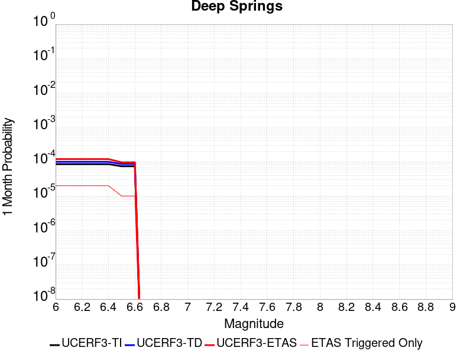 |  |  |

| Magnitude | 1 wk TI Prob | 1 wk TD Prob | 1 wk ETAS Prob | 1 wk ETAS/TD Gain | 1 wk ETAS Triggered Only | 1 mo TI Prob | 1 mo TD Prob | 1 mo ETAS Prob | 1 mo ETAS/TD Gain | 1 mo ETAS Triggered Only | 1 yr TI Prob | 1 yr TD Prob | 1 yr ETAS Prob | 1 yr ETAS/TD Gain | 1 yr ETAS Triggered Only | 10 yr TI Prob | 10 yr TD Prob | 10 yr ETAS Prob | 10 yr ETAS/TD Gain | 10 yr ETAS Triggered Only |
|-----|-----|-----|-----|-----|-----|-----|-----|-----|-----|-----|-----|-----|-----|-----|-----|-----|-----|-----|-----|-----|
| 6.0 | 1.9810619E-5 | 2.311303E-5 | 3.31128E-5 | 1.4326464 | 1.0E-5 | 8.489989E-5 | 9.905495E-5 | 1.19052966E-4 | 1.2018881 | 2.0E-5 | 0.001033166 | 0.0012058346 | 0.0012757502 | 1.0579811 | 7.0E-5 | 0.010283757 | 0.01204269 | 0.0121810045 | 1.0114853 | 1.4E-4 |
| 6.1 | 1.9810619E-5 | 2.311303E-5 | 3.31128E-5 | 1.4326464 | 1.0E-5 | 8.489989E-5 | 9.905495E-5 | 1.19052966E-4 | 1.2018881 | 2.0E-5 | 0.001033166 | 0.0012058346 | 0.0012757502 | 1.0579811 | 7.0E-5 | 0.010283757 | 0.01204269 | 0.0121810045 | 1.0114853 | 1.4E-4 |
| 6.2 | 1.9810619E-5 | 2.311303E-5 | 3.31128E-5 | 1.4326464 | 1.0E-5 | 8.489989E-5 | 9.905495E-5 | 1.19052966E-4 | 1.2018881 | 2.0E-5 | 0.001033166 | 0.0012058346 | 0.0012757502 | 1.0579811 | 7.0E-5 | 0.010283757 | 0.01204269 | 0.0121810045 | 1.0114853 | 1.4E-4 |
| 6.3 | 1.9810619E-5 | 2.311303E-5 | 3.31128E-5 | 1.4326464 | 1.0E-5 | 8.489989E-5 | 9.905495E-5 | 1.19052966E-4 | 1.2018881 | 2.0E-5 | 0.001033166 | 0.0012058346 | 0.0012757502 | 1.0579811 | 7.0E-5 | 0.010283757 | 0.01204269 | 0.0121810045 | 1.0114853 | 1.4E-4 |
| 6.4 | 1.9810619E-5 | 2.311303E-5 | 3.31128E-5 | 1.4326464 | 1.0E-5 | 8.489989E-5 | 9.905495E-5 | 1.19052966E-4 | 1.2018881 | 2.0E-5 | 0.001033166 | 0.0012058346 | 0.0012757502 | 1.0579811 | 7.0E-5 | 0.010283757 | 0.01204269 | 0.0121810045 | 1.0114853 | 1.4E-4 |
| 6.5 | 1.7190405E-5 | 2.0050999E-5 | 2.0050999E-5 | 1.0 | 0.0 | 7.367108E-5 | 8.593285E-5 | 9.593199E-5 | 1.11636 | 1.0E-5 | 8.9657627E-4 | 0.0010462324 | 0.0010961802 | 1.0477406 | 5.0E-5 | 0.008929676 | 0.010462287 | 0.010551346 | 1.0085124 | 9.0E-5 |
| 6.6 | 1.7190405E-5 | 2.0050999E-5 | 2.0050999E-5 | 1.0 | 0.0 | 7.367108E-5 | 8.593285E-5 | 9.593199E-5 | 1.11636 | 1.0E-5 | 8.9657627E-4 | 0.0010462324 | 0.0010961802 | 1.0477406 | 5.0E-5 | 0.008929676 | 0.010462287 | 0.010551346 | 1.0085124 | 9.0E-5 |

## Baker
*[(top)](#table-of-contents)*

| 1 Week | 1 Month | 1 Year | 10 Year |
|-----|-----|-----|-----|
| 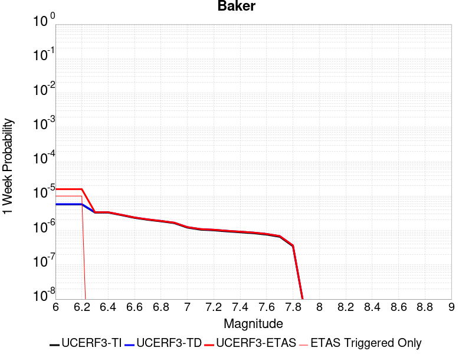 |  |  |  |

| Magnitude | 1 wk TI Prob | 1 wk TD Prob | 1 wk ETAS Prob | 1 wk ETAS/TD Gain | 1 wk ETAS Triggered Only | 1 mo TI Prob | 1 mo TD Prob | 1 mo ETAS Prob | 1 mo ETAS/TD Gain | 1 mo ETAS Triggered Only | 1 yr TI Prob | 1 yr TD Prob | 1 yr ETAS Prob | 1 yr ETAS/TD Gain | 1 yr ETAS Triggered Only | 10 yr TI Prob | 10 yr TD Prob | 10 yr ETAS Prob | 10 yr ETAS/TD Gain | 10 yr ETAS Triggered Only |
|-----|-----|-----|-----|-----|-----|-----|-----|-----|-----|-----|-----|-----|-----|-----|-----|-----|-----|-----|-----|-----|
| 6.0 | 5.695525E-6 | 5.834856E-6 | 1.5834798E-5 | 2.7138283 | 1.0E-5 | 2.4409164E-5 | 2.500631E-5 | 4.500581E-5 | 1.7997781 | 2.0E-5 | 2.9714106E-4 | 3.044133E-4 | 3.444011E-4 | 1.1313603 | 4.0E-5 | 0.0029674405 | 0.0030403587 | 0.0031699634 | 1.0426282 | 1.3E-4 |
| 6.1 | 5.695525E-6 | 5.834856E-6 | 1.5834798E-5 | 2.7138283 | 1.0E-5 | 2.4409164E-5 | 2.500631E-5 | 4.500581E-5 | 1.7997781 | 2.0E-5 | 2.9714106E-4 | 3.044133E-4 | 3.444011E-4 | 1.1313603 | 4.0E-5 | 0.0029674405 | 0.0030403587 | 0.0031699634 | 1.0426282 | 1.3E-4 |
| 6.2 | 5.695525E-6 | 5.834856E-6 | 1.5834798E-5 | 2.7138283 | 1.0E-5 | 2.4409164E-5 | 2.500631E-5 | 4.500581E-5 | 1.7997781 | 2.0E-5 | 2.9714106E-4 | 3.044133E-4 | 3.444011E-4 | 1.1313603 | 4.0E-5 | 0.0029674405 | 0.0030403587 | 0.0031699634 | 1.0426282 | 1.3E-4 |
| 6.3 | 3.2995713E-6 | 3.3836786E-6 | 3.3836786E-6 | 1.0 | 0.0 | 1.4140943E-5 | 1.4501402E-5 | 2.4501256E-5 | 1.6895785 | 1.0E-5 | 1.7215237E-4 | 1.7654074E-4 | 1.8653898E-4 | 1.0566342 | 1.0E-5 | 0.0017201907 | 0.0017640521 | 0.0018339285 | 1.0396113 | 7.0E-5 |
| 6.4 | 3.2995713E-6 | 3.3836786E-6 | 3.3836786E-6 | 1.0 | 0.0 | 1.4140943E-5 | 1.4501402E-5 | 2.4501256E-5 | 1.6895785 | 1.0E-5 | 1.7215237E-4 | 1.7654074E-4 | 1.8653898E-4 | 1.0566342 | 1.0E-5 | 0.0017201907 | 0.0017640521 | 0.0018339285 | 1.0396113 | 7.0E-5 |
| 6.5 | 2.782202E-6 | 2.8558507E-6 | 2.8558507E-6 | 1.0 | 0.0 | 1.1923668E-5 | 1.2239304E-5 | 2.223918E-5 | 1.81703 | 1.0E-5 | 1.4516099E-4 | 1.4900367E-4 | 1.5900217E-4 | 1.0671024 | 1.0E-5 | 0.001450662 | 0.0014890704 | 0.0015489811 | 1.0402336 | 6.0E-5 |
| 6.6 | 2.3163404E-6 | 2.380929E-6 | 2.380929E-6 | 1.0 | 0.0 | 9.927136E-6 | 1.0203942E-5 | 2.020384E-5 | 1.9800034 | 1.0E-5 | 1.20856166E-4 | 1.2422612E-4 | 1.3422487E-4 | 1.0804883 | 1.0E-5 | 0.0012079047 | 0.001241587 | 0.0012815373 | 1.0321769 | 4.0E-5 |
| 6.7 | 2.037056E-6 | 2.0965088E-6 | 2.0965088E-6 | 1.0 | 0.0 | 8.7302105E-6 | 8.985007E-6 | 1.8984918E-5 | 2.112955 | 1.0E-5 | 1.0628513E-4 | 1.0938713E-4 | 1.1938604E-4 | 1.0914084 | 1.0E-5 | 0.0010623431 | 0.0010933491 | 0.0011333053 | 1.0365448 | 4.0E-5 |
| 6.8 | 1.8356744E-6 | 1.8915364E-6 | 1.8915364E-6 | 1.0 | 0.0 | 7.867153E-6 | 8.10656E-6 | 1.8106479E-5 | 2.233559 | 1.0E-5 | 9.577837E-5 | 9.869304E-5 | 1.0869205E-4 | 1.1013143 | 1.0E-5 | 9.57371E-4 | 9.865061E-4 | 0.0010264666 | 1.0405072 | 4.0E-5 |
| 6.9 | 1.6310546E-6 | 1.6832144E-6 | 1.6832144E-6 | 1.0 | 0.0 | 6.9902153E-6 | 7.213757E-6 | 1.7213684E-5 | 2.3862302 | 1.0E-5 | 8.510255E-5 | 8.782406E-5 | 9.7823184E-5 | 1.113854 | 1.0E-5 | 8.5069967E-4 | 8.779048E-4 | 9.178697E-4 | 1.045523 | 4.0E-5 |
| 7.0 | 1.2058036E-6 | 1.2508729E-6 | 1.2508729E-6 | 1.0 | 0.0 | 5.1677193E-6 | 5.3608724E-6 | 5.3608724E-6 | 1.0 | 0.0 | 6.291517E-5 | 6.526669E-5 | 6.526669E-5 | 1.0 | 0.0 | 6.289736E-4 | 6.5247755E-4 | 6.82458E-4 | 1.0459486 | 3.0E-5 |
| 7.1 | 1.052382E-6 | 1.0951668E-6 | 1.0951668E-6 | 1.0 | 0.0 | 4.5102006E-6 | 4.693564E-6 | 4.693564E-6 | 1.0 | 0.0 | 5.491031E-5 | 5.7142646E-5 | 5.7142646E-5 | 1.0 | 0.0 | 5.4896745E-4 | 5.712804E-4 | 6.012633E-4 | 1.0524836 | 3.0E-5 |
| 7.2 | 1.0067454E-6 | 1.0487769E-6 | 1.0487769E-6 | 1.0 | 0.0 | 4.3146156E-6 | 4.4947506E-6 | 4.4947506E-6 | 1.0 | 0.0 | 5.252918E-5 | 5.4722223E-5 | 5.4722223E-5 | 1.0 | 0.0 | 5.251676E-4 | 5.4708833E-4 | 5.6707737E-4 | 1.0365372 | 2.0E-5 |
| 7.3 | 9.3596316E-7 | 9.76778E-7 | 9.76778E-7 | 1.0 | 0.0 | 4.0112645E-6 | 4.186185E-6 | 4.186185E-6 | 1.0 | 0.0 | 4.8836053E-5 | 5.0965617E-5 | 5.0965617E-5 | 1.0 | 0.0 | 4.8825322E-4 | 5.095401E-4 | 5.295299E-4 | 1.0392311 | 2.0E-5 |
| 7.4 | 8.8117395E-7 | 9.2077187E-7 | 9.2077187E-7 | 1.0 | 0.0 | 3.7764542E-6 | 3.9461593E-6 | 3.9461593E-6 | 1.0 | 0.0 | 4.5977362E-5 | 4.8043436E-5 | 4.8043436E-5 | 1.0 | 0.0 | 4.596785E-4 | 4.8033125E-4 | 5.003217E-4 | 1.041618 | 2.0E-5 |
| 7.5 | 8.292386E-7 | 8.674649E-7 | 8.674649E-7 | 1.0 | 0.0 | 3.5538749E-6 | 3.7177015E-6 | 3.7177015E-6 | 1.0 | 0.0 | 4.326757E-5 | 4.5262084E-5 | 4.5262084E-5 | 1.0 | 0.0 | 4.3259145E-4 | 4.5252938E-4 | 4.7252033E-4 | 1.044176 | 2.0E-5 |
| 7.6 | 7.553842E-7 | 7.9145207E-7 | 7.9145207E-7 | 1.0 | 0.0 | 3.2373566E-6 | 3.3919332E-6 | 3.3919332E-6 | 1.0 | 0.0 | 3.9414106E-5 | 4.129601E-5 | 4.129601E-5 | 1.0 | 0.0 | 3.9407116E-4 | 4.1288408E-4 | 4.3287582E-4 | 1.0484197 | 2.0E-5 |
| 7.7 | 6.5285366E-7 | 6.852842E-7 | 6.852842E-7 | 1.0 | 0.0 | 2.797941E-6 | 2.9369291E-6 | 2.9369291E-6 | 1.0 | 0.0 | 3.40644E-5 | 3.5756533E-5 | 3.5756533E-5 | 1.0 | 0.0 | 3.405918E-4 | 3.5750846E-4 | 3.6750486E-4 | 1.0279614 | 1.0E-5 |
| 7.8 | 3.4586725E-7 | 3.648288E-7 | 3.648288E-7 | 1.0 | 0.0 | 1.4822873E-6 | 1.5635511E-6 | 1.5635511E-6 | 1.0 | 0.0 | 1.80467E-5 | 1.9036073E-5 | 1.9036073E-5 | 1.0 | 0.0 | 1.8045233E-4 | 1.9034486E-4 | 1.9034486E-4 | 1.0 | 0.0 |
| 7.9 | 2.5591178E-9 | 2.6696871E-9 | 2.6696871E-9 | 1.0 | 0.0 | 1.0967647E-8 | 1.1441516E-8 | 1.1441516E-8 | 1.0 | 0.0 | 1.335311E-7 | 1.3930045E-7 | 1.3930045E-7 | 1.0 | 0.0 | 1.3353102E-6 | 1.3930046E-6 | 1.3930046E-6 | 1.0 | 0.0 |

## Ludlow
*[(top)](#table-of-contents)*

| 1 Week | 1 Month | 1 Year | 10 Year |
|-----|-----|-----|-----|
|  |  |  |  |

| Magnitude | 1 wk TI Prob | 1 wk TD Prob | 1 wk ETAS Prob | 1 wk ETAS/TD Gain | 1 wk ETAS Triggered Only | 1 mo TI Prob | 1 mo TD Prob | 1 mo ETAS Prob | 1 mo ETAS/TD Gain | 1 mo ETAS Triggered Only | 1 yr TI Prob | 1 yr TD Prob | 1 yr ETAS Prob | 1 yr ETAS/TD Gain | 1 yr ETAS Triggered Only | 10 yr TI Prob | 10 yr TD Prob | 10 yr ETAS Prob | 10 yr ETAS/TD Gain | 10 yr ETAS Triggered Only |
|-----|-----|-----|-----|-----|-----|-----|-----|-----|-----|-----|-----|-----|-----|-----|-----|-----|-----|-----|-----|-----|
| 6.0 | 2.2407607E-5 | 2.3657429E-5 | 2.3657429E-5 | 1.0 | 0.0 | 9.602906E-5 | 1.0138529E-4 | 1.0138529E-4 | 1.0 | 0.0 | 0.0011685267 | 0.001233711 | 0.001263674 | 1.0242869 | 3.0E-5 | 0.011624013 | 0.012273132 | 0.012391659 | 1.0096575 | 1.2E-4 |
| 6.1 | 2.2407607E-5 | 2.3657429E-5 | 2.3657429E-5 | 1.0 | 0.0 | 9.602906E-5 | 1.0138529E-4 | 1.0138529E-4 | 1.0 | 0.0 | 0.0011685267 | 0.001233711 | 0.001263674 | 1.0242869 | 3.0E-5 | 0.011624013 | 0.012273132 | 0.012391659 | 1.0096575 | 1.2E-4 |
| 6.2 | 1.0781252E-5 | 1.1365745E-5 | 1.1365745E-5 | 1.0 | 0.0 | 4.620455E-5 | 4.870945E-5 | 4.870945E-5 | 1.0 | 0.0 | 5.623952E-4 | 5.9288024E-4 | 6.028743E-4 | 1.0168568 | 1.0E-5 | 0.00560974 | 0.005913404 | 0.005953167 | 1.0067242 | 4.0E-5 |
| 6.3 | 1.0781252E-5 | 1.1365745E-5 | 1.1365745E-5 | 1.0 | 0.0 | 4.620455E-5 | 4.870945E-5 | 4.870945E-5 | 1.0 | 0.0 | 5.623952E-4 | 5.9288024E-4 | 6.028743E-4 | 1.0168568 | 1.0E-5 | 0.00560974 | 0.005913404 | 0.005953167 | 1.0067242 | 4.0E-5 |
| 6.4 | 7.814439E-6 | 8.237788E-6 | 8.237788E-6 | 1.0 | 0.0 | 3.3490025E-5 | 3.5304336E-5 | 3.5304336E-5 | 1.0 | 0.0 | 4.0766477E-4 | 4.2974693E-4 | 4.397426E-4 | 1.0232595 | 1.0E-5 | 0.0040691774 | 0.0042893053 | 0.0043191765 | 1.0069641 | 3.0E-5 |
| 6.5 | 6.4986366E-6 | 6.850969E-6 | 6.850969E-6 | 1.0 | 0.0 | 2.7851002E-5 | 2.936097E-5 | 2.936097E-5 | 1.0 | 0.0 | 3.390332E-4 | 3.574121E-4 | 3.6740853E-4 | 1.0279689 | 1.0E-5 | 0.003385164 | 0.0035684688 | 0.0035983617 | 1.008377 | 3.0E-5 |
| 6.6 | 5.582177E-6 | 5.8860483E-6 | 5.8860483E-6 | 1.0 | 0.0 | 2.3923398E-5 | 2.522568E-5 | 2.522568E-5 | 1.0 | 0.0 | 2.9122844E-4 | 3.070801E-4 | 3.070801E-4 | 1.0 | 0.0 | 0.0029084706 | 0.003066631 | 0.0030865697 | 1.0065018 | 2.0E-5 |
| 6.7 | 4.6858763E-6 | 4.940463E-6 | 4.940463E-6 | 1.0 | 0.0 | 2.0082172E-5 | 2.1173244E-5 | 2.1173244E-5 | 1.0 | 0.0 | 2.4447302E-4 | 2.577543E-4 | 2.577543E-4 | 1.0 | 0.0 | 0.0024420423 | 0.0025746098 | 0.0025945583 | 1.0077481 | 2.0E-5 |
| 6.8 | 3.5584908E-6 | 3.7520454E-6 | 3.7520454E-6 | 1.0 | 0.0 | 1.5250586E-5 | 1.6080097E-5 | 1.6080097E-5 | 1.0 | 0.0 | 1.8566006E-4 | 1.9575801E-4 | 1.9575801E-4 | 1.0 | 0.0 | 0.0018550502 | 0.0019558968 | 0.0019758577 | 1.0102055 | 2.0E-5 |
| 6.9 | 2.532834E-6 | 2.6710227E-6 | 2.6710227E-6 | 1.0 | 0.0 | 1.0854958E-5 | 1.1447192E-5 | 1.1447192E-5 | 1.0 | 0.0 | 1.3215111E-4 | 1.3936093E-4 | 1.3936093E-4 | 1.0 | 0.0 | 0.0013207254 | 0.0013927629 | 0.0014127351 | 1.0143399 | 2.0E-5 |
| 7.0 | 1.7083285E-6 | 1.801957E-6 | 1.801957E-6 | 1.0 | 0.0 | 7.3213873E-6 | 7.7226505E-6 | 7.7226505E-6 | 1.0 | 0.0 | 8.913424E-5 | 9.4019386E-5 | 9.4019386E-5 | 1.0 | 0.0 | 8.9098496E-4 | 9.3981257E-4 | 9.4980316E-4 | 1.0106304 | 1.0E-5 |
| 7.1 | 1.0905424E-6 | 1.1497702E-6 | 1.1497702E-6 | 1.0 | 0.0 | 4.6737446E-6 | 4.927578E-6 | 4.927578E-6 | 1.0 | 0.0 | 5.6901354E-5 | 5.999171E-5 | 5.999171E-5 | 1.0 | 0.0 | 5.6886784E-4 | 5.997649E-4 | 5.997649E-4 | 1.0 | 0.0 |
| 7.2 | 6.06668E-7 | 6.387322E-7 | 6.387322E-7 | 1.0 | 0.0 | 2.600003E-6 | 2.7374213E-6 | 2.7374213E-6 | 1.0 | 0.0 | 3.1654577E-5 | 3.3327666E-5 | 3.3327666E-5 | 1.0 | 0.0 | 3.1650066E-4 | 3.332335E-4 | 3.332335E-4 | 1.0 | 0.0 |

## Calico-Hidalgo
*[(top)](#table-of-contents)*

| 1 Week | 1 Month | 1 Year | 10 Year |
|-----|-----|-----|-----|
|  | 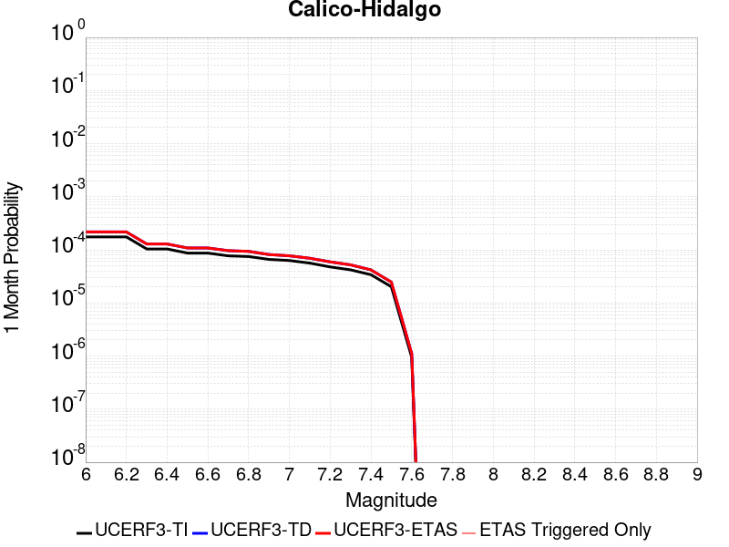 |  | 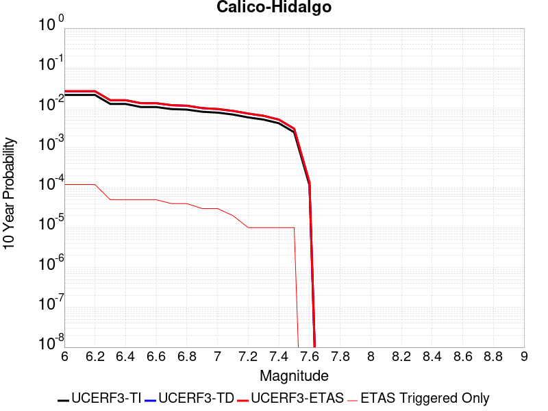 |

| Magnitude | 1 wk TI Prob | 1 wk TD Prob | 1 wk ETAS Prob | 1 wk ETAS/TD Gain | 1 wk ETAS Triggered Only | 1 mo TI Prob | 1 mo TD Prob | 1 mo ETAS Prob | 1 mo ETAS/TD Gain | 1 mo ETAS Triggered Only | 1 yr TI Prob | 1 yr TD Prob | 1 yr ETAS Prob | 1 yr ETAS/TD Gain | 1 yr ETAS Triggered Only | 10 yr TI Prob | 10 yr TD Prob | 10 yr ETAS Prob | 10 yr ETAS/TD Gain | 10 yr ETAS Triggered Only |
|-----|-----|-----|-----|-----|-----|-----|-----|-----|-----|-----|-----|-----|-----|-----|-----|-----|-----|-----|-----|-----|
| 6.0 | 4.0906612E-5 | 5.0704653E-5 | 5.0704653E-5 | 1.0 | 0.0 | 1.7530227E-4 | 2.1728984E-4 | 2.1728984E-4 | 1.0 | 0.0 | 0.0021322158 | 0.0026426981 | 0.0026626454 | 1.007548 | 2.0E-5 | 0.02111873 | 0.026153097 | 0.02626996 | 1.0044683 | 1.2E-4 |
| 6.1 | 4.0906612E-5 | 5.0704653E-5 | 5.0704653E-5 | 1.0 | 0.0 | 1.7530227E-4 | 2.1728984E-4 | 2.1728984E-4 | 1.0 | 0.0 | 0.0021322158 | 0.0026426981 | 0.0026626454 | 1.007548 | 2.0E-5 | 0.02111873 | 0.026153097 | 0.02626996 | 1.0044683 | 1.2E-4 |
| 6.2 | 4.0906612E-5 | 5.0704653E-5 | 5.0704653E-5 | 1.0 | 0.0 | 1.7530227E-4 | 2.1728984E-4 | 2.1728984E-4 | 1.0 | 0.0 | 0.0021322158 | 0.0026426981 | 0.0026626454 | 1.007548 | 2.0E-5 | 0.02111873 | 0.026153097 | 0.02626996 | 1.0044683 | 1.2E-4 |
| 6.3 | 2.4242801E-5 | 3.009103E-5 | 3.009103E-5 | 1.0 | 0.0 | 1.0389358E-4 | 1.2895538E-4 | 1.2895538E-4 | 1.0 | 0.0 | 0.0012641704 | 0.001568934 | 0.0015789183 | 1.0063637 | 1.0E-5 | 0.01257003 | 0.015582247 | 0.015631467 | 1.0031588 | 5.0E-5 |
| 6.4 | 2.4242801E-5 | 3.009103E-5 | 3.009103E-5 | 1.0 | 0.0 | 1.0389358E-4 | 1.2895538E-4 | 1.2895538E-4 | 1.0 | 0.0 | 0.0012641704 | 0.001568934 | 0.0015789183 | 1.0063637 | 1.0E-5 | 0.01257003 | 0.015582247 | 0.015631467 | 1.0031588 | 5.0E-5 |
| 6.5 | 2.0286952E-5 | 2.5315985E-5 | 2.5315985E-5 | 1.0 | 0.0 | 8.694118E-5 | 1.0849266E-4 | 1.0849266E-4 | 1.0 | 0.0 | 0.0010579949 | 0.0013201149 | 0.0013301017 | 1.0075651 | 1.0E-5 | 0.010529719 | 0.013124665 | 0.013174009 | 1.0037596 | 5.0E-5 |
| 6.6 | 2.0269223E-5 | 2.5296935E-5 | 2.5296935E-5 | 1.0 | 0.0 | 8.6865206E-5 | 1.08411026E-4 | 1.08411026E-4 | 1.0 | 0.0 | 0.0010570707 | 0.0013191222 | 0.001329109 | 1.0075707 | 1.0E-5 | 0.010520565 | 0.013114855 | 0.013164199 | 1.0037625 | 5.0E-5 |
| 6.7 | 1.799852E-5 | 2.25408E-5 | 2.25408E-5 | 1.0 | 0.0 | 7.713423E-5 | 9.6599935E-5 | 9.6599935E-5 | 1.0 | 0.0 | 9.3870464E-4 | 0.0011754843 | 0.0011854725 | 1.0084971 | 1.0E-5 | 0.009347493 | 0.011694277 | 0.011733809 | 1.0033804 | 4.0E-5 |
| 6.8 | 1.7458793E-5 | 2.1842314E-5 | 2.1842314E-5 | 1.0 | 0.0 | 7.4821255E-5 | 9.3606635E-5 | 9.3606635E-5 | 1.0 | 0.0 | 9.10568E-4 | 0.0011390795 | 0.001149068 | 1.008769 | 1.0E-5 | 0.009068459 | 0.011333993 | 0.011373539 | 1.0034893 | 4.0E-5 |
| 6.9 | 1.542884E-5 | 1.9026087E-5 | 1.9026087E-5 | 1.0 | 0.0 | 6.612192E-5 | 8.1537895E-5 | 8.1537895E-5 | 1.0 | 0.0 | 8.04737E-4 | 9.92285E-4 | 9.92285E-4 | 1.0 | 0.0 | 0.008018291 | 0.00987994 | 0.009909644 | 1.0030065 | 3.0E-5 |
| 7.0 | 1.468253E-5 | 1.8030747E-5 | 1.8030747E-5 | 1.0 | 0.0 | 6.292361E-5 | 7.7272416E-5 | 7.7272416E-5 | 1.0 | 0.0 | 7.658257E-4 | 9.403986E-4 | 9.403986E-4 | 1.0 | 0.0 | 0.0076319184 | 0.009365558 | 0.009395277 | 1.0031732 | 3.0E-5 |
| 7.1 | 1.3139281E-5 | 1.620107E-5 | 1.620107E-5 | 1.0 | 0.0 | 5.6309986E-5 | 6.943138E-5 | 6.943138E-5 | 1.0 | 0.0 | 6.853584E-4 | 8.4501173E-4 | 8.4501173E-4 | 1.0 | 0.0 | 0.0068324856 | 0.008419285 | 0.008439116 | 1.0023555 | 2.0E-5 |
| 7.2 | 1.1127404E-5 | 1.3866703E-5 | 1.3866703E-5 | 1.0 | 0.0 | 4.7688E-5 | 5.9427435E-5 | 5.9427435E-5 | 1.0 | 0.0 | 5.8044674E-4 | 7.2329975E-4 | 7.2329975E-4 | 1.0 | 0.0 | 0.0057893298 | 0.0072105634 | 0.0072204913 | 1.0013769 | 1.0E-5 |
| 7.3 | 9.808154E-6 | 1.2176301E-5 | 1.2176301E-5 | 1.0 | 0.0 | 4.2034266E-5 | 5.2183164E-5 | 5.2183164E-5 | 1.0 | 0.0 | 5.11647E-4 | 6.3515553E-4 | 6.3515553E-4 | 1.0 | 0.0 | 0.0051047057 | 0.0063344776 | 0.0063444143 | 1.0015687 | 1.0E-5 |
| 7.4 | 7.942452E-6 | 9.7922075E-6 | 9.7922075E-6 | 1.0 | 0.0 | 3.4038632E-5 | 4.196598E-5 | 4.196598E-5 | 1.0 | 0.0 | 4.1434157E-4 | 5.1082554E-4 | 5.1082554E-4 | 1.0 | 0.0 | 0.0041356985 | 0.0050974544 | 0.0051074033 | 1.0019518 | 1.0E-5 |
| 7.5 | 4.7121216E-6 | 5.772871E-6 | 5.772871E-6 | 1.0 | 0.0 | 2.019465E-5 | 2.4740684E-5 | 2.4740684E-5 | 1.0 | 0.0 | 2.4584212E-4 | 3.0118387E-4 | 3.0118387E-4 | 1.0 | 0.0 | 0.0024557032 | 0.0030085093 | 0.003018479 | 1.0033139 | 1.0E-5 |
| 7.6 | 2.21172E-7 | 2.6039737E-7 | 2.6039737E-7 | 1.0 | 0.0 | 9.478797E-7 | 1.1159884E-6 | 1.1159884E-6 | 1.0 | 0.0 | 1.1540374E-5 | 1.3587103E-5 | 1.3587103E-5 | 1.0 | 0.0 | 1.1539775E-4 | 1.3586554E-4 | 1.3586554E-4 | 1.0 | 0.0 |

## Santa Ynez (West)
*[(top)](#table-of-contents)*

| 1 Week | 1 Month | 1 Year | 10 Year |
|-----|-----|-----|-----|
|  |  | 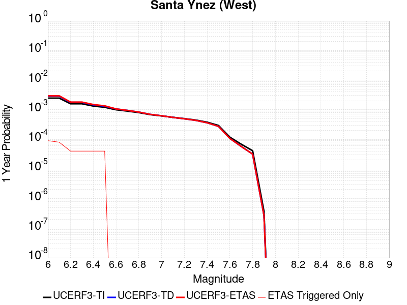 |  |

| Magnitude | 1 wk TI Prob | 1 wk TD Prob | 1 wk ETAS Prob | 1 wk ETAS/TD Gain | 1 wk ETAS Triggered Only | 1 mo TI Prob | 1 mo TD Prob | 1 mo ETAS Prob | 1 mo ETAS/TD Gain | 1 mo ETAS Triggered Only | 1 yr TI Prob | 1 yr TD Prob | 1 yr ETAS Prob | 1 yr ETAS/TD Gain | 1 yr ETAS Triggered Only | 10 yr TI Prob | 10 yr TD Prob | 10 yr ETAS Prob | 10 yr ETAS/TD Gain | 10 yr ETAS Triggered Only |
|-----|-----|-----|-----|-----|-----|-----|-----|-----|-----|-----|-----|-----|-----|-----|-----|-----|-----|-----|-----|-----|
| 6.0 | 4.7352758E-5 | 5.497349E-5 | 6.497294E-5 | 1.1818959 | 1.0E-5 | 2.0292461E-4 | 2.3558107E-4 | 2.455787E-4 | 1.0424383 | 1.0E-5 | 0.0024678076 | 0.0028645964 | 0.0029543387 | 1.0313281 | 9.0E-5 | 0.024405818 | 0.028305095 | 0.028431416 | 1.0044628 | 1.3E-4 |
| 6.1 | 4.7352758E-5 | 5.497349E-5 | 5.497349E-5 | 1.0 | 0.0 | 2.0292461E-4 | 2.3558107E-4 | 2.3558107E-4 | 1.0 | 0.0 | 0.0024678076 | 0.0028645964 | 0.0029443672 | 1.0278472 | 8.0E-5 | 0.024405818 | 0.028305095 | 0.028411983 | 1.0037762 | 1.1E-4 |
| 6.2 | 3.0415853E-5 | 3.3925786E-5 | 3.3925786E-5 | 1.0 | 0.0 | 1.3034715E-4 | 1.4538833E-4 | 1.4538833E-4 | 1.0 | 0.0 | 0.0015858212 | 0.0017687011 | 0.0018086303 | 1.0225755 | 4.0E-5 | 0.015745522 | 0.01755015 | 0.017609097 | 1.0033587 | 6.0E-5 |
| 6.3 | 3.0415853E-5 | 3.3925786E-5 | 3.3925786E-5 | 1.0 | 0.0 | 1.3034715E-4 | 1.4538833E-4 | 1.4538833E-4 | 1.0 | 0.0 | 0.0015858212 | 0.0017687011 | 0.0018086303 | 1.0225755 | 4.0E-5 | 0.015745522 | 0.01755015 | 0.017609097 | 1.0033587 | 6.0E-5 |
| 6.4 | 2.5452082E-5 | 2.7912925E-5 | 2.7912925E-5 | 1.0 | 0.0 | 1.09075794E-4 | 1.1962145E-4 | 1.1962145E-4 | 1.0 | 0.0 | 0.0013271887 | 0.001455435 | 0.0014953767 | 1.0274432 | 4.0E-5 | 0.013192902 | 0.014461209 | 0.014510486 | 1.0034075 | 5.0E-5 |
| 6.5 | 2.3143784E-5 | 2.5128682E-5 | 2.5128682E-5 | 1.0 | 0.0 | 9.9183875E-5 | 1.0768999E-4 | 1.0768999E-4 | 1.0 | 0.0 | 0.0012068948 | 0.0013103489 | 0.0013502964 | 1.0304862 | 4.0E-5 | 0.012003611 | 0.013027899 | 0.013077248 | 1.0037879 | 5.0E-5 |
| 6.6 | 1.9118515E-5 | 2.0354646E-5 | 2.0354646E-5 | 1.0 | 0.0 | 8.193392E-5 | 8.723133E-5 | 8.723133E-5 | 1.0 | 0.0 | 9.97089E-4 | 0.001061532 | 0.001061532 | 1.0 | 0.0 | 0.00992627 | 0.010565523 | 0.010575417 | 1.0009365 | 1.0E-5 |
| 6.7 | 1.722807E-5 | 1.8146604E-5 | 1.8146604E-5 | 1.0 | 0.0 | 7.3832496E-5 | 7.776888E-5 | 7.776888E-5 | 1.0 | 0.0 | 8.985399E-4 | 9.464303E-4 | 9.464303E-4 | 1.0 | 0.0 | 0.008949154 | 0.009424643 | 0.009434548 | 1.0010511 | 1.0E-5 |
| 6.8 | 1.5317364E-5 | 1.5926695E-5 | 1.5926695E-5 | 1.0 | 0.0 | 6.56442E-5 | 6.82555E-5 | 6.82555E-5 | 1.0 | 0.0 | 7.98925E-4 | 8.306982E-4 | 8.306982E-4 | 1.0 | 0.0 | 0.007960589 | 0.008276418 | 0.0082863355 | 1.0011983 | 1.0E-5 |
| 6.9 | 1.3071226E-5 | 1.3329779E-5 | 1.3329779E-5 | 1.0 | 0.0 | 5.6018336E-5 | 5.7126388E-5 | 5.7126388E-5 | 1.0 | 0.0 | 6.8180985E-4 | 6.9529406E-4 | 6.9529406E-4 | 1.0 | 0.0 | 0.0067972173 | 0.0069314474 | 0.006941378 | 1.0014327 | 1.0E-5 |
| 7.0 | 1.1836986E-5 | 1.19329125E-5 | 1.19329125E-5 | 1.0 | 0.0 | 5.0728955E-5 | 5.1140058E-5 | 5.1140058E-5 | 1.0 | 0.0 | 6.1745E-4 | 6.2245404E-4 | 6.2245404E-4 | 1.0 | 0.0 | 0.006157372 | 0.006207299 | 0.0062172366 | 1.001601 | 1.0E-5 |
| 7.1 | 1.0597169E-5 | 1.0542309E-5 | 1.0542309E-5 | 1.0 | 0.0 | 4.541565E-5 | 4.5180546E-5 | 4.5180546E-5 | 1.0 | 0.0 | 5.5279525E-4 | 5.4993544E-4 | 5.4993544E-4 | 1.0 | 0.0 | 0.0055142213 | 0.005485877 | 0.005495822 | 1.0018128 | 1.0E-5 |
| 7.2 | 9.59113E-6 | 9.459241E-6 | 9.459241E-6 | 1.0 | 0.0 | 4.11042E-5 | 4.053898E-5 | 4.053898E-5 | 1.0 | 0.0 | 5.0032866E-4 | 4.9345137E-4 | 4.9345137E-4 | 1.0 | 0.0 | 0.004992037 | 0.0049236757 | 0.0049336264 | 1.002021 | 1.0E-5 |
| 7.3 | 8.586084E-6 | 8.379669E-6 | 8.379669E-6 | 1.0 | 0.0 | 3.679698E-5 | 3.591238E-5 | 3.591238E-5 | 1.0 | 0.0 | 4.4791115E-4 | 4.3714655E-4 | 4.3714655E-4 | 1.0 | 0.0 | 0.004470094 | 0.0043629776 | 0.004372934 | 1.002282 | 1.0E-5 |
| 7.4 | 7.2622997E-6 | 6.951613E-6 | 6.951613E-6 | 1.0 | 0.0 | 3.112377E-5 | 2.9792294E-5 | 2.9792294E-5 | 1.0 | 0.0 | 3.78866E-4 | 3.6266178E-4 | 3.6266178E-4 | 1.0 | 0.0 | 0.0037822074 | 0.0036207996 | 0.0036307634 | 1.0027518 | 1.0E-5 |
| 7.5 | 5.627296E-6 | 5.251639E-6 | 5.251639E-6 | 1.0 | 0.0 | 2.411676E-5 | 2.2506834E-5 | 2.2506834E-5 | 1.0 | 0.0 | 2.9358198E-4 | 2.7398695E-4 | 2.7398695E-4 | 1.0 | 0.0 | 0.0029319443 | 0.0027365636 | 0.0027365636 | 1.0 | 0.0 |
| 7.6 | 2.265244E-6 | 2.0608784E-6 | 2.0608784E-6 | 1.0 | 0.0 | 9.708152E-6 | 8.832307E-6 | 8.832307E-6 | 1.0 | 0.0 | 1.18190335E-4 | 1.0752812E-4 | 1.0752812E-4 | 1.0 | 0.0 | 0.001181275 | 0.0010747695 | 0.0010747695 | 1.0 | 0.0 |
| 7.7 | 1.3099874E-6 | 1.1016341E-6 | 1.1016341E-6 | 1.0 | 0.0 | 5.61422E-6 | 4.7212807E-6 | 4.7212807E-6 | 1.0 | 0.0 | 6.8350986E-5 | 5.74801E-5 | 5.74801E-5 | 1.0 | 0.0 | 6.832996E-4 | 5.746547E-4 | 5.746547E-4 | 1.0 | 0.0 |
| 7.8 | 7.903951E-7 | 6.071191E-7 | 6.071191E-7 | 1.0 | 0.0 | 3.3874032E-6 | 2.6019363E-6 | 2.6019363E-6 | 1.0 | 0.0 | 4.1240855E-5 | 3.1678126E-5 | 3.1678126E-5 | 1.0 | 0.0 | 4.12332E-4 | 3.1673745E-4 | 3.1673745E-4 | 1.0 | 0.0 |
| 7.9 | 7.0753297E-9 | 5.089978E-9 | 5.089978E-9 | 1.0 | 0.0 | 3.032284E-8 | 2.1814193E-8 | 2.1814193E-8 | 1.0 | 0.0 | 3.6918053E-7 | 2.6558777E-7 | 2.6558777E-7 | 1.0 | 0.0 | 3.691799E-6 | 2.6558755E-6 | 2.6558755E-6 | 1.0 | 0.0 |

## Independence rev 2011
*[(top)](#table-of-contents)*

| 1 Week | 1 Month | 1 Year | 10 Year |
|-----|-----|-----|-----|
| 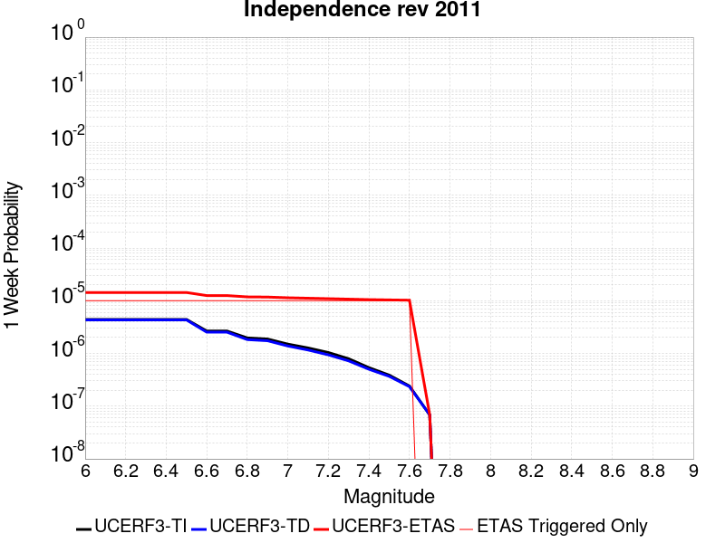 |  | 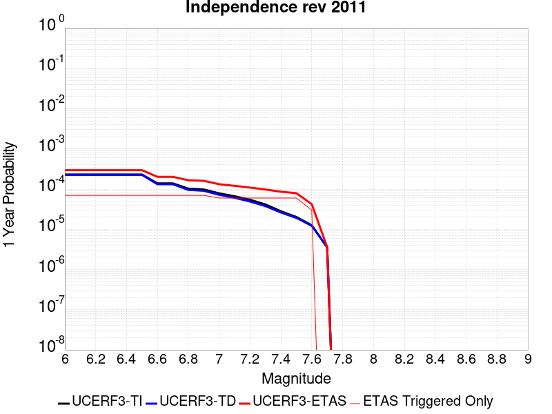 |  |

| Magnitude | 1 wk TI Prob | 1 wk TD Prob | 1 wk ETAS Prob | 1 wk ETAS/TD Gain | 1 wk ETAS Triggered Only | 1 mo TI Prob | 1 mo TD Prob | 1 mo ETAS Prob | 1 mo ETAS/TD Gain | 1 mo ETAS Triggered Only | 1 yr TI Prob | 1 yr TD Prob | 1 yr ETAS Prob | 1 yr ETAS/TD Gain | 1 yr ETAS Triggered Only | 10 yr TI Prob | 10 yr TD Prob | 10 yr ETAS Prob | 10 yr ETAS/TD Gain | 10 yr ETAS Triggered Only |
|-----|-----|-----|-----|-----|-----|-----|-----|-----|-----|-----|-----|-----|-----|-----|-----|-----|-----|-----|-----|-----|
| 6.0 | 4.422171E-6 | 4.3262453E-6 | 1.4326202E-5 | 3.311463 | 1.0E-5 | 1.8952025E-5 | 1.8540937E-5 | 3.8540566E-5 | 2.078674 | 2.0E-5 | 2.3071647E-4 | 2.257155E-4 | 2.956997E-4 | 1.3100549 | 7.0E-5 | 0.0023047708 | 0.0022551562 | 0.0023748854 | 1.0530914 | 1.2E-4 |
| 6.1 | 4.422171E-6 | 4.3262453E-6 | 1.4326202E-5 | 3.311463 | 1.0E-5 | 1.8952025E-5 | 1.8540937E-5 | 3.8540566E-5 | 2.078674 | 2.0E-5 | 2.3071647E-4 | 2.257155E-4 | 2.956997E-4 | 1.3100549 | 7.0E-5 | 0.0023047708 | 0.0022551562 | 0.0023748854 | 1.0530914 | 1.2E-4 |
| 6.2 | 4.422171E-6 | 4.3262453E-6 | 1.4326202E-5 | 3.311463 | 1.0E-5 | 1.8952025E-5 | 1.8540937E-5 | 3.8540566E-5 | 2.078674 | 2.0E-5 | 2.3071647E-4 | 2.257155E-4 | 2.956997E-4 | 1.3100549 | 7.0E-5 | 0.0023047708 | 0.0022551562 | 0.0023748854 | 1.0530914 | 1.2E-4 |
| 6.3 | 4.422171E-6 | 4.3262453E-6 | 1.4326202E-5 | 3.311463 | 1.0E-5 | 1.8952025E-5 | 1.8540937E-5 | 3.8540566E-5 | 2.078674 | 2.0E-5 | 2.3071647E-4 | 2.257155E-4 | 2.956997E-4 | 1.3100549 | 7.0E-5 | 0.0023047708 | 0.0022551562 | 0.0023748854 | 1.0530914 | 1.2E-4 |
| 6.4 | 4.422171E-6 | 4.3262453E-6 | 1.4326202E-5 | 3.311463 | 1.0E-5 | 1.8952025E-5 | 1.8540937E-5 | 3.8540566E-5 | 2.078674 | 2.0E-5 | 2.3071647E-4 | 2.257155E-4 | 2.956997E-4 | 1.3100549 | 7.0E-5 | 0.0023047708 | 0.0022551562 | 0.0023748854 | 1.0530914 | 1.2E-4 |
| 6.5 | 4.422171E-6 | 4.3262453E-6 | 1.4326202E-5 | 3.311463 | 1.0E-5 | 1.8952025E-5 | 1.8540937E-5 | 3.8540566E-5 | 2.078674 | 2.0E-5 | 2.3071647E-4 | 2.257155E-4 | 2.956997E-4 | 1.3100549 | 7.0E-5 | 0.0023047708 | 0.0022551562 | 0.0023748854 | 1.0530914 | 1.2E-4 |
| 6.6 | 2.663744E-6 | 2.5319996E-6 | 1.2531974E-5 | 4.9494376 | 1.0E-5 | 1.1415996E-5 | 1.0851385E-5 | 3.0851166E-5 | 2.8430629 | 2.0E-5 | 1.3898089E-4 | 1.3210809E-4 | 2.0209885E-4 | 1.5297991 | 7.0E-5 | 0.0013889399 | 0.0013203438 | 0.0014401854 | 1.0907655 | 1.2E-4 |
| 6.7 | 2.663744E-6 | 2.5319996E-6 | 1.2531974E-5 | 4.9494376 | 1.0E-5 | 1.1415996E-5 | 1.0851385E-5 | 3.0851166E-5 | 2.8430629 | 2.0E-5 | 1.3898089E-4 | 1.3210809E-4 | 2.0209885E-4 | 1.5297991 | 7.0E-5 | 0.0013889399 | 0.0013203438 | 0.0014401854 | 1.0907655 | 1.2E-4 |
| 6.8 | 1.9716529E-6 | 1.83227E-6 | 1.1832251E-5 | 6.457701 | 1.0E-5 | 8.449913E-6 | 7.852563E-6 | 2.7852406E-5 | 3.5469193 | 2.0E-5 | 1.0287284E-4 | 9.560089E-5 | 1.6559419E-4 | 1.7321408 | 7.0E-5 | 0.0010282523 | 9.556105E-4 | 0.0010655053 | 1.1149997 | 1.1E-4 |
| 6.9 | 1.8788617E-6 | 1.7430103E-6 | 1.1742993E-5 | 6.7371907 | 1.0E-5 | 8.0522395E-6 | 7.470024E-6 | 2.7469874E-5 | 3.6773477 | 2.0E-5 | 9.80316E-5 | 9.094387E-5 | 1.609375E-4 | 1.7696356 | 7.0E-5 | 9.798837E-4 | 9.090785E-4 | 0.0010189785 | 1.1208917 | 1.1E-4 |
| 7.0 | 1.5045488E-6 | 1.3849595E-6 | 1.13849455E-5 | 8.220418 | 1.0E-5 | 6.44805E-6 | 5.9355275E-6 | 2.593541E-5 | 4.36952 | 2.0E-5 | 7.8502184E-5 | 7.226271E-5 | 1.3225837E-4 | 1.8302438 | 6.0E-5 | 7.8474457E-4 | 7.2239724E-4 | 8.2232495E-4 | 1.138328 | 1.0E-4 |
| 7.1 | 1.272341E-6 | 1.1625177E-6 | 1.1162506E-5 | 9.60201 | 1.0E-5 | 5.4528787E-6 | 4.9822092E-6 | 2.498211E-5 | 5.0142636 | 2.0E-5 | 6.6386776E-5 | 6.065674E-5 | 1.206531E-4 | 1.9891129 | 6.0E-5 | 6.636695E-4 | 6.06405E-4 | 6.963505E-4 | 1.1483257 | 9.0E-5 |
| 7.2 | 1.0416892E-6 | 9.4099494E-7 | 1.0940986E-5 | 11.62704 | 1.0E-5 | 4.464375E-6 | 4.032829E-6 | 2.4032748E-5 | 5.9592776 | 2.0E-5 | 5.4352407E-5 | 4.909861E-5 | 1.09095665E-4 | 2.2219706 | 6.0E-5 | 5.4339116E-4 | 4.9087947E-4 | 5.808353E-4 | 1.1832544 | 9.0E-5 |
| 7.3 | 7.9450155E-7 | 7.235053E-7 | 1.0723498E-5 | 14.8215885 | 1.0E-5 | 3.4050022E-6 | 3.1007335E-6 | 2.310067E-5 | 7.4500666 | 2.0E-5 | 4.1455114E-5 | 3.7750786E-5 | 9.7748525E-5 | 2.589311 | 6.0E-5 | 4.144738E-4 | 3.7744487E-4 | 4.674109E-4 | 1.2383554 | 9.0E-5 |
| 7.4 | 5.3893444E-7 | 5.0195445E-7 | 1.0501949E-5 | 20.922117 | 1.0E-5 | 2.309717E-6 | 2.1512315E-6 | 2.215119E-5 | 10.296981 | 2.0E-5 | 2.8120441E-5 | 2.6190934E-5 | 8.6189364E-5 | 3.2908092 | 6.0E-5 | 2.8116882E-4 | 2.6187891E-4 | 3.5185536E-4 | 1.3435802 | 9.0E-5 |
| 7.5 | 3.8852085E-7 | 3.6825747E-7 | 1.0368254E-5 | 28.154903 | 1.0E-5 | 1.6650882E-6 | 1.5782454E-6 | 2.1578215E-5 | 13.67228 | 2.0E-5 | 2.027226E-5 | 1.9214971E-5 | 7.9213816E-5 | 4.122505 | 6.0E-5 | 2.0270412E-4 | 1.921333E-4 | 2.82116E-4 | 1.4683348 | 9.0E-5 |
| 7.6 | 2.414929E-7 | 2.3457659E-7 | 1.0234574E-5 | 43.62999 | 1.0E-5 | 1.0349692E-6 | 1.0053279E-6 | 1.1005318E-5 | 10.946994 | 1.0E-5 | 1.2600677E-5 | 1.22398E-5 | 4.2239433E-5 | 3.4509904 | 3.0E-5 | 1.2599962E-4 | 1.2239137E-4 | 1.7238526E-4 | 1.4084755 | 5.0E-5 |
| 7.7 | 6.8298014E-8 | 6.858993E-8 | 6.858993E-8 | 1.0 | 0.0 | 2.9270575E-7 | 2.939568E-7 | 2.939568E-7 | 1.0 | 0.0 | 3.5636867E-6 | 3.5789185E-6 | 3.5789185E-6 | 1.0 | 0.0 | 3.5636294E-5 | 3.5788657E-5 | 3.5788657E-5 | 1.0 | 0.0 |

## Santa Rosa Island
*[(top)](#table-of-contents)*

| 1 Week | 1 Month | 1 Year | 10 Year |
|-----|-----|-----|-----|
|  |  |  | 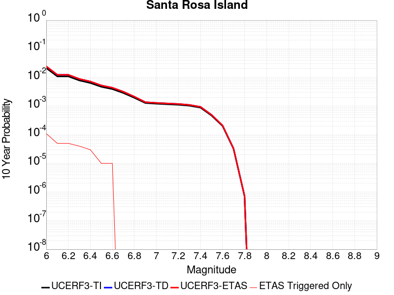 |

| Magnitude | 1 wk TI Prob | 1 wk TD Prob | 1 wk ETAS Prob | 1 wk ETAS/TD Gain | 1 wk ETAS Triggered Only | 1 mo TI Prob | 1 mo TD Prob | 1 mo ETAS Prob | 1 mo ETAS/TD Gain | 1 mo ETAS Triggered Only | 1 yr TI Prob | 1 yr TD Prob | 1 yr ETAS Prob | 1 yr ETAS/TD Gain | 1 yr ETAS Triggered Only | 10 yr TI Prob | 10 yr TD Prob | 10 yr ETAS Prob | 10 yr ETAS/TD Gain | 10 yr ETAS Triggered Only |
|-----|-----|-----|-----|-----|-----|-----|-----|-----|-----|-----|-----|-----|-----|-----|-----|-----|-----|-----|-----|-----|
| 6.0 | 4.1143165E-5 | 4.7092042E-5 | 6.70911E-5 | 1.4246802 | 2.0E-5 | 1.7631594E-4 | 2.0180854E-4 | 2.218045E-4 | 1.0990838 | 2.0E-5 | 0.002144533 | 0.0024544473 | 0.0025043245 | 1.0203211 | 5.0E-5 | 0.021239553 | 0.024294013 | 0.024401342 | 1.0044179 | 1.1E-4 |
| 6.1 | 2.1061249E-5 | 2.3865383E-5 | 3.3865144E-5 | 1.419007 | 1.0E-5 | 9.0259375E-5 | 1.0227637E-4 | 1.12275346E-4 | 1.0977643 | 1.0E-5 | 0.0010983539 | 0.0012445324 | 0.00125452 | 1.0080252 | 1.0E-5 | 0.01092941 | 0.012378667 | 0.012428048 | 1.0039892 | 5.0E-5 |
| 6.2 | 2.1061249E-5 | 2.3865383E-5 | 3.3865144E-5 | 1.419007 | 1.0E-5 | 9.0259375E-5 | 1.0227637E-4 | 1.12275346E-4 | 1.0977643 | 1.0E-5 | 0.0010983539 | 0.0012445324 | 0.00125452 | 1.0080252 | 1.0E-5 | 0.01092941 | 0.012378667 | 0.012428048 | 1.0039892 | 5.0E-5 |
| 6.3 | 1.5158236E-5 | 1.7074708E-5 | 2.7074537E-5 | 1.5856516 | 1.0E-5 | 6.496225E-5 | 7.317533E-5 | 8.31746E-5 | 1.136648 | 1.0E-5 | 7.906284E-4 | 8.905574E-4 | 9.0054853E-4 | 1.0112189 | 1.0E-5 | 0.007878214 | 0.008871138 | 0.008910784 | 1.004469 | 4.0E-5 |
| 6.4 | 1.2341918E-5 | 1.3853143E-5 | 2.3853005E-5 | 1.7218479 | 1.0E-5 | 5.2892858E-5 | 5.9369308E-5 | 6.936871E-5 | 1.1684272 | 1.0E-5 | 6.437803E-4 | 7.225897E-4 | 7.325825E-4 | 1.0138291 | 1.0E-5 | 0.006419184 | 0.0072032386 | 0.0072330222 | 1.0041348 | 3.0E-5 |
| 6.5 | 9.061158E-6 | 1.0117188E-5 | 1.0117188E-5 | 1.0 | 0.0 | 3.883296E-5 | 4.335869E-5 | 4.335869E-5 | 1.0 | 0.0 | 4.726887E-4 | 5.277695E-4 | 5.277695E-4 | 1.0 | 0.0 | 0.004716845 | 0.0052656992 | 0.0052756467 | 1.0018891 | 1.0E-5 |
| 6.6 | 7.5461685E-6 | 8.400861E-6 | 8.400861E-6 | 1.0 | 0.0 | 3.2340322E-5 | 3.6003217E-5 | 3.6003217E-5 | 1.0 | 0.0 | 3.936723E-4 | 4.382553E-4 | 4.382553E-4 | 1.0 | 0.0 | 0.003929756 | 0.0043743397 | 0.004384296 | 1.0022761 | 1.0E-5 |
| 6.7 | 5.5023775E-6 | 6.0874677E-6 | 6.0874677E-6 | 1.0 | 0.0 | 2.3581404E-5 | 2.6088905E-5 | 2.6088905E-5 | 1.0 | 0.0 | 2.8706578E-4 | 3.1758935E-4 | 3.1758935E-4 | 1.0 | 0.0 | 0.0028669522 | 0.0031716768 | 0.0031716768 | 1.0 | 0.0 |
| 6.8 | 3.7351679E-6 | 4.0831915E-6 | 4.0831915E-6 | 1.0 | 0.0 | 1.6007763E-5 | 1.749929E-5 | 1.749929E-5 | 1.0 | 0.0 | 1.948771E-4 | 2.1303551E-4 | 2.1303551E-4 | 1.0 | 0.0 | 0.0019470629 | 0.002128558 | 0.002128558 | 1.0 | 0.0 |
| 6.9 | 2.456366E-6 | 2.6292953E-6 | 2.6292953E-6 | 1.0 | 0.0 | 1.0527241E-5 | 1.126836E-5 | 1.126836E-5 | 1.0 | 0.0 | 1.2816161E-4 | 1.3718367E-4 | 1.3718367E-4 | 1.0 | 0.0 | 0.0012808773 | 0.0013709929 | 0.0013709929 | 1.0 | 0.0 |
| 7.0 | 2.3245157E-6 | 2.482801E-6 | 2.482801E-6 | 1.0 | 0.0 | 9.962172E-6 | 1.0640532E-5 | 1.0640532E-5 | 1.0 | 0.0 | 1.2128269E-4 | 1.295408E-4 | 1.295408E-4 | 1.0 | 0.0 | 0.0012121652 | 0.0012946551 | 0.0012946551 | 1.0 | 0.0 |
| 7.1 | 2.2248344E-6 | 2.3732712E-6 | 2.3732712E-6 | 1.0 | 0.0 | 9.53497E-6 | 1.0171123E-5 | 1.0171123E-5 | 1.0 | 0.0 | 1.1608207E-4 | 1.238264E-4 | 1.238264E-4 | 1.0 | 0.0 | 0.0011602144 | 0.001237576 | 0.001237576 | 1.0 | 0.0 |
| 7.2 | 2.1350402E-6 | 2.2761742E-6 | 2.2761742E-6 | 1.0 | 0.0 | 9.150141E-6 | 9.7549955E-6 | 9.7549955E-6 | 1.0 | 0.0 | 1.1139726E-4 | 1.1876062E-4 | 1.1876062E-4 | 1.0 | 0.0 | 0.0011134144 | 0.0011869734 | 0.0011869734 | 1.0 | 0.0 |
| 7.3 | 1.9793572E-6 | 2.1087376E-6 | 2.1087376E-6 | 1.0 | 0.0 | 8.482932E-6 | 9.037415E-6 | 9.037415E-6 | 1.0 | 0.0 | 1.032748E-4 | 1.10024994E-4 | 1.10024994E-4 | 1.0 | 0.0 | 0.0010322682 | 0.001099707 | 0.001099707 | 1.0 | 0.0 |
| 7.4 | 1.6951194E-6 | 1.804589E-6 | 1.804589E-6 | 1.0 | 0.0 | 7.264777E-6 | 7.73393E-6 | 7.73393E-6 | 1.0 | 0.0 | 8.844508E-5 | 9.4156545E-5 | 9.4156545E-5 | 1.0 | 0.0 | 8.840988E-4 | 9.411682E-4 | 9.411682E-4 | 1.0 | 0.0 |
| 7.5 | 8.987207E-7 | 9.51229E-7 | 9.51229E-7 | 1.0 | 0.0 | 3.8516546E-6 | 4.0766895E-6 | 4.0766895E-6 | 1.0 | 0.0 | 4.6892885E-5 | 4.9632577E-5 | 4.9632577E-5 | 1.0 | 0.0 | 4.688299E-4 | 4.9621606E-4 | 4.9621606E-4 | 1.0 | 0.0 |
| 7.6 | 3.8783037E-7 | 4.052958E-7 | 4.052958E-7 | 1.0 | 0.0 | 1.6621291E-6 | 1.7369808E-6 | 1.7369808E-6 | 1.0 | 0.0 | 2.0236233E-5 | 2.1147544E-5 | 2.1147544E-5 | 1.0 | 0.0 | 2.023439E-4 | 2.1145596E-4 | 2.1145596E-4 | 1.0 | 0.0 |
| 7.7 | 6.181804E-8 | 6.3390665E-8 | 6.3390665E-8 | 1.0 | 0.0 | 2.6493444E-7 | 2.7167425E-7 | 2.7167425E-7 | 1.0 | 0.0 | 3.225572E-6 | 3.307629E-6 | 3.307629E-6 | 1.0 | 0.0 | 3.225525E-5 | 3.3075805E-5 | 3.3075805E-5 | 1.0 | 0.0 |
| 7.8 | 1.3704449E-9 | 1.3964188E-9 | 1.3964188E-9 | 1.0 | 0.0 | 5.873335E-9 | 5.984652E-9 | 5.984652E-9 | 1.0 | 0.0 | 7.1507856E-8 | 7.286314E-8 | 7.286314E-8 | 1.0 | 0.0 | 7.1507833E-7 | 7.286312E-7 | 7.286312E-7 | 1.0 | 0.0 |

## Owens Valley
*[(top)](#table-of-contents)*

| 1 Week | 1 Month | 1 Year | 10 Year |
|-----|-----|-----|-----|
|  |  |  |  |

| Magnitude | 1 wk TI Prob | 1 wk TD Prob | 1 wk ETAS Prob | 1 wk ETAS/TD Gain | 1 wk ETAS Triggered Only | 1 mo TI Prob | 1 mo TD Prob | 1 mo ETAS Prob | 1 mo ETAS/TD Gain | 1 mo ETAS Triggered Only | 1 yr TI Prob | 1 yr TD Prob | 1 yr ETAS Prob | 1 yr ETAS/TD Gain | 1 yr ETAS Triggered Only | 10 yr TI Prob | 10 yr TD Prob | 10 yr ETAS Prob | 10 yr ETAS/TD Gain | 10 yr ETAS Triggered Only |
|-----|-----|-----|-----|-----|-----|-----|-----|-----|-----|-----|-----|-----|-----|-----|-----|-----|-----|-----|-----|-----|
| 6.0 | 4.83821E-5 | 3.627396E-6 | 2.3627323E-5 | 6.513577 | 2.0E-5 | 2.0733538E-4 | 1.5545897E-5 | 4.554543E-5 | 2.9297397 | 3.0E-5 | 0.002521386 | 1.8925584E-4 | 2.692407E-4 | 1.4226283 | 8.0E-5 | 0.024929691 | 0.0019254381 | 0.0020352262 | 1.0570198 | 1.1E-4 |
| 6.1 | 4.83821E-5 | 3.627396E-6 | 2.3627323E-5 | 6.513577 | 2.0E-5 | 2.0733538E-4 | 1.5545897E-5 | 4.554543E-5 | 2.9297397 | 3.0E-5 | 0.002521386 | 1.8925584E-4 | 2.692407E-4 | 1.4226283 | 8.0E-5 | 0.024929691 | 0.0019254381 | 0.0020352262 | 1.0570198 | 1.1E-4 |
| 6.2 | 4.83821E-5 | 3.627396E-6 | 2.3627323E-5 | 6.513577 | 2.0E-5 | 2.0733538E-4 | 1.5545897E-5 | 4.554543E-5 | 2.9297397 | 3.0E-5 | 0.002521386 | 1.8925584E-4 | 2.692407E-4 | 1.4226283 | 8.0E-5 | 0.024929691 | 0.0019254381 | 0.0020352262 | 1.0570198 | 1.1E-4 |
| 6.3 | 3.953008E-5 | 3.1558448E-6 | 1.3155813E-5 | 4.1687136 | 1.0E-5 | 1.6940363E-4 | 1.3524983E-5 | 2.3524848E-5 | 1.7393625 | 1.0E-5 | 0.002060538 | 1.6465495E-4 | 2.2464507E-4 | 1.3643384 | 6.0E-5 | 0.020415364 | 0.0016594394 | 0.0017293232 | 1.042113 | 7.0E-5 |
| 6.4 | 3.953008E-5 | 3.1558448E-6 | 1.3155813E-5 | 4.1687136 | 1.0E-5 | 1.6940363E-4 | 1.3524983E-5 | 2.3524848E-5 | 1.7393625 | 1.0E-5 | 0.002060538 | 1.6465495E-4 | 2.2464507E-4 | 1.3643384 | 6.0E-5 | 0.020415364 | 0.0016594394 | 0.0017293232 | 1.042113 | 7.0E-5 |
| 6.5 | 3.457342E-5 | 2.9718876E-6 | 1.2971858E-5 | 4.364855 | 1.0E-5 | 1.4816338E-4 | 1.2736603E-5 | 2.2736476E-5 | 1.7851287 | 1.0E-5 | 0.0018023965 | 1.5505782E-4 | 2.1504851E-4 | 1.3868924 | 6.0E-5 | 0.017878477 | 0.0015558768 | 0.0016257679 | 1.0449207 | 7.0E-5 |
| 6.6 | 3.1127765E-5 | 2.8746979E-6 | 1.2874669E-5 | 4.478616 | 1.0E-5 | 1.3339789E-4 | 1.232008E-5 | 2.2319957E-5 | 1.811673 | 1.0E-5 | 0.0016229092 | 1.4998733E-4 | 2.0997833E-4 | 1.3999738 | 6.0E-5 | 0.016111081 | 0.001501365 | 0.0015712598 | 1.0465542 | 7.0E-5 |
| 6.7 | 2.806885E-5 | 2.810566E-6 | 1.2810538E-5 | 4.557992 | 1.0E-5 | 1.2028952E-4 | 1.2045231E-5 | 2.2045111E-5 | 1.8301941 | 1.0E-5 | 0.001463541 | 1.4664151E-4 | 2.0663271E-4 | 1.4091011 | 6.0E-5 | 0.014539397 | 0.001465831 | 0.0015357283 | 1.0476844 | 7.0E-5 |
| 6.8 | 2.524524E-5 | 2.235501E-6 | 2.235501E-6 | 1.0 | 0.0 | 1.0818939E-4 | 9.5806845E-6 | 9.5806845E-6 | 1.0 | 0.0 | 0.0013164099 | 1.1663889E-4 | 1.6663306E-4 | 1.4286234 | 5.0E-5 | 0.01308639 | 0.0011660501 | 0.0012259801 | 1.0513958 | 6.0E-5 |
| 6.9 | 2.2704568E-5 | 1.6082656E-6 | 1.6082656E-6 | 1.0 | 0.0 | 9.730166E-5 | 6.8925488E-6 | 6.8925488E-6 | 1.0 | 0.0 | 0.0011840039 | 8.391357E-5 | 1.3390937E-4 | 1.5958012 | 5.0E-5 | 0.011777153 | 8.390308E-4 | 8.989805E-4 | 1.0714511 | 6.0E-5 |
| 7.0 | 2.0871712E-5 | 1.5396373E-6 | 1.5396373E-6 | 1.0 | 0.0 | 8.944713E-5 | 6.598429E-6 | 6.598429E-6 | 1.0 | 0.0 | 0.0010884746 | 8.033293E-5 | 1.3032892E-4 | 1.6223598 | 5.0E-5 | 0.010831586 | 8.0321095E-4 | 8.6316274E-4 | 1.0746402 | 6.0E-5 |
| 7.1 | 1.944928E-5 | 1.3864965E-6 | 1.3864965E-6 | 1.0 | 0.0 | 8.335139E-5 | 5.942114E-6 | 5.942114E-6 | 1.0 | 0.0 | 0.0010143308 | 7.2342846E-5 | 1.2233923E-4 | 1.6911033 | 5.0E-5 | 0.010097133 | 7.233511E-4 | 7.8330765E-4 | 1.0828873 | 6.0E-5 |
| 7.2 | 1.7876306E-5 | 1.2489834E-6 | 1.2489834E-6 | 1.0 | 0.0 | 7.6610486E-5 | 5.3527747E-6 | 5.3527747E-6 | 1.0 | 0.0 | 9.3233347E-4 | 6.516809E-5 | 1.1516483E-4 | 1.7671967 | 5.0E-5 | 0.009284316 | 6.516274E-4 | 7.115883E-4 | 1.0920172 | 6.0E-5 |
| 7.3 | 1.2618672E-5 | 1.1115851E-6 | 1.1115851E-6 | 1.0 | 0.0 | 5.40789E-5 | 4.763928E-6 | 4.763928E-6 | 1.0 | 0.0 | 6.582117E-4 | 5.799928E-5 | 1.07996384E-4 | 1.8620297 | 5.0E-5 | 0.0065626553 | 5.799741E-4 | 6.399393E-4 | 1.1033928 | 6.0E-5 |
| 7.4 | 7.4874442E-6 | 8.549184E-7 | 8.549184E-7 | 1.0 | 0.0 | 3.208865E-5 | 3.663931E-6 | 3.663931E-6 | 1.0 | 0.0 | 3.906093E-4 | 4.4607452E-5 | 9.4605224E-5 | 2.1208389 | 5.0E-5 | 0.003899234 | 4.4607726E-4 | 5.060505E-4 | 1.1344459 | 6.0E-5 |
| 7.5 | 2.4734156E-6 | 6.068976E-7 | 6.068976E-7 | 1.0 | 0.0 | 1.060031E-5 | 2.6009868E-6 | 2.6009868E-6 | 1.0 | 0.0 | 1.2905113E-4 | 3.1666557E-5 | 7.1665294E-5 | 2.2631223 | 4.0E-5 | 0.0012897621 | 3.1662078E-4 | 3.6660495E-4 | 1.1578677 | 5.0E-5 |
| 7.6 | 1.1328841E-6 | 3.1967096E-7 | 3.1967096E-7 | 1.0 | 0.0 | 4.8552088E-6 | 1.3700177E-6 | 1.3700177E-6 | 1.0 | 0.0 | 5.9110564E-5 | 1.6679838E-5 | 4.667934E-5 | 2.7985485 | 3.0E-5 | 5.9094845E-4 | 1.6678606E-4 | 1.9678105E-4 | 1.1798412 | 3.0E-5 |
| 7.7 | 4.8613185E-7 | 8.965384E-8 | 8.965384E-8 | 1.0 | 0.0 | 2.0834207E-6 | 3.842307E-7 | 3.842307E-7 | 1.0 | 0.0 | 2.536535E-5 | 4.677999E-6 | 4.677999E-6 | 1.0 | 0.0 | 2.5362454E-4 | 4.6779078E-5 | 4.6779078E-5 | 1.0 | 0.0 |

## Oceanic - West Huasna
*[(top)](#table-of-contents)*

| 1 Week | 1 Month | 1 Year | 10 Year |
|-----|-----|-----|-----|
|  |  |  |  |

| Magnitude | 1 wk TI Prob | 1 wk TD Prob | 1 wk ETAS Prob | 1 wk ETAS/TD Gain | 1 wk ETAS Triggered Only | 1 mo TI Prob | 1 mo TD Prob | 1 mo ETAS Prob | 1 mo ETAS/TD Gain | 1 mo ETAS Triggered Only | 1 yr TI Prob | 1 yr TD Prob | 1 yr ETAS Prob | 1 yr ETAS/TD Gain | 1 yr ETAS Triggered Only | 10 yr TI Prob | 10 yr TD Prob | 10 yr ETAS Prob | 10 yr ETAS/TD Gain | 10 yr ETAS Triggered Only |
|-----|-----|-----|-----|-----|-----|-----|-----|-----|-----|-----|-----|-----|-----|-----|-----|-----|-----|-----|-----|-----|
| 6.0 | 3.195567E-5 | 2.7927153E-5 | 2.7927153E-5 | 1.0 | 0.0 | 1.3694567E-4 | 1.19682554E-4 | 1.19682554E-4 | 1.0 | 0.0 | 0.0016660384 | 0.0014562042 | 0.0014661896 | 1.0068572 | 1.0E-5 | 0.016536033 | 0.014471174 | 0.0145598715 | 1.0061293 | 9.0E-5 |
| 6.1 | 2.1156782E-5 | 1.7573653E-5 | 1.7573653E-5 | 1.0 | 0.0 | 9.066878E-5 | 7.531353E-5 | 7.531353E-5 | 1.0 | 0.0 | 0.0011033333 | 9.1656594E-4 | 9.2655676E-4 | 1.0109003 | 1.0E-5 | 0.010978713 | 0.009128864 | 0.0091784075 | 1.0054271 | 5.0E-5 |
| 6.2 | 1.6195117E-5 | 1.3327269E-5 | 1.3327269E-5 | 1.0 | 0.0 | 6.9405796E-5 | 5.711563E-5 | 5.711563E-5 | 1.0 | 0.0 | 8.44688E-4 | 6.951635E-4 | 7.0515653E-4 | 1.0143751 | 1.0E-5 | 0.008414844 | 0.006930183 | 0.0069599757 | 1.0042989 | 3.0E-5 |
| 6.3 | 1.3559345E-5 | 1.1179233E-5 | 1.1179233E-5 | 1.0 | 0.0 | 5.811018E-5 | 4.7910125E-5 | 4.7910125E-5 | 1.0 | 0.0 | 7.072618E-4 | 5.831506E-4 | 5.831506E-4 | 1.0 | 0.0 | 0.0070501505 | 0.0058163223 | 0.005836206 | 1.0034186 | 2.0E-5 |
| 6.4 | 1.2120619E-5 | 1.0001056E-5 | 1.0001056E-5 | 1.0 | 0.0 | 5.1944477E-5 | 4.2860964E-5 | 4.2860964E-5 | 1.0 | 0.0 | 6.322405E-4 | 5.217078E-4 | 5.217078E-4 | 1.0 | 0.0 | 0.006304447 | 0.005204898 | 0.0052247937 | 1.0038226 | 2.0E-5 |
| 6.5 | 1.13511915E-5 | 9.367545E-6 | 9.367545E-6 | 1.0 | 0.0 | 4.8647056E-5 | 4.014601E-5 | 4.014601E-5 | 1.0 | 0.0 | 5.9211696E-4 | 4.8866845E-4 | 4.8866845E-4 | 1.0 | 0.0 | 0.0059054173 | 0.004875998 | 0.004895901 | 1.0040817 | 2.0E-5 |
| 6.6 | 9.850605E-6 | 8.135479E-6 | 8.135479E-6 | 1.0 | 0.0 | 4.2216197E-5 | 3.4865876E-5 | 3.4865876E-5 | 1.0 | 0.0 | 5.1386096E-4 | 4.2440955E-4 | 4.2440955E-4 | 1.0 | 0.0 | 0.0051267436 | 0.0042360225 | 0.004255938 | 1.0047014 | 2.0E-5 |
| 6.7 | 8.8558645E-6 | 7.318487E-6 | 7.318487E-6 | 1.0 | 0.0 | 3.7953152E-5 | 3.136457E-5 | 3.136457E-5 | 1.0 | 0.0 | 4.6198163E-4 | 3.8179688E-4 | 3.8179688E-4 | 1.0 | 0.0 | 0.004610224 | 0.003811435 | 0.003811435 | 1.0 | 0.0 |
| 6.8 | 7.67136E-6 | 6.3918033E-6 | 6.3918033E-6 | 1.0 | 0.0 | 3.2876844E-5 | 2.7393156E-5 | 2.7393156E-5 | 1.0 | 0.0 | 4.0020206E-4 | 3.334608E-4 | 3.334608E-4 | 1.0 | 0.0 | 0.003994821 | 0.0033296254 | 0.0033296254 | 1.0 | 0.0 |
| 6.9 | 6.534529E-6 | 5.45837E-6 | 5.45837E-6 | 1.0 | 0.0 | 2.8004823E-5 | 2.3392806E-5 | 2.3392806E-5 | 1.0 | 0.0 | 3.4090536E-4 | 2.8477033E-4 | 2.8477033E-4 | 1.0 | 0.0 | 0.0034038287 | 0.002844071 | 0.002844071 | 1.0 | 0.0 |
| 7.0 | 5.460525E-6 | 4.5699867E-6 | 4.5699867E-6 | 1.0 | 0.0 | 2.3402039E-5 | 1.9585512E-5 | 1.9585512E-5 | 1.0 | 0.0 | 2.8488258E-4 | 2.3842762E-4 | 2.3842762E-4 | 1.0 | 0.0 | 0.0028451765 | 0.002381732 | 0.002381732 | 1.0 | 0.0 |
| 7.1 | 4.4825083E-6 | 3.7524742E-6 | 3.7524742E-6 | 1.0 | 0.0 | 1.9210609E-5 | 1.6081935E-5 | 1.6081935E-5 | 1.0 | 0.0 | 2.3386406E-4 | 1.9578006E-4 | 1.9578006E-4 | 1.0 | 0.0 | 0.002336181 | 0.0019560878 | 0.0019560878 | 1.0 | 0.0 |
| 7.2 | 2.821708E-6 | 2.4249584E-6 | 2.4249584E-6 | 1.0 | 0.0 | 1.2092979E-5 | 1.0392638E-5 | 1.0392638E-5 | 1.0 | 0.0 | 1.4722206E-4 | 1.2652302E-4 | 1.2652302E-4 | 1.0 | 0.0 | 0.0014712457 | 0.0012645123 | 0.0012645123 | 1.0 | 0.0 |
| 7.3 | 2.0644757E-6 | 1.7687632E-6 | 1.7687632E-6 | 1.0 | 0.0 | 8.847723E-6 | 7.580392E-6 | 7.580392E-6 | 1.0 | 0.0 | 1.0771569E-4 | 9.2287366E-5 | 9.2287366E-5 | 1.0 | 0.0 | 0.001076635 | 9.224921E-4 | 9.224921E-4 | 1.0 | 0.0 |
| 7.4 | 1.6980367E-6 | 1.43801E-6 | 1.43801E-6 | 1.0 | 0.0 | 7.27728E-6 | 6.1628857E-6 | 6.1628857E-6 | 1.0 | 0.0 | 8.8597284E-5 | 7.503055E-5 | 7.503055E-5 | 1.0 | 0.0 | 8.8561967E-4 | 7.500538E-4 | 7.500538E-4 | 1.0 | 0.0 |
| 7.5 | 1.3637683E-6 | 1.1302833E-6 | 1.1302833E-6 | 1.0 | 0.0 | 5.844708E-6 | 4.8440625E-6 | 4.8440625E-6 | 1.0 | 0.0 | 7.1156996E-5 | 5.8974863E-5 | 5.8974863E-5 | 1.0 | 0.0 | 7.1134215E-4 | 5.8959366E-4 | 5.8959366E-4 | 1.0 | 0.0 |
| 7.6 | 9.802994E-7 | 7.677435E-7 | 7.677435E-7 | 1.0 | 0.0 | 4.2012766E-6 | 3.290325E-6 | 3.290325E-6 | 1.0 | 0.0 | 5.1149345E-5 | 4.005897E-5 | 4.005897E-5 | 1.0 | 0.0 | 5.113757E-4 | 4.005189E-4 | 4.005189E-4 | 1.0 | 0.0 |
| 7.7 | 5.986191E-7 | 4.0052313E-7 | 4.0052313E-7 | 1.0 | 0.0 | 2.5655079E-6 | 1.7165265E-6 | 1.7165265E-6 | 1.0 | 0.0 | 3.1234613E-5 | 2.0898511E-5 | 2.0898511E-5 | 1.0 | 0.0 | 3.123022E-4 | 2.0896681E-4 | 2.0896681E-4 | 1.0 | 0.0 |
| 7.8 | 2.9189815E-7 | 1.5287357E-7 | 1.5287357E-7 | 1.0 | 0.0 | 1.2509914E-6 | 6.5517224E-7 | 6.5517224E-7 | 1.0 | 0.0 | 1.5230714E-5 | 7.976692E-6 | 7.976692E-6 | 1.0 | 0.0 | 1.522967E-4 | 7.976538E-5 | 7.976538E-5 | 1.0 | 0.0 |
| 7.9 | 1.2057845E-7 | 4.6221164E-8 | 4.6221164E-8 | 1.0 | 0.0 | 5.1676466E-7 | 1.9809069E-7 | 1.9809069E-7 | 1.0 | 0.0 | 6.2915915E-6 | 2.4117514E-6 | 2.4117514E-6 | 1.0 | 0.0 | 6.2914136E-5 | 2.4118557E-5 | 2.4118557E-5 | 1.0 | 0.0 |
| 8.0 | 3.3806387E-9 | 9.0147434E-10 | 9.0147434E-10 | 1.0 | 0.0 | 1.4488451E-8 | 3.8634624E-9 | 3.8634624E-9 | 1.0 | 0.0 | 1.7639688E-7 | 4.703766E-8 | 4.703766E-8 | 1.0 | 0.0 | 1.7639674E-6 | 4.714705E-7 | 4.714705E-7 | 1.0 | 0.0 |

## San Andreas (Creeping Section) 2011 CFM
*[(top)](#table-of-contents)*

| 1 Week | 1 Month | 1 Year | 10 Year |
|-----|-----|-----|-----|
|  |  |  |  |

| Magnitude | 1 wk TI Prob | 1 wk TD Prob | 1 wk ETAS Prob | 1 wk ETAS/TD Gain | 1 wk ETAS Triggered Only | 1 mo TI Prob | 1 mo TD Prob | 1 mo ETAS Prob | 1 mo ETAS/TD Gain | 1 mo ETAS Triggered Only | 1 yr TI Prob | 1 yr TD Prob | 1 yr ETAS Prob | 1 yr ETAS/TD Gain | 1 yr ETAS Triggered Only | 10 yr TI Prob | 10 yr TD Prob | 10 yr ETAS Prob | 10 yr ETAS/TD Gain | 10 yr ETAS Triggered Only |
|-----|-----|-----|-----|-----|-----|-----|-----|-----|-----|-----|-----|-----|-----|-----|-----|-----|-----|-----|-----|-----|
| 6.0 | 5.986481E-4 | 0.0012278741 | 0.0012278741 | 1.0 | 0.0 | 0.0025631124 | 0.0052457973 | 0.0052557453 | 1.0018963 | 1.0E-5 | 0.030762846 | 0.061208665 | 0.06126499 | 1.0009203 | 6.0E-5 | 0.26835477 | 0.4259623 | 0.4260197 | 1.0001347 | 1.0E-4 |
| 6.1 | 5.015945E-4 | 0.0010222398 | 0.0010222398 | 1.0 | 0.0 | 0.00214792 | 0.004368119 | 0.0043780752 | 1.0022793 | 1.0E-5 | 0.025839351 | 0.0512512 | 0.051308125 | 1.0011107 | 6.0E-5 | 0.23032776 | 0.37288252 | 0.37294522 | 1.0001682 | 1.0E-4 |
| 6.2 | 4.073338E-4 | 8.109135E-4 | 8.109135E-4 | 1.0 | 0.0 | 0.0017445484 | 0.0034676173 | 0.0034775827 | 1.0028738 | 1.0E-5 | 0.021034058 | 0.040936444 | 0.04099399 | 1.0014057 | 6.0E-5 | 0.19150782 | 0.3130621 | 0.3131239 | 1.0001975 | 9.0E-5 |
| 6.3 | 3.464099E-4 | 6.7394925E-4 | 6.7394925E-4 | 1.0 | 0.0 | 0.0014837692 | 0.00288274 | 0.002892711 | 1.003459 | 1.0E-5 | 0.017915873 | 0.034192428 | 0.034250375 | 1.0016948 | 6.0E-5 | 0.16538359 | 0.27134693 | 0.2714125 | 1.0002416 | 9.0E-5 |
| 6.4 | 2.935057E-4 | 5.545115E-4 | 5.545115E-4 | 1.0 | 0.0 | 0.0012572751 | 0.0023718805 | 0.0023818568 | 1.0042061 | 1.0E-5 | 0.015200248 | 0.028267467 | 0.028325772 | 1.0020626 | 6.0E-5 | 0.14201577 | 0.2330172 | 0.23307857 | 1.0002633 | 8.0E-5 |
| 6.5 | 2.3409708E-4 | 4.2095222E-4 | 4.2095222E-4 | 1.0 | 0.0 | 0.0010028875 | 0.0018015768 | 0.0018115588 | 1.0055407 | 1.0E-5 | 0.012141965 | 0.021591473 | 0.021650178 | 1.0027189 | 6.0E-5 | 0.11499573 | 0.18685804 | 0.18692309 | 1.0003481 | 8.0E-5 |
| 6.6 | 1.5842178E-4 | 2.5079807E-4 | 2.5079807E-4 | 1.0 | 0.0 | 6.7877385E-4 | 0.0010744074 | 0.0010843966 | 1.0092975 | 1.0E-5 | 0.0082328 | 0.013001034 | 0.013060254 | 1.004555 | 6.0E-5 | 0.07934396 | 0.12318426 | 0.12324564 | 1.0004983 | 7.0E-5 |
| 6.7 | 1.5616413E-4 | 2.461632E-4 | 2.461632E-4 | 1.0 | 0.0 | 6.691031E-4 | 0.0010545597 | 0.0010645492 | 1.0094726 | 1.0E-5 | 0.0081159435 | 0.012762894 | 0.012822128 | 1.0046412 | 6.0E-5 | 0.0782586 | 0.12121142 | 0.12127293 | 1.0005075 | 7.0E-5 |
| 6.8 | 1.5538467E-4 | 2.4440174E-4 | 2.4440174E-4 | 1.0 | 0.0 | 6.6576427E-4 | 0.0010470168 | 0.0010570064 | 1.0095409 | 1.0E-5 | 0.008075596 | 0.012672268 | 0.012731507 | 1.0046748 | 6.0E-5 | 0.07788358 | 0.12044227 | 0.120503835 | 1.0005112 | 7.0E-5 |
| 6.9 | 1.5153569E-4 | 2.3549511E-4 | 2.3549511E-4 | 1.0 | 0.0 | 6.49277E-4 | 0.0010088764 | 0.0010188663 | 1.009902 | 1.0E-5 | 0.007876333 | 0.012214421 | 0.012273689 | 1.0048522 | 6.0E-5 | 0.07602952 | 0.11651233 | 0.116574176 | 1.0005308 | 7.0E-5 |
| 7.0 | 1.4588932E-4 | 2.2406683E-4 | 2.2406683E-4 | 1.0 | 0.0 | 6.250901E-4 | 9.5993496E-4 | 9.699254E-4 | 1.0104073 | 1.0E-5 | 0.0075839474 | 0.011625077 | 0.01168438 | 1.0051012 | 6.0E-5 | 0.073302895 | 0.111358546 | 0.11142075 | 1.0005586 | 7.0E-5 |
| 7.1 | 1.1565079E-4 | 1.6290719E-4 | 1.6290719E-4 | 1.0 | 0.0 | 4.955521E-4 | 6.9798774E-4 | 7.0798077E-4 | 1.0143169 | 1.0E-5 | 0.006016669 | 0.008465091 | 0.008524583 | 1.007028 | 6.0E-5 | 0.058563538 | 0.08370675 | 0.08377089 | 1.0007663 | 7.0E-5 |
| 7.2 | 1.0393792E-4 | 1.4624344E-4 | 1.4624344E-4 | 1.0 | 0.0 | 4.4537216E-4 | 6.2660786E-4 | 6.366016E-4 | 1.0159489 | 1.0E-5 | 0.005408933 | 0.007602434 | 0.0076619782 | 1.0078322 | 6.0E-5 | 0.052791595 | 0.07565546 | 0.07572016 | 1.0008552 | 7.0E-5 |
| 7.3 | 9.332884E-5 | 1.2788197E-4 | 1.2788197E-4 | 1.0 | 0.0 | 3.999194E-4 | 5.479511E-4 | 5.5794563E-4 | 1.0182399 | 1.0E-5 | 0.0048581534 | 0.0066510327 | 0.0067106336 | 1.0089612 | 6.0E-5 | 0.047533102 | 0.06651482 | 0.06658016 | 1.0009824 | 7.0E-5 |
| 7.4 | 8.670252E-5 | 1.17095995E-4 | 1.17095995E-4 | 1.0 | 0.0 | 3.715293E-4 | 5.0174404E-4 | 5.1173905E-4 | 1.0199205 | 1.0E-5 | 0.004513991 | 0.006091744 | 0.0061513786 | 1.0097893 | 6.0E-5 | 0.044233937 | 0.061179653 | 0.06124537 | 1.0010742 | 7.0E-5 |
| 7.5 | 7.3036405E-5 | 9.011144E-5 | 9.011144E-5 | 1.0 | 0.0 | 3.129756E-4 | 3.861348E-4 | 3.9613093E-4 | 1.0258877 | 1.0E-5 | 0.0038038217 | 0.004691079 | 0.004750797 | 1.0127302 | 6.0E-5 | 0.03739367 | 0.047901772 | 0.047968417 | 1.0013913 | 7.0E-5 |
| 7.6 | 6.3935775E-5 | 8.284792E-5 | 8.284792E-5 | 1.0 | 0.0 | 2.7398168E-4 | 3.550143E-4 | 3.6501072E-4 | 1.0281578 | 1.0E-5 | 0.0033306254 | 0.004313751 | 0.0043734927 | 1.013849 | 6.0E-5 | 0.032811474 | 0.04401211 | 0.044079028 | 1.0015205 | 7.0E-5 |
| 7.7 | 5.5050095E-5 | 6.6657536E-5 | 6.6657536E-5 | 1.0 | 0.0 | 2.3590765E-4 | 2.8564388E-4 | 2.9564105E-4 | 1.0349987 | 1.0E-5 | 0.0028683927 | 0.0034721727 | 0.003512034 | 1.0114802 | 4.0E-5 | 0.0283165 | 0.035814673 | 0.03586288 | 1.0013461 | 5.0E-5 |
| 7.8 | 5.027131E-5 | 6.166444E-5 | 6.166444E-5 | 1.0 | 0.0 | 2.1543067E-4 | 2.6424942E-4 | 2.7424676E-4 | 1.0378331 | 1.0E-5 | 0.0026197135 | 0.0032124936 | 0.0032523652 | 1.0124114 | 4.0E-5 | 0.025890453 | 0.033143617 | 0.03319196 | 1.0014586 | 5.0E-5 |
| 7.9 | 3.7271806E-5 | 5.0253755E-5 | 5.0253755E-5 | 1.0 | 0.0 | 1.5972654E-4 | 2.1535547E-4 | 2.2535332E-4 | 1.0464249 | 1.0E-5 | 0.0019429359 | 0.0026188022 | 0.0026487235 | 1.0114256 | 3.0E-5 | 0.019260362 | 0.027081102 | 0.027120018 | 1.0014371 | 4.0E-5 |
| 8.0 | 2.7310243E-5 | 3.144777E-5 | 3.144777E-5 | 1.0 | 0.0 | 1.17038646E-4 | 1.3476919E-4 | 1.4476784E-4 | 1.074191 | 1.0E-5 | 0.0014240141 | 0.0016395808 | 0.001659548 | 1.0121782 | 2.0E-5 | 0.014149235 | 0.0172237 | 0.017253185 | 1.0017118 | 3.0E-5 |
| 8.1 | 1.7940547E-5 | 1.7413187E-5 | 1.7413187E-5 | 1.0 | 0.0 | 7.688579E-5 | 7.4625816E-5 | 8.462507E-5 | 1.1339918 | 1.0E-5 | 9.3568244E-4 | 9.081911E-4 | 9.18182E-4 | 1.0110009 | 1.0E-5 | 0.009317525 | 0.009805583 | 0.009825387 | 1.0020196 | 2.0E-5 |
| 8.2 | 8.643924E-6 | 5.4798497E-6 | 5.4798497E-6 | 1.0 | 0.0 | 3.704486E-5 | 2.348486E-5 | 2.348486E-5 | 1.0 | 0.0 | 4.5092785E-4 | 2.858907E-4 | 2.858907E-4 | 1.0 | 0.0 | 0.0045001395 | 0.0032514327 | 0.0032514327 | 1.0 | 0.0 |
| 8.3 | 1.983087E-6 | 7.668296E-7 | 7.668296E-7 | 1.0 | 0.0 | 8.498917E-6 | 3.2864084E-6 | 3.2864084E-6 | 1.0 | 0.0 | 1.034694E-4 | 4.0011306E-5 | 4.0011306E-5 | 1.0 | 0.0 | 0.0010342124 | 4.724499E-4 | 4.724499E-4 | 1.0 | 0.0 |

## Cleghorn Pass
*[(top)](#table-of-contents)*

| 1 Week | 1 Month | 1 Year | 10 Year |
|-----|-----|-----|-----|
|  |  |  |  |

| Magnitude | 1 wk TI Prob | 1 wk TD Prob | 1 wk ETAS Prob | 1 wk ETAS/TD Gain | 1 wk ETAS Triggered Only | 1 mo TI Prob | 1 mo TD Prob | 1 mo ETAS Prob | 1 mo ETAS/TD Gain | 1 mo ETAS Triggered Only | 1 yr TI Prob | 1 yr TD Prob | 1 yr ETAS Prob | 1 yr ETAS/TD Gain | 1 yr ETAS Triggered Only | 10 yr TI Prob | 10 yr TD Prob | 10 yr ETAS Prob | 10 yr ETAS/TD Gain | 10 yr ETAS Triggered Only |
|-----|-----|-----|-----|-----|-----|-----|-----|-----|-----|-----|-----|-----|-----|-----|-----|-----|-----|-----|-----|-----|
| 6.0 | 1.0522846E-5 | 1.1040714E-5 | 2.1040603E-5 | 1.9057286 | 1.0E-5 | 4.509713E-5 | 4.7316782E-5 | 7.7315366E-5 | 1.6339945 | 3.0E-5 | 5.4891926E-4 | 5.759822E-4 | 6.259534E-4 | 1.0867583 | 5.0E-5 | 0.0054756533 | 0.005750059 | 0.0058494844 | 1.0172911 | 1.0E-4 |
| 6.1 | 1.0522846E-5 | 1.1040714E-5 | 2.1040603E-5 | 1.9057286 | 1.0E-5 | 4.509713E-5 | 4.7316782E-5 | 7.7315366E-5 | 1.6339945 | 3.0E-5 | 5.4891926E-4 | 5.759822E-4 | 6.259534E-4 | 1.0867583 | 5.0E-5 | 0.0054756533 | 0.005750059 | 0.0058494844 | 1.0172911 | 1.0E-4 |
| 6.2 | 2.1045846E-6 | 2.2082168E-6 | 2.2082168E-6 | 1.0 | 0.0 | 9.019617E-6 | 9.463776E-6 | 1.9463681E-5 | 2.0566506 | 1.0E-5 | 1.098083E-4 | 1.1521958E-4 | 1.2521842E-4 | 1.0867808 | 1.0E-5 | 0.0010975406 | 0.0011520098 | 0.0011719867 | 1.017341 | 2.0E-5 |
| 6.3 | 2.1045846E-6 | 2.2082168E-6 | 2.2082168E-6 | 1.0 | 0.0 | 9.019617E-6 | 9.463776E-6 | 1.9463681E-5 | 2.0566506 | 1.0E-5 | 1.098083E-4 | 1.1521958E-4 | 1.2521842E-4 | 1.0867808 | 1.0E-5 | 0.0010975406 | 0.0011520098 | 0.0011719867 | 1.017341 | 2.0E-5 |
| 6.4 | 1.7259927E-6 | 1.8108889E-6 | 1.8108889E-6 | 1.0 | 0.0 | 7.3970905E-6 | 7.760952E-6 | 1.7760874E-5 | 2.2884917 | 1.0E-5 | 9.005586E-5 | 9.4489595E-5 | 1.0448865E-4 | 1.1058217 | 1.0E-5 | 9.001937E-4 | 9.4489596E-4 | 9.648771E-4 | 1.0211463 | 2.0E-5 |

## San Jacinto (Lytle Creek connector)
*[(top)](#table-of-contents)*

| 1 Week | 1 Month | 1 Year | 10 Year |
|-----|-----|-----|-----|
|  |  | 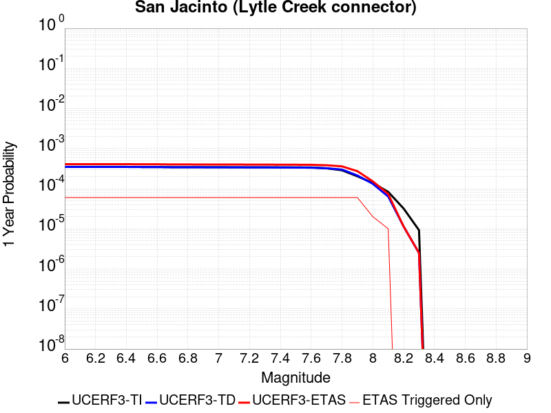 |  |

| Magnitude | 1 wk TI Prob | 1 wk TD Prob | 1 wk ETAS Prob | 1 wk ETAS/TD Gain | 1 wk ETAS Triggered Only | 1 mo TI Prob | 1 mo TD Prob | 1 mo ETAS Prob | 1 mo ETAS/TD Gain | 1 mo ETAS Triggered Only | 1 yr TI Prob | 1 yr TD Prob | 1 yr ETAS Prob | 1 yr ETAS/TD Gain | 1 yr ETAS Triggered Only | 10 yr TI Prob | 10 yr TD Prob | 10 yr ETAS Prob | 10 yr ETAS/TD Gain | 10 yr ETAS Triggered Only |
|-----|-----|-----|-----|-----|-----|-----|-----|-----|-----|-----|-----|-----|-----|-----|-----|-----|-----|-----|-----|-----|
| 6.0 | 6.693995E-6 | 6.662972E-6 | 2.666284E-5 | 4.0016437 | 2.0E-5 | 2.8688235E-5 | 2.8555281E-5 | 4.855471E-5 | 1.7003758 | 2.0E-5 | 3.492233E-4 | 3.4760518E-4 | 4.075843E-4 | 1.1725496 | 6.0E-5 | 0.00348675 | 0.0035508168 | 0.0036504618 | 1.0280626 | 1.0E-4 |
| 6.1 | 6.693995E-6 | 6.662972E-6 | 2.666284E-5 | 4.0016437 | 2.0E-5 | 2.8688235E-5 | 2.8555281E-5 | 4.855471E-5 | 1.7003758 | 2.0E-5 | 3.492233E-4 | 3.4760518E-4 | 4.075843E-4 | 1.1725496 | 6.0E-5 | 0.00348675 | 0.0035508168 | 0.0036504618 | 1.0280626 | 1.0E-4 |
| 6.2 | 6.693995E-6 | 6.662972E-6 | 2.666284E-5 | 4.0016437 | 2.0E-5 | 2.8688235E-5 | 2.8555281E-5 | 4.855471E-5 | 1.7003758 | 2.0E-5 | 3.492233E-4 | 3.4760518E-4 | 4.075843E-4 | 1.1725496 | 6.0E-5 | 0.00348675 | 0.0035508168 | 0.0036504618 | 1.0280626 | 1.0E-4 |
| 6.3 | 6.693995E-6 | 6.662972E-6 | 2.666284E-5 | 4.0016437 | 2.0E-5 | 2.8688235E-5 | 2.8555281E-5 | 4.855471E-5 | 1.7003758 | 2.0E-5 | 3.492233E-4 | 3.4760518E-4 | 4.075843E-4 | 1.1725496 | 6.0E-5 | 0.00348675 | 0.0035508168 | 0.0036504618 | 1.0280626 | 1.0E-4 |
| 6.4 | 6.693995E-6 | 6.662972E-6 | 2.666284E-5 | 4.0016437 | 2.0E-5 | 2.8688235E-5 | 2.8555281E-5 | 4.855471E-5 | 1.7003758 | 2.0E-5 | 3.492233E-4 | 3.4760518E-4 | 4.075843E-4 | 1.1725496 | 6.0E-5 | 0.00348675 | 0.0035508168 | 0.0036504618 | 1.0280626 | 1.0E-4 |
| 6.5 | 6.6561875E-6 | 6.6231896E-6 | 2.6623056E-5 | 4.019673 | 2.0E-5 | 2.8526205E-5 | 2.838479E-5 | 4.8384223E-5 | 1.7045827 | 2.0E-5 | 3.472512E-4 | 3.455301E-4 | 4.0550937E-4 | 1.1735862 | 6.0E-5 | 0.0034670907 | 0.0035301324 | 0.0036297792 | 1.0282276 | 1.0E-4 |
| 6.6 | 6.6561875E-6 | 6.6231896E-6 | 2.6623056E-5 | 4.019673 | 2.0E-5 | 2.8526205E-5 | 2.838479E-5 | 4.8384223E-5 | 1.7045827 | 2.0E-5 | 3.472512E-4 | 3.455301E-4 | 4.0550937E-4 | 1.1735862 | 6.0E-5 | 0.0034670907 | 0.0035301324 | 0.0036297792 | 1.0282276 | 1.0E-4 |
| 6.7 | 6.5802237E-6 | 6.5423656E-6 | 2.6542235E-5 | 4.056978 | 2.0E-5 | 2.8200653E-5 | 2.803841E-5 | 4.8037848E-5 | 1.7132872 | 2.0E-5 | 3.4328885E-4 | 3.4131424E-4 | 4.0129374E-4 | 1.1757311 | 6.0E-5 | 0.0034275902 | 0.0034881064 | 0.0035877575 | 1.0285689 | 1.0E-4 |
| 6.8 | 6.575632E-6 | 6.5368554E-6 | 2.6536725E-5 | 4.059555 | 2.0E-5 | 2.8180975E-5 | 2.8014794E-5 | 4.8014233E-5 | 1.7138885 | 2.0E-5 | 3.4304935E-4 | 3.410268E-4 | 4.0100634E-4 | 1.1758792 | 6.0E-5 | 0.0034252026 | 0.0034852412 | 0.0035848925 | 1.0285925 | 1.0E-4 |
| 6.9 | 6.570433E-6 | 6.528249E-6 | 2.6528118E-5 | 4.0635886 | 2.0E-5 | 2.8158694E-5 | 2.797791E-5 | 4.797735E-5 | 1.7148297 | 2.0E-5 | 3.4277816E-4 | 3.4057788E-4 | 4.0055744E-4 | 1.1761111 | 6.0E-5 | 0.0034224992 | 0.003480766 | 0.003580418 | 1.0286293 | 1.0E-4 |
| 7.0 | 6.5643826E-6 | 6.5183694E-6 | 2.6518239E-5 | 4.068232 | 2.0E-5 | 2.8132765E-5 | 2.7935572E-5 | 4.7935013E-5 | 1.715913 | 2.0E-5 | 3.424626E-4 | 3.4006257E-4 | 4.0004216E-4 | 1.1763781 | 6.0E-5 | 0.0034193532 | 0.003475629 | 0.0035752815 | 1.0286717 | 1.0E-4 |
| 7.1 | 6.557402E-6 | 6.5070813E-6 | 2.650695E-5 | 4.073555 | 2.0E-5 | 2.8102848E-5 | 2.7887192E-5 | 4.7886635E-5 | 1.7171551 | 2.0E-5 | 3.4209844E-4 | 3.3947374E-4 | 3.9945336E-4 | 1.1766841 | 6.0E-5 | 0.0034157229 | 0.0034697603 | 0.0035694132 | 1.0287204 | 1.0E-4 |
| 7.2 | 6.546394E-6 | 6.489047E-6 | 2.6488917E-5 | 4.0820966 | 2.0E-5 | 2.8055672E-5 | 2.7809905E-5 | 4.780935E-5 | 1.7191483 | 2.0E-5 | 3.4152428E-4 | 3.3853305E-4 | 3.9851276E-4 | 1.1771753 | 6.0E-5 | 0.0034099987 | 0.003460387 | 0.003560041 | 1.0287985 | 1.0E-4 |
| 7.3 | 6.5364216E-6 | 6.469831E-6 | 2.6469701E-5 | 4.091251 | 2.0E-5 | 2.8012933E-5 | 2.7727552E-5 | 4.7726997E-5 | 1.7212842 | 2.0E-5 | 3.4100408E-4 | 3.3753074E-4 | 3.9751048E-4 | 1.1777016 | 6.0E-5 | 0.003404813 | 0.0034504079 | 0.003550063 | 1.028882 | 1.0E-4 |
| 7.4 | 6.5269523E-6 | 6.4509163E-6 | 2.6450787E-5 | 4.1003146 | 2.0E-5 | 2.7972354E-5 | 2.764649E-5 | 4.764594E-5 | 1.7233992 | 2.0E-5 | 3.4051016E-4 | 3.3654412E-4 | 3.9652392E-4 | 1.1782228 | 6.0E-5 | 0.0033998888 | 0.003440589 | 0.003540245 | 1.0289648 | 1.0E-4 |
| 7.5 | 6.5111835E-6 | 6.4271885E-6 | 2.642706E-5 | 4.1117606 | 2.0E-5 | 2.7904773E-5 | 2.7544802E-5 | 4.754425E-5 | 1.7260698 | 2.0E-5 | 3.3968766E-4 | 3.3530645E-4 | 3.9528633E-4 | 1.1788808 | 6.0E-5 | 0.0033916887 | 0.003428261 | 0.0035279181 | 1.0290693 | 1.0E-4 |
| 7.6 | 6.4768806E-6 | 6.3862944E-6 | 2.6386168E-5 | 4.1316867 | 2.0E-5 | 2.7757764E-5 | 2.7369546E-5 | 4.7368998E-5 | 1.7307192 | 2.0E-5 | 3.3789838E-4 | 3.3317335E-4 | 3.9315334E-4 | 1.1800264 | 6.0E-5 | 0.0033738504 | 0.0034069915 | 0.003506651 | 1.0292515 | 1.0E-4 |
| 7.7 | 6.1655364E-6 | 6.1787587E-6 | 2.6178635E-5 | 4.236876 | 2.0E-5 | 2.642346E-5 | 2.6480126E-5 | 4.6479596E-5 | 1.7552634 | 2.0E-5 | 3.2165812E-4 | 3.2234789E-4 | 3.8232855E-4 | 1.1860743 | 6.0E-5 | 0.0032119295 | 0.003298596 | 0.0033982662 | 1.030216 | 1.0E-4 |
| 7.8 | 5.5043524E-6 | 5.7397438E-6 | 2.573963E-5 | 4.484456 | 2.0E-5 | 2.3589868E-5 | 2.459867E-5 | 4.459818E-5 | 1.813032 | 2.0E-5 | 2.871688E-4 | 2.994477E-4 | 3.5942975E-4 | 1.2003089 | 6.0E-5 | 0.0028679797 | 0.0030686588 | 0.003168352 | 1.0324875 | 1.0E-4 |
| 7.9 | 3.889249E-6 | 4.0789296E-6 | 2.4078849E-5 | 5.9032273 | 2.0E-5 | 1.6668104E-5 | 1.748101E-5 | 3.748066E-5 | 2.1440787 | 2.0E-5 | 2.0291525E-4 | 2.1281054E-4 | 2.7279777E-4 | 1.2818809 | 6.0E-5 | 0.0020273007 | 0.0021954647 | 0.0022952452 | 1.0454484 | 1.0E-4 |
| 8.0 | 2.668535E-6 | 2.5329996E-6 | 1.2532974E-5 | 4.9478784 | 1.0E-5 | 1.1436528E-5 | 1.0855668E-5 | 2.085556E-5 | 1.9211677 | 1.0E-5 | 1.3923083E-4 | 1.3215977E-4 | 1.5215712E-4 | 1.151312 | 2.0E-5 | 0.0013914363 | 0.0013765821 | 0.0014265133 | 1.0362718 | 5.0E-5 |
| 8.1 | 1.5911459E-6 | 1.2194711E-6 | 1.2194711E-6 | 1.0 | 0.0 | 6.8191785E-6 | 5.226294E-6 | 5.226294E-6 | 1.0 | 0.0 | 8.3020335E-5 | 6.362829E-5 | 7.3627656E-5 | 1.1571528 | 1.0E-5 | 8.298933E-4 | 6.6975754E-4 | 6.7975087E-4 | 1.0149208 | 1.0E-5 |
| 8.2 | 6.1294963E-7 | 2.1835329E-7 | 2.1835329E-7 | 1.0 | 0.0 | 2.6269242E-6 | 9.357995E-7 | 9.357995E-7 | 1.0 | 0.0 | 3.1982334E-5 | 1.1393299E-5 | 1.1393299E-5 | 1.0 | 0.0 | 3.1977732E-4 | 1.2797497E-4 | 1.2797497E-4 | 1.0 | 0.0 |
| 8.3 | 1.762871E-7 | 4.7604622E-8 | 4.7604622E-8 | 1.0 | 0.0 | 7.5551594E-7 | 2.0401978E-7 | 2.0401978E-7 | 1.0 | 0.0 | 9.1983675E-6 | 2.4839383E-6 | 2.4839383E-6 | 1.0 | 0.0 | 9.197987E-5 | 2.8720697E-5 | 2.8720697E-5 | 1.0 | 0.0 |

## San Jacinto (San Jacinto Valley) rev
*[(top)](#table-of-contents)*

| 1 Week | 1 Month | 1 Year | 10 Year |
|-----|-----|-----|-----|
|  | 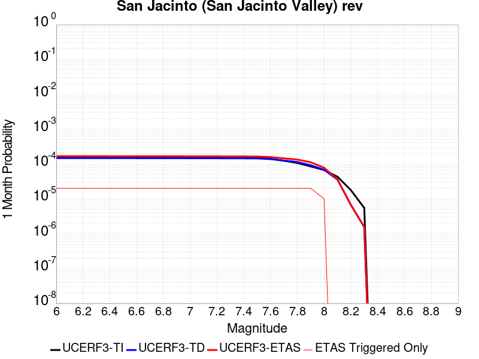 | 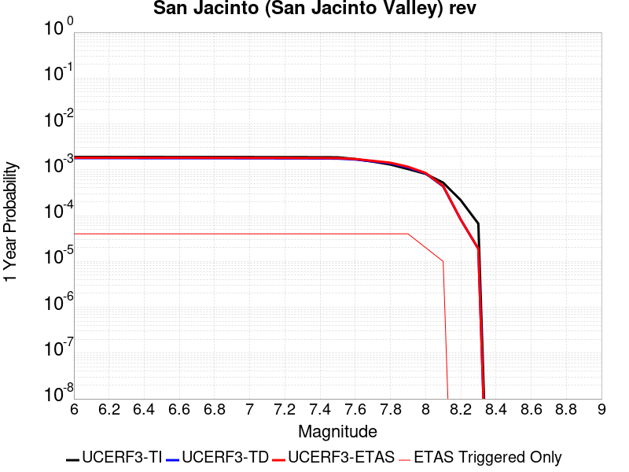 |  |

| Magnitude | 1 wk TI Prob | 1 wk TD Prob | 1 wk ETAS Prob | 1 wk ETAS/TD Gain | 1 wk ETAS Triggered Only | 1 mo TI Prob | 1 mo TD Prob | 1 mo ETAS Prob | 1 mo ETAS/TD Gain | 1 mo ETAS Triggered Only | 1 yr TI Prob | 1 yr TD Prob | 1 yr ETAS Prob | 1 yr ETAS/TD Gain | 1 yr ETAS Triggered Only | 10 yr TI Prob | 10 yr TD Prob | 10 yr ETAS Prob | 10 yr ETAS/TD Gain | 10 yr ETAS Triggered Only |
|-----|-----|-----|-----|-----|-----|-----|-----|-----|-----|-----|-----|-----|-----|-----|-----|-----|-----|-----|-----|-----|
| 6.0 | 3.652694E-5 | 3.4417048E-5 | 5.441636E-5 | 1.5810874 | 2.0E-5 | 1.5653463E-4 | 1.4749331E-4 | 1.6749035E-4 | 1.1355793 | 2.0E-5 | 0.0019041431 | 0.0017942534 | 0.0018341816 | 1.0222534 | 4.0E-5 | 0.018879099 | 0.018534157 | 0.01862249 | 1.0047659 | 9.0E-5 |
| 6.1 | 3.652694E-5 | 3.4417048E-5 | 5.441636E-5 | 1.5810874 | 2.0E-5 | 1.5653463E-4 | 1.4749331E-4 | 1.6749035E-4 | 1.1355793 | 2.0E-5 | 0.0019041431 | 0.0017942534 | 0.0018341816 | 1.0222534 | 4.0E-5 | 0.018879099 | 0.018534157 | 0.01862249 | 1.0047659 | 9.0E-5 |
| 6.2 | 3.652694E-5 | 3.4417048E-5 | 5.441636E-5 | 1.5810874 | 2.0E-5 | 1.5653463E-4 | 1.4749331E-4 | 1.6749035E-4 | 1.1355793 | 2.0E-5 | 0.0019041431 | 0.0017942534 | 0.0018341816 | 1.0222534 | 4.0E-5 | 0.018879099 | 0.018534157 | 0.01862249 | 1.0047659 | 9.0E-5 |
| 6.3 | 3.652694E-5 | 3.4417048E-5 | 5.441636E-5 | 1.5810874 | 2.0E-5 | 1.5653463E-4 | 1.4749331E-4 | 1.6749035E-4 | 1.1355793 | 2.0E-5 | 0.0019041431 | 0.0017942534 | 0.0018341816 | 1.0222534 | 4.0E-5 | 0.018879099 | 0.018534157 | 0.01862249 | 1.0047659 | 9.0E-5 |
| 6.4 | 3.646941E-5 | 3.433862E-5 | 5.4337936E-5 | 1.5824145 | 2.0E-5 | 1.5628811E-4 | 1.4715722E-4 | 1.6715429E-4 | 1.135889 | 2.0E-5 | 0.0019011468 | 0.0017901688 | 0.0018300973 | 1.0223043 | 4.0E-5 | 0.018849645 | 0.018494038 | 0.018582372 | 1.0047765 | 9.0E-5 |
| 6.5 | 3.646941E-5 | 3.433862E-5 | 5.4337936E-5 | 1.5824145 | 2.0E-5 | 1.5628811E-4 | 1.4715722E-4 | 1.6715429E-4 | 1.135889 | 2.0E-5 | 0.0019011468 | 0.0017901688 | 0.0018300973 | 1.0223043 | 4.0E-5 | 0.018849645 | 0.018494038 | 0.018582372 | 1.0047765 | 9.0E-5 |
| 6.6 | 3.6442503E-5 | 3.4302004E-5 | 5.430132E-5 | 1.5830363 | 2.0E-5 | 1.561728E-4 | 1.4700032E-4 | 1.6699737E-4 | 1.1360341 | 2.0E-5 | 0.0018997455 | 0.0017882616 | 0.00182819 | 1.0223281 | 4.0E-5 | 0.018835869 | 0.018475305 | 0.018563643 | 1.0047814 | 9.0E-5 |
| 6.7 | 3.6432113E-5 | 3.4287576E-5 | 5.428689E-5 | 1.5832816 | 2.0E-5 | 1.5612828E-4 | 1.4693849E-4 | 1.6693554E-4 | 1.1360914 | 2.0E-5 | 0.0018992044 | 0.0017875104 | 0.0018274388 | 1.0223374 | 4.0E-5 | 0.018830549 | 0.01846793 | 0.018556267 | 1.0047833 | 9.0E-5 |
| 6.8 | 3.6409598E-5 | 3.425663E-5 | 5.4255946E-5 | 1.5838085 | 2.0E-5 | 1.560318E-4 | 1.4680588E-4 | 1.6680294E-4 | 1.1362144 | 2.0E-5 | 0.0018980318 | 0.0017858985 | 0.001825827 | 1.0223577 | 4.0E-5 | 0.018819023 | 0.018452084 | 0.018540422 | 1.0047874 | 9.0E-5 |
| 6.9 | 3.638078E-5 | 3.4217053E-5 | 5.421637E-5 | 1.5844839 | 2.0E-5 | 1.5590832E-4 | 1.4663627E-4 | 1.6663334E-4 | 1.1363719 | 2.0E-5 | 0.0018965311 | 0.001783837 | 0.0018237656 | 1.0223836 | 4.0E-5 | 0.018804269 | 0.018431816 | 0.018520158 | 1.0047928 | 9.0E-5 |
| 7.0 | 3.6294874E-5 | 3.4099063E-5 | 5.409838E-5 | 1.5865064 | 2.0E-5 | 1.5554018E-4 | 1.4613067E-4 | 1.6612773E-4 | 1.1368438 | 2.0E-5 | 0.0018920569 | 0.0017776915 | 0.0018176205 | 1.022461 | 4.0E-5 | 0.018760284 | 0.018371396 | 0.018459743 | 1.0048089 | 9.0E-5 |
| 7.1 | 3.6260717E-5 | 3.405534E-5 | 5.405466E-5 | 1.5872594 | 2.0E-5 | 1.5539382E-4 | 1.4594331E-4 | 1.659404E-4 | 1.1370195 | 2.0E-5 | 0.001890278 | 0.0017754143 | 0.0018153434 | 1.0224899 | 4.0E-5 | 0.018742796 | 0.018348996 | 0.018437345 | 1.0048149 | 9.0E-5 |
| 7.2 | 3.6210204E-5 | 3.398956E-5 | 5.398888E-5 | 1.588396 | 2.0E-5 | 1.5517735E-4 | 1.4566141E-4 | 1.6565851E-4 | 1.1372848 | 2.0E-5 | 0.001887647 | 0.0017719879 | 0.0018119169 | 1.0225335 | 4.0E-5 | 0.01871693 | 0.018315274 | 0.018403625 | 1.0048239 | 9.0E-5 |
| 7.3 | 3.6119454E-5 | 3.3877837E-5 | 5.387716E-5 | 1.5903364 | 2.0E-5 | 1.5478847E-4 | 1.4518267E-4 | 1.6517976E-4 | 1.1377375 | 2.0E-5 | 0.0018829206 | 0.0017661685 | 0.0018060979 | 1.0226079 | 4.0E-5 | 0.018670462 | 0.018257825 | 0.018346181 | 1.0048394 | 9.0E-5 |
| 7.4 | 3.607848E-5 | 3.3825334E-5 | 5.3824657E-5 | 1.5912528 | 2.0E-5 | 1.5461289E-4 | 1.4495767E-4 | 1.6495478E-4 | 1.1379513 | 2.0E-5 | 0.0018807866 | 0.0017634337 | 0.0018033631 | 1.022643 | 4.0E-5 | 0.018649481 | 0.018230818 | 0.018319177 | 1.0048467 | 9.0E-5 |
| 7.5 | 3.5856774E-5 | 3.3635082E-5 | 5.3634412E-5 | 1.5945972 | 2.0E-5 | 1.5366284E-4 | 1.4414241E-4 | 1.6413952E-4 | 1.1387317 | 2.0E-5 | 0.0018692396 | 0.0017535238 | 0.0017934537 | 1.0227712 | 4.0E-5 | 0.018535944 | 0.018131904 | 0.018220274 | 1.0048736 | 9.0E-5 |
| 7.6 | 3.286655E-5 | 3.215777E-5 | 5.2157127E-5 | 1.6219137 | 2.0E-5 | 1.4084904E-4 | 1.3781176E-4 | 1.57809E-4 | 1.1451055 | 2.0E-5 | 0.001713488 | 0.0016765689 | 0.0017165018 | 1.0238183 | 4.0E-5 | 0.017003361 | 0.017351432 | 0.01743987 | 1.0050969 | 9.0E-5 |
| 7.7 | 2.8882527E-5 | 2.9250317E-5 | 4.9249735E-5 | 1.6837332 | 2.0E-5 | 1.237764E-4 | 1.2535248E-4 | 1.4534999E-4 | 1.15953 | 2.0E-5 | 0.0015059357 | 0.0015250992 | 0.0015650382 | 1.0261878 | 4.0E-5 | 0.014957713 | 0.015837716 | 0.01592629 | 1.0055926 | 9.0E-5 |
| 7.8 | 2.4950225E-5 | 2.6540692E-5 | 4.654016E-5 | 1.7535399 | 2.0E-5 | 1.0692515E-4 | 1.1374087E-4 | 1.3373859E-4 | 1.1758183 | 2.0E-5 | 0.0013010362 | 0.0013839162 | 0.0014238609 | 1.0288634 | 4.0E-5 | 0.012934455 | 0.0144187445 | 0.014507446 | 1.0061519 | 9.0E-5 |
| 7.9 | 1.9881603E-5 | 2.1519538E-5 | 4.1519106E-5 | 1.929368 | 2.0E-5 | 8.520408E-5 | 9.222333E-5 | 1.1222149E-4 | 1.2168449 | 2.0E-5 | 0.001036866 | 0.0011222415 | 0.0011621966 | 1.0356029 | 4.0E-5 | 0.010320415 | 0.011783319 | 0.011872258 | 1.007548 | 9.0E-5 |
| 8.0 | 1.563292E-5 | 1.5947082E-5 | 2.5946923E-5 | 1.627064 | 1.0E-5 | 6.6996516E-5 | 6.834285E-5 | 7.834217E-5 | 1.146311 | 1.0E-5 | 8.153773E-4 | 8.3175726E-4 | 8.5174065E-4 | 1.0240254 | 2.0E-5 | 0.00812392 | 0.008815629 | 0.008885012 | 1.0078704 | 7.0E-5 |
| 8.1 | 1.0045313E-5 | 8.307514E-6 | 8.307514E-6 | 1.0 | 0.0 | 4.305063E-5 | 3.5603145E-5 | 3.5603145E-5 | 1.0 | 0.0 | 5.2401534E-4 | 4.333826E-4 | 4.4337826E-4 | 1.0230643 | 1.0E-5 | 0.0052278144 | 0.0046621817 | 0.004672135 | 1.0021349 | 1.0E-5 |
| 8.2 | 4.1554413E-6 | 1.5672123E-6 | 1.5672123E-6 | 1.0 | 0.0 | 1.7808914E-5 | 6.716607E-6 | 6.716607E-6 | 1.0 | 0.0 | 2.1680194E-4 | 8.177165E-5 | 8.177165E-5 | 1.0 | 0.0 | 0.0021659054 | 9.492334E-4 | 9.492334E-4 | 1.0 | 0.0 |
| 8.3 | 1.2758221E-6 | 3.6194777E-7 | 3.6194777E-7 | 1.0 | 0.0 | 5.4677976E-6 | 1.5512038E-6 | 1.5512038E-6 | 1.0 | 0.0 | 6.65684E-5 | 1.8885747E-5 | 1.8885747E-5 | 1.0 | 0.0 | 6.6548464E-4 | 2.2777634E-4 | 2.2777634E-4 | 1.0 | 0.0 |

## Lost Hills
*[(top)](#table-of-contents)*

| 1 Week | 1 Month | 1 Year | 10 Year |
|-----|-----|-----|-----|
|  |  |  |  |

| Magnitude | 1 wk TI Prob | 1 wk TD Prob | 1 wk ETAS Prob | 1 wk ETAS/TD Gain | 1 wk ETAS Triggered Only | 1 mo TI Prob | 1 mo TD Prob | 1 mo ETAS Prob | 1 mo ETAS/TD Gain | 1 mo ETAS Triggered Only | 1 yr TI Prob | 1 yr TD Prob | 1 yr ETAS Prob | 1 yr ETAS/TD Gain | 1 yr ETAS Triggered Only | 10 yr TI Prob | 10 yr TD Prob | 10 yr ETAS Prob | 10 yr ETAS/TD Gain | 10 yr ETAS Triggered Only |
|-----|-----|-----|-----|-----|-----|-----|-----|-----|-----|-----|-----|-----|-----|-----|-----|-----|-----|-----|-----|-----|
| 6.0 | 2.233523E-5 | 2.5106996E-5 | 2.5106996E-5 | 1.0 | 0.0 | 9.571891E-5 | 1.0759792E-4 | 1.0759792E-4 | 1.0 | 0.0 | 0.0011647546 | 0.0013093855 | 0.0013693069 | 1.045763 | 6.0E-5 | 0.011586686 | 0.013033304 | 0.013122131 | 1.0068154 | 9.0E-5 |
| 6.1 | 2.233523E-5 | 2.5106996E-5 | 2.5106996E-5 | 1.0 | 0.0 | 9.571891E-5 | 1.0759792E-4 | 1.0759792E-4 | 1.0 | 0.0 | 0.0011647546 | 0.0013093855 | 0.0013693069 | 1.045763 | 6.0E-5 | 0.011586686 | 0.013033304 | 0.013122131 | 1.0068154 | 9.0E-5 |
| 6.2 | 2.233523E-5 | 2.5106996E-5 | 2.5106996E-5 | 1.0 | 0.0 | 9.571891E-5 | 1.0759792E-4 | 1.0759792E-4 | 1.0 | 0.0 | 0.0011647546 | 0.0013093855 | 0.0013693069 | 1.045763 | 6.0E-5 | 0.011586686 | 0.013033304 | 0.013122131 | 1.0068154 | 9.0E-5 |
| 6.3 | 2.233523E-5 | 2.5106996E-5 | 2.5106996E-5 | 1.0 | 0.0 | 9.571891E-5 | 1.0759792E-4 | 1.0759792E-4 | 1.0 | 0.0 | 0.0011647546 | 0.0013093855 | 0.0013693069 | 1.045763 | 6.0E-5 | 0.011586686 | 0.013033304 | 0.013122131 | 1.0068154 | 9.0E-5 |
| 6.4 | 1.2288092E-5 | 1.37813295E-5 | 1.37813295E-5 | 1.0 | 0.0 | 5.2662188E-5 | 5.9062033E-5 | 5.9062033E-5 | 1.0 | 0.0 | 6.409735E-4 | 7.189368E-4 | 7.6890085E-4 | 1.0694971 | 5.0E-5 | 0.006391279 | 0.007175316 | 0.0072448137 | 1.0096856 | 7.0E-5 |
| 6.5 | 1.2288092E-5 | 1.37813295E-5 | 1.37813295E-5 | 1.0 | 0.0 | 5.2662188E-5 | 5.9062033E-5 | 5.9062033E-5 | 1.0 | 0.0 | 6.409735E-4 | 7.189368E-4 | 7.6890085E-4 | 1.0694971 | 5.0E-5 | 0.006391279 | 0.007175316 | 0.0072448137 | 1.0096856 | 7.0E-5 |
| 6.6 | 8.58281E-6 | 9.633926E-6 | 9.633926E-6 | 1.0 | 0.0 | 3.6782953E-5 | 4.1288073E-5 | 4.1288073E-5 | 1.0 | 0.0 | 4.4774043E-4 | 5.026495E-4 | 5.526244E-4 | 1.0994229 | 5.0E-5 | 0.0044683935 | 0.0050232867 | 0.005092935 | 1.0138651 | 7.0E-5 |
| 6.7 | 7.205685E-6 | 8.088433E-6 | 8.088433E-6 | 1.0 | 0.0 | 3.088114E-5 | 3.4664714E-5 | 3.4664714E-5 | 1.0 | 0.0 | 3.7591302E-4 | 4.2204288E-4 | 4.6202602E-4 | 1.094737 | 4.0E-5 | 0.0037527776 | 0.004220429 | 0.0042801755 | 1.0141566 | 6.0E-5 |

## Cleghorn Lake
*[(top)](#table-of-contents)*

| 1 Week | 1 Month | 1 Year | 10 Year |
|-----|-----|-----|-----|
|  |  |  |  |

| Magnitude | 1 wk TI Prob | 1 wk TD Prob | 1 wk ETAS Prob | 1 wk ETAS/TD Gain | 1 wk ETAS Triggered Only | 1 mo TI Prob | 1 mo TD Prob | 1 mo ETAS Prob | 1 mo ETAS/TD Gain | 1 mo ETAS Triggered Only | 1 yr TI Prob | 1 yr TD Prob | 1 yr ETAS Prob | 1 yr ETAS/TD Gain | 1 yr ETAS Triggered Only | 10 yr TI Prob | 10 yr TD Prob | 10 yr ETAS Prob | 10 yr ETAS/TD Gain | 10 yr ETAS Triggered Only |
|-----|-----|-----|-----|-----|-----|-----|-----|-----|-----|-----|-----|-----|-----|-----|-----|-----|-----|-----|-----|-----|
| 6.0 | 1.5467183E-5 | 1.6794396E-5 | 1.6794396E-5 | 1.0 | 0.0 | 6.6286244E-5 | 7.1974304E-5 | 8.197359E-5 | 1.1389285 | 1.0E-5 | 8.067362E-4 | 8.7598973E-4 | 9.159547E-4 | 1.0456226 | 4.0E-5 | 0.008038137 | 0.008730795 | 0.008820009 | 1.0102184 | 9.0E-5 |
| 6.1 | 1.5467183E-5 | 1.6794396E-5 | 1.6794396E-5 | 1.0 | 0.0 | 6.6286244E-5 | 7.1974304E-5 | 8.197359E-5 | 1.1389285 | 1.0E-5 | 8.067362E-4 | 8.7598973E-4 | 9.159547E-4 | 1.0456226 | 4.0E-5 | 0.008038137 | 0.008730795 | 0.008820009 | 1.0102184 | 9.0E-5 |
| 6.2 | 1.2624631E-5 | 1.3681697E-5 | 1.3681697E-5 | 1.0 | 0.0 | 5.410444E-5 | 5.86348E-5 | 6.863422E-5 | 1.1705372 | 1.0E-5 | 6.585225E-4 | 7.1369356E-4 | 7.53665E-4 | 1.0560064 | 4.0E-5 | 0.0065657445 | 0.007118811 | 0.0071982415 | 1.0111579 | 8.0E-5 |
| 6.3 | 1.2624631E-5 | 1.3681697E-5 | 1.3681697E-5 | 1.0 | 0.0 | 5.410444E-5 | 5.86348E-5 | 6.863422E-5 | 1.1705372 | 1.0E-5 | 6.585225E-4 | 7.1369356E-4 | 7.53665E-4 | 1.0560064 | 4.0E-5 | 0.0065657445 | 0.007118811 | 0.0071982415 | 1.0111579 | 8.0E-5 |
| 6.4 | 9.417684E-6 | 1.0170226E-5 | 1.0170226E-5 | 1.0 | 0.0 | 4.036088E-5 | 4.3586184E-5 | 5.358575E-5 | 1.2294205 | 1.0E-5 | 4.912829E-4 | 5.305737E-4 | 5.705525E-4 | 1.07535 | 4.0E-5 | 0.004901982 | 0.0052971053 | 0.0053567877 | 1.011267 | 6.0E-5 |
| 6.5 | 9.368219E-6 | 1.0117652E-5 | 1.0117652E-5 | 1.0 | 0.0 | 4.014889E-5 | 4.3360877E-5 | 5.3360443E-5 | 1.2306126 | 1.0E-5 | 4.8870314E-4 | 5.278319E-4 | 5.678108E-4 | 1.0757416 | 4.0E-5 | 0.004876298 | 0.0052698175 | 0.0053295013 | 1.0113256 | 6.0E-5 |
| 6.6 | 7.803798E-6 | 8.441923E-6 | 8.441923E-6 | 1.0 | 0.0 | 3.3444423E-5 | 3.6179394E-5 | 4.617903E-5 | 1.2763904 | 1.0E-5 | 4.0710976E-4 | 4.40435E-4 | 4.704218E-4 | 1.0680845 | 3.0E-5 | 0.0040636472 | 0.004399538 | 0.004449318 | 1.0113149 | 5.0E-5 |
| 6.7 | 2.3108669E-6 | 2.4438523E-6 | 2.4438523E-6 | 1.0 | 0.0 | 9.903678E-6 | 1.0473612E-5 | 1.0473612E-5 | 1.0 | 0.0 | 1.205706E-4 | 1.2750895E-4 | 1.2750895E-4 | 1.0 | 0.0 | 0.001205052 | 0.0012743765 | 0.0012843638 | 1.0078369 | 1.0E-5 |
| 6.8 | 2.0882828E-6 | 2.2062986E-6 | 2.2062986E-6 | 1.0 | 0.0 | 8.949753E-6 | 9.455533E-6 | 9.455533E-6 | 1.0 | 0.0 | 1.08957785E-4 | 1.15115196E-4 | 1.15115196E-4 | 1.0 | 0.0 | 0.0010890438 | 0.0011505726 | 0.0011605611 | 1.0086813 | 1.0E-5 |
| 6.9 | 1.876935E-6 | 1.9810657E-6 | 1.9810657E-6 | 1.0 | 0.0 | 8.043982E-6 | 8.490254E-6 | 8.490254E-6 | 1.0 | 0.0 | 9.7931086E-5 | 1.033641E-4 | 1.033641E-4 | 1.0 | 0.0 | 9.788794E-4 | 0.0010331762 | 0.0010431659 | 1.009669 | 1.0E-5 |
| 7.0 | 1.5357559E-6 | 1.6202926E-6 | 1.6202926E-6 | 1.0 | 0.0 | 6.5817944E-6 | 6.944093E-6 | 6.944093E-6 | 1.0 | 0.0 | 8.01304E-5 | 8.454118E-5 | 8.454118E-5 | 1.0 | 0.0 | 8.010151E-4 | 8.4510265E-4 | 8.550942E-4 | 1.0118229 | 1.0E-5 |
| 7.1 | 1.0905424E-6 | 1.1497702E-6 | 1.1497702E-6 | 1.0 | 0.0 | 4.6737446E-6 | 4.927578E-6 | 4.927578E-6 | 1.0 | 0.0 | 5.6901354E-5 | 5.999171E-5 | 5.999171E-5 | 1.0 | 0.0 | 5.6886784E-4 | 5.997649E-4 | 5.997649E-4 | 1.0 | 0.0 |
| 7.2 | 6.06668E-7 | 6.387322E-7 | 6.387322E-7 | 1.0 | 0.0 | 2.600003E-6 | 2.7374213E-6 | 2.7374213E-6 | 1.0 | 0.0 | 3.1654577E-5 | 3.3327666E-5 | 3.3327666E-5 | 1.0 | 0.0 | 3.1650066E-4 | 3.332335E-4 | 3.332335E-4 | 1.0 | 0.0 |

## Kern Canyon (North Kern) 2011
*[(top)](#table-of-contents)*

| 1 Week | 1 Month | 1 Year | 10 Year |
|-----|-----|-----|-----|
|  |  |  | 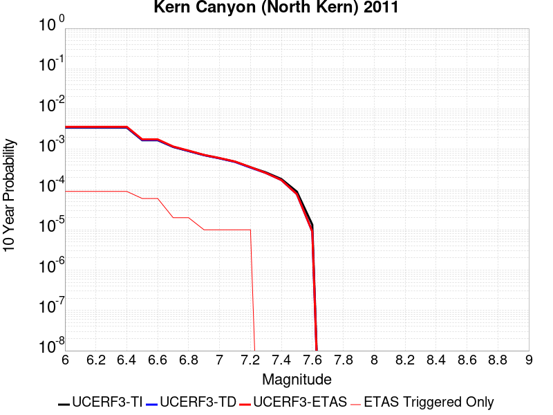 |

| Magnitude | 1 wk TI Prob | 1 wk TD Prob | 1 wk ETAS Prob | 1 wk ETAS/TD Gain | 1 wk ETAS Triggered Only | 1 mo TI Prob | 1 mo TD Prob | 1 mo ETAS Prob | 1 mo ETAS/TD Gain | 1 mo ETAS Triggered Only | 1 yr TI Prob | 1 yr TD Prob | 1 yr ETAS Prob | 1 yr ETAS/TD Gain | 1 yr ETAS Triggered Only | 10 yr TI Prob | 10 yr TD Prob | 10 yr ETAS Prob | 10 yr ETAS/TD Gain | 10 yr ETAS Triggered Only |
|-----|-----|-----|-----|-----|-----|-----|-----|-----|-----|-----|-----|-----|-----|-----|-----|-----|-----|-----|-----|-----|
| 6.0 | 6.6264497E-6 | 6.7573515E-6 | 6.7573515E-6 | 1.0 | 0.0 | 2.8398761E-5 | 2.8959801E-5 | 2.8959801E-5 | 1.0 | 0.0 | 3.4570007E-4 | 3.5253653E-4 | 4.0251893E-4 | 1.1417793 | 5.0E-5 | 0.0034516277 | 0.0035205614 | 0.0036102445 | 1.0254741 | 9.0E-5 |
| 6.1 | 6.6264497E-6 | 6.7573515E-6 | 6.7573515E-6 | 1.0 | 0.0 | 2.8398761E-5 | 2.8959801E-5 | 2.8959801E-5 | 1.0 | 0.0 | 3.4570007E-4 | 3.5253653E-4 | 4.0251893E-4 | 1.1417793 | 5.0E-5 | 0.0034516277 | 0.0035205614 | 0.0036102445 | 1.0254741 | 9.0E-5 |
| 6.2 | 6.6264497E-6 | 6.7573515E-6 | 6.7573515E-6 | 1.0 | 0.0 | 2.8398761E-5 | 2.8959801E-5 | 2.8959801E-5 | 1.0 | 0.0 | 3.4570007E-4 | 3.5253653E-4 | 4.0251893E-4 | 1.1417793 | 5.0E-5 | 0.0034516277 | 0.0035205614 | 0.0036102445 | 1.0254741 | 9.0E-5 |
| 6.3 | 6.6264497E-6 | 6.7573515E-6 | 6.7573515E-6 | 1.0 | 0.0 | 2.8398761E-5 | 2.8959801E-5 | 2.8959801E-5 | 1.0 | 0.0 | 3.4570007E-4 | 3.5253653E-4 | 4.0251893E-4 | 1.1417793 | 5.0E-5 | 0.0034516277 | 0.0035205614 | 0.0036102445 | 1.0254741 | 9.0E-5 |
| 6.4 | 6.6264497E-6 | 6.7573515E-6 | 6.7573515E-6 | 1.0 | 0.0 | 2.8398761E-5 | 2.8959801E-5 | 2.8959801E-5 | 1.0 | 0.0 | 3.4570007E-4 | 3.5253653E-4 | 4.0251893E-4 | 1.1417793 | 5.0E-5 | 0.0034516277 | 0.0035205614 | 0.0036102445 | 1.0254741 | 9.0E-5 |
| 6.5 | 3.2162225E-6 | 3.2571006E-6 | 3.2571006E-6 | 1.0 | 0.0 | 1.3783738E-5 | 1.3958933E-5 | 1.3958933E-5 | 1.0 | 0.0 | 1.6780409E-4 | 1.6993756E-4 | 1.9993246E-4 | 1.1765054 | 3.0E-5 | 0.0016767744 | 0.0016981558 | 0.0017580539 | 1.0352725 | 6.0E-5 |
| 6.6 | 3.2162225E-6 | 3.2571006E-6 | 3.2571006E-6 | 1.0 | 0.0 | 1.3783738E-5 | 1.3958933E-5 | 1.3958933E-5 | 1.0 | 0.0 | 1.6780409E-4 | 1.6993756E-4 | 1.9993246E-4 | 1.1765054 | 3.0E-5 | 0.0016767744 | 0.0016981558 | 0.0017580539 | 1.0352725 | 6.0E-5 |
| 6.7 | 2.1908265E-6 | 2.2071279E-6 | 2.2071279E-6 | 1.0 | 0.0 | 9.389223E-6 | 9.459087E-6 | 9.459087E-6 | 1.0 | 0.0 | 1.1430779E-4 | 1.1515849E-4 | 1.2515734E-4 | 1.0868268 | 1.0E-5 | 0.0011424901 | 0.0011510076 | 0.0011709846 | 1.017356 | 2.0E-5 |
| 6.8 | 1.7303895E-6 | 1.7365574E-6 | 1.7365574E-6 | 1.0 | 0.0 | 7.415934E-6 | 7.442368E-6 | 7.442368E-6 | 1.0 | 0.0 | 9.028525E-5 | 9.060716E-5 | 1.0060625E-4 | 1.1103566 | 1.0E-5 | 9.024858E-4 | 9.057119E-4 | 9.256938E-4 | 1.0220621 | 2.0E-5 |
| 6.9 | 1.3700314E-6 | 1.3688657E-6 | 1.3688657E-6 | 1.0 | 0.0 | 5.87155E-6 | 5.866554E-6 | 5.866554E-6 | 1.0 | 0.0 | 7.148377E-5 | 7.1423005E-5 | 7.1423005E-5 | 1.0 | 0.0 | 7.146078E-4 | 7.1400503E-4 | 7.239979E-4 | 1.0139955 | 1.0E-5 |
| 7.0 | 1.1467797E-6 | 1.1413833E-6 | 1.1413833E-6 | 1.0 | 0.0 | 4.9147607E-6 | 4.8916336E-6 | 4.8916336E-6 | 1.0 | 0.0 | 5.983557E-5 | 5.9554044E-5 | 5.9554044E-5 | 1.0 | 0.0 | 5.981946E-4 | 5.95384E-4 | 6.0537807E-4 | 1.0167859 | 1.0E-5 |
| 7.1 | 9.3952065E-7 | 9.302714E-7 | 9.302714E-7 | 1.0 | 0.0 | 4.026511E-6 | 3.9868714E-6 | 3.9868714E-6 | 1.0 | 0.0 | 4.9021666E-5 | 4.8539096E-5 | 4.8539096E-5 | 1.0 | 0.0 | 4.901085E-4 | 4.8528673E-4 | 4.952819E-4 | 1.0205964 | 1.0E-5 |
| 7.2 | 6.858055E-7 | 6.719318E-7 | 6.719318E-7 | 1.0 | 0.0 | 2.939163E-6 | 2.8797044E-6 | 2.8797044E-6 | 1.0 | 0.0 | 3.5783723E-5 | 3.5059846E-5 | 3.5059846E-5 | 1.0 | 0.0 | 3.5777962E-4 | 3.5054405E-4 | 3.6054055E-4 | 1.0285171 | 1.0E-5 |
| 7.3 | 5.1101983E-7 | 4.939313E-7 | 4.939313E-7 | 1.0 | 0.0 | 2.1900833E-6 | 2.1168466E-6 | 2.1168466E-6 | 1.0 | 0.0 | 2.6663936E-5 | 2.5772308E-5 | 2.5772308E-5 | 1.0 | 0.0 | 2.6660739E-4 | 2.5769367E-4 | 2.5769367E-4 | 1.0 | 0.0 |
| 7.4 | 3.4999414E-7 | 3.2995996E-7 | 3.2995996E-7 | 1.0 | 0.0 | 1.499974E-6 | 1.4141134E-6 | 1.4141134E-6 | 1.0 | 0.0 | 1.8262032E-5 | 1.7216697E-5 | 1.7216697E-5 | 1.0 | 0.0 | 1.826053E-4 | 1.7215387E-4 | 1.7215387E-4 | 1.0 | 0.0 |
| 7.5 | 1.7021522E-7 | 1.4750091E-7 | 1.4750091E-7 | 1.0 | 0.0 | 7.2949354E-7 | 6.3214657E-7 | 6.3214657E-7 | 1.0 | 0.0 | 8.881548E-6 | 7.696359E-6 | 7.696359E-6 | 1.0 | 0.0 | 8.8811925E-5 | 7.6961E-5 | 7.6961E-5 | 1.0 | 0.0 |
| 7.6 | 2.572245E-8 | 1.7352637E-8 | 1.7352637E-8 | 1.0 | 0.0 | 1.10239064E-7 | 7.4368444E-8 | 7.4368444E-8 | 1.0 | 0.0 | 1.3421597E-6 | 9.0543546E-7 | 9.0543546E-7 | 1.0 | 0.0 | 1.3421517E-5 | 9.0543235E-6 | 9.0543235E-6 | 1.0 | 0.0 |

## White Mountains
*[(top)](#table-of-contents)*

| 1 Week | 1 Month | 1 Year | 10 Year |
|-----|-----|-----|-----|
| 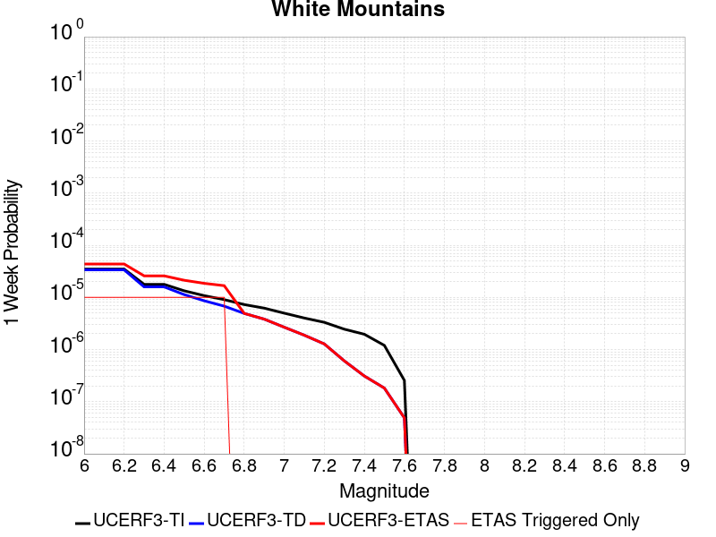 |  |  | 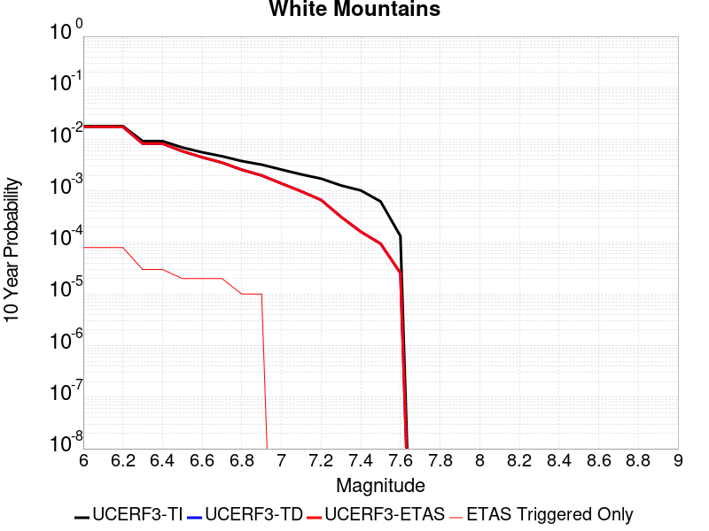 |

| Magnitude | 1 wk TI Prob | 1 wk TD Prob | 1 wk ETAS Prob | 1 wk ETAS/TD Gain | 1 wk ETAS Triggered Only | 1 mo TI Prob | 1 mo TD Prob | 1 mo ETAS Prob | 1 mo ETAS/TD Gain | 1 mo ETAS Triggered Only | 1 yr TI Prob | 1 yr TD Prob | 1 yr ETAS Prob | 1 yr ETAS/TD Gain | 1 yr ETAS Triggered Only | 10 yr TI Prob | 10 yr TD Prob | 10 yr ETAS Prob | 10 yr ETAS/TD Gain | 10 yr ETAS Triggered Only |
|-----|-----|-----|-----|-----|-----|-----|-----|-----|-----|-----|-----|-----|-----|-----|-----|-----|-----|-----|-----|-----|
| 6.0 | 3.503579E-5 | 3.3784425E-5 | 4.378409E-5 | 1.2959844 | 1.0E-5 | 1.5014476E-4 | 1.4478304E-4 | 1.6478015E-4 | 1.1381177 | 2.0E-5 | 0.0018264796 | 0.0017614291 | 0.0018013587 | 1.0226688 | 4.0E-5 | 0.018115403 | 0.017487012 | 0.017565612 | 1.0044948 | 8.0E-5 |
| 6.1 | 3.503579E-5 | 3.3784425E-5 | 4.378409E-5 | 1.2959844 | 1.0E-5 | 1.5014476E-4 | 1.4478304E-4 | 1.6478015E-4 | 1.1381177 | 2.0E-5 | 0.0018264796 | 0.0017614291 | 0.0018013587 | 1.0226688 | 4.0E-5 | 0.018115403 | 0.017487012 | 0.017565612 | 1.0044948 | 8.0E-5 |
| 6.2 | 3.503579E-5 | 3.3784425E-5 | 4.378409E-5 | 1.2959844 | 1.0E-5 | 1.5014476E-4 | 1.4478304E-4 | 1.6478015E-4 | 1.1381177 | 2.0E-5 | 0.0018264796 | 0.0017614291 | 0.0018013587 | 1.0226688 | 4.0E-5 | 0.018115403 | 0.017487012 | 0.017565612 | 1.0044948 | 8.0E-5 |
| 6.3 | 1.7818425E-5 | 1.5916237E-5 | 2.5916079E-5 | 1.6282792 | 1.0E-5 | 7.636245E-5 | 6.821074E-5 | 7.821006E-5 | 1.1465945 | 1.0E-5 | 9.293162E-4 | 8.301636E-4 | 8.5014704E-4 | 1.0240717 | 2.0E-5 | 0.009254395 | 0.0082720835 | 0.008301835 | 1.0035967 | 3.0E-5 |
| 6.4 | 1.7818425E-5 | 1.5916237E-5 | 2.5916079E-5 | 1.6282792 | 1.0E-5 | 7.636245E-5 | 6.821074E-5 | 7.821006E-5 | 1.1465945 | 1.0E-5 | 9.293162E-4 | 8.301636E-4 | 8.5014704E-4 | 1.0240717 | 2.0E-5 | 0.009254395 | 0.0082720835 | 0.008301835 | 1.0035967 | 3.0E-5 |
| 6.5 | 1.3397557E-5 | 1.1336382E-5 | 2.133627E-5 | 1.8821057 | 1.0E-5 | 5.741684E-5 | 4.8583628E-5 | 5.8583144E-5 | 1.2058207 | 1.0E-5 | 6.988258E-4 | 5.913521E-4 | 6.013462E-4 | 1.0169004 | 1.0E-5 | 0.006966323 | 0.0058984905 | 0.005918373 | 1.0033706 | 2.0E-5 |
| 6.6 | 1.0818695E-5 | 8.625452E-6 | 1.8625366E-5 | 2.1593494 | 1.0E-5 | 4.6365014E-5 | 3.6965725E-5 | 4.6965353E-5 | 1.2705109 | 1.0E-5 | 5.6434784E-4 | 4.499691E-4 | 4.599646E-4 | 1.0222137 | 1.0E-5 | 0.005629168 | 0.0044910167 | 0.004510927 | 1.0044334 | 2.0E-5 |
| 6.7 | 9.067908E-6 | 6.8025106E-6 | 1.6802443E-5 | 2.4700356 | 1.0E-5 | 3.8861883E-5 | 2.915331E-5 | 3.915302E-5 | 1.3430042 | 1.0E-5 | 4.7304068E-4 | 3.5488693E-4 | 3.6488337E-4 | 1.028168 | 1.0E-5 | 0.00472035 | 0.0035435192 | 0.0035634483 | 1.005624 | 2.0E-5 |
| 6.8 | 7.295947E-6 | 4.9364417E-6 | 4.9364417E-6 | 1.0 | 0.0 | 3.126797E-5 | 2.1156015E-5 | 2.1156015E-5 | 1.0 | 0.0 | 3.8062103E-4 | 2.5754515E-4 | 2.5754515E-4 | 1.0 | 0.0 | 0.0037996976 | 0.0025725798 | 0.002582554 | 1.0038772 | 1.0E-5 |
| 6.9 | 6.2243444E-6 | 3.832255E-6 | 3.832255E-6 | 1.0 | 0.0 | 2.6675489E-5 | 1.6423848E-5 | 1.6423848E-5 | 1.0 | 0.0 | 3.2472567E-4 | 1.9994254E-4 | 1.9994254E-4 | 1.0 | 0.0 | 0.0032425157 | 0.0019976792 | 0.0020076593 | 1.0049958 | 1.0E-5 |
| 7.0 | 4.9878413E-6 | 2.6795697E-6 | 2.6795697E-6 | 1.0 | 0.0 | 2.1376287E-5 | 1.1483821E-5 | 1.1483821E-5 | 1.0 | 0.0 | 2.602252E-4 | 1.3980681E-4 | 1.3980681E-4 | 1.0 | 0.0 | 0.002599207 | 0.0013972148 | 0.0013972148 | 1.0 | 0.0 |
| 7.1 | 4.0252844E-6 | 1.88579E-6 | 1.88579E-6 | 1.0 | 0.0 | 1.7251105E-5 | 8.081933E-6 | 8.081933E-6 | 1.0 | 0.0 | 2.1001195E-4 | 9.839322E-5 | 9.839322E-5 | 1.0 | 0.0 | 0.0020981359 | 9.835094E-4 | 9.835094E-4 | 1.0 | 0.0 |
| 7.2 | 3.3284066E-6 | 1.2819944E-6 | 1.2819944E-6 | 1.0 | 0.0 | 1.4264522E-5 | 5.4942507E-6 | 5.4942507E-6 | 1.0 | 0.0 | 1.736567E-4 | 6.689055E-5 | 6.689055E-5 | 1.0 | 0.0 | 0.0017352107 | 6.6871423E-4 | 6.6871423E-4 | 1.0 | 0.0 |
| 7.3 | 2.458226E-6 | 6.057493E-7 | 6.057493E-7 | 1.0 | 0.0 | 1.0535211E-5 | 2.596066E-6 | 2.596066E-6 | 1.0 | 0.0 | 1.2825865E-4 | 3.1606683E-5 | 3.1606683E-5 | 1.0 | 0.0 | 0.0012818464 | 3.1602563E-4 | 3.1602563E-4 | 1.0 | 0.0 |
| 7.4 | 1.965953E-6 | 3.1091668E-7 | 3.1091668E-7 | 1.0 | 0.0 | 8.425486E-6 | 1.3324994E-6 | 1.3324994E-6 | 1.0 | 0.0 | 1.0257547E-4 | 1.622306E-5 | 1.622306E-5 | 1.0 | 0.0 | 0.0010252813 | 1.6221889E-4 | 1.6221889E-4 | 1.0 | 0.0 |
| 7.5 | 1.2014192E-6 | 1.824589E-7 | 1.824589E-7 | 1.0 | 0.0 | 5.148929E-6 | 7.819665E-7 | 7.819665E-7 | 1.0 | 0.0 | 6.2686406E-5 | 9.520401E-6 | 9.520401E-6 | 1.0 | 0.0 | 6.266873E-4 | 9.520002E-5 | 9.520002E-5 | 1.0 | 0.0 |
| 7.6 | 2.5612175E-7 | 4.8950795E-8 | 4.8950795E-8 | 1.0 | 0.0 | 1.0976642E-6 | 2.097891E-7 | 2.097891E-7 | 1.0 | 0.0 | 1.3363979E-5 | 2.5541797E-6 | 2.5541797E-6 | 1.0 | 0.0 | 1.3363175E-4 | 2.554154E-5 | 2.554154E-5 | 1.0 | 0.0 |

## San Jacinto (Anza) rev
*[(top)](#table-of-contents)*

| 1 Week | 1 Month | 1 Year | 10 Year |
|-----|-----|-----|-----|
|  |  |  |  |

| Magnitude | 1 wk TI Prob | 1 wk TD Prob | 1 wk ETAS Prob | 1 wk ETAS/TD Gain | 1 wk ETAS Triggered Only | 1 mo TI Prob | 1 mo TD Prob | 1 mo ETAS Prob | 1 mo ETAS/TD Gain | 1 mo ETAS Triggered Only | 1 yr TI Prob | 1 yr TD Prob | 1 yr ETAS Prob | 1 yr ETAS/TD Gain | 1 yr ETAS Triggered Only | 10 yr TI Prob | 10 yr TD Prob | 10 yr ETAS Prob | 10 yr ETAS/TD Gain | 10 yr ETAS Triggered Only |
|-----|-----|-----|-----|-----|-----|-----|-----|-----|-----|-----|-----|-----|-----|-----|-----|-----|-----|-----|-----|-----|
| 6.0 | 6.3015636E-5 | 4.3319626E-5 | 5.3319192E-5 | 1.2308322 | 1.0E-5 | 2.7003905E-4 | 1.8564239E-4 | 1.9564053E-4 | 1.053857 | 1.0E-5 | 0.0032827691 | 0.0022578652 | 0.0022778201 | 1.0088379 | 2.0E-5 | 0.032346968 | 0.02330496 | 0.023383096 | 1.0033528 | 8.0E-5 |
| 6.1 | 6.3015636E-5 | 4.3319626E-5 | 5.3319192E-5 | 1.2308322 | 1.0E-5 | 2.7003905E-4 | 1.8564239E-4 | 1.9564053E-4 | 1.053857 | 1.0E-5 | 0.0032827691 | 0.0022578652 | 0.0022778201 | 1.0088379 | 2.0E-5 | 0.032346968 | 0.02330496 | 0.023383096 | 1.0033528 | 8.0E-5 |
| 6.2 | 6.3015636E-5 | 4.3319626E-5 | 5.3319192E-5 | 1.2308322 | 1.0E-5 | 2.7003905E-4 | 1.8564239E-4 | 1.9564053E-4 | 1.053857 | 1.0E-5 | 0.0032827691 | 0.0022578652 | 0.0022778201 | 1.0088379 | 2.0E-5 | 0.032346968 | 0.02330496 | 0.023383096 | 1.0033528 | 8.0E-5 |
| 6.3 | 6.3015636E-5 | 4.3319626E-5 | 5.3319192E-5 | 1.2308322 | 1.0E-5 | 2.7003905E-4 | 1.8564239E-4 | 1.9564053E-4 | 1.053857 | 1.0E-5 | 0.0032827691 | 0.0022578652 | 0.0022778201 | 1.0088379 | 2.0E-5 | 0.032346968 | 0.02330496 | 0.023383096 | 1.0033528 | 8.0E-5 |
| 6.4 | 6.3015636E-5 | 4.3319626E-5 | 5.3319192E-5 | 1.2308322 | 1.0E-5 | 2.7003905E-4 | 1.8564239E-4 | 1.9564053E-4 | 1.053857 | 1.0E-5 | 0.0032827691 | 0.0022578652 | 0.0022778201 | 1.0088379 | 2.0E-5 | 0.032346968 | 0.02330496 | 0.023383096 | 1.0033528 | 8.0E-5 |
| 6.5 | 5.811017E-5 | 4.0098632E-5 | 5.009823E-5 | 1.2493751 | 1.0E-5 | 2.4901982E-4 | 1.7184E-4 | 1.8183827E-4 | 1.0581837 | 1.0E-5 | 0.0030276014 | 0.00209015 | 0.0021101083 | 1.0095487 | 2.0E-5 | 0.02986684 | 0.021602087 | 0.021680359 | 1.0036234 | 8.0E-5 |
| 6.6 | 5.811017E-5 | 4.0098632E-5 | 5.009823E-5 | 1.2493751 | 1.0E-5 | 2.4901982E-4 | 1.7184E-4 | 1.8183827E-4 | 1.0581837 | 1.0E-5 | 0.0030276014 | 0.00209015 | 0.0021101083 | 1.0095487 | 2.0E-5 | 0.02986684 | 0.021602087 | 0.021680359 | 1.0036234 | 8.0E-5 |
| 6.7 | 5.712442E-5 | 3.952116E-5 | 4.9520764E-5 | 1.253019 | 1.0E-5 | 2.4479596E-4 | 1.6936543E-4 | 1.7936373E-4 | 1.0590339 | 1.0E-5 | 0.0029763177 | 0.0020600795 | 0.0020800384 | 1.0096884 | 2.0E-5 | 0.029367693 | 0.021293823 | 0.021362333 | 1.0032173 | 7.0E-5 |
| 6.8 | 5.6967532E-5 | 3.9377548E-5 | 4.9377155E-5 | 1.2539418 | 1.0E-5 | 2.4412372E-4 | 1.6875003E-4 | 1.7874835E-4 | 1.0592493 | 1.0E-5 | 0.0029681553 | 0.0020526012 | 0.0020725601 | 1.0097238 | 2.0E-5 | 0.029288229 | 0.021218529 | 0.021287043 | 1.003229 | 7.0E-5 |
| 6.9 | 5.6211324E-5 | 3.9082228E-5 | 4.908184E-5 | 1.2558608 | 1.0E-5 | 2.4088343E-4 | 1.6748454E-4 | 1.7748287E-4 | 1.059697 | 1.0E-5 | 0.0029288116 | 0.0020372227 | 0.002057182 | 1.0097973 | 2.0E-5 | 0.028905109 | 0.021057902 | 0.021126429 | 1.0032542 | 7.0E-5 |
| 7.0 | 5.4383527E-5 | 3.7942387E-5 | 4.7942005E-5 | 1.2635475 | 1.0E-5 | 2.3305144E-4 | 1.6260012E-4 | 1.7259849E-4 | 1.0614905 | 1.0E-5 | 0.0028337094 | 0.001977864 | 0.0019978243 | 1.0100919 | 2.0E-5 | 0.027978465 | 0.020448677 | 0.020517245 | 1.0033532 | 7.0E-5 |
| 7.1 | 5.1393665E-5 | 3.640475E-5 | 4.6404384E-5 | 1.2746794 | 1.0E-5 | 2.2023996E-4 | 1.5601104E-4 | 1.6600947E-4 | 1.064088 | 1.0E-5 | 0.0026781242 | 0.0018977838 | 0.0019177458 | 1.0105186 | 2.0E-5 | 0.026460782 | 0.019622007 | 0.019690633 | 1.0034975 | 7.0E-5 |
| 7.2 | 4.785222E-5 | 3.475601E-5 | 4.4755663E-5 | 1.2877101 | 1.0E-5 | 2.0506482E-4 | 1.4894584E-4 | 1.5894436E-4 | 1.0671285 | 1.0E-5 | 0.0024938055 | 0.0018119109 | 0.0018318746 | 1.011018 | 2.0E-5 | 0.024660049 | 0.018736389 | 0.018805077 | 1.003666 | 7.0E-5 |
| 7.3 | 4.2143256E-5 | 3.3850083E-5 | 4.3849745E-5 | 1.2954103 | 1.0E-5 | 1.8060145E-4 | 1.4506375E-4 | 1.550623E-4 | 1.0689253 | 1.0E-5 | 0.002196605 | 0.0017647238 | 0.0017846884 | 1.0113132 | 2.0E-5 | 0.02175019 | 0.018244414 | 0.018313136 | 1.0037668 | 7.0E-5 |
| 7.4 | 4.0264713E-5 | 3.3488133E-5 | 4.34878E-5 | 1.2986032 | 1.0E-5 | 1.7255165E-4 | 1.435127E-4 | 1.5351127E-4 | 1.0696702 | 1.0E-5 | 0.002098792 | 0.0017458702 | 0.0017658353 | 1.0114356 | 2.0E-5 | 0.020790804 | 0.018048922 | 0.018117659 | 1.0038084 | 7.0E-5 |
| 7.5 | 3.694492E-5 | 3.2201835E-5 | 4.2201515E-5 | 1.3105313 | 1.0E-5 | 1.5832575E-4 | 1.3800059E-4 | 1.479992E-4 | 1.0724535 | 1.0E-5 | 0.0019259118 | 0.0016788654 | 0.0016988318 | 1.0118928 | 2.0E-5 | 0.01909306 | 0.017365217 | 0.017434001 | 1.0039611 | 7.0E-5 |
| 7.6 | 3.200565E-5 | 2.9517045E-5 | 3.9516748E-5 | 1.3387773 | 1.0E-5 | 1.3715986E-4 | 1.2649549E-4 | 1.3649423E-4 | 1.0790442 | 1.0E-5 | 0.001668642 | 0.0015389969 | 0.0015589661 | 1.0129755 | 2.0E-5 | 0.01656168 | 0.015953032 | 0.016021915 | 1.0043179 | 7.0E-5 |
| 7.7 | 2.731642E-5 | 2.610537E-5 | 3.610511E-5 | 1.383053 | 1.0E-5 | 1.1706512E-4 | 1.11875364E-4 | 1.2187425E-4 | 1.0893751 | 1.0E-5 | 0.001424336 | 0.0013612325 | 0.0013812053 | 1.0146725 | 2.0E-5 | 0.014152412 | 0.0141735645 | 0.014242573 | 1.0048687 | 7.0E-5 |
| 7.8 | 2.3466424E-5 | 2.3516895E-5 | 3.351666E-5 | 1.4252162 | 1.0E-5 | 1.0056651E-4 | 1.007828E-4 | 1.10781795E-4 | 1.0992132 | 1.0E-5 | 0.0012237094 | 0.0012263408 | 0.0012463162 | 1.0162886 | 2.0E-5 | 0.012169928 | 0.012815201 | 0.012884303 | 1.0053923 | 7.0E-5 |
| 7.9 | 1.8611925E-5 | 1.8918972E-5 | 2.8918783E-5 | 1.5285599 | 1.0E-5 | 7.9762955E-5 | 8.107879E-5 | 9.107798E-5 | 1.1233268 | 1.0E-5 | 9.7068126E-4 | 9.86688E-4 | 0.0010066682 | 1.0202498 | 2.0E-5 | 0.0096645225 | 0.010399517 | 0.010468788 | 1.006661 | 7.0E-5 |
| 8.0 | 1.5460775E-5 | 1.5750582E-5 | 2.5750425E-5 | 1.6348871 | 1.0E-5 | 6.6258784E-5 | 6.7500754E-5 | 7.750008E-5 | 1.1481365 | 1.0E-5 | 8.0640207E-4 | 8.215125E-4 | 8.4149605E-4 | 1.0243254 | 2.0E-5 | 0.008034821 | 0.008707945 | 0.008777335 | 1.0079687 | 7.0E-5 |
| 8.1 | 9.983884E-6 | 8.275629E-6 | 8.275629E-6 | 1.0 | 0.0 | 4.2787375E-5 | 3.54665E-5 | 3.54665E-5 | 1.0 | 0.0 | 5.2081177E-4 | 4.3171959E-4 | 4.4171527E-4 | 1.0231532 | 1.0E-5 | 0.0051959283 | 0.004643071 | 0.0046530245 | 1.0021437 | 1.0E-5 |
| 8.2 | 4.1226E-6 | 1.5546157E-6 | 1.5546157E-6 | 1.0 | 0.0 | 1.7668166E-5 | 6.6626217E-6 | 6.6626217E-6 | 1.0 | 0.0 | 2.1508869E-4 | 8.111443E-5 | 8.111443E-5 | 1.0 | 0.0 | 0.0021488064 | 9.4143586E-4 | 9.4143586E-4 | 1.0 | 0.0 |
| 8.3 | 1.2750878E-6 | 3.6166134E-7 | 3.6166134E-7 | 1.0 | 0.0 | 5.4646503E-6 | 1.5499762E-6 | 1.5499762E-6 | 1.0 | 0.0 | 6.653009E-5 | 1.8870802E-5 | 1.8870802E-5 | 1.0 | 0.0 | 6.6510175E-4 | 2.2760578E-4 | 2.2760578E-4 | 1.0 | 0.0 |

## Santa Ynez (East)
*[(top)](#table-of-contents)*

| 1 Week | 1 Month | 1 Year | 10 Year |
|-----|-----|-----|-----|
|  |  |  |  |

| Magnitude | 1 wk TI Prob | 1 wk TD Prob | 1 wk ETAS Prob | 1 wk ETAS/TD Gain | 1 wk ETAS Triggered Only | 1 mo TI Prob | 1 mo TD Prob | 1 mo ETAS Prob | 1 mo ETAS/TD Gain | 1 mo ETAS Triggered Only | 1 yr TI Prob | 1 yr TD Prob | 1 yr ETAS Prob | 1 yr ETAS/TD Gain | 1 yr ETAS Triggered Only | 10 yr TI Prob | 10 yr TD Prob | 10 yr ETAS Prob | 10 yr ETAS/TD Gain | 10 yr ETAS Triggered Only |
|-----|-----|-----|-----|-----|-----|-----|-----|-----|-----|-----|-----|-----|-----|-----|-----|-----|-----|-----|-----|-----|
| 6.0 | 3.2269712E-5 | 3.6751346E-5 | 3.6751346E-5 | 1.0 | 0.0 | 1.3829143E-4 | 1.5749958E-4 | 1.6749802E-4 | 1.0634823 | 1.0E-5 | 0.0016823979 | 0.0019164606 | 0.0019464032 | 1.0156238 | 3.0E-5 | 0.016697178 | 0.019056875 | 0.01913535 | 1.004118 | 8.0E-5 |
| 6.1 | 3.2269712E-5 | 3.6751346E-5 | 3.6751346E-5 | 1.0 | 0.0 | 1.3829143E-4 | 1.5749958E-4 | 1.6749802E-4 | 1.0634823 | 1.0E-5 | 0.0016823979 | 0.0019164606 | 0.0019464032 | 1.0156238 | 3.0E-5 | 0.016697178 | 0.019056875 | 0.01913535 | 1.004118 | 8.0E-5 |
| 6.2 | 3.2269712E-5 | 3.6751346E-5 | 3.6751346E-5 | 1.0 | 0.0 | 1.3829143E-4 | 1.5749958E-4 | 1.6749802E-4 | 1.0634823 | 1.0E-5 | 0.0016823979 | 0.0019164606 | 0.0019464032 | 1.0156238 | 3.0E-5 | 0.016697178 | 0.019056875 | 0.01913535 | 1.004118 | 8.0E-5 |
| 6.3 | 3.2269712E-5 | 3.6751346E-5 | 3.6751346E-5 | 1.0 | 0.0 | 1.3829143E-4 | 1.5749958E-4 | 1.6749802E-4 | 1.0634823 | 1.0E-5 | 0.0016823979 | 0.0019164606 | 0.0019464032 | 1.0156238 | 3.0E-5 | 0.016697178 | 0.019056875 | 0.01913535 | 1.004118 | 8.0E-5 |
| 6.4 | 1.4404779E-5 | 1.4849569E-5 | 1.4849569E-5 | 1.0 | 0.0 | 6.1733306E-5 | 6.363949E-5 | 6.363949E-5 | 1.0 | 0.0 | 7.513438E-4 | 7.7454036E-4 | 7.845326E-4 | 1.0129008 | 1.0E-5 | 0.0074880854 | 0.007718959 | 0.0077388044 | 1.002571 | 2.0E-5 |
| 6.5 | 1.4404779E-5 | 1.4849569E-5 | 1.4849569E-5 | 1.0 | 0.0 | 6.1733306E-5 | 6.363949E-5 | 6.363949E-5 | 1.0 | 0.0 | 7.513438E-4 | 7.7454036E-4 | 7.845326E-4 | 1.0129008 | 1.0E-5 | 0.0074880854 | 0.007718959 | 0.0077388044 | 1.002571 | 2.0E-5 |
| 6.6 | 1.280208E-5 | 1.3012098E-5 | 1.3012098E-5 | 1.0 | 0.0 | 5.4864904E-5 | 5.5764955E-5 | 5.5764955E-5 | 1.0 | 0.0 | 6.6777546E-4 | 6.7872857E-4 | 6.887218E-4 | 1.0147234 | 1.0E-5 | 0.006657724 | 0.006766767 | 0.0067866314 | 1.0029356 | 2.0E-5 |
| 6.7 | 1.2457027E-5 | 1.2628613E-5 | 1.2628613E-5 | 1.0 | 0.0 | 5.3386164E-5 | 5.4121516E-5 | 5.4121516E-5 | 1.0 | 0.0 | 6.497827E-4 | 6.587319E-4 | 6.687253E-4 | 1.0151707 | 1.0E-5 | 0.00647886 | 0.0065679904 | 0.0065878592 | 1.003025 | 2.0E-5 |
| 6.8 | 1.2095134E-5 | 1.2231055E-5 | 1.2231055E-5 | 1.0 | 0.0 | 5.1835254E-5 | 5.2417763E-5 | 5.2417763E-5 | 1.0 | 0.0 | 6.309115E-4 | 6.38001E-4 | 6.4799463E-4 | 1.015664 | 1.0E-5 | 0.0062912325 | 0.0063618817 | 0.0063817548 | 1.0031238 | 2.0E-5 |
| 6.9 | 1.1104036E-5 | 1.11574755E-5 | 1.11574755E-5 | 1.0 | 0.0 | 4.758786E-5 | 4.7816884E-5 | 4.7816884E-5 | 1.0 | 0.0 | 5.7922816E-4 | 5.820163E-4 | 5.9201044E-4 | 1.0171716 | 1.0E-5 | 0.005777207 | 0.005805066 | 0.0058249496 | 1.0034252 | 2.0E-5 |
| 7.0 | 1.0577444E-5 | 1.0581802E-5 | 1.0581802E-5 | 1.0 | 0.0 | 4.5331115E-5 | 4.5349796E-5 | 4.5349796E-5 | 1.0 | 0.0 | 5.5176654E-4 | 5.519951E-4 | 5.6198955E-4 | 1.0181061 | 1.0E-5 | 0.0055039856 | 0.0055063786 | 0.0055262684 | 1.0036122 | 2.0E-5 |
| 7.1 | 1.0021775E-5 | 9.981102E-6 | 9.981102E-6 | 1.0 | 0.0 | 4.294976E-5 | 4.2775457E-5 | 4.2775457E-5 | 1.0 | 0.0 | 5.2278786E-4 | 5.2066793E-4 | 5.2066793E-4 | 1.0 | 0.0 | 0.0052155964 | 0.0051946132 | 0.005204561 | 1.0019151 | 1.0E-5 |
| 7.2 | 8.874109E-6 | 8.748894E-6 | 8.748894E-6 | 1.0 | 0.0 | 3.8031343E-5 | 3.749473E-5 | 3.749473E-5 | 1.0 | 0.0 | 4.629332E-4 | 4.564038E-4 | 4.564038E-4 | 1.0 | 0.0 | 0.0046197 | 0.0045547825 | 0.004564737 | 1.0021855 | 1.0E-5 |
| 7.3 | 7.5504267E-6 | 7.505199E-6 | 7.505199E-6 | 1.0 | 0.0 | 3.235857E-5 | 3.216475E-5 | 3.216475E-5 | 1.0 | 0.0 | 3.9389438E-4 | 3.9153645E-4 | 3.9153645E-4 | 1.0 | 0.0 | 0.0039319694 | 0.003908573 | 0.003918534 | 1.0025485 | 1.0E-5 |
| 7.4 | 6.309394E-6 | 6.1832216E-6 | 6.1832216E-6 | 1.0 | 0.0 | 2.703998E-5 | 2.6499258E-5 | 2.6499258E-5 | 1.0 | 0.0 | 3.2916202E-4 | 3.2258165E-4 | 3.2258165E-4 | 1.0 | 0.0 | 0.003286749 | 0.0032212313 | 0.003231199 | 1.0030944 | 1.0E-5 |
| 7.5 | 4.6103073E-6 | 4.440935E-6 | 4.440935E-6 | 1.0 | 0.0 | 1.975831E-5 | 1.9032443E-5 | 1.9032443E-5 | 1.0 | 0.0 | 2.4053088E-4 | 2.3169606E-4 | 2.3169606E-4 | 1.0 | 0.0 | 0.002402707 | 0.0023146144 | 0.0023146144 | 1.0 | 0.0 |
| 7.6 | 1.2858658E-6 | 1.3008267E-6 | 1.3008267E-6 | 1.0 | 0.0 | 5.5108417E-6 | 5.5749606E-6 | 5.5749606E-6 | 1.0 | 0.0 | 6.7092435E-5 | 6.78731E-5 | 6.78731E-5 | 1.0 | 0.0 | 6.707218E-4 | 6.7853054E-4 | 6.7853054E-4 | 1.0 | 0.0 |
| 7.7 | 5.3302307E-7 | 5.612178E-7 | 5.612178E-7 | 1.0 | 0.0 | 2.2843826E-6 | 2.4052172E-6 | 2.4052172E-6 | 1.0 | 0.0 | 2.7812002E-5 | 2.9283161E-5 | 2.9283161E-5 | 1.0 | 0.0 | 2.7808524E-4 | 2.9279658E-4 | 2.9279658E-4 | 1.0 | 0.0 |
| 7.8 | 4.613933E-8 | 4.803036E-8 | 4.803036E-8 | 1.0 | 0.0 | 1.9773998E-7 | 2.0584437E-7 | 2.0584437E-7 | 1.0 | 0.0 | 2.4074816E-6 | 2.5061524E-6 | 2.5061524E-6 | 1.0 | 0.0 | 2.4074554E-5 | 2.5061252E-5 | 2.5061252E-5 | 1.0 | 0.0 |

## Lake Isabella (Seismicity)
*[(top)](#table-of-contents)*

| 1 Week | 1 Month | 1 Year | 10 Year |
|-----|-----|-----|-----|
|  |  |  |  |

| Magnitude | 1 wk TI Prob | 1 wk TD Prob | 1 wk ETAS Prob | 1 wk ETAS/TD Gain | 1 wk ETAS Triggered Only | 1 mo TI Prob | 1 mo TD Prob | 1 mo ETAS Prob | 1 mo ETAS/TD Gain | 1 mo ETAS Triggered Only | 1 yr TI Prob | 1 yr TD Prob | 1 yr ETAS Prob | 1 yr ETAS/TD Gain | 1 yr ETAS Triggered Only | 10 yr TI Prob | 10 yr TD Prob | 10 yr ETAS Prob | 10 yr ETAS/TD Gain | 10 yr ETAS Triggered Only |
|-----|-----|-----|-----|-----|-----|-----|-----|-----|-----|-----|-----|-----|-----|-----|-----|-----|-----|-----|-----|-----|
| 6.0 | 9.431637E-6 | 9.741694E-6 | 9.741694E-6 | 1.0 | 0.0 | 4.0420677E-5 | 4.1749525E-5 | 4.1749525E-5 | 1.0 | 0.0 | 4.920106E-4 | 5.0819496E-4 | 5.5816956E-4 | 1.0983374 | 5.0E-5 | 0.004909227 | 0.005071621 | 0.005151215 | 1.015694 | 8.0E-5 |
| 6.1 | 9.431637E-6 | 9.741694E-6 | 9.741694E-6 | 1.0 | 0.0 | 4.0420677E-5 | 4.1749525E-5 | 4.1749525E-5 | 1.0 | 0.0 | 4.920106E-4 | 5.0819496E-4 | 5.5816956E-4 | 1.0983374 | 5.0E-5 | 0.004909227 | 0.005071621 | 0.005151215 | 1.015694 | 8.0E-5 |
| 6.2 | 9.431637E-6 | 9.741694E-6 | 9.741694E-6 | 1.0 | 0.0 | 4.0420677E-5 | 4.1749525E-5 | 4.1749525E-5 | 1.0 | 0.0 | 4.920106E-4 | 5.0819496E-4 | 5.5816956E-4 | 1.0983374 | 5.0E-5 | 0.004909227 | 0.005071621 | 0.005151215 | 1.015694 | 8.0E-5 |
| 6.3 | 9.431637E-6 | 9.741694E-6 | 9.741694E-6 | 1.0 | 0.0 | 4.0420677E-5 | 4.1749525E-5 | 4.1749525E-5 | 1.0 | 0.0 | 4.920106E-4 | 5.0819496E-4 | 5.5816956E-4 | 1.0983374 | 5.0E-5 | 0.004909227 | 0.005071621 | 0.005151215 | 1.015694 | 8.0E-5 |
| 6.4 | 5.144063E-6 | 5.3000977E-6 | 5.3000977E-6 | 1.0 | 0.0 | 2.2045799E-5 | 2.2714525E-5 | 2.2714525E-5 | 1.0 | 0.0 | 2.6837454E-4 | 2.765177E-4 | 2.8651493E-4 | 1.036154 | 1.0E-5 | 0.0026805066 | 0.002762077 | 0.0027720493 | 1.0036105 | 1.0E-5 |
| 6.5 | 5.144063E-6 | 5.3000977E-6 | 5.3000977E-6 | 1.0 | 0.0 | 2.2045799E-5 | 2.2714525E-5 | 2.2714525E-5 | 1.0 | 0.0 | 2.6837454E-4 | 2.765177E-4 | 2.8651493E-4 | 1.036154 | 1.0E-5 | 0.0026805066 | 0.002762077 | 0.0027720493 | 1.0036105 | 1.0E-5 |
| 6.6 | 3.4009804E-6 | 3.4987995E-6 | 3.4987995E-6 | 1.0 | 0.0 | 1.4575549E-5 | 1.4994778E-5 | 1.4994778E-5 | 1.0 | 0.0 | 1.7744285E-4 | 1.8254772E-4 | 1.9254591E-4 | 1.0547702 | 1.0E-5 | 0.0017730123 | 0.0018241355 | 0.0018341173 | 1.0054721 | 1.0E-5 |
| 6.7 | 3.3880428E-6 | 3.4856662E-6 | 3.4856662E-6 | 1.0 | 0.0 | 1.4520103E-5 | 1.4938492E-5 | 1.4938492E-5 | 1.0 | 0.0 | 1.767679E-4 | 1.8186258E-4 | 1.9186074E-4 | 1.0549766 | 1.0E-5 | 0.0017662736 | 0.0018172951 | 0.001827277 | 1.0054927 | 1.0E-5 |
| 6.8 | 2.6582E-6 | 2.7337105E-6 | 2.7337105E-6 | 1.0 | 0.0 | 1.1392236E-5 | 1.1715857E-5 | 1.1715857E-5 | 1.0 | 0.0 | 1.3869164E-4 | 1.4263256E-4 | 1.5263114E-4 | 1.0701002 | 1.0E-5 | 0.0013860512 | 0.0014255423 | 0.001435528 | 1.0070049 | 1.0E-5 |
| 6.9 | 2.406011E-6 | 2.474338E-6 | 2.474338E-6 | 1.0 | 0.0 | 1.0311434E-5 | 1.0604271E-5 | 1.0604271E-5 | 1.0 | 0.0 | 1.2553448E-4 | 1.2910066E-4 | 1.3909937E-4 | 1.077449 | 1.0E-5 | 0.0012546359 | 0.0012903863 | 0.0013003733 | 1.0077397 | 1.0E-5 |
| 7.0 | 1.6953097E-6 | 1.7429437E-6 | 1.7429437E-6 | 1.0 | 0.0 | 7.265593E-6 | 7.469743E-6 | 7.469743E-6 | 1.0 | 0.0 | 8.8455E-5 | 9.094137E-5 | 1.00940466E-4 | 1.1099509 | 1.0E-5 | 8.84198E-4 | 9.0914435E-4 | 9.1913523E-4 | 1.0109893 | 1.0E-5 |
| 7.1 | 3.5013824E-7 | 3.571492E-7 | 3.571492E-7 | 1.0 | 0.0 | 1.5005916E-6 | 1.5306384E-6 | 1.5306384E-6 | 1.0 | 0.0 | 1.826955E-5 | 1.8635366E-5 | 1.8635366E-5 | 1.0 | 0.0 | 1.8268047E-4 | 1.863383E-4 | 1.863383E-4 | 1.0 | 0.0 |
| 7.2 | 2.2321095E-7 | 2.2750632E-7 | 2.2750632E-7 | 1.0 | 0.0 | 9.56618E-7 | 9.750268E-7 | 9.750268E-7 | 1.0 | 0.0 | 1.1646762E-5 | 1.1870887E-5 | 1.1870887E-5 | 1.0 | 0.0 | 1.1646151E-4 | 1.1870263E-4 | 1.1870263E-4 | 1.0 | 0.0 |
| 7.3 | 1.5760406E-7 | 1.6060963E-7 | 1.6060963E-7 | 1.0 | 0.0 | 6.7544585E-7 | 6.883268E-7 | 6.883268E-7 | 1.0 | 0.0 | 8.223522E-6 | 8.380347E-6 | 8.380347E-6 | 1.0 | 0.0 | 8.2232174E-5 | 8.3800376E-5 | 8.3800376E-5 | 1.0 | 0.0 |
| 7.4 | 1.1216497E-7 | 1.1431735E-7 | 1.1431735E-7 | 1.0 | 0.0 | 4.8070694E-7 | 4.8993144E-7 | 4.8993144E-7 | 1.0 | 0.0 | 5.852591E-6 | 5.964899E-6 | 5.964899E-6 | 1.0 | 0.0 | 5.8524372E-5 | 5.9647435E-5 | 5.9647435E-5 | 1.0 | 0.0 |
| 7.5 | 4.885185E-8 | 4.9787864E-8 | 4.9787864E-8 | 1.0 | 0.0 | 2.0936506E-7 | 2.1337654E-7 | 2.1337654E-7 | 1.0 | 0.0 | 2.5490165E-6 | 2.5978566E-6 | 2.5978566E-6 | 1.0 | 0.0 | 2.5489873E-5 | 2.597828E-5 | 2.597828E-5 | 1.0 | 0.0 |
| 7.6 | 1.504641E-9 | 1.5317939E-9 | 1.5317939E-9 | 1.0 | 0.0 | 6.4484613E-9 | 6.5648313E-9 | 6.5648313E-9 | 1.0 | 0.0 | 7.851001E-8 | 7.992682E-8 | 7.992682E-8 | 1.0 | 0.0 | 7.8509987E-7 | 7.992682E-7 | 7.992682E-7 | 1.0 | 0.0 |

## San Jacinto (Stepovers Combined)
*[(top)](#table-of-contents)*

| 1 Week | 1 Month | 1 Year | 10 Year |
|-----|-----|-----|-----|
|  |  |  |  |

| Magnitude | 1 wk TI Prob | 1 wk TD Prob | 1 wk ETAS Prob | 1 wk ETAS/TD Gain | 1 wk ETAS Triggered Only | 1 mo TI Prob | 1 mo TD Prob | 1 mo ETAS Prob | 1 mo ETAS/TD Gain | 1 mo ETAS Triggered Only | 1 yr TI Prob | 1 yr TD Prob | 1 yr ETAS Prob | 1 yr ETAS/TD Gain | 1 yr ETAS Triggered Only | 10 yr TI Prob | 10 yr TD Prob | 10 yr ETAS Prob | 10 yr ETAS/TD Gain | 10 yr ETAS Triggered Only |
|-----|-----|-----|-----|-----|-----|-----|-----|-----|-----|-----|-----|-----|-----|-----|-----|-----|-----|-----|-----|-----|
| 6.0 | 4.0667746E-5 | 3.5287198E-5 | 4.5286844E-5 | 1.283379 | 1.0E-5 | 1.742787E-4 | 1.5122209E-4 | 1.6122058E-4 | 1.0661179 | 1.0E-5 | 0.0021197782 | 0.0018395748 | 0.001859538 | 1.0108521 | 2.0E-5 | 0.020996714 | 0.018994363 | 0.019063033 | 1.0036153 | 7.0E-5 |
| 6.1 | 4.0667746E-5 | 3.5287198E-5 | 4.5286844E-5 | 1.283379 | 1.0E-5 | 1.742787E-4 | 1.5122209E-4 | 1.6122058E-4 | 1.0661179 | 1.0E-5 | 0.0021197782 | 0.0018395748 | 0.001859538 | 1.0108521 | 2.0E-5 | 0.020996714 | 0.018994363 | 0.019063033 | 1.0036153 | 7.0E-5 |
| 6.2 | 4.0667746E-5 | 3.5287198E-5 | 4.5286844E-5 | 1.283379 | 1.0E-5 | 1.742787E-4 | 1.5122209E-4 | 1.6122058E-4 | 1.0661179 | 1.0E-5 | 0.0021197782 | 0.0018395748 | 0.001859538 | 1.0108521 | 2.0E-5 | 0.020996714 | 0.018994363 | 0.019063033 | 1.0036153 | 7.0E-5 |
| 6.3 | 4.0667746E-5 | 3.5287198E-5 | 4.5286844E-5 | 1.283379 | 1.0E-5 | 1.742787E-4 | 1.5122209E-4 | 1.6122058E-4 | 1.0661179 | 1.0E-5 | 0.0021197782 | 0.0018395748 | 0.001859538 | 1.0108521 | 2.0E-5 | 0.020996714 | 0.018994363 | 0.019063033 | 1.0036153 | 7.0E-5 |
| 6.4 | 4.0577226E-5 | 3.515909E-5 | 4.5158737E-5 | 1.2844114 | 1.0E-5 | 1.738908E-4 | 1.5067312E-4 | 1.6067161E-4 | 1.0663588 | 1.0E-5 | 0.0021150648 | 0.0018329041 | 0.0018528674 | 1.0108917 | 2.0E-5 | 0.020950472 | 0.018928928 | 0.018997604 | 1.003628 | 7.0E-5 |
| 6.5 | 4.0577226E-5 | 3.515909E-5 | 4.5158737E-5 | 1.2844114 | 1.0E-5 | 1.738908E-4 | 1.5067312E-4 | 1.6067161E-4 | 1.0663588 | 1.0E-5 | 0.0021150648 | 0.0018329041 | 0.0018528674 | 1.0108917 | 2.0E-5 | 0.020950472 | 0.018928928 | 0.018997604 | 1.003628 | 7.0E-5 |
| 6.6 | 4.053861E-5 | 3.5104433E-5 | 4.5104083E-5 | 1.2848543 | 1.0E-5 | 1.7372532E-4 | 1.5043891E-4 | 1.604374E-4 | 1.0664622 | 1.0E-5 | 0.0021130538 | 0.0018300572 | 0.0018500207 | 1.0109086 | 2.0E-5 | 0.020930743 | 0.018901005 | 0.018969683 | 1.0036335 | 7.0E-5 |
| 6.7 | 4.0516545E-5 | 3.50735E-5 | 4.5073146E-5 | 1.2851056 | 1.0E-5 | 1.7363077E-4 | 1.5030634E-4 | 1.6030484E-4 | 1.0665208 | 1.0E-5 | 0.002111905 | 0.0018284466 | 0.00184841 | 1.0109183 | 2.0E-5 | 0.020919468 | 0.018885203 | 0.01895388 | 1.0036366 | 7.0E-5 |
| 6.8 | 4.049434E-5 | 3.504506E-5 | 4.5044708E-5 | 1.285337 | 1.0E-5 | 1.7353562E-4 | 1.5018447E-4 | 1.6018297E-4 | 1.0665748 | 1.0E-5 | 0.0021107488 | 0.0018269654 | 0.0018469288 | 1.0109271 | 2.0E-5 | 0.020908125 | 0.018870614 | 0.018939294 | 1.0036395 | 7.0E-5 |
| 6.9 | 4.046386E-5 | 3.500762E-5 | 4.500727E-5 | 1.2856421 | 1.0E-5 | 1.73405E-4 | 1.5002403E-4 | 1.6002252E-4 | 1.066646 | 1.0E-5 | 0.0021091616 | 0.0018250152 | 0.0018449787 | 1.0109388 | 2.0E-5 | 0.020892553 | 0.018851386 | 0.018920068 | 1.0036433 | 7.0E-5 |
| 7.0 | 4.036382E-5 | 3.4888177E-5 | 4.4887827E-5 | 1.28662 | 1.0E-5 | 1.7297632E-4 | 1.4951221E-4 | 1.5951072E-4 | 1.0668741 | 1.0E-5 | 0.0021039525 | 0.0018187946 | 0.0018387582 | 1.0109763 | 2.0E-5 | 0.02084144 | 0.018789997 | 0.018858682 | 1.0036554 | 7.0E-5 |
| 7.1 | 4.0343282E-5 | 3.486664E-5 | 4.486629E-5 | 1.2867972 | 1.0E-5 | 1.7288832E-4 | 1.4941991E-4 | 1.5941841E-4 | 1.0669155 | 1.0E-5 | 0.002102883 | 0.0018176727 | 0.0018376365 | 1.0109831 | 2.0E-5 | 0.020830948 | 0.018778874 | 0.01884756 | 1.0036576 | 7.0E-5 |
| 7.2 | 4.0257353E-5 | 3.4771132E-5 | 4.4770786E-5 | 1.2875849 | 1.0E-5 | 1.725201E-4 | 1.4901065E-4 | 1.5900916E-4 | 1.0670993 | 1.0E-5 | 0.0020984085 | 0.0018126983 | 0.001832662 | 1.0110133 | 2.0E-5 | 0.020787042 | 0.01872961 | 0.0187983 | 1.0036674 | 7.0E-5 |
| 7.3 | 3.9940667E-5 | 3.4598754E-5 | 4.4598408E-5 | 1.2890178 | 1.0E-5 | 1.7116306E-4 | 1.4827197E-4 | 1.5827049E-4 | 1.0674336 | 1.0E-5 | 0.0020819185 | 0.0018037198 | 0.0018236836 | 1.0110682 | 2.0E-5 | 0.020625217 | 0.018638225 | 0.01870692 | 1.0036857 | 7.0E-5 |
| 7.4 | 3.9721202E-5 | 3.4484117E-5 | 4.4483775E-5 | 1.2899786 | 1.0E-5 | 1.7022261E-4 | 1.4778072E-4 | 1.5777924E-4 | 1.0676578 | 1.0E-5 | 0.0020704903 | 0.0017977487 | 0.0018177128 | 1.0111051 | 2.0E-5 | 0.020513052 | 0.018577335 | 0.018646033 | 1.003698 | 7.0E-5 |
| 7.5 | 3.7036873E-5 | 3.355129E-5 | 4.3550954E-5 | 1.2980411 | 1.0E-5 | 1.5871979E-4 | 1.4378333E-4 | 1.5378189E-4 | 1.0695391 | 1.0E-5 | 0.0019307006 | 0.0017491594 | 0.0017691244 | 1.011414 | 2.0E-5 | 0.019140124 | 0.018078765 | 0.018147498 | 1.003802 | 7.0E-5 |
| 7.6 | 3.2940967E-5 | 3.133173E-5 | 4.1331416E-5 | 1.3191553 | 1.0E-5 | 1.4116794E-4 | 1.3427193E-4 | 1.442706E-4 | 1.0744658 | 1.0E-5 | 0.0017173645 | 0.0016335372 | 0.0016535046 | 1.0122234 | 2.0E-5 | 0.01704153 | 0.016911475 | 0.016980292 | 1.0040692 | 7.0E-5 |
| 7.7 | 2.8236149E-5 | 2.7897275E-5 | 3.7896996E-5 | 1.3584479 | 1.0E-5 | 1.2100645E-4 | 1.1955428E-4 | 1.2955308E-4 | 1.083634 | 1.0E-5 | 0.0014722579 | 0.0014546025 | 0.0014745734 | 1.0137295 | 2.0E-5 | 0.014625421 | 0.015122045 | 0.015190987 | 1.004559 | 7.0E-5 |
| 7.8 | 2.4329287E-5 | 2.5220394E-5 | 3.5220142E-5 | 1.3964945 | 1.0E-5 | 1.042642E-4 | 1.0808293E-4 | 1.1808185E-4 | 1.0925115 | 1.0E-5 | 0.0012686774 | 0.0013151162 | 0.0013350899 | 1.0151877 | 2.0E-5 | 0.012614589 | 0.013719083 | 0.013788122 | 1.0050324 | 7.0E-5 |
| 7.9 | 1.9370926E-5 | 2.0433014E-5 | 3.043281E-5 | 1.4893941 | 1.0E-5 | 8.301561E-5 | 8.7567125E-5 | 9.756625E-5 | 1.1141881 | 1.0E-5 | 0.0010102465 | 0.001065609 | 0.0010855878 | 1.0187486 | 2.0E-5 | 0.0100566605 | 0.011205519 | 0.0112747345 | 1.006177 | 7.0E-5 |
| 8.0 | 1.5583017E-5 | 1.5896165E-5 | 2.5896006E-5 | 1.6290725 | 1.0E-5 | 6.6782646E-5 | 6.8124646E-5 | 7.8123965E-5 | 1.1467798 | 1.0E-5 | 8.127754E-4 | 8.2910265E-4 | 8.490861E-4 | 1.0241024 | 2.0E-5 | 0.008098091 | 0.008786912 | 0.008856297 | 1.0078964 | 7.0E-5 |
| 8.1 | 1.0024873E-5 | 8.298104E-6 | 8.298104E-6 | 1.0 | 0.0 | 4.2963035E-5 | 3.556282E-5 | 3.556282E-5 | 1.0 | 0.0 | 5.229494E-4 | 4.3289183E-4 | 4.428875E-4 | 1.0230905 | 1.0E-5 | 0.0052172043 | 0.0046564727 | 0.0046664258 | 1.0021375 | 1.0E-5 |
| 8.2 | 4.142796E-6 | 1.5626505E-6 | 1.5626505E-6 | 1.0 | 0.0 | 1.775472E-5 | 6.697056E-6 | 6.697056E-6 | 1.0 | 0.0 | 2.1614227E-4 | 8.153364E-5 | 8.153364E-5 | 1.0 | 0.0 | 0.0021593217 | 9.464045E-4 | 9.464045E-4 | 1.0 | 0.0 |
| 8.3 | 1.2750878E-6 | 3.6166134E-7 | 3.6166134E-7 | 1.0 | 0.0 | 5.4646503E-6 | 1.5499762E-6 | 1.5499762E-6 | 1.0 | 0.0 | 6.653009E-5 | 1.8870802E-5 | 1.8870802E-5 | 1.0 | 0.0 | 6.6510175E-4 | 2.2760578E-4 | 2.2760578E-4 | 1.0 | 0.0 |

## Mission Ridge-Arroyo Parida-Santa Ana
*[(top)](#table-of-contents)*

| 1 Week | 1 Month | 1 Year | 10 Year |
|-----|-----|-----|-----|
|  | 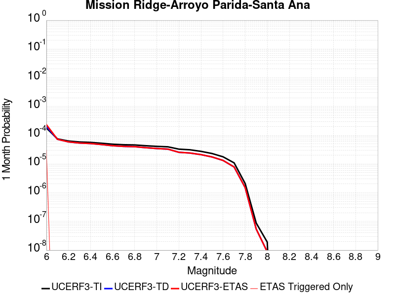 |  |  |

| Magnitude | 1 wk TI Prob | 1 wk TD Prob | 1 wk ETAS Prob | 1 wk ETAS/TD Gain | 1 wk ETAS Triggered Only | 1 mo TI Prob | 1 mo TD Prob | 1 mo ETAS Prob | 1 mo ETAS/TD Gain | 1 mo ETAS Triggered Only | 1 yr TI Prob | 1 yr TD Prob | 1 yr ETAS Prob | 1 yr ETAS/TD Gain | 1 yr ETAS Triggered Only | 10 yr TI Prob | 10 yr TD Prob | 10 yr ETAS Prob | 10 yr ETAS/TD Gain | 10 yr ETAS Triggered Only |
|-----|-----|-----|-----|-----|-----|-----|-----|-----|-----|-----|-----|-----|-----|-----|-----|-----|-----|-----|-----|-----|
| 6.0 | 4.169034E-5 | 4.7139558E-5 | 4.7139558E-5 | 1.0 | 0.0 | 1.7866064E-4 | 2.0201589E-4 | 2.3200983E-4 | 1.1484731 | 3.0E-5 | 0.0021730233 | 0.0024575135 | 0.002497415 | 1.0162367 | 4.0E-5 | 0.021518968 | 0.024385266 | 0.02445356 | 1.0028006 | 7.0E-5 |
| 6.1 | 1.73813E-5 | 1.6854512E-5 | 1.6854512E-5 | 1.0 | 0.0 | 7.4489166E-5 | 7.223168E-5 | 7.223168E-5 | 1.0 | 0.0 | 9.065282E-4 | 8.790767E-4 | 8.790767E-4 | 1.0 | 0.0 | 0.009028391 | 0.008757136 | 0.008776961 | 1.0022639 | 2.0E-5 |
| 6.2 | 1.4622182E-5 | 1.367351E-5 | 1.367351E-5 | 1.0 | 0.0 | 6.2664985E-5 | 5.8599464E-5 | 5.8599464E-5 | 1.0 | 0.0 | 7.6267915E-4 | 7.1321876E-4 | 7.1321876E-4 | 1.0 | 0.0 | 0.007600669 | 0.007109741 | 0.0071196705 | 1.0013965 | 1.0E-5 |
| 6.3 | 1.3552434E-5 | 1.2482403E-5 | 1.2482403E-5 | 1.0 | 0.0 | 5.8080568E-5 | 5.3494932E-5 | 5.3494932E-5 | 1.0 | 0.0 | 7.069015E-4 | 6.511093E-4 | 6.511093E-4 | 1.0 | 0.0 | 0.00704657 | 0.0064923796 | 0.006502315 | 1.0015303 | 1.0E-5 |
| 6.4 | 1.30977305E-5 | 1.1979351E-5 | 1.1979351E-5 | 1.0 | 0.0 | 5.613192E-5 | 5.133908E-5 | 5.133908E-5 | 1.0 | 0.0 | 6.831918E-4 | 6.2487705E-4 | 6.2487705E-4 | 1.0 | 0.0 | 0.006810953 | 0.0062315455 | 0.006241483 | 1.0015948 | 1.0E-5 |
| 6.5 | 1.225205E-5 | 1.10489855E-5 | 1.10489855E-5 | 1.0 | 0.0 | 5.2507727E-5 | 4.735195E-5 | 4.735195E-5 | 1.0 | 0.0 | 6.3909404E-4 | 5.763602E-4 | 5.763602E-4 | 1.0 | 0.0 | 0.006372592 | 0.005748964 | 0.0057589062 | 1.0017295 | 1.0E-5 |
| 6.6 | 1.1352241E-5 | 1.0063705E-5 | 1.0063705E-5 | 1.0 | 0.0 | 4.8651553E-5 | 4.3129465E-5 | 4.3129465E-5 | 1.0 | 0.0 | 5.921717E-4 | 5.249768E-4 | 5.249768E-4 | 1.0 | 0.0 | 0.0059059616 | 0.005237613 | 0.0052475603 | 1.0018992 | 1.0E-5 |
| 6.7 | 1.0864116E-5 | 9.517188E-6 | 9.517188E-6 | 1.0 | 0.0 | 4.6559664E-5 | 4.0787323E-5 | 4.0787323E-5 | 1.0 | 0.0 | 5.667165E-4 | 4.964745E-4 | 4.964745E-4 | 1.0 | 0.0 | 0.005652734 | 0.004953888 | 0.004963838 | 1.0020086 | 1.0E-5 |
| 6.8 | 1.0666365E-5 | 9.299937E-6 | 9.299937E-6 | 1.0 | 0.0 | 4.571219E-5 | 3.9856277E-5 | 3.9856277E-5 | 1.0 | 0.0 | 5.564038E-4 | 4.8514412E-4 | 4.8514412E-4 | 1.0 | 0.0 | 0.005550127 | 0.0048410823 | 0.004851034 | 1.0020556 | 1.0E-5 |
| 6.9 | 1.0038665E-5 | 8.592192E-6 | 8.592192E-6 | 1.0 | 0.0 | 4.302214E-5 | 3.682317E-5 | 3.682317E-5 | 1.0 | 0.0 | 5.236687E-4 | 4.4823167E-4 | 4.4823167E-4 | 1.0 | 0.0 | 0.005224364 | 0.004473487 | 0.0044834423 | 1.0022254 | 1.0E-5 |
| 7.0 | 9.5379955E-6 | 8.025209E-6 | 8.025209E-6 | 1.0 | 0.0 | 4.0876483E-5 | 3.439331E-5 | 3.439331E-5 | 1.0 | 0.0 | 4.975576E-4 | 4.186598E-4 | 4.186598E-4 | 1.0 | 0.0 | 0.00496445 | 0.0041789105 | 0.0041789105 | 1.0 | 0.0 |
| 7.1 | 9.207389E-6 | 7.652504E-6 | 7.652504E-6 | 1.0 | 0.0 | 3.945964E-5 | 3.2796044E-5 | 3.2796044E-5 | 1.0 | 0.0 | 4.803152E-4 | 3.9922036E-4 | 3.9922036E-4 | 1.0 | 0.0 | 0.004792784 | 0.003985228 | 0.003985228 | 1.0 | 0.0 |
| 7.2 | 7.638091E-6 | 5.93121E-6 | 5.93121E-6 | 1.0 | 0.0 | 3.2734264E-5 | 2.5419227E-5 | 2.5419227E-5 | 1.0 | 0.0 | 3.984668E-4 | 3.0943545E-4 | 3.0943545E-4 | 1.0 | 0.0 | 0.0039775306 | 0.0030901027 | 0.0030901027 | 1.0 | 0.0 |
| 7.3 | 7.2500147E-6 | 5.596238E-6 | 5.596238E-6 | 1.0 | 0.0 | 3.1071122E-5 | 2.3983659E-5 | 2.3983659E-5 | 1.0 | 0.0 | 3.7822526E-4 | 2.919622E-4 | 2.919622E-4 | 1.0 | 0.0 | 0.0037758215 | 0.002915842 | 0.002915842 | 1.0 | 0.0 |
| 7.4 | 6.3899715E-6 | 4.918567E-6 | 4.918567E-6 | 1.0 | 0.0 | 2.7385306E-5 | 2.1079404E-5 | 2.1079404E-5 | 1.0 | 0.0 | 3.3336508E-4 | 2.566117E-4 | 2.566117E-4 | 1.0 | 0.0 | 0.0033286542 | 0.0025631986 | 0.0025631986 | 1.0 | 0.0 |
| 7.5 | 5.379025E-6 | 4.083909E-6 | 4.083909E-6 | 1.0 | 0.0 | 2.305276E-5 | 1.750235E-5 | 1.750235E-5 | 1.0 | 0.0 | 2.806312E-4 | 2.1307038E-4 | 2.1307038E-4 | 1.0 | 0.0 | 0.0028027708 | 0.0021286723 | 0.0021286723 | 1.0 | 0.0 |
| 7.6 | 4.1270696E-6 | 3.0883848E-6 | 3.0883848E-6 | 1.0 | 0.0 | 1.768732E-5 | 1.3235868E-5 | 1.3235868E-5 | 1.0 | 0.0 | 2.1532185E-4 | 1.6113486E-4 | 1.6113486E-4 | 1.0 | 0.0 | 0.0021511333 | 0.0016101883 | 0.0016101883 | 1.0 | 0.0 |
| 7.7 | 2.5406805E-6 | 1.8282261E-6 | 1.8282261E-6 | 1.0 | 0.0 | 1.0888585E-5 | 7.835231E-6 | 7.835231E-6 | 1.0 | 0.0 | 1.3256045E-4 | 9.538983E-5 | 9.538983E-5 | 1.0 | 0.0 | 0.0013248142 | 9.53495E-4 | 9.53495E-4 | 1.0 | 0.0 |
| 7.8 | 4.8608285E-7 | 3.5099296E-7 | 3.5099296E-7 | 1.0 | 0.0 | 2.0832106E-6 | 1.5042547E-6 | 1.5042547E-6 | 1.0 | 0.0 | 2.5362791E-5 | 1.8314147E-5 | 1.8314147E-5 | 1.0 | 0.0 | 2.5359896E-4 | 1.8312651E-4 | 1.8312651E-4 | 1.0 | 0.0 |
| 7.9 | 2.0472514E-8 | 1.2689093E-8 | 1.2689093E-8 | 1.0 | 0.0 | 8.7739345E-8 | 5.438183E-8 | 5.438183E-8 | 1.0 | 0.0 | 1.068226E-6 | 6.6209856E-7 | 6.6209856E-7 | 1.0 | 0.0 | 1.0682209E-5 | 6.620967E-6 | 6.620967E-6 | 1.0 | 0.0 |
| 8.0 | 4.443582E-9 | 2.0322608E-9 | 2.0322608E-9 | 1.0 | 0.0 | 1.9043922E-8 | 8.709689E-9 | 8.709689E-9 | 1.0 | 0.0 | 2.3185973E-7 | 1.0604046E-7 | 1.0604046E-7 | 1.0 | 0.0 | 2.3185949E-6 | 1.0604042E-6 | 1.0604042E-6 | 1.0 | 0.0 |

## Dry Mountain
*[(top)](#table-of-contents)*

| 1 Week | 1 Month | 1 Year | 10 Year |
|-----|-----|-----|-----|
|  |  |  | 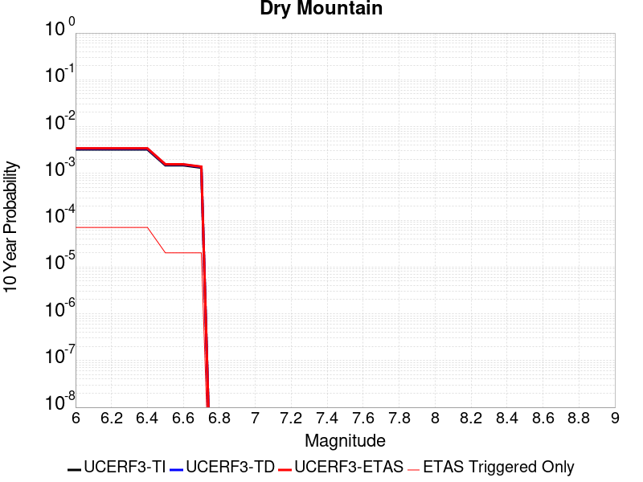 |

| Magnitude | 1 wk TI Prob | 1 wk TD Prob | 1 wk ETAS Prob | 1 wk ETAS/TD Gain | 1 wk ETAS Triggered Only | 1 mo TI Prob | 1 mo TD Prob | 1 mo ETAS Prob | 1 mo ETAS/TD Gain | 1 mo ETAS Triggered Only | 1 yr TI Prob | 1 yr TD Prob | 1 yr ETAS Prob | 1 yr ETAS/TD Gain | 1 yr ETAS Triggered Only | 10 yr TI Prob | 10 yr TD Prob | 10 yr ETAS Prob | 10 yr ETAS/TD Gain | 10 yr ETAS Triggered Only |
|-----|-----|-----|-----|-----|-----|-----|-----|-----|-----|-----|-----|-----|-----|-----|-----|-----|-----|-----|-----|-----|
| 6.0 | 6.222801E-6 | 6.439411E-6 | 6.439411E-6 | 1.0 | 0.0 | 2.6668875E-5 | 2.7597274E-5 | 2.7597274E-5 | 1.0 | 0.0 | 3.2464517E-4 | 3.359609E-4 | 3.6595084E-4 | 1.0892661 | 3.0E-5 | 0.0032417132 | 0.0033560924 | 0.0034258573 | 1.0207876 | 7.0E-5 |
| 6.1 | 6.222801E-6 | 6.439411E-6 | 6.439411E-6 | 1.0 | 0.0 | 2.6668875E-5 | 2.7597274E-5 | 2.7597274E-5 | 1.0 | 0.0 | 3.2464517E-4 | 3.359609E-4 | 3.6595084E-4 | 1.0892661 | 3.0E-5 | 0.0032417132 | 0.0033560924 | 0.0034258573 | 1.0207876 | 7.0E-5 |
| 6.2 | 6.222801E-6 | 6.439411E-6 | 6.439411E-6 | 1.0 | 0.0 | 2.6668875E-5 | 2.7597274E-5 | 2.7597274E-5 | 1.0 | 0.0 | 3.2464517E-4 | 3.359609E-4 | 3.6595084E-4 | 1.0892661 | 3.0E-5 | 0.0032417132 | 0.0033560924 | 0.0034258573 | 1.0207876 | 7.0E-5 |
| 6.3 | 6.222801E-6 | 6.439411E-6 | 6.439411E-6 | 1.0 | 0.0 | 2.6668875E-5 | 2.7597274E-5 | 2.7597274E-5 | 1.0 | 0.0 | 3.2464517E-4 | 3.359609E-4 | 3.6595084E-4 | 1.0892661 | 3.0E-5 | 0.0032417132 | 0.0033560924 | 0.0034258573 | 1.0207876 | 7.0E-5 |
| 6.4 | 6.222801E-6 | 6.439411E-6 | 6.439411E-6 | 1.0 | 0.0 | 2.6668875E-5 | 2.7597274E-5 | 2.7597274E-5 | 1.0 | 0.0 | 3.2464517E-4 | 3.359609E-4 | 3.6595084E-4 | 1.0892661 | 3.0E-5 | 0.0032417132 | 0.0033560924 | 0.0034258573 | 1.0207876 | 7.0E-5 |
| 6.5 | 2.8528623E-6 | 2.952182E-6 | 2.952182E-6 | 1.0 | 0.0 | 1.22264955E-5 | 1.2652196E-5 | 1.2652196E-5 | 1.0 | 0.0 | 1.4884741E-4 | 1.5403831E-4 | 1.6403677E-4 | 1.0649089 | 1.0E-5 | 0.0014874774 | 0.0015401688 | 0.001560138 | 1.0129656 | 2.0E-5 |
| 6.6 | 2.8528623E-6 | 2.952182E-6 | 2.952182E-6 | 1.0 | 0.0 | 1.22264955E-5 | 1.2652196E-5 | 1.2652196E-5 | 1.0 | 0.0 | 1.4884741E-4 | 1.5403831E-4 | 1.6403677E-4 | 1.0649089 | 1.0E-5 | 0.0014874774 | 0.0015401688 | 0.001560138 | 1.0129656 | 2.0E-5 |
| 6.7 | 2.541E-6 | 2.62937E-6 | 2.62937E-6 | 1.0 | 0.0 | 1.0889954E-5 | 1.12687285E-5 | 1.12687285E-5 | 1.0 | 0.0 | 1.3257713E-4 | 1.3719677E-4 | 1.471954E-4 | 1.072878 | 1.0E-5 | 0.0013249806 | 0.0013719677 | 0.0013919403 | 1.0145576 | 2.0E-5 |

## Ortigalita (North)
*[(top)](#table-of-contents)*

| 1 Week | 1 Month | 1 Year | 10 Year |
|-----|-----|-----|-----|
|  |  |  |  |

| Magnitude | 1 wk TI Prob | 1 wk TD Prob | 1 wk ETAS Prob | 1 wk ETAS/TD Gain | 1 wk ETAS Triggered Only | 1 mo TI Prob | 1 mo TD Prob | 1 mo ETAS Prob | 1 mo ETAS/TD Gain | 1 mo ETAS Triggered Only | 1 yr TI Prob | 1 yr TD Prob | 1 yr ETAS Prob | 1 yr ETAS/TD Gain | 1 yr ETAS Triggered Only | 10 yr TI Prob | 10 yr TD Prob | 10 yr ETAS Prob | 10 yr ETAS/TD Gain | 10 yr ETAS Triggered Only |
|-----|-----|-----|-----|-----|-----|-----|-----|-----|-----|-----|-----|-----|-----|-----|-----|-----|-----|-----|-----|-----|
| 6.0 | 7.711876E-5 | 1.0507023E-4 | 1.0507023E-4 | 1.0 | 0.0 | 3.3046713E-4 | 4.5023413E-4 | 4.8022062E-4 | 1.066602 | 3.0E-5 | 0.004016016 | 0.005468329 | 0.0055180555 | 1.0090935 | 5.0E-5 | 0.039442103 | 0.053457033 | 0.05350436 | 1.0008854 | 5.0E-5 |
| 6.1 | 4.607858E-5 | 6.024174E-5 | 6.024174E-5 | 1.0 | 0.0 | 1.9746469E-4 | 2.5815613E-4 | 2.5815613E-4 | 1.0 | 0.0 | 0.0024014818 | 0.0031388826 | 0.0031588199 | 1.0063517 | 2.0E-5 | 0.023756953 | 0.030976266 | 0.030995646 | 1.0006256 | 2.0E-5 |
| 6.2 | 4.607858E-5 | 6.024174E-5 | 6.024174E-5 | 1.0 | 0.0 | 1.9746469E-4 | 2.5815613E-4 | 2.5815613E-4 | 1.0 | 0.0 | 0.0024014818 | 0.0031388826 | 0.0031588199 | 1.0063517 | 2.0E-5 | 0.023756953 | 0.030976266 | 0.030995646 | 1.0006256 | 2.0E-5 |
| 6.3 | 3.327423E-5 | 4.247674E-5 | 4.247674E-5 | 1.0 | 0.0 | 1.4259605E-4 | 1.820322E-4 | 1.820322E-4 | 1.0 | 0.0 | 0.0017347244 | 0.0022142797 | 0.0022242577 | 1.0045061 | 1.0E-5 | 0.017212452 | 0.021946438 | 0.021956218 | 1.0004456 | 1.0E-5 |
| 6.4 | 2.7732503E-5 | 3.4999855E-5 | 3.4999855E-5 | 1.0 | 0.0 | 1.1884817E-4 | 1.4999225E-4 | 1.4999225E-4 | 1.0 | 0.0 | 0.001446016 | 0.001824874 | 0.0018348558 | 1.0054698 | 1.0E-5 | 0.014366428 | 0.018121855 | 0.018131675 | 1.0005418 | 1.0E-5 |
| 6.5 | 2.7689714E-5 | 3.4949666E-5 | 3.4949666E-5 | 1.0 | 0.0 | 1.186648E-4 | 1.4977719E-4 | 1.4977719E-4 | 1.0 | 0.0 | 0.0014437864 | 0.00182226 | 0.0018322418 | 1.0054777 | 1.0E-5 | 0.014344421 | 0.018096142 | 0.018105961 | 1.0005426 | 1.0E-5 |
| 6.6 | 2.2976905E-5 | 2.8719256E-5 | 2.8719256E-5 | 1.0 | 0.0 | 9.846873E-5 | 1.2307815E-4 | 1.2307815E-4 | 1.0 | 0.0 | 0.0011981975 | 0.001497687 | 0.001507672 | 1.006667 | 1.0E-5 | 0.011917574 | 0.014899201 | 0.014909052 | 1.0006611 | 1.0E-5 |
| 6.7 | 1.9871539E-5 | 2.490528E-5 | 2.490528E-5 | 1.0 | 0.0 | 8.516096E-5 | 1.0673395E-4 | 1.0673395E-4 | 1.0 | 0.0 | 0.0010363415 | 0.0012989598 | 0.0013089469 | 1.0076885 | 1.0E-5 | 0.010315218 | 0.012937365 | 0.012947235 | 1.0007629 | 1.0E-5 |
| 6.8 | 6.5640475E-6 | 7.6056526E-6 | 7.6056526E-6 | 1.0 | 0.0 | 2.813133E-5 | 3.2595264E-5 | 3.2595264E-5 | 1.0 | 0.0 | 3.424451E-4 | 3.9677793E-4 | 3.9677793E-4 | 1.0 | 0.0 | 0.0034191788 | 0.0039609824 | 0.0039609824 | 1.0 | 0.0 |
| 6.9 | 5.6219683E-6 | 6.5019726E-6 | 6.5019726E-6 | 1.0 | 0.0 | 2.4093928E-5 | 2.7865315E-5 | 2.7865315E-5 | 1.0 | 0.0 | 2.933041E-4 | 3.3920998E-4 | 3.3920998E-4 | 1.0 | 0.0 | 0.0029291727 | 0.0033871792 | 0.0033871792 | 1.0 | 0.0 |
| 7.0 | 3.875591E-6 | 4.4848484E-6 | 4.4848484E-6 | 1.0 | 0.0 | 1.6609569E-5 | 1.922065E-5 | 1.922065E-5 | 1.0 | 0.0 | 2.0220275E-4 | 2.339884E-4 | 2.339884E-4 | 1.0 | 0.0 | 0.0020201886 | 0.0023376285 | 0.0023376285 | 1.0 | 0.0 |
| 7.1 | 1.6017933E-6 | 1.8570811E-6 | 1.8570811E-6 | 1.0 | 0.0 | 6.8648105E-6 | 7.958901E-6 | 7.958901E-6 | 1.0 | 0.0 | 8.357586E-5 | 9.689637E-5 | 9.689637E-5 | 1.0 | 0.0 | 8.3544437E-4 | 9.686459E-4 | 9.686459E-4 | 1.0 | 0.0 |

## Brawley (Seismic Zone) alt 1
*[(top)](#table-of-contents)*

| 1 Week | 1 Month | 1 Year | 10 Year |
|-----|-----|-----|-----|
|  |  | 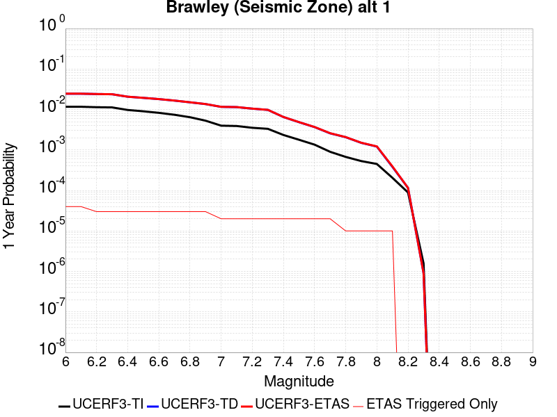 |  |

| Magnitude | 1 wk TI Prob | 1 wk TD Prob | 1 wk ETAS Prob | 1 wk ETAS/TD Gain | 1 wk ETAS Triggered Only | 1 mo TI Prob | 1 mo TD Prob | 1 mo ETAS Prob | 1 mo ETAS/TD Gain | 1 mo ETAS Triggered Only | 1 yr TI Prob | 1 yr TD Prob | 1 yr ETAS Prob | 1 yr ETAS/TD Gain | 1 yr ETAS Triggered Only | 10 yr TI Prob | 10 yr TD Prob | 10 yr ETAS Prob | 10 yr ETAS/TD Gain | 10 yr ETAS Triggered Only |
|-----|-----|-----|-----|-----|-----|-----|-----|-----|-----|-----|-----|-----|-----|-----|-----|-----|-----|-----|-----|-----|
| 6.0 | 2.2521618E-4 | 4.7641253E-4 | 4.8640775E-4 | 1.0209802 | 1.0E-5 | 9.6485513E-4 | 0.0020402074 | 0.0020701461 | 1.0146744 | 3.0E-5 | 0.011683988 | 0.02455069 | 0.024589706 | 1.0015893 | 4.0E-5 | 0.11088423 | 0.21353015 | 0.21357735 | 1.000221 | 6.0E-5 |
| 6.1 | 2.2521618E-4 | 4.7641253E-4 | 4.8640775E-4 | 1.0209802 | 1.0E-5 | 9.6485513E-4 | 0.0020402074 | 0.0020701461 | 1.0146744 | 3.0E-5 | 0.011683988 | 0.02455069 | 0.024589706 | 1.0015893 | 4.0E-5 | 0.11088423 | 0.21353015 | 0.21357735 | 1.000221 | 6.0E-5 |
| 6.2 | 2.198148E-4 | 4.6725658E-4 | 4.7725192E-4 | 1.0213915 | 1.0E-5 | 9.417233E-4 | 0.002001028 | 0.002030968 | 1.0149623 | 3.0E-5 | 0.011405343 | 0.024084855 | 0.024114134 | 1.0012156 | 3.0E-5 | 0.10837428 | 0.20996629 | 0.21000579 | 1.0001881 | 5.0E-5 |
| 6.3 | 2.1704129E-4 | 4.6161312E-4 | 4.7160848E-4 | 1.0216532 | 1.0E-5 | 9.298453E-4 | 0.0019768786 | 0.0020068192 | 1.0151454 | 3.0E-5 | 0.011262234 | 0.023797998 | 0.023827285 | 1.0012306 | 3.0E-5 | 0.107082725 | 0.20785725 | 0.20789686 | 1.0001905 | 5.0E-5 |
| 6.4 | 1.876142E-4 | 4.0053183E-4 | 4.1052783E-4 | 1.0249568 | 1.0E-5 | 8.038131E-4 | 0.0017154501 | 0.0017453986 | 1.0174581 | 3.0E-5 | 0.00974259 | 0.02068463 | 0.02071401 | 1.0014204 | 3.0E-5 | 0.093263686 | 0.184608 | 0.18464062 | 1.0001767 | 4.0E-5 |
| 6.5 | 1.7390939E-4 | 3.7485067E-4 | 3.848469E-4 | 1.0266672 | 1.0E-5 | 7.45113E-4 | 0.0016055258 | 0.0016354778 | 1.0186554 | 3.0E-5 | 0.009034078 | 0.019372813 | 0.019402232 | 1.0015186 | 3.0E-5 | 0.086755216 | 0.17442966 | 0.17446269 | 1.0001893 | 4.0E-5 |
| 6.6 | 1.591791E-4 | 3.489955E-4 | 3.58992E-4 | 1.0286436 | 1.0E-5 | 6.8201777E-4 | 0.0014948477 | 0.0015248029 | 1.020039 | 3.0E-5 | 0.008271996 | 0.018049458 | 0.018078918 | 1.0016321 | 3.0E-5 | 0.07970774 | 0.16383699 | 0.16387044 | 1.0002041 | 4.0E-5 |
| 6.7 | 1.4268003E-4 | 3.206533E-4 | 3.306501E-4 | 1.0311763 | 1.0E-5 | 6.1134255E-4 | 0.0013735129 | 0.0014034717 | 1.0218118 | 3.0E-5 | 0.007417723 | 0.016596261 | 0.016625764 | 1.0017776 | 3.0E-5 | 0.07174956 | 0.15196045 | 0.15199438 | 1.0002233 | 4.0E-5 |
| 6.8 | 1.239713E-4 | 2.9059697E-4 | 3.0059408E-4 | 1.0344019 | 1.0E-5 | 5.3119735E-4 | 0.0012448273 | 0.00127479 | 1.0240698 | 3.0E-5 | 0.0064481674 | 0.015051884 | 0.015081432 | 1.0019631 | 3.0E-5 | 0.06264243 | 0.13840161 | 0.13843606 | 1.000249 | 4.0E-5 |
| 6.9 | 1.0180238E-4 | 2.625907E-4 | 2.7258808E-4 | 1.0380721 | 1.0E-5 | 4.3622297E-4 | 0.0011249076 | 0.0011548739 | 1.0266389 | 3.0E-5 | 0.005298089 | 0.013610746 | 0.013640338 | 1.0021741 | 3.0E-5 | 0.05173543 | 0.12498065 | 0.12501565 | 1.00028 | 4.0E-5 |
| 7.0 | 7.6619996E-5 | 2.2402873E-4 | 2.3402649E-4 | 1.0446272 | 1.0E-5 | 3.283301E-4 | 9.59773E-4 | 9.797538E-4 | 1.0208182 | 2.0E-5 | 0.0039900932 | 0.011623339 | 0.011643106 | 1.0017006 | 2.0E-5 | 0.039192066 | 0.10728151 | 0.1073083 | 1.0002496 | 3.0E-5 |
| 7.1 | 7.5127435E-5 | 2.208599E-4 | 2.308577E-4 | 1.0452676 | 1.0E-5 | 3.2193496E-4 | 9.4620226E-4 | 9.661834E-4 | 1.0211171 | 2.0E-5 | 0.0039125155 | 0.011459865 | 0.011479635 | 1.0017252 | 2.0E-5 | 0.038443442 | 0.10584534 | 0.10587216 | 1.0002534 | 3.0E-5 |
| 7.2 | 6.788582E-5 | 2.0213598E-4 | 2.1213396E-4 | 1.0494616 | 1.0E-5 | 2.9090676E-4 | 8.660125E-4 | 8.8599516E-4 | 1.0230744 | 2.0E-5 | 0.0035360386 | 0.010493369 | 0.0105131585 | 1.001886 | 2.0E-5 | 0.034803 | 0.09751546 | 0.09754253 | 1.0002776 | 3.0E-5 |
| 7.3 | 6.399602E-5 | 1.88444E-4 | 1.9844211E-4 | 1.0530561 | 1.0E-5 | 2.7423984E-4 | 8.0737006E-4 | 8.273539E-4 | 1.0247518 | 2.0E-5 | 0.0033337586 | 0.009786017 | 0.009805822 | 1.0020237 | 2.0E-5 | 0.03284188 | 0.091409855 | 0.091437116 | 1.0002981 | 3.0E-5 |
| 7.4 | 4.506759E-5 | 1.2531783E-4 | 1.3531659E-4 | 1.0797871 | 1.0E-5 | 1.9313251E-4 | 5.369668E-4 | 5.5695605E-4 | 1.0372262 | 2.0E-5 | 0.0023488526 | 0.0065181484 | 0.006538018 | 1.0030483 | 2.0E-5 | 0.023241805 | 0.062375 | 0.06240313 | 1.000451 | 3.0E-5 |
| 7.5 | 3.43289E-5 | 9.337587E-5 | 1.03374936E-4 | 1.107084 | 1.0E-5 | 1.4711556E-4 | 4.0012124E-4 | 4.2011324E-4 | 1.0499649 | 2.0E-5 | 0.0017896603 | 0.004860657 | 0.0048805596 | 1.0040947 | 2.0E-5 | 0.01775316 | 0.04706493 | 0.047093518 | 1.0006074 | 3.0E-5 |
| 7.6 | 2.5980507E-5 | 7.054998E-5 | 8.054927E-5 | 1.1417335 | 1.0E-5 | 1.1134028E-4 | 3.0232212E-4 | 3.2231607E-4 | 1.0661346 | 2.0E-5 | 0.001354725 | 0.0036745837 | 0.0036945103 | 1.0054228 | 2.0E-5 | 0.013464959 | 0.035849415 | 0.03587834 | 1.0008068 | 3.0E-5 |
| 7.7 | 1.7292105E-5 | 4.9423474E-5 | 5.942298E-5 | 1.202323 | 1.0E-5 | 7.4106916E-5 | 2.1179771E-4 | 2.3179348E-4 | 1.0944097 | 2.0E-5 | 9.018782E-4 | 0.0025755935 | 0.002595542 | 1.0077451 | 2.0E-5 | 0.008982267 | 0.025297757 | 0.025326999 | 1.0011559 | 3.0E-5 |
| 7.8 | 1.2927471E-5 | 3.970735E-5 | 3.970735E-5 | 1.0 | 0.0 | 5.5402274E-5 | 1.7016326E-4 | 1.8016156E-4 | 1.0587571 | 1.0E-5 | 6.743139E-4 | 0.0020697718 | 0.002079751 | 1.0048214 | 1.0E-5 | 0.0067227143 | 0.02043814 | 0.020457732 | 1.0009586 | 2.0E-5 |
| 7.9 | 1.0200774E-5 | 2.8757075E-5 | 2.8757075E-5 | 1.0 | 0.0 | 4.371687E-5 | 1.2323879E-4 | 1.3323755E-4 | 1.0811332 | 1.0E-5 | 5.321229E-4 | 0.0014994006 | 0.0015093856 | 1.0066594 | 1.0E-5 | 0.005308505 | 0.0149969105 | 0.01501661 | 1.0013136 | 2.0E-5 |
| 8.0 | 8.650396E-6 | 2.3287128E-5 | 2.3287128E-5 | 1.0 | 0.0 | 3.70726E-5 | 9.979816E-5 | 1.0979716E-4 | 1.1001922 | 1.0E-5 | 4.5126543E-4 | 0.0012143662 | 0.001224354 | 1.0082247 | 1.0E-5 | 0.0045035016 | 0.012215644 | 0.0122354 | 1.0016172 | 2.0E-5 |
| 8.1 | 3.9368224E-6 | 7.3321658E-6 | 7.3321658E-6 | 1.0 | 0.0 | 1.6871985E-5 | 3.1423187E-5 | 4.1422874E-5 | 1.3182263 | 1.0E-5 | 2.0539707E-4 | 3.825103E-4 | 3.9250645E-4 | 1.0261331 | 1.0E-5 | 0.0020520731 | 0.00400326 | 0.00402318 | 1.0049759 | 2.0E-5 |
| 8.2 | 1.7101195E-6 | 2.2195122E-6 | 2.2195122E-6 | 1.0 | 0.0 | 7.329063E-6 | 9.51216E-6 | 9.51216E-6 | 1.0 | 0.0 | 8.922769E-5 | 1.15804425E-4 | 1.15804425E-4 | 1.0 | 0.0 | 8.9191867E-4 | 0.0012675166 | 0.0012675166 | 1.0 | 0.0 |
| 8.3 | 3.0346666E-8 | 1.7233086E-8 | 1.7233086E-8 | 1.0 | 0.0 | 1.3005713E-7 | 7.385608E-8 | 7.385608E-8 | 1.0 | 0.0 | 1.5834444E-6 | 8.991977E-7 | 8.991977E-7 | 1.0 | 0.0 | 1.5834332E-5 | 9.37692E-6 | 9.37692E-6 | 1.0 | 0.0 |

## Pleito
*[(top)](#table-of-contents)*

| 1 Week | 1 Month | 1 Year | 10 Year |
|-----|-----|-----|-----|
|  |  | 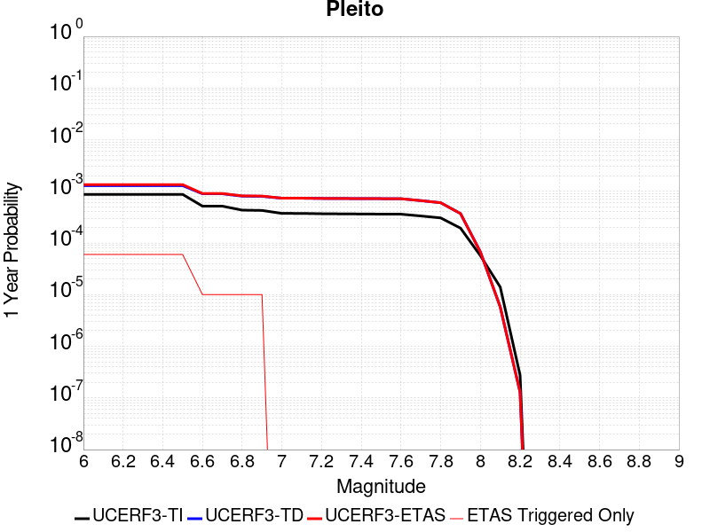 |  |

| Magnitude | 1 wk TI Prob | 1 wk TD Prob | 1 wk ETAS Prob | 1 wk ETAS/TD Gain | 1 wk ETAS Triggered Only | 1 mo TI Prob | 1 mo TD Prob | 1 mo ETAS Prob | 1 mo ETAS/TD Gain | 1 mo ETAS Triggered Only | 1 yr TI Prob | 1 yr TD Prob | 1 yr ETAS Prob | 1 yr ETAS/TD Gain | 1 yr ETAS Triggered Only | 10 yr TI Prob | 10 yr TD Prob | 10 yr ETAS Prob | 10 yr ETAS/TD Gain | 10 yr ETAS Triggered Only |
|-----|-----|-----|-----|-----|-----|-----|-----|-----|-----|-----|-----|-----|-----|-----|-----|-----|-----|-----|-----|-----|
| 6.0 | 1.6763008E-5 | 2.47705E-5 | 2.47705E-5 | 1.0 | 0.0 | 7.183948E-5 | 1.0615537E-4 | 1.2615325E-4 | 1.1883831 | 2.0E-5 | 8.742947E-4 | 0.0012917474 | 0.0013516699 | 1.0463887 | 6.0E-5 | 0.00870863 | 0.012957253 | 0.013016475 | 1.0045706 | 6.0E-5 |
| 6.1 | 1.6763008E-5 | 2.47705E-5 | 2.47705E-5 | 1.0 | 0.0 | 7.183948E-5 | 1.0615537E-4 | 1.2615325E-4 | 1.1883831 | 2.0E-5 | 8.742947E-4 | 0.0012917474 | 0.0013516699 | 1.0463887 | 6.0E-5 | 0.00870863 | 0.012957253 | 0.013016475 | 1.0045706 | 6.0E-5 |
| 6.2 | 1.6763008E-5 | 2.47705E-5 | 2.47705E-5 | 1.0 | 0.0 | 7.183948E-5 | 1.0615537E-4 | 1.2615325E-4 | 1.1883831 | 2.0E-5 | 8.742947E-4 | 0.0012917474 | 0.0013516699 | 1.0463887 | 6.0E-5 | 0.00870863 | 0.012957253 | 0.013016475 | 1.0045706 | 6.0E-5 |
| 6.3 | 1.6763008E-5 | 2.47705E-5 | 2.47705E-5 | 1.0 | 0.0 | 7.183948E-5 | 1.0615537E-4 | 1.2615325E-4 | 1.1883831 | 2.0E-5 | 8.742947E-4 | 0.0012917474 | 0.0013516699 | 1.0463887 | 6.0E-5 | 0.00870863 | 0.012957253 | 0.013016475 | 1.0045706 | 6.0E-5 |
| 6.4 | 1.6763008E-5 | 2.47705E-5 | 2.47705E-5 | 1.0 | 0.0 | 7.183948E-5 | 1.0615537E-4 | 1.2615325E-4 | 1.1883831 | 2.0E-5 | 8.742947E-4 | 0.0012917474 | 0.0013516699 | 1.0463887 | 6.0E-5 | 0.00870863 | 0.012957253 | 0.013016475 | 1.0045706 | 6.0E-5 |
| 6.5 | 1.6763008E-5 | 2.47705E-5 | 2.47705E-5 | 1.0 | 0.0 | 7.183948E-5 | 1.0615537E-4 | 1.2615325E-4 | 1.1883831 | 2.0E-5 | 8.742947E-4 | 0.0012917474 | 0.0013516699 | 1.0463887 | 6.0E-5 | 0.00870863 | 0.012957253 | 0.013016475 | 1.0045706 | 6.0E-5 |
| 6.6 | 9.910213E-6 | 1.7221182E-5 | 1.7221182E-5 | 1.0 | 0.0 | 4.247165E-5 | 7.3803E-5 | 7.3803E-5 | 1.0 | 0.0 | 5.169696E-4 | 8.9818484E-4 | 9.0817583E-4 | 1.0111235 | 1.0E-5 | 0.0051576863 | 0.009054025 | 0.009063934 | 1.0010945 | 1.0E-5 |
| 6.7 | 9.910213E-6 | 1.7221182E-5 | 1.7221182E-5 | 1.0 | 0.0 | 4.247165E-5 | 7.3803E-5 | 7.3803E-5 | 1.0 | 0.0 | 5.169696E-4 | 8.9818484E-4 | 9.0817583E-4 | 1.0111235 | 1.0E-5 | 0.0051576863 | 0.009054025 | 0.009063934 | 1.0010945 | 1.0E-5 |
| 6.8 | 8.300162E-6 | 1.5480773E-5 | 1.5480773E-5 | 1.0 | 0.0 | 3.557164E-5 | 6.634449E-5 | 6.634449E-5 | 1.0 | 0.0 | 4.3299864E-4 | 8.0744625E-4 | 8.174382E-4 | 1.0123748 | 1.0E-5 | 0.004321559 | 0.008153455 | 0.008163374 | 1.0012165 | 1.0E-5 |
| 6.9 | 8.183114E-6 | 1.5351985E-5 | 1.5351985E-5 | 1.0 | 0.0 | 3.5070017E-5 | 6.579257E-5 | 6.579257E-5 | 1.0 | 0.0 | 4.2689382E-4 | 8.007316E-4 | 8.107236E-4 | 1.0124786 | 1.0E-5 | 0.0042607468 | 0.008086799 | 0.008096717 | 1.0012265 | 1.0E-5 |
| 7.0 | 7.1748823E-6 | 1.4138895E-5 | 1.4138895E-5 | 1.0 | 0.0 | 3.0749135E-5 | 6.059386E-5 | 6.059386E-5 | 1.0 | 0.0 | 3.743064E-4 | 7.3748105E-4 | 7.3748105E-4 | 1.0 | 0.0 | 0.0037367654 | 0.0074582137 | 0.0074582137 | 1.0 | 0.0 |
| 7.1 | 7.1671807E-6 | 1.4129264E-5 | 1.4129264E-5 | 1.0 | 0.0 | 3.0716128E-5 | 6.0552586E-5 | 6.0552586E-5 | 1.0 | 0.0 | 3.7390468E-4 | 7.369789E-4 | 7.369789E-4 | 1.0 | 0.0 | 0.0037327618 | 0.007453226 | 0.007453226 | 1.0 | 0.0 |
| 7.2 | 7.0649667E-6 | 1.3976534E-5 | 1.3976534E-5 | 1.0 | 0.0 | 3.0278077E-5 | 5.989806E-5 | 5.989806E-5 | 1.0 | 0.0 | 3.6857324E-4 | 7.290154E-4 | 7.290154E-4 | 1.0 | 0.0 | 0.0036796255 | 0.007373973 | 0.007373973 | 1.0 | 0.0 |
| 7.3 | 7.02082E-6 | 1.39199765E-5 | 1.39199765E-5 | 1.0 | 0.0 | 3.008888E-5 | 5.9655682E-5 | 5.9655682E-5 | 1.0 | 0.0 | 3.6627054E-4 | 7.260664E-4 | 7.260664E-4 | 1.0 | 0.0 | 0.0036566744 | 0.0073444657 | 0.0073444657 | 1.0 | 0.0 |
| 7.4 | 6.987146E-6 | 1.3879531E-5 | 1.3879531E-5 | 1.0 | 0.0 | 2.9944567E-5 | 5.948235E-5 | 5.948235E-5 | 1.0 | 0.0 | 3.6451413E-4 | 7.239575E-4 | 7.239575E-4 | 1.0 | 0.0 | 0.0036391679 | 0.007323398 | 0.007323398 | 1.0 | 0.0 |
| 7.5 | 6.9494554E-6 | 1.3836431E-5 | 1.3836431E-5 | 1.0 | 0.0 | 2.9783041E-5 | 5.9297647E-5 | 5.9297647E-5 | 1.0 | 0.0 | 3.625482E-4 | 7.217102E-4 | 7.217102E-4 | 1.0 | 0.0 | 0.0036195726 | 0.007301023 | 0.007301023 | 1.0 | 0.0 |
| 7.6 | 6.92694E-6 | 1.3795536E-5 | 1.3795536E-5 | 1.0 | 0.0 | 2.9686547E-5 | 5.9122387E-5 | 5.9122387E-5 | 1.0 | 0.0 | 3.6137376E-4 | 7.1957783E-4 | 7.1957783E-4 | 1.0 | 0.0 | 0.0036078666 | 0.0072797714 | 0.0072797714 | 1.0 | 0.0 |
| 7.7 | 6.395867E-6 | 1.2674343E-5 | 1.2674343E-5 | 1.0 | 0.0 | 2.741057E-5 | 5.4317487E-5 | 5.4317487E-5 | 1.0 | 0.0 | 3.336726E-4 | 6.6111505E-4 | 6.6111505E-4 | 1.0 | 0.0 | 0.0033317201 | 0.006698295 | 0.006698295 | 1.0 | 0.0 |
| 7.8 | 5.8664327E-6 | 1.1541453E-5 | 1.1541453E-5 | 1.0 | 0.0 | 2.5141611E-5 | 4.9462433E-5 | 4.9462433E-5 | 1.0 | 0.0 | 3.060561E-4 | 6.020389E-4 | 6.020389E-4 | 1.0 | 0.0 | 0.0030563495 | 0.006103509 | 0.006103509 | 1.0 | 0.0 |
| 7.9 | 3.7167474E-6 | 7.1174723E-6 | 7.1174723E-6 | 1.0 | 0.0 | 1.592882E-5 | 3.0503097E-5 | 3.0503097E-5 | 1.0 | 0.0 | 1.9391612E-4 | 3.7131205E-4 | 3.7131205E-4 | 1.0 | 0.0 | 0.0019374699 | 0.0037692138 | 0.0037692138 | 1.0 | 0.0 |
| 8.0 | 1.0903841E-6 | 1.2886832E-6 | 1.2886832E-6 | 1.0 | 0.0 | 4.6730665E-6 | 5.522916E-6 | 5.522916E-6 | 1.0 | 0.0 | 5.68931E-5 | 6.723944E-5 | 6.723944E-5 | 1.0 | 0.0 | 5.6878536E-4 | 6.9458556E-4 | 6.9458556E-4 | 1.0 | 0.0 |
| 8.1 | 2.6894583E-7 | 1.1072907E-7 | 1.1072907E-7 | 1.0 | 0.0 | 1.1526245E-6 | 4.7455305E-7 | 4.7455305E-7 | 1.0 | 0.0 | 1.4033113E-5 | 5.7776683E-6 | 5.7776683E-6 | 1.0 | 0.0 | 1.4032227E-4 | 6.4639265E-5 | 6.4639265E-5 | 1.0 | 0.0 |
| 8.2 | 5.2967013E-9 | 2.4608289E-9 | 2.4608289E-9 | 1.0 | 0.0 | 2.2700148E-8 | 1.054641E-8 | 1.054641E-8 | 1.0 | 0.0 | 2.7637427E-7 | 1.2840253E-7 | 1.2840253E-7 | 1.0 | 0.0 | 2.7637393E-6 | 1.46096E-6 | 1.46096E-6 | 1.0 | 0.0 |

## Ventura-Pitas Point
*[(top)](#table-of-contents)*

| 1 Week | 1 Month | 1 Year | 10 Year |
|-----|-----|-----|-----|
|  |  |  | 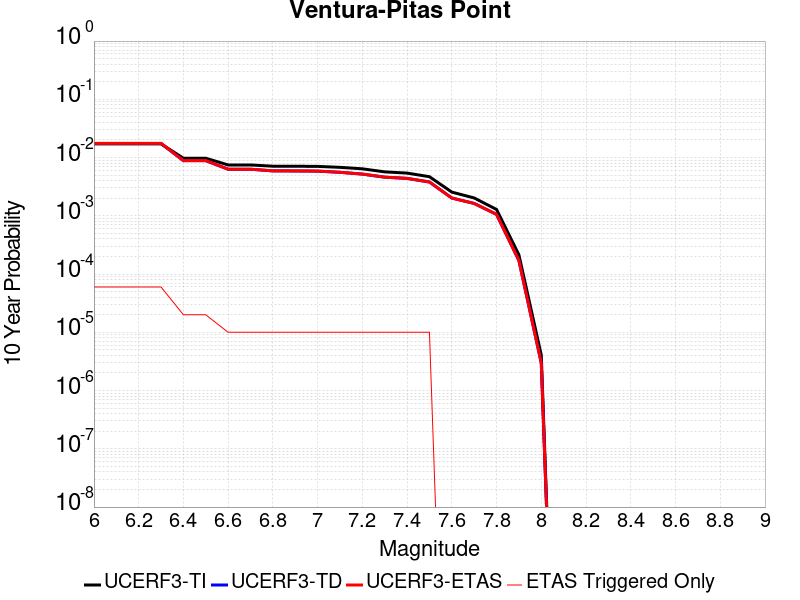 |

| Magnitude | 1 wk TI Prob | 1 wk TD Prob | 1 wk ETAS Prob | 1 wk ETAS/TD Gain | 1 wk ETAS Triggered Only | 1 mo TI Prob | 1 mo TD Prob | 1 mo ETAS Prob | 1 mo ETAS/TD Gain | 1 mo ETAS Triggered Only | 1 yr TI Prob | 1 yr TD Prob | 1 yr ETAS Prob | 1 yr ETAS/TD Gain | 1 yr ETAS Triggered Only | 10 yr TI Prob | 10 yr TD Prob | 10 yr ETAS Prob | 10 yr ETAS/TD Gain | 10 yr ETAS Triggered Only |
|-----|-----|-----|-----|-----|-----|-----|-----|-----|-----|-----|-----|-----|-----|-----|-----|-----|-----|-----|-----|-----|
| 6.0 | 3.3179622E-5 | 3.3735807E-5 | 3.3735807E-5 | 1.0 | 0.0 | 1.4219063E-4 | 1.4457546E-4 | 1.5457401E-4 | 1.0691581 | 1.0E-5 | 0.0017297962 | 0.001759042 | 0.0017889893 | 1.0170248 | 3.0E-5 | 0.017163932 | 0.01747672 | 0.017535672 | 1.0033731 | 6.0E-5 |
| 6.1 | 3.3179622E-5 | 3.3735807E-5 | 3.3735807E-5 | 1.0 | 0.0 | 1.4219063E-4 | 1.4457546E-4 | 1.5457401E-4 | 1.0691581 | 1.0E-5 | 0.0017297962 | 0.001759042 | 0.0017889893 | 1.0170248 | 3.0E-5 | 0.017163932 | 0.01747672 | 0.017535672 | 1.0033731 | 6.0E-5 |
| 6.2 | 3.3179622E-5 | 3.3735807E-5 | 3.3735807E-5 | 1.0 | 0.0 | 1.4219063E-4 | 1.4457546E-4 | 1.5457401E-4 | 1.0691581 | 1.0E-5 | 0.0017297962 | 0.001759042 | 0.0017889893 | 1.0170248 | 3.0E-5 | 0.017163932 | 0.01747672 | 0.017535672 | 1.0033731 | 6.0E-5 |
| 6.3 | 3.3179622E-5 | 3.3735807E-5 | 3.3735807E-5 | 1.0 | 0.0 | 1.4219063E-4 | 1.4457546E-4 | 1.5457401E-4 | 1.0691581 | 1.0E-5 | 0.0017297962 | 0.001759042 | 0.0017889893 | 1.0170248 | 3.0E-5 | 0.017163932 | 0.01747672 | 0.017535672 | 1.0033731 | 6.0E-5 |
| 6.4 | 1.8754668E-5 | 1.701988E-5 | 1.701988E-5 | 1.0 | 0.0 | 8.037467E-5 | 7.2940435E-5 | 7.2940435E-5 | 1.0 | 0.0 | 9.781223E-4 | 8.87711E-4 | 8.977022E-4 | 1.0112549 | 1.0E-5 | 0.009738282 | 0.008843987 | 0.00886381 | 1.0022414 | 2.0E-5 |
| 6.5 | 1.8754668E-5 | 1.701988E-5 | 1.701988E-5 | 1.0 | 0.0 | 8.037467E-5 | 7.2940435E-5 | 7.2940435E-5 | 1.0 | 0.0 | 9.781223E-4 | 8.87711E-4 | 8.977022E-4 | 1.0112549 | 1.0E-5 | 0.009738282 | 0.008843987 | 0.00886381 | 1.0022414 | 2.0E-5 |
| 6.6 | 1.4361558E-5 | 1.2122469E-5 | 1.2122469E-5 | 1.0 | 0.0 | 6.154808E-5 | 5.195242E-5 | 5.195242E-5 | 1.0 | 0.0 | 7.490902E-4 | 6.323394E-4 | 6.323394E-4 | 1.0 | 0.0 | 0.0074657016 | 0.0063056583 | 0.006315595 | 1.0015758 | 1.0E-5 |
| 6.7 | 1.4361558E-5 | 1.2122469E-5 | 1.2122469E-5 | 1.0 | 0.0 | 6.154808E-5 | 5.195242E-5 | 5.195242E-5 | 1.0 | 0.0 | 7.490902E-4 | 6.323394E-4 | 6.323394E-4 | 1.0 | 0.0 | 0.0074657016 | 0.0063056583 | 0.006315595 | 1.0015758 | 1.0E-5 |
| 6.8 | 1.3663846E-5 | 1.13446E-5 | 1.13446E-5 | 1.0 | 0.0 | 5.8558027E-5 | 4.8618822E-5 | 4.8618822E-5 | 1.0 | 0.0 | 7.127108E-4 | 5.917753E-4 | 5.917753E-4 | 1.0 | 0.0 | 0.007104293 | 0.0059022107 | 0.0059121517 | 1.0016843 | 1.0E-5 |
| 6.9 | 1.3644157E-5 | 1.1322701E-5 | 1.1322701E-5 | 1.0 | 0.0 | 5.8473648E-5 | 4.852497E-5 | 4.852497E-5 | 1.0 | 0.0 | 7.116841E-4 | 5.9063325E-4 | 5.9063325E-4 | 1.0 | 0.0 | 0.007094092 | 0.005890851 | 0.0059007923 | 1.0016875 | 1.0E-5 |
| 7.0 | 1.3568845E-5 | 1.1242266E-5 | 1.1242266E-5 | 1.0 | 0.0 | 5.8150898E-5 | 4.818026E-5 | 4.818026E-5 | 1.0 | 0.0 | 7.077572E-4 | 5.8643875E-4 | 5.8643875E-4 | 1.0 | 0.0 | 0.007055073 | 0.005849127 | 0.0058590686 | 1.0016997 | 1.0E-5 |
| 7.1 | 1.306572E-5 | 1.0720711E-5 | 1.0720711E-5 | 1.0 | 0.0 | 5.599474E-5 | 4.5945108E-5 | 4.5945108E-5 | 1.0 | 0.0 | 6.815227E-4 | 5.5923994E-4 | 5.5923994E-4 | 1.0 | 0.0 | 0.0067943637 | 0.0055785314 | 0.0055884756 | 1.0017825 | 1.0E-5 |
| 7.2 | 1.232604E-5 | 9.995298E-6 | 9.995298E-6 | 1.0 | 0.0 | 5.2824813E-5 | 4.28363E-5 | 4.28363E-5 | 1.0 | 0.0 | 6.429523E-4 | 5.2140886E-4 | 5.2140886E-4 | 1.0 | 0.0 | 0.0064109527 | 0.005202047 | 0.005211995 | 1.0019124 | 1.0E-5 |
| 7.3 | 1.0917261E-5 | 8.843967E-6 | 8.843967E-6 | 1.0 | 0.0 | 4.678742E-5 | 3.7902173E-5 | 3.7902173E-5 | 1.0 | 0.0 | 5.69488E-4 | 4.6136283E-4 | 4.6136283E-4 | 1.0 | 0.0 | 0.0056803077 | 0.0046042157 | 0.0046141697 | 1.002162 | 1.0E-5 |
| 7.4 | 1.039959E-5 | 8.423679E-6 | 8.423679E-6 | 1.0 | 0.0 | 4.456891E-5 | 3.610099E-5 | 3.610099E-5 | 1.0 | 0.0 | 5.424914E-4 | 4.3944246E-4 | 4.3944246E-4 | 1.0 | 0.0 | 0.0054116896 | 0.004385897 | 0.004395853 | 1.00227 | 1.0E-5 |
| 7.5 | 9.015877E-6 | 7.297639E-6 | 7.297639E-6 | 1.0 | 0.0 | 3.86389E-5 | 3.1275227E-5 | 3.1275227E-5 | 1.0 | 0.0 | 4.7032707E-4 | 3.807108E-4 | 3.807108E-4 | 1.0 | 0.0 | 0.004693329 | 0.003800731 | 0.0038106928 | 1.002621 | 1.0E-5 |
| 7.6 | 4.900162E-6 | 3.8741514E-6 | 3.8741514E-6 | 1.0 | 0.0 | 2.1000526E-5 | 1.66034E-5 | 1.66034E-5 | 1.0 | 0.0 | 2.556514E-4 | 2.0212779E-4 | 2.0212779E-4 | 1.0 | 0.0 | 0.0025535747 | 0.002019453 | 0.002019453 | 1.0 | 0.0 |
| 7.7 | 3.8850626E-6 | 3.126758E-6 | 3.126758E-6 | 1.0 | 0.0 | 1.6650163E-5 | 1.3400323E-5 | 1.3400323E-5 | 1.0 | 0.0 | 2.0269687E-4 | 1.631368E-4 | 1.631368E-4 | 1.0 | 0.0 | 0.002025121 | 0.0016301798 | 0.0016301798 | 1.0 | 0.0 |
| 7.8 | 2.4654719E-6 | 2.029892E-6 | 2.029892E-6 | 1.0 | 0.0 | 1.0566265E-5 | 8.699508E-6 | 8.699508E-6 | 1.0 | 0.0 | 1.2863669E-4 | 1.0591141E-4 | 1.0591141E-4 | 1.0 | 0.0 | 0.0012856225 | 0.001058614 | 0.001058614 | 1.0 | 0.0 |
| 7.9 | 4.095894E-7 | 3.2765047E-7 | 3.2765047E-7 | 1.0 | 0.0 | 1.7553821E-6 | 1.4042156E-6 | 1.4042156E-6 | 1.0 | 0.0 | 2.1371567E-5 | 1.7096194E-5 | 1.7096194E-5 | 1.0 | 0.0 | 2.1369511E-4 | 1.7094909E-4 | 1.7094909E-4 | 1.0 | 0.0 |
| 8.0 | 7.791402E-9 | 5.683553E-9 | 5.683553E-9 | 1.0 | 0.0 | 3.3391725E-8 | 2.4358085E-8 | 2.4358085E-8 | 1.0 | 0.0 | 4.0654416E-7 | 2.9655968E-7 | 2.9655968E-7 | 1.0 | 0.0 | 4.065434E-6 | 2.9655946E-6 | 2.9655946E-6 | 1.0 | 0.0 |

## Whittier alt 1
*[(top)](#table-of-contents)*

| 1 Week | 1 Month | 1 Year | 10 Year |
|-----|-----|-----|-----|
|  |  |  | 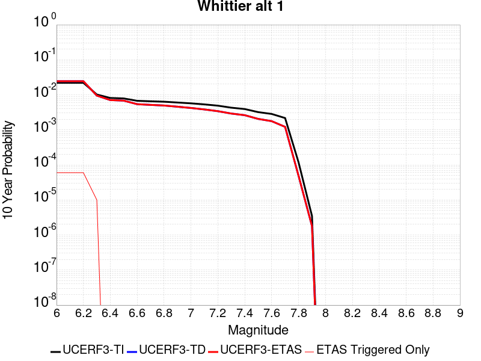 |

| Magnitude | 1 wk TI Prob | 1 wk TD Prob | 1 wk ETAS Prob | 1 wk ETAS/TD Gain | 1 wk ETAS Triggered Only | 1 mo TI Prob | 1 mo TD Prob | 1 mo ETAS Prob | 1 mo ETAS/TD Gain | 1 mo ETAS Triggered Only | 1 yr TI Prob | 1 yr TD Prob | 1 yr ETAS Prob | 1 yr ETAS/TD Gain | 1 yr ETAS Triggered Only | 10 yr TI Prob | 10 yr TD Prob | 10 yr ETAS Prob | 10 yr ETAS/TD Gain | 10 yr ETAS Triggered Only |
|-----|-----|-----|-----|-----|-----|-----|-----|-----|-----|-----|-----|-----|-----|-----|-----|-----|-----|-----|-----|-----|
| 6.0 | 4.2554693E-5 | 4.7253463E-5 | 4.7253463E-5 | 1.0 | 0.0 | 1.8236451E-4 | 2.0250095E-4 | 2.1249891E-4 | 1.0493724 | 1.0E-5 | 0.002218027 | 0.0024629822 | 0.0024829328 | 1.0081003 | 2.0E-5 | 0.02196019 | 0.02439089 | 0.024449425 | 1.0023999 | 6.0E-5 |
| 6.1 | 4.2554693E-5 | 4.7253463E-5 | 4.7253463E-5 | 1.0 | 0.0 | 1.8236451E-4 | 2.0250095E-4 | 2.1249891E-4 | 1.0493724 | 1.0E-5 | 0.002218027 | 0.0024629822 | 0.0024829328 | 1.0081003 | 2.0E-5 | 0.02196019 | 0.02439089 | 0.024449425 | 1.0023999 | 6.0E-5 |
| 6.2 | 4.2554693E-5 | 4.7253463E-5 | 4.7253463E-5 | 1.0 | 0.0 | 1.8236451E-4 | 2.0250095E-4 | 2.1249891E-4 | 1.0493724 | 1.0E-5 | 0.002218027 | 0.0024629822 | 0.0024829328 | 1.0081003 | 2.0E-5 | 0.02196019 | 0.02439089 | 0.024449425 | 1.0023999 | 6.0E-5 |
| 6.3 | 1.9617712E-5 | 1.8269313E-5 | 1.8269313E-5 | 1.0 | 0.0 | 8.40732E-5 | 7.829482E-5 | 7.829482E-5 | 1.0 | 0.0 | 0.0010231105 | 9.528416E-4 | 9.528416E-4 | 1.0 | 0.0 | 0.01018413 | 0.009490847 | 0.009500752 | 1.0010437 | 1.0E-5 |
| 6.4 | 1.5611336E-5 | 1.3604893E-5 | 1.3604893E-5 | 1.0 | 0.0 | 6.690401E-5 | 5.8305417E-5 | 5.8305417E-5 | 1.0 | 0.0 | 8.142519E-4 | 7.0964324E-4 | 7.0964324E-4 | 1.0 | 0.0 | 0.008112748 | 0.0070757363 | 0.0070757363 | 1.0 | 0.0 |
| 6.5 | 1.5150166E-5 | 1.3101541E-5 | 1.3101541E-5 | 1.0 | 0.0 | 6.492767E-5 | 5.614829E-5 | 5.614829E-5 | 1.0 | 0.0 | 7.9020765E-4 | 6.833969E-4 | 6.833969E-4 | 1.0 | 0.0 | 0.007874036 | 0.0068149036 | 0.0068149036 | 1.0 | 0.0 |
| 6.6 | 1.295588E-5 | 1.0381249E-5 | 1.0381249E-5 | 1.0 | 0.0 | 5.552402E-5 | 4.449032E-5 | 4.449032E-5 | 1.0 | 0.0 | 6.7579525E-4 | 5.4153695E-4 | 5.4153695E-4 | 1.0 | 0.0 | 0.006737438 | 0.005403607 | 0.005403607 | 1.0 | 0.0 |
| 6.7 | 1.2542085E-5 | 9.899882E-6 | 9.899882E-6 | 1.0 | 0.0 | 5.3750682E-5 | 4.2427386E-5 | 4.2427386E-5 | 1.0 | 0.0 | 6.542181E-4 | 5.1643286E-4 | 5.1643286E-4 | 1.0 | 0.0 | 0.006522954 | 0.0051537454 | 0.0051537454 | 1.0 | 0.0 |
| 6.8 | 1.2195878E-5 | 9.495912E-6 | 9.495912E-6 | 1.0 | 0.0 | 5.2267E-5 | 4.0696144E-5 | 4.0696144E-5 | 1.0 | 0.0 | 6.36165E-4 | 4.953648E-4 | 4.953648E-4 | 1.0 | 0.0 | 0.0063434686 | 0.0049439464 | 0.0049439464 | 1.0 | 0.0 |
| 6.9 | 1.1580298E-5 | 8.773408E-6 | 8.773408E-6 | 1.0 | 0.0 | 4.9628903E-5 | 3.7599788E-5 | 3.7599788E-5 | 1.0 | 0.0 | 6.040644E-4 | 4.576829E-4 | 4.576829E-4 | 1.0 | 0.0 | 0.00602425 | 0.0045686625 | 0.0045686625 | 1.0 | 0.0 |
| 7.0 | 1.0964795E-5 | 8.084448E-6 | 8.084448E-6 | 1.0 | 0.0 | 4.6991136E-5 | 3.4647182E-5 | 3.4647182E-5 | 1.0 | 0.0 | 5.7196687E-4 | 4.2174934E-4 | 4.2174934E-4 | 1.0 | 0.0 | 0.0057049696 | 0.004210698 | 0.004210698 | 1.0 | 0.0 |
| 7.1 | 1.0230601E-5 | 7.3269985E-6 | 7.3269985E-6 | 1.0 | 0.0 | 4.3844695E-5 | 3.140105E-5 | 3.140105E-5 | 1.0 | 0.0 | 5.336784E-4 | 3.8224205E-4 | 3.8224205E-4 | 1.0 | 0.0 | 0.005323986 | 0.0038170093 | 0.0038170093 | 1.0 | 0.0 |
| 7.2 | 9.40865E-6 | 6.5435725E-6 | 6.5435725E-6 | 1.0 | 0.0 | 4.032216E-5 | 2.8043587E-5 | 2.8043587E-5 | 1.0 | 0.0 | 4.908117E-4 | 3.413784E-4 | 3.413784E-4 | 1.0 | 0.0 | 0.0048972913 | 0.0034096325 | 0.0034096325 | 1.0 | 0.0 |
| 7.3 | 8.237384E-6 | 5.5979945E-6 | 5.5979945E-6 | 1.0 | 0.0 | 3.5302593E-5 | 2.399119E-5 | 2.399119E-5 | 1.0 | 0.0 | 4.2972428E-4 | 2.9205464E-4 | 2.9205464E-4 | 1.0 | 0.0 | 0.0042889426 | 0.002917029 | 0.002917029 | 1.0 | 0.0 |
| 7.4 | 7.5316966E-6 | 5.0280382E-6 | 5.0280382E-6 | 1.0 | 0.0 | 3.2278298E-5 | 2.1548563E-5 | 2.1548563E-5 | 1.0 | 0.0 | 3.9291743E-4 | 2.6232318E-4 | 2.6232318E-4 | 1.0 | 0.0 | 0.0039222343 | 0.0026202472 | 0.0026202472 | 1.0 | 0.0 |
| 7.5 | 6.149649E-6 | 3.934013E-6 | 3.934013E-6 | 1.0 | 0.0 | 2.6355372E-5 | 1.685995E-5 | 1.685995E-5 | 1.0 | 0.0 | 3.208294E-4 | 2.0525148E-4 | 2.0525148E-4 | 1.0 | 0.0 | 0.003203666 | 0.0020507083 | 0.0020507083 | 1.0 | 0.0 |
| 7.6 | 5.457711E-6 | 3.395529E-6 | 3.395529E-6 | 1.0 | 0.0 | 2.338998E-5 | 1.4552191E-5 | 1.4552191E-5 | 1.0 | 0.0 | 2.8473578E-4 | 1.7715934E-4 | 1.7715934E-4 | 1.0 | 0.0 | 0.0028437122 | 0.0017702618 | 0.0017702618 | 1.0 | 0.0 |
| 7.7 | 4.1676276E-6 | 2.3333084E-6 | 2.3333084E-6 | 1.0 | 0.0 | 1.7861139E-5 | 9.99986E-6 | 9.99986E-6 | 1.0 | 0.0 | 2.1743766E-4 | 1.2174223E-4 | 1.2174223E-4 | 1.0 | 0.0 | 0.0021722503 | 0.0012168285 | 0.0012168285 | 1.0 | 0.0 |
| 7.8 | 2.2692414E-7 | 9.385943E-8 | 9.385943E-8 | 1.0 | 0.0 | 9.725317E-7 | 4.0225464E-7 | 4.0225464E-7 | 1.0 | 0.0 | 1.1840509E-5 | 4.8974425E-6 | 4.8974425E-6 | 1.0 | 0.0 | 1.1839878E-4 | 4.8973674E-5 | 4.8973674E-5 | 1.0 | 0.0 |
| 7.9 | 6.676829E-9 | 3.4399772E-9 | 3.4399772E-9 | 1.0 | 0.0 | 2.861498E-8 | 1.4742759E-8 | 1.4742759E-8 | 1.0 | 0.0 | 3.4838732E-7 | 1.7949307E-7 | 1.7949307E-7 | 1.0 | 0.0 | 3.4838679E-6 | 1.7949295E-6 | 1.7949295E-6 | 1.0 | 0.0 |

## Tin Mountain
*[(top)](#table-of-contents)*

| 1 Week | 1 Month | 1 Year | 10 Year |
|-----|-----|-----|-----|
|  | 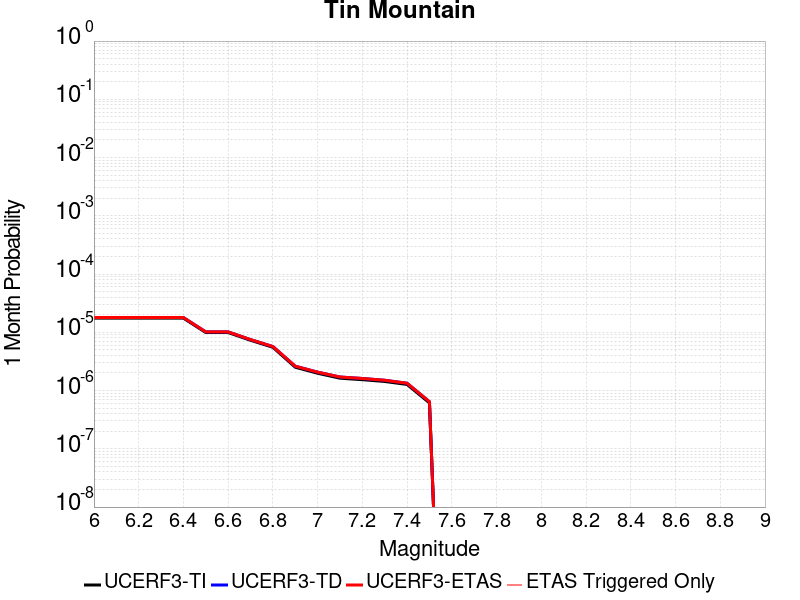 |  |  |

| Magnitude | 1 wk TI Prob | 1 wk TD Prob | 1 wk ETAS Prob | 1 wk ETAS/TD Gain | 1 wk ETAS Triggered Only | 1 mo TI Prob | 1 mo TD Prob | 1 mo ETAS Prob | 1 mo ETAS/TD Gain | 1 mo ETAS Triggered Only | 1 yr TI Prob | 1 yr TD Prob | 1 yr ETAS Prob | 1 yr ETAS/TD Gain | 1 yr ETAS Triggered Only | 10 yr TI Prob | 10 yr TD Prob | 10 yr ETAS Prob | 10 yr ETAS/TD Gain | 10 yr ETAS Triggered Only |
|-----|-----|-----|-----|-----|-----|-----|-----|-----|-----|-----|-----|-----|-----|-----|-----|-----|-----|-----|-----|-----|
| 6.0 | 4.083776E-6 | 4.18155E-6 | 4.18155E-6 | 1.0 | 0.0 | 1.750178E-5 | 1.7920827E-5 | 1.7920827E-5 | 1.0 | 0.0 | 2.1306332E-4 | 2.1816794E-4 | 2.3816357E-4 | 1.0916525 | 2.0E-5 | 0.0021285915 | 0.0021799032 | 0.0022297944 | 1.0228868 | 5.0E-5 |
| 6.1 | 4.083776E-6 | 4.18155E-6 | 4.18155E-6 | 1.0 | 0.0 | 1.750178E-5 | 1.7920827E-5 | 1.7920827E-5 | 1.0 | 0.0 | 2.1306332E-4 | 2.1816794E-4 | 2.3816357E-4 | 1.0916525 | 2.0E-5 | 0.0021285915 | 0.0021799032 | 0.0022297944 | 1.0228868 | 5.0E-5 |
| 6.2 | 4.083776E-6 | 4.18155E-6 | 4.18155E-6 | 1.0 | 0.0 | 1.750178E-5 | 1.7920827E-5 | 1.7920827E-5 | 1.0 | 0.0 | 2.1306332E-4 | 2.1816794E-4 | 2.3816357E-4 | 1.0916525 | 2.0E-5 | 0.0021285915 | 0.0021799032 | 0.0022297944 | 1.0228868 | 5.0E-5 |
| 6.3 | 4.083776E-6 | 4.18155E-6 | 4.18155E-6 | 1.0 | 0.0 | 1.750178E-5 | 1.7920827E-5 | 1.7920827E-5 | 1.0 | 0.0 | 2.1306332E-4 | 2.1816794E-4 | 2.3816357E-4 | 1.0916525 | 2.0E-5 | 0.0021285915 | 0.0021799032 | 0.0022297944 | 1.0228868 | 5.0E-5 |
| 6.4 | 4.083776E-6 | 4.18155E-6 | 4.18155E-6 | 1.0 | 0.0 | 1.750178E-5 | 1.7920827E-5 | 1.7920827E-5 | 1.0 | 0.0 | 2.1306332E-4 | 2.1816794E-4 | 2.3816357E-4 | 1.0916525 | 2.0E-5 | 0.0021285915 | 0.0021799032 | 0.0022297944 | 1.0228868 | 5.0E-5 |
| 6.5 | 2.3143427E-6 | 2.3731652E-6 | 2.3731652E-6 | 1.0 | 0.0 | 9.9185745E-6 | 1.0170673E-5 | 1.0170673E-5 | 1.0 | 0.0 | 1.2075195E-4 | 1.2382168E-4 | 1.3382045E-4 | 1.0807513 | 1.0E-5 | 0.0012068636 | 0.0012376028 | 0.0012675656 | 1.0242105 | 3.0E-5 |
| 6.6 | 2.3143427E-6 | 2.3731652E-6 | 2.3731652E-6 | 1.0 | 0.0 | 9.9185745E-6 | 1.0170673E-5 | 1.0170673E-5 | 1.0 | 0.0 | 1.2075195E-4 | 1.2382168E-4 | 1.3382045E-4 | 1.0807513 | 1.0E-5 | 0.0012068636 | 0.0012376028 | 0.0012675656 | 1.0242105 | 3.0E-5 |
| 6.7 | 1.7029532E-6 | 1.7497979E-6 | 1.7497979E-6 | 1.0 | 0.0 | 7.2983503E-6 | 7.4991153E-6 | 7.4991153E-6 | 1.0 | 0.0 | 8.885379E-5 | 9.129844E-5 | 9.129844E-5 | 1.0 | 0.0 | 8.881827E-4 | 9.1266196E-4 | 9.2265283E-4 | 1.010947 | 1.0E-5 |
| 6.8 | 1.2914646E-6 | 1.3299432E-6 | 1.3299432E-6 | 1.0 | 0.0 | 5.534837E-6 | 5.6997465E-6 | 5.6997465E-6 | 1.0 | 0.0 | 6.738455E-5 | 6.939264E-5 | 6.939264E-5 | 1.0 | 0.0 | 6.736412E-4 | 6.937531E-4 | 6.937531E-4 | 1.0 | 0.0 |
| 6.9 | 5.8708974E-7 | 6.117028E-7 | 6.117028E-7 | 1.0 | 0.0 | 2.5160964E-6 | 2.621581E-6 | 2.621581E-6 | 1.0 | 0.0 | 3.0633044E-5 | 3.1917323E-5 | 3.1917323E-5 | 1.0 | 0.0 | 3.0628822E-4 | 3.191315E-4 | 3.191315E-4 | 1.0 | 0.0 |
| 7.0 | 4.6248786E-7 | 4.832044E-7 | 4.832044E-7 | 1.0 | 0.0 | 1.9820893E-6 | 2.0708746E-6 | 2.0708746E-6 | 1.0 | 0.0 | 2.413167E-5 | 2.5212645E-5 | 2.5212645E-5 | 1.0 | 0.0 | 2.412905E-4 | 2.5210154E-4 | 2.5210154E-4 | 1.0 | 0.0 |
| 7.1 | 3.804606E-7 | 3.9871725E-7 | 3.9871725E-7 | 1.0 | 0.0 | 1.6305444E-6 | 1.7087873E-6 | 1.7087873E-6 | 1.0 | 0.0 | 1.9851697E-5 | 2.080432E-5 | 2.080432E-5 | 1.0 | 0.0 | 1.9849923E-4 | 2.080271E-4 | 2.080271E-4 | 1.0 | 0.0 |
| 7.2 | 3.5864858E-7 | 3.7617107E-7 | 3.7617107E-7 | 1.0 | 0.0 | 1.5370645E-6 | 1.6121609E-6 | 1.6121609E-6 | 1.0 | 0.0 | 1.87136E-5 | 1.9627916E-5 | 1.9627916E-5 | 1.0 | 0.0 | 1.8712023E-4 | 1.9626514E-4 | 1.9626514E-4 | 1.0 | 0.0 |
| 7.3 | 3.342063E-7 | 3.50637E-7 | 3.50637E-7 | 1.0 | 0.0 | 1.4323119E-6 | 1.5027293E-6 | 1.5027293E-6 | 1.0 | 0.0 | 1.7438259E-5 | 1.829561E-5 | 1.829561E-5 | 1.0 | 0.0 | 1.743689E-4 | 1.8294434E-4 | 1.8294434E-4 | 1.0 | 0.0 |
| 7.4 | 2.971242E-7 | 3.116602E-7 | 3.116602E-7 | 1.0 | 0.0 | 1.2733886E-6 | 1.3356861E-6 | 1.3356861E-6 | 1.0 | 0.0 | 1.5503398E-5 | 1.626189E-5 | 1.626189E-5 | 1.0 | 0.0 | 1.5502315E-4 | 1.6261027E-4 | 1.6261027E-4 | 1.0 | 0.0 |
| 7.5 | 1.4326713E-7 | 1.501262E-7 | 1.501262E-7 | 1.0 | 0.0 | 6.140018E-7 | 6.43398E-7 | 6.43398E-7 | 1.0 | 0.0 | 7.4754466E-6 | 7.833371E-6 | 7.833371E-6 | 1.0 | 0.0 | 7.475195E-5 | 7.83337E-5 | 7.83337E-5 | 1.0 | 0.0 |

## Santa Ynez River
*[(top)](#table-of-contents)*

| 1 Week | 1 Month | 1 Year | 10 Year |
|-----|-----|-----|-----|
|  |  |  |  |

| Magnitude | 1 wk TI Prob | 1 wk TD Prob | 1 wk ETAS Prob | 1 wk ETAS/TD Gain | 1 wk ETAS Triggered Only | 1 mo TI Prob | 1 mo TD Prob | 1 mo ETAS Prob | 1 mo ETAS/TD Gain | 1 mo ETAS Triggered Only | 1 yr TI Prob | 1 yr TD Prob | 1 yr ETAS Prob | 1 yr ETAS/TD Gain | 1 yr ETAS Triggered Only | 10 yr TI Prob | 10 yr TD Prob | 10 yr ETAS Prob | 10 yr ETAS/TD Gain | 10 yr ETAS Triggered Only |
|-----|-----|-----|-----|-----|-----|-----|-----|-----|-----|-----|-----|-----|-----|-----|-----|-----|-----|-----|-----|-----|
| 6.0 | 1.6396456E-5 | 1.7209564E-5 | 1.7209564E-5 | 1.0 | 0.0 | 7.026863E-5 | 7.375339E-5 | 9.3751914E-5 | 1.2711539 | 2.0E-5 | 8.551848E-4 | 8.976132E-4 | 9.275862E-4 | 1.033392 | 3.0E-5 | 0.0085190125 | 0.008943425 | 0.008992977 | 1.0055407 | 5.0E-5 |
| 6.1 | 1.6396456E-5 | 1.7209564E-5 | 1.7209564E-5 | 1.0 | 0.0 | 7.026863E-5 | 7.375339E-5 | 9.3751914E-5 | 1.2711539 | 2.0E-5 | 8.551848E-4 | 8.976132E-4 | 9.275862E-4 | 1.033392 | 3.0E-5 | 0.0085190125 | 0.008943425 | 0.008992977 | 1.0055407 | 5.0E-5 |
| 6.2 | 1.6396456E-5 | 1.7209564E-5 | 1.7209564E-5 | 1.0 | 0.0 | 7.026863E-5 | 7.375339E-5 | 9.3751914E-5 | 1.2711539 | 2.0E-5 | 8.551848E-4 | 8.976132E-4 | 9.275862E-4 | 1.033392 | 3.0E-5 | 0.0085190125 | 0.008943425 | 0.008992977 | 1.0055407 | 5.0E-5 |
| 6.3 | 9.736976E-6 | 1.0122399E-5 | 1.0122399E-5 | 1.0 | 0.0 | 4.172923E-5 | 4.3381016E-5 | 6.338015E-5 | 1.4610112 | 2.0E-5 | 5.0793495E-4 | 5.2804087E-4 | 5.480303E-4 | 1.0378559 | 2.0E-5 | 0.005067755 | 0.0052683675 | 0.005308157 | 1.0075525 | 4.0E-5 |
| 6.4 | 9.736976E-6 | 1.0122399E-5 | 1.0122399E-5 | 1.0 | 0.0 | 4.172923E-5 | 4.3381016E-5 | 6.338015E-5 | 1.4610112 | 2.0E-5 | 5.0793495E-4 | 5.2804087E-4 | 5.480303E-4 | 1.0378559 | 2.0E-5 | 0.005067755 | 0.0052683675 | 0.005308157 | 1.0075525 | 4.0E-5 |
| 6.5 | 7.081964E-6 | 7.3299457E-6 | 7.3299457E-6 | 1.0 | 0.0 | 3.035092E-5 | 3.1413685E-5 | 5.1413055E-5 | 1.6366452 | 2.0E-5 | 3.694598E-4 | 3.8239607E-4 | 4.0238842E-4 | 1.0522817 | 2.0E-5 | 0.0036884616 | 0.0038175425 | 0.0038573898 | 1.010438 | 4.0E-5 |
| 6.6 | 5.873247E-6 | 6.0597836E-6 | 6.0597836E-6 | 1.0 | 0.0 | 2.5170815E-5 | 2.5970248E-5 | 4.596973E-5 | 1.770092 | 2.0E-5 | 3.064116E-4 | 3.1614274E-4 | 3.3613644E-4 | 1.0632426 | 2.0E-5 | 0.0030598943 | 0.0031570175 | 0.0031869228 | 1.0094726 | 3.0E-5 |
| 6.7 | 4.973277E-6 | 5.115936E-6 | 5.115936E-6 | 1.0 | 0.0 | 2.1313872E-5 | 2.1925258E-5 | 4.1924817E-5 | 1.9121699 | 2.0E-5 | 2.5946548E-4 | 2.669078E-4 | 2.8690245E-4 | 1.0749122 | 2.0E-5 | 0.0025916274 | 0.002665921 | 0.0026958412 | 1.0112232 | 3.0E-5 |
| 6.8 | 4.396492E-6 | 4.5110087E-6 | 4.5110087E-6 | 1.0 | 0.0 | 1.884197E-5 | 1.9332752E-5 | 3.9332364E-5 | 2.034494 | 2.0E-5 | 2.2937685E-4 | 2.3535118E-4 | 2.5534647E-4 | 1.0849594 | 2.0E-5 | 0.0022914023 | 0.0023510547 | 0.0023710076 | 1.0084869 | 2.0E-5 |
| 6.9 | 3.5255632E-6 | 3.6013587E-6 | 3.6013587E-6 | 1.0 | 0.0 | 1.5109469E-5 | 1.5434303E-5 | 2.543415E-5 | 1.6478974 | 1.0E-5 | 1.8394225E-4 | 1.878966E-4 | 1.9789473E-4 | 1.0532107 | 1.0E-5 | 0.0018379007 | 0.0018773936 | 0.0018873748 | 1.0053165 | 1.0E-5 |
| 7.0 | 3.211603E-6 | 3.2736775E-6 | 3.2736775E-6 | 1.0 | 0.0 | 1.376394E-5 | 1.4029972E-5 | 2.4029832E-5 | 1.7127498 | 1.0E-5 | 1.6756308E-4 | 1.7080165E-4 | 1.8079995E-4 | 1.0585375 | 1.0E-5 | 0.0016743679 | 0.001706718 | 0.001716701 | 1.0058492 | 1.0E-5 |
| 7.1 | 2.5094619E-6 | 2.5409397E-6 | 2.5409397E-6 | 1.0 | 0.0 | 1.0754793E-5 | 1.0889697E-5 | 1.0889697E-5 | 1.0 | 0.0 | 1.3093173E-4 | 1.3257404E-4 | 1.3257404E-4 | 1.0 | 0.0 | 0.0013085462 | 0.0013249556 | 0.0013249556 | 1.0 | 0.0 |
| 7.2 | 2.0515774E-6 | 2.0619539E-6 | 2.0619539E-6 | 1.0 | 0.0 | 8.792445E-6 | 8.836915E-6 | 8.836915E-6 | 1.0 | 0.0 | 1.0704277E-4 | 1.0758417E-4 | 1.0758417E-4 | 1.0 | 0.0 | 0.0010699122 | 0.0010753252 | 0.0010753252 | 1.0 | 0.0 |
| 7.3 | 1.6845745E-6 | 1.6774045E-6 | 1.6774045E-6 | 1.0 | 0.0 | 7.219585E-6 | 7.1888567E-6 | 7.1888567E-6 | 1.0 | 0.0 | 8.78949E-5 | 8.752084E-5 | 8.752084E-5 | 1.0 | 0.0 | 8.7860145E-4 | 8.748666E-4 | 8.748666E-4 | 1.0 | 0.0 |
| 7.4 | 1.3600285E-6 | 1.3333469E-6 | 1.3333469E-6 | 1.0 | 0.0 | 5.82868E-6 | 5.714331E-6 | 5.714331E-6 | 1.0 | 0.0 | 7.096187E-5 | 6.956978E-5 | 6.956978E-5 | 1.0 | 0.0 | 7.0939213E-4 | 6.9548225E-4 | 6.9548225E-4 | 1.0 | 0.0 |
| 7.5 | 9.735342E-7 | 9.290183E-7 | 9.290183E-7 | 1.0 | 0.0 | 4.172283E-6 | 3.981501E-6 | 3.981501E-6 | 1.0 | 0.0 | 5.079636E-5 | 4.8473714E-5 | 4.8473714E-5 | 1.0 | 0.0 | 5.0784746E-4 | 4.846331E-4 | 4.846331E-4 | 1.0 | 0.0 |
| 7.6 | 5.067187E-7 | 4.778607E-7 | 4.778607E-7 | 1.0 | 0.0 | 2.1716498E-6 | 2.0479727E-6 | 2.0479727E-6 | 1.0 | 0.0 | 2.6439517E-5 | 2.493379E-5 | 2.493379E-5 | 1.0 | 0.0 | 2.643637E-4 | 2.4931066E-4 | 2.4931066E-4 | 1.0 | 0.0 |
| 7.7 | 2.769089E-7 | 2.5759311E-7 | 2.5759311E-7 | 1.0 | 0.0 | 1.1867519E-6 | 1.1039699E-6 | 1.1039699E-6 | 1.0 | 0.0 | 1.4448608E-5 | 1.3440752E-5 | 1.3440752E-5 | 1.0 | 0.0 | 1.444767E-4 | 1.3439942E-4 | 1.3439942E-4 | 1.0 | 0.0 |
| 7.8 | 1.7044663E-7 | 1.5449127E-7 | 1.5449127E-7 | 1.0 | 0.0 | 7.3048534E-7 | 6.6210526E-7 | 6.6210526E-7 | 1.0 | 0.0 | 8.893623E-6 | 8.061102E-6 | 8.061102E-6 | 1.0 | 0.0 | 8.893267E-5 | 8.0608115E-5 | 8.0608115E-5 | 1.0 | 0.0 |
| 7.9 | 4.8344287E-8 | 4.0911235E-8 | 4.0911235E-8 | 1.0 | 0.0 | 2.0718979E-7 | 1.7533385E-7 | 1.7533385E-7 | 1.0 | 0.0 | 2.5225327E-6 | 2.1346877E-6 | 2.1346877E-6 | 1.0 | 0.0 | 2.5225041E-5 | 2.1346676E-5 | 2.1346676E-5 | 1.0 | 0.0 |

## Rose Canyon
*[(top)](#table-of-contents)*

| 1 Week | 1 Month | 1 Year | 10 Year |
|-----|-----|-----|-----|
| 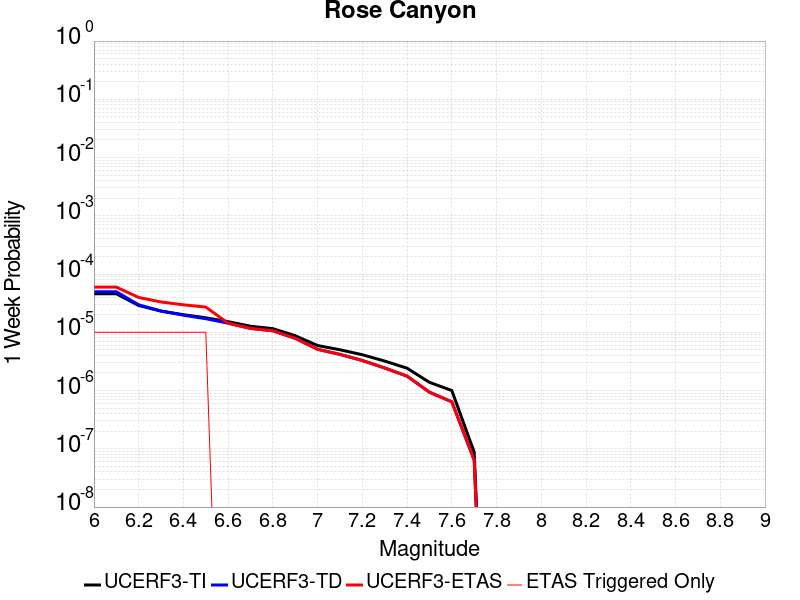 |  | 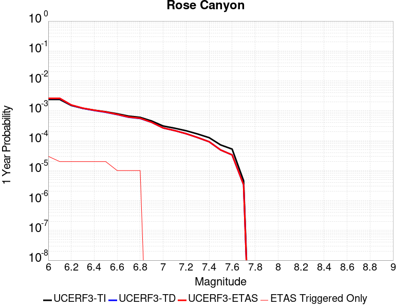 |  |

| Magnitude | 1 wk TI Prob | 1 wk TD Prob | 1 wk ETAS Prob | 1 wk ETAS/TD Gain | 1 wk ETAS Triggered Only | 1 mo TI Prob | 1 mo TD Prob | 1 mo ETAS Prob | 1 mo ETAS/TD Gain | 1 mo ETAS Triggered Only | 1 yr TI Prob | 1 yr TD Prob | 1 yr ETAS Prob | 1 yr ETAS/TD Gain | 1 yr ETAS Triggered Only | 10 yr TI Prob | 10 yr TD Prob | 10 yr ETAS Prob | 10 yr ETAS/TD Gain | 10 yr ETAS Triggered Only |
|-----|-----|-----|-----|-----|-----|-----|-----|-----|-----|-----|-----|-----|-----|-----|-----|-----|-----|-----|-----|-----|
| 6.0 | 4.5923203E-5 | 4.9715825E-5 | 5.9715327E-5 | 1.2011333 | 1.0E-5 | 1.9679888E-4 | 2.1305127E-4 | 2.2304915E-4 | 1.0469271 | 1.0E-5 | 0.0023933933 | 0.0025910123 | 0.0026209347 | 1.0115485 | 3.0E-5 | 0.023677798 | 0.025640773 | 0.025679747 | 1.00152 | 4.0E-5 |
| 6.1 | 4.5923203E-5 | 4.9715825E-5 | 5.9715327E-5 | 1.2011333 | 1.0E-5 | 1.9679888E-4 | 2.1305127E-4 | 2.2304915E-4 | 1.0469271 | 1.0E-5 | 0.0023933933 | 0.0025910123 | 0.0026109605 | 1.007699 | 2.0E-5 | 0.023677798 | 0.025640773 | 0.025670003 | 1.00114 | 3.0E-5 |
| 6.2 | 2.8844734E-5 | 2.9669445E-5 | 3.9669147E-5 | 1.3370371 | 1.0E-5 | 1.2361443E-4 | 1.2714828E-4 | 1.3714701E-4 | 1.0786383 | 1.0E-5 | 0.0015039665 | 0.0015469306 | 0.0015668997 | 1.0129088 | 2.0E-5 | 0.0149382865 | 0.01537464 | 0.015394333 | 1.0012808 | 2.0E-5 |
| 6.3 | 2.3171577E-5 | 2.3161689E-5 | 3.3161457E-5 | 1.4317374 | 1.0E-5 | 9.9302975E-5 | 9.926068E-5 | 1.0925969E-4 | 1.1007348 | 1.0E-5 | 0.0012083431 | 0.0012078421 | 0.001227818 | 1.0165385 | 2.0E-5 | 0.012017938 | 0.0120226685 | 0.012042427 | 1.0016435 | 2.0E-5 |
| 6.4 | 2.0066604E-5 | 1.9667403E-5 | 2.9667206E-5 | 1.5084456 | 1.0E-5 | 8.599689E-5 | 8.42862E-5 | 9.428536E-5 | 1.1186334 | 1.0E-5 | 0.0010465092 | 0.0010257114 | 0.0010456908 | 1.0194787 | 2.0E-5 | 0.010415946 | 0.010217753 | 0.0102375485 | 1.0019374 | 2.0E-5 |
| 6.5 | 1.776989E-5 | 1.7114124E-5 | 2.7113952E-5 | 1.5843028 | 1.0E-5 | 7.615444E-5 | 7.334422E-5 | 8.334348E-5 | 1.1363333 | 1.0E-5 | 9.267859E-4 | 8.92607E-4 | 9.1258914E-4 | 1.0223863 | 2.0E-5 | 0.009229303 | 0.008896374 | 0.008916196 | 1.0022281 | 2.0E-5 |
| 6.6 | 1.5227364E-5 | 1.43395055E-5 | 1.43395055E-5 | 1.0 | 0.0 | 6.52585E-5 | 6.1453604E-5 | 6.1453604E-5 | 1.0 | 0.0 | 7.942326E-4 | 7.47946E-4 | 7.5793854E-4 | 1.0133599 | 1.0E-5 | 0.007914 | 0.007458486 | 0.0074684117 | 1.0013307 | 1.0E-5 |
| 6.7 | 1.2703898E-5 | 1.167345E-5 | 1.167345E-5 | 1.0 | 0.0 | 5.4444143E-5 | 5.002814E-5 | 5.002814E-5 | 1.0 | 0.0 | 6.626558E-4 | 6.089266E-4 | 6.189205E-4 | 1.0164124 | 1.0E-5 | 0.006606833 | 0.006075177 | 0.006085116 | 1.001636 | 1.0E-5 |
| 6.8 | 1.1554917E-5 | 1.0609485E-5 | 1.0609485E-5 | 1.0 | 0.0 | 4.9520135E-5 | 4.5468452E-5 | 4.5468452E-5 | 1.0 | 0.0 | 6.0274085E-4 | 5.534419E-4 | 5.634363E-4 | 1.0180588 | 1.0E-5 | 0.0060110865 | 0.005522644 | 0.005532589 | 1.0018008 | 1.0E-5 |
| 6.9 | 8.732078E-6 | 7.881448E-6 | 7.881448E-6 | 1.0 | 0.0 | 3.7422655E-5 | 3.3777214E-5 | 3.3777214E-5 | 1.0 | 0.0 | 4.5552556E-4 | 4.111629E-4 | 4.111629E-4 | 1.0 | 0.0 | 0.0045459294 | 0.0041048555 | 0.0041048555 | 1.0 | 0.0 |
| 7.0 | 5.9337494E-6 | 5.107531E-6 | 5.107531E-6 | 1.0 | 0.0 | 2.5430107E-5 | 2.1889235E-5 | 2.1889235E-5 | 1.0 | 0.0 | 3.0956755E-4 | 2.66469E-4 | 2.66469E-4 | 1.0 | 0.0 | 0.0030913667 | 0.0026615104 | 0.0026615104 | 1.0 | 0.0 |
| 7.1 | 5.013409E-6 | 4.177419E-6 | 4.177419E-6 | 1.0 | 0.0 | 2.1485863E-5 | 1.7903103E-5 | 1.7903103E-5 | 1.0 | 0.0 | 2.6155898E-4 | 2.1794859E-4 | 2.1794859E-4 | 1.0 | 0.0 | 0.0026125133 | 0.00217736 | 0.00217736 | 1.0 | 0.0 |
| 7.2 | 4.120763E-6 | 3.2821677E-6 | 3.2821677E-6 | 1.0 | 0.0 | 1.7660293E-5 | 1.4066358E-5 | 1.4066358E-5 | 1.0 | 0.0 | 2.1499286E-4 | 1.7124454E-4 | 1.7124454E-4 | 1.0 | 0.0 | 0.0021478499 | 0.0017111353 | 0.0017111353 | 1.0 | 0.0 |
| 7.3 | 3.2081239E-6 | 2.4405597E-6 | 2.4405597E-6 | 1.0 | 0.0 | 1.374903E-5 | 1.04595E-5 | 1.04595E-5 | 1.0 | 0.0 | 1.6738157E-4 | 1.2733703E-4 | 1.2733703E-4 | 1.0 | 0.0 | 0.0016725556 | 0.0012726476 | 0.0012726476 | 1.0 | 0.0 |
| 7.4 | 2.4194755E-6 | 1.7680803E-6 | 1.7680803E-6 | 1.0 | 0.0 | 1.0369139E-5 | 7.5774656E-6 | 7.5774656E-6 | 1.0 | 0.0 | 1.2623696E-4 | 9.2251794E-5 | 9.2251794E-5 | 1.0 | 0.0 | 0.0012616527 | 9.221403E-4 | 9.221403E-4 | 1.0 | 0.0 |
| 7.5 | 1.3842889E-6 | 9.378737E-7 | 9.378737E-7 | 1.0 | 0.0 | 5.9326535E-6 | 4.0194527E-6 | 4.0194527E-6 | 1.0 | 0.0 | 7.222766E-5 | 4.8935777E-5 | 4.8935777E-5 | 1.0 | 0.0 | 7.220419E-4 | 4.8925355E-4 | 4.8925355E-4 | 1.0 | 0.0 |
| 7.6 | 1.0021575E-6 | 6.411548E-7 | 6.411548E-7 | 1.0 | 0.0 | 4.2949537E-6 | 2.7478038E-6 | 2.7478038E-6 | 1.0 | 0.0 | 5.2289808E-5 | 3.345402E-5 | 3.345402E-5 | 1.0 | 0.0 | 5.2277505E-4 | 3.3449198E-4 | 3.3449198E-4 | 1.0 | 0.0 |
| 7.7 | 8.7620116E-8 | 6.449284E-8 | 6.449284E-8 | 1.0 | 0.0 | 3.7551473E-7 | 2.7639786E-7 | 2.7639786E-7 | 1.0 | 0.0 | 4.5718825E-6 | 3.365139E-6 | 3.365139E-6 | 1.0 | 0.0 | 4.5717883E-5 | 3.365091E-5 | 3.365091E-5 | 1.0 | 0.0 |

## Elysian Park (Upper)
*[(top)](#table-of-contents)*

| 1 Week | 1 Month | 1 Year | 10 Year |
|-----|-----|-----|-----|
|  |  |  |  |

| Magnitude | 1 wk TI Prob | 1 wk TD Prob | 1 wk ETAS Prob | 1 wk ETAS/TD Gain | 1 wk ETAS Triggered Only | 1 mo TI Prob | 1 mo TD Prob | 1 mo ETAS Prob | 1 mo ETAS/TD Gain | 1 mo ETAS Triggered Only | 1 yr TI Prob | 1 yr TD Prob | 1 yr ETAS Prob | 1 yr ETAS/TD Gain | 1 yr ETAS Triggered Only | 10 yr TI Prob | 10 yr TD Prob | 10 yr ETAS Prob | 10 yr ETAS/TD Gain | 10 yr ETAS Triggered Only |
|-----|-----|-----|-----|-----|-----|-----|-----|-----|-----|-----|-----|-----|-----|-----|-----|-----|-----|-----|-----|-----|
| 6.0 | 3.1876025E-5 | 3.703652E-5 | 3.703652E-5 | 1.0 | 0.0 | 1.3660437E-4 | 1.5872101E-4 | 1.6871943E-4 | 1.0629936 | 1.0E-5 | 0.0016618895 | 0.0019311584 | 0.001941139 | 1.0051682 | 1.0E-5 | 0.016495159 | 0.019190295 | 0.019239334 | 1.0025555 | 5.0E-5 |
| 6.1 | 3.1876025E-5 | 3.703652E-5 | 3.703652E-5 | 1.0 | 0.0 | 1.3660437E-4 | 1.5872101E-4 | 1.6871943E-4 | 1.0629936 | 1.0E-5 | 0.0016618895 | 0.0019311584 | 0.001941139 | 1.0051682 | 1.0E-5 | 0.016495159 | 0.019190295 | 0.019239334 | 1.0025555 | 5.0E-5 |
| 6.2 | 3.1876025E-5 | 3.703652E-5 | 3.703652E-5 | 1.0 | 0.0 | 1.3660437E-4 | 1.5872101E-4 | 1.6871943E-4 | 1.0629936 | 1.0E-5 | 0.0016618895 | 0.0019311584 | 0.001941139 | 1.0051682 | 1.0E-5 | 0.016495159 | 0.019190295 | 0.019239334 | 1.0025555 | 5.0E-5 |
| 6.3 | 3.1876025E-5 | 3.703652E-5 | 3.703652E-5 | 1.0 | 0.0 | 1.3660437E-4 | 1.5872101E-4 | 1.6871943E-4 | 1.0629936 | 1.0E-5 | 0.0016618895 | 0.0019311584 | 0.001941139 | 1.0051682 | 1.0E-5 | 0.016495159 | 0.019190295 | 0.019239334 | 1.0025555 | 5.0E-5 |
| 6.4 | 1.9273462E-5 | 2.120273E-5 | 2.120273E-5 | 1.0 | 0.0 | 8.259794E-5 | 9.0866655E-5 | 9.0866655E-5 | 1.0 | 0.0 | 0.001005166 | 0.0011059135 | 0.0011059135 | 1.0 | 0.0 | 0.010006315 | 0.011020964 | 0.011030854 | 1.0008974 | 1.0E-5 |
| 6.5 | 1.9273462E-5 | 2.120273E-5 | 2.120273E-5 | 1.0 | 0.0 | 8.259794E-5 | 9.0866655E-5 | 9.0866655E-5 | 1.0 | 0.0 | 0.001005166 | 0.0011059135 | 0.0011059135 | 1.0 | 0.0 | 0.010006315 | 0.011020964 | 0.011030854 | 1.0008974 | 1.0E-5 |
| 6.6 | 9.813258E-6 | 9.665728E-6 | 9.665728E-6 | 1.0 | 0.0 | 4.205614E-5 | 4.142393E-5 | 4.142393E-5 | 1.0 | 0.0 | 5.119132E-4 | 5.042269E-4 | 5.042269E-4 | 1.0 | 0.0 | 0.005107356 | 0.005031552 | 0.005031552 | 1.0 | 0.0 |
| 6.7 | 9.801478E-6 | 9.653297E-6 | 9.653297E-6 | 1.0 | 0.0 | 4.2005657E-5 | 4.137066E-5 | 4.137066E-5 | 1.0 | 0.0 | 5.112989E-4 | 5.0357863E-4 | 5.0357863E-4 | 1.0 | 0.0 | 0.0051012407 | 0.0050250986 | 0.0050250986 | 1.0 | 0.0 |
| 6.8 | 8.102489E-6 | 7.7731065E-6 | 7.7731065E-6 | 1.0 | 0.0 | 3.4724493E-5 | 3.3312917E-5 | 3.3312917E-5 | 1.0 | 0.0 | 4.2268867E-4 | 4.0551423E-4 | 4.0551423E-4 | 1.0 | 0.0 | 0.004218856 | 0.0040482366 | 0.0040482366 | 1.0 | 0.0 |
| 6.9 | 6.08275E-6 | 5.4815127E-6 | 5.4815127E-6 | 1.0 | 0.0 | 2.6068668E-5 | 2.349199E-5 | 2.349199E-5 | 1.0 | 0.0 | 3.173398E-4 | 2.8597823E-4 | 2.8597823E-4 | 1.0 | 0.0 | 0.0031688702 | 0.0028561796 | 0.0028561796 | 1.0 | 0.0 |
| 7.0 | 5.5995934E-6 | 4.982836E-6 | 4.982836E-6 | 1.0 | 0.0 | 2.3998036E-5 | 2.135484E-5 | 2.135484E-5 | 1.0 | 0.0 | 2.9213692E-4 | 2.599648E-4 | 2.599648E-4 | 1.0 | 0.0 | 0.0029175316 | 0.0025966743 | 0.0025966743 | 1.0 | 0.0 |
| 7.1 | 4.709881E-6 | 4.0874465E-6 | 4.0874465E-6 | 1.0 | 0.0 | 2.0185047E-5 | 1.7517514E-5 | 1.7517514E-5 | 1.0 | 0.0 | 2.4572524E-4 | 2.1325526E-4 | 2.1325526E-4 | 1.0 | 0.0 | 0.002454537 | 0.0021305475 | 0.0021305475 | 1.0 | 0.0 |
| 7.2 | 3.6063436E-6 | 2.9779865E-6 | 2.9779865E-6 | 1.0 | 0.0 | 1.5455667E-5 | 1.2762738E-5 | 1.2762738E-5 | 1.0 | 0.0 | 1.881565E-4 | 1.5537537E-4 | 1.5537537E-4 | 1.0 | 0.0 | 0.0018799726 | 0.0015526785 | 0.0015526785 | 1.0 | 0.0 |
| 7.3 | 2.471135E-6 | 2.0954842E-6 | 2.0954842E-6 | 1.0 | 0.0 | 1.0590536E-5 | 8.980616E-6 | 8.980616E-6 | 1.0 | 0.0 | 1.2893214E-4 | 1.0933358E-4 | 1.0933358E-4 | 1.0 | 0.0 | 0.0012885736 | 0.0010928052 | 0.0010928052 | 1.0 | 0.0 |
| 7.4 | 1.163943E-6 | 1.0275212E-6 | 1.0275212E-6 | 1.0 | 0.0 | 4.988318E-6 | 4.403655E-6 | 4.403655E-6 | 1.0 | 0.0 | 6.0731076E-5 | 5.3613214E-5 | 5.3613214E-5 | 1.0 | 0.0 | 6.071448E-4 | 5.3600577E-4 | 5.3600577E-4 | 1.0 | 0.0 |
| 7.5 | 4.99459E-7 | 4.9176606E-7 | 4.9176606E-7 | 1.0 | 0.0 | 2.140537E-6 | 2.107567E-6 | 2.107567E-6 | 1.0 | 0.0 | 2.6060725E-5 | 2.5659343E-5 | 2.5659343E-5 | 1.0 | 0.0 | 2.605767E-4 | 2.5656537E-4 | 2.5656537E-4 | 1.0 | 0.0 |
| 7.6 | 2.4667852E-7 | 2.4778674E-7 | 2.4778674E-7 | 1.0 | 0.0 | 1.0571932E-6 | 1.0619428E-6 | 1.0619428E-6 | 1.0 | 0.0 | 1.2871251E-5 | 1.2929081E-5 | 1.2929081E-5 | 1.0 | 0.0 | 1.2870505E-4 | 1.2928365E-4 | 1.2928365E-4 | 1.0 | 0.0 |
| 7.7 | 8.2312795E-8 | 7.386629E-8 | 7.386629E-8 | 1.0 | 0.0 | 3.527691E-7 | 3.1656978E-7 | 3.1656978E-7 | 1.0 | 0.0 | 4.294955E-6 | 3.8542316E-6 | 3.8542316E-6 | 1.0 | 0.0 | 4.2948723E-5 | 3.8541762E-5 | 3.8541762E-5 | 1.0 | 0.0 |
| 7.8 | 2.7819295E-8 | 1.7567322E-8 | 1.7567322E-8 | 1.0 | 0.0 | 1.1922555E-7 | 7.528852E-8 | 7.528852E-8 | 1.0 | 0.0 | 1.45157E-6 | 9.166375E-7 | 9.166375E-7 | 1.0 | 0.0 | 1.45156055E-5 | 9.166352E-6 | 9.166352E-6 | 1.0 | 0.0 |

## Imperial
*[(top)](#table-of-contents)*

| 1 Week | 1 Month | 1 Year | 10 Year |
|-----|-----|-----|-----|
| 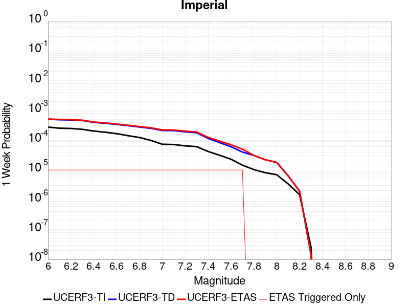 |  | 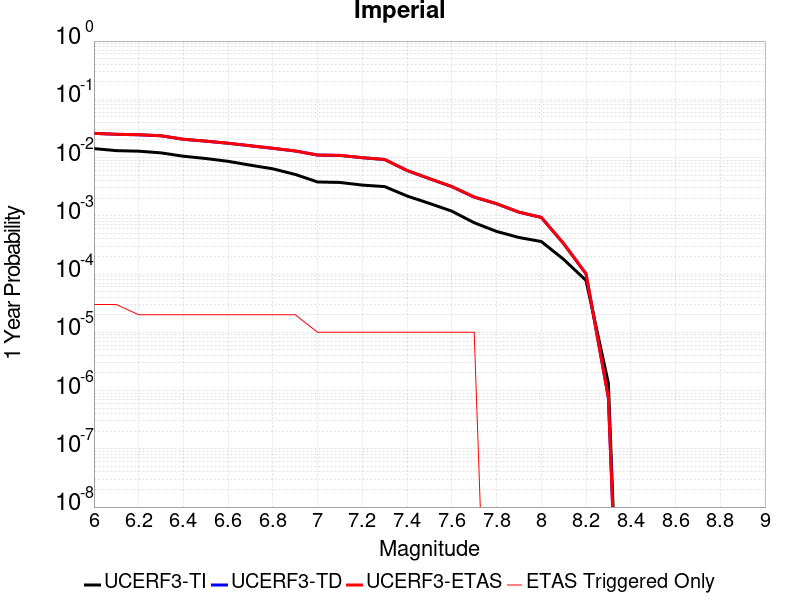 | 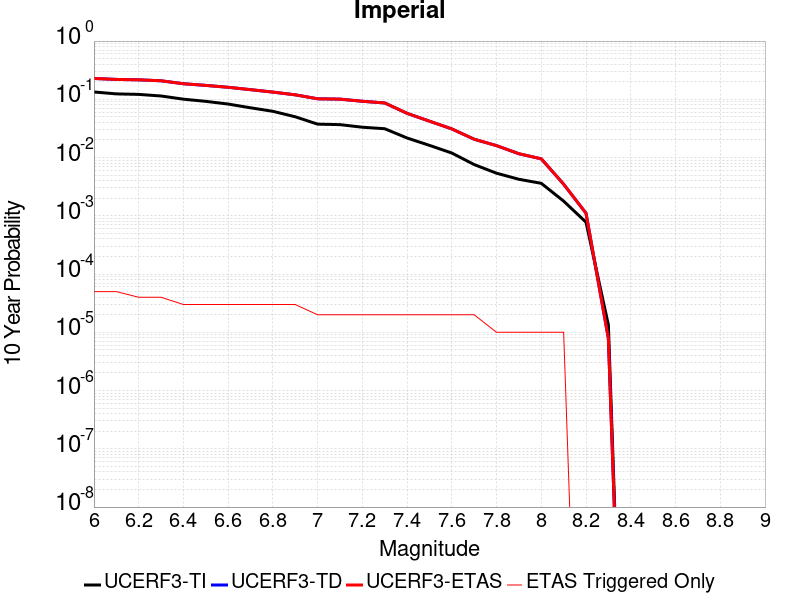 |

| Magnitude | 1 wk TI Prob | 1 wk TD Prob | 1 wk ETAS Prob | 1 wk ETAS/TD Gain | 1 wk ETAS Triggered Only | 1 mo TI Prob | 1 mo TD Prob | 1 mo ETAS Prob | 1 mo ETAS/TD Gain | 1 mo ETAS Triggered Only | 1 yr TI Prob | 1 yr TD Prob | 1 yr ETAS Prob | 1 yr ETAS/TD Gain | 1 yr ETAS Triggered Only | 10 yr TI Prob | 10 yr TD Prob | 10 yr ETAS Prob | 10 yr ETAS/TD Gain | 10 yr ETAS Triggered Only |
|-----|-----|-----|-----|-----|-----|-----|-----|-----|-----|-----|-----|-----|-----|-----|-----|-----|-----|-----|-----|-----|
| 6.0 | 2.7496446E-4 | 5.0565513E-4 | 5.156501E-4 | 1.0197663 | 1.0E-5 | 0.0011778869 | 0.002165333 | 0.0021852897 | 1.0092164 | 2.0E-5 | 0.0142467655 | 0.026045265 | 0.026074484 | 1.0011219 | 3.0E-5 | 0.13367249 | 0.22808637 | 0.22812496 | 1.0001692 | 5.0E-5 |
| 6.1 | 2.5356023E-4 | 4.8667885E-4 | 4.96674E-4 | 1.0205374 | 1.0E-5 | 0.001086234 | 0.0020841376 | 0.0021040959 | 1.0095763 | 2.0E-5 | 0.013144928 | 0.02507692 | 0.02510617 | 1.0011663 | 3.0E-5 | 0.123940155 | 0.21951756 | 0.21955658 | 1.0001777 | 5.0E-5 |
| 6.2 | 2.4820742E-4 | 4.7763108E-4 | 4.876263E-4 | 1.0209267 | 1.0E-5 | 0.0010633124 | 0.0020454223 | 0.0020653815 | 1.0097579 | 2.0E-5 | 0.01286919 | 0.024616843 | 0.02463635 | 1.0007925 | 2.0E-5 | 0.12148927 | 0.2160229 | 0.21605425 | 1.0001452 | 4.0E-5 |
| 6.3 | 2.3205351E-4 | 4.590021E-4 | 4.6899752E-4 | 1.0217764 | 1.0E-5 | 9.94136E-4 | 0.0019657058 | 0.0019856663 | 1.0101545 | 2.0E-5 | 0.012036599 | 0.023666281 | 0.023685807 | 1.000825 | 2.0E-5 | 0.11405133 | 0.20796864 | 0.20800032 | 1.0001523 | 4.0E-5 |
| 6.4 | 2.0304754E-4 | 3.9885996E-4 | 4.0885597E-4 | 1.0250615 | 1.0E-5 | 8.6991355E-4 | 0.0017082945 | 0.0017282604 | 1.0116876 | 2.0E-5 | 0.010539869 | 0.020600514 | 0.020620102 | 1.0009508 | 2.0E-5 | 0.100537635 | 0.18510117 | 0.18512562 | 1.0001321 | 3.0E-5 |
| 6.5 | 1.854992E-4 | 3.6997703E-4 | 3.7997332E-4 | 1.0270187 | 1.0E-5 | 7.9475436E-4 | 0.0015846646 | 0.0016046329 | 1.012601 | 2.0E-5 | 0.009633281 | 0.019123985 | 0.019143602 | 1.0010258 | 2.0E-5 | 0.0922623 | 0.17333072 | 0.17335552 | 1.000143 | 3.0E-5 |
| 6.6 | 1.6586106E-4 | 3.4043082E-4 | 3.504274E-4 | 1.0293646 | 1.0E-5 | 7.106394E-4 | 0.0014581835 | 0.0014781543 | 1.0136957 | 2.0E-5 | 0.008617763 | 0.017610526 | 0.017630175 | 1.0011157 | 2.0E-5 | 0.08291132 | 0.16080588 | 0.16083105 | 1.0001565 | 3.0E-5 |
| 6.7 | 1.4224656E-4 | 3.077392E-4 | 3.1773612E-4 | 1.032485 | 1.0E-5 | 6.094856E-4 | 0.0013182238 | 0.0013381975 | 1.015152 | 2.0E-5 | 0.0073952693 | 0.015933173 | 0.015952853 | 1.0012352 | 2.0E-5 | 0.07153955 | 0.1465114 | 0.146537 | 1.0001748 | 3.0E-5 |
| 6.8 | 1.2317259E-4 | 2.779711E-4 | 2.879683E-4 | 1.035965 | 1.0E-5 | 5.2777573E-4 | 0.0011907669 | 0.0012107431 | 1.0167758 | 2.0E-5 | 0.0064067547 | 0.0144026 | 0.014422311 | 1.0013686 | 2.0E-5 | 0.06225166 | 0.13296051 | 0.13298652 | 1.0001956 | 3.0E-5 |
| 6.9 | 9.859898E-5 | 2.5018715E-4 | 2.6018466E-4 | 1.03996 | 1.0E-5 | 4.2249862E-4 | 0.0010717943 | 0.0010917729 | 1.0186403 | 2.0E-5 | 0.0051317946 | 0.012971984 | 0.012991725 | 1.0015218 | 2.0E-5 | 0.05014893 | 0.11942433 | 0.11945075 | 1.0002213 | 3.0E-5 |
| 7.0 | 7.3191884E-5 | 2.1270063E-4 | 2.2269851E-4 | 1.0470045 | 1.0E-5 | 3.136418E-4 | 9.1125886E-4 | 9.2124974E-4 | 1.0109638 | 1.0E-5 | 0.003811904 | 0.011038825 | 0.011048714 | 1.0008959 | 1.0E-5 | 0.037471764 | 0.10207849 | 0.102096446 | 1.000176 | 2.0E-5 |
| 7.1 | 7.1760296E-5 | 2.0971385E-4 | 2.1971174E-4 | 1.0476741 | 1.0E-5 | 3.0750787E-4 | 8.984672E-4 | 9.084582E-4 | 1.0111201 | 1.0E-5 | 0.003737482 | 0.010884652 | 0.0108945435 | 1.0009087 | 1.0E-5 | 0.03675245 | 0.100714855 | 0.10073284 | 1.0001786 | 2.0E-5 |
| 7.2 | 6.46614E-5 | 1.9139807E-4 | 2.0139615E-4 | 1.0522372 | 1.0E-5 | 2.7709085E-4 | 8.2002254E-4 | 8.3001435E-4 | 1.0121847 | 1.0E-5 | 0.0033683628 | 0.009938694 | 0.0099485945 | 1.0009961 | 1.0E-5 | 0.033177625 | 0.09252202 | 0.09254017 | 1.0001962 | 2.0E-5 |
| 7.3 | 6.088115E-5 | 1.781138E-4 | 1.8811201E-4 | 1.0561339 | 1.0E-5 | 2.6089314E-4 | 7.631244E-4 | 7.731168E-4 | 1.0130941 | 1.0E-5 | 0.0031717476 | 0.009252035 | 0.0092619425 | 1.0010709 | 1.0E-5 | 0.031268585 | 0.08657247 | 0.08659074 | 1.000211 | 2.0E-5 |
| 7.4 | 4.199346E-5 | 1.15126604E-4 | 1.2512544E-4 | 1.0868509 | 1.0E-5 | 1.7995955E-4 | 4.933073E-4 | 5.033024E-4 | 1.0202613 | 1.0E-5 | 0.0021888057 | 0.005989646 | 0.005999586 | 1.0016595 | 1.0E-5 | 0.02167372 | 0.057449933 | 0.057468783 | 1.0003282 | 2.0E-5 |
| 7.5 | 3.130448E-5 | 8.335176E-5 | 9.335093E-5 | 1.1199635 | 1.0E-5 | 1.3415517E-4 | 3.5717324E-4 | 3.6716968E-4 | 1.0279876 | 1.0E-5 | 0.0016321153 | 0.0043399734 | 0.0043499297 | 1.0022942 | 1.0E-5 | 0.016201803 | 0.042140562 | 0.04215972 | 1.0004545 | 2.0E-5 |
| 7.6 | 2.3074248E-5 | 6.0860824E-5 | 7.086022E-5 | 1.1642994 | 1.0E-5 | 9.888588E-5 | 2.6080615E-4 | 2.7080355E-4 | 1.0383327 | 1.0E-5 | 0.0012032706 | 0.0031707147 | 0.0031806831 | 1.0031439 | 1.0E-5 | 0.011967761 | 0.031033779 | 0.031053158 | 1.0006244 | 2.0E-5 |
| 7.7 | 1.45864815E-5 | 4.0138115E-5 | 5.013771E-5 | 1.2491298 | 1.0E-5 | 6.2511994E-5 | 1.7200918E-4 | 1.8200745E-4 | 1.0581264 | 1.0E-5 | 7.608177E-4 | 0.0020922057 | 0.0021021848 | 1.0047697 | 1.0E-5 | 0.007582182 | 0.020633917 | 0.020653505 | 1.0009493 | 2.0E-5 |
| 7.8 | 1.0352979E-5 | 3.097231E-5 | 3.097231E-5 | 1.0 | 0.0 | 4.4369157E-5 | 1.3273173E-4 | 1.3273173E-4 | 1.0 | 0.0 | 5.400606E-4 | 0.0016148133 | 0.0016148133 | 1.0 | 0.0 | 0.0053875 | 0.016022068 | 0.016031906 | 1.0006142 | 1.0E-5 |
| 7.9 | 8.137906E-6 | 2.2158269E-5 | 2.2158269E-5 | 1.0 | 0.0 | 3.4876273E-5 | 9.496055E-5 | 9.496055E-5 | 1.0 | 0.0 | 4.2453592E-4 | 0.0011555325 | 0.0011555325 | 1.0 | 0.0 | 0.004237258 | 0.011622174 | 0.011632058 | 1.0008504 | 1.0E-5 |
| 8.0 | 6.93792E-6 | 1.801665E-5 | 1.801665E-5 | 1.0 | 0.0 | 2.9733603E-5 | 7.721193E-5 | 7.721193E-5 | 1.0 | 0.0 | 3.6194647E-4 | 9.396506E-4 | 9.396506E-4 | 1.0 | 0.0 | 0.0036135751 | 0.00950525 | 0.009515154 | 1.001042 | 1.0E-5 |
| 8.1 | 3.4286315E-6 | 6.3835337E-6 | 6.3835337E-6 | 1.0 | 0.0 | 1.4694053E-5 | 2.7357715E-5 | 2.7357715E-5 | 1.0 | 0.0 | 1.7888541E-4 | 3.330294E-4 | 3.330294E-4 | 1.0 | 0.0 | 0.0017874148 | 0.0034878491 | 0.0034978143 | 1.0028571 | 1.0E-5 |
| 8.2 | 1.4906886E-6 | 1.9381007E-6 | 1.9381007E-6 | 1.0 | 0.0 | 6.3886496E-6 | 8.3061195E-6 | 8.3061195E-6 | 1.0 | 0.0 | 7.7779034E-5 | 1.0112235E-4 | 1.0112235E-4 | 1.0 | 0.0 | 7.775182E-4 | 0.0011082698 | 0.0011082698 | 1.0 | 0.0 |
| 8.3 | 2.5758007E-8 | 1.4514695E-8 | 1.4514695E-8 | 1.0 | 0.0 | 1.10391454E-7 | 6.2205835E-8 | 6.2205835E-8 | 1.0 | 0.0 | 1.3440151E-6 | 7.57356E-7 | 7.57356E-7 | 1.0 | 0.0 | 1.344007E-5 | 7.895551E-6 | 7.895551E-6 | 1.0 | 0.0 |

## San Pedro Basin
*[(top)](#table-of-contents)*

| 1 Week | 1 Month | 1 Year | 10 Year |
|-----|-----|-----|-----|
| 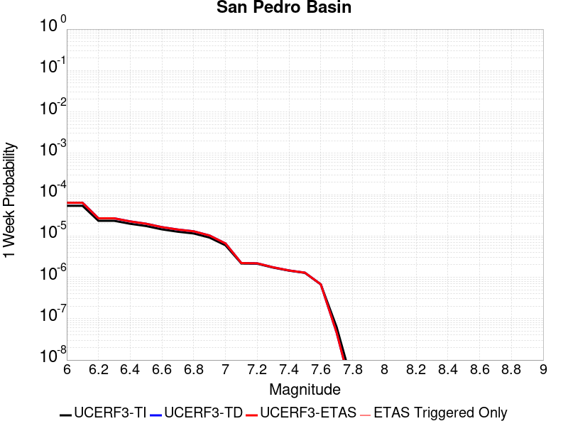 |  |  |  |

| Magnitude | 1 wk TI Prob | 1 wk TD Prob | 1 wk ETAS Prob | 1 wk ETAS/TD Gain | 1 wk ETAS Triggered Only | 1 mo TI Prob | 1 mo TD Prob | 1 mo ETAS Prob | 1 mo ETAS/TD Gain | 1 mo ETAS Triggered Only | 1 yr TI Prob | 1 yr TD Prob | 1 yr ETAS Prob | 1 yr ETAS/TD Gain | 1 yr ETAS Triggered Only | 10 yr TI Prob | 10 yr TD Prob | 10 yr ETAS Prob | 10 yr ETAS/TD Gain | 10 yr ETAS Triggered Only |
|-----|-----|-----|-----|-----|-----|-----|-----|-----|-----|-----|-----|-----|-----|-----|-----|-----|-----|-----|-----|-----|
| 6.0 | 5.3449043E-5 | 6.3371124E-5 | 6.3371124E-5 | 1.0 | 0.0 | 2.2904722E-4 | 2.7156572E-4 | 3.1155488E-4 | 1.147254 | 4.0E-5 | 0.0027850836 | 0.0033019078 | 0.0033517426 | 1.0150927 | 5.0E-5 | 0.027504366 | 0.032590248 | 0.03263862 | 1.0014842 | 5.0E-5 |
| 6.1 | 5.3449043E-5 | 6.3371124E-5 | 6.3371124E-5 | 1.0 | 0.0 | 2.2904722E-4 | 2.7156572E-4 | 3.1155488E-4 | 1.147254 | 4.0E-5 | 0.0027850836 | 0.0033019078 | 0.0033517426 | 1.0150927 | 5.0E-5 | 0.027504366 | 0.032590248 | 0.03263862 | 1.0014842 | 5.0E-5 |
| 6.2 | 2.3189454E-5 | 2.6643334E-5 | 2.6643334E-5 | 1.0 | 0.0 | 9.9379584E-5 | 1.14180984E-4 | 1.4417757E-4 | 1.2627108 | 3.0E-5 | 0.0012092749 | 0.0013893144 | 0.0014192727 | 1.0215634 | 3.0E-5 | 0.012027155 | 0.013811161 | 0.013840746 | 1.0021422 | 3.0E-5 |
| 6.3 | 2.3189454E-5 | 2.6643334E-5 | 2.6643334E-5 | 1.0 | 0.0 | 9.9379584E-5 | 1.14180984E-4 | 1.4417757E-4 | 1.2627108 | 3.0E-5 | 0.0012092749 | 0.0013893144 | 0.0014192727 | 1.0215634 | 3.0E-5 | 0.012027155 | 0.013811161 | 0.013840746 | 1.0021422 | 3.0E-5 |
| 6.4 | 1.966056E-5 | 2.2463848E-5 | 2.2463848E-5 | 1.0 | 0.0 | 8.425682E-5 | 9.627031E-5 | 1.16268384E-4 | 1.2077284 | 2.0E-5 | 0.001025344 | 0.001171501 | 0.0011914775 | 1.0170522 | 2.0E-5 | 0.010206259 | 0.011657341 | 0.011677108 | 1.0016956 | 2.0E-5 |
| 6.5 | 1.7342953E-5 | 1.9745521E-5 | 1.9745521E-5 | 1.0 | 0.0 | 7.4324824E-5 | 8.4621126E-5 | 9.462028E-5 | 1.1181638 | 1.0E-5 | 9.04529E-4 | 0.0010298121 | 0.0010398019 | 1.0097005 | 1.0E-5 | 0.009008561 | 0.010254124 | 0.010264021 | 1.0009652 | 1.0E-5 |
| 6.6 | 1.439804E-5 | 1.6323014E-5 | 1.6323014E-5 | 1.0 | 0.0 | 6.170443E-5 | 6.995408E-5 | 6.995408E-5 | 1.0 | 0.0 | 7.509924E-4 | 8.513903E-4 | 8.513903E-4 | 1.0 | 0.0 | 0.0074845953 | 0.008484487 | 0.008484487 | 1.0 | 0.0 |
| 6.7 | 1.2634884E-5 | 1.4285554E-5 | 1.4285554E-5 | 1.0 | 0.0 | 5.414838E-5 | 6.1222534E-5 | 6.1222534E-5 | 1.0 | 0.0 | 6.590571E-4 | 7.451599E-4 | 7.451599E-4 | 1.0 | 0.0 | 0.006571059 | 0.007429634 | 0.007429634 | 1.0 | 0.0 |
| 6.8 | 1.146091E-5 | 1.2933421E-5 | 1.2933421E-5 | 1.0 | 0.0 | 4.911726E-5 | 5.542794E-5 | 5.542794E-5 | 1.0 | 0.0 | 5.9783855E-4 | 6.7465595E-4 | 6.7465595E-4 | 1.0 | 0.0 | 0.0059623276 | 0.0067290184 | 0.0067290184 | 1.0 | 0.0 |
| 6.9 | 9.109035E-6 | 1.0235189E-5 | 1.0235189E-5 | 1.0 | 0.0 | 3.9038136E-5 | 4.3864515E-5 | 4.3864515E-5 | 1.0 | 0.0 | 4.7518566E-4 | 5.339476E-4 | 5.339476E-4 | 1.0 | 0.0 | 0.0047417083 | 0.0053294008 | 0.0053294008 | 1.0 | 0.0 |
| 7.0 | 5.9351028E-6 | 6.584068E-6 | 6.584068E-6 | 1.0 | 0.0 | 2.5435906E-5 | 2.8217262E-5 | 2.8217262E-5 | 1.0 | 0.0 | 3.0963816E-4 | 3.4351464E-4 | 3.4351464E-4 | 1.0 | 0.0 | 0.0030920706 | 0.0034321535 | 0.0034321535 | 1.0 | 0.0 |
| 7.1 | 2.1557585E-6 | 2.2096608E-6 | 2.2096608E-6 | 1.0 | 0.0 | 9.238933E-6 | 9.469942E-6 | 9.469942E-6 | 1.0 | 0.0 | 1.1247819E-4 | 1.1529059E-4 | 1.1529059E-4 | 1.0 | 0.0 | 0.0011242128 | 0.0011523232 | 0.0011523232 | 1.0 | 0.0 |
| 7.2 | 2.1251979E-6 | 2.178007E-6 | 2.178007E-6 | 1.0 | 0.0 | 9.107958E-6 | 9.334282E-6 | 9.334282E-6 | 1.0 | 0.0 | 1.1088375E-4 | 1.1363912E-4 | 1.1363912E-4 | 1.0 | 0.0 | 0.0011082845 | 0.0011358254 | 0.0011358254 | 1.0 | 0.0 |
| 7.3 | 1.7145798E-6 | 1.7442967E-6 | 1.7442967E-6 | 1.0 | 0.0 | 7.3481783E-6 | 7.475536E-6 | 7.475536E-6 | 1.0 | 0.0 | 8.94604E-5 | 9.1010945E-5 | 9.1010945E-5 | 1.0 | 0.0 | 8.9424395E-4 | 9.0974587E-4 | 9.0974587E-4 | 1.0 | 0.0 |
| 7.4 | 1.4467993E-6 | 1.4641943E-6 | 1.4641943E-6 | 1.0 | 0.0 | 6.200554E-6 | 6.2751037E-6 | 6.2751037E-6 | 1.0 | 0.0 | 7.548913E-5 | 7.6396784E-5 | 7.6396784E-5 | 1.0 | 0.0 | 7.546349E-4 | 7.637125E-4 | 7.637125E-4 | 1.0 | 0.0 |
| 7.5 | 1.2803735E-6 | 1.2931564E-6 | 1.2931564E-6 | 1.0 | 0.0 | 5.487303E-6 | 5.5420874E-6 | 5.5420874E-6 | 1.0 | 0.0 | 6.680587E-5 | 6.7472894E-5 | 6.7472894E-5 | 1.0 | 0.0 | 6.678579E-4 | 6.7453115E-4 | 6.7453115E-4 | 1.0 | 0.0 |
| 7.6 | 6.755009E-7 | 6.769501E-7 | 6.769501E-7 | 1.0 | 0.0 | 2.8950008E-6 | 2.9012117E-6 | 2.9012117E-6 | 1.0 | 0.0 | 3.5246063E-5 | 3.5321737E-5 | 3.5321737E-5 | 1.0 | 0.0 | 3.5240475E-4 | 3.5316695E-4 | 3.5316695E-4 | 1.0 | 0.0 |
| 7.7 | 6.211885E-8 | 4.5699863E-8 | 4.5699863E-8 | 1.0 | 0.0 | 2.6622362E-7 | 1.9585654E-7 | 1.9585654E-7 | 1.0 | 0.0 | 3.2412677E-6 | 2.384551E-6 | 2.384551E-6 | 1.0 | 0.0 | 3.2412205E-5 | 2.3845274E-5 | 2.3845274E-5 | 1.0 | 0.0 |
| 7.8 | 2.6580573E-9 | 1.5138681E-9 | 1.5138681E-9 | 1.0 | 0.0 | 1.1391674E-8 | 6.488006E-9 | 6.488006E-9 | 1.0 | 0.0 | 1.3869362E-7 | 7.899148E-8 | 7.899148E-8 | 1.0 | 0.0 | 1.3869354E-6 | 7.8991474E-7 | 7.8991474E-7 | 1.0 | 0.0 |

## Chino alt 1
*[(top)](#table-of-contents)*

| 1 Week | 1 Month | 1 Year | 10 Year |
|-----|-----|-----|-----|
|  |  |  |  |

| Magnitude | 1 wk TI Prob | 1 wk TD Prob | 1 wk ETAS Prob | 1 wk ETAS/TD Gain | 1 wk ETAS Triggered Only | 1 mo TI Prob | 1 mo TD Prob | 1 mo ETAS Prob | 1 mo ETAS/TD Gain | 1 mo ETAS Triggered Only | 1 yr TI Prob | 1 yr TD Prob | 1 yr ETAS Prob | 1 yr ETAS/TD Gain | 1 yr ETAS Triggered Only | 10 yr TI Prob | 10 yr TD Prob | 10 yr ETAS Prob | 10 yr ETAS/TD Gain | 10 yr ETAS Triggered Only |
|-----|-----|-----|-----|-----|-----|-----|-----|-----|-----|-----|-----|-----|-----|-----|-----|-----|-----|-----|-----|-----|
| 6.0 | 3.939946E-5 | 4.895037E-5 | 4.895037E-5 | 1.0 | 0.0 | 1.6884391E-4 | 2.0977337E-4 | 2.1977127E-4 | 1.0476605 | 1.0E-5 | 0.0020537362 | 0.0025514876 | 0.0025814113 | 1.0117278 | 3.0E-5 | 0.020348595 | 0.025278764 | 0.0253275 | 1.001928 | 5.0E-5 |
| 6.1 | 2.1505624E-5 | 2.6880154E-5 | 2.6880154E-5 | 1.0 | 0.0 | 9.2163704E-5 | 1.151962E-4 | 1.2519505E-4 | 1.0867984 | 1.0E-5 | 0.0011215154 | 0.0014017228 | 0.0014216948 | 1.0142481 | 2.0E-5 | 0.011158722 | 0.013945717 | 0.013975299 | 1.0021212 | 3.0E-5 |
| 6.2 | 2.1505624E-5 | 2.6880154E-5 | 2.6880154E-5 | 1.0 | 0.0 | 9.2163704E-5 | 1.151962E-4 | 1.2519505E-4 | 1.0867984 | 1.0E-5 | 0.0011215154 | 0.0014017228 | 0.0014216948 | 1.0142481 | 2.0E-5 | 0.011158722 | 0.013945717 | 0.013975299 | 1.0021212 | 3.0E-5 |
| 6.3 | 1.4290785E-5 | 1.8166014E-5 | 1.8166014E-5 | 1.0 | 0.0 | 6.1244784E-5 | 7.785228E-5 | 8.7851506E-5 | 1.1284384 | 1.0E-5 | 7.454001E-4 | 9.4748475E-4 | 9.574753E-4 | 1.0105443 | 1.0E-5 | 0.007429048 | 0.009444912 | 0.009464723 | 1.0020975 | 2.0E-5 |
| 6.4 | 1.4290785E-5 | 1.8166014E-5 | 1.8166014E-5 | 1.0 | 0.0 | 6.1244784E-5 | 7.785228E-5 | 8.7851506E-5 | 1.1284384 | 1.0E-5 | 7.454001E-4 | 9.4748475E-4 | 9.574753E-4 | 1.0105443 | 1.0E-5 | 0.007429048 | 0.009444912 | 0.009464723 | 1.0020975 | 2.0E-5 |
| 6.5 | 1.3017944E-5 | 1.6652937E-5 | 1.6652937E-5 | 1.0 | 0.0 | 5.5789995E-5 | 7.136803E-5 | 8.136731E-5 | 1.1401088 | 1.0E-5 | 6.790315E-4 | 8.686031E-4 | 8.7859447E-4 | 1.0115027 | 1.0E-5 | 0.0067696036 | 0.008662385 | 0.008682211 | 1.0022888 | 2.0E-5 |
| 6.6 | 9.470016E-6 | 1.2040057E-5 | 1.2040057E-5 | 1.0 | 0.0 | 4.058515E-5 | 5.1599414E-5 | 5.1599414E-5 | 1.0 | 0.0 | 4.940122E-4 | 6.2807574E-4 | 6.2807574E-4 | 1.0 | 0.0 | 0.004929154 | 0.0062722242 | 0.0062722242 | 1.0 | 0.0 |
| 6.7 | 8.314155E-6 | 1.0408293E-5 | 1.0408293E-5 | 1.0 | 0.0 | 3.5631605E-5 | 4.460639E-5 | 4.460639E-5 | 1.0 | 0.0 | 4.3372845E-4 | 5.429797E-4 | 5.429797E-4 | 1.0 | 0.0 | 0.004328829 | 0.005426062 | 0.005426062 | 1.0 | 0.0 |
| 6.8 | 3.4856364E-6 | 3.8135372E-6 | 3.8135372E-6 | 1.0 | 0.0 | 1.4938357E-5 | 1.634364E-5 | 1.634364E-5 | 1.0 | 0.0 | 1.8185932E-4 | 1.9896773E-4 | 1.9896773E-4 | 1.0 | 0.0 | 0.0018171056 | 0.001989573 | 0.001989573 | 1.0 | 0.0 |
| 6.9 | 2.2645952E-6 | 2.152999E-6 | 2.152999E-6 | 1.0 | 0.0 | 9.705372E-6 | 9.227107E-6 | 9.227107E-6 | 1.0 | 0.0 | 1.18156495E-4 | 1.1233445E-4 | 1.1233445E-4 | 1.0 | 0.0 | 0.0011809369 | 0.0011233927 | 0.0011233927 | 1.0 | 0.0 |
| 7.0 | 1.7864003E-6 | 1.5431575E-6 | 1.5431575E-6 | 1.0 | 0.0 | 7.655979E-6 | 6.613516E-6 | 6.613516E-6 | 1.0 | 0.0 | 9.3207556E-5 | 8.0516635E-5 | 8.0516635E-5 | 1.0 | 0.0 | 9.316847E-4 | 8.0532173E-4 | 8.0532173E-4 | 1.0 | 0.0 |
| 7.1 | 1.7315456E-6 | 1.4734279E-6 | 1.4734279E-6 | 1.0 | 0.0 | 7.420889E-6 | 6.3146763E-6 | 6.3146763E-6 | 1.0 | 0.0 | 9.034557E-5 | 7.6878525E-5 | 7.6878525E-5 | 1.0 | 0.0 | 9.0308854E-4 | 7.6895714E-4 | 7.6895714E-4 | 1.0 | 0.0 |
| 7.2 | 1.6008337E-6 | 1.3574753E-6 | 1.3574753E-6 | 1.0 | 0.0 | 6.860698E-6 | 5.817739E-6 | 5.817739E-6 | 1.0 | 0.0 | 8.352579E-5 | 7.082872E-5 | 7.082872E-5 | 1.0 | 0.0 | 8.34944E-4 | 7.084856E-4 | 7.084856E-4 | 1.0 | 0.0 |
| 7.3 | 1.3320939E-6 | 1.1218251E-6 | 1.1218251E-6 | 1.0 | 0.0 | 5.7089615E-6 | 4.8078136E-6 | 4.8078136E-6 | 1.0 | 0.0 | 6.9504385E-5 | 5.8533606E-5 | 5.8533606E-5 | 1.0 | 0.0 | 6.9482654E-4 | 5.853264E-4 | 5.853264E-4 | 1.0 | 0.0 |
| 7.4 | 1.114294E-6 | 9.2374523E-7 | 9.2374523E-7 | 1.0 | 0.0 | 4.775537E-6 | 3.958902E-6 | 3.958902E-6 | 1.0 | 0.0 | 5.8140613E-5 | 4.8198606E-5 | 4.8198606E-5 | 1.0 | 0.0 | 5.81254E-4 | 4.8189834E-4 | 4.8189834E-4 | 1.0 | 0.0 |
| 7.5 | 9.354081E-7 | 7.623702E-7 | 7.623702E-7 | 1.0 | 0.0 | 4.0088858E-6 | 3.2672967E-6 | 3.2672967E-6 | 1.0 | 0.0 | 4.8807087E-5 | 3.9778646E-5 | 3.9778646E-5 | 1.0 | 0.0 | 4.879637E-4 | 3.9771866E-4 | 3.9771866E-4 | 1.0 | 0.0 |
| 7.6 | 8.521771E-7 | 6.8809493E-7 | 6.8809493E-7 | 1.0 | 0.0 | 3.6521824E-6 | 2.9489752E-6 | 2.9489752E-6 | 1.0 | 0.0 | 4.4464414E-5 | 3.5903213E-5 | 3.5903213E-5 | 1.0 | 0.0 | 4.4455516E-4 | 3.589773E-4 | 3.589773E-4 | 1.0 | 0.0 |
| 7.7 | 2.1803626E-7 | 1.4187151E-7 | 1.4187151E-7 | 1.0 | 0.0 | 9.344408E-7 | 6.080207E-7 | 6.080207E-7 | 1.0 | 0.0 | 1.1376757E-5 | 7.402636E-6 | 7.402636E-6 | 1.0 | 0.0 | 1.13761744E-4 | 7.402486E-5 | 7.402486E-5 | 1.0 | 0.0 |

## Kern Canyon (South Kern) 2011
*[(top)](#table-of-contents)*

| 1 Week | 1 Month | 1 Year | 10 Year |
|-----|-----|-----|-----|
| 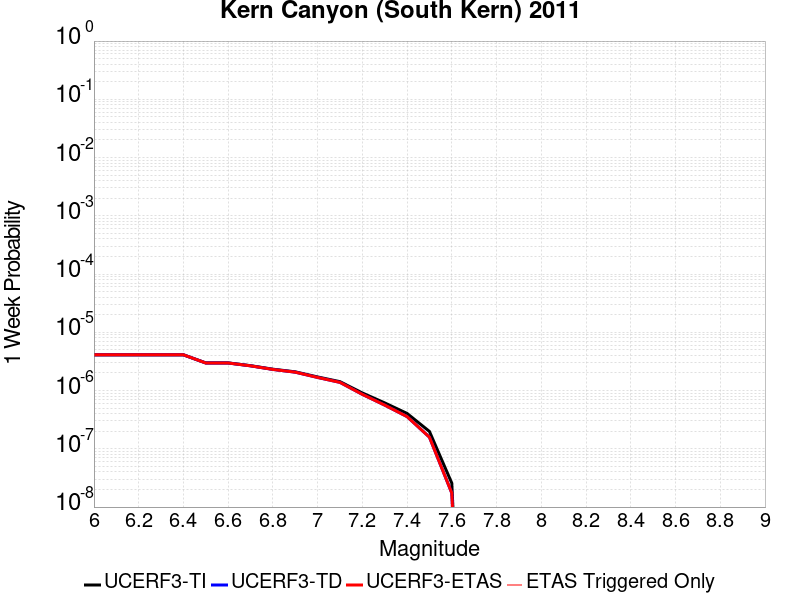 |  |  |  |

| Magnitude | 1 wk TI Prob | 1 wk TD Prob | 1 wk ETAS Prob | 1 wk ETAS/TD Gain | 1 wk ETAS Triggered Only | 1 mo TI Prob | 1 mo TD Prob | 1 mo ETAS Prob | 1 mo ETAS/TD Gain | 1 mo ETAS Triggered Only | 1 yr TI Prob | 1 yr TD Prob | 1 yr ETAS Prob | 1 yr ETAS/TD Gain | 1 yr ETAS Triggered Only | 10 yr TI Prob | 10 yr TD Prob | 10 yr ETAS Prob | 10 yr ETAS/TD Gain | 10 yr ETAS Triggered Only |
|-----|-----|-----|-----|-----|-----|-----|-----|-----|-----|-----|-----|-----|-----|-----|-----|-----|-----|-----|-----|-----|
| 6.0 | 4.105075E-6 | 4.113737E-6 | 4.113737E-6 | 1.0 | 0.0 | 1.7593058E-5 | 1.7630186E-5 | 1.7630186E-5 | 1.0 | 0.0 | 2.1417443E-4 | 2.14627E-4 | 2.2462485E-4 | 1.0465825 | 1.0E-5 | 0.0021396813 | 0.002144261 | 0.0021841752 | 1.0186144 | 4.0E-5 |
| 6.1 | 4.105075E-6 | 4.113737E-6 | 4.113737E-6 | 1.0 | 0.0 | 1.7593058E-5 | 1.7630186E-5 | 1.7630186E-5 | 1.0 | 0.0 | 2.1417443E-4 | 2.14627E-4 | 2.2462485E-4 | 1.0465825 | 1.0E-5 | 0.0021396813 | 0.002144261 | 0.0021841752 | 1.0186144 | 4.0E-5 |
| 6.2 | 4.105075E-6 | 4.113737E-6 | 4.113737E-6 | 1.0 | 0.0 | 1.7593058E-5 | 1.7630186E-5 | 1.7630186E-5 | 1.0 | 0.0 | 2.1417443E-4 | 2.14627E-4 | 2.2462485E-4 | 1.0465825 | 1.0E-5 | 0.0021396813 | 0.002144261 | 0.0021841752 | 1.0186144 | 4.0E-5 |
| 6.3 | 4.105075E-6 | 4.113737E-6 | 4.113737E-6 | 1.0 | 0.0 | 1.7593058E-5 | 1.7630186E-5 | 1.7630186E-5 | 1.0 | 0.0 | 2.1417443E-4 | 2.14627E-4 | 2.2462485E-4 | 1.0465825 | 1.0E-5 | 0.0021396813 | 0.002144261 | 0.0021841752 | 1.0186144 | 4.0E-5 |
| 6.4 | 4.105075E-6 | 4.113737E-6 | 4.113737E-6 | 1.0 | 0.0 | 1.7593058E-5 | 1.7630186E-5 | 1.7630186E-5 | 1.0 | 0.0 | 2.1417443E-4 | 2.14627E-4 | 2.2462485E-4 | 1.0465825 | 1.0E-5 | 0.0021396813 | 0.002144261 | 0.0021841752 | 1.0186144 | 4.0E-5 |
| 6.5 | 2.9849807E-6 | 2.9731623E-6 | 2.9731623E-6 | 1.0 | 0.0 | 1.2792712E-5 | 1.2742063E-5 | 1.2742063E-5 | 1.0 | 0.0 | 1.5574014E-4 | 1.5512372E-4 | 1.5512372E-4 | 1.0 | 0.0 | 0.0015563103 | 0.0015501695 | 0.0015701385 | 1.0128818 | 2.0E-5 |
| 6.6 | 2.9849807E-6 | 2.9731623E-6 | 2.9731623E-6 | 1.0 | 0.0 | 1.2792712E-5 | 1.2742063E-5 | 1.2742063E-5 | 1.0 | 0.0 | 1.5574014E-4 | 1.5512372E-4 | 1.5512372E-4 | 1.0 | 0.0 | 0.0015563103 | 0.0015501695 | 0.0015701385 | 1.0128818 | 2.0E-5 |
| 6.7 | 2.6756725E-6 | 2.6582275E-6 | 2.6582275E-6 | 1.0 | 0.0 | 1.1467117E-5 | 1.1392354E-5 | 1.1392354E-5 | 1.0 | 0.0 | 1.396032E-4 | 1.386932E-4 | 1.386932E-4 | 1.0 | 0.0 | 0.0013951553 | 0.0013860773 | 0.0014060496 | 1.0144092 | 2.0E-5 |
| 6.8 | 2.3283721E-6 | 2.3047846E-6 | 2.3047846E-6 | 1.0 | 0.0 | 9.9787E-6 | 9.877612E-6 | 9.877612E-6 | 1.0 | 0.0 | 1.214839E-4 | 1.2025336E-4 | 1.2025336E-4 | 1.0 | 0.0 | 0.001214175 | 0.0012018904 | 0.0012218663 | 1.0166204 | 2.0E-5 |
| 6.9 | 2.0972677E-6 | 2.0696464E-6 | 2.0696464E-6 | 1.0 | 0.0 | 8.988259E-6 | 8.8698835E-6 | 8.8698835E-6 | 1.0 | 0.0 | 1.0942656E-4 | 1.0798554E-4 | 1.0798554E-4 | 1.0 | 0.0 | 0.0010937268 | 0.0010793365 | 0.0010993149 | 1.0185099 | 2.0E-5 |
| 7.0 | 1.7132242E-6 | 1.678708E-6 | 1.678708E-6 | 1.0 | 0.0 | 7.3423685E-6 | 7.1944432E-6 | 7.1944432E-6 | 1.0 | 0.0 | 8.938967E-5 | 8.7588865E-5 | 8.7588865E-5 | 1.0 | 0.0 | 8.935372E-4 | 8.7554724E-4 | 8.9552975E-4 | 1.0228229 | 2.0E-5 |
| 7.1 | 1.4215541E-6 | 1.381579E-6 | 1.381579E-6 | 1.0 | 0.0 | 6.0923603E-6 | 5.9210392E-6 | 5.9210392E-6 | 1.0 | 0.0 | 7.417196E-5 | 7.2086295E-5 | 7.2086295E-5 | 1.0 | 0.0 | 7.414721E-4 | 7.206318E-4 | 7.406174E-4 | 1.0277334 | 2.0E-5 |
| 7.2 | 9.097853E-7 | 8.6038E-7 | 8.6038E-7 | 1.0 | 0.0 | 3.899074E-6 | 3.6873375E-6 | 3.6873375E-6 | 1.0 | 0.0 | 4.7470192E-5 | 4.4892422E-5 | 4.4892422E-5 | 1.0 | 0.0 | 4.7460053E-4 | 4.4883462E-4 | 4.5883012E-4 | 1.02227 | 1.0E-5 |
| 7.3 | 6.144169E-7 | 5.628223E-7 | 5.628223E-7 | 1.0 | 0.0 | 2.6332125E-6 | 2.4120934E-6 | 2.4120934E-6 | 1.0 | 0.0 | 3.205889E-5 | 2.9366847E-5 | 2.9366847E-5 | 1.0 | 0.0 | 3.2054266E-4 | 2.9363018E-4 | 2.9363018E-4 | 1.0 | 0.0 |
| 7.4 | 4.049844E-7 | 3.5728428E-7 | 3.5728428E-7 | 1.0 | 0.0 | 1.7356463E-6 | 1.5312174E-6 | 1.5312174E-6 | 1.0 | 0.0 | 2.1131287E-5 | 1.8642415E-5 | 1.8642415E-5 | 1.0 | 0.0 | 2.1129279E-4 | 1.8640877E-4 | 1.8640877E-4 | 1.0 | 0.0 |
| 7.5 | 1.9871162E-7 | 1.58305E-7 | 1.58305E-7 | 1.0 | 0.0 | 8.5162094E-7 | 6.7844985E-7 | 6.7844985E-7 | 1.0 | 0.0 | 1.0368436E-5 | 8.260096E-6 | 8.260096E-6 | 1.0 | 0.0 | 1.0367952E-4 | 8.259798E-5 | 8.259798E-5 | 1.0 | 0.0 |
| 7.6 | 2.572245E-8 | 1.7352637E-8 | 1.7352637E-8 | 1.0 | 0.0 | 1.10239064E-7 | 7.4368444E-8 | 7.4368444E-8 | 1.0 | 0.0 | 1.3421597E-6 | 9.0543546E-7 | 9.0543546E-7 | 1.0 | 0.0 | 1.3421517E-5 | 9.0543235E-6 | 9.0543235E-6 | 1.0 | 0.0 |

## Channel Islands Thrust
*[(top)](#table-of-contents)*

| 1 Week | 1 Month | 1 Year | 10 Year |
|-----|-----|-----|-----|
|  |  |  | 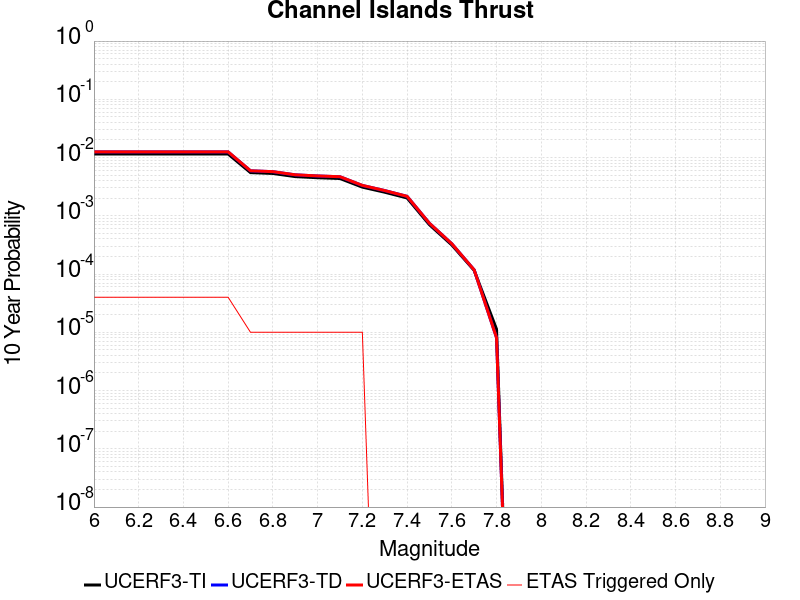 |

| Magnitude | 1 wk TI Prob | 1 wk TD Prob | 1 wk ETAS Prob | 1 wk ETAS/TD Gain | 1 wk ETAS Triggered Only | 1 mo TI Prob | 1 mo TD Prob | 1 mo ETAS Prob | 1 mo ETAS/TD Gain | 1 mo ETAS Triggered Only | 1 yr TI Prob | 1 yr TD Prob | 1 yr ETAS Prob | 1 yr ETAS/TD Gain | 1 yr ETAS Triggered Only | 10 yr TI Prob | 10 yr TD Prob | 10 yr ETAS Prob | 10 yr ETAS/TD Gain | 10 yr ETAS Triggered Only |
|-----|-----|-----|-----|-----|-----|-----|-----|-----|-----|-----|-----|-----|-----|-----|-----|-----|-----|-----|-----|-----|
| 6.0 | 2.2156251E-5 | 2.4092304E-5 | 2.4092304E-5 | 1.0 | 0.0 | 9.495191E-5 | 1.03249244E-4 | 1.03249244E-4 | 1.0 | 0.0 | 0.0011554264 | 0.0012564411 | 0.0012664286 | 1.007949 | 1.0E-5 | 0.011494373 | 0.012503966 | 0.012543466 | 1.0031589 | 4.0E-5 |
| 6.1 | 2.2156251E-5 | 2.4092304E-5 | 2.4092304E-5 | 1.0 | 0.0 | 9.495191E-5 | 1.03249244E-4 | 1.03249244E-4 | 1.0 | 0.0 | 0.0011554264 | 0.0012564411 | 0.0012664286 | 1.007949 | 1.0E-5 | 0.011494373 | 0.012503966 | 0.012543466 | 1.0031589 | 4.0E-5 |
| 6.2 | 2.2156251E-5 | 2.4092304E-5 | 2.4092304E-5 | 1.0 | 0.0 | 9.495191E-5 | 1.03249244E-4 | 1.03249244E-4 | 1.0 | 0.0 | 0.0011554264 | 0.0012564411 | 0.0012664286 | 1.007949 | 1.0E-5 | 0.011494373 | 0.012503966 | 0.012543466 | 1.0031589 | 4.0E-5 |
| 6.3 | 2.2156251E-5 | 2.4092304E-5 | 2.4092304E-5 | 1.0 | 0.0 | 9.495191E-5 | 1.03249244E-4 | 1.03249244E-4 | 1.0 | 0.0 | 0.0011554264 | 0.0012564411 | 0.0012664286 | 1.007949 | 1.0E-5 | 0.011494373 | 0.012503966 | 0.012543466 | 1.0031589 | 4.0E-5 |
| 6.4 | 2.2156251E-5 | 2.4092304E-5 | 2.4092304E-5 | 1.0 | 0.0 | 9.495191E-5 | 1.03249244E-4 | 1.03249244E-4 | 1.0 | 0.0 | 0.0011554264 | 0.0012564411 | 0.0012664286 | 1.007949 | 1.0E-5 | 0.011494373 | 0.012503966 | 0.012543466 | 1.0031589 | 4.0E-5 |
| 6.5 | 2.2156251E-5 | 2.4092304E-5 | 2.4092304E-5 | 1.0 | 0.0 | 9.495191E-5 | 1.03249244E-4 | 1.03249244E-4 | 1.0 | 0.0 | 0.0011554264 | 0.0012564411 | 0.0012664286 | 1.007949 | 1.0E-5 | 0.011494373 | 0.012503966 | 0.012543466 | 1.0031589 | 4.0E-5 |
| 6.6 | 2.2156251E-5 | 2.4092304E-5 | 2.4092304E-5 | 1.0 | 0.0 | 9.495191E-5 | 1.03249244E-4 | 1.03249244E-4 | 1.0 | 0.0 | 0.0011554264 | 0.0012564411 | 0.0012664286 | 1.007949 | 1.0E-5 | 0.011494373 | 0.012503966 | 0.012543466 | 1.0031589 | 4.0E-5 |
| 6.7 | 1.0601296E-5 | 1.1379656E-5 | 1.1379656E-5 | 1.0 | 0.0 | 4.5433335E-5 | 4.876907E-5 | 4.876907E-5 | 1.0 | 0.0 | 5.5301044E-4 | 5.9360656E-4 | 5.9360656E-4 | 1.0 | 0.0 | 0.005516363 | 0.0059207114 | 0.0059306524 | 1.001679 | 1.0E-5 |
| 6.8 | 1.0246747E-5 | 1.0996777E-5 | 1.0996777E-5 | 1.0 | 0.0 | 4.391389E-5 | 4.712822E-5 | 4.712822E-5 | 1.0 | 0.0 | 5.345204E-4 | 5.736398E-4 | 5.736398E-4 | 1.0 | 0.0 | 0.0053323656 | 0.005722081 | 0.0057320236 | 1.0017376 | 1.0E-5 |
| 6.9 | 9.049551E-6 | 9.699738E-6 | 9.699738E-6 | 1.0 | 0.0 | 3.878322E-5 | 4.1569667E-5 | 4.1569667E-5 | 1.0 | 0.0 | 4.7208337E-4 | 5.059973E-4 | 5.059973E-4 | 1.0 | 0.0 | 0.0047108172 | 0.005048869 | 0.0050588185 | 1.0019706 | 1.0E-5 |
| 7.0 | 8.6542195E-6 | 9.274692E-6 | 9.274692E-6 | 1.0 | 0.0 | 3.7088983E-5 | 3.97481E-5 | 3.97481E-5 | 1.0 | 0.0 | 4.5146482E-4 | 4.8382973E-4 | 4.8382973E-4 | 1.0 | 0.0 | 0.004505487 | 0.0048281755 | 0.0048381276 | 1.0020611 | 1.0E-5 |
| 7.1 | 8.391028E-6 | 8.993012E-6 | 8.993012E-6 | 1.0 | 0.0 | 3.5961057E-5 | 3.8540933E-5 | 3.8540933E-5 | 1.0 | 0.0 | 4.3773788E-4 | 4.691389E-4 | 4.691389E-4 | 1.0 | 0.0 | 0.004368766 | 0.0046818955 | 0.0046918485 | 1.0021259 | 1.0E-5 |
| 7.2 | 5.965188E-6 | 6.3717544E-6 | 6.3717544E-6 | 1.0 | 0.0 | 2.556484E-5 | 2.7307235E-5 | 2.7307235E-5 | 1.0 | 0.0 | 3.1120746E-4 | 3.3241542E-4 | 3.3241542E-4 | 1.0 | 0.0 | 0.00310772 | 0.00331924 | 0.0033292067 | 1.0030028 | 1.0E-5 |
| 7.3 | 4.877518E-6 | 5.2060545E-6 | 5.2060545E-6 | 1.0 | 0.0 | 2.0903482E-5 | 2.2311473E-5 | 2.2311473E-5 | 1.0 | 0.0 | 2.5447016E-4 | 2.7160876E-4 | 2.7160876E-4 | 1.0 | 0.0 | 0.0025417898 | 0.0027128144 | 0.0027128144 | 1.0 | 0.0 |
| 7.4 | 3.8829853E-6 | 4.1419007E-6 | 4.1419007E-6 | 1.0 | 0.0 | 1.664126E-5 | 1.7750885E-5 | 1.7750885E-5 | 1.0 | 0.0 | 2.0258849E-4 | 2.16096E-4 | 2.16096E-4 | 1.0 | 0.0 | 0.002024039 | 0.0021589005 | 0.0021589005 | 1.0 | 0.0 |
| 7.5 | 1.3489616E-6 | 1.4278027E-6 | 1.4278027E-6 | 1.0 | 0.0 | 5.7812517E-6 | 6.1191404E-6 | 6.1191404E-6 | 1.0 | 0.0 | 7.038446E-5 | 7.449803E-5 | 7.449803E-5 | 1.0 | 0.0 | 7.036218E-4 | 7.447345E-4 | 7.447345E-4 | 1.0 | 0.0 |
| 7.6 | 6.058192E-7 | 6.353832E-7 | 6.353832E-7 | 1.0 | 0.0 | 2.5963652E-6 | 2.723068E-6 | 2.723068E-6 | 1.0 | 0.0 | 3.161029E-5 | 3.3152864E-5 | 3.3152864E-5 | 1.0 | 0.0 | 3.1605794E-4 | 3.314808E-4 | 3.314808E-4 | 1.0 | 0.0 |
| 7.7 | 2.2170494E-7 | 2.260808E-7 | 2.260808E-7 | 1.0 | 0.0 | 9.5016367E-7 | 9.689174E-7 | 9.689174E-7 | 1.0 | 0.0 | 1.1568181E-5 | 1.1796516E-5 | 1.1796516E-5 | 1.0 | 0.0 | 1.1567579E-4 | 1.17960015E-4 | 1.17960015E-4 | 1.0 | 0.0 |
| 7.8 | 2.1613102E-8 | 1.5466789E-8 | 1.5466789E-8 | 1.0 | 0.0 | 9.262757E-8 | 6.628623E-8 | 6.628623E-8 | 1.0 | 0.0 | 1.1277401E-6 | 8.0703467E-7 | 8.0703467E-7 | 1.0 | 0.0 | 1.1277344E-5 | 8.070325E-6 | 8.070325E-6 | 1.0 | 0.0 |

## Red Mountain
*[(top)](#table-of-contents)*

| 1 Week | 1 Month | 1 Year | 10 Year |
|-----|-----|-----|-----|
|  |  |  |  |

| Magnitude | 1 wk TI Prob | 1 wk TD Prob | 1 wk ETAS Prob | 1 wk ETAS/TD Gain | 1 wk ETAS Triggered Only | 1 mo TI Prob | 1 mo TD Prob | 1 mo ETAS Prob | 1 mo ETAS/TD Gain | 1 mo ETAS Triggered Only | 1 yr TI Prob | 1 yr TD Prob | 1 yr ETAS Prob | 1 yr ETAS/TD Gain | 1 yr ETAS Triggered Only | 10 yr TI Prob | 10 yr TD Prob | 10 yr ETAS Prob | 10 yr ETAS/TD Gain | 10 yr ETAS Triggered Only |
|-----|-----|-----|-----|-----|-----|-----|-----|-----|-----|-----|-----|-----|-----|-----|-----|-----|-----|-----|-----|-----|
| 6.0 | 4.1810763E-5 | 4.7591006E-5 | 4.7591006E-5 | 1.0 | 0.0 | 1.7917668E-4 | 2.0394645E-4 | 2.0394645E-4 | 1.0 | 0.0 | 0.0021792934 | 0.0024803858 | 0.0024803858 | 1.0 | 0.0 | 0.021580452 | 0.02454463 | 0.024583649 | 1.0015897 | 4.0E-5 |
| 6.1 | 4.1810763E-5 | 4.7591006E-5 | 4.7591006E-5 | 1.0 | 0.0 | 1.7917668E-4 | 2.0394645E-4 | 2.0394645E-4 | 1.0 | 0.0 | 0.0021792934 | 0.0024803858 | 0.0024803858 | 1.0 | 0.0 | 0.021580452 | 0.02454463 | 0.024583649 | 1.0015897 | 4.0E-5 |
| 6.2 | 4.1810763E-5 | 4.7591006E-5 | 4.7591006E-5 | 1.0 | 0.0 | 1.7917668E-4 | 2.0394645E-4 | 2.0394645E-4 | 1.0 | 0.0 | 0.0021792934 | 0.0024803858 | 0.0024803858 | 1.0 | 0.0 | 0.021580452 | 0.02454463 | 0.024583649 | 1.0015897 | 4.0E-5 |
| 6.3 | 4.1810763E-5 | 4.7591006E-5 | 4.7591006E-5 | 1.0 | 0.0 | 1.7917668E-4 | 2.0394645E-4 | 2.0394645E-4 | 1.0 | 0.0 | 0.0021792934 | 0.0024803858 | 0.0024803858 | 1.0 | 0.0 | 0.021580452 | 0.02454463 | 0.024583649 | 1.0015897 | 4.0E-5 |
| 6.4 | 4.1810763E-5 | 4.7591006E-5 | 4.7591006E-5 | 1.0 | 0.0 | 1.7917668E-4 | 2.0394645E-4 | 2.0394645E-4 | 1.0 | 0.0 | 0.0021792934 | 0.0024803858 | 0.0024803858 | 1.0 | 0.0 | 0.021580452 | 0.02454463 | 0.024583649 | 1.0015897 | 4.0E-5 |
| 6.5 | 3.154503E-5 | 3.5360477E-5 | 3.5360477E-5 | 1.0 | 0.0 | 1.3518598E-4 | 1.5153662E-4 | 1.5153662E-4 | 1.0 | 0.0 | 0.0016446467 | 0.0018434891 | 0.0018434891 | 1.0 | 0.0 | 0.01632528 | 0.018291617 | 0.018321069 | 1.00161 | 3.0E-5 |
| 6.6 | 3.1535834E-5 | 3.5349858E-5 | 3.5349858E-5 | 1.0 | 0.0 | 1.3514658E-4 | 1.5149111E-4 | 1.5149111E-4 | 1.0 | 0.0 | 0.0016441676 | 0.001842936 | 0.001842936 | 1.0 | 0.0 | 0.01632056 | 0.018286178 | 0.01831563 | 1.0016106 | 3.0E-5 |
| 6.7 | 2.8267326E-5 | 3.146999E-5 | 3.146999E-5 | 1.0 | 0.0 | 1.2114006E-4 | 1.348649E-4 | 1.348649E-4 | 1.0 | 0.0 | 0.0014738824 | 0.0016408286 | 0.0016408286 | 1.0 | 0.0 | 0.014641452 | 0.016295899 | 0.01632541 | 1.0018109 | 3.0E-5 |
| 6.8 | 2.8212884E-5 | 3.1407875E-5 | 3.1407875E-5 | 1.0 | 0.0 | 1.20906756E-4 | 1.3459871E-4 | 1.3459871E-4 | 1.0 | 0.0 | 0.0014710457 | 0.0016375926 | 0.0016375926 | 1.0 | 0.0 | 0.014613459 | 0.016264014 | 0.016293526 | 1.0018146 | 3.0E-5 |
| 6.9 | 2.4227871E-5 | 2.6707517E-5 | 2.6707517E-5 | 1.0 | 0.0 | 1.03829596E-4 | 1.1445619E-4 | 1.1445619E-4 | 1.0 | 0.0 | 0.0012633923 | 0.0013926893 | 0.0013926893 | 1.0 | 0.0 | 0.012562336 | 0.013847304 | 0.013876888 | 1.0021365 | 3.0E-5 |
| 7.0 | 2.348524E-5 | 2.5836282E-5 | 2.5836282E-5 | 1.0 | 0.0 | 1.0064714E-4 | 1.1072265E-4 | 1.1072265E-4 | 1.0 | 0.0 | 0.0012246901 | 0.0013472902 | 0.0013472902 | 1.0 | 0.0 | 0.012179627 | 0.013398857 | 0.013418589 | 1.0014727 | 2.0E-5 |
| 7.1 | 2.2311642E-5 | 2.4463316E-5 | 2.4463316E-5 | 1.0 | 0.0 | 9.561782E-5 | 1.04839E-4 | 1.04839E-4 | 1.0 | 0.0 | 0.0011635252 | 0.0012757422 | 0.0012757422 | 1.0 | 0.0 | 0.01157452 | 0.012691703 | 0.0127114495 | 1.0015558 | 2.0E-5 |
| 7.2 | 1.6533986E-5 | 1.7670676E-5 | 1.7670676E-5 | 1.0 | 0.0 | 7.085802E-5 | 7.572963E-5 | 7.572963E-5 | 1.0 | 0.0 | 8.623549E-4 | 9.2168164E-4 | 9.2168164E-4 | 1.0 | 0.0 | 0.008590161 | 0.009184869 | 0.009184869 | 1.0 | 0.0 |
| 7.3 | 1.4703092E-5 | 1.5559806E-5 | 1.5559806E-5 | 1.0 | 0.0 | 6.301173E-5 | 6.6683526E-5 | 6.6683526E-5 | 1.0 | 0.0 | 7.668978E-4 | 8.1163115E-4 | 8.1163115E-4 | 1.0 | 0.0 | 0.0076425658 | 0.008092744 | 0.008092744 | 1.0 | 0.0 |
| 7.4 | 6.1331984E-6 | 5.52893E-6 | 5.52893E-6 | 1.0 | 0.0 | 2.6284872E-5 | 2.3695204E-5 | 2.3695204E-5 | 1.0 | 0.0 | 3.199713E-4 | 2.8845144E-4 | 2.8845144E-4 | 1.0 | 0.0 | 0.0031951098 | 0.0028808247 | 0.0028808247 | 1.0 | 0.0 |
| 7.5 | 5.954766E-6 | 5.338558E-6 | 5.338558E-6 | 1.0 | 0.0 | 2.5520176E-5 | 2.2879336E-5 | 2.2879336E-5 | 1.0 | 0.0 | 3.1066386E-4 | 2.7852083E-4 | 2.7852083E-4 | 1.0 | 0.0 | 0.003102299 | 0.0027817716 | 0.0027817716 | 1.0 | 0.0 |
| 7.6 | 4.9726646E-6 | 4.315341E-6 | 4.315341E-6 | 1.0 | 0.0 | 2.1311245E-5 | 1.8494187E-5 | 1.8494187E-5 | 1.0 | 0.0 | 2.5943352E-4 | 2.2514381E-4 | 2.2514381E-4 | 1.0 | 0.0 | 0.0025913084 | 0.0022491917 | 0.0022491917 | 1.0 | 0.0 |
| 7.7 | 3.3613894E-6 | 2.8526943E-6 | 2.8526943E-6 | 1.0 | 0.0 | 1.4405875E-5 | 1.2225777E-5 | 1.2225777E-5 | 1.0 | 0.0 | 1.7537741E-4 | 1.4883894E-4 | 1.4883894E-4 | 1.0 | 0.0 | 0.0017523908 | 0.0014874188 | 0.0014874188 | 1.0 | 0.0 |
| 7.8 | 1.1828961E-6 | 1.0122844E-6 | 1.0122844E-6 | 1.0 | 0.0 | 5.069545E-6 | 4.338355E-6 | 4.338355E-6 | 1.0 | 0.0 | 6.171996E-5 | 5.281822E-5 | 5.281822E-5 | 1.0 | 0.0 | 6.170282E-4 | 5.280596E-4 | 5.280596E-4 | 1.0 | 0.0 |
| 7.9 | 2.2967266E-7 | 1.8619119E-7 | 1.8619119E-7 | 1.0 | 0.0 | 9.843111E-7 | 7.9796195E-7 | 7.9796195E-7 | 1.0 | 0.0 | 1.19839215E-5 | 9.715147E-6 | 9.715147E-6 | 1.0 | 0.0 | 1.1983275E-4 | 9.714751E-5 | 9.714751E-5 | 1.0 | 0.0 |

## Blue Cut
*[(top)](#table-of-contents)*

| 1 Week | 1 Month | 1 Year | 10 Year |
|-----|-----|-----|-----|
|  |  |  | 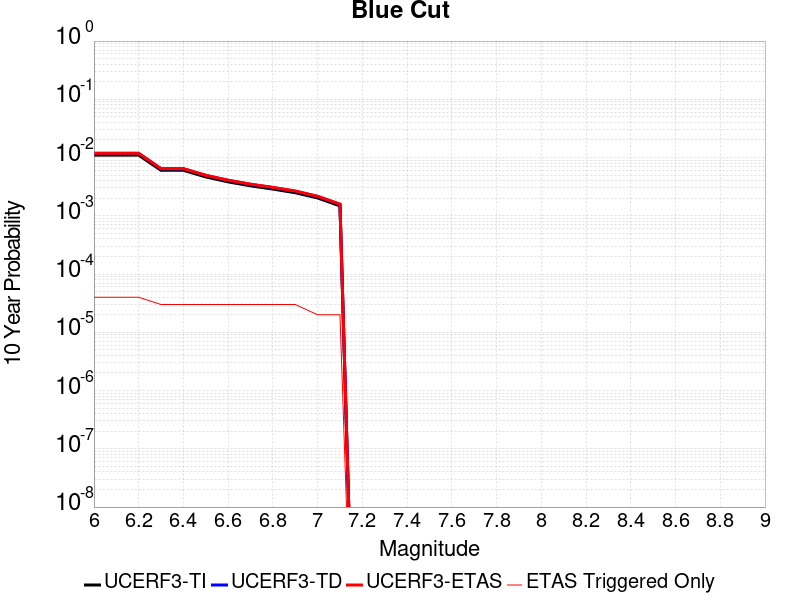 |

| Magnitude | 1 wk TI Prob | 1 wk TD Prob | 1 wk ETAS Prob | 1 wk ETAS/TD Gain | 1 wk ETAS Triggered Only | 1 mo TI Prob | 1 mo TD Prob | 1 mo ETAS Prob | 1 mo ETAS/TD Gain | 1 mo ETAS Triggered Only | 1 yr TI Prob | 1 yr TD Prob | 1 yr ETAS Prob | 1 yr ETAS/TD Gain | 1 yr ETAS Triggered Only | 10 yr TI Prob | 10 yr TD Prob | 10 yr ETAS Prob | 10 yr ETAS/TD Gain | 10 yr ETAS Triggered Only |
|-----|-----|-----|-----|-----|-----|-----|-----|-----|-----|-----|-----|-----|-----|-----|-----|-----|-----|-----|-----|-----|
| 6.0 | 2.1227985E-5 | 2.2719787E-5 | 2.2719787E-5 | 1.0 | 0.0 | 9.097391E-5 | 9.736721E-5 | 9.736721E-5 | 1.0 | 0.0 | 0.0011070445 | 0.0011848592 | 0.0011948473 | 1.0084298 | 1.0E-5 | 0.011015458 | 0.011791261 | 0.011830789 | 1.0033523 | 4.0E-5 |
| 6.1 | 2.1227985E-5 | 2.2719787E-5 | 2.2719787E-5 | 1.0 | 0.0 | 9.097391E-5 | 9.736721E-5 | 9.736721E-5 | 1.0 | 0.0 | 0.0011070445 | 0.0011848592 | 0.0011948473 | 1.0084298 | 1.0E-5 | 0.011015458 | 0.011791261 | 0.011830789 | 1.0033523 | 4.0E-5 |
| 6.2 | 2.1227985E-5 | 2.2719787E-5 | 2.2719787E-5 | 1.0 | 0.0 | 9.097391E-5 | 9.736721E-5 | 9.736721E-5 | 1.0 | 0.0 | 0.0011070445 | 0.0011848592 | 0.0011948473 | 1.0084298 | 1.0E-5 | 0.011015458 | 0.011791261 | 0.011830789 | 1.0033523 | 4.0E-5 |
| 6.3 | 1.1613981E-5 | 1.23536465E-5 | 1.23536465E-5 | 1.0 | 0.0 | 4.9773254E-5 | 5.2943193E-5 | 5.2943193E-5 | 1.0 | 0.0 | 6.0582085E-4 | 6.444052E-4 | 6.5439875E-4 | 1.0155082 | 1.0E-5 | 0.0060417196 | 0.0064266133 | 0.0064564208 | 1.0046381 | 3.0E-5 |
| 6.4 | 1.1613981E-5 | 1.23536465E-5 | 1.23536465E-5 | 1.0 | 0.0 | 4.9773254E-5 | 5.2943193E-5 | 5.2943193E-5 | 1.0 | 0.0 | 6.0582085E-4 | 6.444052E-4 | 6.5439875E-4 | 1.0155082 | 1.0E-5 | 0.0060417196 | 0.0064266133 | 0.0064564208 | 1.0046381 | 3.0E-5 |
| 6.5 | 8.931326E-6 | 9.481677E-6 | 9.481677E-6 | 1.0 | 0.0 | 3.8276554E-5 | 4.063518E-5 | 4.063518E-5 | 1.0 | 0.0 | 4.6591737E-4 | 4.9463013E-4 | 5.046252E-4 | 1.0202072 | 1.0E-5 | 0.0046494175 | 0.0049362015 | 0.004966053 | 1.0060476 | 3.0E-5 |
| 6.6 | 7.345353E-6 | 7.790341E-6 | 7.790341E-6 | 1.0 | 0.0 | 3.1479703E-5 | 3.3386797E-5 | 3.3386797E-5 | 1.0 | 0.0 | 3.83198E-4 | 4.0641645E-4 | 4.164124E-4 | 1.0245953 | 1.0E-5 | 0.0038253788 | 0.0040575233 | 0.0040874016 | 1.0073637 | 3.0E-5 |
| 6.7 | 6.2775666E-6 | 6.655202E-6 | 6.655202E-6 | 1.0 | 0.0 | 2.690358E-5 | 2.8522025E-5 | 2.8522025E-5 | 1.0 | 0.0 | 3.2750185E-4 | 3.4720785E-4 | 3.5720438E-4 | 1.0287912 | 1.0E-5 | 0.0032701963 | 0.0034673947 | 0.0034972907 | 1.008622 | 3.0E-5 |
| 6.8 | 5.5234095E-6 | 5.8551577E-6 | 5.8551577E-6 | 1.0 | 0.0 | 2.367154E-5 | 2.5093334E-5 | 2.5093334E-5 | 1.0 | 0.0 | 2.8816288E-4 | 3.0547578E-4 | 3.1547272E-4 | 1.0327258 | 1.0E-5 | 0.002877895 | 0.003051275 | 0.0030811832 | 1.009802 | 3.0E-5 |
| 6.9 | 4.7780054E-6 | 5.0654608E-6 | 5.0654608E-6 | 1.0 | 0.0 | 2.0477004E-5 | 2.1708976E-5 | 2.1708976E-5 | 1.0 | 0.0 | 2.4927902E-4 | 2.6428179E-4 | 2.7427915E-4 | 1.0378284 | 1.0E-5 | 0.0024899957 | 0.0026403673 | 0.0026702879 | 1.011332 | 3.0E-5 |
| 7.0 | 3.883171E-6 | 4.1185203E-6 | 4.1185203E-6 | 1.0 | 0.0 | 1.6642054E-5 | 1.765072E-5 | 1.765072E-5 | 1.0 | 0.0 | 2.0259817E-4 | 2.1488321E-4 | 2.2488106E-4 | 1.0465269 | 1.0E-5 | 0.0020241356 | 0.00214743 | 0.0021673872 | 1.0092934 | 2.0E-5 |
| 7.1 | 2.8358215E-6 | 3.0097403E-6 | 3.0097403E-6 | 1.0 | 0.0 | 1.2153464E-5 | 1.289886E-5 | 1.289886E-5 | 1.0 | 0.0 | 1.4795837E-4 | 1.5703888E-4 | 1.6703732E-4 | 1.0636685 | 1.0E-5 | 0.001478599 | 0.0015699244 | 0.001589893 | 1.0127195 | 2.0E-5 |

## San Jacinto (Clark) rev
*[(top)](#table-of-contents)*

| 1 Week | 1 Month | 1 Year | 10 Year |
|-----|-----|-----|-----|
|  |  |  |  |

| Magnitude | 1 wk TI Prob | 1 wk TD Prob | 1 wk ETAS Prob | 1 wk ETAS/TD Gain | 1 wk ETAS Triggered Only | 1 mo TI Prob | 1 mo TD Prob | 1 mo ETAS Prob | 1 mo ETAS/TD Gain | 1 mo ETAS Triggered Only | 1 yr TI Prob | 1 yr TD Prob | 1 yr ETAS Prob | 1 yr ETAS/TD Gain | 1 yr ETAS Triggered Only | 10 yr TI Prob | 10 yr TD Prob | 10 yr ETAS Prob | 10 yr ETAS/TD Gain | 10 yr ETAS Triggered Only |
|-----|-----|-----|-----|-----|-----|-----|-----|-----|-----|-----|-----|-----|-----|-----|-----|-----|-----|-----|-----|-----|
| 6.0 | 4.482615E-5 | 2.1162805E-5 | 2.1162805E-5 | 1.0 | 0.0 | 1.9209793E-4 | 9.069463E-5 | 9.069463E-5 | 1.0 | 0.0 | 0.0023362834 | 0.0011036571 | 0.0011036571 | 1.0 | 0.0 | 0.02311874 | 0.011508432 | 0.0115479715 | 1.0034357 | 4.0E-5 |
| 6.1 | 4.482615E-5 | 2.1162805E-5 | 2.1162805E-5 | 1.0 | 0.0 | 1.9209793E-4 | 9.069463E-5 | 9.069463E-5 | 1.0 | 0.0 | 0.0023362834 | 0.0011036571 | 0.0011036571 | 1.0 | 0.0 | 0.02311874 | 0.011508432 | 0.0115479715 | 1.0034357 | 4.0E-5 |
| 6.2 | 4.482615E-5 | 2.1162805E-5 | 2.1162805E-5 | 1.0 | 0.0 | 1.9209793E-4 | 9.069463E-5 | 9.069463E-5 | 1.0 | 0.0 | 0.0023362834 | 0.0011036571 | 0.0011036571 | 1.0 | 0.0 | 0.02311874 | 0.011508432 | 0.0115479715 | 1.0034357 | 4.0E-5 |
| 6.3 | 4.482615E-5 | 2.1162805E-5 | 2.1162805E-5 | 1.0 | 0.0 | 1.9209793E-4 | 9.069463E-5 | 9.069463E-5 | 1.0 | 0.0 | 0.0023362834 | 0.0011036571 | 0.0011036571 | 1.0 | 0.0 | 0.02311874 | 0.011508432 | 0.0115479715 | 1.0034357 | 4.0E-5 |
| 6.4 | 4.482615E-5 | 2.1162805E-5 | 2.1162805E-5 | 1.0 | 0.0 | 1.9209793E-4 | 9.069463E-5 | 9.069463E-5 | 1.0 | 0.0 | 0.0023362834 | 0.0011036571 | 0.0011036571 | 1.0 | 0.0 | 0.02311874 | 0.011508432 | 0.0115479715 | 1.0034357 | 4.0E-5 |
| 6.5 | 3.7294863E-5 | 1.7363767E-5 | 1.7363767E-5 | 1.0 | 0.0 | 1.5982533E-4 | 7.441404E-5 | 7.441404E-5 | 1.0 | 0.0 | 0.0019441366 | 9.056189E-4 | 9.056189E-4 | 1.0 | 0.0 | 0.01927216 | 0.009498186 | 0.009537807 | 1.0041714 | 4.0E-5 |
| 6.6 | 3.7294863E-5 | 1.7363767E-5 | 1.7363767E-5 | 1.0 | 0.0 | 1.5982533E-4 | 7.441404E-5 | 7.441404E-5 | 1.0 | 0.0 | 0.0019441366 | 9.056189E-4 | 9.056189E-4 | 1.0 | 0.0 | 0.01927216 | 0.009498186 | 0.009537807 | 1.0041714 | 4.0E-5 |
| 6.7 | 3.6039248E-5 | 1.661182E-5 | 1.661182E-5 | 1.0 | 0.0 | 1.5444479E-4 | 7.11916E-5 | 7.11916E-5 | 1.0 | 0.0 | 0.0018787434 | 8.6641713E-4 | 8.6641713E-4 | 1.0 | 0.0 | 0.01862939 | 0.009100041 | 0.0091396775 | 1.0043555 | 4.0E-5 |
| 6.8 | 3.5031844E-5 | 1.6240316E-5 | 1.6240316E-5 | 1.0 | 0.0 | 1.5012783E-4 | 6.959952E-5 | 6.959952E-5 | 1.0 | 0.0 | 0.0018262739 | 8.470488E-4 | 8.470488E-4 | 1.0 | 0.0 | 0.01811338 | 0.008899899 | 0.008939544 | 1.0044544 | 4.0E-5 |
| 6.9 | 3.435112E-5 | 1.6070499E-5 | 1.6070499E-5 | 1.0 | 0.0 | 1.4721078E-4 | 6.887177E-5 | 6.887177E-5 | 1.0 | 0.0 | 0.0017908178 | 8.381953E-4 | 8.381953E-4 | 1.0 | 0.0 | 0.017764548 | 0.008808068 | 0.008847716 | 1.0045013 | 4.0E-5 |
| 7.0 | 2.8959772E-5 | 1.4343366E-5 | 1.4343366E-5 | 1.0 | 0.0 | 1.241074E-4 | 6.1470135E-5 | 6.1470135E-5 | 1.0 | 0.0 | 0.0015099603 | 7.481447E-4 | 7.481447E-4 | 1.0 | 0.0 | 0.014997416 | 0.0078715505 | 0.007911236 | 1.0050416 | 4.0E-5 |
| 7.1 | 2.6002877E-5 | 1.2835043E-5 | 1.2835043E-5 | 1.0 | 0.0 | 1.11436144E-4 | 5.500618E-5 | 5.500618E-5 | 1.0 | 0.0 | 0.0013558907 | 6.694966E-4 | 6.694966E-4 | 1.0 | 0.0 | 0.013476475 | 0.007049743 | 0.0070894607 | 1.005634 | 4.0E-5 |
| 7.2 | 2.2544838E-5 | 1.1267972E-5 | 1.1267972E-5 | 1.0 | 0.0 | 9.661716E-5 | 4.829042E-5 | 4.829042E-5 | 1.0 | 0.0 | 0.001175679 | 5.8777875E-4 | 5.8777875E-4 | 1.0 | 0.0 | 0.011694785 | 0.0061956523 | 0.0062354044 | 1.0064161 | 4.0E-5 |
| 7.3 | 1.75334E-5 | 1.081679E-5 | 1.081679E-5 | 1.0 | 0.0 | 7.514098E-5 | 4.6356854E-5 | 4.6356854E-5 | 1.0 | 0.0 | 9.144575E-4 | 5.6424993E-4 | 5.6424993E-4 | 1.0 | 0.0 | 0.009107036 | 0.005936473 | 0.005976236 | 1.006698 | 4.0E-5 |
| 7.4 | 1.5924552E-5 | 1.0616479E-5 | 1.0616479E-5 | 1.0 | 0.0 | 6.82463E-5 | 4.5498407E-5 | 4.5498407E-5 | 1.0 | 0.0 | 8.305819E-4 | 5.538037E-4 | 5.538037E-4 | 1.0 | 0.0 | 0.008274844 | 0.005823671 | 0.005863438 | 1.0068285 | 4.0E-5 |
| 7.5 | 1.3428931E-5 | 9.856627E-6 | 9.856627E-6 | 1.0 | 0.0 | 5.7551293E-5 | 4.224201E-5 | 4.224201E-5 | 1.0 | 0.0 | 7.004617E-4 | 5.1417615E-4 | 5.1417615E-4 | 1.0 | 0.0 | 0.006982579 | 0.005409115 | 0.0054488983 | 1.007355 | 4.0E-5 |
| 7.6 | 1.0688787E-5 | 8.61931E-6 | 8.61931E-6 | 1.0 | 0.0 | 4.5808283E-5 | 3.6939382E-5 | 3.6939382E-5 | 1.0 | 0.0 | 5.5757316E-4 | 4.4964463E-4 | 4.4964463E-4 | 1.0 | 0.0 | 0.005561762 | 0.004744031 | 0.0047838413 | 1.0083916 | 4.0E-5 |
| 7.7 | 8.81236E-6 | 7.4723484E-6 | 7.4723484E-6 | 1.0 | 0.0 | 3.776671E-5 | 3.202396E-5 | 3.202396E-5 | 1.0 | 0.0 | 4.597127E-4 | 3.8982215E-4 | 3.8982215E-4 | 1.0 | 0.0 | 0.0045876284 | 0.004136955 | 0.0041767894 | 1.0096289 | 4.0E-5 |
| 7.8 | 7.780431E-6 | 6.7006613E-6 | 6.7006613E-6 | 1.0 | 0.0 | 3.3344273E-5 | 2.8716804E-5 | 2.8716804E-5 | 1.0 | 0.0 | 4.0589093E-4 | 3.4957117E-4 | 3.4957117E-4 | 1.0 | 0.0 | 0.0040515037 | 0.0037249678 | 0.003764819 | 1.0106983 | 4.0E-5 |
| 7.9 | 6.5437994E-6 | 5.784193E-6 | 5.784193E-6 | 1.0 | 0.0 | 2.8044553E-5 | 2.4789164E-5 | 2.4789164E-5 | 1.0 | 0.0 | 3.4138895E-4 | 3.0176644E-4 | 3.0176644E-4 | 1.0 | 0.0 | 0.0034086495 | 0.003236521 | 0.0032763917 | 1.012319 | 4.0E-5 |
| 8.0 | 5.4488164E-6 | 4.8167294E-6 | 4.8167294E-6 | 1.0 | 0.0 | 2.3351862E-5 | 2.0642963E-5 | 2.0642963E-5 | 1.0 | 0.0 | 2.8427184E-4 | 2.5129924E-4 | 2.5129924E-4 | 1.0 | 0.0 | 0.0028390845 | 0.0027126544 | 0.002752546 | 1.0147057 | 4.0E-5 |
| 8.1 | 2.8397242E-6 | 1.3684335E-6 | 1.3684335E-6 | 1.0 | 0.0 | 1.217019E-5 | 5.864702E-6 | 5.864702E-6 | 1.0 | 0.0 | 1.4816198E-4 | 7.140042E-5 | 7.140042E-5 | 1.0 | 0.0 | 0.0014806325 | 8.12321E-4 | 8.12321E-4 | 1.0 | 0.0 |
| 8.2 | 2.030244E-6 | 6.326596E-7 | 6.326596E-7 | 1.0 | 0.0 | 8.701017E-6 | 2.7113954E-6 | 2.7113954E-6 | 1.0 | 0.0 | 1.05929736E-4 | 3.3010747E-5 | 3.3010747E-5 | 1.0 | 0.0 | 0.0010587925 | 3.9531066E-4 | 3.9531066E-4 | 1.0 | 0.0 |
| 8.3 | 1.0659804E-6 | 2.9287372E-7 | 2.9287372E-7 | 1.0 | 0.0 | 4.568479E-6 | 1.2551725E-6 | 1.2551725E-6 | 1.0 | 0.0 | 5.5619817E-5 | 1.5281621E-5 | 1.5281621E-5 | 1.0 | 0.0 | 5.5605895E-4 | 1.8588232E-4 | 1.8588232E-4 | 1.0 | 0.0 |

## Sierra Madre
*[(top)](#table-of-contents)*

| 1 Week | 1 Month | 1 Year | 10 Year |
|-----|-----|-----|-----|
|  | 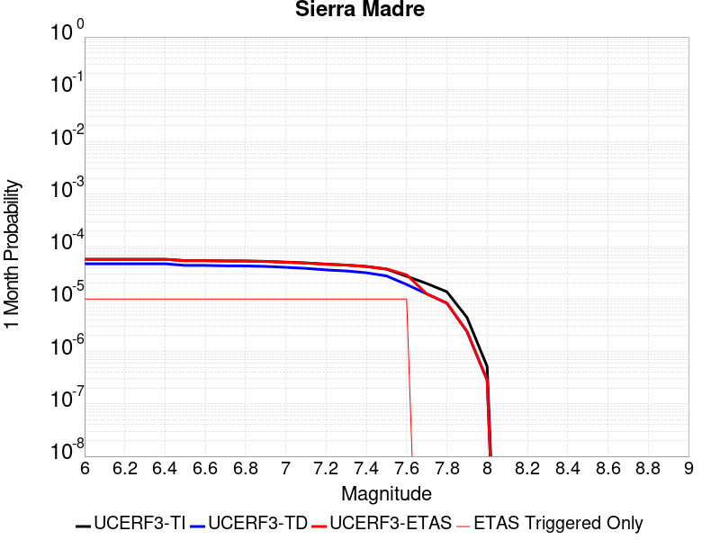 |  | 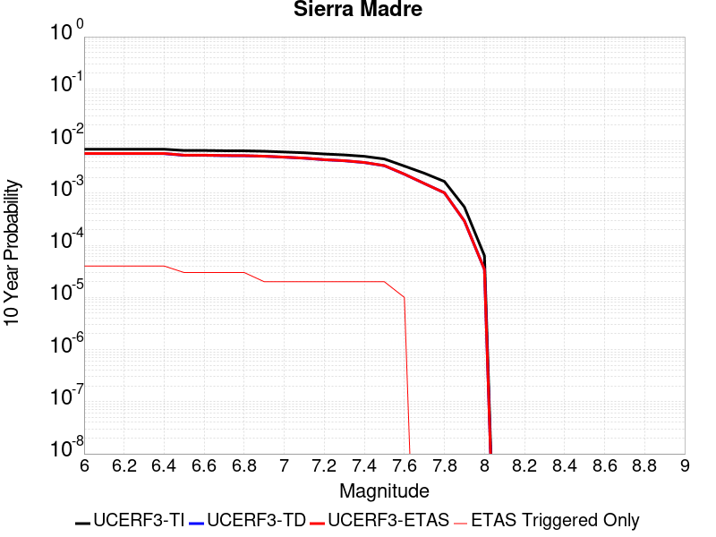 |

| Magnitude | 1 wk TI Prob | 1 wk TD Prob | 1 wk ETAS Prob | 1 wk ETAS/TD Gain | 1 wk ETAS Triggered Only | 1 mo TI Prob | 1 mo TD Prob | 1 mo ETAS Prob | 1 mo ETAS/TD Gain | 1 mo ETAS Triggered Only | 1 yr TI Prob | 1 yr TD Prob | 1 yr ETAS Prob | 1 yr ETAS/TD Gain | 1 yr ETAS Triggered Only | 10 yr TI Prob | 10 yr TD Prob | 10 yr ETAS Prob | 10 yr ETAS/TD Gain | 10 yr ETAS Triggered Only |
|-----|-----|-----|-----|-----|-----|-----|-----|-----|-----|-----|-----|-----|-----|-----|-----|-----|-----|-----|-----|-----|
| 6.0 | 1.3379373E-5 | 1.100113E-5 | 1.100113E-5 | 1.0 | 0.0 | 5.7338908E-5 | 4.7146856E-5 | 5.7146382E-5 | 1.2120932 | 1.0E-5 | 6.978776E-4 | 5.738633E-4 | 6.138403E-4 | 1.069663 | 4.0E-5 | 0.0069569005 | 0.005724178 | 0.005763949 | 1.0069479 | 4.0E-5 |
| 6.1 | 1.3379373E-5 | 1.100113E-5 | 1.100113E-5 | 1.0 | 0.0 | 5.7338908E-5 | 4.7146856E-5 | 5.7146382E-5 | 1.2120932 | 1.0E-5 | 6.978776E-4 | 5.738633E-4 | 6.138403E-4 | 1.069663 | 4.0E-5 | 0.0069569005 | 0.005724178 | 0.005763949 | 1.0069479 | 4.0E-5 |
| 6.2 | 1.3379373E-5 | 1.100113E-5 | 1.100113E-5 | 1.0 | 0.0 | 5.7338908E-5 | 4.7146856E-5 | 5.7146382E-5 | 1.2120932 | 1.0E-5 | 6.978776E-4 | 5.738633E-4 | 6.138403E-4 | 1.069663 | 4.0E-5 | 0.0069569005 | 0.005724178 | 0.005763949 | 1.0069479 | 4.0E-5 |
| 6.3 | 1.3379373E-5 | 1.100113E-5 | 1.100113E-5 | 1.0 | 0.0 | 5.7338908E-5 | 4.7146856E-5 | 5.7146382E-5 | 1.2120932 | 1.0E-5 | 6.978776E-4 | 5.738633E-4 | 6.138403E-4 | 1.069663 | 4.0E-5 | 0.0069569005 | 0.005724178 | 0.005763949 | 1.0069479 | 4.0E-5 |
| 6.4 | 1.3379373E-5 | 1.100113E-5 | 1.100113E-5 | 1.0 | 0.0 | 5.7338908E-5 | 4.7146856E-5 | 5.7146382E-5 | 1.2120932 | 1.0E-5 | 6.978776E-4 | 5.738633E-4 | 6.138403E-4 | 1.069663 | 4.0E-5 | 0.0069569005 | 0.005724178 | 0.005763949 | 1.0069479 | 4.0E-5 |
| 6.5 | 1.26563245E-5 | 1.0230579E-5 | 1.0230579E-5 | 1.0 | 0.0 | 5.4240263E-5 | 4.3844608E-5 | 5.384417E-5 | 1.2280682 | 1.0E-5 | 6.601751E-4 | 5.3367845E-4 | 5.6366244E-4 | 1.0561836 | 3.0E-5 | 0.006582173 | 0.00532429 | 0.00535413 | 1.0056045 | 3.0E-5 |
| 6.6 | 1.26563245E-5 | 1.0230579E-5 | 1.0230579E-5 | 1.0 | 0.0 | 5.4240263E-5 | 4.3844608E-5 | 5.384417E-5 | 1.2280682 | 1.0E-5 | 6.601751E-4 | 5.3367845E-4 | 5.6366244E-4 | 1.0561836 | 3.0E-5 | 0.006582173 | 0.00532429 | 0.00535413 | 1.0056045 | 3.0E-5 |
| 6.7 | 1.2502474E-5 | 1.0066722E-5 | 1.0066722E-5 | 1.0 | 0.0 | 5.3580934E-5 | 4.3142387E-5 | 5.3141954E-5 | 1.2317806 | 1.0E-5 | 6.521526E-4 | 5.2513304E-4 | 5.5511727E-4 | 1.0570984 | 3.0E-5 | 0.0065024206 | 0.0052392404 | 0.005269083 | 1.005696 | 3.0E-5 |
| 6.8 | 1.2454966E-5 | 1.0019007E-5 | 1.0019007E-5 | 1.0 | 0.0 | 5.3377335E-5 | 4.29379E-5 | 5.293747E-5 | 1.2328845 | 1.0E-5 | 6.4967526E-4 | 5.226446E-4 | 5.5262895E-4 | 1.0573704 | 3.0E-5 | 0.006477792 | 0.005214473 | 0.005244317 | 1.0057232 | 3.0E-5 |
| 6.9 | 1.2225574E-5 | 9.7929815E-6 | 9.7929815E-6 | 1.0 | 0.0 | 5.2394265E-5 | 4.196925E-5 | 5.1968833E-5 | 1.2382597 | 1.0E-5 | 6.3771347E-4 | 5.108569E-4 | 5.3084665E-4 | 1.0391299 | 2.0E-5 | 0.006358865 | 0.0050971415 | 0.0051170397 | 1.0039037 | 2.0E-5 |
| 7.0 | 1.182946E-5 | 9.3995195E-6 | 9.3995195E-6 | 1.0 | 0.0 | 5.06967E-5 | 4.0283037E-5 | 5.0282637E-5 | 1.2482334 | 1.0E-5 | 6.1705755E-4 | 4.903367E-4 | 5.103268E-4 | 1.0407683 | 2.0E-5 | 0.006153469 | 0.004892859 | 0.0049127615 | 1.0040675 | 2.0E-5 |
| 7.1 | 1.14369095E-5 | 8.986527E-6 | 8.986527E-6 | 1.0 | 0.0 | 4.9014405E-5 | 3.8513124E-5 | 4.851274E-5 | 1.2596418 | 1.0E-5 | 5.9658696E-4 | 4.6879737E-4 | 4.88788E-4 | 1.0426424 | 2.0E-5 | 0.005949879 | 0.00467839 | 0.0046982965 | 1.0042549 | 2.0E-5 |
| 7.2 | 1.0836419E-5 | 8.399916E-6 | 8.399916E-6 | 1.0 | 0.0 | 4.644097E-5 | 3.5999146E-5 | 4.5998786E-5 | 1.2777743 | 1.0E-5 | 5.652721E-4 | 4.3820238E-4 | 4.5819362E-4 | 1.045621 | 2.0E-5 | 0.0056383642 | 0.0043736803 | 0.004393593 | 1.0045528 | 2.0E-5 |
| 7.3 | 1.0403439E-5 | 8.021173E-6 | 8.021173E-6 | 1.0 | 0.0 | 4.4585406E-5 | 3.4376008E-5 | 4.4375665E-5 | 1.2908906 | 1.0E-5 | 5.426921E-4 | 4.1844844E-4 | 4.3844007E-4 | 1.0477756 | 2.0E-5 | 0.005413687 | 0.0041769007 | 0.004196817 | 1.0047683 | 2.0E-5 |
| 7.4 | 9.768864E-6 | 7.414793E-6 | 7.414793E-6 | 1.0 | 0.0 | 4.186589E-5 | 3.17773E-5 | 4.1776984E-5 | 1.31468 | 1.0E-5 | 5.09598E-4 | 3.8682084E-4 | 4.068131E-4 | 1.0516835 | 2.0E-5 | 0.0050843097 | 0.0038617672 | 0.00388169 | 1.005159 | 2.0E-5 |
| 7.5 | 8.687089E-6 | 6.4504875E-6 | 6.4504875E-6 | 1.0 | 0.0 | 3.722985E-5 | 2.7644659E-5 | 3.7644382E-5 | 1.3617235 | 1.0E-5 | 4.5317915E-4 | 3.3652261E-4 | 3.5651587E-4 | 1.0594114 | 2.0E-5 | 0.004522561 | 0.0033604174 | 0.00338035 | 1.0059316 | 2.0E-5 |
| 7.6 | 6.3506063E-6 | 4.430626E-6 | 4.430626E-6 | 1.0 | 0.0 | 2.72166E-5 | 1.8988261E-5 | 2.8988072E-5 | 1.5266311 | 1.0E-5 | 3.3131172E-4 | 2.3115781E-4 | 2.411555E-4 | 1.0432504 | 1.0E-5 | 0.003308182 | 0.0023093987 | 0.0023193755 | 1.0043201 | 1.0E-5 |
| 7.7 | 4.62223E-6 | 2.9332562E-6 | 2.9332562E-6 | 1.0 | 0.0 | 1.9809406E-5 | 1.2571038E-5 | 1.2571038E-5 | 1.0 | 0.0 | 2.4115283E-4 | 1.5304166E-4 | 1.5304166E-4 | 1.0 | 0.0 | 0.0024089129 | 0.0015295637 | 0.0015295637 | 1.0 | 0.0 |
| 7.8 | 3.2145008E-6 | 1.9496579E-6 | 1.9496579E-6 | 1.0 | 0.0 | 1.3776359E-5 | 8.35565E-6 | 8.35565E-6 | 1.0 | 0.0 | 1.6771426E-4 | 1.01725294E-4 | 1.01725294E-4 | 1.0 | 0.0 | 0.0016758774 | 0.0010169316 | 0.0010169316 | 1.0 | 0.0 |
| 7.9 | 1.0391769E-6 | 5.6034094E-7 | 5.6034094E-7 | 1.0 | 0.0 | 4.4536077E-6 | 2.401459E-6 | 2.401459E-6 | 1.0 | 0.0 | 5.4221324E-5 | 2.9237375E-5 | 2.9237375E-5 | 1.0 | 0.0 | 5.4208096E-4 | 2.9233572E-4 | 2.9233572E-4 | 1.0 | 0.0 |
| 8.0 | 1.210983E-7 | 6.6141716E-8 | 6.6141716E-8 | 1.0 | 0.0 | 5.1899264E-7 | 2.8346446E-7 | 2.8346446E-7 | 1.0 | 0.0 | 6.3187167E-6 | 3.4511747E-6 | 3.4511747E-6 | 1.0 | 0.0 | 6.318537E-5 | 3.4511228E-5 | 3.4511228E-5 | 1.0 | 0.0 |

## Santa Cruz Island
*[(top)](#table-of-contents)*

| 1 Week | 1 Month | 1 Year | 10 Year |
|-----|-----|-----|-----|
| 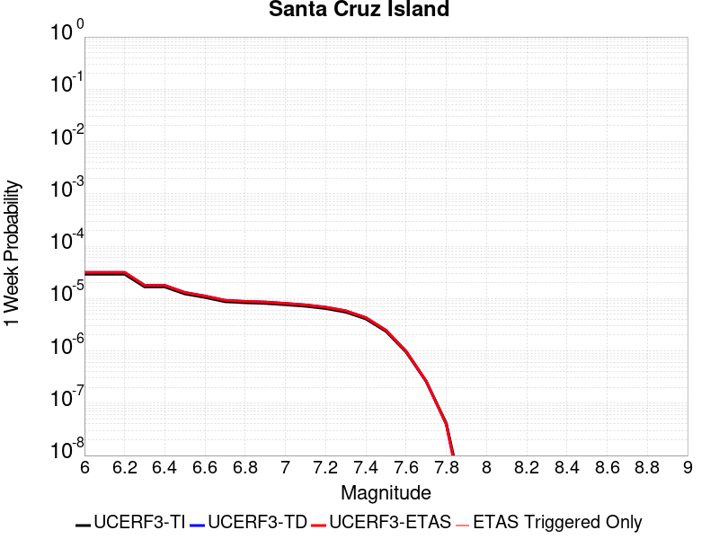 |  |  | 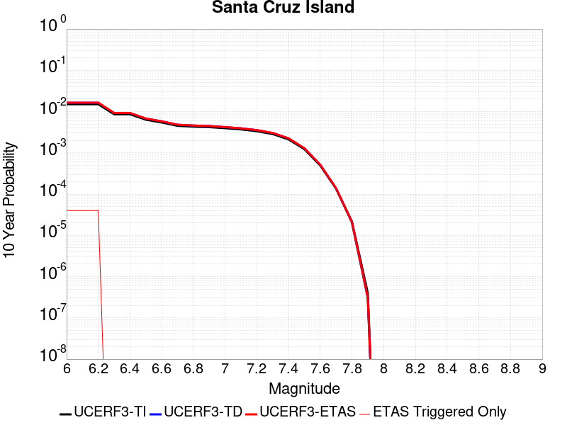 |

| Magnitude | 1 wk TI Prob | 1 wk TD Prob | 1 wk ETAS Prob | 1 wk ETAS/TD Gain | 1 wk ETAS Triggered Only | 1 mo TI Prob | 1 mo TD Prob | 1 mo ETAS Prob | 1 mo ETAS/TD Gain | 1 mo ETAS Triggered Only | 1 yr TI Prob | 1 yr TD Prob | 1 yr ETAS Prob | 1 yr ETAS/TD Gain | 1 yr ETAS Triggered Only | 10 yr TI Prob | 10 yr TD Prob | 10 yr ETAS Prob | 10 yr ETAS/TD Gain | 10 yr ETAS Triggered Only |
|-----|-----|-----|-----|-----|-----|-----|-----|-----|-----|-----|-----|-----|-----|-----|-----|-----|-----|-----|-----|-----|
| 6.0 | 2.9164563E-5 | 3.1600095E-5 | 3.1600095E-5 | 1.0 | 0.0 | 1.2498499E-4 | 1.3542273E-4 | 1.3542273E-4 | 1.0 | 0.0 | 0.0015206301 | 0.0016476609 | 0.001667628 | 1.0121185 | 2.0E-5 | 0.015102667 | 0.01636818 | 0.016407525 | 1.0024037 | 4.0E-5 |
| 6.1 | 2.9164563E-5 | 3.1600095E-5 | 3.1600095E-5 | 1.0 | 0.0 | 1.2498499E-4 | 1.3542273E-4 | 1.3542273E-4 | 1.0 | 0.0 | 0.0015206301 | 0.0016476609 | 0.001667628 | 1.0121185 | 2.0E-5 | 0.015102667 | 0.01636818 | 0.016407525 | 1.0024037 | 4.0E-5 |
| 6.2 | 2.9164563E-5 | 3.1600095E-5 | 3.1600095E-5 | 1.0 | 0.0 | 1.2498499E-4 | 1.3542273E-4 | 1.3542273E-4 | 1.0 | 0.0 | 0.0015206301 | 0.0016476609 | 0.001667628 | 1.0121185 | 2.0E-5 | 0.015102667 | 0.01636818 | 0.016407525 | 1.0024037 | 4.0E-5 |
| 6.3 | 1.6635553E-5 | 1.7804527E-5 | 1.7804527E-5 | 1.0 | 0.0 | 7.1293274E-5 | 7.630298E-5 | 7.630298E-5 | 1.0 | 0.0 | 8.6765E-4 | 9.286111E-4 | 9.286111E-4 | 1.0 | 0.0 | 0.008642701 | 0.009249181 | 0.009249181 | 1.0 | 0.0 |
| 6.4 | 1.6635553E-5 | 1.7804527E-5 | 1.7804527E-5 | 1.0 | 0.0 | 7.1293274E-5 | 7.630298E-5 | 7.630298E-5 | 1.0 | 0.0 | 8.6765E-4 | 9.286111E-4 | 9.286111E-4 | 1.0 | 0.0 | 0.008642701 | 0.009249181 | 0.009249181 | 1.0 | 0.0 |
| 6.5 | 1.2238748E-5 | 1.3043111E-5 | 1.3043111E-5 | 1.0 | 0.0 | 5.2450723E-5 | 5.5897868E-5 | 5.5897868E-5 | 1.0 | 0.0 | 6.3840044E-4 | 6.8034773E-4 | 6.8034773E-4 | 1.0 | 0.0 | 0.0063656955 | 0.006783047 | 0.006783047 | 1.0 | 0.0 |
| 6.6 | 1.0489767E-5 | 1.11567315E-5 | 1.11567315E-5 | 1.0 | 0.0 | 4.495537E-5 | 4.7813697E-5 | 4.7813697E-5 | 1.0 | 0.0 | 5.4719415E-4 | 5.8197853E-4 | 5.8197853E-4 | 1.0 | 0.0 | 0.005458487 | 0.005804785 | 0.005804785 | 1.0 | 0.0 |
| 6.7 | 8.699222E-6 | 9.236859E-6 | 9.236859E-6 | 1.0 | 0.0 | 3.7281847E-5 | 3.958594E-5 | 3.958594E-5 | 1.0 | 0.0 | 4.5381195E-4 | 4.818528E-4 | 4.818528E-4 | 1.0 | 0.0 | 0.0045288634 | 0.004808148 | 0.004808148 | 1.0 | 0.0 |
| 6.8 | 8.307732E-6 | 8.816977E-6 | 8.816977E-6 | 1.0 | 0.0 | 3.560408E-5 | 3.77865E-5 | 3.77865E-5 | 1.0 | 0.0 | 4.3339343E-4 | 4.5995394E-4 | 4.5995394E-4 | 1.0 | 0.0 | 0.004325492 | 0.004590073 | 0.004590073 | 1.0 | 0.0 |
| 6.9 | 8.073121E-6 | 8.565009E-6 | 8.565009E-6 | 1.0 | 0.0 | 3.459863E-5 | 3.6706668E-5 | 3.6706668E-5 | 1.0 | 0.0 | 4.2115687E-4 | 4.4681245E-4 | 4.4681245E-4 | 1.0 | 0.0 | 0.004203596 | 0.0044591925 | 0.0044591925 | 1.0 | 0.0 |
| 7.0 | 7.617019E-6 | 8.0747295E-6 | 8.0747295E-6 | 1.0 | 0.0 | 3.264396E-5 | 3.4605528E-5 | 3.4605528E-5 | 1.0 | 0.0 | 3.9736772E-4 | 4.2124125E-4 | 4.2124125E-4 | 1.0 | 0.0 | 0.003966579 | 0.0042044753 | 0.0042044753 | 1.0 | 0.0 |
| 7.1 | 7.1224836E-6 | 7.5458483E-6 | 7.5458483E-6 | 1.0 | 0.0 | 3.052457E-5 | 3.233895E-5 | 3.233895E-5 | 1.0 | 0.0 | 3.715733E-4 | 3.9365597E-4 | 3.9365597E-4 | 1.0 | 0.0 | 0.003709526 | 0.0039296295 | 0.0039296295 | 1.0 | 0.0 |
| 7.2 | 6.441115E-6 | 6.8274385E-6 | 6.8274385E-6 | 1.0 | 0.0 | 2.7604487E-5 | 2.9260125E-5 | 2.9260125E-5 | 1.0 | 0.0 | 3.360328E-4 | 3.5618403E-4 | 3.5618403E-4 | 1.0 | 0.0 | 0.0033552512 | 0.0035561598 | 0.0035561598 | 1.0 | 0.0 |
| 7.3 | 5.494274E-6 | 5.820041E-6 | 5.820041E-6 | 1.0 | 0.0 | 2.3546674E-5 | 2.4942796E-5 | 2.4942796E-5 | 1.0 | 0.0 | 2.8664304E-4 | 3.0363642E-4 | 3.0363642E-4 | 1.0 | 0.0 | 0.002862736 | 0.0030322387 | 0.0030322387 | 1.0 | 0.0 |
| 7.4 | 4.0802624E-6 | 4.3122895E-6 | 4.3122895E-6 | 1.0 | 0.0 | 1.7486722E-5 | 1.848111E-5 | 1.848111E-5 | 1.0 | 0.0 | 2.1288003E-4 | 2.2498437E-4 | 2.2498437E-4 | 1.0 | 0.0 | 0.0021267622 | 0.002247575 | 0.002247575 | 1.0 | 0.0 |
| 7.5 | 2.3584746E-6 | 2.4753267E-6 | 2.4753267E-6 | 1.0 | 0.0 | 1.0107709E-5 | 1.06085E-5 | 1.06085E-5 | 1.0 | 0.0 | 1.2305441E-4 | 1.2915088E-4 | 1.2915088E-4 | 1.0 | 0.0 | 0.0012298629 | 0.0012907633 | 0.0012907633 | 1.0 | 0.0 |
| 7.6 | 9.4981914E-7 | 9.860988E-7 | 9.860988E-7 | 1.0 | 0.0 | 4.0706473E-6 | 4.226131E-6 | 4.226131E-6 | 1.0 | 0.0 | 4.9559E-5 | 5.145194E-5 | 5.145194E-5 | 1.0 | 0.0 | 4.954795E-4 | 5.144016E-4 | 5.144016E-4 | 1.0 | 0.0 |
| 7.7 | 2.6013532E-7 | 2.641672E-7 | 2.641672E-7 | 1.0 | 0.0 | 1.1148652E-6 | 1.1321447E-6 | 1.1321447E-6 | 1.0 | 0.0 | 1.3573399E-5 | 1.3783775E-5 | 1.3783775E-5 | 1.0 | 0.0 | 1.357257E-4 | 1.3782927E-4 | 1.3782927E-4 | 1.0 | 0.0 |
| 7.8 | 4.1522263E-8 | 3.9656918E-8 | 3.9656918E-8 | 1.0 | 0.0 | 1.7795254E-7 | 1.6995821E-7 | 1.6995821E-7 | 1.0 | 0.0 | 2.16657E-6 | 2.0692394E-6 | 2.0692394E-6 | 1.0 | 0.0 | 2.1665488E-5 | 2.0692223E-5 | 2.0692223E-5 | 1.0 | 0.0 |
| 7.9 | 7.7242046E-10 | 5.946851E-10 | 5.946851E-10 | 1.0 | 0.0 | 3.3103735E-9 | 2.54865E-9 | 2.54865E-9 | 1.0 | 0.0 | 4.0303796E-8 | 3.1029813E-8 | 3.1029813E-8 | 1.0 | 0.0 | 4.030379E-7 | 3.102981E-7 | 3.102981E-7 | 1.0 | 0.0 |

## Santa Susana East (connector)
*[(top)](#table-of-contents)*

| 1 Week | 1 Month | 1 Year | 10 Year |
|-----|-----|-----|-----|
|  | 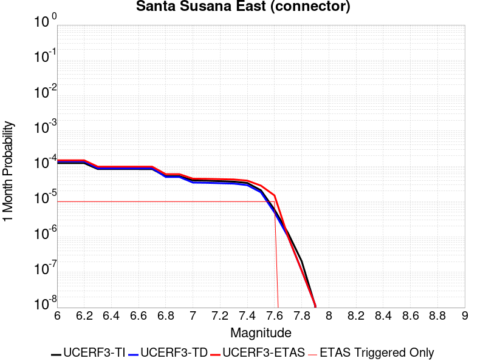 |  |  |

| Magnitude | 1 wk TI Prob | 1 wk TD Prob | 1 wk ETAS Prob | 1 wk ETAS/TD Gain | 1 wk ETAS Triggered Only | 1 mo TI Prob | 1 mo TD Prob | 1 mo ETAS Prob | 1 mo ETAS/TD Gain | 1 mo ETAS Triggered Only | 1 yr TI Prob | 1 yr TD Prob | 1 yr ETAS Prob | 1 yr ETAS/TD Gain | 1 yr ETAS Triggered Only | 10 yr TI Prob | 10 yr TD Prob | 10 yr ETAS Prob | 10 yr ETAS/TD Gain | 10 yr ETAS Triggered Only |
|-----|-----|-----|-----|-----|-----|-----|-----|-----|-----|-----|-----|-----|-----|-----|-----|-----|-----|-----|-----|-----|
| 6.0 | 2.858397E-5 | 3.202183E-5 | 3.202183E-5 | 1.0 | 0.0 | 1.2249697E-4 | 1.3723079E-4 | 1.4722941E-4 | 1.07286 | 1.0E-5 | 0.0014903803 | 0.0016697859 | 0.0016997359 | 1.0179363 | 3.0E-5 | 0.014804244 | 0.01659952 | 0.016629022 | 1.0017773 | 3.0E-5 |
| 6.1 | 2.858397E-5 | 3.202183E-5 | 3.202183E-5 | 1.0 | 0.0 | 1.2249697E-4 | 1.3723079E-4 | 1.4722941E-4 | 1.07286 | 1.0E-5 | 0.0014903803 | 0.0016697859 | 0.0016997359 | 1.0179363 | 3.0E-5 | 0.014804244 | 0.01659952 | 0.016629022 | 1.0017773 | 3.0E-5 |
| 6.2 | 2.858397E-5 | 3.202183E-5 | 3.202183E-5 | 1.0 | 0.0 | 1.2249697E-4 | 1.3723079E-4 | 1.4722941E-4 | 1.07286 | 1.0E-5 | 0.0014903803 | 0.0016697859 | 0.0016997359 | 1.0179363 | 3.0E-5 | 0.014804244 | 0.01659952 | 0.016629022 | 1.0017773 | 3.0E-5 |
| 6.3 | 1.943582E-5 | 2.0367674E-5 | 2.0367674E-5 | 1.0 | 0.0 | 8.329371E-5 | 8.728774E-5 | 9.728687E-5 | 1.1145536 | 1.0E-5 | 0.001013629 | 0.0010623224 | 0.0010823011 | 1.0188067 | 2.0E-5 | 0.010090181 | 0.010583875 | 0.010603663 | 1.0018697 | 2.0E-5 |
| 6.4 | 1.943582E-5 | 2.0367674E-5 | 2.0367674E-5 | 1.0 | 0.0 | 8.329371E-5 | 8.728774E-5 | 9.728687E-5 | 1.1145536 | 1.0E-5 | 0.001013629 | 0.0010623224 | 0.0010823011 | 1.0188067 | 2.0E-5 | 0.010090181 | 0.010583875 | 0.010603663 | 1.0018697 | 2.0E-5 |
| 6.5 | 1.943582E-5 | 2.0367674E-5 | 2.0367674E-5 | 1.0 | 0.0 | 8.329371E-5 | 8.728774E-5 | 9.728687E-5 | 1.1145536 | 1.0E-5 | 0.001013629 | 0.0010623224 | 0.0010823011 | 1.0188067 | 2.0E-5 | 0.010090181 | 0.010583875 | 0.010603663 | 1.0018697 | 2.0E-5 |
| 6.6 | 1.943582E-5 | 2.0367674E-5 | 2.0367674E-5 | 1.0 | 0.0 | 8.329371E-5 | 8.728774E-5 | 9.728687E-5 | 1.1145536 | 1.0E-5 | 0.001013629 | 0.0010623224 | 0.0010823011 | 1.0188067 | 2.0E-5 | 0.010090181 | 0.010583875 | 0.010603663 | 1.0018697 | 2.0E-5 |
| 6.7 | 1.9404439E-5 | 2.0355095E-5 | 2.0355095E-5 | 1.0 | 0.0 | 8.3159226E-5 | 8.7233835E-5 | 9.7232965E-5 | 1.1146244 | 1.0E-5 | 0.0010119933 | 0.0010616668 | 0.0010816455 | 1.0188183 | 2.0E-5 | 0.010073971 | 0.01057738 | 0.0105971685 | 1.0018709 | 2.0E-5 |
| 6.8 | 1.2217526E-5 | 1.1593199E-5 | 1.1593199E-5 | 1.0 | 0.0 | 5.2359774E-5 | 4.9684288E-5 | 5.9683793E-5 | 1.2012609 | 1.0E-5 | 6.372938E-4 | 6.047551E-4 | 6.2474306E-4 | 1.0330513 | 2.0E-5 | 0.0063546924 | 0.006033141 | 0.0060530207 | 1.0032951 | 2.0E-5 |
| 6.9 | 1.2217526E-5 | 1.1593199E-5 | 1.1593199E-5 | 1.0 | 0.0 | 5.2359774E-5 | 4.9684288E-5 | 5.9683793E-5 | 1.2012609 | 1.0E-5 | 6.372938E-4 | 6.047551E-4 | 6.2474306E-4 | 1.0330513 | 2.0E-5 | 0.0063546924 | 0.006033141 | 0.0060530207 | 1.0032951 | 2.0E-5 |
| 7.0 | 9.276017E-6 | 8.059215E-6 | 8.059215E-6 | 1.0 | 0.0 | 3.9753755E-5 | 3.4539054E-5 | 4.453871E-5 | 1.2895173 | 1.0E-5 | 4.8389446E-4 | 4.204353E-4 | 4.404269E-4 | 1.0475497 | 2.0E-5 | 0.0048284214 | 0.0041971253 | 0.004217041 | 1.0047451 | 2.0E-5 |
| 7.1 | 9.130355E-6 | 7.942386E-6 | 7.942386E-6 | 1.0 | 0.0 | 3.9129503E-5 | 3.4038374E-5 | 4.4038035E-5 | 1.293776 | 1.0E-5 | 4.7629757E-4 | 4.1434186E-4 | 4.3433357E-4 | 1.0482494 | 2.0E-5 | 0.00475278 | 0.004136419 | 0.004156336 | 1.0048151 | 2.0E-5 |
| 7.2 | 8.851015E-6 | 7.741543E-6 | 7.741543E-6 | 1.0 | 0.0 | 3.7932372E-5 | 3.317764E-5 | 4.3177308E-5 | 1.3013978 | 1.0E-5 | 4.6172875E-4 | 4.0386632E-4 | 4.2385823E-4 | 1.0495013 | 2.0E-5 | 0.0046077054 | 0.0040320465 | 0.0040519657 | 1.0049403 | 2.0E-5 |
| 7.3 | 8.573006E-6 | 7.5502617E-6 | 7.5502617E-6 | 1.0 | 0.0 | 3.6740938E-5 | 3.2357882E-5 | 4.235756E-5 | 1.3090338 | 1.0E-5 | 4.472291E-4 | 3.9388944E-4 | 4.1388156E-4 | 1.0507556 | 2.0E-5 | 0.004463301 | 0.00393263 | 0.0039525516 | 1.0050657 | 2.0E-5 |
| 7.4 | 7.852282E-6 | 6.8177665E-6 | 6.8177665E-6 | 1.0 | 0.0 | 3.36522E-5 | 2.9218689E-5 | 3.9218397E-5 | 1.3422368 | 1.0E-5 | 4.096385E-4 | 3.556825E-4 | 3.756754E-4 | 1.0562099 | 2.0E-5 | 0.0040888423 | 0.0035517968 | 0.0035717257 | 1.005611 | 2.0E-5 |
| 7.5 | 4.8869324E-6 | 4.279099E-6 | 4.279099E-6 | 1.0 | 0.0 | 2.0943828E-5 | 1.8338877E-5 | 2.8338693E-5 | 1.5452797 | 1.0E-5 | 2.5496128E-4 | 2.232546E-4 | 2.4325014E-4 | 1.0895638 | 2.0E-5 | 0.0025466895 | 0.0022304675 | 0.002250423 | 1.0089468 | 2.0E-5 |
| 7.6 | 1.3894544E-6 | 1.1568255E-6 | 1.1568255E-6 | 1.0 | 0.0 | 5.954791E-6 | 4.9578157E-6 | 1.4957766E-5 | 3.0170074 | 1.0E-5 | 7.249717E-5 | 6.035996E-5 | 7.0359354E-5 | 1.1656628 | 1.0E-5 | 7.247352E-4 | 6.0345745E-4 | 6.134514E-4 | 1.0165612 | 1.0E-5 |
| 7.7 | 2.9924632E-7 | 2.3719628E-7 | 2.3719628E-7 | 1.0 | 0.0 | 1.2824837E-6 | 1.0165551E-6 | 1.0165551E-6 | 1.0 | 0.0 | 1.5614127E-5 | 1.2376496E-5 | 1.2376496E-5 | 1.0 | 0.0 | 1.5613029E-4 | 1.2375879E-4 | 1.2375879E-4 | 1.0 | 0.0 |
| 7.8 | 4.8188564E-8 | 2.63245E-8 | 2.63245E-8 | 1.0 | 0.0 | 2.065224E-7 | 1.1281927E-7 | 1.1281927E-7 | 1.0 | 0.0 | 2.5144072E-6 | 1.3735739E-6 | 1.3735739E-6 | 1.0 | 0.0 | 2.5143789E-5 | 1.3735663E-5 | 1.3735663E-5 | 1.0 | 0.0 |
| 7.9 | 2.6127251E-9 | 2.768132E-9 | 2.768132E-9 | 1.0 | 0.0 | 1.1197393E-8 | 1.1863423E-8 | 1.1863423E-8 | 1.0 | 0.0 | 1.3632825E-7 | 1.4443718E-7 | 1.4443718E-7 | 1.0 | 0.0 | 1.3632817E-6 | 1.4443717E-6 | 1.4443717E-6 | 1.0 | 0.0 |

## Kern Canyon (Lake Isabella) 2011
*[(top)](#table-of-contents)*

| 1 Week | 1 Month | 1 Year | 10 Year |
|-----|-----|-----|-----|
|  | 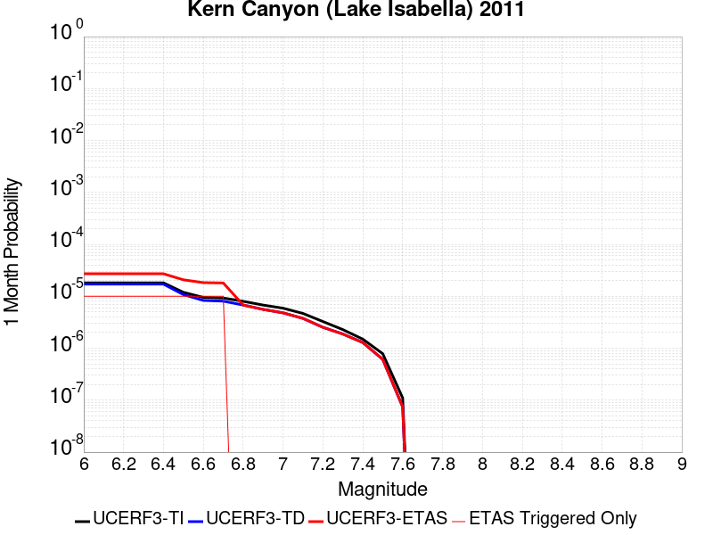 | 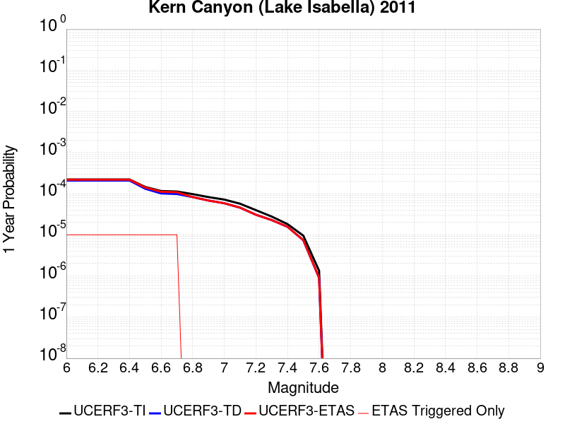 |  |

| Magnitude | 1 wk TI Prob | 1 wk TD Prob | 1 wk ETAS Prob | 1 wk ETAS/TD Gain | 1 wk ETAS Triggered Only | 1 mo TI Prob | 1 mo TD Prob | 1 mo ETAS Prob | 1 mo ETAS/TD Gain | 1 mo ETAS Triggered Only | 1 yr TI Prob | 1 yr TD Prob | 1 yr ETAS Prob | 1 yr ETAS/TD Gain | 1 yr ETAS Triggered Only | 10 yr TI Prob | 10 yr TD Prob | 10 yr ETAS Prob | 10 yr ETAS/TD Gain | 10 yr ETAS Triggered Only |
|-----|-----|-----|-----|-----|-----|-----|-----|-----|-----|-----|-----|-----|-----|-----|-----|-----|-----|-----|-----|-----|
| 6.0 | 4.2387383E-6 | 4.0016507E-6 | 1.4001611E-5 | 3.4989588 | 1.0E-5 | 1.8165894E-5 | 1.7149829E-5 | 2.7149657E-5 | 1.5830861 | 1.0E-5 | 2.2114732E-4 | 2.0878103E-4 | 2.1877895E-4 | 1.0478871 | 1.0E-5 | 0.0022092736 | 0.0020860326 | 0.0021159702 | 1.0143514 | 3.0E-5 |
| 6.1 | 4.2387383E-6 | 4.0016507E-6 | 1.4001611E-5 | 3.4989588 | 1.0E-5 | 1.8165894E-5 | 1.7149829E-5 | 2.7149657E-5 | 1.5830861 | 1.0E-5 | 2.2114732E-4 | 2.0878103E-4 | 2.1877895E-4 | 1.0478871 | 1.0E-5 | 0.0022092736 | 0.0020860326 | 0.0021159702 | 1.0143514 | 3.0E-5 |
| 6.2 | 4.2387383E-6 | 4.0016507E-6 | 1.4001611E-5 | 3.4989588 | 1.0E-5 | 1.8165894E-5 | 1.7149829E-5 | 2.7149657E-5 | 1.5830861 | 1.0E-5 | 2.2114732E-4 | 2.0878103E-4 | 2.1877895E-4 | 1.0478871 | 1.0E-5 | 0.0022092736 | 0.0020860326 | 0.0021159702 | 1.0143514 | 3.0E-5 |
| 6.3 | 4.2387383E-6 | 4.0016507E-6 | 1.4001611E-5 | 3.4989588 | 1.0E-5 | 1.8165894E-5 | 1.7149829E-5 | 2.7149657E-5 | 1.5830861 | 1.0E-5 | 2.2114732E-4 | 2.0878103E-4 | 2.1877895E-4 | 1.0478871 | 1.0E-5 | 0.0022092736 | 0.0020860326 | 0.0021159702 | 1.0143514 | 3.0E-5 |
| 6.4 | 4.2387383E-6 | 4.0016507E-6 | 1.4001611E-5 | 3.4989588 | 1.0E-5 | 1.8165894E-5 | 1.7149829E-5 | 2.7149657E-5 | 1.5830861 | 1.0E-5 | 2.2114732E-4 | 2.0878103E-4 | 2.1877895E-4 | 1.0478871 | 1.0E-5 | 0.0022092736 | 0.0020860326 | 0.0021159702 | 1.0143514 | 3.0E-5 |
| 6.5 | 2.7857532E-6 | 2.5178747E-6 | 1.2517849E-5 | 4.9715934 | 1.0E-5 | 1.1938888E-5 | 1.0790849E-5 | 2.0790741E-5 | 1.9267012 | 1.0E-5 | 1.4534626E-4 | 1.31371E-4 | 1.4136969E-4 | 1.0761102 | 1.0E-5 | 0.0014525123 | 0.0013129661 | 0.0013329398 | 1.0152127 | 2.0E-5 |
| 6.6 | 2.2233348E-6 | 1.94413E-6 | 1.194411E-5 | 6.143679 | 1.0E-5 | 9.528543E-6 | 8.331959E-6 | 1.8331875E-5 | 2.200188 | 1.0E-5 | 1.1600384E-4 | 1.0143697E-4 | 1.11435955E-4 | 1.0985734 | 1.0E-5 | 0.001159433 | 0.0010139153 | 0.0010338951 | 1.0197055 | 2.0E-5 |
| 6.7 | 2.1635126E-6 | 1.8835098E-6 | 1.18834905E-5 | 6.309227 | 1.0E-5 | 9.272164E-6 | 8.07216E-6 | 1.807208E-5 | 2.2388158 | 1.0E-5 | 1.1288274E-4 | 9.82742E-5 | 1.0827322E-4 | 1.1017461 | 1.0E-5 | 0.0011282542 | 9.823156E-4 | 0.001002296 | 1.0203401 | 2.0E-5 |
| 6.8 | 1.8685711E-6 | 1.583148E-6 | 1.583148E-6 | 1.0 | 0.0 | 8.008137E-6 | 6.784903E-6 | 6.784903E-6 | 1.0 | 0.0 | 9.74947E-5 | 8.260311E-5 | 8.260311E-5 | 1.0 | 0.0 | 9.745194E-4 | 8.25729E-4 | 8.357207E-4 | 1.0121005 | 1.0E-5 |
| 6.9 | 1.5815071E-6 | 1.3064976E-6 | 1.3064976E-6 | 1.0 | 0.0 | 6.77787E-6 | 5.599263E-6 | 5.599263E-6 | 1.0 | 0.0 | 8.251744E-5 | 6.816892E-5 | 6.816892E-5 | 1.0 | 0.0 | 8.248681E-4 | 6.814828E-4 | 6.91476E-4 | 1.0146639 | 1.0E-5 |
| 7.0 | 1.3772564E-6 | 1.1210758E-6 | 1.1210758E-6 | 1.0 | 0.0 | 5.9025137E-6 | 4.804602E-6 | 4.804602E-6 | 1.0 | 0.0 | 7.186073E-5 | 5.849448E-5 | 5.849448E-5 | 1.0 | 0.0 | 7.18375E-4 | 5.8479287E-4 | 5.94787E-4 | 1.0170901 | 1.0E-5 |
| 7.1 | 1.0916998E-6 | 8.763808E-7 | 8.763808E-7 | 1.0 | 0.0 | 4.678705E-6 | 3.7559125E-6 | 3.7559125E-6 | 1.0 | 0.0 | 5.6961744E-5 | 4.5727287E-5 | 4.5727287E-5 | 1.0 | 0.0 | 5.6947145E-4 | 4.5718014E-4 | 4.6717556E-4 | 1.0218632 | 1.0E-5 |
| 7.2 | 7.6277024E-7 | 5.901475E-7 | 5.901475E-7 | 1.0 | 0.0 | 3.2690114E-6 | 2.5292013E-6 | 2.5292013E-6 | 1.0 | 0.0 | 3.9799485E-5 | 3.0792595E-5 | 3.0792595E-5 | 1.0 | 0.0 | 3.9792358E-4 | 3.078839E-4 | 3.078839E-4 | 1.0 | 0.0 |
| 7.3 | 5.3265916E-7 | 4.3824562E-7 | 4.3824562E-7 | 1.0 | 0.0 | 2.282823E-6 | 1.8781942E-6 | 1.8781942E-6 | 1.0 | 0.0 | 2.7793016E-5 | 2.286678E-5 | 2.286678E-5 | 1.0 | 0.0 | 2.778954E-4 | 2.2864464E-4 | 2.2864464E-4 | 1.0 | 0.0 |
| 7.4 | 3.4946007E-7 | 3.006581E-7 | 3.006581E-7 | 1.0 | 0.0 | 1.497685E-6 | 1.288534E-6 | 1.288534E-6 | 1.0 | 0.0 | 1.8234163E-5 | 1.568779E-5 | 1.568779E-5 | 1.0 | 0.0 | 1.8232666E-4 | 1.5686706E-4 | 1.5686706E-4 | 1.0 | 0.0 |
| 7.5 | 1.8317026E-7 | 1.4244868E-7 | 1.4244868E-7 | 1.0 | 0.0 | 7.850152E-7 | 6.104942E-7 | 6.104942E-7 | 1.0 | 0.0 | 9.557518E-6 | 7.4327427E-6 | 7.4327427E-6 | 1.0 | 0.0 | 9.5571064E-5 | 7.432502E-5 | 7.432502E-5 | 1.0 | 0.0 |
| 7.6 | 2.572245E-8 | 1.7352637E-8 | 1.7352637E-8 | 1.0 | 0.0 | 1.10239064E-7 | 7.4368444E-8 | 7.4368444E-8 | 1.0 | 0.0 | 1.3421597E-6 | 9.0543546E-7 | 9.0543546E-7 | 1.0 | 0.0 | 1.3421517E-5 | 9.0543235E-6 | 9.0543235E-6 | 1.0 | 0.0 |

## Big Pine (Central)
*[(top)](#table-of-contents)*

| 1 Week | 1 Month | 1 Year | 10 Year |
|-----|-----|-----|-----|
|  |  |  | 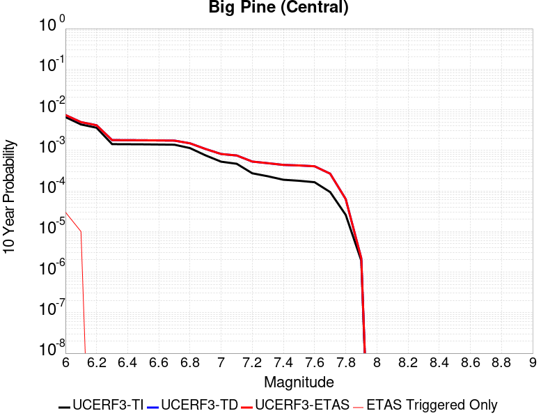 |

| Magnitude | 1 wk TI Prob | 1 wk TD Prob | 1 wk ETAS Prob | 1 wk ETAS/TD Gain | 1 wk ETAS Triggered Only | 1 mo TI Prob | 1 mo TD Prob | 1 mo ETAS Prob | 1 mo ETAS/TD Gain | 1 mo ETAS Triggered Only | 1 yr TI Prob | 1 yr TD Prob | 1 yr ETAS Prob | 1 yr ETAS/TD Gain | 1 yr ETAS Triggered Only | 10 yr TI Prob | 10 yr TD Prob | 10 yr ETAS Prob | 10 yr ETAS/TD Gain | 10 yr ETAS Triggered Only |
|-----|-----|-----|-----|-----|-----|-----|-----|-----|-----|-----|-----|-----|-----|-----|-----|-----|-----|-----|-----|-----|
| 6.0 | 1.2706755E-5 | 1.4251012E-5 | 1.4251012E-5 | 1.0 | 0.0 | 5.4456385E-5 | 6.107454E-5 | 6.107454E-5 | 1.0 | 0.0 | 6.628048E-4 | 7.4336544E-4 | 7.53358E-4 | 1.0134423 | 1.0E-5 | 0.006608314 | 0.0074138143 | 0.007443592 | 1.0040165 | 3.0E-5 |
| 6.1 | 8.342579E-6 | 9.511191E-6 | 9.511191E-6 | 1.0 | 0.0 | 3.5753423E-5 | 4.0761734E-5 | 4.0761734E-5 | 1.0 | 0.0 | 4.3521097E-4 | 4.961828E-4 | 4.961828E-4 | 1.0 | 0.0 | 0.0043435963 | 0.0049543027 | 0.004964253 | 1.0020084 | 1.0E-5 |
| 6.2 | 6.923899E-6 | 7.967559E-6 | 7.967559E-6 | 1.0 | 0.0 | 2.9673516E-5 | 3.4146342E-5 | 3.4146342E-5 | 1.0 | 0.0 | 3.6121515E-4 | 4.1567165E-4 | 4.1567165E-4 | 1.0 | 0.0 | 0.003606286 | 0.0041522477 | 0.0041522477 | 1.0 | 0.0 |
| 6.3 | 2.728396E-6 | 3.4246525E-6 | 3.4246525E-6 | 1.0 | 0.0 | 1.1693074E-5 | 1.4677004E-5 | 1.4677004E-5 | 1.0 | 0.0 | 1.4235388E-4 | 1.7867875E-4 | 1.7867875E-4 | 1.0 | 0.0 | 0.0014226272 | 0.0017868559 | 0.0017868559 | 1.0 | 0.0 |
| 6.4 | 2.7136944E-6 | 3.4089458E-6 | 3.4089458E-6 | 1.0 | 0.0 | 1.1630066E-5 | 1.4609691E-5 | 1.4609691E-5 | 1.0 | 0.0 | 1.4158686E-4 | 1.7785933E-4 | 1.7785933E-4 | 1.0 | 0.0 | 0.0014149669 | 0.0017786748 | 0.0017786748 | 1.0 | 0.0 |
| 6.5 | 2.6971882E-6 | 3.3912906E-6 | 3.3912906E-6 | 1.0 | 0.0 | 1.1559327E-5 | 1.4534027E-5 | 1.4534027E-5 | 1.0 | 0.0 | 1.4072572E-4 | 1.7693828E-4 | 1.7693828E-4 | 1.0 | 0.0 | 0.0014063664 | 0.0017694789 | 0.0017694789 | 1.0 | 0.0 |
| 6.6 | 2.669092E-6 | 3.361311E-6 | 3.361311E-6 | 1.0 | 0.0 | 1.1438916E-5 | 1.4405543E-5 | 1.4405543E-5 | 1.0 | 0.0 | 1.3925991E-4 | 1.7537424E-4 | 1.7537424E-4 | 1.0 | 0.0 | 0.0013917267 | 0.0017538633 | 0.0017538633 | 1.0 | 0.0 |
| 6.7 | 2.6408059E-6 | 3.3313363E-6 | 3.3313363E-6 | 1.0 | 0.0 | 1.1317691E-5 | 1.4277082E-5 | 1.4277082E-5 | 1.0 | 0.0 | 1.3778417E-4 | 1.7381048E-4 | 1.7381048E-4 | 1.0 | 0.0 | 0.0013769877 | 0.0017382503 | 0.0017382503 | 1.0 | 0.0 |
| 6.8 | 2.1786943E-6 | 2.8547915E-6 | 2.8547915E-6 | 1.0 | 0.0 | 9.337228E-6 | 1.2234768E-5 | 1.2234768E-5 | 1.0 | 0.0 | 1.1367482E-4 | 1.4894885E-4 | 1.4894885E-4 | 1.0 | 0.0 | 0.0011361669 | 0.0014899815 | 0.0014899815 | 1.0 | 0.0 |
| 6.9 | 1.4411696E-6 | 2.0688422E-6 | 2.0688422E-6 | 1.0 | 0.0 | 6.1764263E-6 | 8.866437E-6 | 8.866437E-6 | 1.0 | 0.0 | 7.51954E-5 | 1.079438E-4 | 1.079438E-4 | 1.0 | 0.0 | 7.5169955E-4 | 0.0010803605 | 0.0010803605 | 1.0 | 0.0 |
| 7.0 | 1.0073411E-6 | 1.5545673E-6 | 1.5545673E-6 | 1.0 | 0.0 | 4.317169E-6 | 6.662415E-6 | 6.662415E-6 | 1.0 | 0.0 | 5.2560266E-5 | 8.111204E-5 | 8.111204E-5 | 1.0 | 0.0 | 5.2547833E-4 | 8.1225985E-4 | 8.1225985E-4 | 1.0 | 0.0 |
| 7.1 | 8.947104E-7 | 1.4305514E-6 | 1.4305514E-6 | 1.0 | 0.0 | 3.834468E-6 | 6.130921E-6 | 6.130921E-6 | 1.0 | 0.0 | 4.6683643E-5 | 7.464155E-5 | 7.464155E-5 | 1.0 | 0.0 | 4.6673836E-4 | 7.476001E-4 | 7.476001E-4 | 1.0 | 0.0 |
| 7.2 | 5.215166E-7 | 1.0114496E-6 | 1.0114496E-6 | 1.0 | 0.0 | 2.2350691E-6 | 4.3347773E-6 | 4.3347773E-6 | 1.0 | 0.0 | 2.7211627E-5 | 5.2774678E-5 | 5.2774678E-5 | 1.0 | 0.0 | 2.7208295E-4 | 5.290466E-4 | 5.290466E-4 | 1.0 | 0.0 |
| 7.3 | 4.4024807E-7 | 9.2223235E-7 | 9.2223235E-7 | 1.0 | 0.0 | 1.8867761E-6 | 3.9524184E-6 | 3.9524184E-6 | 1.0 | 0.0 | 2.2971257E-5 | 4.8119677E-5 | 4.8119677E-5 | 1.0 | 0.0 | 2.2968883E-4 | 4.8251753E-4 | 4.8251753E-4 | 1.0 | 0.0 |
| 7.4 | 3.6130905E-7 | 8.3611724E-7 | 8.3611724E-7 | 1.0 | 0.0 | 1.5484665E-6 | 3.583355E-6 | 3.583355E-6 | 1.0 | 0.0 | 1.8852415E-5 | 4.362651E-5 | 4.362651E-5 | 1.0 | 0.0 | 1.8850817E-4 | 4.3759486E-4 | 4.3759486E-4 | 1.0 | 0.0 |
| 7.5 | 3.408184E-7 | 8.110739E-7 | 8.110739E-7 | 1.0 | 0.0 | 1.4606494E-6 | 3.4760267E-6 | 3.4760267E-6 | 1.0 | 0.0 | 1.7783263E-5 | 4.231984E-5 | 4.231984E-5 | 1.0 | 0.0 | 1.778184E-4 | 4.2451176E-4 | 4.2451176E-4 | 1.0 | 0.0 |
| 7.6 | 3.1428627E-7 | 7.7341E-7 | 7.7341E-7 | 1.0 | 0.0 | 1.3469405E-6 | 3.3146102E-6 | 3.3146102E-6 | 1.0 | 0.0 | 1.6398877E-5 | 4.0354673E-5 | 4.0354673E-5 | 1.0 | 0.0 | 1.6397667E-4 | 4.0483844E-4 | 4.0483844E-4 | 1.0 | 0.0 |
| 7.7 | 1.7972785E-7 | 5.0796626E-7 | 5.0796626E-7 | 1.0 | 0.0 | 7.70262E-7 | 2.1769965E-6 | 2.1769965E-6 | 1.0 | 0.0 | 9.377899E-6 | 2.6504622E-5 | 2.6504622E-5 | 1.0 | 0.0 | 9.377503E-5 | 2.663867E-4 | 2.663867E-4 | 1.0 | 0.0 |
| 7.8 | 4.9230927E-8 | 1.1985297E-7 | 1.1985297E-7 | 1.0 | 0.0 | 2.1098968E-7 | 5.136555E-7 | 5.136555E-7 | 1.0 | 0.0 | 2.5687964E-6 | 6.2537392E-6 | 6.2537392E-6 | 1.0 | 0.0 | 2.5687666E-5 | 6.2977226E-5 | 6.2977226E-5 | 1.0 | 0.0 |
| 7.9 | 3.6805972E-9 | 4.1070685E-9 | 4.1070685E-9 | 1.0 | 0.0 | 1.5773987E-8 | 1.7601723E-8 | 1.7601723E-8 | 1.0 | 0.0 | 1.9204828E-7 | 2.1430095E-7 | 2.1430095E-7 | 1.0 | 0.0 | 1.920481E-6 | 2.190991E-6 | 2.190991E-6 | 1.0 | 0.0 |

## Bullion Mountains
*[(top)](#table-of-contents)*

| 1 Week | 1 Month | 1 Year | 10 Year |
|-----|-----|-----|-----|
|  |  | 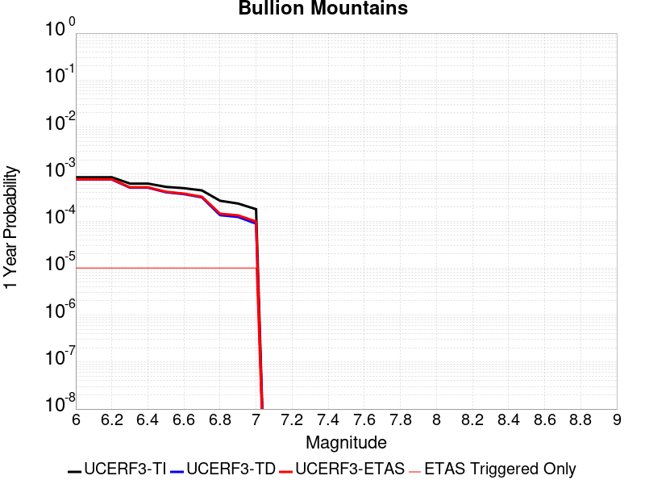 |  |

| Magnitude | 1 wk TI Prob | 1 wk TD Prob | 1 wk ETAS Prob | 1 wk ETAS/TD Gain | 1 wk ETAS Triggered Only | 1 mo TI Prob | 1 mo TD Prob | 1 mo ETAS Prob | 1 mo ETAS/TD Gain | 1 mo ETAS Triggered Only | 1 yr TI Prob | 1 yr TD Prob | 1 yr ETAS Prob | 1 yr ETAS/TD Gain | 1 yr ETAS Triggered Only | 10 yr TI Prob | 10 yr TD Prob | 10 yr ETAS Prob | 10 yr ETAS/TD Gain | 10 yr ETAS Triggered Only |
|-----|-----|-----|-----|-----|-----|-----|-----|-----|-----|-----|-----|-----|-----|-----|-----|-----|-----|-----|-----|-----|
| 6.0 | 1.6420427E-5 | 1.4692306E-5 | 1.4692306E-5 | 1.0 | 0.0 | 7.037136E-5 | 6.296572E-5 | 7.296509E-5 | 1.1588066 | 1.0E-5 | 8.5643446E-4 | 7.663764E-4 | 7.763687E-4 | 1.0130384 | 1.0E-5 | 0.008531413 | 0.0076411283 | 0.007670899 | 1.0038961 | 3.0E-5 |
| 6.1 | 1.6420427E-5 | 1.4692306E-5 | 1.4692306E-5 | 1.0 | 0.0 | 7.037136E-5 | 6.296572E-5 | 7.296509E-5 | 1.1588066 | 1.0E-5 | 8.5643446E-4 | 7.663764E-4 | 7.763687E-4 | 1.0130384 | 1.0E-5 | 0.008531413 | 0.0076411283 | 0.007670899 | 1.0038961 | 3.0E-5 |
| 6.2 | 1.6420427E-5 | 1.4692306E-5 | 1.4692306E-5 | 1.0 | 0.0 | 7.037136E-5 | 6.296572E-5 | 7.296509E-5 | 1.1588066 | 1.0E-5 | 8.5643446E-4 | 7.663764E-4 | 7.763687E-4 | 1.0130384 | 1.0E-5 | 0.008531413 | 0.0076411283 | 0.007670899 | 1.0038961 | 3.0E-5 |
| 6.3 | 1.2046778E-5 | 9.862485E-6 | 9.862485E-6 | 1.0 | 0.0 | 5.1628023E-5 | 4.226724E-5 | 5.2266816E-5 | 1.2365799 | 1.0E-5 | 6.283899E-4 | 5.145053E-4 | 5.2450015E-4 | 1.0194261 | 1.0E-5 | 0.0062661595 | 0.0051354226 | 0.00515532 | 1.0038745 | 2.0E-5 |
| 6.4 | 1.2046778E-5 | 9.862485E-6 | 9.862485E-6 | 1.0 | 0.0 | 5.1628023E-5 | 4.226724E-5 | 5.2266816E-5 | 1.2365799 | 1.0E-5 | 6.283899E-4 | 5.145053E-4 | 5.2450015E-4 | 1.0194261 | 1.0E-5 | 0.0062661595 | 0.0051354226 | 0.00515532 | 1.0038745 | 2.0E-5 |
| 6.5 | 1.0244343E-5 | 7.879582E-6 | 7.879582E-6 | 1.0 | 0.0 | 4.390359E-5 | 3.3769316E-5 | 4.3768978E-5 | 1.2961168 | 1.0E-5 | 5.343951E-4 | 4.1108453E-4 | 4.2108042E-4 | 1.024316 | 1.0E-5 | 0.005331118 | 0.0041052722 | 0.00412519 | 1.0048518 | 2.0E-5 |
| 6.6 | 9.605408E-6 | 7.1776108E-6 | 7.1776108E-6 | 1.0 | 0.0 | 4.1165385E-5 | 3.076094E-5 | 4.076063E-5 | 1.3250775 | 1.0E-5 | 5.010733E-4 | 3.7447043E-4 | 3.844667E-4 | 1.0266944 | 1.0E-5 | 0.00499945 | 0.0037403915 | 0.0037603166 | 1.005327 | 2.0E-5 |
| 6.7 | 8.60418E-6 | 6.1241044E-6 | 6.1241044E-6 | 1.0 | 0.0 | 3.687454E-5 | 2.6246007E-5 | 3.6245743E-5 | 1.3810004 | 1.0E-5 | 4.48855E-4 | 3.1951777E-4 | 3.295146E-4 | 1.0312872 | 1.0E-5 | 0.004479495 | 0.0031924958 | 0.003212432 | 1.0062447 | 2.0E-5 |
| 6.8 | 5.187994E-6 | 2.5632194E-6 | 2.5632194E-6 | 1.0 | 0.0 | 2.223407E-5 | 1.0985203E-5 | 2.0985093E-5 | 1.9103055 | 1.0E-5 | 2.7066618E-4 | 1.3374063E-4 | 1.437393E-4 | 1.0747616 | 1.0E-5 | 0.0027033675 | 0.001336993 | 0.0013569662 | 1.014939 | 2.0E-5 |
| 6.9 | 4.5302368E-6 | 2.3443622E-6 | 2.3443622E-6 | 1.0 | 0.0 | 1.9415156E-5 | 1.0047251E-5 | 2.004715E-5 | 1.9952872 | 1.0E-5 | 2.3635388E-4 | 1.2232238E-4 | 1.3232115E-4 | 1.0817412 | 1.0E-5 | 0.0023610266 | 0.0012229396 | 0.0012429152 | 1.016334 | 2.0E-5 |
| 7.0 | 3.431668E-6 | 1.6882757E-6 | 1.6882757E-6 | 1.0 | 0.0 | 1.4707065E-5 | 7.2354674E-6 | 1.7235394E-5 | 2.3820708 | 1.0E-5 | 1.7904381E-4 | 8.8091816E-5 | 9.809093E-5 | 1.113508 | 1.0E-5 | 0.0017889962 | 8.809181E-4 | 9.009005E-4 | 1.0226836 | 2.0E-5 |

## Ortigalita (South)
*[(top)](#table-of-contents)*

| 1 Week | 1 Month | 1 Year | 10 Year |
|-----|-----|-----|-----|
|  |  |  | 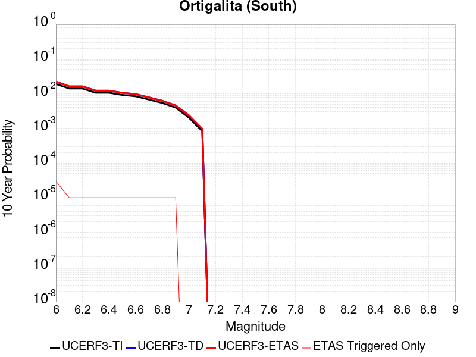 |

| Magnitude | 1 wk TI Prob | 1 wk TD Prob | 1 wk ETAS Prob | 1 wk ETAS/TD Gain | 1 wk ETAS Triggered Only | 1 mo TI Prob | 1 mo TD Prob | 1 mo ETAS Prob | 1 mo ETAS/TD Gain | 1 mo ETAS Triggered Only | 1 yr TI Prob | 1 yr TD Prob | 1 yr ETAS Prob | 1 yr ETAS/TD Gain | 1 yr ETAS Triggered Only | 10 yr TI Prob | 10 yr TD Prob | 10 yr ETAS Prob | 10 yr ETAS/TD Gain | 10 yr ETAS Triggered Only |
|-----|-----|-----|-----|-----|-----|-----|-----|-----|-----|-----|-----|-----|-----|-----|-----|-----|-----|-----|-----|-----|
| 6.0 | 3.72394E-5 | 4.325655E-5 | 4.325655E-5 | 1.0 | 0.0 | 1.5958765E-4 | 1.8537292E-4 | 1.9537107E-4 | 1.0539353 | 1.0E-5 | 0.0019412481 | 0.002254736 | 0.002274691 | 1.0088502 | 2.0E-5 | 0.019243775 | 0.022334972 | 0.022364302 | 1.0013132 | 3.0E-5 |
| 6.1 | 2.7299884E-5 | 3.1492684E-5 | 3.1492684E-5 | 1.0 | 0.0 | 1.16994255E-4 | 1.3496199E-4 | 1.3496199E-4 | 1.0 | 0.0 | 0.0014234743 | 0.0016419792 | 0.0016519628 | 1.0060803 | 1.0E-5 | 0.014143906 | 0.016304402 | 0.016314238 | 1.0006033 | 1.0E-5 |
| 6.2 | 2.7299884E-5 | 3.1492684E-5 | 3.1492684E-5 | 1.0 | 0.0 | 1.16994255E-4 | 1.3496199E-4 | 1.3496199E-4 | 1.0 | 0.0 | 0.0014234743 | 0.0016419792 | 0.0016519628 | 1.0060803 | 1.0E-5 | 0.014143906 | 0.016304402 | 0.016314238 | 1.0006033 | 1.0E-5 |
| 6.3 | 2.0546433E-5 | 2.3631923E-5 | 2.3631923E-5 | 1.0 | 0.0 | 8.805317E-5 | 1.01275844E-4 | 1.01275844E-4 | 1.0 | 0.0 | 0.00107152 | 0.0012323549 | 0.0012423425 | 1.0081046 | 1.0E-5 | 0.010663681 | 0.012257273 | 0.012267151 | 1.0008059 | 1.0E-5 |
| 6.4 | 2.0546433E-5 | 2.3631923E-5 | 2.3631923E-5 | 1.0 | 0.0 | 8.805317E-5 | 1.01275844E-4 | 1.01275844E-4 | 1.0 | 0.0 | 0.00107152 | 0.0012323549 | 0.0012423425 | 1.0081046 | 1.0E-5 | 0.010663681 | 0.012257273 | 0.012267151 | 1.0008059 | 1.0E-5 |
| 6.5 | 1.7779594E-5 | 2.0447382E-5 | 2.0447382E-5 | 1.0 | 0.0 | 7.619603E-5 | 8.7628774E-5 | 8.7628774E-5 | 1.0 | 0.0 | 9.272918E-4 | 0.0010663717 | 0.001076361 | 1.0093676 | 1.0E-5 | 0.009234319 | 0.010614014 | 0.010623908 | 1.0009321 | 1.0E-5 |
| 6.6 | 1.6272212E-5 | 1.8715342E-5 | 1.8715342E-5 | 1.0 | 0.0 | 6.973618E-5 | 8.0206206E-5 | 8.0206206E-5 | 1.0 | 0.0 | 8.487073E-4 | 9.760853E-4 | 9.860756E-4 | 1.010235 | 1.0E-5 | 0.008454733 | 0.009719283 | 0.009729186 | 1.0010189 | 1.0E-5 |
| 6.7 | 1.3051484E-5 | 1.5039062E-5 | 1.5039062E-5 | 1.0 | 0.0 | 5.593373E-5 | 6.445159E-5 | 6.445159E-5 | 1.0 | 0.0 | 6.807804E-4 | 7.8442506E-4 | 7.944172E-4 | 1.0127382 | 1.0E-5 | 0.006786986 | 0.007817546 | 0.007827467 | 1.0012692 | 1.0E-5 |
| 6.8 | 1.04277415E-5 | 1.1987473E-5 | 1.1987473E-5 | 1.0 | 0.0 | 4.4689557E-5 | 5.1373918E-5 | 5.1373918E-5 | 1.0 | 0.0 | 5.439595E-4 | 6.2530534E-4 | 6.3529913E-4 | 1.0159822 | 1.0E-5 | 0.0054262993 | 0.0062362133 | 0.006246151 | 1.0015936 | 1.0E-5 |
| 6.9 | 7.639968E-6 | 8.79168E-6 | 8.79168E-6 | 1.0 | 0.0 | 3.274231E-5 | 3.7678114E-5 | 3.7678114E-5 | 1.0 | 0.0 | 3.9856473E-4 | 4.5864037E-4 | 4.686358E-4 | 1.0217936 | 1.0E-5 | 0.003978506 | 0.0045775245 | 0.004587479 | 1.0021746 | 1.0E-5 |
| 7.0 | 3.919831E-6 | 4.5334955E-6 | 4.5334955E-6 | 1.0 | 0.0 | 1.679917E-5 | 1.9429133E-5 | 1.9429133E-5 | 1.0 | 0.0 | 2.045107E-4 | 2.3652615E-4 | 2.3652615E-4 | 1.0 | 0.0 | 0.0020432258 | 0.0023629526 | 0.0023629526 | 1.0 | 0.0 |
| 7.1 | 1.6017933E-6 | 1.8570811E-6 | 1.8570811E-6 | 1.0 | 0.0 | 6.8648105E-6 | 7.958901E-6 | 7.958901E-6 | 1.0 | 0.0 | 8.357586E-5 | 9.689637E-5 | 9.689637E-5 | 1.0 | 0.0 | 8.3544437E-4 | 9.686459E-4 | 9.686459E-4 | 1.0 | 0.0 |

## Santa Cruz Catalina Ridge alt1
*[(top)](#table-of-contents)*

| 1 Week | 1 Month | 1 Year | 10 Year |
|-----|-----|-----|-----|
| 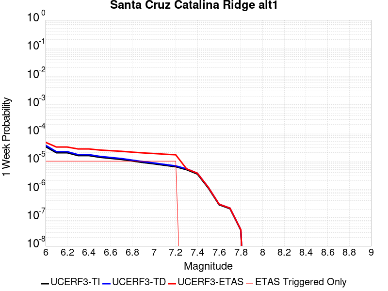 | 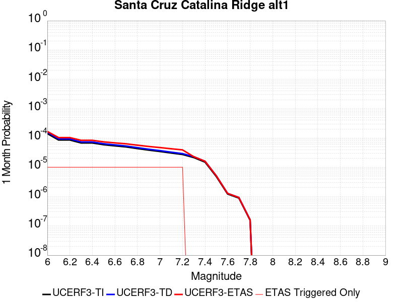 |  | 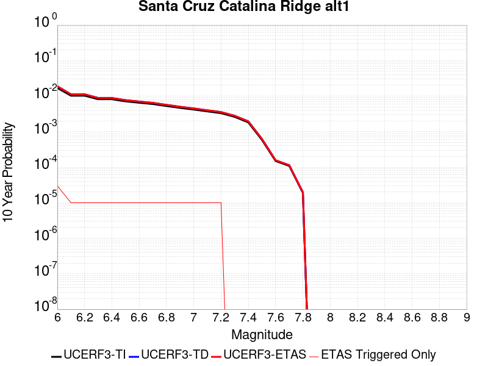 |

| Magnitude | 1 wk TI Prob | 1 wk TD Prob | 1 wk ETAS Prob | 1 wk ETAS/TD Gain | 1 wk ETAS Triggered Only | 1 mo TI Prob | 1 mo TD Prob | 1 mo ETAS Prob | 1 mo ETAS/TD Gain | 1 mo ETAS Triggered Only | 1 yr TI Prob | 1 yr TD Prob | 1 yr ETAS Prob | 1 yr ETAS/TD Gain | 1 yr ETAS Triggered Only | 10 yr TI Prob | 10 yr TD Prob | 10 yr ETAS Prob | 10 yr ETAS/TD Gain | 10 yr ETAS Triggered Only |
|-----|-----|-----|-----|-----|-----|-----|-----|-----|-----|-----|-----|-----|-----|-----|-----|-----|-----|-----|-----|-----|
| 6.0 | 3.2833184E-5 | 3.655896E-5 | 4.655859E-5 | 1.2735208 | 1.0E-5 | 1.4070606E-4 | 1.5667277E-4 | 1.666712E-4 | 1.0638173 | 1.0E-5 | 0.00171175 | 0.0019059887 | 0.0019359315 | 1.0157099 | 3.0E-5 | 0.016986247 | 0.018913316 | 0.01894275 | 1.0015562 | 3.0E-5 |
| 6.1 | 1.9835548E-5 | 2.1659771E-5 | 3.1659554E-5 | 1.4616754 | 1.0E-5 | 8.500672E-5 | 9.2824404E-5 | 1.0282348E-4 | 1.1077203 | 1.0E-5 | 0.0010344655 | 0.0011295713 | 0.00113956 | 1.008843 | 1.0E-5 | 0.010296632 | 0.011240433 | 0.011250321 | 1.0008796 | 1.0E-5 |
| 6.2 | 1.9835548E-5 | 2.1659771E-5 | 3.1659554E-5 | 1.4616754 | 1.0E-5 | 8.500672E-5 | 9.2824404E-5 | 1.0282348E-4 | 1.1077203 | 1.0E-5 | 0.0010344655 | 0.0011295713 | 0.00113956 | 1.008843 | 1.0E-5 | 0.010296632 | 0.011240433 | 0.011250321 | 1.0008796 | 1.0E-5 |
| 6.3 | 1.5728183E-5 | 1.7034137E-5 | 2.7033968E-5 | 1.5870464 | 1.0E-5 | 6.7404755E-5 | 7.3001436E-5 | 8.3000705E-5 | 1.1369736 | 1.0E-5 | 8.2034385E-4 | 8.884362E-4 | 8.9842733E-4 | 1.0112457 | 1.0E-5 | 0.008173222 | 0.008849524 | 0.008859436 | 1.00112 | 1.0E-5 |
| 6.4 | 1.5728183E-5 | 1.7034137E-5 | 2.7033968E-5 | 1.5870464 | 1.0E-5 | 6.7404755E-5 | 7.3001436E-5 | 8.3000705E-5 | 1.1369736 | 1.0E-5 | 8.2034385E-4 | 8.884362E-4 | 8.9842733E-4 | 1.0112457 | 1.0E-5 | 0.008173222 | 0.008849524 | 0.008859436 | 1.00112 | 1.0E-5 |
| 6.5 | 1.3707734E-5 | 1.4794678E-5 | 2.479453E-5 | 1.6759087 | 1.0E-5 | 5.8746107E-5 | 6.3404244E-5 | 7.340361E-5 | 1.1577082 | 1.0E-5 | 7.1499916E-4 | 7.716768E-4 | 7.8166905E-4 | 1.0129488 | 1.0E-5 | 0.0071270303 | 0.0076903705 | 0.007700294 | 1.0012903 | 1.0E-5 |
| 6.6 | 1.2539813E-5 | 1.3510358E-5 | 2.3510223E-5 | 1.7401628 | 1.0E-5 | 5.3740947E-5 | 5.7900266E-5 | 6.789969E-5 | 1.1727008 | 1.0E-5 | 6.540996E-4 | 7.0471043E-4 | 7.1470335E-4 | 1.0141802 | 1.0E-5 | 0.0065217763 | 0.0070250607 | 0.0070349905 | 1.0014135 | 1.0E-5 |
| 6.7 | 1.1504083E-5 | 1.23775E-5 | 2.2377377E-5 | 1.8079076 | 1.0E-5 | 4.930228E-5 | 5.304536E-5 | 6.304483E-5 | 1.1885079 | 1.0E-5 | 6.0008996E-4 | 6.456379E-4 | 6.556315E-4 | 1.0154786 | 1.0E-5 | 0.005984721 | 0.0064378507 | 0.0064477865 | 1.0015433 | 1.0E-5 |
| 6.8 | 1.012739E-5 | 1.0877178E-5 | 2.0877069E-5 | 1.9193461 | 1.0E-5 | 4.340238E-5 | 4.6615653E-5 | 5.6615187E-5 | 1.2145102 | 1.0E-5 | 5.282958E-4 | 5.673993E-4 | 5.773936E-4 | 1.0176142 | 1.0E-5 | 0.0052704164 | 0.005659675 | 0.0056696185 | 1.0017569 | 1.0E-5 |
| 6.9 | 8.9607865E-6 | 9.60921E-6 | 1.9609113E-5 | 2.0406582 | 1.0E-5 | 3.8402806E-5 | 4.1181684E-5 | 5.1181272E-5 | 1.2428164 | 1.0E-5 | 4.6745385E-4 | 5.0127273E-4 | 5.112677E-4 | 1.0199392 | 1.0E-5 | 0.0046647177 | 0.00500154 | 0.0050114896 | 1.0019894 | 1.0E-5 |
| 7.0 | 8.046829E-6 | 8.619827E-6 | 1.8619741E-5 | 2.160106 | 1.0E-5 | 3.4485955E-5 | 3.6941598E-5 | 4.694123E-5 | 1.2706876 | 1.0E-5 | 4.1978562E-4 | 4.4967196E-4 | 4.5966747E-4 | 1.0222285 | 1.0E-5 | 0.004189935 | 0.004487711 | 0.0044976664 | 1.0022184 | 1.0E-5 |
| 7.1 | 7.136131E-6 | 7.637727E-6 | 1.763765E-5 | 2.30928 | 1.0E-5 | 3.0583058E-5 | 3.273271E-5 | 4.2732383E-5 | 1.3054948 | 1.0E-5 | 3.7228514E-4 | 3.9844858E-4 | 4.0844458E-4 | 1.0250874 | 1.0E-5 | 0.0037166206 | 0.0039774184 | 0.0039873784 | 1.0025042 | 1.0E-5 |
| 7.2 | 6.362014E-6 | 6.8050217E-6 | 1.6804954E-5 | 2.4694932 | 1.0E-5 | 2.726549E-5 | 2.9164055E-5 | 3.9163766E-5 | 1.3428779 | 1.0E-5 | 3.3190678E-4 | 3.5501516E-4 | 3.6501163E-4 | 1.0281578 | 1.0E-5 | 0.0033141149 | 0.0035445488 | 0.0035545132 | 1.0028112 | 1.0E-5 |
| 7.3 | 5.004101E-6 | 5.3517642E-6 | 5.3517642E-6 | 1.0 | 0.0 | 2.1445969E-5 | 2.2935934E-5 | 2.2935934E-5 | 1.0 | 0.0 | 2.6107338E-4 | 2.7920975E-4 | 2.7920975E-4 | 1.0 | 0.0 | 0.002607669 | 0.0027886443 | 0.0027886443 | 1.0 | 0.0 |
| 7.4 | 3.4901443E-6 | 3.732087E-6 | 3.732087E-6 | 1.0 | 0.0 | 1.4957676E-5 | 1.5994563E-5 | 1.5994563E-5 | 1.0 | 0.0 | 1.8209449E-4 | 1.9471678E-4 | 1.9471678E-4 | 1.0 | 0.0 | 0.0018194534 | 0.0019455003 | 0.0019455003 | 1.0 | 0.0 |
| 7.5 | 1.1215045E-6 | 1.1893966E-6 | 1.1893966E-6 | 1.0 | 0.0 | 4.806439E-6 | 5.0974045E-6 | 5.0974045E-6 | 1.0 | 0.0 | 5.851682E-5 | 6.205916E-5 | 6.205916E-5 | 1.0 | 0.0 | 5.850142E-4 | 6.204214E-4 | 6.204214E-4 | 1.0 | 0.0 |
| 7.6 | 2.8599047E-7 | 2.9952182E-7 | 2.9952182E-7 | 1.0 | 0.0 | 1.2256729E-6 | 1.2836642E-6 | 1.2836642E-6 | 1.0 | 0.0 | 1.4922465E-5 | 1.5628502E-5 | 1.5628502E-5 | 1.0 | 0.0 | 1.4921463E-4 | 1.5627417E-4 | 1.5627417E-4 | 1.0 | 0.0 |
| 7.7 | 2.0781519E-7 | 2.1744457E-7 | 2.1744457E-7 | 1.0 | 0.0 | 8.906362E-7 | 9.3190494E-7 | 9.3190494E-7 | 1.0 | 0.0 | 1.08434415E-5 | 1.1345885E-5 | 1.1345885E-5 | 1.0 | 0.0 | 1.0842913E-4 | 1.1345315E-4 | 1.1345315E-4 | 1.0 | 0.0 |
| 7.8 | 3.614776E-8 | 3.7641225E-8 | 3.7641225E-8 | 1.0 | 0.0 | 1.5491896E-7 | 1.6131952E-7 | 1.6131952E-7 | 1.0 | 0.0 | 1.8861368E-6 | 1.9640636E-6 | 1.9640636E-6 | 1.0 | 0.0 | 1.8861208E-5 | 1.9640474E-5 | 1.9640474E-5 | 1.0 | 0.0 |

## Oak Ridge (Onshore)
*[(top)](#table-of-contents)*

| 1 Week | 1 Month | 1 Year | 10 Year |
|-----|-----|-----|-----|
|  |  | 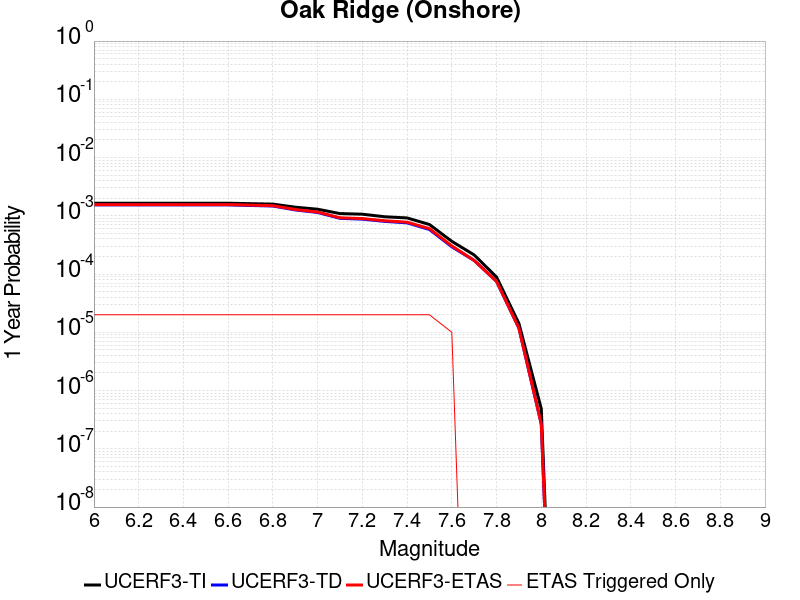 |  |

| Magnitude | 1 wk TI Prob | 1 wk TD Prob | 1 wk ETAS Prob | 1 wk ETAS/TD Gain | 1 wk ETAS Triggered Only | 1 mo TI Prob | 1 mo TD Prob | 1 mo ETAS Prob | 1 mo ETAS/TD Gain | 1 mo ETAS Triggered Only | 1 yr TI Prob | 1 yr TD Prob | 1 yr ETAS Prob | 1 yr ETAS/TD Gain | 1 yr ETAS Triggered Only | 10 yr TI Prob | 10 yr TD Prob | 10 yr ETAS Prob | 10 yr ETAS/TD Gain | 10 yr ETAS Triggered Only |
|-----|-----|-----|-----|-----|-----|-----|-----|-----|-----|-----|-----|-----|-----|-----|-----|-----|-----|-----|-----|-----|
| 6.0 | 3.155064E-5 | 2.952645E-5 | 2.952645E-5 | 1.0 | 0.0 | 1.3521002E-4 | 1.26536E-4 | 1.3653474E-4 | 1.0790188 | 1.0E-5 | 0.001644939 | 0.0015395252 | 0.0015594944 | 1.012971 | 2.0E-5 | 0.01632816 | 0.015293104 | 0.015322645 | 1.0019317 | 3.0E-5 |
| 6.1 | 3.155064E-5 | 2.952645E-5 | 2.952645E-5 | 1.0 | 0.0 | 1.3521002E-4 | 1.26536E-4 | 1.3653474E-4 | 1.0790188 | 1.0E-5 | 0.001644939 | 0.0015395252 | 0.0015594944 | 1.012971 | 2.0E-5 | 0.01632816 | 0.015293104 | 0.015322645 | 1.0019317 | 3.0E-5 |
| 6.2 | 3.155064E-5 | 2.952645E-5 | 2.952645E-5 | 1.0 | 0.0 | 1.3521002E-4 | 1.26536E-4 | 1.3653474E-4 | 1.0790188 | 1.0E-5 | 0.001644939 | 0.0015395252 | 0.0015594944 | 1.012971 | 2.0E-5 | 0.01632816 | 0.015293104 | 0.015322645 | 1.0019317 | 3.0E-5 |
| 6.3 | 3.155064E-5 | 2.952645E-5 | 2.952645E-5 | 1.0 | 0.0 | 1.3521002E-4 | 1.26536E-4 | 1.3653474E-4 | 1.0790188 | 1.0E-5 | 0.001644939 | 0.0015395252 | 0.0015594944 | 1.012971 | 2.0E-5 | 0.01632816 | 0.015293104 | 0.015322645 | 1.0019317 | 3.0E-5 |
| 6.4 | 3.155064E-5 | 2.952645E-5 | 2.952645E-5 | 1.0 | 0.0 | 1.3521002E-4 | 1.26536E-4 | 1.3653474E-4 | 1.0790188 | 1.0E-5 | 0.001644939 | 0.0015395252 | 0.0015594944 | 1.012971 | 2.0E-5 | 0.01632816 | 0.015293104 | 0.015322645 | 1.0019317 | 3.0E-5 |
| 6.5 | 3.155064E-5 | 2.952645E-5 | 2.952645E-5 | 1.0 | 0.0 | 1.3521002E-4 | 1.26536E-4 | 1.3653474E-4 | 1.0790188 | 1.0E-5 | 0.001644939 | 0.0015395252 | 0.0015594944 | 1.012971 | 2.0E-5 | 0.01632816 | 0.015293104 | 0.015322645 | 1.0019317 | 3.0E-5 |
| 6.6 | 3.155064E-5 | 2.952645E-5 | 2.952645E-5 | 1.0 | 0.0 | 1.3521002E-4 | 1.26536E-4 | 1.3653474E-4 | 1.0790188 | 1.0E-5 | 0.001644939 | 0.0015395252 | 0.0015594944 | 1.012971 | 2.0E-5 | 0.01632816 | 0.015293104 | 0.015322645 | 1.0019317 | 3.0E-5 |
| 6.7 | 3.098897E-5 | 2.8864635E-5 | 2.8864635E-5 | 1.0 | 0.0 | 1.328031E-4 | 1.2369992E-4 | 1.3369869E-4 | 1.0808308 | 1.0E-5 | 0.0016156785 | 0.0015050438 | 0.0015250137 | 1.0132686 | 2.0E-5 | 0.016039822 | 0.014952951 | 0.014982502 | 1.0019763 | 3.0E-5 |
| 6.8 | 3.0449872E-5 | 2.823982E-5 | 2.823982E-5 | 1.0 | 0.0 | 1.3049292E-4 | 1.2102239E-4 | 1.3102118E-4 | 1.0826193 | 1.0E-5 | 0.0015875935 | 0.001472489 | 0.0014924596 | 1.0135624 | 2.0E-5 | 0.015762992 | 0.014631692 | 0.014661253 | 1.0020204 | 3.0E-5 |
| 6.9 | 2.697928E-5 | 2.4220137E-5 | 2.4220137E-5 | 1.0 | 0.0 | 1.15620365E-4 | 1.0379658E-4 | 1.1379554E-4 | 1.0963323 | 1.0E-5 | 0.0014067689 | 0.0012630123 | 0.001282987 | 1.0158151 | 2.0E-5 | 0.0139789665 | 0.012561057 | 0.01259068 | 1.0023583 | 3.0E-5 |
| 7.0 | 2.4893961E-5 | 2.1862359E-5 | 2.1862359E-5 | 1.0 | 0.0 | 1.0668404E-4 | 9.369256E-5 | 1.0369162E-4 | 1.1067221 | 1.0E-5 | 0.0012981043 | 0.0011401277 | 0.0011601049 | 1.0175219 | 2.0E-5 | 0.012905477 | 0.011345069 | 0.011374729 | 1.0026144 | 3.0E-5 |
| 7.1 | 2.0945363E-5 | 1.7354718E-5 | 1.7354718E-5 | 1.0 | 0.0 | 8.976275E-5 | 7.437527E-5 | 8.437452E-5 | 1.1344433 | 1.0E-5 | 0.0010923136 | 9.051474E-4 | 9.2512934E-4 | 1.0220759 | 2.0E-5 | 0.0108696 | 0.009015542 | 0.009045271 | 1.0032976 | 3.0E-5 |
| 7.2 | 2.0439404E-5 | 1.6809645E-5 | 1.6809645E-5 | 1.0 | 0.0 | 8.7594504E-5 | 7.2039365E-5 | 8.203865E-5 | 1.138803 | 1.0E-5 | 0.0010659413 | 8.7673106E-4 | 8.967135E-4 | 1.022792 | 2.0E-5 | 0.010608427 | 0.00873364 | 0.0087633785 | 1.003405 | 3.0E-5 |
| 7.3 | 1.8463334E-5 | 1.5382002E-5 | 1.5382002E-5 | 1.0 | 0.0 | 7.912617E-5 | 6.5921224E-5 | 7.5920565E-5 | 1.1516862 | 1.0E-5 | 9.6293533E-4 | 8.0229976E-4 | 8.2228374E-4 | 1.0249083 | 2.0E-5 | 0.009587734 | 0.007994897 | 0.008024656 | 1.0037224 | 3.0E-5 |
| 7.4 | 1.763139E-5 | 1.4517013E-5 | 1.4517013E-5 | 1.0 | 0.0 | 7.556091E-5 | 6.221431E-5 | 7.221369E-5 | 1.1607248 | 1.0E-5 | 9.1956573E-4 | 7.5719994E-4 | 7.771848E-4 | 1.026393 | 2.0E-5 | 0.009157699 | 0.007547003 | 0.007576777 | 1.0039451 | 3.0E-5 |
| 7.5 | 1.3594944E-5 | 1.1163477E-5 | 1.1163477E-5 | 1.0 | 0.0 | 5.8262744E-5 | 4.7842612E-5 | 5.784213E-5 | 1.2090087 | 1.0E-5 | 7.0911803E-4 | 5.823306E-4 | 6.02319E-4 | 1.0343248 | 2.0E-5 | 0.007068595 | 0.0058083185 | 0.005838144 | 1.005135 | 3.0E-5 |
| 7.6 | 6.9889534E-6 | 5.6367617E-6 | 5.6367617E-6 | 1.0 | 0.0 | 2.9952313E-5 | 2.4157329E-5 | 3.415709E-5 | 1.413943 | 1.0E-5 | 3.646084E-4 | 2.940762E-4 | 3.0407327E-4 | 1.0339948 | 1.0E-5 | 0.0036401073 | 0.0029369146 | 0.002946885 | 1.003395 | 1.0E-5 |
| 7.7 | 4.0824193E-6 | 3.2832884E-6 | 3.2832884E-6 | 1.0 | 0.0 | 1.7495966E-5 | 1.4071161E-5 | 1.4071161E-5 | 1.0 | 0.0 | 2.1299256E-4 | 1.7130304E-4 | 1.7130304E-4 | 1.0 | 0.0 | 0.0021278851 | 0.0017117234 | 0.0017117234 | 1.0 | 0.0 |
| 7.8 | 1.7023609E-6 | 1.4370602E-6 | 1.4370602E-6 | 1.0 | 0.0 | 7.295812E-6 | 6.158815E-6 | 6.158815E-6 | 1.0 | 0.0 | 8.882289E-5 | 7.498102E-5 | 7.498102E-5 | 1.0 | 0.0 | 8.8787393E-4 | 7.4956E-4 | 7.4956E-4 | 1.0 | 0.0 |
| 7.9 | 2.721225E-7 | 2.2616715E-7 | 2.2616715E-7 | 1.0 | 0.0 | 1.1662388E-6 | 9.692874E-7 | 9.692874E-7 | 1.0 | 0.0 | 1.4198865E-5 | 1.1801013E-5 | 1.1801013E-5 | 1.0 | 0.0 | 1.4197957E-4 | 1.1800414E-4 | 1.1800414E-4 | 1.0 | 0.0 |
| 8.0 | 9.364255E-9 | 5.1209232E-9 | 5.1209232E-9 | 1.0 | 0.0 | 4.0132523E-8 | 2.1946814E-8 | 2.1946814E-8 | 1.0 | 0.0 | 4.8861335E-7 | 2.6720244E-7 | 2.6720244E-7 | 1.0 | 0.0 | 4.8861225E-6 | 2.6720215E-6 | 2.6720215E-6 | 1.0 | 0.0 |

## San Luis Range 2011 CFM
*[(top)](#table-of-contents)*

| 1 Week | 1 Month | 1 Year | 10 Year |
|-----|-----|-----|-----|
|  |  |  | 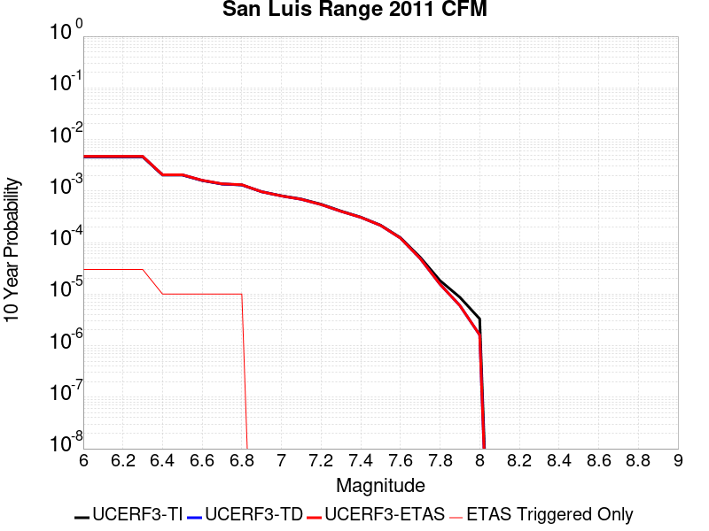 |

| Magnitude | 1 wk TI Prob | 1 wk TD Prob | 1 wk ETAS Prob | 1 wk ETAS/TD Gain | 1 wk ETAS Triggered Only | 1 mo TI Prob | 1 mo TD Prob | 1 mo ETAS Prob | 1 mo ETAS/TD Gain | 1 mo ETAS Triggered Only | 1 yr TI Prob | 1 yr TD Prob | 1 yr ETAS Prob | 1 yr ETAS/TD Gain | 1 yr ETAS Triggered Only | 10 yr TI Prob | 10 yr TD Prob | 10 yr ETAS Prob | 10 yr ETAS/TD Gain | 10 yr ETAS Triggered Only |
|-----|-----|-----|-----|-----|-----|-----|-----|-----|-----|-----|-----|-----|-----|-----|-----|-----|-----|-----|-----|-----|
| 6.0 | 8.8368415E-6 | 8.965477E-6 | 8.965477E-6 | 1.0 | 0.0 | 3.787163E-5 | 3.8422953E-5 | 3.8422953E-5 | 1.0 | 0.0 | 4.609895E-4 | 4.677069E-4 | 4.7770224E-4 | 1.0213709 | 1.0E-5 | 0.0046003438 | 0.0046680085 | 0.0046978686 | 1.0063968 | 3.0E-5 |
| 6.1 | 8.8368415E-6 | 8.965477E-6 | 8.965477E-6 | 1.0 | 0.0 | 3.787163E-5 | 3.8422953E-5 | 3.8422953E-5 | 1.0 | 0.0 | 4.609895E-4 | 4.677069E-4 | 4.7770224E-4 | 1.0213709 | 1.0E-5 | 0.0046003438 | 0.0046680085 | 0.0046978686 | 1.0063968 | 3.0E-5 |
| 6.2 | 8.8368415E-6 | 8.965477E-6 | 8.965477E-6 | 1.0 | 0.0 | 3.787163E-5 | 3.8422953E-5 | 3.8422953E-5 | 1.0 | 0.0 | 4.609895E-4 | 4.677069E-4 | 4.7770224E-4 | 1.0213709 | 1.0E-5 | 0.0046003438 | 0.0046680085 | 0.0046978686 | 1.0063968 | 3.0E-5 |
| 6.3 | 8.8368415E-6 | 8.965477E-6 | 8.965477E-6 | 1.0 | 0.0 | 3.787163E-5 | 3.8422953E-5 | 3.8422953E-5 | 1.0 | 0.0 | 4.609895E-4 | 4.677069E-4 | 4.7770224E-4 | 1.0213709 | 1.0E-5 | 0.0046003438 | 0.0046680085 | 0.0046978686 | 1.0063968 | 3.0E-5 |
| 6.4 | 3.9094193E-6 | 3.941213E-6 | 3.941213E-6 | 1.0 | 0.0 | 1.6754546E-5 | 1.6890806E-5 | 1.6890806E-5 | 1.0 | 0.0 | 2.039675E-4 | 2.0562643E-4 | 2.0562643E-4 | 1.0 | 0.0 | 0.0020378039 | 0.0020543905 | 0.0020643699 | 1.0048577 | 1.0E-5 |
| 6.5 | 3.9094193E-6 | 3.941213E-6 | 3.941213E-6 | 1.0 | 0.0 | 1.6754546E-5 | 1.6890806E-5 | 1.6890806E-5 | 1.0 | 0.0 | 2.039675E-4 | 2.0562643E-4 | 2.0562643E-4 | 1.0 | 0.0 | 0.0020378039 | 0.0020543905 | 0.0020643699 | 1.0048577 | 1.0E-5 |
| 6.6 | 3.0587726E-6 | 3.0753965E-6 | 3.0753965E-6 | 1.0 | 0.0 | 1.3108959E-5 | 1.3180205E-5 | 1.3180205E-5 | 1.0 | 0.0 | 1.595899E-4 | 1.604573E-4 | 1.604573E-4 | 1.0 | 0.0 | 0.0015947534 | 0.0016034264 | 0.0016134104 | 1.0062267 | 1.0E-5 |
| 6.7 | 2.6160574E-6 | 2.6251346E-6 | 2.6251346E-6 | 1.0 | 0.0 | 1.1211626E-5 | 1.1250529E-5 | 1.1250529E-5 | 1.0 | 0.0 | 1.3649299E-4 | 1.3696664E-4 | 1.3696664E-4 | 1.0 | 0.0 | 0.0013640919 | 0.0013688284 | 0.0013788147 | 1.0072955 | 1.0E-5 |
| 6.8 | 2.5110312E-6 | 2.5181473E-6 | 2.5181473E-6 | 1.0 | 0.0 | 1.0761518E-5 | 1.0792015E-5 | 1.0792015E-5 | 1.0 | 0.0 | 1.310136E-4 | 1.3138492E-4 | 1.3138492E-4 | 1.0 | 0.0 | 0.0013093639 | 0.0013130783 | 0.0013230651 | 1.0076057 | 1.0E-5 |
| 6.9 | 1.8564405E-6 | 1.8524926E-6 | 1.8524926E-6 | 1.0 | 0.0 | 7.95615E-6 | 7.93923E-6 | 7.93923E-6 | 1.0 | 0.0 | 9.686181E-5 | 9.665586E-5 | 9.665586E-5 | 1.0 | 0.0 | 9.68196E-4 | 9.661402E-4 | 9.661402E-4 | 1.0 | 0.0 |
| 7.0 | 1.546127E-6 | 1.5369586E-6 | 1.5369586E-6 | 1.0 | 0.0 | 6.626242E-6 | 6.586949E-6 | 6.586949E-6 | 1.0 | 0.0 | 8.06715E-5 | 8.019316E-5 | 8.019316E-5 | 1.0 | 0.0 | 8.0642226E-4 | 8.016429E-4 | 8.016429E-4 | 1.0 | 0.0 |
| 7.1 | 1.3368208E-6 | 1.3235369E-6 | 1.3235369E-6 | 1.0 | 0.0 | 5.7292195E-6 | 5.672289E-6 | 5.672289E-6 | 1.0 | 0.0 | 6.975101E-5 | 6.905793E-5 | 6.905793E-5 | 1.0 | 0.0 | 6.972912E-4 | 6.903652E-4 | 6.903652E-4 | 1.0 | 0.0 |
| 7.2 | 1.0623363E-6 | 1.0454403E-6 | 1.0454403E-6 | 1.0 | 0.0 | 4.5528623E-6 | 4.480451E-6 | 4.480451E-6 | 1.0 | 0.0 | 5.5429686E-5 | 5.4548127E-5 | 5.4548127E-5 | 1.0 | 0.0 | 5.5415864E-4 | 5.4534763E-4 | 5.4534763E-4 | 1.0 | 0.0 |
| 7.3 | 7.831679E-7 | 7.7274194E-7 | 7.7274194E-7 | 1.0 | 0.0 | 3.3564295E-6 | 3.311747E-6 | 3.311747E-6 | 1.0 | 0.0 | 4.086376E-5 | 4.0319774E-5 | 4.0319774E-5 | 1.0 | 0.0 | 4.0856248E-4 | 4.0312472E-4 | 4.0312472E-4 | 1.0 | 0.0 |
| 7.4 | 5.9558846E-7 | 5.91066E-7 | 5.91066E-7 | 1.0 | 0.0 | 2.5525194E-6 | 2.5331376E-6 | 2.5331376E-6 | 1.0 | 0.0 | 3.107648E-5 | 3.0840514E-5 | 3.0840514E-5 | 1.0 | 0.0 | 3.1072134E-4 | 3.0836245E-4 | 3.0836245E-4 | 1.0 | 0.0 |
| 7.5 | 4.1616502E-7 | 4.1196506E-7 | 4.1196506E-7 | 1.0 | 0.0 | 1.7835631E-6 | 1.7655633E-6 | 1.7655633E-6 | 1.0 | 0.0 | 2.1714664E-5 | 2.1495522E-5 | 2.1495522E-5 | 1.0 | 0.0 | 2.1712543E-4 | 2.1493447E-4 | 2.1493447E-4 | 1.0 | 0.0 |
| 7.6 | 2.3816014E-7 | 2.3376697E-7 | 2.3376697E-7 | 1.0 | 0.0 | 1.0206859E-6 | 1.001858E-6 | 1.001858E-6 | 1.0 | 0.0 | 1.242678E-5 | 1.2197554E-5 | 1.2197554E-5 | 1.0 | 0.0 | 1.2426086E-4 | 1.2196886E-4 | 1.2196886E-4 | 1.0 | 0.0 |
| 7.7 | 9.918777E-8 | 9.386869E-8 | 9.386869E-8 | 1.0 | 0.0 | 4.2509038E-7 | 4.0229432E-7 | 4.0229432E-7 | 1.0 | 0.0 | 5.1754632E-6 | 4.8979223E-6 | 4.8979223E-6 | 1.0 | 0.0 | 5.1753424E-5 | 4.897815E-5 | 4.897815E-5 | 1.0 | 0.0 |
| 7.8 | 3.4982556E-8 | 2.9687454E-8 | 2.9687454E-8 | 1.0 | 0.0 | 1.4992524E-7 | 1.2723194E-7 | 1.2723194E-7 | 1.0 | 0.0 | 1.8253382E-6 | 1.5490477E-6 | 1.5490477E-6 | 1.0 | 0.0 | 1.8253233E-5 | 1.549037E-5 | 1.549037E-5 | 1.0 | 0.0 |
| 7.9 | 1.6624908E-8 | 1.1477859E-8 | 1.1477859E-8 | 1.0 | 0.0 | 7.12496E-8 | 4.919082E-8 | 4.919082E-8 | 1.0 | 0.0 | 8.6746354E-7 | 5.9889805E-7 | 5.9889805E-7 | 1.0 | 0.0 | 8.674601E-6 | 5.988965E-6 | 5.988965E-6 | 1.0 | 0.0 |
| 8.0 | 6.3352315E-9 | 3.0893488E-9 | 3.0893488E-9 | 1.0 | 0.0 | 2.715099E-8 | 1.3240064E-8 | 1.3240064E-8 | 1.0 | 0.0 | 3.3056327E-7 | 1.6119778E-7 | 1.6119778E-7 | 1.0 | 0.0 | 3.3056278E-6 | 1.6119766E-6 | 1.6119766E-6 | 1.0 | 0.0 |

## White Wolf
*[(top)](#table-of-contents)*

| 1 Week | 1 Month | 1 Year | 10 Year |
|-----|-----|-----|-----|
|  |  |  |  |

| Magnitude | 1 wk TI Prob | 1 wk TD Prob | 1 wk ETAS Prob | 1 wk ETAS/TD Gain | 1 wk ETAS Triggered Only | 1 mo TI Prob | 1 mo TD Prob | 1 mo ETAS Prob | 1 mo ETAS/TD Gain | 1 mo ETAS Triggered Only | 1 yr TI Prob | 1 yr TD Prob | 1 yr ETAS Prob | 1 yr ETAS/TD Gain | 1 yr ETAS Triggered Only | 10 yr TI Prob | 10 yr TD Prob | 10 yr ETAS Prob | 10 yr ETAS/TD Gain | 10 yr ETAS Triggered Only |
|-----|-----|-----|-----|-----|-----|-----|-----|-----|-----|-----|-----|-----|-----|-----|-----|-----|-----|-----|-----|-----|
| 6.0 | 2.0037822E-5 | 1.0469304E-6 | 1.0469304E-6 | 1.0 | 0.0 | 8.587355E-5 | 4.486837E-6 | 1.4486792E-5 | 3.2287316 | 1.0E-5 | 0.001045009 | 5.462592E-5 | 6.4625376E-5 | 1.1830533 | 1.0E-5 | 0.010401085 | 5.4613E-4 | 5.7611364E-4 | 1.054902 | 3.0E-5 |
| 6.1 | 2.0037822E-5 | 1.0469304E-6 | 1.0469304E-6 | 1.0 | 0.0 | 8.587355E-5 | 4.486837E-6 | 1.4486792E-5 | 3.2287316 | 1.0E-5 | 0.001045009 | 5.462592E-5 | 6.4625376E-5 | 1.1830533 | 1.0E-5 | 0.010401085 | 5.4613E-4 | 5.7611364E-4 | 1.054902 | 3.0E-5 |
| 6.2 | 2.0037822E-5 | 1.0469304E-6 | 1.0469304E-6 | 1.0 | 0.0 | 8.587355E-5 | 4.486837E-6 | 1.4486792E-5 | 3.2287316 | 1.0E-5 | 0.001045009 | 5.462592E-5 | 6.4625376E-5 | 1.1830533 | 1.0E-5 | 0.010401085 | 5.4613E-4 | 5.7611364E-4 | 1.054902 | 3.0E-5 |
| 6.3 | 2.0037822E-5 | 1.0469304E-6 | 1.0469304E-6 | 1.0 | 0.0 | 8.587355E-5 | 4.486837E-6 | 1.4486792E-5 | 3.2287316 | 1.0E-5 | 0.001045009 | 5.462592E-5 | 6.4625376E-5 | 1.1830533 | 1.0E-5 | 0.010401085 | 5.4613E-4 | 5.7611364E-4 | 1.054902 | 3.0E-5 |
| 6.4 | 1.132487E-5 | 1.0469304E-6 | 1.0469304E-6 | 1.0 | 0.0 | 4.8534253E-5 | 4.486837E-6 | 1.4486792E-5 | 3.2287316 | 1.0E-5 | 5.907443E-4 | 5.462592E-5 | 6.4625376E-5 | 1.1830533 | 1.0E-5 | 0.005891764 | 5.4613E-4 | 5.7611364E-4 | 1.054902 | 3.0E-5 |
| 6.5 | 1.132487E-5 | 1.0469304E-6 | 1.0469304E-6 | 1.0 | 0.0 | 4.8534253E-5 | 4.486837E-6 | 1.4486792E-5 | 3.2287316 | 1.0E-5 | 5.907443E-4 | 5.462592E-5 | 6.4625376E-5 | 1.1830533 | 1.0E-5 | 0.005891764 | 5.4613E-4 | 5.7611364E-4 | 1.054902 | 3.0E-5 |
| 6.6 | 9.347473E-6 | 1.0469304E-6 | 1.0469304E-6 | 1.0 | 0.0 | 4.0059982E-5 | 4.486837E-6 | 1.4486792E-5 | 3.2287316 | 1.0E-5 | 4.8762115E-4 | 5.462592E-5 | 6.4625376E-5 | 1.1830533 | 1.0E-5 | 0.0048655253 | 5.4613E-4 | 5.7611364E-4 | 1.054902 | 3.0E-5 |
| 6.7 | 7.842647E-6 | 1.0048476E-6 | 1.0048476E-6 | 1.0 | 0.0 | 3.361091E-5 | 4.306483E-6 | 1.430644E-5 | 3.3220704 | 1.0E-5 | 4.0913603E-4 | 5.243022E-5 | 6.2429695E-5 | 1.1907197 | 1.0E-5 | 0.004083836 | 5.2418344E-4 | 5.541677E-4 | 1.0572019 | 3.0E-5 |
| 6.8 | 6.26597E-6 | 9.734948E-7 | 9.734948E-7 | 1.0 | 0.0 | 2.685388E-5 | 4.172114E-6 | 1.4172073E-5 | 3.3968563 | 1.0E-5 | 3.2689696E-4 | 5.079436E-5 | 6.079385E-5 | 1.1968622 | 1.0E-5 | 0.003264165 | 5.078324E-4 | 5.3781713E-4 | 1.0590446 | 3.0E-5 |
| 6.9 | 5.258436E-6 | 9.183371E-7 | 9.183371E-7 | 1.0 | 0.0 | 2.2535958E-5 | 3.9357246E-6 | 1.3935685E-5 | 3.540818 | 1.0E-5 | 2.7434074E-4 | 4.7916445E-5 | 5.7915964E-5 | 1.2086866 | 1.0E-5 | 0.0027400232 | 4.7906593E-4 | 4.9905636E-4 | 1.0417279 | 2.0E-5 |
| 7.0 | 4.675028E-6 | 8.66129E-7 | 8.66129E-7 | 1.0 | 0.0 | 2.003568E-5 | 3.7119764E-6 | 1.371194E-5 | 3.6939726 | 1.0E-5 | 2.4390711E-4 | 4.5192424E-5 | 5.5191973E-5 | 1.221266 | 1.0E-5 | 0.0024363957 | 4.5183706E-4 | 4.71828E-4 | 1.0442437 | 2.0E-5 |
| 7.1 | 2.8270078E-6 | 6.8742594E-7 | 6.8742594E-7 | 1.0 | 0.0 | 1.2115692E-5 | 2.9461082E-6 | 1.2946079E-5 | 4.3942986 | 1.0E-5 | 1.4749856E-4 | 3.5868317E-5 | 4.586796E-5 | 1.2787876 | 1.0E-5 | 0.001474007 | 3.586294E-4 | 3.786222E-4 | 1.0557479 | 2.0E-5 |
| 7.2 | 1.6881406E-6 | 2.2706854E-7 | 2.2706854E-7 | 1.0 | 0.0 | 7.2348685E-6 | 9.731506E-7 | 1.0973141E-5 | 11.275892 | 1.0E-5 | 8.808096E-5 | 1.1848045E-5 | 2.1847927E-5 | 1.8440111 | 1.0E-5 | 8.8046055E-4 | 1.1847429E-4 | 1.284731E-4 | 1.0843965 | 1.0E-5 |
| 7.3 | 9.086107E-7 | 1.5266669E-7 | 1.5266669E-7 | 1.0 | 0.0 | 3.8940398E-6 | 6.5428566E-7 | 6.5428566E-7 | 1.0 | 0.0 | 4.7408903E-5 | 7.965899E-6 | 7.965899E-6 | 1.0 | 0.0 | 4.739879E-4 | 7.965622E-5 | 7.965622E-5 | 1.0 | 0.0 |
| 7.4 | 1.9717383E-7 | 9.003981E-8 | 9.003981E-8 | 1.0 | 0.0 | 8.450304E-7 | 3.8588485E-7 | 3.8588485E-7 | 1.0 | 0.0 | 1.0288197E-5 | 4.698138E-6 | 4.698138E-6 | 1.0 | 0.0 | 1.028772E-4 | 4.6980418E-5 | 4.6980418E-5 | 1.0 | 0.0 |
| 7.5 | 1.086975E-7 | 6.659757E-8 | 6.659757E-8 | 1.0 | 0.0 | 4.6584634E-7 | 2.8541814E-7 | 2.8541814E-7 | 1.0 | 0.0 | 5.6716644E-6 | 3.4749605E-6 | 3.4749605E-6 | 1.0 | 0.0 | 5.6715195E-5 | 3.4749086E-5 | 3.4749086E-5 | 1.0 | 0.0 |
| 7.6 | 2.4217808E-8 | 1.5820843E-8 | 1.5820843E-8 | 1.0 | 0.0 | 1.03790605E-7 | 6.780361E-8 | 6.780361E-8 | 1.0 | 0.0 | 1.2636499E-6 | 8.255087E-7 | 8.255087E-7 | 1.0 | 0.0 | 1.2636427E-5 | 8.255061E-6 | 8.255061E-6 | 1.0 | 0.0 |

## San Gorgonio Pass
*[(top)](#table-of-contents)*

| 1 Week | 1 Month | 1 Year | 10 Year |
|-----|-----|-----|-----|
|  | 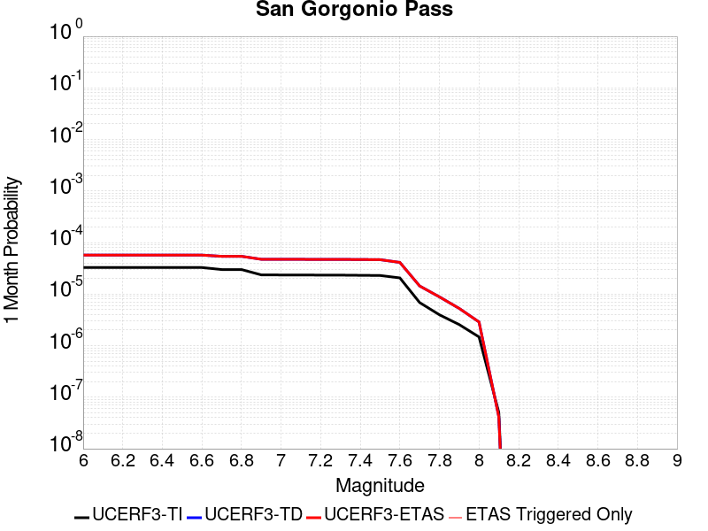 |  | 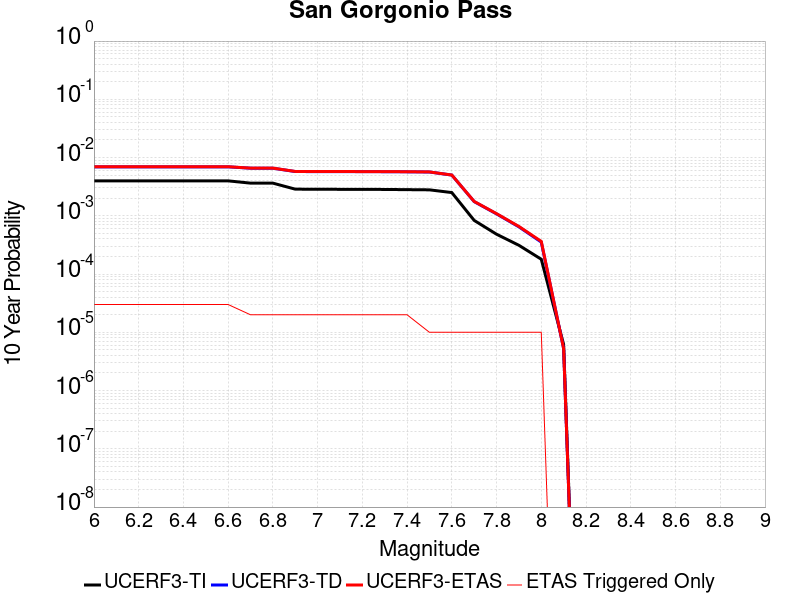 |

| Magnitude | 1 wk TI Prob | 1 wk TD Prob | 1 wk ETAS Prob | 1 wk ETAS/TD Gain | 1 wk ETAS Triggered Only | 1 mo TI Prob | 1 mo TD Prob | 1 mo ETAS Prob | 1 mo ETAS/TD Gain | 1 mo ETAS Triggered Only | 1 yr TI Prob | 1 yr TD Prob | 1 yr ETAS Prob | 1 yr ETAS/TD Gain | 1 yr ETAS Triggered Only | 10 yr TI Prob | 10 yr TD Prob | 10 yr ETAS Prob | 10 yr ETAS/TD Gain | 10 yr ETAS Triggered Only |
|-----|-----|-----|-----|-----|-----|-----|-----|-----|-----|-----|-----|-----|-----|-----|-----|-----|-----|-----|-----|-----|
| 6.0 | 7.644328E-6 | 1.33162985E-5 | 1.33162985E-5 | 1.0 | 0.0 | 3.2760996E-5 | 5.706865E-5 | 5.706865E-5 | 1.0 | 0.0 | 3.987921E-4 | 6.945979E-4 | 7.1458396E-4 | 1.0287737 | 2.0E-5 | 0.003980772 | 0.006931046 | 0.006960838 | 1.0042983 | 3.0E-5 |
| 6.1 | 7.644328E-6 | 1.33162985E-5 | 1.33162985E-5 | 1.0 | 0.0 | 3.2760996E-5 | 5.706865E-5 | 5.706865E-5 | 1.0 | 0.0 | 3.987921E-4 | 6.945979E-4 | 7.1458396E-4 | 1.0287737 | 2.0E-5 | 0.003980772 | 0.006931046 | 0.006960838 | 1.0042983 | 3.0E-5 |
| 6.2 | 7.644328E-6 | 1.33162985E-5 | 1.33162985E-5 | 1.0 | 0.0 | 3.2760996E-5 | 5.706865E-5 | 5.706865E-5 | 1.0 | 0.0 | 3.987921E-4 | 6.945979E-4 | 7.1458396E-4 | 1.0287737 | 2.0E-5 | 0.003980772 | 0.006931046 | 0.006960838 | 1.0042983 | 3.0E-5 |
| 6.3 | 7.644328E-6 | 1.33162985E-5 | 1.33162985E-5 | 1.0 | 0.0 | 3.2760996E-5 | 5.706865E-5 | 5.706865E-5 | 1.0 | 0.0 | 3.987921E-4 | 6.945979E-4 | 7.1458396E-4 | 1.0287737 | 2.0E-5 | 0.003980772 | 0.006931046 | 0.006960838 | 1.0042983 | 3.0E-5 |
| 6.4 | 7.644328E-6 | 1.33162985E-5 | 1.33162985E-5 | 1.0 | 0.0 | 3.2760996E-5 | 5.706865E-5 | 5.706865E-5 | 1.0 | 0.0 | 3.987921E-4 | 6.945979E-4 | 7.1458396E-4 | 1.0287737 | 2.0E-5 | 0.003980772 | 0.006931046 | 0.006960838 | 1.0042983 | 3.0E-5 |
| 6.5 | 7.644328E-6 | 1.33162985E-5 | 1.33162985E-5 | 1.0 | 0.0 | 3.2760996E-5 | 5.706865E-5 | 5.706865E-5 | 1.0 | 0.0 | 3.987921E-4 | 6.945979E-4 | 7.1458396E-4 | 1.0287737 | 2.0E-5 | 0.003980772 | 0.006931046 | 0.006960838 | 1.0042983 | 3.0E-5 |
| 6.6 | 7.644328E-6 | 1.33162985E-5 | 1.33162985E-5 | 1.0 | 0.0 | 3.2760996E-5 | 5.706865E-5 | 5.706865E-5 | 1.0 | 0.0 | 3.987921E-4 | 6.945979E-4 | 7.1458396E-4 | 1.0287737 | 2.0E-5 | 0.003980772 | 0.006931046 | 0.006960838 | 1.0042983 | 3.0E-5 |
| 6.7 | 6.987586E-6 | 1.2620567E-5 | 1.2620567E-5 | 1.0 | 0.0 | 2.9946454E-5 | 5.4087068E-5 | 5.4087068E-5 | 1.0 | 0.0 | 3.645371E-4 | 6.583192E-4 | 6.7830604E-4 | 1.0303603 | 2.0E-5 | 0.0036393967 | 0.0065704198 | 0.006590288 | 1.003024 | 2.0E-5 |
| 6.8 | 6.987586E-6 | 1.2620567E-5 | 1.2620567E-5 | 1.0 | 0.0 | 2.9946454E-5 | 5.4087068E-5 | 5.4087068E-5 | 1.0 | 0.0 | 3.645371E-4 | 6.583192E-4 | 6.7830604E-4 | 1.0303603 | 2.0E-5 | 0.0036393967 | 0.0065704198 | 0.006590288 | 1.003024 | 2.0E-5 |
| 6.9 | 5.504702E-6 | 1.1051418E-5 | 1.1051418E-5 | 1.0 | 0.0 | 2.3591367E-5 | 4.7362388E-5 | 4.7362388E-5 | 1.0 | 0.0 | 2.8718702E-4 | 5.7648955E-4 | 5.9647806E-4 | 1.0346727 | 2.0E-5 | 0.0028681618 | 0.0057563665 | 0.005776251 | 1.0034544 | 2.0E-5 |
| 7.0 | 5.4825764E-6 | 1.1027759E-5 | 1.1027759E-5 | 1.0 | 0.0 | 2.3496545E-5 | 4.7260994E-5 | 4.7260994E-5 | 1.0 | 0.0 | 2.8603288E-4 | 5.752558E-4 | 5.9524423E-4 | 1.0347471 | 2.0E-5 | 0.00285665 | 0.005744092 | 0.0057639773 | 1.0034618 | 2.0E-5 |
| 7.1 | 5.4692787E-6 | 1.1013469E-5 | 1.1013469E-5 | 1.0 | 0.0 | 2.3439556E-5 | 4.7199755E-5 | 4.7199755E-5 | 1.0 | 0.0 | 2.8533922E-4 | 5.7451054E-4 | 5.9449906E-4 | 1.0347922 | 2.0E-5 | 0.0028497311 | 0.0057366784 | 0.005756564 | 1.0034664 | 2.0E-5 |
| 7.2 | 5.453661E-6 | 1.0996495E-5 | 1.0996495E-5 | 1.0 | 0.0 | 2.3372622E-5 | 4.712701E-5 | 4.712701E-5 | 1.0 | 0.0 | 2.8452452E-4 | 5.736254E-4 | 5.936139E-4 | 1.034846 | 2.0E-5 | 0.002841605 | 0.0057278727 | 0.005747758 | 1.0034717 | 2.0E-5 |
| 7.3 | 5.4422303E-6 | 1.0983417E-5 | 1.0983417E-5 | 1.0 | 0.0 | 2.3323635E-5 | 4.7070967E-5 | 4.7070967E-5 | 1.0 | 0.0 | 2.8392827E-4 | 5.729434E-4 | 5.9293193E-4 | 1.0348874 | 2.0E-5 | 0.0028356577 | 0.005721088 | 0.0057409736 | 1.0034758 | 2.0E-5 |
| 7.4 | 5.398595E-6 | 1.0930781E-5 | 1.0930781E-5 | 1.0 | 0.0 | 2.313663E-5 | 4.6845395E-5 | 4.6845395E-5 | 1.0 | 0.0 | 2.8165206E-4 | 5.7019846E-4 | 5.901871E-4 | 1.0350555 | 2.0E-5 | 0.0028129534 | 0.00569378 | 0.005713666 | 1.0034926 | 2.0E-5 |
| 7.5 | 5.3578788E-6 | 1.0857324E-5 | 1.0857324E-5 | 1.0 | 0.0 | 2.2962136E-5 | 4.653059E-5 | 4.653059E-5 | 1.0 | 0.0 | 2.7952815E-4 | 5.663677E-4 | 5.763621E-4 | 1.0176464 | 1.0E-5 | 0.002791768 | 0.005655692 | 0.0056656357 | 1.0017581 | 1.0E-5 |
| 7.6 | 4.8091474E-6 | 9.605609E-6 | 9.605609E-6 | 1.0 | 0.0 | 2.0610469E-5 | 4.1166273E-5 | 4.1166273E-5 | 1.0 | 0.0 | 2.5090357E-4 | 5.01089E-4 | 5.110839E-4 | 1.0199466 | 1.0E-5 | 0.0025062046 | 0.0050062994 | 0.0050162496 | 1.0019875 | 1.0E-5 |
| 7.7 | 1.5991155E-6 | 3.3539093E-6 | 3.3539093E-6 | 1.0 | 0.0 | 6.853334E-6 | 1.4373819E-5 | 1.4373819E-5 | 1.0 | 0.0 | 8.343615E-5 | 1.7498745E-4 | 1.8498569E-4 | 1.057137 | 1.0E-5 | 8.340483E-4 | 0.0017539478 | 0.0017639302 | 1.0056914 | 1.0E-5 |
| 7.8 | 9.258398E-7 | 2.0587727E-6 | 2.0587727E-6 | 1.0 | 0.0 | 3.967879E-6 | 8.823282E-6 | 8.823282E-6 | 1.0 | 0.0 | 4.8307855E-5 | 1.07418186E-4 | 1.1741711E-4 | 1.0930841 | 1.0E-5 | 4.8297356E-4 | 0.0010790897 | 0.001089079 | 1.0092571 | 1.0E-5 |
| 7.9 | 5.975575E-7 | 1.2297422E-6 | 1.2297422E-6 | 1.0 | 0.0 | 2.5609581E-6 | 5.2703135E-6 | 5.2703135E-6 | 1.0 | 0.0 | 3.117922E-5 | 6.416419E-5 | 7.4163545E-5 | 1.1558402 | 1.0E-5 | 3.1174847E-4 | 6.466005E-4 | 6.56594E-4 | 1.0154555 | 1.0E-5 |
| 8.0 | 3.4413725E-7 | 6.718214E-7 | 6.718214E-7 | 1.0 | 0.0 | 1.4748731E-6 | 2.8792315E-6 | 2.8792315E-6 | 1.0 | 0.0 | 1.7956432E-5 | 3.5054083E-5 | 4.5053734E-5 | 1.2852634 | 1.0E-5 | 1.7954981E-4 | 3.5391308E-4 | 3.6390955E-4 | 1.0282456 | 1.0E-5 |
| 8.1 | 1.1787731E-8 | 9.643016E-9 | 9.643016E-9 | 1.0 | 0.0 | 5.0518846E-8 | 4.1327212E-8 | 4.1327212E-8 | 1.0 | 0.0 | 6.1506677E-7 | 5.031587E-7 | 5.031587E-7 | 1.0 | 0.0 | 6.1506507E-6 | 5.247088E-6 | 5.247088E-6 | 1.0 | 0.0 |

## San Diego Trough north alt1
*[(top)](#table-of-contents)*

| 1 Week | 1 Month | 1 Year | 10 Year |
|-----|-----|-----|-----|
|  |  |  |  |

| Magnitude | 1 wk TI Prob | 1 wk TD Prob | 1 wk ETAS Prob | 1 wk ETAS/TD Gain | 1 wk ETAS Triggered Only | 1 mo TI Prob | 1 mo TD Prob | 1 mo ETAS Prob | 1 mo ETAS/TD Gain | 1 mo ETAS Triggered Only | 1 yr TI Prob | 1 yr TD Prob | 1 yr ETAS Prob | 1 yr ETAS/TD Gain | 1 yr ETAS Triggered Only | 10 yr TI Prob | 10 yr TD Prob | 10 yr ETAS Prob | 10 yr ETAS/TD Gain | 10 yr ETAS Triggered Only |
|-----|-----|-----|-----|-----|-----|-----|-----|-----|-----|-----|-----|-----|-----|-----|-----|-----|-----|-----|-----|-----|
| 6.0 | 7.329252E-5 | 8.821339E-5 | 8.821339E-5 | 1.0 | 0.0 | 3.14073E-4 | 3.7800625E-4 | 3.7800625E-4 | 1.0 | 0.0 | 0.0038171355 | 0.0045931544 | 0.0046130624 | 1.0043343 | 2.0E-5 | 0.03752231 | 0.045046188 | 0.045074835 | 1.000636 | 3.0E-5 |
| 6.1 | 3.7940346E-5 | 4.488612E-5 | 4.488612E-5 | 1.0 | 0.0 | 1.6259136E-4 | 1.9235547E-4 | 1.9235547E-4 | 1.0 | 0.0 | 0.0019777524 | 0.002339501 | 0.0023594543 | 1.0085288 | 2.0E-5 | 0.019602431 | 0.023157248 | 0.023176786 | 1.0008436 | 2.0E-5 |
| 6.2 | 2.8645263E-5 | 3.329751E-5 | 3.329751E-5 | 1.0 | 0.0 | 1.2275964E-4 | 1.4269596E-4 | 1.4269596E-4 | 1.0 | 0.0 | 0.0014935739 | 0.0017359565 | 0.0017559218 | 1.0115011 | 2.0E-5 | 0.0148357535 | 0.01722662 | 0.017246276 | 1.001141 | 2.0E-5 |
| 6.3 | 2.8645263E-5 | 3.329751E-5 | 3.329751E-5 | 1.0 | 0.0 | 1.2275964E-4 | 1.4269596E-4 | 1.4269596E-4 | 1.0 | 0.0 | 0.0014935739 | 0.0017359565 | 0.0017559218 | 1.0115011 | 2.0E-5 | 0.0148357535 | 0.01722662 | 0.017246276 | 1.001141 | 2.0E-5 |
| 6.4 | 2.2204576E-5 | 2.5448817E-5 | 2.5448817E-5 | 1.0 | 0.0 | 9.5159E-5 | 1.0906186E-4 | 1.0906186E-4 | 1.0 | 0.0 | 0.001157945 | 0.0013270293 | 0.0013370161 | 1.0075257 | 1.0E-5 | 0.011519298 | 0.013192211 | 0.01320208 | 1.000748 | 1.0E-5 |
| 6.5 | 2.1004838E-5 | 2.4025157E-5 | 2.4025157E-5 | 1.0 | 0.0 | 9.0017624E-5 | 1.0296095E-4 | 1.0296095E-4 | 1.0 | 0.0 | 0.0010954136 | 0.001252838 | 0.0012628254 | 1.0079719 | 1.0E-5 | 0.010900296 | 0.012458827 | 0.012468702 | 1.0007926 | 1.0E-5 |
| 6.6 | 1.820557E-5 | 2.0705167E-5 | 2.0705167E-5 | 1.0 | 0.0 | 7.802154E-5 | 8.873344E-5 | 8.873344E-5 | 1.0 | 0.0 | 9.4949827E-4 | 0.0010797997 | 0.0010797997 | 1.0 | 0.0 | 0.009454516 | 0.010746201 | 0.010746201 | 1.0 | 0.0 |
| 6.7 | 1.5884485E-5 | 1.7983964E-5 | 1.7983964E-5 | 1.0 | 0.0 | 6.807459E-5 | 7.707187E-5 | 7.707187E-5 | 1.0 | 0.0 | 8.284929E-4 | 9.379488E-4 | 9.379488E-4 | 1.0 | 0.0 | 0.008254109 | 0.009340268 | 0.009340268 | 1.0 | 0.0 |
| 6.8 | 1.4331171E-5 | 1.6201348E-5 | 1.6201348E-5 | 1.0 | 0.0 | 6.141786E-5 | 6.9432506E-5 | 6.9432506E-5 | 1.0 | 0.0 | 7.4750587E-4 | 8.4501493E-4 | 8.4501493E-4 | 1.0 | 0.0 | 0.0074499645 | 0.008418285 | 0.008418285 | 1.0 | 0.0 |
| 6.9 | 1.2574203E-5 | 1.4206081E-5 | 1.4206081E-5 | 1.0 | 0.0 | 5.3888325E-5 | 6.088179E-5 | 6.088179E-5 | 1.0 | 0.0 | 6.558929E-4 | 7.4098515E-4 | 7.4098515E-4 | 1.0 | 0.0 | 0.0065396037 | 0.0073853307 | 0.0073853307 | 1.0 | 0.0 |
| 7.0 | 1.0883844E-5 | 1.22894735E-5 | 1.22894735E-5 | 1.0 | 0.0 | 4.664421E-5 | 5.2668114E-5 | 5.2668114E-5 | 1.0 | 0.0 | 5.677453E-4 | 6.410466E-4 | 6.410466E-4 | 1.0 | 0.0 | 0.00566297 | 0.0063921027 | 0.0063921027 | 1.0 | 0.0 |
| 7.1 | 9.393088E-6 | 1.0607203E-5 | 1.0607203E-5 | 1.0 | 0.0 | 4.025547E-5 | 4.5458655E-5 | 4.5458655E-5 | 1.0 | 0.0 | 4.900001E-4 | 5.5331935E-4 | 5.5331935E-4 | 1.0 | 0.0 | 0.0048892107 | 0.005519513 | 0.005519513 | 1.0 | 0.0 |
| 7.2 | 8.190791E-6 | 9.258787E-6 | 9.258787E-6 | 1.0 | 0.0 | 3.510292E-5 | 3.9679915E-5 | 3.9679915E-5 | 1.0 | 0.0 | 4.2729423E-4 | 4.8299658E-4 | 4.8299658E-4 | 1.0 | 0.0 | 0.0042647356 | 0.004819548 | 0.004819548 | 1.0 | 0.0 |
| 7.3 | 6.268162E-6 | 7.08984E-6 | 7.08984E-6 | 1.0 | 0.0 | 2.6863276E-5 | 3.0384675E-5 | 3.0384675E-5 | 1.0 | 0.0 | 3.2701128E-4 | 3.6987104E-4 | 3.6987104E-4 | 1.0 | 0.0 | 0.003265305 | 0.0036926004 | 0.0036926004 | 1.0 | 0.0 |
| 7.4 | 4.985186E-6 | 5.6427807E-6 | 5.6427807E-6 | 1.0 | 0.0 | 2.1364907E-5 | 2.4183124E-5 | 2.4183124E-5 | 1.0 | 0.0 | 2.600867E-4 | 2.9439016E-4 | 2.9439016E-4 | 1.0 | 0.0 | 0.002597825 | 0.002940043 | 0.002940043 | 1.0 | 0.0 |
| 7.5 | 1.7489613E-6 | 1.9697113E-6 | 1.9697113E-6 | 1.0 | 0.0 | 7.495527E-6 | 8.441594E-6 | 8.441594E-6 | 1.0 | 0.0 | 9.125422E-5 | 1.0277178E-4 | 1.0277178E-4 | 1.0 | 0.0 | 9.1216754E-4 | 0.0010272645 | 0.0010272645 | 1.0 | 0.0 |
| 7.6 | 1.6988751E-7 | 1.7533898E-7 | 1.7533898E-7 | 1.0 | 0.0 | 7.2808916E-7 | 7.5145255E-7 | 7.5145255E-7 | 1.0 | 0.0 | 8.864449E-6 | 9.148898E-6 | 9.148898E-6 | 1.0 | 0.0 | 8.8640954E-5 | 9.148542E-5 | 9.148542E-5 | 1.0 | 0.0 |

## San Clemente
*[(top)](#table-of-contents)*

| 1 Week | 1 Month | 1 Year | 10 Year |
|-----|-----|-----|-----|
|  |  |  | 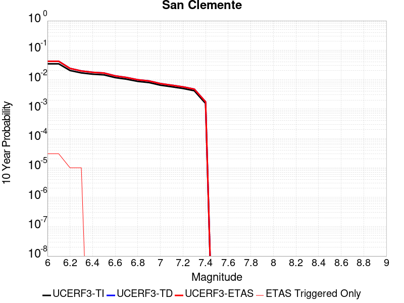 |

| Magnitude | 1 wk TI Prob | 1 wk TD Prob | 1 wk ETAS Prob | 1 wk ETAS/TD Gain | 1 wk ETAS Triggered Only | 1 mo TI Prob | 1 mo TD Prob | 1 mo ETAS Prob | 1 mo ETAS/TD Gain | 1 mo ETAS Triggered Only | 1 yr TI Prob | 1 yr TD Prob | 1 yr ETAS Prob | 1 yr ETAS/TD Gain | 1 yr ETAS Triggered Only | 10 yr TI Prob | 10 yr TD Prob | 10 yr ETAS Prob | 10 yr ETAS/TD Gain | 10 yr ETAS Triggered Only |
|-----|-----|-----|-----|-----|-----|-----|-----|-----|-----|-----|-----|-----|-----|-----|-----|-----|-----|-----|-----|-----|
| 6.0 | 6.681379E-5 | 8.163669E-5 | 8.163669E-5 | 1.0 | 0.0 | 2.8631336E-4 | 3.4982787E-4 | 3.4982787E-4 | 1.0 | 0.0 | 0.003480294 | 0.004251416 | 0.004251416 | 1.0 | 0.0 | 0.03426291 | 0.041756913 | 0.04178566 | 1.0006884 | 3.0E-5 |
| 6.1 | 6.681379E-5 | 8.163669E-5 | 8.163669E-5 | 1.0 | 0.0 | 2.8631336E-4 | 3.4982787E-4 | 3.4982787E-4 | 1.0 | 0.0 | 0.003480294 | 0.004251416 | 0.004251416 | 1.0 | 0.0 | 0.03426291 | 0.041756913 | 0.04178566 | 1.0006884 | 3.0E-5 |
| 6.2 | 3.9400576E-5 | 4.6453104E-5 | 4.6453104E-5 | 1.0 | 0.0 | 1.6884868E-4 | 1.9906988E-4 | 1.9906988E-4 | 1.0 | 0.0 | 0.0020537945 | 0.0024210429 | 0.0024210429 | 1.0 | 0.0 | 0.020349167 | 0.023953425 | 0.023963185 | 1.0004075 | 1.0E-5 |
| 6.3 | 3.2590255E-5 | 3.792992E-5 | 3.792992E-5 | 1.0 | 0.0 | 1.3966505E-4 | 1.6254683E-4 | 1.6254683E-4 | 1.0 | 0.0 | 0.0016990956 | 0.0019772416 | 0.0019772416 | 1.0 | 0.0 | 0.01686163 | 0.019600289 | 0.019610094 | 1.0005002 | 1.0E-5 |
| 6.4 | 2.9454652E-5 | 3.4098495E-5 | 3.4098495E-5 | 1.0 | 0.0 | 1.2622811E-4 | 1.4612835E-4 | 1.4612835E-4 | 1.0 | 0.0 | 0.0015357438 | 0.0017776854 | 0.0017776854 | 1.0 | 0.0 | 0.015251739 | 0.017637825 | 0.017637825 | 1.0 | 0.0 |
| 6.5 | 2.790836E-5 | 3.2248132E-5 | 3.2248132E-5 | 1.0 | 0.0 | 1.1960178E-4 | 1.3819907E-4 | 1.3819907E-4 | 1.0 | 0.0 | 0.001455179 | 0.0016812999 | 0.0016812999 | 1.0 | 0.0 | 0.014456868 | 0.016688818 | 0.016688818 | 1.0 | 0.0 |
| 6.6 | 2.2492153E-5 | 2.5763205E-5 | 2.5763205E-5 | 1.0 | 0.0 | 9.639138E-5 | 1.1040914E-4 | 1.1040914E-4 | 1.0 | 0.0 | 0.0011729331 | 0.0013434167 | 0.0013434167 | 1.0 | 0.0 | 0.011667615 | 0.013354672 | 0.013354672 | 1.0 | 0.0 |
| 6.7 | 1.9862755E-5 | 2.2666847E-5 | 2.2666847E-5 | 1.0 | 0.0 | 8.512331E-5 | 9.714008E-5 | 9.714008E-5 | 1.0 | 0.0 | 0.0010358836 | 0.0011820501 | 0.0011820501 | 1.0 | 0.0 | 0.010310682 | 0.01175892 | 0.01175892 | 1.0 | 0.0 |
| 6.8 | 1.6697575E-5 | 1.8978053E-5 | 1.8978053E-5 | 1.0 | 0.0 | 7.155907E-5 | 8.133203E-5 | 8.133203E-5 | 1.0 | 0.0 | 8.7088346E-4 | 9.89777E-4 | 9.89777E-4 | 1.0 | 0.0 | 0.008674784 | 0.009854714 | 0.009854714 | 1.0 | 0.0 |
| 6.9 | 1.5218415E-5 | 1.726971E-5 | 1.726971E-5 | 1.0 | 0.0 | 6.522015E-5 | 7.401099E-5 | 7.401099E-5 | 1.0 | 0.0 | 7.93766E-4 | 9.0072013E-4 | 9.0072013E-4 | 1.0 | 0.0 | 0.007909367 | 0.00897164 | 0.00897164 | 1.0 | 0.0 |
| 7.0 | 1.2392958E-5 | 1.4033262E-5 | 1.4033262E-5 | 1.0 | 0.0 | 5.3111595E-5 | 6.0141207E-5 | 6.0141207E-5 | 1.0 | 0.0 | 6.4644177E-4 | 7.319808E-4 | 7.319808E-4 | 1.0 | 0.0 | 0.0064456454 | 0.0072964844 | 0.0072964844 | 1.0 | 0.0 |
| 7.1 | 1.0934128E-5 | 1.2375354E-5 | 1.2375354E-5 | 1.0 | 0.0 | 4.6859706E-5 | 5.3036194E-5 | 5.3036194E-5 | 1.0 | 0.0 | 5.7036756E-4 | 6.455317E-4 | 6.455317E-4 | 1.0 | 0.0 | 0.0056890585 | 0.006437312 | 0.006437312 | 1.0 | 0.0 |
| 7.2 | 9.5798805E-6 | 1.0845125E-5 | 1.0845125E-5 | 1.0 | 0.0 | 4.1055984E-5 | 4.647832E-5 | 4.647832E-5 | 1.0 | 0.0 | 4.9974193E-4 | 5.657338E-4 | 5.657338E-4 | 1.0 | 0.0 | 0.0049861963 | 0.00564366 | 0.00564366 | 1.0 | 0.0 |
| 7.3 | 8.0167365E-6 | 9.084078E-6 | 9.084078E-6 | 1.0 | 0.0 | 3.4356988E-5 | 3.8931223E-5 | 3.8931223E-5 | 1.0 | 0.0 | 4.1821605E-4 | 4.738916E-4 | 4.738916E-4 | 1.0 | 0.0 | 0.0041742986 | 0.004729513 | 0.004729513 | 1.0 | 0.0 |
| 7.4 | 2.9581017E-6 | 3.36244E-6 | 3.36244E-6 | 1.0 | 0.0 | 1.2677518E-5 | 1.4410407E-5 | 1.4410407E-5 | 1.0 | 0.0 | 1.5433785E-4 | 1.7543763E-4 | 1.7543763E-4 | 1.0 | 0.0 | 0.001542307 | 0.0017534863 | 0.0017534863 | 1.0 | 0.0 |

## Camp Rock 2011
*[(top)](#table-of-contents)*

| 1 Week | 1 Month | 1 Year | 10 Year |
|-----|-----|-----|-----|
|  | 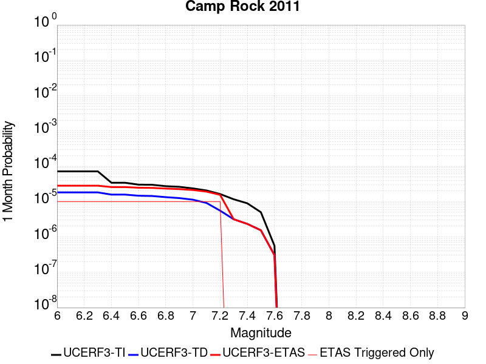 |  |  |

| Magnitude | 1 wk TI Prob | 1 wk TD Prob | 1 wk ETAS Prob | 1 wk ETAS/TD Gain | 1 wk ETAS Triggered Only | 1 mo TI Prob | 1 mo TD Prob | 1 mo ETAS Prob | 1 mo ETAS/TD Gain | 1 mo ETAS Triggered Only | 1 yr TI Prob | 1 yr TD Prob | 1 yr ETAS Prob | 1 yr ETAS/TD Gain | 1 yr ETAS Triggered Only | 10 yr TI Prob | 10 yr TD Prob | 10 yr ETAS Prob | 10 yr ETAS/TD Gain | 10 yr ETAS Triggered Only |
|-----|-----|-----|-----|-----|-----|-----|-----|-----|-----|-----|-----|-----|-----|-----|-----|-----|-----|-----|-----|-----|
| 6.0 | 1.6710783E-5 | 4.2503107E-6 | 4.2503107E-6 | 1.0 | 0.0 | 7.161568E-5 | 1.8215493E-5 | 2.821531E-5 | 1.5489732 | 1.0E-5 | 8.7157206E-4 | 2.2175159E-4 | 2.4174714E-4 | 1.090171 | 2.0E-5 | 0.008681616 | 0.0022153559 | 0.0022452895 | 1.0135119 | 3.0E-5 |
| 6.1 | 1.6710783E-5 | 4.2503107E-6 | 4.2503107E-6 | 1.0 | 0.0 | 7.161568E-5 | 1.8215493E-5 | 2.821531E-5 | 1.5489732 | 1.0E-5 | 8.7157206E-4 | 2.2175159E-4 | 2.4174714E-4 | 1.090171 | 2.0E-5 | 0.008681616 | 0.0022153559 | 0.0022452895 | 1.0135119 | 3.0E-5 |
| 6.2 | 1.6710783E-5 | 4.2503107E-6 | 4.2503107E-6 | 1.0 | 0.0 | 7.161568E-5 | 1.8215493E-5 | 2.821531E-5 | 1.5489732 | 1.0E-5 | 8.7157206E-4 | 2.2175159E-4 | 2.4174714E-4 | 1.090171 | 2.0E-5 | 0.008681616 | 0.0022153559 | 0.0022452895 | 1.0135119 | 3.0E-5 |
| 6.3 | 1.6710783E-5 | 4.2503107E-6 | 4.2503107E-6 | 1.0 | 0.0 | 7.161568E-5 | 1.8215493E-5 | 2.821531E-5 | 1.5489732 | 1.0E-5 | 8.7157206E-4 | 2.2175159E-4 | 2.4174714E-4 | 1.090171 | 2.0E-5 | 0.008681616 | 0.0022153559 | 0.0022452895 | 1.0135119 | 3.0E-5 |
| 6.4 | 7.982846E-6 | 3.6821327E-6 | 3.6821327E-6 | 1.0 | 0.0 | 3.421175E-5 | 1.5780475E-5 | 2.5780319E-5 | 1.6336845 | 1.0E-5 | 4.1644843E-4 | 1.921107E-4 | 2.1210685E-4 | 1.1040866 | 2.0E-5 | 0.0041566887 | 0.0019194811 | 0.0019494236 | 1.0155993 | 3.0E-5 |
| 6.5 | 7.982846E-6 | 3.6821327E-6 | 3.6821327E-6 | 1.0 | 0.0 | 3.421175E-5 | 1.5780475E-5 | 2.5780319E-5 | 1.6336845 | 1.0E-5 | 4.1644843E-4 | 1.921107E-4 | 2.1210685E-4 | 1.1040866 | 2.0E-5 | 0.0041566887 | 0.0019194811 | 0.0019494236 | 1.0155993 | 3.0E-5 |
| 6.6 | 7.048869E-6 | 3.4243997E-6 | 3.4243997E-6 | 1.0 | 0.0 | 3.0209088E-5 | 1.4675918E-5 | 2.467577E-5 | 1.6813784 | 1.0E-5 | 3.677336E-4 | 1.7866497E-4 | 1.986614E-4 | 1.1119213 | 2.0E-5 | 0.0036712566 | 0.0017852448 | 0.0018151912 | 1.0167744 | 3.0E-5 |
| 6.7 | 6.987307E-6 | 3.3623767E-6 | 3.3623767E-6 | 1.0 | 0.0 | 2.9945259E-5 | 1.4410108E-5 | 2.4409963E-5 | 1.6939473 | 1.0E-5 | 3.6452254E-4 | 1.7542925E-4 | 1.9542575E-4 | 1.113986 | 2.0E-5 | 0.0036392517 | 0.0017529388 | 0.0017828862 | 1.0170841 | 3.0E-5 |
| 6.8 | 6.3737602E-6 | 3.117947E-6 | 3.117947E-6 | 1.0 | 0.0 | 2.731583E-5 | 1.3362564E-5 | 2.336243E-5 | 1.7483494 | 1.0E-5 | 3.3251947E-4 | 1.6267736E-4 | 1.826741E-4 | 1.1229228 | 2.0E-5 | 0.0033202237 | 0.0016256113 | 0.0016555625 | 1.0184246 | 3.0E-5 |
| 6.9 | 6.112211E-6 | 2.9331534E-6 | 2.9331534E-6 | 1.0 | 0.0 | 2.6194928E-5 | 1.2570598E-5 | 2.2570473E-5 | 1.7954971 | 1.0E-5 | 3.1887658E-4 | 1.5303657E-4 | 1.730335E-4 | 1.1306677 | 2.0E-5 | 0.003184194 | 0.0015293396 | 0.0015592937 | 1.0195863 | 3.0E-5 |
| 7.0 | 5.5140117E-6 | 2.6419564E-6 | 2.6419564E-6 | 1.0 | 0.0 | 2.3631264E-5 | 1.1322622E-5 | 2.1322508E-5 | 1.8831776 | 1.0E-5 | 2.8767265E-4 | 1.3784446E-4 | 1.578417E-4 | 1.145071 | 2.0E-5 | 0.0028730053 | 0.0013776148 | 0.0014075735 | 1.0217468 | 3.0E-5 |
| 7.1 | 4.8151105E-6 | 2.1342985E-6 | 2.1342985E-6 | 1.0 | 0.0 | 2.0636026E-5 | 9.146962E-6 | 1.9146872E-5 | 2.093249 | 1.0E-5 | 2.5121463E-4 | 1.1135879E-4 | 1.3135657E-4 | 1.1795796 | 2.0E-5 | 0.0025093083 | 0.0011130519 | 0.0011430185 | 1.026923 | 3.0E-5 |
| 7.2 | 3.818335E-6 | 1.293763E-6 | 1.293763E-6 | 1.0 | 0.0 | 1.6364189E-5 | 5.5446876E-6 | 1.5544632E-5 | 2.803518 | 1.0E-5 | 1.9921579E-4 | 6.750456E-5 | 8.750321E-5 | 1.2962563 | 2.0E-5 | 0.0019903728 | 6.748488E-4 | 7.048286E-4 | 1.0444244 | 3.0E-5 |
| 7.3 | 2.7166698E-6 | 7.383734E-7 | 7.383734E-7 | 1.0 | 0.0 | 1.1642818E-5 | 3.1644536E-6 | 3.1644536E-6 | 1.0 | 0.0 | 1.4174209E-4 | 3.8526563E-5 | 3.8526563E-5 | 1.0 | 0.0 | 0.0014165172 | 3.8520084E-4 | 3.9519698E-4 | 1.0259504 | 1.0E-5 |
| 7.4 | 2.0893426E-6 | 5.461961E-7 | 5.461961E-7 | 1.0 | 0.0 | 8.954295E-6 | 2.3408381E-6 | 2.3408381E-6 | 1.0 | 0.0 | 1.0901308E-4 | 2.8499337E-5 | 2.8499337E-5 | 1.0 | 0.0 | 0.0010895962 | 2.8495738E-4 | 2.9495452E-4 | 1.0350829 | 1.0E-5 |
| 7.5 | 1.1681728E-6 | 3.6031287E-7 | 3.6031287E-7 | 1.0 | 0.0 | 5.0064455E-6 | 1.5441972E-6 | 1.5441972E-6 | 1.0 | 0.0 | 6.0951766E-5 | 1.8800443E-5 | 1.8800443E-5 | 1.0 | 0.0 | 6.093505E-4 | 1.8798899E-4 | 1.8798899E-4 | 1.0 | 0.0 |
| 7.6 | 1.3154387E-7 | 7.1198265E-8 | 7.1198265E-8 | 1.0 | 0.0 | 5.6375933E-7 | 3.051354E-7 | 3.051354E-7 | 1.0 | 0.0 | 6.863748E-6 | 3.7150185E-6 | 3.7150185E-6 | 1.0 | 0.0 | 6.863536E-5 | 3.7149723E-5 | 3.7149723E-5 | 1.0 | 0.0 |

## Mission Creek
*[(top)](#table-of-contents)*

| 1 Week | 1 Month | 1 Year | 10 Year |
|-----|-----|-----|-----|
|  |  |  |  |

| Magnitude | 1 wk TI Prob | 1 wk TD Prob | 1 wk ETAS Prob | 1 wk ETAS/TD Gain | 1 wk ETAS Triggered Only | 1 mo TI Prob | 1 mo TD Prob | 1 mo ETAS Prob | 1 mo ETAS/TD Gain | 1 mo ETAS Triggered Only | 1 yr TI Prob | 1 yr TD Prob | 1 yr ETAS Prob | 1 yr ETAS/TD Gain | 1 yr ETAS Triggered Only | 10 yr TI Prob | 10 yr TD Prob | 10 yr ETAS Prob | 10 yr ETAS/TD Gain | 10 yr ETAS Triggered Only |
|-----|-----|-----|-----|-----|-----|-----|-----|-----|-----|-----|-----|-----|-----|-----|-----|-----|-----|-----|-----|-----|
| 6.0 | 1.1549387E-5 | 1.6324713E-5 | 1.6324713E-5 | 1.0 | 0.0 | 4.9496433E-5 | 6.9961265E-5 | 6.9961265E-5 | 1.0 | 0.0 | 6.0245243E-4 | 8.5146056E-4 | 8.61452E-4 | 1.0117345 | 1.0E-5 | 0.006008218 | 0.008511184 | 0.008540929 | 1.0034947 | 3.0E-5 |
| 6.1 | 1.1549387E-5 | 1.6324713E-5 | 1.6324713E-5 | 1.0 | 0.0 | 4.9496433E-5 | 6.9961265E-5 | 6.9961265E-5 | 1.0 | 0.0 | 6.0245243E-4 | 8.5146056E-4 | 8.61452E-4 | 1.0117345 | 1.0E-5 | 0.006008218 | 0.008511184 | 0.008540929 | 1.0034947 | 3.0E-5 |
| 6.2 | 1.1549387E-5 | 1.6324713E-5 | 1.6324713E-5 | 1.0 | 0.0 | 4.9496433E-5 | 6.9961265E-5 | 6.9961265E-5 | 1.0 | 0.0 | 6.0245243E-4 | 8.5146056E-4 | 8.61452E-4 | 1.0117345 | 1.0E-5 | 0.006008218 | 0.008511184 | 0.008540929 | 1.0034947 | 3.0E-5 |
| 6.3 | 1.1549387E-5 | 1.6324713E-5 | 1.6324713E-5 | 1.0 | 0.0 | 4.9496433E-5 | 6.9961265E-5 | 6.9961265E-5 | 1.0 | 0.0 | 6.0245243E-4 | 8.5146056E-4 | 8.61452E-4 | 1.0117345 | 1.0E-5 | 0.006008218 | 0.008511184 | 0.008540929 | 1.0034947 | 3.0E-5 |
| 6.4 | 1.1549387E-5 | 1.6324713E-5 | 1.6324713E-5 | 1.0 | 0.0 | 4.9496433E-5 | 6.9961265E-5 | 6.9961265E-5 | 1.0 | 0.0 | 6.0245243E-4 | 8.5146056E-4 | 8.61452E-4 | 1.0117345 | 1.0E-5 | 0.006008218 | 0.008511184 | 0.008540929 | 1.0034947 | 3.0E-5 |
| 6.5 | 1.1549387E-5 | 1.6324713E-5 | 1.6324713E-5 | 1.0 | 0.0 | 4.9496433E-5 | 6.9961265E-5 | 6.9961265E-5 | 1.0 | 0.0 | 6.0245243E-4 | 8.5146056E-4 | 8.61452E-4 | 1.0117345 | 1.0E-5 | 0.006008218 | 0.008511184 | 0.008540929 | 1.0034947 | 3.0E-5 |
| 6.6 | 9.202681E-6 | 1.3847972E-5 | 1.3847972E-5 | 1.0 | 0.0 | 3.9439463E-5 | 5.9347152E-5 | 5.9347152E-5 | 1.0 | 0.0 | 4.800697E-4 | 7.2232104E-4 | 7.3231384E-4 | 1.0138342 | 1.0E-5 | 0.004790339 | 0.0072283596 | 0.007258143 | 1.0041203 | 3.0E-5 |
| 6.7 | 9.019164E-6 | 1.365364E-5 | 1.365364E-5 | 1.0 | 0.0 | 3.8652986E-5 | 5.8514335E-5 | 5.8514335E-5 | 1.0 | 0.0 | 4.7049852E-4 | 7.121882E-4 | 7.2218105E-4 | 1.0140313 | 1.0E-5 | 0.004695036 | 0.0071276836 | 0.0071574696 | 1.0041789 | 3.0E-5 |
| 6.8 | 8.673558E-6 | 1.3275746E-5 | 1.3275746E-5 | 1.0 | 0.0 | 3.717186E-5 | 5.6894864E-5 | 5.6894864E-5 | 1.0 | 0.0 | 4.524734E-4 | 6.924836E-4 | 7.024767E-4 | 1.0144308 | 1.0E-5 | 0.0045155324 | 0.0069318693 | 0.0069616614 | 1.0042979 | 3.0E-5 |
| 6.9 | 7.002255E-6 | 1.1479958E-5 | 1.1479958E-5 | 1.0 | 0.0 | 3.000932E-5 | 4.9198927E-5 | 4.9198927E-5 | 1.0 | 0.0 | 3.653022E-4 | 5.988392E-4 | 6.0883316E-4 | 1.016689 | 1.0E-5 | 0.0036470229 | 0.0060006846 | 0.0060305046 | 1.0049695 | 3.0E-5 |
| 7.0 | 5.84644E-6 | 9.677164E-6 | 9.677164E-6 | 1.0 | 0.0 | 2.5055931E-5 | 4.1472922E-5 | 4.1472922E-5 | 1.0 | 0.0 | 3.0501327E-4 | 5.0482043E-4 | 5.148154E-4 | 1.019799 | 1.0E-5 | 0.0030459496 | 0.0050649596 | 0.0050948076 | 1.005893 | 3.0E-5 |
| 7.1 | 5.54703E-6 | 9.331631E-6 | 9.331631E-6 | 1.0 | 0.0 | 2.377277E-5 | 3.999212E-5 | 3.999212E-5 | 1.0 | 0.0 | 2.8939504E-4 | 4.8679972E-4 | 4.967948E-4 | 1.0205324 | 1.0E-5 | 0.0028901845 | 0.0048855497 | 0.004905452 | 1.0040737 | 2.0E-5 |
| 7.2 | 4.384709E-6 | 7.6836495E-6 | 7.6836495E-6 | 1.0 | 0.0 | 1.8791474E-5 | 3.292953E-5 | 3.292953E-5 | 1.0 | 0.0 | 2.2876218E-4 | 4.0084694E-4 | 4.108429E-4 | 1.0249372 | 1.0E-5 | 0.0022852682 | 0.0040294197 | 0.004049339 | 1.0049435 | 2.0E-5 |
| 7.3 | 3.7888456E-6 | 6.9174894E-6 | 6.9174894E-6 | 1.0 | 0.0 | 1.623781E-5 | 2.9646066E-5 | 2.9646066E-5 | 1.0 | 0.0 | 1.9767738E-4 | 3.608844E-4 | 3.7088082E-4 | 1.0276997 | 1.0E-5 | 0.0019750162 | 0.0036311483 | 0.0036510755 | 1.0054879 | 2.0E-5 |
| 7.4 | 2.1982462E-6 | 5.0257536E-6 | 5.0257536E-6 | 1.0 | 0.0 | 9.421021E-6 | 2.1538768E-5 | 2.1538768E-5 | 1.0 | 0.0 | 1.1469489E-4 | 2.6220313E-4 | 2.722005E-4 | 1.0381284 | 1.0E-5 | 0.0011463572 | 0.0026468872 | 0.0026668343 | 1.007536 | 2.0E-5 |
| 7.5 | 2.051923E-6 | 4.6169393E-6 | 4.6169393E-6 | 1.0 | 0.0 | 8.793926E-6 | 1.9786734E-5 | 1.9786734E-5 | 1.0 | 0.0 | 1.0706078E-4 | 2.40877E-4 | 2.5087458E-4 | 1.041505 | 1.0E-5 | 0.0010700922 | 0.0024345173 | 0.0024544685 | 1.0081952 | 2.0E-5 |
| 7.6 | 1.8733427E-6 | 4.1252324E-6 | 4.1252324E-6 | 1.0 | 0.0 | 8.028587E-6 | 1.767945E-5 | 1.767945E-5 | 1.0 | 0.0 | 9.774366E-5 | 2.1522611E-4 | 2.2522395E-4 | 1.0464528 | 1.0E-5 | 9.770069E-4 | 0.0021790217 | 0.002198978 | 1.0091584 | 2.0E-5 |
| 7.7 | 1.8411953E-6 | 4.044895E-6 | 4.044895E-6 | 1.0 | 0.0 | 7.890813E-6 | 1.733515E-5 | 1.733515E-5 | 1.0 | 0.0 | 9.606641E-5 | 2.1103508E-4 | 2.2103297E-4 | 1.0473754 | 1.0E-5 | 9.6024893E-4 | 0.0021373003 | 0.0021572576 | 1.0093375 | 2.0E-5 |
| 7.8 | 1.7194251E-6 | 3.7121463E-6 | 3.7121463E-6 | 1.0 | 0.0 | 7.368944E-6 | 1.5909101E-5 | 1.5909101E-5 | 1.0 | 0.0 | 8.97132E-5 | 1.9367617E-4 | 2.0367424E-4 | 1.0516226 | 1.0E-5 | 8.967699E-4 | 0.0019632233 | 0.001983184 | 1.0101674 | 2.0E-5 |
| 7.9 | 1.4035052E-6 | 2.9514722E-6 | 2.9514722E-6 | 1.0 | 0.0 | 6.0150082E-6 | 1.2649106E-5 | 1.2649106E-5 | 1.0 | 0.0 | 7.3230265E-5 | 1.5399205E-4 | 1.6399051E-4 | 1.0649284 | 1.0E-5 | 7.3206134E-4 | 0.0015638224 | 0.0015837911 | 1.0127692 | 2.0E-5 |
| 8.0 | 3.9318823E-7 | 5.5319464E-7 | 5.5319464E-7 | 1.0 | 0.0 | 1.6850913E-6 | 2.3708321E-6 | 2.3708321E-6 | 1.0 | 0.0 | 2.0515794E-5 | 2.8864504E-5 | 3.8864215E-5 | 1.3464363 | 1.0E-5 | 2.0513899E-4 | 2.9916913E-4 | 3.0916615E-4 | 1.0334159 | 1.0E-5 |
| 8.1 | 1.596793E-7 | 1.1391901E-7 | 1.1391901E-7 | 1.0 | 0.0 | 6.8433974E-7 | 4.8822426E-7 | 4.8822426E-7 | 1.0 | 0.0 | 8.331805E-6 | 5.944114E-6 | 5.944114E-6 | 1.0 | 0.0 | 8.331492E-5 | 6.5564316E-5 | 6.5564316E-5 | 1.0 | 0.0 |
| 8.2 | 4.9003038E-8 | 2.5475106E-8 | 2.5475106E-8 | 1.0 | 0.0 | 2.10013E-7 | 1.0917902E-7 | 1.0917902E-7 | 1.0 | 0.0 | 2.5569052E-6 | 1.3292538E-6 | 1.3292538E-6 | 1.0 | 0.0 | 2.556876E-5 | 1.4973085E-5 | 1.4973085E-5 | 1.0 | 0.0 |

## Hunting Creek - Berryessa 2011 CFM
*[(top)](#table-of-contents)*

| 1 Week | 1 Month | 1 Year | 10 Year |
|-----|-----|-----|-----|
|  |  | 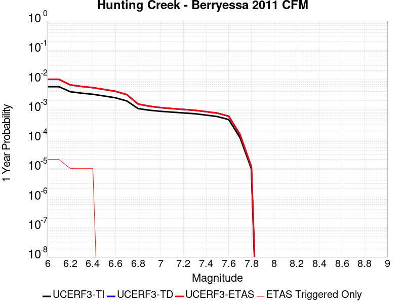 | 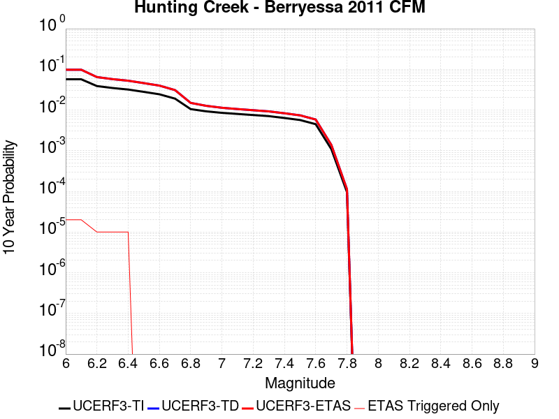 |

| Magnitude | 1 wk TI Prob | 1 wk TD Prob | 1 wk ETAS Prob | 1 wk ETAS/TD Gain | 1 wk ETAS Triggered Only | 1 mo TI Prob | 1 mo TD Prob | 1 mo ETAS Prob | 1 mo ETAS/TD Gain | 1 mo ETAS Triggered Only | 1 yr TI Prob | 1 yr TD Prob | 1 yr ETAS Prob | 1 yr ETAS/TD Gain | 1 yr ETAS Triggered Only | 10 yr TI Prob | 10 yr TD Prob | 10 yr ETAS Prob | 10 yr ETAS/TD Gain | 10 yr ETAS Triggered Only |
|-----|-----|-----|-----|-----|-----|-----|-----|-----|-----|-----|-----|-----|-----|-----|-----|-----|-----|-----|-----|-----|
| 6.0 | 1.1270982E-4 | 2.0014354E-4 | 2.0014354E-4 | 1.0 | 0.0 | 4.8295266E-4 | 8.574329E-4 | 8.574329E-4 | 1.0 | 0.0 | 0.0058641075 | 0.010387073 | 0.010406866 | 1.0019054 | 2.0E-5 | 0.057117578 | 0.09804065 | 0.09805869 | 1.0001839 | 2.0E-5 |
| 6.1 | 1.1239393E-4 | 1.9962489E-4 | 1.9962489E-4 | 1.0 | 0.0 | 4.8159933E-4 | 8.552116E-4 | 8.552116E-4 | 1.0 | 0.0 | 0.0058477195 | 0.010360309 | 0.010380102 | 1.0019104 | 2.0E-5 | 0.056962132 | 0.09779912 | 0.09781717 | 1.0001845 | 2.0E-5 |
| 6.2 | 7.596265E-5 | 1.2941175E-4 | 1.2941175E-4 | 1.0 | 0.0 | 3.2551357E-4 | 5.544276E-4 | 5.544276E-4 | 1.0 | 0.0 | 0.0039559277 | 0.0067212153 | 0.006731148 | 1.0014778 | 1.0E-5 | 0.038862433 | 0.0645938 | 0.06460315 | 1.0001448 | 1.0E-5 |
| 6.3 | 6.78794E-5 | 1.145196E-4 | 1.145196E-4 | 1.0 | 0.0 | 2.9087928E-4 | 4.9066654E-4 | 4.9066654E-4 | 1.0 | 0.0 | 0.003535705 | 0.0059528556 | 0.005962796 | 1.0016699 | 1.0E-5 | 0.034799766 | 0.05746746 | 0.057476886 | 1.000164 | 1.0E-5 |
| 6.4 | 6.2165134E-5 | 1.0437306E-4 | 1.0437306E-4 | 1.0 | 0.0 | 2.6639478E-4 | 4.4723987E-4 | 4.4723987E-4 | 1.0 | 0.0 | 0.0032385332 | 0.005427739 | 0.005437685 | 1.0018324 | 1.0E-5 | 0.03191742 | 0.052552443 | 0.05256192 | 1.0001802 | 1.0E-5 |
| 6.5 | 5.4368087E-5 | 9.071981E-5 | 9.071981E-5 | 1.0 | 0.0 | 2.3298527E-4 | 3.887444E-4 | 3.887444E-4 | 1.0 | 0.0 | 0.0028329059 | 0.004720021 | 0.004720021 | 1.0 | 0.0 | 0.027970633 | 0.045881823 | 0.045881823 | 1.0 | 0.0 |
| 6.6 | 4.729947E-5 | 7.848042E-5 | 7.848042E-5 | 1.0 | 0.0 | 2.0269625E-4 | 3.363043E-4 | 3.363043E-4 | 1.0 | 0.0 | 0.002465034 | 0.0040850975 | 0.0040850975 | 1.0 | 0.0 | 0.02437869 | 0.039853033 | 0.039853033 | 1.0 | 0.0 |
| 6.7 | 3.6875328E-5 | 6.0455113E-5 | 6.0455113E-5 | 1.0 | 0.0 | 1.5802756E-4 | 2.5907016E-4 | 2.5907016E-4 | 1.0 | 0.0 | 0.0019222875 | 0.0031483201 | 0.0031483201 | 1.0 | 0.0 | 0.019057442 | 0.030893533 | 0.030893533 | 1.0 | 0.0 |
| 6.8 | 2.0292036E-5 | 2.897696E-5 | 2.897696E-5 | 1.0 | 0.0 | 8.6962966E-5 | 1.241811E-4 | 1.241811E-4 | 1.0 | 0.0 | 0.0010582599 | 0.00151084 | 0.00151084 | 1.0 | 0.0 | 0.010532344 | 0.014978847 | 0.014978847 | 1.0 | 0.0 |
| 6.9 | 1.7871042E-5 | 2.4472789E-5 | 2.4472789E-5 | 1.0 | 0.0 | 7.658793E-5 | 1.048792E-4 | 1.048792E-4 | 1.0 | 0.0 | 9.320591E-4 | 0.0012761577 | 0.0012761577 | 1.0 | 0.0 | 0.009281595 | 0.012680048 | 0.012680048 | 1.0 | 0.0 |
| 7.0 | 1.6415532E-5 | 2.1906764E-5 | 2.1906764E-5 | 1.0 | 0.0 | 7.035038E-5 | 9.388277E-5 | 9.388277E-5 | 1.0 | 0.0 | 8.561793E-4 | 0.0011424269 | 0.0011424269 | 1.0 | 0.0 | 0.008528882 | 0.011364769 | 0.011364769 | 1.0 | 0.0 |
| 7.1 | 1.5409885E-5 | 2.03468E-5 | 2.03468E-5 | 1.0 | 0.0 | 6.6040695E-5 | 8.719768E-5 | 8.719768E-5 | 1.0 | 0.0 | 8.0374884E-4 | 0.0010611176 | 0.0010611176 | 1.0 | 0.0 | 0.00800848 | 0.010560832 | 0.010560832 | 1.0 | 0.0 |
| 7.2 | 1.4497423E-5 | 1.905539E-5 | 1.905539E-5 | 1.0 | 0.0 | 6.213033E-5 | 8.166341E-5 | 8.166341E-5 | 1.0 | 0.0 | 7.5617427E-4 | 9.938016E-4 | 9.938016E-4 | 1.0 | 0.0 | 0.0075360634 | 0.009894148 | 0.009894148 | 1.0 | 0.0 |
| 7.3 | 1.3615175E-5 | 1.7826538E-5 | 1.7826538E-5 | 1.0 | 0.0 | 5.8349444E-5 | 7.639723E-5 | 7.639723E-5 | 1.0 | 0.0 | 7.101729E-4 | 9.2974224E-4 | 9.2974224E-4 | 1.0 | 0.0 | 0.0070790765 | 0.009259034 | 0.009259034 | 1.0 | 0.0 |
| 7.4 | 1.2252825E-5 | 1.6026612E-5 | 1.6026612E-5 | 1.0 | 0.0 | 5.251105E-5 | 6.868369E-5 | 6.868369E-5 | 1.0 | 0.0 | 6.391345E-4 | 8.359059E-4 | 8.359059E-4 | 1.0 | 0.0 | 0.0063729943 | 0.008328059 | 0.008328059 | 1.0 | 0.0 |
| 7.5 | 1.0913301E-5 | 1.4241439E-5 | 1.4241439E-5 | 1.0 | 0.0 | 4.6770452E-5 | 6.103333E-5 | 6.103333E-5 | 1.0 | 0.0 | 5.6928146E-4 | 7.4283016E-4 | 7.4283016E-4 | 1.0 | 0.0 | 0.0056782532 | 0.0074038464 | 0.0074038464 | 1.0 | 0.0 |
| 7.6 | 8.623192E-6 | 1.1234897E-5 | 1.1234897E-5 | 1.0 | 0.0 | 3.6956015E-5 | 4.8148686E-5 | 4.8148686E-5 | 1.0 | 0.0 | 4.4984656E-4 | 5.860551E-4 | 5.860551E-4 | 1.0 | 0.0 | 0.00448937 | 0.0058454107 | 0.0058454107 | 1.0 | 0.0 |
| 7.7 | 2.0993634E-6 | 2.6626365E-6 | 2.6626365E-6 | 1.0 | 0.0 | 8.997241E-6 | 1.141125E-5 | 1.141125E-5 | 1.0 | 0.0 | 1.09535904E-4 | 1.3892318E-4 | 1.3892318E-4 | 1.0 | 0.0 | 0.0010948193 | 0.0013883698 | 0.0013883698 | 1.0 | 0.0 |
| 7.8 | 1.8428308E-7 | 2.167475E-7 | 2.167475E-7 | 1.0 | 0.0 | 7.897844E-7 | 9.2891753E-7 | 9.2891753E-7 | 1.0 | 0.0 | 9.615583E-6 | 1.1309516E-5 | 1.1309516E-5 | 1.0 | 0.0 | 9.615166E-5 | 1.13088005E-4 | 1.13088005E-4 | 1.0 | 0.0 |

## Sierra Madre (San Fernando)
*[(top)](#table-of-contents)*

| 1 Week | 1 Month | 1 Year | 10 Year |
|-----|-----|-----|-----|
|  |  |  |  |

| Magnitude | 1 wk TI Prob | 1 wk TD Prob | 1 wk ETAS Prob | 1 wk ETAS/TD Gain | 1 wk ETAS Triggered Only | 1 mo TI Prob | 1 mo TD Prob | 1 mo ETAS Prob | 1 mo ETAS/TD Gain | 1 mo ETAS Triggered Only | 1 yr TI Prob | 1 yr TD Prob | 1 yr ETAS Prob | 1 yr ETAS/TD Gain | 1 yr ETAS Triggered Only | 10 yr TI Prob | 10 yr TD Prob | 10 yr ETAS Prob | 10 yr ETAS/TD Gain | 10 yr ETAS Triggered Only |
|-----|-----|-----|-----|-----|-----|-----|-----|-----|-----|-----|-----|-----|-----|-----|-----|-----|-----|-----|-----|-----|
| 6.0 | 1.0346413E-5 | 6.287434E-6 | 6.287434E-6 | 1.0 | 0.0 | 4.4341014E-5 | 2.6945874E-5 | 3.6945607E-5 | 1.3711044 | 1.0E-5 | 5.3971814E-4 | 3.2801775E-4 | 3.4801118E-4 | 1.0609523 | 2.0E-5 | 0.0053840918 | 0.0032754485 | 0.003295383 | 1.006086 | 2.0E-5 |
| 6.1 | 1.0346413E-5 | 6.287434E-6 | 6.287434E-6 | 1.0 | 0.0 | 4.4341014E-5 | 2.6945874E-5 | 3.6945607E-5 | 1.3711044 | 1.0E-5 | 5.3971814E-4 | 3.2801775E-4 | 3.4801118E-4 | 1.0609523 | 2.0E-5 | 0.0053840918 | 0.0032754485 | 0.003295383 | 1.006086 | 2.0E-5 |
| 6.2 | 1.0346413E-5 | 6.287434E-6 | 6.287434E-6 | 1.0 | 0.0 | 4.4341014E-5 | 2.6945874E-5 | 3.6945607E-5 | 1.3711044 | 1.0E-5 | 5.3971814E-4 | 3.2801775E-4 | 3.4801118E-4 | 1.0609523 | 2.0E-5 | 0.0053840918 | 0.0032754485 | 0.003295383 | 1.006086 | 2.0E-5 |
| 6.3 | 1.0346413E-5 | 6.287434E-6 | 6.287434E-6 | 1.0 | 0.0 | 4.4341014E-5 | 2.6945874E-5 | 3.6945607E-5 | 1.3711044 | 1.0E-5 | 5.3971814E-4 | 3.2801775E-4 | 3.4801118E-4 | 1.0609523 | 2.0E-5 | 0.0053840918 | 0.0032754485 | 0.003295383 | 1.006086 | 2.0E-5 |
| 6.4 | 1.0249558E-5 | 6.287434E-6 | 6.287434E-6 | 1.0 | 0.0 | 4.392594E-5 | 2.6945874E-5 | 3.6945607E-5 | 1.3711044 | 1.0E-5 | 5.3466705E-4 | 3.2801775E-4 | 3.4801118E-4 | 1.0609523 | 2.0E-5 | 0.0053338245 | 0.0032754485 | 0.003295383 | 1.006086 | 2.0E-5 |
| 6.5 | 1.0249558E-5 | 6.287434E-6 | 6.287434E-6 | 1.0 | 0.0 | 4.392594E-5 | 2.6945874E-5 | 3.6945607E-5 | 1.3711044 | 1.0E-5 | 5.3466705E-4 | 3.2801775E-4 | 3.4801118E-4 | 1.0609523 | 2.0E-5 | 0.0053338245 | 0.0032754485 | 0.003295383 | 1.006086 | 2.0E-5 |
| 6.6 | 9.9035515E-6 | 6.287434E-6 | 6.287434E-6 | 1.0 | 0.0 | 4.2443102E-5 | 2.6945874E-5 | 3.6945607E-5 | 1.3711044 | 1.0E-5 | 5.166222E-4 | 3.2801775E-4 | 3.4801118E-4 | 1.0609523 | 2.0E-5 | 0.0051542283 | 0.0032754485 | 0.003295383 | 1.006086 | 2.0E-5 |
| 6.7 | 9.87217E-6 | 6.274855E-6 | 6.274855E-6 | 1.0 | 0.0 | 4.2308613E-5 | 2.6891963E-5 | 3.6891695E-5 | 1.3718483 | 1.0E-5 | 5.149856E-4 | 3.2736157E-4 | 3.4735503E-4 | 1.0610745 | 2.0E-5 | 0.005137938 | 0.003268906 | 0.0032888406 | 1.0060983 | 2.0E-5 |
| 6.8 | 9.4359175E-6 | 6.1788287E-6 | 6.1788287E-6 | 1.0 | 0.0 | 4.043902E-5 | 2.6480431E-5 | 3.6480167E-5 | 1.3776274 | 1.0E-5 | 4.9223384E-4 | 3.2235266E-4 | 3.423462E-4 | 1.0620239 | 2.0E-5 | 0.0049114493 | 0.0032189623 | 0.003238898 | 1.0061932 | 2.0E-5 |
| 6.9 | 8.700447E-6 | 6.0400866E-6 | 6.0400866E-6 | 1.0 | 0.0 | 3.72871E-5 | 2.5885834E-5 | 3.5885576E-5 | 1.3863016 | 1.0E-5 | 4.5387587E-4 | 3.1511553E-4 | 3.3510925E-4 | 1.0634488 | 2.0E-5 | 0.0045295 | 0.0031467967 | 0.0031667338 | 1.0063356 | 2.0E-5 |
| 7.0 | 8.648878E-6 | 6.0150014E-6 | 6.0150014E-6 | 1.0 | 0.0 | 3.7066096E-5 | 2.5778329E-5 | 3.577807E-5 | 1.3879128 | 1.0E-5 | 4.5118626E-4 | 3.1380705E-4 | 3.3380077E-4 | 1.0637134 | 2.0E-5 | 0.004502713 | 0.0031337484 | 0.003153686 | 1.0063621 | 2.0E-5 |
| 7.1 | 8.505786E-6 | 5.924631E-6 | 5.924631E-6 | 1.0 | 0.0 | 3.645286E-5 | 2.5391035E-5 | 3.539078E-5 | 1.3938298 | 1.0E-5 | 4.437232E-4 | 3.0909307E-4 | 3.2908688E-4 | 1.0646855 | 2.0E-5 | 0.0044283825 | 0.0030867406 | 0.0031066788 | 1.0064594 | 2.0E-5 |
| 7.2 | 8.139752E-6 | 5.6989234E-6 | 5.6989234E-6 | 1.0 | 0.0 | 3.4884186E-5 | 2.4423734E-5 | 3.442349E-5 | 1.4094278 | 1.0E-5 | 4.246322E-4 | 2.9731944E-4 | 3.1731348E-4 | 1.0672477 | 2.0E-5 | 0.004238217 | 0.0029693225 | 0.0029892633 | 1.0067155 | 2.0E-5 |
| 7.3 | 7.8816E-6 | 5.552236E-6 | 5.552236E-6 | 1.0 | 0.0 | 3.3777847E-5 | 2.3795086E-5 | 3.3794848E-5 | 1.4202448 | 1.0E-5 | 4.111677E-4 | 2.8966772E-4 | 3.096619E-4 | 1.0690247 | 2.0E-5 | 0.004104078 | 0.002893007 | 0.002912949 | 1.0068933 | 2.0E-5 |
| 7.4 | 7.5810603E-6 | 5.35647E-6 | 5.35647E-6 | 1.0 | 0.0 | 3.2489854E-5 | 2.2956105E-5 | 3.2955875E-5 | 1.435604 | 1.0E-5 | 3.9549218E-4 | 2.7945577E-4 | 2.9945018E-4 | 1.0715476 | 2.0E-5 | 0.0039478904 | 0.0027911486 | 0.0028110929 | 1.0071455 | 2.0E-5 |
| 7.5 | 6.349153E-6 | 4.4077274E-6 | 4.4077274E-6 | 1.0 | 0.0 | 2.7210372E-5 | 1.8890129E-5 | 2.8889941E-5 | 1.529367 | 1.0E-5 | 3.312359E-4 | 2.2996387E-4 | 2.4995927E-4 | 1.0869502 | 2.0E-5 | 0.0033074263 | 0.0022973411 | 0.0023172952 | 1.0086857 | 2.0E-5 |
| 7.6 | 4.430576E-6 | 2.8907298E-6 | 2.8907298E-6 | 1.0 | 0.0 | 1.8988047E-5 | 1.2388785E-5 | 2.238866E-5 | 1.8071717 | 1.0E-5 | 2.3115493E-4 | 1.5082324E-4 | 1.6082173E-4 | 1.0662928 | 1.0E-5 | 0.0023091463 | 0.0015072313 | 0.0015172162 | 1.0066247 | 1.0E-5 |
| 7.7 | 3.005066E-6 | 1.7511459E-6 | 1.7511459E-6 | 1.0 | 0.0 | 1.2878791E-5 | 7.5048893E-6 | 7.5048893E-6 | 1.0 | 0.0 | 1.56788E-4 | 9.13682E-5 | 9.13682E-5 | 1.0 | 0.0 | 0.0015667742 | 9.1330754E-4 | 9.1330754E-4 | 1.0 | 0.0 |
| 7.8 | 1.8459098E-6 | 1.0583101E-6 | 1.0583101E-6 | 1.0 | 0.0 | 7.911018E-6 | 4.535607E-6 | 4.535607E-6 | 1.0 | 0.0 | 9.631238E-5 | 5.5219618E-5 | 5.5219618E-5 | 1.0 | 0.0 | 9.627065E-4 | 5.5205944E-4 | 5.5205944E-4 | 1.0 | 0.0 |
| 7.9 | 9.839262E-7 | 5.234948E-7 | 5.234948E-7 | 1.0 | 0.0 | 4.2168194E-6 | 2.2435472E-6 | 2.2435472E-6 | 1.0 | 0.0 | 5.1338568E-5 | 2.7314849E-5 | 2.7314849E-5 | 1.0 | 0.0 | 5.132671E-4 | 2.731152E-4 | 2.731152E-4 | 1.0 | 0.0 |
| 8.0 | 1.210983E-7 | 6.6141716E-8 | 6.6141716E-8 | 1.0 | 0.0 | 5.1899264E-7 | 2.8346446E-7 | 2.8346446E-7 | 1.0 | 0.0 | 6.3187167E-6 | 3.4511747E-6 | 3.4511747E-6 | 1.0 | 0.0 | 6.318537E-5 | 3.4511228E-5 | 3.4511228E-5 | 1.0 | 0.0 |

## Coronado Bank alt1
*[(top)](#table-of-contents)*

| 1 Week | 1 Month | 1 Year | 10 Year |
|-----|-----|-----|-----|
|  |  |  |  |

| Magnitude | 1 wk TI Prob | 1 wk TD Prob | 1 wk ETAS Prob | 1 wk ETAS/TD Gain | 1 wk ETAS Triggered Only | 1 mo TI Prob | 1 mo TD Prob | 1 mo ETAS Prob | 1 mo ETAS/TD Gain | 1 mo ETAS Triggered Only | 1 yr TI Prob | 1 yr TD Prob | 1 yr ETAS Prob | 1 yr ETAS/TD Gain | 1 yr ETAS Triggered Only | 10 yr TI Prob | 10 yr TD Prob | 10 yr ETAS Prob | 10 yr ETAS/TD Gain | 10 yr ETAS Triggered Only |
|-----|-----|-----|-----|-----|-----|-----|-----|-----|-----|-----|-----|-----|-----|-----|-----|-----|-----|-----|-----|-----|
| 6.0 | 7.533492E-5 | 9.3952294E-5 | 1.0395136E-4 | 1.106427 | 1.0E-5 | 3.22824E-4 | 4.0259483E-4 | 4.125908E-4 | 1.0248289 | 1.0E-5 | 0.0039233007 | 0.004891124 | 0.0049010753 | 1.0020345 | 1.0E-5 | 0.03854755 | 0.047905073 | 0.047924116 | 1.0003974 | 2.0E-5 |
| 6.1 | 4.1807285E-5 | 5.049425E-5 | 6.0493745E-5 | 1.1980324 | 1.0E-5 | 1.7916178E-4 | 2.1638657E-4 | 2.263844E-4 | 1.0462036 | 1.0E-5 | 0.0021791123 | 0.002631421 | 0.0026413947 | 1.0037903 | 1.0E-5 | 0.021578677 | 0.026011758 | 0.026031237 | 1.0007489 | 2.0E-5 |
| 6.2 | 4.1807285E-5 | 5.049425E-5 | 6.0493745E-5 | 1.1980324 | 1.0E-5 | 1.7916178E-4 | 2.1638657E-4 | 2.263844E-4 | 1.0462036 | 1.0E-5 | 0.0021791123 | 0.002631421 | 0.0026413947 | 1.0037903 | 1.0E-5 | 0.021578677 | 0.026011758 | 0.026031237 | 1.0007489 | 2.0E-5 |
| 6.3 | 3.1793104E-5 | 3.771206E-5 | 4.7711685E-5 | 1.2651572 | 1.0E-5 | 1.3624904E-4 | 1.6161331E-4 | 1.716117E-4 | 1.061866 | 1.0E-5 | 0.0016575698 | 0.001965897 | 0.0019758772 | 1.0050768 | 1.0E-5 | 0.016452603 | 0.019488946 | 0.019508556 | 1.0010062 | 2.0E-5 |
| 6.4 | 2.9878007E-5 | 3.5336663E-5 | 4.533631E-5 | 1.2829822 | 1.0E-5 | 1.2804232E-4 | 1.5143424E-4 | 1.6143273E-4 | 1.0660253 | 1.0E-5 | 0.0015578003 | 0.0018421836 | 0.0018521652 | 1.0054183 | 1.0E-5 | 0.015469253 | 0.018272884 | 0.018292518 | 1.0010746 | 2.0E-5 |
| 6.5 | 2.4512565E-5 | 2.8764713E-5 | 2.8764713E-5 | 1.0 | 0.0 | 1.0504962E-4 | 1.2327167E-4 | 1.2327167E-4 | 1.0 | 0.0 | 0.0012782287 | 0.001499827 | 0.001499827 | 1.0 | 0.0 | 0.012709012 | 0.014900027 | 0.014909878 | 1.0006611 | 1.0E-5 |
| 6.6 | 2.1317413E-5 | 2.4907233E-5 | 2.4907233E-5 | 1.0 | 0.0 | 9.135714E-5 | 1.0674105E-4 | 1.0674105E-4 | 1.0 | 0.0 | 0.0011117056 | 0.0012988199 | 0.0012988199 | 1.0 | 0.0 | 0.011061605 | 0.012914695 | 0.012914695 | 1.0 | 0.0 |
| 6.7 | 1.8585655E-5 | 2.1635356E-5 | 2.1635356E-5 | 1.0 | 0.0 | 7.9650374E-5 | 9.2719776E-5 | 9.2719776E-5 | 1.0 | 0.0 | 9.6931186E-4 | 0.0011282992 | 0.0011282992 | 1.0 | 0.0 | 0.0096509475 | 0.0112278685 | 0.0112278685 | 1.0 | 0.0 |
| 6.8 | 1.5862879E-5 | 1.8419874E-5 | 1.8419874E-5 | 1.0 | 0.0 | 6.798199E-5 | 7.894004E-5 | 7.894004E-5 | 1.0 | 0.0 | 8.273665E-4 | 9.606905E-4 | 9.606905E-4 | 1.0 | 0.0 | 0.008242928 | 0.009567357 | 0.009567357 | 1.0 | 0.0 |
| 6.9 | 1.3021509E-5 | 1.5095589E-5 | 1.5095589E-5 | 1.0 | 0.0 | 5.5805274E-5 | 6.469388E-5 | 6.469388E-5 | 1.0 | 0.0 | 6.792174E-4 | 7.8738143E-4 | 7.8738143E-4 | 1.0 | 0.0 | 0.006771452 | 0.00784774 | 0.00784774 | 1.0 | 0.0 |
| 7.0 | 1.0974371E-5 | 1.27203775E-5 | 1.27203775E-5 | 1.0 | 0.0 | 4.7032172E-5 | 5.4514865E-5 | 5.4514865E-5 | 1.0 | 0.0 | 5.7246623E-4 | 6.635339E-4 | 6.635339E-4 | 1.0 | 0.0 | 0.0057099373 | 0.006617277 | 0.006617277 | 1.0 | 0.0 |
| 7.1 | 8.766221E-6 | 1.0164053E-5 | 1.0164053E-5 | 1.0 | 0.0 | 3.7568978E-5 | 4.3559594E-5 | 4.3559594E-5 | 1.0 | 0.0 | 4.573063E-4 | 5.302262E-4 | 5.302262E-4 | 1.0 | 0.0 | 0.0045636636 | 0.005291311 | 0.005291311 | 1.0 | 0.0 |
| 7.2 | 8.026024E-7 | 8.331837E-7 | 8.331837E-7 | 1.0 | 0.0 | 3.43972E-6 | 3.5707824E-6 | 3.5707824E-6 | 1.0 | 0.0 | 4.1877785E-5 | 4.347342E-5 | 4.347342E-5 | 1.0 | 0.0 | 4.1869894E-4 | 4.3465025E-4 | 4.3465025E-4 | 1.0 | 0.0 |
| 7.3 | 3.7293114E-7 | 3.7001186E-7 | 3.7001186E-7 | 1.0 | 0.0 | 1.5982754E-6 | 1.5857643E-6 | 1.5857643E-6 | 1.0 | 0.0 | 1.9458828E-5 | 1.930651E-5 | 1.930651E-5 | 1.0 | 0.0 | 1.9457124E-4 | 1.9304838E-4 | 1.9304838E-4 | 1.0 | 0.0 |
| 7.4 | 2.0557036E-7 | 1.9674462E-7 | 1.9674462E-7 | 1.0 | 0.0 | 8.810155E-7 | 8.43191E-7 | 8.43191E-7 | 1.0 | 0.0 | 1.0726311E-5 | 1.0265802E-5 | 1.0265802E-5 | 1.0 | 0.0 | 1.0725793E-4 | 1.02653314E-4 | 1.02653314E-4 | 1.0 | 0.0 |
| 7.5 | 6.845446E-8 | 6.279388E-8 | 6.279388E-8 | 1.0 | 0.0 | 2.9337625E-7 | 2.6911658E-7 | 2.6911658E-7 | 1.0 | 0.0 | 3.5718497E-6 | 3.2764897E-6 | 3.2764897E-6 | 1.0 | 0.0 | 3.5717923E-5 | 3.2764423E-5 | 3.2764423E-5 | 1.0 | 0.0 |
| 7.6 | 6.0975145E-9 | 5.531861E-9 | 5.531861E-9 | 1.0 | 0.0 | 2.6132206E-8 | 2.3707976E-8 | 2.3707976E-8 | 1.0 | 0.0 | 3.1815955E-7 | 2.8864457E-7 | 2.8864457E-7 | 1.0 | 0.0 | 3.181591E-6 | 2.886443E-6 | 2.886443E-6 | 1.0 | 0.0 |

## Hosgri (Extension)
*[(top)](#table-of-contents)*

| 1 Week | 1 Month | 1 Year | 10 Year |
|-----|-----|-----|-----|
|  |  |  | 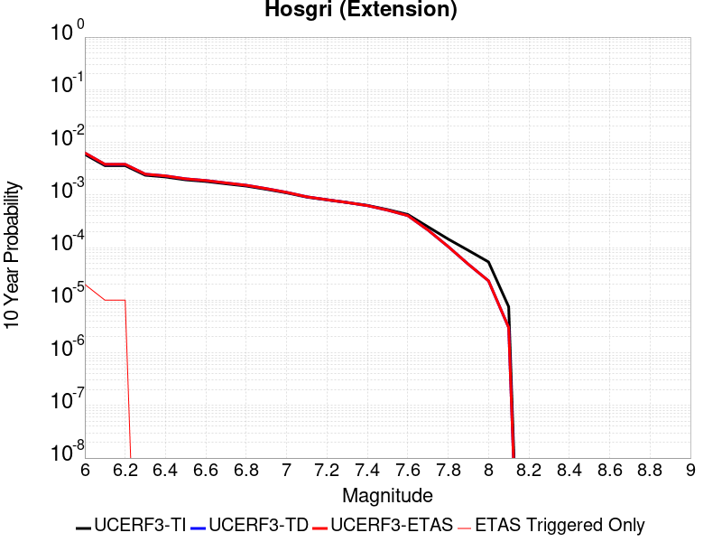 |

| Magnitude | 1 wk TI Prob | 1 wk TD Prob | 1 wk ETAS Prob | 1 wk ETAS/TD Gain | 1 wk ETAS Triggered Only | 1 mo TI Prob | 1 mo TD Prob | 1 mo ETAS Prob | 1 mo ETAS/TD Gain | 1 mo ETAS Triggered Only | 1 yr TI Prob | 1 yr TD Prob | 1 yr ETAS Prob | 1 yr ETAS/TD Gain | 1 yr ETAS Triggered Only | 10 yr TI Prob | 10 yr TD Prob | 10 yr ETAS Prob | 10 yr ETAS/TD Gain | 10 yr ETAS Triggered Only |
|-----|-----|-----|-----|-----|-----|-----|-----|-----|-----|-----|-----|-----|-----|-----|-----|-----|-----|-----|-----|-----|
| 6.0 | 1.1369135E-5 | 1.2083198E-5 | 1.2083198E-5 | 1.0 | 0.0 | 4.8723956E-5 | 5.1784238E-5 | 6.178372E-5 | 1.1930989 | 1.0E-5 | 5.9305265E-4 | 6.303134E-4 | 6.4030715E-4 | 1.0158551 | 1.0E-5 | 0.005914725 | 0.0062875054 | 0.00630738 | 1.003161 | 2.0E-5 |
| 6.1 | 6.934979E-6 | 7.3246356E-6 | 7.3246356E-6 | 1.0 | 0.0 | 2.9721E-5 | 3.139094E-5 | 3.139094E-5 | 1.0 | 0.0 | 3.617931E-4 | 3.8212183E-4 | 3.8212183E-4 | 1.0 | 0.0 | 0.0036120464 | 0.0038150605 | 0.0038250224 | 1.0026112 | 1.0E-5 |
| 6.2 | 6.934979E-6 | 7.3246356E-6 | 7.3246356E-6 | 1.0 | 0.0 | 2.9721E-5 | 3.139094E-5 | 3.139094E-5 | 1.0 | 0.0 | 3.617931E-4 | 3.8212183E-4 | 3.8212183E-4 | 1.0 | 0.0 | 0.0036120464 | 0.0038150605 | 0.0038250224 | 1.0026112 | 1.0E-5 |
| 6.3 | 4.5484676E-6 | 4.769387E-6 | 4.769387E-6 | 1.0 | 0.0 | 1.9493287E-5 | 2.0440071E-5 | 2.0440071E-5 | 1.0 | 0.0 | 2.3730492E-4 | 2.4882986E-4 | 2.4882986E-4 | 1.0 | 0.0 | 0.0023705168 | 0.0024855551 | 0.0024855551 | 1.0 | 0.0 |
| 6.4 | 4.218095E-6 | 4.416915E-6 | 4.416915E-6 | 1.0 | 0.0 | 1.8077424E-5 | 1.89295E-5 | 1.89295E-5 | 1.0 | 0.0 | 2.2007042E-4 | 2.3044262E-4 | 2.3044262E-4 | 1.0 | 0.0 | 0.002198526 | 0.0023020701 | 0.0023020701 | 1.0 | 0.0 |
| 6.5 | 3.717374E-6 | 3.8839266E-6 | 3.8839266E-6 | 1.0 | 0.0 | 1.5931506E-5 | 1.6645294E-5 | 1.6645294E-5 | 1.0 | 0.0 | 1.9394881E-4 | 2.0263779E-4 | 2.0263779E-4 | 1.0 | 0.0 | 0.0019377962 | 0.002024549 | 0.002024549 | 1.0 | 0.0 |
| 6.6 | 3.4605036E-6 | 3.6083522E-6 | 3.6083522E-6 | 1.0 | 0.0 | 1.4830645E-5 | 1.5464277E-5 | 1.5464277E-5 | 1.0 | 0.0 | 1.8054814E-4 | 1.8826143E-4 | 1.8826143E-4 | 1.0 | 0.0 | 0.0018040152 | 0.0018810342 | 0.0018810342 | 1.0 | 0.0 |
| 6.7 | 3.123439E-6 | 3.2466114E-6 | 3.2466114E-6 | 1.0 | 0.0 | 1.33860985E-5 | 1.3913976E-5 | 1.3913976E-5 | 1.0 | 0.0 | 1.6296357E-4 | 1.6938959E-4 | 1.6938959E-4 | 1.0 | 0.0 | 0.001628441 | 0.0016926157 | 0.0016926157 | 1.0 | 0.0 |
| 6.8 | 2.8290783E-6 | 2.93058E-6 | 2.93058E-6 | 1.0 | 0.0 | 1.2124565E-5 | 1.2559569E-5 | 1.2559569E-5 | 1.0 | 0.0 | 1.4760658E-4 | 1.529021E-4 | 1.529021E-4 | 1.0 | 0.0 | 0.0014750857 | 0.0015279776 | 0.0015279776 | 1.0 | 0.0 |
| 6.9 | 2.454112E-6 | 2.5283553E-6 | 2.5283553E-6 | 1.0 | 0.0 | 1.0517581E-5 | 1.08357635E-5 | 1.08357635E-5 | 1.0 | 0.0 | 1.2804402E-4 | 1.3191749E-4 | 1.3191749E-4 | 1.0 | 0.0 | 0.0012797028 | 0.001318398 | 0.001318398 | 1.0 | 0.0 |
| 7.0 | 2.1008145E-6 | 2.1499025E-6 | 2.1499025E-6 | 1.0 | 0.0 | 9.003459E-6 | 9.213836E-6 | 9.213836E-6 | 1.0 | 0.0 | 1.096116E-4 | 1.1217271E-4 | 1.1217271E-4 | 1.0 | 0.0 | 0.0010955755 | 0.0011211646 | 0.0011211646 | 1.0 | 0.0 |
| 7.1 | 1.744384E-6 | 1.7686639E-6 | 1.7686639E-6 | 1.0 | 0.0 | 7.47591E-6 | 7.579966E-6 | 7.579966E-6 | 1.0 | 0.0 | 9.1015405E-5 | 9.22822E-5 | 9.22822E-5 | 1.0 | 0.0 | 9.097813E-4 | 9.224405E-4 | 9.224405E-4 | 1.0 | 0.0 |
| 7.2 | 1.5456587E-6 | 1.556315E-6 | 1.556315E-6 | 1.0 | 0.0 | 6.6242346E-6 | 6.6699045E-6 | 6.6699045E-6 | 1.0 | 0.0 | 8.064707E-5 | 8.120307E-5 | 8.120307E-5 | 1.0 | 0.0 | 8.0617814E-4 | 8.117353E-4 | 8.117353E-4 | 1.0 | 0.0 |
| 7.3 | 1.3775123E-6 | 1.3766333E-6 | 1.3766333E-6 | 1.0 | 0.0 | 5.9036106E-6 | 5.899844E-6 | 5.899844E-6 | 1.0 | 0.0 | 7.187409E-5 | 7.182824E-5 | 7.182824E-5 | 1.0 | 0.0 | 7.185085E-4 | 7.180513E-4 | 7.180513E-4 | 1.0 | 0.0 |
| 7.4 | 1.214491E-6 | 1.2023696E-6 | 1.2023696E-6 | 1.0 | 0.0 | 5.2049513E-6 | 5.1530023E-6 | 5.1530023E-6 | 1.0 | 0.0 | 6.336844E-5 | 6.2736006E-5 | 6.2736006E-5 | 1.0 | 0.0 | 6.335037E-4 | 6.2718376E-4 | 6.2718376E-4 | 1.0 | 0.0 |
| 7.5 | 1.0101123E-6 | 9.842462E-7 | 9.842462E-7 | 1.0 | 0.0 | 4.3290456E-6 | 4.218191E-6 | 4.218191E-6 | 1.0 | 0.0 | 5.2704854E-5 | 5.135527E-5 | 5.135527E-5 | 1.0 | 0.0 | 5.2692357E-4 | 5.1343464E-4 | 5.1343464E-4 | 1.0 | 0.0 |
| 7.6 | 8.1558215E-7 | 7.7661633E-7 | 7.7661633E-7 | 1.0 | 0.0 | 3.4953473E-6 | 3.3283516E-6 | 3.3283516E-6 | 1.0 | 0.0 | 4.255502E-5 | 4.0521933E-5 | 4.0521933E-5 | 1.0 | 0.0 | 4.2546875E-4 | 4.0514587E-4 | 4.0514587E-4 | 1.0 | 0.0 |
| 7.7 | 4.757816E-7 | 4.1310525E-7 | 4.1310525E-7 | 1.0 | 0.0 | 2.0390623E-6 | 1.7704498E-6 | 1.7704498E-6 | 1.0 | 0.0 | 2.4825302E-5 | 2.1555015E-5 | 2.1555015E-5 | 1.0 | 0.0 | 2.482253E-4 | 2.1552936E-4 | 2.1552936E-4 | 1.0 | 0.0 |
| 7.8 | 2.782787E-7 | 2.0049143E-7 | 2.0049143E-7 | 1.0 | 0.0 | 1.1926223E-6 | 8.5924864E-7 | 8.5924864E-7 | 1.0 | 0.0 | 1.452008E-5 | 1.0461303E-5 | 1.0461303E-5 | 1.0 | 0.0 | 1.4519131E-4 | 1.0460813E-4 | 1.0460813E-4 | 1.0 | 0.0 |
| 7.9 | 1.6948086E-7 | 9.2455664E-8 | 9.2455664E-8 | 1.0 | 0.0 | 7.2634634E-7 | 3.9623848E-7 | 3.9623848E-7 | 1.0 | 0.0 | 8.843231E-6 | 4.824193E-6 | 4.824193E-6 | 1.0 | 0.0 | 8.842879E-5 | 4.824089E-5 | 4.824089E-5 | 1.0 | 0.0 |
| 8.0 | 1.0225492E-7 | 4.4748486E-8 | 4.4748486E-8 | 1.0 | 0.0 | 4.382353E-7 | 1.9177921E-7 | 1.9177921E-7 | 1.0 | 0.0 | 5.335502E-6 | 2.3349094E-6 | 2.3349094E-6 | 1.0 | 0.0 | 5.335374E-5 | 2.3348852E-5 | 2.3348852E-5 | 1.0 | 0.0 |
| 8.1 | 1.43711345E-8 | 5.789212E-9 | 5.789212E-9 | 1.0 | 0.0 | 6.1590576E-8 | 2.4810909E-8 | 2.4810909E-8 | 1.0 | 0.0 | 7.4986497E-7 | 3.0207278E-7 | 3.0207278E-7 | 1.0 | 0.0 | 7.4986247E-6 | 3.0207243E-6 | 3.0207243E-6 | 1.0 | 0.0 |

## Rinconada 2011 CFM
*[(top)](#table-of-contents)*

| 1 Week | 1 Month | 1 Year | 10 Year |
|-----|-----|-----|-----|
|  | 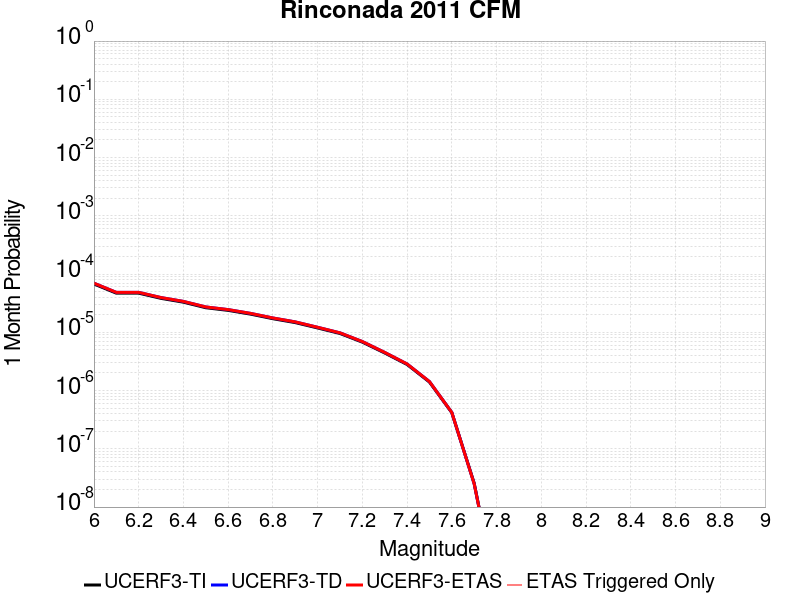 |  |  |

| Magnitude | 1 wk TI Prob | 1 wk TD Prob | 1 wk ETAS Prob | 1 wk ETAS/TD Gain | 1 wk ETAS Triggered Only | 1 mo TI Prob | 1 mo TD Prob | 1 mo ETAS Prob | 1 mo ETAS/TD Gain | 1 mo ETAS Triggered Only | 1 yr TI Prob | 1 yr TD Prob | 1 yr ETAS Prob | 1 yr ETAS/TD Gain | 1 yr ETAS Triggered Only | 10 yr TI Prob | 10 yr TD Prob | 10 yr ETAS Prob | 10 yr ETAS/TD Gain | 10 yr ETAS Triggered Only |
|-----|-----|-----|-----|-----|-----|-----|-----|-----|-----|-----|-----|-----|-----|-----|-----|-----|-----|-----|-----|-----|
| 6.0 | 1.5752368E-5 | 1.6274787E-5 | 1.6274787E-5 | 1.0 | 0.0 | 6.75084E-5 | 6.974724E-5 | 6.974724E-5 | 1.0 | 0.0 | 8.2160486E-4 | 8.48845E-4 | 8.48845E-4 | 1.0 | 0.0 | 0.008185739 | 0.008456407 | 0.008476238 | 1.0023451 | 2.0E-5 |
| 6.1 | 1.0966133E-5 | 1.1323078E-5 | 1.1323078E-5 | 1.0 | 0.0 | 4.6996865E-5 | 4.8526577E-5 | 4.8526577E-5 | 1.0 | 0.0 | 5.720366E-4 | 5.9065165E-4 | 5.9065165E-4 | 1.0 | 0.0 | 0.0057056635 | 0.0058909142 | 0.005900855 | 1.0016875 | 1.0E-5 |
| 6.2 | 1.0966133E-5 | 1.1323078E-5 | 1.1323078E-5 | 1.0 | 0.0 | 4.6996865E-5 | 4.8526577E-5 | 4.8526577E-5 | 1.0 | 0.0 | 5.720366E-4 | 5.9065165E-4 | 5.9065165E-4 | 1.0 | 0.0 | 0.0057056635 | 0.0058909142 | 0.005900855 | 1.0016875 | 1.0E-5 |
| 6.3 | 8.926149E-6 | 9.212811E-6 | 9.212811E-6 | 1.0 | 0.0 | 3.8254362E-5 | 3.9482882E-5 | 3.9482882E-5 | 1.0 | 0.0 | 4.6564735E-4 | 4.8059836E-4 | 4.8059836E-4 | 1.0 | 0.0 | 0.0046467283 | 0.004795635 | 0.004805587 | 1.0020752 | 1.0E-5 |
| 6.4 | 7.676955E-6 | 7.920225E-6 | 7.920225E-6 | 1.0 | 0.0 | 3.290082E-5 | 3.394338E-5 | 3.394338E-5 | 1.0 | 0.0 | 4.0049385E-4 | 4.1318245E-4 | 4.1318245E-4 | 1.0 | 0.0 | 0.0039977287 | 0.004124169 | 0.0041341274 | 1.0024147 | 1.0E-5 |
| 6.5 | 6.1671026E-6 | 6.3589814E-6 | 6.3589814E-6 | 1.0 | 0.0 | 2.6430173E-5 | 2.7252492E-5 | 2.7252492E-5 | 1.0 | 0.0 | 3.2173982E-4 | 3.3174866E-4 | 3.3174866E-4 | 1.0 | 0.0 | 0.003212744 | 0.0033125463 | 0.003322513 | 1.0030088 | 1.0E-5 |
| 6.6 | 5.553456E-6 | 5.7248362E-6 | 5.7248362E-6 | 1.0 | 0.0 | 2.3800309E-5 | 2.4534782E-5 | 2.4534782E-5 | 1.0 | 0.0 | 2.897302E-4 | 2.986701E-4 | 2.986701E-4 | 1.0 | 0.0 | 0.0028935277 | 0.0029826954 | 0.0029926656 | 1.0033426 | 1.0E-5 |
| 6.7 | 4.787857E-6 | 4.93333E-6 | 4.93333E-6 | 1.0 | 0.0 | 2.0519226E-5 | 2.114267E-5 | 2.114267E-5 | 1.0 | 0.0 | 2.4979294E-4 | 2.5738165E-4 | 2.5738165E-4 | 1.0 | 0.0 | 0.0024951235 | 0.0025708412 | 0.0025708412 | 1.0 | 0.0 |
| 6.8 | 3.9955166E-6 | 4.1134927E-6 | 4.1134927E-6 | 1.0 | 0.0 | 1.7123532E-5 | 1.7629134E-5 | 1.7629134E-5 | 1.0 | 0.0 | 2.0845905E-4 | 2.146136E-4 | 2.146136E-4 | 1.0 | 0.0 | 0.002082636 | 0.002144067 | 0.002144067 | 1.0 | 0.0 |
| 6.9 | 3.4250072E-6 | 3.5224598E-6 | 3.5224598E-6 | 1.0 | 0.0 | 1.46785205E-5 | 1.509617E-5 | 1.509617E-5 | 1.0 | 0.0 | 1.7869633E-4 | 1.8378037E-4 | 1.8378037E-4 | 1.0 | 0.0 | 0.001785527 | 0.0018362864 | 0.0018362864 | 1.0 | 0.0 |
| 7.0 | 2.7712713E-6 | 2.8467105E-6 | 2.8467105E-6 | 1.0 | 0.0 | 1.1876823E-5 | 1.2200131E-5 | 1.2200131E-5 | 1.0 | 0.0 | 1.4459073E-4 | 1.4852648E-4 | 1.4852648E-4 | 1.0 | 0.0 | 0.0014449668 | 0.0014842737 | 0.0014842737 | 1.0 | 0.0 |
| 7.1 | 2.227358E-6 | 2.2857066E-6 | 2.2857066E-6 | 1.0 | 0.0 | 9.545785E-6 | 9.795849E-6 | 9.795849E-6 | 1.0 | 0.0 | 1.16213734E-4 | 1.19257944E-4 | 1.19257944E-4 | 1.0 | 0.0 | 0.0011615298 | 0.0011919405 | 0.0011919405 | 1.0 | 0.0 |
| 7.2 | 1.581796E-6 | 1.6209067E-6 | 1.6209067E-6 | 1.0 | 0.0 | 6.779108E-6 | 6.9467246E-6 | 6.9467246E-6 | 1.0 | 0.0 | 8.253252E-5 | 8.457309E-5 | 8.457309E-5 | 1.0 | 0.0 | 8.250187E-4 | 8.4540964E-4 | 8.4540964E-4 | 1.0 | 0.0 |
| 7.3 | 1.0306567E-6 | 1.0546512E-6 | 1.0546512E-6 | 1.0 | 0.0 | 4.4170924E-6 | 4.519926E-6 | 4.519926E-6 | 1.0 | 0.0 | 5.3776774E-5 | 5.5028708E-5 | 5.5028708E-5 | 1.0 | 0.0 | 5.376376E-4 | 5.5015105E-4 | 5.5015105E-4 | 1.0 | 0.0 |
| 7.4 | 6.535541E-7 | 6.682764E-7 | 6.682764E-7 | 1.0 | 0.0 | 2.800943E-6 | 2.8640386E-6 | 2.8640386E-6 | 1.0 | 0.0 | 3.4100947E-5 | 3.4869114E-5 | 3.4869114E-5 | 1.0 | 0.0 | 3.4095717E-4 | 3.4863656E-4 | 3.4863656E-4 | 1.0 | 0.0 |
| 7.5 | 3.2656962E-7 | 3.33168E-7 | 3.33168E-7 | 1.0 | 0.0 | 1.3995833E-6 | 1.427862E-6 | 1.427862E-6 | 1.0 | 0.0 | 1.7039794E-5 | 1.7384082E-5 | 1.7384082E-5 | 1.0 | 0.0 | 1.7038487E-4 | 1.7382725E-4 | 1.7382725E-4 | 1.0 | 0.0 |
| 7.6 | 9.754343E-8 | 9.821022E-8 | 9.821022E-8 | 1.0 | 0.0 | 4.180432E-7 | 4.2090088E-7 | 4.2090088E-7 | 1.0 | 0.0 | 5.089664E-6 | 5.1244565E-6 | 5.1244565E-6 | 1.0 | 0.0 | 5.0895473E-5 | 5.124339E-5 | 5.124339E-5 | 1.0 | 0.0 |
| 7.7 | 6.0001453E-9 | 5.8490692E-9 | 5.8490692E-9 | 1.0 | 0.0 | 2.5714908E-8 | 2.506744E-8 | 2.506744E-8 | 1.0 | 0.0 | 3.1307894E-7 | 3.0519604E-7 | 3.0519604E-7 | 1.0 | 0.0 | 3.1307852E-6 | 3.0519564E-6 | 3.0519564E-6 | 1.0 | 0.0 |
| 7.8 | 7.400003E-11 | 7.4654505E-11 | 7.4654505E-11 | 1.0 | 0.0 | 3.171432E-10 | 3.1994807E-10 | 3.1994807E-10 | 1.0 | 0.0 | 3.861218E-9 | 3.8953676E-9 | 3.8953676E-9 | 1.0 | 0.0 | 3.861218E-8 | 3.8953676E-8 | 3.8953676E-8 | 1.0 | 0.0 |

## San Andreas (Peninsula) 2011 CFM
*[(top)](#table-of-contents)*

| 1 Week | 1 Month | 1 Year | 10 Year |
|-----|-----|-----|-----|
|  |  |  |  |

| Magnitude | 1 wk TI Prob | 1 wk TD Prob | 1 wk ETAS Prob | 1 wk ETAS/TD Gain | 1 wk ETAS Triggered Only | 1 mo TI Prob | 1 mo TD Prob | 1 mo ETAS Prob | 1 mo ETAS/TD Gain | 1 mo ETAS Triggered Only | 1 yr TI Prob | 1 yr TD Prob | 1 yr ETAS Prob | 1 yr ETAS/TD Gain | 1 yr ETAS Triggered Only | 10 yr TI Prob | 10 yr TD Prob | 10 yr ETAS Prob | 10 yr ETAS/TD Gain | 10 yr ETAS Triggered Only |
|-----|-----|-----|-----|-----|-----|-----|-----|-----|-----|-----|-----|-----|-----|-----|-----|-----|-----|-----|-----|-----|
| 6.0 | 8.6200685E-5 | 2.524507E-5 | 2.524507E-5 | 1.0 | 0.0 | 3.6937918E-4 | 1.0818867E-4 | 1.1818759E-4 | 1.0924212 | 1.0E-5 | 0.0044879215 | 0.0013164028 | 0.0013263897 | 1.0075865 | 1.0E-5 | 0.043983612 | 0.014791247 | 0.014810951 | 1.0013322 | 2.0E-5 |
| 6.1 | 8.6200685E-5 | 2.524507E-5 | 2.524507E-5 | 1.0 | 0.0 | 3.6937918E-4 | 1.0818867E-4 | 1.1818759E-4 | 1.0924212 | 1.0E-5 | 0.0044879215 | 0.0013164028 | 0.0013263897 | 1.0075865 | 1.0E-5 | 0.043983612 | 0.014791247 | 0.014810951 | 1.0013322 | 2.0E-5 |
| 6.2 | 8.6200685E-5 | 2.524507E-5 | 2.524507E-5 | 1.0 | 0.0 | 3.6937918E-4 | 1.0818867E-4 | 1.1818759E-4 | 1.0924212 | 1.0E-5 | 0.0044879215 | 0.0013164028 | 0.0013263897 | 1.0075865 | 1.0E-5 | 0.043983612 | 0.014791247 | 0.014810951 | 1.0013322 | 2.0E-5 |
| 6.3 | 8.551163E-5 | 2.4936822E-5 | 2.4936822E-5 | 1.0 | 0.0 | 3.6642692E-4 | 1.0686772E-4 | 1.1686666E-4 | 1.0935637 | 1.0E-5 | 0.004452125 | 0.0013003396 | 0.0013103266 | 1.0076803 | 1.0E-5 | 0.043639794 | 0.0146181425 | 0.01463785 | 1.0013481 | 2.0E-5 |
| 6.4 | 8.551163E-5 | 2.4936822E-5 | 2.4936822E-5 | 1.0 | 0.0 | 3.6642692E-4 | 1.0686772E-4 | 1.1686666E-4 | 1.0935637 | 1.0E-5 | 0.004452125 | 0.0013003396 | 0.0013103266 | 1.0076803 | 1.0E-5 | 0.043639794 | 0.0146181425 | 0.01463785 | 1.0013481 | 2.0E-5 |
| 6.5 | 8.511146E-5 | 2.475818E-5 | 2.475818E-5 | 1.0 | 0.0 | 3.647124E-4 | 1.06102176E-4 | 1.1610112E-4 | 1.0942388 | 1.0E-5 | 0.004431336 | 0.0012910301 | 0.0013010172 | 1.0077357 | 1.0E-5 | 0.04344007 | 0.014517873 | 0.014537582 | 1.0013576 | 2.0E-5 |
| 6.6 | 8.4985084E-5 | 2.4688785E-5 | 2.4688785E-5 | 1.0 | 0.0 | 3.6417096E-4 | 1.0580479E-4 | 1.15803734E-4 | 1.0945036 | 1.0E-5 | 0.0044247704 | 0.0012874138 | 0.0012974009 | 1.0077575 | 1.0E-5 | 0.043376986 | 0.014479927 | 0.014499636 | 1.0013613 | 2.0E-5 |
| 6.7 | 8.462618E-5 | 2.4517209E-5 | 2.4517209E-5 | 1.0 | 0.0 | 3.6263323E-4 | 1.0506953E-4 | 1.1506848E-4 | 1.0951651 | 1.0E-5 | 0.004406125 | 0.0012784725 | 0.0012884596 | 1.0078118 | 1.0E-5 | 0.043197807 | 0.0143846935 | 0.014404406 | 1.0013703 | 2.0E-5 |
| 6.8 | 8.42337E-5 | 2.4412951E-5 | 2.4412951E-5 | 1.0 | 0.0 | 3.6095164E-4 | 1.0462274E-4 | 1.146217E-4 | 1.0955715 | 1.0E-5 | 0.004385734 | 0.0012730393 | 0.0012830265 | 1.0078452 | 1.0E-5 | 0.043001823 | 0.014325344 | 0.014345057 | 1.0013762 | 2.0E-5 |
| 6.9 | 8.365989E-5 | 2.4217456E-5 | 2.4217456E-5 | 1.0 | 0.0 | 3.5849313E-4 | 1.0378498E-4 | 1.1378394E-4 | 1.096343 | 1.0E-5 | 0.004355922 | 0.0012628513 | 0.0012728387 | 1.0079086 | 1.0E-5 | 0.04271523 | 0.014217783 | 0.014237498 | 1.0013866 | 2.0E-5 |
| 7.0 | 8.30936E-5 | 2.397886E-5 | 2.397886E-5 | 1.0 | 0.0 | 3.560668E-4 | 1.0276251E-4 | 1.1276148E-4 | 1.0973017 | 1.0E-5 | 0.004326499 | 0.0012504171 | 0.0012604046 | 1.0079874 | 1.0E-5 | 0.042432297 | 0.014088726 | 0.014108444 | 1.0013995 | 2.0E-5 |
| 7.1 | 8.041264E-5 | 2.3665085E-5 | 2.3665085E-5 | 1.0 | 0.0 | 3.4458007E-4 | 1.01417856E-4 | 1.1141684E-4 | 1.0985919 | 1.0E-5 | 0.0041871946 | 0.0012340646 | 0.0012440522 | 1.0080934 | 1.0E-5 | 0.041091725 | 0.013911423 | 0.013931145 | 1.0014176 | 2.0E-5 |
| 7.2 | 7.8427016E-5 | 2.3088463E-5 | 2.3088463E-5 | 1.0 | 0.0 | 3.3607247E-4 | 9.894681E-5 | 1.08945824E-4 | 1.1010544 | 1.0E-5 | 0.004084008 | 0.0012040132 | 0.0012140012 | 1.0082955 | 1.0E-5 | 0.040097635 | 0.013595347 | 0.0136150755 | 1.0014511 | 2.0E-5 |
| 7.3 | 7.721087E-5 | 2.2873175E-5 | 2.2873175E-5 | 1.0 | 0.0 | 3.3086175E-4 | 9.802422E-5 | 1.0802323E-4 | 1.1020056 | 1.0E-5 | 0.004020803 | 0.001192793 | 0.0012027811 | 1.0083737 | 1.0E-5 | 0.03948827 | 0.013479002 | 0.013498733 | 1.0014638 | 2.0E-5 |
| 7.4 | 7.3536525E-5 | 2.09874E-5 | 2.09874E-5 | 1.0 | 0.0 | 3.1511846E-4 | 8.994291E-5 | 9.994201E-5 | 1.1111716 | 1.0E-5 | 0.0038298194 | 0.001094506 | 0.0011044951 | 1.0091265 | 1.0E-5 | 0.037644852 | 0.012434178 | 0.012453929 | 1.0015885 | 2.0E-5 |
| 7.5 | 6.806207E-5 | 1.8789417E-5 | 1.8789417E-5 | 1.0 | 0.0 | 2.9166197E-4 | 8.052359E-5 | 9.052278E-5 | 1.1241772 | 1.0E-5 | 0.0035452035 | 9.799348E-4 | 9.89925E-4 | 1.0101948 | 1.0E-5 | 0.034891766 | 0.01118501 | 0.011204787 | 1.0017681 | 2.0E-5 |
| 7.6 | 5.6731416E-5 | 1.4192163E-5 | 1.4192163E-5 | 1.0 | 0.0 | 2.43112E-4 | 6.0822138E-5 | 7.082153E-5 | 1.1644038 | 1.0E-5 | 0.0029558712 | 7.402581E-4 | 7.5025065E-4 | 1.0134988 | 1.0E-5 | 0.02916862 | 0.008493701 | 0.008513532 | 1.0023347 | 2.0E-5 |
| 7.7 | 4.946994E-5 | 1.3259149E-5 | 1.3259149E-5 | 1.0 | 0.0 | 2.1199681E-4 | 5.6823683E-5 | 6.6823115E-5 | 1.1759729 | 1.0E-5 | 0.002578006 | 6.916089E-4 | 7.0160197E-4 | 1.014449 | 1.0E-5 | 0.02548303 | 0.00791523 | 0.007935071 | 1.0025067 | 2.0E-5 |
| 7.8 | 3.9718198E-5 | 1.2994879E-5 | 1.2994879E-5 | 1.0 | 0.0 | 1.7020974E-4 | 5.569115E-5 | 6.569059E-5 | 1.1795517 | 1.0E-5 | 0.0020703338 | 6.7782897E-4 | 6.878222E-4 | 1.014743 | 1.0E-5 | 0.020511515 | 0.0077253943 | 0.00774524 | 1.0025688 | 2.0E-5 |
| 7.9 | 2.4115114E-5 | 1.2196366E-5 | 1.2196366E-5 | 1.0 | 0.0 | 1.0334639E-4 | 5.2269093E-5 | 6.226857E-5 | 1.1913077 | 1.0E-5 | 0.001257516 | 6.361905E-4 | 6.4618414E-4 | 1.0157086 | 1.0E-5 | 0.012504238 | 0.00716491 | 0.0071847662 | 1.0027714 | 2.0E-5 |
| 8.0 | 1.7756569E-5 | 1.1419774E-5 | 1.1419774E-5 | 1.0 | 0.0 | 7.6097356E-5 | 4.894097E-5 | 5.8940477E-5 | 1.2043178 | 1.0E-5 | 9.260915E-4 | 5.9569353E-4 | 6.0568756E-4 | 1.0167772 | 1.0E-5 | 0.009222416 | 0.0066647492 | 0.0066846157 | 1.0029808 | 2.0E-5 |
| 8.1 | 1.3159258E-5 | 9.754468E-6 | 9.754468E-6 | 1.0 | 0.0 | 5.6395602E-5 | 4.1804193E-5 | 5.1803774E-5 | 1.2392005 | 1.0E-5 | 6.864001E-4 | 5.088473E-4 | 5.188422E-4 | 1.0196422 | 1.0E-5 | 0.0068428386 | 0.0056939903 | 0.0057138763 | 1.0034925 | 2.0E-5 |
| 8.2 | 8.635426E-6 | 5.4718944E-6 | 5.4718944E-6 | 1.0 | 0.0 | 3.700844E-5 | 2.3450766E-5 | 2.3450766E-5 | 1.0 | 0.0 | 4.5048463E-4 | 2.8547575E-4 | 2.8547575E-4 | 1.0 | 0.0 | 0.004495725 | 0.0032472247 | 0.0032472247 | 1.0 | 0.0 |
| 8.3 | 1.983087E-6 | 7.668296E-7 | 7.668296E-7 | 1.0 | 0.0 | 8.498917E-6 | 3.2864084E-6 | 3.2864084E-6 | 1.0 | 0.0 | 1.034694E-4 | 4.0011306E-5 | 4.0011306E-5 | 1.0 | 0.0 | 0.0010342124 | 4.724499E-4 | 4.724499E-4 | 1.0 | 0.0 |

## Elsinore (Coyote Mountains)
*[(top)](#table-of-contents)*

| 1 Week | 1 Month | 1 Year | 10 Year |
|-----|-----|-----|-----|
|  |  | 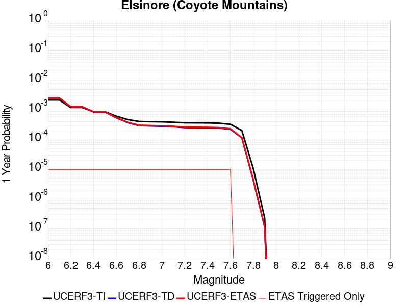 |  |

| Magnitude | 1 wk TI Prob | 1 wk TD Prob | 1 wk ETAS Prob | 1 wk ETAS/TD Gain | 1 wk ETAS Triggered Only | 1 mo TI Prob | 1 mo TD Prob | 1 mo ETAS Prob | 1 mo ETAS/TD Gain | 1 mo ETAS Triggered Only | 1 yr TI Prob | 1 yr TD Prob | 1 yr ETAS Prob | 1 yr ETAS/TD Gain | 1 yr ETAS Triggered Only | 10 yr TI Prob | 10 yr TD Prob | 10 yr ETAS Prob | 10 yr ETAS/TD Gain | 10 yr ETAS Triggered Only |
|-----|-----|-----|-----|-----|-----|-----|-----|-----|-----|-----|-----|-----|-----|-----|-----|-----|-----|-----|-----|-----|
| 6.0 | 4.20513E-5 | 4.8633563E-5 | 4.8633563E-5 | 1.0 | 0.0 | 1.8020741E-4 | 2.0841615E-4 | 2.1841406E-4 | 1.0479709 | 1.0E-5 | 0.0021918174 | 0.0025350873 | 0.002545062 | 1.0039346 | 1.0E-5 | 0.021703249 | 0.025112117 | 0.025131615 | 1.0007764 | 2.0E-5 |
| 6.1 | 4.20513E-5 | 4.8633563E-5 | 4.8633563E-5 | 1.0 | 0.0 | 1.8020741E-4 | 2.0841615E-4 | 2.1841406E-4 | 1.0479709 | 1.0E-5 | 0.0021918174 | 0.0025350873 | 0.002545062 | 1.0039346 | 1.0E-5 | 0.021703249 | 0.025112117 | 0.025131615 | 1.0007764 | 2.0E-5 |
| 6.2 | 2.3413893E-5 | 2.4696421E-5 | 2.4696421E-5 | 1.0 | 0.0 | 1.0034139E-4 | 1.0583805E-4 | 1.1583699E-4 | 1.094474 | 1.0E-5 | 0.0012209718 | 0.0012879103 | 0.0012978973 | 1.0077546 | 1.0E-5 | 0.012142851 | 0.012813029 | 0.0128229 | 1.0007704 | 1.0E-5 |
| 6.3 | 2.3413893E-5 | 2.4696421E-5 | 2.4696421E-5 | 1.0 | 0.0 | 1.0034139E-4 | 1.0583805E-4 | 1.1583699E-4 | 1.094474 | 1.0E-5 | 0.0012209718 | 0.0012879103 | 0.0012978973 | 1.0077546 | 1.0E-5 | 0.012142851 | 0.012813029 | 0.0128229 | 1.0007704 | 1.0E-5 |
| 6.4 | 1.6894814E-5 | 1.6568854E-5 | 1.6568854E-5 | 1.0 | 0.0 | 7.240433E-5 | 7.100766E-5 | 8.100695E-5 | 1.1408199 | 1.0E-5 | 8.811662E-4 | 8.6421217E-4 | 8.742035E-4 | 1.0115613 | 1.0E-5 | 0.0087768035 | 0.008612194 | 0.008622108 | 1.0011511 | 1.0E-5 |
| 6.5 | 1.6894814E-5 | 1.6568854E-5 | 1.6568854E-5 | 1.0 | 0.0 | 7.240433E-5 | 7.100766E-5 | 8.100695E-5 | 1.1408199 | 1.0E-5 | 8.811662E-4 | 8.6421217E-4 | 8.742035E-4 | 1.0115613 | 1.0E-5 | 0.0087768035 | 0.008612194 | 0.008622108 | 1.0011511 | 1.0E-5 |
| 6.6 | 1.1910969E-5 | 1.05310955E-5 | 1.05310955E-5 | 1.0 | 0.0 | 5.1046012E-5 | 4.513256E-5 | 5.513211E-5 | 1.2215595 | 1.0E-5 | 6.21308E-4 | 5.4936187E-4 | 5.593564E-4 | 1.0181929 | 1.0E-5 | 0.0061957375 | 0.0054813414 | 0.0054912865 | 1.0018144 | 1.0E-5 |
| 6.7 | 9.1486E-6 | 7.2030907E-6 | 7.2030907E-6 | 1.0 | 0.0 | 3.9207694E-5 | 3.0870044E-5 | 4.0869738E-5 | 1.3239286 | 1.0E-5 | 4.7724912E-4 | 3.757818E-4 | 3.8577805E-4 | 1.0266012 | 1.0E-5 | 0.0047622547 | 0.0037518432 | 0.0037618056 | 1.0026554 | 1.0E-5 |
| 6.8 | 7.90441E-6 | 5.7292227E-6 | 5.7292227E-6 | 1.0 | 0.0 | 3.3875604E-5 | 2.4553588E-5 | 3.4553344E-5 | 1.4072624 | 1.0E-5 | 4.1235742E-4 | 2.989002E-4 | 3.0889723E-4 | 1.033446 | 1.0E-5 | 0.0041159308 | 0.0029851105 | 0.0029950808 | 1.00334 | 1.0E-5 |
| 6.9 | 7.77015E-6 | 5.5831756E-6 | 5.5831756E-6 | 1.0 | 0.0 | 3.3300217E-5 | 2.3927683E-5 | 3.3927445E-5 | 1.4179159 | 1.0E-5 | 4.0535472E-4 | 2.9128187E-4 | 3.0127895E-4 | 1.034321 | 1.0E-5 | 0.004046161 | 0.0029091279 | 0.0029190986 | 1.0034275 | 1.0E-5 |
| 7.0 | 7.675798E-6 | 5.480033E-6 | 5.480033E-6 | 1.0 | 0.0 | 3.289586E-5 | 2.348565E-5 | 3.3485416E-5 | 1.425782 | 1.0E-5 | 4.004335E-4 | 2.8590154E-4 | 2.9589867E-4 | 1.0349671 | 1.0E-5 | 0.003997127 | 0.0028554637 | 0.0028654353 | 1.0034921 | 1.0E-5 |
| 7.1 | 7.447814E-6 | 5.2389046E-6 | 5.2389046E-6 | 1.0 | 0.0 | 3.191881E-5 | 2.2452263E-5 | 3.2452037E-5 | 1.4453794 | 1.0E-5 | 3.8854225E-4 | 2.7332324E-4 | 2.8332052E-4 | 1.0365767 | 1.0E-5 | 0.003878636 | 0.0027299952 | 0.002739968 | 1.003653 | 1.0E-5 |
| 7.2 | 7.128185E-6 | 4.9055616E-6 | 4.9055616E-6 | 1.0 | 0.0 | 3.0549007E-5 | 2.1023672E-5 | 3.102346E-5 | 1.4756444 | 1.0E-5 | 3.7187067E-4 | 2.5593434E-4 | 2.6593177E-4 | 1.0390625 | 1.0E-5 | 0.00371249 | 0.0025565142 | 0.0025664887 | 1.0039016 | 1.0E-5 |
| 7.3 | 7.0913875E-6 | 4.8742363E-6 | 4.8742363E-6 | 1.0 | 0.0 | 3.0391306E-5 | 2.0889423E-5 | 3.0889216E-5 | 1.4787011 | 1.0E-5 | 3.6995133E-4 | 2.5430025E-4 | 2.642977E-4 | 1.0393136 | 1.0E-5 | 0.0036933604 | 0.0025402107 | 0.0025501852 | 1.0039266 | 1.0E-5 |
| 7.4 | 7.051521E-6 | 4.8380875E-6 | 4.8380875E-6 | 1.0 | 0.0 | 3.0220453E-5 | 2.0734502E-5 | 3.0734296E-5 | 1.482278 | 1.0E-5 | 3.6787192E-4 | 2.524145E-4 | 2.6241198E-4 | 1.0396074 | 1.0E-5 | 0.0036726352 | 0.0025213964 | 0.002531371 | 1.0039561 | 1.0E-5 |
| 7.5 | 6.910666E-6 | 4.7336343E-6 | 4.7336343E-6 | 1.0 | 0.0 | 2.9616802E-5 | 2.0286852E-5 | 3.028665E-5 | 1.49292 | 1.0E-5 | 3.605249E-4 | 2.4696562E-4 | 2.5696316E-4 | 1.0404814 | 1.0E-5 | 0.0035994058 | 0.0024670297 | 0.002477005 | 1.0040435 | 1.0E-5 |
| 7.6 | 6.341753E-6 | 4.3067316E-6 | 4.3067316E-6 | 1.0 | 0.0 | 2.7178658E-5 | 1.8457298E-5 | 2.8457114E-5 | 1.5417811 | 1.0E-5 | 3.3084993E-4 | 2.246956E-4 | 2.3469335E-4 | 1.0444946 | 1.0E-5 | 0.0033035777 | 0.0022447994 | 0.002254777 | 1.0044447 | 1.0E-5 |
| 7.7 | 3.9205916E-6 | 2.2440495E-6 | 2.2440495E-6 | 1.0 | 0.0 | 1.6802427E-5 | 9.6173235E-6 | 9.6173235E-6 | 1.0 | 0.0 | 2.0455034E-4 | 1.1708537E-4 | 1.1708537E-4 | 1.0 | 0.0 | 0.0020436216 | 0.0011703098 | 0.0011703098 | 1.0 | 0.0 |
| 7.8 | 2.0846227E-7 | 8.4868525E-8 | 8.4868525E-8 | 1.0 | 0.0 | 8.9340944E-7 | 3.6372222E-7 | 3.6372222E-7 | 1.0 | 0.0 | 1.0877206E-5 | 4.4283124E-6 | 4.4283124E-6 | 1.0 | 0.0 | 1.0876673E-4 | 4.4282566E-5 | 4.4282566E-5 | 1.0 | 0.0 |
| 7.9 | 4.4969806E-9 | 2.2692683E-9 | 2.2692683E-9 | 1.0 | 0.0 | 1.9272775E-8 | 9.725436E-9 | 9.725436E-9 | 1.0 | 0.0 | 2.3464601E-7 | 1.1840718E-7 | 1.1840718E-7 | 1.0 | 0.0 | 2.3464577E-6 | 1.1840713E-6 | 1.1840713E-6 | 1.0 | 0.0 |

## Hayward (So) 2011 CFM
*[(top)](#table-of-contents)*

| 1 Week | 1 Month | 1 Year | 10 Year |
|-----|-----|-----|-----|
|  |  |  | 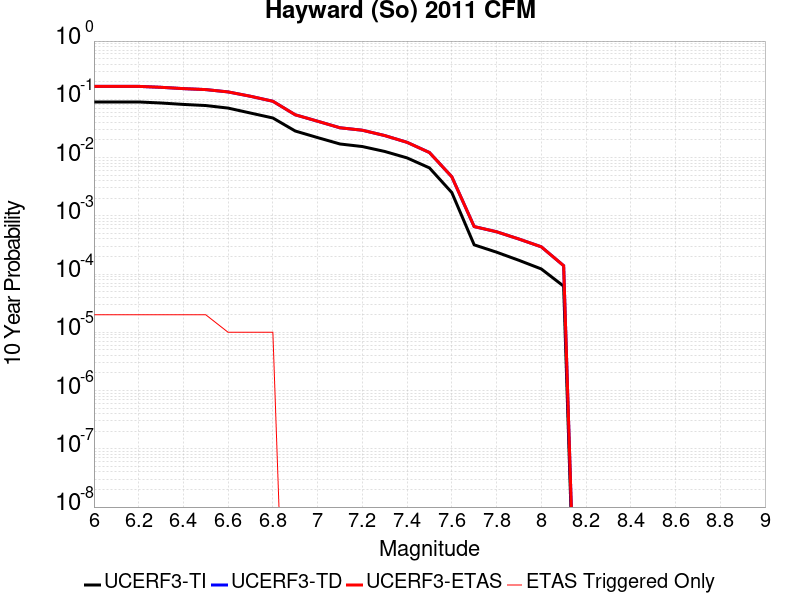 |

| Magnitude | 1 wk TI Prob | 1 wk TD Prob | 1 wk ETAS Prob | 1 wk ETAS/TD Gain | 1 wk ETAS Triggered Only | 1 mo TI Prob | 1 mo TD Prob | 1 mo ETAS Prob | 1 mo ETAS/TD Gain | 1 mo ETAS Triggered Only | 1 yr TI Prob | 1 yr TD Prob | 1 yr ETAS Prob | 1 yr ETAS/TD Gain | 1 yr ETAS Triggered Only | 10 yr TI Prob | 10 yr TD Prob | 10 yr ETAS Prob | 10 yr ETAS/TD Gain | 10 yr ETAS Triggered Only |
|-----|-----|-----|-----|-----|-----|-----|-----|-----|-----|-----|-----|-----|-----|-----|-----|-----|-----|-----|-----|-----|
| 6.0 | 1.8091932E-4 | 3.5709047E-4 | 3.5709047E-4 | 1.0 | 0.0 | 7.751381E-4 | 0.0015295 | 0.0015295 | 1.0 | 0.0 | 0.00939654 | 0.018465072 | 0.018474888 | 1.0005316 | 1.0E-5 | 0.090090066 | 0.1667456 | 0.16676226 | 1.0000999 | 2.0E-5 |
| 6.1 | 1.8091932E-4 | 3.5709047E-4 | 3.5709047E-4 | 1.0 | 0.0 | 7.751381E-4 | 0.0015295 | 0.0015295 | 1.0 | 0.0 | 0.00939654 | 0.018465072 | 0.018474888 | 1.0005316 | 1.0E-5 | 0.090090066 | 0.1667456 | 0.16676226 | 1.0000999 | 2.0E-5 |
| 6.2 | 1.8091932E-4 | 3.5709047E-4 | 3.5709047E-4 | 1.0 | 0.0 | 7.751381E-4 | 0.0015295 | 0.0015295 | 1.0 | 0.0 | 0.00939654 | 0.018465072 | 0.018474888 | 1.0005316 | 1.0E-5 | 0.090090066 | 0.1667456 | 0.16676226 | 1.0000999 | 2.0E-5 |
| 6.3 | 1.7322872E-4 | 3.426588E-4 | 3.426588E-4 | 1.0 | 0.0 | 7.4219756E-4 | 0.001467721 | 0.001467721 | 1.0 | 0.0 | 0.0089988755 | 0.017725362 | 0.017735183 | 1.0005542 | 1.0E-5 | 0.08643075 | 0.16068102 | 0.1606978 | 1.0001044 | 2.0E-5 |
| 6.4 | 1.6334097E-4 | 3.2347543E-4 | 3.2347543E-4 | 1.0 | 0.0 | 6.998449E-4 | 0.0013855953 | 0.0013855953 | 1.0 | 0.0 | 0.008487372 | 0.016741147 | 0.01675098 | 1.0005873 | 1.0E-5 | 0.081704415 | 0.15256941 | 0.15258636 | 1.0001111 | 2.0E-5 |
| 6.5 | 1.5600289E-4 | 3.1022163E-4 | 3.1022163E-4 | 1.0 | 0.0 | 6.684125E-4 | 0.0013288521 | 0.0013288521 | 1.0 | 0.0 | 0.008107598 | 0.016060648 | 0.016070487 | 1.0006126 | 1.0E-5 | 0.078181036 | 0.1468459 | 0.14686297 | 1.0001162 | 2.0E-5 |
| 6.6 | 1.4046066E-4 | 2.803607E-4 | 2.803607E-4 | 1.0 | 0.0 | 6.018354E-4 | 0.0012009992 | 0.0012009992 | 1.0 | 0.0 | 0.0073027555 | 0.014525633 | 0.014535488 | 1.0006784 | 1.0E-5 | 0.07067384 | 0.13393258 | 0.13394123 | 1.0000646 | 1.0E-5 |
| 6.7 | 1.14696966E-4 | 2.327433E-4 | 2.327433E-4 | 1.0 | 0.0 | 4.914658E-4 | 9.970951E-4 | 9.970951E-4 | 1.0 | 0.0 | 0.0059671924 | 0.012073125 | 0.012083004 | 1.0008183 | 1.0E-5 | 0.058094822 | 0.11275855 | 0.11276742 | 1.0000787 | 1.0E-5 |
| 6.8 | 9.3874296E-5 | 1.8863835E-4 | 1.8863835E-4 | 1.0 | 0.0 | 4.0225635E-4 | 8.082033E-4 | 8.082033E-4 | 1.0 | 0.0 | 0.0048864787 | 0.009796215 | 0.009806117 | 1.0010108 | 1.0E-5 | 0.047804173 | 0.092608735 | 0.09261781 | 1.000098 | 1.0E-5 |
| 6.9 | 5.551852E-5 | 1.0731048E-4 | 1.0731048E-4 | 1.0 | 0.0 | 2.3791482E-4 | 4.598216E-4 | 4.598216E-4 | 1.0 | 0.0 | 0.0028927654 | 0.005584076 | 0.005584076 | 1.0 | 0.0 | 0.028553981 | 0.054252647 | 0.054252647 | 1.0 | 0.0 |
| 7.0 | 4.2662363E-5 | 8.2477156E-5 | 8.2477156E-5 | 1.0 | 0.0 | 1.8282588E-4 | 3.5342603E-4 | 3.5342603E-4 | 1.0 | 0.0 | 0.0022236328 | 0.0042945454 | 0.0042945454 | 1.0 | 0.0 | 0.022015138 | 0.042070437 | 0.042070437 | 1.0 | 0.0 |
| 7.1 | 3.305886E-5 | 6.3029416E-5 | 6.3029416E-5 | 1.0 | 0.0 | 1.4167312E-4 | 2.7009821E-4 | 2.7009821E-4 | 1.0 | 0.0 | 0.0017235056 | 0.0032835058 | 0.0032835058 | 1.0 | 0.0 | 0.017101998 | 0.032457817 | 0.032457817 | 1.0 | 0.0 |
| 7.2 | 2.9856887E-5 | 5.702347E-5 | 5.702347E-5 | 1.0 | 0.0 | 1.2795182E-4 | 2.443635E-4 | 2.443635E-4 | 1.0 | 0.0 | 0.0015567001 | 0.0029710834 | 0.0029710834 | 1.0 | 0.0 | 0.015458403 | 0.029458297 | 0.029458297 | 1.0 | 0.0 |
| 7.3 | 2.4559737E-5 | 4.599918E-5 | 4.599918E-5 | 1.0 | 0.0 | 1.0525176E-4 | 1.9712451E-4 | 1.9712451E-4 | 1.0 | 0.0 | 0.0012806869 | 0.0023973624 | 0.0023973624 | 1.0 | 0.0 | 0.012733313 | 0.023861503 | 0.023861503 | 1.0 | 0.0 |
| 7.4 | 1.9002231E-5 | 3.505627E-5 | 3.505627E-5 | 1.0 | 0.0 | 8.143559E-5 | 1.5023256E-4 | 1.5023256E-4 | 1.0 | 0.0 | 9.910273E-4 | 0.0018275568 | 0.0018275568 | 1.0 | 0.0 | 0.009866194 | 0.018261688 | 0.018261688 | 1.0 | 0.0 |
| 7.5 | 1.2783333E-5 | 2.333344E-5 | 2.333344E-5 | 1.0 | 0.0 | 5.4784563E-5 | 9.999665E-5 | 9.999665E-5 | 1.0 | 0.0 | 6.667979E-4 | 0.001216785 | 0.001216785 | 1.0 | 0.0 | 0.006648007 | 0.012211235 | 0.012211235 | 1.0 | 0.0 |
| 7.6 | 4.8149627E-6 | 8.889109E-6 | 8.889109E-6 | 1.0 | 0.0 | 2.063539E-5 | 3.8095633E-5 | 3.8095633E-5 | 1.0 | 0.0 | 2.5120692E-4 | 4.6371686E-4 | 4.6371686E-4 | 1.0 | 0.0 | 0.0025092314 | 0.0046820138 | 0.0046820138 | 1.0 | 0.0 |
| 7.7 | 6.0838227E-7 | 1.2062297E-6 | 1.2062297E-6 | 1.0 | 0.0 | 2.6073499E-6 | 5.1695456E-6 | 5.1695456E-6 | 1.0 | 0.0 | 3.174402E-5 | 6.2937404E-5 | 6.2937404E-5 | 1.0 | 0.0 | 3.1739488E-4 | 6.5320614E-4 | 6.5320614E-4 | 1.0 | 0.0 |
| 7.8 | 4.5542808E-7 | 9.797042E-7 | 9.797042E-7 | 1.0 | 0.0 | 1.9518332E-6 | 4.1987255E-6 | 4.1987255E-6 | 1.0 | 0.0 | 2.376331E-5 | 5.1118284E-5 | 5.1118284E-5 | 1.0 | 0.0 | 2.3760769E-4 | 5.3237256E-4 | 5.3237256E-4 | 1.0 | 0.0 |
| 7.9 | 3.3016747E-7 | 7.389937E-7 | 7.389937E-7 | 1.0 | 0.0 | 1.4150027E-6 | 3.1671123E-6 | 3.1671123E-6 | 1.0 | 0.0 | 1.7227521E-5 | 3.8558912E-5 | 3.8558912E-5 | 1.0 | 0.0 | 1.7226185E-4 | 3.9948142E-4 | 3.9948142E-4 | 1.0 | 0.0 |
| 8.0 | 2.347038E-7 | 5.474045E-7 | 5.474045E-7 | 1.0 | 0.0 | 1.0058731E-6 | 2.3460173E-6 | 2.3460173E-6 | 1.0 | 0.0 | 1.2246436E-5 | 2.8562388E-5 | 2.8562388E-5 | 1.0 | 0.0 | 1.2245761E-4 | 2.9367572E-4 | 2.9367572E-4 | 1.0 | 0.0 |
| 8.1 | 1.18822804E-7 | 2.6070907E-7 | 2.6070907E-7 | 1.0 | 0.0 | 5.092405E-7 | 1.1173241E-6 | 1.1173241E-6 | 1.0 | 0.0 | 6.1999854E-6 | 1.3603338E-5 | 1.3603338E-5 | 1.0 | 0.0 | 6.199812E-5 | 1.3923709E-4 | 1.3923709E-4 | 1.0 | 0.0 |

## Great Valley 07 (Orestimba)
*[(top)](#table-of-contents)*

| 1 Week | 1 Month | 1 Year | 10 Year |
|-----|-----|-----|-----|
|  |  | 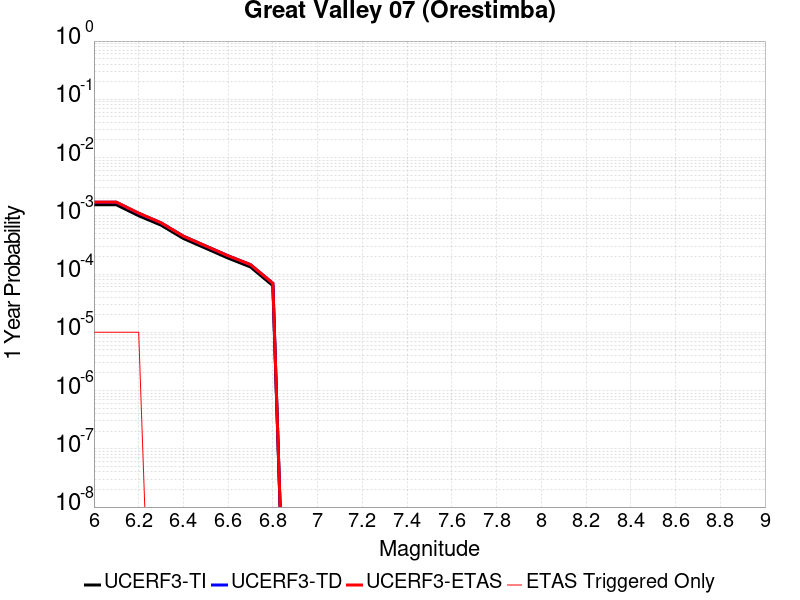 | 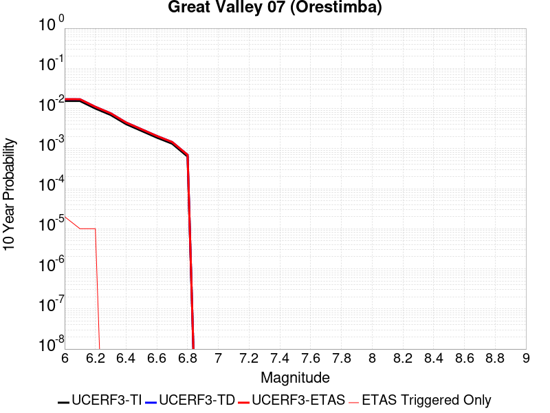 |

| Magnitude | 1 wk TI Prob | 1 wk TD Prob | 1 wk ETAS Prob | 1 wk ETAS/TD Gain | 1 wk ETAS Triggered Only | 1 mo TI Prob | 1 mo TD Prob | 1 mo ETAS Prob | 1 mo ETAS/TD Gain | 1 mo ETAS Triggered Only | 1 yr TI Prob | 1 yr TD Prob | 1 yr ETAS Prob | 1 yr ETAS/TD Gain | 1 yr ETAS Triggered Only | 10 yr TI Prob | 10 yr TD Prob | 10 yr ETAS Prob | 10 yr ETAS/TD Gain | 10 yr ETAS Triggered Only |
|-----|-----|-----|-----|-----|-----|-----|-----|-----|-----|-----|-----|-----|-----|-----|-----|-----|-----|-----|-----|-----|
| 6.0 | 2.9687902E-5 | 3.2757947E-5 | 3.2757947E-5 | 1.0 | 0.0 | 1.2722766E-4 | 1.4038406E-4 | 1.4038406E-4 | 1.0 | 0.0 | 0.0015478961 | 0.0017079079 | 0.0017178907 | 1.0058451 | 1.0E-5 | 0.015371585 | 0.016955366 | 0.016975028 | 1.0011595 | 2.0E-5 |
| 6.1 | 2.9687902E-5 | 3.2757947E-5 | 3.2757947E-5 | 1.0 | 0.0 | 1.2722766E-4 | 1.4038406E-4 | 1.4038406E-4 | 1.0 | 0.0 | 0.0015478961 | 0.0017079079 | 0.0017178907 | 1.0058451 | 1.0E-5 | 0.015371585 | 0.016955366 | 0.016965197 | 1.0005798 | 1.0E-5 |
| 6.2 | 1.9231524E-5 | 2.1159447E-5 | 2.1159447E-5 | 1.0 | 0.0 | 8.2418206E-5 | 9.0680325E-5 | 9.0680325E-5 | 1.0 | 0.0 | 0.0010029797 | 0.0011034969 | 0.0011134859 | 1.0090522 | 1.0E-5 | 0.00998465 | 0.010982586 | 0.010992476 | 1.0009005 | 1.0E-5 |
| 6.3 | 1.324766E-5 | 1.4548723E-5 | 1.4548723E-5 | 1.0 | 0.0 | 5.6774446E-5 | 6.235023E-5 | 6.235023E-5 | 1.0 | 0.0 | 6.910097E-4 | 7.5885886E-4 | 7.5885886E-4 | 1.0 | 0.0 | 0.006888649 | 0.0075636217 | 0.0075636217 | 1.0 | 0.0 |
| 6.4 | 7.818645E-6 | 8.57295E-6 | 8.57295E-6 | 1.0 | 0.0 | 3.3508048E-5 | 3.6740716E-5 | 3.6740716E-5 | 1.0 | 0.0 | 4.078841E-4 | 4.4722974E-4 | 4.4722974E-4 | 1.0 | 0.0 | 0.004071363 | 0.0044636377 | 0.0044636377 | 1.0 | 0.0 |
| 6.5 | 5.3076565E-6 | 5.817875E-6 | 5.817875E-6 | 1.0 | 0.0 | 2.27469E-5 | 2.4933523E-5 | 2.4933523E-5 | 1.0 | 0.0 | 2.7690834E-4 | 3.0352548E-4 | 3.0352548E-4 | 1.0 | 0.0 | 0.0027656353 | 0.0030313185 | 0.0030313185 | 1.0 | 0.0 |
| 6.6 | 3.6003578E-6 | 3.9485462E-6 | 3.9485462E-6 | 1.0 | 0.0 | 1.5430012E-5 | 1.6922239E-5 | 1.6922239E-5 | 1.0 | 0.0 | 1.8784421E-4 | 2.0601034E-4 | 2.0601034E-4 | 1.0 | 0.0 | 0.0018768552 | 0.0020583477 | 0.0020583477 | 1.0 | 0.0 |
| 6.7 | 2.5361826E-6 | 2.783504E-6 | 2.783504E-6 | 1.0 | 0.0 | 1.0869308E-5 | 1.1929255E-5 | 1.1929255E-5 | 1.0 | 0.0 | 1.3232579E-4 | 1.4523033E-4 | 1.4523033E-4 | 1.0 | 0.0 | 0.0013224703 | 0.001451484 | 0.001451484 | 1.0 | 0.0 |
| 6.8 | 1.2115831E-6 | 1.3313972E-6 | 1.3313972E-6 | 1.0 | 0.0 | 5.1924885E-6 | 5.705981E-6 | 5.705981E-6 | 1.0 | 0.0 | 6.3216714E-5 | 6.9469075E-5 | 6.9469075E-5 | 1.0 | 0.0 | 6.3198735E-4 | 6.9456873E-4 | 6.9456873E-4 | 1.0 | 0.0 |

## San Andreas (Santa Cruz Mts) 2011 CFM
*[(top)](#table-of-contents)*

| 1 Week | 1 Month | 1 Year | 10 Year |
|-----|-----|-----|-----|
|  |  |  |  |

| Magnitude | 1 wk TI Prob | 1 wk TD Prob | 1 wk ETAS Prob | 1 wk ETAS/TD Gain | 1 wk ETAS Triggered Only | 1 mo TI Prob | 1 mo TD Prob | 1 mo ETAS Prob | 1 mo ETAS/TD Gain | 1 mo ETAS Triggered Only | 1 yr TI Prob | 1 yr TD Prob | 1 yr ETAS Prob | 1 yr ETAS/TD Gain | 1 yr ETAS Triggered Only | 10 yr TI Prob | 10 yr TD Prob | 10 yr ETAS Prob | 10 yr ETAS/TD Gain | 10 yr ETAS Triggered Only |
|-----|-----|-----|-----|-----|-----|-----|-----|-----|-----|-----|-----|-----|-----|-----|-----|-----|-----|-----|-----|-----|
| 6.0 | 1.7221631E-4 | 1.3800614E-4 | 1.3800614E-4 | 1.0 | 0.0 | 7.378611E-4 | 5.9132284E-4 | 6.01317E-4 | 1.0169013 | 1.0E-5 | 0.008946515 | 0.0071759806 | 0.007185909 | 1.0013835 | 1.0E-5 | 0.08594794 | 0.070589736 | 0.070608325 | 1.0002633 | 2.0E-5 |
| 6.1 | 1.7221631E-4 | 1.3800614E-4 | 1.3800614E-4 | 1.0 | 0.0 | 7.378611E-4 | 5.9132284E-4 | 6.01317E-4 | 1.0169013 | 1.0E-5 | 0.008946515 | 0.0071759806 | 0.007185909 | 1.0013835 | 1.0E-5 | 0.08594794 | 0.070589736 | 0.070608325 | 1.0002633 | 2.0E-5 |
| 6.2 | 1.7221631E-4 | 1.3800614E-4 | 1.3800614E-4 | 1.0 | 0.0 | 7.378611E-4 | 5.9132284E-4 | 6.01317E-4 | 1.0169013 | 1.0E-5 | 0.008946515 | 0.0071759806 | 0.007185909 | 1.0013835 | 1.0E-5 | 0.08594794 | 0.070589736 | 0.070608325 | 1.0002633 | 2.0E-5 |
| 6.3 | 1.716926E-4 | 1.3720038E-4 | 1.3720038E-4 | 1.0 | 0.0 | 7.3561794E-4 | 5.878712E-4 | 5.978653E-4 | 1.0170006 | 1.0E-5 | 0.008919428 | 0.0071342313 | 0.00714416 | 1.0013916 | 1.0E-5 | 0.08569809 | 0.07020187 | 0.07022046 | 1.0002649 | 2.0E-5 |
| 6.4 | 1.6392978E-4 | 1.3595779E-4 | 1.3595779E-4 | 1.0 | 0.0 | 7.02367E-4 | 5.8254815E-4 | 5.9254235E-4 | 1.017156 | 1.0E-5 | 0.008517839 | 0.007069845 | 0.0070797745 | 1.0014044 | 1.0E-5 | 0.08198654 | 0.06943514 | 0.06945375 | 1.000268 | 2.0E-5 |
| 6.5 | 1.5742714E-4 | 1.2655502E-4 | 1.2655502E-4 | 1.0 | 0.0 | 6.745133E-4 | 5.422677E-4 | 5.5226224E-4 | 1.0184311 | 1.0E-5 | 0.00818132 | 0.0065824483 | 0.0065923827 | 1.0015092 | 1.0E-5 | 0.078865945 | 0.064896256 | 0.064914964 | 1.0002881 | 2.0E-5 |
| 6.6 | 1.3038084E-4 | 1.1594853E-4 | 1.1594853E-4 | 1.0 | 0.0 | 5.5865536E-4 | 4.968289E-4 | 5.0682394E-4 | 1.0201176 | 1.0E-5 | 0.006780438 | 0.0060323575 | 0.006042297 | 1.0016477 | 1.0E-5 | 0.0657725 | 0.059357777 | 0.05937659 | 1.000317 | 2.0E-5 |
| 6.7 | 1.2867592E-4 | 1.1321309E-4 | 1.1321309E-4 | 1.0 | 0.0 | 5.5135164E-4 | 4.8511004E-4 | 4.9510517E-4 | 1.0206039 | 1.0E-5 | 0.0066920654 | 0.005890459 | 0.0059003998 | 1.0016876 | 1.0E-5 | 0.06494093 | 0.058068715 | 0.058087554 | 1.0003244 | 2.0E-5 |
| 6.8 | 1.2801298E-4 | 1.1258862E-4 | 1.1258862E-4 | 1.0 | 0.0 | 5.485117E-4 | 4.824347E-4 | 4.924299E-4 | 1.0207182 | 1.0E-5 | 0.0066577005 | 0.0058580628 | 0.005868004 | 1.0016971 | 1.0E-5 | 0.06461738 | 0.057782546 | 0.05780139 | 1.0003262 | 2.0E-5 |
| 6.9 | 1.269149E-4 | 1.1101053E-4 | 1.1101053E-4 | 1.0 | 0.0 | 5.4380763E-4 | 4.7567394E-4 | 4.8566918E-4 | 1.0210128 | 1.0E-5 | 0.006600777 | 0.0057761897 | 0.005786132 | 1.0017213 | 1.0E-5 | 0.06408122 | 0.05705434 | 0.0570732 | 1.0003306 | 2.0E-5 |
| 7.0 | 1.2030331E-4 | 1.0831018E-4 | 1.0831018E-4 | 1.0 | 0.0 | 5.154837E-4 | 4.641052E-4 | 4.7410055E-4 | 1.0215368 | 1.0E-5 | 0.006257969 | 0.0056360774 | 0.0056460206 | 1.0017643 | 1.0E-5 | 0.06084648 | 0.055726517 | 0.055745404 | 1.0003389 | 2.0E-5 |
| 7.1 | 8.049617E-5 | 5.3976473E-5 | 5.3976473E-5 | 1.0 | 0.0 | 3.4493793E-4 | 2.3130744E-4 | 2.4130511E-4 | 1.0432225 | 1.0E-5 | 0.0041915346 | 0.002812566 | 0.002822538 | 1.0035455 | 1.0E-5 | 0.041133516 | 0.02964314 | 0.02966255 | 1.0006547 | 2.0E-5 |
| 7.2 | 7.093979E-5 | 4.298351E-5 | 4.298351E-5 | 1.0 | 0.0 | 3.0399222E-4 | 1.8420216E-4 | 1.9420031E-4 | 1.0542781 | 1.0E-5 | 0.0036948253 | 0.0022403775 | 0.0022503552 | 1.0044535 | 1.0E-5 | 0.03633994 | 0.023964057 | 0.023983577 | 1.0008146 | 2.0E-5 |
| 7.3 | 6.193693E-5 | 2.8926645E-5 | 2.8926645E-5 | 1.0 | 0.0 | 2.6541698E-4 | 1.2396545E-4 | 1.3396422E-4 | 1.0806576 | 1.0E-5 | 0.0032266637 | 0.0015082362 | 0.0015182211 | 1.0066203 | 1.0E-5 | 0.031802133 | 0.016516065 | 0.016535735 | 1.0011909 | 2.0E-5 |
| 7.4 | 5.906492E-5 | 2.7052607E-5 | 2.7052607E-5 | 1.0 | 0.0 | 2.5311083E-4 | 1.159346E-4 | 1.2593344E-4 | 1.0862455 | 1.0E-5 | 0.0030772698 | 0.0014105912 | 0.001420577 | 1.0070792 | 1.0E-5 | 0.030350044 | 0.01548636 | 0.01550605 | 1.0012715 | 2.0E-5 |
| 7.5 | 5.424296E-5 | 2.4703162E-5 | 2.4703162E-5 | 1.0 | 0.0 | 2.324491E-4 | 1.05866406E-4 | 1.1586535E-4 | 1.0944487 | 1.0E-5 | 0.002826395 | 0.0012881625 | 0.0012981497 | 1.007753 | 1.0E-5 | 0.027907165 | 0.014176421 | 0.014196137 | 1.0013908 | 2.0E-5 |
| 7.6 | 4.43084E-5 | 1.9920975E-5 | 1.9920975E-5 | 1.0 | 0.0 | 1.8987931E-4 | 8.537281E-5 | 9.537196E-5 | 1.1171234 | 1.0E-5 | 0.0023093296 | 0.0010389186 | 0.0010489082 | 1.0096154 | 1.0E-5 | 0.022854783 | 0.011421678 | 0.01144145 | 1.001731 | 2.0E-5 |
| 7.7 | 4.118098E-5 | 1.8952078E-5 | 1.8952078E-5 | 1.0 | 0.0 | 1.7647797E-4 | 8.122066E-5 | 9.121985E-5 | 1.1231114 | 1.0E-5 | 0.002146502 | 9.884132E-4 | 9.984033E-4 | 1.0101073 | 1.0E-5 | 0.021258866 | 0.010878919 | 0.010898701 | 1.0018184 | 2.0E-5 |
| 7.8 | 3.5408906E-5 | 1.8579587E-5 | 1.8579587E-5 | 1.0 | 0.0 | 1.5174363E-4 | 7.962437E-5 | 8.962357E-5 | 1.1255797 | 1.0E-5 | 0.0018459131 | 9.6899585E-4 | 9.789862E-4 | 1.0103099 | 1.0E-5 | 0.018306552 | 0.010660154 | 0.010679941 | 1.0018561 | 2.0E-5 |
| 7.9 | 2.5860836E-5 | 1.732955E-5 | 1.732955E-5 | 1.0 | 0.0 | 1.10827445E-4 | 7.426739E-5 | 8.426664E-5 | 1.1346385 | 1.0E-5 | 0.001348489 | 9.038306E-4 | 9.138215E-4 | 1.011054 | 1.0E-5 | 0.013403354 | 0.009914779 | 0.009934581 | 1.0019972 | 2.0E-5 |
| 8.0 | 1.9777332E-5 | 1.4851258E-5 | 1.4851258E-5 | 1.0 | 0.0 | 8.4757245E-5 | 6.36467E-5 | 7.3646064E-5 | 1.1571074 | 1.0E-5 | 0.0010314309 | 7.7462324E-4 | 7.846155E-4 | 1.0128995 | 1.0E-5 | 0.010266567 | 0.008515148 | 0.008534978 | 1.0023288 | 2.0E-5 |
| 8.1 | 1.468494E-5 | 1.2116955E-5 | 1.2116955E-5 | 1.0 | 0.0 | 6.293394E-5 | 5.1928775E-5 | 6.192826E-5 | 1.1925615 | 1.0E-5 | 7.6595135E-4 | 6.3204963E-4 | 6.420433E-4 | 1.0158116 | 1.0E-5 | 0.0076331664 | 0.006974249 | 0.0069941096 | 1.0028477 | 2.0E-5 |
| 8.2 | 8.63836E-6 | 5.4740453E-6 | 5.4740453E-6 | 1.0 | 0.0 | 3.7021015E-5 | 2.3459983E-5 | 2.3459983E-5 | 1.0 | 0.0 | 4.5063766E-4 | 2.8558794E-4 | 2.8558794E-4 | 1.0 | 0.0 | 0.004497249 | 0.0032484138 | 0.0032484138 | 1.0 | 0.0 |
| 8.3 | 1.983087E-6 | 7.668296E-7 | 7.668296E-7 | 1.0 | 0.0 | 8.498917E-6 | 3.2864084E-6 | 3.2864084E-6 | 1.0 | 0.0 | 1.034694E-4 | 4.0011306E-5 | 4.0011306E-5 | 1.0 | 0.0 | 0.0010342124 | 4.724499E-4 | 4.724499E-4 | 1.0 | 0.0 |

## Surprise Valley 2011 CFM
*[(top)](#table-of-contents)*

| 1 Week | 1 Month | 1 Year | 10 Year |
|-----|-----|-----|-----|
|  |  |  |  |

| Magnitude | 1 wk TI Prob | 1 wk TD Prob | 1 wk ETAS Prob | 1 wk ETAS/TD Gain | 1 wk ETAS Triggered Only | 1 mo TI Prob | 1 mo TD Prob | 1 mo ETAS Prob | 1 mo ETAS/TD Gain | 1 mo ETAS Triggered Only | 1 yr TI Prob | 1 yr TD Prob | 1 yr ETAS Prob | 1 yr ETAS/TD Gain | 1 yr ETAS Triggered Only | 10 yr TI Prob | 10 yr TD Prob | 10 yr ETAS Prob | 10 yr ETAS/TD Gain | 10 yr ETAS Triggered Only |
|-----|-----|-----|-----|-----|-----|-----|-----|-----|-----|-----|-----|-----|-----|-----|-----|-----|-----|-----|-----|-----|
| 6.0 | 4.0396248E-5 | 4.485197E-5 | 5.485152E-5 | 1.2229457 | 1.0E-5 | 1.7311527E-4 | 1.9220974E-4 | 2.0220783E-4 | 1.0520165 | 1.0E-5 | 0.002105641 | 0.002337852 | 0.0023478286 | 1.0042675 | 1.0E-5 | 0.020858008 | 0.023154303 | 0.02317384 | 1.0008438 | 2.0E-5 |
| 6.1 | 4.0396248E-5 | 4.485197E-5 | 5.485152E-5 | 1.2229457 | 1.0E-5 | 1.7311527E-4 | 1.9220974E-4 | 2.0220783E-4 | 1.0520165 | 1.0E-5 | 0.002105641 | 0.002337852 | 0.0023478286 | 1.0042675 | 1.0E-5 | 0.020858008 | 0.023154303 | 0.02317384 | 1.0008438 | 2.0E-5 |
| 6.2 | 2.2295266E-5 | 2.4401555E-5 | 3.4401313E-5 | 1.4097999 | 1.0E-5 | 9.554764E-5 | 1.0457408E-4 | 1.14573035E-4 | 1.095616 | 1.0E-5 | 0.0011626717 | 0.0012724766 | 0.0012824639 | 1.0078487 | 1.0E-5 | 0.011566074 | 0.012655139 | 0.012674886 | 1.0015603 | 2.0E-5 |
| 6.3 | 1.572643E-5 | 1.7097005E-5 | 2.7096834E-5 | 1.5848877 | 1.0E-5 | 6.7397246E-5 | 7.327088E-5 | 8.327015E-5 | 1.1364698 | 1.0E-5 | 8.202525E-4 | 8.917184E-4 | 9.017094E-4 | 1.0112044 | 1.0E-5 | 0.008172315 | 0.00888251 | 0.008892421 | 1.0011158 | 1.0E-5 |
| 6.4 | 1.5714395E-5 | 1.7084827E-5 | 2.7084656E-5 | 1.5853047 | 1.0E-5 | 6.734567E-5 | 7.321869E-5 | 8.321796E-5 | 1.1365671 | 1.0E-5 | 8.1962504E-4 | 8.910835E-4 | 9.0107456E-4 | 1.0112123 | 1.0E-5 | 0.008166086 | 0.008876211 | 0.008886122 | 1.0011166 | 1.0E-5 |
| 6.5 | 1.2733495E-5 | 1.3801754E-5 | 1.3801754E-5 | 1.0 | 0.0 | 5.457098E-5 | 5.914907E-5 | 5.914907E-5 | 1.0 | 0.0 | 6.641992E-4 | 7.199087E-4 | 7.199087E-4 | 1.0 | 0.0 | 0.0066221743 | 0.0071764593 | 0.0071764593 | 1.0 | 0.0 |
| 6.6 | 1.0983784E-5 | 1.1886684E-5 | 1.1886684E-5 | 1.0 | 0.0 | 4.7072506E-5 | 5.0941966E-5 | 5.0941966E-5 | 1.0 | 0.0 | 5.7295704E-4 | 6.2004727E-4 | 6.2004727E-4 | 1.0 | 0.0 | 0.0057148207 | 0.006183722 | 0.006183722 | 1.0 | 0.0 |
| 6.7 | 9.104806E-6 | 9.839597E-6 | 9.839597E-6 | 1.0 | 0.0 | 3.902001E-5 | 4.2169042E-5 | 4.2169042E-5 | 1.0 | 0.0 | 4.7496508E-4 | 5.1329104E-4 | 5.1329104E-4 | 1.0 | 0.0 | 0.004739512 | 0.005121452 | 0.005121452 | 1.0 | 0.0 |
| 6.8 | 6.2162403E-6 | 6.7042038E-6 | 6.7042038E-6 | 1.0 | 0.0 | 2.6640759E-5 | 2.8731998E-5 | 2.8731998E-5 | 1.0 | 0.0 | 3.2430296E-4 | 3.4975816E-4 | 3.4975816E-4 | 1.0 | 0.0 | 0.003238301 | 0.0034923002 | 0.0034923002 | 1.0 | 0.0 |
| 6.9 | 4.1792696E-6 | 4.5032766E-6 | 4.5032766E-6 | 1.0 | 0.0 | 1.7911032E-5 | 1.9299621E-5 | 1.9299621E-5 | 1.0 | 0.0 | 2.1804498E-4 | 2.3494911E-4 | 2.3494911E-4 | 1.0 | 0.0 | 0.0021783116 | 0.0023471604 | 0.0023471604 | 1.0 | 0.0 |
| 7.0 | 2.7478413E-6 | 2.9622734E-6 | 2.9622734E-6 | 1.0 | 0.0 | 1.177641E-5 | 1.2695402E-5 | 1.2695402E-5 | 1.0 | 0.0 | 1.4336836E-4 | 1.5455681E-4 | 1.5455681E-4 | 1.0 | 0.0 | 0.001432759 | 0.0015446156 | 0.0015446156 | 1.0 | 0.0 |
| 7.1 | 8.128648E-7 | 8.725007E-7 | 8.725007E-7 | 1.0 | 0.0 | 3.4837017E-6 | 3.739287E-6 | 3.739287E-6 | 1.0 | 0.0 | 4.2413245E-5 | 4.5525467E-5 | 4.5525467E-5 | 1.0 | 0.0 | 4.2405148E-4 | 4.5522023E-4 | 4.5522023E-4 | 1.0 | 0.0 |
| 7.2 | 4.8641045E-8 | 4.9402168E-8 | 4.9402168E-8 | 1.0 | 0.0 | 2.084616E-7 | 2.1172356E-7 | 2.1172356E-7 | 1.0 | 0.0 | 2.538017E-6 | 2.5777315E-6 | 2.5777315E-6 | 1.0 | 0.0 | 2.537988E-5 | 2.5777028E-5 | 2.5777028E-5 | 1.0 | 0.0 |
| 7.3 | 5.3911844E-9 | 5.4758256E-9 | 5.4758256E-9 | 1.0 | 0.0 | 2.3105075E-8 | 2.3467823E-8 | 2.3467823E-8 | 1.0 | 0.0 | 2.8130427E-7 | 2.8572074E-7 | 2.8572074E-7 | 1.0 | 0.0 | 2.8130391E-6 | 2.8572053E-6 | 2.8572053E-6 | 1.0 | 0.0 |

## Great Valley 05 Pittsburg - Kirby Hills alt1
*[(top)](#table-of-contents)*

| 1 Week | 1 Month | 1 Year | 10 Year |
|-----|-----|-----|-----|
|  |  |  |  |

| Magnitude | 1 wk TI Prob | 1 wk TD Prob | 1 wk ETAS Prob | 1 wk ETAS/TD Gain | 1 wk ETAS Triggered Only | 1 mo TI Prob | 1 mo TD Prob | 1 mo ETAS Prob | 1 mo ETAS/TD Gain | 1 mo ETAS Triggered Only | 1 yr TI Prob | 1 yr TD Prob | 1 yr ETAS Prob | 1 yr ETAS/TD Gain | 1 yr ETAS Triggered Only | 10 yr TI Prob | 10 yr TD Prob | 10 yr ETAS Prob | 10 yr ETAS/TD Gain | 10 yr ETAS Triggered Only |
|-----|-----|-----|-----|-----|-----|-----|-----|-----|-----|-----|-----|-----|-----|-----|-----|-----|-----|-----|-----|-----|
| 6.0 | 4.187212E-5 | 5.3444037E-5 | 5.3444037E-5 | 1.0 | 0.0 | 1.794396E-4 | 2.2903152E-4 | 2.3902922E-4 | 1.043652 | 1.0E-5 | 0.002182488 | 0.0027858876 | 0.0027958597 | 1.0035795 | 1.0E-5 | 0.021611776 | 0.027604017 | 0.027613742 | 1.0003523 | 1.0E-5 |
| 6.1 | 4.187212E-5 | 5.3444037E-5 | 5.3444037E-5 | 1.0 | 0.0 | 1.794396E-4 | 2.2903152E-4 | 2.3902922E-4 | 1.043652 | 1.0E-5 | 0.002182488 | 0.0027858876 | 0.0027958597 | 1.0035795 | 1.0E-5 | 0.021611776 | 0.027604017 | 0.027613742 | 1.0003523 | 1.0E-5 |
| 6.2 | 1.7353306E-5 | 2.2155189E-5 | 2.2155189E-5 | 1.0 | 0.0 | 7.436919E-5 | 9.4949675E-5 | 9.4949675E-5 | 1.0 | 0.0 | 9.050688E-4 | 0.0011557965 | 0.0011557965 | 1.0 | 0.0 | 0.009013915 | 0.011535524 | 0.011535524 | 1.0 | 0.0 |
| 6.3 | 1.7353306E-5 | 2.2155189E-5 | 2.2155189E-5 | 1.0 | 0.0 | 7.436919E-5 | 9.4949675E-5 | 9.4949675E-5 | 1.0 | 0.0 | 9.050688E-4 | 0.0011557965 | 0.0011557965 | 1.0 | 0.0 | 0.009013915 | 0.011535524 | 0.011535524 | 1.0 | 0.0 |
| 6.4 | 1.4028824E-5 | 1.7901253E-5 | 1.7901253E-5 | 1.0 | 0.0 | 6.0122147E-5 | 7.6719654E-5 | 7.6719654E-5 | 1.0 | 0.0 | 7.3174125E-4 | 9.3406177E-4 | 9.3406177E-4 | 1.0 | 0.0 | 0.0072933645 | 0.00933847 | 0.00933847 | 1.0 | 0.0 |

## Pinto Mtn
*[(top)](#table-of-contents)*

| 1 Week | 1 Month | 1 Year | 10 Year |
|-----|-----|-----|-----|
|  |  |  |  |

| Magnitude | 1 wk TI Prob | 1 wk TD Prob | 1 wk ETAS Prob | 1 wk ETAS/TD Gain | 1 wk ETAS Triggered Only | 1 mo TI Prob | 1 mo TD Prob | 1 mo ETAS Prob | 1 mo ETAS/TD Gain | 1 mo ETAS Triggered Only | 1 yr TI Prob | 1 yr TD Prob | 1 yr ETAS Prob | 1 yr ETAS/TD Gain | 1 yr ETAS Triggered Only | 10 yr TI Prob | 10 yr TD Prob | 10 yr ETAS Prob | 10 yr ETAS/TD Gain | 10 yr ETAS Triggered Only |
|-----|-----|-----|-----|-----|-----|-----|-----|-----|-----|-----|-----|-----|-----|-----|-----|-----|-----|-----|-----|-----|
| 6.0 | 4.4194956E-5 | 4.785523E-5 | 5.785475E-5 | 1.2089536 | 1.0E-5 | 1.893932E-4 | 2.0507864E-4 | 2.150766E-4 | 1.0487518 | 1.0E-5 | 0.0023034236 | 0.002494138 | 0.002514088 | 1.0079988 | 2.0E-5 | 0.022796938 | 0.024678964 | 0.024698472 | 1.0007904 | 2.0E-5 |
| 6.1 | 4.4194956E-5 | 4.785523E-5 | 5.785475E-5 | 1.2089536 | 1.0E-5 | 1.893932E-4 | 2.0507864E-4 | 2.150766E-4 | 1.0487518 | 1.0E-5 | 0.0023034236 | 0.002494138 | 0.002514088 | 1.0079988 | 2.0E-5 | 0.022796938 | 0.024678964 | 0.024698472 | 1.0007904 | 2.0E-5 |
| 6.2 | 4.4194956E-5 | 4.785523E-5 | 5.785475E-5 | 1.2089536 | 1.0E-5 | 1.893932E-4 | 2.0507864E-4 | 2.150766E-4 | 1.0487518 | 1.0E-5 | 0.0023034236 | 0.002494138 | 0.002514088 | 1.0079988 | 2.0E-5 | 0.022796938 | 0.024678964 | 0.024698472 | 1.0007904 | 2.0E-5 |
| 6.3 | 4.4194956E-5 | 4.785523E-5 | 5.785475E-5 | 1.2089536 | 1.0E-5 | 1.893932E-4 | 2.0507864E-4 | 2.150766E-4 | 1.0487518 | 1.0E-5 | 0.0023034236 | 0.002494138 | 0.002514088 | 1.0079988 | 2.0E-5 | 0.022796938 | 0.024678964 | 0.024698472 | 1.0007904 | 2.0E-5 |
| 6.4 | 3.729929E-5 | 3.960458E-5 | 3.960458E-5 | 1.0 | 0.0 | 1.5984432E-4 | 1.697234E-4 | 1.697234E-4 | 1.0 | 0.0 | 0.0019443673 | 0.0020645177 | 0.002074497 | 1.0048337 | 1.0E-5 | 0.019274427 | 0.020463403 | 0.020473199 | 1.0004786 | 1.0E-5 |
| 6.5 | 3.729929E-5 | 3.960458E-5 | 3.960458E-5 | 1.0 | 0.0 | 1.5984432E-4 | 1.697234E-4 | 1.697234E-4 | 1.0 | 0.0 | 0.0019443673 | 0.0020645177 | 0.002074497 | 1.0048337 | 1.0E-5 | 0.019274427 | 0.020463403 | 0.020473199 | 1.0004786 | 1.0E-5 |
| 6.6 | 3.0204548E-5 | 3.1206488E-5 | 3.1206488E-5 | 1.0 | 0.0 | 1.2944164E-4 | 1.3373543E-4 | 1.3373543E-4 | 1.0 | 0.0 | 0.0015748127 | 0.0016270474 | 0.0016270474 | 1.0 | 0.0 | 0.015636992 | 0.01615522 | 0.01615522 | 1.0 | 0.0 |
| 6.7 | 2.9857754E-5 | 3.0815863E-5 | 3.0815863E-5 | 1.0 | 0.0 | 1.2795553E-4 | 1.320615E-4 | 1.320615E-4 | 1.0 | 0.0 | 0.0015567453 | 0.0016066976 | 0.0016066976 | 1.0 | 0.0 | 0.015458848 | 0.015954657 | 0.015954657 | 1.0 | 0.0 |
| 6.8 | 2.4819734E-5 | 2.5010428E-5 | 2.5010428E-5 | 1.0 | 0.0 | 1.0636595E-4 | 1.0718327E-4 | 1.0718327E-4 | 1.0 | 0.0 | 0.0012942362 | 0.0013041968 | 0.0013041968 | 1.0 | 0.0 | 0.012867244 | 0.012967796 | 0.012967796 | 1.0 | 0.0 |
| 6.9 | 2.331124E-5 | 2.3338684E-5 | 2.3338684E-5 | 1.0 | 0.0 | 9.990149E-5 | 1.00019206E-4 | 1.00019206E-4 | 1.0 | 0.0 | 0.001215622 | 0.001217074 | 0.001217074 | 1.0 | 0.0 | 0.012089936 | 0.012106278 | 0.012106278 | 1.0 | 0.0 |
| 7.0 | 2.1818534E-5 | 2.1761793E-5 | 2.1761793E-5 | 1.0 | 0.0 | 9.3504656E-5 | 9.32616E-5 | 9.32616E-5 | 1.0 | 0.0 | 0.0011378246 | 0.0011348884 | 0.0011348884 | 1.0 | 0.0 | 0.011320163 | 0.01129303 | 0.01129303 | 1.0 | 0.0 |
| 7.1 | 2.066081E-5 | 2.054142E-5 | 2.054142E-5 | 1.0 | 0.0 | 8.854332E-5 | 8.80318E-5 | 8.80318E-5 | 1.0 | 0.0 | 0.0010774818 | 0.0010712796 | 0.0010712796 | 1.0 | 0.0 | 0.010722724 | 0.010663206 | 0.010663206 | 1.0 | 0.0 |
| 7.2 | 1.8990233E-5 | 1.9054683E-5 | 1.9054683E-5 | 1.0 | 0.0 | 8.138417E-5 | 8.166048E-5 | 8.166048E-5 | 1.0 | 0.0 | 9.904018E-4 | 9.937823E-4 | 9.937823E-4 | 1.0 | 0.0 | 0.009859995 | 0.0098953815 | 0.0098953815 | 1.0 | 0.0 |
| 7.3 | 1.3335872E-5 | 1.4907276E-5 | 1.4907276E-5 | 1.0 | 0.0 | 5.7152483E-5 | 6.388683E-5 | 6.388683E-5 | 1.0 | 0.0 | 6.956093E-4 | 7.775574E-4 | 7.775574E-4 | 1.0 | 0.0 | 0.006934359 | 0.0077496674 | 0.0077496674 | 1.0 | 0.0 |
| 7.4 | 9.414066E-6 | 1.186147E-5 | 1.186147E-5 | 1.0 | 0.0 | 4.0345374E-5 | 5.0833933E-5 | 5.0833933E-5 | 1.0 | 0.0 | 4.910942E-4 | 6.187368E-4 | 6.187368E-4 | 1.0 | 0.0 | 0.0049001034 | 0.0061710896 | 0.0061710896 | 1.0 | 0.0 |
| 7.5 | 7.2101157E-6 | 9.158733E-6 | 9.158733E-6 | 1.0 | 0.0 | 3.090013E-5 | 3.9251165E-5 | 3.9251165E-5 | 1.0 | 0.0 | 3.7614413E-4 | 4.7778594E-4 | 4.7778594E-4 | 1.0 | 0.0 | 0.0037550807 | 0.0047683627 | 0.0047683627 | 1.0 | 0.0 |
| 7.6 | 3.296375E-6 | 4.546122E-6 | 4.546122E-6 | 1.0 | 0.0 | 1.4127245E-5 | 1.9483241E-5 | 1.9483241E-5 | 1.0 | 0.0 | 1.7198564E-4 | 2.3718402E-4 | 2.3718402E-4 | 1.0 | 0.0 | 0.0017185259 | 0.0023694462 | 0.0023694462 | 1.0 | 0.0 |
| 7.7 | 2.5741092E-6 | 3.5850085E-6 | 3.5850085E-6 | 1.0 | 0.0 | 1.103185E-5 | 1.536424E-5 | 1.536424E-5 | 1.0 | 0.0 | 1.3430449E-4 | 1.8704488E-4 | 1.8704488E-4 | 1.0 | 0.0 | 0.0013422335 | 0.0018690043 | 0.0018690043 | 1.0 | 0.0 |

## Santa Susana alt 1
*[(top)](#table-of-contents)*

| 1 Week | 1 Month | 1 Year | 10 Year |
|-----|-----|-----|-----|
| 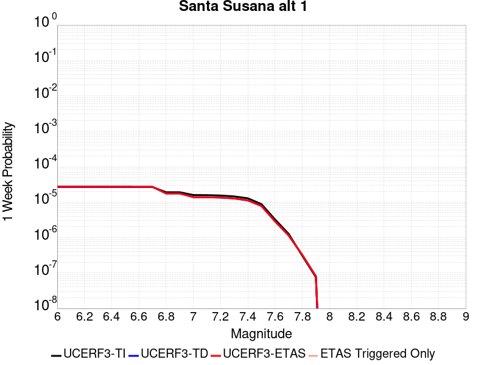 |  |  |  |

| Magnitude | 1 wk TI Prob | 1 wk TD Prob | 1 wk ETAS Prob | 1 wk ETAS/TD Gain | 1 wk ETAS Triggered Only | 1 mo TI Prob | 1 mo TD Prob | 1 mo ETAS Prob | 1 mo ETAS/TD Gain | 1 mo ETAS Triggered Only | 1 yr TI Prob | 1 yr TD Prob | 1 yr ETAS Prob | 1 yr ETAS/TD Gain | 1 yr ETAS Triggered Only | 10 yr TI Prob | 10 yr TD Prob | 10 yr ETAS Prob | 10 yr ETAS/TD Gain | 10 yr ETAS Triggered Only |
|-----|-----|-----|-----|-----|-----|-----|-----|-----|-----|-----|-----|-----|-----|-----|-----|-----|-----|-----|-----|-----|
| 6.0 | 2.674877E-5 | 2.7198636E-5 | 2.7198636E-5 | 1.0 | 0.0 | 1.1463255E-4 | 1.16561016E-4 | 1.2655985E-4 | 1.0857819 | 1.0E-5 | 0.0013947578 | 0.0014183201 | 0.0014382917 | 1.0140812 | 2.0E-5 | 0.013860362 | 0.014104444 | 0.014124162 | 1.001398 | 2.0E-5 |
| 6.1 | 2.674877E-5 | 2.7198636E-5 | 2.7198636E-5 | 1.0 | 0.0 | 1.1463255E-4 | 1.16561016E-4 | 1.2655985E-4 | 1.0857819 | 1.0E-5 | 0.0013947578 | 0.0014183201 | 0.0014382917 | 1.0140812 | 2.0E-5 | 0.013860362 | 0.014104444 | 0.014124162 | 1.001398 | 2.0E-5 |
| 6.2 | 2.674877E-5 | 2.7198636E-5 | 2.7198636E-5 | 1.0 | 0.0 | 1.1463255E-4 | 1.16561016E-4 | 1.2655985E-4 | 1.0857819 | 1.0E-5 | 0.0013947578 | 0.0014183201 | 0.0014382917 | 1.0140812 | 2.0E-5 | 0.013860362 | 0.014104444 | 0.014124162 | 1.001398 | 2.0E-5 |
| 6.3 | 2.674877E-5 | 2.7198636E-5 | 2.7198636E-5 | 1.0 | 0.0 | 1.1463255E-4 | 1.16561016E-4 | 1.2655985E-4 | 1.0857819 | 1.0E-5 | 0.0013947578 | 0.0014183201 | 0.0014382917 | 1.0140812 | 2.0E-5 | 0.013860362 | 0.014104444 | 0.014124162 | 1.001398 | 2.0E-5 |
| 6.4 | 2.674877E-5 | 2.7198636E-5 | 2.7198636E-5 | 1.0 | 0.0 | 1.1463255E-4 | 1.16561016E-4 | 1.2655985E-4 | 1.0857819 | 1.0E-5 | 0.0013947578 | 0.0014183201 | 0.0014382917 | 1.0140812 | 2.0E-5 | 0.013860362 | 0.014104444 | 0.014124162 | 1.001398 | 2.0E-5 |
| 6.5 | 2.674877E-5 | 2.7198636E-5 | 2.7198636E-5 | 1.0 | 0.0 | 1.1463255E-4 | 1.16561016E-4 | 1.2655985E-4 | 1.0857819 | 1.0E-5 | 0.0013947578 | 0.0014183201 | 0.0014382917 | 1.0140812 | 2.0E-5 | 0.013860362 | 0.014104444 | 0.014124162 | 1.001398 | 2.0E-5 |
| 6.6 | 2.6647976E-5 | 2.707497E-5 | 2.707497E-5 | 1.0 | 0.0 | 1.14200615E-4 | 1.16031064E-4 | 1.260299E-4 | 1.0861738 | 1.0E-5 | 0.0013895056 | 0.0014118766 | 0.0014318484 | 1.0141455 | 2.0E-5 | 0.013808494 | 0.014040828 | 0.014060547 | 1.0014044 | 2.0E-5 |
| 6.7 | 2.6647976E-5 | 2.707497E-5 | 2.707497E-5 | 1.0 | 0.0 | 1.14200615E-4 | 1.16031064E-4 | 1.260299E-4 | 1.0861738 | 1.0E-5 | 0.0013895056 | 0.0014118766 | 0.0014318484 | 1.0141455 | 2.0E-5 | 0.013808494 | 0.014040828 | 0.014060547 | 1.0014044 | 2.0E-5 |
| 6.8 | 1.9073179E-5 | 1.7637585E-5 | 1.7637585E-5 | 1.0 | 0.0 | 8.1739636E-5 | 7.5587566E-5 | 8.558681E-5 | 1.1322869 | 1.0E-5 | 9.947256E-4 | 9.199082E-4 | 9.398898E-4 | 1.0217212 | 2.0E-5 | 0.009902848 | 0.009163258 | 0.009183074 | 1.0021626 | 2.0E-5 |
| 6.9 | 1.9041876E-5 | 1.7619717E-5 | 1.7619717E-5 | 1.0 | 0.0 | 8.160549E-5 | 7.551099E-5 | 8.551023E-5 | 1.132421 | 1.0E-5 | 9.930939E-4 | 9.189767E-4 | 9.389583E-4 | 1.0217433 | 2.0E-5 | 0.0098866755 | 0.009154019 | 0.009173836 | 1.0021648 | 2.0E-5 |
| 7.0 | 1.5917482E-5 | 1.3864059E-5 | 1.3864059E-5 | 1.0 | 0.0 | 6.8215995E-5 | 5.941607E-5 | 6.941547E-5 | 1.1682947 | 1.0E-5 | 8.302132E-4 | 7.231552E-4 | 7.4314076E-4 | 1.0276365 | 2.0E-5 | 0.008271185 | 0.007208915 | 0.0072287708 | 1.0027543 | 2.0E-5 |
| 7.1 | 1.577788E-5 | 1.3744065E-5 | 1.3744065E-5 | 1.0 | 0.0 | 6.761774E-5 | 5.890183E-5 | 6.890124E-5 | 1.169764 | 1.0E-5 | 8.2293496E-4 | 7.168985E-4 | 7.3688413E-4 | 1.0278779 | 2.0E-5 | 0.008198941 | 0.0071467515 | 0.0071666087 | 1.0027785 | 2.0E-5 |
| 7.2 | 1.5416446E-5 | 1.3470131E-5 | 1.3470131E-5 | 1.0 | 0.0 | 6.606882E-5 | 5.7727884E-5 | 6.7727306E-5 | 1.1732165 | 1.0E-5 | 8.0409093E-4 | 7.0261495E-4 | 7.226009E-4 | 1.0284451 | 2.0E-5 | 0.008011877 | 0.0070048203 | 0.0070246803 | 1.0028352 | 2.0E-5 |
| 7.3 | 1.4534083E-5 | 1.2718048E-5 | 1.2718048E-5 | 1.0 | 0.0 | 6.228744E-5 | 5.4504806E-5 | 6.450426E-5 | 1.1834601 | 1.0E-5 | 7.580857E-4 | 6.633984E-4 | 6.833852E-4 | 1.0301278 | 2.0E-5 | 0.007555048 | 0.006615032 | 0.0066349 | 1.0030034 | 2.0E-5 |
| 7.4 | 1.2858995E-5 | 1.1229788E-5 | 1.1229788E-5 | 1.0 | 0.0 | 5.5108816E-5 | 4.8126793E-5 | 5.8126312E-5 | 1.2077745 | 1.0E-5 | 6.7074323E-4 | 5.8579014E-4 | 6.057784E-4 | 1.0341219 | 2.0E-5 | 0.0066872234 | 0.0058432347 | 0.005863118 | 1.0034027 | 2.0E-5 |
| 7.5 | 8.827668E-6 | 7.805538E-6 | 7.805538E-6 | 1.0 | 0.0 | 3.7832317E-5 | 3.345189E-5 | 4.3451557E-5 | 1.2989267 | 1.0E-5 | 4.605111E-4 | 4.0720313E-4 | 4.27195E-4 | 1.0490955 | 2.0E-5 | 0.0045955796 | 0.004064819 | 0.0040847375 | 1.0049002 | 2.0E-5 |
| 7.6 | 3.2533426E-6 | 2.872008E-6 | 2.872008E-6 | 1.0 | 0.0 | 1.3942822E-5 | 1.230855E-5 | 2.2308426E-5 | 1.8124334 | 1.0E-5 | 1.6974064E-4 | 1.4984666E-4 | 1.5984516E-4 | 1.0667249 | 1.0E-5 | 0.0016961104 | 0.0014974931 | 0.0015074781 | 1.0066679 | 1.0E-5 |
| 7.7 | 1.2751709E-6 | 1.1491198E-6 | 1.1491198E-6 | 1.0 | 0.0 | 5.4650063E-6 | 4.9247906E-6 | 4.9247906E-6 | 1.0 | 0.0 | 6.653442E-5 | 5.9957765E-5 | 5.9957765E-5 | 1.0 | 0.0 | 6.6514505E-4 | 5.994248E-4 | 5.994248E-4 | 1.0 | 0.0 |
| 7.8 | 3.067544E-7 | 3.240072E-7 | 3.240072E-7 | 1.0 | 0.0 | 1.3146611E-6 | 1.3886016E-6 | 1.3886016E-6 | 1.0 | 0.0 | 1.600588E-5 | 1.6906104E-5 | 1.6906104E-5 | 1.0 | 0.0 | 1.6004729E-4 | 1.690492E-4 | 1.690492E-4 | 1.0 | 0.0 |
| 7.9 | 7.622999E-8 | 8.088032E-8 | 8.088032E-8 | 1.0 | 0.0 | 3.2669993E-7 | 3.4662992E-7 | 3.4662992E-7 | 1.0 | 0.0 | 3.977564E-6 | 4.220213E-6 | 4.220213E-6 | 1.0 | 0.0 | 3.977493E-5 | 4.2201536E-5 | 4.2201536E-5 | 1.0 | 0.0 |

## Cucamonga
*[(top)](#table-of-contents)*

| 1 Week | 1 Month | 1 Year | 10 Year |
|-----|-----|-----|-----|
|  |  |  | 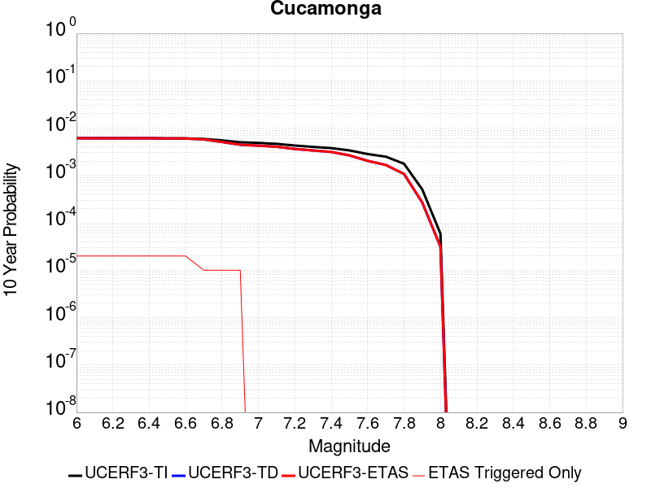 |

| Magnitude | 1 wk TI Prob | 1 wk TD Prob | 1 wk ETAS Prob | 1 wk ETAS/TD Gain | 1 wk ETAS Triggered Only | 1 mo TI Prob | 1 mo TD Prob | 1 mo ETAS Prob | 1 mo ETAS/TD Gain | 1 mo ETAS Triggered Only | 1 yr TI Prob | 1 yr TD Prob | 1 yr ETAS Prob | 1 yr ETAS/TD Gain | 1 yr ETAS Triggered Only | 10 yr TI Prob | 10 yr TD Prob | 10 yr ETAS Prob | 10 yr ETAS/TD Gain | 10 yr ETAS Triggered Only |
|-----|-----|-----|-----|-----|-----|-----|-----|-----|-----|-----|-----|-----|-----|-----|-----|-----|-----|-----|-----|-----|
| 6.0 | 1.1848348E-5 | 1.1737756E-5 | 1.1737756E-5 | 1.0 | 0.0 | 5.0777642E-5 | 5.0303715E-5 | 5.0303715E-5 | 1.0 | 0.0 | 6.180424E-4 | 6.122783E-4 | 6.122783E-4 | 1.0 | 0.0 | 0.0061632637 | 0.0061070886 | 0.0061269663 | 1.0032549 | 2.0E-5 |
| 6.1 | 1.1848348E-5 | 1.1737756E-5 | 1.1737756E-5 | 1.0 | 0.0 | 5.0777642E-5 | 5.0303715E-5 | 5.0303715E-5 | 1.0 | 0.0 | 6.180424E-4 | 6.122783E-4 | 6.122783E-4 | 1.0 | 0.0 | 0.0061632637 | 0.0061070886 | 0.0061269663 | 1.0032549 | 2.0E-5 |
| 6.2 | 1.1848348E-5 | 1.1737756E-5 | 1.1737756E-5 | 1.0 | 0.0 | 5.0777642E-5 | 5.0303715E-5 | 5.0303715E-5 | 1.0 | 0.0 | 6.180424E-4 | 6.122783E-4 | 6.122783E-4 | 1.0 | 0.0 | 0.0061632637 | 0.0061070886 | 0.0061269663 | 1.0032549 | 2.0E-5 |
| 6.3 | 1.1848348E-5 | 1.1737756E-5 | 1.1737756E-5 | 1.0 | 0.0 | 5.0777642E-5 | 5.0303715E-5 | 5.0303715E-5 | 1.0 | 0.0 | 6.180424E-4 | 6.122783E-4 | 6.122783E-4 | 1.0 | 0.0 | 0.0061632637 | 0.0061070886 | 0.0061269663 | 1.0032549 | 2.0E-5 |
| 6.4 | 1.1848348E-5 | 1.1737756E-5 | 1.1737756E-5 | 1.0 | 0.0 | 5.0777642E-5 | 5.0303715E-5 | 5.0303715E-5 | 1.0 | 0.0 | 6.180424E-4 | 6.122783E-4 | 6.122783E-4 | 1.0 | 0.0 | 0.0061632637 | 0.0061070886 | 0.0061269663 | 1.0032549 | 2.0E-5 |
| 6.5 | 1.16988695E-5 | 1.1576785E-5 | 1.1576785E-5 | 1.0 | 0.0 | 5.013705E-5 | 4.9613864E-5 | 4.9613864E-5 | 1.0 | 0.0 | 6.102476E-4 | 6.0388405E-4 | 6.0388405E-4 | 1.0 | 0.0 | 0.006085745 | 0.006023602 | 0.0060434816 | 1.0033003 | 2.0E-5 |
| 6.6 | 1.16988695E-5 | 1.1576785E-5 | 1.1576785E-5 | 1.0 | 0.0 | 5.013705E-5 | 4.9613864E-5 | 4.9613864E-5 | 1.0 | 0.0 | 6.102476E-4 | 6.0388405E-4 | 6.0388405E-4 | 1.0 | 0.0 | 0.006085745 | 0.006023602 | 0.0060434816 | 1.0033003 | 2.0E-5 |
| 6.7 | 1.1397107E-5 | 1.1115677E-5 | 1.1115677E-5 | 1.0 | 0.0 | 4.884383E-5 | 4.7637757E-5 | 4.7637757E-5 | 1.0 | 0.0 | 5.9451134E-4 | 5.798378E-4 | 5.798378E-4 | 1.0 | 0.0 | 0.005929234 | 0.0057844 | 0.005794342 | 1.0017188 | 1.0E-5 |
| 6.8 | 1.058387E-5 | 9.785641E-6 | 9.785641E-6 | 1.0 | 0.0 | 4.5358654E-5 | 4.1937794E-5 | 4.1937794E-5 | 1.0 | 0.0 | 5.521017E-4 | 5.1047414E-4 | 5.1047414E-4 | 1.0 | 0.0 | 0.00550732 | 0.0050940234 | 0.0051039727 | 1.0019531 | 1.0E-5 |
| 6.9 | 9.690046E-6 | 8.5800775E-6 | 8.5800775E-6 | 1.0 | 0.0 | 4.1528107E-5 | 3.6771246E-5 | 3.6771246E-5 | 1.0 | 0.0 | 5.054874E-4 | 4.4759834E-4 | 4.4759834E-4 | 1.0 | 0.0 | 0.005043391 | 0.004467903 | 0.0044778585 | 1.0022281 | 1.0E-5 |
| 7.0 | 9.381461E-6 | 8.187685E-6 | 8.187685E-6 | 1.0 | 0.0 | 4.020564E-5 | 3.5089608E-5 | 3.5089608E-5 | 1.0 | 0.0 | 4.893937E-4 | 4.271326E-4 | 4.271326E-4 | 1.0 | 0.0 | 0.0048831734 | 0.0042640497 | 0.0042640497 | 1.0 | 0.0 |
| 7.1 | 8.946492E-6 | 7.78246E-6 | 7.78246E-6 | 1.0 | 0.0 | 3.8341543E-5 | 3.335297E-5 | 3.335297E-5 | 1.0 | 0.0 | 4.667083E-4 | 4.059971E-4 | 4.059971E-4 | 1.0 | 0.0 | 0.0046572937 | 0.0040534893 | 0.0040534893 | 1.0 | 0.0 |
| 7.2 | 8.251016E-6 | 6.9758194E-6 | 6.9758194E-6 | 1.0 | 0.0 | 3.5361016E-5 | 2.9896028E-5 | 2.9896028E-5 | 1.0 | 0.0 | 4.3043532E-4 | 3.6392358E-4 | 3.6392358E-4 | 1.0 | 0.0 | 0.0042960253 | 0.0036342086 | 0.0036342086 | 1.0 | 0.0 |
| 7.3 | 7.717881E-6 | 6.486875E-6 | 6.486875E-6 | 1.0 | 0.0 | 3.3076216E-5 | 2.7800597E-5 | 2.7800597E-5 | 1.0 | 0.0 | 4.026285E-4 | 3.3841992E-4 | 3.3841992E-4 | 1.0 | 0.0 | 0.004018998 | 0.0033799817 | 0.0033799817 | 1.0 | 0.0 |
| 7.4 | 7.275623E-6 | 6.0325037E-6 | 6.0325037E-6 | 1.0 | 0.0 | 3.118087E-5 | 2.5853333E-5 | 2.5853333E-5 | 1.0 | 0.0 | 3.7956095E-4 | 3.1471907E-4 | 3.1471907E-4 | 1.0 | 0.0 | 0.0037891332 | 0.0031436686 | 0.0031436686 | 1.0 | 0.0 |
| 7.5 | 6.5109502E-6 | 5.101059E-6 | 5.101059E-6 | 1.0 | 0.0 | 2.7903774E-5 | 2.1861499E-5 | 2.1861499E-5 | 1.0 | 0.0 | 3.3967546E-4 | 2.661314E-4 | 2.661314E-4 | 1.0 | 0.0 | 0.0033915674 | 0.00265905 | 0.00265905 | 1.0 | 0.0 |
| 7.6 | 5.4495326E-6 | 3.9089846E-6 | 3.9089846E-6 | 1.0 | 0.0 | 2.335493E-5 | 1.6752683E-5 | 1.6752683E-5 | 1.0 | 0.0 | 2.8430918E-4 | 2.0394489E-4 | 2.0394489E-4 | 1.0 | 0.0 | 0.0028394572 | 0.0020384968 | 0.0020384968 | 1.0 | 0.0 |
| 7.7 | 4.7997164E-6 | 3.2006355E-6 | 3.2006355E-6 | 1.0 | 0.0 | 2.057005E-5 | 1.3716938E-5 | 1.3716938E-5 | 1.0 | 0.0 | 2.504116E-4 | 1.6699095E-4 | 1.6699095E-4 | 1.0 | 0.0 | 0.002501296 | 0.001669585 | 0.001669585 | 1.0 | 0.0 |
| 7.8 | 3.3941733E-6 | 2.0644336E-6 | 2.0644336E-6 | 1.0 | 0.0 | 1.4546376E-5 | 8.847543E-6 | 8.847543E-6 | 1.0 | 0.0 | 1.7708774E-4 | 1.07713524E-4 | 1.07713524E-4 | 1.0 | 0.0 | 0.0017694668 | 0.0010768501 | 0.0010768501 | 1.0 | 0.0 |
| 7.9 | 9.750552E-7 | 5.1567173E-7 | 5.1567173E-7 | 1.0 | 0.0 | 4.178801E-6 | 2.2100198E-6 | 2.2100198E-6 | 1.0 | 0.0 | 5.0875715E-5 | 2.6906664E-5 | 2.6906664E-5 | 1.0 | 0.0 | 5.086407E-4 | 2.6903447E-4 | 2.6903447E-4 | 1.0 | 0.0 |
| 8.0 | 1.133857E-7 | 6.0540515E-8 | 6.0540515E-8 | 1.0 | 0.0 | 4.8593864E-7 | 2.5945934E-7 | 2.5945934E-7 | 1.0 | 0.0 | 5.9162867E-6 | 3.158913E-6 | 3.158913E-6 | 1.0 | 0.0 | 5.916129E-5 | 3.1588697E-5 | 3.1588697E-5 | 1.0 | 0.0 |

## Robinson Creek
*[(top)](#table-of-contents)*

| 1 Week | 1 Month | 1 Year | 10 Year |
|-----|-----|-----|-----|
|  |  | 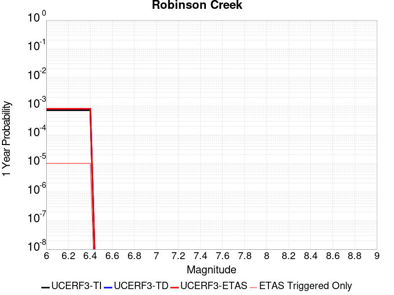 |  |

| Magnitude | 1 wk TI Prob | 1 wk TD Prob | 1 wk ETAS Prob | 1 wk ETAS/TD Gain | 1 wk ETAS Triggered Only | 1 mo TI Prob | 1 mo TD Prob | 1 mo ETAS Prob | 1 mo ETAS/TD Gain | 1 mo ETAS Triggered Only | 1 yr TI Prob | 1 yr TD Prob | 1 yr ETAS Prob | 1 yr ETAS/TD Gain | 1 yr ETAS Triggered Only | 10 yr TI Prob | 10 yr TD Prob | 10 yr ETAS Prob | 10 yr ETAS/TD Gain | 10 yr ETAS Triggered Only |
|-----|-----|-----|-----|-----|-----|-----|-----|-----|-----|-----|-----|-----|-----|-----|-----|-----|-----|-----|-----|-----|
| 6.0 | 1.3705327E-5 | 1.5285246E-5 | 1.5285246E-5 | 1.0 | 0.0 | 5.8735794E-5 | 6.5508204E-5 | 7.5507545E-5 | 1.1526426 | 1.0E-5 | 7.1487366E-4 | 7.9756236E-4 | 8.075544E-4 | 1.0125282 | 1.0E-5 | 0.0071257832 | 0.007975623 | 0.007995464 | 1.0024877 | 2.0E-5 |
| 6.1 | 1.3705327E-5 | 1.5285246E-5 | 1.5285246E-5 | 1.0 | 0.0 | 5.8735794E-5 | 6.5508204E-5 | 7.5507545E-5 | 1.1526426 | 1.0E-5 | 7.1487366E-4 | 7.9756236E-4 | 8.075544E-4 | 1.0125282 | 1.0E-5 | 0.0071257832 | 0.007975623 | 0.007995464 | 1.0024877 | 2.0E-5 |
| 6.2 | 1.3705327E-5 | 1.5285246E-5 | 1.5285246E-5 | 1.0 | 0.0 | 5.8735794E-5 | 6.5508204E-5 | 7.5507545E-5 | 1.1526426 | 1.0E-5 | 7.1487366E-4 | 7.9756236E-4 | 8.075544E-4 | 1.0125282 | 1.0E-5 | 0.0071257832 | 0.007975623 | 0.007995464 | 1.0024877 | 2.0E-5 |
| 6.3 | 1.3705327E-5 | 1.5285246E-5 | 1.5285246E-5 | 1.0 | 0.0 | 5.8735794E-5 | 6.5508204E-5 | 7.5507545E-5 | 1.1526426 | 1.0E-5 | 7.1487366E-4 | 7.9756236E-4 | 8.075544E-4 | 1.0125282 | 1.0E-5 | 0.0071257832 | 0.007975623 | 0.007995464 | 1.0024877 | 2.0E-5 |
| 6.4 | 1.3705327E-5 | 1.5285246E-5 | 1.5285246E-5 | 1.0 | 0.0 | 5.8735794E-5 | 6.5508204E-5 | 7.5507545E-5 | 1.1526426 | 1.0E-5 | 7.1487366E-4 | 7.9756236E-4 | 8.075544E-4 | 1.0125282 | 1.0E-5 | 0.0071257832 | 0.007975623 | 0.007995464 | 1.0024877 | 2.0E-5 |

## Hector Mine
*[(top)](#table-of-contents)*

| 1 Week | 1 Month | 1 Year | 10 Year |
|-----|-----|-----|-----|
|  |  |  |  |

| Magnitude | 1 wk TI Prob | 1 wk TD Prob | 1 wk ETAS Prob | 1 wk ETAS/TD Gain | 1 wk ETAS Triggered Only | 1 mo TI Prob | 1 mo TD Prob | 1 mo ETAS Prob | 1 mo ETAS/TD Gain | 1 mo ETAS Triggered Only | 1 yr TI Prob | 1 yr TD Prob | 1 yr ETAS Prob | 1 yr ETAS/TD Gain | 1 yr ETAS Triggered Only | 10 yr TI Prob | 10 yr TD Prob | 10 yr ETAS Prob | 10 yr ETAS/TD Gain | 10 yr ETAS Triggered Only |
|-----|-----|-----|-----|-----|-----|-----|-----|-----|-----|-----|-----|-----|-----|-----|-----|-----|-----|-----|-----|-----|
| 6.0 | 1.8760093E-5 | 2.796445E-6 | 2.796445E-6 | 1.0 | 0.0 | 8.039792E-5 | 1.1984732E-5 | 2.1984612E-5 | 1.834385 | 1.0E-5 | 9.78405E-4 | 1.4590833E-4 | 1.5590688E-4 | 1.0685261 | 1.0E-5 | 0.009741086 | 0.0014585176 | 0.0014784884 | 1.0136925 | 2.0E-5 |
| 6.1 | 1.8760093E-5 | 2.796445E-6 | 2.796445E-6 | 1.0 | 0.0 | 8.039792E-5 | 1.1984732E-5 | 2.1984612E-5 | 1.834385 | 1.0E-5 | 9.78405E-4 | 1.4590833E-4 | 1.5590688E-4 | 1.0685261 | 1.0E-5 | 0.009741086 | 0.0014585176 | 0.0014784884 | 1.0136925 | 2.0E-5 |
| 6.2 | 1.8760093E-5 | 2.796445E-6 | 2.796445E-6 | 1.0 | 0.0 | 8.039792E-5 | 1.1984732E-5 | 2.1984612E-5 | 1.834385 | 1.0E-5 | 9.78405E-4 | 1.4590833E-4 | 1.5590688E-4 | 1.0685261 | 1.0E-5 | 0.009741086 | 0.0014585176 | 0.0014784884 | 1.0136925 | 2.0E-5 |
| 6.3 | 1.8760093E-5 | 2.796445E-6 | 2.796445E-6 | 1.0 | 0.0 | 8.039792E-5 | 1.1984732E-5 | 2.1984612E-5 | 1.834385 | 1.0E-5 | 9.78405E-4 | 1.4590833E-4 | 1.5590688E-4 | 1.0685261 | 1.0E-5 | 0.009741086 | 0.0014585176 | 0.0014784884 | 1.0136925 | 2.0E-5 |
| 6.4 | 1.0888055E-5 | 2.796445E-6 | 2.796445E-6 | 1.0 | 0.0 | 4.666226E-5 | 1.1984732E-5 | 2.1984612E-5 | 1.834385 | 1.0E-5 | 5.679649E-4 | 1.4590833E-4 | 1.5590688E-4 | 1.0685261 | 1.0E-5 | 0.0056651547 | 0.0014585176 | 0.0014784884 | 1.0136925 | 2.0E-5 |
| 6.5 | 1.0888055E-5 | 2.796445E-6 | 2.796445E-6 | 1.0 | 0.0 | 4.666226E-5 | 1.1984732E-5 | 2.1984612E-5 | 1.834385 | 1.0E-5 | 5.679649E-4 | 1.4590833E-4 | 1.5590688E-4 | 1.0685261 | 1.0E-5 | 0.0056651547 | 0.0014585176 | 0.0014784884 | 1.0136925 | 2.0E-5 |
| 6.6 | 1.0730738E-5 | 2.796445E-6 | 2.796445E-6 | 1.0 | 0.0 | 4.5988065E-5 | 1.1984732E-5 | 2.1984612E-5 | 1.834385 | 1.0E-5 | 5.5976084E-4 | 1.4590833E-4 | 1.5590688E-4 | 1.0685261 | 1.0E-5 | 0.0055835294 | 0.0014585176 | 0.0014784884 | 1.0136925 | 2.0E-5 |
| 6.7 | 7.881326E-6 | 2.7711246E-6 | 2.7711246E-6 | 1.0 | 0.0 | 3.3776672E-5 | 1.1876217E-5 | 2.1876098E-5 | 1.842009 | 1.0E-5 | 4.111534E-4 | 1.4458735E-4 | 1.545859E-4 | 1.0691524 | 1.0E-5 | 0.0041039353 | 0.0014453249 | 0.001465296 | 1.0138177 | 2.0E-5 |
| 6.8 | 7.5683483E-6 | 2.7328742E-6 | 2.7328742E-6 | 1.0 | 0.0 | 3.2435375E-5 | 1.1712288E-5 | 2.171217E-5 | 1.8537941 | 1.0E-5 | 3.9482914E-4 | 1.4259177E-4 | 1.5259035E-4 | 1.0701202 | 1.0E-5 | 0.0039412836 | 0.0014253948 | 0.0014453663 | 1.0140111 | 2.0E-5 |
| 6.9 | 6.473048E-6 | 2.513948E-6 | 2.513948E-6 | 1.0 | 0.0 | 2.7741338E-5 | 1.0774041E-5 | 2.0773932E-5 | 1.9281468 | 1.0E-5 | 3.3769844E-4 | 1.3117002E-4 | 1.4116871E-4 | 1.076227 | 1.0E-5 | 0.0033718573 | 0.0013113155 | 0.0013312893 | 1.0152318 | 2.0E-5 |
| 7.0 | 4.9959954E-6 | 1.8565554E-6 | 1.8565554E-6 | 1.0 | 0.0 | 2.1411232E-5 | 7.956662E-6 | 1.7956583E-5 | 2.2567985 | 1.0E-5 | 2.6065056E-4 | 9.687162E-5 | 1.0687065E-4 | 1.1032194 | 1.0E-5 | 0.0026034506 | 9.686435E-4 | 9.886242E-4 | 1.0206274 | 2.0E-5 |
| 7.1 | 1.2997541E-6 | 1.5602835E-7 | 1.5602835E-7 | 1.0 | 0.0 | 5.5703626E-6 | 6.686928E-7 | 6.686928E-7 | 1.0 | 0.0 | 6.7817055E-5 | 8.141308E-6 | 8.141308E-6 | 1.0 | 0.0 | 6.779636E-4 | 8.141049E-5 | 8.141049E-5 | 1.0 | 0.0 |
| 7.2 | 8.392699E-7 | 9.728028E-8 | 9.728028E-8 | 1.0 | 0.0 | 3.596866E-6 | 4.1691544E-7 | 4.1691544E-7 | 1.0 | 0.0 | 4.3790962E-5 | 5.0759354E-6 | 5.0759354E-6 | 1.0 | 0.0 | 4.3782333E-4 | 5.075839E-5 | 5.075839E-5 | 1.0 | 0.0 |
| 7.3 | 3.13015E-7 | 4.8294503E-8 | 4.8294503E-8 | 1.0 | 0.0 | 1.3414921E-6 | 2.0697642E-7 | 2.0697642E-7 | 1.0 | 0.0 | 1.6332544E-5 | 2.5199358E-6 | 2.5199358E-6 | 1.0 | 0.0 | 1.6331344E-4 | 2.5199157E-5 | 2.5199157E-5 | 1.0 | 0.0 |

## Northridge
*[(top)](#table-of-contents)*

| 1 Week | 1 Month | 1 Year | 10 Year |
|-----|-----|-----|-----|
|  |  |  |  |

| Magnitude | 1 wk TI Prob | 1 wk TD Prob | 1 wk ETAS Prob | 1 wk ETAS/TD Gain | 1 wk ETAS Triggered Only | 1 mo TI Prob | 1 mo TD Prob | 1 mo ETAS Prob | 1 mo ETAS/TD Gain | 1 mo ETAS Triggered Only | 1 yr TI Prob | 1 yr TD Prob | 1 yr ETAS Prob | 1 yr ETAS/TD Gain | 1 yr ETAS Triggered Only | 10 yr TI Prob | 10 yr TD Prob | 10 yr ETAS Prob | 10 yr ETAS/TD Gain | 10 yr ETAS Triggered Only |
|-----|-----|-----|-----|-----|-----|-----|-----|-----|-----|-----|-----|-----|-----|-----|-----|-----|-----|-----|-----|-----|
| 6.0 | 1.8340852E-5 | 7.5881535E-6 | 7.5881535E-6 | 1.0 | 0.0 | 7.860128E-5 | 3.2520264E-5 | 3.2520264E-5 | 1.0 | 0.0 | 9.565505E-4 | 3.9586448E-4 | 3.9586448E-4 | 1.0 | 0.0 | 0.009524435 | 0.003951816 | 0.0039717364 | 1.005041 | 2.0E-5 |
| 6.1 | 1.8340852E-5 | 7.5881535E-6 | 7.5881535E-6 | 1.0 | 0.0 | 7.860128E-5 | 3.2520264E-5 | 3.2520264E-5 | 1.0 | 0.0 | 9.565505E-4 | 3.9586448E-4 | 3.9586448E-4 | 1.0 | 0.0 | 0.009524435 | 0.003951816 | 0.0039717364 | 1.005041 | 2.0E-5 |
| 6.2 | 1.8340852E-5 | 7.5881535E-6 | 7.5881535E-6 | 1.0 | 0.0 | 7.860128E-5 | 3.2520264E-5 | 3.2520264E-5 | 1.0 | 0.0 | 9.565505E-4 | 3.9586448E-4 | 3.9586448E-4 | 1.0 | 0.0 | 0.009524435 | 0.003951816 | 0.0039717364 | 1.005041 | 2.0E-5 |
| 6.3 | 1.8340852E-5 | 7.5881535E-6 | 7.5881535E-6 | 1.0 | 0.0 | 7.860128E-5 | 3.2520264E-5 | 3.2520264E-5 | 1.0 | 0.0 | 9.565505E-4 | 3.9586448E-4 | 3.9586448E-4 | 1.0 | 0.0 | 0.009524435 | 0.003951816 | 0.0039717364 | 1.005041 | 2.0E-5 |
| 6.4 | 1.7361892E-5 | 7.5881535E-6 | 7.5881535E-6 | 1.0 | 0.0 | 7.440598E-5 | 3.2520264E-5 | 3.2520264E-5 | 1.0 | 0.0 | 9.055163E-4 | 3.9586448E-4 | 3.9586448E-4 | 1.0 | 0.0 | 0.009018354 | 0.003951816 | 0.0039717364 | 1.005041 | 2.0E-5 |
| 6.5 | 1.7361892E-5 | 7.5881535E-6 | 7.5881535E-6 | 1.0 | 0.0 | 7.440598E-5 | 3.2520264E-5 | 3.2520264E-5 | 1.0 | 0.0 | 9.055163E-4 | 3.9586448E-4 | 3.9586448E-4 | 1.0 | 0.0 | 0.009018354 | 0.003951816 | 0.0039717364 | 1.005041 | 2.0E-5 |
| 6.6 | 1.5458201E-5 | 7.5881535E-6 | 7.5881535E-6 | 1.0 | 0.0 | 6.624775E-5 | 3.2520264E-5 | 3.2520264E-5 | 1.0 | 0.0 | 8.0626784E-4 | 3.9586448E-4 | 3.9586448E-4 | 1.0 | 0.0 | 0.008033488 | 0.003951816 | 0.0039717364 | 1.005041 | 2.0E-5 |
| 6.7 | 1.2538368E-5 | 6.381707E-6 | 6.381707E-6 | 1.0 | 0.0 | 5.3734755E-5 | 2.7349888E-5 | 2.7349888E-5 | 1.0 | 0.0 | 6.5402425E-4 | 3.3293446E-4 | 3.3293446E-4 | 1.0 | 0.0 | 0.0065210275 | 0.0033244046 | 0.0033443382 | 1.0059961 | 2.0E-5 |
| 6.8 | 1.1438097E-5 | 6.3503594E-6 | 6.3503594E-6 | 1.0 | 0.0 | 4.9019498E-5 | 2.7215545E-5 | 2.7215545E-5 | 1.0 | 0.0 | 5.9664896E-4 | 3.3129932E-4 | 3.3129932E-4 | 1.0 | 0.0 | 0.005950495 | 0.003308102 | 0.0033180688 | 1.0030129 | 1.0E-5 |
| 6.9 | 1.1204891E-5 | 6.2868094E-6 | 6.2868094E-6 | 1.0 | 0.0 | 4.8020076E-5 | 2.6943193E-5 | 2.6943193E-5 | 1.0 | 0.0 | 5.8448757E-4 | 3.2798442E-4 | 3.2798442E-4 | 1.0 | 0.0 | 0.0058295266 | 0.0032750512 | 0.0032850185 | 1.0030434 | 1.0E-5 |
| 7.0 | 1.061046E-5 | 6.1154565E-6 | 6.1154565E-6 | 1.0 | 0.0 | 4.5472607E-5 | 2.6208838E-5 | 2.6208838E-5 | 1.0 | 0.0 | 5.534883E-4 | 3.1904632E-4 | 3.1904632E-4 | 1.0 | 0.0 | 0.0055211177 | 0.003185929 | 0.0031958972 | 1.0031288 | 1.0E-5 |
| 7.1 | 1.0266979E-5 | 6.0043685E-6 | 6.0043685E-6 | 1.0 | 0.0 | 4.40006E-5 | 2.5732756E-5 | 2.5732756E-5 | 1.0 | 0.0 | 5.355756E-4 | 3.132517E-4 | 3.132517E-4 | 1.0 | 0.0 | 0.0053428668 | 0.0031281472 | 0.0031381159 | 1.0031868 | 1.0E-5 |
| 7.2 | 9.91273E-6 | 5.820076E-6 | 5.820076E-6 | 1.0 | 0.0 | 4.248244E-5 | 2.4942945E-5 | 2.4942945E-5 | 1.0 | 0.0 | 5.171009E-4 | 3.0363846E-4 | 3.0363846E-4 | 1.0 | 0.0 | 0.0051589934 | 0.003032281 | 0.0030422506 | 1.0032878 | 1.0E-5 |
| 7.3 | 8.4959265E-6 | 5.1931415E-6 | 5.1931415E-6 | 1.0 | 0.0 | 3.6410605E-5 | 2.2256132E-5 | 2.2256132E-5 | 1.0 | 0.0 | 4.4320893E-4 | 2.7093495E-4 | 2.7093495E-4 | 1.0 | 0.0 | 0.00442326 | 0.0027060728 | 0.0027160458 | 1.0036854 | 1.0E-5 |
| 7.4 | 8.0847185E-6 | 4.9820114E-6 | 4.9820114E-6 | 1.0 | 0.0 | 3.4648332E-5 | 2.1351305E-5 | 2.1351305E-5 | 1.0 | 0.0 | 4.2176177E-4 | 2.5992136E-4 | 2.5992136E-4 | 1.0 | 0.0 | 0.0042096223 | 0.0025961995 | 0.0026061735 | 1.0038418 | 1.0E-5 |
| 7.5 | 6.8220684E-6 | 4.2533693E-6 | 4.2533693E-6 | 1.0 | 0.0 | 2.9237108E-5 | 1.8228598E-5 | 1.8228598E-5 | 1.0 | 0.0 | 3.5590364E-4 | 2.2191078E-4 | 2.2191078E-4 | 1.0 | 0.0 | 0.0035533418 | 0.0022169128 | 0.0022268908 | 1.0045007 | 1.0E-5 |
| 7.6 | 4.4224143E-6 | 2.8999916E-6 | 2.8999916E-6 | 1.0 | 0.0 | 1.8953066E-5 | 1.2428477E-5 | 1.2428477E-5 | 1.0 | 0.0 | 2.3072914E-4 | 1.5130632E-4 | 1.5130632E-4 | 1.0 | 0.0 | 0.0023048974 | 0.0015120446 | 0.0015120446 | 1.0 | 0.0 |
| 7.7 | 2.5297056E-6 | 1.6046072E-6 | 1.6046072E-6 | 1.0 | 0.0 | 1.0841551E-5 | 6.87687E-6 | 6.87687E-6 | 1.0 | 0.0 | 1.319879E-4 | 8.372273E-5 | 8.372273E-5 | 1.0 | 0.0 | 0.0013190953 | 8.3691656E-4 | 8.3691656E-4 | 1.0 | 0.0 |
| 7.8 | 1.2508156E-6 | 8.78015E-7 | 8.78015E-7 | 1.0 | 0.0 | 5.3606273E-6 | 3.7629159E-6 | 3.7629159E-6 | 1.0 | 0.0 | 6.526368E-5 | 4.581255E-5 | 4.581255E-5 | 1.0 | 0.0 | 6.524452E-4 | 4.5803236E-4 | 4.5803236E-4 | 1.0 | 0.0 |
| 7.9 | 2.262199E-7 | 1.4664893E-7 | 1.4664893E-7 | 1.0 | 0.0 | 9.695135E-7 | 6.2849523E-7 | 6.2849523E-7 | 1.0 | 0.0 | 1.1803763E-5 | 7.651904E-6 | 7.651904E-6 | 1.0 | 0.0 | 1.1803136E-4 | 7.651648E-5 | 7.651648E-5 | 1.0 | 0.0 |
| 8.0 | 2.865362E-9 | 1.2753953E-9 | 1.2753953E-9 | 1.0 | 0.0 | 1.2280123E-8 | 5.46598E-9 | 5.46598E-9 | 1.0 | 0.0 | 1.4951048E-7 | 6.654831E-8 | 6.654831E-8 | 1.0 | 0.0 | 1.4951038E-6 | 6.6548307E-7 | 6.6548307E-7 | 1.0 | 0.0 |

## Channel Islands Western Deep Ramp
*[(top)](#table-of-contents)*

| 1 Week | 1 Month | 1 Year | 10 Year |
|-----|-----|-----|-----|
|  |  |  |  |

| Magnitude | 1 wk TI Prob | 1 wk TD Prob | 1 wk ETAS Prob | 1 wk ETAS/TD Gain | 1 wk ETAS Triggered Only | 1 mo TI Prob | 1 mo TD Prob | 1 mo ETAS Prob | 1 mo ETAS/TD Gain | 1 mo ETAS Triggered Only | 1 yr TI Prob | 1 yr TD Prob | 1 yr ETAS Prob | 1 yr ETAS/TD Gain | 1 yr ETAS Triggered Only | 10 yr TI Prob | 10 yr TD Prob | 10 yr ETAS Prob | 10 yr ETAS/TD Gain | 10 yr ETAS Triggered Only |
|-----|-----|-----|-----|-----|-----|-----|-----|-----|-----|-----|-----|-----|-----|-----|-----|-----|-----|-----|-----|-----|
| 6.0 | 6.0213506E-6 | 6.2549007E-6 | 6.2549007E-6 | 1.0 | 0.0 | 2.5805533E-5 | 2.6806467E-5 | 2.6806467E-5 | 1.0 | 0.0 | 3.1413708E-4 | 3.263243E-4 | 3.263243E-4 | 1.0 | 0.0 | 0.0031369338 | 0.003258893 | 0.003278828 | 1.0061171 | 2.0E-5 |
| 6.1 | 6.0213506E-6 | 6.2549007E-6 | 6.2549007E-6 | 1.0 | 0.0 | 2.5805533E-5 | 2.6806467E-5 | 2.6806467E-5 | 1.0 | 0.0 | 3.1413708E-4 | 3.263243E-4 | 3.263243E-4 | 1.0 | 0.0 | 0.0031369338 | 0.003258893 | 0.003278828 | 1.0061171 | 2.0E-5 |
| 6.2 | 6.0213506E-6 | 6.2549007E-6 | 6.2549007E-6 | 1.0 | 0.0 | 2.5805533E-5 | 2.6806467E-5 | 2.6806467E-5 | 1.0 | 0.0 | 3.1413708E-4 | 3.263243E-4 | 3.263243E-4 | 1.0 | 0.0 | 0.0031369338 | 0.003258893 | 0.003278828 | 1.0061171 | 2.0E-5 |
| 6.3 | 6.0213506E-6 | 6.2549007E-6 | 6.2549007E-6 | 1.0 | 0.0 | 2.5805533E-5 | 2.6806467E-5 | 2.6806467E-5 | 1.0 | 0.0 | 3.1413708E-4 | 3.263243E-4 | 3.263243E-4 | 1.0 | 0.0 | 0.0031369338 | 0.003258893 | 0.003278828 | 1.0061171 | 2.0E-5 |
| 6.4 | 6.0213506E-6 | 6.2549007E-6 | 6.2549007E-6 | 1.0 | 0.0 | 2.5805533E-5 | 2.6806467E-5 | 2.6806467E-5 | 1.0 | 0.0 | 3.1413708E-4 | 3.263243E-4 | 3.263243E-4 | 1.0 | 0.0 | 0.0031369338 | 0.003258893 | 0.003278828 | 1.0061171 | 2.0E-5 |
| 6.5 | 6.0213506E-6 | 6.2549007E-6 | 6.2549007E-6 | 1.0 | 0.0 | 2.5805533E-5 | 2.6806467E-5 | 2.6806467E-5 | 1.0 | 0.0 | 3.1413708E-4 | 3.263243E-4 | 3.263243E-4 | 1.0 | 0.0 | 0.0031369338 | 0.003258893 | 0.003278828 | 1.0061171 | 2.0E-5 |
| 6.6 | 6.0213506E-6 | 6.2549007E-6 | 6.2549007E-6 | 1.0 | 0.0 | 2.5805533E-5 | 2.6806467E-5 | 2.6806467E-5 | 1.0 | 0.0 | 3.1413708E-4 | 3.263243E-4 | 3.263243E-4 | 1.0 | 0.0 | 0.0031369338 | 0.003258893 | 0.003278828 | 1.0061171 | 2.0E-5 |
| 6.7 | 5.313309E-6 | 5.52527E-6 | 5.52527E-6 | 1.0 | 0.0 | 2.2771126E-5 | 2.3679535E-5 | 2.3679535E-5 | 1.0 | 0.0 | 2.772032E-4 | 2.882643E-4 | 2.882643E-4 | 1.0 | 0.0 | 0.0027685766 | 0.002879307 | 0.0028992493 | 1.0069261 | 2.0E-5 |
| 6.8 | 5.313309E-6 | 5.52527E-6 | 5.52527E-6 | 1.0 | 0.0 | 2.2771126E-5 | 2.3679535E-5 | 2.3679535E-5 | 1.0 | 0.0 | 2.772032E-4 | 2.882643E-4 | 2.882643E-4 | 1.0 | 0.0 | 0.0027685766 | 0.002879307 | 0.0028992493 | 1.0069261 | 2.0E-5 |
| 6.9 | 4.744377E-6 | 4.9394575E-6 | 4.9394575E-6 | 1.0 | 0.0 | 2.0332885E-5 | 2.1168953E-5 | 2.1168953E-5 | 1.0 | 0.0 | 2.4752476E-4 | 2.5770525E-4 | 2.5770525E-4 | 1.0 | 0.0 | 0.0024724922 | 0.0025744315 | 0.0025844057 | 1.0038743 | 1.0E-5 |
| 7.0 | 4.722209E-6 | 4.9165E-6 | 4.9165E-6 | 1.0 | 0.0 | 2.0237881E-5 | 2.1070566E-5 | 2.1070566E-5 | 1.0 | 0.0 | 2.4636835E-4 | 2.5650766E-4 | 2.5650766E-4 | 1.0 | 0.0 | 0.002460954 | 0.0025624833 | 0.0025724578 | 1.0038924 | 1.0E-5 |
| 7.1 | 4.611174E-6 | 4.8014354E-6 | 4.8014354E-6 | 1.0 | 0.0 | 1.9762025E-5 | 2.057744E-5 | 2.057744E-5 | 1.0 | 0.0 | 2.4057609E-4 | 2.5050525E-4 | 2.5050525E-4 | 1.0 | 0.0 | 0.002403158 | 0.0025025955 | 0.0025125707 | 1.0039859 | 1.0E-5 |
| 7.2 | 4.043994E-6 | 4.21205E-6 | 4.21205E-6 | 1.0 | 0.0 | 1.7331287E-5 | 1.8051538E-5 | 1.8051538E-5 | 1.0 | 0.0 | 2.10988E-4 | 2.1975888E-4 | 2.1975888E-4 | 1.0 | 0.0 | 0.002107878 | 0.0021957664 | 0.0022057444 | 1.0045443 | 1.0E-5 |
| 7.3 | 2.1233036E-6 | 2.2298022E-6 | 2.2298022E-6 | 1.0 | 0.0 | 9.099841E-6 | 9.556261E-6 | 9.556261E-6 | 1.0 | 0.0 | 1.1078493E-4 | 1.1634132E-4 | 1.1634132E-4 | 1.0 | 0.0 | 0.0011072971 | 0.0011628097 | 0.0011628097 | 1.0 | 0.0 |
| 7.4 | 1.9051884E-6 | 2.0015107E-6 | 2.0015107E-6 | 1.0 | 0.0 | 8.165067E-6 | 8.577875E-6 | 8.577875E-6 | 1.0 | 0.0 | 9.940516E-5 | 1.0443068E-4 | 1.0443068E-4 | 1.0 | 0.0 | 9.93607E-4 | 0.0010438213 | 0.0010438213 | 1.0 | 0.0 |
| 7.5 | 1.2408497E-6 | 1.3038928E-6 | 1.3038928E-6 | 1.0 | 0.0 | 5.317916E-6 | 5.5880996E-6 | 5.5880996E-6 | 1.0 | 0.0 | 6.4743705E-5 | 6.803301E-5 | 6.803301E-5 | 1.0 | 0.0 | 6.4724847E-4 | 6.8012404E-4 | 6.8012404E-4 | 1.0 | 0.0 |
| 7.6 | 6.5440025E-7 | 6.886766E-7 | 6.886766E-7 | 1.0 | 0.0 | 2.8045695E-6 | 2.9514679E-6 | 2.9514679E-6 | 1.0 | 0.0 | 3.4145098E-5 | 3.5933543E-5 | 3.5933543E-5 | 1.0 | 0.0 | 3.4139853E-4 | 3.5927873E-4 | 3.5927873E-4 | 1.0 | 0.0 |
| 7.7 | 3.985963E-7 | 4.1931077E-7 | 4.1931077E-7 | 1.0 | 0.0 | 1.7082689E-6 | 1.797045E-6 | 1.797045E-6 | 1.0 | 0.0 | 2.0797976E-5 | 2.1878815E-5 | 2.1878815E-5 | 1.0 | 0.0 | 2.0796029E-4 | 2.1876777E-4 | 2.1876777E-4 | 1.0 | 0.0 |
| 7.8 | 3.706329E-8 | 3.8592006E-8 | 3.8592006E-8 | 1.0 | 0.0 | 1.5884267E-7 | 1.653943E-7 | 1.653943E-7 | 1.0 | 0.0 | 1.9339077E-6 | 2.0136738E-6 | 2.0136738E-6 | 1.0 | 0.0 | 1.933891E-5 | 2.0136567E-5 | 2.0136567E-5 | 1.0 | 0.0 |

## Palos Verdes
*[(top)](#table-of-contents)*

| 1 Week | 1 Month | 1 Year | 10 Year |
|-----|-----|-----|-----|
|  |  |  |  |

| Magnitude | 1 wk TI Prob | 1 wk TD Prob | 1 wk ETAS Prob | 1 wk ETAS/TD Gain | 1 wk ETAS Triggered Only | 1 mo TI Prob | 1 mo TD Prob | 1 mo ETAS Prob | 1 mo ETAS/TD Gain | 1 mo ETAS Triggered Only | 1 yr TI Prob | 1 yr TD Prob | 1 yr ETAS Prob | 1 yr ETAS/TD Gain | 1 yr ETAS Triggered Only | 10 yr TI Prob | 10 yr TD Prob | 10 yr ETAS Prob | 10 yr ETAS/TD Gain | 10 yr ETAS Triggered Only |
|-----|-----|-----|-----|-----|-----|-----|-----|-----|-----|-----|-----|-----|-----|-----|-----|-----|-----|-----|-----|-----|
| 6.0 | 6.126063E-5 | 7.622862E-5 | 7.622862E-5 | 1.0 | 0.0 | 2.6251914E-4 | 3.2665656E-4 | 3.2665656E-4 | 1.0 | 0.0 | 0.0031914865 | 0.0039702994 | 0.0039802594 | 1.0025088 | 1.0E-5 | 0.031460393 | 0.039050125 | 0.039069343 | 1.0004922 | 2.0E-5 |
| 6.1 | 6.126063E-5 | 7.622862E-5 | 7.622862E-5 | 1.0 | 0.0 | 2.6251914E-4 | 3.2665656E-4 | 3.2665656E-4 | 1.0 | 0.0 | 0.0031914865 | 0.0039702994 | 0.0039802594 | 1.0025088 | 1.0E-5 | 0.031460393 | 0.039050125 | 0.039069343 | 1.0004922 | 2.0E-5 |
| 6.2 | 6.126063E-5 | 7.622862E-5 | 7.622862E-5 | 1.0 | 0.0 | 2.6251914E-4 | 3.2665656E-4 | 3.2665656E-4 | 1.0 | 0.0 | 0.0031914865 | 0.0039702994 | 0.0039802594 | 1.0025088 | 1.0E-5 | 0.031460393 | 0.039050125 | 0.039069343 | 1.0004922 | 2.0E-5 |
| 6.3 | 4.0838047E-5 | 4.975089E-5 | 4.975089E-5 | 1.0 | 0.0 | 1.7500846E-4 | 2.1320196E-4 | 2.1320196E-4 | 1.0 | 0.0 | 0.0021286458 | 0.0025928554 | 0.0026028294 | 1.0038468 | 1.0E-5 | 0.021083709 | 0.025647415 | 0.025666902 | 1.0007598 | 2.0E-5 |
| 6.4 | 4.0838047E-5 | 4.975089E-5 | 4.975089E-5 | 1.0 | 0.0 | 1.7500846E-4 | 2.1320196E-4 | 2.1320196E-4 | 1.0 | 0.0 | 0.0021286458 | 0.0025928554 | 0.0026028294 | 1.0038468 | 1.0E-5 | 0.021083709 | 0.025647415 | 0.025666902 | 1.0007598 | 2.0E-5 |
| 6.5 | 3.0512005E-5 | 3.6562593E-5 | 3.6562593E-5 | 1.0 | 0.0 | 1.3075917E-4 | 1.566881E-4 | 1.566881E-4 | 1.0 | 0.0 | 0.0015908304 | 0.001906127 | 0.0019161078 | 1.0052363 | 1.0E-5 | 0.015794903 | 0.01890965 | 0.018929271 | 1.0010377 | 2.0E-5 |
| 6.6 | 2.9255087E-5 | 3.5155368E-5 | 3.5155368E-5 | 1.0 | 0.0 | 1.2537291E-4 | 1.5065783E-4 | 1.5065783E-4 | 1.0 | 0.0 | 0.0015253464 | 0.0018328319 | 0.0018428136 | 1.0054461 | 1.0E-5 | 0.015149189 | 0.01818871 | 0.018208345 | 1.0010796 | 2.0E-5 |
| 6.7 | 2.287198E-5 | 2.7248976E-5 | 2.7248976E-5 | 1.0 | 0.0 | 9.801909E-5 | 1.1677662E-4 | 1.1677662E-4 | 1.0 | 0.0 | 0.001192729 | 0.0014209197 | 0.0014309054 | 1.0070277 | 1.0E-5 | 0.011863477 | 0.014127577 | 0.014147294 | 1.0013957 | 2.0E-5 |
| 6.8 | 2.1325764E-5 | 2.5432531E-5 | 2.5432531E-5 | 1.0 | 0.0 | 9.139293E-5 | 1.0899252E-4 | 1.0899252E-4 | 1.0 | 0.0 | 0.001112141 | 0.0013262664 | 0.0013362531 | 1.00753 | 1.0E-5 | 0.011065915 | 0.013192548 | 0.013202417 | 1.000748 | 1.0E-5 |
| 6.9 | 1.9009392E-5 | 2.2614122E-5 | 2.2614122E-5 | 1.0 | 0.0 | 8.1466285E-5 | 9.6914555E-5 | 9.6914555E-5 | 1.0 | 0.0 | 9.914007E-4 | 0.0011793834 | 0.0011893716 | 1.008469 | 1.0E-5 | 0.009869894 | 0.011739929 | 0.0117498115 | 1.0008417 | 1.0E-5 |
| 7.0 | 1.7098473E-5 | 2.0319867E-5 | 2.0319867E-5 | 1.0 | 0.0 | 7.3277115E-5 | 8.708272E-5 | 8.708272E-5 | 1.0 | 0.0 | 8.917837E-4 | 0.0010598017 | 0.001069791 | 1.0094258 | 1.0E-5 | 0.008882134 | 0.010555912 | 0.010565806 | 1.0009373 | 1.0E-5 |
| 7.1 | 1.5982785E-5 | 1.8995239E-5 | 1.8995239E-5 | 1.0 | 0.0 | 6.849585E-5 | 8.1406106E-5 | 8.1406106E-5 | 1.0 | 0.0 | 8.336179E-4 | 9.907534E-4 | 0.0010007435 | 1.0100833 | 1.0E-5 | 0.008304977 | 0.009871728 | 0.009881629 | 1.001003 | 1.0E-5 |
| 7.2 | 1.4468002E-5 | 1.719767E-5 | 1.719767E-5 | 1.0 | 0.0 | 6.200425E-5 | 7.370269E-5 | 7.370269E-5 | 1.0 | 0.0 | 7.546402E-4 | 8.970449E-4 | 8.970449E-4 | 1.0 | 0.0 | 0.007520827 | 0.008942509 | 0.008942509 | 1.0 | 0.0 |
| 7.3 | 5.288233E-6 | 6.2038207E-6 | 6.2038207E-6 | 1.0 | 0.0 | 2.2663658E-5 | 2.658773E-5 | 2.658773E-5 | 1.0 | 0.0 | 2.7589512E-4 | 3.2369242E-4 | 3.2369242E-4 | 1.0 | 0.0 | 0.0027555283 | 0.0032356323 | 0.0032356323 | 1.0 | 0.0 |
| 7.4 | 8.279556E-7 | 8.408364E-7 | 8.408364E-7 | 1.0 | 0.0 | 3.5483763E-6 | 3.60358E-6 | 3.60358E-6 | 1.0 | 0.0 | 4.3200624E-5 | 4.3872777E-5 | 4.3872777E-5 | 1.0 | 0.0 | 4.3192226E-4 | 4.3864836E-4 | 4.3864836E-4 | 1.0 | 0.0 |
| 7.5 | 6.559831E-7 | 6.667243E-7 | 6.667243E-7 | 1.0 | 0.0 | 2.8113532E-6 | 2.8573872E-6 | 2.8573872E-6 | 1.0 | 0.0 | 3.4227687E-5 | 3.47882E-5 | 3.47882E-5 | 1.0 | 0.0 | 3.4222414E-4 | 3.478342E-4 | 3.478342E-4 | 1.0 | 0.0 |
| 7.6 | 3.5018968E-7 | 3.562011E-7 | 3.562011E-7 | 1.0 | 0.0 | 1.500812E-6 | 1.5265755E-6 | 1.5265755E-6 | 1.0 | 0.0 | 1.8272232E-5 | 1.8585944E-5 | 1.8585944E-5 | 1.0 | 0.0 | 1.8270731E-4 | 1.858485E-4 | 1.858485E-4 | 1.0 | 0.0 |
| 7.7 | 1.1986104E-7 | 1.2198406E-7 | 1.2198406E-7 | 1.0 | 0.0 | 5.1369005E-7 | 5.227887E-7 | 5.227887E-7 | 1.0 | 0.0 | 6.2541585E-6 | 6.364934E-6 | 6.364934E-6 | 1.0 | 0.0 | 6.2539824E-5 | 6.364756E-5 | 6.364756E-5 | 1.0 | 0.0 |
| 7.8 | 3.0445005E-8 | 3.1027664E-8 | 3.1027664E-8 | 1.0 | 0.0 | 1.3047858E-7 | 1.3297569E-7 | 1.3297569E-7 | 1.0 | 0.0 | 1.5885756E-6 | 1.6189781E-6 | 1.6189781E-6 | 1.0 | 0.0 | 1.5885644E-5 | 1.6189684E-5 | 1.6189684E-5 | 1.0 | 0.0 |

## Pisgah-Bullion Mtn-Mesquite Lk
*[(top)](#table-of-contents)*

| 1 Week | 1 Month | 1 Year | 10 Year |
|-----|-----|-----|-----|
|  |  |  | 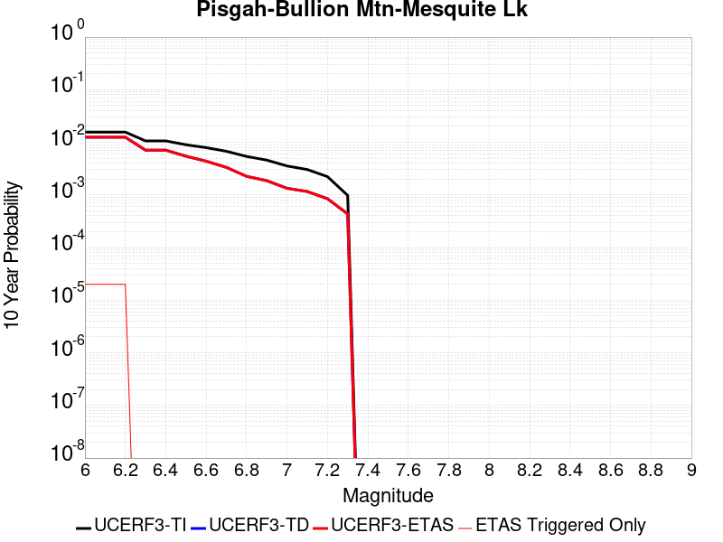 |

| Magnitude | 1 wk TI Prob | 1 wk TD Prob | 1 wk ETAS Prob | 1 wk ETAS/TD Gain | 1 wk ETAS Triggered Only | 1 mo TI Prob | 1 mo TD Prob | 1 mo ETAS Prob | 1 mo ETAS/TD Gain | 1 mo ETAS Triggered Only | 1 yr TI Prob | 1 yr TD Prob | 1 yr ETAS Prob | 1 yr ETAS/TD Gain | 1 yr ETAS Triggered Only | 10 yr TI Prob | 10 yr TD Prob | 10 yr ETAS Prob | 10 yr ETAS/TD Gain | 10 yr ETAS Triggered Only |
|-----|-----|-----|-----|-----|-----|-----|-----|-----|-----|-----|-----|-----|-----|-----|-----|-----|-----|-----|-----|-----|
| 6.0 | 3.0240792E-5 | 2.4091496E-5 | 2.4091496E-5 | 1.0 | 0.0 | 1.2959696E-4 | 1.0324575E-4 | 1.0324575E-4 | 1.0 | 0.0 | 0.0015767008 | 0.0012563926 | 0.0012663801 | 1.0079494 | 1.0E-5 | 0.015655609 | 0.012502918 | 0.012522668 | 1.0015796 | 2.0E-5 |
| 6.1 | 3.0240792E-5 | 2.4091496E-5 | 2.4091496E-5 | 1.0 | 0.0 | 1.2959696E-4 | 1.0324575E-4 | 1.0324575E-4 | 1.0 | 0.0 | 0.0015767008 | 0.0012563926 | 0.0012663801 | 1.0079494 | 1.0E-5 | 0.015655609 | 0.012502918 | 0.012522668 | 1.0015796 | 2.0E-5 |
| 6.2 | 3.0240792E-5 | 2.4091496E-5 | 2.4091496E-5 | 1.0 | 0.0 | 1.2959696E-4 | 1.0324575E-4 | 1.0324575E-4 | 1.0 | 0.0 | 0.0015767008 | 0.0012563926 | 0.0012663801 | 1.0079494 | 1.0E-5 | 0.015655609 | 0.012502918 | 0.012522668 | 1.0015796 | 2.0E-5 |
| 6.3 | 2.0498217E-5 | 1.3638254E-5 | 1.3638254E-5 | 1.0 | 0.0 | 8.784654E-5 | 5.8448444E-5 | 5.8448444E-5 | 1.0 | 0.0 | 0.0010690069 | 7.1139366E-4 | 7.1139366E-4 | 1.0 | 0.0 | 0.01063879 | 0.00709279 | 0.00709279 | 1.0 | 0.0 |
| 6.4 | 2.0498217E-5 | 1.3638254E-5 | 1.3638254E-5 | 1.0 | 0.0 | 8.784654E-5 | 5.8448444E-5 | 5.8448444E-5 | 1.0 | 0.0 | 0.0010690069 | 7.1139366E-4 | 7.1139366E-4 | 1.0 | 0.0 | 0.01063879 | 0.00709279 | 0.00709279 | 1.0 | 0.0 |
| 6.5 | 1.7316182E-5 | 1.0477178E-5 | 1.0477178E-5 | 1.0 | 0.0 | 7.42101E-5 | 4.4901473E-5 | 4.4901473E-5 | 1.0 | 0.0 | 9.0313336E-4 | 5.465483E-4 | 5.465483E-4 | 1.0 | 0.0 | 0.008994718 | 0.005453037 | 0.005453037 | 1.0 | 0.0 |
| 6.6 | 1.5251077E-5 | 8.414378E-6 | 8.414378E-6 | 1.0 | 0.0 | 6.536012E-5 | 3.606116E-5 | 3.606116E-5 | 1.0 | 0.0 | 7.9546886E-4 | 4.389634E-4 | 4.389634E-4 | 1.0 | 0.0 | 0.007926274 | 0.004381681 | 0.004381681 | 1.0 | 0.0 |
| 6.7 | 1.2997425E-5 | 6.411573E-6 | 6.411573E-6 | 1.0 | 0.0 | 5.570206E-5 | 2.7477907E-5 | 2.7477907E-5 | 1.0 | 0.0 | 6.7796157E-4 | 3.344968E-4 | 3.344968E-4 | 1.0 | 0.0 | 0.0067589693 | 0.0033403935 | 0.0033403935 | 1.0 | 0.0 |
| 6.8 | 1.035386E-5 | 4.333283E-6 | 4.333283E-6 | 1.0 | 0.0 | 4.437293E-5 | 1.8571085E-5 | 1.8571085E-5 | 1.0 | 0.0 | 5.401065E-4 | 2.2608037E-4 | 2.2608037E-4 | 1.0 | 0.0 | 0.0053879567 | 0.0022585907 | 0.0022585907 | 1.0 | 0.0 |
| 6.9 | 8.816252E-6 | 3.580692E-6 | 3.580692E-6 | 1.0 | 0.0 | 3.778339E-5 | 1.5345737E-5 | 1.5345737E-5 | 1.0 | 0.0 | 4.5991567E-4 | 1.8681891E-4 | 1.8681891E-4 | 1.0 | 0.0 | 0.00458965 | 0.0018666771 | 0.0018666771 | 1.0 | 0.0 |
| 7.0 | 6.8232207E-6 | 2.5676256E-6 | 2.5676256E-6 | 1.0 | 0.0 | 2.9242048E-5 | 1.10040655E-5 | 1.10040655E-5 | 1.0 | 0.0 | 3.5596377E-4 | 1.3396658E-4 | 1.3396658E-4 | 1.0 | 0.0 | 0.0035539411 | 0.0013388892 | 0.0013388892 | 1.0 | 0.0 |
| 7.1 | 5.837013E-6 | 2.2274157E-6 | 2.2274157E-6 | 1.0 | 0.0 | 2.501553E-5 | 9.546034E-6 | 9.546034E-6 | 1.0 | 0.0 | 3.045215E-4 | 1.1621706E-4 | 1.1621706E-4 | 1.0 | 0.0 | 0.0030410455 | 0.0011615918 | 0.0011615918 | 1.0 | 0.0 |
| 7.2 | 4.278052E-6 | 1.6275965E-6 | 1.6275965E-6 | 1.0 | 0.0 | 1.833438E-5 | 6.9753964E-6 | 6.9753964E-6 | 1.0 | 0.0 | 2.231982E-4 | 8.492238E-5 | 8.492238E-5 | 1.0 | 0.0 | 0.0022297418 | 8.489225E-4 | 8.489225E-4 | 1.0 | 0.0 |
| 7.3 | 1.8803692E-6 | 8.3450385E-7 | 8.3450385E-7 | 1.0 | 0.0 | 8.0587E-6 | 3.576441E-6 | 3.576441E-6 | 1.0 | 0.0 | 9.811026E-5 | 4.3542448E-5 | 4.3542448E-5 | 1.0 | 0.0 | 9.806695E-4 | 4.353536E-4 | 4.353536E-4 | 1.0 | 0.0 |

## Earthquake Valley (So Extension)
*[(top)](#table-of-contents)*

| 1 Week | 1 Month | 1 Year | 10 Year |
|-----|-----|-----|-----|
|  | 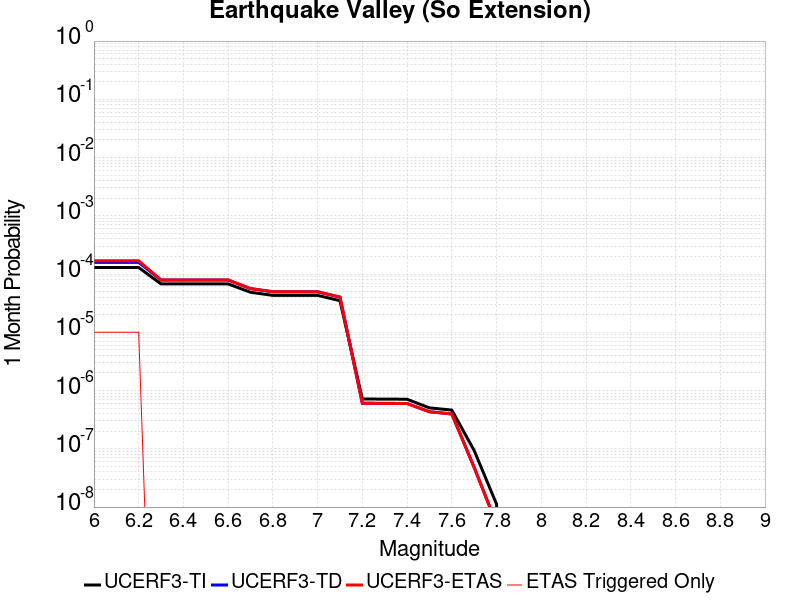 |  |  |

| Magnitude | 1 wk TI Prob | 1 wk TD Prob | 1 wk ETAS Prob | 1 wk ETAS/TD Gain | 1 wk ETAS Triggered Only | 1 mo TI Prob | 1 mo TD Prob | 1 mo ETAS Prob | 1 mo ETAS/TD Gain | 1 mo ETAS Triggered Only | 1 yr TI Prob | 1 yr TD Prob | 1 yr ETAS Prob | 1 yr ETAS/TD Gain | 1 yr ETAS Triggered Only | 10 yr TI Prob | 10 yr TD Prob | 10 yr ETAS Prob | 10 yr ETAS/TD Gain | 10 yr ETAS Triggered Only |
|-----|-----|-----|-----|-----|-----|-----|-----|-----|-----|-----|-----|-----|-----|-----|-----|-----|-----|-----|-----|-----|
| 6.0 | 3.0194888E-5 | 3.707326E-5 | 3.707326E-5 | 1.0 | 0.0 | 1.2940024E-4 | 1.588788E-4 | 1.688772E-4 | 1.0629311 | 1.0E-5 | 0.0015743093 | 0.0019331772 | 0.0019431579 | 1.0051628 | 1.0E-5 | 0.01563203 | 0.019213596 | 0.019233212 | 1.0010209 | 2.0E-5 |
| 6.1 | 3.0194888E-5 | 3.707326E-5 | 3.707326E-5 | 1.0 | 0.0 | 1.2940024E-4 | 1.588788E-4 | 1.688772E-4 | 1.0629311 | 1.0E-5 | 0.0015743093 | 0.0019331772 | 0.0019431579 | 1.0051628 | 1.0E-5 | 0.01563203 | 0.019213596 | 0.019233212 | 1.0010209 | 2.0E-5 |
| 6.2 | 3.0194888E-5 | 3.707326E-5 | 3.707326E-5 | 1.0 | 0.0 | 1.2940024E-4 | 1.588788E-4 | 1.688772E-4 | 1.0629311 | 1.0E-5 | 0.0015743093 | 0.0019331772 | 0.0019431579 | 1.0051628 | 1.0E-5 | 0.01563203 | 0.019213596 | 0.019233212 | 1.0010209 | 2.0E-5 |
| 6.3 | 1.5795305E-5 | 1.8447001E-5 | 1.8447001E-5 | 1.0 | 0.0 | 6.769241E-5 | 7.905681E-5 | 7.905681E-5 | 1.0 | 0.0 | 8.238434E-4 | 9.622029E-4 | 9.622029E-4 | 1.0 | 0.0 | 0.008207959 | 0.009591279 | 0.009591279 | 1.0 | 0.0 |
| 6.4 | 1.5795305E-5 | 1.8447001E-5 | 1.8447001E-5 | 1.0 | 0.0 | 6.769241E-5 | 7.905681E-5 | 7.905681E-5 | 1.0 | 0.0 | 8.238434E-4 | 9.622029E-4 | 9.622029E-4 | 1.0 | 0.0 | 0.008207959 | 0.009591279 | 0.009591279 | 1.0 | 0.0 |
| 6.5 | 1.5795305E-5 | 1.8447001E-5 | 1.8447001E-5 | 1.0 | 0.0 | 6.769241E-5 | 7.905681E-5 | 7.905681E-5 | 1.0 | 0.0 | 8.238434E-4 | 9.622029E-4 | 9.622029E-4 | 1.0 | 0.0 | 0.008207959 | 0.009591279 | 0.009591279 | 1.0 | 0.0 |
| 6.6 | 1.5795305E-5 | 1.8447001E-5 | 1.8447001E-5 | 1.0 | 0.0 | 6.769241E-5 | 7.905681E-5 | 7.905681E-5 | 1.0 | 0.0 | 8.238434E-4 | 9.622029E-4 | 9.622029E-4 | 1.0 | 0.0 | 0.008207959 | 0.009591279 | 0.009591279 | 1.0 | 0.0 |
| 6.7 | 1.1363076E-5 | 1.3138576E-5 | 1.3138576E-5 | 1.0 | 0.0 | 4.8697988E-5 | 5.6307395E-5 | 5.6307395E-5 | 1.0 | 0.0 | 5.927367E-4 | 6.85403E-4 | 6.85403E-4 | 1.0 | 0.0 | 0.0059115817 | 0.0068403645 | 0.0068403645 | 1.0 | 0.0 |
| 6.8 | 1.0049611E-5 | 1.15945795E-5 | 1.15945795E-5 | 1.0 | 0.0 | 4.306905E-5 | 4.969052E-5 | 4.969052E-5 | 1.0 | 0.0 | 5.242395E-4 | 6.048873E-4 | 6.048873E-4 | 1.0 | 0.0 | 0.0052300454 | 0.0060395855 | 0.0060395855 | 1.0 | 0.0 |
| 6.9 | 1.0049611E-5 | 1.15945795E-5 | 1.15945795E-5 | 1.0 | 0.0 | 4.306905E-5 | 4.969052E-5 | 4.969052E-5 | 1.0 | 0.0 | 5.242395E-4 | 6.048873E-4 | 6.048873E-4 | 1.0 | 0.0 | 0.0052300454 | 0.0060395855 | 0.0060395855 | 1.0 | 0.0 |
| 7.0 | 1.0049611E-5 | 1.15945795E-5 | 1.15945795E-5 | 1.0 | 0.0 | 4.306905E-5 | 4.969052E-5 | 4.969052E-5 | 1.0 | 0.0 | 5.242395E-4 | 6.048873E-4 | 6.048873E-4 | 1.0 | 0.0 | 0.0052300454 | 0.0060395855 | 0.0060395855 | 1.0 | 0.0 |
| 7.1 | 8.140254E-6 | 9.383657E-6 | 9.383657E-6 | 1.0 | 0.0 | 3.4886336E-5 | 4.021543E-5 | 4.021543E-5 | 1.0 | 0.0 | 4.2465836E-4 | 4.895799E-4 | 4.895799E-4 | 1.0 | 0.0 | 0.0042384774 | 0.00489159 | 0.00489159 | 1.0 | 0.0 |
| 7.2 | 1.673835E-7 | 1.4154533E-7 | 1.4154533E-7 | 1.0 | 0.0 | 7.173577E-7 | 6.066227E-7 | 6.066227E-7 | 1.0 | 0.0 | 8.733795E-6 | 7.38561E-6 | 7.38561E-6 | 1.0 | 0.0 | 8.733451E-5 | 7.3854E-5 | 7.3854E-5 | 1.0 | 0.0 |
| 7.3 | 1.6632116E-7 | 1.405276E-7 | 1.405276E-7 | 1.0 | 0.0 | 7.1280476E-7 | 6.02261E-7 | 6.02261E-7 | 1.0 | 0.0 | 8.678364E-6 | 7.332507E-6 | 7.332507E-6 | 1.0 | 0.0 | 8.6780245E-5 | 7.3323004E-5 | 7.3323004E-5 | 1.0 | 0.0 |
| 7.4 | 1.6569169E-7 | 1.3997388E-7 | 1.3997388E-7 | 1.0 | 0.0 | 7.1010703E-7 | 5.998879E-7 | 5.998879E-7 | 1.0 | 0.0 | 8.645519E-6 | 7.3036144E-6 | 7.3036144E-6 | 1.0 | 0.0 | 8.645182E-5 | 7.30341E-5 | 7.30341E-5 | 1.0 | 0.0 |
| 7.5 | 1.1764555E-7 | 1.0096232E-7 | 1.0096232E-7 | 1.0 | 0.0 | 5.041951E-7 | 4.3269557E-7 | 4.3269557E-7 | 1.0 | 0.0 | 6.138558E-6 | 5.268058E-6 | 5.268058E-6 | 1.0 | 0.0 | 6.1383886E-5 | 5.267955E-5 | 5.267955E-5 | 1.0 | 0.0 |
| 7.6 | 1.07927605E-7 | 9.261032E-8 | 9.261032E-8 | 1.0 | 0.0 | 4.6254678E-7 | 3.9690133E-7 | 3.9690133E-7 | 1.0 | 0.0 | 5.6314925E-6 | 4.832265E-6 | 4.832265E-6 | 1.0 | 0.0 | 5.63135E-5 | 4.832181E-5 | 4.832181E-5 | 1.0 | 0.0 |
| 7.7 | 2.1826905E-8 | 1.1181076E-8 | 1.1181076E-8 | 1.0 | 0.0 | 9.3543875E-8 | 4.7918892E-8 | 4.7918892E-8 | 1.0 | 0.0 | 1.1388961E-6 | 5.8341243E-7 | 5.8341243E-7 | 1.0 | 0.0 | 1.1388902E-5 | 5.8341143E-6 | 5.8341143E-6 | 1.0 | 0.0 |
| 7.8 | 2.6169649E-9 | 1.1970057E-9 | 1.1970057E-9 | 1.0 | 0.0 | 1.1215564E-8 | 5.130025E-9 | 5.130025E-9 | 1.0 | 0.0 | 1.3654947E-7 | 6.245805E-8 | 6.245805E-8 | 1.0 | 0.0 | 1.365494E-6 | 6.245805E-7 | 6.245805E-7 | 1.0 | 0.0 |

## La Panza 2011
*[(top)](#table-of-contents)*

| 1 Week | 1 Month | 1 Year | 10 Year |
|-----|-----|-----|-----|
|  |  |  |  |

| Magnitude | 1 wk TI Prob | 1 wk TD Prob | 1 wk ETAS Prob | 1 wk ETAS/TD Gain | 1 wk ETAS Triggered Only | 1 mo TI Prob | 1 mo TD Prob | 1 mo ETAS Prob | 1 mo ETAS/TD Gain | 1 mo ETAS Triggered Only | 1 yr TI Prob | 1 yr TD Prob | 1 yr ETAS Prob | 1 yr ETAS/TD Gain | 1 yr ETAS Triggered Only | 10 yr TI Prob | 10 yr TD Prob | 10 yr ETAS Prob | 10 yr ETAS/TD Gain | 10 yr ETAS Triggered Only |
|-----|-----|-----|-----|-----|-----|-----|-----|-----|-----|-----|-----|-----|-----|-----|-----|-----|-----|-----|-----|-----|
| 6.0 | 4.6754544E-6 | 4.717608E-6 | 4.717608E-6 | 1.0 | 0.0 | 2.0037509E-5 | 2.0218175E-5 | 2.0218175E-5 | 1.0 | 0.0 | 2.4392935E-4 | 2.4613045E-4 | 2.4613045E-4 | 1.0 | 0.0 | 0.0024366176 | 0.0024587729 | 0.0024787236 | 1.0081141 | 2.0E-5 |
| 6.1 | 4.6754544E-6 | 4.717608E-6 | 4.717608E-6 | 1.0 | 0.0 | 2.0037509E-5 | 2.0218175E-5 | 2.0218175E-5 | 1.0 | 0.0 | 2.4392935E-4 | 2.4613045E-4 | 2.4613045E-4 | 1.0 | 0.0 | 0.0024366176 | 0.0024587729 | 0.0024787236 | 1.0081141 | 2.0E-5 |
| 6.2 | 4.6754544E-6 | 4.717608E-6 | 4.717608E-6 | 1.0 | 0.0 | 2.0037509E-5 | 2.0218175E-5 | 2.0218175E-5 | 1.0 | 0.0 | 2.4392935E-4 | 2.4613045E-4 | 2.4613045E-4 | 1.0 | 0.0 | 0.0024366176 | 0.0024587729 | 0.0024787236 | 1.0081141 | 2.0E-5 |
| 6.3 | 4.6754544E-6 | 4.717608E-6 | 4.717608E-6 | 1.0 | 0.0 | 2.0037509E-5 | 2.0218175E-5 | 2.0218175E-5 | 1.0 | 0.0 | 2.4392935E-4 | 2.4613045E-4 | 2.4613045E-4 | 1.0 | 0.0 | 0.0024366176 | 0.0024587729 | 0.0024787236 | 1.0081141 | 2.0E-5 |
| 6.4 | 4.6754544E-6 | 4.717608E-6 | 4.717608E-6 | 1.0 | 0.0 | 2.0037509E-5 | 2.0218175E-5 | 2.0218175E-5 | 1.0 | 0.0 | 2.4392935E-4 | 2.4613045E-4 | 2.4613045E-4 | 1.0 | 0.0 | 0.0024366176 | 0.0024587729 | 0.0024787236 | 1.0081141 | 2.0E-5 |
| 6.5 | 2.485343E-6 | 2.5006163E-6 | 2.5006163E-6 | 1.0 | 0.0 | 1.0651426E-5 | 1.0716885E-5 | 1.0716885E-5 | 1.0 | 0.0 | 1.296734E-4 | 1.3047065E-4 | 1.3047065E-4 | 1.0 | 0.0 | 0.0012959775 | 0.001303979 | 0.001303979 | 1.0 | 0.0 |
| 6.6 | 2.485343E-6 | 2.5006163E-6 | 2.5006163E-6 | 1.0 | 0.0 | 1.0651426E-5 | 1.0716885E-5 | 1.0716885E-5 | 1.0 | 0.0 | 1.296734E-4 | 1.3047065E-4 | 1.3047065E-4 | 1.0 | 0.0 | 0.0012959775 | 0.001303979 | 0.001303979 | 1.0 | 0.0 |
| 6.7 | 1.5108508E-6 | 1.5146534E-6 | 1.5146534E-6 | 1.0 | 0.0 | 6.4750584E-6 | 6.491356E-6 | 6.491356E-6 | 1.0 | 0.0 | 7.8830984E-5 | 7.90295E-5 | 7.90295E-5 | 1.0 | 0.0 | 7.880303E-4 | 7.900248E-4 | 7.900248E-4 | 1.0 | 0.0 |
| 6.8 | 1.3865837E-6 | 1.3885259E-6 | 1.3885259E-6 | 1.0 | 0.0 | 5.942488E-6 | 5.950812E-6 | 5.950812E-6 | 1.0 | 0.0 | 7.234739E-5 | 7.244883E-5 | 7.244883E-5 | 1.0 | 0.0 | 7.232384E-4 | 7.242619E-4 | 7.242619E-4 | 1.0 | 0.0 |
| 6.9 | 9.826583E-7 | 9.796437E-7 | 9.796437E-7 | 1.0 | 0.0 | 4.2113857E-6 | 4.1984663E-6 | 4.1984663E-6 | 1.0 | 0.0 | 5.1272415E-5 | 5.1115185E-5 | 5.1115185E-5 | 1.0 | 0.0 | 5.126059E-4 | 5.1103963E-4 | 5.1103963E-4 | 1.0 | 0.0 |
| 7.0 | 6.7797646E-7 | 6.71036E-7 | 6.71036E-7 | 1.0 | 0.0 | 2.9056102E-6 | 2.8758654E-6 | 2.8758654E-6 | 1.0 | 0.0 | 3.537523E-5 | 3.501313E-5 | 3.501313E-5 | 1.0 | 0.0 | 3.5369597E-4 | 3.5007924E-4 | 3.5007924E-4 | 1.0 | 0.0 |
| 7.1 | 3.4979826E-7 | 3.3875276E-7 | 3.3875276E-7 | 1.0 | 0.0 | 1.4991346E-6 | 1.4517968E-6 | 1.4517968E-6 | 1.0 | 0.0 | 1.825181E-5 | 1.7675495E-5 | 1.7675495E-5 | 1.0 | 0.0 | 1.825031E-4 | 1.7674206E-4 | 1.7674206E-4 | 1.0 | 0.0 |
| 7.2 | 2.5088332E-7 | 2.3833275E-7 | 2.3833275E-7 | 1.0 | 0.0 | 1.0752137E-6 | 1.0214256E-6 | 1.0214256E-6 | 1.0 | 0.0 | 1.3090649E-5 | 1.2435796E-5 | 1.2435796E-5 | 1.0 | 0.0 | 1.3089878E-4 | 1.2435185E-4 | 1.2435185E-4 | 1.0 | 0.0 |
| 7.3 | 1.0159086E-7 | 8.645961E-8 | 8.645961E-8 | 1.0 | 0.0 | 4.3538932E-7 | 3.7054113E-7 | 3.7054113E-7 | 1.0 | 0.0 | 5.300852E-6 | 4.5113293E-6 | 4.5113293E-6 | 1.0 | 0.0 | 5.3007258E-5 | 4.5112418E-5 | 4.5112418E-5 | 1.0 | 0.0 |
| 7.4 | 3.5006252E-8 | 1.940863E-8 | 1.940863E-8 | 1.0 | 0.0 | 1.5002678E-7 | 8.3179835E-8 | 8.3179835E-8 | 1.0 | 0.0 | 1.8265745E-6 | 1.012714E-6 | 1.012714E-6 | 1.0 | 0.0 | 1.8265595E-5 | 1.0127096E-5 | 1.0127096E-5 | 1.0 | 0.0 |
| 7.5 | 2.592274E-8 | 1.0242307E-8 | 1.0242307E-8 | 1.0 | 0.0 | 1.1109746E-7 | 4.3895596E-8 | 4.3895596E-8 | 1.0 | 0.0 | 1.3526106E-6 | 5.3442875E-7 | 5.3442875E-7 | 1.0 | 0.0 | 1.3526024E-5 | 5.3442755E-6 | 5.3442755E-6 | 1.0 | 0.0 |
| 7.6 | 1.9016717E-8 | 5.2468647E-9 | 5.2468647E-9 | 1.0 | 0.0 | 8.150022E-8 | 2.2486562E-8 | 2.2486562E-8 | 1.0 | 0.0 | 9.922647E-7 | 2.7377385E-7 | 2.7377385E-7 | 1.0 | 0.0 | 9.922603E-6 | 2.7377353E-6 | 2.7377353E-6 | 1.0 | 0.0 |
| 7.7 | 1.17738495E-8 | 1.2407027E-9 | 1.2407027E-9 | 1.0 | 0.0 | 5.0459356E-8 | 5.317297E-9 | 5.317297E-9 | 1.0 | 0.0 | 6.1434247E-7 | 6.473808E-8 | 6.473808E-8 | 1.0 | 0.0 | 6.143408E-6 | 6.4738066E-7 | 6.4738066E-7 | 1.0 | 0.0 |
| 7.8 | 5.489079E-9 | 2.0135205E-10 | 2.0135205E-10 | 1.0 | 0.0 | 2.3524624E-8 | 8.6293683E-10 | 8.6293683E-10 | 1.0 | 0.0 | 2.8641225E-7 | 1.0506253E-8 | 1.0506253E-8 | 1.0 | 0.0 | 2.8641189E-6 | 1.0506252E-7 | 1.0506252E-7 | 1.0 | 0.0 |
| 7.9 | 2.5081048E-9 | 6.6927686E-11 | 6.6927686E-11 | 1.0 | 0.0 | 1.0749021E-8 | 2.868329E-10 | 2.868329E-10 | 1.0 | 0.0 | 1.3086932E-7 | 3.492187E-9 | 3.492187E-9 | 1.0 | 0.0 | 1.3086925E-6 | 3.4921865E-8 | 3.4921865E-8 | 1.0 | 0.0 |

## Elsinore (Stepovers Combined)
*[(top)](#table-of-contents)*

| 1 Week | 1 Month | 1 Year | 10 Year |
|-----|-----|-----|-----|
|  |  | 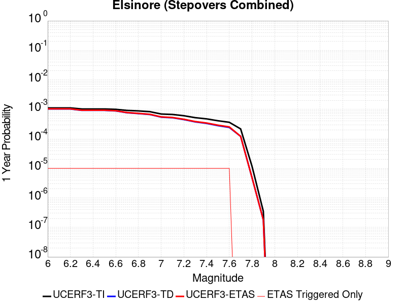 |  |

| Magnitude | 1 wk TI Prob | 1 wk TD Prob | 1 wk ETAS Prob | 1 wk ETAS/TD Gain | 1 wk ETAS Triggered Only | 1 mo TI Prob | 1 mo TD Prob | 1 mo ETAS Prob | 1 mo ETAS/TD Gain | 1 mo ETAS Triggered Only | 1 yr TI Prob | 1 yr TD Prob | 1 yr ETAS Prob | 1 yr ETAS/TD Gain | 1 yr ETAS Triggered Only | 10 yr TI Prob | 10 yr TD Prob | 10 yr ETAS Prob | 10 yr ETAS/TD Gain | 10 yr ETAS Triggered Only |
|-----|-----|-----|-----|-----|-----|-----|-----|-----|-----|-----|-----|-----|-----|-----|-----|-----|-----|-----|-----|-----|
| 6.0 | 2.144392E-5 | 1.976108E-5 | 1.976108E-5 | 1.0 | 0.0 | 9.189928E-5 | 8.468772E-5 | 9.4686875E-5 | 1.1180708 | 1.0E-5 | 0.0011182994 | 0.0010306069 | 0.0010405966 | 1.009693 | 1.0E-5 | 0.011126885 | 0.010265374 | 0.010285168 | 1.0019283 | 2.0E-5 |
| 6.1 | 2.144392E-5 | 1.976108E-5 | 1.976108E-5 | 1.0 | 0.0 | 9.189928E-5 | 8.468772E-5 | 9.4686875E-5 | 1.1180708 | 1.0E-5 | 0.0011182994 | 0.0010306069 | 0.0010405966 | 1.009693 | 1.0E-5 | 0.011126885 | 0.010265374 | 0.010285168 | 1.0019283 | 2.0E-5 |
| 6.2 | 2.144392E-5 | 1.976108E-5 | 1.976108E-5 | 1.0 | 0.0 | 9.189928E-5 | 8.468772E-5 | 9.4686875E-5 | 1.1180708 | 1.0E-5 | 0.0011182994 | 0.0010306069 | 0.0010405966 | 1.009693 | 1.0E-5 | 0.011126885 | 0.010265374 | 0.010285168 | 1.0019283 | 2.0E-5 |
| 6.3 | 1.9751555E-5 | 1.7742288E-5 | 1.7742288E-5 | 1.0 | 0.0 | 8.4646774E-5 | 7.603626E-5 | 8.60355E-5 | 1.1315062 | 1.0E-5 | 0.0010300872 | 9.253649E-4 | 9.3535567E-4 | 1.0107965 | 1.0E-5 | 0.010253254 | 0.009221707 | 0.009231614 | 1.0010744 | 1.0E-5 |
| 6.4 | 1.9751555E-5 | 1.7742288E-5 | 1.7742288E-5 | 1.0 | 0.0 | 8.4646774E-5 | 7.603626E-5 | 8.60355E-5 | 1.1315062 | 1.0E-5 | 0.0010300872 | 9.253649E-4 | 9.3535567E-4 | 1.0107965 | 1.0E-5 | 0.010253254 | 0.009221707 | 0.009231614 | 1.0010744 | 1.0E-5 |
| 6.5 | 1.9751555E-5 | 1.7742288E-5 | 1.7742288E-5 | 1.0 | 0.0 | 8.4646774E-5 | 7.603626E-5 | 8.60355E-5 | 1.1315062 | 1.0E-5 | 0.0010300872 | 9.253649E-4 | 9.3535567E-4 | 1.0107965 | 1.0E-5 | 0.010253254 | 0.009221707 | 0.009231614 | 1.0010744 | 1.0E-5 |
| 6.6 | 1.9188685E-5 | 1.7004199E-5 | 1.7004199E-5 | 1.0 | 0.0 | 8.2234634E-5 | 7.287319E-5 | 8.287246E-5 | 1.1372147 | 1.0E-5 | 0.0010007467 | 8.8688615E-4 | 8.9687726E-4 | 1.0112654 | 1.0E-5 | 0.00996252 | 0.008840263 | 0.008850174 | 1.0011212 | 1.0E-5 |
| 6.7 | 1.7608272E-5 | 1.4733327E-5 | 1.4733327E-5 | 1.0 | 0.0 | 7.546184E-5 | 6.314136E-5 | 7.314073E-5 | 1.1583648 | 1.0E-5 | 9.183606E-4 | 7.684846E-4 | 7.7847694E-4 | 1.0130026 | 1.0E-5 | 0.009145746 | 0.0076652775 | 0.007675201 | 1.0012946 | 1.0E-5 |
| 6.8 | 1.697165E-5 | 1.378403E-5 | 1.378403E-5 | 1.0 | 0.0 | 7.273361E-5 | 5.9073125E-5 | 6.9072536E-5 | 1.1692717 | 1.0E-5 | 8.8517193E-4 | 7.189867E-4 | 7.289795E-4 | 1.0138985 | 1.0E-5 | 0.008816543 | 0.0071730195 | 0.007182948 | 1.0013841 | 1.0E-5 |
| 6.9 | 1.600365E-5 | 1.2847316E-5 | 1.2847316E-5 | 1.0 | 0.0 | 6.858527E-5 | 5.505881E-5 | 6.505826E-5 | 1.181614 | 1.0E-5 | 8.347058E-4 | 6.701426E-4 | 6.8013585E-4 | 1.0149122 | 1.0E-5 | 0.008315775 | 0.0066871 | 0.0066970335 | 1.0014855 | 1.0E-5 |
| 7.0 | 1.3314581E-5 | 1.0448118E-5 | 1.0448118E-5 | 1.0 | 0.0 | 5.7061243E-5 | 4.4776894E-5 | 5.4776447E-5 | 1.2233194 | 1.0E-5 | 6.944992E-4 | 5.4502505E-4 | 5.550196E-4 | 1.0183377 | 1.0E-5 | 0.006923327 | 0.0054408107 | 0.0054507563 | 1.001828 | 1.0E-5 |
| 7.1 | 1.2865345E-5 | 9.937989E-6 | 9.937989E-6 | 1.0 | 0.0 | 5.5136024E-5 | 4.25907E-5 | 5.2590272E-5 | 1.234783 | 1.0E-5 | 6.710743E-4 | 5.1842094E-4 | 5.284157E-4 | 1.0192794 | 1.0E-5 | 0.0066905143 | 0.005175448 | 0.0051853964 | 1.0019222 | 1.0E-5 |
| 7.2 | 1.1650051E-5 | 8.634182E-6 | 8.634182E-6 | 1.0 | 0.0 | 4.9927836E-5 | 3.7003123E-5 | 4.7002755E-5 | 1.2702374 | 1.0E-5 | 6.0770183E-4 | 4.5042168E-4 | 4.6041716E-4 | 1.0221914 | 1.0E-5 | 0.0060604266 | 0.004496511 | 0.004506466 | 1.002214 | 1.0E-5 |
| 7.3 | 1.0008533E-5 | 7.2013468E-6 | 7.2013468E-6 | 1.0 | 0.0 | 4.2893007E-5 | 3.0862557E-5 | 4.086225E-5 | 1.3240072 | 1.0E-5 | 5.220972E-4 | 3.756883E-4 | 3.8568454E-4 | 1.0266078 | 1.0E-5 | 0.005208723 | 0.0037509191 | 0.0037608817 | 1.002656 | 1.0E-5 |
| 7.4 | 9.116759E-6 | 6.4103333E-6 | 6.4103333E-6 | 1.0 | 0.0 | 3.907124E-5 | 2.7472577E-5 | 3.7472302E-5 | 1.3639894 | 1.0E-5 | 4.7558855E-4 | 3.3442865E-4 | 3.4442532E-4 | 1.0298917 | 1.0E-5 | 0.00474572 | 0.0033394059 | 0.0033493724 | 1.0029845 | 1.0E-5 |
| 7.5 | 7.870524E-6 | 5.3827566E-6 | 5.3827566E-6 | 1.0 | 0.0 | 3.3730383E-5 | 2.306876E-5 | 3.306853E-5 | 1.4334767 | 1.0E-5 | 4.1059E-4 | 2.8082723E-4 | 2.9082442E-4 | 1.0355991 | 1.0E-5 | 0.0040983222 | 0.00280485 | 0.002814822 | 1.0035553 | 1.0E-5 |
| 7.6 | 6.9774537E-6 | 4.677801E-6 | 4.677801E-6 | 1.0 | 0.0 | 2.990303E-5 | 2.0047572E-5 | 3.0047371E-5 | 1.4988035 | 1.0E-5 | 3.640086E-4 | 2.4405301E-4 | 2.5405057E-4 | 1.0409647 | 1.0E-5 | 0.003634129 | 0.0024379662 | 0.0024479418 | 1.0040917 | 1.0E-5 |
| 7.7 | 4.1616954E-6 | 2.3284533E-6 | 2.3284533E-6 | 1.0 | 0.0 | 1.7835715E-5 | 9.979052E-6 | 9.979052E-6 | 1.0 | 0.0 | 2.171282E-4 | 1.2148893E-4 | 1.2148893E-4 | 1.0 | 0.0 | 0.0021691616 | 0.0012142982 | 0.0012142982 | 1.0 | 0.0 |
| 7.8 | 2.2692414E-7 | 9.385943E-8 | 9.385943E-8 | 1.0 | 0.0 | 9.725317E-7 | 4.0225464E-7 | 4.0225464E-7 | 1.0 | 0.0 | 1.1840509E-5 | 4.8974425E-6 | 4.8974425E-6 | 1.0 | 0.0 | 1.1839878E-4 | 4.8973674E-5 | 4.8973674E-5 | 1.0 | 0.0 |
| 7.9 | 6.676829E-9 | 3.4399772E-9 | 3.4399772E-9 | 1.0 | 0.0 | 2.861498E-8 | 1.4742759E-8 | 1.4742759E-8 | 1.0 | 0.0 | 3.4838732E-7 | 1.7949307E-7 | 1.7949307E-7 | 1.0 | 0.0 | 3.4838679E-6 | 1.7949295E-6 | 1.7949295E-6 | 1.0 | 0.0 |

## Likely 2011 CFM
*[(top)](#table-of-contents)*

| 1 Week | 1 Month | 1 Year | 10 Year |
|-----|-----|-----|-----|
|  |  |  |  |

| Magnitude | 1 wk TI Prob | 1 wk TD Prob | 1 wk ETAS Prob | 1 wk ETAS/TD Gain | 1 wk ETAS Triggered Only | 1 mo TI Prob | 1 mo TD Prob | 1 mo ETAS Prob | 1 mo ETAS/TD Gain | 1 mo ETAS Triggered Only | 1 yr TI Prob | 1 yr TD Prob | 1 yr ETAS Prob | 1 yr ETAS/TD Gain | 1 yr ETAS Triggered Only | 10 yr TI Prob | 10 yr TD Prob | 10 yr ETAS Prob | 10 yr ETAS/TD Gain | 10 yr ETAS Triggered Only |
|-----|-----|-----|-----|-----|-----|-----|-----|-----|-----|-----|-----|-----|-----|-----|-----|-----|-----|-----|-----|-----|
| 6.0 | 2.5315949E-5 | 2.7105003E-5 | 2.7105003E-5 | 1.0 | 0.0 | 1.0849241E-4 | 1.16159375E-4 | 1.16159375E-4 | 1.0 | 0.0 | 0.0013200947 | 0.0014133675 | 0.0014233533 | 1.0070653 | 1.0E-5 | 0.013122803 | 0.014048441 | 0.01406816 | 1.0014037 | 2.0E-5 |
| 6.1 | 2.5315949E-5 | 2.7105003E-5 | 2.7105003E-5 | 1.0 | 0.0 | 1.0849241E-4 | 1.16159375E-4 | 1.16159375E-4 | 1.0 | 0.0 | 0.0013200947 | 0.0014133675 | 0.0014233533 | 1.0070653 | 1.0E-5 | 0.013122803 | 0.014048441 | 0.01406816 | 1.0014037 | 2.0E-5 |
| 6.2 | 1.6375941E-5 | 1.7465996E-5 | 1.7465996E-5 | 1.0 | 0.0 | 7.0180715E-5 | 7.485219E-5 | 7.485219E-5 | 1.0 | 0.0 | 8.5411523E-4 | 9.109567E-4 | 9.209476E-4 | 1.0109675 | 1.0E-5 | 0.008508399 | 0.009073513 | 0.009093331 | 1.0021843 | 2.0E-5 |
| 6.3 | 1.1945543E-5 | 1.2712695E-5 | 1.2712695E-5 | 1.0 | 0.0 | 5.119418E-5 | 5.4481872E-5 | 5.4481872E-5 | 1.0 | 0.0 | 6.2311086E-4 | 6.6312024E-4 | 6.731136E-4 | 1.0150702 | 1.0E-5 | 0.0062136655 | 0.0066119707 | 0.006631838 | 1.0030048 | 2.0E-5 |
| 6.4 | 9.192729E-6 | 9.768569E-6 | 9.768569E-6 | 1.0 | 0.0 | 3.939681E-5 | 4.1864638E-5 | 4.1864638E-5 | 1.0 | 0.0 | 4.7955062E-4 | 5.095855E-4 | 5.195804E-4 | 1.0196137 | 1.0E-5 | 0.004785171 | 0.0050844513 | 0.0051043495 | 1.0039135 | 2.0E-5 |
| 6.5 | 7.67906E-6 | 8.152689E-6 | 8.152689E-6 | 1.0 | 0.0 | 3.2909844E-5 | 3.493964E-5 | 3.493964E-5 | 1.0 | 0.0 | 4.006037E-4 | 4.2530894E-4 | 4.3530468E-4 | 1.0235023 | 1.0E-5 | 0.0039988225 | 0.004245143 | 0.004265058 | 1.0046912 | 2.0E-5 |
| 6.6 | 6.4884057E-6 | 6.884806E-6 | 6.884806E-6 | 1.0 | 0.0 | 2.7807157E-5 | 2.9505987E-5 | 2.9505987E-5 | 1.0 | 0.0 | 3.3849955E-4 | 3.5917762E-4 | 3.5917762E-4 | 1.0 | 0.0 | 0.003379844 | 0.0035861158 | 0.00359608 | 1.0027785 | 1.0E-5 |
| 6.7 | 4.6060636E-6 | 4.88408E-6 | 4.88408E-6 | 1.0 | 0.0 | 1.9740122E-5 | 2.093161E-5 | 2.093161E-5 | 1.0 | 0.0 | 2.403095E-4 | 2.5481338E-4 | 2.5481338E-4 | 1.0 | 0.0 | 0.002400498 | 0.002545295 | 0.0025552695 | 1.0039188 | 1.0E-5 |
| 6.8 | 3.2795615E-6 | 3.477401E-6 | 3.477401E-6 | 1.0 | 0.0 | 1.4055187E-5 | 1.4903065E-5 | 1.4903065E-5 | 1.0 | 0.0 | 1.7110848E-4 | 1.8143027E-4 | 1.8143027E-4 | 1.0 | 0.0 | 0.0017097679 | 0.0018128767 | 0.0018128767 | 1.0 | 0.0 |
| 6.9 | 2.3289967E-6 | 2.4705769E-6 | 2.4705769E-6 | 1.0 | 0.0 | 9.981376E-6 | 1.0588145E-5 | 1.0588145E-5 | 1.0 | 0.0 | 1.2151648E-4 | 1.2890348E-4 | 1.2890348E-4 | 1.0 | 0.0 | 0.0012145005 | 0.0012883301 | 0.0012883301 | 1.0 | 0.0 |
| 7.0 | 1.211292E-6 | 1.2864064E-6 | 1.2864064E-6 | 1.0 | 0.0 | 5.1912407E-6 | 5.51316E-6 | 5.51316E-6 | 1.0 | 0.0 | 6.320152E-5 | 6.7120964E-5 | 6.7120964E-5 | 1.0 | 0.0 | 6.3183554E-4 | 6.710367E-4 | 6.710367E-4 | 1.0 | 0.0 |

## Great Valley 09 (Laguna Seca)
*[(top)](#table-of-contents)*

| 1 Week | 1 Month | 1 Year | 10 Year |
|-----|-----|-----|-----|
|  |  |  |  |

| Magnitude | 1 wk TI Prob | 1 wk TD Prob | 1 wk ETAS Prob | 1 wk ETAS/TD Gain | 1 wk ETAS Triggered Only | 1 mo TI Prob | 1 mo TD Prob | 1 mo ETAS Prob | 1 mo ETAS/TD Gain | 1 mo ETAS Triggered Only | 1 yr TI Prob | 1 yr TD Prob | 1 yr ETAS Prob | 1 yr ETAS/TD Gain | 1 yr ETAS Triggered Only | 10 yr TI Prob | 10 yr TD Prob | 10 yr ETAS Prob | 10 yr ETAS/TD Gain | 10 yr ETAS Triggered Only |
|-----|-----|-----|-----|-----|-----|-----|-----|-----|-----|-----|-----|-----|-----|-----|-----|-----|-----|-----|-----|-----|
| 6.0 | 5.4353277E-5 | 7.050538E-5 | 7.050538E-5 | 1.0 | 0.0 | 2.3292181E-4 | 3.0212724E-4 | 3.0212724E-4 | 1.0 | 0.0 | 0.0028321352 | 0.003672335 | 0.0036822984 | 1.0027131 | 1.0E-5 | 0.02796312 | 0.036116913 | 0.036136188 | 1.0005337 | 2.0E-5 |
| 6.1 | 4.5578287E-5 | 5.822371E-5 | 5.822371E-5 | 1.0 | 0.0 | 1.953209E-4 | 2.49502E-4 | 2.49502E-4 | 1.0 | 0.0 | 0.0023754383 | 0.0030335493 | 0.0030335493 | 1.0 | 0.0 | 0.023502063 | 0.029920705 | 0.029920705 | 1.0 | 0.0 |
| 6.2 | 2.8536782E-5 | 3.47386E-5 | 3.47386E-5 | 1.0 | 0.0 | 1.2229476E-4 | 1.488658E-4 | 1.488658E-4 | 1.0 | 0.0 | 0.0014879217 | 0.0018108767 | 0.0018108767 | 1.0 | 0.0 | 0.014779986 | 0.017958745 | 0.017958745 | 1.0 | 0.0 |
| 6.3 | 2.3698774E-5 | 2.8214314E-5 | 2.8214314E-5 | 1.0 | 0.0 | 1.01562226E-4 | 1.2090732E-4 | 1.2090732E-4 | 1.0 | 0.0 | 0.0012358186 | 0.0014710726 | 0.0014710726 | 1.0 | 0.0 | 0.012289686 | 0.014611831 | 0.014611831 | 1.0 | 0.0 |
| 6.4 | 1.9191197E-5 | 2.2123912E-5 | 2.2123912E-5 | 1.0 | 0.0 | 8.2245395E-5 | 9.480767E-5 | 9.480767E-5 | 1.0 | 0.0 | 0.0010008777 | 0.0011536786 | 0.0011536786 | 1.0 | 0.0 | 0.009963818 | 0.011477305 | 0.011477305 | 1.0 | 0.0 |
| 6.5 | 1.5203241E-5 | 1.680269E-5 | 1.680269E-5 | 1.0 | 0.0 | 6.5155116E-5 | 7.200383E-5 | 7.200383E-5 | 1.0 | 0.0 | 7.9297484E-4 | 8.7628904E-4 | 8.7628904E-4 | 1.0 | 0.0 | 0.007901512 | 0.008729759 | 0.008729759 | 1.0 | 0.0 |
| 6.6 | 1.0984925E-5 | 1.1242844E-5 | 1.1242844E-5 | 1.0 | 0.0 | 4.70774E-5 | 4.818275E-5 | 4.818275E-5 | 1.0 | 0.0 | 5.730166E-4 | 5.864695E-4 | 5.864695E-4 | 1.0 | 0.0 | 0.005715413 | 0.0058496143 | 0.0058496143 | 1.0 | 0.0 |
| 6.7 | 9.134616E-6 | 9.020084E-6 | 9.020084E-6 | 1.0 | 0.0 | 3.9147766E-5 | 3.865694E-5 | 3.865694E-5 | 1.0 | 0.0 | 4.7651984E-4 | 4.7054898E-4 | 4.7054898E-4 | 1.0 | 0.0 | 0.004754993 | 0.0046957717 | 0.0046957717 | 1.0 | 0.0 |
| 6.8 | 7.785589E-6 | 7.4521E-6 | 7.4521E-6 | 1.0 | 0.0 | 3.3366385E-5 | 3.193719E-5 | 3.193719E-5 | 1.0 | 0.0 | 4.0616E-4 | 3.8876795E-4 | 3.8876795E-4 | 1.0 | 0.0 | 0.0040541845 | 0.0038810824 | 0.0038810824 | 1.0 | 0.0 |
| 6.9 | 5.579095E-6 | 4.8985944E-6 | 4.8985944E-6 | 1.0 | 0.0 | 2.3910188E-5 | 2.0993815E-5 | 2.0993815E-5 | 1.0 | 0.0 | 2.9106764E-4 | 2.555711E-4 | 2.555711E-4 | 1.0 | 0.0 | 0.002906867 | 0.0025529093 | 0.0025529093 | 1.0 | 0.0 |
| 7.0 | 2.6816688E-6 | 1.5216407E-6 | 1.5216407E-6 | 1.0 | 0.0 | 1.1492816E-5 | 6.5213017E-6 | 6.5213017E-6 | 1.0 | 0.0 | 1.3991605E-4 | 7.939404E-5 | 7.939404E-5 | 1.0 | 0.0 | 0.0013982799 | 7.936655E-4 | 7.936655E-4 | 1.0 | 0.0 |
| 7.1 | 1.9951021E-6 | 7.4539724E-7 | 7.4539724E-7 | 1.0 | 0.0 | 8.55041E-6 | 3.194556E-6 | 3.194556E-6 | 1.0 | 0.0 | 1.0409627E-4 | 3.8893068E-5 | 3.8893068E-5 | 1.0 | 0.0 | 0.0010404752 | 3.8886676E-4 | 3.8886676E-4 | 1.0 | 0.0 |
| 7.2 | 1.9951021E-6 | 7.4539724E-7 | 7.4539724E-7 | 1.0 | 0.0 | 8.55041E-6 | 3.194556E-6 | 3.194556E-6 | 1.0 | 0.0 | 1.0409627E-4 | 3.8893068E-5 | 3.8893068E-5 | 1.0 | 0.0 | 0.0010404752 | 3.8886676E-4 | 3.8886676E-4 | 1.0 | 0.0 |
| 7.3 | 1.7087556E-6 | 6.579003E-7 | 6.579003E-7 | 1.0 | 0.0 | 7.3232177E-6 | 2.81957E-6 | 2.81957E-6 | 1.0 | 0.0 | 8.915652E-5 | 3.4327764E-5 | 3.4327764E-5 | 1.0 | 0.0 | 8.9120766E-4 | 3.4322866E-4 | 3.4322866E-4 | 1.0 | 0.0 |
| 7.4 | 1.3804846E-6 | 6.0739524E-7 | 6.0739524E-7 | 1.0 | 0.0 | 5.916349E-6 | 2.60312E-6 | 2.60312E-6 | 1.0 | 0.0 | 7.2029165E-5 | 3.1692565E-5 | 3.1692565E-5 | 1.0 | 0.0 | 7.200583E-4 | 3.1688449E-4 | 3.1688449E-4 | 1.0 | 0.0 |
| 7.5 | 1.3804846E-6 | 6.0739524E-7 | 6.0739524E-7 | 1.0 | 0.0 | 5.916349E-6 | 2.60312E-6 | 2.60312E-6 | 1.0 | 0.0 | 7.2029165E-5 | 3.1692565E-5 | 3.1692565E-5 | 1.0 | 0.0 | 7.200583E-4 | 3.1688449E-4 | 3.1688449E-4 | 1.0 | 0.0 |

## San Cayetano
*[(top)](#table-of-contents)*

| 1 Week | 1 Month | 1 Year | 10 Year |
|-----|-----|-----|-----|
|  |  |  |  |

| Magnitude | 1 wk TI Prob | 1 wk TD Prob | 1 wk ETAS Prob | 1 wk ETAS/TD Gain | 1 wk ETAS Triggered Only | 1 mo TI Prob | 1 mo TD Prob | 1 mo ETAS Prob | 1 mo ETAS/TD Gain | 1 mo ETAS Triggered Only | 1 yr TI Prob | 1 yr TD Prob | 1 yr ETAS Prob | 1 yr ETAS/TD Gain | 1 yr ETAS Triggered Only | 10 yr TI Prob | 10 yr TD Prob | 10 yr ETAS Prob | 10 yr ETAS/TD Gain | 10 yr ETAS Triggered Only |
|-----|-----|-----|-----|-----|-----|-----|-----|-----|-----|-----|-----|-----|-----|-----|-----|-----|-----|-----|-----|-----|
| 6.0 | 2.3476267E-5 | 1.816963E-5 | 1.816963E-5 | 1.0 | 0.0 | 1.0060869E-4 | 7.786754E-5 | 7.786754E-5 | 1.0 | 0.0 | 0.0012242225 | 9.4762864E-4 | 9.4762864E-4 | 1.0 | 0.0 | 0.012175002 | 0.009436766 | 0.009456577 | 1.0020994 | 2.0E-5 |
| 6.1 | 2.3476267E-5 | 1.816963E-5 | 1.816963E-5 | 1.0 | 0.0 | 1.0060869E-4 | 7.786754E-5 | 7.786754E-5 | 1.0 | 0.0 | 0.0012242225 | 9.4762864E-4 | 9.4762864E-4 | 1.0 | 0.0 | 0.012175002 | 0.009436766 | 0.009456577 | 1.0020994 | 2.0E-5 |
| 6.2 | 2.3476267E-5 | 1.816963E-5 | 1.816963E-5 | 1.0 | 0.0 | 1.0060869E-4 | 7.786754E-5 | 7.786754E-5 | 1.0 | 0.0 | 0.0012242225 | 9.4762864E-4 | 9.4762864E-4 | 1.0 | 0.0 | 0.012175002 | 0.009436766 | 0.009456577 | 1.0020994 | 2.0E-5 |
| 6.3 | 2.3476267E-5 | 1.816963E-5 | 1.816963E-5 | 1.0 | 0.0 | 1.0060869E-4 | 7.786754E-5 | 7.786754E-5 | 1.0 | 0.0 | 0.0012242225 | 9.4762864E-4 | 9.4762864E-4 | 1.0 | 0.0 | 0.012175002 | 0.009436766 | 0.009456577 | 1.0020994 | 2.0E-5 |
| 6.4 | 2.3476267E-5 | 1.816963E-5 | 1.816963E-5 | 1.0 | 0.0 | 1.0060869E-4 | 7.786754E-5 | 7.786754E-5 | 1.0 | 0.0 | 0.0012242225 | 9.4762864E-4 | 9.4762864E-4 | 1.0 | 0.0 | 0.012175002 | 0.009436766 | 0.009456577 | 1.0020994 | 2.0E-5 |
| 6.5 | 2.3476267E-5 | 1.816963E-5 | 1.816963E-5 | 1.0 | 0.0 | 1.0060869E-4 | 7.786754E-5 | 7.786754E-5 | 1.0 | 0.0 | 0.0012242225 | 9.4762864E-4 | 9.4762864E-4 | 1.0 | 0.0 | 0.012175002 | 0.009436766 | 0.009456577 | 1.0020994 | 2.0E-5 |
| 6.6 | 2.3476267E-5 | 1.816963E-5 | 1.816963E-5 | 1.0 | 0.0 | 1.0060869E-4 | 7.786754E-5 | 7.786754E-5 | 1.0 | 0.0 | 0.0012242225 | 9.4762864E-4 | 9.4762864E-4 | 1.0 | 0.0 | 0.012175002 | 0.009436766 | 0.009456577 | 1.0020994 | 2.0E-5 |
| 6.7 | 2.3476267E-5 | 1.816963E-5 | 1.816963E-5 | 1.0 | 0.0 | 1.0060869E-4 | 7.786754E-5 | 7.786754E-5 | 1.0 | 0.0 | 0.0012242225 | 9.4762864E-4 | 9.4762864E-4 | 1.0 | 0.0 | 0.012175002 | 0.009436766 | 0.009456577 | 1.0020994 | 2.0E-5 |
| 6.8 | 2.3241924E-5 | 1.7937333E-5 | 1.7937333E-5 | 1.0 | 0.0 | 9.960445E-5 | 7.6872035E-5 | 7.6872035E-5 | 1.0 | 0.0 | 0.0012120095 | 9.3551876E-4 | 9.3551876E-4 | 1.0 | 0.0 | 0.012054204 | 0.00931666 | 0.009336474 | 1.0021267 | 2.0E-5 |
| 6.9 | 2.2761007E-5 | 1.7432758E-5 | 1.7432758E-5 | 1.0 | 0.0 | 9.7543525E-5 | 7.47097E-5 | 7.47097E-5 | 1.0 | 0.0 | 0.0011869454 | 9.092145E-4 | 9.092145E-4 | 1.0 | 0.0 | 0.011806256 | 0.009055776 | 0.009075595 | 1.0021886 | 2.0E-5 |
| 7.0 | 2.240283E-5 | 1.7066497E-5 | 1.7066497E-5 | 1.0 | 0.0 | 9.600859E-5 | 7.3140094E-5 | 7.3140094E-5 | 1.0 | 0.0 | 0.0011682777 | 8.901203E-4 | 8.901203E-4 | 1.0 | 0.0 | 0.011621549 | 0.008866365 | 0.008886187 | 1.0022358 | 2.0E-5 |
| 7.1 | 2.1871154E-5 | 1.6586335E-5 | 1.6586335E-5 | 1.0 | 0.0 | 9.373015E-5 | 7.108237E-5 | 7.108237E-5 | 1.0 | 0.0 | 0.0011405671 | 8.650876E-4 | 8.650876E-4 | 1.0 | 0.0 | 0.011347309 | 0.008618002 | 0.00863783 | 1.0023007 | 2.0E-5 |
| 7.2 | 2.0714133E-5 | 1.5564854E-5 | 1.5564854E-5 | 1.0 | 0.0 | 8.8771834E-5 | 6.670483E-5 | 6.670483E-5 | 1.0 | 0.0 | 0.0010802611 | 8.1183197E-4 | 8.1183197E-4 | 1.0 | 0.0 | 0.010750249 | 0.008089437 | 0.008109275 | 1.0024524 | 2.0E-5 |
| 7.3 | 1.8408395E-5 | 1.3997111E-5 | 1.3997111E-5 | 1.0 | 0.0 | 7.8890735E-5 | 5.9986254E-5 | 5.9986254E-5 | 1.0 | 0.0 | 9.600714E-4 | 7.3009095E-4 | 7.3009095E-4 | 1.0 | 0.0 | 0.009559342 | 0.007277643 | 0.0072974972 | 1.0027281 | 2.0E-5 |
| 7.4 | 1.6856795E-5 | 1.28503E-5 | 1.28503E-5 | 1.0 | 0.0 | 7.2241404E-5 | 5.5071567E-5 | 5.5071567E-5 | 1.0 | 0.0 | 8.7918417E-4 | 6.702929E-4 | 6.702929E-4 | 1.0 | 0.0 | 0.00875714 | 0.0066833915 | 0.006703258 | 1.0029725 | 2.0E-5 |
| 7.5 | 1.2822778E-5 | 9.577698E-6 | 9.577698E-6 | 1.0 | 0.0 | 5.495361E-5 | 4.104664E-5 | 4.104664E-5 | 1.0 | 0.0 | 6.688548E-4 | 4.996298E-4 | 4.996298E-4 | 1.0 | 0.0 | 0.006668452 | 0.0049852366 | 0.0049951863 | 1.0019959 | 1.0E-5 |
| 7.6 | 5.6272684E-6 | 3.8549683E-6 | 3.8549683E-6 | 1.0 | 0.0 | 2.4116642E-5 | 1.6521188E-5 | 1.6521188E-5 | 1.0 | 0.0 | 2.9358055E-4 | 2.01127E-4 | 2.01127E-4 | 1.0 | 0.0 | 0.0029319301 | 0.0020094607 | 0.0020094607 | 1.0 | 0.0 |
| 7.7 | 3.5261346E-6 | 2.340742E-6 | 2.340742E-6 | 1.0 | 0.0 | 1.5111918E-5 | 1.0031713E-5 | 1.0031713E-5 | 1.0 | 0.0 | 1.8397206E-4 | 1.2212934E-4 | 1.2212934E-4 | 1.0 | 0.0 | 0.0018381984 | 0.0012206296 | 0.0012206296 | 1.0 | 0.0 |
| 7.8 | 1.4826929E-6 | 1.0564453E-6 | 1.0564453E-6 | 1.0 | 0.0 | 6.354383E-6 | 4.5276147E-6 | 4.5276147E-6 | 1.0 | 0.0 | 7.736187E-5 | 5.512234E-5 | 5.512234E-5 | 1.0 | 0.0 | 7.733494E-4 | 5.5108865E-4 | 5.5108865E-4 | 1.0 | 0.0 |
| 7.9 | 2.7568166E-7 | 1.6978672E-7 | 1.6978672E-7 | 1.0 | 0.0 | 1.1814923E-6 | 7.2765715E-7 | 7.2765715E-7 | 1.0 | 0.0 | 1.4384574E-5 | 8.85919E-6 | 8.85919E-6 | 1.0 | 0.0 | 1.4383643E-4 | 8.85884E-5 | 8.85884E-5 | 1.0 | 0.0 |
| 8.0 | 5.407832E-8 | 2.6889136E-8 | 2.6889136E-8 | 1.0 | 0.0 | 2.3176422E-7 | 1.15239146E-7 | 1.15239146E-7 | 1.0 | 0.0 | 2.8217257E-6 | 1.4030358E-6 | 1.4030358E-6 | 1.0 | 0.0 | 2.8216898E-5 | 1.4030274E-5 | 1.4030274E-5 | 1.0 | 0.0 |

## Raymond
*[(top)](#table-of-contents)*

| 1 Week | 1 Month | 1 Year | 10 Year |
|-----|-----|-----|-----|
|  |  |  | 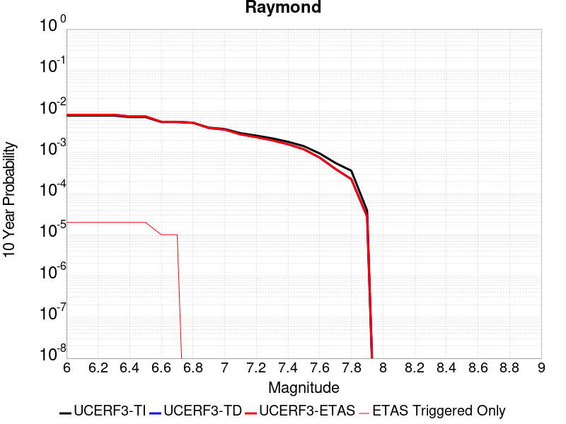 |

| Magnitude | 1 wk TI Prob | 1 wk TD Prob | 1 wk ETAS Prob | 1 wk ETAS/TD Gain | 1 wk ETAS Triggered Only | 1 mo TI Prob | 1 mo TD Prob | 1 mo ETAS Prob | 1 mo ETAS/TD Gain | 1 mo ETAS Triggered Only | 1 yr TI Prob | 1 yr TD Prob | 1 yr ETAS Prob | 1 yr ETAS/TD Gain | 1 yr ETAS Triggered Only | 10 yr TI Prob | 10 yr TD Prob | 10 yr ETAS Prob | 10 yr ETAS/TD Gain | 10 yr ETAS Triggered Only |
|-----|-----|-----|-----|-----|-----|-----|-----|-----|-----|-----|-----|-----|-----|-----|-----|-----|-----|-----|-----|-----|
| 6.0 | 1.5157413E-5 | 1.5810376E-5 | 1.5810376E-5 | 1.0 | 0.0 | 6.4958724E-5 | 6.775714E-5 | 6.775714E-5 | 1.0 | 0.0 | 7.905855E-4 | 8.24656E-4 | 8.3464774E-4 | 1.0121163 | 1.0E-5 | 0.007877788 | 0.008218477 | 0.008238312 | 1.0024135 | 2.0E-5 |
| 6.1 | 1.5157413E-5 | 1.5810376E-5 | 1.5810376E-5 | 1.0 | 0.0 | 6.4958724E-5 | 6.775714E-5 | 6.775714E-5 | 1.0 | 0.0 | 7.905855E-4 | 8.24656E-4 | 8.3464774E-4 | 1.0121163 | 1.0E-5 | 0.007877788 | 0.008218477 | 0.008238312 | 1.0024135 | 2.0E-5 |
| 6.2 | 1.5157413E-5 | 1.5810376E-5 | 1.5810376E-5 | 1.0 | 0.0 | 6.4958724E-5 | 6.775714E-5 | 6.775714E-5 | 1.0 | 0.0 | 7.905855E-4 | 8.24656E-4 | 8.3464774E-4 | 1.0121163 | 1.0E-5 | 0.007877788 | 0.008218477 | 0.008238312 | 1.0024135 | 2.0E-5 |
| 6.3 | 1.5157413E-5 | 1.5810376E-5 | 1.5810376E-5 | 1.0 | 0.0 | 6.4958724E-5 | 6.775714E-5 | 6.775714E-5 | 1.0 | 0.0 | 7.905855E-4 | 8.24656E-4 | 8.3464774E-4 | 1.0121163 | 1.0E-5 | 0.007877788 | 0.008218477 | 0.008238312 | 1.0024135 | 2.0E-5 |
| 6.4 | 1.3941944E-5 | 1.4454918E-5 | 1.4454918E-5 | 1.0 | 0.0 | 5.9749822E-5 | 6.194831E-5 | 6.194831E-5 | 1.0 | 0.0 | 7.2721124E-4 | 7.53983E-4 | 7.6397543E-4 | 1.0132529 | 1.0E-5 | 0.007248361 | 0.0075165825 | 0.0075364322 | 1.0026407 | 2.0E-5 |
| 6.5 | 1.3941944E-5 | 1.4454918E-5 | 1.4454918E-5 | 1.0 | 0.0 | 5.9749822E-5 | 6.194831E-5 | 6.194831E-5 | 1.0 | 0.0 | 7.2721124E-4 | 7.53983E-4 | 7.6397543E-4 | 1.0132529 | 1.0E-5 | 0.007248361 | 0.0075165825 | 0.0075364322 | 1.0026407 | 2.0E-5 |
| 6.6 | 1.0542609E-5 | 1.0671283E-5 | 1.0671283E-5 | 1.0 | 0.0 | 4.5181827E-5 | 4.57333E-5 | 4.57333E-5 | 1.0 | 0.0 | 5.499499E-4 | 5.566662E-4 | 5.566662E-4 | 1.0 | 0.0 | 0.005485909 | 0.0055532786 | 0.0055632233 | 1.0017908 | 1.0E-5 |
| 6.7 | 1.0542609E-5 | 1.0671283E-5 | 1.0671283E-5 | 1.0 | 0.0 | 4.5181827E-5 | 4.57333E-5 | 4.57333E-5 | 1.0 | 0.0 | 5.499499E-4 | 5.566662E-4 | 5.566662E-4 | 1.0 | 0.0 | 0.005485909 | 0.0055532786 | 0.0055632233 | 1.0017908 | 1.0E-5 |
| 6.8 | 1.0079132E-5 | 1.0176812E-5 | 1.0176812E-5 | 1.0 | 0.0 | 4.3195567E-5 | 4.361421E-5 | 4.361421E-5 | 1.0 | 0.0 | 5.257791E-4 | 5.30879E-4 | 5.30879E-4 | 1.0 | 0.0 | 0.0052453685 | 0.0052966573 | 0.0052966573 | 1.0 | 0.0 |
| 6.9 | 7.721598E-6 | 7.5490307E-6 | 7.5490307E-6 | 1.0 | 0.0 | 3.3092143E-5 | 3.2352593E-5 | 3.2352593E-5 | 1.0 | 0.0 | 4.0282236E-4 | 3.9382285E-4 | 3.9382285E-4 | 1.0 | 0.0 | 0.0040209293 | 0.003931383 | 0.003931383 | 1.0 | 0.0 |
| 7.0 | 7.137566E-6 | 6.9114235E-6 | 6.9114235E-6 | 1.0 | 0.0 | 3.058921E-5 | 2.9620056E-5 | 2.9620056E-5 | 1.0 | 0.0 | 3.7236E-4 | 3.6056558E-4 | 3.6056558E-4 | 1.0 | 0.0 | 0.0037173668 | 0.003599924 | 0.003599924 | 1.0 | 0.0 |
| 7.1 | 5.654976E-6 | 5.2996397E-6 | 5.2996397E-6 | 1.0 | 0.0 | 2.4235387E-5 | 2.2712544E-5 | 2.2712544E-5 | 1.0 | 0.0 | 2.9502588E-4 | 2.7649035E-4 | 2.7649035E-4 | 1.0 | 0.0 | 0.0029463451 | 0.0027614946 | 0.0027614946 | 1.0 | 0.0 |
| 7.2 | 4.9358455E-6 | 4.5267484E-6 | 4.5267484E-6 | 1.0 | 0.0 | 2.1153453E-5 | 1.9400206E-5 | 1.9400206E-5 | 1.0 | 0.0 | 2.5751285E-4 | 2.3617204E-4 | 2.3617204E-4 | 1.0 | 0.0 | 0.0025721465 | 0.0023592326 | 0.0023592326 | 1.0 | 0.0 |
| 7.3 | 4.2368597E-6 | 3.8056999E-6 | 3.8056999E-6 | 1.0 | 0.0 | 1.8157843E-5 | 1.6310041E-5 | 1.6310041E-5 | 1.0 | 0.0 | 2.2104931E-4 | 1.9855677E-4 | 1.9855677E-4 | 1.0 | 0.0 | 0.0022082955 | 0.0019838123 | 0.0019838123 | 1.0 | 0.0 |
| 7.4 | 3.4999923E-6 | 3.0438184E-6 | 3.0438184E-6 | 1.0 | 0.0 | 1.49998805E-5 | 1.3044872E-5 | 1.3044872E-5 | 1.0 | 0.0 | 1.8260824E-4 | 1.5880981E-4 | 1.5880981E-4 | 1.0 | 0.0 | 0.0018245826 | 0.001586979 | 0.001586979 | 1.0 | 0.0 |
| 7.5 | 2.738017E-6 | 2.3021105E-6 | 2.3021105E-6 | 1.0 | 0.0 | 1.1734306E-5 | 9.86615E-6 | 9.86615E-6 | 1.0 | 0.0 | 1.428558E-4 | 1.2011383E-4 | 1.2011383E-4 | 1.0 | 0.0 | 0.0014276401 | 0.0012005034 | 0.0012005034 | 1.0 | 0.0 |
| 7.6 | 1.8186392E-6 | 1.4423566E-6 | 1.4423566E-6 | 1.0 | 0.0 | 7.794145E-6 | 6.181514E-6 | 6.181514E-6 | 1.0 | 0.0 | 9.488958E-5 | 7.5257376E-5 | 7.5257376E-5 | 1.0 | 0.0 | 9.4849075E-4 | 7.523304E-4 | 7.523304E-4 | 1.0 | 0.0 |
| 7.7 | 1.0660348E-6 | 7.644165E-7 | 7.644165E-7 | 1.0 | 0.0 | 4.5687125E-6 | 3.2760668E-6 | 3.2760668E-6 | 1.0 | 0.0 | 5.5622655E-5 | 3.98854E-5 | 3.98854E-5 | 1.0 | 0.0 | 5.5608735E-4 | 3.9879154E-4 | 3.9879154E-4 | 1.0 | 0.0 |
| 7.8 | 6.913602E-7 | 4.320714E-7 | 4.320714E-7 | 1.0 | 0.0 | 2.962969E-6 | 1.8517333E-6 | 1.8517333E-6 | 1.0 | 0.0 | 3.607355E-5 | 2.2544626E-5 | 2.2544626E-5 | 1.0 | 0.0 | 3.6067693E-4 | 2.2543124E-4 | 2.2543124E-4 | 1.0 | 0.0 |
| 7.9 | 7.425201E-8 | 5.322516E-8 | 5.322516E-8 | 1.0 | 0.0 | 3.1822285E-7 | 2.2810782E-7 | 2.2810782E-7 | 1.0 | 0.0 | 3.874356E-6 | 2.7772105E-6 | 2.7772105E-6 | 1.0 | 0.0 | 3.8742884E-5 | 2.7771888E-5 | 2.7771888E-5 | 1.0 | 0.0 |

## Homestead Valley 2011
*[(top)](#table-of-contents)*

| 1 Week | 1 Month | 1 Year | 10 Year |
|-----|-----|-----|-----|
|  |  |  |  |

| Magnitude | 1 wk TI Prob | 1 wk TD Prob | 1 wk ETAS Prob | 1 wk ETAS/TD Gain | 1 wk ETAS Triggered Only | 1 mo TI Prob | 1 mo TD Prob | 1 mo ETAS Prob | 1 mo ETAS/TD Gain | 1 mo ETAS Triggered Only | 1 yr TI Prob | 1 yr TD Prob | 1 yr ETAS Prob | 1 yr ETAS/TD Gain | 1 yr ETAS Triggered Only | 10 yr TI Prob | 10 yr TD Prob | 10 yr ETAS Prob | 10 yr ETAS/TD Gain | 10 yr ETAS Triggered Only |
|-----|-----|-----|-----|-----|-----|-----|-----|-----|-----|-----|-----|-----|-----|-----|-----|-----|-----|-----|-----|-----|
| 6.0 | 1.539795E-5 | 6.2866725E-6 | 6.2866725E-6 | 1.0 | 0.0 | 6.5989545E-5 | 2.694272E-5 | 2.694272E-5 | 1.0 | 0.0 | 8.0312655E-4 | 3.2799886E-4 | 3.3799556E-4 | 1.0304779 | 1.0E-5 | 0.008002302 | 0.0032771684 | 0.0032971029 | 1.0060828 | 2.0E-5 |
| 6.1 | 1.539795E-5 | 6.2866725E-6 | 6.2866725E-6 | 1.0 | 0.0 | 6.5989545E-5 | 2.694272E-5 | 2.694272E-5 | 1.0 | 0.0 | 8.0312655E-4 | 3.2799886E-4 | 3.3799556E-4 | 1.0304779 | 1.0E-5 | 0.008002302 | 0.0032771684 | 0.0032971029 | 1.0060828 | 2.0E-5 |
| 6.2 | 1.539795E-5 | 6.2866725E-6 | 6.2866725E-6 | 1.0 | 0.0 | 6.5989545E-5 | 2.694272E-5 | 2.694272E-5 | 1.0 | 0.0 | 8.0312655E-4 | 3.2799886E-4 | 3.3799556E-4 | 1.0304779 | 1.0E-5 | 0.008002302 | 0.0032771684 | 0.0032971029 | 1.0060828 | 2.0E-5 |
| 6.3 | 1.539795E-5 | 6.2866725E-6 | 6.2866725E-6 | 1.0 | 0.0 | 6.5989545E-5 | 2.694272E-5 | 2.694272E-5 | 1.0 | 0.0 | 8.0312655E-4 | 3.2799886E-4 | 3.3799556E-4 | 1.0304779 | 1.0E-5 | 0.008002302 | 0.0032771684 | 0.0032971029 | 1.0060828 | 2.0E-5 |
| 6.4 | 1.539795E-5 | 6.2866725E-6 | 6.2866725E-6 | 1.0 | 0.0 | 6.5989545E-5 | 2.694272E-5 | 2.694272E-5 | 1.0 | 0.0 | 8.0312655E-4 | 3.2799886E-4 | 3.3799556E-4 | 1.0304779 | 1.0E-5 | 0.008002302 | 0.0032771684 | 0.0032971029 | 1.0060828 | 2.0E-5 |
| 6.5 | 1.0265258E-5 | 2.8788809E-6 | 2.8788809E-6 | 1.0 | 0.0 | 4.3993223E-5 | 1.2338042E-5 | 1.2338042E-5 | 1.0 | 0.0 | 5.3548586E-4 | 1.5021226E-4 | 1.5021226E-4 | 1.0 | 0.0 | 0.005341973 | 0.0015017892 | 0.0015117741 | 1.0066488 | 1.0E-5 |
| 6.6 | 6.664671E-6 | 5.3483575E-7 | 5.3483575E-7 | 1.0 | 0.0 | 2.8562565E-5 | 2.2921517E-6 | 2.2921517E-6 | 1.0 | 0.0 | 3.476937E-4 | 2.790671E-5 | 2.790671E-5 | 1.0 | 0.0 | 0.003471502 | 2.7904368E-4 | 2.890409E-4 | 1.0358267 | 1.0E-5 |
| 6.7 | 6.5954046E-6 | 5.3483575E-7 | 5.3483575E-7 | 1.0 | 0.0 | 2.8265715E-5 | 2.2921517E-6 | 2.2921517E-6 | 1.0 | 0.0 | 3.4408073E-4 | 2.790671E-5 | 2.790671E-5 | 1.0 | 0.0 | 0.0034354846 | 2.7904368E-4 | 2.890409E-4 | 1.0358267 | 1.0E-5 |
| 6.8 | 4.648189E-6 | 2.3266526E-7 | 2.3266526E-7 | 1.0 | 0.0 | 1.9920659E-5 | 9.971365E-7 | 9.971365E-7 | 1.0 | 0.0 | 2.4250703E-4 | 1.21400735E-5 | 1.21400735E-5 | 1.0 | 0.0 | 0.0024224254 | 1.2139459E-4 | 1.3139338E-4 | 1.082366 | 1.0E-5 |
| 6.9 | 4.1428534E-6 | 1.9345389E-7 | 1.9345389E-7 | 1.0 | 0.0 | 1.7754966E-5 | 8.2908787E-7 | 8.2908787E-7 | 1.0 | 0.0 | 2.1614527E-4 | 1.0094101E-5 | 1.0094101E-5 | 1.0 | 0.0 | 0.0021593515 | 1.0093672E-4 | 1.1093571E-4 | 1.099062 | 1.0E-5 |
| 7.0 | 3.0673707E-6 | 1.5368272E-7 | 1.5368272E-7 | 1.0 | 0.0 | 1.3145808E-5 | 6.5864003E-7 | 6.5864003E-7 | 1.0 | 0.0 | 1.6003846E-4 | 8.018914E-6 | 8.018914E-6 | 1.0 | 0.0 | 0.0015992324 | 8.018635E-5 | 9.018555E-5 | 1.1246995 | 1.0E-5 |
| 7.1 | 2.340854E-6 | 1.468828E-7 | 1.468828E-7 | 1.0 | 0.0 | 1.0032193E-5 | 6.2949755E-7 | 6.2949755E-7 | 1.0 | 0.0 | 1.221351E-4 | 7.664107E-6 | 7.664107E-6 | 1.0 | 0.0 | 0.00122068 | 7.663853E-5 | 8.663776E-5 | 1.1304727 | 1.0E-5 |
| 7.2 | 1.3754182E-6 | 1.3923189E-7 | 1.3923189E-7 | 1.0 | 0.0 | 5.8946357E-6 | 5.9670793E-7 | 5.9670793E-7 | 1.0 | 0.0 | 7.176483E-5 | 7.264896E-6 | 7.264896E-6 | 1.0 | 0.0 | 7.174166E-4 | 7.2646675E-5 | 8.264595E-5 | 1.1376425 | 1.0E-5 |
| 7.3 | 1.2573237E-6 | 1.3827695E-7 | 1.3827695E-7 | 1.0 | 0.0 | 5.388519E-6 | 5.926153E-7 | 5.926153E-7 | 1.0 | 0.0 | 6.560324E-5 | 7.2150688E-6 | 7.2150688E-6 | 1.0 | 0.0 | 6.558388E-4 | 7.214844E-5 | 8.2147715E-5 | 1.1385932 | 1.0E-5 |
| 7.4 | 1.0994207E-6 | 1.3106616E-7 | 1.3106616E-7 | 1.0 | 0.0 | 4.7117946E-6 | 5.61712E-7 | 5.61712E-7 | 1.0 | 0.0 | 5.736459E-5 | 6.838823E-6 | 6.838823E-6 | 1.0 | 0.0 | 5.734978E-4 | 6.8386216E-5 | 7.8385536E-5 | 1.1462183 | 1.0E-5 |
| 7.5 | 5.5569126E-7 | 6.773262E-8 | 6.773262E-8 | 1.0 | 0.0 | 2.3815317E-6 | 2.9028263E-7 | 2.9028263E-7 | 1.0 | 0.0 | 2.8994764E-5 | 3.534186E-6 | 3.534186E-6 | 1.0 | 0.0 | 2.899098E-4 | 3.534136E-5 | 3.534136E-5 | 1.0 | 0.0 |

## Mission (connected) 2011 CFM
*[(top)](#table-of-contents)*

| 1 Week | 1 Month | 1 Year | 10 Year |
|-----|-----|-----|-----|
| 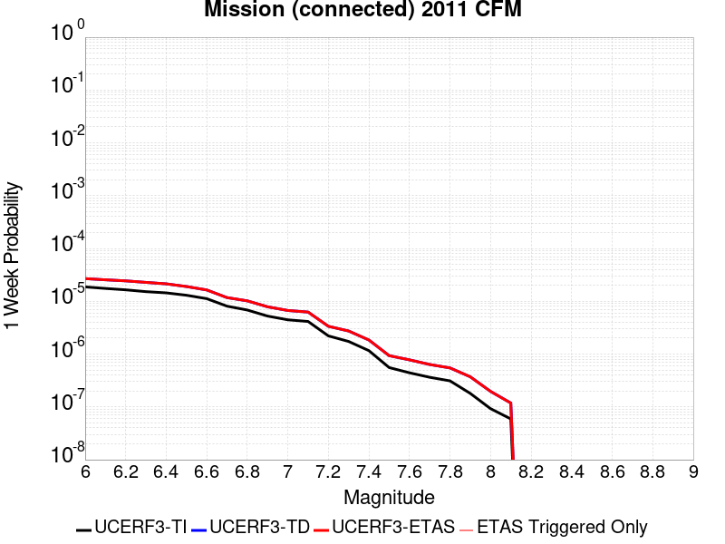 |  |  |  |

| Magnitude | 1 wk TI Prob | 1 wk TD Prob | 1 wk ETAS Prob | 1 wk ETAS/TD Gain | 1 wk ETAS Triggered Only | 1 mo TI Prob | 1 mo TD Prob | 1 mo ETAS Prob | 1 mo ETAS/TD Gain | 1 mo ETAS Triggered Only | 1 yr TI Prob | 1 yr TD Prob | 1 yr ETAS Prob | 1 yr ETAS/TD Gain | 1 yr ETAS Triggered Only | 10 yr TI Prob | 10 yr TD Prob | 10 yr ETAS Prob | 10 yr ETAS/TD Gain | 10 yr ETAS Triggered Only |
|-----|-----|-----|-----|-----|-----|-----|-----|-----|-----|-----|-----|-----|-----|-----|-----|-----|-----|-----|-----|-----|
| 6.0 | 1.8735573E-5 | 2.6885195E-5 | 2.6885195E-5 | 1.0 | 0.0 | 8.029284E-5 | 1.1521686E-4 | 1.1521686E-4 | 1.0 | 0.0 | 9.771269E-4 | 0.0014017948 | 0.0014017948 | 1.0 | 0.0 | 0.009728416 | 0.013938861 | 0.013948722 | 1.0007074 | 1.0E-5 |
| 6.1 | 1.7515964E-5 | 2.552645E-5 | 2.552645E-5 | 1.0 | 0.0 | 7.506625E-5 | 1.0939417E-4 | 1.0939417E-4 | 1.0 | 0.0 | 9.135484E-4 | 0.0013309921 | 0.0013309921 | 1.0 | 0.0 | 0.009098019 | 0.013239455 | 0.013239455 | 1.0 | 0.0 |
| 6.2 | 1.6486343E-5 | 2.4371087E-5 | 2.4371087E-5 | 1.0 | 0.0 | 7.065384E-5 | 1.0444302E-4 | 1.0444302E-4 | 1.0 | 0.0 | 8.5987104E-4 | 0.0012707852 | 0.0012707852 | 1.0 | 0.0 | 0.008565514 | 0.012644423 | 0.012644423 | 1.0 | 0.0 |
| 6.3 | 1.5229385E-5 | 2.2800503E-5 | 2.2800503E-5 | 1.0 | 0.0 | 6.526716E-5 | 9.771246E-5 | 9.771246E-5 | 1.0 | 0.0 | 7.9433795E-4 | 0.0011889333 | 0.0011889333 | 1.0 | 0.0 | 0.007915046 | 0.011837611 | 0.011837611 | 1.0 | 0.0 |
| 6.4 | 1.4435828E-5 | 2.1400503E-5 | 2.1400503E-5 | 1.0 | 0.0 | 6.186637E-5 | 9.171289E-5 | 9.171289E-5 | 1.0 | 0.0 | 7.529627E-4 | 0.0011159674 | 0.0011159674 | 1.0 | 0.0 | 0.007504165 | 0.011120579 | 0.011120579 | 1.0 | 0.0 |
| 6.5 | 1.30127955E-5 | 1.9039378E-5 | 1.9039378E-5 | 1.0 | 0.0 | 5.576793E-5 | 8.159481E-5 | 8.159481E-5 | 1.0 | 0.0 | 6.78763E-4 | 9.929064E-4 | 9.929064E-4 | 1.0 | 0.0 | 0.0067669353 | 0.009912673 | 0.009912673 | 1.0 | 0.0 |
| 6.6 | 1.1220718E-5 | 1.6395532E-5 | 1.6395532E-5 | 1.0 | 0.0 | 4.8087906E-5 | 7.026469E-5 | 7.026469E-5 | 1.0 | 0.0 | 5.8531296E-4 | 8.551351E-4 | 8.551351E-4 | 1.0 | 0.0 | 0.005837737 | 0.008550708 | 0.008550708 | 1.0 | 0.0 |
| 6.7 | 8.086152E-6 | 1.1752115E-5 | 1.1752115E-5 | 1.0 | 0.0 | 3.4654473E-5 | 5.036524E-5 | 5.036524E-5 | 1.0 | 0.0 | 4.2183654E-4 | 6.1302504E-4 | 6.1302504E-4 | 1.0 | 0.0 | 0.004210367 | 0.006150673 | 0.006150673 | 1.0 | 0.0 |
| 6.8 | 6.8361655E-6 | 1.0197025E-5 | 1.0197025E-5 | 1.0 | 0.0 | 2.9297524E-5 | 4.370081E-5 | 4.370081E-5 | 1.0 | 0.0 | 3.5663895E-4 | 5.319281E-4 | 5.319281E-4 | 1.0 | 0.0 | 0.0035606713 | 0.005339546 | 0.005339546 | 1.0 | 0.0 |
| 6.9 | 5.2517353E-6 | 7.870491E-6 | 7.870491E-6 | 1.0 | 0.0 | 2.2507242E-5 | 3.3730237E-5 | 3.3730237E-5 | 1.0 | 0.0 | 2.739912E-4 | 4.1058852E-4 | 4.1058852E-4 | 1.0 | 0.0 | 0.0027365363 | 0.004130576 | 0.004130576 | 1.0 | 0.0 |
| 7.0 | 4.4602784E-6 | 6.702933E-6 | 6.702933E-6 | 1.0 | 0.0 | 1.911534E-5 | 2.8726541E-5 | 2.8726541E-5 | 1.0 | 0.0 | 2.327044E-4 | 3.4968968E-4 | 3.4968968E-4 | 1.0 | 0.0 | 0.0023246086 | 0.003522841 | 0.003522841 | 1.0 | 0.0 |
| 7.1 | 4.1492594E-6 | 6.2516538E-6 | 6.2516538E-6 | 1.0 | 0.0 | 1.7782419E-5 | 2.6792528E-5 | 2.6792528E-5 | 1.0 | 0.0 | 2.1647944E-4 | 3.2615036E-4 | 3.2615036E-4 | 1.0 | 0.0 | 0.0021626868 | 0.0032876332 | 0.0032876332 | 1.0 | 0.0 |
| 7.2 | 2.213247E-6 | 3.3637841E-6 | 3.3637841E-6 | 1.0 | 0.0 | 9.485309E-6 | 1.4416138E-5 | 1.4416138E-5 | 1.0 | 0.0 | 1.15477524E-4 | 1.7550237E-4 | 1.7550237E-4 | 1.0 | 0.0 | 0.0011541754 | 0.0017823082 | 0.0017823082 | 1.0 | 0.0 |
| 7.3 | 1.7362703E-6 | 2.7391663E-6 | 2.7391663E-6 | 1.0 | 0.0 | 7.4411373E-6 | 1.1739232E-5 | 1.1739232E-5 | 1.0 | 0.0 | 9.0592075E-5 | 1.4291579E-4 | 1.4291579E-4 | 1.0 | 0.0 | 9.0555154E-4 | 0.0014535675 | 0.0014535675 | 1.0 | 0.0 |
| 7.4 | 1.1628409E-6 | 1.8498525E-6 | 1.8498525E-6 | 1.0 | 0.0 | 4.9835944E-6 | 7.927915E-6 | 7.927915E-6 | 1.0 | 0.0 | 6.0673574E-5 | 9.651811E-5 | 9.651811E-5 | 1.0 | 0.0 | 6.065701E-4 | 9.855559E-4 | 9.855559E-4 | 1.0 | 0.0 |
| 7.5 | 5.5610667E-7 | 9.3479434E-7 | 9.3479434E-7 | 1.0 | 0.0 | 2.3833122E-6 | 4.0062555E-6 | 4.0062555E-6 | 1.0 | 0.0 | 2.9016439E-5 | 4.8775073E-5 | 4.8775073E-5 | 1.0 | 0.0 | 2.901265E-4 | 5.0431833E-4 | 5.0431833E-4 | 1.0 | 0.0 |
| 7.6 | 4.4307663E-7 | 7.788573E-7 | 7.788573E-7 | 1.0 | 0.0 | 1.8988985E-6 | 3.3379556E-6 | 3.3379556E-6 | 1.0 | 0.0 | 2.3118844E-5 | 4.0638854E-5 | 4.0638854E-5 | 1.0 | 0.0 | 2.3116439E-4 | 4.2230348E-4 | 4.2230348E-4 | 1.0 | 0.0 |
| 7.7 | 3.639119E-7 | 6.3584866E-7 | 6.3584866E-7 | 1.0 | 0.0 | 1.5596215E-6 | 2.7250628E-6 | 2.7250628E-6 | 1.0 | 0.0 | 1.8988227E-5 | 3.3177137E-5 | 3.3177137E-5 | 1.0 | 0.0 | 1.8986604E-4 | 3.4707753E-4 | 3.4707753E-4 | 1.0 | 0.0 |
| 7.8 | 3.1152942E-7 | 5.4778366E-7 | 5.4778366E-7 | 1.0 | 0.0 | 1.3351254E-6 | 2.347642E-6 | 2.347642E-6 | 1.0 | 0.0 | 1.6255031E-5 | 2.8582168E-5 | 2.8582168E-5 | 1.0 | 0.0 | 1.6253842E-4 | 2.9786097E-4 | 2.9786097E-4 | 1.0 | 0.0 |
| 7.9 | 1.8035962E-7 | 3.7203432E-7 | 3.7203432E-7 | 1.0 | 0.0 | 7.729696E-7 | 1.5944319E-6 | 1.5944319E-6 | 1.0 | 0.0 | 9.410865E-6 | 1.9412035E-5 | 1.9412035E-5 | 1.0 | 0.0 | 9.410465E-5 | 2.0080507E-4 | 2.0080507E-4 | 1.0 | 0.0 |
| 8.0 | 9.279334E-8 | 1.9704845E-7 | 1.9704845E-7 | 1.0 | 0.0 | 3.976857E-7 | 8.4449306E-7 | 8.4449306E-7 | 1.0 | 0.0 | 4.841813E-6 | 1.0281655E-5 | 1.0281655E-5 | 1.0 | 0.0 | 4.841707E-5 | 1.0533546E-4 | 1.0533546E-4 | 1.0 | 0.0 |
| 8.1 | 5.9253985E-8 | 1.18565836E-7 | 1.18565836E-7 | 1.0 | 0.0 | 2.5394561E-7 | 5.081392E-7 | 5.081392E-7 | 1.0 | 0.0 | 3.0917836E-6 | 6.1865776E-6 | 6.1865776E-6 | 1.0 | 0.0 | 3.0917407E-5 | 6.325145E-5 | 6.325145E-5 | 1.0 | 0.0 |

## Clamshell-Sawpit
*[(top)](#table-of-contents)*

| 1 Week | 1 Month | 1 Year | 10 Year |
|-----|-----|-----|-----|
|  |  |  |  |

| Magnitude | 1 wk TI Prob | 1 wk TD Prob | 1 wk ETAS Prob | 1 wk ETAS/TD Gain | 1 wk ETAS Triggered Only | 1 mo TI Prob | 1 mo TD Prob | 1 mo ETAS Prob | 1 mo ETAS/TD Gain | 1 mo ETAS Triggered Only | 1 yr TI Prob | 1 yr TD Prob | 1 yr ETAS Prob | 1 yr ETAS/TD Gain | 1 yr ETAS Triggered Only | 10 yr TI Prob | 10 yr TD Prob | 10 yr ETAS Prob | 10 yr ETAS/TD Gain | 10 yr ETAS Triggered Only |
|-----|-----|-----|-----|-----|-----|-----|-----|-----|-----|-----|-----|-----|-----|-----|-----|-----|-----|-----|-----|-----|
| 6.0 | 3.202998E-6 | 3.0127826E-6 | 3.0127826E-6 | 1.0 | 0.0 | 1.3727062E-5 | 1.2911866E-5 | 1.2911866E-5 | 1.0 | 0.0 | 1.6711417E-4 | 1.5719143E-4 | 1.6718986E-4 | 1.0636067 | 1.0E-5 | 0.0016698855 | 0.0015708818 | 0.001580866 | 1.0063559 | 1.0E-5 |
| 6.1 | 3.202998E-6 | 3.0127826E-6 | 3.0127826E-6 | 1.0 | 0.0 | 1.3727062E-5 | 1.2911866E-5 | 1.2911866E-5 | 1.0 | 0.0 | 1.6711417E-4 | 1.5719143E-4 | 1.6718986E-4 | 1.0636067 | 1.0E-5 | 0.0016698855 | 0.0015708818 | 0.001580866 | 1.0063559 | 1.0E-5 |
| 6.2 | 3.202998E-6 | 3.0127826E-6 | 3.0127826E-6 | 1.0 | 0.0 | 1.3727062E-5 | 1.2911866E-5 | 1.2911866E-5 | 1.0 | 0.0 | 1.6711417E-4 | 1.5719143E-4 | 1.6718986E-4 | 1.0636067 | 1.0E-5 | 0.0016698855 | 0.0015708818 | 0.001580866 | 1.0063559 | 1.0E-5 |
| 6.3 | 3.202998E-6 | 3.0127826E-6 | 3.0127826E-6 | 1.0 | 0.0 | 1.3727062E-5 | 1.2911866E-5 | 1.2911866E-5 | 1.0 | 0.0 | 1.6711417E-4 | 1.5719143E-4 | 1.6718986E-4 | 1.0636067 | 1.0E-5 | 0.0016698855 | 0.0015708818 | 0.001580866 | 1.0063559 | 1.0E-5 |
| 6.4 | 3.202998E-6 | 3.0127826E-6 | 3.0127826E-6 | 1.0 | 0.0 | 1.3727062E-5 | 1.2911866E-5 | 1.2911866E-5 | 1.0 | 0.0 | 1.6711417E-4 | 1.5719143E-4 | 1.6718986E-4 | 1.0636067 | 1.0E-5 | 0.0016698855 | 0.0015708818 | 0.001580866 | 1.0063559 | 1.0E-5 |
| 6.5 | 2.5862723E-6 | 2.380791E-6 | 2.380791E-6 | 1.0 | 0.0 | 1.1083977E-5 | 1.0203352E-5 | 1.0203352E-5 | 1.0 | 0.0 | 1.3493907E-4 | 1.2421903E-4 | 1.3421779E-4 | 1.080493 | 1.0E-5 | 0.0013485716 | 0.0012415263 | 0.0012515138 | 1.0080446 | 1.0E-5 |
| 6.6 | 2.5862723E-6 | 2.380791E-6 | 2.380791E-6 | 1.0 | 0.0 | 1.1083977E-5 | 1.0203352E-5 | 1.0203352E-5 | 1.0 | 0.0 | 1.3493907E-4 | 1.2421903E-4 | 1.3421779E-4 | 1.080493 | 1.0E-5 | 0.0013485716 | 0.0012415263 | 0.0012515138 | 1.0080446 | 1.0E-5 |
| 6.7 | 2.5862723E-6 | 2.380791E-6 | 2.380791E-6 | 1.0 | 0.0 | 1.1083977E-5 | 1.0203352E-5 | 1.0203352E-5 | 1.0 | 0.0 | 1.3493907E-4 | 1.2421903E-4 | 1.3421779E-4 | 1.080493 | 1.0E-5 | 0.0013485716 | 0.0012415263 | 0.0012515138 | 1.0080446 | 1.0E-5 |
| 6.8 | 2.4098806E-6 | 2.197746E-6 | 2.197746E-6 | 1.0 | 0.0 | 1.0328019E-5 | 9.418879E-6 | 9.418879E-6 | 1.0 | 0.0 | 1.2573638E-4 | 1.14669085E-4 | 1.2466795E-4 | 1.0871974 | 1.0E-5 | 0.0012566525 | 0.0011461257 | 0.0011561143 | 1.008715 | 1.0E-5 |
| 6.9 | 2.0073985E-6 | 1.7784376E-6 | 1.7784376E-6 | 1.0 | 0.0 | 8.603109E-6 | 7.621854E-6 | 7.621854E-6 | 1.0 | 0.0 | 1.0473781E-4 | 9.2792245E-5 | 9.2792245E-5 | 1.0 | 0.0 | 0.0010468846 | 9.275468E-4 | 9.275468E-4 | 1.0 | 0.0 |
| 7.0 | 1.8166766E-6 | 1.5807215E-6 | 1.5807215E-6 | 1.0 | 0.0 | 7.785734E-6 | 6.7745036E-6 | 6.7745036E-6 | 1.0 | 0.0 | 9.478718E-5 | 8.247656E-5 | 8.247656E-5 | 1.0 | 0.0 | 9.4746763E-4 | 8.2446955E-4 | 8.2446955E-4 | 1.0 | 0.0 |
| 7.1 | 1.5471421E-6 | 1.3053062E-6 | 1.3053062E-6 | 1.0 | 0.0 | 6.6305925E-6 | 5.5941578E-6 | 5.5941578E-6 | 1.0 | 0.0 | 8.072447E-5 | 6.81068E-5 | 6.81068E-5 | 1.0 | 0.0 | 8.0695155E-4 | 6.8086473E-4 | 6.8086473E-4 | 1.0 | 0.0 |
| 7.2 | 1.3608037E-6 | 1.1153531E-6 | 1.1153531E-6 | 1.0 | 0.0 | 5.8320024E-6 | 4.7800763E-6 | 4.7800763E-6 | 1.0 | 0.0 | 7.1002316E-5 | 5.8195925E-5 | 5.8195925E-5 | 1.0 | 0.0 | 7.097964E-4 | 5.818115E-4 | 5.818115E-4 | 1.0 | 0.0 |
| 7.3 | 1.0749634E-6 | 8.3843213E-7 | 8.3843213E-7 | 1.0 | 0.0 | 4.6069777E-6 | 3.5932758E-6 | 3.5932758E-6 | 1.0 | 0.0 | 5.608851E-5 | 4.374728E-5 | 4.374728E-5 | 1.0 | 0.0 | 5.6074356E-4 | 4.3738954E-4 | 4.3738954E-4 | 1.0 | 0.0 |
| 7.4 | 8.416856E-7 | 6.2000976E-7 | 6.2000976E-7 | 1.0 | 0.0 | 3.607219E-6 | 2.657182E-6 | 2.657182E-6 | 1.0 | 0.0 | 4.3917007E-5 | 3.235073E-5 | 3.235073E-5 | 1.0 | 0.0 | 4.390833E-4 | 3.2346218E-4 | 3.2346218E-4 | 1.0 | 0.0 |
| 7.5 | 6.2779594E-7 | 4.4969224E-7 | 4.4969224E-7 | 1.0 | 0.0 | 2.6905511E-6 | 1.927251E-6 | 1.927251E-6 | 1.0 | 0.0 | 3.275697E-5 | 2.3464048E-5 | 2.3464048E-5 | 1.0 | 0.0 | 3.275214E-4 | 2.3461759E-4 | 2.3461759E-4 | 1.0 | 0.0 |
| 7.6 | 4.3822078E-7 | 3.0595675E-7 | 3.0595675E-7 | 1.0 | 0.0 | 1.8780877E-6 | 1.3112426E-6 | 1.3112426E-6 | 1.0 | 0.0 | 2.2865479E-5 | 1.5964277E-5 | 1.5964277E-5 | 1.0 | 0.0 | 2.2863125E-4 | 1.5963285E-4 | 1.5963285E-4 | 1.0 | 0.0 |
| 7.7 | 1.8704569E-7 | 1.1238066E-7 | 1.1238066E-7 | 1.0 | 0.0 | 8.0162414E-7 | 4.8163133E-7 | 4.8163133E-7 | 1.0 | 0.0 | 9.75973E-6 | 5.863846E-6 | 5.863846E-6 | 1.0 | 0.0 | 9.7593016E-5 | 5.863698E-5 | 5.863698E-5 | 1.0 | 0.0 |
| 7.8 | 3.5378733E-8 | 2.1838439E-8 | 2.1838439E-8 | 1.0 | 0.0 | 1.5162313E-7 | 9.359331E-8 | 9.359331E-8 | 1.0 | 0.0 | 1.84601E-6 | 1.139498E-6 | 1.139498E-6 | 1.0 | 0.0 | 1.8459947E-5 | 1.1394924E-5 | 1.1394924E-5 | 1.0 | 0.0 |
| 7.9 | 7.504945E-9 | 5.1920908E-9 | 5.1920908E-9 | 1.0 | 0.0 | 3.2164053E-8 | 2.2251818E-8 | 2.2251818E-8 | 1.0 | 0.0 | 3.9159727E-7 | 2.7091585E-7 | 2.7091585E-7 | 1.0 | 0.0 | 3.915966E-6 | 2.709156E-6 | 2.709156E-6 | 1.0 | 0.0 |
| 8.0 | 1.6554036E-10 | 1.4180812E-10 | 1.4180812E-10 | 1.0 | 0.0 | 7.0945894E-10 | 6.077491E-10 | 6.077491E-10 | 1.0 | 0.0 | 8.637662E-9 | 7.3993442E-9 | 7.3993442E-9 | 1.0 | 0.0 | 8.6376616E-8 | 7.399344E-8 | 7.399344E-8 | 1.0 | 0.0 |

## North Frontal  (East)
*[(top)](#table-of-contents)*

| 1 Week | 1 Month | 1 Year | 10 Year |
|-----|-----|-----|-----|
|  |  |  |  |

| Magnitude | 1 wk TI Prob | 1 wk TD Prob | 1 wk ETAS Prob | 1 wk ETAS/TD Gain | 1 wk ETAS Triggered Only | 1 mo TI Prob | 1 mo TD Prob | 1 mo ETAS Prob | 1 mo ETAS/TD Gain | 1 mo ETAS Triggered Only | 1 yr TI Prob | 1 yr TD Prob | 1 yr ETAS Prob | 1 yr ETAS/TD Gain | 1 yr ETAS Triggered Only | 10 yr TI Prob | 10 yr TD Prob | 10 yr ETAS Prob | 10 yr ETAS/TD Gain | 10 yr ETAS Triggered Only |
|-----|-----|-----|-----|-----|-----|-----|-----|-----|-----|-----|-----|-----|-----|-----|-----|-----|-----|-----|-----|-----|
| 6.0 | 7.135738E-6 | 7.4772242E-6 | 7.4772242E-6 | 1.0 | 0.0 | 3.0581377E-5 | 3.2044965E-5 | 3.2044965E-5 | 1.0 | 0.0 | 3.7226462E-4 | 3.9009753E-4 | 3.9009753E-4 | 1.0 | 0.0 | 0.0037164164 | 0.0038960855 | 0.0039060465 | 1.0025567 | 1.0E-5 |
| 6.1 | 7.135738E-6 | 7.4772242E-6 | 7.4772242E-6 | 1.0 | 0.0 | 3.0581377E-5 | 3.2044965E-5 | 3.2044965E-5 | 1.0 | 0.0 | 3.7226462E-4 | 3.9009753E-4 | 3.9009753E-4 | 1.0 | 0.0 | 0.0037164164 | 0.0038960855 | 0.0039060465 | 1.0025567 | 1.0E-5 |
| 6.2 | 7.135738E-6 | 7.4772242E-6 | 7.4772242E-6 | 1.0 | 0.0 | 3.0581377E-5 | 3.2044965E-5 | 3.2044965E-5 | 1.0 | 0.0 | 3.7226462E-4 | 3.9009753E-4 | 3.9009753E-4 | 1.0 | 0.0 | 0.0037164164 | 0.0038960855 | 0.0039060465 | 1.0025567 | 1.0E-5 |
| 6.3 | 7.135738E-6 | 7.4772242E-6 | 7.4772242E-6 | 1.0 | 0.0 | 3.0581377E-5 | 3.2044965E-5 | 3.2044965E-5 | 1.0 | 0.0 | 3.7226462E-4 | 3.9009753E-4 | 3.9009753E-4 | 1.0 | 0.0 | 0.0037164164 | 0.0038960855 | 0.0039060465 | 1.0025567 | 1.0E-5 |
| 6.4 | 7.135738E-6 | 7.4772242E-6 | 7.4772242E-6 | 1.0 | 0.0 | 3.0581377E-5 | 3.2044965E-5 | 3.2044965E-5 | 1.0 | 0.0 | 3.7226462E-4 | 3.9009753E-4 | 3.9009753E-4 | 1.0 | 0.0 | 0.0037164164 | 0.0038960855 | 0.0039060465 | 1.0025567 | 1.0E-5 |
| 6.5 | 7.135738E-6 | 7.4772242E-6 | 7.4772242E-6 | 1.0 | 0.0 | 3.0581377E-5 | 3.2044965E-5 | 3.2044965E-5 | 1.0 | 0.0 | 3.7226462E-4 | 3.9009753E-4 | 3.9009753E-4 | 1.0 | 0.0 | 0.0037164164 | 0.0038960855 | 0.0039060465 | 1.0025567 | 1.0E-5 |
| 6.6 | 7.135738E-6 | 7.4772242E-6 | 7.4772242E-6 | 1.0 | 0.0 | 3.0581377E-5 | 3.2044965E-5 | 3.2044965E-5 | 1.0 | 0.0 | 3.7226462E-4 | 3.9009753E-4 | 3.9009753E-4 | 1.0 | 0.0 | 0.0037164164 | 0.0038960855 | 0.0039060465 | 1.0025567 | 1.0E-5 |
| 6.7 | 7.135738E-6 | 7.4772242E-6 | 7.4772242E-6 | 1.0 | 0.0 | 3.0581377E-5 | 3.2044965E-5 | 3.2044965E-5 | 1.0 | 0.0 | 3.7226462E-4 | 3.9009753E-4 | 3.9009753E-4 | 1.0 | 0.0 | 0.0037164164 | 0.0038960855 | 0.0039060465 | 1.0025567 | 1.0E-5 |
| 6.8 | 5.959142E-6 | 6.236721E-6 | 6.236721E-6 | 1.0 | 0.0 | 2.553893E-5 | 2.6728634E-5 | 2.6728634E-5 | 1.0 | 0.0 | 3.108921E-4 | 3.253906E-4 | 3.253906E-4 | 1.0 | 0.0 | 0.0031045752 | 0.0032509149 | 0.0032608823 | 1.0030661 | 1.0E-5 |
| 6.9 | 2.2946929E-6 | 2.3824725E-6 | 2.3824725E-6 | 1.0 | 0.0 | 9.834361E-6 | 1.021056E-5 | 1.021056E-5 | 1.0 | 0.0 | 1.1972676E-4 | 1.2430694E-4 | 1.2430694E-4 | 1.0 | 0.0 | 0.0011966228 | 0.0012424206 | 0.0012524081 | 1.0080388 | 1.0E-5 |
| 7.0 | 2.2468673E-6 | 2.3321654E-6 | 2.3321654E-6 | 1.0 | 0.0 | 9.629396E-6 | 9.994959E-6 | 9.994959E-6 | 1.0 | 0.0 | 1.1723159E-4 | 1.2168231E-4 | 1.2168231E-4 | 1.0 | 0.0 | 0.0011716976 | 0.0012162031 | 0.001226191 | 1.0082123 | 1.0E-5 |
| 7.1 | 1.9921076E-6 | 2.0646132E-6 | 2.0646132E-6 | 1.0 | 0.0 | 8.537577E-6 | 8.848315E-6 | 8.848315E-6 | 1.0 | 0.0 | 1.0394004E-4 | 1.0772334E-4 | 1.0772334E-4 | 1.0 | 0.0 | 0.0010389143 | 0.001076754 | 0.001076754 | 1.0 | 0.0 |
| 7.2 | 1.4524545E-6 | 1.504522E-6 | 1.504522E-6 | 1.0 | 0.0 | 6.2247905E-6 | 6.447937E-6 | 6.447937E-6 | 1.0 | 0.0 | 7.5784184E-5 | 7.850105E-5 | 7.850105E-5 | 1.0 | 0.0 | 7.575835E-4 | 7.8475766E-4 | 7.8475766E-4 | 1.0 | 0.0 |
| 7.3 | 8.9802575E-7 | 9.308773E-7 | 9.308773E-7 | 1.0 | 0.0 | 3.848676E-6 | 3.989469E-6 | 3.989469E-6 | 1.0 | 0.0 | 4.685662E-5 | 4.8570815E-5 | 4.8570815E-5 | 1.0 | 0.0 | 4.6846745E-4 | 4.856133E-4 | 4.856133E-4 | 1.0 | 0.0 |
| 7.4 | 7.776139E-7 | 8.060514E-7 | 8.060514E-7 | 1.0 | 0.0 | 3.3326266E-6 | 3.454502E-6 | 3.454502E-6 | 1.0 | 0.0 | 4.0573974E-5 | 4.2057858E-5 | 4.2057858E-5 | 1.0 | 0.0 | 4.0566566E-4 | 4.2050975E-4 | 4.2050975E-4 | 1.0 | 0.0 |
| 7.5 | 5.244417E-7 | 5.4412465E-7 | 5.4412465E-7 | 1.0 | 0.0 | 2.2476054E-6 | 2.331961E-6 | 2.331961E-6 | 1.0 | 0.0 | 2.7364253E-5 | 2.8391321E-5 | 2.8391321E-5 | 1.0 | 0.0 | 2.7360884E-4 | 2.8388345E-4 | 2.8388345E-4 | 1.0 | 0.0 |
| 7.6 | 1.5489647E-7 | 1.6089587E-7 | 1.6089587E-7 | 1.0 | 0.0 | 6.6384183E-7 | 6.8955364E-7 | 6.8955364E-7 | 1.0 | 0.0 | 8.082245E-6 | 8.395304E-6 | 8.395304E-6 | 1.0 | 0.0 | 8.08195E-5 | 8.395186E-5 | 8.395186E-5 | 1.0 | 0.0 |

## Elsinore (Julian)
*[(top)](#table-of-contents)*

| 1 Week | 1 Month | 1 Year | 10 Year |
|-----|-----|-----|-----|
|  |  |  |  |

| Magnitude | 1 wk TI Prob | 1 wk TD Prob | 1 wk ETAS Prob | 1 wk ETAS/TD Gain | 1 wk ETAS Triggered Only | 1 mo TI Prob | 1 mo TD Prob | 1 mo ETAS Prob | 1 mo ETAS/TD Gain | 1 mo ETAS Triggered Only | 1 yr TI Prob | 1 yr TD Prob | 1 yr ETAS Prob | 1 yr ETAS/TD Gain | 1 yr ETAS Triggered Only | 10 yr TI Prob | 10 yr TD Prob | 10 yr ETAS Prob | 10 yr ETAS/TD Gain | 10 yr ETAS Triggered Only |
|-----|-----|-----|-----|-----|-----|-----|-----|-----|-----|-----|-----|-----|-----|-----|-----|-----|-----|-----|-----|-----|
| 6.0 | 1.1710231E-5 | 8.84584E-6 | 8.84584E-6 | 1.0 | 0.0 | 5.0185736E-5 | 3.7910202E-5 | 4.7909823E-5 | 1.2637713 | 1.0E-5 | 6.1084004E-4 | 4.6146064E-4 | 4.7145603E-4 | 1.0216603 | 1.0E-5 | 0.006091637 | 0.0046052285 | 0.0046151825 | 1.0021615 | 1.0E-5 |
| 6.1 | 1.1710231E-5 | 8.84584E-6 | 8.84584E-6 | 1.0 | 0.0 | 5.0185736E-5 | 3.7910202E-5 | 4.7909823E-5 | 1.2637713 | 1.0E-5 | 6.1084004E-4 | 4.6146064E-4 | 4.7145603E-4 | 1.0216603 | 1.0E-5 | 0.006091637 | 0.0046052285 | 0.0046151825 | 1.0021615 | 1.0E-5 |
| 6.2 | 1.1710231E-5 | 8.84584E-6 | 8.84584E-6 | 1.0 | 0.0 | 5.0185736E-5 | 3.7910202E-5 | 4.7909823E-5 | 1.2637713 | 1.0E-5 | 6.1084004E-4 | 4.6146064E-4 | 4.7145603E-4 | 1.0216603 | 1.0E-5 | 0.006091637 | 0.0046052285 | 0.0046151825 | 1.0021615 | 1.0E-5 |
| 6.3 | 1.1710231E-5 | 8.84584E-6 | 8.84584E-6 | 1.0 | 0.0 | 5.0185736E-5 | 3.7910202E-5 | 4.7909823E-5 | 1.2637713 | 1.0E-5 | 6.1084004E-4 | 4.6146064E-4 | 4.7145603E-4 | 1.0216603 | 1.0E-5 | 0.006091637 | 0.0046052285 | 0.0046151825 | 1.0021615 | 1.0E-5 |
| 6.4 | 1.1710231E-5 | 8.84584E-6 | 8.84584E-6 | 1.0 | 0.0 | 5.0185736E-5 | 3.7910202E-5 | 4.7909823E-5 | 1.2637713 | 1.0E-5 | 6.1084004E-4 | 4.6146064E-4 | 4.7145603E-4 | 1.0216603 | 1.0E-5 | 0.006091637 | 0.0046052285 | 0.0046151825 | 1.0021615 | 1.0E-5 |
| 6.5 | 1.1710231E-5 | 8.84584E-6 | 8.84584E-6 | 1.0 | 0.0 | 5.0185736E-5 | 3.7910202E-5 | 4.7909823E-5 | 1.2637713 | 1.0E-5 | 6.1084004E-4 | 4.6146064E-4 | 4.7145603E-4 | 1.0216603 | 1.0E-5 | 0.006091637 | 0.0046052285 | 0.0046151825 | 1.0021615 | 1.0E-5 |
| 6.6 | 1.1650619E-5 | 8.778211E-6 | 8.778211E-6 | 1.0 | 0.0 | 4.993027E-5 | 3.762037E-5 | 4.7619997E-5 | 1.2658035 | 1.0E-5 | 6.0773146E-4 | 4.5793346E-4 | 4.6792888E-4 | 1.0218272 | 1.0E-5 | 0.0060607214 | 0.0045701023 | 0.0045800568 | 1.0021782 | 1.0E-5 |
| 6.7 | 1.1650619E-5 | 8.778211E-6 | 8.778211E-6 | 1.0 | 0.0 | 4.993027E-5 | 3.762037E-5 | 4.7619997E-5 | 1.2658035 | 1.0E-5 | 6.0773146E-4 | 4.5793346E-4 | 4.6792888E-4 | 1.0218272 | 1.0E-5 | 0.0060607214 | 0.0045701023 | 0.0045800568 | 1.0021782 | 1.0E-5 |
| 6.8 | 1.1442698E-5 | 8.561368E-6 | 8.561368E-6 | 1.0 | 0.0 | 4.9039216E-5 | 3.669107E-5 | 4.6690704E-5 | 1.2725359 | 1.0E-5 | 5.968889E-4 | 4.4662392E-4 | 4.5661945E-4 | 1.0223802 | 1.0E-5 | 0.0059528816 | 0.004457465 | 0.0044674203 | 1.0022334 | 1.0E-5 |
| 6.9 | 1.1300589E-5 | 8.409233E-6 | 8.409233E-6 | 1.0 | 0.0 | 4.8430196E-5 | 3.603908E-5 | 4.603872E-5 | 1.2774665 | 1.0E-5 | 5.894781E-4 | 4.386891E-4 | 4.4868473E-4 | 1.0227852 | 1.0E-5 | 0.005879169 | 0.0043784315 | 0.0043883873 | 1.0022739 | 1.0E-5 |
| 7.0 | 1.1117729E-5 | 8.226409E-6 | 8.226409E-6 | 1.0 | 0.0 | 4.764654E-5 | 3.525557E-5 | 4.525522E-5 | 1.2836331 | 1.0E-5 | 5.799422E-4 | 4.2915368E-4 | 4.391494E-4 | 1.0232917 | 1.0E-5 | 0.0057843104 | 0.004283448 | 0.004293405 | 1.0023246 | 1.0E-5 |
| 7.1 | 1.08053955E-5 | 7.912071E-6 | 7.912071E-6 | 1.0 | 0.0 | 4.6308014E-5 | 3.3908444E-5 | 4.3908105E-5 | 1.2949018 | 1.0E-5 | 5.6365423E-4 | 4.1275873E-4 | 4.2275462E-4 | 1.0242172 | 1.0E-5 | 0.005622267 | 0.0041201166 | 0.004130075 | 1.0024171 | 1.0E-5 |
| 7.2 | 1.032804E-5 | 7.4333325E-6 | 7.4333325E-6 | 1.0 | 0.0 | 4.4262277E-5 | 3.1856758E-5 | 4.1856438E-5 | 1.3138951 | 1.0E-5 | 5.387599E-4 | 3.8778858E-4 | 3.977847E-4 | 1.0257772 | 1.0E-5 | 0.0053745564 | 0.0038713063 | 0.0038812675 | 1.0025731 | 1.0E-5 |
| 7.3 | 9.622426E-6 | 6.8981303E-6 | 6.8981303E-6 | 1.0 | 0.0 | 4.1238312E-5 | 2.9563087E-5 | 3.9562794E-5 | 1.3382497 | 1.0E-5 | 5.019608E-4 | 3.5987256E-4 | 3.6986897E-4 | 1.0277777 | 1.0E-5 | 0.005008285 | 0.00359307 | 0.003603034 | 1.0027732 | 1.0E-5 |
| 7.4 | 9.144434E-6 | 6.4966553E-6 | 6.4966553E-6 | 1.0 | 0.0 | 3.9189843E-5 | 2.784252E-5 | 3.784224E-5 | 1.3591529 | 1.0E-5 | 4.7703186E-4 | 3.3893134E-4 | 3.4892795E-4 | 1.0294945 | 1.0E-5 | 0.0047600917 | 0.0033842877 | 0.0033942538 | 1.0029448 | 1.0E-5 |
| 7.5 | 7.988981E-6 | 5.498552E-6 | 5.498552E-6 | 1.0 | 0.0 | 3.4238044E-5 | 2.3565017E-5 | 3.3564782E-5 | 1.4243479 | 1.0E-5 | 4.1676845E-4 | 2.8686758E-4 | 2.9686472E-4 | 1.0348493 | 1.0E-5 | 0.0041598766 | 0.0028651 | 0.0028750715 | 1.0034803 | 1.0E-5 |
| 7.6 | 6.9554876E-6 | 4.662728E-6 | 4.662728E-6 | 1.0 | 0.0 | 2.9808893E-5 | 1.9982974E-5 | 2.9982773E-5 | 1.500416 | 1.0E-5 | 3.6286283E-4 | 2.4326671E-4 | 2.5326427E-4 | 1.0410972 | 1.0E-5 | 0.0036227088 | 0.0024301205 | 0.002440096 | 1.004105 | 1.0E-5 |
| 7.7 | 4.1557314E-6 | 2.3247592E-6 | 2.3247592E-6 | 1.0 | 0.0 | 1.7810156E-5 | 9.96322E-6 | 9.96322E-6 | 1.0 | 0.0 | 2.1681708E-4 | 1.21296194E-4 | 1.21296194E-4 | 1.0 | 0.0 | 0.0021660565 | 0.0012123729 | 0.0012123729 | 1.0 | 0.0 |
| 7.8 | 2.2597293E-7 | 9.333386E-8 | 9.333386E-8 | 1.0 | 0.0 | 9.684551E-7 | 4.0000222E-7 | 4.0000222E-7 | 1.0 | 0.0 | 1.1790877E-5 | 4.8700194E-6 | 4.8700194E-6 | 1.0 | 0.0 | 1.17902506E-4 | 4.8699454E-5 | 4.8699454E-5 | 1.0 | 0.0 |
| 7.9 | 6.676829E-9 | 3.4399772E-9 | 3.4399772E-9 | 1.0 | 0.0 | 2.861498E-8 | 1.4742759E-8 | 1.4742759E-8 | 1.0 | 0.0 | 3.4838732E-7 | 1.7949307E-7 | 1.7949307E-7 | 1.0 | 0.0 | 3.4838679E-6 | 1.7949295E-6 | 1.7949295E-6 | 1.0 | 0.0 |

## Kickapoo
*[(top)](#table-of-contents)*

| 1 Week | 1 Month | 1 Year | 10 Year |
|-----|-----|-----|-----|
|  |  |  | 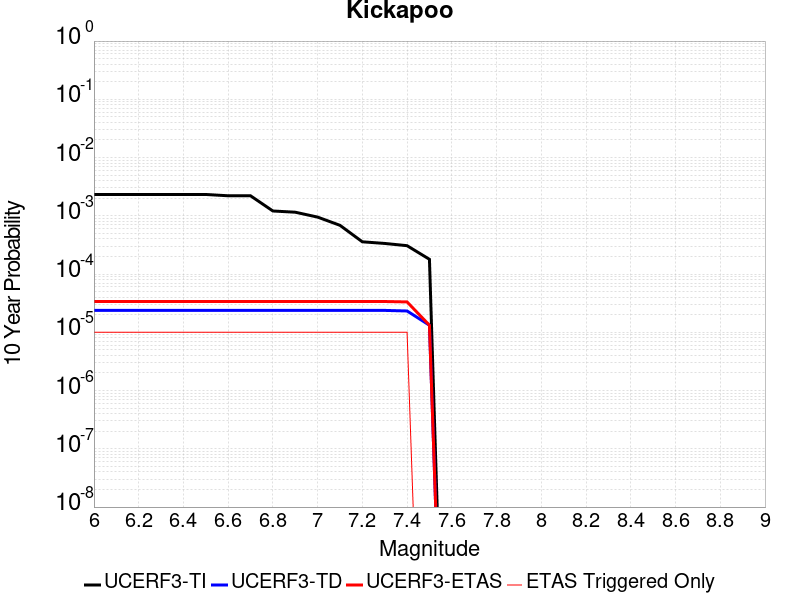 |

| Magnitude | 1 wk TI Prob | 1 wk TD Prob | 1 wk ETAS Prob | 1 wk ETAS/TD Gain | 1 wk ETAS Triggered Only | 1 mo TI Prob | 1 mo TD Prob | 1 mo ETAS Prob | 1 mo ETAS/TD Gain | 1 mo ETAS Triggered Only | 1 yr TI Prob | 1 yr TD Prob | 1 yr ETAS Prob | 1 yr ETAS/TD Gain | 1 yr ETAS Triggered Only | 10 yr TI Prob | 10 yr TD Prob | 10 yr ETAS Prob | 10 yr ETAS/TD Gain | 10 yr ETAS Triggered Only |
|-----|-----|-----|-----|-----|-----|-----|-----|-----|-----|-----|-----|-----|-----|-----|-----|-----|-----|-----|-----|-----|
| 6.0 | 4.4610633E-6 | 4.560083E-8 | 4.560083E-8 | 1.0 | 0.0 | 1.9118703E-5 | 1.9543212E-7 | 1.9543212E-7 | 1.0 | 0.0 | 2.3274534E-4 | 2.3793837E-6 | 2.3793837E-6 | 1.0 | 0.0 | 0.0023250172 | 2.3793611E-5 | 3.3793374E-5 | 1.4202709 | 1.0E-5 |
| 6.1 | 4.4610633E-6 | 4.560083E-8 | 4.560083E-8 | 1.0 | 0.0 | 1.9118703E-5 | 1.9543212E-7 | 1.9543212E-7 | 1.0 | 0.0 | 2.3274534E-4 | 2.3793837E-6 | 2.3793837E-6 | 1.0 | 0.0 | 0.0023250172 | 2.3793611E-5 | 3.3793374E-5 | 1.4202709 | 1.0E-5 |
| 6.2 | 4.4610633E-6 | 4.560083E-8 | 4.560083E-8 | 1.0 | 0.0 | 1.9118703E-5 | 1.9543212E-7 | 1.9543212E-7 | 1.0 | 0.0 | 2.3274534E-4 | 2.3793837E-6 | 2.3793837E-6 | 1.0 | 0.0 | 0.0023250172 | 2.3793611E-5 | 3.3793374E-5 | 1.4202709 | 1.0E-5 |
| 6.3 | 4.4610633E-6 | 4.560083E-8 | 4.560083E-8 | 1.0 | 0.0 | 1.9118703E-5 | 1.9543212E-7 | 1.9543212E-7 | 1.0 | 0.0 | 2.3274534E-4 | 2.3793837E-6 | 2.3793837E-6 | 1.0 | 0.0 | 0.0023250172 | 2.3793611E-5 | 3.3793374E-5 | 1.4202709 | 1.0E-5 |
| 6.4 | 4.4610633E-6 | 4.560083E-8 | 4.560083E-8 | 1.0 | 0.0 | 1.9118703E-5 | 1.9543212E-7 | 1.9543212E-7 | 1.0 | 0.0 | 2.3274534E-4 | 2.3793837E-6 | 2.3793837E-6 | 1.0 | 0.0 | 0.0023250172 | 2.3793611E-5 | 3.3793374E-5 | 1.4202709 | 1.0E-5 |
| 6.5 | 4.4610633E-6 | 4.560083E-8 | 4.560083E-8 | 1.0 | 0.0 | 1.9118703E-5 | 1.9543212E-7 | 1.9543212E-7 | 1.0 | 0.0 | 2.3274534E-4 | 2.3793837E-6 | 2.3793837E-6 | 1.0 | 0.0 | 0.0023250172 | 2.3793611E-5 | 3.3793374E-5 | 1.4202709 | 1.0E-5 |
| 6.6 | 4.236531E-6 | 4.560083E-8 | 4.560083E-8 | 1.0 | 0.0 | 1.8156434E-5 | 1.9543212E-7 | 1.9543212E-7 | 1.0 | 0.0 | 2.2103215E-4 | 2.3793837E-6 | 2.3793837E-6 | 1.0 | 0.0 | 0.0022081244 | 2.3793611E-5 | 3.3793374E-5 | 1.4202709 | 1.0E-5 |
| 6.7 | 4.236531E-6 | 4.560083E-8 | 4.560083E-8 | 1.0 | 0.0 | 1.8156434E-5 | 1.9543212E-7 | 1.9543212E-7 | 1.0 | 0.0 | 2.2103215E-4 | 2.3793837E-6 | 2.3793837E-6 | 1.0 | 0.0 | 0.0022081244 | 2.3793611E-5 | 3.3793374E-5 | 1.4202709 | 1.0E-5 |
| 6.8 | 2.3202913E-6 | 4.560083E-8 | 4.560083E-8 | 1.0 | 0.0 | 9.944068E-6 | 1.9543212E-7 | 1.9543212E-7 | 1.0 | 0.0 | 1.210623E-4 | 2.3793837E-6 | 2.3793837E-6 | 1.0 | 0.0 | 0.0012099637 | 2.3793611E-5 | 3.3793374E-5 | 1.4202709 | 1.0E-5 |
| 6.9 | 2.2111808E-6 | 4.560083E-8 | 4.560083E-8 | 1.0 | 0.0 | 9.4764555E-6 | 1.9543212E-7 | 1.9543212E-7 | 1.0 | 0.0 | 1.1536973E-4 | 2.3793837E-6 | 2.3793837E-6 | 1.0 | 0.0 | 0.0011530985 | 2.3793611E-5 | 3.3793374E-5 | 1.4202709 | 1.0E-5 |
| 7.0 | 1.8222031E-6 | 4.560083E-8 | 4.560083E-8 | 1.0 | 0.0 | 7.809419E-6 | 1.9543212E-7 | 1.9543212E-7 | 1.0 | 0.0 | 9.507552E-5 | 2.3793837E-6 | 2.3793837E-6 | 1.0 | 0.0 | 9.5034856E-4 | 2.3793611E-5 | 3.3793374E-5 | 1.4202709 | 1.0E-5 |
| 7.1 | 1.3163254E-6 | 4.560083E-8 | 4.560083E-8 | 1.0 | 0.0 | 5.6413824E-6 | 1.9543212E-7 | 1.9543212E-7 | 1.0 | 0.0 | 6.868167E-5 | 2.3793837E-6 | 2.3793837E-6 | 1.0 | 0.0 | 6.866045E-4 | 2.3793611E-5 | 3.3793374E-5 | 1.4202709 | 1.0E-5 |
| 7.2 | 6.8603634E-7 | 4.5599908E-8 | 4.5599908E-8 | 1.0 | 0.0 | 2.9401524E-6 | 1.9542817E-7 | 1.9542817E-7 | 1.0 | 0.0 | 3.579577E-5 | 2.3793357E-6 | 2.3793357E-6 | 1.0 | 0.0 | 3.5790002E-4 | 2.3793129E-5 | 3.379289E-5 | 1.4202794 | 1.0E-5 |
| 7.3 | 6.4299127E-7 | 4.558369E-8 | 4.558369E-8 | 1.0 | 0.0 | 2.755674E-6 | 1.9535867E-7 | 1.9535867E-7 | 1.0 | 0.0 | 3.3549815E-5 | 2.3784894E-6 | 2.3784894E-6 | 1.0 | 0.0 | 3.354475E-4 | 2.3784667E-5 | 3.378443E-5 | 1.4204289 | 1.0E-5 |
| 7.4 | 5.8856347E-7 | 4.4559453E-8 | 4.4559453E-8 | 1.0 | 0.0 | 2.5224124E-6 | 1.9096908E-7 | 1.9096908E-7 | 1.0 | 0.0 | 3.070994E-5 | 2.3250464E-6 | 2.3250464E-6 | 1.0 | 0.0 | 3.0705697E-4 | 2.3250248E-5 | 3.3250017E-5 | 1.4300929 | 1.0E-5 |
| 7.5 | 3.435626E-7 | 2.535922E-8 | 2.535922E-8 | 1.0 | 0.0 | 1.4724103E-6 | 1.0868237E-7 | 1.0868237E-7 | 1.0 | 0.0 | 1.7926448E-5 | 1.3232072E-6 | 1.3232072E-6 | 1.0 | 0.0 | 1.7925001E-4 | 1.3232009E-5 | 1.3232009E-5 | 1.0 | 0.0 |

## Sheephole
*[(top)](#table-of-contents)*

| 1 Week | 1 Month | 1 Year | 10 Year |
|-----|-----|-----|-----|
|  |  |  |  |

| Magnitude | 1 wk TI Prob | 1 wk TD Prob | 1 wk ETAS Prob | 1 wk ETAS/TD Gain | 1 wk ETAS Triggered Only | 1 mo TI Prob | 1 mo TD Prob | 1 mo ETAS Prob | 1 mo ETAS/TD Gain | 1 mo ETAS Triggered Only | 1 yr TI Prob | 1 yr TD Prob | 1 yr ETAS Prob | 1 yr ETAS/TD Gain | 1 yr ETAS Triggered Only | 10 yr TI Prob | 10 yr TD Prob | 10 yr ETAS Prob | 10 yr ETAS/TD Gain | 10 yr ETAS Triggered Only |
|-----|-----|-----|-----|-----|-----|-----|-----|-----|-----|-----|-----|-----|-----|-----|-----|-----|-----|-----|-----|-----|
| 6.0 | 4.5579695E-6 | 4.7412877E-6 | 4.7412877E-6 | 1.0 | 0.0 | 1.9534009E-5 | 2.0319678E-5 | 2.0319678E-5 | 1.0 | 0.0 | 2.3780059E-4 | 2.4736955E-4 | 2.5736706E-4 | 1.0404154 | 1.0E-5 | 0.0023754628 | 0.0024714863 | 0.0024814617 | 1.0040362 | 1.0E-5 |
| 6.1 | 4.5579695E-6 | 4.7412877E-6 | 4.7412877E-6 | 1.0 | 0.0 | 1.9534009E-5 | 2.0319678E-5 | 2.0319678E-5 | 1.0 | 0.0 | 2.3780059E-4 | 2.4736955E-4 | 2.5736706E-4 | 1.0404154 | 1.0E-5 | 0.0023754628 | 0.0024714863 | 0.0024814617 | 1.0040362 | 1.0E-5 |
| 6.2 | 2.6677674E-6 | 2.7874107E-6 | 2.7874107E-6 | 1.0 | 0.0 | 1.1433239E-5 | 1.1945997E-5 | 1.1945997E-5 | 1.0 | 0.0 | 1.3919079E-4 | 1.4543389E-4 | 1.4543389E-4 | 1.0 | 0.0 | 0.0013910364 | 0.001453493 | 0.001453493 | 1.0 | 0.0 |
| 6.3 | 2.6677674E-6 | 2.7874107E-6 | 2.7874107E-6 | 1.0 | 0.0 | 1.1433239E-5 | 1.1945997E-5 | 1.1945997E-5 | 1.0 | 0.0 | 1.3919079E-4 | 1.4543389E-4 | 1.4543389E-4 | 1.0 | 0.0 | 0.0013910364 | 0.001453493 | 0.001453493 | 1.0 | 0.0 |
| 6.4 | 2.2159759E-6 | 2.3228936E-6 | 2.3228936E-6 | 1.0 | 0.0 | 9.497005E-6 | 9.955224E-6 | 9.955224E-6 | 1.0 | 0.0 | 1.156199E-4 | 1.2119893E-4 | 1.2119893E-4 | 1.0 | 0.0 | 0.0011555976 | 0.0012114076 | 0.0012114076 | 1.0 | 0.0 |
| 6.5 | 2.1986082E-6 | 2.3047737E-6 | 2.3047737E-6 | 1.0 | 0.0 | 9.4225725E-6 | 9.877569E-6 | 9.877569E-6 | 1.0 | 0.0 | 1.1471378E-4 | 1.2025358E-4 | 1.2025358E-4 | 1.0 | 0.0 | 0.0011465458 | 0.0012019643 | 0.0012019643 | 1.0 | 0.0 |
| 6.6 | 1.5232331E-6 | 1.6019028E-6 | 1.6019028E-6 | 1.0 | 0.0 | 6.5281256E-6 | 6.8652807E-6 | 6.8652807E-6 | 1.0 | 0.0 | 7.947703E-5 | 8.358178E-5 | 8.358178E-5 | 1.0 | 0.0 | 7.9448614E-4 | 8.3552214E-4 | 8.3552214E-4 | 1.0 | 0.0 |
| 6.7 | 1.3137362E-6 | 1.3828287E-6 | 1.3828287E-6 | 1.0 | 0.0 | 5.6302856E-6 | 5.926396E-6 | 5.926396E-6 | 1.0 | 0.0 | 6.854657E-5 | 7.2151626E-5 | 7.2151626E-5 | 1.0 | 0.0 | 6.8525434E-4 | 7.212959E-4 | 7.212959E-4 | 1.0 | 0.0 |
| 6.8 | 1.2275751E-6 | 1.2922936E-6 | 1.2922936E-6 | 1.0 | 0.0 | 5.2610258E-6 | 5.5383903E-6 | 5.5383903E-6 | 1.0 | 0.0 | 6.4051106E-5 | 6.742795E-5 | 6.742795E-5 | 1.0 | 0.0 | 6.4032647E-4 | 6.740883E-4 | 6.740883E-4 | 1.0 | 0.0 |
| 6.9 | 1.1837088E-6 | 1.2461107E-6 | 1.2461107E-6 | 1.0 | 0.0 | 5.0730278E-6 | 5.340464E-6 | 5.340464E-6 | 1.0 | 0.0 | 6.176237E-5 | 6.501835E-5 | 6.501835E-5 | 1.0 | 0.0 | 6.17452E-4 | 6.500064E-4 | 6.500064E-4 | 1.0 | 0.0 |
| 7.0 | 9.849371E-7 | 1.036636E-6 | 1.036636E-6 | 1.0 | 0.0 | 4.2211523E-6 | 4.442719E-6 | 4.442719E-6 | 1.0 | 0.0 | 5.1391315E-5 | 5.408886E-5 | 5.408886E-5 | 1.0 | 0.0 | 5.137943E-4 | 5.4076704E-4 | 5.4076704E-4 | 1.0 | 0.0 |
| 7.1 | 8.1643645E-7 | 8.5917287E-7 | 8.5917287E-7 | 1.0 | 0.0 | 3.4990085E-6 | 3.6821648E-6 | 3.6821648E-6 | 1.0 | 0.0 | 4.2599597E-5 | 4.482952E-5 | 4.482952E-5 | 1.0 | 0.0 | 4.259143E-4 | 4.482134E-4 | 4.482134E-4 | 1.0 | 0.0 |
| 7.2 | 5.7295756E-7 | 6.029544E-7 | 6.029544E-7 | 1.0 | 0.0 | 2.45553E-6 | 2.584088E-6 | 2.584088E-6 | 1.0 | 0.0 | 2.9895667E-5 | 3.1460884E-5 | 3.1460884E-5 | 1.0 | 0.0 | 2.9891645E-4 | 3.14571E-4 | 3.14571E-4 | 1.0 | 0.0 |

## Hayward (No) 2011 CFM
*[(top)](#table-of-contents)*

| 1 Week | 1 Month | 1 Year | 10 Year |
|-----|-----|-----|-----|
|  |  | 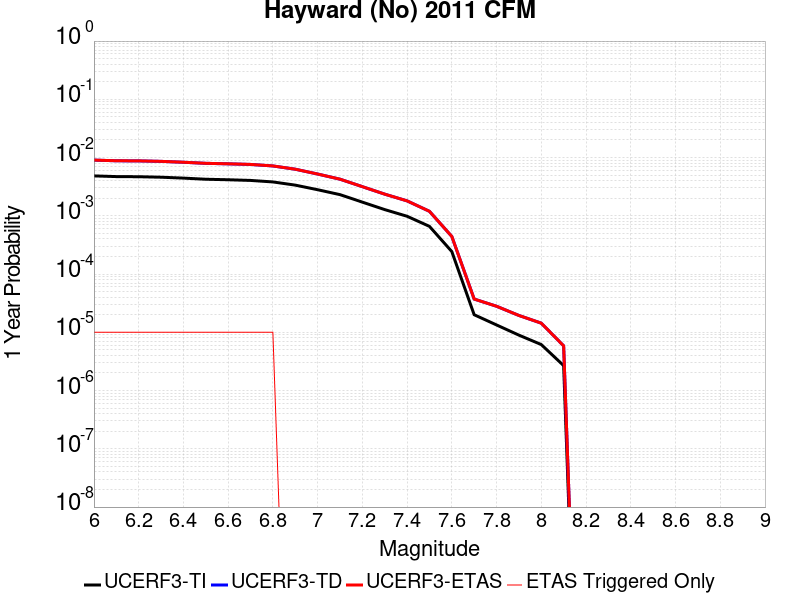 |  |

| Magnitude | 1 wk TI Prob | 1 wk TD Prob | 1 wk ETAS Prob | 1 wk ETAS/TD Gain | 1 wk ETAS Triggered Only | 1 mo TI Prob | 1 mo TD Prob | 1 mo ETAS Prob | 1 mo ETAS/TD Gain | 1 mo ETAS Triggered Only | 1 yr TI Prob | 1 yr TD Prob | 1 yr ETAS Prob | 1 yr ETAS/TD Gain | 1 yr ETAS Triggered Only | 10 yr TI Prob | 10 yr TD Prob | 10 yr ETAS Prob | 10 yr ETAS/TD Gain | 10 yr ETAS Triggered Only |
|-----|-----|-----|-----|-----|-----|-----|-----|-----|-----|-----|-----|-----|-----|-----|-----|-----|-----|-----|-----|-----|
| 6.0 | 9.3068506E-5 | 1.7397478E-4 | 1.7397478E-4 | 1.0 | 0.0 | 3.9880406E-4 | 7.453825E-4 | 7.453825E-4 | 1.0 | 0.0 | 0.0048446343 | 0.009037196 | 0.009047105 | 1.0010965 | 1.0E-5 | 0.047403704 | 0.08638188 | 0.08639102 | 1.0001057 | 1.0E-5 |
| 6.1 | 9.055486E-5 | 1.6948568E-4 | 1.6948568E-4 | 1.0 | 0.0 | 3.880345E-4 | 7.261632E-4 | 7.261632E-4 | 1.0 | 0.0 | 0.0047140904 | 0.008805285 | 0.008815197 | 1.0011257 | 1.0E-5 | 0.046153355 | 0.08427502 | 0.08428418 | 1.0001086 | 1.0E-5 |
| 6.2 | 9.006742E-5 | 1.686916E-4 | 1.686916E-4 | 1.0 | 0.0 | 3.859461E-4 | 7.2276185E-4 | 7.2276185E-4 | 1.0 | 0.0 | 0.0046887742 | 0.008764258 | 0.008774171 | 1.0011309 | 1.0E-5 | 0.0459107 | 0.083899245 | 0.08390841 | 1.0001092 | 1.0E-5 |
| 6.3 | 8.8336754E-5 | 1.6548682E-4 | 1.6548682E-4 | 1.0 | 0.0 | 3.7853114E-4 | 7.090373E-4 | 7.090373E-4 | 1.0 | 0.0 | 0.004598882 | 0.00859853 | 0.008608444 | 1.001153 | 1.0E-5 | 0.04504866 | 0.08239243 | 0.08240161 | 1.0001113 | 1.0E-5 |
| 6.4 | 8.526157E-5 | 1.5975675E-4 | 1.5975675E-4 | 1.0 | 0.0 | 3.6535555E-4 | 6.844929E-4 | 6.844929E-4 | 1.0 | 0.0 | 0.0044391346 | 0.008302015 | 0.008311932 | 1.0011945 | 1.0E-5 | 0.043514993 | 0.079689264 | 0.079698466 | 1.0001155 | 1.0E-5 |
| 6.5 | 8.152396E-5 | 1.5308043E-4 | 1.5308043E-4 | 1.0 | 0.0 | 3.493416E-4 | 6.5589475E-4 | 6.5589475E-4 | 1.0 | 0.0 | 0.0042449418 | 0.007956429 | 0.00796635 | 1.0012468 | 1.0E-5 | 0.04164765 | 0.076520085 | 0.07652932 | 1.0001206 | 1.0E-5 |
| 6.6 | 7.987405E-5 | 1.5012249E-4 | 1.5012249E-4 | 1.0 | 0.0 | 3.4227243E-4 | 6.4322416E-4 | 6.4322416E-4 | 1.0 | 0.0 | 0.0041592065 | 0.0078032906 | 0.007813212 | 1.0012715 | 1.0E-5 | 0.04082218 | 0.0751126 | 0.07512185 | 1.0001231 | 1.0E-5 |
| 6.7 | 7.777665E-5 | 1.4651503E-4 | 1.4651503E-4 | 1.0 | 0.0 | 3.332859E-4 | 6.277711E-4 | 6.277711E-4 | 1.0 | 0.0 | 0.004050208 | 0.007616483 | 0.007626407 | 1.001303 | 1.0E-5 | 0.039771806 | 0.073388964 | 0.07339823 | 1.0001262 | 1.0E-5 |
| 6.8 | 7.3284005E-5 | 1.3802089E-4 | 1.3802089E-4 | 1.0 | 0.0 | 3.140365E-4 | 5.913846E-4 | 5.913846E-4 | 1.0 | 0.0 | 0.0038166929 | 0.0071764747 | 0.0071864026 | 1.0013834 | 1.0E-5 | 0.037518036 | 0.06930231 | 0.06931162 | 1.0001343 | 1.0E-5 |
| 6.9 | 6.458263E-5 | 1.2132651E-4 | 1.2132651E-4 | 1.0 | 0.0 | 2.7675333E-4 | 5.1986764E-4 | 5.1986764E-4 | 1.0 | 0.0 | 0.0033642664 | 0.0063111205 | 0.0063111205 | 1.0 | 0.0 | 0.033137884 | 0.061230626 | 0.061230626 | 1.0 | 0.0 |
| 7.0 | 5.3853604E-5 | 1.002612E-4 | 1.002612E-4 | 1.0 | 0.0 | 2.3078074E-4 | 4.2962038E-4 | 4.2962038E-4 | 1.0 | 0.0 | 0.0028061352 | 0.0052181478 | 0.0052181478 | 1.0 | 0.0 | 0.027709642 | 0.05096286 | 0.05096286 | 1.0 | 0.0 |
| 7.1 | 4.4308683E-5 | 8.171591E-5 | 8.171591E-5 | 1.0 | 0.0 | 1.8988053E-4 | 3.5016425E-4 | 3.5016425E-4 | 1.0 | 0.0 | 0.0023093442 | 0.004254957 | 0.004254957 | 1.0 | 0.0 | 0.022854926 | 0.04182932 | 0.04182932 | 1.0 | 0.0 |
| 7.2 | 3.295973E-5 | 6.0780003E-5 | 6.0780003E-5 | 1.0 | 0.0 | 1.4124835E-4 | 2.6045984E-4 | 2.6045984E-4 | 1.0 | 0.0 | 0.0017183421 | 0.0031665103 | 0.0031665103 | 1.0 | 0.0 | 0.017051157 | 0.031374145 | 0.031374145 | 1.0 | 0.0 |
| 7.3 | 2.452256E-5 | 4.5188142E-5 | 4.5188142E-5 | 1.0 | 0.0 | 1.05092455E-4 | 1.9364918E-4 | 1.9364918E-4 | 1.0 | 0.0 | 0.0012787496 | 0.0023551432 | 0.0023551432 | 1.0 | 0.0 | 0.0127141625 | 0.023444904 | 0.023444904 | 1.0 | 0.0 |
| 7.4 | 1.8829967E-5 | 3.460924E-5 | 3.460924E-5 | 1.0 | 0.0 | 8.069736E-5 | 1.4831693E-4 | 1.4831693E-4 | 1.0 | 0.0 | 9.820475E-4 | 0.0018042729 | 0.0018042729 | 1.0 | 0.0 | 0.009777189 | 0.018022776 | 0.018022776 | 1.0 | 0.0 |
| 7.5 | 1.26374125E-5 | 2.292422E-5 | 2.292422E-5 | 1.0 | 0.0 | 5.4159216E-5 | 9.8242985E-5 | 9.8242985E-5 | 1.0 | 0.0 | 6.5918895E-4 | 0.0011954579 | 0.0011954579 | 1.0 | 0.0 | 0.00657237 | 0.011990363 | 0.011990363 | 1.0 | 0.0 |
| 7.6 | 4.666429E-6 | 8.48047E-6 | 8.48047E-6 | 1.0 | 0.0 | 1.9998828E-5 | 3.634437E-5 | 3.634437E-5 | 1.0 | 0.0 | 2.4345852E-4 | 4.424041E-4 | 4.424041E-4 | 1.0 | 0.0 | 0.0024319198 | 0.0044597466 | 0.0044597466 | 1.0 | 0.0 |
| 7.7 | 3.8399318E-7 | 7.136995E-7 | 7.136995E-7 | 1.0 | 0.0 | 1.6456839E-6 | 3.0587082E-6 | 3.0587082E-6 | 1.0 | 0.0 | 2.003602E-5 | 3.723914E-5 | 3.723914E-5 | 1.0 | 0.0 | 2.0034213E-4 | 3.8630242E-4 | 3.8630242E-4 | 1.0 | 0.0 |
| 7.8 | 2.5637698E-7 | 5.3688825E-7 | 5.3688825E-7 | 1.0 | 0.0 | 1.098758E-6 | 2.3009477E-6 | 2.3009477E-6 | 1.0 | 0.0 | 1.3377297E-5 | 2.801368E-5 | 2.801368E-5 | 1.0 | 0.0 | 1.3376492E-4 | 2.9257344E-4 | 2.9257344E-4 | 1.0 | 0.0 |
| 7.9 | 1.7141245E-7 | 3.7309206E-7 | 3.7309206E-7 | 1.0 | 0.0 | 7.3462456E-7 | 1.5989649E-6 | 1.5989649E-6 | 1.0 | 0.0 | 8.944017E-6 | 1.9467225E-5 | 1.9467225E-5 | 1.0 | 0.0 | 8.943657E-5 | 2.0254472E-4 | 2.0254472E-4 | 1.0 | 0.0 |
| 8.0 | 1.1808895E-7 | 2.7523066E-7 | 2.7523066E-7 | 1.0 | 0.0 | 5.060954E-7 | 1.1795595E-6 | 1.1795595E-6 | 1.0 | 0.0 | 6.161694E-6 | 1.4361042E-5 | 1.4361042E-5 | 1.0 | 0.0 | 6.161523E-5 | 1.4822849E-4 | 1.4822849E-4 | 1.0 | 0.0 |
| 8.1 | 5.138535E-8 | 1.1235469E-7 | 1.1235469E-7 | 1.0 | 0.0 | 2.2022292E-7 | 4.8152003E-7 | 4.8152003E-7 | 1.0 | 0.0 | 2.6812106E-6 | 5.8624905E-6 | 5.8624905E-6 | 1.0 | 0.0 | 2.6811784E-5 | 6.018607E-5 | 6.018607E-5 | 1.0 | 0.0 |

## Elmore Ranch
*[(top)](#table-of-contents)*

| 1 Week | 1 Month | 1 Year | 10 Year |
|-----|-----|-----|-----|
|  |  |  |  |

| Magnitude | 1 wk TI Prob | 1 wk TD Prob | 1 wk ETAS Prob | 1 wk ETAS/TD Gain | 1 wk ETAS Triggered Only | 1 mo TI Prob | 1 mo TD Prob | 1 mo ETAS Prob | 1 mo ETAS/TD Gain | 1 mo ETAS Triggered Only | 1 yr TI Prob | 1 yr TD Prob | 1 yr ETAS Prob | 1 yr ETAS/TD Gain | 1 yr ETAS Triggered Only | 10 yr TI Prob | 10 yr TD Prob | 10 yr ETAS Prob | 10 yr ETAS/TD Gain | 10 yr ETAS Triggered Only |
|-----|-----|-----|-----|-----|-----|-----|-----|-----|-----|-----|-----|-----|-----|-----|-----|-----|-----|-----|-----|-----|
| 6.0 | 9.102099E-5 | 8.9526366E-5 | 8.9526366E-5 | 1.0 | 0.0 | 3.9003167E-4 | 3.8364116E-4 | 3.9363734E-4 | 1.026056 | 1.0E-5 | 0.0047383 | 0.004662308 | 0.004672261 | 1.0021349 | 1.0E-5 | 0.046385348 | 0.045873385 | 0.04588293 | 1.000208 | 1.0E-5 |
| 6.1 | 3.8306698E-5 | 4.1500927E-5 | 4.1500927E-5 | 1.0 | 0.0 | 1.6416123E-4 | 1.7785306E-4 | 1.8785128E-4 | 1.0562162 | 1.0E-5 | 0.0019968306 | 0.0021632449 | 0.0021732233 | 1.0046127 | 1.0E-5 | 0.019789828 | 0.02162934 | 0.021639122 | 1.0004523 | 1.0E-5 |
| 6.2 | 3.8306698E-5 | 4.1500927E-5 | 4.1500927E-5 | 1.0 | 0.0 | 1.6416123E-4 | 1.7785306E-4 | 1.8785128E-4 | 1.0562162 | 1.0E-5 | 0.0019968306 | 0.0021632449 | 0.0021732233 | 1.0046127 | 1.0E-5 | 0.019789828 | 0.02162934 | 0.021639122 | 1.0004523 | 1.0E-5 |
| 6.3 | 3.3197924E-5 | 3.6556212E-5 | 3.6556212E-5 | 1.0 | 0.0 | 1.4226905E-4 | 1.5666404E-4 | 1.6666247E-4 | 1.0638208 | 1.0E-5 | 0.0017307495 | 0.0019060043 | 0.0019159851 | 1.0052366 | 1.0E-5 | 0.017173318 | 0.019090874 | 0.019100683 | 1.0005138 | 1.0E-5 |
| 6.4 | 2.5148964E-5 | 2.7421656E-5 | 2.7421656E-5 | 1.0 | 0.0 | 1.0777682E-4 | 1.1751975E-4 | 1.2751856E-4 | 1.085082 | 1.0E-5 | 0.0013113929 | 0.0014305117 | 0.0014404975 | 1.0069805 | 1.0E-5 | 0.01303681 | 0.014387799 | 0.014397656 | 1.000685 | 1.0E-5 |
| 6.5 | 2.5148964E-5 | 2.7421656E-5 | 2.7421656E-5 | 1.0 | 0.0 | 1.0777682E-4 | 1.1751975E-4 | 1.2751856E-4 | 1.085082 | 1.0E-5 | 0.0013113929 | 0.0014305117 | 0.0014404975 | 1.0069805 | 1.0E-5 | 0.01303681 | 0.014387799 | 0.014397656 | 1.000685 | 1.0E-5 |

## Gillem - Big Crack 2011 CFM
*[(top)](#table-of-contents)*

| 1 Week | 1 Month | 1 Year | 10 Year |
|-----|-----|-----|-----|
|  |  |  |  |

| Magnitude | 1 wk TI Prob | 1 wk TD Prob | 1 wk ETAS Prob | 1 wk ETAS/TD Gain | 1 wk ETAS Triggered Only | 1 mo TI Prob | 1 mo TD Prob | 1 mo ETAS Prob | 1 mo ETAS/TD Gain | 1 mo ETAS Triggered Only | 1 yr TI Prob | 1 yr TD Prob | 1 yr ETAS Prob | 1 yr ETAS/TD Gain | 1 yr ETAS Triggered Only | 10 yr TI Prob | 10 yr TD Prob | 10 yr ETAS Prob | 10 yr ETAS/TD Gain | 10 yr ETAS Triggered Only |
|-----|-----|-----|-----|-----|-----|-----|-----|-----|-----|-----|-----|-----|-----|-----|-----|-----|-----|-----|-----|-----|
| 6.0 | 2.196852E-5 | 2.360472E-5 | 2.360472E-5 | 1.0 | 0.0 | 9.4147406E-5 | 1.0115966E-4 | 1.0115966E-4 | 1.0 | 0.0 | 0.0011456419 | 0.0012310119 | 0.0012409997 | 1.0081134 | 1.0E-5 | 0.011397537 | 0.01225079 | 0.012260667 | 1.0008063 | 1.0E-5 |
| 6.1 | 9.992795E-6 | 1.0711992E-5 | 1.0711992E-5 | 1.0 | 0.0 | 4.2825563E-5 | 4.5907833E-5 | 4.5907833E-5 | 1.0 | 0.0 | 5.2127644E-4 | 5.5880286E-4 | 5.5880286E-4 | 1.0 | 0.0 | 0.0052005537 | 0.0055757877 | 0.0055757877 | 1.0 | 0.0 |
| 6.2 | 9.992795E-6 | 1.0711992E-5 | 1.0711992E-5 | 1.0 | 0.0 | 4.2825563E-5 | 4.5907833E-5 | 4.5907833E-5 | 1.0 | 0.0 | 5.2127644E-4 | 5.5880286E-4 | 5.5880286E-4 | 1.0 | 0.0 | 0.0052005537 | 0.0055757877 | 0.0055757877 | 1.0 | 0.0 |
| 6.3 | 4.6127884E-6 | 4.942704E-6 | 4.942704E-6 | 1.0 | 0.0 | 1.9768944E-5 | 2.118287E-5 | 2.118287E-5 | 1.0 | 0.0 | 2.406603E-4 | 2.5787536E-4 | 2.5787536E-4 | 1.0 | 0.0 | 0.0024039985 | 0.0025761996 | 0.0025761996 | 1.0 | 0.0 |
| 6.4 | 4.6127884E-6 | 4.942704E-6 | 4.942704E-6 | 1.0 | 0.0 | 1.9768944E-5 | 2.118287E-5 | 2.118287E-5 | 1.0 | 0.0 | 2.406603E-4 | 2.5787536E-4 | 2.5787536E-4 | 1.0 | 0.0 | 0.0024039985 | 0.0025761996 | 0.0025761996 | 1.0 | 0.0 |
| 6.5 | 2.716712E-6 | 2.911139E-6 | 2.911139E-6 | 1.0 | 0.0 | 1.1643E-5 | 1.2476264E-5 | 1.2476264E-5 | 1.0 | 0.0 | 1.417443E-4 | 1.5189036E-4 | 1.5189036E-4 | 1.0 | 0.0 | 0.0014165393 | 0.0015181034 | 0.0015181034 | 1.0 | 0.0 |
| 6.6 | 1.3818255E-6 | 1.4820831E-6 | 1.4820831E-6 | 1.0 | 0.0 | 5.922096E-6 | 6.3517764E-6 | 6.3517764E-6 | 1.0 | 0.0 | 7.209913E-5 | 7.7331366E-5 | 7.7331366E-5 | 1.0 | 0.0 | 7.2075747E-4 | 7.731655E-4 | 7.731655E-4 | 1.0 | 0.0 |

## Monte Vista - Shannon 2011 CFM
*[(top)](#table-of-contents)*

| 1 Week | 1 Month | 1 Year | 10 Year |
|-----|-----|-----|-----|
| 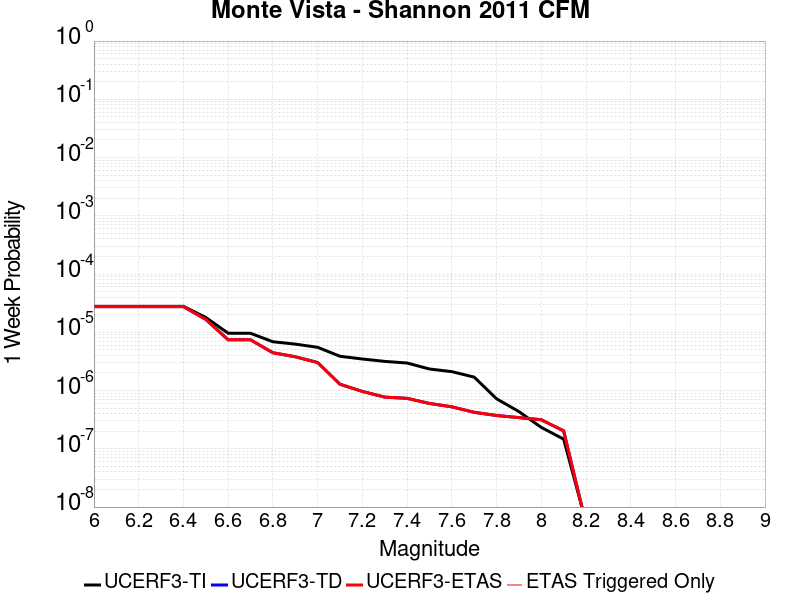 |  |  |  |

| Magnitude | 1 wk TI Prob | 1 wk TD Prob | 1 wk ETAS Prob | 1 wk ETAS/TD Gain | 1 wk ETAS Triggered Only | 1 mo TI Prob | 1 mo TD Prob | 1 mo ETAS Prob | 1 mo ETAS/TD Gain | 1 mo ETAS Triggered Only | 1 yr TI Prob | 1 yr TD Prob | 1 yr ETAS Prob | 1 yr ETAS/TD Gain | 1 yr ETAS Triggered Only | 10 yr TI Prob | 10 yr TD Prob | 10 yr ETAS Prob | 10 yr ETAS/TD Gain | 10 yr ETAS Triggered Only |
|-----|-----|-----|-----|-----|-----|-----|-----|-----|-----|-----|-----|-----|-----|-----|-----|-----|-----|-----|-----|-----|
| 6.0 | 2.7907707E-5 | 2.758509E-5 | 2.758509E-5 | 1.0 | 0.0 | 1.19598975E-4 | 1.1821716E-4 | 1.1821716E-4 | 1.0 | 0.0 | 0.0014551448 | 0.0014384674 | 0.0014384674 | 1.0 | 0.0 | 0.014456532 | 0.014320654 | 0.01433051 | 1.0006883 | 1.0E-5 |
| 6.1 | 2.7907707E-5 | 2.758509E-5 | 2.758509E-5 | 1.0 | 0.0 | 1.19598975E-4 | 1.1821716E-4 | 1.1821716E-4 | 1.0 | 0.0 | 0.0014551448 | 0.0014384674 | 0.0014384674 | 1.0 | 0.0 | 0.014456532 | 0.014320654 | 0.01433051 | 1.0006883 | 1.0E-5 |
| 6.2 | 2.7907707E-5 | 2.758509E-5 | 2.758509E-5 | 1.0 | 0.0 | 1.19598975E-4 | 1.1821716E-4 | 1.1821716E-4 | 1.0 | 0.0 | 0.0014551448 | 0.0014384674 | 0.0014384674 | 1.0 | 0.0 | 0.014456532 | 0.014320654 | 0.01433051 | 1.0006883 | 1.0E-5 |
| 6.3 | 2.7907707E-5 | 2.758509E-5 | 2.758509E-5 | 1.0 | 0.0 | 1.19598975E-4 | 1.1821716E-4 | 1.1821716E-4 | 1.0 | 0.0 | 0.0014551448 | 0.0014384674 | 0.0014384674 | 1.0 | 0.0 | 0.014456532 | 0.014320654 | 0.01433051 | 1.0006883 | 1.0E-5 |
| 6.4 | 2.7907707E-5 | 2.758509E-5 | 2.758509E-5 | 1.0 | 0.0 | 1.19598975E-4 | 1.1821716E-4 | 1.1821716E-4 | 1.0 | 0.0 | 0.0014551448 | 0.0014384674 | 0.0014384674 | 1.0 | 0.0 | 0.014456532 | 0.014320654 | 0.01433051 | 1.0006883 | 1.0E-5 |
| 6.5 | 1.7990213E-5 | 1.6640617E-5 | 1.6640617E-5 | 1.0 | 0.0 | 7.709863E-5 | 7.131535E-5 | 7.131535E-5 | 1.0 | 0.0 | 9.382716E-4 | 8.679849E-4 | 8.679849E-4 | 1.0 | 0.0 | 0.0093431985 | 0.008669324 | 0.008679237 | 1.0011435 | 1.0E-5 |
| 6.6 | 9.650407E-6 | 7.4577524E-6 | 7.4577524E-6 | 1.0 | 0.0 | 4.135823E-5 | 3.196145E-5 | 3.196145E-5 | 1.0 | 0.0 | 5.0342013E-4 | 3.89069E-4 | 3.89069E-4 | 1.0 | 0.0 | 0.005022812 | 0.003901563 | 0.003901563 | 1.0 | 0.0 |
| 6.7 | 9.62828E-6 | 7.4356667E-6 | 7.4356667E-6 | 1.0 | 0.0 | 4.1263404E-5 | 3.18668E-5 | 3.18668E-5 | 1.0 | 0.0 | 5.022661E-4 | 3.87917E-4 | 3.87917E-4 | 1.0 | 0.0 | 0.0050113243 | 0.0038900836 | 0.0038900836 | 1.0 | 0.0 |
| 6.8 | 6.887523E-6 | 4.462141E-6 | 4.462141E-6 | 1.0 | 0.0 | 2.9517621E-5 | 1.9123334E-5 | 1.9123334E-5 | 1.0 | 0.0 | 3.5931775E-4 | 2.3280394E-4 | 2.3280394E-4 | 1.0 | 0.0 | 0.0035873733 | 0.0023427582 | 0.0023427582 | 1.0 | 0.0 |
| 6.9 | 6.2722347E-6 | 3.8040032E-6 | 3.8040032E-6 | 1.0 | 0.0 | 2.6880729E-5 | 1.630278E-5 | 1.630278E-5 | 1.0 | 0.0 | 3.2722374E-4 | 1.984703E-4 | 1.984703E-4 | 1.0 | 0.0 | 0.003267423 | 0.0020000741 | 0.0020000741 | 1.0 | 0.0 |
| 7.0 | 5.5320347E-6 | 3.0311417E-6 | 3.0311417E-6 | 1.0 | 0.0 | 2.3708504E-5 | 1.2990553E-5 | 1.2990553E-5 | 1.0 | 0.0 | 2.8861282E-4 | 1.5815033E-4 | 1.5815033E-4 | 1.0 | 0.0 | 0.0028823826 | 0.0015975076 | 0.0015975076 | 1.0 | 0.0 |
| 7.1 | 3.8794055E-6 | 1.2843128E-6 | 1.2843128E-6 | 1.0 | 0.0 | 1.6625918E-5 | 5.5041864E-6 | 5.5041864E-6 | 1.0 | 0.0 | 2.0240174E-4 | 6.7011424E-5 | 6.7011424E-5 | 1.0 | 0.0 | 0.002022175 | 6.8686734E-4 | 6.8686734E-4 | 1.0 | 0.0 |
| 7.2 | 3.4813652E-6 | 9.676054E-7 | 9.676054E-7 | 1.0 | 0.0 | 1.49200505E-5 | 4.146874E-6 | 4.146874E-6 | 1.0 | 0.0 | 1.8163648E-4 | 5.0487026E-5 | 5.0487026E-5 | 1.0 | 0.0 | 0.0018148809 | 5.216985E-4 | 5.216985E-4 | 1.0 | 0.0 |
| 7.3 | 3.1682148E-6 | 7.723951E-7 | 7.723951E-7 | 1.0 | 0.0 | 1.3577992E-5 | 3.3102604E-6 | 3.3102604E-6 | 1.0 | 0.0 | 1.6529951E-4 | 4.0301675E-5 | 4.0301675E-5 | 1.0 | 0.0 | 0.0016517661 | 4.1986175E-4 | 4.1986175E-4 | 1.0 | 0.0 |
| 7.4 | 2.9707667E-6 | 7.350433E-7 | 7.350433E-7 | 1.0 | 0.0 | 1.2731795E-5 | 3.1501818E-6 | 3.1501818E-6 | 1.0 | 0.0 | 1.5499859E-4 | 3.8352788E-5 | 3.8352788E-5 | 1.0 | 0.0 | 0.0015489052 | 4.0017164E-4 | 4.0017164E-4 | 1.0 | 0.0 |
| 7.5 | 2.3462758E-6 | 6.011925E-7 | 6.011925E-7 | 1.0 | 0.0 | 1.0055429E-5 | 2.5765366E-6 | 2.5765366E-6 | 1.0 | 0.0 | 1.2241797E-4 | 3.1368883E-5 | 3.1368883E-5 | 1.0 | 0.0 | 0.0012235056 | 3.2860925E-4 | 3.2860925E-4 | 1.0 | 0.0 |
| 7.6 | 2.112783E-6 | 5.2553776E-7 | 5.2553776E-7 | 1.0 | 0.0 | 9.054753E-6 | 2.2523027E-6 | 2.2523027E-6 | 1.0 | 0.0 | 1.1023604E-4 | 2.7421444E-5 | 2.7421444E-5 | 1.0 | 0.0 | 0.0011018137 | 2.8871497E-4 | 2.8871497E-4 | 1.0 | 0.0 |
| 7.7 | 1.7022471E-6 | 4.234914E-7 | 4.234914E-7 | 1.0 | 0.0 | 7.2953244E-6 | 1.8149618E-6 | 1.8149618E-6 | 1.0 | 0.0 | 8.881695E-5 | 2.2096938E-5 | 2.2096938E-5 | 1.0 | 0.0 | 8.878146E-4 | 2.3416251E-4 | 2.3416251E-4 | 1.0 | 0.0 |
| 7.8 | 7.230914E-7 | 3.7315894E-7 | 3.7315894E-7 | 1.0 | 0.0 | 3.0989595E-6 | 1.5992516E-6 | 1.5992516E-6 | 1.0 | 0.0 | 3.772918E-5 | 1.9470715E-5 | 1.9470715E-5 | 1.0 | 0.0 | 3.7722773E-4 | 2.074275E-4 | 2.074275E-4 | 1.0 | 0.0 |
| 7.9 | 4.3588446E-7 | 3.433204E-7 | 3.433204E-7 | 1.0 | 0.0 | 1.868075E-6 | 1.4713723E-6 | 1.4713723E-6 | 1.0 | 0.0 | 2.2743576E-5 | 1.7913813E-5 | 1.7913813E-5 | 1.0 | 0.0 | 2.2741247E-4 | 1.9009001E-4 | 1.9009001E-4 | 1.0 | 0.0 |
| 8.0 | 2.3317523E-7 | 3.1536712E-7 | 3.1536712E-7 | 1.0 | 0.0 | 9.99322E-7 | 1.3515726E-6 | 1.3515726E-6 | 1.0 | 0.0 | 1.2166677E-5 | 1.6455273E-5 | 1.6455273E-5 | 1.0 | 0.0 | 1.21660116E-4 | 1.7411401E-4 | 1.7411401E-4 | 1.0 | 0.0 |
| 8.1 | 1.4662456E-7 | 2.0321899E-7 | 2.0321899E-7 | 1.0 | 0.0 | 6.283908E-7 | 8.709382E-7 | 8.709382E-7 | 1.0 | 0.0 | 7.650631E-6 | 1.0603622E-5 | 1.0603622E-5 | 1.0 | 0.0 | 7.650368E-5 | 1.1139602E-4 | 1.1139602E-4 | 1.0 | 0.0 |
| 8.2 | 5.4931775E-9 | 5.07919E-9 | 5.07919E-9 | 1.0 | 0.0 | 2.3542189E-8 | 2.1767956E-8 | 2.1767956E-8 | 1.0 | 0.0 | 2.8662612E-7 | 2.6502485E-7 | 2.6502485E-7 | 1.0 | 0.0 | 2.8662573E-6 | 2.7557655E-6 | 2.7557655E-6 | 1.0 | 0.0 |

## Garberville - Briceland 2011 CFM
*[(top)](#table-of-contents)*

| 1 Week | 1 Month | 1 Year | 10 Year |
|-----|-----|-----|-----|
|  |  |  | 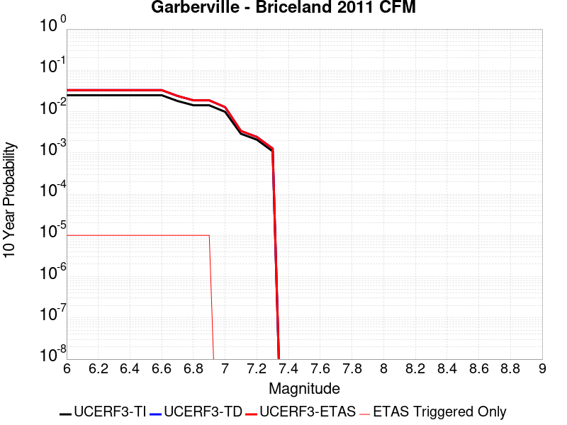 |

| Magnitude | 1 wk TI Prob | 1 wk TD Prob | 1 wk ETAS Prob | 1 wk ETAS/TD Gain | 1 wk ETAS Triggered Only | 1 mo TI Prob | 1 mo TD Prob | 1 mo ETAS Prob | 1 mo ETAS/TD Gain | 1 mo ETAS Triggered Only | 1 yr TI Prob | 1 yr TD Prob | 1 yr ETAS Prob | 1 yr ETAS/TD Gain | 1 yr ETAS Triggered Only | 10 yr TI Prob | 10 yr TD Prob | 10 yr ETAS Prob | 10 yr ETAS/TD Gain | 10 yr ETAS Triggered Only |
|-----|-----|-----|-----|-----|-----|-----|-----|-----|-----|-----|-----|-----|-----|-----|-----|-----|-----|-----|-----|-----|
| 6.0 | 4.8399295E-5 | 6.45267E-5 | 6.45267E-5 | 1.0 | 0.0 | 2.0740906E-4 | 2.76518E-4 | 2.76518E-4 | 1.0 | 0.0 | 0.002522281 | 0.0033621665 | 0.0033621665 | 1.0 | 0.0 | 0.024938442 | 0.03318003 | 0.0331897 | 1.0002913 | 1.0E-5 |
| 6.1 | 4.8399295E-5 | 6.45267E-5 | 6.45267E-5 | 1.0 | 0.0 | 2.0740906E-4 | 2.76518E-4 | 2.76518E-4 | 1.0 | 0.0 | 0.002522281 | 0.0033621665 | 0.0033621665 | 1.0 | 0.0 | 0.024938442 | 0.03318003 | 0.0331897 | 1.0002913 | 1.0E-5 |
| 6.2 | 4.8399295E-5 | 6.45267E-5 | 6.45267E-5 | 1.0 | 0.0 | 2.0740906E-4 | 2.76518E-4 | 2.76518E-4 | 1.0 | 0.0 | 0.002522281 | 0.0033621665 | 0.0033621665 | 1.0 | 0.0 | 0.024938442 | 0.03318003 | 0.0331897 | 1.0002913 | 1.0E-5 |
| 6.3 | 4.8399295E-5 | 6.45267E-5 | 6.45267E-5 | 1.0 | 0.0 | 2.0740906E-4 | 2.76518E-4 | 2.76518E-4 | 1.0 | 0.0 | 0.002522281 | 0.0033621665 | 0.0033621665 | 1.0 | 0.0 | 0.024938442 | 0.03318003 | 0.0331897 | 1.0002913 | 1.0E-5 |
| 6.4 | 4.8399295E-5 | 6.45267E-5 | 6.45267E-5 | 1.0 | 0.0 | 2.0740906E-4 | 2.76518E-4 | 2.76518E-4 | 1.0 | 0.0 | 0.002522281 | 0.0033621665 | 0.0033621665 | 1.0 | 0.0 | 0.024938442 | 0.03318003 | 0.0331897 | 1.0002913 | 1.0E-5 |
| 6.5 | 4.8399295E-5 | 6.45267E-5 | 6.45267E-5 | 1.0 | 0.0 | 2.0740906E-4 | 2.76518E-4 | 2.76518E-4 | 1.0 | 0.0 | 0.002522281 | 0.0033621665 | 0.0033621665 | 1.0 | 0.0 | 0.024938442 | 0.03318003 | 0.0331897 | 1.0002913 | 1.0E-5 |
| 6.6 | 4.8399295E-5 | 6.45267E-5 | 6.45267E-5 | 1.0 | 0.0 | 2.0740906E-4 | 2.76518E-4 | 2.76518E-4 | 1.0 | 0.0 | 0.002522281 | 0.0033621665 | 0.0033621665 | 1.0 | 0.0 | 0.024938442 | 0.03318003 | 0.0331897 | 1.0002913 | 1.0E-5 |
| 6.7 | 3.495179E-5 | 4.631089E-5 | 4.631089E-5 | 1.0 | 0.0 | 1.4978478E-4 | 1.9846327E-4 | 1.9846327E-4 | 1.0 | 0.0 | 0.0018221042 | 0.0024141576 | 0.0024141576 | 1.0 | 0.0 | 0.018072363 | 0.02393164 | 0.0239414 | 1.0004078 | 1.0E-5 |
| 6.8 | 2.7517597E-5 | 3.6243167E-5 | 3.6243167E-5 | 1.0 | 0.0 | 1.1792722E-4 | 1.5532137E-4 | 1.5532137E-4 | 1.0 | 0.0 | 0.0014348183 | 0.0018898795 | 0.0018898795 | 1.0 | 0.0 | 0.014255894 | 0.018784296 | 0.018794106 | 1.0005224 | 1.0E-5 |
| 6.9 | 2.74461E-5 | 3.616089E-5 | 3.616089E-5 | 1.0 | 0.0 | 1.1762084E-4 | 1.549688E-4 | 1.549688E-4 | 1.0 | 0.0 | 0.001431093 | 0.0018855943 | 0.0018855943 | 1.0 | 0.0 | 0.014219119 | 0.018742168 | 0.01875198 | 1.0005236 | 1.0E-5 |
| 7.0 | 1.9023773E-5 | 2.4708577E-5 | 2.4708577E-5 | 1.0 | 0.0 | 8.152791E-5 | 1.0589191E-4 | 1.0589191E-4 | 1.0 | 0.0 | 9.921503E-4 | 0.0012888806 | 0.0012888806 | 1.0 | 0.0 | 0.009877323 | 0.012853087 | 0.012853087 | 1.0 | 0.0 |
| 7.1 | 5.566844E-6 | 6.5122945E-6 | 6.5122945E-6 | 1.0 | 0.0 | 2.3857683E-5 | 2.7909558E-5 | 2.7909558E-5 | 1.0 | 0.0 | 2.9042858E-4 | 3.3975014E-4 | 3.3975014E-4 | 1.0 | 0.0 | 0.002900493 | 0.0033927278 | 0.0033927278 | 1.0 | 0.0 |
| 7.2 | 4.011353E-6 | 4.6747236E-6 | 4.6747236E-6 | 1.0 | 0.0 | 1.7191402E-5 | 2.0034397E-5 | 2.0034397E-5 | 1.0 | 0.0 | 2.0928521E-4 | 2.438949E-4 | 2.438949E-4 | 1.0 | 0.0 | 0.0020908823 | 0.00243661 | 0.00243661 | 1.0 | 0.0 |
| 7.3 | 2.0974871E-6 | 2.4396438E-6 | 2.4396438E-6 | 1.0 | 0.0 | 8.989199E-6 | 1.0455588E-5 | 1.0455588E-5 | 1.0 | 0.0 | 1.09438006E-4 | 1.2729185E-4 | 1.2729185E-4 | 1.0 | 0.0 | 0.0010938413 | 0.0012724346 | 0.0012724346 | 1.0 | 0.0 |

## Great Valley 08 (Quinto)
*[(top)](#table-of-contents)*

| 1 Week | 1 Month | 1 Year | 10 Year |
|-----|-----|-----|-----|
|  |  |  |  |

| Magnitude | 1 wk TI Prob | 1 wk TD Prob | 1 wk ETAS Prob | 1 wk ETAS/TD Gain | 1 wk ETAS Triggered Only | 1 mo TI Prob | 1 mo TD Prob | 1 mo ETAS Prob | 1 mo ETAS/TD Gain | 1 mo ETAS Triggered Only | 1 yr TI Prob | 1 yr TD Prob | 1 yr ETAS Prob | 1 yr ETAS/TD Gain | 1 yr ETAS Triggered Only | 10 yr TI Prob | 10 yr TD Prob | 10 yr ETAS Prob | 10 yr ETAS/TD Gain | 10 yr ETAS Triggered Only |
|-----|-----|-----|-----|-----|-----|-----|-----|-----|-----|-----|-----|-----|-----|-----|-----|-----|-----|-----|-----|-----|
| 6.0 | 7.737697E-6 | 8.253111E-6 | 8.253111E-6 | 1.0 | 0.0 | 3.3161137E-5 | 3.5370103E-5 | 3.5370103E-5 | 1.0 | 0.0 | 4.0366207E-4 | 4.3056477E-4 | 4.4056046E-4 | 1.0232153 | 1.0E-5 | 0.004029296 | 0.0042991587 | 0.0043091155 | 1.002316 | 1.0E-5 |
| 6.1 | 7.737697E-6 | 8.253111E-6 | 8.253111E-6 | 1.0 | 0.0 | 3.3161137E-5 | 3.5370103E-5 | 3.5370103E-5 | 1.0 | 0.0 | 4.0366207E-4 | 4.3056477E-4 | 4.4056046E-4 | 1.0232153 | 1.0E-5 | 0.004029296 | 0.0042991587 | 0.0043091155 | 1.002316 | 1.0E-5 |
| 6.2 | 7.737697E-6 | 8.253111E-6 | 8.253111E-6 | 1.0 | 0.0 | 3.3161137E-5 | 3.5370103E-5 | 3.5370103E-5 | 1.0 | 0.0 | 4.0366207E-4 | 4.3056477E-4 | 4.4056046E-4 | 1.0232153 | 1.0E-5 | 0.004029296 | 0.0042991587 | 0.0043091155 | 1.002316 | 1.0E-5 |
| 6.3 | 5.374012E-6 | 5.750627E-6 | 5.750627E-6 | 1.0 | 0.0 | 2.3031276E-5 | 2.4645375E-5 | 2.4645375E-5 | 1.0 | 0.0 | 2.803697E-4 | 3.0002726E-4 | 3.1002428E-4 | 1.0333203 | 1.0E-5 | 0.0028001624 | 0.0029973155 | 0.0030072853 | 1.0033263 | 1.0E-5 |
| 6.4 | 5.374012E-6 | 5.750627E-6 | 5.750627E-6 | 1.0 | 0.0 | 2.3031276E-5 | 2.4645375E-5 | 2.4645375E-5 | 1.0 | 0.0 | 2.803697E-4 | 3.0002726E-4 | 3.1002428E-4 | 1.0333203 | 1.0E-5 | 0.0028001624 | 0.0029973155 | 0.0030072853 | 1.0033263 | 1.0E-5 |
| 6.5 | 3.65427E-6 | 3.941365E-6 | 3.941365E-6 | 1.0 | 0.0 | 1.5661062E-5 | 1.6891494E-5 | 1.6891494E-5 | 1.0 | 0.0 | 1.9065675E-4 | 2.056416E-4 | 2.056416E-4 | 1.0 | 0.0 | 0.0019049325 | 0.0020552047 | 0.0020552047 | 1.0 | 0.0 |
| 6.6 | 3.6143538E-6 | 3.8985513E-6 | 3.8985513E-6 | 1.0 | 0.0 | 1.5489995E-5 | 1.6708009E-5 | 1.6708009E-5 | 1.0 | 0.0 | 1.8857437E-4 | 2.0340808E-4 | 2.0340808E-4 | 1.0 | 0.0 | 0.0018841444 | 0.0020329105 | 0.0020329105 | 1.0 | 0.0 |
| 6.7 | 2.4821015E-6 | 2.685736E-6 | 2.685736E-6 | 1.0 | 0.0 | 1.0637535E-5 | 1.15102785E-5 | 1.15102785E-5 | 1.0 | 0.0 | 1.2950429E-4 | 1.4013429E-4 | 1.4013429E-4 | 1.0 | 0.0 | 0.0012942884 | 0.0014010142 | 0.0014010142 | 1.0 | 0.0 |
| 6.8 | 4.7110538E-7 | 5.1930914E-7 | 5.1930914E-7 | 1.0 | 0.0 | 2.0190216E-6 | 2.2256088E-6 | 2.2256088E-6 | 1.0 | 0.0 | 2.458131E-5 | 2.7096468E-5 | 2.7096468E-5 | 1.0 | 0.0 | 2.457859E-4 | 2.7093347E-4 | 2.7093347E-4 | 1.0 | 0.0 |
| 6.9 | 3.958685E-7 | 4.3704054E-7 | 4.3704054E-7 | 1.0 | 0.0 | 1.6965782E-6 | 1.8730296E-6 | 1.8730296E-6 | 1.0 | 0.0 | 2.0655643E-5 | 2.2803915E-5 | 2.2803915E-5 | 1.0 | 0.0 | 2.0653724E-4 | 2.2801736E-4 | 2.2801736E-4 | 1.0 | 0.0 |
| 7.0 | 2.70294E-7 | 2.9920432E-7 | 2.9920432E-7 | 1.0 | 0.0 | 1.1584025E-6 | 1.2823037E-6 | 1.2823037E-6 | 1.0 | 0.0 | 1.4103458E-5 | 1.561195E-5 | 1.561195E-5 | 1.0 | 0.0 | 1.4102564E-4 | 1.561098E-4 | 1.561098E-4 | 1.0 | 0.0 |
| 7.1 | 1.4828602E-7 | 1.6469349E-7 | 1.6469349E-7 | 1.0 | 0.0 | 6.3551136E-7 | 7.058291E-7 | 7.058291E-7 | 1.0 | 0.0 | 7.737323E-6 | 8.593443E-6 | 8.593443E-6 | 1.0 | 0.0 | 7.737054E-5 | 8.593191E-5 | 8.593191E-5 | 1.0 | 0.0 |

## Emerson-Copper Mtn 2011
*[(top)](#table-of-contents)*

| 1 Week | 1 Month | 1 Year | 10 Year |
|-----|-----|-----|-----|
|  |  |  |  |

| Magnitude | 1 wk TI Prob | 1 wk TD Prob | 1 wk ETAS Prob | 1 wk ETAS/TD Gain | 1 wk ETAS Triggered Only | 1 mo TI Prob | 1 mo TD Prob | 1 mo ETAS Prob | 1 mo ETAS/TD Gain | 1 mo ETAS Triggered Only | 1 yr TI Prob | 1 yr TD Prob | 1 yr ETAS Prob | 1 yr ETAS/TD Gain | 1 yr ETAS Triggered Only | 10 yr TI Prob | 10 yr TD Prob | 10 yr ETAS Prob | 10 yr ETAS/TD Gain | 10 yr ETAS Triggered Only |
|-----|-----|-----|-----|-----|-----|-----|-----|-----|-----|-----|-----|-----|-----|-----|-----|-----|-----|-----|-----|-----|
| 6.0 | 2.1364202E-5 | 9.968277E-6 | 9.968277E-6 | 1.0 | 0.0 | 9.1557646E-5 | 4.2720538E-5 | 4.2720538E-5 | 1.0 | 0.0 | 0.0011141442 | 5.200071E-4 | 5.200071E-4 | 1.0 | 0.0 | 0.011085749 | 0.005188773 | 0.005198721 | 1.0019172 | 1.0E-5 |
| 6.1 | 2.1364202E-5 | 9.968277E-6 | 9.968277E-6 | 1.0 | 0.0 | 9.1557646E-5 | 4.2720538E-5 | 4.2720538E-5 | 1.0 | 0.0 | 0.0011141442 | 5.200071E-4 | 5.200071E-4 | 1.0 | 0.0 | 0.011085749 | 0.005188773 | 0.005198721 | 1.0019172 | 1.0E-5 |
| 6.2 | 2.1364202E-5 | 9.968277E-6 | 9.968277E-6 | 1.0 | 0.0 | 9.1557646E-5 | 4.2720538E-5 | 4.2720538E-5 | 1.0 | 0.0 | 0.0011141442 | 5.200071E-4 | 5.200071E-4 | 1.0 | 0.0 | 0.011085749 | 0.005188773 | 0.005198721 | 1.0019172 | 1.0E-5 |
| 6.3 | 1.7751237E-5 | 8.089365E-6 | 8.089365E-6 | 1.0 | 0.0 | 7.607452E-5 | 3.4668283E-5 | 3.4668283E-5 | 1.0 | 0.0 | 9.258136E-4 | 4.2201087E-4 | 4.2201087E-4 | 1.0 | 0.0 | 0.00921966 | 0.0042127175 | 0.004222675 | 1.0023638 | 1.0E-5 |
| 6.4 | 1.7751237E-5 | 8.089365E-6 | 8.089365E-6 | 1.0 | 0.0 | 7.607452E-5 | 3.4668283E-5 | 3.4668283E-5 | 1.0 | 0.0 | 9.258136E-4 | 4.2201087E-4 | 4.2201087E-4 | 1.0 | 0.0 | 0.00921966 | 0.0042127175 | 0.004222675 | 1.0023638 | 1.0E-5 |
| 6.5 | 1.5886664E-5 | 6.6039356E-6 | 6.6039356E-6 | 1.0 | 0.0 | 6.808392E-5 | 2.83023E-5 | 2.83023E-5 | 1.0 | 0.0 | 8.286065E-4 | 3.445307E-4 | 3.445307E-4 | 1.0 | 0.0 | 0.008255237 | 0.00344043 | 0.0034503955 | 1.0028967 | 1.0E-5 |
| 6.6 | 1.5886664E-5 | 6.6039356E-6 | 6.6039356E-6 | 1.0 | 0.0 | 6.808392E-5 | 2.83023E-5 | 2.83023E-5 | 1.0 | 0.0 | 8.286065E-4 | 3.445307E-4 | 3.445307E-4 | 1.0 | 0.0 | 0.008255237 | 0.00344043 | 0.0034503955 | 1.0028967 | 1.0E-5 |
| 6.7 | 1.428471E-5 | 5.470503E-6 | 5.470503E-6 | 1.0 | 0.0 | 6.121875E-5 | 2.3444823E-5 | 2.3444823E-5 | 1.0 | 0.0 | 7.450834E-4 | 2.8540727E-4 | 2.8540727E-4 | 1.0 | 0.0 | 0.007425902 | 0.0028507954 | 0.0028607668 | 1.0034978 | 1.0E-5 |
| 6.8 | 1.3490684E-5 | 5.073793E-6 | 5.073793E-6 | 1.0 | 0.0 | 5.7815934E-5 | 2.1744667E-5 | 2.1744667E-5 | 1.0 | 0.0 | 7.0368167E-4 | 2.6471302E-4 | 2.6471302E-4 | 1.0 | 0.0 | 0.007014576 | 0.002644358 | 0.0026543315 | 1.0037717 | 1.0E-5 |
| 6.9 | 1.2235421E-5 | 4.2897627E-6 | 4.2897627E-6 | 1.0 | 0.0 | 5.2436466E-5 | 1.8384588E-5 | 1.8384588E-5 | 1.0 | 0.0 | 6.38227E-4 | 2.2381297E-4 | 2.2381297E-4 | 1.0 | 0.0 | 0.0063639707 | 0.00223623 | 0.0022462076 | 1.0044618 | 1.0E-5 |
| 7.0 | 1.1009851E-5 | 3.7190669E-6 | 3.7190669E-6 | 1.0 | 0.0 | 4.7184225E-5 | 1.593878E-5 | 1.593878E-5 | 1.0 | 0.0 | 5.743165E-4 | 1.9404081E-4 | 1.9404081E-4 | 1.0 | 0.0 | 0.005728345 | 0.0019390517 | 0.0019490323 | 1.0051472 | 1.0E-5 |
| 7.1 | 9.726373E-6 | 3.2118642E-6 | 3.2118642E-6 | 1.0 | 0.0 | 4.168379E-5 | 1.3765079E-5 | 1.3765079E-5 | 1.0 | 0.0 | 5.07382E-4 | 1.6758032E-4 | 1.6758032E-4 | 1.0 | 0.0 | 0.0050622504 | 0.0016748707 | 0.0016848539 | 1.0059606 | 1.0E-5 |
| 7.2 | 3.9335127E-6 | 1.1525033E-6 | 1.1525033E-6 | 1.0 | 0.0 | 1.6857803E-5 | 4.9392906E-6 | 4.9392906E-6 | 1.0 | 0.0 | 2.0522442E-4 | 6.0134265E-5 | 6.0134265E-5 | 1.0 | 0.0 | 0.00205035 | 6.011859E-4 | 6.1117986E-4 | 1.0166237 | 1.0E-5 |
| 7.3 | 2.661632E-6 | 6.9116606E-7 | 6.9116606E-7 | 1.0 | 0.0 | 1.14069435E-5 | 2.962137E-6 | 2.962137E-6 | 1.0 | 0.0 | 1.3887069E-4 | 3.6063433E-5 | 3.6063433E-5 | 1.0 | 0.0 | 0.0013878393 | 3.6057684E-4 | 3.7057322E-4 | 1.0277233 | 1.0E-5 |
| 7.4 | 2.0893426E-6 | 5.461961E-7 | 5.461961E-7 | 1.0 | 0.0 | 8.954295E-6 | 2.3408381E-6 | 2.3408381E-6 | 1.0 | 0.0 | 1.0901308E-4 | 2.8499337E-5 | 2.8499337E-5 | 1.0 | 0.0 | 0.0010895962 | 2.8495738E-4 | 2.9495452E-4 | 1.0350829 | 1.0E-5 |
| 7.5 | 1.1681728E-6 | 3.6031287E-7 | 3.6031287E-7 | 1.0 | 0.0 | 5.0064455E-6 | 1.5441972E-6 | 1.5441972E-6 | 1.0 | 0.0 | 6.0951766E-5 | 1.8800443E-5 | 1.8800443E-5 | 1.0 | 0.0 | 6.093505E-4 | 1.8798899E-4 | 1.8798899E-4 | 1.0 | 0.0 |
| 7.6 | 1.3154387E-7 | 7.1198265E-8 | 7.1198265E-8 | 1.0 | 0.0 | 5.6375933E-7 | 3.051354E-7 | 3.051354E-7 | 1.0 | 0.0 | 6.863748E-6 | 3.7150185E-6 | 3.7150185E-6 | 1.0 | 0.0 | 6.863536E-5 | 3.7149723E-5 | 3.7149723E-5 | 1.0 | 0.0 |

## Owens Valley Keough Hot Springs
*[(top)](#table-of-contents)*

| 1 Week | 1 Month | 1 Year | 10 Year |
|-----|-----|-----|-----|
|  |  |  | 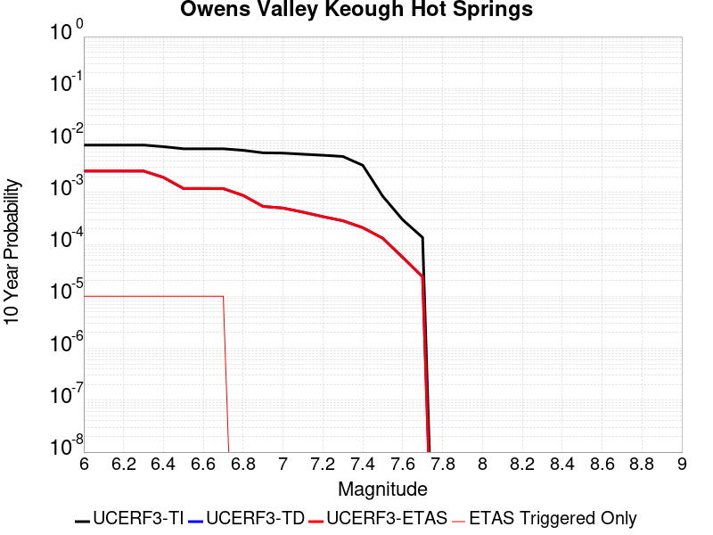 |

| Magnitude | 1 wk TI Prob | 1 wk TD Prob | 1 wk ETAS Prob | 1 wk ETAS/TD Gain | 1 wk ETAS Triggered Only | 1 mo TI Prob | 1 mo TD Prob | 1 mo ETAS Prob | 1 mo ETAS/TD Gain | 1 mo ETAS Triggered Only | 1 yr TI Prob | 1 yr TD Prob | 1 yr ETAS Prob | 1 yr ETAS/TD Gain | 1 yr ETAS Triggered Only | 10 yr TI Prob | 10 yr TD Prob | 10 yr ETAS Prob | 10 yr ETAS/TD Gain | 10 yr ETAS Triggered Only |
|-----|-----|-----|-----|-----|-----|-----|-----|-----|-----|-----|-----|-----|-----|-----|-----|-----|-----|-----|-----|-----|
| 6.0 | 1.5708529E-5 | 4.9508244E-6 | 1.4950775E-5 | 3.0198555 | 1.0E-5 | 6.7320536E-5 | 2.1217675E-5 | 3.1217463E-5 | 1.4712951 | 1.0E-5 | 8.193192E-4 | 2.582997E-4 | 2.6829712E-4 | 1.0387048 | 1.0E-5 | 0.008163051 | 0.0025806532 | 0.0025906272 | 1.003865 | 1.0E-5 |
| 6.1 | 1.5708529E-5 | 4.9508244E-6 | 1.4950775E-5 | 3.0198555 | 1.0E-5 | 6.7320536E-5 | 2.1217675E-5 | 3.1217463E-5 | 1.4712951 | 1.0E-5 | 8.193192E-4 | 2.582997E-4 | 2.6829712E-4 | 1.0387048 | 1.0E-5 | 0.008163051 | 0.0025806532 | 0.0025906272 | 1.003865 | 1.0E-5 |
| 6.2 | 1.5708529E-5 | 4.9508244E-6 | 1.4950775E-5 | 3.0198555 | 1.0E-5 | 6.7320536E-5 | 2.1217675E-5 | 3.1217463E-5 | 1.4712951 | 1.0E-5 | 8.193192E-4 | 2.582997E-4 | 2.6829712E-4 | 1.0387048 | 1.0E-5 | 0.008163051 | 0.0025806532 | 0.0025906272 | 1.003865 | 1.0E-5 |
| 6.3 | 1.5708529E-5 | 4.9508244E-6 | 1.4950775E-5 | 3.0198555 | 1.0E-5 | 6.7320536E-5 | 2.1217675E-5 | 3.1217463E-5 | 1.4712951 | 1.0E-5 | 8.193192E-4 | 2.582997E-4 | 2.6829712E-4 | 1.0387048 | 1.0E-5 | 0.008163051 | 0.0025806532 | 0.0025906272 | 1.003865 | 1.0E-5 |
| 6.4 | 1.4622509E-5 | 3.7266684E-6 | 1.3726631E-5 | 3.683352 | 1.0E-5 | 6.266639E-5 | 1.5971356E-5 | 2.5971198E-5 | 1.6261109 | 1.0E-5 | 7.626962E-4 | 1.9443722E-4 | 2.0443527E-4 | 1.0514205 | 1.0E-5 | 0.007600839 | 0.0019431504 | 0.001953131 | 1.0051363 | 1.0E-5 |
| 6.5 | 1.3335527E-5 | 2.2778408E-6 | 1.2277818E-5 | 5.3901124 | 1.0E-5 | 5.7151006E-5 | 9.762142E-6 | 1.9762045E-5 | 2.0243554 | 1.0E-5 | 6.955913E-4 | 1.18848286E-4 | 1.288471E-4 | 1.0841309 | 1.0E-5 | 0.0069341804 | 0.0011880693 | 0.0011980574 | 1.008407 | 1.0E-5 |
| 6.6 | 1.3332855E-5 | 2.27499E-6 | 1.2274967E-5 | 5.3956137 | 1.0E-5 | 5.7139558E-5 | 9.749924E-6 | 1.9749827E-5 | 2.025639 | 1.0E-5 | 6.9545204E-4 | 1.1869955E-4 | 1.2869836E-4 | 1.0842363 | 1.0E-5 | 0.0069327964 | 0.0011865837 | 0.0011965717 | 1.0084176 | 1.0E-5 |
| 6.7 | 1.3318214E-5 | 2.26422E-6 | 1.2264198E-5 | 5.416522 | 1.0E-5 | 5.707681E-5 | 9.703767E-6 | 1.970367E-5 | 2.0305176 | 1.0E-5 | 6.946886E-4 | 1.1813765E-4 | 1.2813647E-4 | 1.084637 | 1.0E-5 | 0.0069252094 | 0.0011809706 | 0.0011909588 | 1.0084577 | 1.0E-5 |
| 6.8 | 1.2441338E-5 | 1.6778914E-6 | 1.6778914E-6 | 1.0 | 0.0 | 5.331893E-5 | 7.190945E-6 | 7.190945E-6 | 1.0 | 0.0 | 6.489646E-4 | 8.7546534E-5 | 8.7546534E-5 | 1.0 | 0.0 | 0.0064707273 | 8.75305E-4 | 8.75305E-4 | 1.0 | 0.0 |
| 6.9 | 1.1130476E-5 | 1.0304584E-6 | 1.0304584E-6 | 1.0 | 0.0 | 4.7701167E-5 | 4.416243E-6 | 4.416243E-6 | 1.0 | 0.0 | 5.806069E-4 | 5.3766445E-5 | 5.3766445E-5 | 1.0 | 0.0 | 0.0057909233 | 5.376886E-4 | 5.376886E-4 | 1.0 | 0.0 |
| 7.0 | 1.0986073E-5 | 9.580101E-7 | 9.580101E-7 | 1.0 | 0.0 | 4.7082318E-5 | 4.105751E-6 | 4.105751E-6 | 1.0 | 0.0 | 5.730765E-4 | 4.9986385E-5 | 4.9986385E-5 | 1.0 | 0.0 | 0.0057160086 | 4.999046E-4 | 4.999046E-4 | 1.0 | 0.0 |
| 7.1 | 1.0451338E-5 | 8.000831E-7 | 8.000831E-7 | 1.0 | 0.0 | 4.4790682E-5 | 3.428923E-6 | 3.428923E-6 | 1.0 | 0.0 | 5.451901E-4 | 4.1746345E-5 | 4.1746345E-5 | 1.0 | 0.0 | 0.005438545 | 4.1753432E-4 | 4.1753432E-4 | 1.0 | 0.0 |
| 7.2 | 9.989061E-6 | 6.545439E-7 | 6.545439E-7 | 1.0 | 0.0 | 4.280956E-5 | 2.805185E-6 | 2.805185E-6 | 1.0 | 0.0 | 5.2108173E-4 | 3.4152596E-5 | 3.4152596E-5 | 1.0 | 0.0 | 0.0051986156 | 3.4161055E-4 | 3.4161055E-4 | 1.0 | 0.0 |
| 7.3 | 9.465365E-6 | 5.4604976E-7 | 5.4604976E-7 | 1.0 | 0.0 | 4.056522E-5 | 2.340211E-6 | 2.340211E-6 | 1.0 | 0.0 | 4.937696E-4 | 2.84917E-5 | 2.84917E-5 | 1.0 | 0.0 | 0.0049267393 | 2.8501268E-4 | 2.8501268E-4 | 1.0 | 0.0 |
| 7.4 | 6.3824805E-6 | 4.016707E-7 | 4.016707E-7 | 1.0 | 0.0 | 2.73532E-5 | 1.7214446E-6 | 1.7214446E-6 | 1.0 | 0.0 | 3.3297433E-4 | 2.0958389E-5 | 2.0958389E-5 | 1.0 | 0.0 | 0.0033247585 | 2.0965615E-4 | 2.0965615E-4 | 1.0 | 0.0 |
| 7.5 | 1.6192645E-6 | 2.5163493E-7 | 2.5163493E-7 | 1.0 | 0.0 | 6.9396865E-6 | 1.0784349E-6 | 1.0784349E-6 | 1.0 | 0.0 | 8.448741E-5 | 1.31298675E-5 | 1.31298675E-5 | 1.0 | 0.0 | 8.4455294E-4 | 1.3129105E-4 | 1.3129105E-4 | 1.0 | 0.0 |
| 7.6 | 5.7062545E-7 | 1.079331E-7 | 1.079331E-7 | 1.0 | 0.0 | 2.4455355E-6 | 4.6257034E-7 | 4.6257034E-7 | 1.0 | 0.0 | 2.9773988E-5 | 5.63178E-6 | 5.63178E-6 | 1.0 | 0.0 | 2.977E-4 | 5.6316454E-5 | 5.6316454E-5 | 1.0 | 0.0 |
| 7.7 | 2.5988817E-7 | 4.5461668E-8 | 4.5461668E-8 | 1.0 | 0.0 | 1.113806E-6 | 1.948357E-7 | 1.948357E-7 | 1.0 | 0.0 | 1.3560503E-5 | 2.3721225E-6 | 2.3721225E-6 | 1.0 | 0.0 | 1.3559677E-4 | 2.3721017E-5 | 2.3721017E-5 | 1.0 | 0.0 |

## Hosgri
*[(top)](#table-of-contents)*

| 1 Week | 1 Month | 1 Year | 10 Year |
|-----|-----|-----|-----|
| 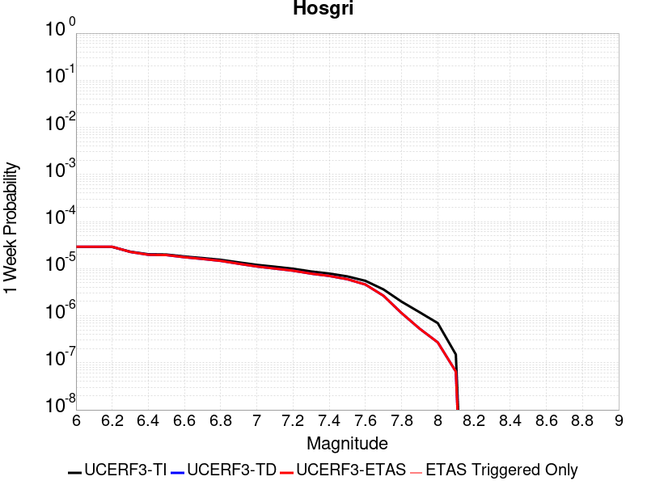 |  |  |  |

| Magnitude | 1 wk TI Prob | 1 wk TD Prob | 1 wk ETAS Prob | 1 wk ETAS/TD Gain | 1 wk ETAS Triggered Only | 1 mo TI Prob | 1 mo TD Prob | 1 mo ETAS Prob | 1 mo ETAS/TD Gain | 1 mo ETAS Triggered Only | 1 yr TI Prob | 1 yr TD Prob | 1 yr ETAS Prob | 1 yr ETAS/TD Gain | 1 yr ETAS Triggered Only | 10 yr TI Prob | 10 yr TD Prob | 10 yr ETAS Prob | 10 yr ETAS/TD Gain | 10 yr ETAS Triggered Only |
|-----|-----|-----|-----|-----|-----|-----|-----|-----|-----|-----|-----|-----|-----|-----|-----|-----|-----|-----|-----|-----|
| 6.0 | 2.883978E-5 | 2.9128829E-5 | 2.9128829E-5 | 1.0 | 0.0 | 1.235932E-4 | 1.2483202E-4 | 1.2483202E-4 | 1.0 | 0.0 | 0.0015037085 | 0.0015187975 | 0.0015287822 | 1.0065742 | 1.0E-5 | 0.01493574 | 0.015087952 | 0.015097801 | 1.0006528 | 1.0E-5 |
| 6.1 | 2.883978E-5 | 2.9128829E-5 | 2.9128829E-5 | 1.0 | 0.0 | 1.235932E-4 | 1.2483202E-4 | 1.2483202E-4 | 1.0 | 0.0 | 0.0015037085 | 0.0015187975 | 0.0015287822 | 1.0065742 | 1.0E-5 | 0.01493574 | 0.015087952 | 0.015097801 | 1.0006528 | 1.0E-5 |
| 6.2 | 2.883978E-5 | 2.9128829E-5 | 2.9128829E-5 | 1.0 | 0.0 | 1.235932E-4 | 1.2483202E-4 | 1.2483202E-4 | 1.0 | 0.0 | 0.0015037085 | 0.0015187975 | 0.0015287822 | 1.0065742 | 1.0E-5 | 0.01493574 | 0.015087952 | 0.015097801 | 1.0006528 | 1.0E-5 |
| 6.3 | 2.2914428E-5 | 2.26423E-5 | 2.26423E-5 | 1.0 | 0.0 | 9.8200995E-5 | 9.703485E-5 | 9.703485E-5 | 1.0 | 0.0 | 0.0011949413 | 0.0011807639 | 0.0011807639 | 1.0 | 0.0 | 0.011885363 | 0.011746303 | 0.011746303 | 1.0 | 0.0 |
| 6.4 | 2.0195741E-5 | 1.9696858E-5 | 1.9696858E-5 | 1.0 | 0.0 | 8.65503E-5 | 8.4412386E-5 | 8.4412386E-5 | 1.0 | 0.0 | 0.0010532405 | 0.0010272382 | 0.0010272382 | 1.0 | 0.0 | 0.010482626 | 0.010225947 | 0.010225947 | 1.0 | 0.0 |
| 6.5 | 1.9924333E-5 | 1.9409275E-5 | 1.9409275E-5 | 1.0 | 0.0 | 8.53872E-5 | 8.317997E-5 | 8.317997E-5 | 1.0 | 0.0 | 0.0010390934 | 0.0010122475 | 0.0010122475 | 1.0 | 0.0 | 0.010342481 | 0.010077406 | 0.010077406 | 1.0 | 0.0 |
| 6.6 | 1.809694E-5 | 1.7458577E-5 | 1.7458577E-5 | 1.0 | 0.0 | 7.7556004E-5 | 7.482033E-5 | 7.482033E-5 | 1.0 | 0.0 | 9.438353E-4 | 9.1055816E-4 | 9.1055816E-4 | 1.0 | 0.0 | 0.009398366 | 0.009069216 | 0.009069216 | 1.0 | 0.0 |
| 6.7 | 1.675989E-5 | 1.6043028E-5 | 1.6043028E-5 | 1.0 | 0.0 | 7.182612E-5 | 6.875403E-5 | 6.875403E-5 | 1.0 | 0.0 | 8.7413215E-4 | 8.3676E-4 | 8.3676E-4 | 1.0 | 0.0 | 0.008707017 | 0.008337 | 0.008337 | 1.0 | 0.0 |
| 6.8 | 1.5401129E-5 | 1.4614334E-5 | 1.4614334E-5 | 1.0 | 0.0 | 6.6003166E-5 | 6.263136E-5 | 6.263136E-5 | 1.0 | 0.0 | 8.032922E-4 | 7.622709E-4 | 7.622709E-4 | 1.0 | 0.0 | 0.008003947 | 0.0075974264 | 0.0075974264 | 1.0 | 0.0 |
| 6.9 | 1.356559E-5 | 1.2690202E-5 | 1.2690202E-5 | 1.0 | 0.0 | 5.8136946E-5 | 5.4385448E-5 | 5.4385448E-5 | 1.0 | 0.0 | 7.0758746E-4 | 6.619421E-4 | 6.619421E-4 | 1.0 | 0.0 | 0.007053386 | 0.00660051 | 0.00660051 | 1.0 | 0.0 |
| 7.0 | 1.2030819E-5 | 1.1096183E-5 | 1.1096183E-5 | 1.0 | 0.0 | 5.155963E-5 | 4.75542E-5 | 4.75542E-5 | 1.0 | 0.0 | 6.275577E-4 | 5.788187E-4 | 5.788187E-4 | 1.0 | 0.0 | 0.006257884 | 0.005773872 | 0.005773872 | 1.0 | 0.0 |
| 7.1 | 1.0972698E-5 | 1.0022392E-5 | 1.0022392E-5 | 1.0 | 0.0 | 4.7025E-5 | 4.29524E-5 | 4.29524E-5 | 1.0 | 0.0 | 5.72379E-4 | 5.228201E-4 | 5.228201E-4 | 1.0 | 0.0 | 0.0057090693 | 0.005216653 | 0.005216653 | 1.0 | 0.0 |
| 7.2 | 9.961926E-6 | 9.034952E-6 | 9.034952E-6 | 1.0 | 0.0 | 4.2693267E-5 | 3.872065E-5 | 3.872065E-5 | 1.0 | 0.0 | 5.1966653E-4 | 4.7132198E-4 | 4.7132198E-4 | 1.0 | 0.0 | 0.00518453 | 0.00470397 | 0.00470397 | 1.0 | 0.0 |
| 7.3 | 8.700929E-6 | 7.828299E-6 | 7.828299E-6 | 1.0 | 0.0 | 3.7289166E-5 | 3.3549422E-5 | 3.3549422E-5 | 1.0 | 0.0 | 4.53901E-4 | 4.0838768E-4 | 4.0838768E-4 | 1.0 | 0.0 | 0.00452975 | 0.0040771114 | 0.0040771114 | 1.0 | 0.0 |
| 7.4 | 7.866285E-6 | 6.998933E-6 | 6.998933E-6 | 1.0 | 0.0 | 3.3712215E-5 | 2.999508E-5 | 2.999508E-5 | 1.0 | 0.0 | 4.103689E-4 | 3.6512894E-4 | 3.6512894E-4 | 1.0 | 0.0 | 0.004096119 | 0.0036460275 | 0.0036460275 | 1.0 | 0.0 |
| 7.5 | 6.8381305E-6 | 5.959883E-6 | 5.959883E-6 | 1.0 | 0.0 | 2.9305946E-5 | 2.5542106E-5 | 2.5542106E-5 | 1.0 | 0.0 | 3.5674145E-4 | 3.1093077E-4 | 3.1093077E-4 | 1.0 | 0.0 | 0.0035616932 | 0.0031056926 | 0.0031056926 | 1.0 | 0.0 |
| 7.6 | 5.503376E-6 | 4.5954234E-6 | 4.5954234E-6 | 1.0 | 0.0 | 2.3585684E-5 | 1.9694522E-5 | 1.9694522E-5 | 1.0 | 0.0 | 2.8711787E-4 | 2.3975444E-4 | 2.3975444E-4 | 1.0 | 0.0 | 0.002867472 | 0.002395691 | 0.002395691 | 1.0 | 0.0 |
| 7.7 | 3.6144982E-6 | 2.6523774E-6 | 2.6523774E-6 | 1.0 | 0.0 | 1.5490614E-5 | 1.1367281E-5 | 1.1367281E-5 | 1.0 | 0.0 | 1.8858191E-4 | 1.3838787E-4 | 1.3838787E-4 | 1.0 | 0.0 | 0.0018842196 | 0.0013837481 | 0.0013837481 | 1.0 | 0.0 |
| 7.8 | 1.9853494E-6 | 1.1362536E-6 | 1.1362536E-6 | 1.0 | 0.0 | 8.508612E-6 | 4.8696493E-6 | 4.8696493E-6 | 1.0 | 0.0 | 1.0358743E-4 | 5.9286365E-5 | 5.9286365E-5 | 1.0 | 0.0 | 0.0010353916 | 5.934354E-4 | 5.934354E-4 | 1.0 | 0.0 |
| 7.9 | 1.1818757E-6 | 5.2963003E-7 | 5.2963003E-7 | 1.0 | 0.0 | 5.0651715E-6 | 2.269841E-6 | 2.269841E-6 | 1.0 | 0.0 | 6.1666724E-5 | 2.7634964E-5 | 2.7634964E-5 | 1.0 | 0.0 | 6.1649614E-4 | 2.7700354E-4 | 2.7700354E-4 | 1.0 | 0.0 |
| 8.0 | 6.962958E-7 | 2.7147578E-7 | 2.7147578E-7 | 1.0 | 0.0 | 2.9841215E-6 | 1.163467E-6 | 1.163467E-6 | 1.0 | 0.0 | 3.6331072E-5 | 1.4165119E-5 | 1.4165119E-5 | 1.0 | 0.0 | 3.6325134E-4 | 1.4221264E-4 | 1.4221264E-4 | 1.0 | 0.0 |
| 8.1 | 1.5033264E-7 | 6.529188E-8 | 6.529188E-8 | 1.0 | 0.0 | 6.442826E-7 | 2.798223E-7 | 2.798223E-7 | 1.0 | 0.0 | 7.844113E-6 | 3.4068314E-6 | 3.4068314E-6 | 1.0 | 0.0 | 7.843835E-5 | 3.4085097E-5 | 3.4085097E-5 | 1.0 | 0.0 |

## Shoreline
*[(top)](#table-of-contents)*

| 1 Week | 1 Month | 1 Year | 10 Year |
|-----|-----|-----|-----|
|  |  | 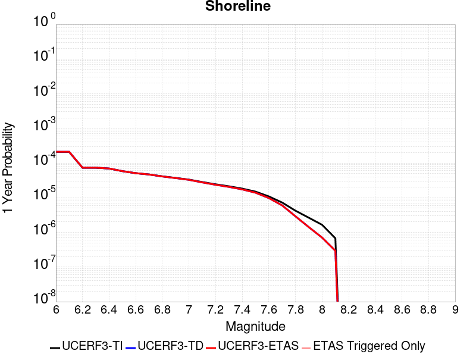 |  |

| Magnitude | 1 wk TI Prob | 1 wk TD Prob | 1 wk ETAS Prob | 1 wk ETAS/TD Gain | 1 wk ETAS Triggered Only | 1 mo TI Prob | 1 mo TD Prob | 1 mo ETAS Prob | 1 mo ETAS/TD Gain | 1 mo ETAS Triggered Only | 1 yr TI Prob | 1 yr TD Prob | 1 yr ETAS Prob | 1 yr ETAS/TD Gain | 1 yr ETAS Triggered Only | 10 yr TI Prob | 10 yr TD Prob | 10 yr ETAS Prob | 10 yr ETAS/TD Gain | 10 yr ETAS Triggered Only |
|-----|-----|-----|-----|-----|-----|-----|-----|-----|-----|-----|-----|-----|-----|-----|-----|-----|-----|-----|-----|-----|
| 6.0 | 3.9888673E-6 | 4.047945E-6 | 4.047945E-6 | 1.0 | 0.0 | 1.7095033E-5 | 1.7348251E-5 | 1.7348251E-5 | 1.0 | 0.0 | 2.0811215E-4 | 2.1120008E-4 | 2.1120008E-4 | 1.0 | 0.0 | 0.0020791737 | 0.0021105423 | 0.0021205212 | 1.0047281 | 1.0E-5 |
| 6.1 | 3.9888673E-6 | 4.047945E-6 | 4.047945E-6 | 1.0 | 0.0 | 1.7095033E-5 | 1.7348251E-5 | 1.7348251E-5 | 1.0 | 0.0 | 2.0811215E-4 | 2.1120008E-4 | 2.1120008E-4 | 1.0 | 0.0 | 0.0020791737 | 0.0021105423 | 0.0021205212 | 1.0047281 | 1.0E-5 |
| 6.2 | 1.4039653E-6 | 1.4100978E-6 | 1.4100978E-6 | 1.0 | 0.0 | 6.0169805E-6 | 6.0432626E-6 | 6.0432626E-6 | 1.0 | 0.0 | 7.325427E-5 | 7.3574294E-5 | 7.3574294E-5 | 1.0 | 0.0 | 7.3230127E-4 | 7.3550537E-4 | 7.3550537E-4 | 1.0 | 0.0 |
| 6.3 | 1.4039653E-6 | 1.4100978E-6 | 1.4100978E-6 | 1.0 | 0.0 | 6.0169805E-6 | 6.0432626E-6 | 6.0432626E-6 | 1.0 | 0.0 | 7.325427E-5 | 7.3574294E-5 | 7.3574294E-5 | 1.0 | 0.0 | 7.3230127E-4 | 7.3550537E-4 | 7.3550537E-4 | 1.0 | 0.0 |
| 6.4 | 1.3314152E-6 | 1.336169E-6 | 1.336169E-6 | 1.0 | 0.0 | 5.7060524E-6 | 5.726426E-6 | 5.726426E-6 | 1.0 | 0.0 | 6.946897E-5 | 6.971706E-5 | 6.971706E-5 | 1.0 | 0.0 | 6.9447263E-4 | 6.969573E-4 | 6.969573E-4 | 1.0 | 0.0 |
| 6.5 | 1.1187026E-6 | 1.1203721E-6 | 1.1203721E-6 | 1.0 | 0.0 | 4.794431E-6 | 4.801586E-6 | 4.801586E-6 | 1.0 | 0.0 | 5.8370628E-5 | 5.8457765E-5 | 5.8457765E-5 | 1.0 | 0.0 | 5.83553E-4 | 5.844264E-4 | 5.844264E-4 | 1.0 | 0.0 |
| 6.6 | 9.793089E-7 | 9.784997E-7 | 9.784997E-7 | 1.0 | 0.0 | 4.1970316E-6 | 4.193563E-6 | 4.193563E-6 | 1.0 | 0.0 | 5.1097657E-5 | 5.105545E-5 | 5.105545E-5 | 1.0 | 0.0 | 5.108591E-4 | 5.104385E-4 | 5.104385E-4 | 1.0 | 0.0 |
| 6.7 | 8.995986E-7 | 8.972875E-7 | 8.972875E-7 | 1.0 | 0.0 | 3.8554167E-6 | 3.8455123E-6 | 3.8455123E-6 | 1.0 | 0.0 | 4.693869E-5 | 4.6818117E-5 | 4.6818117E-5 | 1.0 | 0.0 | 4.6928777E-4 | 4.6808348E-4 | 4.6808348E-4 | 1.0 | 0.0 |
| 6.8 | 7.931612E-7 | 7.8804743E-7 | 7.8804743E-7 | 1.0 | 0.0 | 3.3992578E-6 | 3.3773417E-6 | 3.3773417E-6 | 1.0 | 0.0 | 4.1385178E-5 | 4.1118365E-5 | 4.1118365E-5 | 1.0 | 0.0 | 4.1377472E-4 | 4.111081E-4 | 4.111081E-4 | 1.0 | 0.0 |
| 6.9 | 7.1465956E-7 | 7.078075E-7 | 7.078075E-7 | 1.0 | 0.0 | 3.062823E-6 | 3.0334572E-6 | 3.0334572E-6 | 1.0 | 0.0 | 3.7289232E-5 | 3.6931717E-5 | 3.6931717E-5 | 1.0 | 0.0 | 3.7282976E-4 | 3.692562E-4 | 3.692562E-4 | 1.0 | 0.0 |
| 7.0 | 6.389046E-7 | 6.299524E-7 | 6.299524E-7 | 1.0 | 0.0 | 2.7381598E-6 | 2.6997934E-6 | 2.6997934E-6 | 1.0 | 0.0 | 3.3336586E-5 | 3.286949E-5 | 3.286949E-5 | 1.0 | 0.0 | 3.3331584E-4 | 3.2864654E-4 | 3.2864654E-4 | 1.0 | 0.0 |
| 7.1 | 5.4300875E-7 | 5.311193E-7 | 5.311193E-7 | 1.0 | 0.0 | 2.3271782E-6 | 2.2762235E-6 | 2.2762235E-6 | 1.0 | 0.0 | 2.8333026E-5 | 2.7712671E-5 | 2.7712671E-5 | 1.0 | 0.0 | 2.8329415E-4 | 2.7709227E-4 | 2.7709227E-4 | 1.0 | 0.0 |
| 7.2 | 4.6768855E-7 | 4.5349543E-7 | 4.5349543E-7 | 1.0 | 0.0 | 2.0043778E-6 | 1.9435504E-6 | 1.9435504E-6 | 1.0 | 0.0 | 2.4403027E-5 | 2.366247E-5 | 2.366247E-5 | 1.0 | 0.0 | 2.4400349E-4 | 2.3659955E-4 | 2.3659955E-4 | 1.0 | 0.0 |
| 7.3 | 4.0966103E-7 | 3.938623E-7 | 3.938623E-7 | 1.0 | 0.0 | 1.7556889E-6 | 1.6879802E-6 | 1.6879802E-6 | 1.0 | 0.0 | 2.1375303E-5 | 2.0550966E-5 | 2.0550966E-5 | 1.0 | 0.0 | 2.1373246E-4 | 2.0549068E-4 | 2.0549068E-4 | 1.0 | 0.0 |
| 7.4 | 3.5105785E-7 | 3.336452E-7 | 3.336452E-7 | 1.0 | 0.0 | 1.5045327E-6 | 1.4299071E-6 | 1.4299071E-6 | 1.0 | 0.0 | 1.8317533E-5 | 1.740898E-5 | 1.740898E-5 | 1.0 | 0.0 | 1.8316023E-4 | 1.740762E-4 | 1.740762E-4 | 1.0 | 0.0 |
| 7.5 | 2.8737534E-7 | 2.682056E-7 | 2.682056E-7 | 1.0 | 0.0 | 1.2316079E-6 | 1.149452E-6 | 1.149452E-6 | 1.0 | 0.0 | 1.4994724E-5 | 1.3994489E-5 | 1.3994489E-5 | 1.0 | 0.0 | 1.4993713E-4 | 1.3993609E-4 | 1.3993609E-4 | 1.0 | 0.0 |
| 7.6 | 2.0924051E-7 | 1.8779478E-7 | 1.8779478E-7 | 1.0 | 0.0 | 8.967448E-7 | 8.048345E-7 | 8.048345E-7 | 1.0 | 0.0 | 1.0917813E-5 | 9.798816E-6 | 9.798816E-6 | 1.0 | 0.0 | 1.0917276E-4 | 9.798385E-5 | 9.798385E-5 | 1.0 | 0.0 |
| 7.7 | 1.392265E-7 | 1.1543848E-7 | 1.1543848E-7 | 1.0 | 0.0 | 5.9668486E-7 | 4.9473624E-7 | 4.9473624E-7 | 1.0 | 0.0 | 7.2646135E-6 | 6.023397E-6 | 6.023397E-6 | 1.0 | 0.0 | 7.2643765E-5 | 6.023234E-5 | 6.023234E-5 | 1.0 | 0.0 |
| 7.8 | 8.1080074E-8 | 5.58715E-8 | 5.58715E-8 | 1.0 | 0.0 | 3.4748598E-7 | 2.3944926E-7 | 2.3944926E-7 | 1.0 | 0.0 | 4.2306337E-6 | 2.915291E-6 | 2.915291E-6 | 1.0 | 0.0 | 4.230553E-5 | 2.9152527E-5 | 2.9152527E-5 | 1.0 | 0.0 |
| 7.9 | 5.0859036E-8 | 2.7248419E-8 | 2.7248419E-8 | 1.0 | 0.0 | 2.1796728E-7 | 1.16778935E-7 | 1.16778935E-7 | 1.0 | 0.0 | 2.6537484E-6 | 1.4217826E-6 | 1.4217826E-6 | 1.0 | 0.0 | 2.6537167E-5 | 1.4217735E-5 | 1.4217735E-5 | 1.0 | 0.0 |
| 8.0 | 3.1760536E-8 | 1.3580286E-8 | 1.3580286E-8 | 1.0 | 0.0 | 1.3611657E-7 | 5.8201223E-8 | 5.8201223E-8 | 1.0 | 0.0 | 1.6572179E-6 | 7.0859966E-7 | 7.0859966E-7 | 1.0 | 0.0 | 1.6572056E-5 | 7.085974E-6 | 7.085974E-6 | 1.0 | 0.0 |
| 8.1 | 1.2947896E-8 | 5.6641998E-9 | 5.6641998E-9 | 1.0 | 0.0 | 5.5490982E-8 | 2.4275142E-8 | 2.4275142E-8 | 1.0 | 0.0 | 6.756025E-7 | 2.955498E-7 | 2.955498E-7 | 1.0 | 0.0 | 6.7560045E-6 | 2.9554942E-6 | 2.9554942E-6 | 1.0 | 0.0 |

## Great Valley 03 Mysterious Ridge
*[(top)](#table-of-contents)*

| 1 Week | 1 Month | 1 Year | 10 Year |
|-----|-----|-----|-----|
|  |  |  | 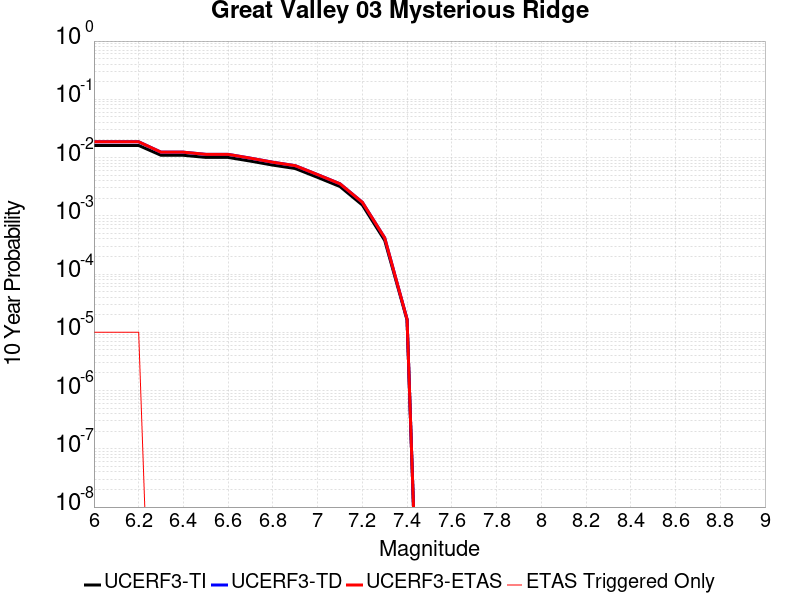 |

| Magnitude | 1 wk TI Prob | 1 wk TD Prob | 1 wk ETAS Prob | 1 wk ETAS/TD Gain | 1 wk ETAS Triggered Only | 1 mo TI Prob | 1 mo TD Prob | 1 mo ETAS Prob | 1 mo ETAS/TD Gain | 1 mo ETAS Triggered Only | 1 yr TI Prob | 1 yr TD Prob | 1 yr ETAS Prob | 1 yr ETAS/TD Gain | 1 yr ETAS Triggered Only | 10 yr TI Prob | 10 yr TD Prob | 10 yr ETAS Prob | 10 yr ETAS/TD Gain | 10 yr ETAS Triggered Only |
|-----|-----|-----|-----|-----|-----|-----|-----|-----|-----|-----|-----|-----|-----|-----|-----|-----|-----|-----|-----|-----|
| 6.0 | 3.1182444E-5 | 3.603498E-5 | 3.603498E-5 | 1.0 | 0.0 | 1.336322E-4 | 1.5442717E-4 | 1.5442717E-4 | 1.0 | 0.0 | 0.0016257578 | 0.0018787086 | 0.0018886898 | 1.0053128 | 1.0E-5 | 0.016139153 | 0.018647036 | 0.01865685 | 1.0005263 | 1.0E-5 |
| 6.1 | 3.1182444E-5 | 3.603498E-5 | 3.603498E-5 | 1.0 | 0.0 | 1.336322E-4 | 1.5442717E-4 | 1.5442717E-4 | 1.0 | 0.0 | 0.0016257578 | 0.0018787086 | 0.0018886898 | 1.0053128 | 1.0E-5 | 0.016139153 | 0.018647036 | 0.01865685 | 1.0005263 | 1.0E-5 |
| 6.2 | 3.1182444E-5 | 3.603498E-5 | 3.603498E-5 | 1.0 | 0.0 | 1.336322E-4 | 1.5442717E-4 | 1.5442717E-4 | 1.0 | 0.0 | 0.0016257578 | 0.0018787086 | 0.0018886898 | 1.0053128 | 1.0E-5 | 0.016139153 | 0.018647036 | 0.01865685 | 1.0005263 | 1.0E-5 |
| 6.3 | 2.106934E-5 | 2.3850727E-5 | 2.3850727E-5 | 1.0 | 0.0 | 9.0294045E-5 | 1.0221358E-4 | 1.0221358E-4 | 1.0 | 0.0 | 0.0010987755 | 0.0012437708 | 0.0012437708 | 1.0 | 0.0 | 0.010933585 | 0.012371344 | 0.012371344 | 1.0 | 0.0 |
| 6.4 | 2.106934E-5 | 2.3850727E-5 | 2.3850727E-5 | 1.0 | 0.0 | 9.0294045E-5 | 1.0221358E-4 | 1.0221358E-4 | 1.0 | 0.0 | 0.0010987755 | 0.0012437708 | 0.0012437708 | 1.0 | 0.0 | 0.010933585 | 0.012371344 | 0.012371344 | 1.0 | 0.0 |
| 6.5 | 1.9389783E-5 | 2.188536E-5 | 2.188536E-5 | 1.0 | 0.0 | 8.309642E-5 | 9.379118E-5 | 9.379118E-5 | 1.0 | 0.0 | 0.0010112294 | 0.001141337 | 0.001141337 | 1.0 | 0.0 | 0.010066401 | 0.011357628 | 0.011357628 | 1.0 | 0.0 |
| 6.6 | 1.9370193E-5 | 2.186528E-5 | 2.186528E-5 | 1.0 | 0.0 | 8.301247E-5 | 9.370514E-5 | 9.370514E-5 | 1.0 | 0.0 | 0.0010102082 | 0.0011402905 | 0.0011402905 | 1.0 | 0.0 | 0.010056281 | 0.01134727 | 0.01134727 | 1.0 | 0.0 |
| 6.7 | 1.6723505E-5 | 1.8799592E-5 | 1.8799592E-5 | 1.0 | 0.0 | 7.16702E-5 | 8.0567304E-5 | 8.0567304E-5 | 1.0 | 0.0 | 8.722353E-4 | 9.80485E-4 | 9.80485E-4 | 1.0 | 0.0 | 0.008688197 | 0.0097636 | 0.0097636 | 1.0 | 0.0 |
| 6.8 | 1.426937E-5 | 1.5997468E-5 | 1.5997468E-5 | 1.0 | 0.0 | 6.115301E-5 | 6.855885E-5 | 6.855885E-5 | 1.0 | 0.0 | 7.4428355E-4 | 8.3439884E-4 | 8.3439884E-4 | 1.0 | 0.0 | 0.007417957 | 0.008314138 | 0.008314138 | 1.0 | 0.0 |
| 6.9 | 1.2469891E-5 | 1.395715E-5 | 1.395715E-5 | 1.0 | 0.0 | 5.3441294E-5 | 5.9815055E-5 | 5.9815055E-5 | 1.0 | 0.0 | 6.504535E-4 | 7.28017E-4 | 7.28017E-4 | 1.0 | 0.0 | 0.006485529 | 0.007257545 | 0.007257545 | 1.0 | 0.0 |
| 7.0 | 8.7746275E-6 | 9.791885E-6 | 9.791885E-6 | 1.0 | 0.0 | 3.7605005E-5 | 4.1964588E-5 | 4.1964588E-5 | 1.0 | 0.0 | 4.5774475E-4 | 5.108064E-4 | 5.108064E-4 | 1.0 | 0.0 | 0.00456803 | 0.005097056 | 0.005097056 | 1.0 | 0.0 |
| 7.1 | 6.1067153E-6 | 6.81383E-6 | 6.81383E-6 | 1.0 | 0.0 | 2.6171374E-5 | 2.9201834E-5 | 2.9201834E-5 | 1.0 | 0.0 | 3.1858988E-4 | 3.5547992E-4 | 3.5547992E-4 | 1.0 | 0.0 | 0.0031813353 | 0.0035496636 | 0.0035496636 | 1.0 | 0.0 |
| 7.2 | 2.939283E-6 | 3.2741555E-6 | 3.2741555E-6 | 1.0 | 0.0 | 1.2596866E-5 | 1.4032029E-5 | 1.4032029E-5 | 1.0 | 0.0 | 1.5335606E-4 | 1.7082831E-4 | 1.7082831E-4 | 1.0 | 0.0 | 0.0015325027 | 0.001707142 | 0.001707142 | 1.0 | 0.0 |
| 7.3 | 7.2387763E-7 | 8.008619E-7 | 8.008619E-7 | 1.0 | 0.0 | 3.102329E-6 | 3.4322634E-6 | 3.4322634E-6 | 1.0 | 0.0 | 3.77702E-5 | 4.1787465E-5 | 4.1787465E-5 | 1.0 | 0.0 | 3.7763783E-4 | 4.1784105E-4 | 4.1784105E-4 | 1.0 | 0.0 |
| 7.4 | 3.112171E-8 | 3.2068495E-8 | 3.2068495E-8 | 1.0 | 0.0 | 1.3337875E-7 | 1.374364E-7 | 1.374364E-7 | 1.0 | 0.0 | 1.6238852E-6 | 1.673287E-6 | 1.673287E-6 | 1.0 | 0.0 | 1.6238733E-5 | 1.6732753E-5 | 1.6732753E-5 | 1.0 | 0.0 |

## Greenville (So) 2011 CFM
*[(top)](#table-of-contents)*

| 1 Week | 1 Month | 1 Year | 10 Year |
|-----|-----|-----|-----|
|  |  |  | 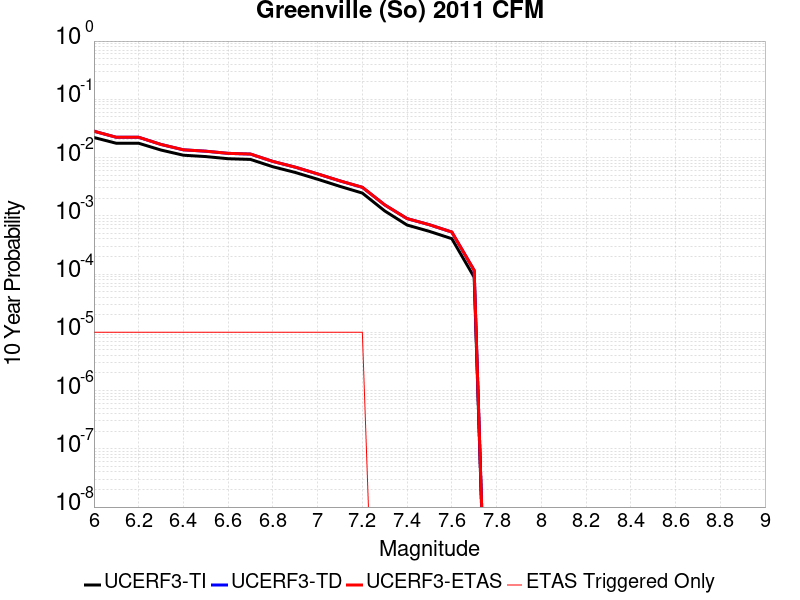 |

| Magnitude | 1 wk TI Prob | 1 wk TD Prob | 1 wk ETAS Prob | 1 wk ETAS/TD Gain | 1 wk ETAS Triggered Only | 1 mo TI Prob | 1 mo TD Prob | 1 mo ETAS Prob | 1 mo ETAS/TD Gain | 1 mo ETAS Triggered Only | 1 yr TI Prob | 1 yr TD Prob | 1 yr ETAS Prob | 1 yr ETAS/TD Gain | 1 yr ETAS Triggered Only | 10 yr TI Prob | 10 yr TD Prob | 10 yr ETAS Prob | 10 yr ETAS/TD Gain | 10 yr ETAS Triggered Only |
|-----|-----|-----|-----|-----|-----|-----|-----|-----|-----|-----|-----|-----|-----|-----|-----|-----|-----|-----|-----|-----|
| 6.0 | 4.279693E-5 | 5.5042052E-5 | 5.5042052E-5 | 1.0 | 0.0 | 1.8340252E-4 | 2.3587522E-4 | 2.3587522E-4 | 1.0 | 0.0 | 0.0022306389 | 0.0028683394 | 0.0028783109 | 1.0034764 | 1.0E-5 | 0.022083808 | 0.028339082 | 0.0283488 | 1.0003428 | 1.0E-5 |
| 6.1 | 3.4037297E-5 | 4.319379E-5 | 4.319379E-5 | 1.0 | 0.0 | 1.4586597E-4 | 1.851043E-4 | 1.851043E-4 | 1.0 | 0.0 | 0.0017744715 | 0.0022515068 | 0.0022614843 | 1.0044315 | 1.0E-5 | 0.01760369 | 0.022303257 | 0.022313034 | 1.0004383 | 1.0E-5 |
| 6.2 | 3.4037297E-5 | 4.319379E-5 | 4.319379E-5 | 1.0 | 0.0 | 1.4586597E-4 | 1.851043E-4 | 1.851043E-4 | 1.0 | 0.0 | 0.0017744715 | 0.0022515068 | 0.0022614843 | 1.0044315 | 1.0E-5 | 0.01760369 | 0.022303257 | 0.022313034 | 1.0004383 | 1.0E-5 |
| 6.3 | 2.5956324E-5 | 3.242983E-5 | 3.242983E-5 | 1.0 | 0.0 | 1.11236644E-4 | 1.3897801E-4 | 1.3897801E-4 | 1.0 | 0.0 | 0.0013534647 | 0.0016908189 | 0.001700802 | 1.0059043 | 1.0E-5 | 0.013452509 | 0.016786352 | 0.016796185 | 1.0005857 | 1.0E-5 |
| 6.4 | 2.1145053E-5 | 2.6198357E-5 | 2.6198357E-5 | 1.0 | 0.0 | 9.061851E-5 | 1.1227402E-4 | 1.1227402E-4 | 1.0 | 0.0 | 0.0011027219 | 0.0013661105 | 0.0013760969 | 1.00731 | 1.0E-5 | 0.01097266 | 0.013580529 | 0.013590394 | 1.0007263 | 1.0E-5 |
| 6.5 | 2.0030959E-5 | 2.4796413E-5 | 2.4796413E-5 | 1.0 | 0.0 | 8.584414E-5 | 1.0626618E-4 | 1.0626618E-4 | 1.0 | 0.0 | 0.0010446513 | 0.001293055 | 0.0013030422 | 1.0077236 | 1.0E-5 | 0.010397541 | 0.012858664 | 0.012868535 | 1.0007677 | 1.0E-5 |
| 6.6 | 1.8395405E-5 | 2.2755032E-5 | 2.2755032E-5 | 1.0 | 0.0 | 7.8835066E-5 | 9.751807E-5 | 9.751807E-5 | 1.0 | 0.0 | 9.5939427E-4 | 0.0011866642 | 0.0011966524 | 1.008417 | 1.0E-5 | 0.009552629 | 0.0118063325 | 0.011816215 | 1.000837 | 1.0E-5 |
| 6.7 | 1.7883482E-5 | 2.2126056E-5 | 2.2126056E-5 | 1.0 | 0.0 | 7.664124E-5 | 9.4822666E-5 | 9.4822666E-5 | 1.0 | 0.0 | 9.3270757E-4 | 0.001153883 | 0.0011638714 | 1.0086564 | 1.0E-5 | 0.009288026 | 0.01148197 | 0.011491856 | 1.0008609 | 1.0E-5 |
| 6.8 | 1.3373564E-5 | 1.6506328E-5 | 1.6506328E-5 | 1.0 | 0.0 | 5.7314013E-5 | 7.0739574E-5 | 7.0739574E-5 | 1.0 | 0.0 | 6.975747E-4 | 8.6092873E-4 | 8.7092014E-4 | 1.0116054 | 1.0E-5 | 0.0069538904 | 0.008577544 | 0.008587459 | 1.0011559 | 1.0E-5 |
| 6.9 | 1.06692905E-5 | 1.3152838E-5 | 1.3152838E-5 | 1.0 | 0.0 | 4.5724726E-5 | 5.636815E-5 | 5.636815E-5 | 1.0 | 0.0 | 5.5655633E-4 | 6.8607734E-4 | 6.960705E-4 | 1.0145656 | 1.0E-5 | 0.005551645 | 0.006840826 | 0.006850757 | 1.0014518 | 1.0E-5 |
| 7.0 | 8.157512E-6 | 1.0062801E-5 | 1.0062801E-5 | 1.0 | 0.0 | 3.4960296E-5 | 4.3125594E-5 | 4.3125594E-5 | 1.0 | 0.0 | 4.2555845E-4 | 5.249313E-4 | 5.34926E-4 | 1.0190401 | 1.0E-5 | 0.004247444 | 0.005237391 | 0.0052473387 | 1.0018994 | 1.0E-5 |
| 7.1 | 6.1467113E-6 | 7.6275246E-6 | 7.6275246E-6 | 1.0 | 0.0 | 2.6342783E-5 | 3.2688986E-5 | 3.2688986E-5 | 1.0 | 0.0 | 3.206762E-4 | 3.979166E-4 | 4.079126E-4 | 1.0251209 | 1.0E-5 | 0.0032021382 | 0.003972229 | 0.003982189 | 1.0025074 | 1.0E-5 |
| 7.2 | 4.713467E-6 | 5.9142176E-6 | 5.9142176E-6 | 1.0 | 0.0 | 2.0200418E-5 | 2.5346404E-5 | 2.5346404E-5 | 1.0 | 0.0 | 2.4591232E-4 | 3.0854935E-4 | 3.1854628E-4 | 1.0323998 | 1.0E-5 | 0.0024564038 | 0.003081363 | 0.0030913323 | 1.0032353 | 1.0E-5 |
| 7.3 | 2.3266216E-6 | 2.954034E-6 | 2.954034E-6 | 1.0 | 0.0 | 9.971197E-6 | 1.2660085E-5 | 1.2660085E-5 | 1.0 | 0.0 | 1.2139256E-4 | 1.541258E-4 | 1.541258E-4 | 1.0 | 0.0 | 0.0012132627 | 0.0015402584 | 0.0015402584 | 1.0 | 0.0 |
| 7.4 | 1.3314E-6 | 1.7179633E-6 | 1.7179633E-6 | 1.0 | 0.0 | 5.7059874E-6 | 7.3626793E-6 | 7.3626793E-6 | 1.0 | 0.0 | 6.946818E-5 | 8.963698E-5 | 8.963698E-5 | 1.0 | 0.0 | 6.9446466E-4 | 8.9604704E-4 | 8.9604704E-4 | 1.0 | 0.0 |
| 7.5 | 1.0362941E-6 | 1.3468865E-6 | 1.3468865E-6 | 1.0 | 0.0 | 4.4412527E-6 | 5.7723582E-6 | 5.7723582E-6 | 1.0 | 0.0 | 5.407091E-5 | 7.027624E-5 | 7.027624E-5 | 1.0 | 0.0 | 5.405776E-4 | 7.0257037E-4 | 7.0257037E-4 | 1.0 | 0.0 |
| 7.6 | 7.764784E-7 | 1.0088623E-6 | 1.0088623E-6 | 1.0 | 0.0 | 3.3277602E-6 | 4.323689E-6 | 4.323689E-6 | 1.0 | 0.0 | 4.0514726E-5 | 5.263968E-5 | 5.263968E-5 | 1.0 | 0.0 | 4.050734E-4 | 5.2629353E-4 | 5.2629353E-4 | 1.0 | 0.0 |
| 7.7 | 1.6927763E-7 | 2.2139328E-7 | 2.2139328E-7 | 1.0 | 0.0 | 7.2547533E-7 | 9.48828E-7 | 9.48828E-7 | 1.0 | 0.0 | 8.832627E-6 | 1.1551923E-5 | 1.1551923E-5 | 1.0 | 0.0 | 8.8322755E-5 | 1.1551595E-4 | 1.1551595E-4 | 1.0 | 0.0 |

## Yorba Linda
*[(top)](#table-of-contents)*

| 1 Week | 1 Month | 1 Year | 10 Year |
|-----|-----|-----|-----|
|  |  |  |  |

| Magnitude | 1 wk TI Prob | 1 wk TD Prob | 1 wk ETAS Prob | 1 wk ETAS/TD Gain | 1 wk ETAS Triggered Only | 1 mo TI Prob | 1 mo TD Prob | 1 mo ETAS Prob | 1 mo ETAS/TD Gain | 1 mo ETAS Triggered Only | 1 yr TI Prob | 1 yr TD Prob | 1 yr ETAS Prob | 1 yr ETAS/TD Gain | 1 yr ETAS Triggered Only | 10 yr TI Prob | 10 yr TD Prob | 10 yr ETAS Prob | 10 yr ETAS/TD Gain | 10 yr ETAS Triggered Only |
|-----|-----|-----|-----|-----|-----|-----|-----|-----|-----|-----|-----|-----|-----|-----|-----|-----|-----|-----|-----|-----|
| 6.0 | 1.9346849E-6 | 1.6909353E-6 | 1.6909353E-6 | 1.0 | 0.0 | 8.29148E-6 | 7.2468506E-6 | 7.2468506E-6 | 1.0 | 0.0 | 1.009441E-4 | 8.822778E-5 | 8.822778E-5 | 1.0 | 0.0 | 0.0010089825 | 8.820206E-4 | 8.920118E-4 | 1.0113276 | 1.0E-5 |
| 6.1 | 1.9346849E-6 | 1.6909353E-6 | 1.6909353E-6 | 1.0 | 0.0 | 8.29148E-6 | 7.2468506E-6 | 7.2468506E-6 | 1.0 | 0.0 | 1.009441E-4 | 8.822778E-5 | 8.822778E-5 | 1.0 | 0.0 | 0.0010089825 | 8.820206E-4 | 8.920118E-4 | 1.0113276 | 1.0E-5 |
| 6.2 | 1.9346849E-6 | 1.6909353E-6 | 1.6909353E-6 | 1.0 | 0.0 | 8.29148E-6 | 7.2468506E-6 | 7.2468506E-6 | 1.0 | 0.0 | 1.009441E-4 | 8.822778E-5 | 8.822778E-5 | 1.0 | 0.0 | 0.0010089825 | 8.820206E-4 | 8.920118E-4 | 1.0113276 | 1.0E-5 |
| 6.3 | 1.1028608E-6 | 8.482089E-7 | 8.482089E-7 | 1.0 | 0.0 | 4.7265376E-6 | 3.6351764E-6 | 3.6351764E-6 | 1.0 | 0.0 | 5.754407E-5 | 4.4257442E-5 | 4.4257442E-5 | 1.0 | 0.0 | 5.7529175E-4 | 4.424928E-4 | 4.424928E-4 | 1.0 | 0.0 |
| 6.4 | 1.1028608E-6 | 8.482089E-7 | 8.482089E-7 | 1.0 | 0.0 | 4.7265376E-6 | 3.6351764E-6 | 3.6351764E-6 | 1.0 | 0.0 | 5.754407E-5 | 4.4257442E-5 | 4.4257442E-5 | 1.0 | 0.0 | 5.7529175E-4 | 4.424928E-4 | 4.424928E-4 | 1.0 | 0.0 |
| 6.5 | 8.4451364E-7 | 5.869332E-7 | 5.869332E-7 | 1.0 | 0.0 | 3.619339E-6 | 2.5154256E-6 | 2.5154256E-6 | 1.0 | 0.0 | 4.406456E-5 | 3.06249E-5 | 3.06249E-5 | 1.0 | 0.0 | 4.4055824E-4 | 3.062089E-4 | 3.062089E-4 | 1.0 | 0.0 |
| 6.6 | 8.422957E-7 | 5.8448654E-7 | 5.8448654E-7 | 1.0 | 0.0 | 3.6098338E-6 | 2.50494E-6 | 2.50494E-6 | 1.0 | 0.0 | 4.3948843E-5 | 3.0497242E-5 | 3.0497242E-5 | 1.0 | 0.0 | 4.394015E-4 | 3.049327E-4 | 3.049327E-4 | 1.0 | 0.0 |
| 6.7 | 8.4119705E-7 | 5.832708E-7 | 5.832708E-7 | 1.0 | 0.0 | 3.6051254E-6 | 2.4997296E-6 | 2.4997296E-6 | 1.0 | 0.0 | 4.3891516E-5 | 3.0433805E-5 | 3.0433805E-5 | 1.0 | 0.0 | 4.388285E-4 | 3.042985E-4 | 3.042985E-4 | 1.0 | 0.0 |
| 6.8 | 7.5919155E-7 | 4.995215E-7 | 4.995215E-7 | 1.0 | 0.0 | 3.253674E-6 | 2.1408048E-6 | 2.1408048E-6 | 1.0 | 0.0 | 3.961276E-5 | 2.6064004E-5 | 2.6064004E-5 | 1.0 | 0.0 | 3.9605703E-4 | 2.6061118E-4 | 2.6061118E-4 | 1.0 | 0.0 |
| 6.9 | 7.5804564E-7 | 4.9813985E-7 | 4.9813985E-7 | 1.0 | 0.0 | 3.248763E-6 | 2.1348835E-6 | 2.1348835E-6 | 1.0 | 0.0 | 3.955297E-5 | 2.5991914E-5 | 2.5991914E-5 | 1.0 | 0.0 | 3.9545933E-4 | 2.5989045E-4 | 2.5989045E-4 | 1.0 | 0.0 |
| 7.0 | 7.539293E-7 | 4.9435334E-7 | 4.9435334E-7 | 1.0 | 0.0 | 3.2311218E-6 | 2.1186554E-6 | 2.1186554E-6 | 1.0 | 0.0 | 3.9338196E-5 | 2.5794343E-5 | 2.5794343E-5 | 1.0 | 0.0 | 3.9331234E-4 | 2.579152E-4 | 2.579152E-4 | 1.0 | 0.0 |
| 7.1 | 6.0900885E-7 | 3.7819254E-7 | 3.7819254E-7 | 1.0 | 0.0 | 2.6100352E-6 | 1.6208243E-6 | 1.6208243E-6 | 1.0 | 0.0 | 3.1776715E-5 | 1.973336E-5 | 1.973336E-5 | 1.0 | 0.0 | 3.1772171E-4 | 1.9731643E-4 | 1.9731643E-4 | 1.0 | 0.0 |
| 7.2 | 5.849925E-7 | 3.5880925E-7 | 3.5880925E-7 | 1.0 | 0.0 | 2.5071083E-6 | 1.5377531E-6 | 1.5377531E-6 | 1.0 | 0.0 | 3.0523614E-5 | 1.8721987E-5 | 1.8721987E-5 | 1.0 | 0.0 | 3.0519423E-4 | 1.8720442E-4 | 1.8720442E-4 | 1.0 | 0.0 |
| 7.3 | 4.89808E-7 | 3.0381156E-7 | 3.0381156E-7 | 1.0 | 0.0 | 2.0991754E-6 | 1.3020489E-6 | 1.3020489E-6 | 1.0 | 0.0 | 2.5557161E-5 | 1.5852333E-5 | 1.5852333E-5 | 1.0 | 0.0 | 2.5554223E-4 | 1.5851225E-4 | 1.5851225E-4 | 1.0 | 0.0 |
| 7.4 | 3.8700415E-7 | 2.4723562E-7 | 2.4723562E-7 | 1.0 | 0.0 | 1.6585881E-6 | 1.0595808E-6 | 1.0595808E-6 | 1.0 | 0.0 | 2.0193123E-5 | 1.2900321E-5 | 1.2900321E-5 | 1.0 | 0.0 | 2.0191289E-4 | 1.2899585E-4 | 1.2899585E-4 | 1.0 | 0.0 |
| 7.5 | 2.900565E-7 | 1.8638156E-7 | 1.8638156E-7 | 1.0 | 0.0 | 1.2430987E-6 | 7.987778E-7 | 7.987778E-7 | 1.0 | 0.0 | 1.5134622E-5 | 9.725078E-6 | 9.725078E-6 | 1.0 | 0.0 | 1.5133592E-4 | 9.72466E-5 | 9.72466E-5 | 1.0 | 0.0 |
| 7.6 | 2.2770318E-7 | 1.4814714E-7 | 1.4814714E-7 | 1.0 | 0.0 | 9.758704E-7 | 6.3491615E-7 | 6.3491615E-7 | 1.0 | 0.0 | 1.1881158E-5 | 7.730077E-6 | 7.730077E-6 | 1.0 | 0.0 | 1.1880523E-4 | 7.729814E-5 | 7.729814E-5 | 1.0 | 0.0 |
| 7.7 | 1.5017194E-7 | 8.735904E-8 | 8.735904E-8 | 1.0 | 0.0 | 6.4359386E-7 | 3.7439585E-7 | 3.7439585E-7 | 1.0 | 0.0 | 7.835727E-6 | 4.55826E-6 | 4.55826E-6 | 1.0 | 0.0 | 7.835451E-5 | 4.558169E-5 | 4.558169E-5 | 1.0 | 0.0 |
| 7.8 | 3.895753E-8 | 1.8534175E-8 | 1.8534175E-8 | 1.0 | 0.0 | 1.6696083E-7 | 7.9432176E-8 | 7.9432176E-8 | 1.0 | 0.0 | 2.0327461E-6 | 9.670864E-7 | 9.670864E-7 | 1.0 | 0.0 | 2.0327276E-5 | 9.670824E-6 | 9.670824E-6 | 1.0 | 0.0 |
| 7.9 | 6.648505E-9 | 3.4185708E-9 | 3.4185708E-9 | 1.0 | 0.0 | 2.8493591E-8 | 1.4651016E-8 | 1.4651016E-8 | 1.0 | 0.0 | 3.4690942E-7 | 1.7837611E-7 | 1.7837611E-7 | 1.0 | 0.0 | 3.4690888E-6 | 1.7837599E-6 | 1.7837599E-6 | 1.0 | 0.0 |

## Cleghorn
*[(top)](#table-of-contents)*

| 1 Week | 1 Month | 1 Year | 10 Year |
|-----|-----|-----|-----|
|  |  |  |  |

| Magnitude | 1 wk TI Prob | 1 wk TD Prob | 1 wk ETAS Prob | 1 wk ETAS/TD Gain | 1 wk ETAS Triggered Only | 1 mo TI Prob | 1 mo TD Prob | 1 mo ETAS Prob | 1 mo ETAS/TD Gain | 1 mo ETAS Triggered Only | 1 yr TI Prob | 1 yr TD Prob | 1 yr ETAS Prob | 1 yr ETAS/TD Gain | 1 yr ETAS Triggered Only | 10 yr TI Prob | 10 yr TD Prob | 10 yr ETAS Prob | 10 yr ETAS/TD Gain | 10 yr ETAS Triggered Only |
|-----|-----|-----|-----|-----|-----|-----|-----|-----|-----|-----|-----|-----|-----|-----|-----|-----|-----|-----|-----|-----|
| 6.0 | 7.9267165E-6 | 9.832575E-6 | 9.832575E-6 | 1.0 | 0.0 | 3.39712E-5 | 4.213899E-5 | 4.213899E-5 | 1.0 | 0.0 | 4.1352084E-4 | 5.12932E-4 | 5.12932E-4 | 1.0 | 0.0 | 0.004127522 | 0.005132577 | 0.0051425253 | 1.0019383 | 1.0E-5 |
| 6.1 | 7.9267165E-6 | 9.832575E-6 | 9.832575E-6 | 1.0 | 0.0 | 3.39712E-5 | 4.213899E-5 | 4.213899E-5 | 1.0 | 0.0 | 4.1352084E-4 | 5.12932E-4 | 5.12932E-4 | 1.0 | 0.0 | 0.004127522 | 0.005132577 | 0.0051425253 | 1.0019383 | 1.0E-5 |
| 6.2 | 7.9267165E-6 | 9.832575E-6 | 9.832575E-6 | 1.0 | 0.0 | 3.39712E-5 | 4.213899E-5 | 4.213899E-5 | 1.0 | 0.0 | 4.1352084E-4 | 5.12932E-4 | 5.12932E-4 | 1.0 | 0.0 | 0.004127522 | 0.005132577 | 0.0051425253 | 1.0019383 | 1.0E-5 |
| 6.3 | 7.9267165E-6 | 9.832575E-6 | 9.832575E-6 | 1.0 | 0.0 | 3.39712E-5 | 4.213899E-5 | 4.213899E-5 | 1.0 | 0.0 | 4.1352084E-4 | 5.12932E-4 | 5.12932E-4 | 1.0 | 0.0 | 0.004127522 | 0.005132577 | 0.0051425253 | 1.0019383 | 1.0E-5 |
| 6.4 | 4.3445207E-6 | 6.0924144E-6 | 6.0924144E-6 | 1.0 | 0.0 | 1.8619241E-5 | 2.6110092E-5 | 2.6110092E-5 | 1.0 | 0.0 | 2.2666567E-4 | 3.1784503E-4 | 3.1784503E-4 | 1.0 | 0.0 | 0.0022643462 | 0.0031880767 | 0.0031980446 | 1.0031267 | 1.0E-5 |
| 6.5 | 4.3445207E-6 | 6.0924144E-6 | 6.0924144E-6 | 1.0 | 0.0 | 1.8619241E-5 | 2.6110092E-5 | 2.6110092E-5 | 1.0 | 0.0 | 2.2666567E-4 | 3.1784503E-4 | 3.1784503E-4 | 1.0 | 0.0 | 0.0022643462 | 0.0031880767 | 0.0031980446 | 1.0031267 | 1.0E-5 |
| 6.6 | 4.040109E-6 | 5.7748202E-6 | 5.7748202E-6 | 1.0 | 0.0 | 1.7314638E-5 | 2.4749E-5 | 2.4749E-5 | 1.0 | 0.0 | 2.1078532E-4 | 3.0127834E-4 | 3.0127834E-4 | 1.0 | 0.0 | 0.002105855 | 0.0030228654 | 0.0030328352 | 1.0032982 | 1.0E-5 |
| 6.7 | 3.3632055E-6 | 5.0683134E-6 | 5.0683134E-6 | 1.0 | 0.0 | 1.4413658E-5 | 2.1721164E-5 | 2.1721164E-5 | 1.0 | 0.0 | 1.7547216E-4 | 2.6442338E-4 | 2.6442338E-4 | 1.0 | 0.0 | 0.0017533366 | 0.0026551976 | 0.0026651712 | 1.0037562 | 1.0E-5 |
| 6.8 | 3.2902772E-6 | 4.99022E-6 | 4.99022E-6 | 1.0 | 0.0 | 1.4101111E-5 | 2.1386484E-5 | 2.1386484E-5 | 1.0 | 0.0 | 1.716675E-4 | 2.6034965E-4 | 2.6034965E-4 | 1.0 | 0.0 | 0.0017153495 | 0.0026145563 | 0.00262453 | 1.0038147 | 1.0E-5 |
| 6.9 | 3.031547E-6 | 4.6919777E-6 | 4.6919777E-6 | 1.0 | 0.0 | 1.299228E-5 | 2.0108322E-5 | 2.0108322E-5 | 1.0 | 0.0 | 1.5816953E-4 | 2.447916E-4 | 2.447916E-4 | 1.0 | 0.0 | 0.00158057 | 0.0024593272 | 0.0024693029 | 1.0040561 | 1.0E-5 |
| 7.0 | 2.8259715E-6 | 4.371534E-6 | 4.371534E-6 | 1.0 | 0.0 | 1.211125E-5 | 1.8735012E-5 | 1.8735012E-5 | 1.0 | 0.0 | 1.4744449E-4 | 2.2807514E-4 | 2.2807514E-4 | 1.0 | 0.0 | 0.001473467 | 0.002292517 | 0.0023024941 | 1.004352 | 1.0E-5 |
| 7.1 | 2.5962665E-6 | 4.066747E-6 | 4.066747E-6 | 1.0 | 0.0 | 1.1126809E-5 | 1.74288E-5 | 1.74288E-5 | 1.0 | 0.0 | 1.3546048E-4 | 2.1217519E-4 | 2.1217519E-4 | 1.0 | 0.0 | 0.0013537793 | 0.0021338374 | 0.002143816 | 1.0046763 | 1.0E-5 |
| 7.2 | 2.3247253E-6 | 3.6772897E-6 | 3.6772897E-6 | 1.0 | 0.0 | 9.96307E-6 | 1.5759719E-5 | 1.5759719E-5 | 1.0 | 0.0 | 1.21293626E-4 | 1.9185786E-4 | 1.9185786E-4 | 1.0 | 0.0 | 0.0012122744 | 0.0019310551 | 0.0019410357 | 1.0051686 | 1.0E-5 |
| 7.3 | 2.056928E-6 | 3.2359856E-6 | 3.2359856E-6 | 1.0 | 0.0 | 8.815376E-6 | 1.3868437E-5 | 1.3868437E-5 | 1.0 | 0.0 | 1.0732192E-4 | 1.688353E-4 | 1.688353E-4 | 1.0 | 0.0 | 0.001072701 | 0.0017012694 | 0.0017112524 | 1.005868 | 1.0E-5 |
| 7.4 | 1.8055999E-6 | 2.8263637E-6 | 2.8263637E-6 | 1.0 | 0.0 | 7.738263E-6 | 1.21129315E-5 | 1.21129315E-5 | 1.0 | 0.0 | 9.4209274E-5 | 1.474651E-4 | 1.474651E-4 | 1.0 | 0.0 | 9.4169343E-4 | 0.001488009 | 0.0014979942 | 1.0067104 | 1.0E-5 |
| 7.5 | 1.4683443E-6 | 2.425593E-6 | 2.425593E-6 | 1.0 | 0.0 | 6.292889E-6 | 1.0395358E-5 | 1.0395358E-5 | 1.0 | 0.0 | 7.661323E-5 | 1.2655623E-4 | 1.2655623E-4 | 1.0 | 0.0 | 7.658682E-4 | 0.0012792206 | 0.0012892077 | 1.0078073 | 1.0E-5 |
| 7.6 | 9.804088E-7 | 1.901101E-6 | 1.901101E-6 | 1.0 | 0.0 | 4.201745E-6 | 8.147551E-6 | 8.147551E-6 | 1.0 | 0.0 | 5.1155046E-5 | 9.919196E-5 | 9.919196E-5 | 1.0 | 0.0 | 5.114327E-4 | 0.0010058905 | 0.0010158805 | 1.0099314 | 1.0E-5 |
| 7.7 | 7.3434086E-7 | 1.6292396E-6 | 1.6292396E-6 | 1.0 | 0.0 | 3.1471714E-6 | 6.982437E-6 | 6.982437E-6 | 1.0 | 0.0 | 3.831614E-5 | 8.500788E-5 | 8.500788E-5 | 1.0 | 0.0 | 3.8309532E-4 | 8.642013E-4 | 8.741927E-4 | 1.0115614 | 1.0E-5 |
| 7.8 | 6.434184E-7 | 1.522801E-6 | 1.522801E-6 | 1.0 | 0.0 | 2.7575045E-6 | 6.5262734E-6 | 6.5262734E-6 | 1.0 | 0.0 | 3.35721E-5 | 7.9454505E-5 | 7.9454505E-5 | 1.0 | 0.0 | 3.3567028E-4 | 8.083677E-4 | 8.183596E-4 | 1.0123606 | 1.0E-5 |
| 7.9 | 3.4943926E-7 | 7.5788125E-7 | 7.5788125E-7 | 1.0 | 0.0 | 1.497596E-6 | 3.2480586E-6 | 3.2480586E-6 | 1.0 | 0.0 | 1.8233079E-5 | 3.9544404E-5 | 3.9544404E-5 | 1.0 | 0.0 | 1.8231584E-4 | 4.0423044E-4 | 4.0423044E-4 | 1.0 | 0.0 |
| 8.0 | 6.717524E-8 | 5.8440865E-8 | 5.8440865E-8 | 1.0 | 0.0 | 2.8789387E-7 | 2.5046083E-7 | 2.5046083E-7 | 1.0 | 0.0 | 3.505102E-6 | 3.0493563E-6 | 3.0493563E-6 | 1.0 | 0.0 | 3.5050467E-5 | 3.276327E-5 | 3.276327E-5 | 1.0 | 0.0 |
| 8.1 | 3.1984914E-8 | 1.2973213E-8 | 1.2973213E-8 | 1.0 | 0.0 | 1.370782E-7 | 5.5599482E-8 | 5.5599482E-8 | 1.0 | 0.0 | 1.6689258E-6 | 6.769235E-7 | 6.769235E-7 | 1.0 | 0.0 | 1.6689133E-5 | 7.754204E-6 | 7.754204E-6 | 1.0 | 0.0 |
| 8.2 | 1.21887656E-8 | 3.654808E-9 | 3.654808E-9 | 1.0 | 0.0 | 5.2237567E-8 | 1.5663463E-8 | 1.5663463E-8 | 1.0 | 0.0 | 6.359922E-7 | 1.9070265E-7 | 1.9070265E-7 | 1.0 | 0.0 | 6.3599036E-6 | 2.2501451E-6 | 2.2501451E-6 | 1.0 | 0.0 |

## Burnt Mtn
*[(top)](#table-of-contents)*

| 1 Week | 1 Month | 1 Year | 10 Year |
|-----|-----|-----|-----|
|  |  |  |  |

| Magnitude | 1 wk TI Prob | 1 wk TD Prob | 1 wk ETAS Prob | 1 wk ETAS/TD Gain | 1 wk ETAS Triggered Only | 1 mo TI Prob | 1 mo TD Prob | 1 mo ETAS Prob | 1 mo ETAS/TD Gain | 1 mo ETAS Triggered Only | 1 yr TI Prob | 1 yr TD Prob | 1 yr ETAS Prob | 1 yr ETAS/TD Gain | 1 yr ETAS Triggered Only | 10 yr TI Prob | 10 yr TD Prob | 10 yr ETAS Prob | 10 yr ETAS/TD Gain | 10 yr ETAS Triggered Only |
|-----|-----|-----|-----|-----|-----|-----|-----|-----|-----|-----|-----|-----|-----|-----|-----|-----|-----|-----|-----|-----|
| 6.0 | 1.5673151E-5 | 1.1749579E-5 | 1.1749579E-5 | 1.0 | 0.0 | 6.716892E-5 | 5.0355095E-5 | 5.0355095E-5 | 1.0 | 0.0 | 8.1747473E-4 | 6.130297E-4 | 6.230236E-4 | 1.0163025 | 1.0E-5 | 0.008144741 | 0.0061260276 | 0.006135966 | 1.0016224 | 1.0E-5 |
| 6.1 | 1.5673151E-5 | 1.1749579E-5 | 1.1749579E-5 | 1.0 | 0.0 | 6.716892E-5 | 5.0355095E-5 | 5.0355095E-5 | 1.0 | 0.0 | 8.1747473E-4 | 6.130297E-4 | 6.230236E-4 | 1.0163025 | 1.0E-5 | 0.008144741 | 0.0061260276 | 0.006135966 | 1.0016224 | 1.0E-5 |
| 6.2 | 1.5673151E-5 | 1.1749579E-5 | 1.1749579E-5 | 1.0 | 0.0 | 6.716892E-5 | 5.0355095E-5 | 5.0355095E-5 | 1.0 | 0.0 | 8.1747473E-4 | 6.130297E-4 | 6.230236E-4 | 1.0163025 | 1.0E-5 | 0.008144741 | 0.0061260276 | 0.006135966 | 1.0016224 | 1.0E-5 |
| 6.3 | 1.5673151E-5 | 1.1749579E-5 | 1.1749579E-5 | 1.0 | 0.0 | 6.716892E-5 | 5.0355095E-5 | 5.0355095E-5 | 1.0 | 0.0 | 8.1747473E-4 | 6.130297E-4 | 6.230236E-4 | 1.0163025 | 1.0E-5 | 0.008144741 | 0.0061260276 | 0.006135966 | 1.0016224 | 1.0E-5 |
| 6.4 | 1.5673151E-5 | 1.1749579E-5 | 1.1749579E-5 | 1.0 | 0.0 | 6.716892E-5 | 5.0355095E-5 | 5.0355095E-5 | 1.0 | 0.0 | 8.1747473E-4 | 6.130297E-4 | 6.230236E-4 | 1.0163025 | 1.0E-5 | 0.008144741 | 0.0061260276 | 0.006135966 | 1.0016224 | 1.0E-5 |
| 6.5 | 1.36191375E-5 | 1.0078436E-5 | 1.0078436E-5 | 1.0 | 0.0 | 5.8366426E-5 | 4.3193297E-5 | 4.3193297E-5 | 1.0 | 0.0 | 7.103795E-4 | 5.258784E-4 | 5.358731E-4 | 1.0190058 | 1.0E-5 | 0.0070811296 | 0.005258784 | 0.005268731 | 1.0018916 | 1.0E-5 |

## Polaris 2011 CFM
*[(top)](#table-of-contents)*

| 1 Week | 1 Month | 1 Year | 10 Year |
|-----|-----|-----|-----|
|  | 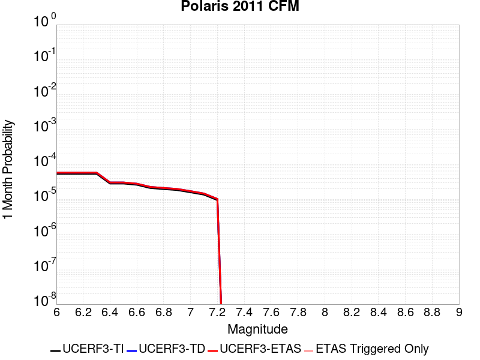 |  |  |

| Magnitude | 1 wk TI Prob | 1 wk TD Prob | 1 wk ETAS Prob | 1 wk ETAS/TD Gain | 1 wk ETAS Triggered Only | 1 mo TI Prob | 1 mo TD Prob | 1 mo ETAS Prob | 1 mo ETAS/TD Gain | 1 mo ETAS Triggered Only | 1 yr TI Prob | 1 yr TD Prob | 1 yr ETAS Prob | 1 yr ETAS/TD Gain | 1 yr ETAS Triggered Only | 10 yr TI Prob | 10 yr TD Prob | 10 yr ETAS Prob | 10 yr ETAS/TD Gain | 10 yr ETAS Triggered Only |
|-----|-----|-----|-----|-----|-----|-----|-----|-----|-----|-----|-----|-----|-----|-----|-----|-----|-----|-----|-----|-----|
| 6.0 | 1.2630823E-5 | 1.3583052E-5 | 1.3583052E-5 | 1.0 | 0.0 | 5.413098E-5 | 5.8212074E-5 | 5.8212074E-5 | 1.0 | 0.0 | 6.5884535E-4 | 7.085534E-4 | 7.085534E-4 | 1.0 | 0.0 | 0.0065689543 | 0.007068052 | 0.0070779813 | 1.0014048 | 1.0E-5 |
| 6.1 | 1.2630823E-5 | 1.3583052E-5 | 1.3583052E-5 | 1.0 | 0.0 | 5.413098E-5 | 5.8212074E-5 | 5.8212074E-5 | 1.0 | 0.0 | 6.5884535E-4 | 7.085534E-4 | 7.085534E-4 | 1.0 | 0.0 | 0.0065689543 | 0.007068052 | 0.0070779813 | 1.0014048 | 1.0E-5 |
| 6.2 | 1.2630823E-5 | 1.3583052E-5 | 1.3583052E-5 | 1.0 | 0.0 | 5.413098E-5 | 5.8212074E-5 | 5.8212074E-5 | 1.0 | 0.0 | 6.5884535E-4 | 7.085534E-4 | 7.085534E-4 | 1.0 | 0.0 | 0.0065689543 | 0.007068052 | 0.0070779813 | 1.0014048 | 1.0E-5 |
| 6.3 | 1.2630823E-5 | 1.3583052E-5 | 1.3583052E-5 | 1.0 | 0.0 | 5.413098E-5 | 5.8212074E-5 | 5.8212074E-5 | 1.0 | 0.0 | 6.5884535E-4 | 7.085534E-4 | 7.085534E-4 | 1.0 | 0.0 | 0.0065689543 | 0.007068052 | 0.0070779813 | 1.0014048 | 1.0E-5 |
| 6.4 | 6.642994E-6 | 7.107126E-6 | 7.107126E-6 | 1.0 | 0.0 | 2.8469662E-5 | 3.0458785E-5 | 3.0458785E-5 | 1.0 | 0.0 | 3.46563E-4 | 3.7077777E-4 | 3.7077777E-4 | 1.0 | 0.0 | 0.0034602303 | 0.003702102 | 0.003712065 | 1.0026911 | 1.0E-5 |
| 6.5 | 6.642994E-6 | 7.107126E-6 | 7.107126E-6 | 1.0 | 0.0 | 2.8469662E-5 | 3.0458785E-5 | 3.0458785E-5 | 1.0 | 0.0 | 3.46563E-4 | 3.7077777E-4 | 3.7077777E-4 | 1.0 | 0.0 | 0.0034602303 | 0.003702102 | 0.003712065 | 1.0026911 | 1.0E-5 |
| 6.6 | 6.1286296E-6 | 6.556232E-6 | 6.556232E-6 | 1.0 | 0.0 | 2.626529E-5 | 2.8097862E-5 | 2.8097862E-5 | 1.0 | 0.0 | 3.19733E-4 | 3.420426E-4 | 3.420426E-4 | 1.0 | 0.0 | 0.0031927335 | 0.0034156365 | 0.0034256023 | 1.0029178 | 1.0E-5 |
| 6.7 | 4.9474666E-6 | 5.298299E-6 | 5.298299E-6 | 1.0 | 0.0 | 2.1203256E-5 | 2.2706814E-5 | 2.2706814E-5 | 1.0 | 0.0 | 2.5811905E-4 | 2.7642323E-4 | 2.7642323E-4 | 1.0 | 0.0 | 0.0025781945 | 0.0027610739 | 0.0027710462 | 1.0036118 | 1.0E-5 |
| 6.8 | 4.616407E-6 | 4.946311E-6 | 4.946311E-6 | 1.0 | 0.0 | 1.978445E-5 | 2.1198319E-5 | 2.1198319E-5 | 1.0 | 0.0 | 2.4084905E-4 | 2.5806163E-4 | 2.5806163E-4 | 1.0 | 0.0 | 0.0024058819 | 0.0025778841 | 0.0025878581 | 1.0038692 | 1.0E-5 |
| 6.9 | 4.320343E-6 | 4.63093E-6 | 4.63093E-6 | 1.0 | 0.0 | 1.8515624E-5 | 1.9846708E-5 | 1.9846708E-5 | 1.0 | 0.0 | 2.2540441E-4 | 2.4160948E-4 | 2.4160948E-4 | 1.0 | 0.0 | 0.0022517592 | 0.0024137248 | 0.0024237006 | 1.004133 | 1.0E-5 |
| 7.0 | 3.7382292E-6 | 4.0095915E-6 | 4.0095915E-6 | 1.0 | 0.0 | 1.6020884E-5 | 1.7183864E-5 | 1.7183864E-5 | 1.0 | 0.0 | 1.950368E-4 | 2.0919584E-4 | 2.0919584E-4 | 1.0 | 0.0 | 0.0019486571 | 0.0020902245 | 0.0021002037 | 1.0047742 | 1.0E-5 |
| 7.1 | 3.193576E-6 | 3.4277325E-6 | 3.4277325E-6 | 1.0 | 0.0 | 1.3686683E-5 | 1.4690211E-5 | 1.4690211E-5 | 1.0 | 0.0 | 1.6662262E-4 | 1.7884087E-4 | 1.7884087E-4 | 1.0 | 0.0 | 0.0016649774 | 0.0017871883 | 0.0017971705 | 1.0055854 | 1.0E-5 |
| 7.2 | 2.2356758E-6 | 2.402392E-6 | 2.402392E-6 | 1.0 | 0.0 | 9.581432E-6 | 1.0295936E-5 | 1.0295936E-5 | 1.0 | 0.0 | 1.1664769E-4 | 1.2534771E-4 | 1.2534771E-4 | 1.0 | 0.0 | 0.0011658648 | 0.0012529559 | 0.0012529559 | 1.0 | 0.0 |

## San Jacinto (Coyote Creek)
*[(top)](#table-of-contents)*

| 1 Week | 1 Month | 1 Year | 10 Year |
|-----|-----|-----|-----|
|  |  |  |  |

| Magnitude | 1 wk TI Prob | 1 wk TD Prob | 1 wk ETAS Prob | 1 wk ETAS/TD Gain | 1 wk ETAS Triggered Only | 1 mo TI Prob | 1 mo TD Prob | 1 mo ETAS Prob | 1 mo ETAS/TD Gain | 1 mo ETAS Triggered Only | 1 yr TI Prob | 1 yr TD Prob | 1 yr ETAS Prob | 1 yr ETAS/TD Gain | 1 yr ETAS Triggered Only | 10 yr TI Prob | 10 yr TD Prob | 10 yr ETAS Prob | 10 yr ETAS/TD Gain | 10 yr ETAS Triggered Only |
|-----|-----|-----|-----|-----|-----|-----|-----|-----|-----|-----|-----|-----|-----|-----|-----|-----|-----|-----|-----|-----|
| 6.0 | 2.7374346E-5 | 2.415327E-5 | 2.415327E-5 | 1.0 | 0.0 | 1.1731335E-4 | 1.0350993E-4 | 1.0350993E-4 | 1.0 | 0.0 | 0.0014273542 | 0.0012595074 | 0.0012694948 | 1.0079296 | 1.0E-5 | 0.01418221 | 0.01293251 | 0.01294238 | 1.0007633 | 1.0E-5 |
| 6.1 | 2.7374346E-5 | 2.415327E-5 | 2.415327E-5 | 1.0 | 0.0 | 1.1731335E-4 | 1.0350993E-4 | 1.0350993E-4 | 1.0 | 0.0 | 0.0014273542 | 0.0012595074 | 0.0012694948 | 1.0079296 | 1.0E-5 | 0.01418221 | 0.01293251 | 0.01294238 | 1.0007633 | 1.0E-5 |
| 6.2 | 2.7374346E-5 | 2.415327E-5 | 2.415327E-5 | 1.0 | 0.0 | 1.1731335E-4 | 1.0350993E-4 | 1.0350993E-4 | 1.0 | 0.0 | 0.0014273542 | 0.0012595074 | 0.0012694948 | 1.0079296 | 1.0E-5 | 0.01418221 | 0.01293251 | 0.01294238 | 1.0007633 | 1.0E-5 |
| 6.3 | 2.7374346E-5 | 2.415327E-5 | 2.415327E-5 | 1.0 | 0.0 | 1.1731335E-4 | 1.0350993E-4 | 1.0350993E-4 | 1.0 | 0.0 | 0.0014273542 | 0.0012595074 | 0.0012694948 | 1.0079296 | 1.0E-5 | 0.01418221 | 0.01293251 | 0.01294238 | 1.0007633 | 1.0E-5 |
| 6.4 | 2.7374346E-5 | 2.415327E-5 | 2.415327E-5 | 1.0 | 0.0 | 1.1731335E-4 | 1.0350993E-4 | 1.0350993E-4 | 1.0 | 0.0 | 0.0014273542 | 0.0012595074 | 0.0012694948 | 1.0079296 | 1.0E-5 | 0.01418221 | 0.01293251 | 0.01294238 | 1.0007633 | 1.0E-5 |
| 6.5 | 2.7282445E-5 | 2.4039346E-5 | 2.4039346E-5 | 1.0 | 0.0 | 1.16919524E-4 | 1.0302171E-4 | 1.0302171E-4 | 1.0 | 0.0 | 0.0014225657 | 0.0012535703 | 0.0012635577 | 1.0079672 | 1.0E-5 | 0.014134934 | 0.012873836 | 0.012883707 | 1.0007668 | 1.0E-5 |
| 6.6 | 2.7282445E-5 | 2.4039346E-5 | 2.4039346E-5 | 1.0 | 0.0 | 1.16919524E-4 | 1.0302171E-4 | 1.0302171E-4 | 1.0 | 0.0 | 0.0014225657 | 0.0012535703 | 0.0012635577 | 1.0079672 | 1.0E-5 | 0.014134934 | 0.012873836 | 0.012883707 | 1.0007668 | 1.0E-5 |
| 6.7 | 2.7216198E-5 | 2.3964463E-5 | 2.3964463E-5 | 1.0 | 0.0 | 1.1663563E-4 | 1.0270082E-4 | 1.0270082E-4 | 1.0 | 0.0 | 0.0014191137 | 0.0012496678 | 0.0012596553 | 1.0079921 | 1.0E-5 | 0.014100855 | 0.0128352465 | 0.012845118 | 1.0007691 | 1.0E-5 |
| 6.8 | 2.7078617E-5 | 2.3881676E-5 | 2.3881676E-5 | 1.0 | 0.0 | 1.1604605E-4 | 1.0234604E-4 | 1.0234604E-4 | 1.0 | 0.0 | 0.001411945 | 0.0012453535 | 0.001255341 | 1.0080198 | 1.0E-5 | 0.014030075 | 0.012792386 | 0.012802258 | 1.0007718 | 1.0E-5 |
| 6.9 | 2.6982952E-5 | 2.3801183E-5 | 2.3801183E-5 | 1.0 | 0.0 | 1.15636096E-4 | 1.020011E-4 | 1.020011E-4 | 1.0 | 0.0 | 0.0014069602 | 0.0012411585 | 0.0012511461 | 1.008047 | 1.0E-5 | 0.013980856 | 0.012750699 | 0.012760571 | 1.0007743 | 1.0E-5 |
| 7.0 | 2.6449972E-5 | 2.3378187E-5 | 2.3378187E-5 | 1.0 | 0.0 | 1.1335209E-4 | 1.001884E-4 | 1.001884E-4 | 1.0 | 0.0 | 0.001379188 | 0.0012191138 | 0.0012291016 | 1.0081927 | 1.0E-5 | 0.0137065975 | 0.0125320535 | 0.012541927 | 1.000788 | 1.0E-5 |
| 7.1 | 2.6257849E-5 | 2.3204217E-5 | 2.3204217E-5 | 1.0 | 0.0 | 1.1252879E-4 | 9.944286E-5 | 9.944286E-5 | 1.0 | 0.0 | 0.0013691769 | 0.001210047 | 0.0012200349 | 1.0082542 | 1.0E-5 | 0.013607717 | 0.012441914 | 0.012451789 | 1.0007937 | 1.0E-5 |
| 7.2 | 2.5270041E-5 | 2.2398921E-5 | 2.2398921E-5 | 1.0 | 0.0 | 1.0829568E-4 | 9.5991854E-5 | 9.5991854E-5 | 1.0 | 0.0 | 0.0013177024 | 0.0011680766 | 0.001178065 | 1.0085511 | 1.0E-5 | 0.013099162 | 0.012022921 | 0.0120328 | 1.0008217 | 1.0E-5 |
| 7.3 | 2.339701E-5 | 2.1130656E-5 | 2.1130656E-5 | 1.0 | 0.0 | 1.0026905E-4 | 9.055682E-5 | 9.055682E-5 | 1.0 | 0.0 | 0.001220092 | 0.0011019738 | 0.0011119628 | 1.0090647 | 1.0E-5 | 0.012134149 | 0.011361783 | 0.01137167 | 1.0008701 | 1.0E-5 |
| 7.4 | 2.296333E-5 | 2.0860984E-5 | 2.0860984E-5 | 1.0 | 0.0 | 9.841056E-5 | 8.940117E-5 | 8.940117E-5 | 1.0 | 0.0 | 0.0011974899 | 0.0010879177 | 0.0010979068 | 1.0091819 | 1.0E-5 | 0.011910575 | 0.011220883 | 0.0112307705 | 1.0008812 | 1.0E-5 |
| 7.5 | 2.2188895E-5 | 2.0383844E-5 | 2.0383844E-5 | 1.0 | 0.0 | 9.50918E-5 | 8.735642E-5 | 8.735642E-5 | 1.0 | 0.0 | 0.0011571277 | 0.0010630476 | 0.0010730369 | 1.0093969 | 1.0E-5 | 0.011511209 | 0.010970469 | 0.010980359 | 1.0009016 | 1.0E-5 |
| 7.6 | 2.0013189E-5 | 1.8969942E-5 | 1.8969942E-5 | 1.0 | 0.0 | 8.5767984E-5 | 8.1297236E-5 | 8.1297236E-5 | 1.0 | 0.0 | 0.001043725 | 9.893461E-4 | 9.993362E-4 | 1.0100977 | 1.0E-5 | 0.010388365 | 0.010228388 | 0.010238285 | 1.0009676 | 1.0E-5 |
| 7.7 | 1.7230794E-5 | 1.6751088E-5 | 1.6751088E-5 | 1.0 | 0.0 | 7.384417E-5 | 7.17884E-5 | 7.17884E-5 | 1.0 | 0.0 | 8.986819E-4 | 8.736742E-4 | 8.8366546E-4 | 1.0114359 | 1.0E-5 | 0.008950562 | 0.009066812 | 0.009076721 | 1.0010929 | 1.0E-5 |
| 7.8 | 1.4478809E-5 | 1.49981E-5 | 1.49981E-5 | 1.0 | 0.0 | 6.205057E-5 | 6.427599E-5 | 6.427599E-5 | 1.0 | 0.0 | 7.552038E-4 | 7.822799E-4 | 7.9227204E-4 | 1.0127732 | 1.0E-5 | 0.0075264242 | 0.008145113 | 0.008155031 | 1.0012177 | 1.0E-5 |
| 7.9 | 1.1114467E-5 | 1.1651392E-5 | 1.1651392E-5 | 1.0 | 0.0 | 4.7632562E-5 | 4.9933584E-5 | 4.9933584E-5 | 1.0 | 0.0 | 5.797721E-4 | 6.077724E-4 | 6.1776635E-4 | 1.0164435 | 1.0E-5 | 0.0057826187 | 0.0063836263 | 0.0063935625 | 1.0015565 | 1.0E-5 |
| 8.0 | 9.327402E-6 | 9.904865E-6 | 9.904865E-6 | 1.0 | 0.0 | 3.9973966E-5 | 4.2448733E-5 | 4.2448733E-5 | 1.0 | 0.0 | 4.8657437E-4 | 5.166913E-4 | 5.2668614E-4 | 1.019344 | 1.0E-5 | 0.0048551033 | 0.0054529547 | 0.0054629 | 1.0018239 | 1.0E-5 |
| 8.1 | 7.0235833E-6 | 6.83171E-6 | 6.83171E-6 | 1.0 | 0.0 | 3.0100724E-5 | 2.9278432E-5 | 2.9278432E-5 | 1.0 | 0.0 | 3.664147E-4 | 3.5640708E-4 | 3.6640352E-4 | 1.0280478 | 1.0E-5 | 0.003658111 | 0.0037898365 | 0.0037997987 | 1.0026287 | 1.0E-5 |
| 8.2 | 2.0358202E-6 | 9.0030267E-7 | 9.0030267E-7 | 1.0 | 0.0 | 8.724915E-6 | 3.8584344E-6 | 3.8584344E-6 | 1.0 | 0.0 | 1.06220665E-4 | 4.697545E-5 | 4.697545E-5 | 1.0 | 0.0 | 0.001061699 | 5.3301745E-4 | 5.3301745E-4 | 1.0 | 0.0 |
| 8.3 | 2.0051264E-7 | 6.6244816E-8 | 6.6244816E-8 | 1.0 | 0.0 | 8.5933965E-7 | 2.8390633E-7 | 2.8390633E-7 | 1.0 | 0.0 | 1.046241E-5 | 3.4565546E-6 | 3.4565546E-6 | 1.0 | 0.0 | 1.0461917E-4 | 4.018022E-5 | 4.018022E-5 | 1.0 | 0.0 |

## Cedar Mtn-Mahogany Mtn
*[(top)](#table-of-contents)*

| 1 Week | 1 Month | 1 Year | 10 Year |
|-----|-----|-----|-----|
|  | 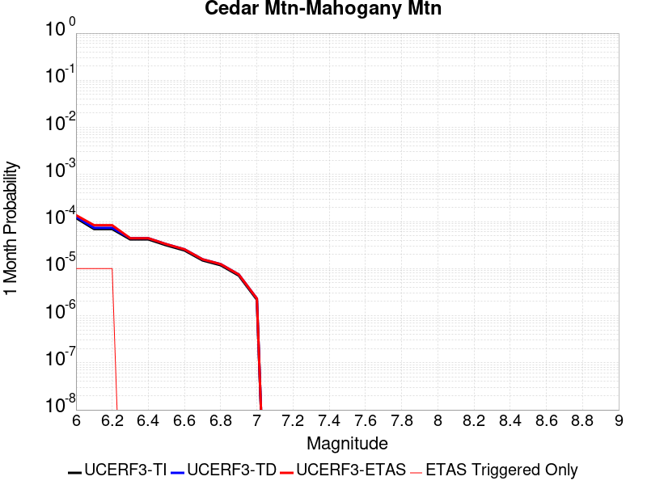 |  |  |

| Magnitude | 1 wk TI Prob | 1 wk TD Prob | 1 wk ETAS Prob | 1 wk ETAS/TD Gain | 1 wk ETAS Triggered Only | 1 mo TI Prob | 1 mo TD Prob | 1 mo ETAS Prob | 1 mo ETAS/TD Gain | 1 mo ETAS Triggered Only | 1 yr TI Prob | 1 yr TD Prob | 1 yr ETAS Prob | 1 yr ETAS/TD Gain | 1 yr ETAS Triggered Only | 10 yr TI Prob | 10 yr TD Prob | 10 yr ETAS Prob | 10 yr ETAS/TD Gain | 10 yr ETAS Triggered Only |
|-----|-----|-----|-----|-----|-----|-----|-----|-----|-----|-----|-----|-----|-----|-----|-----|-----|-----|-----|-----|-----|
| 6.0 | 2.7763876E-5 | 2.9589124E-5 | 2.9589124E-5 | 1.0 | 0.0 | 1.1898261E-4 | 1.2680476E-4 | 1.368035E-4 | 1.0788513 | 1.0E-5 | 0.0014476506 | 0.0015428247 | 0.0015528093 | 1.0064716 | 1.0E-5 | 0.0143825635 | 0.015328358 | 0.015338205 | 1.0006424 | 1.0E-5 |
| 6.1 | 1.6162443E-5 | 1.7143104E-5 | 1.7143104E-5 | 1.0 | 0.0 | 6.926578E-5 | 7.346847E-5 | 8.346774E-5 | 1.1361028 | 1.0E-5 | 8.4298453E-4 | 8.9412933E-4 | 9.041204E-4 | 1.0111741 | 1.0E-5 | 0.008397939 | 0.00890713 | 0.008917041 | 1.0011127 | 1.0E-5 |
| 6.2 | 1.6162443E-5 | 1.7143104E-5 | 1.7143104E-5 | 1.0 | 0.0 | 6.926578E-5 | 7.346847E-5 | 8.346774E-5 | 1.1361028 | 1.0E-5 | 8.4298453E-4 | 8.9412933E-4 | 9.041204E-4 | 1.0111741 | 1.0E-5 | 0.008397939 | 0.00890713 | 0.008917041 | 1.0011127 | 1.0E-5 |
| 6.3 | 9.746053E-6 | 1.030323E-5 | 1.030323E-5 | 1.0 | 0.0 | 4.1768133E-5 | 4.4155975E-5 | 4.4155975E-5 | 1.0 | 0.0 | 5.0840835E-4 | 5.374705E-4 | 5.374705E-4 | 1.0 | 0.0 | 0.0050724675 | 0.005362125 | 0.005362125 | 1.0 | 0.0 |
| 6.4 | 9.746053E-6 | 1.030323E-5 | 1.030323E-5 | 1.0 | 0.0 | 4.1768133E-5 | 4.4155975E-5 | 4.4155975E-5 | 1.0 | 0.0 | 5.0840835E-4 | 5.374705E-4 | 5.374705E-4 | 1.0 | 0.0 | 0.0050724675 | 0.005362125 | 0.005362125 | 1.0 | 0.0 |
| 6.5 | 7.290083E-6 | 7.695381E-6 | 7.695381E-6 | 1.0 | 0.0 | 3.124284E-5 | 3.2979802E-5 | 3.2979802E-5 | 1.0 | 0.0 | 3.8031515E-4 | 4.0145728E-4 | 4.0145728E-4 | 1.0 | 0.0 | 0.0037966494 | 0.0040075406 | 0.0040075406 | 1.0 | 0.0 |
| 6.6 | 5.67907E-6 | 5.9891963E-6 | 5.9891963E-6 | 1.0 | 0.0 | 2.4338644E-5 | 2.5667738E-5 | 2.5667738E-5 | 1.0 | 0.0 | 2.962827E-4 | 3.1246126E-4 | 3.1246126E-4 | 1.0 | 0.0 | 0.0029588798 | 0.0031203553 | 0.0031203553 | 1.0 | 0.0 |
| 6.7 | 3.4853963E-6 | 3.6726572E-6 | 3.6726572E-6 | 1.0 | 0.0 | 1.4937327E-5 | 1.5739868E-5 | 1.5739868E-5 | 1.0 | 0.0 | 1.8184677E-4 | 1.9161667E-4 | 1.9161667E-4 | 1.0 | 0.0 | 0.0018169804 | 0.0019145765 | 0.0019145765 | 1.0 | 0.0 |
| 6.8 | 2.7535168E-6 | 2.901597E-6 | 2.901597E-6 | 1.0 | 0.0 | 1.1800733E-5 | 1.2435359E-5 | 1.2435359E-5 | 1.0 | 0.0 | 1.4366445E-4 | 1.5139046E-4 | 1.5139046E-4 | 1.0 | 0.0 | 0.0014357162 | 0.0015129205 | 0.0015129205 | 1.0 | 0.0 |
| 6.9 | 1.6594106E-6 | 1.7497113E-6 | 1.7497113E-6 | 1.0 | 0.0 | 7.1117406E-6 | 7.4987424E-6 | 7.4987424E-6 | 1.0 | 0.0 | 8.6582E-5 | 9.1293674E-5 | 9.1293674E-5 | 1.0 | 0.0 | 8.654827E-4 | 9.1259216E-4 | 9.1259216E-4 | 1.0 | 0.0 |
| 7.0 | 5.10215E-7 | 5.389294E-7 | 5.389294E-7 | 1.0 | 0.0 | 2.186634E-6 | 2.3096961E-6 | 2.3096961E-6 | 1.0 | 0.0 | 2.6621943E-5 | 2.8120316E-5 | 2.8120316E-5 | 1.0 | 0.0 | 2.6618753E-4 | 2.811801E-4 | 2.811801E-4 | 1.0 | 0.0 |

## Great Valley 03a Dunnigan Hills
*[(top)](#table-of-contents)*

| 1 Week | 1 Month | 1 Year | 10 Year |
|-----|-----|-----|-----|
|  |  |  | 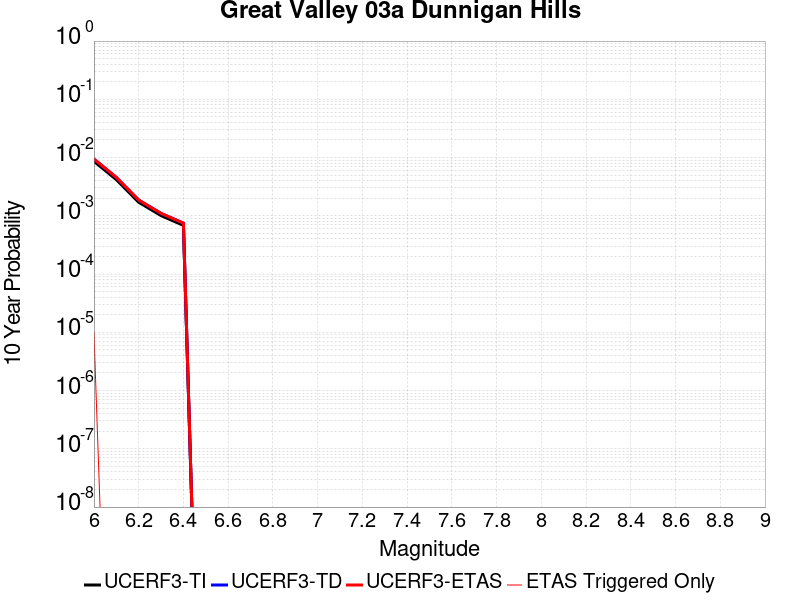 |

| Magnitude | 1 wk TI Prob | 1 wk TD Prob | 1 wk ETAS Prob | 1 wk ETAS/TD Gain | 1 wk ETAS Triggered Only | 1 mo TI Prob | 1 mo TD Prob | 1 mo ETAS Prob | 1 mo ETAS/TD Gain | 1 mo ETAS Triggered Only | 1 yr TI Prob | 1 yr TD Prob | 1 yr ETAS Prob | 1 yr ETAS/TD Gain | 1 yr ETAS Triggered Only | 10 yr TI Prob | 10 yr TD Prob | 10 yr ETAS Prob | 10 yr ETAS/TD Gain | 10 yr ETAS Triggered Only |
|-----|-----|-----|-----|-----|-----|-----|-----|-----|-----|-----|-----|-----|-----|-----|-----|-----|-----|-----|-----|-----|
| 6.0 | 1.6591328E-5 | 1.8108174E-5 | 2.8107992E-5 | 1.5522268 | 1.0E-5 | 7.110376E-5 | 7.760454E-5 | 8.760377E-5 | 1.1288484 | 1.0E-5 | 8.6534437E-4 | 9.4449485E-4 | 9.544854E-4 | 1.0105777 | 1.0E-5 | 0.008619824 | 0.009411639 | 0.009421544 | 1.0010525 | 1.0E-5 |
| 6.1 | 8.041125E-6 | 8.769832E-6 | 8.769832E-6 | 1.0 | 0.0 | 3.4461507E-5 | 3.7584567E-5 | 3.7584567E-5 | 1.0 | 0.0 | 4.194881E-4 | 4.5751635E-4 | 4.5751635E-4 | 1.0 | 0.0 | 0.004186971 | 0.004567742 | 0.004567742 | 1.0 | 0.0 |
| 6.2 | 3.2807004E-6 | 3.579612E-6 | 3.579612E-6 | 1.0 | 0.0 | 1.4060069E-5 | 1.5341127E-5 | 1.5341127E-5 | 1.0 | 0.0 | 1.7116789E-4 | 1.8676638E-4 | 1.8676638E-4 | 1.0 | 0.0 | 0.0017103611 | 0.0018665022 | 0.0018665022 | 1.0 | 0.0 |
| 6.3 | 1.9339366E-6 | 2.1104063E-6 | 2.1104063E-6 | 1.0 | 0.0 | 8.288273E-6 | 9.044583E-6 | 9.044583E-6 | 1.0 | 0.0 | 1.00905054E-4 | 1.10115085E-4 | 1.10115085E-4 | 1.0 | 0.0 | 0.0010085925 | 0.0011008852 | 0.0011008852 | 1.0 | 0.0 |
| 6.4 | 1.3142635E-6 | 1.4340039E-6 | 1.4340039E-6 | 1.0 | 0.0 | 5.6325457E-6 | 6.1457313E-6 | 6.1457313E-6 | 1.0 | 0.0 | 6.857408E-5 | 7.4824275E-5 | 7.4824275E-5 | 1.0 | 0.0 | 6.8552926E-4 | 7.482428E-4 | 7.482428E-4 | 1.0 | 0.0 |

## Fitzhugh Creek
*[(top)](#table-of-contents)*

| 1 Week | 1 Month | 1 Year | 10 Year |
|-----|-----|-----|-----|
| 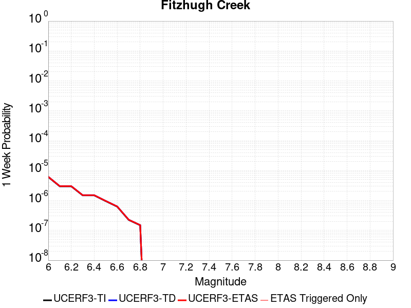 |  |  |  |

| Magnitude | 1 wk TI Prob | 1 wk TD Prob | 1 wk ETAS Prob | 1 wk ETAS/TD Gain | 1 wk ETAS Triggered Only | 1 mo TI Prob | 1 mo TD Prob | 1 mo ETAS Prob | 1 mo ETAS/TD Gain | 1 mo ETAS Triggered Only | 1 yr TI Prob | 1 yr TD Prob | 1 yr ETAS Prob | 1 yr ETAS/TD Gain | 1 yr ETAS Triggered Only | 10 yr TI Prob | 10 yr TD Prob | 10 yr ETAS Prob | 10 yr ETAS/TD Gain | 10 yr ETAS Triggered Only |
|-----|-----|-----|-----|-----|-----|-----|-----|-----|-----|-----|-----|-----|-----|-----|-----|-----|-----|-----|-----|-----|
| 6.0 | 6.1090436E-6 | 6.21017E-6 | 6.21017E-6 | 1.0 | 0.0 | 2.6181353E-5 | 2.6614767E-5 | 2.6614767E-5 | 1.0 | 0.0 | 3.1871133E-4 | 3.2399112E-4 | 3.2399112E-4 | 1.0 | 0.0 | 0.0031825465 | 0.0032356316 | 0.0032455993 | 1.0030806 | 1.0E-5 |
| 6.1 | 2.9741811E-6 | 3.0215874E-6 | 3.0215874E-6 | 1.0 | 0.0 | 1.2746428E-5 | 1.2949601E-5 | 1.2949601E-5 | 1.0 | 0.0 | 1.5517672E-4 | 1.5765094E-4 | 1.5765094E-4 | 1.0 | 0.0 | 0.001550684 | 0.0015754839 | 0.0015754839 | 1.0 | 0.0 |
| 6.2 | 2.9741811E-6 | 3.0215874E-6 | 3.0215874E-6 | 1.0 | 0.0 | 1.2746428E-5 | 1.2949601E-5 | 1.2949601E-5 | 1.0 | 0.0 | 1.5517672E-4 | 1.5765094E-4 | 1.5765094E-4 | 1.0 | 0.0 | 0.001550684 | 0.0015754839 | 0.0015754839 | 1.0 | 0.0 |
| 6.3 | 1.4781198E-6 | 1.501274E-6 | 1.501274E-6 | 1.0 | 0.0 | 6.3347834E-6 | 6.4340165E-6 | 6.4340165E-6 | 1.0 | 0.0 | 7.712326E-5 | 7.833154E-5 | 7.833154E-5 | 1.0 | 0.0 | 7.70965E-4 | 7.830592E-4 | 7.830592E-4 | 1.0 | 0.0 |
| 6.4 | 1.4781198E-6 | 1.501274E-6 | 1.501274E-6 | 1.0 | 0.0 | 6.3347834E-6 | 6.4340165E-6 | 6.4340165E-6 | 1.0 | 0.0 | 7.712326E-5 | 7.833154E-5 | 7.833154E-5 | 1.0 | 0.0 | 7.70965E-4 | 7.830592E-4 | 7.830592E-4 | 1.0 | 0.0 |
| 6.5 | 9.5176676E-7 | 9.66608E-7 | 9.66608E-7 | 1.0 | 0.0 | 4.078994E-6 | 4.1425997E-6 | 4.1425997E-6 | 1.0 | 0.0 | 4.9660623E-5 | 5.043509E-5 | 5.043509E-5 | 1.0 | 0.0 | 4.964952E-4 | 5.0424685E-4 | 5.0424685E-4 | 1.0 | 0.0 |
| 6.6 | 6.21145E-7 | 6.3085986E-7 | 6.3085986E-7 | 1.0 | 0.0 | 2.662047E-6 | 2.7036829E-6 | 2.7036829E-6 | 1.0 | 0.0 | 3.2409942E-5 | 3.291691E-5 | 3.291691E-5 | 1.0 | 0.0 | 3.2405215E-4 | 3.291269E-4 | 3.291269E-4 | 1.0 | 0.0 |
| 6.7 | 2.2377962E-7 | 2.2734685E-7 | 2.2734685E-7 | 1.0 | 0.0 | 9.590551E-7 | 9.743434E-7 | 9.743434E-7 | 1.0 | 0.0 | 1.1676434E-5 | 1.18625985E-5 | 1.18625985E-5 | 1.0 | 0.0 | 1.1675821E-4 | 1.1862279E-4 | 1.1862279E-4 | 1.0 | 0.0 |
| 6.8 | 1.4785022E-7 | 1.5021524E-7 | 1.5021524E-7 | 1.0 | 0.0 | 6.3364365E-7 | 6.4377963E-7 | 6.4377963E-7 | 1.0 | 0.0 | 7.714584E-6 | 7.838016E-6 | 7.838016E-6 | 1.0 | 0.0 | 7.714316E-5 | 7.8380166E-5 | 7.8380166E-5 | 1.0 | 0.0 |

## Greenville (No) 2011 CFM
*[(top)](#table-of-contents)*

| 1 Week | 1 Month | 1 Year | 10 Year |
|-----|-----|-----|-----|
|  | 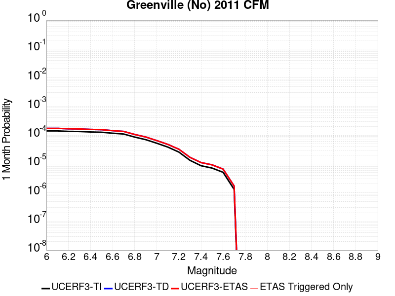 |  |  |

| Magnitude | 1 wk TI Prob | 1 wk TD Prob | 1 wk ETAS Prob | 1 wk ETAS/TD Gain | 1 wk ETAS Triggered Only | 1 mo TI Prob | 1 mo TD Prob | 1 mo ETAS Prob | 1 mo ETAS/TD Gain | 1 mo ETAS Triggered Only | 1 yr TI Prob | 1 yr TD Prob | 1 yr ETAS Prob | 1 yr ETAS/TD Gain | 1 yr ETAS Triggered Only | 10 yr TI Prob | 10 yr TD Prob | 10 yr ETAS Prob | 10 yr ETAS/TD Gain | 10 yr ETAS Triggered Only |
|-----|-----|-----|-----|-----|-----|-----|-----|-----|-----|-----|-----|-----|-----|-----|-----|-----|-----|-----|-----|-----|
| 6.0 | 3.286654E-5 | 4.036741E-5 | 4.036741E-5 | 1.0 | 0.0 | 1.4084899E-4 | 1.7299193E-4 | 1.7299193E-4 | 1.0 | 0.0 | 0.0017134876 | 0.0021041804 | 0.0021141593 | 1.0047425 | 1.0E-5 | 0.017003356 | 0.020847455 | 0.020857247 | 1.0004697 | 1.0E-5 |
| 6.1 | 3.286654E-5 | 4.036741E-5 | 4.036741E-5 | 1.0 | 0.0 | 1.4084899E-4 | 1.7299193E-4 | 1.7299193E-4 | 1.0 | 0.0 | 0.0017134876 | 0.0021041804 | 0.0021141593 | 1.0047425 | 1.0E-5 | 0.017003356 | 0.020847455 | 0.020857247 | 1.0004697 | 1.0E-5 |
| 6.2 | 3.1697953E-5 | 3.893027E-5 | 3.893027E-5 | 1.0 | 0.0 | 1.358413E-4 | 1.6683355E-4 | 1.6683355E-4 | 1.0 | 0.0 | 0.0016526132 | 0.0020293442 | 0.0020393238 | 1.0049177 | 1.0E-5 | 0.01640377 | 0.020112827 | 0.020122627 | 1.0004872 | 1.0E-5 |
| 6.3 | 3.1363317E-5 | 3.8519134E-5 | 3.8519134E-5 | 1.0 | 0.0 | 1.344073E-4 | 1.6507176E-4 | 1.6507176E-4 | 1.0 | 0.0 | 0.0016351803 | 0.002007934 | 0.002017914 | 1.0049702 | 1.0E-5 | 0.016232004 | 0.019902589 | 0.01991239 | 1.0004925 | 1.0E-5 |
| 6.4 | 3.0228604E-5 | 3.7126225E-5 | 3.7126225E-5 | 1.0 | 0.0 | 1.2954473E-4 | 1.5910288E-4 | 1.5910288E-4 | 1.0 | 0.0 | 0.0015760659 | 0.0019353938 | 0.0019453744 | 1.0051569 | 1.0E-5 | 0.015649348 | 0.01918991 | 0.019199718 | 1.000511 | 1.0E-5 |
| 6.5 | 2.9537814E-5 | 3.6281657E-5 | 3.6281657E-5 | 1.0 | 0.0 | 1.2658449E-4 | 1.5548375E-4 | 1.5548375E-4 | 1.0 | 0.0 | 0.0015400766 | 0.0018914078 | 0.0019013889 | 1.005277 | 1.0E-5 | 0.01529447 | 0.018757557 | 0.01876737 | 1.0005231 | 1.0E-5 |
| 6.6 | 2.7345395E-5 | 3.3590906E-5 | 3.3590906E-5 | 1.0 | 0.0 | 1.1718928E-4 | 1.4395325E-4 | 1.4395325E-4 | 1.0 | 0.0 | 0.0014258457 | 0.0017512529 | 0.0017612354 | 1.0057002 | 1.0E-5 | 0.014167317 | 0.017378341 | 0.017388167 | 1.0005654 | 1.0E-5 |
| 6.7 | 2.5615784E-5 | 3.1567764E-5 | 3.1567764E-5 | 1.0 | 0.0 | 1.09777306E-4 | 1.3528357E-4 | 1.3528357E-4 | 1.0 | 0.0 | 0.0013357193 | 0.0016458635 | 0.0016558471 | 1.0060658 | 1.0E-5 | 0.013277191 | 0.016340412 | 0.016350249 | 1.000602 | 1.0E-5 |
| 6.8 | 2.0059057E-5 | 2.4712537E-5 | 2.4712537E-5 | 1.0 | 0.0 | 8.596455E-5 | 1.0590666E-4 | 1.0590666E-4 | 1.0 | 0.0 | 0.0010461159 | 0.0012886672 | 0.0012986544 | 1.0077499 | 1.0E-5 | 0.0104120495 | 0.012813962 | 0.012823834 | 1.0007704 | 1.0E-5 |
| 6.9 | 1.6321746E-5 | 2.0185005E-5 | 2.0185005E-5 | 1.0 | 0.0 | 6.9948466E-5 | 8.650436E-5 | 8.650436E-5 | 1.0 | 0.0 | 8.5128983E-4 | 0.0010526942 | 0.0010626836 | 1.0094894 | 1.0E-5 | 0.008480361 | 0.010478605 | 0.0104885 | 1.0009444 | 1.0E-5 |
| 7.0 | 1.22527645E-5 | 1.5135852E-5 | 1.5135852E-5 | 1.0 | 0.0 | 5.2510793E-5 | 6.486634E-5 | 6.486634E-5 | 1.0 | 0.0 | 6.3913135E-4 | 7.894658E-4 | 7.994579E-4 | 1.0126568 | 1.0E-5 | 0.0063729626 | 0.00786725 | 0.007877171 | 1.0012611 | 1.0E-5 |
| 7.1 | 8.996482E-6 | 1.1165086E-5 | 1.1165086E-5 | 1.0 | 0.0 | 3.8555783E-5 | 4.78495E-5 | 4.78495E-5 | 1.0 | 0.0 | 4.6931554E-4 | 5.8241317E-4 | 5.924073E-4 | 1.0171599 | 1.0E-5 | 0.004683256 | 0.005809159 | 0.005819101 | 1.0017114 | 1.0E-5 |
| 7.2 | 6.0273087E-6 | 7.569554E-6 | 7.569554E-6 | 1.0 | 0.0 | 2.5831067E-5 | 3.2440545E-5 | 3.2440545E-5 | 1.0 | 0.0 | 3.1444785E-4 | 3.9489273E-4 | 4.048888E-4 | 1.0253134 | 1.0E-5 | 0.0031400328 | 0.0039421073 | 0.003952068 | 1.0025268 | 1.0E-5 |
| 7.3 | 3.1209995E-6 | 3.966412E-6 | 3.966412E-6 | 1.0 | 0.0 | 1.3375643E-5 | 1.6998798E-5 | 1.6998798E-5 | 1.0 | 0.0 | 1.6283628E-4 | 2.0694088E-4 | 2.0694088E-4 | 1.0 | 0.0 | 0.0016271701 | 0.002067572 | 0.002067572 | 1.0 | 0.0 |
| 7.4 | 2.0254208E-6 | 2.609629E-6 | 2.609629E-6 | 1.0 | 0.0 | 8.680347E-6 | 1.1184077E-5 | 1.1184077E-5 | 1.0 | 0.0 | 1.0567809E-4 | 1.3615769E-4 | 1.3615769E-4 | 1.0 | 0.0 | 0.0010562785 | 0.0013607995 | 0.0013607995 | 1.0 | 0.0 |
| 7.5 | 1.6763418E-6 | 2.1733601E-6 | 2.1733601E-6 | 1.0 | 0.0 | 7.184302E-6 | 9.314368E-6 | 9.314368E-6 | 1.0 | 0.0 | 8.746537E-5 | 1.1339658E-4 | 1.1339658E-4 | 1.0 | 0.0 | 8.743095E-4 | 0.0011334341 | 0.0011334341 | 1.0 | 0.0 |
| 7.6 | 1.1935462E-6 | 1.5458515E-6 | 1.5458515E-6 | 1.0 | 0.0 | 5.115188E-6 | 6.6250614E-6 | 6.6250614E-6 | 1.0 | 0.0 | 6.2275634E-5 | 8.065718E-5 | 8.065718E-5 | 1.0 | 0.0 | 6.2258187E-4 | 8.0630975E-4 | 8.0630975E-4 | 1.0 | 0.0 |
| 7.7 | 3.0464201E-7 | 3.984697E-7 | 3.984697E-7 | 1.0 | 0.0 | 1.3056081E-6 | 1.7077261E-6 | 1.7077261E-6 | 1.0 | 0.0 | 1.589566E-5 | 2.0791373E-5 | 2.0791373E-5 | 1.0 | 0.0 | 1.5894524E-4 | 2.0789898E-4 | 2.0789898E-4 | 1.0 | 0.0 |

## Los Alamos 2011 CFM
*[(top)](#table-of-contents)*

| 1 Week | 1 Month | 1 Year | 10 Year |
|-----|-----|-----|-----|
|  |  |  | 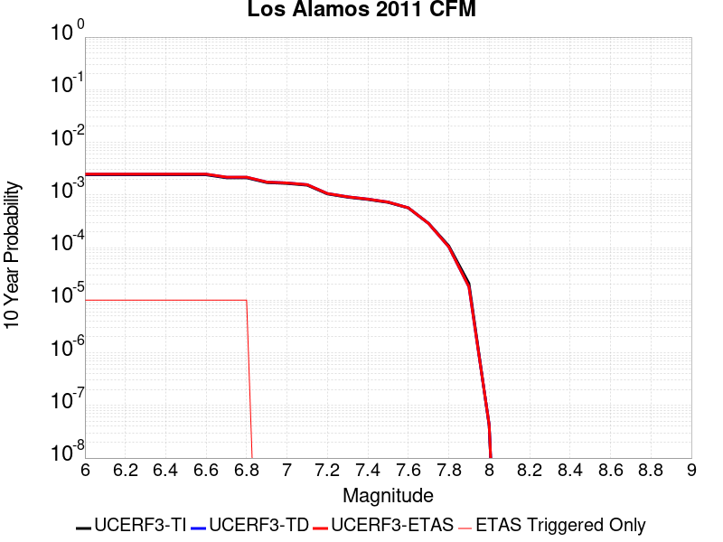 |

| Magnitude | 1 wk TI Prob | 1 wk TD Prob | 1 wk ETAS Prob | 1 wk ETAS/TD Gain | 1 wk ETAS Triggered Only | 1 mo TI Prob | 1 mo TD Prob | 1 mo ETAS Prob | 1 mo ETAS/TD Gain | 1 mo ETAS Triggered Only | 1 yr TI Prob | 1 yr TD Prob | 1 yr ETAS Prob | 1 yr ETAS/TD Gain | 1 yr ETAS Triggered Only | 10 yr TI Prob | 10 yr TD Prob | 10 yr ETAS Prob | 10 yr ETAS/TD Gain | 10 yr ETAS Triggered Only |
|-----|-----|-----|-----|-----|-----|-----|-----|-----|-----|-----|-----|-----|-----|-----|-----|-----|-----|-----|-----|-----|
| 6.0 | 4.6284417E-6 | 4.751753E-6 | 4.751753E-6 | 1.0 | 0.0 | 1.9836029E-5 | 2.0364507E-5 | 2.0364507E-5 | 1.0 | 0.0 | 2.4147688E-4 | 2.4791143E-4 | 2.4791143E-4 | 1.0 | 0.0 | 0.0024121467 | 0.0024765227 | 0.002486498 | 1.004028 | 1.0E-5 |
| 6.1 | 4.6284417E-6 | 4.751753E-6 | 4.751753E-6 | 1.0 | 0.0 | 1.9836029E-5 | 2.0364507E-5 | 2.0364507E-5 | 1.0 | 0.0 | 2.4147688E-4 | 2.4791143E-4 | 2.4791143E-4 | 1.0 | 0.0 | 0.0024121467 | 0.0024765227 | 0.002486498 | 1.004028 | 1.0E-5 |
| 6.2 | 4.6284417E-6 | 4.751753E-6 | 4.751753E-6 | 1.0 | 0.0 | 1.9836029E-5 | 2.0364507E-5 | 2.0364507E-5 | 1.0 | 0.0 | 2.4147688E-4 | 2.4791143E-4 | 2.4791143E-4 | 1.0 | 0.0 | 0.0024121467 | 0.0024765227 | 0.002486498 | 1.004028 | 1.0E-5 |
| 6.3 | 4.6284417E-6 | 4.751753E-6 | 4.751753E-6 | 1.0 | 0.0 | 1.9836029E-5 | 2.0364507E-5 | 2.0364507E-5 | 1.0 | 0.0 | 2.4147688E-4 | 2.4791143E-4 | 2.4791143E-4 | 1.0 | 0.0 | 0.0024121467 | 0.0024765227 | 0.002486498 | 1.004028 | 1.0E-5 |
| 6.4 | 4.6284417E-6 | 4.751753E-6 | 4.751753E-6 | 1.0 | 0.0 | 1.9836029E-5 | 2.0364507E-5 | 2.0364507E-5 | 1.0 | 0.0 | 2.4147688E-4 | 2.4791143E-4 | 2.4791143E-4 | 1.0 | 0.0 | 0.0024121467 | 0.0024765227 | 0.002486498 | 1.004028 | 1.0E-5 |
| 6.5 | 4.6284417E-6 | 4.751753E-6 | 4.751753E-6 | 1.0 | 0.0 | 1.9836029E-5 | 2.0364507E-5 | 2.0364507E-5 | 1.0 | 0.0 | 2.4147688E-4 | 2.4791143E-4 | 2.4791143E-4 | 1.0 | 0.0 | 0.0024121467 | 0.0024765227 | 0.002486498 | 1.004028 | 1.0E-5 |
| 6.6 | 4.6284417E-6 | 4.751753E-6 | 4.751753E-6 | 1.0 | 0.0 | 1.9836029E-5 | 2.0364507E-5 | 2.0364507E-5 | 1.0 | 0.0 | 2.4147688E-4 | 2.4791143E-4 | 2.4791143E-4 | 1.0 | 0.0 | 0.0024121467 | 0.0024765227 | 0.002486498 | 1.004028 | 1.0E-5 |
| 6.7 | 4.062321E-6 | 4.166368E-6 | 4.166368E-6 | 1.0 | 0.0 | 1.7409831E-5 | 1.785575E-5 | 1.785575E-5 | 1.0 | 0.0 | 2.1194408E-4 | 2.1737357E-4 | 2.1737357E-4 | 1.0 | 0.0 | 0.0021174205 | 0.0021717593 | 0.0021817375 | 1.0045946 | 1.0E-5 |
| 6.8 | 4.062321E-6 | 4.166368E-6 | 4.166368E-6 | 1.0 | 0.0 | 1.7409831E-5 | 1.785575E-5 | 1.785575E-5 | 1.0 | 0.0 | 2.1194408E-4 | 2.1737357E-4 | 2.1737357E-4 | 1.0 | 0.0 | 0.0021174205 | 0.0021717593 | 0.0021817375 | 1.0045946 | 1.0E-5 |
| 6.9 | 3.2936077E-6 | 3.3729737E-6 | 3.3729737E-6 | 1.0 | 0.0 | 1.4115385E-5 | 1.4455527E-5 | 1.4455527E-5 | 1.0 | 0.0 | 1.7184127E-4 | 1.7598276E-4 | 1.7598276E-4 | 1.0 | 0.0 | 0.0017170844 | 0.0017585267 | 0.0017585267 | 1.0 | 0.0 |
| 7.0 | 3.1687898E-6 | 3.2448309E-6 | 3.2448309E-6 | 1.0 | 0.0 | 1.3580457E-5 | 1.39063495E-5 | 1.39063495E-5 | 1.0 | 0.0 | 1.6532952E-4 | 1.6929758E-4 | 1.6929758E-4 | 1.0 | 0.0 | 0.0016520657 | 0.0016917776 | 0.0016917776 | 1.0 | 0.0 |
| 7.1 | 2.9379228E-6 | 3.0073402E-6 | 3.0073402E-6 | 1.0 | 0.0 | 1.25910365E-5 | 1.2888542E-5 | 1.2888542E-5 | 1.0 | 0.0 | 1.5328509E-4 | 1.5690761E-4 | 1.5690761E-4 | 1.0 | 0.0 | 0.001531794 | 0.0015680575 | 0.0015680575 | 1.0 | 0.0 |
| 7.2 | 2.0020686E-6 | 2.04164E-6 | 2.04164E-6 | 1.0 | 0.0 | 8.580266E-6 | 8.749857E-6 | 8.749857E-6 | 1.0 | 0.0 | 1.0445973E-4 | 1.0652435E-4 | 1.0652435E-4 | 1.0 | 0.0 | 0.0010441064 | 0.0010647373 | 0.0010647373 | 1.0 | 0.0 |
| 7.3 | 1.7364243E-6 | 1.7678894E-6 | 1.7678894E-6 | 1.0 | 0.0 | 7.441797E-6 | 7.5766475E-6 | 7.5766475E-6 | 1.0 | 0.0 | 9.0600115E-5 | 9.224181E-5 | 9.224181E-5 | 1.0 | 0.0 | 9.0563187E-4 | 9.220384E-4 | 9.220384E-4 | 1.0 | 0.0 |
| 7.4 | 1.5718434E-6 | 1.5983262E-6 | 1.5983262E-6 | 1.0 | 0.0 | 6.7364545E-6 | 6.8499517E-6 | 6.8499517E-6 | 1.0 | 0.0 | 8.201325E-5 | 8.3395E-5 | 8.3395E-5 | 1.0 | 0.0 | 8.198299E-4 | 8.3364005E-4 | 8.3364005E-4 | 1.0 | 0.0 |
| 7.5 | 1.3841119E-6 | 1.404287E-6 | 1.404287E-6 | 1.0 | 0.0 | 5.9318945E-6 | 6.018359E-6 | 6.018359E-6 | 1.0 | 0.0 | 7.221842E-5 | 7.327108E-5 | 7.327108E-5 | 1.0 | 0.0 | 7.2194956E-4 | 7.324721E-4 | 7.324721E-4 | 1.0 | 0.0 |
| 7.6 | 1.0843726E-6 | 1.0934483E-6 | 1.0934483E-6 | 1.0 | 0.0 | 4.647303E-6 | 4.6861987E-6 | 4.6861987E-6 | 1.0 | 0.0 | 5.6579443E-5 | 5.7053E-5 | 5.7053E-5 | 1.0 | 0.0 | 5.656504E-4 | 5.703861E-4 | 5.703861E-4 | 1.0 | 0.0 |
| 7.7 | 5.544814E-7 | 5.501903E-7 | 5.501903E-7 | 1.0 | 0.0 | 2.3763469E-6 | 2.3579564E-6 | 2.3579564E-6 | 1.0 | 0.0 | 2.8931638E-5 | 2.8707742E-5 | 2.8707742E-5 | 1.0 | 0.0 | 2.8927872E-4 | 2.870405E-4 | 2.870405E-4 | 1.0 | 0.0 |
| 7.8 | 2.0707465E-7 | 1.9778587E-7 | 1.9778587E-7 | 1.0 | 0.0 | 8.874625E-7 | 8.4765344E-7 | 8.4765344E-7 | 1.0 | 0.0 | 1.08048025E-5 | 1.0320132E-5 | 1.0320132E-5 | 1.0 | 0.0 | 1.0804277E-4 | 1.0319657E-4 | 1.0319657E-4 | 1.0 | 0.0 |
| 7.9 | 3.9821284E-8 | 3.4331322E-8 | 3.4331322E-8 | 1.0 | 0.0 | 1.7066264E-7 | 1.4713423E-7 | 1.4713423E-7 | 1.0 | 0.0 | 2.0778157E-6 | 1.7913579E-6 | 1.7913579E-6 | 1.0 | 0.0 | 2.0777963E-5 | 1.791344E-5 | 1.791344E-5 | 1.0 | 0.0 |
| 8.0 | 7.880441E-11 | 8.235368E-11 | 8.235368E-11 | 1.0 | 0.0 | 3.3773329E-10 | 3.5294412E-10 | 3.5294412E-10 | 1.0 | 0.0 | 4.1119033E-9 | 4.297095E-9 | 4.297095E-9 | 1.0 | 0.0 | 4.1119034E-8 | 4.2970953E-8 | 4.2970953E-8 | 1.0 | 0.0 |

## Johnson Valley (No) 2011 rev
*[(top)](#table-of-contents)*

| 1 Week | 1 Month | 1 Year | 10 Year |
|-----|-----|-----|-----|
|  |  |  |  |

| Magnitude | 1 wk TI Prob | 1 wk TD Prob | 1 wk ETAS Prob | 1 wk ETAS/TD Gain | 1 wk ETAS Triggered Only | 1 mo TI Prob | 1 mo TD Prob | 1 mo ETAS Prob | 1 mo ETAS/TD Gain | 1 mo ETAS Triggered Only | 1 yr TI Prob | 1 yr TD Prob | 1 yr ETAS Prob | 1 yr ETAS/TD Gain | 1 yr ETAS Triggered Only | 10 yr TI Prob | 10 yr TD Prob | 10 yr ETAS Prob | 10 yr ETAS/TD Gain | 10 yr ETAS Triggered Only |
|-----|-----|-----|-----|-----|-----|-----|-----|-----|-----|-----|-----|-----|-----|-----|-----|-----|-----|-----|-----|-----|
| 6.0 | 2.577707E-5 | 1.29011505E-5 | 1.29011505E-5 | 1.0 | 0.0 | 1.1046848E-4 | 5.5289696E-5 | 5.5289696E-5 | 1.0 | 0.0 | 0.0013441239 | 6.729838E-4 | 6.729838E-4 | 1.0 | 0.0 | 0.013360229 | 0.006713367 | 0.0067233 | 1.0014795 | 1.0E-5 |
| 6.1 | 2.577707E-5 | 1.29011505E-5 | 1.29011505E-5 | 1.0 | 0.0 | 1.1046848E-4 | 5.5289696E-5 | 5.5289696E-5 | 1.0 | 0.0 | 0.0013441239 | 6.729838E-4 | 6.729838E-4 | 1.0 | 0.0 | 0.013360229 | 0.006713367 | 0.0067233 | 1.0014795 | 1.0E-5 |
| 6.2 | 2.577707E-5 | 1.29011505E-5 | 1.29011505E-5 | 1.0 | 0.0 | 1.1046848E-4 | 5.5289696E-5 | 5.5289696E-5 | 1.0 | 0.0 | 0.0013441239 | 6.729838E-4 | 6.729838E-4 | 1.0 | 0.0 | 0.013360229 | 0.006713367 | 0.0067233 | 1.0014795 | 1.0E-5 |
| 6.3 | 2.577707E-5 | 1.29011505E-5 | 1.29011505E-5 | 1.0 | 0.0 | 1.1046848E-4 | 5.5289696E-5 | 5.5289696E-5 | 1.0 | 0.0 | 0.0013441239 | 6.729838E-4 | 6.729838E-4 | 1.0 | 0.0 | 0.013360229 | 0.006713367 | 0.0067233 | 1.0014795 | 1.0E-5 |
| 6.4 | 1.5296591E-5 | 7.536876E-6 | 7.536876E-6 | 1.0 | 0.0 | 6.555518E-5 | 3.2300606E-5 | 3.2300606E-5 | 1.0 | 0.0 | 7.97842E-4 | 3.9320765E-4 | 3.9320765E-4 | 1.0 | 0.0 | 0.007949836 | 0.0039269608 | 0.0039269608 | 1.0 | 0.0 |
| 6.5 | 1.5296591E-5 | 7.536876E-6 | 7.536876E-6 | 1.0 | 0.0 | 6.555518E-5 | 3.2300606E-5 | 3.2300606E-5 | 1.0 | 0.0 | 7.97842E-4 | 3.9320765E-4 | 3.9320765E-4 | 1.0 | 0.0 | 0.007949836 | 0.0039269608 | 0.0039269608 | 1.0 | 0.0 |
| 6.6 | 1.3289383E-5 | 5.9918434E-6 | 5.9918434E-6 | 1.0 | 0.0 | 5.6953253E-5 | 2.5679172E-5 | 2.5679172E-5 | 1.0 | 0.0 | 6.9318525E-4 | 3.1261603E-4 | 3.1261603E-4 | 1.0 | 0.0 | 0.0069102696 | 0.0031234273 | 0.0031234273 | 1.0 | 0.0 |
| 6.7 | 1.3289383E-5 | 5.9918434E-6 | 5.9918434E-6 | 1.0 | 0.0 | 5.6953253E-5 | 2.5679172E-5 | 2.5679172E-5 | 1.0 | 0.0 | 6.9318525E-4 | 3.1261603E-4 | 3.1261603E-4 | 1.0 | 0.0 | 0.0069102696 | 0.0031234273 | 0.0031234273 | 1.0 | 0.0 |
| 6.8 | 8.330789E-6 | 2.9212572E-6 | 2.9212572E-6 | 1.0 | 0.0 | 3.570289E-5 | 1.2519647E-5 | 1.2519647E-5 | 1.0 | 0.0 | 4.34596E-4 | 1.5242174E-4 | 1.5242174E-4 | 1.0 | 0.0 | 0.0043374705 | 0.0015237319 | 0.0015237319 | 1.0 | 0.0 |
| 6.9 | 7.2359003E-6 | 2.3013858E-6 | 2.3013858E-6 | 1.0 | 0.0 | 3.1010633E-5 | 9.863074E-6 | 9.863074E-6 | 1.0 | 0.0 | 3.7748902E-4 | 1.2008165E-4 | 1.2008165E-4 | 1.0 | 0.0 | 0.0037684843 | 0.0012006905 | 0.0012006905 | 1.0 | 0.0 |
| 7.0 | 6.5149957E-6 | 2.0885384E-6 | 2.0885384E-6 | 1.0 | 0.0 | 2.792111E-5 | 8.950878E-6 | 8.950878E-6 | 1.0 | 0.0 | 3.398865E-4 | 1.0897678E-4 | 1.0897678E-4 | 1.0 | 0.0 | 0.003393671 | 0.0010897532 | 0.0010897532 | 1.0 | 0.0 |
| 7.1 | 1.1662233E-6 | 2.8803857E-8 | 2.8803857E-8 | 1.0 | 0.0 | 4.9980904E-6 | 1.2344509E-7 | 1.2344509E-7 | 1.0 | 0.0 | 6.0850052E-5 | 1.5029432E-6 | 1.5029432E-6 | 1.0 | 0.0 | 6.083339E-4 | 1.5029346E-5 | 1.5029346E-5 | 1.0 | 0.0 |
| 7.2 | 5.413881E-7 | 2.8803857E-8 | 2.8803857E-8 | 1.0 | 0.0 | 2.3202326E-6 | 1.2344509E-7 | 1.2344509E-7 | 1.0 | 0.0 | 2.8248465E-5 | 1.5029432E-6 | 1.5029432E-6 | 1.0 | 0.0 | 2.8244875E-4 | 1.5029346E-5 | 1.5029346E-5 | 1.0 | 0.0 |
| 7.3 | 5.076821E-7 | 2.8803855E-8 | 2.8803855E-8 | 1.0 | 0.0 | 2.1757785E-6 | 1.2344509E-7 | 1.2344509E-7 | 1.0 | 0.0 | 2.648978E-5 | 1.5029432E-6 | 1.5029432E-6 | 1.0 | 0.0 | 2.6486625E-4 | 1.5029346E-5 | 1.5029346E-5 | 1.0 | 0.0 |
| 7.4 | 4.7568687E-7 | 2.8785777E-8 | 2.8785777E-8 | 1.0 | 0.0 | 2.0386565E-6 | 1.2336761E-7 | 1.2336761E-7 | 1.0 | 0.0 | 2.482036E-5 | 1.5019998E-6 | 1.5019998E-6 | 1.0 | 0.0 | 2.4817587E-4 | 1.5019913E-5 | 1.5019913E-5 | 1.0 | 0.0 |
| 7.5 | 3.435626E-7 | 2.535922E-8 | 2.535922E-8 | 1.0 | 0.0 | 1.4724103E-6 | 1.0868237E-7 | 1.0868237E-7 | 1.0 | 0.0 | 1.7926448E-5 | 1.3232072E-6 | 1.3232072E-6 | 1.0 | 0.0 | 1.7925001E-4 | 1.3232009E-5 | 1.3232009E-5 | 1.0 | 0.0 |

## Malibu Coast (Extension) alt 1
*[(top)](#table-of-contents)*

| 1 Week | 1 Month | 1 Year | 10 Year |
|-----|-----|-----|-----|
|  |  |  |  |

| Magnitude | 1 wk TI Prob | 1 wk TD Prob | 1 wk ETAS Prob | 1 wk ETAS/TD Gain | 1 wk ETAS Triggered Only | 1 mo TI Prob | 1 mo TD Prob | 1 mo ETAS Prob | 1 mo ETAS/TD Gain | 1 mo ETAS Triggered Only | 1 yr TI Prob | 1 yr TD Prob | 1 yr ETAS Prob | 1 yr ETAS/TD Gain | 1 yr ETAS Triggered Only | 10 yr TI Prob | 10 yr TD Prob | 10 yr ETAS Prob | 10 yr ETAS/TD Gain | 10 yr ETAS Triggered Only |
|-----|-----|-----|-----|-----|-----|-----|-----|-----|-----|-----|-----|-----|-----|-----|-----|-----|-----|-----|-----|-----|
| 6.0 | 8.930738E-6 | 9.329346E-6 | 9.329346E-6 | 1.0 | 0.0 | 3.827403E-5 | 3.9982307E-5 | 3.9982307E-5 | 1.0 | 0.0 | 4.6588664E-4 | 4.8667757E-4 | 4.8667757E-4 | 1.0 | 0.0 | 0.0046491115 | 0.0048563 | 0.0048662517 | 1.0020492 | 1.0E-5 |
| 6.1 | 7.199952E-6 | 7.530357E-6 | 7.530357E-6 | 1.0 | 0.0 | 3.0856572E-5 | 3.227256E-5 | 3.227256E-5 | 1.0 | 0.0 | 3.75614E-4 | 3.928482E-4 | 3.928482E-4 | 1.0 | 0.0 | 0.0037497976 | 0.003921604 | 0.0039315643 | 1.00254 | 1.0E-5 |
| 6.2 | 6.3721413E-6 | 6.6668467E-6 | 6.6668467E-6 | 1.0 | 0.0 | 2.7308892E-5 | 2.857189E-5 | 2.857189E-5 | 1.0 | 0.0 | 3.3243504E-4 | 3.478076E-4 | 3.478076E-4 | 1.0 | 0.0 | 0.0033193815 | 0.0034726725 | 0.0034826377 | 1.0028696 | 1.0E-5 |
| 6.3 | 6.016345E-6 | 6.2952113E-6 | 6.2952113E-6 | 1.0 | 0.0 | 2.578408E-5 | 2.69792E-5 | 2.69792E-5 | 1.0 | 0.0 | 3.1387596E-4 | 3.2842258E-4 | 3.2842258E-4 | 1.0 | 0.0 | 0.00313433 | 0.0032794084 | 0.0032893755 | 1.0030394 | 1.0E-5 |
| 6.4 | 5.8104883E-6 | 6.0795965E-6 | 6.0795965E-6 | 1.0 | 0.0 | 2.4901856E-5 | 2.6055155E-5 | 2.6055155E-5 | 1.0 | 0.0 | 3.031379E-4 | 3.1717564E-4 | 3.1717564E-4 | 1.0 | 0.0 | 0.0030272473 | 0.0031672644 | 0.0031772326 | 1.0031472 | 1.0E-5 |
| 6.5 | 5.476925E-6 | 5.7275624E-6 | 5.7275624E-6 | 1.0 | 0.0 | 2.3472323E-5 | 2.4546467E-5 | 2.4546467E-5 | 1.0 | 0.0 | 2.8573806E-4 | 2.9881255E-4 | 2.9881255E-4 | 1.0 | 0.0 | 0.0028537093 | 0.0029841396 | 0.0029941096 | 1.0033411 | 1.0E-5 |
| 6.6 | 5.222387E-6 | 5.4586267E-6 | 5.4586267E-6 | 1.0 | 0.0 | 2.2381464E-5 | 2.3393906E-5 | 2.3393906E-5 | 1.0 | 0.0 | 2.7246025E-4 | 2.847839E-4 | 2.847839E-4 | 1.0 | 0.0 | 0.0027212645 | 0.00284422 | 0.0028541917 | 1.003506 | 1.0E-5 |
| 6.7 | 5.0337076E-6 | 5.2591486E-6 | 5.2591486E-6 | 1.0 | 0.0 | 2.1572854E-5 | 2.2539016E-5 | 2.2539016E-5 | 1.0 | 0.0 | 2.6261783E-4 | 2.7437825E-4 | 2.7437825E-4 | 1.0 | 0.0 | 0.002623077 | 0.0027404248 | 0.0027503974 | 1.0036391 | 1.0E-5 |
| 6.8 | 4.5675624E-6 | 4.7587573E-6 | 4.7587573E-6 | 1.0 | 0.0 | 1.9575122E-5 | 2.0394515E-5 | 2.0394515E-5 | 1.0 | 0.0 | 2.3830103E-4 | 2.4827512E-4 | 2.4827512E-4 | 1.0 | 0.0 | 0.0023804565 | 0.0024799972 | 0.0024899724 | 1.0040222 | 1.0E-5 |
| 6.9 | 4.2802412E-6 | 4.4520584E-6 | 4.4520584E-6 | 1.0 | 0.0 | 1.8343762E-5 | 1.9080113E-5 | 1.9080113E-5 | 1.0 | 0.0 | 2.2331243E-4 | 2.3227576E-4 | 2.3227576E-4 | 1.0 | 0.0 | 0.0022308815 | 0.0023203467 | 0.0023303234 | 1.0042998 | 1.0E-5 |
| 7.0 | 3.9794063E-6 | 4.130134E-6 | 4.130134E-6 | 1.0 | 0.0 | 1.7054486E-5 | 1.7700455E-5 | 1.7700455E-5 | 1.0 | 0.0 | 2.0761859E-4 | 2.1548186E-4 | 2.1548186E-4 | 1.0 | 0.0 | 0.0020742472 | 0.0021527428 | 0.0021627212 | 1.0046352 | 1.0E-5 |
| 7.1 | 3.7730424E-6 | 3.91125E-6 | 3.91125E-6 | 1.0 | 0.0 | 1.6170083E-5 | 1.6762395E-5 | 1.6762395E-5 | 1.0 | 0.0 | 1.9685295E-4 | 2.0406317E-4 | 2.0406317E-4 | 1.0 | 0.0 | 0.0019667868 | 0.0020387706 | 0.0020487502 | 1.004895 | 1.0E-5 |
| 7.2 | 3.424985E-6 | 3.5413673E-6 | 3.5413673E-6 | 1.0 | 0.0 | 1.4678424E-5 | 1.51772E-5 | 1.51772E-5 | 1.0 | 0.0 | 1.7869516E-4 | 1.8476686E-4 | 1.8476686E-4 | 1.0 | 0.0 | 0.0017855153 | 0.0018461446 | 0.001856126 | 1.0054067 | 1.0E-5 |
| 7.3 | 2.6966375E-6 | 2.759676E-6 | 2.759676E-6 | 1.0 | 0.0 | 1.15569665E-5 | 1.1827129E-5 | 1.1827129E-5 | 1.0 | 0.0 | 1.4069698E-4 | 1.4398582E-4 | 1.4398582E-4 | 1.0 | 0.0 | 0.0014060794 | 0.0014389295 | 0.0014389295 | 1.0 | 0.0 |
| 7.4 | 2.215957E-6 | 2.2493962E-6 | 2.2493962E-6 | 1.0 | 0.0 | 9.496924E-6 | 9.640234E-6 | 9.640234E-6 | 1.0 | 0.0 | 1.1561892E-4 | 1.1736356E-4 | 1.1736356E-4 | 1.0 | 0.0 | 0.0011555878 | 0.0011730195 | 0.0011730195 | 1.0 | 0.0 |
| 7.5 | 1.2040218E-6 | 1.2219169E-6 | 1.2219169E-6 | 1.0 | 0.0 | 5.160083E-6 | 5.236777E-6 | 5.236777E-6 | 1.0 | 0.0 | 6.2822204E-5 | 6.3755906E-5 | 6.3755906E-5 | 1.0 | 0.0 | 6.280445E-4 | 6.37378E-4 | 6.37378E-4 | 1.0 | 0.0 |
| 7.6 | 6.6157446E-7 | 6.6790335E-7 | 6.6790335E-7 | 1.0 | 0.0 | 2.835316E-6 | 2.86244E-6 | 2.86244E-6 | 1.0 | 0.0 | 3.4519428E-5 | 3.4849665E-5 | 3.4849665E-5 | 1.0 | 0.0 | 3.4514067E-4 | 3.4844351E-4 | 3.4844351E-4 | 1.0 | 0.0 |
| 7.7 | 2.6012302E-7 | 2.4357794E-7 | 2.4357794E-7 | 1.0 | 0.0 | 1.1148124E-6 | 1.0439051E-6 | 1.0439051E-6 | 1.0 | 0.0 | 1.3572758E-5 | 1.2709481E-5 | 1.2709481E-5 | 1.0 | 0.0 | 1.3571928E-4 | 1.2708861E-4 | 1.2708861E-4 | 1.0 | 0.0 |
| 7.8 | 2.8323132E-8 | 2.026683E-8 | 2.026683E-8 | 1.0 | 0.0 | 1.2138484E-7 | 8.685784E-8 | 8.685784E-8 | 1.0 | 0.0 | 1.4778595E-6 | 1.0574938E-6 | 1.0574938E-6 | 1.0 | 0.0 | 1.4778497E-5 | 1.0574896E-5 | 1.0574896E-5 | 1.0 | 0.0 |

## Calaveras (So) - Paicines extension 2011 CFM
*[(top)](#table-of-contents)*

| 1 Week | 1 Month | 1 Year | 10 Year |
|-----|-----|-----|-----|
|  |  |  |  |

| Magnitude | 1 wk TI Prob | 1 wk TD Prob | 1 wk ETAS Prob | 1 wk ETAS/TD Gain | 1 wk ETAS Triggered Only | 1 mo TI Prob | 1 mo TD Prob | 1 mo ETAS Prob | 1 mo ETAS/TD Gain | 1 mo ETAS Triggered Only | 1 yr TI Prob | 1 yr TD Prob | 1 yr ETAS Prob | 1 yr ETAS/TD Gain | 1 yr ETAS Triggered Only | 10 yr TI Prob | 10 yr TD Prob | 10 yr ETAS Prob | 10 yr ETAS/TD Gain | 10 yr ETAS Triggered Only |
|-----|-----|-----|-----|-----|-----|-----|-----|-----|-----|-----|-----|-----|-----|-----|-----|-----|-----|-----|-----|-----|
| 6.0 | 1.5183659E-4 | 3.0539723E-4 | 3.0539723E-4 | 1.0 | 0.0 | 6.5056595E-4 | 0.0013070651 | 0.0013070651 | 1.0 | 0.0 | 0.007891912 | 0.015697578 | 0.01570742 | 1.000627 | 1.0E-5 | 0.076174594 | 0.13850221 | 0.13851082 | 1.0000622 | 1.0E-5 |
| 6.1 | 1.5024997E-4 | 3.0233792E-4 | 3.0233792E-4 | 1.0 | 0.0 | 6.437695E-4 | 0.0012939668 | 0.0012939668 | 1.0 | 0.0 | 0.0078097614 | 0.015540968 | 0.015550812 | 1.0006335 | 1.0E-5 | 0.075409345 | 0.13717179 | 0.13718042 | 1.000063 | 1.0E-5 |
| 6.2 | 1.2743923E-4 | 2.5316013E-4 | 2.5316013E-4 | 1.0 | 0.0 | 5.460538E-4 | 0.0010844896 | 0.0010844896 | 1.0 | 0.0 | 0.0066279583 | 0.013048578 | 0.013058448 | 1.0007564 | 1.0E-5 | 0.064337276 | 0.11726981 | 0.117278636 | 1.0000752 | 1.0E-5 |
| 6.3 | 1.1525114E-4 | 2.260286E-4 | 2.260286E-4 | 1.0 | 0.0 | 4.9383997E-4 | 9.683249E-4 | 9.683249E-4 | 1.0 | 0.0 | 0.0059959386 | 0.011669789 | 0.011679673 | 1.0008469 | 1.0E-5 | 0.058367174 | 0.106385924 | 0.10639486 | 1.000084 | 1.0E-5 |
| 6.4 | 1.07200925E-4 | 2.0842902E-4 | 2.0842902E-4 | 1.0 | 0.0 | 4.5935164E-4 | 8.9295075E-4 | 8.9295075E-4 | 1.0 | 0.0 | 0.0055782744 | 0.010774614 | 0.010784507 | 1.0009181 | 1.0E-5 | 0.0544031 | 0.099208504 | 0.09921751 | 1.0000908 | 1.0E-5 |
| 6.5 | 9.69631E-5 | 1.8734904E-4 | 1.8734904E-4 | 1.0 | 0.0 | 4.1548995E-4 | 8.026659E-4 | 8.026659E-4 | 1.0 | 0.0 | 0.0050468626 | 0.009696479 | 0.009706382 | 1.0010213 | 1.0E-5 | 0.04933773 | 0.090100124 | 0.09010923 | 1.000101 | 1.0E-5 |
| 6.6 | 8.0552316E-5 | 1.5074172E-4 | 1.5074172E-4 | 1.0 | 0.0 | 3.4517853E-4 | 6.458615E-4 | 6.458615E-4 | 1.0 | 0.0 | 0.0041944524 | 0.007828098 | 0.007838019 | 1.0012674 | 1.0E-5 | 0.04116161 | 0.07487006 | 0.0748793 | 1.0001236 | 1.0E-5 |
| 6.7 | 7.815757E-5 | 1.4614181E-4 | 1.4614181E-4 | 1.0 | 0.0 | 3.34918E-4 | 6.2616885E-4 | 6.2616885E-4 | 1.0 | 0.0 | 0.004070005 | 0.007590925 | 0.007600849 | 1.0013074 | 1.0E-5 | 0.039962657 | 0.072719574 | 0.07272885 | 1.0001276 | 1.0E-5 |
| 6.8 | 6.965264E-5 | 1.2724761E-4 | 1.2724761E-4 | 1.0 | 0.0 | 2.9847719E-4 | 5.4523296E-4 | 5.4523296E-4 | 1.0 | 0.0 | 0.0036279052 | 0.006615107 | 0.006625041 | 1.0015017 | 1.0E-5 | 0.03569247 | 0.06381377 | 0.063823126 | 1.0001467 | 1.0E-5 |
| 6.9 | 5.8000453E-5 | 1.0145923E-4 | 1.0145923E-4 | 1.0 | 0.0 | 2.4854968E-4 | 4.347534E-4 | 4.347534E-4 | 1.0 | 0.0 | 0.0030218933 | 0.0052803815 | 0.0052903285 | 1.0018837 | 1.0E-5 | 0.029811295 | 0.051512837 | 0.051522322 | 1.0001842 | 1.0E-5 |
| 7.0 | 4.9865852E-5 | 8.570066E-5 | 8.570066E-5 | 1.0 | 0.0 | 2.1369329E-4 | 3.672373E-4 | 3.672373E-4 | 1.0 | 0.0 | 0.0025986114 | 0.0044620372 | 0.0044719926 | 1.0022311 | 1.0E-5 | 0.025684336 | 0.04379284 | 0.043802403 | 1.0002184 | 1.0E-5 |
| 7.1 | 4.283875E-5 | 7.113806E-5 | 7.113806E-5 | 1.0 | 0.0 | 1.8358172E-4 | 3.048421E-4 | 3.048421E-4 | 1.0 | 0.0 | 0.0022328163 | 0.0037051928 | 0.0037151556 | 1.0026889 | 1.0E-5 | 0.022105146 | 0.036743753 | 0.036753386 | 1.0002621 | 1.0E-5 |
| 7.2 | 3.450115E-5 | 5.579191E-5 | 5.579191E-5 | 1.0 | 0.0 | 1.478537E-4 | 2.3908642E-4 | 2.3908642E-4 | 1.0 | 0.0 | 0.0017986323 | 0.0029070205 | 0.0029169915 | 1.0034299 | 1.0E-5 | 0.017841442 | 0.02908689 | 0.0290966 | 1.0003338 | 1.0E-5 |
| 7.3 | 2.5709045E-5 | 4.060244E-5 | 4.060244E-5 | 1.0 | 0.0 | 1.1017697E-4 | 1.7399895E-4 | 1.7399895E-4 | 1.0 | 0.0 | 0.0013405791 | 0.0021163959 | 0.0021263747 | 1.004715 | 1.0E-5 | 0.013325208 | 0.02130426 | 0.021314045 | 1.0004594 | 1.0E-5 |
| 7.4 | 1.8003093E-5 | 2.8518018E-5 | 2.8518018E-5 | 1.0 | 0.0 | 7.715383E-5 | 1.2221436E-4 | 1.2221436E-4 | 1.0 | 0.0 | 9.3894306E-4 | 0.0014869466 | 0.0014969317 | 1.0067152 | 1.0E-5 | 0.009349857 | 0.0150561305 | 0.01506598 | 1.0006542 | 1.0E-5 |
| 7.5 | 1.5595824E-5 | 2.5830264E-5 | 2.5830264E-5 | 1.0 | 0.0 | 6.683753E-5 | 1.1069645E-4 | 1.1069645E-4 | 1.0 | 0.0 | 8.134431E-4 | 0.0013468983 | 0.0013568847 | 1.0074145 | 1.0E-5 | 0.008104719 | 0.013655912 | 0.013665776 | 1.0007223 | 1.0E-5 |
| 7.6 | 1.1110309E-5 | 1.9228919E-5 | 1.9228919E-5 | 1.0 | 0.0 | 4.761474E-5 | 8.240705E-5 | 8.240705E-5 | 1.0 | 0.0 | 5.795553E-4 | 0.0010028455 | 0.0010128354 | 1.0099616 | 1.0E-5 | 0.0057804612 | 0.010207267 | 0.010217165 | 1.0009696 | 1.0E-5 |
| 7.7 | 6.2140443E-6 | 1.04426E-5 | 1.04426E-5 | 1.0 | 0.0 | 2.6631347E-5 | 4.4753233E-5 | 4.4753233E-5 | 1.0 | 0.0 | 3.241884E-4 | 5.447345E-4 | 5.54729E-4 | 1.0183476 | 1.0E-5 | 0.0032371588 | 0.0056225345 | 0.0056324787 | 1.0017686 | 1.0E-5 |
| 7.8 | 5.305533E-6 | 9.438008E-6 | 9.438008E-6 | 1.0 | 0.0 | 2.27378E-5 | 4.0447983E-5 | 4.0447983E-5 | 1.0 | 0.0 | 2.7679754E-4 | 4.92343E-4 | 5.0233805E-4 | 1.020301 | 1.0E-5 | 0.0027645302 | 0.005076744 | 0.005086693 | 1.0019598 | 1.0E-5 |
| 7.9 | 3.363505E-6 | 7.3886436E-6 | 7.3886436E-6 | 1.0 | 0.0 | 1.4414942E-5 | 3.1665233E-5 | 3.1665233E-5 | 1.0 | 0.0 | 1.7548777E-4 | 3.8545608E-4 | 3.9545223E-4 | 1.0259333 | 1.0E-5 | 0.0017534926 | 0.00395034 | 0.0039603007 | 1.0025214 | 1.0E-5 |
| 8.0 | 2.0271132E-6 | 4.4152353E-6 | 4.4152353E-6 | 1.0 | 0.0 | 8.687599E-6 | 1.8922301E-5 | 1.8922301E-5 | 1.0 | 0.0 | 1.05766376E-4 | 2.3035471E-4 | 2.3035471E-4 | 1.0 | 0.0 | 0.0010571606 | 0.0023521425 | 0.0023521425 | 1.0 | 0.0 |
| 8.1 | 1.2206116E-6 | 2.3763587E-6 | 2.3763587E-6 | 1.0 | 0.0 | 5.2311816E-6 | 1.0184355E-5 | 1.0184355E-5 | 1.0 | 0.0 | 6.3687774E-5 | 1.239875E-4 | 1.239875E-4 | 1.0 | 0.0 | 6.366953E-4 | 0.0012711601 | 0.0012711601 | 1.0 | 0.0 |

## Los Osos 2011
*[(top)](#table-of-contents)*

| 1 Week | 1 Month | 1 Year | 10 Year |
|-----|-----|-----|-----|
|  |  |  |  |

| Magnitude | 1 wk TI Prob | 1 wk TD Prob | 1 wk ETAS Prob | 1 wk ETAS/TD Gain | 1 wk ETAS Triggered Only | 1 mo TI Prob | 1 mo TD Prob | 1 mo ETAS Prob | 1 mo ETAS/TD Gain | 1 mo ETAS Triggered Only | 1 yr TI Prob | 1 yr TD Prob | 1 yr ETAS Prob | 1 yr ETAS/TD Gain | 1 yr ETAS Triggered Only | 10 yr TI Prob | 10 yr TD Prob | 10 yr ETAS Prob | 10 yr ETAS/TD Gain | 10 yr ETAS Triggered Only |
|-----|-----|-----|-----|-----|-----|-----|-----|-----|-----|-----|-----|-----|-----|-----|-----|-----|-----|-----|-----|-----|
| 6.0 | 4.8871775E-6 | 4.9815035E-6 | 4.9815035E-6 | 1.0 | 0.0 | 2.0944879E-5 | 2.1349142E-5 | 2.1349142E-5 | 1.0 | 0.0 | 2.5497406E-4 | 2.5989758E-4 | 2.5989758E-4 | 1.0 | 0.0 | 0.002546817 | 0.002596211 | 0.002606185 | 1.0038418 | 1.0E-5 |
| 6.1 | 4.8871775E-6 | 4.9815035E-6 | 4.9815035E-6 | 1.0 | 0.0 | 2.0944879E-5 | 2.1349142E-5 | 2.1349142E-5 | 1.0 | 0.0 | 2.5497406E-4 | 2.5989758E-4 | 2.5989758E-4 | 1.0 | 0.0 | 0.002546817 | 0.002596211 | 0.002606185 | 1.0038418 | 1.0E-5 |
| 6.2 | 4.8871775E-6 | 4.9815035E-6 | 4.9815035E-6 | 1.0 | 0.0 | 2.0944879E-5 | 2.1349142E-5 | 2.1349142E-5 | 1.0 | 0.0 | 2.5497406E-4 | 2.5989758E-4 | 2.5989758E-4 | 1.0 | 0.0 | 0.002546817 | 0.002596211 | 0.002606185 | 1.0038418 | 1.0E-5 |
| 6.3 | 4.8871775E-6 | 4.9815035E-6 | 4.9815035E-6 | 1.0 | 0.0 | 2.0944879E-5 | 2.1349142E-5 | 2.1349142E-5 | 1.0 | 0.0 | 2.5497406E-4 | 2.5989758E-4 | 2.5989758E-4 | 1.0 | 0.0 | 0.002546817 | 0.002596211 | 0.002606185 | 1.0038418 | 1.0E-5 |
| 6.4 | 4.8871775E-6 | 4.9815035E-6 | 4.9815035E-6 | 1.0 | 0.0 | 2.0944879E-5 | 2.1349142E-5 | 2.1349142E-5 | 1.0 | 0.0 | 2.5497406E-4 | 2.5989758E-4 | 2.5989758E-4 | 1.0 | 0.0 | 0.002546817 | 0.002596211 | 0.002606185 | 1.0038418 | 1.0E-5 |
| 6.5 | 3.1724062E-6 | 3.2234093E-6 | 3.2234093E-6 | 1.0 | 0.0 | 1.3595956E-5 | 1.3814539E-5 | 1.3814539E-5 | 1.0 | 0.0 | 1.6551818E-4 | 1.6817916E-4 | 1.6817916E-4 | 1.0 | 0.0 | 0.0016539496 | 0.0016805324 | 0.0016805324 | 1.0 | 0.0 |
| 6.6 | 3.1022591E-6 | 3.1511186E-6 | 3.1511186E-6 | 1.0 | 0.0 | 1.3295328E-5 | 1.3504725E-5 | 1.3504725E-5 | 1.0 | 0.0 | 1.618586E-4 | 1.6440774E-4 | 1.6440774E-4 | 1.0 | 0.0 | 0.0016174077 | 0.001642874 | 0.001642874 | 1.0 | 0.0 |
| 6.7 | 2.611518E-6 | 2.649196E-6 | 2.649196E-6 | 1.0 | 0.0 | 1.1192172E-5 | 1.1353647E-5 | 1.1353647E-5 | 1.0 | 0.0 | 1.3625617E-4 | 1.3822193E-4 | 1.3822193E-4 | 1.0 | 0.0 | 0.0013617266 | 0.0013813641 | 0.0013813641 | 1.0 | 0.0 |
| 6.8 | 2.4780884E-6 | 2.5121715E-6 | 2.5121715E-6 | 1.0 | 0.0 | 1.0620336E-5 | 1.0766405E-5 | 1.0766405E-5 | 1.0 | 0.0 | 1.2929492E-4 | 1.3107313E-4 | 1.3107313E-4 | 1.0 | 0.0 | 0.0012921972 | 0.0013099624 | 0.0013099624 | 1.0 | 0.0 |
| 6.9 | 2.1376322E-6 | 2.1635167E-6 | 2.1635167E-6 | 1.0 | 0.0 | 9.161248E-6 | 9.272181E-6 | 9.272181E-6 | 1.0 | 0.0 | 1.1153249E-4 | 1.12882975E-4 | 1.12882975E-4 | 1.0 | 0.0 | 0.0011147653 | 0.0011282583 | 0.0011282583 | 1.0 | 0.0 |
| 7.0 | 1.9282882E-6 | 1.949469E-6 | 1.949469E-6 | 1.0 | 0.0 | 8.264066E-6 | 8.35484E-6 | 8.35484E-6 | 1.0 | 0.0 | 1.0061036E-4 | 1.0171544E-4 | 1.0171544E-4 | 1.0 | 0.0 | 0.0010056482 | 0.0010166903 | 0.0010166903 | 1.0 | 0.0 |
| 7.1 | 1.6353226E-6 | 1.6501212E-6 | 1.6501212E-6 | 1.0 | 0.0 | 7.0085066E-6 | 7.0719293E-6 | 7.0719293E-6 | 1.0 | 0.0 | 8.532523E-5 | 8.6097345E-5 | 8.6097345E-5 | 1.0 | 0.0 | 8.529247E-4 | 8.6064066E-4 | 8.6064066E-4 | 1.0 | 0.0 |
| 7.2 | 1.4446276E-6 | 1.4553431E-6 | 1.4553431E-6 | 1.0 | 0.0 | 6.191247E-6 | 6.2371696E-6 | 6.2371696E-6 | 1.0 | 0.0 | 7.537582E-5 | 7.59349E-5 | 7.59349E-5 | 1.0 | 0.0 | 7.535026E-4 | 7.590901E-4 | 7.590901E-4 | 1.0 | 0.0 |
| 7.3 | 1.2014582E-6 | 1.2069155E-6 | 1.2069155E-6 | 1.0 | 0.0 | 5.149096E-6 | 5.1724846E-6 | 5.1724846E-6 | 1.0 | 0.0 | 6.268844E-5 | 6.297319E-5 | 6.297319E-5 | 1.0 | 0.0 | 6.267076E-4 | 6.295538E-4 | 6.295538E-4 | 1.0 | 0.0 |
| 7.4 | 9.707733E-7 | 9.709848E-7 | 9.709848E-7 | 1.0 | 0.0 | 4.16045E-6 | 4.161357E-6 | 4.161357E-6 | 1.0 | 0.0 | 5.0652303E-5 | 5.0663344E-5 | 5.0663344E-5 | 1.0 | 0.0 | 5.064076E-4 | 5.0651823E-4 | 5.0651823E-4 | 1.0 | 0.0 |
| 7.5 | 7.174908E-7 | 7.1149805E-7 | 7.1149805E-7 | 1.0 | 0.0 | 3.074957E-6 | 3.0492738E-6 | 3.0492738E-6 | 1.0 | 0.0 | 3.743696E-5 | 3.712428E-5 | 3.712428E-5 | 1.0 | 0.0 | 3.7430652E-4 | 3.7118094E-4 | 3.7118094E-4 | 1.0 | 0.0 |
| 7.6 | 4.5535776E-7 | 4.420849E-7 | 4.420849E-7 | 1.0 | 0.0 | 1.9515319E-6 | 1.8946482E-6 | 1.8946482E-6 | 1.0 | 0.0 | 2.3759641E-5 | 2.30671E-5 | 2.30671E-5 | 1.0 | 0.0 | 2.37571E-4 | 2.3064714E-4 | 2.3064714E-4 | 1.0 | 0.0 |
| 7.7 | 2.1173553E-7 | 1.9061258E-7 | 1.9061258E-7 | 1.0 | 0.0 | 9.0743765E-7 | 8.169108E-7 | 8.169108E-7 | 1.0 | 0.0 | 1.1047998E-5 | 9.945844E-6 | 9.945844E-6 | 1.0 | 0.0 | 1.1047449E-4 | 9.945402E-5 | 9.945402E-5 | 1.0 | 0.0 |
| 7.8 | 9.873608E-8 | 7.3679686E-8 | 7.3679686E-8 | 1.0 | 0.0 | 4.2315455E-7 | 3.1577002E-7 | 3.1577002E-7 | 1.0 | 0.0 | 5.1518946E-6 | 3.844493E-6 | 3.844493E-6 | 1.0 | 0.0 | 5.1517753E-5 | 3.8444276E-5 | 3.8444276E-5 | 1.0 | 0.0 |
| 7.9 | 5.4399106E-8 | 3.1883726E-8 | 3.1883726E-8 | 1.0 | 0.0 | 2.33139E-7 | 1.3664453E-7 | 1.3664453E-7 | 1.0 | 0.0 | 2.8384638E-6 | 1.6636459E-6 | 1.6636459E-6 | 1.0 | 0.0 | 2.8384275E-5 | 1.6636335E-5 | 1.6636335E-5 | 1.0 | 0.0 |
| 8.0 | 1.817203E-8 | 8.422238E-9 | 8.422238E-9 | 1.0 | 0.0 | 7.7880124E-8 | 3.6095305E-8 | 3.6095305E-8 | 1.0 | 0.0 | 9.481901E-7 | 4.3946025E-7 | 4.3946025E-7 | 1.0 | 0.0 | 9.481861E-6 | 4.3945943E-6 | 4.3945943E-6 | 1.0 | 0.0 |

## Mount Diablo Thrust South
*[(top)](#table-of-contents)*

| 1 Week | 1 Month | 1 Year | 10 Year |
|-----|-----|-----|-----|
|  |  |  |  |

| Magnitude | 1 wk TI Prob | 1 wk TD Prob | 1 wk ETAS Prob | 1 wk ETAS/TD Gain | 1 wk ETAS Triggered Only | 1 mo TI Prob | 1 mo TD Prob | 1 mo ETAS Prob | 1 mo ETAS/TD Gain | 1 mo ETAS Triggered Only | 1 yr TI Prob | 1 yr TD Prob | 1 yr ETAS Prob | 1 yr ETAS/TD Gain | 1 yr ETAS Triggered Only | 10 yr TI Prob | 10 yr TD Prob | 10 yr ETAS Prob | 10 yr ETAS/TD Gain | 10 yr ETAS Triggered Only |
|-----|-----|-----|-----|-----|-----|-----|-----|-----|-----|-----|-----|-----|-----|-----|-----|-----|-----|-----|-----|-----|
| 6.0 | 2.2377444E-5 | 2.6956828E-5 | 2.6956828E-5 | 1.0 | 0.0 | 9.5899806E-5 | 1.1552526E-4 | 1.1552526E-4 | 1.0 | 0.0 | 0.0011669548 | 0.0014058114 | 0.0014157974 | 1.0071033 | 1.0E-5 | 0.011608457 | 0.013988755 | 0.013998615 | 1.0007049 | 1.0E-5 |
| 6.1 | 2.2377444E-5 | 2.6956828E-5 | 2.6956828E-5 | 1.0 | 0.0 | 9.5899806E-5 | 1.1552526E-4 | 1.1552526E-4 | 1.0 | 0.0 | 0.0011669548 | 0.0014058114 | 0.0014157974 | 1.0071033 | 1.0E-5 | 0.011608457 | 0.013988755 | 0.013998615 | 1.0007049 | 1.0E-5 |
| 6.2 | 2.2377444E-5 | 2.6956828E-5 | 2.6956828E-5 | 1.0 | 0.0 | 9.5899806E-5 | 1.1552526E-4 | 1.1552526E-4 | 1.0 | 0.0 | 0.0011669548 | 0.0014058114 | 0.0014157974 | 1.0071033 | 1.0E-5 | 0.011608457 | 0.013988755 | 0.013998615 | 1.0007049 | 1.0E-5 |
| 6.3 | 2.2377444E-5 | 2.6956828E-5 | 2.6956828E-5 | 1.0 | 0.0 | 9.5899806E-5 | 1.1552526E-4 | 1.1552526E-4 | 1.0 | 0.0 | 0.0011669548 | 0.0014058114 | 0.0014157974 | 1.0071033 | 1.0E-5 | 0.011608457 | 0.013988755 | 0.013998615 | 1.0007049 | 1.0E-5 |
| 6.4 | 1.2228463E-5 | 1.4747924E-5 | 1.4747924E-5 | 1.0 | 0.0 | 5.2406645E-5 | 6.320393E-5 | 6.320393E-5 | 1.0 | 0.0 | 6.378641E-4 | 7.6924893E-4 | 7.7924127E-4 | 1.0129896 | 1.0E-5 | 0.0063603627 | 0.007667247 | 0.007677171 | 1.0012943 | 1.0E-5 |
| 6.5 | 1.2228463E-5 | 1.4747924E-5 | 1.4747924E-5 | 1.0 | 0.0 | 5.2406645E-5 | 6.320393E-5 | 6.320393E-5 | 1.0 | 0.0 | 6.378641E-4 | 7.6924893E-4 | 7.7924127E-4 | 1.0129896 | 1.0E-5 | 0.0063603627 | 0.007667247 | 0.007677171 | 1.0012943 | 1.0E-5 |
| 6.6 | 1.2068118E-5 | 1.4552716E-5 | 1.4552716E-5 | 1.0 | 0.0 | 5.1719482E-5 | 6.236736E-5 | 6.236736E-5 | 1.0 | 0.0 | 6.2950276E-4 | 7.5907086E-4 | 7.6906325E-4 | 1.013164 | 1.0E-5 | 0.006277225 | 0.0075661647 | 0.0075760894 | 1.0013117 | 1.0E-5 |
| 6.7 | 1.1499428E-5 | 1.3875362E-5 | 1.3875362E-5 | 1.0 | 0.0 | 4.9282335E-5 | 5.946455E-5 | 5.946455E-5 | 1.0 | 0.0 | 5.9984723E-4 | 7.237531E-4 | 7.3374587E-4 | 1.0138068 | 1.0E-5 | 0.0059823063 | 0.0072153294 | 0.0072252573 | 1.0013759 | 1.0E-5 |
| 6.8 | 8.82118E-6 | 1.0830598E-5 | 1.0830598E-5 | 1.0 | 0.0 | 3.780451E-5 | 4.641605E-5 | 4.641605E-5 | 1.0 | 0.0 | 4.601727E-4 | 5.6497444E-4 | 5.749688E-4 | 1.01769 | 1.0E-5 | 0.0045922096 | 0.005636032 | 0.005645976 | 1.0017643 | 1.0E-5 |
| 6.9 | 8.047112E-6 | 9.939548E-6 | 9.939548E-6 | 1.0 | 0.0 | 3.4487166E-5 | 4.2597396E-5 | 4.2597396E-5 | 1.0 | 0.0 | 4.1980037E-4 | 5.185051E-4 | 5.284999E-4 | 1.0192763 | 1.0E-5 | 0.004190082 | 0.0051735677 | 0.005183516 | 1.0019228 | 1.0E-5 |
| 7.0 | 6.2574763E-6 | 7.748589E-6 | 7.748589E-6 | 1.0 | 0.0 | 2.681748E-5 | 3.3207834E-5 | 3.3207834E-5 | 1.0 | 0.0 | 3.264539E-4 | 4.0423404E-4 | 4.1423002E-4 | 1.0247282 | 1.0E-5 | 0.0032597475 | 0.0040354296 | 0.004045389 | 1.0024681 | 1.0E-5 |
| 7.1 | 3.6485903E-6 | 4.512948E-6 | 4.512948E-6 | 1.0 | 0.0 | 1.5636722E-5 | 1.9341065E-5 | 1.9341065E-5 | 1.0 | 0.0 | 1.9036046E-4 | 2.3545245E-4 | 2.454501E-4 | 1.0424614 | 1.0E-5 | 0.0019019748 | 0.0023521285 | 0.002362105 | 1.0042415 | 1.0E-5 |
| 7.2 | 2.3034274E-6 | 2.9055234E-6 | 2.9055234E-6 | 1.0 | 0.0 | 9.871795E-6 | 1.2452185E-5 | 1.2452185E-5 | 1.0 | 0.0 | 1.2018247E-4 | 1.5159504E-4 | 1.6159353E-4 | 1.0659552 | 1.0E-5 | 0.0012011749 | 0.0015149895 | 0.0015249745 | 1.0065907 | 1.0E-5 |
| 7.3 | 1.224035E-6 | 1.5679735E-6 | 1.5679735E-6 | 1.0 | 0.0 | 5.245854E-6 | 6.71987E-6 | 6.71987E-6 | 1.0 | 0.0 | 6.38664E-5 | 8.181146E-5 | 8.181146E-5 | 1.0 | 0.0 | 6.384805E-4 | 8.1785646E-4 | 8.1785646E-4 | 1.0 | 0.0 |
| 7.4 | 5.1601154E-7 | 6.7233526E-7 | 6.7233526E-7 | 1.0 | 0.0 | 2.2114762E-6 | 2.8814338E-6 | 2.8814338E-6 | 1.0 | 0.0 | 2.6924388E-5 | 3.5080906E-5 | 3.5080906E-5 | 1.0 | 0.0 | 2.6921128E-4 | 3.5077106E-4 | 3.5077106E-4 | 1.0 | 0.0 |
| 7.5 | 3.552894E-7 | 4.6652488E-7 | 4.6652488E-7 | 1.0 | 0.0 | 1.5226678E-6 | 1.9993909E-6 | 1.9993909E-6 | 1.0 | 0.0 | 1.8538323E-5 | 2.4342327E-5 | 2.4342327E-5 | 1.0 | 0.0 | 1.8536777E-4 | 2.434088E-4 | 2.434088E-4 | 1.0 | 0.0 |
| 7.6 | 1.3124082E-7 | 1.7191593E-7 | 1.7191593E-7 | 1.0 | 0.0 | 5.6246057E-7 | 7.3678234E-7 | 7.3678234E-7 | 1.0 | 0.0 | 6.8479358E-6 | 8.970297E-6 | 8.970297E-6 | 1.0 | 0.0 | 6.8477246E-5 | 8.970351E-5 | 8.970351E-5 | 1.0 | 0.0 |
| 7.7 | 3.6193022E-8 | 4.73329E-8 | 4.73329E-8 | 1.0 | 0.0 | 1.5511293E-7 | 2.0285528E-7 | 2.0285528E-7 | 1.0 | 0.0 | 1.8884983E-6 | 2.4697613E-6 | 2.4697613E-6 | 1.0 | 0.0 | 1.8884823E-5 | 2.4697927E-5 | 2.4697927E-5 | 1.0 | 0.0 |

## Almanor 2011 CFM
*[(top)](#table-of-contents)*

| 1 Week | 1 Month | 1 Year | 10 Year |
|-----|-----|-----|-----|
|  |  |  |  |

| Magnitude | 1 wk TI Prob | 1 wk TD Prob | 1 wk ETAS Prob | 1 wk ETAS/TD Gain | 1 wk ETAS Triggered Only | 1 mo TI Prob | 1 mo TD Prob | 1 mo ETAS Prob | 1 mo ETAS/TD Gain | 1 mo ETAS Triggered Only | 1 yr TI Prob | 1 yr TD Prob | 1 yr ETAS Prob | 1 yr ETAS/TD Gain | 1 yr ETAS Triggered Only | 10 yr TI Prob | 10 yr TD Prob | 10 yr ETAS Prob | 10 yr ETAS/TD Gain | 10 yr ETAS Triggered Only |
|-----|-----|-----|-----|-----|-----|-----|-----|-----|-----|-----|-----|-----|-----|-----|-----|-----|-----|-----|-----|-----|
| 6.0 | 6.1479834E-5 | 8.328266E-5 | 8.328266E-5 | 1.0 | 0.0 | 2.6345838E-4 | 3.5688275E-4 | 3.5688275E-4 | 1.0 | 0.0 | 0.0032028882 | 0.0043367865 | 0.004346743 | 1.0022959 | 1.0E-5 | 0.031571172 | 0.042587567 | 0.04259714 | 1.0002248 | 1.0E-5 |
| 6.1 | 4.4387216E-5 | 5.9773225E-5 | 5.9773225E-5 | 1.0 | 0.0 | 1.9021705E-4 | 2.5614997E-4 | 2.5614997E-4 | 1.0 | 0.0 | 0.0023134327 | 0.0031145536 | 0.0031245225 | 1.0032008 | 1.0E-5 | 0.022894967 | 0.03075632 | 0.030766014 | 1.0003152 | 1.0E-5 |
| 6.2 | 4.4387216E-5 | 5.9773225E-5 | 5.9773225E-5 | 1.0 | 0.0 | 1.9021705E-4 | 2.5614997E-4 | 2.5614997E-4 | 1.0 | 0.0 | 0.0023134327 | 0.0031145536 | 0.0031245225 | 1.0032008 | 1.0E-5 | 0.022894967 | 0.03075632 | 0.030766014 | 1.0003152 | 1.0E-5 |
| 6.3 | 2.9523822E-5 | 3.9548995E-5 | 3.9548995E-5 | 1.0 | 0.0 | 1.2652454E-4 | 1.6948754E-4 | 1.6948754E-4 | 1.0 | 0.0 | 0.0015393476 | 0.002061955 | 0.0020719343 | 1.0048398 | 1.0E-5 | 0.015287281 | 0.020461641 | 0.020471437 | 1.0004787 | 1.0E-5 |
| 6.4 | 2.0512744E-5 | 2.7432861E-5 | 2.7432861E-5 | 1.0 | 0.0 | 8.79088E-5 | 1.1756653E-4 | 1.1756653E-4 | 1.0 | 0.0 | 0.001069764 | 0.0014307967 | 0.0014407824 | 1.0069791 | 1.0E-5 | 0.010646289 | 0.014245 | 0.014254858 | 1.000692 | 1.0E-5 |
| 6.5 | 1.6750226E-5 | 2.2392314E-5 | 2.2392314E-5 | 1.0 | 0.0 | 7.178471E-5 | 9.596587E-5 | 9.596587E-5 | 1.0 | 0.0 | 8.7362836E-4 | 0.0011681073 | 0.0011780956 | 1.0085509 | 1.0E-5 | 0.008702018 | 0.011649518 | 0.0116594015 | 1.0008484 | 1.0E-5 |
| 6.6 | 1.4745303E-5 | 1.9708845E-5 | 1.9708845E-5 | 1.0 | 0.0 | 6.319262E-5 | 8.446605E-5 | 8.446605E-5 | 1.0 | 0.0 | 7.690986E-4 | 0.001028234 | 0.0010382237 | 1.0097154 | 1.0E-5 | 0.0076644225 | 0.010265394 | 0.010275291 | 1.0009642 | 1.0E-5 |
| 6.7 | 9.951145E-7 | 1.1616605E-6 | 1.1616605E-6 | 1.0 | 0.0 | 4.26477E-6 | 4.9785363E-6 | 4.9785363E-6 | 1.0 | 0.0 | 5.1922336E-5 | 6.0612172E-5 | 6.0612172E-5 | 1.0 | 0.0 | 5.1910203E-4 | 6.0597365E-4 | 6.0597365E-4 | 1.0 | 0.0 |
| 6.8 | 5.866312E-7 | 6.8495365E-7 | 6.8495365E-7 | 1.0 | 0.0 | 2.5141312E-6 | 2.935513E-6 | 2.935513E-6 | 1.0 | 0.0 | 3.0609117E-5 | 3.5739416E-5 | 3.5739416E-5 | 1.0 | 0.0 | 3.06049E-4 | 3.5734952E-4 | 3.5734952E-4 | 1.0 | 0.0 |

## Concord 2011 CFM
*[(top)](#table-of-contents)*

| 1 Week | 1 Month | 1 Year | 10 Year |
|-----|-----|-----|-----|
|  |  |  |  |

| Magnitude | 1 wk TI Prob | 1 wk TD Prob | 1 wk ETAS Prob | 1 wk ETAS/TD Gain | 1 wk ETAS Triggered Only | 1 mo TI Prob | 1 mo TD Prob | 1 mo ETAS Prob | 1 mo ETAS/TD Gain | 1 mo ETAS Triggered Only | 1 yr TI Prob | 1 yr TD Prob | 1 yr ETAS Prob | 1 yr ETAS/TD Gain | 1 yr ETAS Triggered Only | 10 yr TI Prob | 10 yr TD Prob | 10 yr ETAS Prob | 10 yr ETAS/TD Gain | 10 yr ETAS Triggered Only |
|-----|-----|-----|-----|-----|-----|-----|-----|-----|-----|-----|-----|-----|-----|-----|-----|-----|-----|-----|-----|-----|
| 6.0 | 5.7865112E-5 | 9.7592994E-5 | 9.7592994E-5 | 1.0 | 0.0 | 2.4796976E-4 | 4.181934E-4 | 4.181934E-4 | 1.0 | 0.0 | 0.0030148525 | 0.005079523 | 0.0050894725 | 1.0019587 | 1.0E-5 | 0.029742775 | 0.04924955 | 0.049259055 | 1.000193 | 1.0E-5 |
| 6.1 | 5.7865112E-5 | 9.7592994E-5 | 9.7592994E-5 | 1.0 | 0.0 | 2.4796976E-4 | 4.181934E-4 | 4.181934E-4 | 1.0 | 0.0 | 0.0030148525 | 0.005079523 | 0.0050894725 | 1.0019587 | 1.0E-5 | 0.029742775 | 0.04924955 | 0.049259055 | 1.000193 | 1.0E-5 |
| 6.2 | 5.6789337E-5 | 9.579644E-5 | 9.579644E-5 | 1.0 | 0.0 | 2.4336016E-4 | 4.1049632E-4 | 4.1049632E-4 | 1.0 | 0.0 | 0.0029588845 | 0.0049862415 | 0.0049961917 | 1.0019956 | 1.0E-5 | 0.029197963 | 0.04836609 | 0.048375603 | 1.0001968 | 1.0E-5 |
| 6.3 | 5.203322E-5 | 8.8031295E-5 | 8.8031295E-5 | 1.0 | 0.0 | 2.2298045E-4 | 3.7722682E-4 | 3.7722682E-4 | 1.0 | 0.0 | 0.0027114071 | 0.0045838486 | 0.0045938026 | 1.0021715 | 1.0E-5 | 0.026785625 | 0.04453707 | 0.044546623 | 1.0002146 | 1.0E-5 |
| 6.4 | 4.7120942E-5 | 7.897469E-5 | 7.897469E-5 | 1.0 | 0.0 | 2.0193127E-4 | 3.3842324E-4 | 3.3842324E-4 | 1.0 | 0.0 | 0.0024557412 | 0.0041132635 | 0.0041232225 | 1.0024211 | 1.0E-5 | 0.024287801 | 0.04006584 | 0.04007544 | 1.0002396 | 1.0E-5 |
| 6.5 | 2.9598437E-5 | 4.667524E-5 | 4.667524E-5 | 1.0 | 0.0 | 1.2684427E-4 | 2.000226E-4 | 2.000226E-4 | 1.0 | 0.0 | 0.001543235 | 0.0024327657 | 0.0024427413 | 1.0041006 | 1.0E-5 | 0.015325619 | 0.023910161 | 0.023919921 | 1.0004083 | 1.0E-5 |
| 6.6 | 2.0443718E-5 | 2.9984598E-5 | 2.9984598E-5 | 1.0 | 0.0 | 8.7613E-5 | 1.2849929E-4 | 1.2849929E-4 | 1.0 | 0.0 | 0.0010661662 | 0.0015633923 | 0.0015733767 | 1.0063864 | 1.0E-5 | 0.010610655 | 0.015467131 | 0.015476976 | 1.0006366 | 1.0E-5 |
| 6.7 | 1.798539E-5 | 2.5557623E-5 | 2.5557623E-5 | 1.0 | 0.0 | 7.7077966E-5 | 1.0952819E-4 | 1.0952819E-4 | 1.0 | 0.0 | 9.380202E-4 | 0.0013327115 | 0.0013426982 | 1.0074935 | 1.0E-5 | 0.009340706 | 0.013217555 | 0.013227424 | 1.0007466 | 1.0E-5 |
| 6.8 | 1.613555E-5 | 2.1959419E-5 | 2.1959419E-5 | 1.0 | 0.0 | 6.915052E-5 | 9.410847E-5 | 9.410847E-5 | 1.0 | 0.0 | 8.4158237E-4 | 0.0011451824 | 0.001155171 | 1.0087222 | 1.0E-5 | 0.008384023 | 0.01137831 | 0.011388197 | 1.0008689 | 1.0E-5 |
| 6.9 | 1.2916435E-5 | 1.7081215E-5 | 1.7081215E-5 | 1.0 | 0.0 | 5.5354973E-5 | 7.3203184E-5 | 7.3203184E-5 | 1.0 | 0.0 | 6.7373837E-4 | 8.9089014E-4 | 9.0088125E-4 | 1.0112147 | 1.0E-5 | 0.006716994 | 0.008867221 | 0.008877132 | 1.0011177 | 1.0E-5 |
| 7.0 | 9.81129E-6 | 1.263095E-5 | 1.263095E-5 | 1.0 | 0.0 | 4.2047708E-5 | 5.4131524E-5 | 5.4131524E-5 | 1.0 | 0.0 | 5.118106E-4 | 6.588537E-4 | 6.6884706E-4 | 1.0151678 | 1.0E-5 | 0.005106334 | 0.006569215 | 0.0065791495 | 1.0015123 | 1.0E-5 |
| 7.1 | 8.0889195E-6 | 1.0418359E-5 | 1.0418359E-5 | 1.0 | 0.0 | 3.4666336E-5 | 4.464935E-5 | 4.464935E-5 | 1.0 | 0.0 | 4.219809E-4 | 5.434713E-4 | 5.534659E-4 | 1.0183902 | 1.0E-5 | 0.004211805 | 0.0054216487 | 0.0054315943 | 1.0018345 | 1.0E-5 |
| 7.2 | 6.267438E-6 | 8.115771E-6 | 8.115771E-6 | 1.0 | 0.0 | 2.6860173E-5 | 3.4781417E-5 | 3.4781417E-5 | 1.0 | 0.0 | 3.2697353E-4 | 4.233822E-4 | 4.3337798E-4 | 1.0236093 | 1.0E-5 | 0.0032649285 | 0.0042260066 | 0.0042359643 | 1.0023563 | 1.0E-5 |
| 7.3 | 3.6761196E-6 | 4.8402017E-6 | 4.8402017E-6 | 1.0 | 0.0 | 1.5754704E-5 | 2.0743557E-5 | 2.0743557E-5 | 1.0 | 0.0 | 1.9179663E-4 | 2.5252375E-4 | 2.5252375E-4 | 1.0 | 0.0 | 0.0019163118 | 0.0025225056 | 0.0025225056 | 1.0 | 0.0 |
| 7.4 | 2.8044356E-6 | 3.7096308E-6 | 3.7096308E-6 | 1.0 | 0.0 | 1.2018954E-5 | 1.5898322E-5 | 1.5898322E-5 | 1.0 | 0.0 | 1.4632095E-4 | 1.93545E-4 | 1.93545E-4 | 1.0 | 0.0 | 0.0014622464 | 0.0019338625 | 0.0019338625 | 1.0 | 0.0 |
| 7.5 | 2.4578699E-6 | 3.244755E-6 | 3.244755E-6 | 1.0 | 0.0 | 1.0533685E-5 | 1.39060185E-5 | 1.39060185E-5 | 1.0 | 0.0 | 1.2824008E-4 | 1.6929273E-4 | 1.6929273E-4 | 1.0 | 0.0 | 0.0012816609 | 0.0016917185 | 0.0016917185 | 1.0 | 0.0 |
| 7.6 | 1.7713267E-6 | 2.3351265E-6 | 2.3351265E-6 | 1.0 | 0.0 | 7.591378E-6 | 1.0007647E-5 | 1.0007647E-5 | 1.0 | 0.0 | 9.2421105E-5 | 1.2183638E-4 | 1.2183638E-4 | 1.0 | 0.0 | 9.2382677E-4 | 0.0012177492 | 0.0012177492 | 1.0 | 0.0 |
| 7.7 | 5.1912366E-7 | 6.8290393E-7 | 6.8290393E-7 | 1.0 | 0.0 | 2.2248137E-6 | 2.926728E-6 | 2.926728E-6 | 1.0 | 0.0 | 2.708677E-5 | 3.5632343E-5 | 3.5632343E-5 | 1.0 | 0.0 | 2.708347E-4 | 3.5627425E-4 | 3.5627425E-4 | 1.0 | 0.0 |

## San Jacinto (Borrego)
*[(top)](#table-of-contents)*

| 1 Week | 1 Month | 1 Year | 10 Year |
|-----|-----|-----|-----|
|  | 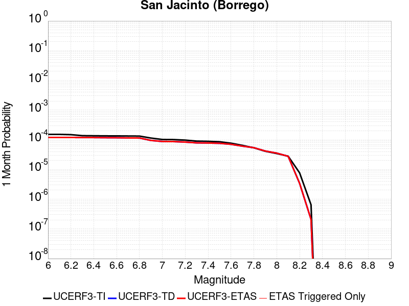 | 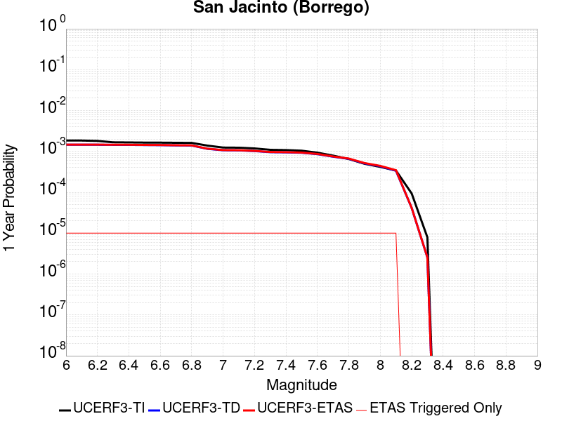 | 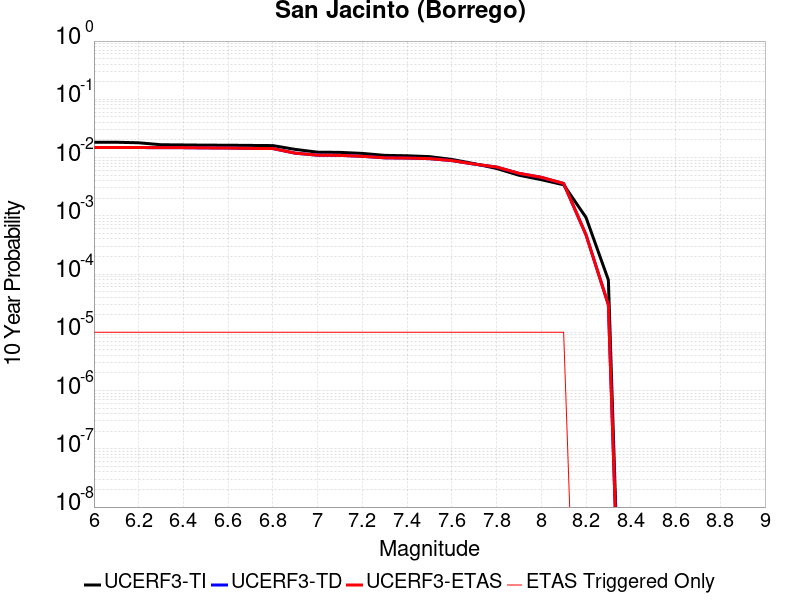 |

| Magnitude | 1 wk TI Prob | 1 wk TD Prob | 1 wk ETAS Prob | 1 wk ETAS/TD Gain | 1 wk ETAS Triggered Only | 1 mo TI Prob | 1 mo TD Prob | 1 mo ETAS Prob | 1 mo ETAS/TD Gain | 1 mo ETAS Triggered Only | 1 yr TI Prob | 1 yr TD Prob | 1 yr ETAS Prob | 1 yr ETAS/TD Gain | 1 yr ETAS Triggered Only | 10 yr TI Prob | 10 yr TD Prob | 10 yr ETAS Prob | 10 yr ETAS/TD Gain | 10 yr ETAS Triggered Only |
|-----|-----|-----|-----|-----|-----|-----|-----|-----|-----|-----|-----|-----|-----|-----|-----|-----|-----|-----|-----|-----|
| 6.0 | 3.543992E-5 | 2.7934115E-5 | 2.7934115E-5 | 1.0 | 0.0 | 1.5187653E-4 | 1.1971221E-4 | 1.1971221E-4 | 1.0 | 0.0 | 0.0018475284 | 0.001456534 | 0.0014665194 | 1.0068556 | 1.0E-5 | 0.018322436 | 0.014873597 | 0.014883447 | 1.0006623 | 1.0E-5 |
| 6.1 | 3.542281E-5 | 2.7934115E-5 | 2.7934115E-5 | 1.0 | 0.0 | 1.5180321E-4 | 1.1971221E-4 | 1.1971221E-4 | 1.0 | 0.0 | 0.0018466372 | 0.001456534 | 0.0014665194 | 1.0068556 | 1.0E-5 | 0.018313672 | 0.014873597 | 0.014883447 | 1.0006623 | 1.0E-5 |
| 6.2 | 3.4688688E-5 | 2.7934115E-5 | 2.7934115E-5 | 1.0 | 0.0 | 1.4865733E-4 | 1.1971221E-4 | 1.1971221E-4 | 1.0 | 0.0 | 0.0018084005 | 0.0014565339 | 0.0014665194 | 1.0068556 | 1.0E-5 | 0.017937548 | 0.014873596 | 0.014883447 | 1.0006623 | 1.0E-5 |
| 6.3 | 3.2087122E-5 | 2.7779462E-5 | 2.7779462E-5 | 1.0 | 0.0 | 1.3750899E-4 | 1.1904947E-4 | 1.1904947E-4 | 1.0 | 0.0 | 0.0016728862 | 0.0014484759 | 0.0014584614 | 1.0068938 | 1.0E-5 | 0.016603488 | 0.01479463 | 0.014804482 | 1.0006659 | 1.0E-5 |
| 6.4 | 3.1828724E-5 | 2.7746448E-5 | 2.7746448E-5 | 1.0 | 0.0 | 1.364017E-4 | 1.18908E-4 | 1.18908E-4 | 1.0 | 0.0 | 0.0016594254 | 0.0014467557 | 0.0014567412 | 1.006902 | 1.0E-5 | 0.016470885 | 0.014777708 | 0.01478756 | 1.0006667 | 1.0E-5 |
| 6.5 | 3.1563577E-5 | 2.7486154E-5 | 2.7486154E-5 | 1.0 | 0.0 | 1.3526545E-4 | 1.1779256E-4 | 1.1779256E-4 | 1.0 | 0.0 | 0.0016456128 | 0.0014331931 | 0.0014431787 | 1.0069674 | 1.0E-5 | 0.0163348 | 0.014644288 | 0.014654142 | 1.0006728 | 1.0E-5 |
| 6.6 | 3.1467625E-5 | 2.7330374E-5 | 2.7330374E-5 | 1.0 | 0.0 | 1.3485427E-4 | 1.1712498E-4 | 1.1712498E-4 | 1.0 | 0.0 | 0.0016406142 | 0.001425076 | 0.0014350618 | 1.0070071 | 1.0E-5 | 0.016285548 | 0.014564533 | 0.014574387 | 1.0006766 | 1.0E-5 |
| 6.7 | 3.1223695E-5 | 2.6948383E-5 | 2.6948383E-5 | 1.0 | 0.0 | 1.3380898E-4 | 1.1548802E-4 | 1.1548802E-4 | 1.0 | 0.0 | 0.0016279068 | 0.0014051719 | 0.0014151578 | 1.0071065 | 1.0E-5 | 0.01616033 | 0.014368899 | 0.014378755 | 1.0006859 | 1.0E-5 |
| 6.8 | 3.1015585E-5 | 2.6769376E-5 | 2.6769376E-5 | 1.0 | 0.0 | 1.3291716E-4 | 1.14720926E-4 | 1.14720926E-4 | 1.0 | 0.0 | 0.001617065 | 0.0013958444 | 0.0014058305 | 1.0071541 | 1.0E-5 | 0.016053487 | 0.014276173 | 0.01428603 | 1.0006905 | 1.0E-5 |
| 6.9 | 2.6641965E-5 | 2.2191349E-5 | 2.2191349E-5 | 1.0 | 0.0 | 1.1417485E-4 | 9.510233E-5 | 9.510233E-5 | 1.0 | 0.0 | 0.0013891924 | 0.0011572598 | 0.0011672482 | 1.0086311 | 1.0E-5 | 0.0138054015 | 0.011886145 | 0.011896026 | 1.0008314 | 1.0E-5 |
| 7.0 | 2.3854353E-5 | 2.048587E-5 | 2.048587E-5 | 1.0 | 0.0 | 1.02228936E-4 | 8.779365E-5 | 8.779365E-5 | 1.0 | 0.0 | 0.0012439266 | 0.0010683661 | 0.0010783554 | 1.0093501 | 1.0E-5 | 0.012369866 | 0.010986375 | 0.010996264 | 1.0009003 | 1.0E-5 |
| 7.1 | 2.3672901E-5 | 2.032235E-5 | 2.032235E-5 | 1.0 | 0.0 | 1.0145135E-4 | 8.709289E-5 | 8.709289E-5 | 1.0 | 0.0 | 0.0012344702 | 0.0010598428 | 0.0010698321 | 1.0094254 | 1.0E-5 | 0.0122763505 | 0.010901547 | 0.010911438 | 1.0009073 | 1.0E-5 |
| 7.2 | 2.2717244E-5 | 1.9549674E-5 | 1.9549674E-5 | 1.0 | 0.0 | 9.735599E-5 | 8.378164E-5 | 8.378164E-5 | 1.0 | 0.0 | 0.0011846646 | 0.0010195666 | 0.0010295563 | 1.009798 | 1.0E-5 | 0.01178369 | 0.010498884 | 0.010508779 | 1.0009425 | 1.0E-5 |
| 7.3 | 2.1016205E-5 | 1.8391213E-5 | 1.8391213E-5 | 1.0 | 0.0 | 9.006634E-5 | 7.881711E-5 | 7.881711E-5 | 1.0 | 0.0 | 0.001096006 | 9.5917797E-4 | 9.691684E-4 | 1.0104156 | 1.0E-5 | 0.010906163 | 0.009894462 | 0.009904363 | 1.0010006 | 1.0E-5 |
| 7.4 | 2.0683625E-5 | 1.8193714E-5 | 1.8193714E-5 | 1.0 | 0.0 | 8.86411E-5 | 7.797074E-5 | 7.797074E-5 | 1.0 | 0.0 | 0.001078671 | 9.488824E-4 | 9.588729E-4 | 1.0105287 | 1.0E-5 | 0.010734501 | 0.009791178 | 0.0098010795 | 1.0010114 | 1.0E-5 |
| 7.5 | 1.9993966E-5 | 1.7788683E-5 | 1.7788683E-5 | 1.0 | 0.0 | 8.568561E-5 | 7.6234996E-5 | 7.6234996E-5 | 1.0 | 0.0 | 0.001042723 | 9.2776783E-4 | 9.377586E-4 | 1.0107685 | 1.0E-5 | 0.010378438 | 0.00957807 | 0.009587974 | 1.001034 | 1.0E-5 |
| 7.6 | 1.788966E-5 | 1.6441732E-5 | 1.6441732E-5 | 1.0 | 0.0 | 7.666772E-5 | 7.046267E-5 | 7.046267E-5 | 1.0 | 0.0 | 9.3302975E-4 | 8.575471E-4 | 8.6753856E-4 | 1.0116512 | 1.0E-5 | 0.00929122 | 0.0088698575 | 0.008879769 | 1.0011175 | 1.0E-5 |
| 7.7 | 1.5125781E-5 | 1.4243621E-5 | 1.4243621E-5 | 1.0 | 0.0 | 6.4823165E-5 | 6.1042665E-5 | 6.1042665E-5 | 1.0 | 0.0 | 7.889362E-4 | 7.4294186E-4 | 7.5293443E-4 | 1.01345 | 1.0E-5 | 0.007861412 | 0.0077174758 | 0.0077273985 | 1.0012858 | 1.0E-5 |
| 7.8 | 1.250089E-5 | 1.2636515E-5 | 1.2636515E-5 | 1.0 | 0.0 | 5.3574146E-5 | 5.415537E-5 | 5.415537E-5 | 1.0 | 0.0 | 6.5207E-4 | 6.591428E-4 | 6.691362E-4 | 1.0151613 | 1.0E-5 | 0.006501599 | 0.00687092 | 0.006880851 | 1.0014454 | 1.0E-5 |
| 7.9 | 9.561E-6 | 9.759914E-6 | 9.759914E-6 | 1.0 | 0.0 | 4.0975072E-5 | 4.1827538E-5 | 4.1827538E-5 | 1.0 | 0.0 | 4.987573E-4 | 5.091318E-4 | 5.1912677E-4 | 1.0196313 | 1.0E-5 | 0.0049763937 | 0.0053551346 | 0.005365081 | 1.0018574 | 1.0E-5 |
| 8.0 | 8.01699E-6 | 8.2982915E-6 | 8.2982915E-6 | 1.0 | 0.0 | 3.4358076E-5 | 3.5563622E-5 | 3.5563622E-5 | 1.0 | 0.0 | 4.1822926E-4 | 4.329016E-4 | 4.428973E-4 | 1.0230899 | 1.0E-5 | 0.0041744304 | 0.0045759073 | 0.0045858617 | 1.0021753 | 1.0E-5 |
| 8.1 | 6.541947E-6 | 6.466171E-6 | 6.466171E-6 | 1.0 | 0.0 | 2.8036617E-5 | 2.7711869E-5 | 2.7711869E-5 | 1.0 | 0.0 | 3.4129233E-4 | 3.3734026E-4 | 3.473369E-4 | 1.0296336 | 1.0E-5 | 0.0034076865 | 0.0035827826 | 0.0035927468 | 1.0027812 | 1.0E-5 |
| 8.2 | 1.7968189E-6 | 7.978815E-7 | 7.978815E-7 | 1.0 | 0.0 | 7.70063E-6 | 3.419488E-6 | 3.419488E-6 | 1.0 | 0.0 | 9.3751136E-5 | 4.163149E-5 | 4.163149E-5 | 1.0 | 0.0 | 9.371159E-4 | 4.7162327E-4 | 4.7162327E-4 | 1.0 | 0.0 |
| 8.3 | 1.5167889E-7 | 4.9030522E-8 | 4.9030522E-8 | 1.0 | 0.0 | 6.500522E-7 | 2.1013079E-7 | 2.1013079E-7 | 1.0 | 0.0 | 7.9143565E-6 | 2.55834E-6 | 2.55834E-6 | 1.0 | 0.0 | 7.914075E-5 | 2.9725656E-5 | 2.9725656E-5 | 1.0 | 0.0 |

## Green Valley 2011 CFM
*[(top)](#table-of-contents)*

| 1 Week | 1 Month | 1 Year | 10 Year |
|-----|-----|-----|-----|
|  |  |  |  |

| Magnitude | 1 wk TI Prob | 1 wk TD Prob | 1 wk ETAS Prob | 1 wk ETAS/TD Gain | 1 wk ETAS Triggered Only | 1 mo TI Prob | 1 mo TD Prob | 1 mo ETAS Prob | 1 mo ETAS/TD Gain | 1 mo ETAS Triggered Only | 1 yr TI Prob | 1 yr TD Prob | 1 yr ETAS Prob | 1 yr ETAS/TD Gain | 1 yr ETAS Triggered Only | 10 yr TI Prob | 10 yr TD Prob | 10 yr ETAS Prob | 10 yr ETAS/TD Gain | 10 yr ETAS Triggered Only |
|-----|-----|-----|-----|-----|-----|-----|-----|-----|-----|-----|-----|-----|-----|-----|-----|-----|-----|-----|-----|-----|
| 6.0 | 9.9629346E-5 | 1.7306181E-4 | 1.7306181E-4 | 1.0 | 0.0 | 4.2691303E-4 | 7.414477E-4 | 7.414477E-4 | 1.0 | 0.0 | 0.0051852856 | 0.00898687 | 0.00899678 | 1.0011027 | 1.0E-5 | 0.050659515 | 0.085523866 | 0.08553301 | 1.0001069 | 1.0E-5 |
| 6.1 | 9.88615E-5 | 1.7153492E-4 | 1.7153492E-4 | 1.0 | 0.0 | 4.2362334E-4 | 7.349076E-4 | 7.349076E-4 | 1.0 | 0.0 | 0.0051454236 | 0.008907897 | 0.008917808 | 1.0011126 | 1.0E-5 | 0.050279044 | 0.08481148 | 0.08482063 | 1.0001079 | 1.0E-5 |
| 6.2 | 9.696895E-5 | 1.679252E-4 | 1.679252E-4 | 1.0 | 0.0 | 4.15515E-4 | 7.1944593E-4 | 7.1944593E-4 | 1.0 | 0.0 | 0.0050471667 | 0.008721275 | 0.008731188 | 1.0011367 | 1.0E-5 | 0.04934063 | 0.08312038 | 0.083129555 | 1.0001103 | 1.0E-5 |
| 6.3 | 9.275224E-5 | 1.5971852E-4 | 1.5971852E-4 | 1.0 | 0.0 | 3.9744904E-4 | 6.842931E-4 | 6.842931E-4 | 1.0 | 0.0 | 0.0048282105 | 0.008296597 | 0.008306514 | 1.0011953 | 1.0E-5 | 0.047246475 | 0.07925882 | 0.07926803 | 1.0001161 | 1.0E-5 |
| 6.4 | 8.391499E-5 | 1.4368363E-4 | 1.4368363E-4 | 1.0 | 0.0 | 3.595861E-4 | 6.156491E-4 | 6.156491E-4 | 1.0 | 0.0 | 0.004369175 | 0.007467232 | 0.0074771573 | 1.0013292 | 1.0E-5 | 0.04284265 | 0.07163251 | 0.071641795 | 1.0001296 | 1.0E-5 |
| 6.5 | 5.9519385E-5 | 9.9345336E-5 | 9.9345336E-5 | 1.0 | 0.0 | 2.5505814E-4 | 4.257004E-4 | 4.257004E-4 | 1.0 | 0.0 | 0.0031009112 | 0.0051684165 | 0.0051684165 | 1.0 | 0.0 | 0.030579966 | 0.050147217 | 0.050147217 | 1.0 | 0.0 |
| 6.6 | 4.5361558E-5 | 7.4029726E-5 | 7.4029726E-5 | 1.0 | 0.0 | 1.9439218E-4 | 3.1723455E-4 | 3.1723455E-4 | 1.0 | 0.0 | 0.0023641558 | 0.003854048 | 0.003854048 | 1.0 | 0.0 | 0.023391623 | 0.03766713 | 0.03766713 | 1.0 | 0.0 |
| 6.7 | 3.8808106E-5 | 6.265495E-5 | 6.265495E-5 | 1.0 | 0.0 | 1.6630985E-4 | 2.684962E-4 | 2.684962E-4 | 1.0 | 0.0 | 0.0020229418 | 0.003262755 | 0.003262755 | 1.0 | 0.0 | 0.020046256 | 0.03200691 | 0.03200691 | 1.0 | 0.0 |
| 6.8 | 2.2284667E-5 | 3.1285566E-5 | 3.1285566E-5 | 1.0 | 0.0 | 9.550222E-5 | 1.340742E-4 | 1.340742E-4 | 1.0 | 0.0 | 0.0011621192 | 0.001631124 | 0.001631124 | 1.0 | 0.0 | 0.011560607 | 0.016166156 | 0.016166156 | 1.0 | 0.0 |
| 6.9 | 1.8050168E-5 | 2.4448267E-5 | 2.4448267E-5 | 1.0 | 0.0 | 7.735557E-5 | 1.0477412E-4 | 1.0477412E-4 | 1.0 | 0.0 | 9.4139716E-4 | 0.001274882 | 0.001274882 | 1.0 | 0.0 | 0.009374191 | 0.01266794 | 0.01266794 | 1.0 | 0.0 |
| 7.0 | 1.4763166E-5 | 1.958302E-5 | 1.958302E-5 | 1.0 | 0.0 | 6.326917E-5 | 8.392455E-5 | 8.392455E-5 | 1.0 | 0.0 | 7.7002996E-4 | 0.0010213053 | 0.0010213053 | 1.0 | 0.0 | 0.007673672 | 0.010165428 | 0.010165428 | 1.0 | 0.0 |
| 7.1 | 1.2399713E-5 | 1.630385E-5 | 1.630385E-5 | 1.0 | 0.0 | 5.3140546E-5 | 6.987178E-5 | 6.987178E-5 | 1.0 | 0.0 | 6.467941E-4 | 8.5035886E-4 | 8.5035886E-4 | 1.0 | 0.0 | 0.006449148 | 0.008471329 | 0.008471329 | 1.0 | 0.0 |
| 7.2 | 1.0584195E-5 | 1.3921863E-5 | 1.3921863E-5 | 1.0 | 0.0 | 4.5360044E-5 | 5.9663773E-5 | 5.9663773E-5 | 1.0 | 0.0 | 5.521186E-4 | 7.2616595E-4 | 7.2616595E-4 | 1.0 | 0.0 | 0.0055074887 | 0.0072383475 | 0.0072383475 | 1.0 | 0.0 |
| 7.3 | 7.998173E-6 | 1.054412E-5 | 1.054412E-5 | 1.0 | 0.0 | 3.4277433E-5 | 4.5188313E-5 | 4.5188313E-5 | 1.0 | 0.0 | 4.1724785E-4 | 5.500299E-4 | 5.500299E-4 | 1.0 | 0.0 | 0.004164653 | 0.0054869517 | 0.0054869517 | 1.0 | 0.0 |
| 7.4 | 6.7571127E-6 | 8.932785E-6 | 8.932785E-6 | 1.0 | 0.0 | 2.8958733E-5 | 3.8282808E-5 | 3.8282808E-5 | 1.0 | 0.0 | 3.5251552E-4 | 4.6599447E-4 | 4.6599447E-4 | 1.0 | 0.0 | 0.0035195686 | 0.0046503763 | 0.0046503763 | 1.0 | 0.0 |
| 7.5 | 5.69878E-6 | 7.5163775E-6 | 7.5163775E-6 | 1.0 | 0.0 | 2.4423114E-5 | 3.2212654E-5 | 3.2212654E-5 | 1.0 | 0.0 | 2.9731085E-4 | 3.9211934E-4 | 3.9211934E-4 | 1.0 | 0.0 | 0.002969134 | 0.0039144265 | 0.0039144265 | 1.0 | 0.0 |
| 7.6 | 4.503664E-6 | 5.9357344E-6 | 5.9357344E-6 | 1.0 | 0.0 | 1.9301275E-5 | 2.5438618E-5 | 2.5438618E-5 | 1.0 | 0.0 | 2.3496768E-4 | 3.09672E-4 | 3.09672E-4 | 1.0 | 0.0 | 0.002347194 | 0.0030925297 | 0.0030925297 | 1.0 | 0.0 |
| 7.7 | 1.0873546E-6 | 1.4107108E-6 | 1.4107108E-6 | 1.0 | 0.0 | 4.6600826E-6 | 6.0458897E-6 | 6.0458897E-6 | 1.0 | 0.0 | 5.6735033E-5 | 7.360625E-5 | 7.360625E-5 | 1.0 | 0.0 | 5.672055E-4 | 7.3582074E-4 | 7.3582074E-4 | 1.0 | 0.0 |
| 7.8 | 4.9373917E-8 | 6.177787E-8 | 6.177787E-8 | 1.0 | 0.0 | 2.1160248E-7 | 2.6476226E-7 | 2.6476226E-7 | 1.0 | 0.0 | 2.5762572E-6 | 3.223477E-6 | 3.223477E-6 | 1.0 | 0.0 | 2.5762274E-5 | 3.223268E-5 | 3.223268E-5 | 1.0 | 0.0 |

## Big Pine (East)
*[(top)](#table-of-contents)*

| 1 Week | 1 Month | 1 Year | 10 Year |
|-----|-----|-----|-----|
|  |  | 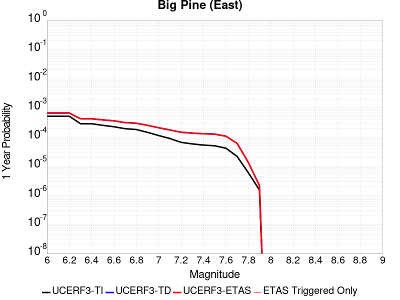 |  |

| Magnitude | 1 wk TI Prob | 1 wk TD Prob | 1 wk ETAS Prob | 1 wk ETAS/TD Gain | 1 wk ETAS Triggered Only | 1 mo TI Prob | 1 mo TD Prob | 1 mo ETAS Prob | 1 mo ETAS/TD Gain | 1 mo ETAS Triggered Only | 1 yr TI Prob | 1 yr TD Prob | 1 yr ETAS Prob | 1 yr ETAS/TD Gain | 1 yr ETAS Triggered Only | 10 yr TI Prob | 10 yr TD Prob | 10 yr ETAS Prob | 10 yr ETAS/TD Gain | 10 yr ETAS Triggered Only |
|-----|-----|-----|-----|-----|-----|-----|-----|-----|-----|-----|-----|-----|-----|-----|-----|-----|-----|-----|-----|-----|
| 6.0 | 9.916913E-6 | 1.2818231E-5 | 1.2818231E-5 | 1.0 | 0.0 | 4.250036E-5 | 5.4934244E-5 | 5.4934244E-5 | 1.0 | 0.0 | 5.173191E-4 | 6.686413E-4 | 6.686413E-4 | 1.0 | 0.0 | 0.0051611643 | 0.0066710766 | 0.00668101 | 1.001489 | 1.0E-5 |
| 6.1 | 9.916913E-6 | 1.2818231E-5 | 1.2818231E-5 | 1.0 | 0.0 | 4.250036E-5 | 5.4934244E-5 | 5.4934244E-5 | 1.0 | 0.0 | 5.173191E-4 | 6.686413E-4 | 6.686413E-4 | 1.0 | 0.0 | 0.0051611643 | 0.0066710766 | 0.00668101 | 1.001489 | 1.0E-5 |
| 6.2 | 9.916913E-6 | 1.2818231E-5 | 1.2818231E-5 | 1.0 | 0.0 | 4.250036E-5 | 5.4934244E-5 | 5.4934244E-5 | 1.0 | 0.0 | 5.173191E-4 | 6.686413E-4 | 6.686413E-4 | 1.0 | 0.0 | 0.0051611643 | 0.0066710766 | 0.00668101 | 1.001489 | 1.0E-5 |
| 6.3 | 5.479711E-6 | 8.114161E-6 | 8.114161E-6 | 1.0 | 0.0 | 2.3484265E-5 | 3.4774526E-5 | 3.4774526E-5 | 1.0 | 0.0 | 2.858834E-4 | 4.233008E-4 | 4.233008E-4 | 1.0 | 0.0 | 0.0028551589 | 0.0042278613 | 0.004237819 | 1.0023552 | 1.0E-5 |
| 6.4 | 5.465009E-6 | 8.098454E-6 | 8.098454E-6 | 1.0 | 0.0 | 2.3421257E-5 | 3.4707216E-5 | 3.4707216E-5 | 1.0 | 0.0 | 2.851165E-4 | 4.224816E-4 | 4.224816E-4 | 1.0 | 0.0 | 0.0028475097 | 0.0042197 | 0.004229658 | 1.0023599 | 1.0E-5 |
| 6.5 | 4.826767E-6 | 7.423505E-6 | 7.423505E-6 | 1.0 | 0.0 | 2.068598E-5 | 3.181465E-5 | 3.181465E-5 | 1.0 | 0.0 | 2.518227E-4 | 3.8727728E-4 | 3.8727728E-4 | 1.0 | 0.0 | 0.0025153751 | 0.003868898 | 0.0038788593 | 1.0025747 | 1.0E-5 |
| 6.6 | 4.3146847E-6 | 6.883437E-6 | 6.883437E-6 | 1.0 | 0.0 | 1.8491375E-5 | 2.9500125E-5 | 2.9500125E-5 | 1.0 | 0.0 | 2.2510924E-4 | 3.5910727E-4 | 3.5910727E-4 | 1.0 | 0.0 | 0.0022488134 | 0.0035881116 | 0.0035980758 | 1.002777 | 1.0E-5 |
| 6.7 | 3.6968106E-6 | 5.9966014E-6 | 5.9966014E-6 | 1.0 | 0.0 | 1.5843378E-5 | 2.5699477E-5 | 2.5699477E-5 | 1.0 | 0.0 | 1.9287605E-4 | 3.1284773E-4 | 3.1284773E-4 | 1.0 | 0.0 | 0.0019270873 | 0.003126825 | 0.003126825 | 1.0 | 0.0 |
| 6.8 | 3.4671132E-6 | 5.7032753E-6 | 5.7032753E-6 | 1.0 | 0.0 | 1.4858972E-5 | 2.4442388E-5 | 2.4442388E-5 | 1.0 | 0.0 | 1.8089297E-4 | 2.9754688E-4 | 2.9754688E-4 | 1.0 | 0.0 | 0.0018074579 | 0.002974228 | 0.002974228 | 1.0 | 0.0 |
| 6.9 | 2.7686972E-6 | 4.8262373E-6 | 4.8262373E-6 | 1.0 | 0.0 | 1.1865792E-5 | 2.0683714E-5 | 2.0683714E-5 | 1.0 | 0.0 | 1.4445644E-4 | 2.5179586E-4 | 2.5179586E-4 | 1.0 | 0.0 | 0.0014436257 | 0.002517781 | 0.002517781 | 1.0 | 0.0 |
| 7.0 | 2.1472624E-6 | 3.985962E-6 | 3.985962E-6 | 1.0 | 0.0 | 9.20252E-6 | 1.7082584E-5 | 1.7082584E-5 | 1.0 | 0.0 | 1.12034926E-4 | 2.0796116E-4 | 2.0796116E-4 | 1.0 | 0.0 | 0.0011197845 | 0.0020803085 | 0.0020803085 | 1.0 | 0.0 |
| 7.1 | 1.7018335E-6 | 3.3457143E-6 | 3.3457143E-6 | 1.0 | 0.0 | 7.293552E-6 | 1.4338699E-5 | 1.4338699E-5 | 1.0 | 0.0 | 8.879537E-5 | 1.7456003E-4 | 1.7456003E-4 | 1.0 | 0.0 | 8.87599E-4 | 0.0017468405 | 0.0017468405 | 1.0 | 0.0 |
| 7.2 | 1.25603E-6 | 2.795276E-6 | 2.795276E-6 | 1.0 | 0.0 | 5.3829745E-6 | 1.19797005E-5 | 1.19797005E-5 | 1.0 | 0.0 | 6.553574E-5 | 1.4584333E-4 | 1.4584333E-4 | 1.0 | 0.0 | 6.551642E-4 | 0.001460063 | 0.001460063 | 1.0 | 0.0 |
| 7.3 | 1.112297E-6 | 2.6110797E-6 | 2.6110797E-6 | 1.0 | 0.0 | 4.7669787E-6 | 1.11902955E-5 | 1.11902955E-5 | 1.0 | 0.0 | 5.803642E-5 | 1.3623355E-4 | 1.3623355E-4 | 1.0 | 0.0 | 5.802127E-4 | 0.0013639197 | 0.0013639197 | 1.0 | 0.0 |
| 7.4 | 1.0137181E-6 | 2.4842075E-6 | 2.4842075E-6 | 1.0 | 0.0 | 4.3444993E-6 | 1.0646561E-5 | 1.0646561E-5 | 1.0 | 0.0 | 5.2892992E-5 | 1.2961439E-4 | 1.2961439E-4 | 1.0 | 0.0 | 5.288041E-4 | 0.0012975911 | 0.0012975911 | 1.0 | 0.0 |
| 7.5 | 9.598608E-7 | 2.4078427E-6 | 2.4078427E-6 | 1.0 | 0.0 | 4.1136827E-6 | 1.0319286E-5 | 1.0319286E-5 | 1.0 | 0.0 | 5.0082934E-5 | 1.2563028E-4 | 1.2563028E-4 | 1.0 | 0.0 | 5.007165E-4 | 0.0012576039 | 0.0012576039 | 1.0 | 0.0 |
| 7.6 | 7.929459E-7 | 2.0454722E-6 | 2.0454722E-6 | 1.0 | 0.0 | 3.3983351E-6 | 8.766281E-6 | 8.766281E-6 | 1.0 | 0.0 | 4.1373947E-5 | 1.06724416E-4 | 1.06724416E-4 | 1.0 | 0.0 | 4.1366243E-4 | 0.0010688324 | 0.0010688324 | 1.0 | 0.0 |
| 7.7 | 4.155788E-7 | 1.1609936E-6 | 1.1609936E-6 | 1.0 | 0.0 | 1.7810507E-6 | 4.975678E-6 | 4.975678E-6 | 1.0 | 0.0 | 2.1684076E-5 | 6.0577237E-5 | 6.0577237E-5 | 1.0 | 0.0 | 2.1681961E-4 | 6.087925E-4 | 6.087925E-4 | 1.0 | 0.0 |
| 7.8 | 1.14666925E-7 | 2.5929913E-7 | 2.5929913E-7 | 1.0 | 0.0 | 4.914296E-7 | 1.1112816E-6 | 1.1112816E-6 | 1.0 | 0.0 | 5.9831386E-6 | 1.3529773E-5 | 1.3529773E-5 | 1.0 | 0.0 | 5.9829777E-5 | 1.3639126E-4 | 1.3639126E-4 | 1.0 | 0.0 |
| 7.9 | 2.9231824E-8 | 4.148024E-8 | 4.148024E-8 | 1.0 | 0.0 | 1.2527924E-7 | 1.7777246E-7 | 1.7777246E-7 | 1.0 | 0.0 | 1.5252737E-6 | 2.1643777E-6 | 2.1643777E-6 | 1.0 | 0.0 | 1.5252632E-5 | 2.1976275E-5 | 2.1976275E-5 | 1.0 | 0.0 |

## Elysian Park (Lower CFM)
*[(top)](#table-of-contents)*

| 1 Week | 1 Month | 1 Year | 10 Year |
|-----|-----|-----|-----|
|  |  |  |  |

| Magnitude | 1 wk TI Prob | 1 wk TD Prob | 1 wk ETAS Prob | 1 wk ETAS/TD Gain | 1 wk ETAS Triggered Only | 1 mo TI Prob | 1 mo TD Prob | 1 mo ETAS Prob | 1 mo ETAS/TD Gain | 1 mo ETAS Triggered Only | 1 yr TI Prob | 1 yr TD Prob | 1 yr ETAS Prob | 1 yr ETAS/TD Gain | 1 yr ETAS Triggered Only | 10 yr TI Prob | 10 yr TD Prob | 10 yr ETAS Prob | 10 yr ETAS/TD Gain | 10 yr ETAS Triggered Only |
|-----|-----|-----|-----|-----|-----|-----|-----|-----|-----|-----|-----|-----|-----|-----|-----|-----|-----|-----|-----|-----|
| 6.0 | 2.1766498E-6 | 2.1037984E-6 | 2.1037984E-6 | 1.0 | 0.0 | 9.328466E-6 | 9.016256E-6 | 9.016256E-6 | 1.0 | 0.0 | 1.1356815E-4 | 1.0976882E-4 | 1.1976773E-4 | 1.0910906 | 1.0E-5 | 0.0011351013 | 0.001097288 | 0.001107277 | 1.0091034 | 1.0E-5 |
| 6.1 | 2.1766498E-6 | 2.1037984E-6 | 2.1037984E-6 | 1.0 | 0.0 | 9.328466E-6 | 9.016256E-6 | 9.016256E-6 | 1.0 | 0.0 | 1.1356815E-4 | 1.0976882E-4 | 1.1976773E-4 | 1.0910906 | 1.0E-5 | 0.0011351013 | 0.001097288 | 0.001107277 | 1.0091034 | 1.0E-5 |
| 6.2 | 1.0031182E-6 | 9.1862864E-7 | 9.1862864E-7 | 1.0 | 0.0 | 4.299071E-6 | 3.9369743E-6 | 3.9369743E-6 | 1.0 | 0.0 | 5.2339932E-5 | 4.793171E-5 | 4.793171E-5 | 1.0 | 0.0 | 5.2327604E-4 | 4.792235E-4 | 4.792235E-4 | 1.0 | 0.0 |
| 6.3 | 1.0031182E-6 | 9.1862864E-7 | 9.1862864E-7 | 1.0 | 0.0 | 4.299071E-6 | 3.9369743E-6 | 3.9369743E-6 | 1.0 | 0.0 | 5.2339932E-5 | 4.793171E-5 | 4.793171E-5 | 1.0 | 0.0 | 5.2327604E-4 | 4.792235E-4 | 4.792235E-4 | 1.0 | 0.0 |
| 6.4 | 6.9606244E-7 | 6.092012E-7 | 6.092012E-7 | 1.0 | 0.0 | 2.9831212E-6 | 2.6108596E-6 | 2.6108596E-6 | 1.0 | 0.0 | 3.6318896E-5 | 3.1786756E-5 | 3.1786756E-5 | 1.0 | 0.0 | 3.6312963E-4 | 3.1782233E-4 | 3.1782233E-4 | 1.0 | 0.0 |
| 6.5 | 6.901879E-7 | 6.0326954E-7 | 6.0326954E-7 | 1.0 | 0.0 | 2.9579448E-6 | 2.5854383E-6 | 2.5854383E-6 | 1.0 | 0.0 | 3.6012385E-5 | 3.147726E-5 | 3.147726E-5 | 1.0 | 0.0 | 3.600655E-4 | 3.1472824E-4 | 3.1472824E-4 | 1.0 | 0.0 |
| 6.6 | 6.4198554E-7 | 5.546678E-7 | 5.546678E-7 | 1.0 | 0.0 | 2.7513638E-6 | 2.3771454E-6 | 2.3771454E-6 | 1.0 | 0.0 | 3.3497337E-5 | 2.8941362E-5 | 2.8941362E-5 | 1.0 | 0.0 | 3.349229E-4 | 2.8937607E-4 | 2.8937607E-4 | 1.0 | 0.0 |
| 6.7 | 6.138733E-7 | 5.2634846E-7 | 5.2634846E-7 | 1.0 | 0.0 | 2.6308828E-6 | 2.2557772E-6 | 2.2557772E-6 | 1.0 | 0.0 | 3.203053E-5 | 2.7463742E-5 | 2.7463742E-5 | 1.0 | 0.0 | 3.2025913E-4 | 2.746036E-4 | 2.746036E-4 | 1.0 | 0.0 |
| 6.8 | 5.84778E-7 | 5.003004E-7 | 5.003004E-7 | 1.0 | 0.0 | 2.506189E-6 | 2.1441429E-6 | 2.1441429E-6 | 1.0 | 0.0 | 3.0512423E-5 | 2.6104626E-5 | 2.6104626E-5 | 1.0 | 0.0 | 3.0508233E-4 | 2.6101572E-4 | 2.6101572E-4 | 1.0 | 0.0 |
| 6.9 | 5.322785E-7 | 4.5801403E-7 | 4.5801403E-7 | 1.0 | 0.0 | 2.2811914E-6 | 1.9629158E-6 | 1.9629158E-6 | 1.0 | 0.0 | 2.7773152E-5 | 2.3898237E-5 | 2.3898237E-5 | 1.0 | 0.0 | 2.7769682E-4 | 2.3895678E-4 | 2.3895678E-4 | 1.0 | 0.0 |
| 7.0 | 4.8147206E-7 | 4.1124733E-7 | 4.1124733E-7 | 1.0 | 0.0 | 2.06345E-6 | 1.7624873E-6 | 1.7624873E-6 | 1.0 | 0.0 | 2.5122214E-5 | 2.1458072E-5 | 2.1458072E-5 | 1.0 | 0.0 | 2.5119373E-4 | 2.1456009E-4 | 2.1456009E-4 | 1.0 | 0.0 |
| 7.1 | 4.1932955E-7 | 3.5456276E-7 | 3.5456276E-7 | 1.0 | 0.0 | 1.7971255E-6 | 1.5195537E-6 | 1.5195537E-6 | 1.0 | 0.0 | 2.1879783E-5 | 1.850041E-5 | 1.850041E-5 | 1.0 | 0.0 | 2.1877629E-4 | 1.8498875E-4 | 1.8498875E-4 | 1.0 | 0.0 |
| 7.2 | 3.426051E-7 | 2.7810796E-7 | 2.7810796E-7 | 1.0 | 0.0 | 1.4683067E-6 | 1.1918906E-6 | 1.1918906E-6 | 1.0 | 0.0 | 1.7876488E-5 | 1.4511173E-5 | 1.4511173E-5 | 1.0 | 0.0 | 1.787505E-4 | 1.4510227E-4 | 1.4510227E-4 | 1.0 | 0.0 |
| 7.3 | 2.7771645E-7 | 2.2096945E-7 | 2.2096945E-7 | 1.0 | 0.0 | 1.1902127E-6 | 9.470116E-7 | 9.470116E-7 | 1.0 | 0.0 | 1.4490744E-5 | 1.1529804E-5 | 1.1529804E-5 | 1.0 | 0.0 | 1.4489799E-4 | 1.1529209E-4 | 1.1529209E-4 | 1.0 | 0.0 |
| 7.4 | 2.2756493E-7 | 1.784018E-7 | 1.784018E-7 | 1.0 | 0.0 | 9.752779E-7 | 7.6457894E-7 | 7.6457894E-7 | 1.0 | 0.0 | 1.1873944E-5 | 9.308708E-6 | 9.308708E-6 | 1.0 | 0.0 | 1.18733085E-4 | 9.30832E-5 | 9.30832E-5 | 1.0 | 0.0 |
| 7.5 | 1.7874558E-7 | 1.354304E-7 | 1.354304E-7 | 1.0 | 0.0 | 7.660522E-7 | 5.804159E-7 | 5.804159E-7 | 1.0 | 0.0 | 9.326646E-6 | 7.06654E-6 | 7.06654E-6 | 1.0 | 0.0 | 9.326255E-5 | 7.066317E-5 | 7.066317E-5 | 1.0 | 0.0 |
| 7.6 | 1.3124549E-7 | 9.251099E-8 | 9.251099E-8 | 1.0 | 0.0 | 5.624805E-7 | 3.964756E-7 | 3.964756E-7 | 1.0 | 0.0 | 6.8481786E-6 | 4.82708E-6 | 4.82708E-6 | 1.0 | 0.0 | 6.8479676E-5 | 4.8269765E-5 | 4.8269765E-5 | 1.0 | 0.0 |
| 7.7 | 8.439993E-8 | 5.0902187E-8 | 5.0902187E-8 | 1.0 | 0.0 | 3.6171392E-7 | 2.1815221E-7 | 2.1815221E-7 | 1.0 | 0.0 | 4.403858E-6 | 2.656E-6 | 2.656E-6 | 1.0 | 0.0 | 4.4037708E-5 | 2.6559695E-5 | 2.6559695E-5 | 1.0 | 0.0 |
| 7.8 | 1.2591407E-8 | 7.2279613E-9 | 7.2279613E-9 | 1.0 | 0.0 | 5.3963173E-8 | 3.0976977E-8 | 3.0976977E-8 | 1.0 | 0.0 | 6.570014E-7 | 3.7714463E-7 | 3.7714463E-7 | 1.0 | 0.0 | 6.5699946E-6 | 3.77144E-6 | 3.77144E-6 | 1.0 | 0.0 |
| 7.9 | 2.8324232E-11 | 2.1406432E-11 | 2.1406432E-11 | 1.0 | 0.0 | 1.2138957E-10 | 9.17425E-11 | 9.17425E-11 | 1.0 | 0.0 | 1.4779177E-9 | 1.1169644E-9 | 1.1169644E-9 | 1.0 | 0.0 | 1.4779177E-8 | 1.1169644E-8 | 1.1169644E-8 | 1.0 | 0.0 |

## Rodgers Creek - Healdsburg 2011 CFM
*[(top)](#table-of-contents)*

| 1 Week | 1 Month | 1 Year | 10 Year |
|-----|-----|-----|-----|
|  |  |  | 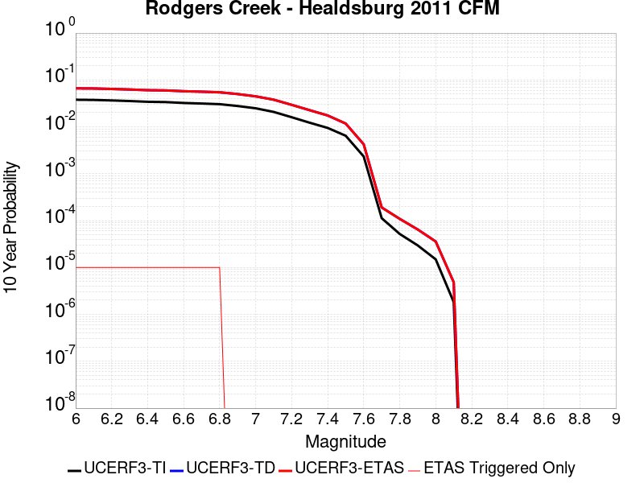 |

| Magnitude | 1 wk TI Prob | 1 wk TD Prob | 1 wk ETAS Prob | 1 wk ETAS/TD Gain | 1 wk ETAS Triggered Only | 1 mo TI Prob | 1 mo TD Prob | 1 mo ETAS Prob | 1 mo ETAS/TD Gain | 1 mo ETAS Triggered Only | 1 yr TI Prob | 1 yr TD Prob | 1 yr ETAS Prob | 1 yr ETAS/TD Gain | 1 yr ETAS Triggered Only | 10 yr TI Prob | 10 yr TD Prob | 10 yr ETAS Prob | 10 yr ETAS/TD Gain | 10 yr ETAS Triggered Only |
|-----|-----|-----|-----|-----|-----|-----|-----|-----|-----|-----|-----|-----|-----|-----|-----|-----|-----|-----|-----|-----|
| 6.0 | 7.390182E-5 | 1.3138485E-4 | 1.3138485E-4 | 1.0 | 0.0 | 3.1668364E-4 | 5.6295475E-4 | 5.6295475E-4 | 1.0 | 0.0 | 0.0038488081 | 0.006832442 | 0.006842374 | 1.0014536 | 1.0E-5 | 0.037828278 | 0.066200145 | 0.06620948 | 1.000141 | 1.0E-5 |
| 6.1 | 7.318768E-5 | 1.3036447E-4 | 1.3036447E-4 | 1.0 | 0.0 | 3.1362378E-4 | 5.585857E-4 | 5.585857E-4 | 1.0 | 0.0 | 0.0038116854 | 0.006779612 | 0.006789544 | 1.001465 | 1.0E-5 | 0.037469655 | 0.06570473 | 0.065714076 | 1.0001422 | 1.0E-5 |
| 6.2 | 7.1379836E-5 | 1.2729295E-4 | 1.2729295E-4 | 1.0 | 0.0 | 3.058777E-4 | 5.454276E-4 | 5.454276E-4 | 1.0 | 0.0 | 0.003717703 | 0.0066203945 | 0.0066303285 | 1.0015005 | 1.0E-5 | 0.0365612 | 0.06422292 | 0.064232275 | 1.0001457 | 1.0E-5 |
| 6.3 | 6.9255926E-5 | 1.238384E-4 | 1.238384E-4 | 1.0 | 0.0 | 2.9677735E-4 | 5.306285E-4 | 5.306285E-4 | 1.0 | 0.0 | 0.0036072785 | 0.006441296 | 0.006451232 | 1.0015424 | 1.0E-5 | 0.035492823 | 0.06254921 | 0.062558584 | 1.0001498 | 1.0E-5 |
| 6.4 | 6.6757144E-5 | 1.1960512E-4 | 1.1960512E-4 | 1.0 | 0.0 | 2.8607066E-4 | 5.1249313E-4 | 5.1249313E-4 | 1.0 | 0.0 | 0.0034773487 | 0.006221823 | 0.0062317606 | 1.0015973 | 1.0E-5 | 0.034234364 | 0.06049842 | 0.060507815 | 1.0001553 | 1.0E-5 |
| 6.5 | 6.5735134E-5 | 1.18095566E-4 | 1.18095566E-4 | 1.0 | 0.0 | 2.8169158E-4 | 5.060261E-4 | 5.060261E-4 | 1.0 | 0.0 | 0.003424202 | 0.006143551 | 0.0061534895 | 1.0016177 | 1.0E-5 | 0.03371918 | 0.059762176 | 0.059771575 | 1.0001574 | 1.0E-5 |
| 6.6 | 6.289601E-5 | 1.1344904E-4 | 1.1344904E-4 | 1.0 | 0.0 | 2.6952647E-4 | 4.8611994E-4 | 4.8611994E-4 | 1.0 | 0.0 | 0.0032765474 | 0.0059025297 | 0.0059124706 | 1.0016842 | 1.0E-5 | 0.032286562 | 0.057499647 | 0.057509072 | 1.0001639 | 1.0E-5 |
| 6.7 | 6.115274E-5 | 1.1061855E-4 | 1.1061855E-4 | 1.0 | 0.0 | 2.6205686E-4 | 4.7399374E-4 | 4.7399374E-4 | 1.0 | 0.0 | 0.0031858748 | 0.005755683 | 0.0057656253 | 1.0017275 | 1.0E-5 | 0.031405866 | 0.0561175 | 0.056126937 | 1.0001682 | 1.0E-5 |
| 6.8 | 5.9232367E-5 | 1.0729192E-4 | 1.0729192E-4 | 1.0 | 0.0 | 2.538283E-4 | 4.5974186E-4 | 4.5974186E-4 | 1.0 | 0.0 | 0.0030859804 | 0.0055830684 | 0.005593012 | 1.0017811 | 1.0E-5 | 0.030434765 | 0.05448421 | 0.054493666 | 1.0001736 | 1.0E-5 |
| 6.9 | 5.4030377E-5 | 9.823363E-5 | 9.823363E-5 | 1.0 | 0.0 | 2.315382E-4 | 4.2093368E-4 | 4.2093368E-4 | 1.0 | 0.0 | 0.0028153337 | 0.0051128906 | 0.0051128906 | 1.0 | 0.0 | 0.027799325 | 0.050019518 | 0.050019518 | 1.0 | 0.0 |
| 7.0 | 4.8260714E-5 | 8.741411E-5 | 8.741411E-5 | 1.0 | 0.0 | 2.0681522E-4 | 3.745784E-4 | 3.745784E-4 | 1.0 | 0.0 | 0.0025150678 | 0.00455101 | 0.00455101 | 1.0 | 0.0 | 0.024867928 | 0.044671893 | 0.044671893 | 1.0 | 0.0 |
| 7.1 | 4.0294493E-5 | 7.389889E-5 | 7.389889E-5 | 1.0 | 0.0 | 1.7267925E-4 | 3.1667127E-4 | 3.1667127E-4 | 1.0 | 0.0 | 0.0021003427 | 0.003848695 | 0.003848695 | 1.0 | 0.0 | 0.02080602 | 0.037927456 | 0.037927456 | 1.0 | 0.0 |
| 7.2 | 3.096388E-5 | 5.6985547E-5 | 5.6985547E-5 | 1.0 | 0.0 | 1.326956E-4 | 2.4420104E-4 | 2.4420104E-4 | 1.0 | 0.0 | 0.0016143717 | 0.002969116 | 0.002969116 | 1.0 | 0.0 | 0.01602694 | 0.029440882 | 0.029440882 | 1.0 | 0.0 |
| 7.3 | 2.3615226E-5 | 4.3635315E-5 | 4.3635315E-5 | 1.0 | 0.0 | 1.0120418E-4 | 1.8699517E-4 | 1.8699517E-4 | 1.0 | 0.0 | 0.0012314644 | 0.0022743028 | 0.0022743028 | 1.0 | 0.0 | 0.0122466255 | 0.022640556 | 0.022640556 | 1.0 | 0.0 |
| 7.4 | 1.8251132E-5 | 3.3547414E-5 | 3.3547414E-5 | 1.0 | 0.0 | 7.821679E-5 | 1.4376677E-4 | 1.4376677E-4 | 1.0 | 0.0 | 9.518733E-4 | 0.001748965 | 0.001748965 | 1.0 | 0.0 | 0.009478063 | 0.017468661 | 0.017468661 | 1.0 | 0.0 |
| 7.5 | 1.2411432E-5 | 2.2462924E-5 | 2.2462924E-5 | 1.0 | 0.0 | 5.3190768E-5 | 9.626616E-5 | 9.626616E-5 | 1.0 | 0.0 | 6.4740516E-4 | 0.001171416 | 0.001171416 | 1.0 | 0.0 | 0.006455223 | 0.01174471 | 0.01174471 | 1.0 | 0.0 |
| 7.6 | 4.4771446E-6 | 8.0851005E-6 | 8.0851005E-6 | 1.0 | 0.0 | 1.918762E-5 | 3.4649976E-5 | 3.4649976E-5 | 1.0 | 0.0 | 2.3358424E-4 | 4.21783E-4 | 4.21783E-4 | 1.0 | 0.0 | 0.0023333887 | 0.004246617 | 0.004246617 | 1.0 | 0.0 |
| 7.7 | 2.157941E-7 | 3.5361987E-7 | 3.5361987E-7 | 1.0 | 0.0 | 9.248315E-7 | 1.5155127E-6 | 1.5155127E-6 | 1.0 | 0.0 | 1.1259765E-5 | 1.8451212E-5 | 1.8451212E-5 | 1.0 | 0.0 | 1.1259195E-4 | 1.9075433E-4 | 1.9075433E-4 | 1.0 | 0.0 |
| 7.8 | 9.9623286E-8 | 1.990896E-7 | 1.990896E-7 | 1.0 | 0.0 | 4.269569E-7 | 8.532408E-7 | 8.532408E-7 | 1.0 | 0.0 | 5.1981874E-6 | 1.03881575E-5 | 1.03881575E-5 | 1.0 | 0.0 | 5.198066E-5 | 1.0906368E-4 | 1.0906368E-4 | 1.0 | 0.0 |
| 7.9 | 5.6745257E-8 | 1.1779674E-7 | 1.1779674E-7 | 1.0 | 0.0 | 2.4319394E-7 | 5.0484306E-7 | 5.0484306E-7 | 1.0 | 0.0 | 2.960882E-6 | 6.146447E-6 | 6.146447E-6 | 1.0 | 0.0 | 2.9608427E-5 | 6.4737185E-5 | 6.4737185E-5 | 1.0 | 0.0 |
| 8.0 | 2.8614323E-8 | 6.581546E-8 | 6.581546E-8 | 1.0 | 0.0 | 1.2263281E-7 | 2.8206622E-7 | 2.8206622E-7 | 1.0 | 0.0 | 1.4930534E-6 | 3.434151E-6 | 3.434151E-6 | 1.0 | 0.0 | 1.4930434E-5 | 3.584074E-5 | 3.584074E-5 | 1.0 | 0.0 |
| 8.1 | 3.5045191E-9 | 8.969694E-9 | 8.969694E-9 | 1.0 | 0.0 | 1.5019367E-8 | 3.844155E-8 | 3.844155E-8 | 1.0 | 0.0 | 1.8286079E-7 | 4.6802575E-7 | 4.6802575E-7 | 1.0 | 0.0 | 1.8286064E-6 | 4.834645E-6 | 4.834645E-6 | 1.0 | 0.0 |

## Hayward (So) extension 2011 CFM
*[(top)](#table-of-contents)*

| 1 Week | 1 Month | 1 Year | 10 Year |
|-----|-----|-----|-----|
|  |  |  |  |

| Magnitude | 1 wk TI Prob | 1 wk TD Prob | 1 wk ETAS Prob | 1 wk ETAS/TD Gain | 1 wk ETAS Triggered Only | 1 mo TI Prob | 1 mo TD Prob | 1 mo ETAS Prob | 1 mo ETAS/TD Gain | 1 mo ETAS Triggered Only | 1 yr TI Prob | 1 yr TD Prob | 1 yr ETAS Prob | 1 yr ETAS/TD Gain | 1 yr ETAS Triggered Only | 10 yr TI Prob | 10 yr TD Prob | 10 yr ETAS Prob | 10 yr ETAS/TD Gain | 10 yr ETAS Triggered Only |
|-----|-----|-----|-----|-----|-----|-----|-----|-----|-----|-----|-----|-----|-----|-----|-----|-----|-----|-----|-----|-----|
| 6.0 | 1.1721256E-4 | 2.363781E-4 | 2.363781E-4 | 1.0 | 0.0 | 5.022428E-4 | 0.0010123947 | 0.0010223845 | 1.0098675 | 1.0E-5 | 0.0060976758 | 0.012248728 | 0.012258606 | 1.0008065 | 1.0E-5 | 0.0593305 | 0.11284924 | 0.11285812 | 1.0000786 | 1.0E-5 |
| 6.1 | 6.99169E-5 | 1.3800772E-4 | 1.3800772E-4 | 1.0 | 0.0 | 2.9960944E-4 | 5.910222E-4 | 5.910222E-4 | 1.0 | 0.0 | 0.0036416445 | 0.0071723694 | 0.0071723694 | 1.0 | 0.0 | 0.035825435 | 0.067808375 | 0.067808375 | 1.0 | 0.0 |
| 6.2 | 6.99169E-5 | 1.3800772E-4 | 1.3800772E-4 | 1.0 | 0.0 | 2.9960944E-4 | 5.910222E-4 | 5.910222E-4 | 1.0 | 0.0 | 0.0036416445 | 0.0071723694 | 0.0071723694 | 1.0 | 0.0 | 0.035825435 | 0.067808375 | 0.067808375 | 1.0 | 0.0 |
| 6.3 | 6.970908E-5 | 1.3768923E-4 | 1.3768923E-4 | 1.0 | 0.0 | 2.9871898E-4 | 5.896579E-4 | 5.896579E-4 | 1.0 | 0.0 | 0.0036308395 | 0.0071559055 | 0.0071559055 | 1.0 | 0.0 | 0.035720866 | 0.06765734 | 0.06765734 | 1.0 | 0.0 |
| 6.4 | 6.9517155E-5 | 1.3735797E-4 | 1.3735797E-4 | 1.0 | 0.0 | 2.9789665E-4 | 5.882389E-4 | 5.882389E-4 | 1.0 | 0.0 | 0.0036208609 | 0.007138817 | 0.007138817 | 1.0 | 0.0 | 0.03562429 | 0.06750137 | 0.06750137 | 1.0 | 0.0 |
| 6.5 | 4.786248E-5 | 9.415959E-5 | 9.415959E-5 | 1.0 | 0.0 | 2.0510878E-4 | 4.0348133E-4 | 4.0348133E-4 | 1.0 | 0.0 | 0.0024943394 | 0.004901734 | 0.004901734 | 1.0 | 0.0 | 0.02466527 | 0.046906155 | 0.046906155 | 1.0 | 0.0 |
| 6.6 | 4.4662214E-5 | 8.882604E-5 | 8.882604E-5 | 1.0 | 0.0 | 1.9139545E-4 | 3.8063008E-4 | 3.8063008E-4 | 1.0 | 0.0 | 0.0023277493 | 0.004624787 | 0.004624787 | 1.0 | 0.0 | 0.02303517 | 0.044297572 | 0.044297572 | 1.0 | 0.0 |
| 6.7 | 3.884542E-5 | 7.865713E-5 | 7.865713E-5 | 1.0 | 0.0 | 1.6646975E-4 | 3.3706092E-4 | 3.3706092E-4 | 1.0 | 0.0 | 0.002024885 | 0.0040964396 | 0.0040964396 | 1.0 | 0.0 | 0.020065336 | 0.03933719 | 0.03933719 | 1.0 | 0.0 |
| 6.8 | 3.4221863E-5 | 6.856472E-5 | 6.856472E-5 | 1.0 | 0.0 | 1.4665688E-4 | 2.9381807E-4 | 2.9381807E-4 | 1.0 | 0.0 | 0.0017840851 | 0.0035717883 | 0.0035717883 | 1.0 | 0.0 | 0.017698295 | 0.034424704 | 0.034424704 | 1.0 | 0.0 |
| 6.9 | 1.6927712E-5 | 3.0066385E-5 | 3.0066385E-5 | 1.0 | 0.0 | 7.2545314E-5 | 1.2884989E-4 | 1.2884989E-4 | 1.0 | 0.0 | 8.828813E-4 | 0.0015676755 | 0.0015676755 | 1.0 | 0.0 | 0.008793819 | 0.015465583 | 0.015465583 | 1.0 | 0.0 |
| 7.0 | 1.2509653E-5 | 2.2467022E-5 | 2.2467022E-5 | 1.0 | 0.0 | 5.3611697E-5 | 9.628393E-5 | 9.628393E-5 | 1.0 | 0.0 | 6.525269E-4 | 0.0011716705 | 0.0011716705 | 1.0 | 0.0 | 0.0065061417 | 0.0115844635 | 0.0115844635 | 1.0 | 0.0 |
| 7.1 | 8.751583E-6 | 1.4929308E-5 | 1.4929308E-5 | 1.0 | 0.0 | 3.750624E-5 | 6.398121E-5 | 6.398121E-5 | 1.0 | 0.0 | 4.5654282E-4 | 7.786987E-4 | 7.786987E-4 | 1.0 | 0.0 | 0.0045560603 | 0.0077653006 | 0.0077653006 | 1.0 | 0.0 |
| 7.2 | 6.354379E-6 | 1.1502135E-5 | 1.1502135E-5 | 1.0 | 0.0 | 2.7232769E-5 | 4.9293958E-5 | 4.9293958E-5 | 1.0 | 0.0 | 3.3150852E-4 | 5.999935E-4 | 5.999935E-4 | 1.0 | 0.0 | 0.0033101442 | 0.0060020364 | 0.0060020364 | 1.0 | 0.0 |
| 7.3 | 4.645554E-6 | 8.821418E-6 | 8.821418E-6 | 1.0 | 0.0 | 1.9909365E-5 | 3.7805556E-5 | 3.7805556E-5 | 1.0 | 0.0 | 2.4236954E-4 | 4.6018933E-4 | 4.6018933E-4 | 1.0 | 0.0 | 0.0024210536 | 0.0046123224 | 0.0046123224 | 1.0 | 0.0 |
| 7.4 | 4.23437E-6 | 7.99567E-6 | 7.99567E-6 | 1.0 | 0.0 | 1.8147173E-5 | 3.4266726E-5 | 3.4266726E-5 | 1.0 | 0.0 | 2.2091944E-4 | 4.171214E-4 | 4.171214E-4 | 1.0 | 0.0 | 0.0022069993 | 0.004183535 | 0.004183535 | 1.0 | 0.0 |
| 7.5 | 2.2187417E-6 | 3.9527254E-6 | 3.9527254E-6 | 1.0 | 0.0 | 9.508858E-6 | 1.6940156E-5 | 1.6940156E-5 | 1.0 | 0.0 | 1.157642E-4 | 2.0622948E-4 | 2.0622948E-4 | 1.0 | 0.0 | 0.0011570391 | 0.0020737252 | 0.0020737252 | 1.0 | 0.0 |
| 7.6 | 2.7952495E-8 | 3.8797385E-8 | 3.8797385E-8 | 1.0 | 0.0 | 1.1979641E-7 | 1.6627449E-7 | 1.6627449E-7 | 1.0 | 0.0 | 1.4585203E-6 | 2.0243901E-6 | 2.0243901E-6 | 1.0 | 0.0 | 1.4585107E-5 | 2.0334499E-5 | 2.0334499E-5 | 1.0 | 0.0 |
| 7.7 | 1.7192724E-8 | 2.3447157E-8 | 2.3447157E-8 | 1.0 | 0.0 | 7.36831E-8 | 1.0048782E-7 | 1.0048782E-7 | 1.0 | 0.0 | 8.9709135E-7 | 1.2234385E-6 | 1.2234385E-6 | 1.0 | 0.0 | 8.970877E-6 | 1.2302498E-5 | 1.2302498E-5 | 1.0 | 0.0 |

## Elsinore (Temecula) rev
*[(top)](#table-of-contents)*

| 1 Week | 1 Month | 1 Year | 10 Year |
|-----|-----|-----|-----|
|  |  | 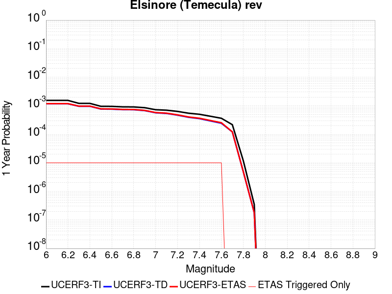 |  |

| Magnitude | 1 wk TI Prob | 1 wk TD Prob | 1 wk ETAS Prob | 1 wk ETAS/TD Gain | 1 wk ETAS Triggered Only | 1 mo TI Prob | 1 mo TD Prob | 1 mo ETAS Prob | 1 mo ETAS/TD Gain | 1 mo ETAS Triggered Only | 1 yr TI Prob | 1 yr TD Prob | 1 yr ETAS Prob | 1 yr ETAS/TD Gain | 1 yr ETAS Triggered Only | 10 yr TI Prob | 10 yr TD Prob | 10 yr ETAS Prob | 10 yr ETAS/TD Gain | 10 yr ETAS Triggered Only |
|-----|-----|-----|-----|-----|-----|-----|-----|-----|-----|-----|-----|-----|-----|-----|-----|-----|-----|-----|-----|-----|
| 6.0 | 2.9514995E-5 | 2.2518343E-5 | 2.2518343E-5 | 1.0 | 0.0 | 1.264867E-4 | 9.650374E-5 | 1.06502775E-4 | 1.1036129 | 1.0E-5 | 0.0015388876 | 0.001174322 | 0.0011843103 | 1.0085056 | 1.0E-5 | 0.015282745 | 0.011697536 | 0.0117074195 | 1.0008448 | 1.0E-5 |
| 6.1 | 2.9514995E-5 | 2.2518343E-5 | 2.2518343E-5 | 1.0 | 0.0 | 1.264867E-4 | 9.650374E-5 | 1.06502775E-4 | 1.1036129 | 1.0E-5 | 0.0015388876 | 0.001174322 | 0.0011843103 | 1.0085056 | 1.0E-5 | 0.015282745 | 0.011697536 | 0.0117074195 | 1.0008448 | 1.0E-5 |
| 6.2 | 2.9514995E-5 | 2.2518343E-5 | 2.2518343E-5 | 1.0 | 0.0 | 1.264867E-4 | 9.650374E-5 | 1.06502775E-4 | 1.1036129 | 1.0E-5 | 0.0015388876 | 0.001174322 | 0.0011843103 | 1.0085056 | 1.0E-5 | 0.015282745 | 0.011697536 | 0.0117074195 | 1.0008448 | 1.0E-5 |
| 6.3 | 2.3223649E-5 | 1.8407327E-5 | 1.8407327E-5 | 1.0 | 0.0 | 9.952613E-5 | 7.888625E-5 | 8.888546E-5 | 1.1267548 | 1.0E-5 | 0.001211057 | 9.6003426E-4 | 9.700246E-4 | 1.0104063 | 1.0E-5 | 0.012044783 | 0.009570387 | 0.009580291 | 1.0010349 | 1.0E-5 |
| 6.4 | 2.3223649E-5 | 1.8407327E-5 | 1.8407327E-5 | 1.0 | 0.0 | 9.952613E-5 | 7.888625E-5 | 8.888546E-5 | 1.1267548 | 1.0E-5 | 0.001211057 | 9.6003426E-4 | 9.700246E-4 | 1.0104063 | 1.0E-5 | 0.012044783 | 0.009570387 | 0.009580291 | 1.0010349 | 1.0E-5 |
| 6.5 | 1.8338875E-5 | 1.4750731E-5 | 1.4750731E-5 | 1.0 | 0.0 | 7.8592806E-5 | 6.3215935E-5 | 7.32153E-5 | 1.158178 | 1.0E-5 | 9.5644733E-4 | 7.6939096E-4 | 7.793833E-4 | 1.0129873 | 1.0E-5 | 0.009523412 | 0.007674229 | 0.007684152 | 1.0012931 | 1.0E-5 |
| 6.6 | 1.8223333E-5 | 1.46132825E-5 | 1.46132825E-5 | 1.0 | 0.0 | 7.809766E-5 | 6.26269E-5 | 7.262627E-5 | 1.1596658 | 1.0E-5 | 9.504242E-4 | 7.6222455E-4 | 7.7221694E-4 | 1.0131094 | 1.0E-5 | 0.009463696 | 0.0076030563 | 0.00761298 | 1.0013052 | 1.0E-5 |
| 6.7 | 1.7512752E-5 | 1.4027789E-5 | 1.4027789E-5 | 1.0 | 0.0 | 7.505249E-5 | 6.011776E-5 | 7.011716E-5 | 1.1663302 | 1.0E-5 | 9.13381E-4 | 7.316965E-4 | 7.416892E-4 | 1.0136569 | 1.0E-5 | 0.00909636 | 0.0072992197 | 0.0073091467 | 1.00136 | 1.0E-5 |
| 6.8 | 1.7417142E-5 | 1.3951771E-5 | 1.3951771E-5 | 1.0 | 0.0 | 7.4642754E-5 | 5.979198E-5 | 6.979138E-5 | 1.1672366 | 1.0E-5 | 9.083966E-4 | 7.277328E-4 | 7.377255E-4 | 1.0137314 | 1.0E-5 | 0.009046922 | 0.0072597866 | 0.007269714 | 1.0013674 | 1.0E-5 |
| 6.9 | 1.6402591E-5 | 1.2989167E-5 | 1.2989167E-5 | 1.0 | 0.0 | 7.0294926E-5 | 5.5666715E-5 | 6.566616E-5 | 1.1796305 | 1.0E-5 | 8.5550465E-4 | 6.7753915E-4 | 6.875324E-4 | 1.0147493 | 1.0E-5 | 0.008522186 | 0.006760456 | 0.006770388 | 1.0014691 | 1.0E-5 |
| 7.0 | 1.3912486E-5 | 1.0878723E-5 | 1.0878723E-5 | 1.0 | 0.0 | 5.9623577E-5 | 4.6622277E-5 | 5.662181E-5 | 1.2144797 | 1.0E-5 | 7.2567526E-4 | 5.674811E-4 | 5.7747547E-4 | 1.0176117 | 1.0E-5 | 0.0072331014 | 0.005664239 | 0.005674183 | 1.0017555 | 1.0E-5 |
| 7.1 | 1.3405147E-5 | 1.0327884E-5 | 1.0327884E-5 | 1.0 | 0.0 | 5.7449364E-5 | 4.4261626E-5 | 5.4261185E-5 | 1.2259194 | 1.0E-5 | 6.9922156E-4 | 5.387546E-4 | 5.4874923E-4 | 1.0185513 | 1.0E-5 | 0.0069702556 | 0.0053778174 | 0.0053877635 | 1.0018495 | 1.0E-5 |
| 7.2 | 1.21402E-5 | 8.99712E-6 | 8.99712E-6 | 1.0 | 0.0 | 5.202839E-5 | 3.8558526E-5 | 4.855814E-5 | 1.259336 | 1.0E-5 | 6.332616E-4 | 4.693507E-4 | 4.79346E-4 | 1.021296 | 1.0E-5 | 0.0063146 | 0.0046850196 | 0.0046949727 | 1.0021244 | 1.0E-5 |
| 7.3 | 1.05047775E-5 | 7.572085E-6 | 7.572085E-6 | 1.0 | 0.0 | 4.5019697E-5 | 3.2451397E-5 | 4.2451073E-5 | 1.3081431 | 1.0E-5 | 5.4797693E-4 | 3.950256E-4 | 4.0502162E-4 | 1.0253048 | 1.0E-5 | 0.005466277 | 0.0039436235 | 0.003953584 | 1.0025257 | 1.0E-5 |
| 7.4 | 9.624483E-6 | 6.7871442E-6 | 6.7871442E-6 | 1.0 | 0.0 | 4.124713E-5 | 2.9087445E-5 | 3.9087154E-5 | 1.3437809 | 1.0E-5 | 5.0206814E-4 | 3.540835E-4 | 3.6407996E-4 | 1.028232 | 1.0E-5 | 0.005009353 | 0.003535347 | 0.0035453117 | 1.0028186 | 1.0E-5 |
| 7.5 | 8.215151E-6 | 5.635765E-6 | 5.635765E-6 | 1.0 | 0.0 | 3.5207315E-5 | 2.4153062E-5 | 3.4152818E-5 | 1.4140162 | 1.0E-5 | 4.2856473E-4 | 2.940251E-4 | 3.0402216E-4 | 1.0340008 | 1.0E-5 | 0.004277392 | 0.002936489 | 0.0029464595 | 1.0033954 | 1.0E-5 |
| 7.6 | 6.975058E-6 | 4.6762393E-6 | 4.6762393E-6 | 1.0 | 0.0 | 2.9892764E-5 | 2.0040878E-5 | 3.0040677E-5 | 1.4989702 | 1.0E-5 | 3.6388362E-4 | 2.4397153E-4 | 2.539691E-4 | 1.0409784 | 1.0E-5 | 0.0036328835 | 0.0024371531 | 0.0024471288 | 1.0040932 | 1.0E-5 |
| 7.7 | 4.159604E-6 | 2.3271057E-6 | 2.3271057E-6 | 1.0 | 0.0 | 1.7826753E-5 | 9.973276E-6 | 9.973276E-6 | 1.0 | 0.0 | 2.1701909E-4 | 1.2141861E-4 | 1.2141861E-4 | 1.0 | 0.0 | 0.0021680726 | 0.0012135957 | 0.0012135957 | 1.0 | 0.0 |
| 7.8 | 2.2692414E-7 | 9.385943E-8 | 9.385943E-8 | 1.0 | 0.0 | 9.725317E-7 | 4.0225464E-7 | 4.0225464E-7 | 1.0 | 0.0 | 1.1840509E-5 | 4.8974425E-6 | 4.8974425E-6 | 1.0 | 0.0 | 1.1839878E-4 | 4.8973674E-5 | 4.8973674E-5 | 1.0 | 0.0 |
| 7.9 | 6.676829E-9 | 3.4399772E-9 | 3.4399772E-9 | 1.0 | 0.0 | 2.861498E-8 | 1.4742759E-8 | 1.4742759E-8 | 1.0 | 0.0 | 3.4838732E-7 | 1.7949307E-7 | 1.7949307E-7 | 1.0 | 0.0 | 3.4838679E-6 | 1.7949295E-6 | 1.7949295E-6 | 1.0 | 0.0 |

## Mount Diablo Thrust North CFM
*[(top)](#table-of-contents)*

| 1 Week | 1 Month | 1 Year | 10 Year |
|-----|-----|-----|-----|
| 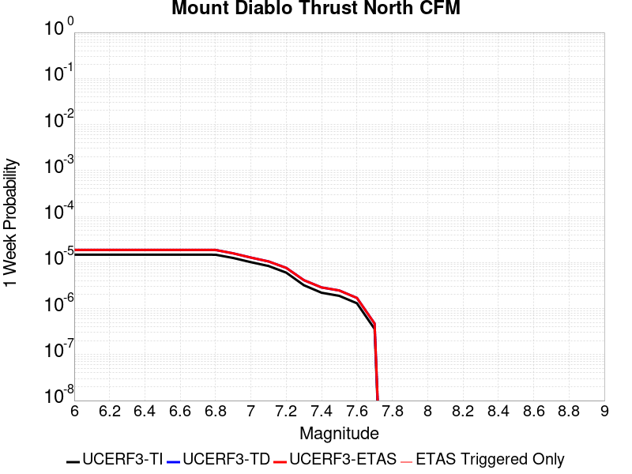 |  |  |  |

| Magnitude | 1 wk TI Prob | 1 wk TD Prob | 1 wk ETAS Prob | 1 wk ETAS/TD Gain | 1 wk ETAS Triggered Only | 1 mo TI Prob | 1 mo TD Prob | 1 mo ETAS Prob | 1 mo ETAS/TD Gain | 1 mo ETAS Triggered Only | 1 yr TI Prob | 1 yr TD Prob | 1 yr ETAS Prob | 1 yr ETAS/TD Gain | 1 yr ETAS Triggered Only | 10 yr TI Prob | 10 yr TD Prob | 10 yr ETAS Prob | 10 yr ETAS/TD Gain | 10 yr ETAS Triggered Only |
|-----|-----|-----|-----|-----|-----|-----|-----|-----|-----|-----|-----|-----|-----|-----|-----|-----|-----|-----|-----|-----|
| 6.0 | 1.479628E-5 | 1.8769935E-5 | 1.8769935E-5 | 1.0 | 0.0 | 6.341109E-5 | 8.044016E-5 | 8.044016E-5 | 1.0 | 0.0 | 7.717565E-4 | 9.789284E-4 | 9.889186E-4 | 1.0102053 | 1.0E-5 | 0.007690818 | 0.009747461 | 0.009757364 | 1.0010159 | 1.0E-5 |
| 6.1 | 1.479628E-5 | 1.8769935E-5 | 1.8769935E-5 | 1.0 | 0.0 | 6.341109E-5 | 8.044016E-5 | 8.044016E-5 | 1.0 | 0.0 | 7.717565E-4 | 9.789284E-4 | 9.889186E-4 | 1.0102053 | 1.0E-5 | 0.007690818 | 0.009747461 | 0.009757364 | 1.0010159 | 1.0E-5 |
| 6.2 | 1.479628E-5 | 1.8769935E-5 | 1.8769935E-5 | 1.0 | 0.0 | 6.341109E-5 | 8.044016E-5 | 8.044016E-5 | 1.0 | 0.0 | 7.717565E-4 | 9.789284E-4 | 9.889186E-4 | 1.0102053 | 1.0E-5 | 0.007690818 | 0.009747461 | 0.009757364 | 1.0010159 | 1.0E-5 |
| 6.3 | 1.479628E-5 | 1.8769935E-5 | 1.8769935E-5 | 1.0 | 0.0 | 6.341109E-5 | 8.044016E-5 | 8.044016E-5 | 1.0 | 0.0 | 7.717565E-4 | 9.789284E-4 | 9.889186E-4 | 1.0102053 | 1.0E-5 | 0.007690818 | 0.009747461 | 0.009757364 | 1.0010159 | 1.0E-5 |
| 6.4 | 1.479628E-5 | 1.8769935E-5 | 1.8769935E-5 | 1.0 | 0.0 | 6.341109E-5 | 8.044016E-5 | 8.044016E-5 | 1.0 | 0.0 | 7.717565E-4 | 9.789284E-4 | 9.889186E-4 | 1.0102053 | 1.0E-5 | 0.007690818 | 0.009747461 | 0.009757364 | 1.0010159 | 1.0E-5 |
| 6.5 | 1.479628E-5 | 1.8769935E-5 | 1.8769935E-5 | 1.0 | 0.0 | 6.341109E-5 | 8.044016E-5 | 8.044016E-5 | 1.0 | 0.0 | 7.717565E-4 | 9.789284E-4 | 9.889186E-4 | 1.0102053 | 1.0E-5 | 0.007690818 | 0.009747461 | 0.009757364 | 1.0010159 | 1.0E-5 |
| 6.6 | 1.479016E-5 | 1.8763047E-5 | 1.8763047E-5 | 1.0 | 0.0 | 6.338486E-5 | 8.041063E-5 | 8.041063E-5 | 1.0 | 0.0 | 7.714374E-4 | 9.785693E-4 | 9.885594E-4 | 1.010209 | 1.0E-5 | 0.007687649 | 0.009743902 | 0.009753805 | 1.0010163 | 1.0E-5 |
| 6.7 | 1.479016E-5 | 1.8763047E-5 | 1.8763047E-5 | 1.0 | 0.0 | 6.338486E-5 | 8.041063E-5 | 8.041063E-5 | 1.0 | 0.0 | 7.714374E-4 | 9.785693E-4 | 9.885594E-4 | 1.010209 | 1.0E-5 | 0.007687649 | 0.009743902 | 0.009753805 | 1.0010163 | 1.0E-5 |
| 6.8 | 1.4771667E-5 | 1.8741817E-5 | 1.8741817E-5 | 1.0 | 0.0 | 6.330561E-5 | 8.031965E-5 | 8.031965E-5 | 1.0 | 0.0 | 7.704732E-4 | 9.774626E-4 | 9.874528E-4 | 1.0102205 | 1.0E-5 | 0.007678074 | 0.009732932 | 0.009742835 | 1.0010175 | 1.0E-5 |
| 6.9 | 1.2548234E-5 | 1.5822196E-5 | 1.5822196E-5 | 1.0 | 0.0 | 5.3777036E-5 | 6.780767E-5 | 6.780767E-5 | 1.0 | 0.0 | 6.545387E-4 | 8.2524924E-4 | 8.35241E-4 | 1.0121075 | 1.0E-5 | 0.006526142 | 0.008222484 | 0.008232402 | 1.0012062 | 1.0E-5 |
| 7.0 | 1.01754185E-5 | 1.2809126E-5 | 1.2809126E-5 | 1.0 | 0.0 | 4.360821E-5 | 5.4895107E-5 | 5.4895107E-5 | 1.0 | 0.0 | 5.308006E-4 | 6.681446E-4 | 6.7813793E-4 | 1.0149568 | 1.0E-5 | 0.005295345 | 0.006661745 | 0.0066716783 | 1.0014911 | 1.0E-5 |
| 7.1 | 8.398341E-6 | 1.055483E-5 | 1.055483E-5 | 1.0 | 0.0 | 3.5992394E-5 | 4.5234206E-5 | 4.5234206E-5 | 1.0 | 0.0 | 4.3811928E-4 | 5.5058836E-4 | 5.6058285E-4 | 1.0181524 | 1.0E-5 | 0.0043725655 | 0.005492528 | 0.005502473 | 1.0018107 | 1.0E-5 |
| 7.2 | 6.024759E-6 | 7.648465E-6 | 7.648465E-6 | 1.0 | 0.0 | 2.582014E-5 | 3.2778727E-5 | 3.2778727E-5 | 1.0 | 0.0 | 3.1431485E-4 | 3.9900863E-4 | 4.0900463E-4 | 1.0250521 | 1.0E-5 | 0.0031387066 | 0.0039831307 | 0.0039930907 | 1.0025005 | 1.0E-5 |
| 7.3 | 3.2099704E-6 | 4.1356275E-6 | 4.1356275E-6 | 1.0 | 0.0 | 1.3756943E-5 | 1.7723998E-5 | 1.7723998E-5 | 1.0 | 0.0 | 1.674779E-4 | 2.1576848E-4 | 2.1576848E-4 | 1.0 | 0.0 | 0.0016735174 | 0.0021556902 | 0.0021556902 | 1.0 | 0.0 |
| 7.4 | 2.2041513E-6 | 2.873453E-6 | 2.873453E-6 | 1.0 | 0.0 | 9.4463285E-6 | 1.2314741E-5 | 1.2314741E-5 | 1.0 | 0.0 | 1.1500298E-4 | 1.4992173E-4 | 1.4992173E-4 | 1.0 | 0.0 | 0.0011494348 | 0.0014982726 | 0.0014982726 | 1.0 | 0.0 |
| 7.5 | 1.8869501E-6 | 2.4696647E-6 | 2.4696647E-6 | 1.0 | 0.0 | 8.086904E-6 | 1.0584234E-5 | 1.0584234E-5 | 1.0 | 0.0 | 9.845361E-5 | 1.288555E-4 | 1.288555E-4 | 1.0 | 0.0 | 9.841E-4 | 0.0012878645 | 0.0012878645 | 1.0 | 0.0 |
| 7.6 | 1.3012458E-6 | 1.7005086E-6 | 1.7005086E-6 | 1.0 | 0.0 | 5.576756E-6 | 7.287874E-6 | 7.287874E-6 | 1.0 | 0.0 | 6.7894885E-5 | 8.87263E-5 | 8.87263E-5 | 1.0 | 0.0 | 6.787415E-4 | 8.8694424E-4 | 8.8694424E-4 | 1.0 | 0.0 |
| 7.7 | 3.603383E-7 | 4.7164855E-7 | 4.7164855E-7 | 1.0 | 0.0 | 1.5443061E-6 | 2.0213495E-6 | 2.0213495E-6 | 1.0 | 0.0 | 1.8801764E-5 | 2.4609657E-5 | 2.4609657E-5 | 1.0 | 0.0 | 1.8800174E-4 | 2.460749E-4 | 2.460749E-4 | 1.0 | 0.0 |

## San Diego Trough south
*[(top)](#table-of-contents)*

| 1 Week | 1 Month | 1 Year | 10 Year |
|-----|-----|-----|-----|
|  |  |  |  |

| Magnitude | 1 wk TI Prob | 1 wk TD Prob | 1 wk ETAS Prob | 1 wk ETAS/TD Gain | 1 wk ETAS Triggered Only | 1 mo TI Prob | 1 mo TD Prob | 1 mo ETAS Prob | 1 mo ETAS/TD Gain | 1 mo ETAS Triggered Only | 1 yr TI Prob | 1 yr TD Prob | 1 yr ETAS Prob | 1 yr ETAS/TD Gain | 1 yr ETAS Triggered Only | 10 yr TI Prob | 10 yr TD Prob | 10 yr ETAS Prob | 10 yr ETAS/TD Gain | 10 yr ETAS Triggered Only |
|-----|-----|-----|-----|-----|-----|-----|-----|-----|-----|-----|-----|-----|-----|-----|-----|-----|-----|-----|-----|-----|
| 6.0 | 8.279495E-5 | 1.0424506E-4 | 1.0424506E-4 | 1.0 | 0.0 | 3.5478722E-4 | 4.4669298E-4 | 4.4669298E-4 | 1.0 | 0.0 | 0.004310982 | 0.005425812 | 0.0054357583 | 1.0018331 | 1.0E-5 | 0.042283054 | 0.052993916 | 0.053003386 | 1.0001787 | 1.0E-5 |
| 6.1 | 4.6961468E-5 | 5.7731268E-5 | 5.7731268E-5 | 1.0 | 0.0 | 2.0124791E-4 | 2.4739723E-4 | 2.4739723E-4 | 1.0 | 0.0 | 0.00244744 | 0.0030080716 | 0.0030180416 | 1.0033144 | 1.0E-5 | 0.024206603 | 0.029680338 | 0.02969004 | 1.0003269 | 1.0E-5 |
| 6.2 | 3.5079658E-5 | 4.2142692E-5 | 4.2142692E-5 | 1.0 | 0.0 | 1.5033272E-4 | 1.805993E-4 | 1.805993E-4 | 1.0 | 0.0 | 0.0018287642 | 0.002196623 | 0.002206601 | 1.0045425 | 1.0E-5 | 0.018137876 | 0.021751693 | 0.021761475 | 1.0004498 | 1.0E-5 |
| 6.3 | 3.5079658E-5 | 4.2142692E-5 | 4.2142692E-5 | 1.0 | 0.0 | 1.5033272E-4 | 1.805993E-4 | 1.805993E-4 | 1.0 | 0.0 | 0.0018287642 | 0.002196623 | 0.002206601 | 1.0045425 | 1.0E-5 | 0.018137876 | 0.021751693 | 0.021761475 | 1.0004498 | 1.0E-5 |
| 6.4 | 2.7196904E-5 | 3.2087937E-5 | 3.2087937E-5 | 1.0 | 0.0 | 1.16552954E-4 | 1.3751259E-4 | 1.3751259E-4 | 1.0 | 0.0 | 0.0014181085 | 0.0016729443 | 0.0016829276 | 1.0059675 | 1.0E-5 | 0.014090929 | 0.016605038 | 0.016614871 | 1.0005922 | 1.0E-5 |
| 6.5 | 2.5584688E-5 | 3.0102354E-5 | 3.0102354E-5 | 1.0 | 0.0 | 1.0964406E-4 | 1.2900379E-4 | 1.2900379E-4 | 1.0 | 0.0 | 0.0013340989 | 0.0015695024 | 0.0015794868 | 1.0063615 | 1.0E-5 | 0.013261181 | 0.015585679 | 0.015595523 | 1.0006316 | 1.0E-5 |
| 6.6 | 2.2034688E-5 | 2.5743318E-5 | 2.5743318E-5 | 1.0 | 0.0 | 9.443096E-5 | 1.1032389E-4 | 1.1032389E-4 | 1.0 | 0.0 | 0.0011490905 | 0.0013423724 | 0.0013423724 | 1.0 | 0.0 | 0.011431668 | 0.013343615 | 0.013343615 | 1.0 | 0.0 |
| 6.7 | 1.9394853E-5 | 2.2542248E-5 | 2.2542248E-5 | 1.0 | 0.0 | 8.311815E-5 | 9.660609E-5 | 9.660609E-5 | 1.0 | 0.0 | 0.0010114936 | 0.0011755497 | 0.0011755497 | 1.0 | 0.0 | 0.01006902 | 0.011694018 | 0.011694018 | 1.0 | 0.0 |
| 6.8 | 1.7615313E-5 | 2.0403613E-5 | 2.0403613E-5 | 1.0 | 0.0 | 7.549201E-5 | 8.744115E-5 | 8.744115E-5 | 1.0 | 0.0 | 9.1872766E-4 | 0.0010640804 | 0.0010640804 | 1.0 | 0.0 | 0.009149387 | 0.01059042 | 0.01059042 | 1.0 | 0.0 |
| 6.9 | 1.5621423E-5 | 1.8026485E-5 | 1.8026485E-5 | 1.0 | 0.0 | 6.6947236E-5 | 7.7254095E-5 | 7.7254095E-5 | 1.0 | 0.0 | 8.147778E-4 | 9.4016624E-4 | 9.4016624E-4 | 1.0 | 0.0 | 0.008117969 | 0.0093623325 | 0.0093623325 | 1.0 | 0.0 |
| 7.0 | 1.3444376E-5 | 1.5448395E-5 | 1.5448395E-5 | 1.0 | 0.0 | 5.7617483E-5 | 6.620574E-5 | 6.620574E-5 | 1.0 | 0.0 | 7.0126704E-4 | 8.057596E-4 | 8.057596E-4 | 1.0 | 0.0 | 0.006990582 | 0.008028714 | 0.008028714 | 1.0 | 0.0 |
| 7.1 | 1.2268361E-5 | 1.40733055E-5 | 1.40733055E-5 | 1.0 | 0.0 | 5.2577634E-5 | 6.031279E-5 | 6.031279E-5 | 1.0 | 0.0 | 6.399447E-4 | 7.3406345E-4 | 7.3406345E-4 | 1.0 | 0.0 | 0.0063810493 | 0.007316692 | 0.007316692 | 1.0 | 0.0 |
| 7.2 | 1.0922655E-5 | 1.2513806E-5 | 1.2513806E-5 | 1.0 | 0.0 | 4.681054E-5 | 5.362951E-5 | 5.362951E-5 | 1.0 | 0.0 | 5.697693E-4 | 6.527462E-4 | 6.527462E-4 | 1.0 | 0.0 | 0.0056831064 | 0.0065085697 | 0.0065085697 | 1.0 | 0.0 |
| 7.3 | 6.1106753E-6 | 6.9290486E-6 | 6.9290486E-6 | 1.0 | 0.0 | 2.6188345E-5 | 2.9695586E-5 | 2.9695586E-5 | 1.0 | 0.0 | 3.1879646E-4 | 3.6148418E-4 | 3.6148418E-4 | 1.0 | 0.0 | 0.0031833951 | 0.0036090072 | 0.0036090072 | 1.0 | 0.0 |
| 7.4 | 4.933187E-6 | 5.5896517E-6 | 5.5896517E-6 | 1.0 | 0.0 | 2.114206E-5 | 2.3955432E-5 | 2.3955432E-5 | 1.0 | 0.0 | 2.5737417E-4 | 2.9161875E-4 | 2.9161875E-4 | 1.0 | 0.0 | 0.002570763 | 0.002912402 | 0.002912402 | 1.0 | 0.0 |
| 7.5 | 1.7489613E-6 | 1.9697113E-6 | 1.9697113E-6 | 1.0 | 0.0 | 7.495527E-6 | 8.441594E-6 | 8.441594E-6 | 1.0 | 0.0 | 9.125422E-5 | 1.0277178E-4 | 1.0277178E-4 | 1.0 | 0.0 | 9.1216754E-4 | 0.0010272645 | 0.0010272645 | 1.0 | 0.0 |
| 7.6 | 1.6988751E-7 | 1.7533898E-7 | 1.7533898E-7 | 1.0 | 0.0 | 7.2808916E-7 | 7.5145255E-7 | 7.5145255E-7 | 1.0 | 0.0 | 8.864449E-6 | 9.148898E-6 | 9.148898E-6 | 1.0 | 0.0 | 8.8640954E-5 | 9.148542E-5 | 9.148542E-5 | 1.0 | 0.0 |

## San Andreas (North Coast) 2011 CFM
*[(top)](#table-of-contents)*

| 1 Week | 1 Month | 1 Year | 10 Year |
|-----|-----|-----|-----|
|  |  |  |  |

| Magnitude | 1 wk TI Prob | 1 wk TD Prob | 1 wk ETAS Prob | 1 wk ETAS/TD Gain | 1 wk ETAS Triggered Only | 1 mo TI Prob | 1 mo TD Prob | 1 mo ETAS Prob | 1 mo ETAS/TD Gain | 1 mo ETAS Triggered Only | 1 yr TI Prob | 1 yr TD Prob | 1 yr ETAS Prob | 1 yr ETAS/TD Gain | 1 yr ETAS Triggered Only | 10 yr TI Prob | 10 yr TD Prob | 10 yr ETAS Prob | 10 yr ETAS/TD Gain | 10 yr ETAS Triggered Only |
|-----|-----|-----|-----|-----|-----|-----|-----|-----|-----|-----|-----|-----|-----|-----|-----|-----|-----|-----|-----|-----|
| 6.0 | 1.5333705E-4 | 7.1141556E-5 | 7.1141556E-5 | 1.0 | 0.0 | 6.5699324E-4 | 3.0485695E-4 | 3.0485695E-4 | 1.0 | 0.0 | 0.007969595 | 0.0037053502 | 0.0037053502 | 1.0 | 0.0 | 0.0768977 | 0.03937111 | 0.039380718 | 1.000244 | 1.0E-5 |
| 6.1 | 1.5333705E-4 | 7.1141556E-5 | 7.1141556E-5 | 1.0 | 0.0 | 6.5699324E-4 | 3.0485695E-4 | 3.0485695E-4 | 1.0 | 0.0 | 0.007969595 | 0.0037053502 | 0.0037053502 | 1.0 | 0.0 | 0.0768977 | 0.03937111 | 0.039380718 | 1.000244 | 1.0E-5 |
| 6.2 | 1.3912938E-4 | 6.0533035E-5 | 6.0533035E-5 | 1.0 | 0.0 | 5.961325E-4 | 2.5940166E-4 | 2.5940166E-4 | 1.0 | 0.0 | 0.007233787 | 0.0031536683 | 0.0031536683 | 1.0 | 0.0 | 0.07002798 | 0.03370866 | 0.033718325 | 1.0002867 | 1.0E-5 |
| 6.3 | 1.3912938E-4 | 6.0533035E-5 | 6.0533035E-5 | 1.0 | 0.0 | 5.961325E-4 | 2.5940166E-4 | 2.5940166E-4 | 1.0 | 0.0 | 0.007233787 | 0.0031536683 | 0.0031536683 | 1.0 | 0.0 | 0.07002798 | 0.03370866 | 0.033718325 | 1.0002867 | 1.0E-5 |
| 6.4 | 1.2623647E-4 | 5.0469214E-5 | 5.0469214E-5 | 1.0 | 0.0 | 5.4090127E-4 | 2.162788E-4 | 2.162788E-4 | 1.0 | 0.0 | 0.0065656058 | 0.0026300347 | 0.0026300347 | 1.0 | 0.0 | 0.06374981 | 0.02831788 | 0.028327597 | 1.0003431 | 1.0E-5 |
| 6.5 | 1.1736096E-4 | 4.3548378E-5 | 4.3548378E-5 | 1.0 | 0.0 | 5.028786E-4 | 1.8662264E-4 | 1.8662264E-4 | 1.0 | 0.0 | 0.006105373 | 0.0022697793 | 0.0022697793 | 1.0 | 0.0 | 0.05940335 | 0.024592753 | 0.024602508 | 1.0003966 | 1.0E-5 |
| 6.6 | 1.1586959E-4 | 4.244781E-5 | 4.244781E-5 | 1.0 | 0.0 | 4.964894E-4 | 1.8190658E-4 | 1.8190658E-4 | 1.0 | 0.0 | 0.006028018 | 0.0022124792 | 0.0022124792 | 1.0 | 0.0 | 0.058671024 | 0.023998221 | 0.024007982 | 1.0004067 | 1.0E-5 |
| 6.7 | 1.13693764E-4 | 4.075945E-5 | 4.075945E-5 | 1.0 | 0.0 | 4.87168E-4 | 1.7467175E-4 | 1.7467175E-4 | 1.0 | 0.0 | 0.005915152 | 0.0021245703 | 0.0021245703 | 1.0 | 0.0 | 0.057601593 | 0.023089329 | 0.023089329 | 1.0 | 0.0 |
| 6.8 | 1.1204889E-4 | 3.9976534E-5 | 3.9976534E-5 | 1.0 | 0.0 | 4.8012115E-4 | 1.7131683E-4 | 1.7131683E-4 | 1.0 | 0.0 | 0.005829819 | 0.002083803 | 0.002083803 | 1.0 | 0.0 | 0.05679232 | 0.022649366 | 0.022649366 | 1.0 | 0.0 |
| 6.9 | 1.1005794E-4 | 3.903209E-5 | 3.903209E-5 | 1.0 | 0.0 | 4.7159163E-4 | 1.6726975E-4 | 1.6726975E-4 | 1.0 | 0.0 | 0.0057265228 | 0.002034623 | 0.002034623 | 1.0 | 0.0 | 0.055811852 | 0.02211497 | 0.02211497 | 1.0 | 0.0 |
| 7.0 | 1.0647948E-4 | 3.7187776E-5 | 3.7187776E-5 | 1.0 | 0.0 | 4.562608E-4 | 1.5936654E-4 | 1.5936654E-4 | 1.0 | 0.0 | 0.0055408357 | 0.0019385765 | 0.0019385765 | 1.0 | 0.0 | 0.054047033 | 0.021074155 | 0.021074155 | 1.0 | 0.0 |
| 7.1 | 1.04795035E-4 | 3.6236856E-5 | 3.6236856E-5 | 1.0 | 0.0 | 4.4904428E-4 | 1.5529165E-4 | 1.5529165E-4 | 1.0 | 0.0 | 0.0054534175 | 0.0018890519 | 0.0018890519 | 1.0 | 0.0 | 0.053215165 | 0.020541927 | 0.020541927 | 1.0 | 0.0 |
| 7.2 | 1.02724036E-4 | 3.514485E-5 | 3.514485E-5 | 1.0 | 0.0 | 4.401716E-4 | 1.5061218E-4 | 1.5061218E-4 | 1.0 | 0.0 | 0.0053459285 | 0.0018321763 | 0.0018321763 | 1.0 | 0.0 | 0.052191395 | 0.019930558 | 0.019930558 | 1.0 | 0.0 |
| 7.3 | 1.00650694E-4 | 3.4611825E-5 | 3.4611825E-5 | 1.0 | 0.0 | 4.312888E-4 | 1.4832805E-4 | 1.4832805E-4 | 1.0 | 0.0 | 0.005238306 | 0.0018044134 | 0.0018044134 | 1.0 | 0.0 | 0.051165357 | 0.019607486 | 0.019607486 | 1.0 | 0.0 |
| 7.4 | 9.672919E-5 | 3.3400014E-5 | 3.3400014E-5 | 1.0 | 0.0 | 4.144878E-4 | 1.4313516E-4 | 1.4313516E-4 | 1.0 | 0.0 | 0.005034718 | 0.0017412928 | 0.0017412928 | 1.0 | 0.0 | 0.049221683 | 0.018880244 | 0.018880244 | 1.0 | 0.0 |
| 7.5 | 8.7600405E-5 | 2.2716442E-5 | 2.2716442E-5 | 1.0 | 0.0 | 3.753763E-4 | 9.735256E-5 | 9.735256E-5 | 1.0 | 0.0 | 0.0045606326 | 0.0011846247 | 0.0011846247 | 1.0 | 0.0 | 0.04468165 | 0.013139147 | 0.013139147 | 1.0 | 0.0 |
| 7.6 | 7.9562284E-5 | 1.924054E-5 | 1.924054E-5 | 1.0 | 0.0 | 3.4093665E-4 | 8.2456856E-5 | 8.2456856E-5 | 1.0 | 0.0 | 0.0041430052 | 0.0010034514 | 0.0010034514 | 1.0 | 0.0 | 0.040666126 | 0.011229912 | 0.011229912 | 1.0 | 0.0 |
| 7.7 | 6.3866544E-5 | 1.1952783E-5 | 1.1952783E-5 | 1.0 | 0.0 | 2.7368503E-4 | 5.1225208E-5 | 5.1225208E-5 | 1.0 | 0.0 | 0.0033270244 | 6.2348874E-4 | 6.2348874E-4 | 1.0 | 0.0 | 0.032776527 | 0.007216897 | 0.007216897 | 1.0 | 0.0 |
| 7.8 | 4.2543215E-5 | 9.0854555E-6 | 9.0854555E-6 | 1.0 | 0.0 | 1.8231533E-4 | 3.8937087E-5 | 3.8937087E-5 | 1.0 | 0.0 | 0.0022174292 | 4.73956E-4 | 4.73956E-4 | 1.0 | 0.0 | 0.021954332 | 0.0054957564 | 0.0054957564 | 1.0 | 0.0 |
| 7.9 | 2.2636612E-5 | 7.821691E-6 | 7.821691E-6 | 1.0 | 0.0 | 9.7010445E-5 | 3.35211E-5 | 3.35211E-5 | 1.0 | 0.0 | 0.0011804621 | 4.080431E-4 | 4.080431E-4 | 1.0 | 0.0 | 0.011742111 | 0.004687419 | 0.004687419 | 1.0 | 0.0 |
| 8.0 | 1.5167874E-5 | 7.056108E-6 | 7.056108E-6 | 1.0 | 0.0 | 6.500356E-5 | 3.0240113E-5 | 3.0240113E-5 | 1.0 | 0.0 | 7.9113094E-4 | 3.6811127E-4 | 3.6811127E-4 | 1.0 | 0.0 | 0.007883203 | 0.0042192712 | 0.0042192712 | 1.0 | 0.0 |
| 8.1 | 1.0681047E-5 | 6.393015E-6 | 6.393015E-6 | 1.0 | 0.0 | 4.5775112E-5 | 2.739835E-5 | 2.739835E-5 | 1.0 | 0.0 | 5.5716943E-4 | 3.3352393E-4 | 3.3352393E-4 | 1.0 | 0.0 | 0.0055577457 | 0.0038207078 | 0.0038207078 | 1.0 | 0.0 |
| 8.2 | 8.226114E-6 | 5.1197717E-6 | 5.1197717E-6 | 1.0 | 0.0 | 3.52543E-5 | 2.1941696E-5 | 2.1941696E-5 | 1.0 | 0.0 | 4.2913653E-4 | 2.6710748E-4 | 2.6710748E-4 | 1.0 | 0.0 | 0.004283088 | 0.0030476742 | 0.0030476742 | 1.0 | 0.0 |
| 8.3 | 1.983087E-6 | 7.668296E-7 | 7.668296E-7 | 1.0 | 0.0 | 8.498917E-6 | 3.2864084E-6 | 3.2864084E-6 | 1.0 | 0.0 | 1.034694E-4 | 4.0011306E-5 | 4.0011306E-5 | 1.0 | 0.0 | 0.0010342124 | 4.724499E-4 | 4.724499E-4 | 1.0 | 0.0 |

## Morales (East)
*[(top)](#table-of-contents)*

| 1 Week | 1 Month | 1 Year | 10 Year |
|-----|-----|-----|-----|
|  |  |  |  |

| Magnitude | 1 wk TI Prob | 1 wk TD Prob | 1 wk ETAS Prob | 1 wk ETAS/TD Gain | 1 wk ETAS Triggered Only | 1 mo TI Prob | 1 mo TD Prob | 1 mo ETAS Prob | 1 mo ETAS/TD Gain | 1 mo ETAS Triggered Only | 1 yr TI Prob | 1 yr TD Prob | 1 yr ETAS Prob | 1 yr ETAS/TD Gain | 1 yr ETAS Triggered Only | 10 yr TI Prob | 10 yr TD Prob | 10 yr ETAS Prob | 10 yr ETAS/TD Gain | 10 yr ETAS Triggered Only |
|-----|-----|-----|-----|-----|-----|-----|-----|-----|-----|-----|-----|-----|-----|-----|-----|-----|-----|-----|-----|-----|
| 6.0 | 1.4942771E-6 | 2.1238216E-6 | 2.1238216E-6 | 1.0 | 0.0 | 6.404029E-6 | 9.102064E-6 | 9.102064E-6 | 1.0 | 0.0 | 7.7966266E-5 | 1.1081258E-4 | 1.1081258E-4 | 1.0 | 0.0 | 7.793892E-4 | 0.001107633 | 0.0011176219 | 1.0090183 | 1.0E-5 |
| 6.1 | 1.4942771E-6 | 2.1238216E-6 | 2.1238216E-6 | 1.0 | 0.0 | 6.404029E-6 | 9.102064E-6 | 9.102064E-6 | 1.0 | 0.0 | 7.7966266E-5 | 1.1081258E-4 | 1.1081258E-4 | 1.0 | 0.0 | 7.793892E-4 | 0.001107633 | 0.0011176219 | 1.0090183 | 1.0E-5 |
| 6.2 | 1.4942771E-6 | 2.1238216E-6 | 2.1238216E-6 | 1.0 | 0.0 | 6.404029E-6 | 9.102064E-6 | 9.102064E-6 | 1.0 | 0.0 | 7.7966266E-5 | 1.1081258E-4 | 1.1081258E-4 | 1.0 | 0.0 | 7.793892E-4 | 0.001107633 | 0.0011176219 | 1.0090183 | 1.0E-5 |
| 6.3 | 1.4942771E-6 | 2.1238216E-6 | 2.1238216E-6 | 1.0 | 0.0 | 6.404029E-6 | 9.102064E-6 | 9.102064E-6 | 1.0 | 0.0 | 7.7966266E-5 | 1.1081258E-4 | 1.1081258E-4 | 1.0 | 0.0 | 7.793892E-4 | 0.001107633 | 0.0011176219 | 1.0090183 | 1.0E-5 |
| 6.4 | 8.798845E-7 | 1.5026149E-6 | 1.5026149E-6 | 1.0 | 0.0 | 3.7709283E-6 | 6.4397623E-6 | 6.4397623E-6 | 1.0 | 0.0 | 4.5910085E-5 | 7.84014E-5 | 7.84014E-5 | 1.0 | 0.0 | 4.59006E-4 | 7.8375085E-4 | 7.8375085E-4 | 1.0 | 0.0 |
| 6.5 | 7.1751725E-7 | 1.3387644E-6 | 1.3387644E-6 | 1.0 | 0.0 | 3.0750705E-6 | 5.7375496E-6 | 5.7375496E-6 | 1.0 | 0.0 | 3.7438338E-5 | 6.9852504E-5 | 6.9852504E-5 | 1.0 | 0.0 | 3.743203E-4 | 6.983156E-4 | 6.983156E-4 | 1.0 | 0.0 |
| 6.6 | 7.1751725E-7 | 1.3387644E-6 | 1.3387644E-6 | 1.0 | 0.0 | 3.0750705E-6 | 5.7375496E-6 | 5.7375496E-6 | 1.0 | 0.0 | 3.7438338E-5 | 6.9852504E-5 | 6.9852504E-5 | 1.0 | 0.0 | 3.743203E-4 | 6.983156E-4 | 6.983156E-4 | 1.0 | 0.0 |
| 6.7 | 7.159057E-7 | 1.3362303E-6 | 1.3362303E-6 | 1.0 | 0.0 | 3.0681638E-6 | 5.726689E-6 | 5.726689E-6 | 1.0 | 0.0 | 3.7354253E-5 | 6.9720285E-5 | 6.9720285E-5 | 1.0 | 0.0 | 3.7347974E-4 | 6.969943E-4 | 6.969943E-4 | 1.0 | 0.0 |
| 6.8 | 7.032203E-7 | 1.3177836E-6 | 1.3177836E-6 | 1.0 | 0.0 | 3.0137978E-6 | 5.647632E-6 | 5.647632E-6 | 1.0 | 0.0 | 3.669237E-5 | 6.875783E-5 | 6.875783E-5 | 1.0 | 0.0 | 3.6686313E-4 | 6.8737566E-4 | 6.8737566E-4 | 1.0 | 0.0 |
| 6.9 | 6.941549E-7 | 1.3028435E-6 | 1.3028435E-6 | 1.0 | 0.0 | 2.974946E-6 | 5.5836035E-6 | 5.5836035E-6 | 1.0 | 0.0 | 3.6219368E-5 | 6.797833E-5 | 6.797833E-5 | 1.0 | 0.0 | 3.6213463E-4 | 6.7958544E-4 | 6.7958544E-4 | 1.0 | 0.0 |
| 7.0 | 6.2932247E-7 | 1.1880632E-6 | 1.1880632E-6 | 1.0 | 0.0 | 2.6970936E-6 | 5.0916897E-6 | 5.0916897E-6 | 1.0 | 0.0 | 3.283662E-5 | 6.1989624E-5 | 6.1989624E-5 | 1.0 | 0.0 | 3.283177E-4 | 6.197322E-4 | 6.197322E-4 | 1.0 | 0.0 |
| 7.1 | 5.6200963E-7 | 1.064345E-6 | 1.064345E-6 | 1.0 | 0.0 | 2.4086105E-6 | 4.561471E-6 | 4.561471E-6 | 1.0 | 0.0 | 2.9324437E-5 | 5.5534543E-5 | 5.5534543E-5 | 1.0 | 0.0 | 2.9320567E-4 | 5.552139E-4 | 5.552139E-4 | 1.0 | 0.0 |
| 7.2 | 4.91044E-7 | 9.288623E-7 | 9.288623E-7 | 1.0 | 0.0 | 2.1044725E-6 | 3.9808324E-6 | 3.9808324E-6 | 1.0 | 0.0 | 2.5621652E-5 | 4.8465598E-5 | 4.8465598E-5 | 1.0 | 0.0 | 2.56187E-4 | 4.8455657E-4 | 4.8455657E-4 | 1.0 | 0.0 |
| 7.3 | 4.2978448E-7 | 7.976601E-7 | 7.976601E-7 | 1.0 | 0.0 | 1.8419321E-6 | 3.418539E-6 | 3.418539E-6 | 1.0 | 0.0 | 2.2425293E-5 | 4.161995E-5 | 4.161995E-5 | 1.0 | 0.0 | 2.242303E-4 | 4.1612718E-4 | 4.1612718E-4 | 1.0 | 0.0 |
| 7.4 | 3.774317E-7 | 6.8091E-7 | 6.8091E-7 | 1.0 | 0.0 | 1.6175634E-6 | 2.9181824E-6 | 2.9181824E-6 | 1.0 | 0.0 | 1.9693656E-5 | 3.552832E-5 | 3.552832E-5 | 1.0 | 0.0 | 1.969191E-4 | 3.552317E-4 | 3.552317E-4 | 1.0 | 0.0 |
| 7.5 | 1.0603232E-7 | 9.845574E-8 | 9.845574E-8 | 1.0 | 0.0 | 4.5442414E-7 | 4.2195313E-7 | 4.2195313E-7 | 1.0 | 0.0 | 5.5326E-6 | 5.137267E-6 | 5.137267E-6 | 1.0 | 0.0 | 5.532462E-5 | 5.137406E-5 | 5.137406E-5 | 1.0 | 0.0 |
| 7.6 | 9.960384E-8 | 8.759612E-8 | 8.759612E-8 | 1.0 | 0.0 | 4.2687353E-7 | 3.754119E-7 | 3.754119E-7 | 1.0 | 0.0 | 5.197173E-6 | 4.57063E-6 | 4.57063E-6 | 1.0 | 0.0 | 5.1970514E-5 | 4.5707933E-5 | 4.5707933E-5 | 1.0 | 0.0 |
| 7.7 | 6.499468E-8 | 4.1063267E-8 | 4.1063267E-8 | 1.0 | 0.0 | 2.785486E-7 | 1.7598542E-7 | 1.7598542E-7 | 1.0 | 0.0 | 3.3913238E-6 | 2.1426206E-6 | 2.1426206E-6 | 1.0 | 0.0 | 3.3912722E-5 | 2.1428561E-5 | 2.1428561E-5 | 1.0 | 0.0 |
| 7.8 | 2.2517119E-8 | 7.136171E-9 | 7.136171E-9 | 1.0 | 0.0 | 9.6501935E-8 | 3.0583593E-8 | 3.0583593E-8 | 1.0 | 0.0 | 1.1749105E-6 | 3.723552E-7 | 3.723552E-7 | 1.0 | 0.0 | 1.1749043E-5 | 3.7260882E-6 | 3.7260882E-6 | 1.0 | 0.0 |
| 7.9 | 8.493023E-9 | 9.981242E-10 | 9.981242E-10 | 1.0 | 0.0 | 3.639867E-8 | 4.2776787E-9 | 4.2776787E-9 | 1.0 | 0.0 | 4.4315374E-7 | 5.2080743E-8 | 5.2080743E-8 | 1.0 | 0.0 | 4.4315284E-6 | 5.2291637E-7 | 5.2291637E-7 | 1.0 | 0.0 |
| 8.0 | 1.4971842E-9 | 5.5577654E-11 | 5.5577654E-11 | 1.0 | 0.0 | 6.4165038E-9 | 2.3819113E-10 | 2.3819113E-10 | 1.0 | 0.0 | 7.812093E-8 | 2.8999798E-9 | 2.8999798E-9 | 1.0 | 0.0 | 7.81209E-7 | 3.025809E-8 | 3.025809E-8 | 1.0 | 0.0 |

## Malibu Coast alt 1
*[(top)](#table-of-contents)*

| 1 Week | 1 Month | 1 Year | 10 Year |
|-----|-----|-----|-----|
|  |  |  |  |

| Magnitude | 1 wk TI Prob | 1 wk TD Prob | 1 wk ETAS Prob | 1 wk ETAS/TD Gain | 1 wk ETAS Triggered Only | 1 mo TI Prob | 1 mo TD Prob | 1 mo ETAS Prob | 1 mo ETAS/TD Gain | 1 mo ETAS Triggered Only | 1 yr TI Prob | 1 yr TD Prob | 1 yr ETAS Prob | 1 yr ETAS/TD Gain | 1 yr ETAS Triggered Only | 10 yr TI Prob | 10 yr TD Prob | 10 yr ETAS Prob | 10 yr ETAS/TD Gain | 10 yr ETAS Triggered Only |
|-----|-----|-----|-----|-----|-----|-----|-----|-----|-----|-----|-----|-----|-----|-----|-----|-----|-----|-----|-----|-----|
| 6.0 | 1.6572556E-5 | 1.7598268E-5 | 1.7598268E-5 | 1.0 | 0.0 | 7.102331E-5 | 7.541908E-5 | 7.541908E-5 | 1.0 | 0.0 | 8.6436566E-4 | 9.178593E-4 | 9.178593E-4 | 1.0 | 0.0 | 0.0086101135 | 0.009142617 | 0.009152526 | 1.0010837 | 1.0E-5 |
| 6.1 | 1.6572556E-5 | 1.7598268E-5 | 1.7598268E-5 | 1.0 | 0.0 | 7.102331E-5 | 7.541908E-5 | 7.541908E-5 | 1.0 | 0.0 | 8.6436566E-4 | 9.178593E-4 | 9.178593E-4 | 1.0 | 0.0 | 0.0086101135 | 0.009142617 | 0.009142617 | 1.0 | 0.0 |
| 6.2 | 1.1085717E-5 | 1.1557268E-5 | 1.1557268E-5 | 1.0 | 0.0 | 4.750935E-5 | 4.953023E-5 | 4.953023E-5 | 1.0 | 0.0 | 5.782728E-4 | 6.028672E-4 | 6.028672E-4 | 1.0 | 0.0 | 0.0057677035 | 0.0060126884 | 0.0060126884 | 1.0 | 0.0 |
| 6.3 | 1.0208568E-5 | 1.05923455E-5 | 1.05923455E-5 | 1.0 | 0.0 | 4.375027E-5 | 4.5394994E-5 | 4.5394994E-5 | 1.0 | 0.0 | 5.325294E-4 | 5.525468E-4 | 5.525468E-4 | 1.0 | 0.0 | 0.0053125503 | 0.005512038 | 0.005512038 | 1.0 | 0.0 |
| 6.4 | 9.0682315E-6 | 9.34273E-6 | 9.34273E-6 | 1.0 | 0.0 | 3.8863272E-5 | 4.0039668E-5 | 4.0039668E-5 | 1.0 | 0.0 | 4.730576E-4 | 4.8737595E-4 | 4.8737595E-4 | 1.0 | 0.0 | 0.0047205184 | 0.004863284 | 0.004863284 | 1.0 | 0.0 |
| 6.5 | 7.605796E-6 | 7.74866E-6 | 7.74866E-6 | 1.0 | 0.0 | 3.259586E-5 | 3.320813E-5 | 3.320813E-5 | 1.0 | 0.0 | 3.9678233E-4 | 4.042353E-4 | 4.042353E-4 | 1.0 | 0.0 | 0.0039607463 | 0.004035138 | 0.004035138 | 1.0 | 0.0 |
| 6.6 | 5.889873E-6 | 5.8795895E-6 | 5.8795895E-6 | 1.0 | 0.0 | 2.5242069E-5 | 2.5197998E-5 | 2.5197998E-5 | 1.0 | 0.0 | 3.0727885E-4 | 3.0674253E-4 | 3.0674253E-4 | 1.0 | 0.0 | 0.003068543 | 0.0030632042 | 0.0030632042 | 1.0 | 0.0 |
| 6.7 | 5.66586E-6 | 5.64169E-6 | 5.64169E-6 | 1.0 | 0.0 | 2.428203E-5 | 2.417845E-5 | 2.417845E-5 | 1.0 | 0.0 | 2.955936E-4 | 2.9433295E-4 | 2.9433295E-4 | 1.0 | 0.0 | 0.0029520073 | 0.002939443 | 0.002939443 | 1.0 | 0.0 |
| 6.8 | 5.521556E-6 | 5.489475E-6 | 5.489475E-6 | 1.0 | 0.0 | 2.3663597E-5 | 2.3526109E-5 | 2.3526109E-5 | 1.0 | 0.0 | 2.880662E-4 | 2.8639284E-4 | 2.8639284E-4 | 1.0 | 0.0 | 0.0028769306 | 0.002860249 | 0.002860249 | 1.0 | 0.0 |
| 6.9 | 5.29752E-6 | 5.249977E-6 | 5.249977E-6 | 1.0 | 0.0 | 2.270346E-5 | 2.249971E-5 | 2.249971E-5 | 1.0 | 0.0 | 2.7637955E-4 | 2.738996E-4 | 2.738996E-4 | 1.0 | 0.0 | 0.0027603607 | 0.0027356306 | 0.0027356306 | 1.0 | 0.0 |
| 7.0 | 5.106743E-6 | 5.047723E-6 | 5.047723E-6 | 1.0 | 0.0 | 2.1885859E-5 | 2.1632919E-5 | 2.1632919E-5 | 1.0 | 0.0 | 2.6642776E-4 | 2.6334904E-4 | 2.6334904E-4 | 1.0 | 0.0 | 0.0026610855 | 0.002630379 | 0.002630379 | 1.0 | 0.0 |
| 7.1 | 4.8469647E-6 | 4.7704148E-6 | 4.7704148E-6 | 1.0 | 0.0 | 2.0772539E-5 | 2.0444475E-5 | 2.0444475E-5 | 1.0 | 0.0 | 2.528763E-4 | 2.488831E-4 | 2.488831E-4 | 1.0 | 0.0 | 0.0025258875 | 0.0024860518 | 0.0024860518 | 1.0 | 0.0 |
| 7.2 | 4.545514E-6 | 4.448232E-6 | 4.448232E-6 | 1.0 | 0.0 | 1.9480629E-5 | 1.9063713E-5 | 1.9063713E-5 | 1.0 | 0.0 | 2.3715083E-4 | 2.3207605E-4 | 2.3207605E-4 | 1.0 | 0.0 | 0.0023689792 | 0.0023183445 | 0.0023183445 | 1.0 | 0.0 |
| 7.3 | 3.794097E-6 | 3.6519655E-6 | 3.6519655E-6 | 1.0 | 0.0 | 1.6260314E-5 | 1.5651187E-5 | 1.5651187E-5 | 1.0 | 0.0 | 1.9795135E-4 | 1.9053658E-4 | 1.9053658E-4 | 1.0 | 0.0 | 0.001977751 | 0.0019037367 | 0.0019037367 | 1.0 | 0.0 |
| 7.4 | 2.808217E-6 | 2.7191E-6 | 2.7191E-6 | 1.0 | 0.0 | 1.203516E-5 | 1.1653234E-5 | 1.1653234E-5 | 1.0 | 0.0 | 1.4651821E-4 | 1.418689E-4 | 1.418689E-4 | 1.0 | 0.0 | 0.0014642165 | 0.0014177861 | 0.0014177861 | 1.0 | 0.0 |
| 7.5 | 1.83809E-6 | 1.8190852E-6 | 1.8190852E-6 | 1.0 | 0.0 | 7.877505E-6 | 7.796056E-6 | 7.796056E-6 | 1.0 | 0.0 | 9.59044E-5 | 9.4912866E-5 | 9.4912866E-5 | 1.0 | 0.0 | 9.5863023E-4 | 9.487253E-4 | 9.487253E-4 | 1.0 | 0.0 |
| 7.6 | 1.1292672E-6 | 1.100155E-6 | 1.100155E-6 | 1.0 | 0.0 | 4.839708E-6 | 4.7149415E-6 | 4.7149415E-6 | 1.0 | 0.0 | 5.8921847E-5 | 5.7402918E-5 | 5.7402918E-5 | 1.0 | 0.0 | 5.890623E-4 | 5.7388254E-4 | 5.7388254E-4 | 1.0 | 0.0 |
| 7.7 | 5.065272E-7 | 4.609203E-7 | 4.609203E-7 | 1.0 | 0.0 | 2.170829E-6 | 1.9753713E-6 | 1.9753713E-6 | 1.0 | 0.0 | 2.6429525E-5 | 2.404989E-5 | 2.404989E-5 | 1.0 | 0.0 | 2.642638E-4 | 2.4047401E-4 | 2.4047401E-4 | 1.0 | 0.0 |
| 7.8 | 8.952991E-8 | 6.708074E-8 | 6.708074E-8 | 1.0 | 0.0 | 3.8369956E-7 | 2.8748886E-7 | 2.8748886E-7 | 1.0 | 0.0 | 4.671532E-6 | 3.5001713E-6 | 3.5001713E-6 | 1.0 | 0.0 | 4.671434E-5 | 3.5001183E-5 | 3.5001183E-5 | 1.0 | 0.0 |
| 7.9 | 8.007447E-10 | 6.160915E-10 | 6.160915E-10 | 1.0 | 0.0 | 3.4317629E-9 | 2.6403923E-9 | 2.6403923E-9 | 1.0 | 0.0 | 4.1781714E-8 | 3.2146776E-8 | 3.2146776E-8 | 1.0 | 0.0 | 4.1781706E-7 | 3.2146772E-7 | 3.2146772E-7 | 1.0 | 0.0 |

## Fontana (Seismicity)
*[(top)](#table-of-contents)*

| 1 Week | 1 Month | 1 Year | 10 Year |
|-----|-----|-----|-----|
|  |  |  |  |

| Magnitude | 1 wk TI Prob | 1 wk TD Prob | 1 wk ETAS Prob | 1 wk ETAS/TD Gain | 1 wk ETAS Triggered Only | 1 mo TI Prob | 1 mo TD Prob | 1 mo ETAS Prob | 1 mo ETAS/TD Gain | 1 mo ETAS Triggered Only | 1 yr TI Prob | 1 yr TD Prob | 1 yr ETAS Prob | 1 yr ETAS/TD Gain | 1 yr ETAS Triggered Only | 10 yr TI Prob | 10 yr TD Prob | 10 yr ETAS Prob | 10 yr ETAS/TD Gain | 10 yr ETAS Triggered Only |
|-----|-----|-----|-----|-----|-----|-----|-----|-----|-----|-----|-----|-----|-----|-----|-----|-----|-----|-----|-----|-----|
| 6.0 | 7.1789214E-6 | 7.552053E-6 | 7.552053E-6 | 1.0 | 0.0 | 3.076644E-5 | 3.236577E-5 | 3.236577E-5 | 1.0 | 0.0 | 3.7451705E-4 | 3.9402276E-4 | 3.9402276E-4 | 1.0 | 0.0 | 0.003738865 | 0.003937241 | 0.0039472017 | 1.0025299 | 1.0E-5 |
| 6.1 | 7.1789214E-6 | 7.552053E-6 | 7.552053E-6 | 1.0 | 0.0 | 3.076644E-5 | 3.236577E-5 | 3.236577E-5 | 1.0 | 0.0 | 3.7451705E-4 | 3.9402276E-4 | 3.9402276E-4 | 1.0 | 0.0 | 0.003738865 | 0.003937241 | 0.0039472017 | 1.0025299 | 1.0E-5 |
| 6.2 | 7.1789214E-6 | 7.552053E-6 | 7.552053E-6 | 1.0 | 0.0 | 3.076644E-5 | 3.236577E-5 | 3.236577E-5 | 1.0 | 0.0 | 3.7451705E-4 | 3.9402276E-4 | 3.9402276E-4 | 1.0 | 0.0 | 0.003738865 | 0.003937241 | 0.0039472017 | 1.0025299 | 1.0E-5 |
| 6.3 | 7.1789214E-6 | 7.552053E-6 | 7.552053E-6 | 1.0 | 0.0 | 3.076644E-5 | 3.236577E-5 | 3.236577E-5 | 1.0 | 0.0 | 3.7451705E-4 | 3.9402276E-4 | 3.9402276E-4 | 1.0 | 0.0 | 0.003738865 | 0.003937241 | 0.0039472017 | 1.0025299 | 1.0E-5 |
| 6.4 | 7.1789214E-6 | 7.552053E-6 | 7.552053E-6 | 1.0 | 0.0 | 3.076644E-5 | 3.236577E-5 | 3.236577E-5 | 1.0 | 0.0 | 3.7451705E-4 | 3.9402276E-4 | 3.9402276E-4 | 1.0 | 0.0 | 0.003738865 | 0.003937241 | 0.0039472017 | 1.0025299 | 1.0E-5 |
| 6.5 | 5.2611317E-6 | 5.5327637E-6 | 5.5327637E-6 | 1.0 | 0.0 | 2.2547512E-5 | 2.3711844E-5 | 2.3711844E-5 | 1.0 | 0.0 | 2.744814E-4 | 2.886917E-4 | 2.886917E-4 | 1.0 | 0.0 | 0.002741426 | 0.002886917 | 0.002886917 | 1.0 | 0.0 |
| 6.6 | 5.2611317E-6 | 5.5327637E-6 | 5.5327637E-6 | 1.0 | 0.0 | 2.2547512E-5 | 2.3711844E-5 | 2.3711844E-5 | 1.0 | 0.0 | 2.744814E-4 | 2.886917E-4 | 2.886917E-4 | 1.0 | 0.0 | 0.002741426 | 0.002886917 | 0.002886917 | 1.0 | 0.0 |

## Carson Range (Genoa)
*[(top)](#table-of-contents)*

| 1 Week | 1 Month | 1 Year | 10 Year |
|-----|-----|-----|-----|
|  |  |  |  |

| Magnitude | 1 wk TI Prob | 1 wk TD Prob | 1 wk ETAS Prob | 1 wk ETAS/TD Gain | 1 wk ETAS Triggered Only | 1 mo TI Prob | 1 mo TD Prob | 1 mo ETAS Prob | 1 mo ETAS/TD Gain | 1 mo ETAS Triggered Only | 1 yr TI Prob | 1 yr TD Prob | 1 yr ETAS Prob | 1 yr ETAS/TD Gain | 1 yr ETAS Triggered Only | 10 yr TI Prob | 10 yr TD Prob | 10 yr ETAS Prob | 10 yr ETAS/TD Gain | 10 yr ETAS Triggered Only |
|-----|-----|-----|-----|-----|-----|-----|-----|-----|-----|-----|-----|-----|-----|-----|-----|-----|-----|-----|-----|-----|
| 6.0 | 4.1268457E-5 | 5.0148326E-5 | 5.0148326E-5 | 1.0 | 0.0 | 1.7685282E-4 | 2.1490594E-4 | 2.1490594E-4 | 1.0 | 0.0 | 0.0021510567 | 0.0026137296 | 0.0026237036 | 1.003816 | 1.0E-5 | 0.02130354 | 0.025869545 | 0.025879284 | 1.0003766 | 1.0E-5 |
| 6.1 | 4.1268457E-5 | 5.0148326E-5 | 5.0148326E-5 | 1.0 | 0.0 | 1.7685282E-4 | 2.1490594E-4 | 2.1490594E-4 | 1.0 | 0.0 | 0.0021510567 | 0.0026137296 | 0.0026237036 | 1.003816 | 1.0E-5 | 0.02130354 | 0.025869545 | 0.025879284 | 1.0003766 | 1.0E-5 |
| 6.2 | 4.1268457E-5 | 5.0148326E-5 | 5.0148326E-5 | 1.0 | 0.0 | 1.7685282E-4 | 2.1490594E-4 | 2.1490594E-4 | 1.0 | 0.0 | 0.0021510567 | 0.0026137296 | 0.0026237036 | 1.003816 | 1.0E-5 | 0.02130354 | 0.025869545 | 0.025879284 | 1.0003766 | 1.0E-5 |
| 6.3 | 4.1268457E-5 | 5.0148326E-5 | 5.0148326E-5 | 1.0 | 0.0 | 1.7685282E-4 | 2.1490594E-4 | 2.1490594E-4 | 1.0 | 0.0 | 0.0021510567 | 0.0026137296 | 0.0026237036 | 1.003816 | 1.0E-5 | 0.02130354 | 0.025869545 | 0.025879284 | 1.0003766 | 1.0E-5 |
| 6.4 | 4.1268457E-5 | 5.0148326E-5 | 5.0148326E-5 | 1.0 | 0.0 | 1.7685282E-4 | 2.1490594E-4 | 2.1490594E-4 | 1.0 | 0.0 | 0.0021510567 | 0.0026137296 | 0.0026237036 | 1.003816 | 1.0E-5 | 0.02130354 | 0.025869545 | 0.025879284 | 1.0003766 | 1.0E-5 |
| 6.5 | 2.5677185E-5 | 3.0979143E-5 | 3.0979143E-5 | 1.0 | 0.0 | 1.1004044E-4 | 1.3276203E-4 | 1.3276203E-4 | 1.0 | 0.0 | 0.0013389189 | 0.0016153576 | 0.0016253415 | 1.0061805 | 1.0E-5 | 0.0133088045 | 0.016054086 | 0.016063925 | 1.0006129 | 1.0E-5 |
| 6.6 | 2.5677185E-5 | 3.0979143E-5 | 3.0979143E-5 | 1.0 | 0.0 | 1.1004044E-4 | 1.3276203E-4 | 1.3276203E-4 | 1.0 | 0.0 | 0.0013389189 | 0.0016153576 | 0.0016253415 | 1.0061805 | 1.0E-5 | 0.0133088045 | 0.016054086 | 0.016063925 | 1.0006129 | 1.0E-5 |
| 6.7 | 1.9969408E-5 | 2.4064126E-5 | 2.4064126E-5 | 1.0 | 0.0 | 8.558037E-5 | 1.0312876E-4 | 1.0312876E-4 | 1.0 | 0.0 | 0.0010414429 | 0.001255023 | 0.001255023 | 1.0 | 0.0 | 0.010365757 | 0.012494512 | 0.012494512 | 1.0 | 0.0 |
| 6.8 | 1.4783156E-5 | 1.7818053E-5 | 1.7818053E-5 | 1.0 | 0.0 | 6.335485E-5 | 7.636158E-5 | 7.636158E-5 | 1.0 | 0.0 | 7.710722E-4 | 9.2943595E-4 | 9.2943595E-4 | 1.0 | 0.0 | 0.0076840227 | 0.009268275 | 0.009268275 | 1.0 | 0.0 |
| 6.9 | 1.06660555E-5 | 1.287738E-5 | 1.287738E-5 | 1.0 | 0.0 | 4.5710865E-5 | 5.5188255E-5 | 5.5188255E-5 | 1.0 | 0.0 | 5.5638765E-4 | 6.718251E-4 | 6.718251E-4 | 1.0 | 0.0 | 0.005549967 | 0.00670924 | 0.00670924 | 1.0 | 0.0 |
| 7.0 | 7.664838E-6 | 9.2585615E-6 | 9.2585615E-6 | 1.0 | 0.0 | 3.2848893E-5 | 3.967955E-5 | 3.967955E-5 | 1.0 | 0.0 | 3.998619E-4 | 4.8309853E-4 | 4.8309853E-4 | 1.0 | 0.0 | 0.0039914316 | 0.004830983 | 0.004830983 | 1.0 | 0.0 |

## Simi-Santa Rosa
*[(top)](#table-of-contents)*

| 1 Week | 1 Month | 1 Year | 10 Year |
|-----|-----|-----|-----|
|  |  |  |  |

| Magnitude | 1 wk TI Prob | 1 wk TD Prob | 1 wk ETAS Prob | 1 wk ETAS/TD Gain | 1 wk ETAS Triggered Only | 1 mo TI Prob | 1 mo TD Prob | 1 mo ETAS Prob | 1 mo ETAS/TD Gain | 1 mo ETAS Triggered Only | 1 yr TI Prob | 1 yr TD Prob | 1 yr ETAS Prob | 1 yr ETAS/TD Gain | 1 yr ETAS Triggered Only | 10 yr TI Prob | 10 yr TD Prob | 10 yr ETAS Prob | 10 yr ETAS/TD Gain | 10 yr ETAS Triggered Only |
|-----|-----|-----|-----|-----|-----|-----|-----|-----|-----|-----|-----|-----|-----|-----|-----|-----|-----|-----|-----|-----|
| 6.0 | 2.198912E-5 | 2.2275886E-5 | 2.2275886E-5 | 1.0 | 0.0 | 9.4235686E-5 | 9.5464835E-5 | 9.5464835E-5 | 1.0 | 0.0 | 0.0011467156 | 0.0011617085 | 0.0011617085 | 1.0 | 0.0 | 0.011408163 | 0.011560804 | 0.011570688 | 1.000855 | 1.0E-5 |
| 6.1 | 2.198912E-5 | 2.2275886E-5 | 2.2275886E-5 | 1.0 | 0.0 | 9.4235686E-5 | 9.5464835E-5 | 9.5464835E-5 | 1.0 | 0.0 | 0.0011467156 | 0.0011617085 | 0.0011617085 | 1.0 | 0.0 | 0.011408163 | 0.011560804 | 0.011570688 | 1.000855 | 1.0E-5 |
| 6.2 | 1.69983E-5 | 1.6668911E-5 | 1.6668911E-5 | 1.0 | 0.0 | 7.284782E-5 | 7.14364E-5 | 7.14364E-5 | 1.0 | 0.0 | 8.865613E-4 | 8.694203E-4 | 8.694203E-4 | 1.0 | 0.0 | 0.008830327 | 0.0086631095 | 0.0086631095 | 1.0 | 0.0 |
| 6.3 | 1.69983E-5 | 1.6668911E-5 | 1.6668911E-5 | 1.0 | 0.0 | 7.284782E-5 | 7.14364E-5 | 7.14364E-5 | 1.0 | 0.0 | 8.865613E-4 | 8.694203E-4 | 8.694203E-4 | 1.0 | 0.0 | 0.008830327 | 0.0086631095 | 0.0086631095 | 1.0 | 0.0 |
| 6.4 | 1.4666188E-5 | 1.4052852E-5 | 1.4052852E-5 | 1.0 | 0.0 | 6.285358E-5 | 6.022526E-5 | 6.022526E-5 | 1.0 | 0.0 | 7.6497364E-4 | 7.330208E-4 | 7.330208E-4 | 1.0 | 0.0 | 0.0076234564 | 0.0073085045 | 0.0073085045 | 1.0 | 0.0 |
| 6.5 | 1.4666188E-5 | 1.4052852E-5 | 1.4052852E-5 | 1.0 | 0.0 | 6.285358E-5 | 6.022526E-5 | 6.022526E-5 | 1.0 | 0.0 | 7.6497364E-4 | 7.330208E-4 | 7.330208E-4 | 1.0 | 0.0 | 0.0076234564 | 0.0073085045 | 0.0073085045 | 1.0 | 0.0 |
| 6.6 | 1.4377586E-5 | 1.3729887E-5 | 1.3729887E-5 | 1.0 | 0.0 | 6.1616774E-5 | 5.8841186E-5 | 5.8841186E-5 | 1.0 | 0.0 | 7.4992597E-4 | 7.1618083E-4 | 7.1618083E-4 | 1.0 | 0.0 | 0.007474003 | 0.007141196 | 0.007141196 | 1.0 | 0.0 |
| 6.7 | 1.3881404E-5 | 1.3207847E-5 | 1.3207847E-5 | 1.0 | 0.0 | 5.9490372E-5 | 5.6603967E-5 | 5.6603967E-5 | 1.0 | 0.0 | 7.240546E-4 | 6.889601E-4 | 6.889601E-4 | 1.0 | 0.0 | 0.007217 | 0.0068706917 | 0.0068706917 | 1.0 | 0.0 |
| 6.8 | 1.0176516E-5 | 9.154378E-6 | 9.154378E-6 | 1.0 | 0.0 | 4.3612912E-5 | 3.9232553E-5 | 3.9232553E-5 | 1.0 | 0.0 | 5.308578E-4 | 4.7756822E-4 | 4.7756822E-4 | 1.0 | 0.0 | 0.0052959146 | 0.004767053 | 0.004767053 | 1.0 | 0.0 |
| 6.9 | 9.699797E-6 | 8.7749395E-6 | 8.7749395E-6 | 1.0 | 0.0 | 4.15699E-5 | 3.7606434E-5 | 3.7606434E-5 | 1.0 | 0.0 | 5.05996E-4 | 4.5777857E-4 | 4.5777857E-4 | 1.0 | 0.0 | 0.005048454 | 0.004569974 | 0.004569974 | 1.0 | 0.0 |
| 7.0 | 7.4049476E-6 | 6.559509E-6 | 6.559509E-6 | 1.0 | 0.0 | 3.1735104E-5 | 2.811195E-5 | 2.811195E-5 | 1.0 | 0.0 | 3.8630638E-4 | 3.422219E-4 | 3.422219E-4 | 1.0 | 0.0 | 0.0038563553 | 0.0034181913 | 0.0034181913 | 1.0 | 0.0 |
| 7.1 | 3.873439E-6 | 2.759614E-6 | 2.759614E-6 | 1.0 | 0.0 | 1.6600346E-5 | 1.1826865E-5 | 1.1826865E-5 | 1.0 | 0.0 | 2.0209046E-4 | 1.439828E-4 | 1.439828E-4 | 1.0 | 0.0 | 0.0020190678 | 0.0014389188 | 0.0014389188 | 1.0 | 0.0 |
| 7.2 | 3.417706E-6 | 2.3677471E-6 | 2.3677471E-6 | 1.0 | 0.0 | 1.4647229E-5 | 1.014745E-5 | 1.014745E-5 | 1.0 | 0.0 | 1.7831543E-4 | 1.2353843E-4 | 1.2353843E-4 | 1.0 | 0.0 | 0.0017817242 | 0.0012347198 | 0.0012347198 | 1.0 | 0.0 |
| 7.3 | 1.90225E-6 | 1.4074596E-6 | 1.4074596E-6 | 1.0 | 0.0 | 8.152474E-6 | 6.0319558E-6 | 6.0319558E-6 | 1.0 | 0.0 | 9.9251854E-5 | 7.343661E-5 | 7.343661E-5 | 1.0 | 0.0 | 9.920754E-4 | 7.341257E-4 | 7.341257E-4 | 1.0 | 0.0 |
| 7.4 | 1.5170556E-6 | 1.1025584E-6 | 1.1025584E-6 | 1.0 | 0.0 | 6.5016507E-6 | 4.7252415E-6 | 4.7252415E-6 | 1.0 | 0.0 | 7.915472E-5 | 5.752831E-5 | 5.752831E-5 | 1.0 | 0.0 | 7.9126534E-4 | 5.751353E-4 | 5.751353E-4 | 1.0 | 0.0 |
| 7.5 | 1.178732E-6 | 8.5358926E-7 | 8.5358926E-7 | 1.0 | 0.0 | 5.0516987E-6 | 3.6582346E-6 | 3.6582346E-6 | 1.0 | 0.0 | 6.1502695E-5 | 4.4538105E-5 | 4.4538105E-5 | 1.0 | 0.0 | 6.148568E-4 | 4.4529274E-4 | 4.4529274E-4 | 1.0 | 0.0 |
| 7.6 | 6.8722386E-7 | 4.793958E-7 | 4.793958E-7 | 1.0 | 0.0 | 2.9452417E-6 | 2.0545517E-6 | 2.0545517E-6 | 1.0 | 0.0 | 3.5857727E-5 | 2.5013882E-5 | 2.5013882E-5 | 1.0 | 0.0 | 3.5851944E-4 | 2.5011078E-4 | 2.5011078E-4 | 1.0 | 0.0 |
| 7.7 | 5.5126515E-7 | 3.673869E-7 | 3.673869E-7 | 1.0 | 0.0 | 2.3625628E-6 | 1.5745143E-6 | 1.5745143E-6 | 1.0 | 0.0 | 2.8763823E-5 | 1.9169544E-5 | 1.9169544E-5 | 1.0 | 0.0 | 2.87601E-4 | 1.91679E-4 | 1.91679E-4 | 1.0 | 0.0 |
| 7.8 | 3.3860243E-7 | 2.0081488E-7 | 2.0081488E-7 | 1.0 | 0.0 | 1.4511525E-6 | 8.6063494E-7 | 8.6063494E-7 | 1.0 | 0.0 | 1.7667637E-5 | 1.047818E-5 | 1.047818E-5 | 1.0 | 0.0 | 1.7666233E-4 | 1.0477692E-4 | 1.0477692E-4 | 1.0 | 0.0 |
| 7.9 | 2.7955386E-7 | 1.4654502E-7 | 1.4654502E-7 | 1.0 | 0.0 | 1.1980875E-6 | 6.280499E-7 | 6.280499E-7 | 1.0 | 0.0 | 1.4586617E-5 | 7.646482E-6 | 7.646482E-6 | 1.0 | 0.0 | 1.458566E-4 | 7.646223E-5 | 7.646223E-5 | 1.0 | 0.0 |
| 8.0 | 5.6259015E-8 | 3.3357086E-8 | 3.3357086E-8 | 1.0 | 0.0 | 2.4111003E-7 | 1.4295894E-7 | 1.4295894E-7 | 1.0 | 0.0 | 2.9355108E-6 | 1.7405239E-6 | 1.7405239E-6 | 1.0 | 0.0 | 2.935472E-5 | 1.7405117E-5 | 1.7405117E-5 | 1.0 | 0.0 |

## San Luis Range - Oceano 2011 CFM
*[(top)](#table-of-contents)*

| 1 Week | 1 Month | 1 Year | 10 Year |
|-----|-----|-----|-----|
|  |  | 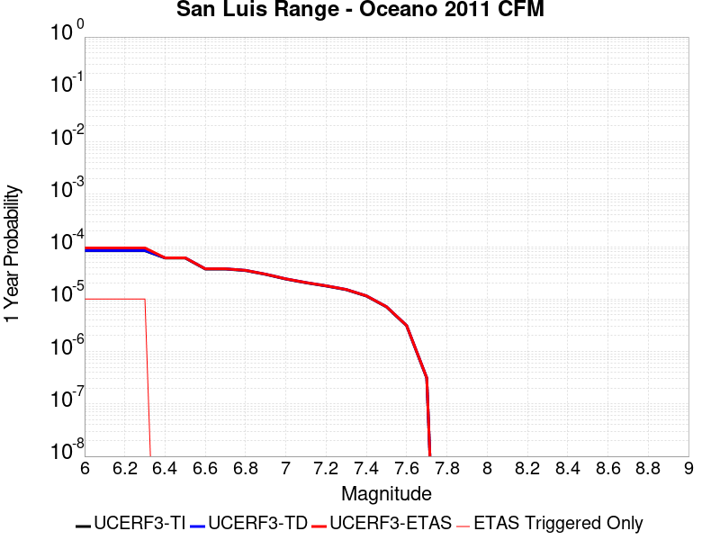 |  |

| Magnitude | 1 wk TI Prob | 1 wk TD Prob | 1 wk ETAS Prob | 1 wk ETAS/TD Gain | 1 wk ETAS Triggered Only | 1 mo TI Prob | 1 mo TD Prob | 1 mo ETAS Prob | 1 mo ETAS/TD Gain | 1 mo ETAS Triggered Only | 1 yr TI Prob | 1 yr TD Prob | 1 yr ETAS Prob | 1 yr ETAS/TD Gain | 1 yr ETAS Triggered Only | 10 yr TI Prob | 10 yr TD Prob | 10 yr ETAS Prob | 10 yr ETAS/TD Gain | 10 yr ETAS Triggered Only |
|-----|-----|-----|-----|-----|-----|-----|-----|-----|-----|-----|-----|-----|-----|-----|-----|-----|-----|-----|-----|-----|
| 6.0 | 1.6025788E-6 | 1.6201213E-6 | 1.6201213E-6 | 1.0 | 0.0 | 6.8681766E-6 | 6.943361E-6 | 6.943361E-6 | 1.0 | 0.0 | 8.361684E-5 | 8.4532556E-5 | 9.453171E-5 | 1.1182876 | 1.0E-5 | 8.3585386E-4 | 8.450448E-4 | 8.550364E-4 | 1.0118237 | 1.0E-5 |
| 6.1 | 1.6025788E-6 | 1.6201213E-6 | 1.6201213E-6 | 1.0 | 0.0 | 6.8681766E-6 | 6.943361E-6 | 6.943361E-6 | 1.0 | 0.0 | 8.361684E-5 | 8.4532556E-5 | 9.453171E-5 | 1.1182876 | 1.0E-5 | 8.3585386E-4 | 8.450448E-4 | 8.550364E-4 | 1.0118237 | 1.0E-5 |
| 6.2 | 1.6025788E-6 | 1.6201213E-6 | 1.6201213E-6 | 1.0 | 0.0 | 6.8681766E-6 | 6.943361E-6 | 6.943361E-6 | 1.0 | 0.0 | 8.361684E-5 | 8.4532556E-5 | 9.453171E-5 | 1.1182876 | 1.0E-5 | 8.3585386E-4 | 8.450448E-4 | 8.550364E-4 | 1.0118237 | 1.0E-5 |
| 6.3 | 1.6025788E-6 | 1.6201213E-6 | 1.6201213E-6 | 1.0 | 0.0 | 6.8681766E-6 | 6.943361E-6 | 6.943361E-6 | 1.0 | 0.0 | 8.361684E-5 | 8.4532556E-5 | 9.453171E-5 | 1.1182876 | 1.0E-5 | 8.3585386E-4 | 8.450448E-4 | 8.550364E-4 | 1.0118237 | 1.0E-5 |
| 6.4 | 1.1621186E-6 | 1.1749911E-6 | 1.1749911E-6 | 1.0 | 0.0 | 4.980499E-6 | 5.035668E-6 | 5.035668E-6 | 1.0 | 0.0 | 6.0635884E-5 | 6.130781E-5 | 6.130781E-5 | 1.0 | 0.0 | 6.0619344E-4 | 6.129355E-4 | 6.129355E-4 | 1.0 | 0.0 |
| 6.5 | 1.1621186E-6 | 1.1749911E-6 | 1.1749911E-6 | 1.0 | 0.0 | 4.980499E-6 | 5.035668E-6 | 5.035668E-6 | 1.0 | 0.0 | 6.0635884E-5 | 6.130781E-5 | 6.130781E-5 | 1.0 | 0.0 | 6.0619344E-4 | 6.129355E-4 | 6.129355E-4 | 1.0 | 0.0 |
| 6.6 | 7.164729E-7 | 7.248589E-7 | 7.248589E-7 | 1.0 | 0.0 | 3.0705946E-6 | 3.1065347E-6 | 3.1065347E-6 | 1.0 | 0.0 | 3.738385E-5 | 3.782142E-5 | 3.782142E-5 | 1.0 | 0.0 | 3.737756E-4 | 3.7815163E-4 | 3.7815163E-4 | 1.0 | 0.0 |
| 6.7 | 7.164729E-7 | 7.248589E-7 | 7.248589E-7 | 1.0 | 0.0 | 3.0705946E-6 | 3.1065347E-6 | 3.1065347E-6 | 1.0 | 0.0 | 3.738385E-5 | 3.782142E-5 | 3.782142E-5 | 1.0 | 0.0 | 3.737756E-4 | 3.7815163E-4 | 3.7815163E-4 | 1.0 | 0.0 |
| 6.8 | 6.700177E-7 | 6.77745E-7 | 6.77745E-7 | 1.0 | 0.0 | 2.8715012E-6 | 2.9046184E-6 | 2.9046184E-6 | 1.0 | 0.0 | 3.495997E-5 | 3.536317E-5 | 3.536317E-5 | 1.0 | 0.0 | 3.495447E-4 | 3.5357708E-4 | 3.5357708E-4 | 1.0 | 0.0 |
| 6.9 | 5.657865E-7 | 5.721795E-7 | 5.721795E-7 | 1.0 | 0.0 | 2.424797E-6 | 2.4521955E-6 | 2.4521955E-6 | 1.0 | 0.0 | 2.9521503E-5 | 2.9855084E-5 | 2.9855084E-5 | 1.0 | 0.0 | 2.9517582E-4 | 2.985118E-4 | 2.985118E-4 | 1.0 | 0.0 |
| 7.0 | 4.608413E-7 | 4.6601758E-7 | 4.6601758E-7 | 1.0 | 0.0 | 1.9750328E-6 | 1.9972167E-6 | 1.9972167E-6 | 1.0 | 0.0 | 2.4045758E-5 | 2.4315847E-5 | 2.4315847E-5 | 1.0 | 0.0 | 2.4043156E-4 | 2.4313215E-4 | 2.4313215E-4 | 1.0 | 0.0 |
| 7.1 | 3.9177846E-7 | 3.9621662E-7 | 3.9621662E-7 | 1.0 | 0.0 | 1.6790494E-6 | 1.6980702E-6 | 1.6980702E-6 | 1.0 | 0.0 | 2.0442236E-5 | 2.067381E-5 | 2.067381E-5 | 1.0 | 0.0 | 2.0440355E-4 | 2.06719E-4 | 2.06719E-4 | 1.0 | 0.0 |
| 7.2 | 3.3974752E-7 | 3.4366582E-7 | 3.4366582E-7 | 1.0 | 0.0 | 1.45606E-6 | 1.4728527E-6 | 1.4728527E-6 | 1.0 | 0.0 | 1.7727387E-5 | 1.7931836E-5 | 1.7931836E-5 | 1.0 | 0.0 | 1.7725973E-4 | 1.79304E-4 | 1.79304E-4 | 1.0 | 0.0 |
| 7.3 | 2.8900928E-7 | 2.9234062E-7 | 2.9234062E-7 | 1.0 | 0.0 | 1.2386106E-6 | 1.2528878E-6 | 1.2528878E-6 | 1.0 | 0.0 | 1.5079979E-5 | 1.5253803E-5 | 1.5253803E-5 | 1.0 | 0.0 | 1.5078956E-4 | 1.5252765E-4 | 1.5252765E-4 | 1.0 | 0.0 |
| 7.4 | 2.1881527E-7 | 2.2139628E-7 | 2.2139628E-7 | 1.0 | 0.0 | 9.3777936E-7 | 9.4884086E-7 | 9.4884086E-7 | 1.0 | 0.0 | 1.14174045E-5 | 1.1552077E-5 | 1.1552077E-5 | 1.0 | 0.0 | 1.1416818E-4 | 1.1551482E-4 | 1.1551482E-4 | 1.0 | 0.0 |
| 7.5 | 1.356398E-7 | 1.371866E-7 | 1.371866E-7 | 1.0 | 0.0 | 5.813133E-7 | 5.8794245E-7 | 5.8794245E-7 | 1.0 | 0.0 | 7.0774663E-6 | 7.158176E-6 | 7.158176E-6 | 1.0 | 0.0 | 7.077241E-5 | 7.157948E-5 | 7.157948E-5 | 1.0 | 0.0 |
| 7.6 | 5.9269272E-8 | 6.001375E-8 | 6.001375E-8 | 1.0 | 0.0 | 2.5401116E-7 | 2.5720172E-7 | 2.5720172E-7 | 1.0 | 0.0 | 3.0925814E-6 | 3.1314266E-6 | 3.1314266E-6 | 1.0 | 0.0 | 3.0925385E-5 | 3.1313837E-5 | 3.1313837E-5 | 1.0 | 0.0 |
| 7.7 | 5.946232E-9 | 6.0369403E-9 | 6.0369403E-9 | 1.0 | 0.0 | 2.5483851E-8 | 2.58726E-8 | 2.58726E-8 | 1.0 | 0.0 | 3.1026585E-7 | 3.1499889E-7 | 3.1499889E-7 | 1.0 | 0.0 | 3.102654E-6 | 3.149985E-6 | 3.149985E-6 | 1.0 | 0.0 |

## San Jacinto (Superstition Mtn)
*[(top)](#table-of-contents)*

| 1 Week | 1 Month | 1 Year | 10 Year |
|-----|-----|-----|-----|
|  |  |  |  |

| Magnitude | 1 wk TI Prob | 1 wk TD Prob | 1 wk ETAS Prob | 1 wk ETAS/TD Gain | 1 wk ETAS Triggered Only | 1 mo TI Prob | 1 mo TD Prob | 1 mo ETAS Prob | 1 mo ETAS/TD Gain | 1 mo ETAS Triggered Only | 1 yr TI Prob | 1 yr TD Prob | 1 yr ETAS Prob | 1 yr ETAS/TD Gain | 1 yr ETAS Triggered Only | 10 yr TI Prob | 10 yr TD Prob | 10 yr ETAS Prob | 10 yr ETAS/TD Gain | 10 yr ETAS Triggered Only |
|-----|-----|-----|-----|-----|-----|-----|-----|-----|-----|-----|-----|-----|-----|-----|-----|-----|-----|-----|-----|-----|
| 6.0 | 6.4193904E-5 | 9.600102E-5 | 9.600102E-5 | 1.0 | 0.0 | 2.7508775E-4 | 4.1137784E-4 | 4.1137784E-4 | 1.0 | 0.0 | 0.0033440501 | 0.004998455 | 0.0050084046 | 1.0019907 | 1.0E-5 | 0.03294174 | 0.048827495 | 0.048837006 | 1.0001948 | 1.0E-5 |
| 6.1 | 6.4193904E-5 | 9.600102E-5 | 9.600102E-5 | 1.0 | 0.0 | 2.7508775E-4 | 4.1137784E-4 | 4.1137784E-4 | 1.0 | 0.0 | 0.0033440501 | 0.004998455 | 0.0050084046 | 1.0019907 | 1.0E-5 | 0.03294174 | 0.048827495 | 0.048837006 | 1.0001948 | 1.0E-5 |
| 6.2 | 5.7023593E-5 | 8.3151084E-5 | 8.3151084E-5 | 1.0 | 0.0 | 2.4436394E-4 | 3.5632253E-4 | 3.5632253E-4 | 1.0 | 0.0 | 0.002971072 | 0.004331238 | 0.004341195 | 1.0022988 | 1.0E-5 | 0.029316625 | 0.04250735 | 0.042516924 | 1.0002253 | 1.0E-5 |
| 6.3 | 5.6940098E-5 | 8.299644E-5 | 8.299644E-5 | 1.0 | 0.0 | 2.4400617E-4 | 3.5565995E-4 | 3.5565995E-4 | 1.0 | 0.0 | 0.002966728 | 0.004323203 | 0.00433316 | 1.0023031 | 1.0E-5 | 0.029274331 | 0.0424306 | 0.042440176 | 1.0002257 | 1.0E-5 |
| 6.4 | 5.4171585E-5 | 7.7490105E-5 | 7.7490105E-5 | 1.0 | 0.0 | 2.3214328E-4 | 3.320675E-4 | 3.320675E-4 | 1.0 | 0.0 | 0.0028226813 | 0.004037075 | 0.004047035 | 1.002467 | 1.0E-5 | 0.02787096 | 0.03971982 | 0.039729424 | 1.0002418 | 1.0E-5 |
| 6.5 | 4.375144E-5 | 5.6427685E-5 | 5.6427685E-5 | 1.0 | 0.0 | 1.874927E-4 | 2.4181715E-4 | 2.4181715E-4 | 1.0 | 0.0 | 0.0022803338 | 0.0029413246 | 0.0029512953 | 1.0033898 | 1.0E-5 | 0.022570757 | 0.029240036 | 0.029249744 | 1.000332 | 1.0E-5 |
| 6.6 | 2.772192E-5 | 2.5494404E-5 | 2.5494404E-5 | 1.0 | 0.0 | 1.1880282E-4 | 1.0925727E-4 | 1.0925727E-4 | 1.0 | 0.0 | 0.0014454646 | 0.0013294149 | 0.0013294149 | 1.0 | 0.0 | 0.014360986 | 0.013543627 | 0.013543627 | 1.0 | 0.0 |
| 6.7 | 2.7124124E-5 | 2.4705407E-5 | 2.4705407E-5 | 1.0 | 0.0 | 1.1624106E-4 | 1.05876126E-4 | 1.05876126E-4 | 1.0 | 0.0 | 0.0014143161 | 0.0012882988 | 0.0012882988 | 1.0 | 0.0 | 0.014053487 | 0.013137068 | 0.013137068 | 1.0 | 0.0 |
| 6.8 | 2.5475807E-5 | 2.2170334E-5 | 2.2170334E-5 | 1.0 | 0.0 | 1.0917746E-4 | 9.501232E-5 | 9.501232E-5 | 1.0 | 0.0 | 0.001328425 | 0.0011561731 | 0.0011561731 | 1.0 | 0.0 | 0.0132051185 | 0.0118252365 | 0.0118252365 | 1.0 | 0.0 |
| 6.9 | 2.1162023E-5 | 1.7631666E-5 | 1.7631666E-5 | 1.0 | 0.0 | 9.069123E-5 | 7.5562115E-5 | 7.5562115E-5 | 1.0 | 0.0 | 0.0011036064 | 9.195843E-4 | 9.195843E-4 | 1.0 | 0.0 | 0.010981417 | 0.009449712 | 0.009449712 | 1.0 | 0.0 |
| 7.0 | 1.8754288E-5 | 1.6166736E-5 | 1.6166736E-5 | 1.0 | 0.0 | 8.037304E-5 | 6.9284186E-5 | 6.9284186E-5 | 1.0 | 0.0 | 9.781026E-4 | 8.4321096E-4 | 8.4321096E-4 | 1.0 | 0.0 | 0.009738087 | 0.008672746 | 0.008672746 | 1.0 | 0.0 |
| 7.1 | 1.8678527E-5 | 1.6091873E-5 | 1.6091873E-5 | 1.0 | 0.0 | 8.0048376E-5 | 6.896337E-5 | 6.896337E-5 | 1.0 | 0.0 | 9.7415317E-4 | 8.3930796E-4 | 8.3930796E-4 | 1.0 | 0.0 | 0.009698939 | 0.008633699 | 0.008633699 | 1.0 | 0.0 |
| 7.2 | 1.7804578E-5 | 1.5386398E-5 | 1.5386398E-5 | 1.0 | 0.0 | 7.6303106E-5 | 6.5940054E-5 | 6.5940054E-5 | 1.0 | 0.0 | 9.285943E-4 | 8.0252666E-4 | 8.0252666E-4 | 1.0 | 0.0 | 0.009247236 | 0.008264985 | 0.008264985 | 1.0 | 0.0 |
| 7.3 | 1.6583685E-5 | 1.4535444E-5 | 1.4535444E-5 | 1.0 | 0.0 | 7.1070994E-5 | 6.2293286E-5 | 6.2293286E-5 | 1.0 | 0.0 | 8.649459E-4 | 7.5815886E-4 | 7.5815886E-4 | 1.0 | 0.0 | 0.00861587 | 0.007820267 | 0.007820267 | 1.0 | 0.0 |
| 7.4 | 1.6387552E-5 | 1.4400321E-5 | 1.4400321E-5 | 1.0 | 0.0 | 7.023047E-5 | 6.171421E-5 | 6.171421E-5 | 1.0 | 0.0 | 8.5472054E-4 | 7.5111346E-4 | 7.5111346E-4 | 1.0 | 0.0 | 0.008514405 | 0.007749644 | 0.007749644 | 1.0 | 0.0 |
| 7.5 | 1.5790754E-5 | 1.4040957E-5 | 1.4040957E-5 | 1.0 | 0.0 | 6.767291E-5 | 6.017415E-5 | 6.017415E-5 | 1.0 | 0.0 | 8.236062E-4 | 7.32376E-4 | 7.32376E-4 | 1.0 | 0.0 | 0.008205604 | 0.007560181 | 0.007560181 | 1.0 | 0.0 |
| 7.6 | 1.4248672E-5 | 1.30597955E-5 | 1.30597955E-5 | 1.0 | 0.0 | 6.106431E-5 | 5.596936E-5 | 5.596936E-5 | 1.0 | 0.0 | 7.432043E-4 | 6.8121566E-4 | 6.8121566E-4 | 1.0 | 0.0 | 0.007407237 | 0.007042702 | 0.007042702 | 1.0 | 0.0 |
| 7.7 | 1.15449975E-5 | 1.09083485E-5 | 1.09083485E-5 | 1.0 | 0.0 | 4.947762E-5 | 4.6749232E-5 | 4.6749232E-5 | 1.0 | 0.0 | 6.022235E-4 | 5.69024E-4 | 5.69024E-4 | 1.0 | 0.0 | 0.006005941 | 0.005912628 | 0.005912628 | 1.0 | 0.0 |
| 7.8 | 9.1391985E-6 | 9.518787E-6 | 9.518787E-6 | 1.0 | 0.0 | 3.9167408E-5 | 4.0794166E-5 | 4.0794166E-5 | 1.0 | 0.0 | 4.767588E-4 | 4.9655634E-4 | 4.9655634E-4 | 1.0 | 0.0 | 0.0047573727 | 0.0051790397 | 0.0051790397 | 1.0 | 0.0 |
| 7.9 | 6.973017E-6 | 7.3861297E-6 | 7.3861297E-6 | 1.0 | 0.0 | 2.9884017E-5 | 3.165446E-5 | 3.165446E-5 | 1.0 | 0.0 | 3.6377716E-4 | 3.8532543E-4 | 3.8532543E-4 | 1.0 | 0.0 | 0.0036318225 | 0.004053871 | 0.004053871 | 1.0 | 0.0 |
| 8.0 | 5.7638235E-6 | 6.263572E-6 | 6.263572E-6 | 1.0 | 0.0 | 2.4701867E-5 | 2.6843605E-5 | 2.6843605E-5 | 1.0 | 0.0 | 3.0070372E-4 | 3.267724E-4 | 3.267724E-4 | 1.0 | 0.0 | 0.0030029714 | 0.0034553434 | 0.0034553434 | 1.0 | 0.0 |
| 8.1 | 5.1124434E-6 | 5.498948E-6 | 5.498948E-6 | 1.0 | 0.0 | 2.1910288E-5 | 2.3566712E-5 | 2.3566712E-5 | 1.0 | 0.0 | 2.6672508E-4 | 2.8688743E-4 | 2.8688743E-4 | 1.0 | 0.0 | 0.0026640517 | 0.0030420625 | 0.0030420625 | 1.0 | 0.0 |
| 8.2 | 1.1075938E-6 | 5.341373E-7 | 5.341373E-7 | 1.0 | 0.0 | 4.7468216E-6 | 2.289158E-6 | 2.289158E-6 | 1.0 | 0.0 | 5.779102E-5 | 2.7870163E-5 | 2.7870163E-5 | 1.0 | 0.0 | 5.777599E-4 | 3.1373248E-4 | 3.1373248E-4 | 1.0 | 0.0 |
| 8.3 | 1.3584393E-8 | 4.478424E-9 | 4.478424E-9 | 1.0 | 0.0 | 5.8218827E-8 | 1.9193244E-8 | 1.9193244E-8 | 1.0 | 0.0 | 7.0881396E-7 | 2.3367775E-7 | 2.3367775E-7 | 1.0 | 0.0 | 7.0881174E-6 | 2.6188773E-6 | 2.6188773E-6 | 1.0 | 0.0 |

## West Tahoe
*[(top)](#table-of-contents)*

| 1 Week | 1 Month | 1 Year | 10 Year |
|-----|-----|-----|-----|
|  | 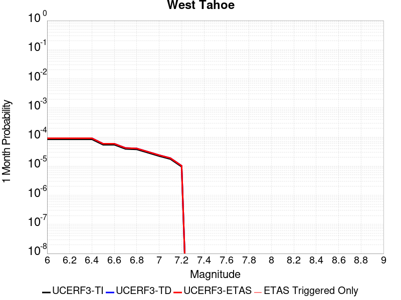 |  |  |

| Magnitude | 1 wk TI Prob | 1 wk TD Prob | 1 wk ETAS Prob | 1 wk ETAS/TD Gain | 1 wk ETAS Triggered Only | 1 mo TI Prob | 1 mo TD Prob | 1 mo ETAS Prob | 1 mo ETAS/TD Gain | 1 mo ETAS Triggered Only | 1 yr TI Prob | 1 yr TD Prob | 1 yr ETAS Prob | 1 yr ETAS/TD Gain | 1 yr ETAS Triggered Only | 10 yr TI Prob | 10 yr TD Prob | 10 yr ETAS Prob | 10 yr ETAS/TD Gain | 10 yr ETAS Triggered Only |
|-----|-----|-----|-----|-----|-----|-----|-----|-----|-----|-----|-----|-----|-----|-----|-----|-----|-----|-----|-----|-----|
| 6.0 | 1.952444E-5 | 2.1183409E-5 | 2.1183409E-5 | 1.0 | 0.0 | 8.367348E-5 | 9.0783185E-5 | 9.0783185E-5 | 1.0 | 0.0 | 0.0010182485 | 0.0011047797 | 0.0011047797 | 1.0 | 0.0 | 0.010135954 | 0.010998359 | 0.011008249 | 1.0008992 | 1.0E-5 |
| 6.1 | 1.952444E-5 | 2.1183409E-5 | 2.1183409E-5 | 1.0 | 0.0 | 8.367348E-5 | 9.0783185E-5 | 9.0783185E-5 | 1.0 | 0.0 | 0.0010182485 | 0.0011047797 | 0.0011047797 | 1.0 | 0.0 | 0.010135954 | 0.010998359 | 0.011008249 | 1.0008992 | 1.0E-5 |
| 6.2 | 1.952444E-5 | 2.1183409E-5 | 2.1183409E-5 | 1.0 | 0.0 | 8.367348E-5 | 9.0783185E-5 | 9.0783185E-5 | 1.0 | 0.0 | 0.0010182485 | 0.0011047797 | 0.0011047797 | 1.0 | 0.0 | 0.010135954 | 0.010998359 | 0.011008249 | 1.0008992 | 1.0E-5 |
| 6.3 | 1.952444E-5 | 2.1183409E-5 | 2.1183409E-5 | 1.0 | 0.0 | 8.367348E-5 | 9.0783185E-5 | 9.0783185E-5 | 1.0 | 0.0 | 0.0010182485 | 0.0011047797 | 0.0011047797 | 1.0 | 0.0 | 0.010135954 | 0.010998359 | 0.011008249 | 1.0008992 | 1.0E-5 |
| 6.4 | 1.952444E-5 | 2.1183409E-5 | 2.1183409E-5 | 1.0 | 0.0 | 8.367348E-5 | 9.0783185E-5 | 9.0783185E-5 | 1.0 | 0.0 | 0.0010182485 | 0.0011047797 | 0.0011047797 | 1.0 | 0.0 | 0.010135954 | 0.010998359 | 0.011008249 | 1.0008992 | 1.0E-5 |
| 6.5 | 1.2685271E-5 | 1.3690772E-5 | 1.3690772E-5 | 1.0 | 0.0 | 5.4364315E-5 | 5.8673508E-5 | 5.8673508E-5 | 1.0 | 0.0 | 6.616845E-4 | 7.1413233E-4 | 7.1413233E-4 | 1.0 | 0.0 | 0.0065971776 | 0.0071200244 | 0.0071299532 | 1.0013945 | 1.0E-5 |
| 6.6 | 1.2685271E-5 | 1.3690772E-5 | 1.3690772E-5 | 1.0 | 0.0 | 5.4364315E-5 | 5.8673508E-5 | 5.8673508E-5 | 1.0 | 0.0 | 6.616845E-4 | 7.1413233E-4 | 7.1413233E-4 | 1.0 | 0.0 | 0.0065971776 | 0.0071200244 | 0.0071299532 | 1.0013945 | 1.0E-5 |
| 6.7 | 9.117886E-6 | 9.809945E-6 | 9.809945E-6 | 1.0 | 0.0 | 3.9076072E-5 | 4.2041986E-5 | 4.2041986E-5 | 1.0 | 0.0 | 4.756473E-4 | 5.1174813E-4 | 5.1174813E-4 | 1.0 | 0.0 | 0.0047463053 | 0.0051064147 | 0.005116364 | 1.0019484 | 1.0E-5 |
| 6.8 | 8.786828E-6 | 9.457959E-6 | 9.457959E-6 | 1.0 | 0.0 | 3.7657293E-5 | 4.053352E-5 | 4.053352E-5 | 1.0 | 0.0 | 4.5838108E-4 | 4.933909E-4 | 4.933909E-4 | 1.0 | 0.0 | 0.0045743673 | 0.004923656 | 0.004933607 | 1.002021 | 1.0E-5 |
| 6.9 | 6.7562123E-6 | 7.263881E-6 | 7.263881E-6 | 1.0 | 0.0 | 2.8954875E-5 | 3.1130574E-5 | 3.1130574E-5 | 1.0 | 0.0 | 3.5246857E-4 | 3.7895358E-4 | 3.7895358E-4 | 1.0 | 0.0 | 0.0035191004 | 0.0037835457 | 0.003793508 | 1.002633 | 1.0E-5 |
| 7.0 | 5.1792854E-6 | 5.5673936E-6 | 5.5673936E-6 | 1.0 | 0.0 | 2.2196748E-5 | 2.386006E-5 | 2.386006E-5 | 1.0 | 0.0 | 2.702119E-4 | 2.9046132E-4 | 2.9046132E-4 | 1.0 | 0.0 | 0.0026988357 | 0.002901192 | 0.002911163 | 1.0034368 | 1.0E-5 |
| 7.1 | 4.090765E-6 | 4.3974665E-6 | 4.3974665E-6 | 1.0 | 0.0 | 1.7531731E-5 | 1.8846167E-5 | 1.8846167E-5 | 1.0 | 0.0 | 2.134279E-4 | 2.2943133E-4 | 2.2943133E-4 | 1.0 | 0.0 | 0.0021322304 | 0.0022922792 | 0.0023022562 | 1.0043525 | 1.0E-5 |
| 7.2 | 2.2356758E-6 | 2.402392E-6 | 2.402392E-6 | 1.0 | 0.0 | 9.581432E-6 | 1.0295936E-5 | 1.0295936E-5 | 1.0 | 0.0 | 1.1664769E-4 | 1.2534771E-4 | 1.2534771E-4 | 1.0 | 0.0 | 0.0011658648 | 0.0012529559 | 0.0012529559 | 1.0 | 0.0 |

## East Huasna 2011 CFM
*[(top)](#table-of-contents)*

| 1 Week | 1 Month | 1 Year | 10 Year |
|-----|-----|-----|-----|
|  |  |  |  |

| Magnitude | 1 wk TI Prob | 1 wk TD Prob | 1 wk ETAS Prob | 1 wk ETAS/TD Gain | 1 wk ETAS Triggered Only | 1 mo TI Prob | 1 mo TD Prob | 1 mo ETAS Prob | 1 mo ETAS/TD Gain | 1 mo ETAS Triggered Only | 1 yr TI Prob | 1 yr TD Prob | 1 yr ETAS Prob | 1 yr ETAS/TD Gain | 1 yr ETAS Triggered Only | 10 yr TI Prob | 10 yr TD Prob | 10 yr ETAS Prob | 10 yr ETAS/TD Gain | 10 yr ETAS Triggered Only |
|-----|-----|-----|-----|-----|-----|-----|-----|-----|-----|-----|-----|-----|-----|-----|-----|-----|-----|-----|-----|-----|
| 6.0 | 1.4658423E-6 | 1.471567E-6 | 1.471567E-6 | 1.0 | 0.0 | 6.282166E-6 | 6.306701E-6 | 6.306701E-6 | 1.0 | 0.0 | 7.6482684E-5 | 7.678145E-5 | 7.678145E-5 | 1.0 | 0.0 | 7.645637E-4 | 7.675562E-4 | 7.775485E-4 | 1.0130184 | 1.0E-5 |
| 6.1 | 1.4658423E-6 | 1.471567E-6 | 1.471567E-6 | 1.0 | 0.0 | 6.282166E-6 | 6.306701E-6 | 6.306701E-6 | 1.0 | 0.0 | 7.6482684E-5 | 7.678145E-5 | 7.678145E-5 | 1.0 | 0.0 | 7.645637E-4 | 7.675562E-4 | 7.775485E-4 | 1.0130184 | 1.0E-5 |
| 6.2 | 1.4658423E-6 | 1.471567E-6 | 1.471567E-6 | 1.0 | 0.0 | 6.282166E-6 | 6.306701E-6 | 6.306701E-6 | 1.0 | 0.0 | 7.6482684E-5 | 7.678145E-5 | 7.678145E-5 | 1.0 | 0.0 | 7.645637E-4 | 7.675562E-4 | 7.775485E-4 | 1.0130184 | 1.0E-5 |
| 6.3 | 1.4658423E-6 | 1.471567E-6 | 1.471567E-6 | 1.0 | 0.0 | 6.282166E-6 | 6.306701E-6 | 6.306701E-6 | 1.0 | 0.0 | 7.6482684E-5 | 7.678145E-5 | 7.678145E-5 | 1.0 | 0.0 | 7.645637E-4 | 7.675562E-4 | 7.775485E-4 | 1.0130184 | 1.0E-5 |
| 6.4 | 1.0488257E-6 | 1.0527522E-6 | 1.0527522E-6 | 1.0 | 0.0 | 4.4949593E-6 | 4.5117877E-6 | 4.5117877E-6 | 1.0 | 0.0 | 5.472476E-5 | 5.492965E-5 | 5.492965E-5 | 1.0 | 0.0 | 5.4711284E-4 | 5.491626E-4 | 5.591571E-4 | 1.0181996 | 1.0E-5 |
| 6.5 | 1.0488257E-6 | 1.0527522E-6 | 1.0527522E-6 | 1.0 | 0.0 | 4.4949593E-6 | 4.5117877E-6 | 4.5117877E-6 | 1.0 | 0.0 | 5.472476E-5 | 5.492965E-5 | 5.492965E-5 | 1.0 | 0.0 | 5.4711284E-4 | 5.491626E-4 | 5.591571E-4 | 1.0181996 | 1.0E-5 |
| 6.6 | 8.463064E-7 | 8.4936386E-7 | 8.4936386E-7 | 1.0 | 0.0 | 3.6270226E-6 | 3.640126E-6 | 3.640126E-6 | 1.0 | 0.0 | 4.4158103E-5 | 4.431764E-5 | 4.431764E-5 | 1.0 | 0.0 | 4.414933E-4 | 4.4308888E-4 | 4.5308447E-4 | 1.0225588 | 1.0E-5 |
| 6.7 | 7.876149E-7 | 7.902539E-7 | 7.902539E-7 | 1.0 | 0.0 | 3.375488E-6 | 3.386798E-6 | 3.386798E-6 | 1.0 | 0.0 | 4.109579E-5 | 4.1233492E-5 | 4.1233492E-5 | 1.0 | 0.0 | 4.108819E-4 | 4.1225905E-4 | 4.2225493E-4 | 1.0242466 | 1.0E-5 |
| 6.8 | 6.9940785E-7 | 7.016583E-7 | 7.016583E-7 | 1.0 | 0.0 | 2.9974588E-6 | 3.0071035E-6 | 3.0071035E-6 | 1.0 | 0.0 | 3.649345E-5 | 3.6610876E-5 | 3.6610876E-5 | 1.0 | 0.0 | 3.6487455E-4 | 3.6604892E-4 | 3.7604524E-4 | 1.0273087 | 1.0E-5 |
| 6.9 | 5.899658E-7 | 5.9156037E-7 | 5.9156037E-7 | 1.0 | 0.0 | 2.5284223E-6 | 2.5352563E-6 | 2.5352563E-6 | 1.0 | 0.0 | 3.0783107E-5 | 3.086631E-5 | 3.086631E-5 | 1.0 | 0.0 | 3.0778843E-4 | 3.0862054E-4 | 3.0862054E-4 | 1.0 | 0.0 |
| 7.0 | 4.793814E-7 | 4.803276E-7 | 4.803276E-7 | 1.0 | 0.0 | 2.05449E-6 | 2.0585455E-6 | 2.0585455E-6 | 1.0 | 0.0 | 2.501313E-5 | 2.5062505E-5 | 2.5062505E-5 | 1.0 | 0.0 | 2.5010316E-4 | 2.5059696E-4 | 2.5059696E-4 | 1.0 | 0.0 |
| 7.1 | 4.1256908E-7 | 4.1299438E-7 | 4.1299438E-7 | 1.0 | 0.0 | 1.768152E-6 | 1.7699748E-6 | 1.7699748E-6 | 1.0 | 0.0 | 2.1527037E-5 | 2.1549231E-5 | 2.1549231E-5 | 1.0 | 0.0 | 2.1524953E-4 | 2.1547156E-4 | 2.1547156E-4 | 1.0 | 0.0 |
| 7.2 | 2.822599E-7 | 2.8161435E-7 | 2.8161435E-7 | 1.0 | 0.0 | 1.2096847E-6 | 1.206918E-6 | 1.206918E-6 | 1.0 | 0.0 | 1.47278115E-5 | 1.4694128E-5 | 1.4694128E-5 | 1.0 | 0.0 | 1.4726835E-4 | 1.4693165E-4 | 1.4693165E-4 | 1.0 | 0.0 |
| 7.3 | 1.5261652E-7 | 1.507502E-7 | 1.507502E-7 | 1.0 | 0.0 | 6.540707E-7 | 6.4607207E-7 | 6.4607207E-7 | 1.0 | 0.0 | 7.963281E-6 | 7.8658995E-6 | 7.8658995E-6 | 1.0 | 0.0 | 7.962996E-5 | 7.865623E-5 | 7.865623E-5 | 1.0 | 0.0 |
| 7.4 | 7.976414E-8 | 8.057876E-8 | 8.057876E-8 | 1.0 | 0.0 | 3.418463E-7 | 3.453375E-7 | 3.453375E-7 | 1.0 | 0.0 | 4.1619705E-6 | 4.2044758E-6 | 4.2044758E-6 | 1.0 | 0.0 | 4.161893E-5 | 4.2043972E-5 | 4.2043972E-5 | 1.0 | 0.0 |
| 7.5 | 4.2715055E-8 | 4.320258E-8 | 4.320258E-8 | 1.0 | 0.0 | 1.830645E-7 | 1.851539E-7 | 1.851539E-7 | 1.0 | 0.0 | 2.228808E-6 | 2.2542463E-6 | 2.2542463E-6 | 1.0 | 0.0 | 2.2287857E-5 | 2.2542237E-5 | 2.2542237E-5 | 1.0 | 0.0 |
| 7.6 | 2.1807532E-8 | 2.205751E-8 | 2.205751E-8 | 1.0 | 0.0 | 9.346085E-8 | 9.4532176E-8 | 9.4532176E-8 | 1.0 | 0.0 | 1.1378852E-6 | 1.1509286E-6 | 1.1509286E-6 | 1.0 | 0.0 | 1.1378794E-5 | 1.1509228E-5 | 1.1509228E-5 | 1.0 | 0.0 |
| 7.7 | 4.7196043E-9 | 4.7672892E-9 | 4.7672892E-9 | 1.0 | 0.0 | 2.0226874E-8 | 2.043124E-8 | 2.043124E-8 | 1.0 | 0.0 | 2.4626218E-7 | 2.4875033E-7 | 2.4875033E-7 | 1.0 | 0.0 | 2.462619E-6 | 2.4875005E-6 | 2.4875005E-6 | 1.0 | 0.0 |
| 7.8 | 7.400003E-11 | 7.4654505E-11 | 7.4654505E-11 | 1.0 | 0.0 | 3.171432E-10 | 3.1994807E-10 | 3.1994807E-10 | 1.0 | 0.0 | 3.861218E-9 | 3.8953676E-9 | 3.8953676E-9 | 1.0 | 0.0 | 3.861218E-8 | 3.8953676E-8 | 3.8953676E-8 | 1.0 | 0.0 |

## Del Valle
*[(top)](#table-of-contents)*

| 1 Week | 1 Month | 1 Year | 10 Year |
|-----|-----|-----|-----|
|  |  |  |  |

| Magnitude | 1 wk TI Prob | 1 wk TD Prob | 1 wk ETAS Prob | 1 wk ETAS/TD Gain | 1 wk ETAS Triggered Only | 1 mo TI Prob | 1 mo TD Prob | 1 mo ETAS Prob | 1 mo ETAS/TD Gain | 1 mo ETAS Triggered Only | 1 yr TI Prob | 1 yr TD Prob | 1 yr ETAS Prob | 1 yr ETAS/TD Gain | 1 yr ETAS Triggered Only | 10 yr TI Prob | 10 yr TD Prob | 10 yr ETAS Prob | 10 yr ETAS/TD Gain | 10 yr ETAS Triggered Only |
|-----|-----|-----|-----|-----|-----|-----|-----|-----|-----|-----|-----|-----|-----|-----|-----|-----|-----|-----|-----|-----|
| 6.0 | 1.0716125E-5 | 8.768052E-6 | 8.768052E-6 | 1.0 | 0.0 | 4.592544E-5 | 3.7576934E-5 | 3.7576934E-5 | 1.0 | 0.0 | 5.589988E-4 | 4.574229E-4 | 4.574229E-4 | 1.0 | 0.0 | 0.0055759475 | 0.0045667686 | 0.004576723 | 1.0021797 | 1.0E-5 |
| 6.1 | 1.0716125E-5 | 8.768052E-6 | 8.768052E-6 | 1.0 | 0.0 | 4.592544E-5 | 3.7576934E-5 | 3.7576934E-5 | 1.0 | 0.0 | 5.589988E-4 | 4.574229E-4 | 4.574229E-4 | 1.0 | 0.0 | 0.0055759475 | 0.0045667686 | 0.004576723 | 1.0021797 | 1.0E-5 |
| 6.2 | 1.0716125E-5 | 8.768052E-6 | 8.768052E-6 | 1.0 | 0.0 | 4.592544E-5 | 3.7576934E-5 | 3.7576934E-5 | 1.0 | 0.0 | 5.589988E-4 | 4.574229E-4 | 4.574229E-4 | 1.0 | 0.0 | 0.0055759475 | 0.0045667686 | 0.004576723 | 1.0021797 | 1.0E-5 |
| 6.3 | 7.1293784E-6 | 4.865947E-6 | 4.865947E-6 | 1.0 | 0.0 | 3.055412E-5 | 2.0853897E-5 | 2.0853897E-5 | 1.0 | 0.0 | 3.7193293E-4 | 2.5386736E-4 | 2.5386736E-4 | 1.0 | 0.0 | 0.0037131102 | 0.0025358594 | 0.002545834 | 1.0039334 | 1.0E-5 |
| 6.4 | 7.1293784E-6 | 4.865947E-6 | 4.865947E-6 | 1.0 | 0.0 | 3.055412E-5 | 2.0853897E-5 | 2.0853897E-5 | 1.0 | 0.0 | 3.7193293E-4 | 2.5386736E-4 | 2.5386736E-4 | 1.0 | 0.0 | 0.0037131102 | 0.0025358594 | 0.002545834 | 1.0039334 | 1.0E-5 |
| 6.5 | 7.1293784E-6 | 4.865947E-6 | 4.865947E-6 | 1.0 | 0.0 | 3.055412E-5 | 2.0853897E-5 | 2.0853897E-5 | 1.0 | 0.0 | 3.7193293E-4 | 2.5386736E-4 | 2.5386736E-4 | 1.0 | 0.0 | 0.0037131102 | 0.0025358594 | 0.002545834 | 1.0039334 | 1.0E-5 |
| 6.6 | 7.1293784E-6 | 4.865947E-6 | 4.865947E-6 | 1.0 | 0.0 | 3.055412E-5 | 2.0853897E-5 | 2.0853897E-5 | 1.0 | 0.0 | 3.7193293E-4 | 2.5386736E-4 | 2.5386736E-4 | 1.0 | 0.0 | 0.0037131102 | 0.0025358594 | 0.002545834 | 1.0039334 | 1.0E-5 |
| 6.7 | 7.12272E-6 | 4.863323E-6 | 4.863323E-6 | 1.0 | 0.0 | 3.0525585E-5 | 2.084265E-5 | 2.084265E-5 | 1.0 | 0.0 | 3.7158563E-4 | 2.5373045E-4 | 2.5373045E-4 | 1.0 | 0.0 | 0.003709649 | 0.0025344936 | 0.002544468 | 1.0039356 | 1.0E-5 |
| 6.8 | 6.7558703E-6 | 4.5595193E-6 | 4.5595193E-6 | 1.0 | 0.0 | 2.895341E-5 | 1.9540656E-5 | 1.9540656E-5 | 1.0 | 0.0 | 3.5245073E-4 | 2.3788214E-4 | 2.3788214E-4 | 1.0 | 0.0 | 0.0035189227 | 0.0023763503 | 0.0023763503 | 1.0 | 0.0 |
| 6.9 | 6.6700386E-6 | 4.5026545E-6 | 4.5026545E-6 | 1.0 | 0.0 | 2.8585566E-5 | 1.9296951E-5 | 1.9296951E-5 | 1.0 | 0.0 | 3.479737E-4 | 2.3491567E-4 | 2.3491567E-4 | 1.0 | 0.0 | 0.003474293 | 0.0023467485 | 0.0023467485 | 1.0 | 0.0 |
| 7.0 | 6.3181424E-6 | 4.09881E-6 | 4.09881E-6 | 1.0 | 0.0 | 2.7077473E-5 | 1.7566214E-5 | 1.7566214E-5 | 1.0 | 0.0 | 3.2961834E-4 | 2.1384809E-4 | 2.1384809E-4 | 1.0 | 0.0 | 0.0032912986 | 0.002136478 | 0.002136478 | 1.0 | 0.0 |
| 7.1 | 6.248759E-6 | 4.034E-6 | 4.034E-6 | 1.0 | 0.0 | 2.678012E-5 | 1.728846E-5 | 1.728846E-5 | 1.0 | 0.0 | 3.2599916E-4 | 2.1046709E-4 | 2.1046709E-4 | 1.0 | 0.0 | 0.0032552136 | 0.002102732 | 0.002102732 | 1.0 | 0.0 |
| 7.2 | 6.0411944E-6 | 3.869988E-6 | 3.869988E-6 | 1.0 | 0.0 | 2.5890577E-5 | 1.6585562E-5 | 1.6585562E-5 | 1.0 | 0.0 | 3.1517216E-4 | 2.0191091E-4 | 2.0191091E-4 | 1.0 | 0.0 | 0.0031472554 | 0.002017328 | 0.002017328 | 1.0 | 0.0 |
| 7.3 | 4.7691183E-6 | 3.078193E-6 | 3.078193E-6 | 1.0 | 0.0 | 2.0438918E-5 | 1.319219E-5 | 1.319219E-5 | 1.0 | 0.0 | 2.488154E-4 | 1.6060329E-4 | 1.6060329E-4 | 1.0 | 0.0 | 0.00248537 | 0.0016048981 | 0.0016048981 | 1.0 | 0.0 |
| 7.4 | 3.5524722E-6 | 2.1893868E-6 | 2.1893868E-6 | 1.0 | 0.0 | 1.5224792E-5 | 9.383053E-6 | 9.383053E-6 | 1.0 | 0.0 | 1.8534607E-4 | 1.1423277E-4 | 1.1423277E-4 | 1.0 | 0.0 | 0.0018519156 | 0.0011417487 | 0.0011417487 | 1.0 | 0.0 |
| 7.5 | 2.7133442E-6 | 1.591647E-6 | 1.591647E-6 | 1.0 | 0.0 | 1.1628566E-5 | 6.8213267E-6 | 6.8213267E-6 | 1.0 | 0.0 | 1.415686E-4 | 8.304651E-5 | 8.304651E-5 | 1.0 | 0.0 | 0.0014147845 | 8.3015667E-4 | 8.3015667E-4 | 1.0 | 0.0 |
| 7.6 | 1.915338E-6 | 1.1739402E-6 | 1.1739402E-6 | 1.0 | 0.0 | 8.208566E-6 | 5.031163E-6 | 5.031163E-6 | 1.0 | 0.0 | 9.993471E-5 | 6.125269E-5 | 6.125269E-5 | 1.0 | 0.0 | 9.988978E-4 | 6.12359E-4 | 6.12359E-4 | 1.0 | 0.0 |
| 7.7 | 1.2120448E-6 | 7.1804885E-7 | 7.1804885E-7 | 1.0 | 0.0 | 5.194467E-6 | 3.0773488E-6 | 3.0773488E-6 | 1.0 | 0.0 | 6.3240805E-5 | 3.746608E-5 | 3.746608E-5 | 1.0 | 0.0 | 6.322281E-4 | 3.7459802E-4 | 3.7459802E-4 | 1.0 | 0.0 |
| 7.8 | 6.272381E-7 | 3.9326522E-7 | 3.9326522E-7 | 1.0 | 0.0 | 2.6881603E-6 | 1.6854212E-6 | 1.6854212E-6 | 1.0 | 0.0 | 3.272786E-5 | 2.0519812E-5 | 2.0519812E-5 | 1.0 | 0.0 | 3.272304E-4 | 2.0517933E-4 | 2.0517933E-4 | 1.0 | 0.0 |
| 7.9 | 2.0292627E-7 | 1.2005012E-7 | 1.2005012E-7 | 1.0 | 0.0 | 8.6968373E-7 | 5.145004E-7 | 5.145004E-7 | 1.0 | 0.0 | 1.0588348E-5 | 6.2640247E-6 | 6.2640247E-6 | 1.0 | 0.0 | 1.0587843E-4 | 6.26385E-5 | 6.26385E-5 | 1.0 | 0.0 |
| 8.0 | 4.374492E-8 | 2.1900798E-8 | 2.1900798E-8 | 1.0 | 0.0 | 1.8747821E-7 | 9.386056E-8 | 9.386056E-8 | 1.0 | 0.0 | 2.2825448E-6 | 1.1427518E-6 | 1.1427518E-6 | 1.0 | 0.0 | 2.2825214E-5 | 1.1427463E-5 | 1.1427463E-5 | 1.0 | 0.0 |

## Newport-Inglewood alt 1
*[(top)](#table-of-contents)*

| 1 Week | 1 Month | 1 Year | 10 Year |
|-----|-----|-----|-----|
|  |  |  |  |

| Magnitude | 1 wk TI Prob | 1 wk TD Prob | 1 wk ETAS Prob | 1 wk ETAS/TD Gain | 1 wk ETAS Triggered Only | 1 mo TI Prob | 1 mo TD Prob | 1 mo ETAS Prob | 1 mo ETAS/TD Gain | 1 mo ETAS Triggered Only | 1 yr TI Prob | 1 yr TD Prob | 1 yr ETAS Prob | 1 yr ETAS/TD Gain | 1 yr ETAS Triggered Only | 10 yr TI Prob | 10 yr TD Prob | 10 yr ETAS Prob | 10 yr ETAS/TD Gain | 10 yr ETAS Triggered Only |
|-----|-----|-----|-----|-----|-----|-----|-----|-----|-----|-----|-----|-----|-----|-----|-----|-----|-----|-----|-----|-----|
| 6.0 | 2.9668912E-5 | 3.0405516E-5 | 3.0405516E-5 | 1.0 | 0.0 | 1.2714628E-4 | 1.3030559E-4 | 1.3030559E-4 | 1.0 | 0.0 | 0.0015469068 | 0.0015857986 | 0.0015957827 | 1.0062959 | 1.0E-5 | 0.015361829 | 0.015792403 | 0.015802246 | 1.0006232 | 1.0E-5 |
| 6.1 | 2.9668912E-5 | 3.0405516E-5 | 3.0405516E-5 | 1.0 | 0.0 | 1.2714628E-4 | 1.3030559E-4 | 1.3030559E-4 | 1.0 | 0.0 | 0.0015469068 | 0.0015857986 | 0.0015957827 | 1.0062959 | 1.0E-5 | 0.015361829 | 0.015792403 | 0.015802246 | 1.0006232 | 1.0E-5 |
| 6.2 | 2.9668912E-5 | 3.0405516E-5 | 3.0405516E-5 | 1.0 | 0.0 | 1.2714628E-4 | 1.3030559E-4 | 1.3030559E-4 | 1.0 | 0.0 | 0.0015469068 | 0.0015857986 | 0.0015957827 | 1.0062959 | 1.0E-5 | 0.015361829 | 0.015792403 | 0.015802246 | 1.0006232 | 1.0E-5 |
| 6.3 | 2.9668912E-5 | 3.0405516E-5 | 3.0405516E-5 | 1.0 | 0.0 | 1.2714628E-4 | 1.3030559E-4 | 1.3030559E-4 | 1.0 | 0.0 | 0.0015469068 | 0.0015857986 | 0.0015957827 | 1.0062959 | 1.0E-5 | 0.015361829 | 0.015792403 | 0.015802246 | 1.0006232 | 1.0E-5 |
| 6.4 | 1.275942E-5 | 1.0272664E-5 | 1.0272664E-5 | 1.0 | 0.0 | 5.4682085E-5 | 4.4024986E-5 | 4.4024986E-5 | 1.0 | 0.0 | 6.65551E-4 | 5.3587655E-4 | 5.3587655E-4 | 1.0 | 0.0 | 0.0066356123 | 0.0053462684 | 0.0053462684 | 1.0 | 0.0 |
| 6.5 | 1.275942E-5 | 1.0272664E-5 | 1.0272664E-5 | 1.0 | 0.0 | 5.4682085E-5 | 4.4024986E-5 | 4.4024986E-5 | 1.0 | 0.0 | 6.65551E-4 | 5.3587655E-4 | 5.3587655E-4 | 1.0 | 0.0 | 0.0066356123 | 0.0053462684 | 0.0053462684 | 1.0 | 0.0 |
| 6.6 | 1.1255358E-5 | 8.662018E-6 | 8.662018E-6 | 1.0 | 0.0 | 4.8236358E-5 | 3.7122416E-5 | 3.7122416E-5 | 1.0 | 0.0 | 5.871194E-4 | 4.5187338E-4 | 4.5187338E-4 | 1.0 | 0.0 | 0.005855706 | 0.004509723 | 0.004509723 | 1.0 | 0.0 |
| 6.7 | 1.0504745E-5 | 7.899919E-6 | 7.899919E-6 | 1.0 | 0.0 | 4.5019555E-5 | 3.3856366E-5 | 3.3856366E-5 | 1.0 | 0.0 | 5.4797524E-4 | 4.1212453E-4 | 4.1212453E-4 | 1.0 | 0.0 | 0.0054662596 | 0.0041137324 | 0.0041137324 | 1.0 | 0.0 |
| 6.8 | 1.0476007E-5 | 7.881301E-6 | 7.881301E-6 | 1.0 | 0.0 | 4.4896402E-5 | 3.377657E-5 | 3.377657E-5 | 1.0 | 0.0 | 5.464766E-4 | 4.1115342E-4 | 4.1115342E-4 | 1.0 | 0.0 | 0.005451347 | 0.0041040573 | 0.0041040573 | 1.0 | 0.0 |
| 6.9 | 9.076797E-6 | 6.489738E-6 | 6.489738E-6 | 1.0 | 0.0 | 3.889998E-5 | 2.7812868E-5 | 2.7812868E-5 | 1.0 | 0.0 | 4.7350433E-4 | 3.385694E-4 | 3.385694E-4 | 1.0 | 0.0 | 0.004724967 | 0.0033805731 | 0.0033805731 | 1.0 | 0.0 |
| 7.0 | 8.73795E-6 | 6.212118E-6 | 6.212118E-6 | 1.0 | 0.0 | 3.7447822E-5 | 2.6623095E-5 | 2.6623095E-5 | 1.0 | 0.0 | 4.5583185E-4 | 3.2408824E-4 | 3.2408824E-4 | 1.0 | 0.0 | 0.0045489795 | 0.0032361876 | 0.0032361876 | 1.0 | 0.0 |
| 7.1 | 8.391299E-6 | 5.955894E-6 | 5.955894E-6 | 1.0 | 0.0 | 3.5962214E-5 | 2.552501E-5 | 2.552501E-5 | 1.0 | 0.0 | 4.37752E-4 | 3.1072294E-4 | 3.1072294E-4 | 1.0 | 0.0 | 0.004368907 | 0.0031029144 | 0.0031029144 | 1.0 | 0.0 |
| 7.2 | 7.796882E-6 | 5.496635E-6 | 5.496635E-6 | 1.0 | 0.0 | 3.341478E-5 | 2.3556795E-5 | 2.3556795E-5 | 1.0 | 0.0 | 4.06749E-4 | 2.8676644E-4 | 2.8676644E-4 | 1.0 | 0.0 | 0.0040600533 | 0.002863988 | 0.002863988 | 1.0 | 0.0 |
| 7.3 | 6.4738833E-6 | 4.647859E-6 | 4.647859E-6 | 1.0 | 0.0 | 2.774492E-5 | 1.9919245E-5 | 1.9919245E-5 | 1.0 | 0.0 | 3.3774204E-4 | 2.4248997E-4 | 2.4248997E-4 | 1.0 | 0.0 | 0.0033722918 | 0.0024222704 | 0.0024222704 | 1.0 | 0.0 |
| 7.4 | 5.382145E-6 | 3.8857956E-6 | 3.8857956E-6 | 1.0 | 0.0 | 2.3066134E-5 | 1.6653305E-5 | 1.6653305E-5 | 1.0 | 0.0 | 2.8079396E-4 | 2.0273525E-4 | 2.0273525E-4 | 1.0 | 0.0 | 0.0028043943 | 0.0020255174 | 0.0020255174 | 1.0 | 0.0 |
| 7.5 | 3.648244E-6 | 2.573805E-6 | 2.573805E-6 | 1.0 | 0.0 | 1.5635238E-5 | 1.1030546E-5 | 1.1030546E-5 | 1.0 | 0.0 | 1.9034238E-4 | 1.3428873E-4 | 1.3428873E-4 | 1.0 | 0.0 | 0.0019017943 | 0.0013420862 | 0.0013420862 | 1.0 | 0.0 |
| 7.6 | 2.2906888E-6 | 1.5479983E-6 | 1.5479983E-6 | 1.0 | 0.0 | 9.817201E-6 | 6.6342623E-6 | 6.6342623E-6 | 1.0 | 0.0 | 1.1951787E-4 | 8.076921E-5 | 8.076921E-5 | 1.0 | 0.0 | 0.0011945361 | 8.0740533E-4 | 8.0740533E-4 | 1.0 | 0.0 |
| 7.7 | 6.0479874E-7 | 3.3975476E-7 | 3.3975476E-7 | 1.0 | 0.0 | 2.5919921E-6 | 1.456091E-6 | 1.456091E-6 | 1.0 | 0.0 | 3.1557047E-5 | 1.7727778E-5 | 1.7727778E-5 | 1.0 | 0.0 | 3.1552566E-4 | 1.7726503E-4 | 1.7726503E-4 | 1.0 | 0.0 |
| 7.8 | 1.16056995E-8 | 9.782392E-9 | 9.782392E-9 | 1.0 | 0.0 | 4.9738713E-8 | 4.1924537E-8 | 4.1924537E-8 | 1.0 | 0.0 | 6.0556863E-7 | 5.104312E-7 | 5.104312E-7 | 1.0 | 0.0 | 6.05567E-6 | 5.104312E-6 | 5.104312E-6 | 1.0 | 0.0 |

## Verdugo
*[(top)](#table-of-contents)*

| 1 Week | 1 Month | 1 Year | 10 Year |
|-----|-----|-----|-----|
|  |  |  |  |

| Magnitude | 1 wk TI Prob | 1 wk TD Prob | 1 wk ETAS Prob | 1 wk ETAS/TD Gain | 1 wk ETAS Triggered Only | 1 mo TI Prob | 1 mo TD Prob | 1 mo ETAS Prob | 1 mo ETAS/TD Gain | 1 mo ETAS Triggered Only | 1 yr TI Prob | 1 yr TD Prob | 1 yr ETAS Prob | 1 yr ETAS/TD Gain | 1 yr ETAS Triggered Only | 10 yr TI Prob | 10 yr TD Prob | 10 yr ETAS Prob | 10 yr ETAS/TD Gain | 10 yr ETAS Triggered Only |
|-----|-----|-----|-----|-----|-----|-----|-----|-----|-----|-----|-----|-----|-----|-----|-----|-----|-----|-----|-----|-----|
| 6.0 | 5.392987E-6 | 4.2165602E-6 | 4.2165602E-6 | 1.0 | 0.0 | 2.3112598E-5 | 1.8070848E-5 | 1.8070848E-5 | 1.0 | 0.0 | 2.8135953E-4 | 2.1999085E-4 | 2.1999085E-4 | 1.0 | 0.0 | 0.0028100356 | 0.0021977786 | 0.0022077565 | 1.0045401 | 1.0E-5 |
| 6.1 | 5.392987E-6 | 4.2165602E-6 | 4.2165602E-6 | 1.0 | 0.0 | 2.3112598E-5 | 1.8070848E-5 | 1.8070848E-5 | 1.0 | 0.0 | 2.8135953E-4 | 2.1999085E-4 | 2.1999085E-4 | 1.0 | 0.0 | 0.0028100356 | 0.0021977786 | 0.0022077565 | 1.0045401 | 1.0E-5 |
| 6.2 | 5.392987E-6 | 4.2165602E-6 | 4.2165602E-6 | 1.0 | 0.0 | 2.3112598E-5 | 1.8070848E-5 | 1.8070848E-5 | 1.0 | 0.0 | 2.8135953E-4 | 2.1999085E-4 | 2.1999085E-4 | 1.0 | 0.0 | 0.0028100356 | 0.0021977786 | 0.0022077565 | 1.0045401 | 1.0E-5 |
| 6.3 | 5.392987E-6 | 4.2165602E-6 | 4.2165602E-6 | 1.0 | 0.0 | 2.3112598E-5 | 1.8070848E-5 | 1.8070848E-5 | 1.0 | 0.0 | 2.8135953E-4 | 2.1999085E-4 | 2.1999085E-4 | 1.0 | 0.0 | 0.0028100356 | 0.0021977786 | 0.0022077565 | 1.0045401 | 1.0E-5 |
| 6.4 | 5.392987E-6 | 4.2165602E-6 | 4.2165602E-6 | 1.0 | 0.0 | 2.3112598E-5 | 1.8070848E-5 | 1.8070848E-5 | 1.0 | 0.0 | 2.8135953E-4 | 2.1999085E-4 | 2.1999085E-4 | 1.0 | 0.0 | 0.0028100356 | 0.0021977786 | 0.0022077565 | 1.0045401 | 1.0E-5 |
| 6.5 | 4.9154837E-6 | 3.7225057E-6 | 3.7225057E-6 | 1.0 | 0.0 | 2.1066187E-5 | 1.59535E-5 | 1.59535E-5 | 1.0 | 0.0 | 2.5645064E-4 | 1.9421674E-4 | 1.9421674E-4 | 1.0 | 0.0 | 0.002561549 | 0.001940491 | 0.0019504715 | 1.0051433 | 1.0E-5 |
| 6.6 | 4.9154837E-6 | 3.7225057E-6 | 3.7225057E-6 | 1.0 | 0.0 | 2.1066187E-5 | 1.59535E-5 | 1.59535E-5 | 1.0 | 0.0 | 2.5645064E-4 | 1.9421674E-4 | 1.9421674E-4 | 1.0 | 0.0 | 0.002561549 | 0.001940491 | 0.0019504715 | 1.0051433 | 1.0E-5 |
| 6.7 | 4.817006E-6 | 3.6206918E-6 | 3.6206918E-6 | 1.0 | 0.0 | 2.0644147E-5 | 1.551716E-5 | 1.551716E-5 | 1.0 | 0.0 | 2.513135E-4 | 1.8890524E-4 | 1.8890524E-4 | 1.0 | 0.0 | 0.0025102948 | 0.0018874662 | 0.0018974474 | 1.0052881 | 1.0E-5 |
| 6.8 | 4.507407E-6 | 3.3071422E-6 | 3.3071422E-6 | 1.0 | 0.0 | 1.9317316E-5 | 1.417339E-5 | 1.417339E-5 | 1.0 | 0.0 | 2.3516294E-4 | 1.725475E-4 | 1.725475E-4 | 1.0 | 0.0 | 0.0023491425 | 0.0017241496 | 0.0017241496 | 1.0 | 0.0 |
| 6.9 | 4.3573054E-6 | 3.161048E-6 | 3.161048E-6 | 1.0 | 0.0 | 1.8674033E-5 | 1.3547278E-5 | 1.3547278E-5 | 1.0 | 0.0 | 2.2733262E-4 | 1.6492575E-4 | 1.6492575E-4 | 1.0 | 0.0 | 0.0022710022 | 0.001648046 | 0.001648046 | 1.0 | 0.0 |
| 7.0 | 4.171527E-6 | 2.983706E-6 | 2.983706E-6 | 1.0 | 0.0 | 1.787785E-5 | 1.278725E-5 | 1.278725E-5 | 1.0 | 0.0 | 2.1764109E-4 | 1.5567376E-4 | 1.5567376E-4 | 1.0 | 0.0 | 0.0021742806 | 0.0015556583 | 0.0015556583 | 1.0 | 0.0 |
| 7.1 | 4.0405484E-6 | 2.882296E-6 | 2.882296E-6 | 1.0 | 0.0 | 1.731652E-5 | 1.2352639E-5 | 1.2352639E-5 | 1.0 | 0.0 | 2.1080824E-4 | 1.5038312E-4 | 1.5038312E-4 | 1.0 | 0.0 | 0.0021060838 | 0.0015028245 | 0.0015028245 | 1.0 | 0.0 |
| 7.2 | 3.8306007E-6 | 2.7018784E-6 | 2.7018784E-6 | 1.0 | 0.0 | 1.6416758E-5 | 1.1579428E-5 | 1.1579428E-5 | 1.0 | 0.0 | 1.9985568E-4 | 1.4097053E-4 | 1.4097053E-4 | 1.0 | 0.0 | 0.0019967605 | 0.0014088218 | 0.0014088218 | 1.0 | 0.0 |
| 7.3 | 3.5750938E-6 | 2.5122074E-6 | 2.5122074E-6 | 1.0 | 0.0 | 1.532174E-5 | 1.0766559E-5 | 1.0766559E-5 | 1.0 | 0.0 | 1.8652623E-4 | 1.3107508E-4 | 1.3107508E-4 | 1.0 | 0.0 | 0.0018636974 | 0.0013099882 | 0.0013099882 | 1.0 | 0.0 |
| 7.4 | 3.3510041E-6 | 2.3408884E-6 | 2.3408884E-6 | 1.0 | 0.0 | 1.4361368E-5 | 1.0032341E-5 | 1.0032341E-5 | 1.0 | 0.0 | 1.7483562E-4 | 1.2213702E-4 | 1.2213702E-4 | 1.0 | 0.0 | 0.0017469813 | 0.0012207093 | 0.0012207093 | 1.0 | 0.0 |
| 7.5 | 2.948287E-6 | 2.0391387E-6 | 2.0391387E-6 | 1.0 | 0.0 | 1.2635454E-5 | 8.739137E-6 | 8.739137E-6 | 1.0 | 0.0 | 1.538258E-4 | 1.06393905E-4 | 1.06393905E-4 | 1.0 | 0.0 | 0.0015371935 | 0.0010634399 | 0.0010634399 | 1.0 | 0.0 |
| 7.6 | 2.0134323E-6 | 1.4471433E-6 | 1.4471433E-6 | 1.0 | 0.0 | 8.628967E-6 | 6.2020285E-6 | 6.2020285E-6 | 1.0 | 0.0 | 1.05052604E-4 | 7.550717E-5 | 7.550717E-5 | 1.0 | 0.0 | 0.0010500296 | 7.5482397E-4 | 7.5482397E-4 | 1.0 | 0.0 |
| 7.7 | 5.726436E-7 | 4.0453094E-7 | 4.0453094E-7 | 1.0 | 0.0 | 2.4541846E-6 | 1.733703E-6 | 1.733703E-6 | 1.0 | 0.0 | 2.9879287E-5 | 2.1107655E-5 | 2.1107655E-5 | 1.0 | 0.0 | 2.987527E-4 | 2.1105906E-4 | 2.1105906E-4 | 1.0 | 0.0 |
| 7.8 | 1.6248204E-7 | 1.068809E-7 | 1.068809E-7 | 1.0 | 0.0 | 6.963514E-7 | 4.5806092E-7 | 4.5806092E-7 | 1.0 | 0.0 | 8.478045E-6 | 5.576878E-6 | 5.576878E-6 | 1.0 | 0.0 | 8.477722E-5 | 5.576741E-5 | 5.576741E-5 | 1.0 | 0.0 |
| 7.9 | 4.4475744E-8 | 3.037577E-8 | 3.037577E-8 | 1.0 | 0.0 | 1.9061031E-7 | 1.3018186E-7 | 1.3018186E-7 | 1.0 | 0.0 | 2.320678E-6 | 1.5849631E-6 | 1.5849631E-6 | 1.0 | 0.0 | 2.3206538E-5 | 1.5849531E-5 | 1.5849531E-5 | 1.0 | 0.0 |

## Bennett Valley 2011 CFM
*[(top)](#table-of-contents)*

| 1 Week | 1 Month | 1 Year | 10 Year |
|-----|-----|-----|-----|
|  |  |  |  |

| Magnitude | 1 wk TI Prob | 1 wk TD Prob | 1 wk ETAS Prob | 1 wk ETAS/TD Gain | 1 wk ETAS Triggered Only | 1 mo TI Prob | 1 mo TD Prob | 1 mo ETAS Prob | 1 mo ETAS/TD Gain | 1 mo ETAS Triggered Only | 1 yr TI Prob | 1 yr TD Prob | 1 yr ETAS Prob | 1 yr ETAS/TD Gain | 1 yr ETAS Triggered Only | 10 yr TI Prob | 10 yr TD Prob | 10 yr ETAS Prob | 10 yr ETAS/TD Gain | 10 yr ETAS Triggered Only |
|-----|-----|-----|-----|-----|-----|-----|-----|-----|-----|-----|-----|-----|-----|-----|-----|-----|-----|-----|-----|-----|
| 6.0 | 2.3893934E-5 | 2.8239589E-5 | 2.8239589E-5 | 1.0 | 0.0 | 1.0239855E-4 | 1.2102224E-4 | 1.2102224E-4 | 1.0 | 0.0 | 0.0012459893 | 0.0014726348 | 0.0014826201 | 1.0067805 | 1.0E-5 | 0.012390262 | 0.014651419 | 0.014661272 | 1.0006726 | 1.0E-5 |
| 6.1 | 2.3893934E-5 | 2.8239589E-5 | 2.8239589E-5 | 1.0 | 0.0 | 1.0239855E-4 | 1.2102224E-4 | 1.2102224E-4 | 1.0 | 0.0 | 0.0012459893 | 0.0014726348 | 0.0014826201 | 1.0067805 | 1.0E-5 | 0.012390262 | 0.014651419 | 0.014661272 | 1.0006726 | 1.0E-5 |
| 6.2 | 1.6657146E-5 | 1.9854298E-5 | 1.9854298E-5 | 1.0 | 0.0 | 7.138582E-5 | 8.508787E-5 | 8.508787E-5 | 1.0 | 0.0 | 8.6877577E-4 | 0.001035594 | 0.0010455837 | 1.0096463 | 1.0E-5 | 0.008653872 | 0.010325956 | 0.010335853 | 1.0009584 | 1.0E-5 |
| 6.3 | 1.6657146E-5 | 1.9854298E-5 | 1.9854298E-5 | 1.0 | 0.0 | 7.138582E-5 | 8.508787E-5 | 8.508787E-5 | 1.0 | 0.0 | 8.6877577E-4 | 0.001035594 | 0.0010455837 | 1.0096463 | 1.0E-5 | 0.008653872 | 0.010325956 | 0.010335853 | 1.0009584 | 1.0E-5 |
| 6.4 | 1.29418495E-5 | 1.556793E-5 | 1.556793E-5 | 1.0 | 0.0 | 5.546389E-5 | 6.6718734E-5 | 6.6718734E-5 | 1.0 | 0.0 | 6.7506364E-4 | 8.121281E-4 | 8.2212E-4 | 1.0123034 | 1.0E-5 | 0.0067301663 | 0.008108751 | 0.0081186695 | 1.0012232 | 1.0E-5 |
| 6.5 | 1.2582504E-5 | 1.5134953E-5 | 1.5134953E-5 | 1.0 | 0.0 | 5.39239E-5 | 6.4863205E-5 | 6.4863205E-5 | 1.0 | 0.0 | 6.563257E-4 | 7.895536E-4 | 7.995457E-4 | 1.0126554 | 1.0E-5 | 0.006543907 | 0.00788465 | 0.00789457 | 1.0012583 | 1.0E-5 |
| 6.6 | 1.0846706E-5 | 1.3037158E-5 | 1.3037158E-5 | 1.0 | 0.0 | 4.6485053E-5 | 5.587306E-5 | 5.587306E-5 | 1.0 | 0.0 | 5.6580856E-4 | 6.8017055E-4 | 6.8017055E-4 | 1.0 | 0.0 | 0.005643701 | 0.006797883 | 0.006797883 | 1.0 | 0.0 |
| 6.7 | 1.6803231E-6 | 2.3780183E-6 | 2.3780183E-6 | 1.0 | 0.0 | 7.2013645E-6 | 1.01914675E-5 | 1.01914675E-5 | 1.0 | 0.0 | 8.7673085E-5 | 1.2407418E-4 | 1.2407418E-4 | 1.0 | 0.0 | 8.76385E-4 | 0.0012444884 | 0.0012444884 | 1.0 | 0.0 |
| 6.8 | 1.4609833E-6 | 2.0940856E-6 | 2.0940856E-6 | 1.0 | 0.0 | 6.261342E-6 | 8.974623E-6 | 8.974623E-6 | 1.0 | 0.0 | 7.6229175E-5 | 1.09260625E-4 | 1.09260625E-4 | 1.0 | 0.0 | 7.620303E-4 | 0.0010964648 | 0.0010964648 | 1.0 | 0.0 |
| 6.9 | 1.3492396E-6 | 1.9460247E-6 | 1.9460247E-6 | 1.0 | 0.0 | 5.7824427E-6 | 8.340079E-6 | 8.340079E-6 | 1.0 | 0.0 | 7.0398964E-5 | 1.0153579E-4 | 1.0153579E-4 | 1.0 | 0.0 | 7.037667E-4 | 0.0010192601 | 0.0010192601 | 1.0 | 0.0 |
| 7.0 | 1.2347921E-6 | 1.7890113E-6 | 1.7890113E-6 | 1.0 | 0.0 | 5.291955E-6 | 7.6671695E-6 | 7.6671695E-6 | 1.0 | 0.0 | 6.442765E-5 | 9.334384E-5 | 9.334384E-5 | 1.0 | 0.0 | 6.440897E-4 | 9.373974E-4 | 9.373974E-4 | 1.0 | 0.0 |
| 7.1 | 1.1262973E-6 | 1.6360293E-6 | 1.6360293E-6 | 1.0 | 0.0 | 4.8269794E-6 | 7.0115357E-6 | 7.0115357E-6 | 1.0 | 0.0 | 5.876689E-5 | 8.536215E-5 | 8.536215E-5 | 1.0 | 0.0 | 5.875135E-4 | 8.5762155E-4 | 8.5762155E-4 | 1.0 | 0.0 |
| 7.2 | 9.351744E-7 | 1.3612876E-6 | 1.3612876E-6 | 1.0 | 0.0 | 4.007884E-6 | 5.8340765E-6 | 5.8340765E-6 | 1.0 | 0.0 | 4.8794896E-5 | 7.1027585E-5 | 7.1027585E-5 | 1.0 | 0.0 | 4.878418E-4 | 7.143239E-4 | 7.143239E-4 | 1.0 | 0.0 |
| 7.3 | 8.5039534E-7 | 1.238779E-6 | 1.238779E-6 | 1.0 | 0.0 | 3.6445463E-6 | 5.3090416E-6 | 5.3090416E-6 | 1.0 | 0.0 | 4.437145E-5 | 6.4635686E-5 | 6.4635686E-5 | 1.0 | 0.0 | 4.436259E-4 | 6.501546E-4 | 6.501546E-4 | 1.0 | 0.0 |
| 7.4 | 6.7875015E-7 | 9.60144E-7 | 9.60144E-7 | 1.0 | 0.0 | 2.908926E-6 | 4.1148965E-6 | 4.1148965E-6 | 1.0 | 0.0 | 3.54156E-5 | 5.0097722E-5 | 5.0097722E-5 | 1.0 | 0.0 | 3.5409955E-4 | 5.041512E-4 | 5.041512E-4 | 1.0 | 0.0 |
| 7.5 | 5.826867E-7 | 8.1890533E-7 | 8.1890533E-7 | 1.0 | 0.0 | 2.4972264E-6 | 3.5095895E-6 | 3.5095895E-6 | 1.0 | 0.0 | 3.0403306E-5 | 4.272842E-5 | 4.272842E-5 | 1.0 | 0.0 | 3.0399146E-4 | 4.3006465E-4 | 4.3006465E-4 | 1.0 | 0.0 |
| 7.6 | 2.7734902E-7 | 3.6825787E-7 | 3.6825787E-7 | 1.0 | 0.0 | 1.1886381E-6 | 1.578247E-6 | 1.578247E-6 | 1.0 | 0.0 | 1.4471572E-5 | 1.921499E-5 | 1.921499E-5 | 1.0 | 0.0 | 1.447063E-4 | 1.9314208E-4 | 1.9314208E-4 | 1.0 | 0.0 |
| 7.7 | 1.0530888E-7 | 1.375161E-7 | 1.375161E-7 | 1.0 | 0.0 | 4.513237E-7 | 5.8935456E-7 | 5.8935456E-7 | 1.0 | 0.0 | 5.4948523E-6 | 7.175368E-6 | 7.175368E-6 | 1.0 | 0.0 | 5.4947162E-5 | 7.257686E-5 | 7.257686E-5 | 1.0 | 0.0 |
| 7.8 | 1.2714258E-8 | 1.96398E-8 | 1.96398E-8 | 1.0 | 0.0 | 5.448968E-8 | 8.417057E-8 | 8.417057E-8 | 1.0 | 0.0 | 6.6341164E-7 | 1.0247762E-6 | 1.0247762E-6 | 1.0 | 0.0 | 6.6340967E-6 | 1.06616935E-5 | 1.06616935E-5 | 1.0 | 0.0 |
| 7.9 | 4.075888E-9 | 7.563789E-9 | 7.563789E-9 | 1.0 | 0.0 | 1.7468091E-8 | 3.241624E-8 | 3.241624E-8 | 1.0 | 0.0 | 2.12674E-7 | 3.946676E-7 | 3.946676E-7 | 1.0 | 0.0 | 2.1267379E-6 | 4.1968474E-6 | 4.1968474E-6 | 1.0 | 0.0 |
| 8.0 | 1.9126138E-9 | 3.9976E-9 | 3.9976E-9 | 1.0 | 0.0 | 8.196917E-9 | 1.7132573E-8 | 1.7132573E-8 | 1.0 | 0.0 | 9.9797454E-8 | 2.0858906E-7 | 2.0858906E-7 | 1.0 | 0.0 | 9.979741E-7 | 2.1990033E-6 | 2.1990033E-6 | 1.0 | 0.0 |

## Redondo Canyon alt 1
*[(top)](#table-of-contents)*

| 1 Week | 1 Month | 1 Year | 10 Year |
|-----|-----|-----|-----|
|  |  |  |  |

| Magnitude | 1 wk TI Prob | 1 wk TD Prob | 1 wk ETAS Prob | 1 wk ETAS/TD Gain | 1 wk ETAS Triggered Only | 1 mo TI Prob | 1 mo TD Prob | 1 mo ETAS Prob | 1 mo ETAS/TD Gain | 1 mo ETAS Triggered Only | 1 yr TI Prob | 1 yr TD Prob | 1 yr ETAS Prob | 1 yr ETAS/TD Gain | 1 yr ETAS Triggered Only | 10 yr TI Prob | 10 yr TD Prob | 10 yr ETAS Prob | 10 yr ETAS/TD Gain | 10 yr ETAS Triggered Only |
|-----|-----|-----|-----|-----|-----|-----|-----|-----|-----|-----|-----|-----|-----|-----|-----|-----|-----|-----|-----|-----|
| 6.0 | 1.0346246E-5 | 1.0981491E-5 | 1.0981491E-5 | 1.0 | 0.0 | 4.43403E-5 | 4.7063128E-5 | 4.7063128E-5 | 1.0 | 0.0 | 5.3970946E-4 | 5.729218E-4 | 5.8291614E-4 | 1.0174444 | 1.0E-5 | 0.0053840056 | 0.0057221875 | 0.00573213 | 1.0017376 | 1.0E-5 |
| 6.1 | 1.0346246E-5 | 1.0981491E-5 | 1.0981491E-5 | 1.0 | 0.0 | 4.43403E-5 | 4.7063128E-5 | 4.7063128E-5 | 1.0 | 0.0 | 5.3970946E-4 | 5.729218E-4 | 5.8291614E-4 | 1.0174444 | 1.0E-5 | 0.0053840056 | 0.0057221875 | 0.00573213 | 1.0017376 | 1.0E-5 |
| 6.2 | 1.0346246E-5 | 1.0981491E-5 | 1.0981491E-5 | 1.0 | 0.0 | 4.43403E-5 | 4.7063128E-5 | 4.7063128E-5 | 1.0 | 0.0 | 5.3970946E-4 | 5.729218E-4 | 5.8291614E-4 | 1.0174444 | 1.0E-5 | 0.0053840056 | 0.0057221875 | 0.00573213 | 1.0017376 | 1.0E-5 |
| 6.3 | 3.2052794E-6 | 3.2361768E-6 | 3.2361768E-6 | 1.0 | 0.0 | 1.373684E-5 | 1.3869278E-5 | 1.3869278E-5 | 1.0 | 0.0 | 1.6723319E-4 | 1.6884934E-4 | 1.6884934E-4 | 1.0 | 0.0 | 0.001671074 | 0.0016876002 | 0.0016876002 | 1.0 | 0.0 |
| 6.4 | 3.2052794E-6 | 3.2361768E-6 | 3.2361768E-6 | 1.0 | 0.0 | 1.373684E-5 | 1.3869278E-5 | 1.3869278E-5 | 1.0 | 0.0 | 1.6723319E-4 | 1.6884934E-4 | 1.6884934E-4 | 1.0 | 0.0 | 0.001671074 | 0.0016876002 | 0.0016876002 | 1.0 | 0.0 |
| 6.5 | 3.2052794E-6 | 3.2361768E-6 | 3.2361768E-6 | 1.0 | 0.0 | 1.373684E-5 | 1.3869278E-5 | 1.3869278E-5 | 1.0 | 0.0 | 1.6723319E-4 | 1.6884934E-4 | 1.6884934E-4 | 1.0 | 0.0 | 0.001671074 | 0.0016876002 | 0.0016876002 | 1.0 | 0.0 |
| 6.6 | 1.948328E-6 | 1.828905E-6 | 1.828905E-6 | 1.0 | 0.0 | 8.349951E-6 | 7.838149E-6 | 7.838149E-6 | 1.0 | 0.0 | 1.016559E-4 | 9.542679E-5 | 9.542679E-5 | 1.0 | 0.0 | 0.0010160941 | 9.5400505E-4 | 9.5400505E-4 | 1.0 | 0.0 |
| 6.7 | 1.948328E-6 | 1.828905E-6 | 1.828905E-6 | 1.0 | 0.0 | 8.349951E-6 | 7.838149E-6 | 7.838149E-6 | 1.0 | 0.0 | 1.016559E-4 | 9.542679E-5 | 9.542679E-5 | 1.0 | 0.0 | 0.0010160941 | 9.5400505E-4 | 9.5400505E-4 | 1.0 | 0.0 |
| 6.8 | 1.1278219E-6 | 9.0332884E-7 | 9.0332884E-7 | 1.0 | 0.0 | 4.8335132E-6 | 3.871406E-6 | 3.871406E-6 | 1.0 | 0.0 | 5.8846435E-5 | 4.7133777E-5 | 4.7133777E-5 | 1.0 | 0.0 | 5.8830855E-4 | 4.712798E-4 | 4.712798E-4 | 1.0 | 0.0 |
| 6.9 | 1.1278219E-6 | 9.0332884E-7 | 9.0332884E-7 | 1.0 | 0.0 | 4.8335132E-6 | 3.871406E-6 | 3.871406E-6 | 1.0 | 0.0 | 5.8846435E-5 | 4.7133777E-5 | 4.7133777E-5 | 1.0 | 0.0 | 5.8830855E-4 | 4.712798E-4 | 4.712798E-4 | 1.0 | 0.0 |
| 7.0 | 1.1278219E-6 | 9.0332884E-7 | 9.0332884E-7 | 1.0 | 0.0 | 4.8335132E-6 | 3.871406E-6 | 3.871406E-6 | 1.0 | 0.0 | 5.8846435E-5 | 4.7133777E-5 | 4.7133777E-5 | 1.0 | 0.0 | 5.8830855E-4 | 4.712798E-4 | 4.712798E-4 | 1.0 | 0.0 |
| 7.1 | 1.0545139E-6 | 8.569467E-7 | 8.569467E-7 | 1.0 | 0.0 | 4.5193374E-6 | 3.672626E-6 | 3.672626E-6 | 1.0 | 0.0 | 5.5021545E-5 | 4.471373E-5 | 4.471373E-5 | 1.0 | 0.0 | 5.500792E-4 | 4.4708909E-4 | 4.4708909E-4 | 1.0 | 0.0 |
| 7.2 | 1.0545139E-6 | 8.569467E-7 | 8.569467E-7 | 1.0 | 0.0 | 4.5193374E-6 | 3.672626E-6 | 3.672626E-6 | 1.0 | 0.0 | 5.5021545E-5 | 4.471373E-5 | 4.471373E-5 | 1.0 | 0.0 | 5.500792E-4 | 4.4708909E-4 | 4.4708909E-4 | 1.0 | 0.0 |
| 7.3 | 9.505161E-8 | 5.8959216E-8 | 5.8959216E-8 | 1.0 | 0.0 | 4.0736398E-7 | 2.5268233E-7 | 2.5268233E-7 | 1.0 | 0.0 | 4.959645E-6 | 3.0764043E-6 | 3.0764043E-6 | 1.0 | 0.0 | 4.9595343E-5 | 3.076374E-5 | 3.076374E-5 | 1.0 | 0.0 |
| 7.4 | 3.9520785E-8 | 2.698822E-8 | 2.698822E-8 | 1.0 | 0.0 | 1.6937479E-7 | 1.15663795E-7 | 1.15663795E-7 | 1.0 | 0.0 | 2.062136E-6 | 1.4082061E-6 | 1.4082061E-6 | 1.0 | 0.0 | 2.062117E-5 | 1.4081998E-5 | 1.4081998E-5 | 1.0 | 0.0 |
| 7.5 | 5.6133214E-9 | 3.7369485E-9 | 3.7369485E-9 | 1.0 | 0.0 | 2.4057092E-8 | 1.6015495E-8 | 1.6015495E-8 | 1.0 | 0.0 | 2.9289507E-7 | 1.9498863E-7 | 1.9498863E-7 | 1.0 | 0.0 | 2.9289467E-6 | 1.9498848E-6 | 1.9498848E-6 | 1.0 | 0.0 |
| 7.6 | 4.1064334E-9 | 2.5958575E-9 | 2.5958575E-9 | 1.0 | 0.0 | 1.7599E-8 | 1.11251035E-8 | 1.11251035E-8 | 1.0 | 0.0 | 2.142678E-7 | 1.3544813E-7 | 1.3544813E-7 | 1.0 | 0.0 | 2.1426758E-6 | 1.3544807E-6 | 1.3544807E-6 | 1.0 | 0.0 |
| 7.7 | 1.361975E-9 | 6.3611183E-10 | 6.3611183E-10 | 1.0 | 0.0 | 5.8370353E-9 | 2.7261935E-9 | 2.7261935E-9 | 1.0 | 0.0 | 7.1065905E-8 | 3.3191405E-8 | 3.3191405E-8 | 1.0 | 0.0 | 7.106588E-7 | 3.31914E-7 | 3.31914E-7 | 1.0 | 0.0 |
| 7.8 | 1.361975E-9 | 6.3611183E-10 | 6.3611183E-10 | 1.0 | 0.0 | 5.8370353E-9 | 2.7261935E-9 | 2.7261935E-9 | 1.0 | 0.0 | 7.1065905E-8 | 3.3191405E-8 | 3.3191405E-8 | 1.0 | 0.0 | 7.106588E-7 | 3.31914E-7 | 3.31914E-7 | 1.0 | 0.0 |

## Hartley Springs 2011 CFM
*[(top)](#table-of-contents)*

| 1 Week | 1 Month | 1 Year | 10 Year |
|-----|-----|-----|-----|
|  |  |  |  |

| Magnitude | 1 wk TI Prob | 1 wk TD Prob | 1 wk ETAS Prob | 1 wk ETAS/TD Gain | 1 wk ETAS Triggered Only | 1 mo TI Prob | 1 mo TD Prob | 1 mo ETAS Prob | 1 mo ETAS/TD Gain | 1 mo ETAS Triggered Only | 1 yr TI Prob | 1 yr TD Prob | 1 yr ETAS Prob | 1 yr ETAS/TD Gain | 1 yr ETAS Triggered Only | 10 yr TI Prob | 10 yr TD Prob | 10 yr ETAS Prob | 10 yr ETAS/TD Gain | 10 yr ETAS Triggered Only |
|-----|-----|-----|-----|-----|-----|-----|-----|-----|-----|-----|-----|-----|-----|-----|-----|-----|-----|-----|-----|-----|
| 6.0 | 1.4352418E-5 | 1.443441E-5 | 1.443441E-5 | 1.0 | 0.0 | 6.1508916E-5 | 6.186122E-5 | 6.186122E-5 | 1.0 | 0.0 | 7.486137E-4 | 7.5306447E-4 | 7.630569E-4 | 1.0132691 | 1.0E-5 | 0.007460968 | 0.007521247 | 0.007531172 | 1.0013195 | 1.0E-5 |
| 6.1 | 1.4352418E-5 | 1.443441E-5 | 1.443441E-5 | 1.0 | 0.0 | 6.1508916E-5 | 6.186122E-5 | 6.186122E-5 | 1.0 | 0.0 | 7.486137E-4 | 7.5306447E-4 | 7.630569E-4 | 1.0132691 | 1.0E-5 | 0.007460968 | 0.007521247 | 0.007531172 | 1.0013195 | 1.0E-5 |
| 6.2 | 1.4352418E-5 | 1.443441E-5 | 1.443441E-5 | 1.0 | 0.0 | 6.1508916E-5 | 6.186122E-5 | 6.186122E-5 | 1.0 | 0.0 | 7.486137E-4 | 7.5306447E-4 | 7.630569E-4 | 1.0132691 | 1.0E-5 | 0.007460968 | 0.007521247 | 0.007531172 | 1.0013195 | 1.0E-5 |
| 6.3 | 1.4352418E-5 | 1.443441E-5 | 1.443441E-5 | 1.0 | 0.0 | 6.1508916E-5 | 6.186122E-5 | 6.186122E-5 | 1.0 | 0.0 | 7.486137E-4 | 7.5306447E-4 | 7.630569E-4 | 1.0132691 | 1.0E-5 | 0.007460968 | 0.007521247 | 0.007531172 | 1.0013195 | 1.0E-5 |
| 6.4 | 1.4352418E-5 | 1.443441E-5 | 1.443441E-5 | 1.0 | 0.0 | 6.1508916E-5 | 6.186122E-5 | 6.186122E-5 | 1.0 | 0.0 | 7.486137E-4 | 7.5306447E-4 | 7.630569E-4 | 1.0132691 | 1.0E-5 | 0.007460968 | 0.007521247 | 0.007531172 | 1.0013195 | 1.0E-5 |
| 6.5 | 1.2279858E-5 | 1.21333005E-5 | 1.21333005E-5 | 1.0 | 0.0 | 5.26269E-5 | 5.1999716E-5 | 5.1999716E-5 | 1.0 | 0.0 | 6.4054417E-4 | 6.330708E-4 | 6.430645E-4 | 1.015786 | 1.0E-5 | 0.0063870098 | 0.006328186 | 0.0063381228 | 1.0015702 | 1.0E-5 |
| 6.6 | 1.2279858E-5 | 1.21333005E-5 | 1.21333005E-5 | 1.0 | 0.0 | 5.26269E-5 | 5.1999716E-5 | 5.1999716E-5 | 1.0 | 0.0 | 6.4054417E-4 | 6.330708E-4 | 6.430645E-4 | 1.015786 | 1.0E-5 | 0.0063870098 | 0.006328186 | 0.0063381228 | 1.0015702 | 1.0E-5 |
| 6.7 | 2.1282601E-6 | 8.8951737E-7 | 8.8951737E-7 | 1.0 | 0.0 | 9.121083E-6 | 3.8122132E-6 | 3.8122132E-6 | 1.0 | 0.0 | 1.11043526E-4 | 4.6412963E-5 | 4.6412963E-5 | 1.0 | 0.0 | 0.0011098806 | 4.6405804E-4 | 4.6405804E-4 | 1.0 | 0.0 |
| 6.8 | 2.00516E-6 | 8.517915E-7 | 8.517915E-7 | 1.0 | 0.0 | 8.593515E-6 | 3.6505314E-6 | 3.6505314E-6 | 1.0 | 0.0 | 1.04621024E-4 | 4.4444572E-5 | 4.4444572E-5 | 1.0 | 0.0 | 0.0010457177 | 4.4438196E-4 | 4.4438196E-4 | 1.0 | 0.0 |
| 6.9 | 2.00516E-6 | 8.517915E-7 | 8.517915E-7 | 1.0 | 0.0 | 8.593515E-6 | 3.6505314E-6 | 3.6505314E-6 | 1.0 | 0.0 | 1.04621024E-4 | 4.4444572E-5 | 4.4444572E-5 | 1.0 | 0.0 | 0.0010457177 | 4.4438196E-4 | 4.4438196E-4 | 1.0 | 0.0 |
| 7.0 | 1.8366732E-6 | 8.2375976E-7 | 8.2375976E-7 | 1.0 | 0.0 | 7.871433E-6 | 3.5303958E-6 | 3.5303958E-6 | 1.0 | 0.0 | 9.583048E-5 | 4.2981977E-5 | 4.2981977E-5 | 1.0 | 0.0 | 9.5789164E-4 | 4.2976168E-4 | 4.2976168E-4 | 1.0 | 0.0 |
| 7.1 | 1.5097997E-6 | 7.1904884E-7 | 7.1904884E-7 | 1.0 | 0.0 | 6.470554E-6 | 3.0816354E-6 | 3.0816354E-6 | 1.0 | 0.0 | 7.877615E-5 | 3.7518508E-5 | 3.7518508E-5 | 1.0 | 0.0 | 7.874823E-4 | 3.7514546E-4 | 3.7514546E-4 | 1.0 | 0.0 |
| 7.2 | 1.3490993E-6 | 6.405452E-7 | 6.405452E-7 | 1.0 | 0.0 | 5.7818415E-6 | 2.7451922E-6 | 2.7451922E-6 | 1.0 | 0.0 | 7.0391645E-5 | 3.3422435E-5 | 3.3422435E-5 | 1.0 | 0.0 | 7.0369354E-4 | 3.3419704E-4 | 3.3419704E-4 | 1.0 | 0.0 |
| 7.3 | 7.900015E-7 | 4.089063E-7 | 4.089063E-7 | 1.0 | 0.0 | 3.3857161E-6 | 1.7524555E-6 | 1.7524555E-6 | 1.0 | 0.0 | 4.1220315E-5 | 2.1336145E-5 | 2.1336145E-5 | 1.0 | 0.0 | 4.121267E-4 | 2.1336146E-4 | 2.1336146E-4 | 1.0 | 0.0 |

