# Parent Section Magnitude-Probability Distributions

Only fault sections with at least one triggered aftershock are plotted. Sections are sorted by total supraseismogenic trigger rate (decreasing)

## Table Of Contents

* [Tank Canyon](#tank-canyon)
* [Garlock (Central)](#garlock-central)
* [Little Lake](#little-lake)
* [Owl Lake](#owl-lake)
* [Airport Lake](#airport-lake)
* [Panamint Valley](#panamint-valley)
* [Garlock (East)](#garlock-east)
* [Ash Hill](#ash-hill)
* [Blackwater](#blackwater)
* [Hunter Mountain-Saline Valley](#hunter-mountain-saline-valley)
* [Garlock (West)](#garlock-west)
* [Gravel Hills-Harper Lk](#gravel-hills-harper-lk)
* [McLean Lake](#mclean-lake)
* [Goldstone Lake](#goldstone-lake)
* [So Sierra Nevada](#so-sierra-nevada)
* [San Andreas (Mojave S)](#san-andreas-mojave-s)
* [Coyote Canyon](#coyote-canyon)
* [Lenwood-Lockhart-Old Woman Springs](#lenwood-lockhart-old-woman-springs)
* [Death Valley (So)](#death-valley-so)
* [San Andreas (Mojave N)](#san-andreas-mojave-n)
* [Nelson Lake](#nelson-lake)
* [Towne Pass](#towne-pass)
* [Bicycle Lake](#bicycle-lake)
* [San Andreas (San Bernardino N)](#san-andreas-san-bernardino-n)
* [Paradise](#paradise)
* [Garlic Springs](#garlic-springs)
* [Helendale-So Lockhart](#helendale-so-lockhart)
* [San Andreas (San Bernardino S)](#san-andreas-san-bernardino-s)
* [Death Valley (Black Mtns Frontal)](#death-valley-black-mtns-frontal)
* [Coyote Lake](#coyote-lake)
* [San Andreas (Big Bend)](#san-andreas-big-bend)
* [Red Pass](#red-pass)
* [San Andreas (Parkfield)](#san-andreas-parkfield)
* [Sierra Nevada  (No Extension)](#sierra-nevada--no-extension)
* [Death Valley (No)](#death-valley-no)
* [San Andreas (Coachella) rev](#san-andreas-coachella-rev)
* [San Andreas (San Gorgonio Pass-Garnet HIll)](#san-andreas-san-gorgonio-pass-garnet-hill)
* [Scodie Lineament](#scodie-lineament)
* [San Jacinto (San Bernardino)](#san-jacinto-san-bernardino)
* [Manix-Afton Hills](#manix-afton-hills)
* [Death Valley (Fish Lake Valley)](#death-valley-fish-lake-valley)
* [San Andreas (Carrizo) rev](#san-andreas-carrizo-rev)
* [Cady](#cady)
* [White Wolf (Extension)](#white-wolf-extension)
* [Elsinore (Glen Ivy) rev](#elsinore-glen-ivy-rev)
* [San Andreas (Cholame) rev](#san-andreas-cholame-rev)
* [San Andreas (North Branch Mill Creek)](#san-andreas-north-branch-mill-creek)
* [Deep Springs](#deep-springs)
* [Baker](#baker)
* [Calico-Hidalgo](#calico-hidalgo)
* [Santa Ynez (West)](#santa-ynez-west)
* [Ludlow](#ludlow)
* [Independence rev 2011](#independence-rev-2011)
* [Oceanic - West Huasna](#oceanic---west-huasna)
* [San Andreas (Creeping Section) 2011 CFM](#san-andreas-creeping-section-2011-cfm)
* [Owens Valley](#owens-valley)
* [Santa Rosa Island](#santa-rosa-island)
* [Cleghorn Pass](#cleghorn-pass)
* [San Jacinto (Lytle Creek connector)](#san-jacinto-lytle-creek-connector)
* [Lost Hills](#lost-hills)
* [Cleghorn Lake](#cleghorn-lake)
* [San Jacinto (San Jacinto Valley) rev](#san-jacinto-san-jacinto-valley-rev)
* [Kern Canyon (North Kern) 2011](#kern-canyon-north-kern-2011)
* [White Mountains](#white-mountains)
* [San Jacinto (Anza) rev](#san-jacinto-anza-rev)
* [Santa Ynez (East)](#santa-ynez-east)
* [Lake Isabella (Seismicity)](#lake-isabella-seismicity)
* [San Jacinto (Stepovers Combined)](#san-jacinto-stepovers-combined)
* [Mission Ridge-Arroyo Parida-Santa Ana](#mission-ridge-arroyo-parida-santa-ana)
* [Dry Mountain](#dry-mountain)
* [Brawley (Seismic Zone) alt 1](#brawley-seismic-zone-alt-1)
* [Ventura-Pitas Point](#ventura-pitas-point)
* [Pleito](#pleito)
* [Ortigalita (North)](#ortigalita-north)
* [Whittier alt 1](#whittier-alt-1)
* [Chino alt 1](#chino-alt-1)
* [San Pedro Basin](#san-pedro-basin)
* [Tin Mountain](#tin-mountain)
* [Imperial](#imperial)
* [Santa Ynez River](#santa-ynez-river)
* [Rose Canyon](#rose-canyon)
* [Elysian Park (Upper)](#elysian-park-upper)
* [Kern Canyon (South Kern) 2011](#kern-canyon-south-kern-2011)
* [San Jacinto (Clark) rev](#san-jacinto-clark-rev)
* [Santa Cruz Island](#santa-cruz-island)
* [Sierra Madre](#sierra-madre)
* [Channel Islands Thrust](#channel-islands-thrust)
* [Red Mountain](#red-mountain)
* [Blue Cut](#blue-cut)
* [Ortigalita (South)](#ortigalita-south)
* [Camp Rock 2011](#camp-rock-2011)
* [San Clemente](#san-clemente)
* [Mission Creek](#mission-creek)
* [Santa Cruz Catalina Ridge alt1](#santa-cruz-catalina-ridge-alt1)
* [White Wolf](#white-wolf)
* [Oak Ridge (Onshore)](#oak-ridge-onshore)
* [San Diego Trough north alt1](#san-diego-trough-north-alt1)
* [San Gorgonio Pass](#san-gorgonio-pass)
* [Bullion Mountains](#bullion-mountains)
* [San Luis Range 2011 CFM](#san-luis-range-2011-cfm)
* [Big Pine (Central)](#big-pine-central)
* [Kern Canyon (Lake Isabella) 2011](#kern-canyon-lake-isabella-2011)
* [Santa Susana East (connector)](#santa-susana-east-connector)
* [Earthquake Valley (So Extension)](#earthquake-valley-so-extension)
* [La Panza 2011](#la-panza-2011)
* [Pinto Mtn](#pinto-mtn)
* [Surprise Valley 2011 CFM](#surprise-valley-2011-cfm)
* [Hosgri (Extension)](#hosgri-extension)
* [San Cayetano](#san-cayetano)
* [Northridge](#northridge)
* [San Andreas (Santa Cruz Mts) 2011 CFM](#san-andreas-santa-cruz-mts-2011-cfm)
* [Santa Susana alt 1](#santa-susana-alt-1)
* [Hayward (So) 2011 CFM](#hayward-so-2011-cfm)
* [Palos Verdes](#palos-verdes)
* [Channel Islands Western Deep Ramp](#channel-islands-western-deep-ramp)
* [Cucamonga](#cucamonga)
* [Great Valley 09 (Laguna Seca)](#great-valley-09-laguna-seca)
* [San Andreas (Peninsula) 2011 CFM](#san-andreas-peninsula-2011-cfm)
* [Robinson Creek](#robinson-creek)
* [Elsinore (Coyote Mountains)](#elsinore-coyote-mountains)
* [Hunting Creek - Berryessa 2011 CFM](#hunting-creek---berryessa-2011-cfm)
* [Pisgah-Bullion Mtn-Mesquite Lk](#pisgah-bullion-mtn-mesquite-lk)
* [Homestead Valley 2011](#homestead-valley-2011)
* [Great Valley 05 Pittsburg - Kirby Hills alt1](#great-valley-05-pittsburg---kirby-hills-alt1)
* [Sierra Madre (San Fernando)](#sierra-madre-san-fernando)
* [Raymond](#raymond)
* [Likely 2011 CFM](#likely-2011-cfm)
* [Coronado Bank alt1](#coronado-bank-alt1)
* [Rinconada 2011 CFM](#rinconada-2011-cfm)
* [Hector Mine](#hector-mine)
* [Elsinore (Stepovers Combined)](#elsinore-stepovers-combined)
* [Great Valley 07 (Orestimba)](#great-valley-07-orestimba)
* [Sheephole](#sheephole)
* [Morales (East)](#morales-east)
* [Hosgri](#hosgri)
* [Kickapoo](#kickapoo)
* [Cedar Mtn-Mahogany Mtn](#cedar-mtn-mahogany-mtn)
* [Del Valle](#del-valle)
* [Johnson Valley (No) 2011 rev](#johnson-valley-no-2011-rev)
* [Yorba Linda](#yorba-linda)
* [Green Valley 2011 CFM](#green-valley-2011-cfm)
* [Simi-Santa Rosa](#simi-santa-rosa)
* [Emerson-Copper Mtn 2011](#emerson-copper-mtn-2011)
* [Calaveras (So) - Paicines extension 2011 CFM](#calaveras-so---paicines-extension-2011-cfm)
* [Hayward (No) 2011 CFM](#hayward-no-2011-cfm)
* [San Andreas (North Coast) 2011 CFM](#san-andreas-north-coast-2011-cfm)
* [Great Valley 08 (Quinto)](#great-valley-08-quinto)
* [Bennett Valley 2011 CFM](#bennett-valley-2011-cfm)
* [Fontana (Seismicity)](#fontana-seismicity)
* [West Tahoe](#west-tahoe)
* [Los Alamos 2011 CFM](#los-alamos-2011-cfm)
* [Elsinore (Temecula) rev](#elsinore-temecula-rev)
* [Malibu Coast alt 1](#malibu-coast-alt-1)
* [Greenville (So) 2011 CFM](#greenville-so-2011-cfm)
* [San Jacinto (Superstition Mtn)](#san-jacinto-superstition-mtn)
* [Hartley Springs 2011 CFM](#hartley-springs-2011-cfm)
* [Cleghorn](#cleghorn)
* [Elmore Ranch](#elmore-ranch)
* [Rodgers Creek - Healdsburg 2011 CFM](#rodgers-creek---healdsburg-2011-cfm)
* [Carson Range (Genoa)](#carson-range-genoa)
* [Mount Diablo Thrust South](#mount-diablo-thrust-south)
* [San Luis Range - Oceano 2011 CFM](#san-luis-range---oceano-2011-cfm)
* [San Jacinto (Borrego)](#san-jacinto-borrego)
* [Verdugo](#verdugo)
* [Great Valley 03 Mysterious Ridge](#great-valley-03-mysterious-ridge)
* [North Frontal  (East)](#north-frontal--east)
* [Shoreline](#shoreline)
* [Elsinore (Julian)](#elsinore-julian)
* [Concord 2011 CFM](#concord-2011-cfm)
* [Owens Valley Keough Hot Springs](#owens-valley-keough-hot-springs)
* [East Huasna 2011 CFM](#east-huasna-2011-cfm)
* [Monte Vista - Shannon 2011 CFM](#monte-vista---shannon-2011-cfm)
* [Mission (connected) 2011 CFM](#mission-connected-2011-cfm)
* [Big Pine (East)](#big-pine-east)
* [Mount Diablo Thrust North CFM](#mount-diablo-thrust-north-cfm)
* [Elysian Park (Lower CFM)](#elysian-park-lower-cfm)
* [Redondo Canyon alt 1](#redondo-canyon-alt-1)
* [Los Osos 2011](#los-osos-2011)
* [San Jacinto (Coyote Creek)](#san-jacinto-coyote-creek)
* [Newport-Inglewood alt 1](#newport-inglewood-alt-1)
* [Hayward (So) extension 2011 CFM](#hayward-so-extension-2011-cfm)
* [Great Valley 03a Dunnigan Hills](#great-valley-03a-dunnigan-hills)
* [Polaris 2011 CFM](#polaris-2011-cfm)
* [Greenville (No) 2011 CFM](#greenville-no-2011-cfm)
* [Malibu Coast (Extension) alt 1](#malibu-coast-extension-alt-1)
* [San Diego Trough south](#san-diego-trough-south)
* [Clamshell-Sawpit](#clamshell-sawpit)
* [Burnt Mtn](#burnt-mtn)
* [Gillem - Big Crack 2011 CFM](#gillem---big-crack-2011-cfm)
* [Almanor 2011 CFM](#almanor-2011-cfm)
* [Garberville - Briceland 2011 CFM](#garberville---briceland-2011-cfm)
* [Fitzhugh Creek](#fitzhugh-creek)

## Tank Canyon
*[(top)](#table-of-contents)*

| 1 Week | 1 Month | 1 Year | 10 Year |
|-----|-----|-----|-----|
|  | 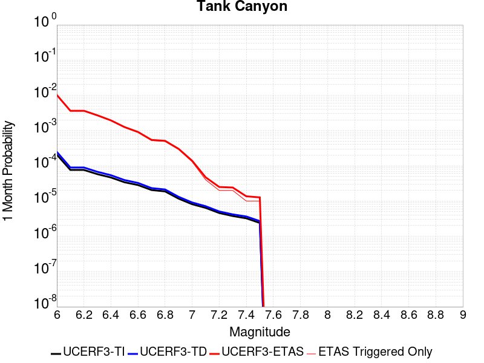 |  | 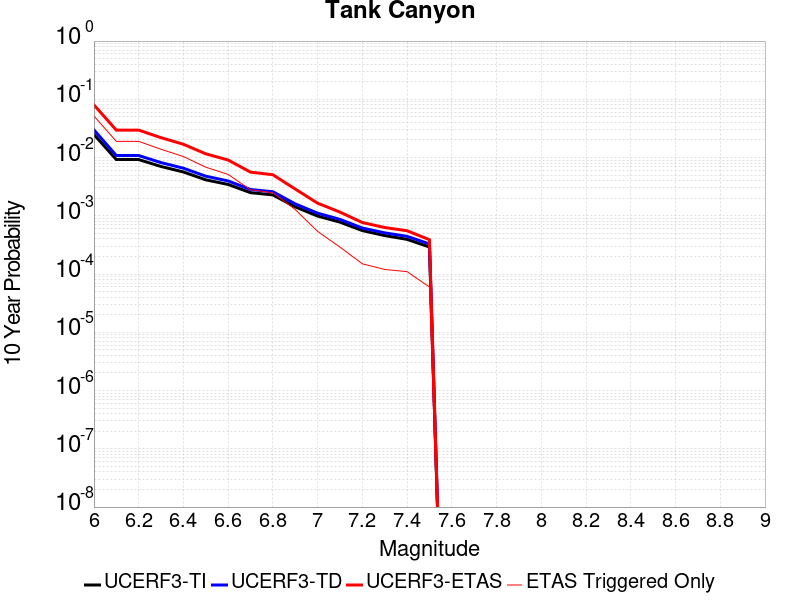 |

| Magnitude | 1 wk TI Prob | 1 wk TD Prob | 1 wk ETAS Prob | 1 wk ETAS/TD Gain | 1 wk ETAS Triggered Only | 1 mo TI Prob | 1 mo TD Prob | 1 mo ETAS Prob | 1 mo ETAS/TD Gain | 1 mo ETAS Triggered Only | 1 yr TI Prob | 1 yr TD Prob | 1 yr ETAS Prob | 1 yr ETAS/TD Gain | 1 yr ETAS Triggered Only | 10 yr TI Prob | 10 yr TD Prob | 10 yr ETAS Prob | 10 yr ETAS/TD Gain | 10 yr ETAS Triggered Only |
|-----|-----|-----|-----|-----|-----|-----|-----|-----|-----|-----|-----|-----|-----|-----|-----|-----|-----|-----|-----|-----|
| 6.0 | 4.8284557E-5 | 5.7965928E-5 | 0.0038677452 | 66.72446 | 0.00381 | 2.0691741E-4 | 2.484056E-4 | 0.010215929 | 41.126003 | 0.00997 | 0.0025163088 | 0.00302081 | 0.032800578 | 10.858207 | 0.02987 | 0.02488006 | 0.029864373 | 0.080068894 | 2.681084 | 0.05175 |
| 6.1 | 1.7796336E-5 | 2.0873778E-5 | 0.001350846 | 64.71497 | 0.00133 | 7.626778E-5 | 8.94562E-5 | 0.0036491377 | 40.79245 | 0.00356 | 9.281647E-4 | 0.0010886233 | 0.011747007 | 10.7907 | 0.01067 | 0.009242975 | 0.010836863 | 0.029601287 | 2.7315366 | 0.01897 |
| 6.2 | 1.7796336E-5 | 2.0873778E-5 | 0.001350846 | 64.71497 | 0.00133 | 7.626778E-5 | 8.94562E-5 | 0.0036491377 | 40.79245 | 0.00356 | 9.281647E-4 | 0.0010886233 | 0.011747007 | 10.7907 | 0.01067 | 0.009242975 | 0.010836863 | 0.029601287 | 2.7315366 | 0.01897 |
| 6.3 | 1.3515912E-5 | 1.575992E-5 | 0.0010057443 | 63.81658 | 9.9E-4 | 5.792405E-5 | 6.754091E-5 | 0.0027073626 | 40.08478 | 0.00264 | 7.049971E-4 | 8.2202395E-4 | 0.008685554 | 10.56606 | 0.00787 | 0.007027647 | 0.00819231 | 0.021948682 | 2.679181 | 0.01387 |
| 6.4 | 1.0870146E-5 | 1.2618305E-5 | 6.926097E-4 | 54.889282 | 6.8E-4 | 4.658551E-5 | 5.407743E-5 | 0.0019439752 | 35.947994 | 0.00189 | 5.67031E-4 | 6.5821153E-4 | 0.006644269 | 10.094427 | 0.00599 | 0.005655863 | 0.006564494 | 0.016906157 | 2.5753937 | 0.01041 |
| 6.5 | 7.964826E-6 | 9.196297E-6 | 4.7919198E-4 | 52.10706 | 4.7E-4 | 3.4134522E-5 | 3.9412163E-5 | 0.0012593641 | 31.95369 | 0.00122 | 4.1550855E-4 | 4.79748E-4 | 0.0044978196 | 9.37538 | 0.00402 | 0.0041473247 | 0.004788282 | 0.0115955295 | 2.4216473 | 0.00684 |
| 6.6 | 6.6317E-6 | 7.6124547E-6 | 3.8760956E-4 | 50.917816 | 3.8E-4 | 2.8421264E-5 | 3.2624448E-5 | 9.125957E-4 | 27.972755 | 8.8E-4 | 3.4597394E-4 | 3.9713932E-4 | 0.0034159399 | 8.601364 | 0.00302 | 0.0034543579 | 0.0039653047 | 0.009074963 | 2.2885914 | 0.00513 |
| 6.7 | 4.793663E-6 | 5.4308844E-6 | 2.5542954E-4 | 47.03277 | 2.5E-4 | 2.0544108E-5 | 2.3275035E-5 | 5.432629E-4 | 23.341015 | 5.2E-4 | 2.500958E-4 | 2.833411E-4 | 0.001952868 | 6.8922863 | 0.00167 | 0.0024981452 | 0.0028303456 | 0.005622421 | 1.9864784 | 0.0028 |
| 6.8 | 4.382823E-6 | 4.969349E-6 | 2.349682E-4 | 47.283497 | 2.3E-4 | 1.8783392E-5 | 2.129706E-5 | 5.112866E-4 | 24.00738 | 4.9E-4 | 2.286638E-4 | 2.5926513E-4 | 0.0017588763 | 6.784083 | 0.0015 | 0.0022842865 | 0.0025901678 | 0.0050737183 | 1.9588376 | 0.00249 |
| 6.9 | 2.729601E-6 | 3.0735978E-6 | 1.0307329E-4 | 33.53506 | 1.0E-4 | 1.1698237E-5 | 1.3172503E-5 | 3.031687E-4 | 23.015268 | 2.9E-4 | 1.4241673E-4 | 1.6036464E-4 | 9.0024597E-4 | 5.613744 | 7.4E-4 | 0.001423255 | 0.0016027512 | 0.0028806997 | 1.7973468 | 0.00128 |
| 7.0 | 1.8987357E-6 | 2.1269796E-6 | 7.212683E-5 | 33.91045 | 7.0E-5 | 8.137413E-6 | 9.115598E-6 | 1.3911442E-4 | 15.261139 | 1.3E-4 | 9.90685E-5 | 1.1097746E-4 | 4.609386E-4 | 4.153444 | 3.5E-4 | 9.902435E-4 | 0.001109289 | 0.00164869 | 1.4862583 | 5.4E-4 |
| 7.1 | 1.4928986E-6 | 1.6641586E-6 | 3.166411E-5 | 19.027098 | 3.0E-5 | 6.398121E-6 | 7.1320924E-6 | 4.7131805E-5 | 6.6084123 | 4.0E-5 | 7.789434E-5 | 8.6830354E-5 | 2.7681387E-4 | 3.187985 | 1.9E-4 | 7.786704E-4 | 8.6802215E-4 | 0.0011577704 | 1.3338028 | 2.9E-4 |
| 7.2 | 1.069082E-6 | 1.1828818E-6 | 2.1182857E-5 | 17.90784 | 2.0E-5 | 4.581772E-6 | 5.069486E-6 | 2.5069385E-5 | 4.9451528 | 2.0E-5 | 5.5781646E-5 | 6.171978E-5 | 1.5171422E-4 | 2.4581134 | 9.0E-5 | 5.576765E-4 | 6.170787E-4 | 7.669861E-4 | 1.2429309 | 1.5E-4 |
| 7.3 | 8.776551E-7 | 9.770191E-7 | 2.0976999E-5 | 21.470407 | 2.0E-5 | 3.7613736E-6 | 4.1872213E-6 | 2.4187137E-5 | 5.7764177 | 2.0E-5 | 4.579376E-5 | 5.0978742E-5 | 1.2097518E-4 | 2.3730514 | 7.0E-5 | 4.5784327E-4 | 5.097215E-4 | 6.296603E-4 | 1.2353027 | 1.2E-4 |
| 7.4 | 7.55721E-7 | 8.510419E-7 | 1.0851033E-5 | 12.750293 | 1.0E-5 | 3.2388E-6 | 3.64732E-6 | 1.3647284E-5 | 3.741729 | 1.0E-5 | 3.9431678E-5 | 4.4405737E-5 | 1.0440307E-4 | 2.351117 | 6.0E-5 | 3.942468E-4 | 4.4401948E-4 | 5.5397063E-4 | 1.2476269 | 1.1E-4 |
| 7.5 | 5.587665E-7 | 6.3057325E-7 | 1.0630567E-5 | 16.858576 | 1.0E-5 | 2.3947114E-6 | 2.7024569E-6 | 1.270243E-5 | 4.7003264 | 1.0E-5 | 2.915522E-5 | 3.290241E-5 | 7.290109E-5 | 2.2156763 | 4.0E-5 | 2.9151395E-4 | 3.2902413E-4 | 3.890044E-4 | 1.1822975 | 6.0E-5 |

## Garlock (Central)
*[(top)](#table-of-contents)*

| 1 Week | 1 Month | 1 Year | 10 Year |
|-----|-----|-----|-----|
|  |  |  |  |

| Magnitude | 1 wk TI Prob | 1 wk TD Prob | 1 wk ETAS Prob | 1 wk ETAS/TD Gain | 1 wk ETAS Triggered Only | 1 mo TI Prob | 1 mo TD Prob | 1 mo ETAS Prob | 1 mo ETAS/TD Gain | 1 mo ETAS Triggered Only | 1 yr TI Prob | 1 yr TD Prob | 1 yr ETAS Prob | 1 yr ETAS/TD Gain | 1 yr ETAS Triggered Only | 10 yr TI Prob | 10 yr TD Prob | 10 yr ETAS Prob | 10 yr ETAS/TD Gain | 10 yr ETAS Triggered Only |
|-----|-----|-----|-----|-----|-----|-----|-----|-----|-----|-----|-----|-----|-----|-----|-----|-----|-----|-----|-----|-----|
| 6.0 | 5.5131142E-5 | 7.0252936E-5 | 0.005749854 | 81.84504 | 0.00568 | 2.3625491E-4 | 3.0104961E-4 | 0.014336823 | 47.62279 | 0.01404 | 0.0028726095 | 0.0036591832 | 0.038909722 | 10.633445 | 0.03538 | 0.028357591 | 0.0361412 | 0.092392 | 2.5564177 | 0.05836 |
| 6.1 | 5.5131142E-5 | 7.0252936E-5 | 0.005749854 | 81.84504 | 0.00568 | 2.3625491E-4 | 3.0104961E-4 | 0.014336823 | 47.62279 | 0.01404 | 0.0028726095 | 0.0036591832 | 0.038909722 | 10.633445 | 0.03538 | 0.028357591 | 0.0361412 | 0.092392 | 2.5564177 | 0.05836 |
| 6.2 | 4.216245E-5 | 5.166702E-5 | 0.0035614856 | 68.93151 | 0.00351 | 1.806837E-4 | 2.2141145E-4 | 0.009049457 | 40.871674 | 0.00883 | 0.0021976046 | 0.0026923835 | 0.025710244 | 9.549251 | 0.02308 | 0.021759989 | 0.026704067 | 0.06385478 | 2.3912003 | 0.03817 |
| 6.3 | 4.216245E-5 | 5.166702E-5 | 0.0035614856 | 68.93151 | 0.00351 | 1.806837E-4 | 2.2141145E-4 | 0.009049457 | 40.871674 | 0.00883 | 0.0021976046 | 0.0026923835 | 0.025710244 | 9.549251 | 0.02308 | 0.021759989 | 0.026704067 | 0.06385478 | 2.3912003 | 0.03817 |
| 6.4 | 3.6858168E-5 | 4.411544E-5 | 0.0027839947 | 63.107037 | 0.00274 | 1.5795401E-4 | 1.890526E-4 | 0.0072277216 | 38.231274 | 0.00704 | 0.0019213937 | 0.0022993109 | 0.020617096 | 8.96664 | 0.01836 | 0.019048655 | 0.022868566 | 0.05276879 | 2.3074813 | 0.0306 |
| 6.5 | 3.39199E-5 | 4.0023602E-5 | 0.0025399236 | 63.460644 | 0.0025 | 1.453629E-4 | 1.7151856E-4 | 0.006580419 | 38.365635 | 0.00641 | 0.0017683565 | 0.0020862604 | 0.018761398 | 8.992837 | 0.01671 | 0.017543508 | 0.020761253 | 0.047915544 | 2.3079312 | 0.02773 |
| 6.6 | 3.3571985E-5 | 3.9477756E-5 | 0.0025293794 | 64.07101 | 0.00249 | 1.4387199E-4 | 1.6917953E-4 | 0.0065580984 | 38.764137 | 0.00639 | 0.0017502342 | 0.0020578366 | 0.018703511 | 9.08892 | 0.01668 | 0.017365133 | 0.020482505 | 0.047556367 | 2.3218043 | 0.02764 |
| 6.7 | 3.2580007E-5 | 3.8094186E-5 | 0.0024180035 | 63.474346 | 0.00238 | 1.3962112E-4 | 1.632507E-4 | 0.006302248 | 38.604725 | 0.00614 | 0.0016985617 | 0.001985787 | 0.017874174 | 9.001053 | 0.01592 | 0.016856372 | 0.019771622 | 0.04569866 | 2.311326 | 0.02645 |
| 6.8 | 3.2185937E-5 | 3.7521368E-5 | 0.0023774335 | 63.362125 | 0.00234 | 1.3793244E-4 | 1.6079607E-4 | 0.0061898264 | 38.494884 | 0.00603 | 0.0016780337 | 0.0019559558 | 0.017565364 | 8.980451 | 0.01564 | 0.016654192 | 0.01947876 | 0.044962507 | 2.3082838 | 0.02599 |
| 6.9 | 3.165394E-5 | 3.672589E-5 | 0.0023466412 | 63.896095 | 0.00231 | 1.3565269E-4 | 1.573873E-4 | 0.006036462 | 38.354187 | 0.00588 | 0.0016503202 | 0.0019145276 | 0.01710539 | 8.934522 | 0.01522 | 0.01638118 | 0.01907232 | 0.04390941 | 2.3022585 | 0.02532 |
| 7.0 | 3.0903822E-5 | 3.5631027E-5 | 0.00230555 | 64.70625 | 0.00227 | 1.3243823E-4 | 1.5269557E-4 | 0.0059218146 | 38.781834 | 0.00577 | 0.0016112428 | 0.0018575046 | 0.016759772 | 9.022735 | 0.01493 | 0.015996104 | 0.018513773 | 0.042805556 | 2.3120925 | 0.02475 |
| 7.1 | 3.0069863E-5 | 3.439724E-5 | 0.0021943229 | 63.79358 | 0.00216 | 1.2886449E-4 | 1.4740853E-4 | 0.005686592 | 38.57709 | 0.00554 | 0.0015677959 | 0.0017932425 | 0.016207349 | 9.0380125 | 0.01444 | 0.01556781 | 0.017881477 | 0.041452322 | 2.318171 | 0.024 |
| 7.2 | 2.7957109E-5 | 3.1286352E-5 | 0.0018512295 | 59.170506 | 0.00182 | 1.1981068E-4 | 1.3407759E-4 | 0.0047734557 | 35.60219 | 0.00464 | 0.0014577188 | 0.0016311919 | 0.013681503 | 8.387427 | 0.01207 | 0.014481937 | 0.01628507 | 0.036097087 | 2.2165756 | 0.02014 |
| 7.3 | 2.4519275E-5 | 2.6719234E-5 | 0.0014066823 | 52.64681 | 0.00138 | 1.0507837E-4 | 1.1450605E-4 | 0.003554112 | 31.03864 | 0.00344 | 0.0012785783 | 0.0013932344 | 0.009881392 | 7.092412 | 0.0085 | 0.012712469 | 0.013929329 | 0.028217493 | 2.0257611 | 0.01449 |
| 7.4 | 2.3225532E-5 | 2.52037E-5 | 0.0012951717 | 51.388153 | 0.00127 | 9.95342E-5 | 1.08011474E-4 | 0.0032276744 | 29.8827 | 0.00312 | 0.0012111551 | 0.0013142608 | 0.008934233 | 6.797915 | 0.00763 | 0.012045753 | 0.013146927 | 0.02608457 | 1.9840813 | 0.01311 |
| 7.5 | 2.097765E-5 | 2.2487684E-5 | 9.724663E-4 | 43.244396 | 9.5E-4 | 8.9901114E-5 | 9.637229E-5 | 0.0024361468 | 25.278498 | 0.00234 | 0.0010939965 | 0.0011727129 | 0.0069758995 | 5.9485145 | 0.00581 | 0.010886264 | 0.011741684 | 0.02190098 | 1.8652333 | 0.01028 |
| 7.6 | 1.511254E-5 | 1.599496E-5 | 5.4598646E-4 | 34.13491 | 5.3E-4 | 6.476642E-5 | 6.854807E-5 | 0.0014184555 | 20.69286 | 0.00135 | 7.882459E-4 | 8.34261E-4 | 0.004211441 | 5.04811 | 0.00338 | 0.007854558 | 0.008384922 | 0.014314779 | 1.7072049 | 0.00598 |
| 7.7 | 9.934069E-6 | 1.0682194E-5 | 2.1068005E-4 | 19.722546 | 2.0E-4 | 4.2573887E-5 | 4.578003E-5 | 4.5576127E-4 | 9.95546 | 4.1E-4 | 5.182138E-4 | 5.5722974E-4 | 0.0015666669 | 2.811528 | 0.00101 | 0.00517007 | 0.0056296214 | 0.007429432 | 1.3197036 | 0.00181 |
| 7.8 | 6.7562896E-6 | 8.431359E-6 | 1.4843018E-4 | 17.604538 | 1.4E-4 | 2.8955206E-5 | 3.6133893E-5 | 3.0612413E-4 | 8.471938 | 2.7E-4 | 3.5247262E-4 | 4.3984153E-4 | 0.001129538 | 2.5680568 | 6.9E-4 | 0.0035191406 | 0.004448285 | 0.0056529026 | 1.270805 | 0.00121 |
| 7.9 | 3.975453E-6 | 5.3728804E-6 | 7.53725E-5 | 14.028324 | 7.0E-5 | 1.7037546E-5 | 2.3026427E-5 | 1.7302297E-4 | 7.5141044 | 1.5E-4 | 2.0741238E-4 | 2.8031078E-4 | 6.901958E-4 | 2.4622524 | 4.1E-4 | 0.002072189 | 0.00283465 | 0.0035725522 | 1.2603152 | 7.4E-4 |
| 8.0 | 1.6729537E-6 | 2.0781215E-6 | 3.207806E-5 | 15.436085 | 3.0E-5 | 7.169782E-6 | 8.906205E-6 | 7.8905585E-5 | 8.859619 | 7.0E-5 | 8.7288594E-5 | 1.0842768E-4 | 2.1841575E-4 | 2.0143912 | 1.1E-4 | 8.7254314E-4 | 0.0010973068 | 0.0013070763 | 1.1911677 | 2.1E-4 |
| 8.1 | 3.6733252E-7 | 3.1497066E-7 | 3.1497066E-7 | 1.0 | 0.0 | 1.5742813E-6 | 1.3498736E-6 | 1.3498736E-6 | 1.0 | 0.0 | 1.9166706E-5 | 1.6434604E-5 | 2.643444E-5 | 1.6084622 | 1.0E-5 | 1.9165053E-4 | 1.6648426E-4 | 1.8648093E-4 | 1.1201115 | 2.0E-5 |

## Little Lake
*[(top)](#table-of-contents)*

| 1 Week | 1 Month | 1 Year | 10 Year |
|-----|-----|-----|-----|
|  |  |  |  |

| Magnitude | 1 wk TI Prob | 1 wk TD Prob | 1 wk ETAS Prob | 1 wk ETAS/TD Gain | 1 wk ETAS Triggered Only | 1 mo TI Prob | 1 mo TD Prob | 1 mo ETAS Prob | 1 mo ETAS/TD Gain | 1 mo ETAS Triggered Only | 1 yr TI Prob | 1 yr TD Prob | 1 yr ETAS Prob | 1 yr ETAS/TD Gain | 1 yr ETAS Triggered Only | 10 yr TI Prob | 10 yr TD Prob | 10 yr ETAS Prob | 10 yr ETAS/TD Gain | 10 yr ETAS Triggered Only |
|-----|-----|-----|-----|-----|-----|-----|-----|-----|-----|-----|-----|-----|-----|-----|-----|-----|-----|-----|-----|-----|
| 6.0 | 2.8424427E-5 | 3.1206153E-5 | 0.0027011228 | 86.55737 | 0.00267 | 1.2181328E-4 | 1.3373456E-4 | 0.006752849 | 50.494423 | 0.00662 | 0.0014820677 | 0.0016271353 | 0.018839084 | 11.578068 | 0.01724 | 0.014722223 | 0.016165623 | 0.04350638 | 2.69129 | 0.02779 |
| 6.1 | 2.8424427E-5 | 3.1206153E-5 | 0.0027011228 | 86.55737 | 0.00267 | 1.2181328E-4 | 1.3373456E-4 | 0.006752849 | 50.494423 | 0.00662 | 0.0014820677 | 0.0016271353 | 0.018839084 | 11.578068 | 0.01724 | 0.014722223 | 0.016165623 | 0.04350638 | 2.69129 | 0.02779 |
| 6.2 | 2.8424427E-5 | 3.1206153E-5 | 0.0027011228 | 86.55737 | 0.00267 | 1.2181328E-4 | 1.3373456E-4 | 0.006752849 | 50.494423 | 0.00662 | 0.0014820677 | 0.0016271353 | 0.018839084 | 11.578068 | 0.01724 | 0.014722223 | 0.016165623 | 0.04350638 | 2.69129 | 0.02779 |
| 6.3 | 1.48860645E-5 | 1.6081587E-5 | 0.0017260541 | 107.33108 | 0.00171 | 6.379586E-5 | 6.891943E-5 | 0.004048645 | 58.744614 | 0.00398 | 7.7643775E-4 | 8.387992E-4 | 0.011250059 | 13.4121 | 0.01042 | 0.007737305 | 0.00835915 | 0.024552645 | 2.9372177 | 0.01633 |
| 6.4 | 1.48860645E-5 | 1.6081587E-5 | 0.0017260541 | 107.33108 | 0.00171 | 6.379586E-5 | 6.891943E-5 | 0.004048645 | 58.744614 | 0.00398 | 7.7643775E-4 | 8.387992E-4 | 0.011250059 | 13.4121 | 0.01042 | 0.007737305 | 0.00835915 | 0.024552645 | 2.9372177 | 0.01633 |
| 6.5 | 1.2797581E-5 | 1.376573E-5 | 0.001513745 | 109.96475 | 0.0015 | 5.4845623E-5 | 5.8994796E-5 | 0.0036687818 | 62.18823 | 0.00361 | 6.675408E-4 | 7.1805064E-4 | 0.010221222 | 14.234681 | 0.00951 | 0.006655392 | 0.0071598557 | 0.021883674 | 3.0564408 | 0.01483 |
| 6.6 | 9.661896E-6 | 1.0289153E-5 | 0.0013002759 | 126.37347 | 0.00129 | 4.1407468E-5 | 4.4095712E-5 | 0.0031939568 | 72.432365 | 0.00315 | 5.040193E-4 | 5.367493E-4 | 0.008772327 | 16.343433 | 0.00824 | 0.005028777 | 0.005356134 | 0.018107468 | 3.3806975 | 0.01282 |
| 6.7 | 7.767871E-6 | 8.199772E-6 | 0.0011481905 | 140.0271 | 0.00114 | 3.329045E-5 | 3.5141486E-5 | 0.0028250434 | 80.39055 | 0.00279 | 4.0523586E-4 | 4.2777733E-4 | 0.007704663 | 18.01092 | 0.00728 | 0.004044977 | 0.0042708907 | 0.015383228 | 3.6018782 | 0.01116 |
| 6.8 | 6.4235196E-6 | 6.7358133E-6 | 9.6672936E-4 | 143.52081 | 9.6E-4 | 2.752908E-5 | 2.8867524E-5 | 0.0022588032 | 78.24721 | 0.00223 | 3.35115E-4 | 3.5141825E-4 | 0.00614938 | 17.49875 | 0.0058 | 0.003346101 | 0.0035098856 | 0.012418508 | 3.5381515 | 0.00894 |
| 6.9 | 3.1283696E-6 | 3.112201E-6 | 5.6311046E-4 | 180.9364 | 5.6E-4 | 1.3407229E-5 | 1.3337944E-5 | 0.0013633199 | 102.213646 | 0.00135 | 1.6322079E-4 | 1.6237888E-4 | 0.0036018202 | 22.181581 | 0.00344 | 0.0016310095 | 0.0016227507 | 0.0069241337 | 4.2669115 | 0.00531 |
| 7.0 | 2.290603E-6 | 2.2286956E-6 | 2.8222808E-4 | 126.63374 | 2.8E-4 | 9.816834E-6 | 9.551524E-6 | 7.99544E-4 | 83.70853 | 7.9E-4 | 1.19513395E-4 | 1.1628464E-4 | 0.0022160404 | 19.057035 | 0.0021 | 0.0011944914 | 0.00116234 | 0.004368609 | 3.7584603 | 0.00321 |
| 7.1 | 1.293693E-6 | 1.1776893E-6 | 1.1117756E-4 | 94.40313 | 1.1E-4 | 5.5443866E-6 | 5.047234E-6 | 3.6504542E-4 | 72.325836 | 3.6E-4 | 6.750081E-5 | 6.144904E-5 | 0.0011113845 | 18.086279 | 0.00105 | 6.7480316E-4 | 6.1438896E-4 | 0.0022633753 | 3.683945 | 0.00165 |
| 7.2 | 4.715842E-7 | 3.0917863E-7 | 1.0309175E-5 | 33.34375 | 1.0E-5 | 2.0210737E-6 | 1.3250507E-6 | 1.1325037E-5 | 8.546871 | 1.0E-5 | 2.4606294E-5 | 1.6132379E-5 | 5.6131732E-5 | 3.4794457 | 4.0E-5 | 2.460357E-4 | 1.6131261E-4 | 2.3130132E-4 | 1.4338701 | 7.0E-5 |
| 7.3 | 3.9430947E-7 | 2.3097442E-7 | 1.0230972E-5 | 44.294827 | 1.0E-5 | 1.6898966E-6 | 9.8989E-7 | 1.098988E-5 | 11.102122 | 1.0E-5 | 2.0574296E-5 | 1.2051845E-5 | 4.2051484E-5 | 3.4892154 | 3.0E-5 | 2.0572392E-4 | 1.2051199E-4 | 1.8050477E-4 | 1.4978157 | 6.0E-5 |
| 7.4 | 3.547123E-7 | 1.9679048E-7 | 1.0196789E-5 | 51.815456 | 1.0E-5 | 1.5201948E-6 | 8.433875E-7 | 1.0843379E-5 | 12.856936 | 1.0E-5 | 1.8508214E-5 | 1.0268195E-5 | 4.0267885E-5 | 3.921613 | 3.0E-5 | 1.8506673E-4 | 1.0267727E-4 | 1.6267112E-4 | 1.5842953 | 6.0E-5 |
| 7.5 | 2.6354266E-7 | 1.4423068E-7 | 1.4423068E-7 | 1.0 | 0.0 | 1.129468E-6 | 6.1813137E-7 | 6.1813137E-7 | 1.0 | 0.0 | 1.3751187E-5 | 7.525724E-6 | 1.7525648E-5 | 2.3287659 | 1.0E-5 | 1.3750336E-4 | 7.525474E-5 | 1.1525173E-4 | 1.531488 | 4.0E-5 |
| 7.6 | 1.269913E-7 | 7.572499E-8 | 7.572499E-8 | 1.0 | 0.0 | 5.4424834E-7 | 3.2453565E-7 | 3.2453565E-7 | 1.0 | 0.0 | 6.6262032E-6 | 3.9512147E-6 | 3.9512147E-6 | 1.0 | 0.0 | 6.626006E-5 | 3.951148E-5 | 5.951069E-5 | 1.506162 | 2.0E-5 |

## Owl Lake
*[(top)](#table-of-contents)*

| 1 Week | 1 Month | 1 Year | 10 Year |
|-----|-----|-----|-----|
|  |  |  |  |

| Magnitude | 1 wk TI Prob | 1 wk TD Prob | 1 wk ETAS Prob | 1 wk ETAS/TD Gain | 1 wk ETAS Triggered Only | 1 mo TI Prob | 1 mo TD Prob | 1 mo ETAS Prob | 1 mo ETAS/TD Gain | 1 mo ETAS Triggered Only | 1 yr TI Prob | 1 yr TD Prob | 1 yr ETAS Prob | 1 yr ETAS/TD Gain | 1 yr ETAS Triggered Only | 10 yr TI Prob | 10 yr TD Prob | 10 yr ETAS Prob | 10 yr ETAS/TD Gain | 10 yr ETAS Triggered Only |
|-----|-----|-----|-----|-----|-----|-----|-----|-----|-----|-----|-----|-----|-----|-----|-----|-----|-----|-----|-----|-----|
| 6.0 | 5.0320643E-5 | 6.636041E-5 | 0.0015162642 | 22.848928 | 0.00145 | 2.1564208E-4 | 2.84377E-4 | 0.0041532763 | 14.604826 | 0.00387 | 0.0026222812 | 0.0034577118 | 0.01436985 | 4.1558843 | 0.01095 | 0.02591553 | 0.034142397 | 0.053198766 | 1.5581439 | 0.01973 |
| 6.1 | 5.0320643E-5 | 6.636041E-5 | 0.0015162642 | 22.848928 | 0.00145 | 2.1564208E-4 | 2.84377E-4 | 0.0041532763 | 14.604826 | 0.00387 | 0.0026222812 | 0.0034577118 | 0.01436985 | 4.1558843 | 0.01095 | 0.02591553 | 0.034142397 | 0.053198766 | 1.5581439 | 0.01973 |
| 6.2 | 2.4125871E-5 | 3.098217E-5 | 0.0011909462 | 38.43973 | 0.00116 | 1.0339249E-4 | 1.3277512E-4 | 0.0030823834 | 23.215069 | 0.00295 | 0.0012580766 | 0.0016155102 | 0.009902101 | 6.129396 | 0.0083 | 0.012509781 | 0.016071098 | 0.030928424 | 1.924475 | 0.0151 |
| 6.3 | 1.7433485E-5 | 2.2356866E-5 | 0.0010123347 | 45.28071 | 9.9E-4 | 7.471279E-5 | 9.58125E-5 | 0.0026855643 | 28.029373 | 0.00259 | 9.0924866E-4 | 0.0011660301 | 0.008407576 | 7.210428 | 0.00725 | 0.009055373 | 0.011629325 | 0.024478143 | 2.1048636 | 0.013 |
| 6.4 | 1.7433485E-5 | 2.2356866E-5 | 0.0010123347 | 45.28071 | 9.9E-4 | 7.471279E-5 | 9.58125E-5 | 0.0026855643 | 28.029373 | 0.00259 | 9.0924866E-4 | 0.0011660301 | 0.008407576 | 7.210428 | 0.00725 | 0.009055373 | 0.011629325 | 0.024478143 | 2.1048636 | 0.013 |
| 6.5 | 1.5182742E-5 | 1.9430483E-5 | 9.894116E-4 | 50.92059 | 9.7E-4 | 6.506727E-5 | 8.32717E-5 | 0.0025830634 | 31.019707 | 0.0025 | 7.919061E-4 | 0.0010134967 | 0.007936473 | 7.8307834 | 0.00693 | 0.0078909 | 0.010118797 | 0.022205247 | 2.1944551 | 0.01221 |
| 6.6 | 6.7271576E-6 | 8.548313E-6 | 8.285413E-4 | 96.92454 | 8.2E-4 | 2.8830356E-5 | 3.6635145E-5 | 0.002036562 | 55.590385 | 0.002 | 3.5095305E-4 | 4.4594728E-4 | 0.005823548 | 13.058826 | 0.00538 | 0.0035039932 | 0.004467926 | 0.0134575805 | 3.0120418 | 0.00903 |
| 6.7 | 6.682835E-6 | 8.480754E-6 | 8.284738E-4 | 97.68869 | 8.2E-4 | 2.8640408E-5 | 3.6345617E-5 | 0.002036273 | 56.02527 | 0.002 | 3.4864116E-4 | 4.4242368E-4 | 0.005810048 | 13.132317 | 0.00537 | 0.003480947 | 0.00443287 | 0.01340293 | 3.023533 | 0.00901 |
| 6.8 | 6.5774975E-6 | 8.32722E-6 | 8.283204E-4 | 99.47143 | 8.2E-4 | 2.8188972E-5 | 3.5687626E-5 | 0.0020256166 | 56.759632 | 0.00199 | 3.4314668E-4 | 4.3441588E-4 | 0.0057820915 | 13.310038 | 0.00535 | 0.0034261728 | 0.0043530487 | 0.013264089 | 3.0470803 | 0.00895 |
| 6.9 | 6.363419E-6 | 8.000376E-6 | 8.279938E-4 | 103.49437 | 8.2E-4 | 2.727151E-5 | 3.4286906E-5 | 0.0020242187 | 59.037663 | 0.00199 | 3.3198006E-4 | 4.173687E-4 | 0.005765136 | 13.813053 | 0.00535 | 0.0033148455 | 0.004183012 | 0.013085616 | 3.1282759 | 0.00894 |
| 7.0 | 6.1342453E-6 | 7.632552E-6 | 8.2762627E-4 | 108.43376 | 8.2E-4 | 2.6289357E-5 | 3.271056E-5 | 0.0020126458 | 61.528934 | 0.00198 | 3.2002592E-4 | 3.9818377E-4 | 0.0057160654 | 14.355345 | 0.00532 | 0.0031956544 | 0.003991678 | 0.012826271 | 3.2132533 | 0.00887 |
| 7.1 | 5.842926E-6 | 7.1430604E-6 | 7.771376E-4 | 108.796165 | 7.7E-4 | 2.504087E-5 | 3.0612788E-5 | 0.0019405544 | 63.390316 | 0.00191 | 3.0482994E-4 | 3.7265237E-4 | 0.005500741 | 14.761051 | 0.00513 | 0.0030441214 | 0.0037372818 | 0.012295178 | 3.289872 | 0.00859 |
| 7.2 | 4.77173E-6 | 5.359158E-6 | 4.8535658E-4 | 90.56583 | 4.8E-4 | 2.045011E-5 | 2.296764E-5 | 0.0011729412 | 51.069294 | 0.00115 | 2.4895166E-4 | 2.795992E-4 | 0.0035386877 | 12.656287 | 0.00326 | 0.0024867293 | 0.002808747 | 0.008353131 | 2.9739704 | 0.00556 |
| 7.3 | 3.0494948E-6 | 2.7108347E-6 | 1.7271038E-4 | 63.711143 | 1.7E-4 | 1.3069198E-5 | 1.1617813E-5 | 3.1161433E-4 | 26.822119 | 3.0E-4 | 1.5910587E-4 | 1.4143785E-4 | 8.813332E-4 | 6.2312403 | 7.4E-4 | 0.0015899199 | 0.0014233418 | 0.002871278 | 2.0172794 | 0.00145 |
| 7.4 | 2.7263884E-6 | 2.3060104E-6 | 1.0230578E-4 | 44.36484 | 1.0E-4 | 1.1684469E-5 | 9.882864E-6 | 2.0988089E-4 | 21.236847 | 2.0E-4 | 1.4224913E-4 | 1.2031734E-4 | 5.902608E-4 | 4.9058666 | 4.7E-4 | 0.0014215811 | 0.0012113012 | 0.0021701383 | 1.7915761 | 9.6E-4 |
| 7.5 | 2.6090431E-6 | 2.1659357E-6 | 8.216576E-5 | 37.93546 | 8.0E-5 | 1.1181565E-5 | 9.282549E-6 | 1.5928116E-4 | 17.159204 | 1.5E-4 | 1.3612706E-4 | 1.1300927E-4 | 4.729686E-4 | 4.1852193 | 3.6E-4 | 0.001360437 | 0.0011380832 | 0.0019171955 | 1.684583 | 7.8E-4 |
| 7.6 | 2.3008756E-6 | 1.8730968E-6 | 5.1873005E-5 | 27.69371 | 5.0E-5 | 9.860858E-6 | 8.027534E-6 | 1.0802673E-4 | 13.4570265 | 1.0E-4 | 1.20049335E-4 | 9.7730925E-5 | 3.6770455E-4 | 3.7624176 | 2.7E-4 | 0.001199845 | 9.851726E-4 | 0.001554611 | 1.5780089 | 5.7E-4 |
| 7.7 | 1.7184348E-6 | 1.3421906E-6 | 2.1342164E-5 | 15.900993 | 2.0E-5 | 7.3646997E-6 | 5.752233E-6 | 3.5752062E-5 | 6.215336 | 3.0E-5 | 8.966153E-5 | 7.003123E-5 | 1.8002352E-4 | 2.570618 | 1.1E-4 | 8.962536E-4 | 7.08018E-4 | 9.978127E-4 | 1.4093041 | 2.9E-4 |
| 7.8 | 8.4612907E-7 | 8.408234E-7 | 1.0840815E-5 | 12.893093 | 1.0E-5 | 3.6262625E-6 | 3.6035242E-6 | 1.3603488E-5 | 3.775051 | 1.0E-5 | 4.4148852E-5 | 4.3872045E-5 | 8.387029E-5 | 1.9117023 | 4.0E-5 | 4.414008E-4 | 4.440713E-4 | 5.5402244E-4 | 1.2475979 | 1.1E-4 |
| 7.9 | 2.716738E-7 | 3.7693766E-7 | 3.7693766E-7 | 1.0 | 0.0 | 1.1643157E-6 | 1.6154462E-6 | 1.6154462E-6 | 1.0 | 0.0 | 1.4175452E-5 | 1.9667892E-5 | 1.9667892E-5 | 1.0 | 0.0 | 1.4174548E-4 | 1.9836401E-4 | 2.1836004E-4 | 1.1008047 | 2.0E-5 |
| 8.0 | 2.1995428E-8 | 3.38572E-8 | 3.38572E-8 | 1.0 | 0.0 | 9.426611E-8 | 1.4510229E-7 | 1.4510229E-7 | 1.0 | 0.0 | 1.1476893E-6 | 1.7666197E-6 | 1.7666197E-6 | 1.0 | 0.0 | 1.14768345E-5 | 1.7871007E-5 | 1.7871007E-5 | 1.0 | 0.0 |

## Airport Lake
*[(top)](#table-of-contents)*

| 1 Week | 1 Month | 1 Year | 10 Year |
|-----|-----|-----|-----|
|  |  |  |  |

| Magnitude | 1 wk TI Prob | 1 wk TD Prob | 1 wk ETAS Prob | 1 wk ETAS/TD Gain | 1 wk ETAS Triggered Only | 1 mo TI Prob | 1 mo TD Prob | 1 mo ETAS Prob | 1 mo ETAS/TD Gain | 1 mo ETAS Triggered Only | 1 yr TI Prob | 1 yr TD Prob | 1 yr ETAS Prob | 1 yr ETAS/TD Gain | 1 yr ETAS Triggered Only | 10 yr TI Prob | 10 yr TD Prob | 10 yr ETAS Prob | 10 yr ETAS/TD Gain | 10 yr ETAS Triggered Only |
|-----|-----|-----|-----|-----|-----|-----|-----|-----|-----|-----|-----|-----|-----|-----|-----|-----|-----|-----|-----|-----|
| 6.0 | 1.2387061E-5 | 1.31032575E-5 | 0.0020330767 | 155.15813 | 0.00202 | 5.3086325E-5 | 5.6155768E-5 | 0.0049858787 | 88.78658 | 0.00493 | 6.461343E-4 | 6.835104E-4 | 0.012235609 | 17.90113 | 0.01156 | 0.0064425888 | 0.0068168915 | 0.024584938 | 3.6064734 | 0.01789 |
| 6.1 | 1.2387061E-5 | 1.31032575E-5 | 0.0020330767 | 155.15813 | 0.00202 | 5.3086325E-5 | 5.6155768E-5 | 0.0049858787 | 88.78658 | 0.00493 | 6.461343E-4 | 6.835104E-4 | 0.012235609 | 17.90113 | 0.01156 | 0.0064425888 | 0.0068168915 | 0.024584938 | 3.6064734 | 0.01789 |
| 6.2 | 1.2387061E-5 | 1.31032575E-5 | 0.0020330767 | 155.15813 | 0.00202 | 5.3086325E-5 | 5.6155768E-5 | 0.0049858787 | 88.78658 | 0.00493 | 6.461343E-4 | 6.835104E-4 | 0.012235609 | 17.90113 | 0.01156 | 0.0064425888 | 0.0068168915 | 0.024584938 | 3.6064734 | 0.01789 |
| 6.3 | 1.2387061E-5 | 1.31032575E-5 | 0.0020330767 | 155.15813 | 0.00202 | 5.3086325E-5 | 5.6155768E-5 | 0.0049858787 | 88.78658 | 0.00493 | 6.461343E-4 | 6.835104E-4 | 0.012235609 | 17.90113 | 0.01156 | 0.0064425888 | 0.0068168915 | 0.024584938 | 3.6064734 | 0.01789 |
| 6.4 | 1.2387061E-5 | 1.31032575E-5 | 0.0020330767 | 155.15813 | 0.00202 | 5.3086325E-5 | 5.6155768E-5 | 0.0049858787 | 88.78658 | 0.00493 | 6.461343E-4 | 6.835104E-4 | 0.012235609 | 17.90113 | 0.01156 | 0.0064425888 | 0.0068168915 | 0.024584938 | 3.6064734 | 0.01789 |
| 6.5 | 6.9922594E-6 | 7.38498E-6 | 0.0015673734 | 212.238 | 0.00156 | 2.996648E-5 | 3.164956E-5 | 0.0037215329 | 117.5856 | 0.00369 | 3.6478083E-4 | 3.8527072E-4 | 0.009041934 | 23.469042 | 0.00866 | 0.003641826 | 0.0038465653 | 0.01737433 | 4.5168424 | 0.01358 |
| 6.6 | 6.9922594E-6 | 7.38498E-6 | 0.0015673734 | 212.238 | 0.00156 | 2.996648E-5 | 3.164956E-5 | 0.0037215329 | 117.5856 | 0.00369 | 3.6478083E-4 | 3.8527072E-4 | 0.009041934 | 23.469042 | 0.00866 | 0.003641826 | 0.0038465653 | 0.01737433 | 4.5168424 | 0.01358 |
| 6.7 | 5.477277E-6 | 5.7861116E-6 | 0.0013857781 | 239.50076 | 0.00138 | 2.3473833E-5 | 2.4797408E-5 | 0.0032547172 | 131.25232 | 0.00323 | 2.8575645E-4 | 3.0187052E-4 | 0.0077696154 | 25.73824 | 0.00747 | 0.0028538927 | 0.0030149885 | 0.014599954 | 4.842458 | 0.01162 |
| 6.8 | 3.9950432E-6 | 4.2191186E-6 | 0.0010942145 | 259.3467 | 0.00109 | 1.7121502E-5 | 1.8081826E-5 | 0.0025480362 | 140.91696 | 0.00253 | 2.0843433E-4 | 2.2012675E-4 | 0.0059488653 | 27.024727 | 0.00573 | 0.0020823893 | 0.002199358 | 0.0110298935 | 5.0150514 | 0.00885 |
| 6.9 | 2.95695E-6 | 3.1230477E-6 | 7.1312085E-4 | 228.34132 | 7.1E-4 | 1.2672582E-5 | 1.3384434E-5 | 0.0018233602 | 136.2299 | 0.00181 | 1.5427776E-4 | 1.6294557E-4 | 0.004302271 | 26.403118 | 0.00414 | 0.001541707 | 0.0016284833 | 0.008077963 | 4.9604216 | 0.00646 |
| 7.0 | 1.456072E-6 | 1.5408239E-6 | 2.715404E-4 | 176.23065 | 2.7E-4 | 6.2402937E-6 | 6.60352E-6 | 7.4659864E-4 | 113.06071 | 7.4E-4 | 7.597293E-5 | 8.03959E-5 | 0.0020302392 | 25.25302 | 0.00195 | 7.594696E-4 | 8.03767E-4 | 0.003761388 | 4.6796994 | 0.00296 |
| 7.1 | 6.995192E-7 | 7.4090326E-7 | 1.0074083E-4 | 135.97029 | 1.0E-4 | 2.997936E-6 | 3.1752998E-6 | 3.531742E-4 | 111.225464 | 3.5E-4 | 3.649926E-5 | 3.8659273E-5 | 0.0010386206 | 26.866014 | 0.001 | 3.6493264E-4 | 3.8659273E-4 | 0.0019259974 | 4.9819803 | 0.00154 |

## Panamint Valley
*[(top)](#table-of-contents)*

| 1 Week | 1 Month | 1 Year | 10 Year |
|-----|-----|-----|-----|
|  | 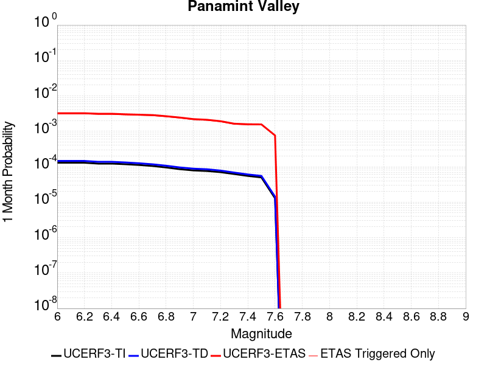 |  | 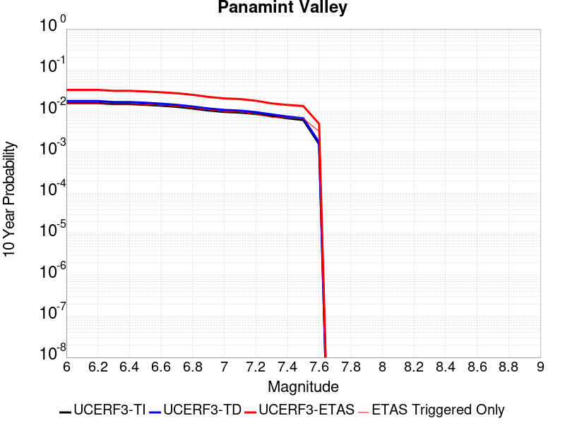 |

| Magnitude | 1 wk TI Prob | 1 wk TD Prob | 1 wk ETAS Prob | 1 wk ETAS/TD Gain | 1 wk ETAS Triggered Only | 1 mo TI Prob | 1 mo TD Prob | 1 mo ETAS Prob | 1 mo ETAS/TD Gain | 1 mo ETAS Triggered Only | 1 yr TI Prob | 1 yr TD Prob | 1 yr ETAS Prob | 1 yr ETAS/TD Gain | 1 yr ETAS Triggered Only | 10 yr TI Prob | 10 yr TD Prob | 10 yr ETAS Prob | 10 yr ETAS/TD Gain | 10 yr ETAS Triggered Only |
|-----|-----|-----|-----|-----|-----|-----|-----|-----|-----|-----|-----|-----|-----|-----|-----|-----|-----|-----|-----|-----|
| 6.0 | 3.0211835E-5 | 3.3984965E-5 | 0.0011939455 | 35.13158 | 0.00116 | 1.2947287E-4 | 1.4564188E-4 | 0.0032351918 | 22.213335 | 0.00309 | 0.0015751923 | 0.0017717773 | 0.01066599 | 6.019939 | 0.00891 | 0.015640736 | 0.017582124 | 0.032858722 | 1.8688711 | 0.01555 |
| 6.1 | 3.0211835E-5 | 3.3984965E-5 | 0.0011939455 | 35.13158 | 0.00116 | 1.2947287E-4 | 1.4564188E-4 | 0.0032351918 | 22.213335 | 0.00309 | 0.0015751923 | 0.0017717773 | 0.01066599 | 6.019939 | 0.00891 | 0.015640736 | 0.017582124 | 0.032858722 | 1.8688711 | 0.01555 |
| 6.2 | 3.0211835E-5 | 3.3984965E-5 | 0.0011939455 | 35.13158 | 0.00116 | 1.2947287E-4 | 1.4564188E-4 | 0.0032351918 | 22.213335 | 0.00309 | 0.0015751923 | 0.0017717773 | 0.01066599 | 6.019939 | 0.00891 | 0.015640736 | 0.017582124 | 0.032858722 | 1.8688711 | 0.01555 |
| 6.3 | 2.8573924E-5 | 3.2103115E-5 | 0.0011420675 | 35.574974 | 0.00111 | 1.2245393E-4 | 1.3757768E-4 | 0.0031271663 | 22.730188 | 0.00299 | 0.001489857 | 0.0016737491 | 0.010129573 | 6.052026 | 0.00847 | 0.01479908 | 0.01661714 | 0.031072868 | 1.8699287 | 0.0147 |
| 6.4 | 2.8573924E-5 | 3.2103115E-5 | 0.0011420675 | 35.574974 | 0.00111 | 1.2245393E-4 | 1.3757768E-4 | 0.0031271663 | 22.730188 | 0.00299 | 0.001489857 | 0.0016737491 | 0.010129573 | 6.052026 | 0.00847 | 0.01479908 | 0.01661714 | 0.031072868 | 1.8699287 | 0.0147 |
| 6.5 | 2.7468774E-5 | 3.0828793E-5 | 0.0011107955 | 36.03111 | 0.00108 | 1.1771801E-4 | 1.3211685E-4 | 0.003021735 | 22.871685 | 0.00289 | 0.0014322745 | 0.0016073632 | 0.009854087 | 6.130591 | 0.00826 | 0.014230782 | 0.015962977 | 0.030083908 | 1.8846052 | 0.01435 |
| 6.6 | 2.6135967E-5 | 2.925278E-5 | 0.0010792221 | 36.892975 | 0.00105 | 1.1200648E-4 | 1.2536318E-4 | 0.0029450096 | 23.491823 | 0.00282 | 0.0013628257 | 0.0015252546 | 0.009493083 | 6.223933 | 0.00798 | 0.013544982 | 0.015153424 | 0.028714761 | 1.8949355 | 0.01377 |
| 6.7 | 2.4498746E-5 | 2.7341659E-5 | 0.0010273143 | 37.573223 | 0.001 | 1.04990395E-4 | 1.1717342E-4 | 0.0028668512 | 24.466736 | 0.00275 | 0.0012775084 | 0.0014256779 | 0.0090847425 | 6.3722267 | 0.00767 | 0.012701893 | 0.014170669 | 0.027154041 | 1.9162145 | 0.01317 |
| 6.8 | 2.2244329E-5 | 2.4935984E-5 | 9.649125E-4 | 38.695587 | 9.4E-4 | 9.532935E-5 | 1.06864245E-4 | 0.0026665907 | 24.953068 | 0.00256 | 0.0011600169 | 0.0013003175 | 0.008411059 | 6.4684663 | 0.00712 | 0.011539802 | 0.012932051 | 0.024885444 | 1.9243231 | 0.01211 |
| 6.9 | 1.9902658E-5 | 2.2290773E-5 | 8.422725E-4 | 37.7857 | 8.2E-4 | 8.529431E-5 | 9.552849E-5 | 0.002445304 | 25.597641 | 0.00235 | 0.0010379635 | 0.0011624574 | 0.0074451454 | 6.404661 | 0.00629 | 0.010331288 | 0.011568334 | 0.022154437 | 1.9150932 | 0.01071 |
| 7.0 | 1.8353881E-5 | 2.0566635E-5 | 8.0055057E-4 | 38.924725 | 7.8E-4 | 7.865712E-5 | 8.8139845E-5 | 0.002207953 | 25.050566 | 0.00212 | 9.5722964E-4 | 0.001072592 | 0.0068463925 | 6.383035 | 0.00578 | 0.009531168 | 0.010678438 | 0.020344108 | 1.9051578 | 0.00977 |
| 7.1 | 1.7667631E-5 | 1.9773011E-5 | 7.597584E-4 | 38.424007 | 7.4E-4 | 7.571623E-5 | 8.473882E-5 | 0.0021145667 | 24.953932 | 0.00203 | 9.2145515E-4 | 0.0010312245 | 0.00660547 | 6.405463 | 0.00558 | 0.009176437 | 0.010268626 | 0.019631485 | 1.9117928 | 0.00946 |
| 7.2 | 1.6381597E-5 | 1.8158586E-5 | 6.881464E-4 | 37.896477 | 6.7E-4 | 7.020495E-5 | 7.782029E-5 | 0.0019276763 | 24.770872 | 0.00185 | 8.544101E-4 | 9.4706746E-4 | 0.005942332 | 6.274455 | 0.005 | 0.008511325 | 0.009434342 | 0.01783434 | 1.8903638 | 0.00848 |
| 7.3 | 1.4520491E-5 | 1.596705E-5 | 6.0595764E-4 | 37.950504 | 5.9E-4 | 6.222919E-5 | 6.842852E-5 | 0.0016383211 | 23.942081 | 0.00157 | 7.57377E-4 | 8.3281496E-4 | 0.0048994254 | 5.88297 | 0.00407 | 0.0075480095 | 0.008299384 | 0.015350375 | 1.84958 | 0.00711 |
| 7.4 | 1.2852287E-5 | 1.4145931E-5 | 5.941377E-4 | 42.00061 | 5.8E-4 | 5.5080065E-5 | 6.06241E-5 | 0.0015805319 | 26.071016 | 0.00152 | 6.7039346E-4 | 7.378643E-4 | 0.0046649645 | 6.3222528 | 0.00393 | 0.0066837464 | 0.0073563983 | 0.014126227 | 1.9202641 | 0.00682 |
| 7.5 | 1.1637851E-5 | 1.28372185E-5 | 5.828299E-4 | 45.401573 | 5.7E-4 | 4.987555E-5 | 5.501558E-5 | 0.0015649325 | 28.445261 | 0.00151 | 6.070656E-4 | 6.696245E-4 | 0.0045170463 | 6.7456408 | 0.00385 | 0.006054099 | 0.0066782837 | 0.013264007 | 1.98614 | 0.00663 |
| 7.6 | 3.0068115E-6 | 3.3332262E-6 | 2.8333228E-4 | 85.00242 | 2.8E-4 | 1.2886271E-5 | 1.4285218E-5 | 7.642745E-4 | 53.501076 | 7.5E-4 | 1.5687906E-4 | 1.7391593E-4 | 0.0020435906 | 11.750452 | 0.00187 | 0.0015676835 | 0.0017386783 | 0.0049031666 | 2.820054 | 0.00317 |

## Garlock (East)
*[(top)](#table-of-contents)*

| 1 Week | 1 Month | 1 Year | 10 Year |
|-----|-----|-----|-----|
|  | 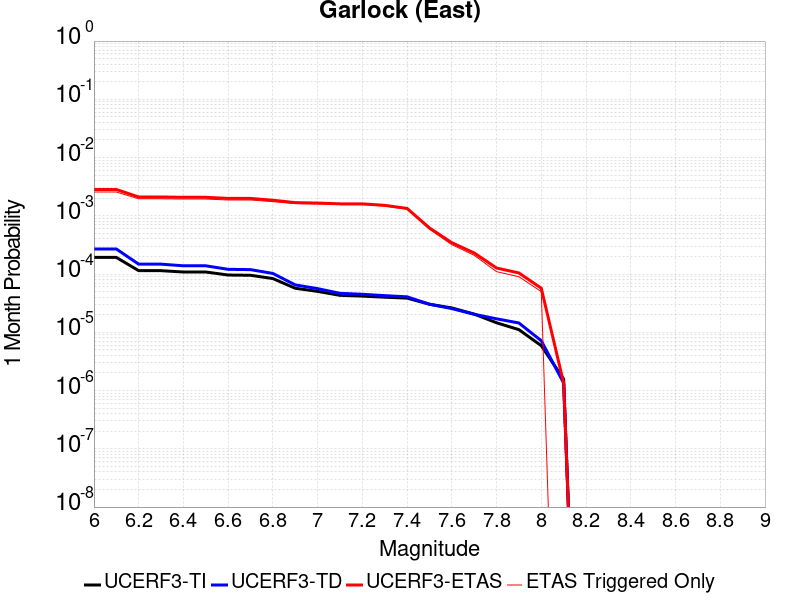 | 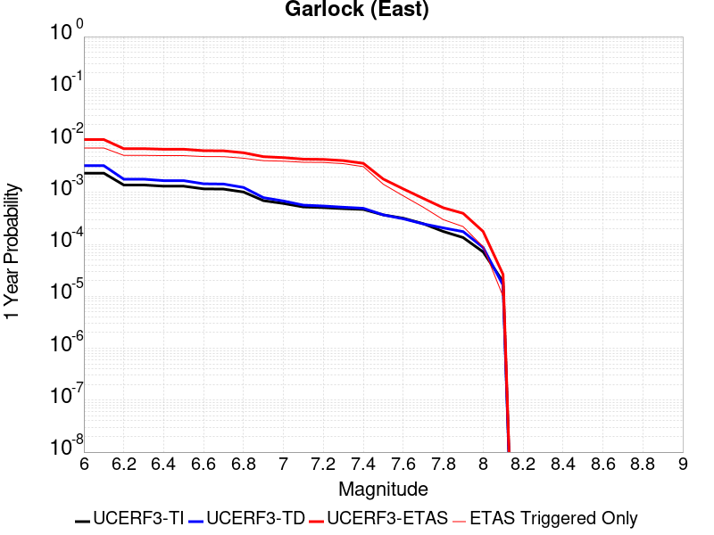 |  |

| Magnitude | 1 wk TI Prob | 1 wk TD Prob | 1 wk ETAS Prob | 1 wk ETAS/TD Gain | 1 wk ETAS Triggered Only | 1 mo TI Prob | 1 mo TD Prob | 1 mo ETAS Prob | 1 mo ETAS/TD Gain | 1 mo ETAS Triggered Only | 1 yr TI Prob | 1 yr TD Prob | 1 yr ETAS Prob | 1 yr ETAS/TD Gain | 1 yr ETAS Triggered Only | 10 yr TI Prob | 10 yr TD Prob | 10 yr ETAS Prob | 10 yr ETAS/TD Gain | 10 yr ETAS Triggered Only |
|-----|-----|-----|-----|-----|-----|-----|-----|-----|-----|-----|-----|-----|-----|-----|-----|-----|-----|-----|-----|-----|
| 6.0 | 4.5092507E-5 | 6.290799E-5 | 0.0010028488 | 15.941519 | 9.4E-4 | 1.9323928E-4 | 2.695803E-4 | 0.0028288902 | 10.493682 | 0.00256 | 0.0023501497 | 0.0032776468 | 0.010424146 | 3.180375 | 0.00717 | 0.023254504 | 0.032344494 | 0.045407843 | 1.4038817 | 0.0135 |
| 6.1 | 4.5092507E-5 | 6.290799E-5 | 0.0010028488 | 15.941519 | 9.4E-4 | 1.9323928E-4 | 2.695803E-4 | 0.0028288902 | 10.493682 | 0.00256 | 0.0023501497 | 0.0032776468 | 0.010424146 | 3.180375 | 0.00717 | 0.023254504 | 0.032344494 | 0.045407843 | 1.4038817 | 0.0135 |
| 6.2 | 2.6674514E-5 | 3.451465E-5 | 8.044881E-4 | 23.308598 | 7.7E-4 | 1.1431433E-4 | 1.4791173E-4 | 0.0021076219 | 14.2491865 | 0.00196 | 0.0013908884 | 0.0017993709 | 0.006960068 | 3.8680565 | 0.00517 | 0.01382215 | 0.017863318 | 0.027095402 | 1.516818 | 0.0094 |
| 6.3 | 2.6674514E-5 | 3.451465E-5 | 8.044881E-4 | 23.308598 | 7.7E-4 | 1.1431433E-4 | 1.4791173E-4 | 0.0021076219 | 14.2491865 | 0.00196 | 0.0013908884 | 0.0017993709 | 0.006960068 | 3.8680565 | 0.00517 | 0.01382215 | 0.017863318 | 0.027095402 | 1.516818 | 0.0094 |
| 6.4 | 2.5312667E-5 | 3.2343483E-5 | 7.923189E-4 | 24.497019 | 7.6E-4 | 1.0847834E-4 | 1.3860772E-4 | 0.0020783388 | 14.994394 | 0.00194 | 0.0013199237 | 0.0016862722 | 0.0067876554 | 4.025243 | 0.00511 | 0.013121112 | 0.016764186 | 0.025878783 | 1.5436945 | 0.00927 |
| 6.5 | 2.5312667E-5 | 3.2343483E-5 | 7.923189E-4 | 24.497019 | 7.6E-4 | 1.0847834E-4 | 1.3860772E-4 | 0.0020783388 | 14.994394 | 0.00194 | 0.0013199237 | 0.0016862722 | 0.0067876554 | 4.025243 | 0.00511 | 0.013121112 | 0.016764186 | 0.025878783 | 1.5436945 | 0.00927 |
| 6.6 | 2.246556E-5 | 2.8137678E-5 | 7.581171E-4 | 26.943132 | 7.3E-4 | 9.627742E-5 | 1.20584606E-4 | 0.001990359 | 16.505915 | 0.00187 | 0.0011715472 | 0.0014671524 | 0.006369949 | 4.341709 | 0.00491 | 0.011653901 | 0.014604934 | 0.023246849 | 1.591712 | 0.00877 |
| 6.7 | 2.2241198E-5 | 2.7807404E-5 | 7.577871E-4 | 27.251272 | 7.3E-4 | 9.531594E-5 | 1.1916928E-4 | 0.0019889465 | 16.690094 | 0.00187 | 0.0011598538 | 0.0014499439 | 0.006322868 | 4.360768 | 0.00488 | 0.011538187 | 0.014434824 | 0.023038808 | 1.5960574 | 0.00873 |
| 6.8 | 1.9528685E-5 | 2.3901322E-5 | 7.0388505E-4 | 29.449629 | 6.8E-4 | 8.369167E-5 | 1.0243033E-4 | 0.0018522511 | 18.083035 | 0.00175 | 0.0010184698 | 0.0012463954 | 0.005800712 | 4.65399 | 0.00456 | 0.010138147 | 0.012438075 | 0.020417575 | 1.6415383 | 0.00808 |
| 6.9 | 1.3318621E-5 | 1.5200952E-5 | 6.651911E-4 | 43.75983 | 6.5E-4 | 5.7078556E-5 | 6.514534E-5 | 0.0016850398 | 25.865852 | 0.00162 | 6.9470983E-4 | 7.928616E-4 | 0.004879619 | 6.1544394 | 0.00409 | 0.0069254204 | 0.007940963 | 0.015024264 | 1.8919953 | 0.00714 |
| 7.0 | 1.1760853E-5 | 1.3109707E-5 | 6.631012E-4 | 50.580933 | 6.5E-4 | 5.0402683E-5 | 5.6183275E-5 | 0.0016560934 | 29.476625 | 0.0016 | 6.134799E-4 | 6.838217E-4 | 0.0046810866 | 6.845478 | 0.004 | 0.0061178906 | 0.006857492 | 0.013710176 | 1.9992988 | 0.0069 |
| 7.1 | 1.0064758E-5 | 1.0904764E-5 | 6.508978E-4 | 59.689304 | 6.4E-4 | 4.3133965E-5 | 4.6733887E-5 | 0.001606661 | 34.37893 | 0.00156 | 5.2502943E-4 | 5.6884E-4 | 0.0043766727 | 7.694031 | 0.00381 | 0.005237907 | 0.005713798 | 0.012176659 | 2.131097 | 0.0065 |
| 7.2 | 9.768808E-6 | 1.0500609E-5 | 6.504939E-4 | 61.948204 | 6.4E-4 | 4.186565E-5 | 4.5001856E-5 | 0.0016049317 | 35.663677 | 0.00156 | 5.095951E-4 | 5.477633E-4 | 0.004325693 | 7.8970103 | 0.00378 | 0.0050842804 | 0.0055042095 | 0.011888873 | 2.15996 | 0.00642 |
| 7.3 | 9.344516E-6 | 9.946213E-6 | 5.9994037E-4 | 60.31847 | 5.9E-4 | 4.004731E-5 | 4.262595E-5 | 0.0015125633 | 35.484566 | 0.00147 | 4.8746695E-4 | 5.188508E-4 | 0.0040969932 | 7.8962836 | 0.00358 | 0.0048639905 | 0.005215881 | 0.011274116 | 2.161498 | 0.00609 |
| 7.4 | 9.023491E-6 | 9.492341E-6 | 5.5948715E-4 | 58.9409 | 5.5E-4 | 3.867153E-5 | 4.0680847E-5 | 0.0013406279 | 32.954773 | 0.0013 | 4.7072413E-4 | 4.951801E-4 | 0.0036336253 | 7.3379874 | 0.00314 | 0.004697283 | 0.0049793427 | 0.010402205 | 2.089072 | 0.00545 |
| 7.5 | 7.081253E-6 | 7.089067E-6 | 2.7708715E-4 | 39.086548 | 2.7E-4 | 3.0347876E-5 | 3.0381365E-5 | 6.2036345E-4 | 20.419209 | 5.9E-4 | 3.6942272E-4 | 3.6983108E-4 | 0.0018092985 | 4.8922296 | 0.00144 | 0.003688092 | 0.0037253548 | 0.0065049613 | 1.7461319 | 0.00279 |
| 7.6 | 6.116396E-6 | 5.960529E-6 | 1.5595963E-4 | 26.165401 | 1.5E-4 | 2.6212863E-5 | 2.5544876E-5 | 3.455367E-4 | 13.526654 | 3.2E-4 | 3.1909486E-4 | 3.1096474E-4 | 0.0011706973 | 3.7647269 | 8.6E-4 | 0.0031863707 | 0.003136776 | 0.0048314435 | 1.5402577 | 0.0017 |
| 7.7 | 4.797145E-6 | 4.758607E-6 | 1.3475798E-4 | 28.318789 | 1.3E-4 | 2.055903E-5 | 2.039387E-5 | 2.3038959E-4 | 11.297001 | 2.1E-4 | 2.5027743E-4 | 2.4826723E-4 | 7.681381E-4 | 3.0939975 | 5.2E-4 | 0.0024999576 | 0.002510294 | 0.0034978087 | 1.3933861 | 9.9E-4 |
| 7.8 | 3.4028885E-6 | 3.9797173E-6 | 8.39794E-5 | 21.10185 | 8.0E-5 | 1.4583726E-5 | 1.7055821E-5 | 1.2705395E-4 | 7.4493012 | 1.1E-4 | 1.775424E-4 | 2.076349E-4 | 5.075726E-4 | 2.4445438 | 3.0E-4 | 0.0017740062 | 0.00210206 | 0.0027407147 | 1.3038232 | 6.4E-4 |
| 7.9 | 2.5928412E-6 | 3.3735669E-6 | 6.3373365E-5 | 18.78527 | 6.0E-5 | 1.1112129E-5 | 1.4458064E-5 | 1.0445676E-4 | 7.22481 | 9.0E-5 | 1.3528178E-4 | 1.7601276E-4 | 3.9597406E-4 | 2.2496893 | 2.2E-4 | 0.0013519945 | 0.0017819697 | 0.0022611143 | 1.2688849 | 4.8E-4 |
| 8.0 | 1.3743648E-6 | 1.6739597E-6 | 3.167391E-5 | 18.921549 | 3.0E-5 | 5.8901214E-6 | 7.1740933E-6 | 5.7173733E-5 | 7.969472 | 5.0E-5 | 7.1709874E-5 | 8.734111E-5 | 1.7733325E-4 | 2.0303526 | 9.0E-5 | 7.1686733E-4 | 8.841624E-4 | 0.0010540121 | 1.1921024 | 1.7E-4 |
| 8.1 | 3.6733252E-7 | 3.1497066E-7 | 3.1497066E-7 | 1.0 | 0.0 | 1.5742813E-6 | 1.3498736E-6 | 1.3498736E-6 | 1.0 | 0.0 | 1.9166706E-5 | 1.6434604E-5 | 2.643444E-5 | 1.6084622 | 1.0E-5 | 1.9165053E-4 | 1.6648426E-4 | 1.8648093E-4 | 1.1201115 | 2.0E-5 |

## Ash Hill
*[(top)](#table-of-contents)*

| 1 Week | 1 Month | 1 Year | 10 Year |
|-----|-----|-----|-----|
|  | 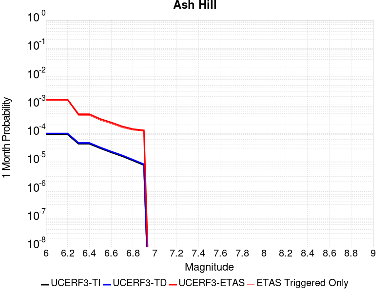 |  | 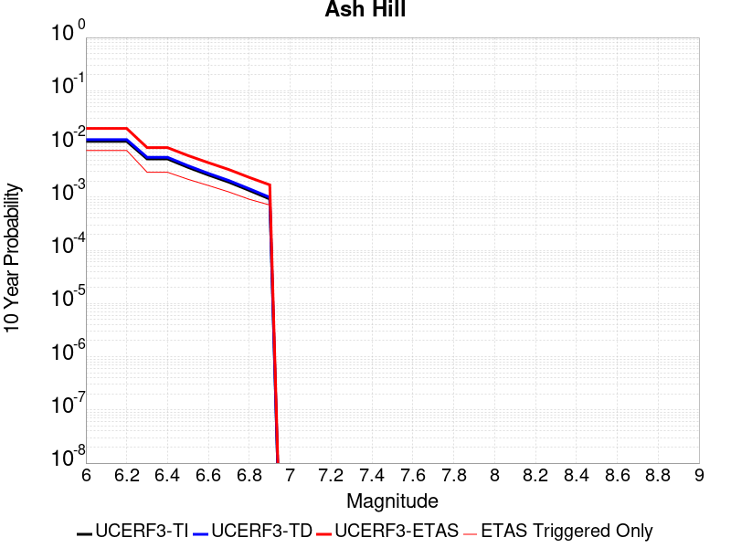 |

| Magnitude | 1 wk TI Prob | 1 wk TD Prob | 1 wk ETAS Prob | 1 wk ETAS/TD Gain | 1 wk ETAS Triggered Only | 1 mo TI Prob | 1 mo TD Prob | 1 mo ETAS Prob | 1 mo ETAS/TD Gain | 1 mo ETAS Triggered Only | 1 yr TI Prob | 1 yr TD Prob | 1 yr ETAS Prob | 1 yr ETAS/TD Gain | 1 yr ETAS Triggered Only | 10 yr TI Prob | 10 yr TD Prob | 10 yr ETAS Prob | 10 yr ETAS/TD Gain | 10 yr ETAS Triggered Only |
|-----|-----|-----|-----|-----|-----|-----|-----|-----|-----|-----|-----|-----|-----|-----|-----|-----|-----|-----|-----|-----|
| 6.0 | 2.1545662E-5 | 2.3194681E-5 | 7.2317844E-4 | 31.17863 | 7.0E-4 | 9.2335285E-5 | 9.9402445E-5 | 0.0015592573 | 15.686308 | 0.00146 | 0.0011236023 | 0.0012096328 | 0.005454492 | 4.509213 | 0.00425 | 0.011179381 | 0.01203847 | 0.0194877 | 1.6187854 | 0.00754 |
| 6.1 | 2.1545662E-5 | 2.3194681E-5 | 7.2317844E-4 | 31.17863 | 7.0E-4 | 9.2335285E-5 | 9.9402445E-5 | 0.0015592573 | 15.686308 | 0.00146 | 0.0011236023 | 0.0012096328 | 0.005454492 | 4.509213 | 0.00425 | 0.011179381 | 0.01203847 | 0.0194877 | 1.6187854 | 0.00754 |
| 6.2 | 2.1545662E-5 | 2.3194681E-5 | 7.2317844E-4 | 31.17863 | 7.0E-4 | 9.2335285E-5 | 9.9402445E-5 | 0.0015592573 | 15.686308 | 0.00146 | 0.0011236023 | 0.0012096328 | 0.005454492 | 4.509213 | 0.00425 | 0.011179381 | 0.01203847 | 0.0194877 | 1.6187854 | 0.00754 |
| 6.3 | 1.0025529E-5 | 1.0747037E-5 | 2.7074423E-4 | 25.192455 | 2.6E-4 | 4.2965847E-5 | 4.605799E-5 | 4.760382E-4 | 10.335627 | 4.3E-4 | 5.229836E-4 | 5.60625E-4 | 0.0020897673 | 3.727567 | 0.00153 | 0.005217545 | 0.0055934195 | 0.008507031 | 1.5208998 | 0.00293 |
| 6.4 | 1.0025529E-5 | 1.0747037E-5 | 2.7074423E-4 | 25.192455 | 2.6E-4 | 4.2965847E-5 | 4.605799E-5 | 4.760382E-4 | 10.335627 | 4.3E-4 | 5.229836E-4 | 5.60625E-4 | 0.0020897673 | 3.727567 | 0.00153 | 0.005217545 | 0.0055934195 | 0.008507031 | 1.5208998 | 0.00293 |
| 6.5 | 6.9617327E-6 | 7.456704E-6 | 1.9745529E-4 | 26.480236 | 1.9E-4 | 2.9835655E-5 | 3.1956963E-5 | 3.219477E-4 | 10.074415 | 2.9E-4 | 3.6318856E-4 | 3.8901521E-4 | 0.0014885874 | 3.8265529 | 0.0011 | 0.0036259557 | 0.0038841967 | 0.006035807 | 1.5539395 | 0.00216 |
| 6.6 | 4.9919777E-6 | 5.346739E-6 | 1.3534604E-4 | 25.313757 | 1.3E-4 | 2.1394015E-5 | 2.2914432E-5 | 2.4290939E-4 | 10.600717 | 2.2E-4 | 2.60441E-4 | 2.789542E-4 | 0.0011287171 | 4.0462456 | 8.5E-4 | 0.0026013597 | 0.0027866988 | 0.004432101 | 1.5904484 | 0.00165 |
| 6.7 | 3.6630722E-6 | 3.9246606E-6 | 1.1392423E-4 | 29.02779 | 1.1E-4 | 1.5698786E-5 | 1.6819899E-5 | 1.7681721E-4 | 10.5123825 | 1.6E-4 | 1.9111596E-4 | 2.0476876E-4 | 8.446377E-4 | 4.124837 | 6.4E-4 | 0.0019095168 | 0.002046364 | 0.003293806 | 1.6095896 | 0.00125 |
| 6.8 | 2.5599613E-6 | 2.7449514E-6 | 8.274473E-5 | 30.144335 | 8.0E-5 | 1.0971216E-5 | 1.1764052E-5 | 1.4176252E-4 | 12.050484 | 1.3E-4 | 1.3356637E-4 | 1.4322287E-4 | 5.8315985E-4 | 4.0716953 | 4.4E-4 | 0.0013348613 | 0.0014317906 | 0.0023404877 | 1.6346577 | 9.1E-4 |
| 6.9 | 1.7684905E-6 | 1.896889E-6 | 7.189676E-5 | 37.90246 | 7.0E-5 | 7.579223E-6 | 8.129524E-6 | 1.2812855E-4 | 15.760892 | 1.2E-4 | 9.2273134E-5 | 9.8976954E-5 | 4.489423E-4 | 4.5358267 | 3.5E-4 | 9.223483E-4 | 9.897696E-4 | 0.0016990668 | 1.7166287 | 7.1E-4 |

## Blackwater
*[(top)](#table-of-contents)*

| 1 Week | 1 Month | 1 Year | 10 Year |
|-----|-----|-----|-----|
|  |  |  | 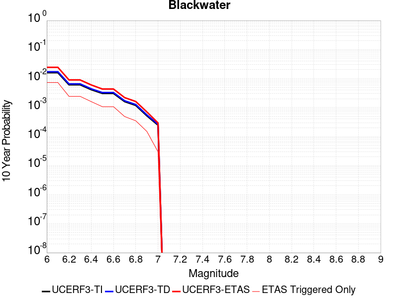 |

| Magnitude | 1 wk TI Prob | 1 wk TD Prob | 1 wk ETAS Prob | 1 wk ETAS/TD Gain | 1 wk ETAS Triggered Only | 1 mo TI Prob | 1 mo TD Prob | 1 mo ETAS Prob | 1 mo ETAS/TD Gain | 1 mo ETAS Triggered Only | 1 yr TI Prob | 1 yr TD Prob | 1 yr ETAS Prob | 1 yr ETAS/TD Gain | 1 yr ETAS Triggered Only | 10 yr TI Prob | 10 yr TD Prob | 10 yr ETAS Prob | 10 yr ETAS/TD Gain | 10 yr ETAS Triggered Only |
|-----|-----|-----|-----|-----|-----|-----|-----|-----|-----|-----|-----|-----|-----|-----|-----|-----|-----|-----|-----|-----|
| 6.0 | 3.0708583E-5 | 3.309619E-5 | 5.3307967E-4 | 16.10698 | 5.0E-4 | 1.3160157E-4 | 1.4183388E-4 | 0.0014616466 | 10.305343 | 0.00132 | 0.0016010714 | 0.0017255963 | 0.0054092286 | 3.1347013 | 0.00369 | 0.015895851 | 0.017135808 | 0.024281232 | 1.4169878 | 0.00727 |
| 6.1 | 3.0708583E-5 | 3.309619E-5 | 5.3307967E-4 | 16.10698 | 5.0E-4 | 1.3160157E-4 | 1.4183388E-4 | 0.0014616466 | 10.305343 | 0.00132 | 0.0016010714 | 0.0017255963 | 0.0054092286 | 3.1347013 | 0.00369 | 0.015895851 | 0.017135808 | 0.024281232 | 1.4169878 | 0.00727 |
| 6.2 | 1.1707779E-5 | 1.2545242E-5 | 1.7254324E-4 | 13.75368 | 1.6E-4 | 5.017523E-5 | 5.3764266E-5 | 5.537374E-4 | 10.299357 | 5.0E-4 | 6.107122E-4 | 6.5439293E-4 | 0.0019435488 | 2.9700027 | 0.00129 | 0.006090366 | 0.006525631 | 0.008939774 | 1.3699478 | 0.00243 |
| 6.3 | 1.1707779E-5 | 1.2545242E-5 | 1.7254324E-4 | 13.75368 | 1.6E-4 | 5.017523E-5 | 5.3764266E-5 | 5.537374E-4 | 10.299357 | 5.0E-4 | 6.107122E-4 | 6.5439293E-4 | 0.0019435488 | 2.9700027 | 0.00129 | 0.006090366 | 0.006525631 | 0.008939774 | 1.3699478 | 0.00243 |
| 6.4 | 7.929244E-6 | 8.480176E-6 | 9.847941E-5 | 11.612897 | 9.0E-5 | 3.3982033E-5 | 3.6343128E-5 | 3.2633258E-4 | 8.97921 | 2.9E-4 | 4.136527E-4 | 4.4239179E-4 | 0.0012820202 | 2.8979294 | 8.4E-4 | 0.0041288356 | 0.0044155167 | 0.006008452 | 1.3607585 | 0.0016 |
| 6.5 | 5.8832115E-6 | 6.286048E-6 | 5.6285735E-5 | 8.954073 | 5.0E-5 | 2.521352E-5 | 2.6939942E-5 | 2.1693483E-4 | 8.052535 | 1.9E-4 | 3.0693135E-4 | 3.2794697E-4 | 8.577732E-4 | 2.6155849 | 5.3E-4 | 0.0030650778 | 0.0032748834 | 0.0043413793 | 1.3256592 | 0.00107 |
| 6.6 | 5.8832115E-6 | 6.286048E-6 | 5.6285735E-5 | 8.954073 | 5.0E-5 | 2.521352E-5 | 2.6939942E-5 | 2.1693483E-4 | 8.052535 | 1.9E-4 | 3.0693135E-4 | 3.2794697E-4 | 8.577732E-4 | 2.6155849 | 5.3E-4 | 0.0030650778 | 0.0032748834 | 0.0043413793 | 1.3256592 | 0.00107 |
| 6.7 | 3.0715053E-6 | 3.281496E-6 | 2.3281431E-5 | 7.0947614 | 2.0E-5 | 1.3163528E-5 | 1.4063485E-5 | 6.4062784E-5 | 4.5552564 | 5.0E-5 | 1.6025416E-4 | 1.7121063E-4 | 4.1116955E-4 | 2.401542 | 2.4E-4 | 0.0016013865 | 0.0017109019 | 0.0022000636 | 1.2859087 | 4.9E-4 |
| 6.8 | 2.2722281E-6 | 2.4287758E-6 | 2.2428727E-5 | 9.234581 | 2.0E-5 | 9.738084E-6 | 1.0409003E-5 | 6.040848E-5 | 5.803484 | 5.0E-5 | 1.1855473E-4 | 1.2672316E-4 | 3.0670036E-4 | 2.4202392 | 1.8E-4 | 0.001184915 | 0.0012665992 | 0.0016161558 | 1.2759805 | 3.5E-4 |
| 6.9 | 9.952399E-7 | 1.0653588E-6 | 1.0653588E-6 | 1.0 | 0.0 | 4.265307E-6 | 4.5658185E-6 | 1.4565773E-5 | 3.190178 | 1.0E-5 | 5.1928873E-5 | 5.5587938E-5 | 1.15584604E-4 | 2.079311 | 6.0E-5 | 5.191674E-4 | 5.5579096E-4 | 7.057076E-4 | 1.2697357 | 1.5E-4 |
| 7.0 | 4.7385504E-7 | 5.0756074E-7 | 5.0756074E-7 | 1.0 | 0.0 | 2.0308057E-6 | 2.1752603E-6 | 1.2175238E-5 | 5.597141 | 1.0E-5 | 2.4724779E-5 | 2.6483794E-5 | 4.6483263E-5 | 1.7551588 | 2.0E-5 | 2.4722028E-4 | 2.6483793E-4 | 2.9482998E-4 | 1.1132468 | 3.0E-5 |

## Hunter Mountain-Saline Valley
*[(top)](#table-of-contents)*

| 1 Week | 1 Month | 1 Year | 10 Year |
|-----|-----|-----|-----|
|  |  |  |  |

| Magnitude | 1 wk TI Prob | 1 wk TD Prob | 1 wk ETAS Prob | 1 wk ETAS/TD Gain | 1 wk ETAS Triggered Only | 1 mo TI Prob | 1 mo TD Prob | 1 mo ETAS Prob | 1 mo ETAS/TD Gain | 1 mo ETAS Triggered Only | 1 yr TI Prob | 1 yr TD Prob | 1 yr ETAS Prob | 1 yr ETAS/TD Gain | 1 yr ETAS Triggered Only | 10 yr TI Prob | 10 yr TD Prob | 10 yr ETAS Prob | 10 yr ETAS/TD Gain | 10 yr ETAS Triggered Only |
|-----|-----|-----|-----|-----|-----|-----|-----|-----|-----|-----|-----|-----|-----|-----|-----|-----|-----|-----|-----|-----|
| 6.0 | 4.5103672E-5 | 5.4570846E-5 | 6.7453703E-4 | 12.360758 | 6.2E-4 | 1.9328714E-4 | 2.3385457E-4 | 0.0018234827 | 7.7975073 | 0.00159 | 0.002350731 | 0.0028436389 | 0.006902065 | 2.4271948 | 0.00407 | 0.023260195 | 0.02809229 | 0.034905363 | 1.2425246 | 0.00701 |
| 6.1 | 4.5103672E-5 | 5.4570846E-5 | 6.7453703E-4 | 12.360758 | 6.2E-4 | 1.9328714E-4 | 2.3385457E-4 | 0.0018234827 | 7.7975073 | 0.00159 | 0.002350731 | 0.0028436389 | 0.006902065 | 2.4271948 | 0.00407 | 0.023260195 | 0.02809229 | 0.034905363 | 1.2425246 | 0.00701 |
| 6.2 | 3.9363465E-5 | 4.7064215E-5 | 6.570355E-4 | 13.960405 | 6.1E-4 | 1.6868966E-4 | 2.0168893E-4 | 0.0017713723 | 8.782695 | 0.00157 | 0.002051862 | 0.0024529307 | 0.0064830207 | 2.6429694 | 0.00404 | 0.020330196 | 0.024273701 | 0.031084271 | 1.280574 | 0.00698 |
| 6.3 | 3.9363465E-5 | 4.7064215E-5 | 6.570355E-4 | 13.960405 | 6.1E-4 | 1.6868966E-4 | 2.0168893E-4 | 0.0017713723 | 8.782695 | 0.00157 | 0.002051862 | 0.0024529307 | 0.0064830207 | 2.6429694 | 0.00404 | 0.020330196 | 0.024273701 | 0.031084271 | 1.280574 | 0.00698 |
| 6.4 | 3.2311684E-5 | 3.7952268E-5 | 6.379295E-4 | 16.808733 | 6.0E-4 | 1.384713E-4 | 1.6264283E-4 | 0.0017223891 | 10.59001 | 0.00156 | 0.0016845843 | 0.0019784467 | 0.005990493 | 3.027877 | 0.00402 | 0.016718714 | 0.019616457 | 0.026439926 | 1.3478441 | 0.00696 |
| 6.5 | 3.2311684E-5 | 3.7952268E-5 | 6.379295E-4 | 16.808733 | 6.0E-4 | 1.384713E-4 | 1.6264283E-4 | 0.0017223891 | 10.59001 | 0.00156 | 0.0016845843 | 0.0019784467 | 0.005990493 | 3.027877 | 0.00402 | 0.016718714 | 0.019616457 | 0.026439926 | 1.3478441 | 0.00696 |
| 6.6 | 2.9305844E-5 | 3.4182984E-5 | 6.3416245E-4 | 18.551992 | 6.0E-4 | 1.2559042E-4 | 1.4649061E-4 | 0.0017062621 | 11.647587 | 0.00156 | 0.0015279909 | 0.0017821258 | 0.0057949615 | 3.251713 | 0.00402 | 0.015175272 | 0.017685596 | 0.024502859 | 1.3854697 | 0.00694 |
| 6.7 | 2.7826512E-5 | 3.2345313E-5 | 6.323259E-4 | 19.549227 | 6.0E-4 | 1.19251024E-4 | 1.3861575E-4 | 0.0016983995 | 12.252572 | 0.00156 | 0.0014509142 | 0.0016864006 | 0.005699621 | 3.3797553 | 0.00402 | 0.014414776 | 0.01674306 | 0.023547197 | 1.4063855 | 0.00692 |
| 6.8 | 2.3389874E-5 | 2.6867581E-5 | 6.2685146E-4 | 23.331146 | 6.0E-4 | 1.0023846E-4 | 1.15141964E-4 | 0.0016749623 | 14.546932 | 0.00156 | 0.00121972 | 0.0014009993 | 0.0054153674 | 3.8653605 | 0.00402 | 0.01213047 | 0.0139272185 | 0.02073112 | 1.4885328 | 0.0069 |
| 6.9 | 2.069209E-5 | 2.3570803E-5 | 6.135569E-4 | 26.030376 | 5.9E-4 | 8.867737E-5 | 1.0101402E-4 | 0.0016408585 | 16.243868 | 0.00154 | 0.0010791123 | 0.0012291879 | 0.0052042957 | 4.23393 | 0.00398 | 0.010738871 | 0.012228257 | 0.019004371 | 1.5541357 | 0.00686 |
| 7.0 | 1.7462342E-5 | 1.9634203E-5 | 6.096226E-4 | 31.049013 | 5.9E-4 | 7.483646E-5 | 8.4144E-5 | 0.0016240145 | 19.300419 | 0.00154 | 9.1075303E-4 | 0.0010239943 | 0.004989929 | 4.873005 | 0.00397 | 0.009070295 | 0.0101957265 | 0.016975885 | 1.6650001 | 0.00685 |
| 7.1 | 1.4807709E-5 | 1.644232E-5 | 5.964328E-4 | 36.274246 | 5.8E-4 | 6.3460066E-5 | 7.046528E-5 | 0.0016003575 | 22.711292 | 0.00153 | 7.723524E-4 | 8.5759355E-4 | 0.004804206 | 5.6019616 | 0.00395 | 0.007696735 | 0.00854516 | 0.015316797 | 1.7924528 | 0.00683 |
| 7.2 | 1.4180048E-5 | 1.5698888E-5 | 5.956898E-4 | 37.94471 | 5.8E-4 | 6.077022E-5 | 6.727931E-5 | 0.001587177 | 23.590864 | 0.00152 | 7.396263E-4 | 8.1883394E-4 | 0.004755608 | 5.8077803 | 0.00394 | 0.0073716943 | 0.008160452 | 0.014924798 | 1.828918 | 0.00682 |
| 7.3 | 1.3730402E-5 | 1.5172614E-5 | 5.951638E-4 | 39.22619 | 5.8E-4 | 5.8843252E-5 | 6.502396E-5 | 0.0015849251 | 24.37448 | 0.00152 | 7.161811E-4 | 7.9139526E-4 | 0.004718285 | 5.961983 | 0.00393 | 0.007138774 | 0.007888035 | 0.014644317 | 1.8565229 | 0.00681 |
| 7.4 | 1.2810095E-5 | 1.4109794E-5 | 5.941016E-4 | 42.105618 | 5.8E-4 | 5.489925E-5 | 6.0469236E-5 | 0.0015803773 | 26.13523 | 0.00152 | 6.681934E-4 | 7.359801E-4 | 0.004663088 | 6.3358884 | 0.00393 | 0.006661878 | 0.007337654 | 0.014097685 | 1.9212795 | 0.00681 |
| 7.5 | 1.1595659E-5 | 1.2801082E-5 | 5.827938E-4 | 45.526917 | 5.7E-4 | 4.9694736E-5 | 5.4860713E-5 | 0.0015647779 | 28.52274 | 0.00151 | 6.0486543E-4 | 6.677402E-4 | 0.004515169 | 6.7618656 | 0.00385 | 0.006032217 | 0.006659527 | 0.0132354405 | 1.9874446 | 0.00662 |
| 7.6 | 2.997694E-6 | 3.3253514E-6 | 2.8332442E-4 | 85.20135 | 2.8E-4 | 1.28471975E-5 | 1.4251469E-5 | 7.642408E-4 | 53.625404 | 7.5E-4 | 1.564034E-4 | 1.735051E-4 | 0.0020431806 | 11.775911 | 0.00187 | 0.0015629337 | 0.0017345662 | 0.004899068 | 2.8243763 | 0.00317 |

## Garlock (West)
*[(top)](#table-of-contents)*

| 1 Week | 1 Month | 1 Year | 10 Year |
|-----|-----|-----|-----|
|  |  |  | 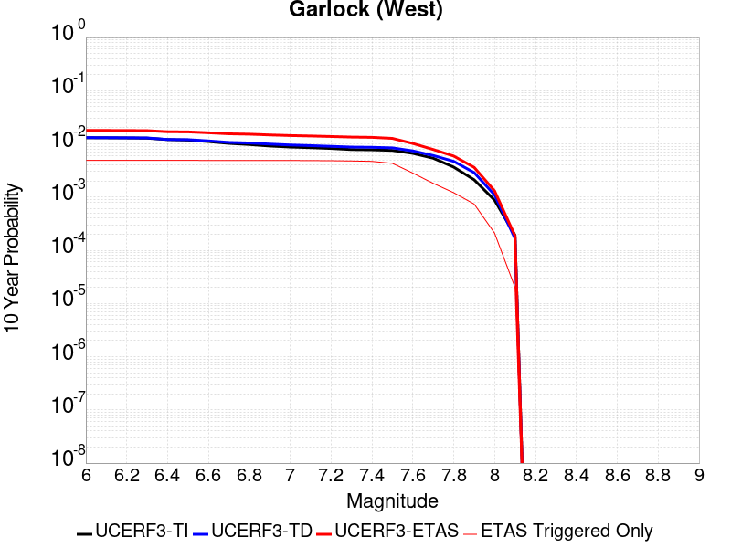 |

| Magnitude | 1 wk TI Prob | 1 wk TD Prob | 1 wk ETAS Prob | 1 wk ETAS/TD Gain | 1 wk ETAS Triggered Only | 1 mo TI Prob | 1 mo TD Prob | 1 mo ETAS Prob | 1 mo ETAS/TD Gain | 1 mo ETAS Triggered Only | 1 yr TI Prob | 1 yr TD Prob | 1 yr ETAS Prob | 1 yr ETAS/TD Gain | 1 yr ETAS Triggered Only | 10 yr TI Prob | 10 yr TD Prob | 10 yr ETAS Prob | 10 yr ETAS/TD Gain | 10 yr ETAS Triggered Only |
|-----|-----|-----|-----|-----|-----|-----|-----|-----|-----|-----|-----|-----|-----|-----|-----|-----|-----|-----|-----|-----|
| 6.0 | 2.5181727E-5 | 2.5201914E-5 | 5.1518955E-4 | 20.442478 | 4.9E-4 | 1.0791722E-4 | 1.08003755E-4 | 0.0011978861 | 11.091152 | 0.00109 | 0.0013131002 | 0.0013141559 | 0.004040568 | 3.074649 | 0.00273 | 0.013053683 | 0.01314424 | 0.017979834 | 1.3678869 | 0.0049 |
| 6.1 | 2.5077732E-5 | 2.5102956E-5 | 5.1509065E-4 | 20.519123 | 4.9E-4 | 1.0747157E-4 | 1.07579675E-4 | 0.0011974624 | 11.130935 | 0.00109 | 0.001307681 | 0.001308999 | 0.0040354254 | 3.082833 | 0.00273 | 0.013000126 | 0.013093281 | 0.017929124 | 1.3693378 | 0.0049 |
| 6.2 | 2.494612E-5 | 2.4984645E-5 | 5.1497243E-4 | 20.611555 | 4.9E-4 | 1.0690756E-4 | 1.0707267E-4 | 0.0011969559 | 11.178912 | 0.00109 | 0.0013008224 | 0.0013028337 | 0.004029277 | 3.0927026 | 0.00273 | 0.012932341 | 0.013032351 | 0.017868493 | 1.3710874 | 0.0049 |
| 6.3 | 2.4733758E-5 | 2.4804003E-5 | 5.147919E-4 | 20.754385 | 4.9E-4 | 1.0599751E-4 | 1.0629856E-4 | 0.0011961827 | 11.253047 | 0.00109 | 0.0012897556 | 0.0012934201 | 0.004019889 | 3.1079533 | 0.00273 | 0.012822957 | 0.012939315 | 0.017775912 | 1.3737909 | 0.0049 |
| 6.4 | 2.3237335E-5 | 2.3183304E-5 | 5.1317195E-4 | 22.13541 | 4.9E-4 | 9.958477E-5 | 9.9353245E-5 | 0.0011892449 | 11.969865 | 0.00109 | 0.0012117702 | 0.0012089573 | 0.003935657 | 3.2554142 | 0.00273 | 0.012051838 | 0.01210416 | 0.01693497 | 1.3991033 | 0.00489 |
| 6.5 | 2.2732203E-5 | 2.299767E-5 | 5.129864E-4 | 22.306017 | 4.9E-4 | 9.742009E-5 | 9.8557735E-5 | 0.0011884503 | 12.058417 | 0.00109 | 0.0011854442 | 0.0011992827 | 0.0039260085 | 3.2736309 | 0.00273 | 0.011791403 | 0.012008464 | 0.016839743 | 1.4023228 | 0.00489 |
| 6.6 | 2.1319436E-5 | 2.1777872E-5 | 5.117672E-4 | 23.499413 | 4.9E-4 | 9.136581E-5 | 9.333041E-5 | 0.0011832287 | 12.677847 | 0.00109 | 0.001111811 | 0.0011357077 | 0.0038626073 | 3.4010575 | 0.00273 | 0.011062649 | 0.01137937 | 0.016203837 | 1.4239663 | 0.00488 |
| 6.7 | 1.970802E-5 | 2.039774E-5 | 5.1038776E-4 | 25.021778 | 4.9E-4 | 8.446021E-5 | 8.741597E-5 | 0.0011773207 | 13.468028 | 0.00109 | 0.001027818 | 0.0010637715 | 0.0037908673 | 3.5636106 | 0.00273 | 0.010230771 | 0.010667094 | 0.015495039 | 1.4526017 | 0.00488 |
| 6.8 | 1.8744462E-5 | 1.9905396E-5 | 5.098956E-4 | 25.61595 | 4.9E-4 | 8.033094E-5 | 8.530606E-5 | 0.001175213 | 13.776431 | 0.00109 | 9.775903E-4 | 0.0010381081 | 0.003765274 | 3.627054 | 0.00273 | 0.009733009 | 0.010412897 | 0.015242082 | 1.4637696 | 0.00488 |
| 6.9 | 1.7559682E-5 | 1.8957733E-5 | 5.0894846E-4 | 26.846483 | 4.9E-4 | 7.5253614E-5 | 8.124491E-5 | 0.0011711563 | 14.415136 | 0.00109 | 9.158276E-4 | 9.887093E-4 | 0.0037160101 | 3.7584457 | 0.00273 | 0.0091206245 | 0.009923427 | 0.0147450995 | 1.4858879 | 0.00487 |
| 7.0 | 1.6794445E-5 | 1.8220519E-5 | 5.082116E-4 | 27.89227 | 4.9E-4 | 7.197421E-5 | 7.8085606E-5 | 0.0011680005 | 14.95795 | 0.00109 | 8.759337E-4 | 9.5027895E-4 | 0.0036776846 | 3.8701108 | 0.00273 | 0.008724891 | 0.009542331 | 0.014365859 | 1.5054874 | 0.00487 |
| 7.1 | 1.6337795E-5 | 1.7721295E-5 | 4.977128E-4 | 28.085575 | 4.8E-4 | 7.0017246E-5 | 7.5946205E-5 | 0.0011558642 | 15.219512 | 0.00108 | 8.521265E-4 | 9.242542E-4 | 0.0036317494 | 3.929384 | 0.00271 | 0.008488664 | 0.0092840865 | 0.014089058 | 1.5175493 | 0.00485 |
| 7.2 | 1.5780008E-5 | 1.716991E-5 | 4.9716164E-4 | 28.955404 | 4.8E-4 | 6.762685E-5 | 7.358326E-5 | 0.0011435045 | 15.54028 | 0.00107 | 8.2304585E-4 | 8.9550926E-4 | 0.0035831004 | 4.0011873 | 0.00269 | 0.008200042 | 0.008998912 | 0.013775537 | 1.5308003 | 0.00482 |
| 7.3 | 1.5058865E-5 | 1.6622957E-5 | 4.8661514E-4 | 29.273682 | 4.7E-4 | 6.45364E-5 | 7.12393E-5 | 0.0011311638 | 15.878366 | 0.00106 | 7.854473E-4 | 8.669946E-4 | 0.0035346798 | 4.076934 | 0.00267 | 0.00782677 | 0.00871559 | 0.013444018 | 1.542525 | 0.00477 |
| 7.4 | 1.4887923E-5 | 1.6458913E-5 | 4.8645117E-4 | 29.555487 | 4.7E-4 | 6.380382E-5 | 7.05363E-5 | 0.0011104629 | 15.743142 | 0.00104 | 7.7653467E-4 | 8.584423E-4 | 0.003446219 | 4.014503 | 0.00259 | 0.0077382675 | 0.008630417 | 0.013279941 | 1.5387368 | 0.00469 |
| 7.5 | 1.4509299E-5 | 1.6050892E-5 | 4.260443E-4 | 26.543343 | 4.1E-4 | 6.218123E-5 | 6.8787725E-5 | 0.001008723 | 14.6642885 | 9.4E-4 | 7.567935E-4 | 8.3716994E-4 | 0.0031552278 | 3.7689214 | 0.00232 | 0.0075422134 | 0.008418757 | 0.012692471 | 1.5076421 | 0.00431 |
| 7.6 | 1.2756717E-5 | 1.40547745E-5 | 2.6405125E-4 | 18.7873 | 2.5E-4 | 5.4670498E-5 | 6.023336E-5 | 6.601972E-4 | 10.960657 | 6.0E-4 | 6.6541E-4 | 7.3309505E-4 | 0.0022619735 | 3.0855117 | 0.00153 | 0.006634211 | 0.00738374 | 0.010192844 | 1.3804446 | 0.00283 |
| 7.7 | 1.0328985E-5 | 1.1464304E-5 | 2.1146201E-4 | 18.445255 | 2.0E-4 | 4.4266326E-5 | 4.913181E-5 | 4.5911167E-4 | 9.344489 | 4.1E-4 | 5.388092E-4 | 5.98016E-4 | 0.001607412 | 2.687908 | 0.00101 | 0.0053750467 | 0.0060406122 | 0.007839679 | 1.2978286 | 0.00181 |
| 7.8 | 7.0306583E-6 | 8.902713E-6 | 1.4890147E-4 | 16.725403 | 1.4E-4 | 3.0131043E-5 | 3.815393E-5 | 3.0814362E-4 | 8.076328 | 2.7E-4 | 3.667837E-4 | 4.6442522E-4 | 0.0011541047 | 2.4850175 | 6.9E-4 | 0.003661789 | 0.004697 | 0.0059013166 | 1.2564012 | 0.00121 |
| 7.9 | 4.060633E-6 | 5.467275E-6 | 7.5466894E-5 | 13.803384 | 7.0E-5 | 1.7402595E-5 | 2.3430968E-5 | 1.7342746E-4 | 7.401634 | 1.5E-4 | 2.11856E-4 | 2.852348E-4 | 6.9511787E-4 | 2.4370022 | 4.1E-4 | 0.0021165414 | 0.0028852404 | 0.0036231051 | 1.2557378 | 7.4E-4 |
| 8.0 | 1.6729537E-6 | 2.0781215E-6 | 3.207806E-5 | 15.436085 | 3.0E-5 | 7.169782E-6 | 8.906205E-6 | 7.8905585E-5 | 8.859619 | 7.0E-5 | 8.7288594E-5 | 1.0842768E-4 | 2.1841575E-4 | 2.0143912 | 1.1E-4 | 8.7254314E-4 | 0.0010973068 | 0.0013070763 | 1.1911677 | 2.1E-4 |
| 8.1 | 3.6733252E-7 | 3.1497066E-7 | 3.1497066E-7 | 1.0 | 0.0 | 1.5742813E-6 | 1.3498736E-6 | 1.3498736E-6 | 1.0 | 0.0 | 1.9166706E-5 | 1.6434604E-5 | 2.643444E-5 | 1.6084622 | 1.0E-5 | 1.9165053E-4 | 1.6648426E-4 | 1.8648093E-4 | 1.1201115 | 2.0E-5 |

## Gravel Hills-Harper Lk
*[(top)](#table-of-contents)*

| 1 Week | 1 Month | 1 Year | 10 Year |
|-----|-----|-----|-----|
|  |  |  | 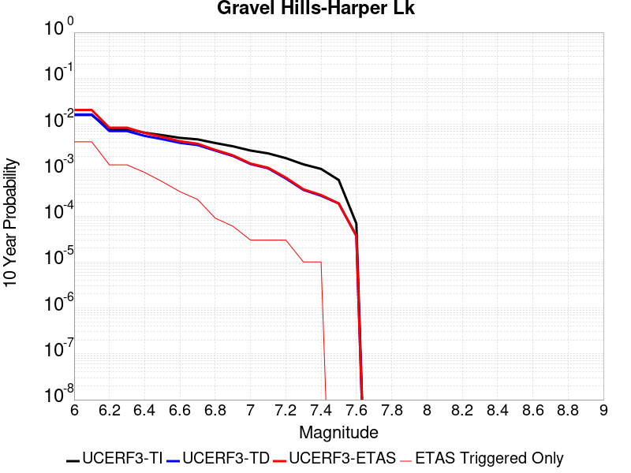 |

| Magnitude | 1 wk TI Prob | 1 wk TD Prob | 1 wk ETAS Prob | 1 wk ETAS/TD Gain | 1 wk ETAS Triggered Only | 1 mo TI Prob | 1 mo TD Prob | 1 mo ETAS Prob | 1 mo ETAS/TD Gain | 1 mo ETAS Triggered Only | 1 yr TI Prob | 1 yr TD Prob | 1 yr ETAS Prob | 1 yr ETAS/TD Gain | 1 yr ETAS Triggered Only | 10 yr TI Prob | 10 yr TD Prob | 10 yr ETAS Prob | 10 yr ETAS/TD Gain | 10 yr ETAS Triggered Only |
|-----|-----|-----|-----|-----|-----|-----|-----|-----|-----|-----|-----|-----|-----|-----|-----|-----|-----|-----|-----|-----|
| 6.0 | 3.0679566E-5 | 3.146516E-5 | 3.614548E-4 | 11.487461 | 3.3E-4 | 1.3147724E-4 | 1.3484493E-4 | 9.94729E-4 | 7.376836 | 8.6E-4 | 0.0015995599 | 0.0016407177 | 0.0038271246 | 2.3325918 | 0.00219 | 0.015880952 | 0.016307613 | 0.020380098 | 1.2497292 | 0.00414 |
| 6.1 | 3.0679566E-5 | 3.146516E-5 | 3.614548E-4 | 11.487461 | 3.3E-4 | 1.3147724E-4 | 1.3484493E-4 | 9.94729E-4 | 7.376836 | 8.6E-4 | 0.0015995599 | 0.0016407177 | 0.0038271246 | 2.3325918 | 0.00219 | 0.015880952 | 0.016307613 | 0.020380098 | 1.2497292 | 0.00414 |
| 6.2 | 1.514536E-5 | 1.363538E-5 | 9.363429E-5 | 6.86701 | 8.0E-5 | 6.490707E-5 | 5.84361E-5 | 3.184209E-4 | 5.449044 | 2.6E-4 | 7.8995706E-4 | 7.112392E-4 | 0.0013407911 | 1.885148 | 6.3E-4 | 0.007871548 | 0.0070908302 | 0.008381612 | 1.1820353 | 0.0013 |
| 6.3 | 1.514536E-5 | 1.363538E-5 | 9.363429E-5 | 6.86701 | 8.0E-5 | 6.490707E-5 | 5.84361E-5 | 3.184209E-4 | 5.449044 | 2.6E-4 | 7.8995706E-4 | 7.112392E-4 | 0.0013407911 | 1.885148 | 6.3E-4 | 0.007871548 | 0.0070908302 | 0.008381612 | 1.1820353 | 0.0013 |
| 6.4 | 1.2532521E-5 | 1.0689813E-5 | 5.0689385E-5 | 4.74184 | 4.0E-5 | 5.37097E-5 | 4.5812714E-5 | 2.0580538E-4 | 4.49232 | 1.6E-4 | 6.537194E-4 | 5.576329E-4 | 9.2742656E-4 | 1.663149 | 3.7E-4 | 0.0065179965 | 0.0055629266 | 0.0064479755 | 1.1590978 | 8.9E-4 |
| 6.5 | 1.1094058E-5 | 9.083761E-6 | 4.90834E-5 | 5.4034224 | 4.0E-5 | 4.7545094E-5 | 3.8929848E-5 | 1.3892596E-4 | 3.5686233 | 1.0E-4 | 5.787078E-4 | 4.7387183E-4 | 6.737771E-4 | 1.4218551 | 2.0E-4 | 0.0057720304 | 0.0047290213 | 0.0052863727 | 1.1178577 | 5.6E-4 |
| 6.6 | 9.688328E-6 | 7.531771E-6 | 2.7531622E-5 | 3.655398 | 2.0E-5 | 4.1520743E-5 | 3.2278636E-5 | 8.227702E-5 | 2.548962 | 5.0E-5 | 5.053978E-4 | 3.9292406E-4 | 5.128769E-4 | 1.3052825 | 1.2E-4 | 0.0050424994 | 0.00392255 | 0.0042612166 | 1.0863383 | 3.4E-4 |
| 6.7 | 8.974824E-6 | 6.7494793E-6 | 1.674941E-5 | 2.4815857 | 1.0E-5 | 3.8462964E-5 | 2.8926032E-5 | 6.892488E-5 | 2.3827975 | 4.0E-5 | 4.6818596E-4 | 3.521197E-4 | 4.520845E-4 | 1.2838943 | 1.0E-4 | 0.004672008 | 0.0035158389 | 0.0037450304 | 1.0651883 | 2.3E-4 |
| 6.8 | 7.4780046E-6 | 5.1162397E-6 | 5.1162397E-6 | 1.0 | 0.0 | 3.20482E-5 | 2.1926564E-5 | 4.1926127E-5 | 1.9121156 | 2.0E-5 | 3.9011694E-4 | 2.6692462E-4 | 3.0691395E-4 | 1.1498151 | 4.0E-5 | 0.0038943281 | 0.0026661782 | 0.0027559383 | 1.0336661 | 9.0E-5 |
| 6.9 | 6.3409307E-6 | 3.9075294E-6 | 3.9075294E-6 | 1.0 | 0.0 | 2.7175134E-5 | 1.6746453E-5 | 3.6746118E-5 | 2.1942627 | 2.0E-5 | 3.3080703E-4 | 2.0386997E-4 | 2.3386386E-4 | 1.1471226 | 3.0E-5 | 0.0033031502 | 0.0020369277 | 0.0020968055 | 1.0293962 | 6.0E-5 |
| 7.0 | 5.1239335E-6 | 2.605876E-6 | 2.605876E-6 | 1.0 | 0.0 | 2.195953E-5 | 1.1167994E-5 | 2.1167882E-5 | 1.895406 | 1.0E-5 | 2.6732447E-4 | 1.359621E-4 | 1.5595937E-4 | 1.1470798 | 2.0E-5 | 0.0026700313 | 0.0013588143 | 0.0013887736 | 1.0220481 | 3.0E-5 |
| 7.1 | 4.438899E-6 | 2.0984924E-6 | 2.0984924E-6 | 1.0 | 0.0 | 1.9023713E-5 | 8.993509E-6 | 1.899342E-5 | 2.111903 | 1.0E-5 | 2.315891E-4 | 1.0949069E-4 | 1.294885E-4 | 1.1826439 | 2.0E-5 | 0.002313479 | 0.0010943894 | 0.0011243565 | 1.0273825 | 3.0E-5 |
| 7.2 | 3.50367E-6 | 1.2615886E-6 | 1.2615886E-6 | 1.0 | 0.0 | 1.5015643E-5 | 5.4067978E-6 | 1.5406744E-5 | 2.8495135 | 1.0E-5 | 1.8280011E-4 | 6.582586E-5 | 8.582454E-5 | 1.303812 | 2.0E-5 | 0.0018264982 | 6.5807183E-4 | 6.8805204E-4 | 1.0455577 | 3.0E-5 |
| 7.3 | 2.561638E-6 | 7.1188435E-7 | 7.1188435E-7 | 1.0 | 0.0 | 1.0978401E-5 | 3.0509295E-6 | 3.0509295E-6 | 1.0 | 0.0 | 1.3365384E-4 | 3.7144455E-5 | 3.7144455E-5 | 1.0 | 0.0 | 0.0013357349 | 3.7138443E-4 | 3.8138073E-4 | 1.0269163 | 1.0E-5 |
| 7.4 | 2.0368864E-6 | 5.3046045E-7 | 5.3046045E-7 | 1.0 | 0.0 | 8.729483E-6 | 2.2734E-6 | 2.2734E-6 | 1.0 | 0.0 | 1.06276275E-4 | 2.7678298E-5 | 2.7678298E-5 | 1.0 | 0.0 | 0.0010622547 | 2.7674905E-4 | 2.8674628E-4 | 1.0361239 | 1.0E-5 |
| 7.5 | 1.1681728E-6 | 3.6029326E-7 | 3.6029326E-7 | 1.0 | 0.0 | 5.0064455E-6 | 1.544113E-6 | 1.544113E-6 | 1.0 | 0.0 | 6.0951766E-5 | 1.879942E-5 | 1.879942E-5 | 1.0 | 0.0 | 6.093505E-4 | 1.8797876E-4 | 1.8797876E-4 | 1.0 | 0.0 |
| 7.6 | 1.3154387E-7 | 7.119745E-8 | 7.119745E-8 | 1.0 | 0.0 | 5.6375933E-7 | 3.051319E-7 | 3.051319E-7 | 1.0 | 0.0 | 6.863748E-6 | 3.7149762E-6 | 3.7149762E-6 | 1.0 | 0.0 | 6.863536E-5 | 3.7149297E-5 | 3.7149297E-5 | 1.0 | 0.0 |

## McLean Lake
*[(top)](#table-of-contents)*

| 1 Week | 1 Month | 1 Year | 10 Year |
|-----|-----|-----|-----|
| 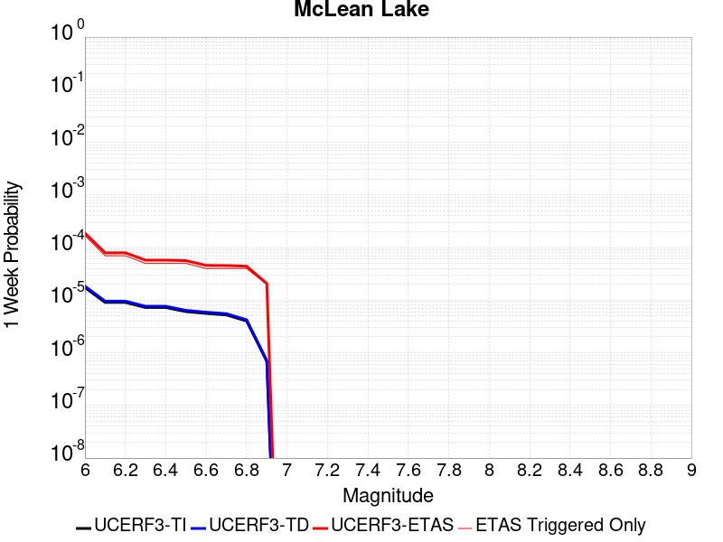 |  |  |  |

| Magnitude | 1 wk TI Prob | 1 wk TD Prob | 1 wk ETAS Prob | 1 wk ETAS/TD Gain | 1 wk ETAS Triggered Only | 1 mo TI Prob | 1 mo TD Prob | 1 mo ETAS Prob | 1 mo ETAS/TD Gain | 1 mo ETAS Triggered Only | 1 yr TI Prob | 1 yr TD Prob | 1 yr ETAS Prob | 1 yr ETAS/TD Gain | 1 yr ETAS Triggered Only | 10 yr TI Prob | 10 yr TD Prob | 10 yr ETAS Prob | 10 yr ETAS/TD Gain | 10 yr ETAS Triggered Only |
|-----|-----|-----|-----|-----|-----|-----|-----|-----|-----|-----|-----|-----|-----|-----|-----|-----|-----|-----|-----|-----|
| 6.0 | 1.7360222E-5 | 1.8501789E-5 | 1.8849864E-4 | 10.18813 | 1.7E-4 | 7.439883E-5 | 7.929125E-5 | 5.792516E-4 | 7.3053665 | 5.0E-4 | 9.0542925E-4 | 9.64992E-4 | 0.002673342 | 2.7703254 | 0.00171 | 0.009017491 | 0.009612858 | 0.01332681 | 1.3863525 | 0.00375 |
| 6.1 | 9.062689E-6 | 9.592268E-6 | 7.95916E-5 | 8.297474 | 7.0E-5 | 3.8839516E-5 | 4.110912E-5 | 3.1109803E-4 | 7.5676155 | 2.7E-4 | 4.727685E-4 | 5.003975E-4 | 0.0014199371 | 2.8376184 | 9.2E-4 | 0.0047176396 | 0.0049935905 | 0.0069836034 | 1.3985134 | 0.002 |
| 6.2 | 9.062689E-6 | 9.592268E-6 | 7.95916E-5 | 8.297474 | 7.0E-5 | 3.8839516E-5 | 4.110912E-5 | 3.1109803E-4 | 7.5676155 | 2.7E-4 | 4.727685E-4 | 5.003975E-4 | 0.0014199371 | 2.8376184 | 9.2E-4 | 0.0047176396 | 0.0049935905 | 0.0069836034 | 1.3985134 | 0.002 |
| 6.3 | 7.2575485E-6 | 7.667767E-6 | 5.7667385E-5 | 7.5207534 | 5.0E-5 | 3.110341E-5 | 3.2861484E-5 | 2.3285492E-4 | 7.0859523 | 2.0E-4 | 3.786182E-4 | 4.0002225E-4 | 0.0011197343 | 2.7991798 | 7.2E-4 | 0.0037797375 | 0.003993727 | 0.0055773766 | 1.3965344 | 0.00159 |
| 6.4 | 7.2575485E-6 | 7.667767E-6 | 5.7667385E-5 | 7.5207534 | 5.0E-5 | 3.110341E-5 | 3.2861484E-5 | 2.3285492E-4 | 7.0859523 | 2.0E-4 | 3.786182E-4 | 4.0002225E-4 | 0.0011197343 | 2.7991798 | 7.2E-4 | 0.0037797375 | 0.003993727 | 0.0055773766 | 1.3965344 | 0.00159 |
| 6.5 | 6.06582E-6 | 6.4039245E-6 | 5.6403605E-5 | 8.807662 | 5.0E-5 | 2.5996113E-5 | 2.7445138E-5 | 1.9744047E-4 | 7.1940055 | 1.7E-4 | 3.164567E-4 | 3.340998E-4 | 9.73886E-4 | 2.9149551 | 6.4E-4 | 0.0031600643 | 0.0033366138 | 0.0046920762 | 1.4062389 | 0.00136 |
| 6.6 | 5.598744E-6 | 5.910306E-6 | 4.591007E-5 | 7.7677994 | 4.0E-5 | 2.3994397E-5 | 2.5329673E-5 | 1.8532563E-4 | 7.316542 | 1.6E-4 | 2.9209262E-4 | 3.083515E-4 | 9.181634E-4 | 2.9776518 | 6.1E-4 | 0.0029170897 | 0.0030798658 | 0.004335985 | 1.4078487 | 0.00126 |
| 6.7 | 5.246996E-6 | 5.539203E-6 | 4.553898E-5 | 8.221215 | 4.0E-5 | 2.2486933E-5 | 2.3739261E-5 | 1.8373546E-4 | 7.7397294 | 1.6E-4 | 2.73744E-4 | 2.8899353E-4 | 8.688259E-4 | 3.0063853 | 5.8E-4 | 0.0027340704 | 0.002886801 | 0.0040733656 | 1.411031 | 0.00119 |
| 6.8 | 4.02324E-6 | 4.246936E-6 | 4.4246764E-5 | 10.418515 | 4.0E-5 | 1.7242342E-5 | 1.820106E-5 | 1.5819851E-4 | 8.69172 | 1.4E-4 | 2.099053E-4 | 2.2158133E-4 | 6.214927E-4 | 2.8048062 | 4.0E-4 | 0.0020970714 | 0.0022141882 | 0.0030523285 | 1.3785316 | 8.4E-4 |
| 6.9 | 6.835972E-7 | 7.1399705E-7 | 2.0713982E-5 | 29.011301 | 2.0E-5 | 2.9296991E-6 | 3.0599856E-6 | 2.3059923E-5 | 7.535959 | 2.0E-5 | 3.56685E-5 | 3.7255006E-5 | 9.725277E-5 | 2.610462 | 6.0E-5 | 3.5662777E-4 | 3.7251884E-4 | 5.124667E-4 | 1.3756799 | 1.4E-4 |

## Goldstone Lake
*[(top)](#table-of-contents)*

| 1 Week | 1 Month | 1 Year | 10 Year |
|-----|-----|-----|-----|
|  |  |  |  |

| Magnitude | 1 wk TI Prob | 1 wk TD Prob | 1 wk ETAS Prob | 1 wk ETAS/TD Gain | 1 wk ETAS Triggered Only | 1 mo TI Prob | 1 mo TD Prob | 1 mo ETAS Prob | 1 mo ETAS/TD Gain | 1 mo ETAS Triggered Only | 1 yr TI Prob | 1 yr TD Prob | 1 yr ETAS Prob | 1 yr ETAS/TD Gain | 1 yr ETAS Triggered Only | 10 yr TI Prob | 10 yr TD Prob | 10 yr ETAS Prob | 10 yr ETAS/TD Gain | 10 yr ETAS Triggered Only |
|-----|-----|-----|-----|-----|-----|-----|-----|-----|-----|-----|-----|-----|-----|-----|-----|-----|-----|-----|-----|-----|
| 6.0 | 2.671352E-5 | 3.0376643E-5 | 1.303736E-4 | 4.291903 | 1.0E-4 | 1.1448149E-4 | 1.3018023E-4 | 5.3012813E-4 | 4.0722632 | 4.0E-4 | 0.001392921 | 0.0015839882 | 0.0029618023 | 1.8698386 | 0.00138 | 0.013842222 | 0.01574648 | 0.018748453 | 1.1906441 | 0.00305 |
| 6.1 | 2.671352E-5 | 3.0376643E-5 | 1.303736E-4 | 4.291903 | 1.0E-4 | 1.1448149E-4 | 1.3018023E-4 | 5.3012813E-4 | 4.0722632 | 4.0E-4 | 0.001392921 | 0.0015839882 | 0.0029618023 | 1.8698386 | 0.00138 | 0.013842222 | 0.01574648 | 0.018748453 | 1.1906441 | 0.00305 |
| 6.2 | 1.4197047E-5 | 1.6096526E-5 | 7.609556E-5 | 4.7274523 | 6.0E-5 | 6.0843064E-5 | 6.898385E-5 | 2.6897006E-4 | 3.8990295 | 2.0E-4 | 7.4051257E-4 | 8.396533E-4 | 0.0014691243 | 1.7496797 | 6.3E-4 | 0.007380498 | 0.008374506 | 0.009861943 | 1.177615 | 0.0015 |
| 6.3 | 1.4197047E-5 | 1.6096526E-5 | 7.609556E-5 | 4.7274523 | 6.0E-5 | 6.0843064E-5 | 6.898385E-5 | 2.6897006E-4 | 3.8990295 | 2.0E-4 | 7.4051257E-4 | 8.396533E-4 | 0.0014691243 | 1.7496797 | 6.3E-4 | 0.007380498 | 0.008374506 | 0.009861943 | 1.177615 | 0.0015 |
| 6.4 | 1.3238931E-5 | 1.5008722E-5 | 7.500782E-5 | 4.9976153 | 6.0E-5 | 5.6737044E-5 | 6.432206E-5 | 2.643092E-4 | 4.1091533 | 2.0E-4 | 6.9055456E-4 | 7.8293774E-4 | 0.0014124445 | 1.8040317 | 6.3E-4 | 0.006884126 | 0.0078114197 | 0.009240172 | 1.1829054 | 0.00144 |
| 6.5 | 1.3238931E-5 | 1.5008722E-5 | 7.500782E-5 | 4.9976153 | 6.0E-5 | 5.6737044E-5 | 6.432206E-5 | 2.643092E-4 | 4.1091533 | 2.0E-4 | 6.9055456E-4 | 7.8293774E-4 | 0.0014124445 | 1.8040317 | 6.3E-4 | 0.006884126 | 0.0078114197 | 0.009240172 | 1.1829054 | 0.00144 |
| 6.6 | 1.1328278E-5 | 1.2855392E-5 | 5.2854877E-5 | 4.111495 | 4.0E-5 | 4.8548856E-5 | 5.509391E-5 | 2.1508509E-4 | 3.9039721 | 1.6E-4 | 5.90922E-4 | 6.706576E-4 | 0.0011703223 | 1.7450368 | 5.0E-4 | 0.0058935313 | 0.006695726 | 0.007838026 | 1.1706014 | 0.00115 |
| 6.7 | 8.651175E-6 | 9.824737E-6 | 4.9824346E-5 | 5.071316 | 4.0E-5 | 3.707594E-5 | 4.210585E-5 | 1.4210163E-4 | 3.374867 | 1.0E-4 | 4.5130608E-4 | 5.126087E-4 | 8.524344E-4 | 1.662934 | 3.4E-4 | 0.0045039062 | 0.005123141 | 0.0058792476 | 1.1475865 | 7.6E-4 |
| 6.8 | 1.0215377E-6 | 1.1754901E-6 | 1.1754901E-6 | 1.0 | 0.0 | 4.378012E-6 | 5.0378057E-6 | 5.0378057E-6 | 1.0 | 0.0 | 5.3300988E-5 | 6.1333674E-5 | 9.133183E-5 | 1.4890977 | 3.0E-5 | 5.3288206E-4 | 6.131787E-4 | 6.5315416E-4 | 1.0651939 | 4.0E-5 |
| 6.9 | 7.9360774E-7 | 9.2835677E-7 | 9.2835677E-7 | 1.0 | 0.0 | 3.4011714E-6 | 3.978666E-6 | 3.978666E-6 | 1.0 | 0.0 | 4.1408475E-5 | 4.8439255E-5 | 4.8439255E-5 | 1.0 | 0.0 | 4.140076E-4 | 4.8429397E-4 | 4.8429397E-4 | 1.0 | 0.0 |
| 7.0 | 7.4382757E-7 | 8.747494E-7 | 8.747494E-7 | 1.0 | 0.0 | 3.1878285E-6 | 3.748921E-6 | 3.748921E-6 | 1.0 | 0.0 | 3.8811122E-5 | 4.5642224E-5 | 4.5642224E-5 | 1.0 | 0.0 | 3.8804344E-4 | 4.5633517E-4 | 4.5633517E-4 | 1.0 | 0.0 |
| 7.1 | 6.4709513E-7 | 7.711456E-7 | 7.711456E-7 | 1.0 | 0.0 | 2.773262E-6 | 3.3049057E-6 | 3.3049057E-6 | 1.0 | 0.0 | 3.376394E-5 | 4.0236544E-5 | 4.0236544E-5 | 1.0 | 0.0 | 3.375881E-4 | 4.0229855E-4 | 4.0229855E-4 | 1.0 | 0.0 |
| 7.2 | 6.356704E-7 | 7.588514E-7 | 7.588514E-7 | 1.0 | 0.0 | 2.7242988E-6 | 3.2522166E-6 | 3.2522166E-6 | 1.0 | 0.0 | 3.3167835E-5 | 3.9595077E-5 | 3.9595077E-5 | 1.0 | 0.0 | 3.3162883E-4 | 3.9588616E-4 | 3.9588616E-4 | 1.0 | 0.0 |
| 7.3 | 5.7695723E-7 | 6.896703E-7 | 6.896703E-7 | 1.0 | 0.0 | 2.4726714E-6 | 2.9557268E-6 | 2.9557268E-6 | 1.0 | 0.0 | 3.0104358E-5 | 3.598544E-5 | 3.598544E-5 | 1.0 | 0.0 | 3.0100282E-4 | 3.5980184E-4 | 3.5980184E-4 | 1.0 | 0.0 |
| 7.4 | 5.209647E-7 | 6.1936277E-7 | 6.1936277E-7 | 1.0 | 0.0 | 2.232704E-6 | 2.6544094E-6 | 2.6544094E-6 | 1.0 | 0.0 | 2.718283E-5 | 3.231701E-5 | 3.231701E-5 | 1.0 | 0.0 | 2.7179506E-4 | 3.2312868E-4 | 3.2312868E-4 | 1.0 | 0.0 |
| 7.5 | 4.512955E-7 | 5.3489794E-7 | 5.3489794E-7 | 1.0 | 0.0 | 1.934122E-6 | 2.292418E-6 | 2.292418E-6 | 1.0 | 0.0 | 2.3547682E-5 | 2.7909884E-5 | 2.7909884E-5 | 1.0 | 0.0 | 2.3545188E-4 | 2.790691E-4 | 2.790691E-4 | 1.0 | 0.0 |
| 7.6 | 2.21172E-7 | 2.6040198E-7 | 2.6040198E-7 | 1.0 | 0.0 | 9.478797E-7 | 1.1160082E-6 | 1.1160082E-6 | 1.0 | 0.0 | 1.1540374E-5 | 1.3587343E-5 | 1.3587343E-5 | 1.0 | 0.0 | 1.1539775E-4 | 1.3586794E-4 | 1.3586794E-4 | 1.0 | 0.0 |

## So Sierra Nevada
*[(top)](#table-of-contents)*

| 1 Week | 1 Month | 1 Year | 10 Year |
|-----|-----|-----|-----|
| 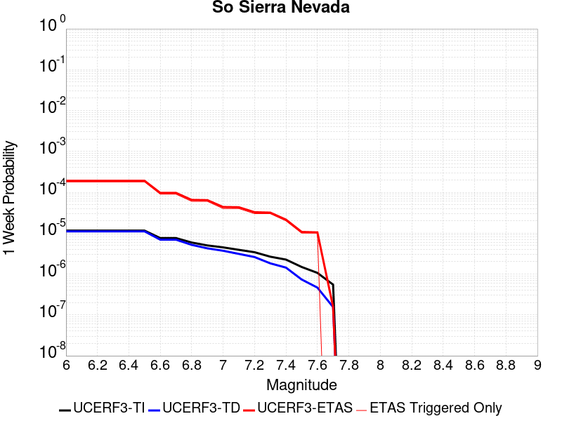 | 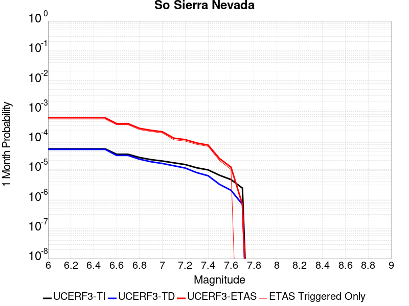 |  |  |

| Magnitude | 1 wk TI Prob | 1 wk TD Prob | 1 wk ETAS Prob | 1 wk ETAS/TD Gain | 1 wk ETAS Triggered Only | 1 mo TI Prob | 1 mo TD Prob | 1 mo ETAS Prob | 1 mo ETAS/TD Gain | 1 mo ETAS Triggered Only | 1 yr TI Prob | 1 yr TD Prob | 1 yr ETAS Prob | 1 yr ETAS/TD Gain | 1 yr ETAS Triggered Only | 10 yr TI Prob | 10 yr TD Prob | 10 yr ETAS Prob | 10 yr ETAS/TD Gain | 10 yr ETAS Triggered Only |
|-----|-----|-----|-----|-----|-----|-----|-----|-----|-----|-----|-----|-----|-----|-----|-----|-----|-----|-----|-----|-----|
| 6.0 | 1.15488665E-5 | 1.1079688E-5 | 1.9107769E-4 | 17.245766 | 1.8E-4 | 4.9494203E-5 | 4.7483583E-5 | 5.474598E-4 | 11.529455 | 5.0E-4 | 6.024253E-4 | 5.7797204E-4 | 0.0020371282 | 3.5246136 | 0.00146 | 0.006007948 | 0.0057659578 | 0.008390736 | 1.4552197 | 0.00264 |
| 6.1 | 1.15488665E-5 | 1.1079688E-5 | 1.9107769E-4 | 17.245766 | 1.8E-4 | 4.9494203E-5 | 4.7483583E-5 | 5.474598E-4 | 11.529455 | 5.0E-4 | 6.024253E-4 | 5.7797204E-4 | 0.0020371282 | 3.5246136 | 0.00146 | 0.006007948 | 0.0057659578 | 0.008390736 | 1.4552197 | 0.00264 |
| 6.2 | 1.15488665E-5 | 1.1079688E-5 | 1.9107769E-4 | 17.245766 | 1.8E-4 | 4.9494203E-5 | 4.7483583E-5 | 5.474598E-4 | 11.529455 | 5.0E-4 | 6.024253E-4 | 5.7797204E-4 | 0.0020371282 | 3.5246136 | 0.00146 | 0.006007948 | 0.0057659578 | 0.008390736 | 1.4552197 | 0.00264 |
| 6.3 | 1.15488665E-5 | 1.1079688E-5 | 1.9107769E-4 | 17.245766 | 1.8E-4 | 4.9494203E-5 | 4.7483583E-5 | 5.474598E-4 | 11.529455 | 5.0E-4 | 6.024253E-4 | 5.7797204E-4 | 0.0020371282 | 3.5246136 | 0.00146 | 0.006007948 | 0.0057659578 | 0.008390736 | 1.4552197 | 0.00264 |
| 6.4 | 1.15488665E-5 | 1.1079688E-5 | 1.9107769E-4 | 17.245766 | 1.8E-4 | 4.9494203E-5 | 4.7483583E-5 | 5.474598E-4 | 11.529455 | 5.0E-4 | 6.024253E-4 | 5.7797204E-4 | 0.0020371282 | 3.5246136 | 0.00146 | 0.006007948 | 0.0057659578 | 0.008390736 | 1.4552197 | 0.00264 |
| 6.5 | 1.15488665E-5 | 1.1079688E-5 | 1.9107769E-4 | 17.245766 | 1.8E-4 | 4.9494203E-5 | 4.7483583E-5 | 5.474598E-4 | 11.529455 | 5.0E-4 | 6.024253E-4 | 5.7797204E-4 | 0.0020371282 | 3.5246136 | 0.00146 | 0.006007948 | 0.0057659578 | 0.008390736 | 1.4552197 | 0.00264 |
| 6.6 | 7.587044E-6 | 6.935655E-6 | 9.693503E-5 | 13.976334 | 9.0E-5 | 3.2515498E-5 | 2.9723915E-5 | 3.497144E-4 | 11.765422 | 3.2E-4 | 3.9580427E-4 | 3.6183148E-4 | 0.0012415131 | 3.4311914 | 8.8E-4 | 0.003951 | 0.0036127153 | 0.005137188 | 1.4219742 | 0.00153 |
| 6.7 | 7.587044E-6 | 6.935655E-6 | 9.693503E-5 | 13.976334 | 9.0E-5 | 3.2515498E-5 | 2.9723915E-5 | 3.497144E-4 | 11.765422 | 3.2E-4 | 3.9580427E-4 | 3.6183148E-4 | 0.0012415131 | 3.4311914 | 8.8E-4 | 0.003951 | 0.0036127153 | 0.005137188 | 1.4219742 | 0.00153 |
| 6.8 | 5.9026956E-6 | 5.179403E-6 | 6.517909E-5 | 12.584287 | 6.0E-5 | 2.5297022E-5 | 2.2197259E-5 | 2.4219237E-4 | 10.910913 | 2.2E-4 | 3.0794772E-4 | 2.702193E-4 | 8.900517E-4 | 3.293813 | 6.2E-4 | 0.0030752132 | 0.0026990233 | 0.0037461894 | 1.3879796 | 0.00105 |
| 6.9 | 5.0118915E-6 | 4.2524307E-6 | 6.425218E-5 | 15.109518 | 6.0E-5 | 2.1479358E-5 | 1.8224579E-5 | 2.0822111E-4 | 11.425291 | 1.9E-4 | 2.614798E-4 | 2.2186238E-4 | 7.317492E-4 | 3.2982123 | 5.1E-4 | 0.0026117235 | 0.0022164814 | 0.0030645975 | 1.3826407 | 8.5E-4 |
| 7.0 | 4.4924795E-6 | 3.7139203E-6 | 4.371377E-5 | 11.77025 | 4.0E-5 | 1.925334E-5 | 1.5916707E-5 | 1.85914E-4 | 11.680431 | 1.7E-4 | 2.3438422E-4 | 1.9376932E-4 | 6.23686E-4 | 3.2187035 | 4.3E-4 | 0.0023413717 | 0.0019360665 | 0.0026347113 | 1.3608578 | 7.0E-4 |
| 7.1 | 3.9118436E-6 | 3.111977E-6 | 4.3111853E-5 | 13.853525 | 4.0E-5 | 1.6764936E-5 | 1.33369795E-5 | 1.1333565E-4 | 8.497849 | 1.0E-4 | 2.0409399E-4 | 1.623662E-4 | 4.523191E-4 | 2.7857962 | 2.9E-4 | 0.0020390663 | 0.0016225318 | 0.0021317042 | 1.3138136 | 5.1E-4 |
| 7.2 | 3.4200818E-6 | 2.6054513E-6 | 3.2605374E-5 | 12.51429 | 3.0E-5 | 1.4657411E-5 | 1.1166175E-5 | 1.0116517E-4 | 9.059967 | 9.0E-5 | 1.7843937E-4 | 1.359402E-4 | 3.9590485E-4 | 2.9123456 | 2.6E-4 | 0.0017829615 | 0.0013586201 | 0.001788036 | 1.3160676 | 4.3E-4 |
| 7.3 | 2.6593618E-6 | 1.8284135E-6 | 3.182836E-5 | 17.407637 | 3.0E-5 | 1.13972155E-5 | 7.836036E-6 | 7.783549E-5 | 9.933018 | 7.0E-5 | 1.3875226E-4 | 9.539985E-5 | 2.8538174E-4 | 2.9914272 | 1.9E-4 | 0.0013866565 | 9.53618E-4 | 0.0012433414 | 1.303815 | 2.9E-4 |
| 7.4 | 2.2577992E-6 | 1.4364293E-6 | 2.14364E-5 | 14.923394 | 2.0E-5 | 9.676246E-6 | 6.1561127E-6 | 6.615574E-5 | 10.74635 | 6.0E-5 | 1.1780193E-4 | 7.4948344E-5 | 2.449356E-4 | 3.2680588 | 1.7E-4 | 0.001177395 | 7.4925576E-4 | 0.0010090609 | 1.346751 | 2.6E-4 |
| 7.5 | 1.489319E-6 | 7.35383E-7 | 1.0735375E-5 | 14.598345 | 1.0E-5 | 6.3827797E-6 | 3.1516379E-6 | 2.3151575E-5 | 7.3458867 | 2.0E-5 | 7.770758E-5 | 3.837052E-5 | 1.1836745E-4 | 3.084854 | 8.0E-5 | 7.7680405E-4 | 3.836394E-4 | 5.1358953E-4 | 1.3387299 | 1.3E-4 |
| 7.6 | 1.0680322E-6 | 4.6595343E-7 | 1.0465948E-5 | 22.461363 | 1.0E-5 | 4.577273E-6 | 1.9969418E-6 | 1.1996922E-5 | 6.007647 | 1.0E-5 | 5.5726876E-5 | 2.4312498E-5 | 6.431153E-5 | 2.6452043 | 4.0E-5 | 5.5712904E-4 | 2.4309864E-4 | 3.0308406E-4 | 1.2467533 | 6.0E-5 |
| 7.7 | 5.509146E-7 | 1.5579108E-7 | 1.5579108E-7 | 1.0 | 0.0 | 2.3610605E-6 | 6.676759E-7 | 6.676759E-7 | 1.0 | 0.0 | 2.8745531E-5 | 8.128925E-6 | 8.128925E-6 | 1.0 | 0.0 | 2.8741814E-4 | 8.1286395E-5 | 8.1286395E-5 | 1.0 | 0.0 |

## San Andreas (Mojave S)
*[(top)](#table-of-contents)*

| 1 Week | 1 Month | 1 Year | 10 Year |
|-----|-----|-----|-----|
|  |  |  |  |

| Magnitude | 1 wk TI Prob | 1 wk TD Prob | 1 wk ETAS Prob | 1 wk ETAS/TD Gain | 1 wk ETAS Triggered Only | 1 mo TI Prob | 1 mo TD Prob | 1 mo ETAS Prob | 1 mo ETAS/TD Gain | 1 mo ETAS Triggered Only | 1 yr TI Prob | 1 yr TD Prob | 1 yr ETAS Prob | 1 yr ETAS/TD Gain | 1 yr ETAS Triggered Only | 10 yr TI Prob | 10 yr TD Prob | 10 yr ETAS Prob | 10 yr ETAS/TD Gain | 10 yr ETAS Triggered Only |
|-----|-----|-----|-----|-----|-----|-----|-----|-----|-----|-----|-----|-----|-----|-----|-----|-----|-----|-----|-----|-----|
| 6.0 | 3.1064058E-4 | 6.7471585E-4 | 8.845742E-4 | 1.3110322 | 2.1E-4 | 0.0013306376 | 0.0028885633 | 0.003387119 | 1.1725965 | 5.0E-4 | 0.016080605 | 0.03457021 | 0.035834923 | 1.0365839 | 0.00131 | 0.1496549 | 0.2866514 | 0.2882921 | 1.0057237 | 0.0023 |
| 6.1 | 3.1064058E-4 | 6.7471585E-4 | 8.845742E-4 | 1.3110322 | 2.1E-4 | 0.0013306376 | 0.0028885633 | 0.003387119 | 1.1725965 | 5.0E-4 | 0.016080605 | 0.03457021 | 0.035834923 | 1.0365839 | 0.00131 | 0.1496549 | 0.2866514 | 0.2882921 | 1.0057237 | 0.0023 |
| 6.2 | 3.1064058E-4 | 6.7471585E-4 | 8.845742E-4 | 1.3110322 | 2.1E-4 | 0.0013306376 | 0.0028885633 | 0.003387119 | 1.1725965 | 5.0E-4 | 0.016080605 | 0.03457021 | 0.035834923 | 1.0365839 | 0.00131 | 0.1496549 | 0.2866514 | 0.2882921 | 1.0057237 | 0.0023 |
| 6.3 | 3.1064058E-4 | 6.7471585E-4 | 8.845742E-4 | 1.3110322 | 2.1E-4 | 0.0013306376 | 0.0028885633 | 0.003387119 | 1.1725965 | 5.0E-4 | 0.016080605 | 0.03457021 | 0.035834923 | 1.0365839 | 0.00131 | 0.1496549 | 0.2866514 | 0.2882921 | 1.0057237 | 0.0023 |
| 6.4 | 1.9872203E-4 | 4.31896E-4 | 6.3180964E-4 | 1.4628744 | 2.0E-4 | 8.5138786E-4 | 0.0018496981 | 0.0022988657 | 1.2428329 | 4.5E-4 | 0.010316478 | 0.02229367 | 0.023427809 | 1.0508727 | 0.00116 | 0.098504856 | 0.19705607 | 0.19866197 | 1.0081494 | 0.002 |
| 6.5 | 1.291105E-4 | 2.8762486E-4 | 4.8756736E-4 | 1.6951501 | 2.0E-4 | 5.5321335E-4 | 0.0012320984 | 0.0016316057 | 1.3242494 | 4.0E-4 | 0.006714592 | 0.014898448 | 0.0158934 | 1.0667824 | 0.00101 | 0.065152965 | 0.138118 | 0.13960905 | 1.0107955 | 0.00173 |
| 6.6 | 1.291105E-4 | 2.8762486E-4 | 4.8756736E-4 | 1.6951501 | 2.0E-4 | 5.5321335E-4 | 0.0012320984 | 0.0016316057 | 1.3242494 | 4.0E-4 | 0.006714592 | 0.014898448 | 0.0158934 | 1.0667824 | 0.00101 | 0.065152965 | 0.138118 | 0.13960905 | 1.0107955 | 0.00173 |
| 6.7 | 1.08001186E-4 | 2.4343564E-4 | 4.2339182E-4 | 1.7392352 | 1.8E-4 | 4.6278012E-4 | 0.0010428791 | 0.0014224828 | 1.3639959 | 3.8E-4 | 0.0056198016 | 0.012623432 | 0.013591061 | 1.0766534 | 9.8E-4 | 0.054797906 | 0.119228184 | 0.1207255 | 1.0125583 | 0.0017 |
| 6.8 | 1.0624356E-4 | 2.3861213E-4 | 4.185692E-4 | 1.7541823 | 1.8E-4 | 4.5525006E-4 | 0.0010222232 | 0.0014018348 | 1.3713588 | 3.8E-4 | 0.0055285925 | 0.012374822 | 0.013342694 | 1.0782131 | 9.8E-4 | 0.053930566 | 0.117172524 | 0.11867333 | 1.0128086 | 0.0017 |
| 6.9 | 1.0393785E-4 | 2.3231508E-4 | 4.1227325E-4 | 1.7746298 | 1.8E-4 | 4.4537184E-4 | 9.952566E-4 | 0.0013748785 | 1.3814311 | 3.8E-4 | 0.0054089287 | 0.012050176 | 0.013018367 | 1.0803466 | 9.8E-4 | 0.05279156 | 0.11446828 | 0.11597368 | 1.0131513 | 0.0017 |
| 7.0 | 1.0155622E-4 | 2.2601044E-4 | 4.0596977E-4 | 1.7962434 | 1.8E-4 | 4.3516833E-4 | 9.68257E-4 | 0.0013378988 | 1.38176 | 3.7E-4 | 0.005285311 | 0.011725035 | 0.012683662 | 1.081759 | 9.7E-4 | 0.05161361 | 0.11172433 | 0.11321664 | 1.013357 | 0.00168 |
| 7.1 | 9.885595E-5 | 2.188942E-4 | 3.9885478E-4 | 1.8221351 | 1.8E-4 | 4.2359953E-4 | 9.3778106E-4 | 0.001307434 | 1.3941784 | 3.7E-4 | 0.0051451353 | 0.011357912 | 0.012307009 | 1.0835626 | 9.6E-4 | 0.05027629 | 0.108605 | 0.11009363 | 1.0137068 | 0.00167 |
| 7.2 | 9.6411415E-5 | 2.1252372E-4 | 3.9248547E-4 | 1.8467844 | 1.8E-4 | 4.1312634E-4 | 9.104983E-4 | 0.0012701706 | 1.3950279 | 3.6E-4 | 0.005018219 | 0.011029154 | 0.011958787 | 1.0842886 | 9.4E-4 | 0.049064007 | 0.10579592 | 0.10726241 | 1.0138615 | 0.00164 |
| 7.3 | 9.1180635E-5 | 1.9480525E-4 | 3.747702E-4 | 1.9238197 | 1.8E-4 | 3.907156E-4 | 8.3461264E-4 | 0.0011943122 | 1.4309778 | 3.6E-4 | 0.004746591 | 0.010114178 | 0.011044671 | 1.0919988 | 9.4E-4 | 0.046464786 | 0.09798997 | 0.09946927 | 1.0150964 | 0.00164 |
| 7.4 | 8.887388E-5 | 1.8729005E-4 | 3.6725635E-4 | 1.9608961 | 1.8E-4 | 3.8083247E-4 | 8.024248E-4 | 0.001162136 | 1.4482802 | 3.6E-4 | 0.0046267817 | 0.0097258575 | 0.010656714 | 1.0957096 | 9.4E-4 | 0.045316286 | 0.0946256 | 0.09610136 | 1.0155958 | 0.00163 |
| 7.5 | 8.6750515E-5 | 1.8060463E-4 | 3.5057394E-4 | 1.9411125 | 1.7E-4 | 3.7173493E-4 | 7.7379035E-4 | 0.0011235195 | 1.4519689 | 3.5E-4 | 0.004516484 | 0.009380288 | 0.010301565 | 1.098214 | 9.3E-4 | 0.04425787 | 0.09158909 | 0.09306072 | 1.0160677 | 0.00162 |
| 7.6 | 8.453092E-5 | 1.7447997E-4 | 3.444503E-4 | 1.9741539 | 1.7E-4 | 3.6222505E-4 | 7.4755703E-4 | 0.0010873028 | 1.4544748 | 3.4E-4 | 0.0044011753 | 0.0090636 | 0.009975261 | 1.100585 | 9.2E-4 | 0.04315024 | 0.08874676 | 0.09021387 | 1.0165315 | 0.00161 |
| 7.7 | 8.259102E-5 | 1.6970029E-4 | 3.3967145E-4 | 2.0015962 | 1.7E-4 | 3.539135E-4 | 7.270843E-4 | 0.0010668371 | 1.4672812 | 3.4E-4 | 0.004300386 | 0.008816389 | 0.009728278 | 1.1034311 | 9.2E-4 | 0.042181134 | 0.08649703 | 0.087967776 | 1.0170033 | 0.00161 |
| 7.8 | 7.444844E-5 | 1.5291499E-4 | 2.928936E-4 | 1.9154013 | 1.4E-4 | 3.1902574E-4 | 6.5518543E-4 | 9.4499544E-4 | 1.4423327 | 2.9E-4 | 0.0038772223 | 0.007947756 | 0.008681875 | 1.092368 | 7.4E-4 | 0.03810269 | 0.078325555 | 0.07953295 | 1.0154151 | 0.00131 |
| 7.9 | 5.2586525E-5 | 1.0011774E-4 | 1.7011072E-4 | 1.6991068 | 7.0E-5 | 2.2535135E-4 | 4.2900548E-4 | 5.9893256E-4 | 1.3960954 | 1.7E-4 | 0.0027402006 | 0.005210644 | 0.005658299 | 1.0859116 | 4.5E-4 | 0.027066574 | 0.052224807 | 0.052992508 | 1.0146998 | 8.1E-4 |
| 8.0 | 3.379877E-5 | 5.4103475E-5 | 8.4101855E-5 | 1.554463 | 3.0E-5 | 1.4484383E-4 | 2.3185145E-4 | 3.118329E-4 | 1.3449686 | 8.0E-5 | 0.0017620471 | 0.002819139 | 0.0029487726 | 1.0459833 | 1.3E-4 | 0.017481409 | 0.028849052 | 0.02910155 | 1.0087525 | 2.6E-4 |
| 8.1 | 1.8668277E-5 | 1.9321345E-5 | 1.9321345E-5 | 1.0 | 0.0 | 8.000444E-5 | 8.280314E-5 | 9.2802315E-5 | 1.1207584 | 1.0E-5 | 9.736188E-4 | 0.0010076626 | 0.0010276425 | 1.019828 | 2.0E-5 | 0.009693642 | 0.010805132 | 0.010844699 | 1.003662 | 4.0E-5 |
| 8.2 | 8.541571E-6 | 5.4646152E-6 | 5.4646152E-6 | 1.0 | 0.0 | 3.660622E-5 | 2.341957E-5 | 2.341957E-5 | 1.0 | 0.0 | 4.455896E-4 | 2.8509603E-4 | 2.8509603E-4 | 1.0 | 0.0 | 0.0044469717 | 0.0032429425 | 0.0032429425 | 1.0 | 0.0 |
| 8.3 | 1.983087E-6 | 7.6647797E-7 | 7.6647797E-7 | 1.0 | 0.0 | 8.498917E-6 | 3.2849016E-6 | 3.2849016E-6 | 1.0 | 0.0 | 1.034694E-4 | 3.999296E-5 | 3.999296E-5 | 1.0 | 0.0 | 0.0010342124 | 4.7228087E-4 | 4.7228087E-4 | 1.0 | 0.0 |

## Coyote Canyon
*[(top)](#table-of-contents)*

| 1 Week | 1 Month | 1 Year | 10 Year |
|-----|-----|-----|-----|
|  |  |  | 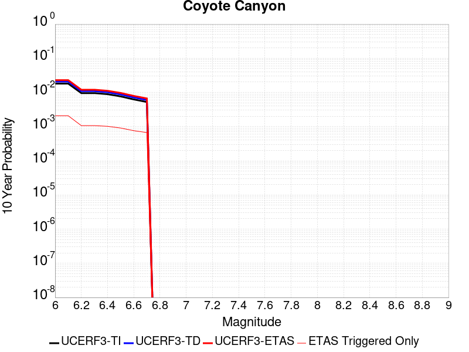 |

| Magnitude | 1 wk TI Prob | 1 wk TD Prob | 1 wk ETAS Prob | 1 wk ETAS/TD Gain | 1 wk ETAS Triggered Only | 1 mo TI Prob | 1 mo TD Prob | 1 mo ETAS Prob | 1 mo ETAS/TD Gain | 1 mo ETAS Triggered Only | 1 yr TI Prob | 1 yr TD Prob | 1 yr ETAS Prob | 1 yr ETAS/TD Gain | 1 yr ETAS Triggered Only | 10 yr TI Prob | 10 yr TD Prob | 10 yr ETAS Prob | 10 yr ETAS/TD Gain | 10 yr ETAS Triggered Only |
|-----|-----|-----|-----|-----|-----|-----|-----|-----|-----|-----|-----|-----|-----|-----|-----|-----|-----|-----|-----|-----|
| 6.0 | 3.5090034E-5 | 4.036512E-5 | 9.03631E-5 | 2.2386432 | 5.0E-5 | 1.503772E-4 | 1.7298336E-4 | 4.4293667E-4 | 2.5605738 | 2.7E-4 | 0.0018293047 | 0.0021042954 | 0.003132128 | 1.488445 | 0.00103 | 0.018143194 | 0.020869616 | 0.022906208 | 1.0975864 | 0.00208 |
| 6.1 | 3.5090034E-5 | 4.036512E-5 | 9.03631E-5 | 2.2386432 | 5.0E-5 | 1.503772E-4 | 1.7298336E-4 | 4.4293667E-4 | 2.5605738 | 2.7E-4 | 0.0018293047 | 0.0021042954 | 0.003132128 | 1.488445 | 0.00103 | 0.018143194 | 0.020869616 | 0.022906208 | 1.0975864 | 0.00208 |
| 6.2 | 1.841879E-5 | 2.1060194E-5 | 5.105956E-5 | 2.4244583 | 3.0E-5 | 7.8935285E-5 | 9.0255424E-5 | 2.102446E-4 | 2.3294399 | 1.2E-4 | 9.606133E-4 | 0.0010984079 | 0.0015579027 | 1.4183279 | 4.6E-4 | 0.0095647145 | 0.010939875 | 0.011998169 | 1.0967374 | 0.00107 |
| 6.3 | 1.841879E-5 | 2.1060194E-5 | 5.105956E-5 | 2.4244583 | 3.0E-5 | 7.8935285E-5 | 9.0255424E-5 | 2.102446E-4 | 2.3294399 | 1.2E-4 | 9.606133E-4 | 0.0010984079 | 0.0015579027 | 1.4183279 | 4.6E-4 | 0.0095647145 | 0.010939875 | 0.011998169 | 1.0967374 | 0.00107 |
| 6.4 | 1.712201E-5 | 1.9565581E-5 | 4.9564995E-5 | 2.5332747 | 3.0E-5 | 7.337798E-5 | 8.385037E-5 | 2.038403E-4 | 2.4310007 | 1.2E-4 | 8.930107E-4 | 0.0010205007 | 0.0014600516 | 1.4307209 | 4.4E-4 | 0.008894307 | 0.0101680625 | 0.011177692 | 1.0992941 | 0.00102 |
| 6.5 | 1.4744935E-5 | 1.6837288E-5 | 4.6836783E-5 | 2.7817295 | 3.0E-5 | 6.3191044E-5 | 7.215834E-5 | 1.7215112E-4 | 2.3857412 | 1.0E-4 | 7.6907943E-4 | 8.782672E-4 | 0.0012679247 | 1.4436662 | 3.9E-4 | 0.007664232 | 0.008757159 | 0.00965919 | 1.1030049 | 9.1E-4 |
| 6.6 | 1.2017839E-5 | 1.3724348E-5 | 4.3723936E-5 | 3.1858664 | 3.0E-5 | 5.150401E-5 | 5.8817805E-5 | 1.388131E-4 | 2.3600523 | 8.0E-5 | 6.268809E-4 | 7.159601E-4 | 0.0010257382 | 1.432675 | 3.1E-4 | 0.0062511545 | 0.0071452283 | 0.0078997975 | 1.1056046 | 7.6E-4 |
| 6.7 | 1.00956095E-5 | 1.1533734E-5 | 4.153339E-5 | 3.6010356 | 3.0E-5 | 4.326618E-5 | 4.9429844E-5 | 1.1942638E-4 | 2.4160786 | 7.0E-5 | 5.266384E-4 | 6.0172915E-4 | 8.615727E-4 | 1.4318281 | 2.6E-4 | 0.005253921 | 0.006009526 | 0.0066754995 | 1.1108197 | 6.7E-4 |

## Lenwood-Lockhart-Old Woman Springs
*[(top)](#table-of-contents)*

| 1 Week | 1 Month | 1 Year | 10 Year |
|-----|-----|-----|-----|
|  |  | 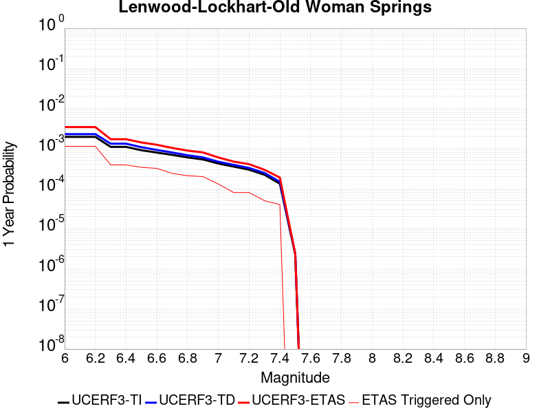 | 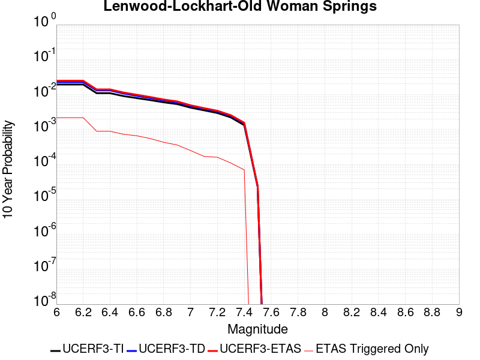 |

| Magnitude | 1 wk TI Prob | 1 wk TD Prob | 1 wk ETAS Prob | 1 wk ETAS/TD Gain | 1 wk ETAS Triggered Only | 1 mo TI Prob | 1 mo TD Prob | 1 mo ETAS Prob | 1 mo ETAS/TD Gain | 1 mo ETAS Triggered Only | 1 yr TI Prob | 1 yr TD Prob | 1 yr ETAS Prob | 1 yr ETAS/TD Gain | 1 yr ETAS Triggered Only | 10 yr TI Prob | 10 yr TD Prob | 10 yr ETAS Prob | 10 yr ETAS/TD Gain | 10 yr ETAS Triggered Only |
|-----|-----|-----|-----|-----|-----|-----|-----|-----|-----|-----|-----|-----|-----|-----|-----|-----|-----|-----|-----|-----|
| 6.0 | 3.744542E-5 | 4.3963868E-5 | 1.4395946E-4 | 3.2744951 | 1.0E-4 | 1.604705E-4 | 1.8840394E-4 | 5.683323E-4 | 3.016563 | 3.8E-4 | 0.0019519776 | 0.002291577 | 0.0034289644 | 1.4963341 | 0.00114 | 0.019349206 | 0.022697475 | 0.024827994 | 1.0938659 | 0.00218 |
| 6.1 | 3.744542E-5 | 4.3963868E-5 | 1.4395946E-4 | 3.2744951 | 1.0E-4 | 1.604705E-4 | 1.8840394E-4 | 5.683323E-4 | 3.016563 | 3.8E-4 | 0.0019519776 | 0.002291577 | 0.0034289644 | 1.4963341 | 0.00114 | 0.019349206 | 0.022697475 | 0.024827994 | 1.0938659 | 0.00218 |
| 6.2 | 3.744542E-5 | 4.3963868E-5 | 1.4395946E-4 | 3.2744951 | 1.0E-4 | 1.604705E-4 | 1.8840394E-4 | 5.683323E-4 | 3.016563 | 3.8E-4 | 0.0019519776 | 0.002291577 | 0.0034289644 | 1.4963341 | 0.00114 | 0.019349206 | 0.022697475 | 0.024827994 | 1.0938659 | 0.00218 |
| 6.3 | 2.1079984E-5 | 2.5354482E-5 | 5.535372E-5 | 2.1831927 | 3.0E-5 | 9.0339665E-5 | 1.0865765E-4 | 2.3864354E-4 | 2.1962883 | 1.3E-4 | 0.0010993304 | 0.0013221242 | 0.0017116085 | 1.2945899 | 3.9E-4 | 0.010939079 | 0.013144798 | 0.014023099 | 1.0668174 | 8.9E-4 |
| 6.4 | 2.1079984E-5 | 2.5354482E-5 | 5.535372E-5 | 2.1831927 | 3.0E-5 | 9.0339665E-5 | 1.0865765E-4 | 2.3864354E-4 | 2.1962883 | 1.3E-4 | 0.0010993304 | 0.0013221242 | 0.0017116085 | 1.2945899 | 3.9E-4 | 0.010939079 | 0.013144798 | 0.014023099 | 1.0668174 | 8.9E-4 |
| 6.5 | 1.7397282E-5 | 2.0663358E-5 | 5.0662737E-5 | 2.4518154 | 3.0E-5 | 7.455765E-5 | 8.855431E-5 | 2.0854369E-4 | 2.3549807 | 1.2E-4 | 9.073613E-4 | 0.0010776272 | 0.0014172608 | 1.315168 | 3.4E-4 | 0.009036654 | 0.010725311 | 0.011447481 | 1.0673333 | 7.3E-4 |
| 6.6 | 1.52050325E-5 | 1.7680148E-5 | 4.7679616E-5 | 2.6967883 | 3.0E-5 | 6.51628E-5 | 7.57699E-5 | 1.7576232E-4 | 2.3196852 | 1.0E-4 | 7.9306826E-4 | 9.2211604E-4 | 0.001241821 | 1.3467079 | 3.2E-4 | 0.007902439 | 0.009183761 | 0.0098377 | 1.071206 | 6.6E-4 |
| 6.7 | 1.332523E-5 | 1.5264432E-5 | 4.5263976E-5 | 2.9653232 | 3.0E-5 | 5.7106878E-5 | 6.5417385E-5 | 1.554115E-4 | 2.375691 | 9.0E-5 | 6.950544E-4 | 7.961715E-4 | 0.0010359804 | 1.3012025 | 2.4E-4 | 0.006928845 | 0.0079338215 | 0.008479457 | 1.0687735 | 5.5E-4 |
| 6.8 | 1.1525329E-5 | 1.3031408E-5 | 3.303115E-5 | 2.5347335 | 2.0E-5 | 4.9393333E-5 | 5.584772E-5 | 1.458427E-4 | 2.6114352 | 9.0E-5 | 6.011979E-4 | 6.797381E-4 | 8.8959537E-4 | 1.3087325 | 2.1E-4 | 0.00599574 | 0.0067770416 | 0.0072041275 | 1.0630195 | 4.3E-4 |
| 6.9 | 1.0253909E-5 | 1.15148705E-5 | 3.151464E-5 | 2.7368643 | 2.0E-5 | 4.3944583E-5 | 4.9348535E-5 | 1.2934458E-4 | 2.6210423 | 8.0E-5 | 5.3489394E-4 | 6.006564E-4 | 8.0053625E-4 | 1.332769 | 2.0E-4 | 0.0053360825 | 0.0059907082 | 0.0063485517 | 1.059733 | 3.6E-4 |
| 7.0 | 8.104563E-6 | 8.9914565E-6 | 1.8991366E-5 | 2.1121569 | 1.0E-5 | 3.4733377E-5 | 3.8534257E-5 | 8.853233E-5 | 2.2974968 | 5.0E-5 | 4.2279682E-4 | 4.69056E-4 | 5.98995E-4 | 1.2770224 | 1.3E-4 | 0.0042199334 | 0.004680908 | 0.0049297377 | 1.0531584 | 2.5E-4 |
| 7.1 | 6.7986157E-6 | 7.5159987E-6 | 1.7515924E-5 | 2.330485 | 1.0E-5 | 2.91366E-5 | 3.221104E-5 | 7.220975E-5 | 2.2417703 | 4.0E-5 | 3.5468035E-4 | 3.9210095E-4 | 4.7206957E-4 | 1.2039491 | 8.0E-5 | 0.003541148 | 0.003914308 | 0.0040836423 | 1.0432605 | 1.7E-4 |
| 7.2 | 5.6893327E-6 | 6.2801455E-6 | 1.6280082E-5 | 2.5923097 | 1.0E-5 | 2.4382627E-5 | 2.6914644E-5 | 6.691357E-5 | 2.4861398 | 4.0E-5 | 2.9681803E-4 | 3.276385E-4 | 4.076123E-4 | 1.2440915 | 8.0E-5 | 0.002964219 | 0.0032717532 | 0.0034312296 | 1.0487435 | 1.6E-4 |
| 7.3 | 4.253348E-6 | 4.707082E-6 | 4.707082E-6 | 1.0 | 0.0 | 1.8228506E-5 | 2.0173064E-5 | 4.017266E-5 | 1.9914011 | 2.0E-5 | 2.2190946E-4 | 2.455812E-4 | 2.9556893E-4 | 1.2035487 | 5.0E-5 | 0.00221688 | 0.0024532792 | 0.0025630093 | 1.0447279 | 1.1E-4 |
| 7.4 | 2.5448119E-6 | 2.8520615E-6 | 2.8520615E-6 | 1.0 | 0.0 | 1.0906291E-5 | 1.2223072E-5 | 3.222283E-5 | 2.6362298 | 2.0E-5 | 1.3277601E-4 | 1.488074E-4 | 1.8880145E-4 | 1.2687638 | 4.0E-5 | 0.001326967 | 0.0014872397 | 0.0015571356 | 1.0469971 | 7.0E-5 |
| 7.5 | 4.3706837E-8 | 4.5629356E-8 | 4.5629356E-8 | 1.0 | 0.0 | 1.8731501E-7 | 1.9555438E-7 | 1.9555438E-7 | 1.0 | 0.0 | 2.2805577E-6 | 2.3808725E-6 | 2.3808725E-6 | 1.0 | 0.0 | 2.2805343E-5 | 2.3808525E-5 | 2.3808525E-5 | 1.0 | 0.0 |

## Death Valley (So)
*[(top)](#table-of-contents)*

| 1 Week | 1 Month | 1 Year | 10 Year |
|-----|-----|-----|-----|
|  |  | 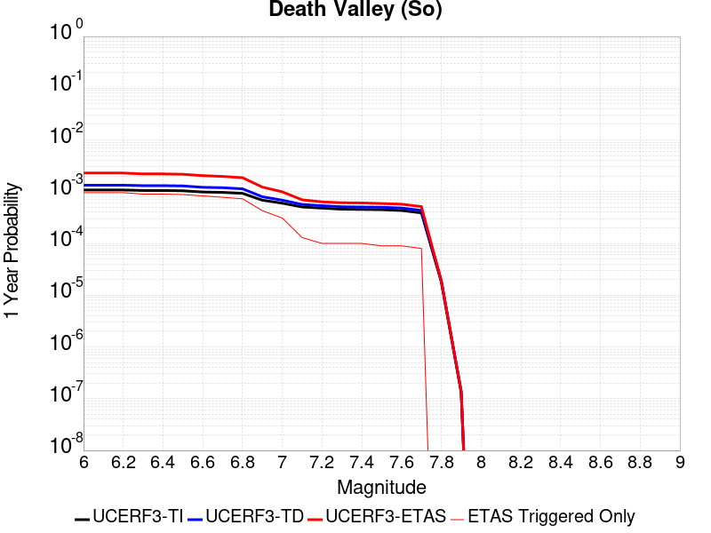 |  |

| Magnitude | 1 wk TI Prob | 1 wk TD Prob | 1 wk ETAS Prob | 1 wk ETAS/TD Gain | 1 wk ETAS Triggered Only | 1 mo TI Prob | 1 mo TD Prob | 1 mo ETAS Prob | 1 mo ETAS/TD Gain | 1 mo ETAS Triggered Only | 1 yr TI Prob | 1 yr TD Prob | 1 yr ETAS Prob | 1 yr ETAS/TD Gain | 1 yr ETAS Triggered Only | 10 yr TI Prob | 10 yr TD Prob | 10 yr ETAS Prob | 10 yr ETAS/TD Gain | 10 yr ETAS Triggered Only |
|-----|-----|-----|-----|-----|-----|-----|-----|-----|-----|-----|-----|-----|-----|-----|-----|-----|-----|-----|-----|-----|
| 6.0 | 2.0684236E-5 | 2.5618914E-5 | 6.561789E-5 | 2.5613065 | 4.0E-5 | 8.864371E-5 | 1.09790824E-4 | 3.4976448E-4 | 3.185735 | 2.4E-4 | 0.0010787029 | 0.0013359005 | 0.002294618 | 1.7176564 | 9.6E-4 | 0.010734817 | 0.01328137 | 0.015323877 | 1.1537874 | 0.00207 |
| 6.1 | 2.0684236E-5 | 2.5618914E-5 | 6.561789E-5 | 2.5613065 | 4.0E-5 | 8.864371E-5 | 1.09790824E-4 | 3.4976448E-4 | 3.185735 | 2.4E-4 | 0.0010787029 | 0.0013359005 | 0.002294618 | 1.7176564 | 9.6E-4 | 0.010734817 | 0.01328137 | 0.015323877 | 1.1537874 | 0.00207 |
| 6.2 | 2.0684236E-5 | 2.5618914E-5 | 6.561789E-5 | 2.5613065 | 4.0E-5 | 8.864371E-5 | 1.09790824E-4 | 3.4976448E-4 | 3.185735 | 2.4E-4 | 0.0010787029 | 0.0013359005 | 0.002294618 | 1.7176564 | 9.6E-4 | 0.010734817 | 0.01328137 | 0.015323877 | 1.1537874 | 0.00207 |
| 6.3 | 2.0240292E-5 | 2.511899E-5 | 6.511799E-5 | 2.5923808 | 4.0E-5 | 8.6741224E-5 | 1.0764847E-4 | 3.1762588E-4 | 2.9505842 | 2.1E-4 | 0.0010555626 | 0.0013098489 | 0.00220867 | 1.6862022 | 9.0E-4 | 0.010505628 | 0.013023925 | 0.014978138 | 1.1500479 | 0.00198 |
| 6.4 | 2.0240292E-5 | 2.511899E-5 | 6.511799E-5 | 2.5923808 | 4.0E-5 | 8.6741224E-5 | 1.0764847E-4 | 3.1762588E-4 | 2.9505842 | 2.1E-4 | 0.0010555626 | 0.0013098489 | 0.00220867 | 1.6862022 | 9.0E-4 | 0.010505628 | 0.013023925 | 0.014978138 | 1.1500479 | 0.00198 |
| 6.5 | 1.9962767E-5 | 2.4808238E-5 | 5.4807493E-5 | 2.2092457 | 3.0E-5 | 8.55519E-5 | 1.0631679E-4 | 2.9629658E-4 | 2.786922 | 1.9E-4 | 0.0010410968 | 0.0012936549 | 0.0021725164 | 1.6793633 | 8.8E-4 | 0.010362327 | 0.012863869 | 0.014759171 | 1.1473353 | 0.00192 |
| 6.6 | 1.8937297E-5 | 2.331202E-5 | 5.331132E-5 | 2.2868598 | 3.0E-5 | 8.115732E-5 | 9.9904915E-5 | 2.4988994E-4 | 2.5012777 | 1.5E-4 | 9.876423E-4 | 0.0012156782 | 0.0020446691 | 1.6819165 | 8.3E-4 | 0.009832645 | 0.012092765 | 0.013821603 | 1.1429646 | 0.00175 |
| 6.7 | 1.8621096E-5 | 2.2912649E-5 | 5.291196E-5 | 2.3092904 | 3.0E-5 | 7.980225E-5 | 9.819346E-5 | 2.4817872E-4 | 2.5274467 | 1.5E-4 | 9.711593E-4 | 0.0011948642 | 0.0019739321 | 1.6520139 | 7.8E-4 | 0.009669261 | 0.011886865 | 0.01350737 | 1.1363274 | 0.00164 |
| 6.8 | 1.7830353E-5 | 2.1806614E-5 | 5.180596E-5 | 2.3756993 | 3.0E-5 | 7.641356E-5 | 9.345365E-5 | 2.4343963E-4 | 2.6049237 | 1.5E-4 | 9.29938E-4 | 0.0011372183 | 0.0018663881 | 1.6411872 | 7.3E-4 | 0.009260561 | 0.011316919 | 0.0128493775 | 1.135413 | 0.00155 |
| 6.9 | 1.3135183E-5 | 1.5304342E-5 | 2.5304189E-5 | 1.6533993 | 1.0E-5 | 5.6292425E-5 | 6.558842E-5 | 1.7558121E-4 | 2.6770153 | 1.1E-4 | 6.8514474E-4 | 7.9825294E-4 | 0.0012279097 | 1.5382464 | 4.3E-4 | 0.006830362 | 0.007954868 | 0.008976675 | 1.1284505 | 0.00103 |
| 7.0 | 1.1507512E-5 | 1.315447E-5 | 2.3154338E-5 | 1.7601879 | 1.0E-5 | 4.9316975E-5 | 5.6375116E-5 | 1.3637061E-4 | 2.4189858 | 8.0E-5 | 6.002687E-4 | 6.861567E-4 | 9.959439E-4 | 1.4514818 | 3.1E-4 | 0.0059864987 | 0.0068410533 | 0.0075859223 | 1.1088822 | 7.5E-4 |
| 7.1 | 9.715903E-6 | 1.086547E-5 | 1.086547E-5 | 1.0 | 0.0 | 4.1638916E-5 | 4.6565492E-5 | 8.656363E-5 | 1.8589652 | 4.0E-5 | 5.068359E-4 | 5.667917E-4 | 6.96718E-4 | 1.2292311 | 1.3E-4 | 0.0050568148 | 0.0056537534 | 0.0059719444 | 1.0562795 | 3.2E-4 |
| 7.2 | 9.233269E-6 | 1.0286476E-5 | 1.0286476E-5 | 1.0 | 0.0 | 3.9570554E-5 | 4.4084176E-5 | 6.4083295E-5 | 1.4536575 | 2.0E-5 | 4.81665E-4 | 5.365969E-4 | 6.3654326E-4 | 1.1862596 | 1.0E-4 | 0.0048062233 | 0.005353444 | 0.0055623194 | 1.0390171 | 2.1E-4 |
| 7.3 | 8.8041315E-6 | 9.808313E-6 | 9.808313E-6 | 1.0 | 0.0 | 3.7731446E-5 | 4.2034975E-5 | 6.203413E-5 | 1.4757743 | 2.0E-5 | 4.592835E-4 | 5.1165983E-4 | 6.116087E-4 | 1.1953423 | 1.0E-4 | 0.0045833546 | 0.0051052445 | 0.0052942745 | 1.0370266 | 1.9E-4 |
| 7.4 | 8.708749E-6 | 9.707323E-6 | 9.707323E-6 | 1.0 | 0.0 | 3.7322676E-5 | 4.1602176E-5 | 6.160134E-5 | 1.4807241 | 2.0E-5 | 4.5430884E-4 | 5.06393E-4 | 6.0634234E-4 | 1.197375 | 1.0E-4 | 0.004533812 | 0.0050528166 | 0.0052418564 | 1.0374128 | 1.9E-4 |
| 7.5 | 8.612678E-6 | 9.604964E-6 | 9.604964E-6 | 1.0 | 0.0 | 3.6910955E-5 | 4.116351E-5 | 6.116268E-5 | 1.4858472 | 2.0E-5 | 4.492982E-4 | 5.010547E-4 | 5.9100956E-4 | 1.1795311 | 9.0E-5 | 0.004483909 | 0.0049996753 | 0.005178775 | 1.0358224 | 1.8E-4 |
| 7.6 | 8.319024E-6 | 9.28406E-6 | 9.28406E-6 | 1.0 | 0.0 | 3.5652476E-5 | 3.9788243E-5 | 5.978745E-5 | 1.5026411 | 2.0E-5 | 4.3398244E-4 | 4.8431839E-4 | 5.742748E-4 | 1.1857382 | 9.0E-5 | 0.0043313587 | 0.004833053 | 0.0050022313 | 1.0350045 | 1.7E-4 |
| 7.7 | 7.4718328E-6 | 8.3453E-6 | 8.3453E-6 | 1.0 | 0.0 | 3.2021748E-5 | 3.57651E-5 | 4.5764744E-5 | 1.2795922 | 1.0E-5 | 3.8979502E-4 | 4.3535716E-4 | 5.153223E-4 | 1.1836772 | 8.0E-5 | 0.00389112 | 0.004345448 | 0.004494796 | 1.0343689 | 1.5E-4 |
| 7.8 | 3.4586725E-7 | 3.648288E-7 | 3.648288E-7 | 1.0 | 0.0 | 1.4822873E-6 | 1.5635511E-6 | 1.5635511E-6 | 1.0 | 0.0 | 1.80467E-5 | 1.9036073E-5 | 1.9036073E-5 | 1.0 | 0.0 | 1.8045233E-4 | 1.9034486E-4 | 1.9034486E-4 | 1.0 | 0.0 |
| 7.9 | 2.5591178E-9 | 2.6696871E-9 | 2.6696871E-9 | 1.0 | 0.0 | 1.0967647E-8 | 1.1441516E-8 | 1.1441516E-8 | 1.0 | 0.0 | 1.335311E-7 | 1.3930045E-7 | 1.3930045E-7 | 1.0 | 0.0 | 1.3353102E-6 | 1.3930046E-6 | 1.3930046E-6 | 1.0 | 0.0 |

## San Andreas (Mojave N)
*[(top)](#table-of-contents)*

| 1 Week | 1 Month | 1 Year | 10 Year |
|-----|-----|-----|-----|
|  |  |  |  |

| Magnitude | 1 wk TI Prob | 1 wk TD Prob | 1 wk ETAS Prob | 1 wk ETAS/TD Gain | 1 wk ETAS Triggered Only | 1 mo TI Prob | 1 mo TD Prob | 1 mo ETAS Prob | 1 mo ETAS/TD Gain | 1 mo ETAS Triggered Only | 1 yr TI Prob | 1 yr TD Prob | 1 yr ETAS Prob | 1 yr ETAS/TD Gain | 1 yr ETAS Triggered Only | 10 yr TI Prob | 10 yr TD Prob | 10 yr ETAS Prob | 10 yr ETAS/TD Gain | 10 yr ETAS Triggered Only |
|-----|-----|-----|-----|-----|-----|-----|-----|-----|-----|-----|-----|-----|-----|-----|-----|-----|-----|-----|-----|-----|
| 6.0 | 9.877682E-5 | 1.9410432E-4 | 4.2405966E-4 | 2.1846998 | 2.3E-4 | 4.2326056E-4 | 8.3161064E-4 | 0.0013411865 | 1.6127578 | 5.1E-4 | 0.0051410277 | 0.010077983 | 0.011226293 | 1.1139424 | 0.00116 | 0.05023708 | 0.098361015 | 0.10022741 | 1.0189749 | 0.00207 |
| 6.1 | 9.877682E-5 | 1.9410432E-4 | 4.2405966E-4 | 2.1846998 | 2.3E-4 | 4.2326056E-4 | 8.3161064E-4 | 0.0013411865 | 1.6127578 | 5.1E-4 | 0.0051410277 | 0.010077983 | 0.011226293 | 1.1139424 | 0.00116 | 0.05023708 | 0.098361015 | 0.10022741 | 1.0189749 | 0.00207 |
| 6.2 | 9.877682E-5 | 1.9410432E-4 | 4.2405966E-4 | 2.1846998 | 2.3E-4 | 4.2326056E-4 | 8.3161064E-4 | 0.0013411865 | 1.6127578 | 5.1E-4 | 0.0051410277 | 0.010077983 | 0.011226293 | 1.1139424 | 0.00116 | 0.05023708 | 0.098361015 | 0.10022741 | 1.0189749 | 0.00207 |
| 6.3 | 9.877682E-5 | 1.9410432E-4 | 4.2405966E-4 | 2.1846998 | 2.3E-4 | 4.2326056E-4 | 8.3161064E-4 | 0.0013411865 | 1.6127578 | 5.1E-4 | 0.0051410277 | 0.010077983 | 0.011226293 | 1.1139424 | 0.00116 | 0.05023708 | 0.098361015 | 0.10022741 | 1.0189749 | 0.00207 |
| 6.4 | 9.877682E-5 | 1.9410432E-4 | 4.2405966E-4 | 2.1846998 | 2.3E-4 | 4.2326056E-4 | 8.3161064E-4 | 0.0013411865 | 1.6127578 | 5.1E-4 | 0.0051410277 | 0.010077983 | 0.011226293 | 1.1139424 | 0.00116 | 0.05023708 | 0.098361015 | 0.10022741 | 1.0189749 | 0.00207 |
| 6.5 | 9.861474E-5 | 1.9384196E-4 | 4.2379738E-4 | 2.1863036 | 2.3E-4 | 4.2256617E-4 | 8.3048694E-4 | 0.0013400634 | 1.6135875 | 5.1E-4 | 0.0051326132 | 0.010064429 | 0.011212754 | 1.1140974 | 0.00116 | 0.050156746 | 0.09823856 | 0.1001052 | 1.0190011 | 0.00207 |
| 6.6 | 9.861474E-5 | 1.9384196E-4 | 4.2379738E-4 | 2.1863036 | 2.3E-4 | 4.2256617E-4 | 8.3048694E-4 | 0.0013400634 | 1.6135875 | 5.1E-4 | 0.0051326132 | 0.010064429 | 0.011212754 | 1.1140974 | 0.00116 | 0.050156746 | 0.09823856 | 0.1001052 | 1.0190011 | 0.00207 |
| 6.7 | 9.8552715E-5 | 1.9374148E-4 | 4.236969E-4 | 2.186919 | 2.3E-4 | 4.223004E-4 | 8.300566E-4 | 0.0013396333 | 1.6139059 | 5.1E-4 | 0.0051293927 | 0.0100592375 | 0.011207568 | 1.1141568 | 0.00116 | 0.050125998 | 0.098191775 | 0.10005852 | 1.0190111 | 0.00207 |
| 6.8 | 9.8464974E-5 | 1.9359306E-4 | 4.2354854E-4 | 2.187829 | 2.3E-4 | 4.219245E-4 | 8.294209E-4 | 0.001338998 | 1.6143768 | 5.1E-4 | 0.0051248376 | 0.01005157 | 0.01119991 | 1.1142448 | 0.00116 | 0.05008251 | 0.09812213 | 0.09998901 | 1.0190262 | 0.00207 |
| 6.9 | 9.825824E-5 | 1.9327311E-4 | 4.2322866E-4 | 2.189796 | 2.3E-4 | 4.2103877E-4 | 8.2805054E-4 | 0.0013376282 | 1.6153945 | 5.1E-4 | 0.0051141046 | 0.010035039 | 0.011173499 | 1.1134485 | 0.00115 | 0.049980022 | 0.09797137 | 0.09982955 | 1.0189666 | 0.00206 |
| 7.0 | 9.781462E-5 | 1.9258665E-4 | 4.2254236E-4 | 2.1940377 | 2.3E-4 | 4.1913814E-4 | 8.251105E-4 | 0.001324698 | 1.6054795 | 5.0E-4 | 0.005091073 | 0.009999573 | 0.011138073 | 1.1138549 | 0.00115 | 0.04976007 | 0.09764758 | 0.09950642 | 1.0190363 | 0.00206 |
| 7.1 | 9.7121134E-5 | 1.9160361E-4 | 4.2155955E-4 | 2.2001648 | 2.3E-4 | 4.1616702E-4 | 8.2090014E-4 | 0.0013204897 | 1.6085875 | 5.0E-4 | 0.005055068 | 0.009948781 | 0.01108734 | 1.114442 | 0.00115 | 0.04941613 | 0.09718397 | 0.09904377 | 1.0191369 | 0.00206 |
| 7.2 | 9.663819E-5 | 1.9091136E-4 | 4.2086747E-4 | 2.2045176 | 2.3E-4 | 4.1409794E-4 | 8.179352E-4 | 0.0013175262 | 1.6107954 | 5.0E-4 | 0.0050299936 | 0.009913012 | 0.011051612 | 1.1148591 | 0.00115 | 0.049176537 | 0.09685706 | 0.09871754 | 1.0192084 | 0.00206 |
| 7.3 | 9.6277574E-5 | 1.9043636E-4 | 4.2039258E-4 | 2.2075226 | 2.3E-4 | 4.125529E-4 | 8.1590074E-4 | 0.0013154928 | 1.6123196 | 5.0E-4 | 0.0050112694 | 0.009888468 | 0.011027096 | 1.1151471 | 0.00115 | 0.04899759 | 0.09663044 | 0.09849138 | 1.0192584 | 0.00206 |
| 7.4 | 9.593308E-5 | 1.8983395E-4 | 4.197903E-4 | 2.2113552 | 2.3E-4 | 4.1107697E-4 | 8.133206E-4 | 0.001312914 | 1.6142638 | 5.0E-4 | 0.0049933824 | 0.00985734 | 0.010996004 | 1.1155144 | 0.00115 | 0.04882661 | 0.09634874 | 0.09821026 | 1.0193206 | 0.00206 |
| 7.5 | 9.561707E-5 | 1.892946E-4 | 4.1925107E-4 | 2.2148073 | 2.3E-4 | 4.0972308E-4 | 8.1101054E-4 | 0.001310605 | 1.6160148 | 5.0E-4 | 0.0049769743 | 0.009829468 | 0.010968165 | 1.1158451 | 0.00115 | 0.048669744 | 0.09609495 | 0.097957 | 1.0193771 | 0.00206 |
| 7.6 | 9.418194E-5 | 1.858169E-4 | 4.1577418E-4 | 2.2375476 | 2.3E-4 | 4.0357444E-4 | 7.961153E-4 | 0.0012857252 | 1.6149987 | 4.9E-4 | 0.004902454 | 0.009649739 | 0.010778738 | 1.116998 | 0.00114 | 0.047957025 | 0.094475985 | 0.09633231 | 1.0196487 | 0.00205 |
| 7.7 | 8.202141E-5 | 1.6029968E-4 | 3.6026762E-4 | 2.2474632 | 2.0E-4 | 3.51473E-4 | 6.868178E-4 | 0.0011165225 | 1.6256458 | 4.3E-4 | 0.00427079 | 0.008330002 | 0.00939109 | 1.1273813 | 0.00107 | 0.04189639 | 0.08226986 | 0.08403191 | 1.0214179 | 0.00192 |
| 7.8 | 7.2859846E-5 | 1.452426E-4 | 2.8522225E-4 | 1.9637645 | 1.4E-4 | 3.1221908E-4 | 6.223198E-4 | 9.121393E-4 | 1.4657084 | 2.9E-4 | 0.003794643 | 0.007550463 | 0.008284875 | 1.0972673 | 7.4E-4 | 0.037304975 | 0.074759446 | 0.075971514 | 1.0162128 | 0.00131 |
| 7.9 | 5.3874453E-5 | 1.0051061E-4 | 1.7050357E-4 | 1.6963739 | 7.0E-5 | 2.3087008E-4 | 4.3068864E-4 | 6.0061546E-4 | 1.3945467 | 1.7E-4 | 0.0028072202 | 0.005231038 | 0.0056786845 | 1.085575 | 4.5E-4 | 0.02772022 | 0.052449387 | 0.0532169 | 1.0146334 | 8.1E-4 |
| 8.0 | 3.468538E-5 | 5.4289703E-5 | 8.4288076E-5 | 1.5525609 | 3.0E-5 | 1.4864317E-4 | 2.3264941E-4 | 3.1263081E-4 | 1.343785 | 8.0E-5 | 0.0018082283 | 0.0028288292 | 0.0029584616 | 1.0458254 | 1.3E-4 | 0.017935853 | 0.028961731 | 0.029214201 | 1.0087174 | 2.6E-4 |
| 8.1 | 1.9152367E-5 | 1.9414629E-5 | 1.9414629E-5 | 1.0 | 0.0 | 8.207899E-5 | 8.3202896E-5 | 9.320206E-5 | 1.1201781 | 1.0E-5 | 9.988535E-4 | 0.0010125252 | 0.001032505 | 1.0197326 | 2.0E-5 | 0.009943757 | 0.010862543 | 0.01090211 | 1.0036423 | 4.0E-5 |
| 8.2 | 8.643924E-6 | 5.478665E-6 | 5.478665E-6 | 1.0 | 0.0 | 3.704486E-5 | 2.3479783E-5 | 2.3479783E-5 | 1.0 | 0.0 | 4.5092785E-4 | 2.8582895E-4 | 2.8582895E-4 | 1.0 | 0.0 | 0.0045001395 | 0.0032508469 | 0.0032508469 | 1.0 | 0.0 |
| 8.3 | 1.983087E-6 | 7.6647797E-7 | 7.6647797E-7 | 1.0 | 0.0 | 8.498917E-6 | 3.2849016E-6 | 3.2849016E-6 | 1.0 | 0.0 | 1.034694E-4 | 3.999296E-5 | 3.999296E-5 | 1.0 | 0.0 | 0.0010342124 | 4.7228087E-4 | 4.7228087E-4 | 1.0 | 0.0 |

## Nelson Lake
*[(top)](#table-of-contents)*

| 1 Week | 1 Month | 1 Year | 10 Year |
|-----|-----|-----|-----|
| 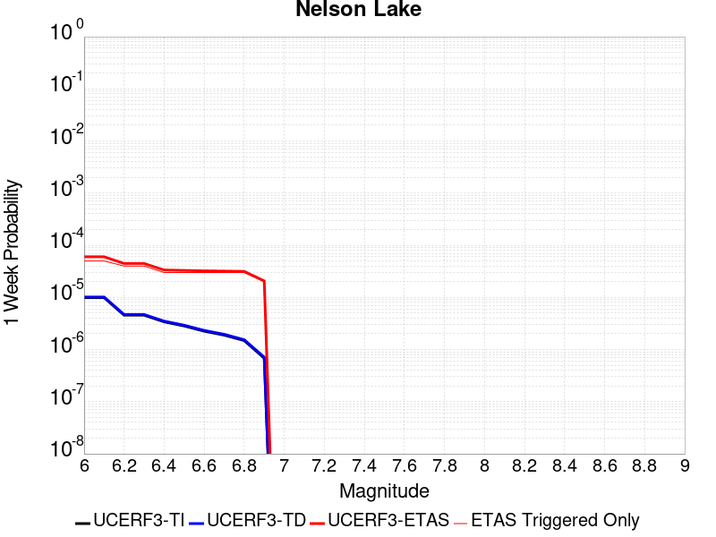 | 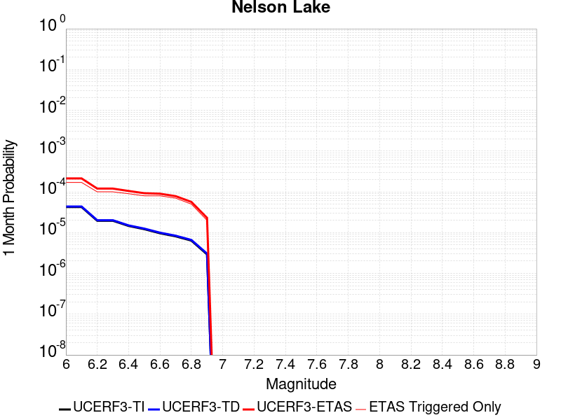 |  |  |

| Magnitude | 1 wk TI Prob | 1 wk TD Prob | 1 wk ETAS Prob | 1 wk ETAS/TD Gain | 1 wk ETAS Triggered Only | 1 mo TI Prob | 1 mo TD Prob | 1 mo ETAS Prob | 1 mo ETAS/TD Gain | 1 mo ETAS Triggered Only | 1 yr TI Prob | 1 yr TD Prob | 1 yr ETAS Prob | 1 yr ETAS/TD Gain | 1 yr ETAS Triggered Only | 10 yr TI Prob | 10 yr TD Prob | 10 yr ETAS Prob | 10 yr ETAS/TD Gain | 10 yr ETAS Triggered Only |
|-----|-----|-----|-----|-----|-----|-----|-----|-----|-----|-----|-----|-----|-----|-----|-----|-----|-----|-----|-----|-----|
| 6.0 | 9.913453E-6 | 1.0192293E-5 | 6.0191785E-5 | 5.905617 | 5.0E-5 | 4.2485535E-5 | 4.3680586E-5 | 2.1367316E-4 | 4.8917193 | 1.7E-4 | 5.1713863E-4 | 5.316917E-4 | 0.0011913407 | 2.240661 | 6.6E-4 | 0.0051593683 | 0.0053052236 | 0.0068867886 | 1.2981147 | 0.00159 |
| 6.1 | 9.913453E-6 | 1.0192293E-5 | 6.0191785E-5 | 5.905617 | 5.0E-5 | 4.2485535E-5 | 4.3680586E-5 | 2.1367316E-4 | 4.8917193 | 1.7E-4 | 5.1713863E-4 | 5.316917E-4 | 0.0011913407 | 2.240661 | 6.6E-4 | 0.0051593683 | 0.0053052236 | 0.0068867886 | 1.2981147 | 0.00159 |
| 6.2 | 4.5596407E-6 | 4.696332E-6 | 4.4696142E-5 | 9.517246 | 4.0E-5 | 1.954117E-5 | 2.0126989E-5 | 1.20124976E-4 | 5.9683533 | 1.0E-4 | 2.3788778E-4 | 2.450198E-4 | 5.649414E-4 | 2.305697 | 3.2E-4 | 0.0023763329 | 0.0024476226 | 0.003275591 | 1.3382746 | 8.3E-4 |
| 6.3 | 4.5596407E-6 | 4.696332E-6 | 4.4696142E-5 | 9.517246 | 4.0E-5 | 1.954117E-5 | 2.0126989E-5 | 1.20124976E-4 | 5.9683533 | 1.0E-4 | 2.3788778E-4 | 2.450198E-4 | 5.649414E-4 | 2.305697 | 3.2E-4 | 0.0023763329 | 0.0024476226 | 0.003275591 | 1.3382746 | 8.3E-4 |
| 6.4 | 3.4025713E-6 | 3.509912E-6 | 3.350981E-5 | 9.547193 | 3.0E-5 | 1.4582367E-5 | 1.50423975E-5 | 1.0504104E-4 | 6.982999 | 9.0E-5 | 1.7752586E-4 | 1.8312664E-4 | 4.6307535E-4 | 2.5287166 | 2.8E-4 | 0.001773841 | 0.0018298404 | 0.0024886327 | 1.3600272 | 6.6E-4 |
| 6.5 | 2.8352947E-6 | 2.9278688E-6 | 3.2927783E-5 | 11.24633 | 3.0E-5 | 1.2151207E-5 | 1.2547953E-5 | 9.254695E-5 | 7.375462 | 8.0E-5 | 1.479309E-4 | 1.5276136E-4 | 3.927247E-4 | 2.5708377 | 2.4E-4 | 0.0014783246 | 0.0015266375 | 0.0020857826 | 1.3662592 | 5.6E-4 |
| 6.6 | 2.251518E-6 | 2.3290781E-6 | 3.2329008E-5 | 13.880602 | 3.0E-5 | 9.649328E-6 | 9.981729E-6 | 8.998093E-5 | 9.014564 | 8.0E-5 | 1.1747423E-4 | 1.2152141E-4 | 3.5149345E-4 | 2.8924408 | 2.3E-4 | 0.0011741214 | 0.0012146112 | 0.0016840404 | 1.3864851 | 4.7E-4 |
| 6.7 | 1.8911853E-6 | 1.9591491E-6 | 3.195909E-5 | 16.31274 | 3.0E-5 | 8.105055E-6 | 8.39633E-6 | 7.8395744E-5 | 9.336906 | 7.0E-5 | 9.867457E-5 | 1.022211E-4 | 3.0220064E-4 | 2.9563432 | 2.0E-4 | 9.863076E-4 | 0.0010217984 | 0.0014213896 | 1.3910667 | 4.0E-4 |
| 6.8 | 1.4874814E-6 | 1.5438383E-6 | 3.1543794E-5 | 20.432056 | 3.0E-5 | 6.374905E-6 | 6.6164357E-6 | 5.6616103E-5 | 8.556889 | 5.0E-5 | 7.76117E-5 | 8.055265E-5 | 2.0054299E-4 | 2.489589 | 1.2E-4 | 7.75846E-4 | 8.052856E-4 | 0.0010950521 | 1.3598307 | 2.9E-4 |
| 6.9 | 6.835972E-7 | 7.1399705E-7 | 2.0713982E-5 | 29.011301 | 2.0E-5 | 2.9296991E-6 | 3.0599856E-6 | 2.3059923E-5 | 7.535959 | 2.0E-5 | 3.56685E-5 | 3.7255006E-5 | 9.725277E-5 | 2.610462 | 6.0E-5 | 3.5662777E-4 | 3.7251884E-4 | 5.124667E-4 | 1.3756799 | 1.4E-4 |

## Towne Pass
*[(top)](#table-of-contents)*

| 1 Week | 1 Month | 1 Year | 10 Year |
|-----|-----|-----|-----|
|  |  | 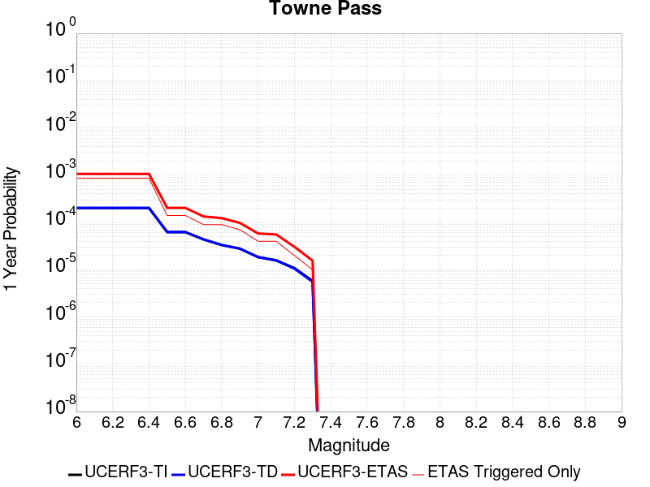 |  |

| Magnitude | 1 wk TI Prob | 1 wk TD Prob | 1 wk ETAS Prob | 1 wk ETAS/TD Gain | 1 wk ETAS Triggered Only | 1 mo TI Prob | 1 mo TD Prob | 1 mo ETAS Prob | 1 mo ETAS/TD Gain | 1 mo ETAS Triggered Only | 1 yr TI Prob | 1 yr TD Prob | 1 yr ETAS Prob | 1 yr ETAS/TD Gain | 1 yr ETAS Triggered Only | 10 yr TI Prob | 10 yr TD Prob | 10 yr ETAS Prob | 10 yr ETAS/TD Gain | 10 yr ETAS Triggered Only |
|-----|-----|-----|-----|-----|-----|-----|-----|-----|-----|-----|-----|-----|-----|-----|-----|-----|-----|-----|-----|-----|
| 6.0 | 3.849728E-6 | 3.8945495E-6 | 1.1389412E-4 | 29.24449 | 1.1E-4 | 1.649873E-5 | 1.6690845E-5 | 3.2668567E-4 | 19.572746 | 3.1E-4 | 2.0085352E-4 | 2.0319647E-4 | 0.0010630217 | 5.2314973 | 8.6E-4 | 0.0020067208 | 0.0020305358 | 0.0036173072 | 1.7814546 | 0.00159 |
| 6.1 | 3.849728E-6 | 3.8945495E-6 | 1.1389412E-4 | 29.24449 | 1.1E-4 | 1.649873E-5 | 1.6690845E-5 | 3.2668567E-4 | 19.572746 | 3.1E-4 | 2.0085352E-4 | 2.0319647E-4 | 0.0010630217 | 5.2314973 | 8.6E-4 | 0.0020067208 | 0.0020305358 | 0.0036173072 | 1.7814546 | 0.00159 |
| 6.2 | 3.849728E-6 | 3.8945495E-6 | 1.1389412E-4 | 29.24449 | 1.1E-4 | 1.649873E-5 | 1.6690845E-5 | 3.2668567E-4 | 19.572746 | 3.1E-4 | 2.0085352E-4 | 2.0319647E-4 | 0.0010630217 | 5.2314973 | 8.6E-4 | 0.0020067208 | 0.0020305358 | 0.0036173072 | 1.7814546 | 0.00159 |
| 6.3 | 3.849728E-6 | 3.8945495E-6 | 1.1389412E-4 | 29.24449 | 1.1E-4 | 1.649873E-5 | 1.6690845E-5 | 3.2668567E-4 | 19.572746 | 3.1E-4 | 2.0085352E-4 | 2.0319647E-4 | 0.0010630217 | 5.2314973 | 8.6E-4 | 0.0020067208 | 0.0020305358 | 0.0036173072 | 1.7814546 | 0.00159 |
| 6.4 | 3.849728E-6 | 3.8945495E-6 | 1.1389412E-4 | 29.24449 | 1.1E-4 | 1.649873E-5 | 1.6690845E-5 | 3.2668567E-4 | 19.572746 | 3.1E-4 | 2.0085352E-4 | 2.0319647E-4 | 0.0010630217 | 5.2314973 | 8.6E-4 | 0.0020067208 | 0.0020305358 | 0.0036173072 | 1.7814546 | 0.00159 |
| 6.5 | 1.1953545E-6 | 1.2030554E-6 | 3.120302E-5 | 25.936478 | 3.0E-5 | 5.1229376E-6 | 5.1559423E-6 | 4.5155735E-5 | 8.757999 | 4.0E-5 | 6.236998E-5 | 6.2771906E-5 | 2.0276311E-4 | 3.2301571 | 1.4E-4 | 6.235248E-4 | 6.275535E-4 | 9.173715E-4 | 1.461822 | 2.9E-4 |
| 6.6 | 1.1953545E-6 | 1.2030554E-6 | 3.120302E-5 | 25.936478 | 3.0E-5 | 5.1229376E-6 | 5.1559423E-6 | 4.5155735E-5 | 8.757999 | 4.0E-5 | 6.236998E-5 | 6.2771906E-5 | 2.0276311E-4 | 3.2301571 | 1.4E-4 | 6.235248E-4 | 6.275535E-4 | 9.173715E-4 | 1.461822 | 2.9E-4 |
| 6.7 | 8.375951E-7 | 8.4106983E-7 | 2.0841053E-5 | 24.779219 | 2.0E-5 | 3.5896885E-6 | 3.6045803E-6 | 3.3604472E-5 | 9.322714 | 3.0E-5 | 4.370358E-5 | 4.388494E-5 | 1.33881E-4 | 3.0507274 | 9.0E-5 | 4.3694986E-4 | 4.3876845E-4 | 6.386807E-4 | 1.4556212 | 2.0E-4 |
| 6.8 | 6.38041E-7 | 6.392181E-7 | 2.0639205E-5 | 32.288204 | 2.0E-5 | 2.7344586E-6 | 2.7395035E-6 | 3.2739423E-5 | 11.950859 | 3.0E-5 | 3.3291526E-5 | 3.3352986E-5 | 1.2334998E-4 | 3.6983192 | 9.0E-5 | 3.3286537E-4 | 3.334836E-4 | 4.8343357E-4 | 1.4496472 | 1.5E-4 |
| 6.9 | 5.3460053E-7 | 5.345356E-7 | 2.0534524E-5 | 38.415634 | 2.0E-5 | 2.2911431E-6 | 2.290865E-6 | 3.2290798E-5 | 14.095459 | 3.0E-5 | 2.789431E-5 | 2.789096E-5 | 9.788901E-5 | 3.5097039 | 7.0E-5 | 2.789081E-4 | 2.788779E-4 | 3.8884723E-4 | 1.3943279 | 1.1E-4 |
| 7.0 | 3.557783E-7 | 3.5324425E-7 | 2.0353236E-5 | 57.61803 | 2.0E-5 | 1.5247632E-6 | 1.513903E-6 | 3.1513857E-5 | 20.816298 | 3.0E-5 | 1.8563835E-5 | 1.8431623E-5 | 5.8430884E-5 | 3.1701434 | 4.0E-5 | 1.8562283E-4 | 1.8430178E-4 | 2.5428887E-4 | 1.3797419 | 7.0E-5 |
| 7.1 | 3.037942E-7 | 3.00024E-7 | 2.0300018E-5 | 67.661316 | 2.0E-5 | 1.3019744E-6 | 1.2858166E-6 | 3.1285777E-5 | 24.331448 | 3.0E-5 | 1.5851423E-5 | 1.5654712E-5 | 5.5654084E-5 | 3.5551014 | 4.0E-5 | 1.5850292E-4 | 1.5653683E-4 | 2.2652588E-4 | 1.4471091 | 7.0E-5 |
| 7.2 | 2.0808248E-7 | 2.0217831E-7 | 2.0202175E-5 | 99.92256 | 2.0E-5 | 8.917818E-7 | 8.664782E-7 | 2.086646E-5 | 24.081923 | 2.0E-5 | 1.0857389E-5 | 1.0549326E-5 | 3.0549116E-5 | 2.8958356 | 2.0E-5 | 1.0856859E-4 | 1.0548872E-4 | 1.5548345E-4 | 1.4739343 | 5.0E-5 |
| 7.3 | 1.1162073E-7 | 1.0636953E-7 | 1.0106369E-5 | 95.01188 | 1.0E-5 | 4.7837443E-7 | 4.5586933E-7 | 1.0455865E-5 | 22.9361 | 1.0E-5 | 5.8241935E-6 | 5.550197E-6 | 1.5550142E-5 | 2.8017278 | 1.0E-5 | 5.8240406E-5 | 5.5500783E-5 | 8.5499116E-5 | 1.5405029 | 3.0E-5 |

## Bicycle Lake
*[(top)](#table-of-contents)*

| 1 Week | 1 Month | 1 Year | 10 Year |
|-----|-----|-----|-----|
|  |  |  |  |

| Magnitude | 1 wk TI Prob | 1 wk TD Prob | 1 wk ETAS Prob | 1 wk ETAS/TD Gain | 1 wk ETAS Triggered Only | 1 mo TI Prob | 1 mo TD Prob | 1 mo ETAS Prob | 1 mo ETAS/TD Gain | 1 mo ETAS Triggered Only | 1 yr TI Prob | 1 yr TD Prob | 1 yr ETAS Prob | 1 yr ETAS/TD Gain | 1 yr ETAS Triggered Only | 10 yr TI Prob | 10 yr TD Prob | 10 yr ETAS Prob | 10 yr ETAS/TD Gain | 10 yr ETAS Triggered Only |
|-----|-----|-----|-----|-----|-----|-----|-----|-----|-----|-----|-----|-----|-----|-----|-----|-----|-----|-----|-----|-----|
| 6.0 | 1.9621975E-5 | 2.2097447E-5 | 4.2097006E-5 | 1.9050618 | 2.0E-5 | 8.4091465E-5 | 9.470067E-5 | 1.946912E-4 | 2.0558586 | 1.0E-4 | 0.0010233327 | 0.0011525059 | 0.0016519296 | 1.4333373 | 5.0E-4 | 0.01018633 | 0.011478599 | 0.012565973 | 1.0947305 | 0.0011 |
| 6.1 | 1.9621975E-5 | 2.2097447E-5 | 4.2097006E-5 | 1.9050618 | 2.0E-5 | 8.4091465E-5 | 9.470067E-5 | 1.946912E-4 | 2.0558586 | 1.0E-4 | 0.0010233327 | 0.0011525059 | 0.0016519296 | 1.4333373 | 5.0E-4 | 0.01018633 | 0.011478599 | 0.012565973 | 1.0947305 | 0.0011 |
| 6.2 | 9.9971285E-6 | 1.1255827E-5 | 3.1255604E-5 | 2.7768373 | 2.0E-5 | 4.2844134E-5 | 4.8238664E-5 | 1.0823577E-4 | 2.2437556 | 6.0E-5 | 5.2150246E-4 | 5.8719947E-4 | 8.470468E-4 | 1.4425197 | 2.6E-4 | 0.0052028033 | 0.0058615846 | 0.006497833 | 1.1085455 | 6.4E-4 |
| 6.3 | 9.589428E-6 | 1.0798527E-5 | 3.079831E-5 | 2.8520844 | 2.0E-5 | 4.10969E-5 | 4.627887E-5 | 1.0627609E-4 | 2.296428 | 6.0E-5 | 5.002399E-4 | 5.633515E-4 | 8.132106E-4 | 1.4435227 | 2.5E-4 | 0.0049911533 | 0.0056243236 | 0.00625078 | 1.1113834 | 6.3E-4 |
| 6.4 | 9.589428E-6 | 1.0798527E-5 | 3.079831E-5 | 2.8520844 | 2.0E-5 | 4.10969E-5 | 4.627887E-5 | 1.0627609E-4 | 2.296428 | 6.0E-5 | 5.002399E-4 | 5.633515E-4 | 8.132106E-4 | 1.4435227 | 2.5E-4 | 0.0049911533 | 0.0056243236 | 0.00625078 | 1.1113834 | 6.3E-4 |
| 6.5 | 5.557707E-6 | 6.2857107E-6 | 2.6285585E-5 | 4.1818 | 2.0E-5 | 2.3818526E-5 | 2.6938633E-5 | 6.693756E-5 | 2.4848163 | 4.0E-5 | 2.8995197E-4 | 3.2795538E-4 | 4.6790947E-4 | 1.4267473 | 1.4E-4 | 0.0028957394 | 0.0032773504 | 0.0036162362 | 1.1034024 | 3.4E-4 |
| 6.6 | 4.8742945E-6 | 5.5133855E-6 | 2.5513275E-5 | 4.6275153 | 2.0E-5 | 2.0889667E-5 | 2.3628729E-5 | 6.3627784E-5 | 2.6928146 | 4.0E-5 | 2.54302E-4 | 2.87668E-4 | 4.076335E-4 | 1.4170276 | 1.2E-4 | 0.002540112 | 0.0028755253 | 0.0031846338 | 1.1074964 | 3.1E-4 |
| 6.7 | 3.991108E-6 | 4.515989E-6 | 2.4515899E-5 | 5.4286885 | 2.0E-5 | 1.7104636E-5 | 1.9354238E-5 | 5.9353464E-5 | 3.0666907 | 4.0E-5 | 2.0822904E-4 | 2.3563785E-4 | 3.4561194E-4 | 1.4667081 | 1.1E-4 | 0.0020803404 | 0.0023563786 | 0.0026257425 | 1.1143126 | 2.7E-4 |

## San Andreas (San Bernardino N)
*[(top)](#table-of-contents)*

| 1 Week | 1 Month | 1 Year | 10 Year |
|-----|-----|-----|-----|
|  |  |  |  |

| Magnitude | 1 wk TI Prob | 1 wk TD Prob | 1 wk ETAS Prob | 1 wk ETAS/TD Gain | 1 wk ETAS Triggered Only | 1 mo TI Prob | 1 mo TD Prob | 1 mo ETAS Prob | 1 mo ETAS/TD Gain | 1 mo ETAS Triggered Only | 1 yr TI Prob | 1 yr TD Prob | 1 yr ETAS Prob | 1 yr ETAS/TD Gain | 1 yr ETAS Triggered Only | 10 yr TI Prob | 10 yr TD Prob | 10 yr ETAS Prob | 10 yr ETAS/TD Gain | 10 yr ETAS Triggered Only |
|-----|-----|-----|-----|-----|-----|-----|-----|-----|-----|-----|-----|-----|-----|-----|-----|-----|-----|-----|-----|-----|
| 6.0 | 1.4273766E-4 | 3.1614845E-4 | 4.361105E-4 | 1.3794485 | 1.2E-4 | 6.115894E-4 | 0.0013542244 | 0.0016138722 | 1.1917318 | 2.6E-4 | 0.0074207084 | 0.016364535 | 0.01697439 | 1.0372669 | 6.2E-4 | 0.07177748 | 0.15036654 | 0.15127565 | 1.0060459 | 0.00107 |
| 6.1 | 1.4273766E-4 | 3.1614845E-4 | 4.361105E-4 | 1.3794485 | 1.2E-4 | 6.115894E-4 | 0.0013542244 | 0.0016138722 | 1.1917318 | 2.6E-4 | 0.0074207084 | 0.016364535 | 0.01697439 | 1.0372669 | 6.2E-4 | 0.07177748 | 0.15036654 | 0.15127565 | 1.0060459 | 0.00107 |
| 6.2 | 1.4273766E-4 | 3.1614845E-4 | 4.361105E-4 | 1.3794485 | 1.2E-4 | 6.115894E-4 | 0.0013542244 | 0.0016138722 | 1.1917318 | 2.6E-4 | 0.0074207084 | 0.016364535 | 0.01697439 | 1.0372669 | 6.2E-4 | 0.07177748 | 0.15036654 | 0.15127565 | 1.0060459 | 0.00107 |
| 6.3 | 1.3730655E-4 | 3.051962E-4 | 4.251596E-4 | 1.3930696 | 1.2E-4 | 5.883239E-4 | 0.0013073338 | 0.0015669939 | 1.198618 | 2.6E-4 | 0.0071393442 | 0.015802028 | 0.01641223 | 1.0386155 | 6.2E-4 | 0.06914291 | 0.14567827 | 0.1465924 | 1.0062749 | 0.00107 |
| 6.4 | 1.3730655E-4 | 3.051962E-4 | 4.251596E-4 | 1.3930696 | 1.2E-4 | 5.883239E-4 | 0.0013073338 | 0.0015669939 | 1.198618 | 2.6E-4 | 0.0071393442 | 0.015802028 | 0.01641223 | 1.0386155 | 6.2E-4 | 0.06914291 | 0.14567827 | 0.1465924 | 1.0062749 | 0.00107 |
| 6.5 | 1.2942807E-4 | 2.893405E-4 | 4.0930577E-4 | 1.4146162 | 1.2E-4 | 5.545738E-4 | 0.0012394466 | 0.0014991243 | 1.209511 | 2.6E-4 | 0.0067310524 | 0.014987098 | 0.015597805 | 1.040749 | 6.2E-4 | 0.06530788 | 0.13881195 | 0.13973342 | 1.0066383 | 0.00107 |
| 6.6 | 1.1125901E-4 | 2.537283E-4 | 3.7369787E-4 | 1.4728268 | 1.2E-4 | 4.767372E-4 | 0.0010869562 | 0.0013466736 | 1.2389401 | 2.6E-4 | 0.005788839 | 0.013154025 | 0.013756001 | 1.0457636 | 6.1E-4 | 0.056403454 | 0.123056285 | 0.12398584 | 1.0075539 | 0.00106 |
| 6.7 | 1.02209575E-4 | 2.3507705E-4 | 3.450512E-4 | 1.4678217 | 1.1E-4 | 4.3796748E-4 | 0.0010070855 | 0.0012568337 | 1.2479911 | 2.5E-4 | 0.0053192247 | 0.012192756 | 0.01278544 | 1.0486095 | 6.0E-4 | 0.051936906 | 0.11485627 | 0.11575912 | 1.0078607 | 0.00102 |
| 6.8 | 9.610582E-5 | 2.2033554E-4 | 3.303113E-4 | 1.4991286 | 1.1E-4 | 4.1181705E-4 | 9.4395416E-4 | 0.0011937182 | 1.2645934 | 2.5E-4 | 0.0050023515 | 0.011432346 | 0.012015601 | 1.051018 | 5.9E-4 | 0.048912346 | 0.10822741 | 0.1091281 | 1.0083222 | 0.00101 |
| 6.9 | 9.3877505E-5 | 2.1489074E-4 | 3.248671E-4 | 1.511778 | 1.1E-4 | 4.0227012E-4 | 9.2063594E-4 | 0.0011704058 | 1.2713014 | 2.5E-4 | 0.0048866454 | 0.011151383 | 0.011734803 | 1.0523182 | 5.9E-4 | 0.04780577 | 0.105814084 | 0.106717214 | 1.008535 | 0.00101 |
| 7.0 | 9.1019785E-5 | 2.0815943E-4 | 3.1813653E-4 | 1.5283312 | 1.1E-4 | 3.900265E-4 | 8.9180743E-4 | 0.0011415845 | 1.2800796 | 2.5E-4 | 0.0047382377 | 0.010803926 | 0.011387551 | 1.0540198 | 5.9E-4 | 0.046384744 | 0.10278599 | 0.10369218 | 1.0088162 | 0.00101 |
| 7.1 | 8.771155E-5 | 1.9990467E-4 | 3.098827E-4 | 1.5501523 | 1.1E-4 | 3.758525E-4 | 8.564535E-4 | 0.0011062394 | 1.2916514 | 2.5E-4 | 0.0045664064 | 0.010377665 | 0.010961542 | 1.0562629 | 5.9E-4 | 0.044737056 | 0.099094115 | 0.100004025 | 1.0091823 | 0.00101 |
| 7.2 | 8.0830236E-5 | 1.8396029E-4 | 2.9394004E-4 | 1.5978451 | 1.1E-4 | 3.4636928E-4 | 7.8816316E-4 | 0.0010279741 | 1.3042655 | 2.4E-4 | 0.0042088944 | 0.009553772 | 0.010128232 | 1.060129 | 5.8E-4 | 0.041300658 | 0.09182046 | 0.092728645 | 1.0098908 | 0.001 |
| 7.3 | 7.7668235E-5 | 1.7339372E-4 | 2.8337465E-4 | 1.6342844 | 1.1E-4 | 3.328214E-4 | 7.4290443E-4 | 9.827261E-4 | 1.3228164 | 2.4E-4 | 0.0040445733 | 0.009007431 | 0.009582206 | 1.0638113 | 5.8E-4 | 0.03971748 | 0.0870959 | 0.088008806 | 1.0104816 | 0.001 |
| 7.4 | 7.520177E-5 | 1.6559374E-4 | 2.7557553E-4 | 1.6641663 | 1.1E-4 | 3.2225347E-4 | 7.0949446E-4 | 9.493242E-4 | 1.338029 | 2.4E-4 | 0.0039163795 | 0.008603949 | 0.009178959 | 1.0668309 | 5.8E-4 | 0.038480744 | 0.083552666 | 0.08445995 | 1.0108588 | 9.9E-4 |
| 7.5 | 7.274697E-5 | 1.5846924E-4 | 2.584534E-4 | 1.6309373 | 1.0E-4 | 3.1173544E-4 | 6.789772E-4 | 9.08821E-4 | 1.3385148 | 2.3E-4 | 0.003788775 | 0.008235271 | 0.008800577 | 1.0686445 | 5.7E-4 | 0.03724827 | 0.08026917 | 0.08117051 | 1.0112289 | 9.8E-4 |
| 7.6 | 7.1185845E-5 | 1.541672E-4 | 2.541518E-4 | 1.6485465 | 1.0E-4 | 3.0504653E-4 | 6.605493E-4 | 8.903974E-4 | 1.347965 | 2.3E-4 | 0.0037076178 | 0.008012585 | 0.008578018 | 1.0705681 | 5.7E-4 | 0.036463667 | 0.078258425 | 0.07916173 | 1.0115426 | 9.8E-4 |
| 7.7 | 6.709961E-5 | 1.4325391E-4 | 2.4323958E-4 | 1.6979612 | 1.0E-4 | 2.8753807E-4 | 6.1380095E-4 | 8.4365974E-4 | 1.3744843 | 2.3E-4 | 0.003495157 | 0.007447459 | 0.008013214 | 1.0759661 | 5.7E-4 | 0.034406938 | 0.07308612 | 0.073994495 | 1.0124289 | 9.8E-4 |
| 7.8 | 6.300812E-5 | 1.3209098E-4 | 2.2207909E-4 | 1.6812586 | 9.0E-5 | 2.7000686E-4 | 5.6598143E-4 | 7.858569E-4 | 1.3884853 | 2.2E-4 | 0.0032823787 | 0.006869081 | 0.007415303 | 1.0795189 | 5.5E-4 | 0.032343175 | 0.0677427 | 0.06863766 | 1.0132113 | 9.6E-4 |
| 7.9 | 4.983037E-5 | 9.7286385E-5 | 1.5728055E-4 | 1.6166759 | 6.0E-5 | 2.1354125E-4 | 4.1687503E-4 | 5.7680835E-4 | 1.383648 | 1.6E-4 | 0.0025967648 | 0.005063652 | 0.0055014244 | 1.0864538 | 4.4E-4 | 0.025666296 | 0.050672647 | 0.051422615 | 1.0148003 | 7.9E-4 |
| 8.0 | 3.2211527E-5 | 5.3333257E-5 | 8.333166E-5 | 1.5624708 | 3.0E-5 | 1.380421E-4 | 2.2855109E-4 | 3.0853282E-4 | 1.3499511 | 8.0E-5 | 0.0016793669 | 0.0027790607 | 0.0029086994 | 1.0466484 | 1.3E-4 | 0.016667323 | 0.028375156 | 0.02862778 | 1.0089029 | 2.6E-4 |
| 8.1 | 1.743376E-5 | 1.8835979E-5 | 1.8835979E-5 | 1.0 | 0.0 | 7.471398E-5 | 8.0723126E-5 | 9.072232E-5 | 1.1238703 | 1.0E-5 | 9.0926304E-4 | 9.823616E-4 | 0.001002342 | 1.0203391 | 2.0E-5 | 0.009055517 | 0.010490086 | 0.010529666 | 1.0037731 | 4.0E-5 |
| 8.2 | 7.831616E-6 | 5.158648E-6 | 5.158648E-6 | 1.0 | 0.0 | 3.3563636E-5 | 2.2108305E-5 | 2.2108305E-5 | 1.0 | 0.0 | 4.0856065E-4 | 2.6913546E-4 | 2.6913546E-4 | 1.0 | 0.0 | 0.004078103 | 0.003043787 | 0.003043787 | 1.0 | 0.0 |
| 8.3 | 1.983087E-6 | 7.6647797E-7 | 7.6647797E-7 | 1.0 | 0.0 | 8.498917E-6 | 3.2849016E-6 | 3.2849016E-6 | 1.0 | 0.0 | 1.034694E-4 | 3.999296E-5 | 3.999296E-5 | 1.0 | 0.0 | 0.0010342124 | 4.7228087E-4 | 4.7228087E-4 | 1.0 | 0.0 |

## Paradise
*[(top)](#table-of-contents)*

| 1 Week | 1 Month | 1 Year | 10 Year |
|-----|-----|-----|-----|
| 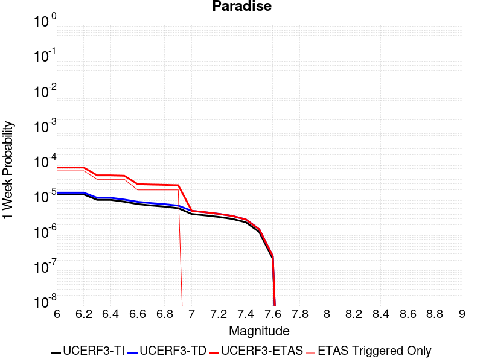 |  | 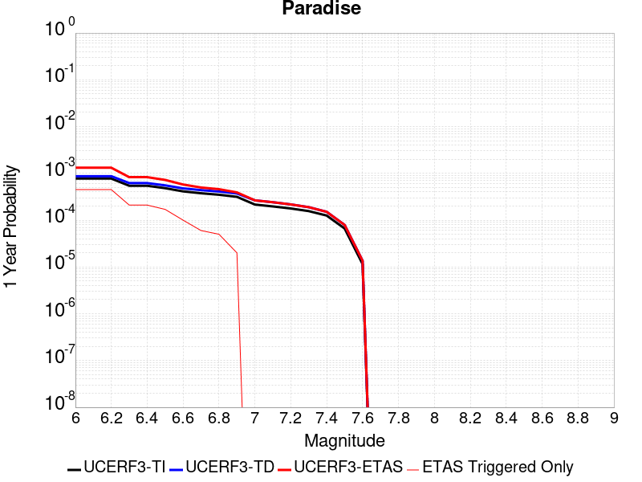 |  |

| Magnitude | 1 wk TI Prob | 1 wk TD Prob | 1 wk ETAS Prob | 1 wk ETAS/TD Gain | 1 wk ETAS Triggered Only | 1 mo TI Prob | 1 mo TD Prob | 1 mo ETAS Prob | 1 mo ETAS/TD Gain | 1 mo ETAS Triggered Only | 1 yr TI Prob | 1 yr TD Prob | 1 yr ETAS Prob | 1 yr ETAS/TD Gain | 1 yr ETAS Triggered Only | 10 yr TI Prob | 10 yr TD Prob | 10 yr ETAS Prob | 10 yr ETAS/TD Gain | 10 yr ETAS Triggered Only |
|-----|-----|-----|-----|-----|-----|-----|-----|-----|-----|-----|-----|-----|-----|-----|-----|-----|-----|-----|-----|-----|
| 6.0 | 1.4851273E-5 | 1.6694923E-5 | 8.6693755E-5 | 5.192821 | 7.0E-5 | 6.364676E-5 | 7.1547845E-5 | 2.4153569E-4 | 3.3758624 | 1.7E-4 | 7.7462377E-4 | 8.707705E-4 | 0.0013203786 | 1.5163337 | 4.5E-4 | 0.0077192914 | 0.008675965 | 0.009736681 | 1.1222593 | 0.00107 |
| 6.1 | 1.4851273E-5 | 1.6694923E-5 | 8.6693755E-5 | 5.192821 | 7.0E-5 | 6.364676E-5 | 7.1547845E-5 | 2.4153569E-4 | 3.3758624 | 1.7E-4 | 7.7462377E-4 | 8.707705E-4 | 0.0013203786 | 1.5163337 | 4.5E-4 | 0.0077192914 | 0.008675965 | 0.009736681 | 1.1222593 | 0.00107 |
| 6.2 | 1.4851273E-5 | 1.6694923E-5 | 8.6693755E-5 | 5.192821 | 7.0E-5 | 6.364676E-5 | 7.1547845E-5 | 2.4153569E-4 | 3.3758624 | 1.7E-4 | 7.7462377E-4 | 8.707705E-4 | 0.0013203786 | 1.5163337 | 4.5E-4 | 0.0077192914 | 0.008675965 | 0.009736681 | 1.1222593 | 0.00107 |
| 6.3 | 1.0426831E-5 | 1.1888797E-5 | 5.188832E-5 | 4.364472 | 4.0E-5 | 4.4685654E-5 | 5.095103E-5 | 1.5094594E-4 | 2.962569 | 1.0E-4 | 5.43912E-4 | 6.2015816E-4 | 8.300279E-4 | 1.3384134 | 2.1E-4 | 0.0054258266 | 0.0061848834 | 0.0066420385 | 1.0739149 | 4.6E-4 |
| 6.4 | 1.0426831E-5 | 1.1888797E-5 | 5.188832E-5 | 4.364472 | 4.0E-5 | 4.4685654E-5 | 5.095103E-5 | 1.5094594E-4 | 2.962569 | 1.0E-4 | 5.43912E-4 | 6.2015816E-4 | 8.300279E-4 | 1.3384134 | 2.1E-4 | 0.0054258266 | 0.0061848834 | 0.0066420385 | 1.0739149 | 4.6E-4 |
| 6.5 | 9.25027E-6 | 1.0620124E-5 | 5.06197E-5 | 4.766394 | 4.0E-5 | 3.964341E-5 | 4.551405E-5 | 1.2551041E-4 | 2.757619 | 8.0E-5 | 4.8255164E-4 | 5.539976E-4 | 7.239034E-4 | 1.3066906 | 1.7E-4 | 0.0048150513 | 0.0055266647 | 0.0058946195 | 1.0665781 | 3.7E-4 |
| 6.6 | 7.904275E-6 | 9.159673E-6 | 2.915949E-5 | 3.183464 | 2.0E-5 | 3.3875025E-5 | 3.925517E-5 | 7.92536E-5 | 2.018934 | 4.0E-5 | 4.1235037E-4 | 4.7783085E-4 | 5.7778304E-4 | 1.209179 | 1.0E-4 | 0.0041158604 | 0.004768431 | 0.0049376204 | 1.0354811 | 1.7E-4 |
| 6.7 | 7.2061953E-6 | 8.407388E-6 | 2.840722E-5 | 3.37884 | 2.0E-5 | 3.088333E-5 | 3.6031186E-5 | 6.603011E-5 | 1.832582 | 3.0E-5 | 3.7593965E-4 | 4.3859507E-4 | 4.9856876E-4 | 1.1367404 | 6.0E-5 | 0.003753043 | 0.0043776636 | 0.004487182 | 1.0250175 | 1.1E-4 |
| 6.8 | 6.6948724E-6 | 7.842299E-6 | 2.7842143E-5 | 3.5502524 | 2.0E-5 | 2.8691995E-5 | 3.360944E-5 | 5.360877E-5 | 1.5950509 | 2.0E-5 | 3.4926904E-4 | 4.0912168E-4 | 4.5910123E-4 | 1.122163 | 5.0E-5 | 0.003487206 | 0.0040840427 | 0.004183634 | 1.0243856 | 1.0E-4 |
| 6.9 | 6.0421025E-6 | 7.130747E-6 | 2.7130603E-5 | 3.8047352 | 2.0E-5 | 2.5894467E-5 | 3.0560004E-5 | 5.0559393E-5 | 1.6544302 | 2.0E-5 | 3.1521954E-4 | 3.7200793E-4 | 3.9200048E-4 | 1.0537423 | 2.0E-5 | 0.0031477278 | 0.0037141903 | 0.0037640044 | 1.0134119 | 5.0E-5 |
| 7.0 | 4.134091E-6 | 5.080416E-6 | 5.080416E-6 | 1.0 | 0.0 | 1.7717413E-5 | 2.1773038E-5 | 2.1773038E-5 | 1.0 | 0.0 | 2.1568815E-4 | 2.6505603E-4 | 2.6505603E-4 | 1.0 | 0.0 | 0.0021547892 | 0.0026475522 | 0.0026575255 | 1.0037671 | 1.0E-5 |
| 7.1 | 3.7674888E-6 | 4.6319656E-6 | 4.6319656E-6 | 1.0 | 0.0 | 1.6146281E-5 | 1.9851139E-5 | 1.9851139E-5 | 1.0 | 0.0 | 1.9656324E-4 | 2.4166232E-4 | 2.4166232E-4 | 1.0 | 0.0 | 0.0019638946 | 0.002414146 | 0.0024241218 | 1.0041323 | 1.0E-5 |
| 7.2 | 3.4065345E-6 | 4.156807E-6 | 4.156807E-6 | 1.0 | 0.0 | 1.4599351E-5 | 1.7814775E-5 | 1.7814775E-5 | 1.0 | 0.0 | 1.777326E-4 | 2.1687479E-4 | 2.1687479E-4 | 1.0 | 0.0 | 0.0017759053 | 0.0021667795 | 0.002176758 | 1.0046052 | 1.0E-5 |
| 7.3 | 2.9934936E-6 | 3.6293877E-6 | 3.6293877E-6 | 1.0 | 0.0 | 1.2829195E-5 | 1.5554435E-5 | 1.5554435E-5 | 1.0 | 0.0 | 1.5618425E-4 | 1.8936026E-4 | 1.8936026E-4 | 1.0 | 0.0 | 0.0015607453 | 0.0018921344 | 0.0019021154 | 1.005275 | 1.0E-5 |
| 7.4 | 2.4049796E-6 | 2.8890327E-6 | 2.8890327E-6 | 1.0 | 0.0 | 1.0307015E-5 | 1.2381518E-5 | 1.2381518E-5 | 1.0 | 0.0 | 1.2548068E-4 | 1.5073598E-4 | 1.5073598E-4 | 1.0 | 0.0 | 0.0012540985 | 0.001506479 | 0.0015164639 | 1.006628 | 1.0E-5 |
| 7.5 | 1.2710091E-6 | 1.513489E-6 | 1.513489E-6 | 1.0 | 0.0 | 5.44717E-6 | 6.486372E-6 | 6.486372E-6 | 1.0 | 0.0 | 6.631728E-5 | 7.896997E-5 | 7.896997E-5 | 1.0 | 0.0 | 6.6297496E-4 | 7.895417E-4 | 7.995338E-4 | 1.0126556 | 1.0E-5 |
| 7.6 | 2.21172E-7 | 2.6040198E-7 | 2.6040198E-7 | 1.0 | 0.0 | 9.478797E-7 | 1.1160082E-6 | 1.1160082E-6 | 1.0 | 0.0 | 1.1540374E-5 | 1.3587343E-5 | 1.3587343E-5 | 1.0 | 0.0 | 1.1539775E-4 | 1.3586794E-4 | 1.3586794E-4 | 1.0 | 0.0 |

## Garlic Springs
*[(top)](#table-of-contents)*

| 1 Week | 1 Month | 1 Year | 10 Year |
|-----|-----|-----|-----|
|  |  |  |  |

| Magnitude | 1 wk TI Prob | 1 wk TD Prob | 1 wk ETAS Prob | 1 wk ETAS/TD Gain | 1 wk ETAS Triggered Only | 1 mo TI Prob | 1 mo TD Prob | 1 mo ETAS Prob | 1 mo ETAS/TD Gain | 1 mo ETAS Triggered Only | 1 yr TI Prob | 1 yr TD Prob | 1 yr ETAS Prob | 1 yr ETAS/TD Gain | 1 yr ETAS Triggered Only | 10 yr TI Prob | 10 yr TD Prob | 10 yr ETAS Prob | 10 yr ETAS/TD Gain | 10 yr ETAS Triggered Only |
|-----|-----|-----|-----|-----|-----|-----|-----|-----|-----|-----|-----|-----|-----|-----|-----|-----|-----|-----|-----|-----|
| 6.0 | 1.6760017E-5 | 1.8777133E-5 | 1.8777133E-5 | 1.0 | 0.0 | 7.182667E-5 | 8.0471604E-5 | 1.6046516E-4 | 1.9940594 | 8.0E-5 | 8.7413884E-4 | 9.794187E-4 | 0.0014389682 | 1.4692063 | 4.6E-4 | 0.008707083 | 0.009762568 | 0.010713196 | 1.0973748 | 9.6E-4 |
| 6.1 | 9.852767E-6 | 1.0973753E-5 | 1.0973753E-5 | 1.0 | 0.0 | 4.222546E-5 | 4.702992E-5 | 8.702804E-5 | 1.8504823 | 4.0E-5 | 5.139737E-4 | 5.7250983E-4 | 8.523495E-4 | 1.4887946 | 2.8E-4 | 0.005127866 | 0.0057173073 | 0.006313877 | 1.1043445 | 6.0E-4 |
| 6.2 | 9.852767E-6 | 1.0973753E-5 | 1.0973753E-5 | 1.0 | 0.0 | 4.222546E-5 | 4.702992E-5 | 8.702804E-5 | 1.8504823 | 4.0E-5 | 5.139737E-4 | 5.7250983E-4 | 8.523495E-4 | 1.4887946 | 2.8E-4 | 0.005127866 | 0.0057173073 | 0.006313877 | 1.1043445 | 6.0E-4 |
| 6.3 | 4.3167724E-6 | 4.7780964E-6 | 4.7780964E-6 | 1.0 | 0.0 | 1.8500323E-5 | 2.0477524E-5 | 3.047732E-5 | 1.4883302 | 1.0E-5 | 2.2521814E-4 | 2.4930836E-4 | 3.3928594E-4 | 1.3609087 | 9.0E-5 | 0.0022499003 | 0.0024925452 | 0.002711997 | 1.0880432 | 2.2E-4 |
| 6.4 | 4.3167724E-6 | 4.7780964E-6 | 4.7780964E-6 | 1.0 | 0.0 | 1.8500323E-5 | 2.0477524E-5 | 3.047732E-5 | 1.4883302 | 1.0E-5 | 2.2521814E-4 | 2.4930836E-4 | 3.3928594E-4 | 1.3609087 | 9.0E-5 | 0.0022499003 | 0.0024925452 | 0.002711997 | 1.0880432 | 2.2E-4 |
| 6.5 | 4.3167724E-6 | 4.7780964E-6 | 4.7780964E-6 | 1.0 | 0.0 | 1.8500323E-5 | 2.0477524E-5 | 3.047732E-5 | 1.4883302 | 1.0E-5 | 2.2521814E-4 | 2.4930836E-4 | 3.3928594E-4 | 1.3609087 | 9.0E-5 | 0.0022499003 | 0.0024925452 | 0.002711997 | 1.0880432 | 2.2E-4 |
| 6.6 | 4.301311E-6 | 4.7609647E-6 | 4.7609647E-6 | 1.0 | 0.0 | 1.8434059E-5 | 2.0404104E-5 | 3.04039E-5 | 1.4900875 | 1.0E-5 | 2.2441156E-4 | 2.4841467E-4 | 3.3839233E-4 | 1.3622074 | 9.0E-5 | 0.0022418506 | 0.0024836282 | 0.0027030818 | 1.0883601 | 2.2E-4 |
| 6.7 | 3.8599724E-6 | 4.2711204E-6 | 4.2711204E-6 | 1.0 | 0.0 | 1.6542634E-5 | 1.8304801E-5 | 1.8304801E-5 | 1.0 | 0.0 | 2.0138794E-4 | 2.2286095E-4 | 3.028431E-4 | 1.3588883 | 8.0E-5 | 0.0020120554 | 0.0022286095 | 0.0024281638 | 1.089542 | 2.0E-4 |

## Helendale-So Lockhart
*[(top)](#table-of-contents)*

| 1 Week | 1 Month | 1 Year | 10 Year |
|-----|-----|-----|-----|
|  |  |  |  |

| Magnitude | 1 wk TI Prob | 1 wk TD Prob | 1 wk ETAS Prob | 1 wk ETAS/TD Gain | 1 wk ETAS Triggered Only | 1 mo TI Prob | 1 mo TD Prob | 1 mo ETAS Prob | 1 mo ETAS/TD Gain | 1 mo ETAS Triggered Only | 1 yr TI Prob | 1 yr TD Prob | 1 yr ETAS Prob | 1 yr ETAS/TD Gain | 1 yr ETAS Triggered Only | 10 yr TI Prob | 10 yr TD Prob | 10 yr ETAS Prob | 10 yr ETAS/TD Gain | 10 yr ETAS Triggered Only |
|-----|-----|-----|-----|-----|-----|-----|-----|-----|-----|-----|-----|-----|-----|-----|-----|-----|-----|-----|-----|-----|
| 6.0 | 1.7296055E-5 | 1.8103841E-5 | 4.81033E-5 | 2.6570768 | 3.0E-5 | 7.412385E-5 | 7.7585704E-5 | 1.8757717E-4 | 2.417677 | 1.1E-4 | 9.0208417E-4 | 9.442173E-4 | 0.0012938868 | 1.3703274 | 3.5E-4 | 0.008984311 | 0.009404174 | 0.010087686 | 1.0726817 | 6.9E-4 |
| 6.1 | 1.7296055E-5 | 1.8103841E-5 | 4.81033E-5 | 2.6570768 | 3.0E-5 | 7.412385E-5 | 7.7585704E-5 | 1.8757717E-4 | 2.417677 | 1.1E-4 | 9.0208417E-4 | 9.442173E-4 | 0.0012938868 | 1.3703274 | 3.5E-4 | 0.008984311 | 0.009404174 | 0.010087686 | 1.0726817 | 6.9E-4 |
| 6.2 | 1.7296055E-5 | 1.8103841E-5 | 4.81033E-5 | 2.6570768 | 3.0E-5 | 7.412385E-5 | 7.7585704E-5 | 1.8757717E-4 | 2.417677 | 1.1E-4 | 9.0208417E-4 | 9.442173E-4 | 0.0012938868 | 1.3703274 | 3.5E-4 | 0.008984311 | 0.009404174 | 0.010087686 | 1.0726817 | 6.9E-4 |
| 6.3 | 1.0669118E-5 | 1.1135489E-5 | 4.1135154E-5 | 3.6940591 | 3.0E-5 | 4.5723988E-5 | 4.7722668E-5 | 1.2771886E-4 | 2.6762722 | 8.0E-5 | 5.5654737E-4 | 5.8087136E-4 | 7.607668E-4 | 1.3096993 | 1.8E-4 | 0.0055515557 | 0.005793827 | 0.00624122 | 1.0772189 | 4.5E-4 |
| 6.4 | 1.0669118E-5 | 1.1135489E-5 | 4.1135154E-5 | 3.6940591 | 3.0E-5 | 4.5723988E-5 | 4.7722668E-5 | 1.2771886E-4 | 2.6762722 | 8.0E-5 | 5.5654737E-4 | 5.8087136E-4 | 7.607668E-4 | 1.3096993 | 1.8E-4 | 0.0055515557 | 0.005793827 | 0.00624122 | 1.0772189 | 4.5E-4 |
| 6.5 | 8.790038E-6 | 9.1702495E-6 | 3.9169976E-5 | 4.2714186 | 3.0E-5 | 3.767105E-5 | 3.9300485E-5 | 1.1929734E-4 | 3.0355182 | 8.0E-5 | 4.585485E-4 | 4.7837992E-4 | 6.482986E-4 | 1.3551961 | 1.7E-4 | 0.0045760344 | 0.0047736657 | 0.0051817084 | 1.0854778 | 4.1E-4 |
| 6.6 | 7.396949E-6 | 7.715581E-6 | 3.771535E-5 | 4.888206 | 3.0E-5 | 3.1700827E-5 | 3.3066364E-5 | 1.1306372E-4 | 3.419297 | 8.0E-5 | 3.858892E-4 | 4.025096E-4 | 5.624452E-4 | 1.397346 | 1.6E-4 | 0.003852198 | 0.004017913 | 0.004386426 | 1.0917176 | 3.7E-4 |
| 6.7 | 6.4600285E-6 | 6.7380697E-6 | 3.6737867E-5 | 5.452284 | 3.0E-5 | 2.7685543E-5 | 2.8877126E-5 | 9.8875105E-5 | 3.423994 | 7.0E-5 | 3.3701936E-4 | 3.5152308E-4 | 4.614844E-4 | 1.312814 | 1.1E-4 | 0.0033650869 | 0.003509752 | 0.0037887692 | 1.0794977 | 2.8E-4 |
| 6.8 | 5.600104E-6 | 5.836042E-6 | 2.5835925E-5 | 4.42696 | 2.0E-5 | 2.4000226E-5 | 2.5011372E-5 | 8.500987E-5 | 3.3988488 | 6.0E-5 | 2.9216358E-4 | 3.044715E-4 | 3.944441E-4 | 1.2955042 | 9.0E-5 | 0.0029177975 | 0.003040605 | 0.0032499665 | 1.0688552 | 2.1E-4 |
| 6.9 | 4.839122E-6 | 5.039537E-6 | 2.5039437E-5 | 4.9685984 | 2.0E-5 | 2.0738931E-5 | 2.159784E-5 | 7.159676E-5 | 3.3149965 | 5.0E-5 | 2.5246723E-4 | 2.6292243E-4 | 3.429014E-4 | 1.3041923 | 8.0E-5 | 0.002521806 | 0.002626161 | 0.0028056884 | 1.0683612 | 1.8E-4 |
| 7.0 | 3.6937633E-6 | 3.845229E-6 | 1.3845191E-5 | 3.6006155 | 1.0E-5 | 1.5830317E-5 | 1.6479451E-5 | 4.6478955E-5 | 2.820419 | 3.0E-5 | 1.9271708E-4 | 2.0061915E-4 | 2.5060913E-4 | 1.2491784 | 5.0E-5 | 0.0019255003 | 0.0020044118 | 0.002144131 | 1.069706 | 1.4E-4 |
| 7.1 | 2.7858857E-6 | 2.8978693E-6 | 1.289784E-5 | 4.4508014 | 1.0E-5 | 1.1939455E-5 | 1.2419382E-5 | 4.2419008E-5 | 3.4155493 | 3.0E-5 | 1.4535317E-4 | 1.511957E-4 | 1.8119116E-4 | 1.1983883 | 3.0E-5 | 0.0014525814 | 0.0015109498 | 0.0015908289 | 1.0528668 | 8.0E-5 |
| 7.2 | 2.1672065E-6 | 2.2540248E-6 | 1.2254002E-5 | 5.4364986 | 1.0E-5 | 9.2879945E-6 | 9.660072E-6 | 3.9659782E-5 | 4.105537 | 3.0E-5 | 1.1307546E-4 | 1.176052E-4 | 1.4760168E-4 | 1.2550608 | 3.0E-5 | 0.0011301794 | 0.0011754478 | 0.0012453656 | 1.0594817 | 7.0E-5 |
| 7.3 | 1.4823496E-6 | 1.5422185E-6 | 1.5422185E-6 | 1.0 | 0.0 | 6.3529114E-6 | 6.6094917E-6 | 2.660936E-5 | 4.0259314 | 2.0E-5 | 7.734395E-5 | 8.046775E-5 | 1.0046614E-4 | 1.2485268 | 2.0E-5 | 7.731704E-4 | 8.044012E-4 | 8.54361E-4 | 1.062108 | 5.0E-5 |
| 7.4 | 4.2321457E-7 | 4.4109012E-7 | 4.4109012E-7 | 1.0 | 0.0 | 1.8137755E-6 | 1.8903852E-6 | 2.1890348E-5 | 11.579835 | 2.0E-5 | 2.2082493E-5 | 2.3015242E-5 | 4.301478E-5 | 1.8689693 | 2.0E-5 | 2.2080299E-4 | 2.3013311E-4 | 2.601262E-4 | 1.1303294 | 3.0E-5 |
| 7.5 | 5.6942316E-8 | 5.941599E-8 | 5.941599E-8 | 1.0 | 0.0 | 2.440385E-7 | 2.5463993E-7 | 2.5463993E-7 | 1.0 | 0.0 | 2.9711643E-6 | 3.1002376E-6 | 3.1002376E-6 | 1.0 | 0.0 | 2.9711247E-5 | 3.1002022E-5 | 3.1002022E-5 | 1.0 | 0.0 |

## San Andreas (San Bernardino S)
*[(top)](#table-of-contents)*

| 1 Week | 1 Month | 1 Year | 10 Year |
|-----|-----|-----|-----|
| 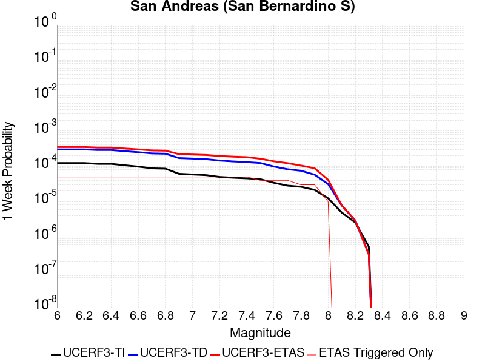 |  |  |  |

| Magnitude | 1 wk TI Prob | 1 wk TD Prob | 1 wk ETAS Prob | 1 wk ETAS/TD Gain | 1 wk ETAS Triggered Only | 1 mo TI Prob | 1 mo TD Prob | 1 mo ETAS Prob | 1 mo ETAS/TD Gain | 1 mo ETAS Triggered Only | 1 yr TI Prob | 1 yr TD Prob | 1 yr ETAS Prob | 1 yr ETAS/TD Gain | 1 yr ETAS Triggered Only | 10 yr TI Prob | 10 yr TD Prob | 10 yr ETAS Prob | 10 yr ETAS/TD Gain | 10 yr ETAS Triggered Only |
|-----|-----|-----|-----|-----|-----|-----|-----|-----|-----|-----|-----|-----|-----|-----|-----|-----|-----|-----|-----|-----|
| 6.0 | 1.2336002E-4 | 3.000988E-4 | 3.500838E-4 | 1.1665618 | 5.0E-5 | 5.2857865E-4 | 0.0012855299 | 0.001435337 | 1.1165334 | 1.5E-4 | 0.006416472 | 0.015543964 | 0.015868833 | 1.0209001 | 3.3E-4 | 0.06234337 | 0.14291926 | 0.14339922 | 1.0033582 | 5.6E-4 |
| 6.1 | 1.2336002E-4 | 3.000988E-4 | 3.500838E-4 | 1.1665618 | 5.0E-5 | 5.2857865E-4 | 0.0012855299 | 0.001435337 | 1.1165334 | 1.5E-4 | 0.006416472 | 0.015543964 | 0.015868833 | 1.0209001 | 3.3E-4 | 0.06234337 | 0.14291926 | 0.14339922 | 1.0033582 | 5.6E-4 |
| 6.2 | 1.2336002E-4 | 3.000988E-4 | 3.500838E-4 | 1.1665618 | 5.0E-5 | 5.2857865E-4 | 0.0012855299 | 0.001435337 | 1.1165334 | 1.5E-4 | 0.006416472 | 0.015543964 | 0.015868833 | 1.0209001 | 3.3E-4 | 0.06234337 | 0.14291926 | 0.14339922 | 1.0033582 | 5.6E-4 |
| 6.3 | 1.1712257E-4 | 2.879813E-4 | 3.379669E-4 | 1.1735724 | 5.0E-5 | 5.018573E-4 | 0.0012336475 | 0.0013834625 | 1.1214406 | 1.5E-4 | 0.006093008 | 0.0149210645 | 0.015246141 | 1.0217863 | 3.3E-4 | 0.059286322 | 0.13763407 | 0.13811699 | 1.0035088 | 5.6E-4 |
| 6.4 | 1.1712257E-4 | 2.879813E-4 | 3.379669E-4 | 1.1735724 | 5.0E-5 | 5.018573E-4 | 0.0012336475 | 0.0013834625 | 1.1214406 | 1.5E-4 | 0.006093008 | 0.0149210645 | 0.015246141 | 1.0217863 | 3.3E-4 | 0.059286322 | 0.13763407 | 0.13811699 | 1.0035088 | 5.6E-4 |
| 6.5 | 1.0689076E-4 | 2.6810818E-4 | 3.1809477E-4 | 1.1864419 | 5.0E-5 | 4.5802278E-4 | 0.0011485539 | 0.001288393 | 1.1217524 | 1.4E-4 | 0.0055621783 | 0.013898602 | 0.014194432 | 1.0212849 | 3.0E-4 | 0.05425003 | 0.12891594 | 0.12935148 | 1.0033785 | 5.0E-4 |
| 6.6 | 9.7648895E-5 | 2.5055694E-4 | 3.005444E-4 | 1.1995054 | 5.0E-5 | 4.1842813E-4 | 0.0010733972 | 0.0012032576 | 1.1209809 | 1.3E-4 | 0.005082469 | 0.012994667 | 0.013271028 | 1.0212673 | 2.8E-4 | 0.049677886 | 0.12101118 | 0.12142431 | 1.0034139 | 4.7E-4 |
| 6.7 | 8.757013E-5 | 2.3126253E-4 | 2.8125098E-4 | 1.2161545 | 5.0E-5 | 3.7524657E-4 | 9.90771E-4 | 0.0011206422 | 1.131081 | 1.3E-4 | 0.00455906 | 0.012000005 | 0.012276644 | 1.0230533 | 2.8E-4 | 0.04466656 | 0.11236583 | 0.112783015 | 1.0037128 | 4.7E-4 |
| 6.8 | 8.562978E-5 | 2.268613E-4 | 2.7684995E-4 | 1.220349 | 5.0E-5 | 3.6693315E-4 | 9.719227E-4 | 0.0011017964 | 1.1336255 | 1.3E-4 | 0.004458263 | 0.011773022 | 0.012049726 | 1.0235032 | 2.8E-4 | 0.043698758 | 0.11037151 | 0.110789634 | 1.0037884 | 4.7E-4 |
| 6.9 | 6.124075E-5 | 1.7070957E-4 | 2.2070104E-4 | 1.2928451 | 5.0E-5 | 2.6243398E-4 | 7.3140813E-4 | 8.513204E-4 | 1.1639471 | 1.2E-4 | 0.0031904527 | 0.008868743 | 0.009126437 | 1.0290564 | 2.6E-4 | 0.031450346 | 0.08419216 | 0.0845768 | 1.0045686 | 4.2E-4 |
| 7.0 | 5.8598747E-5 | 1.6499894E-4 | 2.149907E-4 | 1.3029822 | 5.0E-5 | 2.5111332E-4 | 7.069475E-4 | 8.268627E-4 | 1.1696239 | 1.2E-4 | 0.0030530186 | 0.008573314 | 0.008831085 | 1.0300666 | 2.6E-4 | 0.03011414 | 0.08151563 | 0.081901394 | 1.0047324 | 4.2E-4 |
| 7.1 | 5.613814E-5 | 1.5918406E-4 | 2.091761E-4 | 1.3140519 | 5.0E-5 | 2.4056983E-4 | 6.8203977E-4 | 8.019579E-4 | 1.1758229 | 1.2E-4 | 0.0029250039 | 0.008272399 | 0.008530249 | 1.0311698 | 2.6E-4 | 0.028868021 | 0.07881265 | 0.07919034 | 1.0047922 | 4.1E-4 |
| 7.2 | 4.991222E-5 | 1.452485E-4 | 1.9524124E-4 | 1.3441876 | 5.0E-5 | 2.1389198E-4 | 6.223455E-4 | 7.422708E-4 | 1.192699 | 1.2E-4 | 0.002601025 | 0.007550835 | 0.007808872 | 1.0341733 | 2.6E-4 | 0.025707912 | 0.07226236 | 0.072642736 | 1.0052638 | 4.1E-4 |
| 7.3 | 4.7410045E-5 | 1.3718859E-4 | 1.8718174E-4 | 1.3644118 | 5.0E-5 | 2.0317009E-4 | 5.8781897E-4 | 7.077484E-4 | 1.2040244 | 1.2E-4 | 0.0024707897 | 0.007133297 | 0.0073914425 | 1.0361888 | 2.6E-4 | 0.024434982 | 0.068555124 | 0.06893701 | 1.0055705 | 4.1E-4 |
| 7.4 | 4.5556746E-5 | 1.312667E-4 | 1.8126014E-4 | 1.3808539 | 5.0E-5 | 1.952286E-4 | 5.624506E-4 | 6.823831E-4 | 1.213232 | 1.2E-4 | 0.002374317 | 0.006826414 | 0.007084639 | 1.0378274 | 2.6E-4 | 0.023491086 | 0.0658083 | 0.06619132 | 1.0058203 | 4.1E-4 |
| 7.5 | 4.3084514E-5 | 1.2361899E-4 | 1.6361404E-4 | 1.323535 | 4.0E-5 | 1.8463485E-4 | 5.296884E-4 | 6.396301E-4 | 1.2075592 | 1.1E-4 | 0.0022456115 | 0.006429958 | 0.0066783507 | 1.0386305 | 2.5E-4 | 0.022230545 | 0.062208522 | 0.06258364 | 1.00603 | 4.0E-4 |
| 7.6 | 3.408608E-5 | 9.8397344E-5 | 1.3839341E-4 | 1.4064751 | 4.0E-5 | 1.4607502E-4 | 4.2163485E-4 | 5.315885E-4 | 1.2607793 | 1.1E-4 | 0.0017770125 | 0.0051213475 | 0.005370067 | 1.0485653 | 2.5E-4 | 0.017628696 | 0.050038666 | 0.05041865 | 1.0075939 | 4.0E-4 |
| 7.7 | 2.8315713E-5 | 8.252603E-5 | 1.2252273E-4 | 1.4846555 | 4.0E-5 | 1.2134742E-4 | 3.5363509E-4 | 4.6359617E-4 | 1.3109452 | 1.1E-4 | 0.0014764034 | 0.004297016 | 0.004545942 | 1.0579299 | 2.5E-4 | 0.01466633 | 0.042289194 | 0.042672276 | 1.0090587 | 4.0E-4 |
| 7.8 | 2.6222975E-5 | 7.466726E-5 | 1.0466502E-4 | 1.4017525 | 3.0E-5 | 1.1237934E-4 | 3.1996332E-4 | 4.1993134E-4 | 1.3124359 | 1.0E-4 | 0.0013673597 | 0.0038886012 | 0.004117707 | 1.0589173 | 2.3E-4 | 0.013589768 | 0.03845329 | 0.038818676 | 1.0095022 | 3.8E-4 |
| 7.9 | 2.1469694E-5 | 5.7908495E-5 | 8.790676E-5 | 1.5180287 | 3.0E-5 | 9.200973E-5 | 2.4815567E-4 | 3.4813085E-4 | 1.4028728 | 1.0E-4 | 0.0011196428 | 0.0030171126 | 0.0032464187 | 1.0760019 | 2.3E-4 | 0.011140184 | 0.030165782 | 0.030514922 | 1.011574 | 3.6E-4 |
| 8.0 | 1.2420249E-5 | 3.1335217E-5 | 4.1334904E-5 | 1.3191197 | 1.0E-5 | 5.322855E-5 | 1.3428688E-4 | 1.8428017E-4 | 1.3722872 | 5.0E-5 | 6.478649E-4 | 0.0016337177 | 0.001713587 | 1.0488881 | 8.0E-5 | 0.0064597935 | 0.01652998 | 0.016667666 | 1.0083295 | 1.4E-4 |
| 8.1 | 4.9197724E-6 | 7.827452E-6 | 7.827452E-6 | 1.0 | 0.0 | 2.1084568E-5 | 3.354579E-5 | 4.3545457E-5 | 1.29809 | 1.0E-5 | 2.566744E-4 | 4.0834362E-4 | 4.1833954E-4 | 1.0244792 | 1.0E-5 | 0.002563781 | 0.004386937 | 0.004406849 | 1.004539 | 2.0E-5 |
| 8.2 | 2.5634774E-6 | 2.9088305E-6 | 2.9088305E-6 | 1.0 | 0.0 | 1.0986286E-5 | 1.24663575E-5 | 1.24663575E-5 | 1.0 | 0.0 | 1.3374983E-4 | 1.5176737E-4 | 1.5176737E-4 | 1.0 | 0.0 | 0.0013366934 | 0.0017061312 | 0.0017061312 | 1.0 | 0.0 |
| 8.3 | 5.2850464E-7 | 3.2110069E-7 | 3.2110069E-7 | 1.0 | 0.0 | 2.2650179E-6 | 1.3761452E-6 | 1.3761452E-6 | 1.0 | 0.0 | 2.7576245E-5 | 1.6754451E-5 | 1.6754451E-5 | 1.0 | 0.0 | 2.7572823E-4 | 1.9885681E-4 | 1.9885681E-4 | 1.0 | 0.0 |

## Death Valley (Black Mtns Frontal)
*[(top)](#table-of-contents)*

| 1 Week | 1 Month | 1 Year | 10 Year |
|-----|-----|-----|-----|
|  | 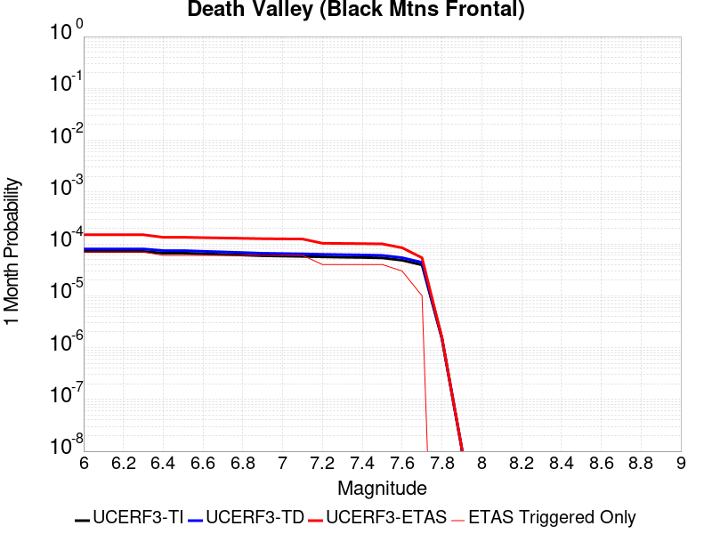 |  |  |

| Magnitude | 1 wk TI Prob | 1 wk TD Prob | 1 wk ETAS Prob | 1 wk ETAS/TD Gain | 1 wk ETAS Triggered Only | 1 mo TI Prob | 1 mo TD Prob | 1 mo ETAS Prob | 1 mo ETAS/TD Gain | 1 mo ETAS Triggered Only | 1 yr TI Prob | 1 yr TD Prob | 1 yr ETAS Prob | 1 yr ETAS/TD Gain | 1 yr ETAS Triggered Only | 10 yr TI Prob | 10 yr TD Prob | 10 yr ETAS Prob | 10 yr ETAS/TD Gain | 10 yr ETAS Triggered Only |
|-----|-----|-----|-----|-----|-----|-----|-----|-----|-----|-----|-----|-----|-----|-----|-----|-----|-----|-----|-----|-----|
| 6.0 | 1.6707214E-5 | 1.867056E-5 | 2.8670374E-5 | 1.5355926 | 1.0E-5 | 7.160038E-5 | 8.001427E-5 | 1.5000868E-4 | 1.8747739 | 7.0E-5 | 8.71386E-4 | 9.7374606E-4 | 0.0011935318 | 1.2257116 | 2.2E-4 | 0.00867977 | 0.009695647 | 0.010141284 | 1.0459626 | 4.5E-4 |
| 6.1 | 1.6707214E-5 | 1.867056E-5 | 2.8670374E-5 | 1.5355926 | 1.0E-5 | 7.160038E-5 | 8.001427E-5 | 1.5000868E-4 | 1.8747739 | 7.0E-5 | 8.71386E-4 | 9.7374606E-4 | 0.0011935318 | 1.2257116 | 2.2E-4 | 0.00867977 | 0.009695647 | 0.010141284 | 1.0459626 | 4.5E-4 |
| 6.2 | 1.6707214E-5 | 1.867056E-5 | 2.8670374E-5 | 1.5355926 | 1.0E-5 | 7.160038E-5 | 8.001427E-5 | 1.5000868E-4 | 1.8747739 | 7.0E-5 | 8.71386E-4 | 9.7374606E-4 | 0.0011935318 | 1.2257116 | 2.2E-4 | 0.00867977 | 0.009695647 | 0.010141284 | 1.0459626 | 4.5E-4 |
| 6.3 | 1.6707214E-5 | 1.867056E-5 | 2.8670374E-5 | 1.5355926 | 1.0E-5 | 7.160038E-5 | 8.001427E-5 | 1.5000868E-4 | 1.8747739 | 7.0E-5 | 8.71386E-4 | 9.7374606E-4 | 0.0011935318 | 1.2257116 | 2.2E-4 | 0.00867977 | 0.009695647 | 0.010141284 | 1.0459626 | 4.5E-4 |
| 6.4 | 1.5515609E-5 | 1.7338483E-5 | 2.733831E-5 | 1.5767417 | 1.0E-5 | 6.649377E-5 | 7.430571E-5 | 1.3430126E-4 | 1.807415 | 6.0E-5 | 8.0926094E-4 | 9.0430264E-4 | 0.0011041218 | 1.2209649 | 2.0E-4 | 0.008063202 | 0.009006913 | 0.0093934005 | 1.0429101 | 3.9E-4 |
| 6.5 | 1.5515609E-5 | 1.7338483E-5 | 2.733831E-5 | 1.5767417 | 1.0E-5 | 6.649377E-5 | 7.430571E-5 | 1.3430126E-4 | 1.807415 | 6.0E-5 | 8.0926094E-4 | 9.0430264E-4 | 0.0011041218 | 1.2209649 | 2.0E-4 | 0.008063202 | 0.009006913 | 0.0093934005 | 1.0429101 | 3.9E-4 |
| 6.6 | 1.5041828E-5 | 1.6809407E-5 | 2.6809239E-5 | 1.594895 | 1.0E-5 | 6.4463384E-5 | 7.203836E-5 | 1.3203404E-4 | 1.8328296 | 6.0E-5 | 7.8455906E-4 | 8.7672E-4 | 0.0010665534 | 1.2165269 | 1.9E-4 | 0.00781795 | 0.008733268 | 0.00910995 | 1.0431318 | 3.8E-4 |
| 6.7 | 1.4634985E-5 | 1.6356273E-5 | 2.6356109E-5 | 1.6113763 | 1.0E-5 | 6.271985E-5 | 7.009646E-5 | 1.3009226E-4 | 1.8559034 | 6.0E-5 | 7.6334673E-4 | 8.53096E-4 | 0.0010329424 | 1.2108161 | 1.8E-4 | 0.007607299 | 0.008498848 | 0.008845873 | 1.040832 | 3.5E-4 |
| 6.8 | 1.4209158E-5 | 1.5882297E-5 | 2.5882138E-5 | 1.6296219 | 1.0E-5 | 6.089497E-5 | 6.806524E-5 | 1.2806116E-4 | 1.8814472 | 6.0E-5 | 7.4114406E-4 | 8.2838483E-4 | 9.882523E-4 | 1.192987 | 1.6E-4 | 0.007386771 | 0.008253585 | 0.008561026 | 1.0372494 | 3.1E-4 |
| 6.9 | 1.3780098E-5 | 1.5404834E-5 | 2.540468E-5 | 1.6491369 | 1.0E-5 | 5.9056227E-5 | 6.601908E-5 | 1.2601512E-4 | 1.9087682 | 6.0E-5 | 7.1877235E-4 | 8.0349133E-4 | 9.533708E-4 | 1.1865352 | 1.5E-4 | 0.0071645193 | 0.008006458 | 0.008294136 | 1.0359308 | 2.9E-4 |
| 7.0 | 1.3585064E-5 | 1.5188394E-5 | 2.5188241E-5 | 1.6583874 | 1.0E-5 | 5.8220405E-5 | 6.5091524E-5 | 1.2508762E-4 | 1.9217191 | 6.0E-5 | 7.086029E-4 | 7.922066E-4 | 9.320957E-4 | 1.1765816 | 1.4E-4 | 0.007063476 | 0.007894417 | 0.008172207 | 1.0351881 | 2.8E-4 |
| 7.1 | 1.3398601E-5 | 1.4981575E-5 | 2.4981426E-5 | 1.6674765 | 1.0E-5 | 5.742131E-5 | 6.4205204E-5 | 1.2420135E-4 | 1.9344437 | 6.0E-5 | 6.9888023E-4 | 7.814234E-4 | 9.21314E-4 | 1.1790203 | 1.4E-4 | 0.0069668638 | 0.007787346 | 0.008055244 | 1.0344017 | 2.7E-4 |
| 7.2 | 1.3126312E-5 | 1.4679792E-5 | 2.4679644E-5 | 1.6811986 | 1.0E-5 | 5.6254412E-5 | 6.291191E-5 | 1.0290939E-4 | 1.6357697 | 4.0E-5 | 6.846822E-4 | 7.656887E-4 | 8.8559685E-4 | 1.1566017 | 1.2E-4 | 0.006825765 | 0.00763109 | 0.007839487 | 1.0273091 | 2.1E-4 |
| 7.3 | 1.2922429E-5 | 1.4454016E-5 | 2.4453871E-5 | 1.6918392 | 1.0E-5 | 5.5380664E-5 | 6.1944345E-5 | 1.0194186E-4 | 1.6457009 | 4.0E-5 | 6.74051E-4 | 7.5391686E-4 | 8.738264E-4 | 1.1590488 | 1.2E-4 | 0.006720101 | 0.0075141727 | 0.007722595 | 1.0277371 | 2.1E-4 |
| 7.4 | 1.2768878E-5 | 1.4283997E-5 | 2.4283854E-5 | 1.7000742 | 1.0E-5 | 5.4722615E-5 | 6.1215724E-5 | 1.0121328E-4 | 1.653387 | 4.0E-5 | 6.660441E-4 | 7.45052E-4 | 8.649626E-4 | 1.1609426 | 1.2E-4 | 0.0066405144 | 0.0074261203 | 0.007634561 | 1.0280685 | 2.1E-4 |
| 7.5 | 1.2521929E-5 | 1.40122365E-5 | 2.4012097E-5 | 1.7136519 | 1.0E-5 | 5.366431E-5 | 6.0051094E-5 | 1.0004869E-4 | 1.6660595 | 4.0E-5 | 6.531671E-4 | 7.308822E-4 | 8.408018E-4 | 1.150393 | 1.1E-4 | 0.006512506 | 0.0072853607 | 0.007483904 | 1.0272523 | 2.0E-4 |
| 7.6 | 1.1301089E-5 | 1.2648349E-5 | 2.2648223E-5 | 1.790607 | 1.0E-5 | 4.8432343E-5 | 5.4206117E-5 | 8.420449E-5 | 1.553413 | 3.0E-5 | 5.895042E-4 | 6.597649E-4 | 7.59699E-4 | 1.1514691 | 1.0E-4 | 0.0058794282 | 0.0065786145 | 0.0067574303 | 1.0271814 | 1.8E-4 |
| 7.7 | 9.189108E-6 | 1.0283521E-5 | 1.0283521E-5 | 1.0 | 0.0 | 3.93813E-5 | 4.407152E-5 | 5.4071075E-5 | 1.2268939 | 1.0E-5 | 4.7936183E-4 | 5.3644367E-4 | 6.1640074E-4 | 1.1490502 | 8.0E-5 | 0.004783291 | 0.0053519984 | 0.005501196 | 1.027877 | 1.5E-4 |
| 7.8 | 3.4586725E-7 | 3.648288E-7 | 3.648288E-7 | 1.0 | 0.0 | 1.4822873E-6 | 1.5635511E-6 | 1.5635511E-6 | 1.0 | 0.0 | 1.80467E-5 | 1.9036073E-5 | 1.9036073E-5 | 1.0 | 0.0 | 1.8045233E-4 | 1.9034486E-4 | 1.9034486E-4 | 1.0 | 0.0 |
| 7.9 | 2.5591178E-9 | 2.6696871E-9 | 2.6696871E-9 | 1.0 | 0.0 | 1.0967647E-8 | 1.1441516E-8 | 1.1441516E-8 | 1.0 | 0.0 | 1.335311E-7 | 1.3930045E-7 | 1.3930045E-7 | 1.0 | 0.0 | 1.3353102E-6 | 1.3930046E-6 | 1.3930046E-6 | 1.0 | 0.0 |

## Coyote Lake
*[(top)](#table-of-contents)*

| 1 Week | 1 Month | 1 Year | 10 Year |
|-----|-----|-----|-----|
| 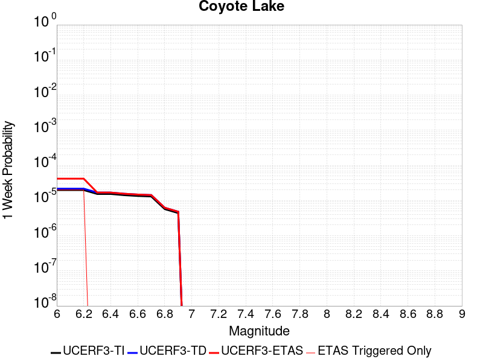 |  |  |  |

| Magnitude | 1 wk TI Prob | 1 wk TD Prob | 1 wk ETAS Prob | 1 wk ETAS/TD Gain | 1 wk ETAS Triggered Only | 1 mo TI Prob | 1 mo TD Prob | 1 mo ETAS Prob | 1 mo ETAS/TD Gain | 1 mo ETAS Triggered Only | 1 yr TI Prob | 1 yr TD Prob | 1 yr ETAS Prob | 1 yr ETAS/TD Gain | 1 yr ETAS Triggered Only | 10 yr TI Prob | 10 yr TD Prob | 10 yr ETAS Prob | 10 yr ETAS/TD Gain | 10 yr ETAS Triggered Only |
|-----|-----|-----|-----|-----|-----|-----|-----|-----|-----|-----|-----|-----|-----|-----|-----|-----|-----|-----|-----|-----|
| 6.0 | 1.980352E-5 | 2.1707021E-5 | 4.1706586E-5 | 1.9213408 | 2.0E-5 | 8.486947E-5 | 9.302718E-5 | 1.3302347E-4 | 1.4299419 | 4.0E-5 | 0.0010327959 | 0.0011320895 | 0.0013118857 | 1.158818 | 1.8E-4 | 0.010280091 | 0.011270401 | 0.011656006 | 1.0342139 | 3.9E-4 |
| 6.1 | 1.980352E-5 | 2.1707021E-5 | 4.1706586E-5 | 1.9213408 | 2.0E-5 | 8.486947E-5 | 9.302718E-5 | 1.3302347E-4 | 1.4299419 | 4.0E-5 | 0.0010327959 | 0.0011320895 | 0.0013118857 | 1.158818 | 1.8E-4 | 0.010280091 | 0.011270401 | 0.011656006 | 1.0342139 | 3.9E-4 |
| 6.2 | 1.980352E-5 | 2.1707021E-5 | 4.1706586E-5 | 1.9213408 | 2.0E-5 | 8.486947E-5 | 9.302718E-5 | 1.3302347E-4 | 1.4299419 | 4.0E-5 | 0.0010327959 | 0.0011320895 | 0.0013118857 | 1.158818 | 1.8E-4 | 0.010280091 | 0.011270401 | 0.011656006 | 1.0342139 | 3.9E-4 |
| 6.3 | 1.5344787E-5 | 1.6820884E-5 | 1.6820884E-5 | 1.0 | 0.0 | 6.576172E-5 | 7.208785E-5 | 9.208641E-5 | 1.2774192 | 2.0E-5 | 8.003548E-4 | 8.7737746E-4 | 0.0010172547 | 1.1594265 | 1.4E-4 | 0.007974784 | 0.00874518 | 0.009042556 | 1.0340046 | 3.0E-4 |
| 6.4 | 1.5344787E-5 | 1.6820884E-5 | 1.6820884E-5 | 1.0 | 0.0 | 6.576172E-5 | 7.208785E-5 | 9.208641E-5 | 1.2774192 | 2.0E-5 | 8.003548E-4 | 8.7737746E-4 | 0.0010172547 | 1.1594265 | 1.4E-4 | 0.007974784 | 0.00874518 | 0.009042556 | 1.0340046 | 3.0E-4 |
| 6.5 | 1.4189697E-5 | 1.5558186E-5 | 1.5558186E-5 | 1.0 | 0.0 | 6.081157E-5 | 6.667658E-5 | 8.6675245E-5 | 1.2999355 | 2.0E-5 | 7.401293E-4 | 8.1154524E-4 | 9.314479E-4 | 1.1477461 | 1.2E-4 | 0.0073766913 | 0.008091759 | 0.008369493 | 1.0343231 | 2.8E-4 |
| 6.6 | 1.3469301E-5 | 1.47717665E-5 | 1.47717665E-5 | 1.0 | 0.0 | 5.7724297E-5 | 6.3306376E-5 | 8.330511E-5 | 1.3159039 | 2.0E-5 | 7.025667E-4 | 7.7054254E-4 | 8.904501E-4 | 1.1556144 | 1.2E-4 | 0.0070034964 | 0.0076846126 | 0.007962461 | 1.0361564 | 2.8E-4 |
| 6.7 | 1.3027966E-5 | 1.4281927E-5 | 1.4281927E-5 | 1.0 | 0.0 | 5.5832945E-5 | 6.120716E-5 | 7.120655E-5 | 1.1633695 | 1.0E-5 | 6.7955407E-4 | 7.450021E-4 | 8.549202E-4 | 1.1475406 | 1.1E-4 | 0.006774798 | 0.007430923 | 0.0076889913 | 1.0347289 | 2.6E-4 |
| 6.8 | 5.695434E-6 | 6.2244944E-6 | 6.2244944E-6 | 1.0 | 0.0 | 2.4408775E-5 | 2.6676302E-5 | 2.6676302E-5 | 1.0 | 0.0 | 2.971363E-4 | 3.2476554E-4 | 3.347623E-4 | 1.0307814 | 1.0E-5 | 0.0029673933 | 0.0032458503 | 0.0032857205 | 1.0122834 | 4.0E-5 |
| 6.9 | 4.385688E-6 | 4.7931144E-6 | 4.7931144E-6 | 1.0 | 0.0 | 1.879567E-5 | 2.0541918E-5 | 2.0541918E-5 | 1.0 | 0.0 | 2.2881327E-4 | 2.5009786E-4 | 2.6009537E-4 | 1.0399743 | 1.0E-5 | 0.002285778 | 0.0025009785 | 0.0025209286 | 1.0079769 | 2.0E-5 |

## San Andreas (Big Bend)
*[(top)](#table-of-contents)*

| 1 Week | 1 Month | 1 Year | 10 Year |
|-----|-----|-----|-----|
|  |  | 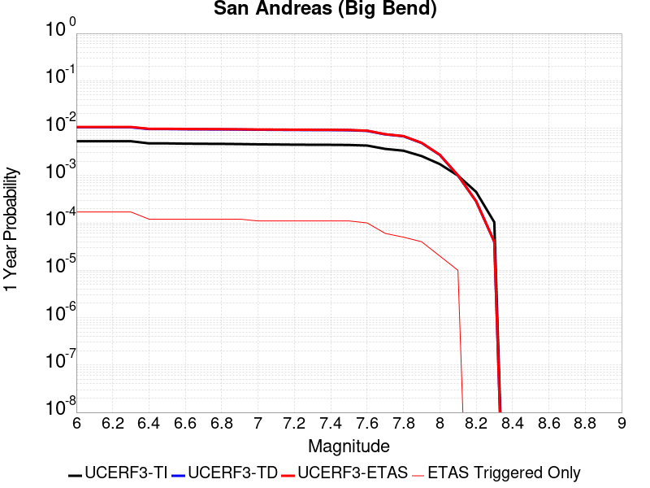 |  |

| Magnitude | 1 wk TI Prob | 1 wk TD Prob | 1 wk ETAS Prob | 1 wk ETAS/TD Gain | 1 wk ETAS Triggered Only | 1 mo TI Prob | 1 mo TD Prob | 1 mo ETAS Prob | 1 mo ETAS/TD Gain | 1 mo ETAS Triggered Only | 1 yr TI Prob | 1 yr TD Prob | 1 yr ETAS Prob | 1 yr ETAS/TD Gain | 1 yr ETAS Triggered Only | 10 yr TI Prob | 10 yr TD Prob | 10 yr ETAS Prob | 10 yr ETAS/TD Gain | 10 yr ETAS Triggered Only |
|-----|-----|-----|-----|-----|-----|-----|-----|-----|-----|-----|-----|-----|-----|-----|-----|-----|-----|-----|-----|-----|
| 6.0 | 1.0179969E-4 | 2.0081972E-4 | 2.2081571E-4 | 1.0995718 | 2.0E-5 | 4.362114E-4 | 8.603731E-4 | 9.303129E-4 | 1.08129 | 7.0E-5 | 0.0052979486 | 0.010425015 | 0.010593243 | 1.0161369 | 1.7E-4 | 0.051734097 | 0.101484396 | 0.101762936 | 1.0027447 | 3.1E-4 |
| 6.1 | 1.0179969E-4 | 2.0081972E-4 | 2.2081571E-4 | 1.0995718 | 2.0E-5 | 4.362114E-4 | 8.603731E-4 | 9.303129E-4 | 1.08129 | 7.0E-5 | 0.0052979486 | 0.010425015 | 0.010593243 | 1.0161369 | 1.7E-4 | 0.051734097 | 0.101484396 | 0.101762936 | 1.0027447 | 3.1E-4 |
| 6.2 | 1.0179969E-4 | 2.0081972E-4 | 2.2081571E-4 | 1.0995718 | 2.0E-5 | 4.362114E-4 | 8.603731E-4 | 9.303129E-4 | 1.08129 | 7.0E-5 | 0.0052979486 | 0.010425015 | 0.010593243 | 1.0161369 | 1.7E-4 | 0.051734097 | 0.101484396 | 0.101762936 | 1.0027447 | 3.1E-4 |
| 6.3 | 1.0179969E-4 | 2.0081972E-4 | 2.2081571E-4 | 1.0995718 | 2.0E-5 | 4.362114E-4 | 8.603731E-4 | 9.303129E-4 | 1.08129 | 7.0E-5 | 0.0052979486 | 0.010425015 | 0.010593243 | 1.0161369 | 1.7E-4 | 0.051734097 | 0.101484396 | 0.101762936 | 1.0027447 | 3.1E-4 |
| 6.4 | 9.1639464E-5 | 1.8438944E-4 | 1.943876E-4 | 1.0542231 | 1.0E-5 | 3.9268145E-4 | 7.9000136E-4 | 8.3996187E-4 | 1.063241 | 5.0E-5 | 0.0047704205 | 0.009575968 | 0.009694818 | 1.0124114 | 1.2E-4 | 0.046693064 | 0.09381712 | 0.09399836 | 1.0019318 | 2.0E-4 |
| 6.5 | 9.1639464E-5 | 1.8438944E-4 | 1.943876E-4 | 1.0542231 | 1.0E-5 | 3.9268145E-4 | 7.9000136E-4 | 8.3996187E-4 | 1.063241 | 5.0E-5 | 0.0047704205 | 0.009575968 | 0.009694818 | 1.0124114 | 1.2E-4 | 0.046693064 | 0.09381712 | 0.09399836 | 1.0019318 | 2.0E-4 |
| 6.6 | 9.042622E-5 | 1.8245954E-4 | 1.9245771E-4 | 1.0547967 | 1.0E-5 | 3.8748336E-4 | 7.817353E-4 | 8.316962E-4 | 1.0639102 | 5.0E-5 | 0.0047074095 | 0.009476205 | 0.009595068 | 1.0125433 | 1.2E-4 | 0.046089325 | 0.09291417 | 0.093095586 | 1.0019525 | 2.0E-4 |
| 6.7 | 8.9836685E-5 | 1.8160277E-4 | 1.9160095E-4 | 1.0550553 | 1.0E-5 | 3.8495753E-4 | 7.7806565E-4 | 8.2802674E-4 | 1.064212 | 5.0E-5 | 0.00467679 | 0.0094319135 | 0.009550782 | 1.0126028 | 1.2E-4 | 0.045795817 | 0.0925084 | 0.09268082 | 1.0018638 | 1.9E-4 |
| 6.8 | 8.9471854E-5 | 1.8107046E-4 | 1.9106866E-4 | 1.0552171 | 1.0E-5 | 3.8339442E-4 | 7.7578565E-4 | 8.257469E-4 | 1.0644008 | 5.0E-5 | 0.004657841 | 0.009404396 | 0.009523267 | 1.01264 | 1.2E-4 | 0.04561414 | 0.092256 | 0.09242847 | 1.0018694 | 1.9E-4 |
| 6.9 | 8.858234E-5 | 1.7989E-4 | 1.898882E-4 | 1.0555795 | 1.0E-5 | 3.7958333E-4 | 7.7072956E-4 | 8.2069106E-4 | 1.0648236 | 5.0E-5 | 0.004611638 | 0.009343366 | 0.009462246 | 1.0127233 | 1.2E-4 | 0.04517103 | 0.0916962 | 0.09186878 | 1.0018821 | 1.9E-4 |
| 7.0 | 8.7433385E-5 | 1.7827768E-4 | 1.8827591E-4 | 1.0560822 | 1.0E-5 | 3.746607E-4 | 7.638237E-4 | 8.0379314E-4 | 1.0523281 | 4.0E-5 | 0.004551957 | 0.009260005 | 0.009368987 | 1.011769 | 1.1E-4 | 0.044598386 | 0.09093105 | 0.09109469 | 1.0017995 | 1.8E-4 |
| 7.1 | 8.684964E-5 | 1.7739709E-4 | 1.8739532E-4 | 1.0563607 | 1.0E-5 | 3.7215967E-4 | 7.6005195E-4 | 8.000215E-4 | 1.052588 | 4.0E-5 | 0.0045216335 | 0.009214473 | 0.00932346 | 1.0118277 | 1.1E-4 | 0.04430731 | 0.09051253 | 0.09066714 | 1.0017081 | 1.7E-4 |
| 7.2 | 8.606521E-5 | 1.7630306E-4 | 1.8630129E-4 | 1.0567105 | 1.0E-5 | 3.6879873E-4 | 7.553659E-4 | 7.953357E-4 | 1.0529145 | 4.0E-5 | 0.0044808835 | 0.009157902 | 0.009266894 | 1.0119015 | 1.1E-4 | 0.043916024 | 0.08999327 | 0.09014797 | 1.001719 | 1.7E-4 |
| 7.3 | 8.568266E-5 | 1.7572299E-4 | 1.8572123E-4 | 1.0568978 | 1.0E-5 | 3.6715972E-4 | 7.528814E-4 | 7.9285126E-4 | 1.0530893 | 4.0E-5 | 0.0044610105 | 0.0091279065 | 0.009236903 | 1.011941 | 1.1E-4 | 0.043725148 | 0.08971421 | 0.089868955 | 1.001725 | 1.7E-4 |
| 7.4 | 8.5432206E-5 | 1.7534874E-4 | 1.8534699E-4 | 1.0570192 | 1.0E-5 | 3.6608664E-4 | 7.5127836E-4 | 7.9124834E-4 | 1.0532026 | 4.0E-5 | 0.004447999 | 0.009108554 | 0.009217552 | 1.0119666 | 1.1E-4 | 0.043600157 | 0.08953439 | 0.089689165 | 1.0017287 | 1.7E-4 |
| 7.5 | 8.4791965E-5 | 1.7404204E-4 | 1.840403E-4 | 1.0574474 | 1.0E-5 | 3.633435E-4 | 7.456814E-4 | 7.856516E-4 | 1.0536022 | 4.0E-5 | 0.0044147377 | 0.009040978 | 0.0091499835 | 1.0120568 | 1.1E-4 | 0.043280575 | 0.088910125 | 0.08906501 | 1.001742 | 1.7E-4 |
| 7.6 | 8.241105E-5 | 1.6849465E-4 | 1.7849296E-4 | 1.059339 | 1.0E-5 | 3.531424E-4 | 7.219202E-4 | 7.5189857E-4 | 1.0415258 | 3.0E-5 | 0.0042910352 | 0.008754046 | 0.00885317 | 1.0113233 | 1.0E-4 | 0.042091176 | 0.08628652 | 0.08643272 | 1.0016943 | 1.6E-4 |
| 7.7 | 7.00432E-5 | 1.4212567E-4 | 1.4212567E-4 | 1.0 | 0.0 | 3.001506E-4 | 6.089679E-4 | 6.289557E-4 | 1.0328225 | 2.0E-5 | 0.0036482112 | 0.0073890192 | 0.007448576 | 1.0080602 | 6.0E-5 | 0.035888977 | 0.073552616 | 0.073663786 | 1.0015115 | 1.2E-4 |
| 7.8 | 6.415362E-5 | 1.2976197E-4 | 1.2976197E-4 | 1.0 | 0.0 | 2.749151E-4 | 5.5600423E-4 | 5.759931E-4 | 1.0359509 | 2.0E-5 | 0.0033419547 | 0.0067483704 | 0.0067980327 | 1.0073591 | 5.0E-5 | 0.03292141 | 0.06728497 | 0.06738757 | 1.0015248 | 1.1E-4 |
| 7.9 | 4.939911E-5 | 9.346299E-5 | 9.346299E-5 | 1.0 | 0.0 | 2.116933E-4 | 4.004942E-4 | 4.2048618E-4 | 1.0499183 | 2.0E-5 | 0.0025743195 | 0.0048651244 | 0.0049049295 | 1.0081818 | 4.0E-5 | 0.025447013 | 0.048938233 | 0.049004808 | 1.0013604 | 7.0E-5 |
| 8.0 | 3.344983E-5 | 5.2255753E-5 | 5.2255753E-5 | 1.0 | 0.0 | 1.4334853E-4 | 2.2393401E-4 | 2.3393177E-4 | 1.044646 | 1.0E-5 | 0.0017438711 | 0.0027229895 | 0.0027429352 | 1.0073248 | 2.0E-5 | 0.017302496 | 0.02793611 | 0.027984714 | 1.0017397 | 5.0E-5 |
| 8.1 | 1.9104898E-5 | 1.9185067E-5 | 1.9185067E-5 | 1.0 | 0.0 | 8.1875565E-5 | 8.221913E-5 | 9.221831E-5 | 1.1216162 | 1.0E-5 | 9.963791E-4 | 0.0010005588 | 0.0010105488 | 1.0099844 | 1.0E-5 | 0.009919235 | 0.010756051 | 0.010775836 | 1.0018394 | 2.0E-5 |
| 8.2 | 8.643924E-6 | 5.478665E-6 | 5.478665E-6 | 1.0 | 0.0 | 3.704486E-5 | 2.3479783E-5 | 2.3479783E-5 | 1.0 | 0.0 | 4.5092785E-4 | 2.8582895E-4 | 2.8582895E-4 | 1.0 | 0.0 | 0.0045001395 | 0.0032508469 | 0.0032508469 | 1.0 | 0.0 |
| 8.3 | 1.983087E-6 | 7.6647797E-7 | 7.6647797E-7 | 1.0 | 0.0 | 8.498917E-6 | 3.2849016E-6 | 3.2849016E-6 | 1.0 | 0.0 | 1.034694E-4 | 3.999296E-5 | 3.999296E-5 | 1.0 | 0.0 | 0.0010342124 | 4.7228087E-4 | 4.7228087E-4 | 1.0 | 0.0 |

## Red Pass
*[(top)](#table-of-contents)*

| 1 Week | 1 Month | 1 Year | 10 Year |
|-----|-----|-----|-----|
|  | 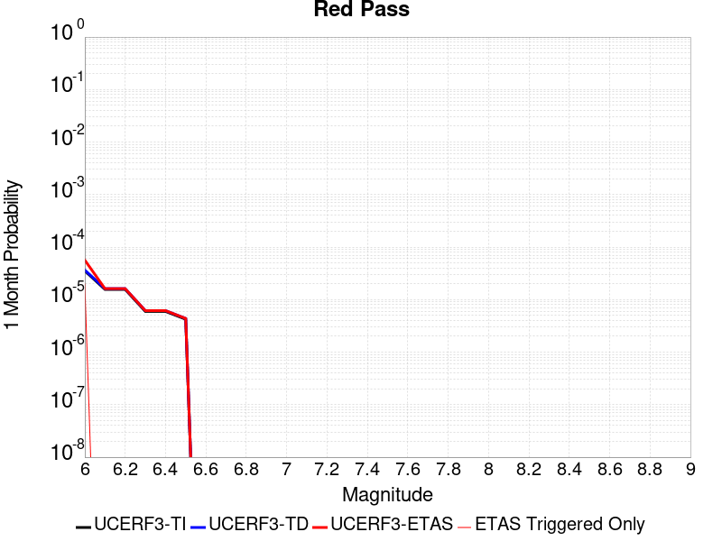 |  |  |

| Magnitude | 1 wk TI Prob | 1 wk TD Prob | 1 wk ETAS Prob | 1 wk ETAS/TD Gain | 1 wk ETAS Triggered Only | 1 mo TI Prob | 1 mo TD Prob | 1 mo ETAS Prob | 1 mo ETAS/TD Gain | 1 mo ETAS Triggered Only | 1 yr TI Prob | 1 yr TD Prob | 1 yr ETAS Prob | 1 yr ETAS/TD Gain | 1 yr ETAS Triggered Only | 10 yr TI Prob | 10 yr TD Prob | 10 yr ETAS Prob | 10 yr ETAS/TD Gain | 10 yr ETAS Triggered Only |
|-----|-----|-----|-----|-----|-----|-----|-----|-----|-----|-----|-----|-----|-----|-----|-----|-----|-----|-----|-----|-----|
| 6.0 | 8.258278E-6 | 8.551305E-6 | 1.855122E-5 | 2.1694021 | 1.0E-5 | 3.539214E-5 | 3.6648038E-5 | 5.6647303E-5 | 1.5457119 | 2.0E-5 | 4.308141E-4 | 4.4611638E-4 | 6.260361E-4 | 1.4033022 | 1.8E-4 | 0.0042997985 | 0.004453966 | 0.004742674 | 1.0648205 | 2.9E-4 |
| 6.1 | 3.649988E-6 | 3.7753332E-6 | 3.7753332E-6 | 1.0 | 0.0 | 1.5642712E-5 | 1.6179927E-5 | 1.6179927E-5 | 1.0 | 0.0 | 1.9043336E-4 | 1.9697756E-4 | 2.5696575E-4 | 1.3045433 | 6.0E-5 | 0.0019027026 | 0.001968497 | 0.0020982411 | 1.0659102 | 1.3E-4 |
| 6.2 | 3.649988E-6 | 3.7753332E-6 | 3.7753332E-6 | 1.0 | 0.0 | 1.5642712E-5 | 1.6179927E-5 | 1.6179927E-5 | 1.0 | 0.0 | 1.9043336E-4 | 1.9697756E-4 | 2.5696575E-4 | 1.3045433 | 6.0E-5 | 0.0019027026 | 0.001968497 | 0.0020982411 | 1.0659102 | 1.3E-4 |
| 6.3 | 1.3924937E-6 | 1.4411233E-6 | 1.4411233E-6 | 1.0 | 0.0 | 5.9678164E-6 | 6.176236E-6 | 6.176236E-6 | 1.0 | 0.0 | 7.265574E-5 | 7.51945E-5 | 9.519299E-5 | 1.2659569 | 2.0E-5 | 7.263199E-4 | 7.518293E-4 | 7.917992E-4 | 1.0531635 | 4.0E-5 |
| 6.4 | 1.3924937E-6 | 1.4411233E-6 | 1.4411233E-6 | 1.0 | 0.0 | 5.9678164E-6 | 6.176236E-6 | 6.176236E-6 | 1.0 | 0.0 | 7.265574E-5 | 7.51945E-5 | 9.519299E-5 | 1.2659569 | 2.0E-5 | 7.263199E-4 | 7.518293E-4 | 7.917992E-4 | 1.0531635 | 4.0E-5 |
| 6.5 | 9.876812E-7 | 1.022196E-6 | 1.022196E-6 | 1.0 | 0.0 | 4.2329125E-6 | 4.38084E-6 | 4.38084E-6 | 1.0 | 0.0 | 5.153449E-5 | 5.3336724E-5 | 6.333619E-5 | 1.1874781 | 1.0E-5 | 5.1522546E-4 | 5.333672E-4 | 5.533566E-4 | 1.0374776 | 2.0E-5 |

## San Andreas (Parkfield)
*[(top)](#table-of-contents)*

| 1 Week | 1 Month | 1 Year | 10 Year |
|-----|-----|-----|-----|
| 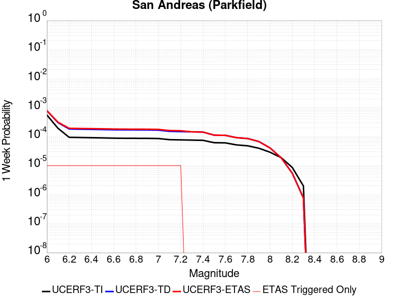 |  |  |  |

| Magnitude | 1 wk TI Prob | 1 wk TD Prob | 1 wk ETAS Prob | 1 wk ETAS/TD Gain | 1 wk ETAS Triggered Only | 1 mo TI Prob | 1 mo TD Prob | 1 mo ETAS Prob | 1 mo ETAS/TD Gain | 1 mo ETAS Triggered Only | 1 yr TI Prob | 1 yr TD Prob | 1 yr ETAS Prob | 1 yr ETAS/TD Gain | 1 yr ETAS Triggered Only | 10 yr TI Prob | 10 yr TD Prob | 10 yr ETAS Prob | 10 yr ETAS/TD Gain | 10 yr ETAS Triggered Only |
|-----|-----|-----|-----|-----|-----|-----|-----|-----|-----|-----|-----|-----|-----|-----|-----|-----|-----|-----|-----|-----|
| 6.0 | 5.556969E-4 | 7.787764E-4 | 7.887686E-4 | 1.0128306 | 1.0E-5 | 0.0023793848 | 0.0033338934 | 0.0033837266 | 1.0149475 | 5.0E-5 | 0.028586963 | 0.04027906 | 0.04042302 | 1.003574 | 1.5E-4 | 0.25176284 | 0.3373374 | 0.33752957 | 1.0005697 | 2.9E-4 |
| 6.1 | 1.925858E-4 | 3.0300187E-4 | 3.1299883E-4 | 1.0329931 | 1.0E-5 | 8.2510663E-4 | 0.0012980271 | 0.0013180012 | 1.015388 | 2.0E-5 | 0.0099994885 | 0.01578479 | 0.01587337 | 1.0056117 | 9.0E-5 | 0.095613256 | 0.14981315 | 0.14993218 | 1.0007945 | 1.4E-4 |
| 6.2 | 9.4306815E-5 | 1.8251229E-4 | 1.9251046E-4 | 1.0547808 | 1.0E-5 | 4.0410945E-4 | 7.8196224E-4 | 8.019466E-4 | 1.0255567 | 2.0E-5 | 0.0049089384 | 0.009479025 | 0.009548362 | 1.0073147 | 7.0E-5 | 0.048019063 | 0.09188695 | 0.09197776 | 1.0009882 | 1.0E-4 |
| 6.3 | 9.283051E-5 | 1.7947727E-4 | 1.8947547E-4 | 1.0557073 | 1.0E-5 | 3.9778434E-4 | 7.689627E-4 | 7.8894733E-4 | 1.025989 | 2.0E-5 | 0.0048322747 | 0.0093221245 | 0.009391472 | 1.007439 | 7.0E-5 | 0.047285385 | 0.09053988 | 0.09063083 | 1.0010045 | 1.0E-4 |
| 6.4 | 9.138826E-5 | 1.7709887E-4 | 1.870971E-4 | 1.0564556 | 1.0E-5 | 3.916052E-4 | 7.5877557E-4 | 7.787604E-4 | 1.0263382 | 2.0E-5 | 0.0047573745 | 0.009199142 | 0.009268498 | 1.0075394 | 7.0E-5 | 0.046568092 | 0.08944346 | 0.08953451 | 1.001018 | 1.0E-4 |
| 6.5 | 9.000255E-5 | 1.7467843E-4 | 1.8467668E-4 | 1.0572381 | 1.0E-5 | 3.8566816E-4 | 7.484082E-4 | 7.683932E-4 | 1.0267034 | 2.0E-5 | 0.0046854047 | 0.009074002 | 0.0091433665 | 1.0076443 | 7.0E-5 | 0.045878403 | 0.08833238 | 0.08842354 | 1.0010321 | 1.0E-4 |
| 6.6 | 8.8109264E-5 | 1.7148908E-4 | 1.8148737E-4 | 1.0583028 | 1.0E-5 | 3.7755648E-4 | 7.347474E-4 | 7.547327E-4 | 1.0272002 | 2.0E-5 | 0.0045870654 | 0.008909067 | 0.008978444 | 1.0077871 | 7.0E-5 | 0.04493529 | 0.08686431 | 0.08695562 | 1.0010512 | 1.0E-4 |
| 6.7 | 8.738073E-5 | 1.7015962E-4 | 1.8015792E-4 | 1.0587584 | 1.0E-5 | 3.7443507E-4 | 7.290529E-4 | 7.490383E-4 | 1.0274129 | 2.0E-5 | 0.0045492216 | 0.008840349 | 0.00890973 | 1.0078483 | 7.0E-5 | 0.04457213 | 0.08626531 | 0.086356685 | 1.0010592 | 1.0E-4 |
| 6.8 | 8.710195E-5 | 1.6961442E-4 | 1.7961273E-4 | 1.0589472 | 1.0E-5 | 3.7324068E-4 | 7.267176E-4 | 7.4670307E-4 | 1.027501 | 2.0E-5 | 0.0045347405 | 0.008812156 | 0.008881538 | 1.0078735 | 7.0E-5 | 0.04443313 | 0.086012915 | 0.08610432 | 1.0010626 | 1.0E-4 |
| 6.9 | 8.6801556E-5 | 1.6902383E-4 | 1.7902213E-4 | 1.0591532 | 1.0E-5 | 3.7195362E-4 | 7.241879E-4 | 7.4417336E-4 | 1.0275972 | 2.0E-5 | 0.0045191357 | 0.0087816045 | 0.00885099 | 1.0079012 | 7.0E-5 | 0.044283327 | 0.08573886 | 0.085830286 | 1.0010663 | 1.0E-4 |
| 7.0 | 8.5571606E-5 | 1.6655146E-4 | 1.7654979E-4 | 1.0600315 | 1.0E-5 | 3.6668387E-4 | 7.1359787E-4 | 7.335836E-4 | 1.028007 | 2.0E-5 | 0.004455241 | 0.008653701 | 0.008723096 | 1.008019 | 7.0E-5 | 0.043669727 | 0.08458771 | 0.08467925 | 1.0010822 | 1.0E-4 |
| 7.1 | 7.82589E-5 | 1.513576E-4 | 1.6135609E-4 | 1.0660588 | 1.0E-5 | 3.3535215E-4 | 6.485149E-4 | 6.6850195E-4 | 1.0308197 | 2.0E-5 | 0.0040752706 | 0.007867255 | 0.007936704 | 1.0088277 | 7.0E-5 | 0.040013418 | 0.07750286 | 0.07759511 | 1.0011903 | 1.0E-4 |
| 7.2 | 7.690929E-5 | 1.4872964E-4 | 1.5872816E-4 | 1.067226 | 1.0E-5 | 3.2956956E-4 | 6.3725776E-4 | 6.5724505E-4 | 1.0313644 | 2.0E-5 | 0.004005129 | 0.0077311797 | 0.007800638 | 1.0089842 | 7.0E-5 | 0.0393371 | 0.07627582 | 0.07636819 | 1.001211 | 1.0E-4 |
| 7.3 | 7.5543794E-5 | 1.4569426E-4 | 1.4569426E-4 | 1.0 | 0.0 | 3.2371894E-4 | 6.242553E-4 | 6.34249E-4 | 1.0160091 | 1.0E-5 | 0.003934157 | 0.0075739846 | 0.00763353 | 1.0078619 | 6.0E-5 | 0.038652334 | 0.07484126 | 0.07492452 | 1.0011126 | 9.0E-5 |
| 7.4 | 7.4214564E-5 | 1.4270298E-4 | 1.4270298E-4 | 1.0 | 0.0 | 3.1802364E-4 | 6.1144156E-4 | 6.2143547E-4 | 1.0163448 | 1.0E-5 | 0.003865065 | 0.00741905 | 0.007478605 | 1.0080273 | 6.0E-5 | 0.03798529 | 0.07341491 | 0.0734983 | 1.001136 | 9.0E-5 |
| 7.5 | 6.149578E-5 | 1.1197151E-4 | 1.1197151E-4 | 1.0 | 0.0 | 2.6352672E-4 | 4.7978974E-4 | 4.897849E-4 | 1.0208324 | 1.0E-5 | 0.0032037178 | 0.0058258264 | 0.0058854767 | 1.010239 | 6.0E-5 | 0.03157923 | 0.058584794 | 0.058669522 | 1.0014462 | 9.0E-5 |
| 7.6 | 6.0643448E-5 | 1.10257475E-4 | 1.10257475E-4 | 1.0 | 0.0 | 2.598746E-4 | 4.7244655E-4 | 4.8244183E-4 | 1.0211564 | 1.0E-5 | 0.0031593828 | 0.0057368972 | 0.005796553 | 1.0103986 | 6.0E-5 | 0.031148417 | 0.0577456 | 0.057830404 | 1.0014685 | 9.0E-5 |
| 7.7 | 5.1652263E-5 | 9.180402E-5 | 9.180402E-5 | 1.0 | 0.0 | 2.2134806E-4 | 3.933865E-4 | 4.0338255E-4 | 1.0254103 | 1.0E-5 | 0.002691582 | 0.0047789724 | 0.0048187813 | 1.00833 | 4.0E-5 | 0.026592141 | 0.048558682 | 0.048625283 | 1.0013715 | 7.0E-5 |
| 7.8 | 4.8090482E-5 | 8.564889E-5 | 8.564889E-5 | 1.0 | 0.0 | 2.060858E-4 | 3.6701505E-4 | 3.770114E-4 | 1.0272368 | 1.0E-5 | 0.0025062072 | 0.0044592614 | 0.004499083 | 1.0089301 | 4.0E-5 | 0.024781305 | 0.04532328 | 0.045390107 | 1.0014745 | 7.0E-5 |
| 7.9 | 3.970278E-5 | 6.754373E-5 | 6.754373E-5 | 1.0 | 0.0 | 1.7014367E-4 | 2.8944103E-4 | 2.9943814E-4 | 1.0345393 | 1.0E-5 | 0.002069531 | 0.003518254 | 0.0035481486 | 1.008497 | 3.0E-5 | 0.020503636 | 0.03590036 | 0.035948567 | 1.0013428 | 5.0E-5 |
| 8.0 | 2.8982335E-5 | 4.072156E-5 | 4.072156E-5 | 1.0 | 0.0 | 1.2420409E-4 | 1.745093E-4 | 1.8450755E-4 | 1.0572935 | 1.0E-5 | 0.0015111357 | 0.0021225815 | 0.002142539 | 1.0094025 | 2.0E-5 | 0.015009012 | 0.022022424 | 0.022061544 | 1.0017763 | 4.0E-5 |
| 8.1 | 1.8836186E-5 | 1.8692857E-5 | 1.8692857E-5 | 1.0 | 0.0 | 8.0724014E-5 | 8.0109785E-5 | 9.010899E-5 | 1.1248187 | 1.0E-5 | 9.823717E-4 | 9.7490085E-4 | 9.848911E-4 | 1.0102475 | 1.0E-5 | 0.009780403 | 0.010494427 | 0.010514217 | 1.0018858 | 2.0E-5 |
| 8.2 | 8.643924E-6 | 5.478665E-6 | 5.478665E-6 | 1.0 | 0.0 | 3.704486E-5 | 2.3479783E-5 | 2.3479783E-5 | 1.0 | 0.0 | 4.5092785E-4 | 2.8582895E-4 | 2.8582895E-4 | 1.0 | 0.0 | 0.0045001395 | 0.0032508469 | 0.0032508469 | 1.0 | 0.0 |
| 8.3 | 1.983087E-6 | 7.6647797E-7 | 7.6647797E-7 | 1.0 | 0.0 | 8.498917E-6 | 3.2849016E-6 | 3.2849016E-6 | 1.0 | 0.0 | 1.034694E-4 | 3.999296E-5 | 3.999296E-5 | 1.0 | 0.0 | 0.0010342124 | 4.7228087E-4 | 4.7228087E-4 | 1.0 | 0.0 |

## Sierra Nevada  (No Extension)
*[(top)](#table-of-contents)*

| 1 Week | 1 Month | 1 Year | 10 Year |
|-----|-----|-----|-----|
|  |  |  |  |

| Magnitude | 1 wk TI Prob | 1 wk TD Prob | 1 wk ETAS Prob | 1 wk ETAS/TD Gain | 1 wk ETAS Triggered Only | 1 mo TI Prob | 1 mo TD Prob | 1 mo ETAS Prob | 1 mo ETAS/TD Gain | 1 mo ETAS Triggered Only | 1 yr TI Prob | 1 yr TD Prob | 1 yr ETAS Prob | 1 yr ETAS/TD Gain | 1 yr ETAS Triggered Only | 10 yr TI Prob | 10 yr TD Prob | 10 yr ETAS Prob | 10 yr ETAS/TD Gain | 10 yr ETAS Triggered Only |
|-----|-----|-----|-----|-----|-----|-----|-----|-----|-----|-----|-----|-----|-----|-----|-----|-----|-----|-----|-----|-----|
| 6.0 | 7.7690465E-6 | 6.9763464E-6 | 4.6976067E-5 | 6.73362 | 4.0E-5 | 3.329549E-5 | 2.9898487E-5 | 7.989699E-5 | 2.6722753 | 5.0E-5 | 4.0529718E-4 | 3.6398912E-4 | 5.239309E-4 | 1.4394135 | 1.6E-4 | 0.004045588 | 0.0036374456 | 0.003866609 | 1.0630012 | 2.3E-4 |
| 6.1 | 7.7690465E-6 | 6.9763464E-6 | 4.6976067E-5 | 6.73362 | 4.0E-5 | 3.329549E-5 | 2.9898487E-5 | 7.989699E-5 | 2.6722753 | 5.0E-5 | 4.0529718E-4 | 3.6398912E-4 | 5.239309E-4 | 1.4394135 | 1.6E-4 | 0.004045588 | 0.0036374456 | 0.003866609 | 1.0630012 | 2.3E-4 |
| 6.2 | 7.7690465E-6 | 6.9763464E-6 | 4.6976067E-5 | 6.73362 | 4.0E-5 | 3.329549E-5 | 2.9898487E-5 | 7.989699E-5 | 2.6722753 | 5.0E-5 | 4.0529718E-4 | 3.6398912E-4 | 5.239309E-4 | 1.4394135 | 1.6E-4 | 0.004045588 | 0.0036374456 | 0.003866609 | 1.0630012 | 2.3E-4 |
| 6.3 | 7.7690465E-6 | 6.9763464E-6 | 4.6976067E-5 | 6.73362 | 4.0E-5 | 3.329549E-5 | 2.9898487E-5 | 7.989699E-5 | 2.6722753 | 5.0E-5 | 4.0529718E-4 | 3.6398912E-4 | 5.239309E-4 | 1.4394135 | 1.6E-4 | 0.004045588 | 0.0036374456 | 0.003866609 | 1.0630012 | 2.3E-4 |
| 6.4 | 7.7690465E-6 | 6.9763464E-6 | 4.6976067E-5 | 6.73362 | 4.0E-5 | 3.329549E-5 | 2.9898487E-5 | 7.989699E-5 | 2.6722753 | 5.0E-5 | 4.0529718E-4 | 3.6398912E-4 | 5.239309E-4 | 1.4394135 | 1.6E-4 | 0.004045588 | 0.0036374456 | 0.003866609 | 1.0630012 | 2.3E-4 |
| 6.5 | 7.7690465E-6 | 6.9763464E-6 | 4.6976067E-5 | 6.73362 | 4.0E-5 | 3.329549E-5 | 2.9898487E-5 | 7.989699E-5 | 2.6722753 | 5.0E-5 | 4.0529718E-4 | 3.6398912E-4 | 5.239309E-4 | 1.4394135 | 1.6E-4 | 0.004045588 | 0.0036374456 | 0.003866609 | 1.0630012 | 2.3E-4 |
| 6.6 | 2.653E-6 | 1.6148447E-6 | 2.1614813E-5 | 13.385073 | 2.0E-5 | 1.136995E-5 | 6.9207445E-6 | 3.6920537E-5 | 5.3347635 | 3.0E-5 | 1.3842035E-4 | 8.425684E-5 | 1.8424842E-4 | 2.1867473 | 1.0E-4 | 0.0013833415 | 8.422524E-4 | 0.0010021176 | 1.1898068 | 1.6E-4 |
| 6.7 | 2.5902466E-6 | 1.5501779E-6 | 2.1550148E-5 | 13.901725 | 2.0E-5 | 1.11010095E-5 | 6.643603E-6 | 3.6643403E-5 | 5.515592 | 3.0E-5 | 1.351464E-4 | 8.088289E-5 | 1.808748E-4 | 2.2362554 | 1.0E-4 | 0.0013506424 | 8.0853753E-4 | 9.684082E-4 | 1.1977282 | 1.6E-4 |
| 6.8 | 2.5853892E-6 | 1.5469781E-6 | 2.1546946E-5 | 13.9284115 | 2.0E-5 | 1.1080193E-5 | 6.6298894E-6 | 3.662969E-5 | 5.5249324 | 3.0E-5 | 1.34893E-4 | 8.0715945E-5 | 1.8070787E-4 | 2.2388127 | 1.0E-4 | 0.0013481114 | 8.0686924E-4 | 9.6674013E-4 | 1.1981373 | 1.6E-4 |
| 6.9 | 2.458257E-6 | 1.4220519E-6 | 2.1422024E-5 | 15.064164 | 2.0E-5 | 1.0535345E-5 | 6.094494E-6 | 3.6094312E-5 | 5.922446 | 3.0E-5 | 1.2826028E-4 | 7.419796E-5 | 1.7419054E-4 | 2.347646 | 1.0E-4 | 0.0012818627 | 7.417338E-4 | 9.0161513E-4 | 1.2155508 | 1.6E-4 |
| 7.0 | 2.4341468E-6 | 1.3990157E-6 | 2.1398988E-5 | 15.295746 | 2.0E-5 | 1.0432016E-5 | 5.995768E-6 | 3.599559E-5 | 6.0034995 | 3.0E-5 | 1.270024E-4 | 7.2996045E-5 | 1.7298874E-4 | 2.3698373 | 1.0E-4 | 0.0012692984 | 7.297226E-4 | 8.8960584E-4 | 1.2191014 | 1.6E-4 |
| 7.1 | 2.3652476E-6 | 1.3339652E-6 | 2.1333939E-5 | 15.992875 | 2.0E-5 | 1.0136736E-5 | 5.716981E-6 | 3.571681E-5 | 6.2474947 | 3.0E-5 | 1.2340778E-4 | 6.9602036E-5 | 1.6959508E-4 | 2.4366395 | 1.0E-4 | 0.0012333926 | 6.958041E-4 | 8.556928E-4 | 1.2297897 | 1.6E-4 |
| 7.2 | 2.272158E-6 | 1.2502717E-6 | 2.1250247E-5 | 16.996504 | 2.0E-5 | 9.737784E-6 | 5.358296E-6 | 3.5358134E-5 | 6.5987644 | 3.0E-5 | 1.1855107E-4 | 6.523532E-5 | 1.6522879E-4 | 2.5328119 | 1.0E-4 | 0.0011848784 | 6.521632E-4 | 8.1205886E-4 | 1.2451774 | 1.6E-4 |
| 7.3 | 2.1382127E-6 | 1.1419595E-6 | 2.1141937E-5 | 18.513735 | 2.0E-5 | 9.163737E-6 | 4.8941033E-6 | 3.4893957E-5 | 7.129796 | 3.0E-5 | 1.1156279E-4 | 5.9584087E-5 | 1.5957814E-4 | 2.6782005 | 1.0E-4 | 0.001115068 | 5.956823E-4 | 7.55587E-4 | 1.2684395 | 1.6E-4 |
| 7.4 | 1.9048055E-6 | 9.57513E-7 | 2.0957494E-5 | 21.887426 | 2.0E-5 | 8.163426E-6 | 4.1036205E-6 | 3.4103497E-5 | 8.310588 | 3.0E-5 | 9.9385186E-5 | 4.996044E-5 | 1.4995545E-4 | 3.0014837 | 1.0E-4 | 9.934074E-4 | 4.9949274E-4 | 6.594128E-4 | 1.3201649 | 1.6E-4 |
| 7.5 | 1.5373403E-6 | 7.559938E-7 | 1.0755986E-5 | 14.227612 | 1.0E-5 | 6.5885843E-6 | 3.2399694E-6 | 2.3239905E-5 | 7.172878 | 2.0E-5 | 8.021306E-5 | 3.944592E-5 | 1.1944276E-4 | 3.0280132 | 8.0E-5 | 8.0184115E-4 | 3.9438964E-4 | 5.243384E-4 | 1.3294933 | 1.3E-4 |
| 7.6 | 1.0680322E-6 | 4.6595343E-7 | 1.0465948E-5 | 22.461363 | 1.0E-5 | 4.577273E-6 | 1.9969418E-6 | 1.1996922E-5 | 6.007647 | 1.0E-5 | 5.5726876E-5 | 2.4312498E-5 | 6.431153E-5 | 2.6452043 | 4.0E-5 | 5.5712904E-4 | 2.4309864E-4 | 3.0308406E-4 | 1.2467533 | 6.0E-5 |
| 7.7 | 5.509146E-7 | 1.5579108E-7 | 1.5579108E-7 | 1.0 | 0.0 | 2.3610605E-6 | 6.676759E-7 | 6.676759E-7 | 1.0 | 0.0 | 2.8745531E-5 | 8.128925E-6 | 8.128925E-6 | 1.0 | 0.0 | 2.8741814E-4 | 8.1286395E-5 | 8.1286395E-5 | 1.0 | 0.0 |

## Death Valley (No)
*[(top)](#table-of-contents)*

| 1 Week | 1 Month | 1 Year | 10 Year |
|-----|-----|-----|-----|
|  |  |  | 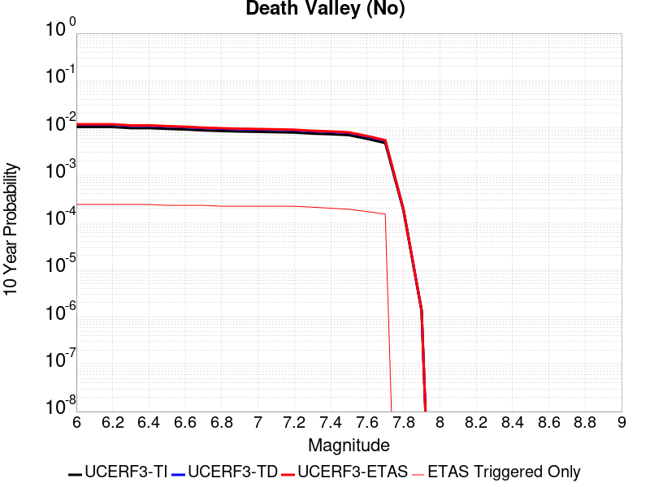 |

| Magnitude | 1 wk TI Prob | 1 wk TD Prob | 1 wk ETAS Prob | 1 wk ETAS/TD Gain | 1 wk ETAS Triggered Only | 1 mo TI Prob | 1 mo TD Prob | 1 mo ETAS Prob | 1 mo ETAS/TD Gain | 1 mo ETAS Triggered Only | 1 yr TI Prob | 1 yr TD Prob | 1 yr ETAS Prob | 1 yr ETAS/TD Gain | 1 yr ETAS Triggered Only | 10 yr TI Prob | 10 yr TD Prob | 10 yr ETAS Prob | 10 yr ETAS/TD Gain | 10 yr ETAS Triggered Only |
|-----|-----|-----|-----|-----|-----|-----|-----|-----|-----|-----|-----|-----|-----|-----|-----|-----|-----|-----|-----|-----|
| 6.0 | 2.0074807E-5 | 2.2500446E-5 | 3.2500222E-5 | 1.4444256 | 1.0E-5 | 8.603206E-5 | 9.642696E-5 | 1.364231E-4 | 1.4147817 | 4.0E-5 | 0.001046937 | 0.0011733733 | 0.0013231974 | 1.1276865 | 1.5E-4 | 0.010420183 | 0.011672693 | 0.011909892 | 1.0203208 | 2.4E-4 |
| 6.1 | 2.0074807E-5 | 2.2500446E-5 | 3.2500222E-5 | 1.4444256 | 1.0E-5 | 8.603206E-5 | 9.642696E-5 | 1.364231E-4 | 1.4147817 | 4.0E-5 | 0.001046937 | 0.0011733733 | 0.0013231974 | 1.1276865 | 1.5E-4 | 0.010420183 | 0.011672693 | 0.011909892 | 1.0203208 | 2.4E-4 |
| 6.2 | 2.0074807E-5 | 2.2500446E-5 | 3.2500222E-5 | 1.4444256 | 1.0E-5 | 8.603206E-5 | 9.642696E-5 | 1.364231E-4 | 1.4147817 | 4.0E-5 | 0.001046937 | 0.0011733733 | 0.0013231974 | 1.1276865 | 1.5E-4 | 0.010420183 | 0.011672693 | 0.011909892 | 1.0203208 | 2.4E-4 |
| 6.3 | 1.9050609E-5 | 2.1337288E-5 | 3.1337077E-5 | 1.4686531 | 1.0E-5 | 8.164292E-5 | 9.144236E-5 | 1.314387E-4 | 1.437394 | 4.0E-5 | 9.935491E-4 | 0.0011127489 | 0.0012625819 | 1.1346513 | 1.5E-4 | 0.009891188 | 0.011072595 | 0.011309938 | 1.0214351 | 2.4E-4 |
| 6.4 | 1.9050609E-5 | 2.1337288E-5 | 3.1337077E-5 | 1.4686531 | 1.0E-5 | 8.164292E-5 | 9.144236E-5 | 1.314387E-4 | 1.437394 | 4.0E-5 | 9.935491E-4 | 0.0011127489 | 0.0012625819 | 1.1346513 | 1.5E-4 | 0.009891188 | 0.011072595 | 0.011309938 | 1.0214351 | 2.4E-4 |
| 6.5 | 1.8367004E-5 | 2.0561336E-5 | 3.056113E-5 | 1.4863397 | 1.0E-5 | 7.8713354E-5 | 8.811707E-5 | 1.2811355E-4 | 1.4539015 | 4.0E-5 | 9.5791375E-4 | 0.0010723039 | 0.0012121538 | 1.13042 | 1.4E-4 | 0.009537951 | 0.010672085 | 0.01089963 | 1.0213215 | 2.3E-4 |
| 6.6 | 1.779439E-5 | 1.9911244E-5 | 2.9911045E-5 | 1.5022188 | 1.0E-5 | 7.625944E-5 | 8.533114E-5 | 1.2532773E-4 | 1.468722 | 4.0E-5 | 9.280632E-4 | 0.0010384179 | 0.0011782725 | 1.1346805 | 1.4E-4 | 0.009241969 | 0.010336416 | 0.0105640385 | 1.0220214 | 2.3E-4 |
| 6.7 | 1.7025437E-5 | 1.9043726E-5 | 2.9043536E-5 | 1.5250974 | 1.0E-5 | 7.296412E-5 | 8.161345E-5 | 1.2161019E-4 | 1.4900752 | 4.0E-5 | 8.87976E-4 | 9.93197E-4 | 0.001133058 | 1.140819 | 1.4E-4 | 0.008844362 | 0.009888301 | 0.010116027 | 1.0230298 | 2.3E-4 |
| 6.8 | 1.6545107E-5 | 1.851284E-5 | 2.8512653E-5 | 1.5401556 | 1.0E-5 | 7.090568E-5 | 7.933836E-5 | 1.19335185E-4 | 1.5041298 | 4.0E-5 | 8.629347E-4 | 9.655226E-4 | 0.0011053873 | 1.1448592 | 1.4E-4 | 0.008595915 | 0.009613981 | 0.009831865 | 1.0226634 | 2.2E-4 |
| 6.9 | 1.615478E-5 | 1.8087881E-5 | 2.8087701E-5 | 1.5528463 | 1.0E-5 | 6.9232934E-5 | 7.751722E-5 | 1.1751412E-4 | 1.5159743 | 4.0E-5 | 8.4258494E-4 | 9.433697E-4 | 0.0010832376 | 1.1482642 | 1.4E-4 | 0.008393973 | 0.009394345 | 0.009612278 | 1.0231984 | 2.2E-4 |
| 7.0 | 1.5894311E-5 | 1.7805834E-5 | 2.7805656E-5 | 1.5616037 | 1.0E-5 | 6.81167E-5 | 7.6308526E-5 | 1.1630547E-4 | 1.5241479 | 4.0E-5 | 8.2900526E-4 | 9.286663E-4 | 0.0010685363 | 1.1506138 | 1.4E-4 | 0.008259195 | 0.009248544 | 0.00946651 | 1.0235676 | 2.2E-4 |
| 7.1 | 1.5602263E-5 | 1.7483784E-5 | 2.748361E-5 | 1.5719485 | 1.0E-5 | 6.6865134E-5 | 7.4928386E-5 | 1.1492539E-4 | 1.5338031 | 4.0E-5 | 8.137789E-4 | 9.118773E-4 | 0.0010517497 | 1.1533895 | 1.4E-4 | 0.008108052 | 0.009082039 | 0.009300041 | 1.0240036 | 2.2E-4 |
| 7.2 | 1.5323829E-5 | 1.7170905E-5 | 2.7170734E-5 | 1.5823705 | 1.0E-5 | 6.56719E-5 | 7.358755E-5 | 1.1358461E-4 | 1.5435302 | 4.0E-5 | 7.99262E-4 | 8.9556625E-4 | 0.0010354408 | 1.1561856 | 1.4E-4 | 0.007963934 | 0.008920249 | 0.009138286 | 1.024443 | 2.2E-4 |
| 7.3 | 1.4556212E-5 | 1.6302716E-5 | 2.6302552E-5 | 1.6133847 | 1.0E-5 | 6.238227E-5 | 6.986695E-5 | 1.0986415E-4 | 1.5724769 | 4.0E-5 | 7.592395E-4 | 8.503039E-4 | 9.801934E-4 | 1.1527566 | 1.3E-4 | 0.0075665074 | 0.008471149 | 0.00867937 | 1.02458 | 2.1E-4 |
| 7.4 | 1.411725E-5 | 1.5808211E-5 | 2.5808054E-5 | 1.6325727 | 1.0E-5 | 6.0501097E-5 | 6.774775E-5 | 1.0774504E-4 | 1.5903854 | 4.0E-5 | 7.363519E-4 | 8.245226E-4 | 9.444236E-4 | 1.1454188 | 1.2E-4 | 0.0073391674 | 0.008215268 | 0.008413626 | 1.0241449 | 2.0E-4 |
| 7.5 | 1.3503312E-5 | 1.5126531E-5 | 2.512638E-5 | 1.6610801 | 1.0E-5 | 5.7870053E-5 | 6.482641E-5 | 1.0482382E-4 | 1.6169925 | 4.0E-5 | 7.043401E-4 | 7.8898156E-4 | 8.988948E-4 | 1.1393102 | 1.1E-4 | 0.007021119 | 0.007862429 | 0.008050935 | 1.0239756 | 1.9E-4 |
| 7.6 | 1.1279839E-5 | 1.2626528E-5 | 2.2626402E-5 | 1.7919734 | 1.0E-5 | 4.834127E-5 | 5.4112596E-5 | 8.411097E-5 | 1.5543696 | 3.0E-5 | 5.88396E-4 | 6.58627E-4 | 7.5856113E-4 | 1.151731 | 1.0E-4 | 0.005868405 | 0.0065673026 | 0.006736186 | 1.0257158 | 1.7E-4 |
| 7.7 | 9.189108E-6 | 1.0283521E-5 | 1.0283521E-5 | 1.0 | 0.0 | 3.93813E-5 | 4.407152E-5 | 5.4071075E-5 | 1.2268939 | 1.0E-5 | 4.7936183E-4 | 5.3644367E-4 | 6.1640074E-4 | 1.1490502 | 8.0E-5 | 0.004783291 | 0.0053519984 | 0.005501196 | 1.027877 | 1.5E-4 |
| 7.8 | 3.4586725E-7 | 3.648288E-7 | 3.648288E-7 | 1.0 | 0.0 | 1.4822873E-6 | 1.5635511E-6 | 1.5635511E-6 | 1.0 | 0.0 | 1.80467E-5 | 1.9036073E-5 | 1.9036073E-5 | 1.0 | 0.0 | 1.8045233E-4 | 1.9034486E-4 | 1.9034486E-4 | 1.0 | 0.0 |
| 7.9 | 2.5591178E-9 | 2.6696871E-9 | 2.6696871E-9 | 1.0 | 0.0 | 1.0967647E-8 | 1.1441516E-8 | 1.1441516E-8 | 1.0 | 0.0 | 1.335311E-7 | 1.3930045E-7 | 1.3930045E-7 | 1.0 | 0.0 | 1.3353102E-6 | 1.3930046E-6 | 1.3930046E-6 | 1.0 | 0.0 |

## San Andreas (Coachella) rev
*[(top)](#table-of-contents)*

| 1 Week | 1 Month | 1 Year | 10 Year |
|-----|-----|-----|-----|
|  | 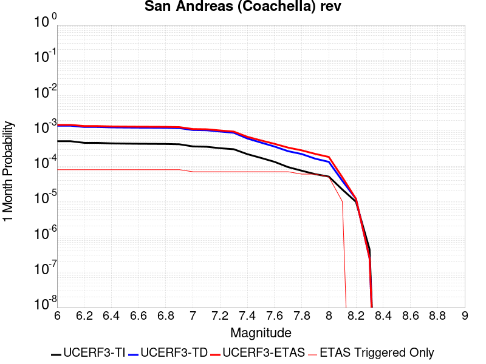 | 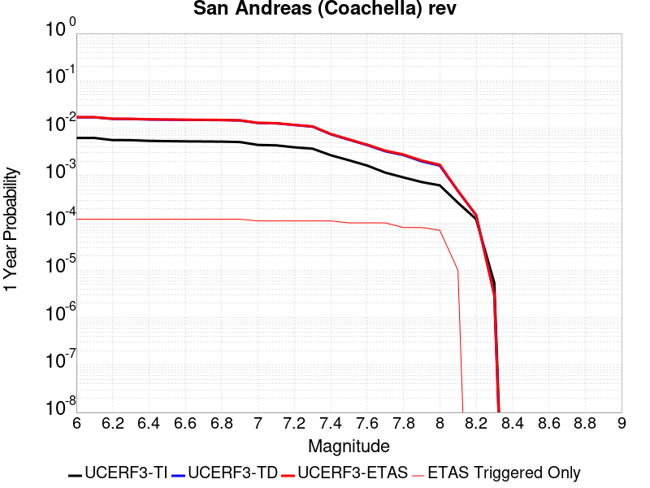 | 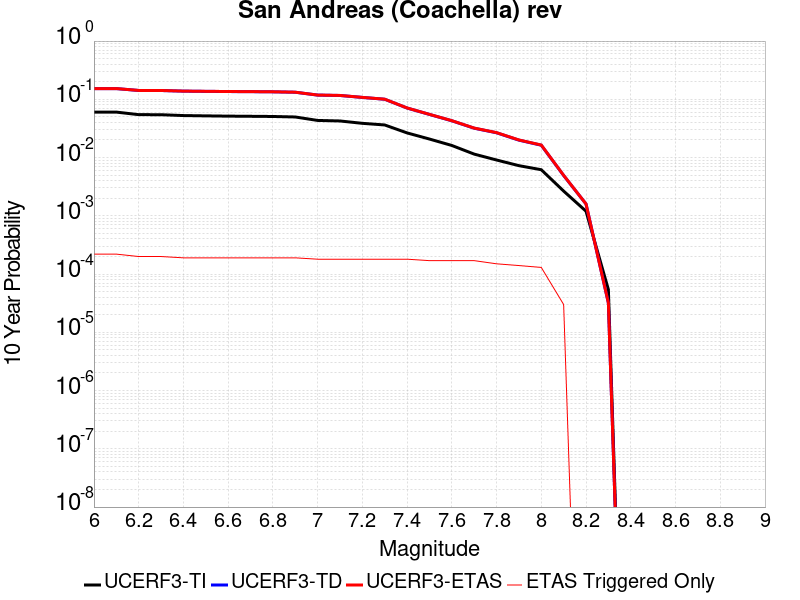 |

| Magnitude | 1 wk TI Prob | 1 wk TD Prob | 1 wk ETAS Prob | 1 wk ETAS/TD Gain | 1 wk ETAS Triggered Only | 1 mo TI Prob | 1 mo TD Prob | 1 mo ETAS Prob | 1 mo ETAS/TD Gain | 1 mo ETAS Triggered Only | 1 yr TI Prob | 1 yr TD Prob | 1 yr ETAS Prob | 1 yr ETAS/TD Gain | 1 yr ETAS Triggered Only | 10 yr TI Prob | 10 yr TD Prob | 10 yr ETAS Prob | 10 yr ETAS/TD Gain | 10 yr ETAS Triggered Only |
|-----|-----|-----|-----|-----|-----|-----|-----|-----|-----|-----|-----|-----|-----|-----|-----|-----|-----|-----|-----|-----|
| 6.0 | 1.1925945E-4 | 3.2735174E-4 | 3.473452E-4 | 1.0610764 | 2.0E-5 | 5.110118E-4 | 0.0014021865 | 0.0014820743 | 1.0569737 | 8.0E-5 | 0.0062038354 | 0.016939327 | 0.017057294 | 1.0069641 | 1.2E-4 | 0.060334753 | 0.15269604 | 0.15288244 | 1.0012208 | 2.2E-4 |
| 6.1 | 1.1925945E-4 | 3.2735174E-4 | 3.473452E-4 | 1.0610764 | 2.0E-5 | 5.110118E-4 | 0.0014021865 | 0.0014820743 | 1.0569737 | 8.0E-5 | 0.0062038354 | 0.016939327 | 0.017057294 | 1.0069641 | 1.2E-4 | 0.060334753 | 0.15269604 | 0.15288244 | 1.0012208 | 2.2E-4 |
| 6.2 | 1.07432395E-4 | 3.023596E-4 | 3.2235356E-4 | 1.0661263 | 2.0E-5 | 4.603433E-4 | 0.0012951873 | 0.0013750837 | 1.0616871 | 8.0E-5 | 0.005590286 | 0.01565599 | 0.015774112 | 1.0075448 | 1.2E-4 | 0.05451731 | 0.14184935 | 0.14202097 | 1.00121 | 2.0E-4 |
| 6.3 | 1.0718766E-4 | 3.0181266E-4 | 3.218066E-4 | 1.0662463 | 2.0E-5 | 4.592948E-4 | 0.0012928456 | 0.0013727421 | 1.061799 | 8.0E-5 | 0.005577586 | 0.015627889 | 0.015746014 | 1.0075586 | 1.2E-4 | 0.054396555 | 0.14161763 | 0.1417893 | 1.0012122 | 2.0E-4 |
| 6.4 | 1.0355944E-4 | 2.9389336E-4 | 3.138875E-4 | 1.0680319 | 2.0E-5 | 4.4375064E-4 | 0.001258939 | 0.0013388383 | 1.0634656 | 8.0E-5 | 0.0053892885 | 0.015220915 | 0.015339089 | 1.0077639 | 1.2E-4 | 0.052604496 | 0.13817544 | 0.13833918 | 1.001185 | 1.9E-4 |
| 6.5 | 1.0227914E-4 | 2.9108766E-4 | 3.1108185E-4 | 1.0686878 | 2.0E-5 | 4.382655E-4 | 0.0012469261 | 0.0013268264 | 1.0640777 | 8.0E-5 | 0.0053228354 | 0.015076692 | 0.015194883 | 1.0078393 | 1.2E-4 | 0.051971316 | 0.13695958 | 0.13712357 | 1.0011972 | 1.9E-4 |
| 6.6 | 1.0116757E-4 | 2.8874516E-4 | 3.0873937E-4 | 1.0692452 | 2.0E-5 | 4.3350324E-4 | 0.0012368963 | 0.0013167973 | 1.064598 | 8.0E-5 | 0.0052651367 | 0.014956261 | 0.015074466 | 1.0079033 | 1.2E-4 | 0.051421247 | 0.1359371 | 0.13610128 | 1.0012077 | 1.9E-4 |
| 6.7 | 1.0050676E-4 | 2.8733077E-4 | 3.07325E-4 | 1.0695862 | 2.0E-5 | 4.3067214E-4 | 0.0012308403 | 0.0013107419 | 1.0649163 | 8.0E-5 | 0.005230834 | 0.01488354 | 0.015001754 | 1.0079426 | 1.2E-4 | 0.051094085 | 0.13532192 | 0.13548622 | 1.001214 | 1.9E-4 |
| 6.8 | 9.976819E-5 | 2.8536728E-4 | 3.0536155E-4 | 1.0700651 | 2.0E-5 | 4.2750788E-4 | 0.0012224333 | 0.0013023355 | 1.0653633 | 8.0E-5 | 0.0051924936 | 0.014782578 | 0.014900804 | 1.0079976 | 1.2E-4 | 0.050728295 | 0.13447334 | 0.13463779 | 1.001223 | 1.9E-4 |
| 6.9 | 9.77719E-5 | 2.8033604E-4 | 3.0033043E-4 | 1.0713229 | 2.0E-5 | 4.1895514E-4 | 0.0012008909 | 0.0012807949 | 1.0665373 | 8.0E-5 | 0.0050888555 | 0.014523826 | 0.014642083 | 1.0081422 | 1.2E-4 | 0.049738888 | 0.13230172 | 0.13246658 | 1.0012461 | 1.9E-4 |
| 7.0 | 8.500761E-5 | 2.476793E-4 | 2.6767433E-4 | 1.0807296 | 2.0E-5 | 3.6426744E-4 | 0.0010610541 | 0.0011309799 | 1.0659021 | 7.0E-5 | 0.0044259406 | 0.01284259 | 0.012951178 | 1.0084553 | 1.1E-4 | 0.04338823 | 0.118151076 | 0.11830981 | 1.0013435 | 1.8E-4 |
| 7.1 | 8.319876E-5 | 2.4370618E-4 | 2.637013E-4 | 1.082046 | 2.0E-5 | 3.5651738E-4 | 0.0010440402 | 0.0011139672 | 1.0669773 | 7.0E-5 | 0.004331963 | 0.0126378685 | 0.012746478 | 1.008594 | 1.1E-4 | 0.042484846 | 0.11637106 | 0.116530105 | 1.0013667 | 1.8E-4 |
| 7.2 | 7.563917E-5 | 2.2418915E-4 | 2.4418466E-4 | 1.0891904 | 2.0E-5 | 3.2412758E-4 | 9.604599E-4 | 0.0010303927 | 1.0728117 | 7.0E-5 | 0.0039391145 | 0.011631592 | 0.011740313 | 1.009347 | 1.1E-4 | 0.03870018 | 0.107777216 | 0.10793781 | 1.0014901 | 1.8E-4 |
| 7.3 | 7.082985E-5 | 2.0734889E-4 | 2.2734475E-4 | 1.0964358 | 2.0E-5 | 3.0352117E-4 | 8.8833837E-4 | 9.5827616E-4 | 1.0787288 | 7.0E-5 | 0.0036891096 | 0.01076251 | 0.010871327 | 1.0101106 | 1.1E-4 | 0.03628465 | 0.10029867 | 0.10046062 | 1.0016147 | 1.8E-4 |
| 7.4 | 5.146215E-5 | 1.4277869E-4 | 1.6277583E-4 | 1.140057 | 2.0E-5 | 2.2053342E-4 | 6.1176607E-4 | 6.8172324E-4 | 1.1143528 | 7.0E-5 | 0.0026816884 | 0.007423004 | 0.0075321877 | 1.0147088 | 1.1E-4 | 0.02649557 | 0.07086286 | 0.0710301 | 1.0023601 | 1.8E-4 |
| 7.5 | 4.0285166E-5 | 1.09450986E-4 | 1.2944879E-4 | 1.1827102 | 2.0E-5 | 1.7263928E-4 | 4.6899164E-4 | 5.389588E-4 | 1.1491864 | 7.0E-5 | 0.002099857 | 0.0056950934 | 0.0057945237 | 1.0174589 | 1.0E-4 | 0.020801254 | 0.055024315 | 0.05518496 | 1.0029196 | 1.7E-4 |
| 7.6 | 3.1168736E-5 | 8.441976E-5 | 1.0441807E-4 | 1.2368914 | 2.0E-5 | 1.3357346E-4 | 3.617489E-4 | 4.317236E-4 | 1.1934344 | 7.0E-5 | 0.0016250437 | 0.0043954253 | 0.0044949856 | 1.022651 | 1.0E-4 | 0.016132116 | 0.042821974 | 0.042984694 | 1.0037999 | 1.7E-4 |
| 7.7 | 2.2100989E-5 | 6.241421E-5 | 8.241297E-5 | 1.3204198 | 2.0E-5 | 9.4715084E-5 | 2.674621E-4 | 3.3744337E-4 | 1.2616494 | 7.0E-5 | 0.001152546 | 0.003251495 | 0.00335117 | 1.030655 | 1.0E-4 | 0.011465867 | 0.031911246 | 0.032075822 | 1.0051572 | 1.7E-4 |
| 7.8 | 1.7484861E-5 | 5.181932E-5 | 6.18188E-5 | 1.1929682 | 1.0E-5 | 7.493296E-5 | 2.220639E-4 | 2.8205058E-4 | 1.2701325 | 6.0E-5 | 9.1192697E-4 | 0.002700279 | 0.0027800628 | 1.0295466 | 8.0E-5 | 0.009081938 | 0.026649911 | 0.026795913 | 1.0054785 | 1.5E-4 |
| 7.9 | 1.3967285E-5 | 3.8241284E-5 | 4.82409E-5 | 1.2614875 | 1.0E-5 | 5.985842E-5 | 1.6388092E-4 | 2.2387109E-4 | 1.3660595 | 6.0E-5 | 7.2853256E-4 | 0.0019934257 | 0.002073266 | 1.0400519 | 8.0E-5 | 0.0072614877 | 0.019917965 | 0.020055177 | 1.0068889 | 1.4E-4 |
| 8.0 | 1.1887396E-5 | 3.1081006E-5 | 4.1080697E-5 | 1.3217299 | 1.0E-5 | 5.094499E-5 | 1.3319752E-4 | 1.8319086E-4 | 1.3753324 | 5.0E-5 | 6.200787E-4 | 0.0016204745 | 0.0016903611 | 1.0431272 | 7.0E-5 | 0.006183513 | 0.016286531 | 0.016414413 | 1.0078521 | 1.3E-4 |
| 8.1 | 5.100864E-6 | 8.979058E-6 | 8.979058E-6 | 1.0 | 0.0 | 2.1860664E-5 | 3.8481114E-5 | 4.8480728E-5 | 1.2598578 | 1.0E-5 | 2.6612106E-4 | 4.6840697E-4 | 4.7840227E-4 | 1.0213389 | 1.0E-5 | 0.002658026 | 0.0049204906 | 0.004950343 | 1.0060669 | 3.0E-5 |
| 8.2 | 2.3004484E-6 | 2.7884673E-6 | 2.7884673E-6 | 1.0 | 0.0 | 9.859027E-6 | 1.195052E-5 | 1.195052E-5 | 1.0 | 0.0 | 1.2002704E-4 | 1.454879E-4 | 1.454879E-4 | 1.0 | 0.0 | 0.0011996223 | 0.0015984424 | 0.0015984424 | 1.0 | 0.0 |
| 8.3 | 1.0424446E-7 | 5.820319E-8 | 5.820319E-8 | 1.0 | 0.0 | 4.4676187E-7 | 2.4944222E-7 | 2.4944222E-7 | 1.0 | 0.0 | 5.439312E-6 | 3.0369551E-6 | 3.0369551E-6 | 1.0 | 0.0 | 5.4391792E-5 | 3.1931086E-5 | 3.1931086E-5 | 1.0 | 0.0 |

## San Andreas (San Gorgonio Pass-Garnet HIll)
*[(top)](#table-of-contents)*

| 1 Week | 1 Month | 1 Year | 10 Year |
|-----|-----|-----|-----|
|  |  |  |  |

| Magnitude | 1 wk TI Prob | 1 wk TD Prob | 1 wk ETAS Prob | 1 wk ETAS/TD Gain | 1 wk ETAS Triggered Only | 1 mo TI Prob | 1 mo TD Prob | 1 mo ETAS Prob | 1 mo ETAS/TD Gain | 1 mo ETAS Triggered Only | 1 yr TI Prob | 1 yr TD Prob | 1 yr ETAS Prob | 1 yr ETAS/TD Gain | 1 yr ETAS Triggered Only | 10 yr TI Prob | 10 yr TD Prob | 10 yr ETAS Prob | 10 yr ETAS/TD Gain | 10 yr ETAS Triggered Only |
|-----|-----|-----|-----|-----|-----|-----|-----|-----|-----|-----|-----|-----|-----|-----|-----|-----|-----|-----|-----|-----|
| 6.0 | 8.31567E-5 | 2.338839E-4 | 2.6387686E-4 | 1.1282388 | 3.0E-5 | 3.5633717E-4 | 0.0010019708 | 0.0010818907 | 1.0797627 | 8.0E-5 | 0.004329778 | 0.01213065 | 0.012259074 | 1.0105866 | 1.3E-4 | 0.042463828 | 0.11259771 | 0.11277519 | 1.0015762 | 2.0E-4 |
| 6.1 | 8.31567E-5 | 2.338839E-4 | 2.6387686E-4 | 1.1282388 | 3.0E-5 | 3.5633717E-4 | 0.0010019708 | 0.0010818907 | 1.0797627 | 8.0E-5 | 0.004329778 | 0.01213065 | 0.012259074 | 1.0105866 | 1.3E-4 | 0.042463828 | 0.11259771 | 0.11277519 | 1.0015762 | 2.0E-4 |
| 6.2 | 8.31567E-5 | 2.338839E-4 | 2.6387686E-4 | 1.1282388 | 3.0E-5 | 3.5633717E-4 | 0.0010019708 | 0.0010818907 | 1.0797627 | 8.0E-5 | 0.004329778 | 0.01213065 | 0.012259074 | 1.0105866 | 1.3E-4 | 0.042463828 | 0.11259771 | 0.11277519 | 1.0015762 | 2.0E-4 |
| 6.3 | 8.31567E-5 | 2.338839E-4 | 2.6387686E-4 | 1.1282388 | 3.0E-5 | 3.5633717E-4 | 0.0010019708 | 0.0010818907 | 1.0797627 | 8.0E-5 | 0.004329778 | 0.01213065 | 0.012259074 | 1.0105866 | 1.3E-4 | 0.042463828 | 0.11259771 | 0.11277519 | 1.0015762 | 2.0E-4 |
| 6.4 | 8.059055E-5 | 2.2945837E-4 | 2.5945148E-4 | 1.1307126 | 3.0E-5 | 3.4534236E-4 | 9.830239E-4 | 0.0010629452 | 1.0813016 | 8.0E-5 | 0.0041964394 | 0.011902837 | 0.01203129 | 1.0107918 | 1.3E-4 | 0.041180745 | 0.11057874 | 0.11075663 | 1.0016086 | 2.0E-4 |
| 6.5 | 8.059055E-5 | 2.2945837E-4 | 2.5945148E-4 | 1.1307126 | 3.0E-5 | 3.4534236E-4 | 9.830239E-4 | 0.0010629452 | 1.0813016 | 8.0E-5 | 0.0041964394 | 0.011902837 | 0.01203129 | 1.0107918 | 1.3E-4 | 0.041180745 | 0.11057874 | 0.11075663 | 1.0016086 | 2.0E-4 |
| 6.6 | 7.619237E-5 | 2.2190346E-4 | 2.5189682E-4 | 1.1351639 | 3.0E-5 | 3.2649786E-4 | 9.5067057E-4 | 0.0010305945 | 1.0840712 | 8.0E-5 | 0.0039678677 | 0.011513535 | 0.011642038 | 1.0111611 | 1.3E-4 | 0.03897764 | 0.107115194 | 0.10729377 | 1.0016671 | 2.0E-4 |
| 6.7 | 7.440636E-5 | 2.1866155E-4 | 2.4865498E-4 | 1.1371683 | 3.0E-5 | 3.188454E-4 | 9.367866E-4 | 0.0010167116 | 1.0853183 | 8.0E-5 | 0.0038750346 | 0.011346267 | 0.011474791 | 1.0113275 | 1.3E-4 | 0.038081564 | 0.105623715 | 0.10580259 | 1.0016935 | 2.0E-4 |
| 6.8 | 7.3735864E-5 | 2.1713313E-4 | 2.4712662E-4 | 1.1381341 | 3.0E-5 | 3.1597257E-4 | 9.3024096E-4 | 0.0010101666 | 1.0859193 | 8.0E-5 | 0.0038401815 | 0.011267403 | 0.011395938 | 1.0114077 | 1.3E-4 | 0.03774495 | 0.10492511 | 0.105104126 | 1.0017061 | 2.0E-4 |
| 6.9 | 7.27575E-5 | 2.1482276E-4 | 2.4481633E-4 | 1.13962 | 3.0E-5 | 3.117806E-4 | 9.203464E-4 | 0.0010002728 | 1.0868438 | 8.0E-5 | 0.003789323 | 0.011148175 | 0.011276727 | 1.0115311 | 1.3E-4 | 0.037253562 | 0.103873 | 0.10405222 | 1.0017254 | 2.0E-4 |
| 7.0 | 7.102591E-5 | 2.10663E-4 | 2.4065668E-4 | 1.1423775 | 3.0E-5 | 3.0436125E-4 | 9.0253126E-4 | 9.82459E-4 | 1.0885596 | 8.0E-5 | 0.003699303 | 0.010933471 | 0.011062049 | 1.0117601 | 1.3E-4 | 0.03638325 | 0.10197552 | 0.10215513 | 1.0017612 | 2.0E-4 |
| 7.1 | 7.028513E-5 | 2.0901936E-4 | 2.3901308E-4 | 1.1434973 | 3.0E-5 | 3.0118722E-4 | 8.95492E-4 | 9.754203E-4 | 1.0892564 | 8.0E-5 | 0.0036607897 | 0.010848625 | 0.010977214 | 1.0118531 | 1.3E-4 | 0.036010686 | 0.10121833 | 0.10139809 | 1.001776 | 2.0E-4 |
| 7.2 | 6.8498244E-5 | 2.0509785E-4 | 2.3509169E-4 | 1.1462417 | 3.0E-5 | 2.9353087E-4 | 8.786969E-4 | 9.586266E-4 | 1.090964 | 8.0E-5 | 0.003567883 | 0.010646159 | 0.0107747745 | 1.012081 | 1.3E-4 | 0.035111405 | 0.09941009 | 0.099590205 | 1.0018119 | 2.0E-4 |
| 7.3 | 6.622592E-5 | 1.9737013E-4 | 2.273642E-4 | 1.1519687 | 3.0E-5 | 2.8379448E-4 | 8.455999E-4 | 9.255323E-4 | 1.0945274 | 8.0E-5 | 0.0034497243 | 0.010247062 | 0.01037573 | 1.0125566 | 1.3E-4 | 0.033966612 | 0.09590662 | 0.09608744 | 1.0018854 | 2.0E-4 |
| 7.4 | 5.1050705E-5 | 1.4693316E-4 | 1.7692876E-4 | 1.2041445 | 3.0E-5 | 2.1877038E-4 | 6.295625E-4 | 7.0951215E-4 | 1.1269923 | 8.0E-5 | 0.002660276 | 0.0076381783 | 0.007767185 | 1.0168898 | 1.3E-4 | 0.02628654 | 0.07287833 | 0.07306376 | 1.0025443 | 2.0E-4 |
| 7.5 | 3.9302922E-5 | 1.1133535E-4 | 1.3133312E-4 | 1.1796175 | 2.0E-5 | 1.6843023E-4 | 4.7706455E-4 | 5.470312E-4 | 1.1466607 | 7.0E-5 | 0.0020487092 | 0.0057928623 | 0.005912167 | 1.0205952 | 1.2E-4 | 0.020299247 | 0.056023482 | 0.05620284 | 1.0032015 | 1.9E-4 |
| 7.6 | 2.9851626E-5 | 8.498211E-5 | 1.0498041E-4 | 1.2353237 | 2.0E-5 | 1.2792926E-4 | 3.6415833E-4 | 4.3413282E-4 | 1.192154 | 7.0E-5 | 0.0015564259 | 0.00442464 | 0.004544109 | 1.0270009 | 1.2E-4 | 0.0154556995 | 0.043206394 | 0.043388184 | 1.0042075 | 1.9E-4 |
| 7.7 | 2.1135214E-5 | 6.355745E-5 | 8.355617E-5 | 1.3146559 | 2.0E-5 | 9.0576345E-5 | 2.7236066E-4 | 3.4234158E-4 | 1.2569422 | 7.0E-5 | 0.0011022091 | 0.0033109542 | 0.003430557 | 1.0361233 | 1.2E-4 | 0.010967582 | 0.03259442 | 0.032778226 | 1.0056392 | 1.9E-4 |
| 7.8 | 1.883379E-5 | 5.5666103E-5 | 6.566555E-5 | 1.1796325 | 1.0E-5 | 8.0713755E-5 | 2.3854722E-4 | 2.985329E-4 | 1.2514626 | 6.0E-5 | 9.822468E-4 | 0.0029004475 | 0.0030001574 | 1.0343775 | 1.0E-4 | 0.0097791655 | 0.02870594 | 0.02887106 | 1.0057521 | 1.7E-4 |
| 7.9 | 1.5156185E-5 | 4.167907E-5 | 5.1678657E-5 | 1.2399186 | 1.0E-5 | 6.495346E-5 | 1.7861238E-4 | 2.3860166E-4 | 1.335863 | 6.0E-5 | 7.9052144E-4 | 0.0021724382 | 0.002272221 | 1.0459312 | 1.0E-4 | 0.007877152 | 0.021768799 | 0.021925315 | 1.00719 | 1.6E-4 |
| 8.0 | 1.1405907E-5 | 2.9989498E-5 | 3.9989198E-5 | 1.3334401 | 1.0E-5 | 4.8881542E-5 | 1.2852009E-4 | 1.7851367E-4 | 1.3889942 | 5.0E-5 | 5.9497025E-4 | 0.00156361 | 0.0016335006 | 1.0446982 | 7.0E-5 | 0.005933798 | 0.015779829 | 0.015907777 | 1.0081084 | 1.3E-4 |
| 8.1 | 4.3511436E-6 | 7.3739657E-6 | 7.3739657E-6 | 1.0 | 0.0 | 1.8647626E-5 | 3.160233E-5 | 4.1602012E-5 | 1.3164223 | 1.0E-5 | 2.2701119E-4 | 3.8469053E-4 | 3.9468668E-4 | 1.0259849 | 1.0E-5 | 0.0022677942 | 0.0041186865 | 0.0041386043 | 1.004836 | 2.0E-5 |
| 8.2 | 2.3042528E-6 | 2.7349201E-6 | 2.7349201E-6 | 1.0 | 0.0 | 9.875332E-6 | 1.1721034E-5 | 1.1721034E-5 | 1.0 | 0.0 | 1.2022553E-4 | 1.4269429E-4 | 1.4269429E-4 | 1.0 | 0.0 | 0.0012016051 | 0.0015990431 | 0.0015990431 | 1.0 | 0.0 |
| 8.3 | 5.202968E-7 | 3.1619535E-7 | 3.1619535E-7 | 1.0 | 0.0 | 2.2298414E-6 | 1.3551223E-6 | 1.3551223E-6 | 1.0 | 0.0 | 2.714798E-5 | 1.6498503E-5 | 1.6498503E-5 | 1.0 | 0.0 | 2.7144665E-4 | 1.9577713E-4 | 1.9577713E-4 | 1.0 | 0.0 |

## Scodie Lineament
*[(top)](#table-of-contents)*

| 1 Week | 1 Month | 1 Year | 10 Year |
|-----|-----|-----|-----|
| 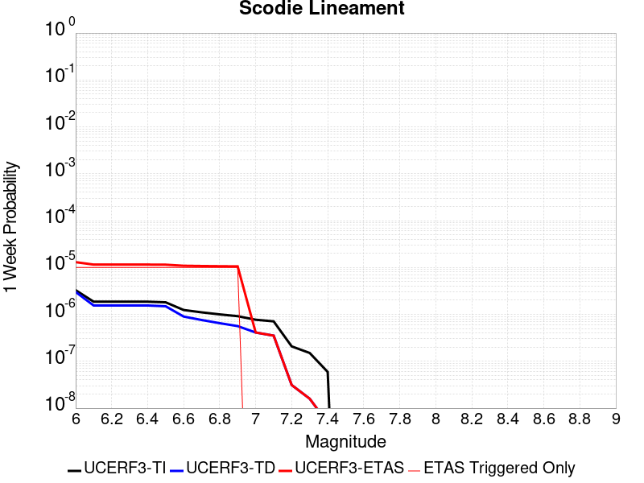 |  |  |  |

| Magnitude | 1 wk TI Prob | 1 wk TD Prob | 1 wk ETAS Prob | 1 wk ETAS/TD Gain | 1 wk ETAS Triggered Only | 1 mo TI Prob | 1 mo TD Prob | 1 mo ETAS Prob | 1 mo ETAS/TD Gain | 1 mo ETAS Triggered Only | 1 yr TI Prob | 1 yr TD Prob | 1 yr ETAS Prob | 1 yr ETAS/TD Gain | 1 yr ETAS Triggered Only | 10 yr TI Prob | 10 yr TD Prob | 10 yr ETAS Prob | 10 yr ETAS/TD Gain | 10 yr ETAS Triggered Only |
|-----|-----|-----|-----|-----|-----|-----|-----|-----|-----|-----|-----|-----|-----|-----|-----|-----|-----|-----|-----|-----|
| 6.0 | 3.2919327E-6 | 3.0133451E-6 | 1.3013315E-5 | 4.318561 | 1.0E-5 | 1.4108206E-5 | 1.2914291E-5 | 4.2913904E-5 | 3.322978 | 3.0E-5 | 1.7175387E-4 | 1.5722332E-4 | 2.4720916E-4 | 1.5723442 | 9.0E-5 | 0.0017162118 | 0.0015714325 | 0.0017811024 | 1.1334261 | 2.1E-4 |
| 6.1 | 1.8663811E-6 | 1.5490476E-6 | 1.1549032E-5 | 7.4555697 | 1.0E-5 | 7.998751E-6 | 6.6387615E-6 | 2.6638629E-5 | 4.0125904 | 2.0E-5 | 9.738045E-5 | 8.082442E-5 | 1.10821995E-4 | 1.371145 | 3.0E-5 | 9.7337784E-4 | 8.0799905E-4 | 8.9792634E-4 | 1.1112963 | 9.0E-5 |
| 6.2 | 1.8663811E-6 | 1.5490476E-6 | 1.1549032E-5 | 7.4555697 | 1.0E-5 | 7.998751E-6 | 6.6387615E-6 | 2.6638629E-5 | 4.0125904 | 2.0E-5 | 9.738045E-5 | 8.082442E-5 | 1.10821995E-4 | 1.371145 | 3.0E-5 | 9.7337784E-4 | 8.0799905E-4 | 8.9792634E-4 | 1.1112963 | 9.0E-5 |
| 6.3 | 1.8663811E-6 | 1.5490476E-6 | 1.1549032E-5 | 7.4555697 | 1.0E-5 | 7.998751E-6 | 6.6387615E-6 | 2.6638629E-5 | 4.0125904 | 2.0E-5 | 9.738045E-5 | 8.082442E-5 | 1.10821995E-4 | 1.371145 | 3.0E-5 | 9.7337784E-4 | 8.0799905E-4 | 8.9792634E-4 | 1.1112963 | 9.0E-5 |
| 6.4 | 1.8663811E-6 | 1.5490476E-6 | 1.1549032E-5 | 7.4555697 | 1.0E-5 | 7.998751E-6 | 6.6387615E-6 | 2.6638629E-5 | 4.0125904 | 2.0E-5 | 9.738045E-5 | 8.082442E-5 | 1.10821995E-4 | 1.371145 | 3.0E-5 | 9.7337784E-4 | 8.0799905E-4 | 8.9792634E-4 | 1.1112963 | 9.0E-5 |
| 6.5 | 1.8106311E-6 | 1.4909813E-6 | 1.1490966E-5 | 7.706982 | 1.0E-5 | 7.759824E-6 | 6.389907E-6 | 2.638978E-5 | 4.129916 | 2.0E-5 | 9.447177E-5 | 7.779484E-5 | 1.07792504E-4 | 1.3855997 | 3.0E-5 | 9.4431615E-4 | 7.777247E-4 | 8.676547E-4 | 1.1156322 | 9.0E-5 |
| 6.6 | 1.2414679E-6 | 8.997501E-7 | 1.0899741E-5 | 12.114187 | 1.0E-5 | 5.320566E-6 | 3.8560665E-6 | 2.385599E-5 | 6.1866126 | 2.0E-5 | 6.477596E-5 | 4.6946687E-5 | 6.694575E-5 | 1.4259951 | 2.0E-5 | 6.475708E-4 | 4.6937633E-4 | 5.1935285E-4 | 1.1064743 | 5.0E-5 |
| 6.7 | 1.1062215E-6 | 7.594247E-7 | 1.0759417E-5 | 14.167852 | 1.0E-5 | 4.7409408E-6 | 3.2546736E-6 | 2.3254608E-5 | 7.1449895 | 2.0E-5 | 5.7719422E-5 | 3.9625003E-5 | 5.962421E-5 | 1.5047119 | 2.0E-5 | 5.770443E-4 | 3.9618637E-4 | 4.3617052E-4 | 1.1009226 | 4.0E-5 |
| 6.8 | 1.0006736E-6 | 6.5003275E-7 | 1.06500265E-5 | 16.383831 | 1.0E-5 | 4.288594E-6 | 2.785852E-6 | 2.2785796E-5 | 8.179112 | 2.0E-5 | 5.221238E-5 | 3.3917284E-5 | 5.3916603E-5 | 1.5896499 | 2.0E-5 | 5.220012E-4 | 3.3912715E-4 | 3.7911357E-4 | 1.1179099 | 4.0E-5 |
| 6.9 | 9.167364E-7 | 5.6315514E-7 | 1.056315E-5 | 18.757086 | 1.0E-5 | 3.9288643E-6 | 2.4135202E-6 | 2.2413471E-5 | 9.286632 | 2.0E-5 | 4.7832873E-5 | 2.938427E-5 | 4.938368E-5 | 1.6806163 | 2.0E-5 | 4.782258E-4 | 2.938095E-4 | 3.3379777E-4 | 1.1361027 | 4.0E-5 |
| 7.0 | 7.6987664E-7 | 4.113303E-7 | 4.113303E-7 | 1.0 | 0.0 | 3.2994672E-6 | 1.7628431E-6 | 1.1762825E-5 | 6.6726446 | 1.0E-5 | 4.0170275E-5 | 2.1462443E-5 | 3.146223E-5 | 1.4659202 | 1.0E-5 | 4.0163012E-4 | 2.1460756E-4 | 2.3460327E-4 | 1.0931734 | 2.0E-5 |
| 7.1 | 7.1038727E-7 | 3.521066E-7 | 3.521066E-7 | 1.0 | 0.0 | 3.0445133E-6 | 1.5090276E-6 | 1.1509012E-5 | 7.626774 | 1.0E-5 | 3.706632E-5 | 1.8372291E-5 | 2.837211E-5 | 1.5442879 | 1.0E-5 | 3.7060137E-4 | 1.8371122E-4 | 2.0370755E-4 | 1.1088465 | 2.0E-5 |
| 7.2 | 2.0799602E-7 | 3.1178946E-8 | 3.1178946E-8 | 1.0 | 0.0 | 8.914113E-7 | 1.3362404E-7 | 1.0133623E-5 | 75.83682 | 1.0E-5 | 1.0852878E-5 | 1.6268716E-6 | 1.1626856E-5 | 7.1467566 | 1.0E-5 | 1.08523476E-4 | 1.6268605E-5 | 2.626844E-5 | 1.6146709 | 1.0E-5 |
| 7.3 | 1.5048182E-7 | 1.5939344E-8 | 1.5939344E-8 | 1.0 | 0.0 | 6.449219E-7 | 6.831147E-8 | 6.831147E-8 | 1.0 | 0.0 | 7.851896E-6 | 8.316919E-7 | 8.316919E-7 | 1.0 | 0.0 | 7.851618E-5 | 8.316891E-6 | 8.316891E-6 | 1.0 | 0.0 |
| 7.4 | 5.9334678E-8 | 4.8638475E-9 | 4.8638475E-9 | 1.0 | 0.0 | 2.5429145E-7 | 2.084506E-8 | 2.084506E-8 | 1.0 | 0.0 | 3.095994E-6 | 2.5378858E-7 | 2.5378858E-7 | 1.0 | 0.0 | 3.095951E-5 | 2.5378843E-6 | 2.5378843E-6 | 1.0 | 0.0 |

## San Jacinto (San Bernardino)
*[(top)](#table-of-contents)*

| 1 Week | 1 Month | 1 Year | 10 Year |
|-----|-----|-----|-----|
| 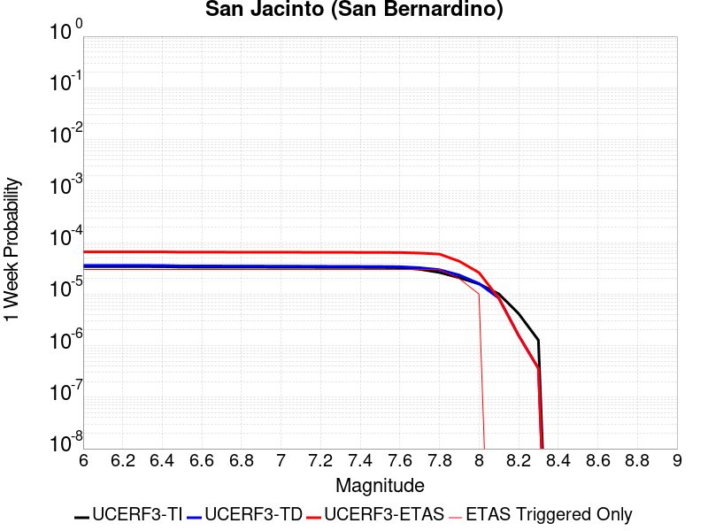 |  |  |  |

| Magnitude | 1 wk TI Prob | 1 wk TD Prob | 1 wk ETAS Prob | 1 wk ETAS/TD Gain | 1 wk ETAS Triggered Only | 1 mo TI Prob | 1 mo TD Prob | 1 mo ETAS Prob | 1 mo ETAS/TD Gain | 1 mo ETAS Triggered Only | 1 yr TI Prob | 1 yr TD Prob | 1 yr ETAS Prob | 1 yr ETAS/TD Gain | 1 yr ETAS Triggered Only | 10 yr TI Prob | 10 yr TD Prob | 10 yr ETAS Prob | 10 yr ETAS/TD Gain | 10 yr ETAS Triggered Only |
|-----|-----|-----|-----|-----|-----|-----|-----|-----|-----|-----|-----|-----|-----|-----|-----|-----|-----|-----|-----|-----|
| 6.0 | 3.409352E-5 | 3.6001682E-5 | 6.60006E-5 | 1.8332645 | 3.0E-5 | 1.461069E-4 | 1.542838E-4 | 1.8427917E-4 | 1.1944169 | 3.0E-5 | 0.0017774 | 0.0018767886 | 0.0019666196 | 1.0478642 | 9.0E-5 | 0.01763251 | 0.01935761 | 0.019553738 | 1.0101318 | 2.0E-4 |
| 6.1 | 3.409352E-5 | 3.6001682E-5 | 6.60006E-5 | 1.8332645 | 3.0E-5 | 1.461069E-4 | 1.542838E-4 | 1.8427917E-4 | 1.1944169 | 3.0E-5 | 0.0017774 | 0.0018767886 | 0.0019666196 | 1.0478642 | 9.0E-5 | 0.01763251 | 0.01935761 | 0.019553738 | 1.0101318 | 2.0E-4 |
| 6.2 | 3.409352E-5 | 3.6001682E-5 | 6.60006E-5 | 1.8332645 | 3.0E-5 | 1.461069E-4 | 1.542838E-4 | 1.8427917E-4 | 1.1944169 | 3.0E-5 | 0.0017774 | 0.0018767886 | 0.0019666196 | 1.0478642 | 9.0E-5 | 0.01763251 | 0.01935761 | 0.019553738 | 1.0101318 | 2.0E-4 |
| 6.3 | 3.409352E-5 | 3.6001682E-5 | 6.60006E-5 | 1.8332645 | 3.0E-5 | 1.461069E-4 | 1.542838E-4 | 1.8427917E-4 | 1.1944169 | 3.0E-5 | 0.0017774 | 0.0018767886 | 0.0019666196 | 1.0478642 | 9.0E-5 | 0.01763251 | 0.01935761 | 0.019553738 | 1.0101318 | 2.0E-4 |
| 6.4 | 3.400795E-5 | 3.5894343E-5 | 6.589326E-5 | 1.8357563 | 3.0E-5 | 1.4574021E-4 | 1.5382383E-4 | 1.8381923E-4 | 1.1949983 | 3.0E-5 | 0.0017729428 | 0.0018711982 | 0.0019610298 | 1.0480075 | 9.0E-5 | 0.017588645 | 0.01930269 | 0.019498829 | 1.0101613 | 2.0E-4 |
| 6.5 | 3.341482E-5 | 3.515495E-5 | 6.5153894E-5 | 1.8533349 | 3.0E-5 | 1.4319851E-4 | 1.5065537E-4 | 1.8065085E-4 | 1.1991 | 3.0E-5 | 0.0017420477 | 0.0018326874 | 0.0019125408 | 1.0435717 | 8.0E-5 | 0.017284546 | 0.018924221 | 0.019100815 | 1.0093316 | 1.8E-4 |
| 6.6 | 3.3364955E-5 | 3.5092165E-5 | 6.509111E-5 | 1.8548617 | 3.0E-5 | 1.4298483E-4 | 1.5038633E-4 | 1.8038182E-4 | 1.1994562 | 3.0E-5 | 0.0017394501 | 0.0018294173 | 0.001909271 | 1.0436498 | 8.0E-5 | 0.017258976 | 0.018892085 | 0.019068684 | 1.0093478 | 1.8E-4 |
| 6.7 | 3.335922E-5 | 3.508194E-5 | 6.508089E-5 | 1.8551109 | 3.0E-5 | 1.4296026E-4 | 1.503425E-4 | 1.80338E-4 | 1.1995144 | 3.0E-5 | 0.0017391514 | 0.0018288847 | 0.0019087384 | 1.0436625 | 8.0E-5 | 0.017256035 | 0.018886877 | 0.019063476 | 1.0093504 | 1.8E-4 |
| 6.8 | 3.327683E-5 | 3.4976E-5 | 6.497495E-5 | 1.8577011 | 3.0E-5 | 1.4260718E-4 | 1.4988854E-4 | 1.7988404E-4 | 1.2001188 | 3.0E-5 | 0.0017348597 | 0.0018233669 | 0.001903221 | 1.0437949 | 8.0E-5 | 0.017213784 | 0.018832648 | 0.019009257 | 1.0093778 | 1.8E-4 |
| 6.9 | 3.3235785E-5 | 3.491695E-5 | 6.4915905E-5 | 1.8591516 | 3.0E-5 | 1.4243131E-4 | 1.496355E-4 | 1.7963101E-4 | 1.2004572 | 3.0E-5 | 0.0017327217 | 0.0018202913 | 0.0019001457 | 1.043869 | 8.0E-5 | 0.017192734 | 0.018802516 | 0.018979132 | 1.0093932 | 1.8E-4 |
| 7.0 | 3.3197095E-5 | 3.485688E-5 | 6.4855834E-5 | 1.8606323 | 3.0E-5 | 1.422655E-4 | 1.4937807E-4 | 1.7937359E-4 | 1.2008027 | 3.0E-5 | 0.0017307063 | 0.0018171624 | 0.001897017 | 1.0439447 | 8.0E-5 | 0.017172894 | 0.01877189 | 0.018948512 | 1.0094088 | 1.8E-4 |
| 7.1 | 3.3129716E-5 | 3.473708E-5 | 6.4736036E-5 | 1.8636005 | 3.0E-5 | 1.4197677E-4 | 1.4886471E-4 | 1.7886025E-4 | 1.2014953 | 3.0E-5 | 0.0017271966 | 0.0018109226 | 0.0018907777 | 1.0440964 | 8.0E-5 | 0.017138338 | 0.01871097 | 0.018887604 | 1.0094401 | 1.8E-4 |
| 7.2 | 3.3034008E-5 | 3.4604524E-5 | 6.460348E-5 | 1.8669087 | 3.0E-5 | 1.4156665E-4 | 1.4829668E-4 | 1.7829222E-4 | 1.2022672 | 3.0E-5 | 0.0017222111 | 0.0018040182 | 0.001883874 | 1.0442655 | 8.0E-5 | 0.017089253 | 0.018643353 | 0.018819997 | 1.0094749 | 1.8E-4 |
| 7.3 | 3.2956614E-5 | 3.447227E-5 | 6.4471235E-5 | 1.8702347 | 3.0E-5 | 1.4123498E-4 | 1.4772992E-4 | 1.777255E-4 | 1.2030432 | 3.0E-5 | 0.0017181796 | 0.0017971295 | 0.0018769858 | 1.0444354 | 8.0E-5 | 0.017049557 | 0.018576099 | 0.018752754 | 1.0095099 | 1.8E-4 |
| 7.4 | 3.2915937E-5 | 3.4393954E-5 | 6.439292E-5 | 1.8722163 | 3.0E-5 | 1.4106068E-4 | 1.4739433E-4 | 1.7738991E-4 | 1.2035056 | 3.0E-5 | 0.0017160608 | 0.0017930503 | 0.0018729069 | 1.0445367 | 8.0E-5 | 0.017028693 | 0.01853637 | 0.018713035 | 1.0095307 | 1.8E-4 |
| 7.5 | 3.281791E-5 | 3.4258854E-5 | 6.425782E-5 | 1.8756561 | 3.0E-5 | 1.406406E-4 | 1.468154E-4 | 1.76811E-4 | 1.2043083 | 3.0E-5 | 0.0017109542 | 0.0017860134 | 0.0018658706 | 1.0447125 | 8.0E-5 | 0.016978411 | 0.01846725 | 0.018643925 | 1.009567 | 1.8E-4 |
| 7.6 | 3.2521442E-5 | 3.3983775E-5 | 6.3982756E-5 | 1.8827442 | 3.0E-5 | 1.3937015E-4 | 1.4563663E-4 | 1.7563226E-4 | 1.2059622 | 3.0E-5 | 0.0016955109 | 0.0017716853 | 0.0018515436 | 1.0450747 | 8.0E-5 | 0.016826328 | 0.018324887 | 0.01850159 | 1.0096427 | 1.8E-4 |
| 7.7 | 3.0287873E-5 | 3.2467702E-5 | 6.246673E-5 | 1.9239651 | 3.0E-5 | 1.297987E-4 | 1.3913988E-4 | 1.6913572E-4 | 1.2155803 | 3.0E-5 | 0.0015791537 | 0.001692713 | 0.0017725775 | 1.0471814 | 8.0E-5 | 0.01567979 | 0.017535618 | 0.01771246 | 1.0100849 | 1.8E-4 |
| 7.8 | 2.6316151E-5 | 2.9678076E-5 | 5.9677186E-5 | 2.0108173 | 3.0E-5 | 1.1277862E-4 | 1.2718556E-4 | 1.5718174E-4 | 1.2358458 | 3.0E-5 | 0.0013722149 | 0.0015473852 | 0.0016272615 | 1.0516201 | 8.0E-5 | 0.013637724 | 0.016076857 | 0.016253963 | 1.0110162 | 1.8E-4 |
| 7.9 | 2.0761147E-5 | 2.343051E-5 | 4.3430042E-5 | 1.8535678 | 2.0E-5 | 8.897331E-5 | 1.0041261E-4 | 1.204106E-4 | 1.1991582 | 2.0E-5 | 0.0010827117 | 0.0012218388 | 0.0012917533 | 1.0572207 | 7.0E-5 | 0.010774517 | 0.012799647 | 0.012967471 | 1.0131116 | 1.7E-4 |
| 8.0 | 1.5738568E-5 | 1.604239E-5 | 2.604223E-5 | 1.6233386 | 1.0E-5 | 6.744926E-5 | 6.875129E-5 | 7.87506E-5 | 1.1454418 | 1.0E-5 | 8.2088535E-4 | 8.3672616E-4 | 8.5670943E-4 | 1.0238826 | 2.0E-5 | 0.008178596 | 0.008870586 | 0.008939966 | 1.0078212 | 7.0E-5 |
| 8.1 | 1.0105832E-5 | 8.335246E-6 | 8.335246E-6 | 1.0 | 0.0 | 4.3309992E-5 | 3.5721994E-5 | 3.5721994E-5 | 1.0 | 0.0 | 5.2717153E-4 | 4.34829E-4 | 4.4482466E-4 | 1.0229876 | 1.0E-5 | 0.005259227 | 0.0046798005 | 0.004689754 | 1.0021268 | 1.0E-5 |
| 8.2 | 4.189207E-6 | 1.5793896E-6 | 1.5793896E-6 | 1.0 | 0.0 | 1.7953622E-5 | 6.768795E-6 | 6.768795E-6 | 1.0 | 0.0 | 2.1856341E-4 | 8.2406994E-5 | 8.2406994E-5 | 1.0 | 0.0 | 0.0021834858 | 9.571454E-4 | 9.571454E-4 | 1.0 | 0.0 |
| 8.3 | 1.2758221E-6 | 3.6171858E-7 | 3.6171858E-7 | 1.0 | 0.0 | 5.4677976E-6 | 1.5502216E-6 | 1.5502216E-6 | 1.0 | 0.0 | 6.65684E-5 | 1.8873789E-5 | 1.8873789E-5 | 1.0 | 0.0 | 6.6548464E-4 | 2.2764095E-4 | 2.2764095E-4 | 1.0 | 0.0 |

## Manix-Afton Hills
*[(top)](#table-of-contents)*

| 1 Week | 1 Month | 1 Year | 10 Year |
|-----|-----|-----|-----|
|  |  |  | 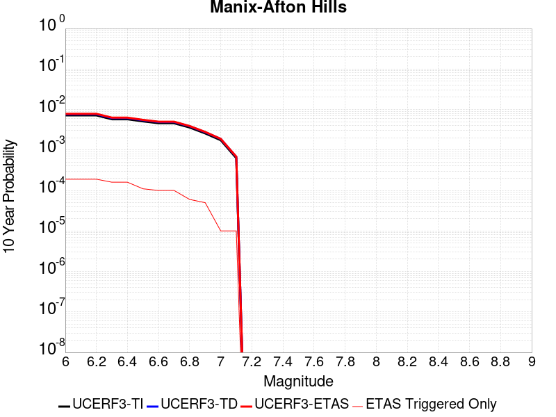 |

| Magnitude | 1 wk TI Prob | 1 wk TD Prob | 1 wk ETAS Prob | 1 wk ETAS/TD Gain | 1 wk ETAS Triggered Only | 1 mo TI Prob | 1 mo TD Prob | 1 mo ETAS Prob | 1 mo ETAS/TD Gain | 1 mo ETAS Triggered Only | 1 yr TI Prob | 1 yr TD Prob | 1 yr ETAS Prob | 1 yr ETAS/TD Gain | 1 yr ETAS Triggered Only | 10 yr TI Prob | 10 yr TD Prob | 10 yr ETAS Prob | 10 yr ETAS/TD Gain | 10 yr ETAS Triggered Only |
|-----|-----|-----|-----|-----|-----|-----|-----|-----|-----|-----|-----|-----|-----|-----|-----|-----|-----|-----|-----|-----|
| 6.0 | 1.3783202E-5 | 1.4711221E-5 | 1.4711221E-5 | 1.0 | 0.0 | 5.906953E-5 | 6.304667E-5 | 7.304604E-5 | 1.1586027 | 1.0E-5 | 7.189342E-4 | 7.673403E-4 | 8.5727125E-4 | 1.1171982 | 9.0E-5 | 0.0071661277 | 0.007648664 | 0.007837211 | 1.0246509 | 1.9E-4 |
| 6.1 | 1.3783202E-5 | 1.4711221E-5 | 1.4711221E-5 | 1.0 | 0.0 | 5.906953E-5 | 6.304667E-5 | 7.304604E-5 | 1.1586027 | 1.0E-5 | 7.189342E-4 | 7.673403E-4 | 8.5727125E-4 | 1.1171982 | 9.0E-5 | 0.0071661277 | 0.007648664 | 0.007837211 | 1.0246509 | 1.9E-4 |
| 6.2 | 1.3783202E-5 | 1.4711221E-5 | 1.4711221E-5 | 1.0 | 0.0 | 5.906953E-5 | 6.304667E-5 | 7.304604E-5 | 1.1586027 | 1.0E-5 | 7.189342E-4 | 7.673403E-4 | 8.5727125E-4 | 1.1171982 | 9.0E-5 | 0.0071661277 | 0.007648664 | 0.007837211 | 1.0246509 | 1.9E-4 |
| 6.3 | 1.10494875E-5 | 1.1793241E-5 | 1.1793241E-5 | 1.0 | 0.0 | 4.7354086E-5 | 5.054154E-5 | 6.0541035E-5 | 1.197847 | 1.0E-5 | 5.763835E-4 | 6.151799E-4 | 6.951307E-4 | 1.1299633 | 8.0E-5 | 0.005748908 | 0.00613581 | 0.0062948284 | 1.0259165 | 1.6E-4 |
| 6.4 | 1.10494875E-5 | 1.1793241E-5 | 1.1793241E-5 | 1.0 | 0.0 | 4.7354086E-5 | 5.054154E-5 | 6.0541035E-5 | 1.197847 | 1.0E-5 | 5.763835E-4 | 6.151799E-4 | 6.951307E-4 | 1.1299633 | 8.0E-5 | 0.005748908 | 0.00613581 | 0.0062948284 | 1.0259165 | 1.6E-4 |
| 6.5 | 9.788949E-6 | 1.0454414E-5 | 1.0454414E-5 | 1.0 | 0.0 | 4.1951964E-5 | 4.4803914E-5 | 5.4803466E-5 | 1.2231848 | 1.0E-5 | 5.1064545E-4 | 5.4536044E-4 | 5.953332E-4 | 1.0916325 | 5.0E-5 | 0.0050947363 | 0.005441148 | 0.005550549 | 1.0201063 | 1.1E-4 |
| 6.6 | 8.810006E-6 | 9.413714E-6 | 9.413714E-6 | 1.0 | 0.0 | 3.775662E-5 | 4.0343915E-5 | 5.034351E-5 | 1.2478589 | 1.0E-5 | 4.5958988E-4 | 4.9108535E-4 | 5.410608E-4 | 1.1017653 | 5.0E-5 | 0.0045864056 | 0.004900884 | 0.0050003934 | 1.0203044 | 1.0E-4 |
| 6.7 | 8.80128E-6 | 9.404193E-6 | 9.404193E-6 | 1.0 | 0.0 | 3.7719226E-5 | 4.0303115E-5 | 5.030271E-5 | 1.2481098 | 1.0E-5 | 4.591348E-4 | 4.9058883E-4 | 5.405643E-4 | 1.1018684 | 5.0E-5 | 0.004581874 | 0.0048959404 | 0.004995451 | 1.0203251 | 1.0E-4 |
| 6.8 | 6.8994877E-6 | 7.3801443E-6 | 7.3801443E-6 | 1.0 | 0.0 | 2.9568899E-5 | 3.1628853E-5 | 3.1628853E-5 | 1.0 | 0.0 | 3.5994186E-4 | 3.850214E-4 | 4.050137E-4 | 1.0519252 | 2.0E-5 | 0.003593594 | 0.0038443485 | 0.0039041177 | 1.0155473 | 6.0E-5 |
| 6.9 | 4.9328037E-6 | 5.2710093E-6 | 5.2710093E-6 | 1.0 | 0.0 | 2.1140417E-5 | 2.258988E-5 | 2.258988E-5 | 1.0 | 0.0 | 2.5735417E-4 | 2.7500323E-4 | 2.9499774E-4 | 1.0727065 | 2.0E-5 | 0.0025705635 | 0.0027472344 | 0.0027970972 | 1.0181501 | 5.0E-5 |
| 7.0 | 3.347973E-6 | 3.5900646E-6 | 3.5900646E-6 | 1.0 | 0.0 | 1.4348378E-5 | 1.5385924E-5 | 1.5385924E-5 | 1.0 | 0.0 | 1.746775E-4 | 1.8731161E-4 | 1.8731161E-4 | 1.0 | 0.0 | 0.0017454025 | 0.00187194 | 0.0018819212 | 1.005332 | 1.0E-5 |
| 7.1 | 1.2073567E-6 | 1.2934943E-6 | 1.2934943E-6 | 1.0 | 0.0 | 5.1743755E-6 | 5.5435444E-6 | 5.5435444E-6 | 1.0 | 0.0 | 6.29962E-5 | 6.74922E-5 | 6.74922E-5 | 1.0 | 0.0 | 6.297835E-4 | 6.7487714E-4 | 6.848704E-4 | 1.0148075 | 1.0E-5 |

## Death Valley (Fish Lake Valley)
*[(top)](#table-of-contents)*

| 1 Week | 1 Month | 1 Year | 10 Year |
|-----|-----|-----|-----|
|  |  |  |  |

| Magnitude | 1 wk TI Prob | 1 wk TD Prob | 1 wk ETAS Prob | 1 wk ETAS/TD Gain | 1 wk ETAS Triggered Only | 1 mo TI Prob | 1 mo TD Prob | 1 mo ETAS Prob | 1 mo ETAS/TD Gain | 1 mo ETAS Triggered Only | 1 yr TI Prob | 1 yr TD Prob | 1 yr ETAS Prob | 1 yr ETAS/TD Gain | 1 yr ETAS Triggered Only | 10 yr TI Prob | 10 yr TD Prob | 10 yr ETAS Prob | 10 yr ETAS/TD Gain | 10 yr ETAS Triggered Only |
|-----|-----|-----|-----|-----|-----|-----|-----|-----|-----|-----|-----|-----|-----|-----|-----|-----|-----|-----|-----|-----|
| 6.0 | 3.872328E-5 | 4.7267124E-5 | 5.726665E-5 | 1.2115536 | 1.0E-5 | 1.6594635E-4 | 2.0255933E-4 | 2.2255527E-4 | 1.0987165 | 2.0E-5 | 0.0020185246 | 0.002463633 | 0.002573362 | 1.0445395 | 1.1E-4 | 0.02000288 | 0.024389042 | 0.024564652 | 1.0072004 | 1.8E-4 |
| 6.1 | 3.872328E-5 | 4.7267124E-5 | 5.726665E-5 | 1.2115536 | 1.0E-5 | 1.6594635E-4 | 2.0255933E-4 | 2.2255527E-4 | 1.0987165 | 2.0E-5 | 0.0020185246 | 0.002463633 | 0.002573362 | 1.0445395 | 1.1E-4 | 0.02000288 | 0.024389042 | 0.024564652 | 1.0072004 | 1.8E-4 |
| 6.2 | 3.872328E-5 | 4.7267124E-5 | 5.726665E-5 | 1.2115536 | 1.0E-5 | 1.6594635E-4 | 2.0255933E-4 | 2.2255527E-4 | 1.0987165 | 2.0E-5 | 0.0020185246 | 0.002463633 | 0.002573362 | 1.0445395 | 1.1E-4 | 0.02000288 | 0.024389042 | 0.024564652 | 1.0072004 | 1.8E-4 |
| 6.3 | 2.8356371E-5 | 3.361063E-5 | 4.3610296E-5 | 1.2975149 | 1.0E-5 | 1.2152165E-4 | 1.4403803E-4 | 1.6403515E-4 | 1.1388322 | 2.0E-5 | 0.0014785219 | 0.0017523223 | 0.001852147 | 1.0569671 | 1.0E-4 | 0.014687235 | 0.017392244 | 0.017559286 | 1.0096045 | 1.7E-4 |
| 6.4 | 2.8356371E-5 | 3.361063E-5 | 4.3610296E-5 | 1.2975149 | 1.0E-5 | 1.2152165E-4 | 1.4403803E-4 | 1.6403515E-4 | 1.1388322 | 2.0E-5 | 0.0014785219 | 0.0017523223 | 0.001852147 | 1.0569671 | 1.0E-4 | 0.014687235 | 0.017392244 | 0.017559286 | 1.0096045 | 1.7E-4 |
| 6.5 | 2.4448687E-5 | 2.8608241E-5 | 3.8607956E-5 | 1.3495396 | 1.0E-5 | 1.0477588E-4 | 1.2260124E-4 | 1.4259879E-4 | 1.1631105 | 2.0E-5 | 0.0012748998 | 0.0014916958 | 0.0015915466 | 1.0669378 | 1.0E-4 | 0.012676105 | 0.014821727 | 0.014979356 | 1.010635 | 1.6E-4 |
| 6.6 | 2.1298161E-5 | 2.4660607E-5 | 3.466036E-5 | 1.405495 | 1.0E-5 | 9.127464E-5 | 1.05684194E-4 | 1.2568208E-4 | 1.189223 | 2.0E-5 | 0.0011107022 | 0.0012859785 | 0.0013758627 | 1.0698956 | 9.0E-5 | 0.011051672 | 0.0127888 | 0.012936881 | 1.011579 | 1.5E-4 |
| 6.7 | 1.8959729E-5 | 2.178146E-5 | 3.178124E-5 | 1.4590961 | 1.0E-5 | 8.125345E-5 | 9.334592E-5 | 1.1334405E-4 | 1.2142369 | 2.0E-5 | 9.888117E-4 | 0.0011359196 | 0.0012258174 | 1.0791409 | 9.0E-5 | 0.009844234 | 0.011303795 | 0.011452098 | 1.0131199 | 1.5E-4 |
| 6.8 | 1.6691629E-5 | 1.9018706E-5 | 2.9018516E-5 | 1.5257881 | 1.0E-5 | 7.153359E-5 | 8.150629E-5 | 1.0150466E-4 | 1.2453598 | 2.0E-5 | 8.7057345E-4 | 9.919042E-4 | 0.0010818149 | 1.0906446 | 9.0E-5 | 0.008671708 | 0.009876527 | 0.010025045 | 1.0150375 | 1.5E-4 |
| 6.9 | 1.450505E-5 | 1.6389824E-5 | 2.638966E-5 | 1.6101247 | 1.0E-5 | 6.216302E-5 | 7.024026E-5 | 9.023886E-5 | 1.284717 | 2.0E-5 | 7.5657194E-4 | 8.548484E-4 | 9.447715E-4 | 1.1051918 | 9.0E-5 | 0.007540013 | 0.008516532 | 0.008665255 | 1.0174628 | 1.5E-4 |
| 7.0 | 1.2940855E-5 | 1.453821E-5 | 2.4538065E-5 | 1.6878326 | 1.0E-5 | 5.545963E-5 | 6.230516E-5 | 8.2303915E-5 | 1.3209807 | 2.0E-5 | 6.750118E-4 | 7.583071E-4 | 8.482389E-4 | 1.1185954 | 9.0E-5 | 0.006729651 | 0.0075578135 | 0.00770668 | 1.019697 | 1.5E-4 |
| 7.1 | 1.2544658E-5 | 1.4078437E-5 | 2.4078296E-5 | 1.7102962 | 1.0E-5 | 5.3761712E-5 | 6.033479E-5 | 8.0333586E-5 | 1.3314637 | 2.0E-5 | 6.5435225E-4 | 7.343341E-4 | 8.2426803E-4 | 1.12247 | 9.0E-5 | 0.006524288 | 0.0073196692 | 0.0074685714 | 1.0203427 | 1.5E-4 |
| 7.2 | 1.2489416E-5 | 1.4015902E-5 | 2.4015762E-5 | 1.7134653 | 1.0E-5 | 5.3524967E-5 | 6.00668E-5 | 8.00656E-5 | 1.3329426 | 2.0E-5 | 6.514716E-4 | 7.310735E-4 | 8.210077E-4 | 1.1230166 | 9.0E-5 | 0.006495651 | 0.007287278 | 0.0074361847 | 1.0204338 | 1.5E-4 |
| 7.3 | 1.2368307E-5 | 1.3880038E-5 | 2.3879898E-5 | 1.7204491 | 1.0E-5 | 5.3005948E-5 | 5.948455E-5 | 7.948336E-5 | 1.3362018 | 2.0E-5 | 6.451563E-4 | 7.239894E-4 | 8.1392424E-4 | 1.1242212 | 9.0E-5 | 0.0064328653 | 0.0072168987 | 0.0073658163 | 1.0206345 | 1.5E-4 |
| 7.4 | 1.2161707E-5 | 1.3648089E-5 | 2.3647954E-5 | 1.7326933 | 1.0E-5 | 5.212056E-5 | 5.8490532E-5 | 7.8489364E-5 | 1.3419157 | 2.0E-5 | 6.3438306E-4 | 7.118952E-4 | 8.018311E-4 | 1.1263331 | 9.0E-5 | 0.006325751 | 0.0070967353 | 0.007245671 | 1.0209864 | 1.5E-4 |
| 7.5 | 1.1707948E-5 | 1.314573E-5 | 2.3145598E-5 | 1.7606933 | 1.0E-5 | 5.0175953E-5 | 5.6337656E-5 | 7.633653E-5 | 1.3549824 | 2.0E-5 | 6.10721E-4 | 6.857007E-4 | 7.7563897E-4 | 1.1311626 | 9.0E-5 | 0.0060904534 | 0.0068364325 | 0.006985407 | 1.0217912 | 1.5E-4 |
| 7.6 | 1.0319538E-5 | 1.157981E-5 | 2.1579694E-5 | 1.863562 | 1.0E-5 | 4.4225842E-5 | 4.9626844E-5 | 6.962585E-5 | 1.4029877 | 2.0E-5 | 5.383166E-4 | 6.040445E-4 | 6.939901E-4 | 1.1489056 | 9.0E-5 | 0.0053701443 | 0.0060245576 | 0.006173654 | 1.0247481 | 1.5E-4 |
| 7.7 | 8.937764E-6 | 1.0022941E-5 | 1.0022941E-5 | 1.0 | 0.0 | 3.830414E-5 | 4.295478E-5 | 5.295435E-5 | 1.232793 | 1.0E-5 | 4.6625308E-4 | 5.2285404E-4 | 6.0281216E-4 | 1.1529263 | 8.0E-5 | 0.0046527605 | 0.005216748 | 0.005356018 | 1.0266967 | 1.4E-4 |
| 7.8 | 3.108007E-7 | 3.2846788E-7 | 3.2846788E-7 | 1.0 | 0.0 | 1.3320023E-6 | 1.4077187E-6 | 1.4077187E-6 | 1.0 | 0.0 | 1.6217007E-5 | 1.7138846E-5 | 1.7138846E-5 | 1.0 | 0.0 | 1.6215823E-4 | 1.713756E-4 | 1.713756E-4 | 1.0 | 0.0 |
| 7.9 | 2.5591178E-9 | 2.6696871E-9 | 2.6696871E-9 | 1.0 | 0.0 | 1.0967647E-8 | 1.1441516E-8 | 1.1441516E-8 | 1.0 | 0.0 | 1.335311E-7 | 1.3930045E-7 | 1.3930045E-7 | 1.0 | 0.0 | 1.3353102E-6 | 1.3930046E-6 | 1.3930046E-6 | 1.0 | 0.0 |

## San Andreas (Carrizo) rev
*[(top)](#table-of-contents)*

| 1 Week | 1 Month | 1 Year | 10 Year |
|-----|-----|-----|-----|
|  |  | 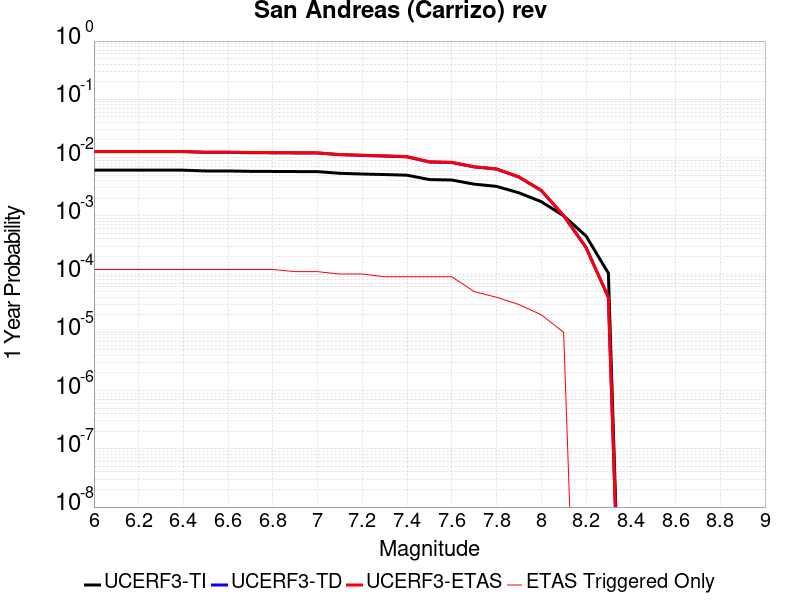 |  |

| Magnitude | 1 wk TI Prob | 1 wk TD Prob | 1 wk ETAS Prob | 1 wk ETAS/TD Gain | 1 wk ETAS Triggered Only | 1 mo TI Prob | 1 mo TD Prob | 1 mo ETAS Prob | 1 mo ETAS/TD Gain | 1 mo ETAS Triggered Only | 1 yr TI Prob | 1 yr TD Prob | 1 yr ETAS Prob | 1 yr ETAS/TD Gain | 1 yr ETAS Triggered Only | 10 yr TI Prob | 10 yr TD Prob | 10 yr ETAS Prob | 10 yr ETAS/TD Gain | 10 yr ETAS Triggered Only |
|-----|-----|-----|-----|-----|-----|-----|-----|-----|-----|-----|-----|-----|-----|-----|-----|-----|-----|-----|-----|-----|
| 6.0 | 1.1674632E-4 | 2.4333803E-4 | 2.6333318E-4 | 1.0821702 | 2.0E-5 | 5.002454E-4 | 0.0010424621 | 0.0010724309 | 1.028748 | 3.0E-5 | 0.006073493 | 0.012618599 | 0.012737085 | 1.0093898 | 1.2E-4 | 0.0591016 | 0.12066075 | 0.12081903 | 1.0013118 | 1.8E-4 |
| 6.1 | 1.1674632E-4 | 2.4333803E-4 | 2.6333318E-4 | 1.0821702 | 2.0E-5 | 5.002454E-4 | 0.0010424621 | 0.0010724309 | 1.028748 | 3.0E-5 | 0.006073493 | 0.012618599 | 0.012737085 | 1.0093898 | 1.2E-4 | 0.0591016 | 0.12066075 | 0.12081903 | 1.0013118 | 1.8E-4 |
| 6.2 | 1.1674632E-4 | 2.4333803E-4 | 2.6333318E-4 | 1.0821702 | 2.0E-5 | 5.002454E-4 | 0.0010424621 | 0.0010724309 | 1.028748 | 3.0E-5 | 0.006073493 | 0.012618599 | 0.012737085 | 1.0093898 | 1.2E-4 | 0.0591016 | 0.12066075 | 0.12081903 | 1.0013118 | 1.8E-4 |
| 6.3 | 1.1674632E-4 | 2.4333803E-4 | 2.6333318E-4 | 1.0821702 | 2.0E-5 | 5.002454E-4 | 0.0010424621 | 0.0010724309 | 1.028748 | 3.0E-5 | 0.006073493 | 0.012618599 | 0.012737085 | 1.0093898 | 1.2E-4 | 0.0591016 | 0.12066075 | 0.12081903 | 1.0013118 | 1.8E-4 |
| 6.4 | 1.1674632E-4 | 2.4333803E-4 | 2.6333318E-4 | 1.0821702 | 2.0E-5 | 5.002454E-4 | 0.0010424621 | 0.0010724309 | 1.028748 | 3.0E-5 | 0.006073493 | 0.012618599 | 0.012737085 | 1.0093898 | 1.2E-4 | 0.0591016 | 0.12066075 | 0.12081903 | 1.0013118 | 1.8E-4 |
| 6.5 | 1.13136164E-4 | 2.3653745E-4 | 2.5653272E-4 | 1.0845332 | 2.0E-5 | 4.847792E-4 | 0.0010133396 | 0.0010433092 | 1.0295751 | 3.0E-5 | 0.0058862255 | 0.012268067 | 0.012386595 | 1.0096614 | 1.2E-4 | 0.057327334 | 0.11763024 | 0.117789075 | 1.0013502 | 1.8E-4 |
| 6.6 | 1.13136164E-4 | 2.3653745E-4 | 2.5653272E-4 | 1.0845332 | 2.0E-5 | 4.847792E-4 | 0.0010133396 | 0.0010433092 | 1.0295751 | 3.0E-5 | 0.0058862255 | 0.012268067 | 0.012386595 | 1.0096614 | 1.2E-4 | 0.057327334 | 0.11763024 | 0.117789075 | 1.0013502 | 1.8E-4 |
| 6.7 | 1.1149675E-4 | 2.334492E-4 | 2.5344454E-4 | 1.0856518 | 2.0E-5 | 4.777557E-4 | 0.0010001145 | 0.0010300844 | 1.0299666 | 3.0E-5 | 0.0058011734 | 0.012108848 | 0.012227396 | 1.0097901 | 1.2E-4 | 0.05652051 | 0.11625791 | 0.11641699 | 1.0013683 | 1.8E-4 |
| 6.8 | 1.1103589E-4 | 2.324707E-4 | 2.5246604E-4 | 1.0860124 | 2.0E-5 | 4.7578133E-4 | 9.959241E-4 | 0.0010258942 | 1.0300928 | 3.0E-5 | 0.005777263 | 0.012058397 | 0.0121769495 | 1.0098315 | 1.2E-4 | 0.056293584 | 0.11581856 | 0.11597771 | 1.0013741 | 1.8E-4 |
| 6.9 | 1.1053259E-4 | 2.3139441E-4 | 2.5138978E-4 | 1.0864125 | 2.0E-5 | 4.7362508E-4 | 9.91315E-4 | 0.0010212852 | 1.0302328 | 3.0E-5 | 0.0057511497 | 0.0120029 | 0.01211158 | 1.0090544 | 1.1E-4 | 0.05604569 | 0.115334466 | 0.115484856 | 1.001304 | 1.7E-4 |
| 7.0 | 1.1005377E-4 | 2.304026E-4 | 2.5039798E-4 | 1.0867846 | 2.0E-5 | 4.7157376E-4 | 9.870676E-4 | 0.0010170379 | 1.0303631 | 3.0E-5 | 0.0057263062 | 0.011951757 | 0.012060442 | 1.0090936 | 1.1E-4 | 0.055809796 | 0.1148876 | 0.11502922 | 1.0012326 | 1.6E-4 |
| 7.1 | 1.0308142E-4 | 2.154949E-4 | 2.3549059E-4 | 1.0927896 | 2.0E-5 | 4.417027E-4 | 9.2322374E-4 | 9.53196E-4 | 1.0324649 | 3.0E-5 | 0.0053644776 | 0.011182634 | 0.0112815155 | 1.0088425 | 1.0E-4 | 0.052368138 | 0.10815858 | 0.108292356 | 1.0012368 | 1.5E-4 |
| 7.2 | 1.0027479E-4 | 2.0957364E-4 | 2.2956944E-4 | 1.0954119 | 2.0E-5 | 4.296783E-4 | 8.978646E-4 | 9.278376E-4 | 1.0333827 | 3.0E-5 | 0.0052187922 | 0.010877009 | 0.010975921 | 1.0090938 | 1.0E-4 | 0.050979212 | 0.10545821 | 0.10559239 | 1.0012723 | 1.5E-4 |
| 7.3 | 9.816942E-5 | 2.0432367E-4 | 2.1432164E-4 | 1.048932 | 1.0E-5 | 4.2065824E-4 | 8.7538E-4 | 8.953625E-4 | 1.0228273 | 2.0E-5 | 0.005109493 | 0.0106059555 | 0.010695001 | 1.0083958 | 9.0E-5 | 0.049935985 | 0.10304579 | 0.10317137 | 1.0012187 | 1.4E-4 |
| 7.4 | 9.5634205E-5 | 1.980169E-4 | 2.0801491E-4 | 1.0504907 | 1.0E-5 | 4.0979648E-4 | 8.4836874E-4 | 8.683518E-4 | 1.0235547 | 2.0E-5 | 0.0049778637 | 0.010280236 | 0.01036931 | 1.0086646 | 9.0E-5 | 0.048678253 | 0.100126535 | 0.10025252 | 1.0012583 | 1.4E-4 |
| 7.5 | 8.052417E-5 | 1.612143E-4 | 1.7121268E-4 | 1.0620192 | 1.0E-5 | 3.4505792E-4 | 6.9073564E-4 | 7.107218E-4 | 1.0289346 | 2.0E-5 | 0.0041929903 | 0.00837736 | 0.008466606 | 1.0106533 | 9.0E-5 | 0.04114753 | 0.08285146 | 0.082979865 | 1.0015497 | 1.4E-4 |
| 7.6 | 7.897024E-5 | 1.5774513E-4 | 1.6774356E-4 | 1.0633833 | 1.0E-5 | 3.384E-4 | 6.758756E-4 | 6.9586205E-4 | 1.0295713 | 2.0E-5 | 0.0041122385 | 0.008197814 | 0.008287077 | 1.0108886 | 9.0E-5 | 0.040369697 | 0.08119292 | 0.08132155 | 1.0015843 | 1.4E-4 |
| 7.7 | 6.707427E-5 | 1.3283793E-4 | 1.3283793E-4 | 1.0 | 0.0 | 2.8742946E-4 | 5.691813E-4 | 5.791756E-4 | 1.017559 | 1.0E-5 | 0.003493839 | 0.0069077956 | 0.0069574504 | 1.0071882 | 5.0E-5 | 0.034394164 | 0.069081694 | 0.06917478 | 1.0013475 | 1.0E-4 |
| 7.8 | 6.147705E-5 | 1.2204444E-4 | 1.2204444E-4 | 1.0 | 0.0 | 2.6344648E-4 | 5.229428E-4 | 5.329376E-4 | 1.0191126 | 1.0E-5 | 0.0032027436 | 0.0063482667 | 0.006388013 | 1.006261 | 4.0E-5 | 0.031569764 | 0.06354592 | 0.0636302 | 1.0013263 | 9.0E-5 |
| 7.9 | 4.7636717E-5 | 8.8847315E-5 | 8.8847315E-5 | 1.0 | 0.0 | 2.0414138E-4 | 3.8071864E-4 | 3.9071482E-4 | 1.0262561 | 1.0E-5 | 0.0024825884 | 0.0046254057 | 0.0046552666 | 1.0064559 | 3.0E-5 | 0.024550365 | 0.046651114 | 0.046708316 | 1.0012262 | 6.0E-5 |
| 8.0 | 3.3554235E-5 | 5.216579E-5 | 5.216579E-5 | 1.0 | 0.0 | 1.4379594E-4 | 2.2354853E-4 | 2.3354629E-4 | 1.044723 | 1.0E-5 | 0.0017493097 | 0.002718308 | 0.0027382537 | 1.0073376 | 2.0E-5 | 0.017356034 | 0.027894866 | 0.027943471 | 1.0017425 | 5.0E-5 |
| 8.1 | 1.9175432E-5 | 1.9196985E-5 | 1.9196985E-5 | 1.0 | 0.0 | 8.217783E-5 | 8.22702E-5 | 9.226938E-5 | 1.1215407 | 1.0E-5 | 0.0010000558 | 0.00100118 | 0.00101117 | 1.0099782 | 1.0E-5 | 0.009955673 | 0.010764282 | 0.010784067 | 1.001838 | 2.0E-5 |
| 8.2 | 8.643924E-6 | 5.478665E-6 | 5.478665E-6 | 1.0 | 0.0 | 3.704486E-5 | 2.3479783E-5 | 2.3479783E-5 | 1.0 | 0.0 | 4.5092785E-4 | 2.8582895E-4 | 2.8582895E-4 | 1.0 | 0.0 | 0.0045001395 | 0.0032508469 | 0.0032508469 | 1.0 | 0.0 |
| 8.3 | 1.983087E-6 | 7.6647797E-7 | 7.6647797E-7 | 1.0 | 0.0 | 8.498917E-6 | 3.2849016E-6 | 3.2849016E-6 | 1.0 | 0.0 | 1.034694E-4 | 3.999296E-5 | 3.999296E-5 | 1.0 | 0.0 | 0.0010342124 | 4.7228087E-4 | 4.7228087E-4 | 1.0 | 0.0 |

## Cady
*[(top)](#table-of-contents)*

| 1 Week | 1 Month | 1 Year | 10 Year |
|-----|-----|-----|-----|
|  |  |  | 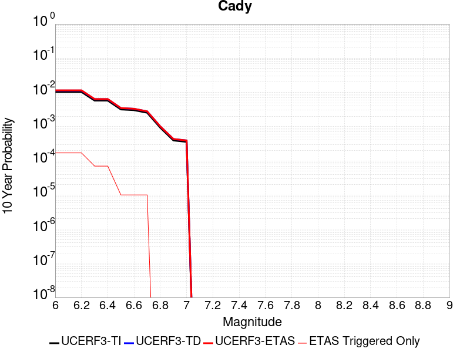 |

| Magnitude | 1 wk TI Prob | 1 wk TD Prob | 1 wk ETAS Prob | 1 wk ETAS/TD Gain | 1 wk ETAS Triggered Only | 1 mo TI Prob | 1 mo TD Prob | 1 mo ETAS Prob | 1 mo ETAS/TD Gain | 1 mo ETAS Triggered Only | 1 yr TI Prob | 1 yr TD Prob | 1 yr ETAS Prob | 1 yr ETAS/TD Gain | 1 yr ETAS Triggered Only | 10 yr TI Prob | 10 yr TD Prob | 10 yr ETAS Prob | 10 yr ETAS/TD Gain | 10 yr ETAS Triggered Only |
|-----|-----|-----|-----|-----|-----|-----|-----|-----|-----|-----|-----|-----|-----|-----|-----|-----|-----|-----|-----|-----|
| 6.0 | 1.9892565E-5 | 2.1859016E-5 | 3.18588E-5 | 1.4574671 | 1.0E-5 | 8.525106E-5 | 9.3678645E-5 | 1.336749E-4 | 1.4269516 | 4.0E-5 | 0.0010374374 | 0.0011400316 | 0.0012199405 | 1.0700935 | 8.0E-5 | 0.010326075 | 0.011350849 | 0.011518919 | 1.0148069 | 1.7E-4 |
| 6.1 | 1.9892565E-5 | 2.1859016E-5 | 3.18588E-5 | 1.4574671 | 1.0E-5 | 8.525106E-5 | 9.3678645E-5 | 1.336749E-4 | 1.4269516 | 4.0E-5 | 0.0010374374 | 0.0011400316 | 0.0012199405 | 1.0700935 | 8.0E-5 | 0.010326075 | 0.011350849 | 0.011518919 | 1.0148069 | 1.7E-4 |
| 6.2 | 1.9892565E-5 | 2.1859016E-5 | 3.18588E-5 | 1.4574671 | 1.0E-5 | 8.525106E-5 | 9.3678645E-5 | 1.336749E-4 | 1.4269516 | 4.0E-5 | 0.0010374374 | 0.0011400316 | 0.0012199405 | 1.0700935 | 8.0E-5 | 0.010326075 | 0.011350849 | 0.011518919 | 1.0148069 | 1.7E-4 |
| 6.3 | 1.1117327E-5 | 1.2176738E-5 | 2.2176615E-5 | 1.821228 | 1.0E-5 | 4.764482E-5 | 5.218515E-5 | 7.2184106E-5 | 1.3832308 | 2.0E-5 | 5.7992124E-4 | 6.3520053E-4 | 6.751751E-4 | 1.0629323 | 4.0E-5 | 0.0057841022 | 0.0063369554 | 0.0064065116 | 1.0109763 | 7.0E-5 |
| 6.4 | 1.1117327E-5 | 1.2176738E-5 | 2.2176615E-5 | 1.821228 | 1.0E-5 | 4.764482E-5 | 5.218515E-5 | 7.2184106E-5 | 1.3832308 | 2.0E-5 | 5.7992124E-4 | 6.3520053E-4 | 6.751751E-4 | 1.0629323 | 4.0E-5 | 0.0057841022 | 0.0063369554 | 0.0064065116 | 1.0109763 | 7.0E-5 |
| 6.5 | 6.103093E-6 | 6.672103E-6 | 6.672103E-6 | 1.0 | 0.0 | 2.615585E-5 | 2.8594486E-5 | 2.8594486E-5 | 1.0 | 0.0 | 3.1840094E-4 | 3.4809482E-4 | 3.5809132E-4 | 1.0287178 | 1.0E-5 | 0.0031794512 | 0.0034767296 | 0.0034866948 | 1.0028663 | 1.0E-5 |
| 6.6 | 5.817237E-6 | 6.365738E-6 | 6.365738E-6 | 1.0 | 0.0 | 2.4930776E-5 | 2.728152E-5 | 2.728152E-5 | 1.0 | 0.0 | 3.034899E-4 | 3.3211432E-4 | 3.4211102E-4 | 1.0301001 | 1.0E-5 | 0.0030307577 | 0.003317402 | 0.0033273688 | 1.0030044 | 1.0E-5 |
| 6.7 | 4.8846314E-6 | 5.3406343E-6 | 5.3406343E-6 | 1.0 | 0.0 | 2.0933967E-5 | 2.2888298E-5 | 2.2888298E-5 | 1.0 | 0.0 | 2.5484123E-4 | 2.7864118E-4 | 2.886384E-4 | 1.0358784 | 1.0E-5 | 0.0025454918 | 0.0027840736 | 0.0027940457 | 1.0035819 | 1.0E-5 |
| 6.8 | 1.7788773E-6 | 1.9399313E-6 | 1.9399313E-6 | 1.0 | 0.0 | 7.6237375E-6 | 8.313974E-6 | 8.313974E-6 | 1.0 | 0.0 | 9.281505E-5 | 1.01219506E-4 | 1.01219506E-4 | 1.0 | 0.0 | 9.2776294E-4 | 0.0010118886 | 0.0010118886 | 1.0 | 0.0 |
| 6.9 | 7.5455404E-7 | 8.297202E-7 | 8.297202E-7 | 1.0 | 0.0 | 3.233799E-6 | 3.5559406E-6 | 3.5559406E-6 | 1.0 | 0.0 | 3.937079E-5 | 4.3293054E-5 | 4.3293054E-5 | 1.0 | 0.0 | 3.9363815E-4 | 4.3287914E-4 | 4.3287914E-4 | 1.0 | 0.0 |
| 7.0 | 6.8578805E-7 | 7.541916E-7 | 7.541916E-7 | 1.0 | 0.0 | 2.9390883E-6 | 3.2322475E-6 | 3.2322475E-6 | 1.0 | 0.0 | 3.578281E-5 | 3.9352235E-5 | 3.9352235E-5 | 1.0 | 0.0 | 3.577705E-4 | 3.9348513E-4 | 3.9348513E-4 | 1.0 | 0.0 |

## White Wolf (Extension)
*[(top)](#table-of-contents)*

| 1 Week | 1 Month | 1 Year | 10 Year |
|-----|-----|-----|-----|
| 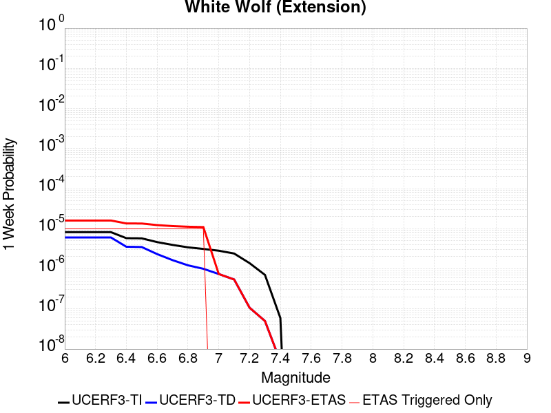 |  | 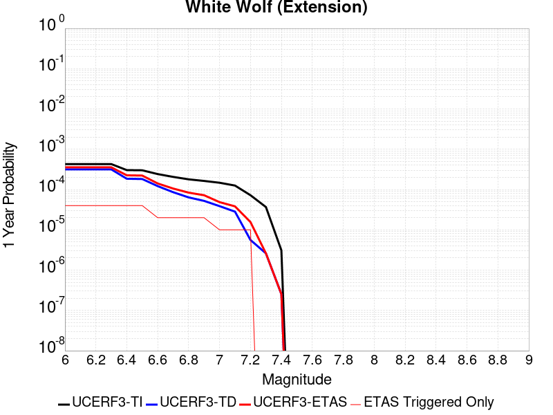 | 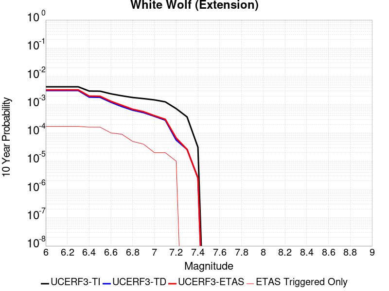 |

| Magnitude | 1 wk TI Prob | 1 wk TD Prob | 1 wk ETAS Prob | 1 wk ETAS/TD Gain | 1 wk ETAS Triggered Only | 1 mo TI Prob | 1 mo TD Prob | 1 mo ETAS Prob | 1 mo ETAS/TD Gain | 1 mo ETAS Triggered Only | 1 yr TI Prob | 1 yr TD Prob | 1 yr ETAS Prob | 1 yr ETAS/TD Gain | 1 yr ETAS Triggered Only | 10 yr TI Prob | 10 yr TD Prob | 10 yr ETAS Prob | 10 yr ETAS/TD Gain | 10 yr ETAS Triggered Only |
|-----|-----|-----|-----|-----|-----|-----|-----|-----|-----|-----|-----|-----|-----|-----|-----|-----|-----|-----|-----|-----|
| 6.0 | 8.222555E-6 | 6.0666557E-6 | 1.6066595E-5 | 2.6483445 | 1.0E-5 | 3.5239045E-5 | 2.5999732E-5 | 4.599921E-5 | 1.7692187 | 2.0E-5 | 4.289509E-4 | 3.165074E-4 | 3.564947E-4 | 1.1263393 | 4.0E-5 | 0.0042812387 | 0.0031612178 | 0.0033306805 | 1.0536067 | 1.7E-4 |
| 6.1 | 8.222555E-6 | 6.0666557E-6 | 1.6066595E-5 | 2.6483445 | 1.0E-5 | 3.5239045E-5 | 2.5999732E-5 | 4.599921E-5 | 1.7692187 | 2.0E-5 | 4.289509E-4 | 3.165074E-4 | 3.564947E-4 | 1.1263393 | 4.0E-5 | 0.0042812387 | 0.0031612178 | 0.0033306805 | 1.0536067 | 1.7E-4 |
| 6.2 | 8.222555E-6 | 6.0666557E-6 | 1.6066595E-5 | 2.6483445 | 1.0E-5 | 3.5239045E-5 | 2.5999732E-5 | 4.599921E-5 | 1.7692187 | 2.0E-5 | 4.289509E-4 | 3.165074E-4 | 3.564947E-4 | 1.1263393 | 4.0E-5 | 0.0042812387 | 0.0031612178 | 0.0033306805 | 1.0536067 | 1.7E-4 |
| 6.3 | 8.222555E-6 | 6.0666557E-6 | 1.6066595E-5 | 2.6483445 | 1.0E-5 | 3.5239045E-5 | 2.5999732E-5 | 4.599921E-5 | 1.7692187 | 2.0E-5 | 4.289509E-4 | 3.165074E-4 | 3.564947E-4 | 1.1263393 | 4.0E-5 | 0.0042812387 | 0.0031612178 | 0.0033306805 | 1.0536067 | 1.7E-4 |
| 6.4 | 5.821773E-6 | 3.5571516E-6 | 1.3557116E-5 | 3.811228 | 1.0E-5 | 2.4950215E-5 | 1.5244852E-5 | 3.5244546E-5 | 2.3118982 | 2.0E-5 | 3.0372653E-4 | 1.8559136E-4 | 2.2558394E-4 | 1.2154872 | 4.0E-5 | 0.0030331176 | 0.0018544721 | 0.0020141753 | 1.086118 | 1.6E-4 |
| 6.5 | 5.766023E-6 | 3.4990853E-6 | 1.34990505E-5 | 3.8578796 | 1.0E-5 | 2.4711293E-5 | 1.4996E-5 | 3.49957E-5 | 2.333669 | 2.0E-5 | 3.0081844E-4 | 1.825621E-4 | 2.225548E-4 | 1.2190635 | 4.0E-5 | 0.0030041158 | 0.0018242294 | 0.0019839376 | 1.0875483 | 1.6E-4 |
| 6.6 | 4.643576E-6 | 2.3325927E-6 | 1.2332569E-5 | 5.287065 | 1.0E-5 | 1.9900888E-5 | 9.99679E-6 | 2.999659E-5 | 3.0006223 | 2.0E-5 | 2.4226638E-4 | 1.2170455E-4 | 1.4170211E-4 | 1.1643124 | 2.0E-5 | 0.0024200242 | 0.0012164214 | 0.0013162998 | 1.0821084 | 1.0E-4 |
| 6.7 | 3.9529173E-6 | 1.6483134E-6 | 1.1648297E-5 | 7.0667973 | 1.0E-5 | 1.6940963E-5 | 7.0641822E-6 | 2.7064041E-5 | 3.831164 | 2.0E-5 | 2.0623671E-4 | 8.6003216E-5 | 1.0600149E-4 | 1.2325294 | 2.0E-5 | 0.002060454 | 8.5971784E-4 | 9.4964047E-4 | 1.1045955 | 9.0E-5 |
| 6.8 | 3.4377522E-6 | 1.2244896E-6 | 1.1224477E-5 | 9.166658 | 1.0E-5 | 1.473314E-5 | 5.247802E-6 | 2.5247697E-5 | 4.811099 | 2.0E-5 | 1.7936122E-4 | 6.389021E-5 | 8.388893E-5 | 1.313017 | 2.0E-5 | 0.0017921652 | 6.3872756E-4 | 6.8869564E-4 | 1.0782306 | 5.0E-5 |
| 6.9 | 3.1367306E-6 | 1.0033432E-6 | 1.1003333E-5 | 10.966669 | 1.0E-5 | 1.3443062E-5 | 4.300036E-6 | 2.429995E-5 | 5.651104 | 2.0E-5 | 1.63657E-4 | 5.2351756E-5 | 7.235071E-5 | 1.3820112 | 2.0E-5 | 0.0016353652 | 5.234019E-4 | 5.6338095E-4 | 1.0763831 | 4.0E-5 |
| 7.0 | 2.8298145E-6 | 7.4283355E-7 | 7.4283355E-7 | 1.0 | 0.0 | 1.2127721E-5 | 3.1835689E-6 | 1.3183537E-5 | 4.141119 | 1.0E-5 | 1.47645E-4 | 3.875931E-5 | 4.8758924E-5 | 1.2579925 | 1.0E-5 | 0.0014754693 | 3.875305E-4 | 4.0752275E-4 | 1.0515889 | 2.0E-5 |
| 7.1 | 2.4091064E-6 | 5.422472E-7 | 5.422472E-7 | 1.0 | 0.0 | 1.03247E-5 | 2.323915E-6 | 1.23238915E-5 | 5.3030734 | 1.0E-5 | 1.2569598E-4 | 2.8293338E-5 | 3.8293056E-5 | 1.35343 | 1.0E-5 | 0.001256249 | 2.829014E-4 | 3.0289573E-4 | 1.070676 | 2.0E-5 |
| 7.2 | 1.3875518E-6 | 1.074062E-7 | 1.074062E-7 | 1.0 | 0.0 | 5.9466374E-6 | 4.603122E-7 | 1.0460308E-5 | 22.724375 | 1.0E-5 | 7.23979E-5 | 5.604288E-6 | 1.5604232E-5 | 2.784338 | 1.0E-5 | 7.2374323E-4 | 5.604158E-5 | 6.604102E-5 | 1.1784289 | 1.0E-5 |
| 7.3 | 7.056077E-7 | 5.0005806E-8 | 5.0005806E-8 | 1.0 | 0.0 | 3.0240296E-6 | 2.1431059E-7 | 2.1431059E-7 | 1.0 | 0.0 | 3.681694E-5 | 2.6092287E-6 | 2.6092287E-6 | 1.0 | 0.0 | 3.681084E-4 | 2.6092028E-5 | 2.6092028E-5 | 1.0 | 0.0 |
| 7.4 | 5.9334678E-8 | 4.8638475E-9 | 4.8638475E-9 | 1.0 | 0.0 | 2.5429145E-7 | 2.084506E-8 | 2.084506E-8 | 1.0 | 0.0 | 3.095994E-6 | 2.5378858E-7 | 2.5378858E-7 | 1.0 | 0.0 | 3.095951E-5 | 2.5378843E-6 | 2.5378843E-6 | 1.0 | 0.0 |

## Elsinore (Glen Ivy) rev
*[(top)](#table-of-contents)*

| 1 Week | 1 Month | 1 Year | 10 Year |
|-----|-----|-----|-----|
|  |  |  |  |

| Magnitude | 1 wk TI Prob | 1 wk TD Prob | 1 wk ETAS Prob | 1 wk ETAS/TD Gain | 1 wk ETAS Triggered Only | 1 mo TI Prob | 1 mo TD Prob | 1 mo ETAS Prob | 1 mo ETAS/TD Gain | 1 mo ETAS Triggered Only | 1 yr TI Prob | 1 yr TD Prob | 1 yr ETAS Prob | 1 yr ETAS/TD Gain | 1 yr ETAS Triggered Only | 10 yr TI Prob | 10 yr TD Prob | 10 yr ETAS Prob | 10 yr ETAS/TD Gain | 10 yr ETAS Triggered Only |
|-----|-----|-----|-----|-----|-----|-----|-----|-----|-----|-----|-----|-----|-----|-----|-----|-----|-----|-----|-----|-----|
| 6.0 | 1.6204086E-4 | 2.9373635E-4 | 3.037334E-4 | 1.0340341 | 1.0E-5 | 6.94276E-4 | 0.0012584174 | 0.001298367 | 1.0317459 | 4.0E-5 | 0.008420097 | 0.01523484 | 0.015343165 | 1.0071102 | 1.1E-4 | 0.081081145 | 0.13962553 | 0.13976319 | 1.000986 | 1.6E-4 |
| 6.1 | 1.6204086E-4 | 2.9373635E-4 | 3.037334E-4 | 1.0340341 | 1.0E-5 | 6.94276E-4 | 0.0012584174 | 0.001298367 | 1.0317459 | 4.0E-5 | 0.008420097 | 0.01523484 | 0.015343165 | 1.0071102 | 1.1E-4 | 0.081081145 | 0.13962553 | 0.13976319 | 1.000986 | 1.6E-4 |
| 6.2 | 1.6204086E-4 | 2.9373635E-4 | 3.037334E-4 | 1.0340341 | 1.0E-5 | 6.94276E-4 | 0.0012584174 | 0.001298367 | 1.0317459 | 4.0E-5 | 0.008420097 | 0.01523484 | 0.015343165 | 1.0071102 | 1.1E-4 | 0.081081145 | 0.13962553 | 0.13976319 | 1.000986 | 1.6E-4 |
| 6.3 | 1.0111737E-4 | 1.7703637E-4 | 1.870346E-4 | 1.0564755 | 1.0E-5 | 4.332882E-4 | 7.586233E-4 | 7.98593E-4 | 1.052687 | 4.0E-5 | 0.005262531 | 0.009217811 | 0.009306981 | 1.0096737 | 9.0E-5 | 0.0513964 | 0.08707389 | 0.08719257 | 1.001363 | 1.3E-4 |
| 6.4 | 1.0111737E-4 | 1.7703637E-4 | 1.870346E-4 | 1.0564755 | 1.0E-5 | 4.332882E-4 | 7.586233E-4 | 7.98593E-4 | 1.052687 | 4.0E-5 | 0.005262531 | 0.009217811 | 0.009306981 | 1.0096737 | 9.0E-5 | 0.0513964 | 0.08707389 | 0.08719257 | 1.001363 | 1.3E-4 |
| 6.5 | 3.6624708E-5 | 4.6393732E-5 | 4.6393732E-5 | 1.0 | 0.0 | 1.569536E-4 | 1.9881714E-4 | 2.2881117E-4 | 1.1508625 | 3.0E-5 | 0.001909235 | 0.0024182722 | 0.0024481995 | 1.0123756 | 3.0E-5 | 0.01892915 | 0.023697015 | 0.023745831 | 1.0020599 | 5.0E-5 |
| 6.6 | 2.5051324E-5 | 2.6148944E-5 | 2.6148944E-5 | 1.0 | 0.0 | 1.073584E-4 | 1.1206234E-4 | 1.2206122E-4 | 1.089226 | 1.0E-5 | 0.0013063047 | 0.0013635496 | 0.001373536 | 1.0073237 | 1.0E-5 | 0.012986525 | 0.013565712 | 0.013575575 | 1.0007272 | 1.0E-5 |
| 6.7 | 2.2189772E-5 | 2.2073793E-5 | 2.2073793E-5 | 1.0 | 0.0 | 9.509556E-5 | 9.459874E-5 | 1.045978E-4 | 1.1056997 | 1.0E-5 | 0.0011571734 | 0.0011511676 | 0.001161156 | 1.0086769 | 1.0E-5 | 0.011511663 | 0.011466403 | 0.011476289 | 1.0008621 | 1.0E-5 |
| 6.8 | 1.6654378E-5 | 1.4438363E-5 | 1.4438363E-5 | 1.0 | 0.0 | 7.137396E-5 | 6.187726E-5 | 7.1876646E-5 | 1.1616002 | 1.0E-5 | 8.686314E-4 | 7.5310044E-4 | 7.630929E-4 | 1.0132685 | 1.0E-5 | 0.008652439 | 0.0075102663 | 0.0075201914 | 1.0013216 | 1.0E-5 |
| 6.9 | 1.5042909E-5 | 1.2332568E-5 | 1.2332568E-5 | 1.0 | 0.0 | 6.446802E-5 | 5.285281E-5 | 6.285228E-5 | 1.1891947 | 1.0E-5 | 7.8461546E-4 | 6.432961E-4 | 6.5328967E-4 | 1.015535 | 1.0E-5 | 0.007818509 | 0.0064180964 | 0.006428032 | 1.001548 | 1.0E-5 |
| 7.0 | 1.4361385E-5 | 1.1451833E-5 | 1.1451833E-5 | 1.0 | 0.0 | 6.154734E-5 | 4.907838E-5 | 5.9077887E-5 | 1.2037457 | 1.0E-5 | 7.490812E-4 | 5.973684E-4 | 6.073624E-4 | 1.0167301 | 1.0E-5 | 0.007465612 | 0.0059608603 | 0.0059708008 | 1.0016676 | 1.0E-5 |
| 7.1 | 1.3265571E-5 | 1.0245265E-5 | 1.0245265E-5 | 1.0 | 0.0 | 5.6851208E-5 | 4.3907552E-5 | 5.3907115E-5 | 1.2277412 | 1.0E-5 | 6.919436E-4 | 5.3444586E-4 | 5.444405E-4 | 1.018701 | 1.0E-5 | 0.006897931 | 0.005334682 | 0.005344629 | 1.0018646 | 1.0E-5 |
| 7.2 | 1.1596403E-5 | 8.505279E-6 | 8.505279E-6 | 1.0 | 0.0 | 4.9697923E-5 | 3.6450696E-5 | 4.645033E-5 | 1.2743332 | 1.0E-5 | 6.049042E-4 | 4.4369852E-4 | 4.5369408E-4 | 1.0225278 | 1.0E-5 | 0.006032603 | 0.004429451 | 0.004439407 | 1.0022476 | 1.0E-5 |
| 7.3 | 1.0150827E-5 | 7.238911E-6 | 7.238911E-6 | 1.0 | 0.0 | 4.3502816E-5 | 3.1023545E-5 | 4.1023235E-5 | 1.3223258 | 1.0E-5 | 5.2951806E-4 | 3.7764764E-4 | 3.8764387E-4 | 1.0264697 | 1.0E-5 | 0.005282581 | 0.003770453 | 0.0037804153 | 1.0026422 | 1.0E-5 |
| 7.4 | 9.080705E-6 | 6.352632E-6 | 6.352632E-6 | 1.0 | 0.0 | 3.8916725E-5 | 2.7225291E-5 | 3.7225018E-5 | 1.3672955 | 1.0E-5 | 4.7370812E-4 | 3.3141885E-4 | 3.4141555E-4 | 1.0301633 | 1.0E-5 | 0.004726996 | 0.0033093947 | 0.0033193617 | 1.0030117 | 1.0E-5 |
| 7.5 | 7.671649E-6 | 5.2257096E-6 | 5.2257096E-6 | 1.0 | 0.0 | 3.287808E-5 | 2.2395712E-5 | 3.239549E-5 | 1.446504 | 1.0E-5 | 4.0021708E-4 | 2.7263493E-4 | 2.8263222E-4 | 1.0366691 | 1.0E-5 | 0.0039949706 | 0.0027231297 | 0.0027331025 | 1.0036622 | 1.0E-5 |
| 7.6 | 6.990086E-6 | 4.6875944E-6 | 4.6875944E-6 | 1.0 | 0.0 | 2.9957167E-5 | 2.0089543E-5 | 3.0089343E-5 | 1.4977614 | 1.0E-5 | 3.6466747E-4 | 2.445639E-4 | 2.5456146E-4 | 1.0408791 | 1.0E-5 | 0.0036406964 | 0.0024430638 | 0.0024530394 | 1.0040833 | 1.0E-5 |
| 7.7 | 4.163505E-6 | 2.3295045E-6 | 2.3295045E-6 | 1.0 | 0.0 | 1.7843471E-5 | 9.983556E-6 | 9.983556E-6 | 1.0 | 0.0 | 2.172226E-4 | 1.2154376E-4 | 1.2154376E-4 | 1.0 | 0.0 | 0.0021701038 | 0.0012148459 | 0.0012148459 | 1.0 | 0.0 |
| 7.8 | 2.2692414E-7 | 9.384624E-8 | 9.384624E-8 | 1.0 | 0.0 | 9.725317E-7 | 4.021981E-7 | 4.021981E-7 | 1.0 | 0.0 | 1.1840509E-5 | 4.8967545E-6 | 4.8967545E-6 | 1.0 | 0.0 | 1.1839878E-4 | 4.8966795E-5 | 4.8966795E-5 | 1.0 | 0.0 |
| 7.9 | 6.676829E-9 | 3.4397993E-9 | 3.4397993E-9 | 1.0 | 0.0 | 2.861498E-8 | 1.4741998E-8 | 1.4741998E-8 | 1.0 | 0.0 | 3.4838732E-7 | 1.794838E-7 | 1.794838E-7 | 1.0 | 0.0 | 3.4838679E-6 | 1.7948367E-6 | 1.7948367E-6 | 1.0 | 0.0 |

## San Andreas (Cholame) rev
*[(top)](#table-of-contents)*

| 1 Week | 1 Month | 1 Year | 10 Year |
|-----|-----|-----|-----|
|  |  |  |  |

| Magnitude | 1 wk TI Prob | 1 wk TD Prob | 1 wk ETAS Prob | 1 wk ETAS/TD Gain | 1 wk ETAS Triggered Only | 1 mo TI Prob | 1 mo TD Prob | 1 mo ETAS Prob | 1 mo ETAS/TD Gain | 1 mo ETAS Triggered Only | 1 yr TI Prob | 1 yr TD Prob | 1 yr ETAS Prob | 1 yr ETAS/TD Gain | 1 yr ETAS Triggered Only | 10 yr TI Prob | 10 yr TD Prob | 10 yr ETAS Prob | 10 yr ETAS/TD Gain | 10 yr ETAS Triggered Only |
|-----|-----|-----|-----|-----|-----|-----|-----|-----|-----|-----|-----|-----|-----|-----|-----|-----|-----|-----|-----|-----|
| 6.0 | 1.2302514E-4 | 2.5215113E-4 | 2.7214608E-4 | 1.0792975 | 2.0E-5 | 5.27144E-4 | 0.0010802018 | 0.0011101693 | 1.0277426 | 3.0E-5 | 0.0063991086 | 0.013072659 | 0.013171352 | 1.0075495 | 1.0E-4 | 0.06217949 | 0.12442699 | 0.12456708 | 1.0011259 | 1.6E-4 |
| 6.1 | 1.2302514E-4 | 2.5215113E-4 | 2.7214608E-4 | 1.0792975 | 2.0E-5 | 5.27144E-4 | 0.0010802018 | 0.0011101693 | 1.0277426 | 3.0E-5 | 0.0063991086 | 0.013072659 | 0.013171352 | 1.0075495 | 1.0E-4 | 0.06217949 | 0.12442699 | 0.12456708 | 1.0011259 | 1.6E-4 |
| 6.2 | 1.2203569E-4 | 2.5031884E-4 | 2.7031385E-4 | 1.0798781 | 2.0E-5 | 5.2290526E-4 | 0.0010723557 | 0.0011023235 | 1.0279458 | 3.0E-5 | 0.006347804 | 0.012978274 | 0.013076977 | 1.0076052 | 1.0E-4 | 0.061695136 | 0.12361445 | 0.12375467 | 1.0011344 | 1.6E-4 |
| 6.3 | 1.2142645E-4 | 2.4917856E-4 | 2.6917356E-4 | 1.0802437 | 2.0E-5 | 5.202953E-4 | 0.0010674726 | 0.0010974406 | 1.0280738 | 3.0E-5 | 0.006316212 | 0.01291953 | 0.013018238 | 1.0076402 | 1.0E-4 | 0.06139677 | 0.1231077 | 0.123248 | 1.0011396 | 1.6E-4 |
| 6.4 | 1.1865206E-4 | 2.4423326E-4 | 2.6422838E-4 | 1.0818689 | 2.0E-5 | 5.0840975E-4 | 0.0010462956 | 0.0010762643 | 1.0286425 | 3.0E-5 | 0.006172335 | 0.012664723 | 0.012763456 | 1.0077959 | 1.0E-4 | 0.060036868 | 0.12090532 | 0.12104598 | 1.0011634 | 1.6E-4 |
| 6.5 | 1.17443946E-4 | 2.4216558E-4 | 2.6216073E-4 | 1.0825682 | 2.0E-5 | 5.032341E-4 | 0.0010374413 | 0.0010674101 | 1.0288873 | 3.0E-5 | 0.006109677 | 0.012558166 | 0.01265691 | 1.0078629 | 1.0E-4 | 0.059444077 | 0.11998259 | 0.1201234 | 1.0011735 | 1.6E-4 |
| 6.6 | 1.13579066E-4 | 2.3525437E-4 | 2.5524967E-4 | 1.0849943 | 2.0E-5 | 4.866766E-4 | 0.0010078449 | 0.0010378148 | 1.0297365 | 3.0E-5 | 0.0059092017 | 0.012201919 | 0.012300699 | 1.0080954 | 1.0E-4 | 0.057545185 | 0.11690384 | 0.117045134 | 1.0012087 | 1.6E-4 |
| 6.7 | 1.1271412E-4 | 2.3369725E-4 | 2.536926E-4 | 1.0855608 | 2.0E-5 | 4.829711E-4 | 0.0010011768 | 0.0010311467 | 1.0299348 | 3.0E-5 | 0.005864331 | 0.01212164 | 0.012220428 | 1.0081497 | 1.0E-4 | 0.057119697 | 0.11620769 | 0.11634909 | 1.0012169 | 1.6E-4 |
| 6.8 | 1.1217975E-4 | 2.325812E-4 | 2.5257654E-4 | 1.0859715 | 2.0E-5 | 4.8068175E-4 | 9.963973E-4 | 0.0010263674 | 1.0300785 | 3.0E-5 | 0.005836608 | 0.0120640965 | 0.01216289 | 1.0081891 | 1.0E-4 | 0.056856725 | 0.11570667 | 0.115848154 | 1.0012228 | 1.6E-4 |
| 6.9 | 1.1146753E-4 | 2.3106842E-4 | 2.510638E-4 | 1.0865345 | 2.0E-5 | 4.7763053E-4 | 9.89919E-4 | 0.0010198893 | 1.0302755 | 3.0E-5 | 0.0057996577 | 0.011986093 | 0.012084895 | 1.008243 | 1.0E-4 | 0.056506127 | 0.11502693 | 0.11516853 | 1.001231 | 1.6E-4 |
| 7.0 | 1.0965793E-4 | 2.2730078E-4 | 2.4729624E-4 | 1.0879692 | 2.0E-5 | 4.698779E-4 | 9.737841E-4 | 0.0010037548 | 1.0307777 | 3.0E-5 | 0.005705768 | 0.011791794 | 0.011890614 | 1.0083805 | 1.0E-4 | 0.055614736 | 0.1133308 | 0.1134638 | 1.0011736 | 1.5E-4 |
| 7.1 | 9.927982E-5 | 2.0548643E-4 | 2.2548232E-4 | 1.0973101 | 2.0E-5 | 4.2541555E-4 | 8.8035996E-4 | 9.1033353E-4 | 1.034047 | 3.0E-5 | 0.0051671406 | 0.010666 | 0.010764933 | 1.0092756 | 1.0E-4 | 0.05048634 | 0.10343333 | 0.10356782 | 1.0013002 | 1.5E-4 |
| 7.2 | 9.696786E-5 | 2.005288E-4 | 2.2052479E-4 | 1.0997163 | 2.0E-5 | 4.1551032E-4 | 8.591271E-4 | 8.891013E-4 | 1.0348892 | 3.0E-5 | 0.00504711 | 0.010409988 | 0.010508947 | 1.0095061 | 1.0E-4 | 0.04934009 | 0.10116881 | 0.10130364 | 1.0013326 | 1.5E-4 |
| 7.3 | 9.4727984E-5 | 1.9481927E-4 | 2.0481732E-4 | 1.0513196 | 1.0E-5 | 4.0591392E-4 | 8.346735E-4 | 8.5465686E-4 | 1.0239415 | 2.0E-5 | 0.0049308087 | 0.010115068 | 0.010204159 | 1.0088077 | 9.0E-5 | 0.048228268 | 0.09854372 | 0.09866992 | 1.0012807 | 1.4E-4 |
| 7.4 | 9.220358E-5 | 1.8852325E-4 | 1.9852136E-4 | 1.0530338 | 1.0E-5 | 3.9509835E-4 | 8.077075E-4 | 8.2769134E-4 | 1.0247414 | 2.0E-5 | 0.004799717 | 0.009789746 | 0.0098788645 | 1.0091033 | 9.0E-5 | 0.046973653 | 0.095616065 | 0.09574268 | 1.0013242 | 1.4E-4 |
| 7.5 | 7.71631E-5 | 1.5186344E-4 | 1.6186193E-4 | 1.0658386 | 1.0E-5 | 3.306571E-4 | 6.5068115E-4 | 6.7066815E-4 | 1.030717 | 2.0E-5 | 0.0040183207 | 0.007893339 | 0.007982628 | 1.011312 | 9.0E-5 | 0.03946433 | 0.07832433 | 0.07845337 | 1.0016475 | 1.4E-4 |
| 7.6 | 7.5634416E-5 | 1.484566E-4 | 1.584551E-4 | 1.0673498 | 1.0E-5 | 3.241072E-4 | 6.360876E-4 | 6.5607484E-4 | 1.0314223 | 2.0E-5 | 0.0039388672 | 0.007716934 | 0.0078062396 | 1.0115727 | 9.0E-5 | 0.038697794 | 0.07668804 | 0.076817304 | 1.0016856 | 1.4E-4 |
| 7.7 | 6.3783E-5 | 1.2365977E-4 | 1.2365977E-4 | 1.0 | 0.0 | 2.7332708E-4 | 5.298629E-4 | 5.3985754E-4 | 1.0188628 | 1.0E-5 | 0.0033226798 | 0.006432025 | 0.006481704 | 1.0077236 | 5.0E-5 | 0.032734364 | 0.06457185 | 0.06466539 | 1.0014486 | 1.0E-4 |
| 7.8 | 5.863422E-5 | 1.1422686E-4 | 1.1422686E-4 | 1.0 | 0.0 | 2.512653E-4 | 4.8945186E-4 | 4.99447E-4 | 1.020421 | 1.0E-5 | 0.003054864 | 0.0059428154 | 0.005982578 | 1.0066909 | 4.0E-5 | 0.030132094 | 0.05968955 | 0.05977418 | 1.0014178 | 9.0E-5 |
| 7.9 | 4.595283E-5 | 8.431093E-5 | 8.431093E-5 | 1.0 | 0.0 | 1.9692584E-4 | 3.6128255E-4 | 3.7127893E-4 | 1.0276692 | 1.0E-5 | 0.0023949358 | 0.0043897503 | 0.0044196188 | 1.0068041 | 3.0E-5 | 0.023692891 | 0.044384085 | 0.04444142 | 1.0012919 | 6.0E-5 |
| 8.0 | 3.2950178E-5 | 5.08012E-5 | 5.08012E-5 | 1.0 | 0.0 | 1.412074E-4 | 2.1770128E-4 | 2.276991E-4 | 1.0459245 | 1.0E-5 | 0.0017178444 | 0.002647293 | 0.00266724 | 1.0075349 | 2.0E-5 | 0.017046256 | 0.02719375 | 0.02724239 | 1.0017886 | 5.0E-5 |
| 8.1 | 1.9177472E-5 | 1.9197154E-5 | 1.9197154E-5 | 1.0 | 0.0 | 8.218658E-5 | 8.2270926E-5 | 9.227011E-5 | 1.1215396 | 1.0E-5 | 0.0010001622 | 0.0010011889 | 0.001011179 | 1.0099782 | 1.0E-5 | 0.009956728 | 0.010764398 | 0.010784183 | 1.001838 | 2.0E-5 |
| 8.2 | 8.643924E-6 | 5.478665E-6 | 5.478665E-6 | 1.0 | 0.0 | 3.704486E-5 | 2.3479783E-5 | 2.3479783E-5 | 1.0 | 0.0 | 4.5092785E-4 | 2.8582895E-4 | 2.8582895E-4 | 1.0 | 0.0 | 0.0045001395 | 0.0032508469 | 0.0032508469 | 1.0 | 0.0 |
| 8.3 | 1.983087E-6 | 7.6647797E-7 | 7.6647797E-7 | 1.0 | 0.0 | 8.498917E-6 | 3.2849016E-6 | 3.2849016E-6 | 1.0 | 0.0 | 1.034694E-4 | 3.999296E-5 | 3.999296E-5 | 1.0 | 0.0 | 0.0010342124 | 4.7228087E-4 | 4.7228087E-4 | 1.0 | 0.0 |

## San Andreas (North Branch Mill Creek)
*[(top)](#table-of-contents)*

| 1 Week | 1 Month | 1 Year | 10 Year |
|-----|-----|-----|-----|
|  |  | 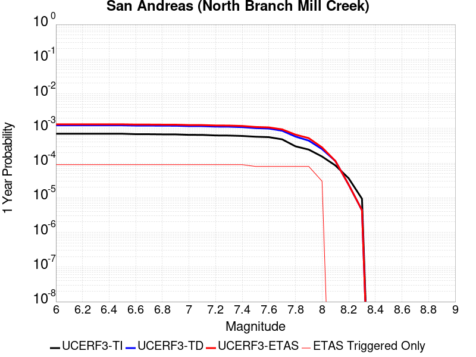 | 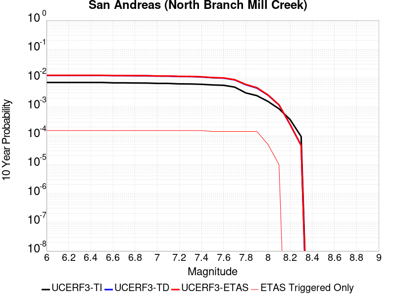 |

| Magnitude | 1 wk TI Prob | 1 wk TD Prob | 1 wk ETAS Prob | 1 wk ETAS/TD Gain | 1 wk ETAS Triggered Only | 1 mo TI Prob | 1 mo TD Prob | 1 mo ETAS Prob | 1 mo ETAS/TD Gain | 1 mo ETAS Triggered Only | 1 yr TI Prob | 1 yr TD Prob | 1 yr ETAS Prob | 1 yr ETAS/TD Gain | 1 yr ETAS Triggered Only | 10 yr TI Prob | 10 yr TD Prob | 10 yr ETAS Prob | 10 yr ETAS/TD Gain | 10 yr ETAS Triggered Only |
|-----|-----|-----|-----|-----|-----|-----|-----|-----|-----|-----|-----|-----|-----|-----|-----|-----|-----|-----|-----|-----|
| 6.0 | 1.3461156E-5 | 2.350783E-5 | 3.3507593E-5 | 1.4253802 | 1.0E-5 | 5.7689394E-5 | 1.0074397E-4 | 1.3074094E-4 | 1.2977545 | 3.0E-5 | 7.02142E-4 | 0.001225871 | 0.0013157607 | 1.0733272 | 9.0E-5 | 0.0069992766 | 0.012232522 | 0.012380687 | 1.0121124 | 1.5E-4 |
| 6.1 | 1.3461156E-5 | 2.350783E-5 | 3.3507593E-5 | 1.4253802 | 1.0E-5 | 5.7689394E-5 | 1.0074397E-4 | 1.3074094E-4 | 1.2977545 | 3.0E-5 | 7.02142E-4 | 0.001225871 | 0.0013157607 | 1.0733272 | 9.0E-5 | 0.0069992766 | 0.012232522 | 0.012380687 | 1.0121124 | 1.5E-4 |
| 6.2 | 1.3461156E-5 | 2.350783E-5 | 3.3507593E-5 | 1.4253802 | 1.0E-5 | 5.7689394E-5 | 1.0074397E-4 | 1.3074094E-4 | 1.2977545 | 3.0E-5 | 7.02142E-4 | 0.001225871 | 0.0013157607 | 1.0733272 | 9.0E-5 | 0.0069992766 | 0.012232522 | 0.012380687 | 1.0121124 | 1.5E-4 |
| 6.3 | 1.3461156E-5 | 2.350783E-5 | 3.3507593E-5 | 1.4253802 | 1.0E-5 | 5.7689394E-5 | 1.0074397E-4 | 1.3074094E-4 | 1.2977545 | 3.0E-5 | 7.02142E-4 | 0.001225871 | 0.0013157607 | 1.0733272 | 9.0E-5 | 0.0069992766 | 0.012232522 | 0.012380687 | 1.0121124 | 1.5E-4 |
| 6.4 | 1.3461156E-5 | 2.350783E-5 | 3.3507593E-5 | 1.4253802 | 1.0E-5 | 5.7689394E-5 | 1.0074397E-4 | 1.3074094E-4 | 1.2977545 | 3.0E-5 | 7.02142E-4 | 0.001225871 | 0.0013157607 | 1.0733272 | 9.0E-5 | 0.0069992766 | 0.012232522 | 0.012380687 | 1.0121124 | 1.5E-4 |
| 6.5 | 1.3450706E-5 | 2.349679E-5 | 3.3496555E-5 | 1.42558 | 1.0E-5 | 5.764461E-5 | 1.00696656E-4 | 1.3069363E-4 | 1.2978945 | 3.0E-5 | 7.0159714E-4 | 0.0012252956 | 0.0013151853 | 1.0733616 | 9.0E-5 | 0.006993862 | 0.012226831 | 0.012374997 | 1.0121181 | 1.5E-4 |
| 6.6 | 1.3074523E-5 | 2.3111072E-5 | 3.311084E-5 | 1.4326831 | 1.0E-5 | 5.6032466E-5 | 9.9043704E-5 | 1.2904074E-4 | 1.3028666 | 3.0E-5 | 6.8198174E-4 | 0.0012051932 | 0.0012950848 | 1.0745869 | 9.0E-5 | 0.006798926 | 0.012027997 | 0.012176192 | 1.0123209 | 1.5E-4 |
| 6.7 | 1.3050216E-5 | 2.3086368E-5 | 3.3086137E-5 | 1.433146 | 1.0E-5 | 5.59283E-5 | 9.893784E-5 | 1.2893487E-4 | 1.3031907 | 3.0E-5 | 6.8071426E-4 | 0.0012039058 | 0.0012937975 | 1.0746666 | 9.0E-5 | 0.0067863287 | 0.012015262 | 0.012163459 | 1.0123341 | 1.5E-4 |
| 6.8 | 1.29049395E-5 | 2.2934775E-5 | 3.2934546E-5 | 1.436009 | 1.0E-5 | 5.530571E-5 | 9.8288205E-5 | 1.2828526E-4 | 1.3051949 | 3.0E-5 | 6.73139E-4 | 0.0011960051 | 0.0012858976 | 1.0751605 | 9.0E-5 | 0.0067110364 | 0.011937105 | 0.012085315 | 1.0124159 | 1.5E-4 |
| 6.9 | 1.2867369E-5 | 2.2894177E-5 | 3.289395E-5 | 1.4367822 | 1.0E-5 | 5.51447E-5 | 9.811423E-5 | 1.2811128E-4 | 1.3057361 | 3.0E-5 | 6.711799E-4 | 0.0011938893 | 0.001283782 | 1.0752939 | 9.0E-5 | 0.006691564 | 0.011916174 | 0.012064387 | 1.0124379 | 1.5E-4 |
| 7.0 | 1.2495996E-5 | 2.2294238E-5 | 3.2294014E-5 | 1.4485364 | 1.0E-5 | 5.3553173E-5 | 9.5543255E-5 | 1.2554039E-4 | 1.3139639 | 3.0E-5 | 6.518148E-4 | 0.0011626212 | 0.0012525165 | 1.0773213 | 9.0E-5 | 0.0064990623 | 0.011606771 | 0.011755029 | 1.0127735 | 1.5E-4 |
| 7.1 | 1.2452067E-5 | 2.2239308E-5 | 3.2239088E-5 | 1.4496442 | 1.0E-5 | 5.3364907E-5 | 9.5307856E-5 | 1.25305E-4 | 1.3147395 | 3.0E-5 | 6.4952404E-4 | 0.0011597583 | 0.001249654 | 1.0775124 | 9.0E-5 | 0.0064762887 | 0.01157844 | 0.0117267035 | 1.0128051 | 1.5E-4 |
| 7.2 | 1.2002777E-5 | 2.1617801E-5 | 3.1617587E-5 | 1.4625717 | 1.0E-5 | 5.143946E-5 | 9.264445E-5 | 1.2264166E-4 | 1.3237886 | 3.0E-5 | 6.2609545E-4 | 0.0011273652 | 0.0012172636 | 1.0797422 | 9.0E-5 | 0.006243344 | 0.01125784 | 0.011406152 | 1.013174 | 1.5E-4 |
| 7.3 | 1.1923425E-5 | 2.1487636E-5 | 3.148742E-5 | 1.4653739 | 1.0E-5 | 5.109939E-5 | 9.208664E-5 | 1.2208387E-4 | 1.3257502 | 3.0E-5 | 6.219575E-4 | 0.0011205808 | 0.0012104799 | 1.0802255 | 9.0E-5 | 0.0062021962 | 0.011190712 | 0.011339034 | 1.0132539 | 1.5E-4 |
| 7.4 | 1.16105175E-5 | 2.0861535E-5 | 3.0861327E-5 | 1.4793411 | 1.0E-5 | 4.975841E-5 | 8.9403526E-5 | 1.19400844E-4 | 1.3355272 | 3.0E-5 | 6.0564023E-4 | 0.0010879469 | 0.001177849 | 1.0826346 | 9.0E-5 | 0.006039923 | 0.010868174 | 0.011016544 | 1.0136517 | 1.5E-4 |
| 7.5 | 1.1037265E-5 | 1.9561343E-5 | 2.9561148E-5 | 1.5112023 | 1.0E-5 | 4.7301706E-5 | 8.383165E-5 | 1.1382913E-4 | 1.35783 | 3.0E-5 | 5.757461E-4 | 0.0010201746 | 0.001100093 | 1.0783379 | 8.0E-5 | 0.005742567 | 0.010198631 | 0.010337204 | 1.0135874 | 1.4E-4 |
| 7.6 | 1.0720915E-5 | 1.9003148E-5 | 2.9002957E-5 | 1.5262187 | 1.0E-5 | 4.5945973E-5 | 8.143953E-5 | 1.1143708E-4 | 1.3683414 | 3.0E-5 | 5.592486E-4 | 9.910774E-4 | 0.0010709981 | 1.0806402 | 8.0E-5 | 0.005578433 | 0.009910301 | 0.010048914 | 1.0139867 | 1.4E-4 |
| 7.7 | 9.276279E-6 | 1.6448577E-5 | 2.6448412E-5 | 1.6079453 | 1.0E-5 | 3.9754876E-5 | 7.0492E-5 | 1.0048989E-4 | 1.4255502 | 3.0E-5 | 4.839081E-4 | 8.579039E-4 | 9.3783526E-4 | 1.0931705 | 8.0E-5 | 0.0048285574 | 0.008589426 | 0.008728224 | 1.016159 | 1.4E-4 |
| 7.8 | 5.8346777E-6 | 1.1160578E-5 | 2.1160466E-5 | 1.896001 | 1.0E-5 | 2.5005522E-5 | 4.783017E-5 | 7.7828736E-5 | 1.6271892 | 3.0E-5 | 3.043997E-4 | 5.8217684E-4 | 6.6213025E-4 | 1.1373353 | 8.0E-5 | 0.0030398308 | 0.0058496357 | 0.0059888167 | 1.0237931 | 1.4E-4 |
| 7.9 | 4.690204E-6 | 8.513636E-6 | 1.851355E-5 | 2.1745763 | 1.0E-5 | 2.0100719E-5 | 3.64865E-5 | 6.648541E-5 | 1.8221918 | 3.0E-5 | 2.4469878E-4 | 4.4413272E-4 | 5.240972E-4 | 1.1800463 | 8.0E-5 | 0.002444295 | 0.004473071 | 0.004612445 | 1.0311584 | 1.4E-4 |
| 8.0 | 2.9570454E-6 | 4.8496286E-6 | 1.484958E-5 | 3.0620036 | 1.0E-5 | 1.267299E-5 | 2.0783957E-5 | 4.0783543E-5 | 1.9622606 | 2.0E-5 | 1.5428272E-4 | 2.530153E-4 | 2.8300774E-4 | 1.1185399 | 3.0E-5 | 0.0015417566 | 0.0025509798 | 0.0026008524 | 1.0195503 | 5.0E-5 |
| 8.1 | 1.6376824E-6 | 2.1982057E-6 | 2.1982057E-6 | 1.0 | 0.0 | 7.01862E-6 | 9.420847E-6 | 9.420847E-6 | 1.0 | 0.0 | 8.544835E-5 | 1.146928E-4 | 1.146928E-4 | 1.0 | 0.0 | 8.54155E-4 | 0.0011613306 | 0.001171319 | 1.0086008 | 1.0E-5 |
| 8.2 | 6.9631557E-7 | 4.5391383E-7 | 4.5391383E-7 | 1.0 | 0.0 | 2.984206E-6 | 1.9453435E-6 | 1.9453435E-6 | 1.0 | 0.0 | 3.63321E-5 | 2.36843E-5 | 2.36843E-5 | 1.0 | 0.0 | 3.6326164E-4 | 2.4532314E-4 | 2.4532314E-4 | 1.0 | 0.0 |
| 8.3 | 1.7876137E-7 | 8.3658875E-8 | 8.3658875E-8 | 1.0 | 0.0 | 7.661199E-7 | 3.58538E-7 | 3.58538E-7 | 1.0 | 0.0 | 9.32747E-6 | 4.3651917E-6 | 4.3651917E-6 | 1.0 | 0.0 | 9.3270784E-5 | 4.5847937E-5 | 4.5847937E-5 | 1.0 | 0.0 |

## Deep Springs
*[(top)](#table-of-contents)*

| 1 Week | 1 Month | 1 Year | 10 Year |
|-----|-----|-----|-----|
|  |  |  |  |

| Magnitude | 1 wk TI Prob | 1 wk TD Prob | 1 wk ETAS Prob | 1 wk ETAS/TD Gain | 1 wk ETAS Triggered Only | 1 mo TI Prob | 1 mo TD Prob | 1 mo ETAS Prob | 1 mo ETAS/TD Gain | 1 mo ETAS Triggered Only | 1 yr TI Prob | 1 yr TD Prob | 1 yr ETAS Prob | 1 yr ETAS/TD Gain | 1 yr ETAS Triggered Only | 10 yr TI Prob | 10 yr TD Prob | 10 yr ETAS Prob | 10 yr ETAS/TD Gain | 10 yr ETAS Triggered Only |
|-----|-----|-----|-----|-----|-----|-----|-----|-----|-----|-----|-----|-----|-----|-----|-----|-----|-----|-----|-----|-----|
| 6.0 | 1.9810619E-5 | 2.311303E-5 | 3.31128E-5 | 1.4326464 | 1.0E-5 | 8.489989E-5 | 9.9054945E-5 | 1.19052966E-4 | 1.2018881 | 2.0E-5 | 0.001033166 | 0.0012058344 | 0.00127575 | 1.0579811 | 7.0E-5 | 0.010283757 | 0.012042696 | 0.01218101 | 1.0114853 | 1.4E-4 |
| 6.1 | 1.9810619E-5 | 2.311303E-5 | 3.31128E-5 | 1.4326464 | 1.0E-5 | 8.489989E-5 | 9.9054945E-5 | 1.19052966E-4 | 1.2018881 | 2.0E-5 | 0.001033166 | 0.0012058344 | 0.00127575 | 1.0579811 | 7.0E-5 | 0.010283757 | 0.012042696 | 0.01218101 | 1.0114853 | 1.4E-4 |
| 6.2 | 1.9810619E-5 | 2.311303E-5 | 3.31128E-5 | 1.4326464 | 1.0E-5 | 8.489989E-5 | 9.9054945E-5 | 1.19052966E-4 | 1.2018881 | 2.0E-5 | 0.001033166 | 0.0012058344 | 0.00127575 | 1.0579811 | 7.0E-5 | 0.010283757 | 0.012042696 | 0.01218101 | 1.0114853 | 1.4E-4 |
| 6.3 | 1.9810619E-5 | 2.311303E-5 | 3.31128E-5 | 1.4326464 | 1.0E-5 | 8.489989E-5 | 9.9054945E-5 | 1.19052966E-4 | 1.2018881 | 2.0E-5 | 0.001033166 | 0.0012058344 | 0.00127575 | 1.0579811 | 7.0E-5 | 0.010283757 | 0.012042696 | 0.01218101 | 1.0114853 | 1.4E-4 |
| 6.4 | 1.9810619E-5 | 2.311303E-5 | 3.31128E-5 | 1.4326464 | 1.0E-5 | 8.489989E-5 | 9.9054945E-5 | 1.19052966E-4 | 1.2018881 | 2.0E-5 | 0.001033166 | 0.0012058344 | 0.00127575 | 1.0579811 | 7.0E-5 | 0.010283757 | 0.012042696 | 0.01218101 | 1.0114853 | 1.4E-4 |
| 6.5 | 1.7190405E-5 | 2.0051E-5 | 2.0051E-5 | 1.0 | 0.0 | 7.367108E-5 | 8.593286E-5 | 9.5931995E-5 | 1.11636 | 1.0E-5 | 8.9657627E-4 | 0.0010462323 | 0.00109618 | 1.0477406 | 5.0E-5 | 0.008929676 | 0.010462292 | 0.01055135 | 1.0085124 | 9.0E-5 |
| 6.6 | 1.7190405E-5 | 2.0051E-5 | 2.0051E-5 | 1.0 | 0.0 | 7.367108E-5 | 8.593286E-5 | 9.5931995E-5 | 1.11636 | 1.0E-5 | 8.9657627E-4 | 0.0010462323 | 0.00109618 | 1.0477406 | 5.0E-5 | 0.008929676 | 0.010462292 | 0.01055135 | 1.0085124 | 9.0E-5 |

## Baker
*[(top)](#table-of-contents)*

| 1 Week | 1 Month | 1 Year | 10 Year |
|-----|-----|-----|-----|
|  |  | 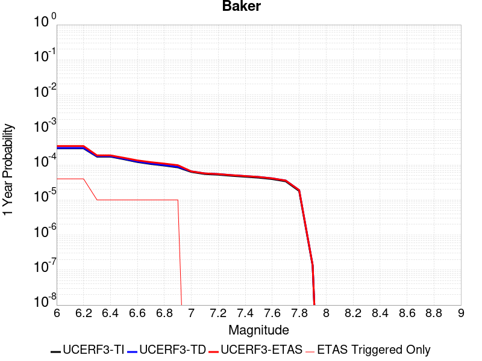 |  |

| Magnitude | 1 wk TI Prob | 1 wk TD Prob | 1 wk ETAS Prob | 1 wk ETAS/TD Gain | 1 wk ETAS Triggered Only | 1 mo TI Prob | 1 mo TD Prob | 1 mo ETAS Prob | 1 mo ETAS/TD Gain | 1 mo ETAS Triggered Only | 1 yr TI Prob | 1 yr TD Prob | 1 yr ETAS Prob | 1 yr ETAS/TD Gain | 1 yr ETAS Triggered Only | 10 yr TI Prob | 10 yr TD Prob | 10 yr ETAS Prob | 10 yr ETAS/TD Gain | 10 yr ETAS Triggered Only |
|-----|-----|-----|-----|-----|-----|-----|-----|-----|-----|-----|-----|-----|-----|-----|-----|-----|-----|-----|-----|-----|
| 6.0 | 5.695525E-6 | 5.834856E-6 | 1.5834798E-5 | 2.7138283 | 1.0E-5 | 2.4409164E-5 | 2.500631E-5 | 4.500581E-5 | 1.7997781 | 2.0E-5 | 2.9714106E-4 | 3.044133E-4 | 3.444011E-4 | 1.1313603 | 4.0E-5 | 0.0029674405 | 0.0030403587 | 0.0031699634 | 1.0426282 | 1.3E-4 |
| 6.1 | 5.695525E-6 | 5.834856E-6 | 1.5834798E-5 | 2.7138283 | 1.0E-5 | 2.4409164E-5 | 2.500631E-5 | 4.500581E-5 | 1.7997781 | 2.0E-5 | 2.9714106E-4 | 3.044133E-4 | 3.444011E-4 | 1.1313603 | 4.0E-5 | 0.0029674405 | 0.0030403587 | 0.0031699634 | 1.0426282 | 1.3E-4 |
| 6.2 | 5.695525E-6 | 5.834856E-6 | 1.5834798E-5 | 2.7138283 | 1.0E-5 | 2.4409164E-5 | 2.500631E-5 | 4.500581E-5 | 1.7997781 | 2.0E-5 | 2.9714106E-4 | 3.044133E-4 | 3.444011E-4 | 1.1313603 | 4.0E-5 | 0.0029674405 | 0.0030403587 | 0.0031699634 | 1.0426282 | 1.3E-4 |
| 6.3 | 3.2995713E-6 | 3.3836786E-6 | 3.3836786E-6 | 1.0 | 0.0 | 1.4140943E-5 | 1.4501402E-5 | 2.4501256E-5 | 1.6895785 | 1.0E-5 | 1.7215237E-4 | 1.7654074E-4 | 1.8653898E-4 | 1.0566342 | 1.0E-5 | 0.0017201907 | 0.0017640521 | 0.0018339285 | 1.0396113 | 7.0E-5 |
| 6.4 | 3.2995713E-6 | 3.3836786E-6 | 3.3836786E-6 | 1.0 | 0.0 | 1.4140943E-5 | 1.4501402E-5 | 2.4501256E-5 | 1.6895785 | 1.0E-5 | 1.7215237E-4 | 1.7654074E-4 | 1.8653898E-4 | 1.0566342 | 1.0E-5 | 0.0017201907 | 0.0017640521 | 0.0018339285 | 1.0396113 | 7.0E-5 |
| 6.5 | 2.782202E-6 | 2.8558507E-6 | 2.8558507E-6 | 1.0 | 0.0 | 1.1923668E-5 | 1.2239304E-5 | 2.223918E-5 | 1.81703 | 1.0E-5 | 1.4516099E-4 | 1.4900367E-4 | 1.5900217E-4 | 1.0671024 | 1.0E-5 | 0.001450662 | 0.0014890704 | 0.0015489811 | 1.0402336 | 6.0E-5 |
| 6.6 | 2.3163404E-6 | 2.380929E-6 | 2.380929E-6 | 1.0 | 0.0 | 9.927136E-6 | 1.0203942E-5 | 2.020384E-5 | 1.9800034 | 1.0E-5 | 1.20856166E-4 | 1.2422612E-4 | 1.3422487E-4 | 1.0804883 | 1.0E-5 | 0.0012079047 | 0.001241587 | 0.0012815373 | 1.0321769 | 4.0E-5 |
| 6.7 | 2.037056E-6 | 2.0965088E-6 | 2.0965088E-6 | 1.0 | 0.0 | 8.7302105E-6 | 8.985007E-6 | 1.8984918E-5 | 2.112955 | 1.0E-5 | 1.0628513E-4 | 1.0938713E-4 | 1.1938604E-4 | 1.0914084 | 1.0E-5 | 0.0010623431 | 0.0010933491 | 0.0011333053 | 1.0365448 | 4.0E-5 |
| 6.8 | 1.8356744E-6 | 1.8915364E-6 | 1.8915364E-6 | 1.0 | 0.0 | 7.867153E-6 | 8.10656E-6 | 1.8106479E-5 | 2.233559 | 1.0E-5 | 9.577837E-5 | 9.869304E-5 | 1.0869205E-4 | 1.1013143 | 1.0E-5 | 9.57371E-4 | 9.865061E-4 | 0.0010264666 | 1.0405072 | 4.0E-5 |
| 6.9 | 1.6310546E-6 | 1.6832144E-6 | 1.6832144E-6 | 1.0 | 0.0 | 6.9902153E-6 | 7.213757E-6 | 1.7213684E-5 | 2.3862302 | 1.0E-5 | 8.510255E-5 | 8.782406E-5 | 9.7823184E-5 | 1.113854 | 1.0E-5 | 8.5069967E-4 | 8.779048E-4 | 9.178697E-4 | 1.045523 | 4.0E-5 |
| 7.0 | 1.2058036E-6 | 1.2508729E-6 | 1.2508729E-6 | 1.0 | 0.0 | 5.1677193E-6 | 5.3608724E-6 | 5.3608724E-6 | 1.0 | 0.0 | 6.291517E-5 | 6.526669E-5 | 6.526669E-5 | 1.0 | 0.0 | 6.289736E-4 | 6.5247755E-4 | 6.82458E-4 | 1.0459486 | 3.0E-5 |
| 7.1 | 1.052382E-6 | 1.0951668E-6 | 1.0951668E-6 | 1.0 | 0.0 | 4.5102006E-6 | 4.693564E-6 | 4.693564E-6 | 1.0 | 0.0 | 5.491031E-5 | 5.7142646E-5 | 5.7142646E-5 | 1.0 | 0.0 | 5.4896745E-4 | 5.712804E-4 | 6.012633E-4 | 1.0524836 | 3.0E-5 |
| 7.2 | 1.0067454E-6 | 1.0487769E-6 | 1.0487769E-6 | 1.0 | 0.0 | 4.3146156E-6 | 4.4947506E-6 | 4.4947506E-6 | 1.0 | 0.0 | 5.252918E-5 | 5.4722223E-5 | 5.4722223E-5 | 1.0 | 0.0 | 5.251676E-4 | 5.4708833E-4 | 5.6707737E-4 | 1.0365372 | 2.0E-5 |
| 7.3 | 9.3596316E-7 | 9.76778E-7 | 9.76778E-7 | 1.0 | 0.0 | 4.0112645E-6 | 4.186185E-6 | 4.186185E-6 | 1.0 | 0.0 | 4.8836053E-5 | 5.0965617E-5 | 5.0965617E-5 | 1.0 | 0.0 | 4.8825322E-4 | 5.095401E-4 | 5.295299E-4 | 1.0392311 | 2.0E-5 |
| 7.4 | 8.8117395E-7 | 9.2077187E-7 | 9.2077187E-7 | 1.0 | 0.0 | 3.7764542E-6 | 3.9461593E-6 | 3.9461593E-6 | 1.0 | 0.0 | 4.5977362E-5 | 4.8043436E-5 | 4.8043436E-5 | 1.0 | 0.0 | 4.596785E-4 | 4.8033125E-4 | 5.003217E-4 | 1.041618 | 2.0E-5 |
| 7.5 | 8.292386E-7 | 8.674649E-7 | 8.674649E-7 | 1.0 | 0.0 | 3.5538749E-6 | 3.7177015E-6 | 3.7177015E-6 | 1.0 | 0.0 | 4.326757E-5 | 4.5262084E-5 | 4.5262084E-5 | 1.0 | 0.0 | 4.3259145E-4 | 4.5252938E-4 | 4.7252033E-4 | 1.044176 | 2.0E-5 |
| 7.6 | 7.553842E-7 | 7.9145207E-7 | 7.9145207E-7 | 1.0 | 0.0 | 3.2373566E-6 | 3.3919332E-6 | 3.3919332E-6 | 1.0 | 0.0 | 3.9414106E-5 | 4.129601E-5 | 4.129601E-5 | 1.0 | 0.0 | 3.9407116E-4 | 4.1288408E-4 | 4.3287582E-4 | 1.0484197 | 2.0E-5 |
| 7.7 | 6.5285366E-7 | 6.852842E-7 | 6.852842E-7 | 1.0 | 0.0 | 2.797941E-6 | 2.9369291E-6 | 2.9369291E-6 | 1.0 | 0.0 | 3.40644E-5 | 3.5756533E-5 | 3.5756533E-5 | 1.0 | 0.0 | 3.405918E-4 | 3.5750846E-4 | 3.6750486E-4 | 1.0279614 | 1.0E-5 |
| 7.8 | 3.4586725E-7 | 3.648288E-7 | 3.648288E-7 | 1.0 | 0.0 | 1.4822873E-6 | 1.5635511E-6 | 1.5635511E-6 | 1.0 | 0.0 | 1.80467E-5 | 1.9036073E-5 | 1.9036073E-5 | 1.0 | 0.0 | 1.8045233E-4 | 1.9034486E-4 | 1.9034486E-4 | 1.0 | 0.0 |
| 7.9 | 2.5591178E-9 | 2.6696871E-9 | 2.6696871E-9 | 1.0 | 0.0 | 1.0967647E-8 | 1.1441516E-8 | 1.1441516E-8 | 1.0 | 0.0 | 1.335311E-7 | 1.3930045E-7 | 1.3930045E-7 | 1.0 | 0.0 | 1.3353102E-6 | 1.3930046E-6 | 1.3930046E-6 | 1.0 | 0.0 |

## Calico-Hidalgo
*[(top)](#table-of-contents)*

| 1 Week | 1 Month | 1 Year | 10 Year |
|-----|-----|-----|-----|
|  |  |  |  |

| Magnitude | 1 wk TI Prob | 1 wk TD Prob | 1 wk ETAS Prob | 1 wk ETAS/TD Gain | 1 wk ETAS Triggered Only | 1 mo TI Prob | 1 mo TD Prob | 1 mo ETAS Prob | 1 mo ETAS/TD Gain | 1 mo ETAS Triggered Only | 1 yr TI Prob | 1 yr TD Prob | 1 yr ETAS Prob | 1 yr ETAS/TD Gain | 1 yr ETAS Triggered Only | 10 yr TI Prob | 10 yr TD Prob | 10 yr ETAS Prob | 10 yr ETAS/TD Gain | 10 yr ETAS Triggered Only |
|-----|-----|-----|-----|-----|-----|-----|-----|-----|-----|-----|-----|-----|-----|-----|-----|-----|-----|-----|-----|-----|
| 6.0 | 4.0906612E-5 | 5.0705254E-5 | 5.0705254E-5 | 1.0 | 0.0 | 1.7530227E-4 | 2.172924E-4 | 2.172924E-4 | 1.0 | 0.0 | 0.0021322158 | 0.0026427244 | 0.0026626717 | 1.007548 | 2.0E-5 | 0.02111873 | 0.026153268 | 0.026270129 | 1.0044683 | 1.2E-4 |
| 6.1 | 4.0906612E-5 | 5.0705254E-5 | 5.0705254E-5 | 1.0 | 0.0 | 1.7530227E-4 | 2.172924E-4 | 2.172924E-4 | 1.0 | 0.0 | 0.0021322158 | 0.0026427244 | 0.0026626717 | 1.007548 | 2.0E-5 | 0.02111873 | 0.026153268 | 0.026270129 | 1.0044683 | 1.2E-4 |
| 6.2 | 4.0906612E-5 | 5.0705254E-5 | 5.0705254E-5 | 1.0 | 0.0 | 1.7530227E-4 | 2.172924E-4 | 2.172924E-4 | 1.0 | 0.0 | 0.0021322158 | 0.0026427244 | 0.0026626717 | 1.007548 | 2.0E-5 | 0.02111873 | 0.026153268 | 0.026270129 | 1.0044683 | 1.2E-4 |
| 6.3 | 2.4242801E-5 | 3.0091267E-5 | 3.0091267E-5 | 1.0 | 0.0 | 1.0389358E-4 | 1.2895638E-4 | 1.2895638E-4 | 1.0 | 0.0 | 0.0012641704 | 0.0015689468 | 0.0015789311 | 1.0063637 | 1.0E-5 | 0.01257003 | 0.015582383 | 0.015631603 | 1.0031588 | 5.0E-5 |
| 6.4 | 2.4242801E-5 | 3.0091267E-5 | 3.0091267E-5 | 1.0 | 0.0 | 1.0389358E-4 | 1.2895638E-4 | 1.2895638E-4 | 1.0 | 0.0 | 0.0012641704 | 0.0015689468 | 0.0015789311 | 1.0063637 | 1.0E-5 | 0.01257003 | 0.015582383 | 0.015631603 | 1.0031588 | 5.0E-5 |
| 6.5 | 2.0286952E-5 | 2.531624E-5 | 2.531624E-5 | 1.0 | 0.0 | 8.694118E-5 | 1.08493754E-4 | 1.08493754E-4 | 1.0 | 0.0 | 0.0010579949 | 0.0013201282 | 0.001330115 | 1.007565 | 1.0E-5 | 0.010529719 | 0.013124796 | 0.01317414 | 1.0037596 | 5.0E-5 |
| 6.6 | 2.0269223E-5 | 2.529719E-5 | 2.529719E-5 | 1.0 | 0.0 | 8.6865206E-5 | 1.0841212E-4 | 1.0841212E-4 | 1.0 | 0.0 | 0.0010570707 | 0.0013191354 | 0.0013291222 | 1.0075707 | 1.0E-5 | 0.010520565 | 0.013114986 | 0.013164329 | 1.0037625 | 5.0E-5 |
| 6.7 | 1.799852E-5 | 2.2541075E-5 | 2.2541075E-5 | 1.0 | 0.0 | 7.713423E-5 | 9.6601114E-5 | 9.6601114E-5 | 1.0 | 0.0 | 9.3870464E-4 | 0.0011754986 | 0.0011854868 | 1.008497 | 1.0E-5 | 0.009347493 | 0.011694419 | 0.011733951 | 1.0033804 | 4.0E-5 |
| 6.8 | 1.7458793E-5 | 2.1842718E-5 | 2.1842718E-5 | 1.0 | 0.0 | 7.4821255E-5 | 9.360837E-5 | 9.360837E-5 | 1.0 | 0.0 | 9.10568E-4 | 0.0011391005 | 0.0011490891 | 1.0087689 | 1.0E-5 | 0.009068459 | 0.011334201 | 0.011373748 | 1.0034891 | 4.0E-5 |
| 6.9 | 1.542884E-5 | 1.9026409E-5 | 1.9026409E-5 | 1.0 | 0.0 | 6.612192E-5 | 8.153928E-5 | 8.153928E-5 | 1.0 | 0.0 | 8.04737E-4 | 9.923017E-4 | 9.923017E-4 | 1.0 | 0.0 | 0.008018291 | 0.009880107 | 0.0099098105 | 1.0030065 | 3.0E-5 |
| 7.0 | 1.468253E-5 | 1.8031209E-5 | 1.8031209E-5 | 1.0 | 0.0 | 6.292361E-5 | 7.7274395E-5 | 7.7274395E-5 | 1.0 | 0.0 | 7.658257E-4 | 9.404227E-4 | 9.404227E-4 | 1.0 | 0.0 | 0.0076319184 | 0.009365797 | 0.009395516 | 1.0031731 | 3.0E-5 |
| 7.1 | 1.3139281E-5 | 1.620149E-5 | 1.620149E-5 | 1.0 | 0.0 | 5.6309986E-5 | 6.9433176E-5 | 6.9433176E-5 | 1.0 | 0.0 | 6.853584E-4 | 8.450336E-4 | 8.450336E-4 | 1.0 | 0.0 | 0.0068324856 | 0.008419501 | 0.008439333 | 1.0023555 | 2.0E-5 |
| 7.2 | 1.1127404E-5 | 1.3867119E-5 | 1.3867119E-5 | 1.0 | 0.0 | 4.7688E-5 | 5.9429218E-5 | 5.9429218E-5 | 1.0 | 0.0 | 5.8044674E-4 | 7.233214E-4 | 7.233214E-4 | 1.0 | 0.0 | 0.0057893298 | 0.007210779 | 0.007220707 | 1.0013769 | 1.0E-5 |
| 7.3 | 9.808154E-6 | 1.2176658E-5 | 1.2176658E-5 | 1.0 | 0.0 | 4.2034266E-5 | 5.2184692E-5 | 5.2184692E-5 | 1.0 | 0.0 | 5.11647E-4 | 6.3517416E-4 | 6.3517416E-4 | 1.0 | 0.0 | 0.0051047057 | 0.006334663 | 0.0063445996 | 1.0015687 | 1.0E-5 |
| 7.4 | 7.942452E-6 | 9.792409E-6 | 9.792409E-6 | 1.0 | 0.0 | 3.4038632E-5 | 4.1966847E-5 | 4.1966847E-5 | 1.0 | 0.0 | 4.1434157E-4 | 5.10836E-4 | 5.10836E-4 | 1.0 | 0.0 | 0.0041356985 | 0.005097559 | 0.005107508 | 1.0019517 | 1.0E-5 |
| 7.5 | 4.7121216E-6 | 5.7729853E-6 | 5.7729853E-6 | 1.0 | 0.0 | 2.019465E-5 | 2.4741174E-5 | 2.4741174E-5 | 1.0 | 0.0 | 2.4584212E-4 | 3.011898E-4 | 3.011898E-4 | 1.0 | 0.0 | 0.0024557032 | 0.0030085684 | 0.0030185385 | 1.0033139 | 1.0E-5 |
| 7.6 | 2.21172E-7 | 2.6040198E-7 | 2.6040198E-7 | 1.0 | 0.0 | 9.478797E-7 | 1.1160082E-6 | 1.1160082E-6 | 1.0 | 0.0 | 1.1540374E-5 | 1.3587343E-5 | 1.3587343E-5 | 1.0 | 0.0 | 1.1539775E-4 | 1.3586794E-4 | 1.3586794E-4 | 1.0 | 0.0 |

## Santa Ynez (West)
*[(top)](#table-of-contents)*

| 1 Week | 1 Month | 1 Year | 10 Year |
|-----|-----|-----|-----|
|  |  |  | 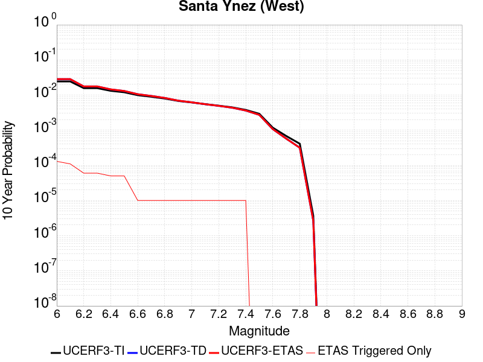 |

| Magnitude | 1 wk TI Prob | 1 wk TD Prob | 1 wk ETAS Prob | 1 wk ETAS/TD Gain | 1 wk ETAS Triggered Only | 1 mo TI Prob | 1 mo TD Prob | 1 mo ETAS Prob | 1 mo ETAS/TD Gain | 1 mo ETAS Triggered Only | 1 yr TI Prob | 1 yr TD Prob | 1 yr ETAS Prob | 1 yr ETAS/TD Gain | 1 yr ETAS Triggered Only | 10 yr TI Prob | 10 yr TD Prob | 10 yr ETAS Prob | 10 yr ETAS/TD Gain | 10 yr ETAS Triggered Only |
|-----|-----|-----|-----|-----|-----|-----|-----|-----|-----|-----|-----|-----|-----|-----|-----|-----|-----|-----|-----|-----|
| 6.0 | 4.7352758E-5 | 5.49722E-5 | 6.4971646E-5 | 1.1819001 | 1.0E-5 | 2.0292461E-4 | 2.3557546E-4 | 2.4557312E-4 | 1.0424392 | 1.0E-5 | 0.0024678076 | 0.0028646276 | 0.0029543699 | 1.0313277 | 9.0E-5 | 0.024405818 | 0.028305134 | 0.028431453 | 1.0044628 | 1.3E-4 |
| 6.1 | 4.7352758E-5 | 5.49722E-5 | 5.49722E-5 | 1.0 | 0.0 | 2.0292461E-4 | 2.3557546E-4 | 2.3557546E-4 | 1.0 | 0.0 | 0.0024678076 | 0.0028646276 | 0.0029443984 | 1.0278468 | 8.0E-5 | 0.024405818 | 0.028305134 | 0.02841202 | 1.0037762 | 1.1E-4 |
| 6.2 | 3.0415853E-5 | 3.392567E-5 | 3.392567E-5 | 1.0 | 0.0 | 1.3034715E-4 | 1.4538778E-4 | 1.4538778E-4 | 1.0 | 0.0 | 0.0015858212 | 0.0017686938 | 0.0018086231 | 1.0225756 | 4.0E-5 | 0.015745522 | 0.01755012 | 0.017609065 | 1.0033587 | 6.0E-5 |
| 6.3 | 3.0415853E-5 | 3.392567E-5 | 3.392567E-5 | 1.0 | 0.0 | 1.3034715E-4 | 1.4538778E-4 | 1.4538778E-4 | 1.0 | 0.0 | 0.0015858212 | 0.0017686938 | 0.0018086231 | 1.0225756 | 4.0E-5 | 0.015745522 | 0.01755012 | 0.017609065 | 1.0033587 | 6.0E-5 |
| 6.4 | 2.5452082E-5 | 2.7912814E-5 | 2.7912814E-5 | 1.0 | 0.0 | 1.09075794E-4 | 1.1962098E-4 | 1.1962098E-4 | 1.0 | 0.0 | 0.0013271887 | 0.0014554313 | 0.0014953732 | 1.0274433 | 4.0E-5 | 0.013192902 | 0.014461164 | 0.014510442 | 1.0034075 | 5.0E-5 |
| 6.5 | 2.3143784E-5 | 2.5128551E-5 | 2.5128551E-5 | 1.0 | 0.0 | 9.9183875E-5 | 1.0768943E-4 | 1.0768943E-4 | 1.0 | 0.0 | 0.0012068948 | 0.0013103448 | 0.0013502924 | 1.0304863 | 4.0E-5 | 0.012003611 | 0.013027853 | 0.013077202 | 1.0037879 | 5.0E-5 |
| 6.6 | 1.9118515E-5 | 2.0354546E-5 | 2.0354546E-5 | 1.0 | 0.0 | 8.193392E-5 | 8.7230896E-5 | 8.7230896E-5 | 1.0 | 0.0 | 9.97089E-4 | 0.0010615266 | 0.0010615266 | 1.0 | 0.0 | 0.00992627 | 0.010565472 | 0.010575366 | 1.0009365 | 1.0E-5 |
| 6.7 | 1.722807E-5 | 1.8146504E-5 | 1.8146504E-5 | 1.0 | 0.0 | 7.3832496E-5 | 7.776845E-5 | 7.776845E-5 | 1.0 | 0.0 | 8.985399E-4 | 9.464251E-4 | 9.464251E-4 | 1.0 | 0.0 | 0.008949154 | 0.0094245905 | 0.009434497 | 1.0010511 | 1.0E-5 |
| 6.8 | 1.5317364E-5 | 1.5926595E-5 | 1.5926595E-5 | 1.0 | 0.0 | 6.56442E-5 | 6.825507E-5 | 6.825507E-5 | 1.0 | 0.0 | 7.98925E-4 | 8.3069294E-4 | 8.3069294E-4 | 1.0 | 0.0 | 0.007960589 | 0.008276366 | 0.008286283 | 1.0011983 | 1.0E-5 |
| 6.9 | 1.3071226E-5 | 1.3329679E-5 | 1.3329679E-5 | 1.0 | 0.0 | 5.6018336E-5 | 5.7125955E-5 | 5.7125955E-5 | 1.0 | 0.0 | 6.8180985E-4 | 6.952888E-4 | 6.952888E-4 | 1.0 | 0.0 | 0.0067972173 | 0.0069313953 | 0.006941326 | 1.0014327 | 1.0E-5 |
| 7.0 | 1.1836986E-5 | 1.19328115E-5 | 1.19328115E-5 | 1.0 | 0.0 | 5.0728955E-5 | 5.113963E-5 | 5.113963E-5 | 1.0 | 0.0 | 6.1745E-4 | 6.224488E-4 | 6.224488E-4 | 1.0 | 0.0 | 0.006157372 | 0.006207247 | 0.0062171845 | 1.001601 | 1.0E-5 |
| 7.1 | 1.0597169E-5 | 1.0542209E-5 | 1.0542209E-5 | 1.0 | 0.0 | 4.541565E-5 | 4.5180117E-5 | 4.5180117E-5 | 1.0 | 0.0 | 5.5279525E-4 | 5.499302E-4 | 5.499302E-4 | 1.0 | 0.0 | 0.0055142213 | 0.005485825 | 0.00549577 | 1.0018129 | 1.0E-5 |
| 7.2 | 9.59113E-6 | 9.4591405E-6 | 9.4591405E-6 | 1.0 | 0.0 | 4.11042E-5 | 4.0538547E-5 | 4.0538547E-5 | 1.0 | 0.0 | 5.0032866E-4 | 4.9344613E-4 | 4.9344613E-4 | 1.0 | 0.0 | 0.004992037 | 0.0049236235 | 0.0049335742 | 1.0020211 | 1.0E-5 |
| 7.3 | 8.586084E-6 | 8.3795685E-6 | 8.3795685E-6 | 1.0 | 0.0 | 3.679698E-5 | 3.5911948E-5 | 3.5911948E-5 | 1.0 | 0.0 | 4.4791115E-4 | 4.371413E-4 | 4.371413E-4 | 1.0 | 0.0 | 0.004470094 | 0.0043629254 | 0.0043728817 | 1.002282 | 1.0E-5 |
| 7.4 | 7.2622997E-6 | 6.9515127E-6 | 6.9515127E-6 | 1.0 | 0.0 | 3.112377E-5 | 2.9791861E-5 | 2.9791861E-5 | 1.0 | 0.0 | 3.78866E-4 | 3.6265652E-4 | 3.6265652E-4 | 1.0 | 0.0 | 0.0037822074 | 0.0036207472 | 0.003630711 | 1.0027518 | 1.0E-5 |
| 7.5 | 5.627296E-6 | 5.251543E-6 | 5.251543E-6 | 1.0 | 0.0 | 2.411676E-5 | 2.2506423E-5 | 2.2506423E-5 | 1.0 | 0.0 | 2.9358198E-4 | 2.7398195E-4 | 2.7398195E-4 | 1.0 | 0.0 | 0.0029319443 | 0.0027365137 | 0.0027365137 | 1.0 | 0.0 |
| 7.6 | 2.265244E-6 | 2.0608816E-6 | 2.0608816E-6 | 1.0 | 0.0 | 9.708152E-6 | 8.8323195E-6 | 8.8323195E-6 | 1.0 | 0.0 | 1.18190335E-4 | 1.0752828E-4 | 1.0752828E-4 | 1.0 | 0.0 | 0.001181275 | 0.001074771 | 0.001074771 | 1.0 | 0.0 |
| 7.7 | 1.3099874E-6 | 1.1016346E-6 | 1.1016346E-6 | 1.0 | 0.0 | 5.61422E-6 | 4.7212825E-6 | 4.7212825E-6 | 1.0 | 0.0 | 6.8350986E-5 | 5.748012E-5 | 5.748012E-5 | 1.0 | 0.0 | 6.832996E-4 | 5.7465496E-4 | 5.7465496E-4 | 1.0 | 0.0 |
| 7.8 | 7.903951E-7 | 6.0711466E-7 | 6.0711466E-7 | 1.0 | 0.0 | 3.3874032E-6 | 2.6019175E-6 | 2.6019175E-6 | 1.0 | 0.0 | 4.1240855E-5 | 3.1677897E-5 | 3.1677897E-5 | 1.0 | 0.0 | 4.12332E-4 | 3.1673515E-4 | 3.1673515E-4 | 1.0 | 0.0 |
| 7.9 | 7.0753297E-9 | 5.0900932E-9 | 5.0900932E-9 | 1.0 | 0.0 | 3.032284E-8 | 2.1814685E-8 | 2.1814685E-8 | 1.0 | 0.0 | 3.6918053E-7 | 2.6559377E-7 | 2.6559377E-7 | 1.0 | 0.0 | 3.691799E-6 | 2.6559355E-6 | 2.6559355E-6 | 1.0 | 0.0 |

## Ludlow
*[(top)](#table-of-contents)*

| 1 Week | 1 Month | 1 Year | 10 Year |
|-----|-----|-----|-----|
|  |  |  |  |

| Magnitude | 1 wk TI Prob | 1 wk TD Prob | 1 wk ETAS Prob | 1 wk ETAS/TD Gain | 1 wk ETAS Triggered Only | 1 mo TI Prob | 1 mo TD Prob | 1 mo ETAS Prob | 1 mo ETAS/TD Gain | 1 mo ETAS Triggered Only | 1 yr TI Prob | 1 yr TD Prob | 1 yr ETAS Prob | 1 yr ETAS/TD Gain | 1 yr ETAS Triggered Only | 10 yr TI Prob | 10 yr TD Prob | 10 yr ETAS Prob | 10 yr ETAS/TD Gain | 10 yr ETAS Triggered Only |
|-----|-----|-----|-----|-----|-----|-----|-----|-----|-----|-----|-----|-----|-----|-----|-----|-----|-----|-----|-----|-----|
| 6.0 | 2.2407607E-5 | 2.3657429E-5 | 2.3657429E-5 | 1.0 | 0.0 | 9.602906E-5 | 1.0138529E-4 | 1.0138529E-4 | 1.0 | 0.0 | 0.0011685267 | 0.001233711 | 0.001263674 | 1.0242869 | 3.0E-5 | 0.011624013 | 0.012273132 | 0.012391659 | 1.0096575 | 1.2E-4 |
| 6.1 | 2.2407607E-5 | 2.3657429E-5 | 2.3657429E-5 | 1.0 | 0.0 | 9.602906E-5 | 1.0138529E-4 | 1.0138529E-4 | 1.0 | 0.0 | 0.0011685267 | 0.001233711 | 0.001263674 | 1.0242869 | 3.0E-5 | 0.011624013 | 0.012273132 | 0.012391659 | 1.0096575 | 1.2E-4 |
| 6.2 | 1.0781252E-5 | 1.1365745E-5 | 1.1365745E-5 | 1.0 | 0.0 | 4.620455E-5 | 4.870945E-5 | 4.870945E-5 | 1.0 | 0.0 | 5.623952E-4 | 5.9288024E-4 | 6.028743E-4 | 1.0168568 | 1.0E-5 | 0.00560974 | 0.005913404 | 0.005953167 | 1.0067242 | 4.0E-5 |
| 6.3 | 1.0781252E-5 | 1.1365745E-5 | 1.1365745E-5 | 1.0 | 0.0 | 4.620455E-5 | 4.870945E-5 | 4.870945E-5 | 1.0 | 0.0 | 5.623952E-4 | 5.9288024E-4 | 6.028743E-4 | 1.0168568 | 1.0E-5 | 0.00560974 | 0.005913404 | 0.005953167 | 1.0067242 | 4.0E-5 |
| 6.4 | 7.814439E-6 | 8.237788E-6 | 8.237788E-6 | 1.0 | 0.0 | 3.3490025E-5 | 3.5304336E-5 | 3.5304336E-5 | 1.0 | 0.0 | 4.0766477E-4 | 4.2974693E-4 | 4.397426E-4 | 1.0232595 | 1.0E-5 | 0.0040691774 | 0.0042893053 | 0.0043191765 | 1.0069641 | 3.0E-5 |
| 6.5 | 6.4986366E-6 | 6.850969E-6 | 6.850969E-6 | 1.0 | 0.0 | 2.7851002E-5 | 2.936097E-5 | 2.936097E-5 | 1.0 | 0.0 | 3.390332E-4 | 3.574121E-4 | 3.6740853E-4 | 1.0279689 | 1.0E-5 | 0.003385164 | 0.0035684688 | 0.0035983617 | 1.008377 | 3.0E-5 |
| 6.6 | 5.582177E-6 | 5.8860483E-6 | 5.8860483E-6 | 1.0 | 0.0 | 2.3923398E-5 | 2.522568E-5 | 2.522568E-5 | 1.0 | 0.0 | 2.9122844E-4 | 3.070801E-4 | 3.070801E-4 | 1.0 | 0.0 | 0.0029084706 | 0.003066631 | 0.0030865697 | 1.0065018 | 2.0E-5 |
| 6.7 | 4.6858763E-6 | 4.940463E-6 | 4.940463E-6 | 1.0 | 0.0 | 2.0082172E-5 | 2.1173244E-5 | 2.1173244E-5 | 1.0 | 0.0 | 2.4447302E-4 | 2.577543E-4 | 2.577543E-4 | 1.0 | 0.0 | 0.0024420423 | 0.0025746098 | 0.0025945583 | 1.0077481 | 2.0E-5 |
| 6.8 | 3.5584908E-6 | 3.7520454E-6 | 3.7520454E-6 | 1.0 | 0.0 | 1.5250586E-5 | 1.6080097E-5 | 1.6080097E-5 | 1.0 | 0.0 | 1.8566006E-4 | 1.9575801E-4 | 1.9575801E-4 | 1.0 | 0.0 | 0.0018550502 | 0.0019558968 | 0.0019758577 | 1.0102055 | 2.0E-5 |
| 6.9 | 2.532834E-6 | 2.6710227E-6 | 2.6710227E-6 | 1.0 | 0.0 | 1.0854958E-5 | 1.1447192E-5 | 1.1447192E-5 | 1.0 | 0.0 | 1.3215111E-4 | 1.3936093E-4 | 1.3936093E-4 | 1.0 | 0.0 | 0.0013207254 | 0.0013927629 | 0.0014127351 | 1.0143399 | 2.0E-5 |
| 7.0 | 1.7083285E-6 | 1.801957E-6 | 1.801957E-6 | 1.0 | 0.0 | 7.3213873E-6 | 7.7226505E-6 | 7.7226505E-6 | 1.0 | 0.0 | 8.913424E-5 | 9.4019386E-5 | 9.4019386E-5 | 1.0 | 0.0 | 8.9098496E-4 | 9.3981257E-4 | 9.4980316E-4 | 1.0106304 | 1.0E-5 |
| 7.1 | 1.0905424E-6 | 1.1497702E-6 | 1.1497702E-6 | 1.0 | 0.0 | 4.6737446E-6 | 4.927578E-6 | 4.927578E-6 | 1.0 | 0.0 | 5.6901354E-5 | 5.999171E-5 | 5.999171E-5 | 1.0 | 0.0 | 5.6886784E-4 | 5.997649E-4 | 5.997649E-4 | 1.0 | 0.0 |
| 7.2 | 6.06668E-7 | 6.387322E-7 | 6.387322E-7 | 1.0 | 0.0 | 2.600003E-6 | 2.7374213E-6 | 2.7374213E-6 | 1.0 | 0.0 | 3.1654577E-5 | 3.3327666E-5 | 3.3327666E-5 | 1.0 | 0.0 | 3.1650066E-4 | 3.332335E-4 | 3.332335E-4 | 1.0 | 0.0 |

## Independence rev 2011
*[(top)](#table-of-contents)*

| 1 Week | 1 Month | 1 Year | 10 Year |
|-----|-----|-----|-----|
|  | 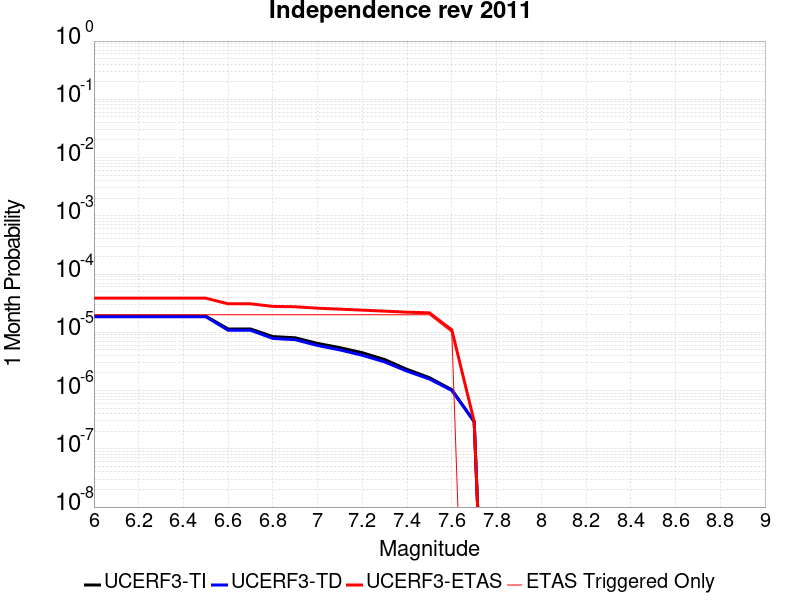 |  |  |

| Magnitude | 1 wk TI Prob | 1 wk TD Prob | 1 wk ETAS Prob | 1 wk ETAS/TD Gain | 1 wk ETAS Triggered Only | 1 mo TI Prob | 1 mo TD Prob | 1 mo ETAS Prob | 1 mo ETAS/TD Gain | 1 mo ETAS Triggered Only | 1 yr TI Prob | 1 yr TD Prob | 1 yr ETAS Prob | 1 yr ETAS/TD Gain | 1 yr ETAS Triggered Only | 10 yr TI Prob | 10 yr TD Prob | 10 yr ETAS Prob | 10 yr ETAS/TD Gain | 10 yr ETAS Triggered Only |
|-----|-----|-----|-----|-----|-----|-----|-----|-----|-----|-----|-----|-----|-----|-----|-----|-----|-----|-----|-----|-----|
| 6.0 | 4.422171E-6 | 4.3262453E-6 | 1.4326202E-5 | 3.311463 | 1.0E-5 | 1.8952025E-5 | 1.8540937E-5 | 3.8540566E-5 | 2.078674 | 2.0E-5 | 2.3071647E-4 | 2.257155E-4 | 2.956997E-4 | 1.3100549 | 7.0E-5 | 0.0023047708 | 0.0022551562 | 0.0023748854 | 1.0530914 | 1.2E-4 |
| 6.1 | 4.422171E-6 | 4.3262453E-6 | 1.4326202E-5 | 3.311463 | 1.0E-5 | 1.8952025E-5 | 1.8540937E-5 | 3.8540566E-5 | 2.078674 | 2.0E-5 | 2.3071647E-4 | 2.257155E-4 | 2.956997E-4 | 1.3100549 | 7.0E-5 | 0.0023047708 | 0.0022551562 | 0.0023748854 | 1.0530914 | 1.2E-4 |
| 6.2 | 4.422171E-6 | 4.3262453E-6 | 1.4326202E-5 | 3.311463 | 1.0E-5 | 1.8952025E-5 | 1.8540937E-5 | 3.8540566E-5 | 2.078674 | 2.0E-5 | 2.3071647E-4 | 2.257155E-4 | 2.956997E-4 | 1.3100549 | 7.0E-5 | 0.0023047708 | 0.0022551562 | 0.0023748854 | 1.0530914 | 1.2E-4 |
| 6.3 | 4.422171E-6 | 4.3262453E-6 | 1.4326202E-5 | 3.311463 | 1.0E-5 | 1.8952025E-5 | 1.8540937E-5 | 3.8540566E-5 | 2.078674 | 2.0E-5 | 2.3071647E-4 | 2.257155E-4 | 2.956997E-4 | 1.3100549 | 7.0E-5 | 0.0023047708 | 0.0022551562 | 0.0023748854 | 1.0530914 | 1.2E-4 |
| 6.4 | 4.422171E-6 | 4.3262453E-6 | 1.4326202E-5 | 3.311463 | 1.0E-5 | 1.8952025E-5 | 1.8540937E-5 | 3.8540566E-5 | 2.078674 | 2.0E-5 | 2.3071647E-4 | 2.257155E-4 | 2.956997E-4 | 1.3100549 | 7.0E-5 | 0.0023047708 | 0.0022551562 | 0.0023748854 | 1.0530914 | 1.2E-4 |
| 6.5 | 4.422171E-6 | 4.3262453E-6 | 1.4326202E-5 | 3.311463 | 1.0E-5 | 1.8952025E-5 | 1.8540937E-5 | 3.8540566E-5 | 2.078674 | 2.0E-5 | 2.3071647E-4 | 2.257155E-4 | 2.956997E-4 | 1.3100549 | 7.0E-5 | 0.0023047708 | 0.0022551562 | 0.0023748854 | 1.0530914 | 1.2E-4 |
| 6.6 | 2.663744E-6 | 2.5319996E-6 | 1.2531975E-5 | 4.9494376 | 1.0E-5 | 1.1415996E-5 | 1.0851385E-5 | 3.0851166E-5 | 2.8430626 | 2.0E-5 | 1.3898089E-4 | 1.3210809E-4 | 2.0209885E-4 | 1.5297991 | 7.0E-5 | 0.0013889399 | 0.0013203438 | 0.0014401854 | 1.0907655 | 1.2E-4 |
| 6.7 | 2.663744E-6 | 2.5319996E-6 | 1.2531975E-5 | 4.9494376 | 1.0E-5 | 1.1415996E-5 | 1.0851385E-5 | 3.0851166E-5 | 2.8430626 | 2.0E-5 | 1.3898089E-4 | 1.3210809E-4 | 2.0209885E-4 | 1.5297991 | 7.0E-5 | 0.0013889399 | 0.0013203438 | 0.0014401854 | 1.0907655 | 1.2E-4 |
| 6.8 | 1.9716529E-6 | 1.8322698E-6 | 1.1832251E-5 | 6.4577017 | 1.0E-5 | 8.449913E-6 | 7.852562E-6 | 2.7852406E-5 | 3.5469196 | 2.0E-5 | 1.0287284E-4 | 9.560088E-5 | 1.6559419E-4 | 1.7321409 | 7.0E-5 | 0.0010282523 | 9.556104E-4 | 0.0010655053 | 1.1149997 | 1.1E-4 |
| 6.9 | 1.8788617E-6 | 1.7430103E-6 | 1.1742993E-5 | 6.7371907 | 1.0E-5 | 8.0522395E-6 | 7.4700233E-6 | 2.7469874E-5 | 3.6773477 | 2.0E-5 | 9.80316E-5 | 9.094386E-5 | 1.6093749E-4 | 1.7696356 | 7.0E-5 | 9.798837E-4 | 9.0907846E-4 | 0.0010189784 | 1.1208917 | 1.1E-4 |
| 7.0 | 1.5045488E-6 | 1.3849603E-6 | 1.1384946E-5 | 8.220413 | 1.0E-5 | 6.44805E-6 | 5.935531E-6 | 2.5935413E-5 | 4.3695183 | 2.0E-5 | 7.8502184E-5 | 7.226275E-5 | 1.3225841E-4 | 1.8302433 | 6.0E-5 | 7.8474457E-4 | 7.2239764E-4 | 8.223254E-4 | 1.138328 | 1.0E-4 |
| 7.1 | 1.272341E-6 | 1.1625186E-6 | 1.1162507E-5 | 9.602003 | 1.0E-5 | 5.4528787E-6 | 4.9822133E-6 | 2.4982113E-5 | 5.0142603 | 2.0E-5 | 6.6386776E-5 | 6.065679E-5 | 1.2065315E-4 | 1.989112 | 6.0E-5 | 6.636695E-4 | 6.0640555E-4 | 6.9635094E-4 | 1.1483256 | 9.0E-5 |
| 7.2 | 1.0416892E-6 | 9.4099533E-7 | 1.0940986E-5 | 11.627035 | 1.0E-5 | 4.464375E-6 | 4.032831E-6 | 2.403275E-5 | 5.9592752 | 2.0E-5 | 5.4352407E-5 | 4.909863E-5 | 1.0909569E-4 | 2.22197 | 6.0E-5 | 5.4339116E-4 | 4.908797E-4 | 5.808355E-4 | 1.1832544 | 9.0E-5 |
| 7.3 | 7.9450155E-7 | 7.2350707E-7 | 1.07235E-5 | 14.821555 | 1.0E-5 | 3.4050022E-6 | 3.100741E-6 | 2.310068E-5 | 7.4500513 | 2.0E-5 | 4.1455114E-5 | 3.7750877E-5 | 9.774861E-5 | 2.589307 | 6.0E-5 | 4.144738E-4 | 3.7744577E-4 | 4.674118E-4 | 1.2383548 | 9.0E-5 |
| 7.4 | 5.3893444E-7 | 5.0195547E-7 | 1.0501951E-5 | 20.922077 | 1.0E-5 | 2.309717E-6 | 2.1512358E-6 | 2.2151193E-5 | 10.296962 | 2.0E-5 | 2.8120441E-5 | 2.6190986E-5 | 8.6189415E-5 | 3.2908044 | 6.0E-5 | 2.8116882E-4 | 2.6187944E-4 | 3.5185588E-4 | 1.3435795 | 9.0E-5 |
| 7.5 | 3.8852085E-7 | 3.6825836E-7 | 1.0368255E-5 | 28.154839 | 1.0E-5 | 1.6650882E-6 | 1.5782492E-6 | 2.1578218E-5 | 13.67225 | 2.0E-5 | 2.027226E-5 | 1.9215016E-5 | 7.921387E-5 | 4.122498 | 6.0E-5 | 2.0270412E-4 | 1.9213377E-4 | 2.8211647E-4 | 1.4683336 | 9.0E-5 |
| 7.6 | 2.414929E-7 | 2.3457733E-7 | 1.0234575E-5 | 43.629856 | 1.0E-5 | 1.0349692E-6 | 1.005331E-6 | 1.1005321E-5 | 10.946962 | 1.0E-5 | 1.2600677E-5 | 1.2239838E-5 | 4.223947E-5 | 3.4509828 | 3.0E-5 | 1.2599962E-4 | 1.2239176E-4 | 1.7238564E-4 | 1.4084742 | 5.0E-5 |
| 7.7 | 6.8298014E-8 | 6.858997E-8 | 6.858997E-8 | 1.0 | 0.0 | 2.9270575E-7 | 2.93957E-7 | 2.93957E-7 | 1.0 | 0.0 | 3.5636867E-6 | 3.578921E-6 | 3.578921E-6 | 1.0 | 0.0 | 3.5636294E-5 | 3.5788682E-5 | 3.5788682E-5 | 1.0 | 0.0 |

## Oceanic - West Huasna
*[(top)](#table-of-contents)*

| 1 Week | 1 Month | 1 Year | 10 Year |
|-----|-----|-----|-----|
|  | 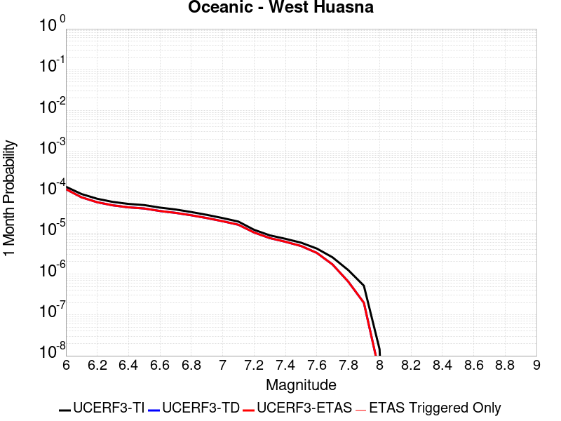 | 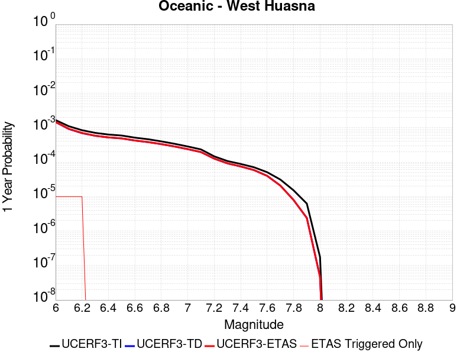 |  |

| Magnitude | 1 wk TI Prob | 1 wk TD Prob | 1 wk ETAS Prob | 1 wk ETAS/TD Gain | 1 wk ETAS Triggered Only | 1 mo TI Prob | 1 mo TD Prob | 1 mo ETAS Prob | 1 mo ETAS/TD Gain | 1 mo ETAS Triggered Only | 1 yr TI Prob | 1 yr TD Prob | 1 yr ETAS Prob | 1 yr ETAS/TD Gain | 1 yr ETAS Triggered Only | 10 yr TI Prob | 10 yr TD Prob | 10 yr ETAS Prob | 10 yr ETAS/TD Gain | 10 yr ETAS Triggered Only |
|-----|-----|-----|-----|-----|-----|-----|-----|-----|-----|-----|-----|-----|-----|-----|-----|-----|-----|-----|-----|-----|
| 6.0 | 3.195567E-5 | 2.7926611E-5 | 2.7926611E-5 | 1.0 | 0.0 | 1.3694567E-4 | 1.1968023E-4 | 1.1968023E-4 | 1.0 | 0.0 | 0.0016660384 | 0.001456176 | 0.0014661615 | 1.0068573 | 1.0E-5 | 0.016536033 | 0.014470896 | 0.014559593 | 1.0061294 | 9.0E-5 |
| 6.1 | 2.1156782E-5 | 1.7573251E-5 | 1.7573251E-5 | 1.0 | 0.0 | 9.066878E-5 | 7.531181E-5 | 7.531181E-5 | 1.0 | 0.0 | 0.0011033333 | 9.1654493E-4 | 9.265358E-4 | 1.0109005 | 1.0E-5 | 0.010978713 | 0.009128656 | 0.0091782 | 1.0054272 | 5.0E-5 |
| 6.2 | 1.6195117E-5 | 1.332732E-5 | 1.332732E-5 | 1.0 | 0.0 | 6.9405796E-5 | 5.7115845E-5 | 5.7115845E-5 | 1.0 | 0.0 | 8.44688E-4 | 6.951662E-4 | 7.051592E-4 | 1.0143751 | 1.0E-5 | 0.008414844 | 0.0069302097 | 0.006960002 | 1.0042989 | 3.0E-5 |
| 6.3 | 1.3559345E-5 | 1.1179085E-5 | 1.1179085E-5 | 1.0 | 0.0 | 5.811018E-5 | 4.7909492E-5 | 4.7909492E-5 | 1.0 | 0.0 | 7.072618E-4 | 5.831429E-4 | 5.831429E-4 | 1.0 | 0.0 | 0.0070501505 | 0.0058162455 | 0.005836129 | 1.0034187 | 2.0E-5 |
| 6.4 | 1.2120619E-5 | 1.0000936E-5 | 1.0000936E-5 | 1.0 | 0.0 | 5.1944477E-5 | 4.286045E-5 | 4.286045E-5 | 1.0 | 0.0 | 6.322405E-4 | 5.217015E-4 | 5.217015E-4 | 1.0 | 0.0 | 0.006304447 | 0.0052048354 | 0.0052247313 | 1.0038226 | 2.0E-5 |
| 6.5 | 1.13511915E-5 | 9.367435E-6 | 9.367435E-6 | 1.0 | 0.0 | 4.8647056E-5 | 4.0145536E-5 | 4.0145536E-5 | 1.0 | 0.0 | 5.9211696E-4 | 4.8866274E-4 | 4.8866274E-4 | 1.0 | 0.0 | 0.0059054173 | 0.0048759407 | 0.004895843 | 1.0040817 | 2.0E-5 |
| 6.6 | 9.850605E-6 | 8.135364E-6 | 8.135364E-6 | 1.0 | 0.0 | 4.2216197E-5 | 3.4865378E-5 | 3.4865378E-5 | 1.0 | 0.0 | 5.1386096E-4 | 4.2440352E-4 | 4.2440352E-4 | 1.0 | 0.0 | 0.0051267436 | 0.0042359624 | 0.004255878 | 1.0047015 | 2.0E-5 |
| 6.7 | 8.8558645E-6 | 7.318384E-6 | 7.318384E-6 | 1.0 | 0.0 | 3.7953152E-5 | 3.1364125E-5 | 3.1364125E-5 | 1.0 | 0.0 | 4.6198163E-4 | 3.817915E-4 | 3.817915E-4 | 1.0 | 0.0 | 0.004610224 | 0.0038113813 | 0.0038113813 | 1.0 | 0.0 |
| 6.8 | 7.67136E-6 | 6.3917278E-6 | 6.3917278E-6 | 1.0 | 0.0 | 3.2876844E-5 | 2.7392833E-5 | 2.7392833E-5 | 1.0 | 0.0 | 4.0020206E-4 | 3.3345685E-4 | 3.3345685E-4 | 1.0 | 0.0 | 0.003994821 | 0.003329586 | 0.003329586 | 1.0 | 0.0 |
| 6.9 | 6.534529E-6 | 5.4582943E-6 | 5.4582943E-6 | 1.0 | 0.0 | 2.8004823E-5 | 2.339248E-5 | 2.339248E-5 | 1.0 | 0.0 | 3.4090536E-4 | 2.8476634E-4 | 2.8476634E-4 | 1.0 | 0.0 | 0.0034038287 | 0.0028440312 | 0.0028440312 | 1.0 | 0.0 |
| 7.0 | 5.460525E-6 | 4.5699494E-6 | 4.5699494E-6 | 1.0 | 0.0 | 2.3402039E-5 | 1.9585352E-5 | 1.9585352E-5 | 1.0 | 0.0 | 2.8488258E-4 | 2.3842567E-4 | 2.3842567E-4 | 1.0 | 0.0 | 0.0028451765 | 0.0023817124 | 0.0023817124 | 1.0 | 0.0 |
| 7.1 | 4.4825083E-6 | 3.7524424E-6 | 3.7524424E-6 | 1.0 | 0.0 | 1.9210609E-5 | 1.6081798E-5 | 1.6081798E-5 | 1.0 | 0.0 | 2.3386406E-4 | 1.957784E-4 | 1.957784E-4 | 1.0 | 0.0 | 0.002336181 | 0.001956071 | 0.001956071 | 1.0 | 0.0 |
| 7.2 | 2.821708E-6 | 2.4249653E-6 | 2.4249653E-6 | 1.0 | 0.0 | 1.2092979E-5 | 1.0392667E-5 | 1.0392667E-5 | 1.0 | 0.0 | 1.4722206E-4 | 1.2652339E-4 | 1.2652339E-4 | 1.0 | 0.0 | 0.0014712457 | 0.0012645158 | 0.0012645158 | 1.0 | 0.0 |
| 7.3 | 2.0644757E-6 | 1.7687719E-6 | 1.7687719E-6 | 1.0 | 0.0 | 8.847723E-6 | 7.580429E-6 | 7.580429E-6 | 1.0 | 0.0 | 1.0771569E-4 | 9.228782E-5 | 9.228782E-5 | 1.0 | 0.0 | 0.001076635 | 9.2249655E-4 | 9.2249655E-4 | 1.0 | 0.0 |
| 7.4 | 1.6980367E-6 | 1.4380173E-6 | 1.4380173E-6 | 1.0 | 0.0 | 7.27728E-6 | 6.1629166E-6 | 6.1629166E-6 | 1.0 | 0.0 | 8.8597284E-5 | 7.503093E-5 | 7.503093E-5 | 1.0 | 0.0 | 8.8561967E-4 | 7.5005746E-4 | 7.5005746E-4 | 1.0 | 0.0 |
| 7.5 | 1.3637683E-6 | 1.1302892E-6 | 1.1302892E-6 | 1.0 | 0.0 | 5.844708E-6 | 4.8440875E-6 | 4.8440875E-6 | 1.0 | 0.0 | 7.1156996E-5 | 5.897517E-5 | 5.897517E-5 | 1.0 | 0.0 | 7.1134215E-4 | 5.895966E-4 | 5.895966E-4 | 1.0 | 0.0 |
| 7.6 | 9.802994E-7 | 7.677469E-7 | 7.677469E-7 | 1.0 | 0.0 | 4.2012766E-6 | 3.2903397E-6 | 3.2903397E-6 | 1.0 | 0.0 | 5.1149345E-5 | 4.005915E-5 | 4.005915E-5 | 1.0 | 0.0 | 5.113757E-4 | 4.0052057E-4 | 4.0052057E-4 | 1.0 | 0.0 |
| 7.7 | 5.986191E-7 | 4.0052444E-7 | 4.0052444E-7 | 1.0 | 0.0 | 2.5655079E-6 | 1.7165321E-6 | 1.7165321E-6 | 1.0 | 0.0 | 3.1234613E-5 | 2.0898578E-5 | 2.0898578E-5 | 1.0 | 0.0 | 3.123022E-4 | 2.0896735E-4 | 2.0896735E-4 | 1.0 | 0.0 |
| 7.8 | 2.9189815E-7 | 1.5286729E-7 | 1.5286729E-7 | 1.0 | 0.0 | 1.2509914E-6 | 6.5514536E-7 | 6.5514536E-7 | 1.0 | 0.0 | 1.5230714E-5 | 7.976366E-6 | 7.976366E-6 | 1.0 | 0.0 | 1.522967E-4 | 7.976198E-5 | 7.976198E-5 | 1.0 | 0.0 |
| 7.9 | 1.2057845E-7 | 4.621617E-8 | 4.621617E-8 | 1.0 | 0.0 | 5.1676466E-7 | 1.9806929E-7 | 1.9806929E-7 | 1.0 | 0.0 | 6.2915915E-6 | 2.4114909E-6 | 2.4114909E-6 | 1.0 | 0.0 | 6.2914136E-5 | 2.4115825E-5 | 2.4115825E-5 | 1.0 | 0.0 |
| 8.0 | 3.3806387E-9 | 9.0127306E-10 | 9.0127306E-10 | 1.0 | 0.0 | 1.4488451E-8 | 3.8625965E-9 | 3.8625965E-9 | 1.0 | 0.0 | 1.7639688E-7 | 4.7027115E-8 | 4.7027115E-8 | 1.0 | 0.0 | 1.7639674E-6 | 4.7134822E-7 | 4.7134822E-7 | 1.0 | 0.0 |

## San Andreas (Creeping Section) 2011 CFM
*[(top)](#table-of-contents)*

| 1 Week | 1 Month | 1 Year | 10 Year |
|-----|-----|-----|-----|
|  | 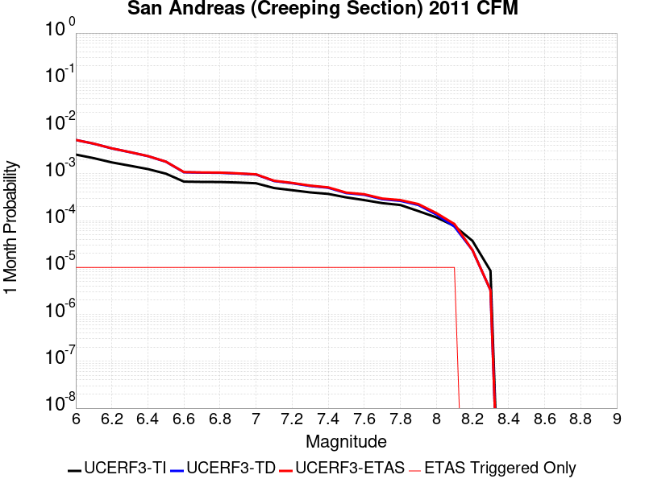 | 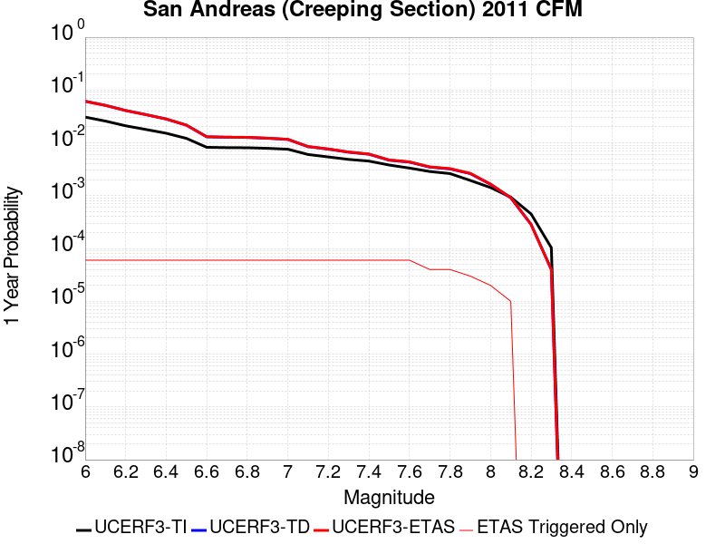 | 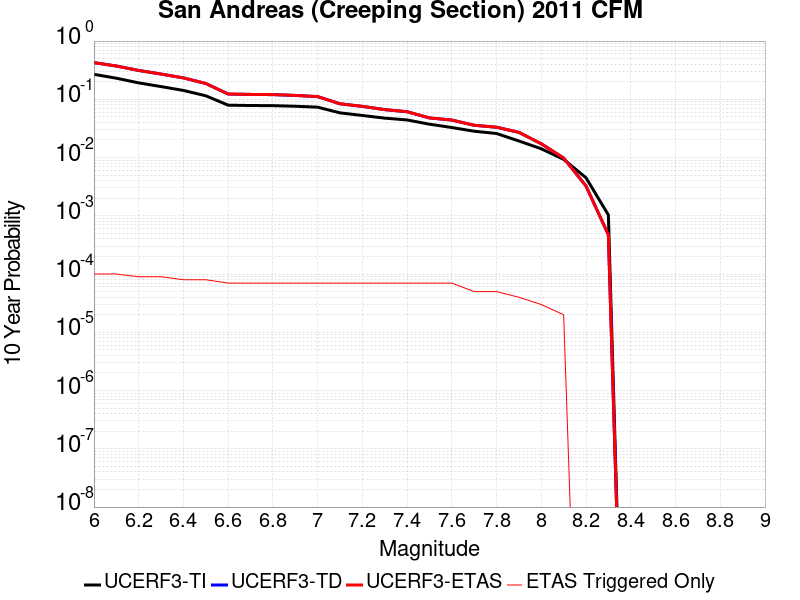 |

| Magnitude | 1 wk TI Prob | 1 wk TD Prob | 1 wk ETAS Prob | 1 wk ETAS/TD Gain | 1 wk ETAS Triggered Only | 1 mo TI Prob | 1 mo TD Prob | 1 mo ETAS Prob | 1 mo ETAS/TD Gain | 1 mo ETAS Triggered Only | 1 yr TI Prob | 1 yr TD Prob | 1 yr ETAS Prob | 1 yr ETAS/TD Gain | 1 yr ETAS Triggered Only | 10 yr TI Prob | 10 yr TD Prob | 10 yr ETAS Prob | 10 yr ETAS/TD Gain | 10 yr ETAS Triggered Only |
|-----|-----|-----|-----|-----|-----|-----|-----|-----|-----|-----|-----|-----|-----|-----|-----|-----|-----|-----|-----|-----|
| 6.0 | 5.986481E-4 | 0.001227701 | 0.001227701 | 1.0 | 0.0 | 0.0025631124 | 0.005246098 | 0.0052560456 | 1.0018961 | 1.0E-5 | 0.030762846 | 0.061211813 | 0.06126814 | 1.0009202 | 6.0E-5 | 0.26835477 | 0.42596716 | 0.42602456 | 1.0001347 | 1.0E-4 |
| 6.1 | 5.015945E-4 | 0.0010218859 | 0.0010218859 | 1.0 | 0.0 | 0.00214792 | 0.0043683136 | 0.00437827 | 1.0022792 | 1.0E-5 | 0.025839351 | 0.051254056 | 0.05131098 | 1.0011107 | 6.0E-5 | 0.23032776 | 0.3728875 | 0.3729502 | 1.0001682 | 1.0E-4 |
| 6.2 | 4.073338E-4 | 8.1082666E-4 | 8.1082666E-4 | 1.0 | 0.0 | 0.0017445484 | 0.003467598 | 0.0034775634 | 1.0028739 | 1.0E-5 | 0.021034058 | 0.040938858 | 0.040996403 | 1.0014056 | 6.0E-5 | 0.19150782 | 0.31306726 | 0.31312907 | 1.0001975 | 9.0E-5 |
| 6.3 | 3.464099E-4 | 6.740175E-4 | 6.740175E-4 | 1.0 | 0.0 | 0.0014837692 | 0.0028834257 | 0.002893397 | 1.0034581 | 1.0E-5 | 0.017915873 | 0.034195323 | 0.03425327 | 1.0016947 | 6.0E-5 | 0.16538359 | 0.27135244 | 0.271418 | 1.0002416 | 9.0E-5 |
| 6.4 | 2.935057E-4 | 5.545179E-4 | 5.545179E-4 | 1.0 | 0.0 | 0.0012572751 | 0.002372998 | 0.0023829744 | 1.004204 | 1.0E-5 | 0.015200248 | 0.028270293 | 0.028328596 | 1.0020623 | 6.0E-5 | 0.14201577 | 0.23302312 | 0.23308448 | 1.0002633 | 8.0E-5 |
| 6.5 | 2.3409708E-4 | 4.2102532E-4 | 4.2102532E-4 | 1.0 | 0.0 | 0.0010028875 | 0.0018024362 | 0.0018124182 | 1.0055381 | 1.0E-5 | 0.012141965 | 0.021593295 | 0.021652 | 1.0027187 | 6.0E-5 | 0.11499573 | 0.18686365 | 0.1869287 | 1.0003481 | 8.0E-5 |
| 6.6 | 1.5842178E-4 | 2.5080625E-4 | 2.5080625E-4 | 1.0 | 0.0 | 6.7877385E-4 | 0.0010744325 | 0.0010844218 | 1.0092973 | 1.0E-5 | 0.0082328 | 0.013001433 | 0.013060653 | 1.0045549 | 6.0E-5 | 0.07934396 | 0.12318965 | 0.12325103 | 1.0004982 | 7.0E-5 |
| 6.7 | 1.5616413E-4 | 2.4617155E-4 | 2.4617155E-4 | 1.0 | 0.0 | 6.691031E-4 | 0.0010545887 | 0.0010645782 | 1.0094724 | 1.0E-5 | 0.0081159435 | 0.012763296 | 0.01282253 | 1.0046409 | 6.0E-5 | 0.0782586 | 0.121216856 | 0.12127837 | 1.0005075 | 7.0E-5 |
| 6.8 | 1.5538467E-4 | 2.4440986E-4 | 2.4440986E-4 | 1.0 | 0.0 | 6.6576427E-4 | 0.0010470453 | 0.0010570349 | 1.0095407 | 1.0E-5 | 0.008075596 | 0.012672617 | 0.012731857 | 1.0046747 | 6.0E-5 | 0.07788358 | 0.12044768 | 0.12050925 | 1.0005112 | 7.0E-5 |
| 6.9 | 1.5153569E-4 | 2.3550174E-4 | 2.3550174E-4 | 1.0 | 0.0 | 6.49277E-4 | 0.0010089047 | 0.0010188946 | 1.0099018 | 1.0E-5 | 0.007876333 | 0.012214754 | 0.012274021 | 1.004852 | 6.0E-5 | 0.07602952 | 0.1165177 | 0.11657955 | 1.0005307 | 7.0E-5 |
| 7.0 | 1.4588932E-4 | 2.2407302E-4 | 2.2407302E-4 | 1.0 | 0.0 | 6.250901E-4 | 9.599615E-4 | 9.699519E-4 | 1.0104071 | 1.0E-5 | 0.0075839474 | 0.011625397 | 0.011684699 | 1.0051011 | 6.0E-5 | 0.073302895 | 0.1113634 | 0.11142561 | 1.0005586 | 7.0E-5 |
| 7.1 | 1.1565079E-4 | 1.6291256E-4 | 1.6291256E-4 | 1.0 | 0.0 | 4.955521E-4 | 6.980107E-4 | 7.0800376E-4 | 1.0143164 | 1.0E-5 | 0.006016669 | 0.008465368 | 0.00852486 | 1.0070277 | 6.0E-5 | 0.058563538 | 0.083707 | 0.08377114 | 1.0007663 | 7.0E-5 |
| 7.2 | 1.0393792E-4 | 1.4624851E-4 | 1.4624851E-4 | 1.0 | 0.0 | 4.4537216E-4 | 6.2662957E-4 | 6.366233E-4 | 1.0159484 | 1.0E-5 | 0.005408933 | 0.007602697 | 0.007662241 | 1.0078319 | 6.0E-5 | 0.052791595 | 0.0756556 | 0.07572031 | 1.0008552 | 7.0E-5 |
| 7.3 | 9.332884E-5 | 1.2788622E-4 | 1.2788622E-4 | 1.0 | 0.0 | 3.999194E-4 | 5.479693E-4 | 5.5796385E-4 | 1.0182391 | 1.0E-5 | 0.0048581534 | 0.006651253 | 0.006710854 | 1.0089608 | 6.0E-5 | 0.047533102 | 0.06651429 | 0.06657963 | 1.0009824 | 7.0E-5 |
| 7.4 | 8.670252E-5 | 1.1709979E-4 | 1.1709979E-4 | 1.0 | 0.0 | 3.715293E-4 | 5.0176034E-4 | 5.117553E-4 | 1.0199199 | 1.0E-5 | 0.004513991 | 0.0060919416 | 0.006151576 | 1.0097891 | 6.0E-5 | 0.044233937 | 0.0611787 | 0.061244417 | 1.0010742 | 7.0E-5 |
| 7.5 | 7.3036405E-5 | 9.011361E-5 | 9.011361E-5 | 1.0 | 0.0 | 3.129756E-4 | 3.861441E-4 | 3.9614024E-4 | 1.025887 | 1.0E-5 | 0.0038038217 | 0.0046911915 | 0.0047509097 | 1.0127299 | 6.0E-5 | 0.03739367 | 0.047902368 | 0.047969013 | 1.0013913 | 7.0E-5 |
| 7.6 | 6.3935775E-5 | 8.285012E-5 | 8.285012E-5 | 1.0 | 0.0 | 2.7398168E-4 | 3.5502372E-4 | 3.6502015E-4 | 1.0281571 | 1.0E-5 | 0.0033306254 | 0.0043138657 | 0.0043736068 | 1.0138487 | 6.0E-5 | 0.032811474 | 0.044012927 | 0.044079844 | 1.0015204 | 7.0E-5 |
| 7.7 | 5.5050095E-5 | 6.6658926E-5 | 6.6658926E-5 | 1.0 | 0.0 | 2.3590765E-4 | 2.8564985E-4 | 2.9564698E-4 | 1.0349979 | 1.0E-5 | 0.0028683927 | 0.0034722448 | 0.0035121061 | 1.01148 | 4.0E-5 | 0.0283165 | 0.03581521 | 0.035863418 | 1.0013461 | 5.0E-5 |
| 7.8 | 5.027131E-5 | 6.166573E-5 | 6.166573E-5 | 1.0 | 0.0 | 2.1543067E-4 | 2.6425492E-4 | 2.7425226E-4 | 1.0378323 | 1.0E-5 | 0.0026197135 | 0.0032125604 | 0.003252432 | 1.0124111 | 4.0E-5 | 0.025890453 | 0.03314427 | 0.03319261 | 1.0014585 | 5.0E-5 |
| 7.9 | 3.7271806E-5 | 5.0254795E-5 | 5.0254795E-5 | 1.0 | 0.0 | 1.5972654E-4 | 2.1535992E-4 | 2.2535777E-4 | 1.0464239 | 1.0E-5 | 0.0019429359 | 0.0026188563 | 0.0026487778 | 1.0114254 | 3.0E-5 | 0.019260362 | 0.027081393 | 0.027120309 | 1.0014371 | 4.0E-5 |
| 8.0 | 2.7310243E-5 | 3.1447296E-5 | 3.1447296E-5 | 1.0 | 0.0 | 1.17038646E-4 | 1.3476716E-4 | 1.4476581E-4 | 1.074192 | 1.0E-5 | 0.0014240141 | 0.0016395561 | 0.0016595233 | 1.0121784 | 2.0E-5 | 0.014149235 | 0.017223299 | 0.017252782 | 1.0017118 | 3.0E-5 |
| 8.1 | 1.7940547E-5 | 1.7411876E-5 | 1.7411876E-5 | 1.0 | 0.0 | 7.688579E-5 | 7.46202E-5 | 8.461945E-5 | 1.134002 | 1.0E-5 | 9.3568244E-4 | 9.0812275E-4 | 9.181137E-4 | 1.0110017 | 1.0E-5 | 0.009317525 | 0.009804959 | 0.009824763 | 1.0020198 | 2.0E-5 |
| 8.2 | 8.643924E-6 | 5.478665E-6 | 5.478665E-6 | 1.0 | 0.0 | 3.704486E-5 | 2.3479783E-5 | 2.3479783E-5 | 1.0 | 0.0 | 4.5092785E-4 | 2.8582895E-4 | 2.8582895E-4 | 1.0 | 0.0 | 0.0045001395 | 0.0032508469 | 0.0032508469 | 1.0 | 0.0 |
| 8.3 | 1.983087E-6 | 7.6647797E-7 | 7.6647797E-7 | 1.0 | 0.0 | 8.498917E-6 | 3.2849016E-6 | 3.2849016E-6 | 1.0 | 0.0 | 1.034694E-4 | 3.999296E-5 | 3.999296E-5 | 1.0 | 0.0 | 0.0010342124 | 4.7228087E-4 | 4.7228087E-4 | 1.0 | 0.0 |

## Owens Valley
*[(top)](#table-of-contents)*

| 1 Week | 1 Month | 1 Year | 10 Year |
|-----|-----|-----|-----|
|  |  |  |  |

| Magnitude | 1 wk TI Prob | 1 wk TD Prob | 1 wk ETAS Prob | 1 wk ETAS/TD Gain | 1 wk ETAS Triggered Only | 1 mo TI Prob | 1 mo TD Prob | 1 mo ETAS Prob | 1 mo ETAS/TD Gain | 1 mo ETAS Triggered Only | 1 yr TI Prob | 1 yr TD Prob | 1 yr ETAS Prob | 1 yr ETAS/TD Gain | 1 yr ETAS Triggered Only | 10 yr TI Prob | 10 yr TD Prob | 10 yr ETAS Prob | 10 yr ETAS/TD Gain | 10 yr ETAS Triggered Only |
|-----|-----|-----|-----|-----|-----|-----|-----|-----|-----|-----|-----|-----|-----|-----|-----|-----|-----|-----|-----|-----|
| 6.0 | 4.83821E-5 | 3.621193E-6 | 2.362112E-5 | 6.5230217 | 2.0E-5 | 2.0733538E-4 | 1.5519312E-5 | 4.5518846E-5 | 2.9330454 | 3.0E-5 | 0.002521386 | 1.8893222E-4 | 2.689171E-4 | 1.4233522 | 8.0E-5 | 0.024929691 | 0.001929822 | 0.0020396097 | 1.0568901 | 1.1E-4 |
| 6.1 | 4.83821E-5 | 3.621193E-6 | 2.362112E-5 | 6.5230217 | 2.0E-5 | 2.0733538E-4 | 1.5519312E-5 | 4.5518846E-5 | 2.9330454 | 3.0E-5 | 0.002521386 | 1.8893222E-4 | 2.689171E-4 | 1.4233522 | 8.0E-5 | 0.024929691 | 0.001929822 | 0.0020396097 | 1.0568901 | 1.1E-4 |
| 6.2 | 4.83821E-5 | 3.621193E-6 | 2.362112E-5 | 6.5230217 | 2.0E-5 | 2.0733538E-4 | 1.5519312E-5 | 4.5518846E-5 | 2.9330454 | 3.0E-5 | 0.002521386 | 1.8893222E-4 | 2.689171E-4 | 1.4233522 | 8.0E-5 | 0.024929691 | 0.001929822 | 0.0020396097 | 1.0568901 | 1.1E-4 |
| 6.3 | 3.953008E-5 | 3.153231E-6 | 1.31532E-5 | 4.1713405 | 1.0E-5 | 1.6940363E-4 | 1.3513782E-5 | 2.3513647E-5 | 1.7399753 | 1.0E-5 | 0.002060538 | 1.645186E-4 | 2.2450872E-4 | 1.3646404 | 6.0E-5 | 0.020415364 | 0.0016622683 | 0.001732152 | 1.0420412 | 7.0E-5 |
| 6.4 | 3.953008E-5 | 3.153231E-6 | 1.31532E-5 | 4.1713405 | 1.0E-5 | 1.6940363E-4 | 1.3513782E-5 | 2.3513647E-5 | 1.7399753 | 1.0E-5 | 0.002060538 | 1.645186E-4 | 2.2450872E-4 | 1.3646404 | 6.0E-5 | 0.020415364 | 0.0016622683 | 0.001732152 | 1.0420412 | 7.0E-5 |
| 6.5 | 3.457342E-5 | 2.970874E-6 | 1.2970844E-5 | 4.366003 | 1.0E-5 | 1.4816338E-4 | 1.2732259E-5 | 2.273213E-5 | 1.7853966 | 1.0E-5 | 0.0018023965 | 1.5500492E-4 | 2.1499563E-4 | 1.3870245 | 6.0E-5 | 0.017878477 | 0.0015564174 | 0.0016263084 | 1.0449051 | 7.0E-5 |
| 6.6 | 3.1127765E-5 | 2.8738657E-6 | 1.28738375E-5 | 4.479624 | 1.0E-5 | 1.3339789E-4 | 1.2316514E-5 | 2.231639E-5 | 1.8119081 | 1.0E-5 | 0.0016229092 | 1.4994392E-4 | 2.0993492E-4 | 1.4000896 | 6.0E-5 | 0.016111081 | 0.001501446 | 0.001571341 | 1.0465517 | 7.0E-5 |
| 6.7 | 2.806885E-5 | 2.8102859E-6 | 1.2810257E-5 | 4.5583467 | 1.0E-5 | 1.2028952E-4 | 1.204403E-5 | 2.204391E-5 | 1.8302768 | 1.0E-5 | 0.001463541 | 1.4662689E-4 | 2.0661809E-4 | 1.4091419 | 6.0E-5 | 0.014539397 | 0.0014657174 | 0.0015356148 | 1.0476881 | 7.0E-5 |
| 6.8 | 2.524524E-5 | 2.2352563E-6 | 2.2352563E-6 | 1.0 | 0.0 | 1.0818939E-4 | 9.579636E-6 | 9.579636E-6 | 1.0 | 0.0 | 0.0013164099 | 1.1662613E-4 | 1.666203E-4 | 1.4286704 | 5.0E-5 | 0.01308639 | 0.0011659319 | 0.001225862 | 1.051401 | 6.0E-5 |
| 6.9 | 2.2704568E-5 | 1.6080646E-6 | 1.6080646E-6 | 1.0 | 0.0 | 9.730166E-5 | 6.8916875E-6 | 6.8916875E-6 | 1.0 | 0.0 | 0.0011840039 | 8.390308E-5 | 1.338989E-4 | 1.5958756 | 5.0E-5 | 0.011777153 | 8.3894585E-4 | 8.988955E-4 | 1.0714583 | 6.0E-5 |
| 7.0 | 2.0871712E-5 | 1.5394511E-6 | 1.5394511E-6 | 1.0 | 0.0 | 8.944713E-5 | 6.597631E-6 | 6.597631E-6 | 1.0 | 0.0 | 0.0010884746 | 8.032321E-5 | 1.303192E-4 | 1.6224351 | 5.0E-5 | 0.010831586 | 8.0313E-4 | 8.630818E-4 | 1.0746477 | 6.0E-5 |
| 7.1 | 1.944928E-5 | 1.3863316E-6 | 1.3863316E-6 | 1.0 | 0.0 | 8.335139E-5 | 5.941408E-6 | 5.941408E-6 | 1.0 | 0.0 | 0.0010143308 | 7.233425E-5 | 1.2233063E-4 | 1.6911855 | 5.0E-5 | 0.010097133 | 7.232817E-4 | 7.8323827E-4 | 1.0828953 | 6.0E-5 |
| 7.2 | 1.7876306E-5 | 1.2488347E-6 | 1.2488347E-6 | 1.0 | 0.0 | 7.6610486E-5 | 5.352138E-6 | 5.352138E-6 | 1.0 | 0.0 | 9.3233347E-4 | 6.516034E-5 | 1.1515708E-4 | 1.767288 | 5.0E-5 | 0.009284316 | 6.5157266E-4 | 7.1153353E-4 | 1.0920249 | 6.0E-5 |
| 7.3 | 1.2618672E-5 | 1.1114453E-6 | 1.1114453E-6 | 1.0 | 0.0 | 5.40789E-5 | 4.763328E-6 | 4.763328E-6 | 1.0 | 0.0 | 6.582117E-4 | 5.7991983E-5 | 1.07989086E-4 | 1.8621382 | 5.0E-5 | 0.0065626553 | 5.7992374E-4 | 6.39889E-4 | 1.1034019 | 6.0E-5 |
| 7.4 | 7.4874442E-6 | 8.548014E-7 | 8.548014E-7 | 1.0 | 0.0 | 3.208865E-5 | 3.6634294E-6 | 3.6634294E-6 | 1.0 | 0.0 | 3.906093E-4 | 4.4601344E-5 | 9.459911E-5 | 2.1209924 | 5.0E-5 | 0.003899234 | 4.4603736E-4 | 5.060106E-4 | 1.1344578 | 6.0E-5 |
| 7.5 | 2.4734156E-6 | 6.0683584E-7 | 6.0683584E-7 | 1.0 | 0.0 | 1.060031E-5 | 2.6007224E-6 | 2.6007224E-6 | 1.0 | 0.0 | 1.2905113E-4 | 3.1663338E-5 | 7.166207E-5 | 2.2632506 | 4.0E-5 | 0.0012897621 | 3.165886E-4 | 3.6657276E-4 | 1.1578836 | 5.0E-5 |
| 7.6 | 1.1328841E-6 | 3.1963748E-7 | 3.1963748E-7 | 1.0 | 0.0 | 4.8552088E-6 | 1.3698742E-6 | 1.3698742E-6 | 1.0 | 0.0 | 5.9110564E-5 | 1.6678092E-5 | 4.6677593E-5 | 2.7987368 | 3.0E-5 | 5.9094845E-4 | 1.667686E-4 | 1.9676359E-4 | 1.17986 | 3.0E-5 |
| 7.7 | 4.8613185E-7 | 8.9632934E-8 | 8.9632934E-8 | 1.0 | 0.0 | 2.0834207E-6 | 3.8414112E-7 | 3.8414112E-7 | 1.0 | 0.0 | 2.536535E-5 | 4.6769087E-6 | 4.6769087E-6 | 1.0 | 0.0 | 2.5362454E-4 | 4.676817E-5 | 4.676817E-5 | 1.0 | 0.0 |

## Santa Rosa Island
*[(top)](#table-of-contents)*

| 1 Week | 1 Month | 1 Year | 10 Year |
|-----|-----|-----|-----|
|  | 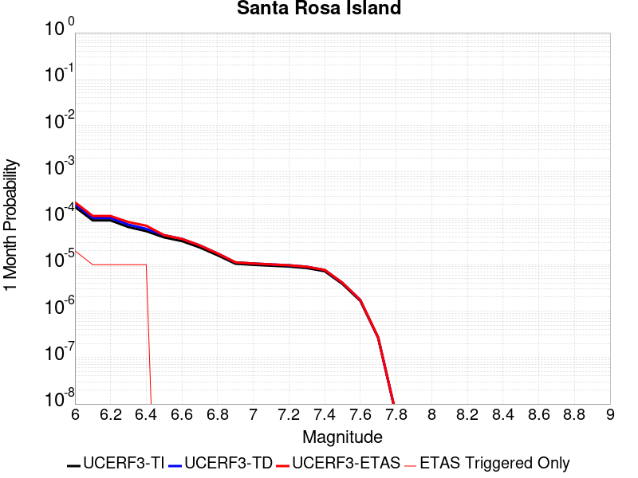 |  |  |

| Magnitude | 1 wk TI Prob | 1 wk TD Prob | 1 wk ETAS Prob | 1 wk ETAS/TD Gain | 1 wk ETAS Triggered Only | 1 mo TI Prob | 1 mo TD Prob | 1 mo ETAS Prob | 1 mo ETAS/TD Gain | 1 mo ETAS Triggered Only | 1 yr TI Prob | 1 yr TD Prob | 1 yr ETAS Prob | 1 yr ETAS/TD Gain | 1 yr ETAS Triggered Only | 10 yr TI Prob | 10 yr TD Prob | 10 yr ETAS Prob | 10 yr ETAS/TD Gain | 10 yr ETAS Triggered Only |
|-----|-----|-----|-----|-----|-----|-----|-----|-----|-----|-----|-----|-----|-----|-----|-----|-----|-----|-----|-----|-----|
| 6.0 | 4.1143165E-5 | 4.7092035E-5 | 6.7091096E-5 | 1.4246802 | 2.0E-5 | 1.7631594E-4 | 2.018085E-4 | 2.2180447E-4 | 1.0990839 | 2.0E-5 | 0.002144533 | 0.0024544464 | 0.0025043236 | 1.0203212 | 5.0E-5 | 0.021239553 | 0.024294019 | 0.024401346 | 1.0044179 | 1.1E-4 |
| 6.1 | 2.1061249E-5 | 2.3865383E-5 | 3.3865144E-5 | 1.419007 | 1.0E-5 | 9.0259375E-5 | 1.0227637E-4 | 1.12275346E-4 | 1.0977643 | 1.0E-5 | 0.0010983539 | 0.0012445324 | 0.0012545199 | 1.0080252 | 1.0E-5 | 0.01092941 | 0.012378668 | 0.012428049 | 1.0039892 | 5.0E-5 |
| 6.2 | 2.1061249E-5 | 2.3865383E-5 | 3.3865144E-5 | 1.419007 | 1.0E-5 | 9.0259375E-5 | 1.0227637E-4 | 1.12275346E-4 | 1.0977643 | 1.0E-5 | 0.0010983539 | 0.0012445324 | 0.0012545199 | 1.0080252 | 1.0E-5 | 0.01092941 | 0.012378668 | 0.012428049 | 1.0039892 | 5.0E-5 |
| 6.3 | 1.5158236E-5 | 1.7074706E-5 | 2.7074535E-5 | 1.5856516 | 1.0E-5 | 6.496225E-5 | 7.317533E-5 | 8.31746E-5 | 1.136648 | 1.0E-5 | 7.906284E-4 | 8.905575E-4 | 9.005486E-4 | 1.0112189 | 1.0E-5 | 0.007878214 | 0.008871139 | 0.0089107845 | 1.004469 | 4.0E-5 |
| 6.4 | 1.2341918E-5 | 1.3853143E-5 | 2.3853005E-5 | 1.7218479 | 1.0E-5 | 5.2892858E-5 | 5.9369308E-5 | 6.936872E-5 | 1.1684272 | 1.0E-5 | 6.437803E-4 | 7.225897E-4 | 7.325825E-4 | 1.0138291 | 1.0E-5 | 0.006419184 | 0.007203239 | 0.0072330227 | 1.0041348 | 3.0E-5 |
| 6.5 | 9.061158E-6 | 1.0117189E-5 | 1.0117189E-5 | 1.0 | 0.0 | 3.883296E-5 | 4.335869E-5 | 4.335869E-5 | 1.0 | 0.0 | 4.726887E-4 | 5.277695E-4 | 5.277695E-4 | 1.0 | 0.0 | 0.004716845 | 0.0052656992 | 0.0052756467 | 1.0018891 | 1.0E-5 |
| 6.6 | 7.5461685E-6 | 8.400862E-6 | 8.400862E-6 | 1.0 | 0.0 | 3.2340322E-5 | 3.6003217E-5 | 3.6003217E-5 | 1.0 | 0.0 | 3.936723E-4 | 4.3825532E-4 | 4.3825532E-4 | 1.0 | 0.0 | 0.003929756 | 0.00437434 | 0.004384296 | 1.0022761 | 1.0E-5 |
| 6.7 | 5.5023775E-6 | 6.0874677E-6 | 6.0874677E-6 | 1.0 | 0.0 | 2.3581404E-5 | 2.6088905E-5 | 2.6088905E-5 | 1.0 | 0.0 | 2.8706578E-4 | 3.1758938E-4 | 3.1758938E-4 | 1.0 | 0.0 | 0.0028669522 | 0.0031716768 | 0.0031716768 | 1.0 | 0.0 |
| 6.8 | 3.7351679E-6 | 4.083192E-6 | 4.083192E-6 | 1.0 | 0.0 | 1.6007763E-5 | 1.749929E-5 | 1.749929E-5 | 1.0 | 0.0 | 1.948771E-4 | 2.1303551E-4 | 2.1303551E-4 | 1.0 | 0.0 | 0.0019470629 | 0.0021285582 | 0.0021285582 | 1.0 | 0.0 |
| 6.9 | 2.456366E-6 | 2.6292955E-6 | 2.6292955E-6 | 1.0 | 0.0 | 1.0527241E-5 | 1.1268361E-5 | 1.1268361E-5 | 1.0 | 0.0 | 1.2816161E-4 | 1.3718368E-4 | 1.3718368E-4 | 1.0 | 0.0 | 0.0012808773 | 0.0013709929 | 0.0013709929 | 1.0 | 0.0 |
| 7.0 | 2.3245157E-6 | 2.4828012E-6 | 2.4828012E-6 | 1.0 | 0.0 | 9.962172E-6 | 1.0640533E-5 | 1.0640533E-5 | 1.0 | 0.0 | 1.2128269E-4 | 1.295408E-4 | 1.295408E-4 | 1.0 | 0.0 | 0.0012121652 | 0.0012946553 | 0.0012946553 | 1.0 | 0.0 |
| 7.1 | 2.2248344E-6 | 2.3732714E-6 | 2.3732714E-6 | 1.0 | 0.0 | 9.53497E-6 | 1.0171123E-5 | 1.0171123E-5 | 1.0 | 0.0 | 1.1608207E-4 | 1.2382641E-4 | 1.2382641E-4 | 1.0 | 0.0 | 0.0011602144 | 0.0012375761 | 0.0012375761 | 1.0 | 0.0 |
| 7.2 | 2.1350402E-6 | 2.2761742E-6 | 2.2761742E-6 | 1.0 | 0.0 | 9.150141E-6 | 9.754996E-6 | 9.754996E-6 | 1.0 | 0.0 | 1.1139726E-4 | 1.18760625E-4 | 1.18760625E-4 | 1.0 | 0.0 | 0.0011134144 | 0.0011869734 | 0.0011869734 | 1.0 | 0.0 |
| 7.3 | 1.9793572E-6 | 2.1087376E-6 | 2.1087376E-6 | 1.0 | 0.0 | 8.482932E-6 | 9.037416E-6 | 9.037416E-6 | 1.0 | 0.0 | 1.032748E-4 | 1.10025E-4 | 1.10025E-4 | 1.0 | 0.0 | 0.0010322682 | 0.0010997071 | 0.0010997071 | 1.0 | 0.0 |
| 7.4 | 1.6951194E-6 | 1.8045891E-6 | 1.8045891E-6 | 1.0 | 0.0 | 7.264777E-6 | 7.733931E-6 | 7.733931E-6 | 1.0 | 0.0 | 8.844508E-5 | 9.415655E-5 | 9.415655E-5 | 1.0 | 0.0 | 8.840988E-4 | 9.411683E-4 | 9.411683E-4 | 1.0 | 0.0 |
| 7.5 | 8.987207E-7 | 9.5122914E-7 | 9.5122914E-7 | 1.0 | 0.0 | 3.8516546E-6 | 4.07669E-6 | 4.07669E-6 | 1.0 | 0.0 | 4.6892885E-5 | 4.963258E-5 | 4.963258E-5 | 1.0 | 0.0 | 4.688299E-4 | 4.962162E-4 | 4.962162E-4 | 1.0 | 0.0 |
| 7.6 | 3.8783037E-7 | 4.0529594E-7 | 4.0529594E-7 | 1.0 | 0.0 | 1.6621291E-6 | 1.7369814E-6 | 1.7369814E-6 | 1.0 | 0.0 | 2.0236233E-5 | 2.114755E-5 | 2.114755E-5 | 1.0 | 0.0 | 2.023439E-4 | 2.1145603E-4 | 2.1145603E-4 | 1.0 | 0.0 |
| 7.7 | 6.181804E-8 | 6.339078E-8 | 6.339078E-8 | 1.0 | 0.0 | 2.6493444E-7 | 2.7167474E-7 | 2.7167474E-7 | 1.0 | 0.0 | 3.225572E-6 | 3.3076349E-6 | 3.3076349E-6 | 1.0 | 0.0 | 3.225525E-5 | 3.3075863E-5 | 3.3075863E-5 | 1.0 | 0.0 |
| 7.8 | 1.3704449E-9 | 1.3964188E-9 | 1.3964188E-9 | 1.0 | 0.0 | 5.873335E-9 | 5.984652E-9 | 5.984652E-9 | 1.0 | 0.0 | 7.1507856E-8 | 7.286314E-8 | 7.286314E-8 | 1.0 | 0.0 | 7.1507833E-7 | 7.286312E-7 | 7.286312E-7 | 1.0 | 0.0 |

## Cleghorn Pass
*[(top)](#table-of-contents)*

| 1 Week | 1 Month | 1 Year | 10 Year |
|-----|-----|-----|-----|
|  |  |  | 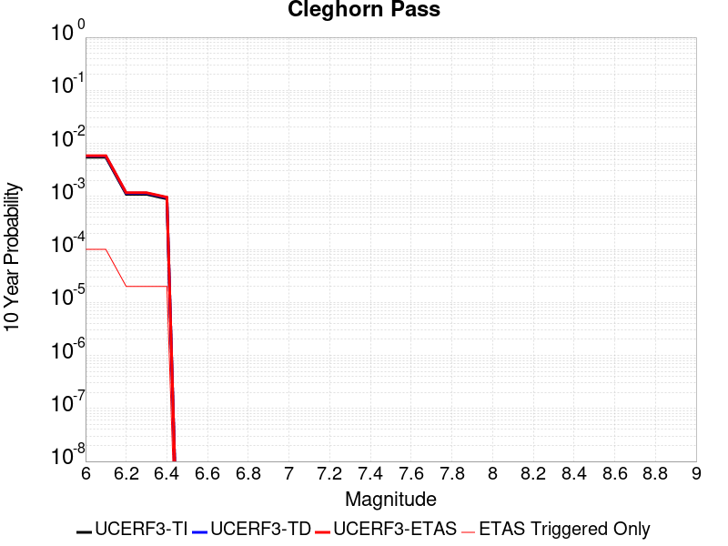 |

| Magnitude | 1 wk TI Prob | 1 wk TD Prob | 1 wk ETAS Prob | 1 wk ETAS/TD Gain | 1 wk ETAS Triggered Only | 1 mo TI Prob | 1 mo TD Prob | 1 mo ETAS Prob | 1 mo ETAS/TD Gain | 1 mo ETAS Triggered Only | 1 yr TI Prob | 1 yr TD Prob | 1 yr ETAS Prob | 1 yr ETAS/TD Gain | 1 yr ETAS Triggered Only | 10 yr TI Prob | 10 yr TD Prob | 10 yr ETAS Prob | 10 yr ETAS/TD Gain | 10 yr ETAS Triggered Only |
|-----|-----|-----|-----|-----|-----|-----|-----|-----|-----|-----|-----|-----|-----|-----|-----|-----|-----|-----|-----|-----|
| 6.0 | 1.0522846E-5 | 1.1040714E-5 | 2.1040603E-5 | 1.9057286 | 1.0E-5 | 4.509713E-5 | 4.7316782E-5 | 7.7315366E-5 | 1.6339945 | 3.0E-5 | 5.4891926E-4 | 5.759822E-4 | 6.259534E-4 | 1.0867583 | 5.0E-5 | 0.0054756533 | 0.005750059 | 0.0058494844 | 1.0172911 | 1.0E-4 |
| 6.1 | 1.0522846E-5 | 1.1040714E-5 | 2.1040603E-5 | 1.9057286 | 1.0E-5 | 4.509713E-5 | 4.7316782E-5 | 7.7315366E-5 | 1.6339945 | 3.0E-5 | 5.4891926E-4 | 5.759822E-4 | 6.259534E-4 | 1.0867583 | 5.0E-5 | 0.0054756533 | 0.005750059 | 0.0058494844 | 1.0172911 | 1.0E-4 |
| 6.2 | 2.1045846E-6 | 2.2082168E-6 | 2.2082168E-6 | 1.0 | 0.0 | 9.019617E-6 | 9.463776E-6 | 1.9463681E-5 | 2.0566506 | 1.0E-5 | 1.098083E-4 | 1.1521958E-4 | 1.2521842E-4 | 1.0867808 | 1.0E-5 | 0.0010975406 | 0.0011520098 | 0.0011719867 | 1.017341 | 2.0E-5 |
| 6.3 | 2.1045846E-6 | 2.2082168E-6 | 2.2082168E-6 | 1.0 | 0.0 | 9.019617E-6 | 9.463776E-6 | 1.9463681E-5 | 2.0566506 | 1.0E-5 | 1.098083E-4 | 1.1521958E-4 | 1.2521842E-4 | 1.0867808 | 1.0E-5 | 0.0010975406 | 0.0011520098 | 0.0011719867 | 1.017341 | 2.0E-5 |
| 6.4 | 1.7259927E-6 | 1.8108889E-6 | 1.8108889E-6 | 1.0 | 0.0 | 7.3970905E-6 | 7.760952E-6 | 1.7760874E-5 | 2.2884917 | 1.0E-5 | 9.005586E-5 | 9.4489595E-5 | 1.0448865E-4 | 1.1058217 | 1.0E-5 | 9.001937E-4 | 9.4489596E-4 | 9.648771E-4 | 1.0211463 | 2.0E-5 |

## San Jacinto (Lytle Creek connector)
*[(top)](#table-of-contents)*

| 1 Week | 1 Month | 1 Year | 10 Year |
|-----|-----|-----|-----|
|  |  |  |  |

| Magnitude | 1 wk TI Prob | 1 wk TD Prob | 1 wk ETAS Prob | 1 wk ETAS/TD Gain | 1 wk ETAS Triggered Only | 1 mo TI Prob | 1 mo TD Prob | 1 mo ETAS Prob | 1 mo ETAS/TD Gain | 1 mo ETAS Triggered Only | 1 yr TI Prob | 1 yr TD Prob | 1 yr ETAS Prob | 1 yr ETAS/TD Gain | 1 yr ETAS Triggered Only | 10 yr TI Prob | 10 yr TD Prob | 10 yr ETAS Prob | 10 yr ETAS/TD Gain | 10 yr ETAS Triggered Only |
|-----|-----|-----|-----|-----|-----|-----|-----|-----|-----|-----|-----|-----|-----|-----|-----|-----|-----|-----|-----|-----|
| 6.0 | 6.693995E-6 | 6.6628318E-6 | 2.66627E-5 | 4.0017066 | 2.0E-5 | 2.8688235E-5 | 2.8554681E-5 | 4.855411E-5 | 1.7003906 | 2.0E-5 | 3.492233E-4 | 3.4759787E-4 | 4.07577E-4 | 1.1725533 | 6.0E-5 | 0.00348675 | 0.0035508901 | 0.0036505351 | 1.028062 | 1.0E-4 |
| 6.1 | 6.693995E-6 | 6.6628318E-6 | 2.66627E-5 | 4.0017066 | 2.0E-5 | 2.8688235E-5 | 2.8554681E-5 | 4.855411E-5 | 1.7003906 | 2.0E-5 | 3.492233E-4 | 3.4759787E-4 | 4.07577E-4 | 1.1725533 | 6.0E-5 | 0.00348675 | 0.0035508901 | 0.0036505351 | 1.028062 | 1.0E-4 |
| 6.2 | 6.693995E-6 | 6.6628318E-6 | 2.66627E-5 | 4.0017066 | 2.0E-5 | 2.8688235E-5 | 2.8554681E-5 | 4.855411E-5 | 1.7003906 | 2.0E-5 | 3.492233E-4 | 3.4759787E-4 | 4.07577E-4 | 1.1725533 | 6.0E-5 | 0.00348675 | 0.0035508901 | 0.0036505351 | 1.028062 | 1.0E-4 |
| 6.3 | 6.693995E-6 | 6.6628318E-6 | 2.66627E-5 | 4.0017066 | 2.0E-5 | 2.8688235E-5 | 2.8554681E-5 | 4.855411E-5 | 1.7003906 | 2.0E-5 | 3.492233E-4 | 3.4759787E-4 | 4.07577E-4 | 1.1725533 | 6.0E-5 | 0.00348675 | 0.0035508901 | 0.0036505351 | 1.028062 | 1.0E-4 |
| 6.4 | 6.693995E-6 | 6.6628318E-6 | 2.66627E-5 | 4.0017066 | 2.0E-5 | 2.8688235E-5 | 2.8554681E-5 | 4.855411E-5 | 1.7003906 | 2.0E-5 | 3.492233E-4 | 3.4759787E-4 | 4.07577E-4 | 1.1725533 | 6.0E-5 | 0.00348675 | 0.0035508901 | 0.0036505351 | 1.028062 | 1.0E-4 |
| 6.5 | 6.6561875E-6 | 6.6230496E-6 | 2.6622916E-5 | 4.019737 | 2.0E-5 | 2.8526205E-5 | 2.838419E-5 | 4.8383623E-5 | 1.7045976 | 2.0E-5 | 3.472512E-4 | 3.455228E-4 | 4.0550207E-4 | 1.17359 | 6.0E-5 | 0.0034670907 | 0.0035302055 | 0.0036298526 | 1.028227 | 1.0E-4 |
| 6.6 | 6.6561875E-6 | 6.6230496E-6 | 2.6622916E-5 | 4.019737 | 2.0E-5 | 2.8526205E-5 | 2.838419E-5 | 4.8383623E-5 | 1.7045976 | 2.0E-5 | 3.472512E-4 | 3.455228E-4 | 4.0550207E-4 | 1.17359 | 6.0E-5 | 0.0034670907 | 0.0035302055 | 0.0036298526 | 1.028227 | 1.0E-4 |
| 6.7 | 6.5802237E-6 | 6.5422255E-6 | 2.6542095E-5 | 4.0570436 | 2.0E-5 | 2.8200653E-5 | 2.803781E-5 | 4.8037247E-5 | 1.7133025 | 2.0E-5 | 3.4328885E-4 | 3.4130694E-4 | 4.0128644E-4 | 1.1757349 | 6.0E-5 | 0.0034275902 | 0.0034881798 | 0.0035878308 | 1.0285683 | 1.0E-4 |
| 6.8 | 6.575632E-6 | 6.5367153E-6 | 2.6536585E-5 | 4.059621 | 2.0E-5 | 2.8180975E-5 | 2.8014192E-5 | 4.8013633E-5 | 1.7139038 | 2.0E-5 | 3.4304935E-4 | 3.410195E-4 | 4.0099904E-4 | 1.175883 | 6.0E-5 | 0.0034252026 | 0.0034853143 | 0.0035849658 | 1.0285919 | 1.0E-4 |
| 6.9 | 6.570433E-6 | 6.5281088E-6 | 2.6527978E-5 | 4.0636544 | 2.0E-5 | 2.8158694E-5 | 2.7977308E-5 | 4.797675E-5 | 1.7148451 | 2.0E-5 | 3.4277816E-4 | 3.4057058E-4 | 4.0055014E-4 | 1.1761149 | 6.0E-5 | 0.0034224992 | 0.0034808393 | 0.0035804913 | 1.0286287 | 1.0E-4 |
| 7.0 | 6.5643826E-6 | 6.5182294E-6 | 2.6518099E-5 | 4.068298 | 2.0E-5 | 2.8132765E-5 | 2.793497E-5 | 4.793441E-5 | 1.7159286 | 2.0E-5 | 3.424626E-4 | 3.4005524E-4 | 4.0003486E-4 | 1.176382 | 6.0E-5 | 0.0034193532 | 0.0034757021 | 0.0035753546 | 1.0286711 | 1.0E-4 |
| 7.1 | 6.557402E-6 | 6.5069403E-6 | 2.650681E-5 | 4.0736213 | 2.0E-5 | 2.8102848E-5 | 2.788659E-5 | 4.788603E-5 | 1.7171706 | 2.0E-5 | 3.4209844E-4 | 3.394664E-4 | 3.9944606E-4 | 1.176688 | 6.0E-5 | 0.0034157229 | 0.0034698334 | 0.0035694863 | 1.0287198 | 1.0E-4 |
| 7.2 | 6.546394E-6 | 6.488906E-6 | 2.6488777E-5 | 4.082164 | 2.0E-5 | 2.8055672E-5 | 2.7809301E-5 | 4.7808746E-5 | 1.7191639 | 2.0E-5 | 3.4152428E-4 | 3.3852572E-4 | 3.985054E-4 | 1.1771791 | 6.0E-5 | 0.0034099987 | 0.0034604599 | 0.003560114 | 1.0287979 | 1.0E-4 |
| 7.3 | 6.5364216E-6 | 6.469689E-6 | 2.6469559E-5 | 4.0913186 | 2.0E-5 | 2.8012933E-5 | 2.7726945E-5 | 4.772639E-5 | 1.7213 | 2.0E-5 | 3.4100408E-4 | 3.3752335E-4 | 3.9750308E-4 | 1.1777055 | 6.0E-5 | 0.003404813 | 0.003450482 | 0.003550137 | 1.0288814 | 1.0E-4 |
| 7.4 | 6.5269523E-6 | 6.450774E-6 | 2.6450645E-5 | 4.1003833 | 2.0E-5 | 2.7972354E-5 | 2.7645881E-5 | 4.7645328E-5 | 1.723415 | 2.0E-5 | 3.4051016E-4 | 3.365367E-4 | 3.965165E-4 | 1.1782267 | 6.0E-5 | 0.0033998888 | 0.0034406635 | 0.0035403194 | 1.0289642 | 1.0E-4 |
| 7.5 | 6.5111835E-6 | 6.4270453E-6 | 2.6426917E-5 | 4.1118298 | 2.0E-5 | 2.7904773E-5 | 2.7544189E-5 | 4.754364E-5 | 1.7260859 | 2.0E-5 | 3.3968766E-4 | 3.3529897E-4 | 3.9527885E-4 | 1.1788847 | 6.0E-5 | 0.0033916887 | 0.0034283353 | 0.0035279926 | 1.0290687 | 1.0E-4 |
| 7.6 | 6.4768806E-6 | 6.3861507E-6 | 2.6386022E-5 | 4.1317573 | 2.0E-5 | 2.7757764E-5 | 2.736893E-5 | 4.7368383E-5 | 1.7307357 | 2.0E-5 | 3.3789838E-4 | 3.3316584E-4 | 3.9314586E-4 | 1.1800305 | 6.0E-5 | 0.0033738504 | 0.0034070655 | 0.003506725 | 1.0292507 | 1.0E-4 |
| 7.7 | 6.1655364E-6 | 6.1786222E-6 | 2.6178499E-5 | 4.2369475 | 2.0E-5 | 2.642346E-5 | 2.6479542E-5 | 4.647901E-5 | 1.7552801 | 2.0E-5 | 3.2165812E-4 | 3.2234078E-4 | 3.8232145E-4 | 1.1860784 | 6.0E-5 | 0.0032119295 | 0.0032986694 | 0.0033983395 | 1.0302153 | 1.0E-4 |
| 7.8 | 5.5043524E-6 | 5.739622E-6 | 2.5739508E-5 | 4.48453 | 2.0E-5 | 2.3589868E-5 | 2.4598148E-5 | 4.4597655E-5 | 1.8130493 | 2.0E-5 | 2.871688E-4 | 2.9944137E-4 | 3.594234E-4 | 1.2003131 | 6.0E-5 | 0.0028679797 | 0.003068756 | 0.0031684493 | 1.0324864 | 1.0E-4 |
| 7.9 | 3.889249E-6 | 4.0787854E-6 | 2.4078703E-5 | 5.9034004 | 2.0E-5 | 1.6668104E-5 | 1.7480392E-5 | 3.7480044E-5 | 2.144119 | 2.0E-5 | 2.0291525E-4 | 2.1280303E-4 | 2.7279026E-4 | 1.2818909 | 6.0E-5 | 0.0020273007 | 0.0021955092 | 0.0022952894 | 1.0454475 | 1.0E-4 |
| 8.0 | 2.668535E-6 | 2.5328056E-6 | 1.2532781E-5 | 4.948181 | 1.0E-5 | 1.1436528E-5 | 1.0854836E-5 | 2.0854728E-5 | 1.9212384 | 1.0E-5 | 1.3923083E-4 | 1.3214964E-4 | 1.52147E-4 | 1.1513236 | 2.0E-5 | 0.0013914363 | 0.0013765903 | 0.0014265216 | 1.0362716 | 5.0E-5 |
| 8.1 | 1.5911459E-6 | 1.2193005E-6 | 1.2193005E-6 | 1.0 | 0.0 | 6.8191785E-6 | 5.225563E-6 | 5.225563E-6 | 1.0 | 0.0 | 8.3020335E-5 | 6.3619394E-5 | 7.3618765E-5 | 1.1571747 | 1.0E-5 | 8.298933E-4 | 6.697524E-4 | 6.797457E-4 | 1.014921 | 1.0E-5 |
| 8.2 | 6.1294963E-7 | 2.1825215E-7 | 2.1825215E-7 | 1.0 | 0.0 | 2.6269242E-6 | 9.35366E-7 | 9.35366E-7 | 1.0 | 0.0 | 3.1982334E-5 | 1.1388021E-5 | 1.1388021E-5 | 1.0 | 0.0 | 3.1977732E-4 | 1.279216E-4 | 1.279216E-4 | 1.0 | 0.0 |
| 8.3 | 1.762871E-7 | 4.757476E-8 | 4.757476E-8 | 1.0 | 0.0 | 7.5551594E-7 | 2.038918E-7 | 2.038918E-7 | 1.0 | 0.0 | 9.1983675E-6 | 2.4823798E-6 | 2.4823798E-6 | 1.0 | 0.0 | 9.197987E-5 | 2.8703373E-5 | 2.8703373E-5 | 1.0 | 0.0 |

## Lost Hills
*[(top)](#table-of-contents)*

| 1 Week | 1 Month | 1 Year | 10 Year |
|-----|-----|-----|-----|
|  |  |  |  |

| Magnitude | 1 wk TI Prob | 1 wk TD Prob | 1 wk ETAS Prob | 1 wk ETAS/TD Gain | 1 wk ETAS Triggered Only | 1 mo TI Prob | 1 mo TD Prob | 1 mo ETAS Prob | 1 mo ETAS/TD Gain | 1 mo ETAS Triggered Only | 1 yr TI Prob | 1 yr TD Prob | 1 yr ETAS Prob | 1 yr ETAS/TD Gain | 1 yr ETAS Triggered Only | 10 yr TI Prob | 10 yr TD Prob | 10 yr ETAS Prob | 10 yr ETAS/TD Gain | 10 yr ETAS Triggered Only |
|-----|-----|-----|-----|-----|-----|-----|-----|-----|-----|-----|-----|-----|-----|-----|-----|-----|-----|-----|-----|-----|
| 6.0 | 2.233523E-5 | 2.5106996E-5 | 2.5106996E-5 | 1.0 | 0.0 | 9.571891E-5 | 1.0759792E-4 | 1.0759792E-4 | 1.0 | 0.0 | 0.0011647546 | 0.0013093855 | 0.0013693069 | 1.045763 | 6.0E-5 | 0.011586686 | 0.013033304 | 0.013122131 | 1.0068154 | 9.0E-5 |
| 6.1 | 2.233523E-5 | 2.5106996E-5 | 2.5106996E-5 | 1.0 | 0.0 | 9.571891E-5 | 1.0759792E-4 | 1.0759792E-4 | 1.0 | 0.0 | 0.0011647546 | 0.0013093855 | 0.0013693069 | 1.045763 | 6.0E-5 | 0.011586686 | 0.013033304 | 0.013122131 | 1.0068154 | 9.0E-5 |
| 6.2 | 2.233523E-5 | 2.5106996E-5 | 2.5106996E-5 | 1.0 | 0.0 | 9.571891E-5 | 1.0759792E-4 | 1.0759792E-4 | 1.0 | 0.0 | 0.0011647546 | 0.0013093855 | 0.0013693069 | 1.045763 | 6.0E-5 | 0.011586686 | 0.013033304 | 0.013122131 | 1.0068154 | 9.0E-5 |
| 6.3 | 2.233523E-5 | 2.5106996E-5 | 2.5106996E-5 | 1.0 | 0.0 | 9.571891E-5 | 1.0759792E-4 | 1.0759792E-4 | 1.0 | 0.0 | 0.0011647546 | 0.0013093855 | 0.0013693069 | 1.045763 | 6.0E-5 | 0.011586686 | 0.013033304 | 0.013122131 | 1.0068154 | 9.0E-5 |
| 6.4 | 1.2288092E-5 | 1.37813295E-5 | 1.37813295E-5 | 1.0 | 0.0 | 5.2662188E-5 | 5.9062033E-5 | 5.9062033E-5 | 1.0 | 0.0 | 6.409735E-4 | 7.189368E-4 | 7.6890085E-4 | 1.0694971 | 5.0E-5 | 0.006391279 | 0.007175316 | 0.0072448137 | 1.0096856 | 7.0E-5 |
| 6.5 | 1.2288092E-5 | 1.37813295E-5 | 1.37813295E-5 | 1.0 | 0.0 | 5.2662188E-5 | 5.9062033E-5 | 5.9062033E-5 | 1.0 | 0.0 | 6.409735E-4 | 7.189368E-4 | 7.6890085E-4 | 1.0694971 | 5.0E-5 | 0.006391279 | 0.007175316 | 0.0072448137 | 1.0096856 | 7.0E-5 |
| 6.6 | 8.58281E-6 | 9.633926E-6 | 9.633926E-6 | 1.0 | 0.0 | 3.6782953E-5 | 4.1288073E-5 | 4.1288073E-5 | 1.0 | 0.0 | 4.4774043E-4 | 5.026495E-4 | 5.526244E-4 | 1.0994229 | 5.0E-5 | 0.0044683935 | 0.0050232867 | 0.005092935 | 1.0138651 | 7.0E-5 |
| 6.7 | 7.205685E-6 | 8.088433E-6 | 8.088433E-6 | 1.0 | 0.0 | 3.088114E-5 | 3.4664714E-5 | 3.4664714E-5 | 1.0 | 0.0 | 3.7591302E-4 | 4.2204288E-4 | 4.6202602E-4 | 1.094737 | 4.0E-5 | 0.0037527776 | 0.004220429 | 0.0042801755 | 1.0141566 | 6.0E-5 |

## Cleghorn Lake
*[(top)](#table-of-contents)*

| 1 Week | 1 Month | 1 Year | 10 Year |
|-----|-----|-----|-----|
|  | 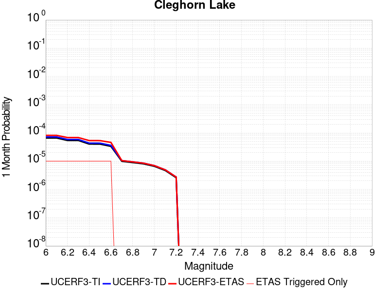 |  | 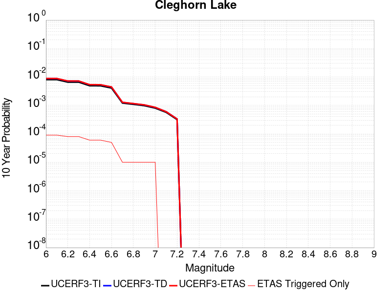 |

| Magnitude | 1 wk TI Prob | 1 wk TD Prob | 1 wk ETAS Prob | 1 wk ETAS/TD Gain | 1 wk ETAS Triggered Only | 1 mo TI Prob | 1 mo TD Prob | 1 mo ETAS Prob | 1 mo ETAS/TD Gain | 1 mo ETAS Triggered Only | 1 yr TI Prob | 1 yr TD Prob | 1 yr ETAS Prob | 1 yr ETAS/TD Gain | 1 yr ETAS Triggered Only | 10 yr TI Prob | 10 yr TD Prob | 10 yr ETAS Prob | 10 yr ETAS/TD Gain | 10 yr ETAS Triggered Only |
|-----|-----|-----|-----|-----|-----|-----|-----|-----|-----|-----|-----|-----|-----|-----|-----|-----|-----|-----|-----|-----|
| 6.0 | 1.5467183E-5 | 1.6794396E-5 | 1.6794396E-5 | 1.0 | 0.0 | 6.6286244E-5 | 7.1974304E-5 | 8.197359E-5 | 1.1389285 | 1.0E-5 | 8.067362E-4 | 8.7598973E-4 | 9.159547E-4 | 1.0456226 | 4.0E-5 | 0.008038137 | 0.008730795 | 0.008820009 | 1.0102184 | 9.0E-5 |
| 6.1 | 1.5467183E-5 | 1.6794396E-5 | 1.6794396E-5 | 1.0 | 0.0 | 6.6286244E-5 | 7.1974304E-5 | 8.197359E-5 | 1.1389285 | 1.0E-5 | 8.067362E-4 | 8.7598973E-4 | 9.159547E-4 | 1.0456226 | 4.0E-5 | 0.008038137 | 0.008730795 | 0.008820009 | 1.0102184 | 9.0E-5 |
| 6.2 | 1.2624631E-5 | 1.3681697E-5 | 1.3681697E-5 | 1.0 | 0.0 | 5.410444E-5 | 5.86348E-5 | 6.863422E-5 | 1.1705372 | 1.0E-5 | 6.585225E-4 | 7.1369356E-4 | 7.53665E-4 | 1.0560064 | 4.0E-5 | 0.0065657445 | 0.007118811 | 0.0071982415 | 1.0111579 | 8.0E-5 |
| 6.3 | 1.2624631E-5 | 1.3681697E-5 | 1.3681697E-5 | 1.0 | 0.0 | 5.410444E-5 | 5.86348E-5 | 6.863422E-5 | 1.1705372 | 1.0E-5 | 6.585225E-4 | 7.1369356E-4 | 7.53665E-4 | 1.0560064 | 4.0E-5 | 0.0065657445 | 0.007118811 | 0.0071982415 | 1.0111579 | 8.0E-5 |
| 6.4 | 9.417684E-6 | 1.0170226E-5 | 1.0170226E-5 | 1.0 | 0.0 | 4.036088E-5 | 4.3586184E-5 | 5.358575E-5 | 1.2294205 | 1.0E-5 | 4.912829E-4 | 5.305737E-4 | 5.705525E-4 | 1.07535 | 4.0E-5 | 0.004901982 | 0.0052971053 | 0.0053567877 | 1.011267 | 6.0E-5 |
| 6.5 | 9.368219E-6 | 1.0117652E-5 | 1.0117652E-5 | 1.0 | 0.0 | 4.014889E-5 | 4.3360877E-5 | 5.3360443E-5 | 1.2306126 | 1.0E-5 | 4.8870314E-4 | 5.278319E-4 | 5.678108E-4 | 1.0757416 | 4.0E-5 | 0.004876298 | 0.0052698175 | 0.0053295013 | 1.0113256 | 6.0E-5 |
| 6.6 | 7.803798E-6 | 8.441923E-6 | 8.441923E-6 | 1.0 | 0.0 | 3.3444423E-5 | 3.6179394E-5 | 4.617903E-5 | 1.2763904 | 1.0E-5 | 4.0710976E-4 | 4.40435E-4 | 4.704218E-4 | 1.0680845 | 3.0E-5 | 0.0040636472 | 0.004399538 | 0.004449318 | 1.0113149 | 5.0E-5 |
| 6.7 | 2.3108669E-6 | 2.4438523E-6 | 2.4438523E-6 | 1.0 | 0.0 | 9.903678E-6 | 1.0473612E-5 | 1.0473612E-5 | 1.0 | 0.0 | 1.205706E-4 | 1.2750895E-4 | 1.2750895E-4 | 1.0 | 0.0 | 0.001205052 | 0.0012743765 | 0.0012843638 | 1.0078369 | 1.0E-5 |
| 6.8 | 2.0882828E-6 | 2.2062986E-6 | 2.2062986E-6 | 1.0 | 0.0 | 8.949753E-6 | 9.455533E-6 | 9.455533E-6 | 1.0 | 0.0 | 1.08957785E-4 | 1.15115196E-4 | 1.15115196E-4 | 1.0 | 0.0 | 0.0010890438 | 0.0011505726 | 0.0011605611 | 1.0086813 | 1.0E-5 |
| 6.9 | 1.876935E-6 | 1.9810657E-6 | 1.9810657E-6 | 1.0 | 0.0 | 8.043982E-6 | 8.490254E-6 | 8.490254E-6 | 1.0 | 0.0 | 9.7931086E-5 | 1.033641E-4 | 1.033641E-4 | 1.0 | 0.0 | 9.788794E-4 | 0.0010331762 | 0.0010431659 | 1.009669 | 1.0E-5 |
| 7.0 | 1.5357559E-6 | 1.6202926E-6 | 1.6202926E-6 | 1.0 | 0.0 | 6.5817944E-6 | 6.944093E-6 | 6.944093E-6 | 1.0 | 0.0 | 8.01304E-5 | 8.454118E-5 | 8.454118E-5 | 1.0 | 0.0 | 8.010151E-4 | 8.4510265E-4 | 8.550942E-4 | 1.0118229 | 1.0E-5 |
| 7.1 | 1.0905424E-6 | 1.1497702E-6 | 1.1497702E-6 | 1.0 | 0.0 | 4.6737446E-6 | 4.927578E-6 | 4.927578E-6 | 1.0 | 0.0 | 5.6901354E-5 | 5.999171E-5 | 5.999171E-5 | 1.0 | 0.0 | 5.6886784E-4 | 5.997649E-4 | 5.997649E-4 | 1.0 | 0.0 |
| 7.2 | 6.06668E-7 | 6.387322E-7 | 6.387322E-7 | 1.0 | 0.0 | 2.600003E-6 | 2.7374213E-6 | 2.7374213E-6 | 1.0 | 0.0 | 3.1654577E-5 | 3.3327666E-5 | 3.3327666E-5 | 1.0 | 0.0 | 3.1650066E-4 | 3.332335E-4 | 3.332335E-4 | 1.0 | 0.0 |

## San Jacinto (San Jacinto Valley) rev
*[(top)](#table-of-contents)*

| 1 Week | 1 Month | 1 Year | 10 Year |
|-----|-----|-----|-----|
| 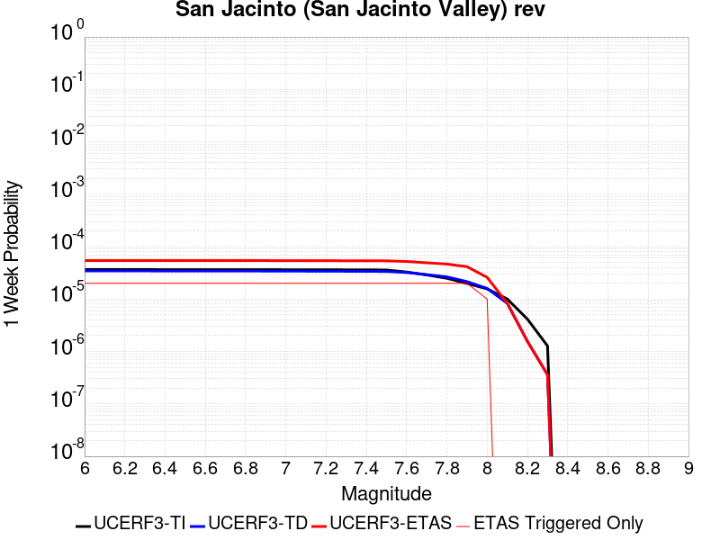 |  |  |  |

| Magnitude | 1 wk TI Prob | 1 wk TD Prob | 1 wk ETAS Prob | 1 wk ETAS/TD Gain | 1 wk ETAS Triggered Only | 1 mo TI Prob | 1 mo TD Prob | 1 mo ETAS Prob | 1 mo ETAS/TD Gain | 1 mo ETAS Triggered Only | 1 yr TI Prob | 1 yr TD Prob | 1 yr ETAS Prob | 1 yr ETAS/TD Gain | 1 yr ETAS Triggered Only | 10 yr TI Prob | 10 yr TD Prob | 10 yr ETAS Prob | 10 yr ETAS/TD Gain | 10 yr ETAS Triggered Only |
|-----|-----|-----|-----|-----|-----|-----|-----|-----|-----|-----|-----|-----|-----|-----|-----|-----|-----|-----|-----|-----|
| 6.0 | 3.652694E-5 | 3.441575E-5 | 5.441506E-5 | 1.5811093 | 2.0E-5 | 1.5653463E-4 | 1.4748774E-4 | 1.6748479E-4 | 1.1355845 | 2.0E-5 | 0.0019041431 | 0.0017941861 | 0.0018341143 | 1.0222542 | 4.0E-5 | 0.018879099 | 0.01853357 | 0.018621903 | 1.0047661 | 9.0E-5 |
| 6.1 | 3.652694E-5 | 3.441575E-5 | 5.441506E-5 | 1.5811093 | 2.0E-5 | 1.5653463E-4 | 1.4748774E-4 | 1.6748479E-4 | 1.1355845 | 2.0E-5 | 0.0019041431 | 0.0017941861 | 0.0018341143 | 1.0222542 | 4.0E-5 | 0.018879099 | 0.01853357 | 0.018621903 | 1.0047661 | 9.0E-5 |
| 6.2 | 3.652694E-5 | 3.441575E-5 | 5.441506E-5 | 1.5811093 | 2.0E-5 | 1.5653463E-4 | 1.4748774E-4 | 1.6748479E-4 | 1.1355845 | 2.0E-5 | 0.0019041431 | 0.0017941861 | 0.0018341143 | 1.0222542 | 4.0E-5 | 0.018879099 | 0.01853357 | 0.018621903 | 1.0047661 | 9.0E-5 |
| 6.3 | 3.652694E-5 | 3.441575E-5 | 5.441506E-5 | 1.5811093 | 2.0E-5 | 1.5653463E-4 | 1.4748774E-4 | 1.6748479E-4 | 1.1355845 | 2.0E-5 | 0.0019041431 | 0.0017941861 | 0.0018341143 | 1.0222542 | 4.0E-5 | 0.018879099 | 0.01853357 | 0.018621903 | 1.0047661 | 9.0E-5 |
| 6.4 | 3.646941E-5 | 3.4337318E-5 | 5.4336633E-5 | 1.5824367 | 2.0E-5 | 1.5628811E-4 | 1.4715164E-4 | 1.6714871E-4 | 1.1358942 | 2.0E-5 | 0.0019011468 | 0.0017901013 | 0.0018300298 | 1.0223051 | 4.0E-5 | 0.018849645 | 0.01849345 | 0.018581785 | 1.0047766 | 9.0E-5 |
| 6.5 | 3.646941E-5 | 3.4337318E-5 | 5.4336633E-5 | 1.5824367 | 2.0E-5 | 1.5628811E-4 | 1.4715164E-4 | 1.6714871E-4 | 1.1358942 | 2.0E-5 | 0.0019011468 | 0.0017901013 | 0.0018300298 | 1.0223051 | 4.0E-5 | 0.018849645 | 0.01849345 | 0.018581785 | 1.0047766 | 9.0E-5 |
| 6.6 | 3.6442503E-5 | 3.4300705E-5 | 5.4300017E-5 | 1.5830584 | 2.0E-5 | 1.561728E-4 | 1.4699475E-4 | 1.6699181E-4 | 1.1360393 | 2.0E-5 | 0.0018997455 | 0.0017881944 | 0.0018281229 | 1.022329 | 4.0E-5 | 0.018835869 | 0.018474717 | 0.018563055 | 1.0047815 | 9.0E-5 |
| 6.7 | 3.6432113E-5 | 3.428628E-5 | 5.4285592E-5 | 1.5833037 | 2.0E-5 | 1.5612828E-4 | 1.4693293E-4 | 1.6693E-4 | 1.1360965 | 2.0E-5 | 0.0018992044 | 0.0017874431 | 0.0018273715 | 1.0223384 | 4.0E-5 | 0.018830549 | 0.01846734 | 0.018555678 | 1.0047835 | 9.0E-5 |
| 6.8 | 3.6409598E-5 | 3.4255332E-5 | 5.4254648E-5 | 1.5838307 | 2.0E-5 | 1.560318E-4 | 1.4680032E-4 | 1.6679738E-4 | 1.1362195 | 2.0E-5 | 0.0018980318 | 0.0017858313 | 0.0018257598 | 1.0223585 | 4.0E-5 | 0.018819023 | 0.018451495 | 0.018539833 | 1.0047877 | 9.0E-5 |
| 6.9 | 3.638078E-5 | 3.4215755E-5 | 5.421507E-5 | 1.584506 | 2.0E-5 | 1.5590832E-4 | 1.4663071E-4 | 1.6662778E-4 | 1.1363771 | 2.0E-5 | 0.0018965311 | 0.0017837697 | 0.0018236984 | 1.0223844 | 4.0E-5 | 0.018804269 | 0.018431228 | 0.01851957 | 1.004793 | 9.0E-5 |
| 7.0 | 3.6294874E-5 | 3.4097768E-5 | 5.4097087E-5 | 1.5865287 | 2.0E-5 | 1.5554018E-4 | 1.4612512E-4 | 1.6612219E-4 | 1.136849 | 2.0E-5 | 0.0018920569 | 0.0017776241 | 0.0018175531 | 1.0224619 | 4.0E-5 | 0.018760284 | 0.018370807 | 0.018459152 | 1.004809 | 9.0E-5 |
| 7.1 | 3.6260717E-5 | 3.4054046E-5 | 5.4053366E-5 | 1.5872817 | 2.0E-5 | 1.5539382E-4 | 1.4593777E-4 | 1.6593485E-4 | 1.1370248 | 2.0E-5 | 0.001890278 | 0.0017753469 | 0.001815276 | 1.0224909 | 4.0E-5 | 0.018742796 | 0.018348401 | 0.018436749 | 1.0048151 | 9.0E-5 |
| 7.2 | 3.6210204E-5 | 3.3988264E-5 | 5.3987584E-5 | 1.5884184 | 2.0E-5 | 1.5517735E-4 | 1.4565587E-4 | 1.6565296E-4 | 1.13729 | 2.0E-5 | 0.001887647 | 0.0017719205 | 0.0018118497 | 1.0225344 | 4.0E-5 | 0.01871693 | 0.018314669 | 0.01840302 | 1.004824 | 9.0E-5 |
| 7.3 | 3.6119454E-5 | 3.3876542E-5 | 5.3875865E-5 | 1.590359 | 2.0E-5 | 1.5478847E-4 | 1.4517711E-4 | 1.651742E-4 | 1.1377428 | 2.0E-5 | 0.0018829206 | 0.0017661011 | 0.0018060304 | 1.0226088 | 4.0E-5 | 0.018670462 | 0.01825722 | 0.018345578 | 1.0048395 | 9.0E-5 |
| 7.4 | 3.607848E-5 | 3.382404E-5 | 5.382336E-5 | 1.5912755 | 2.0E-5 | 1.5461289E-4 | 1.4495212E-4 | 1.6494922E-4 | 1.1379566 | 2.0E-5 | 0.0018807866 | 0.0017633662 | 0.0018032957 | 1.0226439 | 4.0E-5 | 0.018649481 | 0.018230215 | 0.018318573 | 1.0048468 | 9.0E-5 |
| 7.5 | 3.5856774E-5 | 3.363379E-5 | 5.3633117E-5 | 1.5946201 | 2.0E-5 | 1.5366284E-4 | 1.4413687E-4 | 1.6413399E-4 | 1.138737 | 2.0E-5 | 0.0018692396 | 0.0017534565 | 0.0017933864 | 1.0227721 | 4.0E-5 | 0.018535944 | 0.018131303 | 0.01821967 | 1.0048738 | 9.0E-5 |
| 7.6 | 3.286655E-5 | 3.2156633E-5 | 5.2155992E-5 | 1.6219356 | 2.0E-5 | 1.4084904E-4 | 1.3780687E-4 | 1.5780413E-4 | 1.1451106 | 2.0E-5 | 0.001713488 | 0.0016765095 | 0.0017164425 | 1.0238191 | 4.0E-5 | 0.017003361 | 0.01735091 | 0.017439349 | 1.005097 | 9.0E-5 |
| 7.7 | 2.8882527E-5 | 2.9249288E-5 | 4.92487E-5 | 1.6837573 | 2.0E-5 | 1.237764E-4 | 1.2534807E-4 | 1.4534556E-4 | 1.1595356 | 2.0E-5 | 0.0015059357 | 0.0015250455 | 0.0015649846 | 1.0261887 | 4.0E-5 | 0.014957713 | 0.015837153 | 0.015925728 | 1.0055928 | 9.0E-5 |
| 7.8 | 2.4950225E-5 | 2.6539781E-5 | 4.653925E-5 | 1.7535657 | 2.0E-5 | 1.0692515E-4 | 1.1373697E-4 | 1.3373469E-4 | 1.1758243 | 2.0E-5 | 0.0013010362 | 0.0013838689 | 0.0014238135 | 1.0288645 | 4.0E-5 | 0.012934455 | 0.014418158 | 0.01450686 | 1.0061522 | 9.0E-5 |
| 7.9 | 1.9881603E-5 | 2.1518656E-5 | 4.1518226E-5 | 1.9294062 | 2.0E-5 | 8.520408E-5 | 9.2219554E-5 | 1.12217705E-4 | 1.2168537 | 2.0E-5 | 0.001036866 | 0.0011221955 | 0.0011621506 | 1.0356044 | 4.0E-5 | 0.010320415 | 0.011782875 | 0.011871815 | 1.0075482 | 9.0E-5 |
| 8.0 | 1.563292E-5 | 1.5946089E-5 | 2.594593E-5 | 1.627103 | 1.0E-5 | 6.6996516E-5 | 6.8338595E-5 | 7.8337915E-5 | 1.1463202 | 1.0E-5 | 8.153773E-4 | 8.3170546E-4 | 8.5168885E-4 | 1.024027 | 2.0E-5 | 0.00812392 | 0.00881513 | 0.008884513 | 1.0078709 | 7.0E-5 |
| 8.1 | 1.0045313E-5 | 8.306527E-6 | 8.306527E-6 | 1.0 | 0.0 | 4.305063E-5 | 3.5598918E-5 | 3.5598918E-5 | 1.0 | 0.0 | 5.2401534E-4 | 4.3333112E-4 | 4.433268E-4 | 1.023067 | 1.0E-5 | 0.0052278144 | 0.0046616676 | 0.0046716207 | 1.0021352 | 1.0E-5 |
| 8.2 | 4.1554413E-6 | 1.5665041E-6 | 1.5665041E-6 | 1.0 | 0.0 | 1.7808914E-5 | 6.713572E-6 | 6.713572E-6 | 1.0 | 0.0 | 2.1680194E-4 | 8.17347E-5 | 8.17347E-5 | 1.0 | 0.0 | 0.0021659054 | 9.488419E-4 | 9.488419E-4 | 1.0 | 0.0 |
| 8.3 | 1.2758221E-6 | 3.6171858E-7 | 3.6171858E-7 | 1.0 | 0.0 | 5.4677976E-6 | 1.5502216E-6 | 1.5502216E-6 | 1.0 | 0.0 | 6.65684E-5 | 1.8873789E-5 | 1.8873789E-5 | 1.0 | 0.0 | 6.6548464E-4 | 2.2764095E-4 | 2.2764095E-4 | 1.0 | 0.0 |

## Kern Canyon (North Kern) 2011
*[(top)](#table-of-contents)*

| 1 Week | 1 Month | 1 Year | 10 Year |
|-----|-----|-----|-----|
|  |  | 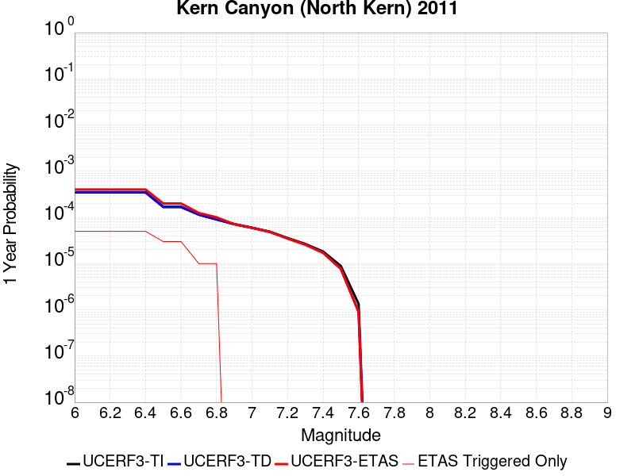 |  |

| Magnitude | 1 wk TI Prob | 1 wk TD Prob | 1 wk ETAS Prob | 1 wk ETAS/TD Gain | 1 wk ETAS Triggered Only | 1 mo TI Prob | 1 mo TD Prob | 1 mo ETAS Prob | 1 mo ETAS/TD Gain | 1 mo ETAS Triggered Only | 1 yr TI Prob | 1 yr TD Prob | 1 yr ETAS Prob | 1 yr ETAS/TD Gain | 1 yr ETAS Triggered Only | 10 yr TI Prob | 10 yr TD Prob | 10 yr ETAS Prob | 10 yr ETAS/TD Gain | 10 yr ETAS Triggered Only |
|-----|-----|-----|-----|-----|-----|-----|-----|-----|-----|-----|-----|-----|-----|-----|-----|-----|-----|-----|-----|-----|
| 6.0 | 6.6264497E-6 | 6.7573515E-6 | 6.7573515E-6 | 1.0 | 0.0 | 2.8398761E-5 | 2.8959801E-5 | 2.8959801E-5 | 1.0 | 0.0 | 3.4570007E-4 | 3.5253656E-4 | 4.0251893E-4 | 1.1417793 | 5.0E-5 | 0.0034516277 | 0.0035205614 | 0.0036102445 | 1.0254741 | 9.0E-5 |
| 6.1 | 6.6264497E-6 | 6.7573515E-6 | 6.7573515E-6 | 1.0 | 0.0 | 2.8398761E-5 | 2.8959801E-5 | 2.8959801E-5 | 1.0 | 0.0 | 3.4570007E-4 | 3.5253656E-4 | 4.0251893E-4 | 1.1417793 | 5.0E-5 | 0.0034516277 | 0.0035205614 | 0.0036102445 | 1.0254741 | 9.0E-5 |
| 6.2 | 6.6264497E-6 | 6.7573515E-6 | 6.7573515E-6 | 1.0 | 0.0 | 2.8398761E-5 | 2.8959801E-5 | 2.8959801E-5 | 1.0 | 0.0 | 3.4570007E-4 | 3.5253656E-4 | 4.0251893E-4 | 1.1417793 | 5.0E-5 | 0.0034516277 | 0.0035205614 | 0.0036102445 | 1.0254741 | 9.0E-5 |
| 6.3 | 6.6264497E-6 | 6.7573515E-6 | 6.7573515E-6 | 1.0 | 0.0 | 2.8398761E-5 | 2.8959801E-5 | 2.8959801E-5 | 1.0 | 0.0 | 3.4570007E-4 | 3.5253656E-4 | 4.0251893E-4 | 1.1417793 | 5.0E-5 | 0.0034516277 | 0.0035205614 | 0.0036102445 | 1.0254741 | 9.0E-5 |
| 6.4 | 6.6264497E-6 | 6.7573515E-6 | 6.7573515E-6 | 1.0 | 0.0 | 2.8398761E-5 | 2.8959801E-5 | 2.8959801E-5 | 1.0 | 0.0 | 3.4570007E-4 | 3.5253656E-4 | 4.0251893E-4 | 1.1417793 | 5.0E-5 | 0.0034516277 | 0.0035205614 | 0.0036102445 | 1.0254741 | 9.0E-5 |
| 6.5 | 3.2162225E-6 | 3.2571006E-6 | 3.2571006E-6 | 1.0 | 0.0 | 1.3783738E-5 | 1.3958933E-5 | 1.3958933E-5 | 1.0 | 0.0 | 1.6780409E-4 | 1.6993756E-4 | 1.9993246E-4 | 1.1765054 | 3.0E-5 | 0.0016767744 | 0.0016981558 | 0.0017580539 | 1.0352725 | 6.0E-5 |
| 6.6 | 3.2162225E-6 | 3.2571006E-6 | 3.2571006E-6 | 1.0 | 0.0 | 1.3783738E-5 | 1.3958933E-5 | 1.3958933E-5 | 1.0 | 0.0 | 1.6780409E-4 | 1.6993756E-4 | 1.9993246E-4 | 1.1765054 | 3.0E-5 | 0.0016767744 | 0.0016981558 | 0.0017580539 | 1.0352725 | 6.0E-5 |
| 6.7 | 2.1908265E-6 | 2.207128E-6 | 2.207128E-6 | 1.0 | 0.0 | 9.389223E-6 | 9.459087E-6 | 9.459087E-6 | 1.0 | 0.0 | 1.1430779E-4 | 1.15158495E-4 | 1.2515734E-4 | 1.0868268 | 1.0E-5 | 0.0011424901 | 0.0011510076 | 0.0011709846 | 1.017356 | 2.0E-5 |
| 6.8 | 1.7303895E-6 | 1.7365575E-6 | 1.7365575E-6 | 1.0 | 0.0 | 7.415934E-6 | 7.4423683E-6 | 7.4423683E-6 | 1.0 | 0.0 | 9.028525E-5 | 9.0607165E-5 | 1.0060626E-4 | 1.1103566 | 1.0E-5 | 9.024858E-4 | 9.0571196E-4 | 9.2569384E-4 | 1.0220621 | 2.0E-5 |
| 6.9 | 1.3700314E-6 | 1.3688658E-6 | 1.3688658E-6 | 1.0 | 0.0 | 5.87155E-6 | 5.8665546E-6 | 5.8665546E-6 | 1.0 | 0.0 | 7.148377E-5 | 7.142301E-5 | 7.142301E-5 | 1.0 | 0.0 | 7.146078E-4 | 7.140051E-4 | 7.23998E-4 | 1.0139955 | 1.0E-5 |
| 7.0 | 1.1467797E-6 | 1.1413834E-6 | 1.1413834E-6 | 1.0 | 0.0 | 4.9147607E-6 | 4.8916345E-6 | 4.8916345E-6 | 1.0 | 0.0 | 5.983557E-5 | 5.955405E-5 | 5.955405E-5 | 1.0 | 0.0 | 5.981946E-4 | 5.9538404E-4 | 6.053781E-4 | 1.0167859 | 1.0E-5 |
| 7.1 | 9.3952065E-7 | 9.3027154E-7 | 9.3027154E-7 | 1.0 | 0.0 | 4.026511E-6 | 3.986872E-6 | 3.986872E-6 | 1.0 | 0.0 | 4.9021666E-5 | 4.8539103E-5 | 4.8539103E-5 | 1.0 | 0.0 | 4.901085E-4 | 4.852868E-4 | 4.9528194E-4 | 1.0205964 | 1.0E-5 |
| 7.2 | 6.858055E-7 | 6.719319E-7 | 6.719319E-7 | 1.0 | 0.0 | 2.939163E-6 | 2.879705E-6 | 2.879705E-6 | 1.0 | 0.0 | 3.5783723E-5 | 3.5059853E-5 | 3.5059853E-5 | 1.0 | 0.0 | 3.5777962E-4 | 3.505441E-4 | 3.605406E-4 | 1.0285171 | 1.0E-5 |
| 7.3 | 5.1101983E-7 | 4.939314E-7 | 4.939314E-7 | 1.0 | 0.0 | 2.1900833E-6 | 2.116847E-6 | 2.116847E-6 | 1.0 | 0.0 | 2.6663936E-5 | 2.5772315E-5 | 2.5772315E-5 | 1.0 | 0.0 | 2.6660739E-4 | 2.5769373E-4 | 2.5769373E-4 | 1.0 | 0.0 |
| 7.4 | 3.4999414E-7 | 3.2996007E-7 | 3.2996007E-7 | 1.0 | 0.0 | 1.499974E-6 | 1.4141139E-6 | 1.4141139E-6 | 1.0 | 0.0 | 1.8262032E-5 | 1.7216704E-5 | 1.7216704E-5 | 1.0 | 0.0 | 1.826053E-4 | 1.7215393E-4 | 1.7215393E-4 | 1.0 | 0.0 |
| 7.5 | 1.7021522E-7 | 1.4750101E-7 | 1.4750101E-7 | 1.0 | 0.0 | 7.2949354E-7 | 6.321471E-7 | 6.321471E-7 | 1.0 | 0.0 | 8.881548E-6 | 7.696364E-6 | 7.696364E-6 | 1.0 | 0.0 | 8.8811925E-5 | 7.696106E-5 | 7.696106E-5 | 1.0 | 0.0 |
| 7.6 | 2.572245E-8 | 1.7352718E-8 | 1.7352718E-8 | 1.0 | 0.0 | 1.10239064E-7 | 7.436879E-8 | 7.436879E-8 | 1.0 | 0.0 | 1.3421597E-6 | 9.054397E-7 | 9.054397E-7 | 1.0 | 0.0 | 1.3421517E-5 | 9.054365E-6 | 9.054365E-6 | 1.0 | 0.0 |

## White Mountains
*[(top)](#table-of-contents)*

| 1 Week | 1 Month | 1 Year | 10 Year |
|-----|-----|-----|-----|
|  | 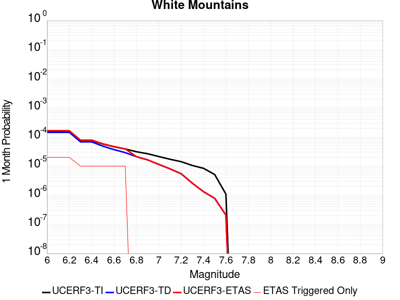 |  |  |

| Magnitude | 1 wk TI Prob | 1 wk TD Prob | 1 wk ETAS Prob | 1 wk ETAS/TD Gain | 1 wk ETAS Triggered Only | 1 mo TI Prob | 1 mo TD Prob | 1 mo ETAS Prob | 1 mo ETAS/TD Gain | 1 mo ETAS Triggered Only | 1 yr TI Prob | 1 yr TD Prob | 1 yr ETAS Prob | 1 yr ETAS/TD Gain | 1 yr ETAS Triggered Only | 10 yr TI Prob | 10 yr TD Prob | 10 yr ETAS Prob | 10 yr ETAS/TD Gain | 10 yr ETAS Triggered Only |
|-----|-----|-----|-----|-----|-----|-----|-----|-----|-----|-----|-----|-----|-----|-----|-----|-----|-----|-----|-----|-----|
| 6.0 | 3.503579E-5 | 3.3784498E-5 | 4.378416E-5 | 1.2959838 | 1.0E-5 | 1.5014476E-4 | 1.4478335E-4 | 1.6478045E-4 | 1.1381174 | 2.0E-5 | 0.0018264796 | 0.0017614327 | 0.0018013624 | 1.0226688 | 4.0E-5 | 0.018115403 | 0.017487047 | 0.017565649 | 1.0044948 | 8.0E-5 |
| 6.1 | 3.503579E-5 | 3.3784498E-5 | 4.378416E-5 | 1.2959838 | 1.0E-5 | 1.5014476E-4 | 1.4478335E-4 | 1.6478045E-4 | 1.1381174 | 2.0E-5 | 0.0018264796 | 0.0017614327 | 0.0018013624 | 1.0226688 | 4.0E-5 | 0.018115403 | 0.017487047 | 0.017565649 | 1.0044948 | 8.0E-5 |
| 6.2 | 3.503579E-5 | 3.3784498E-5 | 4.378416E-5 | 1.2959838 | 1.0E-5 | 1.5014476E-4 | 1.4478335E-4 | 1.6478045E-4 | 1.1381174 | 2.0E-5 | 0.0018264796 | 0.0017614327 | 0.0018013624 | 1.0226688 | 4.0E-5 | 0.018115403 | 0.017487047 | 0.017565649 | 1.0044948 | 8.0E-5 |
| 6.3 | 1.7818425E-5 | 1.591632E-5 | 2.591616E-5 | 1.628276 | 1.0E-5 | 7.636245E-5 | 6.821109E-5 | 7.821041E-5 | 1.1465937 | 1.0E-5 | 9.293162E-4 | 8.301679E-4 | 8.501513E-4 | 1.0240715 | 2.0E-5 | 0.009254395 | 0.008272125 | 0.008301877 | 1.0035967 | 3.0E-5 |
| 6.4 | 1.7818425E-5 | 1.591632E-5 | 2.591616E-5 | 1.628276 | 1.0E-5 | 7.636245E-5 | 6.821109E-5 | 7.821041E-5 | 1.1465937 | 1.0E-5 | 9.293162E-4 | 8.301679E-4 | 8.501513E-4 | 1.0240715 | 2.0E-5 | 0.009254395 | 0.008272125 | 0.008301877 | 1.0035967 | 3.0E-5 |
| 6.5 | 1.3397557E-5 | 1.1336486E-5 | 2.1336373E-5 | 1.8820976 | 1.0E-5 | 5.741684E-5 | 4.8584072E-5 | 5.8583588E-5 | 1.2058188 | 1.0E-5 | 6.988258E-4 | 5.9135753E-4 | 6.013516E-4 | 1.0169003 | 1.0E-5 | 0.006966323 | 0.0058985446 | 0.0059184264 | 1.0033706 | 2.0E-5 |
| 6.6 | 1.0818695E-5 | 8.625519E-6 | 1.8625433E-5 | 2.1593406 | 1.0E-5 | 4.6365014E-5 | 3.696601E-5 | 4.696564E-5 | 1.2705088 | 1.0E-5 | 5.6434784E-4 | 4.4997258E-4 | 4.5996808E-4 | 1.0222136 | 1.0E-5 | 0.005629168 | 0.004491051 | 0.0045109615 | 1.0044333 | 2.0E-5 |
| 6.7 | 9.067908E-6 | 6.802544E-6 | 1.6802476E-5 | 2.4700284 | 1.0E-5 | 3.8861883E-5 | 2.915345E-5 | 3.915316E-5 | 1.3430026 | 1.0E-5 | 4.7304068E-4 | 3.5488865E-4 | 3.648851E-4 | 1.0281678 | 1.0E-5 | 0.00472035 | 0.0035435364 | 0.0035634656 | 1.005624 | 2.0E-5 |
| 6.8 | 7.295947E-6 | 4.9364785E-6 | 4.9364785E-6 | 1.0 | 0.0 | 3.126797E-5 | 2.1156171E-5 | 2.1156171E-5 | 1.0 | 0.0 | 3.8062103E-4 | 2.5754707E-4 | 2.5754707E-4 | 1.0 | 0.0 | 0.0037996976 | 0.0025725989 | 0.002582573 | 1.0038772 | 1.0E-5 |
| 6.9 | 6.2243444E-6 | 3.8322955E-6 | 3.8322955E-6 | 1.0 | 0.0 | 2.6675489E-5 | 1.6424025E-5 | 1.6424025E-5 | 1.0 | 0.0 | 3.2472567E-4 | 1.9994467E-4 | 1.9994467E-4 | 1.0 | 0.0 | 0.0032425157 | 0.0019977004 | 0.0020076805 | 1.0049957 | 1.0E-5 |
| 7.0 | 4.9878413E-6 | 2.6796004E-6 | 2.6796004E-6 | 1.0 | 0.0 | 2.1376287E-5 | 1.1483952E-5 | 1.1483952E-5 | 1.0 | 0.0 | 2.602252E-4 | 1.3980841E-4 | 1.3980841E-4 | 1.0 | 0.0 | 0.002599207 | 0.0013972308 | 0.0013972308 | 1.0 | 0.0 |
| 7.1 | 4.0252844E-6 | 1.885737E-6 | 1.885737E-6 | 1.0 | 0.0 | 1.7251105E-5 | 8.081706E-6 | 8.081706E-6 | 1.0 | 0.0 | 2.1001195E-4 | 9.8390454E-5 | 9.8390454E-5 | 1.0 | 0.0 | 0.0020981359 | 9.834818E-4 | 9.834818E-4 | 1.0 | 0.0 |
| 7.2 | 3.3284066E-6 | 1.2819264E-6 | 1.2819264E-6 | 1.0 | 0.0 | 1.4264522E-5 | 5.493959E-6 | 5.493959E-6 | 1.0 | 0.0 | 1.736567E-4 | 6.6887005E-5 | 6.6887005E-5 | 1.0 | 0.0 | 0.0017352107 | 6.686788E-4 | 6.686788E-4 | 1.0 | 0.0 |
| 7.3 | 2.458226E-6 | 6.0570005E-7 | 6.0570005E-7 | 1.0 | 0.0 | 1.0535211E-5 | 2.595855E-6 | 2.595855E-6 | 1.0 | 0.0 | 1.2825865E-4 | 3.1604115E-5 | 3.1604115E-5 | 1.0 | 0.0 | 0.0012818464 | 3.1599996E-4 | 3.1599996E-4 | 1.0 | 0.0 |
| 7.4 | 1.965953E-6 | 3.1087455E-7 | 3.1087455E-7 | 1.0 | 0.0 | 8.425486E-6 | 1.3323188E-6 | 1.3323188E-6 | 1.0 | 0.0 | 1.0257547E-4 | 1.6220862E-5 | 1.6220862E-5 | 1.0 | 0.0 | 0.0010252813 | 1.6219691E-4 | 1.6219691E-4 | 1.0 | 0.0 |
| 7.5 | 1.2014192E-6 | 1.8242919E-7 | 1.8242919E-7 | 1.0 | 0.0 | 5.148929E-6 | 7.8183916E-7 | 7.8183916E-7 | 1.0 | 0.0 | 6.2686406E-5 | 9.518851E-6 | 9.518851E-6 | 1.0 | 0.0 | 6.266873E-4 | 9.5184514E-5 | 9.5184514E-5 | 1.0 | 0.0 |
| 7.6 | 2.5612175E-7 | 4.8943498E-8 | 4.8943498E-8 | 1.0 | 0.0 | 1.0976642E-6 | 2.0975783E-7 | 2.0975783E-7 | 1.0 | 0.0 | 1.3363979E-5 | 2.553799E-6 | 2.553799E-6 | 1.0 | 0.0 | 1.3363175E-4 | 2.5537733E-5 | 2.5537733E-5 | 1.0 | 0.0 |

## San Jacinto (Anza) rev
*[(top)](#table-of-contents)*

| 1 Week | 1 Month | 1 Year | 10 Year |
|-----|-----|-----|-----|
|  |  |  |  |

| Magnitude | 1 wk TI Prob | 1 wk TD Prob | 1 wk ETAS Prob | 1 wk ETAS/TD Gain | 1 wk ETAS Triggered Only | 1 mo TI Prob | 1 mo TD Prob | 1 mo ETAS Prob | 1 mo ETAS/TD Gain | 1 mo ETAS Triggered Only | 1 yr TI Prob | 1 yr TD Prob | 1 yr ETAS Prob | 1 yr ETAS/TD Gain | 1 yr ETAS Triggered Only | 10 yr TI Prob | 10 yr TD Prob | 10 yr ETAS Prob | 10 yr ETAS/TD Gain | 10 yr ETAS Triggered Only |
|-----|-----|-----|-----|-----|-----|-----|-----|-----|-----|-----|-----|-----|-----|-----|-----|-----|-----|-----|-----|-----|
| 6.0 | 6.3015636E-5 | 4.3312386E-5 | 5.3311953E-5 | 1.2308708 | 1.0E-5 | 2.7003905E-4 | 1.8561137E-4 | 1.9560951E-4 | 1.053866 | 1.0E-5 | 0.0032827691 | 0.0022574882 | 0.002277443 | 1.0088394 | 2.0E-5 | 0.032346968 | 0.023307782 | 0.023385916 | 1.0033523 | 8.0E-5 |
| 6.1 | 6.3015636E-5 | 4.3312386E-5 | 5.3311953E-5 | 1.2308708 | 1.0E-5 | 2.7003905E-4 | 1.8561137E-4 | 1.9560951E-4 | 1.053866 | 1.0E-5 | 0.0032827691 | 0.0022574882 | 0.002277443 | 1.0088394 | 2.0E-5 | 0.032346968 | 0.023307782 | 0.023385916 | 1.0033523 | 8.0E-5 |
| 6.2 | 6.3015636E-5 | 4.3312386E-5 | 5.3311953E-5 | 1.2308708 | 1.0E-5 | 2.7003905E-4 | 1.8561137E-4 | 1.9560951E-4 | 1.053866 | 1.0E-5 | 0.0032827691 | 0.0022574882 | 0.002277443 | 1.0088394 | 2.0E-5 | 0.032346968 | 0.023307782 | 0.023385916 | 1.0033523 | 8.0E-5 |
| 6.3 | 6.3015636E-5 | 4.3312386E-5 | 5.3311953E-5 | 1.2308708 | 1.0E-5 | 2.7003905E-4 | 1.8561137E-4 | 1.9560951E-4 | 1.053866 | 1.0E-5 | 0.0032827691 | 0.0022574882 | 0.002277443 | 1.0088394 | 2.0E-5 | 0.032346968 | 0.023307782 | 0.023385916 | 1.0033523 | 8.0E-5 |
| 6.4 | 6.3015636E-5 | 4.3312386E-5 | 5.3311953E-5 | 1.2308708 | 1.0E-5 | 2.7003905E-4 | 1.8561137E-4 | 1.9560951E-4 | 1.053866 | 1.0E-5 | 0.0032827691 | 0.0022574882 | 0.002277443 | 1.0088394 | 2.0E-5 | 0.032346968 | 0.023307782 | 0.023385916 | 1.0033523 | 8.0E-5 |
| 6.5 | 5.811017E-5 | 4.009432E-5 | 5.009392E-5 | 1.2494019 | 1.0E-5 | 2.4901982E-4 | 1.7182152E-4 | 1.818198E-4 | 1.0581899 | 1.0E-5 | 0.0030276014 | 0.0020899256 | 0.0021098838 | 1.0095497 | 2.0E-5 | 0.02986684 | 0.021605028 | 0.0216833 | 1.0036229 | 8.0E-5 |
| 6.6 | 5.811017E-5 | 4.009432E-5 | 5.009392E-5 | 1.2494019 | 1.0E-5 | 2.4901982E-4 | 1.7182152E-4 | 1.818198E-4 | 1.0581899 | 1.0E-5 | 0.0030276014 | 0.0020899256 | 0.0021098838 | 1.0095497 | 2.0E-5 | 0.02986684 | 0.021605028 | 0.0216833 | 1.0036229 | 8.0E-5 |
| 6.7 | 5.712442E-5 | 3.951705E-5 | 4.9516653E-5 | 1.2530453 | 1.0E-5 | 2.4479596E-4 | 1.6934783E-4 | 1.7934613E-4 | 1.0590401 | 1.0E-5 | 0.0029763177 | 0.0020598655 | 0.0020798242 | 1.0096893 | 2.0E-5 | 0.029367693 | 0.021297079 | 0.021365589 | 1.0032169 | 7.0E-5 |
| 6.8 | 5.6967532E-5 | 3.9373335E-5 | 4.9372942E-5 | 1.253969 | 1.0E-5 | 2.4412372E-4 | 1.6873197E-4 | 1.7873029E-4 | 1.0592556 | 1.0E-5 | 0.0029681553 | 0.0020523819 | 0.0020723408 | 1.0097247 | 2.0E-5 | 0.029288229 | 0.02122268 | 0.021291194 | 1.0032283 | 7.0E-5 |
| 6.9 | 5.6211324E-5 | 3.9078248E-5 | 4.907786E-5 | 1.2558868 | 1.0E-5 | 2.4088343E-4 | 1.6746749E-4 | 1.7746582E-4 | 1.0597031 | 1.0E-5 | 0.0029288116 | 0.0020370155 | 0.0020569747 | 1.0097983 | 2.0E-5 | 0.028905109 | 0.021060992 | 0.021129519 | 1.0032537 | 7.0E-5 |
| 7.0 | 5.4383527E-5 | 3.793897E-5 | 4.7938593E-5 | 1.2635713 | 1.0E-5 | 2.3305144E-4 | 1.6258548E-4 | 1.7258387E-4 | 1.0614961 | 1.0E-5 | 0.0028337094 | 0.001977686 | 0.0019976464 | 1.0100929 | 2.0E-5 | 0.027978465 | 0.020454587 | 0.020523155 | 1.0033522 | 7.0E-5 |
| 7.1 | 5.1393665E-5 | 3.6401827E-5 | 4.6401463E-5 | 1.2747015 | 1.0E-5 | 2.2023996E-4 | 1.5599852E-4 | 1.6599697E-4 | 1.0640931 | 1.0E-5 | 0.0026781242 | 0.0018976318 | 0.0019175939 | 1.0105195 | 2.0E-5 | 0.026460782 | 0.019625481 | 0.019694109 | 1.0034968 | 7.0E-5 |
| 7.2 | 4.785222E-5 | 3.4752728E-5 | 4.475238E-5 | 1.2877371 | 1.0E-5 | 2.0506482E-4 | 1.4893178E-4 | 1.589303E-4 | 1.0671349 | 1.0E-5 | 0.0024938055 | 0.0018117399 | 0.0018317037 | 1.0110191 | 2.0E-5 | 0.024660049 | 0.018735653 | 0.018804342 | 1.0036662 | 7.0E-5 |
| 7.3 | 4.2143256E-5 | 3.384821E-5 | 4.384787E-5 | 1.2954266 | 1.0E-5 | 1.8060145E-4 | 1.4505572E-4 | 1.5505427E-4 | 1.0689291 | 1.0E-5 | 0.002196605 | 0.0017646261 | 0.0017845909 | 1.0113138 | 2.0E-5 | 0.02175019 | 0.018243507 | 0.018312229 | 1.003767 | 7.0E-5 |
| 7.4 | 4.0264713E-5 | 3.348636E-5 | 4.3486027E-5 | 1.298619 | 1.0E-5 | 1.7255165E-4 | 1.4350511E-4 | 1.5350367E-4 | 1.0696739 | 1.0E-5 | 0.002098792 | 0.0017457779 | 0.001765743 | 1.0114362 | 2.0E-5 | 0.020790804 | 0.018048115 | 0.018116852 | 1.0038085 | 7.0E-5 |
| 7.5 | 3.694492E-5 | 3.2200267E-5 | 4.2199943E-5 | 1.3105464 | 1.0E-5 | 1.5832575E-4 | 1.3799386E-4 | 1.4799248E-4 | 1.072457 | 1.0E-5 | 0.0019259118 | 0.0016787836 | 0.0016987501 | 1.0118934 | 2.0E-5 | 0.01909306 | 0.017364455 | 0.01743324 | 1.0039612 | 7.0E-5 |
| 7.6 | 3.200565E-5 | 2.9515684E-5 | 3.9515387E-5 | 1.3387929 | 1.0E-5 | 1.3715986E-4 | 1.2648967E-4 | 1.3648841E-4 | 1.0790478 | 1.0E-5 | 0.001668642 | 0.001538926 | 0.0015588952 | 1.012976 | 2.0E-5 | 0.01656168 | 0.015952358 | 0.01602124 | 1.0043181 | 7.0E-5 |
| 7.7 | 2.731642E-5 | 2.6104135E-5 | 3.6103873E-5 | 1.3830711 | 1.0E-5 | 1.1706512E-4 | 1.11870075E-4 | 1.2186896E-4 | 1.0893794 | 1.0E-5 | 0.001424336 | 0.0013611682 | 0.0013811409 | 1.0146732 | 2.0E-5 | 0.014152412 | 0.014172893 | 0.014241901 | 1.004869 | 7.0E-5 |
| 7.8 | 2.3466424E-5 | 2.3515782E-5 | 3.351555E-5 | 1.4252363 | 1.0E-5 | 1.0056651E-4 | 1.0077804E-4 | 1.1077703E-4 | 1.099218 | 1.0E-5 | 0.0012237094 | 0.0012262828 | 0.0012462583 | 1.0162895 | 2.0E-5 | 0.012169928 | 0.012814545 | 0.012883648 | 1.0053926 | 7.0E-5 |
| 7.9 | 1.8611925E-5 | 1.8917919E-5 | 2.891773E-5 | 1.5285894 | 1.0E-5 | 7.9762955E-5 | 8.107428E-5 | 9.107347E-5 | 1.1233337 | 1.0E-5 | 9.7068126E-4 | 9.86633E-4 | 0.0010066134 | 1.0202509 | 2.0E-5 | 0.0096645225 | 0.010399014 | 0.010468286 | 1.0066614 | 7.0E-5 |
| 8.0 | 1.5460775E-5 | 1.5749598E-5 | 2.5749441E-5 | 1.6349268 | 1.0E-5 | 6.6258784E-5 | 6.7496534E-5 | 7.749586E-5 | 1.1481458 | 1.0E-5 | 8.0640207E-4 | 8.2146114E-4 | 8.414447E-4 | 1.0243268 | 2.0E-5 | 0.008034821 | 0.008707448 | 0.008776839 | 1.0079691 | 7.0E-5 |
| 8.1 | 9.983884E-6 | 8.274653E-6 | 8.274653E-6 | 1.0 | 0.0 | 4.2787375E-5 | 3.546232E-5 | 3.546232E-5 | 1.0 | 0.0 | 5.2081177E-4 | 4.316687E-4 | 4.416644E-4 | 1.0231559 | 1.0E-5 | 0.0051959283 | 0.0046425606 | 0.004652514 | 1.002144 | 1.0E-5 |
| 8.2 | 4.1226E-6 | 1.5539142E-6 | 1.5539142E-6 | 1.0 | 0.0 | 1.7668166E-5 | 6.6596153E-6 | 6.6596153E-6 | 1.0 | 0.0 | 2.1508869E-4 | 8.107783E-5 | 8.107783E-5 | 1.0 | 0.0 | 0.0021488064 | 9.410467E-4 | 9.410467E-4 | 1.0 | 0.0 |
| 8.3 | 1.2750878E-6 | 3.6143226E-7 | 3.6143226E-7 | 1.0 | 0.0 | 5.4646503E-6 | 1.5489944E-6 | 1.5489944E-6 | 1.0 | 0.0 | 6.653009E-5 | 1.8858847E-5 | 1.8858847E-5 | 1.0 | 0.0 | 6.6510175E-4 | 2.2747046E-4 | 2.2747046E-4 | 1.0 | 0.0 |

## Santa Ynez (East)
*[(top)](#table-of-contents)*

| 1 Week | 1 Month | 1 Year | 10 Year |
|-----|-----|-----|-----|
|  |  |  |  |

| Magnitude | 1 wk TI Prob | 1 wk TD Prob | 1 wk ETAS Prob | 1 wk ETAS/TD Gain | 1 wk ETAS Triggered Only | 1 mo TI Prob | 1 mo TD Prob | 1 mo ETAS Prob | 1 mo ETAS/TD Gain | 1 mo ETAS Triggered Only | 1 yr TI Prob | 1 yr TD Prob | 1 yr ETAS Prob | 1 yr ETAS/TD Gain | 1 yr ETAS Triggered Only | 10 yr TI Prob | 10 yr TD Prob | 10 yr ETAS Prob | 10 yr ETAS/TD Gain | 10 yr ETAS Triggered Only |
|-----|-----|-----|-----|-----|-----|-----|-----|-----|-----|-----|-----|-----|-----|-----|-----|-----|-----|-----|-----|-----|
| 6.0 | 3.2269712E-5 | 3.6751615E-5 | 3.6751615E-5 | 1.0 | 0.0 | 1.3829143E-4 | 1.5750073E-4 | 1.6749917E-4 | 1.0634818 | 1.0E-5 | 0.0016823979 | 0.001916469 | 0.0019464114 | 1.0156238 | 3.0E-5 | 0.016697178 | 0.01905687 | 0.019135345 | 1.004118 | 8.0E-5 |
| 6.1 | 3.2269712E-5 | 3.6751615E-5 | 3.6751615E-5 | 1.0 | 0.0 | 1.3829143E-4 | 1.5750073E-4 | 1.6749917E-4 | 1.0634818 | 1.0E-5 | 0.0016823979 | 0.001916469 | 0.0019464114 | 1.0156238 | 3.0E-5 | 0.016697178 | 0.01905687 | 0.019135345 | 1.004118 | 8.0E-5 |
| 6.2 | 3.2269712E-5 | 3.6751615E-5 | 3.6751615E-5 | 1.0 | 0.0 | 1.3829143E-4 | 1.5750073E-4 | 1.6749917E-4 | 1.0634818 | 1.0E-5 | 0.0016823979 | 0.001916469 | 0.0019464114 | 1.0156238 | 3.0E-5 | 0.016697178 | 0.01905687 | 0.019135345 | 1.004118 | 8.0E-5 |
| 6.3 | 3.2269712E-5 | 3.6751615E-5 | 3.6751615E-5 | 1.0 | 0.0 | 1.3829143E-4 | 1.5750073E-4 | 1.6749917E-4 | 1.0634818 | 1.0E-5 | 0.0016823979 | 0.001916469 | 0.0019464114 | 1.0156238 | 3.0E-5 | 0.016697178 | 0.01905687 | 0.019135345 | 1.004118 | 8.0E-5 |
| 6.4 | 1.4404779E-5 | 1.4849478E-5 | 1.4849478E-5 | 1.0 | 0.0 | 6.1733306E-5 | 6.36391E-5 | 6.36391E-5 | 1.0 | 0.0 | 7.513438E-4 | 7.7453564E-4 | 7.845279E-4 | 1.012901 | 1.0E-5 | 0.0074880854 | 0.0077189123 | 0.007738758 | 1.002571 | 2.0E-5 |
| 6.5 | 1.4404779E-5 | 1.4849478E-5 | 1.4849478E-5 | 1.0 | 0.0 | 6.1733306E-5 | 6.36391E-5 | 6.36391E-5 | 1.0 | 0.0 | 7.513438E-4 | 7.7453564E-4 | 7.845279E-4 | 1.012901 | 1.0E-5 | 0.0074880854 | 0.0077189123 | 0.007738758 | 1.002571 | 2.0E-5 |
| 6.6 | 1.280208E-5 | 1.3012008E-5 | 1.3012008E-5 | 1.0 | 0.0 | 5.4864904E-5 | 5.576457E-5 | 5.576457E-5 | 1.0 | 0.0 | 6.6777546E-4 | 6.787239E-4 | 6.887171E-4 | 1.0147235 | 1.0E-5 | 0.006657724 | 0.00676672 | 0.006786585 | 1.0029356 | 2.0E-5 |
| 6.7 | 1.2457027E-5 | 1.2628523E-5 | 1.2628523E-5 | 1.0 | 0.0 | 5.3386164E-5 | 5.4121127E-5 | 5.4121127E-5 | 1.0 | 0.0 | 6.497827E-4 | 6.587272E-4 | 6.6872063E-4 | 1.0151708 | 1.0E-5 | 0.00647886 | 0.006567944 | 0.006587812 | 1.003025 | 2.0E-5 |
| 6.8 | 1.2095134E-5 | 1.2230965E-5 | 1.2230965E-5 | 1.0 | 0.0 | 5.1835254E-5 | 5.2417377E-5 | 5.2417377E-5 | 1.0 | 0.0 | 6.309115E-4 | 6.379963E-4 | 6.479899E-4 | 1.0156641 | 1.0E-5 | 0.0062912325 | 0.006361835 | 0.0063817077 | 1.0031238 | 2.0E-5 |
| 6.9 | 1.1104036E-5 | 1.1157385E-5 | 1.1157385E-5 | 1.0 | 0.0 | 4.758786E-5 | 4.78165E-5 | 4.78165E-5 | 1.0 | 0.0 | 5.7922816E-4 | 5.820116E-4 | 5.920058E-4 | 1.0171717 | 1.0E-5 | 0.005777207 | 0.005805019 | 0.005824903 | 1.0034252 | 2.0E-5 |
| 7.0 | 1.0577444E-5 | 1.0581712E-5 | 1.0581712E-5 | 1.0 | 0.0 | 4.5331115E-5 | 4.534941E-5 | 4.534941E-5 | 1.0 | 0.0 | 5.5176654E-4 | 5.519904E-4 | 5.619849E-4 | 1.0181062 | 1.0E-5 | 0.0055039856 | 0.0055063316 | 0.0055262214 | 1.0036122 | 2.0E-5 |
| 7.1 | 1.0021775E-5 | 9.981012E-6 | 9.981012E-6 | 1.0 | 0.0 | 4.294976E-5 | 4.277507E-5 | 4.277507E-5 | 1.0 | 0.0 | 5.2278786E-4 | 5.206632E-4 | 5.206632E-4 | 1.0 | 0.0 | 0.0052155964 | 0.005194566 | 0.005204514 | 1.0019151 | 1.0E-5 |
| 7.2 | 8.874109E-6 | 8.748804E-6 | 8.748804E-6 | 1.0 | 0.0 | 3.8031343E-5 | 3.749434E-5 | 3.749434E-5 | 1.0 | 0.0 | 4.629332E-4 | 4.5639908E-4 | 4.5639908E-4 | 1.0 | 0.0 | 0.0046197 | 0.0045547355 | 0.00456469 | 1.0021855 | 1.0E-5 |
| 7.3 | 7.5504267E-6 | 7.5050975E-6 | 7.5050975E-6 | 1.0 | 0.0 | 3.235857E-5 | 3.2164313E-5 | 3.2164313E-5 | 1.0 | 0.0 | 3.9389438E-4 | 3.9153118E-4 | 3.9153118E-4 | 1.0 | 0.0 | 0.0039319694 | 0.0039085206 | 0.0039184815 | 1.0025485 | 1.0E-5 |
| 7.4 | 6.309394E-6 | 6.1831197E-6 | 6.1831197E-6 | 1.0 | 0.0 | 2.703998E-5 | 2.6498821E-5 | 2.6498821E-5 | 1.0 | 0.0 | 3.2916202E-4 | 3.2257635E-4 | 3.2257635E-4 | 1.0 | 0.0 | 0.003286749 | 0.0032211784 | 0.0032311461 | 1.0030944 | 1.0E-5 |
| 7.5 | 4.6103073E-6 | 4.4408375E-6 | 4.4408375E-6 | 1.0 | 0.0 | 1.975831E-5 | 1.9032026E-5 | 1.9032026E-5 | 1.0 | 0.0 | 2.4053088E-4 | 2.3169098E-4 | 2.3169098E-4 | 1.0 | 0.0 | 0.002402707 | 0.0023145638 | 0.0023145638 | 1.0 | 0.0 |
| 7.6 | 1.2858658E-6 | 1.3008295E-6 | 1.3008295E-6 | 1.0 | 0.0 | 5.5108417E-6 | 5.574972E-6 | 5.574972E-6 | 1.0 | 0.0 | 6.7092435E-5 | 6.787324E-5 | 6.787324E-5 | 1.0 | 0.0 | 6.707218E-4 | 6.78532E-4 | 6.78532E-4 | 1.0 | 0.0 |
| 7.7 | 5.3302307E-7 | 5.612178E-7 | 5.612178E-7 | 1.0 | 0.0 | 2.2843826E-6 | 2.4052172E-6 | 2.4052172E-6 | 1.0 | 0.0 | 2.7812002E-5 | 2.9283161E-5 | 2.9283161E-5 | 1.0 | 0.0 | 2.7808524E-4 | 2.927966E-4 | 2.927966E-4 | 1.0 | 0.0 |
| 7.8 | 4.613933E-8 | 4.803036E-8 | 4.803036E-8 | 1.0 | 0.0 | 1.9773998E-7 | 2.0584437E-7 | 2.0584437E-7 | 1.0 | 0.0 | 2.4074816E-6 | 2.5061524E-6 | 2.5061524E-6 | 1.0 | 0.0 | 2.4074554E-5 | 2.5061252E-5 | 2.5061252E-5 | 1.0 | 0.0 |

## Lake Isabella (Seismicity)
*[(top)](#table-of-contents)*

| 1 Week | 1 Month | 1 Year | 10 Year |
|-----|-----|-----|-----|
|  |  |  |  |

| Magnitude | 1 wk TI Prob | 1 wk TD Prob | 1 wk ETAS Prob | 1 wk ETAS/TD Gain | 1 wk ETAS Triggered Only | 1 mo TI Prob | 1 mo TD Prob | 1 mo ETAS Prob | 1 mo ETAS/TD Gain | 1 mo ETAS Triggered Only | 1 yr TI Prob | 1 yr TD Prob | 1 yr ETAS Prob | 1 yr ETAS/TD Gain | 1 yr ETAS Triggered Only | 10 yr TI Prob | 10 yr TD Prob | 10 yr ETAS Prob | 10 yr ETAS/TD Gain | 10 yr ETAS Triggered Only |
|-----|-----|-----|-----|-----|-----|-----|-----|-----|-----|-----|-----|-----|-----|-----|-----|-----|-----|-----|-----|-----|
| 6.0 | 9.431637E-6 | 9.741694E-6 | 9.741694E-6 | 1.0 | 0.0 | 4.0420677E-5 | 4.1749525E-5 | 4.1749525E-5 | 1.0 | 0.0 | 4.920106E-4 | 5.0819496E-4 | 5.5816956E-4 | 1.0983374 | 5.0E-5 | 0.004909227 | 0.005071621 | 0.005151215 | 1.015694 | 8.0E-5 |
| 6.1 | 9.431637E-6 | 9.741694E-6 | 9.741694E-6 | 1.0 | 0.0 | 4.0420677E-5 | 4.1749525E-5 | 4.1749525E-5 | 1.0 | 0.0 | 4.920106E-4 | 5.0819496E-4 | 5.5816956E-4 | 1.0983374 | 5.0E-5 | 0.004909227 | 0.005071621 | 0.005151215 | 1.015694 | 8.0E-5 |
| 6.2 | 9.431637E-6 | 9.741694E-6 | 9.741694E-6 | 1.0 | 0.0 | 4.0420677E-5 | 4.1749525E-5 | 4.1749525E-5 | 1.0 | 0.0 | 4.920106E-4 | 5.0819496E-4 | 5.5816956E-4 | 1.0983374 | 5.0E-5 | 0.004909227 | 0.005071621 | 0.005151215 | 1.015694 | 8.0E-5 |
| 6.3 | 9.431637E-6 | 9.741694E-6 | 9.741694E-6 | 1.0 | 0.0 | 4.0420677E-5 | 4.1749525E-5 | 4.1749525E-5 | 1.0 | 0.0 | 4.920106E-4 | 5.0819496E-4 | 5.5816956E-4 | 1.0983374 | 5.0E-5 | 0.004909227 | 0.005071621 | 0.005151215 | 1.015694 | 8.0E-5 |
| 6.4 | 5.144063E-6 | 5.3000977E-6 | 5.3000977E-6 | 1.0 | 0.0 | 2.2045799E-5 | 2.2714525E-5 | 2.2714525E-5 | 1.0 | 0.0 | 2.6837454E-4 | 2.765177E-4 | 2.8651493E-4 | 1.036154 | 1.0E-5 | 0.0026805066 | 0.002762077 | 0.0027720493 | 1.0036105 | 1.0E-5 |
| 6.5 | 5.144063E-6 | 5.3000977E-6 | 5.3000977E-6 | 1.0 | 0.0 | 2.2045799E-5 | 2.2714525E-5 | 2.2714525E-5 | 1.0 | 0.0 | 2.6837454E-4 | 2.765177E-4 | 2.8651493E-4 | 1.036154 | 1.0E-5 | 0.0026805066 | 0.002762077 | 0.0027720493 | 1.0036105 | 1.0E-5 |
| 6.6 | 3.4009804E-6 | 3.4987995E-6 | 3.4987995E-6 | 1.0 | 0.0 | 1.4575549E-5 | 1.4994778E-5 | 1.4994778E-5 | 1.0 | 0.0 | 1.7744285E-4 | 1.8254772E-4 | 1.9254591E-4 | 1.0547702 | 1.0E-5 | 0.0017730123 | 0.0018241355 | 0.0018341173 | 1.0054721 | 1.0E-5 |
| 6.7 | 3.3880428E-6 | 3.4856662E-6 | 3.4856662E-6 | 1.0 | 0.0 | 1.4520103E-5 | 1.4938492E-5 | 1.4938492E-5 | 1.0 | 0.0 | 1.767679E-4 | 1.8186258E-4 | 1.9186074E-4 | 1.0549766 | 1.0E-5 | 0.0017662736 | 0.0018172951 | 0.001827277 | 1.0054927 | 1.0E-5 |
| 6.8 | 2.6582E-6 | 2.7337105E-6 | 2.7337105E-6 | 1.0 | 0.0 | 1.1392236E-5 | 1.1715857E-5 | 1.1715857E-5 | 1.0 | 0.0 | 1.3869164E-4 | 1.4263256E-4 | 1.5263114E-4 | 1.0701002 | 1.0E-5 | 0.0013860512 | 0.0014255423 | 0.001435528 | 1.0070049 | 1.0E-5 |
| 6.9 | 2.406011E-6 | 2.474338E-6 | 2.474338E-6 | 1.0 | 0.0 | 1.0311434E-5 | 1.0604271E-5 | 1.0604271E-5 | 1.0 | 0.0 | 1.2553448E-4 | 1.2910066E-4 | 1.3909937E-4 | 1.077449 | 1.0E-5 | 0.0012546359 | 0.0012903863 | 0.0013003733 | 1.0077397 | 1.0E-5 |
| 7.0 | 1.6953097E-6 | 1.7429437E-6 | 1.7429437E-6 | 1.0 | 0.0 | 7.265593E-6 | 7.469743E-6 | 7.469743E-6 | 1.0 | 0.0 | 8.8455E-5 | 9.094137E-5 | 1.00940466E-4 | 1.1099509 | 1.0E-5 | 8.84198E-4 | 9.0914435E-4 | 9.1913523E-4 | 1.0109893 | 1.0E-5 |
| 7.1 | 3.5013824E-7 | 3.571492E-7 | 3.571492E-7 | 1.0 | 0.0 | 1.5005916E-6 | 1.5306384E-6 | 1.5306384E-6 | 1.0 | 0.0 | 1.826955E-5 | 1.8635366E-5 | 1.8635366E-5 | 1.0 | 0.0 | 1.8268047E-4 | 1.863383E-4 | 1.863383E-4 | 1.0 | 0.0 |
| 7.2 | 2.2321095E-7 | 2.2750632E-7 | 2.2750632E-7 | 1.0 | 0.0 | 9.56618E-7 | 9.750268E-7 | 9.750268E-7 | 1.0 | 0.0 | 1.1646762E-5 | 1.1870887E-5 | 1.1870887E-5 | 1.0 | 0.0 | 1.1646151E-4 | 1.1870263E-4 | 1.1870263E-4 | 1.0 | 0.0 |
| 7.3 | 1.5760406E-7 | 1.6060963E-7 | 1.6060963E-7 | 1.0 | 0.0 | 6.7544585E-7 | 6.883268E-7 | 6.883268E-7 | 1.0 | 0.0 | 8.223522E-6 | 8.380347E-6 | 8.380347E-6 | 1.0 | 0.0 | 8.2232174E-5 | 8.3800376E-5 | 8.3800376E-5 | 1.0 | 0.0 |
| 7.4 | 1.1216497E-7 | 1.1431735E-7 | 1.1431735E-7 | 1.0 | 0.0 | 4.8070694E-7 | 4.8993144E-7 | 4.8993144E-7 | 1.0 | 0.0 | 5.852591E-6 | 5.964899E-6 | 5.964899E-6 | 1.0 | 0.0 | 5.8524372E-5 | 5.9647435E-5 | 5.9647435E-5 | 1.0 | 0.0 |
| 7.5 | 4.885185E-8 | 4.9787864E-8 | 4.9787864E-8 | 1.0 | 0.0 | 2.0936506E-7 | 2.1337654E-7 | 2.1337654E-7 | 1.0 | 0.0 | 2.5490165E-6 | 2.5978566E-6 | 2.5978566E-6 | 1.0 | 0.0 | 2.5489873E-5 | 2.597828E-5 | 2.597828E-5 | 1.0 | 0.0 |
| 7.6 | 1.504641E-9 | 1.5317939E-9 | 1.5317939E-9 | 1.0 | 0.0 | 6.4484613E-9 | 6.5648313E-9 | 6.5648313E-9 | 1.0 | 0.0 | 7.851001E-8 | 7.992682E-8 | 7.992682E-8 | 1.0 | 0.0 | 7.8509987E-7 | 7.992682E-7 | 7.992682E-7 | 1.0 | 0.0 |

## San Jacinto (Stepovers Combined)
*[(top)](#table-of-contents)*

| 1 Week | 1 Month | 1 Year | 10 Year |
|-----|-----|-----|-----|
|  |  |  |  |

| Magnitude | 1 wk TI Prob | 1 wk TD Prob | 1 wk ETAS Prob | 1 wk ETAS/TD Gain | 1 wk ETAS Triggered Only | 1 mo TI Prob | 1 mo TD Prob | 1 mo ETAS Prob | 1 mo ETAS/TD Gain | 1 mo ETAS Triggered Only | 1 yr TI Prob | 1 yr TD Prob | 1 yr ETAS Prob | 1 yr ETAS/TD Gain | 1 yr ETAS Triggered Only | 10 yr TI Prob | 10 yr TD Prob | 10 yr ETAS Prob | 10 yr ETAS/TD Gain | 10 yr ETAS Triggered Only |
|-----|-----|-----|-----|-----|-----|-----|-----|-----|-----|-----|-----|-----|-----|-----|-----|-----|-----|-----|-----|-----|
| 6.0 | 4.0667746E-5 | 3.5285528E-5 | 4.5285175E-5 | 1.2833923 | 1.0E-5 | 1.742787E-4 | 1.5121493E-4 | 1.6121342E-4 | 1.066121 | 1.0E-5 | 0.0021197782 | 0.0018394884 | 0.0018594516 | 1.0108526 | 2.0E-5 | 0.020996714 | 0.018993655 | 0.019062325 | 1.0036155 | 7.0E-5 |
| 6.1 | 4.0667746E-5 | 3.5285528E-5 | 4.5285175E-5 | 1.2833923 | 1.0E-5 | 1.742787E-4 | 1.5121493E-4 | 1.6121342E-4 | 1.066121 | 1.0E-5 | 0.0021197782 | 0.0018394884 | 0.0018594516 | 1.0108526 | 2.0E-5 | 0.020996714 | 0.018993655 | 0.019062325 | 1.0036155 | 7.0E-5 |
| 6.2 | 4.0667746E-5 | 3.5285528E-5 | 4.5285175E-5 | 1.2833923 | 1.0E-5 | 1.742787E-4 | 1.5121493E-4 | 1.6121342E-4 | 1.066121 | 1.0E-5 | 0.0021197782 | 0.0018394884 | 0.0018594516 | 1.0108526 | 2.0E-5 | 0.020996714 | 0.018993655 | 0.019062325 | 1.0036155 | 7.0E-5 |
| 6.3 | 4.0667746E-5 | 3.5285528E-5 | 4.5285175E-5 | 1.2833923 | 1.0E-5 | 1.742787E-4 | 1.5121493E-4 | 1.6121342E-4 | 1.066121 | 1.0E-5 | 0.0021197782 | 0.0018394884 | 0.0018594516 | 1.0108526 | 2.0E-5 | 0.020996714 | 0.018993655 | 0.019062325 | 1.0036155 | 7.0E-5 |
| 6.4 | 4.0577226E-5 | 3.515743E-5 | 4.515708E-5 | 1.2844249 | 1.0E-5 | 1.738908E-4 | 1.5066602E-4 | 1.6066451E-4 | 1.066362 | 1.0E-5 | 0.0021150648 | 0.0018328178 | 0.0018527812 | 1.0108922 | 2.0E-5 | 0.020950472 | 0.018928219 | 0.018996894 | 1.0036281 | 7.0E-5 |
| 6.5 | 4.0577226E-5 | 3.515743E-5 | 4.515708E-5 | 1.2844249 | 1.0E-5 | 1.738908E-4 | 1.5066602E-4 | 1.6066451E-4 | 1.066362 | 1.0E-5 | 0.0021150648 | 0.0018328178 | 0.0018527812 | 1.0108922 | 2.0E-5 | 0.020950472 | 0.018928219 | 0.018996894 | 1.0036281 | 7.0E-5 |
| 6.6 | 4.053861E-5 | 3.510277E-5 | 4.510242E-5 | 1.2848678 | 1.0E-5 | 1.7372532E-4 | 1.5043179E-4 | 1.6043028E-4 | 1.0664653 | 1.0E-5 | 0.0021130538 | 0.0018299713 | 0.0018499347 | 1.0109091 | 2.0E-5 | 0.020930743 | 0.018900296 | 0.018968973 | 1.0036336 | 7.0E-5 |
| 6.7 | 4.0516545E-5 | 3.5071844E-5 | 4.5071494E-5 | 1.285119 | 1.0E-5 | 1.7363077E-4 | 1.5029925E-4 | 1.6029776E-4 | 1.0665239 | 1.0E-5 | 0.002111905 | 0.0018283607 | 0.0018483241 | 1.0109187 | 2.0E-5 | 0.020919468 | 0.018884491 | 0.018953169 | 1.0036367 | 7.0E-5 |
| 6.8 | 4.049434E-5 | 3.5043406E-5 | 4.5043053E-5 | 1.2853504 | 1.0E-5 | 1.7353562E-4 | 1.501774E-4 | 1.6017588E-4 | 1.0665779 | 1.0E-5 | 0.0021107488 | 0.0018268795 | 0.0018468429 | 1.0109277 | 2.0E-5 | 0.020908125 | 0.018869905 | 0.018938582 | 1.0036396 | 7.0E-5 |
| 6.9 | 4.046386E-5 | 3.5005964E-5 | 4.500561E-5 | 1.2856556 | 1.0E-5 | 1.73405E-4 | 1.5001695E-4 | 1.6001544E-4 | 1.0666491 | 1.0E-5 | 0.0021091616 | 0.0018249294 | 0.0018448929 | 1.0109394 | 2.0E-5 | 0.020892553 | 0.018850677 | 0.018919356 | 1.0036434 | 7.0E-5 |
| 7.0 | 4.036382E-5 | 3.4886525E-5 | 4.4886176E-5 | 1.2866336 | 1.0E-5 | 1.7297632E-4 | 1.4950513E-4 | 1.5950363E-4 | 1.0668774 | 1.0E-5 | 0.0021039525 | 0.0018187086 | 0.0018386722 | 1.0109768 | 2.0E-5 | 0.02084144 | 0.018789288 | 0.018857973 | 1.0036556 | 7.0E-5 |
| 7.1 | 4.0343282E-5 | 3.486499E-5 | 4.486464E-5 | 1.2868106 | 1.0E-5 | 1.7288832E-4 | 1.4941284E-4 | 1.5941134E-4 | 1.0669186 | 1.0E-5 | 0.002102883 | 0.0018175867 | 0.0018375504 | 1.0109836 | 2.0E-5 | 0.020830948 | 0.018778158 | 0.018846843 | 1.0036577 | 7.0E-5 |
| 7.2 | 4.0257353E-5 | 3.476948E-5 | 4.4769135E-5 | 1.2875985 | 1.0E-5 | 1.725201E-4 | 1.4900356E-4 | 1.5900208E-4 | 1.0671024 | 1.0E-5 | 0.0020984085 | 0.0018126123 | 0.001832576 | 1.0110137 | 2.0E-5 | 0.020787042 | 0.018728893 | 0.018797582 | 1.0036676 | 7.0E-5 |
| 7.3 | 3.9940667E-5 | 3.459712E-5 | 4.4596774E-5 | 1.2890314 | 1.0E-5 | 1.7116306E-4 | 1.4826495E-4 | 1.5826347E-4 | 1.0674368 | 1.0E-5 | 0.0020819185 | 0.0018036346 | 0.0018235985 | 1.0110687 | 2.0E-5 | 0.020625217 | 0.018637514 | 0.018706208 | 1.0036858 | 7.0E-5 |
| 7.4 | 3.9721202E-5 | 3.44825E-5 | 4.4482153E-5 | 1.2899922 | 1.0E-5 | 1.7022261E-4 | 1.4777378E-4 | 1.577723E-4 | 1.067661 | 1.0E-5 | 0.0020704903 | 0.0017976643 | 0.0018176284 | 1.0111055 | 2.0E-5 | 0.020513052 | 0.018576635 | 0.018645335 | 1.0036982 | 7.0E-5 |
| 7.5 | 3.7036873E-5 | 3.354985E-5 | 4.3549517E-5 | 1.2980539 | 1.0E-5 | 1.5871979E-4 | 1.4377717E-4 | 1.5377573E-4 | 1.069542 | 1.0E-5 | 0.0019307006 | 0.0017490846 | 0.0017690496 | 1.0114145 | 2.0E-5 | 0.019140124 | 0.018078115 | 0.018146848 | 1.0038021 | 7.0E-5 |
| 7.6 | 3.2940967E-5 | 3.1330474E-5 | 4.133016E-5 | 1.3191681 | 1.0E-5 | 1.4116794E-4 | 1.3426656E-4 | 1.4426523E-4 | 1.0744687 | 1.0E-5 | 0.0017173645 | 0.001633472 | 0.0016534394 | 1.0122238 | 2.0E-5 | 0.01704153 | 0.01691088 | 0.016979696 | 1.0040693 | 7.0E-5 |
| 7.7 | 2.8236149E-5 | 2.7896147E-5 | 3.789587E-5 | 1.3584625 | 1.0E-5 | 1.2100645E-4 | 1.1954944E-4 | 1.2954825E-4 | 1.0836374 | 1.0E-5 | 0.0014722579 | 0.0014545437 | 0.0014745146 | 1.01373 | 2.0E-5 | 0.014625421 | 0.015121453 | 0.015190395 | 1.0045592 | 7.0E-5 |
| 7.8 | 2.4329287E-5 | 2.5219388E-5 | 3.5219135E-5 | 1.3965104 | 1.0E-5 | 1.042642E-4 | 1.0807862E-4 | 1.18077536E-4 | 1.0925152 | 1.0E-5 | 0.0012686774 | 0.0013150638 | 0.0013350374 | 1.0151883 | 2.0E-5 | 0.012614589 | 0.013718468 | 0.013787508 | 1.0050327 | 7.0E-5 |
| 7.9 | 1.9370926E-5 | 2.0432055E-5 | 3.043185E-5 | 1.4894171 | 1.0E-5 | 8.301561E-5 | 8.7563014E-5 | 9.756214E-5 | 1.1141934 | 1.0E-5 | 0.0010102465 | 0.001065559 | 0.0010855377 | 1.0187495 | 2.0E-5 | 0.0100566605 | 0.011205053 | 0.011274269 | 1.0061772 | 7.0E-5 |
| 8.0 | 1.5583017E-5 | 1.5895175E-5 | 2.5895015E-5 | 1.6291118 | 1.0E-5 | 6.6782646E-5 | 6.8120404E-5 | 7.811972E-5 | 1.146789 | 1.0E-5 | 8.127754E-4 | 8.29051E-4 | 8.490344E-4 | 1.024104 | 2.0E-5 | 0.008098091 | 0.008786416 | 0.0088558 | 1.0078969 | 7.0E-5 |
| 8.1 | 1.0024873E-5 | 8.297121E-6 | 8.297121E-6 | 1.0 | 0.0 | 4.2963035E-5 | 3.5558605E-5 | 3.5558605E-5 | 1.0 | 0.0 | 5.229494E-4 | 4.3284055E-4 | 4.4283623E-4 | 1.0230932 | 1.0E-5 | 0.0052172043 | 0.00465596 | 0.004665913 | 1.0021378 | 1.0E-5 |
| 8.2 | 4.142796E-6 | 1.5619446E-6 | 1.5619446E-6 | 1.0 | 0.0 | 1.775472E-5 | 6.6940315E-6 | 6.6940315E-6 | 1.0 | 0.0 | 2.1614227E-4 | 8.1496815E-5 | 8.1496815E-5 | 1.0 | 0.0 | 0.0021593217 | 9.4601413E-4 | 9.4601413E-4 | 1.0 | 0.0 |
| 8.3 | 1.2750878E-6 | 3.6143226E-7 | 3.6143226E-7 | 1.0 | 0.0 | 5.4646503E-6 | 1.5489944E-6 | 1.5489944E-6 | 1.0 | 0.0 | 6.653009E-5 | 1.8858847E-5 | 1.8858847E-5 | 1.0 | 0.0 | 6.6510175E-4 | 2.2747046E-4 | 2.2747046E-4 | 1.0 | 0.0 |

## Mission Ridge-Arroyo Parida-Santa Ana
*[(top)](#table-of-contents)*

| 1 Week | 1 Month | 1 Year | 10 Year |
|-----|-----|-----|-----|
|  |  | 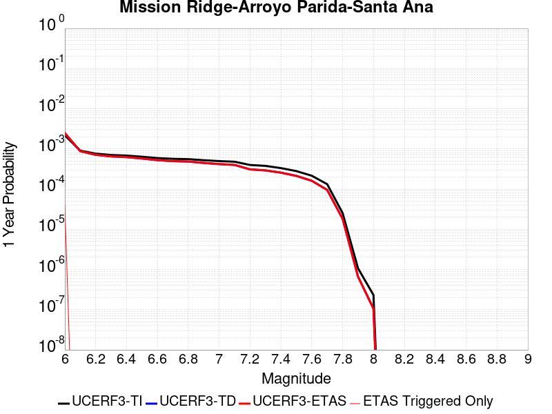 |  |

| Magnitude | 1 wk TI Prob | 1 wk TD Prob | 1 wk ETAS Prob | 1 wk ETAS/TD Gain | 1 wk ETAS Triggered Only | 1 mo TI Prob | 1 mo TD Prob | 1 mo ETAS Prob | 1 mo ETAS/TD Gain | 1 mo ETAS Triggered Only | 1 yr TI Prob | 1 yr TD Prob | 1 yr ETAS Prob | 1 yr ETAS/TD Gain | 1 yr ETAS Triggered Only | 10 yr TI Prob | 10 yr TD Prob | 10 yr ETAS Prob | 10 yr ETAS/TD Gain | 10 yr ETAS Triggered Only |
|-----|-----|-----|-----|-----|-----|-----|-----|-----|-----|-----|-----|-----|-----|-----|-----|-----|-----|-----|-----|-----|
| 6.0 | 4.169034E-5 | 4.7138332E-5 | 4.7138332E-5 | 1.0 | 0.0 | 1.7866064E-4 | 2.0201063E-4 | 2.3200458E-4 | 1.1484771 | 3.0E-5 | 0.0021730233 | 0.0024575314 | 0.0024974332 | 1.0162365 | 4.0E-5 | 0.021518968 | 0.024385462 | 0.024453755 | 1.0028006 | 7.0E-5 |
| 6.1 | 1.73813E-5 | 1.685448E-5 | 1.685448E-5 | 1.0 | 0.0 | 7.4489166E-5 | 7.2231545E-5 | 7.2231545E-5 | 1.0 | 0.0 | 9.065282E-4 | 8.7907485E-4 | 8.7907485E-4 | 1.0 | 0.0 | 0.009028391 | 0.008757258 | 0.008777083 | 1.0022638 | 2.0E-5 |
| 6.2 | 1.4622182E-5 | 1.3673473E-5 | 1.3673473E-5 | 1.0 | 0.0 | 6.2664985E-5 | 5.8599304E-5 | 5.8599304E-5 | 1.0 | 0.0 | 7.6267915E-4 | 7.1321684E-4 | 7.1321684E-4 | 1.0 | 0.0 | 0.007600669 | 0.0071098623 | 0.0071197916 | 1.0013965 | 1.0E-5 |
| 6.3 | 1.3552434E-5 | 1.24823655E-5 | 1.24823655E-5 | 1.0 | 0.0 | 5.8080568E-5 | 5.3494776E-5 | 5.3494776E-5 | 1.0 | 0.0 | 7.069015E-4 | 6.511074E-4 | 6.511074E-4 | 1.0 | 0.0 | 0.00704657 | 0.006492501 | 0.006502436 | 1.0015303 | 1.0E-5 |
| 6.4 | 1.30977305E-5 | 1.1979314E-5 | 1.1979314E-5 | 1.0 | 0.0 | 5.613192E-5 | 5.1338924E-5 | 5.1338924E-5 | 1.0 | 0.0 | 6.831918E-4 | 6.2487513E-4 | 6.2487513E-4 | 1.0 | 0.0 | 0.006810953 | 0.0062316665 | 0.006241604 | 1.0015947 | 1.0E-5 |
| 6.5 | 1.225205E-5 | 1.1048948E-5 | 1.1048948E-5 | 1.0 | 0.0 | 5.2507727E-5 | 4.735179E-5 | 4.735179E-5 | 1.0 | 0.0 | 6.3909404E-4 | 5.763583E-4 | 5.763583E-4 | 1.0 | 0.0 | 0.006372592 | 0.005749085 | 0.0057590273 | 1.0017294 | 1.0E-5 |
| 6.6 | 1.1352241E-5 | 1.0063668E-5 | 1.0063668E-5 | 1.0 | 0.0 | 4.8651553E-5 | 4.3129305E-5 | 4.3129305E-5 | 1.0 | 0.0 | 5.921717E-4 | 5.249749E-4 | 5.249749E-4 | 1.0 | 0.0 | 0.0059059616 | 0.005237734 | 0.0052476814 | 1.0018992 | 1.0E-5 |
| 6.7 | 1.0864116E-5 | 9.517152E-6 | 9.517152E-6 | 1.0 | 0.0 | 4.6559664E-5 | 4.0787167E-5 | 4.0787167E-5 | 1.0 | 0.0 | 5.667165E-4 | 4.964726E-4 | 4.964726E-4 | 1.0 | 0.0 | 0.005652734 | 0.004954009 | 0.004963959 | 1.0020086 | 1.0E-5 |
| 6.8 | 1.0666365E-5 | 9.2999E-6 | 9.2999E-6 | 1.0 | 0.0 | 4.571219E-5 | 3.9856117E-5 | 3.9856117E-5 | 1.0 | 0.0 | 5.564038E-4 | 4.851422E-4 | 4.851422E-4 | 1.0 | 0.0 | 0.005550127 | 0.004841204 | 0.0048511554 | 1.0020556 | 1.0E-5 |
| 6.9 | 1.0038665E-5 | 8.592155E-6 | 8.592155E-6 | 1.0 | 0.0 | 4.302214E-5 | 3.682301E-5 | 3.682301E-5 | 1.0 | 0.0 | 5.236687E-4 | 4.4822975E-4 | 4.4822975E-4 | 1.0 | 0.0 | 0.005224364 | 0.0044736085 | 0.0044835634 | 1.0022253 | 1.0E-5 |
| 7.0 | 9.5379955E-6 | 8.025172E-6 | 8.025172E-6 | 1.0 | 0.0 | 4.0876483E-5 | 3.4393153E-5 | 3.4393153E-5 | 1.0 | 0.0 | 4.975576E-4 | 4.1865787E-4 | 4.1865787E-4 | 1.0 | 0.0 | 0.00496445 | 0.0041790316 | 0.0041790316 | 1.0 | 0.0 |
| 7.1 | 9.207389E-6 | 7.652467E-6 | 7.652467E-6 | 1.0 | 0.0 | 3.945964E-5 | 3.2795884E-5 | 3.2795884E-5 | 1.0 | 0.0 | 4.803152E-4 | 3.992184E-4 | 3.992184E-4 | 1.0 | 0.0 | 0.004792784 | 0.0039853496 | 0.0039853496 | 1.0 | 0.0 |
| 7.2 | 7.638091E-6 | 5.931174E-6 | 5.931174E-6 | 1.0 | 0.0 | 3.2734264E-5 | 2.541907E-5 | 2.541907E-5 | 1.0 | 0.0 | 3.984668E-4 | 3.0943356E-4 | 3.0943356E-4 | 1.0 | 0.0 | 0.0039775306 | 0.0030902245 | 0.0030902245 | 1.0 | 0.0 |
| 7.3 | 7.2500147E-6 | 5.596204E-6 | 5.596204E-6 | 1.0 | 0.0 | 3.1071122E-5 | 2.3983514E-5 | 2.3983514E-5 | 1.0 | 0.0 | 3.7822526E-4 | 2.9196046E-4 | 2.9196046E-4 | 1.0 | 0.0 | 0.0037758215 | 0.002915965 | 0.002915965 | 1.0 | 0.0 |
| 7.4 | 6.3899715E-6 | 4.9185496E-6 | 4.9185496E-6 | 1.0 | 0.0 | 2.7385306E-5 | 2.107933E-5 | 2.107933E-5 | 1.0 | 0.0 | 3.3336508E-4 | 2.566108E-4 | 2.566108E-4 | 1.0 | 0.0 | 0.0033286542 | 0.0025633303 | 0.0025633303 | 1.0 | 0.0 |
| 7.5 | 5.379025E-6 | 4.0839013E-6 | 4.0839013E-6 | 1.0 | 0.0 | 2.305276E-5 | 1.7502318E-5 | 1.7502318E-5 | 1.0 | 0.0 | 2.806312E-4 | 2.1306999E-4 | 2.1306999E-4 | 1.0 | 0.0 | 0.0028027708 | 0.0021286684 | 0.0021286684 | 1.0 | 0.0 |
| 7.6 | 4.1270696E-6 | 3.088378E-6 | 3.088378E-6 | 1.0 | 0.0 | 1.768732E-5 | 1.3235838E-5 | 1.3235838E-5 | 1.0 | 0.0 | 2.1532185E-4 | 1.6113449E-4 | 1.6113449E-4 | 1.0 | 0.0 | 0.0021511333 | 0.0016101847 | 0.0016101847 | 1.0 | 0.0 |
| 7.7 | 2.5406805E-6 | 1.8282275E-6 | 1.8282275E-6 | 1.0 | 0.0 | 1.0888585E-5 | 7.835237E-6 | 7.835237E-6 | 1.0 | 0.0 | 1.3256045E-4 | 9.53899E-5 | 9.53899E-5 | 1.0 | 0.0 | 0.0013248142 | 9.5349574E-4 | 9.5349574E-4 | 1.0 | 0.0 |
| 7.8 | 4.8608285E-7 | 3.5099023E-7 | 3.5099023E-7 | 1.0 | 0.0 | 2.0832106E-6 | 1.504243E-6 | 1.504243E-6 | 1.0 | 0.0 | 2.5362791E-5 | 1.8314006E-5 | 1.8314006E-5 | 1.0 | 0.0 | 2.5359896E-4 | 1.8312508E-4 | 1.8312508E-4 | 1.0 | 0.0 |
| 7.9 | 2.0472514E-8 | 1.2688983E-8 | 1.2688983E-8 | 1.0 | 0.0 | 8.7739345E-8 | 5.4381356E-8 | 5.4381356E-8 | 1.0 | 0.0 | 1.068226E-6 | 6.620928E-7 | 6.620928E-7 | 1.0 | 0.0 | 1.0682209E-5 | 6.6209095E-6 | 6.6209095E-6 | 1.0 | 0.0 |
| 8.0 | 4.443582E-9 | 2.032151E-9 | 2.032151E-9 | 1.0 | 0.0 | 1.9043922E-8 | 8.709217E-9 | 8.709217E-9 | 1.0 | 0.0 | 2.3185973E-7 | 1.0603472E-7 | 1.0603472E-7 | 1.0 | 0.0 | 2.3185949E-6 | 1.0603468E-6 | 1.0603468E-6 | 1.0 | 0.0 |

## Dry Mountain
*[(top)](#table-of-contents)*

| 1 Week | 1 Month | 1 Year | 10 Year |
|-----|-----|-----|-----|
|  |  |  |  |

| Magnitude | 1 wk TI Prob | 1 wk TD Prob | 1 wk ETAS Prob | 1 wk ETAS/TD Gain | 1 wk ETAS Triggered Only | 1 mo TI Prob | 1 mo TD Prob | 1 mo ETAS Prob | 1 mo ETAS/TD Gain | 1 mo ETAS Triggered Only | 1 yr TI Prob | 1 yr TD Prob | 1 yr ETAS Prob | 1 yr ETAS/TD Gain | 1 yr ETAS Triggered Only | 10 yr TI Prob | 10 yr TD Prob | 10 yr ETAS Prob | 10 yr ETAS/TD Gain | 10 yr ETAS Triggered Only |
|-----|-----|-----|-----|-----|-----|-----|-----|-----|-----|-----|-----|-----|-----|-----|-----|-----|-----|-----|-----|-----|
| 6.0 | 6.222801E-6 | 6.439411E-6 | 6.439411E-6 | 1.0 | 0.0 | 2.6668875E-5 | 2.7597274E-5 | 2.7597274E-5 | 1.0 | 0.0 | 3.2464517E-4 | 3.359609E-4 | 3.6595084E-4 | 1.0892661 | 3.0E-5 | 0.0032417132 | 0.0033560924 | 0.0034258573 | 1.0207876 | 7.0E-5 |
| 6.1 | 6.222801E-6 | 6.439411E-6 | 6.439411E-6 | 1.0 | 0.0 | 2.6668875E-5 | 2.7597274E-5 | 2.7597274E-5 | 1.0 | 0.0 | 3.2464517E-4 | 3.359609E-4 | 3.6595084E-4 | 1.0892661 | 3.0E-5 | 0.0032417132 | 0.0033560924 | 0.0034258573 | 1.0207876 | 7.0E-5 |
| 6.2 | 6.222801E-6 | 6.439411E-6 | 6.439411E-6 | 1.0 | 0.0 | 2.6668875E-5 | 2.7597274E-5 | 2.7597274E-5 | 1.0 | 0.0 | 3.2464517E-4 | 3.359609E-4 | 3.6595084E-4 | 1.0892661 | 3.0E-5 | 0.0032417132 | 0.0033560924 | 0.0034258573 | 1.0207876 | 7.0E-5 |
| 6.3 | 6.222801E-6 | 6.439411E-6 | 6.439411E-6 | 1.0 | 0.0 | 2.6668875E-5 | 2.7597274E-5 | 2.7597274E-5 | 1.0 | 0.0 | 3.2464517E-4 | 3.359609E-4 | 3.6595084E-4 | 1.0892661 | 3.0E-5 | 0.0032417132 | 0.0033560924 | 0.0034258573 | 1.0207876 | 7.0E-5 |
| 6.4 | 6.222801E-6 | 6.439411E-6 | 6.439411E-6 | 1.0 | 0.0 | 2.6668875E-5 | 2.7597274E-5 | 2.7597274E-5 | 1.0 | 0.0 | 3.2464517E-4 | 3.359609E-4 | 3.6595084E-4 | 1.0892661 | 3.0E-5 | 0.0032417132 | 0.0033560924 | 0.0034258573 | 1.0207876 | 7.0E-5 |
| 6.5 | 2.8528623E-6 | 2.952182E-6 | 2.952182E-6 | 1.0 | 0.0 | 1.22264955E-5 | 1.2652196E-5 | 1.2652196E-5 | 1.0 | 0.0 | 1.4884741E-4 | 1.5403831E-4 | 1.6403677E-4 | 1.0649089 | 1.0E-5 | 0.0014874774 | 0.0015401688 | 0.001560138 | 1.0129656 | 2.0E-5 |
| 6.6 | 2.8528623E-6 | 2.952182E-6 | 2.952182E-6 | 1.0 | 0.0 | 1.22264955E-5 | 1.2652196E-5 | 1.2652196E-5 | 1.0 | 0.0 | 1.4884741E-4 | 1.5403831E-4 | 1.6403677E-4 | 1.0649089 | 1.0E-5 | 0.0014874774 | 0.0015401688 | 0.001560138 | 1.0129656 | 2.0E-5 |
| 6.7 | 2.541E-6 | 2.62937E-6 | 2.62937E-6 | 1.0 | 0.0 | 1.0889954E-5 | 1.12687285E-5 | 1.12687285E-5 | 1.0 | 0.0 | 1.3257713E-4 | 1.3719677E-4 | 1.471954E-4 | 1.072878 | 1.0E-5 | 0.0013249806 | 0.0013719677 | 0.0013919403 | 1.0145576 | 2.0E-5 |

## Brawley (Seismic Zone) alt 1
*[(top)](#table-of-contents)*

| 1 Week | 1 Month | 1 Year | 10 Year |
|-----|-----|-----|-----|
|  |  |  | 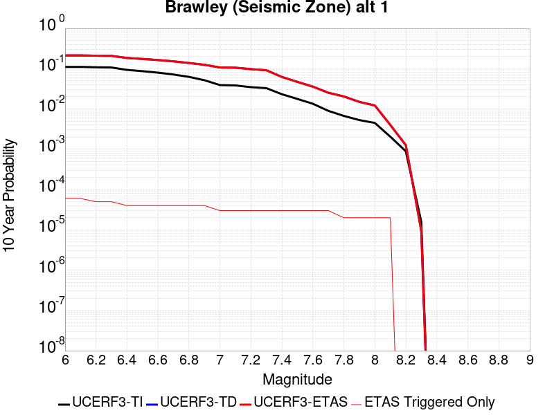 |

| Magnitude | 1 wk TI Prob | 1 wk TD Prob | 1 wk ETAS Prob | 1 wk ETAS/TD Gain | 1 wk ETAS Triggered Only | 1 mo TI Prob | 1 mo TD Prob | 1 mo ETAS Prob | 1 mo ETAS/TD Gain | 1 mo ETAS Triggered Only | 1 yr TI Prob | 1 yr TD Prob | 1 yr ETAS Prob | 1 yr ETAS/TD Gain | 1 yr ETAS Triggered Only | 10 yr TI Prob | 10 yr TD Prob | 10 yr ETAS Prob | 10 yr ETAS/TD Gain | 10 yr ETAS Triggered Only |
|-----|-----|-----|-----|-----|-----|-----|-----|-----|-----|-----|-----|-----|-----|-----|-----|-----|-----|-----|-----|-----|
| 6.0 | 2.2521618E-4 | 4.7643206E-4 | 4.8642728E-4 | 1.0209794 | 1.0E-5 | 9.6485513E-4 | 0.002040291 | 0.0020702297 | 1.0146738 | 3.0E-5 | 0.011683988 | 0.024554973 | 0.02459399 | 1.001589 | 4.0E-5 | 0.11088423 | 0.21353106 | 0.21357825 | 1.000221 | 6.0E-5 |
| 6.1 | 2.2521618E-4 | 4.7643206E-4 | 4.8642728E-4 | 1.0209794 | 1.0E-5 | 9.6485513E-4 | 0.002040291 | 0.0020702297 | 1.0146738 | 3.0E-5 | 0.011683988 | 0.024554973 | 0.02459399 | 1.001589 | 4.0E-5 | 0.11088423 | 0.21353106 | 0.21357825 | 1.000221 | 6.0E-5 |
| 6.2 | 2.198148E-4 | 4.672759E-4 | 4.7727124E-4 | 1.0213907 | 1.0E-5 | 9.417233E-4 | 0.0020011107 | 0.0020310509 | 1.0149617 | 3.0E-5 | 0.011405343 | 0.024089037 | 0.024118314 | 1.0012153 | 3.0E-5 | 0.10837428 | 0.20996717 | 0.21000667 | 1.0001881 | 5.0E-5 |
| 6.3 | 2.1704129E-4 | 4.6163241E-4 | 4.7162778E-4 | 1.0216522 | 1.0E-5 | 9.298453E-4 | 0.001976961 | 0.002006902 | 1.0151448 | 3.0E-5 | 0.011262234 | 0.023802388 | 0.023831675 | 1.0012304 | 3.0E-5 | 0.107082725 | 0.20785816 | 0.20789777 | 1.0001905 | 5.0E-5 |
| 6.4 | 1.876142E-4 | 4.0055066E-4 | 4.1054667E-4 | 1.0249556 | 1.0E-5 | 8.038131E-4 | 0.0017155306 | 0.0017454792 | 1.0174572 | 3.0E-5 | 0.00974259 | 0.020688837 | 0.020718217 | 1.00142 | 3.0E-5 | 0.093263686 | 0.18460822 | 0.18464084 | 1.0001767 | 4.0E-5 |
| 6.5 | 1.7390939E-4 | 3.7486907E-4 | 3.848653E-4 | 1.0266659 | 1.0E-5 | 7.45113E-4 | 0.0016056047 | 0.0016355565 | 1.0186546 | 3.0E-5 | 0.009034078 | 0.019377038 | 0.019406457 | 1.0015182 | 3.0E-5 | 0.086755216 | 0.17442968 | 0.17446272 | 1.0001893 | 4.0E-5 |
| 6.6 | 1.591791E-4 | 3.490135E-4 | 3.5901004E-4 | 1.0286422 | 1.0E-5 | 6.8201777E-4 | 0.0014949249 | 0.0015248801 | 1.0200379 | 3.0E-5 | 0.008271996 | 0.018051691 | 0.018081151 | 1.0016319 | 3.0E-5 | 0.07970774 | 0.16383655 | 0.16387 | 1.0002041 | 4.0E-5 |
| 6.7 | 1.4268003E-4 | 3.2067046E-4 | 3.3066724E-4 | 1.0311747 | 1.0E-5 | 6.1134255E-4 | 0.0013735864 | 0.0014035451 | 1.0218107 | 3.0E-5 | 0.007417723 | 0.016597226 | 0.016626729 | 1.0017775 | 3.0E-5 | 0.07174956 | 0.15196328 | 0.1519972 | 1.0002233 | 4.0E-5 |
| 6.8 | 1.239713E-4 | 2.906121E-4 | 3.006092E-4 | 1.0344001 | 1.0E-5 | 5.3119735E-4 | 0.0012448921 | 0.0012748548 | 1.0240685 | 3.0E-5 | 0.0064481674 | 0.015052661 | 0.015082209 | 1.001963 | 3.0E-5 | 0.06264243 | 0.13840474 | 0.13843921 | 1.000249 | 4.0E-5 |
| 6.9 | 1.0180238E-4 | 2.6260383E-4 | 2.7260123E-4 | 1.0380702 | 1.0E-5 | 4.3622297E-4 | 0.0011249639 | 0.0011549301 | 1.0266376 | 3.0E-5 | 0.005298089 | 0.013611422 | 0.013641014 | 1.002174 | 3.0E-5 | 0.05173543 | 0.12498361 | 0.12501861 | 1.00028 | 4.0E-5 |
| 7.0 | 7.6619996E-5 | 2.2404084E-4 | 2.340386E-4 | 1.0446247 | 1.0E-5 | 3.283301E-4 | 9.598249E-4 | 9.798057E-4 | 1.0208172 | 2.0E-5 | 0.0039900932 | 0.011623963 | 0.011643731 | 1.0017006 | 2.0E-5 | 0.039192066 | 0.10728301 | 0.107309796 | 1.0002496 | 3.0E-5 |
| 7.1 | 7.5127435E-5 | 2.2087194E-4 | 2.3086973E-4 | 1.0452651 | 1.0E-5 | 3.2193496E-4 | 9.462538E-4 | 9.6623483E-4 | 1.021116 | 2.0E-5 | 0.0039125155 | 0.011460485 | 0.011480255 | 1.0017251 | 2.0E-5 | 0.038443442 | 0.105846815 | 0.10587364 | 1.0002534 | 3.0E-5 |
| 7.2 | 6.788582E-5 | 2.0214771E-4 | 2.121457E-4 | 1.0494587 | 1.0E-5 | 2.9090676E-4 | 8.660627E-4 | 8.860454E-4 | 1.023073 | 2.0E-5 | 0.0035360386 | 0.010493974 | 0.010513765 | 1.0018859 | 2.0E-5 | 0.034803 | 0.09751713 | 0.09754421 | 1.0002776 | 3.0E-5 |
| 7.3 | 6.399602E-5 | 1.884553E-4 | 1.9845342E-4 | 1.053053 | 1.0E-5 | 2.7423984E-4 | 8.074185E-4 | 8.2740234E-4 | 1.0247504 | 2.0E-5 | 0.0033337586 | 0.009786601 | 0.009806406 | 1.0020236 | 2.0E-5 | 0.03284188 | 0.09141058 | 0.09143784 | 1.0002981 | 3.0E-5 |
| 7.4 | 4.506759E-5 | 1.2532667E-4 | 1.3532542E-4 | 1.0797815 | 1.0E-5 | 1.9313251E-4 | 5.370046E-4 | 5.569939E-4 | 1.0372236 | 2.0E-5 | 0.0023488526 | 0.006518606 | 0.006538476 | 1.0030482 | 2.0E-5 | 0.023241805 | 0.06237464 | 0.062402766 | 1.000451 | 3.0E-5 |
| 7.5 | 3.43289E-5 | 9.338305E-5 | 1.0338212E-4 | 1.1070758 | 1.0E-5 | 1.4711556E-4 | 4.00152E-4 | 4.20144E-4 | 1.049961 | 2.0E-5 | 0.0017896603 | 0.00486103 | 0.0048809326 | 1.0040944 | 2.0E-5 | 0.01775316 | 0.04706593 | 0.047094516 | 1.0006074 | 3.0E-5 |
| 7.6 | 2.5980507E-5 | 7.055588E-5 | 8.0555175E-5 | 1.1417216 | 1.0E-5 | 1.1134028E-4 | 3.023474E-4 | 3.2234137E-4 | 1.0661291 | 2.0E-5 | 0.001354725 | 0.0036748908 | 0.0036948172 | 1.0054224 | 2.0E-5 | 0.013464959 | 0.035850268 | 0.03587919 | 1.0008068 | 3.0E-5 |
| 7.7 | 1.7292105E-5 | 4.9428265E-5 | 5.942777E-5 | 1.2023034 | 1.0E-5 | 7.4106916E-5 | 2.1181825E-4 | 2.31814E-4 | 1.0944005 | 2.0E-5 | 9.018782E-4 | 0.002575843 | 0.0025957914 | 1.0077444 | 2.0E-5 | 0.008982267 | 0.025298944 | 0.025328185 | 1.0011559 | 3.0E-5 |
| 7.8 | 1.2927471E-5 | 3.971141E-5 | 3.971141E-5 | 1.0 | 0.0 | 5.5402274E-5 | 1.7018066E-4 | 1.8017896E-4 | 1.0587511 | 1.0E-5 | 6.743139E-4 | 0.0020699832 | 0.0020799625 | 1.004821 | 1.0E-5 | 0.0067227143 | 0.020439085 | 0.020458676 | 1.0009586 | 2.0E-5 |
| 7.9 | 1.0200774E-5 | 2.8759863E-5 | 2.8759863E-5 | 1.0 | 0.0 | 4.371687E-5 | 1.2325073E-4 | 1.332495E-4 | 1.0811254 | 1.0E-5 | 5.321229E-4 | 0.0014995459 | 0.0015095309 | 1.0066587 | 1.0E-5 | 0.005308505 | 0.0149981035 | 0.015017804 | 1.0013134 | 2.0E-5 |
| 8.0 | 8.650396E-6 | 2.3289316E-5 | 2.3289316E-5 | 1.0 | 0.0 | 3.70726E-5 | 9.980754E-5 | 1.0980654E-4 | 1.1001829 | 1.0E-5 | 4.5126543E-4 | 0.0012144803 | 0.0012244681 | 1.008224 | 1.0E-5 | 0.0045035016 | 0.012216583 | 0.012236338 | 1.0016171 | 2.0E-5 |
| 8.1 | 3.9368224E-6 | 7.3325436E-6 | 7.3325436E-6 | 1.0 | 0.0 | 1.6871985E-5 | 3.142481E-5 | 4.1424493E-5 | 1.3182099 | 1.0E-5 | 2.0539707E-4 | 3.8253E-4 | 3.9252618E-4 | 1.0261317 | 1.0E-5 | 0.0020520731 | 0.0040034265 | 0.004023346 | 1.0049757 | 2.0E-5 |
| 8.2 | 1.7101195E-6 | 2.21947E-6 | 2.21947E-6 | 1.0 | 0.0 | 7.329063E-6 | 9.511979E-6 | 9.511979E-6 | 1.0 | 0.0 | 8.922769E-5 | 1.1580222E-4 | 1.1580222E-4 | 1.0 | 0.0 | 8.9191867E-4 | 0.0012675131 | 0.0012675131 | 1.0 | 0.0 |
| 8.3 | 3.0346666E-8 | 1.7229212E-8 | 1.7229212E-8 | 1.0 | 0.0 | 1.3005713E-7 | 7.383948E-8 | 7.383948E-8 | 1.0 | 0.0 | 1.5834444E-6 | 8.9899555E-7 | 8.9899555E-7 | 1.0 | 0.0 | 1.5834332E-5 | 9.375523E-6 | 9.375523E-6 | 1.0 | 0.0 |

## Ventura-Pitas Point
*[(top)](#table-of-contents)*

| 1 Week | 1 Month | 1 Year | 10 Year |
|-----|-----|-----|-----|
|  |  |  |  |

| Magnitude | 1 wk TI Prob | 1 wk TD Prob | 1 wk ETAS Prob | 1 wk ETAS/TD Gain | 1 wk ETAS Triggered Only | 1 mo TI Prob | 1 mo TD Prob | 1 mo ETAS Prob | 1 mo ETAS/TD Gain | 1 mo ETAS Triggered Only | 1 yr TI Prob | 1 yr TD Prob | 1 yr ETAS Prob | 1 yr ETAS/TD Gain | 1 yr ETAS Triggered Only | 10 yr TI Prob | 10 yr TD Prob | 10 yr ETAS Prob | 10 yr ETAS/TD Gain | 10 yr ETAS Triggered Only |
|-----|-----|-----|-----|-----|-----|-----|-----|-----|-----|-----|-----|-----|-----|-----|-----|-----|-----|-----|-----|-----|
| 6.0 | 3.3179622E-5 | 3.37358E-5 | 3.37358E-5 | 1.0 | 0.0 | 1.4219063E-4 | 1.4457543E-4 | 1.5457398E-4 | 1.0691581 | 1.0E-5 | 0.0017297962 | 0.0017590416 | 0.0017889887 | 1.0170248 | 3.0E-5 | 0.017163932 | 0.01747688 | 0.017535832 | 1.0033731 | 6.0E-5 |
| 6.1 | 3.3179622E-5 | 3.37358E-5 | 3.37358E-5 | 1.0 | 0.0 | 1.4219063E-4 | 1.4457543E-4 | 1.5457398E-4 | 1.0691581 | 1.0E-5 | 0.0017297962 | 0.0017590416 | 0.0017889887 | 1.0170248 | 3.0E-5 | 0.017163932 | 0.01747688 | 0.017535832 | 1.0033731 | 6.0E-5 |
| 6.2 | 3.3179622E-5 | 3.37358E-5 | 3.37358E-5 | 1.0 | 0.0 | 1.4219063E-4 | 1.4457543E-4 | 1.5457398E-4 | 1.0691581 | 1.0E-5 | 0.0017297962 | 0.0017590416 | 0.0017889887 | 1.0170248 | 3.0E-5 | 0.017163932 | 0.01747688 | 0.017535832 | 1.0033731 | 6.0E-5 |
| 6.3 | 3.3179622E-5 | 3.37358E-5 | 3.37358E-5 | 1.0 | 0.0 | 1.4219063E-4 | 1.4457543E-4 | 1.5457398E-4 | 1.0691581 | 1.0E-5 | 0.0017297962 | 0.0017590416 | 0.0017889887 | 1.0170248 | 3.0E-5 | 0.017163932 | 0.01747688 | 0.017535832 | 1.0033731 | 6.0E-5 |
| 6.4 | 1.8754668E-5 | 1.7019853E-5 | 1.7019853E-5 | 1.0 | 0.0 | 8.037467E-5 | 7.294031E-5 | 7.294031E-5 | 1.0 | 0.0 | 9.781223E-4 | 8.877096E-4 | 8.977007E-4 | 1.0112549 | 1.0E-5 | 0.009738282 | 0.008844146 | 0.008863969 | 1.0022414 | 2.0E-5 |
| 6.5 | 1.8754668E-5 | 1.7019853E-5 | 1.7019853E-5 | 1.0 | 0.0 | 8.037467E-5 | 7.294031E-5 | 7.294031E-5 | 1.0 | 0.0 | 9.781223E-4 | 8.877096E-4 | 8.977007E-4 | 1.0112549 | 1.0E-5 | 0.009738282 | 0.008844146 | 0.008863969 | 1.0022414 | 2.0E-5 |
| 6.6 | 1.4361558E-5 | 1.2122441E-5 | 1.2122441E-5 | 1.0 | 0.0 | 6.154808E-5 | 5.19523E-5 | 5.19523E-5 | 1.0 | 0.0 | 7.490902E-4 | 6.32338E-4 | 6.32338E-4 | 1.0 | 0.0 | 0.0074657016 | 0.0063058166 | 0.006315754 | 1.0015758 | 1.0E-5 |
| 6.7 | 1.4361558E-5 | 1.2122441E-5 | 1.2122441E-5 | 1.0 | 0.0 | 6.154808E-5 | 5.19523E-5 | 5.19523E-5 | 1.0 | 0.0 | 7.490902E-4 | 6.32338E-4 | 6.32338E-4 | 1.0 | 0.0 | 0.0074657016 | 0.0063058166 | 0.006315754 | 1.0015758 | 1.0E-5 |
| 6.8 | 1.3663846E-5 | 1.1344573E-5 | 1.1344573E-5 | 1.0 | 0.0 | 5.8558027E-5 | 4.8618702E-5 | 4.8618702E-5 | 1.0 | 0.0 | 7.127108E-4 | 5.917739E-4 | 5.917739E-4 | 1.0 | 0.0 | 0.007104293 | 0.0059023695 | 0.0059123104 | 1.0016842 | 1.0E-5 |
| 6.9 | 1.3644157E-5 | 1.1322673E-5 | 1.1322673E-5 | 1.0 | 0.0 | 5.8473648E-5 | 4.852485E-5 | 4.852485E-5 | 1.0 | 0.0 | 7.116841E-4 | 5.9063185E-4 | 5.9063185E-4 | 1.0 | 0.0 | 0.007094092 | 0.0058910097 | 0.0059009506 | 1.0016875 | 1.0E-5 |
| 7.0 | 1.3568845E-5 | 1.12422385E-5 | 1.12422385E-5 | 1.0 | 0.0 | 5.8150898E-5 | 4.8180143E-5 | 4.8180143E-5 | 1.0 | 0.0 | 7.077572E-4 | 5.864373E-4 | 5.864373E-4 | 1.0 | 0.0 | 0.007055073 | 0.0058492855 | 0.005859227 | 1.0016996 | 1.0E-5 |
| 7.1 | 1.306572E-5 | 1.072068E-5 | 1.072068E-5 | 1.0 | 0.0 | 5.599474E-5 | 4.5944973E-5 | 4.5944973E-5 | 1.0 | 0.0 | 6.815227E-4 | 5.5923837E-4 | 5.5923837E-4 | 1.0 | 0.0 | 0.0067943637 | 0.005578688 | 0.0055886325 | 1.0017825 | 1.0E-5 |
| 7.2 | 1.232604E-5 | 9.9952695E-6 | 9.9952695E-6 | 1.0 | 0.0 | 5.2824813E-5 | 4.2836175E-5 | 4.2836175E-5 | 1.0 | 0.0 | 6.429523E-4 | 5.214074E-4 | 5.214074E-4 | 1.0 | 0.0 | 0.0064109527 | 0.0052022054 | 0.0052121533 | 1.0019122 | 1.0E-5 |
| 7.3 | 1.0917261E-5 | 8.843945E-6 | 8.843945E-6 | 1.0 | 0.0 | 4.678742E-5 | 3.790208E-5 | 3.790208E-5 | 1.0 | 0.0 | 5.69488E-4 | 4.6136163E-4 | 4.6136163E-4 | 1.0 | 0.0 | 0.0056803077 | 0.0046043773 | 0.0046143313 | 1.0021619 | 1.0E-5 |
| 7.4 | 1.039959E-5 | 8.423664E-6 | 8.423664E-6 | 1.0 | 0.0 | 4.456891E-5 | 3.6100926E-5 | 3.6100926E-5 | 1.0 | 0.0 | 5.424914E-4 | 4.3944168E-4 | 4.3944168E-4 | 1.0 | 0.0 | 0.0054116896 | 0.004386062 | 0.004396018 | 1.00227 | 1.0E-5 |
| 7.5 | 9.015877E-6 | 7.297624E-6 | 7.297624E-6 | 1.0 | 0.0 | 3.86389E-5 | 3.1275165E-5 | 3.1275165E-5 | 1.0 | 0.0 | 4.7032707E-4 | 3.8071E-4 | 3.8071E-4 | 1.0 | 0.0 | 0.004693329 | 0.0038008976 | 0.0038108595 | 1.0026209 | 1.0E-5 |
| 7.6 | 4.900162E-6 | 3.874157E-6 | 3.874157E-6 | 1.0 | 0.0 | 2.1000526E-5 | 1.6603424E-5 | 1.6603424E-5 | 1.0 | 0.0 | 2.556514E-4 | 2.0212808E-4 | 2.0212808E-4 | 1.0 | 0.0 | 0.0025535747 | 0.002019456 | 0.002019456 | 1.0 | 0.0 |
| 7.7 | 3.8850626E-6 | 3.1267878E-6 | 3.1267878E-6 | 1.0 | 0.0 | 1.6650163E-5 | 1.3400451E-5 | 1.3400451E-5 | 1.0 | 0.0 | 2.0269687E-4 | 1.6313836E-4 | 1.6313836E-4 | 1.0 | 0.0 | 0.002025121 | 0.0016301954 | 0.0016301954 | 1.0 | 0.0 |
| 7.8 | 2.4654719E-6 | 2.0299206E-6 | 2.0299206E-6 | 1.0 | 0.0 | 1.0566265E-5 | 8.6996315E-6 | 8.6996315E-6 | 1.0 | 0.0 | 1.2863669E-4 | 1.05912906E-4 | 1.05912906E-4 | 1.0 | 0.0 | 0.0012856225 | 0.001058629 | 0.001058629 | 1.0 | 0.0 |
| 7.9 | 4.095894E-7 | 3.2765396E-7 | 3.2765396E-7 | 1.0 | 0.0 | 1.7553821E-6 | 1.4042306E-6 | 1.4042306E-6 | 1.0 | 0.0 | 2.1371567E-5 | 1.7096376E-5 | 1.7096376E-5 | 1.0 | 0.0 | 2.1369511E-4 | 1.7095092E-4 | 1.7095092E-4 | 1.0 | 0.0 |
| 8.0 | 7.791402E-9 | 5.6836416E-9 | 5.6836416E-9 | 1.0 | 0.0 | 3.3391725E-8 | 2.4358464E-8 | 2.4358464E-8 | 1.0 | 0.0 | 4.0654416E-7 | 2.9656428E-7 | 2.9656428E-7 | 1.0 | 0.0 | 4.065434E-6 | 2.9656408E-6 | 2.9656408E-6 | 1.0 | 0.0 |

## Pleito
*[(top)](#table-of-contents)*

| 1 Week | 1 Month | 1 Year | 10 Year |
|-----|-----|-----|-----|
|  | 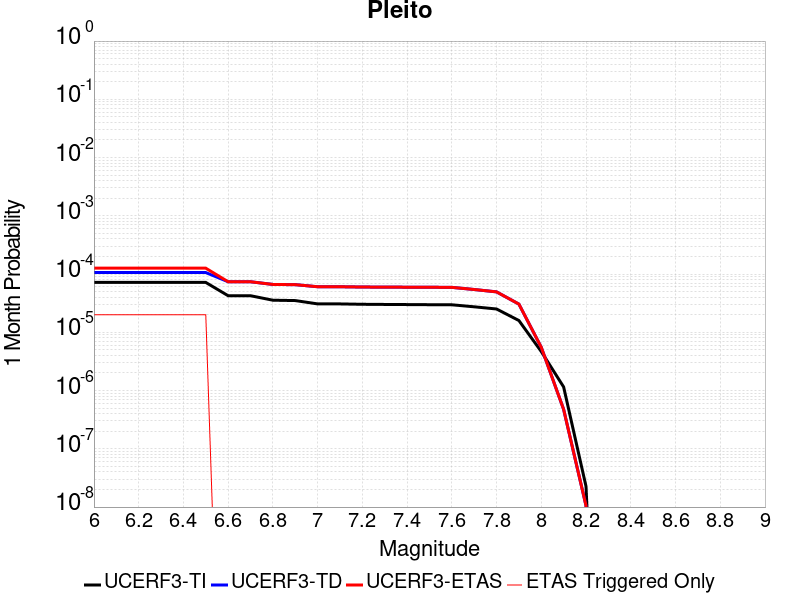 |  |  |

| Magnitude | 1 wk TI Prob | 1 wk TD Prob | 1 wk ETAS Prob | 1 wk ETAS/TD Gain | 1 wk ETAS Triggered Only | 1 mo TI Prob | 1 mo TD Prob | 1 mo ETAS Prob | 1 mo ETAS/TD Gain | 1 mo ETAS Triggered Only | 1 yr TI Prob | 1 yr TD Prob | 1 yr ETAS Prob | 1 yr ETAS/TD Gain | 1 yr ETAS Triggered Only | 10 yr TI Prob | 10 yr TD Prob | 10 yr ETAS Prob | 10 yr ETAS/TD Gain | 10 yr ETAS Triggered Only |
|-----|-----|-----|-----|-----|-----|-----|-----|-----|-----|-----|-----|-----|-----|-----|-----|-----|-----|-----|-----|-----|
| 6.0 | 1.6763008E-5 | 2.4771325E-5 | 2.4771325E-5 | 1.0 | 0.0 | 7.183948E-5 | 1.0615891E-4 | 1.2615678E-4 | 1.1883768 | 2.0E-5 | 8.742947E-4 | 0.0012917904 | 0.001351713 | 1.0463872 | 6.0E-5 | 0.00870863 | 0.01295784 | 0.013017063 | 1.0045704 | 6.0E-5 |
| 6.1 | 1.6763008E-5 | 2.4771325E-5 | 2.4771325E-5 | 1.0 | 0.0 | 7.183948E-5 | 1.0615891E-4 | 1.2615678E-4 | 1.1883768 | 2.0E-5 | 8.742947E-4 | 0.0012917904 | 0.001351713 | 1.0463872 | 6.0E-5 | 0.00870863 | 0.01295784 | 0.013017063 | 1.0045704 | 6.0E-5 |
| 6.2 | 1.6763008E-5 | 2.4771325E-5 | 2.4771325E-5 | 1.0 | 0.0 | 7.183948E-5 | 1.0615891E-4 | 1.2615678E-4 | 1.1883768 | 2.0E-5 | 8.742947E-4 | 0.0012917904 | 0.001351713 | 1.0463872 | 6.0E-5 | 0.00870863 | 0.01295784 | 0.013017063 | 1.0045704 | 6.0E-5 |
| 6.3 | 1.6763008E-5 | 2.4771325E-5 | 2.4771325E-5 | 1.0 | 0.0 | 7.183948E-5 | 1.0615891E-4 | 1.2615678E-4 | 1.1883768 | 2.0E-5 | 8.742947E-4 | 0.0012917904 | 0.001351713 | 1.0463872 | 6.0E-5 | 0.00870863 | 0.01295784 | 0.013017063 | 1.0045704 | 6.0E-5 |
| 6.4 | 1.6763008E-5 | 2.4771325E-5 | 2.4771325E-5 | 1.0 | 0.0 | 7.183948E-5 | 1.0615891E-4 | 1.2615678E-4 | 1.1883768 | 2.0E-5 | 8.742947E-4 | 0.0012917904 | 0.001351713 | 1.0463872 | 6.0E-5 | 0.00870863 | 0.01295784 | 0.013017063 | 1.0045704 | 6.0E-5 |
| 6.5 | 1.6763008E-5 | 2.4771325E-5 | 2.4771325E-5 | 1.0 | 0.0 | 7.183948E-5 | 1.0615891E-4 | 1.2615678E-4 | 1.1883768 | 2.0E-5 | 8.742947E-4 | 0.0012917904 | 0.001351713 | 1.0463872 | 6.0E-5 | 0.00870863 | 0.01295784 | 0.013017063 | 1.0045704 | 6.0E-5 |
| 6.6 | 9.910213E-6 | 1.7222008E-5 | 1.7222008E-5 | 1.0 | 0.0 | 4.247165E-5 | 7.380654E-5 | 7.380654E-5 | 1.0 | 0.0 | 5.169696E-4 | 8.982279E-4 | 9.082189E-4 | 1.0111231 | 1.0E-5 | 0.0051576863 | 0.009054615 | 0.009064524 | 1.0010945 | 1.0E-5 |
| 6.7 | 9.910213E-6 | 1.7222008E-5 | 1.7222008E-5 | 1.0 | 0.0 | 4.247165E-5 | 7.380654E-5 | 7.380654E-5 | 1.0 | 0.0 | 5.169696E-4 | 8.982279E-4 | 9.082189E-4 | 1.0111231 | 1.0E-5 | 0.0051576863 | 0.009054615 | 0.009064524 | 1.0010945 | 1.0E-5 |
| 6.8 | 8.300162E-6 | 1.5481599E-5 | 1.5481599E-5 | 1.0 | 0.0 | 3.557164E-5 | 6.634803E-5 | 6.634803E-5 | 1.0 | 0.0 | 4.3299864E-4 | 8.074893E-4 | 8.1748125E-4 | 1.012374 | 1.0E-5 | 0.004321559 | 0.008154046 | 0.008163964 | 1.0012164 | 1.0E-5 |
| 6.9 | 8.183114E-6 | 1.535281E-5 | 1.535281E-5 | 1.0 | 0.0 | 3.5070017E-5 | 6.5796106E-5 | 6.5796106E-5 | 1.0 | 0.0 | 4.2689382E-4 | 8.007746E-4 | 8.107666E-4 | 1.0124779 | 1.0E-5 | 0.0042607468 | 0.008087389 | 0.008097308 | 1.0012265 | 1.0E-5 |
| 7.0 | 7.1748823E-6 | 1.41397095E-5 | 1.41397095E-5 | 1.0 | 0.0 | 3.0749135E-5 | 6.059735E-5 | 6.059735E-5 | 1.0 | 0.0 | 3.743064E-4 | 7.3752354E-4 | 7.3752354E-4 | 1.0 | 0.0 | 0.0037367654 | 0.0074588493 | 0.0074588493 | 1.0 | 0.0 |
| 7.1 | 7.1671807E-6 | 1.4130079E-5 | 1.4130079E-5 | 1.0 | 0.0 | 3.0716128E-5 | 6.0556078E-5 | 6.0556078E-5 | 1.0 | 0.0 | 3.7390468E-4 | 7.370214E-4 | 7.370214E-4 | 1.0 | 0.0 | 0.0037327618 | 0.0074538616 | 0.0074538616 | 1.0 | 0.0 |
| 7.2 | 7.0649667E-6 | 1.3977344E-5 | 1.3977344E-5 | 1.0 | 0.0 | 3.0278077E-5 | 5.990153E-5 | 5.990153E-5 | 1.0 | 0.0 | 3.6857324E-4 | 7.290576E-4 | 7.290576E-4 | 1.0 | 0.0 | 0.0036796255 | 0.007374603 | 0.007374603 | 1.0 | 0.0 |
| 7.3 | 7.02082E-6 | 1.3920784E-5 | 1.3920784E-5 | 1.0 | 0.0 | 3.008888E-5 | 5.965914E-5 | 5.965914E-5 | 1.0 | 0.0 | 3.6627054E-4 | 7.261085E-4 | 7.261085E-4 | 1.0 | 0.0 | 0.0036566744 | 0.007345096 | 0.007345096 | 1.0 | 0.0 |
| 7.4 | 6.987146E-6 | 1.3880338E-5 | 1.3880338E-5 | 1.0 | 0.0 | 2.9944567E-5 | 5.948581E-5 | 5.948581E-5 | 1.0 | 0.0 | 3.6451413E-4 | 7.239996E-4 | 7.239996E-4 | 1.0 | 0.0 | 0.0036391679 | 0.0073240283 | 0.0073240283 | 1.0 | 0.0 |
| 7.5 | 6.9494554E-6 | 1.3837237E-5 | 1.3837237E-5 | 1.0 | 0.0 | 2.9783041E-5 | 5.93011E-5 | 5.93011E-5 | 1.0 | 0.0 | 3.625482E-4 | 7.2175224E-4 | 7.2175224E-4 | 1.0 | 0.0 | 0.0036195726 | 0.0073016533 | 0.0073016533 | 1.0 | 0.0 |
| 7.6 | 6.92694E-6 | 1.3796339E-5 | 1.3796339E-5 | 1.0 | 0.0 | 2.9686547E-5 | 5.9125832E-5 | 5.9125832E-5 | 1.0 | 0.0 | 3.6137376E-4 | 7.1961974E-4 | 7.1961974E-4 | 1.0 | 0.0 | 0.0036078666 | 0.0072804 | 0.0072804 | 1.0 | 0.0 |
| 7.7 | 6.395867E-6 | 1.2675077E-5 | 1.2675077E-5 | 1.0 | 0.0 | 2.741057E-5 | 5.4320633E-5 | 5.4320633E-5 | 1.0 | 0.0 | 3.336726E-4 | 6.6115335E-4 | 6.6115335E-4 | 1.0 | 0.0 | 0.0033317201 | 0.0066988943 | 0.0066988943 | 1.0 | 0.0 |
| 7.8 | 5.8664327E-6 | 1.15421135E-5 | 1.15421135E-5 | 1.0 | 0.0 | 2.5141611E-5 | 4.9465263E-5 | 4.9465263E-5 | 1.0 | 0.0 | 3.060561E-4 | 6.020734E-4 | 6.020734E-4 | 1.0 | 0.0 | 0.0030563495 | 0.0061040027 | 0.0061040027 | 1.0 | 0.0 |
| 7.9 | 3.7167474E-6 | 7.117878E-6 | 7.117878E-6 | 1.0 | 0.0 | 1.592882E-5 | 3.0504834E-5 | 3.0504834E-5 | 1.0 | 0.0 | 1.9391612E-4 | 3.713332E-4 | 3.713332E-4 | 1.0 | 0.0 | 0.0019374699 | 0.0037694757 | 0.0037694757 | 1.0 | 0.0 |
| 8.0 | 1.0903841E-6 | 1.2886559E-6 | 1.2886559E-6 | 1.0 | 0.0 | 4.6730665E-6 | 5.5227993E-6 | 5.5227993E-6 | 1.0 | 0.0 | 5.68931E-5 | 6.723802E-5 | 6.723802E-5 | 1.0 | 0.0 | 5.6878536E-4 | 6.9462E-4 | 6.9462E-4 | 1.0 | 0.0 |
| 8.1 | 2.6894583E-7 | 1.106846E-7 | 1.106846E-7 | 1.0 | 0.0 | 1.1526245E-6 | 4.7436248E-7 | 4.7436248E-7 | 1.0 | 0.0 | 1.4033113E-5 | 5.775348E-6 | 5.775348E-6 | 1.0 | 0.0 | 1.4032227E-4 | 6.461821E-5 | 6.461821E-5 | 1.0 | 0.0 |
| 8.2 | 5.2967013E-9 | 2.4599007E-9 | 2.4599007E-9 | 1.0 | 0.0 | 2.2700148E-8 | 1.0542432E-8 | 1.0542432E-8 | 1.0 | 0.0 | 2.7637427E-7 | 1.283541E-7 | 1.283541E-7 | 1.0 | 0.0 | 2.7637393E-6 | 1.4601666E-6 | 1.4601666E-6 | 1.0 | 0.0 |

## Ortigalita (North)
*[(top)](#table-of-contents)*

| 1 Week | 1 Month | 1 Year | 10 Year |
|-----|-----|-----|-----|
|  |  | 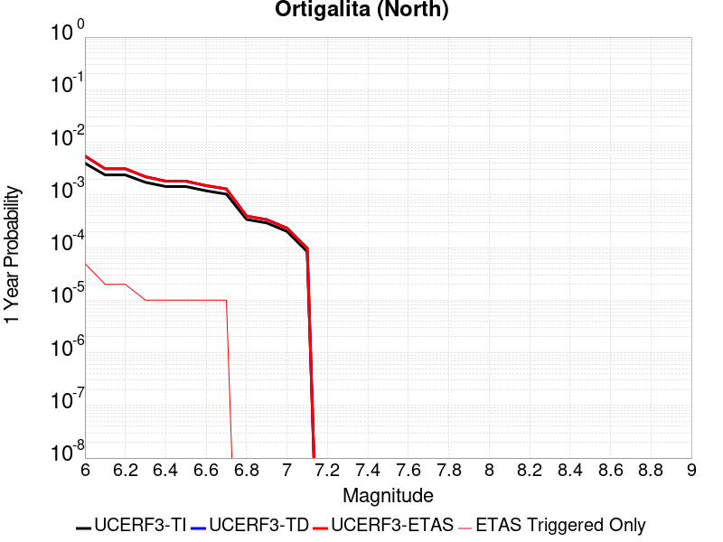 | 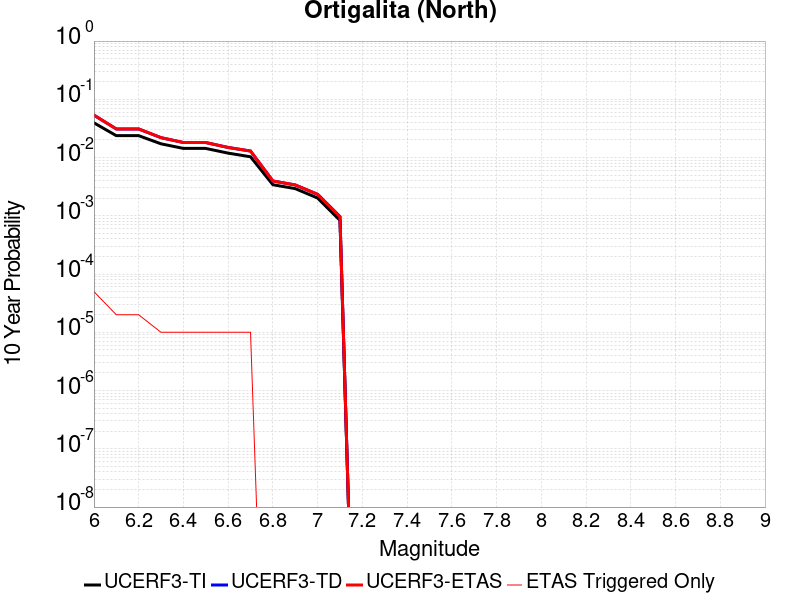 |

| Magnitude | 1 wk TI Prob | 1 wk TD Prob | 1 wk ETAS Prob | 1 wk ETAS/TD Gain | 1 wk ETAS Triggered Only | 1 mo TI Prob | 1 mo TD Prob | 1 mo ETAS Prob | 1 mo ETAS/TD Gain | 1 mo ETAS Triggered Only | 1 yr TI Prob | 1 yr TD Prob | 1 yr ETAS Prob | 1 yr ETAS/TD Gain | 1 yr ETAS Triggered Only | 10 yr TI Prob | 10 yr TD Prob | 10 yr ETAS Prob | 10 yr ETAS/TD Gain | 10 yr ETAS Triggered Only |
|-----|-----|-----|-----|-----|-----|-----|-----|-----|-----|-----|-----|-----|-----|-----|-----|-----|-----|-----|-----|-----|
| 6.0 | 7.711876E-5 | 1.0505833E-4 | 1.0505833E-4 | 1.0 | 0.0 | 3.3046713E-4 | 4.50182E-4 | 4.801685E-4 | 1.0666097 | 3.0E-5 | 0.004016016 | 0.005468294 | 0.0055180206 | 1.0090936 | 5.0E-5 | 0.039442103 | 0.053457875 | 0.0535052 | 1.0008854 | 5.0E-5 |
| 6.1 | 4.607858E-5 | 6.024242E-5 | 6.024242E-5 | 1.0 | 0.0 | 1.9746469E-4 | 2.5815787E-4 | 2.5815787E-4 | 1.0 | 0.0 | 0.0024014818 | 0.003138861 | 0.0031587982 | 1.0063517 | 2.0E-5 | 0.023756953 | 0.03097651 | 0.03099589 | 1.0006256 | 2.0E-5 |
| 6.2 | 4.607858E-5 | 6.024242E-5 | 6.024242E-5 | 1.0 | 0.0 | 1.9746469E-4 | 2.5815787E-4 | 2.5815787E-4 | 1.0 | 0.0 | 0.0024014818 | 0.003138861 | 0.0031587982 | 1.0063517 | 2.0E-5 | 0.023756953 | 0.03097651 | 0.03099589 | 1.0006256 | 2.0E-5 |
| 6.3 | 3.327423E-5 | 4.247773E-5 | 4.247773E-5 | 1.0 | 0.0 | 1.4259605E-4 | 1.8203634E-4 | 1.8203634E-4 | 1.0 | 0.0 | 0.0017347244 | 0.0022142874 | 0.0022242651 | 1.0045061 | 1.0E-5 | 0.017212452 | 0.021946533 | 0.021956313 | 1.0004456 | 1.0E-5 |
| 6.4 | 2.7732503E-5 | 3.5000263E-5 | 3.5000263E-5 | 1.0 | 0.0 | 1.1884817E-4 | 1.499939E-4 | 1.499939E-4 | 1.0 | 0.0 | 0.001446016 | 0.0018248801 | 0.0018348618 | 1.0054698 | 1.0E-5 | 0.014366428 | 0.018121928 | 0.018131748 | 1.0005418 | 1.0E-5 |
| 6.5 | 2.7689714E-5 | 3.4950077E-5 | 3.4950077E-5 | 1.0 | 0.0 | 1.186648E-4 | 1.4977883E-4 | 1.4977883E-4 | 1.0 | 0.0 | 0.0014437864 | 0.001822266 | 0.0018322478 | 1.0054777 | 1.0E-5 | 0.014344421 | 0.018096214 | 0.018106034 | 1.0005426 | 1.0E-5 |
| 6.6 | 2.2976905E-5 | 2.8719278E-5 | 2.8719278E-5 | 1.0 | 0.0 | 9.846873E-5 | 1.2307824E-4 | 1.2307824E-4 | 1.0 | 0.0 | 0.0011981975 | 0.0014976859 | 0.0015076709 | 1.006667 | 1.0E-5 | 0.011917574 | 0.014899237 | 0.014909089 | 1.0006611 | 1.0E-5 |
| 6.7 | 1.9871539E-5 | 2.4905505E-5 | 2.4905505E-5 | 1.0 | 0.0 | 8.516096E-5 | 1.0673491E-4 | 1.0673491E-4 | 1.0 | 0.0 | 0.0010363415 | 0.001298965 | 0.001308952 | 1.0076884 | 1.0E-5 | 0.010315218 | 0.012937383 | 0.012947254 | 1.0007629 | 1.0E-5 |
| 6.8 | 6.5640475E-6 | 7.6056526E-6 | 7.6056526E-6 | 1.0 | 0.0 | 2.813133E-5 | 3.2595264E-5 | 3.2595264E-5 | 1.0 | 0.0 | 3.424451E-4 | 3.9677793E-4 | 3.9677793E-4 | 1.0 | 0.0 | 0.0034191788 | 0.0039609824 | 0.0039609824 | 1.0 | 0.0 |
| 6.9 | 5.6219683E-6 | 6.5019726E-6 | 6.5019726E-6 | 1.0 | 0.0 | 2.4093928E-5 | 2.7865315E-5 | 2.7865315E-5 | 1.0 | 0.0 | 2.933041E-4 | 3.3920998E-4 | 3.3920998E-4 | 1.0 | 0.0 | 0.0029291727 | 0.0033871792 | 0.0033871792 | 1.0 | 0.0 |
| 7.0 | 3.875591E-6 | 4.4848484E-6 | 4.4848484E-6 | 1.0 | 0.0 | 1.6609569E-5 | 1.922065E-5 | 1.922065E-5 | 1.0 | 0.0 | 2.0220275E-4 | 2.339884E-4 | 2.339884E-4 | 1.0 | 0.0 | 0.0020201886 | 0.0023376285 | 0.0023376285 | 1.0 | 0.0 |
| 7.1 | 1.6017933E-6 | 1.8570811E-6 | 1.8570811E-6 | 1.0 | 0.0 | 6.8648105E-6 | 7.958901E-6 | 7.958901E-6 | 1.0 | 0.0 | 8.357586E-5 | 9.689637E-5 | 9.689637E-5 | 1.0 | 0.0 | 8.3544437E-4 | 9.686459E-4 | 9.686459E-4 | 1.0 | 0.0 |

## Whittier alt 1
*[(top)](#table-of-contents)*

| 1 Week | 1 Month | 1 Year | 10 Year |
|-----|-----|-----|-----|
|  |  |  |  |

| Magnitude | 1 wk TI Prob | 1 wk TD Prob | 1 wk ETAS Prob | 1 wk ETAS/TD Gain | 1 wk ETAS Triggered Only | 1 mo TI Prob | 1 mo TD Prob | 1 mo ETAS Prob | 1 mo ETAS/TD Gain | 1 mo ETAS Triggered Only | 1 yr TI Prob | 1 yr TD Prob | 1 yr ETAS Prob | 1 yr ETAS/TD Gain | 1 yr ETAS Triggered Only | 10 yr TI Prob | 10 yr TD Prob | 10 yr ETAS Prob | 10 yr ETAS/TD Gain | 10 yr ETAS Triggered Only |
|-----|-----|-----|-----|-----|-----|-----|-----|-----|-----|-----|-----|-----|-----|-----|-----|-----|-----|-----|-----|-----|
| 6.0 | 4.2554693E-5 | 4.7253456E-5 | 4.7253456E-5 | 1.0 | 0.0 | 1.8236451E-4 | 2.0250089E-4 | 2.1249887E-4 | 1.0493726 | 1.0E-5 | 0.002218027 | 0.0024629827 | 0.0024829335 | 1.0081003 | 2.0E-5 | 0.02196019 | 0.024390515 | 0.02444905 | 1.0023999 | 6.0E-5 |
| 6.1 | 4.2554693E-5 | 4.7253456E-5 | 4.7253456E-5 | 1.0 | 0.0 | 1.8236451E-4 | 2.0250089E-4 | 2.1249887E-4 | 1.0493726 | 1.0E-5 | 0.002218027 | 0.0024629827 | 0.0024829335 | 1.0081003 | 2.0E-5 | 0.02196019 | 0.024390515 | 0.02444905 | 1.0023999 | 6.0E-5 |
| 6.2 | 4.2554693E-5 | 4.7253456E-5 | 4.7253456E-5 | 1.0 | 0.0 | 1.8236451E-4 | 2.0250089E-4 | 2.1249887E-4 | 1.0493726 | 1.0E-5 | 0.002218027 | 0.0024629827 | 0.0024829335 | 1.0081003 | 2.0E-5 | 0.02196019 | 0.024390515 | 0.02444905 | 1.0023999 | 6.0E-5 |
| 6.3 | 1.9617712E-5 | 1.8269147E-5 | 1.8269147E-5 | 1.0 | 0.0 | 8.40732E-5 | 7.8294106E-5 | 7.8294106E-5 | 1.0 | 0.0 | 0.0010231105 | 9.5283287E-4 | 9.5283287E-4 | 1.0 | 0.0 | 0.01018413 | 0.009490375 | 0.009500281 | 1.0010437 | 1.0E-5 |
| 6.4 | 1.5611336E-5 | 1.3604728E-5 | 1.3604728E-5 | 1.0 | 0.0 | 6.690401E-5 | 5.8304708E-5 | 5.8304708E-5 | 1.0 | 0.0 | 8.142519E-4 | 7.096346E-4 | 7.096346E-4 | 1.0 | 0.0 | 0.008112748 | 0.0070752627 | 0.0070752627 | 1.0 | 0.0 |
| 6.5 | 1.5150166E-5 | 1.3101376E-5 | 1.3101376E-5 | 1.0 | 0.0 | 6.492767E-5 | 5.614758E-5 | 5.614758E-5 | 1.0 | 0.0 | 7.9020765E-4 | 6.8338827E-4 | 6.8338827E-4 | 1.0 | 0.0 | 0.007874036 | 0.0068144295 | 0.0068144295 | 1.0 | 0.0 |
| 6.6 | 1.295588E-5 | 1.0381098E-5 | 1.0381098E-5 | 1.0 | 0.0 | 5.552402E-5 | 4.4489672E-5 | 4.4489672E-5 | 1.0 | 0.0 | 6.7579525E-4 | 5.415291E-4 | 5.415291E-4 | 1.0 | 0.0 | 0.006737438 | 0.005403255 | 0.005403255 | 1.0 | 0.0 |
| 6.7 | 1.2542085E-5 | 9.899731E-6 | 9.899731E-6 | 1.0 | 0.0 | 5.3750682E-5 | 4.242674E-5 | 4.242674E-5 | 1.0 | 0.0 | 6.542181E-4 | 5.16425E-4 | 5.16425E-4 | 1.0 | 0.0 | 0.006522954 | 0.0051533743 | 0.0051533743 | 1.0 | 0.0 |
| 6.8 | 1.2195878E-5 | 9.495758E-6 | 9.495758E-6 | 1.0 | 0.0 | 5.2267E-5 | 4.069548E-5 | 4.069548E-5 | 1.0 | 0.0 | 6.36165E-4 | 4.953567E-4 | 4.953567E-4 | 1.0 | 0.0 | 0.0063434686 | 0.00494359 | 0.00494359 | 1.0 | 0.0 |
| 6.9 | 1.1580298E-5 | 8.773248E-6 | 8.773248E-6 | 1.0 | 0.0 | 4.9628903E-5 | 3.75991E-5 | 3.75991E-5 | 1.0 | 0.0 | 6.040644E-4 | 4.5767453E-4 | 4.5767453E-4 | 1.0 | 0.0 | 0.00602425 | 0.00456835 | 0.00456835 | 1.0 | 0.0 |
| 7.0 | 1.0964795E-5 | 8.084284E-6 | 8.084284E-6 | 1.0 | 0.0 | 4.6991136E-5 | 3.4646477E-5 | 3.4646477E-5 | 1.0 | 0.0 | 5.7196687E-4 | 4.2174075E-4 | 4.2174075E-4 | 1.0 | 0.0 | 0.0057049696 | 0.0042103273 | 0.0042103273 | 1.0 | 0.0 |
| 7.1 | 1.0230601E-5 | 7.3268325E-6 | 7.3268325E-6 | 1.0 | 0.0 | 4.3844695E-5 | 3.140034E-5 | 3.140034E-5 | 1.0 | 0.0 | 5.336784E-4 | 3.8223338E-4 | 3.8223338E-4 | 1.0 | 0.0 | 0.005323986 | 0.0038168596 | 0.0038168596 | 1.0 | 0.0 |
| 7.2 | 9.40865E-6 | 6.5434065E-6 | 6.5434065E-6 | 1.0 | 0.0 | 4.032216E-5 | 2.8042878E-5 | 2.8042878E-5 | 1.0 | 0.0 | 4.908117E-4 | 3.4136974E-4 | 3.4136974E-4 | 1.0 | 0.0 | 0.0048972913 | 0.0034095005 | 0.0034095005 | 1.0 | 0.0 |
| 7.3 | 8.237384E-6 | 5.5978335E-6 | 5.5978335E-6 | 1.0 | 0.0 | 3.5302593E-5 | 2.39905E-5 | 2.39905E-5 | 1.0 | 0.0 | 4.2972428E-4 | 2.9204623E-4 | 2.9204623E-4 | 1.0 | 0.0 | 0.0042889426 | 0.0029169612 | 0.0029169612 | 1.0 | 0.0 |
| 7.4 | 7.5316966E-6 | 5.0278804E-6 | 5.0278804E-6 | 1.0 | 0.0 | 3.2278298E-5 | 2.1547887E-5 | 2.1547887E-5 | 1.0 | 0.0 | 3.9291743E-4 | 2.6231495E-4 | 2.6231495E-4 | 1.0 | 0.0 | 0.0039222343 | 0.0026201624 | 0.0026201624 | 1.0 | 0.0 |
| 7.5 | 6.149649E-6 | 3.9338697E-6 | 3.9338697E-6 | 1.0 | 0.0 | 2.6355372E-5 | 1.6859338E-5 | 1.6859338E-5 | 1.0 | 0.0 | 3.208294E-4 | 2.05244E-4 | 2.05244E-4 | 1.0 | 0.0 | 0.003203666 | 0.0020506335 | 0.0020506335 | 1.0 | 0.0 |
| 7.6 | 5.457711E-6 | 3.395382E-6 | 3.395382E-6 | 1.0 | 0.0 | 2.338998E-5 | 1.45515605E-5 | 1.45515605E-5 | 1.0 | 0.0 | 2.8473578E-4 | 1.7715165E-4 | 1.7715165E-4 | 1.0 | 0.0 | 0.0028437122 | 0.0017701852 | 0.0017701852 | 1.0 | 0.0 |
| 7.7 | 4.1676276E-6 | 2.3331656E-6 | 2.3331656E-6 | 1.0 | 0.0 | 1.7861139E-5 | 9.999248E-6 | 9.999248E-6 | 1.0 | 0.0 | 2.1743766E-4 | 1.2173478E-4 | 1.2173478E-4 | 1.0 | 0.0 | 0.0021722503 | 0.001216754 | 0.001216754 | 1.0 | 0.0 |
| 7.8 | 2.2692414E-7 | 9.384624E-8 | 9.384624E-8 | 1.0 | 0.0 | 9.725317E-7 | 4.021981E-7 | 4.021981E-7 | 1.0 | 0.0 | 1.1840509E-5 | 4.8967545E-6 | 4.8967545E-6 | 1.0 | 0.0 | 1.1839878E-4 | 4.8966795E-5 | 4.8966795E-5 | 1.0 | 0.0 |
| 7.9 | 6.676829E-9 | 3.4397993E-9 | 3.4397993E-9 | 1.0 | 0.0 | 2.861498E-8 | 1.4741998E-8 | 1.4741998E-8 | 1.0 | 0.0 | 3.4838732E-7 | 1.794838E-7 | 1.794838E-7 | 1.0 | 0.0 | 3.4838679E-6 | 1.7948367E-6 | 1.7948367E-6 | 1.0 | 0.0 |

## Chino alt 1
*[(top)](#table-of-contents)*

| 1 Week | 1 Month | 1 Year | 10 Year |
|-----|-----|-----|-----|
|  |  |  | 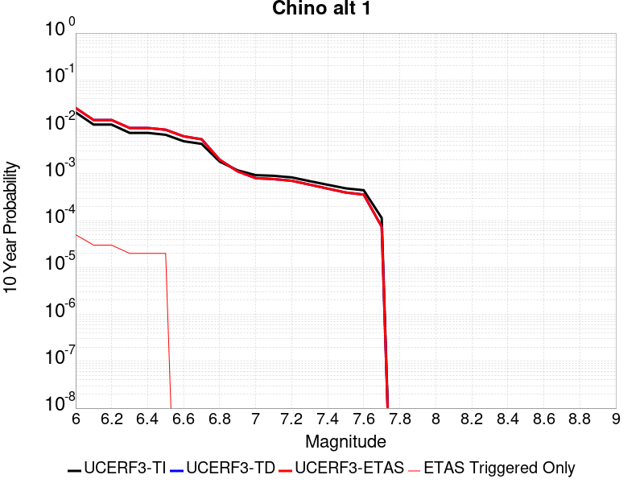 |

| Magnitude | 1 wk TI Prob | 1 wk TD Prob | 1 wk ETAS Prob | 1 wk ETAS/TD Gain | 1 wk ETAS Triggered Only | 1 mo TI Prob | 1 mo TD Prob | 1 mo ETAS Prob | 1 mo ETAS/TD Gain | 1 mo ETAS Triggered Only | 1 yr TI Prob | 1 yr TD Prob | 1 yr ETAS Prob | 1 yr ETAS/TD Gain | 1 yr ETAS Triggered Only | 10 yr TI Prob | 10 yr TD Prob | 10 yr ETAS Prob | 10 yr ETAS/TD Gain | 10 yr ETAS Triggered Only |
|-----|-----|-----|-----|-----|-----|-----|-----|-----|-----|-----|-----|-----|-----|-----|-----|-----|-----|-----|-----|-----|
| 6.0 | 3.939946E-5 | 4.8949914E-5 | 4.8949914E-5 | 1.0 | 0.0 | 1.6884391E-4 | 2.0977142E-4 | 2.1976932E-4 | 1.047661 | 1.0E-5 | 0.0020537362 | 0.0025514853 | 0.0025814087 | 1.0117278 | 3.0E-5 | 0.020348595 | 0.025280792 | 0.025329528 | 1.0019277 | 5.0E-5 |
| 6.1 | 2.1505624E-5 | 2.688007E-5 | 2.688007E-5 | 1.0 | 0.0 | 9.2163704E-5 | 1.1519585E-4 | 1.251947E-4 | 1.0867987 | 1.0E-5 | 0.0011215154 | 0.0014017166 | 0.0014216886 | 1.0142483 | 2.0E-5 | 0.011158722 | 0.013947706 | 0.013977287 | 1.0021209 | 3.0E-5 |
| 6.2 | 2.1505624E-5 | 2.688007E-5 | 2.688007E-5 | 1.0 | 0.0 | 9.2163704E-5 | 1.1519585E-4 | 1.251947E-4 | 1.0867987 | 1.0E-5 | 0.0011215154 | 0.0014017166 | 0.0014216886 | 1.0142483 | 2.0E-5 | 0.011158722 | 0.013947706 | 0.013977287 | 1.0021209 | 3.0E-5 |
| 6.3 | 1.4290785E-5 | 1.816584E-5 | 1.816584E-5 | 1.0 | 0.0 | 6.1244784E-5 | 7.785153E-5 | 8.7850756E-5 | 1.1284397 | 1.0E-5 | 7.454001E-4 | 9.4747543E-4 | 9.5746596E-4 | 1.0105444 | 1.0E-5 | 0.007429048 | 0.009446898 | 0.009466709 | 1.0020971 | 2.0E-5 |
| 6.4 | 1.4290785E-5 | 1.816584E-5 | 1.816584E-5 | 1.0 | 0.0 | 6.1244784E-5 | 7.785153E-5 | 8.7850756E-5 | 1.1284397 | 1.0E-5 | 7.454001E-4 | 9.4747543E-4 | 9.5746596E-4 | 1.0105444 | 1.0E-5 | 0.007429048 | 0.009446898 | 0.009466709 | 1.0020971 | 2.0E-5 |
| 6.5 | 1.3017944E-5 | 1.6652762E-5 | 1.6652762E-5 | 1.0 | 0.0 | 5.5789995E-5 | 7.136728E-5 | 8.136656E-5 | 1.1401103 | 1.0E-5 | 6.790315E-4 | 8.685939E-4 | 8.785852E-4 | 1.0115029 | 1.0E-5 | 0.0067696036 | 0.008664371 | 0.008684197 | 1.0022883 | 2.0E-5 |
| 6.6 | 9.470016E-6 | 1.2039946E-5 | 1.2039946E-5 | 1.0 | 0.0 | 4.058515E-5 | 5.159894E-5 | 5.159894E-5 | 1.0 | 0.0 | 4.940122E-4 | 6.2807E-4 | 6.2807E-4 | 1.0 | 0.0 | 0.004929154 | 0.006273371 | 0.006273371 | 1.0 | 0.0 |
| 6.7 | 8.314155E-6 | 1.0408143E-5 | 1.0408143E-5 | 1.0 | 0.0 | 3.5631605E-5 | 4.4605746E-5 | 4.4605746E-5 | 1.0 | 0.0 | 4.3372845E-4 | 5.429719E-4 | 5.429719E-4 | 1.0 | 0.0 | 0.004328829 | 0.005427294 | 0.005427294 | 1.0 | 0.0 |
| 6.8 | 3.4856364E-6 | 3.8135686E-6 | 3.8135686E-6 | 1.0 | 0.0 | 1.4938357E-5 | 1.6343774E-5 | 1.6343774E-5 | 1.0 | 0.0 | 1.8185932E-4 | 1.9896936E-4 | 1.9896936E-4 | 1.0 | 0.0 | 0.0018171056 | 0.0019897262 | 0.0019897262 | 1.0 | 0.0 |
| 6.9 | 2.2645952E-6 | 2.153006E-6 | 2.153006E-6 | 1.0 | 0.0 | 9.705372E-6 | 9.2271375E-6 | 9.2271375E-6 | 1.0 | 0.0 | 1.18156495E-4 | 1.1233483E-4 | 1.1233483E-4 | 1.0 | 0.0 | 0.0011809369 | 0.0011235814 | 0.0011235814 | 1.0 | 0.0 |
| 7.0 | 1.7864003E-6 | 1.5431655E-6 | 1.5431655E-6 | 1.0 | 0.0 | 7.655979E-6 | 6.61355E-6 | 6.61355E-6 | 1.0 | 0.0 | 9.3207556E-5 | 8.051705E-5 | 8.051705E-5 | 1.0 | 0.0 | 9.316847E-4 | 8.0526597E-4 | 8.0526597E-4 | 1.0 | 0.0 |
| 7.1 | 1.7315456E-6 | 1.4734359E-6 | 1.4734359E-6 | 1.0 | 0.0 | 7.420889E-6 | 6.31471E-6 | 6.31471E-6 | 1.0 | 0.0 | 9.034557E-5 | 7.687894E-5 | 7.687894E-5 | 1.0 | 0.0 | 9.0308854E-4 | 7.689018E-4 | 7.689018E-4 | 1.0 | 0.0 |
| 7.2 | 1.6008337E-6 | 1.3574833E-6 | 1.3574833E-6 | 1.0 | 0.0 | 6.860698E-6 | 5.817773E-6 | 5.817773E-6 | 1.0 | 0.0 | 8.352579E-5 | 7.082913E-5 | 7.082913E-5 | 1.0 | 0.0 | 8.34944E-4 | 7.084325E-4 | 7.084325E-4 | 1.0 | 0.0 |
| 7.3 | 1.3320939E-6 | 1.1218311E-6 | 1.1218311E-6 | 1.0 | 0.0 | 5.7089615E-6 | 4.807839E-6 | 4.807839E-6 | 1.0 | 0.0 | 6.9504385E-5 | 5.8533915E-5 | 5.8533915E-5 | 1.0 | 0.0 | 6.9482654E-4 | 5.8530783E-4 | 5.8530783E-4 | 1.0 | 0.0 |
| 7.4 | 1.114294E-6 | 9.2374944E-7 | 9.2374944E-7 | 1.0 | 0.0 | 4.775537E-6 | 3.9589204E-6 | 3.9589204E-6 | 1.0 | 0.0 | 5.8140613E-5 | 4.8198825E-5 | 4.8198825E-5 | 1.0 | 0.0 | 5.81254E-4 | 4.8189829E-4 | 4.8189829E-4 | 1.0 | 0.0 |
| 7.5 | 9.354081E-7 | 7.623722E-7 | 7.623722E-7 | 1.0 | 0.0 | 4.0088858E-6 | 3.2673056E-6 | 3.2673056E-6 | 1.0 | 0.0 | 4.8807087E-5 | 3.9778755E-5 | 3.9778755E-5 | 1.0 | 0.0 | 4.879637E-4 | 3.9771973E-4 | 3.9771973E-4 | 1.0 | 0.0 |
| 7.6 | 8.521771E-7 | 6.880951E-7 | 6.880951E-7 | 1.0 | 0.0 | 3.6521824E-6 | 2.9489759E-6 | 2.9489759E-6 | 1.0 | 0.0 | 4.4464414E-5 | 3.590322E-5 | 3.590322E-5 | 1.0 | 0.0 | 4.4455516E-4 | 3.5897738E-4 | 3.5897738E-4 | 1.0 | 0.0 |
| 7.7 | 2.1803626E-7 | 1.418694E-7 | 1.418694E-7 | 1.0 | 0.0 | 9.344408E-7 | 6.0801165E-7 | 6.0801165E-7 | 1.0 | 0.0 | 1.1376757E-5 | 7.4025265E-6 | 7.4025265E-6 | 1.0 | 0.0 | 1.13761744E-4 | 7.402376E-5 | 7.402376E-5 | 1.0 | 0.0 |

## San Pedro Basin
*[(top)](#table-of-contents)*

| 1 Week | 1 Month | 1 Year | 10 Year |
|-----|-----|-----|-----|
|  |  |  |  |

| Magnitude | 1 wk TI Prob | 1 wk TD Prob | 1 wk ETAS Prob | 1 wk ETAS/TD Gain | 1 wk ETAS Triggered Only | 1 mo TI Prob | 1 mo TD Prob | 1 mo ETAS Prob | 1 mo ETAS/TD Gain | 1 mo ETAS Triggered Only | 1 yr TI Prob | 1 yr TD Prob | 1 yr ETAS Prob | 1 yr ETAS/TD Gain | 1 yr ETAS Triggered Only | 10 yr TI Prob | 10 yr TD Prob | 10 yr ETAS Prob | 10 yr ETAS/TD Gain | 10 yr ETAS Triggered Only |
|-----|-----|-----|-----|-----|-----|-----|-----|-----|-----|-----|-----|-----|-----|-----|-----|-----|-----|-----|-----|-----|
| 6.0 | 5.3449043E-5 | 6.3371765E-5 | 6.3371765E-5 | 1.0 | 0.0 | 2.2904722E-4 | 2.7156848E-4 | 3.115576E-4 | 1.1472526 | 4.0E-5 | 0.0027850836 | 0.0033019334 | 0.0033517682 | 1.0150926 | 5.0E-5 | 0.027504366 | 0.03259028 | 0.03263865 | 1.0014842 | 5.0E-5 |
| 6.1 | 5.3449043E-5 | 6.3371765E-5 | 6.3371765E-5 | 1.0 | 0.0 | 2.2904722E-4 | 2.7156848E-4 | 3.115576E-4 | 1.1472526 | 4.0E-5 | 0.0027850836 | 0.0033019334 | 0.0033517682 | 1.0150926 | 5.0E-5 | 0.027504366 | 0.03259028 | 0.03263865 | 1.0014842 | 5.0E-5 |
| 6.2 | 2.3189454E-5 | 2.6643364E-5 | 2.6643364E-5 | 1.0 | 0.0 | 9.9379584E-5 | 1.1418111E-4 | 1.4417768E-4 | 1.2627105 | 3.0E-5 | 0.0012092749 | 0.0013893156 | 0.0014192739 | 1.0215634 | 3.0E-5 | 0.012027155 | 0.013811166 | 0.013840752 | 1.0021422 | 3.0E-5 |
| 6.3 | 2.3189454E-5 | 2.6643364E-5 | 2.6643364E-5 | 1.0 | 0.0 | 9.9379584E-5 | 1.1418111E-4 | 1.4417768E-4 | 1.2627105 | 3.0E-5 | 0.0012092749 | 0.0013893156 | 0.0014192739 | 1.0215634 | 3.0E-5 | 0.012027155 | 0.013811166 | 0.013840752 | 1.0021422 | 3.0E-5 |
| 6.4 | 1.966056E-5 | 2.2463855E-5 | 2.2463855E-5 | 1.0 | 0.0 | 8.425682E-5 | 9.627034E-5 | 1.1626841E-4 | 1.2077283 | 2.0E-5 | 0.001025344 | 0.0011715014 | 0.0011914779 | 1.017052 | 2.0E-5 | 0.010206259 | 0.011657343 | 0.011677111 | 1.0016956 | 2.0E-5 |
| 6.5 | 1.7342953E-5 | 1.9745525E-5 | 1.9745525E-5 | 1.0 | 0.0 | 7.4324824E-5 | 8.462114E-5 | 9.462029E-5 | 1.1181638 | 1.0E-5 | 9.04529E-4 | 0.0010298124 | 0.0010398021 | 1.0097005 | 1.0E-5 | 0.009008561 | 0.010254125 | 0.010264022 | 1.0009652 | 1.0E-5 |
| 6.6 | 1.439804E-5 | 1.6323016E-5 | 1.6323016E-5 | 1.0 | 0.0 | 6.170443E-5 | 6.995408E-5 | 6.995408E-5 | 1.0 | 0.0 | 7.509924E-4 | 8.513903E-4 | 8.513903E-4 | 1.0 | 0.0 | 0.0074845953 | 0.008484487 | 0.008484487 | 1.0 | 0.0 |
| 6.7 | 1.2634884E-5 | 1.4285555E-5 | 1.4285555E-5 | 1.0 | 0.0 | 5.414838E-5 | 6.122254E-5 | 6.122254E-5 | 1.0 | 0.0 | 6.590571E-4 | 7.4516E-4 | 7.4516E-4 | 1.0 | 0.0 | 0.006571059 | 0.0074296347 | 0.0074296347 | 1.0 | 0.0 |
| 6.8 | 1.146091E-5 | 1.2933422E-5 | 1.2933422E-5 | 1.0 | 0.0 | 4.911726E-5 | 5.5427943E-5 | 5.5427943E-5 | 1.0 | 0.0 | 5.9783855E-4 | 6.74656E-4 | 6.74656E-4 | 1.0 | 0.0 | 0.0059623276 | 0.006729019 | 0.006729019 | 1.0 | 0.0 |
| 6.9 | 9.109035E-6 | 1.023519E-5 | 1.023519E-5 | 1.0 | 0.0 | 3.9038136E-5 | 4.386452E-5 | 4.386452E-5 | 1.0 | 0.0 | 4.7518566E-4 | 5.339476E-4 | 5.339476E-4 | 1.0 | 0.0 | 0.0047417083 | 0.005329401 | 0.005329401 | 1.0 | 0.0 |
| 7.0 | 5.9351028E-6 | 6.584069E-6 | 6.584069E-6 | 1.0 | 0.0 | 2.5435906E-5 | 2.8217266E-5 | 2.8217266E-5 | 1.0 | 0.0 | 3.0963816E-4 | 3.4351466E-4 | 3.4351466E-4 | 1.0 | 0.0 | 0.0030920706 | 0.0034321537 | 0.0034321537 | 1.0 | 0.0 |
| 7.1 | 2.1557585E-6 | 2.2096617E-6 | 2.2096617E-6 | 1.0 | 0.0 | 9.238933E-6 | 9.469944E-6 | 9.469944E-6 | 1.0 | 0.0 | 1.1247819E-4 | 1.1529063E-4 | 1.1529063E-4 | 1.0 | 0.0 | 0.0011242128 | 0.0011523236 | 0.0011523236 | 1.0 | 0.0 |
| 7.2 | 2.1251979E-6 | 2.1780077E-6 | 2.1780077E-6 | 1.0 | 0.0 | 9.107958E-6 | 9.334286E-6 | 9.334286E-6 | 1.0 | 0.0 | 1.1088375E-4 | 1.13639166E-4 | 1.13639166E-4 | 1.0 | 0.0 | 0.0011082845 | 0.0011358259 | 0.0011358259 | 1.0 | 0.0 |
| 7.3 | 1.7145798E-6 | 1.7442975E-6 | 1.7442975E-6 | 1.0 | 0.0 | 7.3481783E-6 | 7.47554E-6 | 7.47554E-6 | 1.0 | 0.0 | 8.94604E-5 | 9.101099E-5 | 9.101099E-5 | 1.0 | 0.0 | 8.9424395E-4 | 9.097463E-4 | 9.097463E-4 | 1.0 | 0.0 |
| 7.4 | 1.4467993E-6 | 1.4641951E-6 | 1.4641951E-6 | 1.0 | 0.0 | 6.200554E-6 | 6.2751074E-6 | 6.2751074E-6 | 1.0 | 0.0 | 7.548913E-5 | 7.639683E-5 | 7.639683E-5 | 1.0 | 0.0 | 7.546349E-4 | 7.637129E-4 | 7.637129E-4 | 1.0 | 0.0 |
| 7.5 | 1.2803735E-6 | 1.293157E-6 | 1.293157E-6 | 1.0 | 0.0 | 5.487303E-6 | 5.54209E-6 | 5.54209E-6 | 1.0 | 0.0 | 6.680587E-5 | 6.747293E-5 | 6.747293E-5 | 1.0 | 0.0 | 6.678579E-4 | 6.745315E-4 | 6.745315E-4 | 1.0 | 0.0 |
| 7.6 | 6.755009E-7 | 6.769505E-7 | 6.769505E-7 | 1.0 | 0.0 | 2.8950008E-6 | 2.9012133E-6 | 2.9012133E-6 | 1.0 | 0.0 | 3.5246063E-5 | 3.532176E-5 | 3.532176E-5 | 1.0 | 0.0 | 3.5240475E-4 | 3.5316718E-4 | 3.5316718E-4 | 1.0 | 0.0 |
| 7.7 | 6.211885E-8 | 4.5700038E-8 | 4.5700038E-8 | 1.0 | 0.0 | 2.6622362E-7 | 1.9585728E-7 | 1.9585728E-7 | 1.0 | 0.0 | 3.2412677E-6 | 2.38456E-6 | 2.38456E-6 | 1.0 | 0.0 | 3.2412205E-5 | 2.3845365E-5 | 2.3845365E-5 | 1.0 | 0.0 |
| 7.8 | 2.6580573E-9 | 1.5138489E-9 | 1.5138489E-9 | 1.0 | 0.0 | 1.1391674E-8 | 6.487924E-9 | 6.487924E-9 | 1.0 | 0.0 | 1.3869362E-7 | 7.8990475E-8 | 7.8990475E-8 | 1.0 | 0.0 | 1.3869354E-6 | 7.8990473E-7 | 7.8990473E-7 | 1.0 | 0.0 |

## Tin Mountain
*[(top)](#table-of-contents)*

| 1 Week | 1 Month | 1 Year | 10 Year |
|-----|-----|-----|-----|
|  |  |  |  |

| Magnitude | 1 wk TI Prob | 1 wk TD Prob | 1 wk ETAS Prob | 1 wk ETAS/TD Gain | 1 wk ETAS Triggered Only | 1 mo TI Prob | 1 mo TD Prob | 1 mo ETAS Prob | 1 mo ETAS/TD Gain | 1 mo ETAS Triggered Only | 1 yr TI Prob | 1 yr TD Prob | 1 yr ETAS Prob | 1 yr ETAS/TD Gain | 1 yr ETAS Triggered Only | 10 yr TI Prob | 10 yr TD Prob | 10 yr ETAS Prob | 10 yr ETAS/TD Gain | 10 yr ETAS Triggered Only |
|-----|-----|-----|-----|-----|-----|-----|-----|-----|-----|-----|-----|-----|-----|-----|-----|-----|-----|-----|-----|-----|
| 6.0 | 4.083776E-6 | 4.18155E-6 | 4.18155E-6 | 1.0 | 0.0 | 1.750178E-5 | 1.7920827E-5 | 1.7920827E-5 | 1.0 | 0.0 | 2.1306332E-4 | 2.1816794E-4 | 2.3816357E-4 | 1.0916525 | 2.0E-5 | 0.0021285915 | 0.0021799032 | 0.0022297944 | 1.0228868 | 5.0E-5 |
| 6.1 | 4.083776E-6 | 4.18155E-6 | 4.18155E-6 | 1.0 | 0.0 | 1.750178E-5 | 1.7920827E-5 | 1.7920827E-5 | 1.0 | 0.0 | 2.1306332E-4 | 2.1816794E-4 | 2.3816357E-4 | 1.0916525 | 2.0E-5 | 0.0021285915 | 0.0021799032 | 0.0022297944 | 1.0228868 | 5.0E-5 |
| 6.2 | 4.083776E-6 | 4.18155E-6 | 4.18155E-6 | 1.0 | 0.0 | 1.750178E-5 | 1.7920827E-5 | 1.7920827E-5 | 1.0 | 0.0 | 2.1306332E-4 | 2.1816794E-4 | 2.3816357E-4 | 1.0916525 | 2.0E-5 | 0.0021285915 | 0.0021799032 | 0.0022297944 | 1.0228868 | 5.0E-5 |
| 6.3 | 4.083776E-6 | 4.18155E-6 | 4.18155E-6 | 1.0 | 0.0 | 1.750178E-5 | 1.7920827E-5 | 1.7920827E-5 | 1.0 | 0.0 | 2.1306332E-4 | 2.1816794E-4 | 2.3816357E-4 | 1.0916525 | 2.0E-5 | 0.0021285915 | 0.0021799032 | 0.0022297944 | 1.0228868 | 5.0E-5 |
| 6.4 | 4.083776E-6 | 4.18155E-6 | 4.18155E-6 | 1.0 | 0.0 | 1.750178E-5 | 1.7920827E-5 | 1.7920827E-5 | 1.0 | 0.0 | 2.1306332E-4 | 2.1816794E-4 | 2.3816357E-4 | 1.0916525 | 2.0E-5 | 0.0021285915 | 0.0021799032 | 0.0022297944 | 1.0228868 | 5.0E-5 |
| 6.5 | 2.3143427E-6 | 2.3731652E-6 | 2.3731652E-6 | 1.0 | 0.0 | 9.9185745E-6 | 1.0170673E-5 | 1.0170673E-5 | 1.0 | 0.0 | 1.2075195E-4 | 1.2382168E-4 | 1.3382045E-4 | 1.0807513 | 1.0E-5 | 0.0012068636 | 0.0012376028 | 0.0012675656 | 1.0242105 | 3.0E-5 |
| 6.6 | 2.3143427E-6 | 2.3731652E-6 | 2.3731652E-6 | 1.0 | 0.0 | 9.9185745E-6 | 1.0170673E-5 | 1.0170673E-5 | 1.0 | 0.0 | 1.2075195E-4 | 1.2382168E-4 | 1.3382045E-4 | 1.0807513 | 1.0E-5 | 0.0012068636 | 0.0012376028 | 0.0012675656 | 1.0242105 | 3.0E-5 |
| 6.7 | 1.7029532E-6 | 1.7497979E-6 | 1.7497979E-6 | 1.0 | 0.0 | 7.2983503E-6 | 7.4991153E-6 | 7.4991153E-6 | 1.0 | 0.0 | 8.885379E-5 | 9.129844E-5 | 9.129844E-5 | 1.0 | 0.0 | 8.881827E-4 | 9.1266196E-4 | 9.2265283E-4 | 1.010947 | 1.0E-5 |
| 6.8 | 1.2914646E-6 | 1.3299432E-6 | 1.3299432E-6 | 1.0 | 0.0 | 5.534837E-6 | 5.6997465E-6 | 5.6997465E-6 | 1.0 | 0.0 | 6.738455E-5 | 6.939264E-5 | 6.939264E-5 | 1.0 | 0.0 | 6.736412E-4 | 6.937531E-4 | 6.937531E-4 | 1.0 | 0.0 |
| 6.9 | 5.8708974E-7 | 6.117028E-7 | 6.117028E-7 | 1.0 | 0.0 | 2.5160964E-6 | 2.621581E-6 | 2.621581E-6 | 1.0 | 0.0 | 3.0633044E-5 | 3.1917323E-5 | 3.1917323E-5 | 1.0 | 0.0 | 3.0628822E-4 | 3.191315E-4 | 3.191315E-4 | 1.0 | 0.0 |
| 7.0 | 4.6248786E-7 | 4.832044E-7 | 4.832044E-7 | 1.0 | 0.0 | 1.9820893E-6 | 2.0708746E-6 | 2.0708746E-6 | 1.0 | 0.0 | 2.413167E-5 | 2.5212645E-5 | 2.5212645E-5 | 1.0 | 0.0 | 2.412905E-4 | 2.5210154E-4 | 2.5210154E-4 | 1.0 | 0.0 |
| 7.1 | 3.804606E-7 | 3.9871725E-7 | 3.9871725E-7 | 1.0 | 0.0 | 1.6305444E-6 | 1.7087873E-6 | 1.7087873E-6 | 1.0 | 0.0 | 1.9851697E-5 | 2.080432E-5 | 2.080432E-5 | 1.0 | 0.0 | 1.9849923E-4 | 2.080271E-4 | 2.080271E-4 | 1.0 | 0.0 |
| 7.2 | 3.5864858E-7 | 3.7617107E-7 | 3.7617107E-7 | 1.0 | 0.0 | 1.5370645E-6 | 1.6121609E-6 | 1.6121609E-6 | 1.0 | 0.0 | 1.87136E-5 | 1.9627916E-5 | 1.9627916E-5 | 1.0 | 0.0 | 1.8712023E-4 | 1.9626514E-4 | 1.9626514E-4 | 1.0 | 0.0 |
| 7.3 | 3.342063E-7 | 3.50637E-7 | 3.50637E-7 | 1.0 | 0.0 | 1.4323119E-6 | 1.5027293E-6 | 1.5027293E-6 | 1.0 | 0.0 | 1.7438259E-5 | 1.829561E-5 | 1.829561E-5 | 1.0 | 0.0 | 1.743689E-4 | 1.8294434E-4 | 1.8294434E-4 | 1.0 | 0.0 |
| 7.4 | 2.971242E-7 | 3.116602E-7 | 3.116602E-7 | 1.0 | 0.0 | 1.2733886E-6 | 1.3356861E-6 | 1.3356861E-6 | 1.0 | 0.0 | 1.5503398E-5 | 1.626189E-5 | 1.626189E-5 | 1.0 | 0.0 | 1.5502315E-4 | 1.6261027E-4 | 1.6261027E-4 | 1.0 | 0.0 |
| 7.5 | 1.4326713E-7 | 1.501262E-7 | 1.501262E-7 | 1.0 | 0.0 | 6.140018E-7 | 6.43398E-7 | 6.43398E-7 | 1.0 | 0.0 | 7.4754466E-6 | 7.833371E-6 | 7.833371E-6 | 1.0 | 0.0 | 7.475195E-5 | 7.83337E-5 | 7.83337E-5 | 1.0 | 0.0 |

## Imperial
*[(top)](#table-of-contents)*

| 1 Week | 1 Month | 1 Year | 10 Year |
|-----|-----|-----|-----|
|  |  |  |  |

| Magnitude | 1 wk TI Prob | 1 wk TD Prob | 1 wk ETAS Prob | 1 wk ETAS/TD Gain | 1 wk ETAS Triggered Only | 1 mo TI Prob | 1 mo TD Prob | 1 mo ETAS Prob | 1 mo ETAS/TD Gain | 1 mo ETAS Triggered Only | 1 yr TI Prob | 1 yr TD Prob | 1 yr ETAS Prob | 1 yr ETAS/TD Gain | 1 yr ETAS Triggered Only | 10 yr TI Prob | 10 yr TD Prob | 10 yr ETAS Prob | 10 yr ETAS/TD Gain | 10 yr ETAS Triggered Only |
|-----|-----|-----|-----|-----|-----|-----|-----|-----|-----|-----|-----|-----|-----|-----|-----|-----|-----|-----|-----|-----|
| 6.0 | 2.7496446E-4 | 5.0567614E-4 | 5.1567104E-4 | 1.0197655 | 1.0E-5 | 0.0011778869 | 0.0021654228 | 0.0021853794 | 1.0092161 | 2.0E-5 | 0.0142467655 | 0.02603894 | 0.026068158 | 1.0011221 | 3.0E-5 | 0.13367249 | 0.22807938 | 0.22811797 | 1.0001693 | 5.0E-5 |
| 6.1 | 2.5356023E-4 | 4.8670304E-4 | 4.966982E-4 | 1.0205364 | 1.0E-5 | 0.001086234 | 0.002084241 | 0.0021041995 | 1.0095758 | 2.0E-5 | 0.013144928 | 0.025080038 | 0.025109287 | 1.0011662 | 3.0E-5 | 0.123940155 | 0.21950823 | 0.21954726 | 1.0001777 | 5.0E-5 |
| 6.2 | 2.4820742E-4 | 4.776551E-4 | 4.8765034E-4 | 1.0209256 | 1.0E-5 | 0.0010633124 | 0.0020455252 | 0.0020654842 | 1.0097574 | 2.0E-5 | 0.01286919 | 0.024619855 | 0.024639362 | 1.0007924 | 2.0E-5 | 0.12148927 | 0.21601348 | 0.21604484 | 1.0001452 | 4.0E-5 |
| 6.3 | 2.3205351E-4 | 4.590242E-4 | 4.6901958E-4 | 1.0217754 | 1.0E-5 | 9.94136E-4 | 0.0019658 | 0.0019857609 | 1.010154 | 2.0E-5 | 0.012036599 | 0.023666015 | 0.023685541 | 1.000825 | 2.0E-5 | 0.11405133 | 0.20796531 | 0.207997 | 1.0001523 | 4.0E-5 |
| 6.4 | 2.0304754E-4 | 3.988816E-4 | 4.088776E-4 | 1.02506 | 1.0E-5 | 8.6991355E-4 | 0.001708387 | 0.001728353 | 1.0116869 | 2.0E-5 | 0.010539869 | 0.02060005 | 0.020619638 | 1.0009508 | 2.0E-5 | 0.100537635 | 0.185097 | 0.18512145 | 1.0001321 | 3.0E-5 |
| 6.5 | 1.854992E-4 | 3.6999586E-4 | 3.7999215E-4 | 1.0270174 | 1.0E-5 | 7.9475436E-4 | 0.0015847452 | 0.0016047136 | 1.0126003 | 2.0E-5 | 0.009633281 | 0.019126106 | 0.019145723 | 1.0010257 | 2.0E-5 | 0.0922623 | 0.17332682 | 0.17335162 | 1.000143 | 3.0E-5 |
| 6.6 | 1.6586106E-4 | 3.4044893E-4 | 3.504455E-4 | 1.029363 | 1.0E-5 | 7.106394E-4 | 0.001458261 | 0.001478232 | 1.013695 | 2.0E-5 | 0.008617763 | 0.017607149 | 0.017626796 | 1.0011159 | 2.0E-5 | 0.08291132 | 0.16080214 | 0.16082732 | 1.0001565 | 3.0E-5 |
| 6.7 | 1.4224656E-4 | 3.0775566E-4 | 3.177526E-4 | 1.0324833 | 1.0E-5 | 6.094856E-4 | 0.0013182943 | 0.001338268 | 1.0151511 | 2.0E-5 | 0.0073952693 | 0.015934104 | 0.015953785 | 1.0012351 | 2.0E-5 | 0.07153955 | 0.146514 | 0.1465396 | 1.0001748 | 3.0E-5 |
| 6.8 | 1.2317259E-4 | 2.7798547E-4 | 2.879827E-4 | 1.035963 | 1.0E-5 | 5.2777573E-4 | 0.0011908285 | 0.0012108047 | 1.016775 | 2.0E-5 | 0.0064067547 | 0.01440334 | 0.014423052 | 1.0013685 | 2.0E-5 | 0.06225166 | 0.13296336 | 0.13298938 | 1.0001956 | 3.0E-5 |
| 6.9 | 9.859898E-5 | 2.5019908E-4 | 2.601966E-4 | 1.0399581 | 1.0E-5 | 4.2249862E-4 | 0.0010718454 | 0.001091824 | 1.0186394 | 2.0E-5 | 0.0051317946 | 0.012972599 | 0.012992339 | 1.0015217 | 2.0E-5 | 0.05014893 | 0.119427115 | 0.11945353 | 1.0002213 | 3.0E-5 |
| 7.0 | 7.3191884E-5 | 2.1271173E-4 | 2.227096E-4 | 1.047002 | 1.0E-5 | 3.136418E-4 | 9.113064E-4 | 9.212973E-4 | 1.0109632 | 1.0E-5 | 0.003811904 | 0.011039398 | 0.011049286 | 1.0008959 | 1.0E-5 | 0.037471764 | 0.10207956 | 0.10209752 | 1.000176 | 2.0E-5 |
| 7.1 | 7.1760296E-5 | 2.0972485E-4 | 2.1972276E-4 | 1.0476716 | 1.0E-5 | 3.0750787E-4 | 8.9851435E-4 | 9.0850535E-4 | 1.0111195 | 1.0E-5 | 0.003737482 | 0.01088522 | 0.010895112 | 1.0009087 | 1.0E-5 | 0.03675245 | 0.1007159 | 0.10073388 | 1.0001786 | 2.0E-5 |
| 7.2 | 6.46614E-5 | 1.9140878E-4 | 2.0140687E-4 | 1.0522342 | 1.0E-5 | 2.7709085E-4 | 8.2006847E-4 | 8.300603E-4 | 1.0121841 | 1.0E-5 | 0.0033683628 | 0.009939248 | 0.009949149 | 1.0009961 | 1.0E-5 | 0.033177625 | 0.092523254 | 0.092541404 | 1.0001962 | 2.0E-5 |
| 7.3 | 6.088115E-5 | 1.781241E-4 | 1.8812231E-4 | 1.0561306 | 1.0E-5 | 2.6089314E-4 | 7.631685E-4 | 7.731609E-4 | 1.0130932 | 1.0E-5 | 0.0031717476 | 0.009252568 | 0.009262475 | 1.0010707 | 1.0E-5 | 0.031268585 | 0.08657277 | 0.086591035 | 1.000211 | 2.0E-5 |
| 7.4 | 4.199346E-5 | 1.1513443E-4 | 1.2513329E-4 | 1.086845 | 1.0E-5 | 1.7995955E-4 | 4.9334083E-4 | 5.033359E-4 | 1.02026 | 1.0E-5 | 0.0021888057 | 0.005990052 | 0.005999992 | 1.0016594 | 1.0E-5 | 0.02167372 | 0.057449117 | 0.057467967 | 1.0003282 | 2.0E-5 |
| 7.5 | 3.130448E-5 | 8.3357954E-5 | 9.335712E-5 | 1.1199546 | 1.0E-5 | 1.3415517E-4 | 3.5719978E-4 | 3.671962E-4 | 1.0279856 | 1.0E-5 | 0.0016321153 | 0.0043402947 | 0.0043502515 | 1.002294 | 1.0E-5 | 0.016201803 | 0.042141106 | 0.04216026 | 1.0004545 | 2.0E-5 |
| 7.6 | 2.3074248E-5 | 6.086575E-5 | 7.086514E-5 | 1.164286 | 1.0E-5 | 9.888588E-5 | 2.6082728E-4 | 2.7082465E-4 | 1.0383296 | 1.0E-5 | 0.0012032706 | 0.003170971 | 0.0031809395 | 1.0031435 | 1.0E-5 | 0.011967761 | 0.031034198 | 0.031053578 | 1.0006244 | 2.0E-5 |
| 7.7 | 1.45864815E-5 | 4.0141942E-5 | 5.014154E-5 | 1.249106 | 1.0E-5 | 6.2511994E-5 | 1.7202558E-4 | 1.8202387E-4 | 1.0581208 | 1.0E-5 | 7.608177E-4 | 0.002092405 | 0.002102384 | 1.0047692 | 1.0E-5 | 0.007582182 | 0.02063468 | 0.020654267 | 1.0009493 | 2.0E-5 |
| 7.8 | 1.0352979E-5 | 3.097546E-5 | 3.097546E-5 | 1.0 | 0.0 | 4.4369157E-5 | 1.3274523E-4 | 1.3274523E-4 | 1.0 | 0.0 | 5.400606E-4 | 0.0016149776 | 0.0016149776 | 1.0 | 0.0 | 0.0053875 | 0.016022595 | 0.016032435 | 1.0006142 | 1.0E-5 |
| 7.9 | 8.137906E-6 | 2.216039E-5 | 2.216039E-5 | 1.0 | 0.0 | 3.4876273E-5 | 9.496964E-5 | 9.496964E-5 | 1.0 | 0.0 | 4.2453592E-4 | 0.001155643 | 0.001155643 | 1.0 | 0.0 | 0.004237258 | 0.011622993 | 0.011632877 | 1.0008503 | 1.0E-5 |
| 8.0 | 6.93792E-6 | 1.8018303E-5 | 1.8018303E-5 | 1.0 | 0.0 | 2.9733603E-5 | 7.721902E-5 | 7.721902E-5 | 1.0 | 0.0 | 3.6194647E-4 | 9.397368E-4 | 9.397368E-4 | 1.0 | 0.0 | 0.0036135751 | 0.009505922 | 0.009515827 | 1.001042 | 1.0E-5 |
| 8.1 | 3.4286315E-6 | 6.383862E-6 | 6.383862E-6 | 1.0 | 0.0 | 1.4694053E-5 | 2.7359121E-5 | 2.7359121E-5 | 1.0 | 0.0 | 1.7888541E-4 | 3.330465E-4 | 3.330465E-4 | 1.0 | 0.0 | 0.0017874148 | 0.0034880012 | 0.0034979663 | 1.002857 | 1.0E-5 |
| 8.2 | 1.4906886E-6 | 1.9380652E-6 | 1.9380652E-6 | 1.0 | 0.0 | 6.3886496E-6 | 8.305968E-6 | 8.305968E-6 | 1.0 | 0.0 | 7.7779034E-5 | 1.01120495E-4 | 1.01120495E-4 | 1.0 | 0.0 | 7.775182E-4 | 0.0011082697 | 0.0011082697 | 1.0 | 0.0 |
| 8.3 | 2.5758007E-8 | 1.4511432E-8 | 1.4511432E-8 | 1.0 | 0.0 | 1.10391454E-7 | 6.219185E-8 | 6.219185E-8 | 1.0 | 0.0 | 1.3440151E-6 | 7.5718583E-7 | 7.5718583E-7 | 1.0 | 0.0 | 1.344007E-5 | 7.894757E-6 | 7.894757E-6 | 1.0 | 0.0 |

## Santa Ynez River
*[(top)](#table-of-contents)*

| 1 Week | 1 Month | 1 Year | 10 Year |
|-----|-----|-----|-----|
|  |  | 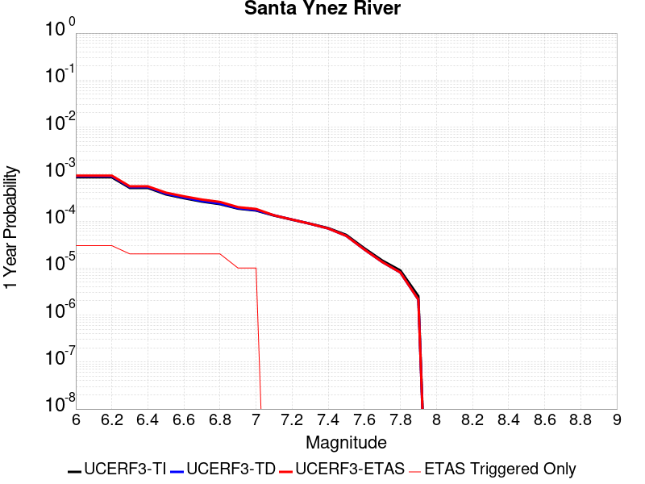 |  |

| Magnitude | 1 wk TI Prob | 1 wk TD Prob | 1 wk ETAS Prob | 1 wk ETAS/TD Gain | 1 wk ETAS Triggered Only | 1 mo TI Prob | 1 mo TD Prob | 1 mo ETAS Prob | 1 mo ETAS/TD Gain | 1 mo ETAS Triggered Only | 1 yr TI Prob | 1 yr TD Prob | 1 yr ETAS Prob | 1 yr ETAS/TD Gain | 1 yr ETAS Triggered Only | 10 yr TI Prob | 10 yr TD Prob | 10 yr ETAS Prob | 10 yr ETAS/TD Gain | 10 yr ETAS Triggered Only |
|-----|-----|-----|-----|-----|-----|-----|-----|-----|-----|-----|-----|-----|-----|-----|-----|-----|-----|-----|-----|-----|
| 6.0 | 1.6396456E-5 | 1.7209572E-5 | 1.7209572E-5 | 1.0 | 0.0 | 7.026863E-5 | 7.375342E-5 | 9.375194E-5 | 1.2711538 | 2.0E-5 | 8.551848E-4 | 8.976135E-4 | 9.275866E-4 | 1.033392 | 3.0E-5 | 0.0085190125 | 0.008943428 | 0.008992981 | 1.0055407 | 5.0E-5 |
| 6.1 | 1.6396456E-5 | 1.7209572E-5 | 1.7209572E-5 | 1.0 | 0.0 | 7.026863E-5 | 7.375342E-5 | 9.375194E-5 | 1.2711538 | 2.0E-5 | 8.551848E-4 | 8.976135E-4 | 9.275866E-4 | 1.033392 | 3.0E-5 | 0.0085190125 | 0.008943428 | 0.008992981 | 1.0055407 | 5.0E-5 |
| 6.2 | 1.6396456E-5 | 1.7209572E-5 | 1.7209572E-5 | 1.0 | 0.0 | 7.026863E-5 | 7.375342E-5 | 9.375194E-5 | 1.2711538 | 2.0E-5 | 8.551848E-4 | 8.976135E-4 | 9.275866E-4 | 1.033392 | 3.0E-5 | 0.0085190125 | 0.008943428 | 0.008992981 | 1.0055407 | 5.0E-5 |
| 6.3 | 9.736976E-6 | 1.0122406E-5 | 1.0122406E-5 | 1.0 | 0.0 | 4.172923E-5 | 4.3381046E-5 | 6.3380176E-5 | 1.4610108 | 2.0E-5 | 5.0793495E-4 | 5.280412E-4 | 5.4803066E-4 | 1.0378559 | 2.0E-5 | 0.005067755 | 0.005268371 | 0.0053081606 | 1.0075525 | 4.0E-5 |
| 6.4 | 9.736976E-6 | 1.0122406E-5 | 1.0122406E-5 | 1.0 | 0.0 | 4.172923E-5 | 4.3381046E-5 | 6.3380176E-5 | 1.4610108 | 2.0E-5 | 5.0793495E-4 | 5.280412E-4 | 5.4803066E-4 | 1.0378559 | 2.0E-5 | 0.005067755 | 0.005268371 | 0.0053081606 | 1.0075525 | 4.0E-5 |
| 6.5 | 7.081964E-6 | 7.3299525E-6 | 7.3299525E-6 | 1.0 | 0.0 | 3.035092E-5 | 3.1413714E-5 | 5.1413084E-5 | 1.6366446 | 2.0E-5 | 3.694598E-4 | 3.8239642E-4 | 4.0238877E-4 | 1.0522817 | 2.0E-5 | 0.0036884616 | 0.003817546 | 0.0038573933 | 1.010438 | 4.0E-5 |
| 6.6 | 5.873247E-6 | 6.0597904E-6 | 6.0597904E-6 | 1.0 | 0.0 | 2.5170815E-5 | 2.5970277E-5 | 4.596976E-5 | 1.7700912 | 2.0E-5 | 3.064116E-4 | 3.161431E-4 | 3.3613679E-4 | 1.0632424 | 2.0E-5 | 0.0030598943 | 0.003157021 | 0.0031869262 | 1.0094726 | 3.0E-5 |
| 6.7 | 4.973277E-6 | 5.1159423E-6 | 5.1159423E-6 | 1.0 | 0.0 | 2.1313872E-5 | 2.1925287E-5 | 4.1924846E-5 | 1.9121687 | 2.0E-5 | 2.5946548E-4 | 2.6690814E-4 | 2.869028E-4 | 1.0749122 | 2.0E-5 | 0.0025916274 | 0.0026659246 | 0.0026958447 | 1.0112231 | 3.0E-5 |
| 6.8 | 4.396492E-6 | 4.511015E-6 | 4.511015E-6 | 1.0 | 0.0 | 1.884197E-5 | 1.9332781E-5 | 3.9332393E-5 | 2.0344923 | 2.0E-5 | 2.2937685E-4 | 2.3535153E-4 | 2.5534682E-4 | 1.0849593 | 2.0E-5 | 0.0022914023 | 0.0023510582 | 0.0023710113 | 1.0084869 | 2.0E-5 |
| 6.9 | 3.5255632E-6 | 3.6013655E-6 | 3.6013655E-6 | 1.0 | 0.0 | 1.5109469E-5 | 1.5434332E-5 | 2.543418E-5 | 1.6478962 | 1.0E-5 | 1.8394225E-4 | 1.8789696E-4 | 1.9789507E-4 | 1.0532106 | 1.0E-5 | 0.0018379007 | 0.0018773971 | 0.0018873783 | 1.0053165 | 1.0E-5 |
| 7.0 | 3.211603E-6 | 3.2736843E-6 | 3.2736843E-6 | 1.0 | 0.0 | 1.376394E-5 | 1.4030001E-5 | 2.4029861E-5 | 1.7127483 | 1.0E-5 | 1.6756308E-4 | 1.7080201E-4 | 1.808003E-4 | 1.0585374 | 1.0E-5 | 0.0016743679 | 0.0017067215 | 0.0017167045 | 1.0058492 | 1.0E-5 |
| 7.1 | 2.5094619E-6 | 2.5409465E-6 | 2.5409465E-6 | 1.0 | 0.0 | 1.0754793E-5 | 1.0889726E-5 | 1.0889726E-5 | 1.0 | 0.0 | 1.3093173E-4 | 1.325744E-4 | 1.325744E-4 | 1.0 | 0.0 | 0.0013085462 | 0.0013249591 | 0.0013249591 | 1.0 | 0.0 |
| 7.2 | 2.0515774E-6 | 2.0619607E-6 | 2.0619607E-6 | 1.0 | 0.0 | 8.792445E-6 | 8.836944E-6 | 8.836944E-6 | 1.0 | 0.0 | 1.0704277E-4 | 1.0758453E-4 | 1.0758453E-4 | 1.0 | 0.0 | 0.0010699122 | 0.0010753288 | 0.0010753288 | 1.0 | 0.0 |
| 7.3 | 1.6845745E-6 | 1.6774113E-6 | 1.6774113E-6 | 1.0 | 0.0 | 7.219585E-6 | 7.188886E-6 | 7.188886E-6 | 1.0 | 0.0 | 8.78949E-5 | 8.75212E-5 | 8.75212E-5 | 1.0 | 0.0 | 8.7860145E-4 | 8.7487017E-4 | 8.7487017E-4 | 1.0 | 0.0 |
| 7.4 | 1.3600285E-6 | 1.3333537E-6 | 1.3333537E-6 | 1.0 | 0.0 | 5.82868E-6 | 5.71436E-6 | 5.71436E-6 | 1.0 | 0.0 | 7.096187E-5 | 6.957014E-5 | 6.957014E-5 | 1.0 | 0.0 | 7.0939213E-4 | 6.954858E-4 | 6.954858E-4 | 1.0 | 0.0 |
| 7.5 | 9.735342E-7 | 9.290247E-7 | 9.290247E-7 | 1.0 | 0.0 | 4.172283E-6 | 3.981528E-6 | 3.981528E-6 | 1.0 | 0.0 | 5.079636E-5 | 4.8474045E-5 | 4.8474045E-5 | 1.0 | 0.0 | 5.0784746E-4 | 4.8463643E-4 | 4.8463643E-4 | 1.0 | 0.0 |
| 7.6 | 5.067187E-7 | 4.77864E-7 | 4.77864E-7 | 1.0 | 0.0 | 2.1716498E-6 | 2.047987E-6 | 2.047987E-6 | 1.0 | 0.0 | 2.6439517E-5 | 2.4933963E-5 | 2.4933963E-5 | 1.0 | 0.0 | 2.643637E-4 | 2.493124E-4 | 2.493124E-4 | 1.0 | 0.0 |
| 7.7 | 2.769089E-7 | 2.575952E-7 | 2.575952E-7 | 1.0 | 0.0 | 1.1867519E-6 | 1.1039789E-6 | 1.1039789E-6 | 1.0 | 0.0 | 1.4448608E-5 | 1.344086E-5 | 1.344086E-5 | 1.0 | 0.0 | 1.444767E-4 | 1.344005E-4 | 1.344005E-4 | 1.0 | 0.0 |
| 7.8 | 1.7044663E-7 | 1.5449315E-7 | 1.5449315E-7 | 1.0 | 0.0 | 7.3048534E-7 | 6.621133E-7 | 6.621133E-7 | 1.0 | 0.0 | 8.893623E-6 | 8.0612E-6 | 8.0612E-6 | 1.0 | 0.0 | 8.893267E-5 | 8.06091E-5 | 8.06091E-5 | 1.0 | 0.0 |
| 7.9 | 4.8344287E-8 | 4.0911427E-8 | 4.0911427E-8 | 1.0 | 0.0 | 2.0718979E-7 | 1.7533468E-7 | 1.7533468E-7 | 1.0 | 0.0 | 2.5225327E-6 | 2.1346975E-6 | 2.1346975E-6 | 1.0 | 0.0 | 2.5225041E-5 | 2.1346776E-5 | 2.1346776E-5 | 1.0 | 0.0 |

## Rose Canyon
*[(top)](#table-of-contents)*

| 1 Week | 1 Month | 1 Year | 10 Year |
|-----|-----|-----|-----|
|  |  |  |  |

| Magnitude | 1 wk TI Prob | 1 wk TD Prob | 1 wk ETAS Prob | 1 wk ETAS/TD Gain | 1 wk ETAS Triggered Only | 1 mo TI Prob | 1 mo TD Prob | 1 mo ETAS Prob | 1 mo ETAS/TD Gain | 1 mo ETAS Triggered Only | 1 yr TI Prob | 1 yr TD Prob | 1 yr ETAS Prob | 1 yr ETAS/TD Gain | 1 yr ETAS Triggered Only | 10 yr TI Prob | 10 yr TD Prob | 10 yr ETAS Prob | 10 yr ETAS/TD Gain | 10 yr ETAS Triggered Only |
|-----|-----|-----|-----|-----|-----|-----|-----|-----|-----|-----|-----|-----|-----|-----|-----|-----|-----|-----|-----|-----|
| 6.0 | 4.5923203E-5 | 4.9717553E-5 | 5.971706E-5 | 1.2011262 | 1.0E-5 | 1.9679888E-4 | 2.1305913E-4 | 2.2305701E-4 | 1.0469253 | 1.0E-5 | 0.0023933933 | 0.0025910994 | 0.0026210216 | 1.011548 | 3.0E-5 | 0.023677798 | 0.025618313 | 0.025657289 | 1.0015213 | 4.0E-5 |
| 6.1 | 4.5923203E-5 | 4.9717553E-5 | 5.971706E-5 | 1.2011262 | 1.0E-5 | 1.9679888E-4 | 2.1305913E-4 | 2.2305701E-4 | 1.0469253 | 1.0E-5 | 0.0023933933 | 0.0025910994 | 0.0026110476 | 1.0076988 | 2.0E-5 | 0.023677798 | 0.025618313 | 0.025647545 | 1.0011411 | 3.0E-5 |
| 6.2 | 2.8844734E-5 | 2.9670837E-5 | 3.967054E-5 | 1.3370212 | 1.0E-5 | 1.2361443E-4 | 1.2715468E-4 | 1.3715342E-4 | 1.0786344 | 1.0E-5 | 0.0015039665 | 0.0015470362 | 0.0015670053 | 1.012908 | 2.0E-5 | 0.0149382865 | 0.015357477 | 0.0153771695 | 1.0012823 | 2.0E-5 |
| 6.3 | 2.3171577E-5 | 2.3163399E-5 | 3.3163167E-5 | 1.4317056 | 1.0E-5 | 9.9302975E-5 | 9.9268E-5 | 1.09267006E-4 | 1.1007274 | 1.0E-5 | 0.0012083431 | 0.0012079312 | 0.001227907 | 1.0165372 | 2.0E-5 | 0.012017938 | 0.012004637 | 0.012024397 | 1.001646 | 2.0E-5 |
| 6.4 | 2.0066604E-5 | 1.966902E-5 | 2.9668823E-5 | 1.5084038 | 1.0E-5 | 8.599689E-5 | 8.429313E-5 | 9.429229E-5 | 1.1186236 | 1.0E-5 | 0.0010465092 | 0.0010257957 | 0.0010457753 | 1.019477 | 2.0E-5 | 0.010415946 | 0.010203916 | 0.010223712 | 1.00194 | 2.0E-5 |
| 6.5 | 1.776989E-5 | 1.7115479E-5 | 2.7115308E-5 | 1.5842564 | 1.0E-5 | 7.615444E-5 | 7.3350035E-5 | 8.3349296E-5 | 1.1363226 | 1.0E-5 | 9.267859E-4 | 8.926777E-4 | 9.1265986E-4 | 1.0223845 | 2.0E-5 | 0.009229303 | 0.008879829 | 0.0088996515 | 1.0022323 | 2.0E-5 |
| 6.6 | 1.5227364E-5 | 1.4340938E-5 | 1.4340938E-5 | 1.0 | 0.0 | 6.52585E-5 | 6.1459745E-5 | 6.1459745E-5 | 1.0 | 0.0 | 7.942326E-4 | 7.480207E-4 | 7.580132E-4 | 1.0133586 | 1.0E-5 | 0.007914 | 0.00744577 | 0.0074556954 | 1.001333 | 1.0E-5 |
| 6.7 | 1.2703898E-5 | 1.167434E-5 | 1.167434E-5 | 1.0 | 0.0 | 5.4444143E-5 | 5.0031955E-5 | 5.0031955E-5 | 1.0 | 0.0 | 6.626558E-4 | 6.0897303E-4 | 6.1896694E-4 | 1.0164111 | 1.0E-5 | 0.006606833 | 0.00606576 | 0.0060756993 | 1.0016387 | 1.0E-5 |
| 6.8 | 1.1554917E-5 | 1.0610447E-5 | 1.0610447E-5 | 1.0 | 0.0 | 4.9520135E-5 | 4.5472574E-5 | 4.5472574E-5 | 1.0 | 0.0 | 6.0274085E-4 | 5.53492E-4 | 5.634865E-4 | 1.0180571 | 1.0E-5 | 0.0060110865 | 0.005507283 | 0.005517228 | 1.0018058 | 1.0E-5 |
| 6.9 | 8.732078E-6 | 7.882343E-6 | 7.882343E-6 | 1.0 | 0.0 | 3.7422655E-5 | 3.378105E-5 | 3.378105E-5 | 1.0 | 0.0 | 4.5552556E-4 | 4.112096E-4 | 4.112096E-4 | 1.0 | 0.0 | 0.0045459294 | 0.004089545 | 0.004089545 | 1.0 | 0.0 |
| 7.0 | 5.9337494E-6 | 5.1074826E-6 | 5.1074826E-6 | 1.0 | 0.0 | 2.5430107E-5 | 2.1889029E-5 | 2.1889029E-5 | 1.0 | 0.0 | 3.0956755E-4 | 2.6646646E-4 | 2.6646646E-4 | 1.0 | 0.0 | 0.0030913667 | 0.0026614852 | 0.0026614852 | 1.0 | 0.0 |
| 7.1 | 5.013409E-6 | 4.177376E-6 | 4.177376E-6 | 1.0 | 0.0 | 2.1485863E-5 | 1.7902918E-5 | 1.7902918E-5 | 1.0 | 0.0 | 2.6155898E-4 | 2.1794632E-4 | 2.1794632E-4 | 1.0 | 0.0 | 0.0026125133 | 0.0021773374 | 0.0021773374 | 1.0 | 0.0 |
| 7.2 | 4.120763E-6 | 3.2821204E-6 | 3.2821204E-6 | 1.0 | 0.0 | 1.7660293E-5 | 1.4066155E-5 | 1.4066155E-5 | 1.0 | 0.0 | 2.1499286E-4 | 1.7124206E-4 | 1.7124206E-4 | 1.0 | 0.0 | 0.0021478499 | 0.0017111107 | 0.0017111107 | 1.0 | 0.0 |
| 7.3 | 3.2081239E-6 | 2.440515E-6 | 2.440515E-6 | 1.0 | 0.0 | 1.374903E-5 | 1.0459307E-5 | 1.0459307E-5 | 1.0 | 0.0 | 1.6738157E-4 | 1.273347E-4 | 1.273347E-4 | 1.0 | 0.0 | 0.0016725556 | 0.0012726244 | 0.0012726244 | 1.0 | 0.0 |
| 7.4 | 2.4194755E-6 | 1.7680458E-6 | 1.7680458E-6 | 1.0 | 0.0 | 1.0369139E-5 | 7.5773173E-6 | 7.5773173E-6 | 1.0 | 0.0 | 1.2623696E-4 | 9.224998E-5 | 9.224998E-5 | 1.0 | 0.0 | 0.0012616527 | 9.221223E-4 | 9.221223E-4 | 1.0 | 0.0 |
| 7.5 | 1.3842889E-6 | 9.378391E-7 | 9.378391E-7 | 1.0 | 0.0 | 5.9326535E-6 | 4.0193045E-6 | 4.0193045E-6 | 1.0 | 0.0 | 7.222766E-5 | 4.893397E-5 | 4.893397E-5 | 1.0 | 0.0 | 7.220419E-4 | 4.8923545E-4 | 4.8923545E-4 | 1.0 | 0.0 |
| 7.6 | 1.0021575E-6 | 6.4114187E-7 | 6.4114187E-7 | 1.0 | 0.0 | 4.2949537E-6 | 2.7477479E-6 | 2.7477479E-6 | 1.0 | 0.0 | 5.2289808E-5 | 3.345334E-5 | 3.345334E-5 | 1.0 | 0.0 | 5.2277505E-4 | 3.3448517E-4 | 3.3448517E-4 | 1.0 | 0.0 |
| 7.7 | 8.7620116E-8 | 6.449342E-8 | 6.449342E-8 | 1.0 | 0.0 | 3.7551473E-7 | 2.7640036E-7 | 2.7640036E-7 | 1.0 | 0.0 | 4.5718825E-6 | 3.3651693E-6 | 3.3651693E-6 | 1.0 | 0.0 | 4.5717883E-5 | 3.3651213E-5 | 3.3651213E-5 | 1.0 | 0.0 |

## Elysian Park (Upper)
*[(top)](#table-of-contents)*

| 1 Week | 1 Month | 1 Year | 10 Year |
|-----|-----|-----|-----|
|  |  |  | 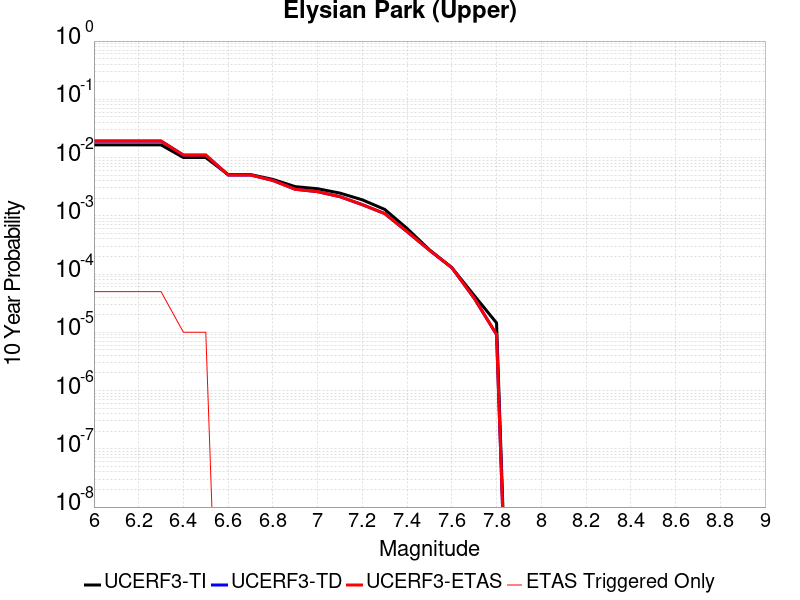 |

| Magnitude | 1 wk TI Prob | 1 wk TD Prob | 1 wk ETAS Prob | 1 wk ETAS/TD Gain | 1 wk ETAS Triggered Only | 1 mo TI Prob | 1 mo TD Prob | 1 mo ETAS Prob | 1 mo ETAS/TD Gain | 1 mo ETAS Triggered Only | 1 yr TI Prob | 1 yr TD Prob | 1 yr ETAS Prob | 1 yr ETAS/TD Gain | 1 yr ETAS Triggered Only | 10 yr TI Prob | 10 yr TD Prob | 10 yr ETAS Prob | 10 yr ETAS/TD Gain | 10 yr ETAS Triggered Only |
|-----|-----|-----|-----|-----|-----|-----|-----|-----|-----|-----|-----|-----|-----|-----|-----|-----|-----|-----|-----|-----|
| 6.0 | 3.1876025E-5 | 3.703628E-5 | 3.703628E-5 | 1.0 | 0.0 | 1.3660437E-4 | 1.5871998E-4 | 1.687184E-4 | 1.062994 | 1.0E-5 | 0.0016618895 | 0.0019311737 | 0.0019411545 | 1.0051682 | 1.0E-5 | 0.016495159 | 0.019190373 | 0.019239413 | 1.0025555 | 5.0E-5 |
| 6.1 | 3.1876025E-5 | 3.703628E-5 | 3.703628E-5 | 1.0 | 0.0 | 1.3660437E-4 | 1.5871998E-4 | 1.687184E-4 | 1.062994 | 1.0E-5 | 0.0016618895 | 0.0019311737 | 0.0019411545 | 1.0051682 | 1.0E-5 | 0.016495159 | 0.019190373 | 0.019239413 | 1.0025555 | 5.0E-5 |
| 6.2 | 3.1876025E-5 | 3.703628E-5 | 3.703628E-5 | 1.0 | 0.0 | 1.3660437E-4 | 1.5871998E-4 | 1.687184E-4 | 1.062994 | 1.0E-5 | 0.0016618895 | 0.0019311737 | 0.0019411545 | 1.0051682 | 1.0E-5 | 0.016495159 | 0.019190373 | 0.019239413 | 1.0025555 | 5.0E-5 |
| 6.3 | 3.1876025E-5 | 3.703628E-5 | 3.703628E-5 | 1.0 | 0.0 | 1.3660437E-4 | 1.5871998E-4 | 1.687184E-4 | 1.062994 | 1.0E-5 | 0.0016618895 | 0.0019311737 | 0.0019411545 | 1.0051682 | 1.0E-5 | 0.016495159 | 0.019190373 | 0.019239413 | 1.0025555 | 5.0E-5 |
| 6.4 | 1.9273462E-5 | 2.1202904E-5 | 2.1202904E-5 | 1.0 | 0.0 | 8.259794E-5 | 9.0867405E-5 | 9.0867405E-5 | 1.0 | 0.0 | 0.001005166 | 0.0011059209 | 0.0011059209 | 1.0 | 0.0 | 0.010006315 | 0.011020984 | 0.011030873 | 1.0008974 | 1.0E-5 |
| 6.5 | 1.9273462E-5 | 2.1202904E-5 | 2.1202904E-5 | 1.0 | 0.0 | 8.259794E-5 | 9.0867405E-5 | 9.0867405E-5 | 1.0 | 0.0 | 0.001005166 | 0.0011059209 | 0.0011059209 | 1.0 | 0.0 | 0.010006315 | 0.011020984 | 0.011030873 | 1.0008974 | 1.0E-5 |
| 6.6 | 9.813258E-6 | 9.665716E-6 | 9.665716E-6 | 1.0 | 0.0 | 4.205614E-5 | 4.1423882E-5 | 4.1423882E-5 | 1.0 | 0.0 | 5.119132E-4 | 5.042263E-4 | 5.042263E-4 | 1.0 | 0.0 | 0.005107356 | 0.005031546 | 0.005031546 | 1.0 | 0.0 |
| 6.7 | 9.801478E-6 | 9.653286E-6 | 9.653286E-6 | 1.0 | 0.0 | 4.2005657E-5 | 4.1370608E-5 | 4.1370608E-5 | 1.0 | 0.0 | 5.112989E-4 | 5.03578E-4 | 5.03578E-4 | 1.0 | 0.0 | 0.0051012407 | 0.0050250925 | 0.0050250925 | 1.0 | 0.0 |
| 6.8 | 8.102489E-6 | 7.773095E-6 | 7.773095E-6 | 1.0 | 0.0 | 3.4724493E-5 | 3.3312866E-5 | 3.3312866E-5 | 1.0 | 0.0 | 4.2268867E-4 | 4.0551362E-4 | 4.0551362E-4 | 1.0 | 0.0 | 0.004218856 | 0.0040482306 | 0.0040482306 | 1.0 | 0.0 |
| 6.9 | 6.08275E-6 | 5.481501E-6 | 5.481501E-6 | 1.0 | 0.0 | 2.6068668E-5 | 2.349194E-5 | 2.349194E-5 | 1.0 | 0.0 | 3.173398E-4 | 2.859776E-4 | 2.859776E-4 | 1.0 | 0.0 | 0.0031688702 | 0.0028561736 | 0.0028561736 | 1.0 | 0.0 |
| 7.0 | 5.5995934E-6 | 4.982823E-6 | 4.982823E-6 | 1.0 | 0.0 | 2.3998036E-5 | 2.1354786E-5 | 2.1354786E-5 | 1.0 | 0.0 | 2.9213692E-4 | 2.5996417E-4 | 2.5996417E-4 | 1.0 | 0.0 | 0.0029175316 | 0.002596668 | 0.002596668 | 1.0 | 0.0 |
| 7.1 | 4.709881E-6 | 4.0874347E-6 | 4.0874347E-6 | 1.0 | 0.0 | 2.0185047E-5 | 1.7517461E-5 | 1.7517461E-5 | 1.0 | 0.0 | 2.4572524E-4 | 2.1325464E-4 | 2.1325464E-4 | 1.0 | 0.0 | 0.002454537 | 0.0021305413 | 0.0021305413 | 1.0 | 0.0 |
| 7.2 | 3.6063436E-6 | 2.9779728E-6 | 2.9779728E-6 | 1.0 | 0.0 | 1.5455667E-5 | 1.2762678E-5 | 1.2762678E-5 | 1.0 | 0.0 | 1.881565E-4 | 1.5537464E-4 | 1.5537464E-4 | 1.0 | 0.0 | 0.0018799726 | 0.0015526713 | 0.0015526713 | 1.0 | 0.0 |
| 7.3 | 2.471135E-6 | 2.0954792E-6 | 2.0954792E-6 | 1.0 | 0.0 | 1.0590536E-5 | 8.980594E-6 | 8.980594E-6 | 1.0 | 0.0 | 1.2893214E-4 | 1.0933332E-4 | 1.0933332E-4 | 1.0 | 0.0 | 0.0012885736 | 0.0010928025 | 0.0010928025 | 1.0 | 0.0 |
| 7.4 | 1.163943E-6 | 1.0275194E-6 | 1.0275194E-6 | 1.0 | 0.0 | 4.988318E-6 | 4.4036474E-6 | 4.4036474E-6 | 1.0 | 0.0 | 6.0731076E-5 | 5.3613116E-5 | 5.3613116E-5 | 1.0 | 0.0 | 6.071448E-4 | 5.360048E-4 | 5.360048E-4 | 1.0 | 0.0 |
| 7.5 | 4.99459E-7 | 4.917662E-7 | 4.917662E-7 | 1.0 | 0.0 | 2.140537E-6 | 2.1075678E-6 | 2.1075678E-6 | 1.0 | 0.0 | 2.6060725E-5 | 2.565935E-5 | 2.565935E-5 | 1.0 | 0.0 | 2.605767E-4 | 2.5656543E-4 | 2.5656543E-4 | 1.0 | 0.0 |
| 7.6 | 2.4667852E-7 | 2.4778686E-7 | 2.4778686E-7 | 1.0 | 0.0 | 1.0571932E-6 | 1.0619433E-6 | 1.0619433E-6 | 1.0 | 0.0 | 1.2871251E-5 | 1.2929087E-5 | 1.2929087E-5 | 1.0 | 0.0 | 1.2870505E-4 | 1.2928371E-4 | 1.2928371E-4 | 1.0 | 0.0 |
| 7.7 | 8.2312795E-8 | 7.386639E-8 | 7.386639E-8 | 1.0 | 0.0 | 3.527691E-7 | 3.165702E-7 | 3.165702E-7 | 1.0 | 0.0 | 4.294955E-6 | 3.8542366E-6 | 3.8542366E-6 | 1.0 | 0.0 | 4.2948723E-5 | 3.8541813E-5 | 3.8541813E-5 | 1.0 | 0.0 |
| 7.8 | 2.7819295E-8 | 1.7567253E-8 | 1.7567253E-8 | 1.0 | 0.0 | 1.1922555E-7 | 7.528822E-8 | 7.528822E-8 | 1.0 | 0.0 | 1.45157E-6 | 9.166339E-7 | 9.166339E-7 | 1.0 | 0.0 | 1.45156055E-5 | 9.166316E-6 | 9.166316E-6 | 1.0 | 0.0 |

## Kern Canyon (South Kern) 2011
*[(top)](#table-of-contents)*

| 1 Week | 1 Month | 1 Year | 10 Year |
|-----|-----|-----|-----|
|  |  |  |  |

| Magnitude | 1 wk TI Prob | 1 wk TD Prob | 1 wk ETAS Prob | 1 wk ETAS/TD Gain | 1 wk ETAS Triggered Only | 1 mo TI Prob | 1 mo TD Prob | 1 mo ETAS Prob | 1 mo ETAS/TD Gain | 1 mo ETAS Triggered Only | 1 yr TI Prob | 1 yr TD Prob | 1 yr ETAS Prob | 1 yr ETAS/TD Gain | 1 yr ETAS Triggered Only | 10 yr TI Prob | 10 yr TD Prob | 10 yr ETAS Prob | 10 yr ETAS/TD Gain | 10 yr ETAS Triggered Only |
|-----|-----|-----|-----|-----|-----|-----|-----|-----|-----|-----|-----|-----|-----|-----|-----|-----|-----|-----|-----|-----|
| 6.0 | 4.105075E-6 | 4.1137364E-6 | 4.1137364E-6 | 1.0 | 0.0 | 1.7593058E-5 | 1.7630184E-5 | 1.7630184E-5 | 1.0 | 0.0 | 2.1417443E-4 | 2.1462698E-4 | 2.2462483E-4 | 1.0465825 | 1.0E-5 | 0.0021396813 | 0.0021442608 | 0.0021841752 | 1.0186144 | 4.0E-5 |
| 6.1 | 4.105075E-6 | 4.1137364E-6 | 4.1137364E-6 | 1.0 | 0.0 | 1.7593058E-5 | 1.7630184E-5 | 1.7630184E-5 | 1.0 | 0.0 | 2.1417443E-4 | 2.1462698E-4 | 2.2462483E-4 | 1.0465825 | 1.0E-5 | 0.0021396813 | 0.0021442608 | 0.0021841752 | 1.0186144 | 4.0E-5 |
| 6.2 | 4.105075E-6 | 4.1137364E-6 | 4.1137364E-6 | 1.0 | 0.0 | 1.7593058E-5 | 1.7630184E-5 | 1.7630184E-5 | 1.0 | 0.0 | 2.1417443E-4 | 2.1462698E-4 | 2.2462483E-4 | 1.0465825 | 1.0E-5 | 0.0021396813 | 0.0021442608 | 0.0021841752 | 1.0186144 | 4.0E-5 |
| 6.3 | 4.105075E-6 | 4.1137364E-6 | 4.1137364E-6 | 1.0 | 0.0 | 1.7593058E-5 | 1.7630184E-5 | 1.7630184E-5 | 1.0 | 0.0 | 2.1417443E-4 | 2.1462698E-4 | 2.2462483E-4 | 1.0465825 | 1.0E-5 | 0.0021396813 | 0.0021442608 | 0.0021841752 | 1.0186144 | 4.0E-5 |
| 6.4 | 4.105075E-6 | 4.1137364E-6 | 4.1137364E-6 | 1.0 | 0.0 | 1.7593058E-5 | 1.7630184E-5 | 1.7630184E-5 | 1.0 | 0.0 | 2.1417443E-4 | 2.1462698E-4 | 2.2462483E-4 | 1.0465825 | 1.0E-5 | 0.0021396813 | 0.0021442608 | 0.0021841752 | 1.0186144 | 4.0E-5 |
| 6.5 | 2.9849807E-6 | 2.9731618E-6 | 2.9731618E-6 | 1.0 | 0.0 | 1.2792712E-5 | 1.2742061E-5 | 1.2742061E-5 | 1.0 | 0.0 | 1.5574014E-4 | 1.551237E-4 | 1.551237E-4 | 1.0 | 0.0 | 0.0015563103 | 0.0015501693 | 0.0015701384 | 1.0128819 | 2.0E-5 |
| 6.6 | 2.9849807E-6 | 2.9731618E-6 | 2.9731618E-6 | 1.0 | 0.0 | 1.2792712E-5 | 1.2742061E-5 | 1.2742061E-5 | 1.0 | 0.0 | 1.5574014E-4 | 1.551237E-4 | 1.551237E-4 | 1.0 | 0.0 | 0.0015563103 | 0.0015501693 | 0.0015701384 | 1.0128819 | 2.0E-5 |
| 6.7 | 2.6756725E-6 | 2.6582272E-6 | 2.6582272E-6 | 1.0 | 0.0 | 1.1467117E-5 | 1.13923525E-5 | 1.13923525E-5 | 1.0 | 0.0 | 1.396032E-4 | 1.3869318E-4 | 1.3869318E-4 | 1.0 | 0.0 | 0.0013951553 | 0.0013860771 | 0.0014060494 | 1.0144092 | 2.0E-5 |
| 6.8 | 2.3283721E-6 | 2.3047844E-6 | 2.3047844E-6 | 1.0 | 0.0 | 9.9787E-6 | 9.87761E-6 | 9.87761E-6 | 1.0 | 0.0 | 1.214839E-4 | 1.20253346E-4 | 1.20253346E-4 | 1.0 | 0.0 | 0.001214175 | 0.0012018902 | 0.0012218661 | 1.0166204 | 2.0E-5 |
| 6.9 | 2.0972677E-6 | 2.0696461E-6 | 2.0696461E-6 | 1.0 | 0.0 | 8.988259E-6 | 8.869883E-6 | 8.869883E-6 | 1.0 | 0.0 | 1.0942656E-4 | 1.0798552E-4 | 1.0798552E-4 | 1.0 | 0.0 | 0.0010937268 | 0.0010793363 | 0.0010993148 | 1.0185099 | 2.0E-5 |
| 7.0 | 1.7132242E-6 | 1.6787077E-6 | 1.6787077E-6 | 1.0 | 0.0 | 7.3423685E-6 | 7.194442E-6 | 7.194442E-6 | 1.0 | 0.0 | 8.938967E-5 | 8.758884E-5 | 8.758884E-5 | 1.0 | 0.0 | 8.935372E-4 | 8.7554706E-4 | 8.955296E-4 | 1.0228229 | 2.0E-5 |
| 7.1 | 1.4215541E-6 | 1.3815785E-6 | 1.3815785E-6 | 1.0 | 0.0 | 6.0923603E-6 | 5.9210374E-6 | 5.9210374E-6 | 1.0 | 0.0 | 7.417196E-5 | 7.208627E-5 | 7.208627E-5 | 1.0 | 0.0 | 7.414721E-4 | 7.206316E-4 | 7.406172E-4 | 1.0277334 | 2.0E-5 |
| 7.2 | 9.097853E-7 | 8.6037966E-7 | 8.6037966E-7 | 1.0 | 0.0 | 3.899074E-6 | 3.6873362E-6 | 3.6873362E-6 | 1.0 | 0.0 | 4.7470192E-5 | 4.4892404E-5 | 4.4892404E-5 | 1.0 | 0.0 | 4.7460053E-4 | 4.4883444E-4 | 4.5882995E-4 | 1.02227 | 1.0E-5 |
| 7.3 | 6.144169E-7 | 5.6282187E-7 | 5.6282187E-7 | 1.0 | 0.0 | 2.6332125E-6 | 2.4120914E-6 | 2.4120914E-6 | 1.0 | 0.0 | 3.205889E-5 | 2.9366824E-5 | 2.9366824E-5 | 1.0 | 0.0 | 3.2054266E-4 | 2.9362994E-4 | 2.9362994E-4 | 1.0 | 0.0 |
| 7.4 | 4.049844E-7 | 3.5728377E-7 | 3.5728377E-7 | 1.0 | 0.0 | 1.7356463E-6 | 1.5312153E-6 | 1.5312153E-6 | 1.0 | 0.0 | 2.1131287E-5 | 1.864239E-5 | 1.864239E-5 | 1.0 | 0.0 | 2.1129279E-4 | 1.864085E-4 | 1.864085E-4 | 1.0 | 0.0 |
| 7.5 | 1.9871162E-7 | 1.5830446E-7 | 1.5830446E-7 | 1.0 | 0.0 | 8.5162094E-7 | 6.784475E-7 | 6.784475E-7 | 1.0 | 0.0 | 1.0368436E-5 | 8.260068E-6 | 8.260068E-6 | 1.0 | 0.0 | 1.0367952E-4 | 8.25977E-5 | 8.25977E-5 | 1.0 | 0.0 |
| 7.6 | 2.572245E-8 | 1.7352718E-8 | 1.7352718E-8 | 1.0 | 0.0 | 1.10239064E-7 | 7.436879E-8 | 7.436879E-8 | 1.0 | 0.0 | 1.3421597E-6 | 9.054397E-7 | 9.054397E-7 | 1.0 | 0.0 | 1.3421517E-5 | 9.054365E-6 | 9.054365E-6 | 1.0 | 0.0 |

## San Jacinto (Clark) rev
*[(top)](#table-of-contents)*

| 1 Week | 1 Month | 1 Year | 10 Year |
|-----|-----|-----|-----|
|  |  | 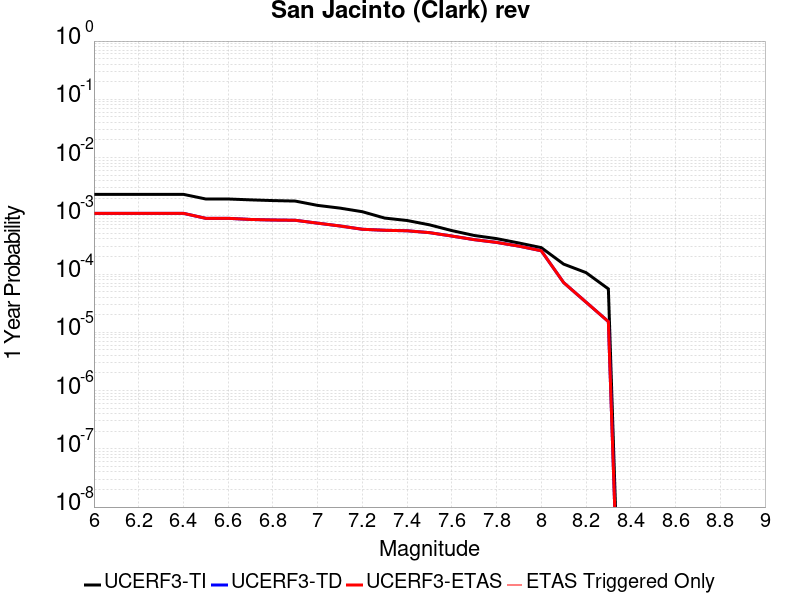 |  |

| Magnitude | 1 wk TI Prob | 1 wk TD Prob | 1 wk ETAS Prob | 1 wk ETAS/TD Gain | 1 wk ETAS Triggered Only | 1 mo TI Prob | 1 mo TD Prob | 1 mo ETAS Prob | 1 mo ETAS/TD Gain | 1 mo ETAS Triggered Only | 1 yr TI Prob | 1 yr TD Prob | 1 yr ETAS Prob | 1 yr ETAS/TD Gain | 1 yr ETAS Triggered Only | 10 yr TI Prob | 10 yr TD Prob | 10 yr ETAS Prob | 10 yr ETAS/TD Gain | 10 yr ETAS Triggered Only |
|-----|-----|-----|-----|-----|-----|-----|-----|-----|-----|-----|-----|-----|-----|-----|-----|-----|-----|-----|-----|-----|
| 6.0 | 4.482615E-5 | 2.1158266E-5 | 2.1158266E-5 | 1.0 | 0.0 | 1.9209793E-4 | 9.067519E-5 | 9.067519E-5 | 1.0 | 0.0 | 0.0023362834 | 0.0011034205 | 0.0011034205 | 1.0 | 0.0 | 0.02311874 | 0.0114991795 | 0.01153872 | 1.0034385 | 4.0E-5 |
| 6.1 | 4.482615E-5 | 2.1158266E-5 | 2.1158266E-5 | 1.0 | 0.0 | 1.9209793E-4 | 9.067519E-5 | 9.067519E-5 | 1.0 | 0.0 | 0.0023362834 | 0.0011034205 | 0.0011034205 | 1.0 | 0.0 | 0.02311874 | 0.0114991795 | 0.01153872 | 1.0034385 | 4.0E-5 |
| 6.2 | 4.482615E-5 | 2.1158266E-5 | 2.1158266E-5 | 1.0 | 0.0 | 1.9209793E-4 | 9.067519E-5 | 9.067519E-5 | 1.0 | 0.0 | 0.0023362834 | 0.0011034205 | 0.0011034205 | 1.0 | 0.0 | 0.02311874 | 0.0114991795 | 0.01153872 | 1.0034385 | 4.0E-5 |
| 6.3 | 4.482615E-5 | 2.1158266E-5 | 2.1158266E-5 | 1.0 | 0.0 | 1.9209793E-4 | 9.067519E-5 | 9.067519E-5 | 1.0 | 0.0 | 0.0023362834 | 0.0011034205 | 0.0011034205 | 1.0 | 0.0 | 0.02311874 | 0.0114991795 | 0.01153872 | 1.0034385 | 4.0E-5 |
| 6.4 | 4.482615E-5 | 2.1158266E-5 | 2.1158266E-5 | 1.0 | 0.0 | 1.9209793E-4 | 9.067519E-5 | 9.067519E-5 | 1.0 | 0.0 | 0.0023362834 | 0.0011034205 | 0.0011034205 | 1.0 | 0.0 | 0.02311874 | 0.0114991795 | 0.01153872 | 1.0034385 | 4.0E-5 |
| 6.5 | 3.7294863E-5 | 1.7359873E-5 | 1.7359873E-5 | 1.0 | 0.0 | 1.5982533E-4 | 7.4397365E-5 | 7.4397365E-5 | 1.0 | 0.0 | 0.0019441366 | 9.05416E-4 | 9.05416E-4 | 1.0 | 0.0 | 0.01927216 | 0.009499401 | 0.009539021 | 1.0041708 | 4.0E-5 |
| 6.6 | 3.7294863E-5 | 1.7359873E-5 | 1.7359873E-5 | 1.0 | 0.0 | 1.5982533E-4 | 7.4397365E-5 | 7.4397365E-5 | 1.0 | 0.0 | 0.0019441366 | 9.05416E-4 | 9.05416E-4 | 1.0 | 0.0 | 0.01927216 | 0.009499401 | 0.009539021 | 1.0041708 | 4.0E-5 |
| 6.7 | 3.6039248E-5 | 1.6607892E-5 | 1.6607892E-5 | 1.0 | 0.0 | 1.5444479E-4 | 7.1174756E-5 | 7.1174756E-5 | 1.0 | 0.0 | 0.0018787434 | 8.662123E-4 | 8.662123E-4 | 1.0 | 0.0 | 0.01862939 | 0.009098875 | 0.0091385115 | 1.0043561 | 4.0E-5 |
| 6.8 | 3.5031844E-5 | 1.623633E-5 | 1.623633E-5 | 1.0 | 0.0 | 1.5012783E-4 | 6.958244E-5 | 6.958244E-5 | 1.0 | 0.0 | 0.0018262739 | 8.46841E-4 | 8.46841E-4 | 1.0 | 0.0 | 0.01811338 | 0.008899476 | 0.00893912 | 1.0044546 | 4.0E-5 |
| 6.9 | 3.435112E-5 | 1.6066866E-5 | 1.6066866E-5 | 1.0 | 0.0 | 1.4721078E-4 | 6.88562E-5 | 6.88562E-5 | 1.0 | 0.0 | 0.0017908178 | 8.380059E-4 | 8.380059E-4 | 1.0 | 0.0 | 0.017764548 | 0.008805986 | 0.008845633 | 1.0045024 | 4.0E-5 |
| 7.0 | 2.8959772E-5 | 1.4340704E-5 | 1.4340704E-5 | 1.0 | 0.0 | 1.241074E-4 | 6.145873E-5 | 6.145873E-5 | 1.0 | 0.0 | 0.0015099603 | 7.480059E-4 | 7.480059E-4 | 1.0 | 0.0 | 0.014997416 | 0.00787791 | 0.007917594 | 1.0050375 | 4.0E-5 |
| 7.1 | 2.6002877E-5 | 1.2832878E-5 | 1.2832878E-5 | 1.0 | 0.0 | 1.11436144E-4 | 5.49969E-5 | 5.49969E-5 | 1.0 | 0.0 | 0.0013558907 | 6.693837E-4 | 6.693837E-4 | 1.0 | 0.0 | 0.013476475 | 0.0070536323 | 0.0070933504 | 1.0056309 | 4.0E-5 |
| 7.2 | 2.2544838E-5 | 1.1265443E-5 | 1.1265443E-5 | 1.0 | 0.0 | 9.661716E-5 | 4.8279588E-5 | 4.8279588E-5 | 1.0 | 0.0 | 0.001175679 | 5.876469E-4 | 5.876469E-4 | 1.0 | 0.0 | 0.011694785 | 0.006195283 | 0.006235035 | 1.0064166 | 4.0E-5 |
| 7.3 | 1.75334E-5 | 1.081565E-5 | 1.081565E-5 | 1.0 | 0.0 | 7.514098E-5 | 4.6351972E-5 | 4.6351972E-5 | 1.0 | 0.0 | 9.144575E-4 | 5.641905E-4 | 5.641905E-4 | 1.0 | 0.0 | 0.009107036 | 0.005935912 | 0.0059756744 | 1.0066986 | 4.0E-5 |
| 7.4 | 1.5924552E-5 | 1.0615435E-5 | 1.0615435E-5 | 1.0 | 0.0 | 6.82463E-5 | 4.5493933E-5 | 4.5493933E-5 | 1.0 | 0.0 | 8.305819E-4 | 5.5374927E-4 | 5.5374927E-4 | 1.0 | 0.0 | 0.008274844 | 0.0058232066 | 0.0058629736 | 1.006829 | 4.0E-5 |
| 7.5 | 1.3428931E-5 | 9.855765E-6 | 9.855765E-6 | 1.0 | 0.0 | 5.7551293E-5 | 4.2238313E-5 | 4.2238313E-5 | 1.0 | 0.0 | 7.004617E-4 | 5.141312E-4 | 5.141312E-4 | 1.0 | 0.0 | 0.006982579 | 0.005408683 | 0.0054484666 | 1.0073556 | 4.0E-5 |
| 7.6 | 1.0688787E-5 | 8.618602E-6 | 8.618602E-6 | 1.0 | 0.0 | 4.5808283E-5 | 3.6936344E-5 | 3.6936344E-5 | 1.0 | 0.0 | 5.5757316E-4 | 4.4960767E-4 | 4.4960767E-4 | 1.0 | 0.0 | 0.005561762 | 0.004743673 | 0.0047834828 | 1.0083923 | 4.0E-5 |
| 7.7 | 8.81236E-6 | 7.471723E-6 | 7.471723E-6 | 1.0 | 0.0 | 3.776671E-5 | 3.202128E-5 | 3.202128E-5 | 1.0 | 0.0 | 4.597127E-4 | 3.8978952E-4 | 3.8978952E-4 | 1.0 | 0.0 | 0.0045876284 | 0.004136559 | 0.0041763936 | 1.0096298 | 4.0E-5 |
| 7.8 | 7.780431E-6 | 6.7000988E-6 | 6.7000988E-6 | 1.0 | 0.0 | 3.3344273E-5 | 2.8714394E-5 | 2.8714394E-5 | 1.0 | 0.0 | 4.0589093E-4 | 3.4954186E-4 | 3.4954186E-4 | 1.0 | 0.0 | 0.0040515037 | 0.0037245536 | 0.0037644047 | 1.0106995 | 4.0E-5 |
| 7.9 | 6.5437994E-6 | 5.7836955E-6 | 5.7836955E-6 | 1.0 | 0.0 | 2.8044553E-5 | 2.4787032E-5 | 2.4787032E-5 | 1.0 | 0.0 | 3.4138895E-4 | 3.0174048E-4 | 3.0174048E-4 | 1.0 | 0.0 | 0.0034086495 | 0.0032361387 | 0.003276009 | 1.0123204 | 4.0E-5 |
| 8.0 | 5.4488164E-6 | 4.8162797E-6 | 4.8162797E-6 | 1.0 | 0.0 | 2.3351862E-5 | 2.0641035E-5 | 2.0641035E-5 | 1.0 | 0.0 | 2.8427184E-4 | 2.5127578E-4 | 2.5127578E-4 | 1.0 | 0.0 | 0.0028390845 | 0.0027122858 | 0.0027521772 | 1.0147077 | 4.0E-5 |
| 8.1 | 2.8397242E-6 | 1.3679883E-6 | 1.3679883E-6 | 1.0 | 0.0 | 1.217019E-5 | 5.8627934E-6 | 5.8627934E-6 | 1.0 | 0.0 | 1.4816198E-4 | 7.137719E-5 | 7.137719E-5 | 1.0 | 0.0 | 0.0014806325 | 8.120884E-4 | 8.120884E-4 | 1.0 | 0.0 |
| 8.2 | 2.030244E-6 | 6.323106E-7 | 6.323106E-7 | 1.0 | 0.0 | 8.701017E-6 | 2.7099E-6 | 2.7099E-6 | 1.0 | 0.0 | 1.05929736E-4 | 3.2992535E-5 | 3.2992535E-5 | 1.0 | 0.0 | 0.0010587925 | 3.9508488E-4 | 3.9508488E-4 | 1.0 | 0.0 |
| 8.3 | 1.0659804E-6 | 2.926802E-7 | 2.926802E-7 | 1.0 | 0.0 | 4.568479E-6 | 1.2543431E-6 | 1.2543431E-6 | 1.0 | 0.0 | 5.5619817E-5 | 1.5271524E-5 | 1.5271524E-5 | 1.0 | 0.0 | 5.5605895E-4 | 1.8576543E-4 | 1.8576543E-4 | 1.0 | 0.0 |

## Santa Cruz Island
*[(top)](#table-of-contents)*

| 1 Week | 1 Month | 1 Year | 10 Year |
|-----|-----|-----|-----|
|  |  |  |  |

| Magnitude | 1 wk TI Prob | 1 wk TD Prob | 1 wk ETAS Prob | 1 wk ETAS/TD Gain | 1 wk ETAS Triggered Only | 1 mo TI Prob | 1 mo TD Prob | 1 mo ETAS Prob | 1 mo ETAS/TD Gain | 1 mo ETAS Triggered Only | 1 yr TI Prob | 1 yr TD Prob | 1 yr ETAS Prob | 1 yr ETAS/TD Gain | 1 yr ETAS Triggered Only | 10 yr TI Prob | 10 yr TD Prob | 10 yr ETAS Prob | 10 yr ETAS/TD Gain | 10 yr ETAS Triggered Only |
|-----|-----|-----|-----|-----|-----|-----|-----|-----|-----|-----|-----|-----|-----|-----|-----|-----|-----|-----|-----|-----|
| 6.0 | 2.9164563E-5 | 3.1600095E-5 | 3.1600095E-5 | 1.0 | 0.0 | 1.2498499E-4 | 1.3542273E-4 | 1.3542273E-4 | 1.0 | 0.0 | 0.0015206301 | 0.001647661 | 0.001667628 | 1.0121185 | 2.0E-5 | 0.015102667 | 0.01636818 | 0.016407525 | 1.0024037 | 4.0E-5 |
| 6.1 | 2.9164563E-5 | 3.1600095E-5 | 3.1600095E-5 | 1.0 | 0.0 | 1.2498499E-4 | 1.3542273E-4 | 1.3542273E-4 | 1.0 | 0.0 | 0.0015206301 | 0.001647661 | 0.001667628 | 1.0121185 | 2.0E-5 | 0.015102667 | 0.01636818 | 0.016407525 | 1.0024037 | 4.0E-5 |
| 6.2 | 2.9164563E-5 | 3.1600095E-5 | 3.1600095E-5 | 1.0 | 0.0 | 1.2498499E-4 | 1.3542273E-4 | 1.3542273E-4 | 1.0 | 0.0 | 0.0015206301 | 0.001647661 | 0.001667628 | 1.0121185 | 2.0E-5 | 0.015102667 | 0.01636818 | 0.016407525 | 1.0024037 | 4.0E-5 |
| 6.3 | 1.6635553E-5 | 1.7804527E-5 | 1.7804527E-5 | 1.0 | 0.0 | 7.1293274E-5 | 7.630298E-5 | 7.630298E-5 | 1.0 | 0.0 | 8.6765E-4 | 9.2861115E-4 | 9.2861115E-4 | 1.0 | 0.0 | 0.008642701 | 0.009249181 | 0.009249181 | 1.0 | 0.0 |
| 6.4 | 1.6635553E-5 | 1.7804527E-5 | 1.7804527E-5 | 1.0 | 0.0 | 7.1293274E-5 | 7.630298E-5 | 7.630298E-5 | 1.0 | 0.0 | 8.6765E-4 | 9.2861115E-4 | 9.2861115E-4 | 1.0 | 0.0 | 0.008642701 | 0.009249181 | 0.009249181 | 1.0 | 0.0 |
| 6.5 | 1.2238748E-5 | 1.3043111E-5 | 1.3043111E-5 | 1.0 | 0.0 | 5.2450723E-5 | 5.5897868E-5 | 5.5897868E-5 | 1.0 | 0.0 | 6.3840044E-4 | 6.8034773E-4 | 6.8034773E-4 | 1.0 | 0.0 | 0.0063656955 | 0.0067830477 | 0.0067830477 | 1.0 | 0.0 |
| 6.6 | 1.0489767E-5 | 1.11567315E-5 | 1.11567315E-5 | 1.0 | 0.0 | 4.495537E-5 | 4.78137E-5 | 4.78137E-5 | 1.0 | 0.0 | 5.4719415E-4 | 5.8197853E-4 | 5.8197853E-4 | 1.0 | 0.0 | 0.005458487 | 0.0058047855 | 0.0058047855 | 1.0 | 0.0 |
| 6.7 | 8.699222E-6 | 9.236859E-6 | 9.236859E-6 | 1.0 | 0.0 | 3.7281847E-5 | 3.9585942E-5 | 3.9585942E-5 | 1.0 | 0.0 | 4.5381195E-4 | 4.8185283E-4 | 4.8185283E-4 | 1.0 | 0.0 | 0.0045288634 | 0.004808148 | 0.004808148 | 1.0 | 0.0 |
| 6.8 | 8.307732E-6 | 8.816977E-6 | 8.816977E-6 | 1.0 | 0.0 | 3.560408E-5 | 3.77865E-5 | 3.77865E-5 | 1.0 | 0.0 | 4.3339343E-4 | 4.5995397E-4 | 4.5995397E-4 | 1.0 | 0.0 | 0.004325492 | 0.004590073 | 0.004590073 | 1.0 | 0.0 |
| 6.9 | 8.073121E-6 | 8.56501E-6 | 8.56501E-6 | 1.0 | 0.0 | 3.459863E-5 | 3.670667E-5 | 3.670667E-5 | 1.0 | 0.0 | 4.2115687E-4 | 4.4681248E-4 | 4.4681248E-4 | 1.0 | 0.0 | 0.004203596 | 0.0044591925 | 0.0044591925 | 1.0 | 0.0 |
| 7.0 | 7.617019E-6 | 8.07473E-6 | 8.07473E-6 | 1.0 | 0.0 | 3.264396E-5 | 3.4605528E-5 | 3.4605528E-5 | 1.0 | 0.0 | 3.9736772E-4 | 4.2124125E-4 | 4.2124125E-4 | 1.0 | 0.0 | 0.003966579 | 0.0042044753 | 0.0042044753 | 1.0 | 0.0 |
| 7.1 | 7.1224836E-6 | 7.545849E-6 | 7.545849E-6 | 1.0 | 0.0 | 3.052457E-5 | 3.2338954E-5 | 3.2338954E-5 | 1.0 | 0.0 | 3.715733E-4 | 3.9365597E-4 | 3.9365597E-4 | 1.0 | 0.0 | 0.003709526 | 0.0039296295 | 0.0039296295 | 1.0 | 0.0 |
| 7.2 | 6.441115E-6 | 6.827439E-6 | 6.827439E-6 | 1.0 | 0.0 | 2.7604487E-5 | 2.9260125E-5 | 2.9260125E-5 | 1.0 | 0.0 | 3.360328E-4 | 3.5618403E-4 | 3.5618403E-4 | 1.0 | 0.0 | 0.0033552512 | 0.00355616 | 0.00355616 | 1.0 | 0.0 |
| 7.3 | 5.494274E-6 | 5.820041E-6 | 5.820041E-6 | 1.0 | 0.0 | 2.3546674E-5 | 2.4942798E-5 | 2.4942798E-5 | 1.0 | 0.0 | 2.8664304E-4 | 3.0363645E-4 | 3.0363645E-4 | 1.0 | 0.0 | 0.002862736 | 0.003032239 | 0.003032239 | 1.0 | 0.0 |
| 7.4 | 4.0802624E-6 | 4.31229E-6 | 4.31229E-6 | 1.0 | 0.0 | 1.7486722E-5 | 1.8481112E-5 | 1.8481112E-5 | 1.0 | 0.0 | 2.1288003E-4 | 2.2498438E-4 | 2.2498438E-4 | 1.0 | 0.0 | 0.0021267622 | 0.002247575 | 0.002247575 | 1.0 | 0.0 |
| 7.5 | 2.3584746E-6 | 2.475327E-6 | 2.475327E-6 | 1.0 | 0.0 | 1.0107709E-5 | 1.0608502E-5 | 1.0608502E-5 | 1.0 | 0.0 | 1.2305441E-4 | 1.291509E-4 | 1.291509E-4 | 1.0 | 0.0 | 0.0012298629 | 0.0012907635 | 0.0012907635 | 1.0 | 0.0 |
| 7.6 | 9.4981914E-7 | 9.86099E-7 | 9.86099E-7 | 1.0 | 0.0 | 4.0706473E-6 | 4.226132E-6 | 4.226132E-6 | 1.0 | 0.0 | 4.9559E-5 | 5.1451956E-5 | 5.1451956E-5 | 1.0 | 0.0 | 4.954795E-4 | 5.144017E-4 | 5.144017E-4 | 1.0 | 0.0 |
| 7.7 | 2.6013532E-7 | 2.6416743E-7 | 2.6416743E-7 | 1.0 | 0.0 | 1.1148652E-6 | 1.1321456E-6 | 1.1321456E-6 | 1.0 | 0.0 | 1.3573399E-5 | 1.3783787E-5 | 1.3783787E-5 | 1.0 | 0.0 | 1.357257E-4 | 1.3782938E-4 | 1.3782938E-4 | 1.0 | 0.0 |
| 7.8 | 4.1522263E-8 | 3.9657085E-8 | 3.9657085E-8 | 1.0 | 0.0 | 1.7795254E-7 | 1.6995892E-7 | 1.6995892E-7 | 1.0 | 0.0 | 2.16657E-6 | 2.069248E-6 | 2.069248E-6 | 1.0 | 0.0 | 2.1665488E-5 | 2.0692309E-5 | 2.0692309E-5 | 1.0 | 0.0 |
| 7.9 | 7.7242046E-10 | 5.9475247E-10 | 5.9475247E-10 | 1.0 | 0.0 | 3.3103735E-9 | 2.5489395E-9 | 2.5489395E-9 | 1.0 | 0.0 | 4.0303796E-8 | 3.1033338E-8 | 3.1033338E-8 | 1.0 | 0.0 | 4.030379E-7 | 3.1033335E-7 | 3.1033335E-7 | 1.0 | 0.0 |

## Sierra Madre
*[(top)](#table-of-contents)*

| 1 Week | 1 Month | 1 Year | 10 Year |
|-----|-----|-----|-----|
|  |  |  |  |

| Magnitude | 1 wk TI Prob | 1 wk TD Prob | 1 wk ETAS Prob | 1 wk ETAS/TD Gain | 1 wk ETAS Triggered Only | 1 mo TI Prob | 1 mo TD Prob | 1 mo ETAS Prob | 1 mo ETAS/TD Gain | 1 mo ETAS Triggered Only | 1 yr TI Prob | 1 yr TD Prob | 1 yr ETAS Prob | 1 yr ETAS/TD Gain | 1 yr ETAS Triggered Only | 10 yr TI Prob | 10 yr TD Prob | 10 yr ETAS Prob | 10 yr ETAS/TD Gain | 10 yr ETAS Triggered Only |
|-----|-----|-----|-----|-----|-----|-----|-----|-----|-----|-----|-----|-----|-----|-----|-----|-----|-----|-----|-----|-----|
| 6.0 | 1.3379373E-5 | 1.1001147E-5 | 1.1001147E-5 | 1.0 | 0.0 | 5.7338908E-5 | 4.7146932E-5 | 5.714646E-5 | 1.2120929 | 1.0E-5 | 6.978776E-4 | 5.7386415E-4 | 6.138412E-4 | 1.0696629 | 4.0E-5 | 0.0069569005 | 0.0057240664 | 0.005763837 | 1.006948 | 4.0E-5 |
| 6.1 | 1.3379373E-5 | 1.1001147E-5 | 1.1001147E-5 | 1.0 | 0.0 | 5.7338908E-5 | 4.7146932E-5 | 5.714646E-5 | 1.2120929 | 1.0E-5 | 6.978776E-4 | 5.7386415E-4 | 6.138412E-4 | 1.0696629 | 4.0E-5 | 0.0069569005 | 0.0057240664 | 0.005763837 | 1.006948 | 4.0E-5 |
| 6.2 | 1.3379373E-5 | 1.1001147E-5 | 1.1001147E-5 | 1.0 | 0.0 | 5.7338908E-5 | 4.7146932E-5 | 5.714646E-5 | 1.2120929 | 1.0E-5 | 6.978776E-4 | 5.7386415E-4 | 6.138412E-4 | 1.0696629 | 4.0E-5 | 0.0069569005 | 0.0057240664 | 0.005763837 | 1.006948 | 4.0E-5 |
| 6.3 | 1.3379373E-5 | 1.1001147E-5 | 1.1001147E-5 | 1.0 | 0.0 | 5.7338908E-5 | 4.7146932E-5 | 5.714646E-5 | 1.2120929 | 1.0E-5 | 6.978776E-4 | 5.7386415E-4 | 6.138412E-4 | 1.0696629 | 4.0E-5 | 0.0069569005 | 0.0057240664 | 0.005763837 | 1.006948 | 4.0E-5 |
| 6.4 | 1.3379373E-5 | 1.1001147E-5 | 1.1001147E-5 | 1.0 | 0.0 | 5.7338908E-5 | 4.7146932E-5 | 5.714646E-5 | 1.2120929 | 1.0E-5 | 6.978776E-4 | 5.7386415E-4 | 6.138412E-4 | 1.0696629 | 4.0E-5 | 0.0069569005 | 0.0057240664 | 0.005763837 | 1.006948 | 4.0E-5 |
| 6.5 | 1.26563245E-5 | 1.0230597E-5 | 1.0230597E-5 | 1.0 | 0.0 | 5.4240263E-5 | 4.3844684E-5 | 5.3844244E-5 | 1.2280679 | 1.0E-5 | 6.601751E-4 | 5.336793E-4 | 5.636633E-4 | 1.0561836 | 3.0E-5 | 0.006582173 | 0.0053241784 | 0.0053540184 | 1.0056046 | 3.0E-5 |
| 6.6 | 1.26563245E-5 | 1.0230597E-5 | 1.0230597E-5 | 1.0 | 0.0 | 5.4240263E-5 | 4.3844684E-5 | 5.3844244E-5 | 1.2280679 | 1.0E-5 | 6.601751E-4 | 5.336793E-4 | 5.636633E-4 | 1.0561836 | 3.0E-5 | 0.006582173 | 0.0053241784 | 0.0053540184 | 1.0056046 | 3.0E-5 |
| 6.7 | 1.2502474E-5 | 1.0066739E-5 | 1.0066739E-5 | 1.0 | 0.0 | 5.3580934E-5 | 4.314246E-5 | 5.314203E-5 | 1.2317802 | 1.0E-5 | 6.521526E-4 | 5.251339E-4 | 5.551182E-4 | 1.0570983 | 3.0E-5 | 0.0065024206 | 0.0052391286 | 0.0052689714 | 1.0056962 | 3.0E-5 |
| 6.8 | 1.2454966E-5 | 1.0019025E-5 | 1.0019025E-5 | 1.0 | 0.0 | 5.3377335E-5 | 4.2937972E-5 | 5.2937547E-5 | 1.232884 | 1.0E-5 | 6.4967526E-4 | 5.226455E-4 | 5.526298E-4 | 1.0573703 | 3.0E-5 | 0.006477792 | 0.005214361 | 0.005244205 | 1.0057234 | 3.0E-5 |
| 6.9 | 1.2225574E-5 | 9.793E-6 | 9.793E-6 | 1.0 | 0.0 | 5.2394265E-5 | 4.1969328E-5 | 5.196891E-5 | 1.2382592 | 1.0E-5 | 6.3771347E-4 | 5.108578E-4 | 5.308476E-4 | 1.0391299 | 2.0E-5 | 0.006358865 | 0.0050970297 | 0.005116928 | 1.0039039 | 2.0E-5 |
| 7.0 | 1.182946E-5 | 9.399537E-6 | 9.399537E-6 | 1.0 | 0.0 | 5.06967E-5 | 4.0283114E-5 | 5.0282713E-5 | 1.248233 | 1.0E-5 | 6.1705755E-4 | 4.9033755E-4 | 5.1032775E-4 | 1.0407683 | 2.0E-5 | 0.006153469 | 0.0048927474 | 0.0049126497 | 1.0040677 | 2.0E-5 |
| 7.1 | 1.14369095E-5 | 8.986543E-6 | 8.986543E-6 | 1.0 | 0.0 | 4.9014405E-5 | 3.8513193E-5 | 4.8512808E-5 | 1.2596413 | 1.0E-5 | 5.9658696E-4 | 4.6879821E-4 | 4.887888E-4 | 1.0426422 | 2.0E-5 | 0.005949879 | 0.0046782778 | 0.0046981843 | 1.004255 | 2.0E-5 |
| 7.2 | 1.0836419E-5 | 8.399933E-6 | 8.399933E-6 | 1.0 | 0.0 | 4.644097E-5 | 3.599922E-5 | 4.599886E-5 | 1.2777739 | 1.0E-5 | 5.652721E-4 | 4.3820328E-4 | 4.581945E-4 | 1.0456209 | 2.0E-5 | 0.0056383642 | 0.0043735686 | 0.0043934807 | 1.004553 | 2.0E-5 |
| 7.3 | 1.0403439E-5 | 8.021192E-6 | 8.021192E-6 | 1.0 | 0.0 | 4.4585406E-5 | 3.437609E-5 | 4.4375745E-5 | 1.2908899 | 1.0E-5 | 5.426921E-4 | 4.1844943E-4 | 4.3844106E-4 | 1.0477755 | 2.0E-5 | 0.005413687 | 0.0041767894 | 0.0041967058 | 1.0047684 | 2.0E-5 |
| 7.4 | 9.768864E-6 | 7.4148143E-6 | 7.4148143E-6 | 1.0 | 0.0 | 4.186589E-5 | 3.1777392E-5 | 4.1777075E-5 | 1.3146791 | 1.0E-5 | 5.09598E-4 | 3.8682195E-4 | 4.0681422E-4 | 1.0516834 | 2.0E-5 | 0.0050843097 | 0.0038616573 | 0.00388158 | 1.0051591 | 2.0E-5 |
| 7.5 | 8.687089E-6 | 6.450497E-6 | 6.450497E-6 | 1.0 | 0.0 | 3.722985E-5 | 2.7644699E-5 | 3.7644422E-5 | 1.361723 | 1.0E-5 | 4.5317915E-4 | 3.3652308E-4 | 3.5651636E-4 | 1.0594113 | 2.0E-5 | 0.004522561 | 0.003360301 | 0.003380234 | 1.0059319 | 2.0E-5 |
| 7.6 | 6.3506063E-6 | 4.4306207E-6 | 4.4306207E-6 | 1.0 | 0.0 | 2.72166E-5 | 1.8988238E-5 | 2.8988048E-5 | 1.5266318 | 1.0E-5 | 3.3131172E-4 | 2.3115752E-4 | 2.4115521E-4 | 1.0432506 | 1.0E-5 | 0.003308182 | 0.0023092744 | 0.0023192512 | 1.0043204 | 1.0E-5 |
| 7.7 | 4.62223E-6 | 2.9332343E-6 | 2.9332343E-6 | 1.0 | 0.0 | 1.9809406E-5 | 1.2570943E-5 | 1.2570943E-5 | 1.0 | 0.0 | 2.4115283E-4 | 1.5304051E-4 | 1.5304051E-4 | 1.0 | 0.0 | 0.0024089129 | 0.0015294303 | 0.0015294303 | 1.0 | 0.0 |
| 7.8 | 3.2145008E-6 | 1.949628E-6 | 1.949628E-6 | 1.0 | 0.0 | 1.3776359E-5 | 8.355522E-6 | 8.355522E-6 | 1.0 | 0.0 | 1.6771426E-4 | 1.0172375E-4 | 1.0172375E-4 | 1.0 | 0.0 | 0.0016758774 | 0.0010167895 | 0.0010167895 | 1.0 | 0.0 |
| 7.9 | 1.0391769E-6 | 5.6032485E-7 | 5.6032485E-7 | 1.0 | 0.0 | 4.4536077E-6 | 2.40139E-6 | 2.40139E-6 | 1.0 | 0.0 | 5.4221324E-5 | 2.9236535E-5 | 2.9236535E-5 | 1.0 | 0.0 | 5.4208096E-4 | 2.923273E-4 | 2.923273E-4 | 1.0 | 0.0 |
| 8.0 | 1.210983E-7 | 6.6138576E-8 | 6.6138576E-8 | 1.0 | 0.0 | 5.1899264E-7 | 2.8345102E-7 | 2.8345102E-7 | 1.0 | 0.0 | 6.3187167E-6 | 3.4510108E-6 | 3.4510108E-6 | 1.0 | 0.0 | 6.318537E-5 | 3.450959E-5 | 3.450959E-5 | 1.0 | 0.0 |

## Channel Islands Thrust
*[(top)](#table-of-contents)*

| 1 Week | 1 Month | 1 Year | 10 Year |
|-----|-----|-----|-----|
|  |  |  |  |

| Magnitude | 1 wk TI Prob | 1 wk TD Prob | 1 wk ETAS Prob | 1 wk ETAS/TD Gain | 1 wk ETAS Triggered Only | 1 mo TI Prob | 1 mo TD Prob | 1 mo ETAS Prob | 1 mo ETAS/TD Gain | 1 mo ETAS Triggered Only | 1 yr TI Prob | 1 yr TD Prob | 1 yr ETAS Prob | 1 yr ETAS/TD Gain | 1 yr ETAS Triggered Only | 10 yr TI Prob | 10 yr TD Prob | 10 yr ETAS Prob | 10 yr ETAS/TD Gain | 10 yr ETAS Triggered Only |
|-----|-----|-----|-----|-----|-----|-----|-----|-----|-----|-----|-----|-----|-----|-----|-----|-----|-----|-----|-----|-----|
| 6.0 | 2.2156251E-5 | 2.4092304E-5 | 2.4092304E-5 | 1.0 | 0.0 | 9.495191E-5 | 1.03249244E-4 | 1.03249244E-4 | 1.0 | 0.0 | 0.0011554264 | 0.0012564411 | 0.0012664286 | 1.007949 | 1.0E-5 | 0.011494373 | 0.012503966 | 0.012543466 | 1.0031589 | 4.0E-5 |
| 6.1 | 2.2156251E-5 | 2.4092304E-5 | 2.4092304E-5 | 1.0 | 0.0 | 9.495191E-5 | 1.03249244E-4 | 1.03249244E-4 | 1.0 | 0.0 | 0.0011554264 | 0.0012564411 | 0.0012664286 | 1.007949 | 1.0E-5 | 0.011494373 | 0.012503966 | 0.012543466 | 1.0031589 | 4.0E-5 |
| 6.2 | 2.2156251E-5 | 2.4092304E-5 | 2.4092304E-5 | 1.0 | 0.0 | 9.495191E-5 | 1.03249244E-4 | 1.03249244E-4 | 1.0 | 0.0 | 0.0011554264 | 0.0012564411 | 0.0012664286 | 1.007949 | 1.0E-5 | 0.011494373 | 0.012503966 | 0.012543466 | 1.0031589 | 4.0E-5 |
| 6.3 | 2.2156251E-5 | 2.4092304E-5 | 2.4092304E-5 | 1.0 | 0.0 | 9.495191E-5 | 1.03249244E-4 | 1.03249244E-4 | 1.0 | 0.0 | 0.0011554264 | 0.0012564411 | 0.0012664286 | 1.007949 | 1.0E-5 | 0.011494373 | 0.012503966 | 0.012543466 | 1.0031589 | 4.0E-5 |
| 6.4 | 2.2156251E-5 | 2.4092304E-5 | 2.4092304E-5 | 1.0 | 0.0 | 9.495191E-5 | 1.03249244E-4 | 1.03249244E-4 | 1.0 | 0.0 | 0.0011554264 | 0.0012564411 | 0.0012664286 | 1.007949 | 1.0E-5 | 0.011494373 | 0.012503966 | 0.012543466 | 1.0031589 | 4.0E-5 |
| 6.5 | 2.2156251E-5 | 2.4092304E-5 | 2.4092304E-5 | 1.0 | 0.0 | 9.495191E-5 | 1.03249244E-4 | 1.03249244E-4 | 1.0 | 0.0 | 0.0011554264 | 0.0012564411 | 0.0012664286 | 1.007949 | 1.0E-5 | 0.011494373 | 0.012503966 | 0.012543466 | 1.0031589 | 4.0E-5 |
| 6.6 | 2.2156251E-5 | 2.4092304E-5 | 2.4092304E-5 | 1.0 | 0.0 | 9.495191E-5 | 1.03249244E-4 | 1.03249244E-4 | 1.0 | 0.0 | 0.0011554264 | 0.0012564411 | 0.0012664286 | 1.007949 | 1.0E-5 | 0.011494373 | 0.012503966 | 0.012543466 | 1.0031589 | 4.0E-5 |
| 6.7 | 1.0601296E-5 | 1.1379656E-5 | 1.1379656E-5 | 1.0 | 0.0 | 4.5433335E-5 | 4.876907E-5 | 4.876907E-5 | 1.0 | 0.0 | 5.5301044E-4 | 5.9360656E-4 | 5.9360656E-4 | 1.0 | 0.0 | 0.005516363 | 0.0059207114 | 0.0059306524 | 1.001679 | 1.0E-5 |
| 6.8 | 1.0246747E-5 | 1.0996777E-5 | 1.0996777E-5 | 1.0 | 0.0 | 4.391389E-5 | 4.7128222E-5 | 4.7128222E-5 | 1.0 | 0.0 | 5.345204E-4 | 5.736398E-4 | 5.736398E-4 | 1.0 | 0.0 | 0.0053323656 | 0.005722081 | 0.0057320236 | 1.0017376 | 1.0E-5 |
| 6.9 | 9.049551E-6 | 9.699738E-6 | 9.699738E-6 | 1.0 | 0.0 | 3.878322E-5 | 4.1569667E-5 | 4.1569667E-5 | 1.0 | 0.0 | 4.7208337E-4 | 5.059973E-4 | 5.059973E-4 | 1.0 | 0.0 | 0.0047108172 | 0.005048869 | 0.0050588185 | 1.0019706 | 1.0E-5 |
| 7.0 | 8.6542195E-6 | 9.274693E-6 | 9.274693E-6 | 1.0 | 0.0 | 3.7088983E-5 | 3.97481E-5 | 3.97481E-5 | 1.0 | 0.0 | 4.5146482E-4 | 4.8382976E-4 | 4.8382976E-4 | 1.0 | 0.0 | 0.004505487 | 0.0048281755 | 0.0048381276 | 1.0020611 | 1.0E-5 |
| 7.1 | 8.391028E-6 | 8.993012E-6 | 8.993012E-6 | 1.0 | 0.0 | 3.5961057E-5 | 3.8540933E-5 | 3.8540933E-5 | 1.0 | 0.0 | 4.3773788E-4 | 4.691389E-4 | 4.691389E-4 | 1.0 | 0.0 | 0.004368766 | 0.0046818955 | 0.0046918485 | 1.0021259 | 1.0E-5 |
| 7.2 | 5.965188E-6 | 6.3717544E-6 | 6.3717544E-6 | 1.0 | 0.0 | 2.556484E-5 | 2.7307236E-5 | 2.7307236E-5 | 1.0 | 0.0 | 3.1120746E-4 | 3.3241542E-4 | 3.3241542E-4 | 1.0 | 0.0 | 0.00310772 | 0.00331924 | 0.0033292067 | 1.0030028 | 1.0E-5 |
| 7.3 | 4.877518E-6 | 5.2060545E-6 | 5.2060545E-6 | 1.0 | 0.0 | 2.0903482E-5 | 2.2311473E-5 | 2.2311473E-5 | 1.0 | 0.0 | 2.5447016E-4 | 2.716088E-4 | 2.716088E-4 | 1.0 | 0.0 | 0.0025417898 | 0.0027128146 | 0.0027128146 | 1.0 | 0.0 |
| 7.4 | 3.8829853E-6 | 4.1419007E-6 | 4.1419007E-6 | 1.0 | 0.0 | 1.664126E-5 | 1.7750885E-5 | 1.7750885E-5 | 1.0 | 0.0 | 2.0258849E-4 | 2.1609601E-4 | 2.1609601E-4 | 1.0 | 0.0 | 0.002024039 | 0.0021589005 | 0.0021589005 | 1.0 | 0.0 |
| 7.5 | 1.3489616E-6 | 1.4278028E-6 | 1.4278028E-6 | 1.0 | 0.0 | 5.7812517E-6 | 6.119141E-6 | 6.119141E-6 | 1.0 | 0.0 | 7.038446E-5 | 7.449803E-5 | 7.449803E-5 | 1.0 | 0.0 | 7.036218E-4 | 7.4473454E-4 | 7.4473454E-4 | 1.0 | 0.0 |
| 7.6 | 6.058192E-7 | 6.353833E-7 | 6.353833E-7 | 1.0 | 0.0 | 2.5963652E-6 | 2.7230685E-6 | 2.7230685E-6 | 1.0 | 0.0 | 3.161029E-5 | 3.315287E-5 | 3.315287E-5 | 1.0 | 0.0 | 3.1605794E-4 | 3.3148087E-4 | 3.3148087E-4 | 1.0 | 0.0 |
| 7.7 | 2.2170494E-7 | 2.2608089E-7 | 2.2608089E-7 | 1.0 | 0.0 | 9.5016367E-7 | 9.689178E-7 | 9.689178E-7 | 1.0 | 0.0 | 1.1568181E-5 | 1.1796522E-5 | 1.1796522E-5 | 1.0 | 0.0 | 1.1567579E-4 | 1.17960066E-4 | 1.17960066E-4 | 1.0 | 0.0 |
| 7.8 | 2.1613102E-8 | 1.5466844E-8 | 1.5466844E-8 | 1.0 | 0.0 | 9.262757E-8 | 6.6286475E-8 | 6.6286475E-8 | 1.0 | 0.0 | 1.1277401E-6 | 8.070376E-7 | 8.070376E-7 | 1.0 | 0.0 | 1.1277344E-5 | 8.070355E-6 | 8.070355E-6 | 1.0 | 0.0 |

## Red Mountain
*[(top)](#table-of-contents)*

| 1 Week | 1 Month | 1 Year | 10 Year |
|-----|-----|-----|-----|
|  |  | 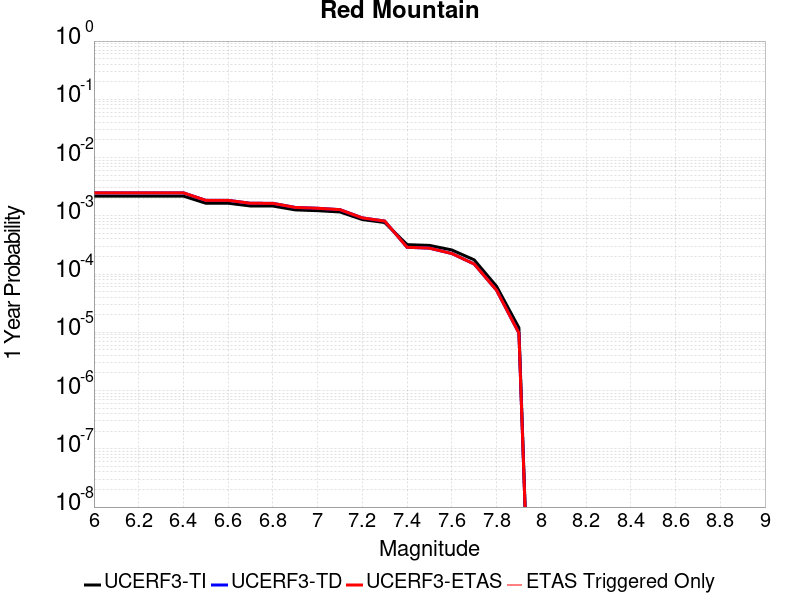 | 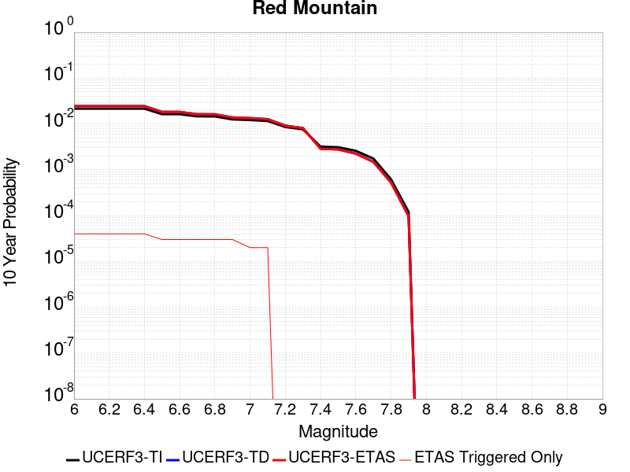 |

| Magnitude | 1 wk TI Prob | 1 wk TD Prob | 1 wk ETAS Prob | 1 wk ETAS/TD Gain | 1 wk ETAS Triggered Only | 1 mo TI Prob | 1 mo TD Prob | 1 mo ETAS Prob | 1 mo ETAS/TD Gain | 1 mo ETAS Triggered Only | 1 yr TI Prob | 1 yr TD Prob | 1 yr ETAS Prob | 1 yr ETAS/TD Gain | 1 yr ETAS Triggered Only | 10 yr TI Prob | 10 yr TD Prob | 10 yr ETAS Prob | 10 yr ETAS/TD Gain | 10 yr ETAS Triggered Only |
|-----|-----|-----|-----|-----|-----|-----|-----|-----|-----|-----|-----|-----|-----|-----|-----|-----|-----|-----|-----|-----|
| 6.0 | 4.1810763E-5 | 4.7591075E-5 | 4.7591075E-5 | 1.0 | 0.0 | 1.7917668E-4 | 2.0394672E-4 | 2.0394672E-4 | 1.0 | 0.0 | 0.0021792934 | 0.0024803884 | 0.0024803884 | 1.0 | 0.0 | 0.021580452 | 0.024544649 | 0.024583668 | 1.0015897 | 4.0E-5 |
| 6.1 | 4.1810763E-5 | 4.7591075E-5 | 4.7591075E-5 | 1.0 | 0.0 | 1.7917668E-4 | 2.0394672E-4 | 2.0394672E-4 | 1.0 | 0.0 | 0.0021792934 | 0.0024803884 | 0.0024803884 | 1.0 | 0.0 | 0.021580452 | 0.024544649 | 0.024583668 | 1.0015897 | 4.0E-5 |
| 6.2 | 4.1810763E-5 | 4.7591075E-5 | 4.7591075E-5 | 1.0 | 0.0 | 1.7917668E-4 | 2.0394672E-4 | 2.0394672E-4 | 1.0 | 0.0 | 0.0021792934 | 0.0024803884 | 0.0024803884 | 1.0 | 0.0 | 0.021580452 | 0.024544649 | 0.024583668 | 1.0015897 | 4.0E-5 |
| 6.3 | 4.1810763E-5 | 4.7591075E-5 | 4.7591075E-5 | 1.0 | 0.0 | 1.7917668E-4 | 2.0394672E-4 | 2.0394672E-4 | 1.0 | 0.0 | 0.0021792934 | 0.0024803884 | 0.0024803884 | 1.0 | 0.0 | 0.021580452 | 0.024544649 | 0.024583668 | 1.0015897 | 4.0E-5 |
| 6.4 | 4.1810763E-5 | 4.7591075E-5 | 4.7591075E-5 | 1.0 | 0.0 | 1.7917668E-4 | 2.0394672E-4 | 2.0394672E-4 | 1.0 | 0.0 | 0.0021792934 | 0.0024803884 | 0.0024803884 | 1.0 | 0.0 | 0.021580452 | 0.024544649 | 0.024583668 | 1.0015897 | 4.0E-5 |
| 6.5 | 3.154503E-5 | 3.5360503E-5 | 3.5360503E-5 | 1.0 | 0.0 | 1.3518598E-4 | 1.5153673E-4 | 1.5153673E-4 | 1.0 | 0.0 | 0.0016446467 | 0.0018434906 | 0.0018434906 | 1.0 | 0.0 | 0.01632528 | 0.018291628 | 0.018321078 | 1.00161 | 3.0E-5 |
| 6.6 | 3.1535834E-5 | 3.5349887E-5 | 3.5349887E-5 | 1.0 | 0.0 | 1.3514658E-4 | 1.5149123E-4 | 1.5149123E-4 | 1.0 | 0.0 | 0.0016441676 | 0.0018429377 | 0.0018429377 | 1.0 | 0.0 | 0.01632056 | 0.018286189 | 0.01831564 | 1.0016106 | 3.0E-5 |
| 6.7 | 2.8267326E-5 | 3.1470005E-5 | 3.1470005E-5 | 1.0 | 0.0 | 1.2114006E-4 | 1.3486497E-4 | 1.3486497E-4 | 1.0 | 0.0 | 0.0014738824 | 0.0016408293 | 0.0016408293 | 1.0 | 0.0 | 0.014641452 | 0.016295906 | 0.016325418 | 1.0018109 | 3.0E-5 |
| 6.8 | 2.8212884E-5 | 3.140789E-5 | 3.140789E-5 | 1.0 | 0.0 | 1.20906756E-4 | 1.3459878E-4 | 1.3459878E-4 | 1.0 | 0.0 | 0.0014710457 | 0.0016375934 | 0.0016375934 | 1.0 | 0.0 | 0.014613459 | 0.016264021 | 0.016293533 | 1.0018146 | 3.0E-5 |
| 6.9 | 2.4227871E-5 | 2.6707532E-5 | 2.6707532E-5 | 1.0 | 0.0 | 1.03829596E-4 | 1.14456256E-4 | 1.14456256E-4 | 1.0 | 0.0 | 0.0012633923 | 0.00139269 | 0.00139269 | 1.0 | 0.0 | 0.012562336 | 0.013847311 | 0.013876895 | 1.0021365 | 3.0E-5 |
| 7.0 | 2.348524E-5 | 2.5836296E-5 | 2.5836296E-5 | 1.0 | 0.0 | 1.0064714E-4 | 1.1072271E-4 | 1.1072271E-4 | 1.0 | 0.0 | 0.0012246901 | 0.001347291 | 0.001347291 | 1.0 | 0.0 | 0.012179627 | 0.013398864 | 0.013418596 | 1.0014727 | 2.0E-5 |
| 7.1 | 2.2311642E-5 | 2.4463332E-5 | 2.4463332E-5 | 1.0 | 0.0 | 9.561782E-5 | 1.04839055E-4 | 1.04839055E-4 | 1.0 | 0.0 | 0.0011635252 | 0.0012757429 | 0.0012757429 | 1.0 | 0.0 | 0.01157452 | 0.01269171 | 0.012711457 | 1.0015558 | 2.0E-5 |
| 7.2 | 1.6533986E-5 | 1.767069E-5 | 1.767069E-5 | 1.0 | 0.0 | 7.085802E-5 | 7.572969E-5 | 7.572969E-5 | 1.0 | 0.0 | 8.623549E-4 | 9.2168245E-4 | 9.2168245E-4 | 1.0 | 0.0 | 0.008590161 | 0.009184876 | 0.009184876 | 1.0 | 0.0 |
| 7.3 | 1.4703092E-5 | 1.555982E-5 | 1.555982E-5 | 1.0 | 0.0 | 6.301173E-5 | 6.668359E-5 | 6.668359E-5 | 1.0 | 0.0 | 7.668978E-4 | 8.116319E-4 | 8.116319E-4 | 1.0 | 0.0 | 0.0076425658 | 0.008092752 | 0.008092752 | 1.0 | 0.0 |
| 7.4 | 6.1331984E-6 | 5.5289447E-6 | 5.5289447E-6 | 1.0 | 0.0 | 2.6284872E-5 | 2.3695266E-5 | 2.3695266E-5 | 1.0 | 0.0 | 3.199713E-4 | 2.884522E-4 | 2.884522E-4 | 1.0 | 0.0 | 0.0031951098 | 0.0028808324 | 0.0028808324 | 1.0 | 0.0 |
| 7.5 | 5.954766E-6 | 5.3385725E-6 | 5.3385725E-6 | 1.0 | 0.0 | 2.5520176E-5 | 2.2879398E-5 | 2.2879398E-5 | 1.0 | 0.0 | 3.1066386E-4 | 2.785216E-4 | 2.785216E-4 | 1.0 | 0.0 | 0.003102299 | 0.0027817793 | 0.0027817793 | 1.0 | 0.0 |
| 7.6 | 4.9726646E-6 | 4.315354E-6 | 4.315354E-6 | 1.0 | 0.0 | 2.1311245E-5 | 1.8494246E-5 | 1.8494246E-5 | 1.0 | 0.0 | 2.5943352E-4 | 2.2514451E-4 | 2.2514451E-4 | 1.0 | 0.0 | 0.0025913084 | 0.0022491987 | 0.0022491987 | 1.0 | 0.0 |
| 7.7 | 3.3613894E-6 | 2.8527159E-6 | 2.8527159E-6 | 1.0 | 0.0 | 1.4405875E-5 | 1.222587E-5 | 1.222587E-5 | 1.0 | 0.0 | 1.7537741E-4 | 1.4884006E-4 | 1.4884006E-4 | 1.0 | 0.0 | 0.0017523908 | 0.00148743 | 0.00148743 | 1.0 | 0.0 |
| 7.8 | 1.1828961E-6 | 1.0123005E-6 | 1.0123005E-6 | 1.0 | 0.0 | 5.069545E-6 | 4.3384234E-6 | 4.3384234E-6 | 1.0 | 0.0 | 6.171996E-5 | 5.2819054E-5 | 5.2819054E-5 | 1.0 | 0.0 | 6.170282E-4 | 5.2806793E-4 | 5.2806793E-4 | 1.0 | 0.0 |
| 7.9 | 2.2967266E-7 | 1.8619376E-7 | 1.8619376E-7 | 1.0 | 0.0 | 9.843111E-7 | 7.9797303E-7 | 7.9797303E-7 | 1.0 | 0.0 | 1.19839215E-5 | 9.7152815E-6 | 9.7152815E-6 | 1.0 | 0.0 | 1.1983275E-4 | 9.7148855E-5 | 9.7148855E-5 | 1.0 | 0.0 |

## Blue Cut
*[(top)](#table-of-contents)*

| 1 Week | 1 Month | 1 Year | 10 Year |
|-----|-----|-----|-----|
|  |  |  |  |

| Magnitude | 1 wk TI Prob | 1 wk TD Prob | 1 wk ETAS Prob | 1 wk ETAS/TD Gain | 1 wk ETAS Triggered Only | 1 mo TI Prob | 1 mo TD Prob | 1 mo ETAS Prob | 1 mo ETAS/TD Gain | 1 mo ETAS Triggered Only | 1 yr TI Prob | 1 yr TD Prob | 1 yr ETAS Prob | 1 yr ETAS/TD Gain | 1 yr ETAS Triggered Only | 10 yr TI Prob | 10 yr TD Prob | 10 yr ETAS Prob | 10 yr ETAS/TD Gain | 10 yr ETAS Triggered Only |
|-----|-----|-----|-----|-----|-----|-----|-----|-----|-----|-----|-----|-----|-----|-----|-----|-----|-----|-----|-----|-----|
| 6.0 | 2.1227985E-5 | 2.2719787E-5 | 2.2719787E-5 | 1.0 | 0.0 | 9.097391E-5 | 9.736721E-5 | 9.736721E-5 | 1.0 | 0.0 | 0.0011070445 | 0.0011848592 | 0.0011948473 | 1.0084298 | 1.0E-5 | 0.011015458 | 0.011791261 | 0.011830789 | 1.0033523 | 4.0E-5 |
| 6.1 | 2.1227985E-5 | 2.2719787E-5 | 2.2719787E-5 | 1.0 | 0.0 | 9.097391E-5 | 9.736721E-5 | 9.736721E-5 | 1.0 | 0.0 | 0.0011070445 | 0.0011848592 | 0.0011948473 | 1.0084298 | 1.0E-5 | 0.011015458 | 0.011791261 | 0.011830789 | 1.0033523 | 4.0E-5 |
| 6.2 | 2.1227985E-5 | 2.2719787E-5 | 2.2719787E-5 | 1.0 | 0.0 | 9.097391E-5 | 9.736721E-5 | 9.736721E-5 | 1.0 | 0.0 | 0.0011070445 | 0.0011848592 | 0.0011948473 | 1.0084298 | 1.0E-5 | 0.011015458 | 0.011791261 | 0.011830789 | 1.0033523 | 4.0E-5 |
| 6.3 | 1.1613981E-5 | 1.23536465E-5 | 1.23536465E-5 | 1.0 | 0.0 | 4.9773254E-5 | 5.2943193E-5 | 5.2943193E-5 | 1.0 | 0.0 | 6.0582085E-4 | 6.444052E-4 | 6.5439875E-4 | 1.0155082 | 1.0E-5 | 0.0060417196 | 0.0064266133 | 0.0064564208 | 1.0046381 | 3.0E-5 |
| 6.4 | 1.1613981E-5 | 1.23536465E-5 | 1.23536465E-5 | 1.0 | 0.0 | 4.9773254E-5 | 5.2943193E-5 | 5.2943193E-5 | 1.0 | 0.0 | 6.0582085E-4 | 6.444052E-4 | 6.5439875E-4 | 1.0155082 | 1.0E-5 | 0.0060417196 | 0.0064266133 | 0.0064564208 | 1.0046381 | 3.0E-5 |
| 6.5 | 8.931326E-6 | 9.481677E-6 | 9.481677E-6 | 1.0 | 0.0 | 3.8276554E-5 | 4.063518E-5 | 4.063518E-5 | 1.0 | 0.0 | 4.6591737E-4 | 4.9463013E-4 | 5.046252E-4 | 1.0202072 | 1.0E-5 | 0.0046494175 | 0.0049362015 | 0.004966053 | 1.0060476 | 3.0E-5 |
| 6.6 | 7.345353E-6 | 7.790341E-6 | 7.790341E-6 | 1.0 | 0.0 | 3.1479703E-5 | 3.3386797E-5 | 3.3386797E-5 | 1.0 | 0.0 | 3.83198E-4 | 4.0641645E-4 | 4.164124E-4 | 1.0245953 | 1.0E-5 | 0.0038253788 | 0.0040575233 | 0.0040874016 | 1.0073637 | 3.0E-5 |
| 6.7 | 6.2775666E-6 | 6.655202E-6 | 6.655202E-6 | 1.0 | 0.0 | 2.690358E-5 | 2.8522025E-5 | 2.8522025E-5 | 1.0 | 0.0 | 3.2750185E-4 | 3.4720785E-4 | 3.5720438E-4 | 1.0287912 | 1.0E-5 | 0.0032701963 | 0.0034673947 | 0.0034972907 | 1.008622 | 3.0E-5 |
| 6.8 | 5.5234095E-6 | 5.8551577E-6 | 5.8551577E-6 | 1.0 | 0.0 | 2.367154E-5 | 2.5093334E-5 | 2.5093334E-5 | 1.0 | 0.0 | 2.8816288E-4 | 3.0547578E-4 | 3.1547272E-4 | 1.0327258 | 1.0E-5 | 0.002877895 | 0.003051275 | 0.0030811832 | 1.009802 | 3.0E-5 |
| 6.9 | 4.7780054E-6 | 5.0654608E-6 | 5.0654608E-6 | 1.0 | 0.0 | 2.0477004E-5 | 2.1708976E-5 | 2.1708976E-5 | 1.0 | 0.0 | 2.4927902E-4 | 2.6428179E-4 | 2.7427915E-4 | 1.0378284 | 1.0E-5 | 0.0024899957 | 0.0026403673 | 0.0026702879 | 1.011332 | 3.0E-5 |
| 7.0 | 3.883171E-6 | 4.1185203E-6 | 4.1185203E-6 | 1.0 | 0.0 | 1.6642054E-5 | 1.765072E-5 | 1.765072E-5 | 1.0 | 0.0 | 2.0259817E-4 | 2.1488321E-4 | 2.2488106E-4 | 1.0465269 | 1.0E-5 | 0.0020241356 | 0.00214743 | 0.0021673872 | 1.0092934 | 2.0E-5 |
| 7.1 | 2.8358215E-6 | 3.0097403E-6 | 3.0097403E-6 | 1.0 | 0.0 | 1.2153464E-5 | 1.289886E-5 | 1.289886E-5 | 1.0 | 0.0 | 1.4795837E-4 | 1.5703888E-4 | 1.6703732E-4 | 1.0636685 | 1.0E-5 | 0.001478599 | 0.0015699244 | 0.001589893 | 1.0127195 | 2.0E-5 |

## Ortigalita (South)
*[(top)](#table-of-contents)*

| 1 Week | 1 Month | 1 Year | 10 Year |
|-----|-----|-----|-----|
|  |  |  |  |

| Magnitude | 1 wk TI Prob | 1 wk TD Prob | 1 wk ETAS Prob | 1 wk ETAS/TD Gain | 1 wk ETAS Triggered Only | 1 mo TI Prob | 1 mo TD Prob | 1 mo ETAS Prob | 1 mo ETAS/TD Gain | 1 mo ETAS Triggered Only | 1 yr TI Prob | 1 yr TD Prob | 1 yr ETAS Prob | 1 yr ETAS/TD Gain | 1 yr ETAS Triggered Only | 10 yr TI Prob | 10 yr TD Prob | 10 yr ETAS Prob | 10 yr ETAS/TD Gain | 10 yr ETAS Triggered Only |
|-----|-----|-----|-----|-----|-----|-----|-----|-----|-----|-----|-----|-----|-----|-----|-----|-----|-----|-----|-----|-----|
| 6.0 | 3.72394E-5 | 4.3256532E-5 | 4.3256532E-5 | 1.0 | 0.0 | 1.5958765E-4 | 1.8537285E-4 | 1.9537099E-4 | 1.0539353 | 1.0E-5 | 0.0019412481 | 0.0022547347 | 0.0022746897 | 1.0088502 | 2.0E-5 | 0.019243775 | 0.022334976 | 0.022364307 | 1.0013132 | 3.0E-5 |
| 6.1 | 2.7299884E-5 | 3.149268E-5 | 3.149268E-5 | 1.0 | 0.0 | 1.16994255E-4 | 1.3496196E-4 | 1.3496196E-4 | 1.0 | 0.0 | 0.0014234743 | 0.0016419792 | 0.0016519629 | 1.0060803 | 1.0E-5 | 0.014143906 | 0.016304404 | 0.01631424 | 1.0006033 | 1.0E-5 |
| 6.2 | 2.7299884E-5 | 3.149268E-5 | 3.149268E-5 | 1.0 | 0.0 | 1.16994255E-4 | 1.3496196E-4 | 1.3496196E-4 | 1.0 | 0.0 | 0.0014234743 | 0.0016419792 | 0.0016519629 | 1.0060803 | 1.0E-5 | 0.014143906 | 0.016304404 | 0.01631424 | 1.0006033 | 1.0E-5 |
| 6.3 | 2.0546433E-5 | 2.3631925E-5 | 2.3631925E-5 | 1.0 | 0.0 | 8.805317E-5 | 1.0127585E-4 | 1.0127585E-4 | 1.0 | 0.0 | 0.00107152 | 0.001232355 | 0.0012423426 | 1.0081046 | 1.0E-5 | 0.010663681 | 0.012257274 | 0.012267152 | 1.0008059 | 1.0E-5 |
| 6.4 | 2.0546433E-5 | 2.3631925E-5 | 2.3631925E-5 | 1.0 | 0.0 | 8.805317E-5 | 1.0127585E-4 | 1.0127585E-4 | 1.0 | 0.0 | 0.00107152 | 0.001232355 | 0.0012423426 | 1.0081046 | 1.0E-5 | 0.010663681 | 0.012257274 | 0.012267152 | 1.0008059 | 1.0E-5 |
| 6.5 | 1.7779594E-5 | 2.0447384E-5 | 2.0447384E-5 | 1.0 | 0.0 | 7.619603E-5 | 8.7628774E-5 | 8.7628774E-5 | 1.0 | 0.0 | 9.272918E-4 | 0.0010663718 | 0.001076361 | 1.0093676 | 1.0E-5 | 0.009234319 | 0.010614014 | 0.010623909 | 1.0009321 | 1.0E-5 |
| 6.6 | 1.6272212E-5 | 1.8715342E-5 | 1.8715342E-5 | 1.0 | 0.0 | 6.973618E-5 | 8.0206206E-5 | 8.0206206E-5 | 1.0 | 0.0 | 8.487073E-4 | 9.760854E-4 | 9.860756E-4 | 1.010235 | 1.0E-5 | 0.008454733 | 0.009719283 | 0.009729187 | 1.0010189 | 1.0E-5 |
| 6.7 | 1.3051484E-5 | 1.5039062E-5 | 1.5039062E-5 | 1.0 | 0.0 | 5.593373E-5 | 6.445159E-5 | 6.445159E-5 | 1.0 | 0.0 | 6.807804E-4 | 7.8442506E-4 | 7.944172E-4 | 1.0127382 | 1.0E-5 | 0.006786986 | 0.007817546 | 0.007827467 | 1.0012692 | 1.0E-5 |
| 6.8 | 1.04277415E-5 | 1.1987473E-5 | 1.1987473E-5 | 1.0 | 0.0 | 4.4689557E-5 | 5.1373918E-5 | 5.1373918E-5 | 1.0 | 0.0 | 5.439595E-4 | 6.2530534E-4 | 6.3529913E-4 | 1.0159822 | 1.0E-5 | 0.0054262993 | 0.0062362133 | 0.006246151 | 1.0015936 | 1.0E-5 |
| 6.9 | 7.639968E-6 | 8.79168E-6 | 8.79168E-6 | 1.0 | 0.0 | 3.274231E-5 | 3.7678114E-5 | 3.7678114E-5 | 1.0 | 0.0 | 3.9856473E-4 | 4.5864037E-4 | 4.686358E-4 | 1.0217936 | 1.0E-5 | 0.003978506 | 0.0045775245 | 0.004587479 | 1.0021746 | 1.0E-5 |
| 7.0 | 3.919831E-6 | 4.5334955E-6 | 4.5334955E-6 | 1.0 | 0.0 | 1.679917E-5 | 1.9429133E-5 | 1.9429133E-5 | 1.0 | 0.0 | 2.045107E-4 | 2.3652615E-4 | 2.3652615E-4 | 1.0 | 0.0 | 0.0020432258 | 0.0023629526 | 0.0023629526 | 1.0 | 0.0 |
| 7.1 | 1.6017933E-6 | 1.8570811E-6 | 1.8570811E-6 | 1.0 | 0.0 | 6.8648105E-6 | 7.958901E-6 | 7.958901E-6 | 1.0 | 0.0 | 8.357586E-5 | 9.689637E-5 | 9.689637E-5 | 1.0 | 0.0 | 8.3544437E-4 | 9.686459E-4 | 9.686459E-4 | 1.0 | 0.0 |

## Camp Rock 2011
*[(top)](#table-of-contents)*

| 1 Week | 1 Month | 1 Year | 10 Year |
|-----|-----|-----|-----|
|  |  |  | 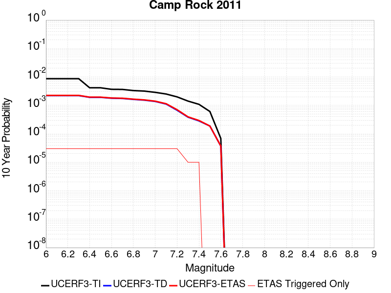 |

| Magnitude | 1 wk TI Prob | 1 wk TD Prob | 1 wk ETAS Prob | 1 wk ETAS/TD Gain | 1 wk ETAS Triggered Only | 1 mo TI Prob | 1 mo TD Prob | 1 mo ETAS Prob | 1 mo ETAS/TD Gain | 1 mo ETAS Triggered Only | 1 yr TI Prob | 1 yr TD Prob | 1 yr ETAS Prob | 1 yr ETAS/TD Gain | 1 yr ETAS Triggered Only | 10 yr TI Prob | 10 yr TD Prob | 10 yr ETAS Prob | 10 yr ETAS/TD Gain | 10 yr ETAS Triggered Only |
|-----|-----|-----|-----|-----|-----|-----|-----|-----|-----|-----|-----|-----|-----|-----|-----|-----|-----|-----|-----|-----|
| 6.0 | 1.6710783E-5 | 4.2500346E-6 | 4.2500346E-6 | 1.0 | 0.0 | 7.161568E-5 | 1.821431E-5 | 2.8214128E-5 | 1.5490088 | 1.0E-5 | 8.7157206E-4 | 2.2173718E-4 | 2.4173275E-4 | 1.0901768 | 2.0E-5 | 0.008681616 | 0.0022152122 | 0.0022451458 | 1.0135127 | 3.0E-5 |
| 6.1 | 1.6710783E-5 | 4.2500346E-6 | 4.2500346E-6 | 1.0 | 0.0 | 7.161568E-5 | 1.821431E-5 | 2.8214128E-5 | 1.5490088 | 1.0E-5 | 8.7157206E-4 | 2.2173718E-4 | 2.4173275E-4 | 1.0901768 | 2.0E-5 | 0.008681616 | 0.0022152122 | 0.0022451458 | 1.0135127 | 3.0E-5 |
| 6.2 | 1.6710783E-5 | 4.2500346E-6 | 4.2500346E-6 | 1.0 | 0.0 | 7.161568E-5 | 1.821431E-5 | 2.8214128E-5 | 1.5490088 | 1.0E-5 | 8.7157206E-4 | 2.2173718E-4 | 2.4173275E-4 | 1.0901768 | 2.0E-5 | 0.008681616 | 0.0022152122 | 0.0022451458 | 1.0135127 | 3.0E-5 |
| 6.3 | 1.6710783E-5 | 4.2500346E-6 | 4.2500346E-6 | 1.0 | 0.0 | 7.161568E-5 | 1.821431E-5 | 2.8214128E-5 | 1.5490088 | 1.0E-5 | 8.7157206E-4 | 2.2173718E-4 | 2.4173275E-4 | 1.0901768 | 2.0E-5 | 0.008681616 | 0.0022152122 | 0.0022451458 | 1.0135127 | 3.0E-5 |
| 6.4 | 7.982846E-6 | 3.682069E-6 | 3.682069E-6 | 1.0 | 0.0 | 3.421175E-5 | 1.5780202E-5 | 2.5780044E-5 | 1.6336955 | 1.0E-5 | 4.1644843E-4 | 1.9210737E-4 | 2.1210354E-4 | 1.1040884 | 2.0E-5 | 0.0041566887 | 0.0019194479 | 0.0019493903 | 1.0155995 | 3.0E-5 |
| 6.5 | 7.982846E-6 | 3.682069E-6 | 3.682069E-6 | 1.0 | 0.0 | 3.421175E-5 | 1.5780202E-5 | 2.5780044E-5 | 1.6336955 | 1.0E-5 | 4.1644843E-4 | 1.9210737E-4 | 2.1210354E-4 | 1.1040884 | 2.0E-5 | 0.0041566887 | 0.0019194479 | 0.0019493903 | 1.0155995 | 3.0E-5 |
| 6.6 | 7.048869E-6 | 3.4243315E-6 | 3.4243315E-6 | 1.0 | 0.0 | 3.0209088E-5 | 1.4675626E-5 | 2.4675479E-5 | 1.681392 | 1.0E-5 | 3.677336E-4 | 1.786614E-4 | 1.9865783E-4 | 1.1119236 | 2.0E-5 | 0.0036712566 | 0.0017852094 | 0.0018151558 | 1.0167748 | 3.0E-5 |
| 6.7 | 6.987307E-6 | 3.3623085E-6 | 3.3623085E-6 | 1.0 | 0.0 | 2.9945259E-5 | 1.4409816E-5 | 2.4409672E-5 | 1.6939614 | 1.0E-5 | 3.6452254E-4 | 1.754257E-4 | 1.954222E-4 | 1.1139884 | 2.0E-5 | 0.0036392517 | 0.0017529033 | 0.0017828507 | 1.0170845 | 3.0E-5 |
| 6.8 | 6.3737602E-6 | 3.1178974E-6 | 3.1178974E-6 | 1.0 | 0.0 | 2.731583E-5 | 1.3362351E-5 | 2.3362218E-5 | 1.7483613 | 1.0E-5 | 3.3251947E-4 | 1.6267477E-4 | 1.8267152E-4 | 1.1229247 | 2.0E-5 | 0.0033202237 | 0.0016255855 | 0.0016555367 | 1.0184249 | 3.0E-5 |
| 6.9 | 6.112211E-6 | 2.9331072E-6 | 2.9331072E-6 | 1.0 | 0.0 | 2.6194928E-5 | 1.2570401E-5 | 2.2570275E-5 | 1.7955096 | 1.0E-5 | 3.1887658E-4 | 1.5303415E-4 | 1.730311E-4 | 1.1306698 | 2.0E-5 | 0.003184194 | 0.0015293155 | 0.0015592696 | 1.0195866 | 3.0E-5 |
| 7.0 | 5.5140117E-6 | 2.6419382E-6 | 2.6419382E-6 | 1.0 | 0.0 | 2.3631264E-5 | 1.1322544E-5 | 2.132243E-5 | 1.8831837 | 1.0E-5 | 2.8767265E-4 | 1.3784351E-4 | 1.5784075E-4 | 1.1450721 | 2.0E-5 | 0.0028730053 | 0.0013776054 | 0.001407564 | 1.0217469 | 3.0E-5 |
| 7.1 | 4.8151105E-6 | 2.1342858E-6 | 2.1342858E-6 | 1.0 | 0.0 | 2.0636026E-5 | 9.146908E-6 | 1.9146817E-5 | 2.0932555 | 1.0E-5 | 2.5121463E-4 | 1.1135814E-4 | 1.313559E-4 | 1.1795807 | 2.0E-5 | 0.0025093083 | 0.0011130453 | 0.0011430118 | 1.0269231 | 3.0E-5 |
| 7.2 | 3.818335E-6 | 1.2937558E-6 | 1.2937558E-6 | 1.0 | 0.0 | 1.6364189E-5 | 5.5446562E-6 | 1.5544601E-5 | 2.8035283 | 1.0E-5 | 1.9921579E-4 | 6.750418E-5 | 8.750283E-5 | 1.296258 | 2.0E-5 | 0.0019903728 | 6.74845E-4 | 7.0482475E-4 | 1.0444247 | 3.0E-5 |
| 7.3 | 2.7166698E-6 | 7.3832456E-7 | 7.3832456E-7 | 1.0 | 0.0 | 1.1642818E-5 | 3.1642444E-6 | 3.1642444E-6 | 1.0 | 0.0 | 1.4174209E-4 | 3.8524013E-5 | 3.8524013E-5 | 1.0 | 0.0 | 0.0014165172 | 3.8517537E-4 | 3.9517152E-4 | 1.0259522 | 1.0E-5 |
| 7.4 | 2.0893426E-6 | 5.4615964E-7 | 5.4615964E-7 | 1.0 | 0.0 | 8.954295E-6 | 2.340682E-6 | 2.340682E-6 | 1.0 | 0.0 | 1.0901308E-4 | 2.8497436E-5 | 2.8497436E-5 | 1.0 | 0.0 | 0.0010895962 | 2.8493837E-4 | 2.949355E-4 | 1.0350853 | 1.0E-5 |
| 7.5 | 1.1681728E-6 | 3.6029326E-7 | 3.6029326E-7 | 1.0 | 0.0 | 5.0064455E-6 | 1.544113E-6 | 1.544113E-6 | 1.0 | 0.0 | 6.0951766E-5 | 1.879942E-5 | 1.879942E-5 | 1.0 | 0.0 | 6.093505E-4 | 1.8797876E-4 | 1.8797876E-4 | 1.0 | 0.0 |
| 7.6 | 1.3154387E-7 | 7.119745E-8 | 7.119745E-8 | 1.0 | 0.0 | 5.6375933E-7 | 3.051319E-7 | 3.051319E-7 | 1.0 | 0.0 | 6.863748E-6 | 3.7149762E-6 | 3.7149762E-6 | 1.0 | 0.0 | 6.863536E-5 | 3.7149297E-5 | 3.7149297E-5 | 1.0 | 0.0 |

## San Clemente
*[(top)](#table-of-contents)*

| 1 Week | 1 Month | 1 Year | 10 Year |
|-----|-----|-----|-----|
|  |  |  |  |

| Magnitude | 1 wk TI Prob | 1 wk TD Prob | 1 wk ETAS Prob | 1 wk ETAS/TD Gain | 1 wk ETAS Triggered Only | 1 mo TI Prob | 1 mo TD Prob | 1 mo ETAS Prob | 1 mo ETAS/TD Gain | 1 mo ETAS Triggered Only | 1 yr TI Prob | 1 yr TD Prob | 1 yr ETAS Prob | 1 yr ETAS/TD Gain | 1 yr ETAS Triggered Only | 10 yr TI Prob | 10 yr TD Prob | 10 yr ETAS Prob | 10 yr ETAS/TD Gain | 10 yr ETAS Triggered Only |
|-----|-----|-----|-----|-----|-----|-----|-----|-----|-----|-----|-----|-----|-----|-----|-----|-----|-----|-----|-----|-----|
| 6.0 | 6.681379E-5 | 8.164081E-5 | 8.164081E-5 | 1.0 | 0.0 | 2.8631336E-4 | 3.4984472E-4 | 3.4984472E-4 | 1.0 | 0.0 | 0.003480294 | 0.004251534 | 0.004251534 | 1.0 | 0.0 | 0.03426291 | 0.041757226 | 0.041785974 | 1.0006884 | 3.0E-5 |
| 6.1 | 6.681379E-5 | 8.164081E-5 | 8.164081E-5 | 1.0 | 0.0 | 2.8631336E-4 | 3.4984472E-4 | 3.4984472E-4 | 1.0 | 0.0 | 0.003480294 | 0.004251534 | 0.004251534 | 1.0 | 0.0 | 0.03426291 | 0.041757226 | 0.041785974 | 1.0006884 | 3.0E-5 |
| 6.2 | 3.9400576E-5 | 4.645349E-5 | 4.645349E-5 | 1.0 | 0.0 | 1.6884868E-4 | 1.9907155E-4 | 1.9907155E-4 | 1.0 | 0.0 | 0.0020537945 | 0.0024210564 | 0.0024210564 | 1.0 | 0.0 | 0.020349167 | 0.02395347 | 0.02396323 | 1.0004075 | 1.0E-5 |
| 6.3 | 3.2590255E-5 | 3.792995E-5 | 3.792995E-5 | 1.0 | 0.0 | 1.3966505E-4 | 1.6254697E-4 | 1.6254697E-4 | 1.0 | 0.0 | 0.0016990956 | 0.0019772432 | 0.0019772432 | 1.0 | 0.0 | 0.01686163 | 0.019600306 | 0.01961011 | 1.0005002 | 1.0E-5 |
| 6.4 | 2.9454652E-5 | 3.409848E-5 | 3.409848E-5 | 1.0 | 0.0 | 1.2622811E-4 | 1.4612831E-4 | 1.4612831E-4 | 1.0 | 0.0 | 0.0015357438 | 0.0017776866 | 0.0017776866 | 1.0 | 0.0 | 0.015251739 | 0.017637838 | 0.017637838 | 1.0 | 0.0 |
| 6.5 | 2.790836E-5 | 3.2248132E-5 | 3.2248132E-5 | 1.0 | 0.0 | 1.1960178E-4 | 1.381991E-4 | 1.381991E-4 | 1.0 | 0.0 | 0.001455179 | 0.001681301 | 0.001681301 | 1.0 | 0.0 | 0.014456868 | 0.016688827 | 0.016688827 | 1.0 | 0.0 |
| 6.6 | 2.2492153E-5 | 2.57632E-5 | 2.57632E-5 | 1.0 | 0.0 | 9.639138E-5 | 1.1040912E-4 | 1.1040912E-4 | 1.0 | 0.0 | 0.0011729331 | 0.0013434169 | 0.0013434169 | 1.0 | 0.0 | 0.011667615 | 0.013354673 | 0.013354673 | 1.0 | 0.0 |
| 6.7 | 1.9862755E-5 | 2.2666847E-5 | 2.2666847E-5 | 1.0 | 0.0 | 8.512331E-5 | 9.714008E-5 | 9.714008E-5 | 1.0 | 0.0 | 0.0010358836 | 0.0011820501 | 0.0011820501 | 1.0 | 0.0 | 0.010310682 | 0.01175892 | 0.01175892 | 1.0 | 0.0 |
| 6.8 | 1.6697575E-5 | 1.8978053E-5 | 1.8978053E-5 | 1.0 | 0.0 | 7.155907E-5 | 8.133203E-5 | 8.133203E-5 | 1.0 | 0.0 | 8.7088346E-4 | 9.89777E-4 | 9.89777E-4 | 1.0 | 0.0 | 0.008674784 | 0.009854714 | 0.009854714 | 1.0 | 0.0 |
| 6.9 | 1.5218415E-5 | 1.726971E-5 | 1.726971E-5 | 1.0 | 0.0 | 6.522015E-5 | 7.401099E-5 | 7.401099E-5 | 1.0 | 0.0 | 7.93766E-4 | 9.0072013E-4 | 9.0072013E-4 | 1.0 | 0.0 | 0.007909367 | 0.00897164 | 0.00897164 | 1.0 | 0.0 |
| 7.0 | 1.2392958E-5 | 1.4033262E-5 | 1.4033262E-5 | 1.0 | 0.0 | 5.3111595E-5 | 6.0141207E-5 | 6.0141207E-5 | 1.0 | 0.0 | 6.4644177E-4 | 7.319808E-4 | 7.319808E-4 | 1.0 | 0.0 | 0.0064456454 | 0.0072964844 | 0.0072964844 | 1.0 | 0.0 |
| 7.1 | 1.0934128E-5 | 1.2375354E-5 | 1.2375354E-5 | 1.0 | 0.0 | 4.6859706E-5 | 5.3036194E-5 | 5.3036194E-5 | 1.0 | 0.0 | 5.7036756E-4 | 6.455317E-4 | 6.455317E-4 | 1.0 | 0.0 | 0.0056890585 | 0.006437312 | 0.006437312 | 1.0 | 0.0 |
| 7.2 | 9.5798805E-6 | 1.0845125E-5 | 1.0845125E-5 | 1.0 | 0.0 | 4.1055984E-5 | 4.647832E-5 | 4.647832E-5 | 1.0 | 0.0 | 4.9974193E-4 | 5.657338E-4 | 5.657338E-4 | 1.0 | 0.0 | 0.0049861963 | 0.00564366 | 0.00564366 | 1.0 | 0.0 |
| 7.3 | 8.0167365E-6 | 9.084078E-6 | 9.084078E-6 | 1.0 | 0.0 | 3.4356988E-5 | 3.8931223E-5 | 3.8931223E-5 | 1.0 | 0.0 | 4.1821605E-4 | 4.738916E-4 | 4.738916E-4 | 1.0 | 0.0 | 0.0041742986 | 0.004729513 | 0.004729513 | 1.0 | 0.0 |
| 7.4 | 2.9581017E-6 | 3.36244E-6 | 3.36244E-6 | 1.0 | 0.0 | 1.2677518E-5 | 1.4410407E-5 | 1.4410407E-5 | 1.0 | 0.0 | 1.5433785E-4 | 1.7543763E-4 | 1.7543763E-4 | 1.0 | 0.0 | 0.001542307 | 0.0017534863 | 0.0017534863 | 1.0 | 0.0 |

## Mission Creek
*[(top)](#table-of-contents)*

| 1 Week | 1 Month | 1 Year | 10 Year |
|-----|-----|-----|-----|
|  |  |  | 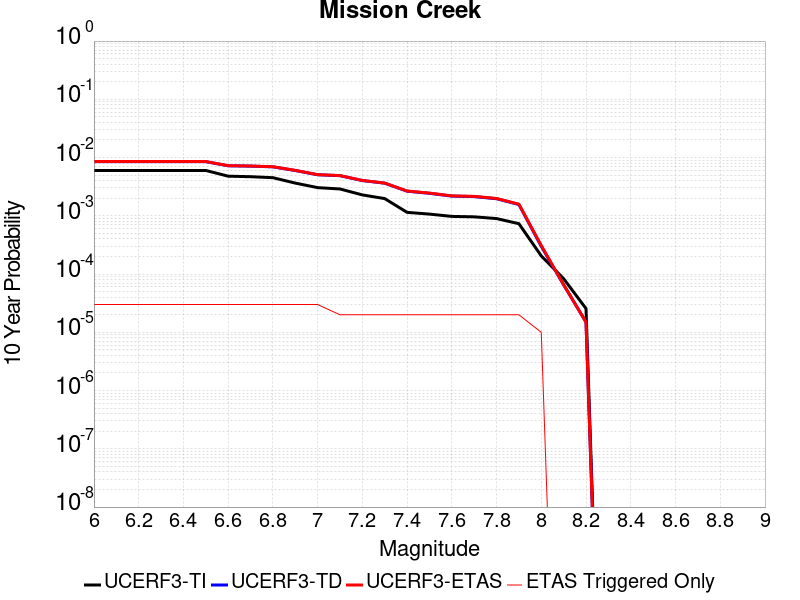 |

| Magnitude | 1 wk TI Prob | 1 wk TD Prob | 1 wk ETAS Prob | 1 wk ETAS/TD Gain | 1 wk ETAS Triggered Only | 1 mo TI Prob | 1 mo TD Prob | 1 mo ETAS Prob | 1 mo ETAS/TD Gain | 1 mo ETAS Triggered Only | 1 yr TI Prob | 1 yr TD Prob | 1 yr ETAS Prob | 1 yr ETAS/TD Gain | 1 yr ETAS Triggered Only | 10 yr TI Prob | 10 yr TD Prob | 10 yr ETAS Prob | 10 yr ETAS/TD Gain | 10 yr ETAS Triggered Only |
|-----|-----|-----|-----|-----|-----|-----|-----|-----|-----|-----|-----|-----|-----|-----|-----|-----|-----|-----|-----|-----|
| 6.0 | 1.1549387E-5 | 1.6325142E-5 | 1.6325142E-5 | 1.0 | 0.0 | 4.9496433E-5 | 6.9963105E-5 | 6.9963105E-5 | 1.0 | 0.0 | 6.0245243E-4 | 8.514829E-4 | 8.614744E-4 | 1.0117342 | 1.0E-5 | 0.006008218 | 0.008511699 | 0.008541443 | 1.0034946 | 3.0E-5 |
| 6.1 | 1.1549387E-5 | 1.6325142E-5 | 1.6325142E-5 | 1.0 | 0.0 | 4.9496433E-5 | 6.9963105E-5 | 6.9963105E-5 | 1.0 | 0.0 | 6.0245243E-4 | 8.514829E-4 | 8.614744E-4 | 1.0117342 | 1.0E-5 | 0.006008218 | 0.008511699 | 0.008541443 | 1.0034946 | 3.0E-5 |
| 6.2 | 1.1549387E-5 | 1.6325142E-5 | 1.6325142E-5 | 1.0 | 0.0 | 4.9496433E-5 | 6.9963105E-5 | 6.9963105E-5 | 1.0 | 0.0 | 6.0245243E-4 | 8.514829E-4 | 8.614744E-4 | 1.0117342 | 1.0E-5 | 0.006008218 | 0.008511699 | 0.008541443 | 1.0034946 | 3.0E-5 |
| 6.3 | 1.1549387E-5 | 1.6325142E-5 | 1.6325142E-5 | 1.0 | 0.0 | 4.9496433E-5 | 6.9963105E-5 | 6.9963105E-5 | 1.0 | 0.0 | 6.0245243E-4 | 8.514829E-4 | 8.614744E-4 | 1.0117342 | 1.0E-5 | 0.006008218 | 0.008511699 | 0.008541443 | 1.0034946 | 3.0E-5 |
| 6.4 | 1.1549387E-5 | 1.6325142E-5 | 1.6325142E-5 | 1.0 | 0.0 | 4.9496433E-5 | 6.9963105E-5 | 6.9963105E-5 | 1.0 | 0.0 | 6.0245243E-4 | 8.514829E-4 | 8.614744E-4 | 1.0117342 | 1.0E-5 | 0.006008218 | 0.008511699 | 0.008541443 | 1.0034946 | 3.0E-5 |
| 6.5 | 1.1549387E-5 | 1.6325142E-5 | 1.6325142E-5 | 1.0 | 0.0 | 4.9496433E-5 | 6.9963105E-5 | 6.9963105E-5 | 1.0 | 0.0 | 6.0245243E-4 | 8.514829E-4 | 8.614744E-4 | 1.0117342 | 1.0E-5 | 0.006008218 | 0.008511699 | 0.008541443 | 1.0034946 | 3.0E-5 |
| 6.6 | 9.202681E-6 | 1.3848401E-5 | 1.3848401E-5 | 1.0 | 0.0 | 3.9439463E-5 | 5.934899E-5 | 5.934899E-5 | 1.0 | 0.0 | 4.800697E-4 | 7.2234345E-4 | 7.323362E-4 | 1.0138339 | 1.0E-5 | 0.004790339 | 0.0072288746 | 0.007258658 | 1.00412 | 3.0E-5 |
| 6.7 | 9.019164E-6 | 1.3654068E-5 | 1.3654068E-5 | 1.0 | 0.0 | 3.8652986E-5 | 5.8516176E-5 | 5.8516176E-5 | 1.0 | 0.0 | 4.7049852E-4 | 7.1221055E-4 | 7.2220346E-4 | 1.0140308 | 1.0E-5 | 0.004695036 | 0.0071281986 | 0.0071579847 | 1.0041786 | 3.0E-5 |
| 6.8 | 8.673558E-6 | 1.3276174E-5 | 1.3276174E-5 | 1.0 | 0.0 | 3.717186E-5 | 5.68967E-5 | 5.68967E-5 | 1.0 | 0.0 | 4.524734E-4 | 6.92506E-4 | 7.0249906E-4 | 1.0144303 | 1.0E-5 | 0.0045155324 | 0.0069323843 | 0.0069621764 | 1.0042975 | 3.0E-5 |
| 6.9 | 7.002255E-6 | 1.1480386E-5 | 1.1480386E-5 | 1.0 | 0.0 | 3.000932E-5 | 4.9200764E-5 | 4.9200764E-5 | 1.0 | 0.0 | 3.653022E-4 | 5.988615E-4 | 6.088555E-4 | 1.0166883 | 1.0E-5 | 0.0036470229 | 0.0060011996 | 0.0060310196 | 1.004969 | 3.0E-5 |
| 7.0 | 5.84644E-6 | 9.677556E-6 | 9.677556E-6 | 1.0 | 0.0 | 2.5055931E-5 | 4.1474606E-5 | 4.1474606E-5 | 1.0 | 0.0 | 3.0501327E-4 | 5.0484086E-4 | 5.148358E-4 | 1.0197983 | 1.0E-5 | 0.0030459496 | 0.0050654565 | 0.0050953045 | 1.0058925 | 3.0E-5 |
| 7.1 | 5.54703E-6 | 9.332022E-6 | 9.332022E-6 | 1.0 | 0.0 | 2.377277E-5 | 3.9993793E-5 | 3.9993793E-5 | 1.0 | 0.0 | 2.8939504E-4 | 4.868201E-4 | 4.9681525E-4 | 1.0205314 | 1.0E-5 | 0.0028901845 | 0.004886046 | 0.0049059484 | 1.0040733 | 2.0E-5 |
| 7.2 | 4.384709E-6 | 7.683992E-6 | 7.683992E-6 | 1.0 | 0.0 | 1.8791474E-5 | 3.2931002E-5 | 3.2931002E-5 | 1.0 | 0.0 | 2.2876218E-4 | 4.0086484E-4 | 4.108608E-4 | 1.0249361 | 1.0E-5 | 0.0022852682 | 0.0040298863 | 0.004049806 | 1.0049429 | 2.0E-5 |
| 7.3 | 3.7888456E-6 | 6.917821E-6 | 6.917821E-6 | 1.0 | 0.0 | 1.623781E-5 | 2.9647486E-5 | 2.9647486E-5 | 1.0 | 0.0 | 1.9767738E-4 | 3.609017E-4 | 3.7089808E-4 | 1.0276984 | 1.0E-5 | 0.0019750162 | 0.0036316153 | 0.0036515428 | 1.0054872 | 2.0E-5 |
| 7.4 | 2.1982462E-6 | 5.026073E-6 | 5.026073E-6 | 1.0 | 0.0 | 9.421021E-6 | 2.1540136E-5 | 2.1540136E-5 | 1.0 | 0.0 | 1.1469489E-4 | 2.6221978E-4 | 2.7221715E-4 | 1.038126 | 1.0E-5 | 0.0011463572 | 0.0026473494 | 0.0026672964 | 1.0075347 | 2.0E-5 |
| 7.5 | 2.051923E-6 | 4.617237E-6 | 4.617237E-6 | 1.0 | 0.0 | 8.793926E-6 | 1.978801E-5 | 1.978801E-5 | 1.0 | 0.0 | 1.0706078E-4 | 2.4089254E-4 | 2.5089012E-4 | 1.0415022 | 1.0E-5 | 0.0010700922 | 0.0024350125 | 0.0024549637 | 1.0081935 | 2.0E-5 |
| 7.6 | 1.8733427E-6 | 4.125508E-6 | 4.125508E-6 | 1.0 | 0.0 | 8.028587E-6 | 1.768063E-5 | 1.768063E-5 | 1.0 | 0.0 | 9.774366E-5 | 2.1524049E-4 | 2.2523833E-4 | 1.0464497 | 1.0E-5 | 9.770069E-4 | 0.002179529 | 0.0021994854 | 1.0091563 | 2.0E-5 |
| 7.7 | 1.8411953E-6 | 4.0451673E-6 | 4.0451673E-6 | 1.0 | 0.0 | 7.890813E-6 | 1.7336315E-5 | 1.7336315E-5 | 1.0 | 0.0 | 9.606641E-5 | 2.1104928E-4 | 2.2104717E-4 | 1.0473723 | 1.0E-5 | 9.6024893E-4 | 0.0021378102 | 0.0021577675 | 1.0093354 | 2.0E-5 |
| 7.8 | 1.7194251E-6 | 3.7123866E-6 | 3.7123866E-6 | 1.0 | 0.0 | 7.368944E-6 | 1.5910133E-5 | 1.5910133E-5 | 1.0 | 0.0 | 8.97132E-5 | 1.9368871E-4 | 2.0368678E-4 | 1.0516193 | 1.0E-5 | 8.967699E-4 | 0.0019636988 | 0.0019836596 | 1.0101649 | 2.0E-5 |
| 7.9 | 1.4035052E-6 | 2.9516495E-6 | 2.9516495E-6 | 1.0 | 0.0 | 6.0150082E-6 | 1.2649865E-5 | 1.2649865E-5 | 1.0 | 0.0 | 7.3230265E-5 | 1.5400129E-4 | 1.6399975E-4 | 1.0649245 | 1.0E-5 | 7.3206134E-4 | 0.0015642311 | 0.0015841998 | 1.0127659 | 2.0E-5 |
| 8.0 | 3.9318823E-7 | 5.531722E-7 | 5.531722E-7 | 1.0 | 0.0 | 1.6850913E-6 | 2.370736E-6 | 2.370736E-6 | 1.0 | 0.0 | 2.0515794E-5 | 2.8863333E-5 | 3.8863043E-5 | 1.3464503 | 1.0E-5 | 2.0513899E-4 | 2.9927568E-4 | 3.0927267E-4 | 1.033404 | 1.0E-5 |
| 8.1 | 1.596793E-7 | 1.13891964E-7 | 1.13891964E-7 | 1.0 | 0.0 | 6.8433974E-7 | 4.881083E-7 | 4.881083E-7 | 1.0 | 0.0 | 8.331805E-6 | 5.942703E-6 | 5.942703E-6 | 1.0 | 0.0 | 8.331492E-5 | 6.555237E-5 | 6.555237E-5 | 1.0 | 0.0 |
| 8.2 | 4.9003038E-8 | 2.5465459E-8 | 2.5465459E-8 | 1.0 | 0.0 | 2.10013E-7 | 1.0913767E-7 | 1.0913767E-7 | 1.0 | 0.0 | 2.5569052E-6 | 1.3287504E-6 | 1.3287504E-6 | 1.0 | 0.0 | 2.556876E-5 | 1.49686575E-5 | 1.49686575E-5 | 1.0 | 0.0 |

## Santa Cruz Catalina Ridge alt1
*[(top)](#table-of-contents)*

| 1 Week | 1 Month | 1 Year | 10 Year |
|-----|-----|-----|-----|
|  |  |  |  |

| Magnitude | 1 wk TI Prob | 1 wk TD Prob | 1 wk ETAS Prob | 1 wk ETAS/TD Gain | 1 wk ETAS Triggered Only | 1 mo TI Prob | 1 mo TD Prob | 1 mo ETAS Prob | 1 mo ETAS/TD Gain | 1 mo ETAS Triggered Only | 1 yr TI Prob | 1 yr TD Prob | 1 yr ETAS Prob | 1 yr ETAS/TD Gain | 1 yr ETAS Triggered Only | 10 yr TI Prob | 10 yr TD Prob | 10 yr ETAS Prob | 10 yr ETAS/TD Gain | 10 yr ETAS Triggered Only |
|-----|-----|-----|-----|-----|-----|-----|-----|-----|-----|-----|-----|-----|-----|-----|-----|-----|-----|-----|-----|-----|
| 6.0 | 3.2833184E-5 | 3.655896E-5 | 4.6558594E-5 | 1.2735207 | 1.0E-5 | 1.4070606E-4 | 1.5667279E-4 | 1.6667122E-4 | 1.0638173 | 1.0E-5 | 0.00171175 | 0.0019059886 | 0.0019359313 | 1.0157099 | 3.0E-5 | 0.016986247 | 0.01891332 | 0.018942753 | 1.0015562 | 3.0E-5 |
| 6.1 | 1.9835548E-5 | 2.1659771E-5 | 3.1659554E-5 | 1.4616754 | 1.0E-5 | 8.500672E-5 | 9.2824404E-5 | 1.0282348E-4 | 1.1077203 | 1.0E-5 | 0.0010344655 | 0.0011295713 | 0.0011395601 | 1.008843 | 1.0E-5 | 0.010296632 | 0.011240433 | 0.011250321 | 1.0008796 | 1.0E-5 |
| 6.2 | 1.9835548E-5 | 2.1659771E-5 | 3.1659554E-5 | 1.4616754 | 1.0E-5 | 8.500672E-5 | 9.2824404E-5 | 1.0282348E-4 | 1.1077203 | 1.0E-5 | 0.0010344655 | 0.0011295713 | 0.0011395601 | 1.008843 | 1.0E-5 | 0.010296632 | 0.011240433 | 0.011250321 | 1.0008796 | 1.0E-5 |
| 6.3 | 1.5728183E-5 | 1.7034137E-5 | 2.7033968E-5 | 1.5870464 | 1.0E-5 | 6.7404755E-5 | 7.3001436E-5 | 8.3000705E-5 | 1.1369736 | 1.0E-5 | 8.2034385E-4 | 8.884362E-4 | 8.9842733E-4 | 1.0112457 | 1.0E-5 | 0.008173222 | 0.008849524 | 0.008859436 | 1.00112 | 1.0E-5 |
| 6.4 | 1.5728183E-5 | 1.7034137E-5 | 2.7033968E-5 | 1.5870464 | 1.0E-5 | 6.7404755E-5 | 7.3001436E-5 | 8.3000705E-5 | 1.1369736 | 1.0E-5 | 8.2034385E-4 | 8.884362E-4 | 8.9842733E-4 | 1.0112457 | 1.0E-5 | 0.008173222 | 0.008849524 | 0.008859436 | 1.00112 | 1.0E-5 |
| 6.5 | 1.3707734E-5 | 1.4794678E-5 | 2.479453E-5 | 1.6759087 | 1.0E-5 | 5.8746107E-5 | 6.3404244E-5 | 7.340361E-5 | 1.1577082 | 1.0E-5 | 7.1499916E-4 | 7.716768E-4 | 7.8166905E-4 | 1.0129488 | 1.0E-5 | 0.0071270303 | 0.0076903705 | 0.007700294 | 1.0012903 | 1.0E-5 |
| 6.6 | 1.2539813E-5 | 1.3510358E-5 | 2.3510223E-5 | 1.7401628 | 1.0E-5 | 5.3740947E-5 | 5.7900266E-5 | 6.789969E-5 | 1.1727008 | 1.0E-5 | 6.540996E-4 | 7.0471043E-4 | 7.1470335E-4 | 1.0141802 | 1.0E-5 | 0.0065217763 | 0.0070250607 | 0.0070349905 | 1.0014135 | 1.0E-5 |
| 6.7 | 1.1504083E-5 | 1.23775E-5 | 2.2377377E-5 | 1.8079076 | 1.0E-5 | 4.930228E-5 | 5.304536E-5 | 6.304483E-5 | 1.1885079 | 1.0E-5 | 6.0008996E-4 | 6.456379E-4 | 6.556315E-4 | 1.0154786 | 1.0E-5 | 0.005984721 | 0.0064378507 | 0.0064477865 | 1.0015433 | 1.0E-5 |
| 6.8 | 1.012739E-5 | 1.0877178E-5 | 2.0877069E-5 | 1.9193461 | 1.0E-5 | 4.340238E-5 | 4.6615653E-5 | 5.6615187E-5 | 1.2145102 | 1.0E-5 | 5.282958E-4 | 5.673993E-4 | 5.773936E-4 | 1.0176142 | 1.0E-5 | 0.0052704164 | 0.005659675 | 0.0056696185 | 1.0017569 | 1.0E-5 |
| 6.9 | 8.9607865E-6 | 9.60921E-6 | 1.9609113E-5 | 2.0406582 | 1.0E-5 | 3.8402806E-5 | 4.1181684E-5 | 5.1181272E-5 | 1.2428164 | 1.0E-5 | 4.6745385E-4 | 5.0127273E-4 | 5.112677E-4 | 1.0199392 | 1.0E-5 | 0.0046647177 | 0.00500154 | 0.0050114896 | 1.0019894 | 1.0E-5 |
| 7.0 | 8.046829E-6 | 8.619827E-6 | 1.8619741E-5 | 2.160106 | 1.0E-5 | 3.4485955E-5 | 3.6941598E-5 | 4.694123E-5 | 1.2706876 | 1.0E-5 | 4.1978562E-4 | 4.4967196E-4 | 4.5966747E-4 | 1.0222285 | 1.0E-5 | 0.004189935 | 0.004487711 | 0.0044976664 | 1.0022184 | 1.0E-5 |
| 7.1 | 7.136131E-6 | 7.637727E-6 | 1.763765E-5 | 2.30928 | 1.0E-5 | 3.0583058E-5 | 3.273271E-5 | 4.2732383E-5 | 1.3054948 | 1.0E-5 | 3.7228514E-4 | 3.9844858E-4 | 4.0844458E-4 | 1.0250874 | 1.0E-5 | 0.0037166206 | 0.0039774184 | 0.0039873784 | 1.0025042 | 1.0E-5 |
| 7.2 | 6.362014E-6 | 6.8050217E-6 | 1.6804954E-5 | 2.4694932 | 1.0E-5 | 2.726549E-5 | 2.9164055E-5 | 3.9163766E-5 | 1.3428779 | 1.0E-5 | 3.3190678E-4 | 3.5501516E-4 | 3.6501163E-4 | 1.0281578 | 1.0E-5 | 0.0033141149 | 0.0035445488 | 0.0035545132 | 1.0028112 | 1.0E-5 |
| 7.3 | 5.004101E-6 | 5.3517642E-6 | 5.3517642E-6 | 1.0 | 0.0 | 2.1445969E-5 | 2.2935934E-5 | 2.2935934E-5 | 1.0 | 0.0 | 2.6107338E-4 | 2.7920975E-4 | 2.7920975E-4 | 1.0 | 0.0 | 0.002607669 | 0.0027886443 | 0.0027886443 | 1.0 | 0.0 |
| 7.4 | 3.4901443E-6 | 3.732087E-6 | 3.732087E-6 | 1.0 | 0.0 | 1.4957676E-5 | 1.5994563E-5 | 1.5994563E-5 | 1.0 | 0.0 | 1.8209449E-4 | 1.9471678E-4 | 1.9471678E-4 | 1.0 | 0.0 | 0.0018194534 | 0.0019455003 | 0.0019455003 | 1.0 | 0.0 |
| 7.5 | 1.1215045E-6 | 1.1893966E-6 | 1.1893966E-6 | 1.0 | 0.0 | 4.806439E-6 | 5.0974045E-6 | 5.0974045E-6 | 1.0 | 0.0 | 5.851682E-5 | 6.205916E-5 | 6.205916E-5 | 1.0 | 0.0 | 5.850142E-4 | 6.204214E-4 | 6.204214E-4 | 1.0 | 0.0 |
| 7.6 | 2.8599047E-7 | 2.9952182E-7 | 2.9952182E-7 | 1.0 | 0.0 | 1.2256729E-6 | 1.2836642E-6 | 1.2836642E-6 | 1.0 | 0.0 | 1.4922465E-5 | 1.5628502E-5 | 1.5628502E-5 | 1.0 | 0.0 | 1.4921463E-4 | 1.5627417E-4 | 1.5627417E-4 | 1.0 | 0.0 |
| 7.7 | 2.0781519E-7 | 2.1744457E-7 | 2.1744457E-7 | 1.0 | 0.0 | 8.906362E-7 | 9.3190494E-7 | 9.3190494E-7 | 1.0 | 0.0 | 1.08434415E-5 | 1.1345885E-5 | 1.1345885E-5 | 1.0 | 0.0 | 1.0842913E-4 | 1.1345315E-4 | 1.1345315E-4 | 1.0 | 0.0 |
| 7.8 | 3.614776E-8 | 3.7641225E-8 | 3.7641225E-8 | 1.0 | 0.0 | 1.5491896E-7 | 1.6131952E-7 | 1.6131952E-7 | 1.0 | 0.0 | 1.8861368E-6 | 1.9640636E-6 | 1.9640636E-6 | 1.0 | 0.0 | 1.8861208E-5 | 1.9640474E-5 | 1.9640474E-5 | 1.0 | 0.0 |

## White Wolf
*[(top)](#table-of-contents)*

| 1 Week | 1 Month | 1 Year | 10 Year |
|-----|-----|-----|-----|
|  |  |  |  |

| Magnitude | 1 wk TI Prob | 1 wk TD Prob | 1 wk ETAS Prob | 1 wk ETAS/TD Gain | 1 wk ETAS Triggered Only | 1 mo TI Prob | 1 mo TD Prob | 1 mo ETAS Prob | 1 mo ETAS/TD Gain | 1 mo ETAS Triggered Only | 1 yr TI Prob | 1 yr TD Prob | 1 yr ETAS Prob | 1 yr ETAS/TD Gain | 1 yr ETAS Triggered Only | 10 yr TI Prob | 10 yr TD Prob | 10 yr ETAS Prob | 10 yr ETAS/TD Gain | 10 yr ETAS Triggered Only |
|-----|-----|-----|-----|-----|-----|-----|-----|-----|-----|-----|-----|-----|-----|-----|-----|-----|-----|-----|-----|-----|
| 6.0 | 2.0037822E-5 | 1.0468736E-6 | 1.0468736E-6 | 1.0 | 0.0 | 8.587355E-5 | 4.4865938E-6 | 1.4486549E-5 | 3.2288523 | 1.0E-5 | 0.001045009 | 5.462296E-5 | 6.4622414E-5 | 1.1830631 | 1.0E-5 | 0.010401085 | 5.4610043E-4 | 5.76084E-4 | 1.0549049 | 3.0E-5 |
| 6.1 | 2.0037822E-5 | 1.0468736E-6 | 1.0468736E-6 | 1.0 | 0.0 | 8.587355E-5 | 4.4865938E-6 | 1.4486549E-5 | 3.2288523 | 1.0E-5 | 0.001045009 | 5.462296E-5 | 6.4622414E-5 | 1.1830631 | 1.0E-5 | 0.010401085 | 5.4610043E-4 | 5.76084E-4 | 1.0549049 | 3.0E-5 |
| 6.2 | 2.0037822E-5 | 1.0468736E-6 | 1.0468736E-6 | 1.0 | 0.0 | 8.587355E-5 | 4.4865938E-6 | 1.4486549E-5 | 3.2288523 | 1.0E-5 | 0.001045009 | 5.462296E-5 | 6.4622414E-5 | 1.1830631 | 1.0E-5 | 0.010401085 | 5.4610043E-4 | 5.76084E-4 | 1.0549049 | 3.0E-5 |
| 6.3 | 2.0037822E-5 | 1.0468736E-6 | 1.0468736E-6 | 1.0 | 0.0 | 8.587355E-5 | 4.4865938E-6 | 1.4486549E-5 | 3.2288523 | 1.0E-5 | 0.001045009 | 5.462296E-5 | 6.4622414E-5 | 1.1830631 | 1.0E-5 | 0.010401085 | 5.4610043E-4 | 5.76084E-4 | 1.0549049 | 3.0E-5 |
| 6.4 | 1.132487E-5 | 1.0468736E-6 | 1.0468736E-6 | 1.0 | 0.0 | 4.8534253E-5 | 4.4865938E-6 | 1.4486549E-5 | 3.2288523 | 1.0E-5 | 5.907443E-4 | 5.462296E-5 | 6.4622414E-5 | 1.1830631 | 1.0E-5 | 0.005891764 | 5.4610043E-4 | 5.76084E-4 | 1.0549049 | 3.0E-5 |
| 6.5 | 1.132487E-5 | 1.0468736E-6 | 1.0468736E-6 | 1.0 | 0.0 | 4.8534253E-5 | 4.4865938E-6 | 1.4486549E-5 | 3.2288523 | 1.0E-5 | 5.907443E-4 | 5.462296E-5 | 6.4622414E-5 | 1.1830631 | 1.0E-5 | 0.005891764 | 5.4610043E-4 | 5.76084E-4 | 1.0549049 | 3.0E-5 |
| 6.6 | 9.347473E-6 | 1.0468736E-6 | 1.0468736E-6 | 1.0 | 0.0 | 4.0059982E-5 | 4.4865938E-6 | 1.4486549E-5 | 3.2288523 | 1.0E-5 | 4.8762115E-4 | 5.462296E-5 | 6.4622414E-5 | 1.1830631 | 1.0E-5 | 0.0048655253 | 5.4610043E-4 | 5.76084E-4 | 1.0549049 | 3.0E-5 |
| 6.7 | 7.842647E-6 | 1.0047925E-6 | 1.0047925E-6 | 1.0 | 0.0 | 3.361091E-5 | 4.3062464E-6 | 1.4306203E-5 | 3.322198 | 1.0E-5 | 4.0913603E-4 | 5.242734E-5 | 6.2426814E-5 | 1.1907302 | 1.0E-5 | 0.004083836 | 5.241547E-4 | 5.541389E-4 | 1.057205 | 3.0E-5 |
| 6.8 | 6.26597E-6 | 9.73443E-7 | 9.73443E-7 | 1.0 | 0.0 | 2.685388E-5 | 4.171892E-6 | 1.417185E-5 | 3.3969839 | 1.0E-5 | 3.2689696E-4 | 5.0791652E-5 | 6.0791142E-5 | 1.1968727 | 1.0E-5 | 0.003264165 | 5.078053E-4 | 5.377901E-4 | 1.0590477 | 3.0E-5 |
| 6.9 | 5.258436E-6 | 9.1828633E-7 | 9.1828633E-7 | 1.0 | 0.0 | 2.2535958E-5 | 3.9355073E-6 | 1.3935468E-5 | 3.5409584 | 1.0E-5 | 2.7434074E-4 | 4.7913796E-5 | 5.7913316E-5 | 1.2086982 | 1.0E-5 | 0.0027400232 | 4.7903945E-4 | 4.990299E-4 | 1.0417302 | 2.0E-5 |
| 7.0 | 4.675028E-6 | 8.6608276E-7 | 8.6608276E-7 | 1.0 | 0.0 | 2.003568E-5 | 3.7117782E-6 | 1.3711741E-5 | 3.6941166 | 1.0E-5 | 2.4390711E-4 | 4.519001E-5 | 5.5189557E-5 | 1.2212778 | 1.0E-5 | 0.0024363957 | 4.5181293E-4 | 4.7180388E-4 | 1.0442461 | 2.0E-5 |
| 7.1 | 2.8270078E-6 | 6.873876E-7 | 6.873876E-7 | 1.0 | 0.0 | 1.2115692E-5 | 2.9459438E-6 | 1.2945914E-5 | 4.394488 | 1.0E-5 | 1.4749856E-4 | 3.5866316E-5 | 4.586596E-5 | 1.2788031 | 1.0E-5 | 0.001474007 | 3.586094E-4 | 3.786022E-4 | 1.055751 | 2.0E-5 |
| 7.2 | 1.6881406E-6 | 2.2703898E-7 | 2.2703898E-7 | 1.0 | 0.0 | 7.2348685E-6 | 9.730238E-7 | 1.09730145E-5 | 11.27723 | 1.0E-5 | 8.808096E-5 | 1.1846502E-5 | 2.1846385E-5 | 1.844121 | 1.0E-5 | 8.8046055E-4 | 1.1845886E-4 | 1.2845769E-4 | 1.0844074 | 1.0E-5 |
| 7.3 | 9.086107E-7 | 1.5264881E-7 | 1.5264881E-7 | 1.0 | 0.0 | 3.8940398E-6 | 6.5420903E-7 | 6.5420903E-7 | 1.0 | 0.0 | 4.7408903E-5 | 7.964967E-6 | 7.964967E-6 | 1.0 | 0.0 | 4.739879E-4 | 7.9646896E-5 | 7.9646896E-5 | 1.0 | 0.0 |
| 7.4 | 1.9717383E-7 | 9.003459E-8 | 9.003459E-8 | 1.0 | 0.0 | 8.450304E-7 | 3.8586248E-7 | 3.8586248E-7 | 1.0 | 0.0 | 1.0288197E-5 | 4.6978657E-6 | 4.6978657E-6 | 1.0 | 0.0 | 1.028772E-4 | 4.6977697E-5 | 4.6977697E-5 | 1.0 | 0.0 |
| 7.5 | 1.086975E-7 | 6.659703E-8 | 6.659703E-8 | 1.0 | 0.0 | 4.6584634E-7 | 2.8541584E-7 | 2.8541584E-7 | 1.0 | 0.0 | 5.6716644E-6 | 3.4749323E-6 | 3.4749323E-6 | 1.0 | 0.0 | 5.6715195E-5 | 3.4748802E-5 | 3.4748802E-5 | 1.0 | 0.0 |
| 7.6 | 2.4217808E-8 | 1.5820925E-8 | 1.5820925E-8 | 1.0 | 0.0 | 1.03790605E-7 | 6.780396E-8 | 6.780396E-8 | 1.0 | 0.0 | 1.2636499E-6 | 8.255129E-7 | 8.255129E-7 | 1.0 | 0.0 | 1.2636427E-5 | 8.255104E-6 | 8.255104E-6 | 1.0 | 0.0 |

## Oak Ridge (Onshore)
*[(top)](#table-of-contents)*

| 1 Week | 1 Month | 1 Year | 10 Year |
|-----|-----|-----|-----|
|  |  |  |  |

| Magnitude | 1 wk TI Prob | 1 wk TD Prob | 1 wk ETAS Prob | 1 wk ETAS/TD Gain | 1 wk ETAS Triggered Only | 1 mo TI Prob | 1 mo TD Prob | 1 mo ETAS Prob | 1 mo ETAS/TD Gain | 1 mo ETAS Triggered Only | 1 yr TI Prob | 1 yr TD Prob | 1 yr ETAS Prob | 1 yr ETAS/TD Gain | 1 yr ETAS Triggered Only | 10 yr TI Prob | 10 yr TD Prob | 10 yr ETAS Prob | 10 yr ETAS/TD Gain | 10 yr ETAS Triggered Only |
|-----|-----|-----|-----|-----|-----|-----|-----|-----|-----|-----|-----|-----|-----|-----|-----|-----|-----|-----|-----|-----|
| 6.0 | 3.155064E-5 | 2.9526547E-5 | 2.9526547E-5 | 1.0 | 0.0 | 1.3521002E-4 | 1.2653643E-4 | 1.3653516E-4 | 1.0790186 | 1.0E-5 | 0.001644939 | 0.0015395303 | 0.0015594995 | 1.0129709 | 2.0E-5 | 0.01632816 | 0.015293304 | 0.0153228445 | 1.0019317 | 3.0E-5 |
| 6.1 | 3.155064E-5 | 2.9526547E-5 | 2.9526547E-5 | 1.0 | 0.0 | 1.3521002E-4 | 1.2653643E-4 | 1.3653516E-4 | 1.0790186 | 1.0E-5 | 0.001644939 | 0.0015395303 | 0.0015594995 | 1.0129709 | 2.0E-5 | 0.01632816 | 0.015293304 | 0.0153228445 | 1.0019317 | 3.0E-5 |
| 6.2 | 3.155064E-5 | 2.9526547E-5 | 2.9526547E-5 | 1.0 | 0.0 | 1.3521002E-4 | 1.2653643E-4 | 1.3653516E-4 | 1.0790186 | 1.0E-5 | 0.001644939 | 0.0015395303 | 0.0015594995 | 1.0129709 | 2.0E-5 | 0.01632816 | 0.015293304 | 0.0153228445 | 1.0019317 | 3.0E-5 |
| 6.3 | 3.155064E-5 | 2.9526547E-5 | 2.9526547E-5 | 1.0 | 0.0 | 1.3521002E-4 | 1.2653643E-4 | 1.3653516E-4 | 1.0790186 | 1.0E-5 | 0.001644939 | 0.0015395303 | 0.0015594995 | 1.0129709 | 2.0E-5 | 0.01632816 | 0.015293304 | 0.0153228445 | 1.0019317 | 3.0E-5 |
| 6.4 | 3.155064E-5 | 2.9526547E-5 | 2.9526547E-5 | 1.0 | 0.0 | 1.3521002E-4 | 1.2653643E-4 | 1.3653516E-4 | 1.0790186 | 1.0E-5 | 0.001644939 | 0.0015395303 | 0.0015594995 | 1.0129709 | 2.0E-5 | 0.01632816 | 0.015293304 | 0.0153228445 | 1.0019317 | 3.0E-5 |
| 6.5 | 3.155064E-5 | 2.9526547E-5 | 2.9526547E-5 | 1.0 | 0.0 | 1.3521002E-4 | 1.2653643E-4 | 1.3653516E-4 | 1.0790186 | 1.0E-5 | 0.001644939 | 0.0015395303 | 0.0015594995 | 1.0129709 | 2.0E-5 | 0.01632816 | 0.015293304 | 0.0153228445 | 1.0019317 | 3.0E-5 |
| 6.6 | 3.155064E-5 | 2.9526547E-5 | 2.9526547E-5 | 1.0 | 0.0 | 1.3521002E-4 | 1.2653643E-4 | 1.3653516E-4 | 1.0790186 | 1.0E-5 | 0.001644939 | 0.0015395303 | 0.0015594995 | 1.0129709 | 2.0E-5 | 0.01632816 | 0.015293304 | 0.0153228445 | 1.0019317 | 3.0E-5 |
| 6.7 | 3.098897E-5 | 2.8864733E-5 | 2.8864733E-5 | 1.0 | 0.0 | 1.328031E-4 | 1.2370035E-4 | 1.3369911E-4 | 1.0808306 | 1.0E-5 | 0.0016156785 | 0.001505049 | 0.0015250188 | 1.0132686 | 2.0E-5 | 0.016039822 | 0.01495315 | 0.014982702 | 1.0019763 | 3.0E-5 |
| 6.8 | 3.0449872E-5 | 2.8239918E-5 | 2.8239918E-5 | 1.0 | 0.0 | 1.3049292E-4 | 1.21022815E-4 | 1.310216E-4 | 1.0826191 | 1.0E-5 | 0.0015875935 | 0.0014724941 | 0.0014924647 | 1.0135624 | 2.0E-5 | 0.015762992 | 0.014631892 | 0.014661453 | 1.0020204 | 3.0E-5 |
| 6.9 | 2.697928E-5 | 2.4220235E-5 | 2.4220235E-5 | 1.0 | 0.0 | 1.15620365E-4 | 1.03797E-4 | 1.1379596E-4 | 1.096332 | 1.0E-5 | 0.0014067689 | 0.0012630174 | 0.0012829921 | 1.0158151 | 2.0E-5 | 0.0139789665 | 0.012561257 | 0.0125908805 | 1.0023583 | 3.0E-5 |
| 7.0 | 2.4893961E-5 | 2.1862457E-5 | 2.1862457E-5 | 1.0 | 0.0 | 1.0668404E-4 | 9.369298E-5 | 1.03692044E-4 | 1.1067216 | 1.0E-5 | 0.0012981043 | 0.0011401328 | 0.00116011 | 1.0175219 | 2.0E-5 | 0.012905477 | 0.011345269 | 0.011374929 | 1.0026143 | 3.0E-5 |
| 7.1 | 2.0945363E-5 | 1.7354816E-5 | 1.7354816E-5 | 1.0 | 0.0 | 8.976275E-5 | 7.437569E-5 | 8.437495E-5 | 1.1344426 | 1.0E-5 | 0.0010923136 | 9.051526E-4 | 9.251345E-4 | 1.0220758 | 2.0E-5 | 0.0108696 | 0.009015744 | 0.009045473 | 1.0032976 | 3.0E-5 |
| 7.2 | 2.0439404E-5 | 1.6809745E-5 | 1.6809745E-5 | 1.0 | 0.0 | 8.7594504E-5 | 7.2039795E-5 | 8.203908E-5 | 1.1388022 | 1.0E-5 | 0.0010659413 | 8.767363E-4 | 8.9671876E-4 | 1.0227919 | 2.0E-5 | 0.010608427 | 0.008733843 | 0.0087635815 | 1.0034049 | 3.0E-5 |
| 7.3 | 1.8463334E-5 | 1.5382124E-5 | 1.5382124E-5 | 1.0 | 0.0 | 7.912617E-5 | 6.592175E-5 | 7.592109E-5 | 1.151685 | 1.0E-5 | 9.6293533E-4 | 8.0230605E-4 | 8.2229E-4 | 1.0249082 | 2.0E-5 | 0.009587734 | 0.00799511 | 0.0080248695 | 1.0037223 | 3.0E-5 |
| 7.4 | 1.763139E-5 | 1.4517136E-5 | 1.4517136E-5 | 1.0 | 0.0 | 7.556091E-5 | 6.2214836E-5 | 7.2214214E-5 | 1.1607233 | 1.0E-5 | 9.1956573E-4 | 7.5720635E-4 | 7.771912E-4 | 1.0263929 | 2.0E-5 | 0.009157699 | 0.007547218 | 0.0075769913 | 1.003945 | 3.0E-5 |
| 7.5 | 1.3594944E-5 | 1.1163481E-5 | 1.1163481E-5 | 1.0 | 0.0 | 5.8262744E-5 | 4.7842626E-5 | 5.784215E-5 | 1.2090086 | 1.0E-5 | 7.0911803E-4 | 5.8233086E-4 | 6.023192E-4 | 1.0343248 | 2.0E-5 | 0.007068595 | 0.0058084945 | 0.00583832 | 1.0051348 | 3.0E-5 |
| 7.6 | 6.9889534E-6 | 5.6367644E-6 | 5.6367644E-6 | 1.0 | 0.0 | 2.9952313E-5 | 2.4157342E-5 | 3.41571E-5 | 1.4139428 | 1.0E-5 | 3.646084E-4 | 2.9407637E-4 | 3.0407342E-4 | 1.0339948 | 1.0E-5 | 0.0036401073 | 0.002936916 | 0.0029468867 | 1.003395 | 1.0E-5 |
| 7.7 | 4.0824193E-6 | 3.2832984E-6 | 3.2832984E-6 | 1.0 | 0.0 | 1.7495966E-5 | 1.4071204E-5 | 1.4071204E-5 | 1.0 | 0.0 | 2.1299256E-4 | 1.7130356E-4 | 1.7130356E-4 | 1.0 | 0.0 | 0.0021278851 | 0.0017117286 | 0.0017117286 | 1.0 | 0.0 |
| 7.8 | 1.7023609E-6 | 1.4370712E-6 | 1.4370712E-6 | 1.0 | 0.0 | 7.295812E-6 | 6.158862E-6 | 6.158862E-6 | 1.0 | 0.0 | 8.882289E-5 | 7.4981595E-5 | 7.4981595E-5 | 1.0 | 0.0 | 8.8787393E-4 | 7.495657E-4 | 7.495657E-4 | 1.0 | 0.0 |
| 7.9 | 2.721225E-7 | 2.2617078E-7 | 2.2617078E-7 | 1.0 | 0.0 | 1.1662388E-6 | 9.69303E-7 | 9.69303E-7 | 1.0 | 0.0 | 1.4198865E-5 | 1.1801203E-5 | 1.1801203E-5 | 1.0 | 0.0 | 1.4197957E-4 | 1.1800604E-4 | 1.1800604E-4 | 1.0 | 0.0 |
| 8.0 | 9.364255E-9 | 5.1208513E-9 | 5.1208513E-9 | 1.0 | 0.0 | 4.0132523E-8 | 2.1946507E-8 | 2.1946507E-8 | 1.0 | 0.0 | 4.8861335E-7 | 2.671987E-7 | 2.671987E-7 | 1.0 | 0.0 | 4.8861225E-6 | 2.671984E-6 | 2.671984E-6 | 1.0 | 0.0 |

## San Diego Trough north alt1
*[(top)](#table-of-contents)*

| 1 Week | 1 Month | 1 Year | 10 Year |
|-----|-----|-----|-----|
| 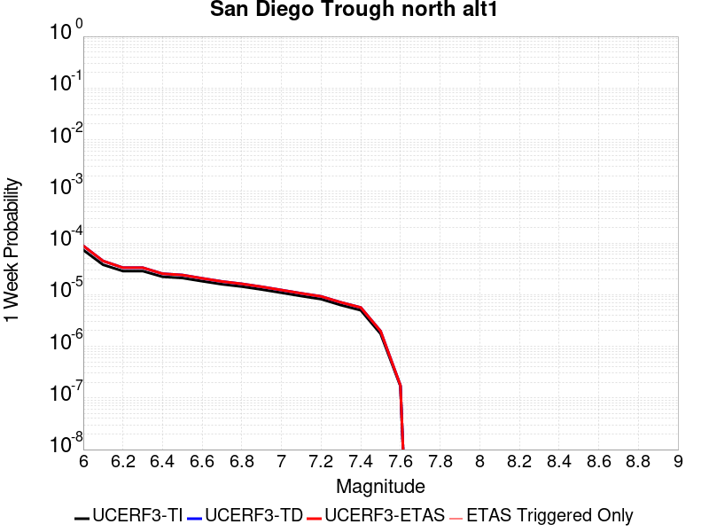 |  | 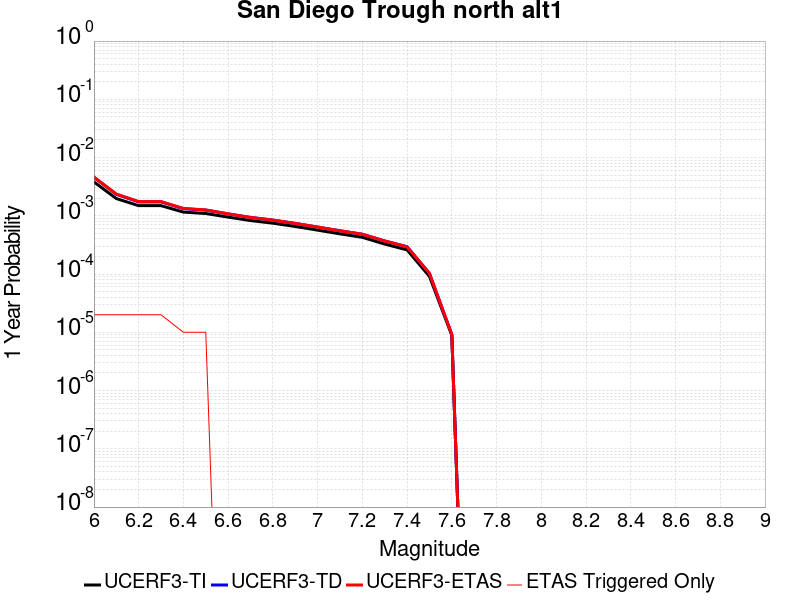 | 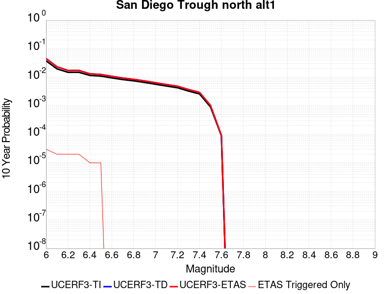 |

| Magnitude | 1 wk TI Prob | 1 wk TD Prob | 1 wk ETAS Prob | 1 wk ETAS/TD Gain | 1 wk ETAS Triggered Only | 1 mo TI Prob | 1 mo TD Prob | 1 mo ETAS Prob | 1 mo ETAS/TD Gain | 1 mo ETAS Triggered Only | 1 yr TI Prob | 1 yr TD Prob | 1 yr ETAS Prob | 1 yr ETAS/TD Gain | 1 yr ETAS Triggered Only | 10 yr TI Prob | 10 yr TD Prob | 10 yr ETAS Prob | 10 yr ETAS/TD Gain | 10 yr ETAS Triggered Only |
|-----|-----|-----|-----|-----|-----|-----|-----|-----|-----|-----|-----|-----|-----|-----|-----|-----|-----|-----|-----|-----|
| 6.0 | 7.329252E-5 | 8.821515E-5 | 8.821515E-5 | 1.0 | 0.0 | 3.14073E-4 | 3.780138E-4 | 3.780138E-4 | 1.0 | 0.0 | 0.0038171355 | 0.004593173 | 0.004613081 | 1.0043343 | 2.0E-5 | 0.03752231 | 0.04504633 | 0.045074977 | 1.000636 | 3.0E-5 |
| 6.1 | 3.7940346E-5 | 4.4886026E-5 | 4.4886026E-5 | 1.0 | 0.0 | 1.6259136E-4 | 1.9235504E-4 | 1.9235504E-4 | 1.0 | 0.0 | 0.0019777524 | 0.0023394884 | 0.0023594417 | 1.0085288 | 2.0E-5 | 0.019602431 | 0.023157293 | 0.02317683 | 1.0008436 | 2.0E-5 |
| 6.2 | 2.8645263E-5 | 3.3297452E-5 | 3.3297452E-5 | 1.0 | 0.0 | 1.2275964E-4 | 1.4269572E-4 | 1.4269572E-4 | 1.0 | 0.0 | 0.0014935739 | 0.0017359584 | 0.0017559237 | 1.011501 | 2.0E-5 | 0.0148357535 | 0.017226638 | 0.017246295 | 1.001141 | 2.0E-5 |
| 6.3 | 2.8645263E-5 | 3.3297452E-5 | 3.3297452E-5 | 1.0 | 0.0 | 1.2275964E-4 | 1.4269572E-4 | 1.4269572E-4 | 1.0 | 0.0 | 0.0014935739 | 0.0017359584 | 0.0017559237 | 1.011501 | 2.0E-5 | 0.0148357535 | 0.017226638 | 0.017246295 | 1.001141 | 2.0E-5 |
| 6.4 | 2.2204576E-5 | 2.5448819E-5 | 2.5448819E-5 | 1.0 | 0.0 | 9.5159E-5 | 1.0906186E-4 | 1.0906186E-4 | 1.0 | 0.0 | 0.001157945 | 0.0013270287 | 0.0013370155 | 1.0075257 | 1.0E-5 | 0.011519298 | 0.013192215 | 0.013202083 | 1.000748 | 1.0E-5 |
| 6.5 | 2.1004838E-5 | 2.402516E-5 | 2.402516E-5 | 1.0 | 0.0 | 9.0017624E-5 | 1.02960956E-4 | 1.02960956E-4 | 1.0 | 0.0 | 0.0010954136 | 0.0012528376 | 0.0012628251 | 1.0079719 | 1.0E-5 | 0.010900296 | 0.01245883 | 0.012468706 | 1.0007926 | 1.0E-5 |
| 6.6 | 1.820557E-5 | 2.070517E-5 | 2.070517E-5 | 1.0 | 0.0 | 7.802154E-5 | 8.873346E-5 | 8.873346E-5 | 1.0 | 0.0 | 9.4949827E-4 | 0.0010797998 | 0.0010797998 | 1.0 | 0.0 | 0.009454516 | 0.0107462015 | 0.0107462015 | 1.0 | 0.0 |
| 6.7 | 1.5884485E-5 | 1.7983964E-5 | 1.7983964E-5 | 1.0 | 0.0 | 6.807459E-5 | 7.707187E-5 | 7.707187E-5 | 1.0 | 0.0 | 8.284929E-4 | 9.379488E-4 | 9.379488E-4 | 1.0 | 0.0 | 0.008254109 | 0.009340268 | 0.009340268 | 1.0 | 0.0 |
| 6.8 | 1.4331171E-5 | 1.6201348E-5 | 1.6201348E-5 | 1.0 | 0.0 | 6.141786E-5 | 6.9432506E-5 | 6.9432506E-5 | 1.0 | 0.0 | 7.4750587E-4 | 8.4501493E-4 | 8.4501493E-4 | 1.0 | 0.0 | 0.0074499645 | 0.008418285 | 0.008418285 | 1.0 | 0.0 |
| 6.9 | 1.2574203E-5 | 1.4206081E-5 | 1.4206081E-5 | 1.0 | 0.0 | 5.3888325E-5 | 6.088179E-5 | 6.088179E-5 | 1.0 | 0.0 | 6.558929E-4 | 7.4098515E-4 | 7.4098515E-4 | 1.0 | 0.0 | 0.0065396037 | 0.0073853307 | 0.0073853307 | 1.0 | 0.0 |
| 7.0 | 1.0883844E-5 | 1.22894735E-5 | 1.22894735E-5 | 1.0 | 0.0 | 4.664421E-5 | 5.2668114E-5 | 5.2668114E-5 | 1.0 | 0.0 | 5.677453E-4 | 6.410466E-4 | 6.410466E-4 | 1.0 | 0.0 | 0.00566297 | 0.0063921027 | 0.0063921027 | 1.0 | 0.0 |
| 7.1 | 9.393088E-6 | 1.0607203E-5 | 1.0607203E-5 | 1.0 | 0.0 | 4.025547E-5 | 4.5458655E-5 | 4.5458655E-5 | 1.0 | 0.0 | 4.900001E-4 | 5.5331935E-4 | 5.5331935E-4 | 1.0 | 0.0 | 0.0048892107 | 0.005519513 | 0.005519513 | 1.0 | 0.0 |
| 7.2 | 8.190791E-6 | 9.258787E-6 | 9.258787E-6 | 1.0 | 0.0 | 3.510292E-5 | 3.9679915E-5 | 3.9679915E-5 | 1.0 | 0.0 | 4.2729423E-4 | 4.8299658E-4 | 4.8299658E-4 | 1.0 | 0.0 | 0.0042647356 | 0.004819548 | 0.004819548 | 1.0 | 0.0 |
| 7.3 | 6.268162E-6 | 7.08984E-6 | 7.08984E-6 | 1.0 | 0.0 | 2.6863276E-5 | 3.0384675E-5 | 3.0384675E-5 | 1.0 | 0.0 | 3.2701128E-4 | 3.6987104E-4 | 3.6987104E-4 | 1.0 | 0.0 | 0.003265305 | 0.0036926004 | 0.0036926004 | 1.0 | 0.0 |
| 7.4 | 4.985186E-6 | 5.6427807E-6 | 5.6427807E-6 | 1.0 | 0.0 | 2.1364907E-5 | 2.4183124E-5 | 2.4183124E-5 | 1.0 | 0.0 | 2.600867E-4 | 2.9439016E-4 | 2.9439016E-4 | 1.0 | 0.0 | 0.002597825 | 0.002940043 | 0.002940043 | 1.0 | 0.0 |
| 7.5 | 1.7489613E-6 | 1.9697113E-6 | 1.9697113E-6 | 1.0 | 0.0 | 7.495527E-6 | 8.441594E-6 | 8.441594E-6 | 1.0 | 0.0 | 9.125422E-5 | 1.0277178E-4 | 1.0277178E-4 | 1.0 | 0.0 | 9.1216754E-4 | 0.0010272645 | 0.0010272645 | 1.0 | 0.0 |
| 7.6 | 1.6988751E-7 | 1.7533898E-7 | 1.7533898E-7 | 1.0 | 0.0 | 7.2808916E-7 | 7.5145255E-7 | 7.5145255E-7 | 1.0 | 0.0 | 8.864449E-6 | 9.148898E-6 | 9.148898E-6 | 1.0 | 0.0 | 8.8640954E-5 | 9.148542E-5 | 9.148542E-5 | 1.0 | 0.0 |

## San Gorgonio Pass
*[(top)](#table-of-contents)*

| 1 Week | 1 Month | 1 Year | 10 Year |
|-----|-----|-----|-----|
|  |  |  |  |

| Magnitude | 1 wk TI Prob | 1 wk TD Prob | 1 wk ETAS Prob | 1 wk ETAS/TD Gain | 1 wk ETAS Triggered Only | 1 mo TI Prob | 1 mo TD Prob | 1 mo ETAS Prob | 1 mo ETAS/TD Gain | 1 mo ETAS Triggered Only | 1 yr TI Prob | 1 yr TD Prob | 1 yr ETAS Prob | 1 yr ETAS/TD Gain | 1 yr ETAS Triggered Only | 10 yr TI Prob | 10 yr TD Prob | 10 yr ETAS Prob | 10 yr ETAS/TD Gain | 10 yr ETAS Triggered Only |
|-----|-----|-----|-----|-----|-----|-----|-----|-----|-----|-----|-----|-----|-----|-----|-----|-----|-----|-----|-----|-----|
| 6.0 | 7.644328E-6 | 1.331688E-5 | 1.331688E-5 | 1.0 | 0.0 | 3.2760996E-5 | 5.707114E-5 | 5.707114E-5 | 1.0 | 0.0 | 3.987921E-4 | 6.946282E-4 | 7.146143E-4 | 1.0287724 | 2.0E-5 | 0.003980772 | 0.0069303154 | 0.0069601075 | 1.0042988 | 3.0E-5 |
| 6.1 | 7.644328E-6 | 1.331688E-5 | 1.331688E-5 | 1.0 | 0.0 | 3.2760996E-5 | 5.707114E-5 | 5.707114E-5 | 1.0 | 0.0 | 3.987921E-4 | 6.946282E-4 | 7.146143E-4 | 1.0287724 | 2.0E-5 | 0.003980772 | 0.0069303154 | 0.0069601075 | 1.0042988 | 3.0E-5 |
| 6.2 | 7.644328E-6 | 1.331688E-5 | 1.331688E-5 | 1.0 | 0.0 | 3.2760996E-5 | 5.707114E-5 | 5.707114E-5 | 1.0 | 0.0 | 3.987921E-4 | 6.946282E-4 | 7.146143E-4 | 1.0287724 | 2.0E-5 | 0.003980772 | 0.0069303154 | 0.0069601075 | 1.0042988 | 3.0E-5 |
| 6.3 | 7.644328E-6 | 1.331688E-5 | 1.331688E-5 | 1.0 | 0.0 | 3.2760996E-5 | 5.707114E-5 | 5.707114E-5 | 1.0 | 0.0 | 3.987921E-4 | 6.946282E-4 | 7.146143E-4 | 1.0287724 | 2.0E-5 | 0.003980772 | 0.0069303154 | 0.0069601075 | 1.0042988 | 3.0E-5 |
| 6.4 | 7.644328E-6 | 1.331688E-5 | 1.331688E-5 | 1.0 | 0.0 | 3.2760996E-5 | 5.707114E-5 | 5.707114E-5 | 1.0 | 0.0 | 3.987921E-4 | 6.946282E-4 | 7.146143E-4 | 1.0287724 | 2.0E-5 | 0.003980772 | 0.0069303154 | 0.0069601075 | 1.0042988 | 3.0E-5 |
| 6.5 | 7.644328E-6 | 1.331688E-5 | 1.331688E-5 | 1.0 | 0.0 | 3.2760996E-5 | 5.707114E-5 | 5.707114E-5 | 1.0 | 0.0 | 3.987921E-4 | 6.946282E-4 | 7.146143E-4 | 1.0287724 | 2.0E-5 | 0.003980772 | 0.0069303154 | 0.0069601075 | 1.0042988 | 3.0E-5 |
| 6.6 | 7.644328E-6 | 1.331688E-5 | 1.331688E-5 | 1.0 | 0.0 | 3.2760996E-5 | 5.707114E-5 | 5.707114E-5 | 1.0 | 0.0 | 3.987921E-4 | 6.946282E-4 | 7.146143E-4 | 1.0287724 | 2.0E-5 | 0.003980772 | 0.0069303154 | 0.0069601075 | 1.0042988 | 3.0E-5 |
| 6.7 | 6.987586E-6 | 1.2621148E-5 | 1.2621148E-5 | 1.0 | 0.0 | 2.9946454E-5 | 5.408956E-5 | 5.408956E-5 | 1.0 | 0.0 | 3.645371E-4 | 6.5834954E-4 | 6.7833636E-4 | 1.030359 | 2.0E-5 | 0.0036393967 | 0.0065696887 | 0.006589557 | 1.0030243 | 2.0E-5 |
| 6.8 | 6.987586E-6 | 1.2621148E-5 | 1.2621148E-5 | 1.0 | 0.0 | 2.9946454E-5 | 5.408956E-5 | 5.408956E-5 | 1.0 | 0.0 | 3.645371E-4 | 6.5834954E-4 | 6.7833636E-4 | 1.030359 | 2.0E-5 | 0.0036393967 | 0.0065696887 | 0.006589557 | 1.0030243 | 2.0E-5 |
| 6.9 | 5.504702E-6 | 1.10519995E-5 | 1.10519995E-5 | 1.0 | 0.0 | 2.3591367E-5 | 4.736488E-5 | 4.736488E-5 | 1.0 | 0.0 | 2.8718702E-4 | 5.7651993E-4 | 5.965084E-4 | 1.034671 | 2.0E-5 | 0.0028681618 | 0.005755635 | 0.00577552 | 1.0034548 | 2.0E-5 |
| 7.0 | 5.4825764E-6 | 1.102834E-5 | 1.102834E-5 | 1.0 | 0.0 | 2.3496545E-5 | 4.7263486E-5 | 4.7263486E-5 | 1.0 | 0.0 | 2.8603288E-4 | 5.752861E-4 | 5.952746E-4 | 1.0347453 | 2.0E-5 | 0.00285665 | 0.0057433606 | 0.0057632457 | 1.0034623 | 2.0E-5 |
| 7.1 | 5.4692787E-6 | 1.101405E-5 | 1.101405E-5 | 1.0 | 0.0 | 2.3439556E-5 | 4.7202248E-5 | 4.7202248E-5 | 1.0 | 0.0 | 2.8533922E-4 | 5.7454087E-4 | 5.945294E-4 | 1.0347904 | 2.0E-5 | 0.0028497311 | 0.0057359473 | 0.0057558324 | 1.0034667 | 2.0E-5 |
| 7.2 | 5.453661E-6 | 1.0997076E-5 | 1.0997076E-5 | 1.0 | 0.0 | 2.3372622E-5 | 4.7129506E-5 | 4.7129506E-5 | 1.0 | 0.0 | 2.8452452E-4 | 5.736557E-4 | 5.936442E-4 | 1.0348442 | 2.0E-5 | 0.002841605 | 0.005727141 | 0.0057470268 | 1.0034721 | 2.0E-5 |
| 7.3 | 5.4422303E-6 | 1.0983999E-5 | 1.0983999E-5 | 1.0 | 0.0 | 2.3323635E-5 | 4.707346E-5 | 4.707346E-5 | 1.0 | 0.0 | 2.8392827E-4 | 5.7297375E-4 | 5.9296226E-4 | 1.0348856 | 2.0E-5 | 0.0028356577 | 0.0057203565 | 0.005740242 | 1.0034763 | 2.0E-5 |
| 7.4 | 5.398595E-6 | 1.0931362E-5 | 1.0931362E-5 | 1.0 | 0.0 | 2.313663E-5 | 4.6847883E-5 | 4.6847883E-5 | 1.0 | 0.0 | 2.8165206E-4 | 5.702288E-4 | 5.9021736E-4 | 1.0350536 | 2.0E-5 | 0.0028129534 | 0.005693048 | 0.0057129343 | 1.0034931 | 2.0E-5 |
| 7.5 | 5.3578788E-6 | 1.08579015E-5 | 1.08579015E-5 | 1.0 | 0.0 | 2.2962136E-5 | 4.6533063E-5 | 4.6533063E-5 | 1.0 | 0.0 | 2.7952815E-4 | 5.6639785E-4 | 5.7639217E-4 | 1.0176455 | 1.0E-5 | 0.002791768 | 0.0056549674 | 0.0056649107 | 1.0017583 | 1.0E-5 |
| 7.6 | 4.8091474E-6 | 9.606129E-6 | 9.606129E-6 | 1.0 | 0.0 | 2.0610469E-5 | 4.1168503E-5 | 4.1168503E-5 | 1.0 | 0.0 | 2.5090357E-4 | 5.011161E-4 | 5.1111105E-4 | 1.0199455 | 1.0E-5 | 0.0025062046 | 0.0050056274 | 0.005015577 | 1.0019877 | 1.0E-5 |
| 7.7 | 1.5991155E-6 | 3.354115E-6 | 3.354115E-6 | 1.0 | 0.0 | 6.853334E-6 | 1.4374701E-5 | 1.4374701E-5 | 1.0 | 0.0 | 8.343615E-5 | 1.7499819E-4 | 1.8499643E-4 | 1.0571334 | 1.0E-5 | 8.340483E-4 | 0.0017538586 | 0.001763841 | 1.0056918 | 1.0E-5 |
| 7.8 | 9.258398E-7 | 2.0589173E-6 | 2.0589173E-6 | 1.0 | 0.0 | 3.967879E-6 | 8.823902E-6 | 8.823902E-6 | 1.0 | 0.0 | 4.8307855E-5 | 1.0742573E-4 | 1.1742466E-4 | 1.0930775 | 1.0E-5 | 4.8297356E-4 | 0.001078967 | 0.0010889563 | 1.0092582 | 1.0E-5 |
| 7.9 | 5.975575E-7 | 1.2298265E-6 | 1.2298265E-6 | 1.0 | 0.0 | 2.5609581E-6 | 5.2706746E-6 | 5.2706746E-6 | 1.0 | 0.0 | 3.117922E-5 | 6.4168584E-5 | 7.416794E-5 | 1.1558295 | 1.0E-5 | 3.1174847E-4 | 6.4654916E-4 | 6.5654266E-4 | 1.0154567 | 1.0E-5 |
| 8.0 | 3.4413725E-7 | 6.718678E-7 | 6.718678E-7 | 1.0 | 0.0 | 1.4748731E-6 | 2.8794302E-6 | 2.8794302E-6 | 1.0 | 0.0 | 1.7956432E-5 | 3.5056506E-5 | 4.5056153E-5 | 1.2852437 | 1.0E-5 | 1.7954981E-4 | 3.538627E-4 | 3.6385914E-4 | 1.0282495 | 1.0E-5 |
| 8.1 | 1.1787731E-8 | 9.641519E-9 | 9.641519E-9 | 1.0 | 0.0 | 5.0518846E-8 | 4.1320796E-8 | 4.1320796E-8 | 1.0 | 0.0 | 6.1506677E-7 | 5.0308057E-7 | 5.0308057E-7 | 1.0 | 0.0 | 6.1506507E-6 | 5.2474043E-6 | 5.2474043E-6 | 1.0 | 0.0 |

## Bullion Mountains
*[(top)](#table-of-contents)*

| 1 Week | 1 Month | 1 Year | 10 Year |
|-----|-----|-----|-----|
|  |  |  | 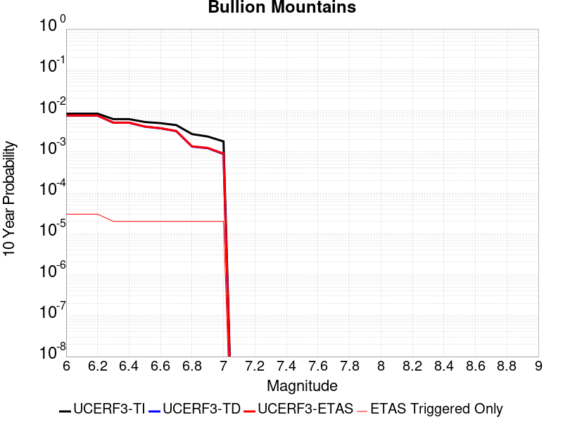 |

| Magnitude | 1 wk TI Prob | 1 wk TD Prob | 1 wk ETAS Prob | 1 wk ETAS/TD Gain | 1 wk ETAS Triggered Only | 1 mo TI Prob | 1 mo TD Prob | 1 mo ETAS Prob | 1 mo ETAS/TD Gain | 1 mo ETAS Triggered Only | 1 yr TI Prob | 1 yr TD Prob | 1 yr ETAS Prob | 1 yr ETAS/TD Gain | 1 yr ETAS Triggered Only | 10 yr TI Prob | 10 yr TD Prob | 10 yr ETAS Prob | 10 yr ETAS/TD Gain | 10 yr ETAS Triggered Only |
|-----|-----|-----|-----|-----|-----|-----|-----|-----|-----|-----|-----|-----|-----|-----|-----|-----|-----|-----|-----|-----|
| 6.0 | 1.6420427E-5 | 1.4692201E-5 | 1.4692201E-5 | 1.0 | 0.0 | 7.037136E-5 | 6.296527E-5 | 7.296464E-5 | 1.1588078 | 1.0E-5 | 8.5643446E-4 | 7.6637097E-4 | 7.763633E-4 | 1.0130385 | 1.0E-5 | 0.008531413 | 0.0076410742 | 0.007670845 | 1.0038961 | 3.0E-5 |
| 6.1 | 1.6420427E-5 | 1.4692201E-5 | 1.4692201E-5 | 1.0 | 0.0 | 7.037136E-5 | 6.296527E-5 | 7.296464E-5 | 1.1588078 | 1.0E-5 | 8.5643446E-4 | 7.6637097E-4 | 7.763633E-4 | 1.0130385 | 1.0E-5 | 0.008531413 | 0.0076410742 | 0.007670845 | 1.0038961 | 3.0E-5 |
| 6.2 | 1.6420427E-5 | 1.4692201E-5 | 1.4692201E-5 | 1.0 | 0.0 | 7.037136E-5 | 6.296527E-5 | 7.296464E-5 | 1.1588078 | 1.0E-5 | 8.5643446E-4 | 7.6637097E-4 | 7.763633E-4 | 1.0130385 | 1.0E-5 | 0.008531413 | 0.0076410742 | 0.007670845 | 1.0038961 | 3.0E-5 |
| 6.3 | 1.2046778E-5 | 9.8623805E-6 | 9.8623805E-6 | 1.0 | 0.0 | 5.1628023E-5 | 4.226679E-5 | 5.226637E-5 | 1.2365824 | 1.0E-5 | 6.283899E-4 | 5.1449984E-4 | 5.244947E-4 | 1.0194263 | 1.0E-5 | 0.0062661595 | 0.0051353686 | 0.005155266 | 1.0038745 | 2.0E-5 |
| 6.4 | 1.2046778E-5 | 9.8623805E-6 | 9.8623805E-6 | 1.0 | 0.0 | 5.1628023E-5 | 4.226679E-5 | 5.226637E-5 | 1.2365824 | 1.0E-5 | 6.283899E-4 | 5.1449984E-4 | 5.244947E-4 | 1.0194263 | 1.0E-5 | 0.0062661595 | 0.0051353686 | 0.005155266 | 1.0038745 | 2.0E-5 |
| 6.5 | 1.0244343E-5 | 7.879477E-6 | 7.879477E-6 | 1.0 | 0.0 | 4.390359E-5 | 3.376887E-5 | 4.376853E-5 | 1.2961208 | 1.0E-5 | 5.343951E-4 | 4.110791E-4 | 4.2107498E-4 | 1.0243162 | 1.0E-5 | 0.005331118 | 0.0041052178 | 0.004125136 | 1.0048518 | 2.0E-5 |
| 6.6 | 9.605408E-6 | 7.177506E-6 | 7.177506E-6 | 1.0 | 0.0 | 4.1165385E-5 | 3.0760493E-5 | 4.0760184E-5 | 1.3250823 | 1.0E-5 | 5.010733E-4 | 3.74465E-4 | 3.8446125E-4 | 1.0266948 | 1.0E-5 | 0.00499945 | 0.0037403372 | 0.0037602624 | 1.0053271 | 2.0E-5 |
| 6.7 | 8.60418E-6 | 6.124001E-6 | 6.124001E-6 | 1.0 | 0.0 | 3.687454E-5 | 2.6245565E-5 | 3.6245303E-5 | 1.3810067 | 1.0E-5 | 4.48855E-4 | 3.1951242E-4 | 3.295092E-4 | 1.0312877 | 1.0E-5 | 0.004479495 | 0.0031924422 | 0.0032123784 | 1.0062448 | 2.0E-5 |
| 6.8 | 5.187994E-6 | 2.5631452E-6 | 2.5631452E-6 | 1.0 | 0.0 | 2.223407E-5 | 1.0984884E-5 | 2.0984775E-5 | 1.9103318 | 1.0E-5 | 2.7066618E-4 | 1.3373674E-4 | 1.4373541E-4 | 1.0747638 | 1.0E-5 | 0.0027033675 | 0.0013369543 | 0.0013569276 | 1.0149394 | 2.0E-5 |
| 6.9 | 4.5302368E-6 | 2.344301E-6 | 2.344301E-6 | 1.0 | 0.0 | 1.9415156E-5 | 1.0046988E-5 | 2.0046888E-5 | 1.9953132 | 1.0E-5 | 2.3635388E-4 | 1.2231918E-4 | 1.3231796E-4 | 1.0817434 | 1.0E-5 | 0.0023610266 | 0.0012229076 | 0.0012428832 | 1.0163344 | 2.0E-5 |
| 7.0 | 3.431668E-6 | 1.688219E-6 | 1.688219E-6 | 1.0 | 0.0 | 1.4707065E-5 | 7.235224E-6 | 1.7235152E-5 | 2.3821173 | 1.0E-5 | 1.7904381E-4 | 8.8088855E-5 | 9.808797E-5 | 1.1135117 | 1.0E-5 | 0.0017889962 | 8.8088855E-4 | 9.0087095E-4 | 1.0226843 | 2.0E-5 |

## San Luis Range 2011 CFM
*[(top)](#table-of-contents)*

| 1 Week | 1 Month | 1 Year | 10 Year |
|-----|-----|-----|-----|
|  |  |  |  |

| Magnitude | 1 wk TI Prob | 1 wk TD Prob | 1 wk ETAS Prob | 1 wk ETAS/TD Gain | 1 wk ETAS Triggered Only | 1 mo TI Prob | 1 mo TD Prob | 1 mo ETAS Prob | 1 mo ETAS/TD Gain | 1 mo ETAS Triggered Only | 1 yr TI Prob | 1 yr TD Prob | 1 yr ETAS Prob | 1 yr ETAS/TD Gain | 1 yr ETAS Triggered Only | 10 yr TI Prob | 10 yr TD Prob | 10 yr ETAS Prob | 10 yr ETAS/TD Gain | 10 yr ETAS Triggered Only |
|-----|-----|-----|-----|-----|-----|-----|-----|-----|-----|-----|-----|-----|-----|-----|-----|-----|-----|-----|-----|-----|
| 6.0 | 8.8368415E-6 | 8.965478E-6 | 8.965478E-6 | 1.0 | 0.0 | 3.787163E-5 | 3.8422957E-5 | 3.8422957E-5 | 1.0 | 0.0 | 4.609895E-4 | 4.6770697E-4 | 4.777023E-4 | 1.0213709 | 1.0E-5 | 0.0046003438 | 0.004668009 | 0.004697869 | 1.0063968 | 3.0E-5 |
| 6.1 | 8.8368415E-6 | 8.965478E-6 | 8.965478E-6 | 1.0 | 0.0 | 3.787163E-5 | 3.8422957E-5 | 3.8422957E-5 | 1.0 | 0.0 | 4.609895E-4 | 4.6770697E-4 | 4.777023E-4 | 1.0213709 | 1.0E-5 | 0.0046003438 | 0.004668009 | 0.004697869 | 1.0063968 | 3.0E-5 |
| 6.2 | 8.8368415E-6 | 8.965478E-6 | 8.965478E-6 | 1.0 | 0.0 | 3.787163E-5 | 3.8422957E-5 | 3.8422957E-5 | 1.0 | 0.0 | 4.609895E-4 | 4.6770697E-4 | 4.777023E-4 | 1.0213709 | 1.0E-5 | 0.0046003438 | 0.004668009 | 0.004697869 | 1.0063968 | 3.0E-5 |
| 6.3 | 8.8368415E-6 | 8.965478E-6 | 8.965478E-6 | 1.0 | 0.0 | 3.787163E-5 | 3.8422957E-5 | 3.8422957E-5 | 1.0 | 0.0 | 4.609895E-4 | 4.6770697E-4 | 4.777023E-4 | 1.0213709 | 1.0E-5 | 0.0046003438 | 0.004668009 | 0.004697869 | 1.0063968 | 3.0E-5 |
| 6.4 | 3.9094193E-6 | 3.941214E-6 | 3.941214E-6 | 1.0 | 0.0 | 1.6754546E-5 | 1.689081E-5 | 1.689081E-5 | 1.0 | 0.0 | 2.039675E-4 | 2.0562648E-4 | 2.0562648E-4 | 1.0 | 0.0 | 0.0020378039 | 0.002054391 | 0.0020643706 | 1.0048577 | 1.0E-5 |
| 6.5 | 3.9094193E-6 | 3.941214E-6 | 3.941214E-6 | 1.0 | 0.0 | 1.6754546E-5 | 1.689081E-5 | 1.689081E-5 | 1.0 | 0.0 | 2.039675E-4 | 2.0562648E-4 | 2.0562648E-4 | 1.0 | 0.0 | 0.0020378039 | 0.002054391 | 0.0020643706 | 1.0048577 | 1.0E-5 |
| 6.6 | 3.0587726E-6 | 3.0753974E-6 | 3.0753974E-6 | 1.0 | 0.0 | 1.3108959E-5 | 1.3180209E-5 | 1.3180209E-5 | 1.0 | 0.0 | 1.595899E-4 | 1.6045735E-4 | 1.6045735E-4 | 1.0 | 0.0 | 0.0015947534 | 0.0016034269 | 0.0016134109 | 1.0062267 | 1.0E-5 |
| 6.7 | 2.6160574E-6 | 2.6251355E-6 | 2.6251355E-6 | 1.0 | 0.0 | 1.1211626E-5 | 1.1250533E-5 | 1.1250533E-5 | 1.0 | 0.0 | 1.3649299E-4 | 1.3696669E-4 | 1.3696669E-4 | 1.0 | 0.0 | 0.0013640919 | 0.0013688289 | 0.0013788152 | 1.0072955 | 1.0E-5 |
| 6.8 | 2.5110312E-6 | 2.5181482E-6 | 2.5181482E-6 | 1.0 | 0.0 | 1.0761518E-5 | 1.079202E-5 | 1.079202E-5 | 1.0 | 0.0 | 1.310136E-4 | 1.3138496E-4 | 1.3138496E-4 | 1.0 | 0.0 | 0.0013093639 | 0.0013130788 | 0.0013230657 | 1.0076057 | 1.0E-5 |
| 6.9 | 1.8564405E-6 | 1.8524935E-6 | 1.8524935E-6 | 1.0 | 0.0 | 7.95615E-6 | 7.939234E-6 | 7.939234E-6 | 1.0 | 0.0 | 9.686181E-5 | 9.66559E-5 | 9.66559E-5 | 1.0 | 0.0 | 9.68196E-4 | 9.6614065E-4 | 9.6614065E-4 | 1.0 | 0.0 |
| 7.0 | 1.546127E-6 | 1.5369595E-6 | 1.5369595E-6 | 1.0 | 0.0 | 6.626242E-6 | 6.586953E-6 | 6.586953E-6 | 1.0 | 0.0 | 8.06715E-5 | 8.0193204E-5 | 8.0193204E-5 | 1.0 | 0.0 | 8.0642226E-4 | 8.016434E-4 | 8.016434E-4 | 1.0 | 0.0 |
| 7.1 | 1.3368208E-6 | 1.3235378E-6 | 1.3235378E-6 | 1.0 | 0.0 | 5.7292195E-6 | 5.672293E-6 | 5.672293E-6 | 1.0 | 0.0 | 6.975101E-5 | 6.905798E-5 | 6.905798E-5 | 1.0 | 0.0 | 6.972912E-4 | 6.903657E-4 | 6.903657E-4 | 1.0 | 0.0 |
| 7.2 | 1.0623363E-6 | 1.0454412E-6 | 1.0454412E-6 | 1.0 | 0.0 | 4.5528623E-6 | 4.4804547E-6 | 4.4804547E-6 | 1.0 | 0.0 | 5.5429686E-5 | 5.4548174E-5 | 5.4548174E-5 | 1.0 | 0.0 | 5.5415864E-4 | 5.453481E-4 | 5.453481E-4 | 1.0 | 0.0 |
| 7.3 | 7.831679E-7 | 7.7274274E-7 | 7.7274274E-7 | 1.0 | 0.0 | 3.3564295E-6 | 3.3117506E-6 | 3.3117506E-6 | 1.0 | 0.0 | 4.086376E-5 | 4.0319817E-5 | 4.0319817E-5 | 1.0 | 0.0 | 4.0856248E-4 | 4.0312516E-4 | 4.0312516E-4 | 1.0 | 0.0 |
| 7.4 | 5.9558846E-7 | 5.9106696E-7 | 5.9106696E-7 | 1.0 | 0.0 | 2.5525194E-6 | 2.5331417E-6 | 2.5331417E-6 | 1.0 | 0.0 | 3.107648E-5 | 3.0840565E-5 | 3.0840565E-5 | 1.0 | 0.0 | 3.1072134E-4 | 3.083629E-4 | 3.083629E-4 | 1.0 | 0.0 |
| 7.5 | 4.1616502E-7 | 4.1196597E-7 | 4.1196597E-7 | 1.0 | 0.0 | 1.7835631E-6 | 1.7655673E-6 | 1.7655673E-6 | 1.0 | 0.0 | 2.1714664E-5 | 2.1495569E-5 | 2.1495569E-5 | 1.0 | 0.0 | 2.1712543E-4 | 2.1493496E-4 | 2.1493496E-4 | 1.0 | 0.0 |
| 7.6 | 2.3816014E-7 | 2.3376762E-7 | 2.3376762E-7 | 1.0 | 0.0 | 1.0206859E-6 | 1.0018608E-6 | 1.0018608E-6 | 1.0 | 0.0 | 1.242678E-5 | 1.2197587E-5 | 1.2197587E-5 | 1.0 | 0.0 | 1.2426086E-4 | 1.219692E-4 | 1.219692E-4 | 1.0 | 0.0 |
| 7.7 | 9.918777E-8 | 9.386922E-8 | 9.386922E-8 | 1.0 | 0.0 | 4.2509038E-7 | 4.0229656E-7 | 4.0229656E-7 | 1.0 | 0.0 | 5.1754632E-6 | 4.8979496E-6 | 4.8979496E-6 | 1.0 | 0.0 | 5.1753424E-5 | 4.897842E-5 | 4.897842E-5 | 1.0 | 0.0 |
| 7.8 | 3.4982556E-8 | 2.9687648E-8 | 2.9687648E-8 | 1.0 | 0.0 | 1.4992524E-7 | 1.2723277E-7 | 1.2723277E-7 | 1.0 | 0.0 | 1.8253382E-6 | 1.5490579E-6 | 1.5490579E-6 | 1.0 | 0.0 | 1.8253233E-5 | 1.5490472E-5 | 1.5490472E-5 | 1.0 | 0.0 |
| 7.9 | 1.6624908E-8 | 1.147785E-8 | 1.147785E-8 | 1.0 | 0.0 | 7.12496E-8 | 4.9190785E-8 | 4.9190785E-8 | 1.0 | 0.0 | 8.6746354E-7 | 5.9889766E-7 | 5.9889766E-7 | 1.0 | 0.0 | 8.674601E-6 | 5.9889603E-6 | 5.9889603E-6 | 1.0 | 0.0 |
| 8.0 | 6.3352315E-9 | 3.0891683E-9 | 3.0891683E-9 | 1.0 | 0.0 | 2.715099E-8 | 1.3239292E-8 | 1.3239292E-8 | 1.0 | 0.0 | 3.3056327E-7 | 1.6118838E-7 | 1.6118838E-7 | 1.0 | 0.0 | 3.3056278E-6 | 1.6118827E-6 | 1.6118827E-6 | 1.0 | 0.0 |

## Big Pine (Central)
*[(top)](#table-of-contents)*

| 1 Week | 1 Month | 1 Year | 10 Year |
|-----|-----|-----|-----|
|  | 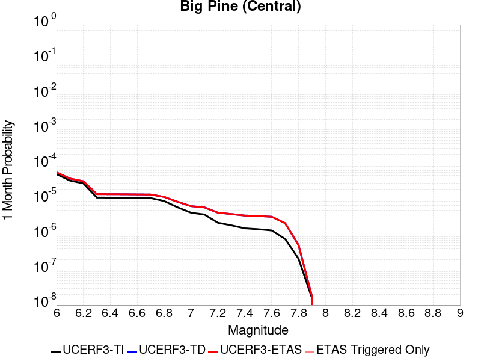 |  |  |

| Magnitude | 1 wk TI Prob | 1 wk TD Prob | 1 wk ETAS Prob | 1 wk ETAS/TD Gain | 1 wk ETAS Triggered Only | 1 mo TI Prob | 1 mo TD Prob | 1 mo ETAS Prob | 1 mo ETAS/TD Gain | 1 mo ETAS Triggered Only | 1 yr TI Prob | 1 yr TD Prob | 1 yr ETAS Prob | 1 yr ETAS/TD Gain | 1 yr ETAS Triggered Only | 10 yr TI Prob | 10 yr TD Prob | 10 yr ETAS Prob | 10 yr ETAS/TD Gain | 10 yr ETAS Triggered Only |
|-----|-----|-----|-----|-----|-----|-----|-----|-----|-----|-----|-----|-----|-----|-----|-----|-----|-----|-----|-----|-----|
| 6.0 | 1.2706755E-5 | 1.4251083E-5 | 1.4251083E-5 | 1.0 | 0.0 | 5.4456385E-5 | 6.107485E-5 | 6.107485E-5 | 1.0 | 0.0 | 6.628048E-4 | 7.433691E-4 | 7.533617E-4 | 1.0134423 | 1.0E-5 | 0.006608314 | 0.0074138264 | 0.007443604 | 1.0040165 | 3.0E-5 |
| 6.1 | 8.342579E-6 | 9.511262E-6 | 9.511262E-6 | 1.0 | 0.0 | 3.5753423E-5 | 4.0762035E-5 | 4.0762035E-5 | 1.0 | 0.0 | 4.3521097E-4 | 4.961865E-4 | 4.961865E-4 | 1.0 | 0.0 | 0.0043435963 | 0.004954315 | 0.004964265 | 1.0020084 | 1.0E-5 |
| 6.2 | 6.923899E-6 | 7.967629E-6 | 7.967629E-6 | 1.0 | 0.0 | 2.9673516E-5 | 3.4146644E-5 | 3.4146644E-5 | 1.0 | 0.0 | 3.6121515E-4 | 4.1567534E-4 | 4.1567534E-4 | 1.0 | 0.0 | 0.003606286 | 0.00415226 | 0.00415226 | 1.0 | 0.0 |
| 6.3 | 2.728396E-6 | 3.4247232E-6 | 3.4247232E-6 | 1.0 | 0.0 | 1.1693074E-5 | 1.4677307E-5 | 1.4677307E-5 | 1.0 | 0.0 | 1.4235388E-4 | 1.7868243E-4 | 1.7868243E-4 | 1.0 | 0.0 | 0.0014226272 | 0.001786868 | 0.001786868 | 1.0 | 0.0 |
| 6.4 | 2.7136944E-6 | 3.4090162E-6 | 3.4090162E-6 | 1.0 | 0.0 | 1.1630066E-5 | 1.4609993E-5 | 1.4609993E-5 | 1.0 | 0.0 | 1.4158686E-4 | 1.7786301E-4 | 1.7786301E-4 | 1.0 | 0.0 | 0.0014149669 | 0.001778687 | 0.001778687 | 1.0 | 0.0 |
| 6.5 | 2.6971882E-6 | 3.3913614E-6 | 3.3913614E-6 | 1.0 | 0.0 | 1.1559327E-5 | 1.4534329E-5 | 1.4534329E-5 | 1.0 | 0.0 | 1.4072572E-4 | 1.7694196E-4 | 1.7694196E-4 | 1.0 | 0.0 | 0.0014063664 | 0.0017694911 | 0.0017694911 | 1.0 | 0.0 |
| 6.6 | 2.669092E-6 | 3.3613815E-6 | 3.3613815E-6 | 1.0 | 0.0 | 1.1438916E-5 | 1.4405846E-5 | 1.4405846E-5 | 1.0 | 0.0 | 1.3925991E-4 | 1.7537792E-4 | 1.7537792E-4 | 1.0 | 0.0 | 0.0013917267 | 0.0017538755 | 0.0017538755 | 1.0 | 0.0 |
| 6.7 | 2.6408059E-6 | 3.3314068E-6 | 3.3314068E-6 | 1.0 | 0.0 | 1.1317691E-5 | 1.4277384E-5 | 1.4277384E-5 | 1.0 | 0.0 | 1.3778417E-4 | 1.7381416E-4 | 1.7381416E-4 | 1.0 | 0.0 | 0.0013769877 | 0.0017382624 | 0.0017382624 | 1.0 | 0.0 |
| 6.8 | 2.1786943E-6 | 2.8548623E-6 | 2.8548623E-6 | 1.0 | 0.0 | 9.337228E-6 | 1.223507E-5 | 1.223507E-5 | 1.0 | 0.0 | 1.1367482E-4 | 1.4895253E-4 | 1.4895253E-4 | 1.0 | 0.0 | 0.0011361669 | 0.0014899937 | 0.0014899937 | 1.0 | 0.0 |
| 6.9 | 1.4411696E-6 | 2.0689088E-6 | 2.0689088E-6 | 1.0 | 0.0 | 6.1764263E-6 | 8.866724E-6 | 8.866724E-6 | 1.0 | 0.0 | 7.51954E-5 | 1.07947286E-4 | 1.07947286E-4 | 1.0 | 0.0 | 7.5169955E-4 | 0.0010803706 | 0.0010803706 | 1.0 | 0.0 |
| 7.0 | 1.0073411E-6 | 1.5546336E-6 | 1.5546336E-6 | 1.0 | 0.0 | 4.317169E-6 | 6.662699E-6 | 6.662699E-6 | 1.0 | 0.0 | 5.2560266E-5 | 8.11155E-5 | 8.11155E-5 | 1.0 | 0.0 | 5.2547833E-4 | 8.1226975E-4 | 8.1226975E-4 | 1.0 | 0.0 |
| 7.1 | 8.947104E-7 | 1.4306167E-6 | 1.4306167E-6 | 1.0 | 0.0 | 3.834468E-6 | 6.1312007E-6 | 6.1312007E-6 | 1.0 | 0.0 | 4.6683643E-5 | 7.4644966E-5 | 7.4644966E-5 | 1.0 | 0.0 | 4.6673836E-4 | 7.4760953E-4 | 7.4760953E-4 | 1.0 | 0.0 |
| 7.2 | 5.215166E-7 | 1.0115094E-6 | 1.0115094E-6 | 1.0 | 0.0 | 2.2350691E-6 | 4.3350337E-6 | 4.3350337E-6 | 1.0 | 0.0 | 2.7211627E-5 | 5.27778E-5 | 5.27778E-5 | 1.0 | 0.0 | 2.7208295E-4 | 5.2905316E-4 | 5.2905316E-4 | 1.0 | 0.0 |
| 7.3 | 4.4024807E-7 | 9.2229175E-7 | 9.2229175E-7 | 1.0 | 0.0 | 1.8867761E-6 | 3.952673E-6 | 3.952673E-6 | 1.0 | 0.0 | 2.2971257E-5 | 4.8122773E-5 | 4.8122773E-5 | 1.0 | 0.0 | 2.2968883E-4 | 4.8252378E-4 | 4.8252378E-4 | 1.0 | 0.0 |
| 7.4 | 3.6130905E-7 | 8.3617664E-7 | 8.3617664E-7 | 1.0 | 0.0 | 1.5484665E-6 | 3.5836094E-6 | 3.5836094E-6 | 1.0 | 0.0 | 1.8852415E-5 | 4.362961E-5 | 4.362961E-5 | 1.0 | 0.0 | 1.8850817E-4 | 4.3760161E-4 | 4.3760161E-4 | 1.0 | 0.0 |
| 7.5 | 3.408184E-7 | 8.111325E-7 | 8.111325E-7 | 1.0 | 0.0 | 1.4606494E-6 | 3.4762777E-6 | 3.4762777E-6 | 1.0 | 0.0 | 1.7783263E-5 | 4.2322896E-5 | 4.2322896E-5 | 1.0 | 0.0 | 1.778184E-4 | 4.2451447E-4 | 4.2451447E-4 | 1.0 | 0.0 |
| 7.6 | 3.1428627E-7 | 7.734672E-7 | 7.734672E-7 | 1.0 | 0.0 | 1.3469405E-6 | 3.3148556E-6 | 3.3148556E-6 | 1.0 | 0.0 | 1.6398877E-5 | 4.0357656E-5 | 4.0357656E-5 | 1.0 | 0.0 | 1.6397667E-4 | 4.0484127E-4 | 4.0484127E-4 | 1.0 | 0.0 |
| 7.7 | 1.7972785E-7 | 5.0801975E-7 | 5.0801975E-7 | 1.0 | 0.0 | 7.70262E-7 | 2.1772257E-6 | 2.1772257E-6 | 1.0 | 0.0 | 9.377899E-6 | 2.650741E-5 | 2.650741E-5 | 1.0 | 0.0 | 9.377503E-5 | 2.6640965E-4 | 2.6640965E-4 | 1.0 | 0.0 |
| 7.8 | 4.9230927E-8 | 1.1986405E-7 | 1.1986405E-7 | 1.0 | 0.0 | 2.1098968E-7 | 5.13703E-7 | 5.13703E-7 | 1.0 | 0.0 | 2.5687964E-6 | 6.2543177E-6 | 6.2543177E-6 | 1.0 | 0.0 | 2.5687666E-5 | 6.29837E-5 | 6.29837E-5 | 1.0 | 0.0 |
| 7.9 | 3.6805972E-9 | 4.1069246E-9 | 4.1069246E-9 | 1.0 | 0.0 | 1.5773987E-8 | 1.7601105E-8 | 1.7601105E-8 | 1.0 | 0.0 | 1.9204828E-7 | 2.1429342E-7 | 2.1429342E-7 | 1.0 | 0.0 | 1.920481E-6 | 2.1908222E-6 | 2.1908222E-6 | 1.0 | 0.0 |

## Kern Canyon (Lake Isabella) 2011
*[(top)](#table-of-contents)*

| 1 Week | 1 Month | 1 Year | 10 Year |
|-----|-----|-----|-----|
| 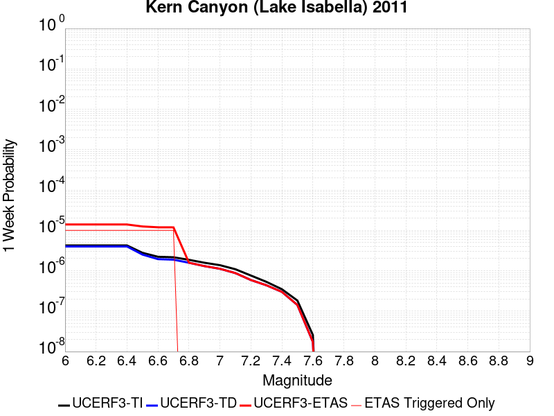 |  |  | 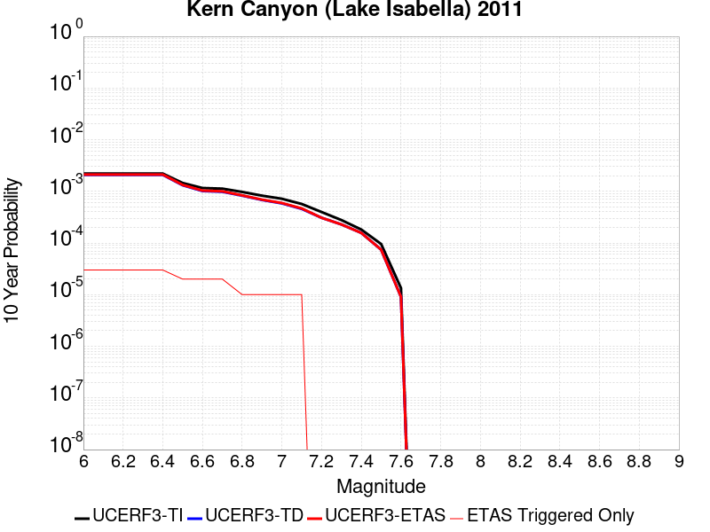 |

| Magnitude | 1 wk TI Prob | 1 wk TD Prob | 1 wk ETAS Prob | 1 wk ETAS/TD Gain | 1 wk ETAS Triggered Only | 1 mo TI Prob | 1 mo TD Prob | 1 mo ETAS Prob | 1 mo ETAS/TD Gain | 1 mo ETAS Triggered Only | 1 yr TI Prob | 1 yr TD Prob | 1 yr ETAS Prob | 1 yr ETAS/TD Gain | 1 yr ETAS Triggered Only | 10 yr TI Prob | 10 yr TD Prob | 10 yr ETAS Prob | 10 yr ETAS/TD Gain | 10 yr ETAS Triggered Only |
|-----|-----|-----|-----|-----|-----|-----|-----|-----|-----|-----|-----|-----|-----|-----|-----|-----|-----|-----|-----|-----|
| 6.0 | 4.2387383E-6 | 4.001647E-6 | 1.4001607E-5 | 3.498961 | 1.0E-5 | 1.8165894E-5 | 1.7149814E-5 | 2.7149643E-5 | 1.5830867 | 1.0E-5 | 2.2114732E-4 | 2.0878084E-4 | 2.1877875E-4 | 1.0478871 | 1.0E-5 | 0.0022092736 | 0.0020860308 | 0.0021159681 | 1.0143514 | 3.0E-5 |
| 6.1 | 4.2387383E-6 | 4.001647E-6 | 1.4001607E-5 | 3.498961 | 1.0E-5 | 1.8165894E-5 | 1.7149814E-5 | 2.7149643E-5 | 1.5830867 | 1.0E-5 | 2.2114732E-4 | 2.0878084E-4 | 2.1877875E-4 | 1.0478871 | 1.0E-5 | 0.0022092736 | 0.0020860308 | 0.0021159681 | 1.0143514 | 3.0E-5 |
| 6.2 | 4.2387383E-6 | 4.001647E-6 | 1.4001607E-5 | 3.498961 | 1.0E-5 | 1.8165894E-5 | 1.7149814E-5 | 2.7149643E-5 | 1.5830867 | 1.0E-5 | 2.2114732E-4 | 2.0878084E-4 | 2.1877875E-4 | 1.0478871 | 1.0E-5 | 0.0022092736 | 0.0020860308 | 0.0021159681 | 1.0143514 | 3.0E-5 |
| 6.3 | 4.2387383E-6 | 4.001647E-6 | 1.4001607E-5 | 3.498961 | 1.0E-5 | 1.8165894E-5 | 1.7149814E-5 | 2.7149643E-5 | 1.5830867 | 1.0E-5 | 2.2114732E-4 | 2.0878084E-4 | 2.1877875E-4 | 1.0478871 | 1.0E-5 | 0.0022092736 | 0.0020860308 | 0.0021159681 | 1.0143514 | 3.0E-5 |
| 6.4 | 4.2387383E-6 | 4.001647E-6 | 1.4001607E-5 | 3.498961 | 1.0E-5 | 1.8165894E-5 | 1.7149814E-5 | 2.7149643E-5 | 1.5830867 | 1.0E-5 | 2.2114732E-4 | 2.0878084E-4 | 2.1877875E-4 | 1.0478871 | 1.0E-5 | 0.0022092736 | 0.0020860308 | 0.0021159681 | 1.0143514 | 3.0E-5 |
| 6.5 | 2.7857532E-6 | 2.517871E-6 | 1.2517846E-5 | 4.971599 | 1.0E-5 | 1.1938888E-5 | 1.0790834E-5 | 2.0790725E-5 | 1.9267025 | 1.0E-5 | 1.4534626E-4 | 1.313708E-4 | 1.4136948E-4 | 1.0761104 | 1.0E-5 | 0.0014525123 | 0.0013129641 | 0.001332938 | 1.0152127 | 2.0E-5 |
| 6.6 | 2.2233348E-6 | 1.944126E-6 | 1.19441065E-5 | 6.143689 | 1.0E-5 | 9.528543E-6 | 8.331944E-6 | 1.833186E-5 | 2.2001903 | 1.0E-5 | 1.1600384E-4 | 1.0143677E-4 | 1.1143576E-4 | 1.0985736 | 1.0E-5 | 0.001159433 | 0.0010139133 | 0.0010338931 | 1.0197055 | 2.0E-5 |
| 6.7 | 2.1635126E-6 | 1.8835061E-6 | 1.1883487E-5 | 6.3092375 | 1.0E-5 | 9.272164E-6 | 8.072145E-6 | 1.8072064E-5 | 2.2388182 | 1.0E-5 | 1.1288274E-4 | 9.827401E-5 | 1.0827302E-4 | 1.1017463 | 1.0E-5 | 0.0011282542 | 9.823136E-4 | 0.001002294 | 1.0203401 | 2.0E-5 |
| 6.8 | 1.8685711E-6 | 1.5831444E-6 | 1.5831444E-6 | 1.0 | 0.0 | 8.008137E-6 | 6.784887E-6 | 6.784887E-6 | 1.0 | 0.0 | 9.74947E-5 | 8.260291E-5 | 8.260291E-5 | 1.0 | 0.0 | 9.745194E-4 | 8.25727E-4 | 8.3571876E-4 | 1.0121006 | 1.0E-5 |
| 6.9 | 1.5815071E-6 | 1.3064939E-6 | 1.3064939E-6 | 1.0 | 0.0 | 6.77787E-6 | 5.5992477E-6 | 5.5992477E-6 | 1.0 | 0.0 | 8.251744E-5 | 6.816874E-5 | 6.816874E-5 | 1.0 | 0.0 | 8.248681E-4 | 6.814809E-4 | 6.914741E-4 | 1.0146639 | 1.0E-5 |
| 7.0 | 1.3772564E-6 | 1.1210726E-6 | 1.1210726E-6 | 1.0 | 0.0 | 5.9025137E-6 | 4.804588E-6 | 4.804588E-6 | 1.0 | 0.0 | 7.186073E-5 | 5.849431E-5 | 5.849431E-5 | 1.0 | 0.0 | 7.18375E-4 | 5.847912E-4 | 5.947854E-4 | 1.0170901 | 1.0E-5 |
| 7.1 | 1.0916998E-6 | 8.7637835E-7 | 8.7637835E-7 | 1.0 | 0.0 | 4.678705E-6 | 3.7559018E-6 | 3.7559018E-6 | 1.0 | 0.0 | 5.6961744E-5 | 4.572716E-5 | 4.572716E-5 | 1.0 | 0.0 | 5.6947145E-4 | 4.5717886E-4 | 4.6717428E-4 | 1.0218632 | 1.0E-5 |
| 7.2 | 7.6277024E-7 | 5.9014616E-7 | 5.9014616E-7 | 1.0 | 0.0 | 3.2690114E-6 | 2.5291954E-6 | 2.5291954E-6 | 1.0 | 0.0 | 3.9799485E-5 | 3.0792526E-5 | 3.0792526E-5 | 1.0 | 0.0 | 3.9792358E-4 | 3.078832E-4 | 3.078832E-4 | 1.0 | 0.0 |
| 7.3 | 5.3265916E-7 | 4.3824443E-7 | 4.3824443E-7 | 1.0 | 0.0 | 2.282823E-6 | 1.8781891E-6 | 1.8781891E-6 | 1.0 | 0.0 | 2.7793016E-5 | 2.2866716E-5 | 2.2866716E-5 | 1.0 | 0.0 | 2.778954E-4 | 2.2864401E-4 | 2.2864401E-4 | 1.0 | 0.0 |
| 7.4 | 3.4946007E-7 | 3.0065758E-7 | 3.0065758E-7 | 1.0 | 0.0 | 1.497685E-6 | 1.2885318E-6 | 1.2885318E-6 | 1.0 | 0.0 | 1.8234163E-5 | 1.5687765E-5 | 1.5687765E-5 | 1.0 | 0.0 | 1.8232666E-4 | 1.568668E-4 | 1.568668E-4 | 1.0 | 0.0 |
| 7.5 | 1.8317026E-7 | 1.4244814E-7 | 1.4244814E-7 | 1.0 | 0.0 | 7.850152E-7 | 6.104919E-7 | 6.104919E-7 | 1.0 | 0.0 | 9.557518E-6 | 7.4327145E-6 | 7.4327145E-6 | 1.0 | 0.0 | 9.5571064E-5 | 7.432474E-5 | 7.432474E-5 | 1.0 | 0.0 |
| 7.6 | 2.572245E-8 | 1.7352718E-8 | 1.7352718E-8 | 1.0 | 0.0 | 1.10239064E-7 | 7.436879E-8 | 7.436879E-8 | 1.0 | 0.0 | 1.3421597E-6 | 9.054397E-7 | 9.054397E-7 | 1.0 | 0.0 | 1.3421517E-5 | 9.054365E-6 | 9.054365E-6 | 1.0 | 0.0 |

## Santa Susana East (connector)
*[(top)](#table-of-contents)*

| 1 Week | 1 Month | 1 Year | 10 Year |
|-----|-----|-----|-----|
|  |  |  | 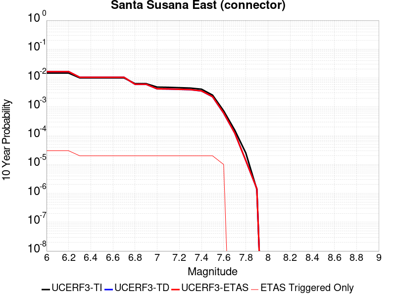 |

| Magnitude | 1 wk TI Prob | 1 wk TD Prob | 1 wk ETAS Prob | 1 wk ETAS/TD Gain | 1 wk ETAS Triggered Only | 1 mo TI Prob | 1 mo TD Prob | 1 mo ETAS Prob | 1 mo ETAS/TD Gain | 1 mo ETAS Triggered Only | 1 yr TI Prob | 1 yr TD Prob | 1 yr ETAS Prob | 1 yr ETAS/TD Gain | 1 yr ETAS Triggered Only | 10 yr TI Prob | 10 yr TD Prob | 10 yr ETAS Prob | 10 yr ETAS/TD Gain | 10 yr ETAS Triggered Only |
|-----|-----|-----|-----|-----|-----|-----|-----|-----|-----|-----|-----|-----|-----|-----|-----|-----|-----|-----|-----|-----|
| 6.0 | 2.858397E-5 | 3.202259E-5 | 3.202259E-5 | 1.0 | 0.0 | 1.2249697E-4 | 1.3723405E-4 | 1.4723268E-4 | 1.0728582 | 1.0E-5 | 0.0014903803 | 0.0016698164 | 0.0016997663 | 1.017936 | 3.0E-5 | 0.014804244 | 0.01659979 | 0.016629292 | 1.0017773 | 3.0E-5 |
| 6.1 | 2.858397E-5 | 3.202259E-5 | 3.202259E-5 | 1.0 | 0.0 | 1.2249697E-4 | 1.3723405E-4 | 1.4723268E-4 | 1.0728582 | 1.0E-5 | 0.0014903803 | 0.0016698164 | 0.0016997663 | 1.017936 | 3.0E-5 | 0.014804244 | 0.01659979 | 0.016629292 | 1.0017773 | 3.0E-5 |
| 6.2 | 2.858397E-5 | 3.202259E-5 | 3.202259E-5 | 1.0 | 0.0 | 1.2249697E-4 | 1.3723405E-4 | 1.4723268E-4 | 1.0728582 | 1.0E-5 | 0.0014903803 | 0.0016698164 | 0.0016997663 | 1.017936 | 3.0E-5 | 0.014804244 | 0.01659979 | 0.016629292 | 1.0017773 | 3.0E-5 |
| 6.3 | 1.943582E-5 | 2.036782E-5 | 2.036782E-5 | 1.0 | 0.0 | 8.329371E-5 | 8.728837E-5 | 9.728749E-5 | 1.1145529 | 1.0E-5 | 0.001013629 | 0.0010623297 | 0.0010823085 | 1.0188066 | 2.0E-5 | 0.010090181 | 0.010584113 | 0.010603902 | 1.0018697 | 2.0E-5 |
| 6.4 | 1.943582E-5 | 2.036782E-5 | 2.036782E-5 | 1.0 | 0.0 | 8.329371E-5 | 8.728837E-5 | 9.728749E-5 | 1.1145529 | 1.0E-5 | 0.001013629 | 0.0010623297 | 0.0010823085 | 1.0188066 | 2.0E-5 | 0.010090181 | 0.010584113 | 0.010603902 | 1.0018697 | 2.0E-5 |
| 6.5 | 1.943582E-5 | 2.036782E-5 | 2.036782E-5 | 1.0 | 0.0 | 8.329371E-5 | 8.728837E-5 | 9.728749E-5 | 1.1145529 | 1.0E-5 | 0.001013629 | 0.0010623297 | 0.0010823085 | 1.0188066 | 2.0E-5 | 0.010090181 | 0.010584113 | 0.010603902 | 1.0018697 | 2.0E-5 |
| 6.6 | 1.943582E-5 | 2.036782E-5 | 2.036782E-5 | 1.0 | 0.0 | 8.329371E-5 | 8.728837E-5 | 9.728749E-5 | 1.1145529 | 1.0E-5 | 0.001013629 | 0.0010623297 | 0.0010823085 | 1.0188066 | 2.0E-5 | 0.010090181 | 0.010584113 | 0.010603902 | 1.0018697 | 2.0E-5 |
| 6.7 | 1.9404439E-5 | 2.035524E-5 | 2.035524E-5 | 1.0 | 0.0 | 8.3159226E-5 | 8.723446E-5 | 9.723359E-5 | 1.1146235 | 1.0E-5 | 0.0010119933 | 0.0010616741 | 0.0010816528 | 1.0188181 | 2.0E-5 | 0.010073971 | 0.010577619 | 0.010597408 | 1.0018708 | 2.0E-5 |
| 6.8 | 1.2217526E-5 | 1.159334E-5 | 1.159334E-5 | 1.0 | 0.0 | 5.2359774E-5 | 4.968489E-5 | 5.9684393E-5 | 1.2012584 | 1.0E-5 | 6.372938E-4 | 6.0476246E-4 | 6.247504E-4 | 1.0330509 | 2.0E-5 | 0.0063546924 | 0.0060333833 | 0.0060532624 | 1.003295 | 2.0E-5 |
| 6.9 | 1.2217526E-5 | 1.159334E-5 | 1.159334E-5 | 1.0 | 0.0 | 5.2359774E-5 | 4.968489E-5 | 5.9684393E-5 | 1.2012584 | 1.0E-5 | 6.372938E-4 | 6.0476246E-4 | 6.247504E-4 | 1.0330509 | 2.0E-5 | 0.0063546924 | 0.0060333833 | 0.0060532624 | 1.003295 | 2.0E-5 |
| 7.0 | 9.276017E-6 | 8.059356E-6 | 8.059356E-6 | 1.0 | 0.0 | 3.9753755E-5 | 3.4539662E-5 | 4.4539316E-5 | 1.2895123 | 1.0E-5 | 4.8389446E-4 | 4.204427E-4 | 4.404343E-4 | 1.0475489 | 2.0E-5 | 0.0048284214 | 0.004197368 | 0.004217284 | 1.0047449 | 2.0E-5 |
| 7.1 | 9.130355E-6 | 7.942529E-6 | 7.942529E-6 | 1.0 | 0.0 | 3.9129503E-5 | 3.4038985E-5 | 4.4038643E-5 | 1.2937708 | 1.0E-5 | 4.7629757E-4 | 4.1434926E-4 | 4.3434097E-4 | 1.0482484 | 2.0E-5 | 0.00475278 | 0.0041366615 | 0.004156579 | 1.0048149 | 2.0E-5 |
| 7.2 | 8.851015E-6 | 7.74169E-6 | 7.74169E-6 | 1.0 | 0.0 | 3.7932372E-5 | 3.317827E-5 | 4.3177934E-5 | 1.3013921 | 1.0E-5 | 4.6172875E-4 | 4.0387394E-4 | 4.2386586E-4 | 1.0495003 | 2.0E-5 | 0.0046077054 | 0.0040322915 | 0.0040522106 | 1.0049399 | 2.0E-5 |
| 7.3 | 8.573006E-6 | 7.5504113E-6 | 7.5504113E-6 | 1.0 | 0.0 | 3.6740938E-5 | 3.2358523E-5 | 4.23582E-5 | 1.3090276 | 1.0E-5 | 4.472291E-4 | 3.938972E-4 | 4.1388933E-4 | 1.0507547 | 2.0E-5 | 0.004463301 | 0.003932873 | 0.0039527942 | 1.0050653 | 2.0E-5 |
| 7.4 | 7.852282E-6 | 6.8179206E-6 | 6.8179206E-6 | 1.0 | 0.0 | 3.36522E-5 | 2.9219349E-5 | 3.9219056E-5 | 1.342229 | 1.0E-5 | 4.096385E-4 | 3.5569054E-4 | 3.7568342E-4 | 1.0562086 | 2.0E-5 | 0.0040888423 | 0.0035520305 | 0.0035719594 | 1.0056106 | 2.0E-5 |
| 7.5 | 4.8869324E-6 | 4.27914E-6 | 4.27914E-6 | 1.0 | 0.0 | 2.0943828E-5 | 1.8339051E-5 | 2.8338867E-5 | 1.5452745 | 1.0E-5 | 2.5496128E-4 | 2.2325672E-4 | 2.4325225E-4 | 1.089563 | 2.0E-5 | 0.0025466895 | 0.0022306633 | 0.0022506188 | 1.008946 | 2.0E-5 |
| 7.6 | 1.3894544E-6 | 1.1568442E-6 | 1.1568442E-6 | 1.0 | 0.0 | 5.954791E-6 | 4.9578953E-6 | 1.4957846E-5 | 3.016975 | 1.0E-5 | 7.249717E-5 | 6.0360926E-5 | 7.036032E-5 | 1.1656601 | 1.0E-5 | 7.247352E-4 | 6.0346717E-4 | 6.1346113E-4 | 1.0165609 | 1.0E-5 |
| 7.7 | 2.9924632E-7 | 2.3719647E-7 | 2.3719647E-7 | 1.0 | 0.0 | 1.2824837E-6 | 1.016556E-6 | 1.016556E-6 | 1.0 | 0.0 | 1.5614127E-5 | 1.2376506E-5 | 1.2376506E-5 | 1.0 | 0.0 | 1.5613029E-4 | 1.2375889E-4 | 1.2375889E-4 | 1.0 | 0.0 |
| 7.8 | 4.8188564E-8 | 2.6323553E-8 | 2.6323553E-8 | 1.0 | 0.0 | 2.065224E-7 | 1.1281523E-7 | 1.1281523E-7 | 1.0 | 0.0 | 2.5144072E-6 | 1.3735246E-6 | 1.3735246E-6 | 1.0 | 0.0 | 2.5143789E-5 | 1.3735169E-5 | 1.3735169E-5 | 1.0 | 0.0 |
| 7.9 | 2.6127251E-9 | 2.768132E-9 | 2.768132E-9 | 1.0 | 0.0 | 1.1197393E-8 | 1.1863423E-8 | 1.1863423E-8 | 1.0 | 0.0 | 1.3632825E-7 | 1.4443718E-7 | 1.4443718E-7 | 1.0 | 0.0 | 1.3632817E-6 | 1.4443717E-6 | 1.4443717E-6 | 1.0 | 0.0 |

## Earthquake Valley (So Extension)
*[(top)](#table-of-contents)*

| 1 Week | 1 Month | 1 Year | 10 Year |
|-----|-----|-----|-----|
|  |  |  |  |

| Magnitude | 1 wk TI Prob | 1 wk TD Prob | 1 wk ETAS Prob | 1 wk ETAS/TD Gain | 1 wk ETAS Triggered Only | 1 mo TI Prob | 1 mo TD Prob | 1 mo ETAS Prob | 1 mo ETAS/TD Gain | 1 mo ETAS Triggered Only | 1 yr TI Prob | 1 yr TD Prob | 1 yr ETAS Prob | 1 yr ETAS/TD Gain | 1 yr ETAS Triggered Only | 10 yr TI Prob | 10 yr TD Prob | 10 yr ETAS Prob | 10 yr ETAS/TD Gain | 10 yr ETAS Triggered Only |
|-----|-----|-----|-----|-----|-----|-----|-----|-----|-----|-----|-----|-----|-----|-----|-----|-----|-----|-----|-----|-----|
| 6.0 | 3.0194888E-5 | 3.707323E-5 | 3.707323E-5 | 1.0 | 0.0 | 1.2940024E-4 | 1.5887865E-4 | 1.6887707E-4 | 1.0629311 | 1.0E-5 | 0.0015743093 | 0.0019331464 | 0.001943127 | 1.005163 | 1.0E-5 | 0.01563203 | 0.019213678 | 0.019233294 | 1.0010209 | 2.0E-5 |
| 6.1 | 3.0194888E-5 | 3.707323E-5 | 3.707323E-5 | 1.0 | 0.0 | 1.2940024E-4 | 1.5887865E-4 | 1.6887707E-4 | 1.0629311 | 1.0E-5 | 0.0015743093 | 0.0019331464 | 0.001943127 | 1.005163 | 1.0E-5 | 0.01563203 | 0.019213678 | 0.019233294 | 1.0010209 | 2.0E-5 |
| 6.2 | 3.0194888E-5 | 3.707323E-5 | 3.707323E-5 | 1.0 | 0.0 | 1.2940024E-4 | 1.5887865E-4 | 1.6887707E-4 | 1.0629311 | 1.0E-5 | 0.0015743093 | 0.0019331464 | 0.001943127 | 1.005163 | 1.0E-5 | 0.01563203 | 0.019213678 | 0.019233294 | 1.0010209 | 2.0E-5 |
| 6.3 | 1.5795305E-5 | 1.8447032E-5 | 1.8447032E-5 | 1.0 | 0.0 | 6.769241E-5 | 7.905694E-5 | 7.905694E-5 | 1.0 | 0.0 | 8.238434E-4 | 9.622042E-4 | 9.622042E-4 | 1.0 | 0.0 | 0.008207959 | 0.0095912805 | 0.0095912805 | 1.0 | 0.0 |
| 6.4 | 1.5795305E-5 | 1.8447032E-5 | 1.8447032E-5 | 1.0 | 0.0 | 6.769241E-5 | 7.905694E-5 | 7.905694E-5 | 1.0 | 0.0 | 8.238434E-4 | 9.622042E-4 | 9.622042E-4 | 1.0 | 0.0 | 0.008207959 | 0.0095912805 | 0.0095912805 | 1.0 | 0.0 |
| 6.5 | 1.5795305E-5 | 1.8447032E-5 | 1.8447032E-5 | 1.0 | 0.0 | 6.769241E-5 | 7.905694E-5 | 7.905694E-5 | 1.0 | 0.0 | 8.238434E-4 | 9.622042E-4 | 9.622042E-4 | 1.0 | 0.0 | 0.008207959 | 0.0095912805 | 0.0095912805 | 1.0 | 0.0 |
| 6.6 | 1.5795305E-5 | 1.8447032E-5 | 1.8447032E-5 | 1.0 | 0.0 | 6.769241E-5 | 7.905694E-5 | 7.905694E-5 | 1.0 | 0.0 | 8.238434E-4 | 9.622042E-4 | 9.622042E-4 | 1.0 | 0.0 | 0.008207959 | 0.0095912805 | 0.0095912805 | 1.0 | 0.0 |
| 6.7 | 1.1363076E-5 | 1.3138569E-5 | 1.3138569E-5 | 1.0 | 0.0 | 4.8697988E-5 | 5.6307366E-5 | 5.6307366E-5 | 1.0 | 0.0 | 5.927367E-4 | 6.8540266E-4 | 6.8540266E-4 | 1.0 | 0.0 | 0.0059115817 | 0.006840361 | 0.006840361 | 1.0 | 0.0 |
| 6.8 | 1.0049611E-5 | 1.1594572E-5 | 1.1594572E-5 | 1.0 | 0.0 | 4.306905E-5 | 4.969049E-5 | 4.969049E-5 | 1.0 | 0.0 | 5.242395E-4 | 6.0488697E-4 | 6.0488697E-4 | 1.0 | 0.0 | 0.0052300454 | 0.006039582 | 0.006039582 | 1.0 | 0.0 |
| 6.9 | 1.0049611E-5 | 1.1594572E-5 | 1.1594572E-5 | 1.0 | 0.0 | 4.306905E-5 | 4.969049E-5 | 4.969049E-5 | 1.0 | 0.0 | 5.242395E-4 | 6.0488697E-4 | 6.0488697E-4 | 1.0 | 0.0 | 0.0052300454 | 0.006039582 | 0.006039582 | 1.0 | 0.0 |
| 7.0 | 1.0049611E-5 | 1.1594572E-5 | 1.1594572E-5 | 1.0 | 0.0 | 4.306905E-5 | 4.969049E-5 | 4.969049E-5 | 1.0 | 0.0 | 5.242395E-4 | 6.0488697E-4 | 6.0488697E-4 | 1.0 | 0.0 | 0.0052300454 | 0.006039582 | 0.006039582 | 1.0 | 0.0 |
| 7.1 | 8.140254E-6 | 9.38365E-6 | 9.38365E-6 | 1.0 | 0.0 | 3.4886336E-5 | 4.02154E-5 | 4.02154E-5 | 1.0 | 0.0 | 4.2465836E-4 | 4.895796E-4 | 4.895796E-4 | 1.0 | 0.0 | 0.0042384774 | 0.0048915865 | 0.0048915865 | 1.0 | 0.0 |
| 7.2 | 1.673835E-7 | 1.4153831E-7 | 1.4153831E-7 | 1.0 | 0.0 | 7.173577E-7 | 6.0659266E-7 | 6.0659266E-7 | 1.0 | 0.0 | 8.733795E-6 | 7.3852443E-6 | 7.3852443E-6 | 1.0 | 0.0 | 8.733451E-5 | 7.3850344E-5 | 7.3850344E-5 | 1.0 | 0.0 |
| 7.3 | 1.6632116E-7 | 1.4052058E-7 | 1.4052058E-7 | 1.0 | 0.0 | 7.1280476E-7 | 6.0223095E-7 | 6.0223095E-7 | 1.0 | 0.0 | 8.678364E-6 | 7.332141E-6 | 7.332141E-6 | 1.0 | 0.0 | 8.6780245E-5 | 7.3319345E-5 | 7.3319345E-5 | 1.0 | 0.0 |
| 7.4 | 1.6569169E-7 | 1.3996687E-7 | 1.3996687E-7 | 1.0 | 0.0 | 7.1010703E-7 | 5.998579E-7 | 5.998579E-7 | 1.0 | 0.0 | 8.645519E-6 | 7.3032493E-6 | 7.3032493E-6 | 1.0 | 0.0 | 8.645182E-5 | 7.3030445E-5 | 7.3030445E-5 | 1.0 | 0.0 |
| 7.5 | 1.1764555E-7 | 1.0095579E-7 | 1.0095579E-7 | 1.0 | 0.0 | 5.041951E-7 | 4.326676E-7 | 4.326676E-7 | 1.0 | 0.0 | 6.138558E-6 | 5.267718E-6 | 5.267718E-6 | 1.0 | 0.0 | 6.1383886E-5 | 5.2676143E-5 | 5.2676143E-5 | 1.0 | 0.0 |
| 7.6 | 1.07927605E-7 | 9.260366E-8 | 9.260366E-8 | 1.0 | 0.0 | 4.6254678E-7 | 3.9687282E-7 | 3.9687282E-7 | 1.0 | 0.0 | 5.6314925E-6 | 4.831918E-6 | 4.831918E-6 | 1.0 | 0.0 | 5.63135E-5 | 4.8318336E-5 | 4.8318336E-5 | 1.0 | 0.0 |
| 7.7 | 2.1826905E-8 | 1.118023E-8 | 1.118023E-8 | 1.0 | 0.0 | 9.3543875E-8 | 4.7915268E-8 | 4.7915268E-8 | 1.0 | 0.0 | 1.1388961E-6 | 5.833683E-7 | 5.833683E-7 | 1.0 | 0.0 | 1.1388902E-5 | 5.8336727E-6 | 5.8336727E-6 | 1.0 | 0.0 |
| 7.8 | 2.6169649E-9 | 1.1969211E-9 | 1.1969211E-9 | 1.0 | 0.0 | 1.1215564E-8 | 5.1296616E-9 | 5.1296616E-9 | 1.0 | 0.0 | 1.3654947E-7 | 6.245363E-8 | 6.245363E-8 | 1.0 | 0.0 | 1.365494E-6 | 6.2453626E-7 | 6.2453626E-7 | 1.0 | 0.0 |

## La Panza 2011
*[(top)](#table-of-contents)*

| 1 Week | 1 Month | 1 Year | 10 Year |
|-----|-----|-----|-----|
|  |  |  |  |

| Magnitude | 1 wk TI Prob | 1 wk TD Prob | 1 wk ETAS Prob | 1 wk ETAS/TD Gain | 1 wk ETAS Triggered Only | 1 mo TI Prob | 1 mo TD Prob | 1 mo ETAS Prob | 1 mo ETAS/TD Gain | 1 mo ETAS Triggered Only | 1 yr TI Prob | 1 yr TD Prob | 1 yr ETAS Prob | 1 yr ETAS/TD Gain | 1 yr ETAS Triggered Only | 10 yr TI Prob | 10 yr TD Prob | 10 yr ETAS Prob | 10 yr ETAS/TD Gain | 10 yr ETAS Triggered Only |
|-----|-----|-----|-----|-----|-----|-----|-----|-----|-----|-----|-----|-----|-----|-----|-----|-----|-----|-----|-----|-----|
| 6.0 | 4.6754544E-6 | 4.717608E-6 | 4.717608E-6 | 1.0 | 0.0 | 2.0037509E-5 | 2.0218175E-5 | 2.0218175E-5 | 1.0 | 0.0 | 2.4392935E-4 | 2.4613045E-4 | 2.4613045E-4 | 1.0 | 0.0 | 0.0024366176 | 0.0024587729 | 0.0024787236 | 1.0081141 | 2.0E-5 |
| 6.1 | 4.6754544E-6 | 4.717608E-6 | 4.717608E-6 | 1.0 | 0.0 | 2.0037509E-5 | 2.0218175E-5 | 2.0218175E-5 | 1.0 | 0.0 | 2.4392935E-4 | 2.4613045E-4 | 2.4613045E-4 | 1.0 | 0.0 | 0.0024366176 | 0.0024587729 | 0.0024787236 | 1.0081141 | 2.0E-5 |
| 6.2 | 4.6754544E-6 | 4.717608E-6 | 4.717608E-6 | 1.0 | 0.0 | 2.0037509E-5 | 2.0218175E-5 | 2.0218175E-5 | 1.0 | 0.0 | 2.4392935E-4 | 2.4613045E-4 | 2.4613045E-4 | 1.0 | 0.0 | 0.0024366176 | 0.0024587729 | 0.0024787236 | 1.0081141 | 2.0E-5 |
| 6.3 | 4.6754544E-6 | 4.717608E-6 | 4.717608E-6 | 1.0 | 0.0 | 2.0037509E-5 | 2.0218175E-5 | 2.0218175E-5 | 1.0 | 0.0 | 2.4392935E-4 | 2.4613045E-4 | 2.4613045E-4 | 1.0 | 0.0 | 0.0024366176 | 0.0024587729 | 0.0024787236 | 1.0081141 | 2.0E-5 |
| 6.4 | 4.6754544E-6 | 4.717608E-6 | 4.717608E-6 | 1.0 | 0.0 | 2.0037509E-5 | 2.0218175E-5 | 2.0218175E-5 | 1.0 | 0.0 | 2.4392935E-4 | 2.4613045E-4 | 2.4613045E-4 | 1.0 | 0.0 | 0.0024366176 | 0.0024587729 | 0.0024787236 | 1.0081141 | 2.0E-5 |
| 6.5 | 2.485343E-6 | 2.5006163E-6 | 2.5006163E-6 | 1.0 | 0.0 | 1.0651426E-5 | 1.0716885E-5 | 1.0716885E-5 | 1.0 | 0.0 | 1.296734E-4 | 1.3047065E-4 | 1.3047065E-4 | 1.0 | 0.0 | 0.0012959775 | 0.001303979 | 0.001303979 | 1.0 | 0.0 |
| 6.6 | 2.485343E-6 | 2.5006163E-6 | 2.5006163E-6 | 1.0 | 0.0 | 1.0651426E-5 | 1.0716885E-5 | 1.0716885E-5 | 1.0 | 0.0 | 1.296734E-4 | 1.3047065E-4 | 1.3047065E-4 | 1.0 | 0.0 | 0.0012959775 | 0.001303979 | 0.001303979 | 1.0 | 0.0 |
| 6.7 | 1.5108508E-6 | 1.5146534E-6 | 1.5146534E-6 | 1.0 | 0.0 | 6.4750584E-6 | 6.491356E-6 | 6.491356E-6 | 1.0 | 0.0 | 7.8830984E-5 | 7.90295E-5 | 7.90295E-5 | 1.0 | 0.0 | 7.880303E-4 | 7.900248E-4 | 7.900248E-4 | 1.0 | 0.0 |
| 6.8 | 1.3865837E-6 | 1.3885259E-6 | 1.3885259E-6 | 1.0 | 0.0 | 5.942488E-6 | 5.950812E-6 | 5.950812E-6 | 1.0 | 0.0 | 7.234739E-5 | 7.244883E-5 | 7.244883E-5 | 1.0 | 0.0 | 7.232384E-4 | 7.242619E-4 | 7.242619E-4 | 1.0 | 0.0 |
| 6.9 | 9.826583E-7 | 9.796437E-7 | 9.796437E-7 | 1.0 | 0.0 | 4.2113857E-6 | 4.1984663E-6 | 4.1984663E-6 | 1.0 | 0.0 | 5.1272415E-5 | 5.1115185E-5 | 5.1115185E-5 | 1.0 | 0.0 | 5.126059E-4 | 5.1103963E-4 | 5.1103963E-4 | 1.0 | 0.0 |
| 7.0 | 6.7797646E-7 | 6.71036E-7 | 6.71036E-7 | 1.0 | 0.0 | 2.9056102E-6 | 2.8758654E-6 | 2.8758654E-6 | 1.0 | 0.0 | 3.537523E-5 | 3.501313E-5 | 3.501313E-5 | 1.0 | 0.0 | 3.5369597E-4 | 3.5007924E-4 | 3.5007924E-4 | 1.0 | 0.0 |
| 7.1 | 3.4979826E-7 | 3.3875276E-7 | 3.3875276E-7 | 1.0 | 0.0 | 1.4991346E-6 | 1.4517968E-6 | 1.4517968E-6 | 1.0 | 0.0 | 1.825181E-5 | 1.7675495E-5 | 1.7675495E-5 | 1.0 | 0.0 | 1.825031E-4 | 1.7674205E-4 | 1.7674205E-4 | 1.0 | 0.0 |
| 7.2 | 2.5088332E-7 | 2.3833275E-7 | 2.3833275E-7 | 1.0 | 0.0 | 1.0752137E-6 | 1.0214256E-6 | 1.0214256E-6 | 1.0 | 0.0 | 1.3090649E-5 | 1.2435796E-5 | 1.2435796E-5 | 1.0 | 0.0 | 1.3089878E-4 | 1.2435185E-4 | 1.2435185E-4 | 1.0 | 0.0 |
| 7.3 | 1.0159086E-7 | 8.64596E-8 | 8.64596E-8 | 1.0 | 0.0 | 4.3538932E-7 | 3.705411E-7 | 3.705411E-7 | 1.0 | 0.0 | 5.300852E-6 | 4.511329E-6 | 4.511329E-6 | 1.0 | 0.0 | 5.3007258E-5 | 4.5112414E-5 | 4.5112414E-5 | 1.0 | 0.0 |
| 7.4 | 3.5006252E-8 | 1.9407974E-8 | 1.9407974E-8 | 1.0 | 0.0 | 1.5002678E-7 | 8.317703E-8 | 8.317703E-8 | 1.0 | 0.0 | 1.8265745E-6 | 1.0126798E-6 | 1.0126798E-6 | 1.0 | 0.0 | 1.8265595E-5 | 1.0126755E-5 | 1.0126755E-5 | 1.0 | 0.0 |
| 7.5 | 2.592274E-8 | 1.0241491E-8 | 1.0241491E-8 | 1.0 | 0.0 | 1.1109746E-7 | 4.3892104E-8 | 4.3892104E-8 | 1.0 | 0.0 | 1.3526106E-6 | 5.3438623E-7 | 5.3438623E-7 | 1.0 | 0.0 | 1.3526024E-5 | 5.3438503E-6 | 5.3438503E-6 | 1.0 | 0.0 |
| 7.6 | 1.9016717E-8 | 5.246079E-9 | 5.246079E-9 | 1.0 | 0.0 | 8.150022E-8 | 2.2483196E-8 | 2.2483196E-8 | 1.0 | 0.0 | 9.922647E-7 | 2.7373287E-7 | 2.7373287E-7 | 1.0 | 0.0 | 9.922603E-6 | 2.7373255E-6 | 2.7373255E-6 | 1.0 | 0.0 |
| 7.7 | 1.17738495E-8 | 1.24002E-9 | 1.24002E-9 | 1.0 | 0.0 | 5.0459356E-8 | 5.3143716E-9 | 5.3143716E-9 | 1.0 | 0.0 | 6.1434247E-7 | 6.470247E-8 | 6.470247E-8 | 1.0 | 0.0 | 6.143408E-6 | 6.4702454E-7 | 6.4702454E-7 | 1.0 | 0.0 |
| 7.8 | 5.489079E-9 | 2.0114244E-10 | 2.0114244E-10 | 1.0 | 0.0 | 2.3524624E-8 | 8.6204055E-10 | 8.6204055E-10 | 1.0 | 0.0 | 2.8641225E-7 | 1.0495341E-8 | 1.0495341E-8 | 1.0 | 0.0 | 2.8641189E-6 | 1.049534E-7 | 1.049534E-7 | 1.0 | 0.0 |
| 7.9 | 2.5081048E-9 | 6.6833206E-11 | 6.6833206E-11 | 1.0 | 0.0 | 1.0749021E-8 | 2.864291E-10 | 2.864291E-10 | 1.0 | 0.0 | 1.3086932E-7 | 3.4872727E-9 | 3.4872727E-9 | 1.0 | 0.0 | 1.3086925E-6 | 3.487273E-8 | 3.487273E-8 | 1.0 | 0.0 |

## Pinto Mtn
*[(top)](#table-of-contents)*

| 1 Week | 1 Month | 1 Year | 10 Year |
|-----|-----|-----|-----|
|  |  |  |  |

| Magnitude | 1 wk TI Prob | 1 wk TD Prob | 1 wk ETAS Prob | 1 wk ETAS/TD Gain | 1 wk ETAS Triggered Only | 1 mo TI Prob | 1 mo TD Prob | 1 mo ETAS Prob | 1 mo ETAS/TD Gain | 1 mo ETAS Triggered Only | 1 yr TI Prob | 1 yr TD Prob | 1 yr ETAS Prob | 1 yr ETAS/TD Gain | 1 yr ETAS Triggered Only | 10 yr TI Prob | 10 yr TD Prob | 10 yr ETAS Prob | 10 yr ETAS/TD Gain | 10 yr ETAS Triggered Only |
|-----|-----|-----|-----|-----|-----|-----|-----|-----|-----|-----|-----|-----|-----|-----|-----|-----|-----|-----|-----|-----|
| 6.0 | 4.4194956E-5 | 4.7855512E-5 | 5.785503E-5 | 1.2089523 | 1.0E-5 | 1.893932E-4 | 2.0507984E-4 | 2.1507777E-4 | 1.0487515 | 1.0E-5 | 0.0023034236 | 0.0024941512 | 0.0025141013 | 1.0079987 | 2.0E-5 | 0.022796938 | 0.024679113 | 0.024698619 | 1.0007904 | 2.0E-5 |
| 6.1 | 4.4194956E-5 | 4.7855512E-5 | 5.785503E-5 | 1.2089523 | 1.0E-5 | 1.893932E-4 | 2.0507984E-4 | 2.1507777E-4 | 1.0487515 | 1.0E-5 | 0.0023034236 | 0.0024941512 | 0.0025141013 | 1.0079987 | 2.0E-5 | 0.022796938 | 0.024679113 | 0.024698619 | 1.0007904 | 2.0E-5 |
| 6.2 | 4.4194956E-5 | 4.7855512E-5 | 5.785503E-5 | 1.2089523 | 1.0E-5 | 1.893932E-4 | 2.0507984E-4 | 2.1507777E-4 | 1.0487515 | 1.0E-5 | 0.0023034236 | 0.0024941512 | 0.0025141013 | 1.0079987 | 2.0E-5 | 0.022796938 | 0.024679113 | 0.024698619 | 1.0007904 | 2.0E-5 |
| 6.3 | 4.4194956E-5 | 4.7855512E-5 | 5.785503E-5 | 1.2089523 | 1.0E-5 | 1.893932E-4 | 2.0507984E-4 | 2.1507777E-4 | 1.0487515 | 1.0E-5 | 0.0023034236 | 0.0024941512 | 0.0025141013 | 1.0079987 | 2.0E-5 | 0.022796938 | 0.024679113 | 0.024698619 | 1.0007904 | 2.0E-5 |
| 6.4 | 3.729929E-5 | 3.960486E-5 | 3.960486E-5 | 1.0 | 0.0 | 1.5984432E-4 | 1.697246E-4 | 1.697246E-4 | 1.0 | 0.0 | 0.0019443673 | 0.002064532 | 0.0020745113 | 1.0048337 | 1.0E-5 | 0.019274427 | 0.02046355 | 0.020473344 | 1.0004786 | 1.0E-5 |
| 6.5 | 3.729929E-5 | 3.960486E-5 | 3.960486E-5 | 1.0 | 0.0 | 1.5984432E-4 | 1.697246E-4 | 1.697246E-4 | 1.0 | 0.0 | 0.0019443673 | 0.002064532 | 0.0020745113 | 1.0048337 | 1.0E-5 | 0.019274427 | 0.02046355 | 0.020473344 | 1.0004786 | 1.0E-5 |
| 6.6 | 3.0204548E-5 | 3.1206768E-5 | 3.1206768E-5 | 1.0 | 0.0 | 1.2944164E-4 | 1.3373663E-4 | 1.3373663E-4 | 1.0 | 0.0 | 0.0015748127 | 0.001627062 | 0.001627062 | 1.0 | 0.0 | 0.015636992 | 0.016155364 | 0.016155364 | 1.0 | 0.0 |
| 6.7 | 2.9857754E-5 | 3.0816143E-5 | 3.0816143E-5 | 1.0 | 0.0 | 1.2795553E-4 | 1.320627E-4 | 1.320627E-4 | 1.0 | 0.0 | 0.0015567453 | 0.0016067121 | 0.0016067121 | 1.0 | 0.0 | 0.015458848 | 0.0159548 | 0.0159548 | 1.0 | 0.0 |
| 6.8 | 2.4819734E-5 | 2.5010708E-5 | 2.5010708E-5 | 1.0 | 0.0 | 1.0636595E-4 | 1.0718447E-4 | 1.0718447E-4 | 1.0 | 0.0 | 0.0012942362 | 0.0013042113 | 0.0013042113 | 1.0 | 0.0 | 0.012867244 | 0.0129679395 | 0.0129679395 | 1.0 | 0.0 |
| 6.9 | 2.331124E-5 | 2.3338964E-5 | 2.3338964E-5 | 1.0 | 0.0 | 9.990149E-5 | 1.0002041E-4 | 1.0002041E-4 | 1.0 | 0.0 | 0.001215622 | 0.0012170885 | 0.0012170885 | 1.0 | 0.0 | 0.012089936 | 0.012106422 | 0.012106422 | 1.0 | 0.0 |
| 7.0 | 2.1818534E-5 | 2.176207E-5 | 2.176207E-5 | 1.0 | 0.0 | 9.3504656E-5 | 9.3262795E-5 | 9.3262795E-5 | 1.0 | 0.0 | 0.0011378246 | 0.0011349028 | 0.0011349028 | 1.0 | 0.0 | 0.011320163 | 0.011293174 | 0.011293174 | 1.0 | 0.0 |
| 7.1 | 2.066081E-5 | 2.0541695E-5 | 2.0541695E-5 | 1.0 | 0.0 | 8.854332E-5 | 8.8032975E-5 | 8.8032975E-5 | 1.0 | 0.0 | 0.0010774818 | 0.001071294 | 0.001071294 | 1.0 | 0.0 | 0.010722724 | 0.010663347 | 0.010663347 | 1.0 | 0.0 |
| 7.2 | 1.8990233E-5 | 1.905496E-5 | 1.905496E-5 | 1.0 | 0.0 | 8.138417E-5 | 8.166167E-5 | 8.166167E-5 | 1.0 | 0.0 | 9.904018E-4 | 9.937966E-4 | 9.937966E-4 | 1.0 | 0.0 | 0.009859995 | 0.009895524 | 0.009895524 | 1.0 | 0.0 |
| 7.3 | 1.3335872E-5 | 1.4907597E-5 | 1.4907597E-5 | 1.0 | 0.0 | 5.7152483E-5 | 6.388821E-5 | 6.388821E-5 | 1.0 | 0.0 | 6.956093E-4 | 7.7757414E-4 | 7.7757414E-4 | 1.0 | 0.0 | 0.006934359 | 0.007749834 | 0.007749834 | 1.0 | 0.0 |
| 7.4 | 9.414066E-6 | 1.1861796E-5 | 1.1861796E-5 | 1.0 | 0.0 | 4.0345374E-5 | 5.0835333E-5 | 5.0835333E-5 | 1.0 | 0.0 | 4.910942E-4 | 6.1875384E-4 | 6.1875384E-4 | 1.0 | 0.0 | 0.0049001034 | 0.006171259 | 0.006171259 | 1.0 | 0.0 |
| 7.5 | 7.2101157E-6 | 9.15899E-6 | 9.15899E-6 | 1.0 | 0.0 | 3.090013E-5 | 3.925227E-5 | 3.925227E-5 | 1.0 | 0.0 | 3.7614413E-4 | 4.777994E-4 | 4.777994E-4 | 1.0 | 0.0 | 0.0037550807 | 0.004768497 | 0.004768497 | 1.0 | 0.0 |
| 7.6 | 3.296375E-6 | 4.546278E-6 | 4.546278E-6 | 1.0 | 0.0 | 1.4127245E-5 | 1.948391E-5 | 1.948391E-5 | 1.0 | 0.0 | 1.7198564E-4 | 2.3719217E-4 | 2.3719217E-4 | 1.0 | 0.0 | 0.0017185259 | 0.0023695275 | 0.0023695275 | 1.0 | 0.0 |
| 7.7 | 2.5741092E-6 | 3.5851394E-6 | 3.5851394E-6 | 1.0 | 0.0 | 1.103185E-5 | 1.53648E-5 | 1.53648E-5 | 1.0 | 0.0 | 1.3430449E-4 | 1.870517E-4 | 1.870517E-4 | 1.0 | 0.0 | 0.0013422335 | 0.0018690726 | 0.0018690726 | 1.0 | 0.0 |

## Surprise Valley 2011 CFM
*[(top)](#table-of-contents)*

| 1 Week | 1 Month | 1 Year | 10 Year |
|-----|-----|-----|-----|
|  |  | 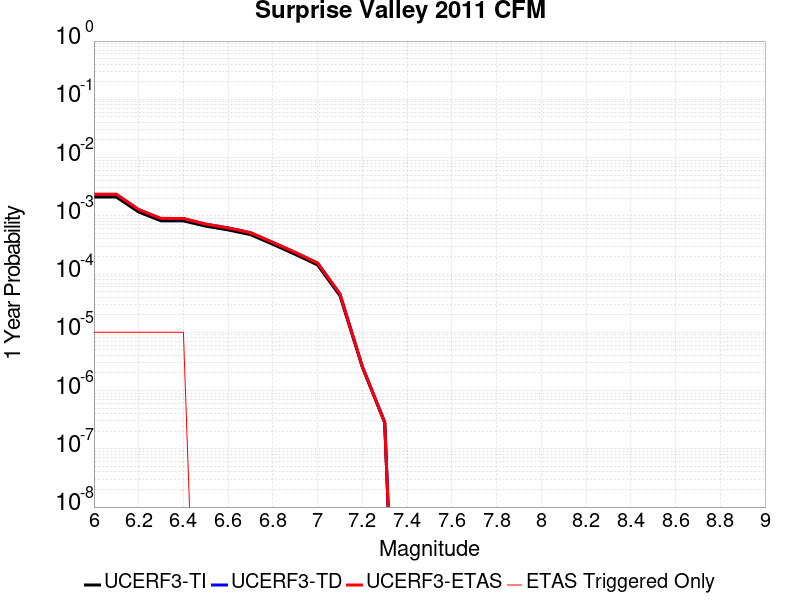 | 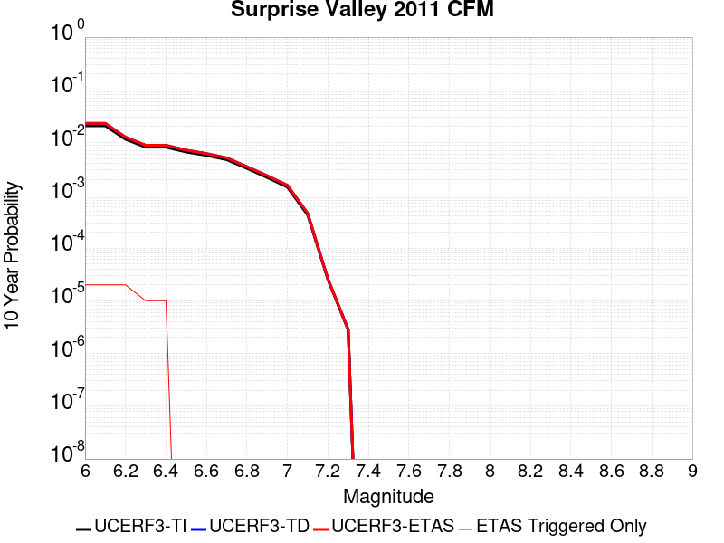 |

| Magnitude | 1 wk TI Prob | 1 wk TD Prob | 1 wk ETAS Prob | 1 wk ETAS/TD Gain | 1 wk ETAS Triggered Only | 1 mo TI Prob | 1 mo TD Prob | 1 mo ETAS Prob | 1 mo ETAS/TD Gain | 1 mo ETAS Triggered Only | 1 yr TI Prob | 1 yr TD Prob | 1 yr ETAS Prob | 1 yr ETAS/TD Gain | 1 yr ETAS Triggered Only | 10 yr TI Prob | 10 yr TD Prob | 10 yr ETAS Prob | 10 yr ETAS/TD Gain | 10 yr ETAS Triggered Only |
|-----|-----|-----|-----|-----|-----|-----|-----|-----|-----|-----|-----|-----|-----|-----|-----|-----|-----|-----|-----|-----|
| 6.0 | 4.0396248E-5 | 4.4851968E-5 | 5.485152E-5 | 1.2229457 | 1.0E-5 | 1.7311527E-4 | 1.9220974E-4 | 2.0220783E-4 | 1.0520165 | 1.0E-5 | 0.002105641 | 0.002337852 | 0.0023478286 | 1.0042675 | 1.0E-5 | 0.020858008 | 0.023154303 | 0.02317384 | 1.0008438 | 2.0E-5 |
| 6.1 | 4.0396248E-5 | 4.4851968E-5 | 5.485152E-5 | 1.2229457 | 1.0E-5 | 1.7311527E-4 | 1.9220974E-4 | 2.0220783E-4 | 1.0520165 | 1.0E-5 | 0.002105641 | 0.002337852 | 0.0023478286 | 1.0042675 | 1.0E-5 | 0.020858008 | 0.023154303 | 0.02317384 | 1.0008438 | 2.0E-5 |
| 6.2 | 2.2295266E-5 | 2.4401555E-5 | 3.4401313E-5 | 1.4097999 | 1.0E-5 | 9.554764E-5 | 1.0457408E-4 | 1.14573035E-4 | 1.095616 | 1.0E-5 | 0.0011626717 | 0.0012724766 | 0.0012824639 | 1.0078487 | 1.0E-5 | 0.011566074 | 0.012655139 | 0.012674886 | 1.0015603 | 2.0E-5 |
| 6.3 | 1.572643E-5 | 1.7097005E-5 | 2.7096834E-5 | 1.5848877 | 1.0E-5 | 6.7397246E-5 | 7.327088E-5 | 8.327015E-5 | 1.1364698 | 1.0E-5 | 8.202525E-4 | 8.917184E-4 | 9.017094E-4 | 1.0112044 | 1.0E-5 | 0.008172315 | 0.00888251 | 0.008892421 | 1.0011158 | 1.0E-5 |
| 6.4 | 1.5714395E-5 | 1.7084827E-5 | 2.7084656E-5 | 1.5853047 | 1.0E-5 | 6.734567E-5 | 7.321869E-5 | 8.321796E-5 | 1.1365671 | 1.0E-5 | 8.1962504E-4 | 8.910835E-4 | 9.0107456E-4 | 1.0112123 | 1.0E-5 | 0.008166086 | 0.008876211 | 0.008886122 | 1.0011166 | 1.0E-5 |
| 6.5 | 1.2733495E-5 | 1.3801754E-5 | 1.3801754E-5 | 1.0 | 0.0 | 5.457098E-5 | 5.914907E-5 | 5.914907E-5 | 1.0 | 0.0 | 6.641992E-4 | 7.199087E-4 | 7.199087E-4 | 1.0 | 0.0 | 0.0066221743 | 0.0071764593 | 0.0071764593 | 1.0 | 0.0 |
| 6.6 | 1.0983784E-5 | 1.1886684E-5 | 1.1886684E-5 | 1.0 | 0.0 | 4.7072506E-5 | 5.0941966E-5 | 5.0941966E-5 | 1.0 | 0.0 | 5.7295704E-4 | 6.2004727E-4 | 6.2004727E-4 | 1.0 | 0.0 | 0.0057148207 | 0.006183722 | 0.006183722 | 1.0 | 0.0 |
| 6.7 | 9.104806E-6 | 9.839597E-6 | 9.839597E-6 | 1.0 | 0.0 | 3.902001E-5 | 4.2169042E-5 | 4.2169042E-5 | 1.0 | 0.0 | 4.7496508E-4 | 5.1329104E-4 | 5.1329104E-4 | 1.0 | 0.0 | 0.004739512 | 0.005121452 | 0.005121452 | 1.0 | 0.0 |
| 6.8 | 6.2162403E-6 | 6.7042038E-6 | 6.7042038E-6 | 1.0 | 0.0 | 2.6640759E-5 | 2.8731998E-5 | 2.8731998E-5 | 1.0 | 0.0 | 3.2430296E-4 | 3.4975816E-4 | 3.4975816E-4 | 1.0 | 0.0 | 0.003238301 | 0.0034923002 | 0.0034923002 | 1.0 | 0.0 |
| 6.9 | 4.1792696E-6 | 4.5032766E-6 | 4.5032766E-6 | 1.0 | 0.0 | 1.7911032E-5 | 1.9299621E-5 | 1.9299621E-5 | 1.0 | 0.0 | 2.1804498E-4 | 2.3494911E-4 | 2.3494911E-4 | 1.0 | 0.0 | 0.0021783116 | 0.0023471604 | 0.0023471604 | 1.0 | 0.0 |
| 7.0 | 2.7478413E-6 | 2.9622734E-6 | 2.9622734E-6 | 1.0 | 0.0 | 1.177641E-5 | 1.2695402E-5 | 1.2695402E-5 | 1.0 | 0.0 | 1.4336836E-4 | 1.5455681E-4 | 1.5455681E-4 | 1.0 | 0.0 | 0.001432759 | 0.0015446156 | 0.0015446156 | 1.0 | 0.0 |
| 7.1 | 8.128648E-7 | 8.725007E-7 | 8.725007E-7 | 1.0 | 0.0 | 3.4837017E-6 | 3.739287E-6 | 3.739287E-6 | 1.0 | 0.0 | 4.2413245E-5 | 4.5525467E-5 | 4.5525467E-5 | 1.0 | 0.0 | 4.2405148E-4 | 4.5522023E-4 | 4.5522023E-4 | 1.0 | 0.0 |
| 7.2 | 4.8641045E-8 | 4.9402168E-8 | 4.9402168E-8 | 1.0 | 0.0 | 2.084616E-7 | 2.1172356E-7 | 2.1172356E-7 | 1.0 | 0.0 | 2.538017E-6 | 2.5777315E-6 | 2.5777315E-6 | 1.0 | 0.0 | 2.537988E-5 | 2.5777028E-5 | 2.5777028E-5 | 1.0 | 0.0 |
| 7.3 | 5.3911844E-9 | 5.4758256E-9 | 5.4758256E-9 | 1.0 | 0.0 | 2.3105075E-8 | 2.3467823E-8 | 2.3467823E-8 | 1.0 | 0.0 | 2.8130427E-7 | 2.8572074E-7 | 2.8572074E-7 | 1.0 | 0.0 | 2.8130391E-6 | 2.8572053E-6 | 2.8572053E-6 | 1.0 | 0.0 |

## Hosgri (Extension)
*[(top)](#table-of-contents)*

| 1 Week | 1 Month | 1 Year | 10 Year |
|-----|-----|-----|-----|
|  | 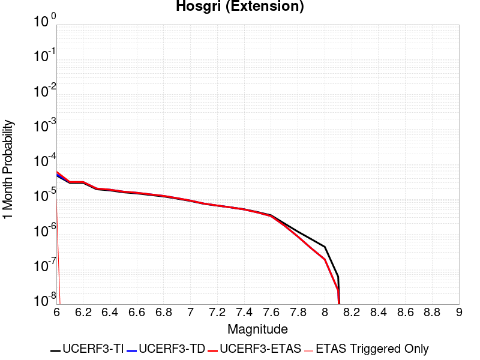 |  |  |

| Magnitude | 1 wk TI Prob | 1 wk TD Prob | 1 wk ETAS Prob | 1 wk ETAS/TD Gain | 1 wk ETAS Triggered Only | 1 mo TI Prob | 1 mo TD Prob | 1 mo ETAS Prob | 1 mo ETAS/TD Gain | 1 mo ETAS Triggered Only | 1 yr TI Prob | 1 yr TD Prob | 1 yr ETAS Prob | 1 yr ETAS/TD Gain | 1 yr ETAS Triggered Only | 10 yr TI Prob | 10 yr TD Prob | 10 yr ETAS Prob | 10 yr ETAS/TD Gain | 10 yr ETAS Triggered Only |
|-----|-----|-----|-----|-----|-----|-----|-----|-----|-----|-----|-----|-----|-----|-----|-----|-----|-----|-----|-----|-----|
| 6.0 | 1.1369135E-5 | 1.20832E-5 | 1.20832E-5 | 1.0 | 0.0 | 4.8723956E-5 | 5.1784245E-5 | 6.178373E-5 | 1.1930989 | 1.0E-5 | 5.9305265E-4 | 6.3031353E-4 | 6.403072E-4 | 1.0158551 | 1.0E-5 | 0.005914725 | 0.0062875063 | 0.0063073807 | 1.003161 | 2.0E-5 |
| 6.1 | 6.934979E-6 | 7.324637E-6 | 7.324637E-6 | 1.0 | 0.0 | 2.9721E-5 | 3.1390948E-5 | 3.1390948E-5 | 1.0 | 0.0 | 3.617931E-4 | 3.821219E-4 | 3.821219E-4 | 1.0 | 0.0 | 0.0036120464 | 0.0038150612 | 0.003825023 | 1.0026112 | 1.0E-5 |
| 6.2 | 6.934979E-6 | 7.324637E-6 | 7.324637E-6 | 1.0 | 0.0 | 2.9721E-5 | 3.1390948E-5 | 3.1390948E-5 | 1.0 | 0.0 | 3.617931E-4 | 3.821219E-4 | 3.821219E-4 | 1.0 | 0.0 | 0.0036120464 | 0.0038150612 | 0.003825023 | 1.0026112 | 1.0E-5 |
| 6.3 | 4.5484676E-6 | 4.7693884E-6 | 4.7693884E-6 | 1.0 | 0.0 | 1.9493287E-5 | 2.0440079E-5 | 2.0440079E-5 | 1.0 | 0.0 | 2.3730492E-4 | 2.4882995E-4 | 2.4882995E-4 | 1.0 | 0.0 | 0.0023705168 | 0.002485556 | 0.002485556 | 1.0 | 0.0 |
| 6.4 | 4.218095E-6 | 4.4169165E-6 | 4.4169165E-6 | 1.0 | 0.0 | 1.8077424E-5 | 1.8929508E-5 | 1.8929508E-5 | 1.0 | 0.0 | 2.2007042E-4 | 2.304427E-4 | 2.304427E-4 | 1.0 | 0.0 | 0.002198526 | 0.0023020708 | 0.0023020708 | 1.0 | 0.0 |
| 6.5 | 3.717374E-6 | 3.883928E-6 | 3.883928E-6 | 1.0 | 0.0 | 1.5931506E-5 | 1.6645301E-5 | 1.6645301E-5 | 1.0 | 0.0 | 1.9394881E-4 | 2.0263788E-4 | 2.0263788E-4 | 1.0 | 0.0 | 0.0019377962 | 0.0020245498 | 0.0020245498 | 1.0 | 0.0 |
| 6.6 | 3.4605036E-6 | 3.6083538E-6 | 3.6083538E-6 | 1.0 | 0.0 | 1.4830645E-5 | 1.5464282E-5 | 1.5464282E-5 | 1.0 | 0.0 | 1.8054814E-4 | 1.8826152E-4 | 1.8826152E-4 | 1.0 | 0.0 | 0.0018040152 | 0.001881035 | 0.001881035 | 1.0 | 0.0 |
| 6.7 | 3.123439E-6 | 3.246613E-6 | 3.246613E-6 | 1.0 | 0.0 | 1.33860985E-5 | 1.3913982E-5 | 1.3913982E-5 | 1.0 | 0.0 | 1.6296357E-4 | 1.6938966E-4 | 1.6938966E-4 | 1.0 | 0.0 | 0.001628441 | 0.0016926165 | 0.0016926165 | 1.0 | 0.0 |
| 6.8 | 2.8290783E-6 | 2.9305816E-6 | 2.9305816E-6 | 1.0 | 0.0 | 1.2124565E-5 | 1.2559575E-5 | 1.2559575E-5 | 1.0 | 0.0 | 1.4760658E-4 | 1.5290218E-4 | 1.5290218E-4 | 1.0 | 0.0 | 0.0014750857 | 0.0015279786 | 0.0015279786 | 1.0 | 0.0 |
| 6.9 | 2.454112E-6 | 2.5283568E-6 | 2.5283568E-6 | 1.0 | 0.0 | 1.0517581E-5 | 1.0835771E-5 | 1.0835771E-5 | 1.0 | 0.0 | 1.2804402E-4 | 1.3191758E-4 | 1.3191758E-4 | 1.0 | 0.0 | 0.0012797028 | 0.0013183989 | 0.0013183989 | 1.0 | 0.0 |
| 7.0 | 2.1008145E-6 | 2.149904E-6 | 2.149904E-6 | 1.0 | 0.0 | 9.003459E-6 | 9.2138425E-6 | 9.2138425E-6 | 1.0 | 0.0 | 1.096116E-4 | 1.1217279E-4 | 1.1217279E-4 | 1.0 | 0.0 | 0.0010955755 | 0.0011211655 | 0.0011211655 | 1.0 | 0.0 |
| 7.1 | 1.744384E-6 | 1.7686655E-6 | 1.7686655E-6 | 1.0 | 0.0 | 7.47591E-6 | 7.579973E-6 | 7.579973E-6 | 1.0 | 0.0 | 9.1015405E-5 | 9.228228E-5 | 9.228228E-5 | 1.0 | 0.0 | 9.097813E-4 | 9.224413E-4 | 9.224413E-4 | 1.0 | 0.0 |
| 7.2 | 1.5456587E-6 | 1.5563166E-6 | 1.5563166E-6 | 1.0 | 0.0 | 6.6242346E-6 | 6.6699113E-6 | 6.6699113E-6 | 1.0 | 0.0 | 8.064707E-5 | 8.120316E-5 | 8.120316E-5 | 1.0 | 0.0 | 8.0617814E-4 | 8.117361E-4 | 8.117361E-4 | 1.0 | 0.0 |
| 7.3 | 1.3775123E-6 | 1.3766349E-6 | 1.3766349E-6 | 1.0 | 0.0 | 5.9036106E-6 | 5.8998507E-6 | 5.8998507E-6 | 1.0 | 0.0 | 7.187409E-5 | 7.1828326E-5 | 7.1828326E-5 | 1.0 | 0.0 | 7.185085E-4 | 7.180521E-4 | 7.180521E-4 | 1.0 | 0.0 |
| 7.4 | 1.214491E-6 | 1.2023712E-6 | 1.2023712E-6 | 1.0 | 0.0 | 5.2049513E-6 | 5.153009E-6 | 5.153009E-6 | 1.0 | 0.0 | 6.336844E-5 | 6.2736086E-5 | 6.2736086E-5 | 1.0 | 0.0 | 6.335037E-4 | 6.271846E-4 | 6.271846E-4 | 1.0 | 0.0 |
| 7.5 | 1.0101123E-6 | 9.842478E-7 | 9.842478E-7 | 1.0 | 0.0 | 4.3290456E-6 | 4.218198E-6 | 4.218198E-6 | 1.0 | 0.0 | 5.2704854E-5 | 5.1355353E-5 | 5.1355353E-5 | 1.0 | 0.0 | 5.2692357E-4 | 5.1343546E-4 | 5.1343546E-4 | 1.0 | 0.0 |
| 7.6 | 8.1558215E-7 | 7.766179E-7 | 7.766179E-7 | 1.0 | 0.0 | 3.4953473E-6 | 3.3283584E-6 | 3.3283584E-6 | 1.0 | 0.0 | 4.255502E-5 | 4.0522013E-5 | 4.0522013E-5 | 1.0 | 0.0 | 4.2546875E-4 | 4.0514668E-4 | 4.0514668E-4 | 1.0 | 0.0 |
| 7.7 | 4.757816E-7 | 4.1310682E-7 | 4.1310682E-7 | 1.0 | 0.0 | 2.0390623E-6 | 1.7704566E-6 | 1.7704566E-6 | 1.0 | 0.0 | 2.4825302E-5 | 2.1555097E-5 | 2.1555097E-5 | 1.0 | 0.0 | 2.482253E-4 | 2.1553019E-4 | 2.1553019E-4 | 1.0 | 0.0 |
| 7.8 | 2.782787E-7 | 2.00493E-7 | 2.00493E-7 | 1.0 | 0.0 | 1.1926223E-6 | 8.5925547E-7 | 8.5925547E-7 | 1.0 | 0.0 | 1.452008E-5 | 1.04613855E-5 | 1.04613855E-5 | 1.0 | 0.0 | 1.4519131E-4 | 1.0460896E-4 | 1.0460896E-4 | 1.0 | 0.0 |
| 7.9 | 1.6948086E-7 | 9.2453185E-8 | 9.2453185E-8 | 1.0 | 0.0 | 7.2634634E-7 | 3.9622788E-7 | 3.9622788E-7 | 1.0 | 0.0 | 8.843231E-6 | 4.8240636E-6 | 4.8240636E-6 | 1.0 | 0.0 | 8.842879E-5 | 4.8239595E-5 | 4.8239595E-5 | 1.0 | 0.0 |
| 8.0 | 1.0225492E-7 | 4.4745146E-8 | 4.4745146E-8 | 1.0 | 0.0 | 4.382353E-7 | 1.917649E-7 | 1.917649E-7 | 1.0 | 0.0 | 5.335502E-6 | 2.3347352E-6 | 2.3347352E-6 | 1.0 | 0.0 | 5.335374E-5 | 2.334711E-5 | 2.334711E-5 | 1.0 | 0.0 |
| 8.1 | 1.43711345E-8 | 5.7886886E-9 | 5.7886886E-9 | 1.0 | 0.0 | 6.1590576E-8 | 2.4808667E-8 | 2.4808667E-8 | 1.0 | 0.0 | 7.4986497E-7 | 3.0204546E-7 | 3.0204546E-7 | 1.0 | 0.0 | 7.4986247E-6 | 3.0204512E-6 | 3.0204512E-6 | 1.0 | 0.0 |

## San Cayetano
*[(top)](#table-of-contents)*

| 1 Week | 1 Month | 1 Year | 10 Year |
|-----|-----|-----|-----|
|  |  |  | 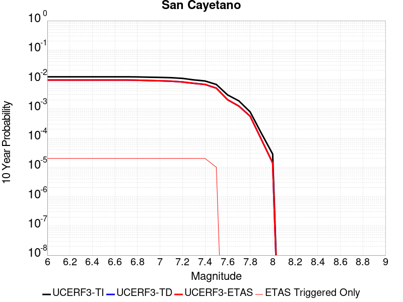 |

| Magnitude | 1 wk TI Prob | 1 wk TD Prob | 1 wk ETAS Prob | 1 wk ETAS/TD Gain | 1 wk ETAS Triggered Only | 1 mo TI Prob | 1 mo TD Prob | 1 mo ETAS Prob | 1 mo ETAS/TD Gain | 1 mo ETAS Triggered Only | 1 yr TI Prob | 1 yr TD Prob | 1 yr ETAS Prob | 1 yr ETAS/TD Gain | 1 yr ETAS Triggered Only | 10 yr TI Prob | 10 yr TD Prob | 10 yr ETAS Prob | 10 yr ETAS/TD Gain | 10 yr ETAS Triggered Only |
|-----|-----|-----|-----|-----|-----|-----|-----|-----|-----|-----|-----|-----|-----|-----|-----|-----|-----|-----|-----|-----|
| 6.0 | 2.3476267E-5 | 1.8169507E-5 | 1.8169507E-5 | 1.0 | 0.0 | 1.0060869E-4 | 7.786701E-5 | 7.786701E-5 | 1.0 | 0.0 | 0.0012242225 | 9.476222E-4 | 9.476222E-4 | 1.0 | 0.0 | 0.012175002 | 0.009437101 | 0.009456912 | 1.0020993 | 2.0E-5 |
| 6.1 | 2.3476267E-5 | 1.8169507E-5 | 1.8169507E-5 | 1.0 | 0.0 | 1.0060869E-4 | 7.786701E-5 | 7.786701E-5 | 1.0 | 0.0 | 0.0012242225 | 9.476222E-4 | 9.476222E-4 | 1.0 | 0.0 | 0.012175002 | 0.009437101 | 0.009456912 | 1.0020993 | 2.0E-5 |
| 6.2 | 2.3476267E-5 | 1.8169507E-5 | 1.8169507E-5 | 1.0 | 0.0 | 1.0060869E-4 | 7.786701E-5 | 7.786701E-5 | 1.0 | 0.0 | 0.0012242225 | 9.476222E-4 | 9.476222E-4 | 1.0 | 0.0 | 0.012175002 | 0.009437101 | 0.009456912 | 1.0020993 | 2.0E-5 |
| 6.3 | 2.3476267E-5 | 1.8169507E-5 | 1.8169507E-5 | 1.0 | 0.0 | 1.0060869E-4 | 7.786701E-5 | 7.786701E-5 | 1.0 | 0.0 | 0.0012242225 | 9.476222E-4 | 9.476222E-4 | 1.0 | 0.0 | 0.012175002 | 0.009437101 | 0.009456912 | 1.0020993 | 2.0E-5 |
| 6.4 | 2.3476267E-5 | 1.8169507E-5 | 1.8169507E-5 | 1.0 | 0.0 | 1.0060869E-4 | 7.786701E-5 | 7.786701E-5 | 1.0 | 0.0 | 0.0012242225 | 9.476222E-4 | 9.476222E-4 | 1.0 | 0.0 | 0.012175002 | 0.009437101 | 0.009456912 | 1.0020993 | 2.0E-5 |
| 6.5 | 2.3476267E-5 | 1.8169507E-5 | 1.8169507E-5 | 1.0 | 0.0 | 1.0060869E-4 | 7.786701E-5 | 7.786701E-5 | 1.0 | 0.0 | 0.0012242225 | 9.476222E-4 | 9.476222E-4 | 1.0 | 0.0 | 0.012175002 | 0.009437101 | 0.009456912 | 1.0020993 | 2.0E-5 |
| 6.6 | 2.3476267E-5 | 1.8169507E-5 | 1.8169507E-5 | 1.0 | 0.0 | 1.0060869E-4 | 7.786701E-5 | 7.786701E-5 | 1.0 | 0.0 | 0.0012242225 | 9.476222E-4 | 9.476222E-4 | 1.0 | 0.0 | 0.012175002 | 0.009437101 | 0.009456912 | 1.0020993 | 2.0E-5 |
| 6.7 | 2.3476267E-5 | 1.8169507E-5 | 1.8169507E-5 | 1.0 | 0.0 | 1.0060869E-4 | 7.786701E-5 | 7.786701E-5 | 1.0 | 0.0 | 0.0012242225 | 9.476222E-4 | 9.476222E-4 | 1.0 | 0.0 | 0.012175002 | 0.009437101 | 0.009456912 | 1.0020993 | 2.0E-5 |
| 6.8 | 2.3241924E-5 | 1.7937233E-5 | 1.7937233E-5 | 1.0 | 0.0 | 9.960445E-5 | 7.6871605E-5 | 7.6871605E-5 | 1.0 | 0.0 | 0.0012120095 | 9.355136E-4 | 9.355136E-4 | 1.0 | 0.0 | 0.012054204 | 0.009316779 | 0.009336592 | 1.0021267 | 2.0E-5 |
| 6.9 | 2.2761007E-5 | 1.743266E-5 | 1.743266E-5 | 1.0 | 0.0 | 9.7543525E-5 | 7.470928E-5 | 7.470928E-5 | 1.0 | 0.0 | 0.0011869454 | 9.092093E-4 | 9.092093E-4 | 1.0 | 0.0 | 0.011806256 | 0.009055895 | 0.009075714 | 1.0021886 | 2.0E-5 |
| 7.0 | 2.240283E-5 | 1.7066408E-5 | 1.7066408E-5 | 1.0 | 0.0 | 9.600859E-5 | 7.3139716E-5 | 7.3139716E-5 | 1.0 | 0.0 | 0.0011682777 | 8.901157E-4 | 8.901157E-4 | 1.0 | 0.0 | 0.011621549 | 0.008866488 | 0.00888631 | 1.0022357 | 2.0E-5 |
| 7.1 | 2.1871154E-5 | 1.6586284E-5 | 1.6586284E-5 | 1.0 | 0.0 | 9.373015E-5 | 7.1082155E-5 | 7.1082155E-5 | 1.0 | 0.0 | 0.0011405671 | 8.6508493E-4 | 8.6508493E-4 | 1.0 | 0.0 | 0.011347309 | 0.008618144 | 0.008637972 | 1.0023007 | 2.0E-5 |
| 7.2 | 2.0714133E-5 | 1.5564807E-5 | 1.5564807E-5 | 1.0 | 0.0 | 8.8771834E-5 | 6.670463E-5 | 6.670463E-5 | 1.0 | 0.0 | 0.0010802611 | 8.118295E-4 | 8.118295E-4 | 1.0 | 0.0 | 0.010750249 | 0.008089582 | 0.008109421 | 1.0024524 | 2.0E-5 |
| 7.3 | 1.8408395E-5 | 1.3997041E-5 | 1.3997041E-5 | 1.0 | 0.0 | 7.8890735E-5 | 5.9985956E-5 | 5.9985956E-5 | 1.0 | 0.0 | 9.600714E-4 | 7.300873E-4 | 7.300873E-4 | 1.0 | 0.0 | 0.009559342 | 0.007277768 | 0.0072976225 | 1.0027281 | 2.0E-5 |
| 7.4 | 1.6856795E-5 | 1.2850253E-5 | 1.2850253E-5 | 1.0 | 0.0 | 7.2241404E-5 | 5.5071367E-5 | 5.5071367E-5 | 1.0 | 0.0 | 8.7918417E-4 | 6.702905E-4 | 6.702905E-4 | 1.0 | 0.0 | 0.00875714 | 0.006683518 | 0.0067033847 | 1.0029725 | 2.0E-5 |
| 7.5 | 1.2822778E-5 | 9.577563E-6 | 9.577563E-6 | 1.0 | 0.0 | 5.495361E-5 | 4.1046063E-5 | 4.1046063E-5 | 1.0 | 0.0 | 6.688548E-4 | 4.9962284E-4 | 4.9962284E-4 | 1.0 | 0.0 | 0.006668452 | 0.004985341 | 0.004995291 | 1.0019959 | 1.0E-5 |
| 7.6 | 5.6272684E-6 | 3.8549674E-6 | 3.8549674E-6 | 1.0 | 0.0 | 2.4116642E-5 | 1.6521184E-5 | 1.6521184E-5 | 1.0 | 0.0 | 2.9358055E-4 | 2.0112695E-4 | 2.0112695E-4 | 1.0 | 0.0 | 0.0029319301 | 0.0020094602 | 0.0020094602 | 1.0 | 0.0 |
| 7.7 | 3.5261346E-6 | 2.3407508E-6 | 2.3407508E-6 | 1.0 | 0.0 | 1.5111918E-5 | 1.0031751E-5 | 1.0031751E-5 | 1.0 | 0.0 | 1.8397206E-4 | 1.221298E-4 | 1.221298E-4 | 1.0 | 0.0 | 0.0018381984 | 0.0012206341 | 0.0012206341 | 1.0 | 0.0 |
| 7.8 | 1.4826929E-6 | 1.0564586E-6 | 1.0564586E-6 | 1.0 | 0.0 | 6.354383E-6 | 4.527672E-6 | 4.527672E-6 | 1.0 | 0.0 | 7.736187E-5 | 5.512303E-5 | 5.512303E-5 | 1.0 | 0.0 | 7.733494E-4 | 5.510956E-4 | 5.510956E-4 | 1.0 | 0.0 |
| 7.9 | 2.7568166E-7 | 1.6978433E-7 | 1.6978433E-7 | 1.0 | 0.0 | 1.1814923E-6 | 7.276469E-7 | 7.276469E-7 | 1.0 | 0.0 | 1.4384574E-5 | 8.859066E-6 | 8.859066E-6 | 1.0 | 0.0 | 1.4383643E-4 | 8.858716E-5 | 8.858716E-5 | 1.0 | 0.0 |
| 8.0 | 5.407832E-8 | 2.68885E-8 | 2.68885E-8 | 1.0 | 0.0 | 2.3176422E-7 | 1.15236425E-7 | 1.15236425E-7 | 1.0 | 0.0 | 2.8217257E-6 | 1.4030026E-6 | 1.4030026E-6 | 1.0 | 0.0 | 2.8216898E-5 | 1.4029942E-5 | 1.4029942E-5 | 1.0 | 0.0 |

## Northridge
*[(top)](#table-of-contents)*

| 1 Week | 1 Month | 1 Year | 10 Year |
|-----|-----|-----|-----|
|  |  |  |  |

| Magnitude | 1 wk TI Prob | 1 wk TD Prob | 1 wk ETAS Prob | 1 wk ETAS/TD Gain | 1 wk ETAS Triggered Only | 1 mo TI Prob | 1 mo TD Prob | 1 mo ETAS Prob | 1 mo ETAS/TD Gain | 1 mo ETAS Triggered Only | 1 yr TI Prob | 1 yr TD Prob | 1 yr ETAS Prob | 1 yr ETAS/TD Gain | 1 yr ETAS Triggered Only | 10 yr TI Prob | 10 yr TD Prob | 10 yr ETAS Prob | 10 yr ETAS/TD Gain | 10 yr ETAS Triggered Only |
|-----|-----|-----|-----|-----|-----|-----|-----|-----|-----|-----|-----|-----|-----|-----|-----|-----|-----|-----|-----|-----|
| 6.0 | 1.8340852E-5 | 7.5880284E-6 | 7.5880284E-6 | 1.0 | 0.0 | 7.860128E-5 | 3.251973E-5 | 3.251973E-5 | 1.0 | 0.0 | 9.565505E-4 | 3.9585796E-4 | 3.9585796E-4 | 1.0 | 0.0 | 0.009524435 | 0.003951762 | 0.003971683 | 1.005041 | 2.0E-5 |
| 6.1 | 1.8340852E-5 | 7.5880284E-6 | 7.5880284E-6 | 1.0 | 0.0 | 7.860128E-5 | 3.251973E-5 | 3.251973E-5 | 1.0 | 0.0 | 9.565505E-4 | 3.9585796E-4 | 3.9585796E-4 | 1.0 | 0.0 | 0.009524435 | 0.003951762 | 0.003971683 | 1.005041 | 2.0E-5 |
| 6.2 | 1.8340852E-5 | 7.5880284E-6 | 7.5880284E-6 | 1.0 | 0.0 | 7.860128E-5 | 3.251973E-5 | 3.251973E-5 | 1.0 | 0.0 | 9.565505E-4 | 3.9585796E-4 | 3.9585796E-4 | 1.0 | 0.0 | 0.009524435 | 0.003951762 | 0.003971683 | 1.005041 | 2.0E-5 |
| 6.3 | 1.8340852E-5 | 7.5880284E-6 | 7.5880284E-6 | 1.0 | 0.0 | 7.860128E-5 | 3.251973E-5 | 3.251973E-5 | 1.0 | 0.0 | 9.565505E-4 | 3.9585796E-4 | 3.9585796E-4 | 1.0 | 0.0 | 0.009524435 | 0.003951762 | 0.003971683 | 1.005041 | 2.0E-5 |
| 6.4 | 1.7361892E-5 | 7.5880284E-6 | 7.5880284E-6 | 1.0 | 0.0 | 7.440598E-5 | 3.251973E-5 | 3.251973E-5 | 1.0 | 0.0 | 9.055163E-4 | 3.9585796E-4 | 3.9585796E-4 | 1.0 | 0.0 | 0.009018354 | 0.003951762 | 0.003971683 | 1.005041 | 2.0E-5 |
| 6.5 | 1.7361892E-5 | 7.5880284E-6 | 7.5880284E-6 | 1.0 | 0.0 | 7.440598E-5 | 3.251973E-5 | 3.251973E-5 | 1.0 | 0.0 | 9.055163E-4 | 3.9585796E-4 | 3.9585796E-4 | 1.0 | 0.0 | 0.009018354 | 0.003951762 | 0.003971683 | 1.005041 | 2.0E-5 |
| 6.6 | 1.5458201E-5 | 7.5880284E-6 | 7.5880284E-6 | 1.0 | 0.0 | 6.624775E-5 | 3.251973E-5 | 3.251973E-5 | 1.0 | 0.0 | 8.0626784E-4 | 3.9585796E-4 | 3.9585796E-4 | 1.0 | 0.0 | 0.008033488 | 0.003951762 | 0.003971683 | 1.005041 | 2.0E-5 |
| 6.7 | 1.2538368E-5 | 6.381612E-6 | 6.381612E-6 | 1.0 | 0.0 | 5.3734755E-5 | 2.734948E-5 | 2.734948E-5 | 1.0 | 0.0 | 6.5402425E-4 | 3.3292949E-4 | 3.3292949E-4 | 1.0 | 0.0 | 0.0065210275 | 0.0033243664 | 0.0033443 | 1.0059962 | 2.0E-5 |
| 6.8 | 1.1438097E-5 | 6.3502694E-6 | 6.3502694E-6 | 1.0 | 0.0 | 4.9019498E-5 | 2.721516E-5 | 2.721516E-5 | 1.0 | 0.0 | 5.9664896E-4 | 3.312946E-4 | 3.312946E-4 | 1.0 | 0.0 | 0.005950495 | 0.0033080664 | 0.0033180332 | 1.0030129 | 1.0E-5 |
| 6.9 | 1.1204891E-5 | 6.2867225E-6 | 6.2867225E-6 | 1.0 | 0.0 | 4.8020076E-5 | 2.6942822E-5 | 2.6942822E-5 | 1.0 | 0.0 | 5.8448757E-4 | 3.279799E-4 | 3.279799E-4 | 1.0 | 0.0 | 0.0058295266 | 0.0032750175 | 0.0032849847 | 1.0030434 | 1.0E-5 |
| 7.0 | 1.061046E-5 | 6.115376E-6 | 6.115376E-6 | 1.0 | 0.0 | 4.5472607E-5 | 2.6208494E-5 | 2.6208494E-5 | 1.0 | 0.0 | 5.534883E-4 | 3.1904213E-4 | 3.1904213E-4 | 1.0 | 0.0 | 0.0055211177 | 0.003185887 | 0.003195855 | 1.0031289 | 1.0E-5 |
| 7.1 | 1.0266979E-5 | 6.004295E-6 | 6.004295E-6 | 1.0 | 0.0 | 4.40006E-5 | 2.5732441E-5 | 2.5732441E-5 | 1.0 | 0.0 | 5.355756E-4 | 3.1324785E-4 | 3.1324785E-4 | 1.0 | 0.0 | 0.0053428668 | 0.0031281086 | 0.0031380772 | 1.0031868 | 1.0E-5 |
| 7.2 | 9.91273E-6 | 5.820007E-6 | 5.820007E-6 | 1.0 | 0.0 | 4.248244E-5 | 2.494265E-5 | 2.494265E-5 | 1.0 | 0.0 | 5.171009E-4 | 3.0363488E-4 | 3.0363488E-4 | 1.0 | 0.0 | 0.0051589934 | 0.0030322452 | 0.0030422148 | 1.0032879 | 1.0E-5 |
| 7.3 | 8.4959265E-6 | 5.193102E-6 | 5.193102E-6 | 1.0 | 0.0 | 3.6410605E-5 | 2.2255961E-5 | 2.2255961E-5 | 1.0 | 0.0 | 4.4320893E-4 | 2.7093288E-4 | 2.7093288E-4 | 1.0 | 0.0 | 0.00442326 | 0.002706052 | 0.0027160249 | 1.0036855 | 1.0E-5 |
| 7.4 | 8.0847185E-6 | 4.9819787E-6 | 4.9819787E-6 | 1.0 | 0.0 | 3.4648332E-5 | 2.1351163E-5 | 2.1351163E-5 | 1.0 | 0.0 | 4.2176177E-4 | 2.5991965E-4 | 2.5991965E-4 | 1.0 | 0.0 | 0.0042096223 | 0.0025961823 | 0.0026061563 | 1.0038418 | 1.0E-5 |
| 7.5 | 6.8220684E-6 | 4.2533266E-6 | 4.2533266E-6 | 1.0 | 0.0 | 2.9237108E-5 | 1.8228417E-5 | 1.8228417E-5 | 1.0 | 0.0 | 3.5590364E-4 | 2.2190856E-4 | 2.2190856E-4 | 1.0 | 0.0 | 0.0035533418 | 0.0022168907 | 0.0022268686 | 1.0045009 | 1.0E-5 |
| 7.6 | 4.4224143E-6 | 2.899968E-6 | 2.899968E-6 | 1.0 | 0.0 | 1.8953066E-5 | 1.2428376E-5 | 1.2428376E-5 | 1.0 | 0.0 | 2.3072914E-4 | 1.5130508E-4 | 1.5130508E-4 | 1.0 | 0.0 | 0.0023048974 | 0.0015120322 | 0.0015120322 | 1.0 | 0.0 |
| 7.7 | 2.5297056E-6 | 1.6046126E-6 | 1.6046126E-6 | 1.0 | 0.0 | 1.0841551E-5 | 6.8768936E-6 | 6.8768936E-6 | 1.0 | 0.0 | 1.319879E-4 | 8.372301E-5 | 8.372301E-5 | 1.0 | 0.0 | 0.0013190953 | 8.3691935E-4 | 8.3691935E-4 | 1.0 | 0.0 |
| 7.8 | 1.2508156E-6 | 8.7802323E-7 | 8.7802323E-7 | 1.0 | 0.0 | 5.3606273E-6 | 3.7629513E-6 | 3.7629513E-6 | 1.0 | 0.0 | 6.526368E-5 | 4.5812983E-5 | 4.5812983E-5 | 1.0 | 0.0 | 6.524452E-4 | 4.5803667E-4 | 4.5803667E-4 | 1.0 | 0.0 |
| 7.9 | 2.262199E-7 | 1.4665106E-7 | 1.4665106E-7 | 1.0 | 0.0 | 9.695135E-7 | 6.285044E-7 | 6.285044E-7 | 1.0 | 0.0 | 1.1803763E-5 | 7.652015E-6 | 7.652015E-6 | 1.0 | 0.0 | 1.1803136E-4 | 7.6517594E-5 | 7.6517594E-5 | 1.0 | 0.0 |
| 8.0 | 2.865362E-9 | 1.2753111E-9 | 1.2753111E-9 | 1.0 | 0.0 | 1.2280123E-8 | 5.465619E-9 | 5.465619E-9 | 1.0 | 0.0 | 1.4951048E-7 | 6.654391E-8 | 6.654391E-8 | 1.0 | 0.0 | 1.4951038E-6 | 6.6543913E-7 | 6.6543913E-7 | 1.0 | 0.0 |

## San Andreas (Santa Cruz Mts) 2011 CFM
*[(top)](#table-of-contents)*

| 1 Week | 1 Month | 1 Year | 10 Year |
|-----|-----|-----|-----|
|  |  |  | 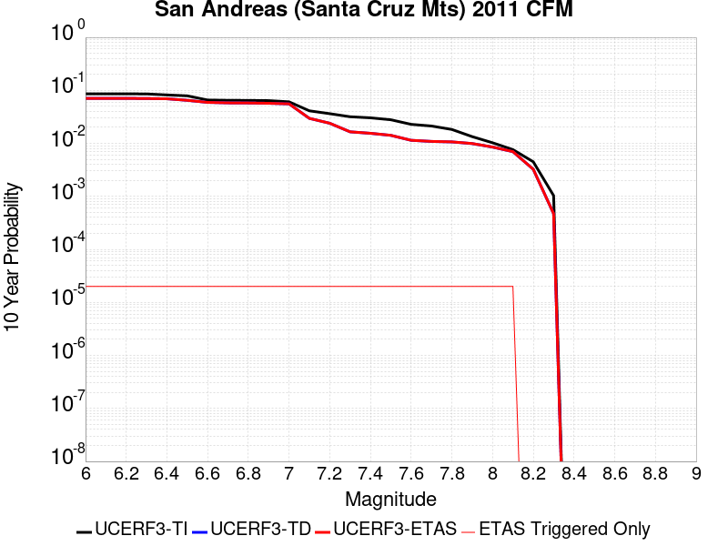 |

| Magnitude | 1 wk TI Prob | 1 wk TD Prob | 1 wk ETAS Prob | 1 wk ETAS/TD Gain | 1 wk ETAS Triggered Only | 1 mo TI Prob | 1 mo TD Prob | 1 mo ETAS Prob | 1 mo ETAS/TD Gain | 1 mo ETAS Triggered Only | 1 yr TI Prob | 1 yr TD Prob | 1 yr ETAS Prob | 1 yr ETAS/TD Gain | 1 yr ETAS Triggered Only | 10 yr TI Prob | 10 yr TD Prob | 10 yr ETAS Prob | 10 yr ETAS/TD Gain | 10 yr ETAS Triggered Only |
|-----|-----|-----|-----|-----|-----|-----|-----|-----|-----|-----|-----|-----|-----|-----|-----|-----|-----|-----|-----|-----|
| 6.0 | 1.7221631E-4 | 1.3799455E-4 | 1.3799455E-4 | 1.0 | 0.0 | 7.378611E-4 | 5.912732E-4 | 6.0126727E-4 | 1.0169027 | 1.0E-5 | 0.008946515 | 0.007175434 | 0.0071853623 | 1.0013837 | 1.0E-5 | 0.08594794 | 0.0705909 | 0.07060949 | 1.0002633 | 2.0E-5 |
| 6.1 | 1.7221631E-4 | 1.3799455E-4 | 1.3799455E-4 | 1.0 | 0.0 | 7.378611E-4 | 5.912732E-4 | 6.0126727E-4 | 1.0169027 | 1.0E-5 | 0.008946515 | 0.007175434 | 0.0071853623 | 1.0013837 | 1.0E-5 | 0.08594794 | 0.0705909 | 0.07060949 | 1.0002633 | 2.0E-5 |
| 6.2 | 1.7221631E-4 | 1.3799455E-4 | 1.3799455E-4 | 1.0 | 0.0 | 7.378611E-4 | 5.912732E-4 | 6.0126727E-4 | 1.0169027 | 1.0E-5 | 0.008946515 | 0.007175434 | 0.0071853623 | 1.0013837 | 1.0E-5 | 0.08594794 | 0.0705909 | 0.07060949 | 1.0002633 | 2.0E-5 |
| 6.3 | 1.716926E-4 | 1.3718852E-4 | 1.3718852E-4 | 1.0 | 0.0 | 7.3561794E-4 | 5.8782037E-4 | 5.978145E-4 | 1.017002 | 1.0E-5 | 0.008919428 | 0.0071336706 | 0.0071435994 | 1.0013918 | 1.0E-5 | 0.08569809 | 0.07020574 | 0.07022434 | 1.0002649 | 2.0E-5 |
| 6.4 | 1.6392978E-4 | 1.3594677E-4 | 1.3594677E-4 | 1.0 | 0.0 | 7.02367E-4 | 5.82501E-4 | 5.9249514E-4 | 1.0171573 | 1.0E-5 | 0.008517839 | 0.007069328 | 0.007079257 | 1.0014045 | 1.0E-5 | 0.08198654 | 0.06943973 | 0.06945834 | 1.000268 | 2.0E-5 |
| 6.5 | 1.5742714E-4 | 1.2654555E-4 | 1.2654555E-4 | 1.0 | 0.0 | 6.745133E-4 | 5.4222706E-4 | 5.522216E-4 | 1.0184325 | 1.0E-5 | 0.00818132 | 0.0065820105 | 0.0065919445 | 1.0015093 | 1.0E-5 | 0.078865945 | 0.06490567 | 0.064924374 | 1.0002881 | 2.0E-5 |
| 6.6 | 1.3038084E-4 | 1.1594578E-4 | 1.1594578E-4 | 1.0 | 0.0 | 5.5865536E-4 | 4.9681717E-4 | 5.068122E-4 | 1.0201181 | 1.0E-5 | 0.006780438 | 0.006032269 | 0.0060422085 | 1.0016477 | 1.0E-5 | 0.0657725 | 0.05936088 | 0.059379693 | 1.000317 | 2.0E-5 |
| 6.7 | 1.2867592E-4 | 1.1321072E-4 | 1.1321072E-4 | 1.0 | 0.0 | 5.5135164E-4 | 4.8509985E-4 | 4.95095E-4 | 1.0206044 | 1.0E-5 | 0.0066920654 | 0.0058903894 | 0.005900331 | 1.0016876 | 1.0E-5 | 0.06494093 | 0.0580718 | 0.05809064 | 1.0003244 | 2.0E-5 |
| 6.8 | 1.2801298E-4 | 1.12586225E-4 | 1.12586225E-4 | 1.0 | 0.0 | 5.485117E-4 | 4.8242445E-4 | 4.9241964E-4 | 1.0207186 | 1.0E-5 | 0.0066577005 | 0.005857939 | 0.0058678803 | 1.0016971 | 1.0E-5 | 0.06461738 | 0.05778563 | 0.057804476 | 1.0003262 | 2.0E-5 |
| 6.9 | 1.269149E-4 | 1.1100813E-4 | 1.1100813E-4 | 1.0 | 0.0 | 5.4380763E-4 | 4.7566366E-4 | 4.856589E-4 | 1.0210133 | 1.0E-5 | 0.006600777 | 0.0057760654 | 0.0057860077 | 1.0017213 | 1.0E-5 | 0.06408122 | 0.05705746 | 0.057076316 | 1.0003306 | 2.0E-5 |
| 7.0 | 1.2030331E-4 | 1.0830798E-4 | 1.0830798E-4 | 1.0 | 0.0 | 5.154837E-4 | 4.6409573E-4 | 4.740911E-4 | 1.0215373 | 1.0E-5 | 0.006257969 | 0.0056359624 | 0.005645906 | 1.0017643 | 1.0E-5 | 0.06084648 | 0.055730198 | 0.05574908 | 1.0003389 | 2.0E-5 |
| 7.1 | 8.049617E-5 | 5.3974167E-5 | 5.3974167E-5 | 1.0 | 0.0 | 3.4493793E-4 | 2.3129754E-4 | 2.4129523E-4 | 1.0432243 | 1.0E-5 | 0.0041915346 | 0.0028124459 | 0.0028224178 | 1.0035456 | 1.0E-5 | 0.041133516 | 0.02964185 | 0.029661257 | 1.0006547 | 2.0E-5 |
| 7.2 | 7.093979E-5 | 4.2981093E-5 | 4.2981093E-5 | 1.0 | 0.0 | 3.0399222E-4 | 1.8419181E-4 | 1.9418997E-4 | 1.0542812 | 1.0E-5 | 0.0036948253 | 0.0022402517 | 0.0022502295 | 1.0044538 | 1.0E-5 | 0.03633994 | 0.023962723 | 0.023982244 | 1.0008147 | 2.0E-5 |
| 7.3 | 6.193693E-5 | 2.892363E-5 | 2.892363E-5 | 1.0 | 0.0 | 2.6541698E-4 | 1.2395254E-4 | 1.339513E-4 | 1.0806661 | 1.0E-5 | 0.0032266637 | 0.0015080792 | 0.0015180641 | 1.006621 | 1.0E-5 | 0.031802133 | 0.016514132 | 0.016533801 | 1.0011911 | 2.0E-5 |
| 7.4 | 5.906492E-5 | 2.704955E-5 | 2.704955E-5 | 1.0 | 0.0 | 2.5311083E-4 | 1.15921495E-4 | 1.2592034E-4 | 1.0862553 | 1.0E-5 | 0.0030772698 | 0.0014104319 | 0.0014204178 | 1.0070801 | 1.0E-5 | 0.030350044 | 0.015484477 | 0.015504167 | 1.0012716 | 2.0E-5 |
| 7.5 | 5.424296E-5 | 2.4700184E-5 | 2.4700184E-5 | 1.0 | 0.0 | 2.324491E-4 | 1.0585365E-4 | 1.1585259E-4 | 1.09446 | 1.0E-5 | 0.002826395 | 0.0012880075 | 0.0012979945 | 1.007754 | 1.0E-5 | 0.027907165 | 0.01417464 | 0.014194357 | 1.0013909 | 2.0E-5 |
| 7.6 | 4.43084E-5 | 1.9918234E-5 | 1.9918234E-5 | 1.0 | 0.0 | 1.8987931E-4 | 8.536106E-5 | 9.5360214E-5 | 1.1171395 | 1.0E-5 | 0.0023093296 | 0.0010387758 | 0.0010487654 | 1.0096167 | 1.0E-5 | 0.022854783 | 0.011420152 | 0.011439924 | 1.0017313 | 2.0E-5 |
| 7.7 | 4.118098E-5 | 1.8949535E-5 | 1.8949535E-5 | 1.0 | 0.0 | 1.7647797E-4 | 8.1209764E-5 | 9.120895E-5 | 1.1231279 | 1.0E-5 | 0.002146502 | 9.882806E-4 | 9.982707E-4 | 1.0101086 | 1.0E-5 | 0.021258866 | 0.0108775245 | 0.010897307 | 1.0018187 | 2.0E-5 |
| 7.8 | 3.5408906E-5 | 1.85772E-5 | 1.85772E-5 | 1.0 | 0.0 | 1.5174363E-4 | 7.961415E-5 | 8.961335E-5 | 1.1255958 | 1.0E-5 | 0.0018459131 | 9.688714E-4 | 9.788617E-4 | 1.0103112 | 1.0E-5 | 0.018306552 | 0.010658879 | 0.010678666 | 1.0018563 | 2.0E-5 |
| 7.9 | 2.5860836E-5 | 1.7327653E-5 | 1.7327653E-5 | 1.0 | 0.0 | 1.10827445E-4 | 7.425925E-5 | 8.4258514E-5 | 1.1346533 | 1.0E-5 | 0.001348489 | 9.037317E-4 | 9.137226E-4 | 1.0110552 | 1.0E-5 | 0.013403354 | 0.00991376 | 0.009933562 | 1.0019974 | 2.0E-5 |
| 8.0 | 1.9777332E-5 | 1.4849638E-5 | 1.4849638E-5 | 1.0 | 0.0 | 8.4757245E-5 | 6.363975E-5 | 7.363912E-5 | 1.1571245 | 1.0E-5 | 0.0010314309 | 7.745388E-4 | 7.8453106E-4 | 1.012901 | 1.0E-5 | 0.010266567 | 0.008514252 | 0.008534081 | 1.002329 | 2.0E-5 |
| 8.1 | 1.468494E-5 | 1.21155035E-5 | 1.21155035E-5 | 1.0 | 0.0 | 6.293394E-5 | 5.1922554E-5 | 6.192204E-5 | 1.1925845 | 1.0E-5 | 7.6595135E-4 | 6.319739E-4 | 6.419676E-4 | 1.0158135 | 1.0E-5 | 0.0076331664 | 0.00697351 | 0.006993371 | 1.002848 | 2.0E-5 |
| 8.2 | 8.63836E-6 | 5.472861E-6 | 5.472861E-6 | 1.0 | 0.0 | 3.7021015E-5 | 2.3454908E-5 | 2.3454908E-5 | 1.0 | 0.0 | 4.5063766E-4 | 2.8552618E-4 | 2.8552618E-4 | 1.0 | 0.0 | 0.004497249 | 0.0032478282 | 0.0032478282 | 1.0 | 0.0 |
| 8.3 | 1.983087E-6 | 7.6647797E-7 | 7.6647797E-7 | 1.0 | 0.0 | 8.498917E-6 | 3.2849016E-6 | 3.2849016E-6 | 1.0 | 0.0 | 1.034694E-4 | 3.999296E-5 | 3.999296E-5 | 1.0 | 0.0 | 0.0010342124 | 4.7228087E-4 | 4.7228087E-4 | 1.0 | 0.0 |

## Santa Susana alt 1
*[(top)](#table-of-contents)*

| 1 Week | 1 Month | 1 Year | 10 Year |
|-----|-----|-----|-----|
|  |  |  |  |

| Magnitude | 1 wk TI Prob | 1 wk TD Prob | 1 wk ETAS Prob | 1 wk ETAS/TD Gain | 1 wk ETAS Triggered Only | 1 mo TI Prob | 1 mo TD Prob | 1 mo ETAS Prob | 1 mo ETAS/TD Gain | 1 mo ETAS Triggered Only | 1 yr TI Prob | 1 yr TD Prob | 1 yr ETAS Prob | 1 yr ETAS/TD Gain | 1 yr ETAS Triggered Only | 10 yr TI Prob | 10 yr TD Prob | 10 yr ETAS Prob | 10 yr ETAS/TD Gain | 10 yr ETAS Triggered Only |
|-----|-----|-----|-----|-----|-----|-----|-----|-----|-----|-----|-----|-----|-----|-----|-----|-----|-----|-----|-----|-----|
| 6.0 | 2.674877E-5 | 2.7198794E-5 | 2.7198794E-5 | 1.0 | 0.0 | 1.1463255E-4 | 1.1656169E-4 | 1.2656052E-4 | 1.0857815 | 1.0E-5 | 0.0013947578 | 0.0014183284 | 0.0014383 | 1.0140811 | 2.0E-5 | 0.013860362 | 0.014104702 | 0.01412442 | 1.001398 | 2.0E-5 |
| 6.1 | 2.674877E-5 | 2.7198794E-5 | 2.7198794E-5 | 1.0 | 0.0 | 1.1463255E-4 | 1.1656169E-4 | 1.2656052E-4 | 1.0857815 | 1.0E-5 | 0.0013947578 | 0.0014183284 | 0.0014383 | 1.0140811 | 2.0E-5 | 0.013860362 | 0.014104702 | 0.01412442 | 1.001398 | 2.0E-5 |
| 6.2 | 2.674877E-5 | 2.7198794E-5 | 2.7198794E-5 | 1.0 | 0.0 | 1.1463255E-4 | 1.1656169E-4 | 1.2656052E-4 | 1.0857815 | 1.0E-5 | 0.0013947578 | 0.0014183284 | 0.0014383 | 1.0140811 | 2.0E-5 | 0.013860362 | 0.014104702 | 0.01412442 | 1.001398 | 2.0E-5 |
| 6.3 | 2.674877E-5 | 2.7198794E-5 | 2.7198794E-5 | 1.0 | 0.0 | 1.1463255E-4 | 1.1656169E-4 | 1.2656052E-4 | 1.0857815 | 1.0E-5 | 0.0013947578 | 0.0014183284 | 0.0014383 | 1.0140811 | 2.0E-5 | 0.013860362 | 0.014104702 | 0.01412442 | 1.001398 | 2.0E-5 |
| 6.4 | 2.674877E-5 | 2.7198794E-5 | 2.7198794E-5 | 1.0 | 0.0 | 1.1463255E-4 | 1.1656169E-4 | 1.2656052E-4 | 1.0857815 | 1.0E-5 | 0.0013947578 | 0.0014183284 | 0.0014383 | 1.0140811 | 2.0E-5 | 0.013860362 | 0.014104702 | 0.01412442 | 1.001398 | 2.0E-5 |
| 6.5 | 2.674877E-5 | 2.7198794E-5 | 2.7198794E-5 | 1.0 | 0.0 | 1.1463255E-4 | 1.1656169E-4 | 1.2656052E-4 | 1.0857815 | 1.0E-5 | 0.0013947578 | 0.0014183284 | 0.0014383 | 1.0140811 | 2.0E-5 | 0.013860362 | 0.014104702 | 0.01412442 | 1.001398 | 2.0E-5 |
| 6.6 | 2.6647976E-5 | 2.707513E-5 | 2.707513E-5 | 1.0 | 0.0 | 1.14200615E-4 | 1.1603175E-4 | 1.2603059E-4 | 1.0861733 | 1.0E-5 | 0.0013895056 | 0.0014118847 | 0.0014318564 | 1.0141455 | 2.0E-5 | 0.013808494 | 0.014041085 | 0.014060804 | 1.0014044 | 2.0E-5 |
| 6.7 | 2.6647976E-5 | 2.707513E-5 | 2.707513E-5 | 1.0 | 0.0 | 1.14200615E-4 | 1.1603175E-4 | 1.2603059E-4 | 1.0861733 | 1.0E-5 | 0.0013895056 | 0.0014118847 | 0.0014318564 | 1.0141455 | 2.0E-5 | 0.013808494 | 0.014041085 | 0.014060804 | 1.0014044 | 2.0E-5 |
| 6.8 | 1.9073179E-5 | 1.7637734E-5 | 1.7637734E-5 | 1.0 | 0.0 | 8.1739636E-5 | 7.558821E-5 | 8.5587446E-5 | 1.1322858 | 1.0E-5 | 9.947256E-4 | 9.1991597E-4 | 9.3989755E-4 | 1.0217211 | 2.0E-5 | 0.009902848 | 0.009163515 | 0.009183331 | 1.0021626 | 2.0E-5 |
| 6.9 | 1.9041876E-5 | 1.7619866E-5 | 1.7619866E-5 | 1.0 | 0.0 | 8.160549E-5 | 7.551163E-5 | 8.5510874E-5 | 1.13242 | 1.0E-5 | 9.930939E-4 | 9.189845E-4 | 9.3896606E-4 | 1.0217432 | 2.0E-5 | 0.0098866755 | 0.009154276 | 0.009174093 | 1.0021647 | 2.0E-5 |
| 7.0 | 1.5917482E-5 | 1.386421E-5 | 1.386421E-5 | 1.0 | 0.0 | 6.8215995E-5 | 5.9416718E-5 | 6.941612E-5 | 1.1682928 | 1.0E-5 | 8.302132E-4 | 7.231631E-4 | 7.431486E-4 | 1.0276363 | 2.0E-5 | 0.008271185 | 0.0072091618 | 0.0072290176 | 1.0027542 | 2.0E-5 |
| 7.1 | 1.577788E-5 | 1.3744216E-5 | 1.3744216E-5 | 1.0 | 0.0 | 6.761774E-5 | 5.890248E-5 | 6.8901885E-5 | 1.1697621 | 1.0E-5 | 8.2293496E-4 | 7.1690633E-4 | 7.36892E-4 | 1.0278777 | 2.0E-5 | 0.008198941 | 0.0071469983 | 0.0071668555 | 1.0027784 | 2.0E-5 |
| 7.2 | 1.5416446E-5 | 1.3470286E-5 | 1.3470286E-5 | 1.0 | 0.0 | 6.606882E-5 | 5.7728546E-5 | 6.772797E-5 | 1.1732146 | 1.0E-5 | 8.0409093E-4 | 7.0262305E-4 | 7.22609E-4 | 1.0284448 | 2.0E-5 | 0.008011877 | 0.0070050703 | 0.0070249303 | 1.002835 | 2.0E-5 |
| 7.3 | 1.4534083E-5 | 1.2718177E-5 | 1.2718177E-5 | 1.0 | 0.0 | 6.228744E-5 | 5.4505355E-5 | 6.450481E-5 | 1.1834582 | 1.0E-5 | 7.580857E-4 | 6.634051E-4 | 6.833919E-4 | 1.0301275 | 2.0E-5 | 0.007555048 | 0.00661526 | 0.006635128 | 1.0030034 | 2.0E-5 |
| 7.4 | 1.2858995E-5 | 1.1229932E-5 | 1.1229932E-5 | 1.0 | 0.0 | 5.5108816E-5 | 4.8127415E-5 | 5.8126934E-5 | 1.2077718 | 1.0E-5 | 6.7074323E-4 | 5.857977E-4 | 6.05786E-4 | 1.0341215 | 2.0E-5 | 0.0066872234 | 0.005843461 | 0.0058633443 | 1.0034026 | 2.0E-5 |
| 7.5 | 8.827668E-6 | 7.805573E-6 | 7.805573E-6 | 1.0 | 0.0 | 3.7832317E-5 | 3.3452037E-5 | 4.3451702E-5 | 1.2989254 | 1.0E-5 | 4.605111E-4 | 4.072049E-4 | 4.2719676E-4 | 1.0490953 | 2.0E-5 | 0.0045955796 | 0.0040650107 | 0.0040849294 | 1.0049 | 2.0E-5 |
| 7.6 | 3.2533426E-6 | 2.8720272E-6 | 2.8720272E-6 | 1.0 | 0.0 | 1.3942822E-5 | 1.2308632E-5 | 2.230851E-5 | 1.812428 | 1.0E-5 | 1.6974064E-4 | 1.4984766E-4 | 1.5984617E-4 | 1.0667244 | 1.0E-5 | 0.0016961104 | 0.001497503 | 0.0015074881 | 1.0066677 | 1.0E-5 |
| 7.7 | 1.2751709E-6 | 1.1491396E-6 | 1.1491396E-6 | 1.0 | 0.0 | 5.4650063E-6 | 4.924875E-6 | 4.924875E-6 | 1.0 | 0.0 | 6.653442E-5 | 5.9958795E-5 | 5.9958795E-5 | 1.0 | 0.0 | 6.6514505E-4 | 5.994351E-4 | 5.994351E-4 | 1.0 | 0.0 |
| 7.8 | 3.067544E-7 | 3.2400797E-7 | 3.2400797E-7 | 1.0 | 0.0 | 1.3146611E-6 | 1.3886049E-6 | 1.3886049E-6 | 1.0 | 0.0 | 1.600588E-5 | 1.6906144E-5 | 1.6906144E-5 | 1.0 | 0.0 | 1.6004729E-4 | 1.6904961E-4 | 1.6904961E-4 | 1.0 | 0.0 |
| 7.9 | 7.622999E-8 | 8.08804E-8 | 8.08804E-8 | 1.0 | 0.0 | 3.2669993E-7 | 3.4663023E-7 | 3.4663023E-7 | 1.0 | 0.0 | 3.977564E-6 | 4.2202173E-6 | 4.2202173E-6 | 1.0 | 0.0 | 3.977493E-5 | 4.220158E-5 | 4.220158E-5 | 1.0 | 0.0 |

## Hayward (So) 2011 CFM
*[(top)](#table-of-contents)*

| 1 Week | 1 Month | 1 Year | 10 Year |
|-----|-----|-----|-----|
| 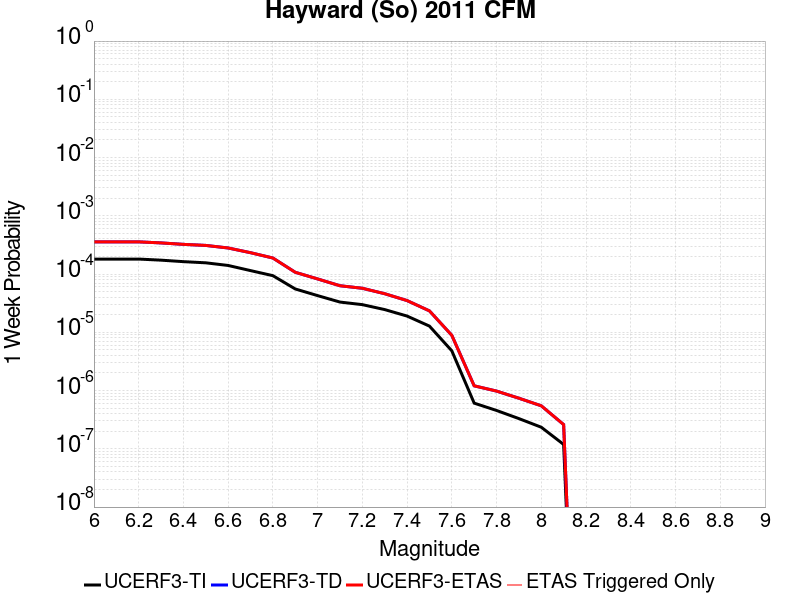 |  |  |  |

| Magnitude | 1 wk TI Prob | 1 wk TD Prob | 1 wk ETAS Prob | 1 wk ETAS/TD Gain | 1 wk ETAS Triggered Only | 1 mo TI Prob | 1 mo TD Prob | 1 mo ETAS Prob | 1 mo ETAS/TD Gain | 1 mo ETAS Triggered Only | 1 yr TI Prob | 1 yr TD Prob | 1 yr ETAS Prob | 1 yr ETAS/TD Gain | 1 yr ETAS Triggered Only | 10 yr TI Prob | 10 yr TD Prob | 10 yr ETAS Prob | 10 yr ETAS/TD Gain | 10 yr ETAS Triggered Only |
|-----|-----|-----|-----|-----|-----|-----|-----|-----|-----|-----|-----|-----|-----|-----|-----|-----|-----|-----|-----|-----|
| 6.0 | 1.8091932E-4 | 3.5710505E-4 | 3.5710505E-4 | 1.0 | 0.0 | 7.751381E-4 | 0.0015295624 | 0.0015295624 | 1.0 | 0.0 | 0.00939654 | 0.018465819 | 0.018475635 | 1.0005316 | 1.0E-5 | 0.090090066 | 0.16673753 | 0.16675419 | 1.0000999 | 2.0E-5 |
| 6.1 | 1.8091932E-4 | 3.5710505E-4 | 3.5710505E-4 | 1.0 | 0.0 | 7.751381E-4 | 0.0015295624 | 0.0015295624 | 1.0 | 0.0 | 0.00939654 | 0.018465819 | 0.018475635 | 1.0005316 | 1.0E-5 | 0.090090066 | 0.16673753 | 0.16675419 | 1.0000999 | 2.0E-5 |
| 6.2 | 1.8091932E-4 | 3.5710505E-4 | 3.5710505E-4 | 1.0 | 0.0 | 7.751381E-4 | 0.0015295624 | 0.0015295624 | 1.0 | 0.0 | 0.00939654 | 0.018465819 | 0.018475635 | 1.0005316 | 1.0E-5 | 0.090090066 | 0.16673753 | 0.16675419 | 1.0000999 | 2.0E-5 |
| 6.3 | 1.7322872E-4 | 3.426729E-4 | 3.426729E-4 | 1.0 | 0.0 | 7.4219756E-4 | 0.0014677811 | 0.0014677811 | 1.0 | 0.0 | 0.0089988755 | 0.017726082 | 0.017735904 | 1.0005541 | 1.0E-5 | 0.08643075 | 0.16068551 | 0.1607023 | 1.0001044 | 2.0E-5 |
| 6.4 | 1.6334097E-4 | 3.2348928E-4 | 3.2348928E-4 | 1.0 | 0.0 | 6.998449E-4 | 0.0013856548 | 0.0013856548 | 1.0 | 0.0 | 0.008487372 | 0.016741859 | 0.016751692 | 1.0005873 | 1.0E-5 | 0.081704415 | 0.1525672 | 0.15258415 | 1.0001111 | 2.0E-5 |
| 6.5 | 1.5600289E-4 | 3.102356E-4 | 3.102356E-4 | 1.0 | 0.0 | 6.684125E-4 | 0.001328912 | 0.001328912 | 1.0 | 0.0 | 0.008107598 | 0.016061366 | 0.016071206 | 1.0006126 | 1.0E-5 | 0.078181036 | 0.14684398 | 0.14686105 | 1.0001162 | 2.0E-5 |
| 6.6 | 1.4046066E-4 | 2.8037324E-4 | 2.8037324E-4 | 1.0 | 0.0 | 6.018354E-4 | 0.001201053 | 0.001201053 | 1.0 | 0.0 | 0.0073027555 | 0.014526278 | 0.014536133 | 1.0006784 | 1.0E-5 | 0.07067384 | 0.1339279 | 0.13393655 | 1.0000646 | 1.0E-5 |
| 6.7 | 1.14696966E-4 | 2.3275505E-4 | 2.3275505E-4 | 1.0 | 0.0 | 4.914658E-4 | 9.971453E-4 | 9.971453E-4 | 1.0 | 0.0 | 0.0059671924 | 0.01207373 | 0.01208361 | 1.0008183 | 1.0E-5 | 0.058094822 | 0.11274096 | 0.11274984 | 1.0000787 | 1.0E-5 |
| 6.8 | 9.3874296E-5 | 1.886479E-4 | 1.886479E-4 | 1.0 | 0.0 | 4.0225635E-4 | 8.0824416E-4 | 8.0824416E-4 | 1.0 | 0.0 | 0.0048864787 | 0.009796709 | 0.009806611 | 1.0010108 | 1.0E-5 | 0.047804173 | 0.0925935 | 0.09260257 | 1.000098 | 1.0E-5 |
| 6.9 | 5.551852E-5 | 1.0731538E-4 | 1.0731538E-4 | 1.0 | 0.0 | 2.3791482E-4 | 4.5984262E-4 | 4.5984262E-4 | 1.0 | 0.0 | 0.0028927654 | 0.0055843308 | 0.0055843308 | 1.0 | 0.0 | 0.028553981 | 0.05424729 | 0.05424729 | 1.0 | 0.0 |
| 7.0 | 4.2662363E-5 | 8.2480685E-5 | 8.2480685E-5 | 1.0 | 0.0 | 1.8282588E-4 | 3.5344114E-4 | 3.5344114E-4 | 1.0 | 0.0 | 0.0022236328 | 0.004294729 | 0.004294729 | 1.0 | 0.0 | 0.022015138 | 0.042071674 | 0.042071674 | 1.0 | 0.0 |
| 7.1 | 3.305886E-5 | 6.303226E-5 | 6.303226E-5 | 1.0 | 0.0 | 1.4167312E-4 | 2.701104E-4 | 2.701104E-4 | 1.0 | 0.0 | 0.0017235056 | 0.0032836539 | 0.0032836539 | 1.0 | 0.0 | 0.017101998 | 0.03245839 | 0.03245839 | 1.0 | 0.0 |
| 7.2 | 2.9856887E-5 | 5.7026133E-5 | 5.7026133E-5 | 1.0 | 0.0 | 1.2795182E-4 | 2.443749E-4 | 2.443749E-4 | 1.0 | 0.0 | 0.0015567001 | 0.002971222 | 0.002971222 | 1.0 | 0.0 | 0.015458403 | 0.029458838 | 0.029458838 | 1.0 | 0.0 |
| 7.3 | 2.4559737E-5 | 4.6001245E-5 | 4.6001245E-5 | 1.0 | 0.0 | 1.0525176E-4 | 1.9713337E-4 | 1.9713337E-4 | 1.0 | 0.0 | 0.0012806869 | 0.00239747 | 0.00239747 | 1.0 | 0.0 | 0.012733313 | 0.02386188 | 0.02386188 | 1.0 | 0.0 |
| 7.4 | 1.9002231E-5 | 3.505791E-5 | 3.505791E-5 | 1.0 | 0.0 | 8.143559E-5 | 1.5023959E-4 | 1.5023959E-4 | 1.0 | 0.0 | 9.910273E-4 | 0.0018276422 | 0.0018276422 | 1.0 | 0.0 | 0.009866194 | 0.018261842 | 0.018261842 | 1.0 | 0.0 |
| 7.5 | 1.2783333E-5 | 2.3334587E-5 | 2.3334587E-5 | 1.0 | 0.0 | 5.4784563E-5 | 1.00001576E-4 | 1.00001576E-4 | 1.0 | 0.0 | 6.667979E-4 | 0.0012168449 | 0.0012168449 | 1.0 | 0.0 | 0.006648007 | 0.012210775 | 0.012210775 | 1.0 | 0.0 |
| 7.6 | 4.8149627E-6 | 8.889608E-6 | 8.889608E-6 | 1.0 | 0.0 | 2.063539E-5 | 3.809777E-5 | 3.809777E-5 | 1.0 | 0.0 | 2.5120692E-4 | 4.6374285E-4 | 4.6374285E-4 | 1.0 | 0.0 | 0.0025092314 | 0.004681107 | 0.004681107 | 1.0 | 0.0 |
| 7.7 | 6.0838227E-7 | 1.2063123E-6 | 1.2063123E-6 | 1.0 | 0.0 | 2.6073499E-6 | 5.1699E-6 | 5.1699E-6 | 1.0 | 0.0 | 3.174402E-5 | 6.294171E-5 | 6.294171E-5 | 1.0 | 0.0 | 3.1739488E-4 | 6.5322954E-4 | 6.5322954E-4 | 1.0 | 0.0 |
| 7.8 | 4.5542808E-7 | 9.797777E-7 | 9.797777E-7 | 1.0 | 0.0 | 1.9518332E-6 | 4.1990406E-6 | 4.1990406E-6 | 1.0 | 0.0 | 2.376331E-5 | 5.1122122E-5 | 5.1122122E-5 | 1.0 | 0.0 | 2.3760769E-4 | 5.3240365E-4 | 5.3240365E-4 | 1.0 | 0.0 |
| 7.9 | 3.3016747E-7 | 7.3905267E-7 | 7.3905267E-7 | 1.0 | 0.0 | 1.4150027E-6 | 3.1673646E-6 | 3.1673646E-6 | 1.0 | 0.0 | 1.7227521E-5 | 3.8561986E-5 | 3.8561986E-5 | 1.0 | 0.0 | 1.7226185E-4 | 3.9950482E-4 | 3.9950482E-4 | 1.0 | 0.0 |
| 8.0 | 2.347038E-7 | 5.4744874E-7 | 5.4744874E-7 | 1.0 | 0.0 | 1.0058731E-6 | 2.3462067E-6 | 2.3462067E-6 | 1.0 | 0.0 | 1.2246436E-5 | 2.8564695E-5 | 2.8564695E-5 | 1.0 | 0.0 | 1.2245761E-4 | 2.936959E-4 | 2.936959E-4 | 1.0 | 0.0 |
| 8.1 | 1.18822804E-7 | 2.60728E-7 | 2.60728E-7 | 1.0 | 0.0 | 5.092405E-7 | 1.1174052E-6 | 1.1174052E-6 | 1.0 | 0.0 | 6.1999854E-6 | 1.3604324E-5 | 1.3604324E-5 | 1.0 | 0.0 | 6.199812E-5 | 1.3924051E-4 | 1.3924051E-4 | 1.0 | 0.0 |

## Palos Verdes
*[(top)](#table-of-contents)*

| 1 Week | 1 Month | 1 Year | 10 Year |
|-----|-----|-----|-----|
| 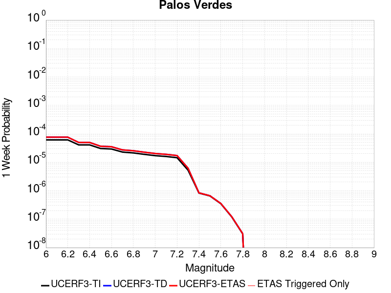 |  |  |  |

| Magnitude | 1 wk TI Prob | 1 wk TD Prob | 1 wk ETAS Prob | 1 wk ETAS/TD Gain | 1 wk ETAS Triggered Only | 1 mo TI Prob | 1 mo TD Prob | 1 mo ETAS Prob | 1 mo ETAS/TD Gain | 1 mo ETAS Triggered Only | 1 yr TI Prob | 1 yr TD Prob | 1 yr ETAS Prob | 1 yr ETAS/TD Gain | 1 yr ETAS Triggered Only | 10 yr TI Prob | 10 yr TD Prob | 10 yr ETAS Prob | 10 yr ETAS/TD Gain | 10 yr ETAS Triggered Only |
|-----|-----|-----|-----|-----|-----|-----|-----|-----|-----|-----|-----|-----|-----|-----|-----|-----|-----|-----|-----|-----|
| 6.0 | 6.126063E-5 | 7.622823E-5 | 7.622823E-5 | 1.0 | 0.0 | 2.6251914E-4 | 3.2665484E-4 | 3.2665484E-4 | 1.0 | 0.0 | 0.0031914865 | 0.0039703017 | 0.0039802617 | 1.0025088 | 1.0E-5 | 0.031460393 | 0.03905032 | 0.039069537 | 1.0004922 | 2.0E-5 |
| 6.1 | 6.126063E-5 | 7.622823E-5 | 7.622823E-5 | 1.0 | 0.0 | 2.6251914E-4 | 3.2665484E-4 | 3.2665484E-4 | 1.0 | 0.0 | 0.0031914865 | 0.0039703017 | 0.0039802617 | 1.0025088 | 1.0E-5 | 0.031460393 | 0.03905032 | 0.039069537 | 1.0004922 | 2.0E-5 |
| 6.2 | 6.126063E-5 | 7.622823E-5 | 7.622823E-5 | 1.0 | 0.0 | 2.6251914E-4 | 3.2665484E-4 | 3.2665484E-4 | 1.0 | 0.0 | 0.0031914865 | 0.0039703017 | 0.0039802617 | 1.0025088 | 1.0E-5 | 0.031460393 | 0.03905032 | 0.039069537 | 1.0004922 | 2.0E-5 |
| 6.3 | 4.0838047E-5 | 4.9750462E-5 | 4.9750462E-5 | 1.0 | 0.0 | 1.7500846E-4 | 2.1320012E-4 | 2.1320012E-4 | 1.0 | 0.0 | 0.0021286458 | 0.0025928293 | 0.0026028033 | 1.0038468 | 1.0E-5 | 0.021083709 | 0.02564748 | 0.025666967 | 1.0007598 | 2.0E-5 |
| 6.4 | 4.0838047E-5 | 4.9750462E-5 | 4.9750462E-5 | 1.0 | 0.0 | 1.7500846E-4 | 2.1320012E-4 | 2.1320012E-4 | 1.0 | 0.0 | 0.0021286458 | 0.0025928293 | 0.0026028033 | 1.0038468 | 1.0E-5 | 0.021083709 | 0.02564748 | 0.025666967 | 1.0007598 | 2.0E-5 |
| 6.5 | 3.0512005E-5 | 3.6562564E-5 | 3.6562564E-5 | 1.0 | 0.0 | 1.3075917E-4 | 1.5668797E-4 | 1.5668797E-4 | 1.0 | 0.0 | 0.0015908304 | 0.0019061224 | 0.0019161034 | 1.0052363 | 1.0E-5 | 0.015794903 | 0.018909669 | 0.01892929 | 1.0010377 | 2.0E-5 |
| 6.6 | 2.9255087E-5 | 3.515534E-5 | 3.515534E-5 | 1.0 | 0.0 | 1.2537291E-4 | 1.506577E-4 | 1.506577E-4 | 1.0 | 0.0 | 0.0015253464 | 0.0018328275 | 0.0018428091 | 1.0054461 | 1.0E-5 | 0.015149189 | 0.018188728 | 0.018208364 | 1.0010796 | 2.0E-5 |
| 6.7 | 2.287198E-5 | 2.7248976E-5 | 2.7248976E-5 | 1.0 | 0.0 | 9.801909E-5 | 1.1677662E-4 | 1.1677662E-4 | 1.0 | 0.0 | 0.001192729 | 0.0014209197 | 0.0014309055 | 1.0070277 | 1.0E-5 | 0.011863477 | 0.014127577 | 0.014147294 | 1.0013957 | 2.0E-5 |
| 6.8 | 2.1325764E-5 | 2.5432533E-5 | 2.5432533E-5 | 1.0 | 0.0 | 9.139293E-5 | 1.0899252E-4 | 1.0899252E-4 | 1.0 | 0.0 | 0.001112141 | 0.0013262664 | 0.0013362531 | 1.00753 | 1.0E-5 | 0.011065915 | 0.013192549 | 0.013202417 | 1.000748 | 1.0E-5 |
| 6.9 | 1.9009392E-5 | 2.2614122E-5 | 2.2614122E-5 | 1.0 | 0.0 | 8.1466285E-5 | 9.6914555E-5 | 9.6914555E-5 | 1.0 | 0.0 | 9.914007E-4 | 0.0011793834 | 0.0011893716 | 1.008469 | 1.0E-5 | 0.009869894 | 0.011739929 | 0.0117498115 | 1.0008417 | 1.0E-5 |
| 7.0 | 1.7098473E-5 | 2.0319867E-5 | 2.0319867E-5 | 1.0 | 0.0 | 7.3277115E-5 | 8.708272E-5 | 8.708272E-5 | 1.0 | 0.0 | 8.917837E-4 | 0.0010598017 | 0.001069791 | 1.0094258 | 1.0E-5 | 0.008882134 | 0.010555912 | 0.010565806 | 1.0009373 | 1.0E-5 |
| 7.1 | 1.5982785E-5 | 1.8995239E-5 | 1.8995239E-5 | 1.0 | 0.0 | 6.849585E-5 | 8.1406106E-5 | 8.1406106E-5 | 1.0 | 0.0 | 8.336179E-4 | 9.907534E-4 | 0.0010007435 | 1.0100833 | 1.0E-5 | 0.008304977 | 0.009871728 | 0.009881629 | 1.001003 | 1.0E-5 |
| 7.2 | 1.4468002E-5 | 1.719767E-5 | 1.719767E-5 | 1.0 | 0.0 | 6.200425E-5 | 7.370269E-5 | 7.370269E-5 | 1.0 | 0.0 | 7.546402E-4 | 8.970449E-4 | 8.970449E-4 | 1.0 | 0.0 | 0.007520827 | 0.008942509 | 0.008942509 | 1.0 | 0.0 |
| 7.3 | 5.288233E-6 | 6.2038207E-6 | 6.2038207E-6 | 1.0 | 0.0 | 2.2663658E-5 | 2.658773E-5 | 2.658773E-5 | 1.0 | 0.0 | 2.7589512E-4 | 3.2369242E-4 | 3.2369242E-4 | 1.0 | 0.0 | 0.0027555283 | 0.0032356323 | 0.0032356323 | 1.0 | 0.0 |
| 7.4 | 8.279556E-7 | 8.408364E-7 | 8.408364E-7 | 1.0 | 0.0 | 3.5483763E-6 | 3.60358E-6 | 3.60358E-6 | 1.0 | 0.0 | 4.3200624E-5 | 4.3872777E-5 | 4.3872777E-5 | 1.0 | 0.0 | 4.3192226E-4 | 4.3864836E-4 | 4.3864836E-4 | 1.0 | 0.0 |
| 7.5 | 6.559831E-7 | 6.667243E-7 | 6.667243E-7 | 1.0 | 0.0 | 2.8113532E-6 | 2.8573872E-6 | 2.8573872E-6 | 1.0 | 0.0 | 3.4227687E-5 | 3.47882E-5 | 3.47882E-5 | 1.0 | 0.0 | 3.4222414E-4 | 3.478342E-4 | 3.478342E-4 | 1.0 | 0.0 |
| 7.6 | 3.5018968E-7 | 3.562011E-7 | 3.562011E-7 | 1.0 | 0.0 | 1.500812E-6 | 1.5265755E-6 | 1.5265755E-6 | 1.0 | 0.0 | 1.8272232E-5 | 1.8585944E-5 | 1.8585944E-5 | 1.0 | 0.0 | 1.8270731E-4 | 1.858485E-4 | 1.858485E-4 | 1.0 | 0.0 |
| 7.7 | 1.1986104E-7 | 1.2198406E-7 | 1.2198406E-7 | 1.0 | 0.0 | 5.1369005E-7 | 5.227887E-7 | 5.227887E-7 | 1.0 | 0.0 | 6.2541585E-6 | 6.364934E-6 | 6.364934E-6 | 1.0 | 0.0 | 6.2539824E-5 | 6.364756E-5 | 6.364756E-5 | 1.0 | 0.0 |
| 7.8 | 3.0445005E-8 | 3.1027664E-8 | 3.1027664E-8 | 1.0 | 0.0 | 1.3047858E-7 | 1.3297569E-7 | 1.3297569E-7 | 1.0 | 0.0 | 1.5885756E-6 | 1.6189781E-6 | 1.6189781E-6 | 1.0 | 0.0 | 1.5885644E-5 | 1.6189684E-5 | 1.6189684E-5 | 1.0 | 0.0 |

## Channel Islands Western Deep Ramp
*[(top)](#table-of-contents)*

| 1 Week | 1 Month | 1 Year | 10 Year |
|-----|-----|-----|-----|
|  |  |  |  |

| Magnitude | 1 wk TI Prob | 1 wk TD Prob | 1 wk ETAS Prob | 1 wk ETAS/TD Gain | 1 wk ETAS Triggered Only | 1 mo TI Prob | 1 mo TD Prob | 1 mo ETAS Prob | 1 mo ETAS/TD Gain | 1 mo ETAS Triggered Only | 1 yr TI Prob | 1 yr TD Prob | 1 yr ETAS Prob | 1 yr ETAS/TD Gain | 1 yr ETAS Triggered Only | 10 yr TI Prob | 10 yr TD Prob | 10 yr ETAS Prob | 10 yr ETAS/TD Gain | 10 yr ETAS Triggered Only |
|-----|-----|-----|-----|-----|-----|-----|-----|-----|-----|-----|-----|-----|-----|-----|-----|-----|-----|-----|-----|-----|
| 6.0 | 6.0213506E-6 | 6.2549007E-6 | 6.2549007E-6 | 1.0 | 0.0 | 2.5805533E-5 | 2.6806467E-5 | 2.6806467E-5 | 1.0 | 0.0 | 3.1413708E-4 | 3.263243E-4 | 3.263243E-4 | 1.0 | 0.0 | 0.0031369338 | 0.003258893 | 0.003278828 | 1.0061171 | 2.0E-5 |
| 6.1 | 6.0213506E-6 | 6.2549007E-6 | 6.2549007E-6 | 1.0 | 0.0 | 2.5805533E-5 | 2.6806467E-5 | 2.6806467E-5 | 1.0 | 0.0 | 3.1413708E-4 | 3.263243E-4 | 3.263243E-4 | 1.0 | 0.0 | 0.0031369338 | 0.003258893 | 0.003278828 | 1.0061171 | 2.0E-5 |
| 6.2 | 6.0213506E-6 | 6.2549007E-6 | 6.2549007E-6 | 1.0 | 0.0 | 2.5805533E-5 | 2.6806467E-5 | 2.6806467E-5 | 1.0 | 0.0 | 3.1413708E-4 | 3.263243E-4 | 3.263243E-4 | 1.0 | 0.0 | 0.0031369338 | 0.003258893 | 0.003278828 | 1.0061171 | 2.0E-5 |
| 6.3 | 6.0213506E-6 | 6.2549007E-6 | 6.2549007E-6 | 1.0 | 0.0 | 2.5805533E-5 | 2.6806467E-5 | 2.6806467E-5 | 1.0 | 0.0 | 3.1413708E-4 | 3.263243E-4 | 3.263243E-4 | 1.0 | 0.0 | 0.0031369338 | 0.003258893 | 0.003278828 | 1.0061171 | 2.0E-5 |
| 6.4 | 6.0213506E-6 | 6.2549007E-6 | 6.2549007E-6 | 1.0 | 0.0 | 2.5805533E-5 | 2.6806467E-5 | 2.6806467E-5 | 1.0 | 0.0 | 3.1413708E-4 | 3.263243E-4 | 3.263243E-4 | 1.0 | 0.0 | 0.0031369338 | 0.003258893 | 0.003278828 | 1.0061171 | 2.0E-5 |
| 6.5 | 6.0213506E-6 | 6.2549007E-6 | 6.2549007E-6 | 1.0 | 0.0 | 2.5805533E-5 | 2.6806467E-5 | 2.6806467E-5 | 1.0 | 0.0 | 3.1413708E-4 | 3.263243E-4 | 3.263243E-4 | 1.0 | 0.0 | 0.0031369338 | 0.003258893 | 0.003278828 | 1.0061171 | 2.0E-5 |
| 6.6 | 6.0213506E-6 | 6.2549007E-6 | 6.2549007E-6 | 1.0 | 0.0 | 2.5805533E-5 | 2.6806467E-5 | 2.6806467E-5 | 1.0 | 0.0 | 3.1413708E-4 | 3.263243E-4 | 3.263243E-4 | 1.0 | 0.0 | 0.0031369338 | 0.003258893 | 0.003278828 | 1.0061171 | 2.0E-5 |
| 6.7 | 5.313309E-6 | 5.52527E-6 | 5.52527E-6 | 1.0 | 0.0 | 2.2771126E-5 | 2.3679535E-5 | 2.3679535E-5 | 1.0 | 0.0 | 2.772032E-4 | 2.882643E-4 | 2.882643E-4 | 1.0 | 0.0 | 0.0027685766 | 0.002879307 | 0.0028992493 | 1.0069261 | 2.0E-5 |
| 6.8 | 5.313309E-6 | 5.52527E-6 | 5.52527E-6 | 1.0 | 0.0 | 2.2771126E-5 | 2.3679535E-5 | 2.3679535E-5 | 1.0 | 0.0 | 2.772032E-4 | 2.882643E-4 | 2.882643E-4 | 1.0 | 0.0 | 0.0027685766 | 0.002879307 | 0.0028992493 | 1.0069261 | 2.0E-5 |
| 6.9 | 4.744377E-6 | 4.9394575E-6 | 4.9394575E-6 | 1.0 | 0.0 | 2.0332885E-5 | 2.1168953E-5 | 2.1168953E-5 | 1.0 | 0.0 | 2.4752476E-4 | 2.5770525E-4 | 2.5770525E-4 | 1.0 | 0.0 | 0.0024724922 | 0.0025744315 | 0.0025844057 | 1.0038743 | 1.0E-5 |
| 7.0 | 4.722209E-6 | 4.9165E-6 | 4.9165E-6 | 1.0 | 0.0 | 2.0237881E-5 | 2.1070566E-5 | 2.1070566E-5 | 1.0 | 0.0 | 2.4636835E-4 | 2.5650766E-4 | 2.5650766E-4 | 1.0 | 0.0 | 0.002460954 | 0.0025624833 | 0.0025724578 | 1.0038924 | 1.0E-5 |
| 7.1 | 4.611174E-6 | 4.8014354E-6 | 4.8014354E-6 | 1.0 | 0.0 | 1.9762025E-5 | 2.057744E-5 | 2.057744E-5 | 1.0 | 0.0 | 2.4057609E-4 | 2.5050525E-4 | 2.5050525E-4 | 1.0 | 0.0 | 0.002403158 | 0.0025025955 | 0.0025125707 | 1.0039859 | 1.0E-5 |
| 7.2 | 4.043994E-6 | 4.21205E-6 | 4.21205E-6 | 1.0 | 0.0 | 1.7331287E-5 | 1.8051538E-5 | 1.8051538E-5 | 1.0 | 0.0 | 2.10988E-4 | 2.1975888E-4 | 2.1975888E-4 | 1.0 | 0.0 | 0.002107878 | 0.0021957664 | 0.0022057444 | 1.0045443 | 1.0E-5 |
| 7.3 | 2.1233036E-6 | 2.2298022E-6 | 2.2298022E-6 | 1.0 | 0.0 | 9.099841E-6 | 9.556261E-6 | 9.556261E-6 | 1.0 | 0.0 | 1.1078493E-4 | 1.1634132E-4 | 1.1634132E-4 | 1.0 | 0.0 | 0.0011072971 | 0.0011628097 | 0.0011628097 | 1.0 | 0.0 |
| 7.4 | 1.9051884E-6 | 2.0015107E-6 | 2.0015107E-6 | 1.0 | 0.0 | 8.165067E-6 | 8.577875E-6 | 8.577875E-6 | 1.0 | 0.0 | 9.940516E-5 | 1.0443068E-4 | 1.0443068E-4 | 1.0 | 0.0 | 9.93607E-4 | 0.0010438213 | 0.0010438213 | 1.0 | 0.0 |
| 7.5 | 1.2408497E-6 | 1.3038928E-6 | 1.3038928E-6 | 1.0 | 0.0 | 5.317916E-6 | 5.5880996E-6 | 5.5880996E-6 | 1.0 | 0.0 | 6.4743705E-5 | 6.803301E-5 | 6.803301E-5 | 1.0 | 0.0 | 6.4724847E-4 | 6.8012404E-4 | 6.8012404E-4 | 1.0 | 0.0 |
| 7.6 | 6.5440025E-7 | 6.886766E-7 | 6.886766E-7 | 1.0 | 0.0 | 2.8045695E-6 | 2.9514679E-6 | 2.9514679E-6 | 1.0 | 0.0 | 3.4145098E-5 | 3.5933543E-5 | 3.5933543E-5 | 1.0 | 0.0 | 3.4139853E-4 | 3.5927873E-4 | 3.5927873E-4 | 1.0 | 0.0 |
| 7.7 | 3.985963E-7 | 4.1931077E-7 | 4.1931077E-7 | 1.0 | 0.0 | 1.7082689E-6 | 1.797045E-6 | 1.797045E-6 | 1.0 | 0.0 | 2.0797976E-5 | 2.1878815E-5 | 2.1878815E-5 | 1.0 | 0.0 | 2.0796029E-4 | 2.1876777E-4 | 2.1876777E-4 | 1.0 | 0.0 |
| 7.8 | 3.706329E-8 | 3.8592006E-8 | 3.8592006E-8 | 1.0 | 0.0 | 1.5884267E-7 | 1.653943E-7 | 1.653943E-7 | 1.0 | 0.0 | 1.9339077E-6 | 2.0136738E-6 | 2.0136738E-6 | 1.0 | 0.0 | 1.933891E-5 | 2.0136567E-5 | 2.0136567E-5 | 1.0 | 0.0 |

## Cucamonga
*[(top)](#table-of-contents)*

| 1 Week | 1 Month | 1 Year | 10 Year |
|-----|-----|-----|-----|
|  |  |  |  |

| Magnitude | 1 wk TI Prob | 1 wk TD Prob | 1 wk ETAS Prob | 1 wk ETAS/TD Gain | 1 wk ETAS Triggered Only | 1 mo TI Prob | 1 mo TD Prob | 1 mo ETAS Prob | 1 mo ETAS/TD Gain | 1 mo ETAS Triggered Only | 1 yr TI Prob | 1 yr TD Prob | 1 yr ETAS Prob | 1 yr ETAS/TD Gain | 1 yr ETAS Triggered Only | 10 yr TI Prob | 10 yr TD Prob | 10 yr ETAS Prob | 10 yr ETAS/TD Gain | 10 yr ETAS Triggered Only |
|-----|-----|-----|-----|-----|-----|-----|-----|-----|-----|-----|-----|-----|-----|-----|-----|-----|-----|-----|-----|-----|
| 6.0 | 1.1848348E-5 | 1.1737856E-5 | 1.1737856E-5 | 1.0 | 0.0 | 5.0777642E-5 | 5.030414E-5 | 5.030414E-5 | 1.0 | 0.0 | 6.180424E-4 | 6.1228353E-4 | 6.1228353E-4 | 1.0 | 0.0 | 0.0061632637 | 0.006107083 | 0.0061269607 | 1.0032549 | 2.0E-5 |
| 6.1 | 1.1848348E-5 | 1.1737856E-5 | 1.1737856E-5 | 1.0 | 0.0 | 5.0777642E-5 | 5.030414E-5 | 5.030414E-5 | 1.0 | 0.0 | 6.180424E-4 | 6.1228353E-4 | 6.1228353E-4 | 1.0 | 0.0 | 0.0061632637 | 0.006107083 | 0.0061269607 | 1.0032549 | 2.0E-5 |
| 6.2 | 1.1848348E-5 | 1.1737856E-5 | 1.1737856E-5 | 1.0 | 0.0 | 5.0777642E-5 | 5.030414E-5 | 5.030414E-5 | 1.0 | 0.0 | 6.180424E-4 | 6.1228353E-4 | 6.1228353E-4 | 1.0 | 0.0 | 0.0061632637 | 0.006107083 | 0.0061269607 | 1.0032549 | 2.0E-5 |
| 6.3 | 1.1848348E-5 | 1.1737856E-5 | 1.1737856E-5 | 1.0 | 0.0 | 5.0777642E-5 | 5.030414E-5 | 5.030414E-5 | 1.0 | 0.0 | 6.180424E-4 | 6.1228353E-4 | 6.1228353E-4 | 1.0 | 0.0 | 0.0061632637 | 0.006107083 | 0.0061269607 | 1.0032549 | 2.0E-5 |
| 6.4 | 1.1848348E-5 | 1.1737856E-5 | 1.1737856E-5 | 1.0 | 0.0 | 5.0777642E-5 | 5.030414E-5 | 5.030414E-5 | 1.0 | 0.0 | 6.180424E-4 | 6.1228353E-4 | 6.1228353E-4 | 1.0 | 0.0 | 0.0061632637 | 0.006107083 | 0.0061269607 | 1.0032549 | 2.0E-5 |
| 6.5 | 1.16988695E-5 | 1.1576885E-5 | 1.1576885E-5 | 1.0 | 0.0 | 5.013705E-5 | 4.9614293E-5 | 4.9614293E-5 | 1.0 | 0.0 | 6.102476E-4 | 6.038893E-4 | 6.038893E-4 | 1.0 | 0.0 | 0.006085745 | 0.0060235965 | 0.006043476 | 1.0033003 | 2.0E-5 |
| 6.6 | 1.16988695E-5 | 1.1576885E-5 | 1.1576885E-5 | 1.0 | 0.0 | 5.013705E-5 | 4.9614293E-5 | 4.9614293E-5 | 1.0 | 0.0 | 6.102476E-4 | 6.038893E-4 | 6.038893E-4 | 1.0 | 0.0 | 0.006085745 | 0.0060235965 | 0.006043476 | 1.0033003 | 2.0E-5 |
| 6.7 | 1.1397107E-5 | 1.1115768E-5 | 1.1115768E-5 | 1.0 | 0.0 | 4.884383E-5 | 4.763815E-5 | 4.763815E-5 | 1.0 | 0.0 | 5.9451134E-4 | 5.798426E-4 | 5.798426E-4 | 1.0 | 0.0 | 0.005929234 | 0.00578439 | 0.005794332 | 1.0017188 | 1.0E-5 |
| 6.8 | 1.058387E-5 | 9.785688E-6 | 9.785688E-6 | 1.0 | 0.0 | 4.5358654E-5 | 4.1937994E-5 | 4.1937994E-5 | 1.0 | 0.0 | 5.521017E-4 | 5.104766E-4 | 5.104766E-4 | 1.0 | 0.0 | 0.00550732 | 0.005093991 | 0.0051039397 | 1.0019531 | 1.0E-5 |
| 6.9 | 9.690046E-6 | 8.580108E-6 | 8.580108E-6 | 1.0 | 0.0 | 4.1528107E-5 | 3.677138E-5 | 3.677138E-5 | 1.0 | 0.0 | 5.054874E-4 | 4.4759997E-4 | 4.4759997E-4 | 1.0 | 0.0 | 0.005043391 | 0.004467863 | 0.0044778185 | 1.0022283 | 1.0E-5 |
| 7.0 | 9.381461E-6 | 8.187711E-6 | 8.187711E-6 | 1.0 | 0.0 | 4.020564E-5 | 3.508972E-5 | 3.508972E-5 | 1.0 | 0.0 | 4.893937E-4 | 4.2713396E-4 | 4.2713396E-4 | 1.0 | 0.0 | 0.0048831734 | 0.0042640073 | 0.0042640073 | 1.0 | 0.0 |
| 7.1 | 8.946492E-6 | 7.782485E-6 | 7.782485E-6 | 1.0 | 0.0 | 3.8341543E-5 | 3.3353084E-5 | 3.3353084E-5 | 1.0 | 0.0 | 4.667083E-4 | 4.0599846E-4 | 4.0599846E-4 | 1.0 | 0.0 | 0.0046572937 | 0.004053448 | 0.004053448 | 1.0 | 0.0 |
| 7.2 | 8.251016E-6 | 6.975837E-6 | 6.975837E-6 | 1.0 | 0.0 | 3.5361016E-5 | 2.9896102E-5 | 2.9896102E-5 | 1.0 | 0.0 | 4.3043532E-4 | 3.639245E-4 | 3.639245E-4 | 1.0 | 0.0 | 0.0042960253 | 0.0036341618 | 0.0036341618 | 1.0 | 0.0 |
| 7.3 | 7.717881E-6 | 6.4868927E-6 | 6.4868927E-6 | 1.0 | 0.0 | 3.3076216E-5 | 2.7800674E-5 | 2.7800674E-5 | 1.0 | 0.0 | 4.026285E-4 | 3.3842085E-4 | 3.3842085E-4 | 1.0 | 0.0 | 0.004018998 | 0.0033799394 | 0.0033799394 | 1.0 | 0.0 |
| 7.4 | 7.275623E-6 | 6.0325183E-6 | 6.0325183E-6 | 1.0 | 0.0 | 3.118087E-5 | 2.5853395E-5 | 2.5853395E-5 | 1.0 | 0.0 | 3.7956095E-4 | 3.1471983E-4 | 3.1471983E-4 | 1.0 | 0.0 | 0.0037891332 | 0.0031436244 | 0.0031436244 | 1.0 | 0.0 |
| 7.5 | 6.5109502E-6 | 5.101057E-6 | 5.101057E-6 | 1.0 | 0.0 | 2.7903774E-5 | 2.186149E-5 | 2.186149E-5 | 1.0 | 0.0 | 3.3967546E-4 | 2.6613128E-4 | 2.6613128E-4 | 1.0 | 0.0 | 0.0033915674 | 0.0026589984 | 0.0026589984 | 1.0 | 0.0 |
| 7.6 | 5.4495326E-6 | 3.908965E-6 | 3.908965E-6 | 1.0 | 0.0 | 2.335493E-5 | 1.67526E-5 | 1.67526E-5 | 1.0 | 0.0 | 2.8430918E-4 | 2.0394388E-4 | 2.0394388E-4 | 1.0 | 0.0 | 0.0028394572 | 0.0020384341 | 0.0020384341 | 1.0 | 0.0 |
| 7.7 | 4.7997164E-6 | 3.2006137E-6 | 3.2006137E-6 | 1.0 | 0.0 | 2.057005E-5 | 1.3716844E-5 | 1.3716844E-5 | 1.0 | 0.0 | 2.504116E-4 | 1.669898E-4 | 1.669898E-4 | 1.0 | 0.0 | 0.002501296 | 0.0016695231 | 0.0016695231 | 1.0 | 0.0 |
| 7.8 | 3.3941733E-6 | 2.0644063E-6 | 2.0644063E-6 | 1.0 | 0.0 | 1.4546376E-5 | 8.847426E-6 | 8.847426E-6 | 1.0 | 0.0 | 1.7708774E-4 | 1.07712105E-4 | 1.07712105E-4 | 1.0 | 0.0 | 0.0017694668 | 0.0010766896 | 0.0010766896 | 1.0 | 0.0 |
| 7.9 | 9.750552E-7 | 5.15656E-7 | 5.15656E-7 | 1.0 | 0.0 | 4.178801E-6 | 2.2099523E-6 | 2.2099523E-6 | 1.0 | 0.0 | 5.0875715E-5 | 2.6905842E-5 | 2.6905842E-5 | 1.0 | 0.0 | 5.086407E-4 | 2.6902626E-4 | 2.6902626E-4 | 1.0 | 0.0 |
| 8.0 | 1.133857E-7 | 6.053729E-8 | 6.053729E-8 | 1.0 | 0.0 | 4.8593864E-7 | 2.594455E-7 | 2.594455E-7 | 1.0 | 0.0 | 5.9162867E-6 | 3.1587447E-6 | 3.1587447E-6 | 1.0 | 0.0 | 5.916129E-5 | 3.1587013E-5 | 3.1587013E-5 | 1.0 | 0.0 |

## Great Valley 09 (Laguna Seca)
*[(top)](#table-of-contents)*

| 1 Week | 1 Month | 1 Year | 10 Year |
|-----|-----|-----|-----|
|  |  |  |  |

| Magnitude | 1 wk TI Prob | 1 wk TD Prob | 1 wk ETAS Prob | 1 wk ETAS/TD Gain | 1 wk ETAS Triggered Only | 1 mo TI Prob | 1 mo TD Prob | 1 mo ETAS Prob | 1 mo ETAS/TD Gain | 1 mo ETAS Triggered Only | 1 yr TI Prob | 1 yr TD Prob | 1 yr ETAS Prob | 1 yr ETAS/TD Gain | 1 yr ETAS Triggered Only | 10 yr TI Prob | 10 yr TD Prob | 10 yr ETAS Prob | 10 yr ETAS/TD Gain | 10 yr ETAS Triggered Only |
|-----|-----|-----|-----|-----|-----|-----|-----|-----|-----|-----|-----|-----|-----|-----|-----|-----|-----|-----|-----|-----|
| 6.0 | 5.4353277E-5 | 7.050336E-5 | 7.050336E-5 | 1.0 | 0.0 | 2.3292181E-4 | 3.0212323E-4 | 3.0212323E-4 | 1.0 | 0.0 | 0.0028321352 | 0.0036721565 | 0.0036821198 | 1.0027132 | 1.0E-5 | 0.02796312 | 0.036117274 | 0.036136553 | 1.0005337 | 2.0E-5 |
| 6.1 | 4.5578287E-5 | 5.8223057E-5 | 5.8223057E-5 | 1.0 | 0.0 | 1.953209E-4 | 2.4950382E-4 | 2.4950382E-4 | 1.0 | 0.0 | 0.0023754383 | 0.0030334755 | 0.0030334755 | 1.0 | 0.0 | 0.023502063 | 0.029921044 | 0.029921044 | 1.0 | 0.0 |
| 6.2 | 2.8536782E-5 | 3.4737728E-5 | 3.4737728E-5 | 1.0 | 0.0 | 1.2229476E-4 | 1.4886676E-4 | 1.4886676E-4 | 1.0 | 0.0 | 0.0014879217 | 0.0018109222 | 0.0018109222 | 1.0 | 0.0 | 0.014779986 | 0.017958904 | 0.017958904 | 1.0 | 0.0 |
| 6.3 | 2.3698774E-5 | 2.8214345E-5 | 2.8214345E-5 | 1.0 | 0.0 | 1.01562226E-4 | 1.2091216E-4 | 1.2091216E-4 | 1.0 | 0.0 | 0.0012358186 | 0.001471101 | 0.001471101 | 1.0 | 0.0 | 0.012289686 | 0.014611942 | 0.014611942 | 1.0 | 0.0 |
| 6.4 | 1.9191197E-5 | 2.2123615E-5 | 2.2123615E-5 | 1.0 | 0.0 | 8.2245395E-5 | 9.481171E-5 | 9.481171E-5 | 1.0 | 0.0 | 0.0010008777 | 0.0011537268 | 0.0011537268 | 1.0 | 0.0 | 0.009963818 | 0.011477377 | 0.011477377 | 1.0 | 0.0 |
| 6.5 | 1.5203241E-5 | 1.6801783E-5 | 1.6801783E-5 | 1.0 | 0.0 | 6.5155116E-5 | 7.200525E-5 | 7.200525E-5 | 1.0 | 0.0 | 7.9297484E-4 | 8.763255E-4 | 8.763255E-4 | 1.0 | 0.0 | 0.007901512 | 0.008729823 | 0.008729823 | 1.0 | 0.0 |
| 6.6 | 1.0984925E-5 | 1.1242807E-5 | 1.1242807E-5 | 1.0 | 0.0 | 4.70774E-5 | 4.8182592E-5 | 4.8182592E-5 | 1.0 | 0.0 | 5.730166E-4 | 5.864689E-4 | 5.864689E-4 | 1.0 | 0.0 | 0.005715413 | 0.0058496036 | 0.0058496036 | 1.0 | 0.0 |
| 6.7 | 9.134616E-6 | 9.020056E-6 | 9.020056E-6 | 1.0 | 0.0 | 3.9147766E-5 | 3.8656824E-5 | 3.8656824E-5 | 1.0 | 0.0 | 4.7651984E-4 | 4.7054756E-4 | 4.7054756E-4 | 1.0 | 0.0 | 0.004754993 | 0.0046957573 | 0.0046957573 | 1.0 | 0.0 |
| 6.8 | 7.785589E-6 | 7.4520726E-6 | 7.4520726E-6 | 1.0 | 0.0 | 3.3366385E-5 | 3.1937074E-5 | 3.1937074E-5 | 1.0 | 0.0 | 4.0616E-4 | 3.8876652E-4 | 3.8876652E-4 | 1.0 | 0.0 | 0.0040541845 | 0.0038810682 | 0.0038810682 | 1.0 | 0.0 |
| 6.9 | 5.579095E-6 | 4.898567E-6 | 4.898567E-6 | 1.0 | 0.0 | 2.3910188E-5 | 2.0993697E-5 | 2.0993697E-5 | 1.0 | 0.0 | 2.9106764E-4 | 2.5556967E-4 | 2.5556967E-4 | 1.0 | 0.0 | 0.002906867 | 0.002552895 | 0.002552895 | 1.0 | 0.0 |
| 7.0 | 2.6816688E-6 | 1.5216133E-6 | 1.5216133E-6 | 1.0 | 0.0 | 1.1492816E-5 | 6.521184E-6 | 6.521184E-6 | 1.0 | 0.0 | 1.3991605E-4 | 7.939261E-5 | 7.939261E-5 | 1.0 | 0.0 | 0.0013982799 | 7.9365115E-4 | 7.9365115E-4 | 1.0 | 0.0 |
| 7.1 | 1.9951021E-6 | 7.453698E-7 | 7.453698E-7 | 1.0 | 0.0 | 8.55041E-6 | 3.1944382E-6 | 3.1944382E-6 | 1.0 | 0.0 | 1.0409627E-4 | 3.8891634E-5 | 3.8891634E-5 | 1.0 | 0.0 | 0.0010404752 | 3.8885244E-4 | 3.8885244E-4 | 1.0 | 0.0 |
| 7.2 | 1.9951021E-6 | 7.453698E-7 | 7.453698E-7 | 1.0 | 0.0 | 8.55041E-6 | 3.1944382E-6 | 3.1944382E-6 | 1.0 | 0.0 | 1.0409627E-4 | 3.8891634E-5 | 3.8891634E-5 | 1.0 | 0.0 | 0.0010404752 | 3.8885244E-4 | 3.8885244E-4 | 1.0 | 0.0 |
| 7.3 | 1.7087556E-6 | 6.5787674E-7 | 6.5787674E-7 | 1.0 | 0.0 | 7.3232177E-6 | 2.8194688E-6 | 2.8194688E-6 | 1.0 | 0.0 | 8.915652E-5 | 3.4326535E-5 | 3.4326535E-5 | 1.0 | 0.0 | 8.9120766E-4 | 3.4321635E-4 | 3.4321635E-4 | 1.0 | 0.0 |
| 7.4 | 1.3804846E-6 | 6.0737995E-7 | 6.0737995E-7 | 1.0 | 0.0 | 5.916349E-6 | 2.6030546E-6 | 2.6030546E-6 | 1.0 | 0.0 | 7.2029165E-5 | 3.169177E-5 | 3.169177E-5 | 1.0 | 0.0 | 7.200583E-4 | 3.168765E-4 | 3.168765E-4 | 1.0 | 0.0 |
| 7.5 | 1.3804846E-6 | 6.0737995E-7 | 6.0737995E-7 | 1.0 | 0.0 | 5.916349E-6 | 2.6030546E-6 | 2.6030546E-6 | 1.0 | 0.0 | 7.2029165E-5 | 3.169177E-5 | 3.169177E-5 | 1.0 | 0.0 | 7.200583E-4 | 3.168765E-4 | 3.168765E-4 | 1.0 | 0.0 |

## San Andreas (Peninsula) 2011 CFM
*[(top)](#table-of-contents)*

| 1 Week | 1 Month | 1 Year | 10 Year |
|-----|-----|-----|-----|
|  | 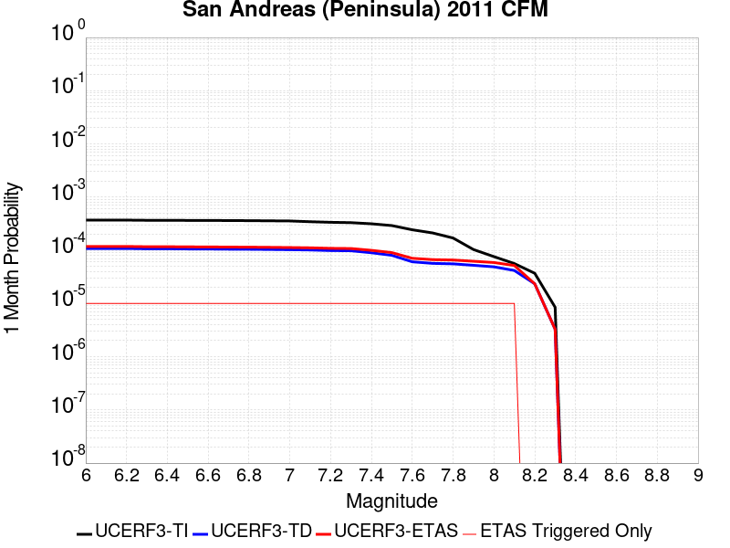 |  |  |

| Magnitude | 1 wk TI Prob | 1 wk TD Prob | 1 wk ETAS Prob | 1 wk ETAS/TD Gain | 1 wk ETAS Triggered Only | 1 mo TI Prob | 1 mo TD Prob | 1 mo ETAS Prob | 1 mo ETAS/TD Gain | 1 mo ETAS Triggered Only | 1 yr TI Prob | 1 yr TD Prob | 1 yr ETAS Prob | 1 yr ETAS/TD Gain | 1 yr ETAS Triggered Only | 10 yr TI Prob | 10 yr TD Prob | 10 yr ETAS Prob | 10 yr ETAS/TD Gain | 10 yr ETAS Triggered Only |
|-----|-----|-----|-----|-----|-----|-----|-----|-----|-----|-----|-----|-----|-----|-----|-----|-----|-----|-----|-----|-----|
| 6.0 | 8.6200685E-5 | 2.523975E-5 | 2.523975E-5 | 1.0 | 0.0 | 3.6937918E-4 | 1.08165885E-4 | 1.181648E-4 | 1.0924406 | 1.0E-5 | 0.0044879215 | 0.0013161256 | 0.0013261125 | 1.007588 | 1.0E-5 | 0.043983612 | 0.014787948 | 0.014807652 | 1.0013324 | 2.0E-5 |
| 6.1 | 8.6200685E-5 | 2.523975E-5 | 2.523975E-5 | 1.0 | 0.0 | 3.6937918E-4 | 1.08165885E-4 | 1.181648E-4 | 1.0924406 | 1.0E-5 | 0.0044879215 | 0.0013161256 | 0.0013261125 | 1.007588 | 1.0E-5 | 0.043983612 | 0.014787948 | 0.014807652 | 1.0013324 | 2.0E-5 |
| 6.2 | 8.6200685E-5 | 2.523975E-5 | 2.523975E-5 | 1.0 | 0.0 | 3.6937918E-4 | 1.08165885E-4 | 1.181648E-4 | 1.0924406 | 1.0E-5 | 0.0044879215 | 0.0013161256 | 0.0013261125 | 1.007588 | 1.0E-5 | 0.043983612 | 0.014787948 | 0.014807652 | 1.0013324 | 2.0E-5 |
| 6.3 | 8.551163E-5 | 2.4931509E-5 | 2.4931509E-5 | 1.0 | 0.0 | 3.6642692E-4 | 1.0684496E-4 | 1.1684388E-4 | 1.0935836 | 1.0E-5 | 0.004452125 | 0.0013000626 | 0.0013100497 | 1.007682 | 1.0E-5 | 0.043639794 | 0.014614988 | 0.014634696 | 1.0013485 | 2.0E-5 |
| 6.4 | 8.551163E-5 | 2.4931509E-5 | 2.4931509E-5 | 1.0 | 0.0 | 3.6642692E-4 | 1.0684496E-4 | 1.1684388E-4 | 1.0935836 | 1.0E-5 | 0.004452125 | 0.0013000626 | 0.0013100497 | 1.007682 | 1.0E-5 | 0.043639794 | 0.014614988 | 0.014634696 | 1.0013485 | 2.0E-5 |
| 6.5 | 8.511146E-5 | 2.4752808E-5 | 2.4752808E-5 | 1.0 | 0.0 | 3.647124E-4 | 1.06079155E-4 | 1.16078096E-4 | 1.0942593 | 1.0E-5 | 0.004431336 | 0.0012907501 | 0.0013007373 | 1.0077374 | 1.0E-5 | 0.04344007 | 0.014514864 | 0.014534574 | 1.0013579 | 2.0E-5 |
| 6.6 | 8.4985084E-5 | 2.4683486E-5 | 2.4683486E-5 | 1.0 | 0.0 | 3.6417096E-4 | 1.0578209E-4 | 1.1578103E-4 | 1.0945239 | 1.0E-5 | 0.0044247704 | 0.0012871377 | 0.0012971248 | 1.0077592 | 1.0E-5 | 0.043376986 | 0.014476832 | 0.0144965425 | 1.0013615 | 2.0E-5 |
| 6.7 | 8.462618E-5 | 2.4511957E-5 | 2.4511957E-5 | 1.0 | 0.0 | 3.6263323E-4 | 1.05047024E-4 | 1.1504597E-4 | 1.0951855 | 1.0E-5 | 0.004406125 | 0.0012781988 | 0.001288186 | 1.0078135 | 1.0E-5 | 0.043197807 | 0.014381521 | 0.014401234 | 1.0013707 | 2.0E-5 |
| 6.8 | 8.42337E-5 | 2.4407704E-5 | 2.4407704E-5 | 1.0 | 0.0 | 3.6095164E-4 | 1.0460026E-4 | 1.14599214E-4 | 1.095592 | 1.0E-5 | 0.004385734 | 0.0012727658 | 0.0012827531 | 1.007847 | 1.0E-5 | 0.043001823 | 0.014322163 | 0.014341876 | 1.0013764 | 2.0E-5 |
| 6.9 | 8.365989E-5 | 2.4212226E-5 | 2.4212226E-5 | 1.0 | 0.0 | 3.5849313E-4 | 1.0376257E-4 | 1.13761525E-4 | 1.0963639 | 1.0E-5 | 0.004355922 | 0.0012625788 | 0.0012725662 | 1.0079103 | 1.0E-5 | 0.04271523 | 0.0142146265 | 0.014234343 | 1.001387 | 2.0E-5 |
| 7.0 | 8.30936E-5 | 2.3973636E-5 | 2.3973636E-5 | 1.0 | 0.0 | 3.560668E-4 | 1.02740116E-4 | 1.12739086E-4 | 1.097323 | 1.0E-5 | 0.004326499 | 0.0012501448 | 0.0012601322 | 1.007989 | 1.0E-5 | 0.042432297 | 0.014085667 | 0.014105385 | 1.0013999 | 2.0E-5 |
| 7.1 | 8.041264E-5 | 2.365997E-5 | 2.365997E-5 | 1.0 | 0.0 | 3.4458007E-4 | 1.0139593E-4 | 1.11394926E-4 | 1.0986133 | 1.0E-5 | 0.0041871946 | 0.001233798 | 0.0012437857 | 1.008095 | 1.0E-5 | 0.041091725 | 0.013908492 | 0.013928214 | 1.001418 | 2.0E-5 |
| 7.2 | 7.8427016E-5 | 2.3083452E-5 | 2.3083452E-5 | 1.0 | 0.0 | 3.3607247E-4 | 9.892533E-5 | 1.08924345E-4 | 1.1010764 | 1.0E-5 | 0.004084008 | 0.001203752 | 0.00121374 | 1.0082973 | 1.0E-5 | 0.040097635 | 0.013592441 | 0.013612169 | 1.0014514 | 2.0E-5 |
| 7.3 | 7.721087E-5 | 2.2868227E-5 | 2.2868227E-5 | 1.0 | 0.0 | 3.3086175E-4 | 9.800301E-5 | 1.0800203E-4 | 1.1020277 | 1.0E-5 | 0.004020803 | 0.0011925352 | 0.0012025232 | 1.0083755 | 1.0E-5 | 0.03948827 | 0.013476112 | 0.013495842 | 1.0014641 | 2.0E-5 |
| 7.4 | 7.3536525E-5 | 2.09825E-5 | 2.09825E-5 | 1.0 | 0.0 | 3.1511846E-4 | 8.992191E-5 | 9.992101E-5 | 1.1111976 | 1.0E-5 | 0.0038298194 | 0.0010942507 | 0.0011042397 | 1.0091287 | 1.0E-5 | 0.037644852 | 0.012431368 | 0.01245112 | 1.0015888 | 2.0E-5 |
| 7.5 | 6.806207E-5 | 1.8784616E-5 | 1.8784616E-5 | 1.0 | 0.0 | 2.9166197E-4 | 8.0503014E-5 | 9.050221E-5 | 1.1242089 | 1.0E-5 | 0.0035452035 | 9.796845E-4 | 9.896748E-4 | 1.0101974 | 1.0E-5 | 0.034891766 | 0.011182438 | 0.011202213 | 1.0017685 | 2.0E-5 |
| 7.6 | 5.6731416E-5 | 1.4187766E-5 | 1.4187766E-5 | 1.0 | 0.0 | 2.43112E-4 | 6.0803297E-5 | 7.0802686E-5 | 1.1644548 | 1.0E-5 | 0.0029558712 | 7.4002886E-4 | 7.500214E-4 | 1.013503 | 1.0E-5 | 0.02916862 | 0.008491444 | 0.008511275 | 1.0023353 | 2.0E-5 |
| 7.7 | 4.946994E-5 | 1.3255381E-5 | 1.3255381E-5 | 1.0 | 0.0 | 2.1199681E-4 | 5.6807537E-5 | 6.680697E-5 | 1.176023 | 1.0E-5 | 0.002578006 | 6.914124E-4 | 7.014055E-4 | 1.0144532 | 1.0E-5 | 0.02548303 | 0.007913107 | 0.007932949 | 1.0025074 | 2.0E-5 |
| 7.8 | 3.9718198E-5 | 1.2991523E-5 | 1.2991523E-5 | 1.0 | 0.0 | 1.7020974E-4 | 5.5676766E-5 | 6.567621E-5 | 1.1795981 | 1.0E-5 | 0.0020703338 | 6.7765394E-4 | 6.876472E-4 | 1.0147468 | 1.0E-5 | 0.020511515 | 0.007723543 | 0.0077433884 | 1.0025694 | 2.0E-5 |
| 7.9 | 2.4115114E-5 | 1.219408E-5 | 1.219408E-5 | 1.0 | 0.0 | 1.0334639E-4 | 5.2259296E-5 | 6.2258776E-5 | 1.1913435 | 1.0E-5 | 0.001257516 | 6.360714E-4 | 6.46065E-4 | 1.0157115 | 1.0E-5 | 0.012504238 | 0.007163707 | 0.007183564 | 1.0027719 | 2.0E-5 |
| 8.0 | 1.7756569E-5 | 1.1417994E-5 | 1.1417994E-5 | 1.0 | 0.0 | 7.6097356E-5 | 4.8933343E-5 | 5.8932856E-5 | 1.2043496 | 1.0E-5 | 9.260915E-4 | 5.9560075E-4 | 6.055948E-4 | 1.0167798 | 1.0E-5 | 0.009222416 | 0.0066638524 | 0.006683719 | 1.0029813 | 2.0E-5 |
| 8.1 | 1.3159258E-5 | 9.7529455E-6 | 9.7529455E-6 | 1.0 | 0.0 | 5.6395602E-5 | 4.179767E-5 | 5.179725E-5 | 1.2392378 | 1.0E-5 | 6.864001E-4 | 5.0876796E-4 | 5.1876286E-4 | 1.0196453 | 1.0E-5 | 0.0068428386 | 0.0056932434 | 0.0057131294 | 1.003493 | 2.0E-5 |
| 8.2 | 8.635426E-6 | 5.4707107E-6 | 5.4707107E-6 | 1.0 | 0.0 | 3.700844E-5 | 2.3445691E-5 | 2.3445691E-5 | 1.0 | 0.0 | 4.5048463E-4 | 2.85414E-4 | 2.85414E-4 | 1.0 | 0.0 | 0.004495725 | 0.0032466399 | 0.0032466399 | 1.0 | 0.0 |
| 8.3 | 1.983087E-6 | 7.6647797E-7 | 7.6647797E-7 | 1.0 | 0.0 | 8.498917E-6 | 3.2849016E-6 | 3.2849016E-6 | 1.0 | 0.0 | 1.034694E-4 | 3.999296E-5 | 3.999296E-5 | 1.0 | 0.0 | 0.0010342124 | 4.7228087E-4 | 4.7228087E-4 | 1.0 | 0.0 |

## Robinson Creek
*[(top)](#table-of-contents)*

| 1 Week | 1 Month | 1 Year | 10 Year |
|-----|-----|-----|-----|
|  |  |  |  |

| Magnitude | 1 wk TI Prob | 1 wk TD Prob | 1 wk ETAS Prob | 1 wk ETAS/TD Gain | 1 wk ETAS Triggered Only | 1 mo TI Prob | 1 mo TD Prob | 1 mo ETAS Prob | 1 mo ETAS/TD Gain | 1 mo ETAS Triggered Only | 1 yr TI Prob | 1 yr TD Prob | 1 yr ETAS Prob | 1 yr ETAS/TD Gain | 1 yr ETAS Triggered Only | 10 yr TI Prob | 10 yr TD Prob | 10 yr ETAS Prob | 10 yr ETAS/TD Gain | 10 yr ETAS Triggered Only |
|-----|-----|-----|-----|-----|-----|-----|-----|-----|-----|-----|-----|-----|-----|-----|-----|-----|-----|-----|-----|-----|
| 6.0 | 1.3705327E-5 | 1.5285246E-5 | 1.5285246E-5 | 1.0 | 0.0 | 5.8735794E-5 | 6.5508204E-5 | 7.5507545E-5 | 1.1526426 | 1.0E-5 | 7.1487366E-4 | 7.9756236E-4 | 8.0755434E-4 | 1.0125282 | 1.0E-5 | 0.0071257832 | 0.007975623 | 0.007995464 | 1.0024877 | 2.0E-5 |
| 6.1 | 1.3705327E-5 | 1.5285246E-5 | 1.5285246E-5 | 1.0 | 0.0 | 5.8735794E-5 | 6.5508204E-5 | 7.5507545E-5 | 1.1526426 | 1.0E-5 | 7.1487366E-4 | 7.9756236E-4 | 8.0755434E-4 | 1.0125282 | 1.0E-5 | 0.0071257832 | 0.007975623 | 0.007995464 | 1.0024877 | 2.0E-5 |
| 6.2 | 1.3705327E-5 | 1.5285246E-5 | 1.5285246E-5 | 1.0 | 0.0 | 5.8735794E-5 | 6.5508204E-5 | 7.5507545E-5 | 1.1526426 | 1.0E-5 | 7.1487366E-4 | 7.9756236E-4 | 8.0755434E-4 | 1.0125282 | 1.0E-5 | 0.0071257832 | 0.007975623 | 0.007995464 | 1.0024877 | 2.0E-5 |
| 6.3 | 1.3705327E-5 | 1.5285246E-5 | 1.5285246E-5 | 1.0 | 0.0 | 5.8735794E-5 | 6.5508204E-5 | 7.5507545E-5 | 1.1526426 | 1.0E-5 | 7.1487366E-4 | 7.9756236E-4 | 8.0755434E-4 | 1.0125282 | 1.0E-5 | 0.0071257832 | 0.007975623 | 0.007995464 | 1.0024877 | 2.0E-5 |
| 6.4 | 1.3705327E-5 | 1.5285246E-5 | 1.5285246E-5 | 1.0 | 0.0 | 5.8735794E-5 | 6.5508204E-5 | 7.5507545E-5 | 1.1526426 | 1.0E-5 | 7.1487366E-4 | 7.9756236E-4 | 8.0755434E-4 | 1.0125282 | 1.0E-5 | 0.0071257832 | 0.007975623 | 0.007995464 | 1.0024877 | 2.0E-5 |

## Elsinore (Coyote Mountains)
*[(top)](#table-of-contents)*

| 1 Week | 1 Month | 1 Year | 10 Year |
|-----|-----|-----|-----|
|  |  |  |  |

| Magnitude | 1 wk TI Prob | 1 wk TD Prob | 1 wk ETAS Prob | 1 wk ETAS/TD Gain | 1 wk ETAS Triggered Only | 1 mo TI Prob | 1 mo TD Prob | 1 mo ETAS Prob | 1 mo ETAS/TD Gain | 1 mo ETAS Triggered Only | 1 yr TI Prob | 1 yr TD Prob | 1 yr ETAS Prob | 1 yr ETAS/TD Gain | 1 yr ETAS Triggered Only | 10 yr TI Prob | 10 yr TD Prob | 10 yr ETAS Prob | 10 yr ETAS/TD Gain | 10 yr ETAS Triggered Only |
|-----|-----|-----|-----|-----|-----|-----|-----|-----|-----|-----|-----|-----|-----|-----|-----|-----|-----|-----|-----|-----|
| 6.0 | 4.20513E-5 | 4.863269E-5 | 4.863269E-5 | 1.0 | 0.0 | 1.8020741E-4 | 2.084124E-4 | 2.184103E-4 | 1.0479718 | 1.0E-5 | 0.0021918174 | 0.0025349946 | 0.0025449693 | 1.0039347 | 1.0E-5 | 0.021703249 | 0.025112068 | 0.025131566 | 1.0007764 | 2.0E-5 |
| 6.1 | 4.20513E-5 | 4.863269E-5 | 4.863269E-5 | 1.0 | 0.0 | 1.8020741E-4 | 2.084124E-4 | 2.184103E-4 | 1.0479718 | 1.0E-5 | 0.0021918174 | 0.0025349946 | 0.0025449693 | 1.0039347 | 1.0E-5 | 0.021703249 | 0.025112068 | 0.025131566 | 1.0007764 | 2.0E-5 |
| 6.2 | 2.3413893E-5 | 2.469625E-5 | 2.469625E-5 | 1.0 | 0.0 | 1.0034139E-4 | 1.0583731E-4 | 1.1583625E-4 | 1.0944747 | 1.0E-5 | 0.0012209718 | 0.001287895 | 0.0012978822 | 1.0077546 | 1.0E-5 | 0.012142851 | 0.012812992 | 0.012822864 | 1.0007704 | 1.0E-5 |
| 6.3 | 2.3413893E-5 | 2.469625E-5 | 2.469625E-5 | 1.0 | 0.0 | 1.0034139E-4 | 1.0583731E-4 | 1.1583625E-4 | 1.0944747 | 1.0E-5 | 0.0012209718 | 0.001287895 | 0.0012978822 | 1.0077546 | 1.0E-5 | 0.012142851 | 0.012812992 | 0.012822864 | 1.0007704 | 1.0E-5 |
| 6.4 | 1.6894814E-5 | 1.6568772E-5 | 1.6568772E-5 | 1.0 | 0.0 | 7.240433E-5 | 7.10073E-5 | 8.100659E-5 | 1.1408206 | 1.0E-5 | 8.811662E-4 | 8.642079E-4 | 8.7419926E-4 | 1.0115613 | 1.0E-5 | 0.0087768035 | 0.008612131 | 0.008622045 | 1.0011512 | 1.0E-5 |
| 6.5 | 1.6894814E-5 | 1.6568772E-5 | 1.6568772E-5 | 1.0 | 0.0 | 7.240433E-5 | 7.10073E-5 | 8.100659E-5 | 1.1408206 | 1.0E-5 | 8.811662E-4 | 8.642079E-4 | 8.7419926E-4 | 1.0115613 | 1.0E-5 | 0.0087768035 | 0.008612131 | 0.008622045 | 1.0011512 | 1.0E-5 |
| 6.6 | 1.1910969E-5 | 1.0530927E-5 | 1.0530927E-5 | 1.0 | 0.0 | 5.1046012E-5 | 4.513184E-5 | 5.513139E-5 | 1.2215631 | 1.0E-5 | 6.21308E-4 | 5.4935494E-4 | 5.593494E-4 | 1.0181931 | 1.0E-5 | 0.0061957375 | 0.00548127 | 0.0054912153 | 1.0018144 | 1.0E-5 |
| 6.7 | 9.1486E-6 | 7.2029457E-6 | 7.2029457E-6 | 1.0 | 0.0 | 3.9207694E-5 | 3.0869425E-5 | 4.0869116E-5 | 1.3239352 | 1.0E-5 | 4.7724912E-4 | 3.7577422E-4 | 3.857705E-4 | 1.0266017 | 1.0E-5 | 0.0047622547 | 0.0037517678 | 0.0037617302 | 1.0026554 | 1.0E-5 |
| 6.8 | 7.90441E-6 | 5.729078E-6 | 5.729078E-6 | 1.0 | 0.0 | 3.3875604E-5 | 2.4552968E-5 | 3.4552722E-5 | 1.4072727 | 1.0E-5 | 4.1235742E-4 | 2.9889264E-4 | 3.0888966E-4 | 1.0334468 | 1.0E-5 | 0.0041159308 | 0.002985035 | 0.0029950053 | 1.00334 | 1.0E-5 |
| 6.9 | 7.77015E-6 | 5.5830305E-6 | 5.5830305E-6 | 1.0 | 0.0 | 3.3300217E-5 | 2.3927061E-5 | 3.3926823E-5 | 1.4179268 | 1.0E-5 | 4.0535472E-4 | 2.912743E-4 | 3.012714E-4 | 1.0343219 | 1.0E-5 | 0.004046161 | 0.0029090524 | 0.0029190232 | 1.0034275 | 1.0E-5 |
| 7.0 | 7.675798E-6 | 5.479888E-6 | 5.479888E-6 | 1.0 | 0.0 | 3.289586E-5 | 2.3485029E-5 | 3.3484794E-5 | 1.4257932 | 1.0E-5 | 4.004335E-4 | 2.8589397E-4 | 2.958911E-4 | 1.034968 | 1.0E-5 | 0.003997127 | 0.0028553882 | 0.00286536 | 1.0034921 | 1.0E-5 |
| 7.1 | 7.447814E-6 | 5.2387572E-6 | 5.2387572E-6 | 1.0 | 0.0 | 3.191881E-5 | 2.2451632E-5 | 3.2451408E-5 | 1.4453919 | 1.0E-5 | 3.8854225E-4 | 2.7331559E-4 | 2.8331284E-4 | 1.0365777 | 1.0E-5 | 0.003878636 | 0.0027299186 | 0.0027398914 | 1.0036532 | 1.0E-5 |
| 7.2 | 7.128185E-6 | 4.9054033E-6 | 4.9054033E-6 | 1.0 | 0.0 | 3.0549007E-5 | 2.1022995E-5 | 3.1022784E-5 | 1.4756596 | 1.0E-5 | 3.7187067E-4 | 2.5592608E-4 | 2.6592353E-4 | 1.0390638 | 1.0E-5 | 0.00371249 | 0.002556432 | 0.0025664065 | 1.0039017 | 1.0E-5 |
| 7.3 | 7.0913875E-6 | 4.874078E-6 | 4.874078E-6 | 1.0 | 0.0 | 3.0391306E-5 | 2.0888747E-5 | 3.088854E-5 | 1.4787167 | 1.0E-5 | 3.6995133E-4 | 2.5429198E-4 | 2.6428944E-4 | 1.0393149 | 1.0E-5 | 0.0036933604 | 0.0025401285 | 0.002550103 | 1.0039268 | 1.0E-5 |
| 7.4 | 7.051521E-6 | 4.8379297E-6 | 4.8379297E-6 | 1.0 | 0.0 | 3.0220453E-5 | 2.0733825E-5 | 3.073362E-5 | 1.4822936 | 1.0E-5 | 3.6787192E-4 | 2.524063E-4 | 2.6240374E-4 | 1.0396087 | 1.0E-5 | 0.0036726352 | 0.0025213142 | 0.0025312891 | 1.0039562 | 1.0E-5 |
| 7.5 | 6.910666E-6 | 4.733479E-6 | 4.733479E-6 | 1.0 | 0.0 | 2.9616802E-5 | 2.0286187E-5 | 3.0285983E-5 | 1.4929363 | 1.0E-5 | 3.605249E-4 | 2.4695753E-4 | 2.5695504E-4 | 1.0404828 | 1.0E-5 | 0.0035994058 | 0.0024669487 | 0.002476924 | 1.0040436 | 1.0E-5 |
| 7.6 | 6.341753E-6 | 4.306589E-6 | 4.306589E-6 | 1.0 | 0.0 | 2.7178658E-5 | 1.8456685E-5 | 2.8456501E-5 | 1.5417991 | 1.0E-5 | 3.3084993E-4 | 2.2468815E-4 | 2.346859E-4 | 1.0444962 | 1.0E-5 | 0.0033035777 | 0.002244725 | 0.0022547026 | 1.0044448 | 1.0E-5 |
| 7.7 | 3.9205916E-6 | 2.2439156E-6 | 2.2439156E-6 | 1.0 | 0.0 | 1.6802427E-5 | 9.61675E-6 | 9.61675E-6 | 1.0 | 0.0 | 2.0455034E-4 | 1.1707837E-4 | 1.1707837E-4 | 1.0 | 0.0 | 0.0020436216 | 0.0011702399 | 0.0011702399 | 1.0 | 0.0 |
| 7.8 | 2.0846227E-7 | 8.485576E-8 | 8.485576E-8 | 1.0 | 0.0 | 8.9340944E-7 | 3.6366754E-7 | 3.6366754E-7 | 1.0 | 0.0 | 1.0877206E-5 | 4.4276467E-6 | 4.4276467E-6 | 1.0 | 0.0 | 1.0876673E-4 | 4.4275912E-5 | 4.4275912E-5 | 1.0 | 0.0 |
| 7.9 | 4.4969806E-9 | 2.26915E-9 | 2.26915E-9 | 1.0 | 0.0 | 1.9272775E-8 | 9.724928E-9 | 9.724928E-9 | 1.0 | 0.0 | 2.3464601E-7 | 1.18401E-7 | 1.18401E-7 | 1.0 | 0.0 | 2.3464577E-6 | 1.1840094E-6 | 1.1840094E-6 | 1.0 | 0.0 |

## Hunting Creek - Berryessa 2011 CFM
*[(top)](#table-of-contents)*

| 1 Week | 1 Month | 1 Year | 10 Year |
|-----|-----|-----|-----|
|  |  |  |  |

| Magnitude | 1 wk TI Prob | 1 wk TD Prob | 1 wk ETAS Prob | 1 wk ETAS/TD Gain | 1 wk ETAS Triggered Only | 1 mo TI Prob | 1 mo TD Prob | 1 mo ETAS Prob | 1 mo ETAS/TD Gain | 1 mo ETAS Triggered Only | 1 yr TI Prob | 1 yr TD Prob | 1 yr ETAS Prob | 1 yr ETAS/TD Gain | 1 yr ETAS Triggered Only | 10 yr TI Prob | 10 yr TD Prob | 10 yr ETAS Prob | 10 yr ETAS/TD Gain | 10 yr ETAS Triggered Only |
|-----|-----|-----|-----|-----|-----|-----|-----|-----|-----|-----|-----|-----|-----|-----|-----|-----|-----|-----|-----|-----|
| 6.0 | 1.1270982E-4 | 2.003E-4 | 2.003E-4 | 1.0 | 0.0 | 4.8295266E-4 | 8.580158E-4 | 8.580158E-4 | 1.0 | 0.0 | 0.0058641075 | 0.010386613 | 0.010406406 | 1.0019056 | 2.0E-5 | 0.057117578 | 0.098045476 | 0.09806352 | 1.0001839 | 2.0E-5 |
| 6.1 | 1.1239393E-4 | 1.9978137E-4 | 1.9978137E-4 | 1.0 | 0.0 | 4.8159933E-4 | 8.5579476E-4 | 8.5579476E-4 | 1.0 | 0.0 | 0.0058477195 | 0.010359855 | 0.010379649 | 1.0019106 | 2.0E-5 | 0.056962132 | 0.09780394 | 0.09782198 | 1.0001845 | 2.0E-5 |
| 6.2 | 7.596265E-5 | 1.2934073E-4 | 1.2934073E-4 | 1.0 | 0.0 | 3.2551357E-4 | 5.5417913E-4 | 5.5417913E-4 | 1.0 | 0.0 | 0.0039559277 | 0.0067216344 | 0.0067315674 | 1.0014777 | 1.0E-5 | 0.038862433 | 0.06459614 | 0.06460549 | 1.0001448 | 1.0E-5 |
| 6.3 | 6.78794E-5 | 1.14485956E-4 | 1.14485956E-4 | 1.0 | 0.0 | 2.9087928E-4 | 4.9054454E-4 | 4.9054454E-4 | 1.0 | 0.0 | 0.003535705 | 0.0059528984 | 0.005962839 | 1.0016699 | 1.0E-5 | 0.034799766 | 0.05746977 | 0.057479195 | 1.000164 | 1.0E-5 |
| 6.4 | 6.2165134E-5 | 1.0435045E-4 | 1.0435045E-4 | 1.0 | 0.0 | 2.6639478E-4 | 4.4712838E-4 | 4.4712838E-4 | 1.0 | 0.0 | 0.0032385332 | 0.0054276367 | 0.0054375823 | 1.0018324 | 1.0E-5 | 0.03191742 | 0.052554645 | 0.052564118 | 1.0001802 | 1.0E-5 |
| 6.5 | 5.4368087E-5 | 9.0704736E-5 | 9.0704736E-5 | 1.0 | 0.0 | 2.3298527E-4 | 3.8866926E-4 | 3.8866926E-4 | 1.0 | 0.0 | 0.0028329059 | 0.0047198907 | 0.0047198907 | 1.0 | 0.0 | 0.027970633 | 0.04588404 | 0.04588404 | 1.0 | 0.0 |
| 6.6 | 4.729947E-5 | 7.8472214E-5 | 7.8472214E-5 | 1.0 | 0.0 | 2.0269625E-4 | 3.362585E-4 | 3.362585E-4 | 1.0 | 0.0 | 0.002465034 | 0.004084906 | 0.004084906 | 1.0 | 0.0 | 0.02437869 | 0.039855294 | 0.039855294 | 1.0 | 0.0 |
| 6.7 | 3.6875328E-5 | 6.044355E-5 | 6.044355E-5 | 1.0 | 0.0 | 1.5802756E-4 | 2.5902048E-4 | 2.5902048E-4 | 1.0 | 0.0 | 0.0019222875 | 0.003148399 | 0.003148399 | 1.0 | 0.0 | 0.019057442 | 0.030895488 | 0.030895488 | 1.0 | 0.0 |
| 6.8 | 2.0292036E-5 | 2.8977376E-5 | 2.8977376E-5 | 1.0 | 0.0 | 8.6962966E-5 | 1.2418274E-4 | 1.2418274E-4 | 1.0 | 0.0 | 0.0010582599 | 0.0015108638 | 0.0015108638 | 1.0 | 0.0 | 0.010532344 | 0.014979384 | 0.014979384 | 1.0 | 0.0 |
| 6.9 | 1.7871042E-5 | 2.4473193E-5 | 2.4473193E-5 | 1.0 | 0.0 | 7.658793E-5 | 1.04880906E-4 | 1.04880906E-4 | 1.0 | 0.0 | 9.320591E-4 | 0.0012761768 | 0.0012761768 | 1.0 | 0.0 | 0.009281595 | 0.012680746 | 0.012680746 | 1.0 | 0.0 |
| 7.0 | 1.6415532E-5 | 2.1907066E-5 | 2.1907066E-5 | 1.0 | 0.0 | 7.035038E-5 | 9.388406E-5 | 9.388406E-5 | 1.0 | 0.0 | 8.561793E-4 | 0.0011424406 | 0.0011424406 | 1.0 | 0.0 | 0.008528882 | 0.01136518 | 0.01136518 | 1.0 | 0.0 |
| 7.1 | 1.5409885E-5 | 2.0347048E-5 | 2.0347048E-5 | 1.0 | 0.0 | 6.6040695E-5 | 8.719874E-5 | 8.719874E-5 | 1.0 | 0.0 | 8.0374884E-4 | 0.0010611303 | 0.0010611303 | 1.0 | 0.0 | 0.00800848 | 0.010561098 | 0.010561098 | 1.0 | 0.0 |
| 7.2 | 1.4497423E-5 | 1.905562E-5 | 1.905562E-5 | 1.0 | 0.0 | 6.213033E-5 | 8.166441E-5 | 8.166441E-5 | 1.0 | 0.0 | 7.5617427E-4 | 9.938137E-4 | 9.938137E-4 | 1.0 | 0.0 | 0.0075360634 | 0.009894406 | 0.009894406 | 1.0 | 0.0 |
| 7.3 | 1.3615175E-5 | 1.7826764E-5 | 1.7826764E-5 | 1.0 | 0.0 | 5.8349444E-5 | 7.6398195E-5 | 7.6398195E-5 | 1.0 | 0.0 | 7.101729E-4 | 9.29754E-4 | 9.29754E-4 | 1.0 | 0.0 | 0.0070790765 | 0.009259279 | 0.009259279 | 1.0 | 0.0 |
| 7.4 | 1.2252825E-5 | 1.6026825E-5 | 1.6026825E-5 | 1.0 | 0.0 | 5.251105E-5 | 6.8684596E-5 | 6.8684596E-5 | 1.0 | 0.0 | 6.391345E-4 | 8.3591696E-4 | 8.3591696E-4 | 1.0 | 0.0 | 0.0063729943 | 0.008328301 | 0.008328301 | 1.0 | 0.0 |
| 7.5 | 1.0913301E-5 | 1.4241617E-5 | 1.4241617E-5 | 1.0 | 0.0 | 4.6770452E-5 | 6.1034087E-5 | 6.1034087E-5 | 1.0 | 0.0 | 5.6928146E-4 | 7.4283936E-4 | 7.4283936E-4 | 1.0 | 0.0 | 0.0056782532 | 0.0074040988 | 0.0074040988 | 1.0 | 0.0 |
| 7.6 | 8.623192E-6 | 1.1235044E-5 | 1.1235044E-5 | 1.0 | 0.0 | 3.6956015E-5 | 4.8149315E-5 | 4.8149315E-5 | 1.0 | 0.0 | 4.4984656E-4 | 5.860628E-4 | 5.860628E-4 | 1.0 | 0.0 | 0.00448937 | 0.005845606 | 0.005845606 | 1.0 | 0.0 |
| 7.7 | 2.0993634E-6 | 2.662692E-6 | 2.662692E-6 | 1.0 | 0.0 | 8.997241E-6 | 1.1411487E-5 | 1.1411487E-5 | 1.0 | 0.0 | 1.09535904E-4 | 1.3892607E-4 | 1.3892607E-4 | 1.0 | 0.0 | 0.0010948193 | 0.0013884421 | 0.0013884421 | 1.0 | 0.0 |
| 7.8 | 1.8428308E-7 | 2.1675E-7 | 2.1675E-7 | 1.0 | 0.0 | 7.897844E-7 | 9.289282E-7 | 9.289282E-7 | 1.0 | 0.0 | 9.615583E-6 | 1.1309647E-5 | 1.1309647E-5 | 1.0 | 0.0 | 9.615166E-5 | 1.13083915E-4 | 1.13083915E-4 | 1.0 | 0.0 |

## Pisgah-Bullion Mtn-Mesquite Lk
*[(top)](#table-of-contents)*

| 1 Week | 1 Month | 1 Year | 10 Year |
|-----|-----|-----|-----|
|  |  |  |  |

| Magnitude | 1 wk TI Prob | 1 wk TD Prob | 1 wk ETAS Prob | 1 wk ETAS/TD Gain | 1 wk ETAS Triggered Only | 1 mo TI Prob | 1 mo TD Prob | 1 mo ETAS Prob | 1 mo ETAS/TD Gain | 1 mo ETAS Triggered Only | 1 yr TI Prob | 1 yr TD Prob | 1 yr ETAS Prob | 1 yr ETAS/TD Gain | 1 yr ETAS Triggered Only | 10 yr TI Prob | 10 yr TD Prob | 10 yr ETAS Prob | 10 yr ETAS/TD Gain | 10 yr ETAS Triggered Only |
|-----|-----|-----|-----|-----|-----|-----|-----|-----|-----|-----|-----|-----|-----|-----|-----|-----|-----|-----|-----|-----|
| 6.0 | 3.0240792E-5 | 2.4091287E-5 | 2.4091287E-5 | 1.0 | 0.0 | 1.2959696E-4 | 1.03244856E-4 | 1.03244856E-4 | 1.0 | 0.0 | 0.0015767008 | 0.001256382 | 0.0012663694 | 1.0079494 | 1.0E-5 | 0.015655609 | 0.012502813 | 0.012522562 | 1.0015796 | 2.0E-5 |
| 6.1 | 3.0240792E-5 | 2.4091287E-5 | 2.4091287E-5 | 1.0 | 0.0 | 1.2959696E-4 | 1.03244856E-4 | 1.03244856E-4 | 1.0 | 0.0 | 0.0015767008 | 0.001256382 | 0.0012663694 | 1.0079494 | 1.0E-5 | 0.015655609 | 0.012502813 | 0.012522562 | 1.0015796 | 2.0E-5 |
| 6.2 | 3.0240792E-5 | 2.4091287E-5 | 2.4091287E-5 | 1.0 | 0.0 | 1.2959696E-4 | 1.03244856E-4 | 1.03244856E-4 | 1.0 | 0.0 | 0.0015767008 | 0.001256382 | 0.0012663694 | 1.0079494 | 1.0E-5 | 0.015655609 | 0.012502813 | 0.012522562 | 1.0015796 | 2.0E-5 |
| 6.3 | 2.0498217E-5 | 1.36382505E-5 | 1.36382505E-5 | 1.0 | 0.0 | 8.784654E-5 | 5.8448426E-5 | 5.8448426E-5 | 1.0 | 0.0 | 0.0010690069 | 7.113935E-4 | 7.113935E-4 | 1.0 | 0.0 | 0.01063879 | 0.0070927883 | 0.0070927883 | 1.0 | 0.0 |
| 6.4 | 2.0498217E-5 | 1.36382505E-5 | 1.36382505E-5 | 1.0 | 0.0 | 8.784654E-5 | 5.8448426E-5 | 5.8448426E-5 | 1.0 | 0.0 | 0.0010690069 | 7.113935E-4 | 7.113935E-4 | 1.0 | 0.0 | 0.01063879 | 0.0070927883 | 0.0070927883 | 1.0 | 0.0 |
| 6.5 | 1.7316182E-5 | 1.04771225E-5 | 1.04771225E-5 | 1.0 | 0.0 | 7.42101E-5 | 4.4901237E-5 | 4.4901237E-5 | 1.0 | 0.0 | 9.0313336E-4 | 5.4654543E-4 | 5.4654543E-4 | 1.0 | 0.0 | 0.008994718 | 0.005453008 | 0.005453008 | 1.0 | 0.0 |
| 6.6 | 1.5251077E-5 | 8.414257E-6 | 8.414257E-6 | 1.0 | 0.0 | 6.536012E-5 | 3.606064E-5 | 3.606064E-5 | 1.0 | 0.0 | 7.9546886E-4 | 4.389571E-4 | 4.389571E-4 | 1.0 | 0.0 | 0.007926274 | 0.0043816175 | 0.0043816175 | 1.0 | 0.0 |
| 6.7 | 1.2997425E-5 | 6.4113133E-6 | 6.4113133E-6 | 1.0 | 0.0 | 5.570206E-5 | 2.7476794E-5 | 2.7476794E-5 | 1.0 | 0.0 | 6.7796157E-4 | 3.3448328E-4 | 3.3448328E-4 | 1.0 | 0.0 | 0.0067589693 | 0.0033402585 | 0.0033402585 | 1.0 | 0.0 |
| 6.8 | 1.035386E-5 | 4.3332407E-6 | 4.3332407E-6 | 1.0 | 0.0 | 4.437293E-5 | 1.8570905E-5 | 1.8570905E-5 | 1.0 | 0.0 | 5.401065E-4 | 2.2607818E-4 | 2.2607818E-4 | 1.0 | 0.0 | 0.0053879567 | 0.0022585685 | 0.0022585685 | 1.0 | 0.0 |
| 6.9 | 8.816252E-6 | 3.5806777E-6 | 3.5806777E-6 | 1.0 | 0.0 | 3.778339E-5 | 1.5345675E-5 | 1.5345675E-5 | 1.0 | 0.0 | 4.5991567E-4 | 1.8681816E-4 | 1.8681816E-4 | 1.0 | 0.0 | 0.00458965 | 0.0018666695 | 0.0018666695 | 1.0 | 0.0 |
| 7.0 | 6.8232207E-6 | 2.5675185E-6 | 2.5675185E-6 | 1.0 | 0.0 | 2.9242048E-5 | 1.1003606E-5 | 1.1003606E-5 | 1.0 | 0.0 | 3.5596377E-4 | 1.3396099E-4 | 1.3396099E-4 | 1.0 | 0.0 | 0.0035539411 | 0.0013388334 | 0.0013388334 | 1.0 | 0.0 |
| 7.1 | 5.837013E-6 | 2.227375E-6 | 2.227375E-6 | 1.0 | 0.0 | 2.501553E-5 | 9.545859E-6 | 9.545859E-6 | 1.0 | 0.0 | 3.045215E-4 | 1.16214935E-4 | 1.16214935E-4 | 1.0 | 0.0 | 0.0030410455 | 0.0011615707 | 0.0011615707 | 1.0 | 0.0 |
| 7.2 | 4.278052E-6 | 1.6275252E-6 | 1.6275252E-6 | 1.0 | 0.0 | 1.833438E-5 | 6.975091E-6 | 6.975091E-6 | 1.0 | 0.0 | 2.231982E-4 | 8.4918654E-5 | 8.4918654E-5 | 1.0 | 0.0 | 0.0022297418 | 8.488853E-4 | 8.488853E-4 | 1.0 | 0.0 |
| 7.3 | 1.8803692E-6 | 8.3448816E-7 | 8.3448816E-7 | 1.0 | 0.0 | 8.0587E-6 | 3.5763737E-6 | 3.5763737E-6 | 1.0 | 0.0 | 9.811026E-5 | 4.354163E-5 | 4.354163E-5 | 1.0 | 0.0 | 9.806695E-4 | 4.3534543E-4 | 4.3534543E-4 | 1.0 | 0.0 |

## Homestead Valley 2011
*[(top)](#table-of-contents)*

| 1 Week | 1 Month | 1 Year | 10 Year |
|-----|-----|-----|-----|
|  |  |  |  |

| Magnitude | 1 wk TI Prob | 1 wk TD Prob | 1 wk ETAS Prob | 1 wk ETAS/TD Gain | 1 wk ETAS Triggered Only | 1 mo TI Prob | 1 mo TD Prob | 1 mo ETAS Prob | 1 mo ETAS/TD Gain | 1 mo ETAS Triggered Only | 1 yr TI Prob | 1 yr TD Prob | 1 yr ETAS Prob | 1 yr ETAS/TD Gain | 1 yr ETAS Triggered Only | 10 yr TI Prob | 10 yr TD Prob | 10 yr ETAS Prob | 10 yr ETAS/TD Gain | 10 yr ETAS Triggered Only |
|-----|-----|-----|-----|-----|-----|-----|-----|-----|-----|-----|-----|-----|-----|-----|-----|-----|-----|-----|-----|-----|
| 6.0 | 1.539795E-5 | 6.2865097E-6 | 6.2865097E-6 | 1.0 | 0.0 | 6.5989545E-5 | 2.6942023E-5 | 2.6942023E-5 | 1.0 | 0.0 | 8.0312655E-4 | 3.2799036E-4 | 3.379871E-4 | 1.0304787 | 1.0E-5 | 0.008002302 | 0.0032770839 | 0.0032970184 | 1.006083 | 2.0E-5 |
| 6.1 | 1.539795E-5 | 6.2865097E-6 | 6.2865097E-6 | 1.0 | 0.0 | 6.5989545E-5 | 2.6942023E-5 | 2.6942023E-5 | 1.0 | 0.0 | 8.0312655E-4 | 3.2799036E-4 | 3.379871E-4 | 1.0304787 | 1.0E-5 | 0.008002302 | 0.0032770839 | 0.0032970184 | 1.006083 | 2.0E-5 |
| 6.2 | 1.539795E-5 | 6.2865097E-6 | 6.2865097E-6 | 1.0 | 0.0 | 6.5989545E-5 | 2.6942023E-5 | 2.6942023E-5 | 1.0 | 0.0 | 8.0312655E-4 | 3.2799036E-4 | 3.379871E-4 | 1.0304787 | 1.0E-5 | 0.008002302 | 0.0032770839 | 0.0032970184 | 1.006083 | 2.0E-5 |
| 6.3 | 1.539795E-5 | 6.2865097E-6 | 6.2865097E-6 | 1.0 | 0.0 | 6.5989545E-5 | 2.6942023E-5 | 2.6942023E-5 | 1.0 | 0.0 | 8.0312655E-4 | 3.2799036E-4 | 3.379871E-4 | 1.0304787 | 1.0E-5 | 0.008002302 | 0.0032770839 | 0.0032970184 | 1.006083 | 2.0E-5 |
| 6.4 | 1.539795E-5 | 6.2865097E-6 | 6.2865097E-6 | 1.0 | 0.0 | 6.5989545E-5 | 2.6942023E-5 | 2.6942023E-5 | 1.0 | 0.0 | 8.0312655E-4 | 3.2799036E-4 | 3.379871E-4 | 1.0304787 | 1.0E-5 | 0.008002302 | 0.0032770839 | 0.0032970184 | 1.006083 | 2.0E-5 |
| 6.5 | 1.0265258E-5 | 2.8786953E-6 | 2.8786953E-6 | 1.0 | 0.0 | 4.3993223E-5 | 1.23372465E-5 | 1.23372465E-5 | 1.0 | 0.0 | 5.3548586E-4 | 1.5020258E-4 | 1.5020258E-4 | 1.0 | 0.0 | 0.005341973 | 0.0015016927 | 0.0015116776 | 1.0066491 | 1.0E-5 |
| 6.6 | 6.664671E-6 | 5.3439356E-7 | 5.3439356E-7 | 1.0 | 0.0 | 2.8562565E-5 | 2.2902568E-6 | 2.2902568E-6 | 1.0 | 0.0 | 3.476937E-4 | 2.788364E-5 | 2.788364E-5 | 1.0 | 0.0 | 0.003471502 | 2.7881304E-4 | 2.8881023E-4 | 1.0358564 | 1.0E-5 |
| 6.7 | 6.5954046E-6 | 5.3439356E-7 | 5.3439356E-7 | 1.0 | 0.0 | 2.8265715E-5 | 2.2902568E-6 | 2.2902568E-6 | 1.0 | 0.0 | 3.4408073E-4 | 2.788364E-5 | 2.788364E-5 | 1.0 | 0.0 | 0.0034354846 | 2.7881304E-4 | 2.8881023E-4 | 1.0358564 | 1.0E-5 |
| 6.8 | 4.648189E-6 | 2.3258009E-7 | 2.3258009E-7 | 1.0 | 0.0 | 1.9920659E-5 | 9.967714E-7 | 9.967714E-7 | 1.0 | 0.0 | 2.4250703E-4 | 1.213563E-5 | 1.213563E-5 | 1.0 | 0.0 | 0.0024224254 | 1.21350145E-4 | 1.3134893E-4 | 1.0823961 | 1.0E-5 |
| 6.9 | 4.1428534E-6 | 1.9343548E-7 | 1.9343548E-7 | 1.0 | 0.0 | 1.7754966E-5 | 8.2900897E-7 | 8.2900897E-7 | 1.0 | 0.0 | 2.1614527E-4 | 1.009314E-5 | 1.009314E-5 | 1.0 | 0.0 | 0.0021593515 | 1.00927115E-4 | 1.1092611E-4 | 1.0990714 | 1.0E-5 |
| 7.0 | 3.0673707E-6 | 1.5365111E-7 | 1.5365111E-7 | 1.0 | 0.0 | 1.3145808E-5 | 6.5850463E-7 | 6.5850463E-7 | 1.0 | 0.0 | 1.6003846E-4 | 8.017266E-6 | 8.017266E-6 | 1.0 | 0.0 | 0.0015992324 | 8.016987E-5 | 9.0169066E-5 | 1.1247251 | 1.0E-5 |
| 7.1 | 2.340854E-6 | 1.4685426E-7 | 1.4685426E-7 | 1.0 | 0.0 | 1.0032193E-5 | 6.293753E-7 | 6.293753E-7 | 1.0 | 0.0 | 1.221351E-4 | 7.6626175E-6 | 7.6626175E-6 | 1.0 | 0.0 | 0.00122068 | 7.662363E-5 | 8.6622866E-5 | 1.130498 | 1.0E-5 |
| 7.2 | 1.3754182E-6 | 1.3920776E-7 | 1.3920776E-7 | 1.0 | 0.0 | 5.8946357E-6 | 5.9660454E-7 | 5.9660454E-7 | 1.0 | 0.0 | 7.176483E-5 | 7.2636367E-6 | 7.2636367E-6 | 1.0 | 0.0 | 7.174166E-4 | 7.263409E-5 | 8.2633356E-5 | 1.1376665 | 1.0E-5 |
| 7.3 | 1.2573237E-6 | 1.3825318E-7 | 1.3825318E-7 | 1.0 | 0.0 | 5.388519E-6 | 5.925135E-7 | 5.925135E-7 | 1.0 | 0.0 | 6.560324E-5 | 7.213829E-6 | 7.213829E-6 | 1.0 | 0.0 | 6.558388E-4 | 7.213604E-5 | 8.213532E-5 | 1.1386169 | 1.0E-5 |
| 7.4 | 1.0994207E-6 | 1.3104471E-7 | 1.3104471E-7 | 1.0 | 0.0 | 4.7117946E-6 | 5.616201E-7 | 5.616201E-7 | 1.0 | 0.0 | 5.736459E-5 | 6.8377044E-6 | 6.8377044E-6 | 1.0 | 0.0 | 5.734978E-4 | 6.837503E-5 | 7.8374345E-5 | 1.1462423 | 1.0E-5 |
| 7.5 | 5.5569126E-7 | 6.7720926E-8 | 6.7720926E-8 | 1.0 | 0.0 | 2.3815317E-6 | 2.9023252E-7 | 2.9023252E-7 | 1.0 | 0.0 | 2.8994764E-5 | 3.5335759E-6 | 3.5335759E-6 | 1.0 | 0.0 | 2.899098E-4 | 3.533526E-5 | 3.533526E-5 | 1.0 | 0.0 |

## Great Valley 05 Pittsburg - Kirby Hills alt1
*[(top)](#table-of-contents)*

| 1 Week | 1 Month | 1 Year | 10 Year |
|-----|-----|-----|-----|
|  |  |  |  |

| Magnitude | 1 wk TI Prob | 1 wk TD Prob | 1 wk ETAS Prob | 1 wk ETAS/TD Gain | 1 wk ETAS Triggered Only | 1 mo TI Prob | 1 mo TD Prob | 1 mo ETAS Prob | 1 mo ETAS/TD Gain | 1 mo ETAS Triggered Only | 1 yr TI Prob | 1 yr TD Prob | 1 yr ETAS Prob | 1 yr ETAS/TD Gain | 1 yr ETAS Triggered Only | 10 yr TI Prob | 10 yr TD Prob | 10 yr ETAS Prob | 10 yr ETAS/TD Gain | 10 yr ETAS Triggered Only |
|-----|-----|-----|-----|-----|-----|-----|-----|-----|-----|-----|-----|-----|-----|-----|-----|-----|-----|-----|-----|-----|
| 6.0 | 4.187212E-5 | 5.3444855E-5 | 5.3444855E-5 | 1.0 | 0.0 | 1.794396E-4 | 2.2903502E-4 | 2.3903273E-4 | 1.0436515 | 1.0E-5 | 0.002182488 | 0.0027858997 | 0.0027958718 | 1.0035795 | 1.0E-5 | 0.021611776 | 0.027604194 | 0.027613917 | 1.0003523 | 1.0E-5 |
| 6.1 | 4.187212E-5 | 5.3444855E-5 | 5.3444855E-5 | 1.0 | 0.0 | 1.794396E-4 | 2.2903502E-4 | 2.3903273E-4 | 1.0436515 | 1.0E-5 | 0.002182488 | 0.0027858997 | 0.0027958718 | 1.0035795 | 1.0E-5 | 0.021611776 | 0.027604194 | 0.027613917 | 1.0003523 | 1.0E-5 |
| 6.2 | 1.7353306E-5 | 2.2155487E-5 | 2.2155487E-5 | 1.0 | 0.0 | 7.436919E-5 | 9.495095E-5 | 9.495095E-5 | 1.0 | 0.0 | 9.050688E-4 | 0.0011557989 | 0.0011557989 | 1.0 | 0.0 | 0.009013915 | 0.011535612 | 0.011535612 | 1.0 | 0.0 |
| 6.3 | 1.7353306E-5 | 2.2155487E-5 | 2.2155487E-5 | 1.0 | 0.0 | 7.436919E-5 | 9.495095E-5 | 9.495095E-5 | 1.0 | 0.0 | 9.050688E-4 | 0.0011557989 | 0.0011557989 | 1.0 | 0.0 | 0.009013915 | 0.011535612 | 0.011535612 | 1.0 | 0.0 |
| 6.4 | 1.4028824E-5 | 1.7901719E-5 | 1.7901719E-5 | 1.0 | 0.0 | 6.0122147E-5 | 7.672165E-5 | 7.672165E-5 | 1.0 | 0.0 | 7.3174125E-4 | 9.340638E-4 | 9.340638E-4 | 1.0 | 0.0 | 0.0072933645 | 0.009338545 | 0.009338545 | 1.0 | 0.0 |

## Sierra Madre (San Fernando)
*[(top)](#table-of-contents)*

| 1 Week | 1 Month | 1 Year | 10 Year |
|-----|-----|-----|-----|
|  |  |  | 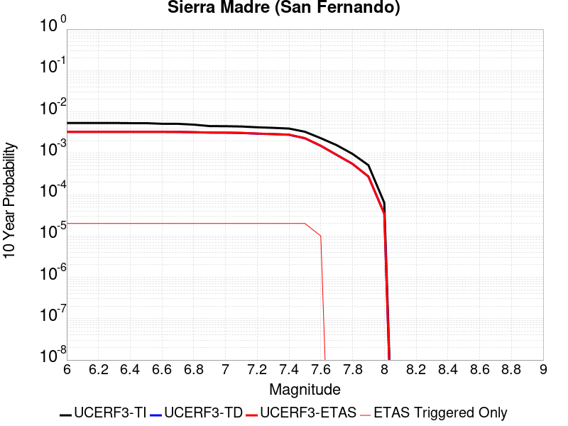 |

| Magnitude | 1 wk TI Prob | 1 wk TD Prob | 1 wk ETAS Prob | 1 wk ETAS/TD Gain | 1 wk ETAS Triggered Only | 1 mo TI Prob | 1 mo TD Prob | 1 mo ETAS Prob | 1 mo ETAS/TD Gain | 1 mo ETAS Triggered Only | 1 yr TI Prob | 1 yr TD Prob | 1 yr ETAS Prob | 1 yr ETAS/TD Gain | 1 yr ETAS Triggered Only | 10 yr TI Prob | 10 yr TD Prob | 10 yr ETAS Prob | 10 yr ETAS/TD Gain | 10 yr ETAS Triggered Only |
|-----|-----|-----|-----|-----|-----|-----|-----|-----|-----|-----|-----|-----|-----|-----|-----|-----|-----|-----|-----|-----|
| 6.0 | 1.0346413E-5 | 6.2874137E-6 | 6.2874137E-6 | 1.0 | 0.0 | 4.4341014E-5 | 2.6945787E-5 | 3.6945516E-5 | 1.3711056 | 1.0E-5 | 5.3971814E-4 | 3.2801667E-4 | 3.480101E-4 | 1.0609525 | 2.0E-5 | 0.0053840918 | 0.0032754377 | 0.0032953722 | 1.0060861 | 2.0E-5 |
| 6.1 | 1.0346413E-5 | 6.2874137E-6 | 6.2874137E-6 | 1.0 | 0.0 | 4.4341014E-5 | 2.6945787E-5 | 3.6945516E-5 | 1.3711056 | 1.0E-5 | 5.3971814E-4 | 3.2801667E-4 | 3.480101E-4 | 1.0609525 | 2.0E-5 | 0.0053840918 | 0.0032754377 | 0.0032953722 | 1.0060861 | 2.0E-5 |
| 6.2 | 1.0346413E-5 | 6.2874137E-6 | 6.2874137E-6 | 1.0 | 0.0 | 4.4341014E-5 | 2.6945787E-5 | 3.6945516E-5 | 1.3711056 | 1.0E-5 | 5.3971814E-4 | 3.2801667E-4 | 3.480101E-4 | 1.0609525 | 2.0E-5 | 0.0053840918 | 0.0032754377 | 0.0032953722 | 1.0060861 | 2.0E-5 |
| 6.3 | 1.0346413E-5 | 6.2874137E-6 | 6.2874137E-6 | 1.0 | 0.0 | 4.4341014E-5 | 2.6945787E-5 | 3.6945516E-5 | 1.3711056 | 1.0E-5 | 5.3971814E-4 | 3.2801667E-4 | 3.480101E-4 | 1.0609525 | 2.0E-5 | 0.0053840918 | 0.0032754377 | 0.0032953722 | 1.0060861 | 2.0E-5 |
| 6.4 | 1.0249558E-5 | 6.2874137E-6 | 6.2874137E-6 | 1.0 | 0.0 | 4.392594E-5 | 2.6945787E-5 | 3.6945516E-5 | 1.3711056 | 1.0E-5 | 5.3466705E-4 | 3.2801667E-4 | 3.480101E-4 | 1.0609525 | 2.0E-5 | 0.0053338245 | 0.0032754377 | 0.0032953722 | 1.0060861 | 2.0E-5 |
| 6.5 | 1.0249558E-5 | 6.2874137E-6 | 6.2874137E-6 | 1.0 | 0.0 | 4.392594E-5 | 2.6945787E-5 | 3.6945516E-5 | 1.3711056 | 1.0E-5 | 5.3466705E-4 | 3.2801667E-4 | 3.480101E-4 | 1.0609525 | 2.0E-5 | 0.0053338245 | 0.0032754377 | 0.0032953722 | 1.0060861 | 2.0E-5 |
| 6.6 | 9.9035515E-6 | 6.2874137E-6 | 6.2874137E-6 | 1.0 | 0.0 | 4.2443102E-5 | 2.6945787E-5 | 3.6945516E-5 | 1.3711056 | 1.0E-5 | 5.166222E-4 | 3.2801667E-4 | 3.480101E-4 | 1.0609525 | 2.0E-5 | 0.0051542283 | 0.0032754377 | 0.0032953722 | 1.0060861 | 2.0E-5 |
| 6.7 | 9.87217E-6 | 6.2748345E-6 | 6.2748345E-6 | 1.0 | 0.0 | 4.2308613E-5 | 2.6891877E-5 | 3.6891608E-5 | 1.3718495 | 1.0E-5 | 5.149856E-4 | 3.2736053E-4 | 3.4735398E-4 | 1.0610747 | 2.0E-5 | 0.005137938 | 0.0032688954 | 0.0032888302 | 1.0060983 | 2.0E-5 |
| 6.8 | 9.4359175E-6 | 6.1788187E-6 | 6.1788187E-6 | 1.0 | 0.0 | 4.043902E-5 | 2.648039E-5 | 3.6480124E-5 | 1.377628 | 1.0E-5 | 4.9223384E-4 | 3.2235213E-4 | 3.423457E-4 | 1.062024 | 2.0E-5 | 0.0049114493 | 0.0032189572 | 0.0032388929 | 1.0061932 | 2.0E-5 |
| 6.9 | 8.700447E-6 | 6.0400944E-6 | 6.0400944E-6 | 1.0 | 0.0 | 3.72871E-5 | 2.5885867E-5 | 3.588561E-5 | 1.3863012 | 1.0E-5 | 4.5387587E-4 | 3.1511593E-4 | 3.3510962E-4 | 1.0634487 | 2.0E-5 | 0.0045295 | 0.0031468007 | 0.0031667377 | 1.0063356 | 2.0E-5 |
| 7.0 | 8.648878E-6 | 6.015009E-6 | 6.015009E-6 | 1.0 | 0.0 | 3.7066096E-5 | 2.5778361E-5 | 3.5778103E-5 | 1.3879123 | 1.0E-5 | 4.5118626E-4 | 3.1380742E-4 | 3.3380114E-4 | 1.0637133 | 2.0E-5 | 0.004502713 | 0.0031337526 | 0.00315369 | 1.0063621 | 2.0E-5 |
| 7.1 | 8.505786E-6 | 5.9246395E-6 | 5.9246395E-6 | 1.0 | 0.0 | 3.645286E-5 | 2.539107E-5 | 3.5390814E-5 | 1.3938292 | 1.0E-5 | 4.437232E-4 | 3.090935E-4 | 3.290873E-4 | 1.0646853 | 2.0E-5 | 0.0044283825 | 0.003086745 | 0.0031066833 | 1.0064594 | 2.0E-5 |
| 7.2 | 8.139752E-6 | 5.698937E-6 | 5.698937E-6 | 1.0 | 0.0 | 3.4884186E-5 | 2.4423793E-5 | 3.442355E-5 | 1.4094268 | 1.0E-5 | 4.246322E-4 | 2.9732016E-4 | 3.173142E-4 | 1.0672475 | 2.0E-5 | 0.004238217 | 0.0029693297 | 0.0029892703 | 1.0067155 | 2.0E-5 |
| 7.3 | 7.8816E-6 | 5.5522523E-6 | 5.5522523E-6 | 1.0 | 0.0 | 3.3777847E-5 | 2.3795157E-5 | 3.3794917E-5 | 1.4202436 | 1.0E-5 | 4.111677E-4 | 2.8966856E-4 | 3.0966278E-4 | 1.0690244 | 2.0E-5 | 0.004104078 | 0.0028930155 | 0.0029129577 | 1.0068932 | 2.0E-5 |
| 7.4 | 7.5810603E-6 | 5.356491E-6 | 5.356491E-6 | 1.0 | 0.0 | 3.2489854E-5 | 2.2956194E-5 | 3.2955963E-5 | 1.4356023 | 1.0E-5 | 3.9549218E-4 | 2.7945687E-4 | 2.9945126E-4 | 1.0715474 | 2.0E-5 | 0.0039478904 | 0.0027911596 | 0.0028111036 | 1.0071455 | 2.0E-5 |
| 7.5 | 6.349153E-6 | 4.4077356E-6 | 4.4077356E-6 | 1.0 | 0.0 | 2.7210372E-5 | 1.8890163E-5 | 2.8889974E-5 | 1.5293661 | 1.0E-5 | 3.312359E-4 | 2.2996428E-4 | 2.4995967E-4 | 1.0869501 | 2.0E-5 | 0.0033074263 | 0.002297345 | 0.0023172991 | 1.0086857 | 2.0E-5 |
| 7.6 | 4.430576E-6 | 2.8907193E-6 | 2.8907193E-6 | 1.0 | 0.0 | 1.8988047E-5 | 1.2388739E-5 | 2.2388615E-5 | 1.8071747 | 1.0E-5 | 2.3115493E-4 | 1.5082269E-4 | 1.6082118E-4 | 1.066293 | 1.0E-5 | 0.0023091463 | 0.0015072258 | 0.0015172107 | 1.0066247 | 1.0E-5 |
| 7.7 | 3.005066E-6 | 1.7511157E-6 | 1.7511157E-6 | 1.0 | 0.0 | 1.2878791E-5 | 7.50476E-6 | 7.50476E-6 | 1.0 | 0.0 | 1.56788E-4 | 9.136663E-5 | 9.136663E-5 | 1.0 | 0.0 | 0.0015667742 | 9.132919E-4 | 9.132919E-4 | 1.0 | 0.0 |
| 7.8 | 1.8459098E-6 | 1.058284E-6 | 1.058284E-6 | 1.0 | 0.0 | 7.911018E-6 | 4.535495E-6 | 4.535495E-6 | 1.0 | 0.0 | 9.631238E-5 | 5.5218257E-5 | 5.5218257E-5 | 1.0 | 0.0 | 9.627065E-4 | 5.520458E-4 | 5.520458E-4 | 1.0 | 0.0 |
| 7.9 | 9.839262E-7 | 5.234779E-7 | 5.234779E-7 | 1.0 | 0.0 | 4.2168194E-6 | 2.243475E-6 | 2.243475E-6 | 1.0 | 0.0 | 5.1338568E-5 | 2.7313967E-5 | 2.7313967E-5 | 1.0 | 0.0 | 5.132671E-4 | 2.731064E-4 | 2.731064E-4 | 1.0 | 0.0 |
| 8.0 | 1.210983E-7 | 6.6138576E-8 | 6.6138576E-8 | 1.0 | 0.0 | 5.1899264E-7 | 2.8345102E-7 | 2.8345102E-7 | 1.0 | 0.0 | 6.3187167E-6 | 3.4510108E-6 | 3.4510108E-6 | 1.0 | 0.0 | 6.318537E-5 | 3.450959E-5 | 3.450959E-5 | 1.0 | 0.0 |

## Raymond
*[(top)](#table-of-contents)*

| 1 Week | 1 Month | 1 Year | 10 Year |
|-----|-----|-----|-----|
|  |  |  |  |

| Magnitude | 1 wk TI Prob | 1 wk TD Prob | 1 wk ETAS Prob | 1 wk ETAS/TD Gain | 1 wk ETAS Triggered Only | 1 mo TI Prob | 1 mo TD Prob | 1 mo ETAS Prob | 1 mo ETAS/TD Gain | 1 mo ETAS Triggered Only | 1 yr TI Prob | 1 yr TD Prob | 1 yr ETAS Prob | 1 yr ETAS/TD Gain | 1 yr ETAS Triggered Only | 10 yr TI Prob | 10 yr TD Prob | 10 yr ETAS Prob | 10 yr ETAS/TD Gain | 10 yr ETAS Triggered Only |
|-----|-----|-----|-----|-----|-----|-----|-----|-----|-----|-----|-----|-----|-----|-----|-----|-----|-----|-----|-----|-----|
| 6.0 | 1.5157413E-5 | 1.5810365E-5 | 1.5810365E-5 | 1.0 | 0.0 | 6.4958724E-5 | 6.775709E-5 | 6.775709E-5 | 1.0 | 0.0 | 7.905855E-4 | 8.246554E-4 | 8.3464716E-4 | 1.0121163 | 1.0E-5 | 0.007877788 | 0.008218473 | 0.008238308 | 1.0024135 | 2.0E-5 |
| 6.1 | 1.5157413E-5 | 1.5810365E-5 | 1.5810365E-5 | 1.0 | 0.0 | 6.4958724E-5 | 6.775709E-5 | 6.775709E-5 | 1.0 | 0.0 | 7.905855E-4 | 8.246554E-4 | 8.3464716E-4 | 1.0121163 | 1.0E-5 | 0.007877788 | 0.008218473 | 0.008238308 | 1.0024135 | 2.0E-5 |
| 6.2 | 1.5157413E-5 | 1.5810365E-5 | 1.5810365E-5 | 1.0 | 0.0 | 6.4958724E-5 | 6.775709E-5 | 6.775709E-5 | 1.0 | 0.0 | 7.905855E-4 | 8.246554E-4 | 8.3464716E-4 | 1.0121163 | 1.0E-5 | 0.007877788 | 0.008218473 | 0.008238308 | 1.0024135 | 2.0E-5 |
| 6.3 | 1.5157413E-5 | 1.5810365E-5 | 1.5810365E-5 | 1.0 | 0.0 | 6.4958724E-5 | 6.775709E-5 | 6.775709E-5 | 1.0 | 0.0 | 7.905855E-4 | 8.246554E-4 | 8.3464716E-4 | 1.0121163 | 1.0E-5 | 0.007877788 | 0.008218473 | 0.008238308 | 1.0024135 | 2.0E-5 |
| 6.4 | 1.3941944E-5 | 1.4454908E-5 | 1.4454908E-5 | 1.0 | 0.0 | 5.9749822E-5 | 6.194826E-5 | 6.194826E-5 | 1.0 | 0.0 | 7.2721124E-4 | 7.5398246E-4 | 7.639749E-4 | 1.0132529 | 1.0E-5 | 0.007248361 | 0.0075165783 | 0.007536428 | 1.0026408 | 2.0E-5 |
| 6.5 | 1.3941944E-5 | 1.4454908E-5 | 1.4454908E-5 | 1.0 | 0.0 | 5.9749822E-5 | 6.194826E-5 | 6.194826E-5 | 1.0 | 0.0 | 7.2721124E-4 | 7.5398246E-4 | 7.639749E-4 | 1.0132529 | 1.0E-5 | 0.007248361 | 0.0075165783 | 0.007536428 | 1.0026408 | 2.0E-5 |
| 6.6 | 1.0542609E-5 | 1.0671272E-5 | 1.0671272E-5 | 1.0 | 0.0 | 4.5181827E-5 | 4.5733254E-5 | 4.5733254E-5 | 1.0 | 0.0 | 5.499499E-4 | 5.566656E-4 | 5.566656E-4 | 1.0 | 0.0 | 0.005485909 | 0.0055532744 | 0.005563219 | 1.0017908 | 1.0E-5 |
| 6.7 | 1.0542609E-5 | 1.0671272E-5 | 1.0671272E-5 | 1.0 | 0.0 | 4.5181827E-5 | 4.5733254E-5 | 4.5733254E-5 | 1.0 | 0.0 | 5.499499E-4 | 5.566656E-4 | 5.566656E-4 | 1.0 | 0.0 | 0.005485909 | 0.0055532744 | 0.005563219 | 1.0017908 | 1.0E-5 |
| 6.8 | 1.0079132E-5 | 1.0176802E-5 | 1.0176802E-5 | 1.0 | 0.0 | 4.3195567E-5 | 4.3614164E-5 | 4.3614164E-5 | 1.0 | 0.0 | 5.257791E-4 | 5.3087843E-4 | 5.3087843E-4 | 1.0 | 0.0 | 0.0052453685 | 0.005296653 | 0.005296653 | 1.0 | 0.0 |
| 6.9 | 7.721598E-6 | 7.5490198E-6 | 7.5490198E-6 | 1.0 | 0.0 | 3.3092143E-5 | 3.2352546E-5 | 3.2352546E-5 | 1.0 | 0.0 | 4.0282236E-4 | 3.938223E-4 | 3.938223E-4 | 1.0 | 0.0 | 0.0040209293 | 0.0039313785 | 0.0039313785 | 1.0 | 0.0 |
| 7.0 | 7.137566E-6 | 6.911413E-6 | 6.911413E-6 | 1.0 | 0.0 | 3.058921E-5 | 2.962001E-5 | 2.962001E-5 | 1.0 | 0.0 | 3.7236E-4 | 3.6056503E-4 | 3.6056503E-4 | 1.0 | 0.0 | 0.0037173668 | 0.0035999198 | 0.0035999198 | 1.0 | 0.0 |
| 7.1 | 5.654976E-6 | 5.299629E-6 | 5.299629E-6 | 1.0 | 0.0 | 2.4235387E-5 | 2.2712498E-5 | 2.2712498E-5 | 1.0 | 0.0 | 2.9502588E-4 | 2.764898E-4 | 2.764898E-4 | 1.0 | 0.0 | 0.0029463451 | 0.0027614902 | 0.0027614902 | 1.0 | 0.0 |
| 7.2 | 4.9358455E-6 | 4.5267375E-6 | 4.5267375E-6 | 1.0 | 0.0 | 2.1153453E-5 | 1.940016E-5 | 1.940016E-5 | 1.0 | 0.0 | 2.5751285E-4 | 2.3617149E-4 | 2.3617149E-4 | 1.0 | 0.0 | 0.0025721465 | 0.0023592284 | 0.0023592284 | 1.0 | 0.0 |
| 7.3 | 4.2368597E-6 | 3.805688E-6 | 3.805688E-6 | 1.0 | 0.0 | 1.8157843E-5 | 1.630999E-5 | 1.630999E-5 | 1.0 | 0.0 | 2.2104931E-4 | 1.9855614E-4 | 1.9855614E-4 | 1.0 | 0.0 | 0.0022082955 | 0.0019838074 | 0.0019838074 | 1.0 | 0.0 |
| 7.4 | 3.4999923E-6 | 3.0438064E-6 | 3.0438064E-6 | 1.0 | 0.0 | 1.49998805E-5 | 1.3044819E-5 | 1.3044819E-5 | 1.0 | 0.0 | 1.8260824E-4 | 1.5880918E-4 | 1.5880918E-4 | 1.0 | 0.0 | 0.0018245826 | 0.0015869739 | 0.0015869739 | 1.0 | 0.0 |
| 7.5 | 2.738017E-6 | 2.3020955E-6 | 2.3020955E-6 | 1.0 | 0.0 | 1.1734306E-5 | 9.866087E-6 | 9.866087E-6 | 1.0 | 0.0 | 1.428558E-4 | 1.2011305E-4 | 1.2011305E-4 | 1.0 | 0.0 | 0.0014276401 | 0.0012004969 | 0.0012004969 | 1.0 | 0.0 |
| 7.6 | 1.8186392E-6 | 1.4423393E-6 | 1.4423393E-6 | 1.0 | 0.0 | 7.794145E-6 | 6.18144E-6 | 6.18144E-6 | 1.0 | 0.0 | 9.488958E-5 | 7.525647E-5 | 7.525647E-5 | 1.0 | 0.0 | 9.4849075E-4 | 7.5232267E-4 | 7.5232267E-4 | 1.0 | 0.0 |
| 7.7 | 1.0660348E-6 | 7.644004E-7 | 7.644004E-7 | 1.0 | 0.0 | 4.5687125E-6 | 3.2759976E-6 | 3.2759976E-6 | 1.0 | 0.0 | 5.5622655E-5 | 3.988456E-5 | 3.988456E-5 | 1.0 | 0.0 | 5.5608735E-4 | 3.987844E-4 | 3.987844E-4 | 1.0 | 0.0 |
| 7.8 | 6.913602E-7 | 4.3205526E-7 | 4.3205526E-7 | 1.0 | 0.0 | 2.962969E-6 | 1.8516641E-6 | 1.8516641E-6 | 1.0 | 0.0 | 3.607355E-5 | 2.2543783E-5 | 2.2543783E-5 | 1.0 | 0.0 | 3.6067693E-4 | 2.2542427E-4 | 2.2542427E-4 | 1.0 | 0.0 |
| 7.9 | 7.425201E-8 | 5.3225733E-8 | 5.3225733E-8 | 1.0 | 0.0 | 3.1822285E-7 | 2.2811027E-7 | 2.2811027E-7 | 1.0 | 0.0 | 3.874356E-6 | 2.7772403E-6 | 2.7772403E-6 | 1.0 | 0.0 | 3.8742884E-5 | 2.7772185E-5 | 2.7772185E-5 | 1.0 | 0.0 |

## Likely 2011 CFM
*[(top)](#table-of-contents)*

| 1 Week | 1 Month | 1 Year | 10 Year |
|-----|-----|-----|-----|
|  |  | 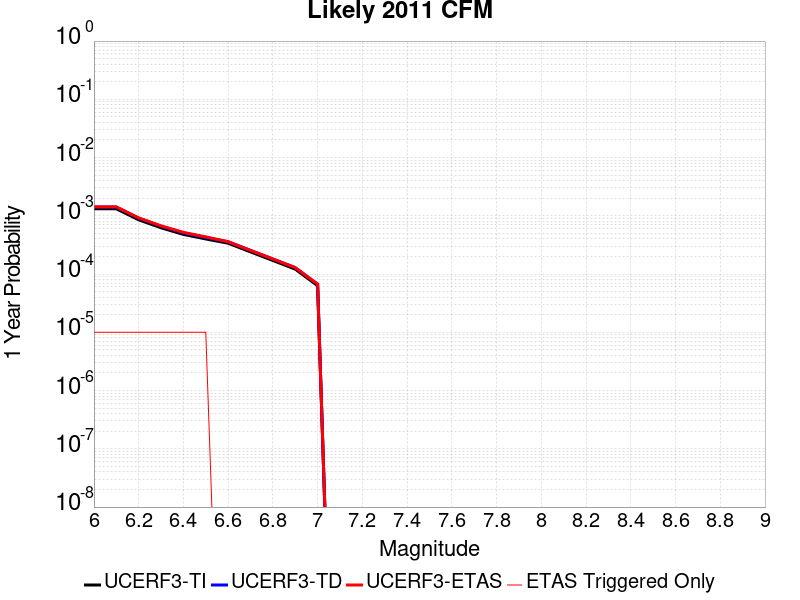 |  |

| Magnitude | 1 wk TI Prob | 1 wk TD Prob | 1 wk ETAS Prob | 1 wk ETAS/TD Gain | 1 wk ETAS Triggered Only | 1 mo TI Prob | 1 mo TD Prob | 1 mo ETAS Prob | 1 mo ETAS/TD Gain | 1 mo ETAS Triggered Only | 1 yr TI Prob | 1 yr TD Prob | 1 yr ETAS Prob | 1 yr ETAS/TD Gain | 1 yr ETAS Triggered Only | 10 yr TI Prob | 10 yr TD Prob | 10 yr ETAS Prob | 10 yr ETAS/TD Gain | 10 yr ETAS Triggered Only |
|-----|-----|-----|-----|-----|-----|-----|-----|-----|-----|-----|-----|-----|-----|-----|-----|-----|-----|-----|-----|-----|
| 6.0 | 2.5315949E-5 | 2.7105003E-5 | 2.7105003E-5 | 1.0 | 0.0 | 1.0849241E-4 | 1.16159375E-4 | 1.16159375E-4 | 1.0 | 0.0 | 0.0013200947 | 0.0014133675 | 0.0014233533 | 1.0070653 | 1.0E-5 | 0.013122803 | 0.014048441 | 0.01406816 | 1.0014037 | 2.0E-5 |
| 6.1 | 2.5315949E-5 | 2.7105003E-5 | 2.7105003E-5 | 1.0 | 0.0 | 1.0849241E-4 | 1.16159375E-4 | 1.16159375E-4 | 1.0 | 0.0 | 0.0013200947 | 0.0014133675 | 0.0014233533 | 1.0070653 | 1.0E-5 | 0.013122803 | 0.014048441 | 0.01406816 | 1.0014037 | 2.0E-5 |
| 6.2 | 1.6375941E-5 | 1.7465996E-5 | 1.7465996E-5 | 1.0 | 0.0 | 7.0180715E-5 | 7.485219E-5 | 7.485219E-5 | 1.0 | 0.0 | 8.5411523E-4 | 9.109567E-4 | 9.209476E-4 | 1.0109675 | 1.0E-5 | 0.008508399 | 0.009073513 | 0.009093331 | 1.0021843 | 2.0E-5 |
| 6.3 | 1.1945543E-5 | 1.2712695E-5 | 1.2712695E-5 | 1.0 | 0.0 | 5.119418E-5 | 5.4481872E-5 | 5.4481872E-5 | 1.0 | 0.0 | 6.2311086E-4 | 6.6312024E-4 | 6.731136E-4 | 1.0150702 | 1.0E-5 | 0.0062136655 | 0.0066119707 | 0.006631838 | 1.0030048 | 2.0E-5 |
| 6.4 | 9.192729E-6 | 9.768569E-6 | 9.768569E-6 | 1.0 | 0.0 | 3.939681E-5 | 4.1864638E-5 | 4.1864638E-5 | 1.0 | 0.0 | 4.7955062E-4 | 5.095855E-4 | 5.195804E-4 | 1.0196137 | 1.0E-5 | 0.004785171 | 0.0050844513 | 0.0051043495 | 1.0039135 | 2.0E-5 |
| 6.5 | 7.67906E-6 | 8.152689E-6 | 8.152689E-6 | 1.0 | 0.0 | 3.2909844E-5 | 3.493964E-5 | 3.493964E-5 | 1.0 | 0.0 | 4.006037E-4 | 4.2530894E-4 | 4.3530468E-4 | 1.0235023 | 1.0E-5 | 0.0039988225 | 0.004245143 | 0.004265058 | 1.0046912 | 2.0E-5 |
| 6.6 | 6.4884057E-6 | 6.884806E-6 | 6.884806E-6 | 1.0 | 0.0 | 2.7807157E-5 | 2.9505987E-5 | 2.9505987E-5 | 1.0 | 0.0 | 3.3849955E-4 | 3.5917762E-4 | 3.5917762E-4 | 1.0 | 0.0 | 0.003379844 | 0.0035861158 | 0.00359608 | 1.0027785 | 1.0E-5 |
| 6.7 | 4.6060636E-6 | 4.88408E-6 | 4.88408E-6 | 1.0 | 0.0 | 1.9740122E-5 | 2.093161E-5 | 2.093161E-5 | 1.0 | 0.0 | 2.403095E-4 | 2.5481338E-4 | 2.5481338E-4 | 1.0 | 0.0 | 0.002400498 | 0.002545295 | 0.0025552695 | 1.0039188 | 1.0E-5 |
| 6.8 | 3.2795615E-6 | 3.477401E-6 | 3.477401E-6 | 1.0 | 0.0 | 1.4055187E-5 | 1.4903065E-5 | 1.4903065E-5 | 1.0 | 0.0 | 1.7110848E-4 | 1.8143027E-4 | 1.8143027E-4 | 1.0 | 0.0 | 0.0017097679 | 0.0018128767 | 0.0018128767 | 1.0 | 0.0 |
| 6.9 | 2.3289967E-6 | 2.4705769E-6 | 2.4705769E-6 | 1.0 | 0.0 | 9.981376E-6 | 1.0588145E-5 | 1.0588145E-5 | 1.0 | 0.0 | 1.2151648E-4 | 1.2890348E-4 | 1.2890348E-4 | 1.0 | 0.0 | 0.0012145005 | 0.0012883301 | 0.0012883301 | 1.0 | 0.0 |
| 7.0 | 1.211292E-6 | 1.2864064E-6 | 1.2864064E-6 | 1.0 | 0.0 | 5.1912407E-6 | 5.51316E-6 | 5.51316E-6 | 1.0 | 0.0 | 6.320152E-5 | 6.7120964E-5 | 6.7120964E-5 | 1.0 | 0.0 | 6.3183554E-4 | 6.710367E-4 | 6.710367E-4 | 1.0 | 0.0 |

## Coronado Bank alt1
*[(top)](#table-of-contents)*

| 1 Week | 1 Month | 1 Year | 10 Year |
|-----|-----|-----|-----|
| 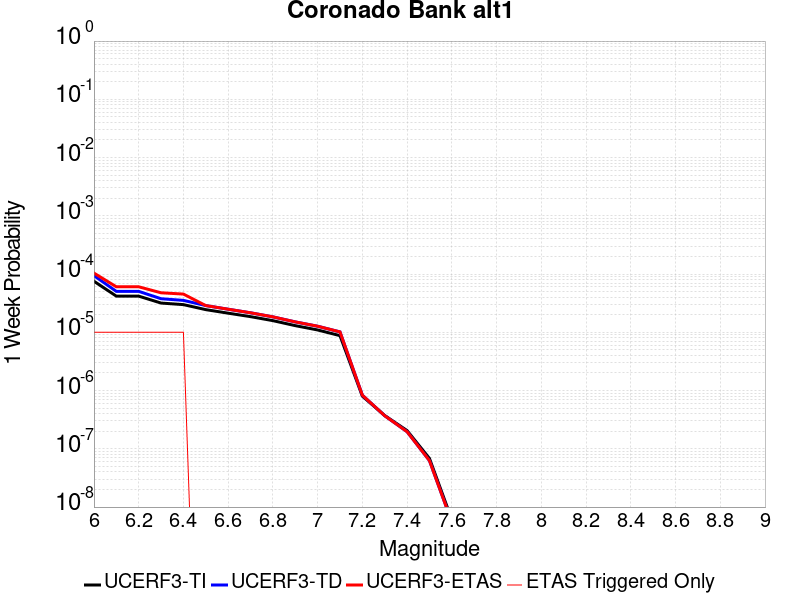 |  | 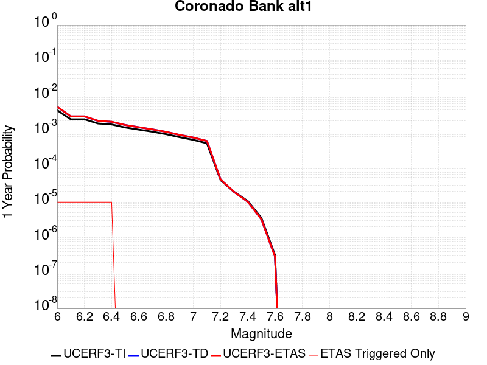 | 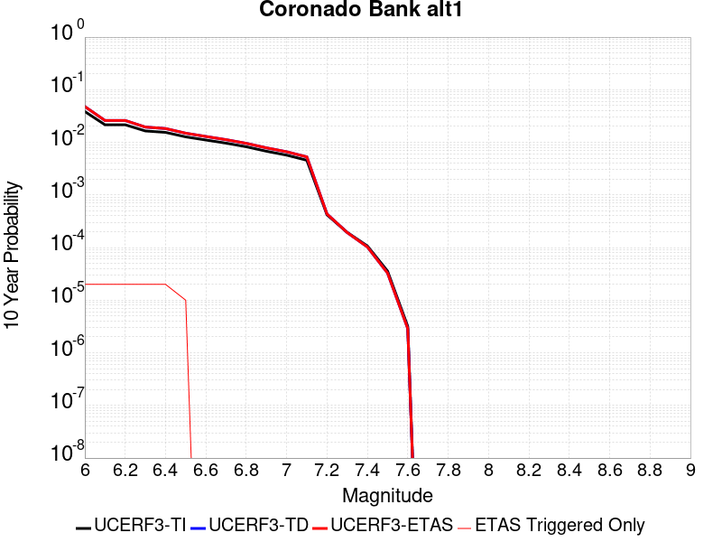 |

| Magnitude | 1 wk TI Prob | 1 wk TD Prob | 1 wk ETAS Prob | 1 wk ETAS/TD Gain | 1 wk ETAS Triggered Only | 1 mo TI Prob | 1 mo TD Prob | 1 mo ETAS Prob | 1 mo ETAS/TD Gain | 1 mo ETAS Triggered Only | 1 yr TI Prob | 1 yr TD Prob | 1 yr ETAS Prob | 1 yr ETAS/TD Gain | 1 yr ETAS Triggered Only | 10 yr TI Prob | 10 yr TD Prob | 10 yr ETAS Prob | 10 yr ETAS/TD Gain | 10 yr ETAS Triggered Only |
|-----|-----|-----|-----|-----|-----|-----|-----|-----|-----|-----|-----|-----|-----|-----|-----|-----|-----|-----|-----|-----|
| 6.0 | 7.533492E-5 | 9.395439E-5 | 1.0395345E-4 | 1.1064246 | 1.0E-5 | 3.22824E-4 | 4.026023E-4 | 4.1259828E-4 | 1.0248284 | 1.0E-5 | 0.0039233007 | 0.0048912787 | 0.00490123 | 1.0020344 | 1.0E-5 | 0.03854755 | 0.04790551 | 0.04792455 | 1.0003974 | 2.0E-5 |
| 6.1 | 4.1807285E-5 | 5.049452E-5 | 6.0494014E-5 | 1.1980313 | 1.0E-5 | 1.7916178E-4 | 2.1638718E-4 | 2.2638502E-4 | 1.0462035 | 1.0E-5 | 0.0021791123 | 0.0026314093 | 0.0026413829 | 1.0037903 | 1.0E-5 | 0.021578677 | 0.026011832 | 0.026031313 | 1.0007489 | 2.0E-5 |
| 6.2 | 4.1807285E-5 | 5.049452E-5 | 6.0494014E-5 | 1.1980313 | 1.0E-5 | 1.7916178E-4 | 2.1638718E-4 | 2.2638502E-4 | 1.0462035 | 1.0E-5 | 0.0021791123 | 0.0026314093 | 0.0026413829 | 1.0037903 | 1.0E-5 | 0.021578677 | 0.026011832 | 0.026031313 | 1.0007489 | 2.0E-5 |
| 6.3 | 3.1793104E-5 | 3.7712067E-5 | 4.771169E-5 | 1.2651571 | 1.0E-5 | 1.3624904E-4 | 1.616133E-4 | 1.7161167E-4 | 1.061866 | 1.0E-5 | 0.0016575698 | 0.0019658979 | 0.0019758784 | 1.0050768 | 1.0E-5 | 0.016452603 | 0.019488975 | 0.019508585 | 1.0010062 | 2.0E-5 |
| 6.4 | 2.9878007E-5 | 3.5336667E-5 | 4.5336314E-5 | 1.2829822 | 1.0E-5 | 1.2804232E-4 | 1.5143424E-4 | 1.6143273E-4 | 1.0660253 | 1.0E-5 | 0.0015578003 | 0.0018421846 | 0.0018521661 | 1.0054183 | 1.0E-5 | 0.015469253 | 0.018272907 | 0.01829254 | 1.0010746 | 2.0E-5 |
| 6.5 | 2.4512565E-5 | 2.876477E-5 | 2.876477E-5 | 1.0 | 0.0 | 1.0504962E-4 | 1.2327192E-4 | 1.2327192E-4 | 1.0 | 0.0 | 0.0012782287 | 0.0014998292 | 0.0014998292 | 1.0 | 0.0 | 0.012709012 | 0.014900037 | 0.014909888 | 1.0006611 | 1.0E-5 |
| 6.6 | 2.1317413E-5 | 2.4907235E-5 | 2.4907235E-5 | 1.0 | 0.0 | 9.135714E-5 | 1.0674105E-4 | 1.0674105E-4 | 1.0 | 0.0 | 0.0011117056 | 0.0012988197 | 0.0012988197 | 1.0 | 0.0 | 0.011061605 | 0.012914698 | 0.012914698 | 1.0 | 0.0 |
| 6.7 | 1.8585655E-5 | 2.1635358E-5 | 2.1635358E-5 | 1.0 | 0.0 | 7.9650374E-5 | 9.271978E-5 | 9.271978E-5 | 1.0 | 0.0 | 9.6931186E-4 | 0.0011282993 | 0.0011282993 | 1.0 | 0.0 | 0.0096509475 | 0.011227869 | 0.011227869 | 1.0 | 0.0 |
| 6.8 | 1.5862879E-5 | 1.8419876E-5 | 1.8419876E-5 | 1.0 | 0.0 | 6.798199E-5 | 7.8940044E-5 | 7.8940044E-5 | 1.0 | 0.0 | 8.273665E-4 | 9.6069055E-4 | 9.6069055E-4 | 1.0 | 0.0 | 0.008242928 | 0.009567358 | 0.009567358 | 1.0 | 0.0 |
| 6.9 | 1.3021509E-5 | 1.509559E-5 | 1.509559E-5 | 1.0 | 0.0 | 5.5805274E-5 | 6.4693886E-5 | 6.4693886E-5 | 1.0 | 0.0 | 6.792174E-4 | 7.873815E-4 | 7.873815E-4 | 1.0 | 0.0 | 0.006771452 | 0.007847741 | 0.007847741 | 1.0 | 0.0 |
| 7.0 | 1.0974371E-5 | 1.2720379E-5 | 1.2720379E-5 | 1.0 | 0.0 | 4.7032172E-5 | 5.451487E-5 | 5.451487E-5 | 1.0 | 0.0 | 5.7246623E-4 | 6.63534E-4 | 6.63534E-4 | 1.0 | 0.0 | 0.0057099373 | 0.0066172774 | 0.0066172774 | 1.0 | 0.0 |
| 7.1 | 8.766221E-6 | 1.01640535E-5 | 1.01640535E-5 | 1.0 | 0.0 | 3.7568978E-5 | 4.3559598E-5 | 4.3559598E-5 | 1.0 | 0.0 | 4.573063E-4 | 5.302263E-4 | 5.302263E-4 | 1.0 | 0.0 | 0.0045636636 | 0.0052913115 | 0.0052913115 | 1.0 | 0.0 |
| 7.2 | 8.026024E-7 | 8.3318497E-7 | 8.3318497E-7 | 1.0 | 0.0 | 3.43972E-6 | 3.5707878E-6 | 3.5707878E-6 | 1.0 | 0.0 | 4.1877785E-5 | 4.3473487E-5 | 4.3473487E-5 | 1.0 | 0.0 | 4.1869894E-4 | 4.346509E-4 | 4.346509E-4 | 1.0 | 0.0 |
| 7.3 | 3.7293114E-7 | 3.700131E-7 | 3.700131E-7 | 1.0 | 0.0 | 1.5982754E-6 | 1.5857695E-6 | 1.5857695E-6 | 1.0 | 0.0 | 1.9458828E-5 | 1.9306573E-5 | 1.9306573E-5 | 1.0 | 0.0 | 1.9457124E-4 | 1.9304903E-4 | 1.9304903E-4 | 1.0 | 0.0 |
| 7.4 | 2.0557036E-7 | 1.9674545E-7 | 1.9674545E-7 | 1.0 | 0.0 | 8.810155E-7 | 8.4319447E-7 | 8.4319447E-7 | 1.0 | 0.0 | 1.0726311E-5 | 1.0265845E-5 | 1.0265845E-5 | 1.0 | 0.0 | 1.0725793E-4 | 1.02653736E-4 | 1.02653736E-4 | 1.0 | 0.0 |
| 7.5 | 6.845446E-8 | 6.279429E-8 | 6.279429E-8 | 1.0 | 0.0 | 2.9337625E-7 | 2.6911837E-7 | 2.6911837E-7 | 1.0 | 0.0 | 3.5718497E-6 | 3.2765113E-6 | 3.2765113E-6 | 1.0 | 0.0 | 3.5717923E-5 | 3.2764638E-5 | 3.2764638E-5 | 1.0 | 0.0 |
| 7.6 | 6.0975145E-9 | 5.5319123E-9 | 5.5319123E-9 | 1.0 | 0.0 | 2.6132206E-8 | 2.3708195E-8 | 2.3708195E-8 | 1.0 | 0.0 | 3.1815955E-7 | 2.8864724E-7 | 2.8864724E-7 | 1.0 | 0.0 | 3.181591E-6 | 2.8864697E-6 | 2.8864697E-6 | 1.0 | 0.0 |

## Rinconada 2011 CFM
*[(top)](#table-of-contents)*

| 1 Week | 1 Month | 1 Year | 10 Year |
|-----|-----|-----|-----|
|  |  |  |  |

| Magnitude | 1 wk TI Prob | 1 wk TD Prob | 1 wk ETAS Prob | 1 wk ETAS/TD Gain | 1 wk ETAS Triggered Only | 1 mo TI Prob | 1 mo TD Prob | 1 mo ETAS Prob | 1 mo ETAS/TD Gain | 1 mo ETAS Triggered Only | 1 yr TI Prob | 1 yr TD Prob | 1 yr ETAS Prob | 1 yr ETAS/TD Gain | 1 yr ETAS Triggered Only | 10 yr TI Prob | 10 yr TD Prob | 10 yr ETAS Prob | 10 yr ETAS/TD Gain | 10 yr ETAS Triggered Only |
|-----|-----|-----|-----|-----|-----|-----|-----|-----|-----|-----|-----|-----|-----|-----|-----|-----|-----|-----|-----|-----|
| 6.0 | 1.5752368E-5 | 1.6274787E-5 | 1.6274787E-5 | 1.0 | 0.0 | 6.75084E-5 | 6.974724E-5 | 6.974724E-5 | 1.0 | 0.0 | 8.2160486E-4 | 8.48845E-4 | 8.48845E-4 | 1.0 | 0.0 | 0.008185739 | 0.008456407 | 0.008476238 | 1.0023451 | 2.0E-5 |
| 6.1 | 1.0966133E-5 | 1.1323078E-5 | 1.1323078E-5 | 1.0 | 0.0 | 4.6996865E-5 | 4.852658E-5 | 4.852658E-5 | 1.0 | 0.0 | 5.720366E-4 | 5.906517E-4 | 5.906517E-4 | 1.0 | 0.0 | 0.0057056635 | 0.0058909147 | 0.0059008556 | 1.0016875 | 1.0E-5 |
| 6.2 | 1.0966133E-5 | 1.1323078E-5 | 1.1323078E-5 | 1.0 | 0.0 | 4.6996865E-5 | 4.852658E-5 | 4.852658E-5 | 1.0 | 0.0 | 5.720366E-4 | 5.906517E-4 | 5.906517E-4 | 1.0 | 0.0 | 0.0057056635 | 0.0058909147 | 0.0059008556 | 1.0016875 | 1.0E-5 |
| 6.3 | 8.926149E-6 | 9.212811E-6 | 9.212811E-6 | 1.0 | 0.0 | 3.8254362E-5 | 3.9482882E-5 | 3.9482882E-5 | 1.0 | 0.0 | 4.6564735E-4 | 4.805984E-4 | 4.805984E-4 | 1.0 | 0.0 | 0.0046467283 | 0.004795635 | 0.004805587 | 1.0020752 | 1.0E-5 |
| 6.4 | 7.676955E-6 | 7.920225E-6 | 7.920225E-6 | 1.0 | 0.0 | 3.290082E-5 | 3.394338E-5 | 3.394338E-5 | 1.0 | 0.0 | 4.0049385E-4 | 4.1318245E-4 | 4.1318245E-4 | 1.0 | 0.0 | 0.0039977287 | 0.004124169 | 0.0041341274 | 1.0024147 | 1.0E-5 |
| 6.5 | 6.1671026E-6 | 6.358982E-6 | 6.358982E-6 | 1.0 | 0.0 | 2.6430173E-5 | 2.7252494E-5 | 2.7252494E-5 | 1.0 | 0.0 | 3.2173982E-4 | 3.3174868E-4 | 3.3174868E-4 | 1.0 | 0.0 | 0.003212744 | 0.0033125465 | 0.0033225133 | 1.0030088 | 1.0E-5 |
| 6.6 | 5.553456E-6 | 5.7248367E-6 | 5.7248367E-6 | 1.0 | 0.0 | 2.3800309E-5 | 2.4534784E-5 | 2.4534784E-5 | 1.0 | 0.0 | 2.897302E-4 | 2.9867011E-4 | 2.9867011E-4 | 1.0 | 0.0 | 0.0028935277 | 0.0029826956 | 0.0029926659 | 1.0033426 | 1.0E-5 |
| 6.7 | 4.787857E-6 | 4.93333E-6 | 4.93333E-6 | 1.0 | 0.0 | 2.0519226E-5 | 2.1142672E-5 | 2.1142672E-5 | 1.0 | 0.0 | 2.4979294E-4 | 2.5738167E-4 | 2.5738167E-4 | 1.0 | 0.0 | 0.0024951235 | 0.0025708415 | 0.0025708415 | 1.0 | 0.0 |
| 6.8 | 3.9955166E-6 | 4.1134927E-6 | 4.1134927E-6 | 1.0 | 0.0 | 1.7123532E-5 | 1.7629136E-5 | 1.7629136E-5 | 1.0 | 0.0 | 2.0845905E-4 | 2.1461361E-4 | 2.1461361E-4 | 1.0 | 0.0 | 0.002082636 | 0.0021440673 | 0.0021440673 | 1.0 | 0.0 |
| 6.9 | 3.4250072E-6 | 3.5224602E-6 | 3.5224602E-6 | 1.0 | 0.0 | 1.46785205E-5 | 1.50961705E-5 | 1.50961705E-5 | 1.0 | 0.0 | 1.7869633E-4 | 1.837804E-4 | 1.837804E-4 | 1.0 | 0.0 | 0.001785527 | 0.0018362866 | 0.0018362866 | 1.0 | 0.0 |
| 7.0 | 2.7712713E-6 | 2.846711E-6 | 2.846711E-6 | 1.0 | 0.0 | 1.1876823E-5 | 1.2200132E-5 | 1.2200132E-5 | 1.0 | 0.0 | 1.4459073E-4 | 1.485265E-4 | 1.485265E-4 | 1.0 | 0.0 | 0.0014449668 | 0.0014842738 | 0.0014842738 | 1.0 | 0.0 |
| 7.1 | 2.227358E-6 | 2.285707E-6 | 2.285707E-6 | 1.0 | 0.0 | 9.545785E-6 | 9.79585E-6 | 9.79585E-6 | 1.0 | 0.0 | 1.16213734E-4 | 1.1925796E-4 | 1.1925796E-4 | 1.0 | 0.0 | 0.0011615298 | 0.0011919406 | 0.0011919406 | 1.0 | 0.0 |
| 7.2 | 1.581796E-6 | 1.620907E-6 | 1.620907E-6 | 1.0 | 0.0 | 6.779108E-6 | 6.946726E-6 | 6.946726E-6 | 1.0 | 0.0 | 8.253252E-5 | 8.457311E-5 | 8.457311E-5 | 1.0 | 0.0 | 8.250187E-4 | 8.454098E-4 | 8.454098E-4 | 1.0 | 0.0 |
| 7.3 | 1.0306567E-6 | 1.0546515E-6 | 1.0546515E-6 | 1.0 | 0.0 | 4.4170924E-6 | 4.519927E-6 | 4.519927E-6 | 1.0 | 0.0 | 5.3776774E-5 | 5.5028726E-5 | 5.5028726E-5 | 1.0 | 0.0 | 5.376376E-4 | 5.501513E-4 | 5.501513E-4 | 1.0 | 0.0 |
| 7.4 | 6.535541E-7 | 6.6827675E-7 | 6.6827675E-7 | 1.0 | 0.0 | 2.800943E-6 | 2.8640402E-6 | 2.8640402E-6 | 1.0 | 0.0 | 3.4100947E-5 | 3.4869132E-5 | 3.4869132E-5 | 1.0 | 0.0 | 3.4095717E-4 | 3.4863673E-4 | 3.4863673E-4 | 1.0 | 0.0 |
| 7.5 | 3.2656962E-7 | 3.3316834E-7 | 3.3316834E-7 | 1.0 | 0.0 | 1.3995833E-6 | 1.4278635E-6 | 1.4278635E-6 | 1.0 | 0.0 | 1.7039794E-5 | 1.73841E-5 | 1.73841E-5 | 1.0 | 0.0 | 1.7038487E-4 | 1.7382744E-4 | 1.7382744E-4 | 1.0 | 0.0 |
| 7.6 | 9.754343E-8 | 9.821057E-8 | 9.821057E-8 | 1.0 | 0.0 | 4.180432E-7 | 4.2090235E-7 | 4.2090235E-7 | 1.0 | 0.0 | 5.089664E-6 | 5.1244742E-6 | 5.1244742E-6 | 1.0 | 0.0 | 5.0895473E-5 | 5.124357E-5 | 5.124357E-5 | 1.0 | 0.0 |
| 7.7 | 6.0001453E-9 | 5.84914E-9 | 5.84914E-9 | 1.0 | 0.0 | 2.5714908E-8 | 2.5067743E-8 | 2.5067743E-8 | 1.0 | 0.0 | 3.1307894E-7 | 3.0519973E-7 | 3.0519973E-7 | 1.0 | 0.0 | 3.1307852E-6 | 3.0519934E-6 | 3.0519934E-6 | 1.0 | 0.0 |
| 7.8 | 7.400003E-11 | 7.4654505E-11 | 7.4654505E-11 | 1.0 | 0.0 | 3.171432E-10 | 3.1994807E-10 | 3.1994807E-10 | 1.0 | 0.0 | 3.861218E-9 | 3.8953676E-9 | 3.8953676E-9 | 1.0 | 0.0 | 3.861218E-8 | 3.8953676E-8 | 3.8953676E-8 | 1.0 | 0.0 |

## Hector Mine
*[(top)](#table-of-contents)*

| 1 Week | 1 Month | 1 Year | 10 Year |
|-----|-----|-----|-----|
|  |  |  | 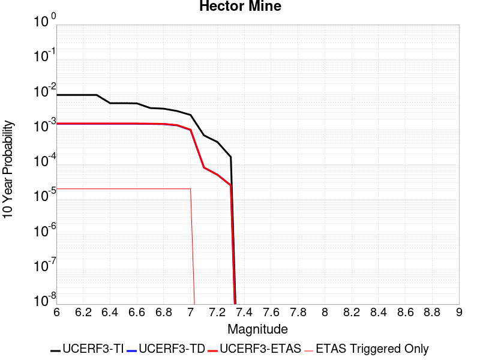 |

| Magnitude | 1 wk TI Prob | 1 wk TD Prob | 1 wk ETAS Prob | 1 wk ETAS/TD Gain | 1 wk ETAS Triggered Only | 1 mo TI Prob | 1 mo TD Prob | 1 mo ETAS Prob | 1 mo ETAS/TD Gain | 1 mo ETAS Triggered Only | 1 yr TI Prob | 1 yr TD Prob | 1 yr ETAS Prob | 1 yr ETAS/TD Gain | 1 yr ETAS Triggered Only | 10 yr TI Prob | 10 yr TD Prob | 10 yr ETAS Prob | 10 yr ETAS/TD Gain | 10 yr ETAS Triggered Only |
|-----|-----|-----|-----|-----|-----|-----|-----|-----|-----|-----|-----|-----|-----|-----|-----|-----|-----|-----|-----|-----|
| 6.0 | 1.8760093E-5 | 2.7963101E-6 | 2.7963101E-6 | 1.0 | 0.0 | 8.039792E-5 | 1.1984153E-5 | 2.1984033E-5 | 1.8344252 | 1.0E-5 | 9.78405E-4 | 1.459013E-4 | 1.5589983E-4 | 1.0685295 | 1.0E-5 | 0.009741086 | 0.0014584473 | 0.0014784181 | 1.0136932 | 2.0E-5 |
| 6.1 | 1.8760093E-5 | 2.7963101E-6 | 2.7963101E-6 | 1.0 | 0.0 | 8.039792E-5 | 1.1984153E-5 | 2.1984033E-5 | 1.8344252 | 1.0E-5 | 9.78405E-4 | 1.459013E-4 | 1.5589983E-4 | 1.0685295 | 1.0E-5 | 0.009741086 | 0.0014584473 | 0.0014784181 | 1.0136932 | 2.0E-5 |
| 6.2 | 1.8760093E-5 | 2.7963101E-6 | 2.7963101E-6 | 1.0 | 0.0 | 8.039792E-5 | 1.1984153E-5 | 2.1984033E-5 | 1.8344252 | 1.0E-5 | 9.78405E-4 | 1.459013E-4 | 1.5589983E-4 | 1.0685295 | 1.0E-5 | 0.009741086 | 0.0014584473 | 0.0014784181 | 1.0136932 | 2.0E-5 |
| 6.3 | 1.8760093E-5 | 2.7963101E-6 | 2.7963101E-6 | 1.0 | 0.0 | 8.039792E-5 | 1.1984153E-5 | 2.1984033E-5 | 1.8344252 | 1.0E-5 | 9.78405E-4 | 1.459013E-4 | 1.5589983E-4 | 1.0685295 | 1.0E-5 | 0.009741086 | 0.0014584473 | 0.0014784181 | 1.0136932 | 2.0E-5 |
| 6.4 | 1.0888055E-5 | 2.7963101E-6 | 2.7963101E-6 | 1.0 | 0.0 | 4.666226E-5 | 1.1984153E-5 | 2.1984033E-5 | 1.8344252 | 1.0E-5 | 5.679649E-4 | 1.459013E-4 | 1.5589983E-4 | 1.0685295 | 1.0E-5 | 0.0056651547 | 0.0014584473 | 0.0014784181 | 1.0136932 | 2.0E-5 |
| 6.5 | 1.0888055E-5 | 2.7963101E-6 | 2.7963101E-6 | 1.0 | 0.0 | 4.666226E-5 | 1.1984153E-5 | 2.1984033E-5 | 1.8344252 | 1.0E-5 | 5.679649E-4 | 1.459013E-4 | 1.5589983E-4 | 1.0685295 | 1.0E-5 | 0.0056651547 | 0.0014584473 | 0.0014784181 | 1.0136932 | 2.0E-5 |
| 6.6 | 1.0730738E-5 | 2.7963101E-6 | 2.7963101E-6 | 1.0 | 0.0 | 4.5988065E-5 | 1.1984153E-5 | 2.1984033E-5 | 1.8344252 | 1.0E-5 | 5.5976084E-4 | 1.459013E-4 | 1.5589983E-4 | 1.0685295 | 1.0E-5 | 0.0055835294 | 0.0014584473 | 0.0014784181 | 1.0136932 | 2.0E-5 |
| 6.7 | 7.881326E-6 | 2.7709912E-6 | 2.7709912E-6 | 1.0 | 0.0 | 3.3776672E-5 | 1.1875645E-5 | 2.1875527E-5 | 1.8420495 | 1.0E-5 | 4.111534E-4 | 1.4458038E-4 | 1.5457894E-4 | 1.0691557 | 1.0E-5 | 0.0041039353 | 0.0014452554 | 0.0014652264 | 1.0138184 | 2.0E-5 |
| 6.8 | 7.5683483E-6 | 2.7327694E-6 | 2.7327694E-6 | 1.0 | 0.0 | 3.2435375E-5 | 1.1711839E-5 | 2.1711721E-5 | 1.8538269 | 1.0E-5 | 3.9482914E-4 | 1.425863E-4 | 1.5258488E-4 | 1.070123 | 1.0E-5 | 0.0039412836 | 0.0014253402 | 0.0014453117 | 1.0140117 | 2.0E-5 |
| 6.9 | 6.473048E-6 | 2.5138563E-6 | 2.5138563E-6 | 1.0 | 0.0 | 2.7741338E-5 | 1.0773648E-5 | 2.077354E-5 | 1.9281807 | 1.0E-5 | 3.3769844E-4 | 1.3116523E-4 | 1.4116392E-4 | 1.0762297 | 1.0E-5 | 0.0033718573 | 0.0013112677 | 0.0013312415 | 1.0152324 | 2.0E-5 |
| 7.0 | 4.9959954E-6 | 1.8564691E-6 | 1.8564691E-6 | 1.0 | 0.0 | 2.1411232E-5 | 7.9562915E-6 | 1.7956212E-5 | 2.256857 | 1.0E-5 | 2.6065056E-4 | 9.686711E-5 | 1.06866144E-4 | 1.1032242 | 1.0E-5 | 0.0026034506 | 9.6859847E-4 | 9.885791E-4 | 1.0206283 | 2.0E-5 |
| 7.1 | 1.2997541E-6 | 1.5600176E-7 | 1.5600176E-7 | 1.0 | 0.0 | 5.5703626E-6 | 6.685788E-7 | 6.685788E-7 | 1.0 | 0.0 | 6.7817055E-5 | 8.13992E-6 | 8.13992E-6 | 1.0 | 0.0 | 6.779636E-4 | 8.139662E-5 | 8.139662E-5 | 1.0 | 0.0 |
| 7.2 | 8.392699E-7 | 9.726067E-8 | 9.726067E-8 | 1.0 | 0.0 | 3.596866E-6 | 4.1683137E-7 | 4.1683137E-7 | 1.0 | 0.0 | 4.3790962E-5 | 5.074912E-6 | 5.074912E-6 | 1.0 | 0.0 | 4.3782333E-4 | 5.0748153E-5 | 5.0748153E-5 | 1.0 | 0.0 |
| 7.3 | 3.13015E-7 | 4.8286488E-8 | 4.8286488E-8 | 1.0 | 0.0 | 1.3414921E-6 | 2.0694208E-7 | 2.0694208E-7 | 1.0 | 0.0 | 1.6332544E-5 | 2.5195177E-6 | 2.5195177E-6 | 1.0 | 0.0 | 1.6331344E-4 | 2.5194977E-5 | 2.5194977E-5 | 1.0 | 0.0 |

## Elsinore (Stepovers Combined)
*[(top)](#table-of-contents)*

| 1 Week | 1 Month | 1 Year | 10 Year |
|-----|-----|-----|-----|
|  |  |  | 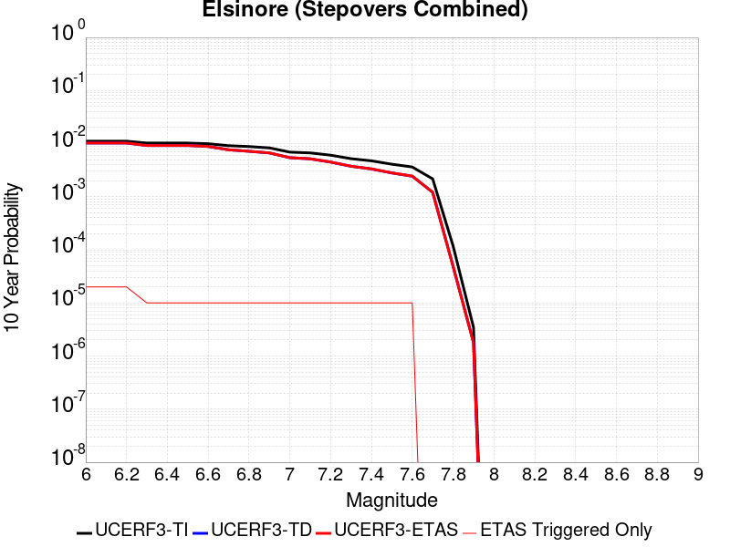 |

| Magnitude | 1 wk TI Prob | 1 wk TD Prob | 1 wk ETAS Prob | 1 wk ETAS/TD Gain | 1 wk ETAS Triggered Only | 1 mo TI Prob | 1 mo TD Prob | 1 mo ETAS Prob | 1 mo ETAS/TD Gain | 1 mo ETAS Triggered Only | 1 yr TI Prob | 1 yr TD Prob | 1 yr ETAS Prob | 1 yr ETAS/TD Gain | 1 yr ETAS Triggered Only | 10 yr TI Prob | 10 yr TD Prob | 10 yr ETAS Prob | 10 yr ETAS/TD Gain | 10 yr ETAS Triggered Only |
|-----|-----|-----|-----|-----|-----|-----|-----|-----|-----|-----|-----|-----|-----|-----|-----|-----|-----|-----|-----|-----|
| 6.0 | 2.144392E-5 | 1.9761088E-5 | 1.9761088E-5 | 1.0 | 0.0 | 9.189928E-5 | 8.4687716E-5 | 9.468687E-5 | 1.1180708 | 1.0E-5 | 0.0011182994 | 0.0010306045 | 0.0010405942 | 1.009693 | 1.0E-5 | 0.011126885 | 0.010265615 | 0.01028541 | 1.0019282 | 2.0E-5 |
| 6.1 | 2.144392E-5 | 1.9761088E-5 | 1.9761088E-5 | 1.0 | 0.0 | 9.189928E-5 | 8.4687716E-5 | 9.468687E-5 | 1.1180708 | 1.0E-5 | 0.0011182994 | 0.0010306045 | 0.0010405942 | 1.009693 | 1.0E-5 | 0.011126885 | 0.010265615 | 0.01028541 | 1.0019282 | 2.0E-5 |
| 6.2 | 2.144392E-5 | 1.9761088E-5 | 1.9761088E-5 | 1.0 | 0.0 | 9.189928E-5 | 8.4687716E-5 | 9.468687E-5 | 1.1180708 | 1.0E-5 | 0.0011182994 | 0.0010306045 | 0.0010405942 | 1.009693 | 1.0E-5 | 0.011126885 | 0.010265615 | 0.01028541 | 1.0019282 | 2.0E-5 |
| 6.3 | 1.9751555E-5 | 1.7742292E-5 | 1.7742292E-5 | 1.0 | 0.0 | 8.4646774E-5 | 7.603623E-5 | 8.603547E-5 | 1.1315062 | 1.0E-5 | 0.0010300872 | 9.253622E-4 | 9.35353E-4 | 1.0107965 | 1.0E-5 | 0.010253254 | 0.009221947 | 0.009231855 | 1.0010743 | 1.0E-5 |
| 6.4 | 1.9751555E-5 | 1.7742292E-5 | 1.7742292E-5 | 1.0 | 0.0 | 8.4646774E-5 | 7.603623E-5 | 8.603547E-5 | 1.1315062 | 1.0E-5 | 0.0010300872 | 9.253622E-4 | 9.35353E-4 | 1.0107965 | 1.0E-5 | 0.010253254 | 0.009221947 | 0.009231855 | 1.0010743 | 1.0E-5 |
| 6.5 | 1.9751555E-5 | 1.7742292E-5 | 1.7742292E-5 | 1.0 | 0.0 | 8.4646774E-5 | 7.603623E-5 | 8.603547E-5 | 1.1315062 | 1.0E-5 | 0.0010300872 | 9.253622E-4 | 9.35353E-4 | 1.0107965 | 1.0E-5 | 0.010253254 | 0.009221947 | 0.009231855 | 1.0010743 | 1.0E-5 |
| 6.6 | 1.9188685E-5 | 1.7004182E-5 | 1.7004182E-5 | 1.0 | 0.0 | 8.2234634E-5 | 7.2873125E-5 | 8.287239E-5 | 1.1372148 | 1.0E-5 | 0.0010007467 | 8.868853E-4 | 8.9687645E-4 | 1.0112654 | 1.0E-5 | 0.00996252 | 0.008840504 | 0.008850415 | 1.0011212 | 1.0E-5 |
| 6.7 | 1.7608272E-5 | 1.4733256E-5 | 1.4733256E-5 | 1.0 | 0.0 | 7.546184E-5 | 6.314105E-5 | 7.314042E-5 | 1.1583656 | 1.0E-5 | 9.183606E-4 | 7.6848094E-4 | 7.784732E-4 | 1.0130026 | 1.0E-5 | 0.009145746 | 0.00766544 | 0.007675363 | 1.0012946 | 1.0E-5 |
| 6.8 | 1.697165E-5 | 1.3783935E-5 | 1.3783935E-5 | 1.0 | 0.0 | 7.273361E-5 | 5.9072718E-5 | 6.907213E-5 | 1.1692729 | 1.0E-5 | 8.8517193E-4 | 7.189817E-4 | 7.289745E-4 | 1.0138986 | 1.0E-5 | 0.008816543 | 0.007173273 | 0.007183201 | 1.001384 | 1.0E-5 |
| 6.9 | 1.600365E-5 | 1.2847236E-5 | 1.2847236E-5 | 1.0 | 0.0 | 6.858527E-5 | 5.5058463E-5 | 6.505791E-5 | 1.1816151 | 1.0E-5 | 8.347058E-4 | 6.701384E-4 | 6.8013166E-4 | 1.0149122 | 1.0E-5 | 0.008315775 | 0.0066868146 | 0.0066967476 | 1.0014855 | 1.0E-5 |
| 7.0 | 1.3314581E-5 | 1.0447994E-5 | 1.0447994E-5 | 1.0 | 0.0 | 5.7061243E-5 | 4.4776363E-5 | 5.4775915E-5 | 1.2233222 | 1.0E-5 | 6.944992E-4 | 5.450186E-4 | 5.5501313E-4 | 1.018338 | 1.0E-5 | 0.006923327 | 0.0054402184 | 0.005450164 | 1.0018282 | 1.0E-5 |
| 7.1 | 1.2865345E-5 | 9.937844E-6 | 9.937844E-6 | 1.0 | 0.0 | 5.5136024E-5 | 4.259008E-5 | 5.2589654E-5 | 1.2347865 | 1.0E-5 | 6.710743E-4 | 5.1841344E-4 | 5.284082E-4 | 1.0192796 | 1.0E-5 | 0.0066905143 | 0.0051750923 | 0.0051850406 | 1.0019224 | 1.0E-5 |
| 7.2 | 1.1650051E-5 | 8.634011E-6 | 8.634011E-6 | 1.0 | 0.0 | 4.9927836E-5 | 3.7002388E-5 | 4.7002017E-5 | 1.2702428 | 1.0E-5 | 6.0770183E-4 | 4.504127E-4 | 4.6040822E-4 | 1.0221919 | 1.0E-5 | 0.0060604266 | 0.0044963313 | 0.0045062862 | 1.0022141 | 1.0E-5 |
| 7.3 | 1.0008533E-5 | 7.201187E-6 | 7.201187E-6 | 1.0 | 0.0 | 4.2893007E-5 | 3.0861873E-5 | 4.0861563E-5 | 1.3240144 | 1.0E-5 | 5.220972E-4 | 3.7567996E-4 | 3.8567622E-4 | 1.0266083 | 1.0E-5 | 0.005208723 | 0.0037508437 | 0.003760806 | 1.0026561 | 1.0E-5 |
| 7.4 | 9.116759E-6 | 6.4101755E-6 | 6.4101755E-6 | 1.0 | 0.0 | 3.907124E-5 | 2.74719E-5 | 3.7471626E-5 | 1.3639983 | 1.0E-5 | 4.7558855E-4 | 3.3442042E-4 | 3.444171E-4 | 1.0298924 | 1.0E-5 | 0.00474572 | 0.0033393216 | 0.0033492881 | 1.0029846 | 1.0E-5 |
| 7.5 | 7.870524E-6 | 5.382608E-6 | 5.382608E-6 | 1.0 | 0.0 | 3.3730383E-5 | 2.3068123E-5 | 3.3067892E-5 | 1.4334886 | 1.0E-5 | 4.1059E-4 | 2.8081945E-4 | 2.9081665E-4 | 1.0356001 | 1.0E-5 | 0.0040983222 | 0.0028047727 | 0.0028147446 | 1.0035553 | 1.0E-5 |
| 7.6 | 6.9774537E-6 | 4.6776568E-6 | 4.6776568E-6 | 1.0 | 0.0 | 2.990303E-5 | 2.0046953E-5 | 3.0046753E-5 | 1.498819 | 1.0E-5 | 3.640086E-4 | 2.4404548E-4 | 2.5404303E-4 | 1.0409659 | 1.0E-5 | 0.003634129 | 0.002437891 | 0.0024478666 | 1.0040919 | 1.0E-5 |
| 7.7 | 4.1616954E-6 | 2.3283103E-6 | 2.3283103E-6 | 1.0 | 0.0 | 1.7835715E-5 | 9.978439E-6 | 9.978439E-6 | 1.0 | 0.0 | 2.171282E-4 | 1.2148147E-4 | 1.2148147E-4 | 1.0 | 0.0 | 0.0021691616 | 0.0012142237 | 0.0012142237 | 1.0 | 0.0 |
| 7.8 | 2.2692414E-7 | 9.384624E-8 | 9.384624E-8 | 1.0 | 0.0 | 9.725317E-7 | 4.021981E-7 | 4.021981E-7 | 1.0 | 0.0 | 1.1840509E-5 | 4.8967545E-6 | 4.8967545E-6 | 1.0 | 0.0 | 1.1839878E-4 | 4.8966795E-5 | 4.8966795E-5 | 1.0 | 0.0 |
| 7.9 | 6.676829E-9 | 3.4397993E-9 | 3.4397993E-9 | 1.0 | 0.0 | 2.861498E-8 | 1.4741998E-8 | 1.4741998E-8 | 1.0 | 0.0 | 3.4838732E-7 | 1.794838E-7 | 1.794838E-7 | 1.0 | 0.0 | 3.4838679E-6 | 1.7948367E-6 | 1.7948367E-6 | 1.0 | 0.0 |

## Great Valley 07 (Orestimba)
*[(top)](#table-of-contents)*

| 1 Week | 1 Month | 1 Year | 10 Year |
|-----|-----|-----|-----|
|  |  |  |  |

| Magnitude | 1 wk TI Prob | 1 wk TD Prob | 1 wk ETAS Prob | 1 wk ETAS/TD Gain | 1 wk ETAS Triggered Only | 1 mo TI Prob | 1 mo TD Prob | 1 mo ETAS Prob | 1 mo ETAS/TD Gain | 1 mo ETAS Triggered Only | 1 yr TI Prob | 1 yr TD Prob | 1 yr ETAS Prob | 1 yr ETAS/TD Gain | 1 yr ETAS Triggered Only | 10 yr TI Prob | 10 yr TD Prob | 10 yr ETAS Prob | 10 yr ETAS/TD Gain | 10 yr ETAS Triggered Only |
|-----|-----|-----|-----|-----|-----|-----|-----|-----|-----|-----|-----|-----|-----|-----|-----|-----|-----|-----|-----|-----|
| 6.0 | 2.9687902E-5 | 3.2757947E-5 | 3.2757947E-5 | 1.0 | 0.0 | 1.2722766E-4 | 1.4038406E-4 | 1.4038406E-4 | 1.0 | 0.0 | 0.0015478961 | 0.0017079079 | 0.0017178907 | 1.0058451 | 1.0E-5 | 0.015371585 | 0.016955366 | 0.016975028 | 1.0011595 | 2.0E-5 |
| 6.1 | 2.9687902E-5 | 3.2757947E-5 | 3.2757947E-5 | 1.0 | 0.0 | 1.2722766E-4 | 1.4038406E-4 | 1.4038406E-4 | 1.0 | 0.0 | 0.0015478961 | 0.0017079079 | 0.0017178907 | 1.0058451 | 1.0E-5 | 0.015371585 | 0.016955366 | 0.016965197 | 1.0005798 | 1.0E-5 |
| 6.2 | 1.9231524E-5 | 2.1159447E-5 | 2.1159447E-5 | 1.0 | 0.0 | 8.2418206E-5 | 9.0680325E-5 | 9.0680325E-5 | 1.0 | 0.0 | 0.0010029797 | 0.0011034969 | 0.0011134859 | 1.0090522 | 1.0E-5 | 0.00998465 | 0.010982586 | 0.010992476 | 1.0009005 | 1.0E-5 |
| 6.3 | 1.324766E-5 | 1.4548723E-5 | 1.4548723E-5 | 1.0 | 0.0 | 5.6774446E-5 | 6.235023E-5 | 6.235023E-5 | 1.0 | 0.0 | 6.910097E-4 | 7.5885886E-4 | 7.5885886E-4 | 1.0 | 0.0 | 0.006888649 | 0.0075636217 | 0.0075636217 | 1.0 | 0.0 |
| 6.4 | 7.818645E-6 | 8.57295E-6 | 8.57295E-6 | 1.0 | 0.0 | 3.3508048E-5 | 3.6740716E-5 | 3.6740716E-5 | 1.0 | 0.0 | 4.078841E-4 | 4.4722977E-4 | 4.4722977E-4 | 1.0 | 0.0 | 0.004071363 | 0.0044636377 | 0.0044636377 | 1.0 | 0.0 |
| 6.5 | 5.3076565E-6 | 5.817875E-6 | 5.817875E-6 | 1.0 | 0.0 | 2.27469E-5 | 2.4933523E-5 | 2.4933523E-5 | 1.0 | 0.0 | 2.7690834E-4 | 3.0352548E-4 | 3.0352548E-4 | 1.0 | 0.0 | 0.0027656353 | 0.0030313185 | 0.0030313185 | 1.0 | 0.0 |
| 6.6 | 3.6003578E-6 | 3.9485462E-6 | 3.9485462E-6 | 1.0 | 0.0 | 1.5430012E-5 | 1.6922239E-5 | 1.6922239E-5 | 1.0 | 0.0 | 1.8784421E-4 | 2.0601034E-4 | 2.0601034E-4 | 1.0 | 0.0 | 0.0018768552 | 0.0020583477 | 0.0020583477 | 1.0 | 0.0 |
| 6.7 | 2.5361826E-6 | 2.783504E-6 | 2.783504E-6 | 1.0 | 0.0 | 1.0869308E-5 | 1.1929255E-5 | 1.1929255E-5 | 1.0 | 0.0 | 1.3232579E-4 | 1.4523033E-4 | 1.4523033E-4 | 1.0 | 0.0 | 0.0013224703 | 0.001451484 | 0.001451484 | 1.0 | 0.0 |
| 6.8 | 1.2115831E-6 | 1.3313972E-6 | 1.3313972E-6 | 1.0 | 0.0 | 5.1924885E-6 | 5.705981E-6 | 5.705981E-6 | 1.0 | 0.0 | 6.3216714E-5 | 6.9469075E-5 | 6.9469075E-5 | 1.0 | 0.0 | 6.3198735E-4 | 6.9456873E-4 | 6.9456873E-4 | 1.0 | 0.0 |

## Sheephole
*[(top)](#table-of-contents)*

| 1 Week | 1 Month | 1 Year | 10 Year |
|-----|-----|-----|-----|
|  |  |  | 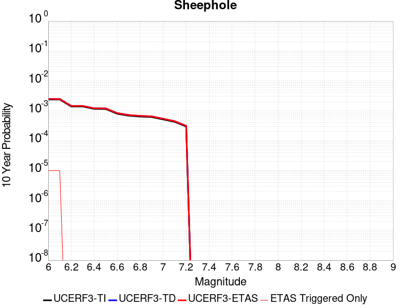 |

| Magnitude | 1 wk TI Prob | 1 wk TD Prob | 1 wk ETAS Prob | 1 wk ETAS/TD Gain | 1 wk ETAS Triggered Only | 1 mo TI Prob | 1 mo TD Prob | 1 mo ETAS Prob | 1 mo ETAS/TD Gain | 1 mo ETAS Triggered Only | 1 yr TI Prob | 1 yr TD Prob | 1 yr ETAS Prob | 1 yr ETAS/TD Gain | 1 yr ETAS Triggered Only | 10 yr TI Prob | 10 yr TD Prob | 10 yr ETAS Prob | 10 yr ETAS/TD Gain | 10 yr ETAS Triggered Only |
|-----|-----|-----|-----|-----|-----|-----|-----|-----|-----|-----|-----|-----|-----|-----|-----|-----|-----|-----|-----|-----|
| 6.0 | 4.5579695E-6 | 4.7412877E-6 | 4.7412877E-6 | 1.0 | 0.0 | 1.9534009E-5 | 2.0319678E-5 | 2.0319678E-5 | 1.0 | 0.0 | 2.3780059E-4 | 2.4736955E-4 | 2.5736706E-4 | 1.0404154 | 1.0E-5 | 0.0023754628 | 0.0024714863 | 0.0024814617 | 1.0040362 | 1.0E-5 |
| 6.1 | 4.5579695E-6 | 4.7412877E-6 | 4.7412877E-6 | 1.0 | 0.0 | 1.9534009E-5 | 2.0319678E-5 | 2.0319678E-5 | 1.0 | 0.0 | 2.3780059E-4 | 2.4736955E-4 | 2.5736706E-4 | 1.0404154 | 1.0E-5 | 0.0023754628 | 0.0024714863 | 0.0024814617 | 1.0040362 | 1.0E-5 |
| 6.2 | 2.6677674E-6 | 2.7874107E-6 | 2.7874107E-6 | 1.0 | 0.0 | 1.1433239E-5 | 1.1945997E-5 | 1.1945997E-5 | 1.0 | 0.0 | 1.3919079E-4 | 1.4543389E-4 | 1.4543389E-4 | 1.0 | 0.0 | 0.0013910364 | 0.001453493 | 0.001453493 | 1.0 | 0.0 |
| 6.3 | 2.6677674E-6 | 2.7874107E-6 | 2.7874107E-6 | 1.0 | 0.0 | 1.1433239E-5 | 1.1945997E-5 | 1.1945997E-5 | 1.0 | 0.0 | 1.3919079E-4 | 1.4543389E-4 | 1.4543389E-4 | 1.0 | 0.0 | 0.0013910364 | 0.001453493 | 0.001453493 | 1.0 | 0.0 |
| 6.4 | 2.2159759E-6 | 2.3228936E-6 | 2.3228936E-6 | 1.0 | 0.0 | 9.497005E-6 | 9.955224E-6 | 9.955224E-6 | 1.0 | 0.0 | 1.156199E-4 | 1.2119893E-4 | 1.2119893E-4 | 1.0 | 0.0 | 0.0011555976 | 0.0012114076 | 0.0012114076 | 1.0 | 0.0 |
| 6.5 | 2.1986082E-6 | 2.3047737E-6 | 2.3047737E-6 | 1.0 | 0.0 | 9.4225725E-6 | 9.877569E-6 | 9.877569E-6 | 1.0 | 0.0 | 1.1471378E-4 | 1.2025358E-4 | 1.2025358E-4 | 1.0 | 0.0 | 0.0011465458 | 0.0012019643 | 0.0012019643 | 1.0 | 0.0 |
| 6.6 | 1.5232331E-6 | 1.6019028E-6 | 1.6019028E-6 | 1.0 | 0.0 | 6.5281256E-6 | 6.8652807E-6 | 6.8652807E-6 | 1.0 | 0.0 | 7.947703E-5 | 8.358178E-5 | 8.358178E-5 | 1.0 | 0.0 | 7.9448614E-4 | 8.3552214E-4 | 8.3552214E-4 | 1.0 | 0.0 |
| 6.7 | 1.3137362E-6 | 1.3828287E-6 | 1.3828287E-6 | 1.0 | 0.0 | 5.6302856E-6 | 5.926396E-6 | 5.926396E-6 | 1.0 | 0.0 | 6.854657E-5 | 7.2151626E-5 | 7.2151626E-5 | 1.0 | 0.0 | 6.8525434E-4 | 7.212959E-4 | 7.212959E-4 | 1.0 | 0.0 |
| 6.8 | 1.2275751E-6 | 1.2922936E-6 | 1.2922936E-6 | 1.0 | 0.0 | 5.2610258E-6 | 5.5383903E-6 | 5.5383903E-6 | 1.0 | 0.0 | 6.4051106E-5 | 6.742795E-5 | 6.742795E-5 | 1.0 | 0.0 | 6.4032647E-4 | 6.740883E-4 | 6.740883E-4 | 1.0 | 0.0 |
| 6.9 | 1.1837088E-6 | 1.2461107E-6 | 1.2461107E-6 | 1.0 | 0.0 | 5.0730278E-6 | 5.340464E-6 | 5.340464E-6 | 1.0 | 0.0 | 6.176237E-5 | 6.501835E-5 | 6.501835E-5 | 1.0 | 0.0 | 6.17452E-4 | 6.500064E-4 | 6.500064E-4 | 1.0 | 0.0 |
| 7.0 | 9.849371E-7 | 1.036636E-6 | 1.036636E-6 | 1.0 | 0.0 | 4.2211523E-6 | 4.442719E-6 | 4.442719E-6 | 1.0 | 0.0 | 5.1391315E-5 | 5.408886E-5 | 5.408886E-5 | 1.0 | 0.0 | 5.137943E-4 | 5.4076704E-4 | 5.4076704E-4 | 1.0 | 0.0 |
| 7.1 | 8.1643645E-7 | 8.5917287E-7 | 8.5917287E-7 | 1.0 | 0.0 | 3.4990085E-6 | 3.6821648E-6 | 3.6821648E-6 | 1.0 | 0.0 | 4.2599597E-5 | 4.482952E-5 | 4.482952E-5 | 1.0 | 0.0 | 4.259143E-4 | 4.482134E-4 | 4.482134E-4 | 1.0 | 0.0 |
| 7.2 | 5.7295756E-7 | 6.029544E-7 | 6.029544E-7 | 1.0 | 0.0 | 2.45553E-6 | 2.584088E-6 | 2.584088E-6 | 1.0 | 0.0 | 2.9895667E-5 | 3.1460884E-5 | 3.1460884E-5 | 1.0 | 0.0 | 2.9891645E-4 | 3.14571E-4 | 3.14571E-4 | 1.0 | 0.0 |

## Morales (East)
*[(top)](#table-of-contents)*

| 1 Week | 1 Month | 1 Year | 10 Year |
|-----|-----|-----|-----|
|  |  |  |  |

| Magnitude | 1 wk TI Prob | 1 wk TD Prob | 1 wk ETAS Prob | 1 wk ETAS/TD Gain | 1 wk ETAS Triggered Only | 1 mo TI Prob | 1 mo TD Prob | 1 mo ETAS Prob | 1 mo ETAS/TD Gain | 1 mo ETAS Triggered Only | 1 yr TI Prob | 1 yr TD Prob | 1 yr ETAS Prob | 1 yr ETAS/TD Gain | 1 yr ETAS Triggered Only | 10 yr TI Prob | 10 yr TD Prob | 10 yr ETAS Prob | 10 yr ETAS/TD Gain | 10 yr ETAS Triggered Only |
|-----|-----|-----|-----|-----|-----|-----|-----|-----|-----|-----|-----|-----|-----|-----|-----|-----|-----|-----|-----|-----|
| 6.0 | 1.4942771E-6 | 2.1238789E-6 | 2.1238789E-6 | 1.0 | 0.0 | 6.404029E-6 | 9.102309E-6 | 9.102309E-6 | 1.0 | 0.0 | 7.7966266E-5 | 1.1081557E-4 | 1.1081557E-4 | 1.0 | 0.0 | 7.793892E-4 | 0.0011076628 | 0.0011176518 | 1.0090181 | 1.0E-5 |
| 6.1 | 1.4942771E-6 | 2.1238789E-6 | 2.1238789E-6 | 1.0 | 0.0 | 6.404029E-6 | 9.102309E-6 | 9.102309E-6 | 1.0 | 0.0 | 7.7966266E-5 | 1.1081557E-4 | 1.1081557E-4 | 1.0 | 0.0 | 7.793892E-4 | 0.0011076628 | 0.0011176518 | 1.0090181 | 1.0E-5 |
| 6.2 | 1.4942771E-6 | 2.1238789E-6 | 2.1238789E-6 | 1.0 | 0.0 | 6.404029E-6 | 9.102309E-6 | 9.102309E-6 | 1.0 | 0.0 | 7.7966266E-5 | 1.1081557E-4 | 1.1081557E-4 | 1.0 | 0.0 | 7.793892E-4 | 0.0011076628 | 0.0011176518 | 1.0090181 | 1.0E-5 |
| 6.3 | 1.4942771E-6 | 2.1238789E-6 | 2.1238789E-6 | 1.0 | 0.0 | 6.404029E-6 | 9.102309E-6 | 9.102309E-6 | 1.0 | 0.0 | 7.7966266E-5 | 1.1081557E-4 | 1.1081557E-4 | 1.0 | 0.0 | 7.793892E-4 | 0.0011076628 | 0.0011176518 | 1.0090181 | 1.0E-5 |
| 6.4 | 8.798845E-7 | 1.5026721E-6 | 1.5026721E-6 | 1.0 | 0.0 | 3.7709283E-6 | 6.440008E-6 | 6.440008E-6 | 1.0 | 0.0 | 4.5910085E-5 | 7.840439E-5 | 7.840439E-5 | 1.0 | 0.0 | 4.59006E-4 | 7.837807E-4 | 7.837807E-4 | 1.0 | 0.0 |
| 6.5 | 7.1751725E-7 | 1.3388217E-6 | 1.3388217E-6 | 1.0 | 0.0 | 3.0750705E-6 | 5.737795E-6 | 5.737795E-6 | 1.0 | 0.0 | 3.7438338E-5 | 6.9855494E-5 | 6.9855494E-5 | 1.0 | 0.0 | 3.743203E-4 | 6.983455E-4 | 6.983455E-4 | 1.0 | 0.0 |
| 6.6 | 7.1751725E-7 | 1.3388217E-6 | 1.3388217E-6 | 1.0 | 0.0 | 3.0750705E-6 | 5.737795E-6 | 5.737795E-6 | 1.0 | 0.0 | 3.7438338E-5 | 6.9855494E-5 | 6.9855494E-5 | 1.0 | 0.0 | 3.743203E-4 | 6.983455E-4 | 6.983455E-4 | 1.0 | 0.0 |
| 6.7 | 7.159057E-7 | 1.3362875E-6 | 1.3362875E-6 | 1.0 | 0.0 | 3.0681638E-6 | 5.7269344E-6 | 5.7269344E-6 | 1.0 | 0.0 | 3.7354253E-5 | 6.972327E-5 | 6.972327E-5 | 1.0 | 0.0 | 3.7347974E-4 | 6.970241E-4 | 6.970241E-4 | 1.0 | 0.0 |
| 6.8 | 7.032203E-7 | 1.3178403E-6 | 1.3178403E-6 | 1.0 | 0.0 | 3.0137978E-6 | 5.6478757E-6 | 5.6478757E-6 | 1.0 | 0.0 | 3.669237E-5 | 6.876079E-5 | 6.876079E-5 | 1.0 | 0.0 | 3.6686313E-4 | 6.874053E-4 | 6.874053E-4 | 1.0 | 0.0 |
| 6.9 | 6.941549E-7 | 1.3028997E-6 | 1.3028997E-6 | 1.0 | 0.0 | 2.974946E-6 | 5.5838445E-6 | 5.5838445E-6 | 1.0 | 0.0 | 3.6219368E-5 | 6.7981266E-5 | 6.7981266E-5 | 1.0 | 0.0 | 3.6213463E-4 | 6.796148E-4 | 6.796148E-4 | 1.0 | 0.0 |
| 7.0 | 6.2932247E-7 | 1.1881159E-6 | 1.1881159E-6 | 1.0 | 0.0 | 2.6970936E-6 | 5.0919157E-6 | 5.0919157E-6 | 1.0 | 0.0 | 3.283662E-5 | 6.1992374E-5 | 6.1992374E-5 | 1.0 | 0.0 | 3.283177E-4 | 6.1975967E-4 | 6.1975967E-4 | 1.0 | 0.0 |
| 7.1 | 5.6200963E-7 | 1.0643936E-6 | 1.0643936E-6 | 1.0 | 0.0 | 2.4086105E-6 | 4.5616794E-6 | 4.5616794E-6 | 1.0 | 0.0 | 2.9324437E-5 | 5.5537075E-5 | 5.5537075E-5 | 1.0 | 0.0 | 2.9320567E-4 | 5.552392E-4 | 5.552392E-4 | 1.0 | 0.0 |
| 7.2 | 4.91044E-7 | 9.2890525E-7 | 9.2890525E-7 | 1.0 | 0.0 | 2.1044725E-6 | 3.9810166E-6 | 3.9810166E-6 | 1.0 | 0.0 | 2.5621652E-5 | 4.846784E-5 | 4.846784E-5 | 1.0 | 0.0 | 2.56187E-4 | 4.8457898E-4 | 4.8457898E-4 | 1.0 | 0.0 |
| 7.3 | 4.2978448E-7 | 7.9769484E-7 | 7.9769484E-7 | 1.0 | 0.0 | 1.8419321E-6 | 3.4186878E-6 | 3.4186878E-6 | 1.0 | 0.0 | 2.2425293E-5 | 4.1621763E-5 | 4.1621763E-5 | 1.0 | 0.0 | 2.242303E-4 | 4.1614528E-4 | 4.1614528E-4 | 1.0 | 0.0 |
| 7.4 | 3.774317E-7 | 6.809395E-7 | 6.809395E-7 | 1.0 | 0.0 | 1.6175634E-6 | 2.9183088E-6 | 2.9183088E-6 | 1.0 | 0.0 | 1.9693656E-5 | 3.5529858E-5 | 3.5529858E-5 | 1.0 | 0.0 | 1.969191E-4 | 3.552471E-4 | 3.552471E-4 | 1.0 | 0.0 |
| 7.5 | 1.0603232E-7 | 9.8451956E-8 | 9.8451956E-8 | 1.0 | 0.0 | 4.5442414E-7 | 4.2193687E-7 | 4.2193687E-7 | 1.0 | 0.0 | 5.5326E-6 | 5.13707E-6 | 5.13707E-6 | 1.0 | 0.0 | 5.532462E-5 | 5.1372073E-5 | 5.1372073E-5 | 1.0 | 0.0 |
| 7.6 | 9.960384E-8 | 8.759167E-8 | 8.759167E-8 | 1.0 | 0.0 | 4.2687353E-7 | 3.753928E-7 | 3.753928E-7 | 1.0 | 0.0 | 5.197173E-6 | 4.5703982E-6 | 4.5703982E-6 | 1.0 | 0.0 | 5.1970514E-5 | 4.5705605E-5 | 4.5705605E-5 | 1.0 | 0.0 |
| 7.7 | 6.499468E-8 | 4.1059014E-8 | 4.1059014E-8 | 1.0 | 0.0 | 2.785486E-7 | 1.7596719E-7 | 1.7596719E-7 | 1.0 | 0.0 | 3.3913238E-6 | 2.1423984E-6 | 2.1423984E-6 | 1.0 | 0.0 | 3.3912722E-5 | 2.1426333E-5 | 2.1426333E-5 | 1.0 | 0.0 |
| 7.8 | 2.2517119E-8 | 7.1341337E-9 | 7.1341337E-9 | 1.0 | 0.0 | 9.6501935E-8 | 3.0574856E-8 | 3.0574856E-8 | 1.0 | 0.0 | 1.1749105E-6 | 3.7224882E-7 | 3.7224882E-7 | 1.0 | 0.0 | 1.1749043E-5 | 3.7250138E-6 | 3.7250138E-6 | 1.0 | 0.0 |
| 7.9 | 8.493023E-9 | 9.973958E-10 | 9.973958E-10 | 1.0 | 0.0 | 3.639867E-8 | 4.274551E-9 | 4.274551E-9 | 1.0 | 0.0 | 4.4315374E-7 | 5.2042658E-8 | 5.2042658E-8 | 1.0 | 0.0 | 4.4315284E-6 | 5.22542E-7 | 5.22542E-7 | 1.0 | 0.0 |
| 8.0 | 1.4971842E-9 | 5.546652E-11 | 5.546652E-11 | 1.0 | 0.0 | 6.4165038E-9 | 2.3771385E-10 | 2.3771385E-10 | 1.0 | 0.0 | 7.812093E-8 | 2.8941671E-9 | 2.8941671E-9 | 1.0 | 0.0 | 7.81209E-7 | 3.0198034E-8 | 3.0198034E-8 | 1.0 | 0.0 |

## Hosgri
*[(top)](#table-of-contents)*

| 1 Week | 1 Month | 1 Year | 10 Year |
|-----|-----|-----|-----|
|  |  |  |  |

| Magnitude | 1 wk TI Prob | 1 wk TD Prob | 1 wk ETAS Prob | 1 wk ETAS/TD Gain | 1 wk ETAS Triggered Only | 1 mo TI Prob | 1 mo TD Prob | 1 mo ETAS Prob | 1 mo ETAS/TD Gain | 1 mo ETAS Triggered Only | 1 yr TI Prob | 1 yr TD Prob | 1 yr ETAS Prob | 1 yr ETAS/TD Gain | 1 yr ETAS Triggered Only | 10 yr TI Prob | 10 yr TD Prob | 10 yr ETAS Prob | 10 yr ETAS/TD Gain | 10 yr ETAS Triggered Only |
|-----|-----|-----|-----|-----|-----|-----|-----|-----|-----|-----|-----|-----|-----|-----|-----|-----|-----|-----|-----|-----|
| 6.0 | 2.883978E-5 | 2.9128816E-5 | 2.9128816E-5 | 1.0 | 0.0 | 1.235932E-4 | 1.2483196E-4 | 1.2483196E-4 | 1.0 | 0.0 | 0.0015037085 | 0.0015187968 | 0.0015287816 | 1.0065742 | 1.0E-5 | 0.01493574 | 0.015087956 | 0.015097804 | 1.0006528 | 1.0E-5 |
| 6.1 | 2.883978E-5 | 2.9128816E-5 | 2.9128816E-5 | 1.0 | 0.0 | 1.235932E-4 | 1.2483196E-4 | 1.2483196E-4 | 1.0 | 0.0 | 0.0015037085 | 0.0015187968 | 0.0015287816 | 1.0065742 | 1.0E-5 | 0.01493574 | 0.015087956 | 0.015097804 | 1.0006528 | 1.0E-5 |
| 6.2 | 2.883978E-5 | 2.9128816E-5 | 2.9128816E-5 | 1.0 | 0.0 | 1.235932E-4 | 1.2483196E-4 | 1.2483196E-4 | 1.0 | 0.0 | 0.0015037085 | 0.0015187968 | 0.0015287816 | 1.0065742 | 1.0E-5 | 0.01493574 | 0.015087956 | 0.015097804 | 1.0006528 | 1.0E-5 |
| 6.3 | 2.2914428E-5 | 2.2642287E-5 | 2.2642287E-5 | 1.0 | 0.0 | 9.8200995E-5 | 9.703479E-5 | 9.703479E-5 | 1.0 | 0.0 | 0.0011949413 | 0.0011807632 | 0.0011807632 | 1.0 | 0.0 | 0.011885363 | 0.011746307 | 0.011746307 | 1.0 | 0.0 |
| 6.4 | 2.0195741E-5 | 1.9696845E-5 | 1.9696845E-5 | 1.0 | 0.0 | 8.65503E-5 | 8.441233E-5 | 8.441233E-5 | 1.0 | 0.0 | 0.0010532405 | 0.0010272375 | 0.0010272375 | 1.0 | 0.0 | 0.010482626 | 0.010225951 | 0.010225951 | 1.0 | 0.0 |
| 6.5 | 1.9924333E-5 | 1.9409264E-5 | 1.9409264E-5 | 1.0 | 0.0 | 8.53872E-5 | 8.317992E-5 | 8.317992E-5 | 1.0 | 0.0 | 0.0010390934 | 0.0010122469 | 0.0010122469 | 1.0 | 0.0 | 0.010342481 | 0.010077409 | 0.010077409 | 1.0 | 0.0 |
| 6.6 | 1.809694E-5 | 1.7458564E-5 | 1.7458564E-5 | 1.0 | 0.0 | 7.7556004E-5 | 7.482028E-5 | 7.482028E-5 | 1.0 | 0.0 | 9.438353E-4 | 9.105575E-4 | 9.105575E-4 | 1.0 | 0.0 | 0.009398366 | 0.00906922 | 0.00906922 | 1.0 | 0.0 |
| 6.7 | 1.675989E-5 | 1.6043017E-5 | 1.6043017E-5 | 1.0 | 0.0 | 7.182612E-5 | 6.875398E-5 | 6.875398E-5 | 1.0 | 0.0 | 8.7413215E-4 | 8.3675934E-4 | 8.3675934E-4 | 1.0 | 0.0 | 0.008707017 | 0.008337004 | 0.008337004 | 1.0 | 0.0 |
| 6.8 | 1.5401129E-5 | 1.4614321E-5 | 1.4614321E-5 | 1.0 | 0.0 | 6.6003166E-5 | 6.2631305E-5 | 6.2631305E-5 | 1.0 | 0.0 | 8.032922E-4 | 7.6227024E-4 | 7.6227024E-4 | 1.0 | 0.0 | 0.008003947 | 0.0075974306 | 0.0075974306 | 1.0 | 0.0 |
| 6.9 | 1.356559E-5 | 1.269019E-5 | 1.269019E-5 | 1.0 | 0.0 | 5.8136946E-5 | 5.4385397E-5 | 5.4385397E-5 | 1.0 | 0.0 | 7.0758746E-4 | 6.619415E-4 | 6.619415E-4 | 1.0 | 0.0 | 0.007053386 | 0.0066005136 | 0.0066005136 | 1.0 | 0.0 |
| 7.0 | 1.2030819E-5 | 1.1096171E-5 | 1.1096171E-5 | 1.0 | 0.0 | 5.155963E-5 | 4.755415E-5 | 4.755415E-5 | 1.0 | 0.0 | 6.275577E-4 | 5.788181E-4 | 5.788181E-4 | 1.0 | 0.0 | 0.006257884 | 0.005773876 | 0.005773876 | 1.0 | 0.0 |
| 7.1 | 1.0972698E-5 | 1.0022381E-5 | 1.0022381E-5 | 1.0 | 0.0 | 4.7025E-5 | 4.2952353E-5 | 4.2952353E-5 | 1.0 | 0.0 | 5.72379E-4 | 5.228195E-4 | 5.228195E-4 | 1.0 | 0.0 | 0.0057090693 | 0.005216657 | 0.005216657 | 1.0 | 0.0 |
| 7.2 | 9.961926E-6 | 9.0349395E-6 | 9.0349395E-6 | 1.0 | 0.0 | 4.2693267E-5 | 3.8720595E-5 | 3.8720595E-5 | 1.0 | 0.0 | 5.1966653E-4 | 4.713213E-4 | 4.713213E-4 | 1.0 | 0.0 | 0.00518453 | 0.004703974 | 0.004703974 | 1.0 | 0.0 |
| 7.3 | 8.700929E-6 | 7.828288E-6 | 7.828288E-6 | 1.0 | 0.0 | 3.7289166E-5 | 3.3549375E-5 | 3.3549375E-5 | 1.0 | 0.0 | 4.53901E-4 | 4.083871E-4 | 4.083871E-4 | 1.0 | 0.0 | 0.00452975 | 0.004077116 | 0.004077116 | 1.0 | 0.0 |
| 7.4 | 7.866285E-6 | 6.9989205E-6 | 6.9989205E-6 | 1.0 | 0.0 | 3.3712215E-5 | 2.999503E-5 | 2.999503E-5 | 1.0 | 0.0 | 4.103689E-4 | 3.651283E-4 | 3.651283E-4 | 1.0 | 0.0 | 0.004096119 | 0.0036460315 | 0.0036460315 | 1.0 | 0.0 |
| 7.5 | 6.8381305E-6 | 5.959869E-6 | 5.959869E-6 | 1.0 | 0.0 | 2.9305946E-5 | 2.5542047E-5 | 2.5542047E-5 | 1.0 | 0.0 | 3.5674145E-4 | 3.1093007E-4 | 3.1093007E-4 | 1.0 | 0.0 | 0.0035616932 | 0.0031056956 | 0.0031056956 | 1.0 | 0.0 |
| 7.6 | 5.503376E-6 | 4.595407E-6 | 4.595407E-6 | 1.0 | 0.0 | 2.3585684E-5 | 1.9694453E-5 | 1.9694453E-5 | 1.0 | 0.0 | 2.8711787E-4 | 2.3975359E-4 | 2.3975359E-4 | 1.0 | 0.0 | 0.002867472 | 0.0023956925 | 0.0023956925 | 1.0 | 0.0 |
| 7.7 | 3.6144982E-6 | 2.6523571E-6 | 2.6523571E-6 | 1.0 | 0.0 | 1.5490614E-5 | 1.1367195E-5 | 1.1367195E-5 | 1.0 | 0.0 | 1.8858191E-4 | 1.3838682E-4 | 1.3838682E-4 | 1.0 | 0.0 | 0.0018842196 | 0.0013837479 | 0.0013837479 | 1.0 | 0.0 |
| 7.8 | 1.9853494E-6 | 1.1362197E-6 | 1.1362197E-6 | 1.0 | 0.0 | 8.508612E-6 | 4.8695038E-6 | 4.8695038E-6 | 1.0 | 0.0 | 1.0358743E-4 | 5.9284594E-5 | 5.9284594E-5 | 1.0 | 0.0 | 0.0010353916 | 5.9342675E-4 | 5.9342675E-4 | 1.0 | 0.0 |
| 7.9 | 1.1818757E-6 | 5.2958796E-7 | 5.2958796E-7 | 1.0 | 0.0 | 5.0651715E-6 | 2.2696604E-6 | 2.2696604E-6 | 1.0 | 0.0 | 6.1666724E-5 | 2.7632766E-5 | 2.7632766E-5 | 1.0 | 0.0 | 6.1649614E-4 | 2.7697708E-4 | 2.7697708E-4 | 1.0 | 0.0 |
| 8.0 | 6.962958E-7 | 2.714428E-7 | 2.714428E-7 | 1.0 | 0.0 | 2.9841215E-6 | 1.1633257E-6 | 1.1633257E-6 | 1.0 | 0.0 | 3.6331072E-5 | 1.4163398E-5 | 1.4163398E-5 | 1.0 | 0.0 | 3.6325134E-4 | 1.4218807E-4 | 1.4218807E-4 | 1.0 | 0.0 |
| 8.1 | 1.5033264E-7 | 6.528495E-8 | 6.528495E-8 | 1.0 | 0.0 | 6.442826E-7 | 2.7979263E-7 | 2.7979263E-7 | 1.0 | 0.0 | 7.844113E-6 | 3.4064701E-6 | 3.4064701E-6 | 1.0 | 0.0 | 7.843835E-5 | 3.408197E-5 | 3.408197E-5 | 1.0 | 0.0 |

## Kickapoo
*[(top)](#table-of-contents)*

| 1 Week | 1 Month | 1 Year | 10 Year |
|-----|-----|-----|-----|
| 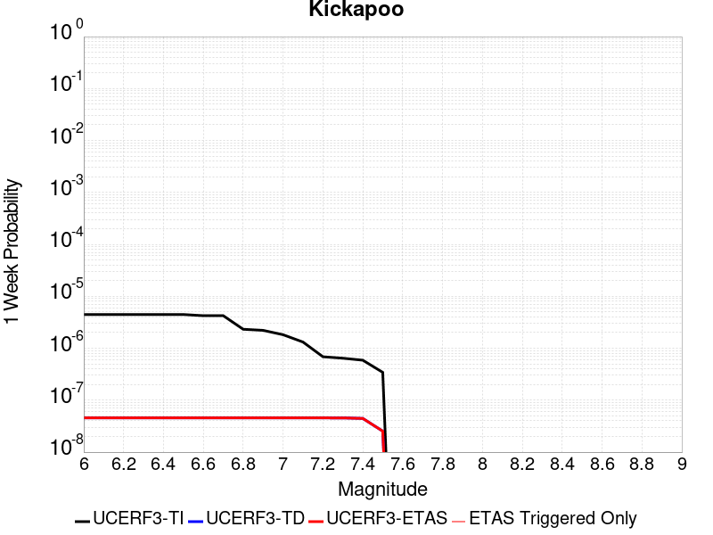 |  |  |  |

| Magnitude | 1 wk TI Prob | 1 wk TD Prob | 1 wk ETAS Prob | 1 wk ETAS/TD Gain | 1 wk ETAS Triggered Only | 1 mo TI Prob | 1 mo TD Prob | 1 mo ETAS Prob | 1 mo ETAS/TD Gain | 1 mo ETAS Triggered Only | 1 yr TI Prob | 1 yr TD Prob | 1 yr ETAS Prob | 1 yr ETAS/TD Gain | 1 yr ETAS Triggered Only | 10 yr TI Prob | 10 yr TD Prob | 10 yr ETAS Prob | 10 yr ETAS/TD Gain | 10 yr ETAS Triggered Only |
|-----|-----|-----|-----|-----|-----|-----|-----|-----|-----|-----|-----|-----|-----|-----|-----|-----|-----|-----|-----|-----|
| 6.0 | 4.4610633E-6 | 4.558912E-8 | 4.558912E-8 | 1.0 | 0.0 | 1.9118703E-5 | 1.9538192E-7 | 1.9538192E-7 | 1.0 | 0.0 | 2.3274534E-4 | 2.3787725E-6 | 2.3787725E-6 | 1.0 | 0.0 | 0.0023250172 | 2.37875E-5 | 3.3787263E-5 | 1.4203789 | 1.0E-5 |
| 6.1 | 4.4610633E-6 | 4.558912E-8 | 4.558912E-8 | 1.0 | 0.0 | 1.9118703E-5 | 1.9538192E-7 | 1.9538192E-7 | 1.0 | 0.0 | 2.3274534E-4 | 2.3787725E-6 | 2.3787725E-6 | 1.0 | 0.0 | 0.0023250172 | 2.37875E-5 | 3.3787263E-5 | 1.4203789 | 1.0E-5 |
| 6.2 | 4.4610633E-6 | 4.558912E-8 | 4.558912E-8 | 1.0 | 0.0 | 1.9118703E-5 | 1.9538192E-7 | 1.9538192E-7 | 1.0 | 0.0 | 2.3274534E-4 | 2.3787725E-6 | 2.3787725E-6 | 1.0 | 0.0 | 0.0023250172 | 2.37875E-5 | 3.3787263E-5 | 1.4203789 | 1.0E-5 |
| 6.3 | 4.4610633E-6 | 4.558912E-8 | 4.558912E-8 | 1.0 | 0.0 | 1.9118703E-5 | 1.9538192E-7 | 1.9538192E-7 | 1.0 | 0.0 | 2.3274534E-4 | 2.3787725E-6 | 2.3787725E-6 | 1.0 | 0.0 | 0.0023250172 | 2.37875E-5 | 3.3787263E-5 | 1.4203789 | 1.0E-5 |
| 6.4 | 4.4610633E-6 | 4.558912E-8 | 4.558912E-8 | 1.0 | 0.0 | 1.9118703E-5 | 1.9538192E-7 | 1.9538192E-7 | 1.0 | 0.0 | 2.3274534E-4 | 2.3787725E-6 | 2.3787725E-6 | 1.0 | 0.0 | 0.0023250172 | 2.37875E-5 | 3.3787263E-5 | 1.4203789 | 1.0E-5 |
| 6.5 | 4.4610633E-6 | 4.558912E-8 | 4.558912E-8 | 1.0 | 0.0 | 1.9118703E-5 | 1.9538192E-7 | 1.9538192E-7 | 1.0 | 0.0 | 2.3274534E-4 | 2.3787725E-6 | 2.3787725E-6 | 1.0 | 0.0 | 0.0023250172 | 2.37875E-5 | 3.3787263E-5 | 1.4203789 | 1.0E-5 |
| 6.6 | 4.236531E-6 | 4.558912E-8 | 4.558912E-8 | 1.0 | 0.0 | 1.8156434E-5 | 1.9538192E-7 | 1.9538192E-7 | 1.0 | 0.0 | 2.2103215E-4 | 2.3787725E-6 | 2.3787725E-6 | 1.0 | 0.0 | 0.0022081244 | 2.37875E-5 | 3.3787263E-5 | 1.4203789 | 1.0E-5 |
| 6.7 | 4.236531E-6 | 4.558912E-8 | 4.558912E-8 | 1.0 | 0.0 | 1.8156434E-5 | 1.9538192E-7 | 1.9538192E-7 | 1.0 | 0.0 | 2.2103215E-4 | 2.3787725E-6 | 2.3787725E-6 | 1.0 | 0.0 | 0.0022081244 | 2.37875E-5 | 3.3787263E-5 | 1.4203789 | 1.0E-5 |
| 6.8 | 2.3202913E-6 | 4.558912E-8 | 4.558912E-8 | 1.0 | 0.0 | 9.944068E-6 | 1.9538192E-7 | 1.9538192E-7 | 1.0 | 0.0 | 1.210623E-4 | 2.3787725E-6 | 2.3787725E-6 | 1.0 | 0.0 | 0.0012099637 | 2.37875E-5 | 3.3787263E-5 | 1.4203789 | 1.0E-5 |
| 6.9 | 2.2111808E-6 | 4.558912E-8 | 4.558912E-8 | 1.0 | 0.0 | 9.4764555E-6 | 1.9538192E-7 | 1.9538192E-7 | 1.0 | 0.0 | 1.1536973E-4 | 2.3787725E-6 | 2.3787725E-6 | 1.0 | 0.0 | 0.0011530985 | 2.37875E-5 | 3.3787263E-5 | 1.4203789 | 1.0E-5 |
| 7.0 | 1.8222031E-6 | 4.558912E-8 | 4.558912E-8 | 1.0 | 0.0 | 7.809419E-6 | 1.9538192E-7 | 1.9538192E-7 | 1.0 | 0.0 | 9.507552E-5 | 2.3787725E-6 | 2.3787725E-6 | 1.0 | 0.0 | 9.5034856E-4 | 2.37875E-5 | 3.3787263E-5 | 1.4203789 | 1.0E-5 |
| 7.1 | 1.3163254E-6 | 4.558912E-8 | 4.558912E-8 | 1.0 | 0.0 | 5.6413824E-6 | 1.9538192E-7 | 1.9538192E-7 | 1.0 | 0.0 | 6.868167E-5 | 2.3787725E-6 | 2.3787725E-6 | 1.0 | 0.0 | 6.866045E-4 | 2.37875E-5 | 3.3787263E-5 | 1.4203789 | 1.0E-5 |
| 7.2 | 6.8603634E-7 | 4.5588198E-8 | 4.5588198E-8 | 1.0 | 0.0 | 2.9401524E-6 | 1.9537798E-7 | 1.9537798E-7 | 1.0 | 0.0 | 3.579577E-5 | 2.3787247E-6 | 2.3787247E-6 | 1.0 | 0.0 | 3.5790002E-4 | 2.3787019E-5 | 3.3786782E-5 | 1.4203874 | 1.0E-5 |
| 7.3 | 6.4299127E-7 | 4.5572E-8 | 4.5572E-8 | 1.0 | 0.0 | 2.755674E-6 | 1.9530857E-7 | 1.9530857E-7 | 1.0 | 0.0 | 3.3549815E-5 | 2.3778796E-6 | 2.3778796E-6 | 1.0 | 0.0 | 3.354475E-4 | 2.3778568E-5 | 3.377833E-5 | 1.4205368 | 1.0E-5 |
| 7.4 | 5.8856347E-7 | 4.454825E-8 | 4.454825E-8 | 1.0 | 0.0 | 2.5224124E-6 | 1.9092107E-7 | 1.9092107E-7 | 1.0 | 0.0 | 3.070994E-5 | 2.3244618E-6 | 2.3244618E-6 | 1.0 | 0.0 | 3.0705697E-4 | 2.3244404E-5 | 3.324417E-5 | 1.430201 | 1.0E-5 |
| 7.5 | 3.435626E-7 | 2.5352403E-8 | 2.5352403E-8 | 1.0 | 0.0 | 1.4724103E-6 | 1.0865315E-7 | 1.0865315E-7 | 1.0 | 0.0 | 1.7926448E-5 | 1.3228514E-6 | 1.3228514E-6 | 1.0 | 0.0 | 1.7925001E-4 | 1.3228451E-5 | 1.3228451E-5 | 1.0 | 0.0 |

## Cedar Mtn-Mahogany Mtn
*[(top)](#table-of-contents)*

| 1 Week | 1 Month | 1 Year | 10 Year |
|-----|-----|-----|-----|
|  |  |  |  |

| Magnitude | 1 wk TI Prob | 1 wk TD Prob | 1 wk ETAS Prob | 1 wk ETAS/TD Gain | 1 wk ETAS Triggered Only | 1 mo TI Prob | 1 mo TD Prob | 1 mo ETAS Prob | 1 mo ETAS/TD Gain | 1 mo ETAS Triggered Only | 1 yr TI Prob | 1 yr TD Prob | 1 yr ETAS Prob | 1 yr ETAS/TD Gain | 1 yr ETAS Triggered Only | 10 yr TI Prob | 10 yr TD Prob | 10 yr ETAS Prob | 10 yr ETAS/TD Gain | 10 yr ETAS Triggered Only |
|-----|-----|-----|-----|-----|-----|-----|-----|-----|-----|-----|-----|-----|-----|-----|-----|-----|-----|-----|-----|-----|
| 6.0 | 2.7763876E-5 | 2.9589124E-5 | 2.9589124E-5 | 1.0 | 0.0 | 1.1898261E-4 | 1.2680476E-4 | 1.368035E-4 | 1.0788513 | 1.0E-5 | 0.0014476506 | 0.0015428247 | 0.0015528093 | 1.0064716 | 1.0E-5 | 0.0143825635 | 0.015328358 | 0.015338205 | 1.0006424 | 1.0E-5 |
| 6.1 | 1.6162443E-5 | 1.7143104E-5 | 1.7143104E-5 | 1.0 | 0.0 | 6.926578E-5 | 7.346847E-5 | 8.346774E-5 | 1.1361028 | 1.0E-5 | 8.4298453E-4 | 8.9412933E-4 | 9.041204E-4 | 1.0111741 | 1.0E-5 | 0.008397939 | 0.00890713 | 0.008917041 | 1.0011127 | 1.0E-5 |
| 6.2 | 1.6162443E-5 | 1.7143104E-5 | 1.7143104E-5 | 1.0 | 0.0 | 6.926578E-5 | 7.346847E-5 | 8.346774E-5 | 1.1361028 | 1.0E-5 | 8.4298453E-4 | 8.9412933E-4 | 9.041204E-4 | 1.0111741 | 1.0E-5 | 0.008397939 | 0.00890713 | 0.008917041 | 1.0011127 | 1.0E-5 |
| 6.3 | 9.746053E-6 | 1.030323E-5 | 1.030323E-5 | 1.0 | 0.0 | 4.1768133E-5 | 4.4155975E-5 | 4.4155975E-5 | 1.0 | 0.0 | 5.0840835E-4 | 5.374705E-4 | 5.374705E-4 | 1.0 | 0.0 | 0.0050724675 | 0.005362125 | 0.005362125 | 1.0 | 0.0 |
| 6.4 | 9.746053E-6 | 1.030323E-5 | 1.030323E-5 | 1.0 | 0.0 | 4.1768133E-5 | 4.4155975E-5 | 4.4155975E-5 | 1.0 | 0.0 | 5.0840835E-4 | 5.374705E-4 | 5.374705E-4 | 1.0 | 0.0 | 0.0050724675 | 0.005362125 | 0.005362125 | 1.0 | 0.0 |
| 6.5 | 7.290083E-6 | 7.695381E-6 | 7.695381E-6 | 1.0 | 0.0 | 3.124284E-5 | 3.2979802E-5 | 3.2979802E-5 | 1.0 | 0.0 | 3.8031515E-4 | 4.0145728E-4 | 4.0145728E-4 | 1.0 | 0.0 | 0.0037966494 | 0.0040075406 | 0.0040075406 | 1.0 | 0.0 |
| 6.6 | 5.67907E-6 | 5.9891963E-6 | 5.9891963E-6 | 1.0 | 0.0 | 2.4338644E-5 | 2.5667738E-5 | 2.5667738E-5 | 1.0 | 0.0 | 2.962827E-4 | 3.1246126E-4 | 3.1246126E-4 | 1.0 | 0.0 | 0.0029588798 | 0.0031203553 | 0.0031203553 | 1.0 | 0.0 |
| 6.7 | 3.4853963E-6 | 3.6726572E-6 | 3.6726572E-6 | 1.0 | 0.0 | 1.4937327E-5 | 1.5739868E-5 | 1.5739868E-5 | 1.0 | 0.0 | 1.8184677E-4 | 1.9161667E-4 | 1.9161667E-4 | 1.0 | 0.0 | 0.0018169804 | 0.0019145765 | 0.0019145765 | 1.0 | 0.0 |
| 6.8 | 2.7535168E-6 | 2.901597E-6 | 2.901597E-6 | 1.0 | 0.0 | 1.1800733E-5 | 1.2435359E-5 | 1.2435359E-5 | 1.0 | 0.0 | 1.4366445E-4 | 1.5139046E-4 | 1.5139046E-4 | 1.0 | 0.0 | 0.0014357162 | 0.0015129205 | 0.0015129205 | 1.0 | 0.0 |
| 6.9 | 1.6594106E-6 | 1.7497113E-6 | 1.7497113E-6 | 1.0 | 0.0 | 7.1117406E-6 | 7.4987424E-6 | 7.4987424E-6 | 1.0 | 0.0 | 8.6582E-5 | 9.1293674E-5 | 9.1293674E-5 | 1.0 | 0.0 | 8.654827E-4 | 9.1259216E-4 | 9.1259216E-4 | 1.0 | 0.0 |
| 7.0 | 5.10215E-7 | 5.389294E-7 | 5.389294E-7 | 1.0 | 0.0 | 2.186634E-6 | 2.3096961E-6 | 2.3096961E-6 | 1.0 | 0.0 | 2.6621943E-5 | 2.8120316E-5 | 2.8120316E-5 | 1.0 | 0.0 | 2.6618753E-4 | 2.811801E-4 | 2.811801E-4 | 1.0 | 0.0 |

## Del Valle
*[(top)](#table-of-contents)*

| 1 Week | 1 Month | 1 Year | 10 Year |
|-----|-----|-----|-----|
|  |  |  |  |

| Magnitude | 1 wk TI Prob | 1 wk TD Prob | 1 wk ETAS Prob | 1 wk ETAS/TD Gain | 1 wk ETAS Triggered Only | 1 mo TI Prob | 1 mo TD Prob | 1 mo ETAS Prob | 1 mo ETAS/TD Gain | 1 mo ETAS Triggered Only | 1 yr TI Prob | 1 yr TD Prob | 1 yr ETAS Prob | 1 yr ETAS/TD Gain | 1 yr ETAS Triggered Only | 10 yr TI Prob | 10 yr TD Prob | 10 yr ETAS Prob | 10 yr ETAS/TD Gain | 10 yr ETAS Triggered Only |
|-----|-----|-----|-----|-----|-----|-----|-----|-----|-----|-----|-----|-----|-----|-----|-----|-----|-----|-----|-----|-----|
| 6.0 | 1.0716125E-5 | 8.768021E-6 | 8.768021E-6 | 1.0 | 0.0 | 4.592544E-5 | 3.7576803E-5 | 3.7576803E-5 | 1.0 | 0.0 | 5.589988E-4 | 4.574213E-4 | 4.574213E-4 | 1.0 | 0.0 | 0.0055759475 | 0.004566771 | 0.0045767254 | 1.0021797 | 1.0E-5 |
| 6.1 | 1.0716125E-5 | 8.768021E-6 | 8.768021E-6 | 1.0 | 0.0 | 4.592544E-5 | 3.7576803E-5 | 3.7576803E-5 | 1.0 | 0.0 | 5.589988E-4 | 4.574213E-4 | 4.574213E-4 | 1.0 | 0.0 | 0.0055759475 | 0.004566771 | 0.0045767254 | 1.0021797 | 1.0E-5 |
| 6.2 | 1.0716125E-5 | 8.768021E-6 | 8.768021E-6 | 1.0 | 0.0 | 4.592544E-5 | 3.7576803E-5 | 3.7576803E-5 | 1.0 | 0.0 | 5.589988E-4 | 4.574213E-4 | 4.574213E-4 | 1.0 | 0.0 | 0.0055759475 | 0.004566771 | 0.0045767254 | 1.0021797 | 1.0E-5 |
| 6.3 | 7.1293784E-6 | 4.8659167E-6 | 4.8659167E-6 | 1.0 | 0.0 | 3.055412E-5 | 2.0853766E-5 | 2.0853766E-5 | 1.0 | 0.0 | 3.7193293E-4 | 2.5386576E-4 | 2.5386576E-4 | 1.0 | 0.0 | 0.0037131102 | 0.002535862 | 0.0025458364 | 1.0039334 | 1.0E-5 |
| 6.4 | 7.1293784E-6 | 4.8659167E-6 | 4.8659167E-6 | 1.0 | 0.0 | 3.055412E-5 | 2.0853766E-5 | 2.0853766E-5 | 1.0 | 0.0 | 3.7193293E-4 | 2.5386576E-4 | 2.5386576E-4 | 1.0 | 0.0 | 0.0037131102 | 0.002535862 | 0.0025458364 | 1.0039334 | 1.0E-5 |
| 6.5 | 7.1293784E-6 | 4.8659167E-6 | 4.8659167E-6 | 1.0 | 0.0 | 3.055412E-5 | 2.0853766E-5 | 2.0853766E-5 | 1.0 | 0.0 | 3.7193293E-4 | 2.5386576E-4 | 2.5386576E-4 | 1.0 | 0.0 | 0.0037131102 | 0.002535862 | 0.0025458364 | 1.0039334 | 1.0E-5 |
| 6.6 | 7.1293784E-6 | 4.8659167E-6 | 4.8659167E-6 | 1.0 | 0.0 | 3.055412E-5 | 2.0853766E-5 | 2.0853766E-5 | 1.0 | 0.0 | 3.7193293E-4 | 2.5386576E-4 | 2.5386576E-4 | 1.0 | 0.0 | 0.0037131102 | 0.002535862 | 0.0025458364 | 1.0039334 | 1.0E-5 |
| 6.7 | 7.12272E-6 | 4.8632924E-6 | 4.8632924E-6 | 1.0 | 0.0 | 3.0525585E-5 | 2.0842519E-5 | 2.0842519E-5 | 1.0 | 0.0 | 3.7158563E-4 | 2.5372885E-4 | 2.5372885E-4 | 1.0 | 0.0 | 0.003709649 | 0.002534496 | 0.0025444706 | 1.0039356 | 1.0E-5 |
| 6.8 | 6.7558703E-6 | 4.559491E-6 | 4.559491E-6 | 1.0 | 0.0 | 2.895341E-5 | 1.9540534E-5 | 1.9540534E-5 | 1.0 | 0.0 | 3.5245073E-4 | 2.3788065E-4 | 2.3788065E-4 | 1.0 | 0.0 | 0.0035189227 | 0.002376354 | 0.002376354 | 1.0 | 0.0 |
| 6.9 | 6.6700386E-6 | 4.5026277E-6 | 4.5026277E-6 | 1.0 | 0.0 | 2.8585566E-5 | 1.9296836E-5 | 1.9296836E-5 | 1.0 | 0.0 | 3.479737E-4 | 2.3491429E-4 | 2.3491429E-4 | 1.0 | 0.0 | 0.003474293 | 0.0023467531 | 0.0023467531 | 1.0 | 0.0 |
| 7.0 | 6.3181424E-6 | 4.098784E-6 | 4.098784E-6 | 1.0 | 0.0 | 2.7077473E-5 | 1.75661E-5 | 1.75661E-5 | 1.0 | 0.0 | 3.2961834E-4 | 2.1384671E-4 | 2.1384671E-4 | 1.0 | 0.0 | 0.0032912986 | 0.0021364824 | 0.0021364824 | 1.0 | 0.0 |
| 7.1 | 6.248759E-6 | 4.0339737E-6 | 4.0339737E-6 | 1.0 | 0.0 | 2.678012E-5 | 1.7288346E-5 | 1.7288346E-5 | 1.0 | 0.0 | 3.2599916E-4 | 2.104657E-4 | 2.104657E-4 | 1.0 | 0.0 | 0.0032552136 | 0.0021027366 | 0.0021027366 | 1.0 | 0.0 |
| 7.2 | 6.0411944E-6 | 3.869962E-6 | 3.869962E-6 | 1.0 | 0.0 | 2.5890577E-5 | 1.6585447E-5 | 1.6585447E-5 | 1.0 | 0.0 | 3.1517216E-4 | 2.0190953E-4 | 2.0190953E-4 | 1.0 | 0.0 | 0.0031472554 | 0.0020173325 | 0.0020173325 | 1.0 | 0.0 |
| 7.3 | 4.7691183E-6 | 3.0781514E-6 | 3.0781514E-6 | 1.0 | 0.0 | 2.0438918E-5 | 1.3192012E-5 | 1.3192012E-5 | 1.0 | 0.0 | 2.488154E-4 | 1.6060112E-4 | 1.6060112E-4 | 1.0 | 0.0 | 0.00248537 | 0.0016048873 | 0.0016048873 | 1.0 | 0.0 |
| 7.4 | 3.5524722E-6 | 2.1893625E-6 | 2.1893625E-6 | 1.0 | 0.0 | 1.5224792E-5 | 9.3829485E-6 | 9.3829485E-6 | 1.0 | 0.0 | 1.8534607E-4 | 1.14231494E-4 | 1.14231494E-4 | 1.0 | 0.0 | 0.0018519156 | 0.001141736 | 0.001141736 | 1.0 | 0.0 |
| 7.5 | 2.7133442E-6 | 1.5916223E-6 | 1.5916223E-6 | 1.0 | 0.0 | 1.1628566E-5 | 6.821221E-6 | 6.821221E-6 | 1.0 | 0.0 | 1.415686E-4 | 8.304522E-5 | 8.304522E-5 | 1.0 | 0.0 | 0.0014147845 | 8.301438E-4 | 8.301438E-4 | 1.0 | 0.0 |
| 7.6 | 1.915338E-6 | 1.1739246E-6 | 1.1739246E-6 | 1.0 | 0.0 | 8.208566E-6 | 5.031096E-6 | 5.031096E-6 | 1.0 | 0.0 | 9.993471E-5 | 6.125188E-5 | 6.125188E-5 | 1.0 | 0.0 | 9.988978E-4 | 6.123509E-4 | 6.123509E-4 | 1.0 | 0.0 |
| 7.7 | 1.2120448E-6 | 7.1803703E-7 | 7.1803703E-7 | 1.0 | 0.0 | 5.194467E-6 | 3.077298E-6 | 3.077298E-6 | 1.0 | 0.0 | 6.3240805E-5 | 3.7465463E-5 | 3.7465463E-5 | 1.0 | 0.0 | 6.322281E-4 | 3.7459185E-4 | 3.7459185E-4 | 1.0 | 0.0 |
| 7.8 | 6.272381E-7 | 3.9325712E-7 | 3.9325712E-7 | 1.0 | 0.0 | 2.6881603E-6 | 1.6853867E-6 | 1.6853867E-6 | 1.0 | 0.0 | 3.272786E-5 | 2.051939E-5 | 2.051939E-5 | 1.0 | 0.0 | 3.272304E-4 | 2.0517512E-4 | 2.0517512E-4 | 1.0 | 0.0 |
| 7.9 | 2.0292627E-7 | 1.2004664E-7 | 1.2004664E-7 | 1.0 | 0.0 | 8.6968373E-7 | 5.1448546E-7 | 5.1448546E-7 | 1.0 | 0.0 | 1.0588348E-5 | 6.263843E-6 | 6.263843E-6 | 1.0 | 0.0 | 1.0587843E-4 | 6.263668E-5 | 6.263668E-5 | 1.0 | 0.0 |
| 8.0 | 4.374492E-8 | 2.1900265E-8 | 2.1900265E-8 | 1.0 | 0.0 | 1.8747821E-7 | 9.3858276E-8 | 9.3858276E-8 | 1.0 | 0.0 | 2.2825448E-6 | 1.1427239E-6 | 1.1427239E-6 | 1.0 | 0.0 | 2.2825214E-5 | 1.1427184E-5 | 1.1427184E-5 | 1.0 | 0.0 |

## Johnson Valley (No) 2011 rev
*[(top)](#table-of-contents)*

| 1 Week | 1 Month | 1 Year | 10 Year |
|-----|-----|-----|-----|
|  |  |  |  |

| Magnitude | 1 wk TI Prob | 1 wk TD Prob | 1 wk ETAS Prob | 1 wk ETAS/TD Gain | 1 wk ETAS Triggered Only | 1 mo TI Prob | 1 mo TD Prob | 1 mo ETAS Prob | 1 mo ETAS/TD Gain | 1 mo ETAS Triggered Only | 1 yr TI Prob | 1 yr TD Prob | 1 yr ETAS Prob | 1 yr ETAS/TD Gain | 1 yr ETAS Triggered Only | 10 yr TI Prob | 10 yr TD Prob | 10 yr ETAS Prob | 10 yr ETAS/TD Gain | 10 yr ETAS Triggered Only |
|-----|-----|-----|-----|-----|-----|-----|-----|-----|-----|-----|-----|-----|-----|-----|-----|-----|-----|-----|-----|-----|
| 6.0 | 2.577707E-5 | 1.2901344E-5 | 1.2901344E-5 | 1.0 | 0.0 | 1.1046848E-4 | 5.5290526E-5 | 5.5290526E-5 | 1.0 | 0.0 | 0.0013441239 | 6.7299395E-4 | 6.7299395E-4 | 1.0 | 0.0 | 0.013360229 | 0.0067134677 | 0.0067234007 | 1.0014795 | 1.0E-5 |
| 6.1 | 2.577707E-5 | 1.2901344E-5 | 1.2901344E-5 | 1.0 | 0.0 | 1.1046848E-4 | 5.5290526E-5 | 5.5290526E-5 | 1.0 | 0.0 | 0.0013441239 | 6.7299395E-4 | 6.7299395E-4 | 1.0 | 0.0 | 0.013360229 | 0.0067134677 | 0.0067234007 | 1.0014795 | 1.0E-5 |
| 6.2 | 2.577707E-5 | 1.2901344E-5 | 1.2901344E-5 | 1.0 | 0.0 | 1.1046848E-4 | 5.5290526E-5 | 5.5290526E-5 | 1.0 | 0.0 | 0.0013441239 | 6.7299395E-4 | 6.7299395E-4 | 1.0 | 0.0 | 0.013360229 | 0.0067134677 | 0.0067234007 | 1.0014795 | 1.0E-5 |
| 6.3 | 2.577707E-5 | 1.2901344E-5 | 1.2901344E-5 | 1.0 | 0.0 | 1.1046848E-4 | 5.5290526E-5 | 5.5290526E-5 | 1.0 | 0.0 | 0.0013441239 | 6.7299395E-4 | 6.7299395E-4 | 1.0 | 0.0 | 0.013360229 | 0.0067134677 | 0.0067234007 | 1.0014795 | 1.0E-5 |
| 6.4 | 1.5296591E-5 | 7.5370353E-6 | 7.5370353E-6 | 1.0 | 0.0 | 6.555518E-5 | 3.2301286E-5 | 3.2301286E-5 | 1.0 | 0.0 | 7.97842E-4 | 3.9321595E-4 | 3.9321595E-4 | 1.0 | 0.0 | 0.007949836 | 0.003927043 | 0.003927043 | 1.0 | 0.0 |
| 6.5 | 1.5296591E-5 | 7.5370353E-6 | 7.5370353E-6 | 1.0 | 0.0 | 6.555518E-5 | 3.2301286E-5 | 3.2301286E-5 | 1.0 | 0.0 | 7.97842E-4 | 3.9321595E-4 | 3.9321595E-4 | 1.0 | 0.0 | 0.007949836 | 0.003927043 | 0.003927043 | 1.0 | 0.0 |
| 6.6 | 1.3289383E-5 | 5.9919753E-6 | 5.9919753E-6 | 1.0 | 0.0 | 5.6953253E-5 | 2.5679738E-5 | 2.5679738E-5 | 1.0 | 0.0 | 6.9318525E-4 | 3.1262293E-4 | 3.1262293E-4 | 1.0 | 0.0 | 0.0069102696 | 0.003123496 | 0.003123496 | 1.0 | 0.0 |
| 6.7 | 1.3289383E-5 | 5.9919753E-6 | 5.9919753E-6 | 1.0 | 0.0 | 5.6953253E-5 | 2.5679738E-5 | 2.5679738E-5 | 1.0 | 0.0 | 6.9318525E-4 | 3.1262293E-4 | 3.1262293E-4 | 1.0 | 0.0 | 0.0069102696 | 0.003123496 | 0.003123496 | 1.0 | 0.0 |
| 6.8 | 8.330789E-6 | 2.9214602E-6 | 2.9214602E-6 | 1.0 | 0.0 | 3.570289E-5 | 1.2520515E-5 | 1.2520515E-5 | 1.0 | 0.0 | 4.34596E-4 | 1.5243233E-4 | 1.5243233E-4 | 1.0 | 0.0 | 0.0043374705 | 0.0015238377 | 0.0015238377 | 1.0 | 0.0 |
| 6.9 | 7.2359003E-6 | 2.3014725E-6 | 2.3014725E-6 | 1.0 | 0.0 | 3.1010633E-5 | 9.863446E-6 | 9.863446E-6 | 1.0 | 0.0 | 3.7748902E-4 | 1.2008617E-4 | 1.2008617E-4 | 1.0 | 0.0 | 0.0037684843 | 0.0012007357 | 0.0012007357 | 1.0 | 0.0 |
| 7.0 | 6.5149957E-6 | 2.088642E-6 | 2.088642E-6 | 1.0 | 0.0 | 2.792111E-5 | 8.951322E-6 | 8.951322E-6 | 1.0 | 0.0 | 3.398865E-4 | 1.089822E-4 | 1.089822E-4 | 1.0 | 0.0 | 0.003393671 | 0.0010898075 | 0.0010898075 | 1.0 | 0.0 |
| 7.1 | 1.1662233E-6 | 2.8795448E-8 | 2.8795448E-8 | 1.0 | 0.0 | 4.9980904E-6 | 1.2340907E-7 | 1.2340907E-7 | 1.0 | 0.0 | 6.0850052E-5 | 1.5025045E-6 | 1.5025045E-6 | 1.0 | 0.0 | 6.083339E-4 | 1.5024959E-5 | 1.5024959E-5 | 1.0 | 0.0 |
| 7.2 | 5.413881E-7 | 2.8795448E-8 | 2.8795448E-8 | 1.0 | 0.0 | 2.3202326E-6 | 1.2340907E-7 | 1.2340907E-7 | 1.0 | 0.0 | 2.8248465E-5 | 1.5025045E-6 | 1.5025045E-6 | 1.0 | 0.0 | 2.8244875E-4 | 1.5024959E-5 | 1.5024959E-5 | 1.0 | 0.0 |
| 7.3 | 5.076821E-7 | 2.8795448E-8 | 2.8795448E-8 | 1.0 | 0.0 | 2.1757785E-6 | 1.2340905E-7 | 1.2340905E-7 | 1.0 | 0.0 | 2.648978E-5 | 1.5025045E-6 | 1.5025045E-6 | 1.0 | 0.0 | 2.6486625E-4 | 1.5024959E-5 | 1.5024959E-5 | 1.0 | 0.0 |
| 7.4 | 4.7568687E-7 | 2.8777395E-8 | 2.8777395E-8 | 1.0 | 0.0 | 2.0386565E-6 | 1.2333169E-7 | 1.2333169E-7 | 1.0 | 0.0 | 2.482036E-5 | 1.5015625E-6 | 1.5015625E-6 | 1.0 | 0.0 | 2.4817587E-4 | 1.5015539E-5 | 1.5015539E-5 | 1.0 | 0.0 |
| 7.5 | 3.435626E-7 | 2.5352403E-8 | 2.5352403E-8 | 1.0 | 0.0 | 1.4724103E-6 | 1.0865315E-7 | 1.0865315E-7 | 1.0 | 0.0 | 1.7926448E-5 | 1.3228514E-6 | 1.3228514E-6 | 1.0 | 0.0 | 1.7925001E-4 | 1.3228451E-5 | 1.3228451E-5 | 1.0 | 0.0 |

## Yorba Linda
*[(top)](#table-of-contents)*

| 1 Week | 1 Month | 1 Year | 10 Year |
|-----|-----|-----|-----|
|  |  |  |  |

| Magnitude | 1 wk TI Prob | 1 wk TD Prob | 1 wk ETAS Prob | 1 wk ETAS/TD Gain | 1 wk ETAS Triggered Only | 1 mo TI Prob | 1 mo TD Prob | 1 mo ETAS Prob | 1 mo ETAS/TD Gain | 1 mo ETAS Triggered Only | 1 yr TI Prob | 1 yr TD Prob | 1 yr ETAS Prob | 1 yr ETAS/TD Gain | 1 yr ETAS Triggered Only | 10 yr TI Prob | 10 yr TD Prob | 10 yr ETAS Prob | 10 yr ETAS/TD Gain | 10 yr ETAS Triggered Only |
|-----|-----|-----|-----|-----|-----|-----|-----|-----|-----|-----|-----|-----|-----|-----|-----|-----|-----|-----|-----|-----|
| 6.0 | 1.9346849E-6 | 1.6909223E-6 | 1.6909223E-6 | 1.0 | 0.0 | 8.29148E-6 | 7.246795E-6 | 7.246795E-6 | 1.0 | 0.0 | 1.009441E-4 | 8.8227105E-5 | 8.8227105E-5 | 1.0 | 0.0 | 0.0010089825 | 8.820139E-4 | 8.9200505E-4 | 1.0113277 | 1.0E-5 |
| 6.1 | 1.9346849E-6 | 1.6909223E-6 | 1.6909223E-6 | 1.0 | 0.0 | 8.29148E-6 | 7.246795E-6 | 7.246795E-6 | 1.0 | 0.0 | 1.009441E-4 | 8.8227105E-5 | 8.8227105E-5 | 1.0 | 0.0 | 0.0010089825 | 8.820139E-4 | 8.9200505E-4 | 1.0113277 | 1.0E-5 |
| 6.2 | 1.9346849E-6 | 1.6909223E-6 | 1.6909223E-6 | 1.0 | 0.0 | 8.29148E-6 | 7.246795E-6 | 7.246795E-6 | 1.0 | 0.0 | 1.009441E-4 | 8.8227105E-5 | 8.8227105E-5 | 1.0 | 0.0 | 0.0010089825 | 8.820139E-4 | 8.9200505E-4 | 1.0113277 | 1.0E-5 |
| 6.3 | 1.1028608E-6 | 8.4819595E-7 | 8.4819595E-7 | 1.0 | 0.0 | 4.7265376E-6 | 3.635121E-6 | 3.635121E-6 | 1.0 | 0.0 | 5.754407E-5 | 4.4256765E-5 | 4.4256765E-5 | 1.0 | 0.0 | 5.7529175E-4 | 4.4248602E-4 | 4.4248602E-4 | 1.0 | 0.0 |
| 6.4 | 1.1028608E-6 | 8.4819595E-7 | 8.4819595E-7 | 1.0 | 0.0 | 4.7265376E-6 | 3.635121E-6 | 3.635121E-6 | 1.0 | 0.0 | 5.754407E-5 | 4.4256765E-5 | 4.4256765E-5 | 1.0 | 0.0 | 5.7529175E-4 | 4.4248602E-4 | 4.4248602E-4 | 1.0 | 0.0 |
| 6.5 | 8.4451364E-7 | 5.8692024E-7 | 5.8692024E-7 | 1.0 | 0.0 | 3.619339E-6 | 2.5153702E-6 | 2.5153702E-6 | 1.0 | 0.0 | 4.406456E-5 | 3.0624222E-5 | 3.0624222E-5 | 1.0 | 0.0 | 4.4055824E-4 | 3.0620216E-4 | 3.0620216E-4 | 1.0 | 0.0 |
| 6.6 | 8.422957E-7 | 5.844736E-7 | 5.844736E-7 | 1.0 | 0.0 | 3.6098338E-6 | 2.5048846E-6 | 2.5048846E-6 | 1.0 | 0.0 | 4.3948843E-5 | 3.0496563E-5 | 3.0496563E-5 | 1.0 | 0.0 | 4.394015E-4 | 3.0492592E-4 | 3.0492592E-4 | 1.0 | 0.0 |
| 6.7 | 8.4119705E-7 | 5.8325776E-7 | 5.8325776E-7 | 1.0 | 0.0 | 3.6051254E-6 | 2.4996739E-6 | 2.4996739E-6 | 1.0 | 0.0 | 4.3891516E-5 | 3.0433126E-5 | 3.0433126E-5 | 1.0 | 0.0 | 4.388285E-4 | 3.0429172E-4 | 3.0429172E-4 | 1.0 | 0.0 |
| 6.8 | 7.5919155E-7 | 4.9950853E-7 | 4.9950853E-7 | 1.0 | 0.0 | 3.253674E-6 | 2.140749E-6 | 2.140749E-6 | 1.0 | 0.0 | 3.961276E-5 | 2.6063326E-5 | 2.6063326E-5 | 1.0 | 0.0 | 3.9605703E-4 | 2.606044E-4 | 2.606044E-4 | 1.0 | 0.0 |
| 6.9 | 7.5804564E-7 | 4.981269E-7 | 4.981269E-7 | 1.0 | 0.0 | 3.248763E-6 | 2.1348278E-6 | 2.1348278E-6 | 1.0 | 0.0 | 3.955297E-5 | 2.5991236E-5 | 2.5991236E-5 | 1.0 | 0.0 | 3.9545933E-4 | 2.5988367E-4 | 2.5988367E-4 | 1.0 | 0.0 |
| 7.0 | 7.539293E-7 | 4.943403E-7 | 4.943403E-7 | 1.0 | 0.0 | 3.2311218E-6 | 2.1185997E-6 | 2.1185997E-6 | 1.0 | 0.0 | 3.9338196E-5 | 2.5793664E-5 | 2.5793664E-5 | 1.0 | 0.0 | 3.9331234E-4 | 2.5790842E-4 | 2.5790842E-4 | 1.0 | 0.0 |
| 7.1 | 6.0900885E-7 | 3.7818015E-7 | 3.7818015E-7 | 1.0 | 0.0 | 2.6100352E-6 | 1.6207712E-6 | 1.6207712E-6 | 1.0 | 0.0 | 3.1776715E-5 | 1.9732714E-5 | 1.9732714E-5 | 1.0 | 0.0 | 3.1772171E-4 | 1.9730997E-4 | 1.9730997E-4 | 1.0 | 0.0 |
| 7.2 | 5.849925E-7 | 3.58797E-7 | 3.58797E-7 | 1.0 | 0.0 | 2.5071083E-6 | 1.5377004E-6 | 1.5377004E-6 | 1.0 | 0.0 | 3.0523614E-5 | 1.8721346E-5 | 1.8721346E-5 | 1.0 | 0.0 | 3.0519423E-4 | 1.8719802E-4 | 1.8719802E-4 | 1.0 | 0.0 |
| 7.3 | 4.89808E-7 | 3.0380195E-7 | 3.0380195E-7 | 1.0 | 0.0 | 2.0991754E-6 | 1.3020077E-6 | 1.3020077E-6 | 1.0 | 0.0 | 2.5557161E-5 | 1.585183E-5 | 1.585183E-5 | 1.0 | 0.0 | 2.5554223E-4 | 1.5850723E-4 | 1.5850723E-4 | 1.0 | 0.0 |
| 7.4 | 3.8700415E-7 | 2.4722883E-7 | 2.4722883E-7 | 1.0 | 0.0 | 1.6585881E-6 | 1.0595517E-6 | 1.0595517E-6 | 1.0 | 0.0 | 2.0193123E-5 | 1.2899966E-5 | 1.2899966E-5 | 1.0 | 0.0 | 2.0191289E-4 | 1.2899231E-4 | 1.2899231E-4 | 1.0 | 0.0 |
| 7.5 | 2.900565E-7 | 1.8637834E-7 | 1.8637834E-7 | 1.0 | 0.0 | 1.2430987E-6 | 7.9876406E-7 | 7.9876406E-7 | 1.0 | 0.0 | 1.5134622E-5 | 9.72491E-6 | 9.72491E-6 | 1.0 | 0.0 | 1.5133592E-4 | 9.724493E-5 | 9.724493E-5 | 1.0 | 0.0 |
| 7.6 | 2.2770318E-7 | 1.4814499E-7 | 1.4814499E-7 | 1.0 | 0.0 | 9.758704E-7 | 6.34907E-7 | 6.34907E-7 | 1.0 | 0.0 | 1.1881158E-5 | 7.729966E-6 | 7.729966E-6 | 1.0 | 0.0 | 1.1880523E-4 | 7.7297016E-5 | 7.7297016E-5 | 1.0 | 0.0 |
| 7.7 | 1.5017194E-7 | 8.735702E-8 | 8.735702E-8 | 1.0 | 0.0 | 6.4359386E-7 | 3.7438718E-7 | 3.7438718E-7 | 1.0 | 0.0 | 7.835727E-6 | 4.5581546E-6 | 4.5581546E-6 | 1.0 | 0.0 | 7.835451E-5 | 4.558064E-5 | 4.558064E-5 | 1.0 | 0.0 |
| 7.8 | 3.895753E-8 | 1.8532743E-8 | 1.8532743E-8 | 1.0 | 0.0 | 1.6696083E-7 | 7.942604E-8 | 7.942604E-8 | 1.0 | 0.0 | 2.0327461E-6 | 9.670116E-7 | 9.670116E-7 | 1.0 | 0.0 | 2.0327276E-5 | 9.670076E-6 | 9.670076E-6 | 1.0 | 0.0 |
| 7.9 | 6.648505E-9 | 3.4183931E-9 | 3.4183931E-9 | 1.0 | 0.0 | 2.8493591E-8 | 1.4650257E-8 | 1.4650257E-8 | 1.0 | 0.0 | 3.4690942E-7 | 1.7836686E-7 | 1.7836686E-7 | 1.0 | 0.0 | 3.4690888E-6 | 1.7836674E-6 | 1.7836674E-6 | 1.0 | 0.0 |

## Green Valley 2011 CFM
*[(top)](#table-of-contents)*

| 1 Week | 1 Month | 1 Year | 10 Year |
|-----|-----|-----|-----|
|  |  |  |  |

| Magnitude | 1 wk TI Prob | 1 wk TD Prob | 1 wk ETAS Prob | 1 wk ETAS/TD Gain | 1 wk ETAS Triggered Only | 1 mo TI Prob | 1 mo TD Prob | 1 mo ETAS Prob | 1 mo ETAS/TD Gain | 1 mo ETAS Triggered Only | 1 yr TI Prob | 1 yr TD Prob | 1 yr ETAS Prob | 1 yr ETAS/TD Gain | 1 yr ETAS Triggered Only | 10 yr TI Prob | 10 yr TD Prob | 10 yr ETAS Prob | 10 yr ETAS/TD Gain | 10 yr ETAS Triggered Only |
|-----|-----|-----|-----|-----|-----|-----|-----|-----|-----|-----|-----|-----|-----|-----|-----|-----|-----|-----|-----|-----|
| 6.0 | 9.9629346E-5 | 1.7303096E-4 | 1.7303096E-4 | 1.0 | 0.0 | 4.2691303E-4 | 7.413446E-4 | 7.413446E-4 | 1.0 | 0.0 | 0.0051852856 | 0.008987141 | 0.008997051 | 1.0011027 | 1.0E-5 | 0.050659515 | 0.08554168 | 0.08555083 | 1.0001069 | 1.0E-5 |
| 6.1 | 9.88615E-5 | 1.7150394E-4 | 1.7150394E-4 | 1.0 | 0.0 | 4.2362334E-4 | 7.348039E-4 | 7.348039E-4 | 1.0 | 0.0 | 0.0051454236 | 0.0089081675 | 0.008918079 | 1.0011126 | 1.0E-5 | 0.050279044 | 0.08482929 | 0.08483845 | 1.0001079 | 1.0E-5 |
| 6.2 | 9.696895E-5 | 1.6789426E-4 | 1.6789426E-4 | 1.0 | 0.0 | 4.15515E-4 | 7.193438E-4 | 7.193438E-4 | 1.0 | 0.0 | 0.0050471667 | 0.008721547 | 0.00873146 | 1.0011365 | 1.0E-5 | 0.04934063 | 0.08313806 | 0.083147235 | 1.0001103 | 1.0E-5 |
| 6.3 | 9.275224E-5 | 1.5968755E-4 | 1.5968755E-4 | 1.0 | 0.0 | 3.9744904E-4 | 6.8419095E-4 | 6.8419095E-4 | 1.0 | 0.0 | 0.0048282105 | 0.008296867 | 0.008306784 | 1.0011953 | 1.0E-5 | 0.047246475 | 0.07927713 | 0.07928634 | 1.0001161 | 1.0E-5 |
| 6.4 | 8.391499E-5 | 1.4366042E-4 | 1.4366042E-4 | 1.0 | 0.0 | 3.595861E-4 | 6.155415E-4 | 6.155415E-4 | 1.0 | 0.0 | 0.004369175 | 0.007467382 | 0.007477307 | 1.0013292 | 1.0E-5 | 0.04284265 | 0.07164556 | 0.07165484 | 1.0001296 | 1.0E-5 |
| 6.5 | 5.9519385E-5 | 9.932708E-5 | 9.932708E-5 | 1.0 | 0.0 | 2.5505814E-4 | 4.2561657E-4 | 4.2561657E-4 | 1.0 | 0.0 | 0.0031009112 | 0.005168488 | 0.005168488 | 1.0 | 0.0 | 0.030579966 | 0.05014941 | 0.05014941 | 1.0 | 0.0 |
| 6.6 | 4.5361558E-5 | 7.40199E-5 | 7.40199E-5 | 1.0 | 0.0 | 1.9439218E-4 | 3.1718693E-4 | 3.1718693E-4 | 1.0 | 0.0 | 0.0023641558 | 0.003853991 | 0.003853991 | 1.0 | 0.0 | 0.023391623 | 0.037669275 | 0.037669275 | 1.0 | 0.0 |
| 6.7 | 3.8808106E-5 | 6.264344E-5 | 6.264344E-5 | 1.0 | 0.0 | 1.6630985E-4 | 2.6844675E-4 | 2.6844675E-4 | 1.0 | 0.0 | 0.0020229418 | 0.0032628388 | 0.0032628388 | 1.0 | 0.0 | 0.020046256 | 0.032008745 | 0.032008745 | 1.0 | 0.0 |
| 6.8 | 2.2284667E-5 | 3.128603E-5 | 3.128603E-5 | 1.0 | 0.0 | 9.550222E-5 | 1.3407608E-4 | 1.3407608E-4 | 1.0 | 0.0 | 0.0011621192 | 0.0016311527 | 0.0016311527 | 1.0 | 0.0 | 0.011560607 | 0.016166579 | 0.016166579 | 1.0 | 0.0 |
| 6.9 | 1.8050168E-5 | 2.4448742E-5 | 2.4448742E-5 | 1.0 | 0.0 | 7.735557E-5 | 1.04776154E-4 | 1.04776154E-4 | 1.0 | 0.0 | 9.4139716E-4 | 0.0012749061 | 0.0012749061 | 1.0 | 0.0 | 0.009374191 | 0.012668985 | 0.012668985 | 1.0 | 0.0 |
| 7.0 | 1.4763166E-5 | 1.9583402E-5 | 1.9583402E-5 | 1.0 | 0.0 | 6.326917E-5 | 8.392618E-5 | 8.392618E-5 | 1.0 | 0.0 | 7.7002996E-4 | 0.0010213237 | 0.0010213237 | 1.0 | 0.0 | 0.007673672 | 0.010166345 | 0.010166345 | 1.0 | 0.0 |
| 7.1 | 1.2399713E-5 | 1.6304173E-5 | 1.6304173E-5 | 1.0 | 0.0 | 5.3140546E-5 | 6.987317E-5 | 6.987317E-5 | 1.0 | 0.0 | 6.467941E-4 | 8.5037574E-4 | 8.5037574E-4 | 1.0 | 0.0 | 0.006449148 | 0.008471897 | 0.008471897 | 1.0 | 0.0 |
| 7.2 | 1.0584195E-5 | 1.392217E-5 | 1.392217E-5 | 1.0 | 0.0 | 4.5360044E-5 | 5.9665086E-5 | 5.9665086E-5 | 1.0 | 0.0 | 5.521186E-4 | 7.2618196E-4 | 7.2618196E-4 | 1.0 | 0.0 | 0.0055074887 | 0.007238742 | 0.007238742 | 1.0 | 0.0 |
| 7.3 | 7.998173E-6 | 1.0544361E-5 | 1.0544361E-5 | 1.0 | 0.0 | 3.4277433E-5 | 4.5189343E-5 | 4.5189343E-5 | 1.0 | 0.0 | 4.1724785E-4 | 5.5004243E-4 | 5.5004243E-4 | 1.0 | 0.0 | 0.004164653 | 0.005487132 | 0.005487132 | 1.0 | 0.0 |
| 7.4 | 6.7571127E-6 | 8.932998E-6 | 8.932998E-6 | 1.0 | 0.0 | 2.8958733E-5 | 3.828372E-5 | 3.828372E-5 | 1.0 | 0.0 | 3.5251552E-4 | 4.6600556E-4 | 4.6600556E-4 | 1.0 | 0.0 | 0.0035195686 | 0.00465062 | 0.00465062 | 1.0 | 0.0 |
| 7.5 | 5.69878E-6 | 7.516554E-6 | 7.516554E-6 | 1.0 | 0.0 | 2.4423114E-5 | 3.221341E-5 | 3.221341E-5 | 1.0 | 0.0 | 2.9731085E-4 | 3.9212857E-4 | 3.9212857E-4 | 1.0 | 0.0 | 0.002969134 | 0.0039146794 | 0.0039146794 | 1.0 | 0.0 |
| 7.6 | 4.503664E-6 | 5.9358817E-6 | 5.9358817E-6 | 1.0 | 0.0 | 1.9301275E-5 | 2.5439249E-5 | 2.5439249E-5 | 1.0 | 0.0 | 2.3496768E-4 | 3.0967966E-4 | 3.0967966E-4 | 1.0 | 0.0 | 0.002347194 | 0.0030927253 | 0.0030927253 | 1.0 | 0.0 |
| 7.7 | 1.0873546E-6 | 1.4107662E-6 | 1.4107662E-6 | 1.0 | 0.0 | 4.6600826E-6 | 6.046127E-6 | 6.046127E-6 | 1.0 | 0.0 | 5.6735033E-5 | 7.360914E-5 | 7.360914E-5 | 1.0 | 0.0 | 5.672055E-4 | 7.358931E-4 | 7.358931E-4 | 1.0 | 0.0 |
| 7.8 | 4.9373917E-8 | 6.178036E-8 | 6.178036E-8 | 1.0 | 0.0 | 2.1160248E-7 | 2.6477298E-7 | 2.6477298E-7 | 1.0 | 0.0 | 2.5762572E-6 | 3.2236076E-6 | 3.2236076E-6 | 1.0 | 0.0 | 2.5762274E-5 | 3.222859E-5 | 3.222859E-5 | 1.0 | 0.0 |

## Simi-Santa Rosa
*[(top)](#table-of-contents)*

| 1 Week | 1 Month | 1 Year | 10 Year |
|-----|-----|-----|-----|
|  |  |  |  |

| Magnitude | 1 wk TI Prob | 1 wk TD Prob | 1 wk ETAS Prob | 1 wk ETAS/TD Gain | 1 wk ETAS Triggered Only | 1 mo TI Prob | 1 mo TD Prob | 1 mo ETAS Prob | 1 mo ETAS/TD Gain | 1 mo ETAS Triggered Only | 1 yr TI Prob | 1 yr TD Prob | 1 yr ETAS Prob | 1 yr ETAS/TD Gain | 1 yr ETAS Triggered Only | 10 yr TI Prob | 10 yr TD Prob | 10 yr ETAS Prob | 10 yr ETAS/TD Gain | 10 yr ETAS Triggered Only |
|-----|-----|-----|-----|-----|-----|-----|-----|-----|-----|-----|-----|-----|-----|-----|-----|-----|-----|-----|-----|-----|
| 6.0 | 2.198912E-5 | 2.227584E-5 | 2.227584E-5 | 1.0 | 0.0 | 9.4235686E-5 | 9.5464646E-5 | 9.5464646E-5 | 1.0 | 0.0 | 0.0011467156 | 0.0011617062 | 0.0011617062 | 1.0 | 0.0 | 0.011408163 | 0.011560781 | 0.011570665 | 1.000855 | 1.0E-5 |
| 6.1 | 2.198912E-5 | 2.227584E-5 | 2.227584E-5 | 1.0 | 0.0 | 9.4235686E-5 | 9.5464646E-5 | 9.5464646E-5 | 1.0 | 0.0 | 0.0011467156 | 0.0011617062 | 0.0011617062 | 1.0 | 0.0 | 0.011408163 | 0.011560781 | 0.011570665 | 1.000855 | 1.0E-5 |
| 6.2 | 1.69983E-5 | 1.6668866E-5 | 1.6668866E-5 | 1.0 | 0.0 | 7.284782E-5 | 7.14362E-5 | 7.14362E-5 | 1.0 | 0.0 | 8.865613E-4 | 8.694179E-4 | 8.694179E-4 | 1.0 | 0.0 | 0.008830327 | 0.008663086 | 0.008663086 | 1.0 | 0.0 |
| 6.3 | 1.69983E-5 | 1.6668866E-5 | 1.6668866E-5 | 1.0 | 0.0 | 7.284782E-5 | 7.14362E-5 | 7.14362E-5 | 1.0 | 0.0 | 8.865613E-4 | 8.694179E-4 | 8.694179E-4 | 1.0 | 0.0 | 0.008830327 | 0.008663086 | 0.008663086 | 1.0 | 0.0 |
| 6.4 | 1.4666188E-5 | 1.4052807E-5 | 1.4052807E-5 | 1.0 | 0.0 | 6.285358E-5 | 6.0225066E-5 | 6.0225066E-5 | 1.0 | 0.0 | 7.6497364E-4 | 7.330184E-4 | 7.330184E-4 | 1.0 | 0.0 | 0.0076234564 | 0.0073084813 | 0.0073084813 | 1.0 | 0.0 |
| 6.5 | 1.4666188E-5 | 1.4052807E-5 | 1.4052807E-5 | 1.0 | 0.0 | 6.285358E-5 | 6.0225066E-5 | 6.0225066E-5 | 1.0 | 0.0 | 7.6497364E-4 | 7.330184E-4 | 7.330184E-4 | 1.0 | 0.0 | 0.0076234564 | 0.0073084813 | 0.0073084813 | 1.0 | 0.0 |
| 6.6 | 1.4377586E-5 | 1.3729842E-5 | 1.3729842E-5 | 1.0 | 0.0 | 6.1616774E-5 | 5.8840993E-5 | 5.8840993E-5 | 1.0 | 0.0 | 7.4992597E-4 | 7.1617845E-4 | 7.1617845E-4 | 1.0 | 0.0 | 0.007474003 | 0.007141173 | 0.007141173 | 1.0 | 0.0 |
| 6.7 | 1.3881404E-5 | 1.3207801E-5 | 1.3207801E-5 | 1.0 | 0.0 | 5.9490372E-5 | 5.6603774E-5 | 5.6603774E-5 | 1.0 | 0.0 | 7.240546E-4 | 6.8895775E-4 | 6.8895775E-4 | 1.0 | 0.0 | 0.007217 | 0.0068706684 | 0.0068706684 | 1.0 | 0.0 |
| 6.8 | 1.0176516E-5 | 9.154335E-6 | 9.154335E-6 | 1.0 | 0.0 | 4.3612912E-5 | 3.923237E-5 | 3.923237E-5 | 1.0 | 0.0 | 5.308578E-4 | 4.7756598E-4 | 4.7756598E-4 | 1.0 | 0.0 | 0.0052959146 | 0.0047670305 | 0.0047670305 | 1.0 | 0.0 |
| 6.9 | 9.699797E-6 | 8.7748995E-6 | 8.7748995E-6 | 1.0 | 0.0 | 4.15699E-5 | 3.7606264E-5 | 3.7606264E-5 | 1.0 | 0.0 | 5.05996E-4 | 4.577765E-4 | 4.577765E-4 | 1.0 | 0.0 | 0.005048454 | 0.0045699533 | 0.0045699533 | 1.0 | 0.0 |
| 7.0 | 7.4049476E-6 | 6.5594745E-6 | 6.5594745E-6 | 1.0 | 0.0 | 3.1735104E-5 | 2.8111803E-5 | 2.8111803E-5 | 1.0 | 0.0 | 3.8630638E-4 | 3.422201E-4 | 3.422201E-4 | 1.0 | 0.0 | 0.0038563553 | 0.0034181732 | 0.0034181732 | 1.0 | 0.0 |
| 7.1 | 3.873439E-6 | 2.7595852E-6 | 2.7595852E-6 | 1.0 | 0.0 | 1.6600346E-5 | 1.1826742E-5 | 1.1826742E-5 | 1.0 | 0.0 | 2.0209046E-4 | 1.439813E-4 | 1.439813E-4 | 1.0 | 0.0 | 0.0020190678 | 0.0014389037 | 0.0014389037 | 1.0 | 0.0 |
| 7.2 | 3.417706E-6 | 2.3677217E-6 | 2.3677217E-6 | 1.0 | 0.0 | 1.4647229E-5 | 1.0147341E-5 | 1.0147341E-5 | 1.0 | 0.0 | 1.7831543E-4 | 1.2353709E-4 | 1.2353709E-4 | 1.0 | 0.0 | 0.0017817242 | 0.0012347065 | 0.0012347065 | 1.0 | 0.0 |
| 7.3 | 1.90225E-6 | 1.4074603E-6 | 1.4074603E-6 | 1.0 | 0.0 | 8.152474E-6 | 6.031959E-6 | 6.031959E-6 | 1.0 | 0.0 | 9.9251854E-5 | 7.343665E-5 | 7.343665E-5 | 1.0 | 0.0 | 9.920754E-4 | 7.34126E-4 | 7.34126E-4 | 1.0 | 0.0 |
| 7.4 | 1.5170556E-6 | 1.1025613E-6 | 1.1025613E-6 | 1.0 | 0.0 | 6.5016507E-6 | 4.7252547E-6 | 4.7252547E-6 | 1.0 | 0.0 | 7.915472E-5 | 5.7528465E-5 | 5.7528465E-5 | 1.0 | 0.0 | 7.9126534E-4 | 5.7513686E-4 | 5.7513686E-4 | 1.0 | 0.0 |
| 7.5 | 1.178732E-6 | 8.535918E-7 | 8.535918E-7 | 1.0 | 0.0 | 5.0516987E-6 | 3.6582455E-6 | 3.6582455E-6 | 1.0 | 0.0 | 6.1502695E-5 | 4.453824E-5 | 4.453824E-5 | 1.0 | 0.0 | 6.148568E-4 | 4.4529408E-4 | 4.4529408E-4 | 1.0 | 0.0 |
| 7.6 | 6.8722386E-7 | 4.79399E-7 | 4.79399E-7 | 1.0 | 0.0 | 2.9452417E-6 | 2.0545656E-6 | 2.0545656E-6 | 1.0 | 0.0 | 3.5857727E-5 | 2.501405E-5 | 2.501405E-5 | 1.0 | 0.0 | 3.5851944E-4 | 2.5011247E-4 | 2.5011247E-4 | 1.0 | 0.0 |
| 7.7 | 5.5126515E-7 | 3.673879E-7 | 3.673879E-7 | 1.0 | 0.0 | 2.3625628E-6 | 1.5745187E-6 | 1.5745187E-6 | 1.0 | 0.0 | 2.8763823E-5 | 1.9169596E-5 | 1.9169596E-5 | 1.0 | 0.0 | 2.87601E-4 | 1.9167954E-4 | 1.9167954E-4 | 1.0 | 0.0 |
| 7.8 | 3.3860243E-7 | 2.0081076E-7 | 2.0081076E-7 | 1.0 | 0.0 | 1.4511525E-6 | 8.6061726E-7 | 8.6061726E-7 | 1.0 | 0.0 | 1.7667637E-5 | 1.0477966E-5 | 1.0477966E-5 | 1.0 | 0.0 | 1.7666233E-4 | 1.04774765E-4 | 1.04774765E-4 | 1.0 | 0.0 |
| 7.9 | 2.7955386E-7 | 1.465409E-7 | 1.465409E-7 | 1.0 | 0.0 | 1.1980875E-6 | 6.280323E-7 | 6.280323E-7 | 1.0 | 0.0 | 1.4586617E-5 | 7.646267E-6 | 7.646267E-6 | 1.0 | 0.0 | 1.458566E-4 | 7.646008E-5 | 7.646008E-5 | 1.0 | 0.0 |
| 8.0 | 5.6259015E-8 | 3.335468E-8 | 3.335468E-8 | 1.0 | 0.0 | 2.4111003E-7 | 1.4294862E-7 | 1.4294862E-7 | 1.0 | 0.0 | 2.9355108E-6 | 1.7403981E-6 | 1.7403981E-6 | 1.0 | 0.0 | 2.935472E-5 | 1.740386E-5 | 1.740386E-5 | 1.0 | 0.0 |

## Emerson-Copper Mtn 2011
*[(top)](#table-of-contents)*

| 1 Week | 1 Month | 1 Year | 10 Year |
|-----|-----|-----|-----|
|  |  |  |  |

| Magnitude | 1 wk TI Prob | 1 wk TD Prob | 1 wk ETAS Prob | 1 wk ETAS/TD Gain | 1 wk ETAS Triggered Only | 1 mo TI Prob | 1 mo TD Prob | 1 mo ETAS Prob | 1 mo ETAS/TD Gain | 1 mo ETAS Triggered Only | 1 yr TI Prob | 1 yr TD Prob | 1 yr ETAS Prob | 1 yr ETAS/TD Gain | 1 yr ETAS Triggered Only | 10 yr TI Prob | 10 yr TD Prob | 10 yr ETAS Prob | 10 yr ETAS/TD Gain | 10 yr ETAS Triggered Only |
|-----|-----|-----|-----|-----|-----|-----|-----|-----|-----|-----|-----|-----|-----|-----|-----|-----|-----|-----|-----|-----|
| 6.0 | 2.1364202E-5 | 9.9681E-6 | 9.9681E-6 | 1.0 | 0.0 | 9.1557646E-5 | 4.271978E-5 | 4.271978E-5 | 1.0 | 0.0 | 0.0011141442 | 5.199979E-4 | 5.199979E-4 | 1.0 | 0.0 | 0.011085749 | 0.005188681 | 0.0051986296 | 1.0019172 | 1.0E-5 |
| 6.1 | 2.1364202E-5 | 9.9681E-6 | 9.9681E-6 | 1.0 | 0.0 | 9.1557646E-5 | 4.271978E-5 | 4.271978E-5 | 1.0 | 0.0 | 0.0011141442 | 5.199979E-4 | 5.199979E-4 | 1.0 | 0.0 | 0.011085749 | 0.005188681 | 0.0051986296 | 1.0019172 | 1.0E-5 |
| 6.2 | 2.1364202E-5 | 9.9681E-6 | 9.9681E-6 | 1.0 | 0.0 | 9.1557646E-5 | 4.271978E-5 | 4.271978E-5 | 1.0 | 0.0 | 0.0011141442 | 5.199979E-4 | 5.199979E-4 | 1.0 | 0.0 | 0.011085749 | 0.005188681 | 0.0051986296 | 1.0019172 | 1.0E-5 |
| 6.3 | 1.7751237E-5 | 8.089185E-6 | 8.089185E-6 | 1.0 | 0.0 | 7.607452E-5 | 3.466751E-5 | 3.466751E-5 | 1.0 | 0.0 | 9.258136E-4 | 4.220015E-4 | 4.220015E-4 | 1.0 | 0.0 | 0.00921966 | 0.004212624 | 0.0042225816 | 1.0023638 | 1.0E-5 |
| 6.4 | 1.7751237E-5 | 8.089185E-6 | 8.089185E-6 | 1.0 | 0.0 | 7.607452E-5 | 3.466751E-5 | 3.466751E-5 | 1.0 | 0.0 | 9.258136E-4 | 4.220015E-4 | 4.220015E-4 | 1.0 | 0.0 | 0.00921966 | 0.004212624 | 0.0042225816 | 1.0023638 | 1.0E-5 |
| 6.5 | 1.5886664E-5 | 6.6038024E-6 | 6.6038024E-6 | 1.0 | 0.0 | 6.808392E-5 | 2.830173E-5 | 2.830173E-5 | 1.0 | 0.0 | 8.286065E-4 | 3.4452378E-4 | 3.4452378E-4 | 1.0 | 0.0 | 0.008255237 | 0.0034403608 | 0.0034503264 | 1.0028967 | 1.0E-5 |
| 6.6 | 1.5886664E-5 | 6.6038024E-6 | 6.6038024E-6 | 1.0 | 0.0 | 6.808392E-5 | 2.830173E-5 | 2.830173E-5 | 1.0 | 0.0 | 8.286065E-4 | 3.4452378E-4 | 3.4452378E-4 | 1.0 | 0.0 | 0.008255237 | 0.0034403608 | 0.0034503264 | 1.0028967 | 1.0E-5 |
| 6.7 | 1.428471E-5 | 5.47035E-6 | 5.47035E-6 | 1.0 | 0.0 | 6.121875E-5 | 2.3444169E-5 | 2.3444169E-5 | 1.0 | 0.0 | 7.450834E-4 | 2.853993E-4 | 2.853993E-4 | 1.0 | 0.0 | 0.007425902 | 0.0028507158 | 0.0028606872 | 1.0034978 | 1.0E-5 |
| 6.8 | 1.3490684E-5 | 5.073629E-6 | 5.073629E-6 | 1.0 | 0.0 | 5.7815934E-5 | 2.1743963E-5 | 2.1743963E-5 | 1.0 | 0.0 | 7.0368167E-4 | 2.6470446E-4 | 2.6470446E-4 | 1.0 | 0.0 | 0.007014576 | 0.0026442725 | 0.002654246 | 1.0037718 | 1.0E-5 |
| 6.9 | 1.2235421E-5 | 4.289579E-6 | 4.289579E-6 | 1.0 | 0.0 | 5.2436466E-5 | 1.83838E-5 | 1.83838E-5 | 1.0 | 0.0 | 6.38227E-4 | 2.2380339E-4 | 2.2380339E-4 | 1.0 | 0.0 | 0.0063639707 | 0.0022361344 | 0.0022461119 | 1.004462 | 1.0E-5 |
| 7.0 | 1.1009851E-5 | 3.718866E-6 | 3.718866E-6 | 1.0 | 0.0 | 4.7184225E-5 | 1.593792E-5 | 1.593792E-5 | 1.0 | 0.0 | 5.743165E-4 | 1.9403033E-4 | 1.9403033E-4 | 1.0 | 0.0 | 0.005728345 | 0.0019389469 | 0.0019489275 | 1.0051475 | 1.0E-5 |
| 7.1 | 9.726373E-6 | 3.2115988E-6 | 3.2115988E-6 | 1.0 | 0.0 | 4.168379E-5 | 1.3763941E-5 | 1.3763941E-5 | 1.0 | 0.0 | 5.07382E-4 | 1.6756647E-4 | 1.6756647E-4 | 1.0 | 0.0 | 0.0050622504 | 0.0016747324 | 0.0016847156 | 1.0059611 | 1.0E-5 |
| 7.2 | 3.9335127E-6 | 1.152438E-6 | 1.152438E-6 | 1.0 | 0.0 | 1.6857803E-5 | 4.939011E-6 | 4.939011E-6 | 1.0 | 0.0 | 2.0522442E-4 | 6.0130857E-5 | 6.0130857E-5 | 1.0 | 0.0 | 0.00205035 | 6.0115184E-4 | 6.111458E-4 | 1.0166247 | 1.0E-5 |
| 7.3 | 2.661632E-6 | 6.9111877E-7 | 6.9111877E-7 | 1.0 | 0.0 | 1.14069435E-5 | 2.9619343E-6 | 2.9619343E-6 | 1.0 | 0.0 | 1.3887069E-4 | 3.6060963E-5 | 3.6060963E-5 | 1.0 | 0.0 | 0.0013878393 | 3.6055216E-4 | 3.7054854E-4 | 1.0277252 | 1.0E-5 |
| 7.4 | 2.0893426E-6 | 5.4615964E-7 | 5.4615964E-7 | 1.0 | 0.0 | 8.954295E-6 | 2.340682E-6 | 2.340682E-6 | 1.0 | 0.0 | 1.0901308E-4 | 2.8497436E-5 | 2.8497436E-5 | 1.0 | 0.0 | 0.0010895962 | 2.8493837E-4 | 2.949355E-4 | 1.0350853 | 1.0E-5 |
| 7.5 | 1.1681728E-6 | 3.6029326E-7 | 3.6029326E-7 | 1.0 | 0.0 | 5.0064455E-6 | 1.544113E-6 | 1.544113E-6 | 1.0 | 0.0 | 6.0951766E-5 | 1.879942E-5 | 1.879942E-5 | 1.0 | 0.0 | 6.093505E-4 | 1.8797876E-4 | 1.8797876E-4 | 1.0 | 0.0 |
| 7.6 | 1.3154387E-7 | 7.119745E-8 | 7.119745E-8 | 1.0 | 0.0 | 5.6375933E-7 | 3.051319E-7 | 3.051319E-7 | 1.0 | 0.0 | 6.863748E-6 | 3.7149762E-6 | 3.7149762E-6 | 1.0 | 0.0 | 6.863536E-5 | 3.7149297E-5 | 3.7149297E-5 | 1.0 | 0.0 |

## Calaveras (So) - Paicines extension 2011 CFM
*[(top)](#table-of-contents)*

| 1 Week | 1 Month | 1 Year | 10 Year |
|-----|-----|-----|-----|
|  |  |  | 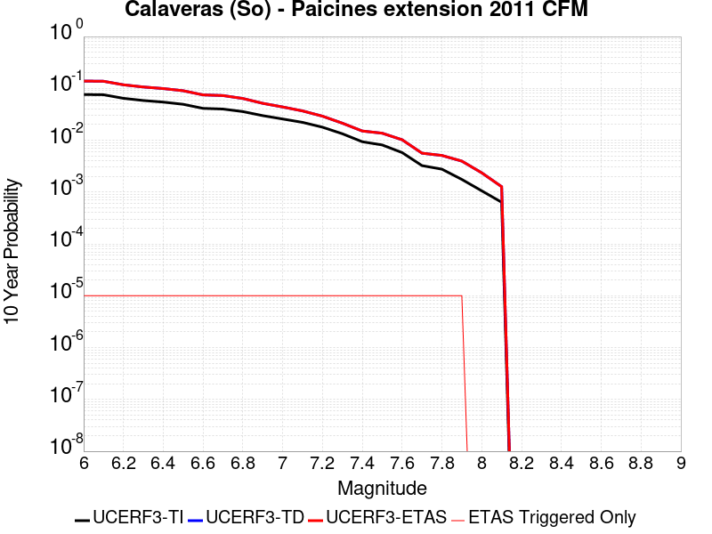 |

| Magnitude | 1 wk TI Prob | 1 wk TD Prob | 1 wk ETAS Prob | 1 wk ETAS/TD Gain | 1 wk ETAS Triggered Only | 1 mo TI Prob | 1 mo TD Prob | 1 mo ETAS Prob | 1 mo ETAS/TD Gain | 1 mo ETAS Triggered Only | 1 yr TI Prob | 1 yr TD Prob | 1 yr ETAS Prob | 1 yr ETAS/TD Gain | 1 yr ETAS Triggered Only | 10 yr TI Prob | 10 yr TD Prob | 10 yr ETAS Prob | 10 yr ETAS/TD Gain | 10 yr ETAS Triggered Only |
|-----|-----|-----|-----|-----|-----|-----|-----|-----|-----|-----|-----|-----|-----|-----|-----|-----|-----|-----|-----|-----|
| 6.0 | 1.5183659E-4 | 3.0524618E-4 | 3.0524618E-4 | 1.0 | 0.0 | 6.5056595E-4 | 0.001306982 | 0.001306982 | 1.0 | 0.0 | 0.007891912 | 0.015698127 | 0.01570797 | 1.000627 | 1.0E-5 | 0.076174594 | 0.13851054 | 0.13851915 | 1.0000622 | 1.0E-5 |
| 6.1 | 1.5024997E-4 | 3.0218763E-4 | 3.0218763E-4 | 1.0 | 0.0 | 6.437695E-4 | 0.001293891 | 0.001293891 | 1.0 | 0.0 | 0.0078097614 | 0.0155415125 | 0.015551357 | 1.0006335 | 1.0E-5 | 0.075409345 | 0.1371801 | 0.13718873 | 1.000063 | 1.0E-5 |
| 6.2 | 1.2743923E-4 | 2.5316005E-4 | 2.5316005E-4 | 1.0 | 0.0 | 5.460538E-4 | 0.0010841485 | 0.0010841485 | 1.0 | 0.0 | 0.0066279583 | 0.013048763 | 0.013058633 | 1.0007564 | 1.0E-5 | 0.064337276 | 0.11727778 | 0.11728661 | 1.0000752 | 1.0E-5 |
| 6.3 | 1.1525114E-4 | 2.2602278E-4 | 2.2602278E-4 | 1.0 | 0.0 | 4.9383997E-4 | 9.680288E-4 | 9.680288E-4 | 1.0 | 0.0 | 0.0059959386 | 0.011669963 | 0.011679846 | 1.0008469 | 1.0E-5 | 0.058367174 | 0.10639406 | 0.10640299 | 1.000084 | 1.0E-5 |
| 6.4 | 1.07200925E-4 | 2.0843073E-4 | 2.0843073E-4 | 1.0 | 0.0 | 4.5935164E-4 | 8.9276396E-4 | 8.9276396E-4 | 1.0 | 0.0 | 0.0055782744 | 0.010774835 | 0.010784727 | 1.000918 | 1.0E-5 | 0.0544031 | 0.09921681 | 0.09922582 | 1.0000908 | 1.0E-5 |
| 6.5 | 9.69631E-5 | 1.8736755E-4 | 1.8736755E-4 | 1.0 | 0.0 | 4.1548995E-4 | 8.026078E-4 | 8.026078E-4 | 1.0 | 0.0 | 0.0050468626 | 0.009696688 | 0.00970659 | 1.0010213 | 1.0E-5 | 0.04933773 | 0.09010862 | 0.090117715 | 1.000101 | 1.0E-5 |
| 6.6 | 8.0552316E-5 | 1.5074162E-4 | 1.5074162E-4 | 1.0 | 0.0 | 3.4517853E-4 | 6.458456E-4 | 6.458456E-4 | 1.0 | 0.0 | 0.0041944524 | 0.007828356 | 0.007838277 | 1.0012674 | 1.0E-5 | 0.04116161 | 0.07487867 | 0.074887924 | 1.0001235 | 1.0E-5 |
| 6.7 | 7.815757E-5 | 1.4614697E-4 | 1.4614697E-4 | 1.0 | 0.0 | 3.34918E-4 | 6.2616763E-4 | 6.2616763E-4 | 1.0 | 0.0 | 0.004070005 | 0.007591149 | 0.0076010725 | 1.0013074 | 1.0E-5 | 0.039962657 | 0.07272815 | 0.072737426 | 1.0001276 | 1.0E-5 |
| 6.8 | 6.965264E-5 | 1.2726107E-4 | 1.2726107E-4 | 1.0 | 0.0 | 2.9847719E-4 | 5.452736E-4 | 5.452736E-4 | 1.0 | 0.0 | 0.0036279052 | 0.00661528 | 0.006625214 | 1.0015017 | 1.0E-5 | 0.03569247 | 0.06382228 | 0.063831635 | 1.0001466 | 1.0E-5 |
| 6.9 | 5.8000453E-5 | 1.0146304E-4 | 1.0146304E-4 | 1.0 | 0.0 | 2.4854968E-4 | 4.3476955E-4 | 4.3476955E-4 | 1.0 | 0.0 | 0.0030218933 | 0.0052805697 | 0.0052905167 | 1.0018837 | 1.0E-5 | 0.029811295 | 0.05151412 | 0.051523603 | 1.0001842 | 1.0E-5 |
| 7.0 | 4.9865852E-5 | 8.570392E-5 | 8.570392E-5 | 1.0 | 0.0 | 2.1369329E-4 | 3.6725128E-4 | 3.6725128E-4 | 1.0 | 0.0 | 0.0025986114 | 0.0044622063 | 0.0044721616 | 1.002231 | 1.0E-5 | 0.025684336 | 0.043793347 | 0.04380291 | 1.0002184 | 1.0E-5 |
| 7.1 | 4.283875E-5 | 7.114092E-5 | 7.114092E-5 | 1.0 | 0.0 | 1.8358172E-4 | 3.0485436E-4 | 3.0485436E-4 | 1.0 | 0.0 | 0.0022328163 | 0.0037053414 | 0.0037153044 | 1.0026888 | 1.0E-5 | 0.022105146 | 0.036744222 | 0.036753856 | 1.0002621 | 1.0E-5 |
| 7.2 | 3.450115E-5 | 5.5794262E-5 | 5.5794262E-5 | 1.0 | 0.0 | 1.478537E-4 | 2.3909652E-4 | 2.3909652E-4 | 1.0 | 0.0 | 0.0017986323 | 0.0029071432 | 0.0029171142 | 1.0034298 | 1.0E-5 | 0.017841442 | 0.029087404 | 0.029097112 | 1.0003338 | 1.0E-5 |
| 7.3 | 2.5709045E-5 | 4.060424E-5 | 4.060424E-5 | 1.0 | 0.0 | 1.1017697E-4 | 1.7400667E-4 | 1.7400667E-4 | 1.0 | 0.0 | 0.0013405791 | 0.0021164897 | 0.0021264683 | 1.0047148 | 1.0E-5 | 0.013325208 | 0.021304648 | 0.021314437 | 1.0004594 | 1.0E-5 |
| 7.4 | 1.8003093E-5 | 2.8519447E-5 | 2.8519447E-5 | 1.0 | 0.0 | 7.715383E-5 | 1.2222049E-4 | 1.2222049E-4 | 1.0 | 0.0 | 9.3894306E-4 | 0.0014870211 | 0.0014970062 | 1.0067148 | 1.0E-5 | 0.009349857 | 0.015055191 | 0.01506504 | 1.0006542 | 1.0E-5 |
| 7.5 | 1.5595824E-5 | 2.5831554E-5 | 2.5831554E-5 | 1.0 | 0.0 | 6.683753E-5 | 1.1070197E-4 | 1.1070197E-4 | 1.0 | 0.0 | 8.134431E-4 | 0.0013469654 | 0.001356952 | 1.0074141 | 1.0E-5 | 0.008104719 | 0.013655182 | 0.013665046 | 1.0007223 | 1.0E-5 |
| 7.6 | 1.1110309E-5 | 1.9230012E-5 | 1.9230012E-5 | 1.0 | 0.0 | 4.761474E-5 | 8.241174E-5 | 8.241174E-5 | 1.0 | 0.0 | 5.795553E-4 | 0.0010029024 | 0.0010128923 | 1.009961 | 1.0E-5 | 0.0057804612 | 0.010206583 | 0.010216481 | 1.0009698 | 1.0E-5 |
| 7.7 | 6.2140443E-6 | 1.04432265E-5 | 1.04432265E-5 | 1.0 | 0.0 | 2.6631347E-5 | 4.4755914E-5 | 4.4755914E-5 | 1.0 | 0.0 | 3.241884E-4 | 5.447671E-4 | 5.547617E-4 | 1.0183464 | 1.0E-5 | 0.0032371588 | 0.0056228107 | 0.0056327544 | 1.0017685 | 1.0E-5 |
| 7.8 | 5.305533E-6 | 9.438617E-6 | 9.438617E-6 | 1.0 | 0.0 | 2.27378E-5 | 4.0450588E-5 | 4.0450588E-5 | 1.0 | 0.0 | 2.7679754E-4 | 4.923747E-4 | 5.0236983E-4 | 1.0202998 | 1.0E-5 | 0.0027645302 | 0.005077038 | 0.005086987 | 1.0019597 | 1.0E-5 |
| 7.9 | 3.363505E-6 | 7.389195E-6 | 7.389195E-6 | 1.0 | 0.0 | 1.4414942E-5 | 3.1667594E-5 | 3.1667594E-5 | 1.0 | 0.0 | 1.7548777E-4 | 3.8548483E-4 | 3.9548098E-4 | 1.0259314 | 1.0E-5 | 0.0017534926 | 0.0039506406 | 0.003960601 | 1.0025213 | 1.0E-5 |
| 8.0 | 2.0271132E-6 | 4.4155477E-6 | 4.4155477E-6 | 1.0 | 0.0 | 8.687599E-6 | 1.8923638E-5 | 1.8923638E-5 | 1.0 | 0.0 | 1.05766376E-4 | 2.3037099E-4 | 2.3037099E-4 | 1.0 | 0.0 | 0.0010571606 | 0.0023523099 | 0.0023523099 | 1.0 | 0.0 |
| 8.1 | 1.2206116E-6 | 2.3764833E-6 | 2.3764833E-6 | 1.0 | 0.0 | 5.2311816E-6 | 1.0184889E-5 | 1.0184889E-5 | 1.0 | 0.0 | 6.3687774E-5 | 1.23994E-4 | 1.23994E-4 | 1.0 | 0.0 | 6.366953E-4 | 0.0012712508 | 0.0012712508 | 1.0 | 0.0 |

## Hayward (No) 2011 CFM
*[(top)](#table-of-contents)*

| 1 Week | 1 Month | 1 Year | 10 Year |
|-----|-----|-----|-----|
|  | 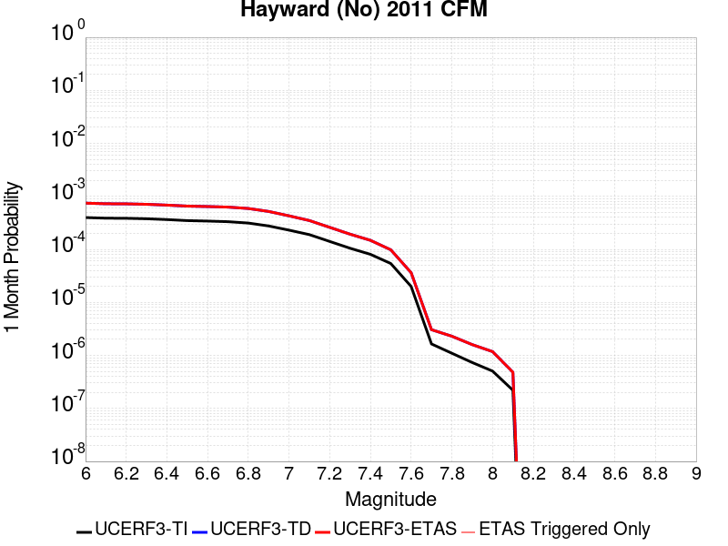 |  |  |

| Magnitude | 1 wk TI Prob | 1 wk TD Prob | 1 wk ETAS Prob | 1 wk ETAS/TD Gain | 1 wk ETAS Triggered Only | 1 mo TI Prob | 1 mo TD Prob | 1 mo ETAS Prob | 1 mo ETAS/TD Gain | 1 mo ETAS Triggered Only | 1 yr TI Prob | 1 yr TD Prob | 1 yr ETAS Prob | 1 yr ETAS/TD Gain | 1 yr ETAS Triggered Only | 10 yr TI Prob | 10 yr TD Prob | 10 yr ETAS Prob | 10 yr ETAS/TD Gain | 10 yr ETAS Triggered Only |
|-----|-----|-----|-----|-----|-----|-----|-----|-----|-----|-----|-----|-----|-----|-----|-----|-----|-----|-----|-----|-----|
| 6.0 | 9.3068506E-5 | 1.7397928E-4 | 1.7397928E-4 | 1.0 | 0.0 | 3.9880406E-4 | 7.454108E-4 | 7.454108E-4 | 1.0 | 0.0 | 0.0048446343 | 0.009037494 | 0.009047403 | 1.0010965 | 1.0E-5 | 0.047403704 | 0.086402565 | 0.0864117 | 1.0001057 | 1.0E-5 |
| 6.1 | 9.055486E-5 | 1.6949074E-4 | 1.6949074E-4 | 1.0 | 0.0 | 3.880345E-4 | 7.2618667E-4 | 7.2618667E-4 | 1.0 | 0.0 | 0.0047140904 | 0.008805556 | 0.008815468 | 1.0011257 | 1.0E-5 | 0.046153355 | 0.08430039 | 0.08430955 | 1.0001086 | 1.0E-5 |
| 6.2 | 9.006742E-5 | 1.686967E-4 | 1.686967E-4 | 1.0 | 0.0 | 3.859461E-4 | 7.2278595E-4 | 7.2278595E-4 | 1.0 | 0.0 | 0.0046887742 | 0.008764519 | 0.008774432 | 1.0011309 | 1.0E-5 | 0.0459107 | 0.083924614 | 0.08393377 | 1.0001092 | 1.0E-5 |
| 6.3 | 8.8336754E-5 | 1.654921E-4 | 1.654921E-4 | 1.0 | 0.0 | 3.7853114E-4 | 7.090599E-4 | 7.090599E-4 | 1.0 | 0.0 | 0.004598882 | 0.00859879 | 0.0086087035 | 1.001153 | 1.0E-5 | 0.04504866 | 0.08241665 | 0.08242583 | 1.0001113 | 1.0E-5 |
| 6.4 | 8.526157E-5 | 1.597622E-4 | 1.597622E-4 | 1.0 | 0.0 | 3.6535555E-4 | 6.8451616E-4 | 6.8451616E-4 | 1.0 | 0.0 | 0.0044391346 | 0.008302296 | 0.008312213 | 1.0011945 | 1.0E-5 | 0.043514993 | 0.07969951 | 0.07970871 | 1.0001155 | 1.0E-5 |
| 6.5 | 8.152396E-5 | 1.5308615E-4 | 1.5308615E-4 | 1.0 | 0.0 | 3.493416E-4 | 6.559192E-4 | 6.559192E-4 | 1.0 | 0.0 | 0.0042449418 | 0.007956725 | 0.007966645 | 1.0012468 | 1.0E-5 | 0.04164765 | 0.076519914 | 0.07652915 | 1.0001206 | 1.0E-5 |
| 6.6 | 7.987405E-5 | 1.5012817E-4 | 1.5012817E-4 | 1.0 | 0.0 | 3.4227243E-4 | 6.4324844E-4 | 6.4324844E-4 | 1.0 | 0.0 | 0.0041592065 | 0.0078035854 | 0.007813508 | 1.0012715 | 1.0E-5 | 0.04082218 | 0.07511259 | 0.075121835 | 1.0001231 | 1.0E-5 |
| 6.7 | 7.777665E-5 | 1.4652064E-4 | 1.4652064E-4 | 1.0 | 0.0 | 3.332859E-4 | 6.277952E-4 | 6.277952E-4 | 1.0 | 0.0 | 0.004050208 | 0.007616774 | 0.0076266984 | 1.0013028 | 1.0E-5 | 0.039771806 | 0.07338915 | 0.07339842 | 1.0001262 | 1.0E-5 |
| 6.8 | 7.3284005E-5 | 1.3802624E-4 | 1.3802624E-4 | 1.0 | 0.0 | 3.140365E-4 | 5.9140753E-4 | 5.9140753E-4 | 1.0 | 0.0 | 0.0038166929 | 0.007176752 | 0.0071866806 | 1.0013834 | 1.0E-5 | 0.037518036 | 0.069302484 | 0.06931179 | 1.0001343 | 1.0E-5 |
| 6.9 | 6.458263E-5 | 1.2133129E-4 | 1.2133129E-4 | 1.0 | 0.0 | 2.7675333E-4 | 5.198881E-4 | 5.198881E-4 | 1.0 | 0.0 | 0.0033642664 | 0.0063113687 | 0.0063113687 | 1.0 | 0.0 | 0.033137884 | 0.06123086 | 0.06123086 | 1.0 | 0.0 |
| 7.0 | 5.3853604E-5 | 1.0026534E-4 | 1.0026534E-4 | 1.0 | 0.0 | 2.3078074E-4 | 4.2963814E-4 | 4.2963814E-4 | 1.0 | 0.0 | 0.0028061352 | 0.005218363 | 0.005218363 | 1.0 | 0.0 | 0.027709642 | 0.050963037 | 0.050963037 | 1.0 | 0.0 |
| 7.1 | 4.4308683E-5 | 8.171937E-5 | 8.171937E-5 | 1.0 | 0.0 | 1.8988053E-4 | 3.5017906E-4 | 3.5017906E-4 | 1.0 | 0.0 | 0.0023093442 | 0.004255137 | 0.004255137 | 1.0 | 0.0 | 0.022854926 | 0.041829627 | 0.041829627 | 1.0 | 0.0 |
| 7.2 | 3.295973E-5 | 6.0782906E-5 | 6.0782906E-5 | 1.0 | 0.0 | 1.4124835E-4 | 2.604723E-4 | 2.604723E-4 | 1.0 | 0.0 | 0.0017183421 | 0.0031666614 | 0.0031666614 | 1.0 | 0.0 | 0.017051157 | 0.031374134 | 0.031374134 | 1.0 | 0.0 |
| 7.3 | 2.452256E-5 | 4.51901E-5 | 4.51901E-5 | 1.0 | 0.0 | 1.05092455E-4 | 1.9365756E-4 | 1.9365756E-4 | 1.0 | 0.0 | 0.0012787496 | 0.002355245 | 0.002355245 | 1.0 | 0.0 | 0.0127141625 | 0.023445245 | 0.023445245 | 1.0 | 0.0 |
| 7.4 | 1.8829967E-5 | 3.4610835E-5 | 3.4610835E-5 | 1.0 | 0.0 | 8.069736E-5 | 1.4832379E-4 | 1.4832379E-4 | 1.0 | 0.0 | 9.820475E-4 | 0.0018043561 | 0.0018043561 | 1.0 | 0.0 | 0.009777189 | 0.018022932 | 0.018022932 | 1.0 | 0.0 |
| 7.5 | 1.26374125E-5 | 2.2925326E-5 | 2.2925326E-5 | 1.0 | 0.0 | 5.4159216E-5 | 9.824773E-5 | 9.824773E-5 | 1.0 | 0.0 | 6.5918895E-4 | 0.0011955155 | 0.0011955155 | 1.0 | 0.0 | 0.00657237 | 0.011989905 | 0.011989905 | 1.0 | 0.0 |
| 7.6 | 4.666429E-6 | 8.480926E-6 | 8.480926E-6 | 1.0 | 0.0 | 1.9998828E-5 | 3.6346326E-5 | 3.6346326E-5 | 1.0 | 0.0 | 2.4345852E-4 | 4.424279E-4 | 4.424279E-4 | 1.0 | 0.0 | 0.0024319198 | 0.0044588465 | 0.0044588465 | 1.0 | 0.0 |
| 7.7 | 3.8399318E-7 | 7.13742E-7 | 7.13742E-7 | 1.0 | 0.0 | 1.6456839E-6 | 3.0588906E-6 | 3.0588906E-6 | 1.0 | 0.0 | 2.003602E-5 | 3.7241356E-5 | 3.7241356E-5 | 1.0 | 0.0 | 2.0034213E-4 | 3.863124E-4 | 3.863124E-4 | 1.0 | 0.0 |
| 7.8 | 2.5637698E-7 | 5.3692474E-7 | 5.3692474E-7 | 1.0 | 0.0 | 1.098758E-6 | 2.301104E-6 | 2.301104E-6 | 1.0 | 0.0 | 1.3377297E-5 | 2.8015582E-5 | 2.8015582E-5 | 1.0 | 0.0 | 1.3376492E-4 | 2.9259408E-4 | 2.9259408E-4 | 1.0 | 0.0 |
| 7.9 | 1.7141245E-7 | 3.7311867E-7 | 3.7311867E-7 | 1.0 | 0.0 | 7.3462456E-7 | 1.5990789E-6 | 1.5990789E-6 | 1.0 | 0.0 | 8.944017E-6 | 1.9468613E-5 | 1.9468613E-5 | 1.0 | 0.0 | 8.943657E-5 | 2.0255927E-4 | 2.0255927E-4 | 1.0 | 0.0 |
| 8.0 | 1.1808895E-7 | 2.7525246E-7 | 2.7525246E-7 | 1.0 | 0.0 | 5.060954E-7 | 1.1796528E-6 | 1.1796528E-6 | 1.0 | 0.0 | 6.161694E-6 | 1.4362179E-5 | 1.4362179E-5 | 1.0 | 0.0 | 6.161523E-5 | 1.482392E-4 | 1.482392E-4 | 1.0 | 0.0 |
| 8.1 | 5.138535E-8 | 1.1236262E-7 | 1.1236262E-7 | 1.0 | 0.0 | 2.2022292E-7 | 4.8155397E-7 | 4.8155397E-7 | 1.0 | 0.0 | 2.6812106E-6 | 5.8629043E-6 | 5.8629043E-6 | 1.0 | 0.0 | 2.6811784E-5 | 6.018857E-5 | 6.018857E-5 | 1.0 | 0.0 |

## San Andreas (North Coast) 2011 CFM
*[(top)](#table-of-contents)*

| 1 Week | 1 Month | 1 Year | 10 Year |
|-----|-----|-----|-----|
| 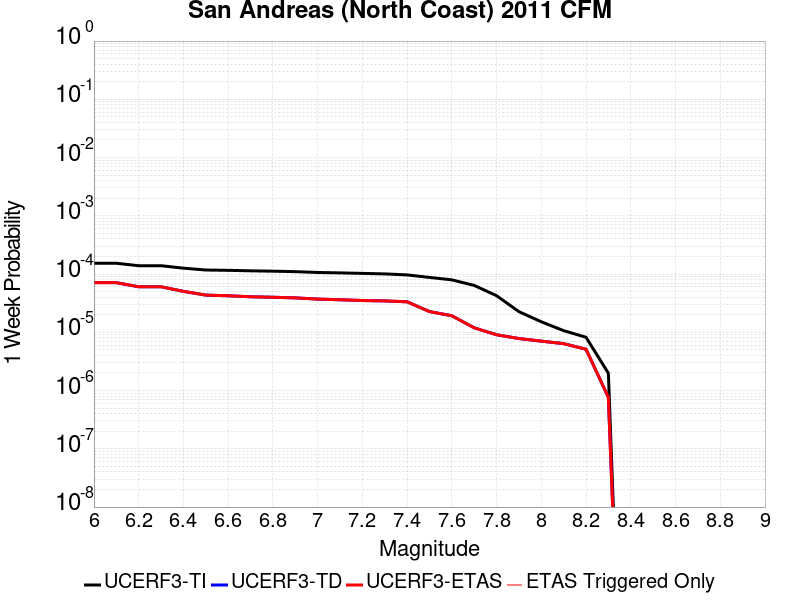 |  |  | 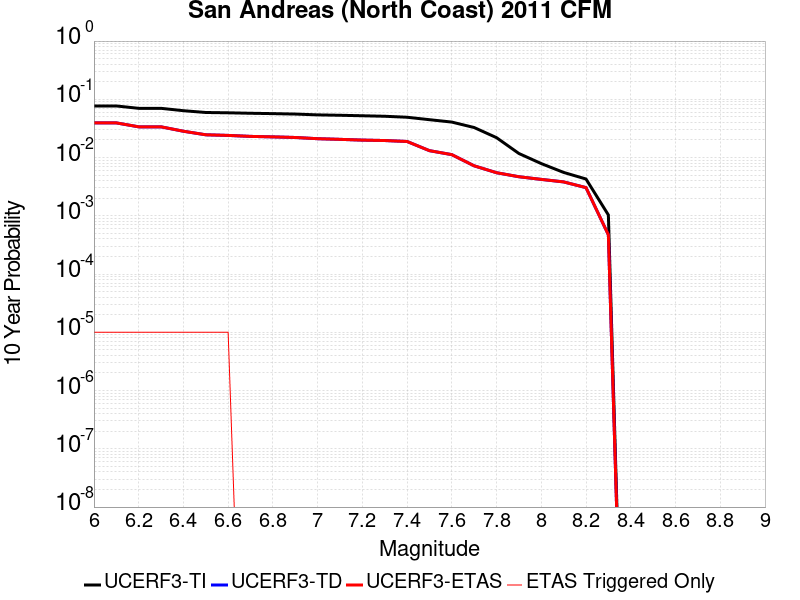 |

| Magnitude | 1 wk TI Prob | 1 wk TD Prob | 1 wk ETAS Prob | 1 wk ETAS/TD Gain | 1 wk ETAS Triggered Only | 1 mo TI Prob | 1 mo TD Prob | 1 mo ETAS Prob | 1 mo ETAS/TD Gain | 1 mo ETAS Triggered Only | 1 yr TI Prob | 1 yr TD Prob | 1 yr ETAS Prob | 1 yr ETAS/TD Gain | 1 yr ETAS Triggered Only | 10 yr TI Prob | 10 yr TD Prob | 10 yr ETAS Prob | 10 yr ETAS/TD Gain | 10 yr ETAS Triggered Only |
|-----|-----|-----|-----|-----|-----|-----|-----|-----|-----|-----|-----|-----|-----|-----|-----|-----|-----|-----|-----|-----|
| 6.0 | 1.5333705E-4 | 7.113417E-5 | 7.113417E-5 | 1.0 | 0.0 | 6.5699324E-4 | 3.0482528E-4 | 3.0482528E-4 | 1.0 | 0.0 | 0.007969595 | 0.003704966 | 0.003704966 | 1.0 | 0.0 | 0.0768977 | 0.03937756 | 0.039387167 | 1.0002439 | 1.0E-5 |
| 6.1 | 1.5333705E-4 | 7.113417E-5 | 7.113417E-5 | 1.0 | 0.0 | 6.5699324E-4 | 3.0482528E-4 | 3.0482528E-4 | 1.0 | 0.0 | 0.007969595 | 0.003704966 | 0.003704966 | 1.0 | 0.0 | 0.0768977 | 0.03937756 | 0.039387167 | 1.0002439 | 1.0E-5 |
| 6.2 | 1.3912938E-4 | 6.0527043E-5 | 6.0527043E-5 | 1.0 | 0.0 | 5.961325E-4 | 2.5937596E-4 | 2.5937596E-4 | 1.0 | 0.0 | 0.007233787 | 0.0031533565 | 0.0031533565 | 1.0 | 0.0 | 0.07002798 | 0.03370408 | 0.033713743 | 1.0002867 | 1.0E-5 |
| 6.3 | 1.3912938E-4 | 6.0527043E-5 | 6.0527043E-5 | 1.0 | 0.0 | 5.961325E-4 | 2.5937596E-4 | 2.5937596E-4 | 1.0 | 0.0 | 0.007233787 | 0.0031533565 | 0.0031533565 | 1.0 | 0.0 | 0.07002798 | 0.03370408 | 0.033713743 | 1.0002867 | 1.0E-5 |
| 6.4 | 1.2623647E-4 | 5.046254E-5 | 5.046254E-5 | 1.0 | 0.0 | 5.4090127E-4 | 2.162502E-4 | 2.162502E-4 | 1.0 | 0.0 | 0.0065656058 | 0.0026296873 | 0.0026296873 | 1.0 | 0.0 | 0.06374981 | 0.028314944 | 0.028324662 | 1.0003432 | 1.0E-5 |
| 6.5 | 1.1736096E-4 | 4.3539436E-5 | 4.3539436E-5 | 1.0 | 0.0 | 5.028786E-4 | 1.8658434E-4 | 1.8658434E-4 | 1.0 | 0.0 | 0.006105373 | 0.0022693137 | 0.0022693137 | 1.0 | 0.0 | 0.05940335 | 0.02459431 | 0.024604065 | 1.0003966 | 1.0E-5 |
| 6.6 | 1.1586959E-4 | 4.2438805E-5 | 4.2438805E-5 | 1.0 | 0.0 | 4.964894E-4 | 1.8186802E-4 | 1.8186802E-4 | 1.0 | 0.0 | 0.006028018 | 0.0022120106 | 0.0022120106 | 1.0 | 0.0 | 0.058671024 | 0.02399959 | 0.02400935 | 1.0004066 | 1.0E-5 |
| 6.7 | 1.13693764E-4 | 4.0750157E-5 | 4.0750157E-5 | 1.0 | 0.0 | 4.87168E-4 | 1.7463193E-4 | 1.7463193E-4 | 1.0 | 0.0 | 0.005915152 | 0.0021240865 | 0.0021240865 | 1.0 | 0.0 | 0.057601593 | 0.023090761 | 0.023090761 | 1.0 | 0.0 |
| 6.8 | 1.1204889E-4 | 3.9967555E-5 | 3.9967555E-5 | 1.0 | 0.0 | 4.8012115E-4 | 1.7127836E-4 | 1.7127836E-4 | 1.0 | 0.0 | 0.005829819 | 0.0020833355 | 0.0020833355 | 1.0 | 0.0 | 0.05679232 | 0.022650568 | 0.022650568 | 1.0 | 0.0 |
| 6.9 | 1.1005794E-4 | 3.902303E-5 | 3.902303E-5 | 1.0 | 0.0 | 4.7159163E-4 | 1.6723093E-4 | 1.6723093E-4 | 1.0 | 0.0 | 0.0057265228 | 0.002034151 | 0.002034151 | 1.0 | 0.0 | 0.055811852 | 0.022116682 | 0.022116682 | 1.0 | 0.0 |
| 7.0 | 1.0647948E-4 | 3.7180227E-5 | 3.7180227E-5 | 1.0 | 0.0 | 4.562608E-4 | 1.5933417E-4 | 1.5933417E-4 | 1.0 | 0.0 | 0.0055408357 | 0.0019381832 | 0.0019381832 | 1.0 | 0.0 | 0.054047033 | 0.021074895 | 0.021074895 | 1.0 | 0.0 |
| 7.1 | 1.04795035E-4 | 3.6229067E-5 | 3.6229067E-5 | 1.0 | 0.0 | 4.4904428E-4 | 1.5525827E-4 | 1.5525827E-4 | 1.0 | 0.0 | 0.0054534175 | 0.001888646 | 0.001888646 | 1.0 | 0.0 | 0.053215165 | 0.020543678 | 0.020543678 | 1.0 | 0.0 |
| 7.2 | 1.02724036E-4 | 3.513728E-5 | 3.513728E-5 | 1.0 | 0.0 | 4.401716E-4 | 1.5057974E-4 | 1.5057974E-4 | 1.0 | 0.0 | 0.0053459285 | 0.0018317822 | 0.0018317822 | 1.0 | 0.0 | 0.052191395 | 0.019931791 | 0.019931791 | 1.0 | 0.0 |
| 7.3 | 1.00650694E-4 | 3.4604338E-5 | 3.4604338E-5 | 1.0 | 0.0 | 4.312888E-4 | 1.4829596E-4 | 1.4829596E-4 | 1.0 | 0.0 | 0.005238306 | 0.0018040235 | 0.0018040235 | 1.0 | 0.0 | 0.051165357 | 0.019608546 | 0.019608546 | 1.0 | 0.0 |
| 7.4 | 9.672919E-5 | 3.3393557E-5 | 3.3393557E-5 | 1.0 | 0.0 | 4.144878E-4 | 1.4310748E-4 | 1.4310748E-4 | 1.0 | 0.0 | 0.005034718 | 0.0017409563 | 0.0017409563 | 1.0 | 0.0 | 0.049221683 | 0.018881155 | 0.018881155 | 1.0 | 0.0 |
| 7.5 | 8.7600405E-5 | 2.271003E-5 | 2.271003E-5 | 1.0 | 0.0 | 3.753763E-4 | 9.732508E-5 | 9.732508E-5 | 1.0 | 0.0 | 0.0045606326 | 0.0011842905 | 0.0011842905 | 1.0 | 0.0 | 0.04468165 | 0.013136679 | 0.013136679 | 1.0 | 0.0 |
| 7.6 | 7.9562284E-5 | 1.923447E-5 | 1.923447E-5 | 1.0 | 0.0 | 3.4093665E-4 | 8.243085E-5 | 8.243085E-5 | 1.0 | 0.0 | 0.0041430052 | 0.001003135 | 0.001003135 | 1.0 | 0.0 | 0.040666126 | 0.011227344 | 0.011227344 | 1.0 | 0.0 |
| 7.7 | 6.3866544E-5 | 1.19474835E-5 | 1.19474835E-5 | 1.0 | 0.0 | 2.7368503E-4 | 5.1202496E-5 | 5.1202496E-5 | 1.0 | 0.0 | 0.0033270244 | 6.2321237E-4 | 6.2321237E-4 | 1.0 | 0.0 | 0.032776527 | 0.0072138775 | 0.0072138775 | 1.0 | 0.0 |
| 7.8 | 4.2543215E-5 | 9.081718E-6 | 9.081718E-6 | 1.0 | 0.0 | 1.8231533E-4 | 3.892107E-5 | 3.892107E-5 | 1.0 | 0.0 | 0.0022174292 | 4.737611E-4 | 4.737611E-4 | 1.0 | 0.0 | 0.021954332 | 0.005493622 | 0.005493622 | 1.0 | 0.0 |
| 7.9 | 2.2636612E-5 | 7.819314E-6 | 7.819314E-6 | 1.0 | 0.0 | 9.7010445E-5 | 3.3510918E-5 | 3.3510918E-5 | 1.0 | 0.0 | 0.0011804621 | 4.0791914E-4 | 4.0791914E-4 | 1.0 | 0.0 | 0.011742111 | 0.004686101 | 0.004686101 | 1.0 | 0.0 |
| 8.0 | 1.5167874E-5 | 7.0542583E-6 | 7.0542583E-6 | 1.0 | 0.0 | 6.500356E-5 | 3.0232186E-5 | 3.0232186E-5 | 1.0 | 0.0 | 7.9113094E-4 | 3.680148E-4 | 3.680148E-4 | 1.0 | 0.0 | 0.007883203 | 0.0042183227 | 0.0042183227 | 1.0 | 0.0 |
| 8.1 | 1.0681047E-5 | 6.39152E-6 | 6.39152E-6 | 1.0 | 0.0 | 4.5775112E-5 | 2.7391941E-5 | 2.7391941E-5 | 1.0 | 0.0 | 5.5716943E-4 | 3.3344593E-4 | 3.3344593E-4 | 1.0 | 0.0 | 0.0055577457 | 0.0038199783 | 0.0038199783 | 1.0 | 0.0 |
| 8.2 | 8.226114E-6 | 5.1186294E-6 | 5.1186294E-6 | 1.0 | 0.0 | 3.52543E-5 | 2.1936798E-5 | 2.1936798E-5 | 1.0 | 0.0 | 4.2913653E-4 | 2.6704787E-4 | 2.6704787E-4 | 1.0 | 0.0 | 0.004283088 | 0.0030471033 | 0.0030471033 | 1.0 | 0.0 |
| 8.3 | 1.983087E-6 | 7.6647797E-7 | 7.6647797E-7 | 1.0 | 0.0 | 8.498917E-6 | 3.2849016E-6 | 3.2849016E-6 | 1.0 | 0.0 | 1.034694E-4 | 3.999296E-5 | 3.999296E-5 | 1.0 | 0.0 | 0.0010342124 | 4.7228087E-4 | 4.7228087E-4 | 1.0 | 0.0 |

## Great Valley 08 (Quinto)
*[(top)](#table-of-contents)*

| 1 Week | 1 Month | 1 Year | 10 Year |
|-----|-----|-----|-----|
|  |  | 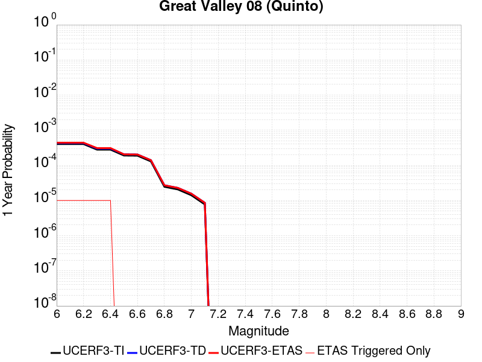 |  |

| Magnitude | 1 wk TI Prob | 1 wk TD Prob | 1 wk ETAS Prob | 1 wk ETAS/TD Gain | 1 wk ETAS Triggered Only | 1 mo TI Prob | 1 mo TD Prob | 1 mo ETAS Prob | 1 mo ETAS/TD Gain | 1 mo ETAS Triggered Only | 1 yr TI Prob | 1 yr TD Prob | 1 yr ETAS Prob | 1 yr ETAS/TD Gain | 1 yr ETAS Triggered Only | 10 yr TI Prob | 10 yr TD Prob | 10 yr ETAS Prob | 10 yr ETAS/TD Gain | 10 yr ETAS Triggered Only |
|-----|-----|-----|-----|-----|-----|-----|-----|-----|-----|-----|-----|-----|-----|-----|-----|-----|-----|-----|-----|-----|
| 6.0 | 7.737697E-6 | 8.253111E-6 | 8.253111E-6 | 1.0 | 0.0 | 3.3161137E-5 | 3.5370103E-5 | 3.5370103E-5 | 1.0 | 0.0 | 4.0366207E-4 | 4.3056477E-4 | 4.4056046E-4 | 1.0232153 | 1.0E-5 | 0.004029296 | 0.0042991587 | 0.0043091155 | 1.002316 | 1.0E-5 |
| 6.1 | 7.737697E-6 | 8.253111E-6 | 8.253111E-6 | 1.0 | 0.0 | 3.3161137E-5 | 3.5370103E-5 | 3.5370103E-5 | 1.0 | 0.0 | 4.0366207E-4 | 4.3056477E-4 | 4.4056046E-4 | 1.0232153 | 1.0E-5 | 0.004029296 | 0.0042991587 | 0.0043091155 | 1.002316 | 1.0E-5 |
| 6.2 | 7.737697E-6 | 8.253111E-6 | 8.253111E-6 | 1.0 | 0.0 | 3.3161137E-5 | 3.5370103E-5 | 3.5370103E-5 | 1.0 | 0.0 | 4.0366207E-4 | 4.3056477E-4 | 4.4056046E-4 | 1.0232153 | 1.0E-5 | 0.004029296 | 0.0042991587 | 0.0043091155 | 1.002316 | 1.0E-5 |
| 6.3 | 5.374012E-6 | 5.750627E-6 | 5.750627E-6 | 1.0 | 0.0 | 2.3031276E-5 | 2.4645375E-5 | 2.4645375E-5 | 1.0 | 0.0 | 2.803697E-4 | 3.0002726E-4 | 3.1002428E-4 | 1.0333203 | 1.0E-5 | 0.0028001624 | 0.0029973155 | 0.0030072853 | 1.0033263 | 1.0E-5 |
| 6.4 | 5.374012E-6 | 5.750627E-6 | 5.750627E-6 | 1.0 | 0.0 | 2.3031276E-5 | 2.4645375E-5 | 2.4645375E-5 | 1.0 | 0.0 | 2.803697E-4 | 3.0002726E-4 | 3.1002428E-4 | 1.0333203 | 1.0E-5 | 0.0028001624 | 0.0029973155 | 0.0030072853 | 1.0033263 | 1.0E-5 |
| 6.5 | 3.65427E-6 | 3.941365E-6 | 3.941365E-6 | 1.0 | 0.0 | 1.5661062E-5 | 1.6891494E-5 | 1.6891494E-5 | 1.0 | 0.0 | 1.9065675E-4 | 2.056416E-4 | 2.056416E-4 | 1.0 | 0.0 | 0.0019049325 | 0.0020552047 | 0.0020552047 | 1.0 | 0.0 |
| 6.6 | 3.6143538E-6 | 3.8985513E-6 | 3.8985513E-6 | 1.0 | 0.0 | 1.5489995E-5 | 1.6708009E-5 | 1.6708009E-5 | 1.0 | 0.0 | 1.8857437E-4 | 2.0340808E-4 | 2.0340808E-4 | 1.0 | 0.0 | 0.0018841444 | 0.0020329105 | 0.0020329105 | 1.0 | 0.0 |
| 6.7 | 2.4821015E-6 | 2.685736E-6 | 2.685736E-6 | 1.0 | 0.0 | 1.0637535E-5 | 1.15102785E-5 | 1.15102785E-5 | 1.0 | 0.0 | 1.2950429E-4 | 1.4013429E-4 | 1.4013429E-4 | 1.0 | 0.0 | 0.0012942884 | 0.0014010142 | 0.0014010142 | 1.0 | 0.0 |
| 6.8 | 4.7110538E-7 | 5.1930914E-7 | 5.1930914E-7 | 1.0 | 0.0 | 2.0190216E-6 | 2.2256088E-6 | 2.2256088E-6 | 1.0 | 0.0 | 2.458131E-5 | 2.7096468E-5 | 2.7096468E-5 | 1.0 | 0.0 | 2.457859E-4 | 2.7093347E-4 | 2.7093347E-4 | 1.0 | 0.0 |
| 6.9 | 3.958685E-7 | 4.3704054E-7 | 4.3704054E-7 | 1.0 | 0.0 | 1.6965782E-6 | 1.8730296E-6 | 1.8730296E-6 | 1.0 | 0.0 | 2.0655643E-5 | 2.2803915E-5 | 2.2803915E-5 | 1.0 | 0.0 | 2.0653724E-4 | 2.2801736E-4 | 2.2801736E-4 | 1.0 | 0.0 |
| 7.0 | 2.70294E-7 | 2.9920432E-7 | 2.9920432E-7 | 1.0 | 0.0 | 1.1584025E-6 | 1.2823037E-6 | 1.2823037E-6 | 1.0 | 0.0 | 1.4103458E-5 | 1.561195E-5 | 1.561195E-5 | 1.0 | 0.0 | 1.4102564E-4 | 1.561098E-4 | 1.561098E-4 | 1.0 | 0.0 |
| 7.1 | 1.4828602E-7 | 1.6469349E-7 | 1.6469349E-7 | 1.0 | 0.0 | 6.3551136E-7 | 7.058291E-7 | 7.058291E-7 | 1.0 | 0.0 | 7.737323E-6 | 8.593443E-6 | 8.593443E-6 | 1.0 | 0.0 | 7.737054E-5 | 8.593191E-5 | 8.593191E-5 | 1.0 | 0.0 |

## Bennett Valley 2011 CFM
*[(top)](#table-of-contents)*

| 1 Week | 1 Month | 1 Year | 10 Year |
|-----|-----|-----|-----|
|  |  |  | 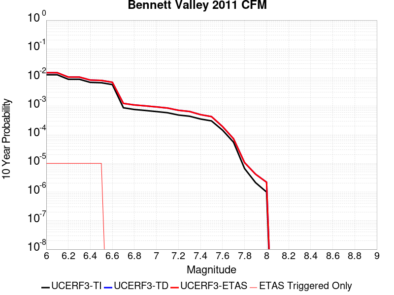 |

| Magnitude | 1 wk TI Prob | 1 wk TD Prob | 1 wk ETAS Prob | 1 wk ETAS/TD Gain | 1 wk ETAS Triggered Only | 1 mo TI Prob | 1 mo TD Prob | 1 mo ETAS Prob | 1 mo ETAS/TD Gain | 1 mo ETAS Triggered Only | 1 yr TI Prob | 1 yr TD Prob | 1 yr ETAS Prob | 1 yr ETAS/TD Gain | 1 yr ETAS Triggered Only | 10 yr TI Prob | 10 yr TD Prob | 10 yr ETAS Prob | 10 yr ETAS/TD Gain | 10 yr ETAS Triggered Only |
|-----|-----|-----|-----|-----|-----|-----|-----|-----|-----|-----|-----|-----|-----|-----|-----|-----|-----|-----|-----|-----|
| 6.0 | 2.3893934E-5 | 2.823968E-5 | 2.823968E-5 | 1.0 | 0.0 | 1.0239855E-4 | 1.21022626E-4 | 1.21022626E-4 | 1.0 | 0.0 | 0.0012459893 | 0.0014726394 | 0.0014826247 | 1.0067805 | 1.0E-5 | 0.012390262 | 0.0146516515 | 0.014661505 | 1.0006725 | 1.0E-5 |
| 6.1 | 2.3893934E-5 | 2.823968E-5 | 2.823968E-5 | 1.0 | 0.0 | 1.0239855E-4 | 1.21022626E-4 | 1.21022626E-4 | 1.0 | 0.0 | 0.0012459893 | 0.0014726394 | 0.0014826247 | 1.0067805 | 1.0E-5 | 0.012390262 | 0.0146516515 | 0.014661505 | 1.0006725 | 1.0E-5 |
| 6.2 | 1.6657146E-5 | 1.9854386E-5 | 1.9854386E-5 | 1.0 | 0.0 | 7.138582E-5 | 8.508825E-5 | 8.508825E-5 | 1.0 | 0.0 | 8.6877577E-4 | 0.0010355986 | 0.0010455882 | 1.0096463 | 1.0E-5 | 0.008653872 | 0.010326189 | 0.010336085 | 1.0009584 | 1.0E-5 |
| 6.3 | 1.6657146E-5 | 1.9854386E-5 | 1.9854386E-5 | 1.0 | 0.0 | 7.138582E-5 | 8.508825E-5 | 8.508825E-5 | 1.0 | 0.0 | 8.6877577E-4 | 0.0010355986 | 0.0010455882 | 1.0096463 | 1.0E-5 | 0.008653872 | 0.010326189 | 0.010336085 | 1.0009584 | 1.0E-5 |
| 6.4 | 1.29418495E-5 | 1.5568017E-5 | 1.5568017E-5 | 1.0 | 0.0 | 5.546389E-5 | 6.6719105E-5 | 6.6719105E-5 | 1.0 | 0.0 | 6.7506364E-4 | 8.1213255E-4 | 8.221244E-4 | 1.0123032 | 1.0E-5 | 0.0067301663 | 0.008108984 | 0.008118902 | 1.0012232 | 1.0E-5 |
| 6.5 | 1.2582504E-5 | 1.5135037E-5 | 1.5135037E-5 | 1.0 | 0.0 | 5.39239E-5 | 6.486357E-5 | 6.486357E-5 | 1.0 | 0.0 | 6.563257E-4 | 7.8955793E-4 | 7.9955003E-4 | 1.0126553 | 1.0E-5 | 0.006543907 | 0.007884884 | 0.007894806 | 1.0012583 | 1.0E-5 |
| 6.6 | 1.0846706E-5 | 1.30372255E-5 | 1.30372255E-5 | 1.0 | 0.0 | 4.6485053E-5 | 5.587335E-5 | 5.587335E-5 | 1.0 | 0.0 | 5.6580856E-4 | 6.8017404E-4 | 6.8017404E-4 | 1.0 | 0.0 | 0.005643701 | 0.006798055 | 0.006798055 | 1.0 | 0.0 |
| 6.7 | 1.6803231E-6 | 2.378062E-6 | 2.378062E-6 | 1.0 | 0.0 | 7.2013645E-6 | 1.0191655E-5 | 1.0191655E-5 | 1.0 | 0.0 | 8.7673085E-5 | 1.2407647E-4 | 1.2407647E-4 | 1.0 | 0.0 | 8.76385E-4 | 0.0012445063 | 0.0012445063 | 1.0 | 0.0 |
| 6.8 | 1.4609833E-6 | 2.0941243E-6 | 2.0941243E-6 | 1.0 | 0.0 | 6.261342E-6 | 8.974788E-6 | 8.974788E-6 | 1.0 | 0.0 | 7.6229175E-5 | 1.0926263E-4 | 1.0926263E-4 | 1.0 | 0.0 | 7.620303E-4 | 0.0010964973 | 0.0010964973 | 1.0 | 0.0 |
| 6.9 | 1.3492396E-6 | 1.9460613E-6 | 1.9460613E-6 | 1.0 | 0.0 | 5.7824427E-6 | 8.340236E-6 | 8.340236E-6 | 1.0 | 0.0 | 7.0398964E-5 | 1.015377E-4 | 1.015377E-4 | 1.0 | 0.0 | 7.037667E-4 | 0.001019306 | 0.001019306 | 1.0 | 0.0 |
| 7.0 | 1.2347921E-6 | 1.7890449E-6 | 1.7890449E-6 | 1.0 | 0.0 | 5.291955E-6 | 7.667313E-6 | 7.667313E-6 | 1.0 | 0.0 | 6.442765E-5 | 9.334559E-5 | 9.334559E-5 | 1.0 | 0.0 | 6.440897E-4 | 9.374345E-4 | 9.374345E-4 | 1.0 | 0.0 |
| 7.1 | 1.1262973E-6 | 1.6360596E-6 | 1.6360596E-6 | 1.0 | 0.0 | 4.8269794E-6 | 7.0116653E-6 | 7.0116653E-6 | 1.0 | 0.0 | 5.876689E-5 | 8.536373E-5 | 8.536373E-5 | 1.0 | 0.0 | 5.875135E-4 | 8.576666E-4 | 8.576666E-4 | 1.0 | 0.0 |
| 7.2 | 9.351744E-7 | 1.3613152E-6 | 1.3613152E-6 | 1.0 | 0.0 | 4.007884E-6 | 5.834195E-6 | 5.834195E-6 | 1.0 | 0.0 | 4.8794896E-5 | 7.102903E-5 | 7.102903E-5 | 1.0 | 0.0 | 4.878418E-4 | 7.143612E-4 | 7.143612E-4 | 1.0 | 0.0 |
| 7.3 | 8.5039534E-7 | 1.2388025E-6 | 1.2388025E-6 | 1.0 | 0.0 | 3.6445463E-6 | 5.309143E-6 | 5.309143E-6 | 1.0 | 0.0 | 4.437145E-5 | 6.463692E-5 | 6.463692E-5 | 1.0 | 0.0 | 4.436259E-4 | 6.502081E-4 | 6.502081E-4 | 1.0 | 0.0 |
| 7.4 | 6.7875015E-7 | 9.601624E-7 | 9.601624E-7 | 1.0 | 0.0 | 2.908926E-6 | 4.114975E-6 | 4.114975E-6 | 1.0 | 0.0 | 3.54156E-5 | 5.0098683E-5 | 5.0098683E-5 | 1.0 | 0.0 | 3.5409955E-4 | 5.0418224E-4 | 5.0418224E-4 | 1.0 | 0.0 |
| 7.5 | 5.826867E-7 | 8.189196E-7 | 8.189196E-7 | 1.0 | 0.0 | 2.4972264E-6 | 3.5096507E-6 | 3.5096507E-6 | 1.0 | 0.0 | 3.0403306E-5 | 4.2729167E-5 | 4.2729167E-5 | 1.0 | 0.0 | 3.0399146E-4 | 4.3009396E-4 | 4.3009396E-4 | 1.0 | 0.0 |
| 7.6 | 2.7734902E-7 | 3.682636E-7 | 3.682636E-7 | 1.0 | 0.0 | 1.1886381E-6 | 1.5782717E-6 | 1.5782717E-6 | 1.0 | 0.0 | 1.4471572E-5 | 1.921529E-5 | 1.921529E-5 | 1.0 | 0.0 | 1.447063E-4 | 1.931649E-4 | 1.931649E-4 | 1.0 | 0.0 |
| 7.7 | 1.0530888E-7 | 1.3751958E-7 | 1.3751958E-7 | 1.0 | 0.0 | 4.513237E-7 | 5.893695E-7 | 5.893695E-7 | 1.0 | 0.0 | 5.4948523E-6 | 7.17555E-6 | 7.17555E-6 | 1.0 | 0.0 | 5.4947162E-5 | 7.256635E-5 | 7.256635E-5 | 1.0 | 0.0 |
| 7.8 | 1.2714258E-8 | 1.9640522E-8 | 1.9640522E-8 | 1.0 | 0.0 | 5.448968E-8 | 8.417367E-8 | 8.417367E-8 | 1.0 | 0.0 | 6.6341164E-7 | 1.0248139E-6 | 1.0248139E-6 | 1.0 | 0.0 | 6.6340967E-6 | 1.0662629E-5 | 1.0662629E-5 | 1.0 | 0.0 |
| 7.9 | 4.075888E-9 | 7.564215E-9 | 7.564215E-9 | 1.0 | 0.0 | 1.7468091E-8 | 3.2418065E-8 | 3.2418065E-8 | 1.0 | 0.0 | 2.12674E-7 | 3.9468983E-7 | 3.9468983E-7 | 1.0 | 0.0 | 2.1267379E-6 | 4.197141E-6 | 4.197141E-6 | 1.0 | 0.0 |
| 8.0 | 1.9126138E-9 | 3.9978776E-9 | 3.9978776E-9 | 1.0 | 0.0 | 8.196917E-9 | 1.7133761E-8 | 1.7133761E-8 | 1.0 | 0.0 | 9.9797454E-8 | 2.0860354E-7 | 2.0860354E-7 | 1.0 | 0.0 | 9.979741E-7 | 2.199332E-6 | 2.199332E-6 | 1.0 | 0.0 |

## Fontana (Seismicity)
*[(top)](#table-of-contents)*

| 1 Week | 1 Month | 1 Year | 10 Year |
|-----|-----|-----|-----|
|  |  |  |  |

| Magnitude | 1 wk TI Prob | 1 wk TD Prob | 1 wk ETAS Prob | 1 wk ETAS/TD Gain | 1 wk ETAS Triggered Only | 1 mo TI Prob | 1 mo TD Prob | 1 mo ETAS Prob | 1 mo ETAS/TD Gain | 1 mo ETAS Triggered Only | 1 yr TI Prob | 1 yr TD Prob | 1 yr ETAS Prob | 1 yr ETAS/TD Gain | 1 yr ETAS Triggered Only | 10 yr TI Prob | 10 yr TD Prob | 10 yr ETAS Prob | 10 yr ETAS/TD Gain | 10 yr ETAS Triggered Only |
|-----|-----|-----|-----|-----|-----|-----|-----|-----|-----|-----|-----|-----|-----|-----|-----|-----|-----|-----|-----|-----|
| 6.0 | 7.1789214E-6 | 7.552053E-6 | 7.552053E-6 | 1.0 | 0.0 | 3.076644E-5 | 3.236577E-5 | 3.236577E-5 | 1.0 | 0.0 | 3.7451705E-4 | 3.9402276E-4 | 3.9402276E-4 | 1.0 | 0.0 | 0.003738865 | 0.003937241 | 0.0039472017 | 1.0025299 | 1.0E-5 |
| 6.1 | 7.1789214E-6 | 7.552053E-6 | 7.552053E-6 | 1.0 | 0.0 | 3.076644E-5 | 3.236577E-5 | 3.236577E-5 | 1.0 | 0.0 | 3.7451705E-4 | 3.9402276E-4 | 3.9402276E-4 | 1.0 | 0.0 | 0.003738865 | 0.003937241 | 0.0039472017 | 1.0025299 | 1.0E-5 |
| 6.2 | 7.1789214E-6 | 7.552053E-6 | 7.552053E-6 | 1.0 | 0.0 | 3.076644E-5 | 3.236577E-5 | 3.236577E-5 | 1.0 | 0.0 | 3.7451705E-4 | 3.9402276E-4 | 3.9402276E-4 | 1.0 | 0.0 | 0.003738865 | 0.003937241 | 0.0039472017 | 1.0025299 | 1.0E-5 |
| 6.3 | 7.1789214E-6 | 7.552053E-6 | 7.552053E-6 | 1.0 | 0.0 | 3.076644E-5 | 3.236577E-5 | 3.236577E-5 | 1.0 | 0.0 | 3.7451705E-4 | 3.9402276E-4 | 3.9402276E-4 | 1.0 | 0.0 | 0.003738865 | 0.003937241 | 0.0039472017 | 1.0025299 | 1.0E-5 |
| 6.4 | 7.1789214E-6 | 7.552053E-6 | 7.552053E-6 | 1.0 | 0.0 | 3.076644E-5 | 3.236577E-5 | 3.236577E-5 | 1.0 | 0.0 | 3.7451705E-4 | 3.9402276E-4 | 3.9402276E-4 | 1.0 | 0.0 | 0.003738865 | 0.003937241 | 0.0039472017 | 1.0025299 | 1.0E-5 |
| 6.5 | 5.2611317E-6 | 5.5327637E-6 | 5.5327637E-6 | 1.0 | 0.0 | 2.2547512E-5 | 2.3711844E-5 | 2.3711844E-5 | 1.0 | 0.0 | 2.744814E-4 | 2.886917E-4 | 2.886917E-4 | 1.0 | 0.0 | 0.002741426 | 0.002886917 | 0.002886917 | 1.0 | 0.0 |
| 6.6 | 5.2611317E-6 | 5.5327637E-6 | 5.5327637E-6 | 1.0 | 0.0 | 2.2547512E-5 | 2.3711844E-5 | 2.3711844E-5 | 1.0 | 0.0 | 2.744814E-4 | 2.886917E-4 | 2.886917E-4 | 1.0 | 0.0 | 0.002741426 | 0.002886917 | 0.002886917 | 1.0 | 0.0 |

## West Tahoe
*[(top)](#table-of-contents)*

| 1 Week | 1 Month | 1 Year | 10 Year |
|-----|-----|-----|-----|
|  |  |  | 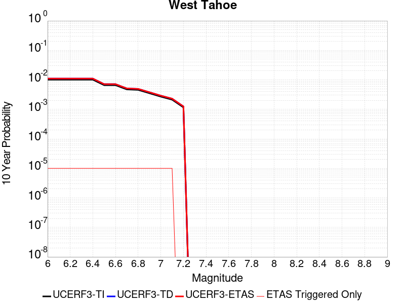 |

| Magnitude | 1 wk TI Prob | 1 wk TD Prob | 1 wk ETAS Prob | 1 wk ETAS/TD Gain | 1 wk ETAS Triggered Only | 1 mo TI Prob | 1 mo TD Prob | 1 mo ETAS Prob | 1 mo ETAS/TD Gain | 1 mo ETAS Triggered Only | 1 yr TI Prob | 1 yr TD Prob | 1 yr ETAS Prob | 1 yr ETAS/TD Gain | 1 yr ETAS Triggered Only | 10 yr TI Prob | 10 yr TD Prob | 10 yr ETAS Prob | 10 yr ETAS/TD Gain | 10 yr ETAS Triggered Only |
|-----|-----|-----|-----|-----|-----|-----|-----|-----|-----|-----|-----|-----|-----|-----|-----|-----|-----|-----|-----|-----|
| 6.0 | 1.952444E-5 | 2.1183409E-5 | 2.1183409E-5 | 1.0 | 0.0 | 8.367348E-5 | 9.0783185E-5 | 9.0783185E-5 | 1.0 | 0.0 | 0.0010182485 | 0.0011047797 | 0.0011047797 | 1.0 | 0.0 | 0.010135954 | 0.010998359 | 0.011008249 | 1.0008992 | 1.0E-5 |
| 6.1 | 1.952444E-5 | 2.1183409E-5 | 2.1183409E-5 | 1.0 | 0.0 | 8.367348E-5 | 9.0783185E-5 | 9.0783185E-5 | 1.0 | 0.0 | 0.0010182485 | 0.0011047797 | 0.0011047797 | 1.0 | 0.0 | 0.010135954 | 0.010998359 | 0.011008249 | 1.0008992 | 1.0E-5 |
| 6.2 | 1.952444E-5 | 2.1183409E-5 | 2.1183409E-5 | 1.0 | 0.0 | 8.367348E-5 | 9.0783185E-5 | 9.0783185E-5 | 1.0 | 0.0 | 0.0010182485 | 0.0011047797 | 0.0011047797 | 1.0 | 0.0 | 0.010135954 | 0.010998359 | 0.011008249 | 1.0008992 | 1.0E-5 |
| 6.3 | 1.952444E-5 | 2.1183409E-5 | 2.1183409E-5 | 1.0 | 0.0 | 8.367348E-5 | 9.0783185E-5 | 9.0783185E-5 | 1.0 | 0.0 | 0.0010182485 | 0.0011047797 | 0.0011047797 | 1.0 | 0.0 | 0.010135954 | 0.010998359 | 0.011008249 | 1.0008992 | 1.0E-5 |
| 6.4 | 1.952444E-5 | 2.1183409E-5 | 2.1183409E-5 | 1.0 | 0.0 | 8.367348E-5 | 9.0783185E-5 | 9.0783185E-5 | 1.0 | 0.0 | 0.0010182485 | 0.0011047797 | 0.0011047797 | 1.0 | 0.0 | 0.010135954 | 0.010998359 | 0.011008249 | 1.0008992 | 1.0E-5 |
| 6.5 | 1.2685271E-5 | 1.3690772E-5 | 1.3690772E-5 | 1.0 | 0.0 | 5.4364315E-5 | 5.8673508E-5 | 5.8673508E-5 | 1.0 | 0.0 | 6.616845E-4 | 7.1413233E-4 | 7.1413233E-4 | 1.0 | 0.0 | 0.0065971776 | 0.0071200244 | 0.0071299532 | 1.0013945 | 1.0E-5 |
| 6.6 | 1.2685271E-5 | 1.3690772E-5 | 1.3690772E-5 | 1.0 | 0.0 | 5.4364315E-5 | 5.8673508E-5 | 5.8673508E-5 | 1.0 | 0.0 | 6.616845E-4 | 7.1413233E-4 | 7.1413233E-4 | 1.0 | 0.0 | 0.0065971776 | 0.0071200244 | 0.0071299532 | 1.0013945 | 1.0E-5 |
| 6.7 | 9.117886E-6 | 9.809945E-6 | 9.809945E-6 | 1.0 | 0.0 | 3.9076072E-5 | 4.2041986E-5 | 4.2041986E-5 | 1.0 | 0.0 | 4.756473E-4 | 5.1174813E-4 | 5.1174813E-4 | 1.0 | 0.0 | 0.0047463053 | 0.0051064147 | 0.005116364 | 1.0019484 | 1.0E-5 |
| 6.8 | 8.786828E-6 | 9.457959E-6 | 9.457959E-6 | 1.0 | 0.0 | 3.7657293E-5 | 4.053352E-5 | 4.053352E-5 | 1.0 | 0.0 | 4.5838108E-4 | 4.933909E-4 | 4.933909E-4 | 1.0 | 0.0 | 0.0045743673 | 0.004923656 | 0.004933607 | 1.002021 | 1.0E-5 |
| 6.9 | 6.7562123E-6 | 7.263881E-6 | 7.263881E-6 | 1.0 | 0.0 | 2.8954875E-5 | 3.1130574E-5 | 3.1130574E-5 | 1.0 | 0.0 | 3.5246857E-4 | 3.7895358E-4 | 3.7895358E-4 | 1.0 | 0.0 | 0.0035191004 | 0.0037835457 | 0.003793508 | 1.002633 | 1.0E-5 |
| 7.0 | 5.1792854E-6 | 5.5673936E-6 | 5.5673936E-6 | 1.0 | 0.0 | 2.2196748E-5 | 2.386006E-5 | 2.386006E-5 | 1.0 | 0.0 | 2.702119E-4 | 2.9046132E-4 | 2.9046132E-4 | 1.0 | 0.0 | 0.0026988357 | 0.002901192 | 0.002911163 | 1.0034368 | 1.0E-5 |
| 7.1 | 4.090765E-6 | 4.3974665E-6 | 4.3974665E-6 | 1.0 | 0.0 | 1.7531731E-5 | 1.8846167E-5 | 1.8846167E-5 | 1.0 | 0.0 | 2.134279E-4 | 2.2943133E-4 | 2.2943133E-4 | 1.0 | 0.0 | 0.0021322304 | 0.0022922792 | 0.0023022562 | 1.0043525 | 1.0E-5 |
| 7.2 | 2.2356758E-6 | 2.402392E-6 | 2.402392E-6 | 1.0 | 0.0 | 9.581432E-6 | 1.0295936E-5 | 1.0295936E-5 | 1.0 | 0.0 | 1.1664769E-4 | 1.2534771E-4 | 1.2534771E-4 | 1.0 | 0.0 | 0.0011658648 | 0.0012529559 | 0.0012529559 | 1.0 | 0.0 |

## Los Alamos 2011 CFM
*[(top)](#table-of-contents)*

| 1 Week | 1 Month | 1 Year | 10 Year |
|-----|-----|-----|-----|
|  |  |  |  |

| Magnitude | 1 wk TI Prob | 1 wk TD Prob | 1 wk ETAS Prob | 1 wk ETAS/TD Gain | 1 wk ETAS Triggered Only | 1 mo TI Prob | 1 mo TD Prob | 1 mo ETAS Prob | 1 mo ETAS/TD Gain | 1 mo ETAS Triggered Only | 1 yr TI Prob | 1 yr TD Prob | 1 yr ETAS Prob | 1 yr ETAS/TD Gain | 1 yr ETAS Triggered Only | 10 yr TI Prob | 10 yr TD Prob | 10 yr ETAS Prob | 10 yr ETAS/TD Gain | 10 yr ETAS Triggered Only |
|-----|-----|-----|-----|-----|-----|-----|-----|-----|-----|-----|-----|-----|-----|-----|-----|-----|-----|-----|-----|-----|
| 6.0 | 4.6284417E-6 | 4.751756E-6 | 4.751756E-6 | 1.0 | 0.0 | 1.9836029E-5 | 2.036452E-5 | 2.036452E-5 | 1.0 | 0.0 | 2.4147688E-4 | 2.4791158E-4 | 2.4791158E-4 | 1.0 | 0.0 | 0.0024121467 | 0.0024765243 | 0.0024864995 | 1.004028 | 1.0E-5 |
| 6.1 | 4.6284417E-6 | 4.751756E-6 | 4.751756E-6 | 1.0 | 0.0 | 1.9836029E-5 | 2.036452E-5 | 2.036452E-5 | 1.0 | 0.0 | 2.4147688E-4 | 2.4791158E-4 | 2.4791158E-4 | 1.0 | 0.0 | 0.0024121467 | 0.0024765243 | 0.0024864995 | 1.004028 | 1.0E-5 |
| 6.2 | 4.6284417E-6 | 4.751756E-6 | 4.751756E-6 | 1.0 | 0.0 | 1.9836029E-5 | 2.036452E-5 | 2.036452E-5 | 1.0 | 0.0 | 2.4147688E-4 | 2.4791158E-4 | 2.4791158E-4 | 1.0 | 0.0 | 0.0024121467 | 0.0024765243 | 0.0024864995 | 1.004028 | 1.0E-5 |
| 6.3 | 4.6284417E-6 | 4.751756E-6 | 4.751756E-6 | 1.0 | 0.0 | 1.9836029E-5 | 2.036452E-5 | 2.036452E-5 | 1.0 | 0.0 | 2.4147688E-4 | 2.4791158E-4 | 2.4791158E-4 | 1.0 | 0.0 | 0.0024121467 | 0.0024765243 | 0.0024864995 | 1.004028 | 1.0E-5 |
| 6.4 | 4.6284417E-6 | 4.751756E-6 | 4.751756E-6 | 1.0 | 0.0 | 1.9836029E-5 | 2.036452E-5 | 2.036452E-5 | 1.0 | 0.0 | 2.4147688E-4 | 2.4791158E-4 | 2.4791158E-4 | 1.0 | 0.0 | 0.0024121467 | 0.0024765243 | 0.0024864995 | 1.004028 | 1.0E-5 |
| 6.5 | 4.6284417E-6 | 4.751756E-6 | 4.751756E-6 | 1.0 | 0.0 | 1.9836029E-5 | 2.036452E-5 | 2.036452E-5 | 1.0 | 0.0 | 2.4147688E-4 | 2.4791158E-4 | 2.4791158E-4 | 1.0 | 0.0 | 0.0024121467 | 0.0024765243 | 0.0024864995 | 1.004028 | 1.0E-5 |
| 6.6 | 4.6284417E-6 | 4.751756E-6 | 4.751756E-6 | 1.0 | 0.0 | 1.9836029E-5 | 2.036452E-5 | 2.036452E-5 | 1.0 | 0.0 | 2.4147688E-4 | 2.4791158E-4 | 2.4791158E-4 | 1.0 | 0.0 | 0.0024121467 | 0.0024765243 | 0.0024864995 | 1.004028 | 1.0E-5 |
| 6.7 | 4.062321E-6 | 4.1663707E-6 | 4.1663707E-6 | 1.0 | 0.0 | 1.7409831E-5 | 1.7855762E-5 | 1.7855762E-5 | 1.0 | 0.0 | 2.1194408E-4 | 2.1737372E-4 | 2.1737372E-4 | 1.0 | 0.0 | 0.0021174205 | 0.0021717607 | 0.0021817388 | 1.0045946 | 1.0E-5 |
| 6.8 | 4.062321E-6 | 4.1663707E-6 | 4.1663707E-6 | 1.0 | 0.0 | 1.7409831E-5 | 1.7855762E-5 | 1.7855762E-5 | 1.0 | 0.0 | 2.1194408E-4 | 2.1737372E-4 | 2.1737372E-4 | 1.0 | 0.0 | 0.0021174205 | 0.0021717607 | 0.0021817388 | 1.0045946 | 1.0E-5 |
| 6.9 | 3.2936077E-6 | 3.3729766E-6 | 3.3729766E-6 | 1.0 | 0.0 | 1.4115385E-5 | 1.4455539E-5 | 1.4455539E-5 | 1.0 | 0.0 | 1.7184127E-4 | 1.7598292E-4 | 1.7598292E-4 | 1.0 | 0.0 | 0.0017170844 | 0.0017585282 | 0.0017585282 | 1.0 | 0.0 |
| 7.0 | 3.1687898E-6 | 3.2448338E-6 | 3.2448338E-6 | 1.0 | 0.0 | 1.3580457E-5 | 1.3906361E-5 | 1.3906361E-5 | 1.0 | 0.0 | 1.6532952E-4 | 1.6929772E-4 | 1.6929772E-4 | 1.0 | 0.0 | 0.0016520657 | 0.0016917791 | 0.0016917791 | 1.0 | 0.0 |
| 7.1 | 2.9379228E-6 | 3.0073431E-6 | 3.0073431E-6 | 1.0 | 0.0 | 1.25910365E-5 | 1.2888555E-5 | 1.2888555E-5 | 1.0 | 0.0 | 1.5328509E-4 | 1.5690776E-4 | 1.5690776E-4 | 1.0 | 0.0 | 0.001531794 | 0.0015680589 | 0.0015680589 | 1.0 | 0.0 |
| 7.2 | 2.0020686E-6 | 2.041643E-6 | 2.041643E-6 | 1.0 | 0.0 | 8.580266E-6 | 8.749869E-6 | 8.749869E-6 | 1.0 | 0.0 | 1.0445973E-4 | 1.065245E-4 | 1.065245E-4 | 1.0 | 0.0 | 0.0010441064 | 0.0010647388 | 0.0010647388 | 1.0 | 0.0 |
| 7.3 | 1.7364243E-6 | 1.7678924E-6 | 1.7678924E-6 | 1.0 | 0.0 | 7.441797E-6 | 7.5766598E-6 | 7.5766598E-6 | 1.0 | 0.0 | 9.0600115E-5 | 9.224196E-5 | 9.224196E-5 | 1.0 | 0.0 | 9.0563187E-4 | 9.2203985E-4 | 9.2203985E-4 | 1.0 | 0.0 |
| 7.4 | 1.5718434E-6 | 1.598329E-6 | 1.598329E-6 | 1.0 | 0.0 | 6.7364545E-6 | 6.849964E-6 | 6.849964E-6 | 1.0 | 0.0 | 8.201325E-5 | 8.339515E-5 | 8.339515E-5 | 1.0 | 0.0 | 8.198299E-4 | 8.3364156E-4 | 8.3364156E-4 | 1.0 | 0.0 |
| 7.5 | 1.3841119E-6 | 1.4042898E-6 | 1.4042898E-6 | 1.0 | 0.0 | 5.9318945E-6 | 6.018371E-6 | 6.018371E-6 | 1.0 | 0.0 | 7.221842E-5 | 7.3271236E-5 | 7.3271236E-5 | 1.0 | 0.0 | 7.2194956E-4 | 7.324736E-4 | 7.324736E-4 | 1.0 | 0.0 |
| 7.6 | 1.0843726E-6 | 1.0934511E-6 | 1.0934511E-6 | 1.0 | 0.0 | 4.647303E-6 | 4.686211E-6 | 4.686211E-6 | 1.0 | 0.0 | 5.6579443E-5 | 5.705315E-5 | 5.705315E-5 | 1.0 | 0.0 | 5.656504E-4 | 5.7038764E-4 | 5.7038764E-4 | 1.0 | 0.0 |
| 7.7 | 5.544814E-7 | 5.501919E-7 | 5.501919E-7 | 1.0 | 0.0 | 2.3763469E-6 | 2.357963E-6 | 2.357963E-6 | 1.0 | 0.0 | 2.8931638E-5 | 2.8707824E-5 | 2.8707824E-5 | 1.0 | 0.0 | 2.8927872E-4 | 2.870413E-4 | 2.870413E-4 | 1.0 | 0.0 |
| 7.8 | 2.0707465E-7 | 1.977874E-7 | 1.977874E-7 | 1.0 | 0.0 | 8.874625E-7 | 8.4766003E-7 | 8.4766003E-7 | 1.0 | 0.0 | 1.08048025E-5 | 1.0320213E-5 | 1.0320213E-5 | 1.0 | 0.0 | 1.0804277E-4 | 1.0319738E-4 | 1.0319738E-4 | 1.0 | 0.0 |
| 7.9 | 3.9821284E-8 | 3.433199E-8 | 3.433199E-8 | 1.0 | 0.0 | 1.7066264E-7 | 1.4713709E-7 | 1.4713709E-7 | 1.0 | 0.0 | 2.0778157E-6 | 1.7913927E-6 | 1.7913927E-6 | 1.0 | 0.0 | 2.0777963E-5 | 1.7913788E-5 | 1.7913788E-5 | 1.0 | 0.0 |
| 8.0 | 7.880441E-11 | 8.235368E-11 | 8.235368E-11 | 1.0 | 0.0 | 3.3773329E-10 | 3.5294412E-10 | 3.5294412E-10 | 1.0 | 0.0 | 4.1119033E-9 | 4.297095E-9 | 4.297095E-9 | 1.0 | 0.0 | 4.1119034E-8 | 4.2970953E-8 | 4.2970953E-8 | 1.0 | 0.0 |

## Elsinore (Temecula) rev
*[(top)](#table-of-contents)*

| 1 Week | 1 Month | 1 Year | 10 Year |
|-----|-----|-----|-----|
|  |  |  | 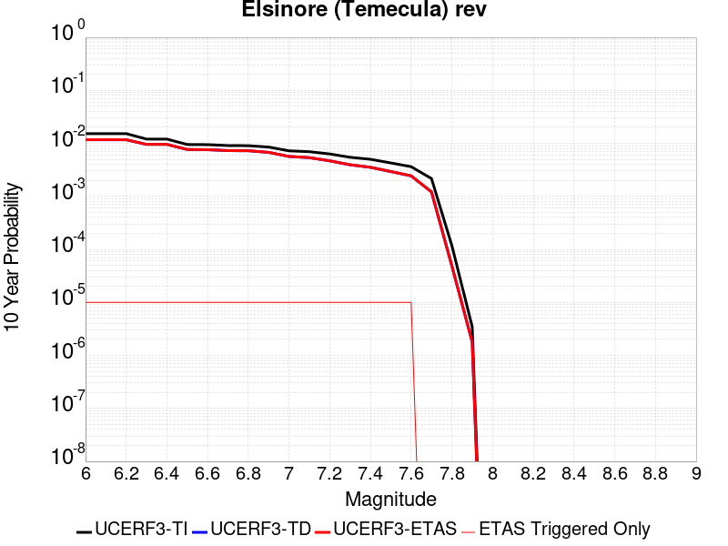 |

| Magnitude | 1 wk TI Prob | 1 wk TD Prob | 1 wk ETAS Prob | 1 wk ETAS/TD Gain | 1 wk ETAS Triggered Only | 1 mo TI Prob | 1 mo TD Prob | 1 mo ETAS Prob | 1 mo ETAS/TD Gain | 1 mo ETAS Triggered Only | 1 yr TI Prob | 1 yr TD Prob | 1 yr ETAS Prob | 1 yr ETAS/TD Gain | 1 yr ETAS Triggered Only | 10 yr TI Prob | 10 yr TD Prob | 10 yr ETAS Prob | 10 yr ETAS/TD Gain | 10 yr ETAS Triggered Only |
|-----|-----|-----|-----|-----|-----|-----|-----|-----|-----|-----|-----|-----|-----|-----|-----|-----|-----|-----|-----|-----|
| 6.0 | 2.9514995E-5 | 2.2519711E-5 | 2.2519711E-5 | 1.0 | 0.0 | 1.264867E-4 | 9.65096E-5 | 1.0650863E-4 | 1.1036066 | 1.0E-5 | 0.0015388876 | 0.001174393 | 0.0011843813 | 1.008505 | 1.0E-5 | 0.015282745 | 0.0117053585 | 0.011715242 | 1.0008444 | 1.0E-5 |
| 6.1 | 2.9514995E-5 | 2.2519711E-5 | 2.2519711E-5 | 1.0 | 0.0 | 1.264867E-4 | 9.65096E-5 | 1.0650863E-4 | 1.1036066 | 1.0E-5 | 0.0015388876 | 0.001174393 | 0.0011843813 | 1.008505 | 1.0E-5 | 0.015282745 | 0.0117053585 | 0.011715242 | 1.0008444 | 1.0E-5 |
| 6.2 | 2.9514995E-5 | 2.2519711E-5 | 2.2519711E-5 | 1.0 | 0.0 | 1.264867E-4 | 9.65096E-5 | 1.0650863E-4 | 1.1036066 | 1.0E-5 | 0.0015388876 | 0.001174393 | 0.0011843813 | 1.008505 | 1.0E-5 | 0.015282745 | 0.0117053585 | 0.011715242 | 1.0008444 | 1.0E-5 |
| 6.3 | 2.3223649E-5 | 1.8409017E-5 | 1.8409017E-5 | 1.0 | 0.0 | 9.952613E-5 | 7.889349E-5 | 8.88927E-5 | 1.1267432 | 1.0E-5 | 0.001211057 | 9.601222E-4 | 9.701126E-4 | 1.0104053 | 1.0E-5 | 0.012044783 | 0.009568522 | 0.009578426 | 1.0010351 | 1.0E-5 |
| 6.4 | 2.3223649E-5 | 1.8409017E-5 | 1.8409017E-5 | 1.0 | 0.0 | 9.952613E-5 | 7.889349E-5 | 8.88927E-5 | 1.1267432 | 1.0E-5 | 0.001211057 | 9.601222E-4 | 9.701126E-4 | 1.0104053 | 1.0E-5 | 0.012044783 | 0.009568522 | 0.009578426 | 1.0010351 | 1.0E-5 |
| 6.5 | 1.8338875E-5 | 1.4750807E-5 | 1.4750807E-5 | 1.0 | 0.0 | 7.8592806E-5 | 6.321626E-5 | 7.3215626E-5 | 1.1581771 | 1.0E-5 | 9.5644733E-4 | 7.69395E-4 | 7.7938725E-4 | 1.0129873 | 1.0E-5 | 0.009523412 | 0.0076706978 | 0.007680621 | 1.0012937 | 1.0E-5 |
| 6.6 | 1.8223333E-5 | 1.461336E-5 | 1.461336E-5 | 1.0 | 0.0 | 7.809766E-5 | 6.262723E-5 | 7.26266E-5 | 1.159665 | 1.0E-5 | 9.504242E-4 | 7.622285E-4 | 7.722209E-4 | 1.0131094 | 1.0E-5 | 0.009463696 | 0.0075995247 | 0.007609449 | 1.0013058 | 1.0E-5 |
| 6.7 | 1.7512752E-5 | 1.40276925E-5 | 1.40276925E-5 | 1.0 | 0.0 | 7.505249E-5 | 6.0117345E-5 | 7.0116745E-5 | 1.1663313 | 1.0E-5 | 9.13381E-4 | 7.316914E-4 | 7.416841E-4 | 1.013657 | 1.0E-5 | 0.00909636 | 0.0072990605 | 0.0073089874 | 1.00136 | 1.0E-5 |
| 6.8 | 1.7417142E-5 | 1.3951659E-5 | 1.3951659E-5 | 1.0 | 0.0 | 7.4642754E-5 | 5.9791502E-5 | 6.9790905E-5 | 1.1672379 | 1.0E-5 | 9.083966E-4 | 7.2772696E-4 | 7.377197E-4 | 1.0137314 | 1.0E-5 | 0.009046922 | 0.0072600874 | 0.007270015 | 1.0013674 | 1.0E-5 |
| 6.9 | 1.6402591E-5 | 1.2989093E-5 | 1.2989093E-5 | 1.0 | 0.0 | 7.0294926E-5 | 5.5666394E-5 | 6.566584E-5 | 1.1796316 | 1.0E-5 | 8.5550465E-4 | 6.775353E-4 | 6.875285E-4 | 1.0147494 | 1.0E-5 | 0.008522186 | 0.006759923 | 0.0067698555 | 1.0014693 | 1.0E-5 |
| 7.0 | 1.3912486E-5 | 1.0878599E-5 | 1.0878599E-5 | 1.0 | 0.0 | 5.9623577E-5 | 4.662175E-5 | 5.6621284E-5 | 1.2144822 | 1.0E-5 | 7.2567526E-4 | 5.674747E-4 | 5.77469E-4 | 1.017612 | 1.0E-5 | 0.0072331014 | 0.0056636394 | 0.005673583 | 1.0017556 | 1.0E-5 |
| 7.1 | 1.3405147E-5 | 1.0327708E-5 | 1.0327708E-5 | 1.0 | 0.0 | 5.7449364E-5 | 4.426087E-5 | 5.426043E-5 | 1.2259232 | 1.0E-5 | 6.9922156E-4 | 5.3874543E-4 | 5.4874003E-4 | 1.0185516 | 1.0E-5 | 0.0069702556 | 0.0053774444 | 0.0053873905 | 1.0018497 | 1.0E-5 |
| 7.2 | 1.21402E-5 | 8.9969135E-6 | 8.9969135E-6 | 1.0 | 0.0 | 5.202839E-5 | 3.855764E-5 | 4.8557253E-5 | 1.259342 | 1.0E-5 | 6.332616E-4 | 4.6933992E-4 | 4.7933523E-4 | 1.0212965 | 1.0E-5 | 0.0063146 | 0.004684822 | 0.004694775 | 1.0021245 | 1.0E-5 |
| 7.3 | 1.05047775E-5 | 7.5718904E-6 | 7.5718904E-6 | 1.0 | 0.0 | 4.5019697E-5 | 3.2450564E-5 | 4.245024E-5 | 1.308151 | 1.0E-5 | 5.4797693E-4 | 3.9501544E-4 | 4.050115E-4 | 1.0253055 | 1.0E-5 | 0.005466277 | 0.00394353 | 0.0039534904 | 1.0025258 | 1.0E-5 |
| 7.4 | 9.624483E-6 | 6.7869523E-6 | 6.7869523E-6 | 1.0 | 0.0 | 4.124713E-5 | 2.9086623E-5 | 3.908633E-5 | 1.3437907 | 1.0E-5 | 5.0206814E-4 | 3.5407348E-4 | 3.640699E-4 | 1.0282327 | 1.0E-5 | 0.005009353 | 0.003535245 | 0.0035452095 | 1.0028187 | 1.0E-5 |
| 7.5 | 8.215151E-6 | 5.6356125E-6 | 5.6356125E-6 | 1.0 | 0.0 | 3.5207315E-5 | 2.4152409E-5 | 3.4152166E-5 | 1.4140273 | 1.0E-5 | 4.2856473E-4 | 2.9401717E-4 | 3.0401425E-4 | 1.0340016 | 1.0E-5 | 0.004277392 | 0.0029364098 | 0.0029463803 | 1.0033956 | 1.0E-5 |
| 7.6 | 6.975058E-6 | 4.6760947E-6 | 4.6760947E-6 | 1.0 | 0.0 | 2.9892764E-5 | 2.0040257E-5 | 3.0040057E-5 | 1.4989855 | 1.0E-5 | 3.6388362E-4 | 2.43964E-4 | 2.5396157E-4 | 1.0409796 | 1.0E-5 | 0.0036328835 | 0.002437078 | 0.0024470536 | 1.0040933 | 1.0E-5 |
| 7.7 | 4.159604E-6 | 2.3269624E-6 | 2.3269624E-6 | 1.0 | 0.0 | 1.7826753E-5 | 9.972662E-6 | 9.972662E-6 | 1.0 | 0.0 | 2.1701909E-4 | 1.2141114E-4 | 1.2141114E-4 | 1.0 | 0.0 | 0.0021680726 | 0.0012135211 | 0.0012135211 | 1.0 | 0.0 |
| 7.8 | 2.2692414E-7 | 9.384624E-8 | 9.384624E-8 | 1.0 | 0.0 | 9.725317E-7 | 4.021981E-7 | 4.021981E-7 | 1.0 | 0.0 | 1.1840509E-5 | 4.8967545E-6 | 4.8967545E-6 | 1.0 | 0.0 | 1.1839878E-4 | 4.8966795E-5 | 4.8966795E-5 | 1.0 | 0.0 |
| 7.9 | 6.676829E-9 | 3.4397993E-9 | 3.4397993E-9 | 1.0 | 0.0 | 2.861498E-8 | 1.4741998E-8 | 1.4741998E-8 | 1.0 | 0.0 | 3.4838732E-7 | 1.794838E-7 | 1.794838E-7 | 1.0 | 0.0 | 3.4838679E-6 | 1.7948367E-6 | 1.7948367E-6 | 1.0 | 0.0 |

## Malibu Coast alt 1
*[(top)](#table-of-contents)*

| 1 Week | 1 Month | 1 Year | 10 Year |
|-----|-----|-----|-----|
|  |  |  |  |

| Magnitude | 1 wk TI Prob | 1 wk TD Prob | 1 wk ETAS Prob | 1 wk ETAS/TD Gain | 1 wk ETAS Triggered Only | 1 mo TI Prob | 1 mo TD Prob | 1 mo ETAS Prob | 1 mo ETAS/TD Gain | 1 mo ETAS Triggered Only | 1 yr TI Prob | 1 yr TD Prob | 1 yr ETAS Prob | 1 yr ETAS/TD Gain | 1 yr ETAS Triggered Only | 10 yr TI Prob | 10 yr TD Prob | 10 yr ETAS Prob | 10 yr ETAS/TD Gain | 10 yr ETAS Triggered Only |
|-----|-----|-----|-----|-----|-----|-----|-----|-----|-----|-----|-----|-----|-----|-----|-----|-----|-----|-----|-----|-----|
| 6.0 | 1.6572556E-5 | 1.7598271E-5 | 1.7598271E-5 | 1.0 | 0.0 | 7.102331E-5 | 7.5419084E-5 | 7.5419084E-5 | 1.0 | 0.0 | 8.6436566E-4 | 9.178595E-4 | 9.178595E-4 | 1.0 | 0.0 | 0.0086101135 | 0.009142619 | 0.009152527 | 1.0010837 | 1.0E-5 |
| 6.1 | 1.6572556E-5 | 1.7598271E-5 | 1.7598271E-5 | 1.0 | 0.0 | 7.102331E-5 | 7.5419084E-5 | 7.5419084E-5 | 1.0 | 0.0 | 8.6436566E-4 | 9.178595E-4 | 9.178595E-4 | 1.0 | 0.0 | 0.0086101135 | 0.009142619 | 0.009142619 | 1.0 | 0.0 |
| 6.2 | 1.1085717E-5 | 1.155727E-5 | 1.155727E-5 | 1.0 | 0.0 | 4.750935E-5 | 4.953024E-5 | 4.953024E-5 | 1.0 | 0.0 | 5.782728E-4 | 6.0286734E-4 | 6.0286734E-4 | 1.0 | 0.0 | 0.0057677035 | 0.00601269 | 0.00601269 | 1.0 | 0.0 |
| 6.3 | 1.0208568E-5 | 1.0592348E-5 | 1.0592348E-5 | 1.0 | 0.0 | 4.375027E-5 | 4.5395005E-5 | 4.5395005E-5 | 1.0 | 0.0 | 5.325294E-4 | 5.52547E-4 | 5.52547E-4 | 1.0 | 0.0 | 0.0053125503 | 0.005512039 | 0.005512039 | 1.0 | 0.0 |
| 6.4 | 9.0682315E-6 | 9.3427325E-6 | 9.3427325E-6 | 1.0 | 0.0 | 3.8863272E-5 | 4.003968E-5 | 4.003968E-5 | 1.0 | 0.0 | 4.730576E-4 | 4.8737606E-4 | 4.8737606E-4 | 1.0 | 0.0 | 0.0047205184 | 0.0048632855 | 0.0048632855 | 1.0 | 0.0 |
| 6.5 | 7.605796E-6 | 7.748663E-6 | 7.748663E-6 | 1.0 | 0.0 | 3.259586E-5 | 3.320814E-5 | 3.320814E-5 | 1.0 | 0.0 | 3.9678233E-4 | 4.0423544E-4 | 4.0423544E-4 | 1.0 | 0.0 | 0.0039607463 | 0.004035139 | 0.004035139 | 1.0 | 0.0 |
| 6.6 | 5.889873E-6 | 5.879592E-6 | 5.879592E-6 | 1.0 | 0.0 | 2.5242069E-5 | 2.519801E-5 | 2.519801E-5 | 1.0 | 0.0 | 3.0727885E-4 | 3.0674267E-4 | 3.0674267E-4 | 1.0 | 0.0 | 0.003068543 | 0.0030632056 | 0.0030632056 | 1.0 | 0.0 |
| 6.7 | 5.66586E-6 | 5.641693E-6 | 5.641693E-6 | 1.0 | 0.0 | 2.428203E-5 | 2.417846E-5 | 2.417846E-5 | 1.0 | 0.0 | 2.955936E-4 | 2.943331E-4 | 2.943331E-4 | 1.0 | 0.0 | 0.0029520073 | 0.0029394445 | 0.0029394445 | 1.0 | 0.0 |
| 6.8 | 5.521556E-6 | 5.4894776E-6 | 5.4894776E-6 | 1.0 | 0.0 | 2.3663597E-5 | 2.352612E-5 | 2.352612E-5 | 1.0 | 0.0 | 2.880662E-4 | 2.8639295E-4 | 2.8639295E-4 | 1.0 | 0.0 | 0.0028769306 | 0.0028602504 | 0.0028602504 | 1.0 | 0.0 |
| 6.9 | 5.29752E-6 | 5.24998E-6 | 5.24998E-6 | 1.0 | 0.0 | 2.270346E-5 | 2.249972E-5 | 2.249972E-5 | 1.0 | 0.0 | 2.7637955E-4 | 2.7389973E-4 | 2.7389973E-4 | 1.0 | 0.0 | 0.0027603607 | 0.0027356318 | 0.0027356318 | 1.0 | 0.0 |
| 7.0 | 5.106743E-6 | 5.047725E-6 | 5.047725E-6 | 1.0 | 0.0 | 2.1885859E-5 | 2.163293E-5 | 2.163293E-5 | 1.0 | 0.0 | 2.6642776E-4 | 2.6334915E-4 | 2.6334915E-4 | 1.0 | 0.0 | 0.0026610855 | 0.0026303804 | 0.0026303804 | 1.0 | 0.0 |
| 7.1 | 4.8469647E-6 | 4.770417E-6 | 4.770417E-6 | 1.0 | 0.0 | 2.0772539E-5 | 2.0444484E-5 | 2.0444484E-5 | 1.0 | 0.0 | 2.528763E-4 | 2.4888324E-4 | 2.4888324E-4 | 1.0 | 0.0 | 0.0025258875 | 0.0024860532 | 0.0024860532 | 1.0 | 0.0 |
| 7.2 | 4.545514E-6 | 4.448235E-6 | 4.448235E-6 | 1.0 | 0.0 | 1.9480629E-5 | 1.9063724E-5 | 1.9063724E-5 | 1.0 | 0.0 | 2.3715083E-4 | 2.3207619E-4 | 2.3207619E-4 | 1.0 | 0.0 | 0.0023689792 | 0.0023183457 | 0.0023183457 | 1.0 | 0.0 |
| 7.3 | 3.794097E-6 | 3.6519675E-6 | 3.6519675E-6 | 1.0 | 0.0 | 1.6260314E-5 | 1.5651196E-5 | 1.5651196E-5 | 1.0 | 0.0 | 1.9795135E-4 | 1.9053668E-4 | 1.9053668E-4 | 1.0 | 0.0 | 0.001977751 | 0.0019037378 | 0.0019037378 | 1.0 | 0.0 |
| 7.4 | 2.808217E-6 | 2.7191002E-6 | 2.7191002E-6 | 1.0 | 0.0 | 1.203516E-5 | 1.1653235E-5 | 1.1653235E-5 | 1.0 | 0.0 | 1.4651821E-4 | 1.4186892E-4 | 1.4186892E-4 | 1.0 | 0.0 | 0.0014642165 | 0.0014177862 | 0.0014177862 | 1.0 | 0.0 |
| 7.5 | 1.83809E-6 | 1.819086E-6 | 1.819086E-6 | 1.0 | 0.0 | 7.877505E-6 | 7.79606E-6 | 7.79606E-6 | 1.0 | 0.0 | 9.59044E-5 | 9.491292E-5 | 9.491292E-5 | 1.0 | 0.0 | 9.5863023E-4 | 9.487258E-4 | 9.487258E-4 | 1.0 | 0.0 |
| 7.6 | 1.1292672E-6 | 1.1001556E-6 | 1.1001556E-6 | 1.0 | 0.0 | 4.839708E-6 | 4.7149438E-6 | 4.7149438E-6 | 1.0 | 0.0 | 5.8921847E-5 | 5.7402947E-5 | 5.7402947E-5 | 1.0 | 0.0 | 5.890623E-4 | 5.7388283E-4 | 5.7388283E-4 | 1.0 | 0.0 |
| 7.7 | 5.065272E-7 | 4.6092035E-7 | 4.6092035E-7 | 1.0 | 0.0 | 2.170829E-6 | 1.9753716E-6 | 1.9753716E-6 | 1.0 | 0.0 | 2.6429525E-5 | 2.4049894E-5 | 2.4049894E-5 | 1.0 | 0.0 | 2.642638E-4 | 2.4047404E-4 | 2.4047404E-4 | 1.0 | 0.0 |
| 7.8 | 8.952991E-8 | 6.708018E-8 | 6.708018E-8 | 1.0 | 0.0 | 3.8369956E-7 | 2.8748644E-7 | 2.8748644E-7 | 1.0 | 0.0 | 4.671532E-6 | 3.5001422E-6 | 3.5001422E-6 | 1.0 | 0.0 | 4.671434E-5 | 3.500089E-5 | 3.500089E-5 | 1.0 | 0.0 |
| 7.9 | 8.007447E-10 | 6.1615857E-10 | 6.1615857E-10 | 1.0 | 0.0 | 3.4317629E-9 | 2.64068E-9 | 2.64068E-9 | 1.0 | 0.0 | 4.1781714E-8 | 3.215028E-8 | 3.215028E-8 | 1.0 | 0.0 | 4.1781706E-7 | 3.2150274E-7 | 3.2150274E-7 | 1.0 | 0.0 |

## Greenville (So) 2011 CFM
*[(top)](#table-of-contents)*

| 1 Week | 1 Month | 1 Year | 10 Year |
|-----|-----|-----|-----|
|  |  |  |  |

| Magnitude | 1 wk TI Prob | 1 wk TD Prob | 1 wk ETAS Prob | 1 wk ETAS/TD Gain | 1 wk ETAS Triggered Only | 1 mo TI Prob | 1 mo TD Prob | 1 mo ETAS Prob | 1 mo ETAS/TD Gain | 1 mo ETAS Triggered Only | 1 yr TI Prob | 1 yr TD Prob | 1 yr ETAS Prob | 1 yr ETAS/TD Gain | 1 yr ETAS Triggered Only | 10 yr TI Prob | 10 yr TD Prob | 10 yr ETAS Prob | 10 yr ETAS/TD Gain | 10 yr ETAS Triggered Only |
|-----|-----|-----|-----|-----|-----|-----|-----|-----|-----|-----|-----|-----|-----|-----|-----|-----|-----|-----|-----|-----|
| 6.0 | 4.279693E-5 | 5.504253E-5 | 5.504253E-5 | 1.0 | 0.0 | 1.8340252E-4 | 2.3587665E-4 | 2.3587665E-4 | 1.0 | 0.0 | 0.0022306389 | 0.0028682668 | 0.0028782382 | 1.0034764 | 1.0E-5 | 0.022083808 | 0.028339608 | 0.028349325 | 1.0003428 | 1.0E-5 |
| 6.1 | 3.4037297E-5 | 4.319378E-5 | 4.319378E-5 | 1.0 | 0.0 | 1.4586597E-4 | 1.8510365E-4 | 1.8510365E-4 | 1.0 | 0.0 | 0.0017744715 | 0.00225147 | 0.0022614475 | 1.0044315 | 1.0E-5 | 0.01760369 | 0.02230374 | 0.022313517 | 1.0004383 | 1.0E-5 |
| 6.2 | 3.4037297E-5 | 4.319378E-5 | 4.319378E-5 | 1.0 | 0.0 | 1.4586597E-4 | 1.8510365E-4 | 1.8510365E-4 | 1.0 | 0.0 | 0.0017744715 | 0.00225147 | 0.0022614475 | 1.0044315 | 1.0E-5 | 0.01760369 | 0.02230374 | 0.022313517 | 1.0004383 | 1.0E-5 |
| 6.3 | 2.5956324E-5 | 3.243031E-5 | 3.243031E-5 | 1.0 | 0.0 | 1.11236644E-4 | 1.3898002E-4 | 1.3898002E-4 | 1.0 | 0.0 | 0.0013534647 | 0.0016908324 | 0.0017008155 | 1.0059042 | 1.0E-5 | 0.013452509 | 0.016786784 | 0.016796617 | 1.0005857 | 1.0E-5 |
| 6.4 | 2.1145053E-5 | 2.6198471E-5 | 2.6198471E-5 | 1.0 | 0.0 | 9.061851E-5 | 1.1227445E-4 | 1.1227445E-4 | 1.0 | 0.0 | 0.0011027219 | 0.001366116 | 0.0013761023 | 1.00731 | 1.0E-5 | 0.01097266 | 0.013580924 | 0.0135907885 | 1.0007263 | 1.0E-5 |
| 6.5 | 2.0030959E-5 | 2.4796553E-5 | 2.4796553E-5 | 1.0 | 0.0 | 8.584414E-5 | 1.06266765E-4 | 1.06266765E-4 | 1.0 | 0.0 | 0.0010446513 | 0.0012930612 | 0.0013030482 | 1.0077236 | 1.0E-5 | 0.010397541 | 0.012859055 | 0.012868926 | 1.0007677 | 1.0E-5 |
| 6.6 | 1.8395405E-5 | 2.2755145E-5 | 2.2755145E-5 | 1.0 | 0.0 | 7.8835066E-5 | 9.751856E-5 | 9.751856E-5 | 1.0 | 0.0 | 9.5939427E-4 | 0.0011866703 | 0.0011966585 | 1.0084169 | 1.0E-5 | 0.009552629 | 0.011806721 | 0.011816603 | 1.000837 | 1.0E-5 |
| 6.7 | 1.7883482E-5 | 2.2126169E-5 | 2.2126169E-5 | 1.0 | 0.0 | 7.664124E-5 | 9.482315E-5 | 9.482315E-5 | 1.0 | 0.0 | 9.3270757E-4 | 0.001153889 | 0.0011638774 | 1.0086564 | 1.0E-5 | 0.009288026 | 0.011482358 | 0.011492243 | 1.0008609 | 1.0E-5 |
| 6.8 | 1.3373564E-5 | 1.650644E-5 | 1.650644E-5 | 1.0 | 0.0 | 5.7314013E-5 | 7.0740054E-5 | 7.0740054E-5 | 1.0 | 0.0 | 6.975747E-4 | 8.609346E-4 | 8.7092596E-4 | 1.0116053 | 1.0E-5 | 0.0069538904 | 0.008577933 | 0.008587847 | 1.0011557 | 1.0E-5 |
| 6.9 | 1.06692905E-5 | 1.315295E-5 | 1.315295E-5 | 1.0 | 0.0 | 4.5724726E-5 | 5.6368626E-5 | 5.6368626E-5 | 1.0 | 0.0 | 5.5655633E-4 | 6.860832E-4 | 6.960763E-4 | 1.0145655 | 1.0E-5 | 0.005551645 | 0.0068412144 | 0.006851146 | 1.0014517 | 1.0E-5 |
| 7.0 | 8.157512E-6 | 1.0062912E-5 | 1.0062912E-5 | 1.0 | 0.0 | 3.4960296E-5 | 4.3126074E-5 | 4.3126074E-5 | 1.0 | 0.0 | 4.2555845E-4 | 5.249372E-4 | 5.349319E-4 | 1.0190399 | 1.0E-5 | 0.004247444 | 0.00523778 | 0.0052477275 | 1.0018992 | 1.0E-5 |
| 7.1 | 6.1467113E-6 | 7.627636E-6 | 7.627636E-6 | 1.0 | 0.0 | 2.6342783E-5 | 3.2689466E-5 | 3.2689466E-5 | 1.0 | 0.0 | 3.206762E-4 | 3.9792238E-4 | 4.0791841E-4 | 1.0251205 | 1.0E-5 | 0.0032021382 | 0.0039726184 | 0.0039825784 | 1.0025072 | 1.0E-5 |
| 7.2 | 4.713467E-6 | 5.9143304E-6 | 5.9143304E-6 | 1.0 | 0.0 | 2.0200418E-5 | 2.5346888E-5 | 2.5346888E-5 | 1.0 | 0.0 | 2.4591232E-4 | 3.0855526E-4 | 3.1855216E-4 | 1.032399 | 1.0E-5 | 0.0024564038 | 0.0030817043 | 0.0030916736 | 1.003235 | 1.0E-5 |
| 7.3 | 2.3266216E-6 | 2.954093E-6 | 2.954093E-6 | 1.0 | 0.0 | 9.971197E-6 | 1.2660337E-5 | 1.2660337E-5 | 1.0 | 0.0 | 1.2139256E-4 | 1.5412885E-4 | 1.5412885E-4 | 1.0 | 0.0 | 0.0012132627 | 0.0015404717 | 0.0015404717 | 1.0 | 0.0 |
| 7.4 | 1.3314E-6 | 1.7180038E-6 | 1.7180038E-6 | 1.0 | 0.0 | 5.7059874E-6 | 7.3628526E-6 | 7.3628526E-6 | 1.0 | 0.0 | 6.946818E-5 | 8.963909E-5 | 8.963909E-5 | 1.0 | 0.0 | 6.9446466E-4 | 8.9630444E-4 | 8.9630444E-4 | 1.0 | 0.0 |
| 7.5 | 1.0362941E-6 | 1.3469212E-6 | 1.3469212E-6 | 1.0 | 0.0 | 4.4412527E-6 | 5.772507E-6 | 5.772507E-6 | 1.0 | 0.0 | 5.407091E-5 | 7.027805E-5 | 7.027805E-5 | 1.0 | 0.0 | 5.405776E-4 | 7.028176E-4 | 7.028176E-4 | 1.0 | 0.0 |
| 7.6 | 7.764784E-7 | 1.0088914E-6 | 1.0088914E-6 | 1.0 | 0.0 | 3.3277602E-6 | 4.3238138E-6 | 4.3238138E-6 | 1.0 | 0.0 | 4.0514726E-5 | 5.2641197E-5 | 5.2641197E-5 | 1.0 | 0.0 | 4.050734E-4 | 5.2651245E-4 | 5.2651245E-4 | 1.0 | 0.0 |
| 7.7 | 1.6927763E-7 | 2.214027E-7 | 2.214027E-7 | 1.0 | 0.0 | 7.2547533E-7 | 9.4886843E-7 | 9.4886843E-7 | 1.0 | 0.0 | 8.832627E-6 | 1.1552414E-5 | 1.1552414E-5 | 1.0 | 0.0 | 8.8322755E-5 | 1.1554362E-4 | 1.1554362E-4 | 1.0 | 0.0 |

## San Jacinto (Superstition Mtn)
*[(top)](#table-of-contents)*

| 1 Week | 1 Month | 1 Year | 10 Year |
|-----|-----|-----|-----|
|  |  |  | 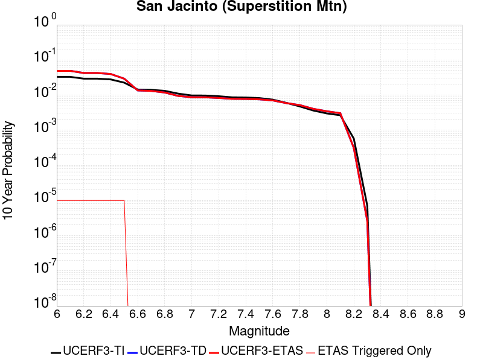 |

| Magnitude | 1 wk TI Prob | 1 wk TD Prob | 1 wk ETAS Prob | 1 wk ETAS/TD Gain | 1 wk ETAS Triggered Only | 1 mo TI Prob | 1 mo TD Prob | 1 mo ETAS Prob | 1 mo ETAS/TD Gain | 1 mo ETAS Triggered Only | 1 yr TI Prob | 1 yr TD Prob | 1 yr ETAS Prob | 1 yr ETAS/TD Gain | 1 yr ETAS Triggered Only | 10 yr TI Prob | 10 yr TD Prob | 10 yr ETAS Prob | 10 yr ETAS/TD Gain | 10 yr ETAS Triggered Only |
|-----|-----|-----|-----|-----|-----|-----|-----|-----|-----|-----|-----|-----|-----|-----|-----|-----|-----|-----|-----|-----|
| 6.0 | 6.4193904E-5 | 9.6002805E-5 | 9.6002805E-5 | 1.0 | 0.0 | 2.7508775E-4 | 4.1138552E-4 | 4.1138552E-4 | 1.0 | 0.0 | 0.0033440501 | 0.004998534 | 0.0050084842 | 1.0019906 | 1.0E-5 | 0.03294174 | 0.048822355 | 0.048831865 | 1.0001948 | 1.0E-5 |
| 6.1 | 6.4193904E-5 | 9.6002805E-5 | 9.6002805E-5 | 1.0 | 0.0 | 2.7508775E-4 | 4.1138552E-4 | 4.1138552E-4 | 1.0 | 0.0 | 0.0033440501 | 0.004998534 | 0.0050084842 | 1.0019906 | 1.0E-5 | 0.03294174 | 0.048822355 | 0.048831865 | 1.0001948 | 1.0E-5 |
| 6.2 | 5.7023593E-5 | 8.315118E-5 | 8.315118E-5 | 1.0 | 0.0 | 2.4436394E-4 | 3.5632294E-4 | 3.5632294E-4 | 1.0 | 0.0 | 0.002971072 | 0.004331248 | 0.0043412047 | 1.0022988 | 1.0E-5 | 0.029316625 | 0.04250458 | 0.042514153 | 1.0002253 | 1.0E-5 |
| 6.3 | 5.6940098E-5 | 8.2996536E-5 | 8.2996536E-5 | 1.0 | 0.0 | 2.4400617E-4 | 3.5566036E-4 | 3.5566036E-4 | 1.0 | 0.0 | 0.002966728 | 0.0043232134 | 0.00433317 | 1.0023031 | 1.0E-5 | 0.029274331 | 0.04242795 | 0.042437527 | 1.0002257 | 1.0E-5 |
| 6.4 | 5.4171585E-5 | 7.749044E-5 | 7.749044E-5 | 1.0 | 0.0 | 2.3214328E-4 | 3.320689E-4 | 3.320689E-4 | 1.0 | 0.0 | 0.0028226813 | 0.004037093 | 0.0040470525 | 1.002467 | 1.0E-5 | 0.02787096 | 0.03971742 | 0.039727025 | 1.0002418 | 1.0E-5 |
| 6.5 | 4.375144E-5 | 5.6427816E-5 | 5.6427816E-5 | 1.0 | 0.0 | 1.874927E-4 | 2.4181772E-4 | 2.4181772E-4 | 1.0 | 0.0 | 0.0022803338 | 0.0029413316 | 0.002951302 | 1.0033898 | 1.0E-5 | 0.022570757 | 0.029237961 | 0.02924767 | 1.000332 | 1.0E-5 |
| 6.6 | 2.772192E-5 | 2.5494071E-5 | 2.5494071E-5 | 1.0 | 0.0 | 1.1880282E-4 | 1.09255845E-4 | 1.09255845E-4 | 1.0 | 0.0 | 0.0014454646 | 0.0013293975 | 0.0013293975 | 1.0 | 0.0 | 0.014360986 | 0.013542279 | 0.013542279 | 1.0 | 0.0 |
| 6.7 | 2.7124124E-5 | 2.4705068E-5 | 2.4705068E-5 | 1.0 | 0.0 | 1.1624106E-4 | 1.0587468E-4 | 1.0587468E-4 | 1.0 | 0.0 | 0.0014143161 | 0.0012882812 | 0.0012882812 | 1.0 | 0.0 | 0.014053487 | 0.0131356325 | 0.0131356325 | 1.0 | 0.0 |
| 6.8 | 2.5475807E-5 | 2.2169877E-5 | 2.2169877E-5 | 1.0 | 0.0 | 1.0917746E-4 | 9.501037E-5 | 9.501037E-5 | 1.0 | 0.0 | 0.001328425 | 0.0011561494 | 0.0011561494 | 1.0 | 0.0 | 0.0132051185 | 0.011823943 | 0.011823943 | 1.0 | 0.0 |
| 6.9 | 2.1162023E-5 | 1.7631051E-5 | 1.7631051E-5 | 1.0 | 0.0 | 9.069123E-5 | 7.555948E-5 | 7.555948E-5 | 1.0 | 0.0 | 0.0011036064 | 9.195522E-4 | 9.195522E-4 | 1.0 | 0.0 | 0.010981417 | 0.0094489865 | 0.0094489865 | 1.0 | 0.0 |
| 7.0 | 1.8754288E-5 | 1.616617E-5 | 1.616617E-5 | 1.0 | 0.0 | 8.037304E-5 | 6.928176E-5 | 6.928176E-5 | 1.0 | 0.0 | 9.781026E-4 | 8.4318145E-4 | 8.4318145E-4 | 1.0 | 0.0 | 0.009738087 | 0.008672153 | 0.008672153 | 1.0 | 0.0 |
| 7.1 | 1.8678527E-5 | 1.6091313E-5 | 1.6091313E-5 | 1.0 | 0.0 | 8.0048376E-5 | 6.8960966E-5 | 6.8960966E-5 | 1.0 | 0.0 | 9.7415317E-4 | 8.392788E-4 | 8.392788E-4 | 1.0 | 0.0 | 0.009698939 | 0.008633161 | 0.008633161 | 1.0 | 0.0 |
| 7.2 | 1.7804578E-5 | 1.5385827E-5 | 1.5385827E-5 | 1.0 | 0.0 | 7.6303106E-5 | 6.59376E-5 | 6.59376E-5 | 1.0 | 0.0 | 9.285943E-4 | 8.024969E-4 | 8.024969E-4 | 1.0 | 0.0 | 0.009247236 | 0.0082646 | 0.0082646 | 1.0 | 0.0 |
| 7.3 | 1.6583685E-5 | 1.4534898E-5 | 1.4534898E-5 | 1.0 | 0.0 | 7.1070994E-5 | 6.229094E-5 | 6.229094E-5 | 1.0 | 0.0 | 8.649459E-4 | 7.581304E-4 | 7.581304E-4 | 1.0 | 0.0 | 0.00861587 | 0.007819886 | 0.007819886 | 1.0 | 0.0 |
| 7.4 | 1.6387552E-5 | 1.4399775E-5 | 1.4399775E-5 | 1.0 | 0.0 | 7.023047E-5 | 6.171187E-5 | 6.171187E-5 | 1.0 | 0.0 | 8.5472054E-4 | 7.5108506E-4 | 7.5108506E-4 | 1.0 | 0.0 | 0.008514405 | 0.0077492767 | 0.0077492767 | 1.0 | 0.0 |
| 7.5 | 1.5790754E-5 | 1.4040427E-5 | 1.4040427E-5 | 1.0 | 0.0 | 6.767291E-5 | 6.0171882E-5 | 6.0171882E-5 | 1.0 | 0.0 | 8.236062E-4 | 7.323484E-4 | 7.323484E-4 | 1.0 | 0.0 | 0.008205604 | 0.0075598094 | 0.0075598094 | 1.0 | 0.0 |
| 7.6 | 1.4248672E-5 | 1.3059319E-5 | 1.3059319E-5 | 1.0 | 0.0 | 6.106431E-5 | 5.5967317E-5 | 5.5967317E-5 | 1.0 | 0.0 | 7.432043E-4 | 6.811908E-4 | 6.811908E-4 | 1.0 | 0.0 | 0.007407237 | 0.007042322 | 0.007042322 | 1.0 | 0.0 |
| 7.7 | 1.15449975E-5 | 1.0907912E-5 | 1.0907912E-5 | 1.0 | 0.0 | 4.947762E-5 | 4.6747362E-5 | 4.6747362E-5 | 1.0 | 0.0 | 6.022235E-4 | 5.6900125E-4 | 5.6900125E-4 | 1.0 | 0.0 | 0.006005941 | 0.005912308 | 0.005912308 | 1.0 | 0.0 |
| 7.8 | 9.1391985E-6 | 9.518418E-6 | 9.518418E-6 | 1.0 | 0.0 | 3.9167408E-5 | 4.0792587E-5 | 4.0792587E-5 | 1.0 | 0.0 | 4.767588E-4 | 4.9653713E-4 | 4.9653713E-4 | 1.0 | 0.0 | 0.0047573727 | 0.0051787267 | 0.0051787267 | 1.0 | 0.0 |
| 7.9 | 6.973017E-6 | 7.385764E-6 | 7.385764E-6 | 1.0 | 0.0 | 2.9884017E-5 | 3.1652893E-5 | 3.1652893E-5 | 1.0 | 0.0 | 3.6377716E-4 | 3.8530637E-4 | 3.8530637E-4 | 1.0 | 0.0 | 0.0036318225 | 0.0040537147 | 0.0040537147 | 1.0 | 0.0 |
| 8.0 | 5.7638235E-6 | 6.263249E-6 | 6.263249E-6 | 1.0 | 0.0 | 2.4701867E-5 | 2.6842223E-5 | 2.6842223E-5 | 1.0 | 0.0 | 3.0070372E-4 | 3.2675554E-4 | 3.2675554E-4 | 1.0 | 0.0 | 0.0030029714 | 0.0034551586 | 0.0034551586 | 1.0 | 0.0 |
| 8.1 | 5.1124434E-6 | 5.498651E-6 | 5.498651E-6 | 1.0 | 0.0 | 2.1910288E-5 | 2.3565437E-5 | 2.3565437E-5 | 1.0 | 0.0 | 2.6672508E-4 | 2.8687192E-4 | 2.8687192E-4 | 1.0 | 0.0 | 0.0026640517 | 0.0030418336 | 0.0030418336 | 1.0 | 0.0 |
| 8.2 | 1.1075938E-6 | 5.339512E-7 | 5.339512E-7 | 1.0 | 0.0 | 4.7468216E-6 | 2.2883605E-6 | 2.2883605E-6 | 1.0 | 0.0 | 5.779102E-5 | 2.7860455E-5 | 2.7860455E-5 | 1.0 | 0.0 | 5.777599E-4 | 3.136582E-4 | 3.136582E-4 | 1.0 | 0.0 |
| 8.3 | 1.3584393E-8 | 4.4764112E-9 | 4.4764112E-9 | 1.0 | 0.0 | 5.8218827E-8 | 1.918462E-8 | 1.918462E-8 | 1.0 | 0.0 | 7.0881396E-7 | 2.3357273E-7 | 2.3357273E-7 | 1.0 | 0.0 | 7.0881174E-6 | 2.6165987E-6 | 2.6165987E-6 | 1.0 | 0.0 |

## Hartley Springs 2011 CFM
*[(top)](#table-of-contents)*

| 1 Week | 1 Month | 1 Year | 10 Year |
|-----|-----|-----|-----|
|  |  |  |  |

| Magnitude | 1 wk TI Prob | 1 wk TD Prob | 1 wk ETAS Prob | 1 wk ETAS/TD Gain | 1 wk ETAS Triggered Only | 1 mo TI Prob | 1 mo TD Prob | 1 mo ETAS Prob | 1 mo ETAS/TD Gain | 1 mo ETAS Triggered Only | 1 yr TI Prob | 1 yr TD Prob | 1 yr ETAS Prob | 1 yr ETAS/TD Gain | 1 yr ETAS Triggered Only | 10 yr TI Prob | 10 yr TD Prob | 10 yr ETAS Prob | 10 yr ETAS/TD Gain | 10 yr ETAS Triggered Only |
|-----|-----|-----|-----|-----|-----|-----|-----|-----|-----|-----|-----|-----|-----|-----|-----|-----|-----|-----|-----|-----|
| 6.0 | 1.4352418E-5 | 1.4434351E-5 | 1.4434351E-5 | 1.0 | 0.0 | 6.1508916E-5 | 6.186096E-5 | 6.186096E-5 | 1.0 | 0.0 | 7.486137E-4 | 7.530614E-4 | 7.6305383E-4 | 1.0132692 | 1.0E-5 | 0.007460968 | 0.0075212163 | 0.0075311414 | 1.0013195 | 1.0E-5 |
| 6.1 | 1.4352418E-5 | 1.4434351E-5 | 1.4434351E-5 | 1.0 | 0.0 | 6.1508916E-5 | 6.186096E-5 | 6.186096E-5 | 1.0 | 0.0 | 7.486137E-4 | 7.530614E-4 | 7.6305383E-4 | 1.0132692 | 1.0E-5 | 0.007460968 | 0.0075212163 | 0.0075311414 | 1.0013195 | 1.0E-5 |
| 6.2 | 1.4352418E-5 | 1.4434351E-5 | 1.4434351E-5 | 1.0 | 0.0 | 6.1508916E-5 | 6.186096E-5 | 6.186096E-5 | 1.0 | 0.0 | 7.486137E-4 | 7.530614E-4 | 7.6305383E-4 | 1.0132692 | 1.0E-5 | 0.007460968 | 0.0075212163 | 0.0075311414 | 1.0013195 | 1.0E-5 |
| 6.3 | 1.4352418E-5 | 1.4434351E-5 | 1.4434351E-5 | 1.0 | 0.0 | 6.1508916E-5 | 6.186096E-5 | 6.186096E-5 | 1.0 | 0.0 | 7.486137E-4 | 7.530614E-4 | 7.6305383E-4 | 1.0132692 | 1.0E-5 | 0.007460968 | 0.0075212163 | 0.0075311414 | 1.0013195 | 1.0E-5 |
| 6.4 | 1.4352418E-5 | 1.4434351E-5 | 1.4434351E-5 | 1.0 | 0.0 | 6.1508916E-5 | 6.186096E-5 | 6.186096E-5 | 1.0 | 0.0 | 7.486137E-4 | 7.530614E-4 | 7.6305383E-4 | 1.0132692 | 1.0E-5 | 0.007460968 | 0.0075212163 | 0.0075311414 | 1.0013195 | 1.0E-5 |
| 6.5 | 1.2279858E-5 | 1.2133241E-5 | 1.2133241E-5 | 1.0 | 0.0 | 5.26269E-5 | 5.199946E-5 | 5.199946E-5 | 1.0 | 0.0 | 6.4054417E-4 | 6.3306774E-4 | 6.430614E-4 | 1.015786 | 1.0E-5 | 0.0063870098 | 0.0063281553 | 0.006338092 | 1.0015702 | 1.0E-5 |
| 6.6 | 1.2279858E-5 | 1.2133241E-5 | 1.2133241E-5 | 1.0 | 0.0 | 5.26269E-5 | 5.199946E-5 | 5.199946E-5 | 1.0 | 0.0 | 6.4054417E-4 | 6.3306774E-4 | 6.430614E-4 | 1.015786 | 1.0E-5 | 0.0063870098 | 0.0063281553 | 0.006338092 | 1.0015702 | 1.0E-5 |
| 6.7 | 2.1282601E-6 | 8.8945814E-7 | 8.8945814E-7 | 1.0 | 0.0 | 9.121083E-6 | 3.8119592E-6 | 3.8119592E-6 | 1.0 | 0.0 | 1.11043526E-4 | 4.6409874E-5 | 4.6409874E-5 | 1.0 | 0.0 | 0.0011098806 | 4.6402714E-4 | 4.6402714E-4 | 1.0 | 0.0 |
| 6.8 | 2.00516E-6 | 8.5173434E-7 | 8.5173434E-7 | 1.0 | 0.0 | 8.593515E-6 | 3.6502865E-6 | 3.6502865E-6 | 1.0 | 0.0 | 1.04621024E-4 | 4.444159E-5 | 4.444159E-5 | 1.0 | 0.0 | 0.0010457177 | 4.4435216E-4 | 4.4435216E-4 | 1.0 | 0.0 |
| 6.9 | 2.00516E-6 | 8.5173434E-7 | 8.5173434E-7 | 1.0 | 0.0 | 8.593515E-6 | 3.6502865E-6 | 3.6502865E-6 | 1.0 | 0.0 | 1.04621024E-4 | 4.444159E-5 | 4.444159E-5 | 1.0 | 0.0 | 0.0010457177 | 4.4435216E-4 | 4.4435216E-4 | 1.0 | 0.0 |
| 7.0 | 1.8366732E-6 | 8.237064E-7 | 8.237064E-7 | 1.0 | 0.0 | 7.871433E-6 | 3.5301669E-6 | 3.5301669E-6 | 1.0 | 0.0 | 9.583048E-5 | 4.297919E-5 | 4.297919E-5 | 1.0 | 0.0 | 9.5789164E-4 | 4.2973383E-4 | 4.2973383E-4 | 1.0 | 0.0 |
| 7.1 | 1.5097997E-6 | 7.189996E-7 | 7.189996E-7 | 1.0 | 0.0 | 6.470554E-6 | 3.0814247E-6 | 3.0814247E-6 | 1.0 | 0.0 | 7.877615E-5 | 3.751594E-5 | 3.751594E-5 | 1.0 | 0.0 | 7.874823E-4 | 3.751198E-4 | 3.751198E-4 | 1.0 | 0.0 |
| 7.2 | 1.3490993E-6 | 6.405045E-7 | 6.405045E-7 | 1.0 | 0.0 | 5.7818415E-6 | 2.7450176E-6 | 2.7450176E-6 | 1.0 | 0.0 | 7.0391645E-5 | 3.342031E-5 | 3.342031E-5 | 1.0 | 0.0 | 7.0369354E-4 | 3.341758E-4 | 3.341758E-4 | 1.0 | 0.0 |
| 7.3 | 7.900015E-7 | 4.0890467E-7 | 4.0890467E-7 | 1.0 | 0.0 | 3.3857161E-6 | 1.7524486E-6 | 1.7524486E-6 | 1.0 | 0.0 | 4.1220315E-5 | 2.1336062E-5 | 2.1336062E-5 | 1.0 | 0.0 | 4.121267E-4 | 2.1336062E-4 | 2.1336062E-4 | 1.0 | 0.0 |

## Cleghorn
*[(top)](#table-of-contents)*

| 1 Week | 1 Month | 1 Year | 10 Year |
|-----|-----|-----|-----|
|  |  | 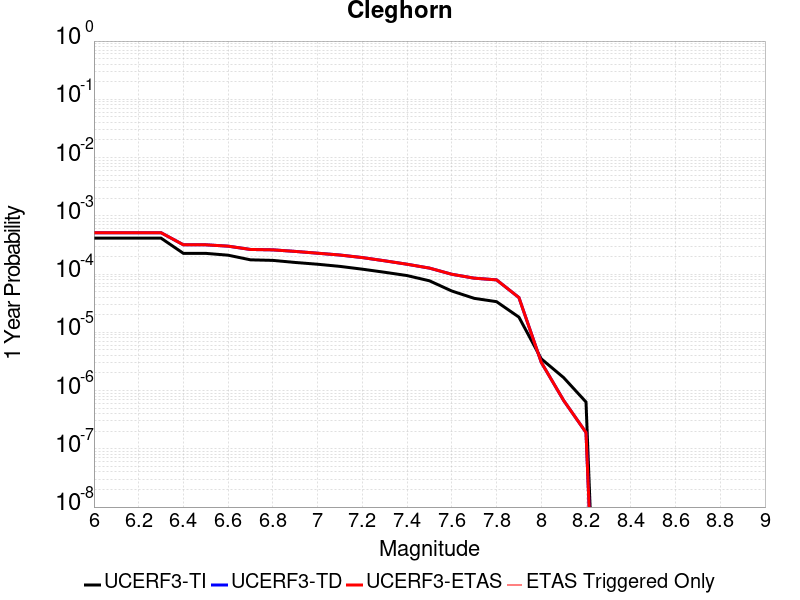 |  |

| Magnitude | 1 wk TI Prob | 1 wk TD Prob | 1 wk ETAS Prob | 1 wk ETAS/TD Gain | 1 wk ETAS Triggered Only | 1 mo TI Prob | 1 mo TD Prob | 1 mo ETAS Prob | 1 mo ETAS/TD Gain | 1 mo ETAS Triggered Only | 1 yr TI Prob | 1 yr TD Prob | 1 yr ETAS Prob | 1 yr ETAS/TD Gain | 1 yr ETAS Triggered Only | 10 yr TI Prob | 10 yr TD Prob | 10 yr ETAS Prob | 10 yr ETAS/TD Gain | 10 yr ETAS Triggered Only |
|-----|-----|-----|-----|-----|-----|-----|-----|-----|-----|-----|-----|-----|-----|-----|-----|-----|-----|-----|-----|-----|
| 6.0 | 7.9267165E-6 | 9.832763E-6 | 9.832763E-6 | 1.0 | 0.0 | 3.39712E-5 | 4.213979E-5 | 4.213979E-5 | 1.0 | 0.0 | 4.1352084E-4 | 5.129418E-4 | 5.129418E-4 | 1.0 | 0.0 | 0.004127522 | 0.005132704 | 0.005142653 | 1.0019383 | 1.0E-5 |
| 6.1 | 7.9267165E-6 | 9.832763E-6 | 9.832763E-6 | 1.0 | 0.0 | 3.39712E-5 | 4.213979E-5 | 4.213979E-5 | 1.0 | 0.0 | 4.1352084E-4 | 5.129418E-4 | 5.129418E-4 | 1.0 | 0.0 | 0.004127522 | 0.005132704 | 0.005142653 | 1.0019383 | 1.0E-5 |
| 6.2 | 7.9267165E-6 | 9.832763E-6 | 9.832763E-6 | 1.0 | 0.0 | 3.39712E-5 | 4.213979E-5 | 4.213979E-5 | 1.0 | 0.0 | 4.1352084E-4 | 5.129418E-4 | 5.129418E-4 | 1.0 | 0.0 | 0.004127522 | 0.005132704 | 0.005142653 | 1.0019383 | 1.0E-5 |
| 6.3 | 7.9267165E-6 | 9.832763E-6 | 9.832763E-6 | 1.0 | 0.0 | 3.39712E-5 | 4.213979E-5 | 4.213979E-5 | 1.0 | 0.0 | 4.1352084E-4 | 5.129418E-4 | 5.129418E-4 | 1.0 | 0.0 | 0.004127522 | 0.005132704 | 0.005142653 | 1.0019383 | 1.0E-5 |
| 6.4 | 4.3445207E-6 | 6.0926013E-6 | 6.0926013E-6 | 1.0 | 0.0 | 1.8619241E-5 | 2.6110894E-5 | 2.6110894E-5 | 1.0 | 0.0 | 2.2666567E-4 | 3.1785478E-4 | 3.1785478E-4 | 1.0 | 0.0 | 0.0022643462 | 0.003188204 | 0.0031981722 | 1.0031266 | 1.0E-5 |
| 6.5 | 4.3445207E-6 | 6.0926013E-6 | 6.0926013E-6 | 1.0 | 0.0 | 1.8619241E-5 | 2.6110894E-5 | 2.6110894E-5 | 1.0 | 0.0 | 2.2666567E-4 | 3.1785478E-4 | 3.1785478E-4 | 1.0 | 0.0 | 0.0022643462 | 0.003188204 | 0.0031981722 | 1.0031266 | 1.0E-5 |
| 6.6 | 4.040109E-6 | 5.7750076E-6 | 5.7750076E-6 | 1.0 | 0.0 | 1.7314638E-5 | 2.4749803E-5 | 2.4749803E-5 | 1.0 | 0.0 | 2.1078532E-4 | 3.0128812E-4 | 3.0128812E-4 | 1.0 | 0.0 | 0.002105855 | 0.003022993 | 0.0030329628 | 1.0032979 | 1.0E-5 |
| 6.7 | 3.3632055E-6 | 5.0685003E-6 | 5.0685003E-6 | 1.0 | 0.0 | 1.4413658E-5 | 2.1721964E-5 | 2.1721964E-5 | 1.0 | 0.0 | 1.7547216E-4 | 2.6443315E-4 | 2.6443315E-4 | 1.0 | 0.0 | 0.0017533366 | 0.0026553252 | 0.0026652988 | 1.003756 | 1.0E-5 |
| 6.8 | 3.2902772E-6 | 4.990407E-6 | 4.990407E-6 | 1.0 | 0.0 | 1.4101111E-5 | 2.1387285E-5 | 2.1387285E-5 | 1.0 | 0.0 | 1.716675E-4 | 2.603594E-4 | 2.603594E-4 | 1.0 | 0.0 | 0.0017153495 | 0.0026146837 | 0.0026246577 | 1.0038146 | 1.0E-5 |
| 6.9 | 3.031547E-6 | 4.692163E-6 | 4.692163E-6 | 1.0 | 0.0 | 1.299228E-5 | 2.0109117E-5 | 2.0109117E-5 | 1.0 | 0.0 | 1.5816953E-4 | 2.4480128E-4 | 2.4480128E-4 | 1.0 | 0.0 | 0.00158057 | 0.0024594541 | 0.0024694295 | 1.004056 | 1.0E-5 |
| 7.0 | 2.8259715E-6 | 4.371714E-6 | 4.371714E-6 | 1.0 | 0.0 | 1.211125E-5 | 1.8735784E-5 | 1.8735784E-5 | 1.0 | 0.0 | 1.4744449E-4 | 2.2808454E-4 | 2.2808454E-4 | 1.0 | 0.0 | 0.001473467 | 0.0022926412 | 0.0023026182 | 1.0043517 | 1.0E-5 |
| 7.1 | 2.5962665E-6 | 4.066925E-6 | 4.066925E-6 | 1.0 | 0.0 | 1.1126809E-5 | 1.7429564E-5 | 1.7429564E-5 | 1.0 | 0.0 | 1.3546048E-4 | 2.1218449E-4 | 2.1218449E-4 | 1.0 | 0.0 | 0.0013537793 | 0.0021339648 | 0.0021439434 | 1.0046761 | 1.0E-5 |
| 7.2 | 2.3247253E-6 | 3.6774632E-6 | 3.6774632E-6 | 1.0 | 0.0 | 9.96307E-6 | 1.5760463E-5 | 1.5760463E-5 | 1.0 | 0.0 | 1.21293626E-4 | 1.9186691E-4 | 1.9186691E-4 | 1.0 | 0.0 | 0.0012122744 | 0.0019311808 | 0.0019411615 | 1.0051682 | 1.0E-5 |
| 7.3 | 2.056928E-6 | 3.236149E-6 | 3.236149E-6 | 1.0 | 0.0 | 8.815376E-6 | 1.3869138E-5 | 1.3869138E-5 | 1.0 | 0.0 | 1.0732192E-4 | 1.6884382E-4 | 1.6884382E-4 | 1.0 | 0.0 | 0.001072701 | 0.0017013908 | 0.0017113738 | 1.0058676 | 1.0E-5 |
| 7.4 | 1.8055999E-6 | 2.8265147E-6 | 2.8265147E-6 | 1.0 | 0.0 | 7.738263E-6 | 1.2113579E-5 | 1.2113579E-5 | 1.0 | 0.0 | 9.4209274E-5 | 1.4747298E-4 | 1.4747298E-4 | 1.0 | 0.0 | 9.4169343E-4 | 0.001488129 | 0.0014981141 | 1.0067098 | 1.0E-5 |
| 7.5 | 1.4683443E-6 | 2.4257406E-6 | 2.4257406E-6 | 1.0 | 0.0 | 6.292889E-6 | 1.039599E-5 | 1.039599E-5 | 1.0 | 0.0 | 7.661323E-5 | 1.2656393E-4 | 1.2656393E-4 | 1.0 | 0.0 | 7.658682E-4 | 0.0012793359 | 0.0012893231 | 1.0078065 | 1.0E-5 |
| 7.6 | 9.804088E-7 | 1.9012458E-6 | 1.9012458E-6 | 1.0 | 0.0 | 4.201745E-6 | 8.148171E-6 | 8.148171E-6 | 1.0 | 0.0 | 5.1155046E-5 | 9.919951E-5 | 9.919951E-5 | 1.0 | 0.0 | 5.114327E-4 | 0.0010060034 | 0.0010159933 | 1.0099304 | 1.0E-5 |
| 7.7 | 7.3434086E-7 | 1.6293816E-6 | 1.6293816E-6 | 1.0 | 0.0 | 3.1471714E-6 | 6.9830453E-6 | 6.9830453E-6 | 1.0 | 0.0 | 3.831614E-5 | 8.501529E-5 | 8.501529E-5 | 1.0 | 0.0 | 3.8309532E-4 | 8.6431357E-4 | 8.743049E-4 | 1.0115598 | 1.0E-5 |
| 7.8 | 6.434184E-7 | 1.522934E-6 | 1.522934E-6 | 1.0 | 0.0 | 2.7575045E-6 | 6.5268437E-6 | 6.5268437E-6 | 1.0 | 0.0 | 3.35721E-5 | 7.946145E-5 | 7.946145E-5 | 1.0 | 0.0 | 3.3567028E-4 | 8.0846256E-4 | 8.184545E-4 | 1.0123591 | 1.0E-5 |
| 7.9 | 3.4943926E-7 | 7.5794E-7 | 7.5794E-7 | 1.0 | 0.0 | 1.497596E-6 | 3.2483103E-6 | 3.2483103E-6 | 1.0 | 0.0 | 1.8233079E-5 | 3.9547467E-5 | 3.9547467E-5 | 1.0 | 0.0 | 1.8231584E-4 | 4.0426495E-4 | 4.0426495E-4 | 1.0 | 0.0 |
| 8.0 | 6.717524E-8 | 5.8437763E-8 | 5.8437763E-8 | 1.0 | 0.0 | 2.8789387E-7 | 2.5044753E-7 | 2.5044753E-7 | 1.0 | 0.0 | 3.505102E-6 | 3.0491944E-6 | 3.0491944E-6 | 1.0 | 0.0 | 3.5050467E-5 | 3.2754215E-5 | 3.2754215E-5 | 1.0 | 0.0 |
| 8.1 | 3.1984914E-8 | 1.2967114E-8 | 1.2967114E-8 | 1.0 | 0.0 | 1.370782E-7 | 5.5573338E-8 | 5.5573338E-8 | 1.0 | 0.0 | 1.6689258E-6 | 6.766052E-7 | 6.766052E-7 | 1.0 | 0.0 | 1.6689133E-5 | 7.750275E-6 | 7.750275E-6 | 1.0 | 0.0 |
| 8.2 | 1.21887656E-8 | 3.6524417E-9 | 3.6524417E-9 | 1.0 | 0.0 | 5.2237567E-8 | 1.565332E-8 | 1.565332E-8 | 1.0 | 0.0 | 6.359922E-7 | 1.9057916E-7 | 1.9057916E-7 | 1.0 | 0.0 | 6.3599036E-6 | 2.2488762E-6 | 2.2488762E-6 | 1.0 | 0.0 |

## Elmore Ranch
*[(top)](#table-of-contents)*

| 1 Week | 1 Month | 1 Year | 10 Year |
|-----|-----|-----|-----|
| 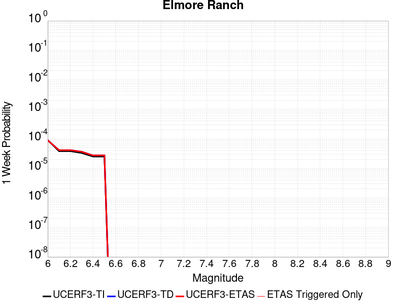 |  | 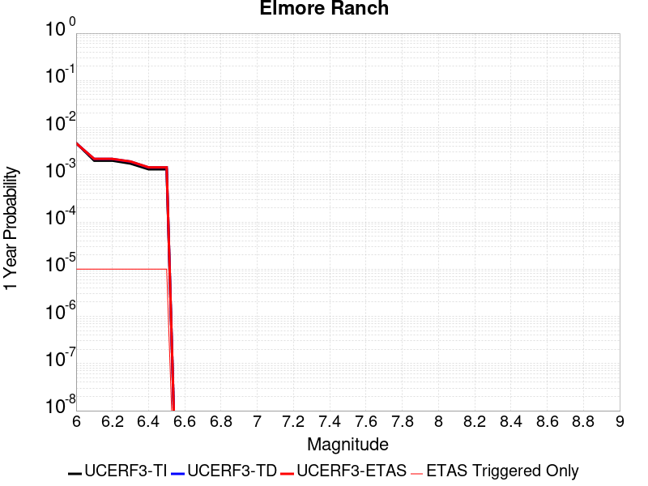 |  |

| Magnitude | 1 wk TI Prob | 1 wk TD Prob | 1 wk ETAS Prob | 1 wk ETAS/TD Gain | 1 wk ETAS Triggered Only | 1 mo TI Prob | 1 mo TD Prob | 1 mo ETAS Prob | 1 mo ETAS/TD Gain | 1 mo ETAS Triggered Only | 1 yr TI Prob | 1 yr TD Prob | 1 yr ETAS Prob | 1 yr ETAS/TD Gain | 1 yr ETAS Triggered Only | 10 yr TI Prob | 10 yr TD Prob | 10 yr ETAS Prob | 10 yr ETAS/TD Gain | 10 yr ETAS Triggered Only |
|-----|-----|-----|-----|-----|-----|-----|-----|-----|-----|-----|-----|-----|-----|-----|-----|-----|-----|-----|-----|-----|
| 6.0 | 9.102099E-5 | 8.954244E-5 | 8.954244E-5 | 1.0 | 0.0 | 3.9003167E-4 | 3.8370665E-4 | 3.937028E-4 | 1.0260515 | 1.0E-5 | 0.0047383 | 0.0046622963 | 0.00467225 | 1.0021349 | 1.0E-5 | 0.046385348 | 0.045839358 | 0.045848902 | 1.0002081 | 1.0E-5 |
| 6.1 | 3.8306698E-5 | 4.1492345E-5 | 4.1492345E-5 | 1.0 | 0.0 | 1.6416123E-4 | 1.7781628E-4 | 1.8781451E-4 | 1.0562278 | 1.0E-5 | 0.0019968306 | 0.002163246 | 0.0021732245 | 1.0046127 | 1.0E-5 | 0.019789828 | 0.02159527 | 0.021605052 | 1.0004531 | 1.0E-5 |
| 6.2 | 3.8306698E-5 | 4.1492345E-5 | 4.1492345E-5 | 1.0 | 0.0 | 1.6416123E-4 | 1.7781628E-4 | 1.8781451E-4 | 1.0562278 | 1.0E-5 | 0.0019968306 | 0.002163246 | 0.0021732245 | 1.0046127 | 1.0E-5 | 0.019789828 | 0.02159527 | 0.021605052 | 1.0004531 | 1.0E-5 |
| 6.3 | 3.3197924E-5 | 3.655081E-5 | 3.655081E-5 | 1.0 | 0.0 | 1.4226905E-4 | 1.566409E-4 | 1.6663934E-4 | 1.0638303 | 1.0E-5 | 0.0017307495 | 0.0019059941 | 0.001915975 | 1.0052366 | 1.0E-5 | 0.017173318 | 0.019057546 | 0.019067355 | 1.0005147 | 1.0E-5 |
| 6.4 | 2.5148964E-5 | 2.7420736E-5 | 2.7420736E-5 | 1.0 | 0.0 | 1.0777682E-4 | 1.17515796E-4 | 1.2751462E-4 | 1.0850849 | 1.0E-5 | 0.0013113929 | 0.0014304637 | 0.0014404494 | 1.0069808 | 1.0E-5 | 0.01303681 | 0.014365338 | 0.014375194 | 1.0006862 | 1.0E-5 |
| 6.5 | 2.5148964E-5 | 2.7420736E-5 | 2.7420736E-5 | 1.0 | 0.0 | 1.0777682E-4 | 1.17515796E-4 | 1.2751462E-4 | 1.0850849 | 1.0E-5 | 0.0013113929 | 0.0014304637 | 0.0014404494 | 1.0069808 | 1.0E-5 | 0.01303681 | 0.014365338 | 0.014375194 | 1.0006862 | 1.0E-5 |

## Rodgers Creek - Healdsburg 2011 CFM
*[(top)](#table-of-contents)*

| 1 Week | 1 Month | 1 Year | 10 Year |
|-----|-----|-----|-----|
|  |  |  |  |

| Magnitude | 1 wk TI Prob | 1 wk TD Prob | 1 wk ETAS Prob | 1 wk ETAS/TD Gain | 1 wk ETAS Triggered Only | 1 mo TI Prob | 1 mo TD Prob | 1 mo ETAS Prob | 1 mo ETAS/TD Gain | 1 mo ETAS Triggered Only | 1 yr TI Prob | 1 yr TD Prob | 1 yr ETAS Prob | 1 yr ETAS/TD Gain | 1 yr ETAS Triggered Only | 10 yr TI Prob | 10 yr TD Prob | 10 yr ETAS Prob | 10 yr ETAS/TD Gain | 10 yr ETAS Triggered Only |
|-----|-----|-----|-----|-----|-----|-----|-----|-----|-----|-----|-----|-----|-----|-----|-----|-----|-----|-----|-----|-----|
| 6.0 | 7.390182E-5 | 1.3139093E-4 | 1.3139093E-4 | 1.0 | 0.0 | 3.1668364E-4 | 5.629827E-4 | 5.629827E-4 | 1.0 | 0.0 | 0.0038488081 | 0.006832735 | 0.0068426672 | 1.0014535 | 1.0E-5 | 0.037828278 | 0.066191986 | 0.06620132 | 1.000141 | 1.0E-5 |
| 6.1 | 7.318768E-5 | 1.3037103E-4 | 1.3037103E-4 | 1.0 | 0.0 | 3.1362378E-4 | 5.586137E-4 | 5.586137E-4 | 1.0 | 0.0 | 0.0038116854 | 0.0067798914 | 0.0067898235 | 1.001465 | 1.0E-5 | 0.037469655 | 0.06569656 | 0.0657059 | 1.0001422 | 1.0E-5 |
| 6.2 | 7.1379836E-5 | 1.2729941E-4 | 1.2729941E-4 | 1.0 | 0.0 | 3.058777E-4 | 5.454552E-4 | 5.454552E-4 | 1.0 | 0.0 | 0.003717703 | 0.0066206693 | 0.006630603 | 1.0015004 | 1.0E-5 | 0.0365612 | 0.064218655 | 0.06422801 | 1.0001457 | 1.0E-5 |
| 6.3 | 6.9255926E-5 | 1.2384256E-4 | 1.2384256E-4 | 1.0 | 0.0 | 2.9677735E-4 | 5.306463E-4 | 5.306463E-4 | 1.0 | 0.0 | 0.0036072785 | 0.006441529 | 0.0064514643 | 1.0015424 | 1.0E-5 | 0.035492823 | 0.062549815 | 0.062559195 | 1.0001498 | 1.0E-5 |
| 6.4 | 6.6757144E-5 | 1.19609525E-4 | 1.19609525E-4 | 1.0 | 0.0 | 2.8607066E-4 | 5.1251194E-4 | 5.1251194E-4 | 1.0 | 0.0 | 0.0034773487 | 0.006222053 | 0.0062319906 | 1.0015972 | 1.0E-5 | 0.034234364 | 0.060499642 | 0.060509037 | 1.0001553 | 1.0E-5 |
| 6.5 | 6.5735134E-5 | 1.1809998E-4 | 1.1809998E-4 | 1.0 | 0.0 | 2.8169158E-4 | 5.0604495E-4 | 5.0604495E-4 | 1.0 | 0.0 | 0.003424202 | 0.0061437762 | 0.006153715 | 1.0016177 | 1.0E-5 | 0.03371918 | 0.059762556 | 0.05977196 | 1.0001574 | 1.0E-5 |
| 6.6 | 6.289601E-5 | 1.13453316E-4 | 1.13453316E-4 | 1.0 | 0.0 | 2.6952647E-4 | 4.8613825E-4 | 4.8613825E-4 | 1.0 | 0.0 | 0.0032765474 | 0.005902751 | 0.005912692 | 1.0016841 | 1.0E-5 | 0.032286562 | 0.057500087 | 0.05750951 | 1.0001639 | 1.0E-5 |
| 6.7 | 6.115274E-5 | 1.1062275E-4 | 1.1062275E-4 | 1.0 | 0.0 | 2.6205686E-4 | 4.7401173E-4 | 4.7401173E-4 | 1.0 | 0.0 | 0.0031858748 | 0.005755901 | 0.005765843 | 1.0017273 | 1.0E-5 | 0.031405866 | 0.056117915 | 0.056127355 | 1.0001682 | 1.0E-5 |
| 6.8 | 5.9232367E-5 | 1.07296E-4 | 1.07296E-4 | 1.0 | 0.0 | 2.538283E-4 | 4.5975935E-4 | 4.5975935E-4 | 1.0 | 0.0 | 0.0030859804 | 0.00558328 | 0.0055932244 | 1.0017811 | 1.0E-5 | 0.030434765 | 0.05448483 | 0.054494284 | 1.0001736 | 1.0E-5 |
| 6.9 | 5.4030377E-5 | 9.823741E-5 | 9.823741E-5 | 1.0 | 0.0 | 2.315382E-4 | 4.209499E-4 | 4.209499E-4 | 1.0 | 0.0 | 0.0028153337 | 0.005113087 | 0.005113087 | 1.0 | 0.0 | 0.027799325 | 0.05002048 | 0.05002048 | 1.0 | 0.0 |
| 7.0 | 4.8260714E-5 | 8.741771E-5 | 8.741771E-5 | 1.0 | 0.0 | 2.0681522E-4 | 3.7459383E-4 | 3.7459383E-4 | 1.0 | 0.0 | 0.0025150678 | 0.004551197 | 0.004551197 | 1.0 | 0.0 | 0.024867928 | 0.044671923 | 0.044671923 | 1.0 | 0.0 |
| 7.1 | 4.0294493E-5 | 7.3902025E-5 | 7.3902025E-5 | 1.0 | 0.0 | 1.7267925E-4 | 3.1668475E-4 | 3.1668475E-4 | 1.0 | 0.0 | 0.0021003427 | 0.0038488582 | 0.0038488582 | 1.0 | 0.0 | 0.02080602 | 0.037927724 | 0.037927724 | 1.0 | 0.0 |
| 7.2 | 3.096388E-5 | 5.698826E-5 | 5.698826E-5 | 1.0 | 0.0 | 1.326956E-4 | 2.4421266E-4 | 2.4421266E-4 | 1.0 | 0.0 | 0.0016143717 | 0.0029692573 | 0.0029692573 | 1.0 | 0.0 | 0.01602694 | 0.029440729 | 0.029440729 | 1.0 | 0.0 |
| 7.3 | 2.3615226E-5 | 4.3637207E-5 | 4.3637207E-5 | 1.0 | 0.0 | 1.0120418E-4 | 1.8700327E-4 | 1.8700327E-4 | 1.0 | 0.0 | 0.0012314644 | 0.0022744013 | 0.0022744013 | 1.0 | 0.0 | 0.0122466255 | 0.02264088 | 0.02264088 | 1.0 | 0.0 |
| 7.4 | 1.8251132E-5 | 3.3548964E-5 | 3.3548964E-5 | 1.0 | 0.0 | 7.821679E-5 | 1.437734E-4 | 1.437734E-4 | 1.0 | 0.0 | 9.518733E-4 | 0.0017490456 | 0.0017490456 | 1.0 | 0.0 | 0.009478063 | 0.017468803 | 0.017468803 | 1.0 | 0.0 |
| 7.5 | 1.2411432E-5 | 2.2463999E-5 | 2.2463999E-5 | 1.0 | 0.0 | 5.3190768E-5 | 9.627076E-5 | 9.627076E-5 | 1.0 | 0.0 | 6.4740516E-4 | 0.0011714721 | 0.0011714721 | 1.0 | 0.0 | 0.006455223 | 0.011744237 | 0.011744237 | 1.0 | 0.0 |
| 7.6 | 4.4771446E-6 | 8.085529E-6 | 8.085529E-6 | 1.0 | 0.0 | 1.918762E-5 | 3.465181E-5 | 3.465181E-5 | 1.0 | 0.0 | 2.3358424E-4 | 4.2180537E-4 | 4.2180537E-4 | 1.0 | 0.0 | 0.0023333887 | 0.0042457026 | 0.0042457026 | 1.0 | 0.0 |
| 7.7 | 2.157941E-7 | 3.5363618E-7 | 3.5363618E-7 | 1.0 | 0.0 | 9.248315E-7 | 1.5155827E-6 | 1.5155827E-6 | 1.0 | 0.0 | 1.1259765E-5 | 1.8452063E-5 | 1.8452063E-5 | 1.0 | 0.0 | 1.1259195E-4 | 1.9075118E-4 | 1.9075118E-4 | 1.0 | 0.0 |
| 7.8 | 9.9623286E-8 | 1.9910124E-7 | 1.9910124E-7 | 1.0 | 0.0 | 4.269569E-7 | 8.532907E-7 | 8.532907E-7 | 1.0 | 0.0 | 5.1981874E-6 | 1.0388765E-5 | 1.0388765E-5 | 1.0 | 0.0 | 5.198066E-5 | 1.0907195E-4 | 1.0907195E-4 | 1.0 | 0.0 |
| 7.9 | 5.6745257E-8 | 1.1780399E-7 | 1.1780399E-7 | 1.0 | 0.0 | 2.4319394E-7 | 5.0487415E-7 | 5.0487415E-7 | 1.0 | 0.0 | 2.960882E-6 | 6.1468254E-6 | 6.1468254E-6 | 1.0 | 0.0 | 2.9608427E-5 | 6.474216E-5 | 6.474216E-5 | 1.0 | 0.0 |
| 8.0 | 2.8614323E-8 | 6.582037E-8 | 6.582037E-8 | 1.0 | 0.0 | 1.2263281E-7 | 2.8208729E-7 | 2.8208729E-7 | 1.0 | 0.0 | 1.4930534E-6 | 3.4344073E-6 | 3.4344073E-6 | 1.0 | 0.0 | 1.4930434E-5 | 3.5844452E-5 | 3.5844452E-5 | 1.0 | 0.0 |
| 8.1 | 3.5045191E-9 | 8.970427E-9 | 8.970427E-9 | 1.0 | 0.0 | 1.5019367E-8 | 3.8444686E-8 | 3.8444686E-8 | 1.0 | 0.0 | 1.8286079E-7 | 4.6806397E-7 | 4.6806397E-7 | 1.0 | 0.0 | 1.8286064E-6 | 4.8356214E-6 | 4.8356214E-6 | 1.0 | 0.0 |

## Carson Range (Genoa)
*[(top)](#table-of-contents)*

| 1 Week | 1 Month | 1 Year | 10 Year |
|-----|-----|-----|-----|
|  |  |  |  |

| Magnitude | 1 wk TI Prob | 1 wk TD Prob | 1 wk ETAS Prob | 1 wk ETAS/TD Gain | 1 wk ETAS Triggered Only | 1 mo TI Prob | 1 mo TD Prob | 1 mo ETAS Prob | 1 mo ETAS/TD Gain | 1 mo ETAS Triggered Only | 1 yr TI Prob | 1 yr TD Prob | 1 yr ETAS Prob | 1 yr ETAS/TD Gain | 1 yr ETAS Triggered Only | 10 yr TI Prob | 10 yr TD Prob | 10 yr ETAS Prob | 10 yr ETAS/TD Gain | 10 yr ETAS Triggered Only |
|-----|-----|-----|-----|-----|-----|-----|-----|-----|-----|-----|-----|-----|-----|-----|-----|-----|-----|-----|-----|-----|
| 6.0 | 4.1268457E-5 | 5.0148312E-5 | 5.0148312E-5 | 1.0 | 0.0 | 1.7685282E-4 | 2.1490589E-4 | 2.1490589E-4 | 1.0 | 0.0 | 0.0021510567 | 0.0026137335 | 0.0026237073 | 1.0038159 | 1.0E-5 | 0.02130354 | 0.025869591 | 0.025879333 | 1.0003766 | 1.0E-5 |
| 6.1 | 4.1268457E-5 | 5.0148312E-5 | 5.0148312E-5 | 1.0 | 0.0 | 1.7685282E-4 | 2.1490589E-4 | 2.1490589E-4 | 1.0 | 0.0 | 0.0021510567 | 0.0026137335 | 0.0026237073 | 1.0038159 | 1.0E-5 | 0.02130354 | 0.025869591 | 0.025879333 | 1.0003766 | 1.0E-5 |
| 6.2 | 4.1268457E-5 | 5.0148312E-5 | 5.0148312E-5 | 1.0 | 0.0 | 1.7685282E-4 | 2.1490589E-4 | 2.1490589E-4 | 1.0 | 0.0 | 0.0021510567 | 0.0026137335 | 0.0026237073 | 1.0038159 | 1.0E-5 | 0.02130354 | 0.025869591 | 0.025879333 | 1.0003766 | 1.0E-5 |
| 6.3 | 4.1268457E-5 | 5.0148312E-5 | 5.0148312E-5 | 1.0 | 0.0 | 1.7685282E-4 | 2.1490589E-4 | 2.1490589E-4 | 1.0 | 0.0 | 0.0021510567 | 0.0026137335 | 0.0026237073 | 1.0038159 | 1.0E-5 | 0.02130354 | 0.025869591 | 0.025879333 | 1.0003766 | 1.0E-5 |
| 6.4 | 4.1268457E-5 | 5.0148312E-5 | 5.0148312E-5 | 1.0 | 0.0 | 1.7685282E-4 | 2.1490589E-4 | 2.1490589E-4 | 1.0 | 0.0 | 0.0021510567 | 0.0026137335 | 0.0026237073 | 1.0038159 | 1.0E-5 | 0.02130354 | 0.025869591 | 0.025879333 | 1.0003766 | 1.0E-5 |
| 6.5 | 2.5677185E-5 | 3.0979143E-5 | 3.0979143E-5 | 1.0 | 0.0 | 1.1004044E-4 | 1.3276203E-4 | 1.3276203E-4 | 1.0 | 0.0 | 0.0013389189 | 0.0016153594 | 0.0016253432 | 1.0061805 | 1.0E-5 | 0.0133088045 | 0.016054096 | 0.016063936 | 1.0006129 | 1.0E-5 |
| 6.6 | 2.5677185E-5 | 3.0979143E-5 | 3.0979143E-5 | 1.0 | 0.0 | 1.1004044E-4 | 1.3276203E-4 | 1.3276203E-4 | 1.0 | 0.0 | 0.0013389189 | 0.0016153594 | 0.0016253432 | 1.0061805 | 1.0E-5 | 0.0133088045 | 0.016054096 | 0.016063936 | 1.0006129 | 1.0E-5 |
| 6.7 | 1.9969408E-5 | 2.4064128E-5 | 2.4064128E-5 | 1.0 | 0.0 | 8.558037E-5 | 1.0312876E-4 | 1.0312876E-4 | 1.0 | 0.0 | 0.0010414429 | 0.001255023 | 0.001255023 | 1.0 | 0.0 | 0.010365757 | 0.012494512 | 0.012494512 | 1.0 | 0.0 |
| 6.8 | 1.4783156E-5 | 1.7818054E-5 | 1.7818054E-5 | 1.0 | 0.0 | 6.335485E-5 | 7.636159E-5 | 7.636159E-5 | 1.0 | 0.0 | 7.710722E-4 | 9.2943595E-4 | 9.2943595E-4 | 1.0 | 0.0 | 0.0076840227 | 0.009268275 | 0.009268275 | 1.0 | 0.0 |
| 6.9 | 1.06660555E-5 | 1.2877381E-5 | 1.2877381E-5 | 1.0 | 0.0 | 4.5710865E-5 | 5.518826E-5 | 5.518826E-5 | 1.0 | 0.0 | 5.5638765E-4 | 6.7182514E-4 | 6.7182514E-4 | 1.0 | 0.0 | 0.005549967 | 0.0067092404 | 0.0067092404 | 1.0 | 0.0 |
| 7.0 | 7.664838E-6 | 9.258562E-6 | 9.258562E-6 | 1.0 | 0.0 | 3.2848893E-5 | 3.967955E-5 | 3.967955E-5 | 1.0 | 0.0 | 3.998619E-4 | 4.8309853E-4 | 4.8309853E-4 | 1.0 | 0.0 | 0.0039914316 | 0.004830983 | 0.004830983 | 1.0 | 0.0 |

## Mount Diablo Thrust South
*[(top)](#table-of-contents)*

| 1 Week | 1 Month | 1 Year | 10 Year |
|-----|-----|-----|-----|
|  |  |  | 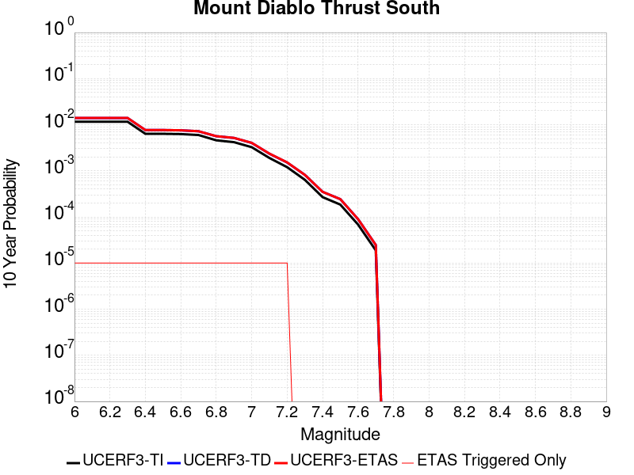 |

| Magnitude | 1 wk TI Prob | 1 wk TD Prob | 1 wk ETAS Prob | 1 wk ETAS/TD Gain | 1 wk ETAS Triggered Only | 1 mo TI Prob | 1 mo TD Prob | 1 mo ETAS Prob | 1 mo ETAS/TD Gain | 1 mo ETAS Triggered Only | 1 yr TI Prob | 1 yr TD Prob | 1 yr ETAS Prob | 1 yr ETAS/TD Gain | 1 yr ETAS Triggered Only | 10 yr TI Prob | 10 yr TD Prob | 10 yr ETAS Prob | 10 yr ETAS/TD Gain | 10 yr ETAS Triggered Only |
|-----|-----|-----|-----|-----|-----|-----|-----|-----|-----|-----|-----|-----|-----|-----|-----|-----|-----|-----|-----|-----|
| 6.0 | 2.2377444E-5 | 2.6956855E-5 | 2.6956855E-5 | 1.0 | 0.0 | 9.5899806E-5 | 1.15525385E-4 | 1.15525385E-4 | 1.0 | 0.0 | 0.0011669548 | 0.0014058118 | 0.0014157977 | 1.0071033 | 1.0E-5 | 0.011608457 | 0.013988916 | 0.013998777 | 1.0007049 | 1.0E-5 |
| 6.1 | 2.2377444E-5 | 2.6956855E-5 | 2.6956855E-5 | 1.0 | 0.0 | 9.5899806E-5 | 1.15525385E-4 | 1.15525385E-4 | 1.0 | 0.0 | 0.0011669548 | 0.0014058118 | 0.0014157977 | 1.0071033 | 1.0E-5 | 0.011608457 | 0.013988916 | 0.013998777 | 1.0007049 | 1.0E-5 |
| 6.2 | 2.2377444E-5 | 2.6956855E-5 | 2.6956855E-5 | 1.0 | 0.0 | 9.5899806E-5 | 1.15525385E-4 | 1.15525385E-4 | 1.0 | 0.0 | 0.0011669548 | 0.0014058118 | 0.0014157977 | 1.0071033 | 1.0E-5 | 0.011608457 | 0.013988916 | 0.013998777 | 1.0007049 | 1.0E-5 |
| 6.3 | 2.2377444E-5 | 2.6956855E-5 | 2.6956855E-5 | 1.0 | 0.0 | 9.5899806E-5 | 1.15525385E-4 | 1.15525385E-4 | 1.0 | 0.0 | 0.0011669548 | 0.0014058118 | 0.0014157977 | 1.0071033 | 1.0E-5 | 0.011608457 | 0.013988916 | 0.013998777 | 1.0007049 | 1.0E-5 |
| 6.4 | 1.2228463E-5 | 1.4747988E-5 | 1.4747988E-5 | 1.0 | 0.0 | 5.2406645E-5 | 6.32042E-5 | 6.32042E-5 | 1.0 | 0.0 | 6.378641E-4 | 7.692523E-4 | 7.7924464E-4 | 1.0129896 | 1.0E-5 | 0.0063603627 | 0.0076674037 | 0.0076773274 | 1.0012943 | 1.0E-5 |
| 6.5 | 1.2228463E-5 | 1.4747988E-5 | 1.4747988E-5 | 1.0 | 0.0 | 5.2406645E-5 | 6.32042E-5 | 6.32042E-5 | 1.0 | 0.0 | 6.378641E-4 | 7.692523E-4 | 7.7924464E-4 | 1.0129896 | 1.0E-5 | 0.0063603627 | 0.0076674037 | 0.0076773274 | 1.0012943 | 1.0E-5 |
| 6.6 | 1.2068118E-5 | 1.455278E-5 | 1.455278E-5 | 1.0 | 0.0 | 5.1719482E-5 | 6.236764E-5 | 6.236764E-5 | 1.0 | 0.0 | 6.2950276E-4 | 7.590743E-4 | 7.6906674E-4 | 1.0131639 | 1.0E-5 | 0.006277225 | 0.007566321 | 0.0075762453 | 1.0013117 | 1.0E-5 |
| 6.7 | 1.1499428E-5 | 1.3875425E-5 | 1.3875425E-5 | 1.0 | 0.0 | 4.9282335E-5 | 5.9464823E-5 | 5.9464823E-5 | 1.0 | 0.0 | 5.9984723E-4 | 7.237565E-4 | 7.3374924E-4 | 1.0138068 | 1.0E-5 | 0.0059823063 | 0.007215485 | 0.0072254124 | 1.0013759 | 1.0E-5 |
| 6.8 | 8.82118E-6 | 1.0830661E-5 | 1.0830661E-5 | 1.0 | 0.0 | 3.780451E-5 | 4.6416324E-5 | 4.6416324E-5 | 1.0 | 0.0 | 4.601727E-4 | 5.649778E-4 | 5.749722E-4 | 1.0176898 | 1.0E-5 | 0.0045922096 | 0.0056361877 | 0.0056461315 | 1.0017643 | 1.0E-5 |
| 6.9 | 8.047112E-6 | 9.939611E-6 | 9.939611E-6 | 1.0 | 0.0 | 3.4487166E-5 | 4.259767E-5 | 4.259767E-5 | 1.0 | 0.0 | 4.1980037E-4 | 5.185085E-4 | 5.2850327E-4 | 1.0192761 | 1.0E-5 | 0.004190082 | 0.0051737237 | 0.0051836716 | 1.0019228 | 1.0E-5 |
| 7.0 | 6.2574763E-6 | 7.748641E-6 | 7.748641E-6 | 1.0 | 0.0 | 2.681748E-5 | 3.320806E-5 | 3.320806E-5 | 1.0 | 0.0 | 3.264539E-4 | 4.0423684E-4 | 4.142328E-4 | 1.024728 | 1.0E-5 | 0.0032597475 | 0.0040357383 | 0.0040456983 | 1.0024679 | 1.0E-5 |
| 7.1 | 3.6485903E-6 | 4.513004E-6 | 4.513004E-6 | 1.0 | 0.0 | 1.5636722E-5 | 1.9341305E-5 | 1.9341305E-5 | 1.0 | 0.0 | 1.9036046E-4 | 2.3545536E-4 | 2.45453E-4 | 1.0424609 | 1.0E-5 | 0.0019019748 | 0.002352123 | 0.0023620995 | 1.0042415 | 1.0E-5 |
| 7.2 | 2.3034274E-6 | 2.905568E-6 | 2.905568E-6 | 1.0 | 0.0 | 9.871795E-6 | 1.2452376E-5 | 1.2452376E-5 | 1.0 | 0.0 | 1.2018247E-4 | 1.5159737E-4 | 1.6159586E-4 | 1.0659542 | 1.0E-5 | 0.0012011749 | 0.0015150359 | 0.0015250208 | 1.0065905 | 1.0E-5 |
| 7.3 | 1.224035E-6 | 1.568004E-6 | 1.568004E-6 | 1.0 | 0.0 | 5.245854E-6 | 6.720001E-6 | 6.720001E-6 | 1.0 | 0.0 | 6.38664E-5 | 8.181304E-5 | 8.181304E-5 | 1.0 | 0.0 | 6.384805E-4 | 8.177875E-4 | 8.177875E-4 | 1.0 | 0.0 |
| 7.4 | 5.1601154E-7 | 6.723497E-7 | 6.723497E-7 | 1.0 | 0.0 | 2.2114762E-6 | 2.8814957E-6 | 2.8814957E-6 | 1.0 | 0.0 | 2.6924388E-5 | 3.508166E-5 | 3.508166E-5 | 1.0 | 0.0 | 2.6921128E-4 | 3.5074085E-4 | 3.5074085E-4 | 1.0 | 0.0 |
| 7.5 | 3.552894E-7 | 4.6653378E-7 | 4.6653378E-7 | 1.0 | 0.0 | 1.5226678E-6 | 1.999429E-6 | 1.999429E-6 | 1.0 | 0.0 | 1.8538323E-5 | 2.4342791E-5 | 2.4342791E-5 | 1.0 | 0.0 | 1.8536777E-4 | 2.4340766E-4 | 2.4340766E-4 | 1.0 | 0.0 |
| 7.6 | 1.3124082E-7 | 1.7192048E-7 | 1.7192048E-7 | 1.0 | 0.0 | 5.6246057E-7 | 7.368019E-7 | 7.368019E-7 | 1.0 | 0.0 | 6.8479358E-6 | 8.9705345E-6 | 8.9705345E-6 | 1.0 | 0.0 | 6.8477246E-5 | 8.967447E-5 | 8.967447E-5 | 1.0 | 0.0 |
| 7.7 | 3.6193022E-8 | 4.7334797E-8 | 4.7334797E-8 | 1.0 | 0.0 | 1.5511293E-7 | 2.0286342E-7 | 2.0286342E-7 | 1.0 | 0.0 | 1.8884983E-6 | 2.4698604E-6 | 2.4698604E-6 | 1.0 | 0.0 | 1.8884823E-5 | 2.4698264E-5 | 2.4698264E-5 | 1.0 | 0.0 |

## San Luis Range - Oceano 2011 CFM
*[(top)](#table-of-contents)*

| 1 Week | 1 Month | 1 Year | 10 Year |
|-----|-----|-----|-----|
|  |  |  |  |

| Magnitude | 1 wk TI Prob | 1 wk TD Prob | 1 wk ETAS Prob | 1 wk ETAS/TD Gain | 1 wk ETAS Triggered Only | 1 mo TI Prob | 1 mo TD Prob | 1 mo ETAS Prob | 1 mo ETAS/TD Gain | 1 mo ETAS Triggered Only | 1 yr TI Prob | 1 yr TD Prob | 1 yr ETAS Prob | 1 yr ETAS/TD Gain | 1 yr ETAS Triggered Only | 10 yr TI Prob | 10 yr TD Prob | 10 yr ETAS Prob | 10 yr ETAS/TD Gain | 10 yr ETAS Triggered Only |
|-----|-----|-----|-----|-----|-----|-----|-----|-----|-----|-----|-----|-----|-----|-----|-----|-----|-----|-----|-----|-----|
| 6.0 | 1.6025788E-6 | 1.6201213E-6 | 1.6201213E-6 | 1.0 | 0.0 | 6.8681766E-6 | 6.943361E-6 | 6.943361E-6 | 1.0 | 0.0 | 8.361684E-5 | 8.4532556E-5 | 9.453171E-5 | 1.1182876 | 1.0E-5 | 8.3585386E-4 | 8.450448E-4 | 8.550364E-4 | 1.0118237 | 1.0E-5 |
| 6.1 | 1.6025788E-6 | 1.6201213E-6 | 1.6201213E-6 | 1.0 | 0.0 | 6.8681766E-6 | 6.943361E-6 | 6.943361E-6 | 1.0 | 0.0 | 8.361684E-5 | 8.4532556E-5 | 9.453171E-5 | 1.1182876 | 1.0E-5 | 8.3585386E-4 | 8.450448E-4 | 8.550364E-4 | 1.0118237 | 1.0E-5 |
| 6.2 | 1.6025788E-6 | 1.6201213E-6 | 1.6201213E-6 | 1.0 | 0.0 | 6.8681766E-6 | 6.943361E-6 | 6.943361E-6 | 1.0 | 0.0 | 8.361684E-5 | 8.4532556E-5 | 9.453171E-5 | 1.1182876 | 1.0E-5 | 8.3585386E-4 | 8.450448E-4 | 8.550364E-4 | 1.0118237 | 1.0E-5 |
| 6.3 | 1.6025788E-6 | 1.6201213E-6 | 1.6201213E-6 | 1.0 | 0.0 | 6.8681766E-6 | 6.943361E-6 | 6.943361E-6 | 1.0 | 0.0 | 8.361684E-5 | 8.4532556E-5 | 9.453171E-5 | 1.1182876 | 1.0E-5 | 8.3585386E-4 | 8.450448E-4 | 8.550364E-4 | 1.0118237 | 1.0E-5 |
| 6.4 | 1.1621186E-6 | 1.1749911E-6 | 1.1749911E-6 | 1.0 | 0.0 | 4.980499E-6 | 5.035668E-6 | 5.035668E-6 | 1.0 | 0.0 | 6.0635884E-5 | 6.130781E-5 | 6.130781E-5 | 1.0 | 0.0 | 6.0619344E-4 | 6.129355E-4 | 6.129355E-4 | 1.0 | 0.0 |
| 6.5 | 1.1621186E-6 | 1.1749911E-6 | 1.1749911E-6 | 1.0 | 0.0 | 4.980499E-6 | 5.035668E-6 | 5.035668E-6 | 1.0 | 0.0 | 6.0635884E-5 | 6.130781E-5 | 6.130781E-5 | 1.0 | 0.0 | 6.0619344E-4 | 6.129355E-4 | 6.129355E-4 | 1.0 | 0.0 |
| 6.6 | 7.164729E-7 | 7.248589E-7 | 7.248589E-7 | 1.0 | 0.0 | 3.0705946E-6 | 3.1065347E-6 | 3.1065347E-6 | 1.0 | 0.0 | 3.738385E-5 | 3.782142E-5 | 3.782142E-5 | 1.0 | 0.0 | 3.737756E-4 | 3.7815163E-4 | 3.7815163E-4 | 1.0 | 0.0 |
| 6.7 | 7.164729E-7 | 7.248589E-7 | 7.248589E-7 | 1.0 | 0.0 | 3.0705946E-6 | 3.1065347E-6 | 3.1065347E-6 | 1.0 | 0.0 | 3.738385E-5 | 3.782142E-5 | 3.782142E-5 | 1.0 | 0.0 | 3.737756E-4 | 3.7815163E-4 | 3.7815163E-4 | 1.0 | 0.0 |
| 6.8 | 6.700177E-7 | 6.77745E-7 | 6.77745E-7 | 1.0 | 0.0 | 2.8715012E-6 | 2.9046184E-6 | 2.9046184E-6 | 1.0 | 0.0 | 3.495997E-5 | 3.536317E-5 | 3.536317E-5 | 1.0 | 0.0 | 3.495447E-4 | 3.5357708E-4 | 3.5357708E-4 | 1.0 | 0.0 |
| 6.9 | 5.657865E-7 | 5.721795E-7 | 5.721795E-7 | 1.0 | 0.0 | 2.424797E-6 | 2.4521955E-6 | 2.4521955E-6 | 1.0 | 0.0 | 2.9521503E-5 | 2.9855084E-5 | 2.9855084E-5 | 1.0 | 0.0 | 2.9517582E-4 | 2.985118E-4 | 2.985118E-4 | 1.0 | 0.0 |
| 7.0 | 4.608413E-7 | 4.6601758E-7 | 4.6601758E-7 | 1.0 | 0.0 | 1.9750328E-6 | 1.9972167E-6 | 1.9972167E-6 | 1.0 | 0.0 | 2.4045758E-5 | 2.4315847E-5 | 2.4315847E-5 | 1.0 | 0.0 | 2.4043156E-4 | 2.4313215E-4 | 2.4313215E-4 | 1.0 | 0.0 |
| 7.1 | 3.9177846E-7 | 3.9621662E-7 | 3.9621662E-7 | 1.0 | 0.0 | 1.6790494E-6 | 1.6980702E-6 | 1.6980702E-6 | 1.0 | 0.0 | 2.0442236E-5 | 2.067381E-5 | 2.067381E-5 | 1.0 | 0.0 | 2.0440355E-4 | 2.06719E-4 | 2.06719E-4 | 1.0 | 0.0 |
| 7.2 | 3.3974752E-7 | 3.4366582E-7 | 3.4366582E-7 | 1.0 | 0.0 | 1.45606E-6 | 1.4728527E-6 | 1.4728527E-6 | 1.0 | 0.0 | 1.7727387E-5 | 1.7931836E-5 | 1.7931836E-5 | 1.0 | 0.0 | 1.7725973E-4 | 1.79304E-4 | 1.79304E-4 | 1.0 | 0.0 |
| 7.3 | 2.8900928E-7 | 2.9234062E-7 | 2.9234062E-7 | 1.0 | 0.0 | 1.2386106E-6 | 1.2528878E-6 | 1.2528878E-6 | 1.0 | 0.0 | 1.5079979E-5 | 1.5253803E-5 | 1.5253803E-5 | 1.0 | 0.0 | 1.5078956E-4 | 1.5252765E-4 | 1.5252765E-4 | 1.0 | 0.0 |
| 7.4 | 2.1881527E-7 | 2.2139628E-7 | 2.2139628E-7 | 1.0 | 0.0 | 9.3777936E-7 | 9.4884086E-7 | 9.4884086E-7 | 1.0 | 0.0 | 1.14174045E-5 | 1.1552077E-5 | 1.1552077E-5 | 1.0 | 0.0 | 1.1416818E-4 | 1.1551482E-4 | 1.1551482E-4 | 1.0 | 0.0 |
| 7.5 | 1.356398E-7 | 1.371866E-7 | 1.371866E-7 | 1.0 | 0.0 | 5.813133E-7 | 5.8794245E-7 | 5.8794245E-7 | 1.0 | 0.0 | 7.0774663E-6 | 7.158176E-6 | 7.158176E-6 | 1.0 | 0.0 | 7.077241E-5 | 7.157948E-5 | 7.157948E-5 | 1.0 | 0.0 |
| 7.6 | 5.9269272E-8 | 6.001375E-8 | 6.001375E-8 | 1.0 | 0.0 | 2.5401116E-7 | 2.5720172E-7 | 2.5720172E-7 | 1.0 | 0.0 | 3.0925814E-6 | 3.1314266E-6 | 3.1314266E-6 | 1.0 | 0.0 | 3.0925385E-5 | 3.1313837E-5 | 3.1313837E-5 | 1.0 | 0.0 |
| 7.7 | 5.946232E-9 | 6.0369403E-9 | 6.0369403E-9 | 1.0 | 0.0 | 2.5483851E-8 | 2.58726E-8 | 2.58726E-8 | 1.0 | 0.0 | 3.1026585E-7 | 3.1499889E-7 | 3.1499889E-7 | 1.0 | 0.0 | 3.102654E-6 | 3.149985E-6 | 3.149985E-6 | 1.0 | 0.0 |

## San Jacinto (Borrego)
*[(top)](#table-of-contents)*

| 1 Week | 1 Month | 1 Year | 10 Year |
|-----|-----|-----|-----|
|  |  |  |  |

| Magnitude | 1 wk TI Prob | 1 wk TD Prob | 1 wk ETAS Prob | 1 wk ETAS/TD Gain | 1 wk ETAS Triggered Only | 1 mo TI Prob | 1 mo TD Prob | 1 mo ETAS Prob | 1 mo ETAS/TD Gain | 1 mo ETAS Triggered Only | 1 yr TI Prob | 1 yr TD Prob | 1 yr ETAS Prob | 1 yr ETAS/TD Gain | 1 yr ETAS Triggered Only | 10 yr TI Prob | 10 yr TD Prob | 10 yr ETAS Prob | 10 yr ETAS/TD Gain | 10 yr ETAS Triggered Only |
|-----|-----|-----|-----|-----|-----|-----|-----|-----|-----|-----|-----|-----|-----|-----|-----|-----|-----|-----|-----|-----|
| 6.0 | 3.543992E-5 | 2.7933444E-5 | 2.7933444E-5 | 1.0 | 0.0 | 1.5187653E-4 | 1.1970933E-4 | 1.1970933E-4 | 1.0 | 0.0 | 0.0018475284 | 0.001456499 | 0.0014664844 | 1.0068557 | 1.0E-5 | 0.018322436 | 0.014871439 | 0.0148812905 | 1.0006624 | 1.0E-5 |
| 6.1 | 3.542281E-5 | 2.7933444E-5 | 2.7933444E-5 | 1.0 | 0.0 | 1.5180321E-4 | 1.1970933E-4 | 1.1970933E-4 | 1.0 | 0.0 | 0.0018466372 | 0.001456499 | 0.0014664844 | 1.0068557 | 1.0E-5 | 0.018313672 | 0.014871439 | 0.0148812905 | 1.0006624 | 1.0E-5 |
| 6.2 | 3.4688688E-5 | 2.7933444E-5 | 2.7933444E-5 | 1.0 | 0.0 | 1.4865733E-4 | 1.1970933E-4 | 1.1970933E-4 | 1.0 | 0.0 | 0.0018084005 | 0.001456499 | 0.0014664844 | 1.0068557 | 1.0E-5 | 0.017937548 | 0.014871439 | 0.0148812905 | 1.0006624 | 1.0E-5 |
| 6.3 | 3.2087122E-5 | 2.7778793E-5 | 2.7778793E-5 | 1.0 | 0.0 | 1.3750899E-4 | 1.1904661E-4 | 1.1904661E-4 | 1.0 | 0.0 | 0.0016728862 | 0.0014484411 | 0.0014584265 | 1.006894 | 1.0E-5 | 0.016603488 | 0.014792597 | 0.014802449 | 1.000666 | 1.0E-5 |
| 6.4 | 3.1828724E-5 | 2.774577E-5 | 2.774577E-5 | 1.0 | 0.0 | 1.364017E-4 | 1.1890509E-4 | 1.1890509E-4 | 1.0 | 0.0 | 0.0016594254 | 0.0014467203 | 0.0014567059 | 1.0069022 | 1.0E-5 | 0.016470885 | 0.01477579 | 0.014785643 | 1.0006667 | 1.0E-5 |
| 6.5 | 3.1563577E-5 | 2.7485452E-5 | 2.7485452E-5 | 1.0 | 0.0 | 1.3526545E-4 | 1.1778954E-4 | 1.1778954E-4 | 1.0 | 0.0 | 0.0016456128 | 0.0014331564 | 0.0014431421 | 1.0069677 | 1.0E-5 | 0.0163348 | 0.014643186 | 0.014653039 | 1.0006729 | 1.0E-5 |
| 6.6 | 3.1467625E-5 | 2.7329666E-5 | 2.7329666E-5 | 1.0 | 0.0 | 1.3485427E-4 | 1.17121956E-4 | 1.17121956E-4 | 1.0 | 0.0 | 0.0016406142 | 0.0014250393 | 0.001435025 | 1.0070074 | 1.0E-5 | 0.016285548 | 0.014563348 | 0.0145732025 | 1.0006766 | 1.0E-5 |
| 6.7 | 3.1223695E-5 | 2.6947682E-5 | 2.6947682E-5 | 1.0 | 0.0 | 1.3380898E-4 | 1.1548502E-4 | 1.1548502E-4 | 1.0 | 0.0 | 0.0016279068 | 0.0014051354 | 0.0014151214 | 1.0071068 | 1.0E-5 | 0.01616033 | 0.01436762 | 0.014377477 | 1.000686 | 1.0E-5 |
| 6.8 | 3.1015585E-5 | 2.6768674E-5 | 2.6768674E-5 | 1.0 | 0.0 | 1.3291716E-4 | 1.1471791E-4 | 1.1471791E-4 | 1.0 | 0.0 | 0.001617065 | 0.0013958078 | 0.0014057938 | 1.0071543 | 1.0E-5 | 0.016053487 | 0.014274874 | 0.014284731 | 1.0006906 | 1.0E-5 |
| 6.9 | 2.6641965E-5 | 2.2190488E-5 | 2.2190488E-5 | 1.0 | 0.0 | 1.1417485E-4 | 9.509865E-5 | 9.509865E-5 | 1.0 | 0.0 | 0.0013891924 | 0.001157215 | 0.0011672034 | 1.0086315 | 1.0E-5 | 0.0138054015 | 0.011885386 | 0.011895267 | 1.0008314 | 1.0E-5 |
| 7.0 | 2.3854353E-5 | 2.0485062E-5 | 2.0485062E-5 | 1.0 | 0.0 | 1.02228936E-4 | 8.7790184E-5 | 8.7790184E-5 | 1.0 | 0.0 | 0.0012439266 | 0.001068324 | 0.0010783132 | 1.0093504 | 1.0E-5 | 0.012369866 | 0.010985749 | 0.010995639 | 1.0009003 | 1.0E-5 |
| 7.1 | 2.3672901E-5 | 2.0321548E-5 | 2.0321548E-5 | 1.0 | 0.0 | 1.0145135E-4 | 8.708945E-5 | 8.708945E-5 | 1.0 | 0.0 | 0.0012344702 | 0.0010598009 | 0.0010697903 | 1.0094258 | 1.0E-5 | 0.0122763505 | 0.01090098 | 0.0109108705 | 1.0009073 | 1.0E-5 |
| 7.2 | 2.2717244E-5 | 1.9548863E-5 | 1.9548863E-5 | 1.0 | 0.0 | 9.735599E-5 | 8.377816E-5 | 8.377816E-5 | 1.0 | 0.0 | 0.0011846646 | 0.0010195242 | 0.001029514 | 1.0097985 | 1.0E-5 | 0.01178369 | 0.010498457 | 0.010508351 | 1.0009425 | 1.0E-5 |
| 7.3 | 2.1016205E-5 | 1.8390432E-5 | 1.8390432E-5 | 1.0 | 0.0 | 9.006634E-5 | 7.881377E-5 | 7.881377E-5 | 1.0 | 0.0 | 0.001096006 | 9.5913734E-4 | 9.6912775E-4 | 1.010416 | 1.0E-5 | 0.010906163 | 0.009894083 | 0.009903984 | 1.0010008 | 1.0E-5 |
| 7.4 | 2.0683625E-5 | 1.819294E-5 | 1.819294E-5 | 1.0 | 0.0 | 8.86411E-5 | 7.796742E-5 | 7.796742E-5 | 1.0 | 0.0 | 0.001078671 | 9.4884203E-4 | 9.5883256E-4 | 1.0105292 | 1.0E-5 | 0.010734501 | 0.009790815 | 0.009800717 | 1.0010114 | 1.0E-5 |
| 7.5 | 1.9993966E-5 | 1.7787928E-5 | 1.7787928E-5 | 1.0 | 0.0 | 8.568561E-5 | 7.6231765E-5 | 7.6231765E-5 | 1.0 | 0.0 | 0.001042723 | 9.2772854E-4 | 9.3771925E-4 | 1.010769 | 1.0E-5 | 0.010378438 | 0.009577702 | 0.009587606 | 1.0010341 | 1.0E-5 |
| 7.6 | 1.788966E-5 | 1.6441034E-5 | 1.6441034E-5 | 1.0 | 0.0 | 7.666772E-5 | 7.045968E-5 | 7.045968E-5 | 1.0 | 0.0 | 9.3302975E-4 | 8.575107E-4 | 8.675022E-4 | 1.0116516 | 1.0E-5 | 0.00929122 | 0.00886951 | 0.008879421 | 1.0011175 | 1.0E-5 |
| 7.7 | 1.5125781E-5 | 1.4242966E-5 | 1.4242966E-5 | 1.0 | 0.0 | 6.4823165E-5 | 6.1039864E-5 | 6.1039864E-5 | 1.0 | 0.0 | 7.889362E-4 | 7.4290775E-4 | 7.529003E-4 | 1.0134506 | 1.0E-5 | 0.007861412 | 0.007717176 | 0.007727099 | 1.0012858 | 1.0E-5 |
| 7.8 | 1.250089E-5 | 1.2635926E-5 | 1.2635926E-5 | 1.0 | 0.0 | 5.3574146E-5 | 5.415285E-5 | 5.415285E-5 | 1.0 | 0.0 | 6.5207E-4 | 6.591121E-4 | 6.691055E-4 | 1.0151619 | 1.0E-5 | 0.006501599 | 0.0068706553 | 0.0068805865 | 1.0014454 | 1.0E-5 |
| 7.9 | 9.561E-6 | 9.759346E-6 | 9.759346E-6 | 1.0 | 0.0 | 4.0975072E-5 | 4.1825097E-5 | 4.1825097E-5 | 1.0 | 0.0 | 4.987573E-4 | 5.0910213E-4 | 5.190971E-4 | 1.0196325 | 1.0E-5 | 0.0049763937 | 0.005354963 | 0.0053649093 | 1.0018574 | 1.0E-5 |
| 8.0 | 8.01699E-6 | 8.297771E-6 | 8.297771E-6 | 1.0 | 0.0 | 3.4358076E-5 | 3.5561392E-5 | 3.5561392E-5 | 1.0 | 0.0 | 4.1822926E-4 | 4.3287448E-4 | 4.4287016E-4 | 1.0230914 | 1.0E-5 | 0.0041744304 | 0.004575734 | 0.004585688 | 1.0021755 | 1.0E-5 |
| 8.1 | 6.541947E-6 | 6.465709E-6 | 6.465709E-6 | 1.0 | 0.0 | 2.8036617E-5 | 2.7709888E-5 | 2.7709888E-5 | 1.0 | 0.0 | 3.4129233E-4 | 3.3731616E-4 | 3.473128E-4 | 1.0296358 | 1.0E-5 | 0.0034076865 | 0.0035825386 | 0.0035925028 | 1.0027813 | 1.0E-5 |
| 8.2 | 1.7968189E-6 | 7.9757825E-7 | 7.9757825E-7 | 1.0 | 0.0 | 7.70063E-6 | 3.4181883E-6 | 3.4181883E-6 | 1.0 | 0.0 | 9.3751136E-5 | 4.161567E-5 | 4.161567E-5 | 1.0 | 0.0 | 9.371159E-4 | 4.7149012E-4 | 4.7149012E-4 | 1.0 | 0.0 |
| 8.3 | 1.5167889E-7 | 4.9005383E-8 | 4.9005383E-8 | 1.0 | 0.0 | 6.500522E-7 | 2.1002305E-7 | 2.1002305E-7 | 1.0 | 0.0 | 7.9143565E-6 | 2.557028E-6 | 2.557028E-6 | 1.0 | 0.0 | 7.914075E-5 | 2.9710194E-5 | 2.9710194E-5 | 1.0 | 0.0 |

## Verdugo
*[(top)](#table-of-contents)*

| 1 Week | 1 Month | 1 Year | 10 Year |
|-----|-----|-----|-----|
|  |  |  |  |

| Magnitude | 1 wk TI Prob | 1 wk TD Prob | 1 wk ETAS Prob | 1 wk ETAS/TD Gain | 1 wk ETAS Triggered Only | 1 mo TI Prob | 1 mo TD Prob | 1 mo ETAS Prob | 1 mo ETAS/TD Gain | 1 mo ETAS Triggered Only | 1 yr TI Prob | 1 yr TD Prob | 1 yr ETAS Prob | 1 yr ETAS/TD Gain | 1 yr ETAS Triggered Only | 10 yr TI Prob | 10 yr TD Prob | 10 yr ETAS Prob | 10 yr ETAS/TD Gain | 10 yr ETAS Triggered Only |
|-----|-----|-----|-----|-----|-----|-----|-----|-----|-----|-----|-----|-----|-----|-----|-----|-----|-----|-----|-----|-----|
| 6.0 | 5.392987E-6 | 4.216537E-6 | 4.216537E-6 | 1.0 | 0.0 | 2.3112598E-5 | 1.807075E-5 | 1.807075E-5 | 1.0 | 0.0 | 2.8135953E-4 | 2.1998964E-4 | 2.1998964E-4 | 1.0 | 0.0 | 0.0028100356 | 0.0021977664 | 0.0022077444 | 1.0045401 | 1.0E-5 |
| 6.1 | 5.392987E-6 | 4.216537E-6 | 4.216537E-6 | 1.0 | 0.0 | 2.3112598E-5 | 1.807075E-5 | 1.807075E-5 | 1.0 | 0.0 | 2.8135953E-4 | 2.1998964E-4 | 2.1998964E-4 | 1.0 | 0.0 | 0.0028100356 | 0.0021977664 | 0.0022077444 | 1.0045401 | 1.0E-5 |
| 6.2 | 5.392987E-6 | 4.216537E-6 | 4.216537E-6 | 1.0 | 0.0 | 2.3112598E-5 | 1.807075E-5 | 1.807075E-5 | 1.0 | 0.0 | 2.8135953E-4 | 2.1998964E-4 | 2.1998964E-4 | 1.0 | 0.0 | 0.0028100356 | 0.0021977664 | 0.0022077444 | 1.0045401 | 1.0E-5 |
| 6.3 | 5.392987E-6 | 4.216537E-6 | 4.216537E-6 | 1.0 | 0.0 | 2.3112598E-5 | 1.807075E-5 | 1.807075E-5 | 1.0 | 0.0 | 2.8135953E-4 | 2.1998964E-4 | 2.1998964E-4 | 1.0 | 0.0 | 0.0028100356 | 0.0021977664 | 0.0022077444 | 1.0045401 | 1.0E-5 |
| 6.4 | 5.392987E-6 | 4.216537E-6 | 4.216537E-6 | 1.0 | 0.0 | 2.3112598E-5 | 1.807075E-5 | 1.807075E-5 | 1.0 | 0.0 | 2.8135953E-4 | 2.1998964E-4 | 2.1998964E-4 | 1.0 | 0.0 | 0.0028100356 | 0.0021977664 | 0.0022077444 | 1.0045401 | 1.0E-5 |
| 6.5 | 4.9154837E-6 | 3.7224825E-6 | 3.7224825E-6 | 1.0 | 0.0 | 2.1066187E-5 | 1.59534E-5 | 1.59534E-5 | 1.0 | 0.0 | 2.5645064E-4 | 1.9421554E-4 | 1.9421554E-4 | 1.0 | 0.0 | 0.002561549 | 0.0019404789 | 0.0019504594 | 1.0051434 | 1.0E-5 |
| 6.6 | 4.9154837E-6 | 3.7224825E-6 | 3.7224825E-6 | 1.0 | 0.0 | 2.1066187E-5 | 1.59534E-5 | 1.59534E-5 | 1.0 | 0.0 | 2.5645064E-4 | 1.9421554E-4 | 1.9421554E-4 | 1.0 | 0.0 | 0.002561549 | 0.0019404789 | 0.0019504594 | 1.0051434 | 1.0E-5 |
| 6.7 | 4.817006E-6 | 3.6206686E-6 | 3.6206686E-6 | 1.0 | 0.0 | 2.0644147E-5 | 1.551706E-5 | 1.551706E-5 | 1.0 | 0.0 | 2.513135E-4 | 1.8890403E-4 | 1.8890403E-4 | 1.0 | 0.0 | 0.0025102948 | 0.0018874541 | 0.0018974353 | 1.0052881 | 1.0E-5 |
| 6.8 | 4.507407E-6 | 3.3071192E-6 | 3.3071192E-6 | 1.0 | 0.0 | 1.9317316E-5 | 1.4173292E-5 | 1.4173292E-5 | 1.0 | 0.0 | 2.3516294E-4 | 1.7254631E-4 | 1.7254631E-4 | 1.0 | 0.0 | 0.0023491425 | 0.0017241377 | 0.0017241377 | 1.0 | 0.0 |
| 6.9 | 4.3573054E-6 | 3.161025E-6 | 3.161025E-6 | 1.0 | 0.0 | 1.8674033E-5 | 1.3547181E-5 | 1.3547181E-5 | 1.0 | 0.0 | 2.2733262E-4 | 1.6492457E-4 | 1.6492457E-4 | 1.0 | 0.0 | 0.0022710022 | 0.0016480341 | 0.0016480341 | 1.0 | 0.0 |
| 7.0 | 4.171527E-6 | 2.9836829E-6 | 2.9836829E-6 | 1.0 | 0.0 | 1.787785E-5 | 1.278715E-5 | 1.278715E-5 | 1.0 | 0.0 | 2.1764109E-4 | 1.5567255E-4 | 1.5567255E-4 | 1.0 | 0.0 | 0.0021742806 | 0.0015556462 | 0.0015556462 | 1.0 | 0.0 |
| 7.1 | 4.0405484E-6 | 2.882273E-6 | 2.882273E-6 | 1.0 | 0.0 | 1.731652E-5 | 1.23525415E-5 | 1.23525415E-5 | 1.0 | 0.0 | 2.1080824E-4 | 1.5038192E-4 | 1.5038192E-4 | 1.0 | 0.0 | 0.0021060838 | 0.0015028126 | 0.0015028126 | 1.0 | 0.0 |
| 7.2 | 3.8306007E-6 | 2.7018564E-6 | 2.7018564E-6 | 1.0 | 0.0 | 1.6416758E-5 | 1.1579334E-5 | 1.1579334E-5 | 1.0 | 0.0 | 1.9985568E-4 | 1.4096937E-4 | 1.4096937E-4 | 1.0 | 0.0 | 0.0019967605 | 0.0014088103 | 0.0014088103 | 1.0 | 0.0 |
| 7.3 | 3.5750938E-6 | 2.5121856E-6 | 2.5121856E-6 | 1.0 | 0.0 | 1.532174E-5 | 1.07664655E-5 | 1.07664655E-5 | 1.0 | 0.0 | 1.8652623E-4 | 1.3107395E-4 | 1.3107395E-4 | 1.0 | 0.0 | 0.0018636974 | 0.0013099768 | 0.0013099768 | 1.0 | 0.0 |
| 7.4 | 3.3510041E-6 | 2.340868E-6 | 2.340868E-6 | 1.0 | 0.0 | 1.4361368E-5 | 1.0032253E-5 | 1.0032253E-5 | 1.0 | 0.0 | 1.7483562E-4 | 1.2213594E-4 | 1.2213594E-4 | 1.0 | 0.0 | 0.0017469813 | 0.0012206986 | 0.0012206986 | 1.0 | 0.0 |
| 7.5 | 2.948287E-6 | 2.039118E-6 | 2.039118E-6 | 1.0 | 0.0 | 1.2635454E-5 | 8.739049E-6 | 8.739049E-6 | 1.0 | 0.0 | 1.538258E-4 | 1.0639283E-4 | 1.0639283E-4 | 1.0 | 0.0 | 0.0015371935 | 0.0010634292 | 0.0010634292 | 1.0 | 0.0 |
| 7.6 | 2.0134323E-6 | 1.4471273E-6 | 1.4471273E-6 | 1.0 | 0.0 | 8.628967E-6 | 6.20196E-6 | 6.20196E-6 | 1.0 | 0.0 | 1.05052604E-4 | 7.550634E-5 | 7.550634E-5 | 1.0 | 0.0 | 0.0010500296 | 7.5481564E-4 | 7.5481564E-4 | 1.0 | 0.0 |
| 7.7 | 5.726436E-7 | 4.0453835E-7 | 4.0453835E-7 | 1.0 | 0.0 | 2.4541846E-6 | 1.7337348E-6 | 1.7337348E-6 | 1.0 | 0.0 | 2.9879287E-5 | 2.1108042E-5 | 2.1108042E-5 | 1.0 | 0.0 | 2.987527E-4 | 2.1106293E-4 | 2.1106293E-4 | 1.0 | 0.0 |
| 7.8 | 1.6248204E-7 | 1.06884464E-7 | 1.06884464E-7 | 1.0 | 0.0 | 6.963514E-7 | 4.580762E-7 | 4.580762E-7 | 1.0 | 0.0 | 8.478045E-6 | 5.577064E-6 | 5.577064E-6 | 1.0 | 0.0 | 8.477722E-5 | 5.5769273E-5 | 5.5769273E-5 | 1.0 | 0.0 |
| 7.9 | 4.4475744E-8 | 3.037917E-8 | 3.037917E-8 | 1.0 | 0.0 | 1.9061031E-7 | 1.3019644E-7 | 1.3019644E-7 | 1.0 | 0.0 | 2.320678E-6 | 1.5851407E-6 | 1.5851407E-6 | 1.0 | 0.0 | 2.3206538E-5 | 1.5851307E-5 | 1.5851307E-5 | 1.0 | 0.0 |

## Great Valley 03 Mysterious Ridge
*[(top)](#table-of-contents)*

| 1 Week | 1 Month | 1 Year | 10 Year |
|-----|-----|-----|-----|
|  |  |  |  |

| Magnitude | 1 wk TI Prob | 1 wk TD Prob | 1 wk ETAS Prob | 1 wk ETAS/TD Gain | 1 wk ETAS Triggered Only | 1 mo TI Prob | 1 mo TD Prob | 1 mo ETAS Prob | 1 mo ETAS/TD Gain | 1 mo ETAS Triggered Only | 1 yr TI Prob | 1 yr TD Prob | 1 yr ETAS Prob | 1 yr ETAS/TD Gain | 1 yr ETAS Triggered Only | 10 yr TI Prob | 10 yr TD Prob | 10 yr ETAS Prob | 10 yr ETAS/TD Gain | 10 yr ETAS Triggered Only |
|-----|-----|-----|-----|-----|-----|-----|-----|-----|-----|-----|-----|-----|-----|-----|-----|-----|-----|-----|-----|-----|
| 6.0 | 3.1182444E-5 | 3.6034882E-5 | 3.6034882E-5 | 1.0 | 0.0 | 1.336322E-4 | 1.5442709E-4 | 1.5442709E-4 | 1.0 | 0.0 | 0.0016257578 | 0.0018787142 | 0.0018886954 | 1.0053128 | 1.0E-5 | 0.016139153 | 0.018647056 | 0.01865687 | 1.0005263 | 1.0E-5 |
| 6.1 | 3.1182444E-5 | 3.6034882E-5 | 3.6034882E-5 | 1.0 | 0.0 | 1.336322E-4 | 1.5442709E-4 | 1.5442709E-4 | 1.0 | 0.0 | 0.0016257578 | 0.0018787142 | 0.0018886954 | 1.0053128 | 1.0E-5 | 0.016139153 | 0.018647056 | 0.01865687 | 1.0005263 | 1.0E-5 |
| 6.2 | 3.1182444E-5 | 3.6034882E-5 | 3.6034882E-5 | 1.0 | 0.0 | 1.336322E-4 | 1.5442709E-4 | 1.5442709E-4 | 1.0 | 0.0 | 0.0016257578 | 0.0018787142 | 0.0018886954 | 1.0053128 | 1.0E-5 | 0.016139153 | 0.018647056 | 0.01865687 | 1.0005263 | 1.0E-5 |
| 6.3 | 2.106934E-5 | 2.3850724E-5 | 2.3850724E-5 | 1.0 | 0.0 | 9.0294045E-5 | 1.02213555E-4 | 1.02213555E-4 | 1.0 | 0.0 | 0.0010987755 | 0.0012437707 | 0.0012437707 | 1.0 | 0.0 | 0.010933585 | 0.0123713445 | 0.0123713445 | 1.0 | 0.0 |
| 6.4 | 2.106934E-5 | 2.3850724E-5 | 2.3850724E-5 | 1.0 | 0.0 | 9.0294045E-5 | 1.02213555E-4 | 1.02213555E-4 | 1.0 | 0.0 | 0.0010987755 | 0.0012437707 | 0.0012437707 | 1.0 | 0.0 | 0.010933585 | 0.0123713445 | 0.0123713445 | 1.0 | 0.0 |
| 6.5 | 1.9389783E-5 | 2.1885357E-5 | 2.1885357E-5 | 1.0 | 0.0 | 8.309642E-5 | 9.379117E-5 | 9.379117E-5 | 1.0 | 0.0 | 0.0010112294 | 0.0011413371 | 0.0011413371 | 1.0 | 0.0 | 0.010066401 | 0.011357628 | 0.011357628 | 1.0 | 0.0 |
| 6.6 | 1.9370193E-5 | 2.1865279E-5 | 2.1865279E-5 | 1.0 | 0.0 | 8.301247E-5 | 9.370512E-5 | 9.370512E-5 | 1.0 | 0.0 | 0.0010102082 | 0.0011402905 | 0.0011402905 | 1.0 | 0.0 | 0.010056281 | 0.01134727 | 0.01134727 | 1.0 | 0.0 |
| 6.7 | 1.6723505E-5 | 1.8799592E-5 | 1.8799592E-5 | 1.0 | 0.0 | 7.16702E-5 | 8.0567304E-5 | 8.0567304E-5 | 1.0 | 0.0 | 8.722353E-4 | 9.80485E-4 | 9.80485E-4 | 1.0 | 0.0 | 0.008688197 | 0.0097636 | 0.0097636 | 1.0 | 0.0 |
| 6.8 | 1.426937E-5 | 1.5997468E-5 | 1.5997468E-5 | 1.0 | 0.0 | 6.115301E-5 | 6.855885E-5 | 6.855885E-5 | 1.0 | 0.0 | 7.4428355E-4 | 8.3439884E-4 | 8.3439884E-4 | 1.0 | 0.0 | 0.007417957 | 0.008314138 | 0.008314138 | 1.0 | 0.0 |
| 6.9 | 1.2469891E-5 | 1.395715E-5 | 1.395715E-5 | 1.0 | 0.0 | 5.3441294E-5 | 5.9815055E-5 | 5.9815055E-5 | 1.0 | 0.0 | 6.504535E-4 | 7.28017E-4 | 7.28017E-4 | 1.0 | 0.0 | 0.006485529 | 0.007257545 | 0.007257545 | 1.0 | 0.0 |
| 7.0 | 8.7746275E-6 | 9.791885E-6 | 9.791885E-6 | 1.0 | 0.0 | 3.7605005E-5 | 4.1964588E-5 | 4.1964588E-5 | 1.0 | 0.0 | 4.5774475E-4 | 5.108064E-4 | 5.108064E-4 | 1.0 | 0.0 | 0.00456803 | 0.005097056 | 0.005097056 | 1.0 | 0.0 |
| 7.1 | 6.1067153E-6 | 6.81383E-6 | 6.81383E-6 | 1.0 | 0.0 | 2.6171374E-5 | 2.9201834E-5 | 2.9201834E-5 | 1.0 | 0.0 | 3.1858988E-4 | 3.5547992E-4 | 3.5547992E-4 | 1.0 | 0.0 | 0.0031813353 | 0.0035496636 | 0.0035496636 | 1.0 | 0.0 |
| 7.2 | 2.939283E-6 | 3.2741555E-6 | 3.2741555E-6 | 1.0 | 0.0 | 1.2596866E-5 | 1.4032029E-5 | 1.4032029E-5 | 1.0 | 0.0 | 1.5335606E-4 | 1.7082831E-4 | 1.7082831E-4 | 1.0 | 0.0 | 0.0015325027 | 0.001707142 | 0.001707142 | 1.0 | 0.0 |
| 7.3 | 7.2387763E-7 | 8.008619E-7 | 8.008619E-7 | 1.0 | 0.0 | 3.102329E-6 | 3.4322634E-6 | 3.4322634E-6 | 1.0 | 0.0 | 3.77702E-5 | 4.1787465E-5 | 4.1787465E-5 | 1.0 | 0.0 | 3.7763783E-4 | 4.1784105E-4 | 4.1784105E-4 | 1.0 | 0.0 |
| 7.4 | 3.112171E-8 | 3.2068495E-8 | 3.2068495E-8 | 1.0 | 0.0 | 1.3337875E-7 | 1.374364E-7 | 1.374364E-7 | 1.0 | 0.0 | 1.6238852E-6 | 1.673287E-6 | 1.673287E-6 | 1.0 | 0.0 | 1.6238733E-5 | 1.6732753E-5 | 1.6732753E-5 | 1.0 | 0.0 |

## North Frontal  (East)
*[(top)](#table-of-contents)*

| 1 Week | 1 Month | 1 Year | 10 Year |
|-----|-----|-----|-----|
|  |  | 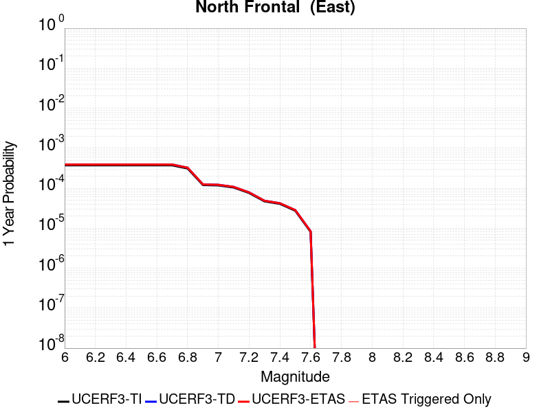 |  |

| Magnitude | 1 wk TI Prob | 1 wk TD Prob | 1 wk ETAS Prob | 1 wk ETAS/TD Gain | 1 wk ETAS Triggered Only | 1 mo TI Prob | 1 mo TD Prob | 1 mo ETAS Prob | 1 mo ETAS/TD Gain | 1 mo ETAS Triggered Only | 1 yr TI Prob | 1 yr TD Prob | 1 yr ETAS Prob | 1 yr ETAS/TD Gain | 1 yr ETAS Triggered Only | 10 yr TI Prob | 10 yr TD Prob | 10 yr ETAS Prob | 10 yr ETAS/TD Gain | 10 yr ETAS Triggered Only |
|-----|-----|-----|-----|-----|-----|-----|-----|-----|-----|-----|-----|-----|-----|-----|-----|-----|-----|-----|-----|-----|
| 6.0 | 7.135738E-6 | 7.4772242E-6 | 7.4772242E-6 | 1.0 | 0.0 | 3.0581377E-5 | 3.2044965E-5 | 3.2044965E-5 | 1.0 | 0.0 | 3.7226462E-4 | 3.9009753E-4 | 3.9009753E-4 | 1.0 | 0.0 | 0.0037164164 | 0.0038960855 | 0.0039060465 | 1.0025567 | 1.0E-5 |
| 6.1 | 7.135738E-6 | 7.4772242E-6 | 7.4772242E-6 | 1.0 | 0.0 | 3.0581377E-5 | 3.2044965E-5 | 3.2044965E-5 | 1.0 | 0.0 | 3.7226462E-4 | 3.9009753E-4 | 3.9009753E-4 | 1.0 | 0.0 | 0.0037164164 | 0.0038960855 | 0.0039060465 | 1.0025567 | 1.0E-5 |
| 6.2 | 7.135738E-6 | 7.4772242E-6 | 7.4772242E-6 | 1.0 | 0.0 | 3.0581377E-5 | 3.2044965E-5 | 3.2044965E-5 | 1.0 | 0.0 | 3.7226462E-4 | 3.9009753E-4 | 3.9009753E-4 | 1.0 | 0.0 | 0.0037164164 | 0.0038960855 | 0.0039060465 | 1.0025567 | 1.0E-5 |
| 6.3 | 7.135738E-6 | 7.4772242E-6 | 7.4772242E-6 | 1.0 | 0.0 | 3.0581377E-5 | 3.2044965E-5 | 3.2044965E-5 | 1.0 | 0.0 | 3.7226462E-4 | 3.9009753E-4 | 3.9009753E-4 | 1.0 | 0.0 | 0.0037164164 | 0.0038960855 | 0.0039060465 | 1.0025567 | 1.0E-5 |
| 6.4 | 7.135738E-6 | 7.4772242E-6 | 7.4772242E-6 | 1.0 | 0.0 | 3.0581377E-5 | 3.2044965E-5 | 3.2044965E-5 | 1.0 | 0.0 | 3.7226462E-4 | 3.9009753E-4 | 3.9009753E-4 | 1.0 | 0.0 | 0.0037164164 | 0.0038960855 | 0.0039060465 | 1.0025567 | 1.0E-5 |
| 6.5 | 7.135738E-6 | 7.4772242E-6 | 7.4772242E-6 | 1.0 | 0.0 | 3.0581377E-5 | 3.2044965E-5 | 3.2044965E-5 | 1.0 | 0.0 | 3.7226462E-4 | 3.9009753E-4 | 3.9009753E-4 | 1.0 | 0.0 | 0.0037164164 | 0.0038960855 | 0.0039060465 | 1.0025567 | 1.0E-5 |
| 6.6 | 7.135738E-6 | 7.4772242E-6 | 7.4772242E-6 | 1.0 | 0.0 | 3.0581377E-5 | 3.2044965E-5 | 3.2044965E-5 | 1.0 | 0.0 | 3.7226462E-4 | 3.9009753E-4 | 3.9009753E-4 | 1.0 | 0.0 | 0.0037164164 | 0.0038960855 | 0.0039060465 | 1.0025567 | 1.0E-5 |
| 6.7 | 7.135738E-6 | 7.4772242E-6 | 7.4772242E-6 | 1.0 | 0.0 | 3.0581377E-5 | 3.2044965E-5 | 3.2044965E-5 | 1.0 | 0.0 | 3.7226462E-4 | 3.9009753E-4 | 3.9009753E-4 | 1.0 | 0.0 | 0.0037164164 | 0.0038960855 | 0.0039060465 | 1.0025567 | 1.0E-5 |
| 6.8 | 5.959142E-6 | 6.236721E-6 | 6.236721E-6 | 1.0 | 0.0 | 2.553893E-5 | 2.6728634E-5 | 2.6728634E-5 | 1.0 | 0.0 | 3.108921E-4 | 3.253906E-4 | 3.253906E-4 | 1.0 | 0.0 | 0.0031045752 | 0.0032509149 | 0.0032608823 | 1.0030661 | 1.0E-5 |
| 6.9 | 2.2946929E-6 | 2.3824725E-6 | 2.3824725E-6 | 1.0 | 0.0 | 9.834361E-6 | 1.021056E-5 | 1.021056E-5 | 1.0 | 0.0 | 1.1972676E-4 | 1.2430694E-4 | 1.2430694E-4 | 1.0 | 0.0 | 0.0011966228 | 0.0012424206 | 0.0012524081 | 1.0080388 | 1.0E-5 |
| 7.0 | 2.2468673E-6 | 2.3321654E-6 | 2.3321654E-6 | 1.0 | 0.0 | 9.629396E-6 | 9.994959E-6 | 9.994959E-6 | 1.0 | 0.0 | 1.1723159E-4 | 1.2168231E-4 | 1.2168231E-4 | 1.0 | 0.0 | 0.0011716976 | 0.0012162031 | 0.001226191 | 1.0082123 | 1.0E-5 |
| 7.1 | 1.9921076E-6 | 2.0646132E-6 | 2.0646132E-6 | 1.0 | 0.0 | 8.537577E-6 | 8.848315E-6 | 8.848315E-6 | 1.0 | 0.0 | 1.0394004E-4 | 1.0772334E-4 | 1.0772334E-4 | 1.0 | 0.0 | 0.0010389143 | 0.001076754 | 0.001076754 | 1.0 | 0.0 |
| 7.2 | 1.4524545E-6 | 1.504522E-6 | 1.504522E-6 | 1.0 | 0.0 | 6.2247905E-6 | 6.447937E-6 | 6.447937E-6 | 1.0 | 0.0 | 7.5784184E-5 | 7.850105E-5 | 7.850105E-5 | 1.0 | 0.0 | 7.575835E-4 | 7.8475766E-4 | 7.8475766E-4 | 1.0 | 0.0 |
| 7.3 | 8.9802575E-7 | 9.308773E-7 | 9.308773E-7 | 1.0 | 0.0 | 3.848676E-6 | 3.989469E-6 | 3.989469E-6 | 1.0 | 0.0 | 4.685662E-5 | 4.8570815E-5 | 4.8570815E-5 | 1.0 | 0.0 | 4.6846745E-4 | 4.856133E-4 | 4.856133E-4 | 1.0 | 0.0 |
| 7.4 | 7.776139E-7 | 8.060514E-7 | 8.060514E-7 | 1.0 | 0.0 | 3.3326266E-6 | 3.454502E-6 | 3.454502E-6 | 1.0 | 0.0 | 4.0573974E-5 | 4.2057858E-5 | 4.2057858E-5 | 1.0 | 0.0 | 4.0566566E-4 | 4.2050975E-4 | 4.2050975E-4 | 1.0 | 0.0 |
| 7.5 | 5.244417E-7 | 5.4412465E-7 | 5.4412465E-7 | 1.0 | 0.0 | 2.2476054E-6 | 2.331961E-6 | 2.331961E-6 | 1.0 | 0.0 | 2.7364253E-5 | 2.8391321E-5 | 2.8391321E-5 | 1.0 | 0.0 | 2.7360884E-4 | 2.8388345E-4 | 2.8388345E-4 | 1.0 | 0.0 |
| 7.6 | 1.5489647E-7 | 1.6089587E-7 | 1.6089587E-7 | 1.0 | 0.0 | 6.6384183E-7 | 6.8955364E-7 | 6.8955364E-7 | 1.0 | 0.0 | 8.082245E-6 | 8.395304E-6 | 8.395304E-6 | 1.0 | 0.0 | 8.08195E-5 | 8.395186E-5 | 8.395186E-5 | 1.0 | 0.0 |

## Shoreline
*[(top)](#table-of-contents)*

| 1 Week | 1 Month | 1 Year | 10 Year |
|-----|-----|-----|-----|
|  |  |  |  |

| Magnitude | 1 wk TI Prob | 1 wk TD Prob | 1 wk ETAS Prob | 1 wk ETAS/TD Gain | 1 wk ETAS Triggered Only | 1 mo TI Prob | 1 mo TD Prob | 1 mo ETAS Prob | 1 mo ETAS/TD Gain | 1 mo ETAS Triggered Only | 1 yr TI Prob | 1 yr TD Prob | 1 yr ETAS Prob | 1 yr ETAS/TD Gain | 1 yr ETAS Triggered Only | 10 yr TI Prob | 10 yr TD Prob | 10 yr ETAS Prob | 10 yr ETAS/TD Gain | 10 yr ETAS Triggered Only |
|-----|-----|-----|-----|-----|-----|-----|-----|-----|-----|-----|-----|-----|-----|-----|-----|-----|-----|-----|-----|-----|
| 6.0 | 3.9888673E-6 | 4.0479445E-6 | 4.0479445E-6 | 1.0 | 0.0 | 1.7095033E-5 | 1.734825E-5 | 1.734825E-5 | 1.0 | 0.0 | 2.0811215E-4 | 2.1120005E-4 | 2.1120005E-4 | 1.0 | 0.0 | 0.0020791737 | 0.002110542 | 0.002120521 | 1.0047281 | 1.0E-5 |
| 6.1 | 3.9888673E-6 | 4.0479445E-6 | 4.0479445E-6 | 1.0 | 0.0 | 1.7095033E-5 | 1.734825E-5 | 1.734825E-5 | 1.0 | 0.0 | 2.0811215E-4 | 2.1120005E-4 | 2.1120005E-4 | 1.0 | 0.0 | 0.0020791737 | 0.002110542 | 0.002120521 | 1.0047281 | 1.0E-5 |
| 6.2 | 1.4039653E-6 | 1.4100972E-6 | 1.4100972E-6 | 1.0 | 0.0 | 6.0169805E-6 | 6.04326E-6 | 6.04326E-6 | 1.0 | 0.0 | 7.325427E-5 | 7.3574265E-5 | 7.3574265E-5 | 1.0 | 0.0 | 7.3230127E-4 | 7.355051E-4 | 7.355051E-4 | 1.0 | 0.0 |
| 6.3 | 1.4039653E-6 | 1.4100972E-6 | 1.4100972E-6 | 1.0 | 0.0 | 6.0169805E-6 | 6.04326E-6 | 6.04326E-6 | 1.0 | 0.0 | 7.325427E-5 | 7.3574265E-5 | 7.3574265E-5 | 1.0 | 0.0 | 7.3230127E-4 | 7.355051E-4 | 7.355051E-4 | 1.0 | 0.0 |
| 6.4 | 1.3314152E-6 | 1.3361685E-6 | 1.3361685E-6 | 1.0 | 0.0 | 5.7060524E-6 | 5.7264238E-6 | 5.7264238E-6 | 1.0 | 0.0 | 6.946897E-5 | 6.971703E-5 | 6.971703E-5 | 1.0 | 0.0 | 6.9447263E-4 | 6.96957E-4 | 6.96957E-4 | 1.0 | 0.0 |
| 6.5 | 1.1187026E-6 | 1.1203715E-6 | 1.1203715E-6 | 1.0 | 0.0 | 4.794431E-6 | 4.801583E-6 | 4.801583E-6 | 1.0 | 0.0 | 5.8370628E-5 | 5.8457732E-5 | 5.8457732E-5 | 1.0 | 0.0 | 5.83553E-4 | 5.844261E-4 | 5.844261E-4 | 1.0 | 0.0 |
| 6.6 | 9.793089E-7 | 9.784991E-7 | 9.784991E-7 | 1.0 | 0.0 | 4.1970316E-6 | 4.193561E-6 | 4.193561E-6 | 1.0 | 0.0 | 5.1097657E-5 | 5.105542E-5 | 5.105542E-5 | 1.0 | 0.0 | 5.108591E-4 | 5.104382E-4 | 5.104382E-4 | 1.0 | 0.0 |
| 6.7 | 8.995986E-7 | 8.9728695E-7 | 8.9728695E-7 | 1.0 | 0.0 | 3.8554167E-6 | 3.84551E-6 | 3.84551E-6 | 1.0 | 0.0 | 4.693869E-5 | 4.6818088E-5 | 4.6818088E-5 | 1.0 | 0.0 | 4.6928777E-4 | 4.680832E-4 | 4.680832E-4 | 1.0 | 0.0 |
| 6.8 | 7.931612E-7 | 7.8804686E-7 | 7.8804686E-7 | 1.0 | 0.0 | 3.3992578E-6 | 3.3773392E-6 | 3.3773392E-6 | 1.0 | 0.0 | 4.1385178E-5 | 4.1118336E-5 | 4.1118336E-5 | 1.0 | 0.0 | 4.1377472E-4 | 4.1110782E-4 | 4.1110782E-4 | 1.0 | 0.0 |
| 6.9 | 7.1465956E-7 | 7.078069E-7 | 7.078069E-7 | 1.0 | 0.0 | 3.062823E-6 | 3.0334547E-6 | 3.0334547E-6 | 1.0 | 0.0 | 3.7289232E-5 | 3.6931688E-5 | 3.6931688E-5 | 1.0 | 0.0 | 3.7282976E-4 | 3.6925587E-4 | 3.6925587E-4 | 1.0 | 0.0 |
| 7.0 | 6.389046E-7 | 6.2995184E-7 | 6.2995184E-7 | 1.0 | 0.0 | 2.7381598E-6 | 2.699791E-6 | 2.699791E-6 | 1.0 | 0.0 | 3.3336586E-5 | 3.2869462E-5 | 3.2869462E-5 | 1.0 | 0.0 | 3.3331584E-4 | 3.2864625E-4 | 3.2864625E-4 | 1.0 | 0.0 |
| 7.1 | 5.4300875E-7 | 5.3111876E-7 | 5.3111876E-7 | 1.0 | 0.0 | 2.3271782E-6 | 2.2762213E-6 | 2.2762213E-6 | 1.0 | 0.0 | 2.8333026E-5 | 2.7712642E-5 | 2.7712642E-5 | 1.0 | 0.0 | 2.8329415E-4 | 2.7709195E-4 | 2.7709195E-4 | 1.0 | 0.0 |
| 7.2 | 4.6768855E-7 | 4.5349486E-7 | 4.5349486E-7 | 1.0 | 0.0 | 2.0043778E-6 | 1.9435479E-6 | 1.9435479E-6 | 1.0 | 0.0 | 2.4403027E-5 | 2.366244E-5 | 2.366244E-5 | 1.0 | 0.0 | 2.4400349E-4 | 2.3659926E-4 | 2.3659926E-4 | 1.0 | 0.0 |
| 7.3 | 4.0966103E-7 | 3.9386174E-7 | 3.9386174E-7 | 1.0 | 0.0 | 1.7556889E-6 | 1.6879777E-6 | 1.6879777E-6 | 1.0 | 0.0 | 2.1375303E-5 | 2.0550935E-5 | 2.0550935E-5 | 1.0 | 0.0 | 2.1373246E-4 | 2.0549039E-4 | 2.0549039E-4 | 1.0 | 0.0 |
| 7.4 | 3.5105785E-7 | 3.3364464E-7 | 3.3364464E-7 | 1.0 | 0.0 | 1.5045327E-6 | 1.4299047E-6 | 1.4299047E-6 | 1.0 | 0.0 | 1.8317533E-5 | 1.7408951E-5 | 1.7408951E-5 | 1.0 | 0.0 | 1.8316023E-4 | 1.740759E-4 | 1.740759E-4 | 1.0 | 0.0 |
| 7.5 | 2.8737534E-7 | 2.6820504E-7 | 2.6820504E-7 | 1.0 | 0.0 | 1.2316079E-6 | 1.1494496E-6 | 1.1494496E-6 | 1.0 | 0.0 | 1.4994724E-5 | 1.399446E-5 | 1.399446E-5 | 1.0 | 0.0 | 1.4993713E-4 | 1.399358E-4 | 1.399358E-4 | 1.0 | 0.0 |
| 7.6 | 2.0924051E-7 | 1.8779421E-7 | 1.8779421E-7 | 1.0 | 0.0 | 8.967448E-7 | 8.0483204E-7 | 8.0483204E-7 | 1.0 | 0.0 | 1.0917813E-5 | 9.798786E-6 | 9.798786E-6 | 1.0 | 0.0 | 1.0917276E-4 | 9.798355E-5 | 9.798355E-5 | 1.0 | 0.0 |
| 7.7 | 1.392265E-7 | 1.1543791E-7 | 1.1543791E-7 | 1.0 | 0.0 | 5.9668486E-7 | 4.947338E-7 | 4.947338E-7 | 1.0 | 0.0 | 7.2646135E-6 | 6.0233674E-6 | 6.0233674E-6 | 1.0 | 0.0 | 7.2643765E-5 | 6.0232047E-5 | 6.0232047E-5 | 1.0 | 0.0 |
| 7.8 | 8.1080074E-8 | 5.587054E-8 | 5.587054E-8 | 1.0 | 0.0 | 3.4748598E-7 | 2.3944517E-7 | 2.3944517E-7 | 1.0 | 0.0 | 4.2306337E-6 | 2.9152409E-6 | 2.9152409E-6 | 1.0 | 0.0 | 4.230553E-5 | 2.9152028E-5 | 2.9152028E-5 | 1.0 | 0.0 |
| 7.9 | 5.0859036E-8 | 2.724731E-8 | 2.724731E-8 | 1.0 | 0.0 | 2.1796728E-7 | 1.1677419E-7 | 1.1677419E-7 | 1.0 | 0.0 | 2.6537484E-6 | 1.4217248E-6 | 1.4217248E-6 | 1.0 | 0.0 | 2.6537167E-5 | 1.42171575E-5 | 1.42171575E-5 | 1.0 | 0.0 |
| 8.0 | 3.1760536E-8 | 1.3578924E-8 | 1.3578924E-8 | 1.0 | 0.0 | 1.3611657E-7 | 5.8195386E-8 | 5.8195386E-8 | 1.0 | 0.0 | 1.6572179E-6 | 7.085286E-7 | 7.085286E-7 | 1.0 | 0.0 | 1.6572056E-5 | 7.085264E-6 | 7.085264E-6 | 1.0 | 0.0 |
| 8.1 | 1.2947896E-8 | 5.663641E-9 | 5.663641E-9 | 1.0 | 0.0 | 5.5490982E-8 | 2.4272747E-8 | 2.4272747E-8 | 1.0 | 0.0 | 6.756025E-7 | 2.9552066E-7 | 2.9552066E-7 | 1.0 | 0.0 | 6.7560045E-6 | 2.9552027E-6 | 2.9552027E-6 | 1.0 | 0.0 |

## Elsinore (Julian)
*[(top)](#table-of-contents)*

| 1 Week | 1 Month | 1 Year | 10 Year |
|-----|-----|-----|-----|
|  | 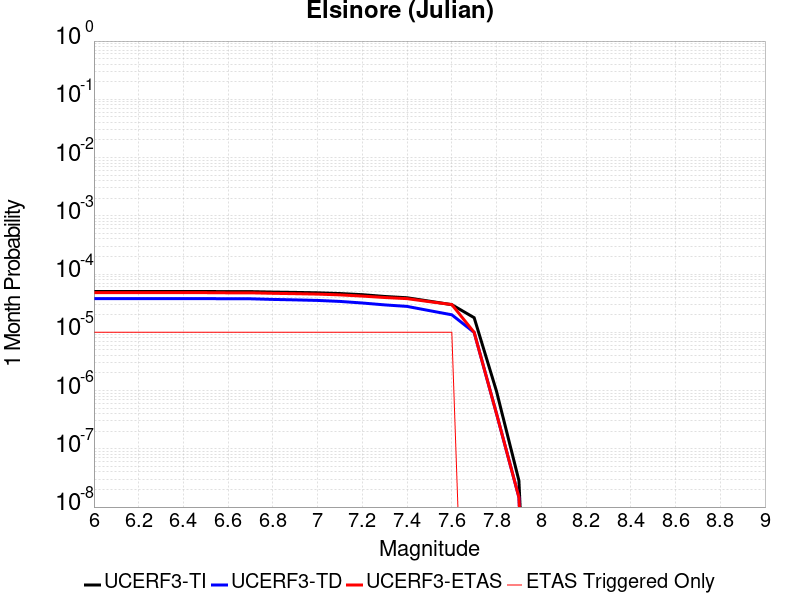 |  |  |

| Magnitude | 1 wk TI Prob | 1 wk TD Prob | 1 wk ETAS Prob | 1 wk ETAS/TD Gain | 1 wk ETAS Triggered Only | 1 mo TI Prob | 1 mo TD Prob | 1 mo ETAS Prob | 1 mo ETAS/TD Gain | 1 mo ETAS Triggered Only | 1 yr TI Prob | 1 yr TD Prob | 1 yr ETAS Prob | 1 yr ETAS/TD Gain | 1 yr ETAS Triggered Only | 10 yr TI Prob | 10 yr TD Prob | 10 yr ETAS Prob | 10 yr ETAS/TD Gain | 10 yr ETAS Triggered Only |
|-----|-----|-----|-----|-----|-----|-----|-----|-----|-----|-----|-----|-----|-----|-----|-----|-----|-----|-----|-----|-----|
| 6.0 | 1.1710231E-5 | 8.845696E-6 | 8.845696E-6 | 1.0 | 0.0 | 5.0185736E-5 | 3.7909587E-5 | 4.790921E-5 | 1.2637755 | 1.0E-5 | 6.1084004E-4 | 4.6145316E-4 | 4.7144855E-4 | 1.0216607 | 1.0E-5 | 0.006091637 | 0.0046051457 | 0.0046150996 | 1.0021615 | 1.0E-5 |
| 6.1 | 1.1710231E-5 | 8.845696E-6 | 8.845696E-6 | 1.0 | 0.0 | 5.0185736E-5 | 3.7909587E-5 | 4.790921E-5 | 1.2637755 | 1.0E-5 | 6.1084004E-4 | 4.6145316E-4 | 4.7144855E-4 | 1.0216607 | 1.0E-5 | 0.006091637 | 0.0046051457 | 0.0046150996 | 1.0021615 | 1.0E-5 |
| 6.2 | 1.1710231E-5 | 8.845696E-6 | 8.845696E-6 | 1.0 | 0.0 | 5.0185736E-5 | 3.7909587E-5 | 4.790921E-5 | 1.2637755 | 1.0E-5 | 6.1084004E-4 | 4.6145316E-4 | 4.7144855E-4 | 1.0216607 | 1.0E-5 | 0.006091637 | 0.0046051457 | 0.0046150996 | 1.0021615 | 1.0E-5 |
| 6.3 | 1.1710231E-5 | 8.845696E-6 | 8.845696E-6 | 1.0 | 0.0 | 5.0185736E-5 | 3.7909587E-5 | 4.790921E-5 | 1.2637755 | 1.0E-5 | 6.1084004E-4 | 4.6145316E-4 | 4.7144855E-4 | 1.0216607 | 1.0E-5 | 0.006091637 | 0.0046051457 | 0.0046150996 | 1.0021615 | 1.0E-5 |
| 6.4 | 1.1710231E-5 | 8.845696E-6 | 8.845696E-6 | 1.0 | 0.0 | 5.0185736E-5 | 3.7909587E-5 | 4.790921E-5 | 1.2637755 | 1.0E-5 | 6.1084004E-4 | 4.6145316E-4 | 4.7144855E-4 | 1.0216607 | 1.0E-5 | 0.006091637 | 0.0046051457 | 0.0046150996 | 1.0021615 | 1.0E-5 |
| 6.5 | 1.1710231E-5 | 8.845696E-6 | 8.845696E-6 | 1.0 | 0.0 | 5.0185736E-5 | 3.7909587E-5 | 4.790921E-5 | 1.2637755 | 1.0E-5 | 6.1084004E-4 | 4.6145316E-4 | 4.7144855E-4 | 1.0216607 | 1.0E-5 | 0.006091637 | 0.0046051457 | 0.0046150996 | 1.0021615 | 1.0E-5 |
| 6.6 | 1.1650619E-5 | 8.778072E-6 | 8.778072E-6 | 1.0 | 0.0 | 4.993027E-5 | 3.7619775E-5 | 4.76194E-5 | 1.2658076 | 1.0E-5 | 6.0773146E-4 | 4.579262E-4 | 4.679216E-4 | 1.0218276 | 1.0E-5 | 0.0060607214 | 0.0045700213 | 0.0045799757 | 1.0021782 | 1.0E-5 |
| 6.7 | 1.1650619E-5 | 8.778072E-6 | 8.778072E-6 | 1.0 | 0.0 | 4.993027E-5 | 3.7619775E-5 | 4.76194E-5 | 1.2658076 | 1.0E-5 | 6.0773146E-4 | 4.579262E-4 | 4.679216E-4 | 1.0218276 | 1.0E-5 | 0.0060607214 | 0.0045700213 | 0.0045799757 | 1.0021782 | 1.0E-5 |
| 6.8 | 1.1442698E-5 | 8.56122E-6 | 8.56122E-6 | 1.0 | 0.0 | 4.9039216E-5 | 3.669044E-5 | 4.669007E-5 | 1.2725406 | 1.0E-5 | 5.968889E-4 | 4.466162E-4 | 4.5661174E-4 | 1.0223806 | 1.0E-5 | 0.0059528816 | 0.004457379 | 0.0044673346 | 1.0022335 | 1.0E-5 |
| 6.9 | 1.1300589E-5 | 8.409085E-6 | 8.409085E-6 | 1.0 | 0.0 | 4.8430196E-5 | 3.6038447E-5 | 4.6038087E-5 | 1.2774714 | 1.0E-5 | 5.894781E-4 | 4.386814E-4 | 4.4867702E-4 | 1.0227855 | 1.0E-5 | 0.005879169 | 0.004378346 | 0.004388302 | 1.0022739 | 1.0E-5 |
| 7.0 | 1.1117729E-5 | 8.226242E-6 | 8.226242E-6 | 1.0 | 0.0 | 4.764654E-5 | 3.5254856E-5 | 4.5254503E-5 | 1.2836388 | 1.0E-5 | 5.799422E-4 | 4.29145E-4 | 4.391407E-4 | 1.0232922 | 1.0E-5 | 0.0057843104 | 0.0042833528 | 0.00429331 | 1.0023246 | 1.0E-5 |
| 7.1 | 1.08053955E-5 | 7.911868E-6 | 7.911868E-6 | 1.0 | 0.0 | 4.6308014E-5 | 3.3907574E-5 | 4.3907236E-5 | 1.2949094 | 1.0E-5 | 5.6365423E-4 | 4.1274817E-4 | 4.2274402E-4 | 1.0242178 | 1.0E-5 | 0.005622267 | 0.0041200025 | 0.004129961 | 1.0024172 | 1.0E-5 |
| 7.2 | 1.032804E-5 | 7.433115E-6 | 7.433115E-6 | 1.0 | 0.0 | 4.4262277E-5 | 3.1855827E-5 | 4.1855506E-5 | 1.3139043 | 1.0E-5 | 5.387599E-4 | 3.8777723E-4 | 3.9777334E-4 | 1.025778 | 1.0E-5 | 0.0053745564 | 0.0038711845 | 0.0038811457 | 1.0025731 | 1.0E-5 |
| 7.3 | 9.622426E-6 | 6.8979307E-6 | 6.8979307E-6 | 1.0 | 0.0 | 4.1238312E-5 | 2.9562232E-5 | 3.956194E-5 | 1.3382595 | 1.0E-5 | 5.019608E-4 | 3.5986217E-4 | 3.6985858E-4 | 1.0277784 | 1.0E-5 | 0.005008285 | 0.0035929575 | 0.0036029215 | 1.0027732 | 1.0E-5 |
| 7.4 | 9.144434E-6 | 6.4964593E-6 | 6.4964593E-6 | 1.0 | 0.0 | 3.9189843E-5 | 2.784168E-5 | 3.78414E-5 | 1.3591638 | 1.0E-5 | 4.7703186E-4 | 3.389211E-4 | 3.489177E-4 | 1.0294954 | 1.0E-5 | 0.0047600917 | 0.0033841871 | 0.0033941534 | 1.002945 | 1.0E-5 |
| 7.5 | 7.988981E-6 | 5.498398E-6 | 5.498398E-6 | 1.0 | 0.0 | 3.4238044E-5 | 2.3564357E-5 | 3.356412E-5 | 1.4243598 | 1.0E-5 | 4.1676845E-4 | 2.8685955E-4 | 2.9685668E-4 | 1.0348502 | 1.0E-5 | 0.0041598766 | 0.00286502 | 0.0028749912 | 1.0034804 | 1.0E-5 |
| 7.6 | 6.9554876E-6 | 4.6625837E-6 | 4.6625837E-6 | 1.0 | 0.0 | 2.9808893E-5 | 1.9982355E-5 | 2.9982155E-5 | 1.5004315 | 1.0E-5 | 3.6286283E-4 | 2.4325919E-4 | 2.5325676E-4 | 1.0410985 | 1.0E-5 | 0.0036227088 | 0.0024300453 | 0.002440021 | 1.0041051 | 1.0E-5 |
| 7.7 | 4.1557314E-6 | 2.3246162E-6 | 2.3246162E-6 | 1.0 | 0.0 | 1.7810156E-5 | 9.962607E-6 | 9.962607E-6 | 1.0 | 0.0 | 2.1681708E-4 | 1.2128873E-4 | 1.2128873E-4 | 1.0 | 0.0 | 0.0021660565 | 0.0012122984 | 0.0012122984 | 1.0 | 0.0 |
| 7.8 | 2.2597293E-7 | 9.332067E-8 | 9.332067E-8 | 1.0 | 0.0 | 9.684551E-7 | 3.999457E-7 | 3.999457E-7 | 1.0 | 0.0 | 1.1790877E-5 | 4.8693314E-6 | 4.8693314E-6 | 1.0 | 0.0 | 1.17902506E-4 | 4.869257E-5 | 4.869257E-5 | 1.0 | 0.0 |
| 7.9 | 6.676829E-9 | 3.4397993E-9 | 3.4397993E-9 | 1.0 | 0.0 | 2.861498E-8 | 1.4741998E-8 | 1.4741998E-8 | 1.0 | 0.0 | 3.4838732E-7 | 1.794838E-7 | 1.794838E-7 | 1.0 | 0.0 | 3.4838679E-6 | 1.7948367E-6 | 1.7948367E-6 | 1.0 | 0.0 |

## Concord 2011 CFM
*[(top)](#table-of-contents)*

| 1 Week | 1 Month | 1 Year | 10 Year |
|-----|-----|-----|-----|
|  | 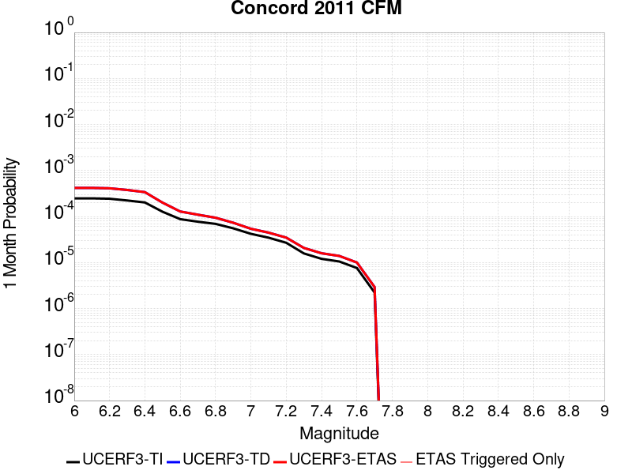 |  |  |

| Magnitude | 1 wk TI Prob | 1 wk TD Prob | 1 wk ETAS Prob | 1 wk ETAS/TD Gain | 1 wk ETAS Triggered Only | 1 mo TI Prob | 1 mo TD Prob | 1 mo ETAS Prob | 1 mo ETAS/TD Gain | 1 mo ETAS Triggered Only | 1 yr TI Prob | 1 yr TD Prob | 1 yr ETAS Prob | 1 yr ETAS/TD Gain | 1 yr ETAS Triggered Only | 10 yr TI Prob | 10 yr TD Prob | 10 yr ETAS Prob | 10 yr ETAS/TD Gain | 10 yr ETAS Triggered Only |
|-----|-----|-----|-----|-----|-----|-----|-----|-----|-----|-----|-----|-----|-----|-----|-----|-----|-----|-----|-----|-----|
| 6.0 | 5.7865112E-5 | 9.7586984E-5 | 9.7586984E-5 | 1.0 | 0.0 | 2.4796976E-4 | 4.1816765E-4 | 4.1816765E-4 | 1.0 | 0.0 | 0.0030148525 | 0.0050798147 | 0.0050897636 | 1.0019586 | 1.0E-5 | 0.029742775 | 0.04926655 | 0.049276058 | 1.000193 | 1.0E-5 |
| 6.1 | 5.7865112E-5 | 9.7586984E-5 | 9.7586984E-5 | 1.0 | 0.0 | 2.4796976E-4 | 4.1816765E-4 | 4.1816765E-4 | 1.0 | 0.0 | 0.0030148525 | 0.0050798147 | 0.0050897636 | 1.0019586 | 1.0E-5 | 0.029742775 | 0.04926655 | 0.049276058 | 1.000193 | 1.0E-5 |
| 6.2 | 5.6789337E-5 | 9.578944E-5 | 9.578944E-5 | 1.0 | 0.0 | 2.4336016E-4 | 4.104663E-4 | 4.104663E-4 | 1.0 | 0.0 | 0.0029588845 | 0.0049865367 | 0.004996487 | 1.0019954 | 1.0E-5 | 0.029197963 | 0.048383076 | 0.04839259 | 1.0001967 | 1.0E-5 |
| 6.3 | 5.203322E-5 | 8.8033295E-5 | 8.8033295E-5 | 1.0 | 0.0 | 2.2298045E-4 | 3.772354E-4 | 3.772354E-4 | 1.0 | 0.0 | 0.0027114071 | 0.004583953 | 0.004593907 | 1.0021715 | 1.0E-5 | 0.026785625 | 0.044554338 | 0.044563893 | 1.0002145 | 1.0E-5 |
| 6.4 | 4.7120942E-5 | 7.897668E-5 | 7.897668E-5 | 1.0 | 0.0 | 2.0193127E-4 | 3.3843177E-4 | 3.3843177E-4 | 1.0 | 0.0 | 0.0024557412 | 0.004113367 | 0.004123326 | 1.0024211 | 1.0E-5 | 0.024287801 | 0.040077757 | 0.040087357 | 1.0002395 | 1.0E-5 |
| 6.5 | 2.9598437E-5 | 4.667605E-5 | 4.667605E-5 | 1.0 | 0.0 | 1.2684427E-4 | 2.0002606E-4 | 2.0002606E-4 | 1.0 | 0.0 | 0.001543235 | 0.0024328078 | 0.0024427834 | 1.0041004 | 1.0E-5 | 0.015325619 | 0.023910793 | 0.023920555 | 1.0004082 | 1.0E-5 |
| 6.6 | 2.0443718E-5 | 2.9985074E-5 | 2.9985074E-5 | 1.0 | 0.0 | 8.7613E-5 | 1.2850134E-4 | 1.2850134E-4 | 1.0 | 0.0 | 0.0010661662 | 0.0015634173 | 0.0015734016 | 1.0063863 | 1.0E-5 | 0.010610655 | 0.015467657 | 0.015477502 | 1.0006365 | 1.0E-5 |
| 6.7 | 1.798539E-5 | 2.5558082E-5 | 2.5558082E-5 | 1.0 | 0.0 | 7.7077966E-5 | 1.09530156E-4 | 1.09530156E-4 | 1.0 | 0.0 | 9.380202E-4 | 0.0013327354 | 0.0013427221 | 1.0074934 | 1.0E-5 | 0.009340706 | 0.013217801 | 0.0132276695 | 1.0007466 | 1.0E-5 |
| 6.8 | 1.613555E-5 | 2.1959771E-5 | 2.1959771E-5 | 1.0 | 0.0 | 6.915052E-5 | 9.410999E-5 | 9.410999E-5 | 1.0 | 0.0 | 8.4158237E-4 | 0.0011452008 | 0.0011551894 | 1.0087221 | 1.0E-5 | 0.008384023 | 0.011378255 | 0.011388141 | 1.0008689 | 1.0E-5 |
| 6.9 | 1.2916435E-5 | 1.7081482E-5 | 1.7081482E-5 | 1.0 | 0.0 | 5.5354973E-5 | 7.320433E-5 | 7.320433E-5 | 1.0 | 0.0 | 6.7373837E-4 | 8.909041E-4 | 9.008952E-4 | 1.0112145 | 1.0E-5 | 0.006716994 | 0.008867769 | 0.008877681 | 1.0011177 | 1.0E-5 |
| 7.0 | 9.81129E-6 | 1.2631147E-5 | 1.2631147E-5 | 1.0 | 0.0 | 4.2047708E-5 | 5.4132375E-5 | 5.4132375E-5 | 1.0 | 0.0 | 5.118106E-4 | 6.58864E-4 | 6.688574E-4 | 1.0151676 | 1.0E-5 | 0.005106334 | 0.006569876 | 0.0065798103 | 1.001512 | 1.0E-5 |
| 7.1 | 8.0889195E-6 | 1.041855E-5 | 1.041855E-5 | 1.0 | 0.0 | 3.4666336E-5 | 4.4650173E-5 | 4.4650173E-5 | 1.0 | 0.0 | 4.219809E-4 | 5.434813E-4 | 5.5347587E-4 | 1.0183899 | 1.0E-5 | 0.004211805 | 0.0054221074 | 0.005432053 | 1.0018343 | 1.0E-5 |
| 7.2 | 6.267438E-6 | 8.115953E-6 | 8.115953E-6 | 1.0 | 0.0 | 2.6860173E-5 | 3.47822E-5 | 3.47822E-5 | 1.0 | 0.0 | 3.2697353E-4 | 4.233917E-4 | 4.3338747E-4 | 1.0236088 | 1.0E-5 | 0.0032649285 | 0.004226314 | 0.0042362716 | 1.0023562 | 1.0E-5 |
| 7.3 | 3.6761196E-6 | 4.840322E-6 | 4.840322E-6 | 1.0 | 0.0 | 1.5754704E-5 | 2.0744073E-5 | 2.0744073E-5 | 1.0 | 0.0 | 1.9179663E-4 | 2.5253004E-4 | 2.5253004E-4 | 1.0 | 0.0 | 0.0019163118 | 0.0025226148 | 0.0025226148 | 1.0 | 0.0 |
| 7.4 | 2.8044356E-6 | 3.7097311E-6 | 3.7097311E-6 | 1.0 | 0.0 | 1.2018954E-5 | 1.5898751E-5 | 1.5898751E-5 | 1.0 | 0.0 | 1.4632095E-4 | 1.9355022E-4 | 1.9355022E-4 | 1.0 | 0.0 | 0.0014622464 | 0.0019340167 | 0.0019340167 | 1.0 | 0.0 |
| 7.5 | 2.4578699E-6 | 3.2448463E-6 | 3.2448463E-6 | 1.0 | 0.0 | 1.0533685E-5 | 1.39064105E-5 | 1.39064105E-5 | 1.0 | 0.0 | 1.2824008E-4 | 1.692975E-4 | 1.692975E-4 | 1.0 | 0.0 | 0.0012816609 | 0.0016918638 | 0.0016918638 | 1.0 | 0.0 |
| 7.6 | 1.7713267E-6 | 2.3352E-6 | 2.3352E-6 | 1.0 | 0.0 | 7.591378E-6 | 1.0007962E-5 | 1.0007962E-5 | 1.0 | 0.0 | 9.2421105E-5 | 1.2184022E-4 | 1.2184022E-4 | 1.0 | 0.0 | 9.2382677E-4 | 0.0012178535 | 0.0012178535 | 1.0 | 0.0 |
| 7.7 | 5.1912366E-7 | 6.82937E-7 | 6.82937E-7 | 1.0 | 0.0 | 2.2248137E-6 | 2.9268697E-6 | 2.9268697E-6 | 1.0 | 0.0 | 2.708677E-5 | 3.5634068E-5 | 3.5634068E-5 | 1.0 | 0.0 | 2.708347E-4 | 3.563112E-4 | 3.563112E-4 | 1.0 | 0.0 |

## Owens Valley Keough Hot Springs
*[(top)](#table-of-contents)*

| 1 Week | 1 Month | 1 Year | 10 Year |
|-----|-----|-----|-----|
|  |  |  |  |

| Magnitude | 1 wk TI Prob | 1 wk TD Prob | 1 wk ETAS Prob | 1 wk ETAS/TD Gain | 1 wk ETAS Triggered Only | 1 mo TI Prob | 1 mo TD Prob | 1 mo ETAS Prob | 1 mo ETAS/TD Gain | 1 mo ETAS Triggered Only | 1 yr TI Prob | 1 yr TD Prob | 1 yr ETAS Prob | 1 yr ETAS/TD Gain | 1 yr ETAS Triggered Only | 10 yr TI Prob | 10 yr TD Prob | 10 yr ETAS Prob | 10 yr ETAS/TD Gain | 10 yr ETAS Triggered Only |
|-----|-----|-----|-----|-----|-----|-----|-----|-----|-----|-----|-----|-----|-----|-----|-----|-----|-----|-----|-----|-----|
| 6.0 | 1.5708529E-5 | 4.95061E-6 | 1.495056E-5 | 3.019943 | 1.0E-5 | 6.7320536E-5 | 2.1216758E-5 | 3.1216547E-5 | 1.4713155 | 1.0E-5 | 8.193192E-4 | 2.5828852E-4 | 2.6828595E-4 | 1.0387064 | 1.0E-5 | 0.008163051 | 0.0025805589 | 0.002590533 | 1.0038651 | 1.0E-5 |
| 6.1 | 1.5708529E-5 | 4.95061E-6 | 1.495056E-5 | 3.019943 | 1.0E-5 | 6.7320536E-5 | 2.1216758E-5 | 3.1216547E-5 | 1.4713155 | 1.0E-5 | 8.193192E-4 | 2.5828852E-4 | 2.6828595E-4 | 1.0387064 | 1.0E-5 | 0.008163051 | 0.0025805589 | 0.002590533 | 1.0038651 | 1.0E-5 |
| 6.2 | 1.5708529E-5 | 4.95061E-6 | 1.495056E-5 | 3.019943 | 1.0E-5 | 6.7320536E-5 | 2.1216758E-5 | 3.1216547E-5 | 1.4713155 | 1.0E-5 | 8.193192E-4 | 2.5828852E-4 | 2.6828595E-4 | 1.0387064 | 1.0E-5 | 0.008163051 | 0.0025805589 | 0.002590533 | 1.0038651 | 1.0E-5 |
| 6.3 | 1.5708529E-5 | 4.95061E-6 | 1.495056E-5 | 3.019943 | 1.0E-5 | 6.7320536E-5 | 2.1216758E-5 | 3.1216547E-5 | 1.4713155 | 1.0E-5 | 8.193192E-4 | 2.5828852E-4 | 2.6828595E-4 | 1.0387064 | 1.0E-5 | 0.008163051 | 0.0025805589 | 0.002590533 | 1.0038651 | 1.0E-5 |
| 6.4 | 1.4622509E-5 | 3.7264542E-6 | 1.3726417E-5 | 3.6835063 | 1.0E-5 | 6.266639E-5 | 1.597044E-5 | 2.597028E-5 | 1.6261469 | 1.0E-5 | 7.626962E-4 | 1.9442604E-4 | 2.044241E-4 | 1.0514234 | 1.0E-5 | 0.007600839 | 0.0019430561 | 0.0019530366 | 1.0051365 | 1.0E-5 |
| 6.5 | 1.3335527E-5 | 2.2776267E-6 | 1.2277604E-5 | 5.3905253 | 1.0E-5 | 5.7151006E-5 | 9.761225E-6 | 1.9761126E-5 | 2.0244517 | 1.0E-5 | 6.955913E-4 | 1.1883711E-4 | 1.2883592E-4 | 1.0841388 | 1.0E-5 | 0.0069341804 | 0.001187975 | 0.0011979631 | 1.0084077 | 1.0E-5 |
| 6.6 | 1.3332855E-5 | 2.2747759E-6 | 1.2274753E-5 | 5.3960276 | 1.0E-5 | 5.7139558E-5 | 9.7490065E-6 | 1.974891E-5 | 2.0257356 | 1.0E-5 | 6.9545204E-4 | 1.18688375E-4 | 1.2868718E-4 | 1.0842443 | 1.0E-5 | 0.0069327964 | 0.0011864892 | 0.0011964773 | 1.0084182 | 1.0E-5 |
| 6.7 | 1.3318214E-5 | 2.2640058E-6 | 1.2263983E-5 | 5.4169397 | 1.0E-5 | 5.707681E-5 | 9.70285E-6 | 1.9702753E-5 | 2.030615 | 1.0E-5 | 6.946886E-4 | 1.18126474E-4 | 1.2812529E-4 | 1.084645 | 1.0E-5 | 0.0069252094 | 0.0011808762 | 0.0011908644 | 1.0084583 | 1.0E-5 |
| 6.8 | 1.2441338E-5 | 1.6776884E-6 | 1.6776884E-6 | 1.0 | 0.0 | 5.331893E-5 | 7.190075E-6 | 7.190075E-6 | 1.0 | 0.0 | 6.489646E-4 | 8.753594E-5 | 8.753594E-5 | 1.0 | 0.0 | 0.0064707273 | 8.752164E-4 | 8.752164E-4 | 1.0 | 0.0 |
| 6.9 | 1.1130476E-5 | 1.0302945E-6 | 1.0302945E-6 | 1.0 | 0.0 | 4.7701167E-5 | 4.4155404E-6 | 4.4155404E-6 | 1.0 | 0.0 | 5.806069E-4 | 5.3757893E-5 | 5.3757893E-5 | 1.0 | 0.0 | 0.0057909233 | 5.3762126E-4 | 5.3762126E-4 | 1.0 | 0.0 |
| 7.0 | 1.0986073E-5 | 9.5785E-7 | 9.5785E-7 | 1.0 | 0.0 | 4.7082318E-5 | 4.1050653E-6 | 4.1050653E-6 | 1.0 | 0.0 | 5.730765E-4 | 4.9978033E-5 | 4.9978033E-5 | 1.0 | 0.0 | 0.0057160086 | 4.998395E-4 | 4.998395E-4 | 1.0 | 0.0 |
| 7.1 | 1.0451338E-5 | 7.999411E-7 | 7.999411E-7 | 1.0 | 0.0 | 4.4790682E-5 | 3.4283146E-6 | 3.4283146E-6 | 1.0 | 0.0 | 5.451901E-4 | 4.173894E-5 | 4.173894E-5 | 1.0 | 0.0 | 0.005438545 | 4.1747853E-4 | 4.1747853E-4 | 1.0 | 0.0 |
| 7.2 | 9.989061E-6 | 6.544159E-7 | 6.544159E-7 | 1.0 | 0.0 | 4.280956E-5 | 2.8046366E-6 | 2.8046366E-6 | 1.0 | 0.0 | 5.2108173E-4 | 3.4145916E-5 | 3.4145916E-5 | 1.0 | 0.0 | 0.0051986156 | 3.4156654E-4 | 3.4156654E-4 | 1.0 | 0.0 |
| 7.3 | 9.465365E-6 | 5.4592874E-7 | 5.4592874E-7 | 1.0 | 0.0 | 4.056522E-5 | 2.3396926E-6 | 2.3396926E-6 | 1.0 | 0.0 | 4.937696E-4 | 2.8485389E-5 | 2.8485389E-5 | 1.0 | 0.0 | 0.0049267393 | 2.849722E-4 | 2.849722E-4 | 1.0 | 0.0 |
| 7.4 | 6.3824805E-6 | 4.0157266E-7 | 4.0157266E-7 | 1.0 | 0.0 | 2.73532E-5 | 1.7210247E-6 | 1.7210247E-6 | 1.0 | 0.0 | 3.3297433E-4 | 2.0953275E-5 | 2.0953275E-5 | 1.0 | 0.0 | 0.0033247585 | 2.0962617E-4 | 2.0962617E-4 | 1.0 | 0.0 |
| 7.5 | 1.6192645E-6 | 2.5158894E-7 | 2.5158894E-7 | 1.0 | 0.0 | 6.9396865E-6 | 1.0782379E-6 | 1.0782379E-6 | 1.0 | 0.0 | 8.448741E-5 | 1.3127469E-5 | 1.3127469E-5 | 1.0 | 0.0 | 8.4455294E-4 | 1.3126706E-4 | 1.3126706E-4 | 1.0 | 0.0 |
| 7.6 | 5.7062545E-7 | 1.0791249E-7 | 1.0791249E-7 | 1.0 | 0.0 | 2.4455355E-6 | 4.6248203E-7 | 4.6248203E-7 | 1.0 | 0.0 | 2.9773988E-5 | 5.6307053E-6 | 5.6307053E-6 | 1.0 | 0.0 | 2.977E-4 | 5.6305707E-5 | 5.6305707E-5 | 1.0 | 0.0 |
| 7.7 | 2.5988817E-7 | 4.5449596E-8 | 4.5449596E-8 | 1.0 | 0.0 | 1.113806E-6 | 1.9478398E-7 | 1.9478398E-7 | 1.0 | 0.0 | 1.3560503E-5 | 2.3714929E-6 | 2.3714929E-6 | 1.0 | 0.0 | 1.3559677E-4 | 2.3714718E-5 | 2.3714718E-5 | 1.0 | 0.0 |

## East Huasna 2011 CFM
*[(top)](#table-of-contents)*

| 1 Week | 1 Month | 1 Year | 10 Year |
|-----|-----|-----|-----|
|  |  | 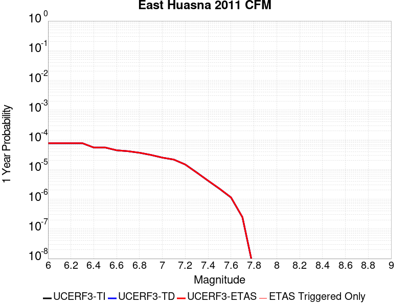 |  |

| Magnitude | 1 wk TI Prob | 1 wk TD Prob | 1 wk ETAS Prob | 1 wk ETAS/TD Gain | 1 wk ETAS Triggered Only | 1 mo TI Prob | 1 mo TD Prob | 1 mo ETAS Prob | 1 mo ETAS/TD Gain | 1 mo ETAS Triggered Only | 1 yr TI Prob | 1 yr TD Prob | 1 yr ETAS Prob | 1 yr ETAS/TD Gain | 1 yr ETAS Triggered Only | 10 yr TI Prob | 10 yr TD Prob | 10 yr ETAS Prob | 10 yr ETAS/TD Gain | 10 yr ETAS Triggered Only |
|-----|-----|-----|-----|-----|-----|-----|-----|-----|-----|-----|-----|-----|-----|-----|-----|-----|-----|-----|-----|-----|
| 6.0 | 1.4658423E-6 | 1.4715672E-6 | 1.4715672E-6 | 1.0 | 0.0 | 6.282166E-6 | 6.3067014E-6 | 6.3067014E-6 | 1.0 | 0.0 | 7.6482684E-5 | 7.6781456E-5 | 7.6781456E-5 | 1.0 | 0.0 | 7.645637E-4 | 7.675563E-4 | 7.775486E-4 | 1.0130184 | 1.0E-5 |
| 6.1 | 1.4658423E-6 | 1.4715672E-6 | 1.4715672E-6 | 1.0 | 0.0 | 6.282166E-6 | 6.3067014E-6 | 6.3067014E-6 | 1.0 | 0.0 | 7.6482684E-5 | 7.6781456E-5 | 7.6781456E-5 | 1.0 | 0.0 | 7.645637E-4 | 7.675563E-4 | 7.775486E-4 | 1.0130184 | 1.0E-5 |
| 6.2 | 1.4658423E-6 | 1.4715672E-6 | 1.4715672E-6 | 1.0 | 0.0 | 6.282166E-6 | 6.3067014E-6 | 6.3067014E-6 | 1.0 | 0.0 | 7.6482684E-5 | 7.6781456E-5 | 7.6781456E-5 | 1.0 | 0.0 | 7.645637E-4 | 7.675563E-4 | 7.775486E-4 | 1.0130184 | 1.0E-5 |
| 6.3 | 1.4658423E-6 | 1.4715672E-6 | 1.4715672E-6 | 1.0 | 0.0 | 6.282166E-6 | 6.3067014E-6 | 6.3067014E-6 | 1.0 | 0.0 | 7.6482684E-5 | 7.6781456E-5 | 7.6781456E-5 | 1.0 | 0.0 | 7.645637E-4 | 7.675563E-4 | 7.775486E-4 | 1.0130184 | 1.0E-5 |
| 6.4 | 1.0488257E-6 | 1.0527524E-6 | 1.0527524E-6 | 1.0 | 0.0 | 4.4949593E-6 | 4.511788E-6 | 4.511788E-6 | 1.0 | 0.0 | 5.472476E-5 | 5.4929656E-5 | 5.4929656E-5 | 1.0 | 0.0 | 5.4711284E-4 | 5.4916274E-4 | 5.591572E-4 | 1.0181996 | 1.0E-5 |
| 6.5 | 1.0488257E-6 | 1.0527524E-6 | 1.0527524E-6 | 1.0 | 0.0 | 4.4949593E-6 | 4.511788E-6 | 4.511788E-6 | 1.0 | 0.0 | 5.472476E-5 | 5.4929656E-5 | 5.4929656E-5 | 1.0 | 0.0 | 5.4711284E-4 | 5.4916274E-4 | 5.591572E-4 | 1.0181996 | 1.0E-5 |
| 6.6 | 8.463064E-7 | 8.493641E-7 | 8.493641E-7 | 1.0 | 0.0 | 3.6270226E-6 | 3.6401266E-6 | 3.6401266E-6 | 1.0 | 0.0 | 4.4158103E-5 | 4.431765E-5 | 4.431765E-5 | 1.0 | 0.0 | 4.414933E-4 | 4.43089E-4 | 4.5308456E-4 | 1.0225588 | 1.0E-5 |
| 6.7 | 7.876149E-7 | 7.902541E-7 | 7.902541E-7 | 1.0 | 0.0 | 3.375488E-6 | 3.3867989E-6 | 3.3867989E-6 | 1.0 | 0.0 | 4.109579E-5 | 4.1233503E-5 | 4.1233503E-5 | 1.0 | 0.0 | 4.108819E-4 | 4.1225913E-4 | 4.2225502E-4 | 1.0242466 | 1.0E-5 |
| 6.8 | 6.9940785E-7 | 7.0165845E-7 | 7.0165845E-7 | 1.0 | 0.0 | 2.9974588E-6 | 3.0071044E-6 | 3.0071044E-6 | 1.0 | 0.0 | 3.649345E-5 | 3.6610883E-5 | 3.6610883E-5 | 1.0 | 0.0 | 3.6487455E-4 | 3.66049E-4 | 3.7604535E-4 | 1.0273087 | 1.0E-5 |
| 6.9 | 5.899658E-7 | 5.915606E-7 | 5.915606E-7 | 1.0 | 0.0 | 2.5284223E-6 | 2.5352572E-6 | 2.5352572E-6 | 1.0 | 0.0 | 3.0783107E-5 | 3.0866322E-5 | 3.0866322E-5 | 1.0 | 0.0 | 3.0778843E-4 | 3.0862063E-4 | 3.0862063E-4 | 1.0 | 0.0 |
| 7.0 | 4.793814E-7 | 4.8032786E-7 | 4.8032786E-7 | 1.0 | 0.0 | 2.05449E-6 | 2.0585462E-6 | 2.0585462E-6 | 1.0 | 0.0 | 2.501313E-5 | 2.5062514E-5 | 2.5062514E-5 | 1.0 | 0.0 | 2.5010316E-4 | 2.5059705E-4 | 2.5059705E-4 | 1.0 | 0.0 |
| 7.1 | 4.1256908E-7 | 4.1299458E-7 | 4.1299458E-7 | 1.0 | 0.0 | 1.768152E-6 | 1.7699756E-6 | 1.7699756E-6 | 1.0 | 0.0 | 2.1527037E-5 | 2.154924E-5 | 2.154924E-5 | 1.0 | 0.0 | 2.1524953E-4 | 2.1547166E-4 | 2.1547166E-4 | 1.0 | 0.0 |
| 7.2 | 2.822599E-7 | 2.8161452E-7 | 2.8161452E-7 | 1.0 | 0.0 | 1.2096847E-6 | 1.2069188E-6 | 1.2069188E-6 | 1.0 | 0.0 | 1.47278115E-5 | 1.4694138E-5 | 1.4694138E-5 | 1.0 | 0.0 | 1.4726835E-4 | 1.4693174E-4 | 1.4693174E-4 | 1.0 | 0.0 |
| 7.3 | 1.5261652E-7 | 1.5075038E-7 | 1.5075038E-7 | 1.0 | 0.0 | 6.540707E-7 | 6.4607286E-7 | 6.4607286E-7 | 1.0 | 0.0 | 7.963281E-6 | 7.865909E-6 | 7.865909E-6 | 1.0 | 0.0 | 7.962996E-5 | 7.8656325E-5 | 7.8656325E-5 | 1.0 | 0.0 |
| 7.4 | 7.976414E-8 | 8.057876E-8 | 8.057876E-8 | 1.0 | 0.0 | 3.418463E-7 | 3.453375E-7 | 3.453375E-7 | 1.0 | 0.0 | 4.1619705E-6 | 4.2044758E-6 | 4.2044758E-6 | 1.0 | 0.0 | 4.161893E-5 | 4.2043972E-5 | 4.2043972E-5 | 1.0 | 0.0 |
| 7.5 | 4.2715055E-8 | 4.320258E-8 | 4.320258E-8 | 1.0 | 0.0 | 1.830645E-7 | 1.851539E-7 | 1.851539E-7 | 1.0 | 0.0 | 2.228808E-6 | 2.2542463E-6 | 2.2542463E-6 | 1.0 | 0.0 | 2.2287857E-5 | 2.2542237E-5 | 2.2542237E-5 | 1.0 | 0.0 |
| 7.6 | 2.1807532E-8 | 2.205751E-8 | 2.205751E-8 | 1.0 | 0.0 | 9.346085E-8 | 9.4532176E-8 | 9.4532176E-8 | 1.0 | 0.0 | 1.1378852E-6 | 1.1509286E-6 | 1.1509286E-6 | 1.0 | 0.0 | 1.1378794E-5 | 1.1509228E-5 | 1.1509228E-5 | 1.0 | 0.0 |
| 7.7 | 4.7196043E-9 | 4.7672892E-9 | 4.7672892E-9 | 1.0 | 0.0 | 2.0226874E-8 | 2.043124E-8 | 2.043124E-8 | 1.0 | 0.0 | 2.4626218E-7 | 2.4875033E-7 | 2.4875033E-7 | 1.0 | 0.0 | 2.462619E-6 | 2.4875005E-6 | 2.4875005E-6 | 1.0 | 0.0 |
| 7.8 | 7.400003E-11 | 7.4654505E-11 | 7.4654505E-11 | 1.0 | 0.0 | 3.171432E-10 | 3.1994807E-10 | 3.1994807E-10 | 1.0 | 0.0 | 3.861218E-9 | 3.8953676E-9 | 3.8953676E-9 | 1.0 | 0.0 | 3.861218E-8 | 3.8953676E-8 | 3.8953676E-8 | 1.0 | 0.0 |

## Monte Vista - Shannon 2011 CFM
*[(top)](#table-of-contents)*

| 1 Week | 1 Month | 1 Year | 10 Year |
|-----|-----|-----|-----|
|  |  |  |  |

| Magnitude | 1 wk TI Prob | 1 wk TD Prob | 1 wk ETAS Prob | 1 wk ETAS/TD Gain | 1 wk ETAS Triggered Only | 1 mo TI Prob | 1 mo TD Prob | 1 mo ETAS Prob | 1 mo ETAS/TD Gain | 1 mo ETAS Triggered Only | 1 yr TI Prob | 1 yr TD Prob | 1 yr ETAS Prob | 1 yr ETAS/TD Gain | 1 yr ETAS Triggered Only | 10 yr TI Prob | 10 yr TD Prob | 10 yr ETAS Prob | 10 yr ETAS/TD Gain | 10 yr ETAS Triggered Only |
|-----|-----|-----|-----|-----|-----|-----|-----|-----|-----|-----|-----|-----|-----|-----|-----|-----|-----|-----|-----|-----|
| 6.0 | 2.7907707E-5 | 2.7584952E-5 | 2.7584952E-5 | 1.0 | 0.0 | 1.19598975E-4 | 1.18216565E-4 | 1.18216565E-4 | 1.0 | 0.0 | 0.0014551448 | 0.0014384601 | 0.0014384601 | 1.0 | 0.0 | 0.014456532 | 0.014320564 | 0.014330422 | 1.0006883 | 1.0E-5 |
| 6.1 | 2.7907707E-5 | 2.7584952E-5 | 2.7584952E-5 | 1.0 | 0.0 | 1.19598975E-4 | 1.18216565E-4 | 1.18216565E-4 | 1.0 | 0.0 | 0.0014551448 | 0.0014384601 | 0.0014384601 | 1.0 | 0.0 | 0.014456532 | 0.014320564 | 0.014330422 | 1.0006883 | 1.0E-5 |
| 6.2 | 2.7907707E-5 | 2.7584952E-5 | 2.7584952E-5 | 1.0 | 0.0 | 1.19598975E-4 | 1.18216565E-4 | 1.18216565E-4 | 1.0 | 0.0 | 0.0014551448 | 0.0014384601 | 0.0014384601 | 1.0 | 0.0 | 0.014456532 | 0.014320564 | 0.014330422 | 1.0006883 | 1.0E-5 |
| 6.3 | 2.7907707E-5 | 2.7584952E-5 | 2.7584952E-5 | 1.0 | 0.0 | 1.19598975E-4 | 1.18216565E-4 | 1.18216565E-4 | 1.0 | 0.0 | 0.0014551448 | 0.0014384601 | 0.0014384601 | 1.0 | 0.0 | 0.014456532 | 0.014320564 | 0.014330422 | 1.0006883 | 1.0E-5 |
| 6.4 | 2.7907707E-5 | 2.7584952E-5 | 2.7584952E-5 | 1.0 | 0.0 | 1.19598975E-4 | 1.18216565E-4 | 1.18216565E-4 | 1.0 | 0.0 | 0.0014551448 | 0.0014384601 | 0.0014384601 | 1.0 | 0.0 | 0.014456532 | 0.014320564 | 0.014330422 | 1.0006883 | 1.0E-5 |
| 6.5 | 1.7990213E-5 | 1.6640477E-5 | 1.6640477E-5 | 1.0 | 0.0 | 7.709863E-5 | 7.131475E-5 | 7.131475E-5 | 1.0 | 0.0 | 9.382716E-4 | 8.679776E-4 | 8.679776E-4 | 1.0 | 0.0 | 0.0093431985 | 0.008669235 | 0.008679149 | 1.0011435 | 1.0E-5 |
| 6.6 | 9.650407E-6 | 7.4576133E-6 | 7.4576133E-6 | 1.0 | 0.0 | 4.135823E-5 | 3.196085E-5 | 3.196085E-5 | 1.0 | 0.0 | 5.0342013E-4 | 3.8906172E-4 | 3.8906172E-4 | 1.0 | 0.0 | 0.005022812 | 0.003901473 | 0.003901473 | 1.0 | 0.0 |
| 6.7 | 9.62828E-6 | 7.435527E-6 | 7.435527E-6 | 1.0 | 0.0 | 4.1263404E-5 | 3.18662E-5 | 3.18662E-5 | 1.0 | 0.0 | 5.022661E-4 | 3.8790973E-4 | 3.8790973E-4 | 1.0 | 0.0 | 0.0050113243 | 0.0038899935 | 0.0038899935 | 1.0 | 0.0 |
| 6.8 | 6.887523E-6 | 4.4620015E-6 | 4.4620015E-6 | 1.0 | 0.0 | 2.9517621E-5 | 1.9122735E-5 | 1.9122735E-5 | 1.0 | 0.0 | 3.5931775E-4 | 2.3279665E-4 | 2.3279665E-4 | 1.0 | 0.0 | 0.0035873733 | 0.0023426681 | 0.0023426681 | 1.0 | 0.0 |
| 6.9 | 6.2722347E-6 | 3.8038643E-6 | 3.8038643E-6 | 1.0 | 0.0 | 2.6880729E-5 | 1.6302185E-5 | 1.6302185E-5 | 1.0 | 0.0 | 3.2722374E-4 | 1.9846305E-4 | 1.9846305E-4 | 1.0 | 0.0 | 0.003267423 | 0.0019999845 | 0.0019999845 | 1.0 | 0.0 |
| 7.0 | 5.5320347E-6 | 3.031003E-6 | 3.031003E-6 | 1.0 | 0.0 | 2.3708504E-5 | 1.2989958E-5 | 1.2989958E-5 | 1.0 | 0.0 | 2.8861282E-4 | 1.581431E-4 | 1.581431E-4 | 1.0 | 0.0 | 0.0028823826 | 0.0015974183 | 0.0015974183 | 1.0 | 0.0 |
| 7.1 | 3.8794055E-6 | 1.284176E-6 | 1.284176E-6 | 1.0 | 0.0 | 1.6625918E-5 | 5.5036E-6 | 5.5036E-6 | 1.0 | 0.0 | 2.0240174E-4 | 6.700429E-5 | 6.700429E-5 | 1.0 | 0.0 | 0.002022175 | 6.867797E-4 | 6.867797E-4 | 1.0 | 0.0 |
| 7.2 | 3.4813652E-6 | 9.674706E-7 | 9.674706E-7 | 1.0 | 0.0 | 1.49200505E-5 | 4.146296E-6 | 4.146296E-6 | 1.0 | 0.0 | 1.8163648E-4 | 5.0479994E-5 | 5.0479994E-5 | 1.0 | 0.0 | 0.0018148809 | 5.2161136E-4 | 5.2161136E-4 | 1.0 | 0.0 |
| 7.3 | 3.1682148E-6 | 7.722624E-7 | 7.722624E-7 | 1.0 | 0.0 | 1.3577992E-5 | 3.309692E-6 | 3.309692E-6 | 1.0 | 0.0 | 1.6529951E-4 | 4.0294755E-5 | 4.0294755E-5 | 1.0 | 0.0 | 0.0016517661 | 4.1977604E-4 | 4.1977604E-4 | 1.0 | 0.0 |
| 7.4 | 2.9707667E-6 | 7.3491793E-7 | 7.3491793E-7 | 1.0 | 0.0 | 1.2731795E-5 | 3.1496445E-6 | 3.1496445E-6 | 1.0 | 0.0 | 1.5499859E-4 | 3.834625E-5 | 3.834625E-5 | 1.0 | 0.0 | 0.0015489052 | 4.0008922E-4 | 4.0008922E-4 | 1.0 | 0.0 |
| 7.5 | 2.3462758E-6 | 6.010953E-7 | 6.010953E-7 | 1.0 | 0.0 | 1.0055429E-5 | 2.57612E-6 | 2.57612E-6 | 1.0 | 0.0 | 1.2241797E-4 | 3.1363812E-5 | 3.1363812E-5 | 1.0 | 0.0 | 0.0012235056 | 3.28538E-4 | 3.28538E-4 | 1.0 | 0.0 |
| 7.6 | 2.112783E-6 | 5.254533E-7 | 5.254533E-7 | 1.0 | 0.0 | 9.054753E-6 | 2.2519407E-6 | 2.2519407E-6 | 1.0 | 0.0 | 1.1023604E-4 | 2.7417034E-5 | 2.7417034E-5 | 1.0 | 0.0 | 0.0011018137 | 2.8865112E-4 | 2.8865112E-4 | 1.0 | 0.0 |
| 7.7 | 1.7022471E-6 | 4.2343143E-7 | 4.2343143E-7 | 1.0 | 0.0 | 7.2953244E-6 | 1.8147049E-6 | 1.8147049E-6 | 1.0 | 0.0 | 8.881695E-5 | 2.209381E-5 | 2.209381E-5 | 1.0 | 0.0 | 8.878146E-4 | 2.3412159E-4 | 2.3412159E-4 | 1.0 | 0.0 |
| 7.8 | 7.230914E-7 | 3.731282E-7 | 3.731282E-7 | 1.0 | 0.0 | 3.0989595E-6 | 1.5991197E-6 | 1.5991197E-6 | 1.0 | 0.0 | 3.772918E-5 | 1.9469111E-5 | 1.9469111E-5 | 1.0 | 0.0 | 3.7722773E-4 | 2.074132E-4 | 2.074132E-4 | 1.0 | 0.0 |
| 7.9 | 4.3588446E-7 | 3.433049E-7 | 3.433049E-7 | 1.0 | 0.0 | 1.868075E-6 | 1.4713058E-6 | 1.4713058E-6 | 1.0 | 0.0 | 2.2743576E-5 | 1.7913002E-5 | 1.7913002E-5 | 1.0 | 0.0 | 2.2741247E-4 | 1.9008362E-4 | 1.9008362E-4 | 1.0 | 0.0 |
| 8.0 | 2.3317523E-7 | 3.1536445E-7 | 3.1536445E-7 | 1.0 | 0.0 | 9.99322E-7 | 1.3515612E-6 | 1.3515612E-6 | 1.0 | 0.0 | 1.2166677E-5 | 1.6455135E-5 | 1.6455135E-5 | 1.0 | 0.0 | 1.21660116E-4 | 1.7411479E-4 | 1.7411479E-4 | 1.0 | 0.0 |
| 8.1 | 1.4662456E-7 | 2.0321798E-7 | 2.0321798E-7 | 1.0 | 0.0 | 6.283908E-7 | 8.709339E-7 | 8.709339E-7 | 1.0 | 0.0 | 7.650631E-6 | 1.06035695E-5 | 1.06035695E-5 | 1.0 | 0.0 | 7.650368E-5 | 1.1139515E-4 | 1.1139515E-4 | 1.0 | 0.0 |
| 8.2 | 5.4931775E-9 | 5.078734E-9 | 5.078734E-9 | 1.0 | 0.0 | 2.3542189E-8 | 2.1766004E-8 | 2.1766004E-8 | 1.0 | 0.0 | 2.8662612E-7 | 2.6500106E-7 | 2.6500106E-7 | 1.0 | 0.0 | 2.8662573E-6 | 2.7557103E-6 | 2.7557103E-6 | 1.0 | 0.0 |

## Mission (connected) 2011 CFM
*[(top)](#table-of-contents)*

| 1 Week | 1 Month | 1 Year | 10 Year |
|-----|-----|-----|-----|
|  |  |  | 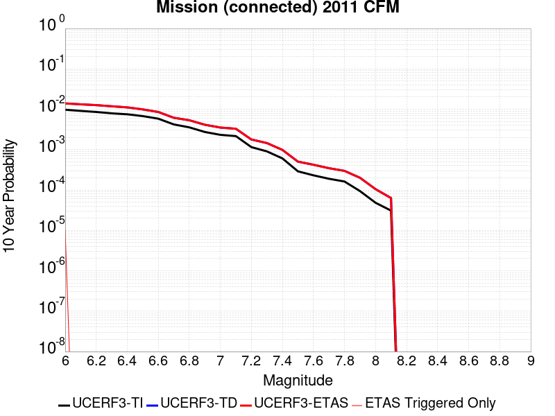 |

| Magnitude | 1 wk TI Prob | 1 wk TD Prob | 1 wk ETAS Prob | 1 wk ETAS/TD Gain | 1 wk ETAS Triggered Only | 1 mo TI Prob | 1 mo TD Prob | 1 mo ETAS Prob | 1 mo ETAS/TD Gain | 1 mo ETAS Triggered Only | 1 yr TI Prob | 1 yr TD Prob | 1 yr ETAS Prob | 1 yr ETAS/TD Gain | 1 yr ETAS Triggered Only | 10 yr TI Prob | 10 yr TD Prob | 10 yr ETAS Prob | 10 yr ETAS/TD Gain | 10 yr ETAS Triggered Only |
|-----|-----|-----|-----|-----|-----|-----|-----|-----|-----|-----|-----|-----|-----|-----|-----|-----|-----|-----|-----|-----|
| 6.0 | 1.8735573E-5 | 2.6887059E-5 | 2.6887059E-5 | 1.0 | 0.0 | 8.029284E-5 | 1.1522507E-4 | 1.1522507E-4 | 1.0 | 0.0 | 9.771269E-4 | 0.0014018662 | 0.0014018662 | 1.0 | 0.0 | 0.009728416 | 0.013938779 | 0.01394864 | 1.0007074 | 1.0E-5 |
| 6.1 | 1.7515964E-5 | 2.5528316E-5 | 2.5528316E-5 | 1.0 | 0.0 | 7.506625E-5 | 1.09402376E-4 | 1.09402376E-4 | 1.0 | 0.0 | 9.135484E-4 | 0.0013310635 | 0.0013310635 | 1.0 | 0.0 | 0.009098019 | 0.013239373 | 0.013239373 | 1.0 | 0.0 |
| 6.2 | 1.6486343E-5 | 2.437297E-5 | 2.437297E-5 | 1.0 | 0.0 | 7.065384E-5 | 1.044513E-4 | 1.044513E-4 | 1.0 | 0.0 | 8.5987104E-4 | 0.0012708564 | 0.0012708564 | 1.0 | 0.0 | 0.008565514 | 0.01264434 | 0.01264434 | 1.0 | 0.0 |
| 6.3 | 1.5229385E-5 | 2.2802386E-5 | 2.2802386E-5 | 1.0 | 0.0 | 6.526716E-5 | 9.772074E-5 | 9.772074E-5 | 1.0 | 0.0 | 7.9433795E-4 | 0.0011890043 | 0.0011890043 | 1.0 | 0.0 | 0.007915046 | 0.011837512 | 0.011837512 | 1.0 | 0.0 |
| 6.4 | 1.4435828E-5 | 2.1402362E-5 | 2.1402362E-5 | 1.0 | 0.0 | 6.186637E-5 | 9.1721085E-5 | 9.1721085E-5 | 1.0 | 0.0 | 7.529627E-4 | 0.0011160368 | 0.0011160368 | 1.0 | 0.0 | 0.007504165 | 0.011120499 | 0.011120499 | 1.0 | 0.0 |
| 6.5 | 1.30127955E-5 | 1.903946E-5 | 1.903946E-5 | 1.0 | 0.0 | 5.576793E-5 | 8.159506E-5 | 8.159506E-5 | 1.0 | 0.0 | 6.78763E-4 | 9.929349E-4 | 9.929349E-4 | 1.0 | 0.0 | 0.0067669353 | 0.009912513 | 0.009912513 | 1.0 | 0.0 |
| 6.6 | 1.1220718E-5 | 1.6395923E-5 | 1.6395923E-5 | 1.0 | 0.0 | 4.8087906E-5 | 7.026636E-5 | 7.026636E-5 | 1.0 | 0.0 | 5.8531296E-4 | 8.5515674E-4 | 8.5515674E-4 | 1.0 | 0.0 | 0.005837737 | 0.008550503 | 0.008550503 | 1.0 | 0.0 |
| 6.7 | 8.086152E-6 | 1.1752465E-5 | 1.1752465E-5 | 1.0 | 0.0 | 3.4654473E-5 | 5.036674E-5 | 5.036674E-5 | 1.0 | 0.0 | 4.2183654E-4 | 6.1304326E-4 | 6.1304326E-4 | 1.0 | 0.0 | 0.004210367 | 0.006150388 | 0.006150388 | 1.0 | 0.0 |
| 6.8 | 6.8361655E-6 | 1.0197327E-5 | 1.0197327E-5 | 1.0 | 0.0 | 2.9297524E-5 | 4.3702104E-5 | 4.3702104E-5 | 1.0 | 0.0 | 3.5663895E-4 | 5.3194386E-4 | 5.3194386E-4 | 1.0 | 0.0 | 0.0035606713 | 0.005339269 | 0.005339269 | 1.0 | 0.0 |
| 6.9 | 5.2517353E-6 | 7.870704E-6 | 7.870704E-6 | 1.0 | 0.0 | 2.2507242E-5 | 3.3731154E-5 | 3.3731154E-5 | 1.0 | 0.0 | 2.739912E-4 | 4.1059966E-4 | 4.1059966E-4 | 1.0 | 0.0 | 0.0027365363 | 0.0041305115 | 0.0041305115 | 1.0 | 0.0 |
| 7.0 | 4.4602784E-6 | 6.7031096E-6 | 6.7031096E-6 | 1.0 | 0.0 | 1.911534E-5 | 2.8727298E-5 | 2.8727298E-5 | 1.0 | 0.0 | 2.327044E-4 | 3.4969888E-4 | 3.4969888E-4 | 1.0 | 0.0 | 0.0023246086 | 0.003522828 | 0.003522828 | 1.0 | 0.0 |
| 7.1 | 4.1492594E-6 | 6.2518166E-6 | 6.2518166E-6 | 1.0 | 0.0 | 1.7782419E-5 | 2.6793225E-5 | 2.6793225E-5 | 1.0 | 0.0 | 2.1647944E-4 | 3.2615883E-4 | 3.2615883E-4 | 1.0 | 0.0 | 0.0021626868 | 0.0032876094 | 0.0032876094 | 1.0 | 0.0 |
| 7.2 | 2.213247E-6 | 3.3638726E-6 | 3.3638726E-6 | 1.0 | 0.0 | 9.485309E-6 | 1.4416518E-5 | 1.4416518E-5 | 1.0 | 0.0 | 1.15477524E-4 | 1.75507E-4 | 1.75507E-4 | 1.0 | 0.0 | 0.0011541754 | 0.0017823473 | 0.0017823473 | 1.0 | 0.0 |
| 7.3 | 1.7362703E-6 | 2.7392475E-6 | 2.7392475E-6 | 1.0 | 0.0 | 7.4411373E-6 | 1.1739579E-5 | 1.1739579E-5 | 1.0 | 0.0 | 9.0592075E-5 | 1.4292003E-4 | 1.4292003E-4 | 1.0 | 0.0 | 9.0555154E-4 | 0.0014536021 | 0.0014536021 | 1.0 | 0.0 |
| 7.4 | 1.1628409E-6 | 1.8499071E-6 | 1.8499071E-6 | 1.0 | 0.0 | 4.9835944E-6 | 7.928149E-6 | 7.928149E-6 | 1.0 | 0.0 | 6.0673574E-5 | 9.6520955E-5 | 9.6520955E-5 | 1.0 | 0.0 | 6.065701E-4 | 9.856219E-4 | 9.856219E-4 | 1.0 | 0.0 |
| 7.5 | 5.5610667E-7 | 9.3483203E-7 | 9.3483203E-7 | 1.0 | 0.0 | 2.3833122E-6 | 4.006417E-6 | 4.006417E-6 | 1.0 | 0.0 | 2.9016439E-5 | 4.8777038E-5 | 4.8777038E-5 | 1.0 | 0.0 | 2.901265E-4 | 5.043384E-4 | 5.043384E-4 | 1.0 | 0.0 |
| 7.6 | 4.4307663E-7 | 7.7889234E-7 | 7.7889234E-7 | 1.0 | 0.0 | 1.8988985E-6 | 3.3381057E-6 | 3.3381057E-6 | 1.0 | 0.0 | 2.3118844E-5 | 4.0640683E-5 | 4.0640683E-5 | 1.0 | 0.0 | 2.3116439E-4 | 4.2232033E-4 | 4.2232033E-4 | 1.0 | 0.0 |
| 7.7 | 3.639119E-7 | 6.3587606E-7 | 6.3587606E-7 | 1.0 | 0.0 | 1.5596215E-6 | 2.7251801E-6 | 2.7251801E-6 | 1.0 | 0.0 | 1.8988227E-5 | 3.3178567E-5 | 3.3178567E-5 | 1.0 | 0.0 | 1.8986604E-4 | 3.4709068E-4 | 3.4709068E-4 | 1.0 | 0.0 |
| 7.8 | 3.1152942E-7 | 5.478081E-7 | 5.478081E-7 | 1.0 | 0.0 | 1.3351254E-6 | 2.3477469E-6 | 2.3477469E-6 | 1.0 | 0.0 | 1.6255031E-5 | 2.8583443E-5 | 2.8583443E-5 | 1.0 | 0.0 | 1.6253842E-4 | 2.9787264E-4 | 2.9787264E-4 | 1.0 | 0.0 |
| 7.9 | 1.8035962E-7 | 3.7205825E-7 | 3.7205825E-7 | 1.0 | 0.0 | 7.729696E-7 | 1.5945344E-6 | 1.5945344E-6 | 1.0 | 0.0 | 9.410865E-6 | 1.9413284E-5 | 1.9413284E-5 | 1.0 | 0.0 | 9.410465E-5 | 2.0082417E-4 | 2.0082417E-4 | 1.0 | 0.0 |
| 8.0 | 9.279334E-8 | 1.970612E-7 | 1.970612E-7 | 1.0 | 0.0 | 3.976857E-7 | 8.4454774E-7 | 8.4454774E-7 | 1.0 | 0.0 | 4.841813E-6 | 1.02823205E-5 | 1.02823205E-5 | 1.0 | 0.0 | 4.841707E-5 | 1.0534391E-4 | 1.0534391E-4 | 1.0 | 0.0 |
| 8.1 | 5.9253985E-8 | 1.1857208E-7 | 1.1857208E-7 | 1.0 | 0.0 | 2.5394561E-7 | 5.0816595E-7 | 5.0816595E-7 | 1.0 | 0.0 | 3.0917836E-6 | 6.186903E-6 | 6.186903E-6 | 1.0 | 0.0 | 3.0917407E-5 | 6.325728E-5 | 6.325728E-5 | 1.0 | 0.0 |

## Big Pine (East)
*[(top)](#table-of-contents)*

| 1 Week | 1 Month | 1 Year | 10 Year |
|-----|-----|-----|-----|
|  |  |  | 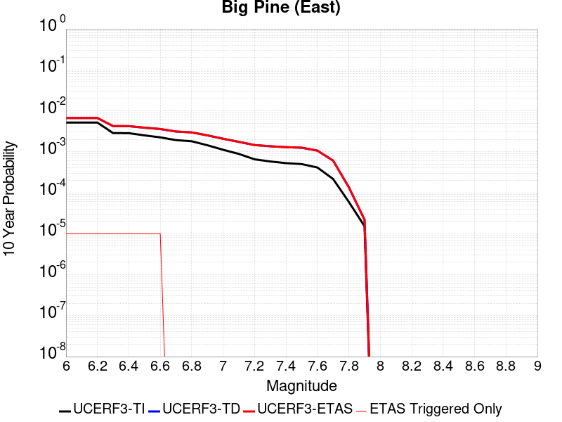 |

| Magnitude | 1 wk TI Prob | 1 wk TD Prob | 1 wk ETAS Prob | 1 wk ETAS/TD Gain | 1 wk ETAS Triggered Only | 1 mo TI Prob | 1 mo TD Prob | 1 mo ETAS Prob | 1 mo ETAS/TD Gain | 1 mo ETAS Triggered Only | 1 yr TI Prob | 1 yr TD Prob | 1 yr ETAS Prob | 1 yr ETAS/TD Gain | 1 yr ETAS Triggered Only | 10 yr TI Prob | 10 yr TD Prob | 10 yr ETAS Prob | 10 yr ETAS/TD Gain | 10 yr ETAS Triggered Only |
|-----|-----|-----|-----|-----|-----|-----|-----|-----|-----|-----|-----|-----|-----|-----|-----|-----|-----|-----|-----|-----|
| 6.0 | 9.916913E-6 | 1.281854E-5 | 1.281854E-5 | 1.0 | 0.0 | 4.250036E-5 | 5.4935572E-5 | 5.4935572E-5 | 1.0 | 0.0 | 5.173191E-4 | 6.686574E-4 | 6.686574E-4 | 1.0 | 0.0 | 0.0051611643 | 0.00667124 | 0.006681173 | 1.0014889 | 1.0E-5 |
| 6.1 | 9.916913E-6 | 1.281854E-5 | 1.281854E-5 | 1.0 | 0.0 | 4.250036E-5 | 5.4935572E-5 | 5.4935572E-5 | 1.0 | 0.0 | 5.173191E-4 | 6.686574E-4 | 6.686574E-4 | 1.0 | 0.0 | 0.0051611643 | 0.00667124 | 0.006681173 | 1.0014889 | 1.0E-5 |
| 6.2 | 9.916913E-6 | 1.281854E-5 | 1.281854E-5 | 1.0 | 0.0 | 4.250036E-5 | 5.4935572E-5 | 5.4935572E-5 | 1.0 | 0.0 | 5.173191E-4 | 6.686574E-4 | 6.686574E-4 | 1.0 | 0.0 | 0.0051611643 | 0.00667124 | 0.006681173 | 1.0014889 | 1.0E-5 |
| 6.3 | 5.479711E-6 | 8.11447E-6 | 8.11447E-6 | 1.0 | 0.0 | 2.3484265E-5 | 3.4775854E-5 | 3.4775854E-5 | 1.0 | 0.0 | 2.858834E-4 | 4.2331696E-4 | 4.2331696E-4 | 1.0 | 0.0 | 0.0028551589 | 0.0042280247 | 0.004237983 | 1.0023552 | 1.0E-5 |
| 6.4 | 5.465009E-6 | 8.098763E-6 | 8.098763E-6 | 1.0 | 0.0 | 2.3421257E-5 | 3.470854E-5 | 3.470854E-5 | 1.0 | 0.0 | 2.851165E-4 | 4.2249775E-4 | 4.2249775E-4 | 1.0 | 0.0 | 0.0028475097 | 0.004219864 | 0.0042298217 | 1.0023597 | 1.0E-5 |
| 6.5 | 4.826767E-6 | 7.4238146E-6 | 7.4238146E-6 | 1.0 | 0.0 | 2.068598E-5 | 3.1815976E-5 | 3.1815976E-5 | 1.0 | 0.0 | 2.518227E-4 | 3.8729343E-4 | 3.8729343E-4 | 1.0 | 0.0 | 0.0025153751 | 0.0038690618 | 0.0038790233 | 1.0025746 | 1.0E-5 |
| 6.6 | 4.3146847E-6 | 6.8837467E-6 | 6.8837467E-6 | 1.0 | 0.0 | 1.8491375E-5 | 2.950145E-5 | 2.950145E-5 | 1.0 | 0.0 | 2.2510924E-4 | 3.5912343E-4 | 3.5912343E-4 | 1.0 | 0.0 | 0.0022488134 | 0.0035882755 | 0.0035982397 | 1.0027769 | 1.0E-5 |
| 6.7 | 3.6968106E-6 | 5.9968484E-6 | 5.9968484E-6 | 1.0 | 0.0 | 1.5843378E-5 | 2.5700534E-5 | 2.5700534E-5 | 1.0 | 0.0 | 1.9287605E-4 | 3.1286062E-4 | 3.1286062E-4 | 1.0 | 0.0 | 0.0019270873 | 0.003126956 | 0.003126956 | 1.0 | 0.0 |
| 6.8 | 3.4671132E-6 | 5.703515E-6 | 5.703515E-6 | 1.0 | 0.0 | 1.4858972E-5 | 2.4443414E-5 | 2.4443414E-5 | 1.0 | 0.0 | 1.8089297E-4 | 2.9755937E-4 | 2.9755937E-4 | 1.0 | 0.0 | 0.0018074579 | 0.0029743554 | 0.0029743554 | 1.0 | 0.0 |
| 6.9 | 2.7686972E-6 | 4.8264656E-6 | 4.8264656E-6 | 1.0 | 0.0 | 1.1865792E-5 | 2.0684693E-5 | 2.0684693E-5 | 1.0 | 0.0 | 1.4445644E-4 | 2.518078E-4 | 2.518078E-4 | 1.0 | 0.0 | 0.0014436257 | 0.0025179028 | 0.0025179028 | 1.0 | 0.0 |
| 7.0 | 2.1472624E-6 | 3.986174E-6 | 3.986174E-6 | 1.0 | 0.0 | 9.20252E-6 | 1.7083494E-5 | 1.7083494E-5 | 1.0 | 0.0 | 1.12034926E-4 | 2.0797222E-4 | 2.0797222E-4 | 1.0 | 0.0 | 0.0011197845 | 0.0020804254 | 0.0020804254 | 1.0 | 0.0 |
| 7.1 | 1.7018335E-6 | 3.3459255E-6 | 3.3459255E-6 | 1.0 | 0.0 | 7.293552E-6 | 1.4339605E-5 | 1.4339605E-5 | 1.0 | 0.0 | 8.879537E-5 | 1.7457105E-4 | 1.7457105E-4 | 1.0 | 0.0 | 8.87599E-4 | 0.0017469557 | 0.0017469557 | 1.0 | 0.0 |
| 7.2 | 1.25603E-6 | 2.795471E-6 | 2.795471E-6 | 1.0 | 0.0 | 5.3829745E-6 | 1.1980536E-5 | 1.1980536E-5 | 1.0 | 0.0 | 6.553574E-5 | 1.458535E-4 | 1.458535E-4 | 1.0 | 0.0 | 6.551642E-4 | 0.0014601707 | 0.0014601707 | 1.0 | 0.0 |
| 7.3 | 1.112297E-6 | 2.6112702E-6 | 2.6112702E-6 | 1.0 | 0.0 | 4.7669787E-6 | 1.1191111E-5 | 1.1191111E-5 | 1.0 | 0.0 | 5.803642E-5 | 1.3624349E-4 | 1.3624349E-4 | 1.0 | 0.0 | 5.802127E-4 | 0.00136402 | 0.00136402 | 1.0 | 0.0 |
| 7.4 | 1.0137181E-6 | 2.4843957E-6 | 2.4843957E-6 | 1.0 | 0.0 | 4.3444993E-6 | 1.0647368E-5 | 1.0647368E-5 | 1.0 | 0.0 | 5.2892992E-5 | 1.2962421E-4 | 1.2962421E-4 | 1.0 | 0.0 | 5.288041E-4 | 0.0012976775 | 0.0012976775 | 1.0 | 0.0 |
| 7.5 | 9.598608E-7 | 2.4080273E-6 | 2.4080273E-6 | 1.0 | 0.0 | 4.1136827E-6 | 1.0320077E-5 | 1.0320077E-5 | 1.0 | 0.0 | 5.0082934E-5 | 1.2563991E-4 | 1.2563991E-4 | 1.0 | 0.0 | 5.007165E-4 | 0.0012576841 | 0.0012576841 | 1.0 | 0.0 |
| 7.6 | 7.929459E-7 | 2.0456312E-6 | 2.0456312E-6 | 1.0 | 0.0 | 3.3983351E-6 | 8.766962E-6 | 8.766962E-6 | 1.0 | 0.0 | 4.1373947E-5 | 1.0673271E-4 | 1.0673271E-4 | 1.0 | 0.0 | 4.1366243E-4 | 0.0010689225 | 0.0010689225 | 1.0 | 0.0 |
| 7.7 | 4.155788E-7 | 1.1611139E-6 | 1.1611139E-6 | 1.0 | 0.0 | 1.7810507E-6 | 4.9761934E-6 | 4.9761934E-6 | 1.0 | 0.0 | 2.1684076E-5 | 6.0583512E-5 | 6.0583512E-5 | 1.0 | 0.0 | 2.1681961E-4 | 6.0889556E-4 | 6.0889556E-4 | 1.0 | 0.0 |
| 7.8 | 1.14666925E-7 | 2.5932084E-7 | 2.5932084E-7 | 1.0 | 0.0 | 4.914296E-7 | 1.1113746E-6 | 1.1113746E-6 | 1.0 | 0.0 | 5.9831386E-6 | 1.3530906E-5 | 1.3530906E-5 | 1.0 | 0.0 | 5.9829777E-5 | 1.364052E-4 | 1.364052E-4 | 1.0 | 0.0 |
| 7.9 | 2.9231824E-8 | 4.1479638E-8 | 4.1479638E-8 | 1.0 | 0.0 | 1.2527924E-7 | 1.7776986E-7 | 1.7776986E-7 | 1.0 | 0.0 | 1.5252737E-6 | 2.1643461E-6 | 2.1643461E-6 | 1.0 | 0.0 | 1.5252632E-5 | 2.1986685E-5 | 2.1986685E-5 | 1.0 | 0.0 |

## Mount Diablo Thrust North CFM
*[(top)](#table-of-contents)*

| 1 Week | 1 Month | 1 Year | 10 Year |
|-----|-----|-----|-----|
|  |  | 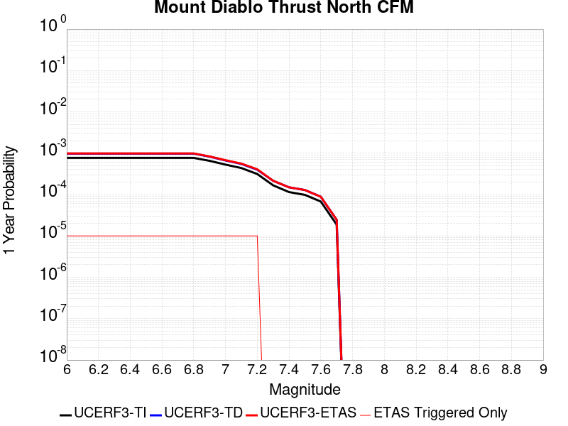 | 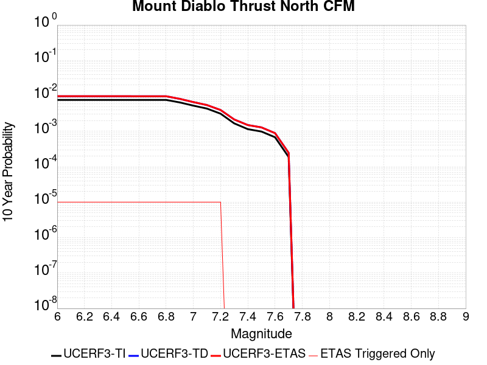 |

| Magnitude | 1 wk TI Prob | 1 wk TD Prob | 1 wk ETAS Prob | 1 wk ETAS/TD Gain | 1 wk ETAS Triggered Only | 1 mo TI Prob | 1 mo TD Prob | 1 mo ETAS Prob | 1 mo ETAS/TD Gain | 1 mo ETAS Triggered Only | 1 yr TI Prob | 1 yr TD Prob | 1 yr ETAS Prob | 1 yr ETAS/TD Gain | 1 yr ETAS Triggered Only | 10 yr TI Prob | 10 yr TD Prob | 10 yr ETAS Prob | 10 yr ETAS/TD Gain | 10 yr ETAS Triggered Only |
|-----|-----|-----|-----|-----|-----|-----|-----|-----|-----|-----|-----|-----|-----|-----|-----|-----|-----|-----|-----|-----|
| 6.0 | 1.479628E-5 | 1.8770155E-5 | 1.8770155E-5 | 1.0 | 0.0 | 6.341109E-5 | 8.0441096E-5 | 8.0441096E-5 | 1.0 | 0.0 | 7.717565E-4 | 9.789398E-4 | 9.8893E-4 | 1.0102051 | 1.0E-5 | 0.007690818 | 0.009747637 | 0.00975754 | 1.0010159 | 1.0E-5 |
| 6.1 | 1.479628E-5 | 1.8770155E-5 | 1.8770155E-5 | 1.0 | 0.0 | 6.341109E-5 | 8.0441096E-5 | 8.0441096E-5 | 1.0 | 0.0 | 7.717565E-4 | 9.789398E-4 | 9.8893E-4 | 1.0102051 | 1.0E-5 | 0.007690818 | 0.009747637 | 0.00975754 | 1.0010159 | 1.0E-5 |
| 6.2 | 1.479628E-5 | 1.8770155E-5 | 1.8770155E-5 | 1.0 | 0.0 | 6.341109E-5 | 8.0441096E-5 | 8.0441096E-5 | 1.0 | 0.0 | 7.717565E-4 | 9.789398E-4 | 9.8893E-4 | 1.0102051 | 1.0E-5 | 0.007690818 | 0.009747637 | 0.00975754 | 1.0010159 | 1.0E-5 |
| 6.3 | 1.479628E-5 | 1.8770155E-5 | 1.8770155E-5 | 1.0 | 0.0 | 6.341109E-5 | 8.0441096E-5 | 8.0441096E-5 | 1.0 | 0.0 | 7.717565E-4 | 9.789398E-4 | 9.8893E-4 | 1.0102051 | 1.0E-5 | 0.007690818 | 0.009747637 | 0.00975754 | 1.0010159 | 1.0E-5 |
| 6.4 | 1.479628E-5 | 1.8770155E-5 | 1.8770155E-5 | 1.0 | 0.0 | 6.341109E-5 | 8.0441096E-5 | 8.0441096E-5 | 1.0 | 0.0 | 7.717565E-4 | 9.789398E-4 | 9.8893E-4 | 1.0102051 | 1.0E-5 | 0.007690818 | 0.009747637 | 0.00975754 | 1.0010159 | 1.0E-5 |
| 6.5 | 1.479628E-5 | 1.8770155E-5 | 1.8770155E-5 | 1.0 | 0.0 | 6.341109E-5 | 8.0441096E-5 | 8.0441096E-5 | 1.0 | 0.0 | 7.717565E-4 | 9.789398E-4 | 9.8893E-4 | 1.0102051 | 1.0E-5 | 0.007690818 | 0.009747637 | 0.00975754 | 1.0010159 | 1.0E-5 |
| 6.6 | 1.479016E-5 | 1.8763267E-5 | 1.8763267E-5 | 1.0 | 0.0 | 6.338486E-5 | 8.041158E-5 | 8.041158E-5 | 1.0 | 0.0 | 7.714374E-4 | 9.785808E-4 | 9.88571E-4 | 1.0102088 | 1.0E-5 | 0.007687649 | 0.009744078 | 0.009753981 | 1.0010163 | 1.0E-5 |
| 6.7 | 1.479016E-5 | 1.8763267E-5 | 1.8763267E-5 | 1.0 | 0.0 | 6.338486E-5 | 8.041158E-5 | 8.041158E-5 | 1.0 | 0.0 | 7.714374E-4 | 9.785808E-4 | 9.88571E-4 | 1.0102088 | 1.0E-5 | 0.007687649 | 0.009744078 | 0.009753981 | 1.0010163 | 1.0E-5 |
| 6.8 | 1.4771667E-5 | 1.8742037E-5 | 1.8742037E-5 | 1.0 | 0.0 | 6.330561E-5 | 8.032059E-5 | 8.032059E-5 | 1.0 | 0.0 | 7.704732E-4 | 9.77474E-4 | 9.874643E-4 | 1.0102204 | 1.0E-5 | 0.007678074 | 0.009733109 | 0.009743011 | 1.0010175 | 1.0E-5 |
| 6.9 | 1.2548234E-5 | 1.5822385E-5 | 1.5822385E-5 | 1.0 | 0.0 | 5.3777036E-5 | 6.7808476E-5 | 6.7808476E-5 | 1.0 | 0.0 | 6.545387E-4 | 8.252591E-4 | 8.3525083E-4 | 1.0121074 | 1.0E-5 | 0.006526142 | 0.008223122 | 0.00823304 | 1.001206 | 1.0E-5 |
| 7.0 | 1.01754185E-5 | 1.2809287E-5 | 1.2809287E-5 | 1.0 | 0.0 | 4.360821E-5 | 5.4895798E-5 | 5.4895798E-5 | 1.0 | 0.0 | 5.308006E-4 | 6.6815305E-4 | 6.781464E-4 | 1.0149566 | 1.0E-5 | 0.005295345 | 0.0066625397 | 0.0066724727 | 1.001491 | 1.0E-5 |
| 7.1 | 8.398341E-6 | 1.0554986E-5 | 1.0554986E-5 | 1.0 | 0.0 | 3.5992394E-5 | 4.5234876E-5 | 4.5234876E-5 | 1.0 | 0.0 | 4.3811928E-4 | 5.505965E-4 | 5.60591E-4 | 1.0181521 | 1.0E-5 | 0.0043725655 | 0.00549312 | 0.005503065 | 1.0018104 | 1.0E-5 |
| 7.2 | 6.024759E-6 | 7.648613E-6 | 7.648613E-6 | 1.0 | 0.0 | 2.582014E-5 | 3.2779364E-5 | 3.2779364E-5 | 1.0 | 0.0 | 3.1431485E-4 | 3.9901637E-4 | 4.0901237E-4 | 1.0250516 | 1.0E-5 | 0.0031387066 | 0.0039835684 | 0.0039935284 | 1.0025003 | 1.0E-5 |
| 7.3 | 3.2099704E-6 | 4.1357157E-6 | 4.1357157E-6 | 1.0 | 0.0 | 1.3756943E-5 | 1.7724376E-5 | 1.7724376E-5 | 1.0 | 0.0 | 1.674779E-4 | 2.1577309E-4 | 2.1577309E-4 | 1.0 | 0.0 | 0.0016735174 | 0.0021559282 | 0.0021559282 | 1.0 | 0.0 |
| 7.4 | 2.2041513E-6 | 2.8735228E-6 | 2.8735228E-6 | 1.0 | 0.0 | 9.4463285E-6 | 1.231504E-5 | 1.231504E-5 | 1.0 | 0.0 | 1.1500298E-4 | 1.4992537E-4 | 1.4992537E-4 | 1.0 | 0.0 | 0.0011494348 | 0.0014985556 | 0.0014985556 | 1.0 | 0.0 |
| 7.5 | 1.8869501E-6 | 2.4697276E-6 | 2.4697276E-6 | 1.0 | 0.0 | 8.086904E-6 | 1.0584505E-5 | 1.0584505E-5 | 1.0 | 0.0 | 9.845361E-5 | 1.288588E-4 | 1.288588E-4 | 1.0 | 0.0 | 9.841E-4 | 0.0012881366 | 0.0012881366 | 1.0 | 0.0 |
| 7.6 | 1.3012458E-6 | 1.7005598E-6 | 1.7005598E-6 | 1.0 | 0.0 | 5.576756E-6 | 7.2880935E-6 | 7.2880935E-6 | 1.0 | 0.0 | 6.7894885E-5 | 8.872898E-5 | 8.872898E-5 | 1.0 | 0.0 | 6.787415E-4 | 8.8714424E-4 | 8.8714424E-4 | 1.0 | 0.0 |
| 7.7 | 3.603383E-7 | 4.7167083E-7 | 4.7167083E-7 | 1.0 | 0.0 | 1.5443061E-6 | 2.021445E-6 | 2.021445E-6 | 1.0 | 0.0 | 1.8801764E-5 | 2.4610821E-5 | 2.4610821E-5 | 1.0 | 0.0 | 1.8800174E-4 | 2.461139E-4 | 2.461139E-4 | 1.0 | 0.0 |

## Elysian Park (Lower CFM)
*[(top)](#table-of-contents)*

| 1 Week | 1 Month | 1 Year | 10 Year |
|-----|-----|-----|-----|
|  |  |  |  |

| Magnitude | 1 wk TI Prob | 1 wk TD Prob | 1 wk ETAS Prob | 1 wk ETAS/TD Gain | 1 wk ETAS Triggered Only | 1 mo TI Prob | 1 mo TD Prob | 1 mo ETAS Prob | 1 mo ETAS/TD Gain | 1 mo ETAS Triggered Only | 1 yr TI Prob | 1 yr TD Prob | 1 yr ETAS Prob | 1 yr ETAS/TD Gain | 1 yr ETAS Triggered Only | 10 yr TI Prob | 10 yr TD Prob | 10 yr ETAS Prob | 10 yr ETAS/TD Gain | 10 yr ETAS Triggered Only |
|-----|-----|-----|-----|-----|-----|-----|-----|-----|-----|-----|-----|-----|-----|-----|-----|-----|-----|-----|-----|-----|
| 6.0 | 2.1766498E-6 | 2.1037972E-6 | 2.1037972E-6 | 1.0 | 0.0 | 9.328466E-6 | 9.016251E-6 | 9.016251E-6 | 1.0 | 0.0 | 1.1356815E-4 | 1.0976877E-4 | 1.19767676E-4 | 1.0910906 | 1.0E-5 | 0.0011351013 | 0.0010972874 | 0.0011072764 | 1.0091034 | 1.0E-5 |
| 6.1 | 2.1766498E-6 | 2.1037972E-6 | 2.1037972E-6 | 1.0 | 0.0 | 9.328466E-6 | 9.016251E-6 | 9.016251E-6 | 1.0 | 0.0 | 1.1356815E-4 | 1.0976877E-4 | 1.19767676E-4 | 1.0910906 | 1.0E-5 | 0.0011351013 | 0.0010972874 | 0.0011072764 | 1.0091034 | 1.0E-5 |
| 6.2 | 1.0031182E-6 | 9.186276E-7 | 9.186276E-7 | 1.0 | 0.0 | 4.299071E-6 | 3.93697E-6 | 3.93697E-6 | 1.0 | 0.0 | 5.2339932E-5 | 4.7931655E-5 | 4.7931655E-5 | 1.0 | 0.0 | 5.2327604E-4 | 4.7922297E-4 | 4.7922297E-4 | 1.0 | 0.0 |
| 6.3 | 1.0031182E-6 | 9.186276E-7 | 9.186276E-7 | 1.0 | 0.0 | 4.299071E-6 | 3.93697E-6 | 3.93697E-6 | 1.0 | 0.0 | 5.2339932E-5 | 4.7931655E-5 | 4.7931655E-5 | 1.0 | 0.0 | 5.2327604E-4 | 4.7922297E-4 | 4.7922297E-4 | 1.0 | 0.0 |
| 6.4 | 6.9606244E-7 | 6.092002E-7 | 6.092002E-7 | 1.0 | 0.0 | 2.9831212E-6 | 2.6108553E-6 | 2.6108553E-6 | 1.0 | 0.0 | 3.6318896E-5 | 3.17867E-5 | 3.17867E-5 | 1.0 | 0.0 | 3.6312963E-4 | 3.1782177E-4 | 3.1782177E-4 | 1.0 | 0.0 |
| 6.5 | 6.901879E-7 | 6.032685E-7 | 6.032685E-7 | 1.0 | 0.0 | 2.9579448E-6 | 2.5854338E-6 | 2.5854338E-6 | 1.0 | 0.0 | 3.6012385E-5 | 3.1477204E-5 | 3.1477204E-5 | 1.0 | 0.0 | 3.600655E-4 | 3.147277E-4 | 3.147277E-4 | 1.0 | 0.0 |
| 6.6 | 6.4198554E-7 | 5.5466677E-7 | 5.5466677E-7 | 1.0 | 0.0 | 2.7513638E-6 | 2.377141E-6 | 2.377141E-6 | 1.0 | 0.0 | 3.3497337E-5 | 2.8941307E-5 | 2.8941307E-5 | 1.0 | 0.0 | 3.349229E-4 | 2.8937554E-4 | 2.8937554E-4 | 1.0 | 0.0 |
| 6.7 | 6.138733E-7 | 5.2634743E-7 | 5.2634743E-7 | 1.0 | 0.0 | 2.6308828E-6 | 2.2557726E-6 | 2.2557726E-6 | 1.0 | 0.0 | 3.203053E-5 | 2.7463688E-5 | 2.7463688E-5 | 1.0 | 0.0 | 3.2025913E-4 | 2.7460305E-4 | 2.7460305E-4 | 1.0 | 0.0 |
| 6.8 | 5.84778E-7 | 5.0029945E-7 | 5.0029945E-7 | 1.0 | 0.0 | 2.506189E-6 | 2.1441388E-6 | 2.1441388E-6 | 1.0 | 0.0 | 3.0512423E-5 | 2.6104577E-5 | 2.6104577E-5 | 1.0 | 0.0 | 3.0508233E-4 | 2.6101523E-4 | 2.6101523E-4 | 1.0 | 0.0 |
| 6.9 | 5.322785E-7 | 4.5801346E-7 | 4.5801346E-7 | 1.0 | 0.0 | 2.2811914E-6 | 1.9629133E-6 | 1.9629133E-6 | 1.0 | 0.0 | 2.7773152E-5 | 2.3898207E-5 | 2.3898207E-5 | 1.0 | 0.0 | 2.7769682E-4 | 2.3895648E-4 | 2.3895648E-4 | 1.0 | 0.0 |
| 7.0 | 4.8147206E-7 | 4.1124636E-7 | 4.1124636E-7 | 1.0 | 0.0 | 2.06345E-6 | 1.7624831E-6 | 1.7624831E-6 | 1.0 | 0.0 | 2.5122214E-5 | 2.1458021E-5 | 2.1458021E-5 | 1.0 | 0.0 | 2.5119373E-4 | 2.1455958E-4 | 2.1455958E-4 | 1.0 | 0.0 |
| 7.1 | 4.1932955E-7 | 3.545618E-7 | 3.545618E-7 | 1.0 | 0.0 | 1.7971255E-6 | 1.5195495E-6 | 1.5195495E-6 | 1.0 | 0.0 | 2.1879783E-5 | 1.850036E-5 | 1.850036E-5 | 1.0 | 0.0 | 2.1877629E-4 | 1.8498824E-4 | 1.8498824E-4 | 1.0 | 0.0 |
| 7.2 | 3.426051E-7 | 2.7810648E-7 | 2.7810648E-7 | 1.0 | 0.0 | 1.4683067E-6 | 1.1918843E-6 | 1.1918843E-6 | 1.0 | 0.0 | 1.7876488E-5 | 1.4511095E-5 | 1.4511095E-5 | 1.0 | 0.0 | 1.787505E-4 | 1.451015E-4 | 1.451015E-4 | 1.0 | 0.0 |
| 7.3 | 2.7771645E-7 | 2.2096796E-7 | 2.2096796E-7 | 1.0 | 0.0 | 1.1902127E-6 | 9.4700516E-7 | 9.4700516E-7 | 1.0 | 0.0 | 1.4490744E-5 | 1.1529727E-5 | 1.1529727E-5 | 1.0 | 0.0 | 1.4489799E-4 | 1.1529131E-4 | 1.1529131E-4 | 1.0 | 0.0 |
| 7.4 | 2.2756493E-7 | 1.7840037E-7 | 1.7840037E-7 | 1.0 | 0.0 | 9.752779E-7 | 7.645728E-7 | 7.645728E-7 | 1.0 | 0.0 | 1.1873944E-5 | 9.308634E-6 | 9.308634E-6 | 1.0 | 0.0 | 1.18733085E-4 | 9.308245E-5 | 9.308245E-5 | 1.0 | 0.0 |
| 7.5 | 1.7874558E-7 | 1.3542872E-7 | 1.3542872E-7 | 1.0 | 0.0 | 7.660522E-7 | 5.8040865E-7 | 5.8040865E-7 | 1.0 | 0.0 | 9.326646E-6 | 7.066453E-6 | 7.066453E-6 | 1.0 | 0.0 | 9.326255E-5 | 7.0662296E-5 | 7.0662296E-5 | 1.0 | 0.0 |
| 7.6 | 1.3124549E-7 | 9.250901E-8 | 9.250901E-8 | 1.0 | 0.0 | 5.624805E-7 | 3.964671E-7 | 3.964671E-7 | 1.0 | 0.0 | 6.8481786E-6 | 4.8269762E-6 | 4.8269762E-6 | 1.0 | 0.0 | 6.8479676E-5 | 4.8268732E-5 | 4.8268732E-5 | 1.0 | 0.0 |
| 7.7 | 8.439993E-8 | 5.090013E-8 | 5.090013E-8 | 1.0 | 0.0 | 3.6171392E-7 | 2.181434E-7 | 2.181434E-7 | 1.0 | 0.0 | 4.403858E-6 | 2.6558928E-6 | 2.6558928E-6 | 1.0 | 0.0 | 4.4037708E-5 | 2.6558624E-5 | 2.6558624E-5 | 1.0 | 0.0 |
| 7.8 | 1.2591407E-8 | 7.22764E-9 | 7.22764E-9 | 1.0 | 0.0 | 5.3963173E-8 | 3.09756E-8 | 3.09756E-8 | 1.0 | 0.0 | 6.570014E-7 | 3.7712783E-7 | 3.7712783E-7 | 1.0 | 0.0 | 6.5699946E-6 | 3.771272E-6 | 3.771272E-6 | 1.0 | 0.0 |
| 7.9 | 2.8324232E-11 | 2.1406099E-11 | 2.1406099E-11 | 1.0 | 0.0 | 1.2138957E-10 | 9.174039E-11 | 9.174039E-11 | 1.0 | 0.0 | 1.4779177E-9 | 1.116939E-9 | 1.116939E-9 | 1.0 | 0.0 | 1.4779177E-8 | 1.1169389E-8 | 1.1169389E-8 | 1.0 | 0.0 |

## Redondo Canyon alt 1
*[(top)](#table-of-contents)*

| 1 Week | 1 Month | 1 Year | 10 Year |
|-----|-----|-----|-----|
|  |  |  | 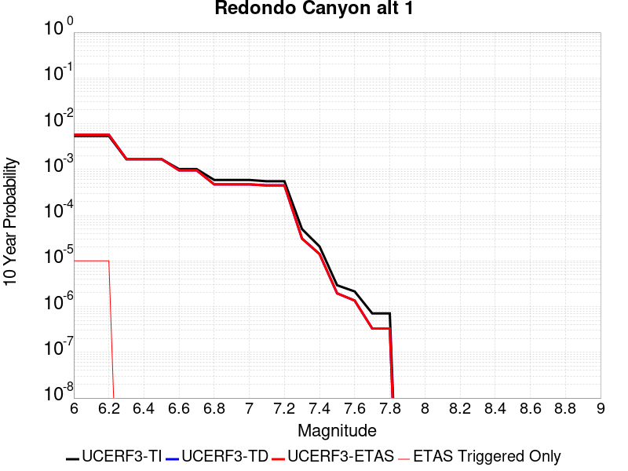 |

| Magnitude | 1 wk TI Prob | 1 wk TD Prob | 1 wk ETAS Prob | 1 wk ETAS/TD Gain | 1 wk ETAS Triggered Only | 1 mo TI Prob | 1 mo TD Prob | 1 mo ETAS Prob | 1 mo ETAS/TD Gain | 1 mo ETAS Triggered Only | 1 yr TI Prob | 1 yr TD Prob | 1 yr ETAS Prob | 1 yr ETAS/TD Gain | 1 yr ETAS Triggered Only | 10 yr TI Prob | 10 yr TD Prob | 10 yr ETAS Prob | 10 yr ETAS/TD Gain | 10 yr ETAS Triggered Only |
|-----|-----|-----|-----|-----|-----|-----|-----|-----|-----|-----|-----|-----|-----|-----|-----|-----|-----|-----|-----|-----|
| 6.0 | 1.0346246E-5 | 1.0981476E-5 | 1.0981476E-5 | 1.0 | 0.0 | 4.43403E-5 | 4.7063066E-5 | 4.7063066E-5 | 1.0 | 0.0 | 5.3970946E-4 | 5.7292107E-4 | 5.829154E-4 | 1.0174444 | 1.0E-5 | 0.0053840056 | 0.00572218 | 0.005732123 | 1.0017376 | 1.0E-5 |
| 6.1 | 1.0346246E-5 | 1.0981476E-5 | 1.0981476E-5 | 1.0 | 0.0 | 4.43403E-5 | 4.7063066E-5 | 4.7063066E-5 | 1.0 | 0.0 | 5.3970946E-4 | 5.7292107E-4 | 5.829154E-4 | 1.0174444 | 1.0E-5 | 0.0053840056 | 0.00572218 | 0.005732123 | 1.0017376 | 1.0E-5 |
| 6.2 | 1.0346246E-5 | 1.0981476E-5 | 1.0981476E-5 | 1.0 | 0.0 | 4.43403E-5 | 4.7063066E-5 | 4.7063066E-5 | 1.0 | 0.0 | 5.3970946E-4 | 5.7292107E-4 | 5.829154E-4 | 1.0174444 | 1.0E-5 | 0.0053840056 | 0.00572218 | 0.005732123 | 1.0017376 | 1.0E-5 |
| 6.3 | 3.2052794E-6 | 3.2361625E-6 | 3.2361625E-6 | 1.0 | 0.0 | 1.373684E-5 | 1.3869216E-5 | 1.3869216E-5 | 1.0 | 0.0 | 1.6723319E-4 | 1.688486E-4 | 1.688486E-4 | 1.0 | 0.0 | 0.001671074 | 0.0016875927 | 0.0016875927 | 1.0 | 0.0 |
| 6.4 | 3.2052794E-6 | 3.2361625E-6 | 3.2361625E-6 | 1.0 | 0.0 | 1.373684E-5 | 1.3869216E-5 | 1.3869216E-5 | 1.0 | 0.0 | 1.6723319E-4 | 1.688486E-4 | 1.688486E-4 | 1.0 | 0.0 | 0.001671074 | 0.0016875927 | 0.0016875927 | 1.0 | 0.0 |
| 6.5 | 3.2052794E-6 | 3.2361625E-6 | 3.2361625E-6 | 1.0 | 0.0 | 1.373684E-5 | 1.3869216E-5 | 1.3869216E-5 | 1.0 | 0.0 | 1.6723319E-4 | 1.688486E-4 | 1.688486E-4 | 1.0 | 0.0 | 0.001671074 | 0.0016875927 | 0.0016875927 | 1.0 | 0.0 |
| 6.6 | 1.948328E-6 | 1.8288907E-6 | 1.8288907E-6 | 1.0 | 0.0 | 8.349951E-6 | 7.838088E-6 | 7.838088E-6 | 1.0 | 0.0 | 1.016559E-4 | 9.542604E-5 | 9.542604E-5 | 1.0 | 0.0 | 0.0010160941 | 9.539976E-4 | 9.539976E-4 | 1.0 | 0.0 |
| 6.7 | 1.948328E-6 | 1.8288907E-6 | 1.8288907E-6 | 1.0 | 0.0 | 8.349951E-6 | 7.838088E-6 | 7.838088E-6 | 1.0 | 0.0 | 1.016559E-4 | 9.542604E-5 | 9.542604E-5 | 1.0 | 0.0 | 0.0010160941 | 9.539976E-4 | 9.539976E-4 | 1.0 | 0.0 |
| 6.8 | 1.1278219E-6 | 9.033145E-7 | 9.033145E-7 | 1.0 | 0.0 | 4.8335132E-6 | 3.8713447E-6 | 3.8713447E-6 | 1.0 | 0.0 | 5.8846435E-5 | 4.713303E-5 | 4.713303E-5 | 1.0 | 0.0 | 5.8830855E-4 | 4.7127236E-4 | 4.7127236E-4 | 1.0 | 0.0 |
| 6.9 | 1.1278219E-6 | 9.033145E-7 | 9.033145E-7 | 1.0 | 0.0 | 4.8335132E-6 | 3.8713447E-6 | 3.8713447E-6 | 1.0 | 0.0 | 5.8846435E-5 | 4.713303E-5 | 4.713303E-5 | 1.0 | 0.0 | 5.8830855E-4 | 4.7127236E-4 | 4.7127236E-4 | 1.0 | 0.0 |
| 7.0 | 1.1278219E-6 | 9.033145E-7 | 9.033145E-7 | 1.0 | 0.0 | 4.8335132E-6 | 3.8713447E-6 | 3.8713447E-6 | 1.0 | 0.0 | 5.8846435E-5 | 4.713303E-5 | 4.713303E-5 | 1.0 | 0.0 | 5.8830855E-4 | 4.7127236E-4 | 4.7127236E-4 | 1.0 | 0.0 |
| 7.1 | 1.0545139E-6 | 8.569328E-7 | 8.569328E-7 | 1.0 | 0.0 | 4.5193374E-6 | 3.6725664E-6 | 3.6725664E-6 | 1.0 | 0.0 | 5.5021545E-5 | 4.4713004E-5 | 4.4713004E-5 | 1.0 | 0.0 | 5.500792E-4 | 4.4708184E-4 | 4.4708184E-4 | 1.0 | 0.0 |
| 7.2 | 1.0545139E-6 | 8.569328E-7 | 8.569328E-7 | 1.0 | 0.0 | 4.5193374E-6 | 3.6725664E-6 | 3.6725664E-6 | 1.0 | 0.0 | 5.5021545E-5 | 4.4713004E-5 | 4.4713004E-5 | 1.0 | 0.0 | 5.500792E-4 | 4.4708184E-4 | 4.4708184E-4 | 1.0 | 0.0 |
| 7.3 | 9.505161E-8 | 5.895771E-8 | 5.895771E-8 | 1.0 | 0.0 | 4.0736398E-7 | 2.5267587E-7 | 2.5267587E-7 | 1.0 | 0.0 | 4.959645E-6 | 3.0763258E-6 | 3.0763258E-6 | 1.0 | 0.0 | 4.9595343E-5 | 3.076295E-5 | 3.076295E-5 | 1.0 | 0.0 |
| 7.4 | 3.9520785E-8 | 2.6987674E-8 | 2.6987674E-8 | 1.0 | 0.0 | 1.6937479E-7 | 1.1566146E-7 | 1.1566146E-7 | 1.0 | 0.0 | 2.062136E-6 | 1.4081776E-6 | 1.4081776E-6 | 1.0 | 0.0 | 2.062117E-5 | 1.4081714E-5 | 1.4081714E-5 | 1.0 | 0.0 |
| 7.5 | 5.6133214E-9 | 3.736909E-9 | 3.736909E-9 | 1.0 | 0.0 | 2.4057092E-8 | 1.6015326E-8 | 1.6015326E-8 | 1.0 | 0.0 | 2.9289507E-7 | 1.9498657E-7 | 1.9498657E-7 | 1.0 | 0.0 | 2.9289467E-6 | 1.9498643E-6 | 1.9498643E-6 | 1.0 | 0.0 |
| 7.6 | 4.1064334E-9 | 2.5958142E-9 | 2.5958142E-9 | 1.0 | 0.0 | 1.7599E-8 | 1.1124919E-8 | 1.1124919E-8 | 1.0 | 0.0 | 2.142678E-7 | 1.3544587E-7 | 1.3544587E-7 | 1.0 | 0.0 | 2.1426758E-6 | 1.354458E-6 | 1.354458E-6 | 1.0 | 0.0 |
| 7.7 | 1.361975E-9 | 6.3605754E-10 | 6.3605754E-10 | 1.0 | 0.0 | 5.8370353E-9 | 2.7259608E-9 | 2.7259608E-9 | 1.0 | 0.0 | 7.1065905E-8 | 3.3188574E-8 | 3.3188574E-8 | 1.0 | 0.0 | 7.106588E-7 | 3.318857E-7 | 3.318857E-7 | 1.0 | 0.0 |
| 7.8 | 1.361975E-9 | 6.3605754E-10 | 6.3605754E-10 | 1.0 | 0.0 | 5.8370353E-9 | 2.7259608E-9 | 2.7259608E-9 | 1.0 | 0.0 | 7.1065905E-8 | 3.3188574E-8 | 3.3188574E-8 | 1.0 | 0.0 | 7.106588E-7 | 3.318857E-7 | 3.318857E-7 | 1.0 | 0.0 |

## Los Osos 2011
*[(top)](#table-of-contents)*

| 1 Week | 1 Month | 1 Year | 10 Year |
|-----|-----|-----|-----|
|  |  |  |  |

| Magnitude | 1 wk TI Prob | 1 wk TD Prob | 1 wk ETAS Prob | 1 wk ETAS/TD Gain | 1 wk ETAS Triggered Only | 1 mo TI Prob | 1 mo TD Prob | 1 mo ETAS Prob | 1 mo ETAS/TD Gain | 1 mo ETAS Triggered Only | 1 yr TI Prob | 1 yr TD Prob | 1 yr ETAS Prob | 1 yr ETAS/TD Gain | 1 yr ETAS Triggered Only | 10 yr TI Prob | 10 yr TD Prob | 10 yr ETAS Prob | 10 yr ETAS/TD Gain | 10 yr ETAS Triggered Only |
|-----|-----|-----|-----|-----|-----|-----|-----|-----|-----|-----|-----|-----|-----|-----|-----|-----|-----|-----|-----|-----|
| 6.0 | 4.8871775E-6 | 4.9815035E-6 | 4.9815035E-6 | 1.0 | 0.0 | 2.0944879E-5 | 2.134914E-5 | 2.134914E-5 | 1.0 | 0.0 | 2.5497406E-4 | 2.5989758E-4 | 2.5989758E-4 | 1.0 | 0.0 | 0.002546817 | 0.0025962107 | 0.0026061847 | 1.0038418 | 1.0E-5 |
| 6.1 | 4.8871775E-6 | 4.9815035E-6 | 4.9815035E-6 | 1.0 | 0.0 | 2.0944879E-5 | 2.134914E-5 | 2.134914E-5 | 1.0 | 0.0 | 2.5497406E-4 | 2.5989758E-4 | 2.5989758E-4 | 1.0 | 0.0 | 0.002546817 | 0.0025962107 | 0.0026061847 | 1.0038418 | 1.0E-5 |
| 6.2 | 4.8871775E-6 | 4.9815035E-6 | 4.9815035E-6 | 1.0 | 0.0 | 2.0944879E-5 | 2.134914E-5 | 2.134914E-5 | 1.0 | 0.0 | 2.5497406E-4 | 2.5989758E-4 | 2.5989758E-4 | 1.0 | 0.0 | 0.002546817 | 0.0025962107 | 0.0026061847 | 1.0038418 | 1.0E-5 |
| 6.3 | 4.8871775E-6 | 4.9815035E-6 | 4.9815035E-6 | 1.0 | 0.0 | 2.0944879E-5 | 2.134914E-5 | 2.134914E-5 | 1.0 | 0.0 | 2.5497406E-4 | 2.5989758E-4 | 2.5989758E-4 | 1.0 | 0.0 | 0.002546817 | 0.0025962107 | 0.0026061847 | 1.0038418 | 1.0E-5 |
| 6.4 | 4.8871775E-6 | 4.9815035E-6 | 4.9815035E-6 | 1.0 | 0.0 | 2.0944879E-5 | 2.134914E-5 | 2.134914E-5 | 1.0 | 0.0 | 2.5497406E-4 | 2.5989758E-4 | 2.5989758E-4 | 1.0 | 0.0 | 0.002546817 | 0.0025962107 | 0.0026061847 | 1.0038418 | 1.0E-5 |
| 6.5 | 3.1724062E-6 | 3.223409E-6 | 3.223409E-6 | 1.0 | 0.0 | 1.3595956E-5 | 1.3814538E-5 | 1.3814538E-5 | 1.0 | 0.0 | 1.6551818E-4 | 1.6817915E-4 | 1.6817915E-4 | 1.0 | 0.0 | 0.0016539496 | 0.0016805322 | 0.0016805322 | 1.0 | 0.0 |
| 6.6 | 3.1022591E-6 | 3.151118E-6 | 3.151118E-6 | 1.0 | 0.0 | 1.3295328E-5 | 1.3504723E-5 | 1.3504723E-5 | 1.0 | 0.0 | 1.618586E-4 | 1.6440773E-4 | 1.6440773E-4 | 1.0 | 0.0 | 0.0016174077 | 0.0016428737 | 0.0016428737 | 1.0 | 0.0 |
| 6.7 | 2.611518E-6 | 2.6491955E-6 | 2.6491955E-6 | 1.0 | 0.0 | 1.1192172E-5 | 1.1353646E-5 | 1.1353646E-5 | 1.0 | 0.0 | 1.3625617E-4 | 1.382219E-4 | 1.382219E-4 | 1.0 | 0.0 | 0.0013617266 | 0.001381364 | 0.001381364 | 1.0 | 0.0 |
| 6.8 | 2.4780884E-6 | 2.512171E-6 | 2.512171E-6 | 1.0 | 0.0 | 1.0620336E-5 | 1.0766403E-5 | 1.0766403E-5 | 1.0 | 0.0 | 1.2929492E-4 | 1.3107312E-4 | 1.3107312E-4 | 1.0 | 0.0 | 0.0012921972 | 0.0013099621 | 0.0013099621 | 1.0 | 0.0 |
| 6.9 | 2.1376322E-6 | 2.1635162E-6 | 2.1635162E-6 | 1.0 | 0.0 | 9.161248E-6 | 9.272179E-6 | 9.272179E-6 | 1.0 | 0.0 | 1.1153249E-4 | 1.1288296E-4 | 1.1288296E-4 | 1.0 | 0.0 | 0.0011147653 | 0.0011282581 | 0.0011282581 | 1.0 | 0.0 |
| 7.0 | 1.9282882E-6 | 1.9494685E-6 | 1.9494685E-6 | 1.0 | 0.0 | 8.264066E-6 | 8.354838E-6 | 8.354838E-6 | 1.0 | 0.0 | 1.0061036E-4 | 1.0171542E-4 | 1.0171542E-4 | 1.0 | 0.0 | 0.0010056482 | 0.00101669 | 0.00101669 | 1.0 | 0.0 |
| 7.1 | 1.6353226E-6 | 1.6501209E-6 | 1.6501209E-6 | 1.0 | 0.0 | 7.0085066E-6 | 7.071928E-6 | 7.071928E-6 | 1.0 | 0.0 | 8.532523E-5 | 8.609732E-5 | 8.609732E-5 | 1.0 | 0.0 | 8.529247E-4 | 8.606405E-4 | 8.606405E-4 | 1.0 | 0.0 |
| 7.2 | 1.4446276E-6 | 1.4553427E-6 | 1.4553427E-6 | 1.0 | 0.0 | 6.191247E-6 | 6.2371682E-6 | 6.2371682E-6 | 1.0 | 0.0 | 7.537582E-5 | 7.5934884E-5 | 7.5934884E-5 | 1.0 | 0.0 | 7.535026E-4 | 7.5908995E-4 | 7.5908995E-4 | 1.0 | 0.0 |
| 7.3 | 1.2014582E-6 | 1.2069152E-6 | 1.2069152E-6 | 1.0 | 0.0 | 5.149096E-6 | 5.1724833E-6 | 5.1724833E-6 | 1.0 | 0.0 | 6.268844E-5 | 6.2973166E-5 | 6.2973166E-5 | 1.0 | 0.0 | 6.267076E-4 | 6.2955363E-4 | 6.2955363E-4 | 1.0 | 0.0 |
| 7.4 | 9.707733E-7 | 9.709845E-7 | 9.709845E-7 | 1.0 | 0.0 | 4.16045E-6 | 4.1613553E-6 | 4.1613553E-6 | 1.0 | 0.0 | 5.0652303E-5 | 5.0663326E-5 | 5.0663326E-5 | 1.0 | 0.0 | 5.064076E-4 | 5.0651806E-4 | 5.0651806E-4 | 1.0 | 0.0 |
| 7.5 | 7.174908E-7 | 7.114977E-7 | 7.114977E-7 | 1.0 | 0.0 | 3.074957E-6 | 3.0492722E-6 | 3.0492722E-6 | 1.0 | 0.0 | 3.743696E-5 | 3.712426E-5 | 3.712426E-5 | 1.0 | 0.0 | 3.7430652E-4 | 3.7118077E-4 | 3.7118077E-4 | 1.0 | 0.0 |
| 7.6 | 4.5535776E-7 | 4.4208457E-7 | 4.4208457E-7 | 1.0 | 0.0 | 1.9515319E-6 | 1.8946467E-6 | 1.8946467E-6 | 1.0 | 0.0 | 2.3759641E-5 | 2.3067081E-5 | 2.3067081E-5 | 1.0 | 0.0 | 2.37571E-4 | 2.3064695E-4 | 2.3064695E-4 | 1.0 | 0.0 |
| 7.7 | 2.1173553E-7 | 1.9061224E-7 | 1.9061224E-7 | 1.0 | 0.0 | 9.0743765E-7 | 8.1690933E-7 | 8.1690933E-7 | 1.0 | 0.0 | 1.1047998E-5 | 9.945827E-6 | 9.945827E-6 | 1.0 | 0.0 | 1.1047449E-4 | 9.945384E-5 | 9.945384E-5 | 1.0 | 0.0 |
| 7.8 | 9.873608E-8 | 7.3678876E-8 | 7.3678876E-8 | 1.0 | 0.0 | 4.2315455E-7 | 3.1576658E-7 | 3.1576658E-7 | 1.0 | 0.0 | 5.1518946E-6 | 3.8444514E-6 | 3.8444514E-6 | 1.0 | 0.0 | 5.1517753E-5 | 3.8443854E-5 | 3.8443854E-5 | 1.0 | 0.0 |
| 7.9 | 5.4399106E-8 | 3.1883175E-8 | 3.1883175E-8 | 1.0 | 0.0 | 2.33139E-7 | 1.3664217E-7 | 1.3664217E-7 | 1.0 | 0.0 | 2.8384638E-6 | 1.6636172E-6 | 1.6636172E-6 | 1.0 | 0.0 | 2.8384275E-5 | 1.663605E-5 | 1.663605E-5 | 1.0 | 0.0 |
| 8.0 | 1.817203E-8 | 8.421595E-9 | 8.421595E-9 | 1.0 | 0.0 | 7.7880124E-8 | 3.6092548E-8 | 3.6092548E-8 | 1.0 | 0.0 | 9.481901E-7 | 4.3942669E-7 | 4.3942669E-7 | 1.0 | 0.0 | 9.481861E-6 | 4.3942587E-6 | 4.3942587E-6 | 1.0 | 0.0 |

## San Jacinto (Coyote Creek)
*[(top)](#table-of-contents)*

| 1 Week | 1 Month | 1 Year | 10 Year |
|-----|-----|-----|-----|
|  |  |  |  |

| Magnitude | 1 wk TI Prob | 1 wk TD Prob | 1 wk ETAS Prob | 1 wk ETAS/TD Gain | 1 wk ETAS Triggered Only | 1 mo TI Prob | 1 mo TD Prob | 1 mo ETAS Prob | 1 mo ETAS/TD Gain | 1 mo ETAS Triggered Only | 1 yr TI Prob | 1 yr TD Prob | 1 yr ETAS Prob | 1 yr ETAS/TD Gain | 1 yr ETAS Triggered Only | 10 yr TI Prob | 10 yr TD Prob | 10 yr ETAS Prob | 10 yr ETAS/TD Gain | 10 yr ETAS Triggered Only |
|-----|-----|-----|-----|-----|-----|-----|-----|-----|-----|-----|-----|-----|-----|-----|-----|-----|-----|-----|-----|-----|
| 6.0 | 2.7374346E-5 | 2.4152421E-5 | 2.4152421E-5 | 1.0 | 0.0 | 1.1731335E-4 | 1.0350628E-4 | 1.0350628E-4 | 1.0 | 0.0 | 0.0014273542 | 0.001259463 | 0.0012694505 | 1.0079299 | 1.0E-5 | 0.01418221 | 0.012931943 | 0.012941813 | 1.0007633 | 1.0E-5 |
| 6.1 | 2.7374346E-5 | 2.4152421E-5 | 2.4152421E-5 | 1.0 | 0.0 | 1.1731335E-4 | 1.0350628E-4 | 1.0350628E-4 | 1.0 | 0.0 | 0.0014273542 | 0.001259463 | 0.0012694505 | 1.0079299 | 1.0E-5 | 0.01418221 | 0.012931943 | 0.012941813 | 1.0007633 | 1.0E-5 |
| 6.2 | 2.7374346E-5 | 2.4152421E-5 | 2.4152421E-5 | 1.0 | 0.0 | 1.1731335E-4 | 1.0350628E-4 | 1.0350628E-4 | 1.0 | 0.0 | 0.0014273542 | 0.001259463 | 0.0012694505 | 1.0079299 | 1.0E-5 | 0.01418221 | 0.012931943 | 0.012941813 | 1.0007633 | 1.0E-5 |
| 6.3 | 2.7374346E-5 | 2.4152421E-5 | 2.4152421E-5 | 1.0 | 0.0 | 1.1731335E-4 | 1.0350628E-4 | 1.0350628E-4 | 1.0 | 0.0 | 0.0014273542 | 0.001259463 | 0.0012694505 | 1.0079299 | 1.0E-5 | 0.01418221 | 0.012931943 | 0.012941813 | 1.0007633 | 1.0E-5 |
| 6.4 | 2.7374346E-5 | 2.4152421E-5 | 2.4152421E-5 | 1.0 | 0.0 | 1.1731335E-4 | 1.0350628E-4 | 1.0350628E-4 | 1.0 | 0.0 | 0.0014273542 | 0.001259463 | 0.0012694505 | 1.0079299 | 1.0E-5 | 0.01418221 | 0.012931943 | 0.012941813 | 1.0007633 | 1.0E-5 |
| 6.5 | 2.7282445E-5 | 2.4038494E-5 | 2.4038494E-5 | 1.0 | 0.0 | 1.16919524E-4 | 1.03018065E-4 | 1.03018065E-4 | 1.0 | 0.0 | 0.0014225657 | 0.001253526 | 0.0012635135 | 1.0079675 | 1.0E-5 | 0.014134934 | 0.012873269 | 0.01288314 | 1.0007668 | 1.0E-5 |
| 6.6 | 2.7282445E-5 | 2.4038494E-5 | 2.4038494E-5 | 1.0 | 0.0 | 1.16919524E-4 | 1.03018065E-4 | 1.03018065E-4 | 1.0 | 0.0 | 0.0014225657 | 0.001253526 | 0.0012635135 | 1.0079675 | 1.0E-5 | 0.014134934 | 0.012873269 | 0.01288314 | 1.0007668 | 1.0E-5 |
| 6.7 | 2.7216198E-5 | 2.3963614E-5 | 2.3963614E-5 | 1.0 | 0.0 | 1.1663563E-4 | 1.0269717E-4 | 1.0269717E-4 | 1.0 | 0.0 | 0.0014191137 | 0.0012496236 | 0.0012596111 | 1.0079924 | 1.0E-5 | 0.014100855 | 0.012834677 | 0.012844548 | 1.0007691 | 1.0E-5 |
| 6.8 | 2.7078617E-5 | 2.3880828E-5 | 2.3880828E-5 | 1.0 | 0.0 | 1.1604605E-4 | 1.02342405E-4 | 1.02342405E-4 | 1.0 | 0.0 | 0.001411945 | 0.0012453091 | 0.0012552968 | 1.0080202 | 1.0E-5 | 0.014030075 | 0.012791819 | 0.012801692 | 1.0007718 | 1.0E-5 |
| 6.9 | 2.6982952E-5 | 2.3800336E-5 | 2.3800336E-5 | 1.0 | 0.0 | 1.15636096E-4 | 1.01997466E-4 | 1.01997466E-4 | 1.0 | 0.0 | 0.0014069602 | 0.0012411143 | 0.001251102 | 1.0080472 | 1.0E-5 | 0.013980856 | 0.012750106 | 0.012759979 | 1.0007743 | 1.0E-5 |
| 7.0 | 2.6449972E-5 | 2.3377343E-5 | 2.3377343E-5 | 1.0 | 0.0 | 1.1335209E-4 | 1.00184785E-4 | 1.00184785E-4 | 1.0 | 0.0 | 0.001379188 | 0.0012190698 | 0.0012290576 | 1.008193 | 1.0E-5 | 0.0137065975 | 0.012531462 | 0.012541337 | 1.000788 | 1.0E-5 |
| 7.1 | 2.6257849E-5 | 2.3203378E-5 | 2.3203378E-5 | 1.0 | 0.0 | 1.1252879E-4 | 9.943927E-5 | 9.943927E-5 | 1.0 | 0.0 | 0.0013691769 | 0.0012100033 | 0.0012199912 | 1.0082544 | 1.0E-5 | 0.013607717 | 0.012441383 | 0.0124512585 | 1.0007938 | 1.0E-5 |
| 7.2 | 2.5270041E-5 | 2.2398073E-5 | 2.2398073E-5 | 1.0 | 0.0 | 1.0829568E-4 | 9.598822E-5 | 9.598822E-5 | 1.0 | 0.0 | 0.0013177024 | 0.0011680324 | 0.0011780207 | 1.0085514 | 1.0E-5 | 0.013099162 | 0.012022524 | 0.012032405 | 1.0008218 | 1.0E-5 |
| 7.3 | 2.339701E-5 | 2.1129852E-5 | 2.1129852E-5 | 1.0 | 0.0 | 1.0026905E-4 | 9.0553374E-5 | 9.0553374E-5 | 1.0 | 0.0 | 0.001220092 | 0.0011019319 | 0.0011119208 | 1.0090649 | 1.0E-5 | 0.012134149 | 0.011361412 | 0.011371298 | 1.0008702 | 1.0E-5 |
| 7.4 | 2.296333E-5 | 2.0860187E-5 | 2.0860187E-5 | 1.0 | 0.0 | 9.841056E-5 | 8.939775E-5 | 8.939775E-5 | 1.0 | 0.0 | 0.0011974899 | 0.0010878762 | 0.0010978653 | 1.0091822 | 1.0E-5 | 0.011910575 | 0.011220528 | 0.011230416 | 1.0008812 | 1.0E-5 |
| 7.5 | 2.2188895E-5 | 2.0383068E-5 | 2.0383068E-5 | 1.0 | 0.0 | 9.50918E-5 | 8.735309E-5 | 8.735309E-5 | 1.0 | 0.0 | 0.0011571277 | 0.001063007 | 0.0010729964 | 1.0093973 | 1.0E-5 | 0.011511209 | 0.010970126 | 0.010980016 | 1.0009016 | 1.0E-5 |
| 7.6 | 2.0013189E-5 | 1.8969224E-5 | 1.8969224E-5 | 1.0 | 0.0 | 8.5767984E-5 | 8.129415E-5 | 8.129415E-5 | 1.0 | 0.0 | 0.001043725 | 9.893086E-4 | 9.992988E-4 | 1.0100981 | 1.0E-5 | 0.010388365 | 0.010228057 | 0.010237955 | 1.0009677 | 1.0E-5 |
| 7.7 | 1.7230794E-5 | 1.6750411E-5 | 1.6750411E-5 | 1.0 | 0.0 | 7.384417E-5 | 7.178551E-5 | 7.178551E-5 | 1.0 | 0.0 | 8.986819E-4 | 8.7363896E-4 | 8.836302E-4 | 1.0114363 | 1.0E-5 | 0.008950562 | 0.009066527 | 0.009076436 | 1.0010929 | 1.0E-5 |
| 7.8 | 1.4478809E-5 | 1.4997487E-5 | 1.4997487E-5 | 1.0 | 0.0 | 6.205057E-5 | 6.4273365E-5 | 6.4273365E-5 | 1.0 | 0.0 | 7.552038E-4 | 7.8224787E-4 | 7.922401E-4 | 1.0127736 | 1.0E-5 | 0.0075264242 | 0.008144863 | 0.008154782 | 1.0012177 | 1.0E-5 |
| 7.9 | 1.1114467E-5 | 1.1650795E-5 | 1.1650795E-5 | 1.0 | 0.0 | 4.7632562E-5 | 4.9931026E-5 | 4.9931026E-5 | 1.0 | 0.0 | 5.797721E-4 | 6.0774124E-4 | 6.177352E-4 | 1.0164443 | 1.0E-5 | 0.0057826187 | 0.00638346 | 0.0063933963 | 1.0015565 | 1.0E-5 |
| 8.0 | 9.327402E-6 | 9.904316E-6 | 9.904316E-6 | 1.0 | 0.0 | 3.9973966E-5 | 4.2446383E-5 | 4.2446383E-5 | 1.0 | 0.0 | 4.8657437E-4 | 5.1666267E-4 | 5.266575E-4 | 1.019345 | 1.0E-5 | 0.0048551033 | 0.005452786 | 0.0054627317 | 1.0018239 | 1.0E-5 |
| 8.1 | 7.0235833E-6 | 6.831197E-6 | 6.831197E-6 | 1.0 | 0.0 | 3.0100724E-5 | 2.9276232E-5 | 2.9276232E-5 | 1.0 | 0.0 | 3.664147E-4 | 3.5638033E-4 | 3.6637677E-4 | 1.02805 | 1.0E-5 | 0.003658111 | 0.0037895683 | 0.0037995304 | 1.0026288 | 1.0E-5 |
| 8.2 | 2.0358202E-6 | 8.9996047E-7 | 8.9996047E-7 | 1.0 | 0.0 | 8.724915E-6 | 3.856968E-6 | 3.856968E-6 | 1.0 | 0.0 | 1.06220665E-4 | 4.6957593E-5 | 4.6957593E-5 | 1.0 | 0.0 | 0.001061699 | 5.3285924E-4 | 5.3285924E-4 | 1.0 | 0.0 |
| 8.3 | 2.0051264E-7 | 6.621079E-8 | 6.621079E-8 | 1.0 | 0.0 | 8.5933965E-7 | 2.837605E-7 | 2.837605E-7 | 1.0 | 0.0 | 1.046241E-5 | 3.454779E-6 | 3.454779E-6 | 1.0 | 0.0 | 1.0461917E-4 | 4.016238E-5 | 4.016238E-5 | 1.0 | 0.0 |

## Newport-Inglewood alt 1
*[(top)](#table-of-contents)*

| 1 Week | 1 Month | 1 Year | 10 Year |
|-----|-----|-----|-----|
|  |  |  |  |

| Magnitude | 1 wk TI Prob | 1 wk TD Prob | 1 wk ETAS Prob | 1 wk ETAS/TD Gain | 1 wk ETAS Triggered Only | 1 mo TI Prob | 1 mo TD Prob | 1 mo ETAS Prob | 1 mo ETAS/TD Gain | 1 mo ETAS Triggered Only | 1 yr TI Prob | 1 yr TD Prob | 1 yr ETAS Prob | 1 yr ETAS/TD Gain | 1 yr ETAS Triggered Only | 10 yr TI Prob | 10 yr TD Prob | 10 yr ETAS Prob | 10 yr ETAS/TD Gain | 10 yr ETAS Triggered Only |
|-----|-----|-----|-----|-----|-----|-----|-----|-----|-----|-----|-----|-----|-----|-----|-----|-----|-----|-----|-----|-----|
| 6.0 | 2.9668912E-5 | 3.040552E-5 | 3.040552E-5 | 1.0 | 0.0 | 1.2714628E-4 | 1.303056E-4 | 1.303056E-4 | 1.0 | 0.0 | 0.0015469068 | 0.0015858014 | 0.0015957855 | 1.0062959 | 1.0E-5 | 0.015361829 | 0.015792465 | 0.015802307 | 1.0006232 | 1.0E-5 |
| 6.1 | 2.9668912E-5 | 3.040552E-5 | 3.040552E-5 | 1.0 | 0.0 | 1.2714628E-4 | 1.303056E-4 | 1.303056E-4 | 1.0 | 0.0 | 0.0015469068 | 0.0015858014 | 0.0015957855 | 1.0062959 | 1.0E-5 | 0.015361829 | 0.015792465 | 0.015802307 | 1.0006232 | 1.0E-5 |
| 6.2 | 2.9668912E-5 | 3.040552E-5 | 3.040552E-5 | 1.0 | 0.0 | 1.2714628E-4 | 1.303056E-4 | 1.303056E-4 | 1.0 | 0.0 | 0.0015469068 | 0.0015858014 | 0.0015957855 | 1.0062959 | 1.0E-5 | 0.015361829 | 0.015792465 | 0.015802307 | 1.0006232 | 1.0E-5 |
| 6.3 | 2.9668912E-5 | 3.040552E-5 | 3.040552E-5 | 1.0 | 0.0 | 1.2714628E-4 | 1.303056E-4 | 1.303056E-4 | 1.0 | 0.0 | 0.0015469068 | 0.0015858014 | 0.0015957855 | 1.0062959 | 1.0E-5 | 0.015361829 | 0.015792465 | 0.015802307 | 1.0006232 | 1.0E-5 |
| 6.4 | 1.275942E-5 | 1.0272689E-5 | 1.0272689E-5 | 1.0 | 0.0 | 5.4682085E-5 | 4.402509E-5 | 4.402509E-5 | 1.0 | 0.0 | 6.65551E-4 | 5.358778E-4 | 5.358778E-4 | 1.0 | 0.0 | 0.0066356123 | 0.005346281 | 0.005346281 | 1.0 | 0.0 |
| 6.5 | 1.275942E-5 | 1.0272689E-5 | 1.0272689E-5 | 1.0 | 0.0 | 5.4682085E-5 | 4.402509E-5 | 4.402509E-5 | 1.0 | 0.0 | 6.65551E-4 | 5.358778E-4 | 5.358778E-4 | 1.0 | 0.0 | 0.0066356123 | 0.005346281 | 0.005346281 | 1.0 | 0.0 |
| 6.6 | 1.1255358E-5 | 8.66204E-6 | 8.66204E-6 | 1.0 | 0.0 | 4.8236358E-5 | 3.712251E-5 | 3.712251E-5 | 1.0 | 0.0 | 5.871194E-4 | 4.518745E-4 | 4.518745E-4 | 1.0 | 0.0 | 0.005855706 | 0.004509734 | 0.004509734 | 1.0 | 0.0 |
| 6.7 | 1.0504745E-5 | 7.899962E-6 | 7.899962E-6 | 1.0 | 0.0 | 4.5019555E-5 | 3.3856548E-5 | 3.3856548E-5 | 1.0 | 0.0 | 5.4797524E-4 | 4.1212674E-4 | 4.1212674E-4 | 1.0 | 0.0 | 0.0054662596 | 0.0041137543 | 0.0041137543 | 1.0 | 0.0 |
| 6.8 | 1.0476007E-5 | 7.881343E-6 | 7.881343E-6 | 1.0 | 0.0 | 4.4896402E-5 | 3.3776756E-5 | 3.3776756E-5 | 1.0 | 0.0 | 5.464766E-4 | 4.1115563E-4 | 4.1115563E-4 | 1.0 | 0.0 | 0.005451347 | 0.004104079 | 0.004104079 | 1.0 | 0.0 |
| 6.9 | 9.076797E-6 | 6.4897567E-6 | 6.4897567E-6 | 1.0 | 0.0 | 3.889998E-5 | 2.7812948E-5 | 2.7812948E-5 | 1.0 | 0.0 | 4.7350433E-4 | 3.3857036E-4 | 3.3857036E-4 | 1.0 | 0.0 | 0.004724967 | 0.003380583 | 0.003380583 | 1.0 | 0.0 |
| 7.0 | 8.73795E-6 | 6.21215E-6 | 6.21215E-6 | 1.0 | 0.0 | 3.7447822E-5 | 2.662323E-5 | 2.662323E-5 | 1.0 | 0.0 | 4.5583185E-4 | 3.240899E-4 | 3.240899E-4 | 1.0 | 0.0 | 0.0045489795 | 0.0032362042 | 0.0032362042 | 1.0 | 0.0 |
| 7.1 | 8.391299E-6 | 5.955852E-6 | 5.955852E-6 | 1.0 | 0.0 | 3.5962214E-5 | 2.5524832E-5 | 2.5524832E-5 | 1.0 | 0.0 | 4.37752E-4 | 3.107208E-4 | 3.107208E-4 | 1.0 | 0.0 | 0.004368907 | 0.003102893 | 0.003102893 | 1.0 | 0.0 |
| 7.2 | 7.796882E-6 | 5.4965785E-6 | 5.4965785E-6 | 1.0 | 0.0 | 3.341478E-5 | 2.3556555E-5 | 2.3556555E-5 | 1.0 | 0.0 | 4.06749E-4 | 2.8676353E-4 | 2.8676353E-4 | 1.0 | 0.0 | 0.0040600533 | 0.0028639587 | 0.0028639587 | 1.0 | 0.0 |
| 7.3 | 6.4738833E-6 | 4.647811E-6 | 4.647811E-6 | 1.0 | 0.0 | 2.774492E-5 | 1.9919036E-5 | 1.9919036E-5 | 1.0 | 0.0 | 3.3774204E-4 | 2.4248744E-4 | 2.4248744E-4 | 1.0 | 0.0 | 0.0033722918 | 0.0024222452 | 0.0024222452 | 1.0 | 0.0 |
| 7.4 | 5.382145E-6 | 3.885752E-6 | 3.885752E-6 | 1.0 | 0.0 | 2.3066134E-5 | 1.6653117E-5 | 1.6653117E-5 | 1.0 | 0.0 | 2.8079396E-4 | 2.0273299E-4 | 2.0273299E-4 | 1.0 | 0.0 | 0.0028043943 | 0.0020254948 | 0.0020254948 | 1.0 | 0.0 |
| 7.5 | 3.648244E-6 | 2.573781E-6 | 2.573781E-6 | 1.0 | 0.0 | 1.5635238E-5 | 1.10304445E-5 | 1.10304445E-5 | 1.0 | 0.0 | 1.9034238E-4 | 1.3428749E-4 | 1.3428749E-4 | 1.0 | 0.0 | 0.0019017943 | 0.0013420738 | 0.0013420738 | 1.0 | 0.0 |
| 7.6 | 2.2906888E-6 | 1.5479967E-6 | 1.5479967E-6 | 1.0 | 0.0 | 9.817201E-6 | 6.634255E-6 | 6.634255E-6 | 1.0 | 0.0 | 1.1951787E-4 | 8.076913E-5 | 8.076913E-5 | 1.0 | 0.0 | 0.0011945361 | 8.0740446E-4 | 8.0740446E-4 | 1.0 | 0.0 |
| 7.7 | 6.0479874E-7 | 3.397505E-7 | 3.397505E-7 | 1.0 | 0.0 | 2.5919921E-6 | 1.4560729E-6 | 1.4560729E-6 | 1.0 | 0.0 | 3.1557047E-5 | 1.7727558E-5 | 1.7727558E-5 | 1.0 | 0.0 | 3.1552566E-4 | 1.772628E-4 | 1.772628E-4 | 1.0 | 0.0 |
| 7.8 | 1.16056995E-8 | 9.782997E-9 | 9.782997E-9 | 1.0 | 0.0 | 4.9738713E-8 | 4.1927127E-8 | 4.1927127E-8 | 1.0 | 0.0 | 6.0556863E-7 | 5.1046277E-7 | 5.1046277E-7 | 1.0 | 0.0 | 6.05567E-6 | 5.1046277E-6 | 5.1046277E-6 | 1.0 | 0.0 |

## Hayward (So) extension 2011 CFM
*[(top)](#table-of-contents)*

| 1 Week | 1 Month | 1 Year | 10 Year |
|-----|-----|-----|-----|
|  |  |  |  |

| Magnitude | 1 wk TI Prob | 1 wk TD Prob | 1 wk ETAS Prob | 1 wk ETAS/TD Gain | 1 wk ETAS Triggered Only | 1 mo TI Prob | 1 mo TD Prob | 1 mo ETAS Prob | 1 mo ETAS/TD Gain | 1 mo ETAS Triggered Only | 1 yr TI Prob | 1 yr TD Prob | 1 yr ETAS Prob | 1 yr ETAS/TD Gain | 1 yr ETAS Triggered Only | 10 yr TI Prob | 10 yr TD Prob | 10 yr ETAS Prob | 10 yr ETAS/TD Gain | 10 yr ETAS Triggered Only |
|-----|-----|-----|-----|-----|-----|-----|-----|-----|-----|-----|-----|-----|-----|-----|-----|-----|-----|-----|-----|-----|
| 6.0 | 1.1721256E-4 | 2.3668875E-4 | 2.3668875E-4 | 1.0 | 0.0 | 5.022428E-4 | 0.001013942 | 0.0010239319 | 1.0098525 | 1.0E-5 | 0.0060976758 | 0.012251345 | 0.012261222 | 1.0008062 | 1.0E-5 | 0.0593305 | 0.11285027 | 0.112859145 | 1.0000786 | 1.0E-5 |
| 6.1 | 6.99169E-5 | 1.3807592E-4 | 1.3807592E-4 | 1.0 | 0.0 | 2.9960944E-4 | 5.9160154E-4 | 5.9160154E-4 | 1.0 | 0.0 | 0.0036416445 | 0.0071729235 | 0.0071729235 | 1.0 | 0.0 | 0.035825435 | 0.06780929 | 0.06780929 | 1.0 | 0.0 |
| 6.2 | 6.99169E-5 | 1.3807592E-4 | 1.3807592E-4 | 1.0 | 0.0 | 2.9960944E-4 | 5.9160154E-4 | 5.9160154E-4 | 1.0 | 0.0 | 0.0036416445 | 0.0071729235 | 0.0071729235 | 1.0 | 0.0 | 0.035825435 | 0.06780929 | 0.06780929 | 1.0 | 0.0 |
| 6.3 | 6.970908E-5 | 1.3775735E-4 | 1.3775735E-4 | 1.0 | 0.0 | 2.9871898E-4 | 5.902371E-4 | 5.902371E-4 | 1.0 | 0.0 | 0.0036308395 | 0.0071564596 | 0.0071564596 | 1.0 | 0.0 | 0.035720866 | 0.067658246 | 0.067658246 | 1.0 | 0.0 |
| 6.4 | 6.9517155E-5 | 1.3742656E-4 | 1.3742656E-4 | 1.0 | 0.0 | 2.9789665E-4 | 5.8882026E-4 | 5.8882026E-4 | 1.0 | 0.0 | 0.0036208609 | 0.0071393726 | 0.0071393726 | 1.0 | 0.0 | 0.03562429 | 0.06750228 | 0.06750228 | 1.0 | 0.0 |
| 6.5 | 4.786248E-5 | 9.416201E-5 | 9.416201E-5 | 1.0 | 0.0 | 2.0510878E-4 | 4.034916E-4 | 4.034916E-4 | 1.0 | 0.0 | 0.0024943394 | 0.0049018837 | 0.0049018837 | 1.0 | 0.0 | 0.02466527 | 0.046905063 | 0.046905063 | 1.0 | 0.0 |
| 6.6 | 4.4662214E-5 | 8.88287E-5 | 8.88287E-5 | 1.0 | 0.0 | 1.9139545E-4 | 3.806415E-4 | 3.806415E-4 | 1.0 | 0.0 | 0.0023277493 | 0.0046249265 | 0.0046249265 | 1.0 | 0.0 | 0.02303517 | 0.04429662 | 0.04429662 | 1.0 | 0.0 |
| 6.7 | 3.884542E-5 | 7.865968E-5 | 7.865968E-5 | 1.0 | 0.0 | 1.6646975E-4 | 3.3707183E-4 | 3.3707183E-4 | 1.0 | 0.0 | 0.002024885 | 0.004096572 | 0.004096572 | 1.0 | 0.0 | 0.020065336 | 0.039336286 | 0.039336286 | 1.0 | 0.0 |
| 6.8 | 3.4221863E-5 | 6.856697E-5 | 6.856697E-5 | 1.0 | 0.0 | 1.4665688E-4 | 2.938277E-4 | 2.938277E-4 | 1.0 | 0.0 | 0.0017840851 | 0.0035719054 | 0.0035719054 | 1.0 | 0.0 | 0.017698295 | 0.03442411 | 0.03442411 | 1.0 | 0.0 |
| 6.9 | 1.6927712E-5 | 3.006747E-5 | 3.006747E-5 | 1.0 | 0.0 | 7.2545314E-5 | 1.2885455E-4 | 1.2885455E-4 | 1.0 | 0.0 | 8.828813E-4 | 0.0015677321 | 0.0015677321 | 1.0 | 0.0 | 0.008793819 | 0.01546639 | 0.01546639 | 1.0 | 0.0 |
| 7.0 | 1.2509653E-5 | 2.2467882E-5 | 2.2467882E-5 | 1.0 | 0.0 | 5.3611697E-5 | 9.6287615E-5 | 9.6287615E-5 | 1.0 | 0.0 | 6.525269E-4 | 0.0011717153 | 0.0011717153 | 1.0 | 0.0 | 0.0065061417 | 0.011585745 | 0.011585745 | 1.0 | 0.0 |
| 7.1 | 8.751583E-6 | 1.4929939E-5 | 1.4929939E-5 | 1.0 | 0.0 | 3.750624E-5 | 6.398392E-5 | 6.398392E-5 | 1.0 | 0.0 | 4.5654282E-4 | 7.787316E-4 | 7.787316E-4 | 1.0 | 0.0 | 0.0045560603 | 0.007766068 | 0.007766068 | 1.0 | 0.0 |
| 7.2 | 6.354379E-6 | 1.1502712E-5 | 1.1502712E-5 | 1.0 | 0.0 | 2.7232769E-5 | 4.9296432E-5 | 4.9296432E-5 | 1.0 | 0.0 | 3.3150852E-4 | 6.000236E-4 | 6.000236E-4 | 1.0 | 0.0 | 0.0033101442 | 0.00600267 | 0.00600267 | 1.0 | 0.0 |
| 7.3 | 4.645554E-6 | 8.821787E-6 | 8.821787E-6 | 1.0 | 0.0 | 1.9909365E-5 | 3.780713E-5 | 3.780713E-5 | 1.0 | 0.0 | 2.4236954E-4 | 4.6020854E-4 | 4.6020854E-4 | 1.0 | 0.0 | 0.0024210536 | 0.0046127294 | 0.0046127294 | 1.0 | 0.0 |
| 7.4 | 4.23437E-6 | 7.996007E-6 | 7.996007E-6 | 1.0 | 0.0 | 1.8147173E-5 | 3.4268174E-5 | 3.4268174E-5 | 1.0 | 0.0 | 2.2091944E-4 | 4.17139E-4 | 4.17139E-4 | 1.0 | 0.0 | 0.0022069993 | 0.004183855 | 0.004183855 | 1.0 | 0.0 |
| 7.5 | 2.2187417E-6 | 3.9529277E-6 | 3.9529277E-6 | 1.0 | 0.0 | 9.508858E-6 | 1.6941023E-5 | 1.6941023E-5 | 1.0 | 0.0 | 1.157642E-4 | 2.0624005E-4 | 2.0624005E-4 | 1.0 | 0.0 | 0.0011570391 | 0.0020735457 | 0.0020735457 | 1.0 | 0.0 |
| 7.6 | 2.7952495E-8 | 3.87977E-8 | 3.87977E-8 | 1.0 | 0.0 | 1.1979641E-7 | 1.6627585E-7 | 1.6627585E-7 | 1.0 | 0.0 | 1.4585203E-6 | 2.0244067E-6 | 2.0244067E-6 | 1.0 | 0.0 | 1.4585107E-5 | 2.0324771E-5 | 2.0324771E-5 | 1.0 | 0.0 |
| 7.7 | 1.7192724E-8 | 2.3447004E-8 | 2.3447004E-8 | 1.0 | 0.0 | 7.36831E-8 | 1.0048716E-7 | 1.0048716E-7 | 1.0 | 0.0 | 8.9709135E-7 | 1.2234306E-6 | 1.2234306E-6 | 1.0 | 0.0 | 8.970877E-6 | 1.2292382E-5 | 1.2292382E-5 | 1.0 | 0.0 |

## Great Valley 03a Dunnigan Hills
*[(top)](#table-of-contents)*

| 1 Week | 1 Month | 1 Year | 10 Year |
|-----|-----|-----|-----|
| 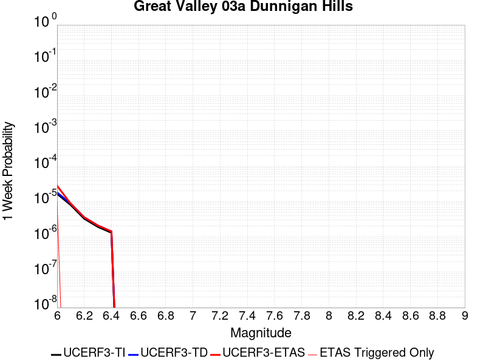 |  |  |  |

| Magnitude | 1 wk TI Prob | 1 wk TD Prob | 1 wk ETAS Prob | 1 wk ETAS/TD Gain | 1 wk ETAS Triggered Only | 1 mo TI Prob | 1 mo TD Prob | 1 mo ETAS Prob | 1 mo ETAS/TD Gain | 1 mo ETAS Triggered Only | 1 yr TI Prob | 1 yr TD Prob | 1 yr ETAS Prob | 1 yr ETAS/TD Gain | 1 yr ETAS Triggered Only | 10 yr TI Prob | 10 yr TD Prob | 10 yr ETAS Prob | 10 yr ETAS/TD Gain | 10 yr ETAS Triggered Only |
|-----|-----|-----|-----|-----|-----|-----|-----|-----|-----|-----|-----|-----|-----|-----|-----|-----|-----|-----|-----|-----|
| 6.0 | 1.6591328E-5 | 1.8108174E-5 | 2.8107992E-5 | 1.5522268 | 1.0E-5 | 7.110376E-5 | 7.760454E-5 | 8.760377E-5 | 1.1288484 | 1.0E-5 | 8.6534437E-4 | 9.4449485E-4 | 9.544854E-4 | 1.0105777 | 1.0E-5 | 0.008619824 | 0.009411639 | 0.009421544 | 1.0010525 | 1.0E-5 |
| 6.1 | 8.041125E-6 | 8.769832E-6 | 8.769832E-6 | 1.0 | 0.0 | 3.4461507E-5 | 3.7584567E-5 | 3.7584567E-5 | 1.0 | 0.0 | 4.194881E-4 | 4.5751635E-4 | 4.5751635E-4 | 1.0 | 0.0 | 0.004186971 | 0.004567742 | 0.004567742 | 1.0 | 0.0 |
| 6.2 | 3.2807004E-6 | 3.579612E-6 | 3.579612E-6 | 1.0 | 0.0 | 1.4060069E-5 | 1.5341127E-5 | 1.5341127E-5 | 1.0 | 0.0 | 1.7116789E-4 | 1.8676638E-4 | 1.8676638E-4 | 1.0 | 0.0 | 0.0017103611 | 0.0018665022 | 0.0018665022 | 1.0 | 0.0 |
| 6.3 | 1.9339366E-6 | 2.1104063E-6 | 2.1104063E-6 | 1.0 | 0.0 | 8.288273E-6 | 9.044583E-6 | 9.044583E-6 | 1.0 | 0.0 | 1.00905054E-4 | 1.10115085E-4 | 1.10115085E-4 | 1.0 | 0.0 | 0.0010085925 | 0.0011008852 | 0.0011008852 | 1.0 | 0.0 |
| 6.4 | 1.3142635E-6 | 1.4340039E-6 | 1.4340039E-6 | 1.0 | 0.0 | 5.6325457E-6 | 6.1457313E-6 | 6.1457313E-6 | 1.0 | 0.0 | 6.857408E-5 | 7.4824275E-5 | 7.4824275E-5 | 1.0 | 0.0 | 6.8552926E-4 | 7.482428E-4 | 7.482428E-4 | 1.0 | 0.0 |

## Polaris 2011 CFM
*[(top)](#table-of-contents)*

| 1 Week | 1 Month | 1 Year | 10 Year |
|-----|-----|-----|-----|
|  |  | 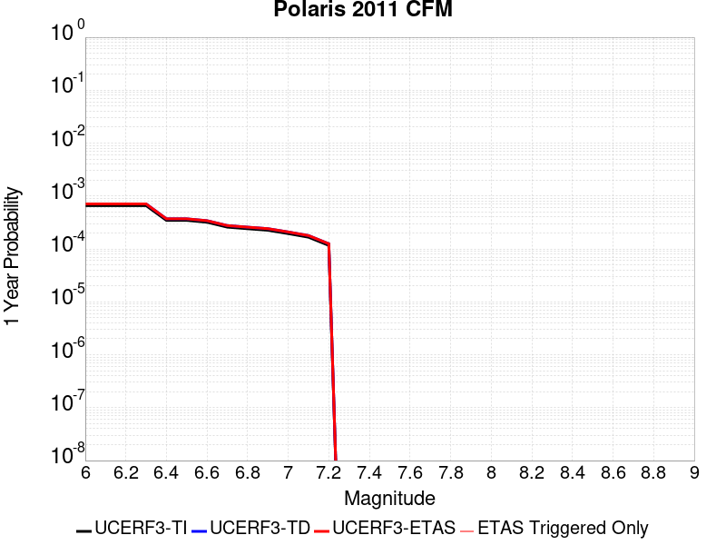 | 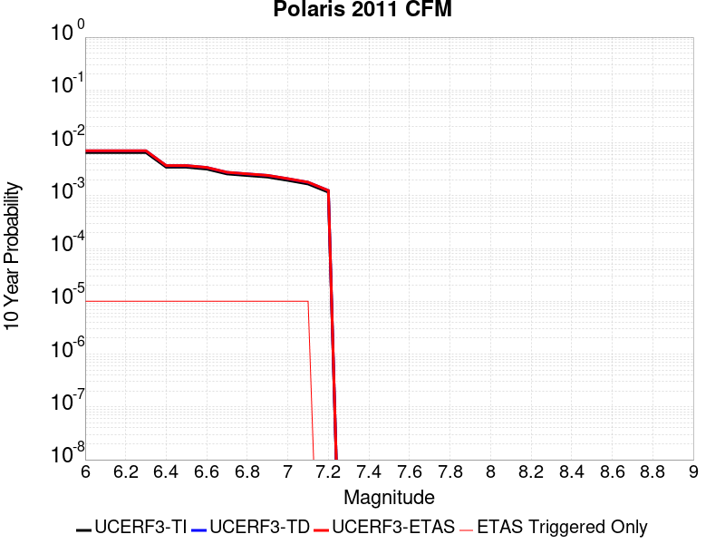 |

| Magnitude | 1 wk TI Prob | 1 wk TD Prob | 1 wk ETAS Prob | 1 wk ETAS/TD Gain | 1 wk ETAS Triggered Only | 1 mo TI Prob | 1 mo TD Prob | 1 mo ETAS Prob | 1 mo ETAS/TD Gain | 1 mo ETAS Triggered Only | 1 yr TI Prob | 1 yr TD Prob | 1 yr ETAS Prob | 1 yr ETAS/TD Gain | 1 yr ETAS Triggered Only | 10 yr TI Prob | 10 yr TD Prob | 10 yr ETAS Prob | 10 yr ETAS/TD Gain | 10 yr ETAS Triggered Only |
|-----|-----|-----|-----|-----|-----|-----|-----|-----|-----|-----|-----|-----|-----|-----|-----|-----|-----|-----|-----|-----|
| 6.0 | 1.2630823E-5 | 1.3583052E-5 | 1.3583052E-5 | 1.0 | 0.0 | 5.413098E-5 | 5.8212074E-5 | 5.8212074E-5 | 1.0 | 0.0 | 6.5884535E-4 | 7.085534E-4 | 7.085534E-4 | 1.0 | 0.0 | 0.0065689543 | 0.007068052 | 0.0070779813 | 1.0014048 | 1.0E-5 |
| 6.1 | 1.2630823E-5 | 1.3583052E-5 | 1.3583052E-5 | 1.0 | 0.0 | 5.413098E-5 | 5.8212074E-5 | 5.8212074E-5 | 1.0 | 0.0 | 6.5884535E-4 | 7.085534E-4 | 7.085534E-4 | 1.0 | 0.0 | 0.0065689543 | 0.007068052 | 0.0070779813 | 1.0014048 | 1.0E-5 |
| 6.2 | 1.2630823E-5 | 1.3583052E-5 | 1.3583052E-5 | 1.0 | 0.0 | 5.413098E-5 | 5.8212074E-5 | 5.8212074E-5 | 1.0 | 0.0 | 6.5884535E-4 | 7.085534E-4 | 7.085534E-4 | 1.0 | 0.0 | 0.0065689543 | 0.007068052 | 0.0070779813 | 1.0014048 | 1.0E-5 |
| 6.3 | 1.2630823E-5 | 1.3583052E-5 | 1.3583052E-5 | 1.0 | 0.0 | 5.413098E-5 | 5.8212074E-5 | 5.8212074E-5 | 1.0 | 0.0 | 6.5884535E-4 | 7.085534E-4 | 7.085534E-4 | 1.0 | 0.0 | 0.0065689543 | 0.007068052 | 0.0070779813 | 1.0014048 | 1.0E-5 |
| 6.4 | 6.642994E-6 | 7.107126E-6 | 7.107126E-6 | 1.0 | 0.0 | 2.8469662E-5 | 3.0458785E-5 | 3.0458785E-5 | 1.0 | 0.0 | 3.46563E-4 | 3.7077777E-4 | 3.7077777E-4 | 1.0 | 0.0 | 0.0034602303 | 0.003702102 | 0.003712065 | 1.0026911 | 1.0E-5 |
| 6.5 | 6.642994E-6 | 7.107126E-6 | 7.107126E-6 | 1.0 | 0.0 | 2.8469662E-5 | 3.0458785E-5 | 3.0458785E-5 | 1.0 | 0.0 | 3.46563E-4 | 3.7077777E-4 | 3.7077777E-4 | 1.0 | 0.0 | 0.0034602303 | 0.003702102 | 0.003712065 | 1.0026911 | 1.0E-5 |
| 6.6 | 6.1286296E-6 | 6.556232E-6 | 6.556232E-6 | 1.0 | 0.0 | 2.626529E-5 | 2.8097862E-5 | 2.8097862E-5 | 1.0 | 0.0 | 3.19733E-4 | 3.420426E-4 | 3.420426E-4 | 1.0 | 0.0 | 0.0031927335 | 0.0034156365 | 0.0034256023 | 1.0029178 | 1.0E-5 |
| 6.7 | 4.9474666E-6 | 5.298299E-6 | 5.298299E-6 | 1.0 | 0.0 | 2.1203256E-5 | 2.2706814E-5 | 2.2706814E-5 | 1.0 | 0.0 | 2.5811905E-4 | 2.7642323E-4 | 2.7642323E-4 | 1.0 | 0.0 | 0.0025781945 | 0.0027610739 | 0.0027710462 | 1.0036118 | 1.0E-5 |
| 6.8 | 4.616407E-6 | 4.946311E-6 | 4.946311E-6 | 1.0 | 0.0 | 1.978445E-5 | 2.1198319E-5 | 2.1198319E-5 | 1.0 | 0.0 | 2.4084905E-4 | 2.5806163E-4 | 2.5806163E-4 | 1.0 | 0.0 | 0.0024058819 | 0.0025778841 | 0.0025878581 | 1.0038692 | 1.0E-5 |
| 6.9 | 4.320343E-6 | 4.63093E-6 | 4.63093E-6 | 1.0 | 0.0 | 1.8515624E-5 | 1.9846708E-5 | 1.9846708E-5 | 1.0 | 0.0 | 2.2540441E-4 | 2.4160948E-4 | 2.4160948E-4 | 1.0 | 0.0 | 0.0022517592 | 0.0024137248 | 0.0024237006 | 1.004133 | 1.0E-5 |
| 7.0 | 3.7382292E-6 | 4.0095915E-6 | 4.0095915E-6 | 1.0 | 0.0 | 1.6020884E-5 | 1.7183864E-5 | 1.7183864E-5 | 1.0 | 0.0 | 1.950368E-4 | 2.0919584E-4 | 2.0919584E-4 | 1.0 | 0.0 | 0.0019486571 | 0.0020902245 | 0.0021002037 | 1.0047742 | 1.0E-5 |
| 7.1 | 3.193576E-6 | 3.4277325E-6 | 3.4277325E-6 | 1.0 | 0.0 | 1.3686683E-5 | 1.4690211E-5 | 1.4690211E-5 | 1.0 | 0.0 | 1.6662262E-4 | 1.7884087E-4 | 1.7884087E-4 | 1.0 | 0.0 | 0.0016649774 | 0.0017871883 | 0.0017971705 | 1.0055854 | 1.0E-5 |
| 7.2 | 2.2356758E-6 | 2.402392E-6 | 2.402392E-6 | 1.0 | 0.0 | 9.581432E-6 | 1.0295936E-5 | 1.0295936E-5 | 1.0 | 0.0 | 1.1664769E-4 | 1.2534771E-4 | 1.2534771E-4 | 1.0 | 0.0 | 0.0011658648 | 0.0012529559 | 0.0012529559 | 1.0 | 0.0 |

## Greenville (No) 2011 CFM
*[(top)](#table-of-contents)*

| 1 Week | 1 Month | 1 Year | 10 Year |
|-----|-----|-----|-----|
|  |  |  |  |

| Magnitude | 1 wk TI Prob | 1 wk TD Prob | 1 wk ETAS Prob | 1 wk ETAS/TD Gain | 1 wk ETAS Triggered Only | 1 mo TI Prob | 1 mo TD Prob | 1 mo ETAS Prob | 1 mo ETAS/TD Gain | 1 mo ETAS Triggered Only | 1 yr TI Prob | 1 yr TD Prob | 1 yr ETAS Prob | 1 yr ETAS/TD Gain | 1 yr ETAS Triggered Only | 10 yr TI Prob | 10 yr TD Prob | 10 yr ETAS Prob | 10 yr ETAS/TD Gain | 10 yr ETAS Triggered Only |
|-----|-----|-----|-----|-----|-----|-----|-----|-----|-----|-----|-----|-----|-----|-----|-----|-----|-----|-----|-----|-----|
| 6.0 | 3.286654E-5 | 4.0367628E-5 | 4.0367628E-5 | 1.0 | 0.0 | 1.4084899E-4 | 1.7299286E-4 | 1.7299286E-4 | 1.0 | 0.0 | 0.0017134876 | 0.0021041913 | 0.0021141702 | 1.0047424 | 1.0E-5 | 0.017003356 | 0.020847926 | 0.020857718 | 1.0004697 | 1.0E-5 |
| 6.1 | 3.286654E-5 | 4.0367628E-5 | 4.0367628E-5 | 1.0 | 0.0 | 1.4084899E-4 | 1.7299286E-4 | 1.7299286E-4 | 1.0 | 0.0 | 0.0017134876 | 0.0021041913 | 0.0021141702 | 1.0047424 | 1.0E-5 | 0.017003356 | 0.020847926 | 0.020857718 | 1.0004697 | 1.0E-5 |
| 6.2 | 3.1697953E-5 | 3.8930488E-5 | 3.8930488E-5 | 1.0 | 0.0 | 1.358413E-4 | 1.6683448E-4 | 1.6683448E-4 | 1.0 | 0.0 | 0.0016526132 | 0.0020293547 | 0.0020393343 | 1.0049176 | 1.0E-5 | 0.01640377 | 0.020113297 | 0.020123096 | 1.0004872 | 1.0E-5 |
| 6.3 | 3.1363317E-5 | 3.8519345E-5 | 3.8519345E-5 | 1.0 | 0.0 | 1.344073E-4 | 1.6507268E-4 | 1.6507268E-4 | 1.0 | 0.0 | 0.0016351803 | 0.0020079445 | 0.0020179243 | 1.0049702 | 1.0E-5 | 0.016232004 | 0.019903058 | 0.01991286 | 1.0004925 | 1.0E-5 |
| 6.4 | 3.0228604E-5 | 3.712643E-5 | 3.712643E-5 | 1.0 | 0.0 | 1.2954473E-4 | 1.5910377E-4 | 1.5910377E-4 | 1.0 | 0.0 | 0.0015760659 | 0.0019354038 | 0.0019453844 | 1.0051569 | 1.0E-5 | 0.015649348 | 0.019190377 | 0.019200185 | 1.000511 | 1.0E-5 |
| 6.5 | 2.9537814E-5 | 3.6281854E-5 | 3.6281854E-5 | 1.0 | 0.0 | 1.2658449E-4 | 1.554846E-4 | 1.554846E-4 | 1.0 | 0.0 | 0.0015400766 | 0.0018914177 | 0.0019013988 | 1.005277 | 1.0E-5 | 0.01529447 | 0.018758025 | 0.018767837 | 1.0005231 | 1.0E-5 |
| 6.6 | 2.7345395E-5 | 3.3591095E-5 | 3.3591095E-5 | 1.0 | 0.0 | 1.1718928E-4 | 1.4395406E-4 | 1.4395406E-4 | 1.0 | 0.0 | 0.0014258457 | 0.0017512628 | 0.0017612453 | 1.0057001 | 1.0E-5 | 0.014167317 | 0.017378807 | 0.017388634 | 1.0005654 | 1.0E-5 |
| 6.7 | 2.5615784E-5 | 3.156795E-5 | 3.156795E-5 | 1.0 | 0.0 | 1.09777306E-4 | 1.3528437E-4 | 1.3528437E-4 | 1.0 | 0.0 | 0.0013357193 | 0.0016458734 | 0.001655857 | 1.0060658 | 1.0E-5 | 0.013277191 | 0.016340878 | 0.016350714 | 1.000602 | 1.0E-5 |
| 6.8 | 2.0059057E-5 | 2.4712723E-5 | 2.4712723E-5 | 1.0 | 0.0 | 8.596455E-5 | 1.0590746E-4 | 1.0590746E-4 | 1.0 | 0.0 | 0.0010461159 | 0.0012886769 | 0.001298664 | 1.0077499 | 1.0E-5 | 0.0104120495 | 0.01281443 | 0.012824302 | 1.0007703 | 1.0E-5 |
| 6.9 | 1.6321746E-5 | 2.018519E-5 | 2.018519E-5 | 1.0 | 0.0 | 6.9948466E-5 | 8.6505155E-5 | 8.6505155E-5 | 1.0 | 0.0 | 8.5128983E-4 | 0.0010527038 | 0.0010626933 | 1.0094893 | 1.0E-5 | 0.008480361 | 0.010479072 | 0.010488967 | 1.0009443 | 1.0E-5 |
| 7.0 | 1.22527645E-5 | 1.5136019E-5 | 1.5136019E-5 | 1.0 | 0.0 | 5.2510793E-5 | 6.486706E-5 | 6.486706E-5 | 1.0 | 0.0 | 6.3913135E-4 | 7.894746E-4 | 7.994667E-4 | 1.0126567 | 1.0E-5 | 0.0063729626 | 0.007867752 | 0.007877673 | 1.001261 | 1.0E-5 |
| 7.1 | 8.996482E-6 | 1.1165242E-5 | 1.1165242E-5 | 1.0 | 0.0 | 3.8555783E-5 | 4.7850164E-5 | 4.7850164E-5 | 1.0 | 0.0 | 4.6931554E-4 | 5.8242126E-4 | 5.9241545E-4 | 1.0171597 | 1.0E-5 | 0.004683256 | 0.005809783 | 0.005819725 | 1.0017112 | 1.0E-5 |
| 7.2 | 6.0273087E-6 | 7.5697E-6 | 7.5697E-6 | 1.0 | 0.0 | 2.5831067E-5 | 3.244117E-5 | 3.244117E-5 | 1.0 | 0.0 | 3.1444785E-4 | 3.9490036E-4 | 4.0489642E-4 | 1.0253129 | 1.0E-5 | 0.0031400328 | 0.003942572 | 0.003952533 | 1.0025264 | 1.0E-5 |
| 7.3 | 3.1209995E-6 | 3.966495E-6 | 3.966495E-6 | 1.0 | 0.0 | 1.3375643E-5 | 1.6999156E-5 | 1.6999156E-5 | 1.0 | 0.0 | 1.6283628E-4 | 2.0694522E-4 | 2.0694522E-4 | 1.0 | 0.0 | 0.0016271701 | 0.002067831 | 0.002067831 | 1.0 | 0.0 |
| 7.4 | 2.0254208E-6 | 2.6096925E-6 | 2.6096925E-6 | 1.0 | 0.0 | 8.680347E-6 | 1.1184348E-5 | 1.1184348E-5 | 1.0 | 0.0 | 1.0567809E-4 | 1.3616099E-4 | 1.3616099E-4 | 1.0 | 0.0 | 0.0010562785 | 0.0013611029 | 0.0013611029 | 1.0 | 0.0 |
| 7.5 | 1.6763418E-6 | 2.1734163E-6 | 2.1734163E-6 | 1.0 | 0.0 | 7.184302E-6 | 9.314608E-6 | 9.314608E-6 | 1.0 | 0.0 | 8.746537E-5 | 1.1339951E-4 | 1.1339951E-4 | 1.0 | 0.0 | 8.743095E-4 | 0.001133725 | 0.001133725 | 1.0 | 0.0 |
| 7.6 | 1.1935462E-6 | 1.5458975E-6 | 1.5458975E-6 | 1.0 | 0.0 | 5.115188E-6 | 6.6252583E-6 | 6.6252583E-6 | 1.0 | 0.0 | 6.2275634E-5 | 8.065958E-5 | 8.065958E-5 | 1.0 | 0.0 | 6.2258187E-4 | 8.0653606E-4 | 8.0653606E-4 | 1.0 | 0.0 |
| 7.7 | 3.0464201E-7 | 3.9848902E-7 | 3.9848902E-7 | 1.0 | 0.0 | 1.3056081E-6 | 1.707809E-6 | 1.707809E-6 | 1.0 | 0.0 | 1.589566E-5 | 2.079238E-5 | 2.079238E-5 | 1.0 | 0.0 | 1.5894524E-4 | 2.0793274E-4 | 2.0793274E-4 | 1.0 | 0.0 |

## Malibu Coast (Extension) alt 1
*[(top)](#table-of-contents)*

| 1 Week | 1 Month | 1 Year | 10 Year |
|-----|-----|-----|-----|
|  |  |  |  |

| Magnitude | 1 wk TI Prob | 1 wk TD Prob | 1 wk ETAS Prob | 1 wk ETAS/TD Gain | 1 wk ETAS Triggered Only | 1 mo TI Prob | 1 mo TD Prob | 1 mo ETAS Prob | 1 mo ETAS/TD Gain | 1 mo ETAS Triggered Only | 1 yr TI Prob | 1 yr TD Prob | 1 yr ETAS Prob | 1 yr ETAS/TD Gain | 1 yr ETAS Triggered Only | 10 yr TI Prob | 10 yr TD Prob | 10 yr ETAS Prob | 10 yr ETAS/TD Gain | 10 yr ETAS Triggered Only |
|-----|-----|-----|-----|-----|-----|-----|-----|-----|-----|-----|-----|-----|-----|-----|-----|-----|-----|-----|-----|-----|
| 6.0 | 8.930738E-6 | 9.329346E-6 | 9.329346E-6 | 1.0 | 0.0 | 3.827403E-5 | 3.9982307E-5 | 3.9982307E-5 | 1.0 | 0.0 | 4.6588664E-4 | 4.8667757E-4 | 4.8667757E-4 | 1.0 | 0.0 | 0.0046491115 | 0.0048563 | 0.0048662517 | 1.0020492 | 1.0E-5 |
| 6.1 | 7.199952E-6 | 7.530357E-6 | 7.530357E-6 | 1.0 | 0.0 | 3.0856572E-5 | 3.227256E-5 | 3.227256E-5 | 1.0 | 0.0 | 3.75614E-4 | 3.9284822E-4 | 3.9284822E-4 | 1.0 | 0.0 | 0.0037497976 | 0.003921604 | 0.0039315643 | 1.00254 | 1.0E-5 |
| 6.2 | 6.3721413E-6 | 6.666847E-6 | 6.666847E-6 | 1.0 | 0.0 | 2.7308892E-5 | 2.857189E-5 | 2.857189E-5 | 1.0 | 0.0 | 3.3243504E-4 | 3.478076E-4 | 3.478076E-4 | 1.0 | 0.0 | 0.0033193815 | 0.0034726725 | 0.003482638 | 1.0028696 | 1.0E-5 |
| 6.3 | 6.016345E-6 | 6.2952113E-6 | 6.2952113E-6 | 1.0 | 0.0 | 2.578408E-5 | 2.69792E-5 | 2.69792E-5 | 1.0 | 0.0 | 3.1387596E-4 | 3.2842258E-4 | 3.2842258E-4 | 1.0 | 0.0 | 0.00313433 | 0.0032794084 | 0.0032893757 | 1.0030394 | 1.0E-5 |
| 6.4 | 5.8104883E-6 | 6.0795965E-6 | 6.0795965E-6 | 1.0 | 0.0 | 2.4901856E-5 | 2.6055155E-5 | 2.6055155E-5 | 1.0 | 0.0 | 3.031379E-4 | 3.1717564E-4 | 3.1717564E-4 | 1.0 | 0.0 | 0.0030272473 | 0.0031672644 | 0.0031772326 | 1.0031472 | 1.0E-5 |
| 6.5 | 5.476925E-6 | 5.7275624E-6 | 5.7275624E-6 | 1.0 | 0.0 | 2.3472323E-5 | 2.4546467E-5 | 2.4546467E-5 | 1.0 | 0.0 | 2.8573806E-4 | 2.9881255E-4 | 2.9881255E-4 | 1.0 | 0.0 | 0.0028537093 | 0.0029841396 | 0.0029941096 | 1.0033411 | 1.0E-5 |
| 6.6 | 5.222387E-6 | 5.458627E-6 | 5.458627E-6 | 1.0 | 0.0 | 2.2381464E-5 | 2.3393908E-5 | 2.3393908E-5 | 1.0 | 0.0 | 2.7246025E-4 | 2.847839E-4 | 2.847839E-4 | 1.0 | 0.0 | 0.0027212645 | 0.00284422 | 0.0028541917 | 1.003506 | 1.0E-5 |
| 6.7 | 5.0337076E-6 | 5.259149E-6 | 5.259149E-6 | 1.0 | 0.0 | 2.1572854E-5 | 2.2539016E-5 | 2.2539016E-5 | 1.0 | 0.0 | 2.6261783E-4 | 2.7437825E-4 | 2.7437825E-4 | 1.0 | 0.0 | 0.002623077 | 0.002740425 | 0.0027503977 | 1.0036391 | 1.0E-5 |
| 6.8 | 4.5675624E-6 | 4.7587573E-6 | 4.7587573E-6 | 1.0 | 0.0 | 1.9575122E-5 | 2.0394516E-5 | 2.0394516E-5 | 1.0 | 0.0 | 2.3830103E-4 | 2.4827512E-4 | 2.4827512E-4 | 1.0 | 0.0 | 0.0023804565 | 0.0024799972 | 0.0024899724 | 1.0040222 | 1.0E-5 |
| 6.9 | 4.2802412E-6 | 4.452059E-6 | 4.452059E-6 | 1.0 | 0.0 | 1.8343762E-5 | 1.9080113E-5 | 1.9080113E-5 | 1.0 | 0.0 | 2.2331243E-4 | 2.3227576E-4 | 2.3227576E-4 | 1.0 | 0.0 | 0.0022308815 | 0.0023203467 | 0.0023303234 | 1.0042998 | 1.0E-5 |
| 7.0 | 3.9794063E-6 | 4.130134E-6 | 4.130134E-6 | 1.0 | 0.0 | 1.7054486E-5 | 1.7700457E-5 | 1.7700457E-5 | 1.0 | 0.0 | 2.0761859E-4 | 2.1548186E-4 | 2.1548186E-4 | 1.0 | 0.0 | 0.0020742472 | 0.0021527428 | 0.0021627212 | 1.0046352 | 1.0E-5 |
| 7.1 | 3.7730424E-6 | 3.9112506E-6 | 3.9112506E-6 | 1.0 | 0.0 | 1.6170083E-5 | 1.6762395E-5 | 1.6762395E-5 | 1.0 | 0.0 | 1.9685295E-4 | 2.0406317E-4 | 2.0406317E-4 | 1.0 | 0.0 | 0.0019667868 | 0.0020387708 | 0.0020487504 | 1.004895 | 1.0E-5 |
| 7.2 | 3.424985E-6 | 3.5413673E-6 | 3.5413673E-6 | 1.0 | 0.0 | 1.4678424E-5 | 1.5177201E-5 | 1.5177201E-5 | 1.0 | 0.0 | 1.7869516E-4 | 1.8476688E-4 | 1.8476688E-4 | 1.0 | 0.0 | 0.0017855153 | 0.0018461446 | 0.0018561261 | 1.0054067 | 1.0E-5 |
| 7.3 | 2.6966375E-6 | 2.759676E-6 | 2.759676E-6 | 1.0 | 0.0 | 1.15569665E-5 | 1.1827129E-5 | 1.1827129E-5 | 1.0 | 0.0 | 1.4069698E-4 | 1.4398582E-4 | 1.4398582E-4 | 1.0 | 0.0 | 0.0014060794 | 0.0014389295 | 0.0014389295 | 1.0 | 0.0 |
| 7.4 | 2.215957E-6 | 2.2493962E-6 | 2.2493962E-6 | 1.0 | 0.0 | 9.496924E-6 | 9.640234E-6 | 9.640234E-6 | 1.0 | 0.0 | 1.1561892E-4 | 1.1736356E-4 | 1.1736356E-4 | 1.0 | 0.0 | 0.0011555878 | 0.0011730195 | 0.0011730195 | 1.0 | 0.0 |
| 7.5 | 1.2040218E-6 | 1.2219166E-6 | 1.2219166E-6 | 1.0 | 0.0 | 5.160083E-6 | 5.236775E-6 | 5.236775E-6 | 1.0 | 0.0 | 6.2822204E-5 | 6.3755884E-5 | 6.3755884E-5 | 1.0 | 0.0 | 6.280445E-4 | 6.3737785E-4 | 6.3737785E-4 | 1.0 | 0.0 |
| 7.6 | 6.6157446E-7 | 6.67903E-7 | 6.67903E-7 | 1.0 | 0.0 | 2.835316E-6 | 2.8624384E-6 | 2.8624384E-6 | 1.0 | 0.0 | 3.4519428E-5 | 3.4849647E-5 | 3.4849647E-5 | 1.0 | 0.0 | 3.4514067E-4 | 3.4844334E-4 | 3.4844334E-4 | 1.0 | 0.0 |
| 7.7 | 2.6012302E-7 | 2.4357752E-7 | 2.4357752E-7 | 1.0 | 0.0 | 1.1148124E-6 | 1.0439032E-6 | 1.0439032E-6 | 1.0 | 0.0 | 1.3572758E-5 | 1.2709459E-5 | 1.2709459E-5 | 1.0 | 0.0 | 1.3571928E-4 | 1.2708838E-4 | 1.2708838E-4 | 1.0 | 0.0 |
| 7.8 | 2.8323132E-8 | 2.0266684E-8 | 2.0266684E-8 | 1.0 | 0.0 | 1.2138484E-7 | 8.685721E-8 | 8.685721E-8 | 1.0 | 0.0 | 1.4778595E-6 | 1.0574862E-6 | 1.0574862E-6 | 1.0 | 0.0 | 1.4778497E-5 | 1.05748195E-5 | 1.05748195E-5 | 1.0 | 0.0 |

## San Diego Trough south
*[(top)](#table-of-contents)*

| 1 Week | 1 Month | 1 Year | 10 Year |
|-----|-----|-----|-----|
|  |  |  |  |

| Magnitude | 1 wk TI Prob | 1 wk TD Prob | 1 wk ETAS Prob | 1 wk ETAS/TD Gain | 1 wk ETAS Triggered Only | 1 mo TI Prob | 1 mo TD Prob | 1 mo ETAS Prob | 1 mo ETAS/TD Gain | 1 mo ETAS Triggered Only | 1 yr TI Prob | 1 yr TD Prob | 1 yr ETAS Prob | 1 yr ETAS/TD Gain | 1 yr ETAS Triggered Only | 10 yr TI Prob | 10 yr TD Prob | 10 yr ETAS Prob | 10 yr ETAS/TD Gain | 10 yr ETAS Triggered Only |
|-----|-----|-----|-----|-----|-----|-----|-----|-----|-----|-----|-----|-----|-----|-----|-----|-----|-----|-----|-----|-----|
| 6.0 | 8.279495E-5 | 1.0425905E-4 | 1.0425905E-4 | 1.0 | 0.0 | 3.5478722E-4 | 4.4675023E-4 | 4.4675023E-4 | 1.0 | 0.0 | 0.004310982 | 0.0054260944 | 0.0054360405 | 1.001833 | 1.0E-5 | 0.042283054 | 0.052994724 | 0.053004194 | 1.0001787 | 1.0E-5 |
| 6.1 | 4.6961468E-5 | 5.773192E-5 | 5.773192E-5 | 1.0 | 0.0 | 2.0124791E-4 | 2.4739734E-4 | 2.4739734E-4 | 1.0 | 0.0 | 0.00244744 | 0.0030079763 | 0.0030179464 | 1.0033145 | 1.0E-5 | 0.024206603 | 0.02968051 | 0.029690212 | 1.0003269 | 1.0E-5 |
| 6.2 | 3.5079658E-5 | 4.2143583E-5 | 4.2143583E-5 | 1.0 | 0.0 | 1.5033272E-4 | 1.8060306E-4 | 1.8060306E-4 | 1.0 | 0.0 | 0.0018287642 | 0.0021966458 | 0.0022066238 | 1.0045424 | 1.0E-5 | 0.018137876 | 0.021751761 | 0.021761544 | 1.0004498 | 1.0E-5 |
| 6.3 | 3.5079658E-5 | 4.2143583E-5 | 4.2143583E-5 | 1.0 | 0.0 | 1.5033272E-4 | 1.8060306E-4 | 1.8060306E-4 | 1.0 | 0.0 | 0.0018287642 | 0.0021966458 | 0.0022066238 | 1.0045424 | 1.0E-5 | 0.018137876 | 0.021751761 | 0.021761544 | 1.0004498 | 1.0E-5 |
| 6.4 | 2.7196904E-5 | 3.2087904E-5 | 3.2087904E-5 | 1.0 | 0.0 | 1.16552954E-4 | 1.3751238E-4 | 1.3751238E-4 | 1.0 | 0.0 | 0.0014181085 | 0.0016729396 | 0.001682923 | 1.0059675 | 1.0E-5 | 0.014090929 | 0.01660506 | 0.016614895 | 1.0005922 | 1.0E-5 |
| 6.5 | 2.5584688E-5 | 3.0102321E-5 | 3.0102321E-5 | 1.0 | 0.0 | 1.0964406E-4 | 1.290036E-4 | 1.290036E-4 | 1.0 | 0.0 | 0.0013340989 | 0.0015694996 | 0.001579484 | 1.0063615 | 1.0E-5 | 0.013261181 | 0.015585696 | 0.01559554 | 1.0006316 | 1.0E-5 |
| 6.6 | 2.2034688E-5 | 2.574329E-5 | 2.574329E-5 | 1.0 | 0.0 | 9.443096E-5 | 1.10323745E-4 | 1.10323745E-4 | 1.0 | 0.0 | 0.0011490905 | 0.0013423713 | 0.0013423713 | 1.0 | 0.0 | 0.011431668 | 0.013343622 | 0.013343622 | 1.0 | 0.0 |
| 6.7 | 1.9394853E-5 | 2.254225E-5 | 2.254225E-5 | 1.0 | 0.0 | 8.311815E-5 | 9.660609E-5 | 9.660609E-5 | 1.0 | 0.0 | 0.0010114936 | 0.0011755498 | 0.0011755498 | 1.0 | 0.0 | 0.01006902 | 0.011694018 | 0.011694018 | 1.0 | 0.0 |
| 6.8 | 1.7615313E-5 | 2.0403613E-5 | 2.0403613E-5 | 1.0 | 0.0 | 7.549201E-5 | 8.744115E-5 | 8.744115E-5 | 1.0 | 0.0 | 9.1872766E-4 | 0.0010640804 | 0.0010640804 | 1.0 | 0.0 | 0.009149387 | 0.01059042 | 0.01059042 | 1.0 | 0.0 |
| 6.9 | 1.5621423E-5 | 1.8026485E-5 | 1.8026485E-5 | 1.0 | 0.0 | 6.6947236E-5 | 7.7254095E-5 | 7.7254095E-5 | 1.0 | 0.0 | 8.147778E-4 | 9.401663E-4 | 9.401663E-4 | 1.0 | 0.0 | 0.008117969 | 0.0093623325 | 0.0093623325 | 1.0 | 0.0 |
| 7.0 | 1.3444376E-5 | 1.5448395E-5 | 1.5448395E-5 | 1.0 | 0.0 | 5.7617483E-5 | 6.620574E-5 | 6.620574E-5 | 1.0 | 0.0 | 7.0126704E-4 | 8.057596E-4 | 8.057596E-4 | 1.0 | 0.0 | 0.006990582 | 0.008028714 | 0.008028714 | 1.0 | 0.0 |
| 7.1 | 1.2268361E-5 | 1.40733055E-5 | 1.40733055E-5 | 1.0 | 0.0 | 5.2577634E-5 | 6.031279E-5 | 6.031279E-5 | 1.0 | 0.0 | 6.399447E-4 | 7.3406345E-4 | 7.3406345E-4 | 1.0 | 0.0 | 0.0063810493 | 0.007316692 | 0.007316692 | 1.0 | 0.0 |
| 7.2 | 1.0922655E-5 | 1.2513806E-5 | 1.2513806E-5 | 1.0 | 0.0 | 4.681054E-5 | 5.362951E-5 | 5.362951E-5 | 1.0 | 0.0 | 5.697693E-4 | 6.527462E-4 | 6.527462E-4 | 1.0 | 0.0 | 0.0056831064 | 0.0065085697 | 0.0065085697 | 1.0 | 0.0 |
| 7.3 | 6.1106753E-6 | 6.9290486E-6 | 6.9290486E-6 | 1.0 | 0.0 | 2.6188345E-5 | 2.9695586E-5 | 2.9695586E-5 | 1.0 | 0.0 | 3.1879646E-4 | 3.6148418E-4 | 3.6148418E-4 | 1.0 | 0.0 | 0.0031833951 | 0.0036090072 | 0.0036090072 | 1.0 | 0.0 |
| 7.4 | 4.933187E-6 | 5.5896517E-6 | 5.5896517E-6 | 1.0 | 0.0 | 2.114206E-5 | 2.3955432E-5 | 2.3955432E-5 | 1.0 | 0.0 | 2.5737417E-4 | 2.9161875E-4 | 2.9161875E-4 | 1.0 | 0.0 | 0.002570763 | 0.002912402 | 0.002912402 | 1.0 | 0.0 |
| 7.5 | 1.7489613E-6 | 1.9697113E-6 | 1.9697113E-6 | 1.0 | 0.0 | 7.495527E-6 | 8.441594E-6 | 8.441594E-6 | 1.0 | 0.0 | 9.125422E-5 | 1.0277178E-4 | 1.0277178E-4 | 1.0 | 0.0 | 9.1216754E-4 | 0.0010272645 | 0.0010272645 | 1.0 | 0.0 |
| 7.6 | 1.6988751E-7 | 1.7533898E-7 | 1.7533898E-7 | 1.0 | 0.0 | 7.2808916E-7 | 7.5145255E-7 | 7.5145255E-7 | 1.0 | 0.0 | 8.864449E-6 | 9.148898E-6 | 9.148898E-6 | 1.0 | 0.0 | 8.8640954E-5 | 9.148542E-5 | 9.148542E-5 | 1.0 | 0.0 |

## Clamshell-Sawpit
*[(top)](#table-of-contents)*

| 1 Week | 1 Month | 1 Year | 10 Year |
|-----|-----|-----|-----|
|  |  |  |  |

| Magnitude | 1 wk TI Prob | 1 wk TD Prob | 1 wk ETAS Prob | 1 wk ETAS/TD Gain | 1 wk ETAS Triggered Only | 1 mo TI Prob | 1 mo TD Prob | 1 mo ETAS Prob | 1 mo ETAS/TD Gain | 1 mo ETAS Triggered Only | 1 yr TI Prob | 1 yr TD Prob | 1 yr ETAS Prob | 1 yr ETAS/TD Gain | 1 yr ETAS Triggered Only | 10 yr TI Prob | 10 yr TD Prob | 10 yr ETAS Prob | 10 yr ETAS/TD Gain | 10 yr ETAS Triggered Only |
|-----|-----|-----|-----|-----|-----|-----|-----|-----|-----|-----|-----|-----|-----|-----|-----|-----|-----|-----|-----|-----|
| 6.0 | 3.202998E-6 | 3.0127833E-6 | 3.0127833E-6 | 1.0 | 0.0 | 1.3727062E-5 | 1.2911869E-5 | 1.2911869E-5 | 1.0 | 0.0 | 1.6711417E-4 | 1.5719148E-4 | 1.671899E-4 | 1.0636067 | 1.0E-5 | 0.0016698855 | 0.0015708823 | 0.0015808665 | 1.0063559 | 1.0E-5 |
| 6.1 | 3.202998E-6 | 3.0127833E-6 | 3.0127833E-6 | 1.0 | 0.0 | 1.3727062E-5 | 1.2911869E-5 | 1.2911869E-5 | 1.0 | 0.0 | 1.6711417E-4 | 1.5719148E-4 | 1.671899E-4 | 1.0636067 | 1.0E-5 | 0.0016698855 | 0.0015708823 | 0.0015808665 | 1.0063559 | 1.0E-5 |
| 6.2 | 3.202998E-6 | 3.0127833E-6 | 3.0127833E-6 | 1.0 | 0.0 | 1.3727062E-5 | 1.2911869E-5 | 1.2911869E-5 | 1.0 | 0.0 | 1.6711417E-4 | 1.5719148E-4 | 1.671899E-4 | 1.0636067 | 1.0E-5 | 0.0016698855 | 0.0015708823 | 0.0015808665 | 1.0063559 | 1.0E-5 |
| 6.3 | 3.202998E-6 | 3.0127833E-6 | 3.0127833E-6 | 1.0 | 0.0 | 1.3727062E-5 | 1.2911869E-5 | 1.2911869E-5 | 1.0 | 0.0 | 1.6711417E-4 | 1.5719148E-4 | 1.671899E-4 | 1.0636067 | 1.0E-5 | 0.0016698855 | 0.0015708823 | 0.0015808665 | 1.0063559 | 1.0E-5 |
| 6.4 | 3.202998E-6 | 3.0127833E-6 | 3.0127833E-6 | 1.0 | 0.0 | 1.3727062E-5 | 1.2911869E-5 | 1.2911869E-5 | 1.0 | 0.0 | 1.6711417E-4 | 1.5719148E-4 | 1.671899E-4 | 1.0636067 | 1.0E-5 | 0.0016698855 | 0.0015708823 | 0.0015808665 | 1.0063559 | 1.0E-5 |
| 6.5 | 2.5862723E-6 | 2.3807918E-6 | 2.3807918E-6 | 1.0 | 0.0 | 1.1083977E-5 | 1.02033555E-5 | 1.02033555E-5 | 1.0 | 0.0 | 1.3493907E-4 | 1.2421908E-4 | 1.3421783E-4 | 1.080493 | 1.0E-5 | 0.0013485716 | 0.0012415267 | 0.0012515143 | 1.0080446 | 1.0E-5 |
| 6.6 | 2.5862723E-6 | 2.3807918E-6 | 2.3807918E-6 | 1.0 | 0.0 | 1.1083977E-5 | 1.02033555E-5 | 1.02033555E-5 | 1.0 | 0.0 | 1.3493907E-4 | 1.2421908E-4 | 1.3421783E-4 | 1.080493 | 1.0E-5 | 0.0013485716 | 0.0012415267 | 0.0012515143 | 1.0080446 | 1.0E-5 |
| 6.7 | 2.5862723E-6 | 2.3807918E-6 | 2.3807918E-6 | 1.0 | 0.0 | 1.1083977E-5 | 1.02033555E-5 | 1.02033555E-5 | 1.0 | 0.0 | 1.3493907E-4 | 1.2421908E-4 | 1.3421783E-4 | 1.080493 | 1.0E-5 | 0.0013485716 | 0.0012415267 | 0.0012515143 | 1.0080446 | 1.0E-5 |
| 6.8 | 2.4098806E-6 | 2.1977469E-6 | 2.1977469E-6 | 1.0 | 0.0 | 1.0328019E-5 | 9.418883E-6 | 9.418883E-6 | 1.0 | 0.0 | 1.2573638E-4 | 1.1466913E-4 | 1.2466797E-4 | 1.0871974 | 1.0E-5 | 0.0012566525 | 0.0011461262 | 0.0011561147 | 1.008715 | 1.0E-5 |
| 6.9 | 2.0073985E-6 | 1.7784384E-6 | 1.7784384E-6 | 1.0 | 0.0 | 8.603109E-6 | 7.6218575E-6 | 7.6218575E-6 | 1.0 | 0.0 | 1.0473781E-4 | 9.279228E-5 | 9.279228E-5 | 1.0 | 0.0 | 0.0010468846 | 9.275472E-4 | 9.275472E-4 | 1.0 | 0.0 |
| 7.0 | 1.8166766E-6 | 1.5807223E-6 | 1.5807223E-6 | 1.0 | 0.0 | 7.785734E-6 | 6.774507E-6 | 6.774507E-6 | 1.0 | 0.0 | 9.478718E-5 | 8.24766E-5 | 8.24766E-5 | 1.0 | 0.0 | 9.4746763E-4 | 8.2446996E-4 | 8.2446996E-4 | 1.0 | 0.0 |
| 7.1 | 1.5471421E-6 | 1.305307E-6 | 1.305307E-6 | 1.0 | 0.0 | 6.6305925E-6 | 5.594161E-6 | 5.594161E-6 | 1.0 | 0.0 | 8.072447E-5 | 6.8106834E-5 | 6.8106834E-5 | 1.0 | 0.0 | 8.0695155E-4 | 6.8086514E-4 | 6.8086514E-4 | 1.0 | 0.0 |
| 7.2 | 1.3608037E-6 | 1.1153539E-6 | 1.1153539E-6 | 1.0 | 0.0 | 5.8320024E-6 | 4.7800795E-6 | 4.7800795E-6 | 1.0 | 0.0 | 7.1002316E-5 | 5.8195965E-5 | 5.8195965E-5 | 1.0 | 0.0 | 7.097964E-4 | 5.818119E-4 | 5.818119E-4 | 1.0 | 0.0 |
| 7.3 | 1.0749634E-6 | 8.384333E-7 | 8.384333E-7 | 1.0 | 0.0 | 4.6069777E-6 | 3.593281E-6 | 3.593281E-6 | 1.0 | 0.0 | 5.608851E-5 | 4.3747346E-5 | 4.3747346E-5 | 1.0 | 0.0 | 5.6074356E-4 | 4.3739015E-4 | 4.3739015E-4 | 1.0 | 0.0 |
| 7.4 | 8.416856E-7 | 6.200111E-7 | 6.200111E-7 | 1.0 | 0.0 | 3.607219E-6 | 2.657188E-6 | 2.657188E-6 | 1.0 | 0.0 | 4.3917007E-5 | 3.2350803E-5 | 3.2350803E-5 | 1.0 | 0.0 | 4.390833E-4 | 3.2346288E-4 | 3.2346288E-4 | 1.0 | 0.0 |
| 7.5 | 6.2779594E-7 | 4.4969397E-7 | 4.4969397E-7 | 1.0 | 0.0 | 2.6905511E-6 | 1.9272586E-6 | 1.9272586E-6 | 1.0 | 0.0 | 3.275697E-5 | 2.346414E-5 | 2.346414E-5 | 1.0 | 0.0 | 3.275214E-4 | 2.3461849E-4 | 2.3461849E-4 | 1.0 | 0.0 |
| 7.6 | 4.3822078E-7 | 3.0595726E-7 | 3.0595726E-7 | 1.0 | 0.0 | 1.8780877E-6 | 1.3112448E-6 | 1.3112448E-6 | 1.0 | 0.0 | 2.2865479E-5 | 1.5964304E-5 | 1.5964304E-5 | 1.0 | 0.0 | 2.2863125E-4 | 1.5963313E-4 | 1.5963313E-4 | 1.0 | 0.0 |
| 7.7 | 1.8704569E-7 | 1.12380086E-7 | 1.12380086E-7 | 1.0 | 0.0 | 8.0162414E-7 | 4.8162883E-7 | 4.8162883E-7 | 1.0 | 0.0 | 9.75973E-6 | 5.863816E-6 | 5.863816E-6 | 1.0 | 0.0 | 9.7593016E-5 | 5.8636677E-5 | 5.8636677E-5 | 1.0 | 0.0 |
| 7.8 | 3.5378733E-8 | 2.183811E-8 | 2.183811E-8 | 1.0 | 0.0 | 1.5162313E-7 | 9.359189E-8 | 9.359189E-8 | 1.0 | 0.0 | 1.84601E-6 | 1.1394808E-6 | 1.1394808E-6 | 1.0 | 0.0 | 1.8459947E-5 | 1.1394752E-5 | 1.1394752E-5 | 1.0 | 0.0 |
| 7.9 | 7.504945E-9 | 5.1921765E-9 | 5.1921765E-9 | 1.0 | 0.0 | 3.2164053E-8 | 2.2252184E-8 | 2.2252184E-8 | 1.0 | 0.0 | 3.9159727E-7 | 2.709203E-7 | 2.709203E-7 | 1.0 | 0.0 | 3.915966E-6 | 2.7092008E-6 | 2.7092008E-6 | 1.0 | 0.0 |
| 8.0 | 1.6554036E-10 | 1.4181756E-10 | 1.4181756E-10 | 1.0 | 0.0 | 7.0945894E-10 | 6.077895E-10 | 6.077895E-10 | 1.0 | 0.0 | 8.637662E-9 | 7.399838E-9 | 7.399838E-9 | 1.0 | 0.0 | 8.6376616E-8 | 7.399838E-8 | 7.399838E-8 | 1.0 | 0.0 |

## Burnt Mtn
*[(top)](#table-of-contents)*

| 1 Week | 1 Month | 1 Year | 10 Year |
|-----|-----|-----|-----|
|  |  |  |  |

| Magnitude | 1 wk TI Prob | 1 wk TD Prob | 1 wk ETAS Prob | 1 wk ETAS/TD Gain | 1 wk ETAS Triggered Only | 1 mo TI Prob | 1 mo TD Prob | 1 mo ETAS Prob | 1 mo ETAS/TD Gain | 1 mo ETAS Triggered Only | 1 yr TI Prob | 1 yr TD Prob | 1 yr ETAS Prob | 1 yr ETAS/TD Gain | 1 yr ETAS Triggered Only | 10 yr TI Prob | 10 yr TD Prob | 10 yr ETAS Prob | 10 yr ETAS/TD Gain | 10 yr ETAS Triggered Only |
|-----|-----|-----|-----|-----|-----|-----|-----|-----|-----|-----|-----|-----|-----|-----|-----|-----|-----|-----|-----|-----|
| 6.0 | 1.5673151E-5 | 1.1749267E-5 | 1.1749267E-5 | 1.0 | 0.0 | 6.716892E-5 | 5.0353756E-5 | 5.0353756E-5 | 1.0 | 0.0 | 8.1747473E-4 | 6.1301346E-4 | 6.230073E-4 | 1.0163028 | 1.0E-5 | 0.008144741 | 0.006125865 | 0.0061358036 | 1.0016224 | 1.0E-5 |
| 6.1 | 1.5673151E-5 | 1.1749267E-5 | 1.1749267E-5 | 1.0 | 0.0 | 6.716892E-5 | 5.0353756E-5 | 5.0353756E-5 | 1.0 | 0.0 | 8.1747473E-4 | 6.1301346E-4 | 6.230073E-4 | 1.0163028 | 1.0E-5 | 0.008144741 | 0.006125865 | 0.0061358036 | 1.0016224 | 1.0E-5 |
| 6.2 | 1.5673151E-5 | 1.1749267E-5 | 1.1749267E-5 | 1.0 | 0.0 | 6.716892E-5 | 5.0353756E-5 | 5.0353756E-5 | 1.0 | 0.0 | 8.1747473E-4 | 6.1301346E-4 | 6.230073E-4 | 1.0163028 | 1.0E-5 | 0.008144741 | 0.006125865 | 0.0061358036 | 1.0016224 | 1.0E-5 |
| 6.3 | 1.5673151E-5 | 1.1749267E-5 | 1.1749267E-5 | 1.0 | 0.0 | 6.716892E-5 | 5.0353756E-5 | 5.0353756E-5 | 1.0 | 0.0 | 8.1747473E-4 | 6.1301346E-4 | 6.230073E-4 | 1.0163028 | 1.0E-5 | 0.008144741 | 0.006125865 | 0.0061358036 | 1.0016224 | 1.0E-5 |
| 6.4 | 1.5673151E-5 | 1.1749267E-5 | 1.1749267E-5 | 1.0 | 0.0 | 6.716892E-5 | 5.0353756E-5 | 5.0353756E-5 | 1.0 | 0.0 | 8.1747473E-4 | 6.1301346E-4 | 6.230073E-4 | 1.0163028 | 1.0E-5 | 0.008144741 | 0.006125865 | 0.0061358036 | 1.0016224 | 1.0E-5 |
| 6.5 | 1.36191375E-5 | 1.007816E-5 | 1.007816E-5 | 1.0 | 0.0 | 5.8366426E-5 | 4.319211E-5 | 4.319211E-5 | 1.0 | 0.0 | 7.103795E-4 | 5.2586396E-4 | 5.358587E-4 | 1.0190064 | 1.0E-5 | 0.0070811296 | 0.00525864 | 0.0052685873 | 1.0018916 | 1.0E-5 |

## Gillem - Big Crack 2011 CFM
*[(top)](#table-of-contents)*

| 1 Week | 1 Month | 1 Year | 10 Year |
|-----|-----|-----|-----|
|  | 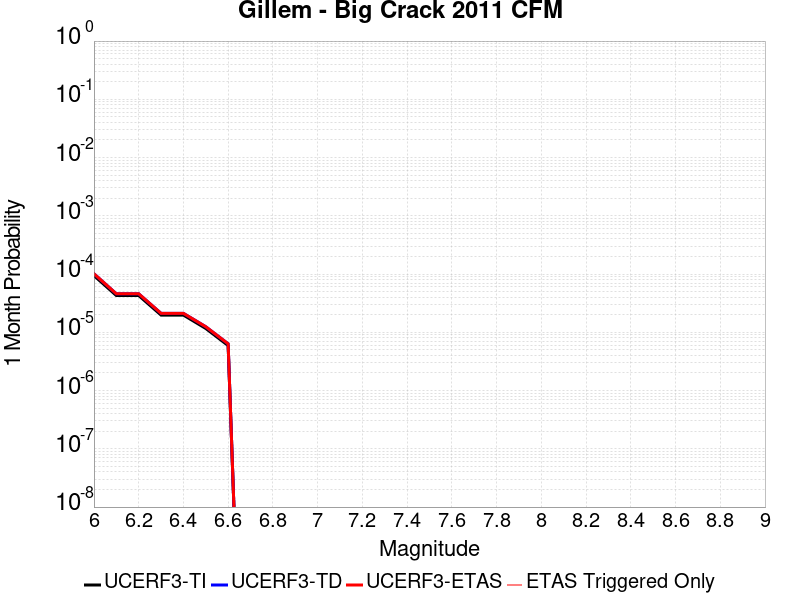 |  |  |

| Magnitude | 1 wk TI Prob | 1 wk TD Prob | 1 wk ETAS Prob | 1 wk ETAS/TD Gain | 1 wk ETAS Triggered Only | 1 mo TI Prob | 1 mo TD Prob | 1 mo ETAS Prob | 1 mo ETAS/TD Gain | 1 mo ETAS Triggered Only | 1 yr TI Prob | 1 yr TD Prob | 1 yr ETAS Prob | 1 yr ETAS/TD Gain | 1 yr ETAS Triggered Only | 10 yr TI Prob | 10 yr TD Prob | 10 yr ETAS Prob | 10 yr ETAS/TD Gain | 10 yr ETAS Triggered Only |
|-----|-----|-----|-----|-----|-----|-----|-----|-----|-----|-----|-----|-----|-----|-----|-----|-----|-----|-----|-----|-----|
| 6.0 | 2.196852E-5 | 2.360472E-5 | 2.360472E-5 | 1.0 | 0.0 | 9.4147406E-5 | 1.0115966E-4 | 1.0115966E-4 | 1.0 | 0.0 | 0.0011456419 | 0.0012310119 | 0.0012409997 | 1.0081134 | 1.0E-5 | 0.011397537 | 0.01225079 | 0.012260667 | 1.0008063 | 1.0E-5 |
| 6.1 | 9.992795E-6 | 1.0711992E-5 | 1.0711992E-5 | 1.0 | 0.0 | 4.2825563E-5 | 4.5907833E-5 | 4.5907833E-5 | 1.0 | 0.0 | 5.2127644E-4 | 5.5880286E-4 | 5.5880286E-4 | 1.0 | 0.0 | 0.0052005537 | 0.0055757877 | 0.0055757877 | 1.0 | 0.0 |
| 6.2 | 9.992795E-6 | 1.0711992E-5 | 1.0711992E-5 | 1.0 | 0.0 | 4.2825563E-5 | 4.5907833E-5 | 4.5907833E-5 | 1.0 | 0.0 | 5.2127644E-4 | 5.5880286E-4 | 5.5880286E-4 | 1.0 | 0.0 | 0.0052005537 | 0.0055757877 | 0.0055757877 | 1.0 | 0.0 |
| 6.3 | 4.6127884E-6 | 4.942704E-6 | 4.942704E-6 | 1.0 | 0.0 | 1.9768944E-5 | 2.118287E-5 | 2.118287E-5 | 1.0 | 0.0 | 2.406603E-4 | 2.5787536E-4 | 2.5787536E-4 | 1.0 | 0.0 | 0.0024039985 | 0.0025761996 | 0.0025761996 | 1.0 | 0.0 |
| 6.4 | 4.6127884E-6 | 4.942704E-6 | 4.942704E-6 | 1.0 | 0.0 | 1.9768944E-5 | 2.118287E-5 | 2.118287E-5 | 1.0 | 0.0 | 2.406603E-4 | 2.5787536E-4 | 2.5787536E-4 | 1.0 | 0.0 | 0.0024039985 | 0.0025761996 | 0.0025761996 | 1.0 | 0.0 |
| 6.5 | 2.716712E-6 | 2.911139E-6 | 2.911139E-6 | 1.0 | 0.0 | 1.1643E-5 | 1.2476264E-5 | 1.2476264E-5 | 1.0 | 0.0 | 1.417443E-4 | 1.5189036E-4 | 1.5189036E-4 | 1.0 | 0.0 | 0.0014165393 | 0.0015181034 | 0.0015181034 | 1.0 | 0.0 |
| 6.6 | 1.3818255E-6 | 1.4820831E-6 | 1.4820831E-6 | 1.0 | 0.0 | 5.922096E-6 | 6.3517764E-6 | 6.3517764E-6 | 1.0 | 0.0 | 7.209913E-5 | 7.7331366E-5 | 7.7331366E-5 | 1.0 | 0.0 | 7.2075747E-4 | 7.731655E-4 | 7.731655E-4 | 1.0 | 0.0 |

## Almanor 2011 CFM
*[(top)](#table-of-contents)*

| 1 Week | 1 Month | 1 Year | 10 Year |
|-----|-----|-----|-----|
|  |  | 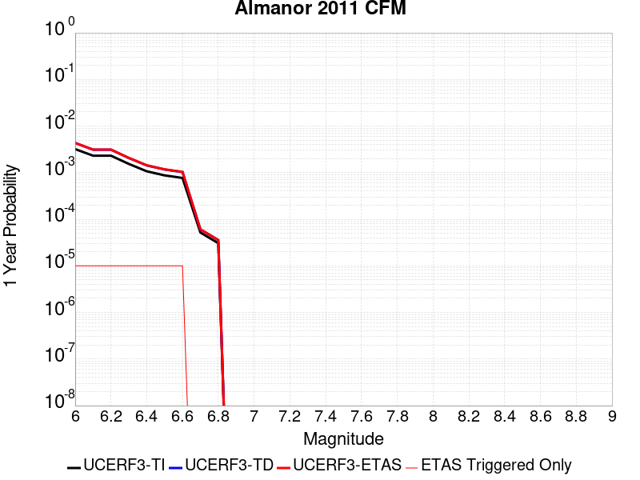 |  |

| Magnitude | 1 wk TI Prob | 1 wk TD Prob | 1 wk ETAS Prob | 1 wk ETAS/TD Gain | 1 wk ETAS Triggered Only | 1 mo TI Prob | 1 mo TD Prob | 1 mo ETAS Prob | 1 mo ETAS/TD Gain | 1 mo ETAS Triggered Only | 1 yr TI Prob | 1 yr TD Prob | 1 yr ETAS Prob | 1 yr ETAS/TD Gain | 1 yr ETAS Triggered Only | 10 yr TI Prob | 10 yr TD Prob | 10 yr ETAS Prob | 10 yr ETAS/TD Gain | 10 yr ETAS Triggered Only |
|-----|-----|-----|-----|-----|-----|-----|-----|-----|-----|-----|-----|-----|-----|-----|-----|-----|-----|-----|-----|-----|
| 6.0 | 6.1479834E-5 | 8.32757E-5 | 8.32757E-5 | 1.0 | 0.0 | 2.6345838E-4 | 3.5685036E-4 | 3.5685036E-4 | 1.0 | 0.0 | 0.0032028882 | 0.0043366845 | 0.0043466412 | 1.0022959 | 1.0E-5 | 0.031571172 | 0.042588383 | 0.042597957 | 1.0002248 | 1.0E-5 |
| 6.1 | 4.4387216E-5 | 5.977017E-5 | 5.977017E-5 | 1.0 | 0.0 | 1.9021705E-4 | 2.5613434E-4 | 2.5613434E-4 | 1.0 | 0.0 | 0.0023134327 | 0.0031144852 | 0.003124454 | 1.0032008 | 1.0E-5 | 0.022894967 | 0.030756874 | 0.030766565 | 1.0003152 | 1.0E-5 |
| 6.2 | 4.4387216E-5 | 5.977017E-5 | 5.977017E-5 | 1.0 | 0.0 | 1.9021705E-4 | 2.5613434E-4 | 2.5613434E-4 | 1.0 | 0.0 | 0.0023134327 | 0.0031144852 | 0.003124454 | 1.0032008 | 1.0E-5 | 0.022894967 | 0.030756874 | 0.030766565 | 1.0003152 | 1.0E-5 |
| 6.3 | 2.9523822E-5 | 3.9548726E-5 | 3.9548726E-5 | 1.0 | 0.0 | 1.2652454E-4 | 1.6948384E-4 | 1.6948384E-4 | 1.0 | 0.0 | 0.0015393476 | 0.0020618802 | 0.0020718595 | 1.0048399 | 1.0E-5 | 0.015287281 | 0.020461963 | 0.02047176 | 1.0004787 | 1.0E-5 |
| 6.4 | 2.0512744E-5 | 2.7431839E-5 | 2.7431839E-5 | 1.0 | 0.0 | 8.79088E-5 | 1.17560085E-4 | 1.17560085E-4 | 1.0 | 0.0 | 0.001069764 | 0.0014306771 | 0.0014406629 | 1.0069797 | 1.0E-5 | 0.010646289 | 0.01424517 | 0.014255028 | 1.000692 | 1.0E-5 |
| 6.5 | 1.6750226E-5 | 2.2391336E-5 | 2.2391336E-5 | 1.0 | 0.0 | 7.178471E-5 | 9.5959615E-5 | 9.5959615E-5 | 1.0 | 0.0 | 8.7362836E-4 | 0.0011680095 | 0.0011779978 | 1.0085516 | 1.0E-5 | 0.008702018 | 0.011649679 | 0.011659563 | 1.0008484 | 1.0E-5 |
| 6.6 | 1.4745303E-5 | 1.9707753E-5 | 1.9707753E-5 | 1.0 | 0.0 | 6.319262E-5 | 8.4459345E-5 | 8.4459345E-5 | 1.0 | 0.0 | 7.690986E-4 | 0.0010281415 | 0.0010381312 | 1.0097163 | 1.0E-5 | 0.0076644225 | 0.010265556 | 0.010275453 | 1.0009642 | 1.0E-5 |
| 6.7 | 9.951145E-7 | 1.1616605E-6 | 1.1616605E-6 | 1.0 | 0.0 | 4.26477E-6 | 4.9785367E-6 | 4.9785367E-6 | 1.0 | 0.0 | 5.1922336E-5 | 6.0612172E-5 | 6.0612172E-5 | 1.0 | 0.0 | 5.1910203E-4 | 6.0597365E-4 | 6.0597365E-4 | 1.0 | 0.0 |
| 6.8 | 5.866312E-7 | 6.8495365E-7 | 6.8495365E-7 | 1.0 | 0.0 | 2.5141312E-6 | 2.935513E-6 | 2.935513E-6 | 1.0 | 0.0 | 3.0609117E-5 | 3.5739416E-5 | 3.5739416E-5 | 1.0 | 0.0 | 3.06049E-4 | 3.5734952E-4 | 3.5734952E-4 | 1.0 | 0.0 |

## Garberville - Briceland 2011 CFM
*[(top)](#table-of-contents)*

| 1 Week | 1 Month | 1 Year | 10 Year |
|-----|-----|-----|-----|
|  |  | 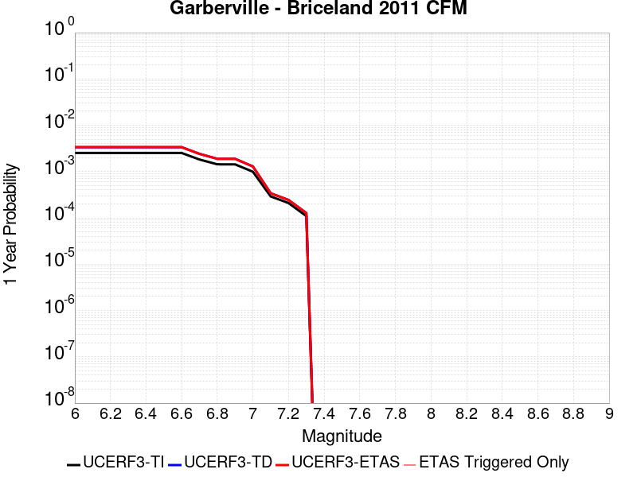 |  |

| Magnitude | 1 wk TI Prob | 1 wk TD Prob | 1 wk ETAS Prob | 1 wk ETAS/TD Gain | 1 wk ETAS Triggered Only | 1 mo TI Prob | 1 mo TD Prob | 1 mo ETAS Prob | 1 mo ETAS/TD Gain | 1 mo ETAS Triggered Only | 1 yr TI Prob | 1 yr TD Prob | 1 yr ETAS Prob | 1 yr ETAS/TD Gain | 1 yr ETAS Triggered Only | 10 yr TI Prob | 10 yr TD Prob | 10 yr ETAS Prob | 10 yr ETAS/TD Gain | 10 yr ETAS Triggered Only |
|-----|-----|-----|-----|-----|-----|-----|-----|-----|-----|-----|-----|-----|-----|-----|-----|-----|-----|-----|-----|-----|
| 6.0 | 4.8399295E-5 | 6.453064E-5 | 6.453064E-5 | 1.0 | 0.0 | 2.0740906E-4 | 2.7653415E-4 | 2.7653415E-4 | 1.0 | 0.0 | 0.002522281 | 0.003362259 | 0.003362259 | 1.0 | 0.0 | 0.024938442 | 0.033180203 | 0.033189874 | 1.0002913 | 1.0E-5 |
| 6.1 | 4.8399295E-5 | 6.453064E-5 | 6.453064E-5 | 1.0 | 0.0 | 2.0740906E-4 | 2.7653415E-4 | 2.7653415E-4 | 1.0 | 0.0 | 0.002522281 | 0.003362259 | 0.003362259 | 1.0 | 0.0 | 0.024938442 | 0.033180203 | 0.033189874 | 1.0002913 | 1.0E-5 |
| 6.2 | 4.8399295E-5 | 6.453064E-5 | 6.453064E-5 | 1.0 | 0.0 | 2.0740906E-4 | 2.7653415E-4 | 2.7653415E-4 | 1.0 | 0.0 | 0.002522281 | 0.003362259 | 0.003362259 | 1.0 | 0.0 | 0.024938442 | 0.033180203 | 0.033189874 | 1.0002913 | 1.0E-5 |
| 6.3 | 4.8399295E-5 | 6.453064E-5 | 6.453064E-5 | 1.0 | 0.0 | 2.0740906E-4 | 2.7653415E-4 | 2.7653415E-4 | 1.0 | 0.0 | 0.002522281 | 0.003362259 | 0.003362259 | 1.0 | 0.0 | 0.024938442 | 0.033180203 | 0.033189874 | 1.0002913 | 1.0E-5 |
| 6.4 | 4.8399295E-5 | 6.453064E-5 | 6.453064E-5 | 1.0 | 0.0 | 2.0740906E-4 | 2.7653415E-4 | 2.7653415E-4 | 1.0 | 0.0 | 0.002522281 | 0.003362259 | 0.003362259 | 1.0 | 0.0 | 0.024938442 | 0.033180203 | 0.033189874 | 1.0002913 | 1.0E-5 |
| 6.5 | 4.8399295E-5 | 6.453064E-5 | 6.453064E-5 | 1.0 | 0.0 | 2.0740906E-4 | 2.7653415E-4 | 2.7653415E-4 | 1.0 | 0.0 | 0.002522281 | 0.003362259 | 0.003362259 | 1.0 | 0.0 | 0.024938442 | 0.033180203 | 0.033189874 | 1.0002913 | 1.0E-5 |
| 6.6 | 4.8399295E-5 | 6.453064E-5 | 6.453064E-5 | 1.0 | 0.0 | 2.0740906E-4 | 2.7653415E-4 | 2.7653415E-4 | 1.0 | 0.0 | 0.002522281 | 0.003362259 | 0.003362259 | 1.0 | 0.0 | 0.024938442 | 0.033180203 | 0.033189874 | 1.0002913 | 1.0E-5 |
| 6.7 | 3.495179E-5 | 4.6311103E-5 | 4.6311103E-5 | 1.0 | 0.0 | 1.4978478E-4 | 1.9846394E-4 | 1.9846394E-4 | 1.0 | 0.0 | 0.0018221042 | 0.0024141516 | 0.0024141516 | 1.0 | 0.0 | 0.018072363 | 0.023931678 | 0.023941439 | 1.0004078 | 1.0E-5 |
| 6.8 | 2.7517597E-5 | 3.6243247E-5 | 3.6243247E-5 | 1.0 | 0.0 | 1.1792722E-4 | 1.5532148E-4 | 1.5532148E-4 | 1.0 | 0.0 | 0.0014348183 | 0.0018898717 | 0.0018898717 | 1.0 | 0.0 | 0.014255894 | 0.018784327 | 0.01879414 | 1.0005224 | 1.0E-5 |
| 6.9 | 2.74461E-5 | 3.616097E-5 | 3.616097E-5 | 1.0 | 0.0 | 1.1762084E-4 | 1.5496892E-4 | 1.5496892E-4 | 1.0 | 0.0 | 0.001431093 | 0.0018855865 | 0.0018855865 | 1.0 | 0.0 | 0.014219119 | 0.0187422 | 0.018752012 | 1.0005236 | 1.0E-5 |
| 7.0 | 1.9023773E-5 | 2.470877E-5 | 2.470877E-5 | 1.0 | 0.0 | 8.152791E-5 | 1.05892505E-4 | 1.05892505E-4 | 1.0 | 0.0 | 9.921503E-4 | 0.0012888788 | 0.0012888788 | 1.0 | 0.0 | 0.009877323 | 0.012853092 | 0.012853092 | 1.0 | 0.0 |
| 7.1 | 5.566844E-6 | 6.5122945E-6 | 6.5122945E-6 | 1.0 | 0.0 | 2.3857683E-5 | 2.7909558E-5 | 2.7909558E-5 | 1.0 | 0.0 | 2.9042858E-4 | 3.3975014E-4 | 3.3975014E-4 | 1.0 | 0.0 | 0.002900493 | 0.0033927278 | 0.0033927278 | 1.0 | 0.0 |
| 7.2 | 4.011353E-6 | 4.6747236E-6 | 4.6747236E-6 | 1.0 | 0.0 | 1.7191402E-5 | 2.0034397E-5 | 2.0034397E-5 | 1.0 | 0.0 | 2.0928521E-4 | 2.438949E-4 | 2.438949E-4 | 1.0 | 0.0 | 0.0020908823 | 0.00243661 | 0.00243661 | 1.0 | 0.0 |
| 7.3 | 2.0974871E-6 | 2.4396438E-6 | 2.4396438E-6 | 1.0 | 0.0 | 8.989199E-6 | 1.0455588E-5 | 1.0455588E-5 | 1.0 | 0.0 | 1.09438006E-4 | 1.2729185E-4 | 1.2729185E-4 | 1.0 | 0.0 | 0.0010938413 | 0.0012724346 | 0.0012724346 | 1.0 | 0.0 |

## Fitzhugh Creek
*[(top)](#table-of-contents)*

| 1 Week | 1 Month | 1 Year | 10 Year |
|-----|-----|-----|-----|
|  |  | 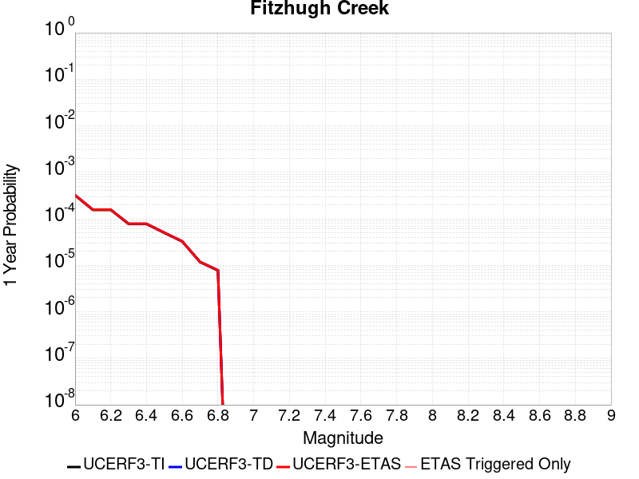 |  |

| Magnitude | 1 wk TI Prob | 1 wk TD Prob | 1 wk ETAS Prob | 1 wk ETAS/TD Gain | 1 wk ETAS Triggered Only | 1 mo TI Prob | 1 mo TD Prob | 1 mo ETAS Prob | 1 mo ETAS/TD Gain | 1 mo ETAS Triggered Only | 1 yr TI Prob | 1 yr TD Prob | 1 yr ETAS Prob | 1 yr ETAS/TD Gain | 1 yr ETAS Triggered Only | 10 yr TI Prob | 10 yr TD Prob | 10 yr ETAS Prob | 10 yr ETAS/TD Gain | 10 yr ETAS Triggered Only |
|-----|-----|-----|-----|-----|-----|-----|-----|-----|-----|-----|-----|-----|-----|-----|-----|-----|-----|-----|-----|-----|
| 6.0 | 6.1090436E-6 | 6.21017E-6 | 6.21017E-6 | 1.0 | 0.0 | 2.6181353E-5 | 2.6614767E-5 | 2.6614767E-5 | 1.0 | 0.0 | 3.1871133E-4 | 3.2399112E-4 | 3.2399112E-4 | 1.0 | 0.0 | 0.0031825465 | 0.0032356316 | 0.0032455993 | 1.0030806 | 1.0E-5 |
| 6.1 | 2.9741811E-6 | 3.0215874E-6 | 3.0215874E-6 | 1.0 | 0.0 | 1.2746428E-5 | 1.2949601E-5 | 1.2949601E-5 | 1.0 | 0.0 | 1.5517672E-4 | 1.5765094E-4 | 1.5765094E-4 | 1.0 | 0.0 | 0.001550684 | 0.0015754839 | 0.0015754839 | 1.0 | 0.0 |
| 6.2 | 2.9741811E-6 | 3.0215874E-6 | 3.0215874E-6 | 1.0 | 0.0 | 1.2746428E-5 | 1.2949601E-5 | 1.2949601E-5 | 1.0 | 0.0 | 1.5517672E-4 | 1.5765094E-4 | 1.5765094E-4 | 1.0 | 0.0 | 0.001550684 | 0.0015754839 | 0.0015754839 | 1.0 | 0.0 |
| 6.3 | 1.4781198E-6 | 1.501274E-6 | 1.501274E-6 | 1.0 | 0.0 | 6.3347834E-6 | 6.4340165E-6 | 6.4340165E-6 | 1.0 | 0.0 | 7.712326E-5 | 7.833154E-5 | 7.833154E-5 | 1.0 | 0.0 | 7.70965E-4 | 7.830592E-4 | 7.830592E-4 | 1.0 | 0.0 |
| 6.4 | 1.4781198E-6 | 1.501274E-6 | 1.501274E-6 | 1.0 | 0.0 | 6.3347834E-6 | 6.4340165E-6 | 6.4340165E-6 | 1.0 | 0.0 | 7.712326E-5 | 7.833154E-5 | 7.833154E-5 | 1.0 | 0.0 | 7.70965E-4 | 7.830592E-4 | 7.830592E-4 | 1.0 | 0.0 |
| 6.5 | 9.5176676E-7 | 9.66608E-7 | 9.66608E-7 | 1.0 | 0.0 | 4.078994E-6 | 4.1425997E-6 | 4.1425997E-6 | 1.0 | 0.0 | 4.9660623E-5 | 5.043509E-5 | 5.043509E-5 | 1.0 | 0.0 | 4.964952E-4 | 5.0424685E-4 | 5.0424685E-4 | 1.0 | 0.0 |
| 6.6 | 6.21145E-7 | 6.3085986E-7 | 6.3085986E-7 | 1.0 | 0.0 | 2.662047E-6 | 2.7036829E-6 | 2.7036829E-6 | 1.0 | 0.0 | 3.2409942E-5 | 3.291691E-5 | 3.291691E-5 | 1.0 | 0.0 | 3.2405215E-4 | 3.291269E-4 | 3.291269E-4 | 1.0 | 0.0 |
| 6.7 | 2.2377962E-7 | 2.2734685E-7 | 2.2734685E-7 | 1.0 | 0.0 | 9.590551E-7 | 9.743434E-7 | 9.743434E-7 | 1.0 | 0.0 | 1.1676434E-5 | 1.18625985E-5 | 1.18625985E-5 | 1.0 | 0.0 | 1.1675821E-4 | 1.1862279E-4 | 1.1862279E-4 | 1.0 | 0.0 |
| 6.8 | 1.4785022E-7 | 1.5021524E-7 | 1.5021524E-7 | 1.0 | 0.0 | 6.3364365E-7 | 6.4377963E-7 | 6.4377963E-7 | 1.0 | 0.0 | 7.714584E-6 | 7.838016E-6 | 7.838016E-6 | 1.0 | 0.0 | 7.714316E-5 | 7.8380166E-5 | 7.8380166E-5 | 1.0 | 0.0 |

