# Parent Section Magnitude-Probability Distributions

Only fault sections with at least one triggered aftershock are plotted. Sections are sorted by total supraseismogenic trigger rate (decreasing)

## Table Of Contents

* [Garlock (Central)](#garlock-central)
* [Tank Canyon](#tank-canyon)
* [Little Lake](#little-lake)
* [Owl Lake](#owl-lake)
* [Airport Lake](#airport-lake)
* [Panamint Valley](#panamint-valley)
* [Garlock (East)](#garlock-east)
* [Blackwater](#blackwater)
* [Ash Hill](#ash-hill)
* [Hunter Mountain-Saline Valley](#hunter-mountain-saline-valley)
* [Garlock (West)](#garlock-west)
* [Gravel Hills-Harper Lk](#gravel-hills-harper-lk)
* [McLean Lake](#mclean-lake)
* [Goldstone Lake](#goldstone-lake)
* [So Sierra Nevada](#so-sierra-nevada)
* [San Andreas (Mojave S)](#san-andreas-mojave-s)
* [Coyote Canyon](#coyote-canyon)
* [San Andreas (Mojave N)](#san-andreas-mojave-n)
* [Death Valley (So)](#death-valley-so)
* [Lenwood-Lockhart-Old Woman Springs](#lenwood-lockhart-old-woman-springs)
* [Nelson Lake](#nelson-lake)
* [Towne Pass](#towne-pass)
* [Paradise](#paradise)
* [San Andreas (San Bernardino N)](#san-andreas-san-bernardino-n)
* [Bicycle Lake](#bicycle-lake)
* [Garlic Springs](#garlic-springs)
* [Helendale-So Lockhart](#helendale-so-lockhart)
* [Death Valley (Black Mtns Frontal)](#death-valley-black-mtns-frontal)
* [San Andreas (San Bernardino S)](#san-andreas-san-bernardino-s)
* [San Andreas (Big Bend)](#san-andreas-big-bend)
* [Coyote Lake](#coyote-lake)
* [Death Valley (No)](#death-valley-no)
* [Sierra Nevada  (No Extension)](#sierra-nevada--no-extension)
* [San Andreas (Parkfield)](#san-andreas-parkfield)
* [Ludlow](#ludlow)
* [Red Pass](#red-pass)
* [White Wolf (Extension)](#white-wolf-extension)
* [San Jacinto (San Bernardino)](#san-jacinto-san-bernardino)
* [Calico-Hidalgo](#calico-hidalgo)
* [San Andreas (Carrizo) rev](#san-andreas-carrizo-rev)
* [San Andreas (Cholame) rev](#san-andreas-cholame-rev)
* [Elsinore (Glen Ivy) rev](#elsinore-glen-ivy-rev)
* [Lake Isabella (Seismicity)](#lake-isabella-seismicity)
* [Death Valley (Fish Lake Valley)](#death-valley-fish-lake-valley)
* [Scodie Lineament](#scodie-lineament)
* [San Jacinto (San Jacinto Valley) rev](#san-jacinto-san-jacinto-valley-rev)
* [San Andreas (San Gorgonio Pass-Garnet HIll)](#san-andreas-san-gorgonio-pass-garnet-hill)
* [San Jacinto (Stepovers Combined)](#san-jacinto-stepovers-combined)
* [San Andreas (Coachella) rev](#san-andreas-coachella-rev)
* [Owens Valley](#owens-valley)
* [San Andreas (North Branch Mill Creek)](#san-andreas-north-branch-mill-creek)
* [Cady](#cady)
* [Cleghorn Lake](#cleghorn-lake)
* [San Jacinto (Anza) rev](#san-jacinto-anza-rev)
* [Manix-Afton Hills](#manix-afton-hills)
* [Pinto Mtn](#pinto-mtn)
* [Ortigalita (North)](#ortigalita-north)
* [Baker](#baker)
* [Independence rev 2011](#independence-rev-2011)
* [Kern Canyon (North Kern) 2011](#kern-canyon-north-kern-2011)
* [Blue Cut](#blue-cut)
* [Big Pine (East)](#big-pine-east)
* [Pisgah-Bullion Mtn-Mesquite Lk](#pisgah-bullion-mtn-mesquite-lk)
* [Lost Hills](#lost-hills)
* [Pleito](#pleito)
* [Deep Springs](#deep-springs)
* [San Andreas (Creeping Section) 2011 CFM](#san-andreas-creeping-section-2011-cfm)
* [Mission Creek](#mission-creek)
* [Cucamonga](#cucamonga)
* [Mission Ridge-Arroyo Parida-Santa Ana](#mission-ridge-arroyo-parida-santa-ana)
* [Rose Canyon](#rose-canyon)
* [Santa Ynez (East)](#santa-ynez-east)
* [Oceanic - West Huasna](#oceanic---west-huasna)
* [San Jacinto (Lytle Creek connector)](#san-jacinto-lytle-creek-connector)
* [Bullion Mountains](#bullion-mountains)
* [Santa Ynez (West)](#santa-ynez-west)
* [San Jacinto (Coyote Creek)](#san-jacinto-coyote-creek)
* [Kern Canyon (South Kern) 2011](#kern-canyon-south-kern-2011)
* [Sierra Madre](#sierra-madre)
* [Camp Rock 2011](#camp-rock-2011)
* [Santa Rosa Island](#santa-rosa-island)
* [Cleghorn](#cleghorn)
* [San Diego Trough north alt1](#san-diego-trough-north-alt1)
* [Tin Mountain](#tin-mountain)
* [Chino alt 1](#chino-alt-1)
* [Great Valley 09 (Laguna Seca)](#great-valley-09-laguna-seca)
* [Dry Mountain](#dry-mountain)
* [San Jacinto (Borrego)](#san-jacinto-borrego)
* [Oak Ridge (Onshore)](#oak-ridge-onshore)
* [Verdugo](#verdugo)
* [White Mountains](#white-mountains)
* [Elysian Park (Upper)](#elysian-park-upper)
* [Brawley (Seismic Zone) alt 1](#brawley-seismic-zone-alt-1)
* [San Luis Range 2011 CFM](#san-luis-range-2011-cfm)
* [Hunting Creek - Berryessa 2011 CFM](#hunting-creek---berryessa-2011-cfm)
* [Imperial](#imperial)
* [Big Pine (Central)](#big-pine-central)
* [Simi-Santa Rosa](#simi-santa-rosa)
* [Cleghorn Pass](#cleghorn-pass)
* [Santa Susana East (connector)](#santa-susana-east-connector)
* [Elmore Ranch](#elmore-ranch)
* [Hollywood](#hollywood)
* [Channel Islands Thrust](#channel-islands-thrust)
* [San Jacinto (Clark) rev](#san-jacinto-clark-rev)
* [Sheephole](#sheephole)
* [Whittier alt 1](#whittier-alt-1)
* [Great Valley 08 (Quinto)](#great-valley-08-quinto)
* [Monterey Bay-Tularcitos](#monterey-bay-tularcitos)
* [Santa Susana alt 1](#santa-susana-alt-1)
* [Raymond](#raymond)
* [San Gabriel](#san-gabriel)
* [Sierra Madre (San Fernando)](#sierra-madre-san-fernando)
* [Coronado Bank alt1](#coronado-bank-alt1)
* [Malibu Coast (Extension) alt 1](#malibu-coast-extension-alt-1)
* [Santa Cruz Island](#santa-cruz-island)
* [San Clemente](#san-clemente)
* [Red Mountain](#red-mountain)
* [Great Valley 11](#great-valley-11)
* [Santa Monica alt 1](#santa-monica-alt-1)
* [San Cayetano](#san-cayetano)
* [Rinconada 2011 CFM](#rinconada-2011-cfm)
* [San Gabriel (Extension)](#san-gabriel-extension)
* [Sisar](#sisar)
* [Pine Mtn](#pine-mtn)
* [Puente Hills](#puente-hills)
* [White Wolf](#white-wolf)
* [Ortigalita (South)](#ortigalita-south)
* [Green Valley 2011 CFM](#green-valley-2011-cfm)
* [San Jacinto (Superstition Mtn)](#san-jacinto-superstition-mtn)
* [San Pedro Basin](#san-pedro-basin)
* [Cedar Mtn-Mahogany Mtn](#cedar-mtn-mahogany-mtn)
* [Hosgri (Extension)](#hosgri-extension)
* [Palos Verdes](#palos-verdes)
* [Clamshell-Sawpit](#clamshell-sawpit)
* [Malibu Coast alt 1](#malibu-coast-alt-1)
* [Kern Canyon (Lake Isabella) 2011](#kern-canyon-lake-isabella-2011)
* [Santa Ynez River](#santa-ynez-river)
* [Los Alamos 2011 CFM](#los-alamos-2011-cfm)
* [Johnson Valley (No) 2011 rev](#johnson-valley-no-2011-rev)
* [Northridge](#northridge)
* [San Diego Trough south](#san-diego-trough-south)
* [San Juan](#san-juan)
* [North Frontal  (West)](#north-frontal--west)
* [Great Valley 07 (Orestimba)](#great-valley-07-orestimba)
* [La Panza 2011](#la-panza-2011)
* [Gillem - Big Crack 2011 CFM](#gillem---big-crack-2011-cfm)
* [Del Valle](#del-valle)
* [Calaveras (So) 2011 CFM](#calaveras-so-2011-cfm)
* [Ozena](#ozena)
* [Newport-Inglewood alt 1](#newport-inglewood-alt-1)
* [Channel Islands Western Deep Ramp](#channel-islands-western-deep-ramp)
* [Santa Cruz Catalina Ridge alt1](#santa-cruz-catalina-ridge-alt1)
* [San Jose](#san-jose)
* [Los Osos 2011](#los-osos-2011)
* [Hunting Creek - Bartlett Springs connector 2011](#hunting-creek---bartlett-springs-connector-2011)
* [Oceanside alt1](#oceanside-alt1)
* [Goose Lake 2011 CFM](#goose-lake-2011-cfm)
* [Ventura-Pitas Point](#ventura-pitas-point)
* [Great Valley 10 (Panoche)](#great-valley-10-panoche)
* [San Gregorio (North) 2011 CFM](#san-gregorio-north-2011-cfm)
* [San Andreas (Offshore) 2011 CFM](#san-andreas-offshore-2011-cfm)
* [Hat Creek-McArthur-Mayfield](#hat-creek-mcarthur-mayfield)
* [Robinson Creek](#robinson-creek)
* [Reliz 2011 CFM](#reliz-2011-cfm)
* [Owens Valley Keough Hot Springs](#owens-valley-keough-hot-springs)
* [Northridge Hills](#northridge-hills)
* [Los Alamos extension](#los-alamos-extension)
* [Great Valley 04b Gordon Valley](#great-valley-04b-gordon-valley)
* [Emerson-Copper Mtn 2011](#emerson-copper-mtn-2011)
* [Great Valley 05 Pittsburg - Kirby Hills alt1](#great-valley-05-pittsburg---kirby-hills-alt1)
* [Hector Mine](#hector-mine)
* [Newport-Inglewood (Offshore)](#newport-inglewood-offshore)
* [Great Valley 12](#great-valley-12)
* [Elysian Park (Lower CFM)](#elysian-park-lower-cfm)
* [Round Valley](#round-valley)
* [Keddie Ridge 2011 CFM](#keddie-ridge-2011-cfm)
* [Fontana (Seismicity)](#fontana-seismicity)
* [Joshua Tree (Seismicity)](#joshua-tree-seismicity)
* [Almanor 2011 CFM](#almanor-2011-cfm)
* [Great Valley 13 (Coalinga)](#great-valley-13-coalinga)
* [Point Reyes 2011 CFM](#point-reyes-2011-cfm)

## Garlock (Central)
*[(top)](#table-of-contents)*

| 1 Week | 1 Month | 1 Year | 10 Year |
|-----|-----|-----|-----|
|  |  |  |  |

| Magnitude | 1 wk TI Prob | 1 wk TD Prob | 1 wk ETAS Prob | 1 wk ETAS/TD Gain | 1 wk ETAS Triggered Only | 1 mo TI Prob | 1 mo TD Prob | 1 mo ETAS Prob | 1 mo ETAS/TD Gain | 1 mo ETAS Triggered Only | 1 yr TI Prob | 1 yr TD Prob | 1 yr ETAS Prob | 1 yr ETAS/TD Gain | 1 yr ETAS Triggered Only | 10 yr TI Prob | 10 yr TD Prob | 10 yr ETAS Prob | 10 yr ETAS/TD Gain | 10 yr ETAS Triggered Only |
|-----|-----|-----|-----|-----|-----|-----|-----|-----|-----|-----|-----|-----|-----|-----|-----|-----|-----|-----|-----|-----|
| 6.0 | 5.5131142E-5 | 7.0252936E-5 | 0.0052598882 | 74.87073 | 0.00519 | 2.3625491E-4 | 3.0104961E-4 | 0.013287139 | 44.136044 | 0.01299 | 0.0028726095 | 0.0036591832 | 0.038162466 | 10.429231 | 0.03463 | 0.028357591 | 0.0361412 | 0.09078235 | 2.51188 | 0.05669 |
| 6.1 | 5.5131142E-5 | 7.0252936E-5 | 0.0052598882 | 74.87073 | 0.00519 | 2.3625491E-4 | 3.0104961E-4 | 0.013287139 | 44.136044 | 0.01299 | 0.0028726095 | 0.0036591832 | 0.038162466 | 10.429231 | 0.03463 | 0.028357591 | 0.0361412 | 0.09078235 | 2.51188 | 0.05669 |
| 6.2 | 4.216245E-5 | 5.166702E-5 | 0.0035514862 | 68.737976 | 0.0035 | 1.806837E-4 | 2.2141145E-4 | 0.008449589 | 38.162384 | 0.00823 | 0.0021976046 | 0.0026923835 | 0.024912396 | 9.252915 | 0.02228 | 0.021759989 | 0.026704067 | 0.06280361 | 2.351837 | 0.03709 |
| 6.3 | 4.216245E-5 | 5.166702E-5 | 0.0035514862 | 68.737976 | 0.0035 | 1.806837E-4 | 2.2141145E-4 | 0.008449589 | 38.162384 | 0.00823 | 0.0021976046 | 0.0026923835 | 0.024912396 | 9.252915 | 0.02228 | 0.021759989 | 0.026704067 | 0.06280361 | 2.351837 | 0.03709 |
| 6.4 | 3.6858168E-5 | 4.411544E-5 | 0.0029639867 | 67.18706 | 0.00292 | 1.5795401E-4 | 1.890526E-4 | 0.0069377767 | 36.697598 | 0.00675 | 0.0019213937 | 0.0022993109 | 0.020377647 | 8.862502 | 0.01812 | 0.019048655 | 0.022868566 | 0.05217274 | 2.2814171 | 0.02999 |
| 6.5 | 3.39199E-5 | 4.0023602E-5 | 0.002679918 | 66.95844 | 0.00264 | 1.453629E-4 | 1.7151856E-4 | 0.006290469 | 36.675148 | 0.00612 | 0.0017683565 | 0.0020862604 | 0.018591754 | 8.911521 | 0.01654 | 0.017543508 | 0.020761253 | 0.047425926 | 2.2843478 | 0.02723 |
| 6.6 | 3.3571985E-5 | 3.9477756E-5 | 0.0026593744 | 67.36387 | 0.00262 | 1.4387199E-4 | 1.6917953E-4 | 0.006258149 | 36.991173 | 0.00609 | 0.0017502342 | 0.0020578366 | 0.018503923 | 8.99193 | 0.01648 | 0.017365133 | 0.020482505 | 0.047037225 | 2.2964585 | 0.02711 |
| 6.7 | 3.2580007E-5 | 3.8094186E-5 | 0.0025279992 | 66.36182 | 0.00249 | 1.3962112E-4 | 1.632507E-4 | 0.005962304 | 36.522377 | 0.0058 | 0.0016985617 | 0.001985787 | 0.017754411 | 8.940743 | 0.0158 | 0.016856372 | 0.019771622 | 0.045208547 | 2.2865372 | 0.02595 |
| 6.8 | 3.2185937E-5 | 3.7521368E-5 | 0.0025074286 | 66.82668 | 0.00247 | 1.3793244E-4 | 1.6079607E-4 | 0.005779892 | 35.945484 | 0.00562 | 0.0016780337 | 0.0019559558 | 0.017385717 | 8.888604 | 0.01546 | 0.016654192 | 0.01947876 | 0.044452637 | 2.282108 | 0.02547 |
| 6.9 | 3.165394E-5 | 3.672589E-5 | 0.0024366376 | 66.346596 | 0.0024 | 1.3565269E-4 | 1.573873E-4 | 0.005646523 | 35.876614 | 0.00549 | 0.0016503202 | 0.0019145276 | 0.016965657 | 8.861537 | 0.01508 | 0.01638118 | 0.01907232 | 0.04349742 | 2.280657 | 0.0249 |
| 7.0 | 3.0903822E-5 | 3.5631027E-5 | 0.0023455487 | 65.82883 | 0.00231 | 1.3243823E-4 | 1.5269557E-4 | 0.0054818816 | 35.900723 | 0.00533 | 0.0016112428 | 0.0018575046 | 0.016440367 | 8.8507805 | 0.01461 | 0.015996104 | 0.018513773 | 0.04216759 | 2.2776337 | 0.0241 |
| 7.1 | 3.0069863E-5 | 3.439724E-5 | 0.0022843198 | 66.40998 | 0.00225 | 1.2886449E-4 | 1.4740853E-4 | 0.0053366437 | 36.203087 | 0.00519 | 0.0015677959 | 0.0017932425 | 0.015867958 | 8.848752 | 0.0141 | 0.01556781 | 0.017881477 | 0.04076484 | 2.2797244 | 0.0233 |
| 7.2 | 2.7957109E-5 | 3.1286352E-5 | 0.00183123 | 58.53127 | 0.0018 | 1.1981068E-4 | 1.3407759E-4 | 0.004403505 | 32.84296 | 0.00427 | 0.0014577188 | 0.0016311919 | 0.013511781 | 8.283379 | 0.0119 | 0.014481937 | 0.01628507 | 0.035713438 | 2.1930172 | 0.01975 |
| 7.3 | 2.4519275E-5 | 2.6719234E-5 | 0.0013666834 | 51.1498 | 0.00134 | 1.0507837E-4 | 1.1450605E-4 | 0.0032541465 | 28.418991 | 0.00314 | 0.0012785783 | 0.0013932344 | 0.009841448 | 7.0637417 | 0.00846 | 0.012712469 | 0.013929329 | 0.028020278 | 2.0116029 | 0.01429 |
| 7.4 | 2.3225532E-5 | 2.52037E-5 | 0.0011851744 | 47.023827 | 0.00116 | 9.95342E-5 | 1.08011474E-4 | 0.0028077199 | 25.994644 | 0.0027 | 0.0012111551 | 0.0013142608 | 0.008874312 | 6.7523217 | 0.00757 | 0.012045753 | 0.013146927 | 0.02574904 | 1.9585596 | 0.01277 |
| 7.5 | 2.097765E-5 | 2.2487684E-5 | 9.1246766E-4 | 40.576332 | 8.9E-4 | 8.9901114E-5 | 9.637229E-5 | 0.002236166 | 23.203413 | 0.00214 | 0.0010939965 | 0.0011727129 | 0.0068660285 | 5.8548245 | 0.0057 | 0.010886264 | 0.011741684 | 0.021288259 | 1.8130499 | 0.00966 |
| 7.6 | 1.511254E-5 | 1.599496E-5 | 5.259868E-4 | 32.884537 | 5.1E-4 | 6.476642E-5 | 6.854807E-5 | 0.0013484603 | 19.67175 | 0.00128 | 7.882459E-4 | 8.34261E-4 | 0.0040915413 | 4.90439 | 0.00326 | 0.007854558 | 0.008384922 | 0.014037128 | 1.6740917 | 0.0057 |
| 7.7 | 9.934069E-6 | 1.0682194E-5 | 1.406808E-4 | 13.169654 | 1.3E-4 | 4.2573887E-5 | 4.578003E-5 | 3.9576401E-4 | 8.644905 | 3.5E-4 | 5.182138E-4 | 5.5722974E-4 | 0.001546678 | 2.775656 | 9.9E-4 | 0.00517007 | 0.0056296214 | 0.007429432 | 1.3197036 | 0.00181 |
| 7.8 | 6.7562896E-6 | 8.431359E-6 | 4.8431022E-5 | 5.744154 | 4.0E-5 | 2.8955206E-5 | 3.6133893E-5 | 2.3612667E-4 | 6.5347695 | 2.0E-4 | 3.5247262E-4 | 4.3984153E-4 | 0.0010395776 | 2.3635278 | 6.0E-4 | 0.0035191406 | 0.004448285 | 0.0055931695 | 1.2573766 | 0.00115 |
| 7.9 | 3.975453E-6 | 5.3728804E-6 | 3.537272E-5 | 6.5835676 | 3.0E-5 | 1.7037546E-5 | 2.3026427E-5 | 1.630232E-4 | 7.0798306 | 1.4E-4 | 2.0741238E-4 | 2.8031078E-4 | 6.6020427E-4 | 2.3552582 | 3.8E-4 | 0.002072189 | 0.00283465 | 0.0034828074 | 1.2286552 | 6.5E-4 |
| 8.0 | 1.6729537E-6 | 2.0781215E-6 | 1.2078101E-5 | 5.8120284 | 1.0E-5 | 7.169782E-6 | 8.906205E-6 | 5.890576E-5 | 6.6140137 | 5.0E-5 | 8.7288594E-5 | 1.0842768E-4 | 2.1841575E-4 | 2.0143912 | 1.1E-4 | 8.7254314E-4 | 0.0010973068 | 0.0013170654 | 1.2002709 | 2.2E-4 |
| 8.1 | 3.6733252E-7 | 3.1497066E-7 | 3.1497066E-7 | 1.0 | 0.0 | 1.5742813E-6 | 1.3498736E-6 | 1.3498736E-6 | 1.0 | 0.0 | 1.9166706E-5 | 1.6434604E-5 | 2.643444E-5 | 1.6084622 | 1.0E-5 | 1.9165053E-4 | 1.6648426E-4 | 1.9647926E-4 | 1.1801672 | 3.0E-5 |

## Tank Canyon
*[(top)](#table-of-contents)*

| 1 Week | 1 Month | 1 Year | 10 Year |
|-----|-----|-----|-----|
|  |  | 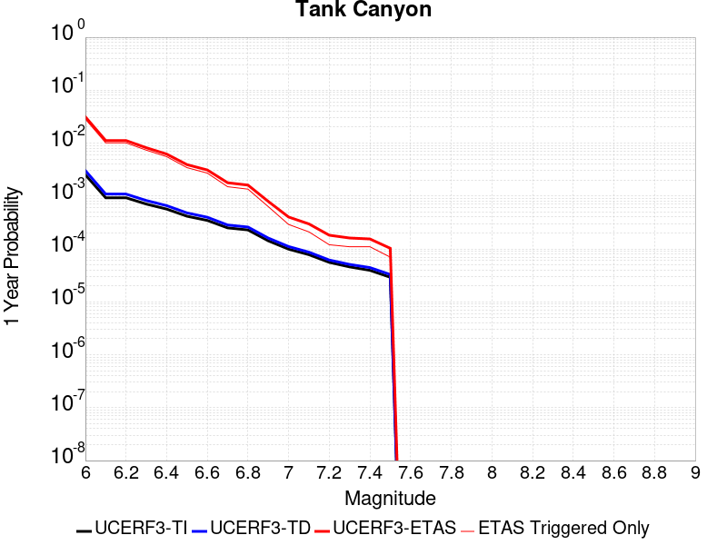 |  |

| Magnitude | 1 wk TI Prob | 1 wk TD Prob | 1 wk ETAS Prob | 1 wk ETAS/TD Gain | 1 wk ETAS Triggered Only | 1 mo TI Prob | 1 mo TD Prob | 1 mo ETAS Prob | 1 mo ETAS/TD Gain | 1 mo ETAS Triggered Only | 1 yr TI Prob | 1 yr TD Prob | 1 yr ETAS Prob | 1 yr ETAS/TD Gain | 1 yr ETAS Triggered Only | 10 yr TI Prob | 10 yr TD Prob | 10 yr ETAS Prob | 10 yr ETAS/TD Gain | 10 yr ETAS Triggered Only |
|-----|-----|-----|-----|-----|-----|-----|-----|-----|-----|-----|-----|-----|-----|-----|-----|-----|-----|-----|-----|-----|
| 6.0 | 4.8284557E-5 | 5.7965928E-5 | 0.0040477347 | 69.82955 | 0.00399 | 2.0691741E-4 | 2.484056E-4 | 0.0111357 | 44.8287 | 0.01089 | 0.0025163088 | 0.00302081 | 0.03135496 | 10.379653 | 0.02842 | 0.02488006 | 0.029864373 | 0.07804131 | 2.613191 | 0.04966 |
| 6.1 | 1.7796336E-5 | 2.0873778E-5 | 0.0012308485 | 58.96625 | 0.00121 | 7.626778E-5 | 8.94562E-5 | 0.003779126 | 42.245544 | 0.00369 | 9.281647E-4 | 0.0010886233 | 0.011187618 | 10.276849 | 0.01011 | 0.009242975 | 0.010836863 | 0.028612124 | 2.640259 | 0.01797 |
| 6.2 | 1.7796336E-5 | 2.0873778E-5 | 0.0012308485 | 58.96625 | 0.00121 | 7.626778E-5 | 8.94562E-5 | 0.003779126 | 42.245544 | 0.00369 | 9.281647E-4 | 0.0010886233 | 0.011187618 | 10.276849 | 0.01011 | 0.009242975 | 0.010836863 | 0.028612124 | 2.640259 | 0.01797 |
| 6.3 | 1.3515912E-5 | 1.575992E-5 | 9.557451E-4 | 60.644028 | 9.4E-4 | 5.792405E-5 | 6.754091E-5 | 0.0028473532 | 42.15746 | 0.00278 | 7.049971E-4 | 8.2202395E-4 | 0.008175974 | 9.94615 | 0.00736 | 0.007027647 | 0.00819231 | 0.021194909 | 2.5871713 | 0.01311 |
| 6.4 | 1.0870146E-5 | 1.2618305E-5 | 7.826086E-4 | 62.02169 | 7.7E-4 | 4.658551E-5 | 5.407743E-5 | 0.0021539638 | 39.83111 | 0.0021 | 5.67031E-4 | 6.5821153E-4 | 0.0062045585 | 9.42639 | 0.00555 | 0.005655863 | 0.006564494 | 0.016429309 | 2.5027533 | 0.00993 |
| 6.5 | 7.964826E-6 | 9.196297E-6 | 4.991918E-4 | 54.281826 | 4.9E-4 | 3.4134522E-5 | 3.9412163E-5 | 0.001339361 | 33.98344 | 0.0013 | 4.1550855E-4 | 4.79748E-4 | 0.003918098 | 8.166991 | 0.00344 | 0.0041473247 | 0.004788282 | 0.011058115 | 2.309412 | 0.0063 |
| 6.6 | 6.6317E-6 | 7.6124547E-6 | 3.576098E-4 | 46.976936 | 3.5E-4 | 2.8421264E-5 | 3.2624448E-5 | 0.0010325918 | 31.65086 | 0.001 | 3.4597394E-4 | 3.9713932E-4 | 0.003106063 | 7.8210917 | 0.00271 | 0.0034543579 | 0.0039653047 | 0.008736311 | 2.2031877 | 0.00479 |
| 6.7 | 4.793663E-6 | 5.4308844E-6 | 2.4542958E-4 | 45.19146 | 2.4E-4 | 2.0544108E-5 | 2.3275035E-5 | 5.932618E-4 | 25.48919 | 5.7E-4 | 2.500958E-4 | 2.833411E-4 | 0.001782916 | 6.292473 | 0.0015 | 0.0024981452 | 0.0028303456 | 0.0055326754 | 1.9547702 | 0.00271 |
| 6.8 | 4.382823E-6 | 4.969349E-6 | 2.2496826E-4 | 45.27117 | 2.2E-4 | 1.8783392E-5 | 2.129706E-5 | 5.212864E-4 | 24.476917 | 5.0E-4 | 2.286638E-4 | 2.5926513E-4 | 0.0016089152 | 6.2056746 | 0.00135 | 0.0022842865 | 0.0025901678 | 0.005013874 | 1.9357331 | 0.00243 |
| 6.9 | 2.729601E-6 | 3.0735978E-6 | 1.2307323E-4 | 40.042072 | 1.2E-4 | 1.1698237E-5 | 1.3172503E-5 | 2.4316947E-4 | 18.460386 | 2.3E-4 | 1.4241673E-4 | 1.6036464E-4 | 7.902636E-4 | 4.927917 | 6.3E-4 | 0.001423255 | 0.0016027512 | 0.002750908 | 1.7163663 | 0.00115 |
| 7.0 | 1.8987357E-6 | 2.1269796E-6 | 5.2126874E-5 | 24.507463 | 5.0E-5 | 8.137413E-6 | 9.115598E-6 | 9.9114775E-5 | 10.873096 | 9.0E-5 | 9.90685E-5 | 1.1097746E-4 | 4.0094528E-4 | 3.6128533 | 2.9E-4 | 9.902435E-4 | 0.001109289 | 0.0016686679 | 1.5042678 | 5.6E-4 |
| 7.1 | 1.4928986E-6 | 1.6641586E-6 | 4.166409E-5 | 25.036129 | 4.0E-5 | 6.398121E-6 | 7.1320924E-6 | 7.713159E-5 | 10.814721 | 7.0E-5 | 7.789434E-5 | 8.6830354E-5 | 2.9681213E-4 | 3.418299 | 2.1E-4 | 7.786704E-4 | 8.6802215E-4 | 0.0012576836 | 1.4489073 | 3.9E-4 |
| 7.2 | 1.069082E-6 | 1.1828818E-6 | 2.1182857E-5 | 17.90784 | 2.0E-5 | 4.581772E-6 | 5.069486E-6 | 4.5069282E-5 | 8.8903055 | 4.0E-5 | 5.5781646E-5 | 6.171978E-5 | 1.8171237E-4 | 2.9441514 | 1.2E-4 | 5.576765E-4 | 6.170787E-4 | 8.069614E-4 | 1.3077124 | 1.9E-4 |
| 7.3 | 8.776551E-7 | 9.770191E-7 | 2.0976999E-5 | 21.470407 | 2.0E-5 | 3.7613736E-6 | 4.1872213E-6 | 4.4187054E-5 | 10.552835 | 4.0E-5 | 4.579376E-5 | 5.0978742E-5 | 1.6097314E-4 | 3.1576521 | 1.1E-4 | 4.5784327E-4 | 5.097215E-4 | 6.496502E-4 | 1.2745198 | 1.4E-4 |
| 7.4 | 7.55721E-7 | 8.510419E-7 | 2.0851025E-5 | 24.500586 | 2.0E-5 | 3.2388E-6 | 3.64732E-6 | 4.3647175E-5 | 11.966916 | 4.0E-5 | 3.9431678E-5 | 4.4405737E-5 | 1.5440086E-4 | 3.4770474 | 1.1E-4 | 3.942468E-4 | 4.4401948E-4 | 5.7396176E-4 | 1.29265 | 1.3E-4 |
| 7.5 | 5.587665E-7 | 6.3057325E-7 | 1.0630567E-5 | 16.858576 | 1.0E-5 | 2.3947114E-6 | 2.7024569E-6 | 3.2702377E-5 | 12.10098 | 3.0E-5 | 2.915522E-5 | 3.290241E-5 | 1.0290011E-4 | 3.1274335 | 7.0E-5 | 2.9151395E-4 | 3.2902413E-4 | 4.1899452E-4 | 1.2734462 | 9.0E-5 |

## Little Lake
*[(top)](#table-of-contents)*

| 1 Week | 1 Month | 1 Year | 10 Year |
|-----|-----|-----|-----|
|  |  |  |  |

| Magnitude | 1 wk TI Prob | 1 wk TD Prob | 1 wk ETAS Prob | 1 wk ETAS/TD Gain | 1 wk ETAS Triggered Only | 1 mo TI Prob | 1 mo TD Prob | 1 mo ETAS Prob | 1 mo ETAS/TD Gain | 1 mo ETAS Triggered Only | 1 yr TI Prob | 1 yr TD Prob | 1 yr ETAS Prob | 1 yr ETAS/TD Gain | 1 yr ETAS Triggered Only | 10 yr TI Prob | 10 yr TD Prob | 10 yr ETAS Prob | 10 yr ETAS/TD Gain | 10 yr ETAS Triggered Only |
|-----|-----|-----|-----|-----|-----|-----|-----|-----|-----|-----|-----|-----|-----|-----|-----|-----|-----|-----|-----|-----|
| 6.0 | 2.8424427E-5 | 3.1206153E-5 | 0.0032011073 | 102.57936 | 0.00317 | 1.2181328E-4 | 1.3373456E-4 | 0.0074527557 | 55.727974 | 0.00732 | 0.0014820677 | 0.0016271353 | 0.019967245 | 12.27141 | 0.01837 | 0.014722223 | 0.016165623 | 0.044932943 | 2.7795365 | 0.02924 |
| 6.1 | 2.8424427E-5 | 3.1206153E-5 | 0.0032011073 | 102.57936 | 0.00317 | 1.2181328E-4 | 1.3373456E-4 | 0.0074527557 | 55.727974 | 0.00732 | 0.0014820677 | 0.0016271353 | 0.019967245 | 12.27141 | 0.01837 | 0.014722223 | 0.016165623 | 0.044932943 | 2.7795365 | 0.02924 |
| 6.2 | 2.8424427E-5 | 3.1206153E-5 | 0.0032011073 | 102.57936 | 0.00317 | 1.2181328E-4 | 1.3373456E-4 | 0.0074527557 | 55.727974 | 0.00732 | 0.0014820677 | 0.0016271353 | 0.019967245 | 12.27141 | 0.01837 | 0.014722223 | 0.016165623 | 0.044932943 | 2.7795365 | 0.02924 |
| 6.3 | 1.48860645E-5 | 1.6081587E-5 | 0.0019960497 | 124.12019 | 0.00198 | 6.379586E-5 | 6.891943E-5 | 0.0045186128 | 65.5637 | 0.00445 | 7.7643775E-4 | 8.387992E-4 | 0.011569791 | 13.793278 | 0.01074 | 0.007737305 | 0.00835915 | 0.02489972 | 2.978738 | 0.01668 |
| 6.4 | 1.48860645E-5 | 1.6081587E-5 | 0.0019960497 | 124.12019 | 0.00198 | 6.379586E-5 | 6.891943E-5 | 0.0045186128 | 65.5637 | 0.00445 | 7.7643775E-4 | 8.387992E-4 | 0.011569791 | 13.793278 | 0.01074 | 0.007737305 | 0.00835915 | 0.02489972 | 2.978738 | 0.01668 |
| 6.5 | 1.2797581E-5 | 1.376573E-5 | 0.0018437406 | 133.937 | 0.00183 | 5.4845623E-5 | 5.8994796E-5 | 0.004138754 | 70.154564 | 0.00408 | 6.675408E-4 | 7.1805064E-4 | 0.010550985 | 14.69393 | 0.00984 | 0.006655392 | 0.0071598557 | 0.02235031 | 3.1216147 | 0.0153 |
| 6.6 | 9.661896E-6 | 1.0289153E-5 | 0.0015602732 | 151.64255 | 0.00155 | 4.1407468E-5 | 4.4095712E-5 | 0.003553941 | 80.59606 | 0.00351 | 5.040193E-4 | 5.367493E-4 | 0.008922246 | 16.622744 | 0.00839 | 0.005028777 | 0.005356134 | 0.01832629 | 3.421552 | 0.01304 |
| 6.7 | 7.767871E-6 | 8.199772E-6 | 0.0013481887 | 164.41783 | 0.00134 | 3.329045E-5 | 3.5141486E-5 | 0.0030450358 | 86.650734 | 0.00301 | 4.0523586E-4 | 4.2777733E-4 | 0.007414787 | 17.333286 | 0.00699 | 0.004044977 | 0.0042708907 | 0.0152438255 | 3.569238 | 0.01102 |
| 6.8 | 6.4235196E-6 | 6.7358133E-6 | 0.0010467288 | 155.39754 | 0.00104 | 2.752908E-5 | 2.8867524E-5 | 0.0024387978 | 84.48241 | 0.00241 | 3.35115E-4 | 3.5141825E-4 | 0.0058694785 | 16.70226 | 0.00552 | 0.003346101 | 0.0035098856 | 0.012219209 | 3.4813695 | 0.00874 |
| 6.9 | 3.1283696E-6 | 3.112201E-6 | 6.431102E-4 | 206.6416 | 6.4E-4 | 1.3407229E-5 | 1.3337944E-5 | 0.0015133179 | 113.45961 | 0.0015 | 1.6322079E-4 | 1.6237888E-4 | 0.0033918545 | 20.88852 | 0.00323 | 0.0016310095 | 0.0016227507 | 0.0067643933 | 4.1684737 | 0.00515 |
| 7.0 | 2.290603E-6 | 2.2286956E-6 | 3.622279E-4 | 162.5291 | 3.6E-4 | 9.816834E-6 | 9.551524E-6 | 9.6954237E-4 | 101.50656 | 9.6E-4 | 1.19513395E-4 | 1.1628464E-4 | 0.0021660463 | 18.627106 | 0.00205 | 0.0011944914 | 0.00116234 | 0.004398574 | 3.7842402 | 0.00324 |
| 7.1 | 1.293693E-6 | 1.1776893E-6 | 1.4117753E-4 | 119.87671 | 1.4E-4 | 5.5443866E-6 | 5.047234E-6 | 3.4504553E-4 | 68.36329 | 3.4E-4 | 6.750081E-5 | 6.144904E-5 | 9.213962E-4 | 14.994476 | 8.6E-4 | 6.7480316E-4 | 6.1438896E-4 | 0.0020934797 | 3.4074173 | 0.00148 |
| 7.2 | 4.715842E-7 | 3.0917863E-7 | 3.0917863E-7 | 1.0 | 0.0 | 2.0210737E-6 | 1.3250507E-6 | 1.3250507E-6 | 1.0 | 0.0 | 2.4606294E-5 | 1.6132379E-5 | 5.6131732E-5 | 3.4794457 | 4.0E-5 | 2.460357E-4 | 1.6131261E-4 | 2.7129488E-4 | 1.6817957 | 1.1E-4 |
| 7.3 | 3.9430947E-7 | 2.3097442E-7 | 2.3097442E-7 | 1.0 | 0.0 | 1.6898966E-6 | 9.8989E-7 | 9.8989E-7 | 1.0 | 0.0 | 2.0574296E-5 | 1.2051845E-5 | 3.2051605E-5 | 2.659477 | 2.0E-5 | 2.0572392E-4 | 1.2051199E-4 | 1.9050355E-4 | 1.580785 | 7.0E-5 |
| 7.4 | 3.547123E-7 | 1.9679048E-7 | 1.9679048E-7 | 1.0 | 0.0 | 1.5201948E-6 | 8.433875E-7 | 8.433875E-7 | 1.0 | 0.0 | 1.8508214E-5 | 1.0268195E-5 | 3.026799E-5 | 2.947742 | 2.0E-5 | 1.8506673E-4 | 1.0267727E-4 | 1.6267112E-4 | 1.5842953 | 6.0E-5 |
| 7.5 | 2.6354266E-7 | 1.4423068E-7 | 1.4423068E-7 | 1.0 | 0.0 | 1.129468E-6 | 6.1813137E-7 | 6.1813137E-7 | 1.0 | 0.0 | 1.3751187E-5 | 7.525724E-6 | 1.7525648E-5 | 2.3287659 | 1.0E-5 | 1.3750336E-4 | 7.525474E-5 | 1.0525248E-4 | 1.398616 | 3.0E-5 |
| 7.6 | 1.269913E-7 | 7.572499E-8 | 7.572499E-8 | 1.0 | 0.0 | 5.4424834E-7 | 3.2453565E-7 | 3.2453565E-7 | 1.0 | 0.0 | 6.6262032E-6 | 3.9512147E-6 | 1.3951175E-5 | 3.5308573 | 1.0E-5 | 6.626006E-5 | 3.951148E-5 | 6.951029E-5 | 1.759243 | 3.0E-5 |

## Owl Lake
*[(top)](#table-of-contents)*

| 1 Week | 1 Month | 1 Year | 10 Year |
|-----|-----|-----|-----|
|  |  |  | 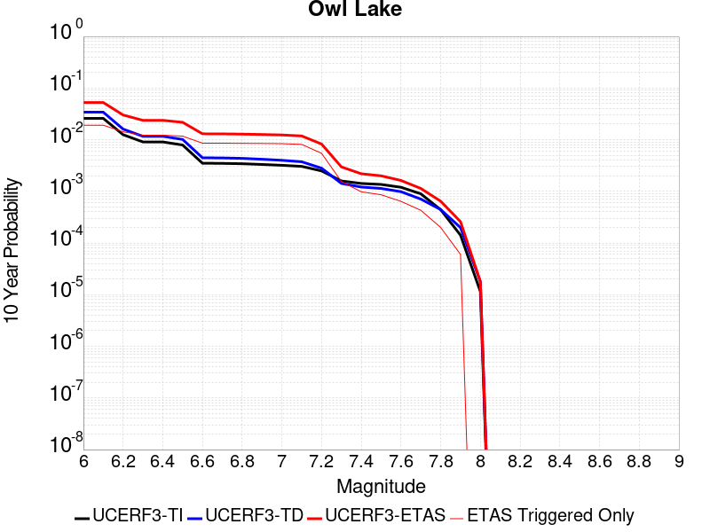 |

| Magnitude | 1 wk TI Prob | 1 wk TD Prob | 1 wk ETAS Prob | 1 wk ETAS/TD Gain | 1 wk ETAS Triggered Only | 1 mo TI Prob | 1 mo TD Prob | 1 mo ETAS Prob | 1 mo ETAS/TD Gain | 1 mo ETAS Triggered Only | 1 yr TI Prob | 1 yr TD Prob | 1 yr ETAS Prob | 1 yr ETAS/TD Gain | 1 yr ETAS Triggered Only | 10 yr TI Prob | 10 yr TD Prob | 10 yr ETAS Prob | 10 yr ETAS/TD Gain | 10 yr ETAS Triggered Only |
|-----|-----|-----|-----|-----|-----|-----|-----|-----|-----|-----|-----|-----|-----|-----|-----|-----|-----|-----|-----|-----|
| 6.0 | 5.0320643E-5 | 6.636041E-5 | 0.0015962588 | 24.054386 | 0.00153 | 2.1564208E-4 | 2.84377E-4 | 0.0039533335 | 13.901734 | 0.00367 | 0.0026222812 | 0.0034577118 | 0.014220368 | 4.112653 | 0.0108 | 0.02591553 | 0.034142397 | 0.052580617 | 1.540039 | 0.01909 |
| 6.1 | 5.0320643E-5 | 6.636041E-5 | 0.0015962588 | 24.054386 | 0.00153 | 2.1564208E-4 | 2.84377E-4 | 0.0039533335 | 13.901734 | 0.00367 | 0.0026222812 | 0.0034577118 | 0.014220368 | 4.112653 | 0.0108 | 0.02591553 | 0.034142397 | 0.052580617 | 1.540039 | 0.01909 |
| 6.2 | 2.4125871E-5 | 3.098217E-5 | 0.0011909462 | 38.43973 | 0.00116 | 1.0339249E-4 | 1.3277512E-4 | 0.0029024074 | 21.859571 | 0.00277 | 0.0012580766 | 0.0016155102 | 0.009932053 | 6.147936 | 0.00833 | 0.012509781 | 0.016071098 | 0.030101923 | 1.8730471 | 0.01426 |
| 6.3 | 1.7433485E-5 | 2.2356866E-5 | 0.0010823332 | 48.411667 | 0.00106 | 7.471279E-5 | 9.58125E-5 | 0.002595573 | 27.090128 | 0.0025 | 9.0924866E-4 | 0.0011660301 | 0.00844753 | 7.244693 | 0.00729 | 0.009055373 | 0.011629325 | 0.023707215 | 2.0385718 | 0.01222 |
| 6.4 | 1.7433485E-5 | 2.2356866E-5 | 0.0010823332 | 48.411667 | 0.00106 | 7.471279E-5 | 9.58125E-5 | 0.002595573 | 27.090128 | 0.0025 | 9.0924866E-4 | 0.0011660301 | 0.00844753 | 7.244693 | 0.00729 | 0.009055373 | 0.011629325 | 0.023707215 | 2.0385718 | 0.01222 |
| 6.5 | 1.5182742E-5 | 1.9430483E-5 | 0.0010594103 | 54.523106 | 0.00104 | 6.506727E-5 | 8.32717E-5 | 0.0024530743 | 29.458681 | 0.00237 | 7.919061E-4 | 0.0010134967 | 0.008026382 | 7.9194946 | 0.00702 | 0.0078909 | 0.010118797 | 0.021720206 | 2.1465204 | 0.01172 |
| 6.6 | 6.7271576E-6 | 8.548313E-6 | 8.7854086E-4 | 102.77359 | 8.7E-4 | 2.8830356E-5 | 3.6635145E-5 | 0.0019865637 | 54.225624 | 0.00195 | 3.5095305E-4 | 4.4594728E-4 | 0.0059634857 | 13.372624 | 0.00552 | 0.0035039932 | 0.004467926 | 0.012999636 | 2.909546 | 0.00857 |
| 6.7 | 6.682835E-6 | 8.480754E-6 | 8.784734E-4 | 103.58434 | 8.7E-4 | 2.8640408E-5 | 3.6345617E-5 | 0.0019862747 | 54.64964 | 0.00195 | 3.4864116E-4 | 4.4242368E-4 | 0.0059499857 | 13.448615 | 0.00551 | 0.003480947 | 0.00443287 | 0.012954925 | 2.9224687 | 0.00856 |
| 6.8 | 6.5774975E-6 | 8.32722E-6 | 8.7831996E-4 | 105.475784 | 8.7E-4 | 2.8188972E-5 | 3.5687626E-5 | 0.0019756183 | 55.35864 | 0.00194 | 3.4314668E-4 | 4.3441588E-4 | 0.0059120352 | 13.60916 | 0.00548 | 0.0034261728 | 0.0043530487 | 0.012826004 | 2.9464417 | 0.00851 |
| 6.9 | 6.363419E-6 | 8.000376E-6 | 8.679935E-4 | 108.494095 | 8.6E-4 | 2.727151E-5 | 3.4286906E-5 | 0.0019642208 | 57.28778 | 0.00193 | 3.3198006E-4 | 4.173687E-4 | 0.0058650943 | 14.052549 | 0.00545 | 0.0033148455 | 0.004183012 | 0.012607624 | 3.0140061 | 0.00846 |
| 7.0 | 6.1342453E-6 | 7.632552E-6 | 8.576261E-4 | 112.36426 | 8.5E-4 | 2.6289357E-5 | 3.271056E-5 | 0.0019426481 | 59.389023 | 0.00191 | 3.2002592E-4 | 3.9818377E-4 | 0.00580603 | 14.581282 | 0.00541 | 0.0031956544 | 0.003991678 | 0.012348187 | 3.093483 | 0.00839 |
| 7.1 | 5.842926E-6 | 7.1430604E-6 | 8.271372E-4 | 115.79591 | 8.2E-4 | 2.504087E-5 | 3.0612788E-5 | 0.0018805561 | 61.430412 | 0.00185 | 3.0482994E-4 | 3.7265237E-4 | 0.0056007034 | 15.029298 | 0.00523 | 0.0030441214 | 0.0037372818 | 0.011816972 | 3.1619165 | 0.00811 |
| 7.2 | 4.77173E-6 | 5.359158E-6 | 4.953565E-4 | 92.431786 | 4.9E-4 | 2.045011E-5 | 2.296764E-5 | 0.0011229424 | 48.89237 | 0.0011 | 2.4895166E-4 | 2.795992E-4 | 0.0038286066 | 13.693196 | 0.00355 | 0.0024867293 | 0.002808747 | 0.00824344 | 2.934917 | 0.00545 |
| 7.3 | 3.0494948E-6 | 2.7108347E-6 | 1.4271046E-4 | 52.64447 | 1.4E-4 | 1.3069198E-5 | 1.1617813E-5 | 2.716148E-4 | 23.37917 | 2.6E-4 | 1.5910587E-4 | 1.4143785E-4 | 0.0011312978 | 7.998551 | 9.9E-4 | 0.0015899199 | 0.0014233418 | 0.0029711355 | 2.0874364 | 0.00155 |
| 7.4 | 2.7263884E-6 | 2.3060104E-6 | 6.230587E-5 | 27.018904 | 6.0E-5 | 1.1684469E-5 | 9.882864E-6 | 1.3988158E-4 | 14.153951 | 1.3E-4 | 1.4224913E-4 | 1.2031734E-4 | 7.602403E-4 | 6.318627 | 6.4E-4 | 0.0014215811 | 0.0012113012 | 0.002190114 | 1.8080673 | 9.8E-4 |
| 7.5 | 2.6090431E-6 | 2.1659357E-6 | 6.2165804E-5 | 28.701593 | 6.0E-5 | 1.1181565E-5 | 9.282549E-6 | 1.3928134E-4 | 15.004643 | 1.3E-4 | 1.3612706E-4 | 1.1300927E-4 | 6.4294937E-4 | 5.6893506 | 5.3E-4 | 0.001360437 | 0.0011380832 | 0.0019971044 | 1.7547965 | 8.6E-4 |
| 7.6 | 2.3008756E-6 | 1.8730968E-6 | 6.187298E-5 | 33.03245 | 6.0E-5 | 9.860858E-6 | 8.027534E-6 | 1.2802657E-4 | 15.948431 | 1.2E-4 | 1.20049335E-4 | 9.7730925E-5 | 4.9769186E-4 | 5.0924706 | 4.0E-4 | 0.001199845 | 9.851726E-4 | 0.001624542 | 1.6489924 | 6.4E-4 |
| 7.7 | 1.7184348E-6 | 1.3421906E-6 | 4.1342137E-5 | 30.801987 | 4.0E-5 | 7.3646997E-6 | 5.752233E-6 | 9.575172E-5 | 16.646008 | 9.0E-5 | 8.966153E-5 | 7.003123E-5 | 3.2001373E-4 | 4.5695863 | 2.5E-4 | 8.962536E-4 | 7.08018E-4 | 0.0011377136 | 1.6068991 | 4.3E-4 |
| 7.8 | 8.4612907E-7 | 8.408234E-7 | 2.0840807E-5 | 24.786186 | 2.0E-5 | 3.6262625E-6 | 3.6035242E-6 | 4.360338E-5 | 12.100204 | 4.0E-5 | 4.4148852E-5 | 4.3872045E-5 | 1.3386809E-4 | 3.0513303 | 9.0E-5 | 4.414008E-4 | 4.440713E-4 | 6.439825E-4 | 1.4501781 | 2.0E-4 |
| 7.9 | 2.716738E-7 | 3.7693766E-7 | 1.03769335E-5 | 27.529575 | 1.0E-5 | 1.1643157E-6 | 1.6154462E-6 | 2.1615413E-5 | 13.38046 | 2.0E-5 | 1.4175452E-5 | 1.9667892E-5 | 4.9667302E-5 | 2.5252988 | 3.0E-5 | 1.4174548E-4 | 1.9836401E-4 | 2.583521E-4 | 1.3024142 | 6.0E-5 |
| 8.0 | 2.1995428E-8 | 3.38572E-8 | 3.38572E-8 | 1.0 | 0.0 | 9.426611E-8 | 1.4510229E-7 | 1.4510229E-7 | 1.0 | 0.0 | 1.1476893E-6 | 1.7666197E-6 | 1.7666197E-6 | 1.0 | 0.0 | 1.14768345E-5 | 1.7871007E-5 | 1.7871007E-5 | 1.0 | 0.0 |

## Airport Lake
*[(top)](#table-of-contents)*

| 1 Week | 1 Month | 1 Year | 10 Year |
|-----|-----|-----|-----|
|  |  |  |  |

| Magnitude | 1 wk TI Prob | 1 wk TD Prob | 1 wk ETAS Prob | 1 wk ETAS/TD Gain | 1 wk ETAS Triggered Only | 1 mo TI Prob | 1 mo TD Prob | 1 mo ETAS Prob | 1 mo ETAS/TD Gain | 1 mo ETAS Triggered Only | 1 yr TI Prob | 1 yr TD Prob | 1 yr ETAS Prob | 1 yr ETAS/TD Gain | 1 yr ETAS Triggered Only | 10 yr TI Prob | 10 yr TD Prob | 10 yr ETAS Prob | 10 yr ETAS/TD Gain | 10 yr ETAS Triggered Only |
|-----|-----|-----|-----|-----|-----|-----|-----|-----|-----|-----|-----|-----|-----|-----|-----|-----|-----|-----|-----|-----|
| 6.0 | 1.2387061E-5 | 1.31032575E-5 | 0.0021630751 | 165.0792 | 0.00215 | 5.3086325E-5 | 5.6155768E-5 | 0.00514587 | 91.63564 | 0.00509 | 6.461343E-4 | 6.835104E-4 | 0.012235609 | 17.90113 | 0.01156 | 0.0064425888 | 0.0068168915 | 0.025081528 | 3.6793206 | 0.01839 |
| 6.1 | 1.2387061E-5 | 1.31032575E-5 | 0.0021630751 | 165.0792 | 0.00215 | 5.3086325E-5 | 5.6155768E-5 | 0.00514587 | 91.63564 | 0.00509 | 6.461343E-4 | 6.835104E-4 | 0.012235609 | 17.90113 | 0.01156 | 0.0064425888 | 0.0068168915 | 0.025081528 | 3.6793206 | 0.01839 |
| 6.2 | 1.2387061E-5 | 1.31032575E-5 | 0.0021630751 | 165.0792 | 0.00215 | 5.3086325E-5 | 5.6155768E-5 | 0.00514587 | 91.63564 | 0.00509 | 6.461343E-4 | 6.835104E-4 | 0.012235609 | 17.90113 | 0.01156 | 0.0064425888 | 0.0068168915 | 0.025081528 | 3.6793206 | 0.01839 |
| 6.3 | 1.2387061E-5 | 1.31032575E-5 | 0.0021630751 | 165.0792 | 0.00215 | 5.3086325E-5 | 5.6155768E-5 | 0.00514587 | 91.63564 | 0.00509 | 6.461343E-4 | 6.835104E-4 | 0.012235609 | 17.90113 | 0.01156 | 0.0064425888 | 0.0068168915 | 0.025081528 | 3.6793206 | 0.01839 |
| 6.4 | 1.2387061E-5 | 1.31032575E-5 | 0.0021630751 | 165.0792 | 0.00215 | 5.3086325E-5 | 5.6155768E-5 | 0.00514587 | 91.63564 | 0.00509 | 6.461343E-4 | 6.835104E-4 | 0.012235609 | 17.90113 | 0.01156 | 0.0064425888 | 0.0068168915 | 0.025081528 | 3.6793206 | 0.01839 |
| 6.5 | 6.9922594E-6 | 7.38498E-6 | 0.0017173723 | 232.54935 | 0.00171 | 2.996648E-5 | 3.164956E-5 | 0.0039515253 | 124.852455 | 0.00392 | 3.6478083E-4 | 3.8527072E-4 | 0.009201872 | 23.884174 | 0.00882 | 0.003641826 | 0.0038465653 | 0.017633328 | 4.584175 | 0.01384 |
| 6.6 | 6.9922594E-6 | 7.38498E-6 | 0.0017173723 | 232.54935 | 0.00171 | 2.996648E-5 | 3.164956E-5 | 0.0039515253 | 124.852455 | 0.00392 | 3.6478083E-4 | 3.8527072E-4 | 0.009201872 | 23.884174 | 0.00882 | 0.003641826 | 0.0038465653 | 0.017633328 | 4.584175 | 0.01384 |
| 6.7 | 5.477277E-6 | 5.7861116E-6 | 0.0015457772 | 267.153 | 0.00154 | 2.3473833E-5 | 2.4797408E-5 | 0.0034447126 | 138.91422 | 0.00342 | 2.8575645E-4 | 3.0187052E-4 | 0.00791957 | 26.234991 | 0.00762 | 0.0028538927 | 0.0030149885 | 0.01487911 | 4.935047 | 0.0119 |
| 6.8 | 3.9950432E-6 | 4.2191186E-6 | 0.0011742142 | 278.30795 | 0.00117 | 1.7121502E-5 | 1.8081826E-5 | 0.002658034 | 147.0003 | 0.00264 | 2.0843433E-4 | 2.2012675E-4 | 0.005828892 | 26.479706 | 0.00561 | 0.0020823893 | 0.002199358 | 0.010960048 | 4.983294 | 0.00878 |
| 6.9 | 2.95695E-6 | 3.1230477E-6 | 8.6312037E-4 | 276.3712 | 8.6E-4 | 1.2672582E-5 | 1.3384434E-5 | 0.0019733582 | 147.43681 | 0.00196 | 1.5427776E-4 | 1.6294557E-4 | 0.004252279 | 26.096317 | 0.00409 | 0.001541707 | 0.0016284833 | 0.0080679795 | 4.954291 | 0.00645 |
| 7.0 | 1.456072E-6 | 1.5408239E-6 | 3.415403E-4 | 221.66083 | 3.4E-4 | 6.2402937E-6 | 6.60352E-6 | 9.465973E-4 | 143.34738 | 9.4E-4 | 7.597293E-5 | 8.03959E-5 | 0.0020302392 | 25.25302 | 0.00195 | 7.594696E-4 | 8.03767E-4 | 0.0037913637 | 4.7169933 | 0.00299 |
| 7.1 | 6.995192E-7 | 7.4090326E-7 | 1.407408E-4 | 189.9584 | 1.4E-4 | 2.997936E-6 | 3.1752998E-6 | 3.431742E-4 | 108.07617 | 3.4E-4 | 3.649926E-5 | 3.8659273E-5 | 8.4862794E-4 | 21.951471 | 8.1E-4 | 3.6493264E-4 | 3.8659273E-4 | 0.001746067 | 4.516554 | 0.00136 |

## Panamint Valley
*[(top)](#table-of-contents)*

| 1 Week | 1 Month | 1 Year | 10 Year |
|-----|-----|-----|-----|
|  | 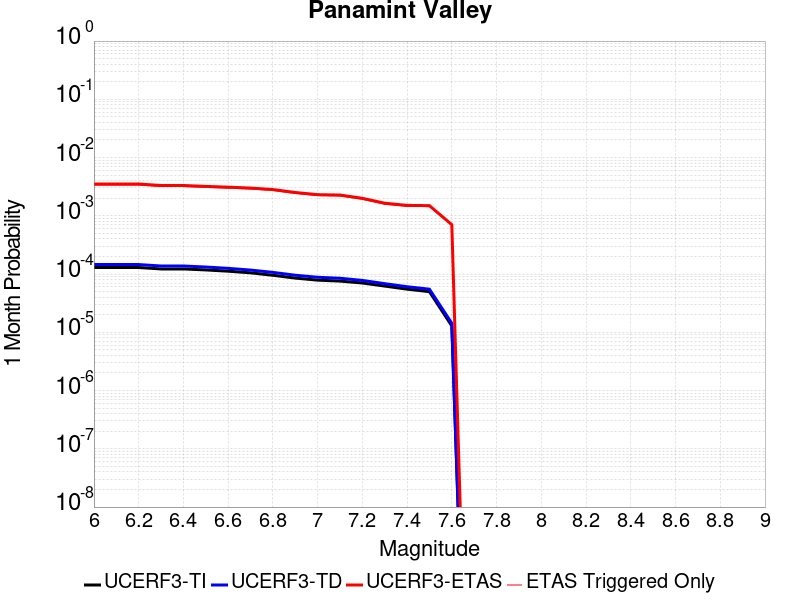 | 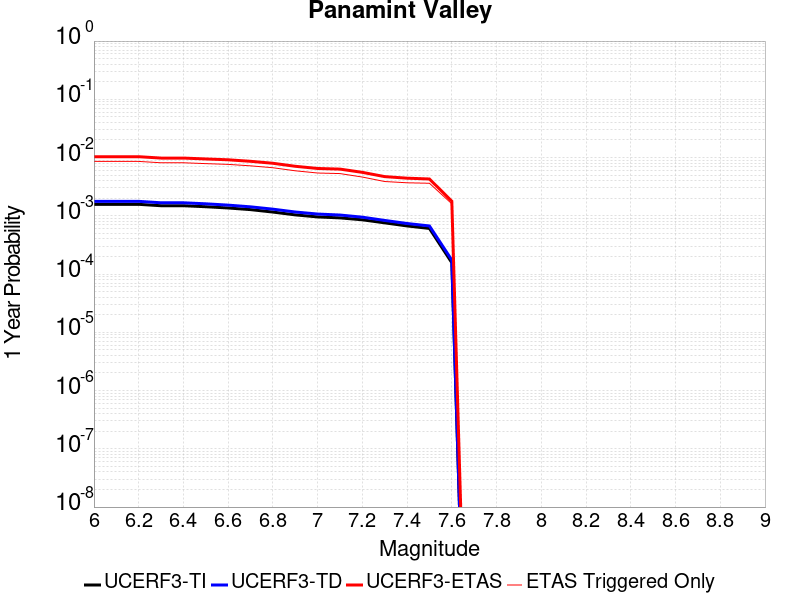 | 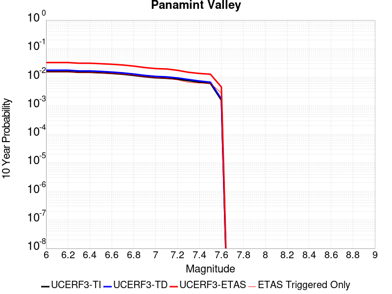 |

| Magnitude | 1 wk TI Prob | 1 wk TD Prob | 1 wk ETAS Prob | 1 wk ETAS/TD Gain | 1 wk ETAS Triggered Only | 1 mo TI Prob | 1 mo TD Prob | 1 mo ETAS Prob | 1 mo ETAS/TD Gain | 1 mo ETAS Triggered Only | 1 yr TI Prob | 1 yr TD Prob | 1 yr ETAS Prob | 1 yr ETAS/TD Gain | 1 yr ETAS Triggered Only | 10 yr TI Prob | 10 yr TD Prob | 10 yr ETAS Prob | 10 yr ETAS/TD Gain | 10 yr ETAS Triggered Only |
|-----|-----|-----|-----|-----|-----|-----|-----|-----|-----|-----|-----|-----|-----|-----|-----|-----|-----|-----|-----|-----|
| 6.0 | 3.0211835E-5 | 3.3984965E-5 | 0.0012839425 | 37.77972 | 0.00125 | 1.2947287E-4 | 1.4564188E-4 | 0.003515151 | 24.135578 | 0.00337 | 0.0015751923 | 0.0017717773 | 0.010346558 | 5.839649 | 0.00859 | 0.015640736 | 0.017582124 | 0.032632764 | 1.8560196 | 0.01532 |
| 6.1 | 3.0211835E-5 | 3.3984965E-5 | 0.0012839425 | 37.77972 | 0.00125 | 1.2947287E-4 | 1.4564188E-4 | 0.003515151 | 24.135578 | 0.00337 | 0.0015751923 | 0.0017717773 | 0.010346558 | 5.839649 | 0.00859 | 0.015640736 | 0.017582124 | 0.032632764 | 1.8560196 | 0.01532 |
| 6.2 | 3.0211835E-5 | 3.3984965E-5 | 0.0012839425 | 37.77972 | 0.00125 | 1.2947287E-4 | 1.4564188E-4 | 0.003515151 | 24.135578 | 0.00337 | 0.0015751923 | 0.0017717773 | 0.010346558 | 5.839649 | 0.00859 | 0.015640736 | 0.017582124 | 0.032632764 | 1.8560196 | 0.01532 |
| 6.3 | 2.8573924E-5 | 3.2103115E-5 | 0.0012120652 | 37.75538 | 0.00118 | 1.2245393E-4 | 1.3757768E-4 | 0.0033171403 | 24.111036 | 0.00318 | 0.001489857 | 0.0016737491 | 0.009800125 | 5.8551936 | 0.00814 | 0.01479908 | 0.01661714 | 0.030886024 | 1.8586848 | 0.01451 |
| 6.4 | 2.8573924E-5 | 3.2103115E-5 | 0.0012120652 | 37.75538 | 0.00118 | 1.2245393E-4 | 1.3757768E-4 | 0.0033171403 | 24.111036 | 0.00318 | 0.001489857 | 0.0016737491 | 0.009800125 | 5.8551936 | 0.00814 | 0.01479908 | 0.01661714 | 0.030886024 | 1.8586848 | 0.01451 |
| 6.5 | 2.7468774E-5 | 3.0828793E-5 | 0.001190793 | 38.626003 | 0.00116 | 1.1771801E-4 | 1.3211685E-4 | 0.0032017112 | 24.233934 | 0.00307 | 0.0014322745 | 0.0016073632 | 0.009464714 | 5.8883476 | 0.00787 | 0.014230782 | 0.015962977 | 0.029680451 | 1.8593308 | 0.01394 |
| 6.6 | 2.6135967E-5 | 2.925278E-5 | 0.0011692194 | 39.969517 | 0.00114 | 1.1200648E-4 | 1.2536318E-4 | 0.0031049896 | 24.767956 | 0.00298 | 0.0013628257 | 0.0015252546 | 0.009153602 | 6.00136 | 0.00764 | 0.013544982 | 0.015153424 | 0.028439004 | 1.8767378 | 0.01349 |
| 6.7 | 2.4498746E-5 | 2.7341659E-5 | 0.0011573108 | 42.327744 | 0.00113 | 1.04990395E-4 | 1.1717342E-4 | 0.0029968359 | 25.576073 | 0.00288 | 0.0012775084 | 0.0014256779 | 0.008625398 | 6.0500336 | 0.00721 | 0.012701893 | 0.014170669 | 0.026779426 | 1.8897786 | 0.01279 |
| 6.8 | 2.2244329E-5 | 2.4935984E-5 | 0.0010949093 | 43.90881 | 0.00107 | 9.532935E-5 | 1.06864245E-4 | 0.0028265736 | 26.450134 | 0.00272 | 0.0011600169 | 0.0013003175 | 0.007981618 | 6.1382074 | 0.00669 | 0.011539802 | 0.012932051 | 0.02453997 | 1.8976085 | 0.01176 |
| 6.9 | 1.9902658E-5 | 2.2290773E-5 | 9.922691E-4 | 44.514793 | 9.7E-4 | 8.529431E-5 | 9.552849E-5 | 0.0025152974 | 26.330336 | 0.00242 | 0.0010379635 | 0.0011624574 | 0.007085564 | 6.0953326 | 0.00593 | 0.010331288 | 0.011568334 | 0.021778833 | 1.8826249 | 0.01033 |
| 7.0 | 1.8353881E-5 | 2.0566635E-5 | 8.9054875E-4 | 43.300655 | 8.7E-4 | 7.865712E-5 | 8.8139845E-5 | 0.0023079442 | 26.185026 | 0.00222 | 9.5722964E-4 | 0.001072592 | 0.006496768 | 6.0570726 | 0.00543 | 0.009531168 | 0.010678438 | 0.020076992 | 1.8801433 | 0.0095 |
| 7.1 | 1.7667631E-5 | 1.9773011E-5 | 8.79756E-4 | 44.492767 | 8.6E-4 | 7.571623E-5 | 8.473882E-5 | 0.0022745533 | 26.841927 | 0.00219 | 9.2145515E-4 | 0.0010312245 | 0.006335749 | 6.1439085 | 0.00531 | 0.009176437 | 0.010268626 | 0.019413743 | 1.8905883 | 0.00924 |
| 7.2 | 1.6381597E-5 | 1.8158586E-5 | 7.1814586E-4 | 39.548557 | 7.0E-4 | 7.020495E-5 | 7.782029E-5 | 0.0019976709 | 25.67031 | 0.00192 | 8.544101E-4 | 9.4706746E-4 | 0.0055726827 | 5.8841453 | 0.00463 | 0.008511325 | 0.009434342 | 0.017428208 | 1.8473155 | 0.00807 |
| 7.3 | 1.4520491E-5 | 1.596705E-5 | 5.6595827E-4 | 35.445385 | 5.5E-4 | 6.222919E-5 | 6.842852E-5 | 0.0016483204 | 24.08821 | 0.00158 | 7.57377E-4 | 8.3281496E-4 | 0.0047095837 | 5.6550183 | 0.00388 | 0.0075480095 | 0.008299384 | 0.014854525 | 1.7898346 | 0.00661 |
| 7.4 | 1.2852287E-5 | 1.4145931E-5 | 5.441384E-4 | 38.466072 | 5.3E-4 | 5.5080065E-5 | 6.06241E-5 | 0.0015105362 | 24.916431 | 0.00145 | 6.7039346E-4 | 7.378643E-4 | 0.0044251415 | 5.9972296 | 0.00369 | 0.0066837464 | 0.0073563983 | 0.013530642 | 1.8393024 | 0.00622 |
| 7.5 | 1.1637851E-5 | 1.28372185E-5 | 5.3283054E-4 | 41.5067 | 5.2E-4 | 4.987555E-5 | 5.501558E-5 | 0.0014949364 | 27.172964 | 0.00144 | 6.070656E-4 | 6.696245E-4 | 0.0042872005 | 6.402395 | 0.00362 | 0.006054099 | 0.0066782837 | 0.012707747 | 1.9028461 | 0.00607 |
| 7.6 | 3.0068115E-6 | 3.3332262E-6 | 2.3333247E-4 | 70.00199 | 2.3E-4 | 1.2886271E-5 | 1.4285218E-5 | 7.042754E-4 | 49.300987 | 6.9E-4 | 1.5687906E-4 | 1.7391593E-4 | 0.0017836359 | 10.255736 | 0.00161 | 0.0015676835 | 0.0017386783 | 0.00453381 | 2.6076186 | 0.0028 |

## Garlock (East)
*[(top)](#table-of-contents)*

| 1 Week | 1 Month | 1 Year | 10 Year |
|-----|-----|-----|-----|
|  |  | 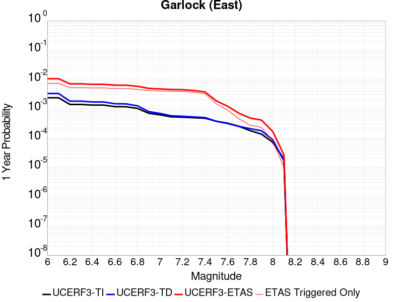 |  |

| Magnitude | 1 wk TI Prob | 1 wk TD Prob | 1 wk ETAS Prob | 1 wk ETAS/TD Gain | 1 wk ETAS Triggered Only | 1 mo TI Prob | 1 mo TD Prob | 1 mo ETAS Prob | 1 mo ETAS/TD Gain | 1 mo ETAS Triggered Only | 1 yr TI Prob | 1 yr TD Prob | 1 yr ETAS Prob | 1 yr ETAS/TD Gain | 1 yr ETAS Triggered Only | 10 yr TI Prob | 10 yr TD Prob | 10 yr ETAS Prob | 10 yr ETAS/TD Gain | 10 yr ETAS Triggered Only |
|-----|-----|-----|-----|-----|-----|-----|-----|-----|-----|-----|-----|-----|-----|-----|-----|-----|-----|-----|-----|-----|
| 6.0 | 4.5092507E-5 | 6.290799E-5 | 0.0010728445 | 17.054186 | 0.00101 | 1.9323928E-4 | 2.695803E-4 | 0.002588955 | 9.603649 | 0.00232 | 0.0023501497 | 0.0032776468 | 0.0105038835 | 3.2047029 | 0.00725 | 0.023254504 | 0.032344494 | 0.045011103 | 1.3916156 | 0.01309 |
| 6.1 | 4.5092507E-5 | 6.290799E-5 | 0.0010728445 | 17.054186 | 0.00101 | 1.9323928E-4 | 2.695803E-4 | 0.002588955 | 9.603649 | 0.00232 | 0.0023501497 | 0.0032776468 | 0.0105038835 | 3.2047029 | 0.00725 | 0.023254504 | 0.032344494 | 0.045011103 | 1.3916156 | 0.01309 |
| 6.2 | 2.6674514E-5 | 3.451465E-5 | 8.1448775E-4 | 23.59832 | 7.8E-4 | 1.1431433E-4 | 1.4791173E-4 | 0.0018776559 | 12.694435 | 0.00173 | 0.0013908884 | 0.0017993709 | 0.006980032 | 3.8791516 | 0.00519 | 0.01382215 | 0.017863318 | 0.027026653 | 1.5129694 | 0.00933 |
| 6.3 | 2.6674514E-5 | 3.451465E-5 | 8.1448775E-4 | 23.59832 | 7.8E-4 | 1.1431433E-4 | 1.4791173E-4 | 0.0018776559 | 12.694435 | 0.00173 | 0.0013908884 | 0.0017993709 | 0.006980032 | 3.8791516 | 0.00519 | 0.01382215 | 0.017863318 | 0.027026653 | 1.5129694 | 0.00933 |
| 6.4 | 2.5312667E-5 | 3.2343483E-5 | 8.0231857E-4 | 24.80619 | 7.7E-4 | 1.0847834E-4 | 1.3860772E-4 | 0.0018583693 | 13.407401 | 0.00172 | 0.0013199237 | 0.0016862722 | 0.0067676893 | 4.0134025 | 0.00509 | 0.013121112 | 0.016764186 | 0.025711633 | 1.5337238 | 0.0091 |
| 6.5 | 2.5312667E-5 | 3.2343483E-5 | 8.0231857E-4 | 24.80619 | 7.7E-4 | 1.0847834E-4 | 1.3860772E-4 | 0.0018583693 | 13.407401 | 0.00172 | 0.0013199237 | 0.0016862722 | 0.0067676893 | 4.0134025 | 0.00509 | 0.013121112 | 0.016764186 | 0.025711633 | 1.5337238 | 0.0091 |
| 6.6 | 2.246556E-5 | 2.8137678E-5 | 7.6811685E-4 | 27.298517 | 7.4E-4 | 9.627742E-5 | 1.20584606E-4 | 0.0017403893 | 14.432931 | 0.00162 | 0.0011715472 | 0.0014671524 | 0.006300051 | 4.2940674 | 0.00484 | 0.011653901 | 0.014604934 | 0.023099039 | 1.5815915 | 0.00862 |
| 6.7 | 2.2241198E-5 | 2.7807404E-5 | 7.677868E-4 | 27.610878 | 7.4E-4 | 9.531594E-5 | 1.1916928E-4 | 0.0017389762 | 14.592488 | 0.00162 | 0.0011598538 | 0.0014499439 | 0.0062729404 | 4.3263335 | 0.00483 | 0.011538187 | 0.014434824 | 0.022890972 | 1.5858159 | 0.00858 |
| 6.8 | 1.9528685E-5 | 2.3901322E-5 | 7.238846E-4 | 30.286383 | 7.0E-4 | 8.369167E-5 | 1.0243033E-4 | 0.0016222746 | 15.837835 | 0.00152 | 0.0010184698 | 0.0012463954 | 0.0057707494 | 4.6299505 | 0.00453 | 0.010138147 | 0.012438075 | 0.020368198 | 1.6375682 | 0.00803 |
| 6.9 | 1.3318621E-5 | 1.5200952E-5 | 6.851908E-4 | 45.07552 | 6.7E-4 | 5.7078556E-5 | 6.514534E-5 | 0.0014850529 | 22.795994 | 0.00142 | 6.9470983E-4 | 7.928616E-4 | 0.004909595 | 6.192247 | 0.00412 | 0.0069254204 | 0.007940963 | 0.015034185 | 1.8932446 | 0.00715 |
| 7.0 | 1.1760853E-5 | 1.3109707E-5 | 6.7310105E-4 | 51.343716 | 6.6E-4 | 5.0402683E-5 | 5.6183275E-5 | 0.0014461052 | 25.739069 | 0.00139 | 6.134799E-4 | 6.838217E-4 | 0.0046910797 | 6.8600917 | 0.00401 | 0.0061178906 | 0.006857492 | 0.01373997 | 2.0036435 | 0.00693 |
| 7.1 | 1.0064758E-5 | 1.0904764E-5 | 6.7089754E-4 | 61.523346 | 6.6E-4 | 4.3133965E-5 | 4.6733887E-5 | 0.0014166698 | 30.313547 | 0.00137 | 5.2502943E-4 | 5.6884E-4 | 0.00448661 | 7.8872967 | 0.00392 | 0.005237907 | 0.005713798 | 0.01235563 | 2.1624198 | 0.00668 |
| 7.2 | 9.768808E-6 | 1.0500609E-5 | 6.704937E-4 | 63.852837 | 6.6E-4 | 4.186565E-5 | 4.5001856E-5 | 0.0014149402 | 31.44182 | 0.00137 | 5.095951E-4 | 5.477633E-4 | 0.0044356324 | 8.097717 | 0.00389 | 0.0050842804 | 0.0055042095 | 0.012077827 | 2.194289 | 0.00661 |
| 7.3 | 9.344516E-6 | 9.946213E-6 | 6.599398E-4 | 66.35085 | 6.5E-4 | 4.004731E-5 | 4.262595E-5 | 0.0013625696 | 31.965733 | 0.00132 | 4.8746695E-4 | 5.188508E-4 | 0.0041469675 | 7.9926004 | 0.00363 | 0.0048639905 | 0.005215881 | 0.011413386 | 2.188199 | 0.00623 |
| 7.4 | 9.023491E-6 | 9.492341E-6 | 5.7948695E-4 | 61.04784 | 5.7E-4 | 3.867153E-5 | 4.0680847E-5 | 0.0011606353 | 28.530264 | 0.00112 | 4.7072413E-4 | 4.951801E-4 | 0.0037035905 | 7.47928 | 0.00321 | 0.004697283 | 0.0049793427 | 0.010511657 | 2.1110532 | 0.00556 |
| 7.5 | 7.081253E-6 | 7.089067E-6 | 3.0708694E-4 | 43.318386 | 3.0E-4 | 3.0347876E-5 | 3.0381365E-5 | 5.9036433E-4 | 19.431791 | 5.6E-4 | 3.6942272E-4 | 3.6983108E-4 | 0.0018292911 | 4.946288 | 0.00146 | 0.003688092 | 0.0037253548 | 0.006315669 | 1.6953201 | 0.0026 |
| 7.6 | 6.116396E-6 | 5.960529E-6 | 1.8595946E-4 | 31.198483 | 1.8E-4 | 2.6212863E-5 | 2.5544876E-5 | 3.7553592E-4 | 14.701029 | 3.5E-4 | 3.1909486E-4 | 3.1096474E-4 | 0.0012106849 | 3.893319 | 9.0E-4 | 0.0031863707 | 0.003136776 | 0.004851381 | 1.5466137 | 0.00172 |
| 7.7 | 4.797145E-6 | 4.758607E-6 | 7.4758274E-5 | 15.710117 | 7.0E-5 | 2.055903E-5 | 2.039387E-5 | 1.903904E-4 | 9.335668 | 1.7E-4 | 2.5027743E-4 | 2.4826723E-4 | 6.981555E-4 | 2.812113 | 4.5E-4 | 0.0024999576 | 0.002510294 | 0.0034579092 | 1.3774917 | 9.5E-4 |
| 7.8 | 3.4028885E-6 | 3.9797173E-6 | 2.3979637E-5 | 6.0254626 | 2.0E-5 | 1.4583726E-5 | 1.7055821E-5 | 1.07054286E-4 | 6.276701 | 9.0E-5 | 1.775424E-4 | 2.076349E-4 | 4.7757884E-4 | 2.3000894 | 2.7E-4 | 0.0017740062 | 0.00210206 | 0.0027107778 | 1.2895815 | 6.1E-4 |
| 7.9 | 2.5928412E-6 | 3.3735669E-6 | 2.3373499E-5 | 6.9284234 | 2.0E-5 | 1.1112129E-5 | 1.4458064E-5 | 1.0445676E-4 | 7.22481 | 9.0E-5 | 1.3528178E-4 | 1.7601276E-4 | 4.059723E-4 | 2.3064933 | 2.3E-4 | 0.0013519945 | 0.0017819697 | 0.0022112033 | 1.2408761 | 4.3E-4 |
| 8.0 | 1.3743648E-6 | 1.6739597E-6 | 1.1673943E-5 | 6.97385 | 1.0E-5 | 5.8901214E-6 | 7.1740933E-6 | 4.7173806E-5 | 6.5755777 | 4.0E-5 | 7.1709874E-5 | 8.734111E-5 | 1.6733413E-4 | 1.915869 | 8.0E-5 | 7.1686733E-4 | 8.841624E-4 | 0.0010739943 | 1.2147026 | 1.9E-4 |
| 8.1 | 3.6733252E-7 | 3.1497066E-7 | 3.1497066E-7 | 1.0 | 0.0 | 1.5742813E-6 | 1.3498736E-6 | 1.3498736E-6 | 1.0 | 0.0 | 1.9166706E-5 | 1.6434604E-5 | 2.643444E-5 | 1.6084622 | 1.0E-5 | 1.9165053E-4 | 1.6648426E-4 | 1.9647926E-4 | 1.1801672 | 3.0E-5 |

## Blackwater
*[(top)](#table-of-contents)*

| 1 Week | 1 Month | 1 Year | 10 Year |
|-----|-----|-----|-----|
|  | 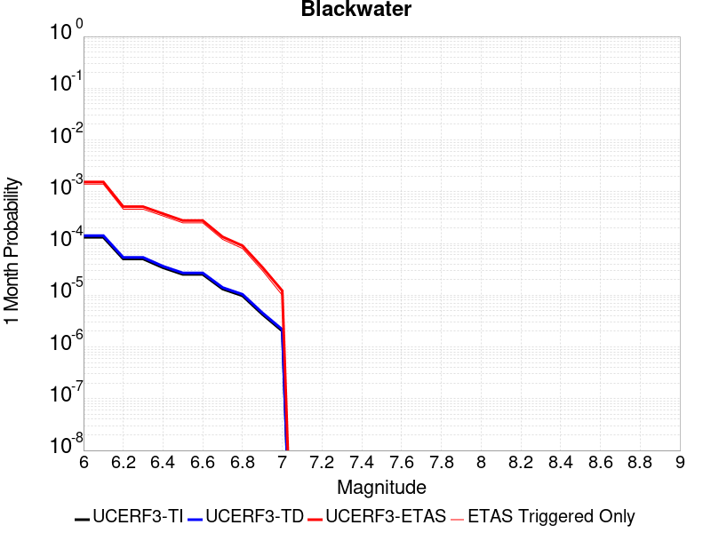 |  |  |

| Magnitude | 1 wk TI Prob | 1 wk TD Prob | 1 wk ETAS Prob | 1 wk ETAS/TD Gain | 1 wk ETAS Triggered Only | 1 mo TI Prob | 1 mo TD Prob | 1 mo ETAS Prob | 1 mo ETAS/TD Gain | 1 mo ETAS Triggered Only | 1 yr TI Prob | 1 yr TD Prob | 1 yr ETAS Prob | 1 yr ETAS/TD Gain | 1 yr ETAS Triggered Only | 10 yr TI Prob | 10 yr TD Prob | 10 yr ETAS Prob | 10 yr ETAS/TD Gain | 10 yr ETAS Triggered Only |
|-----|-----|-----|-----|-----|-----|-----|-----|-----|-----|-----|-----|-----|-----|-----|-----|-----|-----|-----|-----|-----|
| 6.0 | 3.0708583E-5 | 3.309619E-5 | 5.130803E-4 | 15.5027 | 4.8E-4 | 1.3160157E-4 | 1.4183388E-4 | 0.0015416353 | 10.869303 | 0.0014 | 0.0016010714 | 0.0017255963 | 0.005708711 | 3.3082542 | 0.00399 | 0.015895851 | 0.017135808 | 0.024065001 | 1.4043691 | 0.00705 |
| 6.1 | 3.0708583E-5 | 3.309619E-5 | 5.130803E-4 | 15.5027 | 4.8E-4 | 1.3160157E-4 | 1.4183388E-4 | 0.0015416353 | 10.869303 | 0.0014 | 0.0016010714 | 0.0017255963 | 0.005708711 | 3.3082542 | 0.00399 | 0.015895851 | 0.017135808 | 0.024065001 | 1.4043691 | 0.00705 |
| 6.2 | 1.1707779E-5 | 1.2545242E-5 | 1.3254373E-4 | 10.56526 | 1.2E-4 | 5.017523E-5 | 5.3764266E-5 | 5.1373953E-4 | 9.5554085 | 4.6E-4 | 6.107122E-4 | 6.5439293E-4 | 0.002143418 | 3.2754295 | 0.00149 | 0.006090366 | 0.006525631 | 0.009168273 | 1.4049634 | 0.00266 |
| 6.3 | 1.1707779E-5 | 1.2545242E-5 | 1.3254373E-4 | 10.56526 | 1.2E-4 | 5.017523E-5 | 5.3764266E-5 | 5.1373953E-4 | 9.5554085 | 4.6E-4 | 6.107122E-4 | 6.5439293E-4 | 0.002143418 | 3.2754295 | 0.00149 | 0.006090366 | 0.006525631 | 0.009168273 | 1.4049634 | 0.00266 |
| 6.4 | 7.929244E-6 | 8.480176E-6 | 8.84795E-5 | 10.433686 | 8.0E-5 | 3.3982033E-5 | 3.6343128E-5 | 3.7633078E-4 | 10.354936 | 3.4E-4 | 4.136527E-4 | 4.4239179E-4 | 0.0014419494 | 3.2594397 | 0.001 | 0.0041288356 | 0.0044155167 | 0.0062573478 | 1.417127 | 0.00185 |
| 6.5 | 5.8832115E-6 | 6.286048E-6 | 6.628567E-5 | 10.544888 | 6.0E-5 | 2.521352E-5 | 2.6939942E-5 | 2.7693322E-4 | 10.279652 | 2.5E-4 | 3.0693135E-4 | 3.2794697E-4 | 0.0010477109 | 3.194757 | 7.2E-4 | 0.0030650778 | 0.0032748834 | 0.004660331 | 1.4230525 | 0.00139 |
| 6.6 | 5.8832115E-6 | 6.286048E-6 | 6.628567E-5 | 10.544888 | 6.0E-5 | 2.521352E-5 | 2.6939942E-5 | 2.7693322E-4 | 10.279652 | 2.5E-4 | 3.0693135E-4 | 3.2794697E-4 | 0.0010477109 | 3.194757 | 7.2E-4 | 0.0030650778 | 0.0032748834 | 0.004660331 | 1.4230525 | 0.00139 |
| 6.7 | 3.0715053E-6 | 3.281496E-6 | 3.3281398E-5 | 10.142142 | 3.0E-5 | 1.3163528E-5 | 1.4063485E-5 | 1.340618E-4 | 9.532616 | 1.2E-4 | 1.6025416E-4 | 1.7121063E-4 | 4.511627E-4 | 2.6351323 | 2.8E-4 | 0.0016013865 | 0.0017109019 | 0.002349807 | 1.3734317 | 6.4E-4 |
| 6.8 | 2.2722281E-6 | 2.4287758E-6 | 2.2428727E-5 | 9.234581 | 2.0E-5 | 9.738084E-6 | 1.0409003E-5 | 9.040817E-5 | 8.685575 | 8.0E-5 | 1.1855473E-4 | 1.2672316E-4 | 2.8670288E-4 | 2.2624347 | 1.6E-4 | 0.001184915 | 0.0012665992 | 0.0016660925 | 1.3154063 | 4.0E-4 |
| 6.9 | 9.952399E-7 | 1.0653588E-6 | 2.1065338E-5 | 19.772997 | 2.0E-5 | 4.265307E-6 | 4.5658185E-6 | 3.456568E-5 | 7.5705338 | 3.0E-5 | 5.1928873E-5 | 5.5587938E-5 | 1.15584604E-4 | 2.079311 | 6.0E-5 | 5.191674E-4 | 5.5579096E-4 | 7.2569645E-4 | 1.3057004 | 1.7E-4 |
| 7.0 | 4.7385504E-7 | 5.0756074E-7 | 5.0756074E-7 | 1.0 | 0.0 | 2.0308057E-6 | 2.1752603E-6 | 1.2175238E-5 | 5.597141 | 1.0E-5 | 2.4724779E-5 | 2.6483794E-5 | 4.6483263E-5 | 1.7551588 | 2.0E-5 | 2.4722028E-4 | 2.6483793E-4 | 3.348194E-4 | 1.2642425 | 7.0E-5 |

## Ash Hill
*[(top)](#table-of-contents)*

| 1 Week | 1 Month | 1 Year | 10 Year |
|-----|-----|-----|-----|
|  |  |  | 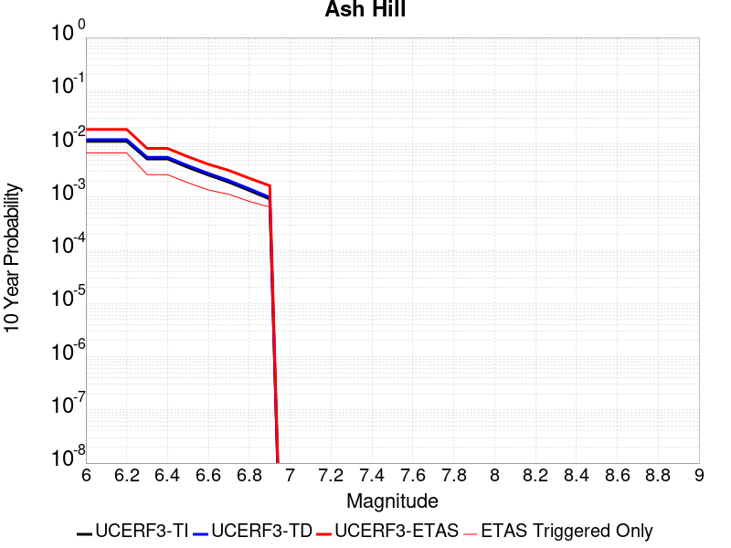 |

| Magnitude | 1 wk TI Prob | 1 wk TD Prob | 1 wk ETAS Prob | 1 wk ETAS/TD Gain | 1 wk ETAS Triggered Only | 1 mo TI Prob | 1 mo TD Prob | 1 mo ETAS Prob | 1 mo ETAS/TD Gain | 1 mo ETAS Triggered Only | 1 yr TI Prob | 1 yr TD Prob | 1 yr ETAS Prob | 1 yr ETAS/TD Gain | 1 yr ETAS Triggered Only | 10 yr TI Prob | 10 yr TD Prob | 10 yr ETAS Prob | 10 yr ETAS/TD Gain | 10 yr ETAS Triggered Only |
|-----|-----|-----|-----|-----|-----|-----|-----|-----|-----|-----|-----|-----|-----|-----|-----|-----|-----|-----|-----|-----|
| 6.0 | 2.1545662E-5 | 2.3194681E-5 | 6.5318006E-4 | 28.160769 | 6.3E-4 | 9.2335285E-5 | 9.9402445E-5 | 0.0016692464 | 16.79281 | 0.00157 | 0.0011236023 | 0.0012096328 | 0.005044988 | 4.170677 | 0.00384 | 0.011179381 | 0.01203847 | 0.01872697 | 1.5555938 | 0.00677 |
| 6.1 | 2.1545662E-5 | 2.3194681E-5 | 6.5318006E-4 | 28.160769 | 6.3E-4 | 9.2335285E-5 | 9.9402445E-5 | 0.0016692464 | 16.79281 | 0.00157 | 0.0011236023 | 0.0012096328 | 0.005044988 | 4.170677 | 0.00384 | 0.011179381 | 0.01203847 | 0.01872697 | 1.5555938 | 0.00677 |
| 6.2 | 2.1545662E-5 | 2.3194681E-5 | 6.5318006E-4 | 28.160769 | 6.3E-4 | 9.2335285E-5 | 9.9402445E-5 | 0.0016692464 | 16.79281 | 0.00157 | 0.0011236023 | 0.0012096328 | 0.005044988 | 4.170677 | 0.00384 | 0.011179381 | 0.01203847 | 0.01872697 | 1.5555938 | 0.00677 |
| 6.3 | 1.0025529E-5 | 1.0747037E-5 | 2.7074423E-4 | 25.192455 | 2.6E-4 | 4.2965847E-5 | 4.605799E-5 | 6.4603036E-4 | 14.026456 | 6.0E-4 | 5.229836E-4 | 5.60625E-4 | 0.002109756 | 3.7632215 | 0.00155 | 0.005217545 | 0.0055934195 | 0.008218653 | 1.4693432 | 0.00264 |
| 6.4 | 1.0025529E-5 | 1.0747037E-5 | 2.7074423E-4 | 25.192455 | 2.6E-4 | 4.2965847E-5 | 4.605799E-5 | 6.4603036E-4 | 14.026456 | 6.0E-4 | 5.229836E-4 | 5.60625E-4 | 0.002109756 | 3.7632215 | 0.00155 | 0.005217545 | 0.0055934195 | 0.008218653 | 1.4693432 | 0.00264 |
| 6.5 | 6.9617327E-6 | 7.456704E-6 | 2.2745506E-4 | 30.503431 | 2.2E-4 | 2.9835655E-5 | 3.1956963E-5 | 4.919423E-4 | 15.3939 | 4.6E-4 | 3.6318856E-4 | 3.8901521E-4 | 0.0014885874 | 3.8265529 | 0.0011 | 0.0036259557 | 0.0038841967 | 0.005736972 | 1.4770035 | 0.00186 |
| 6.6 | 4.9919777E-6 | 5.346739E-6 | 1.4534598E-4 | 27.184046 | 1.4E-4 | 2.1394015E-5 | 2.2914432E-5 | 3.3290734E-4 | 14.528283 | 3.1E-4 | 2.60441E-4 | 2.789542E-4 | 0.001028745 | 3.6878636 | 7.5E-4 | 0.0026013597 | 0.0027866988 | 0.004142909 | 1.4866726 | 0.00136 |
| 6.7 | 3.6630722E-6 | 3.9246606E-6 | 1.0392427E-4 | 26.479809 | 1.0E-4 | 1.5698786E-5 | 1.6819899E-5 | 2.5681587E-4 | 15.268574 | 2.4E-4 | 1.9111596E-4 | 2.0476876E-4 | 8.1464386E-4 | 3.97836 | 6.1E-4 | 0.0019095168 | 0.002046364 | 0.0031740514 | 1.5510689 | 0.00113 |
| 6.8 | 2.5599613E-6 | 2.7449514E-6 | 7.274476E-5 | 26.501291 | 7.0E-5 | 1.0971216E-5 | 1.1764052E-5 | 1.9176194E-4 | 16.30067 | 1.8E-4 | 1.3356637E-4 | 1.4322287E-4 | 5.931584E-4 | 4.141506 | 4.5E-4 | 0.0013348613 | 0.0014317906 | 0.0022606023 | 1.5788637 | 8.3E-4 |
| 6.9 | 1.7684905E-6 | 1.896889E-6 | 5.1896794E-5 | 27.358898 | 5.0E-5 | 7.579223E-6 | 8.129524E-6 | 1.4812838E-4 | 18.22104 | 1.4E-4 | 9.2273134E-5 | 9.8976954E-5 | 4.6894033E-4 | 4.737874 | 3.7E-4 | 9.223483E-4 | 9.897696E-4 | 0.0016391262 | 1.6560686 | 6.5E-4 |

## Hunter Mountain-Saline Valley
*[(top)](#table-of-contents)*

| 1 Week | 1 Month | 1 Year | 10 Year |
|-----|-----|-----|-----|
|  |  |  |  |

| Magnitude | 1 wk TI Prob | 1 wk TD Prob | 1 wk ETAS Prob | 1 wk ETAS/TD Gain | 1 wk ETAS Triggered Only | 1 mo TI Prob | 1 mo TD Prob | 1 mo ETAS Prob | 1 mo ETAS/TD Gain | 1 mo ETAS Triggered Only | 1 yr TI Prob | 1 yr TD Prob | 1 yr ETAS Prob | 1 yr ETAS/TD Gain | 1 yr ETAS Triggered Only | 10 yr TI Prob | 10 yr TD Prob | 10 yr ETAS Prob | 10 yr ETAS/TD Gain | 10 yr ETAS Triggered Only |
|-----|-----|-----|-----|-----|-----|-----|-----|-----|-----|-----|-----|-----|-----|-----|-----|-----|-----|-----|-----|-----|
| 6.0 | 4.5103672E-5 | 5.4570846E-5 | 6.045408E-4 | 11.078092 | 5.5E-4 | 1.9328714E-4 | 2.3385457E-4 | 0.0017534991 | 7.498246 | 0.00152 | 0.002350731 | 0.0028436389 | 0.0067824065 | 2.3851154 | 0.00395 | 0.023260195 | 0.02809229 | 0.034574915 | 1.2307616 | 0.00667 |
| 6.1 | 4.5103672E-5 | 5.4570846E-5 | 6.045408E-4 | 11.078092 | 5.5E-4 | 1.9328714E-4 | 2.3385457E-4 | 0.0017534991 | 7.498246 | 0.00152 | 0.002350731 | 0.0028436389 | 0.0067824065 | 2.3851154 | 0.00395 | 0.023260195 | 0.02809229 | 0.034574915 | 1.2307616 | 0.00667 |
| 6.2 | 3.9363465E-5 | 4.7064215E-5 | 5.970383E-4 | 12.685612 | 5.5E-4 | 1.6868966E-4 | 2.0168893E-4 | 0.0017213824 | 8.534839 | 0.00152 | 0.002051862 | 0.0024529307 | 0.0063533396 | 2.5901015 | 0.00391 | 0.020330196 | 0.024273701 | 0.030742766 | 1.2665051 | 0.00663 |
| 6.3 | 3.9363465E-5 | 4.7064215E-5 | 5.970383E-4 | 12.685612 | 5.5E-4 | 1.6868966E-4 | 2.0168893E-4 | 0.0017213824 | 8.534839 | 0.00152 | 0.002051862 | 0.0024529307 | 0.0063533396 | 2.5901015 | 0.00391 | 0.020330196 | 0.024273701 | 0.030742766 | 1.2665051 | 0.00663 |
| 6.4 | 3.2311684E-5 | 3.7952268E-5 | 5.7793176E-4 | 15.2278595 | 5.4E-4 | 1.384713E-4 | 1.6264283E-4 | 0.0016723973 | 10.282638 | 0.00151 | 0.0016845843 | 0.0019784467 | 0.00584079 | 2.95221 | 0.00387 | 0.016718714 | 0.019616457 | 0.026037969 | 1.3273534 | 0.00655 |
| 6.5 | 3.2311684E-5 | 3.7952268E-5 | 5.7793176E-4 | 15.2278595 | 5.4E-4 | 1.384713E-4 | 1.6264283E-4 | 0.0016723973 | 10.282638 | 0.00151 | 0.0016845843 | 0.0019784467 | 0.00584079 | 2.95221 | 0.00387 | 0.016718714 | 0.019616457 | 0.026037969 | 1.3273534 | 0.00655 |
| 6.6 | 2.9305844E-5 | 3.4182984E-5 | 5.741645E-4 | 16.796793 | 5.4E-4 | 1.2559042E-4 | 1.4649061E-4 | 0.0016462709 | 11.238064 | 0.0015 | 0.0015279909 | 0.0017821258 | 0.0056252647 | 3.1564913 | 0.00385 | 0.015175272 | 0.017685596 | 0.024080463 | 1.3615862 | 0.00651 |
| 6.7 | 2.7826512E-5 | 3.2345313E-5 | 5.723279E-4 | 17.694304 | 5.4E-4 | 1.19251024E-4 | 1.3861575E-4 | 0.0016184106 | 11.675517 | 0.00148 | 0.0014509142 | 0.0016864006 | 0.005509942 | 3.2672791 | 0.00383 | 0.014414776 | 0.01674306 | 0.023124397 | 1.3811333 | 0.00649 |
| 6.8 | 2.3389874E-5 | 2.6867581E-5 | 5.668531E-4 | 21.09803 | 5.4E-4 | 1.0023846E-4 | 1.15141964E-4 | 0.0015949715 | 13.852218 | 0.00148 | 0.00121972 | 0.0014009993 | 0.0051956754 | 3.7085497 | 0.0038 | 0.01213047 | 0.0139272185 | 0.020277526 | 1.4559639 | 0.00644 |
| 6.9 | 2.069209E-5 | 2.3570803E-5 | 5.635581E-4 | 23.909159 | 5.4E-4 | 8.867737E-5 | 1.0101402E-4 | 0.0015808645 | 15.649952 | 0.00148 | 0.0010791123 | 0.0012291879 | 0.0050045415 | 4.071421 | 0.00378 | 0.010738871 | 0.012228257 | 0.018559873 | 1.5177857 | 0.00641 |
| 7.0 | 1.7462342E-5 | 1.9634203E-5 | 5.496238E-4 | 27.993181 | 5.3E-4 | 7.483646E-5 | 8.4144E-5 | 0.0015440212 | 18.349749 | 0.00146 | 9.1075303E-4 | 0.0010239943 | 0.004770154 | 4.6583796 | 0.00375 | 0.009070295 | 0.0101957265 | 0.016500778 | 1.6184015 | 0.00637 |
| 7.1 | 1.4807709E-5 | 1.644232E-5 | 5.464336E-4 | 33.233364 | 5.3E-4 | 6.3460066E-5 | 7.046528E-5 | 0.0015303624 | 21.717964 | 0.00146 | 7.723524E-4 | 8.5759355E-4 | 0.004584395 | 5.3456497 | 0.00373 | 0.007696735 | 0.00854516 | 0.014791326 | 1.7309594 | 0.0063 |
| 7.2 | 1.4180048E-5 | 1.5698888E-5 | 5.456906E-4 | 34.759823 | 5.3E-4 | 6.077022E-5 | 6.727931E-5 | 0.0015271811 | 22.69912 | 0.00146 | 7.396263E-4 | 8.1883394E-4 | 0.00454578 | 5.551528 | 0.00373 | 0.0073716943 | 0.008160452 | 0.014409042 | 1.7657161 | 0.0063 |
| 7.3 | 1.3730402E-5 | 1.5172614E-5 | 5.4516457E-4 | 35.93083 | 5.3E-4 | 5.8843252E-5 | 6.502396E-5 | 0.0015249291 | 23.451801 | 0.00146 | 7.161811E-4 | 7.9139526E-4 | 0.0045184433 | 5.709465 | 0.00373 | 0.007138774 | 0.007888035 | 0.01413834 | 1.7923781 | 0.0063 |
| 7.4 | 1.2810095E-5 | 1.4109794E-5 | 5.4410234E-4 | 38.56203 | 5.3E-4 | 5.489925E-5 | 6.0469236E-5 | 0.0015003822 | 24.812323 | 0.00144 | 6.681934E-4 | 7.359801E-4 | 0.004403279 | 5.9828777 | 0.00367 | 0.006661878 | 0.007337654 | 0.0134822335 | 1.8374039 | 0.00619 |
| 7.5 | 1.1595659E-5 | 1.2801082E-5 | 5.3279445E-4 | 41.621048 | 5.2E-4 | 4.9694736E-5 | 5.4860713E-5 | 0.0014847823 | 27.06458 | 0.00143 | 6.0486543E-4 | 6.677402E-4 | 0.0042653363 | 6.3877187 | 0.0036 | 0.006032217 | 0.006659527 | 0.012659303 | 1.9009314 | 0.00604 |
| 7.6 | 2.997694E-6 | 3.3253514E-6 | 2.333246E-4 | 70.16539 | 2.3E-4 | 1.28471975E-5 | 1.4251469E-5 | 7.042416E-4 | 49.41537 | 6.9E-4 | 1.564034E-4 | 1.735051E-4 | 0.0017832258 | 10.277656 | 0.00161 | 0.0015629337 | 0.0017345662 | 0.0045297095 | 2.6114364 | 0.0028 |

## Garlock (West)
*[(top)](#table-of-contents)*

| 1 Week | 1 Month | 1 Year | 10 Year |
|-----|-----|-----|-----|
|  |  |  | 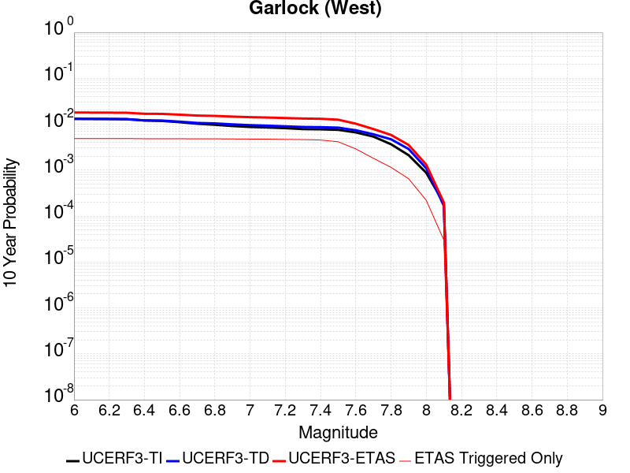 |

| Magnitude | 1 wk TI Prob | 1 wk TD Prob | 1 wk ETAS Prob | 1 wk ETAS/TD Gain | 1 wk ETAS Triggered Only | 1 mo TI Prob | 1 mo TD Prob | 1 mo ETAS Prob | 1 mo ETAS/TD Gain | 1 mo ETAS Triggered Only | 1 yr TI Prob | 1 yr TD Prob | 1 yr ETAS Prob | 1 yr ETAS/TD Gain | 1 yr ETAS Triggered Only | 10 yr TI Prob | 10 yr TD Prob | 10 yr ETAS Prob | 10 yr ETAS/TD Gain | 10 yr ETAS Triggered Only |
|-----|-----|-----|-----|-----|-----|-----|-----|-----|-----|-----|-----|-----|-----|-----|-----|-----|-----|-----|-----|-----|
| 6.0 | 2.5181727E-5 | 2.5201914E-5 | 4.3519158E-4 | 17.268196 | 4.1E-4 | 1.0791722E-4 | 1.08003755E-4 | 0.0010179054 | 9.424724 | 9.1E-4 | 0.0013131002 | 0.0013141559 | 0.004080516 | 3.1050467 | 0.00277 | 0.013053683 | 0.01314424 | 0.017960096 | 1.3663853 | 0.00488 |
| 6.1 | 2.5077732E-5 | 2.5102956E-5 | 4.3509266E-4 | 17.332329 | 4.1E-4 | 1.0747157E-4 | 1.07579675E-4 | 0.0010174818 | 9.457936 | 9.1E-4 | 0.001307681 | 0.001308999 | 0.004075373 | 3.1133506 | 0.00277 | 0.013000126 | 0.013093281 | 0.017909385 | 1.3678303 | 0.00488 |
| 6.2 | 2.494612E-5 | 2.4984645E-5 | 4.349744E-4 | 17.40967 | 4.1E-4 | 1.0690756E-4 | 1.0707267E-4 | 0.0010169753 | 9.497991 | 9.1E-4 | 0.0013008224 | 0.0013028337 | 0.004069225 | 3.123365 | 0.00277 | 0.012932341 | 0.013032351 | 0.017848752 | 1.3695728 | 0.00488 |
| 6.3 | 2.4733758E-5 | 2.4804003E-5 | 4.3479382E-4 | 17.529179 | 4.1E-4 | 1.0599751E-4 | 1.0629856E-4 | 0.0010162018 | 9.559883 | 9.1E-4 | 0.0012897556 | 0.0012934201 | 0.004059837 | 3.138839 | 0.00277 | 0.012822957 | 0.012939315 | 0.017756172 | 1.3722651 | 0.00488 |
| 6.4 | 2.3237335E-5 | 2.3183304E-5 | 4.331738E-4 | 18.684732 | 4.1E-4 | 9.958477E-5 | 9.9353245E-5 | 0.0010092629 | 10.158328 | 9.1E-4 | 0.0012117702 | 0.0012089573 | 0.0039656204 | 3.280199 | 0.00276 | 0.012051838 | 0.01210416 | 0.016875697 | 1.3942064 | 0.00483 |
| 6.5 | 2.2732203E-5 | 2.299767E-5 | 4.3298825E-4 | 18.827484 | 4.1E-4 | 9.742009E-5 | 9.8557735E-5 | 0.0010084681 | 10.232257 | 9.1E-4 | 0.0011854442 | 0.0011992827 | 0.003955973 | 3.2986157 | 0.00276 | 0.011791403 | 0.012008464 | 0.016780462 | 1.3973863 | 0.00483 |
| 6.6 | 2.1319436E-5 | 2.1777872E-5 | 4.3176895E-4 | 19.82604 | 4.1E-4 | 9.136581E-5 | 9.333041E-5 | 9.932464E-4 | 10.64226 | 9.0E-4 | 0.001111811 | 0.0011357077 | 0.0038825846 | 3.4186475 | 0.00275 | 0.011062649 | 0.01137937 | 0.016144522 | 1.4187536 | 0.00482 |
| 6.7 | 1.970802E-5 | 2.039774E-5 | 4.3038937E-4 | 21.099855 | 4.1E-4 | 8.446021E-5 | 8.741597E-5 | 9.873373E-4 | 11.294702 | 9.0E-4 | 0.001027818 | 0.0010637715 | 0.003810846 | 3.5823917 | 0.00275 | 0.010230771 | 0.010667094 | 0.015415892 | 1.445182 | 0.0048 |
| 6.8 | 1.8744462E-5 | 1.9905396E-5 | 4.2989725E-4 | 21.59702 | 4.1E-4 | 8.033094E-5 | 8.530606E-5 | 9.852293E-4 | 11.549347 | 9.0E-4 | 9.775903E-4 | 0.0010381081 | 0.0037852533 | 3.6462996 | 0.00275 | 0.009733009 | 0.010412897 | 0.015162915 | 1.4561669 | 0.0048 |
| 6.9 | 1.7559682E-5 | 1.8957733E-5 | 4.2894995E-4 | 22.626648 | 4.1E-4 | 7.5253614E-5 | 8.124491E-5 | 9.611734E-4 | 11.830568 | 8.8E-4 | 9.158276E-4 | 9.887093E-4 | 0.0037160101 | 3.7584457 | 0.00273 | 0.0091206245 | 0.009923427 | 0.014646092 | 1.4759107 | 0.00477 |
| 7.0 | 1.6794445E-5 | 1.8220519E-5 | 4.1821323E-4 | 22.952873 | 4.0E-4 | 7.197421E-5 | 7.8085606E-5 | 9.480177E-4 | 12.140748 | 8.7E-4 | 8.759337E-4 | 9.5027895E-4 | 0.0036577038 | 3.8490841 | 0.00271 | 0.008724891 | 0.009542331 | 0.0142371 | 1.491994 | 0.00474 |
| 7.1 | 1.6337795E-5 | 1.7721295E-5 | 4.177142E-4 | 23.571314 | 4.0E-4 | 7.0017246E-5 | 7.5946205E-5 | 9.4588014E-4 | 12.454607 | 8.7E-4 | 8.521265E-4 | 9.242542E-4 | 0.0036317494 | 3.929384 | 0.00271 | 0.008488664 | 0.0092840865 | 0.013970173 | 1.5047439 | 0.00473 |
| 7.2 | 1.5780008E-5 | 1.716991E-5 | 4.1716304E-4 | 24.29617 | 4.0E-4 | 6.762685E-5 | 7.358326E-5 | 9.4351923E-4 | 12.822472 | 8.7E-4 | 8.2304585E-4 | 8.9550926E-4 | 0.0035731094 | 3.9900305 | 0.00268 | 0.008200042 | 0.008998912 | 0.0136268865 | 1.5142816 | 0.00467 |
| 7.3 | 1.5058865E-5 | 1.6622957E-5 | 4.166163E-4 | 25.062708 | 4.0E-4 | 6.45364E-5 | 7.12393E-5 | 9.3117804E-4 | 13.071128 | 8.6E-4 | 7.854473E-4 | 8.669946E-4 | 0.003514697 | 4.053886 | 0.00265 | 0.00782677 | 0.00871559 | 0.0132953245 | 1.5254645 | 0.00462 |
| 7.4 | 1.4887923E-5 | 1.6458913E-5 | 4.1645233E-4 | 25.302542 | 4.0E-4 | 6.380382E-5 | 7.05363E-5 | 9.104771E-4 | 12.907922 | 8.4E-4 | 7.7653467E-4 | 8.584423E-4 | 0.0034761932 | 4.04942 | 0.00262 | 0.0077382675 | 0.008630417 | 0.013121322 | 1.5203577 | 0.00453 |
| 7.5 | 1.4509299E-5 | 1.6050892E-5 | 4.1604447E-4 | 25.920334 | 4.0E-4 | 6.218123E-5 | 6.8787725E-5 | 8.9873065E-4 | 13.065276 | 8.3E-4 | 7.567935E-4 | 8.3716994E-4 | 0.0032451523 | 3.8763363 | 0.00241 | 0.0075422134 | 0.008418757 | 0.012533818 | 1.488797 | 0.00415 |
| 7.6 | 1.2756717E-5 | 1.40547745E-5 | 2.9405084E-4 | 20.921776 | 2.8E-4 | 5.4670498E-5 | 6.023336E-5 | 6.5019785E-4 | 10.794646 | 5.9E-4 | 6.6541E-4 | 7.3309505E-4 | 0.0023818854 | 3.2490814 | 0.00165 | 0.006634211 | 0.00738374 | 0.010262327 | 1.3898549 | 0.0029 |
| 7.7 | 1.0328985E-5 | 1.1464304E-5 | 1.4146282E-4 | 12.339416 | 1.3E-4 | 4.4266326E-5 | 4.913181E-5 | 3.9911462E-4 | 8.123344 | 3.5E-4 | 5.388092E-4 | 5.98016E-4 | 0.001587424 | 2.654484 | 9.9E-4 | 0.0053750467 | 0.0060406122 | 0.007839679 | 1.2978286 | 0.00181 |
| 7.8 | 7.0306583E-6 | 8.902713E-6 | 4.8902355E-5 | 5.4929724 | 4.0E-5 | 3.0131043E-5 | 3.815393E-5 | 2.381463E-4 | 6.2417245 | 2.0E-4 | 3.667837E-4 | 4.6442522E-4 | 0.0010641465 | 2.2913196 | 6.0E-4 | 0.003661789 | 0.004697 | 0.0058415984 | 1.2436872 | 0.00115 |
| 7.9 | 4.060633E-6 | 5.467275E-6 | 3.546711E-5 | 6.4871645 | 3.0E-5 | 1.7402595E-5 | 2.3430968E-5 | 1.6342769E-4 | 6.9748588 | 1.4E-4 | 2.11856E-4 | 2.852348E-4 | 6.651264E-4 | 2.3318558 | 3.8E-4 | 0.0021165414 | 0.0028852404 | 0.003533365 | 1.2246345 | 6.5E-4 |
| 8.0 | 1.6729537E-6 | 2.0781215E-6 | 1.2078101E-5 | 5.8120284 | 1.0E-5 | 7.169782E-6 | 8.906205E-6 | 5.890576E-5 | 6.6140137 | 5.0E-5 | 8.7288594E-5 | 1.0842768E-4 | 2.1841575E-4 | 2.0143912 | 1.1E-4 | 8.7254314E-4 | 0.0010973068 | 0.0013170654 | 1.2002709 | 2.2E-4 |
| 8.1 | 3.6733252E-7 | 3.1497066E-7 | 3.1497066E-7 | 1.0 | 0.0 | 1.5742813E-6 | 1.3498736E-6 | 1.3498736E-6 | 1.0 | 0.0 | 1.9166706E-5 | 1.6434604E-5 | 2.643444E-5 | 1.6084622 | 1.0E-5 | 1.9165053E-4 | 1.6648426E-4 | 1.9647926E-4 | 1.1801672 | 3.0E-5 |

## Gravel Hills-Harper Lk
*[(top)](#table-of-contents)*

| 1 Week | 1 Month | 1 Year | 10 Year |
|-----|-----|-----|-----|
|  |  | 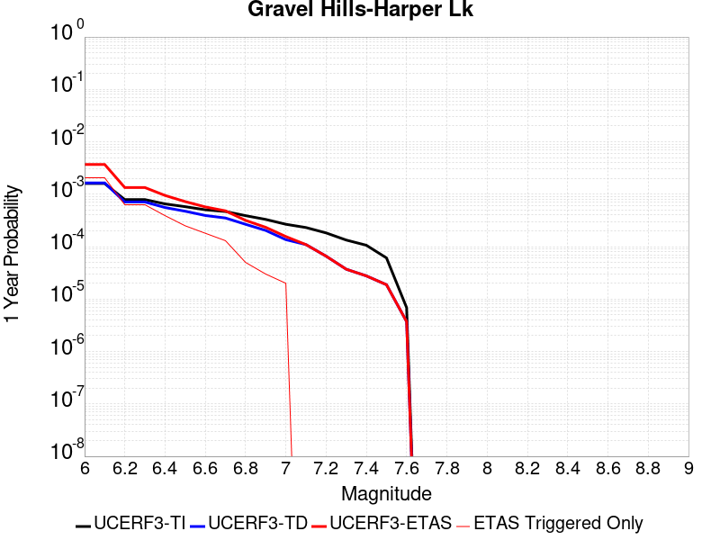 |  |

| Magnitude | 1 wk TI Prob | 1 wk TD Prob | 1 wk ETAS Prob | 1 wk ETAS/TD Gain | 1 wk ETAS Triggered Only | 1 mo TI Prob | 1 mo TD Prob | 1 mo ETAS Prob | 1 mo ETAS/TD Gain | 1 mo ETAS Triggered Only | 1 yr TI Prob | 1 yr TD Prob | 1 yr ETAS Prob | 1 yr ETAS/TD Gain | 1 yr ETAS Triggered Only | 10 yr TI Prob | 10 yr TD Prob | 10 yr ETAS Prob | 10 yr ETAS/TD Gain | 10 yr ETAS Triggered Only |
|-----|-----|-----|-----|-----|-----|-----|-----|-----|-----|-----|-----|-----|-----|-----|-----|-----|-----|-----|-----|-----|
| 6.0 | 3.0679566E-5 | 3.146516E-5 | 2.814573E-4 | 8.945046 | 2.5E-4 | 1.3147724E-4 | 1.3484493E-4 | 8.647465E-4 | 6.4128957 | 7.3E-4 | 0.0015995599 | 0.0016407177 | 0.0036973378 | 2.253488 | 0.00206 | 0.015880952 | 0.016307613 | 0.02008499 | 1.2316328 | 0.00384 |
| 6.1 | 3.0679566E-5 | 3.146516E-5 | 2.814573E-4 | 8.945046 | 2.5E-4 | 1.3147724E-4 | 1.3484493E-4 | 8.647465E-4 | 6.4128957 | 7.3E-4 | 0.0015995599 | 0.0016407177 | 0.0036973378 | 2.253488 | 0.00206 | 0.015880952 | 0.016307613 | 0.02008499 | 1.2316328 | 0.00384 |
| 6.2 | 1.514536E-5 | 1.363538E-5 | 8.3634426E-5 | 6.1336336 | 7.0E-5 | 6.490707E-5 | 5.84361E-5 | 3.084215E-4 | 5.2779274 | 2.5E-4 | 7.8995706E-4 | 7.112392E-4 | 0.0013407911 | 1.885148 | 6.3E-4 | 0.007871548 | 0.0070908302 | 0.008212818 | 1.1582308 | 0.00113 |
| 6.3 | 1.514536E-5 | 1.363538E-5 | 8.3634426E-5 | 6.1336336 | 7.0E-5 | 6.490707E-5 | 5.84361E-5 | 3.084215E-4 | 5.2779274 | 2.5E-4 | 7.8995706E-4 | 7.112392E-4 | 0.0013407911 | 1.885148 | 6.3E-4 | 0.007871548 | 0.0070908302 | 0.008212818 | 1.1582308 | 0.00113 |
| 6.4 | 1.2532521E-5 | 1.0689813E-5 | 6.068928E-5 | 5.6773 | 5.0E-5 | 5.37097E-5 | 4.5812714E-5 | 1.858063E-4 | 4.0557804 | 1.4E-4 | 6.537194E-4 | 5.576329E-4 | 9.474154E-4 | 1.6989949 | 3.9E-4 | 0.0065179965 | 0.0055629266 | 0.0062590325 | 1.125133 | 7.0E-4 |
| 6.5 | 1.1094058E-5 | 9.083761E-6 | 3.908349E-5 | 4.302567 | 3.0E-5 | 4.7545094E-5 | 3.8929848E-5 | 1.2892635E-4 | 3.311761 | 9.0E-5 | 5.787078E-4 | 4.7387183E-4 | 7.2375336E-4 | 1.5273188 | 2.5E-4 | 0.0057720304 | 0.0047290213 | 0.0051669404 | 1.0926025 | 4.4E-4 |
| 6.6 | 9.688328E-6 | 7.531771E-6 | 2.7531622E-5 | 3.655398 | 2.0E-5 | 4.1520743E-5 | 3.2278636E-5 | 8.227702E-5 | 2.548962 | 5.0E-5 | 5.053978E-4 | 3.9292406E-4 | 5.728533E-4 | 1.4579238 | 1.8E-4 | 0.0050424994 | 0.00392255 | 0.0042213732 | 1.0761808 | 3.0E-4 |
| 6.7 | 8.974824E-6 | 6.7494793E-6 | 6.7494793E-6 | 1.0 | 0.0 | 3.8462964E-5 | 2.8926032E-5 | 5.892516E-5 | 2.0370982 | 3.0E-5 | 4.6818596E-4 | 3.521197E-4 | 4.8207396E-4 | 1.3690627 | 1.3E-4 | 0.004672008 | 0.0035158389 | 0.0037251005 | 1.0595196 | 2.1E-4 |
| 6.8 | 7.4780046E-6 | 5.1162397E-6 | 5.1162397E-6 | 1.0 | 0.0 | 3.20482E-5 | 2.1926564E-5 | 4.1926127E-5 | 1.9121156 | 2.0E-5 | 3.9011694E-4 | 2.6692462E-4 | 3.1691126E-4 | 1.1872689 | 5.0E-5 | 0.0038943281 | 0.0026661782 | 0.0027559383 | 1.0336661 | 9.0E-5 |
| 6.9 | 6.3409307E-6 | 3.9075294E-6 | 3.9075294E-6 | 1.0 | 0.0 | 2.7175134E-5 | 1.6746453E-5 | 3.6746118E-5 | 2.1942627 | 2.0E-5 | 3.3080703E-4 | 2.0386997E-4 | 2.3386386E-4 | 1.1471226 | 3.0E-5 | 0.0033031502 | 0.0020369277 | 0.0020968055 | 1.0293962 | 6.0E-5 |
| 7.0 | 5.1239335E-6 | 2.605876E-6 | 2.605876E-6 | 1.0 | 0.0 | 2.195953E-5 | 1.1167994E-5 | 2.1167882E-5 | 1.895406 | 1.0E-5 | 2.6732447E-4 | 1.359621E-4 | 1.5595937E-4 | 1.1470798 | 2.0E-5 | 0.0026700313 | 0.0013588143 | 0.0014087463 | 1.0367467 | 5.0E-5 |
| 7.1 | 4.438899E-6 | 2.0984924E-6 | 2.0984924E-6 | 1.0 | 0.0 | 1.9023713E-5 | 8.993509E-6 | 8.993509E-6 | 1.0 | 0.0 | 2.315891E-4 | 1.0949069E-4 | 1.0949069E-4 | 1.0 | 0.0 | 0.002313479 | 0.0010943894 | 0.0011143675 | 1.018255 | 2.0E-5 |
| 7.2 | 3.50367E-6 | 1.2615886E-6 | 1.2615886E-6 | 1.0 | 0.0 | 1.5015643E-5 | 5.4067978E-6 | 5.4067978E-6 | 1.0 | 0.0 | 1.8280011E-4 | 6.582586E-5 | 6.582586E-5 | 1.0 | 0.0 | 0.0018264982 | 6.5807183E-4 | 6.7805866E-4 | 1.0303718 | 2.0E-5 |
| 7.3 | 2.561638E-6 | 7.1188435E-7 | 7.1188435E-7 | 1.0 | 0.0 | 1.0978401E-5 | 3.0509295E-6 | 3.0509295E-6 | 1.0 | 0.0 | 1.3365384E-4 | 3.7144455E-5 | 3.7144455E-5 | 1.0 | 0.0 | 0.0013357349 | 3.7138443E-4 | 3.8138073E-4 | 1.0269163 | 1.0E-5 |
| 7.4 | 2.0368864E-6 | 5.3046045E-7 | 5.3046045E-7 | 1.0 | 0.0 | 8.729483E-6 | 2.2734E-6 | 2.2734E-6 | 1.0 | 0.0 | 1.06276275E-4 | 2.7678298E-5 | 2.7678298E-5 | 1.0 | 0.0 | 0.0010622547 | 2.7674905E-4 | 2.7674905E-4 | 1.0 | 0.0 |
| 7.5 | 1.1681728E-6 | 3.6029326E-7 | 3.6029326E-7 | 1.0 | 0.0 | 5.0064455E-6 | 1.544113E-6 | 1.544113E-6 | 1.0 | 0.0 | 6.0951766E-5 | 1.879942E-5 | 1.879942E-5 | 1.0 | 0.0 | 6.093505E-4 | 1.8797876E-4 | 1.8797876E-4 | 1.0 | 0.0 |
| 7.6 | 1.3154387E-7 | 7.119745E-8 | 7.119745E-8 | 1.0 | 0.0 | 5.6375933E-7 | 3.051319E-7 | 3.051319E-7 | 1.0 | 0.0 | 6.863748E-6 | 3.7149762E-6 | 3.7149762E-6 | 1.0 | 0.0 | 6.863536E-5 | 3.7149297E-5 | 3.7149297E-5 | 1.0 | 0.0 |

## McLean Lake
*[(top)](#table-of-contents)*

| 1 Week | 1 Month | 1 Year | 10 Year |
|-----|-----|-----|-----|
|  |  |  |  |

| Magnitude | 1 wk TI Prob | 1 wk TD Prob | 1 wk ETAS Prob | 1 wk ETAS/TD Gain | 1 wk ETAS Triggered Only | 1 mo TI Prob | 1 mo TD Prob | 1 mo ETAS Prob | 1 mo ETAS/TD Gain | 1 mo ETAS Triggered Only | 1 yr TI Prob | 1 yr TD Prob | 1 yr ETAS Prob | 1 yr ETAS/TD Gain | 1 yr ETAS Triggered Only | 10 yr TI Prob | 10 yr TD Prob | 10 yr ETAS Prob | 10 yr ETAS/TD Gain | 10 yr ETAS Triggered Only |
|-----|-----|-----|-----|-----|-----|-----|-----|-----|-----|-----|-----|-----|-----|-----|-----|-----|-----|-----|-----|-----|
| 6.0 | 1.7360222E-5 | 1.8501789E-5 | 1.584992E-4 | 8.566696 | 1.4E-4 | 7.439883E-5 | 7.929125E-5 | 4.2926348E-4 | 5.4137564 | 3.5E-4 | 9.0542925E-4 | 9.64992E-4 | 0.002653361 | 2.74962 | 0.00169 | 0.009017491 | 0.009612858 | 0.013287194 | 1.3822314 | 0.00371 |
| 6.1 | 9.062689E-6 | 9.592268E-6 | 7.95916E-5 | 8.297474 | 7.0E-5 | 3.8839516E-5 | 4.110912E-5 | 2.511005E-4 | 6.108145 | 2.1E-4 | 4.727685E-4 | 5.003975E-4 | 0.0013699621 | 2.737748 | 8.7E-4 | 0.0047176396 | 0.0049935905 | 0.006963703 | 1.3945283 | 0.00198 |
| 6.2 | 9.062689E-6 | 9.592268E-6 | 7.95916E-5 | 8.297474 | 7.0E-5 | 3.8839516E-5 | 4.110912E-5 | 2.511005E-4 | 6.108145 | 2.1E-4 | 4.727685E-4 | 5.003975E-4 | 0.0013699621 | 2.737748 | 8.7E-4 | 0.0047176396 | 0.0049935905 | 0.006963703 | 1.3945283 | 0.00198 |
| 6.3 | 7.2575485E-6 | 7.667767E-6 | 4.766746E-5 | 6.216603 | 4.0E-5 | 3.110341E-5 | 3.2861484E-5 | 1.8285656E-4 | 5.564464 | 1.5E-4 | 3.786182E-4 | 4.0002225E-4 | 0.0010997423 | 2.7492027 | 7.0E-4 | 0.0037797375 | 0.003993727 | 0.0055474965 | 1.3890526 | 0.00156 |
| 6.4 | 7.2575485E-6 | 7.667767E-6 | 4.766746E-5 | 6.216603 | 4.0E-5 | 3.110341E-5 | 3.2861484E-5 | 1.8285656E-4 | 5.564464 | 1.5E-4 | 3.786182E-4 | 4.0002225E-4 | 0.0010997423 | 2.7492027 | 7.0E-4 | 0.0037797375 | 0.003993727 | 0.0055474965 | 1.3890526 | 0.00156 |
| 6.5 | 6.06582E-6 | 6.4039245E-6 | 4.6403668E-5 | 7.24613 | 4.0E-5 | 2.5996113E-5 | 2.7445138E-5 | 1.7744102E-4 | 6.4652987 | 1.5E-4 | 3.164567E-4 | 3.340998E-4 | 9.039094E-4 | 2.705507 | 5.7E-4 | 0.0031600643 | 0.0033366138 | 0.00459241 | 1.3763684 | 0.00126 |
| 6.6 | 5.598744E-6 | 5.910306E-6 | 3.591013E-5 | 6.0758495 | 3.0E-5 | 2.3994397E-5 | 2.5329673E-5 | 1.5532639E-4 | 6.1321907 | 1.3E-4 | 2.9209262E-4 | 3.083515E-4 | 8.281912E-4 | 2.685867 | 5.2E-4 | 0.0029170897 | 0.0030798658 | 0.0042562317 | 1.3819536 | 0.00118 |
| 6.7 | 5.246996E-6 | 5.539203E-6 | 3.5539037E-5 | 6.4159117 | 3.0E-5 | 2.2486933E-5 | 2.3739261E-5 | 1.5373618E-4 | 6.4760303 | 1.3E-4 | 2.73744E-4 | 2.8899353E-4 | 7.9884613E-4 | 2.7642355 | 5.1E-4 | 0.0027340704 | 0.002886801 | 0.0040035676 | 1.3868527 | 0.00112 |
| 6.8 | 4.02324E-6 | 4.246936E-6 | 3.424681E-5 | 8.063887 | 3.0E-5 | 1.7242342E-5 | 1.820106E-5 | 1.1819924E-4 | 6.4940853 | 1.0E-4 | 2.099053E-4 | 2.2158133E-4 | 6.214927E-4 | 2.8048062 | 4.0E-4 | 0.0020970714 | 0.0022141882 | 0.003082262 | 1.3920505 | 8.7E-4 |
| 6.9 | 6.835972E-7 | 7.1399705E-7 | 7.1399705E-7 | 1.0 | 0.0 | 2.9296991E-6 | 3.0599856E-6 | 1.3059955E-5 | 4.267979 | 1.0E-5 | 3.56685E-5 | 3.7255006E-5 | 5.725426E-5 | 1.5368207 | 2.0E-5 | 3.5662777E-4 | 3.7251884E-4 | 5.024704E-4 | 1.3488456 | 1.3E-4 |

## Goldstone Lake
*[(top)](#table-of-contents)*

| 1 Week | 1 Month | 1 Year | 10 Year |
|-----|-----|-----|-----|
|  |  |  |  |

| Magnitude | 1 wk TI Prob | 1 wk TD Prob | 1 wk ETAS Prob | 1 wk ETAS/TD Gain | 1 wk ETAS Triggered Only | 1 mo TI Prob | 1 mo TD Prob | 1 mo ETAS Prob | 1 mo ETAS/TD Gain | 1 mo ETAS Triggered Only | 1 yr TI Prob | 1 yr TD Prob | 1 yr ETAS Prob | 1 yr ETAS/TD Gain | 1 yr ETAS Triggered Only | 10 yr TI Prob | 10 yr TD Prob | 10 yr ETAS Prob | 10 yr ETAS/TD Gain | 10 yr ETAS Triggered Only |
|-----|-----|-----|-----|-----|-----|-----|-----|-----|-----|-----|-----|-----|-----|-----|-----|-----|-----|-----|-----|-----|
| 6.0 | 2.671352E-5 | 3.0376643E-5 | 1.50373E-4 | 4.9502835 | 1.2E-4 | 1.1448149E-4 | 1.3018023E-4 | 5.7012297E-4 | 4.37949 | 4.4E-4 | 0.001392921 | 0.0015839882 | 0.0031515013 | 1.989599 | 0.00157 | 0.013842222 | 0.01574648 | 0.018945303 | 1.2031454 | 0.00325 |
| 6.1 | 2.671352E-5 | 3.0376643E-5 | 1.50373E-4 | 4.9502835 | 1.2E-4 | 1.1448149E-4 | 1.3018023E-4 | 5.7012297E-4 | 4.37949 | 4.4E-4 | 0.001392921 | 0.0015839882 | 0.0031515013 | 1.989599 | 0.00157 | 0.013842222 | 0.01574648 | 0.018945303 | 1.2031454 | 0.00325 |
| 6.2 | 1.4197047E-5 | 1.6096526E-5 | 5.6095883E-5 | 3.4849682 | 4.0E-5 | 6.0843064E-5 | 6.898385E-5 | 3.0896728E-4 | 4.4788356 | 2.4E-4 | 7.4051257E-4 | 8.396533E-4 | 0.0016589648 | 1.9757736 | 8.2E-4 | 0.007380498 | 0.008374506 | 0.010090018 | 1.2048494 | 0.00173 |
| 6.3 | 1.4197047E-5 | 1.6096526E-5 | 5.6095883E-5 | 3.4849682 | 4.0E-5 | 6.0843064E-5 | 6.898385E-5 | 3.0896728E-4 | 4.4788356 | 2.4E-4 | 7.4051257E-4 | 8.396533E-4 | 0.0016589648 | 1.9757736 | 8.2E-4 | 0.007380498 | 0.008374506 | 0.010090018 | 1.2048494 | 0.00173 |
| 6.4 | 1.3238931E-5 | 1.5008722E-5 | 4.5008273E-5 | 2.9988077 | 3.0E-5 | 5.6737044E-5 | 6.432206E-5 | 2.843079E-4 | 4.4200683 | 2.2E-4 | 6.9055456E-4 | 7.8293774E-4 | 0.001562327 | 1.9954678 | 7.8E-4 | 0.006884126 | 0.0078114197 | 0.009438609 | 1.208309 | 0.00164 |
| 6.5 | 1.3238931E-5 | 1.5008722E-5 | 4.5008273E-5 | 2.9988077 | 3.0E-5 | 5.6737044E-5 | 6.432206E-5 | 2.843079E-4 | 4.4200683 | 2.2E-4 | 6.9055456E-4 | 7.8293774E-4 | 0.001562327 | 1.9954678 | 7.8E-4 | 0.006884126 | 0.0078114197 | 0.009438609 | 1.208309 | 0.00164 |
| 6.6 | 1.1328278E-5 | 1.2855392E-5 | 3.2855136E-5 | 2.5557475 | 2.0E-5 | 4.8548856E-5 | 5.509391E-5 | 2.35084E-4 | 4.2669687 | 1.8E-4 | 5.90922E-4 | 6.706576E-4 | 0.0013002352 | 1.9387465 | 6.3E-4 | 0.0058935313 | 0.006695726 | 0.008096285 | 1.2091721 | 0.00141 |
| 6.7 | 8.651175E-6 | 9.824737E-6 | 2.9824541E-5 | 3.035658 | 2.0E-5 | 3.707594E-5 | 4.210585E-5 | 1.9209953E-4 | 4.5623 | 1.5E-4 | 4.5130608E-4 | 5.126087E-4 | 0.0010123524 | 1.974903 | 5.0E-4 | 0.0045039062 | 0.005123141 | 0.006257301 | 1.2213798 | 0.00114 |
| 6.8 | 1.0215377E-6 | 1.1754901E-6 | 1.1754901E-6 | 1.0 | 0.0 | 4.378012E-6 | 5.0378057E-6 | 1.50377555E-5 | 2.9849813 | 1.0E-5 | 5.3300988E-5 | 6.1333674E-5 | 9.133183E-5 | 1.4890977 | 3.0E-5 | 5.3288206E-4 | 6.131787E-4 | 6.431603E-4 | 1.0488954 | 3.0E-5 |
| 6.9 | 7.9360774E-7 | 9.2835677E-7 | 9.2835677E-7 | 1.0 | 0.0 | 3.4011714E-6 | 3.978666E-6 | 1.3978626E-5 | 3.513395 | 1.0E-5 | 4.1408475E-5 | 4.8439255E-5 | 6.843828E-5 | 1.4128683 | 2.0E-5 | 4.140076E-4 | 4.8429397E-4 | 5.042843E-4 | 1.0412773 | 2.0E-5 |
| 7.0 | 7.4382757E-7 | 8.747494E-7 | 8.747494E-7 | 1.0 | 0.0 | 3.1878285E-6 | 3.748921E-6 | 1.3748883E-5 | 3.6674242 | 1.0E-5 | 3.8811122E-5 | 4.5642224E-5 | 6.564131E-5 | 1.4381707 | 2.0E-5 | 3.8804344E-4 | 4.5633517E-4 | 4.7632604E-4 | 1.0438074 | 2.0E-5 |
| 7.1 | 6.4709513E-7 | 7.711456E-7 | 7.711456E-7 | 1.0 | 0.0 | 2.773262E-6 | 3.3049057E-6 | 1.33048725E-5 | 4.025795 | 1.0E-5 | 3.376394E-5 | 4.0236544E-5 | 6.023574E-5 | 1.4970405 | 2.0E-5 | 3.375881E-4 | 4.0229855E-4 | 4.2229053E-4 | 1.0496943 | 2.0E-5 |
| 7.2 | 6.356704E-7 | 7.588514E-7 | 7.588514E-7 | 1.0 | 0.0 | 2.7242988E-6 | 3.2522166E-6 | 1.32521845E-5 | 4.0748158 | 1.0E-5 | 3.3167835E-5 | 3.9595077E-5 | 5.9594287E-5 | 1.5050932 | 2.0E-5 | 3.3162883E-4 | 3.9588616E-4 | 4.1587825E-4 | 1.0504996 | 2.0E-5 |
| 7.3 | 5.7695723E-7 | 6.896703E-7 | 6.896703E-7 | 1.0 | 0.0 | 2.4726714E-6 | 2.9557268E-6 | 1.29556975E-5 | 4.3832526 | 1.0E-5 | 3.0104358E-5 | 3.598544E-5 | 5.5984718E-5 | 1.5557604 | 2.0E-5 | 3.0100282E-4 | 3.5980184E-4 | 3.7979466E-4 | 1.0555662 | 2.0E-5 |
| 7.4 | 5.209647E-7 | 6.1936277E-7 | 6.1936277E-7 | 1.0 | 0.0 | 2.232704E-6 | 2.6544094E-6 | 1.2654383E-5 | 4.7673063 | 1.0E-5 | 2.718283E-5 | 3.231701E-5 | 5.2316365E-5 | 1.6188492 | 2.0E-5 | 2.7179506E-4 | 3.2312868E-4 | 3.431222E-4 | 1.0618749 | 2.0E-5 |
| 7.5 | 4.512955E-7 | 5.3489794E-7 | 5.3489794E-7 | 1.0 | 0.0 | 1.934122E-6 | 2.292418E-6 | 1.2292395E-5 | 5.3621964 | 1.0E-5 | 2.3547682E-5 | 2.7909884E-5 | 3.7909605E-5 | 1.358286 | 1.0E-5 | 2.3545188E-4 | 2.790691E-4 | 2.8906632E-4 | 1.0358235 | 1.0E-5 |
| 7.6 | 2.21172E-7 | 2.6040198E-7 | 2.6040198E-7 | 1.0 | 0.0 | 9.478797E-7 | 1.1160082E-6 | 1.1115997E-5 | 9.960498 | 1.0E-5 | 1.1540374E-5 | 1.3587343E-5 | 2.3587208E-5 | 1.7359691 | 1.0E-5 | 1.1539775E-4 | 1.3586794E-4 | 1.4586658E-4 | 1.0735909 | 1.0E-5 |

## So Sierra Nevada
*[(top)](#table-of-contents)*

| 1 Week | 1 Month | 1 Year | 10 Year |
|-----|-----|-----|-----|
|  |  |  | 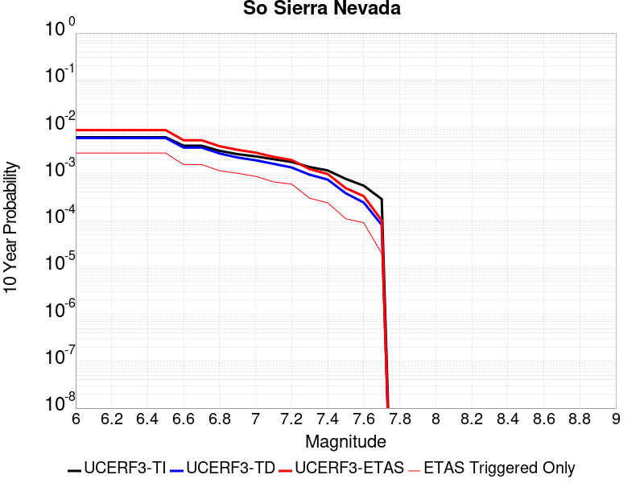 |

| Magnitude | 1 wk TI Prob | 1 wk TD Prob | 1 wk ETAS Prob | 1 wk ETAS/TD Gain | 1 wk ETAS Triggered Only | 1 mo TI Prob | 1 mo TD Prob | 1 mo ETAS Prob | 1 mo ETAS/TD Gain | 1 mo ETAS Triggered Only | 1 yr TI Prob | 1 yr TD Prob | 1 yr ETAS Prob | 1 yr ETAS/TD Gain | 1 yr ETAS Triggered Only | 10 yr TI Prob | 10 yr TD Prob | 10 yr ETAS Prob | 10 yr ETAS/TD Gain | 10 yr ETAS Triggered Only |
|-----|-----|-----|-----|-----|-----|-----|-----|-----|-----|-----|-----|-----|-----|-----|-----|-----|-----|-----|-----|-----|
| 6.0 | 1.15488665E-5 | 1.1079688E-5 | 2.3107725E-4 | 20.855934 | 2.2E-4 | 4.9494203E-5 | 4.7483583E-5 | 4.874627E-4 | 10.265921 | 4.4E-4 | 6.024253E-4 | 5.7797204E-4 | 0.0019571744 | 3.3862786 | 0.00138 | 0.006007948 | 0.0057659578 | 0.008510044 | 1.4759116 | 0.00276 |
| 6.1 | 1.15488665E-5 | 1.1079688E-5 | 2.3107725E-4 | 20.855934 | 2.2E-4 | 4.9494203E-5 | 4.7483583E-5 | 4.874627E-4 | 10.265921 | 4.4E-4 | 6.024253E-4 | 5.7797204E-4 | 0.0019571744 | 3.3862786 | 0.00138 | 0.006007948 | 0.0057659578 | 0.008510044 | 1.4759116 | 0.00276 |
| 6.2 | 1.15488665E-5 | 1.1079688E-5 | 2.3107725E-4 | 20.855934 | 2.2E-4 | 4.9494203E-5 | 4.7483583E-5 | 4.874627E-4 | 10.265921 | 4.4E-4 | 6.024253E-4 | 5.7797204E-4 | 0.0019571744 | 3.3862786 | 0.00138 | 0.006007948 | 0.0057659578 | 0.008510044 | 1.4759116 | 0.00276 |
| 6.3 | 1.15488665E-5 | 1.1079688E-5 | 2.3107725E-4 | 20.855934 | 2.2E-4 | 4.9494203E-5 | 4.7483583E-5 | 4.874627E-4 | 10.265921 | 4.4E-4 | 6.024253E-4 | 5.7797204E-4 | 0.0019571744 | 3.3862786 | 0.00138 | 0.006007948 | 0.0057659578 | 0.008510044 | 1.4759116 | 0.00276 |
| 6.4 | 1.15488665E-5 | 1.1079688E-5 | 2.3107725E-4 | 20.855934 | 2.2E-4 | 4.9494203E-5 | 4.7483583E-5 | 4.874627E-4 | 10.265921 | 4.4E-4 | 6.024253E-4 | 5.7797204E-4 | 0.0019571744 | 3.3862786 | 0.00138 | 0.006007948 | 0.0057659578 | 0.008510044 | 1.4759116 | 0.00276 |
| 6.5 | 1.15488665E-5 | 1.1079688E-5 | 2.3107725E-4 | 20.855934 | 2.2E-4 | 4.9494203E-5 | 4.7483583E-5 | 4.874627E-4 | 10.265921 | 4.4E-4 | 6.024253E-4 | 5.7797204E-4 | 0.0019571744 | 3.3862786 | 0.00138 | 0.006007948 | 0.0057659578 | 0.008510044 | 1.4759116 | 0.00276 |
| 6.6 | 7.587044E-6 | 6.935655E-6 | 1.6693455E-4 | 24.069036 | 1.6E-4 | 3.2515498E-5 | 2.9723915E-5 | 3.097156E-4 | 10.4197445 | 2.8E-4 | 3.9580427E-4 | 3.6183148E-4 | 0.0011315529 | 3.1272924 | 7.7E-4 | 0.003951 | 0.0036127153 | 0.0051770434 | 1.4330062 | 0.00157 |
| 6.7 | 7.587044E-6 | 6.935655E-6 | 1.6693455E-4 | 24.069036 | 1.6E-4 | 3.2515498E-5 | 2.9723915E-5 | 3.097156E-4 | 10.4197445 | 2.8E-4 | 3.9580427E-4 | 3.6183148E-4 | 0.0011315529 | 3.1272924 | 7.7E-4 | 0.003951 | 0.0036127153 | 0.0051770434 | 1.4330062 | 0.00157 |
| 6.8 | 5.9026956E-6 | 5.179403E-6 | 1.4517868E-4 | 28.030003 | 1.4E-4 | 2.5297022E-5 | 2.2197259E-5 | 2.321926E-4 | 10.460418 | 2.1E-4 | 3.0794772E-4 | 2.702193E-4 | 8.6005987E-4 | 3.182822 | 5.9E-4 | 0.0030752132 | 0.0026990233 | 0.0038558925 | 1.4286251 | 0.00116 |
| 6.9 | 5.0118915E-6 | 4.2524307E-6 | 1.4425184E-4 | 33.922207 | 1.4E-4 | 2.1479358E-5 | 1.8224579E-5 | 2.1822093E-4 | 11.97399 | 2.0E-4 | 2.614798E-4 | 2.2186238E-4 | 7.7174034E-4 | 3.4784641 | 5.5E-4 | 0.0026117235 | 0.0022164814 | 0.0032342207 | 1.4591688 | 0.00102 |
| 7.0 | 4.4924795E-6 | 3.7139203E-6 | 1.3371343E-4 | 36.003315 | 1.3E-4 | 1.925334E-5 | 1.5916707E-5 | 1.85914E-4 | 11.680431 | 1.7E-4 | 2.3438422E-4 | 1.9376932E-4 | 6.4368214E-4 | 3.3218992 | 4.5E-4 | 0.0023413717 | 0.0019360665 | 0.0028143628 | 1.4536499 | 8.8E-4 |
| 7.1 | 3.9118436E-6 | 3.111977E-6 | 1.1311164E-4 | 36.347195 | 1.1E-4 | 1.6764936E-5 | 1.33369795E-5 | 1.5333512E-4 | 11.496989 | 1.4E-4 | 2.0409399E-4 | 1.623662E-4 | 5.423045E-4 | 3.3400087 | 3.8E-4 | 0.0020390663 | 0.0016225318 | 0.0022914447 | 1.412265 | 6.7E-4 |
| 7.2 | 3.4200818E-6 | 2.6054513E-6 | 1.0260519E-4 | 39.380966 | 1.0E-4 | 1.4657411E-5 | 1.1166175E-5 | 1.4116472E-4 | 12.642174 | 1.3E-4 | 1.7843937E-4 | 1.359402E-4 | 4.75894E-4 | 3.5007598 | 3.4E-4 | 0.0017829615 | 0.0013586201 | 0.001957805 | 1.4410245 | 6.0E-4 |
| 7.3 | 2.6593618E-6 | 1.8284135E-6 | 5.1828323E-5 | 28.346062 | 5.0E-5 | 1.13972155E-5 | 7.836036E-6 | 7.783549E-5 | 9.933018 | 7.0E-5 | 1.3875226E-4 | 9.539985E-5 | 2.4538554E-4 | 2.5721793 | 1.5E-4 | 0.0013866565 | 9.53618E-4 | 0.0012533319 | 1.3142914 | 3.0E-4 |
| 7.4 | 2.2577992E-6 | 1.4364293E-6 | 5.1436356E-5 | 35.808487 | 5.0E-5 | 9.676246E-6 | 6.1561127E-6 | 6.615574E-5 | 10.74635 | 6.0E-5 | 1.1780193E-4 | 7.4948344E-5 | 2.0493861E-4 | 2.734398 | 1.3E-4 | 0.001177395 | 7.4925576E-4 | 9.89076E-4 | 1.3200779 | 2.4E-4 |
| 7.5 | 1.489319E-6 | 7.35383E-7 | 1.0735375E-5 | 14.598345 | 1.0E-5 | 6.3827797E-6 | 3.1516379E-6 | 1.3151606E-5 | 4.1729436 | 1.0E-5 | 7.770758E-5 | 3.837052E-5 | 8.83686E-5 | 2.3030338 | 5.0E-5 | 7.7680405E-4 | 3.836394E-4 | 4.935972E-4 | 1.2866176 | 1.1E-4 |
| 7.6 | 1.0680322E-6 | 4.6595343E-7 | 1.0465948E-5 | 22.461363 | 1.0E-5 | 4.577273E-6 | 1.9969418E-6 | 1.1996922E-5 | 6.007647 | 1.0E-5 | 5.5726876E-5 | 2.4312498E-5 | 6.431153E-5 | 2.6452043 | 4.0E-5 | 5.5712904E-4 | 2.4309864E-4 | 3.3307675E-4 | 1.3701301 | 9.0E-5 |
| 7.7 | 5.509146E-7 | 1.5579108E-7 | 1.5579108E-7 | 1.0 | 0.0 | 2.3610605E-6 | 6.676759E-7 | 6.676759E-7 | 1.0 | 0.0 | 2.8745531E-5 | 8.128925E-6 | 2.8128763E-5 | 3.4603298 | 2.0E-5 | 2.8741814E-4 | 8.1286395E-5 | 1.0128477E-4 | 1.2460237 | 2.0E-5 |

## San Andreas (Mojave S)
*[(top)](#table-of-contents)*

| 1 Week | 1 Month | 1 Year | 10 Year |
|-----|-----|-----|-----|
|  | 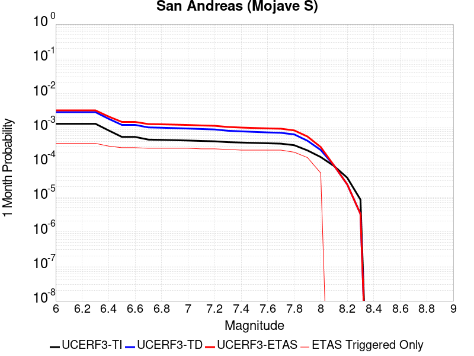 |  |  |

| Magnitude | 1 wk TI Prob | 1 wk TD Prob | 1 wk ETAS Prob | 1 wk ETAS/TD Gain | 1 wk ETAS Triggered Only | 1 mo TI Prob | 1 mo TD Prob | 1 mo ETAS Prob | 1 mo ETAS/TD Gain | 1 mo ETAS Triggered Only | 1 yr TI Prob | 1 yr TD Prob | 1 yr ETAS Prob | 1 yr ETAS/TD Gain | 1 yr ETAS Triggered Only | 10 yr TI Prob | 10 yr TD Prob | 10 yr ETAS Prob | 10 yr ETAS/TD Gain | 10 yr ETAS Triggered Only |
|-----|-----|-----|-----|-----|-----|-----|-----|-----|-----|-----|-----|-----|-----|-----|-----|-----|-----|-----|-----|-----|
| 6.0 | 3.1064058E-4 | 6.7471585E-4 | 7.8464166E-4 | 1.1629215 | 1.1E-4 | 0.0013306376 | 0.0028885633 | 0.0032475234 | 1.1242695 | 3.6E-4 | 0.016080605 | 0.03457021 | 0.03575769 | 1.0343498 | 0.00123 | 0.1496549 | 0.2866514 | 0.2882636 | 1.0056242 | 0.00226 |
| 6.1 | 3.1064058E-4 | 6.7471585E-4 | 7.8464166E-4 | 1.1629215 | 1.1E-4 | 0.0013306376 | 0.0028885633 | 0.0032475234 | 1.1242695 | 3.6E-4 | 0.016080605 | 0.03457021 | 0.03575769 | 1.0343498 | 0.00123 | 0.1496549 | 0.2866514 | 0.2882636 | 1.0056242 | 0.00226 |
| 6.2 | 3.1064058E-4 | 6.7471585E-4 | 7.8464166E-4 | 1.1629215 | 1.1E-4 | 0.0013306376 | 0.0028885633 | 0.0032475234 | 1.1242695 | 3.6E-4 | 0.016080605 | 0.03457021 | 0.03575769 | 1.0343498 | 0.00123 | 0.1496549 | 0.2866514 | 0.2882636 | 1.0056242 | 0.00226 |
| 6.3 | 3.1064058E-4 | 6.7471585E-4 | 7.8464166E-4 | 1.1629215 | 1.1E-4 | 0.0013306376 | 0.0028885633 | 0.0032475234 | 1.1242695 | 3.6E-4 | 0.016080605 | 0.03457021 | 0.03575769 | 1.0343498 | 0.00123 | 0.1496549 | 0.2866514 | 0.2882636 | 1.0056242 | 0.00226 |
| 6.4 | 1.9872203E-4 | 4.31896E-4 | 5.218572E-4 | 1.2082934 | 9.0E-5 | 8.5138786E-4 | 0.0018496981 | 0.0021491433 | 1.1618886 | 3.0E-4 | 0.010316478 | 0.02229367 | 0.023300707 | 1.0451715 | 0.00103 | 0.098504856 | 0.19705607 | 0.19860576 | 1.0078641 | 0.00193 |
| 6.5 | 1.291105E-4 | 2.8762486E-4 | 3.6760187E-4 | 1.2780601 | 8.0E-5 | 5.5321335E-4 | 0.0012320984 | 0.0015017658 | 1.2188684 | 2.7E-4 | 0.006714592 | 0.014898448 | 0.015755486 | 1.0575254 | 8.7E-4 | 0.065152965 | 0.138118 | 0.13956596 | 1.0104835 | 0.00168 |
| 6.6 | 1.291105E-4 | 2.8762486E-4 | 3.6760187E-4 | 1.2780601 | 8.0E-5 | 5.5321335E-4 | 0.0012320984 | 0.0015017658 | 1.2188684 | 2.7E-4 | 0.006714592 | 0.014898448 | 0.015755486 | 1.0575254 | 8.7E-4 | 0.065152965 | 0.138118 | 0.13956596 | 1.0104835 | 0.00168 |
| 6.7 | 1.08001186E-4 | 2.4343564E-4 | 3.134186E-4 | 1.2874804 | 7.0E-5 | 4.6278012E-4 | 0.0010428791 | 0.0013026078 | 1.2490498 | 2.6E-4 | 0.0056198016 | 0.012623432 | 0.013472576 | 1.0672673 | 8.6E-4 | 0.054797906 | 0.119228184 | 0.120663844 | 1.0120412 | 0.00163 |
| 6.8 | 1.0624356E-4 | 2.3861213E-4 | 3.0859542E-4 | 1.2932931 | 7.0E-5 | 4.5525006E-4 | 0.0010222232 | 0.0012819574 | 1.2540876 | 2.6E-4 | 0.0055285925 | 0.012374822 | 0.01322418 | 1.068636 | 8.6E-4 | 0.053930566 | 0.117172524 | 0.11861153 | 1.0122811 | 0.00163 |
| 6.9 | 1.0393785E-4 | 2.3231508E-4 | 3.022988E-4 | 1.301245 | 7.0E-5 | 4.4537184E-4 | 9.952566E-4 | 0.0012549978 | 1.2609792 | 2.6E-4 | 0.0054089287 | 0.012050176 | 0.012889933 | 1.0696884 | 8.5E-4 | 0.05279156 | 0.11446828 | 0.11590284 | 1.0125324 | 0.00162 |
| 7.0 | 1.0155622E-4 | 2.2601044E-4 | 2.9599463E-4 | 1.3096502 | 7.0E-5 | 4.3516833E-4 | 9.68257E-4 | 0.0012280053 | 1.2682637 | 2.6E-4 | 0.005285311 | 0.011725035 | 0.012555186 | 1.0708016 | 8.4E-4 | 0.05161361 | 0.11172433 | 0.113145575 | 1.012721 | 0.0016 |
| 7.1 | 9.885595E-5 | 2.188942E-4 | 2.7888105E-4 | 1.274045 | 6.0E-5 | 4.2359953E-4 | 9.3778106E-4 | 0.0011875466 | 1.2663368 | 2.5E-4 | 0.0051451353 | 0.011357912 | 0.012178485 | 1.0722468 | 8.3E-4 | 0.05027629 | 0.108605 | 0.110022314 | 1.0130502 | 0.00159 |
| 7.2 | 9.6411415E-5 | 2.1252372E-4 | 2.7251095E-4 | 1.2822615 | 6.0E-5 | 4.1312634E-4 | 9.104983E-4 | 0.0011602707 | 1.2743249 | 2.5E-4 | 0.005018219 | 0.011029154 | 0.01185 | 1.0744251 | 8.3E-4 | 0.049064007 | 0.10579592 | 0.1072177 | 1.0134389 | 0.00159 |
| 7.3 | 9.1180635E-5 | 1.9480525E-4 | 2.5479356E-4 | 1.3079399 | 6.0E-5 | 3.907156E-4 | 8.3461264E-4 | 0.0010744124 | 1.2873186 | 2.4E-4 | 0.004746591 | 0.010114178 | 0.010925884 | 1.0802543 | 8.2E-4 | 0.046464786 | 0.09798997 | 0.099415146 | 1.0145441 | 0.00158 |
| 7.4 | 8.887388E-5 | 1.8729005E-4 | 2.472788E-4 | 1.3202987 | 6.0E-5 | 3.8083247E-4 | 8.024248E-4 | 0.0010322402 | 1.2864013 | 2.3E-4 | 0.0046267817 | 0.0097258575 | 0.01052798 | 1.0824732 | 8.1E-4 | 0.045316286 | 0.0946256 | 0.096037984 | 1.0149261 | 0.00156 |
| 7.5 | 8.6750515E-5 | 1.8060463E-4 | 2.405938E-4 | 1.3321574 | 6.0E-5 | 3.7173493E-4 | 7.7379035E-4 | 0.0010036124 | 1.2970082 | 2.3E-4 | 0.004516484 | 0.009380288 | 0.010182691 | 1.0855412 | 8.1E-4 | 0.04425787 | 0.09158909 | 0.093006216 | 1.0154727 | 0.00156 |
| 7.6 | 8.453092E-5 | 1.7447997E-4 | 2.344695E-4 | 1.343819 | 6.0E-5 | 3.6222505E-4 | 7.4755703E-4 | 9.773851E-4 | 1.3074389 | 2.3E-4 | 0.0044011753 | 0.0090636 | 0.009866258 | 1.0885584 | 8.1E-4 | 0.04315024 | 0.08874676 | 0.09016831 | 1.0160182 | 0.00156 |
| 7.7 | 8.259102E-5 | 1.6970029E-4 | 2.2969011E-4 | 1.3535045 | 6.0E-5 | 3.539135E-4 | 7.270843E-4 | 9.5691707E-4 | 1.3161019 | 2.3E-4 | 0.004300386 | 0.008816389 | 0.009619248 | 1.0910643 | 8.1E-4 | 0.042181134 | 0.08649703 | 0.08790383 | 1.0162641 | 0.00154 |
| 7.8 | 7.444844E-5 | 1.5291499E-4 | 1.9290888E-4 | 1.2615433 | 4.0E-5 | 3.1902574E-4 | 6.5518543E-4 | 8.5505436E-4 | 1.305057 | 2.0E-4 | 0.0038772223 | 0.007947756 | 0.008582669 | 1.0798858 | 6.4E-4 | 0.03810269 | 0.078325555 | 0.07946843 | 1.0145913 | 0.00124 |
| 7.9 | 5.2586525E-5 | 1.0011774E-4 | 1.3011473E-4 | 1.2996172 | 3.0E-5 | 2.2535135E-4 | 4.2900548E-4 | 5.689454E-4 | 1.3261962 | 1.4E-4 | 0.0027402006 | 0.005210644 | 0.0056085596 | 1.076366 | 4.0E-4 | 0.027066574 | 0.052224807 | 0.05288825 | 1.0127035 | 7.0E-4 |
| 8.0 | 3.379877E-5 | 5.4103475E-5 | 6.410293E-5 | 1.184821 | 1.0E-5 | 1.4484383E-4 | 2.3185145E-4 | 2.8183984E-4 | 1.2156054 | 5.0E-5 | 0.0017620471 | 0.002819139 | 0.0029388007 | 1.0424461 | 1.2E-4 | 0.017481409 | 0.028849052 | 0.029082129 | 1.0080792 | 2.4E-4 |
| 8.1 | 1.8668277E-5 | 1.9321345E-5 | 1.9321345E-5 | 1.0 | 0.0 | 8.000444E-5 | 8.280314E-5 | 8.280314E-5 | 1.0 | 0.0 | 9.736188E-4 | 0.0010076626 | 0.0010176526 | 1.0099139 | 1.0E-5 | 0.009693642 | 0.010805132 | 0.0108348075 | 1.0027465 | 3.0E-5 |
| 8.2 | 8.541571E-6 | 5.4646152E-6 | 5.4646152E-6 | 1.0 | 0.0 | 3.660622E-5 | 2.341957E-5 | 2.341957E-5 | 1.0 | 0.0 | 4.455896E-4 | 2.8509603E-4 | 2.8509603E-4 | 1.0 | 0.0 | 0.0044469717 | 0.0032429425 | 0.0032429425 | 1.0 | 0.0 |
| 8.3 | 1.983087E-6 | 7.6647797E-7 | 7.6647797E-7 | 1.0 | 0.0 | 8.498917E-6 | 3.2849016E-6 | 3.2849016E-6 | 1.0 | 0.0 | 1.034694E-4 | 3.999296E-5 | 3.999296E-5 | 1.0 | 0.0 | 0.0010342124 | 4.7228087E-4 | 4.7228087E-4 | 1.0 | 0.0 |

## Coyote Canyon
*[(top)](#table-of-contents)*

| 1 Week | 1 Month | 1 Year | 10 Year |
|-----|-----|-----|-----|
|  | 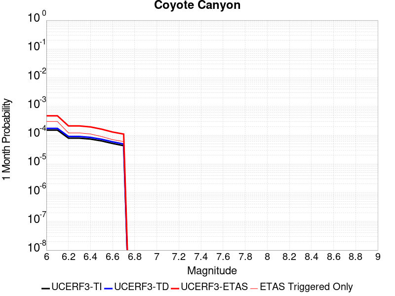 | 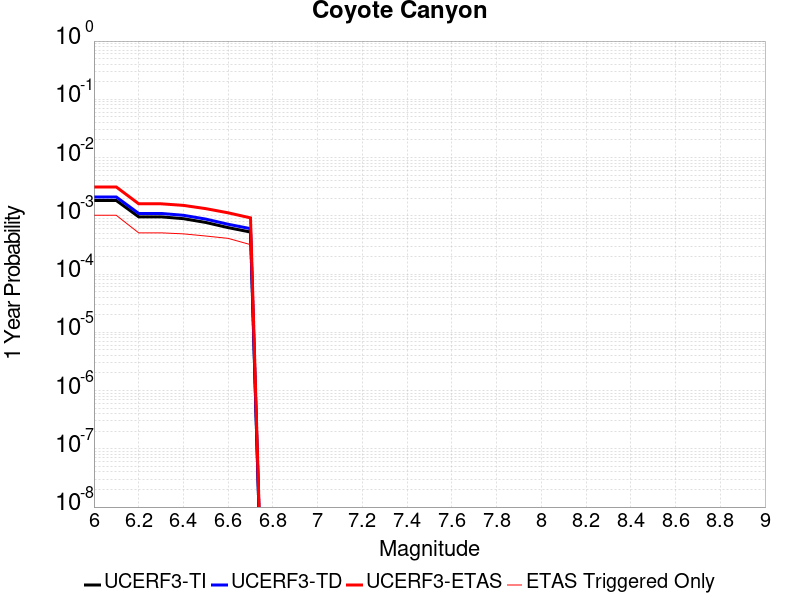 |  |

| Magnitude | 1 wk TI Prob | 1 wk TD Prob | 1 wk ETAS Prob | 1 wk ETAS/TD Gain | 1 wk ETAS Triggered Only | 1 mo TI Prob | 1 mo TD Prob | 1 mo ETAS Prob | 1 mo ETAS/TD Gain | 1 mo ETAS Triggered Only | 1 yr TI Prob | 1 yr TD Prob | 1 yr ETAS Prob | 1 yr ETAS/TD Gain | 1 yr ETAS Triggered Only | 10 yr TI Prob | 10 yr TD Prob | 10 yr ETAS Prob | 10 yr ETAS/TD Gain | 10 yr ETAS Triggered Only |
|-----|-----|-----|-----|-----|-----|-----|-----|-----|-----|-----|-----|-----|-----|-----|-----|-----|-----|-----|-----|-----|
| 6.0 | 3.5090034E-5 | 4.036512E-5 | 2.0035867E-4 | 4.9636583 | 1.6E-4 | 1.503772E-4 | 1.7298336E-4 | 4.7293145E-4 | 2.7339709 | 3.0E-4 | 0.0018293047 | 0.0021042954 | 0.003122149 | 1.4837029 | 0.00102 | 0.018143194 | 0.020869616 | 0.022788713 | 1.0919564 | 0.00196 |
| 6.1 | 3.5090034E-5 | 4.036512E-5 | 2.0035867E-4 | 4.9636583 | 1.6E-4 | 1.503772E-4 | 1.7298336E-4 | 4.7293145E-4 | 2.7339709 | 3.0E-4 | 0.0018293047 | 0.0021042954 | 0.003122149 | 1.4837029 | 0.00102 | 0.018143194 | 0.020869616 | 0.022788713 | 1.0919564 | 0.00196 |
| 6.2 | 1.841879E-5 | 2.1060194E-5 | 1.0105851E-4 | 4.7985554 | 8.0E-5 | 7.8935285E-5 | 9.0255424E-5 | 2.102446E-4 | 2.3294399 | 1.2E-4 | 9.606133E-4 | 0.0010984079 | 0.0016078477 | 1.4637984 | 5.1E-4 | 0.0095647145 | 0.010939875 | 0.011958607 | 1.0931209 | 0.00103 |
| 6.3 | 1.841879E-5 | 2.1060194E-5 | 1.0105851E-4 | 4.7985554 | 8.0E-5 | 7.8935285E-5 | 9.0255424E-5 | 2.102446E-4 | 2.3294399 | 1.2E-4 | 9.606133E-4 | 0.0010984079 | 0.0016078477 | 1.4637984 | 5.1E-4 | 0.0095647145 | 0.010939875 | 0.011958607 | 1.0931209 | 0.00103 |
| 6.4 | 1.712201E-5 | 1.9565581E-5 | 8.9564215E-5 | 4.577641 | 7.0E-5 | 7.337798E-5 | 8.385037E-5 | 1.9384114E-4 | 2.3117507 | 1.1E-4 | 8.930107E-4 | 0.0010205007 | 0.0015100006 | 1.4796665 | 4.9E-4 | 0.008894307 | 0.0101680625 | 0.011128199 | 1.0944268 | 9.7E-4 |
| 6.5 | 1.4744935E-5 | 1.6837288E-5 | 8.683611E-5 | 5.157369 | 7.0E-5 | 6.3191044E-5 | 7.215834E-5 | 1.6215185E-4 | 2.247167 | 9.0E-5 | 7.6907943E-4 | 8.782672E-4 | 0.0013278719 | 1.5119226 | 4.5E-4 | 0.007664232 | 0.008757159 | 0.009649278 | 1.101873 | 9.0E-4 |
| 6.6 | 1.2017839E-5 | 1.3724348E-5 | 6.372366E-5 | 4.6431103 | 5.0E-5 | 5.150401E-5 | 5.8817805E-5 | 1.2881368E-4 | 2.1900458 | 7.0E-5 | 6.268809E-4 | 7.159601E-4 | 0.0011256665 | 1.5722476 | 4.1E-4 | 0.0062511545 | 0.0071452283 | 0.0078997975 | 1.1056046 | 7.6E-4 |
| 6.7 | 1.00956095E-5 | 1.1533734E-5 | 5.1533272E-5 | 4.4680476 | 4.0E-5 | 4.326618E-5 | 4.9429844E-5 | 1.0942688E-4 | 2.2137816 | 6.0E-5 | 5.266384E-4 | 6.0172915E-4 | 9.215366E-4 | 1.5314807 | 3.2E-4 | 0.005253921 | 0.006009526 | 0.006556221 | 1.0909714 | 5.5E-4 |

## San Andreas (Mojave N)
*[(top)](#table-of-contents)*

| 1 Week | 1 Month | 1 Year | 10 Year |
|-----|-----|-----|-----|
|  |  |  | 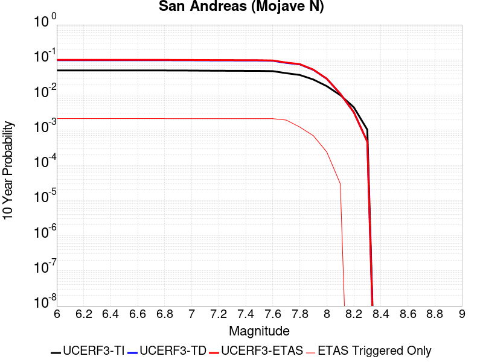 |

| Magnitude | 1 wk TI Prob | 1 wk TD Prob | 1 wk ETAS Prob | 1 wk ETAS/TD Gain | 1 wk ETAS Triggered Only | 1 mo TI Prob | 1 mo TD Prob | 1 mo ETAS Prob | 1 mo ETAS/TD Gain | 1 mo ETAS Triggered Only | 1 yr TI Prob | 1 yr TD Prob | 1 yr ETAS Prob | 1 yr ETAS/TD Gain | 1 yr ETAS Triggered Only | 10 yr TI Prob | 10 yr TD Prob | 10 yr ETAS Prob | 10 yr ETAS/TD Gain | 10 yr ETAS Triggered Only |
|-----|-----|-----|-----|-----|-----|-----|-----|-----|-----|-----|-----|-----|-----|-----|-----|-----|-----|-----|-----|-----|
| 6.0 | 9.877682E-5 | 1.9410432E-4 | 3.440752E-4 | 1.7726303 | 1.5E-4 | 4.2326056E-4 | 8.3161064E-4 | 0.0012112946 | 1.4565647 | 3.8E-4 | 0.0051410277 | 0.010077983 | 0.011226293 | 1.1139424 | 0.00116 | 0.05023708 | 0.098361015 | 0.10029954 | 1.0197083 | 0.00215 |
| 6.1 | 9.877682E-5 | 1.9410432E-4 | 3.440752E-4 | 1.7726303 | 1.5E-4 | 4.2326056E-4 | 8.3161064E-4 | 0.0012112946 | 1.4565647 | 3.8E-4 | 0.0051410277 | 0.010077983 | 0.011226293 | 1.1139424 | 0.00116 | 0.05023708 | 0.098361015 | 0.10029954 | 1.0197083 | 0.00215 |
| 6.2 | 9.877682E-5 | 1.9410432E-4 | 3.440752E-4 | 1.7726303 | 1.5E-4 | 4.2326056E-4 | 8.3161064E-4 | 0.0012112946 | 1.4565647 | 3.8E-4 | 0.0051410277 | 0.010077983 | 0.011226293 | 1.1139424 | 0.00116 | 0.05023708 | 0.098361015 | 0.10029954 | 1.0197083 | 0.00215 |
| 6.3 | 9.877682E-5 | 1.9410432E-4 | 3.440752E-4 | 1.7726303 | 1.5E-4 | 4.2326056E-4 | 8.3161064E-4 | 0.0012112946 | 1.4565647 | 3.8E-4 | 0.0051410277 | 0.010077983 | 0.011226293 | 1.1139424 | 0.00116 | 0.05023708 | 0.098361015 | 0.10029954 | 1.0197083 | 0.00215 |
| 6.4 | 9.877682E-5 | 1.9410432E-4 | 3.440752E-4 | 1.7726303 | 1.5E-4 | 4.2326056E-4 | 8.3161064E-4 | 0.0012112946 | 1.4565647 | 3.8E-4 | 0.0051410277 | 0.010077983 | 0.011226293 | 1.1139424 | 0.00116 | 0.05023708 | 0.098361015 | 0.10029954 | 1.0197083 | 0.00215 |
| 6.5 | 9.861474E-5 | 1.9384196E-4 | 3.438129E-4 | 1.7736763 | 1.5E-4 | 4.2256617E-4 | 8.3048694E-4 | 0.0012101714 | 1.4571829 | 3.8E-4 | 0.0051326132 | 0.010064429 | 0.011212754 | 1.1140974 | 0.00116 | 0.050156746 | 0.09823856 | 0.10017735 | 1.0197355 | 0.00215 |
| 6.6 | 9.861474E-5 | 1.9384196E-4 | 3.438129E-4 | 1.7736763 | 1.5E-4 | 4.2256617E-4 | 8.3048694E-4 | 0.0012101714 | 1.4571829 | 3.8E-4 | 0.0051326132 | 0.010064429 | 0.011212754 | 1.1140974 | 0.00116 | 0.050156746 | 0.09823856 | 0.10017735 | 1.0197355 | 0.00215 |
| 6.7 | 9.8552715E-5 | 1.9374148E-4 | 3.4371243E-4 | 1.7740775 | 1.5E-4 | 4.223004E-4 | 8.300566E-4 | 0.0012097412 | 1.4574201 | 3.8E-4 | 0.0051293927 | 0.0100592375 | 0.011207568 | 1.1141568 | 0.00116 | 0.050125998 | 0.098191775 | 0.10013066 | 1.019746 | 0.00215 |
| 6.8 | 9.8464974E-5 | 1.9359306E-4 | 3.4356402E-4 | 1.7746712 | 1.5E-4 | 4.219245E-4 | 8.294209E-4 | 0.0012091057 | 1.457771 | 3.8E-4 | 0.0051248376 | 0.01005157 | 0.01119991 | 1.1142448 | 0.00116 | 0.05008251 | 0.09812213 | 0.10005214 | 1.0196695 | 0.00214 |
| 6.9 | 9.825824E-5 | 1.9327311E-4 | 3.4324412E-4 | 1.7759539 | 1.5E-4 | 4.2103877E-4 | 8.2805054E-4 | 0.0012077359 | 1.4585292 | 3.8E-4 | 0.0051141046 | 0.010035039 | 0.011183399 | 1.114435 | 0.00116 | 0.049980022 | 0.09797137 | 0.09990171 | 1.0197031 | 0.00214 |
| 7.0 | 9.781462E-5 | 1.9258665E-4 | 3.4255776E-4 | 1.7787201 | 1.5E-4 | 4.1913814E-4 | 8.251105E-4 | 0.001204797 | 1.4601644 | 3.8E-4 | 0.005091073 | 0.009999573 | 0.011147973 | 1.1148449 | 0.00116 | 0.04976007 | 0.09764758 | 0.09957861 | 1.0197755 | 0.00214 |
| 7.1 | 9.7121134E-5 | 1.9160361E-4 | 3.4157487E-4 | 1.7827163 | 1.5E-4 | 4.1616702E-4 | 8.2090014E-4 | 0.0012005882 | 1.4625264 | 3.8E-4 | 0.005055068 | 0.009948781 | 0.01109724 | 1.1154372 | 0.00116 | 0.04941613 | 0.09718397 | 0.099116 | 1.01988 | 0.00214 |
| 7.2 | 9.663819E-5 | 1.9091136E-4 | 3.4088272E-4 | 1.7855549 | 1.5E-4 | 4.1409794E-4 | 8.179352E-4 | 0.0011976244 | 1.4642044 | 3.8E-4 | 0.0050299936 | 0.009913012 | 0.011061513 | 1.115858 | 0.00116 | 0.049176537 | 0.09685706 | 0.09878979 | 1.0199544 | 0.00214 |
| 7.3 | 9.6277574E-5 | 1.9043636E-4 | 3.404078E-4 | 1.7875147 | 1.5E-4 | 4.125529E-4 | 8.1590074E-4 | 0.0011955907 | 1.4653629 | 3.8E-4 | 0.0050112694 | 0.009888468 | 0.011036998 | 1.1161484 | 0.00116 | 0.04899759 | 0.09663044 | 0.09856365 | 1.0200062 | 0.00214 |
| 7.4 | 9.593308E-5 | 1.8983395E-4 | 3.3980547E-4 | 1.7900143 | 1.5E-4 | 4.1107697E-4 | 8.133206E-4 | 0.0011930115 | 1.4668404 | 3.8E-4 | 0.0049933824 | 0.00985734 | 0.0110059045 | 1.1165189 | 0.00116 | 0.04882661 | 0.09634874 | 0.098273516 | 1.0199772 | 0.00213 |
| 7.5 | 9.561707E-5 | 1.892946E-4 | 3.392662E-4 | 1.7922657 | 1.5E-4 | 4.0972308E-4 | 8.1101054E-4 | 0.0011907023 | 1.4681712 | 3.8E-4 | 0.0049769743 | 0.009829468 | 0.010978066 | 1.1168525 | 0.00116 | 0.048669744 | 0.09609495 | 0.09802027 | 1.0200356 | 0.00213 |
| 7.6 | 9.418194E-5 | 1.858169E-4 | 3.3578902E-4 | 1.8070962 | 1.5E-4 | 4.0357444E-4 | 7.961153E-4 | 0.0011758128 | 1.4769378 | 3.8E-4 | 0.004902454 | 0.009649739 | 0.010798545 | 1.1190505 | 0.00116 | 0.047957025 | 0.094475985 | 0.09640475 | 1.0204154 | 0.00213 |
| 7.7 | 8.202141E-5 | 1.6029968E-4 | 2.9027884E-4 | 1.810851 | 1.3E-4 | 3.51473E-4 | 6.868178E-4 | 0.0010365774 | 1.5092466 | 3.5E-4 | 0.00427079 | 0.008330002 | 0.009371256 | 1.1250004 | 0.00105 | 0.04189639 | 0.08226986 | 0.08405026 | 1.0216409 | 0.00194 |
| 7.8 | 7.2859846E-5 | 1.452426E-4 | 1.8523679E-4 | 1.2753613 | 4.0E-5 | 3.1221908E-4 | 6.223198E-4 | 8.221953E-4 | 1.3211782 | 2.0E-4 | 0.003794643 | 0.007550463 | 0.008185631 | 1.084123 | 6.4E-4 | 0.037304975 | 0.074759446 | 0.07589749 | 1.0152228 | 0.00123 |
| 7.9 | 5.3874453E-5 | 1.0051061E-4 | 1.3050759E-4 | 1.2984459 | 3.0E-5 | 2.3087008E-4 | 4.3068864E-4 | 5.706283E-4 | 1.3249208 | 1.4E-4 | 0.0028072202 | 0.005231038 | 0.005628946 | 1.0760666 | 4.0E-4 | 0.02772022 | 0.052449387 | 0.05311267 | 1.0126462 | 7.0E-4 |
| 8.0 | 3.468538E-5 | 5.4289703E-5 | 6.428916E-5 | 1.1841869 | 1.0E-5 | 1.4864317E-4 | 2.3264941E-4 | 2.8263777E-4 | 1.2148657 | 5.0E-5 | 0.0018082283 | 0.0028288292 | 0.00294849 | 1.0423003 | 1.2E-4 | 0.017935853 | 0.028961731 | 0.029194782 | 1.0080467 | 2.4E-4 |
| 8.1 | 1.9152367E-5 | 1.9414629E-5 | 1.9414629E-5 | 1.0 | 0.0 | 8.207899E-5 | 8.3202896E-5 | 8.3202896E-5 | 1.0 | 0.0 | 9.988535E-4 | 0.0010125252 | 0.001022515 | 1.0098664 | 1.0E-5 | 0.009943757 | 0.010862543 | 0.010892218 | 1.0027318 | 3.0E-5 |
| 8.2 | 8.643924E-6 | 5.478665E-6 | 5.478665E-6 | 1.0 | 0.0 | 3.704486E-5 | 2.3479783E-5 | 2.3479783E-5 | 1.0 | 0.0 | 4.5092785E-4 | 2.8582895E-4 | 2.8582895E-4 | 1.0 | 0.0 | 0.0045001395 | 0.0032508469 | 0.0032508469 | 1.0 | 0.0 |
| 8.3 | 1.983087E-6 | 7.6647797E-7 | 7.6647797E-7 | 1.0 | 0.0 | 8.498917E-6 | 3.2849016E-6 | 3.2849016E-6 | 1.0 | 0.0 | 1.034694E-4 | 3.999296E-5 | 3.999296E-5 | 1.0 | 0.0 | 0.0010342124 | 4.7228087E-4 | 4.7228087E-4 | 1.0 | 0.0 |

## Death Valley (So)
*[(top)](#table-of-contents)*

| 1 Week | 1 Month | 1 Year | 10 Year |
|-----|-----|-----|-----|
|  |  |  |  |

| Magnitude | 1 wk TI Prob | 1 wk TD Prob | 1 wk ETAS Prob | 1 wk ETAS/TD Gain | 1 wk ETAS Triggered Only | 1 mo TI Prob | 1 mo TD Prob | 1 mo ETAS Prob | 1 mo ETAS/TD Gain | 1 mo ETAS Triggered Only | 1 yr TI Prob | 1 yr TD Prob | 1 yr ETAS Prob | 1 yr ETAS/TD Gain | 1 yr ETAS Triggered Only | 10 yr TI Prob | 10 yr TD Prob | 10 yr ETAS Prob | 10 yr ETAS/TD Gain | 10 yr ETAS Triggered Only |
|-----|-----|-----|-----|-----|-----|-----|-----|-----|-----|-----|-----|-----|-----|-----|-----|-----|-----|-----|-----|-----|
| 6.0 | 2.0684236E-5 | 2.5618914E-5 | 1.2561635E-4 | 4.903266 | 1.0E-4 | 8.864371E-5 | 1.09790824E-4 | 3.797612E-4 | 3.458952 | 2.7E-4 | 0.0010787029 | 0.0013359005 | 0.0023645246 | 1.7699856 | 0.00103 | 0.010734817 | 0.01328137 | 0.015333745 | 1.1545304 | 0.00208 |
| 6.1 | 2.0684236E-5 | 2.5618914E-5 | 1.2561635E-4 | 4.903266 | 1.0E-4 | 8.864371E-5 | 1.09790824E-4 | 3.797612E-4 | 3.458952 | 2.7E-4 | 0.0010787029 | 0.0013359005 | 0.0023645246 | 1.7699856 | 0.00103 | 0.010734817 | 0.01328137 | 0.015333745 | 1.1545304 | 0.00208 |
| 6.2 | 2.0684236E-5 | 2.5618914E-5 | 1.2561635E-4 | 4.903266 | 1.0E-4 | 8.864371E-5 | 1.09790824E-4 | 3.797612E-4 | 3.458952 | 2.7E-4 | 0.0010787029 | 0.0013359005 | 0.0023645246 | 1.7699856 | 0.00103 | 0.010734817 | 0.01328137 | 0.015333745 | 1.1545304 | 0.00208 |
| 6.3 | 2.0240292E-5 | 2.511899E-5 | 7.5117736E-5 | 2.990476 | 5.0E-5 | 8.6741224E-5 | 1.0764847E-4 | 3.1762588E-4 | 2.9505842 | 2.1E-4 | 0.0010555626 | 0.0013098489 | 0.0022286437 | 1.7014511 | 9.2E-4 | 0.010505628 | 0.013023925 | 0.0149090495 | 1.1447432 | 0.00191 |
| 6.4 | 2.0240292E-5 | 2.511899E-5 | 7.5117736E-5 | 2.990476 | 5.0E-5 | 8.6741224E-5 | 1.0764847E-4 | 3.1762588E-4 | 2.9505842 | 2.1E-4 | 0.0010555626 | 0.0013098489 | 0.0022286437 | 1.7014511 | 9.2E-4 | 0.010505628 | 0.013023925 | 0.0149090495 | 1.1447432 | 0.00191 |
| 6.5 | 1.9962767E-5 | 2.4808238E-5 | 6.4807246E-5 | 2.6123276 | 4.0E-5 | 8.55519E-5 | 1.0631679E-4 | 3.0629552E-4 | 2.8809705 | 2.0E-4 | 0.0010410968 | 0.0012936549 | 0.0021625294 | 1.6716431 | 8.7E-4 | 0.010362327 | 0.012863869 | 0.014670328 | 1.1404289 | 0.00183 |
| 6.6 | 1.8937297E-5 | 2.331202E-5 | 6.331109E-5 | 2.715813 | 4.0E-5 | 8.115732E-5 | 9.9904915E-5 | 2.6988794E-4 | 2.701448 | 1.7E-4 | 9.876423E-4 | 0.0012156782 | 0.0019847422 | 1.6326213 | 7.7E-4 | 0.009832645 | 0.012092765 | 0.013703054 | 1.1331613 | 0.00163 |
| 6.7 | 1.8621096E-5 | 2.2912649E-5 | 5.291196E-5 | 2.3092904 | 3.0E-5 | 7.980225E-5 | 9.819346E-5 | 2.5817775E-4 | 2.6292765 | 1.6E-4 | 9.711593E-4 | 0.0011948642 | 0.0019339799 | 1.6185772 | 7.4E-4 | 0.009669261 | 0.011886865 | 0.013428321 | 1.1296773 | 0.00156 |
| 6.8 | 1.7830353E-5 | 2.1806614E-5 | 4.180618E-5 | 1.9171329 | 2.0E-5 | 7.641356E-5 | 9.345365E-5 | 2.3344057E-4 | 2.4979289 | 1.4E-4 | 9.29938E-4 | 0.0011372183 | 0.0018264337 | 1.6060536 | 6.9E-4 | 0.009260561 | 0.011316919 | 0.012799944 | 1.1310449 | 0.0015 |
| 6.9 | 1.3135183E-5 | 1.5304342E-5 | 2.5304189E-5 | 1.6533993 | 1.0E-5 | 5.6292425E-5 | 6.558842E-5 | 1.3558383E-4 | 2.0671916 | 7.0E-5 | 6.8514474E-4 | 7.9825294E-4 | 0.0012279097 | 1.5382464 | 4.3E-4 | 0.006830362 | 0.007954868 | 0.00887747 | 1.1159796 | 9.3E-4 |
| 7.0 | 1.1507512E-5 | 1.315447E-5 | 1.315447E-5 | 1.0 | 0.0 | 4.9316975E-5 | 5.6375116E-5 | 9.637286E-5 | 1.7094929 | 4.0E-5 | 6.002687E-4 | 6.861567E-4 | 9.659645E-4 | 1.4077901 | 2.8E-4 | 0.0059864987 | 0.0068410533 | 0.0075064697 | 1.0972681 | 6.7E-4 |
| 7.1 | 9.715903E-6 | 1.086547E-5 | 1.086547E-5 | 1.0 | 0.0 | 4.1638916E-5 | 4.6565492E-5 | 6.6564564E-5 | 1.4294826 | 2.0E-5 | 5.068359E-4 | 5.667917E-4 | 7.167066E-4 | 1.2644975 | 1.5E-4 | 0.0050568148 | 0.0056537534 | 0.0060216617 | 1.0650733 | 3.7E-4 |
| 7.2 | 9.233269E-6 | 1.0286476E-5 | 1.0286476E-5 | 1.0 | 0.0 | 3.9570554E-5 | 4.4084176E-5 | 5.4083735E-5 | 1.2268288 | 1.0E-5 | 4.81665E-4 | 5.365969E-4 | 6.4653787E-4 | 1.2048856 | 1.1E-4 | 0.0048062233 | 0.005353444 | 0.005621998 | 1.0501648 | 2.7E-4 |
| 7.3 | 8.8041315E-6 | 9.808313E-6 | 9.808313E-6 | 1.0 | 0.0 | 3.7731446E-5 | 4.2034975E-5 | 5.2034553E-5 | 1.2378871 | 1.0E-5 | 4.592835E-4 | 5.1165983E-4 | 6.116087E-4 | 1.1953423 | 1.0E-4 | 0.0045833546 | 0.0051052445 | 0.0053440193 | 1.0467705 | 2.4E-4 |
| 7.4 | 8.708749E-6 | 9.707323E-6 | 9.707323E-6 | 1.0 | 0.0 | 3.7322676E-5 | 4.1602176E-5 | 5.1601757E-5 | 1.240362 | 1.0E-5 | 4.5430884E-4 | 5.06393E-4 | 5.963474E-4 | 1.1776376 | 9.0E-5 | 0.004533812 | 0.0050528166 | 0.0052816547 | 1.0452892 | 2.3E-4 |
| 7.5 | 8.612678E-6 | 9.604964E-6 | 9.604964E-6 | 1.0 | 0.0 | 3.6910955E-5 | 4.116351E-5 | 4.116351E-5 | 1.0 | 0.0 | 4.492982E-4 | 5.010547E-4 | 5.810146E-4 | 1.1595832 | 8.0E-5 | 0.004483909 | 0.0049996753 | 0.0052185752 | 1.0437828 | 2.2E-4 |
| 7.6 | 8.319024E-6 | 9.28406E-6 | 9.28406E-6 | 1.0 | 0.0 | 3.5652476E-5 | 3.9788243E-5 | 3.9788243E-5 | 1.0 | 0.0 | 4.3398244E-4 | 4.8431839E-4 | 5.542845E-4 | 1.1444631 | 7.0E-5 | 0.0043313587 | 0.004833053 | 0.0050320863 | 1.0411817 | 2.0E-4 |
| 7.7 | 7.4718328E-6 | 8.3453E-6 | 8.3453E-6 | 1.0 | 0.0 | 3.2021748E-5 | 3.57651E-5 | 3.57651E-5 | 1.0 | 0.0 | 3.8979502E-4 | 4.3535716E-4 | 4.853354E-4 | 1.1147982 | 5.0E-5 | 0.00389112 | 0.004345448 | 0.004494796 | 1.0343689 | 1.5E-4 |
| 7.8 | 3.4586725E-7 | 3.648288E-7 | 3.648288E-7 | 1.0 | 0.0 | 1.4822873E-6 | 1.5635511E-6 | 1.5635511E-6 | 1.0 | 0.0 | 1.80467E-5 | 1.9036073E-5 | 1.9036073E-5 | 1.0 | 0.0 | 1.8045233E-4 | 1.9034486E-4 | 1.9034486E-4 | 1.0 | 0.0 |
| 7.9 | 2.5591178E-9 | 2.6696871E-9 | 2.6696871E-9 | 1.0 | 0.0 | 1.0967647E-8 | 1.1441516E-8 | 1.1441516E-8 | 1.0 | 0.0 | 1.335311E-7 | 1.3930045E-7 | 1.3930045E-7 | 1.0 | 0.0 | 1.3353102E-6 | 1.3930046E-6 | 1.3930046E-6 | 1.0 | 0.0 |

## Lenwood-Lockhart-Old Woman Springs
*[(top)](#table-of-contents)*

| 1 Week | 1 Month | 1 Year | 10 Year |
|-----|-----|-----|-----|
|  |  |  |  |

| Magnitude | 1 wk TI Prob | 1 wk TD Prob | 1 wk ETAS Prob | 1 wk ETAS/TD Gain | 1 wk ETAS Triggered Only | 1 mo TI Prob | 1 mo TD Prob | 1 mo ETAS Prob | 1 mo ETAS/TD Gain | 1 mo ETAS Triggered Only | 1 yr TI Prob | 1 yr TD Prob | 1 yr ETAS Prob | 1 yr ETAS/TD Gain | 1 yr ETAS Triggered Only | 10 yr TI Prob | 10 yr TD Prob | 10 yr ETAS Prob | 10 yr ETAS/TD Gain | 10 yr ETAS Triggered Only |
|-----|-----|-----|-----|-----|-----|-----|-----|-----|-----|-----|-----|-----|-----|-----|-----|-----|-----|-----|-----|-----|
| 6.0 | 3.744542E-5 | 4.3963868E-5 | 1.5395903E-4 | 3.5019448 | 1.1E-4 | 1.604705E-4 | 1.8840394E-4 | 5.283399E-4 | 2.8042932 | 3.4E-4 | 0.0019519776 | 0.002291577 | 0.0033491477 | 1.4615036 | 0.00106 | 0.019349206 | 0.022697475 | 0.02465208 | 1.0861155 | 0.002 |
| 6.1 | 3.744542E-5 | 4.3963868E-5 | 1.5395903E-4 | 3.5019448 | 1.1E-4 | 1.604705E-4 | 1.8840394E-4 | 5.283399E-4 | 2.8042932 | 3.4E-4 | 0.0019519776 | 0.002291577 | 0.0033491477 | 1.4615036 | 0.00106 | 0.019349206 | 0.022697475 | 0.02465208 | 1.0861155 | 0.002 |
| 6.2 | 3.744542E-5 | 4.3963868E-5 | 1.5395903E-4 | 3.5019448 | 1.1E-4 | 1.604705E-4 | 1.8840394E-4 | 5.283399E-4 | 2.8042932 | 3.4E-4 | 0.0019519776 | 0.002291577 | 0.0033491477 | 1.4615036 | 0.00106 | 0.019349206 | 0.022697475 | 0.02465208 | 1.0861155 | 0.002 |
| 6.3 | 2.1079984E-5 | 2.5354482E-5 | 7.5353215E-5 | 2.971988 | 5.0E-5 | 9.0339665E-5 | 1.0865765E-4 | 2.7863917E-4 | 2.5643768 | 1.7E-4 | 0.0010993304 | 0.0013221242 | 0.0017515556 | 1.3248042 | 4.3E-4 | 0.010939079 | 0.013144798 | 0.013904677 | 1.0578083 | 7.7E-4 |
| 6.4 | 2.1079984E-5 | 2.5354482E-5 | 7.5353215E-5 | 2.971988 | 5.0E-5 | 9.0339665E-5 | 1.0865765E-4 | 2.7863917E-4 | 2.5643768 | 1.7E-4 | 0.0010993304 | 0.0013221242 | 0.0017515556 | 1.3248042 | 4.3E-4 | 0.010939079 | 0.013144798 | 0.013904677 | 1.0578083 | 7.7E-4 |
| 6.5 | 1.7397282E-5 | 2.0663358E-5 | 5.0662737E-5 | 2.4518154 | 3.0E-5 | 7.455765E-5 | 8.855431E-5 | 2.185428E-4 | 2.4678957 | 1.3E-4 | 9.073613E-4 | 0.0010776272 | 0.0013573255 | 1.2595501 | 2.8E-4 | 0.009036654 | 0.010725311 | 0.011269412 | 1.0507306 | 5.5E-4 |
| 6.6 | 1.52050325E-5 | 1.7680148E-5 | 3.7679794E-5 | 2.1311922 | 2.0E-5 | 6.51628E-5 | 7.57699E-5 | 1.8576157E-4 | 2.4516537 | 1.1E-4 | 7.9306826E-4 | 9.2211604E-4 | 0.0011618948 | 1.260031 | 2.4E-4 | 0.007902439 | 0.009183761 | 0.009649444 | 1.0507073 | 4.7E-4 |
| 6.7 | 1.332523E-5 | 1.5264432E-5 | 3.5264125E-5 | 2.3102155 | 2.0E-5 | 5.7106878E-5 | 6.5417385E-5 | 1.6541085E-4 | 2.5285456 | 1.0E-4 | 6.950544E-4 | 7.961715E-4 | 0.0010060043 | 1.2635523 | 2.1E-4 | 0.006928845 | 0.0079338215 | 0.008330648 | 1.0500171 | 4.0E-4 |
| 6.8 | 1.1525329E-5 | 1.3031408E-5 | 3.303115E-5 | 2.5347335 | 2.0E-5 | 4.9393333E-5 | 5.584772E-5 | 1.2584381E-4 | 2.2533383 | 7.0E-5 | 6.011979E-4 | 6.797381E-4 | 8.4962253E-4 | 1.2499263 | 1.7E-4 | 0.00599574 | 0.0067770416 | 0.0070948726 | 1.0468982 | 3.2E-4 |
| 6.9 | 1.0253909E-5 | 1.15148705E-5 | 3.151464E-5 | 2.7368643 | 2.0E-5 | 4.3944583E-5 | 4.9348535E-5 | 1.1934508E-4 | 2.418412 | 7.0E-5 | 5.3489394E-4 | 6.006564E-4 | 7.505663E-4 | 1.2495768 | 1.5E-4 | 0.0053360825 | 0.0059907082 | 0.0062491507 | 1.0431405 | 2.6E-4 |
| 7.0 | 8.104563E-6 | 8.9914565E-6 | 2.8991277E-5 | 3.2243137 | 2.0E-5 | 3.4733377E-5 | 3.8534257E-5 | 9.853194E-5 | 2.556996 | 6.0E-5 | 4.2279682E-4 | 4.69056E-4 | 5.889997E-4 | 1.255713 | 1.2E-4 | 0.0042199334 | 0.004680908 | 0.0048700185 | 1.0404004 | 1.9E-4 |
| 7.1 | 6.7986157E-6 | 7.5159987E-6 | 2.7515849E-5 | 3.6609702 | 2.0E-5 | 2.91366E-5 | 3.221104E-5 | 8.220943E-5 | 2.552213 | 5.0E-5 | 3.5468035E-4 | 3.9210095E-4 | 4.8206566E-4 | 1.2294427 | 9.0E-5 | 0.003541148 | 0.003914308 | 0.00405376 | 1.0356262 | 1.4E-4 |
| 7.2 | 5.6893327E-6 | 6.2801455E-6 | 2.628002E-5 | 4.1846194 | 2.0E-5 | 2.4382627E-5 | 2.6914644E-5 | 7.69133E-5 | 2.8576748 | 5.0E-5 | 2.9681803E-4 | 3.276385E-4 | 4.076123E-4 | 1.2440915 | 8.0E-5 | 0.002964219 | 0.0032717532 | 0.0033913606 | 1.0365576 | 1.2E-4 |
| 7.3 | 4.253348E-6 | 4.707082E-6 | 2.4706987E-5 | 5.2488966 | 2.0E-5 | 1.8228506E-5 | 2.0173064E-5 | 7.017206E-5 | 3.4785028 | 5.0E-5 | 2.2190946E-4 | 2.455812E-4 | 3.2556156E-4 | 1.3256779 | 8.0E-5 | 0.00221688 | 0.0024532792 | 0.0025630093 | 1.0447279 | 1.1E-4 |
| 7.4 | 2.5448119E-6 | 2.8520615E-6 | 1.2852033E-5 | 4.5062256 | 1.0E-5 | 1.0906291E-5 | 1.2223072E-5 | 5.2222586E-5 | 4.2724595 | 4.0E-5 | 1.3277601E-4 | 1.488074E-4 | 2.1879698E-4 | 1.4703367 | 7.0E-5 | 0.001326967 | 0.0014872397 | 0.0015671208 | 1.0537109 | 8.0E-5 |
| 7.5 | 4.3706837E-8 | 4.5629356E-8 | 4.5629356E-8 | 1.0 | 0.0 | 1.8731501E-7 | 1.9555438E-7 | 1.9555438E-7 | 1.0 | 0.0 | 2.2805577E-6 | 2.3808725E-6 | 2.3808725E-6 | 1.0 | 0.0 | 2.2805343E-5 | 2.3808525E-5 | 2.3808525E-5 | 1.0 | 0.0 |

## Nelson Lake
*[(top)](#table-of-contents)*

| 1 Week | 1 Month | 1 Year | 10 Year |
|-----|-----|-----|-----|
|  |  |  | 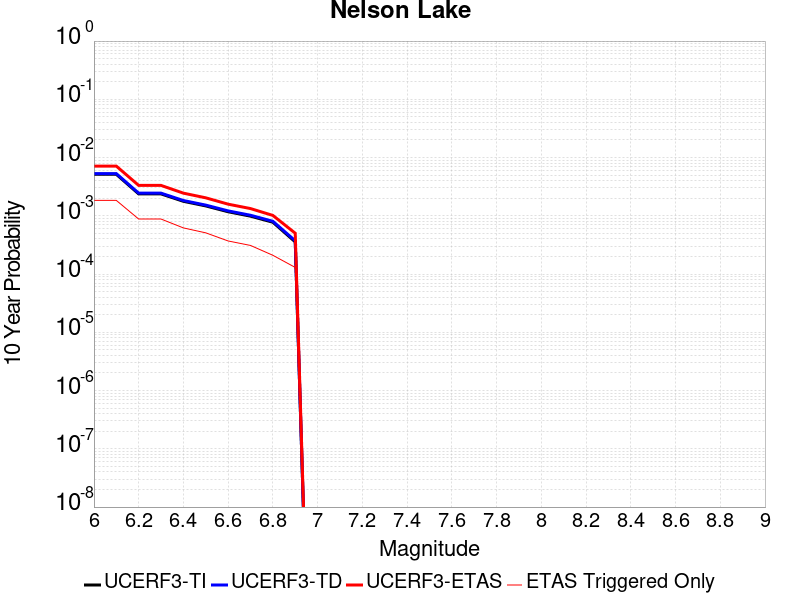 |

| Magnitude | 1 wk TI Prob | 1 wk TD Prob | 1 wk ETAS Prob | 1 wk ETAS/TD Gain | 1 wk ETAS Triggered Only | 1 mo TI Prob | 1 mo TD Prob | 1 mo ETAS Prob | 1 mo ETAS/TD Gain | 1 mo ETAS Triggered Only | 1 yr TI Prob | 1 yr TD Prob | 1 yr ETAS Prob | 1 yr ETAS/TD Gain | 1 yr ETAS Triggered Only | 10 yr TI Prob | 10 yr TD Prob | 10 yr ETAS Prob | 10 yr ETAS/TD Gain | 10 yr ETAS Triggered Only |
|-----|-----|-----|-----|-----|-----|-----|-----|-----|-----|-----|-----|-----|-----|-----|-----|-----|-----|-----|-----|-----|
| 6.0 | 9.913453E-6 | 1.0192293E-5 | 9.0191475E-5 | 8.848988 | 8.0E-5 | 4.2485535E-5 | 4.3680586E-5 | 2.6367098E-4 | 6.0363426 | 2.2E-4 | 5.1713863E-4 | 5.316917E-4 | 0.0014112238 | 2.6542146 | 8.8E-4 | 0.0051593683 | 0.0053052236 | 0.007135462 | 1.344988 | 0.00184 |
| 6.1 | 9.913453E-6 | 1.0192293E-5 | 9.0191475E-5 | 8.848988 | 8.0E-5 | 4.2485535E-5 | 4.3680586E-5 | 2.6367098E-4 | 6.0363426 | 2.2E-4 | 5.1713863E-4 | 5.316917E-4 | 0.0014112238 | 2.6542146 | 8.8E-4 | 0.0051593683 | 0.0053052236 | 0.007135462 | 1.344988 | 0.00184 |
| 6.2 | 4.5596407E-6 | 4.696332E-6 | 5.46961E-5 | 11.646557 | 5.0E-5 | 1.954117E-5 | 2.0126989E-5 | 1.5012437E-4 | 7.4588594 | 1.3E-4 | 2.3788778E-4 | 2.450198E-4 | 6.5491936E-4 | 2.6729243 | 4.1E-4 | 0.0023763329 | 0.0024476226 | 0.0033254686 | 1.3586526 | 8.8E-4 |
| 6.3 | 4.5596407E-6 | 4.696332E-6 | 5.46961E-5 | 11.646557 | 5.0E-5 | 1.954117E-5 | 2.0126989E-5 | 1.5012437E-4 | 7.4588594 | 1.3E-4 | 2.3788778E-4 | 2.450198E-4 | 6.5491936E-4 | 2.6729243 | 4.1E-4 | 0.0023763329 | 0.0024476226 | 0.0033254686 | 1.3586526 | 8.8E-4 |
| 6.4 | 3.4025713E-6 | 3.509912E-6 | 3.350981E-5 | 9.547193 | 3.0E-5 | 1.4582367E-5 | 1.50423975E-5 | 9.504119E-5 | 6.318221 | 8.0E-5 | 1.7752586E-4 | 1.8312664E-4 | 4.3308086E-4 | 2.3649254 | 2.5E-4 | 0.001773841 | 0.0018298404 | 0.0024487057 | 1.3382074 | 6.2E-4 |
| 6.5 | 2.8352947E-6 | 2.9278688E-6 | 3.2927783E-5 | 11.24633 | 3.0E-5 | 1.2151207E-5 | 1.2547953E-5 | 8.254708E-5 | 6.5785294 | 7.0E-5 | 1.479309E-4 | 1.5276136E-4 | 3.4273235E-4 | 2.2435799 | 1.9E-4 | 0.0014783246 | 0.0015266375 | 0.0020358588 | 1.3335575 | 5.1E-4 |
| 6.6 | 2.251518E-6 | 2.3290781E-6 | 2.2329032E-5 | 9.587069 | 2.0E-5 | 9.649328E-6 | 9.981729E-6 | 5.998123E-5 | 6.0091023 | 5.0E-5 | 1.1747423E-4 | 1.2152141E-4 | 2.6150438E-4 | 2.1519203 | 1.4E-4 | 0.0011741214 | 0.0012146112 | 0.0015841619 | 1.3042542 | 3.7E-4 |
| 6.7 | 1.8911853E-6 | 1.9591491E-6 | 2.195911E-5 | 11.208494 | 2.0E-5 | 8.105055E-6 | 8.39633E-6 | 5.8395908E-5 | 6.954933 | 5.0E-5 | 9.867457E-5 | 1.022211E-4 | 2.322078E-4 | 2.2716231 | 1.3E-4 | 9.863076E-4 | 0.0010217984 | 0.0013314815 | 1.3030767 | 3.1E-4 |
| 6.8 | 1.4874814E-6 | 1.5438383E-6 | 1.1543822E-5 | 7.4773526 | 1.0E-5 | 6.374905E-6 | 6.6164357E-6 | 3.661624E-5 | 5.5341334 | 3.0E-5 | 7.76117E-5 | 8.055265E-5 | 1.4054781E-4 | 1.7447945 | 6.0E-5 | 7.75846E-4 | 8.052856E-4 | 0.0010151165 | 1.2605671 | 2.1E-4 |
| 6.9 | 6.835972E-7 | 7.1399705E-7 | 7.1399705E-7 | 1.0 | 0.0 | 2.9296991E-6 | 3.0599856E-6 | 1.3059955E-5 | 4.267979 | 1.0E-5 | 3.56685E-5 | 3.7255006E-5 | 5.725426E-5 | 1.5368207 | 2.0E-5 | 3.5662777E-4 | 3.7251884E-4 | 5.024704E-4 | 1.3488456 | 1.3E-4 |

## Towne Pass
*[(top)](#table-of-contents)*

| 1 Week | 1 Month | 1 Year | 10 Year |
|-----|-----|-----|-----|
| 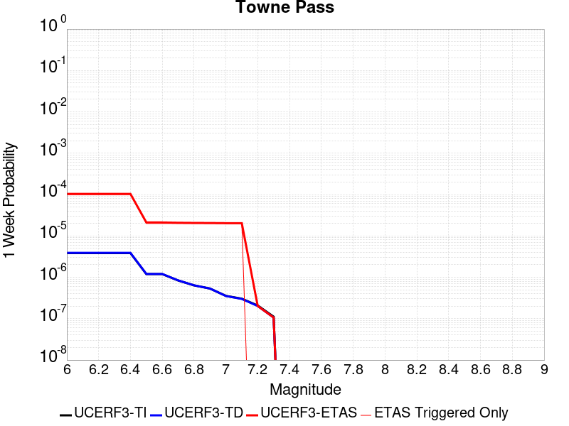 |  | 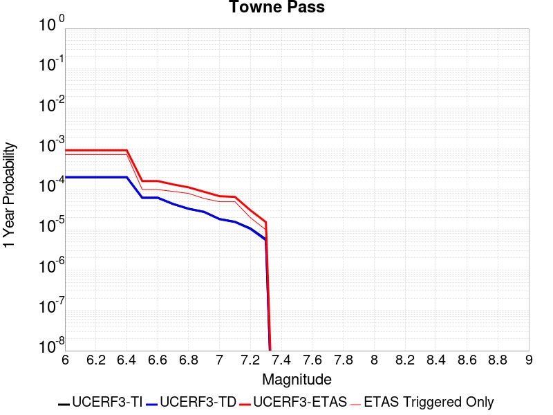 |  |

| Magnitude | 1 wk TI Prob | 1 wk TD Prob | 1 wk ETAS Prob | 1 wk ETAS/TD Gain | 1 wk ETAS Triggered Only | 1 mo TI Prob | 1 mo TD Prob | 1 mo ETAS Prob | 1 mo ETAS/TD Gain | 1 mo ETAS Triggered Only | 1 yr TI Prob | 1 yr TD Prob | 1 yr ETAS Prob | 1 yr ETAS/TD Gain | 1 yr ETAS Triggered Only | 10 yr TI Prob | 10 yr TD Prob | 10 yr ETAS Prob | 10 yr ETAS/TD Gain | 10 yr ETAS Triggered Only |
|-----|-----|-----|-----|-----|-----|-----|-----|-----|-----|-----|-----|-----|-----|-----|-----|-----|-----|-----|-----|-----|
| 6.0 | 3.849728E-6 | 3.8945495E-6 | 1.0389416E-4 | 26.67681 | 1.0E-4 | 1.649873E-5 | 1.6690845E-5 | 2.6668666E-4 | 15.978021 | 2.5E-4 | 2.0085352E-4 | 2.0319647E-4 | 9.430461E-4 | 4.6410556 | 7.4E-4 | 0.0020067208 | 0.0020305358 | 0.0034476526 | 1.6979028 | 0.00142 |
| 6.1 | 3.849728E-6 | 3.8945495E-6 | 1.0389416E-4 | 26.67681 | 1.0E-4 | 1.649873E-5 | 1.6690845E-5 | 2.6668666E-4 | 15.978021 | 2.5E-4 | 2.0085352E-4 | 2.0319647E-4 | 9.430461E-4 | 4.6410556 | 7.4E-4 | 0.0020067208 | 0.0020305358 | 0.0034476526 | 1.6979028 | 0.00142 |
| 6.2 | 3.849728E-6 | 3.8945495E-6 | 1.0389416E-4 | 26.67681 | 1.0E-4 | 1.649873E-5 | 1.6690845E-5 | 2.6668666E-4 | 15.978021 | 2.5E-4 | 2.0085352E-4 | 2.0319647E-4 | 9.430461E-4 | 4.6410556 | 7.4E-4 | 0.0020067208 | 0.0020305358 | 0.0034476526 | 1.6979028 | 0.00142 |
| 6.3 | 3.849728E-6 | 3.8945495E-6 | 1.0389416E-4 | 26.67681 | 1.0E-4 | 1.649873E-5 | 1.6690845E-5 | 2.6668666E-4 | 15.978021 | 2.5E-4 | 2.0085352E-4 | 2.0319647E-4 | 9.430461E-4 | 4.6410556 | 7.4E-4 | 0.0020067208 | 0.0020305358 | 0.0034476526 | 1.6979028 | 0.00142 |
| 6.4 | 3.849728E-6 | 3.8945495E-6 | 1.0389416E-4 | 26.67681 | 1.0E-4 | 1.649873E-5 | 1.6690845E-5 | 2.6668666E-4 | 15.978021 | 2.5E-4 | 2.0085352E-4 | 2.0319647E-4 | 9.430461E-4 | 4.6410556 | 7.4E-4 | 0.0020067208 | 0.0020305358 | 0.0034476526 | 1.6979028 | 0.00142 |
| 6.5 | 1.1953545E-6 | 1.2030554E-6 | 2.1203032E-5 | 17.62432 | 2.0E-5 | 5.1229376E-6 | 5.1559423E-6 | 7.515558E-5 | 14.576498 | 7.0E-5 | 6.236998E-5 | 6.2771906E-5 | 1.6276563E-4 | 2.5929694 | 1.0E-4 | 6.235248E-4 | 6.275535E-4 | 8.474154E-4 | 1.3503478 | 2.2E-4 |
| 6.6 | 1.1953545E-6 | 1.2030554E-6 | 2.1203032E-5 | 17.62432 | 2.0E-5 | 5.1229376E-6 | 5.1559423E-6 | 7.515558E-5 | 14.576498 | 7.0E-5 | 6.236998E-5 | 6.2771906E-5 | 1.6276563E-4 | 2.5929694 | 1.0E-4 | 6.235248E-4 | 6.275535E-4 | 8.474154E-4 | 1.3503478 | 2.2E-4 |
| 6.7 | 8.375951E-7 | 8.4106983E-7 | 2.0841053E-5 | 24.779219 | 2.0E-5 | 3.5896885E-6 | 3.6045803E-6 | 6.360436E-5 | 17.645428 | 6.0E-5 | 4.370358E-5 | 4.388494E-5 | 1.33881E-4 | 3.0507274 | 9.0E-5 | 4.3694986E-4 | 4.3876845E-4 | 6.1868946E-4 | 1.4100592 | 1.8E-4 |
| 6.8 | 6.38041E-7 | 6.392181E-7 | 2.0639205E-5 | 32.288204 | 2.0E-5 | 2.7344586E-6 | 2.7395035E-6 | 5.2739368E-5 | 19.251432 | 5.0E-5 | 3.3291526E-5 | 3.3352986E-5 | 1.1335032E-4 | 3.398506 | 8.0E-5 | 3.3286537E-4 | 3.334836E-4 | 4.6344026E-4 | 1.3896942 | 1.3E-4 |
| 6.9 | 5.3460053E-7 | 5.345356E-7 | 2.0534524E-5 | 38.415634 | 2.0E-5 | 2.2911431E-6 | 2.290865E-6 | 5.229075E-5 | 22.825766 | 5.0E-5 | 2.789431E-5 | 2.789096E-5 | 8.788929E-5 | 3.1511748 | 6.0E-5 | 2.789081E-4 | 2.788779E-4 | 3.7885003E-4 | 1.3584799 | 1.0E-4 |
| 7.0 | 3.557783E-7 | 3.5324425E-7 | 2.0353236E-5 | 57.61803 | 2.0E-5 | 1.5247632E-6 | 1.513903E-6 | 5.1513827E-5 | 34.027164 | 5.0E-5 | 1.8563835E-5 | 1.8431623E-5 | 6.84307E-5 | 3.7126791 | 5.0E-5 | 1.8562283E-4 | 1.8430178E-4 | 2.7428518E-4 | 1.4882395 | 9.0E-5 |
| 7.1 | 3.037942E-7 | 3.00024E-7 | 2.0300018E-5 | 67.661316 | 2.0E-5 | 1.3019744E-6 | 1.2858166E-6 | 5.128575E-5 | 39.885746 | 5.0E-5 | 1.5851423E-5 | 1.5654712E-5 | 6.565393E-5 | 4.1938767 | 5.0E-5 | 1.5850292E-4 | 1.5653683E-4 | 2.3652431E-4 | 1.5109818 | 8.0E-5 |
| 7.2 | 2.0808248E-7 | 2.0217831E-7 | 2.0217831E-7 | 1.0 | 0.0 | 8.917818E-7 | 8.664782E-7 | 2.086646E-5 | 24.081923 | 2.0E-5 | 1.0857389E-5 | 1.0549326E-5 | 3.0549116E-5 | 2.8958356 | 2.0E-5 | 1.0856859E-4 | 1.0548872E-4 | 1.5548345E-4 | 1.4739343 | 5.0E-5 |
| 7.3 | 1.1162073E-7 | 1.0636953E-7 | 1.0636953E-7 | 1.0 | 0.0 | 4.7837443E-7 | 4.5586933E-7 | 1.0455865E-5 | 22.9361 | 1.0E-5 | 5.8241935E-6 | 5.550197E-6 | 1.5550142E-5 | 2.8017278 | 1.0E-5 | 5.8240406E-5 | 5.5500783E-5 | 7.549967E-5 | 1.3603352 | 2.0E-5 |

## Paradise
*[(top)](#table-of-contents)*

| 1 Week | 1 Month | 1 Year | 10 Year |
|-----|-----|-----|-----|
|  | 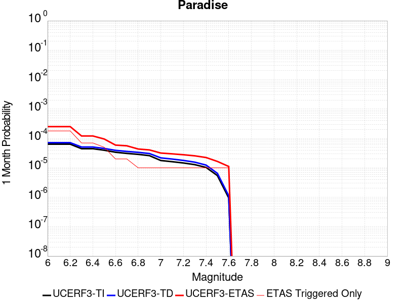 |  |  |

| Magnitude | 1 wk TI Prob | 1 wk TD Prob | 1 wk ETAS Prob | 1 wk ETAS/TD Gain | 1 wk ETAS Triggered Only | 1 mo TI Prob | 1 mo TD Prob | 1 mo ETAS Prob | 1 mo ETAS/TD Gain | 1 mo ETAS Triggered Only | 1 yr TI Prob | 1 yr TD Prob | 1 yr ETAS Prob | 1 yr ETAS/TD Gain | 1 yr ETAS Triggered Only | 10 yr TI Prob | 10 yr TD Prob | 10 yr ETAS Prob | 10 yr ETAS/TD Gain | 10 yr ETAS Triggered Only |
|-----|-----|-----|-----|-----|-----|-----|-----|-----|-----|-----|-----|-----|-----|-----|-----|-----|-----|-----|-----|-----|
| 6.0 | 1.4851273E-5 | 1.6694923E-5 | 5.6694254E-5 | 3.3958979 | 4.0E-5 | 6.364676E-5 | 7.1547845E-5 | 2.5153498E-4 | 3.515619 | 1.8E-4 | 7.7462377E-4 | 8.707705E-4 | 0.001470248 | 1.688445 | 6.0E-4 | 0.0077192914 | 0.008675965 | 0.009736681 | 1.1222593 | 0.00107 |
| 6.1 | 1.4851273E-5 | 1.6694923E-5 | 5.6694254E-5 | 3.3958979 | 4.0E-5 | 6.364676E-5 | 7.1547845E-5 | 2.5153498E-4 | 3.515619 | 1.8E-4 | 7.7462377E-4 | 8.707705E-4 | 0.001470248 | 1.688445 | 6.0E-4 | 0.0077192914 | 0.008675965 | 0.009736681 | 1.1222593 | 0.00107 |
| 6.2 | 1.4851273E-5 | 1.6694923E-5 | 5.6694254E-5 | 3.3958979 | 4.0E-5 | 6.364676E-5 | 7.1547845E-5 | 2.5153498E-4 | 3.515619 | 1.8E-4 | 7.7462377E-4 | 8.707705E-4 | 0.001470248 | 1.688445 | 6.0E-4 | 0.0077192914 | 0.008675965 | 0.009736681 | 1.1222593 | 0.00107 |
| 6.3 | 1.0426831E-5 | 1.1888797E-5 | 3.188856E-5 | 2.682236 | 2.0E-5 | 4.4685654E-5 | 5.095103E-5 | 1.20947465E-4 | 2.3737981 | 7.0E-5 | 5.43912E-4 | 6.2015816E-4 | 8.7000313E-4 | 1.4028729 | 2.5E-4 | 0.0054258266 | 0.0061848834 | 0.0066519766 | 1.0755217 | 4.7E-4 |
| 6.4 | 1.0426831E-5 | 1.1888797E-5 | 3.188856E-5 | 2.682236 | 2.0E-5 | 4.4685654E-5 | 5.095103E-5 | 1.20947465E-4 | 2.3737981 | 7.0E-5 | 5.43912E-4 | 6.2015816E-4 | 8.7000313E-4 | 1.4028729 | 2.5E-4 | 0.0054258266 | 0.0061848834 | 0.0066519766 | 1.0755217 | 4.7E-4 |
| 6.5 | 9.25027E-6 | 1.0620124E-5 | 3.061991E-5 | 2.883197 | 2.0E-5 | 3.964341E-5 | 4.551405E-5 | 9.551177E-5 | 2.098512 | 5.0E-5 | 4.8255164E-4 | 5.539976E-4 | 7.5388676E-4 | 1.3608124 | 2.0E-4 | 0.0048150513 | 0.0055266647 | 0.005884675 | 1.0647788 | 3.6E-4 |
| 6.6 | 7.904275E-6 | 9.159673E-6 | 9.159673E-6 | 1.0 | 0.0 | 3.3875025E-5 | 3.925517E-5 | 5.9254387E-5 | 1.509467 | 2.0E-5 | 4.1235037E-4 | 4.7783085E-4 | 6.1776396E-4 | 1.2928507 | 1.4E-4 | 0.0041158604 | 0.004768431 | 0.0050072866 | 1.050091 | 2.4E-4 |
| 6.7 | 7.2061953E-6 | 8.407388E-6 | 8.407388E-6 | 1.0 | 0.0 | 3.088333E-5 | 3.6031186E-5 | 5.6030465E-5 | 1.5550547 | 2.0E-5 | 3.7593965E-4 | 4.3859507E-4 | 5.285556E-4 | 1.2051107 | 9.0E-5 | 0.003753043 | 0.0043776636 | 0.0045469194 | 1.0386635 | 1.7E-4 |
| 6.8 | 6.6948724E-6 | 7.842299E-6 | 7.842299E-6 | 1.0 | 0.0 | 2.8691995E-5 | 3.360944E-5 | 4.3609103E-5 | 1.2975254 | 1.0E-5 | 3.4926904E-4 | 4.0912168E-4 | 4.8908894E-4 | 1.1954608 | 8.0E-5 | 0.003487206 | 0.0040840427 | 0.0042234706 | 1.0341398 | 1.4E-4 |
| 6.9 | 6.0421025E-6 | 7.130747E-6 | 7.130747E-6 | 1.0 | 0.0 | 2.5894467E-5 | 3.0560004E-5 | 4.05597E-5 | 1.3272151 | 1.0E-5 | 3.1521954E-4 | 3.7200793E-4 | 4.2198933E-4 | 1.1343558 | 5.0E-5 | 0.0031477278 | 0.0037141903 | 0.0038138188 | 1.0268238 | 1.0E-4 |
| 7.0 | 4.134091E-6 | 5.080416E-6 | 5.080416E-6 | 1.0 | 0.0 | 1.7717413E-5 | 2.1773038E-5 | 3.177282E-5 | 1.4592736 | 1.0E-5 | 2.1568815E-4 | 2.6505603E-4 | 2.9504808E-4 | 1.1131536 | 3.0E-5 | 0.0021547892 | 0.0026475522 | 0.002687446 | 1.0150683 | 4.0E-5 |
| 7.1 | 3.7674888E-6 | 4.6319656E-6 | 4.6319656E-6 | 1.0 | 0.0 | 1.6146281E-5 | 1.9851139E-5 | 2.985094E-5 | 1.5037395 | 1.0E-5 | 1.9656324E-4 | 2.4166232E-4 | 2.7165507E-4 | 1.1241101 | 3.0E-5 | 0.0019638946 | 0.002414146 | 0.0024540494 | 1.016529 | 4.0E-5 |
| 7.2 | 3.4065345E-6 | 4.156807E-6 | 4.156807E-6 | 1.0 | 0.0 | 1.4599351E-5 | 1.7814775E-5 | 2.7814596E-5 | 1.5613219 | 1.0E-5 | 1.777326E-4 | 2.1687479E-4 | 2.3687044E-4 | 1.0921991 | 2.0E-5 | 0.0017759053 | 0.0021667795 | 0.0021967145 | 1.0138154 | 3.0E-5 |
| 7.3 | 2.9934936E-6 | 3.6293877E-6 | 3.6293877E-6 | 1.0 | 0.0 | 1.2829195E-5 | 1.5554435E-5 | 2.5554278E-5 | 1.6428934 | 1.0E-5 | 1.5618425E-4 | 1.8936026E-4 | 2.0935647E-4 | 1.1055988 | 2.0E-5 | 0.0015607453 | 0.0018921344 | 0.0019220776 | 1.0158252 | 3.0E-5 |
| 7.4 | 2.4049796E-6 | 2.8890327E-6 | 2.8890327E-6 | 1.0 | 0.0 | 1.0307015E-5 | 1.2381518E-5 | 2.2381395E-5 | 1.8076454 | 1.0E-5 | 1.2548068E-4 | 1.5073598E-4 | 1.7073298E-4 | 1.1326623 | 2.0E-5 | 0.0012540985 | 0.001506479 | 0.0015364337 | 1.019884 | 3.0E-5 |
| 7.5 | 1.2710091E-6 | 1.513489E-6 | 1.513489E-6 | 1.0 | 0.0 | 5.44717E-6 | 6.486372E-6 | 1.6486307E-5 | 2.541684 | 1.0E-5 | 6.631728E-5 | 7.896997E-5 | 8.896918E-5 | 1.1266204 | 1.0E-5 | 6.6297496E-4 | 7.895417E-4 | 7.995338E-4 | 1.0126556 | 1.0E-5 |
| 7.6 | 2.21172E-7 | 2.6040198E-7 | 2.6040198E-7 | 1.0 | 0.0 | 9.478797E-7 | 1.1160082E-6 | 1.1115997E-5 | 9.960498 | 1.0E-5 | 1.1540374E-5 | 1.3587343E-5 | 2.3587208E-5 | 1.7359691 | 1.0E-5 | 1.1539775E-4 | 1.3586794E-4 | 1.4586658E-4 | 1.0735909 | 1.0E-5 |

## San Andreas (San Bernardino N)
*[(top)](#table-of-contents)*

| 1 Week | 1 Month | 1 Year | 10 Year |
|-----|-----|-----|-----|
|  | 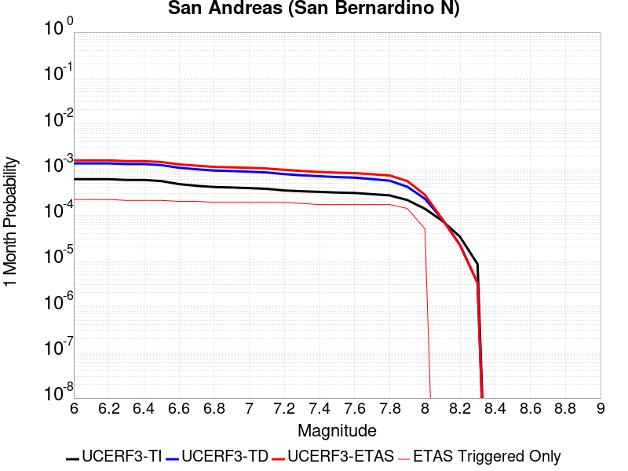 |  |  |

| Magnitude | 1 wk TI Prob | 1 wk TD Prob | 1 wk ETAS Prob | 1 wk ETAS/TD Gain | 1 wk ETAS Triggered Only | 1 mo TI Prob | 1 mo TD Prob | 1 mo ETAS Prob | 1 mo ETAS/TD Gain | 1 mo ETAS Triggered Only | 1 yr TI Prob | 1 yr TD Prob | 1 yr ETAS Prob | 1 yr ETAS/TD Gain | 1 yr ETAS Triggered Only | 10 yr TI Prob | 10 yr TD Prob | 10 yr ETAS Prob | 10 yr ETAS/TD Gain | 10 yr ETAS Triggered Only |
|-----|-----|-----|-----|-----|-----|-----|-----|-----|-----|-----|-----|-----|-----|-----|-----|-----|-----|-----|-----|-----|
| 6.0 | 1.4273766E-4 | 3.1614845E-4 | 3.561358E-4 | 1.1264828 | 4.0E-5 | 6.115894E-4 | 0.0013542244 | 0.0015739264 | 1.1622347 | 2.2E-4 | 0.0074207084 | 0.016364535 | 0.016905535 | 1.0330592 | 5.5E-4 | 0.07177748 | 0.15036654 | 0.15122467 | 1.0057069 | 0.00101 |
| 6.1 | 1.4273766E-4 | 3.1614845E-4 | 3.561358E-4 | 1.1264828 | 4.0E-5 | 6.115894E-4 | 0.0013542244 | 0.0015739264 | 1.1622347 | 2.2E-4 | 0.0074207084 | 0.016364535 | 0.016905535 | 1.0330592 | 5.5E-4 | 0.07177748 | 0.15036654 | 0.15122467 | 1.0057069 | 0.00101 |
| 6.2 | 1.4273766E-4 | 3.1614845E-4 | 3.561358E-4 | 1.1264828 | 4.0E-5 | 6.115894E-4 | 0.0013542244 | 0.0015739264 | 1.1622347 | 2.2E-4 | 0.0074207084 | 0.016364535 | 0.016905535 | 1.0330592 | 5.5E-4 | 0.07177748 | 0.15036654 | 0.15122467 | 1.0057069 | 0.00101 |
| 6.3 | 1.3730655E-4 | 3.051962E-4 | 3.3518707E-4 | 1.0982674 | 3.0E-5 | 5.883239E-4 | 0.0013073338 | 0.0015170593 | 1.1604223 | 2.1E-4 | 0.0071393442 | 0.015802028 | 0.016333494 | 1.0336329 | 5.4E-4 | 0.06914291 | 0.14567827 | 0.14652404 | 1.0058059 | 9.9E-4 |
| 6.4 | 1.3730655E-4 | 3.051962E-4 | 3.3518707E-4 | 1.0982674 | 3.0E-5 | 5.883239E-4 | 0.0013073338 | 0.0015170593 | 1.1604223 | 2.1E-4 | 0.0071393442 | 0.015802028 | 0.016333494 | 1.0336329 | 5.4E-4 | 0.06914291 | 0.14567827 | 0.14652404 | 1.0058059 | 9.9E-4 |
| 6.5 | 1.2942807E-4 | 2.893405E-4 | 3.1933183E-4 | 1.103654 | 3.0E-5 | 5.545738E-4 | 0.0012394466 | 0.0014491862 | 1.1692204 | 2.1E-4 | 0.0067310524 | 0.014987098 | 0.015519004 | 1.035491 | 5.4E-4 | 0.06530788 | 0.13881195 | 0.1396473 | 1.0060179 | 9.7E-4 |
| 6.6 | 1.1125901E-4 | 2.537283E-4 | 2.837207E-4 | 1.1182067 | 3.0E-5 | 4.767372E-4 | 0.0010869562 | 0.0012867388 | 1.1838001 | 2.0E-4 | 0.005788839 | 0.013154025 | 0.013677053 | 1.0397619 | 5.3E-4 | 0.056403454 | 0.123056285 | 0.12388061 | 1.0066987 | 9.4E-4 |
| 6.7 | 1.02209575E-4 | 2.3507705E-4 | 2.6507E-4 | 1.1275877 | 3.0E-5 | 4.3796748E-4 | 0.0010070855 | 0.001206884 | 1.1983929 | 2.0E-4 | 0.0053192247 | 0.012192756 | 0.012716294 | 1.0429385 | 5.3E-4 | 0.051936906 | 0.11485627 | 0.115661755 | 1.007013 | 9.1E-4 |
| 6.8 | 9.610582E-5 | 2.2033554E-4 | 2.5032894E-4 | 1.1361259 | 3.0E-5 | 4.1181705E-4 | 9.4395416E-4 | 0.0011337748 | 1.2010909 | 1.9E-4 | 0.0050023515 | 0.011432346 | 0.011946402 | 1.044965 | 5.2E-4 | 0.048912346 | 0.10822741 | 0.10903001 | 1.0074158 | 9.0E-4 |
| 6.9 | 9.3877505E-5 | 2.1489074E-4 | 2.448843E-4 | 1.1395758 | 3.0E-5 | 4.0227012E-4 | 9.2063594E-4 | 0.001110461 | 1.206189 | 1.9E-4 | 0.0048866454 | 0.011151383 | 0.011655695 | 1.0452242 | 5.1E-4 | 0.04780577 | 0.105814084 | 0.10660991 | 1.007521 | 8.9E-4 |
| 7.0 | 9.1019785E-5 | 2.0815943E-4 | 2.3815318E-4 | 1.1440903 | 3.0E-5 | 3.900265E-4 | 8.9180743E-4 | 0.001081638 | 1.2128605 | 1.9E-4 | 0.0047382377 | 0.010803926 | 0.011308416 | 1.0466951 | 5.1E-4 | 0.046384744 | 0.10278599 | 0.10358451 | 1.0077688 | 8.9E-4 |
| 7.1 | 8.771155E-5 | 1.9990467E-4 | 2.2989867E-4 | 1.1500416 | 3.0E-5 | 3.758525E-4 | 8.564535E-4 | 0.0010462907 | 1.2216551 | 1.9E-4 | 0.0045664064 | 0.010377665 | 0.010882373 | 1.048634 | 5.1E-4 | 0.044737056 | 0.099094115 | 0.09989592 | 1.0080913 | 8.9E-4 |
| 7.2 | 8.0830236E-5 | 1.8396029E-4 | 2.1395477E-4 | 1.1630486 | 3.0E-5 | 3.4636928E-4 | 7.8816316E-4 | 9.780134E-4 | 1.2408768 | 1.9E-4 | 0.0042088944 | 0.009553772 | 0.0100589 | 1.0528721 | 5.1E-4 | 0.041300658 | 0.09182046 | 0.09262874 | 1.0088028 | 8.9E-4 |
| 7.3 | 7.7668235E-5 | 1.7339372E-4 | 2.0338852E-4 | 1.1729866 | 3.0E-5 | 3.328214E-4 | 7.4290443E-4 | 9.227707E-4 | 1.2421123 | 1.8E-4 | 0.0040445733 | 0.009007431 | 0.009502927 | 1.0550097 | 5.0E-4 | 0.03971748 | 0.0870959 | 0.087890126 | 1.009119 | 8.7E-4 |
| 7.4 | 7.520177E-5 | 1.6559374E-4 | 1.9558877E-4 | 1.1811363 | 3.0E-5 | 3.2225347E-4 | 7.0949446E-4 | 8.7937387E-4 | 1.2394372 | 1.7E-4 | 0.0039163795 | 0.008603949 | 0.0090897335 | 1.0564606 | 4.9E-4 | 0.038480744 | 0.083552666 | 0.08433165 | 1.0093232 | 8.5E-4 |
| 7.5 | 7.274697E-5 | 1.5846924E-4 | 1.8846449E-4 | 1.1892812 | 3.0E-5 | 3.1173544E-4 | 6.789772E-4 | 8.4886176E-4 | 1.2502066 | 1.7E-4 | 0.003788775 | 0.008235271 | 0.008721236 | 1.0590101 | 4.9E-4 | 0.03724827 | 0.08026917 | 0.08105095 | 1.0097394 | 8.5E-4 |
| 7.6 | 7.1185845E-5 | 1.541672E-4 | 1.8416258E-4 | 1.1945639 | 3.0E-5 | 3.0504653E-4 | 6.605493E-4 | 8.3043706E-4 | 1.2571915 | 1.7E-4 | 0.0037076178 | 0.008012585 | 0.008498658 | 1.0606638 | 4.9E-4 | 0.036463667 | 0.078258425 | 0.079041906 | 1.0100114 | 8.5E-4 |
| 7.7 | 6.709961E-5 | 1.4325391E-4 | 1.7324962E-4 | 1.2093884 | 3.0E-5 | 2.8753807E-4 | 6.1380095E-4 | 7.836966E-4 | 1.2767928 | 1.7E-4 | 0.003495157 | 0.007447459 | 0.007933809 | 1.0653043 | 4.9E-4 | 0.034406938 | 0.07308612 | 0.07386473 | 1.0106533 | 8.4E-4 |
| 7.8 | 6.300812E-5 | 1.3209098E-4 | 1.6208702E-4 | 1.2270862 | 3.0E-5 | 2.7000686E-4 | 5.6598143E-4 | 7.3588523E-4 | 1.3001932 | 1.7E-4 | 0.0032823787 | 0.006869081 | 0.007355715 | 1.0708442 | 4.9E-4 | 0.032343175 | 0.0677427 | 0.06852579 | 1.0115598 | 8.4E-4 |
| 7.9 | 4.983037E-5 | 9.7286385E-5 | 1.2728346E-4 | 1.3083379 | 3.0E-5 | 2.1354125E-4 | 4.1687503E-4 | 5.568167E-4 | 1.335692 | 1.4E-4 | 0.0025967648 | 0.005063652 | 0.0054616267 | 1.0785943 | 4.0E-4 | 0.025666296 | 0.050672647 | 0.051337175 | 1.0131142 | 7.0E-4 |
| 8.0 | 3.2211527E-5 | 5.3333257E-5 | 6.333272E-5 | 1.1874902 | 1.0E-5 | 1.380421E-4 | 2.2855109E-4 | 2.7853966E-4 | 1.2187195 | 5.0E-5 | 0.0016793669 | 0.0027790607 | 0.002898727 | 1.0430601 | 1.2E-4 | 0.016667323 | 0.028375156 | 0.028608346 | 1.008218 | 2.4E-4 |
| 8.1 | 1.743376E-5 | 1.8835979E-5 | 1.8835979E-5 | 1.0 | 0.0 | 7.471398E-5 | 8.0723126E-5 | 8.0723126E-5 | 1.0 | 0.0 | 9.0926304E-4 | 9.823616E-4 | 9.923518E-4 | 1.0101695 | 1.0E-5 | 0.009055517 | 0.010490086 | 0.010519771 | 1.0028298 | 3.0E-5 |
| 8.2 | 7.831616E-6 | 5.158648E-6 | 5.158648E-6 | 1.0 | 0.0 | 3.3563636E-5 | 2.2108305E-5 | 2.2108305E-5 | 1.0 | 0.0 | 4.0856065E-4 | 2.6913546E-4 | 2.6913546E-4 | 1.0 | 0.0 | 0.004078103 | 0.003043787 | 0.003043787 | 1.0 | 0.0 |
| 8.3 | 1.983087E-6 | 7.6647797E-7 | 7.6647797E-7 | 1.0 | 0.0 | 8.498917E-6 | 3.2849016E-6 | 3.2849016E-6 | 1.0 | 0.0 | 1.034694E-4 | 3.999296E-5 | 3.999296E-5 | 1.0 | 0.0 | 0.0010342124 | 4.7228087E-4 | 4.7228087E-4 | 1.0 | 0.0 |

## Bicycle Lake
*[(top)](#table-of-contents)*

| 1 Week | 1 Month | 1 Year | 10 Year |
|-----|-----|-----|-----|
|  |  | 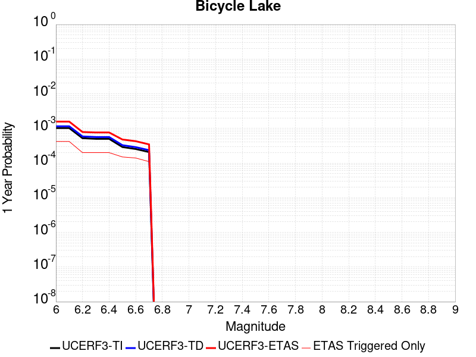 |  |

| Magnitude | 1 wk TI Prob | 1 wk TD Prob | 1 wk ETAS Prob | 1 wk ETAS/TD Gain | 1 wk ETAS Triggered Only | 1 mo TI Prob | 1 mo TD Prob | 1 mo ETAS Prob | 1 mo ETAS/TD Gain | 1 mo ETAS Triggered Only | 1 yr TI Prob | 1 yr TD Prob | 1 yr ETAS Prob | 1 yr ETAS/TD Gain | 1 yr ETAS Triggered Only | 10 yr TI Prob | 10 yr TD Prob | 10 yr ETAS Prob | 10 yr ETAS/TD Gain | 10 yr ETAS Triggered Only |
|-----|-----|-----|-----|-----|-----|-----|-----|-----|-----|-----|-----|-----|-----|-----|-----|-----|-----|-----|-----|-----|
| 6.0 | 1.9621975E-5 | 2.2097447E-5 | 5.2096784E-5 | 2.3575928 | 3.0E-5 | 8.4091465E-5 | 9.470067E-5 | 2.1468931E-4 | 2.2670305 | 1.2E-4 | 0.0010233327 | 0.0011525059 | 0.0015720217 | 1.3640033 | 4.2E-4 | 0.01018633 | 0.011478599 | 0.012348498 | 1.0757844 | 8.8E-4 |
| 6.1 | 1.9621975E-5 | 2.2097447E-5 | 5.2096784E-5 | 2.3575928 | 3.0E-5 | 8.4091465E-5 | 9.470067E-5 | 2.1468931E-4 | 2.2670305 | 1.2E-4 | 0.0010233327 | 0.0011525059 | 0.0015720217 | 1.3640033 | 4.2E-4 | 0.01018633 | 0.011478599 | 0.012348498 | 1.0757844 | 8.8E-4 |
| 6.2 | 9.9971285E-6 | 1.1255827E-5 | 3.1255604E-5 | 2.7768373 | 2.0E-5 | 4.2844134E-5 | 4.8238664E-5 | 9.823625E-5 | 2.036463 | 5.0E-5 | 5.2150246E-4 | 5.8719947E-4 | 7.87082E-4 | 1.3403997 | 2.0E-4 | 0.0052028033 | 0.0058615846 | 0.006378536 | 1.0881932 | 5.2E-4 |
| 6.3 | 9.589428E-6 | 1.0798527E-5 | 3.079831E-5 | 2.8520844 | 2.0E-5 | 4.10969E-5 | 4.627887E-5 | 9.6276555E-5 | 2.0803566 | 5.0E-5 | 5.002399E-4 | 5.633515E-4 | 7.632388E-4 | 1.3548181 | 2.0E-4 | 0.0049911533 | 0.0056243236 | 0.0061314553 | 1.0901675 | 5.1E-4 |
| 6.4 | 9.589428E-6 | 1.0798527E-5 | 3.079831E-5 | 2.8520844 | 2.0E-5 | 4.10969E-5 | 4.627887E-5 | 9.6276555E-5 | 2.0803566 | 5.0E-5 | 5.002399E-4 | 5.633515E-4 | 7.632388E-4 | 1.3548181 | 2.0E-4 | 0.0049911533 | 0.0056243236 | 0.0061314553 | 1.0901675 | 5.1E-4 |
| 6.5 | 5.557707E-6 | 6.2857107E-6 | 1.6285649E-5 | 2.5909 | 1.0E-5 | 2.3818526E-5 | 2.6938633E-5 | 4.6938094E-5 | 1.7424082 | 2.0E-5 | 2.8995197E-4 | 3.2795538E-4 | 4.779062E-4 | 1.4572293 | 1.5E-4 | 0.0028957394 | 0.0032773504 | 0.003606269 | 1.1003611 | 3.3E-4 |
| 6.6 | 4.8742945E-6 | 5.5133855E-6 | 5.5133855E-6 | 1.0 | 0.0 | 2.0889667E-5 | 2.3628729E-5 | 3.3628494E-5 | 1.4232036 | 1.0E-5 | 2.54302E-4 | 2.87668E-4 | 4.2762773E-4 | 1.4865321 | 1.4E-4 | 0.002540112 | 0.0028755253 | 0.00315472 | 1.0970935 | 2.8E-4 |
| 6.7 | 3.991108E-6 | 4.515989E-6 | 4.515989E-6 | 1.0 | 0.0 | 1.7104636E-5 | 1.9354238E-5 | 2.9354045E-5 | 1.5166727 | 1.0E-5 | 2.0822904E-4 | 2.3563785E-4 | 3.4561194E-4 | 1.4667081 | 1.1E-4 | 0.0020803404 | 0.0023563786 | 0.0025559072 | 1.084676 | 2.0E-4 |

## Garlic Springs
*[(top)](#table-of-contents)*

| 1 Week | 1 Month | 1 Year | 10 Year |
|-----|-----|-----|-----|
|  |  |  |  |

| Magnitude | 1 wk TI Prob | 1 wk TD Prob | 1 wk ETAS Prob | 1 wk ETAS/TD Gain | 1 wk ETAS Triggered Only | 1 mo TI Prob | 1 mo TD Prob | 1 mo ETAS Prob | 1 mo ETAS/TD Gain | 1 mo ETAS Triggered Only | 1 yr TI Prob | 1 yr TD Prob | 1 yr ETAS Prob | 1 yr ETAS/TD Gain | 1 yr ETAS Triggered Only | 10 yr TI Prob | 10 yr TD Prob | 10 yr ETAS Prob | 10 yr ETAS/TD Gain | 10 yr ETAS Triggered Only |
|-----|-----|-----|-----|-----|-----|-----|-----|-----|-----|-----|-----|-----|-----|-----|-----|-----|-----|-----|-----|-----|
| 6.0 | 1.6760017E-5 | 1.8777133E-5 | 3.8776758E-5 | 2.0651054 | 2.0E-5 | 7.182667E-5 | 8.0471604E-5 | 1.3046758E-4 | 1.6212872 | 5.0E-5 | 8.7413884E-4 | 9.794187E-4 | 0.001229174 | 1.2550035 | 2.5E-4 | 0.008707083 | 0.009762568 | 0.0104359295 | 1.0689738 | 6.8E-4 |
| 6.1 | 9.852767E-6 | 1.0973753E-5 | 3.0973533E-5 | 2.8225107 | 2.0E-5 | 4.222546E-5 | 4.702992E-5 | 7.702851E-5 | 1.6378617 | 3.0E-5 | 5.139737E-4 | 5.7250983E-4 | 6.824468E-4 | 1.1920265 | 1.1E-4 | 0.005127866 | 0.0057173073 | 0.0060454207 | 1.0573895 | 3.3E-4 |
| 6.2 | 9.852767E-6 | 1.0973753E-5 | 3.0973533E-5 | 2.8225107 | 2.0E-5 | 4.222546E-5 | 4.702992E-5 | 7.702851E-5 | 1.6378617 | 3.0E-5 | 5.139737E-4 | 5.7250983E-4 | 6.824468E-4 | 1.1920265 | 1.1E-4 | 0.005127866 | 0.0057173073 | 0.0060454207 | 1.0573895 | 3.3E-4 |
| 6.3 | 4.3167724E-6 | 4.7780964E-6 | 4.7780964E-6 | 1.0 | 0.0 | 1.8500323E-5 | 2.0477524E-5 | 3.047732E-5 | 1.4883302 | 1.0E-5 | 2.2521814E-4 | 2.4930836E-4 | 2.892984E-4 | 1.1604038 | 4.0E-5 | 0.0022499003 | 0.0024925452 | 0.0025723458 | 1.0320157 | 8.0E-5 |
| 6.4 | 4.3167724E-6 | 4.7780964E-6 | 4.7780964E-6 | 1.0 | 0.0 | 1.8500323E-5 | 2.0477524E-5 | 3.047732E-5 | 1.4883302 | 1.0E-5 | 2.2521814E-4 | 2.4930836E-4 | 2.892984E-4 | 1.1604038 | 4.0E-5 | 0.0022499003 | 0.0024925452 | 0.0025723458 | 1.0320157 | 8.0E-5 |
| 6.5 | 4.3167724E-6 | 4.7780964E-6 | 4.7780964E-6 | 1.0 | 0.0 | 1.8500323E-5 | 2.0477524E-5 | 3.047732E-5 | 1.4883302 | 1.0E-5 | 2.2521814E-4 | 2.4930836E-4 | 2.892984E-4 | 1.1604038 | 4.0E-5 | 0.0022499003 | 0.0024925452 | 0.0025723458 | 1.0320157 | 8.0E-5 |
| 6.6 | 4.301311E-6 | 4.7609647E-6 | 4.7609647E-6 | 1.0 | 0.0 | 1.8434059E-5 | 2.0404104E-5 | 3.04039E-5 | 1.4900875 | 1.0E-5 | 2.2441156E-4 | 2.4841467E-4 | 2.8840473E-4 | 1.160981 | 4.0E-5 | 0.0022418506 | 0.0024836282 | 0.0025634295 | 1.032131 | 8.0E-5 |
| 6.7 | 3.8599724E-6 | 4.2711204E-6 | 4.2711204E-6 | 1.0 | 0.0 | 1.6542634E-5 | 1.8304801E-5 | 2.8304617E-5 | 1.5462948 | 1.0E-5 | 2.0138794E-4 | 2.2286095E-4 | 2.6285203E-4 | 1.1794441 | 4.0E-5 | 0.0020120554 | 0.0022286095 | 0.0023084313 | 1.0358168 | 8.0E-5 |

## Helendale-So Lockhart
*[(top)](#table-of-contents)*

| 1 Week | 1 Month | 1 Year | 10 Year |
|-----|-----|-----|-----|
|  |  |  | 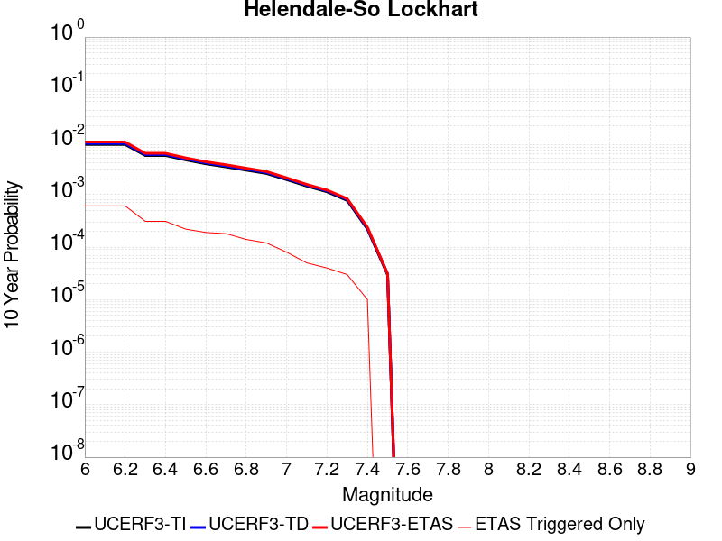 |

| Magnitude | 1 wk TI Prob | 1 wk TD Prob | 1 wk ETAS Prob | 1 wk ETAS/TD Gain | 1 wk ETAS Triggered Only | 1 mo TI Prob | 1 mo TD Prob | 1 mo ETAS Prob | 1 mo ETAS/TD Gain | 1 mo ETAS Triggered Only | 1 yr TI Prob | 1 yr TD Prob | 1 yr ETAS Prob | 1 yr ETAS/TD Gain | 1 yr ETAS Triggered Only | 10 yr TI Prob | 10 yr TD Prob | 10 yr ETAS Prob | 10 yr ETAS/TD Gain | 10 yr ETAS Triggered Only |
|-----|-----|-----|-----|-----|-----|-----|-----|-----|-----|-----|-----|-----|-----|-----|-----|-----|-----|-----|-----|-----|
| 6.0 | 1.7296055E-5 | 1.8103841E-5 | 6.8102934E-5 | 3.7617948 | 5.0E-5 | 7.412385E-5 | 7.7585704E-5 | 1.8757717E-4 | 2.417677 | 1.1E-4 | 9.0208417E-4 | 9.442173E-4 | 0.0012339435 | 1.3068427 | 2.9E-4 | 0.008984311 | 0.009404174 | 0.010008438 | 1.0642548 | 6.1E-4 |
| 6.1 | 1.7296055E-5 | 1.8103841E-5 | 6.8102934E-5 | 3.7617948 | 5.0E-5 | 7.412385E-5 | 7.7585704E-5 | 1.8757717E-4 | 2.417677 | 1.1E-4 | 9.0208417E-4 | 9.442173E-4 | 0.0012339435 | 1.3068427 | 2.9E-4 | 0.008984311 | 0.009404174 | 0.010008438 | 1.0642548 | 6.1E-4 |
| 6.2 | 1.7296055E-5 | 1.8103841E-5 | 6.8102934E-5 | 3.7617948 | 5.0E-5 | 7.412385E-5 | 7.7585704E-5 | 1.8757717E-4 | 2.417677 | 1.1E-4 | 9.0208417E-4 | 9.442173E-4 | 0.0012339435 | 1.3068427 | 2.9E-4 | 0.008984311 | 0.009404174 | 0.010008438 | 1.0642548 | 6.1E-4 |
| 6.3 | 1.0669118E-5 | 1.1135489E-5 | 5.1135044E-5 | 4.5920787 | 4.0E-5 | 4.5723988E-5 | 4.7722668E-5 | 1.2771886E-4 | 2.6762722 | 8.0E-5 | 5.5654737E-4 | 5.8087136E-4 | 7.0080167E-4 | 1.2064662 | 1.2E-4 | 0.0055515557 | 0.005793827 | 0.006102031 | 1.0531952 | 3.1E-4 |
| 6.4 | 1.0669118E-5 | 1.1135489E-5 | 5.1135044E-5 | 4.5920787 | 4.0E-5 | 4.5723988E-5 | 4.7722668E-5 | 1.2771886E-4 | 2.6762722 | 8.0E-5 | 5.5654737E-4 | 5.8087136E-4 | 7.0080167E-4 | 1.2064662 | 1.2E-4 | 0.0055515557 | 0.005793827 | 0.006102031 | 1.0531952 | 3.1E-4 |
| 6.5 | 8.790038E-6 | 9.1702495E-6 | 2.9170065E-5 | 3.1809456 | 2.0E-5 | 3.767105E-5 | 3.9300485E-5 | 9.929813E-5 | 2.5266387 | 6.0E-5 | 4.585485E-4 | 4.7837992E-4 | 5.583416E-4 | 1.1671511 | 8.0E-5 | 0.0045760344 | 0.0047736657 | 0.0049926154 | 1.0458661 | 2.2E-4 |
| 6.6 | 7.396949E-6 | 7.715581E-6 | 1.7715503E-5 | 2.2960687 | 1.0E-5 | 3.1700827E-5 | 3.3066364E-5 | 8.306471E-5 | 2.5120606 | 5.0E-5 | 3.858892E-4 | 4.025096E-4 | 4.7248145E-4 | 1.1738389 | 7.0E-5 | 0.003852198 | 0.004017913 | 0.004207149 | 1.0470983 | 1.9E-4 |
| 6.7 | 6.4600285E-6 | 6.7380697E-6 | 1.6738002E-5 | 2.4840946 | 1.0E-5 | 2.7685543E-5 | 2.8877126E-5 | 7.887568E-5 | 2.7314243 | 5.0E-5 | 3.3701936E-4 | 3.5152308E-4 | 4.2149847E-4 | 1.1990634 | 7.0E-5 | 0.0033650869 | 0.003509752 | 0.0036891203 | 1.0511056 | 1.8E-4 |
| 6.8 | 5.600104E-6 | 5.836042E-6 | 1.5835984E-5 | 2.71348 | 1.0E-5 | 2.4000226E-5 | 2.5011372E-5 | 6.501037E-5 | 2.5992324 | 4.0E-5 | 2.9216358E-4 | 3.044715E-4 | 3.6445324E-4 | 1.1970028 | 6.0E-5 | 0.0029177975 | 0.003040605 | 0.0031801793 | 1.0459034 | 1.4E-4 |
| 6.9 | 4.839122E-6 | 5.039537E-6 | 1.5039486E-5 | 2.9842992 | 1.0E-5 | 2.0738931E-5 | 2.159784E-5 | 6.159698E-5 | 2.8519971 | 4.0E-5 | 2.5246723E-4 | 2.6292243E-4 | 3.2290665E-4 | 1.2281442 | 6.0E-5 | 0.002521806 | 0.002626161 | 0.002745846 | 1.0455741 | 1.2E-4 |
| 7.0 | 3.6937633E-6 | 3.845229E-6 | 1.3845191E-5 | 3.6006155 | 1.0E-5 | 1.5830317E-5 | 1.6479451E-5 | 4.6478955E-5 | 2.820419 | 3.0E-5 | 1.9271708E-4 | 2.0061915E-4 | 2.4061112E-4 | 1.1993427 | 4.0E-5 | 0.0019255003 | 0.0020044118 | 0.0020842515 | 1.039832 | 8.0E-5 |
| 7.1 | 2.7858857E-6 | 2.8978693E-6 | 1.289784E-5 | 4.4508014 | 1.0E-5 | 1.1939455E-5 | 1.2419382E-5 | 3.2419135E-5 | 2.610366 | 2.0E-5 | 1.4535317E-4 | 1.511957E-4 | 1.7119267E-4 | 1.1322589 | 2.0E-5 | 0.0014525814 | 0.0015109498 | 0.0015608743 | 1.0330417 | 5.0E-5 |
| 7.2 | 2.1672065E-6 | 2.2540248E-6 | 1.2254002E-5 | 5.4364986 | 1.0E-5 | 9.2879945E-6 | 9.660072E-6 | 2.9659877E-5 | 3.070358 | 2.0E-5 | 1.1307546E-4 | 1.176052E-4 | 1.3760285E-4 | 1.1700405 | 2.0E-5 | 0.0011301794 | 0.0011754478 | 0.0012154009 | 1.0339895 | 4.0E-5 |
| 7.3 | 1.4823496E-6 | 1.5422185E-6 | 1.1542203E-5 | 7.4841557 | 1.0E-5 | 6.3529114E-6 | 6.6094917E-6 | 2.660936E-5 | 4.0259314 | 2.0E-5 | 7.734395E-5 | 8.046775E-5 | 1.0046614E-4 | 1.2485268 | 2.0E-5 | 7.731704E-4 | 8.044012E-4 | 8.343771E-4 | 1.0372648 | 3.0E-5 |
| 7.4 | 4.2321457E-7 | 4.4109012E-7 | 4.4109012E-7 | 1.0 | 0.0 | 1.8137755E-6 | 1.8903852E-6 | 1.1890366E-5 | 6.2899175 | 1.0E-5 | 2.2082493E-5 | 2.3015242E-5 | 3.301501E-5 | 1.4344847 | 1.0E-5 | 2.2080299E-4 | 2.3013311E-4 | 2.4013082E-4 | 1.0434431 | 1.0E-5 |
| 7.5 | 5.6942316E-8 | 5.941599E-8 | 5.941599E-8 | 1.0 | 0.0 | 2.440385E-7 | 2.5463993E-7 | 2.5463993E-7 | 1.0 | 0.0 | 2.9711643E-6 | 3.1002376E-6 | 3.1002376E-6 | 1.0 | 0.0 | 2.9711247E-5 | 3.1002022E-5 | 3.1002022E-5 | 1.0 | 0.0 |

## Death Valley (Black Mtns Frontal)
*[(top)](#table-of-contents)*

| 1 Week | 1 Month | 1 Year | 10 Year |
|-----|-----|-----|-----|
|  |  | 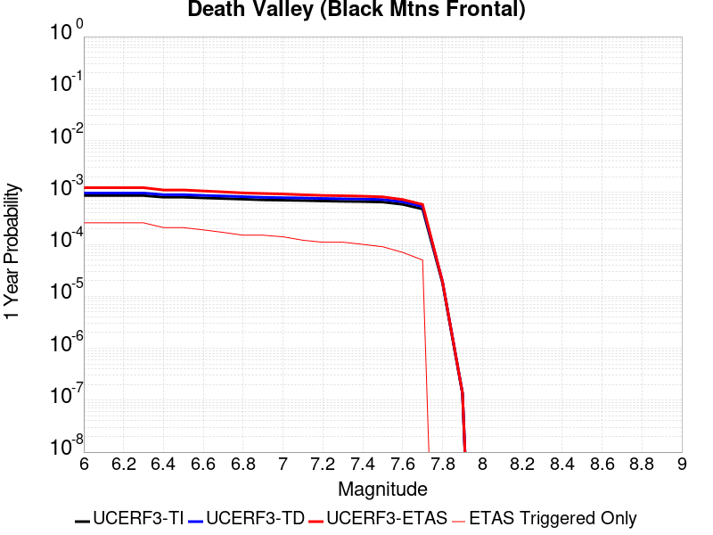 |  |

| Magnitude | 1 wk TI Prob | 1 wk TD Prob | 1 wk ETAS Prob | 1 wk ETAS/TD Gain | 1 wk ETAS Triggered Only | 1 mo TI Prob | 1 mo TD Prob | 1 mo ETAS Prob | 1 mo ETAS/TD Gain | 1 mo ETAS Triggered Only | 1 yr TI Prob | 1 yr TD Prob | 1 yr ETAS Prob | 1 yr ETAS/TD Gain | 1 yr ETAS Triggered Only | 10 yr TI Prob | 10 yr TD Prob | 10 yr ETAS Prob | 10 yr ETAS/TD Gain | 10 yr ETAS Triggered Only |
|-----|-----|-----|-----|-----|-----|-----|-----|-----|-----|-----|-----|-----|-----|-----|-----|-----|-----|-----|-----|-----|
| 6.0 | 1.6707214E-5 | 1.867056E-5 | 2.8670374E-5 | 1.5355926 | 1.0E-5 | 7.160038E-5 | 8.001427E-5 | 1.10011875E-4 | 1.3749031 | 3.0E-5 | 8.71386E-4 | 9.7374606E-4 | 0.0012334929 | 1.2667501 | 2.6E-4 | 0.00867977 | 0.009695647 | 0.010270024 | 1.0592407 | 5.8E-4 |
| 6.1 | 1.6707214E-5 | 1.867056E-5 | 2.8670374E-5 | 1.5355926 | 1.0E-5 | 7.160038E-5 | 8.001427E-5 | 1.10011875E-4 | 1.3749031 | 3.0E-5 | 8.71386E-4 | 9.7374606E-4 | 0.0012334929 | 1.2667501 | 2.6E-4 | 0.00867977 | 0.009695647 | 0.010270024 | 1.0592407 | 5.8E-4 |
| 6.2 | 1.6707214E-5 | 1.867056E-5 | 2.8670374E-5 | 1.5355926 | 1.0E-5 | 7.160038E-5 | 8.001427E-5 | 1.10011875E-4 | 1.3749031 | 3.0E-5 | 8.71386E-4 | 9.7374606E-4 | 0.0012334929 | 1.2667501 | 2.6E-4 | 0.00867977 | 0.009695647 | 0.010270024 | 1.0592407 | 5.8E-4 |
| 6.3 | 1.6707214E-5 | 1.867056E-5 | 2.8670374E-5 | 1.5355926 | 1.0E-5 | 7.160038E-5 | 8.001427E-5 | 1.10011875E-4 | 1.3749031 | 3.0E-5 | 8.71386E-4 | 9.7374606E-4 | 0.0012334929 | 1.2667501 | 2.6E-4 | 0.00867977 | 0.009695647 | 0.010270024 | 1.0592407 | 5.8E-4 |
| 6.4 | 1.5515609E-5 | 1.7338483E-5 | 2.733831E-5 | 1.5767417 | 1.0E-5 | 6.649377E-5 | 7.430571E-5 | 9.430422E-5 | 1.2691383 | 2.0E-5 | 8.0926094E-4 | 9.0430264E-4 | 0.0011141127 | 1.2320131 | 2.1E-4 | 0.008063202 | 0.009006913 | 0.009472679 | 1.0517122 | 4.7E-4 |
| 6.5 | 1.5515609E-5 | 1.7338483E-5 | 2.733831E-5 | 1.5767417 | 1.0E-5 | 6.649377E-5 | 7.430571E-5 | 9.430422E-5 | 1.2691383 | 2.0E-5 | 8.0926094E-4 | 9.0430264E-4 | 0.0011141127 | 1.2320131 | 2.1E-4 | 0.008063202 | 0.009006913 | 0.009472679 | 1.0517122 | 4.7E-4 |
| 6.6 | 1.5041828E-5 | 1.6809407E-5 | 1.6809407E-5 | 1.0 | 0.0 | 6.4463384E-5 | 7.203836E-5 | 8.2037644E-5 | 1.1388049 | 1.0E-5 | 7.8455906E-4 | 8.7672E-4 | 0.0010665534 | 1.2165269 | 1.9E-4 | 0.00781795 | 0.008733268 | 0.009169426 | 1.049942 | 4.4E-4 |
| 6.7 | 1.4634985E-5 | 1.6356273E-5 | 1.6356273E-5 | 1.0 | 0.0 | 6.271985E-5 | 7.009646E-5 | 8.009576E-5 | 1.1426506 | 1.0E-5 | 7.6334673E-4 | 8.53096E-4 | 0.001022951 | 1.1991042 | 1.7E-4 | 0.007607299 | 0.008498848 | 0.008905363 | 1.0478318 | 4.1E-4 |
| 6.8 | 1.4209158E-5 | 1.5882297E-5 | 1.5882297E-5 | 1.0 | 0.0 | 6.089497E-5 | 6.806524E-5 | 7.806456E-5 | 1.1469079 | 1.0E-5 | 7.4114406E-4 | 8.2838483E-4 | 9.782605E-4 | 1.1809253 | 1.5E-4 | 0.007386771 | 0.008253585 | 0.008630449 | 1.0456606 | 3.8E-4 |
| 6.9 | 1.3780098E-5 | 1.5404834E-5 | 1.5404834E-5 | 1.0 | 0.0 | 5.9056227E-5 | 6.601908E-5 | 7.601842E-5 | 1.1514614 | 1.0E-5 | 7.1877235E-4 | 8.0349133E-4 | 9.533708E-4 | 1.1865352 | 1.5E-4 | 0.0071645193 | 0.008006458 | 0.008373495 | 1.0458426 | 3.7E-4 |
| 7.0 | 1.3585064E-5 | 1.5188394E-5 | 1.5188394E-5 | 1.0 | 0.0 | 5.8220405E-5 | 6.5091524E-5 | 7.509087E-5 | 1.1536199 | 1.0E-5 | 7.086029E-4 | 7.922066E-4 | 9.320957E-4 | 1.1765816 | 1.4E-4 | 0.007063476 | 0.007894417 | 0.008251576 | 1.0452418 | 3.6E-4 |
| 7.1 | 1.3398601E-5 | 1.4981575E-5 | 1.4981575E-5 | 1.0 | 0.0 | 5.742131E-5 | 6.4205204E-5 | 7.420456E-5 | 1.1557406 | 1.0E-5 | 6.9888023E-4 | 7.814234E-4 | 9.013296E-4 | 1.153446 | 1.2E-4 | 0.0069668638 | 0.007787346 | 0.008124698 | 1.0433205 | 3.4E-4 |
| 7.2 | 1.3126312E-5 | 1.4679792E-5 | 1.4679792E-5 | 1.0 | 0.0 | 5.6254412E-5 | 6.291191E-5 | 7.291128E-5 | 1.1589425 | 1.0E-5 | 6.846822E-4 | 7.656887E-4 | 8.756045E-4 | 1.1435515 | 1.1E-4 | 0.006825765 | 0.00763109 | 0.007928801 | 1.0390129 | 3.0E-4 |
| 7.3 | 1.2922429E-5 | 1.4454016E-5 | 1.4454016E-5 | 1.0 | 0.0 | 5.5380664E-5 | 6.1944345E-5 | 7.194372E-5 | 1.1614252 | 1.0E-5 | 6.74051E-4 | 7.5391686E-4 | 8.6383394E-4 | 1.1457946 | 1.1E-4 | 0.006720101 | 0.0075141727 | 0.0078019938 | 1.0383037 | 2.9E-4 |
| 7.4 | 1.2768878E-5 | 1.4283997E-5 | 1.4283997E-5 | 1.0 | 0.0 | 5.4722615E-5 | 6.1215724E-5 | 7.121511E-5 | 1.1633468 | 1.0E-5 | 6.660441E-4 | 7.45052E-4 | 8.449775E-4 | 1.1341188 | 1.0E-4 | 0.0066405144 | 0.0074261203 | 0.007704041 | 1.0374248 | 2.8E-4 |
| 7.5 | 1.2521929E-5 | 1.40122365E-5 | 1.40122365E-5 | 1.0 | 0.0 | 5.366431E-5 | 6.0051094E-5 | 6.0051094E-5 | 1.0 | 0.0 | 6.531671E-4 | 7.308822E-4 | 8.2081644E-4 | 1.1230489 | 9.0E-5 | 0.006512506 | 0.0072853607 | 0.0075434665 | 1.035428 | 2.6E-4 |
| 7.6 | 1.1301089E-5 | 1.2648349E-5 | 1.2648349E-5 | 1.0 | 0.0 | 4.8432343E-5 | 5.4206117E-5 | 5.4206117E-5 | 1.0 | 0.0 | 5.895042E-4 | 6.597649E-4 | 7.297187E-4 | 1.1060284 | 7.0E-5 | 0.0058794282 | 0.0065786145 | 0.006807101 | 1.0347317 | 2.3E-4 |
| 7.7 | 9.189108E-6 | 1.0283521E-5 | 1.0283521E-5 | 1.0 | 0.0 | 3.93813E-5 | 4.407152E-5 | 4.407152E-5 | 1.0 | 0.0 | 4.7936183E-4 | 5.3644367E-4 | 5.8641686E-4 | 1.0931565 | 5.0E-5 | 0.004783291 | 0.0053519984 | 0.0055210884 | 1.0315938 | 1.7E-4 |
| 7.8 | 3.4586725E-7 | 3.648288E-7 | 3.648288E-7 | 1.0 | 0.0 | 1.4822873E-6 | 1.5635511E-6 | 1.5635511E-6 | 1.0 | 0.0 | 1.80467E-5 | 1.9036073E-5 | 1.9036073E-5 | 1.0 | 0.0 | 1.8045233E-4 | 1.9034486E-4 | 1.9034486E-4 | 1.0 | 0.0 |
| 7.9 | 2.5591178E-9 | 2.6696871E-9 | 2.6696871E-9 | 1.0 | 0.0 | 1.0967647E-8 | 1.1441516E-8 | 1.1441516E-8 | 1.0 | 0.0 | 1.335311E-7 | 1.3930045E-7 | 1.3930045E-7 | 1.0 | 0.0 | 1.3353102E-6 | 1.3930046E-6 | 1.3930046E-6 | 1.0 | 0.0 |

## San Andreas (San Bernardino S)
*[(top)](#table-of-contents)*

| 1 Week | 1 Month | 1 Year | 10 Year |
|-----|-----|-----|-----|
|  |  |  |  |

| Magnitude | 1 wk TI Prob | 1 wk TD Prob | 1 wk ETAS Prob | 1 wk ETAS/TD Gain | 1 wk ETAS Triggered Only | 1 mo TI Prob | 1 mo TD Prob | 1 mo ETAS Prob | 1 mo ETAS/TD Gain | 1 mo ETAS Triggered Only | 1 yr TI Prob | 1 yr TD Prob | 1 yr ETAS Prob | 1 yr ETAS/TD Gain | 1 yr ETAS Triggered Only | 10 yr TI Prob | 10 yr TD Prob | 10 yr ETAS Prob | 10 yr ETAS/TD Gain | 10 yr ETAS Triggered Only |
|-----|-----|-----|-----|-----|-----|-----|-----|-----|-----|-----|-----|-----|-----|-----|-----|-----|-----|-----|-----|-----|
| 6.0 | 1.2336002E-4 | 3.000988E-4 | 3.100958E-4 | 1.0333123 | 1.0E-5 | 5.2857865E-4 | 0.0012855299 | 0.0013754142 | 1.0699201 | 9.0E-5 | 0.006416472 | 0.015543964 | 0.015770389 | 1.0145668 | 2.3E-4 | 0.06234337 | 0.14291926 | 0.14327924 | 1.0025188 | 4.2E-4 |
| 6.1 | 1.2336002E-4 | 3.000988E-4 | 3.100958E-4 | 1.0333123 | 1.0E-5 | 5.2857865E-4 | 0.0012855299 | 0.0013754142 | 1.0699201 | 9.0E-5 | 0.006416472 | 0.015543964 | 0.015770389 | 1.0145668 | 2.3E-4 | 0.06234337 | 0.14291926 | 0.14327924 | 1.0025188 | 4.2E-4 |
| 6.2 | 1.2336002E-4 | 3.000988E-4 | 3.100958E-4 | 1.0333123 | 1.0E-5 | 5.2857865E-4 | 0.0012855299 | 0.0013754142 | 1.0699201 | 9.0E-5 | 0.006416472 | 0.015543964 | 0.015770389 | 1.0145668 | 2.3E-4 | 0.06234337 | 0.14291926 | 0.14327924 | 1.0025188 | 4.2E-4 |
| 6.3 | 1.1712257E-4 | 2.879813E-4 | 2.9797843E-4 | 1.0347145 | 1.0E-5 | 5.018573E-4 | 0.0012336475 | 0.0013235365 | 1.0728644 | 9.0E-5 | 0.006093008 | 0.0149210645 | 0.015137782 | 1.0145242 | 2.2E-4 | 0.059286322 | 0.13763407 | 0.13798763 | 1.002569 | 4.1E-4 |
| 6.4 | 1.1712257E-4 | 2.879813E-4 | 2.9797843E-4 | 1.0347145 | 1.0E-5 | 5.018573E-4 | 0.0012336475 | 0.0013235365 | 1.0728644 | 9.0E-5 | 0.006093008 | 0.0149210645 | 0.015137782 | 1.0145242 | 2.2E-4 | 0.059286322 | 0.13763407 | 0.13798763 | 1.002569 | 4.1E-4 |
| 6.5 | 1.0689076E-4 | 2.6810818E-4 | 2.781055E-4 | 1.0372884 | 1.0E-5 | 4.5802278E-4 | 0.0011485539 | 0.0012384505 | 1.0782694 | 9.0E-5 | 0.0055621783 | 0.013898602 | 0.014105682 | 1.0148995 | 2.1E-4 | 0.05425003 | 0.12891594 | 0.12926437 | 1.0027028 | 4.0E-4 |
| 6.6 | 9.7648895E-5 | 2.5055694E-4 | 2.6055443E-4 | 1.0399011 | 1.0E-5 | 4.1842813E-4 | 0.0010733972 | 0.0011633006 | 1.083756 | 9.0E-5 | 0.005082469 | 0.012994667 | 0.013201938 | 1.0159504 | 2.1E-4 | 0.049677886 | 0.12101118 | 0.12135399 | 1.0028329 | 3.9E-4 |
| 6.7 | 8.757013E-5 | 2.3126253E-4 | 2.4126022E-4 | 1.0432309 | 1.0E-5 | 3.7524657E-4 | 9.90771E-4 | 0.0010806818 | 1.0907483 | 9.0E-5 | 0.00455906 | 0.012000005 | 0.012207484 | 1.01729 | 2.1E-4 | 0.04466656 | 0.11236583 | 0.11270313 | 1.0030018 | 3.8E-4 |
| 6.8 | 8.562978E-5 | 2.268613E-4 | 2.3685904E-4 | 1.0440698 | 1.0E-5 | 3.6693315E-4 | 9.719227E-4 | 0.0010618352 | 1.09251 | 9.0E-5 | 0.004458263 | 0.011773022 | 0.01198055 | 1.0176274 | 2.1E-4 | 0.043698758 | 0.11037151 | 0.11070957 | 1.003063 | 3.8E-4 |
| 6.9 | 6.124075E-5 | 1.7070957E-4 | 1.8070787E-4 | 1.0585691 | 1.0E-5 | 2.6243398E-4 | 7.3140813E-4 | 8.1134966E-4 | 1.1092981 | 8.0E-5 | 0.0031904527 | 0.008868743 | 0.009057058 | 1.0212336 | 1.9E-4 | 0.031450346 | 0.08419216 | 0.08450353 | 1.0036983 | 3.4E-4 |
| 7.0 | 5.8598747E-5 | 1.6499894E-4 | 1.749973E-4 | 1.0605965 | 1.0E-5 | 2.5111332E-4 | 7.069475E-4 | 7.86891E-4 | 1.1130825 | 8.0E-5 | 0.0030530186 | 0.008573314 | 0.0087517705 | 1.0208154 | 1.8E-4 | 0.03011414 | 0.08151563 | 0.08181873 | 1.0037183 | 3.3E-4 |
| 7.1 | 5.613814E-5 | 1.5918406E-4 | 1.6918246E-4 | 1.0628104 | 1.0E-5 | 2.4056983E-4 | 6.8203977E-4 | 7.619852E-4 | 1.1172152 | 8.0E-5 | 0.0029250039 | 0.008272399 | 0.00845091 | 1.0215791 | 1.8E-4 | 0.028868021 | 0.07881265 | 0.07911664 | 1.0038571 | 3.3E-4 |
| 7.2 | 4.991222E-5 | 1.452485E-4 | 1.5524705E-4 | 1.0688375 | 1.0E-5 | 2.1389198E-4 | 6.223455E-4 | 7.022957E-4 | 1.128466 | 8.0E-5 | 0.002601025 | 0.007550835 | 0.007729476 | 1.0236584 | 1.8E-4 | 0.025707912 | 0.07226236 | 0.07256852 | 1.0042367 | 3.3E-4 |
| 7.3 | 4.7410045E-5 | 1.3718859E-4 | 1.4718722E-4 | 1.0728824 | 1.0E-5 | 2.0317009E-4 | 5.8781897E-4 | 6.677719E-4 | 1.1360164 | 8.0E-5 | 0.0024707897 | 0.007133297 | 0.0073120133 | 1.0250537 | 1.8E-4 | 0.024434982 | 0.068555124 | 0.0688625 | 1.0044837 | 3.3E-4 |
| 7.4 | 4.5556746E-5 | 1.312667E-4 | 1.4126538E-4 | 1.0761708 | 1.0E-5 | 1.952286E-4 | 5.624506E-4 | 6.424056E-4 | 1.1421547 | 8.0E-5 | 0.002374317 | 0.006826414 | 0.007005185 | 1.0261881 | 1.8E-4 | 0.023491086 | 0.0658083 | 0.06611659 | 1.0046846 | 3.3E-4 |
| 7.5 | 4.3084514E-5 | 1.2361899E-4 | 1.3361774E-4 | 1.0808837 | 1.0E-5 | 1.8463485E-4 | 5.296884E-4 | 6.0964597E-4 | 1.1509522 | 8.0E-5 | 0.0022456115 | 0.006429958 | 0.006608801 | 1.0278139 | 1.8E-4 | 0.022230545 | 0.062208522 | 0.06251799 | 1.0049747 | 3.3E-4 |
| 7.6 | 3.408608E-5 | 9.8397344E-5 | 1.08396365E-4 | 1.1016188 | 1.0E-5 | 1.4607502E-4 | 4.2163485E-4 | 5.0160114E-4 | 1.1896577 | 8.0E-5 | 0.0017770125 | 0.0051213475 | 0.0052904766 | 1.0330244 | 1.7E-4 | 0.017628696 | 0.050038666 | 0.050342653 | 1.006075 | 3.2E-4 |
| 7.7 | 2.8315713E-5 | 8.252603E-5 | 9.25252E-5 | 1.1211638 | 1.0E-5 | 1.2134742E-4 | 3.5363509E-4 | 4.336068E-4 | 1.2261419 | 8.0E-5 | 0.0014764034 | 0.004297016 | 0.0044662855 | 1.0393924 | 1.7E-4 | 0.01466633 | 0.042289194 | 0.042595662 | 1.007247 | 3.2E-4 |
| 7.8 | 2.6222975E-5 | 7.466726E-5 | 8.466651E-5 | 1.1339175 | 1.0E-5 | 1.1237934E-4 | 3.1996332E-4 | 3.9993774E-4 | 1.2499486 | 8.0E-5 | 0.0013673597 | 0.0038886012 | 0.00405794 | 1.0435475 | 1.7E-4 | 0.013589768 | 0.03845329 | 0.038760982 | 1.0080018 | 3.2E-4 |
| 7.9 | 2.1469694E-5 | 5.7908495E-5 | 6.790792E-5 | 1.1726762 | 1.0E-5 | 9.200973E-5 | 2.4815567E-4 | 3.2813582E-4 | 1.3222983 | 8.0E-5 | 0.0011196428 | 0.0030171126 | 0.0031766298 | 1.0528709 | 1.6E-4 | 0.011140184 | 0.030165782 | 0.030456731 | 1.009645 | 3.0E-4 |
| 8.0 | 1.2420249E-5 | 3.1335217E-5 | 4.1334904E-5 | 1.3191197 | 1.0E-5 | 5.322855E-5 | 1.3428688E-4 | 1.6428286E-4 | 1.2233723 | 3.0E-5 | 6.478649E-4 | 0.0016337177 | 0.001683636 | 1.030555 | 5.0E-5 | 0.0064597935 | 0.01652998 | 0.016628327 | 1.0059496 | 1.0E-4 |
| 8.1 | 4.9197724E-6 | 7.827452E-6 | 7.827452E-6 | 1.0 | 0.0 | 2.1084568E-5 | 3.354579E-5 | 3.354579E-5 | 1.0 | 0.0 | 2.566744E-4 | 4.0834362E-4 | 4.0834362E-4 | 1.0 | 0.0 | 0.002563781 | 0.004386937 | 0.004386937 | 1.0 | 0.0 |
| 8.2 | 2.5634774E-6 | 2.9088305E-6 | 2.9088305E-6 | 1.0 | 0.0 | 1.0986286E-5 | 1.24663575E-5 | 1.24663575E-5 | 1.0 | 0.0 | 1.3374983E-4 | 1.5176737E-4 | 1.5176737E-4 | 1.0 | 0.0 | 0.0013366934 | 0.0017061312 | 0.0017061312 | 1.0 | 0.0 |
| 8.3 | 5.2850464E-7 | 3.2110069E-7 | 3.2110069E-7 | 1.0 | 0.0 | 2.2650179E-6 | 1.3761452E-6 | 1.3761452E-6 | 1.0 | 0.0 | 2.7576245E-5 | 1.6754451E-5 | 1.6754451E-5 | 1.0 | 0.0 | 2.7572823E-4 | 1.9885681E-4 | 1.9885681E-4 | 1.0 | 0.0 |

## San Andreas (Big Bend)
*[(top)](#table-of-contents)*

| 1 Week | 1 Month | 1 Year | 10 Year |
|-----|-----|-----|-----|
|  |  |  |  |

| Magnitude | 1 wk TI Prob | 1 wk TD Prob | 1 wk ETAS Prob | 1 wk ETAS/TD Gain | 1 wk ETAS Triggered Only | 1 mo TI Prob | 1 mo TD Prob | 1 mo ETAS Prob | 1 mo ETAS/TD Gain | 1 mo ETAS Triggered Only | 1 yr TI Prob | 1 yr TD Prob | 1 yr ETAS Prob | 1 yr ETAS/TD Gain | 1 yr ETAS Triggered Only | 10 yr TI Prob | 10 yr TD Prob | 10 yr ETAS Prob | 10 yr ETAS/TD Gain | 10 yr ETAS Triggered Only |
|-----|-----|-----|-----|-----|-----|-----|-----|-----|-----|-----|-----|-----|-----|-----|-----|-----|-----|-----|-----|-----|
| 6.0 | 1.0179969E-4 | 2.0081972E-4 | 2.1081771E-4 | 1.0497859 | 1.0E-5 | 4.362114E-4 | 8.603731E-4 | 8.803559E-4 | 1.0232258 | 2.0E-5 | 0.0052979486 | 0.010425015 | 0.010563556 | 1.0132892 | 1.4E-4 | 0.051734097 | 0.101484396 | 0.10179888 | 1.0030988 | 3.5E-4 |
| 6.1 | 1.0179969E-4 | 2.0081972E-4 | 2.1081771E-4 | 1.0497859 | 1.0E-5 | 4.362114E-4 | 8.603731E-4 | 8.803559E-4 | 1.0232258 | 2.0E-5 | 0.0052979486 | 0.010425015 | 0.010563556 | 1.0132892 | 1.4E-4 | 0.051734097 | 0.101484396 | 0.10179888 | 1.0030988 | 3.5E-4 |
| 6.2 | 1.0179969E-4 | 2.0081972E-4 | 2.1081771E-4 | 1.0497859 | 1.0E-5 | 4.362114E-4 | 8.603731E-4 | 8.803559E-4 | 1.0232258 | 2.0E-5 | 0.0052979486 | 0.010425015 | 0.010563556 | 1.0132892 | 1.4E-4 | 0.051734097 | 0.101484396 | 0.10179888 | 1.0030988 | 3.5E-4 |
| 6.3 | 1.0179969E-4 | 2.0081972E-4 | 2.1081771E-4 | 1.0497859 | 1.0E-5 | 4.362114E-4 | 8.603731E-4 | 8.803559E-4 | 1.0232258 | 2.0E-5 | 0.0052979486 | 0.010425015 | 0.010563556 | 1.0132892 | 1.4E-4 | 0.051734097 | 0.101484396 | 0.10179888 | 1.0030988 | 3.5E-4 |
| 6.4 | 9.1639464E-5 | 1.8438944E-4 | 1.8438944E-4 | 1.0 | 0.0 | 3.9268145E-4 | 7.9000136E-4 | 7.9999346E-4 | 1.0126482 | 1.0E-5 | 0.0047704205 | 0.009575968 | 0.00967501 | 1.0103428 | 1.0E-4 | 0.046693064 | 0.09381712 | 0.09401648 | 1.002125 | 2.2E-4 |
| 6.5 | 9.1639464E-5 | 1.8438944E-4 | 1.8438944E-4 | 1.0 | 0.0 | 3.9268145E-4 | 7.9000136E-4 | 7.9999346E-4 | 1.0126482 | 1.0E-5 | 0.0047704205 | 0.009575968 | 0.00967501 | 1.0103428 | 1.0E-4 | 0.046693064 | 0.09381712 | 0.09401648 | 1.002125 | 2.2E-4 |
| 6.6 | 9.042622E-5 | 1.8245954E-4 | 1.8245954E-4 | 1.0 | 0.0 | 3.8748336E-4 | 7.817353E-4 | 7.917275E-4 | 1.0127821 | 1.0E-5 | 0.0047074095 | 0.009476205 | 0.009575258 | 1.0104527 | 1.0E-4 | 0.046089325 | 0.09291417 | 0.09311373 | 1.0021478 | 2.2E-4 |
| 6.7 | 8.9836685E-5 | 1.8160277E-4 | 1.8160277E-4 | 1.0 | 0.0 | 3.8495753E-4 | 7.7806565E-4 | 7.7806565E-4 | 1.0 | 0.0 | 0.00467679 | 0.0094319135 | 0.00951116 | 1.0084019 | 8.0E-5 | 0.045795817 | 0.0925084 | 0.092671745 | 1.0017657 | 1.8E-4 |
| 6.8 | 8.9471854E-5 | 1.8107046E-4 | 1.8107046E-4 | 1.0 | 0.0 | 3.8339442E-4 | 7.7578565E-4 | 7.7578565E-4 | 1.0 | 0.0 | 0.004657841 | 0.009404396 | 0.009483643 | 1.0084267 | 8.0E-5 | 0.04561414 | 0.092256 | 0.09241032 | 1.0016727 | 1.7E-4 |
| 6.9 | 8.858234E-5 | 1.7989E-4 | 1.7989E-4 | 1.0 | 0.0 | 3.7958333E-4 | 7.7072956E-4 | 7.7072956E-4 | 1.0 | 0.0 | 0.004611638 | 0.009343366 | 0.009412712 | 1.007422 | 7.0E-5 | 0.04517103 | 0.0916962 | 0.09184153 | 1.0015849 | 1.6E-4 |
| 7.0 | 8.7433385E-5 | 1.7827768E-4 | 1.7827768E-4 | 1.0 | 0.0 | 3.746607E-4 | 7.638237E-4 | 7.638237E-4 | 1.0 | 0.0 | 0.004551957 | 0.009260005 | 0.009329357 | 1.0074894 | 7.0E-5 | 0.044598386 | 0.09093105 | 0.0910765 | 1.0015996 | 1.6E-4 |
| 7.1 | 8.684964E-5 | 1.7739709E-4 | 1.7739709E-4 | 1.0 | 0.0 | 3.7215967E-4 | 7.6005195E-4 | 7.6005195E-4 | 1.0 | 0.0 | 0.0045216335 | 0.009214473 | 0.009283829 | 1.0075268 | 7.0E-5 | 0.04430731 | 0.09051253 | 0.09065805 | 1.0016077 | 1.6E-4 |
| 7.2 | 8.606521E-5 | 1.7630306E-4 | 1.7630306E-4 | 1.0 | 0.0 | 3.6879873E-4 | 7.553659E-4 | 7.553659E-4 | 1.0 | 0.0 | 0.0044808835 | 0.009157902 | 0.009227261 | 1.0075737 | 7.0E-5 | 0.043916024 | 0.08999327 | 0.09013887 | 1.0016179 | 1.6E-4 |
| 7.3 | 8.568266E-5 | 1.7572299E-4 | 1.7572299E-4 | 1.0 | 0.0 | 3.6715972E-4 | 7.528814E-4 | 7.528814E-4 | 1.0 | 0.0 | 0.0044610105 | 0.0091279065 | 0.009197268 | 1.0075988 | 7.0E-5 | 0.043725148 | 0.08971421 | 0.08985985 | 1.0016234 | 1.6E-4 |
| 7.4 | 8.5432206E-5 | 1.7534874E-4 | 1.7534874E-4 | 1.0 | 0.0 | 3.6608664E-4 | 7.5127836E-4 | 7.5127836E-4 | 1.0 | 0.0 | 0.004447999 | 0.009108554 | 0.009177916 | 1.0076151 | 7.0E-5 | 0.043600157 | 0.08953439 | 0.08968006 | 1.001627 | 1.6E-4 |
| 7.5 | 8.4791965E-5 | 1.7404204E-4 | 1.7404204E-4 | 1.0 | 0.0 | 3.633435E-4 | 7.456814E-4 | 7.456814E-4 | 1.0 | 0.0 | 0.0044147377 | 0.009040978 | 0.0091103455 | 1.0076725 | 7.0E-5 | 0.043280575 | 0.088910125 | 0.089055896 | 1.0016396 | 1.6E-4 |
| 7.6 | 8.241105E-5 | 1.6849465E-4 | 1.6849465E-4 | 1.0 | 0.0 | 3.531424E-4 | 7.219202E-4 | 7.219202E-4 | 1.0 | 0.0 | 0.0042910352 | 0.008754046 | 0.008823433 | 1.0079263 | 7.0E-5 | 0.042091176 | 0.08628652 | 0.08643272 | 1.0016943 | 1.6E-4 |
| 7.7 | 7.00432E-5 | 1.4212567E-4 | 1.4212567E-4 | 1.0 | 0.0 | 3.001506E-4 | 6.089679E-4 | 6.089679E-4 | 1.0 | 0.0 | 0.0036482112 | 0.0073890192 | 0.007448576 | 1.0080602 | 6.0E-5 | 0.035888977 | 0.073552616 | 0.073673055 | 1.0016375 | 1.3E-4 |
| 7.8 | 6.415362E-5 | 1.2976197E-4 | 1.2976197E-4 | 1.0 | 0.0 | 2.749151E-4 | 5.5600423E-4 | 5.5600423E-4 | 1.0 | 0.0 | 0.0033419547 | 0.0067483704 | 0.0067881006 | 1.0058874 | 4.0E-5 | 0.03292141 | 0.06728497 | 0.06735959 | 1.001109 | 8.0E-5 |
| 7.9 | 4.939911E-5 | 9.346299E-5 | 9.346299E-5 | 1.0 | 0.0 | 2.116933E-4 | 4.004942E-4 | 4.004942E-4 | 1.0 | 0.0 | 0.0025743195 | 0.0048651244 | 0.004885027 | 1.0040909 | 2.0E-5 | 0.025447013 | 0.048938233 | 0.048985787 | 1.0009717 | 5.0E-5 |
| 8.0 | 3.344983E-5 | 5.2255753E-5 | 5.2255753E-5 | 1.0 | 0.0 | 1.4334853E-4 | 2.2393401E-4 | 2.2393401E-4 | 1.0 | 0.0 | 0.0017438711 | 0.0027229895 | 0.0027329624 | 1.0036625 | 1.0E-5 | 0.017302496 | 0.02793611 | 0.027955553 | 1.000696 | 2.0E-5 |
| 8.1 | 1.9104898E-5 | 1.9185067E-5 | 1.9185067E-5 | 1.0 | 0.0 | 8.1875565E-5 | 8.221913E-5 | 8.221913E-5 | 1.0 | 0.0 | 9.963791E-4 | 0.0010005588 | 0.0010005588 | 1.0 | 0.0 | 0.009919235 | 0.010756051 | 0.010756051 | 1.0 | 0.0 |
| 8.2 | 8.643924E-6 | 5.478665E-6 | 5.478665E-6 | 1.0 | 0.0 | 3.704486E-5 | 2.3479783E-5 | 2.3479783E-5 | 1.0 | 0.0 | 4.5092785E-4 | 2.8582895E-4 | 2.8582895E-4 | 1.0 | 0.0 | 0.0045001395 | 0.0032508469 | 0.0032508469 | 1.0 | 0.0 |
| 8.3 | 1.983087E-6 | 7.6647797E-7 | 7.6647797E-7 | 1.0 | 0.0 | 8.498917E-6 | 3.2849016E-6 | 3.2849016E-6 | 1.0 | 0.0 | 1.034694E-4 | 3.999296E-5 | 3.999296E-5 | 1.0 | 0.0 | 0.0010342124 | 4.7228087E-4 | 4.7228087E-4 | 1.0 | 0.0 |

## Coyote Lake
*[(top)](#table-of-contents)*

| 1 Week | 1 Month | 1 Year | 10 Year |
|-----|-----|-----|-----|
|  |  |  |  |

| Magnitude | 1 wk TI Prob | 1 wk TD Prob | 1 wk ETAS Prob | 1 wk ETAS/TD Gain | 1 wk ETAS Triggered Only | 1 mo TI Prob | 1 mo TD Prob | 1 mo ETAS Prob | 1 mo ETAS/TD Gain | 1 mo ETAS Triggered Only | 1 yr TI Prob | 1 yr TD Prob | 1 yr ETAS Prob | 1 yr ETAS/TD Gain | 1 yr ETAS Triggered Only | 10 yr TI Prob | 10 yr TD Prob | 10 yr ETAS Prob | 10 yr ETAS/TD Gain | 10 yr ETAS Triggered Only |
|-----|-----|-----|-----|-----|-----|-----|-----|-----|-----|-----|-----|-----|-----|-----|-----|-----|-----|-----|-----|-----|
| 6.0 | 1.980352E-5 | 2.1707021E-5 | 6.170615E-5 | 2.8426816 | 4.0E-5 | 8.486947E-5 | 9.302718E-5 | 1.6302067E-4 | 1.7523983 | 7.0E-5 | 0.0010327959 | 0.0011320895 | 0.0013218744 | 1.1676413 | 1.9E-4 | 0.010280091 | 0.011270401 | 0.011616456 | 1.0307047 | 3.5E-4 |
| 6.1 | 1.980352E-5 | 2.1707021E-5 | 6.170615E-5 | 2.8426816 | 4.0E-5 | 8.486947E-5 | 9.302718E-5 | 1.6302067E-4 | 1.7523983 | 7.0E-5 | 0.0010327959 | 0.0011320895 | 0.0013218744 | 1.1676413 | 1.9E-4 | 0.010280091 | 0.011270401 | 0.011616456 | 1.0307047 | 3.5E-4 |
| 6.2 | 1.980352E-5 | 2.1707021E-5 | 6.170615E-5 | 2.8426816 | 4.0E-5 | 8.486947E-5 | 9.302718E-5 | 1.6302067E-4 | 1.7523983 | 7.0E-5 | 0.0010327959 | 0.0011320895 | 0.0013218744 | 1.1676413 | 1.9E-4 | 0.010280091 | 0.011270401 | 0.011616456 | 1.0307047 | 3.5E-4 |
| 6.3 | 1.5344787E-5 | 1.6820884E-5 | 3.6820547E-5 | 2.1889782 | 2.0E-5 | 6.576172E-5 | 7.208785E-5 | 1.2208425E-4 | 1.6935481 | 5.0E-5 | 8.003548E-4 | 8.7737746E-4 | 0.0010172547 | 1.1594265 | 1.4E-4 | 0.007974784 | 0.00874518 | 0.009012819 | 1.0306041 | 2.7E-4 |
| 6.4 | 1.5344787E-5 | 1.6820884E-5 | 3.6820547E-5 | 2.1889782 | 2.0E-5 | 6.576172E-5 | 7.208785E-5 | 1.2208425E-4 | 1.6935481 | 5.0E-5 | 8.003548E-4 | 8.7737746E-4 | 0.0010172547 | 1.1594265 | 1.4E-4 | 0.007974784 | 0.00874518 | 0.009012819 | 1.0306041 | 2.7E-4 |
| 6.5 | 1.4189697E-5 | 1.5558186E-5 | 3.5557874E-5 | 2.285477 | 2.0E-5 | 6.081157E-5 | 6.667658E-5 | 1.06673906E-4 | 1.5998708 | 4.0E-5 | 7.401293E-4 | 8.1154524E-4 | 9.314479E-4 | 1.1477461 | 1.2E-4 | 0.0073766913 | 0.008091759 | 0.008339737 | 1.0306456 | 2.5E-4 |
| 6.6 | 1.3469301E-5 | 1.47717665E-5 | 3.477147E-5 | 2.3539143 | 2.0E-5 | 5.7724297E-5 | 6.3306376E-5 | 1.0330384E-4 | 1.6318079 | 4.0E-5 | 7.025667E-4 | 7.7054254E-4 | 8.904501E-4 | 1.1556144 | 1.2E-4 | 0.0070034964 | 0.0076846126 | 0.007912845 | 1.0296999 | 2.3E-4 |
| 6.7 | 1.3027966E-5 | 1.4281927E-5 | 3.4281642E-5 | 2.4003513 | 2.0E-5 | 5.5832945E-5 | 6.120716E-5 | 1.01204714E-4 | 1.6534783 | 4.0E-5 | 6.7955407E-4 | 7.450021E-4 | 8.6491276E-4 | 1.1609534 | 1.2E-4 | 0.006774798 | 0.007430923 | 0.007659214 | 1.0307218 | 2.3E-4 |
| 6.8 | 5.695434E-6 | 6.2244944E-6 | 1.6224432E-5 | 2.6065462 | 1.0E-5 | 2.4408775E-5 | 2.6676302E-5 | 4.6675766E-5 | 1.7497091 | 2.0E-5 | 2.971363E-4 | 3.2476554E-4 | 3.6475257E-4 | 1.1231258 | 4.0E-5 | 0.0029673933 | 0.0032458503 | 0.0033455258 | 1.0307086 | 1.0E-4 |
| 6.9 | 4.385688E-6 | 4.7931144E-6 | 1.4793067E-5 | 3.086316 | 1.0E-5 | 1.879567E-5 | 2.0541918E-5 | 4.054151E-5 | 1.9735988 | 2.0E-5 | 2.2881327E-4 | 2.5009786E-4 | 2.9008786E-4 | 1.1598974 | 4.0E-5 | 0.002285778 | 0.0025009785 | 0.0025907536 | 1.035896 | 9.0E-5 |

## Death Valley (No)
*[(top)](#table-of-contents)*

| 1 Week | 1 Month | 1 Year | 10 Year |
|-----|-----|-----|-----|
|  |  | 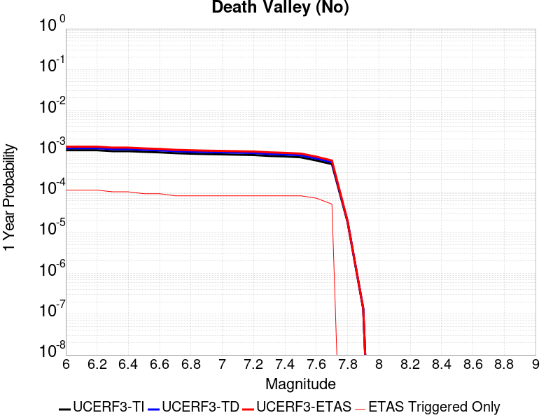 |  |

| Magnitude | 1 wk TI Prob | 1 wk TD Prob | 1 wk ETAS Prob | 1 wk ETAS/TD Gain | 1 wk ETAS Triggered Only | 1 mo TI Prob | 1 mo TD Prob | 1 mo ETAS Prob | 1 mo ETAS/TD Gain | 1 mo ETAS Triggered Only | 1 yr TI Prob | 1 yr TD Prob | 1 yr ETAS Prob | 1 yr ETAS/TD Gain | 1 yr ETAS Triggered Only | 10 yr TI Prob | 10 yr TD Prob | 10 yr ETAS Prob | 10 yr ETAS/TD Gain | 10 yr ETAS Triggered Only |
|-----|-----|-----|-----|-----|-----|-----|-----|-----|-----|-----|-----|-----|-----|-----|-----|-----|-----|-----|-----|-----|
| 6.0 | 2.0074807E-5 | 2.2500446E-5 | 2.2500446E-5 | 1.0 | 0.0 | 8.603206E-5 | 9.642696E-5 | 1.1642503E-4 | 1.2073909 | 2.0E-5 | 0.001046937 | 0.0011733733 | 0.0012832442 | 1.0936368 | 1.1E-4 | 0.010420183 | 0.011672693 | 0.011969192 | 1.025401 | 3.0E-4 |
| 6.1 | 2.0074807E-5 | 2.2500446E-5 | 2.2500446E-5 | 1.0 | 0.0 | 8.603206E-5 | 9.642696E-5 | 1.1642503E-4 | 1.2073909 | 2.0E-5 | 0.001046937 | 0.0011733733 | 0.0012832442 | 1.0936368 | 1.1E-4 | 0.010420183 | 0.011672693 | 0.011969192 | 1.025401 | 3.0E-4 |
| 6.2 | 2.0074807E-5 | 2.2500446E-5 | 2.2500446E-5 | 1.0 | 0.0 | 8.603206E-5 | 9.642696E-5 | 1.1642503E-4 | 1.2073909 | 2.0E-5 | 0.001046937 | 0.0011733733 | 0.0012832442 | 1.0936368 | 1.1E-4 | 0.010420183 | 0.011672693 | 0.011969192 | 1.025401 | 3.0E-4 |
| 6.3 | 1.9050609E-5 | 2.1337288E-5 | 2.1337288E-5 | 1.0 | 0.0 | 8.164292E-5 | 9.144236E-5 | 1.11440524E-4 | 1.2186971 | 2.0E-5 | 9.935491E-4 | 0.0011127489 | 0.0012126375 | 1.0897676 | 1.0E-4 | 0.009891188 | 0.011072595 | 0.011359384 | 1.0259008 | 2.9E-4 |
| 6.4 | 1.9050609E-5 | 2.1337288E-5 | 2.1337288E-5 | 1.0 | 0.0 | 8.164292E-5 | 9.144236E-5 | 1.11440524E-4 | 1.2186971 | 2.0E-5 | 9.935491E-4 | 0.0011127489 | 0.0012126375 | 1.0897676 | 1.0E-4 | 0.009891188 | 0.011072595 | 0.011359384 | 1.0259008 | 2.9E-4 |
| 6.5 | 1.8367004E-5 | 2.0561336E-5 | 2.0561336E-5 | 1.0 | 0.0 | 7.8713354E-5 | 8.811707E-5 | 9.811619E-5 | 1.1134754 | 1.0E-5 | 9.5791375E-4 | 0.0010723039 | 0.0011622073 | 1.0838414 | 9.0E-5 | 0.009537951 | 0.010672085 | 0.010949097 | 1.0259566 | 2.8E-4 |
| 6.6 | 1.779439E-5 | 1.9911244E-5 | 1.9911244E-5 | 1.0 | 0.0 | 7.625944E-5 | 8.533114E-5 | 9.5330295E-5 | 1.1171805 | 1.0E-5 | 9.280632E-4 | 0.0010384179 | 0.0011283245 | 1.0865803 | 9.0E-5 | 0.009241969 | 0.010336416 | 0.010613522 | 1.0268087 | 2.8E-4 |
| 6.7 | 1.7025437E-5 | 1.9043726E-5 | 1.9043726E-5 | 1.0 | 0.0 | 7.296412E-5 | 8.161345E-5 | 8.161345E-5 | 1.0 | 0.0 | 8.87976E-4 | 9.93197E-4 | 0.0010731175 | 1.0804679 | 8.0E-5 | 0.008844362 | 0.009888301 | 0.010145729 | 1.0260336 | 2.6E-4 |
| 6.8 | 1.6545107E-5 | 1.851284E-5 | 1.851284E-5 | 1.0 | 0.0 | 7.090568E-5 | 7.933836E-5 | 7.933836E-5 | 1.0 | 0.0 | 8.629347E-4 | 9.655226E-4 | 0.0010454453 | 1.0827767 | 8.0E-5 | 0.008595915 | 0.009613981 | 0.009871481 | 1.026784 | 2.6E-4 |
| 6.9 | 1.615478E-5 | 1.8087881E-5 | 1.8087881E-5 | 1.0 | 0.0 | 6.9232934E-5 | 7.751722E-5 | 7.751722E-5 | 1.0 | 0.0 | 8.4258494E-4 | 9.433697E-4 | 0.0010232942 | 1.0847224 | 8.0E-5 | 0.008393973 | 0.009394345 | 0.009641996 | 1.0263617 | 2.5E-4 |
| 7.0 | 1.5894311E-5 | 1.7805834E-5 | 1.7805834E-5 | 1.0 | 0.0 | 6.81167E-5 | 7.6308526E-5 | 7.6308526E-5 | 1.0 | 0.0 | 8.2900526E-4 | 9.286663E-4 | 0.0010085921 | 1.086065 | 8.0E-5 | 0.008259195 | 0.009248544 | 0.0094962325 | 1.0267813 | 2.5E-4 |
| 7.1 | 1.5602263E-5 | 1.7483784E-5 | 1.7483784E-5 | 1.0 | 0.0 | 6.6865134E-5 | 7.4928386E-5 | 7.4928386E-5 | 1.0 | 0.0 | 8.137789E-4 | 9.118773E-4 | 9.918044E-4 | 1.0876511 | 8.0E-5 | 0.008108052 | 0.009082039 | 0.009329769 | 1.0272769 | 2.5E-4 |
| 7.2 | 1.5323829E-5 | 1.7170905E-5 | 1.7170905E-5 | 1.0 | 0.0 | 6.56719E-5 | 7.358755E-5 | 7.358755E-5 | 1.0 | 0.0 | 7.99262E-4 | 8.9556625E-4 | 9.754946E-4 | 1.089249 | 8.0E-5 | 0.007963934 | 0.008920249 | 0.009168019 | 1.0277761 | 2.5E-4 |
| 7.3 | 1.4556212E-5 | 1.6302716E-5 | 1.6302716E-5 | 1.0 | 0.0 | 6.238227E-5 | 6.986695E-5 | 6.986695E-5 | 1.0 | 0.0 | 7.592395E-4 | 8.503039E-4 | 9.302359E-4 | 1.094004 | 8.0E-5 | 0.0075665074 | 0.008471149 | 0.008719032 | 1.029262 | 2.5E-4 |
| 7.4 | 1.411725E-5 | 1.5808211E-5 | 1.5808211E-5 | 1.0 | 0.0 | 6.0501097E-5 | 6.774775E-5 | 6.774775E-5 | 1.0 | 0.0 | 7.363519E-4 | 8.245226E-4 | 9.044566E-4 | 1.0969459 | 8.0E-5 | 0.0073391674 | 0.008215268 | 0.008463215 | 1.0301812 | 2.5E-4 |
| 7.5 | 1.3503312E-5 | 1.5126531E-5 | 1.5126531E-5 | 1.0 | 0.0 | 5.7870053E-5 | 6.482641E-5 | 6.482641E-5 | 1.0 | 0.0 | 7.043401E-4 | 7.8898156E-4 | 8.6891843E-4 | 1.1013166 | 8.0E-5 | 0.007021119 | 0.007862429 | 0.008100542 | 1.0302849 | 2.4E-4 |
| 7.6 | 1.1279839E-5 | 1.2626528E-5 | 1.2626528E-5 | 1.0 | 0.0 | 4.834127E-5 | 5.4112596E-5 | 5.4112596E-5 | 1.0 | 0.0 | 5.88396E-4 | 6.58627E-4 | 7.285809E-4 | 1.1062117 | 7.0E-5 | 0.005868405 | 0.0065673026 | 0.006795792 | 1.034792 | 2.3E-4 |
| 7.7 | 9.189108E-6 | 1.0283521E-5 | 1.0283521E-5 | 1.0 | 0.0 | 3.93813E-5 | 4.407152E-5 | 4.407152E-5 | 1.0 | 0.0 | 4.7936183E-4 | 5.3644367E-4 | 5.8641686E-4 | 1.0931565 | 5.0E-5 | 0.004783291 | 0.0053519984 | 0.0055210884 | 1.0315938 | 1.7E-4 |
| 7.8 | 3.4586725E-7 | 3.648288E-7 | 3.648288E-7 | 1.0 | 0.0 | 1.4822873E-6 | 1.5635511E-6 | 1.5635511E-6 | 1.0 | 0.0 | 1.80467E-5 | 1.9036073E-5 | 1.9036073E-5 | 1.0 | 0.0 | 1.8045233E-4 | 1.9034486E-4 | 1.9034486E-4 | 1.0 | 0.0 |
| 7.9 | 2.5591178E-9 | 2.6696871E-9 | 2.6696871E-9 | 1.0 | 0.0 | 1.0967647E-8 | 1.1441516E-8 | 1.1441516E-8 | 1.0 | 0.0 | 1.335311E-7 | 1.3930045E-7 | 1.3930045E-7 | 1.0 | 0.0 | 1.3353102E-6 | 1.3930046E-6 | 1.3930046E-6 | 1.0 | 0.0 |

## Sierra Nevada  (No Extension)
*[(top)](#table-of-contents)*

| 1 Week | 1 Month | 1 Year | 10 Year |
|-----|-----|-----|-----|
|  | 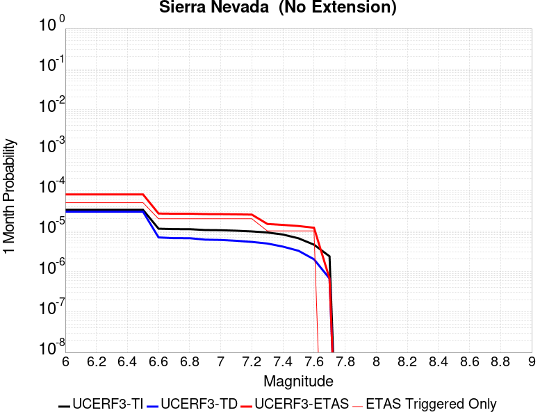 | 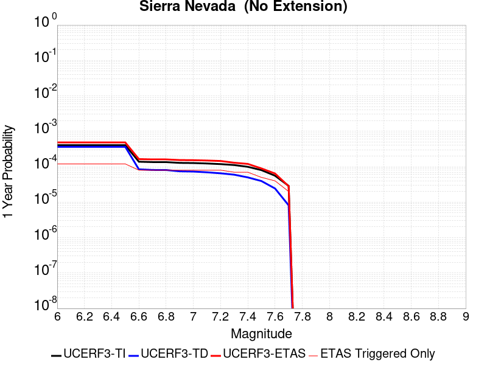 |  |

| Magnitude | 1 wk TI Prob | 1 wk TD Prob | 1 wk ETAS Prob | 1 wk ETAS/TD Gain | 1 wk ETAS Triggered Only | 1 mo TI Prob | 1 mo TD Prob | 1 mo ETAS Prob | 1 mo ETAS/TD Gain | 1 mo ETAS Triggered Only | 1 yr TI Prob | 1 yr TD Prob | 1 yr ETAS Prob | 1 yr ETAS/TD Gain | 1 yr ETAS Triggered Only | 10 yr TI Prob | 10 yr TD Prob | 10 yr ETAS Prob | 10 yr ETAS/TD Gain | 10 yr ETAS Triggered Only |
|-----|-----|-----|-----|-----|-----|-----|-----|-----|-----|-----|-----|-----|-----|-----|-----|-----|-----|-----|-----|-----|
| 6.0 | 7.7690465E-6 | 6.9763464E-6 | 2.6976208E-5 | 3.86681 | 2.0E-5 | 3.329549E-5 | 2.9898487E-5 | 7.989699E-5 | 2.6722753 | 5.0E-5 | 4.0529718E-4 | 3.6398912E-4 | 4.8394545E-4 | 1.3295602 | 1.2E-4 | 0.004045588 | 0.0036374456 | 0.0038965 | 1.0712187 | 2.6E-4 |
| 6.1 | 7.7690465E-6 | 6.9763464E-6 | 2.6976208E-5 | 3.86681 | 2.0E-5 | 3.329549E-5 | 2.9898487E-5 | 7.989699E-5 | 2.6722753 | 5.0E-5 | 4.0529718E-4 | 3.6398912E-4 | 4.8394545E-4 | 1.3295602 | 1.2E-4 | 0.004045588 | 0.0036374456 | 0.0038965 | 1.0712187 | 2.6E-4 |
| 6.2 | 7.7690465E-6 | 6.9763464E-6 | 2.6976208E-5 | 3.86681 | 2.0E-5 | 3.329549E-5 | 2.9898487E-5 | 7.989699E-5 | 2.6722753 | 5.0E-5 | 4.0529718E-4 | 3.6398912E-4 | 4.8394545E-4 | 1.3295602 | 1.2E-4 | 0.004045588 | 0.0036374456 | 0.0038965 | 1.0712187 | 2.6E-4 |
| 6.3 | 7.7690465E-6 | 6.9763464E-6 | 2.6976208E-5 | 3.86681 | 2.0E-5 | 3.329549E-5 | 2.9898487E-5 | 7.989699E-5 | 2.6722753 | 5.0E-5 | 4.0529718E-4 | 3.6398912E-4 | 4.8394545E-4 | 1.3295602 | 1.2E-4 | 0.004045588 | 0.0036374456 | 0.0038965 | 1.0712187 | 2.6E-4 |
| 6.4 | 7.7690465E-6 | 6.9763464E-6 | 2.6976208E-5 | 3.86681 | 2.0E-5 | 3.329549E-5 | 2.9898487E-5 | 7.989699E-5 | 2.6722753 | 5.0E-5 | 4.0529718E-4 | 3.6398912E-4 | 4.8394545E-4 | 1.3295602 | 1.2E-4 | 0.004045588 | 0.0036374456 | 0.0038965 | 1.0712187 | 2.6E-4 |
| 6.5 | 7.7690465E-6 | 6.9763464E-6 | 2.6976208E-5 | 3.86681 | 2.0E-5 | 3.329549E-5 | 2.9898487E-5 | 7.989699E-5 | 2.6722753 | 5.0E-5 | 4.0529718E-4 | 3.6398912E-4 | 4.8394545E-4 | 1.3295602 | 1.2E-4 | 0.004045588 | 0.0036374456 | 0.0038965 | 1.0712187 | 2.6E-4 |
| 6.6 | 2.653E-6 | 1.6148447E-6 | 1.16148285E-5 | 7.1925364 | 1.0E-5 | 1.136995E-5 | 6.9207445E-6 | 2.6920607E-5 | 3.8898425 | 2.0E-5 | 1.3842035E-4 | 8.425684E-5 | 1.642501E-4 | 1.9493978 | 8.0E-5 | 0.0013833415 | 8.422524E-4 | 0.001042084 | 1.2372586 | 2.0E-4 |
| 6.7 | 2.5902466E-6 | 1.5501779E-6 | 1.15501625E-5 | 7.4508624 | 1.0E-5 | 1.11010095E-5 | 6.643603E-6 | 2.664347E-5 | 4.0103946 | 2.0E-5 | 1.351464E-4 | 8.088289E-5 | 1.6087643E-4 | 1.9890043 | 8.0E-5 | 0.0013506424 | 8.0853753E-4 | 0.0010083758 | 1.2471602 | 2.0E-4 |
| 6.8 | 2.5853892E-6 | 1.5469781E-6 | 1.1546963E-5 | 7.4642057 | 1.0E-5 | 1.1080193E-5 | 6.6298894E-6 | 2.6629757E-5 | 4.0166216 | 2.0E-5 | 1.34893E-4 | 8.0715945E-5 | 1.6070949E-4 | 1.9910501 | 8.0E-5 | 0.0013481114 | 8.0686924E-4 | 0.0010067079 | 1.2476716 | 2.0E-4 |
| 6.9 | 2.458257E-6 | 1.4220519E-6 | 1.14220375E-5 | 8.032083 | 1.0E-5 | 1.0535345E-5 | 6.094494E-6 | 2.6094373E-5 | 4.2816305 | 2.0E-5 | 1.2826028E-4 | 7.419796E-5 | 1.5419202E-4 | 2.078117 | 8.0E-5 | 0.0012818627 | 7.417338E-4 | 9.4158546E-4 | 1.2694385 | 2.0E-4 |
| 7.0 | 2.4341468E-6 | 1.3990157E-6 | 1.1399002E-5 | 8.147873 | 1.0E-5 | 1.0432016E-5 | 5.995768E-6 | 2.5995649E-5 | 4.335666 | 2.0E-5 | 1.270024E-4 | 7.2996045E-5 | 1.5299021E-4 | 2.0958698 | 8.0E-5 | 0.0012692984 | 7.297226E-4 | 9.2957664E-4 | 1.2738768 | 2.0E-4 |
| 7.1 | 2.3652476E-6 | 1.3339652E-6 | 1.1333952E-5 | 8.496438 | 1.0E-5 | 1.0136736E-5 | 5.716981E-6 | 2.5716867E-5 | 4.4983296 | 2.0E-5 | 1.2340778E-4 | 6.9602036E-5 | 1.4959647E-4 | 2.1493115 | 8.0E-5 | 0.0012333926 | 6.958041E-4 | 8.956649E-4 | 1.2872373 | 2.0E-4 |
| 7.2 | 2.272158E-6 | 1.2502717E-6 | 1.1250259E-5 | 8.998252 | 1.0E-5 | 9.737784E-6 | 5.358296E-6 | 2.535819E-5 | 4.7325096 | 2.0E-5 | 1.1855107E-4 | 6.523532E-5 | 1.452301E-4 | 2.2262497 | 8.0E-5 | 0.0011848784 | 6.521632E-4 | 8.5203274E-4 | 1.3064717 | 2.0E-4 |
| 7.3 | 2.1382127E-6 | 1.1419595E-6 | 1.1141949E-5 | 9.756867 | 1.0E-5 | 9.163737E-6 | 4.8941033E-6 | 1.4894054E-5 | 3.0432653 | 1.0E-5 | 1.1156279E-4 | 5.9584087E-5 | 1.2957992E-4 | 2.1747403 | 7.0E-5 | 0.001115068 | 5.956823E-4 | 7.6558103E-4 | 1.285217 | 1.7E-4 |
| 7.4 | 1.9048055E-6 | 9.57513E-7 | 1.0957503E-5 | 11.443713 | 1.0E-5 | 8.163426E-6 | 4.1036205E-6 | 1.4103579E-5 | 3.4368627 | 1.0E-5 | 9.9385186E-5 | 4.996044E-5 | 1.19956945E-4 | 2.4010386 | 7.0E-5 | 9.934074E-4 | 4.9949274E-4 | 6.494178E-4 | 1.3001547 | 1.5E-4 |
| 7.5 | 1.5373403E-6 | 7.559938E-7 | 1.0755986E-5 | 14.227612 | 1.0E-5 | 6.5885843E-6 | 3.2399694E-6 | 1.3239937E-5 | 4.0864387 | 1.0E-5 | 8.021306E-5 | 3.944592E-5 | 8.944394E-5 | 2.2675083 | 5.0E-5 | 8.0184115E-4 | 3.9438964E-4 | 5.043463E-4 | 1.278802 | 1.1E-4 |
| 7.6 | 1.0680322E-6 | 4.6595343E-7 | 1.0465948E-5 | 22.461363 | 1.0E-5 | 4.577273E-6 | 1.9969418E-6 | 1.1996922E-5 | 6.007647 | 1.0E-5 | 5.5726876E-5 | 2.4312498E-5 | 6.431153E-5 | 2.6452043 | 4.0E-5 | 5.5712904E-4 | 2.4309864E-4 | 3.3307675E-4 | 1.3701301 | 9.0E-5 |
| 7.7 | 5.509146E-7 | 1.5579108E-7 | 1.5579108E-7 | 1.0 | 0.0 | 2.3610605E-6 | 6.676759E-7 | 6.676759E-7 | 1.0 | 0.0 | 2.8745531E-5 | 8.128925E-6 | 2.8128763E-5 | 3.4603298 | 2.0E-5 | 2.8741814E-4 | 8.1286395E-5 | 1.0128477E-4 | 1.2460237 | 2.0E-5 |

## San Andreas (Parkfield)
*[(top)](#table-of-contents)*

| 1 Week | 1 Month | 1 Year | 10 Year |
|-----|-----|-----|-----|
| 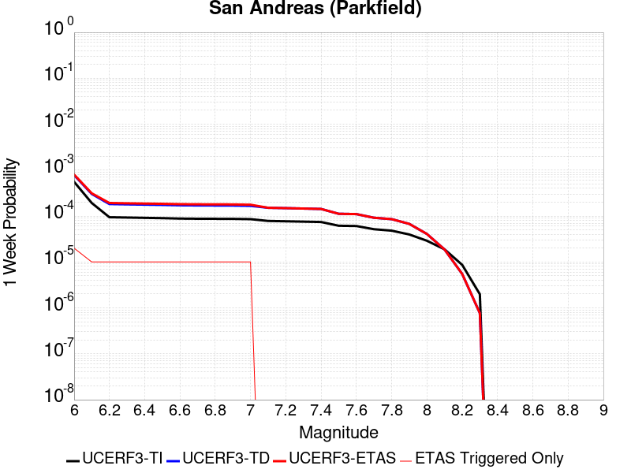 |  |  |  |

| Magnitude | 1 wk TI Prob | 1 wk TD Prob | 1 wk ETAS Prob | 1 wk ETAS/TD Gain | 1 wk ETAS Triggered Only | 1 mo TI Prob | 1 mo TD Prob | 1 mo ETAS Prob | 1 mo ETAS/TD Gain | 1 mo ETAS Triggered Only | 1 yr TI Prob | 1 yr TD Prob | 1 yr ETAS Prob | 1 yr ETAS/TD Gain | 1 yr ETAS Triggered Only | 10 yr TI Prob | 10 yr TD Prob | 10 yr ETAS Prob | 10 yr ETAS/TD Gain | 10 yr ETAS Triggered Only |
|-----|-----|-----|-----|-----|-----|-----|-----|-----|-----|-----|-----|-----|-----|-----|-----|-----|-----|-----|-----|-----|
| 6.0 | 5.556969E-4 | 7.787764E-4 | 7.987608E-4 | 1.0256613 | 2.0E-5 | 0.0023793848 | 0.0033338934 | 0.0033837266 | 1.0149475 | 5.0E-5 | 0.028586963 | 0.04027906 | 0.040413424 | 1.0033357 | 1.4E-4 | 0.25176284 | 0.3373374 | 0.33750308 | 1.0004911 | 2.5E-4 |
| 6.1 | 1.925858E-4 | 3.0300187E-4 | 3.1299883E-4 | 1.0329931 | 1.0E-5 | 8.2510663E-4 | 0.0012980271 | 0.0013080142 | 1.007694 | 1.0E-5 | 0.0099994885 | 0.01578479 | 0.015804475 | 1.001247 | 2.0E-5 | 0.095613256 | 0.14981315 | 0.14988115 | 1.000454 | 8.0E-5 |
| 6.2 | 9.4306815E-5 | 1.8251229E-4 | 1.9251046E-4 | 1.0547808 | 1.0E-5 | 4.0410945E-4 | 7.8196224E-4 | 7.9195446E-4 | 1.0127783 | 1.0E-5 | 0.0049089384 | 0.009479025 | 0.009498836 | 1.00209 | 2.0E-5 | 0.048019063 | 0.09188695 | 0.09194144 | 1.000593 | 6.0E-5 |
| 6.3 | 9.283051E-5 | 1.7947727E-4 | 1.8947547E-4 | 1.0557073 | 1.0E-5 | 3.9778434E-4 | 7.689627E-4 | 7.7895506E-4 | 1.0129945 | 1.0E-5 | 0.0048322747 | 0.0093221245 | 0.0093419375 | 1.0021254 | 2.0E-5 | 0.047285385 | 0.09053988 | 0.09059445 | 1.0006027 | 6.0E-5 |
| 6.4 | 9.138826E-5 | 1.7709887E-4 | 1.870971E-4 | 1.0564556 | 1.0E-5 | 3.916052E-4 | 7.5877557E-4 | 7.68768E-4 | 1.0131692 | 1.0E-5 | 0.0047573745 | 0.009199142 | 0.009218958 | 1.0021541 | 2.0E-5 | 0.046568092 | 0.08944346 | 0.089498095 | 1.0006108 | 6.0E-5 |
| 6.5 | 9.000255E-5 | 1.7467843E-4 | 1.8467668E-4 | 1.0572381 | 1.0E-5 | 3.8566816E-4 | 7.484082E-4 | 7.584007E-4 | 1.0133517 | 1.0E-5 | 0.0046854047 | 0.009074002 | 0.00909382 | 1.0021842 | 2.0E-5 | 0.045878403 | 0.08833238 | 0.08838707 | 1.0006193 | 6.0E-5 |
| 6.6 | 8.8109264E-5 | 1.7148908E-4 | 1.8148737E-4 | 1.0583028 | 1.0E-5 | 3.7755648E-4 | 7.347474E-4 | 7.4474E-4 | 1.0136001 | 1.0E-5 | 0.0045870654 | 0.008909067 | 0.008928889 | 1.0022249 | 2.0E-5 | 0.04493529 | 0.08686431 | 0.08691909 | 1.0006307 | 6.0E-5 |
| 6.7 | 8.738073E-5 | 1.7015962E-4 | 1.8015792E-4 | 1.0587584 | 1.0E-5 | 3.7443507E-4 | 7.290529E-4 | 7.3904556E-4 | 1.0137064 | 1.0E-5 | 0.0045492216 | 0.008840349 | 0.008860172 | 1.0022423 | 2.0E-5 | 0.04457213 | 0.08626531 | 0.08632014 | 1.0006355 | 6.0E-5 |
| 6.8 | 8.710195E-5 | 1.6961442E-4 | 1.7961273E-4 | 1.0589472 | 1.0E-5 | 3.7324068E-4 | 7.267176E-4 | 7.367103E-4 | 1.0137506 | 1.0E-5 | 0.0045347405 | 0.008812156 | 0.008831979 | 1.0022496 | 2.0E-5 | 0.04443313 | 0.086012915 | 0.08606776 | 1.0006375 | 6.0E-5 |
| 6.9 | 8.6801556E-5 | 1.6902383E-4 | 1.7902213E-4 | 1.0591532 | 1.0E-5 | 3.7195362E-4 | 7.241879E-4 | 7.341806E-4 | 1.0137986 | 1.0E-5 | 0.0045191357 | 0.0087816045 | 0.0088014295 | 1.0022575 | 2.0E-5 | 0.044283327 | 0.08573886 | 0.08579372 | 1.0006398 | 6.0E-5 |
| 7.0 | 8.5571606E-5 | 1.6655146E-4 | 1.7654979E-4 | 1.0600315 | 1.0E-5 | 3.6668387E-4 | 7.1359787E-4 | 7.235907E-4 | 1.0140035 | 1.0E-5 | 0.004455241 | 0.008653701 | 0.008673528 | 1.0022912 | 2.0E-5 | 0.043669727 | 0.08458771 | 0.084642634 | 1.0006493 | 6.0E-5 |
| 7.1 | 7.82589E-5 | 1.513576E-4 | 1.513576E-4 | 1.0 | 0.0 | 3.3535215E-4 | 6.485149E-4 | 6.485149E-4 | 1.0 | 0.0 | 0.0040752706 | 0.007867255 | 0.007877177 | 1.0012611 | 1.0E-5 | 0.040013418 | 0.07750286 | 0.07753976 | 1.0004761 | 4.0E-5 |
| 7.2 | 7.690929E-5 | 1.4872964E-4 | 1.4872964E-4 | 1.0 | 0.0 | 3.2956956E-4 | 6.3725776E-4 | 6.3725776E-4 | 1.0 | 0.0 | 0.004005129 | 0.0077311797 | 0.0077411025 | 1.0012834 | 1.0E-5 | 0.0393371 | 0.07627582 | 0.076312765 | 1.0004845 | 4.0E-5 |
| 7.3 | 7.5543794E-5 | 1.4569426E-4 | 1.4569426E-4 | 1.0 | 0.0 | 3.2371894E-4 | 6.242553E-4 | 6.242553E-4 | 1.0 | 0.0 | 0.003934157 | 0.0075739846 | 0.0075839087 | 1.0013103 | 1.0E-5 | 0.038652334 | 0.07484126 | 0.07487826 | 1.0004945 | 4.0E-5 |
| 7.4 | 7.4214564E-5 | 1.4270298E-4 | 1.4270298E-4 | 1.0 | 0.0 | 3.1802364E-4 | 6.1144156E-4 | 6.1144156E-4 | 1.0 | 0.0 | 0.003865065 | 0.00741905 | 0.007428976 | 1.0013379 | 1.0E-5 | 0.03798529 | 0.07341491 | 0.07345197 | 1.0005049 | 4.0E-5 |
| 7.5 | 6.149578E-5 | 1.1197151E-4 | 1.1197151E-4 | 1.0 | 0.0 | 2.6352672E-4 | 4.7978974E-4 | 4.7978974E-4 | 1.0 | 0.0 | 0.0032037178 | 0.0058258264 | 0.005835768 | 1.0017065 | 1.0E-5 | 0.03157923 | 0.058584794 | 0.058622453 | 1.0006428 | 4.0E-5 |
| 7.6 | 6.0643448E-5 | 1.10257475E-4 | 1.10257475E-4 | 1.0 | 0.0 | 2.598746E-4 | 4.7244655E-4 | 4.7244655E-4 | 1.0 | 0.0 | 0.0031593828 | 0.0057368972 | 0.00574684 | 1.0017331 | 1.0E-5 | 0.031148417 | 0.0577456 | 0.05778329 | 1.0006527 | 4.0E-5 |
| 7.7 | 5.1652263E-5 | 9.180402E-5 | 9.180402E-5 | 1.0 | 0.0 | 2.2134806E-4 | 3.933865E-4 | 3.933865E-4 | 1.0 | 0.0 | 0.002691582 | 0.0047789724 | 0.004788925 | 1.0020825 | 1.0E-5 | 0.026592141 | 0.048558682 | 0.04859674 | 1.0007838 | 4.0E-5 |
| 7.8 | 4.8090482E-5 | 8.564889E-5 | 8.564889E-5 | 1.0 | 0.0 | 2.060858E-4 | 3.6701505E-4 | 3.6701505E-4 | 1.0 | 0.0 | 0.0025062072 | 0.0044592614 | 0.004469217 | 1.0022326 | 1.0E-5 | 0.024781305 | 0.04532328 | 0.045361467 | 1.0008426 | 4.0E-5 |
| 7.9 | 3.970278E-5 | 6.754373E-5 | 6.754373E-5 | 1.0 | 0.0 | 1.7014367E-4 | 2.8944103E-4 | 2.8944103E-4 | 1.0 | 0.0 | 0.002069531 | 0.003518254 | 0.003518254 | 1.0 | 0.0 | 0.020503636 | 0.03590036 | 0.035919644 | 1.0005372 | 2.0E-5 |
| 8.0 | 2.8982335E-5 | 4.072156E-5 | 4.072156E-5 | 1.0 | 0.0 | 1.2420409E-4 | 1.745093E-4 | 1.745093E-4 | 1.0 | 0.0 | 0.0015111357 | 0.0021225815 | 0.0021225815 | 1.0 | 0.0 | 0.015009012 | 0.022022424 | 0.022022424 | 1.0 | 0.0 |
| 8.1 | 1.8836186E-5 | 1.8692857E-5 | 1.8692857E-5 | 1.0 | 0.0 | 8.0724014E-5 | 8.0109785E-5 | 8.0109785E-5 | 1.0 | 0.0 | 9.823717E-4 | 9.7490085E-4 | 9.7490085E-4 | 1.0 | 0.0 | 0.009780403 | 0.010494427 | 0.010494427 | 1.0 | 0.0 |
| 8.2 | 8.643924E-6 | 5.478665E-6 | 5.478665E-6 | 1.0 | 0.0 | 3.704486E-5 | 2.3479783E-5 | 2.3479783E-5 | 1.0 | 0.0 | 4.5092785E-4 | 2.8582895E-4 | 2.8582895E-4 | 1.0 | 0.0 | 0.0045001395 | 0.0032508469 | 0.0032508469 | 1.0 | 0.0 |
| 8.3 | 1.983087E-6 | 7.6647797E-7 | 7.6647797E-7 | 1.0 | 0.0 | 8.498917E-6 | 3.2849016E-6 | 3.2849016E-6 | 1.0 | 0.0 | 1.034694E-4 | 3.999296E-5 | 3.999296E-5 | 1.0 | 0.0 | 0.0010342124 | 4.7228087E-4 | 4.7228087E-4 | 1.0 | 0.0 |

## Ludlow
*[(top)](#table-of-contents)*

| 1 Week | 1 Month | 1 Year | 10 Year |
|-----|-----|-----|-----|
| 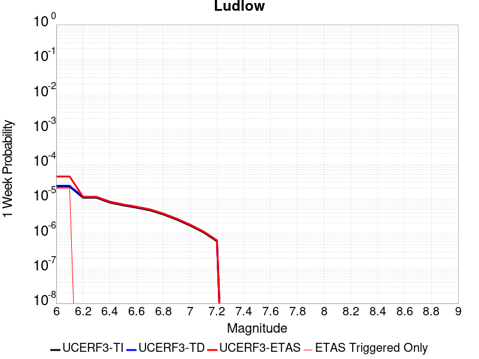 |  |  |  |

| Magnitude | 1 wk TI Prob | 1 wk TD Prob | 1 wk ETAS Prob | 1 wk ETAS/TD Gain | 1 wk ETAS Triggered Only | 1 mo TI Prob | 1 mo TD Prob | 1 mo ETAS Prob | 1 mo ETAS/TD Gain | 1 mo ETAS Triggered Only | 1 yr TI Prob | 1 yr TD Prob | 1 yr ETAS Prob | 1 yr ETAS/TD Gain | 1 yr ETAS Triggered Only | 10 yr TI Prob | 10 yr TD Prob | 10 yr ETAS Prob | 10 yr ETAS/TD Gain | 10 yr ETAS Triggered Only |
|-----|-----|-----|-----|-----|-----|-----|-----|-----|-----|-----|-----|-----|-----|-----|-----|-----|-----|-----|-----|-----|
| 6.0 | 2.2407607E-5 | 2.3657429E-5 | 4.3656957E-5 | 1.8453804 | 2.0E-5 | 9.602906E-5 | 1.0138529E-4 | 1.5138021E-4 | 1.4931182 | 5.0E-5 | 0.0011685267 | 0.001233711 | 0.001353563 | 1.0971475 | 1.2E-4 | 0.011624013 | 0.012273132 | 0.012490433 | 1.0177053 | 2.2E-4 |
| 6.1 | 2.2407607E-5 | 2.3657429E-5 | 4.3656957E-5 | 1.8453804 | 2.0E-5 | 9.602906E-5 | 1.0138529E-4 | 1.5138021E-4 | 1.4931182 | 5.0E-5 | 0.0011685267 | 0.001233711 | 0.001353563 | 1.0971475 | 1.2E-4 | 0.011624013 | 0.012273132 | 0.012490433 | 1.0177053 | 2.2E-4 |
| 6.2 | 1.0781252E-5 | 1.1365745E-5 | 1.1365745E-5 | 1.0 | 0.0 | 4.620455E-5 | 4.870945E-5 | 7.870799E-5 | 1.6158669 | 3.0E-5 | 5.623952E-4 | 5.9288024E-4 | 6.6283875E-4 | 1.1179976 | 7.0E-5 | 0.00560974 | 0.005913404 | 0.006032694 | 1.0201728 | 1.2E-4 |
| 6.3 | 1.0781252E-5 | 1.1365745E-5 | 1.1365745E-5 | 1.0 | 0.0 | 4.620455E-5 | 4.870945E-5 | 7.870799E-5 | 1.6158669 | 3.0E-5 | 5.623952E-4 | 5.9288024E-4 | 6.6283875E-4 | 1.1179976 | 7.0E-5 | 0.00560974 | 0.005913404 | 0.006032694 | 1.0201728 | 1.2E-4 |
| 6.4 | 7.814439E-6 | 8.237788E-6 | 8.237788E-6 | 1.0 | 0.0 | 3.3490025E-5 | 3.5304336E-5 | 3.5304336E-5 | 1.0 | 0.0 | 4.0766477E-4 | 4.2974693E-4 | 4.5973403E-4 | 1.0697786 | 3.0E-5 | 0.0040691774 | 0.0042893053 | 0.0043689623 | 1.018571 | 8.0E-5 |
| 6.5 | 6.4986366E-6 | 6.850969E-6 | 6.850969E-6 | 1.0 | 0.0 | 2.7851002E-5 | 2.936097E-5 | 2.936097E-5 | 1.0 | 0.0 | 3.390332E-4 | 3.574121E-4 | 3.8740138E-4 | 1.0839068 | 3.0E-5 | 0.003385164 | 0.0035684688 | 0.0036182904 | 1.0139616 | 5.0E-5 |
| 6.6 | 5.582177E-6 | 5.8860483E-6 | 5.8860483E-6 | 1.0 | 0.0 | 2.3923398E-5 | 2.522568E-5 | 2.522568E-5 | 1.0 | 0.0 | 2.9122844E-4 | 3.070801E-4 | 3.3707087E-4 | 1.0976644 | 3.0E-5 | 0.0029084706 | 0.003066631 | 0.0031164777 | 1.0162545 | 5.0E-5 |
| 6.7 | 4.6858763E-6 | 4.940463E-6 | 4.940463E-6 | 1.0 | 0.0 | 2.0082172E-5 | 2.1173244E-5 | 2.1173244E-5 | 1.0 | 0.0 | 2.4447302E-4 | 2.577543E-4 | 2.6775172E-4 | 1.0387866 | 1.0E-5 | 0.0024420423 | 0.0025746098 | 0.0025945583 | 1.0077481 | 2.0E-5 |
| 6.8 | 3.5584908E-6 | 3.7520454E-6 | 3.7520454E-6 | 1.0 | 0.0 | 1.5250586E-5 | 1.6080097E-5 | 1.6080097E-5 | 1.0 | 0.0 | 1.8566006E-4 | 1.9575801E-4 | 2.0575605E-4 | 1.0510734 | 1.0E-5 | 0.0018550502 | 0.0019558968 | 0.0019758577 | 1.0102055 | 2.0E-5 |
| 6.9 | 2.532834E-6 | 2.6710227E-6 | 2.6710227E-6 | 1.0 | 0.0 | 1.0854958E-5 | 1.1447192E-5 | 1.1447192E-5 | 1.0 | 0.0 | 1.3215111E-4 | 1.3936093E-4 | 1.4935953E-4 | 1.0717461 | 1.0E-5 | 0.0013207254 | 0.0013927629 | 0.0014127351 | 1.0143399 | 2.0E-5 |
| 7.0 | 1.7083285E-6 | 1.801957E-6 | 1.801957E-6 | 1.0 | 0.0 | 7.3213873E-6 | 7.7226505E-6 | 7.7226505E-6 | 1.0 | 0.0 | 8.913424E-5 | 9.4019386E-5 | 9.4019386E-5 | 1.0 | 0.0 | 8.9098496E-4 | 9.3981257E-4 | 9.4980316E-4 | 1.0106304 | 1.0E-5 |
| 7.1 | 1.0905424E-6 | 1.1497702E-6 | 1.1497702E-6 | 1.0 | 0.0 | 4.6737446E-6 | 4.927578E-6 | 4.927578E-6 | 1.0 | 0.0 | 5.6901354E-5 | 5.999171E-5 | 5.999171E-5 | 1.0 | 0.0 | 5.6886784E-4 | 5.997649E-4 | 5.997649E-4 | 1.0 | 0.0 |
| 7.2 | 6.06668E-7 | 6.387322E-7 | 6.387322E-7 | 1.0 | 0.0 | 2.600003E-6 | 2.7374213E-6 | 2.7374213E-6 | 1.0 | 0.0 | 3.1654577E-5 | 3.3327666E-5 | 3.3327666E-5 | 1.0 | 0.0 | 3.1650066E-4 | 3.332335E-4 | 3.332335E-4 | 1.0 | 0.0 |

## Red Pass
*[(top)](#table-of-contents)*

| 1 Week | 1 Month | 1 Year | 10 Year |
|-----|-----|-----|-----|
|  |  |  |  |

| Magnitude | 1 wk TI Prob | 1 wk TD Prob | 1 wk ETAS Prob | 1 wk ETAS/TD Gain | 1 wk ETAS Triggered Only | 1 mo TI Prob | 1 mo TD Prob | 1 mo ETAS Prob | 1 mo ETAS/TD Gain | 1 mo ETAS Triggered Only | 1 yr TI Prob | 1 yr TD Prob | 1 yr ETAS Prob | 1 yr ETAS/TD Gain | 1 yr ETAS Triggered Only | 10 yr TI Prob | 10 yr TD Prob | 10 yr ETAS Prob | 10 yr ETAS/TD Gain | 10 yr ETAS Triggered Only |
|-----|-----|-----|-----|-----|-----|-----|-----|-----|-----|-----|-----|-----|-----|-----|-----|-----|-----|-----|-----|-----|
| 6.0 | 8.258278E-6 | 8.551305E-6 | 8.551305E-6 | 1.0 | 0.0 | 3.539214E-5 | 3.6648038E-5 | 7.664657E-5 | 2.0914237 | 4.0E-5 | 4.308141E-4 | 4.4611638E-4 | 5.760584E-4 | 1.2912738 | 1.3E-4 | 0.0042997985 | 0.004453966 | 0.0046630306 | 1.046939 | 2.1E-4 |
| 6.1 | 3.649988E-6 | 3.7753332E-6 | 3.7753332E-6 | 1.0 | 0.0 | 1.5642712E-5 | 1.6179927E-5 | 4.617944E-5 | 2.8541193 | 3.0E-5 | 1.9043336E-4 | 1.9697756E-4 | 2.469677E-4 | 1.253786 | 5.0E-5 | 0.0019027026 | 0.001968497 | 0.0020782803 | 1.0557702 | 1.1E-4 |
| 6.2 | 3.649988E-6 | 3.7753332E-6 | 3.7753332E-6 | 1.0 | 0.0 | 1.5642712E-5 | 1.6179927E-5 | 4.617944E-5 | 2.8541193 | 3.0E-5 | 1.9043336E-4 | 1.9697756E-4 | 2.469677E-4 | 1.253786 | 5.0E-5 | 0.0019027026 | 0.001968497 | 0.0020782803 | 1.0557702 | 1.1E-4 |
| 6.3 | 1.3924937E-6 | 1.4411233E-6 | 1.4411233E-6 | 1.0 | 0.0 | 5.9678164E-6 | 6.176236E-6 | 2.6176112E-5 | 4.2381983 | 2.0E-5 | 7.265574E-5 | 7.51945E-5 | 1.0519224E-4 | 1.3989354 | 3.0E-5 | 7.263199E-4 | 7.518293E-4 | 8.117842E-4 | 1.0797453 | 6.0E-5 |
| 6.4 | 1.3924937E-6 | 1.4411233E-6 | 1.4411233E-6 | 1.0 | 0.0 | 5.9678164E-6 | 6.176236E-6 | 2.6176112E-5 | 4.2381983 | 2.0E-5 | 7.265574E-5 | 7.51945E-5 | 1.0519224E-4 | 1.3989354 | 3.0E-5 | 7.263199E-4 | 7.518293E-4 | 8.117842E-4 | 1.0797453 | 6.0E-5 |
| 6.5 | 9.876812E-7 | 1.022196E-6 | 1.022196E-6 | 1.0 | 0.0 | 4.2329125E-6 | 4.38084E-6 | 2.4380752E-5 | 5.565315 | 2.0E-5 | 5.153449E-5 | 5.3336724E-5 | 8.333512E-5 | 1.5624342 | 3.0E-5 | 5.1522546E-4 | 5.333672E-4 | 5.9333525E-4 | 1.1124328 | 6.0E-5 |

## White Wolf (Extension)
*[(top)](#table-of-contents)*

| 1 Week | 1 Month | 1 Year | 10 Year |
|-----|-----|-----|-----|
|  |  |  |  |

| Magnitude | 1 wk TI Prob | 1 wk TD Prob | 1 wk ETAS Prob | 1 wk ETAS/TD Gain | 1 wk ETAS Triggered Only | 1 mo TI Prob | 1 mo TD Prob | 1 mo ETAS Prob | 1 mo ETAS/TD Gain | 1 mo ETAS Triggered Only | 1 yr TI Prob | 1 yr TD Prob | 1 yr ETAS Prob | 1 yr ETAS/TD Gain | 1 yr ETAS Triggered Only | 10 yr TI Prob | 10 yr TD Prob | 10 yr ETAS Prob | 10 yr ETAS/TD Gain | 10 yr ETAS Triggered Only |
|-----|-----|-----|-----|-----|-----|-----|-----|-----|-----|-----|-----|-----|-----|-----|-----|-----|-----|-----|-----|-----|
| 6.0 | 8.222555E-6 | 6.0666557E-6 | 2.6066535E-5 | 4.296689 | 2.0E-5 | 3.5239045E-5 | 2.5999732E-5 | 8.5998174E-5 | 3.307656 | 6.0E-5 | 4.289509E-4 | 3.165074E-4 | 4.364694E-4 | 1.3790181 | 1.2E-4 | 0.0042812387 | 0.0031612178 | 0.0033605855 | 1.0630667 | 2.0E-4 |
| 6.1 | 8.222555E-6 | 6.0666557E-6 | 2.6066535E-5 | 4.296689 | 2.0E-5 | 3.5239045E-5 | 2.5999732E-5 | 8.5998174E-5 | 3.307656 | 6.0E-5 | 4.289509E-4 | 3.165074E-4 | 4.364694E-4 | 1.3790181 | 1.2E-4 | 0.0042812387 | 0.0031612178 | 0.0033605855 | 1.0630667 | 2.0E-4 |
| 6.2 | 8.222555E-6 | 6.0666557E-6 | 2.6066535E-5 | 4.296689 | 2.0E-5 | 3.5239045E-5 | 2.5999732E-5 | 8.5998174E-5 | 3.307656 | 6.0E-5 | 4.289509E-4 | 3.165074E-4 | 4.364694E-4 | 1.3790181 | 1.2E-4 | 0.0042812387 | 0.0031612178 | 0.0033605855 | 1.0630667 | 2.0E-4 |
| 6.3 | 8.222555E-6 | 6.0666557E-6 | 2.6066535E-5 | 4.296689 | 2.0E-5 | 3.5239045E-5 | 2.5999732E-5 | 8.5998174E-5 | 3.307656 | 6.0E-5 | 4.289509E-4 | 3.165074E-4 | 4.364694E-4 | 1.3790181 | 1.2E-4 | 0.0042812387 | 0.0031612178 | 0.0033605855 | 1.0630667 | 2.0E-4 |
| 6.4 | 5.821773E-6 | 3.5571516E-6 | 1.3557116E-5 | 3.811228 | 1.0E-5 | 2.4950215E-5 | 1.5244852E-5 | 5.5244243E-5 | 3.6237965 | 4.0E-5 | 3.0372653E-4 | 1.8559136E-4 | 2.4558022E-4 | 1.3232309 | 6.0E-5 | 0.0030331176 | 0.0018544721 | 0.0019343237 | 1.043059 | 8.0E-5 |
| 6.5 | 5.766023E-6 | 3.4990853E-6 | 1.34990505E-5 | 3.8578796 | 1.0E-5 | 2.4711293E-5 | 1.4996E-5 | 5.49954E-5 | 3.667338 | 4.0E-5 | 3.0081844E-4 | 1.825621E-4 | 2.4255115E-4 | 1.3285953 | 6.0E-5 | 0.0030041158 | 0.0018242294 | 0.0019040835 | 1.0437741 | 8.0E-5 |
| 6.6 | 4.643576E-6 | 2.3325927E-6 | 1.2332569E-5 | 5.287065 | 1.0E-5 | 1.9900888E-5 | 9.99679E-6 | 4.999639E-5 | 5.0012445 | 4.0E-5 | 2.4226638E-4 | 1.2170455E-4 | 1.8169725E-4 | 1.4929372 | 6.0E-5 | 0.0024200242 | 0.0012164214 | 0.0012963241 | 1.0656867 | 8.0E-5 |
| 6.7 | 3.9529173E-6 | 1.6483134E-6 | 1.1648297E-5 | 7.0667973 | 1.0E-5 | 1.6940963E-5 | 7.0641822E-6 | 2.7064041E-5 | 3.831164 | 2.0E-5 | 2.0623671E-4 | 8.6003216E-5 | 1.16000636E-4 | 1.3487942 | 3.0E-5 | 0.002060454 | 8.5971784E-4 | 9.0967485E-4 | 1.0581086 | 5.0E-5 |
| 6.8 | 3.4377522E-6 | 1.2244896E-6 | 1.2244896E-6 | 1.0 | 0.0 | 1.473314E-5 | 5.247802E-6 | 1.524775E-5 | 2.9055495 | 1.0E-5 | 1.7936122E-4 | 6.389021E-5 | 8.388893E-5 | 1.313017 | 2.0E-5 | 0.0017921652 | 6.3872756E-4 | 6.78702E-4 | 1.0625845 | 4.0E-5 |
| 6.9 | 3.1367306E-6 | 1.0033432E-6 | 1.0033432E-6 | 1.0 | 0.0 | 1.3443062E-5 | 4.300036E-6 | 1.42999925E-5 | 3.325552 | 1.0E-5 | 1.63657E-4 | 5.2351756E-5 | 7.235071E-5 | 1.3820112 | 2.0E-5 | 0.0016353652 | 5.234019E-4 | 5.6338095E-4 | 1.0763831 | 4.0E-5 |
| 7.0 | 2.8298145E-6 | 7.4283355E-7 | 7.4283355E-7 | 1.0 | 0.0 | 1.2127721E-5 | 3.1835689E-6 | 3.1835689E-6 | 1.0 | 0.0 | 1.47645E-4 | 3.875931E-5 | 4.8758924E-5 | 1.2579925 | 1.0E-5 | 0.0014754693 | 3.875305E-4 | 4.0752275E-4 | 1.0515889 | 2.0E-5 |
| 7.1 | 2.4091064E-6 | 5.422472E-7 | 5.422472E-7 | 1.0 | 0.0 | 1.03247E-5 | 2.323915E-6 | 2.323915E-6 | 1.0 | 0.0 | 1.2569598E-4 | 2.8293338E-5 | 3.8293056E-5 | 1.35343 | 1.0E-5 | 0.001256249 | 2.829014E-4 | 3.0289573E-4 | 1.070676 | 2.0E-5 |
| 7.2 | 1.3875518E-6 | 1.074062E-7 | 1.074062E-7 | 1.0 | 0.0 | 5.9466374E-6 | 4.603122E-7 | 4.603122E-7 | 1.0 | 0.0 | 7.23979E-5 | 5.604288E-6 | 5.604288E-6 | 1.0 | 0.0 | 7.2374323E-4 | 5.604158E-5 | 5.604158E-5 | 1.0 | 0.0 |
| 7.3 | 7.056077E-7 | 5.0005806E-8 | 5.0005806E-8 | 1.0 | 0.0 | 3.0240296E-6 | 2.1431059E-7 | 2.1431059E-7 | 1.0 | 0.0 | 3.681694E-5 | 2.6092287E-6 | 2.6092287E-6 | 1.0 | 0.0 | 3.681084E-4 | 2.6092028E-5 | 2.6092028E-5 | 1.0 | 0.0 |
| 7.4 | 5.9334678E-8 | 4.8638475E-9 | 4.8638475E-9 | 1.0 | 0.0 | 2.5429145E-7 | 2.084506E-8 | 2.084506E-8 | 1.0 | 0.0 | 3.095994E-6 | 2.5378858E-7 | 2.5378858E-7 | 1.0 | 0.0 | 3.095951E-5 | 2.5378843E-6 | 2.5378843E-6 | 1.0 | 0.0 |

## San Jacinto (San Bernardino)
*[(top)](#table-of-contents)*

| 1 Week | 1 Month | 1 Year | 10 Year |
|-----|-----|-----|-----|
|  | 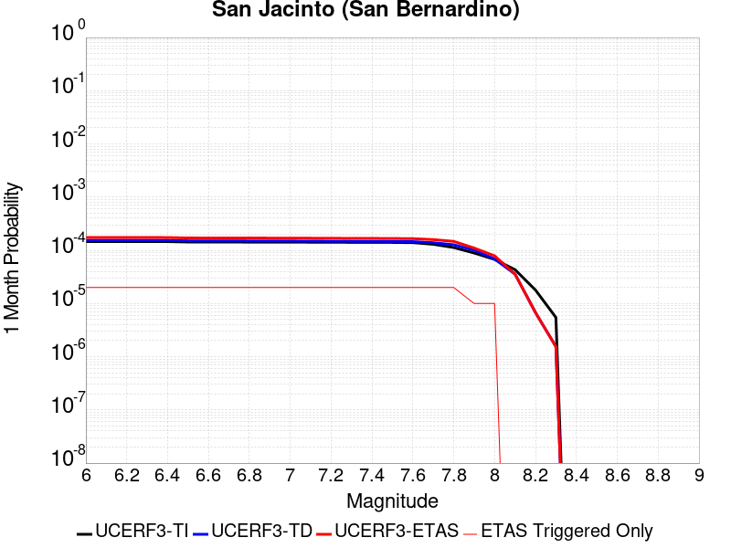 |  |  |

| Magnitude | 1 wk TI Prob | 1 wk TD Prob | 1 wk ETAS Prob | 1 wk ETAS/TD Gain | 1 wk ETAS Triggered Only | 1 mo TI Prob | 1 mo TD Prob | 1 mo ETAS Prob | 1 mo ETAS/TD Gain | 1 mo ETAS Triggered Only | 1 yr TI Prob | 1 yr TD Prob | 1 yr ETAS Prob | 1 yr ETAS/TD Gain | 1 yr ETAS Triggered Only | 10 yr TI Prob | 10 yr TD Prob | 10 yr ETAS Prob | 10 yr ETAS/TD Gain | 10 yr ETAS Triggered Only |
|-----|-----|-----|-----|-----|-----|-----|-----|-----|-----|-----|-----|-----|-----|-----|-----|-----|-----|-----|-----|-----|
| 6.0 | 3.409352E-5 | 3.6001682E-5 | 3.6001682E-5 | 1.0 | 0.0 | 1.461069E-4 | 1.542838E-4 | 1.7428072E-4 | 1.1296113 | 2.0E-5 | 0.0017774 | 0.0018767886 | 0.0019666196 | 1.0478642 | 9.0E-5 | 0.01763251 | 0.01935761 | 0.019543933 | 1.0096253 | 1.9E-4 |
| 6.1 | 3.409352E-5 | 3.6001682E-5 | 3.6001682E-5 | 1.0 | 0.0 | 1.461069E-4 | 1.542838E-4 | 1.7428072E-4 | 1.1296113 | 2.0E-5 | 0.0017774 | 0.0018767886 | 0.0019666196 | 1.0478642 | 9.0E-5 | 0.01763251 | 0.01935761 | 0.019543933 | 1.0096253 | 1.9E-4 |
| 6.2 | 3.409352E-5 | 3.6001682E-5 | 3.6001682E-5 | 1.0 | 0.0 | 1.461069E-4 | 1.542838E-4 | 1.7428072E-4 | 1.1296113 | 2.0E-5 | 0.0017774 | 0.0018767886 | 0.0019666196 | 1.0478642 | 9.0E-5 | 0.01763251 | 0.01935761 | 0.019543933 | 1.0096253 | 1.9E-4 |
| 6.3 | 3.409352E-5 | 3.6001682E-5 | 3.6001682E-5 | 1.0 | 0.0 | 1.461069E-4 | 1.542838E-4 | 1.7428072E-4 | 1.1296113 | 2.0E-5 | 0.0017774 | 0.0018767886 | 0.0019666196 | 1.0478642 | 9.0E-5 | 0.01763251 | 0.01935761 | 0.019543933 | 1.0096253 | 1.9E-4 |
| 6.4 | 3.400795E-5 | 3.5894343E-5 | 3.5894343E-5 | 1.0 | 0.0 | 1.4574021E-4 | 1.5382383E-4 | 1.7382076E-4 | 1.1299988 | 2.0E-5 | 0.0017729428 | 0.0018711982 | 0.0019610298 | 1.0480075 | 9.0E-5 | 0.017588645 | 0.01930269 | 0.019489022 | 1.0096532 | 1.9E-4 |
| 6.5 | 3.341482E-5 | 3.515495E-5 | 3.515495E-5 | 1.0 | 0.0 | 1.4319851E-4 | 1.5065537E-4 | 1.7065236E-4 | 1.1327333 | 2.0E-5 | 0.0017420477 | 0.0018326874 | 0.0019225224 | 1.0490183 | 9.0E-5 | 0.017284546 | 0.018924221 | 0.019110626 | 1.00985 | 1.9E-4 |
| 6.6 | 3.3364955E-5 | 3.5092165E-5 | 3.5092165E-5 | 1.0 | 0.0 | 1.4298483E-4 | 1.5038633E-4 | 1.7038333E-4 | 1.1329708 | 2.0E-5 | 0.0017394501 | 0.0018294173 | 0.0019192527 | 1.049106 | 9.0E-5 | 0.017258976 | 0.018892085 | 0.019078497 | 1.0098671 | 1.9E-4 |
| 6.7 | 3.335922E-5 | 3.508194E-5 | 3.508194E-5 | 1.0 | 0.0 | 1.4296026E-4 | 1.503425E-4 | 1.703395E-4 | 1.1330096 | 2.0E-5 | 0.0017391514 | 0.0018288847 | 0.0019187201 | 1.0491203 | 9.0E-5 | 0.017256035 | 0.018886877 | 0.019073287 | 1.0098699 | 1.9E-4 |
| 6.8 | 3.327683E-5 | 3.4976E-5 | 3.4976E-5 | 1.0 | 0.0 | 1.4260718E-4 | 1.4988854E-4 | 1.6988553E-4 | 1.1334125 | 2.0E-5 | 0.0017348597 | 0.0018233669 | 0.0019132028 | 1.0492692 | 9.0E-5 | 0.017213784 | 0.018832648 | 0.01901907 | 1.0098989 | 1.9E-4 |
| 6.9 | 3.3235785E-5 | 3.491695E-5 | 3.491695E-5 | 1.0 | 0.0 | 1.4243131E-4 | 1.496355E-4 | 1.696325E-4 | 1.1336381 | 2.0E-5 | 0.0017327217 | 0.0018202913 | 0.0019101275 | 1.0493526 | 9.0E-5 | 0.017192734 | 0.018802516 | 0.018988943 | 1.009915 | 1.9E-4 |
| 7.0 | 3.3197095E-5 | 3.485688E-5 | 3.485688E-5 | 1.0 | 0.0 | 1.422655E-4 | 1.4937807E-4 | 1.6937508E-4 | 1.1338685 | 2.0E-5 | 0.0017307063 | 0.0018171624 | 0.0019069988 | 1.0494378 | 9.0E-5 | 0.017172894 | 0.01877189 | 0.018958325 | 1.0099316 | 1.9E-4 |
| 7.1 | 3.3129716E-5 | 3.473708E-5 | 3.473708E-5 | 1.0 | 0.0 | 1.4197677E-4 | 1.4886471E-4 | 1.6886173E-4 | 1.1343302 | 2.0E-5 | 0.0017271966 | 0.0018109226 | 0.0019007596 | 1.0496085 | 9.0E-5 | 0.017138338 | 0.01871097 | 0.018897416 | 1.0099645 | 1.9E-4 |
| 7.2 | 3.3034008E-5 | 3.4604524E-5 | 3.4604524E-5 | 1.0 | 0.0 | 1.4156665E-4 | 1.4829668E-4 | 1.682937E-4 | 1.1348448 | 2.0E-5 | 0.0017222111 | 0.0018040182 | 0.0018938559 | 1.0497986 | 9.0E-5 | 0.017089253 | 0.018643353 | 0.01882981 | 1.0100013 | 1.9E-4 |
| 7.3 | 3.2956614E-5 | 3.447227E-5 | 3.447227E-5 | 1.0 | 0.0 | 1.4123498E-4 | 1.4772992E-4 | 1.6772698E-4 | 1.1353621 | 2.0E-5 | 0.0017181796 | 0.0017971295 | 0.0018869678 | 1.0499898 | 9.0E-5 | 0.017049557 | 0.018576099 | 0.018762568 | 1.0100383 | 1.9E-4 |
| 7.4 | 3.2915937E-5 | 3.4393954E-5 | 3.4393954E-5 | 1.0 | 0.0 | 1.4106068E-4 | 1.4739433E-4 | 1.6739138E-4 | 1.1356704 | 2.0E-5 | 0.0017160608 | 0.0017930503 | 0.001882889 | 1.0501038 | 9.0E-5 | 0.017028693 | 0.01853637 | 0.018722849 | 1.0100601 | 1.9E-4 |
| 7.5 | 3.281791E-5 | 3.4258854E-5 | 3.4258854E-5 | 1.0 | 0.0 | 1.406406E-4 | 1.468154E-4 | 1.6681246E-4 | 1.1362054 | 2.0E-5 | 0.0017109542 | 0.0017860134 | 0.0018758527 | 1.0503016 | 9.0E-5 | 0.016978411 | 0.01846725 | 0.018653741 | 1.0100985 | 1.9E-4 |
| 7.6 | 3.2521442E-5 | 3.3983775E-5 | 3.3983775E-5 | 1.0 | 0.0 | 1.3937015E-4 | 1.4563663E-4 | 1.6563371E-4 | 1.1373081 | 2.0E-5 | 0.0016955109 | 0.0017716853 | 0.0018615258 | 1.0507091 | 9.0E-5 | 0.016826328 | 0.018324887 | 0.018511405 | 1.0101784 | 1.9E-4 |
| 7.7 | 3.0287873E-5 | 3.2467702E-5 | 3.2467702E-5 | 1.0 | 0.0 | 1.297987E-4 | 1.3913988E-4 | 1.591371E-4 | 1.1437203 | 2.0E-5 | 0.0015791537 | 0.001692713 | 0.0017825606 | 1.0530791 | 9.0E-5 | 0.01567979 | 0.017535618 | 0.017722286 | 1.010645 | 1.9E-4 |
| 7.8 | 2.6316151E-5 | 2.9678076E-5 | 2.9678076E-5 | 1.0 | 0.0 | 1.1277862E-4 | 1.2718556E-4 | 1.4718302E-4 | 1.1572305 | 2.0E-5 | 0.0013722149 | 0.0015473852 | 0.001637246 | 1.0580727 | 9.0E-5 | 0.013637724 | 0.016076857 | 0.016263803 | 1.0116283 | 1.9E-4 |
| 7.9 | 2.0761147E-5 | 2.343051E-5 | 2.343051E-5 | 1.0 | 0.0 | 8.897331E-5 | 1.0041261E-4 | 1.1041161E-4 | 1.0995791 | 1.0E-5 | 0.0010827117 | 0.0012218388 | 0.001301741 | 1.0653951 | 8.0E-5 | 0.010774517 | 0.012799647 | 0.012967471 | 1.0131116 | 1.7E-4 |
| 8.0 | 1.5738568E-5 | 1.604239E-5 | 1.604239E-5 | 1.0 | 0.0 | 6.744926E-5 | 6.875129E-5 | 7.87506E-5 | 1.1454418 | 1.0E-5 | 8.2088535E-4 | 8.3672616E-4 | 8.766927E-4 | 1.0477654 | 4.0E-5 | 0.008178596 | 0.008870586 | 0.00897961 | 1.0122905 | 1.1E-4 |
| 8.1 | 1.0105832E-5 | 8.335246E-6 | 8.335246E-6 | 1.0 | 0.0 | 4.3309992E-5 | 3.5721994E-5 | 3.5721994E-5 | 1.0 | 0.0 | 5.2717153E-4 | 4.34829E-4 | 4.4482466E-4 | 1.0229876 | 1.0E-5 | 0.005259227 | 0.0046798005 | 0.00470966 | 1.0063806 | 3.0E-5 |
| 8.2 | 4.189207E-6 | 1.5793896E-6 | 1.5793896E-6 | 1.0 | 0.0 | 1.7953622E-5 | 6.768795E-6 | 6.768795E-6 | 1.0 | 0.0 | 2.1856341E-4 | 8.2406994E-5 | 8.2406994E-5 | 1.0 | 0.0 | 0.0021834858 | 9.571454E-4 | 9.571454E-4 | 1.0 | 0.0 |
| 8.3 | 1.2758221E-6 | 3.6171858E-7 | 3.6171858E-7 | 1.0 | 0.0 | 5.4677976E-6 | 1.5502216E-6 | 1.5502216E-6 | 1.0 | 0.0 | 6.65684E-5 | 1.8873789E-5 | 1.8873789E-5 | 1.0 | 0.0 | 6.6548464E-4 | 2.2764095E-4 | 2.2764095E-4 | 1.0 | 0.0 |

## Calico-Hidalgo
*[(top)](#table-of-contents)*

| 1 Week | 1 Month | 1 Year | 10 Year |
|-----|-----|-----|-----|
|  | 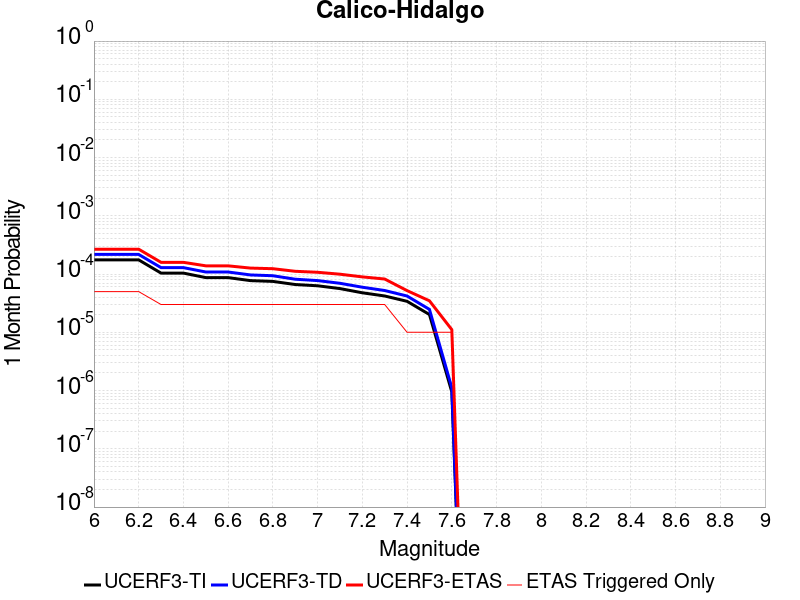 |  | 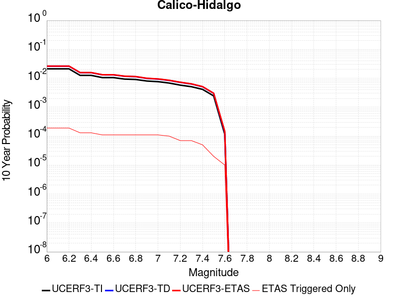 |

| Magnitude | 1 wk TI Prob | 1 wk TD Prob | 1 wk ETAS Prob | 1 wk ETAS/TD Gain | 1 wk ETAS Triggered Only | 1 mo TI Prob | 1 mo TD Prob | 1 mo ETAS Prob | 1 mo ETAS/TD Gain | 1 mo ETAS Triggered Only | 1 yr TI Prob | 1 yr TD Prob | 1 yr ETAS Prob | 1 yr ETAS/TD Gain | 1 yr ETAS Triggered Only | 10 yr TI Prob | 10 yr TD Prob | 10 yr ETAS Prob | 10 yr ETAS/TD Gain | 10 yr ETAS Triggered Only |
|-----|-----|-----|-----|-----|-----|-----|-----|-----|-----|-----|-----|-----|-----|-----|-----|-----|-----|-----|-----|-----|
| 6.0 | 4.0906612E-5 | 5.0705254E-5 | 6.0704744E-5 | 1.1972083 | 1.0E-5 | 1.7530227E-4 | 2.172924E-4 | 2.6728155E-4 | 1.2300547 | 5.0E-5 | 0.0021322158 | 0.0026427244 | 0.002772381 | 1.0490617 | 1.3E-4 | 0.02111873 | 0.026153268 | 0.026338298 | 1.0070748 | 1.9E-4 |
| 6.1 | 4.0906612E-5 | 5.0705254E-5 | 6.0704744E-5 | 1.1972083 | 1.0E-5 | 1.7530227E-4 | 2.172924E-4 | 2.6728155E-4 | 1.2300547 | 5.0E-5 | 0.0021322158 | 0.0026427244 | 0.002772381 | 1.0490617 | 1.3E-4 | 0.02111873 | 0.026153268 | 0.026338298 | 1.0070748 | 1.9E-4 |
| 6.2 | 4.0906612E-5 | 5.0705254E-5 | 6.0704744E-5 | 1.1972083 | 1.0E-5 | 1.7530227E-4 | 2.172924E-4 | 2.6728155E-4 | 1.2300547 | 5.0E-5 | 0.0021322158 | 0.0026427244 | 0.002772381 | 1.0490617 | 1.3E-4 | 0.02111873 | 0.026153268 | 0.026338298 | 1.0070748 | 1.9E-4 |
| 6.3 | 2.4242801E-5 | 3.0091267E-5 | 4.0090967E-5 | 1.3323123 | 1.0E-5 | 1.0389358E-4 | 1.2895638E-4 | 1.5895252E-4 | 1.2326068 | 3.0E-5 | 0.0012641704 | 0.0015689468 | 0.0016488213 | 1.0509096 | 8.0E-5 | 0.01257003 | 0.015582383 | 0.015710358 | 1.0082128 | 1.3E-4 |
| 6.4 | 2.4242801E-5 | 3.0091267E-5 | 4.0090967E-5 | 1.3323123 | 1.0E-5 | 1.0389358E-4 | 1.2895638E-4 | 1.5895252E-4 | 1.2326068 | 3.0E-5 | 0.0012641704 | 0.0015689468 | 0.0016488213 | 1.0509096 | 8.0E-5 | 0.01257003 | 0.015582383 | 0.015710358 | 1.0082128 | 1.3E-4 |
| 6.5 | 2.0286952E-5 | 2.531624E-5 | 3.531599E-5 | 1.3949934 | 1.0E-5 | 8.694118E-5 | 1.08493754E-4 | 1.384905E-4 | 1.2764837 | 3.0E-5 | 0.0010579949 | 0.0013201282 | 0.0013800489 | 1.0453901 | 6.0E-5 | 0.010529719 | 0.013124796 | 0.013233352 | 1.0082711 | 1.1E-4 |
| 6.6 | 2.0269223E-5 | 2.529719E-5 | 3.5296936E-5 | 1.3952909 | 1.0E-5 | 8.6865206E-5 | 1.0841212E-4 | 1.3840887E-4 | 1.2766918 | 3.0E-5 | 0.0010570707 | 0.0013191354 | 0.0013790563 | 1.0454243 | 6.0E-5 | 0.010520565 | 0.013114986 | 0.013223543 | 1.0082773 | 1.1E-4 |
| 6.7 | 1.799852E-5 | 2.2541075E-5 | 3.254085E-5 | 1.4436245 | 1.0E-5 | 7.713423E-5 | 9.6601114E-5 | 1.2659821E-4 | 1.3105254 | 3.0E-5 | 9.3870464E-4 | 0.0011754986 | 0.001235428 | 1.0509821 | 6.0E-5 | 0.009347493 | 0.011694419 | 0.0118031325 | 1.0092962 | 1.1E-4 |
| 6.8 | 1.7458793E-5 | 2.1842718E-5 | 3.18425E-5 | 1.4578085 | 1.0E-5 | 7.4821255E-5 | 9.360837E-5 | 1.2360555E-4 | 1.3204541 | 3.0E-5 | 9.10568E-4 | 0.0011391005 | 0.0011990322 | 1.0526131 | 6.0E-5 | 0.009068459 | 0.011334201 | 0.011442955 | 1.0095952 | 1.1E-4 |
| 6.9 | 1.542884E-5 | 1.9026409E-5 | 2.9026218E-5 | 1.5255753 | 1.0E-5 | 6.612192E-5 | 8.153928E-5 | 1.1153683E-4 | 1.3678908 | 3.0E-5 | 8.04737E-4 | 9.923017E-4 | 0.0010522422 | 1.0604055 | 6.0E-5 | 0.008018291 | 0.009880107 | 0.0099890195 | 1.0110235 | 1.1E-4 |
| 7.0 | 1.468253E-5 | 1.8031209E-5 | 2.8031029E-5 | 1.554584 | 1.0E-5 | 6.292361E-5 | 7.7274395E-5 | 1.0727208E-4 | 1.388197 | 3.0E-5 | 7.658257E-4 | 9.404227E-4 | 0.0010003663 | 1.0637411 | 6.0E-5 | 0.0076319184 | 0.009365797 | 0.009474766 | 1.0116348 | 1.1E-4 |
| 7.1 | 1.3139281E-5 | 1.620149E-5 | 2.6201327E-5 | 1.6172172 | 1.0E-5 | 5.6309986E-5 | 6.9433176E-5 | 9.943109E-5 | 1.4320401 | 3.0E-5 | 6.853584E-4 | 8.450336E-4 | 9.049829E-4 | 1.0709431 | 6.0E-5 | 0.0068324856 | 0.008419501 | 0.0085186595 | 1.0117772 | 1.0E-4 |
| 7.2 | 1.1127404E-5 | 1.3867119E-5 | 2.386698E-5 | 1.7211204 | 1.0E-5 | 4.7688E-5 | 5.9429218E-5 | 8.9427434E-5 | 1.5047722 | 3.0E-5 | 5.8044674E-4 | 7.233214E-4 | 7.632925E-4 | 1.0552604 | 4.0E-5 | 0.0057893298 | 0.007210779 | 0.0072802743 | 1.0096377 | 7.0E-5 |
| 7.3 | 9.808154E-6 | 1.2176658E-5 | 2.2176537E-5 | 1.8212334 | 1.0E-5 | 4.2034266E-5 | 5.2184692E-5 | 8.218313E-5 | 1.5748512 | 3.0E-5 | 5.11647E-4 | 6.3517416E-4 | 6.7514874E-4 | 1.0629349 | 4.0E-5 | 0.0051047057 | 0.006334663 | 0.006404219 | 1.0109804 | 7.0E-5 |
| 7.4 | 7.942452E-6 | 9.792409E-6 | 9.792409E-6 | 1.0 | 0.0 | 3.4038632E-5 | 4.1966847E-5 | 5.1966428E-5 | 1.2382734 | 1.0E-5 | 4.1434157E-4 | 5.10836E-4 | 5.308258E-4 | 1.0391315 | 2.0E-5 | 0.0041356985 | 0.005097559 | 0.0051473044 | 1.0097586 | 5.0E-5 |
| 7.5 | 4.7121216E-6 | 5.7729853E-6 | 5.7729853E-6 | 1.0 | 0.0 | 2.019465E-5 | 2.4741174E-5 | 3.4740926E-5 | 1.4041746 | 1.0E-5 | 2.4584212E-4 | 3.011898E-4 | 3.111868E-4 | 1.0331917 | 1.0E-5 | 0.0024557032 | 0.0030085684 | 0.0030285083 | 1.0066277 | 2.0E-5 |
| 7.6 | 2.21172E-7 | 2.6040198E-7 | 2.6040198E-7 | 1.0 | 0.0 | 9.478797E-7 | 1.1160082E-6 | 1.1115997E-5 | 9.960498 | 1.0E-5 | 1.1540374E-5 | 1.3587343E-5 | 2.3587208E-5 | 1.7359691 | 1.0E-5 | 1.1539775E-4 | 1.3586794E-4 | 1.4586658E-4 | 1.0735909 | 1.0E-5 |

## San Andreas (Carrizo) rev
*[(top)](#table-of-contents)*

| 1 Week | 1 Month | 1 Year | 10 Year |
|-----|-----|-----|-----|
|  |  | 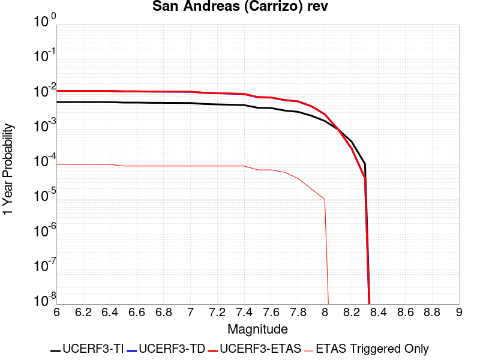 |  |

| Magnitude | 1 wk TI Prob | 1 wk TD Prob | 1 wk ETAS Prob | 1 wk ETAS/TD Gain | 1 wk ETAS Triggered Only | 1 mo TI Prob | 1 mo TD Prob | 1 mo ETAS Prob | 1 mo ETAS/TD Gain | 1 mo ETAS Triggered Only | 1 yr TI Prob | 1 yr TD Prob | 1 yr ETAS Prob | 1 yr ETAS/TD Gain | 1 yr ETAS Triggered Only | 10 yr TI Prob | 10 yr TD Prob | 10 yr ETAS Prob | 10 yr ETAS/TD Gain | 10 yr ETAS Triggered Only |
|-----|-----|-----|-----|-----|-----|-----|-----|-----|-----|-----|-----|-----|-----|-----|-----|-----|-----|-----|-----|-----|
| 6.0 | 1.1674632E-4 | 2.4333803E-4 | 2.4333803E-4 | 1.0 | 0.0 | 5.002454E-4 | 0.0010424621 | 0.0010524517 | 1.0095826 | 1.0E-5 | 0.006073493 | 0.012618599 | 0.012717337 | 1.0078248 | 1.0E-4 | 0.0591016 | 0.12066075 | 0.12081903 | 1.0013118 | 1.8E-4 |
| 6.1 | 1.1674632E-4 | 2.4333803E-4 | 2.4333803E-4 | 1.0 | 0.0 | 5.002454E-4 | 0.0010424621 | 0.0010524517 | 1.0095826 | 1.0E-5 | 0.006073493 | 0.012618599 | 0.012717337 | 1.0078248 | 1.0E-4 | 0.0591016 | 0.12066075 | 0.12081903 | 1.0013118 | 1.8E-4 |
| 6.2 | 1.1674632E-4 | 2.4333803E-4 | 2.4333803E-4 | 1.0 | 0.0 | 5.002454E-4 | 0.0010424621 | 0.0010524517 | 1.0095826 | 1.0E-5 | 0.006073493 | 0.012618599 | 0.012717337 | 1.0078248 | 1.0E-4 | 0.0591016 | 0.12066075 | 0.12081903 | 1.0013118 | 1.8E-4 |
| 6.3 | 1.1674632E-4 | 2.4333803E-4 | 2.4333803E-4 | 1.0 | 0.0 | 5.002454E-4 | 0.0010424621 | 0.0010524517 | 1.0095826 | 1.0E-5 | 0.006073493 | 0.012618599 | 0.012717337 | 1.0078248 | 1.0E-4 | 0.0591016 | 0.12066075 | 0.12081903 | 1.0013118 | 1.8E-4 |
| 6.4 | 1.1674632E-4 | 2.4333803E-4 | 2.4333803E-4 | 1.0 | 0.0 | 5.002454E-4 | 0.0010424621 | 0.0010524517 | 1.0095826 | 1.0E-5 | 0.006073493 | 0.012618599 | 0.012717337 | 1.0078248 | 1.0E-4 | 0.0591016 | 0.12066075 | 0.12081903 | 1.0013118 | 1.8E-4 |
| 6.5 | 1.13136164E-4 | 2.3653745E-4 | 2.3653745E-4 | 1.0 | 0.0 | 4.847792E-4 | 0.0010133396 | 0.0010233296 | 1.0098584 | 1.0E-5 | 0.0058862255 | 0.012268067 | 0.012356963 | 1.0072461 | 9.0E-5 | 0.057327334 | 0.11763024 | 0.117780246 | 1.0012752 | 1.7E-4 |
| 6.6 | 1.13136164E-4 | 2.3653745E-4 | 2.3653745E-4 | 1.0 | 0.0 | 4.847792E-4 | 0.0010133396 | 0.0010233296 | 1.0098584 | 1.0E-5 | 0.0058862255 | 0.012268067 | 0.012356963 | 1.0072461 | 9.0E-5 | 0.057327334 | 0.11763024 | 0.117780246 | 1.0012752 | 1.7E-4 |
| 6.7 | 1.1149675E-4 | 2.334492E-4 | 2.334492E-4 | 1.0 | 0.0 | 4.777557E-4 | 0.0010001145 | 0.0010101044 | 1.0099889 | 1.0E-5 | 0.0058011734 | 0.012108848 | 0.012197759 | 1.0073426 | 9.0E-5 | 0.05652051 | 0.11625791 | 0.116408154 | 1.0012922 | 1.7E-4 |
| 6.8 | 1.1103589E-4 | 2.324707E-4 | 2.324707E-4 | 1.0 | 0.0 | 4.7578133E-4 | 9.959241E-4 | 0.0010059141 | 1.010031 | 1.0E-5 | 0.005777263 | 0.012058397 | 0.012147311 | 1.0073737 | 9.0E-5 | 0.056293584 | 0.11581856 | 0.115968876 | 1.0012978 | 1.7E-4 |
| 6.9 | 1.1053259E-4 | 2.3139441E-4 | 2.3139441E-4 | 1.0 | 0.0 | 4.7362508E-4 | 9.91315E-4 | 0.0010013051 | 1.0100776 | 1.0E-5 | 0.0057511497 | 0.0120029 | 0.01209182 | 1.0074081 | 9.0E-5 | 0.05604569 | 0.115334466 | 0.115484856 | 1.001304 | 1.7E-4 |
| 7.0 | 1.1005377E-4 | 2.304026E-4 | 2.304026E-4 | 1.0 | 0.0 | 4.7157376E-4 | 9.870676E-4 | 9.970577E-4 | 1.010121 | 1.0E-5 | 0.0057263062 | 0.011951757 | 0.012040681 | 1.0074403 | 9.0E-5 | 0.055809796 | 0.1148876 | 0.115038075 | 1.0013098 | 1.7E-4 |
| 7.1 | 1.0308142E-4 | 2.154949E-4 | 2.154949E-4 | 1.0 | 0.0 | 4.417027E-4 | 9.2322374E-4 | 9.332145E-4 | 1.0108216 | 1.0E-5 | 0.0053644776 | 0.011182634 | 0.011271628 | 1.0079582 | 9.0E-5 | 0.052368138 | 0.10815858 | 0.10831019 | 1.0014018 | 1.7E-4 |
| 7.2 | 1.0027479E-4 | 2.0957364E-4 | 2.0957364E-4 | 1.0 | 0.0 | 4.296783E-4 | 8.978646E-4 | 9.0785563E-4 | 1.0111276 | 1.0E-5 | 0.0052187922 | 0.010877009 | 0.010966029 | 1.0081843 | 9.0E-5 | 0.050979212 | 0.10545821 | 0.10561028 | 1.001442 | 1.7E-4 |
| 7.3 | 9.816942E-5 | 2.0432367E-4 | 2.0432367E-4 | 1.0 | 0.0 | 4.2065824E-4 | 8.7538E-4 | 8.853713E-4 | 1.0114136 | 1.0E-5 | 0.005109493 | 0.0106059555 | 0.010695001 | 1.0083958 | 9.0E-5 | 0.049935985 | 0.10304579 | 0.103198275 | 1.0014797 | 1.7E-4 |
| 7.4 | 9.5634205E-5 | 1.980169E-4 | 1.980169E-4 | 1.0 | 0.0 | 4.0979648E-4 | 8.4836874E-4 | 8.5836026E-4 | 1.0117773 | 1.0E-5 | 0.0049778637 | 0.010280236 | 0.01036931 | 1.0086646 | 9.0E-5 | 0.048678253 | 0.100126535 | 0.10027952 | 1.0015279 | 1.7E-4 |
| 7.5 | 8.052417E-5 | 1.612143E-4 | 1.612143E-4 | 1.0 | 0.0 | 3.4505792E-4 | 6.9073564E-4 | 6.9073564E-4 | 1.0 | 0.0 | 0.0041929903 | 0.00837736 | 0.0084467735 | 1.0082859 | 7.0E-5 | 0.04114753 | 0.08285146 | 0.082979865 | 1.0015497 | 1.4E-4 |
| 7.6 | 7.897024E-5 | 1.5774513E-4 | 1.5774513E-4 | 1.0 | 0.0 | 3.384E-4 | 6.758756E-4 | 6.758756E-4 | 1.0 | 0.0 | 0.0041122385 | 0.008197814 | 0.008267241 | 1.0084689 | 7.0E-5 | 0.040369697 | 0.08119292 | 0.08132155 | 1.0015843 | 1.4E-4 |
| 7.7 | 6.707427E-5 | 1.3283793E-4 | 1.3283793E-4 | 1.0 | 0.0 | 2.8742946E-4 | 5.691813E-4 | 5.691813E-4 | 1.0 | 0.0 | 0.003493839 | 0.0069077956 | 0.006967381 | 1.0086259 | 6.0E-5 | 0.034394164 | 0.069081694 | 0.06920271 | 1.0017518 | 1.3E-4 |
| 7.8 | 6.147705E-5 | 1.2204444E-4 | 1.2204444E-4 | 1.0 | 0.0 | 2.6344648E-4 | 5.229428E-4 | 5.229428E-4 | 1.0 | 0.0 | 0.0032027436 | 0.0063482667 | 0.006388013 | 1.006261 | 4.0E-5 | 0.031569764 | 0.06354592 | 0.063620836 | 1.001179 | 8.0E-5 |
| 7.9 | 4.7636717E-5 | 8.8847315E-5 | 8.8847315E-5 | 1.0 | 0.0 | 2.0414138E-4 | 3.8071864E-4 | 3.8071864E-4 | 1.0 | 0.0 | 0.0024825884 | 0.0046254057 | 0.004645313 | 1.0043039 | 2.0E-5 | 0.024550365 | 0.046651114 | 0.04669878 | 1.0010217 | 5.0E-5 |
| 8.0 | 3.3554235E-5 | 5.216579E-5 | 5.216579E-5 | 1.0 | 0.0 | 1.4379594E-4 | 2.2354853E-4 | 2.2354853E-4 | 1.0 | 0.0 | 0.0017493097 | 0.002718308 | 0.0027282808 | 1.0036688 | 1.0E-5 | 0.017356034 | 0.027894866 | 0.027914308 | 1.000697 | 2.0E-5 |
| 8.1 | 1.9175432E-5 | 1.9196985E-5 | 1.9196985E-5 | 1.0 | 0.0 | 8.217783E-5 | 8.22702E-5 | 8.22702E-5 | 1.0 | 0.0 | 0.0010000558 | 0.00100118 | 0.00100118 | 1.0 | 0.0 | 0.009955673 | 0.010764282 | 0.010764282 | 1.0 | 0.0 |
| 8.2 | 8.643924E-6 | 5.478665E-6 | 5.478665E-6 | 1.0 | 0.0 | 3.704486E-5 | 2.3479783E-5 | 2.3479783E-5 | 1.0 | 0.0 | 4.5092785E-4 | 2.8582895E-4 | 2.8582895E-4 | 1.0 | 0.0 | 0.0045001395 | 0.0032508469 | 0.0032508469 | 1.0 | 0.0 |
| 8.3 | 1.983087E-6 | 7.6647797E-7 | 7.6647797E-7 | 1.0 | 0.0 | 8.498917E-6 | 3.2849016E-6 | 3.2849016E-6 | 1.0 | 0.0 | 1.034694E-4 | 3.999296E-5 | 3.999296E-5 | 1.0 | 0.0 | 0.0010342124 | 4.7228087E-4 | 4.7228087E-4 | 1.0 | 0.0 |

## San Andreas (Cholame) rev
*[(top)](#table-of-contents)*

| 1 Week | 1 Month | 1 Year | 10 Year |
|-----|-----|-----|-----|
| 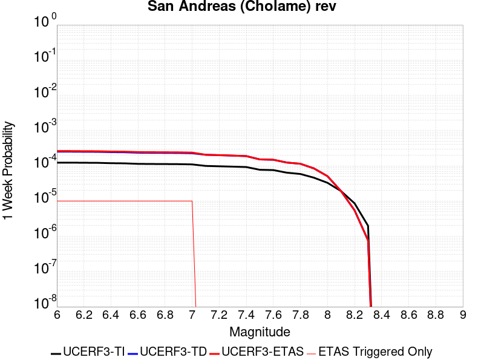 |  |  |  |

| Magnitude | 1 wk TI Prob | 1 wk TD Prob | 1 wk ETAS Prob | 1 wk ETAS/TD Gain | 1 wk ETAS Triggered Only | 1 mo TI Prob | 1 mo TD Prob | 1 mo ETAS Prob | 1 mo ETAS/TD Gain | 1 mo ETAS Triggered Only | 1 yr TI Prob | 1 yr TD Prob | 1 yr ETAS Prob | 1 yr ETAS/TD Gain | 1 yr ETAS Triggered Only | 10 yr TI Prob | 10 yr TD Prob | 10 yr ETAS Prob | 10 yr ETAS/TD Gain | 10 yr ETAS Triggered Only |
|-----|-----|-----|-----|-----|-----|-----|-----|-----|-----|-----|-----|-----|-----|-----|-----|-----|-----|-----|-----|-----|
| 6.0 | 1.2302514E-4 | 2.5215113E-4 | 2.6214862E-4 | 1.0396488 | 1.0E-5 | 5.27144E-4 | 0.0010802018 | 0.0011001802 | 1.0184951 | 2.0E-5 | 0.0063991086 | 0.013072659 | 0.013171352 | 1.0075495 | 1.0E-4 | 0.06217949 | 0.12442699 | 0.12458459 | 1.0012666 | 1.8E-4 |
| 6.1 | 1.2302514E-4 | 2.5215113E-4 | 2.6214862E-4 | 1.0396488 | 1.0E-5 | 5.27144E-4 | 0.0010802018 | 0.0011001802 | 1.0184951 | 2.0E-5 | 0.0063991086 | 0.013072659 | 0.013171352 | 1.0075495 | 1.0E-4 | 0.06217949 | 0.12442699 | 0.12458459 | 1.0012666 | 1.8E-4 |
| 6.2 | 1.2203569E-4 | 2.5031884E-4 | 2.6031636E-4 | 1.039939 | 1.0E-5 | 5.2290526E-4 | 0.0010723557 | 0.0010923342 | 1.0186305 | 2.0E-5 | 0.006347804 | 0.012978274 | 0.013076977 | 1.0076052 | 1.0E-4 | 0.061695136 | 0.12361445 | 0.1237722 | 1.0012761 | 1.8E-4 |
| 6.3 | 1.2142645E-4 | 2.4917856E-4 | 2.5917604E-4 | 1.0401219 | 1.0E-5 | 5.202953E-4 | 0.0010674726 | 0.0010874512 | 1.0187159 | 2.0E-5 | 0.006316212 | 0.01291953 | 0.013018238 | 1.0076402 | 1.0E-4 | 0.06139677 | 0.1231077 | 0.12326554 | 1.0012821 | 1.8E-4 |
| 6.4 | 1.1865206E-4 | 2.4423326E-4 | 2.542308E-4 | 1.0409344 | 1.0E-5 | 5.0840975E-4 | 0.0010462956 | 0.0010662747 | 1.0190951 | 2.0E-5 | 0.006172335 | 0.012664723 | 0.012763456 | 1.0077959 | 1.0E-4 | 0.060036868 | 0.12090532 | 0.12105477 | 1.0012361 | 1.7E-4 |
| 6.5 | 1.17443946E-4 | 2.4216558E-4 | 2.5216315E-4 | 1.0412841 | 1.0E-5 | 5.032341E-4 | 0.0010374413 | 0.0010574205 | 1.0192581 | 2.0E-5 | 0.006109677 | 0.012558166 | 0.01265691 | 1.0078629 | 1.0E-4 | 0.059444077 | 0.11998259 | 0.1201322 | 1.0012469 | 1.7E-4 |
| 6.6 | 1.13579066E-4 | 2.3525437E-4 | 2.45252E-4 | 1.0424972 | 1.0E-5 | 4.866766E-4 | 0.0010078449 | 0.0010278248 | 1.0198243 | 2.0E-5 | 0.0059092017 | 0.012201919 | 0.012290821 | 1.0072858 | 9.0E-5 | 0.057545185 | 0.11690384 | 0.117045134 | 1.0012087 | 1.6E-4 |
| 6.7 | 1.1271412E-4 | 2.3369725E-4 | 2.4369491E-4 | 1.0427804 | 1.0E-5 | 4.829711E-4 | 0.0010011768 | 0.0010211568 | 1.0199565 | 2.0E-5 | 0.005864331 | 0.01212164 | 0.01221055 | 1.0073347 | 9.0E-5 | 0.057119697 | 0.11620769 | 0.11634909 | 1.0012169 | 1.6E-4 |
| 6.8 | 1.1217975E-4 | 2.325812E-4 | 2.4257887E-4 | 1.0429857 | 1.0E-5 | 4.8068175E-4 | 9.963973E-4 | 0.0010163774 | 1.0200523 | 2.0E-5 | 0.005836608 | 0.0120640965 | 0.012153011 | 1.0073701 | 9.0E-5 | 0.056856725 | 0.11570667 | 0.115848154 | 1.0012228 | 1.6E-4 |
| 6.9 | 1.1146753E-4 | 2.3106842E-4 | 2.4106611E-4 | 1.0432673 | 1.0E-5 | 4.7763053E-4 | 9.89919E-4 | 0.0010098991 | 1.0201837 | 2.0E-5 | 0.0057996577 | 0.011986093 | 0.012075014 | 1.0074188 | 9.0E-5 | 0.056506127 | 0.11502693 | 0.11516853 | 1.001231 | 1.6E-4 |
| 7.0 | 1.0965793E-4 | 2.2730078E-4 | 2.3729852E-4 | 1.0439845 | 1.0E-5 | 4.698779E-4 | 9.737841E-4 | 9.937646E-4 | 1.0205184 | 2.0E-5 | 0.005705768 | 0.011791794 | 0.011880733 | 1.0075424 | 9.0E-5 | 0.055614736 | 0.1133308 | 0.11347266 | 1.0012518 | 1.6E-4 |
| 7.1 | 9.927982E-5 | 2.0548643E-4 | 2.0548643E-4 | 1.0 | 0.0 | 4.2541555E-4 | 8.8035996E-4 | 8.9035113E-4 | 1.011349 | 1.0E-5 | 0.0051671406 | 0.010666 | 0.010745146 | 1.0074204 | 8.0E-5 | 0.05048634 | 0.10343333 | 0.10355885 | 1.0012136 | 1.4E-4 |
| 7.2 | 9.696786E-5 | 2.005288E-4 | 2.005288E-4 | 1.0 | 0.0 | 4.1551032E-4 | 8.591271E-4 | 8.691185E-4 | 1.0116297 | 1.0E-5 | 0.00504711 | 0.010409988 | 0.010489156 | 1.007605 | 8.0E-5 | 0.04934009 | 0.10116881 | 0.101294644 | 1.0012438 | 1.4E-4 |
| 7.3 | 9.4727984E-5 | 1.9481927E-4 | 1.9481927E-4 | 1.0 | 0.0 | 4.0591392E-4 | 8.346735E-4 | 8.4466516E-4 | 1.0119708 | 1.0E-5 | 0.0049308087 | 0.010115068 | 0.01019426 | 1.007829 | 8.0E-5 | 0.048228268 | 0.09854372 | 0.09866992 | 1.0012807 | 1.4E-4 |
| 7.4 | 9.220358E-5 | 1.8852325E-4 | 1.8852325E-4 | 1.0 | 0.0 | 3.9509835E-4 | 8.077075E-4 | 8.176994E-4 | 1.0123707 | 1.0E-5 | 0.004799717 | 0.009789746 | 0.009868963 | 1.0080918 | 8.0E-5 | 0.046973653 | 0.095616065 | 0.09574268 | 1.0013242 | 1.4E-4 |
| 7.5 | 7.71631E-5 | 1.5186344E-4 | 1.5186344E-4 | 1.0 | 0.0 | 3.306571E-4 | 6.5068115E-4 | 6.5068115E-4 | 1.0 | 0.0 | 0.0040183207 | 0.007893339 | 0.007952865 | 1.0075413 | 6.0E-5 | 0.03946433 | 0.07832433 | 0.07842572 | 1.0012944 | 1.1E-4 |
| 7.6 | 7.5634416E-5 | 1.484566E-4 | 1.484566E-4 | 1.0 | 0.0 | 3.241072E-4 | 6.360876E-4 | 6.360876E-4 | 1.0 | 0.0 | 0.0039388672 | 0.007716934 | 0.0077764713 | 1.0077151 | 6.0E-5 | 0.038697794 | 0.07668804 | 0.0767896 | 1.0013244 | 1.1E-4 |
| 7.7 | 6.3783E-5 | 1.2365977E-4 | 1.2365977E-4 | 1.0 | 0.0 | 2.7332708E-4 | 5.298629E-4 | 5.298629E-4 | 1.0 | 0.0 | 0.0033226798 | 0.006432025 | 0.006481704 | 1.0077236 | 5.0E-5 | 0.032734364 | 0.06457185 | 0.06466539 | 1.0014486 | 1.0E-4 |
| 7.8 | 5.863422E-5 | 1.1422686E-4 | 1.1422686E-4 | 1.0 | 0.0 | 2.512653E-4 | 4.8945186E-4 | 4.8945186E-4 | 1.0 | 0.0 | 0.003054864 | 0.0059428154 | 0.005972637 | 1.0050181 | 3.0E-5 | 0.030132094 | 0.05968955 | 0.05974597 | 1.0009452 | 6.0E-5 |
| 7.9 | 4.595283E-5 | 8.431093E-5 | 8.431093E-5 | 1.0 | 0.0 | 1.9692584E-4 | 3.6128255E-4 | 3.6128255E-4 | 1.0 | 0.0 | 0.0023949358 | 0.0043897503 | 0.0044096624 | 1.004536 | 2.0E-5 | 0.023692891 | 0.044384085 | 0.044422306 | 1.0008612 | 4.0E-5 |
| 8.0 | 3.2950178E-5 | 5.08012E-5 | 5.08012E-5 | 1.0 | 0.0 | 1.412074E-4 | 2.1770128E-4 | 2.1770128E-4 | 1.0 | 0.0 | 0.0017178444 | 0.002647293 | 0.0026572666 | 1.0037675 | 1.0E-5 | 0.017046256 | 0.02719375 | 0.027203478 | 1.0003577 | 1.0E-5 |
| 8.1 | 1.9177472E-5 | 1.9197154E-5 | 1.9197154E-5 | 1.0 | 0.0 | 8.218658E-5 | 8.2270926E-5 | 8.2270926E-5 | 1.0 | 0.0 | 0.0010001622 | 0.0010011889 | 0.0010011889 | 1.0 | 0.0 | 0.009956728 | 0.010764398 | 0.010764398 | 1.0 | 0.0 |
| 8.2 | 8.643924E-6 | 5.478665E-6 | 5.478665E-6 | 1.0 | 0.0 | 3.704486E-5 | 2.3479783E-5 | 2.3479783E-5 | 1.0 | 0.0 | 4.5092785E-4 | 2.8582895E-4 | 2.8582895E-4 | 1.0 | 0.0 | 0.0045001395 | 0.0032508469 | 0.0032508469 | 1.0 | 0.0 |
| 8.3 | 1.983087E-6 | 7.6647797E-7 | 7.6647797E-7 | 1.0 | 0.0 | 8.498917E-6 | 3.2849016E-6 | 3.2849016E-6 | 1.0 | 0.0 | 1.034694E-4 | 3.999296E-5 | 3.999296E-5 | 1.0 | 0.0 | 0.0010342124 | 4.7228087E-4 | 4.7228087E-4 | 1.0 | 0.0 |

## Elsinore (Glen Ivy) rev
*[(top)](#table-of-contents)*

| 1 Week | 1 Month | 1 Year | 10 Year |
|-----|-----|-----|-----|
|  |  |  |  |

| Magnitude | 1 wk TI Prob | 1 wk TD Prob | 1 wk ETAS Prob | 1 wk ETAS/TD Gain | 1 wk ETAS Triggered Only | 1 mo TI Prob | 1 mo TD Prob | 1 mo ETAS Prob | 1 mo ETAS/TD Gain | 1 mo ETAS Triggered Only | 1 yr TI Prob | 1 yr TD Prob | 1 yr ETAS Prob | 1 yr ETAS/TD Gain | 1 yr ETAS Triggered Only | 10 yr TI Prob | 10 yr TD Prob | 10 yr ETAS Prob | 10 yr ETAS/TD Gain | 10 yr ETAS Triggered Only |
|-----|-----|-----|-----|-----|-----|-----|-----|-----|-----|-----|-----|-----|-----|-----|-----|-----|-----|-----|-----|-----|
| 6.0 | 1.6204086E-4 | 2.9373635E-4 | 2.9373635E-4 | 1.0 | 0.0 | 6.94276E-4 | 0.0012584174 | 0.0012584174 | 1.0 | 0.0 | 0.008420097 | 0.01523484 | 0.015293926 | 1.0038784 | 6.0E-5 | 0.081081145 | 0.13962553 | 0.13976319 | 1.000986 | 1.6E-4 |
| 6.1 | 1.6204086E-4 | 2.9373635E-4 | 2.9373635E-4 | 1.0 | 0.0 | 6.94276E-4 | 0.0012584174 | 0.0012584174 | 1.0 | 0.0 | 0.008420097 | 0.01523484 | 0.015293926 | 1.0038784 | 6.0E-5 | 0.081081145 | 0.13962553 | 0.13976319 | 1.000986 | 1.6E-4 |
| 6.2 | 1.6204086E-4 | 2.9373635E-4 | 2.9373635E-4 | 1.0 | 0.0 | 6.94276E-4 | 0.0012584174 | 0.0012584174 | 1.0 | 0.0 | 0.008420097 | 0.01523484 | 0.015293926 | 1.0038784 | 6.0E-5 | 0.081081145 | 0.13962553 | 0.13976319 | 1.000986 | 1.6E-4 |
| 6.3 | 1.0111737E-4 | 1.7703637E-4 | 1.7703637E-4 | 1.0 | 0.0 | 4.332882E-4 | 7.586233E-4 | 7.586233E-4 | 1.0 | 0.0 | 0.005262531 | 0.009217811 | 0.009267351 | 1.0053743 | 5.0E-5 | 0.0513964 | 0.08707389 | 0.0872017 | 1.0014678 | 1.4E-4 |
| 6.4 | 1.0111737E-4 | 1.7703637E-4 | 1.7703637E-4 | 1.0 | 0.0 | 4.332882E-4 | 7.586233E-4 | 7.586233E-4 | 1.0 | 0.0 | 0.005262531 | 0.009217811 | 0.009267351 | 1.0053743 | 5.0E-5 | 0.0513964 | 0.08707389 | 0.0872017 | 1.0014678 | 1.4E-4 |
| 6.5 | 3.6624708E-5 | 4.6393732E-5 | 4.6393732E-5 | 1.0 | 0.0 | 1.569536E-4 | 1.9881714E-4 | 1.9881714E-4 | 1.0 | 0.0 | 0.001909235 | 0.0024182722 | 0.002438224 | 1.0082504 | 2.0E-5 | 0.01892915 | 0.023697015 | 0.023736067 | 1.001648 | 4.0E-5 |
| 6.6 | 2.5051324E-5 | 2.6148944E-5 | 2.6148944E-5 | 1.0 | 0.0 | 1.073584E-4 | 1.1206234E-4 | 1.1206234E-4 | 1.0 | 0.0 | 0.0013063047 | 0.0013635496 | 0.0013635496 | 1.0 | 0.0 | 0.012986525 | 0.013565712 | 0.01358544 | 1.0014544 | 2.0E-5 |
| 6.7 | 2.2189772E-5 | 2.2073793E-5 | 2.2073793E-5 | 1.0 | 0.0 | 9.509556E-5 | 9.459874E-5 | 9.459874E-5 | 1.0 | 0.0 | 0.0011571734 | 0.0011511676 | 0.0011511676 | 1.0 | 0.0 | 0.011511663 | 0.011466403 | 0.011476289 | 1.0008621 | 1.0E-5 |
| 6.8 | 1.6654378E-5 | 1.4438363E-5 | 1.4438363E-5 | 1.0 | 0.0 | 7.137396E-5 | 6.187726E-5 | 6.187726E-5 | 1.0 | 0.0 | 8.686314E-4 | 7.5310044E-4 | 7.5310044E-4 | 1.0 | 0.0 | 0.008652439 | 0.0075102663 | 0.0075102663 | 1.0 | 0.0 |
| 6.9 | 1.5042909E-5 | 1.2332568E-5 | 1.2332568E-5 | 1.0 | 0.0 | 6.446802E-5 | 5.285281E-5 | 5.285281E-5 | 1.0 | 0.0 | 7.8461546E-4 | 6.432961E-4 | 6.432961E-4 | 1.0 | 0.0 | 0.007818509 | 0.0064180964 | 0.0064180964 | 1.0 | 0.0 |
| 7.0 | 1.4361385E-5 | 1.1451833E-5 | 1.1451833E-5 | 1.0 | 0.0 | 6.154734E-5 | 4.907838E-5 | 4.907838E-5 | 1.0 | 0.0 | 7.490812E-4 | 5.973684E-4 | 5.973684E-4 | 1.0 | 0.0 | 0.007465612 | 0.0059608603 | 0.0059608603 | 1.0 | 0.0 |
| 7.1 | 1.3265571E-5 | 1.0245265E-5 | 1.0245265E-5 | 1.0 | 0.0 | 5.6851208E-5 | 4.3907552E-5 | 4.3907552E-5 | 1.0 | 0.0 | 6.919436E-4 | 5.3444586E-4 | 5.3444586E-4 | 1.0 | 0.0 | 0.006897931 | 0.005334682 | 0.005334682 | 1.0 | 0.0 |
| 7.2 | 1.1596403E-5 | 8.505279E-6 | 8.505279E-6 | 1.0 | 0.0 | 4.9697923E-5 | 3.6450696E-5 | 3.6450696E-5 | 1.0 | 0.0 | 6.049042E-4 | 4.4369852E-4 | 4.4369852E-4 | 1.0 | 0.0 | 0.006032603 | 0.004429451 | 0.004429451 | 1.0 | 0.0 |
| 7.3 | 1.0150827E-5 | 7.238911E-6 | 7.238911E-6 | 1.0 | 0.0 | 4.3502816E-5 | 3.1023545E-5 | 3.1023545E-5 | 1.0 | 0.0 | 5.2951806E-4 | 3.7764764E-4 | 3.7764764E-4 | 1.0 | 0.0 | 0.005282581 | 0.003770453 | 0.003770453 | 1.0 | 0.0 |
| 7.4 | 9.080705E-6 | 6.352632E-6 | 6.352632E-6 | 1.0 | 0.0 | 3.8916725E-5 | 2.7225291E-5 | 2.7225291E-5 | 1.0 | 0.0 | 4.7370812E-4 | 3.3141885E-4 | 3.3141885E-4 | 1.0 | 0.0 | 0.004726996 | 0.0033093947 | 0.0033093947 | 1.0 | 0.0 |
| 7.5 | 7.671649E-6 | 5.2257096E-6 | 5.2257096E-6 | 1.0 | 0.0 | 3.287808E-5 | 2.2395712E-5 | 2.2395712E-5 | 1.0 | 0.0 | 4.0021708E-4 | 2.7263493E-4 | 2.7263493E-4 | 1.0 | 0.0 | 0.0039949706 | 0.0027231297 | 0.0027231297 | 1.0 | 0.0 |
| 7.6 | 6.990086E-6 | 4.6875944E-6 | 4.6875944E-6 | 1.0 | 0.0 | 2.9957167E-5 | 2.0089543E-5 | 2.0089543E-5 | 1.0 | 0.0 | 3.6466747E-4 | 2.445639E-4 | 2.445639E-4 | 1.0 | 0.0 | 0.0036406964 | 0.0024430638 | 0.0024430638 | 1.0 | 0.0 |
| 7.7 | 4.163505E-6 | 2.3295045E-6 | 2.3295045E-6 | 1.0 | 0.0 | 1.7843471E-5 | 9.983556E-6 | 9.983556E-6 | 1.0 | 0.0 | 2.172226E-4 | 1.2154376E-4 | 1.2154376E-4 | 1.0 | 0.0 | 0.0021701038 | 0.0012148459 | 0.0012148459 | 1.0 | 0.0 |
| 7.8 | 2.2692414E-7 | 9.384624E-8 | 9.384624E-8 | 1.0 | 0.0 | 9.725317E-7 | 4.021981E-7 | 4.021981E-7 | 1.0 | 0.0 | 1.1840509E-5 | 4.8967545E-6 | 4.8967545E-6 | 1.0 | 0.0 | 1.1839878E-4 | 4.8966795E-5 | 4.8966795E-5 | 1.0 | 0.0 |
| 7.9 | 6.676829E-9 | 3.4397993E-9 | 3.4397993E-9 | 1.0 | 0.0 | 2.861498E-8 | 1.4741998E-8 | 1.4741998E-8 | 1.0 | 0.0 | 3.4838732E-7 | 1.794838E-7 | 1.794838E-7 | 1.0 | 0.0 | 3.4838679E-6 | 1.7948367E-6 | 1.7948367E-6 | 1.0 | 0.0 |

## Lake Isabella (Seismicity)
*[(top)](#table-of-contents)*

| 1 Week | 1 Month | 1 Year | 10 Year |
|-----|-----|-----|-----|
|  |  |  |  |

| Magnitude | 1 wk TI Prob | 1 wk TD Prob | 1 wk ETAS Prob | 1 wk ETAS/TD Gain | 1 wk ETAS Triggered Only | 1 mo TI Prob | 1 mo TD Prob | 1 mo ETAS Prob | 1 mo ETAS/TD Gain | 1 mo ETAS Triggered Only | 1 yr TI Prob | 1 yr TD Prob | 1 yr ETAS Prob | 1 yr ETAS/TD Gain | 1 yr ETAS Triggered Only | 10 yr TI Prob | 10 yr TD Prob | 10 yr ETAS Prob | 10 yr ETAS/TD Gain | 10 yr ETAS Triggered Only |
|-----|-----|-----|-----|-----|-----|-----|-----|-----|-----|-----|-----|-----|-----|-----|-----|-----|-----|-----|-----|-----|
| 6.0 | 9.431637E-6 | 9.741694E-6 | 9.741694E-6 | 1.0 | 0.0 | 4.0420677E-5 | 4.1749525E-5 | 7.174827E-5 | 1.718541 | 3.0E-5 | 4.920106E-4 | 5.0819496E-4 | 6.28134E-4 | 1.2360098 | 1.2E-4 | 0.004909227 | 0.005071621 | 0.005240759 | 1.0333499 | 1.7E-4 |
| 6.1 | 9.431637E-6 | 9.741694E-6 | 9.741694E-6 | 1.0 | 0.0 | 4.0420677E-5 | 4.1749525E-5 | 7.174827E-5 | 1.718541 | 3.0E-5 | 4.920106E-4 | 5.0819496E-4 | 6.28134E-4 | 1.2360098 | 1.2E-4 | 0.004909227 | 0.005071621 | 0.005240759 | 1.0333499 | 1.7E-4 |
| 6.2 | 9.431637E-6 | 9.741694E-6 | 9.741694E-6 | 1.0 | 0.0 | 4.0420677E-5 | 4.1749525E-5 | 7.174827E-5 | 1.718541 | 3.0E-5 | 4.920106E-4 | 5.0819496E-4 | 6.28134E-4 | 1.2360098 | 1.2E-4 | 0.004909227 | 0.005071621 | 0.005240759 | 1.0333499 | 1.7E-4 |
| 6.3 | 9.431637E-6 | 9.741694E-6 | 9.741694E-6 | 1.0 | 0.0 | 4.0420677E-5 | 4.1749525E-5 | 7.174827E-5 | 1.718541 | 3.0E-5 | 4.920106E-4 | 5.0819496E-4 | 6.28134E-4 | 1.2360098 | 1.2E-4 | 0.004909227 | 0.005071621 | 0.005240759 | 1.0333499 | 1.7E-4 |
| 6.4 | 5.144063E-6 | 5.3000977E-6 | 5.3000977E-6 | 1.0 | 0.0 | 2.2045799E-5 | 2.2714525E-5 | 4.271407E-5 | 1.8804739 | 2.0E-5 | 2.6837454E-4 | 2.765177E-4 | 3.5649558E-4 | 1.2892324 | 8.0E-5 | 0.0026805066 | 0.002762077 | 0.002871773 | 1.039715 | 1.1E-4 |
| 6.5 | 5.144063E-6 | 5.3000977E-6 | 5.3000977E-6 | 1.0 | 0.0 | 2.2045799E-5 | 2.2714525E-5 | 4.271407E-5 | 1.8804739 | 2.0E-5 | 2.6837454E-4 | 2.765177E-4 | 3.5649558E-4 | 1.2892324 | 8.0E-5 | 0.0026805066 | 0.002762077 | 0.002871773 | 1.039715 | 1.1E-4 |
| 6.6 | 3.4009804E-6 | 3.4987995E-6 | 3.4987995E-6 | 1.0 | 0.0 | 1.4575549E-5 | 1.4994778E-5 | 1.4994778E-5 | 1.0 | 0.0 | 1.7744285E-4 | 1.8254772E-4 | 2.4253677E-4 | 1.3286211 | 6.0E-5 | 0.0017730123 | 0.0018241355 | 0.0019139714 | 1.0492485 | 9.0E-5 |
| 6.7 | 3.3880428E-6 | 3.4856662E-6 | 3.4856662E-6 | 1.0 | 0.0 | 1.4520103E-5 | 1.4938492E-5 | 1.4938492E-5 | 1.0 | 0.0 | 1.767679E-4 | 1.8186258E-4 | 2.4185165E-4 | 1.3298595 | 6.0E-5 | 0.0017662736 | 0.0018172951 | 0.0019071316 | 1.0494342 | 9.0E-5 |
| 6.8 | 2.6582E-6 | 2.7337105E-6 | 2.7337105E-6 | 1.0 | 0.0 | 1.1392236E-5 | 1.1715857E-5 | 1.1715857E-5 | 1.0 | 0.0 | 1.3869164E-4 | 1.4263256E-4 | 1.8262686E-4 | 1.2804009 | 4.0E-5 | 0.0013860512 | 0.0014255423 | 0.0014854567 | 1.0420293 | 6.0E-5 |
| 6.9 | 2.406011E-6 | 2.474338E-6 | 2.474338E-6 | 1.0 | 0.0 | 1.0311434E-5 | 1.0604271E-5 | 1.0604271E-5 | 1.0 | 0.0 | 1.2553448E-4 | 1.2910066E-4 | 1.6909551E-4 | 1.3097957 | 4.0E-5 | 0.0012546359 | 0.0012903863 | 0.0013503089 | 1.0464377 | 6.0E-5 |
| 7.0 | 1.6953097E-6 | 1.7429437E-6 | 1.7429437E-6 | 1.0 | 0.0 | 7.265593E-6 | 7.469743E-6 | 7.469743E-6 | 1.0 | 0.0 | 8.8455E-5 | 9.094137E-5 | 1.1093955E-4 | 1.2199019 | 2.0E-5 | 8.84198E-4 | 9.0914435E-4 | 9.49108E-4 | 1.0439575 | 4.0E-5 |
| 7.1 | 3.5013824E-7 | 3.571492E-7 | 3.571492E-7 | 1.0 | 0.0 | 1.5005916E-6 | 1.5306384E-6 | 1.5306384E-6 | 1.0 | 0.0 | 1.826955E-5 | 1.8635366E-5 | 1.8635366E-5 | 1.0 | 0.0 | 1.8268047E-4 | 1.863383E-4 | 1.863383E-4 | 1.0 | 0.0 |
| 7.2 | 2.2321095E-7 | 2.2750632E-7 | 2.2750632E-7 | 1.0 | 0.0 | 9.56618E-7 | 9.750268E-7 | 9.750268E-7 | 1.0 | 0.0 | 1.1646762E-5 | 1.1870887E-5 | 1.1870887E-5 | 1.0 | 0.0 | 1.1646151E-4 | 1.1870263E-4 | 1.1870263E-4 | 1.0 | 0.0 |
| 7.3 | 1.5760406E-7 | 1.6060963E-7 | 1.6060963E-7 | 1.0 | 0.0 | 6.7544585E-7 | 6.883268E-7 | 6.883268E-7 | 1.0 | 0.0 | 8.223522E-6 | 8.380347E-6 | 8.380347E-6 | 1.0 | 0.0 | 8.2232174E-5 | 8.3800376E-5 | 8.3800376E-5 | 1.0 | 0.0 |
| 7.4 | 1.1216497E-7 | 1.1431735E-7 | 1.1431735E-7 | 1.0 | 0.0 | 4.8070694E-7 | 4.8993144E-7 | 4.8993144E-7 | 1.0 | 0.0 | 5.852591E-6 | 5.964899E-6 | 5.964899E-6 | 1.0 | 0.0 | 5.8524372E-5 | 5.9647435E-5 | 5.9647435E-5 | 1.0 | 0.0 |
| 7.5 | 4.885185E-8 | 4.9787864E-8 | 4.9787864E-8 | 1.0 | 0.0 | 2.0936506E-7 | 2.1337654E-7 | 2.1337654E-7 | 1.0 | 0.0 | 2.5490165E-6 | 2.5978566E-6 | 2.5978566E-6 | 1.0 | 0.0 | 2.5489873E-5 | 2.597828E-5 | 2.597828E-5 | 1.0 | 0.0 |
| 7.6 | 1.504641E-9 | 1.5317939E-9 | 1.5317939E-9 | 1.0 | 0.0 | 6.4484613E-9 | 6.5648313E-9 | 6.5648313E-9 | 1.0 | 0.0 | 7.851001E-8 | 7.992682E-8 | 7.992682E-8 | 1.0 | 0.0 | 7.8509987E-7 | 7.992682E-7 | 7.992682E-7 | 1.0 | 0.0 |

## Death Valley (Fish Lake Valley)
*[(top)](#table-of-contents)*

| 1 Week | 1 Month | 1 Year | 10 Year |
|-----|-----|-----|-----|
|  |  | 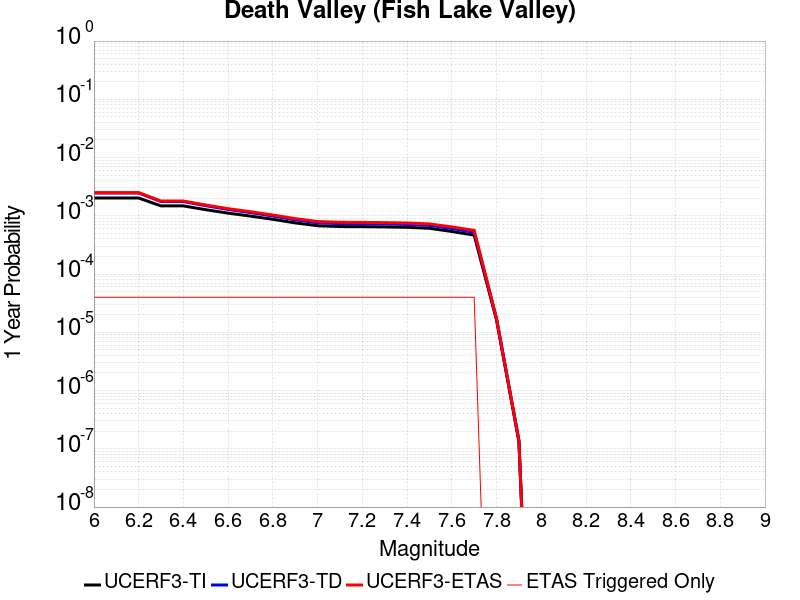 |  |

| Magnitude | 1 wk TI Prob | 1 wk TD Prob | 1 wk ETAS Prob | 1 wk ETAS/TD Gain | 1 wk ETAS Triggered Only | 1 mo TI Prob | 1 mo TD Prob | 1 mo ETAS Prob | 1 mo ETAS/TD Gain | 1 mo ETAS Triggered Only | 1 yr TI Prob | 1 yr TD Prob | 1 yr ETAS Prob | 1 yr ETAS/TD Gain | 1 yr ETAS Triggered Only | 10 yr TI Prob | 10 yr TD Prob | 10 yr ETAS Prob | 10 yr ETAS/TD Gain | 10 yr ETAS Triggered Only |
|-----|-----|-----|-----|-----|-----|-----|-----|-----|-----|-----|-----|-----|-----|-----|-----|-----|-----|-----|-----|-----|
| 6.0 | 3.872328E-5 | 4.7267124E-5 | 4.7267124E-5 | 1.0 | 0.0 | 1.6594635E-4 | 2.0255933E-4 | 2.0255933E-4 | 1.0 | 0.0 | 0.0020185246 | 0.002463633 | 0.0025035345 | 1.0161961 | 4.0E-5 | 0.02000288 | 0.024389042 | 0.024554895 | 1.0068003 | 1.7E-4 |
| 6.1 | 3.872328E-5 | 4.7267124E-5 | 4.7267124E-5 | 1.0 | 0.0 | 1.6594635E-4 | 2.0255933E-4 | 2.0255933E-4 | 1.0 | 0.0 | 0.0020185246 | 0.002463633 | 0.0025035345 | 1.0161961 | 4.0E-5 | 0.02000288 | 0.024389042 | 0.024554895 | 1.0068003 | 1.7E-4 |
| 6.2 | 3.872328E-5 | 4.7267124E-5 | 4.7267124E-5 | 1.0 | 0.0 | 1.6594635E-4 | 2.0255933E-4 | 2.0255933E-4 | 1.0 | 0.0 | 0.0020185246 | 0.002463633 | 0.0025035345 | 1.0161961 | 4.0E-5 | 0.02000288 | 0.024389042 | 0.024554895 | 1.0068003 | 1.7E-4 |
| 6.3 | 2.8356371E-5 | 3.361063E-5 | 3.361063E-5 | 1.0 | 0.0 | 1.2152165E-4 | 1.4403803E-4 | 1.4403803E-4 | 1.0 | 0.0 | 0.0014785219 | 0.0017523223 | 0.0017922522 | 1.0227869 | 4.0E-5 | 0.014687235 | 0.017392244 | 0.017559286 | 1.0096045 | 1.7E-4 |
| 6.4 | 2.8356371E-5 | 3.361063E-5 | 3.361063E-5 | 1.0 | 0.0 | 1.2152165E-4 | 1.4403803E-4 | 1.4403803E-4 | 1.0 | 0.0 | 0.0014785219 | 0.0017523223 | 0.0017922522 | 1.0227869 | 4.0E-5 | 0.014687235 | 0.017392244 | 0.017559286 | 1.0096045 | 1.7E-4 |
| 6.5 | 2.4448687E-5 | 2.8608241E-5 | 2.8608241E-5 | 1.0 | 0.0 | 1.0477588E-4 | 1.2260124E-4 | 1.2260124E-4 | 1.0 | 0.0 | 0.0012748998 | 0.0014916958 | 0.0015316361 | 1.0267751 | 4.0E-5 | 0.012676105 | 0.014821727 | 0.0149892075 | 1.0112996 | 1.7E-4 |
| 6.6 | 2.1298161E-5 | 2.4660607E-5 | 2.4660607E-5 | 1.0 | 0.0 | 9.127464E-5 | 1.05684194E-4 | 1.05684194E-4 | 1.0 | 0.0 | 0.0011107022 | 0.0012859785 | 0.001325927 | 1.0310647 | 4.0E-5 | 0.011051672 | 0.0127888 | 0.012956625 | 1.0131229 | 1.7E-4 |
| 6.7 | 1.8959729E-5 | 2.178146E-5 | 2.178146E-5 | 1.0 | 0.0 | 8.125345E-5 | 9.334592E-5 | 9.334592E-5 | 1.0 | 0.0 | 9.888117E-4 | 0.0011359196 | 0.0011758741 | 1.0351738 | 4.0E-5 | 0.009844234 | 0.011303795 | 0.011471872 | 1.0148692 | 1.7E-4 |
| 6.8 | 1.6691629E-5 | 1.9018706E-5 | 1.9018706E-5 | 1.0 | 0.0 | 7.153359E-5 | 8.150629E-5 | 8.150629E-5 | 1.0 | 0.0 | 8.7057345E-4 | 9.919042E-4 | 0.0010318644 | 1.0402864 | 4.0E-5 | 0.008671708 | 0.009876527 | 0.010044848 | 1.0170425 | 1.7E-4 |
| 6.9 | 1.450505E-5 | 1.6389824E-5 | 1.6389824E-5 | 1.0 | 0.0 | 6.216302E-5 | 7.024026E-5 | 7.024026E-5 | 1.0 | 0.0 | 7.5657194E-4 | 8.548484E-4 | 8.948142E-4 | 1.046752 | 4.0E-5 | 0.007540013 | 0.008516532 | 0.008685085 | 1.0197911 | 1.7E-4 |
| 7.0 | 1.2940855E-5 | 1.453821E-5 | 1.453821E-5 | 1.0 | 0.0 | 5.545963E-5 | 6.230516E-5 | 6.230516E-5 | 1.0 | 0.0 | 6.750118E-4 | 7.583071E-4 | 7.982768E-4 | 1.0527091 | 4.0E-5 | 0.006729651 | 0.0075578135 | 0.0077265287 | 1.0223233 | 1.7E-4 |
| 7.1 | 1.2544658E-5 | 1.4078437E-5 | 1.4078437E-5 | 1.0 | 0.0 | 5.3761712E-5 | 6.033479E-5 | 6.033479E-5 | 1.0 | 0.0 | 6.5435225E-4 | 7.343341E-4 | 7.7430473E-4 | 1.0544311 | 4.0E-5 | 0.006524288 | 0.0073196692 | 0.007488425 | 1.0230551 | 1.7E-4 |
| 7.2 | 1.2489416E-5 | 1.4015902E-5 | 1.4015902E-5 | 1.0 | 0.0 | 5.3524967E-5 | 6.00668E-5 | 6.00668E-5 | 1.0 | 0.0 | 6.514716E-4 | 7.310735E-4 | 7.710443E-4 | 1.054674 | 4.0E-5 | 0.006495651 | 0.007287278 | 0.0074560386 | 1.0231583 | 1.7E-4 |
| 7.3 | 1.2368307E-5 | 1.3880038E-5 | 1.3880038E-5 | 1.0 | 0.0 | 5.3005948E-5 | 5.948455E-5 | 5.948455E-5 | 1.0 | 0.0 | 6.451563E-4 | 7.239894E-4 | 7.639604E-4 | 1.0552094 | 4.0E-5 | 0.0064328653 | 0.0072168987 | 0.0073856716 | 1.0233859 | 1.7E-4 |
| 7.4 | 1.2161707E-5 | 1.3648089E-5 | 1.3648089E-5 | 1.0 | 0.0 | 5.212056E-5 | 5.8490532E-5 | 5.8490532E-5 | 1.0 | 0.0 | 6.3438306E-4 | 7.118952E-4 | 7.5186667E-4 | 1.056148 | 4.0E-5 | 0.006325751 | 0.0070967353 | 0.007265529 | 1.0237846 | 1.7E-4 |
| 7.5 | 1.1707948E-5 | 1.314573E-5 | 1.314573E-5 | 1.0 | 0.0 | 5.0175953E-5 | 5.6337656E-5 | 5.6337656E-5 | 1.0 | 0.0 | 6.10721E-4 | 6.857007E-4 | 7.256733E-4 | 1.0582945 | 4.0E-5 | 0.0060904534 | 0.0068364325 | 0.00700527 | 1.0246968 | 1.7E-4 |
| 7.6 | 1.0319538E-5 | 1.157981E-5 | 1.157981E-5 | 1.0 | 0.0 | 4.4225842E-5 | 4.9626844E-5 | 4.9626844E-5 | 1.0 | 0.0 | 5.383166E-4 | 6.040445E-4 | 6.440203E-4 | 1.0661803 | 4.0E-5 | 0.0053701443 | 0.0060245576 | 0.0061935335 | 1.0280478 | 1.7E-4 |
| 7.7 | 8.937764E-6 | 1.0022941E-5 | 1.0022941E-5 | 1.0 | 0.0 | 3.830414E-5 | 4.295478E-5 | 4.295478E-5 | 1.0 | 0.0 | 4.6625308E-4 | 5.2285404E-4 | 5.628331E-4 | 1.0764632 | 4.0E-5 | 0.0046527605 | 0.005216748 | 0.0053759133 | 1.0305104 | 1.6E-4 |
| 7.8 | 3.108007E-7 | 3.2846788E-7 | 3.2846788E-7 | 1.0 | 0.0 | 1.3320023E-6 | 1.4077187E-6 | 1.4077187E-6 | 1.0 | 0.0 | 1.6217007E-5 | 1.7138846E-5 | 1.7138846E-5 | 1.0 | 0.0 | 1.6215823E-4 | 1.713756E-4 | 1.713756E-4 | 1.0 | 0.0 |
| 7.9 | 2.5591178E-9 | 2.6696871E-9 | 2.6696871E-9 | 1.0 | 0.0 | 1.0967647E-8 | 1.1441516E-8 | 1.1441516E-8 | 1.0 | 0.0 | 1.335311E-7 | 1.3930045E-7 | 1.3930045E-7 | 1.0 | 0.0 | 1.3353102E-6 | 1.3930046E-6 | 1.3930046E-6 | 1.0 | 0.0 |

## Scodie Lineament
*[(top)](#table-of-contents)*

| 1 Week | 1 Month | 1 Year | 10 Year |
|-----|-----|-----|-----|
| 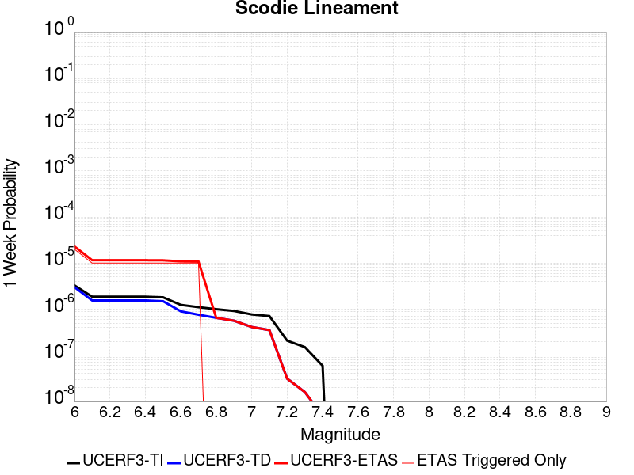 |  |  |  |

| Magnitude | 1 wk TI Prob | 1 wk TD Prob | 1 wk ETAS Prob | 1 wk ETAS/TD Gain | 1 wk ETAS Triggered Only | 1 mo TI Prob | 1 mo TD Prob | 1 mo ETAS Prob | 1 mo ETAS/TD Gain | 1 mo ETAS Triggered Only | 1 yr TI Prob | 1 yr TD Prob | 1 yr ETAS Prob | 1 yr ETAS/TD Gain | 1 yr ETAS Triggered Only | 10 yr TI Prob | 10 yr TD Prob | 10 yr ETAS Prob | 10 yr ETAS/TD Gain | 10 yr ETAS Triggered Only |
|-----|-----|-----|-----|-----|-----|-----|-----|-----|-----|-----|-----|-----|-----|-----|-----|-----|-----|-----|-----|-----|
| 6.0 | 3.2919327E-6 | 3.0133451E-6 | 2.3013285E-5 | 7.637122 | 2.0E-5 | 1.4108206E-5 | 1.2914291E-5 | 6.291364E-5 | 4.87163 | 5.0E-5 | 1.7175387E-4 | 1.5722332E-4 | 2.972013E-4 | 1.8903131 | 1.4E-4 | 0.0017162118 | 0.0015714325 | 0.0017411653 | 1.1080116 | 1.7E-4 |
| 6.1 | 1.8663811E-6 | 1.5490476E-6 | 1.1549032E-5 | 7.4555697 | 1.0E-5 | 7.998751E-6 | 6.6387615E-6 | 2.6638629E-5 | 4.0125904 | 2.0E-5 | 9.738045E-5 | 8.082442E-5 | 1.10821995E-4 | 1.371145 | 3.0E-5 | 9.7337784E-4 | 8.0799905E-4 | 8.479667E-4 | 1.0494651 | 4.0E-5 |
| 6.2 | 1.8663811E-6 | 1.5490476E-6 | 1.1549032E-5 | 7.4555697 | 1.0E-5 | 7.998751E-6 | 6.6387615E-6 | 2.6638629E-5 | 4.0125904 | 2.0E-5 | 9.738045E-5 | 8.082442E-5 | 1.10821995E-4 | 1.371145 | 3.0E-5 | 9.7337784E-4 | 8.0799905E-4 | 8.479667E-4 | 1.0494651 | 4.0E-5 |
| 6.3 | 1.8663811E-6 | 1.5490476E-6 | 1.1549032E-5 | 7.4555697 | 1.0E-5 | 7.998751E-6 | 6.6387615E-6 | 2.6638629E-5 | 4.0125904 | 2.0E-5 | 9.738045E-5 | 8.082442E-5 | 1.10821995E-4 | 1.371145 | 3.0E-5 | 9.7337784E-4 | 8.0799905E-4 | 8.479667E-4 | 1.0494651 | 4.0E-5 |
| 6.4 | 1.8663811E-6 | 1.5490476E-6 | 1.1549032E-5 | 7.4555697 | 1.0E-5 | 7.998751E-6 | 6.6387615E-6 | 2.6638629E-5 | 4.0125904 | 2.0E-5 | 9.738045E-5 | 8.082442E-5 | 1.10821995E-4 | 1.371145 | 3.0E-5 | 9.7337784E-4 | 8.0799905E-4 | 8.479667E-4 | 1.0494651 | 4.0E-5 |
| 6.5 | 1.8106311E-6 | 1.4909813E-6 | 1.1490966E-5 | 7.706982 | 1.0E-5 | 7.759824E-6 | 6.389907E-6 | 2.638978E-5 | 4.129916 | 2.0E-5 | 9.447177E-5 | 7.779484E-5 | 1.07792504E-4 | 1.3855997 | 3.0E-5 | 9.4431615E-4 | 7.777247E-4 | 8.176936E-4 | 1.0513921 | 4.0E-5 |
| 6.6 | 1.2414679E-6 | 8.997501E-7 | 1.0899741E-5 | 12.114187 | 1.0E-5 | 5.320566E-6 | 3.8560665E-6 | 2.385599E-5 | 6.1866126 | 2.0E-5 | 6.477596E-5 | 4.6946687E-5 | 7.694528E-5 | 1.6389928 | 3.0E-5 | 6.475708E-4 | 4.6937633E-4 | 5.0935755E-4 | 1.0851794 | 4.0E-5 |
| 6.7 | 1.1062215E-6 | 7.594247E-7 | 1.0759417E-5 | 14.167852 | 1.0E-5 | 4.7409408E-6 | 3.2546736E-6 | 2.3254608E-5 | 7.1449895 | 2.0E-5 | 5.7719422E-5 | 3.9625003E-5 | 6.962381E-5 | 1.7570677 | 3.0E-5 | 5.770443E-4 | 3.9618637E-4 | 4.3617052E-4 | 1.1009226 | 4.0E-5 |
| 6.8 | 1.0006736E-6 | 6.5003275E-7 | 6.5003275E-7 | 1.0 | 0.0 | 4.288594E-6 | 2.785852E-6 | 1.2785824E-5 | 4.589556 | 1.0E-5 | 5.221238E-5 | 3.3917284E-5 | 5.3916603E-5 | 1.5896499 | 2.0E-5 | 5.220012E-4 | 3.3912715E-4 | 3.6911695E-4 | 1.0884324 | 3.0E-5 |
| 6.9 | 9.167364E-7 | 5.6315514E-7 | 5.6315514E-7 | 1.0 | 0.0 | 3.9288643E-6 | 2.4135202E-6 | 1.2413496E-5 | 5.143316 | 1.0E-5 | 4.7832873E-5 | 2.938427E-5 | 4.938368E-5 | 1.6806163 | 2.0E-5 | 4.782258E-4 | 2.938095E-4 | 3.238007E-4 | 1.102077 | 3.0E-5 |
| 7.0 | 7.6987664E-7 | 4.113303E-7 | 4.113303E-7 | 1.0 | 0.0 | 3.2994672E-6 | 1.7628431E-6 | 1.7628431E-6 | 1.0 | 0.0 | 4.0170275E-5 | 2.1462443E-5 | 3.146223E-5 | 1.4659202 | 1.0E-5 | 4.0163012E-4 | 2.1460756E-4 | 2.3460327E-4 | 1.0931734 | 2.0E-5 |
| 7.1 | 7.1038727E-7 | 3.521066E-7 | 3.521066E-7 | 1.0 | 0.0 | 3.0445133E-6 | 1.5090276E-6 | 1.5090276E-6 | 1.0 | 0.0 | 3.706632E-5 | 1.8372291E-5 | 2.837211E-5 | 1.5442879 | 1.0E-5 | 3.7060137E-4 | 1.8371122E-4 | 2.0370755E-4 | 1.1088465 | 2.0E-5 |
| 7.2 | 2.0799602E-7 | 3.1178946E-8 | 3.1178946E-8 | 1.0 | 0.0 | 8.914113E-7 | 1.3362404E-7 | 1.3362404E-7 | 1.0 | 0.0 | 1.0852878E-5 | 1.6268716E-6 | 1.6268716E-6 | 1.0 | 0.0 | 1.08523476E-4 | 1.6268605E-5 | 1.6268605E-5 | 1.0 | 0.0 |
| 7.3 | 1.5048182E-7 | 1.5939344E-8 | 1.5939344E-8 | 1.0 | 0.0 | 6.449219E-7 | 6.831147E-8 | 6.831147E-8 | 1.0 | 0.0 | 7.851896E-6 | 8.316919E-7 | 8.316919E-7 | 1.0 | 0.0 | 7.851618E-5 | 8.316891E-6 | 8.316891E-6 | 1.0 | 0.0 |
| 7.4 | 5.9334678E-8 | 4.8638475E-9 | 4.8638475E-9 | 1.0 | 0.0 | 2.5429145E-7 | 2.084506E-8 | 2.084506E-8 | 1.0 | 0.0 | 3.095994E-6 | 2.5378858E-7 | 2.5378858E-7 | 1.0 | 0.0 | 3.095951E-5 | 2.5378843E-6 | 2.5378843E-6 | 1.0 | 0.0 |

## San Jacinto (San Jacinto Valley) rev
*[(top)](#table-of-contents)*

| 1 Week | 1 Month | 1 Year | 10 Year |
|-----|-----|-----|-----|
|  |  |  | 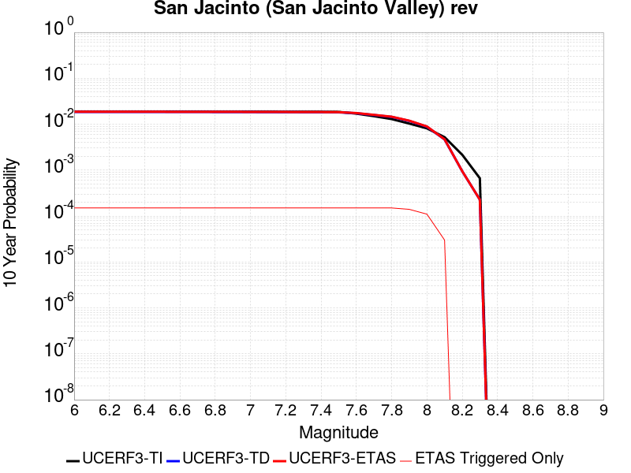 |

| Magnitude | 1 wk TI Prob | 1 wk TD Prob | 1 wk ETAS Prob | 1 wk ETAS/TD Gain | 1 wk ETAS Triggered Only | 1 mo TI Prob | 1 mo TD Prob | 1 mo ETAS Prob | 1 mo ETAS/TD Gain | 1 mo ETAS Triggered Only | 1 yr TI Prob | 1 yr TD Prob | 1 yr ETAS Prob | 1 yr ETAS/TD Gain | 1 yr ETAS Triggered Only | 10 yr TI Prob | 10 yr TD Prob | 10 yr ETAS Prob | 10 yr ETAS/TD Gain | 10 yr ETAS Triggered Only |
|-----|-----|-----|-----|-----|-----|-----|-----|-----|-----|-----|-----|-----|-----|-----|-----|-----|-----|-----|-----|-----|
| 6.0 | 3.652694E-5 | 3.441575E-5 | 3.441575E-5 | 1.0 | 0.0 | 1.5653463E-4 | 1.4748774E-4 | 1.5748625E-4 | 1.0677923 | 1.0E-5 | 0.0019041431 | 0.0017941861 | 0.0018540784 | 1.0333813 | 6.0E-5 | 0.018879099 | 0.01853357 | 0.01868079 | 1.0079434 | 1.5E-4 |
| 6.1 | 3.652694E-5 | 3.441575E-5 | 3.441575E-5 | 1.0 | 0.0 | 1.5653463E-4 | 1.4748774E-4 | 1.5748625E-4 | 1.0677923 | 1.0E-5 | 0.0019041431 | 0.0017941861 | 0.0018540784 | 1.0333813 | 6.0E-5 | 0.018879099 | 0.01853357 | 0.01868079 | 1.0079434 | 1.5E-4 |
| 6.2 | 3.652694E-5 | 3.441575E-5 | 3.441575E-5 | 1.0 | 0.0 | 1.5653463E-4 | 1.4748774E-4 | 1.5748625E-4 | 1.0677923 | 1.0E-5 | 0.0019041431 | 0.0017941861 | 0.0018540784 | 1.0333813 | 6.0E-5 | 0.018879099 | 0.01853357 | 0.01868079 | 1.0079434 | 1.5E-4 |
| 6.3 | 3.652694E-5 | 3.441575E-5 | 3.441575E-5 | 1.0 | 0.0 | 1.5653463E-4 | 1.4748774E-4 | 1.5748625E-4 | 1.0677923 | 1.0E-5 | 0.0019041431 | 0.0017941861 | 0.0018540784 | 1.0333813 | 6.0E-5 | 0.018879099 | 0.01853357 | 0.01868079 | 1.0079434 | 1.5E-4 |
| 6.4 | 3.646941E-5 | 3.4337318E-5 | 3.4337318E-5 | 1.0 | 0.0 | 1.5628811E-4 | 1.4715164E-4 | 1.5715018E-4 | 1.0679471 | 1.0E-5 | 0.0019011468 | 0.0017901013 | 0.001849994 | 1.0334576 | 6.0E-5 | 0.018849645 | 0.01849345 | 0.018640675 | 1.007961 | 1.5E-4 |
| 6.5 | 3.646941E-5 | 3.4337318E-5 | 3.4337318E-5 | 1.0 | 0.0 | 1.5628811E-4 | 1.4715164E-4 | 1.5715018E-4 | 1.0679471 | 1.0E-5 | 0.0019011468 | 0.0017901013 | 0.001849994 | 1.0334576 | 6.0E-5 | 0.018849645 | 0.01849345 | 0.018640675 | 1.007961 | 1.5E-4 |
| 6.6 | 3.6442503E-5 | 3.4300705E-5 | 3.4300705E-5 | 1.0 | 0.0 | 1.561728E-4 | 1.4699475E-4 | 1.5699328E-4 | 1.0680196 | 1.0E-5 | 0.0018997455 | 0.0017881944 | 0.0018480871 | 1.0334934 | 6.0E-5 | 0.018835869 | 0.018474717 | 0.018621946 | 1.0079693 | 1.5E-4 |
| 6.7 | 3.6432113E-5 | 3.428628E-5 | 3.428628E-5 | 1.0 | 0.0 | 1.5612828E-4 | 1.4693293E-4 | 1.5693146E-4 | 1.0680482 | 1.0E-5 | 0.0018992044 | 0.0017874431 | 0.0018473358 | 1.0335075 | 6.0E-5 | 0.018830549 | 0.01846734 | 0.01861457 | 1.0079725 | 1.5E-4 |
| 6.8 | 3.6409598E-5 | 3.4255332E-5 | 3.4255332E-5 | 1.0 | 0.0 | 1.560318E-4 | 1.4680032E-4 | 1.5679885E-4 | 1.0681098 | 1.0E-5 | 0.0018980318 | 0.0017858313 | 0.0018457241 | 1.0335377 | 6.0E-5 | 0.018819023 | 0.018451495 | 0.018598726 | 1.0079794 | 1.5E-4 |
| 6.9 | 3.638078E-5 | 3.4215755E-5 | 3.4215755E-5 | 1.0 | 0.0 | 1.5590832E-4 | 1.4663071E-4 | 1.5662925E-4 | 1.0681885 | 1.0E-5 | 0.0018965311 | 0.0017837697 | 0.0018436627 | 1.0335766 | 6.0E-5 | 0.018804269 | 0.018431228 | 0.018578462 | 1.0079883 | 1.5E-4 |
| 7.0 | 3.6294874E-5 | 3.4097768E-5 | 3.4097768E-5 | 1.0 | 0.0 | 1.5554018E-4 | 1.4612512E-4 | 1.5612366E-4 | 1.0684245 | 1.0E-5 | 0.0018920569 | 0.0017776241 | 0.0018375175 | 1.033693 | 6.0E-5 | 0.018760284 | 0.018370807 | 0.018518051 | 1.0080152 | 1.5E-4 |
| 7.1 | 3.6260717E-5 | 3.4054046E-5 | 3.4054046E-5 | 1.0 | 0.0 | 1.5539382E-4 | 1.4593777E-4 | 1.5593632E-4 | 1.0685123 | 1.0E-5 | 0.001890278 | 0.0017753469 | 0.0018352405 | 1.0337362 | 6.0E-5 | 0.018742796 | 0.018348401 | 0.01849565 | 1.008025 | 1.5E-4 |
| 7.2 | 3.6210204E-5 | 3.3988264E-5 | 3.3988264E-5 | 1.0 | 0.0 | 1.5517735E-4 | 1.4565587E-4 | 1.5565442E-4 | 1.068645 | 1.0E-5 | 0.001887647 | 0.0017719205 | 0.0018318142 | 1.0338016 | 6.0E-5 | 0.01871693 | 0.018314669 | 0.018461922 | 1.0080402 | 1.5E-4 |
| 7.3 | 3.6119454E-5 | 3.3876542E-5 | 3.3876542E-5 | 1.0 | 0.0 | 1.5478847E-4 | 1.4517711E-4 | 1.5517566E-4 | 1.0688714 | 1.0E-5 | 0.0018829206 | 0.0017661011 | 0.001825995 | 1.0339131 | 6.0E-5 | 0.018670462 | 0.01825722 | 0.018404482 | 1.0080659 | 1.5E-4 |
| 7.4 | 3.607848E-5 | 3.382404E-5 | 3.382404E-5 | 1.0 | 0.0 | 1.5461289E-4 | 1.4495212E-4 | 1.5495067E-4 | 1.0689783 | 1.0E-5 | 0.0018807866 | 0.0017633662 | 0.0018232604 | 1.0339658 | 6.0E-5 | 0.018649481 | 0.018230215 | 0.01837748 | 1.0080781 | 1.5E-4 |
| 7.5 | 3.5856774E-5 | 3.363379E-5 | 3.363379E-5 | 1.0 | 0.0 | 1.5366284E-4 | 1.4413687E-4 | 1.5413543E-4 | 1.0693685 | 1.0E-5 | 0.0018692396 | 0.0017534565 | 0.0018133513 | 1.0341581 | 6.0E-5 | 0.018535944 | 0.018131303 | 0.018278584 | 1.008123 | 1.5E-4 |
| 7.6 | 3.286655E-5 | 3.2156633E-5 | 3.2156633E-5 | 1.0 | 0.0 | 1.4084904E-4 | 1.3780687E-4 | 1.478055E-4 | 1.0725553 | 1.0E-5 | 0.001713488 | 0.0016765095 | 0.0017364089 | 1.0357287 | 6.0E-5 | 0.017003361 | 0.01735091 | 0.017498307 | 1.0084951 | 1.5E-4 |
| 7.7 | 2.8882527E-5 | 2.9249288E-5 | 2.9249288E-5 | 1.0 | 0.0 | 1.237764E-4 | 1.2534807E-4 | 1.3534683E-4 | 1.0797678 | 1.0E-5 | 0.0015059357 | 0.0015250455 | 0.001584954 | 1.039283 | 6.0E-5 | 0.014957713 | 0.015837153 | 0.015984777 | 1.0093215 | 1.5E-4 |
| 7.8 | 2.4950225E-5 | 2.6539781E-5 | 2.6539781E-5 | 1.0 | 0.0 | 1.0692515E-4 | 1.1373697E-4 | 1.2373582E-4 | 1.0879122 | 1.0E-5 | 0.0013010362 | 0.0013838689 | 0.0014437858 | 1.0432967 | 6.0E-5 | 0.012934455 | 0.014418158 | 0.014565995 | 1.0102535 | 1.5E-4 |
| 7.9 | 1.9881603E-5 | 2.1518656E-5 | 2.1518656E-5 | 1.0 | 0.0 | 8.520408E-5 | 9.2219554E-5 | 1.02218626E-4 | 1.1084269 | 1.0E-5 | 0.001036866 | 0.0011221955 | 0.0011821282 | 1.0534066 | 6.0E-5 | 0.010320415 | 0.011782875 | 0.011921226 | 1.0117416 | 1.4E-4 |
| 8.0 | 1.563292E-5 | 1.5946089E-5 | 1.5946089E-5 | 1.0 | 0.0 | 6.6996516E-5 | 6.8338595E-5 | 7.8337915E-5 | 1.1463202 | 1.0E-5 | 8.153773E-4 | 8.3170546E-4 | 8.716722E-4 | 1.048054 | 4.0E-5 | 0.00812392 | 0.00881513 | 0.00892416 | 1.0123686 | 1.1E-4 |
| 8.1 | 1.0045313E-5 | 8.306527E-6 | 8.306527E-6 | 1.0 | 0.0 | 4.305063E-5 | 3.5598918E-5 | 3.5598918E-5 | 1.0 | 0.0 | 5.2401534E-4 | 4.3333112E-4 | 4.433268E-4 | 1.023067 | 1.0E-5 | 0.0052278144 | 0.0046616676 | 0.0046915277 | 1.0064055 | 3.0E-5 |
| 8.2 | 4.1554413E-6 | 1.5665041E-6 | 1.5665041E-6 | 1.0 | 0.0 | 1.7808914E-5 | 6.713572E-6 | 6.713572E-6 | 1.0 | 0.0 | 2.1680194E-4 | 8.17347E-5 | 8.17347E-5 | 1.0 | 0.0 | 0.0021659054 | 9.488419E-4 | 9.488419E-4 | 1.0 | 0.0 |
| 8.3 | 1.2758221E-6 | 3.6171858E-7 | 3.6171858E-7 | 1.0 | 0.0 | 5.4677976E-6 | 1.5502216E-6 | 1.5502216E-6 | 1.0 | 0.0 | 6.65684E-5 | 1.8873789E-5 | 1.8873789E-5 | 1.0 | 0.0 | 6.6548464E-4 | 2.2764095E-4 | 2.2764095E-4 | 1.0 | 0.0 |

## San Andreas (San Gorgonio Pass-Garnet HIll)
*[(top)](#table-of-contents)*

| 1 Week | 1 Month | 1 Year | 10 Year |
|-----|-----|-----|-----|
|  |  |  |  |

| Magnitude | 1 wk TI Prob | 1 wk TD Prob | 1 wk ETAS Prob | 1 wk ETAS/TD Gain | 1 wk ETAS Triggered Only | 1 mo TI Prob | 1 mo TD Prob | 1 mo ETAS Prob | 1 mo ETAS/TD Gain | 1 mo ETAS Triggered Only | 1 yr TI Prob | 1 yr TD Prob | 1 yr ETAS Prob | 1 yr ETAS/TD Gain | 1 yr ETAS Triggered Only | 10 yr TI Prob | 10 yr TD Prob | 10 yr ETAS Prob | 10 yr ETAS/TD Gain | 10 yr ETAS Triggered Only |
|-----|-----|-----|-----|-----|-----|-----|-----|-----|-----|-----|-----|-----|-----|-----|-----|-----|-----|-----|-----|-----|
| 6.0 | 8.31567E-5 | 2.338839E-4 | 2.4388156E-4 | 1.0427463 | 1.0E-5 | 3.5633717E-4 | 0.0010019708 | 0.0010319408 | 1.029911 | 3.0E-5 | 0.004329778 | 0.01213065 | 0.01220968 | 1.0065149 | 8.0E-5 | 0.042463828 | 0.11259771 | 0.11273082 | 1.0011822 | 1.5E-4 |
| 6.1 | 8.31567E-5 | 2.338839E-4 | 2.4388156E-4 | 1.0427463 | 1.0E-5 | 3.5633717E-4 | 0.0010019708 | 0.0010319408 | 1.029911 | 3.0E-5 | 0.004329778 | 0.01213065 | 0.01220968 | 1.0065149 | 8.0E-5 | 0.042463828 | 0.11259771 | 0.11273082 | 1.0011822 | 1.5E-4 |
| 6.2 | 8.31567E-5 | 2.338839E-4 | 2.4388156E-4 | 1.0427463 | 1.0E-5 | 3.5633717E-4 | 0.0010019708 | 0.0010319408 | 1.029911 | 3.0E-5 | 0.004329778 | 0.01213065 | 0.01220968 | 1.0065149 | 8.0E-5 | 0.042463828 | 0.11259771 | 0.11273082 | 1.0011822 | 1.5E-4 |
| 6.3 | 8.31567E-5 | 2.338839E-4 | 2.4388156E-4 | 1.0427463 | 1.0E-5 | 3.5633717E-4 | 0.0010019708 | 0.0010319408 | 1.029911 | 3.0E-5 | 0.004329778 | 0.01213065 | 0.01220968 | 1.0065149 | 8.0E-5 | 0.042463828 | 0.11259771 | 0.11273082 | 1.0011822 | 1.5E-4 |
| 6.4 | 8.059055E-5 | 2.2945837E-4 | 2.3945607E-4 | 1.0435709 | 1.0E-5 | 3.4534236E-4 | 9.830239E-4 | 0.0010129944 | 1.0304881 | 3.0E-5 | 0.0041964394 | 0.011902837 | 0.011981885 | 1.006641 | 8.0E-5 | 0.041180745 | 0.11057874 | 0.110712156 | 1.0012065 | 1.5E-4 |
| 6.5 | 8.059055E-5 | 2.2945837E-4 | 2.3945607E-4 | 1.0435709 | 1.0E-5 | 3.4534236E-4 | 9.830239E-4 | 0.0010129944 | 1.0304881 | 3.0E-5 | 0.0041964394 | 0.011902837 | 0.011981885 | 1.006641 | 8.0E-5 | 0.041180745 | 0.11057874 | 0.110712156 | 1.0012065 | 1.5E-4 |
| 6.6 | 7.619237E-5 | 2.2190346E-4 | 2.3190124E-4 | 1.0450547 | 1.0E-5 | 3.2649786E-4 | 9.5067057E-4 | 9.80642E-4 | 1.0315267 | 3.0E-5 | 0.0039678677 | 0.011513535 | 0.0115926135 | 1.0068684 | 8.0E-5 | 0.03897764 | 0.107115194 | 0.1072402 | 1.001167 | 1.4E-4 |
| 6.7 | 7.440636E-5 | 2.1866155E-4 | 2.2865935E-4 | 1.0457227 | 1.0E-5 | 3.188454E-4 | 9.367866E-4 | 9.6675847E-4 | 1.0319943 | 3.0E-5 | 0.0038750346 | 0.011346267 | 0.011425358 | 1.0069708 | 8.0E-5 | 0.038081564 | 0.105623715 | 0.10574893 | 1.0011854 | 1.4E-4 |
| 6.8 | 7.3735864E-5 | 2.1713313E-4 | 2.2713096E-4 | 1.0460447 | 1.0E-5 | 3.1597257E-4 | 9.3024096E-4 | 9.602131E-4 | 1.0322198 | 3.0E-5 | 0.0038401815 | 0.011267403 | 0.011346501 | 1.0070201 | 8.0E-5 | 0.03774495 | 0.10492511 | 0.10505042 | 1.0011942 | 1.4E-4 |
| 6.9 | 7.27575E-5 | 2.1482276E-4 | 2.2482061E-4 | 1.04654 | 1.0E-5 | 3.117806E-4 | 9.203464E-4 | 9.5031876E-4 | 1.0325664 | 3.0E-5 | 0.003789323 | 0.011148175 | 0.011227284 | 1.007096 | 8.0E-5 | 0.037253562 | 0.103873 | 0.10399846 | 1.0012078 | 1.4E-4 |
| 7.0 | 7.102591E-5 | 2.10663E-4 | 2.2066089E-4 | 1.0474591 | 1.0E-5 | 3.0436125E-4 | 9.0253126E-4 | 9.325042E-4 | 1.0332098 | 3.0E-5 | 0.003699303 | 0.010933471 | 0.011012596 | 1.007237 | 8.0E-5 | 0.03638325 | 0.10197552 | 0.10210125 | 1.0012329 | 1.4E-4 |
| 7.1 | 7.028513E-5 | 2.0901936E-4 | 2.1901727E-4 | 1.0478325 | 1.0E-5 | 3.0118722E-4 | 8.95492E-4 | 9.254651E-4 | 1.0334711 | 3.0E-5 | 0.0036607897 | 0.010848625 | 0.010927756 | 1.0072942 | 8.0E-5 | 0.036010686 | 0.10121833 | 0.10134416 | 1.0012431 | 1.4E-4 |
| 7.2 | 6.8498244E-5 | 2.0509785E-4 | 2.150958E-4 | 1.0487472 | 1.0E-5 | 2.9353087E-4 | 8.786969E-4 | 9.0867054E-4 | 1.0341115 | 3.0E-5 | 0.003567883 | 0.010646159 | 0.010725306 | 1.0074345 | 8.0E-5 | 0.035111405 | 0.09941009 | 0.099536166 | 1.0012683 | 1.4E-4 |
| 7.3 | 6.622592E-5 | 1.9737013E-4 | 2.0736815E-4 | 1.0506562 | 1.0E-5 | 2.8379448E-4 | 8.455999E-4 | 8.755746E-4 | 1.0354477 | 3.0E-5 | 0.0034497243 | 0.010247062 | 0.010326242 | 1.0077271 | 8.0E-5 | 0.033966612 | 0.09590662 | 0.09603319 | 1.0013198 | 1.4E-4 |
| 7.4 | 5.1050705E-5 | 1.4693316E-4 | 1.569317E-4 | 1.0680481 | 1.0E-5 | 2.1877038E-4 | 6.295625E-4 | 6.595436E-4 | 1.0476221 | 3.0E-5 | 0.002660276 | 0.0076381783 | 0.007717567 | 1.0103937 | 8.0E-5 | 0.02628654 | 0.07287833 | 0.07300813 | 1.001781 | 1.4E-4 |
| 7.5 | 3.9302922E-5 | 1.1133535E-4 | 1.2133423E-4 | 1.0898087 | 1.0E-5 | 1.6843023E-4 | 4.7706455E-4 | 5.0705025E-4 | 1.0628545 | 3.0E-5 | 0.0020487092 | 0.0057928623 | 0.0058723986 | 1.01373 | 8.0E-5 | 0.020299247 | 0.056023482 | 0.05615564 | 1.0023589 | 1.4E-4 |
| 7.6 | 2.9851626E-5 | 8.498211E-5 | 9.498126E-5 | 1.1176618 | 1.0E-5 | 1.2792926E-4 | 3.6415833E-4 | 3.9414738E-4 | 1.0823518 | 3.0E-5 | 0.0015564259 | 0.00442464 | 0.0044943304 | 1.0157505 | 7.0E-5 | 0.0154556995 | 0.043206394 | 0.043330777 | 1.0028788 | 1.3E-4 |
| 7.7 | 2.1135214E-5 | 6.355745E-5 | 7.355681E-5 | 1.157328 | 1.0E-5 | 9.0576345E-5 | 2.7236066E-4 | 3.0235248E-4 | 1.110118 | 3.0E-5 | 0.0011022091 | 0.0033109542 | 0.0033807224 | 1.0210719 | 7.0E-5 | 0.010967582 | 0.03259442 | 0.032720182 | 1.0038584 | 1.3E-4 |
| 7.8 | 1.883379E-5 | 5.5666103E-5 | 6.566555E-5 | 1.1796325 | 1.0E-5 | 8.0713755E-5 | 2.3854722E-4 | 2.6854005E-4 | 1.1257312 | 3.0E-5 | 9.822468E-4 | 0.0029004475 | 0.0029702445 | 1.0240642 | 7.0E-5 | 0.0097791655 | 0.02870594 | 0.028832208 | 1.0043987 | 1.3E-4 |
| 7.9 | 1.5156185E-5 | 4.167907E-5 | 5.1678657E-5 | 1.2399186 | 1.0E-5 | 6.495346E-5 | 1.7861238E-4 | 2.0860702E-4 | 1.1679314 | 3.0E-5 | 7.9052144E-4 | 0.0021724382 | 0.0022422862 | 1.0321518 | 7.0E-5 | 0.007877152 | 0.021768799 | 0.02189597 | 1.0058419 | 1.3E-4 |
| 8.0 | 1.1405907E-5 | 2.9989498E-5 | 3.9989198E-5 | 1.3334401 | 1.0E-5 | 4.8881542E-5 | 1.2852009E-4 | 1.5851624E-4 | 1.2333965 | 3.0E-5 | 5.9497025E-4 | 0.00156361 | 0.0016135318 | 1.0319272 | 5.0E-5 | 0.005933798 | 0.015779829 | 0.01587825 | 1.0062371 | 1.0E-4 |
| 8.1 | 4.3511436E-6 | 7.3739657E-6 | 7.3739657E-6 | 1.0 | 0.0 | 1.8647626E-5 | 3.160233E-5 | 3.160233E-5 | 1.0 | 0.0 | 2.2701119E-4 | 3.8469053E-4 | 3.8469053E-4 | 1.0 | 0.0 | 0.0022677942 | 0.0041186865 | 0.0041186865 | 1.0 | 0.0 |
| 8.2 | 2.3042528E-6 | 2.7349201E-6 | 2.7349201E-6 | 1.0 | 0.0 | 9.875332E-6 | 1.1721034E-5 | 1.1721034E-5 | 1.0 | 0.0 | 1.2022553E-4 | 1.4269429E-4 | 1.4269429E-4 | 1.0 | 0.0 | 0.0012016051 | 0.0015990431 | 0.0015990431 | 1.0 | 0.0 |
| 8.3 | 5.202968E-7 | 3.1619535E-7 | 3.1619535E-7 | 1.0 | 0.0 | 2.2298414E-6 | 1.3551223E-6 | 1.3551223E-6 | 1.0 | 0.0 | 2.714798E-5 | 1.6498503E-5 | 1.6498503E-5 | 1.0 | 0.0 | 2.7144665E-4 | 1.9577713E-4 | 1.9577713E-4 | 1.0 | 0.0 |

## San Jacinto (Stepovers Combined)
*[(top)](#table-of-contents)*

| 1 Week | 1 Month | 1 Year | 10 Year |
|-----|-----|-----|-----|
|  |  |  |  |

| Magnitude | 1 wk TI Prob | 1 wk TD Prob | 1 wk ETAS Prob | 1 wk ETAS/TD Gain | 1 wk ETAS Triggered Only | 1 mo TI Prob | 1 mo TD Prob | 1 mo ETAS Prob | 1 mo ETAS/TD Gain | 1 mo ETAS Triggered Only | 1 yr TI Prob | 1 yr TD Prob | 1 yr ETAS Prob | 1 yr ETAS/TD Gain | 1 yr ETAS Triggered Only | 10 yr TI Prob | 10 yr TD Prob | 10 yr ETAS Prob | 10 yr ETAS/TD Gain | 10 yr ETAS Triggered Only |
|-----|-----|-----|-----|-----|-----|-----|-----|-----|-----|-----|-----|-----|-----|-----|-----|-----|-----|-----|-----|-----|
| 6.0 | 4.0667746E-5 | 3.5285528E-5 | 3.5285528E-5 | 1.0 | 0.0 | 1.742787E-4 | 1.5121493E-4 | 1.6121342E-4 | 1.066121 | 1.0E-5 | 0.0021197782 | 0.0018394884 | 0.001899378 | 1.0325577 | 6.0E-5 | 0.020996714 | 0.018993655 | 0.019130995 | 1.0072309 | 1.4E-4 |
| 6.1 | 4.0667746E-5 | 3.5285528E-5 | 3.5285528E-5 | 1.0 | 0.0 | 1.742787E-4 | 1.5121493E-4 | 1.6121342E-4 | 1.066121 | 1.0E-5 | 0.0021197782 | 0.0018394884 | 0.001899378 | 1.0325577 | 6.0E-5 | 0.020996714 | 0.018993655 | 0.019130995 | 1.0072309 | 1.4E-4 |
| 6.2 | 4.0667746E-5 | 3.5285528E-5 | 3.5285528E-5 | 1.0 | 0.0 | 1.742787E-4 | 1.5121493E-4 | 1.6121342E-4 | 1.066121 | 1.0E-5 | 0.0021197782 | 0.0018394884 | 0.001899378 | 1.0325577 | 6.0E-5 | 0.020996714 | 0.018993655 | 0.019130995 | 1.0072309 | 1.4E-4 |
| 6.3 | 4.0667746E-5 | 3.5285528E-5 | 3.5285528E-5 | 1.0 | 0.0 | 1.742787E-4 | 1.5121493E-4 | 1.6121342E-4 | 1.066121 | 1.0E-5 | 0.0021197782 | 0.0018394884 | 0.001899378 | 1.0325577 | 6.0E-5 | 0.020996714 | 0.018993655 | 0.019130995 | 1.0072309 | 1.4E-4 |
| 6.4 | 4.0577226E-5 | 3.515743E-5 | 3.515743E-5 | 1.0 | 0.0 | 1.738908E-4 | 1.5066602E-4 | 1.6066451E-4 | 1.066362 | 1.0E-5 | 0.0021150648 | 0.0018328178 | 0.0018927079 | 1.0326765 | 6.0E-5 | 0.020950472 | 0.018928219 | 0.01906557 | 1.0072564 | 1.4E-4 |
| 6.5 | 4.0577226E-5 | 3.515743E-5 | 3.515743E-5 | 1.0 | 0.0 | 1.738908E-4 | 1.5066602E-4 | 1.6066451E-4 | 1.066362 | 1.0E-5 | 0.0021150648 | 0.0018328178 | 0.0018927079 | 1.0326765 | 6.0E-5 | 0.020950472 | 0.018928219 | 0.01906557 | 1.0072564 | 1.4E-4 |
| 6.6 | 4.053861E-5 | 3.510277E-5 | 3.510277E-5 | 1.0 | 0.0 | 1.7372532E-4 | 1.5043179E-4 | 1.6043028E-4 | 1.0664653 | 1.0E-5 | 0.0021130538 | 0.0018299713 | 0.0018898615 | 1.0327274 | 6.0E-5 | 0.020930743 | 0.018900296 | 0.019037649 | 1.0072672 | 1.4E-4 |
| 6.7 | 4.0516545E-5 | 3.5071844E-5 | 3.5071844E-5 | 1.0 | 0.0 | 1.7363077E-4 | 1.5029925E-4 | 1.6029776E-4 | 1.0665239 | 1.0E-5 | 0.002111905 | 0.0018283607 | 0.001888251 | 1.0327563 | 6.0E-5 | 0.020919468 | 0.018884491 | 0.019021848 | 1.0072734 | 1.4E-4 |
| 6.8 | 4.049434E-5 | 3.5043406E-5 | 3.5043406E-5 | 1.0 | 0.0 | 1.7353562E-4 | 1.501774E-4 | 1.6017588E-4 | 1.0665779 | 1.0E-5 | 0.0021107488 | 0.0018268795 | 0.0018867699 | 1.0327829 | 6.0E-5 | 0.020908125 | 0.018869905 | 0.019007262 | 1.0072793 | 1.4E-4 |
| 6.9 | 4.046386E-5 | 3.5005964E-5 | 3.5005964E-5 | 1.0 | 0.0 | 1.73405E-4 | 1.5001695E-4 | 1.6001544E-4 | 1.0666491 | 1.0E-5 | 0.0021091616 | 0.0018249294 | 0.0018848198 | 1.032818 | 6.0E-5 | 0.020892553 | 0.018850677 | 0.018988037 | 1.0072868 | 1.4E-4 |
| 7.0 | 4.036382E-5 | 3.4886525E-5 | 3.4886525E-5 | 1.0 | 0.0 | 1.7297632E-4 | 1.4950513E-4 | 1.5950363E-4 | 1.0668774 | 1.0E-5 | 0.0021039525 | 0.0018187086 | 0.0018785994 | 1.0329305 | 6.0E-5 | 0.02084144 | 0.018789288 | 0.018926658 | 1.0073111 | 1.4E-4 |
| 7.1 | 4.0343282E-5 | 3.486499E-5 | 3.486499E-5 | 1.0 | 0.0 | 1.7288832E-4 | 1.4941284E-4 | 1.5941134E-4 | 1.0669186 | 1.0E-5 | 0.002102883 | 0.0018175867 | 0.0018774777 | 1.0329508 | 6.0E-5 | 0.020830948 | 0.018778158 | 0.01891553 | 1.0073155 | 1.4E-4 |
| 7.2 | 4.0257353E-5 | 3.476948E-5 | 3.476948E-5 | 1.0 | 0.0 | 1.725201E-4 | 1.4900356E-4 | 1.5900208E-4 | 1.0671024 | 1.0E-5 | 0.0020984085 | 0.0018126123 | 0.0018725035 | 1.0330414 | 6.0E-5 | 0.020787042 | 0.018728893 | 0.01886627 | 1.0073351 | 1.4E-4 |
| 7.3 | 3.9940667E-5 | 3.459712E-5 | 3.459712E-5 | 1.0 | 0.0 | 1.7116306E-4 | 1.4826495E-4 | 1.5826347E-4 | 1.0674368 | 1.0E-5 | 0.0020819185 | 0.0018036346 | 0.0018635264 | 1.0332061 | 6.0E-5 | 0.020625217 | 0.018637514 | 0.018774904 | 1.0073718 | 1.4E-4 |
| 7.4 | 3.9721202E-5 | 3.44825E-5 | 3.44825E-5 | 1.0 | 0.0 | 1.7022261E-4 | 1.4777378E-4 | 1.577723E-4 | 1.067661 | 1.0E-5 | 0.0020704903 | 0.0017976643 | 0.0018575565 | 1.0333166 | 6.0E-5 | 0.020513052 | 0.018576635 | 0.018714035 | 1.0073963 | 1.4E-4 |
| 7.5 | 3.7036873E-5 | 3.354985E-5 | 3.354985E-5 | 1.0 | 0.0 | 1.5871979E-4 | 1.4377717E-4 | 1.5377573E-4 | 1.069542 | 1.0E-5 | 0.0019307006 | 0.0017490846 | 0.0018089795 | 1.0342437 | 6.0E-5 | 0.019140124 | 0.018078115 | 0.018215584 | 1.0076041 | 1.4E-4 |
| 7.6 | 3.2940967E-5 | 3.1330474E-5 | 3.1330474E-5 | 1.0 | 0.0 | 1.4116794E-4 | 1.3426656E-4 | 1.4426523E-4 | 1.0744687 | 1.0E-5 | 0.0017173645 | 0.001633472 | 0.001693374 | 1.0366715 | 6.0E-5 | 0.01704153 | 0.01691088 | 0.017048514 | 1.0081387 | 1.4E-4 |
| 7.7 | 2.8236149E-5 | 2.7896147E-5 | 2.7896147E-5 | 1.0 | 0.0 | 1.2100645E-4 | 1.1954944E-4 | 1.2954825E-4 | 1.0836374 | 1.0E-5 | 0.0014722579 | 0.0014545437 | 0.0015144565 | 1.04119 | 6.0E-5 | 0.014625421 | 0.015121453 | 0.015259336 | 1.0091183 | 1.4E-4 |
| 7.8 | 2.4329287E-5 | 2.5219388E-5 | 2.5219388E-5 | 1.0 | 0.0 | 1.042642E-4 | 1.0807862E-4 | 1.18077536E-4 | 1.0925152 | 1.0E-5 | 0.0012686774 | 0.0013150638 | 0.0013749849 | 1.0455651 | 6.0E-5 | 0.012614589 | 0.013718468 | 0.013856548 | 1.0100652 | 1.4E-4 |
| 7.9 | 1.9370926E-5 | 2.0432055E-5 | 2.0432055E-5 | 1.0 | 0.0 | 8.301561E-5 | 8.7563014E-5 | 9.756214E-5 | 1.1141934 | 1.0E-5 | 0.0010102465 | 0.001065559 | 0.0011254951 | 1.0562484 | 6.0E-5 | 0.0100566605 | 0.011205053 | 0.011333596 | 1.0114719 | 1.3E-4 |
| 8.0 | 1.5583017E-5 | 1.5895175E-5 | 1.5895175E-5 | 1.0 | 0.0 | 6.6782646E-5 | 6.8120404E-5 | 7.811972E-5 | 1.146789 | 1.0E-5 | 8.127754E-4 | 8.29051E-4 | 8.6901785E-4 | 1.0482079 | 4.0E-5 | 0.008098091 | 0.008786416 | 0.008895448 | 1.0124093 | 1.1E-4 |
| 8.1 | 1.0024873E-5 | 8.297121E-6 | 8.297121E-6 | 1.0 | 0.0 | 4.2963035E-5 | 3.5558605E-5 | 3.5558605E-5 | 1.0 | 0.0 | 5.229494E-4 | 4.3284055E-4 | 4.4283623E-4 | 1.0230932 | 1.0E-5 | 0.0052172043 | 0.00465596 | 0.00468582 | 1.0064133 | 3.0E-5 |
| 8.2 | 4.142796E-6 | 1.5619446E-6 | 1.5619446E-6 | 1.0 | 0.0 | 1.775472E-5 | 6.6940315E-6 | 6.6940315E-6 | 1.0 | 0.0 | 2.1614227E-4 | 8.1496815E-5 | 8.1496815E-5 | 1.0 | 0.0 | 0.0021593217 | 9.4601413E-4 | 9.4601413E-4 | 1.0 | 0.0 |
| 8.3 | 1.2750878E-6 | 3.6143226E-7 | 3.6143226E-7 | 1.0 | 0.0 | 5.4646503E-6 | 1.5489944E-6 | 1.5489944E-6 | 1.0 | 0.0 | 6.653009E-5 | 1.8858847E-5 | 1.8858847E-5 | 1.0 | 0.0 | 6.6510175E-4 | 2.2747046E-4 | 2.2747046E-4 | 1.0 | 0.0 |

## San Andreas (Coachella) rev
*[(top)](#table-of-contents)*

| 1 Week | 1 Month | 1 Year | 10 Year |
|-----|-----|-----|-----|
|  |  |  |  |

| Magnitude | 1 wk TI Prob | 1 wk TD Prob | 1 wk ETAS Prob | 1 wk ETAS/TD Gain | 1 wk ETAS Triggered Only | 1 mo TI Prob | 1 mo TD Prob | 1 mo ETAS Prob | 1 mo ETAS/TD Gain | 1 mo ETAS Triggered Only | 1 yr TI Prob | 1 yr TD Prob | 1 yr ETAS Prob | 1 yr ETAS/TD Gain | 1 yr ETAS Triggered Only | 10 yr TI Prob | 10 yr TD Prob | 10 yr ETAS Prob | 10 yr ETAS/TD Gain | 10 yr ETAS Triggered Only |
|-----|-----|-----|-----|-----|-----|-----|-----|-----|-----|-----|-----|-----|-----|-----|-----|-----|-----|-----|-----|-----|
| 6.0 | 1.1925945E-4 | 3.2735174E-4 | 3.3734847E-4 | 1.0305382 | 1.0E-5 | 5.110118E-4 | 0.0014021865 | 0.0014421304 | 1.0284868 | 4.0E-5 | 0.0062038354 | 0.016939327 | 0.017017972 | 1.0046427 | 8.0E-5 | 0.060334753 | 0.15269604 | 0.1528062 | 1.0007213 | 1.3E-4 |
| 6.1 | 1.1925945E-4 | 3.2735174E-4 | 3.3734847E-4 | 1.0305382 | 1.0E-5 | 5.110118E-4 | 0.0014021865 | 0.0014421304 | 1.0284868 | 4.0E-5 | 0.0062038354 | 0.016939327 | 0.017017972 | 1.0046427 | 8.0E-5 | 0.060334753 | 0.15269604 | 0.1528062 | 1.0007213 | 1.3E-4 |
| 6.2 | 1.07432395E-4 | 3.023596E-4 | 3.1235657E-4 | 1.0330632 | 1.0E-5 | 4.603433E-4 | 0.0012951873 | 0.0013251485 | 1.0231327 | 3.0E-5 | 0.005590286 | 0.01565599 | 0.015724894 | 1.0044011 | 7.0E-5 | 0.05451731 | 0.14184935 | 0.14194374 | 1.0006654 | 1.1E-4 |
| 6.3 | 1.0718766E-4 | 3.0181266E-4 | 3.1180962E-4 | 1.0331231 | 1.0E-5 | 4.592948E-4 | 0.0012928456 | 0.0013228068 | 1.0231746 | 3.0E-5 | 0.005577586 | 0.015627889 | 0.015696796 | 1.0044092 | 7.0E-5 | 0.054396555 | 0.14161763 | 0.14171205 | 1.0006667 | 1.1E-4 |
| 6.4 | 1.0355944E-4 | 2.9389336E-4 | 3.0389044E-4 | 1.0340159 | 1.0E-5 | 4.4375064E-4 | 0.001258939 | 0.0012889012 | 1.0237995 | 3.0E-5 | 0.0053892885 | 0.015220915 | 0.01528985 | 1.0045289 | 7.0E-5 | 0.052604496 | 0.13817544 | 0.13827023 | 1.000686 | 1.1E-4 |
| 6.5 | 1.0227914E-4 | 2.9108766E-4 | 3.0108477E-4 | 1.034344 | 1.0E-5 | 4.382655E-4 | 0.0012469261 | 0.0012768887 | 1.0240291 | 3.0E-5 | 0.0053228354 | 0.015076692 | 0.015145637 | 1.004573 | 7.0E-5 | 0.051971316 | 0.13695958 | 0.13705452 | 1.0006932 | 1.1E-4 |
| 6.6 | 1.0116757E-4 | 2.8874516E-4 | 2.9874226E-4 | 1.0346227 | 1.0E-5 | 4.3350324E-4 | 0.0012368963 | 0.0012668592 | 1.0242243 | 3.0E-5 | 0.0052651367 | 0.014956261 | 0.015025214 | 1.0046103 | 7.0E-5 | 0.051421247 | 0.1359371 | 0.13603215 | 1.0006992 | 1.1E-4 |
| 6.7 | 1.0050676E-4 | 2.8733077E-4 | 2.973279E-4 | 1.0347931 | 1.0E-5 | 4.3067214E-4 | 0.0012308403 | 0.0012608034 | 1.0243436 | 3.0E-5 | 0.005230834 | 0.01488354 | 0.0149524985 | 1.0046332 | 7.0E-5 | 0.051094085 | 0.13532192 | 0.13541703 | 1.0007029 | 1.1E-4 |
| 6.8 | 9.976819E-5 | 2.8536728E-4 | 2.953644E-4 | 1.0350325 | 1.0E-5 | 4.2750788E-4 | 0.0012224333 | 0.0012523966 | 1.0245112 | 3.0E-5 | 0.0051924936 | 0.014782578 | 0.014851543 | 1.0046653 | 7.0E-5 | 0.050728295 | 0.13447334 | 0.13456854 | 1.000708 | 1.1E-4 |
| 6.9 | 9.77719E-5 | 2.8033604E-4 | 2.9033324E-4 | 1.0356615 | 1.0E-5 | 4.1895514E-4 | 0.0012008909 | 0.0012308549 | 1.0249515 | 3.0E-5 | 0.0050888555 | 0.014523826 | 0.014592809 | 1.0047497 | 7.0E-5 | 0.049738888 | 0.13230172 | 0.13239717 | 1.0007215 | 1.1E-4 |
| 7.0 | 8.500761E-5 | 2.476793E-4 | 2.5767682E-4 | 1.0403647 | 1.0E-5 | 3.6426744E-4 | 0.0010610541 | 0.0010910223 | 1.0282438 | 3.0E-5 | 0.0044259406 | 0.01284259 | 0.012911691 | 1.0053806 | 7.0E-5 | 0.04338823 | 0.118151076 | 0.11824808 | 1.000821 | 1.1E-4 |
| 7.1 | 8.319876E-5 | 2.4370618E-4 | 2.5370374E-4 | 1.041023 | 1.0E-5 | 3.5651738E-4 | 0.0010440402 | 0.0010740089 | 1.0287045 | 3.0E-5 | 0.004331963 | 0.0126378685 | 0.012706984 | 1.005469 | 7.0E-5 | 0.042484846 | 0.11637106 | 0.11646826 | 1.0008353 | 1.1E-4 |
| 7.2 | 7.563917E-5 | 2.2418915E-4 | 2.3418691E-4 | 1.0445952 | 1.0E-5 | 3.2412758E-4 | 9.604599E-4 | 9.90431E-4 | 1.031205 | 3.0E-5 | 0.0039391145 | 0.011631592 | 0.011700777 | 1.0059481 | 7.0E-5 | 0.03870018 | 0.107777216 | 0.10787536 | 1.0009106 | 1.1E-4 |
| 7.3 | 7.082985E-5 | 2.0734889E-4 | 2.1734682E-4 | 1.0482179 | 1.0E-5 | 3.0352117E-4 | 8.8833837E-4 | 9.183117E-4 | 1.0337409 | 3.0E-5 | 0.0036891096 | 0.01076251 | 0.0108317565 | 1.0064341 | 7.0E-5 | 0.03628465 | 0.10029867 | 0.10039764 | 1.0009867 | 1.1E-4 |
| 7.4 | 5.146215E-5 | 1.4277869E-4 | 1.5277727E-4 | 1.0700284 | 1.0E-5 | 2.2053342E-4 | 6.1176607E-4 | 6.417477E-4 | 1.0490084 | 3.0E-5 | 0.0026816884 | 0.007423004 | 0.007482559 | 1.008023 | 6.0E-5 | 0.02649557 | 0.07086286 | 0.07095577 | 1.0013112 | 1.0E-4 |
| 7.5 | 4.0285166E-5 | 1.09450986E-4 | 1.1944989E-4 | 1.0913551 | 1.0E-5 | 1.7263928E-4 | 4.6899164E-4 | 4.9897755E-4 | 1.0639371 | 3.0E-5 | 0.002099857 | 0.0056950934 | 0.0057547516 | 1.0104754 | 6.0E-5 | 0.020801254 | 0.055024315 | 0.055118814 | 1.0017173 | 1.0E-4 |
| 7.6 | 3.1168736E-5 | 8.441976E-5 | 9.441891E-5 | 1.1184456 | 1.0E-5 | 1.3357346E-4 | 3.617489E-4 | 3.9173805E-4 | 1.0829004 | 3.0E-5 | 0.0016250437 | 0.0043954253 | 0.0044452054 | 1.0113255 | 5.0E-5 | 0.016132116 | 0.042821974 | 0.04290812 | 1.0020118 | 9.0E-5 |
| 7.7 | 2.2100989E-5 | 6.241421E-5 | 7.241359E-5 | 1.1602099 | 1.0E-5 | 9.4715084E-5 | 2.674621E-4 | 2.9745407E-4 | 1.1121354 | 3.0E-5 | 0.001152546 | 0.003251495 | 0.0033013327 | 1.0153276 | 5.0E-5 | 0.011465867 | 0.031911246 | 0.031998374 | 1.0027304 | 9.0E-5 |
| 7.8 | 1.7484861E-5 | 5.181932E-5 | 6.18188E-5 | 1.1929682 | 1.0E-5 | 7.493296E-5 | 2.220639E-4 | 2.5205725E-4 | 1.1350663 | 3.0E-5 | 9.1192697E-4 | 0.002700279 | 0.0027501439 | 1.0184666 | 5.0E-5 | 0.009081938 | 0.026649911 | 0.026737511 | 1.0032871 | 9.0E-5 |
| 7.9 | 1.3967285E-5 | 3.8241284E-5 | 4.82409E-5 | 1.2614875 | 1.0E-5 | 5.985842E-5 | 1.6388092E-4 | 1.9387601E-4 | 1.1830298 | 3.0E-5 | 7.2853256E-4 | 0.0019934257 | 0.002043326 | 1.0250324 | 5.0E-5 | 0.0072614877 | 0.019917965 | 0.020006172 | 1.0044285 | 9.0E-5 |
| 8.0 | 1.1887396E-5 | 3.1081006E-5 | 4.1080697E-5 | 1.3217299 | 1.0E-5 | 5.094499E-5 | 1.3319752E-4 | 1.6319353E-4 | 1.2251995 | 3.0E-5 | 6.200787E-4 | 0.0016204745 | 0.0016703935 | 1.0308051 | 5.0E-5 | 0.006183513 | 0.016286531 | 0.016375065 | 1.0054361 | 9.0E-5 |
| 8.1 | 5.100864E-6 | 8.979058E-6 | 8.979058E-6 | 1.0 | 0.0 | 2.1860664E-5 | 3.8481114E-5 | 3.8481114E-5 | 1.0 | 0.0 | 2.6612106E-4 | 4.6840697E-4 | 4.6840697E-4 | 1.0 | 0.0 | 0.002658026 | 0.0049204906 | 0.0049204906 | 1.0 | 0.0 |
| 8.2 | 2.3004484E-6 | 2.7884673E-6 | 2.7884673E-6 | 1.0 | 0.0 | 9.859027E-6 | 1.195052E-5 | 1.195052E-5 | 1.0 | 0.0 | 1.2002704E-4 | 1.454879E-4 | 1.454879E-4 | 1.0 | 0.0 | 0.0011996223 | 0.0015984424 | 0.0015984424 | 1.0 | 0.0 |
| 8.3 | 1.0424446E-7 | 5.820319E-8 | 5.820319E-8 | 1.0 | 0.0 | 4.4676187E-7 | 2.4944222E-7 | 2.4944222E-7 | 1.0 | 0.0 | 5.439312E-6 | 3.0369551E-6 | 3.0369551E-6 | 1.0 | 0.0 | 5.4391792E-5 | 3.1931086E-5 | 3.1931086E-5 | 1.0 | 0.0 |

## Owens Valley
*[(top)](#table-of-contents)*

| 1 Week | 1 Month | 1 Year | 10 Year |
|-----|-----|-----|-----|
|  |  |  |  |

| Magnitude | 1 wk TI Prob | 1 wk TD Prob | 1 wk ETAS Prob | 1 wk ETAS/TD Gain | 1 wk ETAS Triggered Only | 1 mo TI Prob | 1 mo TD Prob | 1 mo ETAS Prob | 1 mo ETAS/TD Gain | 1 mo ETAS Triggered Only | 1 yr TI Prob | 1 yr TD Prob | 1 yr ETAS Prob | 1 yr ETAS/TD Gain | 1 yr ETAS Triggered Only | 10 yr TI Prob | 10 yr TD Prob | 10 yr ETAS Prob | 10 yr ETAS/TD Gain | 10 yr ETAS Triggered Only |
|-----|-----|-----|-----|-----|-----|-----|-----|-----|-----|-----|-----|-----|-----|-----|-----|-----|-----|-----|-----|-----|
| 6.0 | 4.83821E-5 | 3.621193E-6 | 3.621193E-6 | 1.0 | 0.0 | 2.0733538E-4 | 1.5519312E-5 | 3.5519002E-5 | 2.288697 | 2.0E-5 | 0.002521386 | 1.8893222E-4 | 2.58919E-4 | 1.3704332 | 7.0E-5 | 0.024929691 | 0.001929822 | 0.0020595712 | 1.0672337 | 1.3E-4 |
| 6.1 | 4.83821E-5 | 3.621193E-6 | 3.621193E-6 | 1.0 | 0.0 | 2.0733538E-4 | 1.5519312E-5 | 3.5519002E-5 | 2.288697 | 2.0E-5 | 0.002521386 | 1.8893222E-4 | 2.58919E-4 | 1.3704332 | 7.0E-5 | 0.024929691 | 0.001929822 | 0.0020595712 | 1.0672337 | 1.3E-4 |
| 6.2 | 4.83821E-5 | 3.621193E-6 | 3.621193E-6 | 1.0 | 0.0 | 2.0733538E-4 | 1.5519312E-5 | 3.5519002E-5 | 2.288697 | 2.0E-5 | 0.002521386 | 1.8893222E-4 | 2.58919E-4 | 1.3704332 | 7.0E-5 | 0.024929691 | 0.001929822 | 0.0020595712 | 1.0672337 | 1.3E-4 |
| 6.3 | 3.953008E-5 | 3.153231E-6 | 3.153231E-6 | 1.0 | 0.0 | 1.6940363E-4 | 1.3513782E-5 | 3.3513512E-5 | 2.4799507 | 2.0E-5 | 0.002060538 | 1.645186E-4 | 2.2450872E-4 | 1.3646404 | 6.0E-5 | 0.020415364 | 0.0016622683 | 0.0017621021 | 1.0600587 | 1.0E-4 |
| 6.4 | 3.953008E-5 | 3.153231E-6 | 3.153231E-6 | 1.0 | 0.0 | 1.6940363E-4 | 1.3513782E-5 | 3.3513512E-5 | 2.4799507 | 2.0E-5 | 0.002060538 | 1.645186E-4 | 2.2450872E-4 | 1.3646404 | 6.0E-5 | 0.020415364 | 0.0016622683 | 0.0017621021 | 1.0600587 | 1.0E-4 |
| 6.5 | 3.457342E-5 | 2.970874E-6 | 2.970874E-6 | 1.0 | 0.0 | 1.4816338E-4 | 1.2732259E-5 | 3.2732005E-5 | 2.5707932 | 2.0E-5 | 0.0018023965 | 1.5500492E-4 | 2.1499563E-4 | 1.3870245 | 6.0E-5 | 0.017878477 | 0.0015564174 | 0.0016562617 | 1.0641501 | 1.0E-4 |
| 6.6 | 3.1127765E-5 | 2.8738657E-6 | 2.8738657E-6 | 1.0 | 0.0 | 1.3339789E-4 | 1.2316514E-5 | 3.2316268E-5 | 2.6238163 | 2.0E-5 | 0.0016229092 | 1.4994392E-4 | 2.0993492E-4 | 1.4000896 | 6.0E-5 | 0.016111081 | 0.001501446 | 0.0016012959 | 1.0665025 | 1.0E-4 |
| 6.7 | 2.806885E-5 | 2.8102859E-6 | 2.8102859E-6 | 1.0 | 0.0 | 1.2028952E-4 | 1.204403E-5 | 3.204379E-5 | 2.6605537 | 2.0E-5 | 0.001463541 | 1.4662689E-4 | 2.0661809E-4 | 1.4091419 | 6.0E-5 | 0.014539397 | 0.0014657174 | 0.0015655708 | 1.068126 | 1.0E-4 |
| 6.8 | 2.524524E-5 | 2.2352563E-6 | 2.2352563E-6 | 1.0 | 0.0 | 1.0818939E-4 | 9.579636E-6 | 1.957954E-5 | 2.043871 | 1.0E-5 | 0.0013164099 | 1.1662613E-4 | 1.666203E-4 | 1.4286704 | 5.0E-5 | 0.01308639 | 0.0011659319 | 0.001255827 | 1.0771015 | 9.0E-5 |
| 6.9 | 2.2704568E-5 | 1.6080646E-6 | 1.6080646E-6 | 1.0 | 0.0 | 9.730166E-5 | 6.8916875E-6 | 1.689162E-5 | 2.4510133 | 1.0E-5 | 0.0011840039 | 8.390308E-5 | 1.338989E-4 | 1.5958756 | 5.0E-5 | 0.011777153 | 8.3894585E-4 | 9.2887034E-4 | 1.1071875 | 9.0E-5 |
| 7.0 | 2.0871712E-5 | 1.5394511E-6 | 1.5394511E-6 | 1.0 | 0.0 | 8.944713E-5 | 6.597631E-6 | 1.6597565E-5 | 2.5156856 | 1.0E-5 | 0.0010884746 | 8.032321E-5 | 1.303192E-4 | 1.6224351 | 5.0E-5 | 0.010831586 | 8.0313E-4 | 8.930577E-4 | 1.1119716 | 9.0E-5 |
| 7.1 | 1.944928E-5 | 1.3863316E-6 | 1.3863316E-6 | 1.0 | 0.0 | 8.335139E-5 | 5.941408E-6 | 1.5941348E-5 | 2.6830928 | 1.0E-5 | 0.0010143308 | 7.233425E-5 | 1.2233063E-4 | 1.6911855 | 5.0E-5 | 0.010097133 | 7.232817E-4 | 8.132166E-4 | 1.1243428 | 9.0E-5 |
| 7.2 | 1.7876306E-5 | 1.2488347E-6 | 1.2488347E-6 | 1.0 | 0.0 | 7.6610486E-5 | 5.352138E-6 | 1.5352085E-5 | 2.8684022 | 1.0E-5 | 9.3233347E-4 | 6.516034E-5 | 1.1515708E-4 | 1.767288 | 5.0E-5 | 0.009284316 | 6.5157266E-4 | 7.4151397E-4 | 1.1380373 | 9.0E-5 |
| 7.3 | 1.2618672E-5 | 1.1114453E-6 | 1.1114453E-6 | 1.0 | 0.0 | 5.40789E-5 | 4.763328E-6 | 1.4763281E-5 | 3.0993624 | 1.0E-5 | 6.582117E-4 | 5.7991983E-5 | 1.07989086E-4 | 1.8621382 | 5.0E-5 | 0.0065626553 | 5.7992374E-4 | 6.698716E-4 | 1.1551028 | 9.0E-5 |
| 7.4 | 7.4874442E-6 | 8.548014E-7 | 8.548014E-7 | 1.0 | 0.0 | 3.208865E-5 | 3.6634294E-6 | 3.6634294E-6 | 1.0 | 0.0 | 3.906093E-4 | 4.4601344E-5 | 8.459956E-5 | 1.896794 | 4.0E-5 | 0.003899234 | 4.4603736E-4 | 5.1600614E-4 | 1.1568675 | 7.0E-5 |
| 7.5 | 2.4734156E-6 | 6.0683584E-7 | 6.0683584E-7 | 1.0 | 0.0 | 1.060031E-5 | 2.6007224E-6 | 2.6007224E-6 | 1.0 | 0.0 | 1.2905113E-4 | 3.1663338E-5 | 6.166239E-5 | 1.947438 | 3.0E-5 | 0.0012897621 | 3.165886E-4 | 3.765696E-4 | 1.1894604 | 6.0E-5 |
| 7.6 | 1.1328841E-6 | 3.1963748E-7 | 3.1963748E-7 | 1.0 | 0.0 | 4.8552088E-6 | 1.3698742E-6 | 1.3698742E-6 | 1.0 | 0.0 | 5.9110564E-5 | 1.6678092E-5 | 3.667776E-5 | 2.199158 | 2.0E-5 | 5.9094845E-4 | 1.667686E-4 | 2.1676027E-4 | 1.2997667 | 5.0E-5 |
| 7.7 | 4.8613185E-7 | 8.9632934E-8 | 8.9632934E-8 | 1.0 | 0.0 | 2.0834207E-6 | 3.8414112E-7 | 3.8414112E-7 | 1.0 | 0.0 | 2.536535E-5 | 4.6769087E-6 | 1.4676862E-5 | 3.1381545 | 1.0E-5 | 2.5362454E-4 | 4.676817E-5 | 5.67677E-5 | 1.2138107 | 1.0E-5 |

## San Andreas (North Branch Mill Creek)
*[(top)](#table-of-contents)*

| 1 Week | 1 Month | 1 Year | 10 Year |
|-----|-----|-----|-----|
|  |  |  |  |

| Magnitude | 1 wk TI Prob | 1 wk TD Prob | 1 wk ETAS Prob | 1 wk ETAS/TD Gain | 1 wk ETAS Triggered Only | 1 mo TI Prob | 1 mo TD Prob | 1 mo ETAS Prob | 1 mo ETAS/TD Gain | 1 mo ETAS Triggered Only | 1 yr TI Prob | 1 yr TD Prob | 1 yr ETAS Prob | 1 yr ETAS/TD Gain | 1 yr ETAS Triggered Only | 10 yr TI Prob | 10 yr TD Prob | 10 yr ETAS Prob | 10 yr ETAS/TD Gain | 10 yr ETAS Triggered Only |
|-----|-----|-----|-----|-----|-----|-----|-----|-----|-----|-----|-----|-----|-----|-----|-----|-----|-----|-----|-----|-----|
| 6.0 | 1.3461156E-5 | 2.350783E-5 | 3.3507593E-5 | 1.4253802 | 1.0E-5 | 5.7689394E-5 | 1.0074397E-4 | 1.3074094E-4 | 1.2977545 | 3.0E-5 | 7.02142E-4 | 0.001225871 | 0.0013157607 | 1.0733272 | 9.0E-5 | 0.0069992766 | 0.012232522 | 0.012360931 | 1.0104975 | 1.3E-4 |
| 6.1 | 1.3461156E-5 | 2.350783E-5 | 3.3507593E-5 | 1.4253802 | 1.0E-5 | 5.7689394E-5 | 1.0074397E-4 | 1.3074094E-4 | 1.2977545 | 3.0E-5 | 7.02142E-4 | 0.001225871 | 0.0013157607 | 1.0733272 | 9.0E-5 | 0.0069992766 | 0.012232522 | 0.012360931 | 1.0104975 | 1.3E-4 |
| 6.2 | 1.3461156E-5 | 2.350783E-5 | 3.3507593E-5 | 1.4253802 | 1.0E-5 | 5.7689394E-5 | 1.0074397E-4 | 1.3074094E-4 | 1.2977545 | 3.0E-5 | 7.02142E-4 | 0.001225871 | 0.0013157607 | 1.0733272 | 9.0E-5 | 0.0069992766 | 0.012232522 | 0.012360931 | 1.0104975 | 1.3E-4 |
| 6.3 | 1.3461156E-5 | 2.350783E-5 | 3.3507593E-5 | 1.4253802 | 1.0E-5 | 5.7689394E-5 | 1.0074397E-4 | 1.3074094E-4 | 1.2977545 | 3.0E-5 | 7.02142E-4 | 0.001225871 | 0.0013157607 | 1.0733272 | 9.0E-5 | 0.0069992766 | 0.012232522 | 0.012360931 | 1.0104975 | 1.3E-4 |
| 6.4 | 1.3461156E-5 | 2.350783E-5 | 3.3507593E-5 | 1.4253802 | 1.0E-5 | 5.7689394E-5 | 1.0074397E-4 | 1.3074094E-4 | 1.2977545 | 3.0E-5 | 7.02142E-4 | 0.001225871 | 0.0013157607 | 1.0733272 | 9.0E-5 | 0.0069992766 | 0.012232522 | 0.012360931 | 1.0104975 | 1.3E-4 |
| 6.5 | 1.3450706E-5 | 2.349679E-5 | 3.3496555E-5 | 1.42558 | 1.0E-5 | 5.764461E-5 | 1.00696656E-4 | 1.3069363E-4 | 1.2978945 | 3.0E-5 | 7.0159714E-4 | 0.0012252956 | 0.0013151853 | 1.0733616 | 9.0E-5 | 0.006993862 | 0.012226831 | 0.012355242 | 1.0105023 | 1.3E-4 |
| 6.6 | 1.3074523E-5 | 2.3111072E-5 | 3.311084E-5 | 1.4326831 | 1.0E-5 | 5.6032466E-5 | 9.9043704E-5 | 1.2904074E-4 | 1.3028666 | 3.0E-5 | 6.8198174E-4 | 0.0012051932 | 0.0012950848 | 1.0745869 | 9.0E-5 | 0.006798926 | 0.012027997 | 0.0121564325 | 1.0106782 | 1.3E-4 |
| 6.7 | 1.3050216E-5 | 2.3086368E-5 | 3.3086137E-5 | 1.433146 | 1.0E-5 | 5.59283E-5 | 9.893784E-5 | 1.2893487E-4 | 1.3031907 | 3.0E-5 | 6.8071426E-4 | 0.0012039058 | 0.0012937975 | 1.0746666 | 9.0E-5 | 0.0067863287 | 0.012015262 | 0.012143699 | 1.0106896 | 1.3E-4 |
| 6.8 | 1.29049395E-5 | 2.2934775E-5 | 3.2934546E-5 | 1.436009 | 1.0E-5 | 5.530571E-5 | 9.8288205E-5 | 1.2828526E-4 | 1.3051949 | 3.0E-5 | 6.73139E-4 | 0.0011960051 | 0.0012858976 | 1.0751605 | 9.0E-5 | 0.0067110364 | 0.011937105 | 0.012065553 | 1.0107604 | 1.3E-4 |
| 6.9 | 1.2867369E-5 | 2.2894177E-5 | 3.289395E-5 | 1.4367822 | 1.0E-5 | 5.51447E-5 | 9.811423E-5 | 1.2811128E-4 | 1.3057361 | 3.0E-5 | 6.711799E-4 | 0.0011938893 | 0.001283782 | 1.0752939 | 9.0E-5 | 0.006691564 | 0.011916174 | 0.012044625 | 1.0107795 | 1.3E-4 |
| 7.0 | 1.2495996E-5 | 2.2294238E-5 | 3.2294014E-5 | 1.4485364 | 1.0E-5 | 5.3553173E-5 | 9.5543255E-5 | 1.2554039E-4 | 1.3139639 | 3.0E-5 | 6.518148E-4 | 0.0011626212 | 0.0012525165 | 1.0773213 | 9.0E-5 | 0.0064990623 | 0.011606771 | 0.011735261 | 1.0110704 | 1.3E-4 |
| 7.1 | 1.2452067E-5 | 2.2239308E-5 | 3.2239088E-5 | 1.4496442 | 1.0E-5 | 5.3364907E-5 | 9.5307856E-5 | 1.25305E-4 | 1.3147395 | 3.0E-5 | 6.4952404E-4 | 0.0011597583 | 0.001249654 | 1.0775124 | 9.0E-5 | 0.0064762887 | 0.01157844 | 0.011706935 | 1.0110978 | 1.3E-4 |
| 7.2 | 1.2002777E-5 | 2.1617801E-5 | 3.1617587E-5 | 1.4625717 | 1.0E-5 | 5.143946E-5 | 9.264445E-5 | 1.2264166E-4 | 1.3237886 | 3.0E-5 | 6.2609545E-4 | 0.0011273652 | 0.0012172636 | 1.0797422 | 9.0E-5 | 0.006243344 | 0.01125784 | 0.011386377 | 1.0114175 | 1.3E-4 |
| 7.3 | 1.1923425E-5 | 2.1487636E-5 | 3.148742E-5 | 1.4653739 | 1.0E-5 | 5.109939E-5 | 9.208664E-5 | 1.2208387E-4 | 1.3257502 | 3.0E-5 | 6.219575E-4 | 0.0011205808 | 0.0012104799 | 1.0802255 | 9.0E-5 | 0.0062021962 | 0.011190712 | 0.011319257 | 1.0114868 | 1.3E-4 |
| 7.4 | 1.16105175E-5 | 2.0861535E-5 | 3.0861327E-5 | 1.4793411 | 1.0E-5 | 4.975841E-5 | 8.9403526E-5 | 1.19400844E-4 | 1.3355272 | 3.0E-5 | 6.0564023E-4 | 0.0010879469 | 0.001177849 | 1.0826346 | 9.0E-5 | 0.006039923 | 0.010868174 | 0.010996762 | 1.0118315 | 1.3E-4 |
| 7.5 | 1.1037265E-5 | 1.9561343E-5 | 2.9561148E-5 | 1.5112023 | 1.0E-5 | 4.7301706E-5 | 8.383165E-5 | 1.1382913E-4 | 1.35783 | 3.0E-5 | 5.757461E-4 | 0.0010201746 | 0.0011100827 | 1.0881302 | 9.0E-5 | 0.005742567 | 0.010198631 | 0.010327306 | 1.0126168 | 1.3E-4 |
| 7.6 | 1.0720915E-5 | 1.9003148E-5 | 2.9002957E-5 | 1.5262187 | 1.0E-5 | 4.5945973E-5 | 8.143953E-5 | 1.1143708E-4 | 1.3683414 | 3.0E-5 | 5.592486E-4 | 9.910774E-4 | 0.0010809882 | 1.0907203 | 9.0E-5 | 0.005578433 | 0.009910301 | 0.010039013 | 1.0129876 | 1.3E-4 |
| 7.7 | 9.276279E-6 | 1.6448577E-5 | 2.6448412E-5 | 1.6079453 | 1.0E-5 | 3.9754876E-5 | 7.0492E-5 | 1.0048989E-4 | 1.4255502 | 3.0E-5 | 4.839081E-4 | 8.579039E-4 | 9.4782666E-4 | 1.1048169 | 9.0E-5 | 0.0048285574 | 0.008589426 | 0.00871831 | 1.0150049 | 1.3E-4 |
| 7.8 | 5.8346777E-6 | 1.1160578E-5 | 2.1160466E-5 | 1.896001 | 1.0E-5 | 2.5005522E-5 | 4.783017E-5 | 7.7828736E-5 | 1.6271892 | 3.0E-5 | 3.043997E-4 | 5.8217684E-4 | 6.7212444E-4 | 1.1545022 | 9.0E-5 | 0.0030398308 | 0.0058496357 | 0.0059788753 | 1.0220937 | 1.3E-4 |
| 7.9 | 4.690204E-6 | 8.513636E-6 | 1.851355E-5 | 2.1745763 | 1.0E-5 | 2.0100719E-5 | 3.64865E-5 | 5.6485773E-5 | 1.5481279 | 2.0E-5 | 2.4469878E-4 | 4.4413272E-4 | 5.1410164E-4 | 1.1575406 | 7.0E-5 | 0.002444295 | 0.004473071 | 0.004582579 | 1.0244817 | 1.1E-4 |
| 8.0 | 2.9570454E-6 | 4.8496286E-6 | 4.8496286E-6 | 1.0 | 0.0 | 1.267299E-5 | 2.0783957E-5 | 3.078375E-5 | 1.4811304 | 1.0E-5 | 1.5428272E-4 | 2.530153E-4 | 2.8300774E-4 | 1.1185399 | 3.0E-5 | 0.0015417566 | 0.0025509798 | 0.0025809035 | 1.0117302 | 3.0E-5 |
| 8.1 | 1.6376824E-6 | 2.1982057E-6 | 2.1982057E-6 | 1.0 | 0.0 | 7.01862E-6 | 9.420847E-6 | 9.420847E-6 | 1.0 | 0.0 | 8.544835E-5 | 1.146928E-4 | 1.146928E-4 | 1.0 | 0.0 | 8.54155E-4 | 0.0011613306 | 0.0011613306 | 1.0 | 0.0 |
| 8.2 | 6.9631557E-7 | 4.5391383E-7 | 4.5391383E-7 | 1.0 | 0.0 | 2.984206E-6 | 1.9453435E-6 | 1.9453435E-6 | 1.0 | 0.0 | 3.63321E-5 | 2.36843E-5 | 2.36843E-5 | 1.0 | 0.0 | 3.6326164E-4 | 2.4532314E-4 | 2.4532314E-4 | 1.0 | 0.0 |
| 8.3 | 1.7876137E-7 | 8.3658875E-8 | 8.3658875E-8 | 1.0 | 0.0 | 7.661199E-7 | 3.58538E-7 | 3.58538E-7 | 1.0 | 0.0 | 9.32747E-6 | 4.3651917E-6 | 4.3651917E-6 | 1.0 | 0.0 | 9.3270784E-5 | 4.5847937E-5 | 4.5847937E-5 | 1.0 | 0.0 |

## Cady
*[(top)](#table-of-contents)*

| 1 Week | 1 Month | 1 Year | 10 Year |
|-----|-----|-----|-----|
|  | 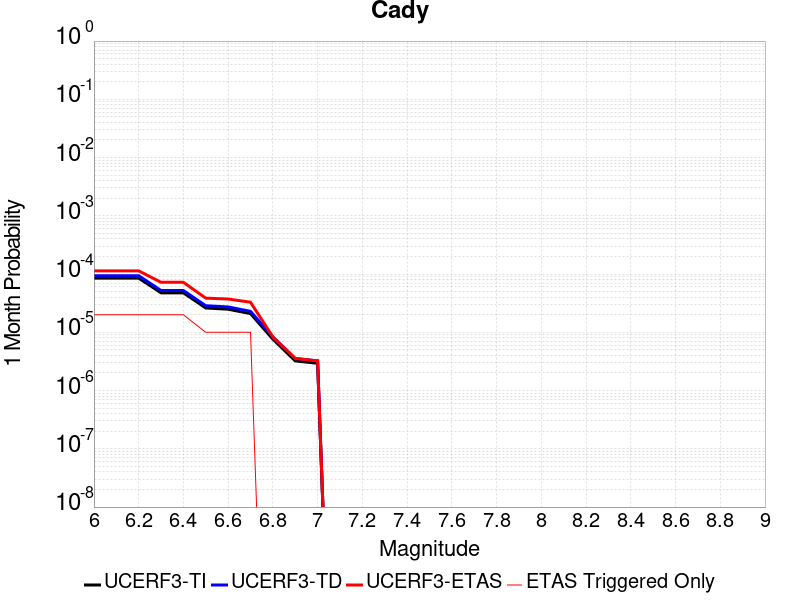 | 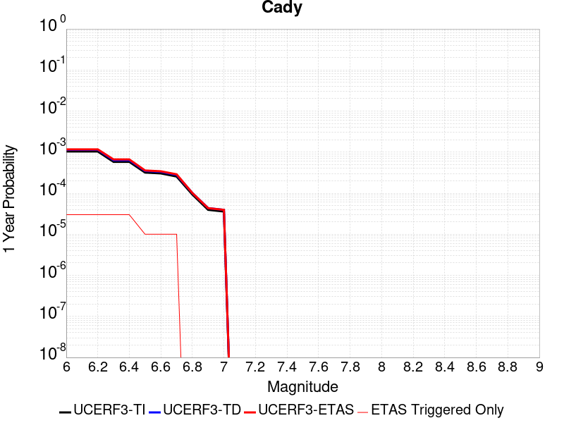 |  |

| Magnitude | 1 wk TI Prob | 1 wk TD Prob | 1 wk ETAS Prob | 1 wk ETAS/TD Gain | 1 wk ETAS Triggered Only | 1 mo TI Prob | 1 mo TD Prob | 1 mo ETAS Prob | 1 mo ETAS/TD Gain | 1 mo ETAS Triggered Only | 1 yr TI Prob | 1 yr TD Prob | 1 yr ETAS Prob | 1 yr ETAS/TD Gain | 1 yr ETAS Triggered Only | 10 yr TI Prob | 10 yr TD Prob | 10 yr ETAS Prob | 10 yr ETAS/TD Gain | 10 yr ETAS Triggered Only |
|-----|-----|-----|-----|-----|-----|-----|-----|-----|-----|-----|-----|-----|-----|-----|-----|-----|-----|-----|-----|-----|
| 6.0 | 1.9892565E-5 | 2.1859016E-5 | 4.1858577E-5 | 1.9149343 | 2.0E-5 | 8.525106E-5 | 9.3678645E-5 | 1.13676775E-4 | 1.2134758 | 2.0E-5 | 0.0010374374 | 0.0011400316 | 0.0011699975 | 1.026285 | 3.0E-5 | 0.010326075 | 0.011350849 | 0.011479373 | 1.0113229 | 1.3E-4 |
| 6.1 | 1.9892565E-5 | 2.1859016E-5 | 4.1858577E-5 | 1.9149343 | 2.0E-5 | 8.525106E-5 | 9.3678645E-5 | 1.13676775E-4 | 1.2134758 | 2.0E-5 | 0.0010374374 | 0.0011400316 | 0.0011699975 | 1.026285 | 3.0E-5 | 0.010326075 | 0.011350849 | 0.011479373 | 1.0113229 | 1.3E-4 |
| 6.2 | 1.9892565E-5 | 2.1859016E-5 | 4.1858577E-5 | 1.9149343 | 2.0E-5 | 8.525106E-5 | 9.3678645E-5 | 1.13676775E-4 | 1.2134758 | 2.0E-5 | 0.0010374374 | 0.0011400316 | 0.0011699975 | 1.026285 | 3.0E-5 | 0.010326075 | 0.011350849 | 0.011479373 | 1.0113229 | 1.3E-4 |
| 6.3 | 1.1117327E-5 | 1.2176738E-5 | 3.2176493E-5 | 2.642456 | 2.0E-5 | 4.764482E-5 | 5.218515E-5 | 7.2184106E-5 | 1.3832308 | 2.0E-5 | 5.7992124E-4 | 6.3520053E-4 | 6.651815E-4 | 1.0471991 | 3.0E-5 | 0.0057841022 | 0.0063369554 | 0.0064363214 | 1.0156804 | 1.0E-4 |
| 6.4 | 1.1117327E-5 | 1.2176738E-5 | 3.2176493E-5 | 2.642456 | 2.0E-5 | 4.764482E-5 | 5.218515E-5 | 7.2184106E-5 | 1.3832308 | 2.0E-5 | 5.7992124E-4 | 6.3520053E-4 | 6.651815E-4 | 1.0471991 | 3.0E-5 | 0.0057841022 | 0.0063369554 | 0.0064363214 | 1.0156804 | 1.0E-4 |
| 6.5 | 6.103093E-6 | 6.672103E-6 | 1.6672037E-5 | 2.4987679 | 1.0E-5 | 2.615585E-5 | 2.8594486E-5 | 3.85942E-5 | 1.3497077 | 1.0E-5 | 3.1840094E-4 | 3.4809482E-4 | 3.5809132E-4 | 1.0287178 | 1.0E-5 | 0.0031794512 | 0.0034767296 | 0.0034866948 | 1.0028663 | 1.0E-5 |
| 6.6 | 5.817237E-6 | 6.365738E-6 | 1.6365675E-5 | 2.5708997 | 1.0E-5 | 2.4930776E-5 | 2.728152E-5 | 3.7281246E-5 | 1.3665385 | 1.0E-5 | 3.034899E-4 | 3.3211432E-4 | 3.4211102E-4 | 1.0301001 | 1.0E-5 | 0.0030307577 | 0.003317402 | 0.0033273688 | 1.0030044 | 1.0E-5 |
| 6.7 | 4.8846314E-6 | 5.3406343E-6 | 1.5340582E-5 | 2.8724267 | 1.0E-5 | 2.0933967E-5 | 2.2888298E-5 | 3.288807E-5 | 1.4368944 | 1.0E-5 | 2.5484123E-4 | 2.7864118E-4 | 2.886384E-4 | 1.0358784 | 1.0E-5 | 0.0025454918 | 0.0027840736 | 0.0027940457 | 1.0035819 | 1.0E-5 |
| 6.8 | 1.7788773E-6 | 1.9399313E-6 | 1.9399313E-6 | 1.0 | 0.0 | 7.6237375E-6 | 8.313974E-6 | 8.313974E-6 | 1.0 | 0.0 | 9.281505E-5 | 1.01219506E-4 | 1.01219506E-4 | 1.0 | 0.0 | 9.2776294E-4 | 0.0010118886 | 0.0010118886 | 1.0 | 0.0 |
| 6.9 | 7.5455404E-7 | 8.297202E-7 | 8.297202E-7 | 1.0 | 0.0 | 3.233799E-6 | 3.5559406E-6 | 3.5559406E-6 | 1.0 | 0.0 | 3.937079E-5 | 4.3293054E-5 | 4.3293054E-5 | 1.0 | 0.0 | 3.9363815E-4 | 4.3287914E-4 | 4.3287914E-4 | 1.0 | 0.0 |
| 7.0 | 6.8578805E-7 | 7.541916E-7 | 7.541916E-7 | 1.0 | 0.0 | 2.9390883E-6 | 3.2322475E-6 | 3.2322475E-6 | 1.0 | 0.0 | 3.578281E-5 | 3.9352235E-5 | 3.9352235E-5 | 1.0 | 0.0 | 3.577705E-4 | 3.9348513E-4 | 3.9348513E-4 | 1.0 | 0.0 |

## Cleghorn Lake
*[(top)](#table-of-contents)*

| 1 Week | 1 Month | 1 Year | 10 Year |
|-----|-----|-----|-----|
|  |  | 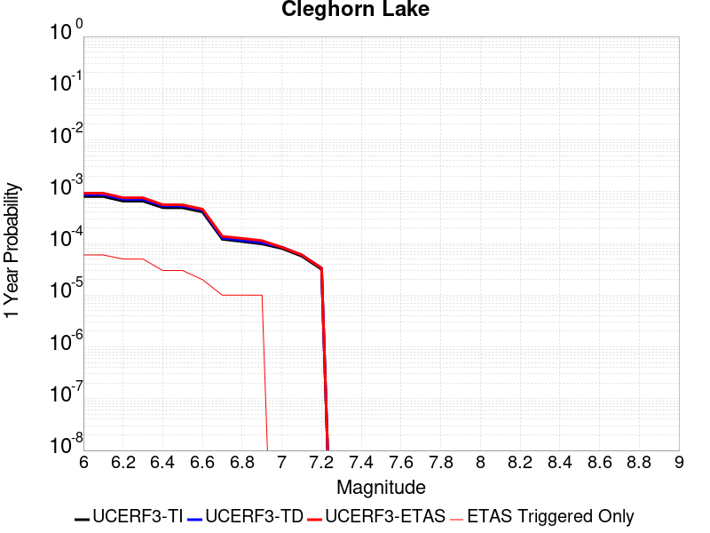 | 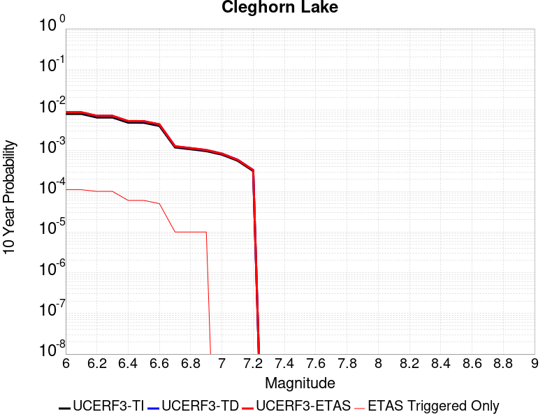 |

| Magnitude | 1 wk TI Prob | 1 wk TD Prob | 1 wk ETAS Prob | 1 wk ETAS/TD Gain | 1 wk ETAS Triggered Only | 1 mo TI Prob | 1 mo TD Prob | 1 mo ETAS Prob | 1 mo ETAS/TD Gain | 1 mo ETAS Triggered Only | 1 yr TI Prob | 1 yr TD Prob | 1 yr ETAS Prob | 1 yr ETAS/TD Gain | 1 yr ETAS Triggered Only | 10 yr TI Prob | 10 yr TD Prob | 10 yr ETAS Prob | 10 yr ETAS/TD Gain | 10 yr ETAS Triggered Only |
|-----|-----|-----|-----|-----|-----|-----|-----|-----|-----|-----|-----|-----|-----|-----|-----|-----|-----|-----|-----|-----|
| 6.0 | 1.5467183E-5 | 1.6794396E-5 | 1.6794396E-5 | 1.0 | 0.0 | 6.6286244E-5 | 7.1974304E-5 | 1.01972146E-4 | 1.4167855 | 3.0E-5 | 8.067362E-4 | 8.7598973E-4 | 9.3593716E-4 | 1.068434 | 6.0E-5 | 0.008038137 | 0.008730795 | 0.0088398345 | 1.0124891 | 1.1E-4 |
| 6.1 | 1.5467183E-5 | 1.6794396E-5 | 1.6794396E-5 | 1.0 | 0.0 | 6.6286244E-5 | 7.1974304E-5 | 1.01972146E-4 | 1.4167855 | 3.0E-5 | 8.067362E-4 | 8.7598973E-4 | 9.3593716E-4 | 1.068434 | 6.0E-5 | 0.008038137 | 0.008730795 | 0.0088398345 | 1.0124891 | 1.1E-4 |
| 6.2 | 1.2624631E-5 | 1.3681697E-5 | 1.3681697E-5 | 1.0 | 0.0 | 5.410444E-5 | 5.86348E-5 | 7.863363E-5 | 1.3410743 | 2.0E-5 | 6.585225E-4 | 7.1369356E-4 | 7.636579E-4 | 1.070008 | 5.0E-5 | 0.0065657445 | 0.007118811 | 0.007218099 | 1.0139472 | 1.0E-4 |
| 6.3 | 1.2624631E-5 | 1.3681697E-5 | 1.3681697E-5 | 1.0 | 0.0 | 5.410444E-5 | 5.86348E-5 | 7.863363E-5 | 1.3410743 | 2.0E-5 | 6.585225E-4 | 7.1369356E-4 | 7.636579E-4 | 1.070008 | 5.0E-5 | 0.0065657445 | 0.007118811 | 0.007218099 | 1.0139472 | 1.0E-4 |
| 6.4 | 9.417684E-6 | 1.0170226E-5 | 1.0170226E-5 | 1.0 | 0.0 | 4.036088E-5 | 4.3586184E-5 | 5.358575E-5 | 1.2294205 | 1.0E-5 | 4.912829E-4 | 5.305737E-4 | 5.6055776E-4 | 1.0565126 | 3.0E-5 | 0.004901982 | 0.0052971053 | 0.0053567877 | 1.011267 | 6.0E-5 |
| 6.5 | 9.368219E-6 | 1.0117652E-5 | 1.0117652E-5 | 1.0 | 0.0 | 4.014889E-5 | 4.3360877E-5 | 5.3360443E-5 | 1.2306126 | 1.0E-5 | 4.8870314E-4 | 5.278319E-4 | 5.5781606E-4 | 1.0568063 | 3.0E-5 | 0.004876298 | 0.0052698175 | 0.0053295013 | 1.0113256 | 6.0E-5 |
| 6.6 | 7.803798E-6 | 8.441923E-6 | 8.441923E-6 | 1.0 | 0.0 | 3.3444423E-5 | 3.6179394E-5 | 3.6179394E-5 | 1.0 | 0.0 | 4.0710976E-4 | 4.40435E-4 | 4.604262E-4 | 1.0453897 | 2.0E-5 | 0.0040636472 | 0.004399538 | 0.004449318 | 1.0113149 | 5.0E-5 |
| 6.7 | 2.3108669E-6 | 2.4438523E-6 | 2.4438523E-6 | 1.0 | 0.0 | 9.903678E-6 | 1.0473612E-5 | 1.0473612E-5 | 1.0 | 0.0 | 1.205706E-4 | 1.2750895E-4 | 1.3750767E-4 | 1.0784159 | 1.0E-5 | 0.001205052 | 0.0012743765 | 0.0012843638 | 1.0078369 | 1.0E-5 |
| 6.8 | 2.0882828E-6 | 2.2062986E-6 | 2.2062986E-6 | 1.0 | 0.0 | 8.949753E-6 | 9.455533E-6 | 9.455533E-6 | 1.0 | 0.0 | 1.08957785E-4 | 1.15115196E-4 | 1.2511405E-4 | 1.0868595 | 1.0E-5 | 0.0010890438 | 0.0011505726 | 0.0011605611 | 1.0086813 | 1.0E-5 |
| 6.9 | 1.876935E-6 | 1.9810657E-6 | 1.9810657E-6 | 1.0 | 0.0 | 8.043982E-6 | 8.490254E-6 | 8.490254E-6 | 1.0 | 0.0 | 9.7931086E-5 | 1.033641E-4 | 1.1336307E-4 | 1.0967354 | 1.0E-5 | 9.788794E-4 | 0.0010331762 | 0.0010431659 | 1.009669 | 1.0E-5 |
| 7.0 | 1.5357559E-6 | 1.6202926E-6 | 1.6202926E-6 | 1.0 | 0.0 | 6.5817944E-6 | 6.944093E-6 | 6.944093E-6 | 1.0 | 0.0 | 8.01304E-5 | 8.454118E-5 | 8.454118E-5 | 1.0 | 0.0 | 8.010151E-4 | 8.4510265E-4 | 8.4510265E-4 | 1.0 | 0.0 |
| 7.1 | 1.0905424E-6 | 1.1497702E-6 | 1.1497702E-6 | 1.0 | 0.0 | 4.6737446E-6 | 4.927578E-6 | 4.927578E-6 | 1.0 | 0.0 | 5.6901354E-5 | 5.999171E-5 | 5.999171E-5 | 1.0 | 0.0 | 5.6886784E-4 | 5.997649E-4 | 5.997649E-4 | 1.0 | 0.0 |
| 7.2 | 6.06668E-7 | 6.387322E-7 | 6.387322E-7 | 1.0 | 0.0 | 2.600003E-6 | 2.7374213E-6 | 2.7374213E-6 | 1.0 | 0.0 | 3.1654577E-5 | 3.3327666E-5 | 3.3327666E-5 | 1.0 | 0.0 | 3.1650066E-4 | 3.332335E-4 | 3.332335E-4 | 1.0 | 0.0 |

## San Jacinto (Anza) rev
*[(top)](#table-of-contents)*

| 1 Week | 1 Month | 1 Year | 10 Year |
|-----|-----|-----|-----|
|  |  |  |  |

| Magnitude | 1 wk TI Prob | 1 wk TD Prob | 1 wk ETAS Prob | 1 wk ETAS/TD Gain | 1 wk ETAS Triggered Only | 1 mo TI Prob | 1 mo TD Prob | 1 mo ETAS Prob | 1 mo ETAS/TD Gain | 1 mo ETAS Triggered Only | 1 yr TI Prob | 1 yr TD Prob | 1 yr ETAS Prob | 1 yr ETAS/TD Gain | 1 yr ETAS Triggered Only | 10 yr TI Prob | 10 yr TD Prob | 10 yr ETAS Prob | 10 yr ETAS/TD Gain | 10 yr ETAS Triggered Only |
|-----|-----|-----|-----|-----|-----|-----|-----|-----|-----|-----|-----|-----|-----|-----|-----|-----|-----|-----|-----|-----|
| 6.0 | 6.3015636E-5 | 4.3312386E-5 | 4.3312386E-5 | 1.0 | 0.0 | 2.7003905E-4 | 1.8561137E-4 | 1.9560951E-4 | 1.053866 | 1.0E-5 | 0.0032827691 | 0.0022574882 | 0.002297398 | 1.0176789 | 4.0E-5 | 0.032346968 | 0.023307782 | 0.023424985 | 1.0050285 | 1.2E-4 |
| 6.1 | 6.3015636E-5 | 4.3312386E-5 | 4.3312386E-5 | 1.0 | 0.0 | 2.7003905E-4 | 1.8561137E-4 | 1.9560951E-4 | 1.053866 | 1.0E-5 | 0.0032827691 | 0.0022574882 | 0.002297398 | 1.0176789 | 4.0E-5 | 0.032346968 | 0.023307782 | 0.023424985 | 1.0050285 | 1.2E-4 |
| 6.2 | 6.3015636E-5 | 4.3312386E-5 | 4.3312386E-5 | 1.0 | 0.0 | 2.7003905E-4 | 1.8561137E-4 | 1.9560951E-4 | 1.053866 | 1.0E-5 | 0.0032827691 | 0.0022574882 | 0.002297398 | 1.0176789 | 4.0E-5 | 0.032346968 | 0.023307782 | 0.023424985 | 1.0050285 | 1.2E-4 |
| 6.3 | 6.3015636E-5 | 4.3312386E-5 | 4.3312386E-5 | 1.0 | 0.0 | 2.7003905E-4 | 1.8561137E-4 | 1.9560951E-4 | 1.053866 | 1.0E-5 | 0.0032827691 | 0.0022574882 | 0.002297398 | 1.0176789 | 4.0E-5 | 0.032346968 | 0.023307782 | 0.023424985 | 1.0050285 | 1.2E-4 |
| 6.4 | 6.3015636E-5 | 4.3312386E-5 | 4.3312386E-5 | 1.0 | 0.0 | 2.7003905E-4 | 1.8561137E-4 | 1.9560951E-4 | 1.053866 | 1.0E-5 | 0.0032827691 | 0.0022574882 | 0.002297398 | 1.0176789 | 4.0E-5 | 0.032346968 | 0.023307782 | 0.023424985 | 1.0050285 | 1.2E-4 |
| 6.5 | 5.811017E-5 | 4.009432E-5 | 4.009432E-5 | 1.0 | 0.0 | 2.4901982E-4 | 1.7182152E-4 | 1.818198E-4 | 1.0581899 | 1.0E-5 | 0.0030276014 | 0.0020899256 | 0.002129842 | 1.0190995 | 4.0E-5 | 0.02986684 | 0.021605028 | 0.021722436 | 1.0054343 | 1.2E-4 |
| 6.6 | 5.811017E-5 | 4.009432E-5 | 4.009432E-5 | 1.0 | 0.0 | 2.4901982E-4 | 1.7182152E-4 | 1.818198E-4 | 1.0581899 | 1.0E-5 | 0.0030276014 | 0.0020899256 | 0.002129842 | 1.0190995 | 4.0E-5 | 0.02986684 | 0.021605028 | 0.021722436 | 1.0054343 | 1.2E-4 |
| 6.7 | 5.712442E-5 | 3.951705E-5 | 3.951705E-5 | 1.0 | 0.0 | 2.4479596E-4 | 1.6934783E-4 | 1.7934613E-4 | 1.0590401 | 1.0E-5 | 0.0029763177 | 0.0020598655 | 0.0020997832 | 1.0193788 | 4.0E-5 | 0.029367693 | 0.021297079 | 0.021414524 | 1.0055146 | 1.2E-4 |
| 6.8 | 5.6967532E-5 | 3.9373335E-5 | 3.9373335E-5 | 1.0 | 0.0 | 2.4412372E-4 | 1.6873197E-4 | 1.7873029E-4 | 1.0592556 | 1.0E-5 | 0.0029681553 | 0.0020523819 | 0.0020922998 | 1.0194496 | 4.0E-5 | 0.029288229 | 0.02122268 | 0.021340134 | 1.0055343 | 1.2E-4 |
| 6.9 | 5.6211324E-5 | 3.9078248E-5 | 3.9078248E-5 | 1.0 | 0.0 | 2.4088343E-4 | 1.6746749E-4 | 1.7746582E-4 | 1.0597031 | 1.0E-5 | 0.0029288116 | 0.0020370155 | 0.0020769339 | 1.0195966 | 4.0E-5 | 0.028905109 | 0.021060992 | 0.021178465 | 1.0055777 | 1.2E-4 |
| 7.0 | 5.4383527E-5 | 3.793897E-5 | 3.793897E-5 | 1.0 | 0.0 | 2.3305144E-4 | 1.6258548E-4 | 1.7258387E-4 | 1.0614961 | 1.0E-5 | 0.0028337094 | 0.001977686 | 0.002017607 | 1.0201857 | 4.0E-5 | 0.027978465 | 0.020454587 | 0.020572131 | 1.0057466 | 1.2E-4 |
| 7.1 | 5.1393665E-5 | 3.6401827E-5 | 3.6401827E-5 | 1.0 | 0.0 | 2.2023996E-4 | 1.5599852E-4 | 1.6599697E-4 | 1.0640931 | 1.0E-5 | 0.0026781242 | 0.0018976318 | 0.0019375558 | 1.0210389 | 4.0E-5 | 0.026460782 | 0.019625481 | 0.019743126 | 1.0059946 | 1.2E-4 |
| 7.2 | 4.785222E-5 | 3.4752728E-5 | 3.4752728E-5 | 1.0 | 0.0 | 2.0506482E-4 | 1.4893178E-4 | 1.589303E-4 | 1.0671349 | 1.0E-5 | 0.0024938055 | 0.0018117399 | 0.0018516674 | 1.0220382 | 4.0E-5 | 0.024660049 | 0.018735653 | 0.018853404 | 1.006285 | 1.2E-4 |
| 7.3 | 4.2143256E-5 | 3.384821E-5 | 3.384821E-5 | 1.0 | 0.0 | 1.8060145E-4 | 1.4505572E-4 | 1.5505427E-4 | 1.0689291 | 1.0E-5 | 0.002196605 | 0.0017646261 | 0.0018045555 | 1.0226277 | 4.0E-5 | 0.02175019 | 0.018243507 | 0.018361317 | 1.0064577 | 1.2E-4 |
| 7.4 | 4.0264713E-5 | 3.348636E-5 | 3.348636E-5 | 1.0 | 0.0 | 1.7255165E-4 | 1.4350511E-4 | 1.5350367E-4 | 1.0696739 | 1.0E-5 | 0.002098792 | 0.0017457779 | 0.001785708 | 1.0228724 | 4.0E-5 | 0.020790804 | 0.018048115 | 0.01816595 | 1.0065289 | 1.2E-4 |
| 7.5 | 3.694492E-5 | 3.2200267E-5 | 3.2200267E-5 | 1.0 | 0.0 | 1.5832575E-4 | 1.3799386E-4 | 1.4799248E-4 | 1.072457 | 1.0E-5 | 0.0019259118 | 0.0016787836 | 0.0017187165 | 1.0237868 | 4.0E-5 | 0.01909306 | 0.017364455 | 0.017482372 | 1.0067906 | 1.2E-4 |
| 7.6 | 3.200565E-5 | 2.9515684E-5 | 2.9515684E-5 | 1.0 | 0.0 | 1.3715986E-4 | 1.2648967E-4 | 1.3648841E-4 | 1.0790478 | 1.0E-5 | 0.001668642 | 0.001538926 | 0.0015788645 | 1.0259521 | 4.0E-5 | 0.01656168 | 0.015952358 | 0.016070442 | 1.0074024 | 1.2E-4 |
| 7.7 | 2.731642E-5 | 2.6104135E-5 | 2.6104135E-5 | 1.0 | 0.0 | 1.1706512E-4 | 1.11870075E-4 | 1.2186896E-4 | 1.0893794 | 1.0E-5 | 0.001424336 | 0.0013611682 | 0.0014011137 | 1.0293465 | 4.0E-5 | 0.014152412 | 0.014172893 | 0.014291192 | 1.0083469 | 1.2E-4 |
| 7.8 | 2.3466424E-5 | 2.3515782E-5 | 2.3515782E-5 | 1.0 | 0.0 | 1.0056651E-4 | 1.0077804E-4 | 1.1077703E-4 | 1.099218 | 1.0E-5 | 0.0012237094 | 0.0012262828 | 0.0012662337 | 1.032579 | 4.0E-5 | 0.012169928 | 0.012814545 | 0.012933007 | 1.0092443 | 1.2E-4 |
| 7.9 | 1.8611925E-5 | 1.8917919E-5 | 1.8917919E-5 | 1.0 | 0.0 | 7.9762955E-5 | 8.107428E-5 | 9.107347E-5 | 1.1233337 | 1.0E-5 | 9.7068126E-4 | 9.86633E-4 | 0.0010265936 | 1.040502 | 4.0E-5 | 0.0096645225 | 0.010399014 | 0.01050787 | 1.0104679 | 1.1E-4 |
| 8.0 | 1.5460775E-5 | 1.5749598E-5 | 1.5749598E-5 | 1.0 | 0.0 | 6.6258784E-5 | 6.7496534E-5 | 7.749586E-5 | 1.1481458 | 1.0E-5 | 8.0640207E-4 | 8.2146114E-4 | 8.514365E-4 | 1.0364903 | 3.0E-5 | 0.008034821 | 0.008707448 | 0.008806578 | 1.0113844 | 1.0E-4 |
| 8.1 | 9.983884E-6 | 8.274653E-6 | 8.274653E-6 | 1.0 | 0.0 | 4.2787375E-5 | 3.546232E-5 | 3.546232E-5 | 1.0 | 0.0 | 5.2081177E-4 | 4.316687E-4 | 4.416644E-4 | 1.0231559 | 1.0E-5 | 0.0051959283 | 0.0046425606 | 0.004672421 | 1.0064319 | 3.0E-5 |
| 8.2 | 4.1226E-6 | 1.5539142E-6 | 1.5539142E-6 | 1.0 | 0.0 | 1.7668166E-5 | 6.6596153E-6 | 6.6596153E-6 | 1.0 | 0.0 | 2.1508869E-4 | 8.107783E-5 | 8.107783E-5 | 1.0 | 0.0 | 0.0021488064 | 9.410467E-4 | 9.410467E-4 | 1.0 | 0.0 |
| 8.3 | 1.2750878E-6 | 3.6143226E-7 | 3.6143226E-7 | 1.0 | 0.0 | 5.4646503E-6 | 1.5489944E-6 | 1.5489944E-6 | 1.0 | 0.0 | 6.653009E-5 | 1.8858847E-5 | 1.8858847E-5 | 1.0 | 0.0 | 6.6510175E-4 | 2.2747046E-4 | 2.2747046E-4 | 1.0 | 0.0 |

## Manix-Afton Hills
*[(top)](#table-of-contents)*

| 1 Week | 1 Month | 1 Year | 10 Year |
|-----|-----|-----|-----|
|  |  |  |  |

| Magnitude | 1 wk TI Prob | 1 wk TD Prob | 1 wk ETAS Prob | 1 wk ETAS/TD Gain | 1 wk ETAS Triggered Only | 1 mo TI Prob | 1 mo TD Prob | 1 mo ETAS Prob | 1 mo ETAS/TD Gain | 1 mo ETAS Triggered Only | 1 yr TI Prob | 1 yr TD Prob | 1 yr ETAS Prob | 1 yr ETAS/TD Gain | 1 yr ETAS Triggered Only | 10 yr TI Prob | 10 yr TD Prob | 10 yr ETAS Prob | 10 yr ETAS/TD Gain | 10 yr ETAS Triggered Only |
|-----|-----|-----|-----|-----|-----|-----|-----|-----|-----|-----|-----|-----|-----|-----|-----|-----|-----|-----|-----|-----|
| 6.0 | 1.3783202E-5 | 1.4711221E-5 | 1.4711221E-5 | 1.0 | 0.0 | 5.906953E-5 | 6.304667E-5 | 6.304667E-5 | 1.0 | 0.0 | 7.189342E-4 | 7.673403E-4 | 8.0730964E-4 | 1.0520881 | 4.0E-5 | 0.0071661277 | 0.007648664 | 0.0077578225 | 1.0142716 | 1.1E-4 |
| 6.1 | 1.3783202E-5 | 1.4711221E-5 | 1.4711221E-5 | 1.0 | 0.0 | 5.906953E-5 | 6.304667E-5 | 6.304667E-5 | 1.0 | 0.0 | 7.189342E-4 | 7.673403E-4 | 8.0730964E-4 | 1.0520881 | 4.0E-5 | 0.0071661277 | 0.007648664 | 0.0077578225 | 1.0142716 | 1.1E-4 |
| 6.2 | 1.3783202E-5 | 1.4711221E-5 | 1.4711221E-5 | 1.0 | 0.0 | 5.906953E-5 | 6.304667E-5 | 6.304667E-5 | 1.0 | 0.0 | 7.189342E-4 | 7.673403E-4 | 8.0730964E-4 | 1.0520881 | 4.0E-5 | 0.0071661277 | 0.007648664 | 0.0077578225 | 1.0142716 | 1.1E-4 |
| 6.3 | 1.10494875E-5 | 1.1793241E-5 | 1.1793241E-5 | 1.0 | 0.0 | 4.7354086E-5 | 5.054154E-5 | 5.054154E-5 | 1.0 | 0.0 | 5.763835E-4 | 6.151799E-4 | 6.351676E-4 | 1.0324908 | 2.0E-5 | 0.005748908 | 0.00613581 | 0.0062153195 | 1.0129582 | 8.0E-5 |
| 6.4 | 1.10494875E-5 | 1.1793241E-5 | 1.1793241E-5 | 1.0 | 0.0 | 4.7354086E-5 | 5.054154E-5 | 5.054154E-5 | 1.0 | 0.0 | 5.763835E-4 | 6.151799E-4 | 6.351676E-4 | 1.0324908 | 2.0E-5 | 0.005748908 | 0.00613581 | 0.0062153195 | 1.0129582 | 8.0E-5 |
| 6.5 | 9.788949E-6 | 1.0454414E-5 | 1.0454414E-5 | 1.0 | 0.0 | 4.1951964E-5 | 4.4803914E-5 | 4.4803914E-5 | 1.0 | 0.0 | 5.1064545E-4 | 5.4536044E-4 | 5.6534953E-4 | 1.036653 | 2.0E-5 | 0.0050947363 | 0.005441148 | 0.005520712 | 1.0146228 | 8.0E-5 |
| 6.6 | 8.810006E-6 | 9.413714E-6 | 9.413714E-6 | 1.0 | 0.0 | 3.775662E-5 | 4.0343915E-5 | 4.0343915E-5 | 1.0 | 0.0 | 4.5958988E-4 | 4.9108535E-4 | 5.010804E-4 | 1.0203531 | 1.0E-5 | 0.0045864056 | 0.004900884 | 0.0049605896 | 1.0121827 | 6.0E-5 |
| 6.7 | 8.80128E-6 | 9.404193E-6 | 9.404193E-6 | 1.0 | 0.0 | 3.7719226E-5 | 4.0303115E-5 | 4.0303115E-5 | 1.0 | 0.0 | 4.591348E-4 | 4.9058883E-4 | 5.005839E-4 | 1.0203737 | 1.0E-5 | 0.004581874 | 0.0048959404 | 0.0049556466 | 1.0121951 | 6.0E-5 |
| 6.8 | 6.8994877E-6 | 7.3801443E-6 | 7.3801443E-6 | 1.0 | 0.0 | 2.9568899E-5 | 3.1628853E-5 | 3.1628853E-5 | 1.0 | 0.0 | 3.5994186E-4 | 3.850214E-4 | 3.9501756E-4 | 1.0259626 | 1.0E-5 | 0.003593594 | 0.0038443485 | 0.0039041177 | 1.0155473 | 6.0E-5 |
| 6.9 | 4.9328037E-6 | 5.2710093E-6 | 5.2710093E-6 | 1.0 | 0.0 | 2.1140417E-5 | 2.258988E-5 | 2.258988E-5 | 1.0 | 0.0 | 2.5735417E-4 | 2.7500323E-4 | 2.8500048E-4 | 1.0363532 | 1.0E-5 | 0.0025705635 | 0.0027472344 | 0.0028070696 | 1.0217801 | 6.0E-5 |
| 7.0 | 3.347973E-6 | 3.5900646E-6 | 3.5900646E-6 | 1.0 | 0.0 | 1.4348378E-5 | 1.5385924E-5 | 1.5385924E-5 | 1.0 | 0.0 | 1.746775E-4 | 1.8731161E-4 | 1.9730974E-4 | 1.0533769 | 1.0E-5 | 0.0017454025 | 0.00187194 | 0.0019118651 | 1.0213282 | 4.0E-5 |
| 7.1 | 1.2073567E-6 | 1.2934943E-6 | 1.2934943E-6 | 1.0 | 0.0 | 5.1743755E-6 | 5.5435444E-6 | 5.5435444E-6 | 1.0 | 0.0 | 6.29962E-5 | 6.74922E-5 | 7.7491524E-5 | 1.1481553 | 1.0E-5 | 6.297835E-4 | 6.7487714E-4 | 6.948636E-4 | 1.029615 | 2.0E-5 |

## Pinto Mtn
*[(top)](#table-of-contents)*

| 1 Week | 1 Month | 1 Year | 10 Year |
|-----|-----|-----|-----|
|  | 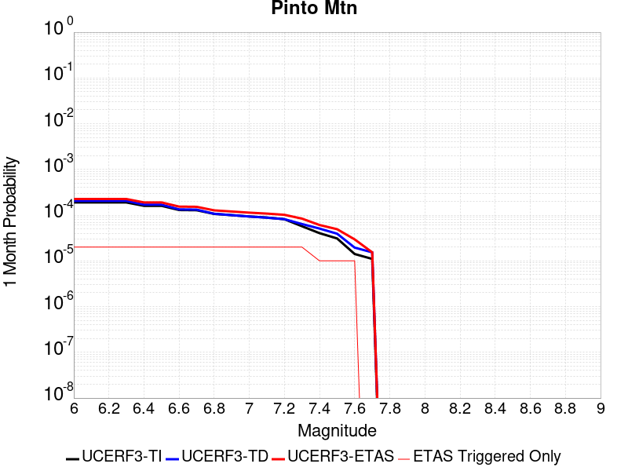 |  |  |

| Magnitude | 1 wk TI Prob | 1 wk TD Prob | 1 wk ETAS Prob | 1 wk ETAS/TD Gain | 1 wk ETAS Triggered Only | 1 mo TI Prob | 1 mo TD Prob | 1 mo ETAS Prob | 1 mo ETAS/TD Gain | 1 mo ETAS Triggered Only | 1 yr TI Prob | 1 yr TD Prob | 1 yr ETAS Prob | 1 yr ETAS/TD Gain | 1 yr ETAS Triggered Only | 10 yr TI Prob | 10 yr TD Prob | 10 yr ETAS Prob | 10 yr ETAS/TD Gain | 10 yr ETAS Triggered Only |
|-----|-----|-----|-----|-----|-----|-----|-----|-----|-----|-----|-----|-----|-----|-----|-----|-----|-----|-----|-----|-----|
| 6.0 | 4.4194956E-5 | 4.7855512E-5 | 5.785503E-5 | 1.2089523 | 1.0E-5 | 1.893932E-4 | 2.0507984E-4 | 2.2507572E-4 | 1.097503 | 2.0E-5 | 0.0023034236 | 0.0024941512 | 0.0025240765 | 1.0119982 | 3.0E-5 | 0.022796938 | 0.024679113 | 0.024776645 | 1.003952 | 1.0E-4 |
| 6.1 | 4.4194956E-5 | 4.7855512E-5 | 5.785503E-5 | 1.2089523 | 1.0E-5 | 1.893932E-4 | 2.0507984E-4 | 2.2507572E-4 | 1.097503 | 2.0E-5 | 0.0023034236 | 0.0024941512 | 0.0025240765 | 1.0119982 | 3.0E-5 | 0.022796938 | 0.024679113 | 0.024776645 | 1.003952 | 1.0E-4 |
| 6.2 | 4.4194956E-5 | 4.7855512E-5 | 5.785503E-5 | 1.2089523 | 1.0E-5 | 1.893932E-4 | 2.0507984E-4 | 2.2507572E-4 | 1.097503 | 2.0E-5 | 0.0023034236 | 0.0024941512 | 0.0025240765 | 1.0119982 | 3.0E-5 | 0.022796938 | 0.024679113 | 0.024776645 | 1.003952 | 1.0E-4 |
| 6.3 | 4.4194956E-5 | 4.7855512E-5 | 5.785503E-5 | 1.2089523 | 1.0E-5 | 1.893932E-4 | 2.0507984E-4 | 2.2507572E-4 | 1.097503 | 2.0E-5 | 0.0023034236 | 0.0024941512 | 0.0025240765 | 1.0119982 | 3.0E-5 | 0.022796938 | 0.024679113 | 0.024776645 | 1.003952 | 1.0E-4 |
| 6.4 | 3.729929E-5 | 3.960486E-5 | 4.9604467E-5 | 1.2524842 | 1.0E-5 | 1.5984432E-4 | 1.697246E-4 | 1.897212E-4 | 1.117818 | 2.0E-5 | 0.0019443673 | 0.002064532 | 0.00209447 | 1.0145011 | 3.0E-5 | 0.019274427 | 0.02046355 | 0.020551708 | 1.0043081 | 9.0E-5 |
| 6.5 | 3.729929E-5 | 3.960486E-5 | 4.9604467E-5 | 1.2524842 | 1.0E-5 | 1.5984432E-4 | 1.697246E-4 | 1.897212E-4 | 1.117818 | 2.0E-5 | 0.0019443673 | 0.002064532 | 0.00209447 | 1.0145011 | 3.0E-5 | 0.019274427 | 0.02046355 | 0.020551708 | 1.0043081 | 9.0E-5 |
| 6.6 | 3.0204548E-5 | 3.1206768E-5 | 4.1206455E-5 | 1.3204334 | 1.0E-5 | 1.2944164E-4 | 1.3373663E-4 | 1.5373396E-4 | 1.1495277 | 2.0E-5 | 0.0015748127 | 0.001627062 | 0.0016470294 | 1.0122721 | 2.0E-5 | 0.015636992 | 0.016155364 | 0.016234072 | 1.004872 | 8.0E-5 |
| 6.7 | 2.9857754E-5 | 3.0816143E-5 | 4.0815838E-5 | 1.3244952 | 1.0E-5 | 1.2795553E-4 | 1.320627E-4 | 1.5206006E-4 | 1.1514232 | 2.0E-5 | 0.0015567453 | 0.0016067121 | 0.00162668 | 1.0124278 | 2.0E-5 | 0.015458848 | 0.0159548 | 0.016023682 | 1.0043174 | 7.0E-5 |
| 6.8 | 2.4819734E-5 | 2.5010708E-5 | 3.5010456E-5 | 1.3998188 | 1.0E-5 | 1.0636595E-4 | 1.0718447E-4 | 1.2718233E-4 | 1.1865742 | 2.0E-5 | 0.0012942362 | 0.0013042113 | 0.0013241853 | 1.0153149 | 2.0E-5 | 0.012867244 | 0.0129679395 | 0.013027162 | 1.0045668 | 6.0E-5 |
| 6.9 | 2.331124E-5 | 2.3338964E-5 | 3.333873E-5 | 1.4284581 | 1.0E-5 | 9.990149E-5 | 1.0002041E-4 | 1.20018405E-4 | 1.1999393 | 2.0E-5 | 0.001215622 | 0.0012170885 | 0.0012370643 | 1.0164126 | 2.0E-5 | 0.012089936 | 0.012106422 | 0.012165695 | 1.004896 | 6.0E-5 |
| 7.0 | 2.1818534E-5 | 2.176207E-5 | 3.1761854E-5 | 1.4595051 | 1.0E-5 | 9.3504656E-5 | 9.3262795E-5 | 1.1326093E-4 | 1.2144278 | 2.0E-5 | 0.0011378246 | 0.0011349028 | 0.0011548802 | 1.0176027 | 2.0E-5 | 0.011320163 | 0.011293174 | 0.011342609 | 1.0043775 | 5.0E-5 |
| 7.1 | 2.066081E-5 | 2.0541695E-5 | 3.054149E-5 | 1.4868047 | 1.0E-5 | 8.854332E-5 | 8.8032975E-5 | 1.08031214E-4 | 1.2271676 | 2.0E-5 | 0.0010774818 | 0.001071294 | 0.0010912726 | 1.018649 | 2.0E-5 | 0.010722724 | 0.010663347 | 0.0107128145 | 1.0046389 | 5.0E-5 |
| 7.2 | 1.8990233E-5 | 1.905496E-5 | 2.905477E-5 | 1.5247878 | 1.0E-5 | 8.138417E-5 | 8.166167E-5 | 1.01660036E-4 | 1.244893 | 2.0E-5 | 9.904018E-4 | 9.937966E-4 | 0.0010137768 | 1.0201049 | 2.0E-5 | 0.009859995 | 0.009895524 | 0.009945029 | 1.0050027 | 5.0E-5 |
| 7.3 | 1.3335872E-5 | 1.4907597E-5 | 2.4907447E-5 | 1.6707889 | 1.0E-5 | 5.7152483E-5 | 6.388821E-5 | 8.388693E-5 | 1.3130268 | 2.0E-5 | 6.956093E-4 | 7.7757414E-4 | 7.975586E-4 | 1.025701 | 2.0E-5 | 0.006934359 | 0.007749834 | 0.0077994466 | 1.0064018 | 5.0E-5 |
| 7.4 | 9.414066E-6 | 1.1861796E-5 | 1.1861796E-5 | 1.0 | 0.0 | 4.0345374E-5 | 5.0835333E-5 | 6.0834824E-5 | 1.1967036 | 1.0E-5 | 4.910942E-4 | 6.1875384E-4 | 6.287476E-4 | 1.0161515 | 1.0E-5 | 0.0049001034 | 0.006171259 | 0.006201074 | 1.0048312 | 3.0E-5 |
| 7.5 | 7.2101157E-6 | 9.15899E-6 | 9.15899E-6 | 1.0 | 0.0 | 3.090013E-5 | 3.925227E-5 | 4.9251877E-5 | 1.2547524 | 1.0E-5 | 3.7614413E-4 | 4.777994E-4 | 4.877946E-4 | 1.0209193 | 1.0E-5 | 0.0037550807 | 0.004768497 | 0.004788401 | 1.0041742 | 2.0E-5 |
| 7.6 | 3.296375E-6 | 4.546278E-6 | 4.546278E-6 | 1.0 | 0.0 | 1.4127245E-5 | 1.948391E-5 | 2.9483715E-5 | 1.513234 | 1.0E-5 | 1.7198564E-4 | 2.3719217E-4 | 2.471898E-4 | 1.0421499 | 1.0E-5 | 0.0017185259 | 0.0023695275 | 0.0023795038 | 1.0042102 | 1.0E-5 |
| 7.7 | 2.5741092E-6 | 3.5851394E-6 | 3.5851394E-6 | 1.0 | 0.0 | 1.103185E-5 | 1.53648E-5 | 1.53648E-5 | 1.0 | 0.0 | 1.3430449E-4 | 1.870517E-4 | 1.870517E-4 | 1.0 | 0.0 | 0.0013422335 | 0.0018690726 | 0.0018690726 | 1.0 | 0.0 |

## Ortigalita (North)
*[(top)](#table-of-contents)*

| 1 Week | 1 Month | 1 Year | 10 Year |
|-----|-----|-----|-----|
|  |  |  | 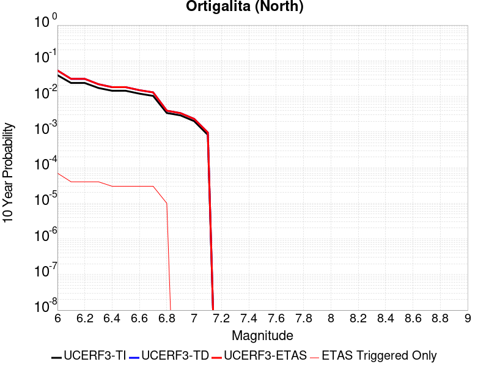 |

| Magnitude | 1 wk TI Prob | 1 wk TD Prob | 1 wk ETAS Prob | 1 wk ETAS/TD Gain | 1 wk ETAS Triggered Only | 1 mo TI Prob | 1 mo TD Prob | 1 mo ETAS Prob | 1 mo ETAS/TD Gain | 1 mo ETAS Triggered Only | 1 yr TI Prob | 1 yr TD Prob | 1 yr ETAS Prob | 1 yr ETAS/TD Gain | 1 yr ETAS Triggered Only | 10 yr TI Prob | 10 yr TD Prob | 10 yr ETAS Prob | 10 yr ETAS/TD Gain | 10 yr ETAS Triggered Only |
|-----|-----|-----|-----|-----|-----|-----|-----|-----|-----|-----|-----|-----|-----|-----|-----|-----|-----|-----|-----|-----|
| 6.0 | 7.711876E-5 | 1.0505833E-4 | 1.0505833E-4 | 1.0 | 0.0 | 3.3046713E-4 | 4.50182E-4 | 4.50182E-4 | 1.0 | 0.0 | 0.004016016 | 0.005468294 | 0.0054881847 | 1.0036374 | 2.0E-5 | 0.039442103 | 0.053457875 | 0.053524133 | 1.0012394 | 7.0E-5 |
| 6.1 | 4.607858E-5 | 6.024242E-5 | 6.024242E-5 | 1.0 | 0.0 | 1.9746469E-4 | 2.5815787E-4 | 2.5815787E-4 | 1.0 | 0.0 | 0.0024014818 | 0.003138861 | 0.0031587982 | 1.0063517 | 2.0E-5 | 0.023756953 | 0.03097651 | 0.03101527 | 1.0012513 | 4.0E-5 |
| 6.2 | 4.607858E-5 | 6.024242E-5 | 6.024242E-5 | 1.0 | 0.0 | 1.9746469E-4 | 2.5815787E-4 | 2.5815787E-4 | 1.0 | 0.0 | 0.0024014818 | 0.003138861 | 0.0031587982 | 1.0063517 | 2.0E-5 | 0.023756953 | 0.03097651 | 0.03101527 | 1.0012513 | 4.0E-5 |
| 6.3 | 3.327423E-5 | 4.247773E-5 | 4.247773E-5 | 1.0 | 0.0 | 1.4259605E-4 | 1.8203634E-4 | 1.8203634E-4 | 1.0 | 0.0 | 0.0017347244 | 0.0022142874 | 0.0022242651 | 1.0045061 | 1.0E-5 | 0.017212452 | 0.021946533 | 0.021985654 | 1.0017827 | 4.0E-5 |
| 6.4 | 2.7732503E-5 | 3.5000263E-5 | 3.5000263E-5 | 1.0 | 0.0 | 1.1884817E-4 | 1.499939E-4 | 1.499939E-4 | 1.0 | 0.0 | 0.001446016 | 0.0018248801 | 0.0018348618 | 1.0054698 | 1.0E-5 | 0.014366428 | 0.018121928 | 0.018151386 | 1.0016254 | 3.0E-5 |
| 6.5 | 2.7689714E-5 | 3.4950077E-5 | 3.4950077E-5 | 1.0 | 0.0 | 1.186648E-4 | 1.4977883E-4 | 1.4977883E-4 | 1.0 | 0.0 | 0.0014437864 | 0.001822266 | 0.0018322478 | 1.0054777 | 1.0E-5 | 0.014344421 | 0.018096214 | 0.018125672 | 1.0016278 | 3.0E-5 |
| 6.6 | 2.2976905E-5 | 2.8719278E-5 | 2.8719278E-5 | 1.0 | 0.0 | 9.846873E-5 | 1.2307824E-4 | 1.2307824E-4 | 1.0 | 0.0 | 0.0011981975 | 0.0014976859 | 0.0015076709 | 1.006667 | 1.0E-5 | 0.011917574 | 0.014899237 | 0.01492879 | 1.0019835 | 3.0E-5 |
| 6.7 | 1.9871539E-5 | 2.4905505E-5 | 2.4905505E-5 | 1.0 | 0.0 | 8.516096E-5 | 1.0673491E-4 | 1.0673491E-4 | 1.0 | 0.0 | 0.0010363415 | 0.001298965 | 0.001308952 | 1.0076884 | 1.0E-5 | 0.010315218 | 0.012937383 | 0.012966995 | 1.0022888 | 3.0E-5 |
| 6.8 | 6.5640475E-6 | 7.6056526E-6 | 7.6056526E-6 | 1.0 | 0.0 | 2.813133E-5 | 3.2595264E-5 | 3.2595264E-5 | 1.0 | 0.0 | 3.424451E-4 | 3.9677793E-4 | 4.0677396E-4 | 1.025193 | 1.0E-5 | 0.0034191788 | 0.0039609824 | 0.0039709425 | 1.0025146 | 1.0E-5 |
| 6.9 | 5.6219683E-6 | 6.5019726E-6 | 6.5019726E-6 | 1.0 | 0.0 | 2.4093928E-5 | 2.7865315E-5 | 2.7865315E-5 | 1.0 | 0.0 | 2.933041E-4 | 3.3920998E-4 | 3.3920998E-4 | 1.0 | 0.0 | 0.0029291727 | 0.0033871792 | 0.0033871792 | 1.0 | 0.0 |
| 7.0 | 3.875591E-6 | 4.4848484E-6 | 4.4848484E-6 | 1.0 | 0.0 | 1.6609569E-5 | 1.922065E-5 | 1.922065E-5 | 1.0 | 0.0 | 2.0220275E-4 | 2.339884E-4 | 2.339884E-4 | 1.0 | 0.0 | 0.0020201886 | 0.0023376285 | 0.0023376285 | 1.0 | 0.0 |
| 7.1 | 1.6017933E-6 | 1.8570811E-6 | 1.8570811E-6 | 1.0 | 0.0 | 6.8648105E-6 | 7.958901E-6 | 7.958901E-6 | 1.0 | 0.0 | 8.357586E-5 | 9.689637E-5 | 9.689637E-5 | 1.0 | 0.0 | 8.3544437E-4 | 9.686459E-4 | 9.686459E-4 | 1.0 | 0.0 |

## Baker
*[(top)](#table-of-contents)*

| 1 Week | 1 Month | 1 Year | 10 Year |
|-----|-----|-----|-----|
|  |  |  |  |

| Magnitude | 1 wk TI Prob | 1 wk TD Prob | 1 wk ETAS Prob | 1 wk ETAS/TD Gain | 1 wk ETAS Triggered Only | 1 mo TI Prob | 1 mo TD Prob | 1 mo ETAS Prob | 1 mo ETAS/TD Gain | 1 mo ETAS Triggered Only | 1 yr TI Prob | 1 yr TD Prob | 1 yr ETAS Prob | 1 yr ETAS/TD Gain | 1 yr ETAS Triggered Only | 10 yr TI Prob | 10 yr TD Prob | 10 yr ETAS Prob | 10 yr ETAS/TD Gain | 10 yr ETAS Triggered Only |
|-----|-----|-----|-----|-----|-----|-----|-----|-----|-----|-----|-----|-----|-----|-----|-----|-----|-----|-----|-----|-----|
| 6.0 | 5.695525E-6 | 5.834856E-6 | 5.834856E-6 | 1.0 | 0.0 | 2.4409164E-5 | 2.500631E-5 | 3.5006058E-5 | 1.3998891 | 1.0E-5 | 2.9714106E-4 | 3.044133E-4 | 3.444011E-4 | 1.1313603 | 4.0E-5 | 0.0029674405 | 0.0030403587 | 0.0031400546 | 1.0327909 | 1.0E-4 |
| 6.1 | 5.695525E-6 | 5.834856E-6 | 5.834856E-6 | 1.0 | 0.0 | 2.4409164E-5 | 2.500631E-5 | 3.5006058E-5 | 1.3998891 | 1.0E-5 | 2.9714106E-4 | 3.044133E-4 | 3.444011E-4 | 1.1313603 | 4.0E-5 | 0.0029674405 | 0.0030403587 | 0.0031400546 | 1.0327909 | 1.0E-4 |
| 6.2 | 5.695525E-6 | 5.834856E-6 | 5.834856E-6 | 1.0 | 0.0 | 2.4409164E-5 | 2.500631E-5 | 3.5006058E-5 | 1.3998891 | 1.0E-5 | 2.9714106E-4 | 3.044133E-4 | 3.444011E-4 | 1.1313603 | 4.0E-5 | 0.0029674405 | 0.0030403587 | 0.0031400546 | 1.0327909 | 1.0E-4 |
| 6.3 | 3.2995713E-6 | 3.3836786E-6 | 3.3836786E-6 | 1.0 | 0.0 | 1.4140943E-5 | 1.4501402E-5 | 2.4501256E-5 | 1.6895785 | 1.0E-5 | 1.7215237E-4 | 1.7654074E-4 | 2.1653368E-4 | 1.2265366 | 4.0E-5 | 0.0017201907 | 0.0017640521 | 0.0018339285 | 1.0396113 | 7.0E-5 |
| 6.4 | 3.2995713E-6 | 3.3836786E-6 | 3.3836786E-6 | 1.0 | 0.0 | 1.4140943E-5 | 1.4501402E-5 | 2.4501256E-5 | 1.6895785 | 1.0E-5 | 1.7215237E-4 | 1.7654074E-4 | 2.1653368E-4 | 1.2265366 | 4.0E-5 | 0.0017201907 | 0.0017640521 | 0.0018339285 | 1.0396113 | 7.0E-5 |
| 6.5 | 2.782202E-6 | 2.8558507E-6 | 2.8558507E-6 | 1.0 | 0.0 | 1.1923668E-5 | 1.2239304E-5 | 2.223918E-5 | 1.81703 | 1.0E-5 | 1.4516099E-4 | 1.4900367E-4 | 1.889977E-4 | 1.2684097 | 4.0E-5 | 0.001450662 | 0.0014890704 | 0.0015589661 | 1.0469393 | 7.0E-5 |
| 6.6 | 2.3163404E-6 | 2.380929E-6 | 2.380929E-6 | 1.0 | 0.0 | 9.927136E-6 | 1.0203942E-5 | 2.020384E-5 | 1.9800034 | 1.0E-5 | 1.20856166E-4 | 1.2422612E-4 | 1.6422114E-4 | 1.3219535 | 4.0E-5 | 0.0012079047 | 0.001241587 | 0.0013115001 | 1.0563095 | 7.0E-5 |
| 6.7 | 2.037056E-6 | 2.0965088E-6 | 2.0965088E-6 | 1.0 | 0.0 | 8.7302105E-6 | 8.985007E-6 | 1.8984918E-5 | 2.112955 | 1.0E-5 | 1.0628513E-4 | 1.0938713E-4 | 1.4938276E-4 | 1.3656337 | 4.0E-5 | 0.0010623431 | 0.0010933491 | 0.0011632725 | 1.0639535 | 7.0E-5 |
| 6.8 | 1.8356744E-6 | 1.8915364E-6 | 1.8915364E-6 | 1.0 | 0.0 | 7.867153E-6 | 8.10656E-6 | 1.8106479E-5 | 2.233559 | 1.0E-5 | 9.577837E-5 | 9.869304E-5 | 1.386891E-4 | 1.4052571 | 4.0E-5 | 9.57371E-4 | 9.865061E-4 | 0.001056437 | 1.0708874 | 7.0E-5 |
| 6.9 | 1.6310546E-6 | 1.6832144E-6 | 1.6832144E-6 | 1.0 | 0.0 | 6.9902153E-6 | 7.213757E-6 | 1.7213684E-5 | 2.3862302 | 1.0E-5 | 8.510255E-5 | 8.782406E-5 | 1.2782055E-4 | 1.4554161 | 4.0E-5 | 8.5069967E-4 | 8.779048E-4 | 9.3785214E-4 | 1.0682845 | 6.0E-5 |
| 7.0 | 1.2058036E-6 | 1.2508729E-6 | 1.2508729E-6 | 1.0 | 0.0 | 5.1677193E-6 | 5.3608724E-6 | 1.536082E-5 | 2.8653579 | 1.0E-5 | 6.291517E-5 | 6.526669E-5 | 1.0526408E-4 | 1.61283 | 4.0E-5 | 6.289736E-4 | 6.5247755E-4 | 7.124384E-4 | 1.0918971 | 6.0E-5 |
| 7.1 | 1.052382E-6 | 1.0951668E-6 | 1.0951668E-6 | 1.0 | 0.0 | 4.5102006E-6 | 4.693564E-6 | 1.4693516E-5 | 3.1305673 | 1.0E-5 | 5.491031E-5 | 5.7142646E-5 | 9.7140364E-5 | 1.6999626 | 4.0E-5 | 5.4896745E-4 | 5.712804E-4 | 6.3124613E-4 | 1.1049672 | 6.0E-5 |
| 7.2 | 1.0067454E-6 | 1.0487769E-6 | 1.0487769E-6 | 1.0 | 0.0 | 4.3146156E-6 | 4.4947506E-6 | 1.4494705E-5 | 3.2248075 | 1.0E-5 | 5.252918E-5 | 5.4722223E-5 | 8.472058E-5 | 1.5481933 | 3.0E-5 | 5.251676E-4 | 5.4708833E-4 | 5.97061E-4 | 1.0913429 | 5.0E-5 |
| 7.3 | 9.3596316E-7 | 9.76778E-7 | 9.76778E-7 | 1.0 | 0.0 | 4.0112645E-6 | 4.186185E-6 | 1.4186143E-5 | 3.3888 | 1.0E-5 | 4.8836053E-5 | 5.0965617E-5 | 8.0964084E-5 | 1.5886022 | 3.0E-5 | 4.8825322E-4 | 5.095401E-4 | 5.5951456E-4 | 1.0980777 | 5.0E-5 |
| 7.4 | 8.8117395E-7 | 9.2077187E-7 | 9.2077187E-7 | 1.0 | 0.0 | 3.7764542E-6 | 3.9461593E-6 | 1.394612E-5 | 3.5340996 | 1.0E-5 | 4.5977362E-5 | 4.8043436E-5 | 7.8041994E-5 | 1.6244049 | 3.0E-5 | 4.596785E-4 | 4.8033125E-4 | 5.3030724E-4 | 1.1040448 | 5.0E-5 |
| 7.5 | 8.292386E-7 | 8.674649E-7 | 8.674649E-7 | 1.0 | 0.0 | 3.5538749E-6 | 3.7177015E-6 | 3.7177015E-6 | 1.0 | 0.0 | 4.326757E-5 | 4.5262084E-5 | 6.526118E-5 | 1.441851 | 2.0E-5 | 4.3259145E-4 | 4.5252938E-4 | 4.9251126E-4 | 1.0883521 | 4.0E-5 |
| 7.6 | 7.553842E-7 | 7.9145207E-7 | 7.9145207E-7 | 1.0 | 0.0 | 3.2373566E-6 | 3.3919332E-6 | 3.3919332E-6 | 1.0 | 0.0 | 3.9414106E-5 | 4.129601E-5 | 5.12956E-5 | 1.2421441 | 1.0E-5 | 3.9407116E-4 | 4.1288408E-4 | 4.3287582E-4 | 1.0484197 | 2.0E-5 |
| 7.7 | 6.5285366E-7 | 6.852842E-7 | 6.852842E-7 | 1.0 | 0.0 | 2.797941E-6 | 2.9369291E-6 | 2.9369291E-6 | 1.0 | 0.0 | 3.40644E-5 | 3.5756533E-5 | 4.5756173E-5 | 1.2796592 | 1.0E-5 | 3.405918E-4 | 3.5750846E-4 | 3.6750486E-4 | 1.0279614 | 1.0E-5 |
| 7.8 | 3.4586725E-7 | 3.648288E-7 | 3.648288E-7 | 1.0 | 0.0 | 1.4822873E-6 | 1.5635511E-6 | 1.5635511E-6 | 1.0 | 0.0 | 1.80467E-5 | 1.9036073E-5 | 1.9036073E-5 | 1.0 | 0.0 | 1.8045233E-4 | 1.9034486E-4 | 1.9034486E-4 | 1.0 | 0.0 |
| 7.9 | 2.5591178E-9 | 2.6696871E-9 | 2.6696871E-9 | 1.0 | 0.0 | 1.0967647E-8 | 1.1441516E-8 | 1.1441516E-8 | 1.0 | 0.0 | 1.335311E-7 | 1.3930045E-7 | 1.3930045E-7 | 1.0 | 0.0 | 1.3353102E-6 | 1.3930046E-6 | 1.3930046E-6 | 1.0 | 0.0 |

## Independence rev 2011
*[(top)](#table-of-contents)*

| 1 Week | 1 Month | 1 Year | 10 Year |
|-----|-----|-----|-----|
| 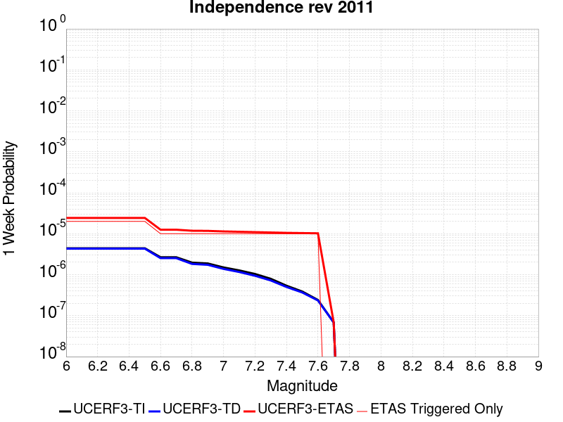 |  |  |  |

| Magnitude | 1 wk TI Prob | 1 wk TD Prob | 1 wk ETAS Prob | 1 wk ETAS/TD Gain | 1 wk ETAS Triggered Only | 1 mo TI Prob | 1 mo TD Prob | 1 mo ETAS Prob | 1 mo ETAS/TD Gain | 1 mo ETAS Triggered Only | 1 yr TI Prob | 1 yr TD Prob | 1 yr ETAS Prob | 1 yr ETAS/TD Gain | 1 yr ETAS Triggered Only | 10 yr TI Prob | 10 yr TD Prob | 10 yr ETAS Prob | 10 yr ETAS/TD Gain | 10 yr ETAS Triggered Only |
|-----|-----|-----|-----|-----|-----|-----|-----|-----|-----|-----|-----|-----|-----|-----|-----|-----|-----|-----|-----|-----|
| 6.0 | 4.422171E-6 | 4.3262453E-6 | 2.4326158E-5 | 5.622926 | 2.0E-5 | 1.8952025E-5 | 1.8540937E-5 | 5.8540194E-5 | 3.1573484 | 4.0E-5 | 2.3071647E-4 | 2.257155E-4 | 2.7570422E-4 | 1.2214677 | 5.0E-5 | 0.0023047708 | 0.0022551562 | 0.0023549306 | 1.0442429 | 1.0E-4 |
| 6.1 | 4.422171E-6 | 4.3262453E-6 | 2.4326158E-5 | 5.622926 | 2.0E-5 | 1.8952025E-5 | 1.8540937E-5 | 5.8540194E-5 | 3.1573484 | 4.0E-5 | 2.3071647E-4 | 2.257155E-4 | 2.7570422E-4 | 1.2214677 | 5.0E-5 | 0.0023047708 | 0.0022551562 | 0.0023549306 | 1.0442429 | 1.0E-4 |
| 6.2 | 4.422171E-6 | 4.3262453E-6 | 2.4326158E-5 | 5.622926 | 2.0E-5 | 1.8952025E-5 | 1.8540937E-5 | 5.8540194E-5 | 3.1573484 | 4.0E-5 | 2.3071647E-4 | 2.257155E-4 | 2.7570422E-4 | 1.2214677 | 5.0E-5 | 0.0023047708 | 0.0022551562 | 0.0023549306 | 1.0442429 | 1.0E-4 |
| 6.3 | 4.422171E-6 | 4.3262453E-6 | 2.4326158E-5 | 5.622926 | 2.0E-5 | 1.8952025E-5 | 1.8540937E-5 | 5.8540194E-5 | 3.1573484 | 4.0E-5 | 2.3071647E-4 | 2.257155E-4 | 2.7570422E-4 | 1.2214677 | 5.0E-5 | 0.0023047708 | 0.0022551562 | 0.0023549306 | 1.0442429 | 1.0E-4 |
| 6.4 | 4.422171E-6 | 4.3262453E-6 | 2.4326158E-5 | 5.622926 | 2.0E-5 | 1.8952025E-5 | 1.8540937E-5 | 5.8540194E-5 | 3.1573484 | 4.0E-5 | 2.3071647E-4 | 2.257155E-4 | 2.7570422E-4 | 1.2214677 | 5.0E-5 | 0.0023047708 | 0.0022551562 | 0.0023549306 | 1.0442429 | 1.0E-4 |
| 6.5 | 4.422171E-6 | 4.3262453E-6 | 2.4326158E-5 | 5.622926 | 2.0E-5 | 1.8952025E-5 | 1.8540937E-5 | 5.8540194E-5 | 3.1573484 | 4.0E-5 | 2.3071647E-4 | 2.257155E-4 | 2.7570422E-4 | 1.2214677 | 5.0E-5 | 0.0023047708 | 0.0022551562 | 0.0023549306 | 1.0442429 | 1.0E-4 |
| 6.6 | 2.663744E-6 | 2.5319996E-6 | 1.2531975E-5 | 4.9494376 | 1.0E-5 | 1.1415996E-5 | 1.0851385E-5 | 4.085106E-5 | 3.764594 | 3.0E-5 | 1.3898089E-4 | 1.3210809E-4 | 1.7210281E-4 | 1.3027424 | 4.0E-5 | 0.0013889399 | 0.0013203438 | 0.0014102249 | 1.0680741 | 9.0E-5 |
| 6.7 | 2.663744E-6 | 2.5319996E-6 | 1.2531975E-5 | 4.9494376 | 1.0E-5 | 1.1415996E-5 | 1.0851385E-5 | 4.085106E-5 | 3.764594 | 3.0E-5 | 1.3898089E-4 | 1.3210809E-4 | 1.7210281E-4 | 1.3027424 | 4.0E-5 | 0.0013889399 | 0.0013203438 | 0.0014102249 | 1.0680741 | 9.0E-5 |
| 6.8 | 1.9716529E-6 | 1.8322698E-6 | 1.1832251E-5 | 6.4577017 | 1.0E-5 | 8.449913E-6 | 7.852562E-6 | 3.7852325E-5 | 4.8203793 | 3.0E-5 | 1.0287284E-4 | 9.560088E-5 | 1.3559706E-4 | 1.4183662 | 4.0E-5 | 0.0010282523 | 9.556104E-4 | 0.0010455244 | 1.0940906 | 9.0E-5 |
| 6.9 | 1.8788617E-6 | 1.7430103E-6 | 1.1742993E-5 | 6.7371907 | 1.0E-5 | 8.0522395E-6 | 7.4700233E-6 | 3.74698E-5 | 5.0160217 | 3.0E-5 | 9.80316E-5 | 9.094386E-5 | 1.3094023E-4 | 1.4397918 | 4.0E-5 | 9.798837E-4 | 9.0907846E-4 | 9.989967E-4 | 1.0989114 | 9.0E-5 |
| 7.0 | 1.5045488E-6 | 1.3849603E-6 | 1.1384946E-5 | 8.220413 | 1.0E-5 | 6.44805E-6 | 5.935531E-6 | 3.5935354E-5 | 6.0542774 | 3.0E-5 | 7.8502184E-5 | 7.226275E-5 | 1.12259855E-4 | 1.5534955 | 4.0E-5 | 7.8474457E-4 | 7.2239764E-4 | 8.123326E-4 | 1.1244951 | 9.0E-5 |
| 7.1 | 1.272341E-6 | 1.1625186E-6 | 1.1162507E-5 | 9.602003 | 1.0E-5 | 5.4528787E-6 | 4.9822133E-6 | 3.4982062E-5 | 7.0213904 | 3.0E-5 | 6.6386776E-5 | 6.065679E-5 | 1.0065436E-4 | 1.6594081 | 4.0E-5 | 6.636695E-4 | 6.0640555E-4 | 6.9635094E-4 | 1.1483256 | 9.0E-5 |
| 7.2 | 1.0416892E-6 | 9.4099533E-7 | 1.0940986E-5 | 11.627035 | 1.0E-5 | 4.464375E-6 | 4.032831E-6 | 3.403271E-5 | 8.438912 | 3.0E-5 | 5.4352407E-5 | 4.909863E-5 | 8.909667E-5 | 1.8146466 | 4.0E-5 | 5.4339116E-4 | 4.908797E-4 | 5.808355E-4 | 1.1832544 | 9.0E-5 |
| 7.3 | 7.9450155E-7 | 7.2350707E-7 | 1.07235E-5 | 14.821555 | 1.0E-5 | 3.4050022E-6 | 3.100741E-6 | 2.310068E-5 | 7.4500513 | 2.0E-5 | 4.1455114E-5 | 3.7750877E-5 | 6.7749745E-5 | 1.7946535 | 3.0E-5 | 4.144738E-4 | 3.7744577E-4 | 4.5741556E-4 | 1.211871 | 8.0E-5 |
| 7.4 | 5.3893444E-7 | 5.0195547E-7 | 1.0501951E-5 | 20.922077 | 1.0E-5 | 2.309717E-6 | 2.1512358E-6 | 1.2151214E-5 | 5.648481 | 1.0E-5 | 2.8120441E-5 | 2.6190986E-5 | 4.6190464E-5 | 1.7636015 | 2.0E-5 | 2.8116882E-4 | 2.6187944E-4 | 3.2186374E-4 | 1.229053 | 6.0E-5 |
| 7.5 | 3.8852085E-7 | 3.6825836E-7 | 1.0368255E-5 | 28.154839 | 1.0E-5 | 1.6650882E-6 | 1.5782492E-6 | 1.1578233E-5 | 7.336125 | 1.0E-5 | 2.027226E-5 | 1.9215016E-5 | 3.9214632E-5 | 2.0408325 | 2.0E-5 | 2.0270412E-4 | 1.9213377E-4 | 2.4212415E-4 | 1.2601854 | 5.0E-5 |
| 7.6 | 2.414929E-7 | 2.3457733E-7 | 1.0234575E-5 | 43.629856 | 1.0E-5 | 1.0349692E-6 | 1.005331E-6 | 1.1005321E-5 | 10.946962 | 1.0E-5 | 1.2600677E-5 | 1.2239838E-5 | 3.2239594E-5 | 2.6339886 | 2.0E-5 | 1.2599962E-4 | 1.2239176E-4 | 1.7238564E-4 | 1.4084742 | 5.0E-5 |
| 7.7 | 6.8298014E-8 | 6.858997E-8 | 6.858997E-8 | 1.0 | 0.0 | 2.9270575E-7 | 2.93957E-7 | 2.93957E-7 | 1.0 | 0.0 | 3.5636867E-6 | 3.578921E-6 | 1.3578885E-5 | 3.7941282 | 1.0E-5 | 3.5636294E-5 | 3.5788682E-5 | 4.578832E-5 | 1.279408 | 1.0E-5 |

## Kern Canyon (North Kern) 2011
*[(top)](#table-of-contents)*

| 1 Week | 1 Month | 1 Year | 10 Year |
|-----|-----|-----|-----|
|  |  |  |  |

| Magnitude | 1 wk TI Prob | 1 wk TD Prob | 1 wk ETAS Prob | 1 wk ETAS/TD Gain | 1 wk ETAS Triggered Only | 1 mo TI Prob | 1 mo TD Prob | 1 mo ETAS Prob | 1 mo ETAS/TD Gain | 1 mo ETAS Triggered Only | 1 yr TI Prob | 1 yr TD Prob | 1 yr ETAS Prob | 1 yr ETAS/TD Gain | 1 yr ETAS Triggered Only | 10 yr TI Prob | 10 yr TD Prob | 10 yr ETAS Prob | 10 yr ETAS/TD Gain | 10 yr ETAS Triggered Only |
|-----|-----|-----|-----|-----|-----|-----|-----|-----|-----|-----|-----|-----|-----|-----|-----|-----|-----|-----|-----|-----|
| 6.0 | 6.6264497E-6 | 6.7573515E-6 | 6.7573515E-6 | 1.0 | 0.0 | 2.8398761E-5 | 2.8959801E-5 | 5.8958933E-5 | 2.0358887 | 3.0E-5 | 3.4570007E-4 | 3.5253656E-4 | 4.0251893E-4 | 1.1417793 | 5.0E-5 | 0.0034516277 | 0.0035205614 | 0.0036102445 | 1.0254741 | 9.0E-5 |
| 6.1 | 6.6264497E-6 | 6.7573515E-6 | 6.7573515E-6 | 1.0 | 0.0 | 2.8398761E-5 | 2.8959801E-5 | 5.8958933E-5 | 2.0358887 | 3.0E-5 | 3.4570007E-4 | 3.5253656E-4 | 4.0251893E-4 | 1.1417793 | 5.0E-5 | 0.0034516277 | 0.0035205614 | 0.0036102445 | 1.0254741 | 9.0E-5 |
| 6.2 | 6.6264497E-6 | 6.7573515E-6 | 6.7573515E-6 | 1.0 | 0.0 | 2.8398761E-5 | 2.8959801E-5 | 5.8958933E-5 | 2.0358887 | 3.0E-5 | 3.4570007E-4 | 3.5253656E-4 | 4.0251893E-4 | 1.1417793 | 5.0E-5 | 0.0034516277 | 0.0035205614 | 0.0036102445 | 1.0254741 | 9.0E-5 |
| 6.3 | 6.6264497E-6 | 6.7573515E-6 | 6.7573515E-6 | 1.0 | 0.0 | 2.8398761E-5 | 2.8959801E-5 | 5.8958933E-5 | 2.0358887 | 3.0E-5 | 3.4570007E-4 | 3.5253656E-4 | 4.0251893E-4 | 1.1417793 | 5.0E-5 | 0.0034516277 | 0.0035205614 | 0.0036102445 | 1.0254741 | 9.0E-5 |
| 6.4 | 6.6264497E-6 | 6.7573515E-6 | 6.7573515E-6 | 1.0 | 0.0 | 2.8398761E-5 | 2.8959801E-5 | 5.8958933E-5 | 2.0358887 | 3.0E-5 | 3.4570007E-4 | 3.5253656E-4 | 4.0251893E-4 | 1.1417793 | 5.0E-5 | 0.0034516277 | 0.0035205614 | 0.0036102445 | 1.0254741 | 9.0E-5 |
| 6.5 | 3.2162225E-6 | 3.2571006E-6 | 3.2571006E-6 | 1.0 | 0.0 | 1.3783738E-5 | 1.3958933E-5 | 1.3958933E-5 | 1.0 | 0.0 | 1.6780409E-4 | 1.6993756E-4 | 1.7993586E-4 | 1.0588351 | 1.0E-5 | 0.0016767744 | 0.0016981558 | 0.0017181218 | 1.0117575 | 2.0E-5 |
| 6.6 | 3.2162225E-6 | 3.2571006E-6 | 3.2571006E-6 | 1.0 | 0.0 | 1.3783738E-5 | 1.3958933E-5 | 1.3958933E-5 | 1.0 | 0.0 | 1.6780409E-4 | 1.6993756E-4 | 1.7993586E-4 | 1.0588351 | 1.0E-5 | 0.0016767744 | 0.0016981558 | 0.0017181218 | 1.0117575 | 2.0E-5 |
| 6.7 | 2.1908265E-6 | 2.207128E-6 | 2.207128E-6 | 1.0 | 0.0 | 9.389223E-6 | 9.459087E-6 | 9.459087E-6 | 1.0 | 0.0 | 1.1430779E-4 | 1.15158495E-4 | 1.2515734E-4 | 1.0868268 | 1.0E-5 | 0.0011424901 | 0.0011510076 | 0.0011709846 | 1.017356 | 2.0E-5 |
| 6.8 | 1.7303895E-6 | 1.7365575E-6 | 1.7365575E-6 | 1.0 | 0.0 | 7.415934E-6 | 7.4423683E-6 | 7.4423683E-6 | 1.0 | 0.0 | 9.028525E-5 | 9.0607165E-5 | 1.0060626E-4 | 1.1103566 | 1.0E-5 | 9.024858E-4 | 9.0571196E-4 | 9.2569384E-4 | 1.0220621 | 2.0E-5 |
| 6.9 | 1.3700314E-6 | 1.3688658E-6 | 1.3688658E-6 | 1.0 | 0.0 | 5.87155E-6 | 5.8665546E-6 | 5.8665546E-6 | 1.0 | 0.0 | 7.148377E-5 | 7.142301E-5 | 8.1422295E-5 | 1.1400009 | 1.0E-5 | 7.146078E-4 | 7.140051E-4 | 7.3399086E-4 | 1.027991 | 2.0E-5 |
| 7.0 | 1.1467797E-6 | 1.1413834E-6 | 1.1413834E-6 | 1.0 | 0.0 | 4.9147607E-6 | 4.8916345E-6 | 4.8916345E-6 | 1.0 | 0.0 | 5.983557E-5 | 5.955405E-5 | 6.9553455E-5 | 1.1679047 | 1.0E-5 | 5.981946E-4 | 5.9538404E-4 | 6.1537215E-4 | 1.0335717 | 2.0E-5 |
| 7.1 | 9.3952065E-7 | 9.3027154E-7 | 9.3027154E-7 | 1.0 | 0.0 | 4.026511E-6 | 3.986872E-6 | 3.986872E-6 | 1.0 | 0.0 | 4.9021666E-5 | 4.8539103E-5 | 5.853862E-5 | 1.2060095 | 1.0E-5 | 4.901085E-4 | 4.852868E-4 | 4.9528194E-4 | 1.0205964 | 1.0E-5 |
| 7.2 | 6.858055E-7 | 6.719319E-7 | 6.719319E-7 | 1.0 | 0.0 | 2.939163E-6 | 2.879705E-6 | 2.879705E-6 | 1.0 | 0.0 | 3.5783723E-5 | 3.5059853E-5 | 4.5059503E-5 | 1.2852166 | 1.0E-5 | 3.5777962E-4 | 3.505441E-4 | 3.605406E-4 | 1.0285171 | 1.0E-5 |
| 7.3 | 5.1101983E-7 | 4.939314E-7 | 4.939314E-7 | 1.0 | 0.0 | 2.1900833E-6 | 2.116847E-6 | 2.116847E-6 | 1.0 | 0.0 | 2.6663936E-5 | 2.5772315E-5 | 2.5772315E-5 | 1.0 | 0.0 | 2.6660739E-4 | 2.5769373E-4 | 2.5769373E-4 | 1.0 | 0.0 |
| 7.4 | 3.4999414E-7 | 3.2996007E-7 | 3.2996007E-7 | 1.0 | 0.0 | 1.499974E-6 | 1.4141139E-6 | 1.4141139E-6 | 1.0 | 0.0 | 1.8262032E-5 | 1.7216704E-5 | 1.7216704E-5 | 1.0 | 0.0 | 1.826053E-4 | 1.7215393E-4 | 1.7215393E-4 | 1.0 | 0.0 |
| 7.5 | 1.7021522E-7 | 1.4750101E-7 | 1.4750101E-7 | 1.0 | 0.0 | 7.2949354E-7 | 6.321471E-7 | 6.321471E-7 | 1.0 | 0.0 | 8.881548E-6 | 7.696364E-6 | 7.696364E-6 | 1.0 | 0.0 | 8.8811925E-5 | 7.696106E-5 | 7.696106E-5 | 1.0 | 0.0 |
| 7.6 | 2.572245E-8 | 1.7352718E-8 | 1.7352718E-8 | 1.0 | 0.0 | 1.10239064E-7 | 7.436879E-8 | 7.436879E-8 | 1.0 | 0.0 | 1.3421597E-6 | 9.054397E-7 | 9.054397E-7 | 1.0 | 0.0 | 1.3421517E-5 | 9.054365E-6 | 9.054365E-6 | 1.0 | 0.0 |

## Blue Cut
*[(top)](#table-of-contents)*

| 1 Week | 1 Month | 1 Year | 10 Year |
|-----|-----|-----|-----|
|  |  |  |  |

| Magnitude | 1 wk TI Prob | 1 wk TD Prob | 1 wk ETAS Prob | 1 wk ETAS/TD Gain | 1 wk ETAS Triggered Only | 1 mo TI Prob | 1 mo TD Prob | 1 mo ETAS Prob | 1 mo ETAS/TD Gain | 1 mo ETAS Triggered Only | 1 yr TI Prob | 1 yr TD Prob | 1 yr ETAS Prob | 1 yr ETAS/TD Gain | 1 yr ETAS Triggered Only | 10 yr TI Prob | 10 yr TD Prob | 10 yr ETAS Prob | 10 yr ETAS/TD Gain | 10 yr ETAS Triggered Only |
|-----|-----|-----|-----|-----|-----|-----|-----|-----|-----|-----|-----|-----|-----|-----|-----|-----|-----|-----|-----|-----|
| 6.0 | 2.1227985E-5 | 2.2719787E-5 | 2.2719787E-5 | 1.0 | 0.0 | 9.097391E-5 | 9.736721E-5 | 1.3736331E-4 | 1.4107759 | 4.0E-5 | 0.0011070445 | 0.0011848592 | 0.001244788 | 1.050579 | 6.0E-5 | 0.011015458 | 0.011791261 | 0.0118802 | 1.0075427 | 9.0E-5 |
| 6.1 | 2.1227985E-5 | 2.2719787E-5 | 2.2719787E-5 | 1.0 | 0.0 | 9.097391E-5 | 9.736721E-5 | 1.3736331E-4 | 1.4107759 | 4.0E-5 | 0.0011070445 | 0.0011848592 | 0.001244788 | 1.050579 | 6.0E-5 | 0.011015458 | 0.011791261 | 0.0118802 | 1.0075427 | 9.0E-5 |
| 6.2 | 2.1227985E-5 | 2.2719787E-5 | 2.2719787E-5 | 1.0 | 0.0 | 9.097391E-5 | 9.736721E-5 | 1.3736331E-4 | 1.4107759 | 4.0E-5 | 0.0011070445 | 0.0011848592 | 0.001244788 | 1.050579 | 6.0E-5 | 0.011015458 | 0.011791261 | 0.0118802 | 1.0075427 | 9.0E-5 |
| 6.3 | 1.1613981E-5 | 1.23536465E-5 | 1.23536465E-5 | 1.0 | 0.0 | 4.9773254E-5 | 5.2943193E-5 | 7.294214E-5 | 1.3777434 | 2.0E-5 | 6.0582085E-4 | 6.444052E-4 | 6.643923E-4 | 1.0310163 | 2.0E-5 | 0.0060417196 | 0.0064266133 | 0.006466356 | 1.0061841 | 4.0E-5 |
| 6.4 | 1.1613981E-5 | 1.23536465E-5 | 1.23536465E-5 | 1.0 | 0.0 | 4.9773254E-5 | 5.2943193E-5 | 7.294214E-5 | 1.3777434 | 2.0E-5 | 6.0582085E-4 | 6.444052E-4 | 6.643923E-4 | 1.0310163 | 2.0E-5 | 0.0060417196 | 0.0064266133 | 0.006466356 | 1.0061841 | 4.0E-5 |
| 6.5 | 8.931326E-6 | 9.481677E-6 | 9.481677E-6 | 1.0 | 0.0 | 3.8276554E-5 | 4.063518E-5 | 6.0634364E-5 | 1.4921644 | 2.0E-5 | 4.6591737E-4 | 4.9463013E-4 | 5.146203E-4 | 1.0404142 | 2.0E-5 | 0.0046494175 | 0.0049362015 | 0.004976004 | 1.0080634 | 4.0E-5 |
| 6.6 | 7.345353E-6 | 7.790341E-6 | 7.790341E-6 | 1.0 | 0.0 | 3.1479703E-5 | 3.3386797E-5 | 4.3386462E-5 | 1.2995096 | 1.0E-5 | 3.83198E-4 | 4.0641645E-4 | 4.164124E-4 | 1.0245953 | 1.0E-5 | 0.0038253788 | 0.0040575233 | 0.0040874016 | 1.0073637 | 3.0E-5 |
| 6.7 | 6.2775666E-6 | 6.655202E-6 | 6.655202E-6 | 1.0 | 0.0 | 2.690358E-5 | 2.8522025E-5 | 3.852174E-5 | 1.3505962 | 1.0E-5 | 3.2750185E-4 | 3.4720785E-4 | 3.5720438E-4 | 1.0287912 | 1.0E-5 | 0.0032701963 | 0.0034673947 | 0.0034873253 | 1.005748 | 2.0E-5 |
| 6.8 | 5.5234095E-6 | 5.8551577E-6 | 5.8551577E-6 | 1.0 | 0.0 | 2.367154E-5 | 2.5093334E-5 | 3.5093082E-5 | 1.3985022 | 1.0E-5 | 2.8816288E-4 | 3.0547578E-4 | 3.1547272E-4 | 1.0327258 | 1.0E-5 | 0.002877895 | 0.003051275 | 0.0030712138 | 1.0065347 | 2.0E-5 |
| 6.9 | 4.7780054E-6 | 5.0654608E-6 | 5.0654608E-6 | 1.0 | 0.0 | 2.0477004E-5 | 2.1708976E-5 | 3.170876E-5 | 1.460629 | 1.0E-5 | 2.4927902E-4 | 2.6428179E-4 | 2.7427915E-4 | 1.0378284 | 1.0E-5 | 0.0024899957 | 0.0026403673 | 0.0026603143 | 1.0075547 | 2.0E-5 |
| 7.0 | 3.883171E-6 | 4.1185203E-6 | 4.1185203E-6 | 1.0 | 0.0 | 1.6642054E-5 | 1.765072E-5 | 2.7650543E-5 | 1.5665392 | 1.0E-5 | 2.0259817E-4 | 2.1488321E-4 | 2.2488106E-4 | 1.0465269 | 1.0E-5 | 0.0020241356 | 0.00214743 | 0.0021574085 | 1.0046468 | 1.0E-5 |
| 7.1 | 2.8358215E-6 | 3.0097403E-6 | 3.0097403E-6 | 1.0 | 0.0 | 1.2153464E-5 | 1.289886E-5 | 1.289886E-5 | 1.0 | 0.0 | 1.4795837E-4 | 1.5703888E-4 | 1.5703888E-4 | 1.0 | 0.0 | 0.001478599 | 0.0015699244 | 0.0015699244 | 1.0 | 0.0 |

## Big Pine (East)
*[(top)](#table-of-contents)*

| 1 Week | 1 Month | 1 Year | 10 Year |
|-----|-----|-----|-----|
| 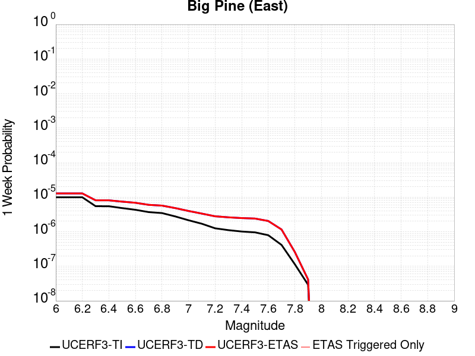 |  |  | 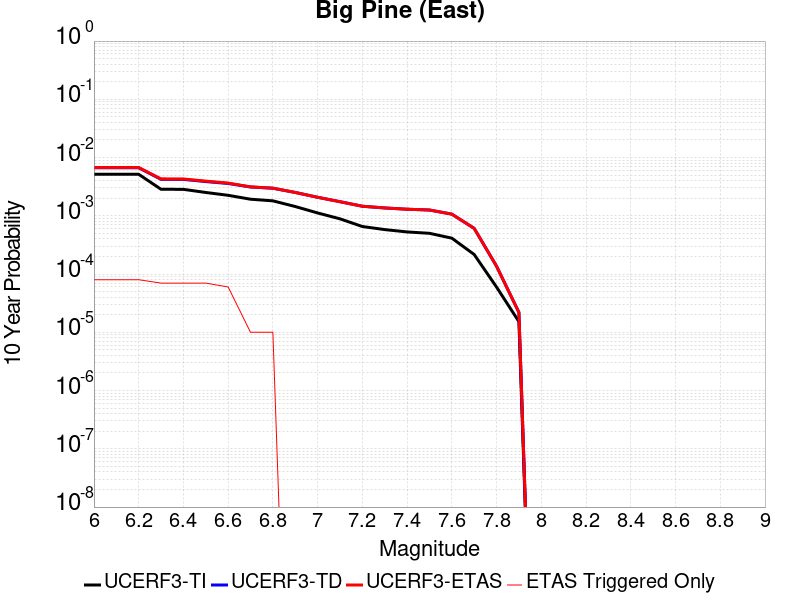 |

| Magnitude | 1 wk TI Prob | 1 wk TD Prob | 1 wk ETAS Prob | 1 wk ETAS/TD Gain | 1 wk ETAS Triggered Only | 1 mo TI Prob | 1 mo TD Prob | 1 mo ETAS Prob | 1 mo ETAS/TD Gain | 1 mo ETAS Triggered Only | 1 yr TI Prob | 1 yr TD Prob | 1 yr ETAS Prob | 1 yr ETAS/TD Gain | 1 yr ETAS Triggered Only | 10 yr TI Prob | 10 yr TD Prob | 10 yr ETAS Prob | 10 yr ETAS/TD Gain | 10 yr ETAS Triggered Only |
|-----|-----|-----|-----|-----|-----|-----|-----|-----|-----|-----|-----|-----|-----|-----|-----|-----|-----|-----|-----|-----|
| 6.0 | 9.916913E-6 | 1.281854E-5 | 1.281854E-5 | 1.0 | 0.0 | 4.250036E-5 | 5.4935572E-5 | 6.493502E-5 | 1.1820214 | 1.0E-5 | 5.173191E-4 | 6.686574E-4 | 6.9863733E-4 | 1.044836 | 3.0E-5 | 0.0051611643 | 0.00667124 | 0.006750706 | 1.0119117 | 8.0E-5 |
| 6.1 | 9.916913E-6 | 1.281854E-5 | 1.281854E-5 | 1.0 | 0.0 | 4.250036E-5 | 5.4935572E-5 | 6.493502E-5 | 1.1820214 | 1.0E-5 | 5.173191E-4 | 6.686574E-4 | 6.9863733E-4 | 1.044836 | 3.0E-5 | 0.0051611643 | 0.00667124 | 0.006750706 | 1.0119117 | 8.0E-5 |
| 6.2 | 9.916913E-6 | 1.281854E-5 | 1.281854E-5 | 1.0 | 0.0 | 4.250036E-5 | 5.4935572E-5 | 6.493502E-5 | 1.1820214 | 1.0E-5 | 5.173191E-4 | 6.686574E-4 | 6.9863733E-4 | 1.044836 | 3.0E-5 | 0.0051611643 | 0.00667124 | 0.006750706 | 1.0119117 | 8.0E-5 |
| 6.3 | 5.479711E-6 | 8.11447E-6 | 8.11447E-6 | 1.0 | 0.0 | 2.3484265E-5 | 3.4775854E-5 | 4.477551E-5 | 1.2875458 | 1.0E-5 | 2.858834E-4 | 4.2331696E-4 | 4.5330427E-4 | 1.0708389 | 3.0E-5 | 0.0028551589 | 0.0042280247 | 0.004297729 | 1.0164862 | 7.0E-5 |
| 6.4 | 5.465009E-6 | 8.098763E-6 | 8.098763E-6 | 1.0 | 0.0 | 2.3421257E-5 | 3.470854E-5 | 4.4708195E-5 | 1.2881035 | 1.0E-5 | 2.851165E-4 | 4.2249775E-4 | 4.5248508E-4 | 1.0709763 | 3.0E-5 | 0.0028475097 | 0.004219864 | 0.0042895684 | 1.0165182 | 7.0E-5 |
| 6.5 | 4.826767E-6 | 7.4238146E-6 | 7.4238146E-6 | 1.0 | 0.0 | 2.068598E-5 | 3.1815976E-5 | 4.1815656E-5 | 1.3142976 | 1.0E-5 | 2.518227E-4 | 3.8729343E-4 | 4.1728182E-4 | 1.0774306 | 3.0E-5 | 0.0025153751 | 0.0038690618 | 0.003938791 | 1.0180223 | 7.0E-5 |
| 6.6 | 4.3146847E-6 | 6.8837467E-6 | 6.8837467E-6 | 1.0 | 0.0 | 1.8491375E-5 | 2.950145E-5 | 3.9501156E-5 | 1.3389564 | 1.0E-5 | 2.2510924E-4 | 3.5912343E-4 | 3.8911265E-4 | 1.0835067 | 3.0E-5 | 0.0022488134 | 0.0035882755 | 0.0036480604 | 1.0166612 | 6.0E-5 |
| 6.7 | 3.6968106E-6 | 5.9968484E-6 | 5.9968484E-6 | 1.0 | 0.0 | 1.5843378E-5 | 2.5700534E-5 | 2.5700534E-5 | 1.0 | 0.0 | 1.9287605E-4 | 3.1286062E-4 | 3.2285746E-4 | 1.0319531 | 1.0E-5 | 0.0019270873 | 0.003126956 | 0.0031369247 | 1.003188 | 1.0E-5 |
| 6.8 | 3.4671132E-6 | 5.703515E-6 | 5.703515E-6 | 1.0 | 0.0 | 1.4858972E-5 | 2.4443414E-5 | 2.4443414E-5 | 1.0 | 0.0 | 1.8089297E-4 | 2.9755937E-4 | 3.075564E-4 | 1.0335968 | 1.0E-5 | 0.0018074579 | 0.0029743554 | 0.0029843256 | 1.003352 | 1.0E-5 |
| 6.9 | 2.7686972E-6 | 4.8264656E-6 | 4.8264656E-6 | 1.0 | 0.0 | 1.1865792E-5 | 2.0684693E-5 | 2.0684693E-5 | 1.0 | 0.0 | 1.4445644E-4 | 2.518078E-4 | 2.518078E-4 | 1.0 | 0.0 | 0.0014436257 | 0.0025179028 | 0.0025179028 | 1.0 | 0.0 |
| 7.0 | 2.1472624E-6 | 3.986174E-6 | 3.986174E-6 | 1.0 | 0.0 | 9.20252E-6 | 1.7083494E-5 | 1.7083494E-5 | 1.0 | 0.0 | 1.12034926E-4 | 2.0797222E-4 | 2.0797222E-4 | 1.0 | 0.0 | 0.0011197845 | 0.0020804254 | 0.0020804254 | 1.0 | 0.0 |
| 7.1 | 1.7018335E-6 | 3.3459255E-6 | 3.3459255E-6 | 1.0 | 0.0 | 7.293552E-6 | 1.4339605E-5 | 1.4339605E-5 | 1.0 | 0.0 | 8.879537E-5 | 1.7457105E-4 | 1.7457105E-4 | 1.0 | 0.0 | 8.87599E-4 | 0.0017469557 | 0.0017469557 | 1.0 | 0.0 |
| 7.2 | 1.25603E-6 | 2.795471E-6 | 2.795471E-6 | 1.0 | 0.0 | 5.3829745E-6 | 1.1980536E-5 | 1.1980536E-5 | 1.0 | 0.0 | 6.553574E-5 | 1.458535E-4 | 1.458535E-4 | 1.0 | 0.0 | 6.551642E-4 | 0.0014601707 | 0.0014601707 | 1.0 | 0.0 |
| 7.3 | 1.112297E-6 | 2.6112702E-6 | 2.6112702E-6 | 1.0 | 0.0 | 4.7669787E-6 | 1.1191111E-5 | 1.1191111E-5 | 1.0 | 0.0 | 5.803642E-5 | 1.3624349E-4 | 1.3624349E-4 | 1.0 | 0.0 | 5.802127E-4 | 0.00136402 | 0.00136402 | 1.0 | 0.0 |
| 7.4 | 1.0137181E-6 | 2.4843957E-6 | 2.4843957E-6 | 1.0 | 0.0 | 4.3444993E-6 | 1.0647368E-5 | 1.0647368E-5 | 1.0 | 0.0 | 5.2892992E-5 | 1.2962421E-4 | 1.2962421E-4 | 1.0 | 0.0 | 5.288041E-4 | 0.0012976775 | 0.0012976775 | 1.0 | 0.0 |
| 7.5 | 9.598608E-7 | 2.4080273E-6 | 2.4080273E-6 | 1.0 | 0.0 | 4.1136827E-6 | 1.0320077E-5 | 1.0320077E-5 | 1.0 | 0.0 | 5.0082934E-5 | 1.2563991E-4 | 1.2563991E-4 | 1.0 | 0.0 | 5.007165E-4 | 0.0012576841 | 0.0012576841 | 1.0 | 0.0 |
| 7.6 | 7.929459E-7 | 2.0456312E-6 | 2.0456312E-6 | 1.0 | 0.0 | 3.3983351E-6 | 8.766962E-6 | 8.766962E-6 | 1.0 | 0.0 | 4.1373947E-5 | 1.0673271E-4 | 1.0673271E-4 | 1.0 | 0.0 | 4.1366243E-4 | 0.0010689225 | 0.0010689225 | 1.0 | 0.0 |
| 7.7 | 4.155788E-7 | 1.1611139E-6 | 1.1611139E-6 | 1.0 | 0.0 | 1.7810507E-6 | 4.9761934E-6 | 4.9761934E-6 | 1.0 | 0.0 | 2.1684076E-5 | 6.0583512E-5 | 6.0583512E-5 | 1.0 | 0.0 | 2.1681961E-4 | 6.0889556E-4 | 6.0889556E-4 | 1.0 | 0.0 |
| 7.8 | 1.14666925E-7 | 2.5932084E-7 | 2.5932084E-7 | 1.0 | 0.0 | 4.914296E-7 | 1.1113746E-6 | 1.1113746E-6 | 1.0 | 0.0 | 5.9831386E-6 | 1.3530906E-5 | 1.3530906E-5 | 1.0 | 0.0 | 5.9829777E-5 | 1.364052E-4 | 1.364052E-4 | 1.0 | 0.0 |
| 7.9 | 2.9231824E-8 | 4.1479638E-8 | 4.1479638E-8 | 1.0 | 0.0 | 1.2527924E-7 | 1.7776986E-7 | 1.7776986E-7 | 1.0 | 0.0 | 1.5252737E-6 | 2.1643461E-6 | 2.1643461E-6 | 1.0 | 0.0 | 1.5252632E-5 | 2.1986685E-5 | 2.1986685E-5 | 1.0 | 0.0 |

## Pisgah-Bullion Mtn-Mesquite Lk
*[(top)](#table-of-contents)*

| 1 Week | 1 Month | 1 Year | 10 Year |
|-----|-----|-----|-----|
|  |  |  | 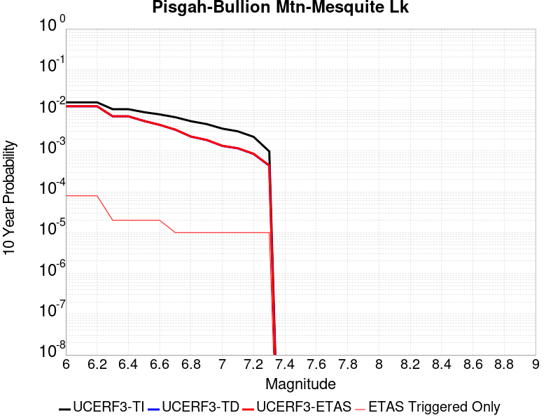 |

| Magnitude | 1 wk TI Prob | 1 wk TD Prob | 1 wk ETAS Prob | 1 wk ETAS/TD Gain | 1 wk ETAS Triggered Only | 1 mo TI Prob | 1 mo TD Prob | 1 mo ETAS Prob | 1 mo ETAS/TD Gain | 1 mo ETAS Triggered Only | 1 yr TI Prob | 1 yr TD Prob | 1 yr ETAS Prob | 1 yr ETAS/TD Gain | 1 yr ETAS Triggered Only | 10 yr TI Prob | 10 yr TD Prob | 10 yr ETAS Prob | 10 yr ETAS/TD Gain | 10 yr ETAS Triggered Only |
|-----|-----|-----|-----|-----|-----|-----|-----|-----|-----|-----|-----|-----|-----|-----|-----|-----|-----|-----|-----|-----|
| 6.0 | 3.0240792E-5 | 2.4091287E-5 | 2.4091287E-5 | 1.0 | 0.0 | 1.2959696E-4 | 1.03244856E-4 | 1.03244856E-4 | 1.0 | 0.0 | 0.0015767008 | 0.001256382 | 0.001256382 | 1.0 | 0.0 | 0.015655609 | 0.012502813 | 0.012581812 | 1.0063186 | 8.0E-5 |
| 6.1 | 3.0240792E-5 | 2.4091287E-5 | 2.4091287E-5 | 1.0 | 0.0 | 1.2959696E-4 | 1.03244856E-4 | 1.03244856E-4 | 1.0 | 0.0 | 0.0015767008 | 0.001256382 | 0.001256382 | 1.0 | 0.0 | 0.015655609 | 0.012502813 | 0.012581812 | 1.0063186 | 8.0E-5 |
| 6.2 | 3.0240792E-5 | 2.4091287E-5 | 2.4091287E-5 | 1.0 | 0.0 | 1.2959696E-4 | 1.03244856E-4 | 1.03244856E-4 | 1.0 | 0.0 | 0.0015767008 | 0.001256382 | 0.001256382 | 1.0 | 0.0 | 0.015655609 | 0.012502813 | 0.012581812 | 1.0063186 | 8.0E-5 |
| 6.3 | 2.0498217E-5 | 1.36382505E-5 | 1.36382505E-5 | 1.0 | 0.0 | 8.784654E-5 | 5.8448426E-5 | 5.8448426E-5 | 1.0 | 0.0 | 0.0010690069 | 7.113935E-4 | 7.113935E-4 | 1.0 | 0.0 | 0.01063879 | 0.0070927883 | 0.0071126465 | 1.0027997 | 2.0E-5 |
| 6.4 | 2.0498217E-5 | 1.36382505E-5 | 1.36382505E-5 | 1.0 | 0.0 | 8.784654E-5 | 5.8448426E-5 | 5.8448426E-5 | 1.0 | 0.0 | 0.0010690069 | 7.113935E-4 | 7.113935E-4 | 1.0 | 0.0 | 0.01063879 | 0.0070927883 | 0.0071126465 | 1.0027997 | 2.0E-5 |
| 6.5 | 1.7316182E-5 | 1.04771225E-5 | 1.04771225E-5 | 1.0 | 0.0 | 7.42101E-5 | 4.4901237E-5 | 4.4901237E-5 | 1.0 | 0.0 | 9.0313336E-4 | 5.4654543E-4 | 5.4654543E-4 | 1.0 | 0.0 | 0.008994718 | 0.005453008 | 0.0054728994 | 1.0036477 | 2.0E-5 |
| 6.6 | 1.5251077E-5 | 8.414257E-6 | 8.414257E-6 | 1.0 | 0.0 | 6.536012E-5 | 3.606064E-5 | 3.606064E-5 | 1.0 | 0.0 | 7.9546886E-4 | 4.389571E-4 | 4.389571E-4 | 1.0 | 0.0 | 0.007926274 | 0.0043816175 | 0.00440153 | 1.0045445 | 2.0E-5 |
| 6.7 | 1.2997425E-5 | 6.4113133E-6 | 6.4113133E-6 | 1.0 | 0.0 | 5.570206E-5 | 2.7476794E-5 | 2.7476794E-5 | 1.0 | 0.0 | 6.7796157E-4 | 3.3448328E-4 | 3.3448328E-4 | 1.0 | 0.0 | 0.0067589693 | 0.0033402585 | 0.003350225 | 1.0029838 | 1.0E-5 |
| 6.8 | 1.035386E-5 | 4.3332407E-6 | 4.3332407E-6 | 1.0 | 0.0 | 4.437293E-5 | 1.8570905E-5 | 1.8570905E-5 | 1.0 | 0.0 | 5.401065E-4 | 2.2607818E-4 | 2.2607818E-4 | 1.0 | 0.0 | 0.0053879567 | 0.0022585685 | 0.002268546 | 1.0044175 | 1.0E-5 |
| 6.9 | 8.816252E-6 | 3.5806777E-6 | 3.5806777E-6 | 1.0 | 0.0 | 3.778339E-5 | 1.5345675E-5 | 1.5345675E-5 | 1.0 | 0.0 | 4.5991567E-4 | 1.8681816E-4 | 1.8681816E-4 | 1.0 | 0.0 | 0.00458965 | 0.0018666695 | 0.0018766508 | 1.0053471 | 1.0E-5 |
| 7.0 | 6.8232207E-6 | 2.5675185E-6 | 2.5675185E-6 | 1.0 | 0.0 | 2.9242048E-5 | 1.1003606E-5 | 1.1003606E-5 | 1.0 | 0.0 | 3.5596377E-4 | 1.3396099E-4 | 1.3396099E-4 | 1.0 | 0.0 | 0.0035539411 | 0.0013388334 | 0.00134882 | 1.0074592 | 1.0E-5 |
| 7.1 | 5.837013E-6 | 2.227375E-6 | 2.227375E-6 | 1.0 | 0.0 | 2.501553E-5 | 9.545859E-6 | 9.545859E-6 | 1.0 | 0.0 | 3.045215E-4 | 1.16214935E-4 | 1.16214935E-4 | 1.0 | 0.0 | 0.0030410455 | 0.0011615707 | 0.001171559 | 1.008599 | 1.0E-5 |
| 7.2 | 4.278052E-6 | 1.6275252E-6 | 1.6275252E-6 | 1.0 | 0.0 | 1.833438E-5 | 6.975091E-6 | 6.975091E-6 | 1.0 | 0.0 | 2.231982E-4 | 8.4918654E-5 | 8.4918654E-5 | 1.0 | 0.0 | 0.0022297418 | 8.488853E-4 | 8.588768E-4 | 1.0117701 | 1.0E-5 |
| 7.3 | 1.8803692E-6 | 8.3448816E-7 | 8.3448816E-7 | 1.0 | 0.0 | 8.0587E-6 | 3.5763737E-6 | 3.5763737E-6 | 1.0 | 0.0 | 9.811026E-5 | 4.354163E-5 | 4.354163E-5 | 1.0 | 0.0 | 9.806695E-4 | 4.3534543E-4 | 4.4534108E-4 | 1.0229603 | 1.0E-5 |

## Lost Hills
*[(top)](#table-of-contents)*

| 1 Week | 1 Month | 1 Year | 10 Year |
|-----|-----|-----|-----|
|  |  |  |  |

| Magnitude | 1 wk TI Prob | 1 wk TD Prob | 1 wk ETAS Prob | 1 wk ETAS/TD Gain | 1 wk ETAS Triggered Only | 1 mo TI Prob | 1 mo TD Prob | 1 mo ETAS Prob | 1 mo ETAS/TD Gain | 1 mo ETAS Triggered Only | 1 yr TI Prob | 1 yr TD Prob | 1 yr ETAS Prob | 1 yr ETAS/TD Gain | 1 yr ETAS Triggered Only | 10 yr TI Prob | 10 yr TD Prob | 10 yr ETAS Prob | 10 yr ETAS/TD Gain | 10 yr ETAS Triggered Only |
|-----|-----|-----|-----|-----|-----|-----|-----|-----|-----|-----|-----|-----|-----|-----|-----|-----|-----|-----|-----|-----|
| 6.0 | 2.233523E-5 | 2.5106996E-5 | 2.5106996E-5 | 1.0 | 0.0 | 9.571891E-5 | 1.0759792E-4 | 1.1759684E-4 | 1.0929286 | 1.0E-5 | 0.0011647546 | 0.0013093855 | 0.0013693069 | 1.045763 | 6.0E-5 | 0.011586686 | 0.013033304 | 0.013112262 | 1.0060581 | 8.0E-5 |
| 6.1 | 2.233523E-5 | 2.5106996E-5 | 2.5106996E-5 | 1.0 | 0.0 | 9.571891E-5 | 1.0759792E-4 | 1.1759684E-4 | 1.0929286 | 1.0E-5 | 0.0011647546 | 0.0013093855 | 0.0013693069 | 1.045763 | 6.0E-5 | 0.011586686 | 0.013033304 | 0.013112262 | 1.0060581 | 8.0E-5 |
| 6.2 | 2.233523E-5 | 2.5106996E-5 | 2.5106996E-5 | 1.0 | 0.0 | 9.571891E-5 | 1.0759792E-4 | 1.1759684E-4 | 1.0929286 | 1.0E-5 | 0.0011647546 | 0.0013093855 | 0.0013693069 | 1.045763 | 6.0E-5 | 0.011586686 | 0.013033304 | 0.013112262 | 1.0060581 | 8.0E-5 |
| 6.3 | 2.233523E-5 | 2.5106996E-5 | 2.5106996E-5 | 1.0 | 0.0 | 9.571891E-5 | 1.0759792E-4 | 1.1759684E-4 | 1.0929286 | 1.0E-5 | 0.0011647546 | 0.0013093855 | 0.0013693069 | 1.045763 | 6.0E-5 | 0.011586686 | 0.013033304 | 0.013112262 | 1.0060581 | 8.0E-5 |
| 6.4 | 1.2288092E-5 | 1.37813295E-5 | 1.37813295E-5 | 1.0 | 0.0 | 5.2662188E-5 | 5.9062033E-5 | 5.9062033E-5 | 1.0 | 0.0 | 6.409735E-4 | 7.189368E-4 | 7.289296E-4 | 1.0138994 | 1.0E-5 | 0.006391279 | 0.007175316 | 0.0072051007 | 1.004151 | 3.0E-5 |
| 6.5 | 1.2288092E-5 | 1.37813295E-5 | 1.37813295E-5 | 1.0 | 0.0 | 5.2662188E-5 | 5.9062033E-5 | 5.9062033E-5 | 1.0 | 0.0 | 6.409735E-4 | 7.189368E-4 | 7.289296E-4 | 1.0138994 | 1.0E-5 | 0.006391279 | 0.007175316 | 0.0072051007 | 1.004151 | 3.0E-5 |
| 6.6 | 8.58281E-6 | 9.633926E-6 | 9.633926E-6 | 1.0 | 0.0 | 3.6782953E-5 | 4.1288073E-5 | 4.1288073E-5 | 1.0 | 0.0 | 4.4774043E-4 | 5.026495E-4 | 5.1264453E-4 | 1.0198846 | 1.0E-5 | 0.0044683935 | 0.0050232867 | 0.0050431862 | 1.0039614 | 2.0E-5 |
| 6.7 | 7.205685E-6 | 8.088433E-6 | 8.088433E-6 | 1.0 | 0.0 | 3.088114E-5 | 3.4664714E-5 | 3.4664714E-5 | 1.0 | 0.0 | 3.7591302E-4 | 4.2204288E-4 | 4.3203865E-4 | 1.0236843 | 1.0E-5 | 0.0037527776 | 0.004220429 | 0.0042403443 | 1.0047189 | 2.0E-5 |

## Pleito
*[(top)](#table-of-contents)*

| 1 Week | 1 Month | 1 Year | 10 Year |
|-----|-----|-----|-----|
|  |  | 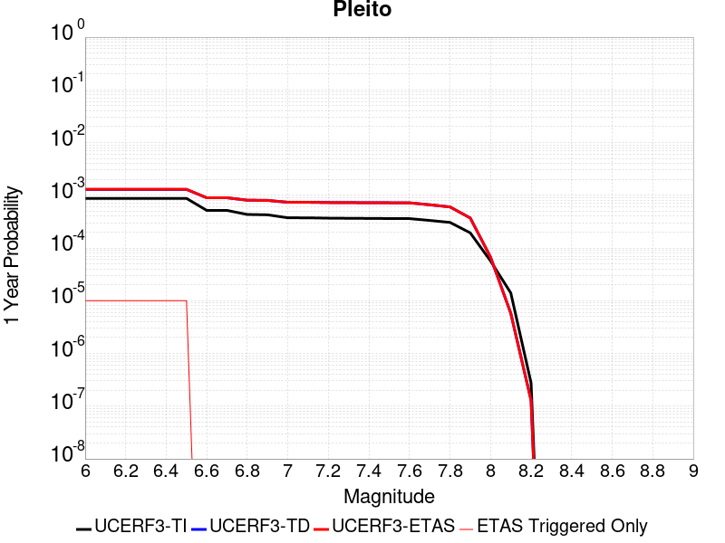 |  |

| Magnitude | 1 wk TI Prob | 1 wk TD Prob | 1 wk ETAS Prob | 1 wk ETAS/TD Gain | 1 wk ETAS Triggered Only | 1 mo TI Prob | 1 mo TD Prob | 1 mo ETAS Prob | 1 mo ETAS/TD Gain | 1 mo ETAS Triggered Only | 1 yr TI Prob | 1 yr TD Prob | 1 yr ETAS Prob | 1 yr ETAS/TD Gain | 1 yr ETAS Triggered Only | 10 yr TI Prob | 10 yr TD Prob | 10 yr ETAS Prob | 10 yr ETAS/TD Gain | 10 yr ETAS Triggered Only |
|-----|-----|-----|-----|-----|-----|-----|-----|-----|-----|-----|-----|-----|-----|-----|-----|-----|-----|-----|-----|-----|
| 6.0 | 1.6763008E-5 | 2.4771325E-5 | 2.4771325E-5 | 1.0 | 0.0 | 7.183948E-5 | 1.0615891E-4 | 1.0615891E-4 | 1.0 | 0.0 | 8.742947E-4 | 0.0012917904 | 0.0013017775 | 1.0077312 | 1.0E-5 | 0.00870863 | 0.01295784 | 0.013036803 | 1.0060939 | 8.0E-5 |
| 6.1 | 1.6763008E-5 | 2.4771325E-5 | 2.4771325E-5 | 1.0 | 0.0 | 7.183948E-5 | 1.0615891E-4 | 1.0615891E-4 | 1.0 | 0.0 | 8.742947E-4 | 0.0012917904 | 0.0013017775 | 1.0077312 | 1.0E-5 | 0.00870863 | 0.01295784 | 0.013036803 | 1.0060939 | 8.0E-5 |
| 6.2 | 1.6763008E-5 | 2.4771325E-5 | 2.4771325E-5 | 1.0 | 0.0 | 7.183948E-5 | 1.0615891E-4 | 1.0615891E-4 | 1.0 | 0.0 | 8.742947E-4 | 0.0012917904 | 0.0013017775 | 1.0077312 | 1.0E-5 | 0.00870863 | 0.01295784 | 0.013036803 | 1.0060939 | 8.0E-5 |
| 6.3 | 1.6763008E-5 | 2.4771325E-5 | 2.4771325E-5 | 1.0 | 0.0 | 7.183948E-5 | 1.0615891E-4 | 1.0615891E-4 | 1.0 | 0.0 | 8.742947E-4 | 0.0012917904 | 0.0013017775 | 1.0077312 | 1.0E-5 | 0.00870863 | 0.01295784 | 0.013036803 | 1.0060939 | 8.0E-5 |
| 6.4 | 1.6763008E-5 | 2.4771325E-5 | 2.4771325E-5 | 1.0 | 0.0 | 7.183948E-5 | 1.0615891E-4 | 1.0615891E-4 | 1.0 | 0.0 | 8.742947E-4 | 0.0012917904 | 0.0013017775 | 1.0077312 | 1.0E-5 | 0.00870863 | 0.01295784 | 0.013036803 | 1.0060939 | 8.0E-5 |
| 6.5 | 1.6763008E-5 | 2.4771325E-5 | 2.4771325E-5 | 1.0 | 0.0 | 7.183948E-5 | 1.0615891E-4 | 1.0615891E-4 | 1.0 | 0.0 | 8.742947E-4 | 0.0012917904 | 0.0013017775 | 1.0077312 | 1.0E-5 | 0.00870863 | 0.01295784 | 0.013036803 | 1.0060939 | 8.0E-5 |
| 6.6 | 9.910213E-6 | 1.7222008E-5 | 1.7222008E-5 | 1.0 | 0.0 | 4.247165E-5 | 7.380654E-5 | 7.380654E-5 | 1.0 | 0.0 | 5.169696E-4 | 8.982279E-4 | 8.982279E-4 | 1.0 | 0.0 | 0.0051576863 | 0.009054615 | 0.009104162 | 1.0054721 | 5.0E-5 |
| 6.7 | 9.910213E-6 | 1.7222008E-5 | 1.7222008E-5 | 1.0 | 0.0 | 4.247165E-5 | 7.380654E-5 | 7.380654E-5 | 1.0 | 0.0 | 5.169696E-4 | 8.982279E-4 | 8.982279E-4 | 1.0 | 0.0 | 0.0051576863 | 0.009054615 | 0.009104162 | 1.0054721 | 5.0E-5 |
| 6.8 | 8.300162E-6 | 1.5481599E-5 | 1.5481599E-5 | 1.0 | 0.0 | 3.557164E-5 | 6.634803E-5 | 6.634803E-5 | 1.0 | 0.0 | 4.3299864E-4 | 8.074893E-4 | 8.074893E-4 | 1.0 | 0.0 | 0.004321559 | 0.008154046 | 0.008183801 | 1.0036491 | 3.0E-5 |
| 6.9 | 8.183114E-6 | 1.535281E-5 | 1.535281E-5 | 1.0 | 0.0 | 3.5070017E-5 | 6.5796106E-5 | 6.5796106E-5 | 1.0 | 0.0 | 4.2689382E-4 | 8.007746E-4 | 8.007746E-4 | 1.0 | 0.0 | 0.0042607468 | 0.008087389 | 0.008117146 | 1.0036795 | 3.0E-5 |
| 7.0 | 7.1748823E-6 | 1.41397095E-5 | 1.41397095E-5 | 1.0 | 0.0 | 3.0749135E-5 | 6.059735E-5 | 6.059735E-5 | 1.0 | 0.0 | 3.743064E-4 | 7.3752354E-4 | 7.3752354E-4 | 1.0 | 0.0 | 0.0037367654 | 0.0074588493 | 0.0074787 | 1.0026613 | 2.0E-5 |
| 7.1 | 7.1671807E-6 | 1.4130079E-5 | 1.4130079E-5 | 1.0 | 0.0 | 3.0716128E-5 | 6.0556078E-5 | 6.0556078E-5 | 1.0 | 0.0 | 3.7390468E-4 | 7.370214E-4 | 7.370214E-4 | 1.0 | 0.0 | 0.0037327618 | 0.0074538616 | 0.0074737123 | 1.0026631 | 2.0E-5 |
| 7.2 | 7.0649667E-6 | 1.3977344E-5 | 1.3977344E-5 | 1.0 | 0.0 | 3.0278077E-5 | 5.990153E-5 | 5.990153E-5 | 1.0 | 0.0 | 3.6857324E-4 | 7.290576E-4 | 7.290576E-4 | 1.0 | 0.0 | 0.0036796255 | 0.007374603 | 0.0073944554 | 1.002692 | 2.0E-5 |
| 7.3 | 7.02082E-6 | 1.3920784E-5 | 1.3920784E-5 | 1.0 | 0.0 | 3.008888E-5 | 5.965914E-5 | 5.965914E-5 | 1.0 | 0.0 | 3.6627054E-4 | 7.261085E-4 | 7.261085E-4 | 1.0 | 0.0 | 0.0036566744 | 0.007345096 | 0.007364949 | 1.002703 | 2.0E-5 |
| 7.4 | 6.987146E-6 | 1.3880338E-5 | 1.3880338E-5 | 1.0 | 0.0 | 2.9944567E-5 | 5.948581E-5 | 5.948581E-5 | 1.0 | 0.0 | 3.6451413E-4 | 7.239996E-4 | 7.239996E-4 | 1.0 | 0.0 | 0.0036391679 | 0.0073240283 | 0.007333955 | 1.0013554 | 1.0E-5 |
| 7.5 | 6.9494554E-6 | 1.3837237E-5 | 1.3837237E-5 | 1.0 | 0.0 | 2.9783041E-5 | 5.93011E-5 | 5.93011E-5 | 1.0 | 0.0 | 3.625482E-4 | 7.2175224E-4 | 7.2175224E-4 | 1.0 | 0.0 | 0.0036195726 | 0.0073016533 | 0.0073115802 | 1.0013596 | 1.0E-5 |
| 7.6 | 6.92694E-6 | 1.3796339E-5 | 1.3796339E-5 | 1.0 | 0.0 | 2.9686547E-5 | 5.9125832E-5 | 5.9125832E-5 | 1.0 | 0.0 | 3.6137376E-4 | 7.1961974E-4 | 7.1961974E-4 | 1.0 | 0.0 | 0.0036078666 | 0.0072804 | 0.007290327 | 1.0013635 | 1.0E-5 |
| 7.7 | 6.395867E-6 | 1.2675077E-5 | 1.2675077E-5 | 1.0 | 0.0 | 2.741057E-5 | 5.4320633E-5 | 5.4320633E-5 | 1.0 | 0.0 | 3.336726E-4 | 6.6115335E-4 | 6.6115335E-4 | 1.0 | 0.0 | 0.0033317201 | 0.0066988943 | 0.0066988943 | 1.0 | 0.0 |
| 7.8 | 5.8664327E-6 | 1.15421135E-5 | 1.15421135E-5 | 1.0 | 0.0 | 2.5141611E-5 | 4.9465263E-5 | 4.9465263E-5 | 1.0 | 0.0 | 3.060561E-4 | 6.020734E-4 | 6.020734E-4 | 1.0 | 0.0 | 0.0030563495 | 0.0061040027 | 0.0061040027 | 1.0 | 0.0 |
| 7.9 | 3.7167474E-6 | 7.117878E-6 | 7.117878E-6 | 1.0 | 0.0 | 1.592882E-5 | 3.0504834E-5 | 3.0504834E-5 | 1.0 | 0.0 | 1.9391612E-4 | 3.713332E-4 | 3.713332E-4 | 1.0 | 0.0 | 0.0019374699 | 0.0037694757 | 0.0037694757 | 1.0 | 0.0 |
| 8.0 | 1.0903841E-6 | 1.2886559E-6 | 1.2886559E-6 | 1.0 | 0.0 | 4.6730665E-6 | 5.5227993E-6 | 5.5227993E-6 | 1.0 | 0.0 | 5.68931E-5 | 6.723802E-5 | 6.723802E-5 | 1.0 | 0.0 | 5.6878536E-4 | 6.9462E-4 | 6.9462E-4 | 1.0 | 0.0 |
| 8.1 | 2.6894583E-7 | 1.106846E-7 | 1.106846E-7 | 1.0 | 0.0 | 1.1526245E-6 | 4.7436248E-7 | 4.7436248E-7 | 1.0 | 0.0 | 1.4033113E-5 | 5.775348E-6 | 5.775348E-6 | 1.0 | 0.0 | 1.4032227E-4 | 6.461821E-5 | 6.461821E-5 | 1.0 | 0.0 |
| 8.2 | 5.2967013E-9 | 2.4599007E-9 | 2.4599007E-9 | 1.0 | 0.0 | 2.2700148E-8 | 1.0542432E-8 | 1.0542432E-8 | 1.0 | 0.0 | 2.7637427E-7 | 1.283541E-7 | 1.283541E-7 | 1.0 | 0.0 | 2.7637393E-6 | 1.4601666E-6 | 1.4601666E-6 | 1.0 | 0.0 |

## Deep Springs
*[(top)](#table-of-contents)*

| 1 Week | 1 Month | 1 Year | 10 Year |
|-----|-----|-----|-----|
|  |  |  | 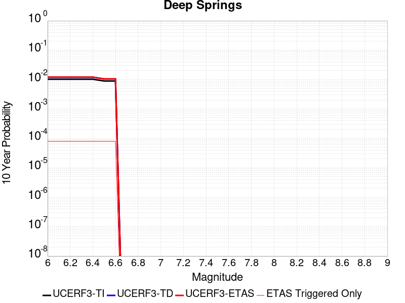 |

| Magnitude | 1 wk TI Prob | 1 wk TD Prob | 1 wk ETAS Prob | 1 wk ETAS/TD Gain | 1 wk ETAS Triggered Only | 1 mo TI Prob | 1 mo TD Prob | 1 mo ETAS Prob | 1 mo ETAS/TD Gain | 1 mo ETAS Triggered Only | 1 yr TI Prob | 1 yr TD Prob | 1 yr ETAS Prob | 1 yr ETAS/TD Gain | 1 yr ETAS Triggered Only | 10 yr TI Prob | 10 yr TD Prob | 10 yr ETAS Prob | 10 yr ETAS/TD Gain | 10 yr ETAS Triggered Only |
|-----|-----|-----|-----|-----|-----|-----|-----|-----|-----|-----|-----|-----|-----|-----|-----|-----|-----|-----|-----|-----|
| 6.0 | 1.9810619E-5 | 2.311303E-5 | 2.311303E-5 | 1.0 | 0.0 | 8.489989E-5 | 9.9054945E-5 | 1.2905197E-4 | 1.3028322 | 3.0E-5 | 0.001033166 | 0.0012058344 | 0.0012557742 | 1.0414151 | 5.0E-5 | 0.010283757 | 0.012042696 | 0.012121732 | 1.0065631 | 8.0E-5 |
| 6.1 | 1.9810619E-5 | 2.311303E-5 | 2.311303E-5 | 1.0 | 0.0 | 8.489989E-5 | 9.9054945E-5 | 1.2905197E-4 | 1.3028322 | 3.0E-5 | 0.001033166 | 0.0012058344 | 0.0012557742 | 1.0414151 | 5.0E-5 | 0.010283757 | 0.012042696 | 0.012121732 | 1.0065631 | 8.0E-5 |
| 6.2 | 1.9810619E-5 | 2.311303E-5 | 2.311303E-5 | 1.0 | 0.0 | 8.489989E-5 | 9.9054945E-5 | 1.2905197E-4 | 1.3028322 | 3.0E-5 | 0.001033166 | 0.0012058344 | 0.0012557742 | 1.0414151 | 5.0E-5 | 0.010283757 | 0.012042696 | 0.012121732 | 1.0065631 | 8.0E-5 |
| 6.3 | 1.9810619E-5 | 2.311303E-5 | 2.311303E-5 | 1.0 | 0.0 | 8.489989E-5 | 9.9054945E-5 | 1.2905197E-4 | 1.3028322 | 3.0E-5 | 0.001033166 | 0.0012058344 | 0.0012557742 | 1.0414151 | 5.0E-5 | 0.010283757 | 0.012042696 | 0.012121732 | 1.0065631 | 8.0E-5 |
| 6.4 | 1.9810619E-5 | 2.311303E-5 | 2.311303E-5 | 1.0 | 0.0 | 8.489989E-5 | 9.9054945E-5 | 1.2905197E-4 | 1.3028322 | 3.0E-5 | 0.001033166 | 0.0012058344 | 0.0012557742 | 1.0414151 | 5.0E-5 | 0.010283757 | 0.012042696 | 0.012121732 | 1.0065631 | 8.0E-5 |
| 6.5 | 1.7190405E-5 | 2.0051E-5 | 2.0051E-5 | 1.0 | 0.0 | 7.367108E-5 | 8.593286E-5 | 1.1593028E-4 | 1.3490797 | 3.0E-5 | 8.9657627E-4 | 0.0010462323 | 0.00109618 | 1.0477406 | 5.0E-5 | 0.008929676 | 0.010462292 | 0.010541455 | 1.0075665 | 8.0E-5 |
| 6.6 | 1.7190405E-5 | 2.0051E-5 | 2.0051E-5 | 1.0 | 0.0 | 7.367108E-5 | 8.593286E-5 | 1.1593028E-4 | 1.3490797 | 3.0E-5 | 8.9657627E-4 | 0.0010462323 | 0.00109618 | 1.0477406 | 5.0E-5 | 0.008929676 | 0.010462292 | 0.010541455 | 1.0075665 | 8.0E-5 |

## San Andreas (Creeping Section) 2011 CFM
*[(top)](#table-of-contents)*

| 1 Week | 1 Month | 1 Year | 10 Year |
|-----|-----|-----|-----|
|  | 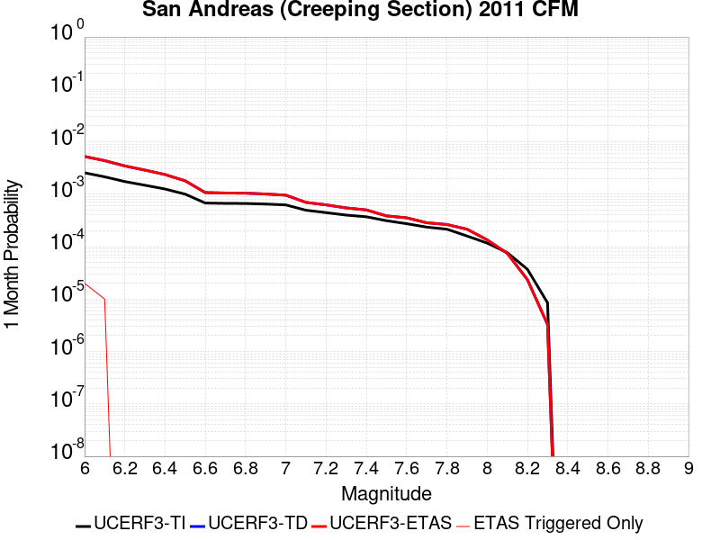 | 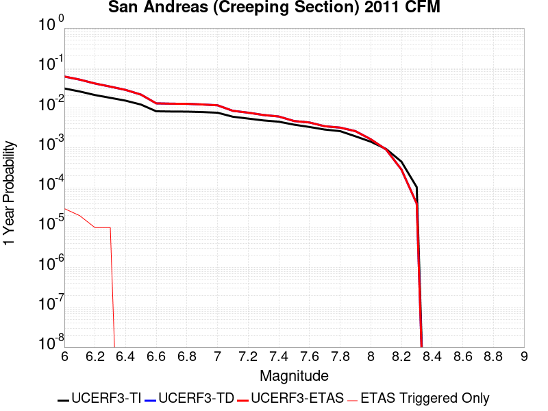 |  |

| Magnitude | 1 wk TI Prob | 1 wk TD Prob | 1 wk ETAS Prob | 1 wk ETAS/TD Gain | 1 wk ETAS Triggered Only | 1 mo TI Prob | 1 mo TD Prob | 1 mo ETAS Prob | 1 mo ETAS/TD Gain | 1 mo ETAS Triggered Only | 1 yr TI Prob | 1 yr TD Prob | 1 yr ETAS Prob | 1 yr ETAS/TD Gain | 1 yr ETAS Triggered Only | 10 yr TI Prob | 10 yr TD Prob | 10 yr ETAS Prob | 10 yr ETAS/TD Gain | 10 yr ETAS Triggered Only |
|-----|-----|-----|-----|-----|-----|-----|-----|-----|-----|-----|-----|-----|-----|-----|-----|-----|-----|-----|-----|-----|
| 6.0 | 5.986481E-4 | 0.001227701 | 0.0012376886 | 1.0081353 | 1.0E-5 | 0.0025631124 | 0.005246098 | 0.005265993 | 1.0037924 | 2.0E-5 | 0.030762846 | 0.061211813 | 0.061239976 | 1.0004601 | 3.0E-5 | 0.26835477 | 0.42596716 | 0.42601308 | 1.0001078 | 8.0E-5 |
| 6.1 | 5.015945E-4 | 0.0010218859 | 0.0010218859 | 1.0 | 0.0 | 0.00214792 | 0.0043683136 | 0.00437827 | 1.0022792 | 1.0E-5 | 0.025839351 | 0.051254056 | 0.05127303 | 1.0003703 | 2.0E-5 | 0.23032776 | 0.3728875 | 0.3729251 | 1.0001009 | 6.0E-5 |
| 6.2 | 4.073338E-4 | 8.1082666E-4 | 8.1082666E-4 | 1.0 | 0.0 | 0.0017445484 | 0.003467598 | 0.003467598 | 1.0 | 0.0 | 0.021034058 | 0.040938858 | 0.04094845 | 1.0002342 | 1.0E-5 | 0.19150782 | 0.31306726 | 0.3131016 | 1.0001097 | 5.0E-5 |
| 6.3 | 3.464099E-4 | 6.740175E-4 | 6.740175E-4 | 1.0 | 0.0 | 0.0014837692 | 0.0028834257 | 0.0028834257 | 1.0 | 0.0 | 0.017915873 | 0.034195323 | 0.03420498 | 1.0002824 | 1.0E-5 | 0.16538359 | 0.27135244 | 0.2713816 | 1.0001074 | 4.0E-5 |
| 6.4 | 2.935057E-4 | 5.545179E-4 | 5.545179E-4 | 1.0 | 0.0 | 0.0012572751 | 0.002372998 | 0.002372998 | 1.0 | 0.0 | 0.015200248 | 0.028270293 | 0.028270293 | 1.0 | 0.0 | 0.14201577 | 0.23302312 | 0.23303846 | 1.0000658 | 2.0E-5 |
| 6.5 | 2.3409708E-4 | 4.2102532E-4 | 4.2102532E-4 | 1.0 | 0.0 | 0.0010028875 | 0.0018024362 | 0.0018024362 | 1.0 | 0.0 | 0.012141965 | 0.021593295 | 0.021593295 | 1.0 | 0.0 | 0.11499573 | 0.18686365 | 0.18687992 | 1.000087 | 2.0E-5 |
| 6.6 | 1.5842178E-4 | 2.5080625E-4 | 2.5080625E-4 | 1.0 | 0.0 | 6.7877385E-4 | 0.0010744325 | 0.0010744325 | 1.0 | 0.0 | 0.0082328 | 0.013001433 | 0.013001433 | 1.0 | 0.0 | 0.07934396 | 0.12318965 | 0.12320719 | 1.0001423 | 2.0E-5 |
| 6.7 | 1.5616413E-4 | 2.4617155E-4 | 2.4617155E-4 | 1.0 | 0.0 | 6.691031E-4 | 0.0010545887 | 0.0010545887 | 1.0 | 0.0 | 0.0081159435 | 0.012763296 | 0.012763296 | 1.0 | 0.0 | 0.0782586 | 0.121216856 | 0.12123443 | 1.000145 | 2.0E-5 |
| 6.8 | 1.5538467E-4 | 2.4440986E-4 | 2.4440986E-4 | 1.0 | 0.0 | 6.6576427E-4 | 0.0010470453 | 0.0010470453 | 1.0 | 0.0 | 0.008075596 | 0.012672617 | 0.012672617 | 1.0 | 0.0 | 0.07788358 | 0.12044768 | 0.12046527 | 1.000146 | 2.0E-5 |
| 6.9 | 1.5153569E-4 | 2.3550174E-4 | 2.3550174E-4 | 1.0 | 0.0 | 6.49277E-4 | 0.0010089047 | 0.0010089047 | 1.0 | 0.0 | 0.007876333 | 0.012214754 | 0.012214754 | 1.0 | 0.0 | 0.07602952 | 0.1165177 | 0.11653537 | 1.0001516 | 2.0E-5 |
| 7.0 | 1.4588932E-4 | 2.2407302E-4 | 2.2407302E-4 | 1.0 | 0.0 | 6.250901E-4 | 9.599615E-4 | 9.599615E-4 | 1.0 | 0.0 | 0.0075839474 | 0.011625397 | 0.011625397 | 1.0 | 0.0 | 0.073302895 | 0.1113634 | 0.11138117 | 1.0001596 | 2.0E-5 |
| 7.1 | 1.1565079E-4 | 1.6291256E-4 | 1.6291256E-4 | 1.0 | 0.0 | 4.955521E-4 | 6.980107E-4 | 6.980107E-4 | 1.0 | 0.0 | 0.006016669 | 0.008465368 | 0.008465368 | 1.0 | 0.0 | 0.058563538 | 0.083707 | 0.083725326 | 1.000219 | 2.0E-5 |
| 7.2 | 1.0393792E-4 | 1.4624851E-4 | 1.4624851E-4 | 1.0 | 0.0 | 4.4537216E-4 | 6.2662957E-4 | 6.2662957E-4 | 1.0 | 0.0 | 0.005408933 | 0.007602697 | 0.007602697 | 1.0 | 0.0 | 0.052791595 | 0.0756556 | 0.075674094 | 1.0002444 | 2.0E-5 |
| 7.3 | 9.332884E-5 | 1.2788622E-4 | 1.2788622E-4 | 1.0 | 0.0 | 3.999194E-4 | 5.479693E-4 | 5.479693E-4 | 1.0 | 0.0 | 0.0048581534 | 0.006651253 | 0.006651253 | 1.0 | 0.0 | 0.047533102 | 0.06651429 | 0.066532955 | 1.0002807 | 2.0E-5 |
| 7.4 | 8.670252E-5 | 1.1709979E-4 | 1.1709979E-4 | 1.0 | 0.0 | 3.715293E-4 | 5.0176034E-4 | 5.0176034E-4 | 1.0 | 0.0 | 0.004513991 | 0.0060919416 | 0.0060919416 | 1.0 | 0.0 | 0.044233937 | 0.0611787 | 0.06119748 | 1.000307 | 2.0E-5 |
| 7.5 | 7.3036405E-5 | 9.011361E-5 | 9.011361E-5 | 1.0 | 0.0 | 3.129756E-4 | 3.861441E-4 | 3.861441E-4 | 1.0 | 0.0 | 0.0038038217 | 0.0046911915 | 0.0046911915 | 1.0 | 0.0 | 0.03739367 | 0.047902368 | 0.047921408 | 1.0003976 | 2.0E-5 |
| 7.6 | 6.3935775E-5 | 8.285012E-5 | 8.285012E-5 | 1.0 | 0.0 | 2.7398168E-4 | 3.5502372E-4 | 3.5502372E-4 | 1.0 | 0.0 | 0.0033306254 | 0.0043138657 | 0.0043138657 | 1.0 | 0.0 | 0.032811474 | 0.044012927 | 0.044032045 | 1.0004344 | 2.0E-5 |
| 7.7 | 5.5050095E-5 | 6.6658926E-5 | 6.6658926E-5 | 1.0 | 0.0 | 2.3590765E-4 | 2.8564985E-4 | 2.8564985E-4 | 1.0 | 0.0 | 0.0028683927 | 0.0034722448 | 0.0034722448 | 1.0 | 0.0 | 0.0283165 | 0.03581521 | 0.035834495 | 1.0005385 | 2.0E-5 |
| 7.8 | 5.027131E-5 | 6.166573E-5 | 6.166573E-5 | 1.0 | 0.0 | 2.1543067E-4 | 2.6425492E-4 | 2.6425492E-4 | 1.0 | 0.0 | 0.0026197135 | 0.0032125604 | 0.0032125604 | 1.0 | 0.0 | 0.025890453 | 0.03314427 | 0.033163603 | 1.0005834 | 2.0E-5 |
| 7.9 | 3.7271806E-5 | 5.0254795E-5 | 5.0254795E-5 | 1.0 | 0.0 | 1.5972654E-4 | 2.1535992E-4 | 2.1535992E-4 | 1.0 | 0.0 | 0.0019429359 | 0.0026188563 | 0.0026188563 | 1.0 | 0.0 | 0.019260362 | 0.027081393 | 0.02710085 | 1.0007185 | 2.0E-5 |
| 8.0 | 2.7310243E-5 | 3.1447296E-5 | 3.1447296E-5 | 1.0 | 0.0 | 1.17038646E-4 | 1.3476716E-4 | 1.3476716E-4 | 1.0 | 0.0 | 0.0014240141 | 0.0016395561 | 0.0016395561 | 1.0 | 0.0 | 0.014149235 | 0.017223299 | 0.017223299 | 1.0 | 0.0 |
| 8.1 | 1.7940547E-5 | 1.7411876E-5 | 1.7411876E-5 | 1.0 | 0.0 | 7.688579E-5 | 7.46202E-5 | 7.46202E-5 | 1.0 | 0.0 | 9.3568244E-4 | 9.0812275E-4 | 9.0812275E-4 | 1.0 | 0.0 | 0.009317525 | 0.009804959 | 0.009804959 | 1.0 | 0.0 |
| 8.2 | 8.643924E-6 | 5.478665E-6 | 5.478665E-6 | 1.0 | 0.0 | 3.704486E-5 | 2.3479783E-5 | 2.3479783E-5 | 1.0 | 0.0 | 4.5092785E-4 | 2.8582895E-4 | 2.8582895E-4 | 1.0 | 0.0 | 0.0045001395 | 0.0032508469 | 0.0032508469 | 1.0 | 0.0 |
| 8.3 | 1.983087E-6 | 7.6647797E-7 | 7.6647797E-7 | 1.0 | 0.0 | 8.498917E-6 | 3.2849016E-6 | 3.2849016E-6 | 1.0 | 0.0 | 1.034694E-4 | 3.999296E-5 | 3.999296E-5 | 1.0 | 0.0 | 0.0010342124 | 4.7228087E-4 | 4.7228087E-4 | 1.0 | 0.0 |

## Mission Creek
*[(top)](#table-of-contents)*

| 1 Week | 1 Month | 1 Year | 10 Year |
|-----|-----|-----|-----|
|  | 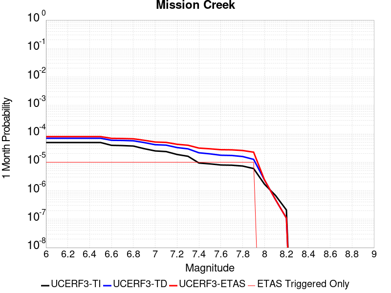 |  |  |

| Magnitude | 1 wk TI Prob | 1 wk TD Prob | 1 wk ETAS Prob | 1 wk ETAS/TD Gain | 1 wk ETAS Triggered Only | 1 mo TI Prob | 1 mo TD Prob | 1 mo ETAS Prob | 1 mo ETAS/TD Gain | 1 mo ETAS Triggered Only | 1 yr TI Prob | 1 yr TD Prob | 1 yr ETAS Prob | 1 yr ETAS/TD Gain | 1 yr ETAS Triggered Only | 10 yr TI Prob | 10 yr TD Prob | 10 yr ETAS Prob | 10 yr ETAS/TD Gain | 10 yr ETAS Triggered Only |
|-----|-----|-----|-----|-----|-----|-----|-----|-----|-----|-----|-----|-----|-----|-----|-----|-----|-----|-----|-----|-----|
| 6.0 | 1.1549387E-5 | 1.6325142E-5 | 1.6325142E-5 | 1.0 | 0.0 | 4.9496433E-5 | 6.9963105E-5 | 7.99624E-5 | 1.1429225 | 1.0E-5 | 6.0245243E-4 | 8.514829E-4 | 8.614744E-4 | 1.0117342 | 1.0E-5 | 0.006008218 | 0.008511699 | 0.008591018 | 1.0093188 | 8.0E-5 |
| 6.1 | 1.1549387E-5 | 1.6325142E-5 | 1.6325142E-5 | 1.0 | 0.0 | 4.9496433E-5 | 6.9963105E-5 | 7.99624E-5 | 1.1429225 | 1.0E-5 | 6.0245243E-4 | 8.514829E-4 | 8.614744E-4 | 1.0117342 | 1.0E-5 | 0.006008218 | 0.008511699 | 0.008591018 | 1.0093188 | 8.0E-5 |
| 6.2 | 1.1549387E-5 | 1.6325142E-5 | 1.6325142E-5 | 1.0 | 0.0 | 4.9496433E-5 | 6.9963105E-5 | 7.99624E-5 | 1.1429225 | 1.0E-5 | 6.0245243E-4 | 8.514829E-4 | 8.614744E-4 | 1.0117342 | 1.0E-5 | 0.006008218 | 0.008511699 | 0.008591018 | 1.0093188 | 8.0E-5 |
| 6.3 | 1.1549387E-5 | 1.6325142E-5 | 1.6325142E-5 | 1.0 | 0.0 | 4.9496433E-5 | 6.9963105E-5 | 7.99624E-5 | 1.1429225 | 1.0E-5 | 6.0245243E-4 | 8.514829E-4 | 8.614744E-4 | 1.0117342 | 1.0E-5 | 0.006008218 | 0.008511699 | 0.008591018 | 1.0093188 | 8.0E-5 |
| 6.4 | 1.1549387E-5 | 1.6325142E-5 | 1.6325142E-5 | 1.0 | 0.0 | 4.9496433E-5 | 6.9963105E-5 | 7.99624E-5 | 1.1429225 | 1.0E-5 | 6.0245243E-4 | 8.514829E-4 | 8.614744E-4 | 1.0117342 | 1.0E-5 | 0.006008218 | 0.008511699 | 0.008591018 | 1.0093188 | 8.0E-5 |
| 6.5 | 1.1549387E-5 | 1.6325142E-5 | 1.6325142E-5 | 1.0 | 0.0 | 4.9496433E-5 | 6.9963105E-5 | 7.99624E-5 | 1.1429225 | 1.0E-5 | 6.0245243E-4 | 8.514829E-4 | 8.614744E-4 | 1.0117342 | 1.0E-5 | 0.006008218 | 0.008511699 | 0.008591018 | 1.0093188 | 8.0E-5 |
| 6.6 | 9.202681E-6 | 1.3848401E-5 | 1.3848401E-5 | 1.0 | 0.0 | 3.9439463E-5 | 5.934899E-5 | 6.9348396E-5 | 1.1684848 | 1.0E-5 | 4.800697E-4 | 7.2234345E-4 | 7.323362E-4 | 1.0138339 | 1.0E-5 | 0.004790339 | 0.0072288746 | 0.0073082964 | 1.0109867 | 8.0E-5 |
| 6.7 | 9.019164E-6 | 1.3654068E-5 | 1.3654068E-5 | 1.0 | 0.0 | 3.8652986E-5 | 5.8516176E-5 | 6.851559E-5 | 1.1708829 | 1.0E-5 | 4.7049852E-4 | 7.1221055E-4 | 7.2220346E-4 | 1.0140308 | 1.0E-5 | 0.004695036 | 0.0071281986 | 0.0072076283 | 1.0111431 | 8.0E-5 |
| 6.8 | 8.673558E-6 | 1.3276174E-5 | 1.3276174E-5 | 1.0 | 0.0 | 3.717186E-5 | 5.68967E-5 | 6.689613E-5 | 1.1757472 | 1.0E-5 | 4.524734E-4 | 6.92506E-4 | 7.0249906E-4 | 1.0144303 | 1.0E-5 | 0.0045155324 | 0.0069323843 | 0.00701183 | 1.0114601 | 8.0E-5 |
| 6.9 | 7.002255E-6 | 1.1480386E-5 | 1.1480386E-5 | 1.0 | 0.0 | 3.000932E-5 | 4.9200764E-5 | 5.9200273E-5 | 1.2032388 | 1.0E-5 | 3.653022E-4 | 5.988615E-4 | 6.088555E-4 | 1.0166883 | 1.0E-5 | 0.0036470229 | 0.0060011996 | 0.0060807196 | 1.0132507 | 8.0E-5 |
| 7.0 | 5.84644E-6 | 9.677556E-6 | 9.677556E-6 | 1.0 | 0.0 | 2.5055931E-5 | 4.1474606E-5 | 5.147419E-5 | 1.2411014 | 1.0E-5 | 3.0501327E-4 | 5.0484086E-4 | 5.148358E-4 | 1.0197983 | 1.0E-5 | 0.0030459496 | 0.0050654565 | 0.0051351017 | 1.0137491 | 7.0E-5 |
| 7.1 | 5.54703E-6 | 9.332022E-6 | 9.332022E-6 | 1.0 | 0.0 | 2.377277E-5 | 3.9993793E-5 | 4.9993392E-5 | 1.2500288 | 1.0E-5 | 2.8939504E-4 | 4.868201E-4 | 4.9681525E-4 | 1.0205314 | 1.0E-5 | 0.0028901845 | 0.004886046 | 0.004955704 | 1.0142565 | 7.0E-5 |
| 7.2 | 4.384709E-6 | 7.683992E-6 | 7.683992E-6 | 1.0 | 0.0 | 1.8791474E-5 | 3.2931002E-5 | 4.293067E-5 | 1.3036553 | 1.0E-5 | 2.2876218E-4 | 4.0086484E-4 | 4.108608E-4 | 1.0249361 | 1.0E-5 | 0.0022852682 | 0.0040298863 | 0.004099604 | 1.0173002 | 7.0E-5 |
| 7.3 | 3.7888456E-6 | 6.917821E-6 | 6.917821E-6 | 1.0 | 0.0 | 1.623781E-5 | 2.9647486E-5 | 3.9647188E-5 | 1.3372867 | 1.0E-5 | 1.9767738E-4 | 3.609017E-4 | 3.7089808E-4 | 1.0276984 | 1.0E-5 | 0.0019750162 | 0.0036316153 | 0.0037013611 | 1.0192052 | 7.0E-5 |
| 7.4 | 2.1982462E-6 | 5.026073E-6 | 5.026073E-6 | 1.0 | 0.0 | 9.421021E-6 | 2.1540136E-5 | 3.153992E-5 | 1.4642396 | 1.0E-5 | 1.1469489E-4 | 2.6221978E-4 | 2.7221715E-4 | 1.038126 | 1.0E-5 | 0.0011463572 | 0.0026473494 | 0.0027071906 | 1.0226042 | 6.0E-5 |
| 7.5 | 2.051923E-6 | 4.617237E-6 | 4.617237E-6 | 1.0 | 0.0 | 8.793926E-6 | 1.978801E-5 | 2.9787812E-5 | 1.5053465 | 1.0E-5 | 1.0706078E-4 | 2.4089254E-4 | 2.5089012E-4 | 1.0415022 | 1.0E-5 | 0.0010700922 | 0.0024350125 | 0.0024948663 | 1.0245805 | 6.0E-5 |
| 7.6 | 1.8733427E-6 | 4.125508E-6 | 4.125508E-6 | 1.0 | 0.0 | 8.028587E-6 | 1.768063E-5 | 2.7680453E-5 | 1.5655807 | 1.0E-5 | 9.774366E-5 | 2.1524049E-4 | 2.2523833E-4 | 1.0464497 | 1.0E-5 | 9.770069E-4 | 0.002179529 | 0.0022393982 | 1.0274689 | 6.0E-5 |
| 7.7 | 1.8411953E-6 | 4.0451673E-6 | 4.0451673E-6 | 1.0 | 0.0 | 7.890813E-6 | 1.7336315E-5 | 2.7336142E-5 | 1.5768138 | 1.0E-5 | 9.606641E-5 | 2.1104928E-4 | 2.2104717E-4 | 1.0473723 | 1.0E-5 | 9.6024893E-4 | 0.0021378102 | 0.002197682 | 1.0280061 | 6.0E-5 |
| 7.8 | 1.7194251E-6 | 3.7123866E-6 | 3.7123866E-6 | 1.0 | 0.0 | 7.368944E-6 | 1.5910133E-5 | 2.5909972E-5 | 1.6285203 | 1.0E-5 | 8.97132E-5 | 1.9368871E-4 | 2.0368678E-4 | 1.0516193 | 1.0E-5 | 8.967699E-4 | 0.0019636988 | 0.002023581 | 1.0304946 | 6.0E-5 |
| 7.9 | 1.4035052E-6 | 2.9516495E-6 | 2.9516495E-6 | 1.0 | 0.0 | 6.0150082E-6 | 1.2649865E-5 | 2.264974E-5 | 1.7905122 | 1.0E-5 | 7.3230265E-5 | 1.5400129E-4 | 1.6399975E-4 | 1.0649245 | 1.0E-5 | 7.3206134E-4 | 0.0015642311 | 0.0016241373 | 1.0382975 | 6.0E-5 |
| 8.0 | 3.9318823E-7 | 5.531722E-7 | 5.531722E-7 | 1.0 | 0.0 | 1.6850913E-6 | 2.370736E-6 | 2.370736E-6 | 1.0 | 0.0 | 2.0515794E-5 | 2.8863333E-5 | 2.8863333E-5 | 1.0 | 0.0 | 2.0513899E-4 | 2.9927568E-4 | 2.9927568E-4 | 1.0 | 0.0 |
| 8.1 | 1.596793E-7 | 1.13891964E-7 | 1.13891964E-7 | 1.0 | 0.0 | 6.8433974E-7 | 4.881083E-7 | 4.881083E-7 | 1.0 | 0.0 | 8.331805E-6 | 5.942703E-6 | 5.942703E-6 | 1.0 | 0.0 | 8.331492E-5 | 6.555237E-5 | 6.555237E-5 | 1.0 | 0.0 |
| 8.2 | 4.9003038E-8 | 2.5465459E-8 | 2.5465459E-8 | 1.0 | 0.0 | 2.10013E-7 | 1.0913767E-7 | 1.0913767E-7 | 1.0 | 0.0 | 2.5569052E-6 | 1.3287504E-6 | 1.3287504E-6 | 1.0 | 0.0 | 2.556876E-5 | 1.49686575E-5 | 1.49686575E-5 | 1.0 | 0.0 |

## Cucamonga
*[(top)](#table-of-contents)*

| 1 Week | 1 Month | 1 Year | 10 Year |
|-----|-----|-----|-----|
|  | 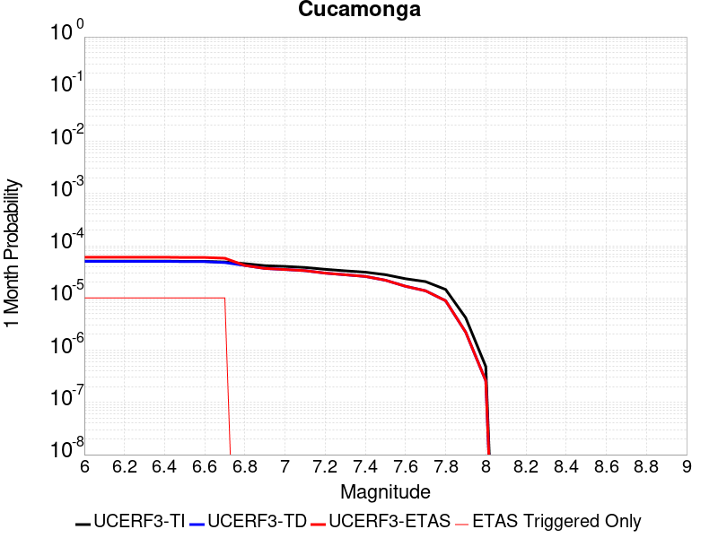 |  | 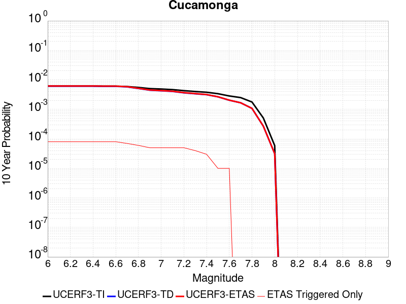 |

| Magnitude | 1 wk TI Prob | 1 wk TD Prob | 1 wk ETAS Prob | 1 wk ETAS/TD Gain | 1 wk ETAS Triggered Only | 1 mo TI Prob | 1 mo TD Prob | 1 mo ETAS Prob | 1 mo ETAS/TD Gain | 1 mo ETAS Triggered Only | 1 yr TI Prob | 1 yr TD Prob | 1 yr ETAS Prob | 1 yr ETAS/TD Gain | 1 yr ETAS Triggered Only | 10 yr TI Prob | 10 yr TD Prob | 10 yr ETAS Prob | 10 yr ETAS/TD Gain | 10 yr ETAS Triggered Only |
|-----|-----|-----|-----|-----|-----|-----|-----|-----|-----|-----|-----|-----|-----|-----|-----|-----|-----|-----|-----|-----|
| 6.0 | 1.1848348E-5 | 1.1737856E-5 | 1.1737856E-5 | 1.0 | 0.0 | 5.0777642E-5 | 5.030414E-5 | 6.030364E-5 | 1.1987808 | 1.0E-5 | 6.180424E-4 | 6.1228353E-4 | 6.322713E-4 | 1.0326446 | 2.0E-5 | 0.0061632637 | 0.006107083 | 0.0061865943 | 1.0130196 | 8.0E-5 |
| 6.1 | 1.1848348E-5 | 1.1737856E-5 | 1.1737856E-5 | 1.0 | 0.0 | 5.0777642E-5 | 5.030414E-5 | 6.030364E-5 | 1.1987808 | 1.0E-5 | 6.180424E-4 | 6.1228353E-4 | 6.322713E-4 | 1.0326446 | 2.0E-5 | 0.0061632637 | 0.006107083 | 0.0061865943 | 1.0130196 | 8.0E-5 |
| 6.2 | 1.1848348E-5 | 1.1737856E-5 | 1.1737856E-5 | 1.0 | 0.0 | 5.0777642E-5 | 5.030414E-5 | 6.030364E-5 | 1.1987808 | 1.0E-5 | 6.180424E-4 | 6.1228353E-4 | 6.322713E-4 | 1.0326446 | 2.0E-5 | 0.0061632637 | 0.006107083 | 0.0061865943 | 1.0130196 | 8.0E-5 |
| 6.3 | 1.1848348E-5 | 1.1737856E-5 | 1.1737856E-5 | 1.0 | 0.0 | 5.0777642E-5 | 5.030414E-5 | 6.030364E-5 | 1.1987808 | 1.0E-5 | 6.180424E-4 | 6.1228353E-4 | 6.322713E-4 | 1.0326446 | 2.0E-5 | 0.0061632637 | 0.006107083 | 0.0061865943 | 1.0130196 | 8.0E-5 |
| 6.4 | 1.1848348E-5 | 1.1737856E-5 | 1.1737856E-5 | 1.0 | 0.0 | 5.0777642E-5 | 5.030414E-5 | 6.030364E-5 | 1.1987808 | 1.0E-5 | 6.180424E-4 | 6.1228353E-4 | 6.322713E-4 | 1.0326446 | 2.0E-5 | 0.0061632637 | 0.006107083 | 0.0061865943 | 1.0130196 | 8.0E-5 |
| 6.5 | 1.16988695E-5 | 1.1576885E-5 | 1.1576885E-5 | 1.0 | 0.0 | 5.013705E-5 | 4.9614293E-5 | 5.9613798E-5 | 1.2015449 | 1.0E-5 | 6.102476E-4 | 6.038893E-4 | 6.238772E-4 | 1.0330987 | 2.0E-5 | 0.006085745 | 0.0060235965 | 0.0061031147 | 1.0132011 | 8.0E-5 |
| 6.6 | 1.16988695E-5 | 1.1576885E-5 | 1.1576885E-5 | 1.0 | 0.0 | 5.013705E-5 | 4.9614293E-5 | 5.9613798E-5 | 1.2015449 | 1.0E-5 | 6.102476E-4 | 6.038893E-4 | 6.238772E-4 | 1.0330987 | 2.0E-5 | 0.006085745 | 0.0060235965 | 0.0061031147 | 1.0132011 | 8.0E-5 |
| 6.7 | 1.1397107E-5 | 1.1115768E-5 | 1.1115768E-5 | 1.0 | 0.0 | 4.884383E-5 | 4.763815E-5 | 5.7637673E-5 | 1.2099057 | 1.0E-5 | 5.9451134E-4 | 5.798426E-4 | 5.99831E-4 | 1.0344721 | 2.0E-5 | 0.005929234 | 0.00578439 | 0.005853985 | 1.0120316 | 7.0E-5 |
| 6.8 | 1.058387E-5 | 9.785688E-6 | 9.785688E-6 | 1.0 | 0.0 | 4.5358654E-5 | 4.1937994E-5 | 4.1937994E-5 | 1.0 | 0.0 | 5.521017E-4 | 5.104766E-4 | 5.204715E-4 | 1.0195795 | 1.0E-5 | 0.00550732 | 0.005093991 | 0.005153685 | 1.0117186 | 6.0E-5 |
| 6.9 | 9.690046E-6 | 8.580108E-6 | 8.580108E-6 | 1.0 | 0.0 | 4.1528107E-5 | 3.677138E-5 | 3.677138E-5 | 1.0 | 0.0 | 5.054874E-4 | 4.4759997E-4 | 4.575955E-4 | 1.0223314 | 1.0E-5 | 0.005043391 | 0.004467863 | 0.0045176395 | 1.0111411 | 5.0E-5 |
| 7.0 | 9.381461E-6 | 8.187711E-6 | 8.187711E-6 | 1.0 | 0.0 | 4.020564E-5 | 3.508972E-5 | 3.508972E-5 | 1.0 | 0.0 | 4.893937E-4 | 4.2713396E-4 | 4.371297E-4 | 1.0234019 | 1.0E-5 | 0.0048831734 | 0.0042640073 | 0.0043137944 | 1.0116761 | 5.0E-5 |
| 7.1 | 8.946492E-6 | 7.782485E-6 | 7.782485E-6 | 1.0 | 0.0 | 3.8341543E-5 | 3.3353084E-5 | 3.3353084E-5 | 1.0 | 0.0 | 4.667083E-4 | 4.0599846E-4 | 4.159944E-4 | 1.0246207 | 1.0E-5 | 0.0046572937 | 0.004053448 | 0.004103245 | 1.0122852 | 5.0E-5 |
| 7.2 | 8.251016E-6 | 6.975837E-6 | 6.975837E-6 | 1.0 | 0.0 | 3.5361016E-5 | 2.9896102E-5 | 2.9896102E-5 | 1.0 | 0.0 | 4.3043532E-4 | 3.639245E-4 | 3.7392086E-4 | 1.0274682 | 1.0E-5 | 0.0042960253 | 0.0036341618 | 0.00368398 | 1.0137084 | 5.0E-5 |
| 7.3 | 7.717881E-6 | 6.4868927E-6 | 6.4868927E-6 | 1.0 | 0.0 | 3.3076216E-5 | 2.7800674E-5 | 2.7800674E-5 | 1.0 | 0.0 | 4.026285E-4 | 3.3842085E-4 | 3.4841747E-4 | 1.029539 | 1.0E-5 | 0.004018998 | 0.0033799394 | 0.0034198042 | 1.0117946 | 4.0E-5 |
| 7.4 | 7.275623E-6 | 6.0325183E-6 | 6.0325183E-6 | 1.0 | 0.0 | 3.118087E-5 | 2.5853395E-5 | 2.5853395E-5 | 1.0 | 0.0 | 3.7956095E-4 | 3.1471983E-4 | 3.2471668E-4 | 1.0317643 | 1.0E-5 | 0.0037891332 | 0.0031436244 | 0.00317353 | 1.0095131 | 3.0E-5 |
| 7.5 | 6.5109502E-6 | 5.101057E-6 | 5.101057E-6 | 1.0 | 0.0 | 2.7903774E-5 | 2.186149E-5 | 2.186149E-5 | 1.0 | 0.0 | 3.3967546E-4 | 2.6613128E-4 | 2.6613128E-4 | 1.0 | 0.0 | 0.0033915674 | 0.0026589984 | 0.0026689717 | 1.0037508 | 1.0E-5 |
| 7.6 | 5.4495326E-6 | 3.908965E-6 | 3.908965E-6 | 1.0 | 0.0 | 2.335493E-5 | 1.67526E-5 | 1.67526E-5 | 1.0 | 0.0 | 2.8430918E-4 | 2.0394388E-4 | 2.0394388E-4 | 1.0 | 0.0 | 0.0028394572 | 0.0020384341 | 0.0020484137 | 1.0048957 | 1.0E-5 |
| 7.7 | 4.7997164E-6 | 3.2006137E-6 | 3.2006137E-6 | 1.0 | 0.0 | 2.057005E-5 | 1.3716844E-5 | 1.3716844E-5 | 1.0 | 0.0 | 2.504116E-4 | 1.669898E-4 | 1.669898E-4 | 1.0 | 0.0 | 0.002501296 | 0.0016695231 | 0.0016695231 | 1.0 | 0.0 |
| 7.8 | 3.3941733E-6 | 2.0644063E-6 | 2.0644063E-6 | 1.0 | 0.0 | 1.4546376E-5 | 8.847426E-6 | 8.847426E-6 | 1.0 | 0.0 | 1.7708774E-4 | 1.07712105E-4 | 1.07712105E-4 | 1.0 | 0.0 | 0.0017694668 | 0.0010766896 | 0.0010766896 | 1.0 | 0.0 |
| 7.9 | 9.750552E-7 | 5.15656E-7 | 5.15656E-7 | 1.0 | 0.0 | 4.178801E-6 | 2.2099523E-6 | 2.2099523E-6 | 1.0 | 0.0 | 5.0875715E-5 | 2.6905842E-5 | 2.6905842E-5 | 1.0 | 0.0 | 5.086407E-4 | 2.6902626E-4 | 2.6902626E-4 | 1.0 | 0.0 |
| 8.0 | 1.133857E-7 | 6.053729E-8 | 6.053729E-8 | 1.0 | 0.0 | 4.8593864E-7 | 2.594455E-7 | 2.594455E-7 | 1.0 | 0.0 | 5.9162867E-6 | 3.1587447E-6 | 3.1587447E-6 | 1.0 | 0.0 | 5.916129E-5 | 3.1587013E-5 | 3.1587013E-5 | 1.0 | 0.0 |

## Mission Ridge-Arroyo Parida-Santa Ana
*[(top)](#table-of-contents)*

| 1 Week | 1 Month | 1 Year | 10 Year |
|-----|-----|-----|-----|
|  |  | 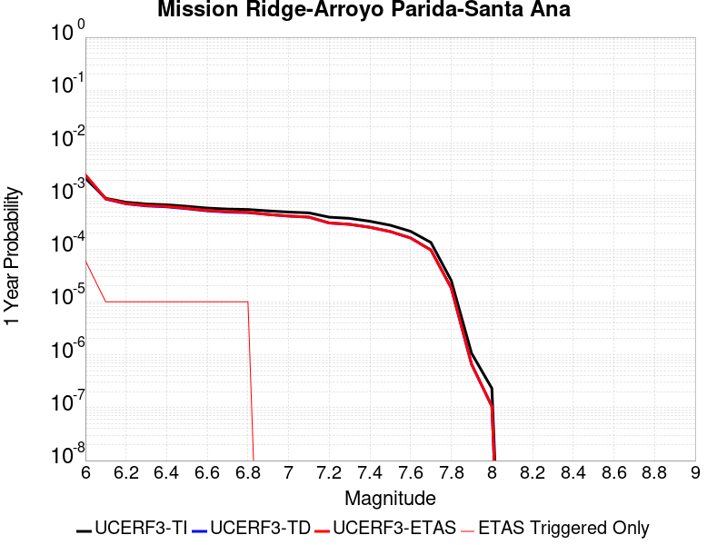 |  |

| Magnitude | 1 wk TI Prob | 1 wk TD Prob | 1 wk ETAS Prob | 1 wk ETAS/TD Gain | 1 wk ETAS Triggered Only | 1 mo TI Prob | 1 mo TD Prob | 1 mo ETAS Prob | 1 mo ETAS/TD Gain | 1 mo ETAS Triggered Only | 1 yr TI Prob | 1 yr TD Prob | 1 yr ETAS Prob | 1 yr ETAS/TD Gain | 1 yr ETAS Triggered Only | 10 yr TI Prob | 10 yr TD Prob | 10 yr ETAS Prob | 10 yr ETAS/TD Gain | 10 yr ETAS Triggered Only |
|-----|-----|-----|-----|-----|-----|-----|-----|-----|-----|-----|-----|-----|-----|-----|-----|-----|-----|-----|-----|-----|
| 6.0 | 4.169034E-5 | 4.7138332E-5 | 4.7138332E-5 | 1.0 | 0.0 | 1.7866064E-4 | 2.0201063E-4 | 2.1200861E-4 | 1.0494924 | 1.0E-5 | 0.0021730233 | 0.0024575314 | 0.002517384 | 1.0243547 | 6.0E-5 | 0.021518968 | 0.024385462 | 0.024463512 | 1.0032007 | 8.0E-5 |
| 6.1 | 1.73813E-5 | 1.685448E-5 | 1.685448E-5 | 1.0 | 0.0 | 7.4489166E-5 | 7.2231545E-5 | 7.2231545E-5 | 1.0 | 0.0 | 9.065282E-4 | 8.7907485E-4 | 8.890661E-4 | 1.0113657 | 1.0E-5 | 0.009028391 | 0.008757258 | 0.008777083 | 1.0022638 | 2.0E-5 |
| 6.2 | 1.4622182E-5 | 1.3673473E-5 | 1.3673473E-5 | 1.0 | 0.0 | 6.2664985E-5 | 5.8599304E-5 | 5.8599304E-5 | 1.0 | 0.0 | 7.6267915E-4 | 7.1321684E-4 | 7.232097E-4 | 1.014011 | 1.0E-5 | 0.007600669 | 0.0071098623 | 0.0071297204 | 1.002793 | 2.0E-5 |
| 6.3 | 1.3552434E-5 | 1.24823655E-5 | 1.24823655E-5 | 1.0 | 0.0 | 5.8080568E-5 | 5.3494776E-5 | 5.3494776E-5 | 1.0 | 0.0 | 7.069015E-4 | 6.511074E-4 | 6.611009E-4 | 1.0153484 | 1.0E-5 | 0.00704657 | 0.006492501 | 0.006512371 | 1.0030605 | 2.0E-5 |
| 6.4 | 1.30977305E-5 | 1.1979314E-5 | 1.1979314E-5 | 1.0 | 0.0 | 5.613192E-5 | 5.1338924E-5 | 5.1338924E-5 | 1.0 | 0.0 | 6.831918E-4 | 6.2487513E-4 | 6.3486886E-4 | 1.0159932 | 1.0E-5 | 0.006810953 | 0.0062316665 | 0.006251542 | 1.0031894 | 2.0E-5 |
| 6.5 | 1.225205E-5 | 1.1048948E-5 | 1.1048948E-5 | 1.0 | 0.0 | 5.2507727E-5 | 4.735179E-5 | 4.735179E-5 | 1.0 | 0.0 | 6.3909404E-4 | 5.763583E-4 | 5.863525E-4 | 1.0173403 | 1.0E-5 | 0.006372592 | 0.005749085 | 0.0057590273 | 1.0017294 | 1.0E-5 |
| 6.6 | 1.1352241E-5 | 1.0063668E-5 | 1.0063668E-5 | 1.0 | 0.0 | 4.8651553E-5 | 4.3129305E-5 | 4.3129305E-5 | 1.0 | 0.0 | 5.921717E-4 | 5.249749E-4 | 5.349696E-4 | 1.0190386 | 1.0E-5 | 0.0059059616 | 0.005237734 | 0.0052476814 | 1.0018992 | 1.0E-5 |
| 6.7 | 1.0864116E-5 | 9.517152E-6 | 9.517152E-6 | 1.0 | 0.0 | 4.6559664E-5 | 4.0787167E-5 | 4.0787167E-5 | 1.0 | 0.0 | 5.667165E-4 | 4.964726E-4 | 5.0646765E-4 | 1.0201321 | 1.0E-5 | 0.005652734 | 0.004954009 | 0.004963959 | 1.0020086 | 1.0E-5 |
| 6.8 | 1.0666365E-5 | 9.2999E-6 | 9.2999E-6 | 1.0 | 0.0 | 4.571219E-5 | 3.9856117E-5 | 3.9856117E-5 | 1.0 | 0.0 | 5.564038E-4 | 4.851422E-4 | 4.9513736E-4 | 1.0206025 | 1.0E-5 | 0.005550127 | 0.004841204 | 0.0048511554 | 1.0020556 | 1.0E-5 |
| 6.9 | 1.0038665E-5 | 8.592155E-6 | 8.592155E-6 | 1.0 | 0.0 | 4.302214E-5 | 3.682301E-5 | 3.682301E-5 | 1.0 | 0.0 | 5.236687E-4 | 4.4822975E-4 | 4.4822975E-4 | 1.0 | 0.0 | 0.005224364 | 0.0044736085 | 0.0044736085 | 1.0 | 0.0 |
| 7.0 | 9.5379955E-6 | 8.025172E-6 | 8.025172E-6 | 1.0 | 0.0 | 4.0876483E-5 | 3.4393153E-5 | 3.4393153E-5 | 1.0 | 0.0 | 4.975576E-4 | 4.1865787E-4 | 4.1865787E-4 | 1.0 | 0.0 | 0.00496445 | 0.0041790316 | 0.0041790316 | 1.0 | 0.0 |
| 7.1 | 9.207389E-6 | 7.652467E-6 | 7.652467E-6 | 1.0 | 0.0 | 3.945964E-5 | 3.2795884E-5 | 3.2795884E-5 | 1.0 | 0.0 | 4.803152E-4 | 3.992184E-4 | 3.992184E-4 | 1.0 | 0.0 | 0.004792784 | 0.0039853496 | 0.0039853496 | 1.0 | 0.0 |
| 7.2 | 7.638091E-6 | 5.931174E-6 | 5.931174E-6 | 1.0 | 0.0 | 3.2734264E-5 | 2.541907E-5 | 2.541907E-5 | 1.0 | 0.0 | 3.984668E-4 | 3.0943356E-4 | 3.0943356E-4 | 1.0 | 0.0 | 0.0039775306 | 0.0030902245 | 0.0030902245 | 1.0 | 0.0 |
| 7.3 | 7.2500147E-6 | 5.596204E-6 | 5.596204E-6 | 1.0 | 0.0 | 3.1071122E-5 | 2.3983514E-5 | 2.3983514E-5 | 1.0 | 0.0 | 3.7822526E-4 | 2.9196046E-4 | 2.9196046E-4 | 1.0 | 0.0 | 0.0037758215 | 0.002915965 | 0.002915965 | 1.0 | 0.0 |
| 7.4 | 6.3899715E-6 | 4.9185496E-6 | 4.9185496E-6 | 1.0 | 0.0 | 2.7385306E-5 | 2.107933E-5 | 2.107933E-5 | 1.0 | 0.0 | 3.3336508E-4 | 2.566108E-4 | 2.566108E-4 | 1.0 | 0.0 | 0.0033286542 | 0.0025633303 | 0.0025633303 | 1.0 | 0.0 |
| 7.5 | 5.379025E-6 | 4.0839013E-6 | 4.0839013E-6 | 1.0 | 0.0 | 2.305276E-5 | 1.7502318E-5 | 1.7502318E-5 | 1.0 | 0.0 | 2.806312E-4 | 2.1306999E-4 | 2.1306999E-4 | 1.0 | 0.0 | 0.0028027708 | 0.0021286684 | 0.0021286684 | 1.0 | 0.0 |
| 7.6 | 4.1270696E-6 | 3.088378E-6 | 3.088378E-6 | 1.0 | 0.0 | 1.768732E-5 | 1.3235838E-5 | 1.3235838E-5 | 1.0 | 0.0 | 2.1532185E-4 | 1.6113449E-4 | 1.6113449E-4 | 1.0 | 0.0 | 0.0021511333 | 0.0016101847 | 0.0016101847 | 1.0 | 0.0 |
| 7.7 | 2.5406805E-6 | 1.8282275E-6 | 1.8282275E-6 | 1.0 | 0.0 | 1.0888585E-5 | 7.835237E-6 | 7.835237E-6 | 1.0 | 0.0 | 1.3256045E-4 | 9.53899E-5 | 9.53899E-5 | 1.0 | 0.0 | 0.0013248142 | 9.5349574E-4 | 9.5349574E-4 | 1.0 | 0.0 |
| 7.8 | 4.8608285E-7 | 3.5099023E-7 | 3.5099023E-7 | 1.0 | 0.0 | 2.0832106E-6 | 1.504243E-6 | 1.504243E-6 | 1.0 | 0.0 | 2.5362791E-5 | 1.8314006E-5 | 1.8314006E-5 | 1.0 | 0.0 | 2.5359896E-4 | 1.8312508E-4 | 1.8312508E-4 | 1.0 | 0.0 |
| 7.9 | 2.0472514E-8 | 1.2688983E-8 | 1.2688983E-8 | 1.0 | 0.0 | 8.7739345E-8 | 5.4381356E-8 | 5.4381356E-8 | 1.0 | 0.0 | 1.068226E-6 | 6.620928E-7 | 6.620928E-7 | 1.0 | 0.0 | 1.0682209E-5 | 6.6209095E-6 | 6.6209095E-6 | 1.0 | 0.0 |
| 8.0 | 4.443582E-9 | 2.032151E-9 | 2.032151E-9 | 1.0 | 0.0 | 1.9043922E-8 | 8.709217E-9 | 8.709217E-9 | 1.0 | 0.0 | 2.3185973E-7 | 1.0603472E-7 | 1.0603472E-7 | 1.0 | 0.0 | 2.3185949E-6 | 1.0603468E-6 | 1.0603468E-6 | 1.0 | 0.0 |

## Rose Canyon
*[(top)](#table-of-contents)*

| 1 Week | 1 Month | 1 Year | 10 Year |
|-----|-----|-----|-----|
|  |  |  | 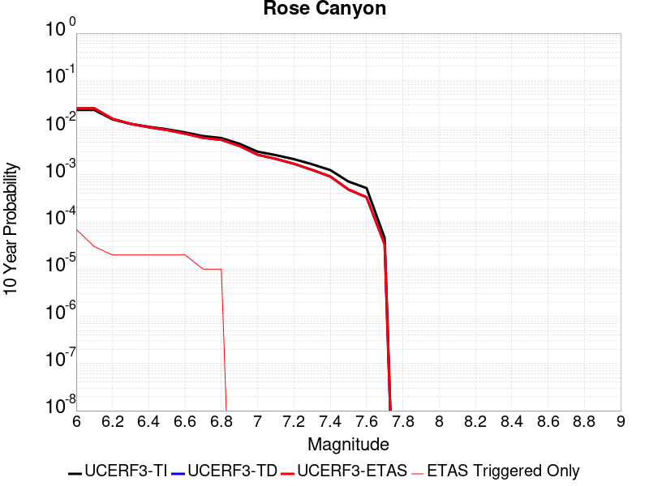 |

| Magnitude | 1 wk TI Prob | 1 wk TD Prob | 1 wk ETAS Prob | 1 wk ETAS/TD Gain | 1 wk ETAS Triggered Only | 1 mo TI Prob | 1 mo TD Prob | 1 mo ETAS Prob | 1 mo ETAS/TD Gain | 1 mo ETAS Triggered Only | 1 yr TI Prob | 1 yr TD Prob | 1 yr ETAS Prob | 1 yr ETAS/TD Gain | 1 yr ETAS Triggered Only | 10 yr TI Prob | 10 yr TD Prob | 10 yr ETAS Prob | 10 yr ETAS/TD Gain | 10 yr ETAS Triggered Only |
|-----|-----|-----|-----|-----|-----|-----|-----|-----|-----|-----|-----|-----|-----|-----|-----|-----|-----|-----|-----|-----|
| 6.0 | 4.5923203E-5 | 4.9717553E-5 | 4.9717553E-5 | 1.0 | 0.0 | 1.9679888E-4 | 2.1305913E-4 | 2.1305913E-4 | 1.0 | 0.0 | 0.0023933933 | 0.0025910994 | 0.0026409698 | 1.0192468 | 5.0E-5 | 0.023677798 | 0.025618313 | 0.025686521 | 1.0026624 | 7.0E-5 |
| 6.1 | 4.5923203E-5 | 4.9717553E-5 | 4.9717553E-5 | 1.0 | 0.0 | 1.9679888E-4 | 2.1305913E-4 | 2.1305913E-4 | 1.0 | 0.0 | 0.0023933933 | 0.0025910994 | 0.0026110476 | 1.0076988 | 2.0E-5 | 0.023677798 | 0.025618313 | 0.025647545 | 1.0011411 | 3.0E-5 |
| 6.2 | 2.8844734E-5 | 2.9670837E-5 | 2.9670837E-5 | 1.0 | 0.0 | 1.2361443E-4 | 1.2715468E-4 | 1.2715468E-4 | 1.0 | 0.0 | 0.0015039665 | 0.0015470362 | 0.0015570207 | 1.006454 | 1.0E-5 | 0.0149382865 | 0.015357477 | 0.0153771695 | 1.0012823 | 2.0E-5 |
| 6.3 | 2.3171577E-5 | 2.3163399E-5 | 2.3163399E-5 | 1.0 | 0.0 | 9.9302975E-5 | 9.9268E-5 | 9.9268E-5 | 1.0 | 0.0 | 0.0012083431 | 0.0012079312 | 0.001217919 | 1.0082686 | 1.0E-5 | 0.012017938 | 0.012004637 | 0.012024397 | 1.001646 | 2.0E-5 |
| 6.4 | 2.0066604E-5 | 1.966902E-5 | 1.966902E-5 | 1.0 | 0.0 | 8.599689E-5 | 8.429313E-5 | 8.429313E-5 | 1.0 | 0.0 | 0.0010465092 | 0.0010257957 | 0.0010357854 | 1.0097386 | 1.0E-5 | 0.010415946 | 0.010203916 | 0.010223712 | 1.00194 | 2.0E-5 |
| 6.5 | 1.776989E-5 | 1.7115479E-5 | 1.7115479E-5 | 1.0 | 0.0 | 7.615444E-5 | 7.3350035E-5 | 7.3350035E-5 | 1.0 | 0.0 | 9.267859E-4 | 8.926777E-4 | 9.026688E-4 | 1.0111922 | 1.0E-5 | 0.009229303 | 0.008879829 | 0.0088996515 | 1.0022323 | 2.0E-5 |
| 6.6 | 1.5227364E-5 | 1.4340938E-5 | 1.4340938E-5 | 1.0 | 0.0 | 6.52585E-5 | 6.1459745E-5 | 6.1459745E-5 | 1.0 | 0.0 | 7.942326E-4 | 7.480207E-4 | 7.580132E-4 | 1.0133586 | 1.0E-5 | 0.007914 | 0.00744577 | 0.007465621 | 1.0026661 | 2.0E-5 |
| 6.7 | 1.2703898E-5 | 1.167434E-5 | 1.167434E-5 | 1.0 | 0.0 | 5.4444143E-5 | 5.0031955E-5 | 5.0031955E-5 | 1.0 | 0.0 | 6.626558E-4 | 6.0897303E-4 | 6.0897303E-4 | 1.0 | 0.0 | 0.006606833 | 0.00606576 | 0.0060756993 | 1.0016387 | 1.0E-5 |
| 6.8 | 1.1554917E-5 | 1.0610447E-5 | 1.0610447E-5 | 1.0 | 0.0 | 4.9520135E-5 | 4.5472574E-5 | 4.5472574E-5 | 1.0 | 0.0 | 6.0274085E-4 | 5.53492E-4 | 5.53492E-4 | 1.0 | 0.0 | 0.0060110865 | 0.005507283 | 0.005517228 | 1.0018058 | 1.0E-5 |
| 6.9 | 8.732078E-6 | 7.882343E-6 | 7.882343E-6 | 1.0 | 0.0 | 3.7422655E-5 | 3.378105E-5 | 3.378105E-5 | 1.0 | 0.0 | 4.5552556E-4 | 4.112096E-4 | 4.112096E-4 | 1.0 | 0.0 | 0.0045459294 | 0.004089545 | 0.004089545 | 1.0 | 0.0 |
| 7.0 | 5.9337494E-6 | 5.1074826E-6 | 5.1074826E-6 | 1.0 | 0.0 | 2.5430107E-5 | 2.1889029E-5 | 2.1889029E-5 | 1.0 | 0.0 | 3.0956755E-4 | 2.6646646E-4 | 2.6646646E-4 | 1.0 | 0.0 | 0.0030913667 | 0.0026614852 | 0.0026614852 | 1.0 | 0.0 |
| 7.1 | 5.013409E-6 | 4.177376E-6 | 4.177376E-6 | 1.0 | 0.0 | 2.1485863E-5 | 1.7902918E-5 | 1.7902918E-5 | 1.0 | 0.0 | 2.6155898E-4 | 2.1794632E-4 | 2.1794632E-4 | 1.0 | 0.0 | 0.0026125133 | 0.0021773374 | 0.0021773374 | 1.0 | 0.0 |
| 7.2 | 4.120763E-6 | 3.2821204E-6 | 3.2821204E-6 | 1.0 | 0.0 | 1.7660293E-5 | 1.4066155E-5 | 1.4066155E-5 | 1.0 | 0.0 | 2.1499286E-4 | 1.7124206E-4 | 1.7124206E-4 | 1.0 | 0.0 | 0.0021478499 | 0.0017111107 | 0.0017111107 | 1.0 | 0.0 |
| 7.3 | 3.2081239E-6 | 2.440515E-6 | 2.440515E-6 | 1.0 | 0.0 | 1.374903E-5 | 1.0459307E-5 | 1.0459307E-5 | 1.0 | 0.0 | 1.6738157E-4 | 1.273347E-4 | 1.273347E-4 | 1.0 | 0.0 | 0.0016725556 | 0.0012726244 | 0.0012726244 | 1.0 | 0.0 |
| 7.4 | 2.4194755E-6 | 1.7680458E-6 | 1.7680458E-6 | 1.0 | 0.0 | 1.0369139E-5 | 7.5773173E-6 | 7.5773173E-6 | 1.0 | 0.0 | 1.2623696E-4 | 9.224998E-5 | 9.224998E-5 | 1.0 | 0.0 | 0.0012616527 | 9.221223E-4 | 9.221223E-4 | 1.0 | 0.0 |
| 7.5 | 1.3842889E-6 | 9.378391E-7 | 9.378391E-7 | 1.0 | 0.0 | 5.9326535E-6 | 4.0193045E-6 | 4.0193045E-6 | 1.0 | 0.0 | 7.222766E-5 | 4.893397E-5 | 4.893397E-5 | 1.0 | 0.0 | 7.220419E-4 | 4.8923545E-4 | 4.8923545E-4 | 1.0 | 0.0 |
| 7.6 | 1.0021575E-6 | 6.4114187E-7 | 6.4114187E-7 | 1.0 | 0.0 | 4.2949537E-6 | 2.7477479E-6 | 2.7477479E-6 | 1.0 | 0.0 | 5.2289808E-5 | 3.345334E-5 | 3.345334E-5 | 1.0 | 0.0 | 5.2277505E-4 | 3.3448517E-4 | 3.3448517E-4 | 1.0 | 0.0 |
| 7.7 | 8.7620116E-8 | 6.449342E-8 | 6.449342E-8 | 1.0 | 0.0 | 3.7551473E-7 | 2.7640036E-7 | 2.7640036E-7 | 1.0 | 0.0 | 4.5718825E-6 | 3.3651693E-6 | 3.3651693E-6 | 1.0 | 0.0 | 4.5717883E-5 | 3.3651213E-5 | 3.3651213E-5 | 1.0 | 0.0 |

## Santa Ynez (East)
*[(top)](#table-of-contents)*

| 1 Week | 1 Month | 1 Year | 10 Year |
|-----|-----|-----|-----|
|  |  |  |  |

| Magnitude | 1 wk TI Prob | 1 wk TD Prob | 1 wk ETAS Prob | 1 wk ETAS/TD Gain | 1 wk ETAS Triggered Only | 1 mo TI Prob | 1 mo TD Prob | 1 mo ETAS Prob | 1 mo ETAS/TD Gain | 1 mo ETAS Triggered Only | 1 yr TI Prob | 1 yr TD Prob | 1 yr ETAS Prob | 1 yr ETAS/TD Gain | 1 yr ETAS Triggered Only | 10 yr TI Prob | 10 yr TD Prob | 10 yr ETAS Prob | 10 yr ETAS/TD Gain | 10 yr ETAS Triggered Only |
|-----|-----|-----|-----|-----|-----|-----|-----|-----|-----|-----|-----|-----|-----|-----|-----|-----|-----|-----|-----|-----|
| 6.0 | 3.2269712E-5 | 3.6751615E-5 | 3.6751615E-5 | 1.0 | 0.0 | 1.3829143E-4 | 1.5750073E-4 | 1.6749917E-4 | 1.0634818 | 1.0E-5 | 0.0016823979 | 0.001916469 | 0.0019563923 | 1.0208317 | 4.0E-5 | 0.016697178 | 0.01905687 | 0.019115726 | 1.0030885 | 6.0E-5 |
| 6.1 | 3.2269712E-5 | 3.6751615E-5 | 3.6751615E-5 | 1.0 | 0.0 | 1.3829143E-4 | 1.5750073E-4 | 1.6749917E-4 | 1.0634818 | 1.0E-5 | 0.0016823979 | 0.001916469 | 0.0019563923 | 1.0208317 | 4.0E-5 | 0.016697178 | 0.01905687 | 0.019115726 | 1.0030885 | 6.0E-5 |
| 6.2 | 3.2269712E-5 | 3.6751615E-5 | 3.6751615E-5 | 1.0 | 0.0 | 1.3829143E-4 | 1.5750073E-4 | 1.6749917E-4 | 1.0634818 | 1.0E-5 | 0.0016823979 | 0.001916469 | 0.0019563923 | 1.0208317 | 4.0E-5 | 0.016697178 | 0.01905687 | 0.019115726 | 1.0030885 | 6.0E-5 |
| 6.3 | 3.2269712E-5 | 3.6751615E-5 | 3.6751615E-5 | 1.0 | 0.0 | 1.3829143E-4 | 1.5750073E-4 | 1.6749917E-4 | 1.0634818 | 1.0E-5 | 0.0016823979 | 0.001916469 | 0.0019563923 | 1.0208317 | 4.0E-5 | 0.016697178 | 0.01905687 | 0.019115726 | 1.0030885 | 6.0E-5 |
| 6.4 | 1.4404779E-5 | 1.4849478E-5 | 1.4849478E-5 | 1.0 | 0.0 | 6.1733306E-5 | 6.36391E-5 | 6.36391E-5 | 1.0 | 0.0 | 7.513438E-4 | 7.7453564E-4 | 7.845279E-4 | 1.012901 | 1.0E-5 | 0.0074880854 | 0.0077189123 | 0.007738758 | 1.002571 | 2.0E-5 |
| 6.5 | 1.4404779E-5 | 1.4849478E-5 | 1.4849478E-5 | 1.0 | 0.0 | 6.1733306E-5 | 6.36391E-5 | 6.36391E-5 | 1.0 | 0.0 | 7.513438E-4 | 7.7453564E-4 | 7.845279E-4 | 1.012901 | 1.0E-5 | 0.0074880854 | 0.0077189123 | 0.007738758 | 1.002571 | 2.0E-5 |
| 6.6 | 1.280208E-5 | 1.3012008E-5 | 1.3012008E-5 | 1.0 | 0.0 | 5.4864904E-5 | 5.576457E-5 | 5.576457E-5 | 1.0 | 0.0 | 6.6777546E-4 | 6.787239E-4 | 6.887171E-4 | 1.0147235 | 1.0E-5 | 0.006657724 | 0.00676672 | 0.006786585 | 1.0029356 | 2.0E-5 |
| 6.7 | 1.2457027E-5 | 1.2628523E-5 | 1.2628523E-5 | 1.0 | 0.0 | 5.3386164E-5 | 5.4121127E-5 | 5.4121127E-5 | 1.0 | 0.0 | 6.497827E-4 | 6.587272E-4 | 6.6872063E-4 | 1.0151708 | 1.0E-5 | 0.00647886 | 0.006567944 | 0.006587812 | 1.003025 | 2.0E-5 |
| 6.8 | 1.2095134E-5 | 1.2230965E-5 | 1.2230965E-5 | 1.0 | 0.0 | 5.1835254E-5 | 5.2417377E-5 | 5.2417377E-5 | 1.0 | 0.0 | 6.309115E-4 | 6.379963E-4 | 6.479899E-4 | 1.0156641 | 1.0E-5 | 0.0062912325 | 0.006361835 | 0.0063817077 | 1.0031238 | 2.0E-5 |
| 6.9 | 1.1104036E-5 | 1.1157385E-5 | 1.1157385E-5 | 1.0 | 0.0 | 4.758786E-5 | 4.78165E-5 | 4.78165E-5 | 1.0 | 0.0 | 5.7922816E-4 | 5.820116E-4 | 5.820116E-4 | 1.0 | 0.0 | 0.005777207 | 0.005805019 | 0.0058149607 | 1.0017127 | 1.0E-5 |
| 7.0 | 1.0577444E-5 | 1.0581712E-5 | 1.0581712E-5 | 1.0 | 0.0 | 4.5331115E-5 | 4.534941E-5 | 4.534941E-5 | 1.0 | 0.0 | 5.5176654E-4 | 5.519904E-4 | 5.519904E-4 | 1.0 | 0.0 | 0.0055039856 | 0.0055063316 | 0.0055162767 | 1.0018061 | 1.0E-5 |
| 7.1 | 1.0021775E-5 | 9.981012E-6 | 9.981012E-6 | 1.0 | 0.0 | 4.294976E-5 | 4.277507E-5 | 4.277507E-5 | 1.0 | 0.0 | 5.2278786E-4 | 5.206632E-4 | 5.206632E-4 | 1.0 | 0.0 | 0.0052155964 | 0.005194566 | 0.005204514 | 1.0019151 | 1.0E-5 |
| 7.2 | 8.874109E-6 | 8.748804E-6 | 8.748804E-6 | 1.0 | 0.0 | 3.8031343E-5 | 3.749434E-5 | 3.749434E-5 | 1.0 | 0.0 | 4.629332E-4 | 4.5639908E-4 | 4.5639908E-4 | 1.0 | 0.0 | 0.0046197 | 0.0045547355 | 0.00456469 | 1.0021855 | 1.0E-5 |
| 7.3 | 7.5504267E-6 | 7.5050975E-6 | 7.5050975E-6 | 1.0 | 0.0 | 3.235857E-5 | 3.2164313E-5 | 3.2164313E-5 | 1.0 | 0.0 | 3.9389438E-4 | 3.9153118E-4 | 3.9153118E-4 | 1.0 | 0.0 | 0.0039319694 | 0.0039085206 | 0.0039184815 | 1.0025485 | 1.0E-5 |
| 7.4 | 6.309394E-6 | 6.1831197E-6 | 6.1831197E-6 | 1.0 | 0.0 | 2.703998E-5 | 2.6498821E-5 | 2.6498821E-5 | 1.0 | 0.0 | 3.2916202E-4 | 3.2257635E-4 | 3.2257635E-4 | 1.0 | 0.0 | 0.003286749 | 0.0032211784 | 0.0032311461 | 1.0030944 | 1.0E-5 |
| 7.5 | 4.6103073E-6 | 4.4408375E-6 | 4.4408375E-6 | 1.0 | 0.0 | 1.975831E-5 | 1.9032026E-5 | 1.9032026E-5 | 1.0 | 0.0 | 2.4053088E-4 | 2.3169098E-4 | 2.3169098E-4 | 1.0 | 0.0 | 0.002402707 | 0.0023145638 | 0.0023245406 | 1.0043105 | 1.0E-5 |
| 7.6 | 1.2858658E-6 | 1.3008295E-6 | 1.3008295E-6 | 1.0 | 0.0 | 5.5108417E-6 | 5.574972E-6 | 5.574972E-6 | 1.0 | 0.0 | 6.7092435E-5 | 6.787324E-5 | 6.787324E-5 | 1.0 | 0.0 | 6.707218E-4 | 6.78532E-4 | 6.885252E-4 | 1.0147277 | 1.0E-5 |
| 7.7 | 5.3302307E-7 | 5.612178E-7 | 5.612178E-7 | 1.0 | 0.0 | 2.2843826E-6 | 2.4052172E-6 | 2.4052172E-6 | 1.0 | 0.0 | 2.7812002E-5 | 2.9283161E-5 | 2.9283161E-5 | 1.0 | 0.0 | 2.7808524E-4 | 2.927966E-4 | 2.927966E-4 | 1.0 | 0.0 |
| 7.8 | 4.613933E-8 | 4.803036E-8 | 4.803036E-8 | 1.0 | 0.0 | 1.9773998E-7 | 2.0584437E-7 | 2.0584437E-7 | 1.0 | 0.0 | 2.4074816E-6 | 2.5061524E-6 | 2.5061524E-6 | 1.0 | 0.0 | 2.4074554E-5 | 2.5061252E-5 | 2.5061252E-5 | 1.0 | 0.0 |

## Oceanic - West Huasna
*[(top)](#table-of-contents)*

| 1 Week | 1 Month | 1 Year | 10 Year |
|-----|-----|-----|-----|
|  |  |  |  |

| Magnitude | 1 wk TI Prob | 1 wk TD Prob | 1 wk ETAS Prob | 1 wk ETAS/TD Gain | 1 wk ETAS Triggered Only | 1 mo TI Prob | 1 mo TD Prob | 1 mo ETAS Prob | 1 mo ETAS/TD Gain | 1 mo ETAS Triggered Only | 1 yr TI Prob | 1 yr TD Prob | 1 yr ETAS Prob | 1 yr ETAS/TD Gain | 1 yr ETAS Triggered Only | 10 yr TI Prob | 10 yr TD Prob | 10 yr ETAS Prob | 10 yr ETAS/TD Gain | 10 yr ETAS Triggered Only |
|-----|-----|-----|-----|-----|-----|-----|-----|-----|-----|-----|-----|-----|-----|-----|-----|-----|-----|-----|-----|-----|
| 6.0 | 3.195567E-5 | 2.7926611E-5 | 2.7926611E-5 | 1.0 | 0.0 | 1.3694567E-4 | 1.1968023E-4 | 1.1968023E-4 | 1.0 | 0.0 | 0.0016660384 | 0.001456176 | 0.0014861323 | 1.020572 | 3.0E-5 | 0.016536033 | 0.014470896 | 0.014520172 | 1.0034052 | 5.0E-5 |
| 6.1 | 2.1156782E-5 | 1.7573251E-5 | 1.7573251E-5 | 1.0 | 0.0 | 9.066878E-5 | 7.531181E-5 | 7.531181E-5 | 1.0 | 0.0 | 0.0011033333 | 9.1654493E-4 | 9.3652663E-4 | 1.0218011 | 2.0E-5 | 0.010978713 | 0.009128656 | 0.009158382 | 1.0032563 | 3.0E-5 |
| 6.2 | 1.6195117E-5 | 1.332732E-5 | 1.332732E-5 | 1.0 | 0.0 | 6.9405796E-5 | 5.7115845E-5 | 5.7115845E-5 | 1.0 | 0.0 | 8.44688E-4 | 6.951662E-4 | 7.1515224E-4 | 1.0287501 | 2.0E-5 | 0.008414844 | 0.0069302097 | 0.006950071 | 1.0028659 | 2.0E-5 |
| 6.3 | 1.3559345E-5 | 1.1179085E-5 | 1.1179085E-5 | 1.0 | 0.0 | 5.811018E-5 | 4.7909492E-5 | 4.7909492E-5 | 1.0 | 0.0 | 7.072618E-4 | 5.831429E-4 | 6.0313125E-4 | 1.034277 | 2.0E-5 | 0.0070501505 | 0.0058162455 | 0.005836129 | 1.0034187 | 2.0E-5 |
| 6.4 | 1.2120619E-5 | 1.0000936E-5 | 1.0000936E-5 | 1.0 | 0.0 | 5.1944477E-5 | 4.286045E-5 | 4.286045E-5 | 1.0 | 0.0 | 6.322405E-4 | 5.217015E-4 | 5.416911E-4 | 1.0383161 | 2.0E-5 | 0.006304447 | 0.0052048354 | 0.0052247313 | 1.0038226 | 2.0E-5 |
| 6.5 | 1.13511915E-5 | 9.367435E-6 | 9.367435E-6 | 1.0 | 0.0 | 4.8647056E-5 | 4.0145536E-5 | 4.0145536E-5 | 1.0 | 0.0 | 5.9211696E-4 | 4.8866274E-4 | 5.0865294E-4 | 1.040908 | 2.0E-5 | 0.0059054173 | 0.0048759407 | 0.004895843 | 1.0040817 | 2.0E-5 |
| 6.6 | 9.850605E-6 | 8.135364E-6 | 8.135364E-6 | 1.0 | 0.0 | 4.2216197E-5 | 3.4865378E-5 | 3.4865378E-5 | 1.0 | 0.0 | 5.1386096E-4 | 4.2440352E-4 | 4.4439503E-4 | 1.047105 | 2.0E-5 | 0.0051267436 | 0.0042359624 | 0.004255878 | 1.0047015 | 2.0E-5 |
| 6.7 | 8.8558645E-6 | 7.318384E-6 | 7.318384E-6 | 1.0 | 0.0 | 3.7953152E-5 | 3.1364125E-5 | 3.1364125E-5 | 1.0 | 0.0 | 4.6198163E-4 | 3.817915E-4 | 4.0178388E-4 | 1.0523646 | 2.0E-5 | 0.004610224 | 0.0038113813 | 0.003831305 | 1.0052274 | 2.0E-5 |
| 6.8 | 7.67136E-6 | 6.3917278E-6 | 6.3917278E-6 | 1.0 | 0.0 | 3.2876844E-5 | 2.7392833E-5 | 2.7392833E-5 | 1.0 | 0.0 | 4.0020206E-4 | 3.3345685E-4 | 3.534502E-4 | 1.0599577 | 2.0E-5 | 0.003994821 | 0.003329586 | 0.0033495193 | 1.0059868 | 2.0E-5 |
| 6.9 | 6.534529E-6 | 5.4582943E-6 | 5.4582943E-6 | 1.0 | 0.0 | 2.8004823E-5 | 2.339248E-5 | 2.339248E-5 | 1.0 | 0.0 | 3.4090536E-4 | 2.8476634E-4 | 2.947635E-4 | 1.0351065 | 1.0E-5 | 0.0034038287 | 0.0028440312 | 0.0028540026 | 1.0035062 | 1.0E-5 |
| 7.0 | 5.460525E-6 | 4.5699494E-6 | 4.5699494E-6 | 1.0 | 0.0 | 2.3402039E-5 | 1.9585352E-5 | 1.9585352E-5 | 1.0 | 0.0 | 2.8488258E-4 | 2.3842567E-4 | 2.3842567E-4 | 1.0 | 0.0 | 0.0028451765 | 0.0023817124 | 0.0023817124 | 1.0 | 0.0 |
| 7.1 | 4.4825083E-6 | 3.7524424E-6 | 3.7524424E-6 | 1.0 | 0.0 | 1.9210609E-5 | 1.6081798E-5 | 1.6081798E-5 | 1.0 | 0.0 | 2.3386406E-4 | 1.957784E-4 | 1.957784E-4 | 1.0 | 0.0 | 0.002336181 | 0.001956071 | 0.001956071 | 1.0 | 0.0 |
| 7.2 | 2.821708E-6 | 2.4249653E-6 | 2.4249653E-6 | 1.0 | 0.0 | 1.2092979E-5 | 1.0392667E-5 | 1.0392667E-5 | 1.0 | 0.0 | 1.4722206E-4 | 1.2652339E-4 | 1.2652339E-4 | 1.0 | 0.0 | 0.0014712457 | 0.0012645158 | 0.0012645158 | 1.0 | 0.0 |
| 7.3 | 2.0644757E-6 | 1.7687719E-6 | 1.7687719E-6 | 1.0 | 0.0 | 8.847723E-6 | 7.580429E-6 | 7.580429E-6 | 1.0 | 0.0 | 1.0771569E-4 | 9.228782E-5 | 9.228782E-5 | 1.0 | 0.0 | 0.001076635 | 9.2249655E-4 | 9.2249655E-4 | 1.0 | 0.0 |
| 7.4 | 1.6980367E-6 | 1.4380173E-6 | 1.4380173E-6 | 1.0 | 0.0 | 7.27728E-6 | 6.1629166E-6 | 6.1629166E-6 | 1.0 | 0.0 | 8.8597284E-5 | 7.503093E-5 | 7.503093E-5 | 1.0 | 0.0 | 8.8561967E-4 | 7.5005746E-4 | 7.5005746E-4 | 1.0 | 0.0 |
| 7.5 | 1.3637683E-6 | 1.1302892E-6 | 1.1302892E-6 | 1.0 | 0.0 | 5.844708E-6 | 4.8440875E-6 | 4.8440875E-6 | 1.0 | 0.0 | 7.1156996E-5 | 5.897517E-5 | 5.897517E-5 | 1.0 | 0.0 | 7.1134215E-4 | 5.895966E-4 | 5.895966E-4 | 1.0 | 0.0 |
| 7.6 | 9.802994E-7 | 7.677469E-7 | 7.677469E-7 | 1.0 | 0.0 | 4.2012766E-6 | 3.2903397E-6 | 3.2903397E-6 | 1.0 | 0.0 | 5.1149345E-5 | 4.005915E-5 | 4.005915E-5 | 1.0 | 0.0 | 5.113757E-4 | 4.0052057E-4 | 4.0052057E-4 | 1.0 | 0.0 |
| 7.7 | 5.986191E-7 | 4.0052444E-7 | 4.0052444E-7 | 1.0 | 0.0 | 2.5655079E-6 | 1.7165321E-6 | 1.7165321E-6 | 1.0 | 0.0 | 3.1234613E-5 | 2.0898578E-5 | 2.0898578E-5 | 1.0 | 0.0 | 3.123022E-4 | 2.0896735E-4 | 2.0896735E-4 | 1.0 | 0.0 |
| 7.8 | 2.9189815E-7 | 1.5286729E-7 | 1.5286729E-7 | 1.0 | 0.0 | 1.2509914E-6 | 6.5514536E-7 | 6.5514536E-7 | 1.0 | 0.0 | 1.5230714E-5 | 7.976366E-6 | 7.976366E-6 | 1.0 | 0.0 | 1.522967E-4 | 7.976198E-5 | 7.976198E-5 | 1.0 | 0.0 |
| 7.9 | 1.2057845E-7 | 4.621617E-8 | 4.621617E-8 | 1.0 | 0.0 | 5.1676466E-7 | 1.9806929E-7 | 1.9806929E-7 | 1.0 | 0.0 | 6.2915915E-6 | 2.4114909E-6 | 2.4114909E-6 | 1.0 | 0.0 | 6.2914136E-5 | 2.4115825E-5 | 2.4115825E-5 | 1.0 | 0.0 |
| 8.0 | 3.3806387E-9 | 9.0127306E-10 | 9.0127306E-10 | 1.0 | 0.0 | 1.4488451E-8 | 3.8625965E-9 | 3.8625965E-9 | 1.0 | 0.0 | 1.7639688E-7 | 4.7027115E-8 | 4.7027115E-8 | 1.0 | 0.0 | 1.7639674E-6 | 4.7134822E-7 | 4.7134822E-7 | 1.0 | 0.0 |

## San Jacinto (Lytle Creek connector)
*[(top)](#table-of-contents)*

| 1 Week | 1 Month | 1 Year | 10 Year |
|-----|-----|-----|-----|
|  |  |  |  |

| Magnitude | 1 wk TI Prob | 1 wk TD Prob | 1 wk ETAS Prob | 1 wk ETAS/TD Gain | 1 wk ETAS Triggered Only | 1 mo TI Prob | 1 mo TD Prob | 1 mo ETAS Prob | 1 mo ETAS/TD Gain | 1 mo ETAS Triggered Only | 1 yr TI Prob | 1 yr TD Prob | 1 yr ETAS Prob | 1 yr ETAS/TD Gain | 1 yr ETAS Triggered Only | 10 yr TI Prob | 10 yr TD Prob | 10 yr ETAS Prob | 10 yr ETAS/TD Gain | 10 yr ETAS Triggered Only |
|-----|-----|-----|-----|-----|-----|-----|-----|-----|-----|-----|-----|-----|-----|-----|-----|-----|-----|-----|-----|-----|
| 6.0 | 6.693995E-6 | 6.6628318E-6 | 6.6628318E-6 | 1.0 | 0.0 | 2.8688235E-5 | 2.8554681E-5 | 3.8554397E-5 | 1.3501953 | 1.0E-5 | 3.492233E-4 | 3.4759787E-4 | 3.8758398E-4 | 1.1150355 | 4.0E-5 | 0.00348675 | 0.0035508901 | 0.0036206415 | 1.0196434 | 7.0E-5 |
| 6.1 | 6.693995E-6 | 6.6628318E-6 | 6.6628318E-6 | 1.0 | 0.0 | 2.8688235E-5 | 2.8554681E-5 | 3.8554397E-5 | 1.3501953 | 1.0E-5 | 3.492233E-4 | 3.4759787E-4 | 3.8758398E-4 | 1.1150355 | 4.0E-5 | 0.00348675 | 0.0035508901 | 0.0036206415 | 1.0196434 | 7.0E-5 |
| 6.2 | 6.693995E-6 | 6.6628318E-6 | 6.6628318E-6 | 1.0 | 0.0 | 2.8688235E-5 | 2.8554681E-5 | 3.8554397E-5 | 1.3501953 | 1.0E-5 | 3.492233E-4 | 3.4759787E-4 | 3.8758398E-4 | 1.1150355 | 4.0E-5 | 0.00348675 | 0.0035508901 | 0.0036206415 | 1.0196434 | 7.0E-5 |
| 6.3 | 6.693995E-6 | 6.6628318E-6 | 6.6628318E-6 | 1.0 | 0.0 | 2.8688235E-5 | 2.8554681E-5 | 3.8554397E-5 | 1.3501953 | 1.0E-5 | 3.492233E-4 | 3.4759787E-4 | 3.8758398E-4 | 1.1150355 | 4.0E-5 | 0.00348675 | 0.0035508901 | 0.0036206415 | 1.0196434 | 7.0E-5 |
| 6.4 | 6.693995E-6 | 6.6628318E-6 | 6.6628318E-6 | 1.0 | 0.0 | 2.8688235E-5 | 2.8554681E-5 | 3.8554397E-5 | 1.3501953 | 1.0E-5 | 3.492233E-4 | 3.4759787E-4 | 3.8758398E-4 | 1.1150355 | 4.0E-5 | 0.00348675 | 0.0035508901 | 0.0036206415 | 1.0196434 | 7.0E-5 |
| 6.5 | 6.6561875E-6 | 6.6230496E-6 | 6.6230496E-6 | 1.0 | 0.0 | 2.8526205E-5 | 2.838419E-5 | 3.8383907E-5 | 1.3522989 | 1.0E-5 | 3.472512E-4 | 3.455228E-4 | 3.8550896E-4 | 1.1157266 | 4.0E-5 | 0.0034670907 | 0.0035302055 | 0.0035999585 | 1.0197588 | 7.0E-5 |
| 6.6 | 6.6561875E-6 | 6.6230496E-6 | 6.6230496E-6 | 1.0 | 0.0 | 2.8526205E-5 | 2.838419E-5 | 3.8383907E-5 | 1.3522989 | 1.0E-5 | 3.472512E-4 | 3.455228E-4 | 3.8550896E-4 | 1.1157266 | 4.0E-5 | 0.0034670907 | 0.0035302055 | 0.0035999585 | 1.0197588 | 7.0E-5 |
| 6.7 | 6.5802237E-6 | 6.5422255E-6 | 6.5422255E-6 | 1.0 | 0.0 | 2.8200653E-5 | 2.803781E-5 | 3.8037528E-5 | 1.3566513 | 1.0E-5 | 3.4328885E-4 | 3.4130694E-4 | 3.8129327E-4 | 1.1171566 | 4.0E-5 | 0.0034275902 | 0.0034881798 | 0.0035579356 | 1.0199977 | 7.0E-5 |
| 6.8 | 6.575632E-6 | 6.5367153E-6 | 6.5367153E-6 | 1.0 | 0.0 | 2.8180975E-5 | 2.8014192E-5 | 3.8013914E-5 | 1.356952 | 1.0E-5 | 3.4304935E-4 | 3.410195E-4 | 3.8100584E-4 | 1.1172553 | 4.0E-5 | 0.0034252026 | 0.0034853143 | 0.0035550704 | 1.0200143 | 7.0E-5 |
| 6.9 | 6.570433E-6 | 6.5281088E-6 | 6.5281088E-6 | 1.0 | 0.0 | 2.8158694E-5 | 2.7977308E-5 | 3.7977028E-5 | 1.3574225 | 1.0E-5 | 3.4277816E-4 | 3.4057058E-4 | 3.8055694E-4 | 1.11741 | 4.0E-5 | 0.0034224992 | 0.0034808393 | 0.0035505956 | 1.02004 | 7.0E-5 |
| 7.0 | 6.5643826E-6 | 6.5182294E-6 | 6.5182294E-6 | 1.0 | 0.0 | 2.8132765E-5 | 2.793497E-5 | 3.793469E-5 | 1.3579643 | 1.0E-5 | 3.424626E-4 | 3.4005524E-4 | 3.8004163E-4 | 1.1175879 | 4.0E-5 | 0.0034193532 | 0.0034757021 | 0.003545459 | 1.0200698 | 7.0E-5 |
| 7.1 | 6.557402E-6 | 6.5069403E-6 | 6.5069403E-6 | 1.0 | 0.0 | 2.8102848E-5 | 2.788659E-5 | 3.788631E-5 | 1.3585852 | 1.0E-5 | 3.4209844E-4 | 3.394664E-4 | 3.7945283E-4 | 1.117792 | 4.0E-5 | 0.0034157229 | 0.0034698334 | 0.0035395904 | 1.0201039 | 7.0E-5 |
| 7.2 | 6.546394E-6 | 6.488906E-6 | 6.488906E-6 | 1.0 | 0.0 | 2.8055672E-5 | 2.7809301E-5 | 3.7809023E-5 | 1.359582 | 1.0E-5 | 3.4152428E-4 | 3.3852572E-4 | 3.7851217E-4 | 1.1181194 | 4.0E-5 | 0.0034099987 | 0.0034604599 | 0.0035302178 | 1.0201585 | 7.0E-5 |
| 7.3 | 6.5364216E-6 | 6.469689E-6 | 6.469689E-6 | 1.0 | 0.0 | 2.8012933E-5 | 2.7726945E-5 | 3.772667E-5 | 1.36065 | 1.0E-5 | 3.4100408E-4 | 3.3752335E-4 | 3.7750983E-4 | 1.1184703 | 4.0E-5 | 0.003404813 | 0.003450482 | 0.0035202403 | 1.0202171 | 7.0E-5 |
| 7.4 | 6.5269523E-6 | 6.450774E-6 | 6.450774E-6 | 1.0 | 0.0 | 2.7972354E-5 | 2.7645881E-5 | 3.7645605E-5 | 1.3617076 | 1.0E-5 | 3.4051016E-4 | 3.365367E-4 | 3.7652324E-4 | 1.1188178 | 4.0E-5 | 0.0033998888 | 0.0034406635 | 0.0035104225 | 1.0202749 | 7.0E-5 |
| 7.5 | 6.5111835E-6 | 6.4270453E-6 | 6.4270453E-6 | 1.0 | 0.0 | 2.7904773E-5 | 2.7544189E-5 | 3.7543916E-5 | 1.363043 | 1.0E-5 | 3.3968766E-4 | 3.3529897E-4 | 3.7528557E-4 | 1.1192565 | 4.0E-5 | 0.0033916887 | 0.0034283353 | 0.0034980953 | 1.0203481 | 7.0E-5 |
| 7.6 | 6.4768806E-6 | 6.3861507E-6 | 6.3861507E-6 | 1.0 | 0.0 | 2.7757764E-5 | 2.736893E-5 | 3.7368656E-5 | 1.3653678 | 1.0E-5 | 3.3789838E-4 | 3.3316584E-4 | 3.7315252E-4 | 1.1200203 | 4.0E-5 | 0.0033738504 | 0.0034070655 | 0.0034768272 | 1.0204755 | 7.0E-5 |
| 7.7 | 6.1655364E-6 | 6.1786222E-6 | 6.1786222E-6 | 1.0 | 0.0 | 2.642346E-5 | 2.6479542E-5 | 3.6479276E-5 | 1.37764 | 1.0E-5 | 3.2165812E-4 | 3.2234078E-4 | 3.623279E-4 | 1.1240523 | 4.0E-5 | 0.0032119295 | 0.0032986694 | 0.0033684385 | 1.0211507 | 7.0E-5 |
| 7.8 | 5.5043524E-6 | 5.739622E-6 | 5.739622E-6 | 1.0 | 0.0 | 2.3589868E-5 | 2.4598148E-5 | 3.4597902E-5 | 1.4065247 | 1.0E-5 | 2.871688E-4 | 2.9944137E-4 | 3.394294E-4 | 1.1335421 | 4.0E-5 | 0.0028679797 | 0.003068756 | 0.0031385415 | 1.0227406 | 7.0E-5 |
| 7.9 | 3.889249E-6 | 4.0787854E-6 | 4.0787854E-6 | 1.0 | 0.0 | 1.6668104E-5 | 1.7480392E-5 | 2.7480217E-5 | 1.5720595 | 1.0E-5 | 2.0291525E-4 | 2.1280303E-4 | 2.4279665E-4 | 1.1409454 | 3.0E-5 | 0.0020273007 | 0.0021955092 | 0.0022553774 | 1.0272685 | 6.0E-5 |
| 8.0 | 2.668535E-6 | 2.5328056E-6 | 2.5328056E-6 | 1.0 | 0.0 | 1.1436528E-5 | 1.0854836E-5 | 1.0854836E-5 | 1.0 | 0.0 | 1.3923083E-4 | 1.3214964E-4 | 1.4214832E-4 | 1.0756618 | 1.0E-5 | 0.0013914363 | 0.0013765903 | 0.0014065491 | 1.021763 | 3.0E-5 |
| 8.1 | 1.5911459E-6 | 1.2193005E-6 | 1.2193005E-6 | 1.0 | 0.0 | 6.8191785E-6 | 5.225563E-6 | 5.225563E-6 | 1.0 | 0.0 | 8.3020335E-5 | 6.3619394E-5 | 6.3619394E-5 | 1.0 | 0.0 | 8.298933E-4 | 6.697524E-4 | 6.89739E-4 | 1.0298418 | 2.0E-5 |
| 8.2 | 6.1294963E-7 | 2.1825215E-7 | 2.1825215E-7 | 1.0 | 0.0 | 2.6269242E-6 | 9.35366E-7 | 9.35366E-7 | 1.0 | 0.0 | 3.1982334E-5 | 1.1388021E-5 | 1.1388021E-5 | 1.0 | 0.0 | 3.1977732E-4 | 1.279216E-4 | 1.279216E-4 | 1.0 | 0.0 |
| 8.3 | 1.762871E-7 | 4.757476E-8 | 4.757476E-8 | 1.0 | 0.0 | 7.5551594E-7 | 2.038918E-7 | 2.038918E-7 | 1.0 | 0.0 | 9.1983675E-6 | 2.4823798E-6 | 2.4823798E-6 | 1.0 | 0.0 | 9.197987E-5 | 2.8703373E-5 | 2.8703373E-5 | 1.0 | 0.0 |

## Bullion Mountains
*[(top)](#table-of-contents)*

| 1 Week | 1 Month | 1 Year | 10 Year |
|-----|-----|-----|-----|
|  |  |  |  |

| Magnitude | 1 wk TI Prob | 1 wk TD Prob | 1 wk ETAS Prob | 1 wk ETAS/TD Gain | 1 wk ETAS Triggered Only | 1 mo TI Prob | 1 mo TD Prob | 1 mo ETAS Prob | 1 mo ETAS/TD Gain | 1 mo ETAS Triggered Only | 1 yr TI Prob | 1 yr TD Prob | 1 yr ETAS Prob | 1 yr ETAS/TD Gain | 1 yr ETAS Triggered Only | 10 yr TI Prob | 10 yr TD Prob | 10 yr ETAS Prob | 10 yr ETAS/TD Gain | 10 yr ETAS Triggered Only |
|-----|-----|-----|-----|-----|-----|-----|-----|-----|-----|-----|-----|-----|-----|-----|-----|-----|-----|-----|-----|-----|
| 6.0 | 1.6420427E-5 | 1.4692201E-5 | 1.4692201E-5 | 1.0 | 0.0 | 7.037136E-5 | 6.296527E-5 | 6.296527E-5 | 1.0 | 0.0 | 8.5643446E-4 | 7.6637097E-4 | 7.96348E-4 | 1.0391155 | 3.0E-5 | 0.008531413 | 0.0076410742 | 0.007700616 | 1.0077924 | 6.0E-5 |
| 6.1 | 1.6420427E-5 | 1.4692201E-5 | 1.4692201E-5 | 1.0 | 0.0 | 7.037136E-5 | 6.296527E-5 | 6.296527E-5 | 1.0 | 0.0 | 8.5643446E-4 | 7.6637097E-4 | 7.96348E-4 | 1.0391155 | 3.0E-5 | 0.008531413 | 0.0076410742 | 0.007700616 | 1.0077924 | 6.0E-5 |
| 6.2 | 1.6420427E-5 | 1.4692201E-5 | 1.4692201E-5 | 1.0 | 0.0 | 7.037136E-5 | 6.296527E-5 | 6.296527E-5 | 1.0 | 0.0 | 8.5643446E-4 | 7.6637097E-4 | 7.96348E-4 | 1.0391155 | 3.0E-5 | 0.008531413 | 0.0076410742 | 0.007700616 | 1.0077924 | 6.0E-5 |
| 6.3 | 1.2046778E-5 | 9.8623805E-6 | 9.8623805E-6 | 1.0 | 0.0 | 5.1628023E-5 | 4.226679E-5 | 4.226679E-5 | 1.0 | 0.0 | 6.283899E-4 | 5.1449984E-4 | 5.444844E-4 | 1.058279 | 3.0E-5 | 0.0062661595 | 0.0051353686 | 0.0051950603 | 1.0116236 | 6.0E-5 |
| 6.4 | 1.2046778E-5 | 9.8623805E-6 | 9.8623805E-6 | 1.0 | 0.0 | 5.1628023E-5 | 4.226679E-5 | 4.226679E-5 | 1.0 | 0.0 | 6.283899E-4 | 5.1449984E-4 | 5.444844E-4 | 1.058279 | 3.0E-5 | 0.0062661595 | 0.0051353686 | 0.0051950603 | 1.0116236 | 6.0E-5 |
| 6.5 | 1.0244343E-5 | 7.879477E-6 | 7.879477E-6 | 1.0 | 0.0 | 4.390359E-5 | 3.376887E-5 | 3.376887E-5 | 1.0 | 0.0 | 5.343951E-4 | 4.110791E-4 | 4.3107086E-4 | 1.0486324 | 2.0E-5 | 0.005331118 | 0.0041052178 | 0.004155013 | 1.0121297 | 5.0E-5 |
| 6.6 | 9.605408E-6 | 7.177506E-6 | 7.177506E-6 | 1.0 | 0.0 | 4.1165385E-5 | 3.0760493E-5 | 3.0760493E-5 | 1.0 | 0.0 | 5.010733E-4 | 3.74465E-4 | 3.9445751E-4 | 1.0533895 | 2.0E-5 | 0.00499945 | 0.0037403372 | 0.0037901502 | 1.0133178 | 5.0E-5 |
| 6.7 | 8.60418E-6 | 6.124001E-6 | 6.124001E-6 | 1.0 | 0.0 | 3.687454E-5 | 2.6245565E-5 | 2.6245565E-5 | 1.0 | 0.0 | 4.48855E-4 | 3.1951242E-4 | 3.3950602E-4 | 1.0625753 | 2.0E-5 | 0.004479495 | 0.0031924422 | 0.0032422827 | 1.015612 | 5.0E-5 |
| 6.8 | 5.187994E-6 | 2.5631452E-6 | 2.5631452E-6 | 1.0 | 0.0 | 2.223407E-5 | 1.0984884E-5 | 1.0984884E-5 | 1.0 | 0.0 | 2.7066618E-4 | 1.3373674E-4 | 1.3373674E-4 | 1.0 | 0.0 | 0.0027033675 | 0.0013369543 | 0.0013469409 | 1.0074697 | 1.0E-5 |
| 6.9 | 4.5302368E-6 | 2.344301E-6 | 2.344301E-6 | 1.0 | 0.0 | 1.9415156E-5 | 1.0046988E-5 | 1.0046988E-5 | 1.0 | 0.0 | 2.3635388E-4 | 1.2231918E-4 | 1.2231918E-4 | 1.0 | 0.0 | 0.0023610266 | 0.0012229076 | 0.0012328954 | 1.0081673 | 1.0E-5 |
| 7.0 | 3.431668E-6 | 1.688219E-6 | 1.688219E-6 | 1.0 | 0.0 | 1.4707065E-5 | 7.235224E-6 | 7.235224E-6 | 1.0 | 0.0 | 1.7904381E-4 | 8.8088855E-5 | 8.8088855E-5 | 1.0 | 0.0 | 0.0017889962 | 8.8088855E-4 | 8.908797E-4 | 1.0113422 | 1.0E-5 |

## Santa Ynez (West)
*[(top)](#table-of-contents)*

| 1 Week | 1 Month | 1 Year | 10 Year |
|-----|-----|-----|-----|
|  | 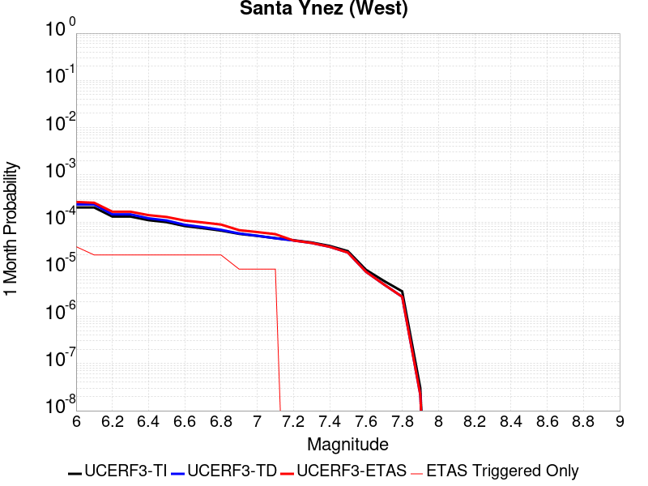 | 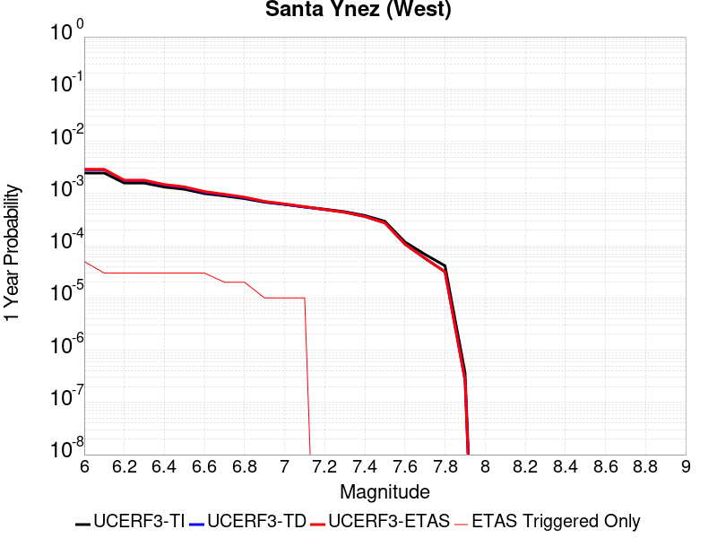 |  |

| Magnitude | 1 wk TI Prob | 1 wk TD Prob | 1 wk ETAS Prob | 1 wk ETAS/TD Gain | 1 wk ETAS Triggered Only | 1 mo TI Prob | 1 mo TD Prob | 1 mo ETAS Prob | 1 mo ETAS/TD Gain | 1 mo ETAS Triggered Only | 1 yr TI Prob | 1 yr TD Prob | 1 yr ETAS Prob | 1 yr ETAS/TD Gain | 1 yr ETAS Triggered Only | 10 yr TI Prob | 10 yr TD Prob | 10 yr ETAS Prob | 10 yr ETAS/TD Gain | 10 yr ETAS Triggered Only |
|-----|-----|-----|-----|-----|-----|-----|-----|-----|-----|-----|-----|-----|-----|-----|-----|-----|-----|-----|-----|-----|
| 6.0 | 4.7352758E-5 | 5.49722E-5 | 5.49722E-5 | 1.0 | 0.0 | 2.0292461E-4 | 2.3557546E-4 | 2.655684E-4 | 1.1273178 | 3.0E-5 | 0.0024678076 | 0.0028646276 | 0.0029144844 | 1.0174043 | 5.0E-5 | 0.024405818 | 0.028305134 | 0.028363435 | 1.0020597 | 6.0E-5 |
| 6.1 | 4.7352758E-5 | 5.49722E-5 | 5.49722E-5 | 1.0 | 0.0 | 2.0292461E-4 | 2.3557546E-4 | 2.5557075E-4 | 1.0848784 | 2.0E-5 | 0.0024678076 | 0.0028646276 | 0.0028945417 | 1.0104426 | 3.0E-5 | 0.024405818 | 0.028305134 | 0.028344002 | 1.0013732 | 4.0E-5 |
| 6.2 | 3.0415853E-5 | 3.392567E-5 | 3.392567E-5 | 1.0 | 0.0 | 1.3034715E-4 | 1.4538778E-4 | 1.6538487E-4 | 1.1375432 | 2.0E-5 | 0.0015858212 | 0.0017686938 | 0.0017986407 | 1.0169317 | 3.0E-5 | 0.015745522 | 0.01755012 | 0.017579593 | 1.0016794 | 3.0E-5 |
| 6.3 | 3.0415853E-5 | 3.392567E-5 | 3.392567E-5 | 1.0 | 0.0 | 1.3034715E-4 | 1.4538778E-4 | 1.6538487E-4 | 1.1375432 | 2.0E-5 | 0.0015858212 | 0.0017686938 | 0.0017986407 | 1.0169317 | 3.0E-5 | 0.015745522 | 0.01755012 | 0.017579593 | 1.0016794 | 3.0E-5 |
| 6.4 | 2.5452082E-5 | 2.7912814E-5 | 2.7912814E-5 | 1.0 | 0.0 | 1.09075794E-4 | 1.1962098E-4 | 1.3961858E-4 | 1.1671748 | 2.0E-5 | 0.0013271887 | 0.0014554313 | 0.0014853877 | 1.0205824 | 3.0E-5 | 0.013192902 | 0.014461164 | 0.014490731 | 1.0020446 | 3.0E-5 |
| 6.5 | 2.3143784E-5 | 2.5128551E-5 | 2.5128551E-5 | 1.0 | 0.0 | 9.9183875E-5 | 1.0768943E-4 | 1.2768728E-4 | 1.1856992 | 2.0E-5 | 0.0012068948 | 0.0013103448 | 0.0013403054 | 1.0228647 | 3.0E-5 | 0.012003611 | 0.013027853 | 0.013057463 | 1.0022727 | 3.0E-5 |
| 6.6 | 1.9118515E-5 | 2.0354546E-5 | 2.0354546E-5 | 1.0 | 0.0 | 8.193392E-5 | 8.7230896E-5 | 1.0722915E-4 | 1.2292565 | 2.0E-5 | 9.97089E-4 | 0.0010615266 | 0.0010914948 | 1.0282311 | 3.0E-5 | 0.00992627 | 0.010565472 | 0.010595155 | 1.0028094 | 3.0E-5 |
| 6.7 | 1.722807E-5 | 1.8146504E-5 | 1.8146504E-5 | 1.0 | 0.0 | 7.3832496E-5 | 7.776845E-5 | 9.776689E-5 | 1.2571537 | 2.0E-5 | 8.985399E-4 | 9.464251E-4 | 9.664062E-4 | 1.0211122 | 2.0E-5 | 0.008949154 | 0.0094245905 | 0.0094444025 | 1.0021021 | 2.0E-5 |
| 6.8 | 1.5317364E-5 | 1.5926595E-5 | 1.5926595E-5 | 1.0 | 0.0 | 6.56442E-5 | 6.825507E-5 | 8.8253706E-5 | 1.2929986 | 2.0E-5 | 7.98925E-4 | 8.3069294E-4 | 8.506763E-4 | 1.0240563 | 2.0E-5 | 0.007960589 | 0.008276366 | 0.0082962 | 1.0023965 | 2.0E-5 |
| 6.9 | 1.3071226E-5 | 1.3329679E-5 | 1.3329679E-5 | 1.0 | 0.0 | 5.6018336E-5 | 5.7125955E-5 | 6.712539E-5 | 1.1750418 | 1.0E-5 | 6.8180985E-4 | 6.952888E-4 | 7.0528185E-4 | 1.0143725 | 1.0E-5 | 0.0067972173 | 0.0069313953 | 0.006941326 | 1.0014327 | 1.0E-5 |
| 7.0 | 1.1836986E-5 | 1.19328115E-5 | 1.19328115E-5 | 1.0 | 0.0 | 5.0728955E-5 | 5.113963E-5 | 6.1139115E-5 | 1.195533 | 1.0E-5 | 6.1745E-4 | 6.224488E-4 | 6.3244253E-4 | 1.0160556 | 1.0E-5 | 0.006157372 | 0.006207247 | 0.0062171845 | 1.001601 | 1.0E-5 |
| 7.1 | 1.0597169E-5 | 1.0542209E-5 | 1.0542209E-5 | 1.0 | 0.0 | 4.541565E-5 | 4.5180117E-5 | 5.5179666E-5 | 1.2213264 | 1.0E-5 | 5.5279525E-4 | 5.499302E-4 | 5.5992475E-4 | 1.0181742 | 1.0E-5 | 0.0055142213 | 0.005485825 | 0.00549577 | 1.0018129 | 1.0E-5 |
| 7.2 | 9.59113E-6 | 9.4591405E-6 | 9.4591405E-6 | 1.0 | 0.0 | 4.11042E-5 | 4.0538547E-5 | 4.0538547E-5 | 1.0 | 0.0 | 5.0032866E-4 | 4.9344613E-4 | 4.9344613E-4 | 1.0 | 0.0 | 0.004992037 | 0.0049236235 | 0.0049236235 | 1.0 | 0.0 |
| 7.3 | 8.586084E-6 | 8.3795685E-6 | 8.3795685E-6 | 1.0 | 0.0 | 3.679698E-5 | 3.5911948E-5 | 3.5911948E-5 | 1.0 | 0.0 | 4.4791115E-4 | 4.371413E-4 | 4.371413E-4 | 1.0 | 0.0 | 0.004470094 | 0.0043629254 | 0.0043629254 | 1.0 | 0.0 |
| 7.4 | 7.2622997E-6 | 6.9515127E-6 | 6.9515127E-6 | 1.0 | 0.0 | 3.112377E-5 | 2.9791861E-5 | 2.9791861E-5 | 1.0 | 0.0 | 3.78866E-4 | 3.6265652E-4 | 3.6265652E-4 | 1.0 | 0.0 | 0.0037822074 | 0.0036207472 | 0.0036207472 | 1.0 | 0.0 |
| 7.5 | 5.627296E-6 | 5.251543E-6 | 5.251543E-6 | 1.0 | 0.0 | 2.411676E-5 | 2.2506423E-5 | 2.2506423E-5 | 1.0 | 0.0 | 2.9358198E-4 | 2.7398195E-4 | 2.7398195E-4 | 1.0 | 0.0 | 0.0029319443 | 0.0027365137 | 0.0027365137 | 1.0 | 0.0 |
| 7.6 | 2.265244E-6 | 2.0608816E-6 | 2.0608816E-6 | 1.0 | 0.0 | 9.708152E-6 | 8.8323195E-6 | 8.8323195E-6 | 1.0 | 0.0 | 1.18190335E-4 | 1.0752828E-4 | 1.0752828E-4 | 1.0 | 0.0 | 0.001181275 | 0.001074771 | 0.001074771 | 1.0 | 0.0 |
| 7.7 | 1.3099874E-6 | 1.1016346E-6 | 1.1016346E-6 | 1.0 | 0.0 | 5.61422E-6 | 4.7212825E-6 | 4.7212825E-6 | 1.0 | 0.0 | 6.8350986E-5 | 5.748012E-5 | 5.748012E-5 | 1.0 | 0.0 | 6.832996E-4 | 5.7465496E-4 | 5.7465496E-4 | 1.0 | 0.0 |
| 7.8 | 7.903951E-7 | 6.0711466E-7 | 6.0711466E-7 | 1.0 | 0.0 | 3.3874032E-6 | 2.6019175E-6 | 2.6019175E-6 | 1.0 | 0.0 | 4.1240855E-5 | 3.1677897E-5 | 3.1677897E-5 | 1.0 | 0.0 | 4.12332E-4 | 3.1673515E-4 | 3.1673515E-4 | 1.0 | 0.0 |
| 7.9 | 7.0753297E-9 | 5.0900932E-9 | 5.0900932E-9 | 1.0 | 0.0 | 3.032284E-8 | 2.1814685E-8 | 2.1814685E-8 | 1.0 | 0.0 | 3.6918053E-7 | 2.6559377E-7 | 2.6559377E-7 | 1.0 | 0.0 | 3.691799E-6 | 2.6559355E-6 | 2.6559355E-6 | 1.0 | 0.0 |

## San Jacinto (Coyote Creek)
*[(top)](#table-of-contents)*

| 1 Week | 1 Month | 1 Year | 10 Year |
|-----|-----|-----|-----|
|  |  |  |  |

| Magnitude | 1 wk TI Prob | 1 wk TD Prob | 1 wk ETAS Prob | 1 wk ETAS/TD Gain | 1 wk ETAS Triggered Only | 1 mo TI Prob | 1 mo TD Prob | 1 mo ETAS Prob | 1 mo ETAS/TD Gain | 1 mo ETAS Triggered Only | 1 yr TI Prob | 1 yr TD Prob | 1 yr ETAS Prob | 1 yr ETAS/TD Gain | 1 yr ETAS Triggered Only | 10 yr TI Prob | 10 yr TD Prob | 10 yr ETAS Prob | 10 yr ETAS/TD Gain | 10 yr ETAS Triggered Only |
|-----|-----|-----|-----|-----|-----|-----|-----|-----|-----|-----|-----|-----|-----|-----|-----|-----|-----|-----|-----|-----|
| 6.0 | 2.7374346E-5 | 2.4152421E-5 | 2.4152421E-5 | 1.0 | 0.0 | 1.1731335E-4 | 1.0350628E-4 | 1.0350628E-4 | 1.0 | 0.0 | 0.0014273542 | 0.001259463 | 0.0012694505 | 1.0079299 | 1.0E-5 | 0.01418221 | 0.012931943 | 0.012991167 | 1.0045797 | 6.0E-5 |
| 6.1 | 2.7374346E-5 | 2.4152421E-5 | 2.4152421E-5 | 1.0 | 0.0 | 1.1731335E-4 | 1.0350628E-4 | 1.0350628E-4 | 1.0 | 0.0 | 0.0014273542 | 0.001259463 | 0.0012694505 | 1.0079299 | 1.0E-5 | 0.01418221 | 0.012931943 | 0.012991167 | 1.0045797 | 6.0E-5 |
| 6.2 | 2.7374346E-5 | 2.4152421E-5 | 2.4152421E-5 | 1.0 | 0.0 | 1.1731335E-4 | 1.0350628E-4 | 1.0350628E-4 | 1.0 | 0.0 | 0.0014273542 | 0.001259463 | 0.0012694505 | 1.0079299 | 1.0E-5 | 0.01418221 | 0.012931943 | 0.012991167 | 1.0045797 | 6.0E-5 |
| 6.3 | 2.7374346E-5 | 2.4152421E-5 | 2.4152421E-5 | 1.0 | 0.0 | 1.1731335E-4 | 1.0350628E-4 | 1.0350628E-4 | 1.0 | 0.0 | 0.0014273542 | 0.001259463 | 0.0012694505 | 1.0079299 | 1.0E-5 | 0.01418221 | 0.012931943 | 0.012991167 | 1.0045797 | 6.0E-5 |
| 6.4 | 2.7374346E-5 | 2.4152421E-5 | 2.4152421E-5 | 1.0 | 0.0 | 1.1731335E-4 | 1.0350628E-4 | 1.0350628E-4 | 1.0 | 0.0 | 0.0014273542 | 0.001259463 | 0.0012694505 | 1.0079299 | 1.0E-5 | 0.01418221 | 0.012931943 | 0.012991167 | 1.0045797 | 6.0E-5 |
| 6.5 | 2.7282445E-5 | 2.4038494E-5 | 2.4038494E-5 | 1.0 | 0.0 | 1.16919524E-4 | 1.03018065E-4 | 1.03018065E-4 | 1.0 | 0.0 | 0.0014225657 | 0.001253526 | 0.0012635135 | 1.0079675 | 1.0E-5 | 0.014134934 | 0.012873269 | 0.012932496 | 1.0046008 | 6.0E-5 |
| 6.6 | 2.7282445E-5 | 2.4038494E-5 | 2.4038494E-5 | 1.0 | 0.0 | 1.16919524E-4 | 1.03018065E-4 | 1.03018065E-4 | 1.0 | 0.0 | 0.0014225657 | 0.001253526 | 0.0012635135 | 1.0079675 | 1.0E-5 | 0.014134934 | 0.012873269 | 0.012932496 | 1.0046008 | 6.0E-5 |
| 6.7 | 2.7216198E-5 | 2.3963614E-5 | 2.3963614E-5 | 1.0 | 0.0 | 1.1663563E-4 | 1.0269717E-4 | 1.0269717E-4 | 1.0 | 0.0 | 0.0014191137 | 0.0012496236 | 0.0012596111 | 1.0079924 | 1.0E-5 | 0.014100855 | 0.012834677 | 0.012893906 | 1.0046148 | 6.0E-5 |
| 6.8 | 2.7078617E-5 | 2.3880828E-5 | 2.3880828E-5 | 1.0 | 0.0 | 1.1604605E-4 | 1.02342405E-4 | 1.02342405E-4 | 1.0 | 0.0 | 0.001411945 | 0.0012453091 | 0.0012552968 | 1.0080202 | 1.0E-5 | 0.014030075 | 0.012791819 | 0.012851052 | 1.0046304 | 6.0E-5 |
| 6.9 | 2.6982952E-5 | 2.3800336E-5 | 2.3800336E-5 | 1.0 | 0.0 | 1.15636096E-4 | 1.01997466E-4 | 1.01997466E-4 | 1.0 | 0.0 | 0.0014069602 | 0.0012411143 | 0.001251102 | 1.0080472 | 1.0E-5 | 0.013980856 | 0.012750106 | 0.012809341 | 1.0046458 | 6.0E-5 |
| 7.0 | 2.6449972E-5 | 2.3377343E-5 | 2.3377343E-5 | 1.0 | 0.0 | 1.1335209E-4 | 1.00184785E-4 | 1.00184785E-4 | 1.0 | 0.0 | 0.001379188 | 0.0012190698 | 0.0012290576 | 1.008193 | 1.0E-5 | 0.0137065975 | 0.012531462 | 0.01259071 | 1.004728 | 6.0E-5 |
| 7.1 | 2.6257849E-5 | 2.3203378E-5 | 2.3203378E-5 | 1.0 | 0.0 | 1.1252879E-4 | 9.943927E-5 | 9.943927E-5 | 1.0 | 0.0 | 0.0013691769 | 0.0012100033 | 0.0012199912 | 1.0082544 | 1.0E-5 | 0.013607717 | 0.012441383 | 0.012500636 | 1.0047626 | 6.0E-5 |
| 7.2 | 2.5270041E-5 | 2.2398073E-5 | 2.2398073E-5 | 1.0 | 0.0 | 1.0829568E-4 | 9.598822E-5 | 9.598822E-5 | 1.0 | 0.0 | 0.0013177024 | 0.0011680324 | 0.0011780207 | 1.0085514 | 1.0E-5 | 0.013099162 | 0.012022524 | 0.012081803 | 1.0049306 | 6.0E-5 |
| 7.3 | 2.339701E-5 | 2.1129852E-5 | 2.1129852E-5 | 1.0 | 0.0 | 1.0026905E-4 | 9.0553374E-5 | 9.0553374E-5 | 1.0 | 0.0 | 0.001220092 | 0.0011019319 | 0.0011119208 | 1.0090649 | 1.0E-5 | 0.012134149 | 0.011361412 | 0.01142073 | 1.005221 | 6.0E-5 |
| 7.4 | 2.296333E-5 | 2.0860187E-5 | 2.0860187E-5 | 1.0 | 0.0 | 9.841056E-5 | 8.939775E-5 | 8.939775E-5 | 1.0 | 0.0 | 0.0011974899 | 0.0010878762 | 0.0010978653 | 1.0091822 | 1.0E-5 | 0.011910575 | 0.011220528 | 0.011279855 | 1.0052873 | 6.0E-5 |
| 7.5 | 2.2188895E-5 | 2.0383068E-5 | 2.0383068E-5 | 1.0 | 0.0 | 9.50918E-5 | 8.735309E-5 | 8.735309E-5 | 1.0 | 0.0 | 0.0011571277 | 0.001063007 | 0.0010729964 | 1.0093973 | 1.0E-5 | 0.011511209 | 0.010970126 | 0.011029468 | 1.0054094 | 6.0E-5 |
| 7.6 | 2.0013189E-5 | 1.8969224E-5 | 1.8969224E-5 | 1.0 | 0.0 | 8.5767984E-5 | 8.129415E-5 | 8.129415E-5 | 1.0 | 0.0 | 0.001043725 | 9.893086E-4 | 9.992988E-4 | 1.0100981 | 1.0E-5 | 0.010388365 | 0.010228057 | 0.010287443 | 1.0058062 | 6.0E-5 |
| 7.7 | 1.7230794E-5 | 1.6750411E-5 | 1.6750411E-5 | 1.0 | 0.0 | 7.384417E-5 | 7.178551E-5 | 7.178551E-5 | 1.0 | 0.0 | 8.986819E-4 | 8.7363896E-4 | 8.836302E-4 | 1.0114363 | 1.0E-5 | 0.008950562 | 0.009066527 | 0.009125982 | 1.0065577 | 6.0E-5 |
| 7.8 | 1.4478809E-5 | 1.4997487E-5 | 1.4997487E-5 | 1.0 | 0.0 | 6.205057E-5 | 6.4273365E-5 | 6.4273365E-5 | 1.0 | 0.0 | 7.552038E-4 | 7.8224787E-4 | 7.922401E-4 | 1.0127736 | 1.0E-5 | 0.0075264242 | 0.008144863 | 0.008204374 | 1.0073066 | 6.0E-5 |
| 7.9 | 1.1114467E-5 | 1.1650795E-5 | 1.1650795E-5 | 1.0 | 0.0 | 4.7632562E-5 | 4.9931026E-5 | 4.9931026E-5 | 1.0 | 0.0 | 5.797721E-4 | 6.0774124E-4 | 6.177352E-4 | 1.0164443 | 1.0E-5 | 0.0057826187 | 0.00638346 | 0.006433141 | 1.0077827 | 5.0E-5 |
| 8.0 | 9.327402E-6 | 9.904316E-6 | 9.904316E-6 | 1.0 | 0.0 | 3.9973966E-5 | 4.2446383E-5 | 4.2446383E-5 | 1.0 | 0.0 | 4.8657437E-4 | 5.1666267E-4 | 5.266575E-4 | 1.019345 | 1.0E-5 | 0.0048551033 | 0.005452786 | 0.0055025136 | 1.0091196 | 5.0E-5 |
| 8.1 | 7.0235833E-6 | 6.831197E-6 | 6.831197E-6 | 1.0 | 0.0 | 3.0100724E-5 | 2.9276232E-5 | 2.9276232E-5 | 1.0 | 0.0 | 3.664147E-4 | 3.5638033E-4 | 3.6637677E-4 | 1.02805 | 1.0E-5 | 0.003658111 | 0.0037895683 | 0.0038194547 | 1.0078864 | 3.0E-5 |
| 8.2 | 2.0358202E-6 | 8.9996047E-7 | 8.9996047E-7 | 1.0 | 0.0 | 8.724915E-6 | 3.856968E-6 | 3.856968E-6 | 1.0 | 0.0 | 1.06220665E-4 | 4.6957593E-5 | 4.6957593E-5 | 1.0 | 0.0 | 0.001061699 | 5.3285924E-4 | 5.3285924E-4 | 1.0 | 0.0 |
| 8.3 | 2.0051264E-7 | 6.621079E-8 | 6.621079E-8 | 1.0 | 0.0 | 8.5933965E-7 | 2.837605E-7 | 2.837605E-7 | 1.0 | 0.0 | 1.046241E-5 | 3.454779E-6 | 3.454779E-6 | 1.0 | 0.0 | 1.0461917E-4 | 4.016238E-5 | 4.016238E-5 | 1.0 | 0.0 |

## Kern Canyon (South Kern) 2011
*[(top)](#table-of-contents)*

| 1 Week | 1 Month | 1 Year | 10 Year |
|-----|-----|-----|-----|
|  |  |  |  |

| Magnitude | 1 wk TI Prob | 1 wk TD Prob | 1 wk ETAS Prob | 1 wk ETAS/TD Gain | 1 wk ETAS Triggered Only | 1 mo TI Prob | 1 mo TD Prob | 1 mo ETAS Prob | 1 mo ETAS/TD Gain | 1 mo ETAS Triggered Only | 1 yr TI Prob | 1 yr TD Prob | 1 yr ETAS Prob | 1 yr ETAS/TD Gain | 1 yr ETAS Triggered Only | 10 yr TI Prob | 10 yr TD Prob | 10 yr ETAS Prob | 10 yr ETAS/TD Gain | 10 yr ETAS Triggered Only |
|-----|-----|-----|-----|-----|-----|-----|-----|-----|-----|-----|-----|-----|-----|-----|-----|-----|-----|-----|-----|-----|
| 6.0 | 4.105075E-6 | 4.1137364E-6 | 4.1137364E-6 | 1.0 | 0.0 | 1.7593058E-5 | 1.7630184E-5 | 2.7630007E-5 | 1.5671991 | 1.0E-5 | 2.1417443E-4 | 2.1462698E-4 | 2.3462268E-4 | 1.0931649 | 2.0E-5 | 0.0021396813 | 0.0021442608 | 0.0022041323 | 1.0279217 | 6.0E-5 |
| 6.1 | 4.105075E-6 | 4.1137364E-6 | 4.1137364E-6 | 1.0 | 0.0 | 1.7593058E-5 | 1.7630184E-5 | 2.7630007E-5 | 1.5671991 | 1.0E-5 | 2.1417443E-4 | 2.1462698E-4 | 2.3462268E-4 | 1.0931649 | 2.0E-5 | 0.0021396813 | 0.0021442608 | 0.0022041323 | 1.0279217 | 6.0E-5 |
| 6.2 | 4.105075E-6 | 4.1137364E-6 | 4.1137364E-6 | 1.0 | 0.0 | 1.7593058E-5 | 1.7630184E-5 | 2.7630007E-5 | 1.5671991 | 1.0E-5 | 2.1417443E-4 | 2.1462698E-4 | 2.3462268E-4 | 1.0931649 | 2.0E-5 | 0.0021396813 | 0.0021442608 | 0.0022041323 | 1.0279217 | 6.0E-5 |
| 6.3 | 4.105075E-6 | 4.1137364E-6 | 4.1137364E-6 | 1.0 | 0.0 | 1.7593058E-5 | 1.7630184E-5 | 2.7630007E-5 | 1.5671991 | 1.0E-5 | 2.1417443E-4 | 2.1462698E-4 | 2.3462268E-4 | 1.0931649 | 2.0E-5 | 0.0021396813 | 0.0021442608 | 0.0022041323 | 1.0279217 | 6.0E-5 |
| 6.4 | 4.105075E-6 | 4.1137364E-6 | 4.1137364E-6 | 1.0 | 0.0 | 1.7593058E-5 | 1.7630184E-5 | 2.7630007E-5 | 1.5671991 | 1.0E-5 | 2.1417443E-4 | 2.1462698E-4 | 2.3462268E-4 | 1.0931649 | 2.0E-5 | 0.0021396813 | 0.0021442608 | 0.0022041323 | 1.0279217 | 6.0E-5 |
| 6.5 | 2.9849807E-6 | 2.9731618E-6 | 2.9731618E-6 | 1.0 | 0.0 | 1.2792712E-5 | 1.2742061E-5 | 2.2741933E-5 | 1.7847924 | 1.0E-5 | 1.5574014E-4 | 1.551237E-4 | 1.751206E-4 | 1.1289093 | 2.0E-5 | 0.0015563103 | 0.0015501693 | 0.0015901073 | 1.0257636 | 4.0E-5 |
| 6.6 | 2.9849807E-6 | 2.9731618E-6 | 2.9731618E-6 | 1.0 | 0.0 | 1.2792712E-5 | 1.2742061E-5 | 2.2741933E-5 | 1.7847924 | 1.0E-5 | 1.5574014E-4 | 1.551237E-4 | 1.751206E-4 | 1.1289093 | 2.0E-5 | 0.0015563103 | 0.0015501693 | 0.0015901073 | 1.0257636 | 4.0E-5 |
| 6.7 | 2.6756725E-6 | 2.6582272E-6 | 2.6582272E-6 | 1.0 | 0.0 | 1.1467117E-5 | 1.13923525E-5 | 2.139224E-5 | 1.8777719 | 1.0E-5 | 1.396032E-4 | 1.3869318E-4 | 1.586904E-4 | 1.1441832 | 2.0E-5 | 0.0013951553 | 0.0013860771 | 0.0014260217 | 1.0288184 | 4.0E-5 |
| 6.8 | 2.3283721E-6 | 2.3047844E-6 | 2.3047844E-6 | 1.0 | 0.0 | 9.9787E-6 | 9.87761E-6 | 1.9877512E-5 | 2.0123806 | 1.0E-5 | 1.214839E-4 | 1.20253346E-4 | 1.4025094E-4 | 1.1662955 | 2.0E-5 | 0.001214175 | 0.0012018902 | 0.001241842 | 1.0332409 | 4.0E-5 |
| 6.9 | 2.0972677E-6 | 2.0696461E-6 | 2.0696461E-6 | 1.0 | 0.0 | 8.988259E-6 | 8.869883E-6 | 1.8869794E-5 | 2.1274006 | 1.0E-5 | 1.0942656E-4 | 1.0798552E-4 | 1.2798337E-4 | 1.18519 | 2.0E-5 | 0.0010937268 | 0.0010793363 | 0.0011192932 | 1.0370198 | 4.0E-5 |
| 7.0 | 1.7132242E-6 | 1.6787077E-6 | 1.6787077E-6 | 1.0 | 0.0 | 7.3423685E-6 | 7.194442E-6 | 7.194442E-6 | 1.0 | 0.0 | 8.938967E-5 | 8.758884E-5 | 9.758797E-5 | 1.1141598 | 1.0E-5 | 8.935372E-4 | 8.7554706E-4 | 9.055208E-4 | 1.0342343 | 3.0E-5 |
| 7.1 | 1.4215541E-6 | 1.3815785E-6 | 1.3815785E-6 | 1.0 | 0.0 | 6.0923603E-6 | 5.9210374E-6 | 5.9210374E-6 | 1.0 | 0.0 | 7.417196E-5 | 7.208627E-5 | 8.208556E-5 | 1.1387126 | 1.0E-5 | 7.414721E-4 | 7.206316E-4 | 7.406172E-4 | 1.0277334 | 2.0E-5 |
| 7.2 | 9.097853E-7 | 8.6037966E-7 | 8.6037966E-7 | 1.0 | 0.0 | 3.899074E-6 | 3.6873362E-6 | 3.6873362E-6 | 1.0 | 0.0 | 4.7470192E-5 | 4.4892404E-5 | 5.4891956E-5 | 1.2227448 | 1.0E-5 | 4.7460053E-4 | 4.4883444E-4 | 4.5882995E-4 | 1.02227 | 1.0E-5 |
| 7.3 | 6.144169E-7 | 5.6282187E-7 | 5.6282187E-7 | 1.0 | 0.0 | 2.6332125E-6 | 2.4120914E-6 | 2.4120914E-6 | 1.0 | 0.0 | 3.205889E-5 | 2.9366824E-5 | 2.9366824E-5 | 1.0 | 0.0 | 3.2054266E-4 | 2.9362994E-4 | 2.9362994E-4 | 1.0 | 0.0 |
| 7.4 | 4.049844E-7 | 3.5728377E-7 | 3.5728377E-7 | 1.0 | 0.0 | 1.7356463E-6 | 1.5312153E-6 | 1.5312153E-6 | 1.0 | 0.0 | 2.1131287E-5 | 1.864239E-5 | 1.864239E-5 | 1.0 | 0.0 | 2.1129279E-4 | 1.864085E-4 | 1.864085E-4 | 1.0 | 0.0 |
| 7.5 | 1.9871162E-7 | 1.5830446E-7 | 1.5830446E-7 | 1.0 | 0.0 | 8.5162094E-7 | 6.784475E-7 | 6.784475E-7 | 1.0 | 0.0 | 1.0368436E-5 | 8.260068E-6 | 8.260068E-6 | 1.0 | 0.0 | 1.0367952E-4 | 8.25977E-5 | 8.25977E-5 | 1.0 | 0.0 |
| 7.6 | 2.572245E-8 | 1.7352718E-8 | 1.7352718E-8 | 1.0 | 0.0 | 1.10239064E-7 | 7.436879E-8 | 7.436879E-8 | 1.0 | 0.0 | 1.3421597E-6 | 9.054397E-7 | 9.054397E-7 | 1.0 | 0.0 | 1.3421517E-5 | 9.054365E-6 | 9.054365E-6 | 1.0 | 0.0 |

## Sierra Madre
*[(top)](#table-of-contents)*

| 1 Week | 1 Month | 1 Year | 10 Year |
|-----|-----|-----|-----|
|  |  |  | 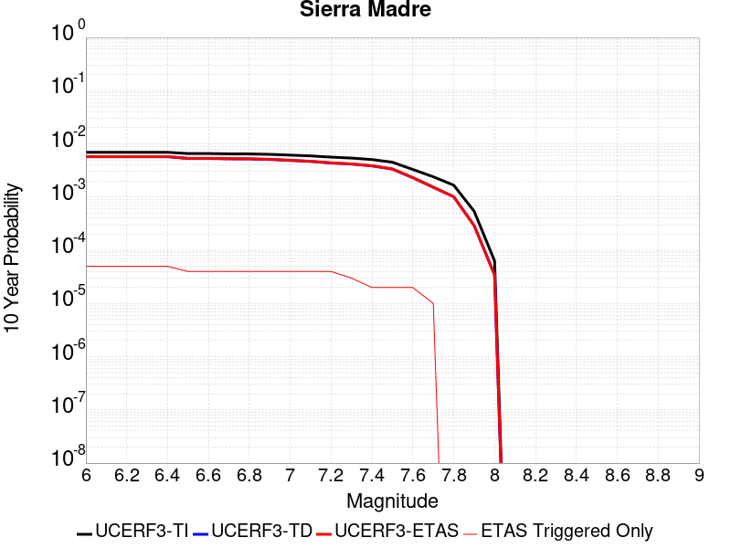 |

| Magnitude | 1 wk TI Prob | 1 wk TD Prob | 1 wk ETAS Prob | 1 wk ETAS/TD Gain | 1 wk ETAS Triggered Only | 1 mo TI Prob | 1 mo TD Prob | 1 mo ETAS Prob | 1 mo ETAS/TD Gain | 1 mo ETAS Triggered Only | 1 yr TI Prob | 1 yr TD Prob | 1 yr ETAS Prob | 1 yr ETAS/TD Gain | 1 yr ETAS Triggered Only | 10 yr TI Prob | 10 yr TD Prob | 10 yr ETAS Prob | 10 yr ETAS/TD Gain | 10 yr ETAS Triggered Only |
|-----|-----|-----|-----|-----|-----|-----|-----|-----|-----|-----|-----|-----|-----|-----|-----|-----|-----|-----|-----|-----|
| 6.0 | 1.3379373E-5 | 1.1001147E-5 | 1.1001147E-5 | 1.0 | 0.0 | 5.7338908E-5 | 4.7146932E-5 | 4.7146932E-5 | 1.0 | 0.0 | 6.978776E-4 | 5.7386415E-4 | 5.8385846E-4 | 1.0174158 | 1.0E-5 | 0.0069569005 | 0.0057240664 | 0.00577378 | 1.008685 | 5.0E-5 |
| 6.1 | 1.3379373E-5 | 1.1001147E-5 | 1.1001147E-5 | 1.0 | 0.0 | 5.7338908E-5 | 4.7146932E-5 | 4.7146932E-5 | 1.0 | 0.0 | 6.978776E-4 | 5.7386415E-4 | 5.8385846E-4 | 1.0174158 | 1.0E-5 | 0.0069569005 | 0.0057240664 | 0.00577378 | 1.008685 | 5.0E-5 |
| 6.2 | 1.3379373E-5 | 1.1001147E-5 | 1.1001147E-5 | 1.0 | 0.0 | 5.7338908E-5 | 4.7146932E-5 | 4.7146932E-5 | 1.0 | 0.0 | 6.978776E-4 | 5.7386415E-4 | 5.8385846E-4 | 1.0174158 | 1.0E-5 | 0.0069569005 | 0.0057240664 | 0.00577378 | 1.008685 | 5.0E-5 |
| 6.3 | 1.3379373E-5 | 1.1001147E-5 | 1.1001147E-5 | 1.0 | 0.0 | 5.7338908E-5 | 4.7146932E-5 | 4.7146932E-5 | 1.0 | 0.0 | 6.978776E-4 | 5.7386415E-4 | 5.8385846E-4 | 1.0174158 | 1.0E-5 | 0.0069569005 | 0.0057240664 | 0.00577378 | 1.008685 | 5.0E-5 |
| 6.4 | 1.3379373E-5 | 1.1001147E-5 | 1.1001147E-5 | 1.0 | 0.0 | 5.7338908E-5 | 4.7146932E-5 | 4.7146932E-5 | 1.0 | 0.0 | 6.978776E-4 | 5.7386415E-4 | 5.8385846E-4 | 1.0174158 | 1.0E-5 | 0.0069569005 | 0.0057240664 | 0.00577378 | 1.008685 | 5.0E-5 |
| 6.5 | 1.26563245E-5 | 1.0230597E-5 | 1.0230597E-5 | 1.0 | 0.0 | 5.4240263E-5 | 4.3844684E-5 | 4.3844684E-5 | 1.0 | 0.0 | 6.601751E-4 | 5.336793E-4 | 5.43674E-4 | 1.0187279 | 1.0E-5 | 0.006582173 | 0.0053241784 | 0.0053639654 | 1.0074729 | 4.0E-5 |
| 6.6 | 1.26563245E-5 | 1.0230597E-5 | 1.0230597E-5 | 1.0 | 0.0 | 5.4240263E-5 | 4.3844684E-5 | 4.3844684E-5 | 1.0 | 0.0 | 6.601751E-4 | 5.336793E-4 | 5.43674E-4 | 1.0187279 | 1.0E-5 | 0.006582173 | 0.0053241784 | 0.0053639654 | 1.0074729 | 4.0E-5 |
| 6.7 | 1.2502474E-5 | 1.0066739E-5 | 1.0066739E-5 | 1.0 | 0.0 | 5.3580934E-5 | 4.314246E-5 | 4.314246E-5 | 1.0 | 0.0 | 6.521526E-4 | 5.251339E-4 | 5.351287E-4 | 1.0190327 | 1.0E-5 | 0.0065024206 | 0.0052391286 | 0.005278919 | 1.0075948 | 4.0E-5 |
| 6.8 | 1.2454966E-5 | 1.0019025E-5 | 1.0019025E-5 | 1.0 | 0.0 | 5.3377335E-5 | 4.2937972E-5 | 4.2937972E-5 | 1.0 | 0.0 | 6.4967526E-4 | 5.226455E-4 | 5.3264026E-4 | 1.0191234 | 1.0E-5 | 0.006477792 | 0.005214361 | 0.0052541527 | 1.0076311 | 4.0E-5 |
| 6.9 | 1.2225574E-5 | 9.793E-6 | 9.793E-6 | 1.0 | 0.0 | 5.2394265E-5 | 4.1969328E-5 | 4.1969328E-5 | 1.0 | 0.0 | 6.3771347E-4 | 5.108578E-4 | 5.208527E-4 | 1.0195649 | 1.0E-5 | 0.006358865 | 0.0050970297 | 0.005136826 | 1.0078077 | 4.0E-5 |
| 7.0 | 1.182946E-5 | 9.399537E-6 | 9.399537E-6 | 1.0 | 0.0 | 5.06967E-5 | 4.0283114E-5 | 4.0283114E-5 | 1.0 | 0.0 | 6.1705755E-4 | 4.9033755E-4 | 5.003327E-4 | 1.0203841 | 1.0E-5 | 0.006153469 | 0.0048927474 | 0.0049325516 | 1.0081353 | 4.0E-5 |
| 7.1 | 1.14369095E-5 | 8.986543E-6 | 8.986543E-6 | 1.0 | 0.0 | 4.9014405E-5 | 3.8513193E-5 | 3.8513193E-5 | 1.0 | 0.0 | 5.9658696E-4 | 4.6879821E-4 | 4.7879355E-4 | 1.0213212 | 1.0E-5 | 0.005949879 | 0.0046782778 | 0.0047180904 | 1.0085101 | 4.0E-5 |
| 7.2 | 1.0836419E-5 | 8.399933E-6 | 8.399933E-6 | 1.0 | 0.0 | 4.644097E-5 | 3.599922E-5 | 3.599922E-5 | 1.0 | 0.0 | 5.652721E-4 | 4.3820328E-4 | 4.4819887E-4 | 1.0228105 | 1.0E-5 | 0.0056383642 | 0.0043735686 | 0.0044133933 | 1.0091058 | 4.0E-5 |
| 7.3 | 1.0403439E-5 | 8.021192E-6 | 8.021192E-6 | 1.0 | 0.0 | 4.4585406E-5 | 3.437609E-5 | 3.437609E-5 | 1.0 | 0.0 | 5.426921E-4 | 4.1844943E-4 | 4.2844526E-4 | 1.0238878 | 1.0E-5 | 0.005413687 | 0.0041767894 | 0.004206664 | 1.0071526 | 3.0E-5 |
| 7.4 | 9.768864E-6 | 7.4148143E-6 | 7.4148143E-6 | 1.0 | 0.0 | 4.186589E-5 | 3.1777392E-5 | 3.1777392E-5 | 1.0 | 0.0 | 5.09598E-4 | 3.8682195E-4 | 3.968181E-4 | 1.0258417 | 1.0E-5 | 0.0050843097 | 0.0038616573 | 0.00388158 | 1.0051591 | 2.0E-5 |
| 7.5 | 8.687089E-6 | 6.450497E-6 | 6.450497E-6 | 1.0 | 0.0 | 3.722985E-5 | 2.7644699E-5 | 2.7644699E-5 | 1.0 | 0.0 | 4.5317915E-4 | 3.3652308E-4 | 3.4651972E-4 | 1.0297056 | 1.0E-5 | 0.004522561 | 0.003360301 | 0.003380234 | 1.0059319 | 2.0E-5 |
| 7.6 | 6.3506063E-6 | 4.4306207E-6 | 4.4306207E-6 | 1.0 | 0.0 | 2.72166E-5 | 1.8988238E-5 | 1.8988238E-5 | 1.0 | 0.0 | 3.3131172E-4 | 2.3115752E-4 | 2.4115521E-4 | 1.0432506 | 1.0E-5 | 0.003308182 | 0.0023092744 | 0.0023292282 | 1.0086408 | 2.0E-5 |
| 7.7 | 4.62223E-6 | 2.9332343E-6 | 2.9332343E-6 | 1.0 | 0.0 | 1.9809406E-5 | 1.2570943E-5 | 1.2570943E-5 | 1.0 | 0.0 | 2.4115283E-4 | 1.5304051E-4 | 1.6303897E-4 | 1.0653322 | 1.0E-5 | 0.0024089129 | 0.0015294303 | 0.001539415 | 1.0065284 | 1.0E-5 |
| 7.8 | 3.2145008E-6 | 1.949628E-6 | 1.949628E-6 | 1.0 | 0.0 | 1.3776359E-5 | 8.355522E-6 | 8.355522E-6 | 1.0 | 0.0 | 1.6771426E-4 | 1.0172375E-4 | 1.0172375E-4 | 1.0 | 0.0 | 0.0016758774 | 0.0010167895 | 0.0010167895 | 1.0 | 0.0 |
| 7.9 | 1.0391769E-6 | 5.6032485E-7 | 5.6032485E-7 | 1.0 | 0.0 | 4.4536077E-6 | 2.40139E-6 | 2.40139E-6 | 1.0 | 0.0 | 5.4221324E-5 | 2.9236535E-5 | 2.9236535E-5 | 1.0 | 0.0 | 5.4208096E-4 | 2.923273E-4 | 2.923273E-4 | 1.0 | 0.0 |
| 8.0 | 1.210983E-7 | 6.6138576E-8 | 6.6138576E-8 | 1.0 | 0.0 | 5.1899264E-7 | 2.8345102E-7 | 2.8345102E-7 | 1.0 | 0.0 | 6.3187167E-6 | 3.4510108E-6 | 3.4510108E-6 | 1.0 | 0.0 | 6.318537E-5 | 3.450959E-5 | 3.450959E-5 | 1.0 | 0.0 |

## Camp Rock 2011
*[(top)](#table-of-contents)*

| 1 Week | 1 Month | 1 Year | 10 Year |
|-----|-----|-----|-----|
|  |  | 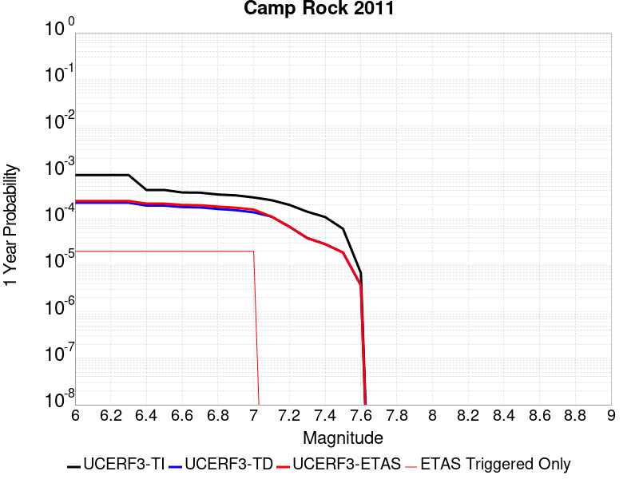 |  |

| Magnitude | 1 wk TI Prob | 1 wk TD Prob | 1 wk ETAS Prob | 1 wk ETAS/TD Gain | 1 wk ETAS Triggered Only | 1 mo TI Prob | 1 mo TD Prob | 1 mo ETAS Prob | 1 mo ETAS/TD Gain | 1 mo ETAS Triggered Only | 1 yr TI Prob | 1 yr TD Prob | 1 yr ETAS Prob | 1 yr ETAS/TD Gain | 1 yr ETAS Triggered Only | 10 yr TI Prob | 10 yr TD Prob | 10 yr ETAS Prob | 10 yr ETAS/TD Gain | 10 yr ETAS Triggered Only |
|-----|-----|-----|-----|-----|-----|-----|-----|-----|-----|-----|-----|-----|-----|-----|-----|-----|-----|-----|-----|-----|
| 6.0 | 1.6710783E-5 | 4.2500346E-6 | 4.2500346E-6 | 1.0 | 0.0 | 7.161568E-5 | 1.821431E-5 | 2.8214128E-5 | 1.5490088 | 1.0E-5 | 8.7157206E-4 | 2.2173718E-4 | 2.4173275E-4 | 1.0901768 | 2.0E-5 | 0.008681616 | 0.0022152122 | 0.0022651015 | 1.0225213 | 5.0E-5 |
| 6.1 | 1.6710783E-5 | 4.2500346E-6 | 4.2500346E-6 | 1.0 | 0.0 | 7.161568E-5 | 1.821431E-5 | 2.8214128E-5 | 1.5490088 | 1.0E-5 | 8.7157206E-4 | 2.2173718E-4 | 2.4173275E-4 | 1.0901768 | 2.0E-5 | 0.008681616 | 0.0022152122 | 0.0022651015 | 1.0225213 | 5.0E-5 |
| 6.2 | 1.6710783E-5 | 4.2500346E-6 | 4.2500346E-6 | 1.0 | 0.0 | 7.161568E-5 | 1.821431E-5 | 2.8214128E-5 | 1.5490088 | 1.0E-5 | 8.7157206E-4 | 2.2173718E-4 | 2.4173275E-4 | 1.0901768 | 2.0E-5 | 0.008681616 | 0.0022152122 | 0.0022651015 | 1.0225213 | 5.0E-5 |
| 6.3 | 1.6710783E-5 | 4.2500346E-6 | 4.2500346E-6 | 1.0 | 0.0 | 7.161568E-5 | 1.821431E-5 | 2.8214128E-5 | 1.5490088 | 1.0E-5 | 8.7157206E-4 | 2.2173718E-4 | 2.4173275E-4 | 1.0901768 | 2.0E-5 | 0.008681616 | 0.0022152122 | 0.0022651015 | 1.0225213 | 5.0E-5 |
| 6.4 | 7.982846E-6 | 3.682069E-6 | 3.682069E-6 | 1.0 | 0.0 | 3.421175E-5 | 1.5780202E-5 | 2.5780044E-5 | 1.6336955 | 1.0E-5 | 4.1644843E-4 | 1.9210737E-4 | 2.1210354E-4 | 1.1040884 | 2.0E-5 | 0.0041566887 | 0.0019194479 | 0.001969352 | 1.0259992 | 5.0E-5 |
| 6.5 | 7.982846E-6 | 3.682069E-6 | 3.682069E-6 | 1.0 | 0.0 | 3.421175E-5 | 1.5780202E-5 | 2.5780044E-5 | 1.6336955 | 1.0E-5 | 4.1644843E-4 | 1.9210737E-4 | 2.1210354E-4 | 1.1040884 | 2.0E-5 | 0.0041566887 | 0.0019194479 | 0.001969352 | 1.0259992 | 5.0E-5 |
| 6.6 | 7.048869E-6 | 3.4243315E-6 | 3.4243315E-6 | 1.0 | 0.0 | 3.0209088E-5 | 1.4675626E-5 | 2.4675479E-5 | 1.681392 | 1.0E-5 | 3.677336E-4 | 1.786614E-4 | 1.9865783E-4 | 1.1119236 | 2.0E-5 | 0.0036712566 | 0.0017852094 | 0.0018351201 | 1.0279579 | 5.0E-5 |
| 6.7 | 6.987307E-6 | 3.3623085E-6 | 3.3623085E-6 | 1.0 | 0.0 | 2.9945259E-5 | 1.4409816E-5 | 2.4409672E-5 | 1.6939614 | 1.0E-5 | 3.6452254E-4 | 1.754257E-4 | 1.954222E-4 | 1.1139884 | 2.0E-5 | 0.0036392517 | 0.0017529033 | 0.0018028157 | 1.0284741 | 5.0E-5 |
| 6.8 | 6.3737602E-6 | 3.1178974E-6 | 3.1178974E-6 | 1.0 | 0.0 | 2.731583E-5 | 1.3362351E-5 | 2.3362218E-5 | 1.7483613 | 1.0E-5 | 3.3251947E-4 | 1.6267477E-4 | 1.8267152E-4 | 1.1229247 | 2.0E-5 | 0.0033202237 | 0.0016255855 | 0.0016755041 | 1.0307082 | 5.0E-5 |
| 6.9 | 6.112211E-6 | 2.9331072E-6 | 2.9331072E-6 | 1.0 | 0.0 | 2.6194928E-5 | 1.2570401E-5 | 2.2570275E-5 | 1.7955096 | 1.0E-5 | 3.1887658E-4 | 1.5303415E-4 | 1.730311E-4 | 1.1306698 | 2.0E-5 | 0.003184194 | 0.0015293155 | 0.001579239 | 1.0326444 | 5.0E-5 |
| 7.0 | 5.5140117E-6 | 2.6419382E-6 | 2.6419382E-6 | 1.0 | 0.0 | 2.3631264E-5 | 1.1322544E-5 | 2.132243E-5 | 1.8831837 | 1.0E-5 | 2.8767265E-4 | 1.3784351E-4 | 1.5784075E-4 | 1.1450721 | 2.0E-5 | 0.0028730053 | 0.0013776054 | 0.0014275365 | 1.0362449 | 5.0E-5 |
| 7.1 | 4.8151105E-6 | 2.1342858E-6 | 2.1342858E-6 | 1.0 | 0.0 | 2.0636026E-5 | 9.146908E-6 | 9.146908E-6 | 1.0 | 0.0 | 2.5121463E-4 | 1.1135814E-4 | 1.1135814E-4 | 1.0 | 0.0 | 0.0025093083 | 0.0011130453 | 0.001133023 | 1.0179487 | 2.0E-5 |
| 7.2 | 3.818335E-6 | 1.2937558E-6 | 1.2937558E-6 | 1.0 | 0.0 | 1.6364189E-5 | 5.5446562E-6 | 5.5446562E-6 | 1.0 | 0.0 | 1.9921579E-4 | 6.750418E-5 | 6.750418E-5 | 1.0 | 0.0 | 0.0019903728 | 6.74845E-4 | 6.948315E-4 | 1.0296165 | 2.0E-5 |
| 7.3 | 2.7166698E-6 | 7.3832456E-7 | 7.3832456E-7 | 1.0 | 0.0 | 1.1642818E-5 | 3.1642444E-6 | 3.1642444E-6 | 1.0 | 0.0 | 1.4174209E-4 | 3.8524013E-5 | 3.8524013E-5 | 1.0 | 0.0 | 0.0014165172 | 3.8517537E-4 | 3.9517152E-4 | 1.0259522 | 1.0E-5 |
| 7.4 | 2.0893426E-6 | 5.4615964E-7 | 5.4615964E-7 | 1.0 | 0.0 | 8.954295E-6 | 2.340682E-6 | 2.340682E-6 | 1.0 | 0.0 | 1.0901308E-4 | 2.8497436E-5 | 2.8497436E-5 | 1.0 | 0.0 | 0.0010895962 | 2.8493837E-4 | 2.8493837E-4 | 1.0 | 0.0 |
| 7.5 | 1.1681728E-6 | 3.6029326E-7 | 3.6029326E-7 | 1.0 | 0.0 | 5.0064455E-6 | 1.544113E-6 | 1.544113E-6 | 1.0 | 0.0 | 6.0951766E-5 | 1.879942E-5 | 1.879942E-5 | 1.0 | 0.0 | 6.093505E-4 | 1.8797876E-4 | 1.8797876E-4 | 1.0 | 0.0 |
| 7.6 | 1.3154387E-7 | 7.119745E-8 | 7.119745E-8 | 1.0 | 0.0 | 5.6375933E-7 | 3.051319E-7 | 3.051319E-7 | 1.0 | 0.0 | 6.863748E-6 | 3.7149762E-6 | 3.7149762E-6 | 1.0 | 0.0 | 6.863536E-5 | 3.7149297E-5 | 3.7149297E-5 | 1.0 | 0.0 |

## Santa Rosa Island
*[(top)](#table-of-contents)*

| 1 Week | 1 Month | 1 Year | 10 Year |
|-----|-----|-----|-----|
|  |  |  |  |

| Magnitude | 1 wk TI Prob | 1 wk TD Prob | 1 wk ETAS Prob | 1 wk ETAS/TD Gain | 1 wk ETAS Triggered Only | 1 mo TI Prob | 1 mo TD Prob | 1 mo ETAS Prob | 1 mo ETAS/TD Gain | 1 mo ETAS Triggered Only | 1 yr TI Prob | 1 yr TD Prob | 1 yr ETAS Prob | 1 yr ETAS/TD Gain | 1 yr ETAS Triggered Only | 10 yr TI Prob | 10 yr TD Prob | 10 yr ETAS Prob | 10 yr ETAS/TD Gain | 10 yr ETAS Triggered Only |
|-----|-----|-----|-----|-----|-----|-----|-----|-----|-----|-----|-----|-----|-----|-----|-----|-----|-----|-----|-----|-----|
| 6.0 | 4.1143165E-5 | 4.7092035E-5 | 5.7091565E-5 | 1.2123401 | 1.0E-5 | 1.7631594E-4 | 2.018085E-4 | 2.1180649E-4 | 1.049542 | 1.0E-5 | 0.002144533 | 0.0024544464 | 0.0024743972 | 1.0081285 | 2.0E-5 | 0.021239553 | 0.024294019 | 0.024342805 | 1.0020081 | 5.0E-5 |
| 6.1 | 2.1061249E-5 | 2.3865383E-5 | 3.3865144E-5 | 1.419007 | 1.0E-5 | 9.0259375E-5 | 1.0227637E-4 | 1.12275346E-4 | 1.0977643 | 1.0E-5 | 0.0010983539 | 0.0012445324 | 0.0012545199 | 1.0080252 | 1.0E-5 | 0.01092941 | 0.012378668 | 0.012408297 | 1.0023935 | 3.0E-5 |
| 6.2 | 2.1061249E-5 | 2.3865383E-5 | 3.3865144E-5 | 1.419007 | 1.0E-5 | 9.0259375E-5 | 1.0227637E-4 | 1.12275346E-4 | 1.0977643 | 1.0E-5 | 0.0010983539 | 0.0012445324 | 0.0012545199 | 1.0080252 | 1.0E-5 | 0.01092941 | 0.012378668 | 0.012408297 | 1.0023935 | 3.0E-5 |
| 6.3 | 1.5158236E-5 | 1.7074706E-5 | 1.7074706E-5 | 1.0 | 0.0 | 6.496225E-5 | 7.317533E-5 | 7.317533E-5 | 1.0 | 0.0 | 7.906284E-4 | 8.905575E-4 | 8.905575E-4 | 1.0 | 0.0 | 0.007878214 | 0.008871139 | 0.008890961 | 1.0022345 | 2.0E-5 |
| 6.4 | 1.2341918E-5 | 1.3853143E-5 | 1.3853143E-5 | 1.0 | 0.0 | 5.2892858E-5 | 5.9369308E-5 | 5.9369308E-5 | 1.0 | 0.0 | 6.437803E-4 | 7.225897E-4 | 7.225897E-4 | 1.0 | 0.0 | 0.006419184 | 0.007203239 | 0.007213167 | 1.0013783 | 1.0E-5 |
| 6.5 | 9.061158E-6 | 1.0117189E-5 | 1.0117189E-5 | 1.0 | 0.0 | 3.883296E-5 | 4.335869E-5 | 4.335869E-5 | 1.0 | 0.0 | 4.726887E-4 | 5.277695E-4 | 5.277695E-4 | 1.0 | 0.0 | 0.004716845 | 0.0052656992 | 0.0052656992 | 1.0 | 0.0 |
| 6.6 | 7.5461685E-6 | 8.400862E-6 | 8.400862E-6 | 1.0 | 0.0 | 3.2340322E-5 | 3.6003217E-5 | 3.6003217E-5 | 1.0 | 0.0 | 3.936723E-4 | 4.3825532E-4 | 4.3825532E-4 | 1.0 | 0.0 | 0.003929756 | 0.00437434 | 0.00437434 | 1.0 | 0.0 |
| 6.7 | 5.5023775E-6 | 6.0874677E-6 | 6.0874677E-6 | 1.0 | 0.0 | 2.3581404E-5 | 2.6088905E-5 | 2.6088905E-5 | 1.0 | 0.0 | 2.8706578E-4 | 3.1758938E-4 | 3.1758938E-4 | 1.0 | 0.0 | 0.0028669522 | 0.0031716768 | 0.0031716768 | 1.0 | 0.0 |
| 6.8 | 3.7351679E-6 | 4.083192E-6 | 4.083192E-6 | 1.0 | 0.0 | 1.6007763E-5 | 1.749929E-5 | 1.749929E-5 | 1.0 | 0.0 | 1.948771E-4 | 2.1303551E-4 | 2.1303551E-4 | 1.0 | 0.0 | 0.0019470629 | 0.0021285582 | 0.0021285582 | 1.0 | 0.0 |
| 6.9 | 2.456366E-6 | 2.6292955E-6 | 2.6292955E-6 | 1.0 | 0.0 | 1.0527241E-5 | 1.1268361E-5 | 1.1268361E-5 | 1.0 | 0.0 | 1.2816161E-4 | 1.3718368E-4 | 1.3718368E-4 | 1.0 | 0.0 | 0.0012808773 | 0.0013709929 | 0.0013709929 | 1.0 | 0.0 |
| 7.0 | 2.3245157E-6 | 2.4828012E-6 | 2.4828012E-6 | 1.0 | 0.0 | 9.962172E-6 | 1.0640533E-5 | 1.0640533E-5 | 1.0 | 0.0 | 1.2128269E-4 | 1.295408E-4 | 1.295408E-4 | 1.0 | 0.0 | 0.0012121652 | 0.0012946553 | 0.0012946553 | 1.0 | 0.0 |
| 7.1 | 2.2248344E-6 | 2.3732714E-6 | 2.3732714E-6 | 1.0 | 0.0 | 9.53497E-6 | 1.0171123E-5 | 1.0171123E-5 | 1.0 | 0.0 | 1.1608207E-4 | 1.2382641E-4 | 1.2382641E-4 | 1.0 | 0.0 | 0.0011602144 | 0.0012375761 | 0.0012375761 | 1.0 | 0.0 |
| 7.2 | 2.1350402E-6 | 2.2761742E-6 | 2.2761742E-6 | 1.0 | 0.0 | 9.150141E-6 | 9.754996E-6 | 9.754996E-6 | 1.0 | 0.0 | 1.1139726E-4 | 1.18760625E-4 | 1.18760625E-4 | 1.0 | 0.0 | 0.0011134144 | 0.0011869734 | 0.0011869734 | 1.0 | 0.0 |
| 7.3 | 1.9793572E-6 | 2.1087376E-6 | 2.1087376E-6 | 1.0 | 0.0 | 8.482932E-6 | 9.037416E-6 | 9.037416E-6 | 1.0 | 0.0 | 1.032748E-4 | 1.10025E-4 | 1.10025E-4 | 1.0 | 0.0 | 0.0010322682 | 0.0010997071 | 0.0010997071 | 1.0 | 0.0 |
| 7.4 | 1.6951194E-6 | 1.8045891E-6 | 1.8045891E-6 | 1.0 | 0.0 | 7.264777E-6 | 7.733931E-6 | 7.733931E-6 | 1.0 | 0.0 | 8.844508E-5 | 9.415655E-5 | 9.415655E-5 | 1.0 | 0.0 | 8.840988E-4 | 9.411683E-4 | 9.411683E-4 | 1.0 | 0.0 |
| 7.5 | 8.987207E-7 | 9.5122914E-7 | 9.5122914E-7 | 1.0 | 0.0 | 3.8516546E-6 | 4.07669E-6 | 4.07669E-6 | 1.0 | 0.0 | 4.6892885E-5 | 4.963258E-5 | 4.963258E-5 | 1.0 | 0.0 | 4.688299E-4 | 4.962162E-4 | 4.962162E-4 | 1.0 | 0.0 |
| 7.6 | 3.8783037E-7 | 4.0529594E-7 | 4.0529594E-7 | 1.0 | 0.0 | 1.6621291E-6 | 1.7369814E-6 | 1.7369814E-6 | 1.0 | 0.0 | 2.0236233E-5 | 2.114755E-5 | 2.114755E-5 | 1.0 | 0.0 | 2.023439E-4 | 2.1145603E-4 | 2.1145603E-4 | 1.0 | 0.0 |
| 7.7 | 6.181804E-8 | 6.339078E-8 | 6.339078E-8 | 1.0 | 0.0 | 2.6493444E-7 | 2.7167474E-7 | 2.7167474E-7 | 1.0 | 0.0 | 3.225572E-6 | 3.3076349E-6 | 3.3076349E-6 | 1.0 | 0.0 | 3.225525E-5 | 3.3075863E-5 | 3.3075863E-5 | 1.0 | 0.0 |
| 7.8 | 1.3704449E-9 | 1.3964188E-9 | 1.3964188E-9 | 1.0 | 0.0 | 5.873335E-9 | 5.984652E-9 | 5.984652E-9 | 1.0 | 0.0 | 7.1507856E-8 | 7.286314E-8 | 7.286314E-8 | 1.0 | 0.0 | 7.1507833E-7 | 7.286312E-7 | 7.286312E-7 | 1.0 | 0.0 |

## Cleghorn
*[(top)](#table-of-contents)*

| 1 Week | 1 Month | 1 Year | 10 Year |
|-----|-----|-----|-----|
|  |  | 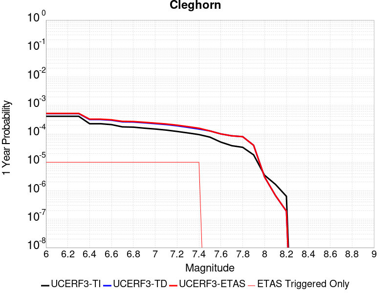 | 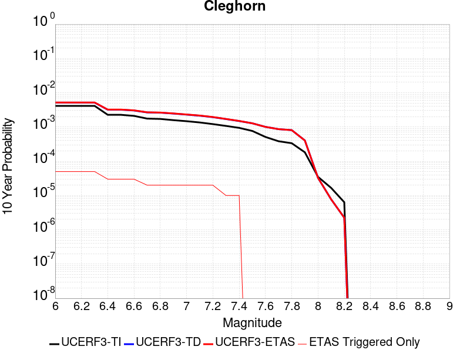 |

| Magnitude | 1 wk TI Prob | 1 wk TD Prob | 1 wk ETAS Prob | 1 wk ETAS/TD Gain | 1 wk ETAS Triggered Only | 1 mo TI Prob | 1 mo TD Prob | 1 mo ETAS Prob | 1 mo ETAS/TD Gain | 1 mo ETAS Triggered Only | 1 yr TI Prob | 1 yr TD Prob | 1 yr ETAS Prob | 1 yr ETAS/TD Gain | 1 yr ETAS Triggered Only | 10 yr TI Prob | 10 yr TD Prob | 10 yr ETAS Prob | 10 yr ETAS/TD Gain | 10 yr ETAS Triggered Only |
|-----|-----|-----|-----|-----|-----|-----|-----|-----|-----|-----|-----|-----|-----|-----|-----|-----|-----|-----|-----|-----|
| 6.0 | 7.9267165E-6 | 9.832763E-6 | 9.832763E-6 | 1.0 | 0.0 | 3.39712E-5 | 4.213979E-5 | 4.213979E-5 | 1.0 | 0.0 | 4.1352084E-4 | 5.129418E-4 | 5.229367E-4 | 1.0194854 | 1.0E-5 | 0.004127522 | 0.005132704 | 0.0051824474 | 1.0096915 | 5.0E-5 |
| 6.1 | 7.9267165E-6 | 9.832763E-6 | 9.832763E-6 | 1.0 | 0.0 | 3.39712E-5 | 4.213979E-5 | 4.213979E-5 | 1.0 | 0.0 | 4.1352084E-4 | 5.129418E-4 | 5.229367E-4 | 1.0194854 | 1.0E-5 | 0.004127522 | 0.005132704 | 0.0051824474 | 1.0096915 | 5.0E-5 |
| 6.2 | 7.9267165E-6 | 9.832763E-6 | 9.832763E-6 | 1.0 | 0.0 | 3.39712E-5 | 4.213979E-5 | 4.213979E-5 | 1.0 | 0.0 | 4.1352084E-4 | 5.129418E-4 | 5.229367E-4 | 1.0194854 | 1.0E-5 | 0.004127522 | 0.005132704 | 0.0051824474 | 1.0096915 | 5.0E-5 |
| 6.3 | 7.9267165E-6 | 9.832763E-6 | 9.832763E-6 | 1.0 | 0.0 | 3.39712E-5 | 4.213979E-5 | 4.213979E-5 | 1.0 | 0.0 | 4.1352084E-4 | 5.129418E-4 | 5.229367E-4 | 1.0194854 | 1.0E-5 | 0.004127522 | 0.005132704 | 0.0051824474 | 1.0096915 | 5.0E-5 |
| 6.4 | 4.3445207E-6 | 6.0926013E-6 | 6.0926013E-6 | 1.0 | 0.0 | 1.8619241E-5 | 2.6110894E-5 | 2.6110894E-5 | 1.0 | 0.0 | 2.2666567E-4 | 3.1785478E-4 | 3.278516E-4 | 1.0314509 | 1.0E-5 | 0.0022643462 | 0.003188204 | 0.0032181086 | 1.0093797 | 3.0E-5 |
| 6.5 | 4.3445207E-6 | 6.0926013E-6 | 6.0926013E-6 | 1.0 | 0.0 | 1.8619241E-5 | 2.6110894E-5 | 2.6110894E-5 | 1.0 | 0.0 | 2.2666567E-4 | 3.1785478E-4 | 3.278516E-4 | 1.0314509 | 1.0E-5 | 0.0022643462 | 0.003188204 | 0.0032181086 | 1.0093797 | 3.0E-5 |
| 6.6 | 4.040109E-6 | 5.7750076E-6 | 5.7750076E-6 | 1.0 | 0.0 | 1.7314638E-5 | 2.4749803E-5 | 2.4749803E-5 | 1.0 | 0.0 | 2.1078532E-4 | 3.0128812E-4 | 3.112851E-4 | 1.0331808 | 1.0E-5 | 0.002105855 | 0.003022993 | 0.0030529024 | 1.0098939 | 3.0E-5 |
| 6.7 | 3.3632055E-6 | 5.0685003E-6 | 5.0685003E-6 | 1.0 | 0.0 | 1.4413658E-5 | 2.1721964E-5 | 2.1721964E-5 | 1.0 | 0.0 | 1.7547216E-4 | 2.6443315E-4 | 2.744305E-4 | 1.0378067 | 1.0E-5 | 0.0017533366 | 0.0026553252 | 0.0026752723 | 1.0075121 | 2.0E-5 |
| 6.8 | 3.2902772E-6 | 4.990407E-6 | 4.990407E-6 | 1.0 | 0.0 | 1.4101111E-5 | 2.1387285E-5 | 2.1387285E-5 | 1.0 | 0.0 | 1.716675E-4 | 2.603594E-4 | 2.703568E-4 | 1.0383985 | 1.0E-5 | 0.0017153495 | 0.0026146837 | 0.0026346315 | 1.0076292 | 2.0E-5 |
| 6.9 | 3.031547E-6 | 4.692163E-6 | 4.692163E-6 | 1.0 | 0.0 | 1.299228E-5 | 2.0109117E-5 | 2.0109117E-5 | 1.0 | 0.0 | 1.5816953E-4 | 2.4480128E-4 | 2.5479883E-4 | 1.0408394 | 1.0E-5 | 0.00158057 | 0.0024594541 | 0.002479405 | 1.0081118 | 2.0E-5 |
| 7.0 | 2.8259715E-6 | 4.371714E-6 | 4.371714E-6 | 1.0 | 0.0 | 1.211125E-5 | 1.8735784E-5 | 1.8735784E-5 | 1.0 | 0.0 | 1.4744449E-4 | 2.2808454E-4 | 2.3808226E-4 | 1.0438334 | 1.0E-5 | 0.001473467 | 0.0022926412 | 0.0023125953 | 1.0087036 | 2.0E-5 |
| 7.1 | 2.5962665E-6 | 4.066925E-6 | 4.066925E-6 | 1.0 | 0.0 | 1.1126809E-5 | 1.7429564E-5 | 1.7429564E-5 | 1.0 | 0.0 | 1.3546048E-4 | 2.1218449E-4 | 2.2218237E-4 | 1.0471188 | 1.0E-5 | 0.0013537793 | 0.0021339648 | 0.002153922 | 1.0093522 | 2.0E-5 |
| 7.2 | 2.3247253E-6 | 3.6774632E-6 | 3.6774632E-6 | 1.0 | 0.0 | 9.96307E-6 | 1.5760463E-5 | 1.5760463E-5 | 1.0 | 0.0 | 1.21293626E-4 | 1.9186691E-4 | 2.01865E-4 | 1.0521095 | 1.0E-5 | 0.0012122744 | 0.0019311808 | 0.0019511422 | 1.0103364 | 2.0E-5 |
| 7.3 | 2.056928E-6 | 3.236149E-6 | 3.236149E-6 | 1.0 | 0.0 | 8.815376E-6 | 1.3869138E-5 | 1.3869138E-5 | 1.0 | 0.0 | 1.0732192E-4 | 1.6884382E-4 | 1.7884214E-4 | 1.0592164 | 1.0E-5 | 0.001072701 | 0.0017013908 | 0.0017113738 | 1.0058676 | 1.0E-5 |
| 7.4 | 1.8055999E-6 | 2.8265147E-6 | 2.8265147E-6 | 1.0 | 0.0 | 7.738263E-6 | 1.2113579E-5 | 1.2113579E-5 | 1.0 | 0.0 | 9.4209274E-5 | 1.4747298E-4 | 1.5747151E-4 | 1.067799 | 1.0E-5 | 9.4169343E-4 | 0.001488129 | 0.0014981141 | 1.0067098 | 1.0E-5 |
| 7.5 | 1.4683443E-6 | 2.4257406E-6 | 2.4257406E-6 | 1.0 | 0.0 | 6.292889E-6 | 1.039599E-5 | 1.039599E-5 | 1.0 | 0.0 | 7.661323E-5 | 1.2656393E-4 | 1.2656393E-4 | 1.0 | 0.0 | 7.658682E-4 | 0.0012793359 | 0.0012793359 | 1.0 | 0.0 |
| 7.6 | 9.804088E-7 | 1.9012458E-6 | 1.9012458E-6 | 1.0 | 0.0 | 4.201745E-6 | 8.148171E-6 | 8.148171E-6 | 1.0 | 0.0 | 5.1155046E-5 | 9.919951E-5 | 9.919951E-5 | 1.0 | 0.0 | 5.114327E-4 | 0.0010060034 | 0.0010060034 | 1.0 | 0.0 |
| 7.7 | 7.3434086E-7 | 1.6293816E-6 | 1.6293816E-6 | 1.0 | 0.0 | 3.1471714E-6 | 6.9830453E-6 | 6.9830453E-6 | 1.0 | 0.0 | 3.831614E-5 | 8.501529E-5 | 8.501529E-5 | 1.0 | 0.0 | 3.8309532E-4 | 8.6431357E-4 | 8.6431357E-4 | 1.0 | 0.0 |
| 7.8 | 6.434184E-7 | 1.522934E-6 | 1.522934E-6 | 1.0 | 0.0 | 2.7575045E-6 | 6.5268437E-6 | 6.5268437E-6 | 1.0 | 0.0 | 3.35721E-5 | 7.946145E-5 | 7.946145E-5 | 1.0 | 0.0 | 3.3567028E-4 | 8.0846256E-4 | 8.0846256E-4 | 1.0 | 0.0 |
| 7.9 | 3.4943926E-7 | 7.5794E-7 | 7.5794E-7 | 1.0 | 0.0 | 1.497596E-6 | 3.2483103E-6 | 3.2483103E-6 | 1.0 | 0.0 | 1.8233079E-5 | 3.9547467E-5 | 3.9547467E-5 | 1.0 | 0.0 | 1.8231584E-4 | 4.0426495E-4 | 4.0426495E-4 | 1.0 | 0.0 |
| 8.0 | 6.717524E-8 | 5.8437763E-8 | 5.8437763E-8 | 1.0 | 0.0 | 2.8789387E-7 | 2.5044753E-7 | 2.5044753E-7 | 1.0 | 0.0 | 3.505102E-6 | 3.0491944E-6 | 3.0491944E-6 | 1.0 | 0.0 | 3.5050467E-5 | 3.2754215E-5 | 3.2754215E-5 | 1.0 | 0.0 |
| 8.1 | 3.1984914E-8 | 1.2967114E-8 | 1.2967114E-8 | 1.0 | 0.0 | 1.370782E-7 | 5.5573338E-8 | 5.5573338E-8 | 1.0 | 0.0 | 1.6689258E-6 | 6.766052E-7 | 6.766052E-7 | 1.0 | 0.0 | 1.6689133E-5 | 7.750275E-6 | 7.750275E-6 | 1.0 | 0.0 |
| 8.2 | 1.21887656E-8 | 3.6524417E-9 | 3.6524417E-9 | 1.0 | 0.0 | 5.2237567E-8 | 1.565332E-8 | 1.565332E-8 | 1.0 | 0.0 | 6.359922E-7 | 1.9057916E-7 | 1.9057916E-7 | 1.0 | 0.0 | 6.3599036E-6 | 2.2488762E-6 | 2.2488762E-6 | 1.0 | 0.0 |

## San Diego Trough north alt1
*[(top)](#table-of-contents)*

| 1 Week | 1 Month | 1 Year | 10 Year |
|-----|-----|-----|-----|
|  |  | 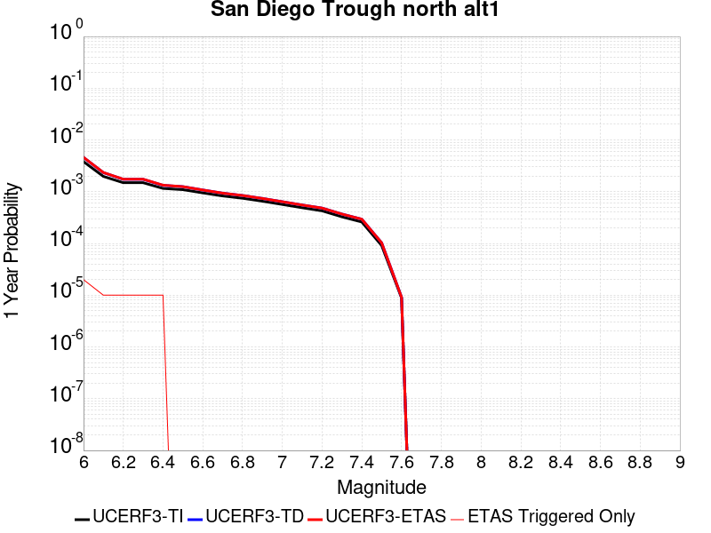 |  |

| Magnitude | 1 wk TI Prob | 1 wk TD Prob | 1 wk ETAS Prob | 1 wk ETAS/TD Gain | 1 wk ETAS Triggered Only | 1 mo TI Prob | 1 mo TD Prob | 1 mo ETAS Prob | 1 mo ETAS/TD Gain | 1 mo ETAS Triggered Only | 1 yr TI Prob | 1 yr TD Prob | 1 yr ETAS Prob | 1 yr ETAS/TD Gain | 1 yr ETAS Triggered Only | 10 yr TI Prob | 10 yr TD Prob | 10 yr ETAS Prob | 10 yr ETAS/TD Gain | 10 yr ETAS Triggered Only |
|-----|-----|-----|-----|-----|-----|-----|-----|-----|-----|-----|-----|-----|-----|-----|-----|-----|-----|-----|-----|-----|
| 6.0 | 7.329252E-5 | 8.821515E-5 | 9.821427E-5 | 1.1133492 | 1.0E-5 | 3.14073E-4 | 3.780138E-4 | 3.8801E-4 | 1.0264441 | 1.0E-5 | 0.0038171355 | 0.004593173 | 0.004613081 | 1.0043343 | 2.0E-5 | 0.03752231 | 0.04504633 | 0.045084525 | 1.0008479 | 4.0E-5 |
| 6.1 | 3.7940346E-5 | 4.4886026E-5 | 4.4886026E-5 | 1.0 | 0.0 | 1.6259136E-4 | 1.9235504E-4 | 2.0235313E-4 | 1.0519772 | 1.0E-5 | 0.0019777524 | 0.0023394884 | 0.0023494652 | 1.0042645 | 1.0E-5 | 0.019602431 | 0.023157293 | 0.02317683 | 1.0008436 | 2.0E-5 |
| 6.2 | 2.8645263E-5 | 3.3297452E-5 | 3.3297452E-5 | 1.0 | 0.0 | 1.2275964E-4 | 1.4269572E-4 | 1.526943E-4 | 1.0700692 | 1.0E-5 | 0.0014935739 | 0.0017359584 | 0.001745941 | 1.0057505 | 1.0E-5 | 0.0148357535 | 0.017226638 | 0.017236467 | 1.0005705 | 1.0E-5 |
| 6.3 | 2.8645263E-5 | 3.3297452E-5 | 3.3297452E-5 | 1.0 | 0.0 | 1.2275964E-4 | 1.4269572E-4 | 1.526943E-4 | 1.0700692 | 1.0E-5 | 0.0014935739 | 0.0017359584 | 0.001745941 | 1.0057505 | 1.0E-5 | 0.0148357535 | 0.017226638 | 0.017236467 | 1.0005705 | 1.0E-5 |
| 6.4 | 2.2204576E-5 | 2.5448819E-5 | 2.5448819E-5 | 1.0 | 0.0 | 9.5159E-5 | 1.0906186E-4 | 1.1906077E-4 | 1.0916811 | 1.0E-5 | 0.001157945 | 0.0013270287 | 0.0013370155 | 1.0075257 | 1.0E-5 | 0.011519298 | 0.013192215 | 0.013202083 | 1.000748 | 1.0E-5 |
| 6.5 | 2.1004838E-5 | 2.402516E-5 | 2.402516E-5 | 1.0 | 0.0 | 9.0017624E-5 | 1.02960956E-4 | 1.02960956E-4 | 1.0 | 0.0 | 0.0010954136 | 0.0012528376 | 0.0012528376 | 1.0 | 0.0 | 0.010900296 | 0.01245883 | 0.01245883 | 1.0 | 0.0 |
| 6.6 | 1.820557E-5 | 2.070517E-5 | 2.070517E-5 | 1.0 | 0.0 | 7.802154E-5 | 8.873346E-5 | 8.873346E-5 | 1.0 | 0.0 | 9.4949827E-4 | 0.0010797998 | 0.0010797998 | 1.0 | 0.0 | 0.009454516 | 0.0107462015 | 0.0107462015 | 1.0 | 0.0 |
| 6.7 | 1.5884485E-5 | 1.7983964E-5 | 1.7983964E-5 | 1.0 | 0.0 | 6.807459E-5 | 7.707187E-5 | 7.707187E-5 | 1.0 | 0.0 | 8.284929E-4 | 9.379488E-4 | 9.379488E-4 | 1.0 | 0.0 | 0.008254109 | 0.009340268 | 0.009340268 | 1.0 | 0.0 |
| 6.8 | 1.4331171E-5 | 1.6201348E-5 | 1.6201348E-5 | 1.0 | 0.0 | 6.141786E-5 | 6.9432506E-5 | 6.9432506E-5 | 1.0 | 0.0 | 7.4750587E-4 | 8.4501493E-4 | 8.4501493E-4 | 1.0 | 0.0 | 0.0074499645 | 0.008418285 | 0.008418285 | 1.0 | 0.0 |
| 6.9 | 1.2574203E-5 | 1.4206081E-5 | 1.4206081E-5 | 1.0 | 0.0 | 5.3888325E-5 | 6.088179E-5 | 6.088179E-5 | 1.0 | 0.0 | 6.558929E-4 | 7.4098515E-4 | 7.4098515E-4 | 1.0 | 0.0 | 0.0065396037 | 0.0073853307 | 0.0073853307 | 1.0 | 0.0 |
| 7.0 | 1.0883844E-5 | 1.22894735E-5 | 1.22894735E-5 | 1.0 | 0.0 | 4.664421E-5 | 5.2668114E-5 | 5.2668114E-5 | 1.0 | 0.0 | 5.677453E-4 | 6.410466E-4 | 6.410466E-4 | 1.0 | 0.0 | 0.00566297 | 0.0063921027 | 0.0063921027 | 1.0 | 0.0 |
| 7.1 | 9.393088E-6 | 1.0607203E-5 | 1.0607203E-5 | 1.0 | 0.0 | 4.025547E-5 | 4.5458655E-5 | 4.5458655E-5 | 1.0 | 0.0 | 4.900001E-4 | 5.5331935E-4 | 5.5331935E-4 | 1.0 | 0.0 | 0.0048892107 | 0.005519513 | 0.005519513 | 1.0 | 0.0 |
| 7.2 | 8.190791E-6 | 9.258787E-6 | 9.258787E-6 | 1.0 | 0.0 | 3.510292E-5 | 3.9679915E-5 | 3.9679915E-5 | 1.0 | 0.0 | 4.2729423E-4 | 4.8299658E-4 | 4.8299658E-4 | 1.0 | 0.0 | 0.0042647356 | 0.004819548 | 0.004819548 | 1.0 | 0.0 |
| 7.3 | 6.268162E-6 | 7.08984E-6 | 7.08984E-6 | 1.0 | 0.0 | 2.6863276E-5 | 3.0384675E-5 | 3.0384675E-5 | 1.0 | 0.0 | 3.2701128E-4 | 3.6987104E-4 | 3.6987104E-4 | 1.0 | 0.0 | 0.003265305 | 0.0036926004 | 0.0036926004 | 1.0 | 0.0 |
| 7.4 | 4.985186E-6 | 5.6427807E-6 | 5.6427807E-6 | 1.0 | 0.0 | 2.1364907E-5 | 2.4183124E-5 | 2.4183124E-5 | 1.0 | 0.0 | 2.600867E-4 | 2.9439016E-4 | 2.9439016E-4 | 1.0 | 0.0 | 0.002597825 | 0.002940043 | 0.002940043 | 1.0 | 0.0 |
| 7.5 | 1.7489613E-6 | 1.9697113E-6 | 1.9697113E-6 | 1.0 | 0.0 | 7.495527E-6 | 8.441594E-6 | 8.441594E-6 | 1.0 | 0.0 | 9.125422E-5 | 1.0277178E-4 | 1.0277178E-4 | 1.0 | 0.0 | 9.1216754E-4 | 0.0010272645 | 0.0010272645 | 1.0 | 0.0 |
| 7.6 | 1.6988751E-7 | 1.7533898E-7 | 1.7533898E-7 | 1.0 | 0.0 | 7.2808916E-7 | 7.5145255E-7 | 7.5145255E-7 | 1.0 | 0.0 | 8.864449E-6 | 9.148898E-6 | 9.148898E-6 | 1.0 | 0.0 | 8.8640954E-5 | 9.148542E-5 | 9.148542E-5 | 1.0 | 0.0 |

## Tin Mountain
*[(top)](#table-of-contents)*

| 1 Week | 1 Month | 1 Year | 10 Year |
|-----|-----|-----|-----|
|  |  |  |  |

| Magnitude | 1 wk TI Prob | 1 wk TD Prob | 1 wk ETAS Prob | 1 wk ETAS/TD Gain | 1 wk ETAS Triggered Only | 1 mo TI Prob | 1 mo TD Prob | 1 mo ETAS Prob | 1 mo ETAS/TD Gain | 1 mo ETAS Triggered Only | 1 yr TI Prob | 1 yr TD Prob | 1 yr ETAS Prob | 1 yr ETAS/TD Gain | 1 yr ETAS Triggered Only | 10 yr TI Prob | 10 yr TD Prob | 10 yr ETAS Prob | 10 yr ETAS/TD Gain | 10 yr ETAS Triggered Only |
|-----|-----|-----|-----|-----|-----|-----|-----|-----|-----|-----|-----|-----|-----|-----|-----|-----|-----|-----|-----|-----|
| 6.0 | 4.083776E-6 | 4.18155E-6 | 4.18155E-6 | 1.0 | 0.0 | 1.750178E-5 | 1.7920827E-5 | 2.7920647E-5 | 1.558 | 1.0E-5 | 2.1306332E-4 | 2.1816794E-4 | 2.3816357E-4 | 1.0916525 | 2.0E-5 | 0.0021285915 | 0.0021799032 | 0.0022297944 | 1.0228868 | 5.0E-5 |
| 6.1 | 4.083776E-6 | 4.18155E-6 | 4.18155E-6 | 1.0 | 0.0 | 1.750178E-5 | 1.7920827E-5 | 2.7920647E-5 | 1.558 | 1.0E-5 | 2.1306332E-4 | 2.1816794E-4 | 2.3816357E-4 | 1.0916525 | 2.0E-5 | 0.0021285915 | 0.0021799032 | 0.0022297944 | 1.0228868 | 5.0E-5 |
| 6.2 | 4.083776E-6 | 4.18155E-6 | 4.18155E-6 | 1.0 | 0.0 | 1.750178E-5 | 1.7920827E-5 | 2.7920647E-5 | 1.558 | 1.0E-5 | 2.1306332E-4 | 2.1816794E-4 | 2.3816357E-4 | 1.0916525 | 2.0E-5 | 0.0021285915 | 0.0021799032 | 0.0022297944 | 1.0228868 | 5.0E-5 |
| 6.3 | 4.083776E-6 | 4.18155E-6 | 4.18155E-6 | 1.0 | 0.0 | 1.750178E-5 | 1.7920827E-5 | 2.7920647E-5 | 1.558 | 1.0E-5 | 2.1306332E-4 | 2.1816794E-4 | 2.3816357E-4 | 1.0916525 | 2.0E-5 | 0.0021285915 | 0.0021799032 | 0.0022297944 | 1.0228868 | 5.0E-5 |
| 6.4 | 4.083776E-6 | 4.18155E-6 | 4.18155E-6 | 1.0 | 0.0 | 1.750178E-5 | 1.7920827E-5 | 2.7920647E-5 | 1.558 | 1.0E-5 | 2.1306332E-4 | 2.1816794E-4 | 2.3816357E-4 | 1.0916525 | 2.0E-5 | 0.0021285915 | 0.0021799032 | 0.0022297944 | 1.0228868 | 5.0E-5 |
| 6.5 | 2.3143427E-6 | 2.3731652E-6 | 2.3731652E-6 | 1.0 | 0.0 | 9.9185745E-6 | 1.0170673E-5 | 1.0170673E-5 | 1.0 | 0.0 | 1.2075195E-4 | 1.2382168E-4 | 1.3382045E-4 | 1.0807513 | 1.0E-5 | 0.0012068636 | 0.0012376028 | 0.0012675656 | 1.0242105 | 3.0E-5 |
| 6.6 | 2.3143427E-6 | 2.3731652E-6 | 2.3731652E-6 | 1.0 | 0.0 | 9.9185745E-6 | 1.0170673E-5 | 1.0170673E-5 | 1.0 | 0.0 | 1.2075195E-4 | 1.2382168E-4 | 1.3382045E-4 | 1.0807513 | 1.0E-5 | 0.0012068636 | 0.0012376028 | 0.0012675656 | 1.0242105 | 3.0E-5 |
| 6.7 | 1.7029532E-6 | 1.7497979E-6 | 1.7497979E-6 | 1.0 | 0.0 | 7.2983503E-6 | 7.4991153E-6 | 7.4991153E-6 | 1.0 | 0.0 | 8.885379E-5 | 9.129844E-5 | 9.129844E-5 | 1.0 | 0.0 | 8.881827E-4 | 9.1266196E-4 | 9.2265283E-4 | 1.010947 | 1.0E-5 |
| 6.8 | 1.2914646E-6 | 1.3299432E-6 | 1.3299432E-6 | 1.0 | 0.0 | 5.534837E-6 | 5.6997465E-6 | 5.6997465E-6 | 1.0 | 0.0 | 6.738455E-5 | 6.939264E-5 | 6.939264E-5 | 1.0 | 0.0 | 6.736412E-4 | 6.937531E-4 | 7.0374616E-4 | 1.0144043 | 1.0E-5 |
| 6.9 | 5.8708974E-7 | 6.117028E-7 | 6.117028E-7 | 1.0 | 0.0 | 2.5160964E-6 | 2.621581E-6 | 2.621581E-6 | 1.0 | 0.0 | 3.0633044E-5 | 3.1917323E-5 | 3.1917323E-5 | 1.0 | 0.0 | 3.0628822E-4 | 3.191315E-4 | 3.191315E-4 | 1.0 | 0.0 |
| 7.0 | 4.6248786E-7 | 4.832044E-7 | 4.832044E-7 | 1.0 | 0.0 | 1.9820893E-6 | 2.0708746E-6 | 2.0708746E-6 | 1.0 | 0.0 | 2.413167E-5 | 2.5212645E-5 | 2.5212645E-5 | 1.0 | 0.0 | 2.412905E-4 | 2.5210154E-4 | 2.5210154E-4 | 1.0 | 0.0 |
| 7.1 | 3.804606E-7 | 3.9871725E-7 | 3.9871725E-7 | 1.0 | 0.0 | 1.6305444E-6 | 1.7087873E-6 | 1.7087873E-6 | 1.0 | 0.0 | 1.9851697E-5 | 2.080432E-5 | 2.080432E-5 | 1.0 | 0.0 | 1.9849923E-4 | 2.080271E-4 | 2.080271E-4 | 1.0 | 0.0 |
| 7.2 | 3.5864858E-7 | 3.7617107E-7 | 3.7617107E-7 | 1.0 | 0.0 | 1.5370645E-6 | 1.6121609E-6 | 1.6121609E-6 | 1.0 | 0.0 | 1.87136E-5 | 1.9627916E-5 | 1.9627916E-5 | 1.0 | 0.0 | 1.8712023E-4 | 1.9626514E-4 | 1.9626514E-4 | 1.0 | 0.0 |
| 7.3 | 3.342063E-7 | 3.50637E-7 | 3.50637E-7 | 1.0 | 0.0 | 1.4323119E-6 | 1.5027293E-6 | 1.5027293E-6 | 1.0 | 0.0 | 1.7438259E-5 | 1.829561E-5 | 1.829561E-5 | 1.0 | 0.0 | 1.743689E-4 | 1.8294434E-4 | 1.8294434E-4 | 1.0 | 0.0 |
| 7.4 | 2.971242E-7 | 3.116602E-7 | 3.116602E-7 | 1.0 | 0.0 | 1.2733886E-6 | 1.3356861E-6 | 1.3356861E-6 | 1.0 | 0.0 | 1.5503398E-5 | 1.626189E-5 | 1.626189E-5 | 1.0 | 0.0 | 1.5502315E-4 | 1.6261027E-4 | 1.6261027E-4 | 1.0 | 0.0 |
| 7.5 | 1.4326713E-7 | 1.501262E-7 | 1.501262E-7 | 1.0 | 0.0 | 6.140018E-7 | 6.43398E-7 | 6.43398E-7 | 1.0 | 0.0 | 7.4754466E-6 | 7.833371E-6 | 7.833371E-6 | 1.0 | 0.0 | 7.475195E-5 | 7.83337E-5 | 7.83337E-5 | 1.0 | 0.0 |

## Chino alt 1
*[(top)](#table-of-contents)*

| 1 Week | 1 Month | 1 Year | 10 Year |
|-----|-----|-----|-----|
|  |  |  |  |

| Magnitude | 1 wk TI Prob | 1 wk TD Prob | 1 wk ETAS Prob | 1 wk ETAS/TD Gain | 1 wk ETAS Triggered Only | 1 mo TI Prob | 1 mo TD Prob | 1 mo ETAS Prob | 1 mo ETAS/TD Gain | 1 mo ETAS Triggered Only | 1 yr TI Prob | 1 yr TD Prob | 1 yr ETAS Prob | 1 yr ETAS/TD Gain | 1 yr ETAS Triggered Only | 10 yr TI Prob | 10 yr TD Prob | 10 yr ETAS Prob | 10 yr ETAS/TD Gain | 10 yr ETAS Triggered Only |
|-----|-----|-----|-----|-----|-----|-----|-----|-----|-----|-----|-----|-----|-----|-----|-----|-----|-----|-----|-----|-----|
| 6.0 | 3.939946E-5 | 4.8949914E-5 | 4.8949914E-5 | 1.0 | 0.0 | 1.6884391E-4 | 2.0977142E-4 | 2.1976932E-4 | 1.047661 | 1.0E-5 | 0.0020537362 | 0.0025514853 | 0.0025714342 | 1.0078186 | 2.0E-5 | 0.020348595 | 0.025280792 | 0.025319781 | 1.0015422 | 4.0E-5 |
| 6.1 | 2.1505624E-5 | 2.688007E-5 | 2.688007E-5 | 1.0 | 0.0 | 9.2163704E-5 | 1.1519585E-4 | 1.251947E-4 | 1.0867987 | 1.0E-5 | 0.0011215154 | 0.0014017166 | 0.0014216886 | 1.0142483 | 2.0E-5 | 0.011158722 | 0.013947706 | 0.013977287 | 1.0021209 | 3.0E-5 |
| 6.2 | 2.1505624E-5 | 2.688007E-5 | 2.688007E-5 | 1.0 | 0.0 | 9.2163704E-5 | 1.1519585E-4 | 1.251947E-4 | 1.0867987 | 1.0E-5 | 0.0011215154 | 0.0014017166 | 0.0014216886 | 1.0142483 | 2.0E-5 | 0.011158722 | 0.013947706 | 0.013977287 | 1.0021209 | 3.0E-5 |
| 6.3 | 1.4290785E-5 | 1.816584E-5 | 1.816584E-5 | 1.0 | 0.0 | 6.1244784E-5 | 7.785153E-5 | 7.785153E-5 | 1.0 | 0.0 | 7.454001E-4 | 9.4747543E-4 | 9.4747543E-4 | 1.0 | 0.0 | 0.007429048 | 0.009446898 | 0.009456803 | 1.0010486 | 1.0E-5 |
| 6.4 | 1.4290785E-5 | 1.816584E-5 | 1.816584E-5 | 1.0 | 0.0 | 6.1244784E-5 | 7.785153E-5 | 7.785153E-5 | 1.0 | 0.0 | 7.454001E-4 | 9.4747543E-4 | 9.4747543E-4 | 1.0 | 0.0 | 0.007429048 | 0.009446898 | 0.009456803 | 1.0010486 | 1.0E-5 |
| 6.5 | 1.3017944E-5 | 1.6652762E-5 | 1.6652762E-5 | 1.0 | 0.0 | 5.5789995E-5 | 7.136728E-5 | 7.136728E-5 | 1.0 | 0.0 | 6.790315E-4 | 8.685939E-4 | 8.685939E-4 | 1.0 | 0.0 | 0.0067696036 | 0.008664371 | 0.008674284 | 1.0011442 | 1.0E-5 |
| 6.6 | 9.470016E-6 | 1.2039946E-5 | 1.2039946E-5 | 1.0 | 0.0 | 4.058515E-5 | 5.159894E-5 | 5.159894E-5 | 1.0 | 0.0 | 4.940122E-4 | 6.2807E-4 | 6.2807E-4 | 1.0 | 0.0 | 0.004929154 | 0.006273371 | 0.0062833084 | 1.001584 | 1.0E-5 |
| 6.7 | 8.314155E-6 | 1.0408143E-5 | 1.0408143E-5 | 1.0 | 0.0 | 3.5631605E-5 | 4.4605746E-5 | 4.4605746E-5 | 1.0 | 0.0 | 4.3372845E-4 | 5.429719E-4 | 5.429719E-4 | 1.0 | 0.0 | 0.004328829 | 0.005427294 | 0.00543724 | 1.0018325 | 1.0E-5 |
| 6.8 | 3.4856364E-6 | 3.8135686E-6 | 3.8135686E-6 | 1.0 | 0.0 | 1.4938357E-5 | 1.6343774E-5 | 1.6343774E-5 | 1.0 | 0.0 | 1.8185932E-4 | 1.9896936E-4 | 1.9896936E-4 | 1.0 | 0.0 | 0.0018171056 | 0.0019897262 | 0.0019897262 | 1.0 | 0.0 |
| 6.9 | 2.2645952E-6 | 2.153006E-6 | 2.153006E-6 | 1.0 | 0.0 | 9.705372E-6 | 9.2271375E-6 | 9.2271375E-6 | 1.0 | 0.0 | 1.18156495E-4 | 1.1233483E-4 | 1.1233483E-4 | 1.0 | 0.0 | 0.0011809369 | 0.0011235814 | 0.0011235814 | 1.0 | 0.0 |
| 7.0 | 1.7864003E-6 | 1.5431655E-6 | 1.5431655E-6 | 1.0 | 0.0 | 7.655979E-6 | 6.61355E-6 | 6.61355E-6 | 1.0 | 0.0 | 9.3207556E-5 | 8.051705E-5 | 8.051705E-5 | 1.0 | 0.0 | 9.316847E-4 | 8.0526597E-4 | 8.0526597E-4 | 1.0 | 0.0 |
| 7.1 | 1.7315456E-6 | 1.4734359E-6 | 1.4734359E-6 | 1.0 | 0.0 | 7.420889E-6 | 6.31471E-6 | 6.31471E-6 | 1.0 | 0.0 | 9.034557E-5 | 7.687894E-5 | 7.687894E-5 | 1.0 | 0.0 | 9.0308854E-4 | 7.689018E-4 | 7.689018E-4 | 1.0 | 0.0 |
| 7.2 | 1.6008337E-6 | 1.3574833E-6 | 1.3574833E-6 | 1.0 | 0.0 | 6.860698E-6 | 5.817773E-6 | 5.817773E-6 | 1.0 | 0.0 | 8.352579E-5 | 7.082913E-5 | 7.082913E-5 | 1.0 | 0.0 | 8.34944E-4 | 7.084325E-4 | 7.084325E-4 | 1.0 | 0.0 |
| 7.3 | 1.3320939E-6 | 1.1218311E-6 | 1.1218311E-6 | 1.0 | 0.0 | 5.7089615E-6 | 4.807839E-6 | 4.807839E-6 | 1.0 | 0.0 | 6.9504385E-5 | 5.8533915E-5 | 5.8533915E-5 | 1.0 | 0.0 | 6.9482654E-4 | 5.8530783E-4 | 5.8530783E-4 | 1.0 | 0.0 |
| 7.4 | 1.114294E-6 | 9.2374944E-7 | 9.2374944E-7 | 1.0 | 0.0 | 4.775537E-6 | 3.9589204E-6 | 3.9589204E-6 | 1.0 | 0.0 | 5.8140613E-5 | 4.8198825E-5 | 4.8198825E-5 | 1.0 | 0.0 | 5.81254E-4 | 4.8189829E-4 | 4.8189829E-4 | 1.0 | 0.0 |
| 7.5 | 9.354081E-7 | 7.623722E-7 | 7.623722E-7 | 1.0 | 0.0 | 4.0088858E-6 | 3.2673056E-6 | 3.2673056E-6 | 1.0 | 0.0 | 4.8807087E-5 | 3.9778755E-5 | 3.9778755E-5 | 1.0 | 0.0 | 4.879637E-4 | 3.9771973E-4 | 3.9771973E-4 | 1.0 | 0.0 |
| 7.6 | 8.521771E-7 | 6.880951E-7 | 6.880951E-7 | 1.0 | 0.0 | 3.6521824E-6 | 2.9489759E-6 | 2.9489759E-6 | 1.0 | 0.0 | 4.4464414E-5 | 3.590322E-5 | 3.590322E-5 | 1.0 | 0.0 | 4.4455516E-4 | 3.5897738E-4 | 3.5897738E-4 | 1.0 | 0.0 |
| 7.7 | 2.1803626E-7 | 1.418694E-7 | 1.418694E-7 | 1.0 | 0.0 | 9.344408E-7 | 6.0801165E-7 | 6.0801165E-7 | 1.0 | 0.0 | 1.1376757E-5 | 7.4025265E-6 | 7.4025265E-6 | 1.0 | 0.0 | 1.13761744E-4 | 7.402376E-5 | 7.402376E-5 | 1.0 | 0.0 |

## Great Valley 09 (Laguna Seca)
*[(top)](#table-of-contents)*

| 1 Week | 1 Month | 1 Year | 10 Year |
|-----|-----|-----|-----|
|  |  |  |  |

| Magnitude | 1 wk TI Prob | 1 wk TD Prob | 1 wk ETAS Prob | 1 wk ETAS/TD Gain | 1 wk ETAS Triggered Only | 1 mo TI Prob | 1 mo TD Prob | 1 mo ETAS Prob | 1 mo ETAS/TD Gain | 1 mo ETAS Triggered Only | 1 yr TI Prob | 1 yr TD Prob | 1 yr ETAS Prob | 1 yr ETAS/TD Gain | 1 yr ETAS Triggered Only | 10 yr TI Prob | 10 yr TD Prob | 10 yr ETAS Prob | 10 yr ETAS/TD Gain | 10 yr ETAS Triggered Only |
|-----|-----|-----|-----|-----|-----|-----|-----|-----|-----|-----|-----|-----|-----|-----|-----|-----|-----|-----|-----|-----|
| 6.0 | 5.4353277E-5 | 7.050336E-5 | 7.050336E-5 | 1.0 | 0.0 | 2.3292181E-4 | 3.0212323E-4 | 3.0212323E-4 | 1.0 | 0.0 | 0.0028321352 | 0.0036721565 | 0.0037120096 | 1.0108528 | 4.0E-5 | 0.02796312 | 0.036117274 | 0.03616547 | 1.0013344 | 5.0E-5 |
| 6.1 | 4.5578287E-5 | 5.8223057E-5 | 5.8223057E-5 | 1.0 | 0.0 | 1.953209E-4 | 2.4950382E-4 | 2.4950382E-4 | 1.0 | 0.0 | 0.0023754383 | 0.0030334755 | 0.0030633844 | 1.0098597 | 3.0E-5 | 0.023502063 | 0.029921044 | 0.029950146 | 1.0009726 | 3.0E-5 |
| 6.2 | 2.8536782E-5 | 3.4737728E-5 | 3.4737728E-5 | 1.0 | 0.0 | 1.2229476E-4 | 1.4886676E-4 | 1.4886676E-4 | 1.0 | 0.0 | 0.0014879217 | 0.0018109222 | 0.0018308859 | 1.0110241 | 2.0E-5 | 0.014779986 | 0.017958904 | 0.017978545 | 1.0010936 | 2.0E-5 |
| 6.3 | 2.3698774E-5 | 2.8214345E-5 | 2.8214345E-5 | 1.0 | 0.0 | 1.01562226E-4 | 1.2091216E-4 | 1.2091216E-4 | 1.0 | 0.0 | 0.0012358186 | 0.001471101 | 0.0014910715 | 1.0135753 | 2.0E-5 | 0.012289686 | 0.014611942 | 0.0146316495 | 1.0013487 | 2.0E-5 |
| 6.4 | 1.9191197E-5 | 2.2123615E-5 | 2.2123615E-5 | 1.0 | 0.0 | 8.2245395E-5 | 9.481171E-5 | 9.481171E-5 | 1.0 | 0.0 | 0.0010008777 | 0.0011537268 | 0.0011737037 | 1.0173151 | 2.0E-5 | 0.009963818 | 0.011477377 | 0.011497147 | 1.0017226 | 2.0E-5 |
| 6.5 | 1.5203241E-5 | 1.6801783E-5 | 1.6801783E-5 | 1.0 | 0.0 | 6.5155116E-5 | 7.200525E-5 | 7.200525E-5 | 1.0 | 0.0 | 7.9297484E-4 | 8.763255E-4 | 8.9630793E-4 | 1.0228026 | 2.0E-5 | 0.007901512 | 0.008729823 | 0.008749648 | 1.002271 | 2.0E-5 |
| 6.6 | 1.0984925E-5 | 1.1242807E-5 | 1.1242807E-5 | 1.0 | 0.0 | 4.70774E-5 | 4.8182592E-5 | 4.8182592E-5 | 1.0 | 0.0 | 5.730166E-4 | 5.864689E-4 | 5.9646304E-4 | 1.0170412 | 1.0E-5 | 0.005715413 | 0.0058496036 | 0.005859545 | 1.0016996 | 1.0E-5 |
| 6.7 | 9.134616E-6 | 9.020056E-6 | 9.020056E-6 | 1.0 | 0.0 | 3.9147766E-5 | 3.8656824E-5 | 3.8656824E-5 | 1.0 | 0.0 | 4.7651984E-4 | 4.7054756E-4 | 4.8054286E-4 | 1.0212418 | 1.0E-5 | 0.004754993 | 0.0046957573 | 0.0047057103 | 1.0021195 | 1.0E-5 |
| 6.8 | 7.785589E-6 | 7.4520726E-6 | 7.4520726E-6 | 1.0 | 0.0 | 3.3366385E-5 | 3.1937074E-5 | 3.1937074E-5 | 1.0 | 0.0 | 4.0616E-4 | 3.8876652E-4 | 3.987626E-4 | 1.0257124 | 1.0E-5 | 0.0040541845 | 0.0038810682 | 0.0038910294 | 1.0025666 | 1.0E-5 |
| 6.9 | 5.579095E-6 | 4.898567E-6 | 4.898567E-6 | 1.0 | 0.0 | 2.3910188E-5 | 2.0993697E-5 | 2.0993697E-5 | 1.0 | 0.0 | 2.9106764E-4 | 2.5556967E-4 | 2.6556713E-4 | 1.0391183 | 1.0E-5 | 0.002906867 | 0.002552895 | 0.0025628696 | 1.0039071 | 1.0E-5 |
| 7.0 | 2.6816688E-6 | 1.5216133E-6 | 1.5216133E-6 | 1.0 | 0.0 | 1.1492816E-5 | 6.521184E-6 | 6.521184E-6 | 1.0 | 0.0 | 1.3991605E-4 | 7.939261E-5 | 8.939181E-5 | 1.1259463 | 1.0E-5 | 0.0013982799 | 7.9365115E-4 | 8.0364326E-4 | 1.01259 | 1.0E-5 |
| 7.1 | 1.9951021E-6 | 7.453698E-7 | 7.453698E-7 | 1.0 | 0.0 | 8.55041E-6 | 3.1944382E-6 | 3.1944382E-6 | 1.0 | 0.0 | 1.0409627E-4 | 3.8891634E-5 | 4.8891245E-5 | 1.2571146 | 1.0E-5 | 0.0010404752 | 3.8885244E-4 | 3.9884853E-4 | 1.0257066 | 1.0E-5 |
| 7.2 | 1.9951021E-6 | 7.453698E-7 | 7.453698E-7 | 1.0 | 0.0 | 8.55041E-6 | 3.1944382E-6 | 3.1944382E-6 | 1.0 | 0.0 | 1.0409627E-4 | 3.8891634E-5 | 4.8891245E-5 | 1.2571146 | 1.0E-5 | 0.0010404752 | 3.8885244E-4 | 3.9884853E-4 | 1.0257066 | 1.0E-5 |
| 7.3 | 1.7087556E-6 | 6.5787674E-7 | 6.5787674E-7 | 1.0 | 0.0 | 7.3232177E-6 | 2.8194688E-6 | 2.8194688E-6 | 1.0 | 0.0 | 8.915652E-5 | 3.4326535E-5 | 3.4326535E-5 | 1.0 | 0.0 | 8.9120766E-4 | 3.4321635E-4 | 3.4321635E-4 | 1.0 | 0.0 |
| 7.4 | 1.3804846E-6 | 6.0737995E-7 | 6.0737995E-7 | 1.0 | 0.0 | 5.916349E-6 | 2.6030546E-6 | 2.6030546E-6 | 1.0 | 0.0 | 7.2029165E-5 | 3.169177E-5 | 3.169177E-5 | 1.0 | 0.0 | 7.200583E-4 | 3.168765E-4 | 3.168765E-4 | 1.0 | 0.0 |
| 7.5 | 1.3804846E-6 | 6.0737995E-7 | 6.0737995E-7 | 1.0 | 0.0 | 5.916349E-6 | 2.6030546E-6 | 2.6030546E-6 | 1.0 | 0.0 | 7.2029165E-5 | 3.169177E-5 | 3.169177E-5 | 1.0 | 0.0 | 7.200583E-4 | 3.168765E-4 | 3.168765E-4 | 1.0 | 0.0 |

## Dry Mountain
*[(top)](#table-of-contents)*

| 1 Week | 1 Month | 1 Year | 10 Year |
|-----|-----|-----|-----|
|  | 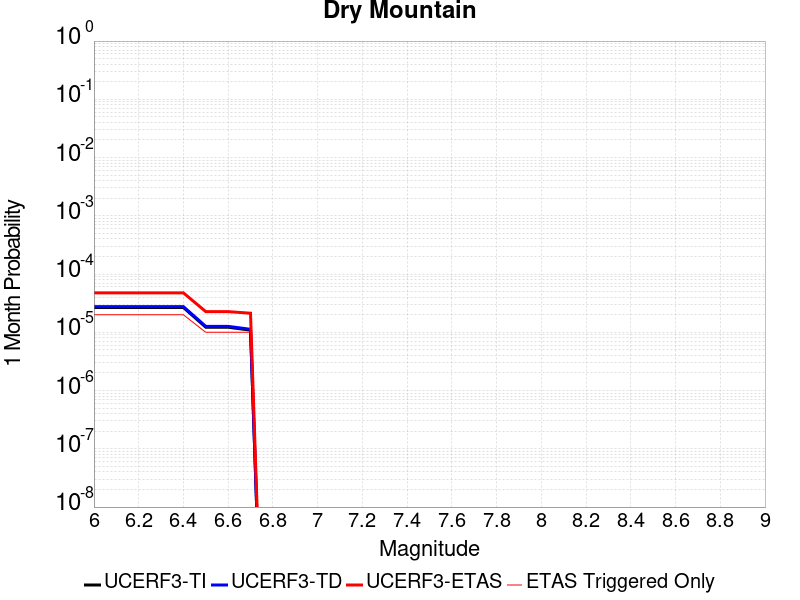 |  |  |

| Magnitude | 1 wk TI Prob | 1 wk TD Prob | 1 wk ETAS Prob | 1 wk ETAS/TD Gain | 1 wk ETAS Triggered Only | 1 mo TI Prob | 1 mo TD Prob | 1 mo ETAS Prob | 1 mo ETAS/TD Gain | 1 mo ETAS Triggered Only | 1 yr TI Prob | 1 yr TD Prob | 1 yr ETAS Prob | 1 yr ETAS/TD Gain | 1 yr ETAS Triggered Only | 10 yr TI Prob | 10 yr TD Prob | 10 yr ETAS Prob | 10 yr ETAS/TD Gain | 10 yr ETAS Triggered Only |
|-----|-----|-----|-----|-----|-----|-----|-----|-----|-----|-----|-----|-----|-----|-----|-----|-----|-----|-----|-----|-----|
| 6.0 | 6.222801E-6 | 6.439411E-6 | 6.439411E-6 | 1.0 | 0.0 | 2.6668875E-5 | 2.7597274E-5 | 4.759672E-5 | 1.7246892 | 2.0E-5 | 3.2464517E-4 | 3.359609E-4 | 3.6595084E-4 | 1.0892661 | 3.0E-5 | 0.0032417132 | 0.0033560924 | 0.003395958 | 1.0118786 | 4.0E-5 |
| 6.1 | 6.222801E-6 | 6.439411E-6 | 6.439411E-6 | 1.0 | 0.0 | 2.6668875E-5 | 2.7597274E-5 | 4.759672E-5 | 1.7246892 | 2.0E-5 | 3.2464517E-4 | 3.359609E-4 | 3.6595084E-4 | 1.0892661 | 3.0E-5 | 0.0032417132 | 0.0033560924 | 0.003395958 | 1.0118786 | 4.0E-5 |
| 6.2 | 6.222801E-6 | 6.439411E-6 | 6.439411E-6 | 1.0 | 0.0 | 2.6668875E-5 | 2.7597274E-5 | 4.759672E-5 | 1.7246892 | 2.0E-5 | 3.2464517E-4 | 3.359609E-4 | 3.6595084E-4 | 1.0892661 | 3.0E-5 | 0.0032417132 | 0.0033560924 | 0.003395958 | 1.0118786 | 4.0E-5 |
| 6.3 | 6.222801E-6 | 6.439411E-6 | 6.439411E-6 | 1.0 | 0.0 | 2.6668875E-5 | 2.7597274E-5 | 4.759672E-5 | 1.7246892 | 2.0E-5 | 3.2464517E-4 | 3.359609E-4 | 3.6595084E-4 | 1.0892661 | 3.0E-5 | 0.0032417132 | 0.0033560924 | 0.003395958 | 1.0118786 | 4.0E-5 |
| 6.4 | 6.222801E-6 | 6.439411E-6 | 6.439411E-6 | 1.0 | 0.0 | 2.6668875E-5 | 2.7597274E-5 | 4.759672E-5 | 1.7246892 | 2.0E-5 | 3.2464517E-4 | 3.359609E-4 | 3.6595084E-4 | 1.0892661 | 3.0E-5 | 0.0032417132 | 0.0033560924 | 0.003395958 | 1.0118786 | 4.0E-5 |
| 6.5 | 2.8528623E-6 | 2.952182E-6 | 2.952182E-6 | 1.0 | 0.0 | 1.22264955E-5 | 1.2652196E-5 | 2.265207E-5 | 1.7903666 | 1.0E-5 | 1.4884741E-4 | 1.5403831E-4 | 1.6403677E-4 | 1.0649089 | 1.0E-5 | 0.0014874774 | 0.0015401688 | 0.0015501534 | 1.0064828 | 1.0E-5 |
| 6.6 | 2.8528623E-6 | 2.952182E-6 | 2.952182E-6 | 1.0 | 0.0 | 1.22264955E-5 | 1.2652196E-5 | 2.265207E-5 | 1.7903666 | 1.0E-5 | 1.4884741E-4 | 1.5403831E-4 | 1.6403677E-4 | 1.0649089 | 1.0E-5 | 0.0014874774 | 0.0015401688 | 0.0015501534 | 1.0064828 | 1.0E-5 |
| 6.7 | 2.541E-6 | 2.62937E-6 | 2.62937E-6 | 1.0 | 0.0 | 1.0889954E-5 | 1.12687285E-5 | 2.1268615E-5 | 1.8874016 | 1.0E-5 | 1.3257713E-4 | 1.3719677E-4 | 1.471954E-4 | 1.072878 | 1.0E-5 | 0.0013249806 | 0.0013719677 | 0.001381954 | 1.0072788 | 1.0E-5 |

## San Jacinto (Borrego)
*[(top)](#table-of-contents)*

| 1 Week | 1 Month | 1 Year | 10 Year |
|-----|-----|-----|-----|
|  |  |  |  |

| Magnitude | 1 wk TI Prob | 1 wk TD Prob | 1 wk ETAS Prob | 1 wk ETAS/TD Gain | 1 wk ETAS Triggered Only | 1 mo TI Prob | 1 mo TD Prob | 1 mo ETAS Prob | 1 mo ETAS/TD Gain | 1 mo ETAS Triggered Only | 1 yr TI Prob | 1 yr TD Prob | 1 yr ETAS Prob | 1 yr ETAS/TD Gain | 1 yr ETAS Triggered Only | 10 yr TI Prob | 10 yr TD Prob | 10 yr ETAS Prob | 10 yr ETAS/TD Gain | 10 yr ETAS Triggered Only |
|-----|-----|-----|-----|-----|-----|-----|-----|-----|-----|-----|-----|-----|-----|-----|-----|-----|-----|-----|-----|-----|
| 6.0 | 3.543992E-5 | 2.7933444E-5 | 2.7933444E-5 | 1.0 | 0.0 | 1.5187653E-4 | 1.1970933E-4 | 1.1970933E-4 | 1.0 | 0.0 | 0.0018475284 | 0.001456499 | 0.0014664844 | 1.0068557 | 1.0E-5 | 0.018322436 | 0.014871439 | 0.014920696 | 1.0033121 | 5.0E-5 |
| 6.1 | 3.542281E-5 | 2.7933444E-5 | 2.7933444E-5 | 1.0 | 0.0 | 1.5180321E-4 | 1.1970933E-4 | 1.1970933E-4 | 1.0 | 0.0 | 0.0018466372 | 0.001456499 | 0.0014664844 | 1.0068557 | 1.0E-5 | 0.018313672 | 0.014871439 | 0.014920696 | 1.0033121 | 5.0E-5 |
| 6.2 | 3.4688688E-5 | 2.7933444E-5 | 2.7933444E-5 | 1.0 | 0.0 | 1.4865733E-4 | 1.1970933E-4 | 1.1970933E-4 | 1.0 | 0.0 | 0.0018084005 | 0.001456499 | 0.0014664844 | 1.0068557 | 1.0E-5 | 0.017937548 | 0.014871439 | 0.014920696 | 1.0033121 | 5.0E-5 |
| 6.3 | 3.2087122E-5 | 2.7778793E-5 | 2.7778793E-5 | 1.0 | 0.0 | 1.3750899E-4 | 1.1904661E-4 | 1.1904661E-4 | 1.0 | 0.0 | 0.0016728862 | 0.0014484411 | 0.0014584265 | 1.006894 | 1.0E-5 | 0.016603488 | 0.014792597 | 0.014841857 | 1.0033301 | 5.0E-5 |
| 6.4 | 3.1828724E-5 | 2.774577E-5 | 2.774577E-5 | 1.0 | 0.0 | 1.364017E-4 | 1.1890509E-4 | 1.1890509E-4 | 1.0 | 0.0 | 0.0016594254 | 0.0014467203 | 0.0014567059 | 1.0069022 | 1.0E-5 | 0.016470885 | 0.01477579 | 0.014825052 | 1.0033339 | 5.0E-5 |
| 6.5 | 3.1563577E-5 | 2.7485452E-5 | 2.7485452E-5 | 1.0 | 0.0 | 1.3526545E-4 | 1.1778954E-4 | 1.1778954E-4 | 1.0 | 0.0 | 0.0016456128 | 0.0014331564 | 0.0014431421 | 1.0069677 | 1.0E-5 | 0.0163348 | 0.014643186 | 0.014692454 | 1.0033646 | 5.0E-5 |
| 6.6 | 3.1467625E-5 | 2.7329666E-5 | 2.7329666E-5 | 1.0 | 0.0 | 1.3485427E-4 | 1.17121956E-4 | 1.17121956E-4 | 1.0 | 0.0 | 0.0016406142 | 0.0014250393 | 0.001435025 | 1.0070074 | 1.0E-5 | 0.016285548 | 0.014563348 | 0.01461262 | 1.0033833 | 5.0E-5 |
| 6.7 | 3.1223695E-5 | 2.6947682E-5 | 2.6947682E-5 | 1.0 | 0.0 | 1.3380898E-4 | 1.1548502E-4 | 1.1548502E-4 | 1.0 | 0.0 | 0.0016279068 | 0.0014051354 | 0.0014151214 | 1.0071068 | 1.0E-5 | 0.01616033 | 0.01436762 | 0.014416902 | 1.00343 | 5.0E-5 |
| 6.8 | 3.1015585E-5 | 2.6768674E-5 | 2.6768674E-5 | 1.0 | 0.0 | 1.3291716E-4 | 1.1471791E-4 | 1.1471791E-4 | 1.0 | 0.0 | 0.001617065 | 0.0013958078 | 0.0014057938 | 1.0071543 | 1.0E-5 | 0.016053487 | 0.014274874 | 0.014324159 | 1.0034527 | 5.0E-5 |
| 6.9 | 2.6641965E-5 | 2.2190488E-5 | 2.2190488E-5 | 1.0 | 0.0 | 1.1417485E-4 | 9.509865E-5 | 9.509865E-5 | 1.0 | 0.0 | 0.0013891924 | 0.001157215 | 0.0011672034 | 1.0086315 | 1.0E-5 | 0.0138054015 | 0.011885386 | 0.011934792 | 1.0041568 | 5.0E-5 |
| 7.0 | 2.3854353E-5 | 2.0485062E-5 | 2.0485062E-5 | 1.0 | 0.0 | 1.02228936E-4 | 8.7790184E-5 | 8.7790184E-5 | 1.0 | 0.0 | 0.0012439266 | 0.001068324 | 0.0010783132 | 1.0093504 | 1.0E-5 | 0.012369866 | 0.010985749 | 0.011035199 | 1.0045013 | 5.0E-5 |
| 7.1 | 2.3672901E-5 | 2.0321548E-5 | 2.0321548E-5 | 1.0 | 0.0 | 1.0145135E-4 | 8.708945E-5 | 8.708945E-5 | 1.0 | 0.0 | 0.0012344702 | 0.0010598009 | 0.0010697903 | 1.0094258 | 1.0E-5 | 0.0122763505 | 0.01090098 | 0.010950435 | 1.0045367 | 5.0E-5 |
| 7.2 | 2.2717244E-5 | 1.9548863E-5 | 1.9548863E-5 | 1.0 | 0.0 | 9.735599E-5 | 8.377816E-5 | 8.377816E-5 | 1.0 | 0.0 | 0.0011846646 | 0.0010195242 | 0.001029514 | 1.0097985 | 1.0E-5 | 0.01178369 | 0.010498457 | 0.010547931 | 1.0047126 | 5.0E-5 |
| 7.3 | 2.1016205E-5 | 1.8390432E-5 | 1.8390432E-5 | 1.0 | 0.0 | 9.006634E-5 | 7.881377E-5 | 7.881377E-5 | 1.0 | 0.0 | 0.001096006 | 9.5913734E-4 | 9.6912775E-4 | 1.010416 | 1.0E-5 | 0.010906163 | 0.009894083 | 0.009943589 | 1.0050036 | 5.0E-5 |
| 7.4 | 2.0683625E-5 | 1.819294E-5 | 1.819294E-5 | 1.0 | 0.0 | 8.86411E-5 | 7.796742E-5 | 7.796742E-5 | 1.0 | 0.0 | 0.001078671 | 9.4884203E-4 | 9.5883256E-4 | 1.0105292 | 1.0E-5 | 0.010734501 | 0.009790815 | 0.009840325 | 1.0050569 | 5.0E-5 |
| 7.5 | 1.9993966E-5 | 1.7787928E-5 | 1.7787928E-5 | 1.0 | 0.0 | 8.568561E-5 | 7.6231765E-5 | 7.6231765E-5 | 1.0 | 0.0 | 0.001042723 | 9.2772854E-4 | 9.3771925E-4 | 1.010769 | 1.0E-5 | 0.010378438 | 0.009577702 | 0.009627223 | 1.0051705 | 5.0E-5 |
| 7.6 | 1.788966E-5 | 1.6441034E-5 | 1.6441034E-5 | 1.0 | 0.0 | 7.666772E-5 | 7.045968E-5 | 7.045968E-5 | 1.0 | 0.0 | 9.3302975E-4 | 8.575107E-4 | 8.675022E-4 | 1.0116516 | 1.0E-5 | 0.00929122 | 0.00886951 | 0.008919067 | 1.0055873 | 5.0E-5 |
| 7.7 | 1.5125781E-5 | 1.4242966E-5 | 1.4242966E-5 | 1.0 | 0.0 | 6.4823165E-5 | 6.1039864E-5 | 6.1039864E-5 | 1.0 | 0.0 | 7.889362E-4 | 7.4290775E-4 | 7.529003E-4 | 1.0134506 | 1.0E-5 | 0.007861412 | 0.007717176 | 0.00776679 | 1.0064291 | 5.0E-5 |
| 7.8 | 1.250089E-5 | 1.2635926E-5 | 1.2635926E-5 | 1.0 | 0.0 | 5.3574146E-5 | 5.415285E-5 | 5.415285E-5 | 1.0 | 0.0 | 6.5207E-4 | 6.591121E-4 | 6.691055E-4 | 1.0151619 | 1.0E-5 | 0.006501599 | 0.0068706553 | 0.006920312 | 1.0072273 | 5.0E-5 |
| 7.9 | 9.561E-6 | 9.759346E-6 | 9.759346E-6 | 1.0 | 0.0 | 4.0975072E-5 | 4.1825097E-5 | 4.1825097E-5 | 1.0 | 0.0 | 4.987573E-4 | 5.0910213E-4 | 5.190971E-4 | 1.0196325 | 1.0E-5 | 0.0049763937 | 0.005354963 | 0.0053947484 | 1.0074297 | 4.0E-5 |
| 8.0 | 8.01699E-6 | 8.297771E-6 | 8.297771E-6 | 1.0 | 0.0 | 3.4358076E-5 | 3.5561392E-5 | 3.5561392E-5 | 1.0 | 0.0 | 4.1822926E-4 | 4.3287448E-4 | 4.4287016E-4 | 1.0230914 | 1.0E-5 | 0.0041744304 | 0.004575734 | 0.004615551 | 1.0087018 | 4.0E-5 |
| 8.1 | 6.541947E-6 | 6.465709E-6 | 6.465709E-6 | 1.0 | 0.0 | 2.8036617E-5 | 2.7709888E-5 | 2.7709888E-5 | 1.0 | 0.0 | 3.4129233E-4 | 3.3731616E-4 | 3.473128E-4 | 1.0296358 | 1.0E-5 | 0.0034076865 | 0.0035825386 | 0.0036124312 | 1.0083439 | 3.0E-5 |
| 8.2 | 1.7968189E-6 | 7.9757825E-7 | 7.9757825E-7 | 1.0 | 0.0 | 7.70063E-6 | 3.4181883E-6 | 3.4181883E-6 | 1.0 | 0.0 | 9.3751136E-5 | 4.161567E-5 | 4.161567E-5 | 1.0 | 0.0 | 9.371159E-4 | 4.7149012E-4 | 4.7149012E-4 | 1.0 | 0.0 |
| 8.3 | 1.5167889E-7 | 4.9005383E-8 | 4.9005383E-8 | 1.0 | 0.0 | 6.500522E-7 | 2.1002305E-7 | 2.1002305E-7 | 1.0 | 0.0 | 7.9143565E-6 | 2.557028E-6 | 2.557028E-6 | 1.0 | 0.0 | 7.914075E-5 | 2.9710194E-5 | 2.9710194E-5 | 1.0 | 0.0 |

## Oak Ridge (Onshore)
*[(top)](#table-of-contents)*

| 1 Week | 1 Month | 1 Year | 10 Year |
|-----|-----|-----|-----|
|  |  |  |  |

| Magnitude | 1 wk TI Prob | 1 wk TD Prob | 1 wk ETAS Prob | 1 wk ETAS/TD Gain | 1 wk ETAS Triggered Only | 1 mo TI Prob | 1 mo TD Prob | 1 mo ETAS Prob | 1 mo ETAS/TD Gain | 1 mo ETAS Triggered Only | 1 yr TI Prob | 1 yr TD Prob | 1 yr ETAS Prob | 1 yr ETAS/TD Gain | 1 yr ETAS Triggered Only | 10 yr TI Prob | 10 yr TD Prob | 10 yr ETAS Prob | 10 yr ETAS/TD Gain | 10 yr ETAS Triggered Only |
|-----|-----|-----|-----|-----|-----|-----|-----|-----|-----|-----|-----|-----|-----|-----|-----|-----|-----|-----|-----|-----|
| 6.0 | 3.155064E-5 | 2.9526547E-5 | 2.9526547E-5 | 1.0 | 0.0 | 1.3521002E-4 | 1.2653643E-4 | 1.2653643E-4 | 1.0 | 0.0 | 0.001644939 | 0.0015395303 | 0.001549515 | 1.0064855 | 1.0E-5 | 0.01632816 | 0.015293304 | 0.0153228445 | 1.0019317 | 3.0E-5 |
| 6.1 | 3.155064E-5 | 2.9526547E-5 | 2.9526547E-5 | 1.0 | 0.0 | 1.3521002E-4 | 1.2653643E-4 | 1.2653643E-4 | 1.0 | 0.0 | 0.001644939 | 0.0015395303 | 0.001549515 | 1.0064855 | 1.0E-5 | 0.01632816 | 0.015293304 | 0.0153228445 | 1.0019317 | 3.0E-5 |
| 6.2 | 3.155064E-5 | 2.9526547E-5 | 2.9526547E-5 | 1.0 | 0.0 | 1.3521002E-4 | 1.2653643E-4 | 1.2653643E-4 | 1.0 | 0.0 | 0.001644939 | 0.0015395303 | 0.001549515 | 1.0064855 | 1.0E-5 | 0.01632816 | 0.015293304 | 0.0153228445 | 1.0019317 | 3.0E-5 |
| 6.3 | 3.155064E-5 | 2.9526547E-5 | 2.9526547E-5 | 1.0 | 0.0 | 1.3521002E-4 | 1.2653643E-4 | 1.2653643E-4 | 1.0 | 0.0 | 0.001644939 | 0.0015395303 | 0.001549515 | 1.0064855 | 1.0E-5 | 0.01632816 | 0.015293304 | 0.0153228445 | 1.0019317 | 3.0E-5 |
| 6.4 | 3.155064E-5 | 2.9526547E-5 | 2.9526547E-5 | 1.0 | 0.0 | 1.3521002E-4 | 1.2653643E-4 | 1.2653643E-4 | 1.0 | 0.0 | 0.001644939 | 0.0015395303 | 0.001549515 | 1.0064855 | 1.0E-5 | 0.01632816 | 0.015293304 | 0.0153228445 | 1.0019317 | 3.0E-5 |
| 6.5 | 3.155064E-5 | 2.9526547E-5 | 2.9526547E-5 | 1.0 | 0.0 | 1.3521002E-4 | 1.2653643E-4 | 1.2653643E-4 | 1.0 | 0.0 | 0.001644939 | 0.0015395303 | 0.001549515 | 1.0064855 | 1.0E-5 | 0.01632816 | 0.015293304 | 0.0153228445 | 1.0019317 | 3.0E-5 |
| 6.6 | 3.155064E-5 | 2.9526547E-5 | 2.9526547E-5 | 1.0 | 0.0 | 1.3521002E-4 | 1.2653643E-4 | 1.2653643E-4 | 1.0 | 0.0 | 0.001644939 | 0.0015395303 | 0.001549515 | 1.0064855 | 1.0E-5 | 0.01632816 | 0.015293304 | 0.0153228445 | 1.0019317 | 3.0E-5 |
| 6.7 | 3.098897E-5 | 2.8864733E-5 | 2.8864733E-5 | 1.0 | 0.0 | 1.328031E-4 | 1.2370035E-4 | 1.2370035E-4 | 1.0 | 0.0 | 0.0016156785 | 0.001505049 | 0.0015150339 | 1.0066344 | 1.0E-5 | 0.016039822 | 0.01495315 | 0.014982702 | 1.0019763 | 3.0E-5 |
| 6.8 | 3.0449872E-5 | 2.8239918E-5 | 2.8239918E-5 | 1.0 | 0.0 | 1.3049292E-4 | 1.21022815E-4 | 1.21022815E-4 | 1.0 | 0.0 | 0.0015875935 | 0.0014724941 | 0.0014824794 | 1.0067812 | 1.0E-5 | 0.015762992 | 0.014631892 | 0.014661453 | 1.0020204 | 3.0E-5 |
| 6.9 | 2.697928E-5 | 2.4220235E-5 | 2.4220235E-5 | 1.0 | 0.0 | 1.15620365E-4 | 1.03797E-4 | 1.03797E-4 | 1.0 | 0.0 | 0.0014067689 | 0.0012630174 | 0.0012730047 | 1.0079075 | 1.0E-5 | 0.0139789665 | 0.012561257 | 0.0125908805 | 1.0023583 | 3.0E-5 |
| 7.0 | 2.4893961E-5 | 2.1862457E-5 | 2.1862457E-5 | 1.0 | 0.0 | 1.0668404E-4 | 9.369298E-5 | 9.369298E-5 | 1.0 | 0.0 | 0.0012981043 | 0.0011401328 | 0.0011501214 | 1.0087609 | 1.0E-5 | 0.012905477 | 0.011345269 | 0.011374929 | 1.0026143 | 3.0E-5 |
| 7.1 | 2.0945363E-5 | 1.7354816E-5 | 1.7354816E-5 | 1.0 | 0.0 | 8.976275E-5 | 7.437569E-5 | 7.437569E-5 | 1.0 | 0.0 | 0.0010923136 | 9.051526E-4 | 9.151436E-4 | 1.0110378 | 1.0E-5 | 0.0108696 | 0.009015744 | 0.009045473 | 1.0032976 | 3.0E-5 |
| 7.2 | 2.0439404E-5 | 1.6809745E-5 | 1.6809745E-5 | 1.0 | 0.0 | 8.7594504E-5 | 7.2039795E-5 | 7.2039795E-5 | 1.0 | 0.0 | 0.0010659413 | 8.767363E-4 | 8.8672753E-4 | 1.0113959 | 1.0E-5 | 0.010608427 | 0.008733843 | 0.0087635815 | 1.0034049 | 3.0E-5 |
| 7.3 | 1.8463334E-5 | 1.5382124E-5 | 1.5382124E-5 | 1.0 | 0.0 | 7.912617E-5 | 6.592175E-5 | 6.592175E-5 | 1.0 | 0.0 | 9.6293533E-4 | 8.0230605E-4 | 8.1229804E-4 | 1.012454 | 1.0E-5 | 0.009587734 | 0.00799511 | 0.0080248695 | 1.0037223 | 3.0E-5 |
| 7.4 | 1.763139E-5 | 1.4517136E-5 | 1.4517136E-5 | 1.0 | 0.0 | 7.556091E-5 | 6.2214836E-5 | 6.2214836E-5 | 1.0 | 0.0 | 9.1956573E-4 | 7.5720635E-4 | 7.671988E-4 | 1.0131965 | 1.0E-5 | 0.009157699 | 0.007547218 | 0.0075769913 | 1.003945 | 3.0E-5 |
| 7.5 | 1.3594944E-5 | 1.1163481E-5 | 1.1163481E-5 | 1.0 | 0.0 | 5.8262744E-5 | 4.7842626E-5 | 4.7842626E-5 | 1.0 | 0.0 | 7.0911803E-4 | 5.8233086E-4 | 5.92325E-4 | 1.0171623 | 1.0E-5 | 0.007068595 | 0.0058084945 | 0.00583832 | 1.0051348 | 3.0E-5 |
| 7.6 | 6.9889534E-6 | 5.6367644E-6 | 5.6367644E-6 | 1.0 | 0.0 | 2.9952313E-5 | 2.4157342E-5 | 2.4157342E-5 | 1.0 | 0.0 | 3.646084E-4 | 2.9407637E-4 | 3.0407342E-4 | 1.0339948 | 1.0E-5 | 0.0036401073 | 0.002936916 | 0.0029568572 | 1.0067899 | 2.0E-5 |
| 7.7 | 4.0824193E-6 | 3.2832984E-6 | 3.2832984E-6 | 1.0 | 0.0 | 1.7495966E-5 | 1.4071204E-5 | 1.4071204E-5 | 1.0 | 0.0 | 2.1299256E-4 | 1.7130356E-4 | 1.8130186E-4 | 1.058366 | 1.0E-5 | 0.0021278851 | 0.0017117286 | 0.0017217115 | 1.0058321 | 1.0E-5 |
| 7.8 | 1.7023609E-6 | 1.4370712E-6 | 1.4370712E-6 | 1.0 | 0.0 | 7.295812E-6 | 6.158862E-6 | 6.158862E-6 | 1.0 | 0.0 | 8.882289E-5 | 7.4981595E-5 | 7.4981595E-5 | 1.0 | 0.0 | 8.8787393E-4 | 7.495657E-4 | 7.495657E-4 | 1.0 | 0.0 |
| 7.9 | 2.721225E-7 | 2.2617078E-7 | 2.2617078E-7 | 1.0 | 0.0 | 1.1662388E-6 | 9.69303E-7 | 9.69303E-7 | 1.0 | 0.0 | 1.4198865E-5 | 1.1801203E-5 | 1.1801203E-5 | 1.0 | 0.0 | 1.4197957E-4 | 1.1800604E-4 | 1.1800604E-4 | 1.0 | 0.0 |
| 8.0 | 9.364255E-9 | 5.1208513E-9 | 5.1208513E-9 | 1.0 | 0.0 | 4.0132523E-8 | 2.1946507E-8 | 2.1946507E-8 | 1.0 | 0.0 | 4.8861335E-7 | 2.671987E-7 | 2.671987E-7 | 1.0 | 0.0 | 4.8861225E-6 | 2.671984E-6 | 2.671984E-6 | 1.0 | 0.0 |

## Verdugo
*[(top)](#table-of-contents)*

| 1 Week | 1 Month | 1 Year | 10 Year |
|-----|-----|-----|-----|
|  |  |  | 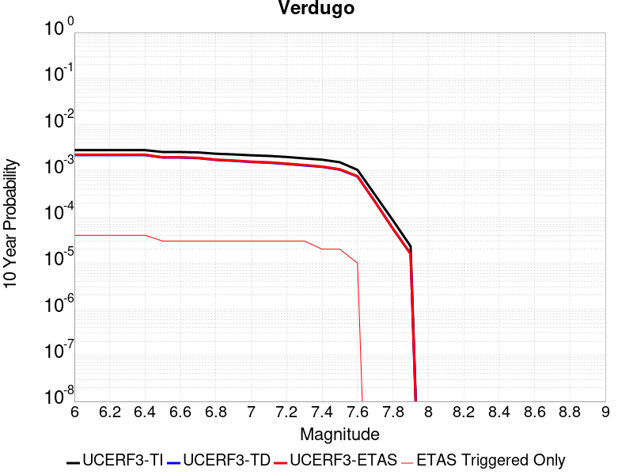 |

| Magnitude | 1 wk TI Prob | 1 wk TD Prob | 1 wk ETAS Prob | 1 wk ETAS/TD Gain | 1 wk ETAS Triggered Only | 1 mo TI Prob | 1 mo TD Prob | 1 mo ETAS Prob | 1 mo ETAS/TD Gain | 1 mo ETAS Triggered Only | 1 yr TI Prob | 1 yr TD Prob | 1 yr ETAS Prob | 1 yr ETAS/TD Gain | 1 yr ETAS Triggered Only | 10 yr TI Prob | 10 yr TD Prob | 10 yr ETAS Prob | 10 yr ETAS/TD Gain | 10 yr ETAS Triggered Only |
|-----|-----|-----|-----|-----|-----|-----|-----|-----|-----|-----|-----|-----|-----|-----|-----|-----|-----|-----|-----|-----|
| 6.0 | 5.392987E-6 | 4.216537E-6 | 4.216537E-6 | 1.0 | 0.0 | 2.3112598E-5 | 1.807075E-5 | 1.807075E-5 | 1.0 | 0.0 | 2.8135953E-4 | 2.1998964E-4 | 2.1998964E-4 | 1.0 | 0.0 | 0.0028100356 | 0.0021977664 | 0.0022376785 | 1.0181603 | 4.0E-5 |
| 6.1 | 5.392987E-6 | 4.216537E-6 | 4.216537E-6 | 1.0 | 0.0 | 2.3112598E-5 | 1.807075E-5 | 1.807075E-5 | 1.0 | 0.0 | 2.8135953E-4 | 2.1998964E-4 | 2.1998964E-4 | 1.0 | 0.0 | 0.0028100356 | 0.0021977664 | 0.0022376785 | 1.0181603 | 4.0E-5 |
| 6.2 | 5.392987E-6 | 4.216537E-6 | 4.216537E-6 | 1.0 | 0.0 | 2.3112598E-5 | 1.807075E-5 | 1.807075E-5 | 1.0 | 0.0 | 2.8135953E-4 | 2.1998964E-4 | 2.1998964E-4 | 1.0 | 0.0 | 0.0028100356 | 0.0021977664 | 0.0022376785 | 1.0181603 | 4.0E-5 |
| 6.3 | 5.392987E-6 | 4.216537E-6 | 4.216537E-6 | 1.0 | 0.0 | 2.3112598E-5 | 1.807075E-5 | 1.807075E-5 | 1.0 | 0.0 | 2.8135953E-4 | 2.1998964E-4 | 2.1998964E-4 | 1.0 | 0.0 | 0.0028100356 | 0.0021977664 | 0.0022376785 | 1.0181603 | 4.0E-5 |
| 6.4 | 5.392987E-6 | 4.216537E-6 | 4.216537E-6 | 1.0 | 0.0 | 2.3112598E-5 | 1.807075E-5 | 1.807075E-5 | 1.0 | 0.0 | 2.8135953E-4 | 2.1998964E-4 | 2.1998964E-4 | 1.0 | 0.0 | 0.0028100356 | 0.0021977664 | 0.0022376785 | 1.0181603 | 4.0E-5 |
| 6.5 | 4.9154837E-6 | 3.7224825E-6 | 3.7224825E-6 | 1.0 | 0.0 | 2.1066187E-5 | 1.59534E-5 | 1.59534E-5 | 1.0 | 0.0 | 2.5645064E-4 | 1.9421554E-4 | 1.9421554E-4 | 1.0 | 0.0 | 0.002561549 | 0.0019404789 | 0.0019704206 | 1.0154301 | 3.0E-5 |
| 6.6 | 4.9154837E-6 | 3.7224825E-6 | 3.7224825E-6 | 1.0 | 0.0 | 2.1066187E-5 | 1.59534E-5 | 1.59534E-5 | 1.0 | 0.0 | 2.5645064E-4 | 1.9421554E-4 | 1.9421554E-4 | 1.0 | 0.0 | 0.002561549 | 0.0019404789 | 0.0019704206 | 1.0154301 | 3.0E-5 |
| 6.7 | 4.817006E-6 | 3.6206686E-6 | 3.6206686E-6 | 1.0 | 0.0 | 2.0644147E-5 | 1.551706E-5 | 1.551706E-5 | 1.0 | 0.0 | 2.513135E-4 | 1.8890403E-4 | 1.8890403E-4 | 1.0 | 0.0 | 0.0025102948 | 0.0018874541 | 0.0019173975 | 1.0158644 | 3.0E-5 |
| 6.8 | 4.507407E-6 | 3.3071192E-6 | 3.3071192E-6 | 1.0 | 0.0 | 1.9317316E-5 | 1.4173292E-5 | 1.4173292E-5 | 1.0 | 0.0 | 2.3516294E-4 | 1.7254631E-4 | 1.7254631E-4 | 1.0 | 0.0 | 0.0023491425 | 0.0017241377 | 0.0017540859 | 1.01737 | 3.0E-5 |
| 6.9 | 4.3573054E-6 | 3.161025E-6 | 3.161025E-6 | 1.0 | 0.0 | 1.8674033E-5 | 1.3547181E-5 | 1.3547181E-5 | 1.0 | 0.0 | 2.2733262E-4 | 1.6492457E-4 | 1.6492457E-4 | 1.0 | 0.0 | 0.0022710022 | 0.0016480341 | 0.0016779846 | 1.0181735 | 3.0E-5 |
| 7.0 | 4.171527E-6 | 2.9836829E-6 | 2.9836829E-6 | 1.0 | 0.0 | 1.787785E-5 | 1.278715E-5 | 1.278715E-5 | 1.0 | 0.0 | 2.1764109E-4 | 1.5567255E-4 | 1.5567255E-4 | 1.0 | 0.0 | 0.0021742806 | 0.0015556462 | 0.0015855996 | 1.0192546 | 3.0E-5 |
| 7.1 | 4.0405484E-6 | 2.882273E-6 | 2.882273E-6 | 1.0 | 0.0 | 1.731652E-5 | 1.23525415E-5 | 1.23525415E-5 | 1.0 | 0.0 | 2.1080824E-4 | 1.5038192E-4 | 1.5038192E-4 | 1.0 | 0.0 | 0.0021060838 | 0.0015028126 | 0.0015327676 | 1.0199326 | 3.0E-5 |
| 7.2 | 3.8306007E-6 | 2.7018564E-6 | 2.7018564E-6 | 1.0 | 0.0 | 1.6416758E-5 | 1.1579334E-5 | 1.1579334E-5 | 1.0 | 0.0 | 1.9985568E-4 | 1.4096937E-4 | 1.4096937E-4 | 1.0 | 0.0 | 0.0019967605 | 0.0014088103 | 0.001438768 | 1.0212646 | 3.0E-5 |
| 7.3 | 3.5750938E-6 | 2.5121856E-6 | 2.5121856E-6 | 1.0 | 0.0 | 1.532174E-5 | 1.07664655E-5 | 1.07664655E-5 | 1.0 | 0.0 | 1.8652623E-4 | 1.3107395E-4 | 1.3107395E-4 | 1.0 | 0.0 | 0.0018636974 | 0.0013099768 | 0.0013399376 | 1.0228711 | 3.0E-5 |
| 7.4 | 3.3510041E-6 | 2.340868E-6 | 2.340868E-6 | 1.0 | 0.0 | 1.4361368E-5 | 1.0032253E-5 | 1.0032253E-5 | 1.0 | 0.0 | 1.7483562E-4 | 1.2213594E-4 | 1.2213594E-4 | 1.0 | 0.0 | 0.0017469813 | 0.0012206986 | 0.0012406742 | 1.0163641 | 2.0E-5 |
| 7.5 | 2.948287E-6 | 2.039118E-6 | 2.039118E-6 | 1.0 | 0.0 | 1.2635454E-5 | 8.739049E-6 | 8.739049E-6 | 1.0 | 0.0 | 1.538258E-4 | 1.0639283E-4 | 1.0639283E-4 | 1.0 | 0.0 | 0.0015371935 | 0.0010634292 | 0.0010834079 | 1.018787 | 2.0E-5 |
| 7.6 | 2.0134323E-6 | 1.4471273E-6 | 1.4471273E-6 | 1.0 | 0.0 | 8.628967E-6 | 6.20196E-6 | 6.20196E-6 | 1.0 | 0.0 | 1.05052604E-4 | 7.550634E-5 | 7.550634E-5 | 1.0 | 0.0 | 0.0010500296 | 7.5481564E-4 | 7.648081E-4 | 1.0132383 | 1.0E-5 |
| 7.7 | 5.726436E-7 | 4.0453835E-7 | 4.0453835E-7 | 1.0 | 0.0 | 2.4541846E-6 | 1.7337348E-6 | 1.7337348E-6 | 1.0 | 0.0 | 2.9879287E-5 | 2.1108042E-5 | 2.1108042E-5 | 1.0 | 0.0 | 2.987527E-4 | 2.1106293E-4 | 2.1106293E-4 | 1.0 | 0.0 |
| 7.8 | 1.6248204E-7 | 1.06884464E-7 | 1.06884464E-7 | 1.0 | 0.0 | 6.963514E-7 | 4.580762E-7 | 4.580762E-7 | 1.0 | 0.0 | 8.478045E-6 | 5.577064E-6 | 5.577064E-6 | 1.0 | 0.0 | 8.477722E-5 | 5.5769273E-5 | 5.5769273E-5 | 1.0 | 0.0 |
| 7.9 | 4.4475744E-8 | 3.037917E-8 | 3.037917E-8 | 1.0 | 0.0 | 1.9061031E-7 | 1.3019644E-7 | 1.3019644E-7 | 1.0 | 0.0 | 2.320678E-6 | 1.5851407E-6 | 1.5851407E-6 | 1.0 | 0.0 | 2.3206538E-5 | 1.5851307E-5 | 1.5851307E-5 | 1.0 | 0.0 |

## White Mountains
*[(top)](#table-of-contents)*

| 1 Week | 1 Month | 1 Year | 10 Year |
|-----|-----|-----|-----|
|  |  |  |  |

| Magnitude | 1 wk TI Prob | 1 wk TD Prob | 1 wk ETAS Prob | 1 wk ETAS/TD Gain | 1 wk ETAS Triggered Only | 1 mo TI Prob | 1 mo TD Prob | 1 mo ETAS Prob | 1 mo ETAS/TD Gain | 1 mo ETAS Triggered Only | 1 yr TI Prob | 1 yr TD Prob | 1 yr ETAS Prob | 1 yr ETAS/TD Gain | 1 yr ETAS Triggered Only | 10 yr TI Prob | 10 yr TD Prob | 10 yr ETAS Prob | 10 yr ETAS/TD Gain | 10 yr ETAS Triggered Only |
|-----|-----|-----|-----|-----|-----|-----|-----|-----|-----|-----|-----|-----|-----|-----|-----|-----|-----|-----|-----|-----|
| 6.0 | 3.503579E-5 | 3.3784498E-5 | 3.3784498E-5 | 1.0 | 0.0 | 1.5014476E-4 | 1.4478335E-4 | 1.547819E-4 | 1.0690588 | 1.0E-5 | 0.0018264796 | 0.0017614327 | 0.00179138 | 1.0170016 | 3.0E-5 | 0.018115403 | 0.017487047 | 0.017526347 | 1.0022475 | 4.0E-5 |
| 6.1 | 3.503579E-5 | 3.3784498E-5 | 3.3784498E-5 | 1.0 | 0.0 | 1.5014476E-4 | 1.4478335E-4 | 1.547819E-4 | 1.0690588 | 1.0E-5 | 0.0018264796 | 0.0017614327 | 0.00179138 | 1.0170016 | 3.0E-5 | 0.018115403 | 0.017487047 | 0.017526347 | 1.0022475 | 4.0E-5 |
| 6.2 | 3.503579E-5 | 3.3784498E-5 | 3.3784498E-5 | 1.0 | 0.0 | 1.5014476E-4 | 1.4478335E-4 | 1.547819E-4 | 1.0690588 | 1.0E-5 | 0.0018264796 | 0.0017614327 | 0.00179138 | 1.0170016 | 3.0E-5 | 0.018115403 | 0.017487047 | 0.017526347 | 1.0022475 | 4.0E-5 |
| 6.3 | 1.7818425E-5 | 1.591632E-5 | 1.591632E-5 | 1.0 | 0.0 | 7.636245E-5 | 6.821109E-5 | 7.821041E-5 | 1.1465937 | 1.0E-5 | 9.293162E-4 | 8.301679E-4 | 8.501513E-4 | 1.0240715 | 2.0E-5 | 0.009254395 | 0.008272125 | 0.008301877 | 1.0035967 | 3.0E-5 |
| 6.4 | 1.7818425E-5 | 1.591632E-5 | 1.591632E-5 | 1.0 | 0.0 | 7.636245E-5 | 6.821109E-5 | 7.821041E-5 | 1.1465937 | 1.0E-5 | 9.293162E-4 | 8.301679E-4 | 8.501513E-4 | 1.0240715 | 2.0E-5 | 0.009254395 | 0.008272125 | 0.008301877 | 1.0035967 | 3.0E-5 |
| 6.5 | 1.3397557E-5 | 1.1336486E-5 | 1.1336486E-5 | 1.0 | 0.0 | 5.741684E-5 | 4.8584072E-5 | 5.8583588E-5 | 1.2058188 | 1.0E-5 | 6.988258E-4 | 5.9135753E-4 | 6.113457E-4 | 1.0338005 | 2.0E-5 | 0.006966323 | 0.0058985446 | 0.0059184264 | 1.0033706 | 2.0E-5 |
| 6.6 | 1.0818695E-5 | 8.625519E-6 | 8.625519E-6 | 1.0 | 0.0 | 4.6365014E-5 | 3.696601E-5 | 4.696564E-5 | 1.2705088 | 1.0E-5 | 5.6434784E-4 | 4.4997258E-4 | 4.699636E-4 | 1.0444272 | 2.0E-5 | 0.005629168 | 0.004491051 | 0.0045109615 | 1.0044333 | 2.0E-5 |
| 6.7 | 9.067908E-6 | 6.802544E-6 | 6.802544E-6 | 1.0 | 0.0 | 3.8861883E-5 | 2.915345E-5 | 2.915345E-5 | 1.0 | 0.0 | 4.7304068E-4 | 3.5488865E-4 | 3.648851E-4 | 1.0281678 | 1.0E-5 | 0.00472035 | 0.0035435364 | 0.0035535009 | 1.002812 | 1.0E-5 |
| 6.8 | 7.295947E-6 | 4.9364785E-6 | 4.9364785E-6 | 1.0 | 0.0 | 3.126797E-5 | 2.1156171E-5 | 2.1156171E-5 | 1.0 | 0.0 | 3.8062103E-4 | 2.5754707E-4 | 2.5754707E-4 | 1.0 | 0.0 | 0.0037996976 | 0.0025725989 | 0.0025725989 | 1.0 | 0.0 |
| 6.9 | 6.2243444E-6 | 3.8322955E-6 | 3.8322955E-6 | 1.0 | 0.0 | 2.6675489E-5 | 1.6424025E-5 | 1.6424025E-5 | 1.0 | 0.0 | 3.2472567E-4 | 1.9994467E-4 | 1.9994467E-4 | 1.0 | 0.0 | 0.0032425157 | 0.0019977004 | 0.0019977004 | 1.0 | 0.0 |
| 7.0 | 4.9878413E-6 | 2.6796004E-6 | 2.6796004E-6 | 1.0 | 0.0 | 2.1376287E-5 | 1.1483952E-5 | 1.1483952E-5 | 1.0 | 0.0 | 2.602252E-4 | 1.3980841E-4 | 1.3980841E-4 | 1.0 | 0.0 | 0.002599207 | 0.0013972308 | 0.0013972308 | 1.0 | 0.0 |
| 7.1 | 4.0252844E-6 | 1.885737E-6 | 1.885737E-6 | 1.0 | 0.0 | 1.7251105E-5 | 8.081706E-6 | 8.081706E-6 | 1.0 | 0.0 | 2.1001195E-4 | 9.8390454E-5 | 9.8390454E-5 | 1.0 | 0.0 | 0.0020981359 | 9.834818E-4 | 9.834818E-4 | 1.0 | 0.0 |
| 7.2 | 3.3284066E-6 | 1.2819264E-6 | 1.2819264E-6 | 1.0 | 0.0 | 1.4264522E-5 | 5.493959E-6 | 5.493959E-6 | 1.0 | 0.0 | 1.736567E-4 | 6.6887005E-5 | 6.6887005E-5 | 1.0 | 0.0 | 0.0017352107 | 6.686788E-4 | 6.686788E-4 | 1.0 | 0.0 |
| 7.3 | 2.458226E-6 | 6.0570005E-7 | 6.0570005E-7 | 1.0 | 0.0 | 1.0535211E-5 | 2.595855E-6 | 2.595855E-6 | 1.0 | 0.0 | 1.2825865E-4 | 3.1604115E-5 | 3.1604115E-5 | 1.0 | 0.0 | 0.0012818464 | 3.1599996E-4 | 3.1599996E-4 | 1.0 | 0.0 |
| 7.4 | 1.965953E-6 | 3.1087455E-7 | 3.1087455E-7 | 1.0 | 0.0 | 8.425486E-6 | 1.3323188E-6 | 1.3323188E-6 | 1.0 | 0.0 | 1.0257547E-4 | 1.6220862E-5 | 1.6220862E-5 | 1.0 | 0.0 | 0.0010252813 | 1.6219691E-4 | 1.6219691E-4 | 1.0 | 0.0 |
| 7.5 | 1.2014192E-6 | 1.8242919E-7 | 1.8242919E-7 | 1.0 | 0.0 | 5.148929E-6 | 7.8183916E-7 | 7.8183916E-7 | 1.0 | 0.0 | 6.2686406E-5 | 9.518851E-6 | 9.518851E-6 | 1.0 | 0.0 | 6.266873E-4 | 9.5184514E-5 | 9.5184514E-5 | 1.0 | 0.0 |
| 7.6 | 2.5612175E-7 | 4.8943498E-8 | 4.8943498E-8 | 1.0 | 0.0 | 1.0976642E-6 | 2.0975783E-7 | 2.0975783E-7 | 1.0 | 0.0 | 1.3363979E-5 | 2.553799E-6 | 2.553799E-6 | 1.0 | 0.0 | 1.3363175E-4 | 2.5537733E-5 | 2.5537733E-5 | 1.0 | 0.0 |

## Elysian Park (Upper)
*[(top)](#table-of-contents)*

| 1 Week | 1 Month | 1 Year | 10 Year |
|-----|-----|-----|-----|
|  |  |  | 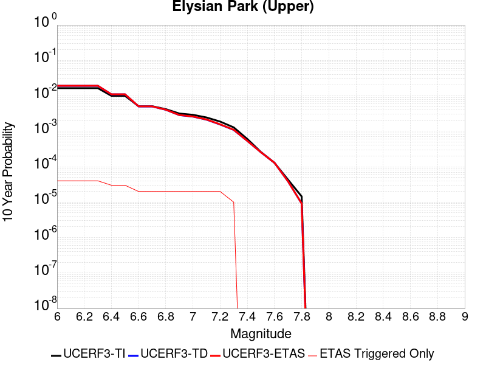 |

| Magnitude | 1 wk TI Prob | 1 wk TD Prob | 1 wk ETAS Prob | 1 wk ETAS/TD Gain | 1 wk ETAS Triggered Only | 1 mo TI Prob | 1 mo TD Prob | 1 mo ETAS Prob | 1 mo ETAS/TD Gain | 1 mo ETAS Triggered Only | 1 yr TI Prob | 1 yr TD Prob | 1 yr ETAS Prob | 1 yr ETAS/TD Gain | 1 yr ETAS Triggered Only | 10 yr TI Prob | 10 yr TD Prob | 10 yr ETAS Prob | 10 yr ETAS/TD Gain | 10 yr ETAS Triggered Only |
|-----|-----|-----|-----|-----|-----|-----|-----|-----|-----|-----|-----|-----|-----|-----|-----|-----|-----|-----|-----|-----|
| 6.0 | 3.1876025E-5 | 3.703628E-5 | 3.703628E-5 | 1.0 | 0.0 | 1.3660437E-4 | 1.5871998E-4 | 1.5871998E-4 | 1.0 | 0.0 | 0.0016618895 | 0.0019311737 | 0.0019411545 | 1.0051682 | 1.0E-5 | 0.016495159 | 0.019190373 | 0.019229604 | 1.0020443 | 4.0E-5 |
| 6.1 | 3.1876025E-5 | 3.703628E-5 | 3.703628E-5 | 1.0 | 0.0 | 1.3660437E-4 | 1.5871998E-4 | 1.5871998E-4 | 1.0 | 0.0 | 0.0016618895 | 0.0019311737 | 0.0019411545 | 1.0051682 | 1.0E-5 | 0.016495159 | 0.019190373 | 0.019229604 | 1.0020443 | 4.0E-5 |
| 6.2 | 3.1876025E-5 | 3.703628E-5 | 3.703628E-5 | 1.0 | 0.0 | 1.3660437E-4 | 1.5871998E-4 | 1.5871998E-4 | 1.0 | 0.0 | 0.0016618895 | 0.0019311737 | 0.0019411545 | 1.0051682 | 1.0E-5 | 0.016495159 | 0.019190373 | 0.019229604 | 1.0020443 | 4.0E-5 |
| 6.3 | 3.1876025E-5 | 3.703628E-5 | 3.703628E-5 | 1.0 | 0.0 | 1.3660437E-4 | 1.5871998E-4 | 1.5871998E-4 | 1.0 | 0.0 | 0.0016618895 | 0.0019311737 | 0.0019411545 | 1.0051682 | 1.0E-5 | 0.016495159 | 0.019190373 | 0.019229604 | 1.0020443 | 4.0E-5 |
| 6.4 | 1.9273462E-5 | 2.1202904E-5 | 2.1202904E-5 | 1.0 | 0.0 | 8.259794E-5 | 9.0867405E-5 | 9.0867405E-5 | 1.0 | 0.0 | 0.001005166 | 0.0011059209 | 0.0011159098 | 1.0090322 | 1.0E-5 | 0.010006315 | 0.011020984 | 0.011050653 | 1.0026921 | 3.0E-5 |
| 6.5 | 1.9273462E-5 | 2.1202904E-5 | 2.1202904E-5 | 1.0 | 0.0 | 8.259794E-5 | 9.0867405E-5 | 9.0867405E-5 | 1.0 | 0.0 | 0.001005166 | 0.0011059209 | 0.0011159098 | 1.0090322 | 1.0E-5 | 0.010006315 | 0.011020984 | 0.011050653 | 1.0026921 | 3.0E-5 |
| 6.6 | 9.813258E-6 | 9.665716E-6 | 9.665716E-6 | 1.0 | 0.0 | 4.205614E-5 | 4.1423882E-5 | 4.1423882E-5 | 1.0 | 0.0 | 5.119132E-4 | 5.042263E-4 | 5.1422126E-4 | 1.0198224 | 1.0E-5 | 0.005107356 | 0.005031546 | 0.005051445 | 1.0039549 | 2.0E-5 |
| 6.7 | 9.801478E-6 | 9.653286E-6 | 9.653286E-6 | 1.0 | 0.0 | 4.2005657E-5 | 4.1370608E-5 | 4.1370608E-5 | 1.0 | 0.0 | 5.112989E-4 | 5.03578E-4 | 5.1357294E-4 | 1.0198479 | 1.0E-5 | 0.0051012407 | 0.0050250925 | 0.0050449916 | 1.00396 | 2.0E-5 |
| 6.8 | 8.102489E-6 | 7.773095E-6 | 7.773095E-6 | 1.0 | 0.0 | 3.4724493E-5 | 3.3312866E-5 | 3.3312866E-5 | 1.0 | 0.0 | 4.2268867E-4 | 4.0551362E-4 | 4.1550957E-4 | 1.0246501 | 1.0E-5 | 0.004218856 | 0.0040482306 | 0.0040681497 | 1.0049205 | 2.0E-5 |
| 6.9 | 6.08275E-6 | 5.481501E-6 | 5.481501E-6 | 1.0 | 0.0 | 2.6068668E-5 | 2.349194E-5 | 2.349194E-5 | 1.0 | 0.0 | 3.173398E-4 | 2.859776E-4 | 2.9597475E-4 | 1.0349578 | 1.0E-5 | 0.0031688702 | 0.0028561736 | 0.0028761164 | 1.0069823 | 2.0E-5 |
| 7.0 | 5.5995934E-6 | 4.982823E-6 | 4.982823E-6 | 1.0 | 0.0 | 2.3998036E-5 | 2.1354786E-5 | 2.1354786E-5 | 1.0 | 0.0 | 2.9213692E-4 | 2.5996417E-4 | 2.6996157E-4 | 1.0384568 | 1.0E-5 | 0.0029175316 | 0.002596668 | 0.002616616 | 1.0076822 | 2.0E-5 |
| 7.1 | 4.709881E-6 | 4.0874347E-6 | 4.0874347E-6 | 1.0 | 0.0 | 2.0185047E-5 | 1.7517461E-5 | 1.7517461E-5 | 1.0 | 0.0 | 2.4572524E-4 | 2.1325464E-4 | 2.232525E-4 | 1.0468823 | 1.0E-5 | 0.002454537 | 0.0021305413 | 0.0021504988 | 1.0093672 | 2.0E-5 |
| 7.2 | 3.6063436E-6 | 2.9779728E-6 | 2.9779728E-6 | 1.0 | 0.0 | 1.5455667E-5 | 1.2762678E-5 | 1.2762678E-5 | 1.0 | 0.0 | 1.881565E-4 | 1.5537464E-4 | 1.6537309E-4 | 1.0643506 | 1.0E-5 | 0.0018799726 | 0.0015526713 | 0.0015726403 | 1.012861 | 2.0E-5 |
| 7.3 | 2.471135E-6 | 2.0954792E-6 | 2.0954792E-6 | 1.0 | 0.0 | 1.0590536E-5 | 8.980594E-6 | 8.980594E-6 | 1.0 | 0.0 | 1.2893214E-4 | 1.0933332E-4 | 1.0933332E-4 | 1.0 | 0.0 | 0.0012885736 | 0.0010928025 | 0.0011027916 | 1.0091407 | 1.0E-5 |
| 7.4 | 1.163943E-6 | 1.0275194E-6 | 1.0275194E-6 | 1.0 | 0.0 | 4.988318E-6 | 4.4036474E-6 | 4.4036474E-6 | 1.0 | 0.0 | 6.0731076E-5 | 5.3613116E-5 | 5.3613116E-5 | 1.0 | 0.0 | 6.071448E-4 | 5.360048E-4 | 5.360048E-4 | 1.0 | 0.0 |
| 7.5 | 4.99459E-7 | 4.917662E-7 | 4.917662E-7 | 1.0 | 0.0 | 2.140537E-6 | 2.1075678E-6 | 2.1075678E-6 | 1.0 | 0.0 | 2.6060725E-5 | 2.565935E-5 | 2.565935E-5 | 1.0 | 0.0 | 2.605767E-4 | 2.5656543E-4 | 2.5656543E-4 | 1.0 | 0.0 |
| 7.6 | 2.4667852E-7 | 2.4778686E-7 | 2.4778686E-7 | 1.0 | 0.0 | 1.0571932E-6 | 1.0619433E-6 | 1.0619433E-6 | 1.0 | 0.0 | 1.2871251E-5 | 1.2929087E-5 | 1.2929087E-5 | 1.0 | 0.0 | 1.2870505E-4 | 1.2928371E-4 | 1.2928371E-4 | 1.0 | 0.0 |
| 7.7 | 8.2312795E-8 | 7.386639E-8 | 7.386639E-8 | 1.0 | 0.0 | 3.527691E-7 | 3.165702E-7 | 3.165702E-7 | 1.0 | 0.0 | 4.294955E-6 | 3.8542366E-6 | 3.8542366E-6 | 1.0 | 0.0 | 4.2948723E-5 | 3.8541813E-5 | 3.8541813E-5 | 1.0 | 0.0 |
| 7.8 | 2.7819295E-8 | 1.7567253E-8 | 1.7567253E-8 | 1.0 | 0.0 | 1.1922555E-7 | 7.528822E-8 | 7.528822E-8 | 1.0 | 0.0 | 1.45157E-6 | 9.166339E-7 | 9.166339E-7 | 1.0 | 0.0 | 1.45156055E-5 | 9.166316E-6 | 9.166316E-6 | 1.0 | 0.0 |

## Brawley (Seismic Zone) alt 1
*[(top)](#table-of-contents)*

| 1 Week | 1 Month | 1 Year | 10 Year |
|-----|-----|-----|-----|
|  |  |  |  |

| Magnitude | 1 wk TI Prob | 1 wk TD Prob | 1 wk ETAS Prob | 1 wk ETAS/TD Gain | 1 wk ETAS Triggered Only | 1 mo TI Prob | 1 mo TD Prob | 1 mo ETAS Prob | 1 mo ETAS/TD Gain | 1 mo ETAS Triggered Only | 1 yr TI Prob | 1 yr TD Prob | 1 yr ETAS Prob | 1 yr ETAS/TD Gain | 1 yr ETAS Triggered Only | 10 yr TI Prob | 10 yr TD Prob | 10 yr ETAS Prob | 10 yr ETAS/TD Gain | 10 yr ETAS Triggered Only |
|-----|-----|-----|-----|-----|-----|-----|-----|-----|-----|-----|-----|-----|-----|-----|-----|-----|-----|-----|-----|-----|
| 6.0 | 2.2521618E-4 | 4.7643206E-4 | 4.7643206E-4 | 1.0 | 0.0 | 9.6485513E-4 | 0.002040291 | 0.002040291 | 1.0 | 0.0 | 0.011683988 | 0.024554973 | 0.024584237 | 1.0011917 | 3.0E-5 | 0.11088423 | 0.21353106 | 0.21356253 | 1.0001473 | 4.0E-5 |
| 6.1 | 2.2521618E-4 | 4.7643206E-4 | 4.7643206E-4 | 1.0 | 0.0 | 9.6485513E-4 | 0.002040291 | 0.002040291 | 1.0 | 0.0 | 0.011683988 | 0.024554973 | 0.024584237 | 1.0011917 | 3.0E-5 | 0.11088423 | 0.21353106 | 0.21356253 | 1.0001473 | 4.0E-5 |
| 6.2 | 2.198148E-4 | 4.672759E-4 | 4.672759E-4 | 1.0 | 0.0 | 9.417233E-4 | 0.0020011107 | 0.0020011107 | 1.0 | 0.0 | 0.011405343 | 0.024089037 | 0.024118314 | 1.0012153 | 3.0E-5 | 0.10837428 | 0.20996717 | 0.20999877 | 1.0001506 | 4.0E-5 |
| 6.3 | 2.1704129E-4 | 4.6163241E-4 | 4.6163241E-4 | 1.0 | 0.0 | 9.298453E-4 | 0.001976961 | 0.001976961 | 1.0 | 0.0 | 0.011262234 | 0.023802388 | 0.023831675 | 1.0012304 | 3.0E-5 | 0.107082725 | 0.20785816 | 0.20788985 | 1.0001525 | 4.0E-5 |
| 6.4 | 1.876142E-4 | 4.0055066E-4 | 4.0055066E-4 | 1.0 | 0.0 | 8.038131E-4 | 0.0017155306 | 0.0017155306 | 1.0 | 0.0 | 0.00974259 | 0.020688837 | 0.020718217 | 1.00142 | 3.0E-5 | 0.093263686 | 0.18460822 | 0.18464084 | 1.0001767 | 4.0E-5 |
| 6.5 | 1.7390939E-4 | 3.7486907E-4 | 3.7486907E-4 | 1.0 | 0.0 | 7.45113E-4 | 0.0016056047 | 0.0016056047 | 1.0 | 0.0 | 0.009034078 | 0.019377038 | 0.019406457 | 1.0015182 | 3.0E-5 | 0.086755216 | 0.17442968 | 0.17446272 | 1.0001893 | 4.0E-5 |
| 6.6 | 1.591791E-4 | 3.490135E-4 | 3.490135E-4 | 1.0 | 0.0 | 6.8201777E-4 | 0.0014949249 | 0.0014949249 | 1.0 | 0.0 | 0.008271996 | 0.018051691 | 0.018081151 | 1.0016319 | 3.0E-5 | 0.07970774 | 0.16383655 | 0.16387 | 1.0002041 | 4.0E-5 |
| 6.7 | 1.4268003E-4 | 3.2067046E-4 | 3.2067046E-4 | 1.0 | 0.0 | 6.1134255E-4 | 0.0013735864 | 0.0013735864 | 1.0 | 0.0 | 0.007417723 | 0.016597226 | 0.016626729 | 1.0017775 | 3.0E-5 | 0.07174956 | 0.15196328 | 0.1519972 | 1.0002233 | 4.0E-5 |
| 6.8 | 1.239713E-4 | 2.906121E-4 | 2.906121E-4 | 1.0 | 0.0 | 5.3119735E-4 | 0.0012448921 | 0.0012448921 | 1.0 | 0.0 | 0.0064481674 | 0.015052661 | 0.015082209 | 1.001963 | 3.0E-5 | 0.06264243 | 0.13840474 | 0.13843921 | 1.000249 | 4.0E-5 |
| 6.9 | 1.0180238E-4 | 2.6260383E-4 | 2.6260383E-4 | 1.0 | 0.0 | 4.3622297E-4 | 0.0011249639 | 0.0011249639 | 1.0 | 0.0 | 0.005298089 | 0.013611422 | 0.013641014 | 1.002174 | 3.0E-5 | 0.05173543 | 0.12498361 | 0.12501861 | 1.00028 | 4.0E-5 |
| 7.0 | 7.6619996E-5 | 2.2404084E-4 | 2.2404084E-4 | 1.0 | 0.0 | 3.283301E-4 | 9.598249E-4 | 9.598249E-4 | 1.0 | 0.0 | 0.0039900932 | 0.011623963 | 0.011653614 | 1.0025508 | 3.0E-5 | 0.039192066 | 0.10728301 | 0.10731872 | 1.0003328 | 4.0E-5 |
| 7.1 | 7.5127435E-5 | 2.2087194E-4 | 2.2087194E-4 | 1.0 | 0.0 | 3.2193496E-4 | 9.462538E-4 | 9.462538E-4 | 1.0 | 0.0 | 0.0039125155 | 0.011460485 | 0.011490141 | 1.0025877 | 3.0E-5 | 0.038443442 | 0.105846815 | 0.105882585 | 1.000338 | 4.0E-5 |
| 7.2 | 6.788582E-5 | 2.0214771E-4 | 2.0214771E-4 | 1.0 | 0.0 | 2.9090676E-4 | 8.660627E-4 | 8.660627E-4 | 1.0 | 0.0 | 0.0035360386 | 0.010493974 | 0.01052366 | 1.0028288 | 3.0E-5 | 0.034803 | 0.09751713 | 0.09755323 | 1.0003701 | 4.0E-5 |
| 7.3 | 6.399602E-5 | 1.884553E-4 | 1.884553E-4 | 1.0 | 0.0 | 2.7423984E-4 | 8.074185E-4 | 8.074185E-4 | 1.0 | 0.0 | 0.0033337586 | 0.009786601 | 0.0098163085 | 1.0030354 | 3.0E-5 | 0.03284188 | 0.09141058 | 0.09144692 | 1.0003976 | 4.0E-5 |
| 7.4 | 4.506759E-5 | 1.2532667E-4 | 1.2532667E-4 | 1.0 | 0.0 | 1.9313251E-4 | 5.370046E-4 | 5.370046E-4 | 1.0 | 0.0 | 0.0023488526 | 0.006518606 | 0.006538476 | 1.0030482 | 2.0E-5 | 0.023241805 | 0.06237464 | 0.062402766 | 1.000451 | 3.0E-5 |
| 7.5 | 3.43289E-5 | 9.338305E-5 | 9.338305E-5 | 1.0 | 0.0 | 1.4711556E-4 | 4.00152E-4 | 4.00152E-4 | 1.0 | 0.0 | 0.0017896603 | 0.00486103 | 0.0048809326 | 1.0040944 | 2.0E-5 | 0.01775316 | 0.04706593 | 0.047094516 | 1.0006074 | 3.0E-5 |
| 7.6 | 2.5980507E-5 | 7.055588E-5 | 7.055588E-5 | 1.0 | 0.0 | 1.1134028E-4 | 3.023474E-4 | 3.023474E-4 | 1.0 | 0.0 | 0.001354725 | 0.0036748908 | 0.0036848541 | 1.0027112 | 1.0E-5 | 0.013464959 | 0.035850268 | 0.03586955 | 1.0005379 | 2.0E-5 |
| 7.7 | 1.7292105E-5 | 4.9428265E-5 | 4.9428265E-5 | 1.0 | 0.0 | 7.4106916E-5 | 2.1181825E-4 | 2.1181825E-4 | 1.0 | 0.0 | 9.018782E-4 | 0.002575843 | 0.0025858171 | 1.0038723 | 1.0E-5 | 0.008982267 | 0.025298944 | 0.025318438 | 1.0007706 | 2.0E-5 |
| 7.8 | 1.2927471E-5 | 3.971141E-5 | 3.971141E-5 | 1.0 | 0.0 | 5.5402274E-5 | 1.7018066E-4 | 1.7018066E-4 | 1.0 | 0.0 | 6.743139E-4 | 0.0020699832 | 0.0020799625 | 1.004821 | 1.0E-5 | 0.0067227143 | 0.020439085 | 0.020458676 | 1.0009586 | 2.0E-5 |
| 7.9 | 1.0200774E-5 | 2.8759863E-5 | 2.8759863E-5 | 1.0 | 0.0 | 4.371687E-5 | 1.2325073E-4 | 1.2325073E-4 | 1.0 | 0.0 | 5.321229E-4 | 0.0014995459 | 0.0015095309 | 1.0066587 | 1.0E-5 | 0.005308505 | 0.0149981035 | 0.015017804 | 1.0013134 | 2.0E-5 |
| 8.0 | 8.650396E-6 | 2.3289316E-5 | 2.3289316E-5 | 1.0 | 0.0 | 3.70726E-5 | 9.980754E-5 | 9.980754E-5 | 1.0 | 0.0 | 4.5126543E-4 | 0.0012144803 | 0.0012244681 | 1.008224 | 1.0E-5 | 0.0045035016 | 0.012216583 | 0.012236338 | 1.0016171 | 2.0E-5 |
| 8.1 | 3.9368224E-6 | 7.3325436E-6 | 7.3325436E-6 | 1.0 | 0.0 | 1.6871985E-5 | 3.142481E-5 | 3.142481E-5 | 1.0 | 0.0 | 2.0539707E-4 | 3.8253E-4 | 3.8253E-4 | 1.0 | 0.0 | 0.0020520731 | 0.0040034265 | 0.0040034265 | 1.0 | 0.0 |
| 8.2 | 1.7101195E-6 | 2.21947E-6 | 2.21947E-6 | 1.0 | 0.0 | 7.329063E-6 | 9.511979E-6 | 9.511979E-6 | 1.0 | 0.0 | 8.922769E-5 | 1.1580222E-4 | 1.1580222E-4 | 1.0 | 0.0 | 8.9191867E-4 | 0.0012675131 | 0.0012675131 | 1.0 | 0.0 |
| 8.3 | 3.0346666E-8 | 1.7229212E-8 | 1.7229212E-8 | 1.0 | 0.0 | 1.3005713E-7 | 7.383948E-8 | 7.383948E-8 | 1.0 | 0.0 | 1.5834444E-6 | 8.9899555E-7 | 8.9899555E-7 | 1.0 | 0.0 | 1.5834332E-5 | 9.375523E-6 | 9.375523E-6 | 1.0 | 0.0 |

## San Luis Range 2011 CFM
*[(top)](#table-of-contents)*

| 1 Week | 1 Month | 1 Year | 10 Year |
|-----|-----|-----|-----|
|  |  |  |  |

| Magnitude | 1 wk TI Prob | 1 wk TD Prob | 1 wk ETAS Prob | 1 wk ETAS/TD Gain | 1 wk ETAS Triggered Only | 1 mo TI Prob | 1 mo TD Prob | 1 mo ETAS Prob | 1 mo ETAS/TD Gain | 1 mo ETAS Triggered Only | 1 yr TI Prob | 1 yr TD Prob | 1 yr ETAS Prob | 1 yr ETAS/TD Gain | 1 yr ETAS Triggered Only | 10 yr TI Prob | 10 yr TD Prob | 10 yr ETAS Prob | 10 yr ETAS/TD Gain | 10 yr ETAS Triggered Only |
|-----|-----|-----|-----|-----|-----|-----|-----|-----|-----|-----|-----|-----|-----|-----|-----|-----|-----|-----|-----|-----|
| 6.0 | 8.8368415E-6 | 8.965478E-6 | 8.965478E-6 | 1.0 | 0.0 | 3.787163E-5 | 3.8422957E-5 | 3.8422957E-5 | 1.0 | 0.0 | 4.609895E-4 | 4.6770697E-4 | 4.976929E-4 | 1.0641128 | 3.0E-5 | 0.0046003438 | 0.004668009 | 0.004707822 | 1.008529 | 4.0E-5 |
| 6.1 | 8.8368415E-6 | 8.965478E-6 | 8.965478E-6 | 1.0 | 0.0 | 3.787163E-5 | 3.8422957E-5 | 3.8422957E-5 | 1.0 | 0.0 | 4.609895E-4 | 4.6770697E-4 | 4.976929E-4 | 1.0641128 | 3.0E-5 | 0.0046003438 | 0.004668009 | 0.004707822 | 1.008529 | 4.0E-5 |
| 6.2 | 8.8368415E-6 | 8.965478E-6 | 8.965478E-6 | 1.0 | 0.0 | 3.787163E-5 | 3.8422957E-5 | 3.8422957E-5 | 1.0 | 0.0 | 4.609895E-4 | 4.6770697E-4 | 4.976929E-4 | 1.0641128 | 3.0E-5 | 0.0046003438 | 0.004668009 | 0.004707822 | 1.008529 | 4.0E-5 |
| 6.3 | 8.8368415E-6 | 8.965478E-6 | 8.965478E-6 | 1.0 | 0.0 | 3.787163E-5 | 3.8422957E-5 | 3.8422957E-5 | 1.0 | 0.0 | 4.609895E-4 | 4.6770697E-4 | 4.976929E-4 | 1.0641128 | 3.0E-5 | 0.0046003438 | 0.004668009 | 0.004707822 | 1.008529 | 4.0E-5 |
| 6.4 | 3.9094193E-6 | 3.941214E-6 | 3.941214E-6 | 1.0 | 0.0 | 1.6754546E-5 | 1.689081E-5 | 1.689081E-5 | 1.0 | 0.0 | 2.039675E-4 | 2.0562648E-4 | 2.2562237E-4 | 1.0972438 | 2.0E-5 | 0.0020378039 | 0.002054391 | 0.0020843293 | 1.0145729 | 3.0E-5 |
| 6.5 | 3.9094193E-6 | 3.941214E-6 | 3.941214E-6 | 1.0 | 0.0 | 1.6754546E-5 | 1.689081E-5 | 1.689081E-5 | 1.0 | 0.0 | 2.039675E-4 | 2.0562648E-4 | 2.2562237E-4 | 1.0972438 | 2.0E-5 | 0.0020378039 | 0.002054391 | 0.0020843293 | 1.0145729 | 3.0E-5 |
| 6.6 | 3.0587726E-6 | 3.0753974E-6 | 3.0753974E-6 | 1.0 | 0.0 | 1.3108959E-5 | 1.3180209E-5 | 1.3180209E-5 | 1.0 | 0.0 | 1.595899E-4 | 1.6045735E-4 | 1.6045735E-4 | 1.0 | 0.0 | 0.0015947534 | 0.0016034269 | 0.0016134109 | 1.0062267 | 1.0E-5 |
| 6.7 | 2.6160574E-6 | 2.6251355E-6 | 2.6251355E-6 | 1.0 | 0.0 | 1.1211626E-5 | 1.1250533E-5 | 1.1250533E-5 | 1.0 | 0.0 | 1.3649299E-4 | 1.3696669E-4 | 1.3696669E-4 | 1.0 | 0.0 | 0.0013640919 | 0.0013688289 | 0.0013688289 | 1.0 | 0.0 |
| 6.8 | 2.5110312E-6 | 2.5181482E-6 | 2.5181482E-6 | 1.0 | 0.0 | 1.0761518E-5 | 1.079202E-5 | 1.079202E-5 | 1.0 | 0.0 | 1.310136E-4 | 1.3138496E-4 | 1.3138496E-4 | 1.0 | 0.0 | 0.0013093639 | 0.0013130788 | 0.0013130788 | 1.0 | 0.0 |
| 6.9 | 1.8564405E-6 | 1.8524935E-6 | 1.8524935E-6 | 1.0 | 0.0 | 7.95615E-6 | 7.939234E-6 | 7.939234E-6 | 1.0 | 0.0 | 9.686181E-5 | 9.66559E-5 | 9.66559E-5 | 1.0 | 0.0 | 9.68196E-4 | 9.6614065E-4 | 9.6614065E-4 | 1.0 | 0.0 |
| 7.0 | 1.546127E-6 | 1.5369595E-6 | 1.5369595E-6 | 1.0 | 0.0 | 6.626242E-6 | 6.586953E-6 | 6.586953E-6 | 1.0 | 0.0 | 8.06715E-5 | 8.0193204E-5 | 8.0193204E-5 | 1.0 | 0.0 | 8.0642226E-4 | 8.016434E-4 | 8.016434E-4 | 1.0 | 0.0 |
| 7.1 | 1.3368208E-6 | 1.3235378E-6 | 1.3235378E-6 | 1.0 | 0.0 | 5.7292195E-6 | 5.672293E-6 | 5.672293E-6 | 1.0 | 0.0 | 6.975101E-5 | 6.905798E-5 | 6.905798E-5 | 1.0 | 0.0 | 6.972912E-4 | 6.903657E-4 | 6.903657E-4 | 1.0 | 0.0 |
| 7.2 | 1.0623363E-6 | 1.0454412E-6 | 1.0454412E-6 | 1.0 | 0.0 | 4.5528623E-6 | 4.4804547E-6 | 4.4804547E-6 | 1.0 | 0.0 | 5.5429686E-5 | 5.4548174E-5 | 5.4548174E-5 | 1.0 | 0.0 | 5.5415864E-4 | 5.453481E-4 | 5.453481E-4 | 1.0 | 0.0 |
| 7.3 | 7.831679E-7 | 7.7274274E-7 | 7.7274274E-7 | 1.0 | 0.0 | 3.3564295E-6 | 3.3117506E-6 | 3.3117506E-6 | 1.0 | 0.0 | 4.086376E-5 | 4.0319817E-5 | 4.0319817E-5 | 1.0 | 0.0 | 4.0856248E-4 | 4.0312516E-4 | 4.0312516E-4 | 1.0 | 0.0 |
| 7.4 | 5.9558846E-7 | 5.9106696E-7 | 5.9106696E-7 | 1.0 | 0.0 | 2.5525194E-6 | 2.5331417E-6 | 2.5331417E-6 | 1.0 | 0.0 | 3.107648E-5 | 3.0840565E-5 | 3.0840565E-5 | 1.0 | 0.0 | 3.1072134E-4 | 3.083629E-4 | 3.083629E-4 | 1.0 | 0.0 |
| 7.5 | 4.1616502E-7 | 4.1196597E-7 | 4.1196597E-7 | 1.0 | 0.0 | 1.7835631E-6 | 1.7655673E-6 | 1.7655673E-6 | 1.0 | 0.0 | 2.1714664E-5 | 2.1495569E-5 | 2.1495569E-5 | 1.0 | 0.0 | 2.1712543E-4 | 2.1493496E-4 | 2.1493496E-4 | 1.0 | 0.0 |
| 7.6 | 2.3816014E-7 | 2.3376762E-7 | 2.3376762E-7 | 1.0 | 0.0 | 1.0206859E-6 | 1.0018608E-6 | 1.0018608E-6 | 1.0 | 0.0 | 1.242678E-5 | 1.2197587E-5 | 1.2197587E-5 | 1.0 | 0.0 | 1.2426086E-4 | 1.219692E-4 | 1.219692E-4 | 1.0 | 0.0 |
| 7.7 | 9.918777E-8 | 9.386922E-8 | 9.386922E-8 | 1.0 | 0.0 | 4.2509038E-7 | 4.0229656E-7 | 4.0229656E-7 | 1.0 | 0.0 | 5.1754632E-6 | 4.8979496E-6 | 4.8979496E-6 | 1.0 | 0.0 | 5.1753424E-5 | 4.897842E-5 | 4.897842E-5 | 1.0 | 0.0 |
| 7.8 | 3.4982556E-8 | 2.9687648E-8 | 2.9687648E-8 | 1.0 | 0.0 | 1.4992524E-7 | 1.2723277E-7 | 1.2723277E-7 | 1.0 | 0.0 | 1.8253382E-6 | 1.5490579E-6 | 1.5490579E-6 | 1.0 | 0.0 | 1.8253233E-5 | 1.5490472E-5 | 1.5490472E-5 | 1.0 | 0.0 |
| 7.9 | 1.6624908E-8 | 1.147785E-8 | 1.147785E-8 | 1.0 | 0.0 | 7.12496E-8 | 4.9190785E-8 | 4.9190785E-8 | 1.0 | 0.0 | 8.6746354E-7 | 5.9889766E-7 | 5.9889766E-7 | 1.0 | 0.0 | 8.674601E-6 | 5.9889603E-6 | 5.9889603E-6 | 1.0 | 0.0 |
| 8.0 | 6.3352315E-9 | 3.0891683E-9 | 3.0891683E-9 | 1.0 | 0.0 | 2.715099E-8 | 1.3239292E-8 | 1.3239292E-8 | 1.0 | 0.0 | 3.3056327E-7 | 1.6118838E-7 | 1.6118838E-7 | 1.0 | 0.0 | 3.3056278E-6 | 1.6118827E-6 | 1.6118827E-6 | 1.0 | 0.0 |

## Hunting Creek - Berryessa 2011 CFM
*[(top)](#table-of-contents)*

| 1 Week | 1 Month | 1 Year | 10 Year |
|-----|-----|-----|-----|
|  |  |  | 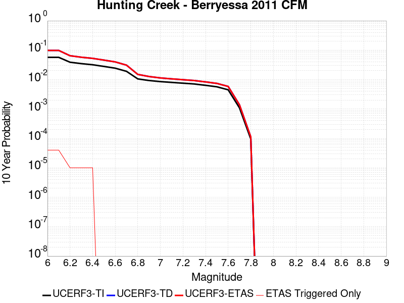 |

| Magnitude | 1 wk TI Prob | 1 wk TD Prob | 1 wk ETAS Prob | 1 wk ETAS/TD Gain | 1 wk ETAS Triggered Only | 1 mo TI Prob | 1 mo TD Prob | 1 mo ETAS Prob | 1 mo ETAS/TD Gain | 1 mo ETAS Triggered Only | 1 yr TI Prob | 1 yr TD Prob | 1 yr ETAS Prob | 1 yr ETAS/TD Gain | 1 yr ETAS Triggered Only | 10 yr TI Prob | 10 yr TD Prob | 10 yr ETAS Prob | 10 yr ETAS/TD Gain | 10 yr ETAS Triggered Only |
|-----|-----|-----|-----|-----|-----|-----|-----|-----|-----|-----|-----|-----|-----|-----|-----|-----|-----|-----|-----|-----|
| 6.0 | 1.1270982E-4 | 2.003E-4 | 2.003E-4 | 1.0 | 0.0 | 4.8295266E-4 | 8.580158E-4 | 8.680072E-4 | 1.0116448 | 1.0E-5 | 0.0058641075 | 0.010386613 | 0.010406406 | 1.0019056 | 2.0E-5 | 0.057117578 | 0.098045476 | 0.09808156 | 1.000368 | 4.0E-5 |
| 6.1 | 1.1239393E-4 | 1.9978137E-4 | 1.9978137E-4 | 1.0 | 0.0 | 4.8159933E-4 | 8.5579476E-4 | 8.657862E-4 | 1.011675 | 1.0E-5 | 0.0058477195 | 0.010359855 | 0.010379649 | 1.0019106 | 2.0E-5 | 0.056962132 | 0.09780394 | 0.097840026 | 1.000369 | 4.0E-5 |
| 6.2 | 7.596265E-5 | 1.2934073E-4 | 1.2934073E-4 | 1.0 | 0.0 | 3.2551357E-4 | 5.5417913E-4 | 5.5417913E-4 | 1.0 | 0.0 | 0.0039559277 | 0.0067216344 | 0.0067315674 | 1.0014777 | 1.0E-5 | 0.038862433 | 0.06459614 | 0.06460549 | 1.0001448 | 1.0E-5 |
| 6.3 | 6.78794E-5 | 1.14485956E-4 | 1.14485956E-4 | 1.0 | 0.0 | 2.9087928E-4 | 4.9054454E-4 | 4.9054454E-4 | 1.0 | 0.0 | 0.003535705 | 0.0059528984 | 0.005962839 | 1.0016699 | 1.0E-5 | 0.034799766 | 0.05746977 | 0.057479195 | 1.000164 | 1.0E-5 |
| 6.4 | 6.2165134E-5 | 1.0435045E-4 | 1.0435045E-4 | 1.0 | 0.0 | 2.6639478E-4 | 4.4712838E-4 | 4.4712838E-4 | 1.0 | 0.0 | 0.0032385332 | 0.0054276367 | 0.0054375823 | 1.0018324 | 1.0E-5 | 0.03191742 | 0.052554645 | 0.052564118 | 1.0001802 | 1.0E-5 |
| 6.5 | 5.4368087E-5 | 9.0704736E-5 | 9.0704736E-5 | 1.0 | 0.0 | 2.3298527E-4 | 3.8866926E-4 | 3.8866926E-4 | 1.0 | 0.0 | 0.0028329059 | 0.0047198907 | 0.0047198907 | 1.0 | 0.0 | 0.027970633 | 0.04588404 | 0.04588404 | 1.0 | 0.0 |
| 6.6 | 4.729947E-5 | 7.8472214E-5 | 7.8472214E-5 | 1.0 | 0.0 | 2.0269625E-4 | 3.362585E-4 | 3.362585E-4 | 1.0 | 0.0 | 0.002465034 | 0.004084906 | 0.004084906 | 1.0 | 0.0 | 0.02437869 | 0.039855294 | 0.039855294 | 1.0 | 0.0 |
| 6.7 | 3.6875328E-5 | 6.044355E-5 | 6.044355E-5 | 1.0 | 0.0 | 1.5802756E-4 | 2.5902048E-4 | 2.5902048E-4 | 1.0 | 0.0 | 0.0019222875 | 0.003148399 | 0.003148399 | 1.0 | 0.0 | 0.019057442 | 0.030895488 | 0.030895488 | 1.0 | 0.0 |
| 6.8 | 2.0292036E-5 | 2.8977376E-5 | 2.8977376E-5 | 1.0 | 0.0 | 8.6962966E-5 | 1.2418274E-4 | 1.2418274E-4 | 1.0 | 0.0 | 0.0010582599 | 0.0015108638 | 0.0015108638 | 1.0 | 0.0 | 0.010532344 | 0.014979384 | 0.014979384 | 1.0 | 0.0 |
| 6.9 | 1.7871042E-5 | 2.4473193E-5 | 2.4473193E-5 | 1.0 | 0.0 | 7.658793E-5 | 1.04880906E-4 | 1.04880906E-4 | 1.0 | 0.0 | 9.320591E-4 | 0.0012761768 | 0.0012761768 | 1.0 | 0.0 | 0.009281595 | 0.012680746 | 0.012680746 | 1.0 | 0.0 |
| 7.0 | 1.6415532E-5 | 2.1907066E-5 | 2.1907066E-5 | 1.0 | 0.0 | 7.035038E-5 | 9.388406E-5 | 9.388406E-5 | 1.0 | 0.0 | 8.561793E-4 | 0.0011424406 | 0.0011424406 | 1.0 | 0.0 | 0.008528882 | 0.01136518 | 0.01136518 | 1.0 | 0.0 |
| 7.1 | 1.5409885E-5 | 2.0347048E-5 | 2.0347048E-5 | 1.0 | 0.0 | 6.6040695E-5 | 8.719874E-5 | 8.719874E-5 | 1.0 | 0.0 | 8.0374884E-4 | 0.0010611303 | 0.0010611303 | 1.0 | 0.0 | 0.00800848 | 0.010561098 | 0.010561098 | 1.0 | 0.0 |
| 7.2 | 1.4497423E-5 | 1.905562E-5 | 1.905562E-5 | 1.0 | 0.0 | 6.213033E-5 | 8.166441E-5 | 8.166441E-5 | 1.0 | 0.0 | 7.5617427E-4 | 9.938137E-4 | 9.938137E-4 | 1.0 | 0.0 | 0.0075360634 | 0.009894406 | 0.009894406 | 1.0 | 0.0 |
| 7.3 | 1.3615175E-5 | 1.7826764E-5 | 1.7826764E-5 | 1.0 | 0.0 | 5.8349444E-5 | 7.6398195E-5 | 7.6398195E-5 | 1.0 | 0.0 | 7.101729E-4 | 9.29754E-4 | 9.29754E-4 | 1.0 | 0.0 | 0.0070790765 | 0.009259279 | 0.009259279 | 1.0 | 0.0 |
| 7.4 | 1.2252825E-5 | 1.6026825E-5 | 1.6026825E-5 | 1.0 | 0.0 | 5.251105E-5 | 6.8684596E-5 | 6.8684596E-5 | 1.0 | 0.0 | 6.391345E-4 | 8.3591696E-4 | 8.3591696E-4 | 1.0 | 0.0 | 0.0063729943 | 0.008328301 | 0.008328301 | 1.0 | 0.0 |
| 7.5 | 1.0913301E-5 | 1.4241617E-5 | 1.4241617E-5 | 1.0 | 0.0 | 4.6770452E-5 | 6.1034087E-5 | 6.1034087E-5 | 1.0 | 0.0 | 5.6928146E-4 | 7.4283936E-4 | 7.4283936E-4 | 1.0 | 0.0 | 0.0056782532 | 0.0074040988 | 0.0074040988 | 1.0 | 0.0 |
| 7.6 | 8.623192E-6 | 1.1235044E-5 | 1.1235044E-5 | 1.0 | 0.0 | 3.6956015E-5 | 4.8149315E-5 | 4.8149315E-5 | 1.0 | 0.0 | 4.4984656E-4 | 5.860628E-4 | 5.860628E-4 | 1.0 | 0.0 | 0.00448937 | 0.005845606 | 0.005845606 | 1.0 | 0.0 |
| 7.7 | 2.0993634E-6 | 2.662692E-6 | 2.662692E-6 | 1.0 | 0.0 | 8.997241E-6 | 1.1411487E-5 | 1.1411487E-5 | 1.0 | 0.0 | 1.09535904E-4 | 1.3892607E-4 | 1.3892607E-4 | 1.0 | 0.0 | 0.0010948193 | 0.0013884421 | 0.0013884421 | 1.0 | 0.0 |
| 7.8 | 1.8428308E-7 | 2.1675E-7 | 2.1675E-7 | 1.0 | 0.0 | 7.897844E-7 | 9.289282E-7 | 9.289282E-7 | 1.0 | 0.0 | 9.615583E-6 | 1.1309647E-5 | 1.1309647E-5 | 1.0 | 0.0 | 9.615166E-5 | 1.13083915E-4 | 1.13083915E-4 | 1.0 | 0.0 |

## Imperial
*[(top)](#table-of-contents)*

| 1 Week | 1 Month | 1 Year | 10 Year |
|-----|-----|-----|-----|
|  |  |  | 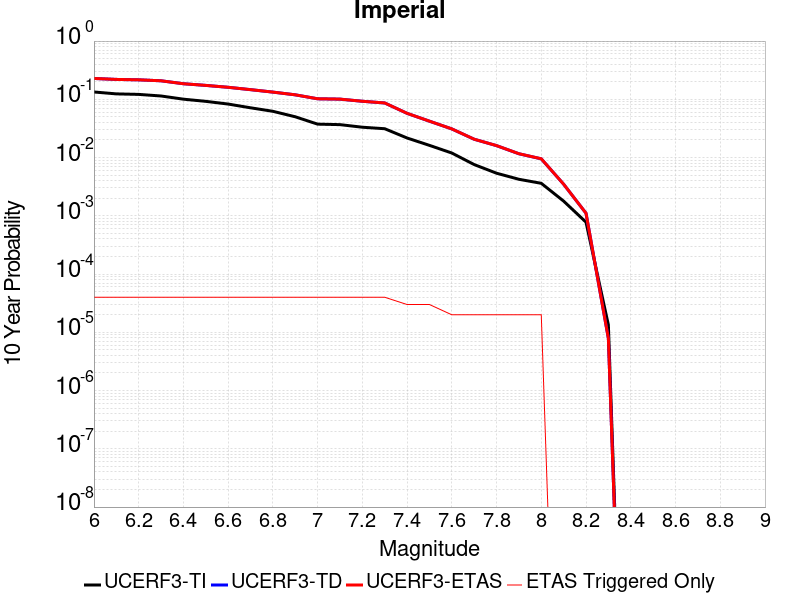 |

| Magnitude | 1 wk TI Prob | 1 wk TD Prob | 1 wk ETAS Prob | 1 wk ETAS/TD Gain | 1 wk ETAS Triggered Only | 1 mo TI Prob | 1 mo TD Prob | 1 mo ETAS Prob | 1 mo ETAS/TD Gain | 1 mo ETAS Triggered Only | 1 yr TI Prob | 1 yr TD Prob | 1 yr ETAS Prob | 1 yr ETAS/TD Gain | 1 yr ETAS Triggered Only | 10 yr TI Prob | 10 yr TD Prob | 10 yr ETAS Prob | 10 yr ETAS/TD Gain | 10 yr ETAS Triggered Only |
|-----|-----|-----|-----|-----|-----|-----|-----|-----|-----|-----|-----|-----|-----|-----|-----|-----|-----|-----|-----|-----|
| 6.0 | 2.7496446E-4 | 5.0567614E-4 | 5.0567614E-4 | 1.0 | 0.0 | 0.0011778869 | 0.0021654228 | 0.0021654228 | 1.0 | 0.0 | 0.0142467655 | 0.02603894 | 0.026068158 | 1.0011221 | 3.0E-5 | 0.13367249 | 0.22807938 | 0.22811025 | 1.0001354 | 4.0E-5 |
| 6.1 | 2.5356023E-4 | 4.8670304E-4 | 4.8670304E-4 | 1.0 | 0.0 | 0.001086234 | 0.002084241 | 0.002084241 | 1.0 | 0.0 | 0.013144928 | 0.025080038 | 0.025109287 | 1.0011662 | 3.0E-5 | 0.123940155 | 0.21950823 | 0.21953945 | 1.0001422 | 4.0E-5 |
| 6.2 | 2.4820742E-4 | 4.776551E-4 | 4.776551E-4 | 1.0 | 0.0 | 0.0010633124 | 0.0020455252 | 0.0020455252 | 1.0 | 0.0 | 0.01286919 | 0.024619855 | 0.024649117 | 1.0011885 | 3.0E-5 | 0.12148927 | 0.21601348 | 0.21604484 | 1.0001452 | 4.0E-5 |
| 6.3 | 2.3205351E-4 | 4.590242E-4 | 4.590242E-4 | 1.0 | 0.0 | 9.94136E-4 | 0.0019658 | 0.0019658 | 1.0 | 0.0 | 0.012036599 | 0.023666015 | 0.023695305 | 1.0012376 | 3.0E-5 | 0.11405133 | 0.20796531 | 0.207997 | 1.0001523 | 4.0E-5 |
| 6.4 | 2.0304754E-4 | 3.988816E-4 | 3.988816E-4 | 1.0 | 0.0 | 8.6991355E-4 | 0.001708387 | 0.001708387 | 1.0 | 0.0 | 0.010539869 | 0.02060005 | 0.020629432 | 1.0014263 | 3.0E-5 | 0.100537635 | 0.185097 | 0.1851296 | 1.0001761 | 4.0E-5 |
| 6.5 | 1.854992E-4 | 3.6999586E-4 | 3.6999586E-4 | 1.0 | 0.0 | 7.9475436E-4 | 0.0015847452 | 0.0015847452 | 1.0 | 0.0 | 0.009633281 | 0.019126106 | 0.019155532 | 1.0015385 | 3.0E-5 | 0.0922623 | 0.17332682 | 0.17335989 | 1.0001907 | 4.0E-5 |
| 6.6 | 1.6586106E-4 | 3.4044893E-4 | 3.4044893E-4 | 1.0 | 0.0 | 7.106394E-4 | 0.001458261 | 0.001458261 | 1.0 | 0.0 | 0.008617763 | 0.017607149 | 0.01763662 | 1.0016738 | 3.0E-5 | 0.08291132 | 0.16080214 | 0.16083571 | 1.0002087 | 4.0E-5 |
| 6.7 | 1.4224656E-4 | 3.0775566E-4 | 3.0775566E-4 | 1.0 | 0.0 | 6.094856E-4 | 0.0013182943 | 0.0013182943 | 1.0 | 0.0 | 0.0073952693 | 0.015934104 | 0.015963625 | 1.0018528 | 3.0E-5 | 0.07153955 | 0.146514 | 0.14654814 | 1.000233 | 4.0E-5 |
| 6.8 | 1.2317259E-4 | 2.7798547E-4 | 2.7798547E-4 | 1.0 | 0.0 | 5.2777573E-4 | 0.0011908285 | 0.0011908285 | 1.0 | 0.0 | 0.0064067547 | 0.01440334 | 0.014432908 | 1.0020529 | 3.0E-5 | 0.06225166 | 0.13296336 | 0.13299805 | 1.0002608 | 4.0E-5 |
| 6.9 | 9.859898E-5 | 2.5019908E-4 | 2.5019908E-4 | 1.0 | 0.0 | 4.2249862E-4 | 0.0010718454 | 0.0010718454 | 1.0 | 0.0 | 0.0051317946 | 0.012972599 | 0.013002209 | 1.0022826 | 3.0E-5 | 0.05014893 | 0.119427115 | 0.11946233 | 1.0002949 | 4.0E-5 |
| 7.0 | 7.3191884E-5 | 2.1271173E-4 | 2.1271173E-4 | 1.0 | 0.0 | 3.136418E-4 | 9.113064E-4 | 9.113064E-4 | 1.0 | 0.0 | 0.003811904 | 0.011039398 | 0.011069066 | 1.0026876 | 3.0E-5 | 0.037471764 | 0.10207956 | 0.102115475 | 1.0003519 | 4.0E-5 |
| 7.1 | 7.1760296E-5 | 2.0972485E-4 | 2.0972485E-4 | 1.0 | 0.0 | 3.0750787E-4 | 8.9851435E-4 | 8.9851435E-4 | 1.0 | 0.0 | 0.003737482 | 0.01088522 | 0.010914894 | 1.0027261 | 3.0E-5 | 0.03675245 | 0.1007159 | 0.10075187 | 1.0003572 | 4.0E-5 |
| 7.2 | 6.46614E-5 | 1.9140878E-4 | 1.9140878E-4 | 1.0 | 0.0 | 2.7709085E-4 | 8.2006847E-4 | 8.2006847E-4 | 1.0 | 0.0 | 0.0033683628 | 0.009939248 | 0.0099689495 | 1.0029883 | 3.0E-5 | 0.033177625 | 0.092523254 | 0.09255955 | 1.0003923 | 4.0E-5 |
| 7.3 | 6.088115E-5 | 1.781241E-4 | 1.781241E-4 | 1.0 | 0.0 | 2.6089314E-4 | 7.631685E-4 | 7.631685E-4 | 1.0 | 0.0 | 0.0031717476 | 0.009252568 | 0.00928229 | 1.0032123 | 3.0E-5 | 0.031268585 | 0.08657277 | 0.0866093 | 1.000422 | 4.0E-5 |
| 7.4 | 4.199346E-5 | 1.1513443E-4 | 1.1513443E-4 | 1.0 | 0.0 | 1.7995955E-4 | 4.9334083E-4 | 4.9334083E-4 | 1.0 | 0.0 | 0.0021888057 | 0.005990052 | 0.0060099326 | 1.0033189 | 2.0E-5 | 0.02167372 | 0.057449117 | 0.057477392 | 1.0004922 | 3.0E-5 |
| 7.5 | 3.130448E-5 | 8.3357954E-5 | 8.3357954E-5 | 1.0 | 0.0 | 1.3415517E-4 | 3.5719978E-4 | 3.5719978E-4 | 1.0 | 0.0 | 0.0016321153 | 0.0043402947 | 0.0043602083 | 1.004588 | 2.0E-5 | 0.016201803 | 0.042141106 | 0.04216984 | 1.0006819 | 3.0E-5 |
| 7.6 | 2.3074248E-5 | 6.086575E-5 | 6.086575E-5 | 1.0 | 0.0 | 9.888588E-5 | 2.6082728E-4 | 2.6082728E-4 | 1.0 | 0.0 | 0.0012032706 | 0.003170971 | 0.0031809395 | 1.0031435 | 1.0E-5 | 0.011967761 | 0.031034198 | 0.031053578 | 1.0006244 | 2.0E-5 |
| 7.7 | 1.45864815E-5 | 4.0141942E-5 | 4.0141942E-5 | 1.0 | 0.0 | 6.2511994E-5 | 1.7202558E-4 | 1.7202558E-4 | 1.0 | 0.0 | 7.608177E-4 | 0.002092405 | 0.002102384 | 1.0047692 | 1.0E-5 | 0.007582182 | 0.02063468 | 0.020654267 | 1.0009493 | 2.0E-5 |
| 7.8 | 1.0352979E-5 | 3.097546E-5 | 3.097546E-5 | 1.0 | 0.0 | 4.4369157E-5 | 1.3274523E-4 | 1.3274523E-4 | 1.0 | 0.0 | 5.400606E-4 | 0.0016149776 | 0.0016249614 | 1.0061821 | 1.0E-5 | 0.0053875 | 0.016022595 | 0.016042275 | 1.0012282 | 2.0E-5 |
| 7.9 | 8.137906E-6 | 2.216039E-5 | 2.216039E-5 | 1.0 | 0.0 | 3.4876273E-5 | 9.496964E-5 | 9.496964E-5 | 1.0 | 0.0 | 4.2453592E-4 | 0.001155643 | 0.0011656315 | 1.0086432 | 1.0E-5 | 0.004237258 | 0.011622993 | 0.011642761 | 1.0017008 | 2.0E-5 |
| 8.0 | 6.93792E-6 | 1.8018303E-5 | 1.8018303E-5 | 1.0 | 0.0 | 2.9733603E-5 | 7.721902E-5 | 7.721902E-5 | 1.0 | 0.0 | 3.6194647E-4 | 9.397368E-4 | 9.4972743E-4 | 1.0106313 | 1.0E-5 | 0.0036135751 | 0.009505922 | 0.009525732 | 1.0020839 | 2.0E-5 |
| 8.1 | 3.4286315E-6 | 6.383862E-6 | 6.383862E-6 | 1.0 | 0.0 | 1.4694053E-5 | 2.7359121E-5 | 2.7359121E-5 | 1.0 | 0.0 | 1.7888541E-4 | 3.330465E-4 | 3.330465E-4 | 1.0 | 0.0 | 0.0017874148 | 0.0034880012 | 0.0034880012 | 1.0 | 0.0 |
| 8.2 | 1.4906886E-6 | 1.9380652E-6 | 1.9380652E-6 | 1.0 | 0.0 | 6.3886496E-6 | 8.305968E-6 | 8.305968E-6 | 1.0 | 0.0 | 7.7779034E-5 | 1.01120495E-4 | 1.01120495E-4 | 1.0 | 0.0 | 7.775182E-4 | 0.0011082697 | 0.0011082697 | 1.0 | 0.0 |
| 8.3 | 2.5758007E-8 | 1.4511432E-8 | 1.4511432E-8 | 1.0 | 0.0 | 1.10391454E-7 | 6.219185E-8 | 6.219185E-8 | 1.0 | 0.0 | 1.3440151E-6 | 7.5718583E-7 | 7.5718583E-7 | 1.0 | 0.0 | 1.344007E-5 | 7.894757E-6 | 7.894757E-6 | 1.0 | 0.0 |

## Big Pine (Central)
*[(top)](#table-of-contents)*

| 1 Week | 1 Month | 1 Year | 10 Year |
|-----|-----|-----|-----|
|  |  |  |  |

| Magnitude | 1 wk TI Prob | 1 wk TD Prob | 1 wk ETAS Prob | 1 wk ETAS/TD Gain | 1 wk ETAS Triggered Only | 1 mo TI Prob | 1 mo TD Prob | 1 mo ETAS Prob | 1 mo ETAS/TD Gain | 1 mo ETAS Triggered Only | 1 yr TI Prob | 1 yr TD Prob | 1 yr ETAS Prob | 1 yr ETAS/TD Gain | 1 yr ETAS Triggered Only | 10 yr TI Prob | 10 yr TD Prob | 10 yr ETAS Prob | 10 yr ETAS/TD Gain | 10 yr ETAS Triggered Only |
|-----|-----|-----|-----|-----|-----|-----|-----|-----|-----|-----|-----|-----|-----|-----|-----|-----|-----|-----|-----|-----|
| 6.0 | 1.2706755E-5 | 1.4251083E-5 | 2.425094E-5 | 1.701691 | 1.0E-5 | 5.4456385E-5 | 6.107485E-5 | 7.107423E-5 | 1.1637236 | 1.0E-5 | 6.628048E-4 | 7.433691E-4 | 7.6335424E-4 | 1.0268846 | 2.0E-5 | 0.006608314 | 0.0074138264 | 0.00745353 | 1.0053554 | 4.0E-5 |
| 6.1 | 8.342579E-6 | 9.511262E-6 | 9.511262E-6 | 1.0 | 0.0 | 3.5753423E-5 | 4.0762035E-5 | 4.0762035E-5 | 1.0 | 0.0 | 4.3521097E-4 | 4.961865E-4 | 4.961865E-4 | 1.0 | 0.0 | 0.0043435963 | 0.004954315 | 0.004964265 | 1.0020084 | 1.0E-5 |
| 6.2 | 6.923899E-6 | 7.967629E-6 | 7.967629E-6 | 1.0 | 0.0 | 2.9673516E-5 | 3.4146644E-5 | 3.4146644E-5 | 1.0 | 0.0 | 3.6121515E-4 | 4.1567534E-4 | 4.1567534E-4 | 1.0 | 0.0 | 0.003606286 | 0.00415226 | 0.00415226 | 1.0 | 0.0 |
| 6.3 | 2.728396E-6 | 3.4247232E-6 | 3.4247232E-6 | 1.0 | 0.0 | 1.1693074E-5 | 1.4677307E-5 | 1.4677307E-5 | 1.0 | 0.0 | 1.4235388E-4 | 1.7868243E-4 | 1.7868243E-4 | 1.0 | 0.0 | 0.0014226272 | 0.001786868 | 0.001786868 | 1.0 | 0.0 |
| 6.4 | 2.7136944E-6 | 3.4090162E-6 | 3.4090162E-6 | 1.0 | 0.0 | 1.1630066E-5 | 1.4609993E-5 | 1.4609993E-5 | 1.0 | 0.0 | 1.4158686E-4 | 1.7786301E-4 | 1.7786301E-4 | 1.0 | 0.0 | 0.0014149669 | 0.001778687 | 0.001778687 | 1.0 | 0.0 |
| 6.5 | 2.6971882E-6 | 3.3913614E-6 | 3.3913614E-6 | 1.0 | 0.0 | 1.1559327E-5 | 1.4534329E-5 | 1.4534329E-5 | 1.0 | 0.0 | 1.4072572E-4 | 1.7694196E-4 | 1.7694196E-4 | 1.0 | 0.0 | 0.0014063664 | 0.0017694911 | 0.0017694911 | 1.0 | 0.0 |
| 6.6 | 2.669092E-6 | 3.3613815E-6 | 3.3613815E-6 | 1.0 | 0.0 | 1.1438916E-5 | 1.4405846E-5 | 1.4405846E-5 | 1.0 | 0.0 | 1.3925991E-4 | 1.7537792E-4 | 1.7537792E-4 | 1.0 | 0.0 | 0.0013917267 | 0.0017538755 | 0.0017538755 | 1.0 | 0.0 |
| 6.7 | 2.6408059E-6 | 3.3314068E-6 | 3.3314068E-6 | 1.0 | 0.0 | 1.1317691E-5 | 1.4277384E-5 | 1.4277384E-5 | 1.0 | 0.0 | 1.3778417E-4 | 1.7381416E-4 | 1.7381416E-4 | 1.0 | 0.0 | 0.0013769877 | 0.0017382624 | 0.0017382624 | 1.0 | 0.0 |
| 6.8 | 2.1786943E-6 | 2.8548623E-6 | 2.8548623E-6 | 1.0 | 0.0 | 9.337228E-6 | 1.223507E-5 | 1.223507E-5 | 1.0 | 0.0 | 1.1367482E-4 | 1.4895253E-4 | 1.4895253E-4 | 1.0 | 0.0 | 0.0011361669 | 0.0014899937 | 0.0014899937 | 1.0 | 0.0 |
| 6.9 | 1.4411696E-6 | 2.0689088E-6 | 2.0689088E-6 | 1.0 | 0.0 | 6.1764263E-6 | 8.866724E-6 | 8.866724E-6 | 1.0 | 0.0 | 7.51954E-5 | 1.07947286E-4 | 1.07947286E-4 | 1.0 | 0.0 | 7.5169955E-4 | 0.0010803706 | 0.0010803706 | 1.0 | 0.0 |
| 7.0 | 1.0073411E-6 | 1.5546336E-6 | 1.5546336E-6 | 1.0 | 0.0 | 4.317169E-6 | 6.662699E-6 | 6.662699E-6 | 1.0 | 0.0 | 5.2560266E-5 | 8.11155E-5 | 8.11155E-5 | 1.0 | 0.0 | 5.2547833E-4 | 8.1226975E-4 | 8.1226975E-4 | 1.0 | 0.0 |
| 7.1 | 8.947104E-7 | 1.4306167E-6 | 1.4306167E-6 | 1.0 | 0.0 | 3.834468E-6 | 6.1312007E-6 | 6.1312007E-6 | 1.0 | 0.0 | 4.6683643E-5 | 7.4644966E-5 | 7.4644966E-5 | 1.0 | 0.0 | 4.6673836E-4 | 7.4760953E-4 | 7.4760953E-4 | 1.0 | 0.0 |
| 7.2 | 5.215166E-7 | 1.0115094E-6 | 1.0115094E-6 | 1.0 | 0.0 | 2.2350691E-6 | 4.3350337E-6 | 4.3350337E-6 | 1.0 | 0.0 | 2.7211627E-5 | 5.27778E-5 | 5.27778E-5 | 1.0 | 0.0 | 2.7208295E-4 | 5.2905316E-4 | 5.2905316E-4 | 1.0 | 0.0 |
| 7.3 | 4.4024807E-7 | 9.2229175E-7 | 9.2229175E-7 | 1.0 | 0.0 | 1.8867761E-6 | 3.952673E-6 | 3.952673E-6 | 1.0 | 0.0 | 2.2971257E-5 | 4.8122773E-5 | 4.8122773E-5 | 1.0 | 0.0 | 2.2968883E-4 | 4.8252378E-4 | 4.8252378E-4 | 1.0 | 0.0 |
| 7.4 | 3.6130905E-7 | 8.3617664E-7 | 8.3617664E-7 | 1.0 | 0.0 | 1.5484665E-6 | 3.5836094E-6 | 3.5836094E-6 | 1.0 | 0.0 | 1.8852415E-5 | 4.362961E-5 | 4.362961E-5 | 1.0 | 0.0 | 1.8850817E-4 | 4.3760161E-4 | 4.3760161E-4 | 1.0 | 0.0 |
| 7.5 | 3.408184E-7 | 8.111325E-7 | 8.111325E-7 | 1.0 | 0.0 | 1.4606494E-6 | 3.4762777E-6 | 3.4762777E-6 | 1.0 | 0.0 | 1.7783263E-5 | 4.2322896E-5 | 4.2322896E-5 | 1.0 | 0.0 | 1.778184E-4 | 4.2451447E-4 | 4.2451447E-4 | 1.0 | 0.0 |
| 7.6 | 3.1428627E-7 | 7.734672E-7 | 7.734672E-7 | 1.0 | 0.0 | 1.3469405E-6 | 3.3148556E-6 | 3.3148556E-6 | 1.0 | 0.0 | 1.6398877E-5 | 4.0357656E-5 | 4.0357656E-5 | 1.0 | 0.0 | 1.6397667E-4 | 4.0484127E-4 | 4.0484127E-4 | 1.0 | 0.0 |
| 7.7 | 1.7972785E-7 | 5.0801975E-7 | 5.0801975E-7 | 1.0 | 0.0 | 7.70262E-7 | 2.1772257E-6 | 2.1772257E-6 | 1.0 | 0.0 | 9.377899E-6 | 2.650741E-5 | 2.650741E-5 | 1.0 | 0.0 | 9.377503E-5 | 2.6640965E-4 | 2.6640965E-4 | 1.0 | 0.0 |
| 7.8 | 4.9230927E-8 | 1.1986405E-7 | 1.1986405E-7 | 1.0 | 0.0 | 2.1098968E-7 | 5.13703E-7 | 5.13703E-7 | 1.0 | 0.0 | 2.5687964E-6 | 6.2543177E-6 | 6.2543177E-6 | 1.0 | 0.0 | 2.5687666E-5 | 6.29837E-5 | 6.29837E-5 | 1.0 | 0.0 |
| 7.9 | 3.6805972E-9 | 4.1069246E-9 | 4.1069246E-9 | 1.0 | 0.0 | 1.5773987E-8 | 1.7601105E-8 | 1.7601105E-8 | 1.0 | 0.0 | 1.9204828E-7 | 2.1429342E-7 | 2.1429342E-7 | 1.0 | 0.0 | 1.920481E-6 | 2.1908222E-6 | 2.1908222E-6 | 1.0 | 0.0 |

## Simi-Santa Rosa
*[(top)](#table-of-contents)*

| 1 Week | 1 Month | 1 Year | 10 Year |
|-----|-----|-----|-----|
|  |  |  |  |

| Magnitude | 1 wk TI Prob | 1 wk TD Prob | 1 wk ETAS Prob | 1 wk ETAS/TD Gain | 1 wk ETAS Triggered Only | 1 mo TI Prob | 1 mo TD Prob | 1 mo ETAS Prob | 1 mo ETAS/TD Gain | 1 mo ETAS Triggered Only | 1 yr TI Prob | 1 yr TD Prob | 1 yr ETAS Prob | 1 yr ETAS/TD Gain | 1 yr ETAS Triggered Only | 10 yr TI Prob | 10 yr TD Prob | 10 yr ETAS Prob | 10 yr ETAS/TD Gain | 10 yr ETAS Triggered Only |
|-----|-----|-----|-----|-----|-----|-----|-----|-----|-----|-----|-----|-----|-----|-----|-----|-----|-----|-----|-----|-----|
| 6.0 | 2.198912E-5 | 2.227584E-5 | 2.227584E-5 | 1.0 | 0.0 | 9.4235686E-5 | 9.5464646E-5 | 9.5464646E-5 | 1.0 | 0.0 | 0.0011467156 | 0.0011617062 | 0.0011716945 | 1.008598 | 1.0E-5 | 0.011408163 | 0.011560781 | 0.011590434 | 1.002565 | 3.0E-5 |
| 6.1 | 2.198912E-5 | 2.227584E-5 | 2.227584E-5 | 1.0 | 0.0 | 9.4235686E-5 | 9.5464646E-5 | 9.5464646E-5 | 1.0 | 0.0 | 0.0011467156 | 0.0011617062 | 0.0011716945 | 1.008598 | 1.0E-5 | 0.011408163 | 0.011560781 | 0.011590434 | 1.002565 | 3.0E-5 |
| 6.2 | 1.69983E-5 | 1.6668866E-5 | 1.6668866E-5 | 1.0 | 0.0 | 7.284782E-5 | 7.14362E-5 | 7.14362E-5 | 1.0 | 0.0 | 8.865613E-4 | 8.694179E-4 | 8.7940926E-4 | 1.0114919 | 1.0E-5 | 0.008830327 | 0.008663086 | 0.008692826 | 1.003433 | 3.0E-5 |
| 6.3 | 1.69983E-5 | 1.6668866E-5 | 1.6668866E-5 | 1.0 | 0.0 | 7.284782E-5 | 7.14362E-5 | 7.14362E-5 | 1.0 | 0.0 | 8.865613E-4 | 8.694179E-4 | 8.7940926E-4 | 1.0114919 | 1.0E-5 | 0.008830327 | 0.008663086 | 0.008692826 | 1.003433 | 3.0E-5 |
| 6.4 | 1.4666188E-5 | 1.4052807E-5 | 1.4052807E-5 | 1.0 | 0.0 | 6.285358E-5 | 6.0225066E-5 | 6.0225066E-5 | 1.0 | 0.0 | 7.6497364E-4 | 7.330184E-4 | 7.4301107E-4 | 1.0136322 | 1.0E-5 | 0.0076234564 | 0.0073084813 | 0.0073382617 | 1.0040748 | 3.0E-5 |
| 6.5 | 1.4666188E-5 | 1.4052807E-5 | 1.4052807E-5 | 1.0 | 0.0 | 6.285358E-5 | 6.0225066E-5 | 6.0225066E-5 | 1.0 | 0.0 | 7.6497364E-4 | 7.330184E-4 | 7.4301107E-4 | 1.0136322 | 1.0E-5 | 0.0076234564 | 0.0073084813 | 0.0073382617 | 1.0040748 | 3.0E-5 |
| 6.6 | 1.4377586E-5 | 1.3729842E-5 | 1.3729842E-5 | 1.0 | 0.0 | 6.1616774E-5 | 5.8840993E-5 | 5.8840993E-5 | 1.0 | 0.0 | 7.4992597E-4 | 7.1617845E-4 | 7.261713E-4 | 1.013953 | 1.0E-5 | 0.007474003 | 0.007141173 | 0.0071709584 | 1.004171 | 3.0E-5 |
| 6.7 | 1.3881404E-5 | 1.3207801E-5 | 1.3207801E-5 | 1.0 | 0.0 | 5.9490372E-5 | 5.6603774E-5 | 5.6603774E-5 | 1.0 | 0.0 | 7.240546E-4 | 6.8895775E-4 | 6.989509E-4 | 1.0145047 | 1.0E-5 | 0.007217 | 0.0068706684 | 0.0069004623 | 1.0043364 | 3.0E-5 |
| 6.8 | 1.0176516E-5 | 9.154335E-6 | 9.154335E-6 | 1.0 | 0.0 | 4.3612912E-5 | 3.923237E-5 | 3.923237E-5 | 1.0 | 0.0 | 5.308578E-4 | 4.7756598E-4 | 4.8756122E-4 | 1.0209295 | 1.0E-5 | 0.0052959146 | 0.0047670305 | 0.004786935 | 1.0041754 | 2.0E-5 |
| 6.9 | 9.699797E-6 | 8.7748995E-6 | 8.7748995E-6 | 1.0 | 0.0 | 4.15699E-5 | 3.7606264E-5 | 3.7606264E-5 | 1.0 | 0.0 | 5.05996E-4 | 4.577765E-4 | 4.6777193E-4 | 1.0218347 | 1.0E-5 | 0.005048454 | 0.0045699533 | 0.0045898617 | 1.0043564 | 2.0E-5 |
| 7.0 | 7.4049476E-6 | 6.5594745E-6 | 6.5594745E-6 | 1.0 | 0.0 | 3.1735104E-5 | 2.8111803E-5 | 2.8111803E-5 | 1.0 | 0.0 | 3.8630638E-4 | 3.422201E-4 | 3.5221665E-4 | 1.0292109 | 1.0E-5 | 0.0038563553 | 0.0034181732 | 0.0034381049 | 1.0058311 | 2.0E-5 |
| 7.1 | 3.873439E-6 | 2.7595852E-6 | 2.7595852E-6 | 1.0 | 0.0 | 1.6600346E-5 | 1.1826742E-5 | 1.1826742E-5 | 1.0 | 0.0 | 2.0209046E-4 | 1.439813E-4 | 1.439813E-4 | 1.0 | 0.0 | 0.0020190678 | 0.0014389037 | 0.0014488894 | 1.0069398 | 1.0E-5 |
| 7.2 | 3.417706E-6 | 2.3677217E-6 | 2.3677217E-6 | 1.0 | 0.0 | 1.4647229E-5 | 1.0147341E-5 | 1.0147341E-5 | 1.0 | 0.0 | 1.7831543E-4 | 1.2353709E-4 | 1.2353709E-4 | 1.0 | 0.0 | 0.0017817242 | 0.0012347065 | 0.0012446941 | 1.0080891 | 1.0E-5 |
| 7.3 | 1.90225E-6 | 1.4074603E-6 | 1.4074603E-6 | 1.0 | 0.0 | 8.152474E-6 | 6.031959E-6 | 6.031959E-6 | 1.0 | 0.0 | 9.9251854E-5 | 7.343665E-5 | 7.343665E-5 | 1.0 | 0.0 | 9.920754E-4 | 7.34126E-4 | 7.441187E-4 | 1.0136117 | 1.0E-5 |
| 7.4 | 1.5170556E-6 | 1.1025613E-6 | 1.1025613E-6 | 1.0 | 0.0 | 6.5016507E-6 | 4.7252547E-6 | 4.7252547E-6 | 1.0 | 0.0 | 7.915472E-5 | 5.7528465E-5 | 5.7528465E-5 | 1.0 | 0.0 | 7.9126534E-4 | 5.7513686E-4 | 5.851311E-4 | 1.0173771 | 1.0E-5 |
| 7.5 | 1.178732E-6 | 8.535918E-7 | 8.535918E-7 | 1.0 | 0.0 | 5.0516987E-6 | 3.6582455E-6 | 3.6582455E-6 | 1.0 | 0.0 | 6.1502695E-5 | 4.453824E-5 | 4.453824E-5 | 1.0 | 0.0 | 6.148568E-4 | 4.4529408E-4 | 4.552896E-4 | 1.0224471 | 1.0E-5 |
| 7.6 | 6.8722386E-7 | 4.79399E-7 | 4.79399E-7 | 1.0 | 0.0 | 2.9452417E-6 | 2.0545656E-6 | 2.0545656E-6 | 1.0 | 0.0 | 3.5857727E-5 | 2.501405E-5 | 2.501405E-5 | 1.0 | 0.0 | 3.5851944E-4 | 2.5011247E-4 | 2.5011247E-4 | 1.0 | 0.0 |
| 7.7 | 5.5126515E-7 | 3.673879E-7 | 3.673879E-7 | 1.0 | 0.0 | 2.3625628E-6 | 1.5745187E-6 | 1.5745187E-6 | 1.0 | 0.0 | 2.8763823E-5 | 1.9169596E-5 | 1.9169596E-5 | 1.0 | 0.0 | 2.87601E-4 | 1.9167954E-4 | 1.9167954E-4 | 1.0 | 0.0 |
| 7.8 | 3.3860243E-7 | 2.0081076E-7 | 2.0081076E-7 | 1.0 | 0.0 | 1.4511525E-6 | 8.6061726E-7 | 8.6061726E-7 | 1.0 | 0.0 | 1.7667637E-5 | 1.0477966E-5 | 1.0477966E-5 | 1.0 | 0.0 | 1.7666233E-4 | 1.04774765E-4 | 1.04774765E-4 | 1.0 | 0.0 |
| 7.9 | 2.7955386E-7 | 1.465409E-7 | 1.465409E-7 | 1.0 | 0.0 | 1.1980875E-6 | 6.280323E-7 | 6.280323E-7 | 1.0 | 0.0 | 1.4586617E-5 | 7.646267E-6 | 7.646267E-6 | 1.0 | 0.0 | 1.458566E-4 | 7.646008E-5 | 7.646008E-5 | 1.0 | 0.0 |
| 8.0 | 5.6259015E-8 | 3.335468E-8 | 3.335468E-8 | 1.0 | 0.0 | 2.4111003E-7 | 1.4294862E-7 | 1.4294862E-7 | 1.0 | 0.0 | 2.9355108E-6 | 1.7403981E-6 | 1.7403981E-6 | 1.0 | 0.0 | 2.935472E-5 | 1.740386E-5 | 1.740386E-5 | 1.0 | 0.0 |

## Cleghorn Pass
*[(top)](#table-of-contents)*

| 1 Week | 1 Month | 1 Year | 10 Year |
|-----|-----|-----|-----|
|  |  |  | 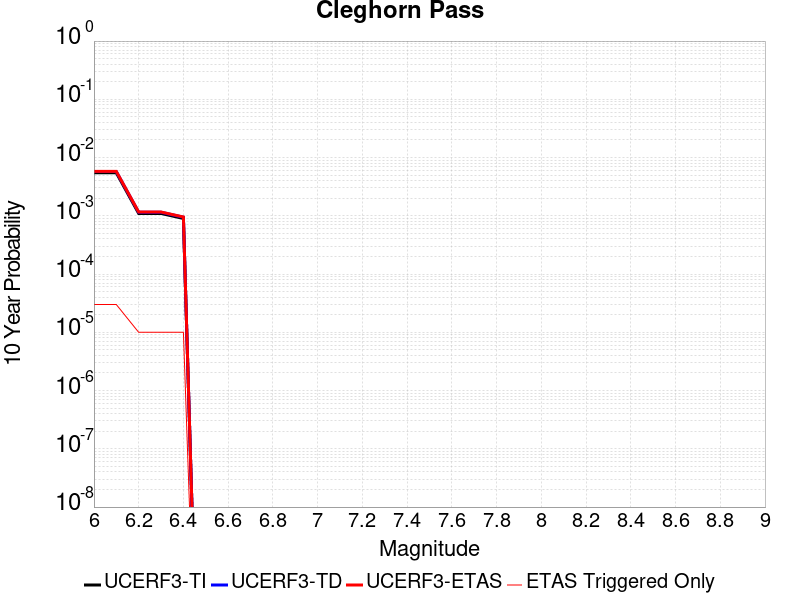 |

| Magnitude | 1 wk TI Prob | 1 wk TD Prob | 1 wk ETAS Prob | 1 wk ETAS/TD Gain | 1 wk ETAS Triggered Only | 1 mo TI Prob | 1 mo TD Prob | 1 mo ETAS Prob | 1 mo ETAS/TD Gain | 1 mo ETAS Triggered Only | 1 yr TI Prob | 1 yr TD Prob | 1 yr ETAS Prob | 1 yr ETAS/TD Gain | 1 yr ETAS Triggered Only | 10 yr TI Prob | 10 yr TD Prob | 10 yr ETAS Prob | 10 yr ETAS/TD Gain | 10 yr ETAS Triggered Only |
|-----|-----|-----|-----|-----|-----|-----|-----|-----|-----|-----|-----|-----|-----|-----|-----|-----|-----|-----|-----|-----|
| 6.0 | 1.0522846E-5 | 1.1040714E-5 | 1.1040714E-5 | 1.0 | 0.0 | 4.509713E-5 | 4.7316782E-5 | 4.7316782E-5 | 1.0 | 0.0 | 5.4891926E-4 | 5.759822E-4 | 5.9597066E-4 | 1.0347033 | 2.0E-5 | 0.0054756533 | 0.005750059 | 0.0057798866 | 1.0051874 | 3.0E-5 |
| 6.1 | 1.0522846E-5 | 1.1040714E-5 | 1.1040714E-5 | 1.0 | 0.0 | 4.509713E-5 | 4.7316782E-5 | 4.7316782E-5 | 1.0 | 0.0 | 5.4891926E-4 | 5.759822E-4 | 5.9597066E-4 | 1.0347033 | 2.0E-5 | 0.0054756533 | 0.005750059 | 0.0057798866 | 1.0051874 | 3.0E-5 |
| 6.2 | 2.1045846E-6 | 2.2082168E-6 | 2.2082168E-6 | 1.0 | 0.0 | 9.019617E-6 | 9.463776E-6 | 9.463776E-6 | 1.0 | 0.0 | 1.098083E-4 | 1.1521958E-4 | 1.2521842E-4 | 1.0867808 | 1.0E-5 | 0.0010975406 | 0.0011520098 | 0.0011619983 | 1.0086704 | 1.0E-5 |
| 6.3 | 2.1045846E-6 | 2.2082168E-6 | 2.2082168E-6 | 1.0 | 0.0 | 9.019617E-6 | 9.463776E-6 | 9.463776E-6 | 1.0 | 0.0 | 1.098083E-4 | 1.1521958E-4 | 1.2521842E-4 | 1.0867808 | 1.0E-5 | 0.0010975406 | 0.0011520098 | 0.0011619983 | 1.0086704 | 1.0E-5 |
| 6.4 | 1.7259927E-6 | 1.8108889E-6 | 1.8108889E-6 | 1.0 | 0.0 | 7.3970905E-6 | 7.760952E-6 | 7.760952E-6 | 1.0 | 0.0 | 9.005586E-5 | 9.4489595E-5 | 1.0448865E-4 | 1.1058217 | 1.0E-5 | 9.001937E-4 | 9.4489596E-4 | 9.548865E-4 | 1.0105731 | 1.0E-5 |

## Santa Susana East (connector)
*[(top)](#table-of-contents)*

| 1 Week | 1 Month | 1 Year | 10 Year |
|-----|-----|-----|-----|
|  |  |  |  |

| Magnitude | 1 wk TI Prob | 1 wk TD Prob | 1 wk ETAS Prob | 1 wk ETAS/TD Gain | 1 wk ETAS Triggered Only | 1 mo TI Prob | 1 mo TD Prob | 1 mo ETAS Prob | 1 mo ETAS/TD Gain | 1 mo ETAS Triggered Only | 1 yr TI Prob | 1 yr TD Prob | 1 yr ETAS Prob | 1 yr ETAS/TD Gain | 1 yr ETAS Triggered Only | 10 yr TI Prob | 10 yr TD Prob | 10 yr ETAS Prob | 10 yr ETAS/TD Gain | 10 yr ETAS Triggered Only |
|-----|-----|-----|-----|-----|-----|-----|-----|-----|-----|-----|-----|-----|-----|-----|-----|-----|-----|-----|-----|-----|
| 6.0 | 2.858397E-5 | 3.202259E-5 | 3.202259E-5 | 1.0 | 0.0 | 1.2249697E-4 | 1.3723405E-4 | 1.3723405E-4 | 1.0 | 0.0 | 0.0014903803 | 0.0016698164 | 0.0016897831 | 1.0119574 | 2.0E-5 | 0.014804244 | 0.01659979 | 0.016639125 | 1.0023696 | 4.0E-5 |
| 6.1 | 2.858397E-5 | 3.202259E-5 | 3.202259E-5 | 1.0 | 0.0 | 1.2249697E-4 | 1.3723405E-4 | 1.3723405E-4 | 1.0 | 0.0 | 0.0014903803 | 0.0016698164 | 0.0016897831 | 1.0119574 | 2.0E-5 | 0.014804244 | 0.01659979 | 0.016639125 | 1.0023696 | 4.0E-5 |
| 6.2 | 2.858397E-5 | 3.202259E-5 | 3.202259E-5 | 1.0 | 0.0 | 1.2249697E-4 | 1.3723405E-4 | 1.3723405E-4 | 1.0 | 0.0 | 0.0014903803 | 0.0016698164 | 0.0016897831 | 1.0119574 | 2.0E-5 | 0.014804244 | 0.01659979 | 0.016639125 | 1.0023696 | 4.0E-5 |
| 6.3 | 1.943582E-5 | 2.036782E-5 | 2.036782E-5 | 1.0 | 0.0 | 8.329371E-5 | 8.728837E-5 | 8.728837E-5 | 1.0 | 0.0 | 0.001013629 | 0.0010623297 | 0.0010723191 | 1.0094032 | 1.0E-5 | 0.010090181 | 0.010584113 | 0.010613795 | 1.0028044 | 3.0E-5 |
| 6.4 | 1.943582E-5 | 2.036782E-5 | 2.036782E-5 | 1.0 | 0.0 | 8.329371E-5 | 8.728837E-5 | 8.728837E-5 | 1.0 | 0.0 | 0.001013629 | 0.0010623297 | 0.0010723191 | 1.0094032 | 1.0E-5 | 0.010090181 | 0.010584113 | 0.010613795 | 1.0028044 | 3.0E-5 |
| 6.5 | 1.943582E-5 | 2.036782E-5 | 2.036782E-5 | 1.0 | 0.0 | 8.329371E-5 | 8.728837E-5 | 8.728837E-5 | 1.0 | 0.0 | 0.001013629 | 0.0010623297 | 0.0010723191 | 1.0094032 | 1.0E-5 | 0.010090181 | 0.010584113 | 0.010613795 | 1.0028044 | 3.0E-5 |
| 6.6 | 1.943582E-5 | 2.036782E-5 | 2.036782E-5 | 1.0 | 0.0 | 8.329371E-5 | 8.728837E-5 | 8.728837E-5 | 1.0 | 0.0 | 0.001013629 | 0.0010623297 | 0.0010723191 | 1.0094032 | 1.0E-5 | 0.010090181 | 0.010584113 | 0.010613795 | 1.0028044 | 3.0E-5 |
| 6.7 | 1.9404439E-5 | 2.035524E-5 | 2.035524E-5 | 1.0 | 0.0 | 8.3159226E-5 | 8.723446E-5 | 8.723446E-5 | 1.0 | 0.0 | 0.0010119933 | 0.0010616741 | 0.0010716635 | 1.0094091 | 1.0E-5 | 0.010073971 | 0.010577619 | 0.010607301 | 1.0028062 | 3.0E-5 |
| 6.8 | 1.2217526E-5 | 1.159334E-5 | 1.159334E-5 | 1.0 | 0.0 | 5.2359774E-5 | 4.968489E-5 | 4.968489E-5 | 1.0 | 0.0 | 6.372938E-4 | 6.0476246E-4 | 6.147564E-4 | 1.0165254 | 1.0E-5 | 0.0063546924 | 0.0060333833 | 0.0060532624 | 1.003295 | 2.0E-5 |
| 6.9 | 1.2217526E-5 | 1.159334E-5 | 1.159334E-5 | 1.0 | 0.0 | 5.2359774E-5 | 4.968489E-5 | 4.968489E-5 | 1.0 | 0.0 | 6.372938E-4 | 6.0476246E-4 | 6.147564E-4 | 1.0165254 | 1.0E-5 | 0.0063546924 | 0.0060333833 | 0.0060532624 | 1.003295 | 2.0E-5 |
| 7.0 | 9.276017E-6 | 8.059356E-6 | 8.059356E-6 | 1.0 | 0.0 | 3.9753755E-5 | 3.4539662E-5 | 3.4539662E-5 | 1.0 | 0.0 | 4.8389446E-4 | 4.204427E-4 | 4.304385E-4 | 1.0237745 | 1.0E-5 | 0.0048284214 | 0.004197368 | 0.004217284 | 1.0047449 | 2.0E-5 |
| 7.1 | 9.130355E-6 | 7.942529E-6 | 7.942529E-6 | 1.0 | 0.0 | 3.9129503E-5 | 3.4038985E-5 | 3.4038985E-5 | 1.0 | 0.0 | 4.7629757E-4 | 4.1434926E-4 | 4.243451E-4 | 1.0241243 | 1.0E-5 | 0.00475278 | 0.0041366615 | 0.004156579 | 1.0048149 | 2.0E-5 |
| 7.2 | 8.851015E-6 | 7.74169E-6 | 7.74169E-6 | 1.0 | 0.0 | 3.7932372E-5 | 3.317827E-5 | 3.317827E-5 | 1.0 | 0.0 | 4.6172875E-4 | 4.0387394E-4 | 4.1386992E-4 | 1.0247502 | 1.0E-5 | 0.0046077054 | 0.0040322915 | 0.0040522106 | 1.0049399 | 2.0E-5 |
| 7.3 | 8.573006E-6 | 7.5504113E-6 | 7.5504113E-6 | 1.0 | 0.0 | 3.6740938E-5 | 3.2358523E-5 | 3.2358523E-5 | 1.0 | 0.0 | 4.472291E-4 | 3.938972E-4 | 4.0389327E-4 | 1.0253774 | 1.0E-5 | 0.004463301 | 0.003932873 | 0.0039527942 | 1.0050653 | 2.0E-5 |
| 7.4 | 7.852282E-6 | 6.8179206E-6 | 6.8179206E-6 | 1.0 | 0.0 | 3.36522E-5 | 2.9219349E-5 | 2.9219349E-5 | 1.0 | 0.0 | 4.096385E-4 | 3.5569054E-4 | 3.6568698E-4 | 1.0281043 | 1.0E-5 | 0.0040888423 | 0.0035520305 | 0.0035719594 | 1.0056106 | 2.0E-5 |
| 7.5 | 4.8869324E-6 | 4.27914E-6 | 4.27914E-6 | 1.0 | 0.0 | 2.0943828E-5 | 1.8339051E-5 | 1.8339051E-5 | 1.0 | 0.0 | 2.5496128E-4 | 2.2325672E-4 | 2.3325448E-4 | 1.0447814 | 1.0E-5 | 0.0025466895 | 0.0022306633 | 0.0022506188 | 1.008946 | 2.0E-5 |
| 7.6 | 1.3894544E-6 | 1.1568442E-6 | 1.1568442E-6 | 1.0 | 0.0 | 5.954791E-6 | 4.9578953E-6 | 4.9578953E-6 | 1.0 | 0.0 | 7.249717E-5 | 6.0360926E-5 | 7.036032E-5 | 1.1656601 | 1.0E-5 | 7.247352E-4 | 6.0346717E-4 | 6.1346113E-4 | 1.0165609 | 1.0E-5 |
| 7.7 | 2.9924632E-7 | 2.3719647E-7 | 2.3719647E-7 | 1.0 | 0.0 | 1.2824837E-6 | 1.016556E-6 | 1.016556E-6 | 1.0 | 0.0 | 1.5614127E-5 | 1.2376506E-5 | 2.2376382E-5 | 1.8079726 | 1.0E-5 | 1.5613029E-4 | 1.2375889E-4 | 1.3375764E-4 | 1.0807923 | 1.0E-5 |
| 7.8 | 4.8188564E-8 | 2.6323553E-8 | 2.6323553E-8 | 1.0 | 0.0 | 2.065224E-7 | 1.1281523E-7 | 1.1281523E-7 | 1.0 | 0.0 | 2.5144072E-6 | 1.3735246E-6 | 1.3735246E-6 | 1.0 | 0.0 | 2.5143789E-5 | 1.3735169E-5 | 1.3735169E-5 | 1.0 | 0.0 |
| 7.9 | 2.6127251E-9 | 2.768132E-9 | 2.768132E-9 | 1.0 | 0.0 | 1.1197393E-8 | 1.1863423E-8 | 1.1863423E-8 | 1.0 | 0.0 | 1.3632825E-7 | 1.4443718E-7 | 1.4443718E-7 | 1.0 | 0.0 | 1.3632817E-6 | 1.4443717E-6 | 1.4443717E-6 | 1.0 | 0.0 |

## Elmore Ranch
*[(top)](#table-of-contents)*

| 1 Week | 1 Month | 1 Year | 10 Year |
|-----|-----|-----|-----|
|  |  |  | 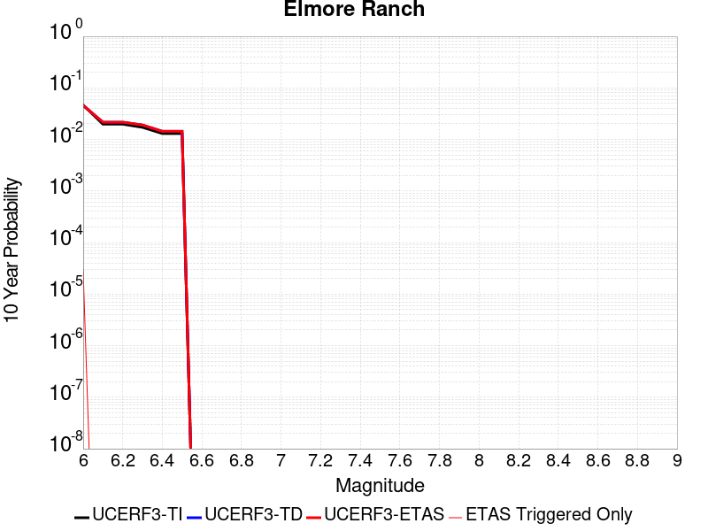 |

| Magnitude | 1 wk TI Prob | 1 wk TD Prob | 1 wk ETAS Prob | 1 wk ETAS/TD Gain | 1 wk ETAS Triggered Only | 1 mo TI Prob | 1 mo TD Prob | 1 mo ETAS Prob | 1 mo ETAS/TD Gain | 1 mo ETAS Triggered Only | 1 yr TI Prob | 1 yr TD Prob | 1 yr ETAS Prob | 1 yr ETAS/TD Gain | 1 yr ETAS Triggered Only | 10 yr TI Prob | 10 yr TD Prob | 10 yr ETAS Prob | 10 yr ETAS/TD Gain | 10 yr ETAS Triggered Only |
|-----|-----|-----|-----|-----|-----|-----|-----|-----|-----|-----|-----|-----|-----|-----|-----|-----|-----|-----|-----|-----|
| 6.0 | 9.102099E-5 | 8.954244E-5 | 9.954155E-5 | 1.111669 | 1.0E-5 | 3.9003167E-4 | 3.8370665E-4 | 3.937028E-4 | 1.0260515 | 1.0E-5 | 0.0047383 | 0.0046622963 | 0.0046822033 | 1.0042697 | 2.0E-5 | 0.046385348 | 0.045839358 | 0.045867983 | 1.0006244 | 3.0E-5 |
| 6.1 | 3.8306698E-5 | 4.1492345E-5 | 4.1492345E-5 | 1.0 | 0.0 | 1.6416123E-4 | 1.7781628E-4 | 1.7781628E-4 | 1.0 | 0.0 | 0.0019968306 | 0.002163246 | 0.002163246 | 1.0 | 0.0 | 0.019789828 | 0.02159527 | 0.02159527 | 1.0 | 0.0 |
| 6.2 | 3.8306698E-5 | 4.1492345E-5 | 4.1492345E-5 | 1.0 | 0.0 | 1.6416123E-4 | 1.7781628E-4 | 1.7781628E-4 | 1.0 | 0.0 | 0.0019968306 | 0.002163246 | 0.002163246 | 1.0 | 0.0 | 0.019789828 | 0.02159527 | 0.02159527 | 1.0 | 0.0 |
| 6.3 | 3.3197924E-5 | 3.655081E-5 | 3.655081E-5 | 1.0 | 0.0 | 1.4226905E-4 | 1.566409E-4 | 1.566409E-4 | 1.0 | 0.0 | 0.0017307495 | 0.0019059941 | 0.0019059941 | 1.0 | 0.0 | 0.017173318 | 0.019057546 | 0.019057546 | 1.0 | 0.0 |
| 6.4 | 2.5148964E-5 | 2.7420736E-5 | 2.7420736E-5 | 1.0 | 0.0 | 1.0777682E-4 | 1.17515796E-4 | 1.17515796E-4 | 1.0 | 0.0 | 0.0013113929 | 0.0014304637 | 0.0014304637 | 1.0 | 0.0 | 0.01303681 | 0.014365338 | 0.014365338 | 1.0 | 0.0 |
| 6.5 | 2.5148964E-5 | 2.7420736E-5 | 2.7420736E-5 | 1.0 | 0.0 | 1.0777682E-4 | 1.17515796E-4 | 1.17515796E-4 | 1.0 | 0.0 | 0.0013113929 | 0.0014304637 | 0.0014304637 | 1.0 | 0.0 | 0.01303681 | 0.014365338 | 0.014365338 | 1.0 | 0.0 |

## Hollywood
*[(top)](#table-of-contents)*

| 1 Week | 1 Month | 1 Year | 10 Year |
|-----|-----|-----|-----|
|  |  |  |  |

| Magnitude | 1 wk TI Prob | 1 wk TD Prob | 1 wk ETAS Prob | 1 wk ETAS/TD Gain | 1 wk ETAS Triggered Only | 1 mo TI Prob | 1 mo TD Prob | 1 mo ETAS Prob | 1 mo ETAS/TD Gain | 1 mo ETAS Triggered Only | 1 yr TI Prob | 1 yr TD Prob | 1 yr ETAS Prob | 1 yr ETAS/TD Gain | 1 yr ETAS Triggered Only | 10 yr TI Prob | 10 yr TD Prob | 10 yr ETAS Prob | 10 yr ETAS/TD Gain | 10 yr ETAS Triggered Only |
|-----|-----|-----|-----|-----|-----|-----|-----|-----|-----|-----|-----|-----|-----|-----|-----|-----|-----|-----|-----|-----|
| 6.0 | 1.24487615E-5 | 1.2593379E-5 | 1.2593379E-5 | 1.0 | 0.0 | 5.3350745E-5 | 5.3970536E-5 | 5.3970536E-5 | 1.0 | 0.0 | 6.4935174E-4 | 6.5689784E-4 | 6.668912E-4 | 1.015213 | 1.0E-5 | 0.0064745755 | 0.0065500485 | 0.006569918 | 1.0030334 | 2.0E-5 |
| 6.1 | 1.24487615E-5 | 1.2593379E-5 | 1.2593379E-5 | 1.0 | 0.0 | 5.3350745E-5 | 5.3970536E-5 | 5.3970536E-5 | 1.0 | 0.0 | 6.4935174E-4 | 6.5689784E-4 | 6.668912E-4 | 1.015213 | 1.0E-5 | 0.0064745755 | 0.0065500485 | 0.006569918 | 1.0030334 | 2.0E-5 |
| 6.2 | 1.24487615E-5 | 1.2593379E-5 | 1.2593379E-5 | 1.0 | 0.0 | 5.3350745E-5 | 5.3970536E-5 | 5.3970536E-5 | 1.0 | 0.0 | 6.4935174E-4 | 6.5689784E-4 | 6.668912E-4 | 1.015213 | 1.0E-5 | 0.0064745755 | 0.0065500485 | 0.006569918 | 1.0030334 | 2.0E-5 |
| 6.3 | 1.24487615E-5 | 1.2593379E-5 | 1.2593379E-5 | 1.0 | 0.0 | 5.3350745E-5 | 5.3970536E-5 | 5.3970536E-5 | 1.0 | 0.0 | 6.4935174E-4 | 6.5689784E-4 | 6.668912E-4 | 1.015213 | 1.0E-5 | 0.0064745755 | 0.0065500485 | 0.006569918 | 1.0030334 | 2.0E-5 |
| 6.4 | 1.2431024E-5 | 1.25739925E-5 | 1.25739925E-5 | 1.0 | 0.0 | 5.327473E-5 | 5.3887452E-5 | 5.3887452E-5 | 1.0 | 0.0 | 6.4842677E-4 | 6.558869E-4 | 6.6588033E-4 | 1.0152365 | 1.0E-5 | 0.0064653796 | 0.006539999 | 0.006559868 | 1.003038 | 2.0E-5 |
| 6.5 | 1.1242222E-5 | 1.1317944E-5 | 1.1317944E-5 | 1.0 | 0.0 | 4.8180063E-5 | 4.850459E-5 | 4.850459E-5 | 1.0 | 0.0 | 5.864344E-4 | 5.9038604E-4 | 6.003801E-4 | 1.0169281 | 1.0E-5 | 0.0058488925 | 0.0058884625 | 0.005908345 | 1.0033765 | 2.0E-5 |
| 6.6 | 1.1234066E-5 | 1.1309058E-5 | 1.1309058E-5 | 1.0 | 0.0 | 4.8145106E-5 | 4.8466507E-5 | 4.8466507E-5 | 1.0 | 0.0 | 5.86009E-4 | 5.8992265E-4 | 5.9991673E-4 | 1.0169414 | 1.0E-5 | 0.005844661 | 0.005883853 | 0.0059037353 | 1.0033791 | 2.0E-5 |
| 6.7 | 1.12294E-5 | 1.1303801E-5 | 1.1303801E-5 | 1.0 | 0.0 | 4.812511E-5 | 4.8443977E-5 | 4.8443977E-5 | 1.0 | 0.0 | 5.857657E-4 | 5.896485E-4 | 5.9964263E-4 | 1.0169493 | 1.0E-5 | 0.0058422405 | 0.0058811265 | 0.005901009 | 1.0033807 | 2.0E-5 |
| 6.8 | 1.0252819E-5 | 1.0218572E-5 | 1.0218572E-5 | 1.0 | 0.0 | 4.3939912E-5 | 4.379316E-5 | 4.379316E-5 | 1.0 | 0.0 | 5.3483713E-4 | 5.3305336E-4 | 5.430481E-4 | 1.0187498 | 1.0E-5 | 0.005335517 | 0.005317974 | 0.0053378674 | 1.0037408 | 2.0E-5 |
| 6.9 | 9.252289E-6 | 9.1104175E-6 | 9.1104175E-6 | 1.0 | 0.0 | 3.9652066E-5 | 3.9044073E-5 | 3.9044073E-5 | 1.0 | 0.0 | 4.8265693E-4 | 4.7525953E-4 | 4.852548E-4 | 1.0210311 | 1.0E-5 | 0.0048161 | 0.004742605 | 0.0047625103 | 1.0041971 | 2.0E-5 |
| 7.0 | 8.474604E-6 | 8.258358E-6 | 8.258358E-6 | 1.0 | 0.0 | 3.6319227E-5 | 3.539249E-5 | 3.539249E-5 | 1.0 | 0.0 | 4.4209688E-4 | 4.308198E-4 | 4.408155E-4 | 1.0232016 | 1.0E-5 | 0.004412184 | 0.0042999964 | 0.0043199104 | 1.0046312 | 2.0E-5 |
| 7.1 | 6.643643E-6 | 6.2684435E-6 | 6.2684435E-6 | 1.0 | 0.0 | 2.8472443E-5 | 2.6864484E-5 | 2.6864484E-5 | 1.0 | 0.0 | 3.4659685E-4 | 3.270264E-4 | 3.3702314E-4 | 1.0305686 | 1.0E-5 | 0.0034605677 | 0.0032654977 | 0.0032854325 | 1.0061046 | 2.0E-5 |
| 7.2 | 5.549002E-6 | 5.1087686E-6 | 5.1087686E-6 | 1.0 | 0.0 | 2.378122E-5 | 2.189454E-5 | 2.189454E-5 | 1.0 | 0.0 | 2.8949787E-4 | 2.6653355E-4 | 2.765309E-4 | 1.0375087 | 1.0E-5 | 0.0028912104 | 0.0026621553 | 0.0026821021 | 1.0074927 | 2.0E-5 |
| 7.3 | 4.3059727E-6 | 3.959941E-6 | 3.959941E-6 | 1.0 | 0.0 | 1.8454039E-5 | 1.6971066E-5 | 1.6971066E-5 | 1.0 | 0.0 | 2.2465475E-4 | 2.0660323E-4 | 2.0660323E-4 | 1.0 | 0.0 | 0.0022442779 | 0.0020641217 | 0.002074101 | 1.0048347 | 1.0E-5 |
| 7.4 | 2.8550733E-6 | 2.7013398E-6 | 2.7013398E-6 | 1.0 | 0.0 | 1.2235971E-5 | 1.157712E-5 | 1.157712E-5 | 1.0 | 0.0 | 1.4896276E-4 | 1.4094236E-4 | 1.4094236E-4 | 1.0 | 0.0 | 0.0014886294 | 0.0014085348 | 0.0014085348 | 1.0 | 0.0 |
| 7.5 | 1.9927045E-6 | 1.8976706E-6 | 1.8976706E-6 | 1.0 | 0.0 | 8.540134E-6 | 8.132849E-6 | 8.132849E-6 | 1.0 | 0.0 | 1.0397117E-4 | 9.901297E-5 | 9.901297E-5 | 1.0 | 0.0 | 0.0010392254 | 9.896922E-4 | 9.896922E-4 | 1.0 | 0.0 |
| 7.6 | 1.345084E-6 | 1.2216213E-6 | 1.2216213E-6 | 1.0 | 0.0 | 5.764633E-6 | 5.2355094E-6 | 5.2355094E-6 | 1.0 | 0.0 | 7.018215E-5 | 6.374048E-5 | 6.374048E-5 | 1.0 | 0.0 | 7.0159987E-4 | 6.37224E-4 | 6.37224E-4 | 1.0 | 0.0 |
| 7.7 | 7.6835164E-7 | 6.2778383E-7 | 6.2778383E-7 | 1.0 | 0.0 | 3.2929315E-6 | 2.6904993E-6 | 2.6904993E-6 | 1.0 | 0.0 | 4.00907E-5 | 3.2756354E-5 | 3.2756354E-5 | 1.0 | 0.0 | 4.0083472E-4 | 3.2751673E-4 | 3.2751673E-4 | 1.0 | 0.0 |
| 7.8 | 3.6562128E-7 | 2.45358E-7 | 2.45358E-7 | 1.0 | 0.0 | 1.5669474E-6 | 1.0515338E-6 | 1.0515338E-6 | 1.0 | 0.0 | 1.9077417E-5 | 1.2802353E-5 | 1.2802353E-5 | 1.0 | 0.0 | 1.907578E-4 | 1.2801652E-4 | 1.2801652E-4 | 1.0 | 0.0 |
| 7.9 | 7.5024424E-8 | 5.3820486E-8 | 5.3820486E-8 | 1.0 | 0.0 | 3.215332E-7 | 2.3065921E-7 | 2.3065921E-7 | 1.0 | 0.0 | 3.91466E-6 | 2.8082736E-6 | 2.8082736E-6 | 1.0 | 0.0 | 3.9145907E-5 | 2.808251E-5 | 2.808251E-5 | 1.0 | 0.0 |

## Channel Islands Thrust
*[(top)](#table-of-contents)*

| 1 Week | 1 Month | 1 Year | 10 Year |
|-----|-----|-----|-----|
|  | 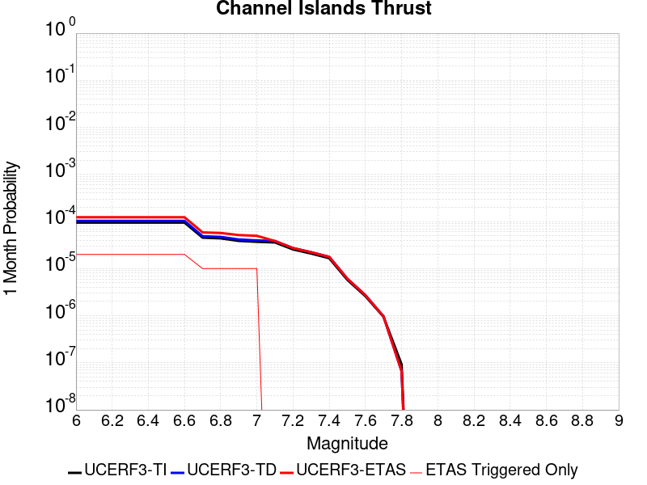 | 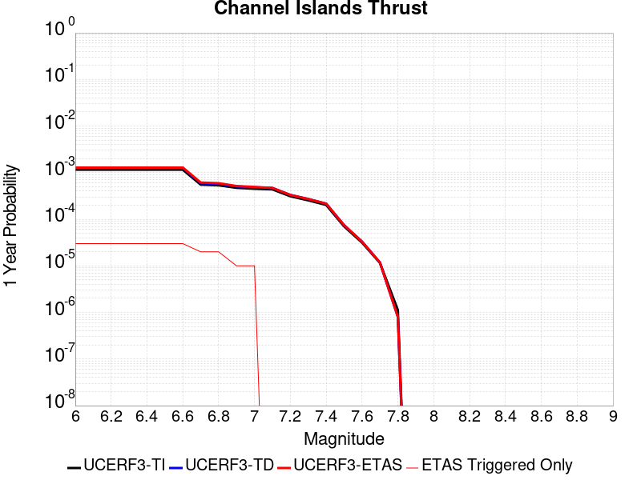 |  |

| Magnitude | 1 wk TI Prob | 1 wk TD Prob | 1 wk ETAS Prob | 1 wk ETAS/TD Gain | 1 wk ETAS Triggered Only | 1 mo TI Prob | 1 mo TD Prob | 1 mo ETAS Prob | 1 mo ETAS/TD Gain | 1 mo ETAS Triggered Only | 1 yr TI Prob | 1 yr TD Prob | 1 yr ETAS Prob | 1 yr ETAS/TD Gain | 1 yr ETAS Triggered Only | 10 yr TI Prob | 10 yr TD Prob | 10 yr ETAS Prob | 10 yr ETAS/TD Gain | 10 yr ETAS Triggered Only |
|-----|-----|-----|-----|-----|-----|-----|-----|-----|-----|-----|-----|-----|-----|-----|-----|-----|-----|-----|-----|-----|
| 6.0 | 2.2156251E-5 | 2.4092304E-5 | 3.4092063E-5 | 1.4150603 | 1.0E-5 | 9.495191E-5 | 1.03249244E-4 | 1.2324718E-4 | 1.193686 | 2.0E-5 | 0.0011554264 | 0.0012564411 | 0.0012864035 | 1.023847 | 3.0E-5 | 0.011494373 | 0.012503966 | 0.012533591 | 1.0023693 | 3.0E-5 |
| 6.1 | 2.2156251E-5 | 2.4092304E-5 | 3.4092063E-5 | 1.4150603 | 1.0E-5 | 9.495191E-5 | 1.03249244E-4 | 1.2324718E-4 | 1.193686 | 2.0E-5 | 0.0011554264 | 0.0012564411 | 0.0012864035 | 1.023847 | 3.0E-5 | 0.011494373 | 0.012503966 | 0.012533591 | 1.0023693 | 3.0E-5 |
| 6.2 | 2.2156251E-5 | 2.4092304E-5 | 3.4092063E-5 | 1.4150603 | 1.0E-5 | 9.495191E-5 | 1.03249244E-4 | 1.2324718E-4 | 1.193686 | 2.0E-5 | 0.0011554264 | 0.0012564411 | 0.0012864035 | 1.023847 | 3.0E-5 | 0.011494373 | 0.012503966 | 0.012533591 | 1.0023693 | 3.0E-5 |
| 6.3 | 2.2156251E-5 | 2.4092304E-5 | 3.4092063E-5 | 1.4150603 | 1.0E-5 | 9.495191E-5 | 1.03249244E-4 | 1.2324718E-4 | 1.193686 | 2.0E-5 | 0.0011554264 | 0.0012564411 | 0.0012864035 | 1.023847 | 3.0E-5 | 0.011494373 | 0.012503966 | 0.012533591 | 1.0023693 | 3.0E-5 |
| 6.4 | 2.2156251E-5 | 2.4092304E-5 | 3.4092063E-5 | 1.4150603 | 1.0E-5 | 9.495191E-5 | 1.03249244E-4 | 1.2324718E-4 | 1.193686 | 2.0E-5 | 0.0011554264 | 0.0012564411 | 0.0012864035 | 1.023847 | 3.0E-5 | 0.011494373 | 0.012503966 | 0.012533591 | 1.0023693 | 3.0E-5 |
| 6.5 | 2.2156251E-5 | 2.4092304E-5 | 3.4092063E-5 | 1.4150603 | 1.0E-5 | 9.495191E-5 | 1.03249244E-4 | 1.2324718E-4 | 1.193686 | 2.0E-5 | 0.0011554264 | 0.0012564411 | 0.0012864035 | 1.023847 | 3.0E-5 | 0.011494373 | 0.012503966 | 0.012533591 | 1.0023693 | 3.0E-5 |
| 6.6 | 2.2156251E-5 | 2.4092304E-5 | 3.4092063E-5 | 1.4150603 | 1.0E-5 | 9.495191E-5 | 1.03249244E-4 | 1.2324718E-4 | 1.193686 | 2.0E-5 | 0.0011554264 | 0.0012564411 | 0.0012864035 | 1.023847 | 3.0E-5 | 0.011494373 | 0.012503966 | 0.012533591 | 1.0023693 | 3.0E-5 |
| 6.7 | 1.0601296E-5 | 1.1379656E-5 | 2.1379543E-5 | 1.8787512 | 1.0E-5 | 4.5433335E-5 | 4.876907E-5 | 5.8768583E-5 | 1.205038 | 1.0E-5 | 5.5301044E-4 | 5.9360656E-4 | 6.1359466E-4 | 1.0336723 | 2.0E-5 | 0.005516363 | 0.0059207114 | 0.0059405933 | 1.003358 | 2.0E-5 |
| 6.8 | 1.0246747E-5 | 1.0996777E-5 | 2.0996667E-5 | 1.9093473 | 1.0E-5 | 4.391389E-5 | 4.7128222E-5 | 5.712775E-5 | 1.212177 | 1.0E-5 | 5.345204E-4 | 5.736398E-4 | 5.936283E-4 | 1.0348451 | 2.0E-5 | 0.0053323656 | 0.005722081 | 0.0057419664 | 1.0034752 | 2.0E-5 |
| 6.9 | 9.049551E-6 | 9.699738E-6 | 1.969964E-5 | 2.0309455 | 1.0E-5 | 3.878322E-5 | 4.1569667E-5 | 5.156925E-5 | 1.24055 | 1.0E-5 | 4.7208337E-4 | 5.059973E-4 | 5.1599223E-4 | 1.019753 | 1.0E-5 | 0.0047108172 | 0.005048869 | 0.0050588185 | 1.0019706 | 1.0E-5 |
| 7.0 | 8.6542195E-6 | 9.274693E-6 | 1.92746E-5 | 2.0781927 | 1.0E-5 | 3.7088983E-5 | 3.97481E-5 | 4.9747705E-5 | 1.2515744 | 1.0E-5 | 4.5146482E-4 | 4.8382976E-4 | 4.938249E-4 | 1.0206584 | 1.0E-5 | 0.004505487 | 0.0048281755 | 0.0048381276 | 1.0020611 | 1.0E-5 |
| 7.1 | 8.391028E-6 | 8.993012E-6 | 8.993012E-6 | 1.0 | 0.0 | 3.5961057E-5 | 3.8540933E-5 | 3.8540933E-5 | 1.0 | 0.0 | 4.3773788E-4 | 4.691389E-4 | 4.691389E-4 | 1.0 | 0.0 | 0.004368766 | 0.0046818955 | 0.0046818955 | 1.0 | 0.0 |
| 7.2 | 5.965188E-6 | 6.3717544E-6 | 6.3717544E-6 | 1.0 | 0.0 | 2.556484E-5 | 2.7307236E-5 | 2.7307236E-5 | 1.0 | 0.0 | 3.1120746E-4 | 3.3241542E-4 | 3.3241542E-4 | 1.0 | 0.0 | 0.00310772 | 0.00331924 | 0.00331924 | 1.0 | 0.0 |
| 7.3 | 4.877518E-6 | 5.2060545E-6 | 5.2060545E-6 | 1.0 | 0.0 | 2.0903482E-5 | 2.2311473E-5 | 2.2311473E-5 | 1.0 | 0.0 | 2.5447016E-4 | 2.716088E-4 | 2.716088E-4 | 1.0 | 0.0 | 0.0025417898 | 0.0027128146 | 0.0027128146 | 1.0 | 0.0 |
| 7.4 | 3.8829853E-6 | 4.1419007E-6 | 4.1419007E-6 | 1.0 | 0.0 | 1.664126E-5 | 1.7750885E-5 | 1.7750885E-5 | 1.0 | 0.0 | 2.0258849E-4 | 2.1609601E-4 | 2.1609601E-4 | 1.0 | 0.0 | 0.002024039 | 0.0021589005 | 0.0021589005 | 1.0 | 0.0 |
| 7.5 | 1.3489616E-6 | 1.4278028E-6 | 1.4278028E-6 | 1.0 | 0.0 | 5.7812517E-6 | 6.119141E-6 | 6.119141E-6 | 1.0 | 0.0 | 7.038446E-5 | 7.449803E-5 | 7.449803E-5 | 1.0 | 0.0 | 7.036218E-4 | 7.4473454E-4 | 7.4473454E-4 | 1.0 | 0.0 |
| 7.6 | 6.058192E-7 | 6.353833E-7 | 6.353833E-7 | 1.0 | 0.0 | 2.5963652E-6 | 2.7230685E-6 | 2.7230685E-6 | 1.0 | 0.0 | 3.161029E-5 | 3.315287E-5 | 3.315287E-5 | 1.0 | 0.0 | 3.1605794E-4 | 3.3148087E-4 | 3.3148087E-4 | 1.0 | 0.0 |
| 7.7 | 2.2170494E-7 | 2.2608089E-7 | 2.2608089E-7 | 1.0 | 0.0 | 9.5016367E-7 | 9.689178E-7 | 9.689178E-7 | 1.0 | 0.0 | 1.1568181E-5 | 1.1796522E-5 | 1.1796522E-5 | 1.0 | 0.0 | 1.1567579E-4 | 1.17960066E-4 | 1.17960066E-4 | 1.0 | 0.0 |
| 7.8 | 2.1613102E-8 | 1.5466844E-8 | 1.5466844E-8 | 1.0 | 0.0 | 9.262757E-8 | 6.6286475E-8 | 6.6286475E-8 | 1.0 | 0.0 | 1.1277401E-6 | 8.070376E-7 | 8.070376E-7 | 1.0 | 0.0 | 1.1277344E-5 | 8.070355E-6 | 8.070355E-6 | 1.0 | 0.0 |

## San Jacinto (Clark) rev
*[(top)](#table-of-contents)*

| 1 Week | 1 Month | 1 Year | 10 Year |
|-----|-----|-----|-----|
|  |  |  |  |

| Magnitude | 1 wk TI Prob | 1 wk TD Prob | 1 wk ETAS Prob | 1 wk ETAS/TD Gain | 1 wk ETAS Triggered Only | 1 mo TI Prob | 1 mo TD Prob | 1 mo ETAS Prob | 1 mo ETAS/TD Gain | 1 mo ETAS Triggered Only | 1 yr TI Prob | 1 yr TD Prob | 1 yr ETAS Prob | 1 yr ETAS/TD Gain | 1 yr ETAS Triggered Only | 10 yr TI Prob | 10 yr TD Prob | 10 yr ETAS Prob | 10 yr ETAS/TD Gain | 10 yr ETAS Triggered Only |
|-----|-----|-----|-----|-----|-----|-----|-----|-----|-----|-----|-----|-----|-----|-----|-----|-----|-----|-----|-----|-----|
| 6.0 | 4.482615E-5 | 2.1158266E-5 | 2.1158266E-5 | 1.0 | 0.0 | 1.9209793E-4 | 9.067519E-5 | 9.067519E-5 | 1.0 | 0.0 | 0.0023362834 | 0.0011034205 | 0.0011034205 | 1.0 | 0.0 | 0.02311874 | 0.0114991795 | 0.011528835 | 1.0025789 | 3.0E-5 |
| 6.1 | 4.482615E-5 | 2.1158266E-5 | 2.1158266E-5 | 1.0 | 0.0 | 1.9209793E-4 | 9.067519E-5 | 9.067519E-5 | 1.0 | 0.0 | 0.0023362834 | 0.0011034205 | 0.0011034205 | 1.0 | 0.0 | 0.02311874 | 0.0114991795 | 0.011528835 | 1.0025789 | 3.0E-5 |
| 6.2 | 4.482615E-5 | 2.1158266E-5 | 2.1158266E-5 | 1.0 | 0.0 | 1.9209793E-4 | 9.067519E-5 | 9.067519E-5 | 1.0 | 0.0 | 0.0023362834 | 0.0011034205 | 0.0011034205 | 1.0 | 0.0 | 0.02311874 | 0.0114991795 | 0.011528835 | 1.0025789 | 3.0E-5 |
| 6.3 | 4.482615E-5 | 2.1158266E-5 | 2.1158266E-5 | 1.0 | 0.0 | 1.9209793E-4 | 9.067519E-5 | 9.067519E-5 | 1.0 | 0.0 | 0.0023362834 | 0.0011034205 | 0.0011034205 | 1.0 | 0.0 | 0.02311874 | 0.0114991795 | 0.011528835 | 1.0025789 | 3.0E-5 |
| 6.4 | 4.482615E-5 | 2.1158266E-5 | 2.1158266E-5 | 1.0 | 0.0 | 1.9209793E-4 | 9.067519E-5 | 9.067519E-5 | 1.0 | 0.0 | 0.0023362834 | 0.0011034205 | 0.0011034205 | 1.0 | 0.0 | 0.02311874 | 0.0114991795 | 0.011528835 | 1.0025789 | 3.0E-5 |
| 6.5 | 3.7294863E-5 | 1.7359873E-5 | 1.7359873E-5 | 1.0 | 0.0 | 1.5982533E-4 | 7.4397365E-5 | 7.4397365E-5 | 1.0 | 0.0 | 0.0019441366 | 9.05416E-4 | 9.05416E-4 | 1.0 | 0.0 | 0.01927216 | 0.009499401 | 0.009529116 | 1.003128 | 3.0E-5 |
| 6.6 | 3.7294863E-5 | 1.7359873E-5 | 1.7359873E-5 | 1.0 | 0.0 | 1.5982533E-4 | 7.4397365E-5 | 7.4397365E-5 | 1.0 | 0.0 | 0.0019441366 | 9.05416E-4 | 9.05416E-4 | 1.0 | 0.0 | 0.01927216 | 0.009499401 | 0.009529116 | 1.003128 | 3.0E-5 |
| 6.7 | 3.6039248E-5 | 1.6607892E-5 | 1.6607892E-5 | 1.0 | 0.0 | 1.5444479E-4 | 7.1174756E-5 | 7.1174756E-5 | 1.0 | 0.0 | 0.0018787434 | 8.662123E-4 | 8.662123E-4 | 1.0 | 0.0 | 0.01862939 | 0.009098875 | 0.009128602 | 1.0032672 | 3.0E-5 |
| 6.8 | 3.5031844E-5 | 1.623633E-5 | 1.623633E-5 | 1.0 | 0.0 | 1.5012783E-4 | 6.958244E-5 | 6.958244E-5 | 1.0 | 0.0 | 0.0018262739 | 8.46841E-4 | 8.46841E-4 | 1.0 | 0.0 | 0.01811338 | 0.008899476 | 0.008929209 | 1.003341 | 3.0E-5 |
| 6.9 | 3.435112E-5 | 1.6066866E-5 | 1.6066866E-5 | 1.0 | 0.0 | 1.4721078E-4 | 6.88562E-5 | 6.88562E-5 | 1.0 | 0.0 | 0.0017908178 | 8.380059E-4 | 8.380059E-4 | 1.0 | 0.0 | 0.017764548 | 0.008805986 | 0.008835721 | 1.0033767 | 3.0E-5 |
| 7.0 | 2.8959772E-5 | 1.4340704E-5 | 1.4340704E-5 | 1.0 | 0.0 | 1.241074E-4 | 6.145873E-5 | 6.145873E-5 | 1.0 | 0.0 | 0.0015099603 | 7.480059E-4 | 7.480059E-4 | 1.0 | 0.0 | 0.014997416 | 0.00787791 | 0.007897752 | 1.0025188 | 2.0E-5 |
| 7.1 | 2.6002877E-5 | 1.2832878E-5 | 1.2832878E-5 | 1.0 | 0.0 | 1.11436144E-4 | 5.49969E-5 | 5.49969E-5 | 1.0 | 0.0 | 0.0013558907 | 6.693837E-4 | 6.693837E-4 | 1.0 | 0.0 | 0.013476475 | 0.0070536323 | 0.0070734913 | 1.0028154 | 2.0E-5 |
| 7.2 | 2.2544838E-5 | 1.1265443E-5 | 1.1265443E-5 | 1.0 | 0.0 | 9.661716E-5 | 4.8279588E-5 | 4.8279588E-5 | 1.0 | 0.0 | 0.001175679 | 5.876469E-4 | 5.876469E-4 | 1.0 | 0.0 | 0.011694785 | 0.006195283 | 0.0062151593 | 1.0032083 | 2.0E-5 |
| 7.3 | 1.75334E-5 | 1.081565E-5 | 1.081565E-5 | 1.0 | 0.0 | 7.514098E-5 | 4.6351972E-5 | 4.6351972E-5 | 1.0 | 0.0 | 9.144575E-4 | 5.641905E-4 | 5.641905E-4 | 1.0 | 0.0 | 0.009107036 | 0.005935912 | 0.005955793 | 1.0033493 | 2.0E-5 |
| 7.4 | 1.5924552E-5 | 1.0615435E-5 | 1.0615435E-5 | 1.0 | 0.0 | 6.82463E-5 | 4.5493933E-5 | 4.5493933E-5 | 1.0 | 0.0 | 8.305819E-4 | 5.5374927E-4 | 5.5374927E-4 | 1.0 | 0.0 | 0.008274844 | 0.0058232066 | 0.0058430904 | 1.0034145 | 2.0E-5 |
| 7.5 | 1.3428931E-5 | 9.855765E-6 | 9.855765E-6 | 1.0 | 0.0 | 5.7551293E-5 | 4.2238313E-5 | 4.2238313E-5 | 1.0 | 0.0 | 7.004617E-4 | 5.141312E-4 | 5.141312E-4 | 1.0 | 0.0 | 0.006982579 | 0.005408683 | 0.005428575 | 1.0036777 | 2.0E-5 |
| 7.6 | 1.0688787E-5 | 8.618602E-6 | 8.618602E-6 | 1.0 | 0.0 | 4.5808283E-5 | 3.6936344E-5 | 3.6936344E-5 | 1.0 | 0.0 | 5.5757316E-4 | 4.4960767E-4 | 4.4960767E-4 | 1.0 | 0.0 | 0.005561762 | 0.004743673 | 0.004763578 | 1.0041962 | 2.0E-5 |
| 7.7 | 8.81236E-6 | 7.471723E-6 | 7.471723E-6 | 1.0 | 0.0 | 3.776671E-5 | 3.202128E-5 | 3.202128E-5 | 1.0 | 0.0 | 4.597127E-4 | 3.8978952E-4 | 3.8978952E-4 | 1.0 | 0.0 | 0.0045876284 | 0.004136559 | 0.0041564764 | 1.004815 | 2.0E-5 |
| 7.8 | 7.780431E-6 | 6.7000988E-6 | 6.7000988E-6 | 1.0 | 0.0 | 3.3344273E-5 | 2.8714394E-5 | 2.8714394E-5 | 1.0 | 0.0 | 4.0589093E-4 | 3.4954186E-4 | 3.4954186E-4 | 1.0 | 0.0 | 0.0040515037 | 0.0037245536 | 0.003744479 | 1.0053498 | 2.0E-5 |
| 7.9 | 6.5437994E-6 | 5.7836955E-6 | 5.7836955E-6 | 1.0 | 0.0 | 2.8044553E-5 | 2.4787032E-5 | 2.4787032E-5 | 1.0 | 0.0 | 3.4138895E-4 | 3.0174048E-4 | 3.0174048E-4 | 1.0 | 0.0 | 0.0034086495 | 0.0032361387 | 0.003256074 | 1.0061603 | 2.0E-5 |
| 8.0 | 5.4488164E-6 | 4.8162797E-6 | 4.8162797E-6 | 1.0 | 0.0 | 2.3351862E-5 | 2.0641035E-5 | 2.0641035E-5 | 1.0 | 0.0 | 2.8427184E-4 | 2.5127578E-4 | 2.5127578E-4 | 1.0 | 0.0 | 0.0028390845 | 0.0027122858 | 0.0027322315 | 1.0073539 | 2.0E-5 |
| 8.1 | 2.8397242E-6 | 1.3679883E-6 | 1.3679883E-6 | 1.0 | 0.0 | 1.217019E-5 | 5.8627934E-6 | 5.8627934E-6 | 1.0 | 0.0 | 1.4816198E-4 | 7.137719E-5 | 7.137719E-5 | 1.0 | 0.0 | 0.0014806325 | 8.120884E-4 | 8.120884E-4 | 1.0 | 0.0 |
| 8.2 | 2.030244E-6 | 6.323106E-7 | 6.323106E-7 | 1.0 | 0.0 | 8.701017E-6 | 2.7099E-6 | 2.7099E-6 | 1.0 | 0.0 | 1.05929736E-4 | 3.2992535E-5 | 3.2992535E-5 | 1.0 | 0.0 | 0.0010587925 | 3.9508488E-4 | 3.9508488E-4 | 1.0 | 0.0 |
| 8.3 | 1.0659804E-6 | 2.926802E-7 | 2.926802E-7 | 1.0 | 0.0 | 4.568479E-6 | 1.2543431E-6 | 1.2543431E-6 | 1.0 | 0.0 | 5.5619817E-5 | 1.5271524E-5 | 1.5271524E-5 | 1.0 | 0.0 | 5.5605895E-4 | 1.8576543E-4 | 1.8576543E-4 | 1.0 | 0.0 |

## Sheephole
*[(top)](#table-of-contents)*

| 1 Week | 1 Month | 1 Year | 10 Year |
|-----|-----|-----|-----|
|  |  | 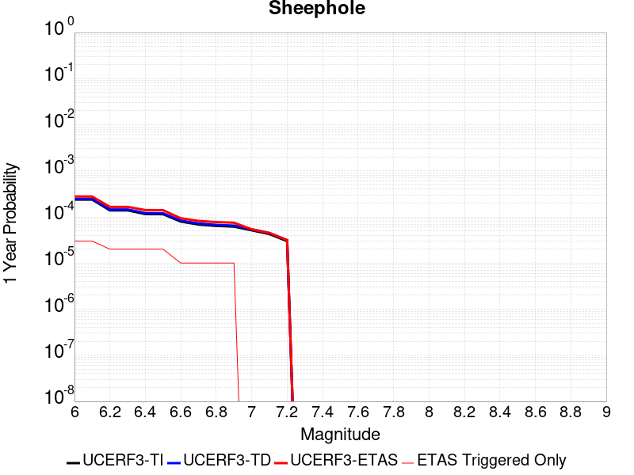 |  |

| Magnitude | 1 wk TI Prob | 1 wk TD Prob | 1 wk ETAS Prob | 1 wk ETAS/TD Gain | 1 wk ETAS Triggered Only | 1 mo TI Prob | 1 mo TD Prob | 1 mo ETAS Prob | 1 mo ETAS/TD Gain | 1 mo ETAS Triggered Only | 1 yr TI Prob | 1 yr TD Prob | 1 yr ETAS Prob | 1 yr ETAS/TD Gain | 1 yr ETAS Triggered Only | 10 yr TI Prob | 10 yr TD Prob | 10 yr ETAS Prob | 10 yr ETAS/TD Gain | 10 yr ETAS Triggered Only |
|-----|-----|-----|-----|-----|-----|-----|-----|-----|-----|-----|-----|-----|-----|-----|-----|-----|-----|-----|-----|-----|
| 6.0 | 4.5579695E-6 | 4.7412877E-6 | 4.7412877E-6 | 1.0 | 0.0 | 1.9534009E-5 | 2.0319678E-5 | 4.031927E-5 | 1.9842476 | 2.0E-5 | 2.3780059E-4 | 2.4736955E-4 | 2.7736212E-4 | 1.1212461 | 3.0E-5 | 0.0023754628 | 0.0024714863 | 0.0025014123 | 1.0121084 | 3.0E-5 |
| 6.1 | 4.5579695E-6 | 4.7412877E-6 | 4.7412877E-6 | 1.0 | 0.0 | 1.9534009E-5 | 2.0319678E-5 | 4.031927E-5 | 1.9842476 | 2.0E-5 | 2.3780059E-4 | 2.4736955E-4 | 2.7736212E-4 | 1.1212461 | 3.0E-5 | 0.0023754628 | 0.0024714863 | 0.0025014123 | 1.0121084 | 3.0E-5 |
| 6.2 | 2.6677674E-6 | 2.7874107E-6 | 2.7874107E-6 | 1.0 | 0.0 | 1.1433239E-5 | 1.1945997E-5 | 2.1945878E-5 | 1.8370905 | 1.0E-5 | 1.3919079E-4 | 1.4543389E-4 | 1.6543099E-4 | 1.1374996 | 2.0E-5 | 0.0013910364 | 0.001453493 | 0.001473464 | 1.01374 | 2.0E-5 |
| 6.3 | 2.6677674E-6 | 2.7874107E-6 | 2.7874107E-6 | 1.0 | 0.0 | 1.1433239E-5 | 1.1945997E-5 | 2.1945878E-5 | 1.8370905 | 1.0E-5 | 1.3919079E-4 | 1.4543389E-4 | 1.6543099E-4 | 1.1374996 | 2.0E-5 | 0.0013910364 | 0.001453493 | 0.001473464 | 1.01374 | 2.0E-5 |
| 6.4 | 2.2159759E-6 | 2.3228936E-6 | 2.3228936E-6 | 1.0 | 0.0 | 9.497005E-6 | 9.955224E-6 | 1.9955125E-5 | 2.0044878 | 1.0E-5 | 1.156199E-4 | 1.2119893E-4 | 1.411965E-4 | 1.1649979 | 2.0E-5 | 0.0011555976 | 0.0012114076 | 0.0012313834 | 1.0164897 | 2.0E-5 |
| 6.5 | 2.1986082E-6 | 2.3047737E-6 | 2.3047737E-6 | 1.0 | 0.0 | 9.4225725E-6 | 9.877569E-6 | 1.987747E-5 | 2.012385 | 1.0E-5 | 1.1471378E-4 | 1.2025358E-4 | 1.4025117E-4 | 1.1662952 | 2.0E-5 | 0.0011465458 | 0.0012019643 | 0.0012219403 | 1.0166194 | 2.0E-5 |
| 6.6 | 1.5232331E-6 | 1.6019028E-6 | 1.6019028E-6 | 1.0 | 0.0 | 6.5281256E-6 | 6.8652807E-6 | 6.8652807E-6 | 1.0 | 0.0 | 7.947703E-5 | 8.358178E-5 | 9.3580944E-5 | 1.1196333 | 1.0E-5 | 7.9448614E-4 | 8.3552214E-4 | 8.455138E-4 | 1.0119586 | 1.0E-5 |
| 6.7 | 1.3137362E-6 | 1.3828287E-6 | 1.3828287E-6 | 1.0 | 0.0 | 5.6302856E-6 | 5.926396E-6 | 5.926396E-6 | 1.0 | 0.0 | 6.854657E-5 | 7.2151626E-5 | 8.21509E-5 | 1.138587 | 1.0E-5 | 6.8525434E-4 | 7.212959E-4 | 7.312887E-4 | 1.0138539 | 1.0E-5 |
| 6.8 | 1.2275751E-6 | 1.2922936E-6 | 1.2922936E-6 | 1.0 | 0.0 | 5.2610258E-6 | 5.5383903E-6 | 5.5383903E-6 | 1.0 | 0.0 | 6.4051106E-5 | 6.742795E-5 | 7.742728E-5 | 1.1482965 | 1.0E-5 | 6.4032647E-4 | 6.740883E-4 | 6.840816E-4 | 1.0148249 | 1.0E-5 |
| 6.9 | 1.1837088E-6 | 1.2461107E-6 | 1.2461107E-6 | 1.0 | 0.0 | 5.0730278E-6 | 5.340464E-6 | 5.340464E-6 | 1.0 | 0.0 | 6.176237E-5 | 6.501835E-5 | 7.50177E-5 | 1.1537927 | 1.0E-5 | 6.17452E-4 | 6.500064E-4 | 6.599999E-4 | 1.0153744 | 1.0E-5 |
| 7.0 | 9.849371E-7 | 1.036636E-6 | 1.036636E-6 | 1.0 | 0.0 | 4.2211523E-6 | 4.442719E-6 | 4.442719E-6 | 1.0 | 0.0 | 5.1391315E-5 | 5.408886E-5 | 5.408886E-5 | 1.0 | 0.0 | 5.137943E-4 | 5.4076704E-4 | 5.4076704E-4 | 1.0 | 0.0 |
| 7.1 | 8.1643645E-7 | 8.5917287E-7 | 8.5917287E-7 | 1.0 | 0.0 | 3.4990085E-6 | 3.6821648E-6 | 3.6821648E-6 | 1.0 | 0.0 | 4.2599597E-5 | 4.482952E-5 | 4.482952E-5 | 1.0 | 0.0 | 4.259143E-4 | 4.482134E-4 | 4.482134E-4 | 1.0 | 0.0 |
| 7.2 | 5.7295756E-7 | 6.029544E-7 | 6.029544E-7 | 1.0 | 0.0 | 2.45553E-6 | 2.584088E-6 | 2.584088E-6 | 1.0 | 0.0 | 2.9895667E-5 | 3.1460884E-5 | 3.1460884E-5 | 1.0 | 0.0 | 2.9891645E-4 | 3.14571E-4 | 3.14571E-4 | 1.0 | 0.0 |

## Whittier alt 1
*[(top)](#table-of-contents)*

| 1 Week | 1 Month | 1 Year | 10 Year |
|-----|-----|-----|-----|
|  |  |  |  |

| Magnitude | 1 wk TI Prob | 1 wk TD Prob | 1 wk ETAS Prob | 1 wk ETAS/TD Gain | 1 wk ETAS Triggered Only | 1 mo TI Prob | 1 mo TD Prob | 1 mo ETAS Prob | 1 mo ETAS/TD Gain | 1 mo ETAS Triggered Only | 1 yr TI Prob | 1 yr TD Prob | 1 yr ETAS Prob | 1 yr ETAS/TD Gain | 1 yr ETAS Triggered Only | 10 yr TI Prob | 10 yr TD Prob | 10 yr ETAS Prob | 10 yr ETAS/TD Gain | 10 yr ETAS Triggered Only |
|-----|-----|-----|-----|-----|-----|-----|-----|-----|-----|-----|-----|-----|-----|-----|-----|-----|-----|-----|-----|-----|
| 6.0 | 4.2554693E-5 | 4.7253456E-5 | 4.7253456E-5 | 1.0 | 0.0 | 1.8236451E-4 | 2.0250089E-4 | 2.0250089E-4 | 1.0 | 0.0 | 0.002218027 | 0.0024629827 | 0.0024829335 | 1.0081003 | 2.0E-5 | 0.02196019 | 0.024390515 | 0.024419783 | 1.0012 | 3.0E-5 |
| 6.1 | 4.2554693E-5 | 4.7253456E-5 | 4.7253456E-5 | 1.0 | 0.0 | 1.8236451E-4 | 2.0250089E-4 | 2.0250089E-4 | 1.0 | 0.0 | 0.002218027 | 0.0024629827 | 0.0024829335 | 1.0081003 | 2.0E-5 | 0.02196019 | 0.024390515 | 0.024419783 | 1.0012 | 3.0E-5 |
| 6.2 | 4.2554693E-5 | 4.7253456E-5 | 4.7253456E-5 | 1.0 | 0.0 | 1.8236451E-4 | 2.0250089E-4 | 2.0250089E-4 | 1.0 | 0.0 | 0.002218027 | 0.0024629827 | 0.0024829335 | 1.0081003 | 2.0E-5 | 0.02196019 | 0.024390515 | 0.024419783 | 1.0012 | 3.0E-5 |
| 6.3 | 1.9617712E-5 | 1.8269147E-5 | 1.8269147E-5 | 1.0 | 0.0 | 8.40732E-5 | 7.8294106E-5 | 7.8294106E-5 | 1.0 | 0.0 | 0.0010231105 | 9.5283287E-4 | 9.5283287E-4 | 1.0 | 0.0 | 0.01018413 | 0.009490375 | 0.009500281 | 1.0010437 | 1.0E-5 |
| 6.4 | 1.5611336E-5 | 1.3604728E-5 | 1.3604728E-5 | 1.0 | 0.0 | 6.690401E-5 | 5.8304708E-5 | 5.8304708E-5 | 1.0 | 0.0 | 8.142519E-4 | 7.096346E-4 | 7.096346E-4 | 1.0 | 0.0 | 0.008112748 | 0.0070752627 | 0.007085192 | 1.0014033 | 1.0E-5 |
| 6.5 | 1.5150166E-5 | 1.3101376E-5 | 1.3101376E-5 | 1.0 | 0.0 | 6.492767E-5 | 5.614758E-5 | 5.614758E-5 | 1.0 | 0.0 | 7.9020765E-4 | 6.8338827E-4 | 6.8338827E-4 | 1.0 | 0.0 | 0.007874036 | 0.0068144295 | 0.006824361 | 1.0014575 | 1.0E-5 |
| 6.6 | 1.295588E-5 | 1.0381098E-5 | 1.0381098E-5 | 1.0 | 0.0 | 5.552402E-5 | 4.4489672E-5 | 4.4489672E-5 | 1.0 | 0.0 | 6.7579525E-4 | 5.415291E-4 | 5.415291E-4 | 1.0 | 0.0 | 0.006737438 | 0.005403255 | 0.005413201 | 1.0018407 | 1.0E-5 |
| 6.7 | 1.2542085E-5 | 9.899731E-6 | 9.899731E-6 | 1.0 | 0.0 | 5.3750682E-5 | 4.242674E-5 | 4.242674E-5 | 1.0 | 0.0 | 6.542181E-4 | 5.16425E-4 | 5.16425E-4 | 1.0 | 0.0 | 0.006522954 | 0.0051533743 | 0.0051533743 | 1.0 | 0.0 |
| 6.8 | 1.2195878E-5 | 9.495758E-6 | 9.495758E-6 | 1.0 | 0.0 | 5.2267E-5 | 4.069548E-5 | 4.069548E-5 | 1.0 | 0.0 | 6.36165E-4 | 4.953567E-4 | 4.953567E-4 | 1.0 | 0.0 | 0.0063434686 | 0.00494359 | 0.00494359 | 1.0 | 0.0 |
| 6.9 | 1.1580298E-5 | 8.773248E-6 | 8.773248E-6 | 1.0 | 0.0 | 4.9628903E-5 | 3.75991E-5 | 3.75991E-5 | 1.0 | 0.0 | 6.040644E-4 | 4.5767453E-4 | 4.5767453E-4 | 1.0 | 0.0 | 0.00602425 | 0.00456835 | 0.00456835 | 1.0 | 0.0 |
| 7.0 | 1.0964795E-5 | 8.084284E-6 | 8.084284E-6 | 1.0 | 0.0 | 4.6991136E-5 | 3.4646477E-5 | 3.4646477E-5 | 1.0 | 0.0 | 5.7196687E-4 | 4.2174075E-4 | 4.2174075E-4 | 1.0 | 0.0 | 0.0057049696 | 0.0042103273 | 0.0042103273 | 1.0 | 0.0 |
| 7.1 | 1.0230601E-5 | 7.3268325E-6 | 7.3268325E-6 | 1.0 | 0.0 | 4.3844695E-5 | 3.140034E-5 | 3.140034E-5 | 1.0 | 0.0 | 5.336784E-4 | 3.8223338E-4 | 3.8223338E-4 | 1.0 | 0.0 | 0.005323986 | 0.0038168596 | 0.0038168596 | 1.0 | 0.0 |
| 7.2 | 9.40865E-6 | 6.5434065E-6 | 6.5434065E-6 | 1.0 | 0.0 | 4.032216E-5 | 2.8042878E-5 | 2.8042878E-5 | 1.0 | 0.0 | 4.908117E-4 | 3.4136974E-4 | 3.4136974E-4 | 1.0 | 0.0 | 0.0048972913 | 0.0034095005 | 0.0034095005 | 1.0 | 0.0 |
| 7.3 | 8.237384E-6 | 5.5978335E-6 | 5.5978335E-6 | 1.0 | 0.0 | 3.5302593E-5 | 2.39905E-5 | 2.39905E-5 | 1.0 | 0.0 | 4.2972428E-4 | 2.9204623E-4 | 2.9204623E-4 | 1.0 | 0.0 | 0.0042889426 | 0.0029169612 | 0.0029169612 | 1.0 | 0.0 |
| 7.4 | 7.5316966E-6 | 5.0278804E-6 | 5.0278804E-6 | 1.0 | 0.0 | 3.2278298E-5 | 2.1547887E-5 | 2.1547887E-5 | 1.0 | 0.0 | 3.9291743E-4 | 2.6231495E-4 | 2.6231495E-4 | 1.0 | 0.0 | 0.0039222343 | 0.0026201624 | 0.0026201624 | 1.0 | 0.0 |
| 7.5 | 6.149649E-6 | 3.9338697E-6 | 3.9338697E-6 | 1.0 | 0.0 | 2.6355372E-5 | 1.6859338E-5 | 1.6859338E-5 | 1.0 | 0.0 | 3.208294E-4 | 2.05244E-4 | 2.05244E-4 | 1.0 | 0.0 | 0.003203666 | 0.0020506335 | 0.0020506335 | 1.0 | 0.0 |
| 7.6 | 5.457711E-6 | 3.395382E-6 | 3.395382E-6 | 1.0 | 0.0 | 2.338998E-5 | 1.45515605E-5 | 1.45515605E-5 | 1.0 | 0.0 | 2.8473578E-4 | 1.7715165E-4 | 1.7715165E-4 | 1.0 | 0.0 | 0.0028437122 | 0.0017701852 | 0.0017701852 | 1.0 | 0.0 |
| 7.7 | 4.1676276E-6 | 2.3331656E-6 | 2.3331656E-6 | 1.0 | 0.0 | 1.7861139E-5 | 9.999248E-6 | 9.999248E-6 | 1.0 | 0.0 | 2.1743766E-4 | 1.2173478E-4 | 1.2173478E-4 | 1.0 | 0.0 | 0.0021722503 | 0.001216754 | 0.001216754 | 1.0 | 0.0 |
| 7.8 | 2.2692414E-7 | 9.384624E-8 | 9.384624E-8 | 1.0 | 0.0 | 9.725317E-7 | 4.021981E-7 | 4.021981E-7 | 1.0 | 0.0 | 1.1840509E-5 | 4.8967545E-6 | 4.8967545E-6 | 1.0 | 0.0 | 1.1839878E-4 | 4.8966795E-5 | 4.8966795E-5 | 1.0 | 0.0 |
| 7.9 | 6.676829E-9 | 3.4397993E-9 | 3.4397993E-9 | 1.0 | 0.0 | 2.861498E-8 | 1.4741998E-8 | 1.4741998E-8 | 1.0 | 0.0 | 3.4838732E-7 | 1.794838E-7 | 1.794838E-7 | 1.0 | 0.0 | 3.4838679E-6 | 1.7948367E-6 | 1.7948367E-6 | 1.0 | 0.0 |

## Great Valley 08 (Quinto)
*[(top)](#table-of-contents)*

| 1 Week | 1 Month | 1 Year | 10 Year |
|-----|-----|-----|-----|
|  |  |  |  |

| Magnitude | 1 wk TI Prob | 1 wk TD Prob | 1 wk ETAS Prob | 1 wk ETAS/TD Gain | 1 wk ETAS Triggered Only | 1 mo TI Prob | 1 mo TD Prob | 1 mo ETAS Prob | 1 mo ETAS/TD Gain | 1 mo ETAS Triggered Only | 1 yr TI Prob | 1 yr TD Prob | 1 yr ETAS Prob | 1 yr ETAS/TD Gain | 1 yr ETAS Triggered Only | 10 yr TI Prob | 10 yr TD Prob | 10 yr ETAS Prob | 10 yr ETAS/TD Gain | 10 yr ETAS Triggered Only |
|-----|-----|-----|-----|-----|-----|-----|-----|-----|-----|-----|-----|-----|-----|-----|-----|-----|-----|-----|-----|-----|
| 6.0 | 7.737697E-6 | 8.253111E-6 | 8.253111E-6 | 1.0 | 0.0 | 3.3161137E-5 | 3.5370103E-5 | 3.5370103E-5 | 1.0 | 0.0 | 4.0366207E-4 | 4.3056477E-4 | 4.5055617E-4 | 1.0464306 | 2.0E-5 | 0.004029296 | 0.0042991587 | 0.0043190727 | 1.0046321 | 2.0E-5 |
| 6.1 | 7.737697E-6 | 8.253111E-6 | 8.253111E-6 | 1.0 | 0.0 | 3.3161137E-5 | 3.5370103E-5 | 3.5370103E-5 | 1.0 | 0.0 | 4.0366207E-4 | 4.3056477E-4 | 4.5055617E-4 | 1.0464306 | 2.0E-5 | 0.004029296 | 0.0042991587 | 0.0043190727 | 1.0046321 | 2.0E-5 |
| 6.2 | 7.737697E-6 | 8.253111E-6 | 8.253111E-6 | 1.0 | 0.0 | 3.3161137E-5 | 3.5370103E-5 | 3.5370103E-5 | 1.0 | 0.0 | 4.0366207E-4 | 4.3056477E-4 | 4.5055617E-4 | 1.0464306 | 2.0E-5 | 0.004029296 | 0.0042991587 | 0.0043190727 | 1.0046321 | 2.0E-5 |
| 6.3 | 5.374012E-6 | 5.750627E-6 | 5.750627E-6 | 1.0 | 0.0 | 2.3031276E-5 | 2.4645375E-5 | 2.4645375E-5 | 1.0 | 0.0 | 2.803697E-4 | 3.0002726E-4 | 3.1002428E-4 | 1.0333203 | 1.0E-5 | 0.0028001624 | 0.0029973155 | 0.0030172553 | 1.0066526 | 2.0E-5 |
| 6.4 | 5.374012E-6 | 5.750627E-6 | 5.750627E-6 | 1.0 | 0.0 | 2.3031276E-5 | 2.4645375E-5 | 2.4645375E-5 | 1.0 | 0.0 | 2.803697E-4 | 3.0002726E-4 | 3.1002428E-4 | 1.0333203 | 1.0E-5 | 0.0028001624 | 0.0029973155 | 0.0030172553 | 1.0066526 | 2.0E-5 |
| 6.5 | 3.65427E-6 | 3.941365E-6 | 3.941365E-6 | 1.0 | 0.0 | 1.5661062E-5 | 1.6891494E-5 | 1.6891494E-5 | 1.0 | 0.0 | 1.9065675E-4 | 2.056416E-4 | 2.1563953E-4 | 1.0486183 | 1.0E-5 | 0.0019049325 | 0.0020552047 | 0.0020751636 | 1.0097114 | 2.0E-5 |
| 6.6 | 3.6143538E-6 | 3.8985513E-6 | 3.8985513E-6 | 1.0 | 0.0 | 1.5489995E-5 | 1.6708009E-5 | 1.6708009E-5 | 1.0 | 0.0 | 1.8857437E-4 | 2.0340808E-4 | 2.1340605E-4 | 1.0491523 | 1.0E-5 | 0.0018841444 | 0.0020329105 | 0.0020528699 | 1.0098181 | 2.0E-5 |
| 6.7 | 2.4821015E-6 | 2.685736E-6 | 2.685736E-6 | 1.0 | 0.0 | 1.0637535E-5 | 1.15102785E-5 | 1.15102785E-5 | 1.0 | 0.0 | 1.2950429E-4 | 1.4013429E-4 | 1.5013288E-4 | 1.0713501 | 1.0E-5 | 0.0012942884 | 0.0014010142 | 0.0014209861 | 1.0142554 | 2.0E-5 |
| 6.8 | 4.7110538E-7 | 5.1930914E-7 | 5.1930914E-7 | 1.0 | 0.0 | 2.0190216E-6 | 2.2256088E-6 | 2.2256088E-6 | 1.0 | 0.0 | 2.458131E-5 | 2.7096468E-5 | 3.7096197E-5 | 1.3690418 | 1.0E-5 | 2.457859E-4 | 2.7093347E-4 | 2.8093075E-4 | 1.0368994 | 1.0E-5 |
| 6.9 | 3.958685E-7 | 4.3704054E-7 | 4.3704054E-7 | 1.0 | 0.0 | 1.6965782E-6 | 1.8730296E-6 | 1.8730296E-6 | 1.0 | 0.0 | 2.0655643E-5 | 2.2803915E-5 | 2.2803915E-5 | 1.0 | 0.0 | 2.0653724E-4 | 2.2801736E-4 | 2.2801736E-4 | 1.0 | 0.0 |
| 7.0 | 2.70294E-7 | 2.9920432E-7 | 2.9920432E-7 | 1.0 | 0.0 | 1.1584025E-6 | 1.2823037E-6 | 1.2823037E-6 | 1.0 | 0.0 | 1.4103458E-5 | 1.561195E-5 | 1.561195E-5 | 1.0 | 0.0 | 1.4102564E-4 | 1.561098E-4 | 1.561098E-4 | 1.0 | 0.0 |
| 7.1 | 1.4828602E-7 | 1.6469349E-7 | 1.6469349E-7 | 1.0 | 0.0 | 6.3551136E-7 | 7.058291E-7 | 7.058291E-7 | 1.0 | 0.0 | 7.737323E-6 | 8.593443E-6 | 8.593443E-6 | 1.0 | 0.0 | 7.737054E-5 | 8.593191E-5 | 8.593191E-5 | 1.0 | 0.0 |

## Monterey Bay-Tularcitos
*[(top)](#table-of-contents)*

| 1 Week | 1 Month | 1 Year | 10 Year |
|-----|-----|-----|-----|
|  |  |  |  |

| Magnitude | 1 wk TI Prob | 1 wk TD Prob | 1 wk ETAS Prob | 1 wk ETAS/TD Gain | 1 wk ETAS Triggered Only | 1 mo TI Prob | 1 mo TD Prob | 1 mo ETAS Prob | 1 mo ETAS/TD Gain | 1 mo ETAS Triggered Only | 1 yr TI Prob | 1 yr TD Prob | 1 yr ETAS Prob | 1 yr ETAS/TD Gain | 1 yr ETAS Triggered Only | 10 yr TI Prob | 10 yr TD Prob | 10 yr ETAS Prob | 10 yr ETAS/TD Gain | 10 yr ETAS Triggered Only |
|-----|-----|-----|-----|-----|-----|-----|-----|-----|-----|-----|-----|-----|-----|-----|-----|-----|-----|-----|-----|-----|
| 6.0 | 3.0131365E-5 | 3.2799162E-5 | 3.2799162E-5 | 1.0 | 0.0 | 1.2912804E-4 | 1.4056085E-4 | 1.4056085E-4 | 1.0 | 0.0 | 0.001571 | 0.0017100906 | 0.0017100906 | 1.0 | 0.0 | 0.015599402 | 0.016980117 | 0.017009608 | 1.0017368 | 3.0E-5 |
| 6.1 | 3.0131365E-5 | 3.2799162E-5 | 3.2799162E-5 | 1.0 | 0.0 | 1.2912804E-4 | 1.4056085E-4 | 1.4056085E-4 | 1.0 | 0.0 | 0.001571 | 0.0017100906 | 0.0017100906 | 1.0 | 0.0 | 0.015599402 | 0.016980117 | 0.017009608 | 1.0017368 | 3.0E-5 |
| 6.2 | 3.0131365E-5 | 3.2799162E-5 | 3.2799162E-5 | 1.0 | 0.0 | 1.2912804E-4 | 1.4056085E-4 | 1.4056085E-4 | 1.0 | 0.0 | 0.001571 | 0.0017100906 | 0.0017100906 | 1.0 | 0.0 | 0.015599402 | 0.016980117 | 0.017009608 | 1.0017368 | 3.0E-5 |
| 6.3 | 1.6998249E-5 | 1.8330993E-5 | 1.8330993E-5 | 1.0 | 0.0 | 7.28476E-5 | 7.855914E-5 | 7.855914E-5 | 1.0 | 0.0 | 8.865586E-4 | 9.560565E-4 | 9.560565E-4 | 1.0 | 0.0 | 0.0088303005 | 0.009521359 | 0.009541169 | 1.0020806 | 2.0E-5 |
| 6.4 | 1.6998249E-5 | 1.8330993E-5 | 1.8330993E-5 | 1.0 | 0.0 | 7.28476E-5 | 7.855914E-5 | 7.855914E-5 | 1.0 | 0.0 | 8.865586E-4 | 9.560565E-4 | 9.560565E-4 | 1.0 | 0.0 | 0.0088303005 | 0.009521359 | 0.009541169 | 1.0020806 | 2.0E-5 |
| 6.5 | 1.27470785E-5 | 1.3693452E-5 | 1.3693452E-5 | 1.0 | 0.0 | 5.4629192E-5 | 5.868496E-5 | 5.868496E-5 | 1.0 | 0.0 | 6.649074E-4 | 7.142655E-4 | 7.142655E-4 | 1.0 | 0.0 | 0.0066292146 | 0.0071207504 | 0.007140608 | 1.0027887 | 2.0E-5 |
| 6.6 | 1.2739422E-5 | 1.3685539E-5 | 1.3685539E-5 | 1.0 | 0.0 | 5.4596385E-5 | 5.865105E-5 | 5.865105E-5 | 1.0 | 0.0 | 6.645082E-4 | 7.1385293E-4 | 7.1385293E-4 | 1.0 | 0.0 | 0.0066252467 | 0.007116651 | 0.007136509 | 1.0027903 | 2.0E-5 |
| 6.7 | 1.0160109E-5 | 1.0885862E-5 | 1.0885862E-5 | 1.0 | 0.0 | 4.35426E-5 | 4.6652898E-5 | 4.6652898E-5 | 1.0 | 0.0 | 5.300022E-4 | 5.678581E-4 | 5.678581E-4 | 1.0 | 0.0 | 0.005287399 | 0.005664782 | 0.0056747254 | 1.0017552 | 1.0E-5 |
| 6.8 | 8.349859E-6 | 8.932674E-6 | 8.932674E-6 | 1.0 | 0.0 | 3.578462E-5 | 3.8282356E-5 | 3.8282356E-5 | 1.0 | 0.0 | 4.3559066E-4 | 4.6599368E-4 | 4.6599368E-4 | 1.0 | 0.0 | 0.004347378 | 0.00465073 | 0.0046606837 | 1.0021402 | 1.0E-5 |
| 6.9 | 5.193639E-6 | 5.5364826E-6 | 5.5364826E-6 | 1.0 | 0.0 | 2.2258262E-5 | 2.3727585E-5 | 2.3727585E-5 | 1.0 | 0.0 | 2.7096065E-4 | 2.888483E-4 | 2.888483E-4 | 1.0 | 0.0 | 0.0027063051 | 0.0028850497 | 0.0028850497 | 1.0 | 0.0 |
| 7.0 | 4.359381E-6 | 4.64341E-6 | 4.64341E-6 | 1.0 | 0.0 | 1.8682927E-5 | 1.9900195E-5 | 1.9900195E-5 | 1.0 | 0.0 | 2.274409E-4 | 2.4226091E-4 | 2.4226091E-4 | 1.0 | 0.0 | 0.0022720827 | 0.002420261 | 0.002420261 | 1.0 | 0.0 |
| 7.1 | 3.0398533E-6 | 3.2310738E-6 | 3.2310738E-6 | 1.0 | 0.0 | 1.3027877E-5 | 1.3847401E-5 | 1.3847401E-5 | 1.0 | 0.0 | 1.5860285E-4 | 1.6858168E-4 | 1.6858168E-4 | 1.0 | 0.0 | 0.001584897 | 0.0016847956 | 0.0016847956 | 1.0 | 0.0 |
| 7.2 | 1.642335E-6 | 1.7333323E-6 | 1.7333323E-6 | 1.0 | 0.0 | 7.0385595E-6 | 7.428557E-6 | 7.428557E-6 | 1.0 | 0.0 | 8.569109E-5 | 9.0441E-5 | 9.0441E-5 | 1.0 | 0.0 | 8.5658056E-4 | 9.042446E-4 | 9.042446E-4 | 1.0 | 0.0 |
| 7.3 | 3.356842E-7 | 3.295269E-7 | 3.295269E-7 | 1.0 | 0.0 | 1.4386458E-6 | 1.4122573E-6 | 1.4122573E-6 | 1.0 | 0.0 | 1.7515373E-5 | 1.71941E-5 | 1.71941E-5 | 1.0 | 0.0 | 1.7513991E-4 | 1.7192778E-4 | 1.7192778E-4 | 1.0 | 0.0 |
| 7.4 | 2.1973483E-7 | 2.1006667E-7 | 2.1006667E-7 | 1.0 | 0.0 | 9.417204E-7 | 9.0028544E-7 | 9.0028544E-7 | 1.0 | 0.0 | 1.1465385E-5 | 1.096092E-5 | 1.096092E-5 | 1.0 | 0.0 | 1.1464794E-4 | 1.0960383E-4 | 1.0960383E-4 | 1.0 | 0.0 |
| 7.5 | 1.1944135E-7 | 1.06962446E-7 | 1.06962446E-7 | 1.0 | 0.0 | 5.118914E-7 | 4.584104E-7 | 4.584104E-7 | 1.0 | 0.0 | 6.23226E-6 | 5.5811324E-6 | 5.5811324E-6 | 1.0 | 0.0 | 6.2320854E-5 | 5.5809935E-5 | 5.5809935E-5 | 1.0 | 0.0 |
| 7.6 | 4.636058E-8 | 3.3366177E-8 | 3.3366177E-8 | 1.0 | 0.0 | 1.9868818E-7 | 1.4299789E-7 | 1.4299789E-7 | 1.0 | 0.0 | 2.419026E-6 | 1.7409978E-6 | 1.7409978E-6 | 1.0 | 0.0 | 2.4189996E-5 | 1.7409844E-5 | 1.7409844E-5 | 1.0 | 0.0 |
| 7.7 | 1.8588572E-8 | 8.004356E-9 | 8.004356E-9 | 1.0 | 0.0 | 7.9665305E-8 | 3.4304385E-8 | 3.4304385E-8 | 1.0 | 0.0 | 9.699246E-7 | 4.176558E-7 | 4.176558E-7 | 1.0 | 0.0 | 9.699204E-6 | 4.1765506E-6 | 4.1765506E-6 | 1.0 | 0.0 |
| 7.8 | 2.7960154E-9 | 7.610521E-10 | 7.610521E-10 | 1.0 | 0.0 | 1.1982923E-8 | 3.2616516E-9 | 3.2616516E-9 | 1.0 | 0.0 | 1.4589209E-7 | 3.9710606E-8 | 3.9710606E-8 | 1.0 | 0.0 | 1.4589199E-6 | 3.9710605E-7 | 3.9710605E-7 | 1.0 | 0.0 |

## Santa Susana alt 1
*[(top)](#table-of-contents)*

| 1 Week | 1 Month | 1 Year | 10 Year |
|-----|-----|-----|-----|
|  |  | 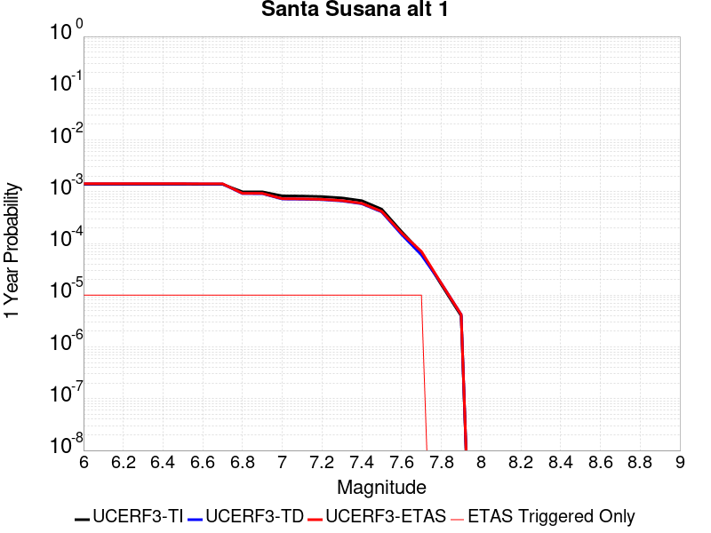 |  |

| Magnitude | 1 wk TI Prob | 1 wk TD Prob | 1 wk ETAS Prob | 1 wk ETAS/TD Gain | 1 wk ETAS Triggered Only | 1 mo TI Prob | 1 mo TD Prob | 1 mo ETAS Prob | 1 mo ETAS/TD Gain | 1 mo ETAS Triggered Only | 1 yr TI Prob | 1 yr TD Prob | 1 yr ETAS Prob | 1 yr ETAS/TD Gain | 1 yr ETAS Triggered Only | 10 yr TI Prob | 10 yr TD Prob | 10 yr ETAS Prob | 10 yr ETAS/TD Gain | 10 yr ETAS Triggered Only |
|-----|-----|-----|-----|-----|-----|-----|-----|-----|-----|-----|-----|-----|-----|-----|-----|-----|-----|-----|-----|-----|
| 6.0 | 2.674877E-5 | 2.7198794E-5 | 2.7198794E-5 | 1.0 | 0.0 | 1.1463255E-4 | 1.1656169E-4 | 1.1656169E-4 | 1.0 | 0.0 | 0.0013947578 | 0.0014183284 | 0.0014283141 | 1.0070405 | 1.0E-5 | 0.013860362 | 0.014104702 | 0.0141342785 | 1.0020969 | 3.0E-5 |
| 6.1 | 2.674877E-5 | 2.7198794E-5 | 2.7198794E-5 | 1.0 | 0.0 | 1.1463255E-4 | 1.1656169E-4 | 1.1656169E-4 | 1.0 | 0.0 | 0.0013947578 | 0.0014183284 | 0.0014283141 | 1.0070405 | 1.0E-5 | 0.013860362 | 0.014104702 | 0.0141342785 | 1.0020969 | 3.0E-5 |
| 6.2 | 2.674877E-5 | 2.7198794E-5 | 2.7198794E-5 | 1.0 | 0.0 | 1.1463255E-4 | 1.1656169E-4 | 1.1656169E-4 | 1.0 | 0.0 | 0.0013947578 | 0.0014183284 | 0.0014283141 | 1.0070405 | 1.0E-5 | 0.013860362 | 0.014104702 | 0.0141342785 | 1.0020969 | 3.0E-5 |
| 6.3 | 2.674877E-5 | 2.7198794E-5 | 2.7198794E-5 | 1.0 | 0.0 | 1.1463255E-4 | 1.1656169E-4 | 1.1656169E-4 | 1.0 | 0.0 | 0.0013947578 | 0.0014183284 | 0.0014283141 | 1.0070405 | 1.0E-5 | 0.013860362 | 0.014104702 | 0.0141342785 | 1.0020969 | 3.0E-5 |
| 6.4 | 2.674877E-5 | 2.7198794E-5 | 2.7198794E-5 | 1.0 | 0.0 | 1.1463255E-4 | 1.1656169E-4 | 1.1656169E-4 | 1.0 | 0.0 | 0.0013947578 | 0.0014183284 | 0.0014283141 | 1.0070405 | 1.0E-5 | 0.013860362 | 0.014104702 | 0.0141342785 | 1.0020969 | 3.0E-5 |
| 6.5 | 2.674877E-5 | 2.7198794E-5 | 2.7198794E-5 | 1.0 | 0.0 | 1.1463255E-4 | 1.1656169E-4 | 1.1656169E-4 | 1.0 | 0.0 | 0.0013947578 | 0.0014183284 | 0.0014283141 | 1.0070405 | 1.0E-5 | 0.013860362 | 0.014104702 | 0.0141342785 | 1.0020969 | 3.0E-5 |
| 6.6 | 2.6647976E-5 | 2.707513E-5 | 2.707513E-5 | 1.0 | 0.0 | 1.14200615E-4 | 1.1603175E-4 | 1.1603175E-4 | 1.0 | 0.0 | 0.0013895056 | 0.0014118847 | 0.0014218705 | 1.0070727 | 1.0E-5 | 0.013808494 | 0.014041085 | 0.014070664 | 1.0021065 | 3.0E-5 |
| 6.7 | 2.6647976E-5 | 2.707513E-5 | 2.707513E-5 | 1.0 | 0.0 | 1.14200615E-4 | 1.1603175E-4 | 1.1603175E-4 | 1.0 | 0.0 | 0.0013895056 | 0.0014118847 | 0.0014218705 | 1.0070727 | 1.0E-5 | 0.013808494 | 0.014041085 | 0.014070664 | 1.0021065 | 3.0E-5 |
| 6.8 | 1.9073179E-5 | 1.7637734E-5 | 1.7637734E-5 | 1.0 | 0.0 | 8.1739636E-5 | 7.558821E-5 | 7.558821E-5 | 1.0 | 0.0 | 9.947256E-4 | 9.1991597E-4 | 9.299068E-4 | 1.0108606 | 1.0E-5 | 0.009902848 | 0.009163515 | 0.009183331 | 1.0021626 | 2.0E-5 |
| 6.9 | 1.9041876E-5 | 1.7619866E-5 | 1.7619866E-5 | 1.0 | 0.0 | 8.160549E-5 | 7.551163E-5 | 7.551163E-5 | 1.0 | 0.0 | 9.930939E-4 | 9.189845E-4 | 9.2897523E-4 | 1.0108715 | 1.0E-5 | 0.0098866755 | 0.009154276 | 0.009174093 | 1.0021647 | 2.0E-5 |
| 7.0 | 1.5917482E-5 | 1.386421E-5 | 1.386421E-5 | 1.0 | 0.0 | 6.8215995E-5 | 5.9416718E-5 | 5.9416718E-5 | 1.0 | 0.0 | 8.302132E-4 | 7.231631E-4 | 7.331559E-4 | 1.0138181 | 1.0E-5 | 0.008271185 | 0.0072091618 | 0.0072290176 | 1.0027542 | 2.0E-5 |
| 7.1 | 1.577788E-5 | 1.3744216E-5 | 1.3744216E-5 | 1.0 | 0.0 | 6.761774E-5 | 5.890248E-5 | 5.890248E-5 | 1.0 | 0.0 | 8.2293496E-4 | 7.1690633E-4 | 7.268992E-4 | 1.0139388 | 1.0E-5 | 0.008198941 | 0.0071469983 | 0.0071668555 | 1.0027784 | 2.0E-5 |
| 7.2 | 1.5416446E-5 | 1.3470286E-5 | 1.3470286E-5 | 1.0 | 0.0 | 6.606882E-5 | 5.7728546E-5 | 5.7728546E-5 | 1.0 | 0.0 | 8.0409093E-4 | 7.0262305E-4 | 7.12616E-4 | 1.0142224 | 1.0E-5 | 0.008011877 | 0.0070050703 | 0.0070249303 | 1.002835 | 2.0E-5 |
| 7.3 | 1.4534083E-5 | 1.2718177E-5 | 1.2718177E-5 | 1.0 | 0.0 | 6.228744E-5 | 5.4505355E-5 | 5.4505355E-5 | 1.0 | 0.0 | 7.580857E-4 | 6.634051E-4 | 6.733985E-4 | 1.0150638 | 1.0E-5 | 0.007555048 | 0.00661526 | 0.006635128 | 1.0030034 | 2.0E-5 |
| 7.4 | 1.2858995E-5 | 1.1229932E-5 | 1.1229932E-5 | 1.0 | 0.0 | 5.5108816E-5 | 4.8127415E-5 | 4.8127415E-5 | 1.0 | 0.0 | 6.7074323E-4 | 5.857977E-4 | 5.9579185E-4 | 1.0170608 | 1.0E-5 | 0.0066872234 | 0.005843461 | 0.0058633443 | 1.0034026 | 2.0E-5 |
| 7.5 | 8.827668E-6 | 7.805573E-6 | 7.805573E-6 | 1.0 | 0.0 | 3.7832317E-5 | 3.3452037E-5 | 3.3452037E-5 | 1.0 | 0.0 | 4.605111E-4 | 4.072049E-4 | 4.1720082E-4 | 1.0245477 | 1.0E-5 | 0.0045955796 | 0.0040650107 | 0.0040849294 | 1.0049 | 2.0E-5 |
| 7.6 | 3.2533426E-6 | 2.8720272E-6 | 2.8720272E-6 | 1.0 | 0.0 | 1.3942822E-5 | 1.2308632E-5 | 1.2308632E-5 | 1.0 | 0.0 | 1.6974064E-4 | 1.4984766E-4 | 1.5984617E-4 | 1.0667244 | 1.0E-5 | 0.0016961104 | 0.001497503 | 0.0015074881 | 1.0066677 | 1.0E-5 |
| 7.7 | 1.2751709E-6 | 1.1491396E-6 | 1.1491396E-6 | 1.0 | 0.0 | 5.4650063E-6 | 4.924875E-6 | 4.924875E-6 | 1.0 | 0.0 | 6.653442E-5 | 5.9958795E-5 | 6.9958194E-5 | 1.1667712 | 1.0E-5 | 6.6514505E-4 | 5.994351E-4 | 6.094291E-4 | 1.0166724 | 1.0E-5 |
| 7.8 | 3.067544E-7 | 3.2400797E-7 | 3.2400797E-7 | 1.0 | 0.0 | 1.3146611E-6 | 1.3886049E-6 | 1.3886049E-6 | 1.0 | 0.0 | 1.600588E-5 | 1.6906144E-5 | 1.6906144E-5 | 1.0 | 0.0 | 1.6004729E-4 | 1.6904961E-4 | 1.6904961E-4 | 1.0 | 0.0 |
| 7.9 | 7.622999E-8 | 8.08804E-8 | 8.08804E-8 | 1.0 | 0.0 | 3.2669993E-7 | 3.4663023E-7 | 3.4663023E-7 | 1.0 | 0.0 | 3.977564E-6 | 4.2202173E-6 | 4.2202173E-6 | 1.0 | 0.0 | 3.977493E-5 | 4.220158E-5 | 4.220158E-5 | 1.0 | 0.0 |

## Raymond
*[(top)](#table-of-contents)*

| 1 Week | 1 Month | 1 Year | 10 Year |
|-----|-----|-----|-----|
|  |  |  | 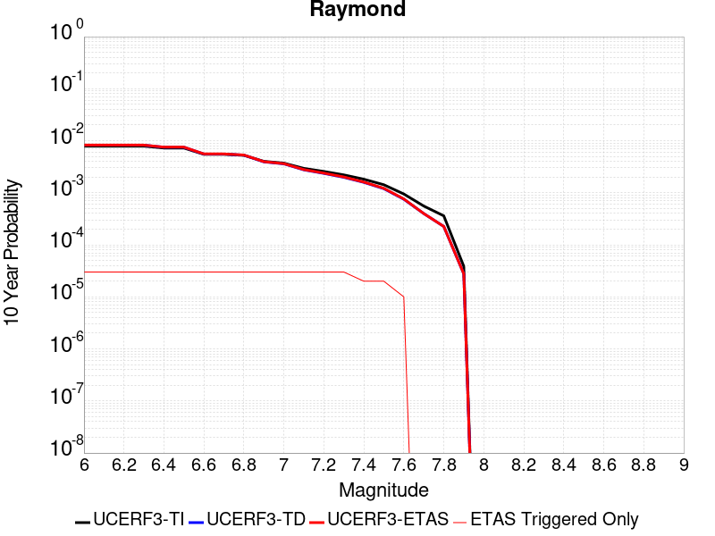 |

| Magnitude | 1 wk TI Prob | 1 wk TD Prob | 1 wk ETAS Prob | 1 wk ETAS/TD Gain | 1 wk ETAS Triggered Only | 1 mo TI Prob | 1 mo TD Prob | 1 mo ETAS Prob | 1 mo ETAS/TD Gain | 1 mo ETAS Triggered Only | 1 yr TI Prob | 1 yr TD Prob | 1 yr ETAS Prob | 1 yr ETAS/TD Gain | 1 yr ETAS Triggered Only | 10 yr TI Prob | 10 yr TD Prob | 10 yr ETAS Prob | 10 yr ETAS/TD Gain | 10 yr ETAS Triggered Only |
|-----|-----|-----|-----|-----|-----|-----|-----|-----|-----|-----|-----|-----|-----|-----|-----|-----|-----|-----|-----|-----|
| 6.0 | 1.5157413E-5 | 1.5810365E-5 | 1.5810365E-5 | 1.0 | 0.0 | 6.4958724E-5 | 6.775709E-5 | 6.775709E-5 | 1.0 | 0.0 | 7.905855E-4 | 8.246554E-4 | 8.246554E-4 | 1.0 | 0.0 | 0.007877788 | 0.008218473 | 0.008248226 | 1.0036203 | 3.0E-5 |
| 6.1 | 1.5157413E-5 | 1.5810365E-5 | 1.5810365E-5 | 1.0 | 0.0 | 6.4958724E-5 | 6.775709E-5 | 6.775709E-5 | 1.0 | 0.0 | 7.905855E-4 | 8.246554E-4 | 8.246554E-4 | 1.0 | 0.0 | 0.007877788 | 0.008218473 | 0.008248226 | 1.0036203 | 3.0E-5 |
| 6.2 | 1.5157413E-5 | 1.5810365E-5 | 1.5810365E-5 | 1.0 | 0.0 | 6.4958724E-5 | 6.775709E-5 | 6.775709E-5 | 1.0 | 0.0 | 7.905855E-4 | 8.246554E-4 | 8.246554E-4 | 1.0 | 0.0 | 0.007877788 | 0.008218473 | 0.008248226 | 1.0036203 | 3.0E-5 |
| 6.3 | 1.5157413E-5 | 1.5810365E-5 | 1.5810365E-5 | 1.0 | 0.0 | 6.4958724E-5 | 6.775709E-5 | 6.775709E-5 | 1.0 | 0.0 | 7.905855E-4 | 8.246554E-4 | 8.246554E-4 | 1.0 | 0.0 | 0.007877788 | 0.008218473 | 0.008248226 | 1.0036203 | 3.0E-5 |
| 6.4 | 1.3941944E-5 | 1.4454908E-5 | 1.4454908E-5 | 1.0 | 0.0 | 5.9749822E-5 | 6.194826E-5 | 6.194826E-5 | 1.0 | 0.0 | 7.2721124E-4 | 7.5398246E-4 | 7.5398246E-4 | 1.0 | 0.0 | 0.007248361 | 0.0075165783 | 0.0075463527 | 1.0039612 | 3.0E-5 |
| 6.5 | 1.3941944E-5 | 1.4454908E-5 | 1.4454908E-5 | 1.0 | 0.0 | 5.9749822E-5 | 6.194826E-5 | 6.194826E-5 | 1.0 | 0.0 | 7.2721124E-4 | 7.5398246E-4 | 7.5398246E-4 | 1.0 | 0.0 | 0.007248361 | 0.0075165783 | 0.0075463527 | 1.0039612 | 3.0E-5 |
| 6.6 | 1.0542609E-5 | 1.0671272E-5 | 1.0671272E-5 | 1.0 | 0.0 | 4.5181827E-5 | 4.5733254E-5 | 4.5733254E-5 | 1.0 | 0.0 | 5.499499E-4 | 5.566656E-4 | 5.566656E-4 | 1.0 | 0.0 | 0.005485909 | 0.0055532744 | 0.005583108 | 1.0053722 | 3.0E-5 |
| 6.7 | 1.0542609E-5 | 1.0671272E-5 | 1.0671272E-5 | 1.0 | 0.0 | 4.5181827E-5 | 4.5733254E-5 | 4.5733254E-5 | 1.0 | 0.0 | 5.499499E-4 | 5.566656E-4 | 5.566656E-4 | 1.0 | 0.0 | 0.005485909 | 0.0055532744 | 0.005583108 | 1.0053722 | 3.0E-5 |
| 6.8 | 1.0079132E-5 | 1.0176802E-5 | 1.0176802E-5 | 1.0 | 0.0 | 4.3195567E-5 | 4.3614164E-5 | 4.3614164E-5 | 1.0 | 0.0 | 5.257791E-4 | 5.3087843E-4 | 5.3087843E-4 | 1.0 | 0.0 | 0.0052453685 | 0.005296653 | 0.005326494 | 1.005634 | 3.0E-5 |
| 6.9 | 7.721598E-6 | 7.5490198E-6 | 7.5490198E-6 | 1.0 | 0.0 | 3.3092143E-5 | 3.2352546E-5 | 3.2352546E-5 | 1.0 | 0.0 | 4.0282236E-4 | 3.938223E-4 | 3.938223E-4 | 1.0 | 0.0 | 0.0040209293 | 0.0039313785 | 0.003961261 | 1.0076009 | 3.0E-5 |
| 7.0 | 7.137566E-6 | 6.911413E-6 | 6.911413E-6 | 1.0 | 0.0 | 3.058921E-5 | 2.962001E-5 | 2.962001E-5 | 1.0 | 0.0 | 3.7236E-4 | 3.6056503E-4 | 3.6056503E-4 | 1.0 | 0.0 | 0.0037173668 | 0.0035999198 | 0.0036298118 | 1.0083035 | 3.0E-5 |
| 7.1 | 5.654976E-6 | 5.299629E-6 | 5.299629E-6 | 1.0 | 0.0 | 2.4235387E-5 | 2.2712498E-5 | 2.2712498E-5 | 1.0 | 0.0 | 2.9502588E-4 | 2.764898E-4 | 2.764898E-4 | 1.0 | 0.0 | 0.0029463451 | 0.0027614902 | 0.0027914075 | 1.0108337 | 3.0E-5 |
| 7.2 | 4.9358455E-6 | 4.5267375E-6 | 4.5267375E-6 | 1.0 | 0.0 | 2.1153453E-5 | 1.940016E-5 | 1.940016E-5 | 1.0 | 0.0 | 2.5751285E-4 | 2.3617149E-4 | 2.3617149E-4 | 1.0 | 0.0 | 0.0025721465 | 0.0023592284 | 0.0023891577 | 1.012686 | 3.0E-5 |
| 7.3 | 4.2368597E-6 | 3.805688E-6 | 3.805688E-6 | 1.0 | 0.0 | 1.8157843E-5 | 1.630999E-5 | 1.630999E-5 | 1.0 | 0.0 | 2.2104931E-4 | 1.9855614E-4 | 1.9855614E-4 | 1.0 | 0.0 | 0.0022082955 | 0.0019838074 | 0.0020137478 | 1.0150925 | 3.0E-5 |
| 7.4 | 3.4999923E-6 | 3.0438064E-6 | 3.0438064E-6 | 1.0 | 0.0 | 1.49998805E-5 | 1.3044819E-5 | 1.3044819E-5 | 1.0 | 0.0 | 1.8260824E-4 | 1.5880918E-4 | 1.5880918E-4 | 1.0 | 0.0 | 0.0018245826 | 0.0015869739 | 0.0016069422 | 1.0125827 | 2.0E-5 |
| 7.5 | 2.738017E-6 | 2.3020955E-6 | 2.3020955E-6 | 1.0 | 0.0 | 1.1734306E-5 | 9.866087E-6 | 9.866087E-6 | 1.0 | 0.0 | 1.428558E-4 | 1.2011305E-4 | 1.2011305E-4 | 1.0 | 0.0 | 0.0014276401 | 0.0012004969 | 0.001220473 | 1.0166397 | 2.0E-5 |
| 7.6 | 1.8186392E-6 | 1.4423393E-6 | 1.4423393E-6 | 1.0 | 0.0 | 7.794145E-6 | 6.18144E-6 | 6.18144E-6 | 1.0 | 0.0 | 9.488958E-5 | 7.525647E-5 | 7.525647E-5 | 1.0 | 0.0 | 9.4849075E-4 | 7.5232267E-4 | 7.623151E-4 | 1.0132822 | 1.0E-5 |
| 7.7 | 1.0660348E-6 | 7.644004E-7 | 7.644004E-7 | 1.0 | 0.0 | 4.5687125E-6 | 3.2759976E-6 | 3.2759976E-6 | 1.0 | 0.0 | 5.5622655E-5 | 3.988456E-5 | 3.988456E-5 | 1.0 | 0.0 | 5.5608735E-4 | 3.987844E-4 | 3.987844E-4 | 1.0 | 0.0 |
| 7.8 | 6.913602E-7 | 4.3205526E-7 | 4.3205526E-7 | 1.0 | 0.0 | 2.962969E-6 | 1.8516641E-6 | 1.8516641E-6 | 1.0 | 0.0 | 3.607355E-5 | 2.2543783E-5 | 2.2543783E-5 | 1.0 | 0.0 | 3.6067693E-4 | 2.2542427E-4 | 2.2542427E-4 | 1.0 | 0.0 |
| 7.9 | 7.425201E-8 | 5.3225733E-8 | 5.3225733E-8 | 1.0 | 0.0 | 3.1822285E-7 | 2.2811027E-7 | 2.2811027E-7 | 1.0 | 0.0 | 3.874356E-6 | 2.7772403E-6 | 2.7772403E-6 | 1.0 | 0.0 | 3.8742884E-5 | 2.7772185E-5 | 2.7772185E-5 | 1.0 | 0.0 |

## San Gabriel
*[(top)](#table-of-contents)*

| 1 Week | 1 Month | 1 Year | 10 Year |
|-----|-----|-----|-----|
|  |  |  |  |

| Magnitude | 1 wk TI Prob | 1 wk TD Prob | 1 wk ETAS Prob | 1 wk ETAS/TD Gain | 1 wk ETAS Triggered Only | 1 mo TI Prob | 1 mo TD Prob | 1 mo ETAS Prob | 1 mo ETAS/TD Gain | 1 mo ETAS Triggered Only | 1 yr TI Prob | 1 yr TD Prob | 1 yr ETAS Prob | 1 yr ETAS/TD Gain | 1 yr ETAS Triggered Only | 10 yr TI Prob | 10 yr TD Prob | 10 yr ETAS Prob | 10 yr ETAS/TD Gain | 10 yr ETAS Triggered Only |
|-----|-----|-----|-----|-----|-----|-----|-----|-----|-----|-----|-----|-----|-----|-----|-----|-----|-----|-----|-----|-----|
| 6.0 | 1.083775E-5 | 1.1987373E-5 | 1.1987373E-5 | 1.0 | 0.0 | 4.6446676E-5 | 5.1373507E-5 | 5.1373507E-5 | 1.0 | 0.0 | 5.653415E-4 | 6.253043E-4 | 6.35298E-4 | 1.0159823 | 1.0E-5 | 0.0056390543 | 0.006247348 | 0.0062771607 | 1.0047721 | 3.0E-5 |
| 6.1 | 1.083775E-5 | 1.1987373E-5 | 1.1987373E-5 | 1.0 | 0.0 | 4.6446676E-5 | 5.1373507E-5 | 5.1373507E-5 | 1.0 | 0.0 | 5.653415E-4 | 6.253043E-4 | 6.35298E-4 | 1.0159823 | 1.0E-5 | 0.0056390543 | 0.006247348 | 0.0062771607 | 1.0047721 | 3.0E-5 |
| 6.2 | 1.083775E-5 | 1.1987373E-5 | 1.1987373E-5 | 1.0 | 0.0 | 4.6446676E-5 | 5.1373507E-5 | 5.1373507E-5 | 1.0 | 0.0 | 5.653415E-4 | 6.253043E-4 | 6.35298E-4 | 1.0159823 | 1.0E-5 | 0.0056390543 | 0.006247348 | 0.0062771607 | 1.0047721 | 3.0E-5 |
| 6.3 | 1.083775E-5 | 1.1987373E-5 | 1.1987373E-5 | 1.0 | 0.0 | 4.6446676E-5 | 5.1373507E-5 | 5.1373507E-5 | 1.0 | 0.0 | 5.653415E-4 | 6.253043E-4 | 6.35298E-4 | 1.0159823 | 1.0E-5 | 0.0056390543 | 0.006247348 | 0.0062771607 | 1.0047721 | 3.0E-5 |
| 6.4 | 1.083775E-5 | 1.1987373E-5 | 1.1987373E-5 | 1.0 | 0.0 | 4.6446676E-5 | 5.1373507E-5 | 5.1373507E-5 | 1.0 | 0.0 | 5.653415E-4 | 6.253043E-4 | 6.35298E-4 | 1.0159823 | 1.0E-5 | 0.0056390543 | 0.006247348 | 0.0062771607 | 1.0047721 | 3.0E-5 |
| 6.5 | 6.7317824E-6 | 7.719108E-6 | 7.719108E-6 | 1.0 | 0.0 | 2.8850178E-5 | 3.3081476E-5 | 3.3081476E-5 | 1.0 | 0.0 | 3.511943E-4 | 4.026936E-4 | 4.026936E-4 | 1.0 | 0.0 | 0.003506398 | 0.004030539 | 0.004050459 | 1.004942 | 2.0E-5 |
| 6.6 | 6.7317824E-6 | 7.719108E-6 | 7.719108E-6 | 1.0 | 0.0 | 2.8850178E-5 | 3.3081476E-5 | 3.3081476E-5 | 1.0 | 0.0 | 3.511943E-4 | 4.026936E-4 | 4.026936E-4 | 1.0 | 0.0 | 0.003506398 | 0.004030539 | 0.004050459 | 1.004942 | 2.0E-5 |
| 6.7 | 6.274881E-6 | 7.248026E-6 | 7.248026E-6 | 1.0 | 0.0 | 2.6892068E-5 | 3.1062606E-5 | 3.1062606E-5 | 1.0 | 0.0 | 3.2736175E-4 | 3.7812255E-4 | 3.7812255E-4 | 1.0 | 0.0 | 0.0032687993 | 0.0037856852 | 0.0038056097 | 1.0052631 | 2.0E-5 |
| 6.8 | 5.996209E-6 | 6.960745E-6 | 6.960745E-6 | 1.0 | 0.0 | 2.5697784E-5 | 2.9831428E-5 | 2.9831428E-5 | 1.0 | 0.0 | 3.128256E-4 | 3.6313804E-4 | 3.6313804E-4 | 1.0 | 0.0 | 0.003123856 | 0.0036363378 | 0.003656265 | 1.00548 | 2.0E-5 |
| 6.9 | 5.686331E-6 | 6.6257817E-6 | 6.6257817E-6 | 1.0 | 0.0 | 2.4369761E-5 | 2.8395903E-5 | 2.8395903E-5 | 1.0 | 0.0 | 2.9666146E-4 | 3.456662E-4 | 3.456662E-4 | 1.0 | 0.0 | 0.0029626573 | 0.0034621747 | 0.0034821054 | 1.0057567 | 2.0E-5 |
| 7.0 | 5.2329838E-6 | 6.1496576E-6 | 6.1496576E-6 | 1.0 | 0.0 | 2.242688E-5 | 2.6355414E-5 | 2.6355414E-5 | 1.0 | 0.0 | 2.7301308E-4 | 3.2083067E-4 | 3.2083067E-4 | 1.0 | 0.0 | 0.002726779 | 0.0032145523 | 0.003234488 | 1.0062017 | 2.0E-5 |
| 7.1 | 5.135671E-6 | 6.039777E-6 | 6.039777E-6 | 1.0 | 0.0 | 2.2009834E-5 | 2.5884507E-5 | 2.5884507E-5 | 1.0 | 0.0 | 2.6793676E-4 | 3.1509905E-4 | 3.1509905E-4 | 1.0 | 0.0 | 0.0026761394 | 0.0031574003 | 0.003177337 | 1.0063143 | 2.0E-5 |
| 7.2 | 4.989062E-6 | 5.8731457E-6 | 5.8731457E-6 | 1.0 | 0.0 | 2.1381518E-5 | 2.5170384E-5 | 2.5170384E-5 | 1.0 | 0.0 | 2.6028889E-4 | 3.064071E-4 | 3.064071E-4 | 1.0 | 0.0 | 0.0025998424 | 0.0030707237 | 0.0030906622 | 1.0064931 | 2.0E-5 |
| 7.3 | 4.8219395E-6 | 5.7046905E-6 | 5.7046905E-6 | 1.0 | 0.0 | 2.0665291E-5 | 2.4448447E-5 | 2.4448447E-5 | 1.0 | 0.0 | 2.5157086E-4 | 2.9761996E-4 | 2.9761996E-4 | 1.0 | 0.0 | 0.0025128627 | 0.0029830914 | 0.0030030317 | 1.0066844 | 2.0E-5 |
| 7.4 | 4.7118383E-6 | 5.59324E-6 | 5.59324E-6 | 1.0 | 0.0 | 2.0193436E-5 | 2.3970813E-5 | 2.3970813E-5 | 1.0 | 0.0 | 2.4582737E-4 | 2.9180633E-4 | 2.9180633E-4 | 1.0 | 0.0 | 0.002455556 | 0.002925109 | 0.0029350796 | 1.0034087 | 1.0E-5 |
| 7.5 | 4.5506545E-6 | 5.438597E-6 | 5.438597E-6 | 1.0 | 0.0 | 1.9502659E-5 | 2.3308068E-5 | 2.3308068E-5 | 1.0 | 0.0 | 2.37419E-4 | 2.8373953E-4 | 2.8373953E-4 | 1.0 | 0.0 | 0.002371655 | 0.0028446494 | 0.0028546208 | 1.0035053 | 1.0E-5 |
| 7.6 | 4.343636E-6 | 5.231458E-6 | 5.231458E-6 | 1.0 | 0.0 | 1.861545E-5 | 2.2420347E-5 | 2.2420347E-5 | 1.0 | 0.0 | 2.2661954E-4 | 2.7293427E-4 | 2.7293427E-4 | 1.0 | 0.0 | 0.0022638857 | 0.0027368597 | 0.0027468323 | 1.0036439 | 1.0E-5 |
| 7.7 | 2.936235E-6 | 2.7452986E-6 | 2.7452986E-6 | 1.0 | 0.0 | 1.2583803E-5 | 1.1765513E-5 | 1.1765513E-5 | 1.0 | 0.0 | 1.5319703E-4 | 1.4323574E-4 | 1.4323574E-4 | 1.0 | 0.0 | 0.0015309147 | 0.0014387129 | 0.0014486986 | 1.0069406 | 1.0E-5 |
| 7.8 | 1.4541639E-6 | 9.1280947E-7 | 9.1280947E-7 | 1.0 | 0.0 | 6.232116E-6 | 3.9120346E-6 | 3.9120346E-6 | 1.0 | 0.0 | 7.587337E-5 | 4.7627982E-5 | 4.7627982E-5 | 1.0 | 0.0 | 7.584747E-4 | 4.8106918E-4 | 4.8106918E-4 | 1.0 | 0.0 |
| 7.9 | 8.098958E-7 | 2.4187648E-7 | 2.4187648E-7 | 1.0 | 0.0 | 3.4709774E-6 | 1.036613E-6 | 1.036613E-6 | 1.0 | 0.0 | 4.225833E-5 | 1.262069E-5 | 1.262069E-5 | 1.0 | 0.0 | 4.2250296E-4 | 1.2928544E-4 | 1.2928544E-4 | 1.0 | 0.0 |
| 8.0 | 5.2473234E-7 | 7.6827554E-8 | 7.6827554E-8 | 1.0 | 0.0 | 2.248851E-6 | 3.292609E-7 | 3.292609E-7 | 1.0 | 0.0 | 2.7379416E-5 | 4.008744E-6 | 4.008744E-6 | 1.0 | 0.0 | 2.7376044E-4 | 4.2213585E-5 | 4.2213585E-5 | 1.0 | 0.0 |
| 8.1 | 3.3162388E-7 | 4.1511967E-8 | 4.1511967E-8 | 1.0 | 0.0 | 1.4212444E-6 | 1.7790842E-7 | 1.7790842E-7 | 1.0 | 0.0 | 1.7303513E-5 | 2.1660328E-6 | 2.1660328E-6 | 1.0 | 0.0 | 1.7302166E-4 | 2.2976306E-5 | 2.2976306E-5 | 1.0 | 0.0 |
| 8.2 | 1.0235345E-7 | 1.4050096E-8 | 1.4050096E-8 | 1.0 | 0.0 | 4.3865757E-7 | 6.0214695E-8 | 6.0214695E-8 | 1.0 | 0.0 | 5.340643E-6 | 7.3311367E-7 | 7.3311367E-7 | 1.0 | 0.0 | 5.3405143E-5 | 7.9302445E-6 | 7.9302445E-6 | 1.0 | 0.0 |

## Sierra Madre (San Fernando)
*[(top)](#table-of-contents)*

| 1 Week | 1 Month | 1 Year | 10 Year |
|-----|-----|-----|-----|
|  |  | 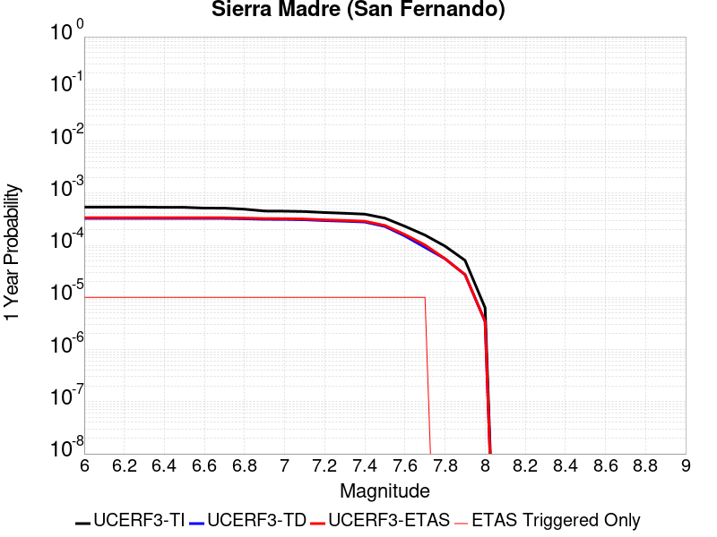 | 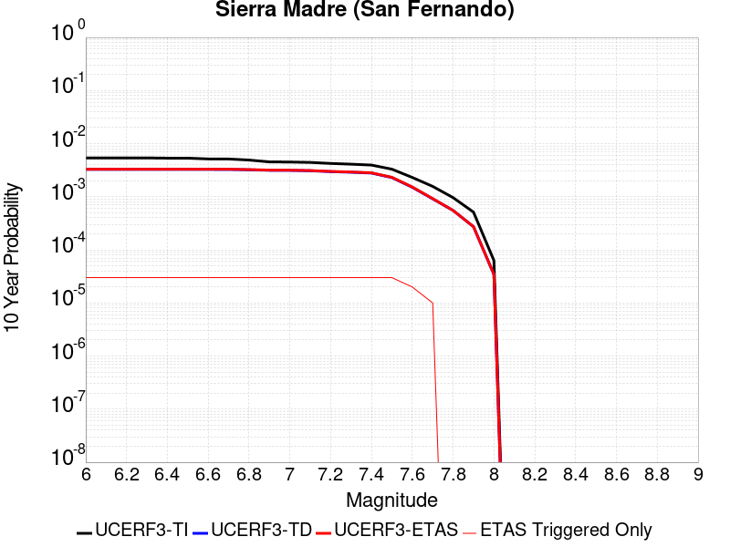 |

| Magnitude | 1 wk TI Prob | 1 wk TD Prob | 1 wk ETAS Prob | 1 wk ETAS/TD Gain | 1 wk ETAS Triggered Only | 1 mo TI Prob | 1 mo TD Prob | 1 mo ETAS Prob | 1 mo ETAS/TD Gain | 1 mo ETAS Triggered Only | 1 yr TI Prob | 1 yr TD Prob | 1 yr ETAS Prob | 1 yr ETAS/TD Gain | 1 yr ETAS Triggered Only | 10 yr TI Prob | 10 yr TD Prob | 10 yr ETAS Prob | 10 yr ETAS/TD Gain | 10 yr ETAS Triggered Only |
|-----|-----|-----|-----|-----|-----|-----|-----|-----|-----|-----|-----|-----|-----|-----|-----|-----|-----|-----|-----|-----|
| 6.0 | 1.0346413E-5 | 6.2874137E-6 | 6.2874137E-6 | 1.0 | 0.0 | 4.4341014E-5 | 2.6945787E-5 | 2.6945787E-5 | 1.0 | 0.0 | 5.3971814E-4 | 3.2801667E-4 | 3.380134E-4 | 1.0304762 | 1.0E-5 | 0.0053840918 | 0.0032754377 | 0.0033053395 | 1.009129 | 3.0E-5 |
| 6.1 | 1.0346413E-5 | 6.2874137E-6 | 6.2874137E-6 | 1.0 | 0.0 | 4.4341014E-5 | 2.6945787E-5 | 2.6945787E-5 | 1.0 | 0.0 | 5.3971814E-4 | 3.2801667E-4 | 3.380134E-4 | 1.0304762 | 1.0E-5 | 0.0053840918 | 0.0032754377 | 0.0033053395 | 1.009129 | 3.0E-5 |
| 6.2 | 1.0346413E-5 | 6.2874137E-6 | 6.2874137E-6 | 1.0 | 0.0 | 4.4341014E-5 | 2.6945787E-5 | 2.6945787E-5 | 1.0 | 0.0 | 5.3971814E-4 | 3.2801667E-4 | 3.380134E-4 | 1.0304762 | 1.0E-5 | 0.0053840918 | 0.0032754377 | 0.0033053395 | 1.009129 | 3.0E-5 |
| 6.3 | 1.0346413E-5 | 6.2874137E-6 | 6.2874137E-6 | 1.0 | 0.0 | 4.4341014E-5 | 2.6945787E-5 | 2.6945787E-5 | 1.0 | 0.0 | 5.3971814E-4 | 3.2801667E-4 | 3.380134E-4 | 1.0304762 | 1.0E-5 | 0.0053840918 | 0.0032754377 | 0.0033053395 | 1.009129 | 3.0E-5 |
| 6.4 | 1.0249558E-5 | 6.2874137E-6 | 6.2874137E-6 | 1.0 | 0.0 | 4.392594E-5 | 2.6945787E-5 | 2.6945787E-5 | 1.0 | 0.0 | 5.3466705E-4 | 3.2801667E-4 | 3.380134E-4 | 1.0304762 | 1.0E-5 | 0.0053338245 | 0.0032754377 | 0.0033053395 | 1.009129 | 3.0E-5 |
| 6.5 | 1.0249558E-5 | 6.2874137E-6 | 6.2874137E-6 | 1.0 | 0.0 | 4.392594E-5 | 2.6945787E-5 | 2.6945787E-5 | 1.0 | 0.0 | 5.3466705E-4 | 3.2801667E-4 | 3.380134E-4 | 1.0304762 | 1.0E-5 | 0.0053338245 | 0.0032754377 | 0.0033053395 | 1.009129 | 3.0E-5 |
| 6.6 | 9.9035515E-6 | 6.2874137E-6 | 6.2874137E-6 | 1.0 | 0.0 | 4.2443102E-5 | 2.6945787E-5 | 2.6945787E-5 | 1.0 | 0.0 | 5.166222E-4 | 3.2801667E-4 | 3.380134E-4 | 1.0304762 | 1.0E-5 | 0.0051542283 | 0.0032754377 | 0.0033053395 | 1.009129 | 3.0E-5 |
| 6.7 | 9.87217E-6 | 6.2748345E-6 | 6.2748345E-6 | 1.0 | 0.0 | 4.2308613E-5 | 2.6891877E-5 | 2.6891877E-5 | 1.0 | 0.0 | 5.149856E-4 | 3.2736053E-4 | 3.3735725E-4 | 1.0305374 | 1.0E-5 | 0.005137938 | 0.0032688954 | 0.0032987974 | 1.0091474 | 3.0E-5 |
| 6.8 | 9.4359175E-6 | 6.1788187E-6 | 6.1788187E-6 | 1.0 | 0.0 | 4.043902E-5 | 2.648039E-5 | 2.648039E-5 | 1.0 | 0.0 | 4.9223384E-4 | 3.2235213E-4 | 3.3234892E-4 | 1.0310119 | 1.0E-5 | 0.0049114493 | 0.0032189572 | 0.0032488606 | 1.0092897 | 3.0E-5 |
| 6.9 | 8.700447E-6 | 6.0400944E-6 | 6.0400944E-6 | 1.0 | 0.0 | 3.72871E-5 | 2.5885867E-5 | 2.5885867E-5 | 1.0 | 0.0 | 4.5387587E-4 | 3.1511593E-4 | 3.2511278E-4 | 1.0317243 | 1.0E-5 | 0.0045295 | 0.0031468007 | 0.0031767061 | 1.0095035 | 3.0E-5 |
| 7.0 | 8.648878E-6 | 6.015009E-6 | 6.015009E-6 | 1.0 | 0.0 | 3.7066096E-5 | 2.5778361E-5 | 2.5778361E-5 | 1.0 | 0.0 | 4.5118626E-4 | 3.1380742E-4 | 3.238043E-4 | 1.0318567 | 1.0E-5 | 0.004502713 | 0.0031337526 | 0.0031636585 | 1.0095432 | 3.0E-5 |
| 7.1 | 8.505786E-6 | 5.9246395E-6 | 5.9246395E-6 | 1.0 | 0.0 | 3.645286E-5 | 2.539107E-5 | 2.539107E-5 | 1.0 | 0.0 | 4.437232E-4 | 3.090935E-4 | 3.190904E-4 | 1.0323427 | 1.0E-5 | 0.0044283825 | 0.003086745 | 0.0031166524 | 1.009689 | 3.0E-5 |
| 7.2 | 8.139752E-6 | 5.698937E-6 | 5.698937E-6 | 1.0 | 0.0 | 3.4884186E-5 | 2.4423793E-5 | 2.4423793E-5 | 1.0 | 0.0 | 4.246322E-4 | 2.9732016E-4 | 3.0731718E-4 | 1.0336238 | 1.0E-5 | 0.004238217 | 0.0029693297 | 0.0029992405 | 1.0100733 | 3.0E-5 |
| 7.3 | 7.8816E-6 | 5.5522523E-6 | 5.5522523E-6 | 1.0 | 0.0 | 3.3777847E-5 | 2.3795157E-5 | 2.3795157E-5 | 1.0 | 0.0 | 4.111677E-4 | 2.8966856E-4 | 2.9966567E-4 | 1.0345122 | 1.0E-5 | 0.004104078 | 0.0028930155 | 0.0029229287 | 1.0103399 | 3.0E-5 |
| 7.4 | 7.5810603E-6 | 5.356491E-6 | 5.356491E-6 | 1.0 | 0.0 | 3.2489854E-5 | 2.2956194E-5 | 2.2956194E-5 | 1.0 | 0.0 | 3.9549218E-4 | 2.7945687E-4 | 2.8945407E-4 | 1.0357738 | 1.0E-5 | 0.0039478904 | 0.0027911596 | 0.0028210757 | 1.0107182 | 3.0E-5 |
| 7.5 | 6.349153E-6 | 4.4077356E-6 | 4.4077356E-6 | 1.0 | 0.0 | 2.7210372E-5 | 1.8890163E-5 | 1.8890163E-5 | 1.0 | 0.0 | 3.312359E-4 | 2.2996428E-4 | 2.3996197E-4 | 1.043475 | 1.0E-5 | 0.0033074263 | 0.002297345 | 0.0023272762 | 1.0130285 | 3.0E-5 |
| 7.6 | 4.430576E-6 | 2.8907193E-6 | 2.8907193E-6 | 1.0 | 0.0 | 1.8988047E-5 | 1.2388739E-5 | 1.2388739E-5 | 1.0 | 0.0 | 2.3115493E-4 | 1.5082269E-4 | 1.6082118E-4 | 1.066293 | 1.0E-5 | 0.0023091463 | 0.0015072258 | 0.0015271957 | 1.0132494 | 2.0E-5 |
| 7.7 | 3.005066E-6 | 1.7511157E-6 | 1.7511157E-6 | 1.0 | 0.0 | 1.2878791E-5 | 7.50476E-6 | 7.50476E-6 | 1.0 | 0.0 | 1.56788E-4 | 9.136663E-5 | 1.0136572E-4 | 1.1094391 | 1.0E-5 | 0.0015667742 | 9.132919E-4 | 9.232827E-4 | 1.0109394 | 1.0E-5 |
| 7.8 | 1.8459098E-6 | 1.058284E-6 | 1.058284E-6 | 1.0 | 0.0 | 7.911018E-6 | 4.535495E-6 | 4.535495E-6 | 1.0 | 0.0 | 9.631238E-5 | 5.5218257E-5 | 5.5218257E-5 | 1.0 | 0.0 | 9.627065E-4 | 5.520458E-4 | 5.520458E-4 | 1.0 | 0.0 |
| 7.9 | 9.839262E-7 | 5.234779E-7 | 5.234779E-7 | 1.0 | 0.0 | 4.2168194E-6 | 2.243475E-6 | 2.243475E-6 | 1.0 | 0.0 | 5.1338568E-5 | 2.7313967E-5 | 2.7313967E-5 | 1.0 | 0.0 | 5.132671E-4 | 2.731064E-4 | 2.731064E-4 | 1.0 | 0.0 |
| 8.0 | 1.210983E-7 | 6.6138576E-8 | 6.6138576E-8 | 1.0 | 0.0 | 5.1899264E-7 | 2.8345102E-7 | 2.8345102E-7 | 1.0 | 0.0 | 6.3187167E-6 | 3.4510108E-6 | 3.4510108E-6 | 1.0 | 0.0 | 6.318537E-5 | 3.450959E-5 | 3.450959E-5 | 1.0 | 0.0 |

## Coronado Bank alt1
*[(top)](#table-of-contents)*

| 1 Week | 1 Month | 1 Year | 10 Year |
|-----|-----|-----|-----|
|  | 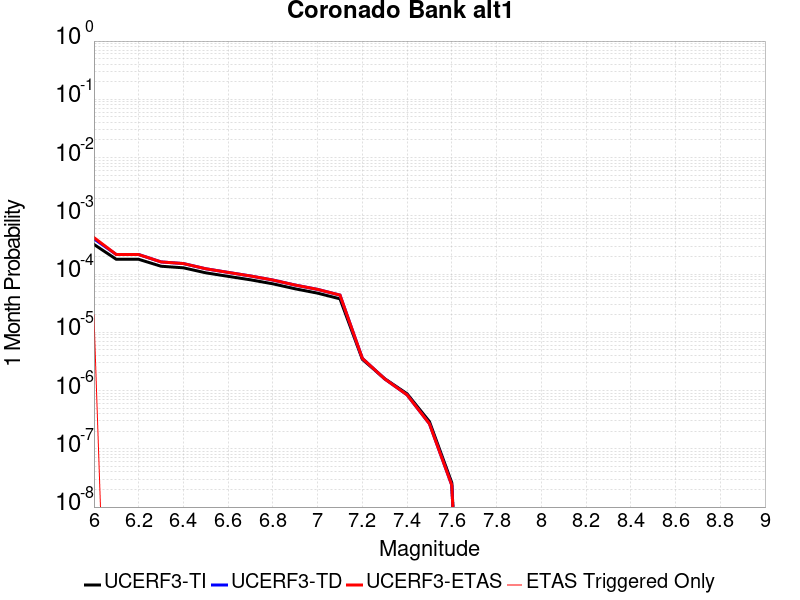 |  |  |

| Magnitude | 1 wk TI Prob | 1 wk TD Prob | 1 wk ETAS Prob | 1 wk ETAS/TD Gain | 1 wk ETAS Triggered Only | 1 mo TI Prob | 1 mo TD Prob | 1 mo ETAS Prob | 1 mo ETAS/TD Gain | 1 mo ETAS Triggered Only | 1 yr TI Prob | 1 yr TD Prob | 1 yr ETAS Prob | 1 yr ETAS/TD Gain | 1 yr ETAS Triggered Only | 10 yr TI Prob | 10 yr TD Prob | 10 yr ETAS Prob | 10 yr ETAS/TD Gain | 10 yr ETAS Triggered Only |
|-----|-----|-----|-----|-----|-----|-----|-----|-----|-----|-----|-----|-----|-----|-----|-----|-----|-----|-----|-----|-----|
| 6.0 | 7.533492E-5 | 9.395439E-5 | 1.1395251E-4 | 1.2128493 | 2.0E-5 | 3.22824E-4 | 4.026023E-4 | 4.2259425E-4 | 1.0496569 | 2.0E-5 | 0.0039233007 | 0.0048912787 | 0.004921132 | 1.0061034 | 3.0E-5 | 0.03854755 | 0.04790551 | 0.04793407 | 1.0005963 | 3.0E-5 |
| 6.1 | 4.1807285E-5 | 5.049452E-5 | 5.049452E-5 | 1.0 | 0.0 | 1.7916178E-4 | 2.1638718E-4 | 2.1638718E-4 | 1.0 | 0.0 | 0.0021791123 | 0.0026314093 | 0.0026413829 | 1.0037903 | 1.0E-5 | 0.021578677 | 0.026011832 | 0.026021574 | 1.0003744 | 1.0E-5 |
| 6.2 | 4.1807285E-5 | 5.049452E-5 | 5.049452E-5 | 1.0 | 0.0 | 1.7916178E-4 | 2.1638718E-4 | 2.1638718E-4 | 1.0 | 0.0 | 0.0021791123 | 0.0026314093 | 0.0026413829 | 1.0037903 | 1.0E-5 | 0.021578677 | 0.026011832 | 0.026021574 | 1.0003744 | 1.0E-5 |
| 6.3 | 3.1793104E-5 | 3.7712067E-5 | 3.7712067E-5 | 1.0 | 0.0 | 1.3624904E-4 | 1.616133E-4 | 1.616133E-4 | 1.0 | 0.0 | 0.0016575698 | 0.0019658979 | 0.0019758784 | 1.0050768 | 1.0E-5 | 0.016452603 | 0.019488975 | 0.01949878 | 1.0005031 | 1.0E-5 |
| 6.4 | 2.9878007E-5 | 3.5336667E-5 | 3.5336667E-5 | 1.0 | 0.0 | 1.2804232E-4 | 1.5143424E-4 | 1.5143424E-4 | 1.0 | 0.0 | 0.0015578003 | 0.0018421846 | 0.0018521661 | 1.0054183 | 1.0E-5 | 0.015469253 | 0.018272907 | 0.018282725 | 1.0005373 | 1.0E-5 |
| 6.5 | 2.4512565E-5 | 2.876477E-5 | 2.876477E-5 | 1.0 | 0.0 | 1.0504962E-4 | 1.2327192E-4 | 1.2327192E-4 | 1.0 | 0.0 | 0.0012782287 | 0.0014998292 | 0.0015098142 | 1.0066575 | 1.0E-5 | 0.012709012 | 0.014900037 | 0.014909888 | 1.0006611 | 1.0E-5 |
| 6.6 | 2.1317413E-5 | 2.4907235E-5 | 2.4907235E-5 | 1.0 | 0.0 | 9.135714E-5 | 1.0674105E-4 | 1.0674105E-4 | 1.0 | 0.0 | 0.0011117056 | 0.0012988197 | 0.0013088067 | 1.0076894 | 1.0E-5 | 0.011061605 | 0.012914698 | 0.012924569 | 1.0007644 | 1.0E-5 |
| 6.7 | 1.8585655E-5 | 2.1635358E-5 | 2.1635358E-5 | 1.0 | 0.0 | 7.9650374E-5 | 9.271978E-5 | 9.271978E-5 | 1.0 | 0.0 | 9.6931186E-4 | 0.0011282993 | 0.001138288 | 1.0088528 | 1.0E-5 | 0.0096509475 | 0.011227869 | 0.011237757 | 1.0008806 | 1.0E-5 |
| 6.8 | 1.5862879E-5 | 1.8419876E-5 | 1.8419876E-5 | 1.0 | 0.0 | 6.798199E-5 | 7.8940044E-5 | 7.8940044E-5 | 1.0 | 0.0 | 8.273665E-4 | 9.6069055E-4 | 9.7068097E-4 | 1.0103992 | 1.0E-5 | 0.008242928 | 0.009567358 | 0.009577262 | 1.0010352 | 1.0E-5 |
| 6.9 | 1.3021509E-5 | 1.509559E-5 | 1.509559E-5 | 1.0 | 0.0 | 5.5805274E-5 | 6.4693886E-5 | 6.4693886E-5 | 1.0 | 0.0 | 6.792174E-4 | 7.873815E-4 | 7.9737365E-4 | 1.0126903 | 1.0E-5 | 0.006771452 | 0.007847741 | 0.007857663 | 1.0012642 | 1.0E-5 |
| 7.0 | 1.0974371E-5 | 1.2720379E-5 | 1.2720379E-5 | 1.0 | 0.0 | 4.7032172E-5 | 5.451487E-5 | 5.451487E-5 | 1.0 | 0.0 | 5.7246623E-4 | 6.63534E-4 | 6.63534E-4 | 1.0 | 0.0 | 0.0057099373 | 0.0066172774 | 0.0066172774 | 1.0 | 0.0 |
| 7.1 | 8.766221E-6 | 1.01640535E-5 | 1.01640535E-5 | 1.0 | 0.0 | 3.7568978E-5 | 4.3559598E-5 | 4.3559598E-5 | 1.0 | 0.0 | 4.573063E-4 | 5.302263E-4 | 5.302263E-4 | 1.0 | 0.0 | 0.0045636636 | 0.0052913115 | 0.0052913115 | 1.0 | 0.0 |
| 7.2 | 8.026024E-7 | 8.3318497E-7 | 8.3318497E-7 | 1.0 | 0.0 | 3.43972E-6 | 3.5707878E-6 | 3.5707878E-6 | 1.0 | 0.0 | 4.1877785E-5 | 4.3473487E-5 | 4.3473487E-5 | 1.0 | 0.0 | 4.1869894E-4 | 4.346509E-4 | 4.346509E-4 | 1.0 | 0.0 |
| 7.3 | 3.7293114E-7 | 3.700131E-7 | 3.700131E-7 | 1.0 | 0.0 | 1.5982754E-6 | 1.5857695E-6 | 1.5857695E-6 | 1.0 | 0.0 | 1.9458828E-5 | 1.9306573E-5 | 1.9306573E-5 | 1.0 | 0.0 | 1.9457124E-4 | 1.9304903E-4 | 1.9304903E-4 | 1.0 | 0.0 |
| 7.4 | 2.0557036E-7 | 1.9674545E-7 | 1.9674545E-7 | 1.0 | 0.0 | 8.810155E-7 | 8.4319447E-7 | 8.4319447E-7 | 1.0 | 0.0 | 1.0726311E-5 | 1.0265845E-5 | 1.0265845E-5 | 1.0 | 0.0 | 1.0725793E-4 | 1.02653736E-4 | 1.02653736E-4 | 1.0 | 0.0 |
| 7.5 | 6.845446E-8 | 6.279429E-8 | 6.279429E-8 | 1.0 | 0.0 | 2.9337625E-7 | 2.6911837E-7 | 2.6911837E-7 | 1.0 | 0.0 | 3.5718497E-6 | 3.2765113E-6 | 3.2765113E-6 | 1.0 | 0.0 | 3.5717923E-5 | 3.2764638E-5 | 3.2764638E-5 | 1.0 | 0.0 |
| 7.6 | 6.0975145E-9 | 5.5319123E-9 | 5.5319123E-9 | 1.0 | 0.0 | 2.6132206E-8 | 2.3708195E-8 | 2.3708195E-8 | 1.0 | 0.0 | 3.1815955E-7 | 2.8864724E-7 | 2.8864724E-7 | 1.0 | 0.0 | 3.181591E-6 | 2.8864697E-6 | 2.8864697E-6 | 1.0 | 0.0 |

## Malibu Coast (Extension) alt 1
*[(top)](#table-of-contents)*

| 1 Week | 1 Month | 1 Year | 10 Year |
|-----|-----|-----|-----|
|  |  |  |  |

| Magnitude | 1 wk TI Prob | 1 wk TD Prob | 1 wk ETAS Prob | 1 wk ETAS/TD Gain | 1 wk ETAS Triggered Only | 1 mo TI Prob | 1 mo TD Prob | 1 mo ETAS Prob | 1 mo ETAS/TD Gain | 1 mo ETAS Triggered Only | 1 yr TI Prob | 1 yr TD Prob | 1 yr ETAS Prob | 1 yr ETAS/TD Gain | 1 yr ETAS Triggered Only | 10 yr TI Prob | 10 yr TD Prob | 10 yr ETAS Prob | 10 yr ETAS/TD Gain | 10 yr ETAS Triggered Only |
|-----|-----|-----|-----|-----|-----|-----|-----|-----|-----|-----|-----|-----|-----|-----|-----|-----|-----|-----|-----|-----|
| 6.0 | 8.930738E-6 | 9.329346E-6 | 1.9329253E-5 | 2.0718765 | 1.0E-5 | 3.827403E-5 | 3.9982307E-5 | 4.9981907E-5 | 1.2501006 | 1.0E-5 | 4.6588664E-4 | 4.8667757E-4 | 5.066678E-4 | 1.041075 | 2.0E-5 | 0.0046491115 | 0.0048563 | 0.0048861546 | 1.0061475 | 3.0E-5 |
| 6.1 | 7.199952E-6 | 7.530357E-6 | 1.7530281E-5 | 2.3279483 | 1.0E-5 | 3.0856572E-5 | 3.227256E-5 | 4.227224E-5 | 1.3098507 | 1.0E-5 | 3.75614E-4 | 3.9284822E-4 | 4.0284428E-4 | 1.0254451 | 1.0E-5 | 0.0037497976 | 0.003921604 | 0.0039315643 | 1.00254 | 1.0E-5 |
| 6.2 | 6.3721413E-6 | 6.666847E-6 | 1.666678E-5 | 2.4999495 | 1.0E-5 | 2.7308892E-5 | 2.857189E-5 | 3.8571605E-5 | 1.3499843 | 1.0E-5 | 3.3243504E-4 | 3.478076E-4 | 3.5780412E-4 | 1.0287415 | 1.0E-5 | 0.0033193815 | 0.0034726725 | 0.003482638 | 1.0028696 | 1.0E-5 |
| 6.3 | 6.016345E-6 | 6.2952113E-6 | 1.629515E-5 | 2.588499 | 1.0E-5 | 2.578408E-5 | 2.69792E-5 | 3.697893E-5 | 1.3706459 | 1.0E-5 | 3.1387596E-4 | 3.2842258E-4 | 3.384193E-4 | 1.0304385 | 1.0E-5 | 0.00313433 | 0.0032794084 | 0.0032893757 | 1.0030394 | 1.0E-5 |
| 6.4 | 5.8104883E-6 | 6.0795965E-6 | 1.6079535E-5 | 2.644836 | 1.0E-5 | 2.4901856E-5 | 2.6055155E-5 | 3.6054895E-5 | 1.3837912 | 1.0E-5 | 3.031379E-4 | 3.1717564E-4 | 3.2717249E-4 | 1.0315182 | 1.0E-5 | 0.0030272473 | 0.0031672644 | 0.0031772326 | 1.0031472 | 1.0E-5 |
| 6.5 | 5.476925E-6 | 5.7275624E-6 | 1.5727504E-5 | 2.7459333 | 1.0E-5 | 2.3472323E-5 | 2.4546467E-5 | 3.454622E-5 | 1.4073806 | 1.0E-5 | 2.8573806E-4 | 2.9881255E-4 | 3.0880957E-4 | 1.0334558 | 1.0E-5 | 0.0028537093 | 0.0029841396 | 0.0029941096 | 1.0033411 | 1.0E-5 |
| 6.6 | 5.222387E-6 | 5.458627E-6 | 1.5458572E-5 | 2.8319526 | 1.0E-5 | 2.2381464E-5 | 2.3393908E-5 | 3.3393673E-5 | 1.4274517 | 1.0E-5 | 2.7246025E-4 | 2.847839E-4 | 2.9478103E-4 | 1.0351044 | 1.0E-5 | 0.0027212645 | 0.00284422 | 0.0028541917 | 1.003506 | 1.0E-5 |
| 6.7 | 5.0337076E-6 | 5.259149E-6 | 1.5259096E-5 | 2.9014382 | 1.0E-5 | 2.1572854E-5 | 2.2539016E-5 | 3.2538792E-5 | 1.443665 | 1.0E-5 | 2.6261783E-4 | 2.7437825E-4 | 2.843755E-4 | 1.0364361 | 1.0E-5 | 0.002623077 | 0.002740425 | 0.0027503977 | 1.0036391 | 1.0E-5 |
| 6.8 | 4.5675624E-6 | 4.7587573E-6 | 1.475871E-5 | 3.101379 | 1.0E-5 | 1.9575122E-5 | 2.0394516E-5 | 3.0394312E-5 | 1.490318 | 1.0E-5 | 2.3830103E-4 | 2.4827512E-4 | 2.5827263E-4 | 1.040268 | 1.0E-5 | 0.0023804565 | 0.0024799972 | 0.0024899724 | 1.0040222 | 1.0E-5 |
| 6.9 | 4.2802412E-6 | 4.452059E-6 | 1.44520145E-5 | 3.246142 | 1.0E-5 | 1.8343762E-5 | 1.9080113E-5 | 2.9079922E-5 | 1.5240959 | 1.0E-5 | 2.2331243E-4 | 2.3227576E-4 | 2.4227344E-4 | 1.0430423 | 1.0E-5 | 0.0022308815 | 0.0023203467 | 0.0023303234 | 1.0042998 | 1.0E-5 |
| 7.0 | 3.9794063E-6 | 4.130134E-6 | 1.4130093E-5 | 3.4212189 | 1.0E-5 | 1.7054486E-5 | 1.7700457E-5 | 2.7700278E-5 | 1.5649472 | 1.0E-5 | 2.0761859E-4 | 2.1548186E-4 | 2.2547971E-4 | 1.0463976 | 1.0E-5 | 0.0020742472 | 0.0021527428 | 0.0021627212 | 1.0046352 | 1.0E-5 |
| 7.1 | 3.7730424E-6 | 3.9112506E-6 | 3.9112506E-6 | 1.0 | 0.0 | 1.6170083E-5 | 1.6762395E-5 | 1.6762395E-5 | 1.0 | 0.0 | 1.9685295E-4 | 2.0406317E-4 | 2.0406317E-4 | 1.0 | 0.0 | 0.0019667868 | 0.0020387708 | 0.0020387708 | 1.0 | 0.0 |
| 7.2 | 3.424985E-6 | 3.5413673E-6 | 3.5413673E-6 | 1.0 | 0.0 | 1.4678424E-5 | 1.5177201E-5 | 1.5177201E-5 | 1.0 | 0.0 | 1.7869516E-4 | 1.8476688E-4 | 1.8476688E-4 | 1.0 | 0.0 | 0.0017855153 | 0.0018461446 | 0.0018461446 | 1.0 | 0.0 |
| 7.3 | 2.6966375E-6 | 2.759676E-6 | 2.759676E-6 | 1.0 | 0.0 | 1.15569665E-5 | 1.1827129E-5 | 1.1827129E-5 | 1.0 | 0.0 | 1.4069698E-4 | 1.4398582E-4 | 1.4398582E-4 | 1.0 | 0.0 | 0.0014060794 | 0.0014389295 | 0.0014389295 | 1.0 | 0.0 |
| 7.4 | 2.215957E-6 | 2.2493962E-6 | 2.2493962E-6 | 1.0 | 0.0 | 9.496924E-6 | 9.640234E-6 | 9.640234E-6 | 1.0 | 0.0 | 1.1561892E-4 | 1.1736356E-4 | 1.1736356E-4 | 1.0 | 0.0 | 0.0011555878 | 0.0011730195 | 0.0011730195 | 1.0 | 0.0 |
| 7.5 | 1.2040218E-6 | 1.2219166E-6 | 1.2219166E-6 | 1.0 | 0.0 | 5.160083E-6 | 5.236775E-6 | 5.236775E-6 | 1.0 | 0.0 | 6.2822204E-5 | 6.3755884E-5 | 6.3755884E-5 | 1.0 | 0.0 | 6.280445E-4 | 6.3737785E-4 | 6.3737785E-4 | 1.0 | 0.0 |
| 7.6 | 6.6157446E-7 | 6.67903E-7 | 6.67903E-7 | 1.0 | 0.0 | 2.835316E-6 | 2.8624384E-6 | 2.8624384E-6 | 1.0 | 0.0 | 3.4519428E-5 | 3.4849647E-5 | 3.4849647E-5 | 1.0 | 0.0 | 3.4514067E-4 | 3.4844334E-4 | 3.4844334E-4 | 1.0 | 0.0 |
| 7.7 | 2.6012302E-7 | 2.4357752E-7 | 2.4357752E-7 | 1.0 | 0.0 | 1.1148124E-6 | 1.0439032E-6 | 1.0439032E-6 | 1.0 | 0.0 | 1.3572758E-5 | 1.2709459E-5 | 1.2709459E-5 | 1.0 | 0.0 | 1.3571928E-4 | 1.2708838E-4 | 1.2708838E-4 | 1.0 | 0.0 |
| 7.8 | 2.8323132E-8 | 2.0266684E-8 | 2.0266684E-8 | 1.0 | 0.0 | 1.2138484E-7 | 8.685721E-8 | 8.685721E-8 | 1.0 | 0.0 | 1.4778595E-6 | 1.0574862E-6 | 1.0574862E-6 | 1.0 | 0.0 | 1.4778497E-5 | 1.05748195E-5 | 1.05748195E-5 | 1.0 | 0.0 |

## Santa Cruz Island
*[(top)](#table-of-contents)*

| 1 Week | 1 Month | 1 Year | 10 Year |
|-----|-----|-----|-----|
|  |  |  |  |

| Magnitude | 1 wk TI Prob | 1 wk TD Prob | 1 wk ETAS Prob | 1 wk ETAS/TD Gain | 1 wk ETAS Triggered Only | 1 mo TI Prob | 1 mo TD Prob | 1 mo ETAS Prob | 1 mo ETAS/TD Gain | 1 mo ETAS Triggered Only | 1 yr TI Prob | 1 yr TD Prob | 1 yr ETAS Prob | 1 yr ETAS/TD Gain | 1 yr ETAS Triggered Only | 10 yr TI Prob | 10 yr TD Prob | 10 yr ETAS Prob | 10 yr ETAS/TD Gain | 10 yr ETAS Triggered Only |
|-----|-----|-----|-----|-----|-----|-----|-----|-----|-----|-----|-----|-----|-----|-----|-----|-----|-----|-----|-----|-----|
| 6.0 | 2.9164563E-5 | 3.1600095E-5 | 4.1599782E-5 | 1.3164448 | 1.0E-5 | 1.2498499E-4 | 1.3542273E-4 | 1.4542136E-4 | 1.0738329 | 1.0E-5 | 0.0015206301 | 0.001647661 | 0.001667628 | 1.0121185 | 2.0E-5 | 0.015102667 | 0.01636818 | 0.01639769 | 1.0018028 | 3.0E-5 |
| 6.1 | 2.9164563E-5 | 3.1600095E-5 | 4.1599782E-5 | 1.3164448 | 1.0E-5 | 1.2498499E-4 | 1.3542273E-4 | 1.4542136E-4 | 1.0738329 | 1.0E-5 | 0.0015206301 | 0.001647661 | 0.001667628 | 1.0121185 | 2.0E-5 | 0.015102667 | 0.01636818 | 0.01639769 | 1.0018028 | 3.0E-5 |
| 6.2 | 2.9164563E-5 | 3.1600095E-5 | 4.1599782E-5 | 1.3164448 | 1.0E-5 | 1.2498499E-4 | 1.3542273E-4 | 1.4542136E-4 | 1.0738329 | 1.0E-5 | 0.0015206301 | 0.001647661 | 0.001667628 | 1.0121185 | 2.0E-5 | 0.015102667 | 0.01636818 | 0.01639769 | 1.0018028 | 3.0E-5 |
| 6.3 | 1.6635553E-5 | 1.7804527E-5 | 1.7804527E-5 | 1.0 | 0.0 | 7.1293274E-5 | 7.630298E-5 | 7.630298E-5 | 1.0 | 0.0 | 8.6765E-4 | 9.2861115E-4 | 9.2861115E-4 | 1.0 | 0.0 | 0.008642701 | 0.009249181 | 0.009249181 | 1.0 | 0.0 |
| 6.4 | 1.6635553E-5 | 1.7804527E-5 | 1.7804527E-5 | 1.0 | 0.0 | 7.1293274E-5 | 7.630298E-5 | 7.630298E-5 | 1.0 | 0.0 | 8.6765E-4 | 9.2861115E-4 | 9.2861115E-4 | 1.0 | 0.0 | 0.008642701 | 0.009249181 | 0.009249181 | 1.0 | 0.0 |
| 6.5 | 1.2238748E-5 | 1.3043111E-5 | 1.3043111E-5 | 1.0 | 0.0 | 5.2450723E-5 | 5.5897868E-5 | 5.5897868E-5 | 1.0 | 0.0 | 6.3840044E-4 | 6.8034773E-4 | 6.8034773E-4 | 1.0 | 0.0 | 0.0063656955 | 0.0067830477 | 0.0067830477 | 1.0 | 0.0 |
| 6.6 | 1.0489767E-5 | 1.11567315E-5 | 1.11567315E-5 | 1.0 | 0.0 | 4.495537E-5 | 4.78137E-5 | 4.78137E-5 | 1.0 | 0.0 | 5.4719415E-4 | 5.8197853E-4 | 5.8197853E-4 | 1.0 | 0.0 | 0.005458487 | 0.0058047855 | 0.0058047855 | 1.0 | 0.0 |
| 6.7 | 8.699222E-6 | 9.236859E-6 | 9.236859E-6 | 1.0 | 0.0 | 3.7281847E-5 | 3.9585942E-5 | 3.9585942E-5 | 1.0 | 0.0 | 4.5381195E-4 | 4.8185283E-4 | 4.8185283E-4 | 1.0 | 0.0 | 0.0045288634 | 0.004808148 | 0.004808148 | 1.0 | 0.0 |
| 6.8 | 8.307732E-6 | 8.816977E-6 | 8.816977E-6 | 1.0 | 0.0 | 3.560408E-5 | 3.77865E-5 | 3.77865E-5 | 1.0 | 0.0 | 4.3339343E-4 | 4.5995397E-4 | 4.5995397E-4 | 1.0 | 0.0 | 0.004325492 | 0.004590073 | 0.004590073 | 1.0 | 0.0 |
| 6.9 | 8.073121E-6 | 8.56501E-6 | 8.56501E-6 | 1.0 | 0.0 | 3.459863E-5 | 3.670667E-5 | 3.670667E-5 | 1.0 | 0.0 | 4.2115687E-4 | 4.4681248E-4 | 4.4681248E-4 | 1.0 | 0.0 | 0.004203596 | 0.0044591925 | 0.0044591925 | 1.0 | 0.0 |
| 7.0 | 7.617019E-6 | 8.07473E-6 | 8.07473E-6 | 1.0 | 0.0 | 3.264396E-5 | 3.4605528E-5 | 3.4605528E-5 | 1.0 | 0.0 | 3.9736772E-4 | 4.2124125E-4 | 4.2124125E-4 | 1.0 | 0.0 | 0.003966579 | 0.0042044753 | 0.0042044753 | 1.0 | 0.0 |
| 7.1 | 7.1224836E-6 | 7.545849E-6 | 7.545849E-6 | 1.0 | 0.0 | 3.052457E-5 | 3.2338954E-5 | 3.2338954E-5 | 1.0 | 0.0 | 3.715733E-4 | 3.9365597E-4 | 3.9365597E-4 | 1.0 | 0.0 | 0.003709526 | 0.0039296295 | 0.0039296295 | 1.0 | 0.0 |
| 7.2 | 6.441115E-6 | 6.827439E-6 | 6.827439E-6 | 1.0 | 0.0 | 2.7604487E-5 | 2.9260125E-5 | 2.9260125E-5 | 1.0 | 0.0 | 3.360328E-4 | 3.5618403E-4 | 3.5618403E-4 | 1.0 | 0.0 | 0.0033552512 | 0.00355616 | 0.00355616 | 1.0 | 0.0 |
| 7.3 | 5.494274E-6 | 5.820041E-6 | 5.820041E-6 | 1.0 | 0.0 | 2.3546674E-5 | 2.4942798E-5 | 2.4942798E-5 | 1.0 | 0.0 | 2.8664304E-4 | 3.0363645E-4 | 3.0363645E-4 | 1.0 | 0.0 | 0.002862736 | 0.003032239 | 0.003032239 | 1.0 | 0.0 |
| 7.4 | 4.0802624E-6 | 4.31229E-6 | 4.31229E-6 | 1.0 | 0.0 | 1.7486722E-5 | 1.8481112E-5 | 1.8481112E-5 | 1.0 | 0.0 | 2.1288003E-4 | 2.2498438E-4 | 2.2498438E-4 | 1.0 | 0.0 | 0.0021267622 | 0.002247575 | 0.002247575 | 1.0 | 0.0 |
| 7.5 | 2.3584746E-6 | 2.475327E-6 | 2.475327E-6 | 1.0 | 0.0 | 1.0107709E-5 | 1.0608502E-5 | 1.0608502E-5 | 1.0 | 0.0 | 1.2305441E-4 | 1.291509E-4 | 1.291509E-4 | 1.0 | 0.0 | 0.0012298629 | 0.0012907635 | 0.0012907635 | 1.0 | 0.0 |
| 7.6 | 9.4981914E-7 | 9.86099E-7 | 9.86099E-7 | 1.0 | 0.0 | 4.0706473E-6 | 4.226132E-6 | 4.226132E-6 | 1.0 | 0.0 | 4.9559E-5 | 5.1451956E-5 | 5.1451956E-5 | 1.0 | 0.0 | 4.954795E-4 | 5.144017E-4 | 5.144017E-4 | 1.0 | 0.0 |
| 7.7 | 2.6013532E-7 | 2.6416743E-7 | 2.6416743E-7 | 1.0 | 0.0 | 1.1148652E-6 | 1.1321456E-6 | 1.1321456E-6 | 1.0 | 0.0 | 1.3573399E-5 | 1.3783787E-5 | 1.3783787E-5 | 1.0 | 0.0 | 1.357257E-4 | 1.3782938E-4 | 1.3782938E-4 | 1.0 | 0.0 |
| 7.8 | 4.1522263E-8 | 3.9657085E-8 | 3.9657085E-8 | 1.0 | 0.0 | 1.7795254E-7 | 1.6995892E-7 | 1.6995892E-7 | 1.0 | 0.0 | 2.16657E-6 | 2.069248E-6 | 2.069248E-6 | 1.0 | 0.0 | 2.1665488E-5 | 2.0692309E-5 | 2.0692309E-5 | 1.0 | 0.0 |
| 7.9 | 7.7242046E-10 | 5.9475247E-10 | 5.9475247E-10 | 1.0 | 0.0 | 3.3103735E-9 | 2.5489395E-9 | 2.5489395E-9 | 1.0 | 0.0 | 4.0303796E-8 | 3.1033338E-8 | 3.1033338E-8 | 1.0 | 0.0 | 4.030379E-7 | 3.1033335E-7 | 3.1033335E-7 | 1.0 | 0.0 |

## San Clemente
*[(top)](#table-of-contents)*

| 1 Week | 1 Month | 1 Year | 10 Year |
|-----|-----|-----|-----|
|  |  | 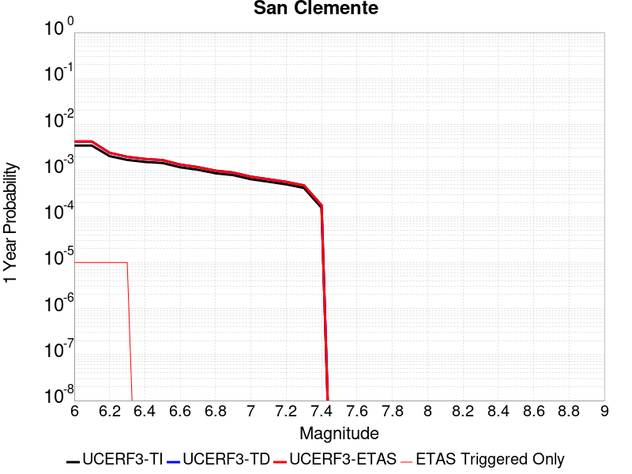 |  |

| Magnitude | 1 wk TI Prob | 1 wk TD Prob | 1 wk ETAS Prob | 1 wk ETAS/TD Gain | 1 wk ETAS Triggered Only | 1 mo TI Prob | 1 mo TD Prob | 1 mo ETAS Prob | 1 mo ETAS/TD Gain | 1 mo ETAS Triggered Only | 1 yr TI Prob | 1 yr TD Prob | 1 yr ETAS Prob | 1 yr ETAS/TD Gain | 1 yr ETAS Triggered Only | 10 yr TI Prob | 10 yr TD Prob | 10 yr ETAS Prob | 10 yr ETAS/TD Gain | 10 yr ETAS Triggered Only |
|-----|-----|-----|-----|-----|-----|-----|-----|-----|-----|-----|-----|-----|-----|-----|-----|-----|-----|-----|-----|-----|
| 6.0 | 6.681379E-5 | 8.164081E-5 | 8.164081E-5 | 1.0 | 0.0 | 2.8631336E-4 | 3.4984472E-4 | 3.4984472E-4 | 1.0 | 0.0 | 0.003480294 | 0.004251534 | 0.004261492 | 1.0023421 | 1.0E-5 | 0.03426291 | 0.041757226 | 0.041785974 | 1.0006884 | 3.0E-5 |
| 6.1 | 6.681379E-5 | 8.164081E-5 | 8.164081E-5 | 1.0 | 0.0 | 2.8631336E-4 | 3.4984472E-4 | 3.4984472E-4 | 1.0 | 0.0 | 0.003480294 | 0.004251534 | 0.004261492 | 1.0023421 | 1.0E-5 | 0.03426291 | 0.041757226 | 0.041785974 | 1.0006884 | 3.0E-5 |
| 6.2 | 3.9400576E-5 | 4.645349E-5 | 4.645349E-5 | 1.0 | 0.0 | 1.6884868E-4 | 1.9907155E-4 | 1.9907155E-4 | 1.0 | 0.0 | 0.0020537945 | 0.0024210564 | 0.0024310322 | 1.0041205 | 1.0E-5 | 0.020349167 | 0.02395347 | 0.02397299 | 1.0008149 | 2.0E-5 |
| 6.3 | 3.2590255E-5 | 3.792995E-5 | 3.792995E-5 | 1.0 | 0.0 | 1.3966505E-4 | 1.6254697E-4 | 1.6254697E-4 | 1.0 | 0.0 | 0.0016990956 | 0.0019772432 | 0.0019872235 | 1.0050476 | 1.0E-5 | 0.01686163 | 0.019600306 | 0.019619914 | 1.0010004 | 2.0E-5 |
| 6.4 | 2.9454652E-5 | 3.409848E-5 | 3.409848E-5 | 1.0 | 0.0 | 1.2622811E-4 | 1.4612831E-4 | 1.4612831E-4 | 1.0 | 0.0 | 0.0015357438 | 0.0017776866 | 0.0017776866 | 1.0 | 0.0 | 0.015251739 | 0.017637838 | 0.017647661 | 1.000557 | 1.0E-5 |
| 6.5 | 2.790836E-5 | 3.2248132E-5 | 3.2248132E-5 | 1.0 | 0.0 | 1.1960178E-4 | 1.381991E-4 | 1.381991E-4 | 1.0 | 0.0 | 0.001455179 | 0.001681301 | 0.001681301 | 1.0 | 0.0 | 0.014456868 | 0.016688827 | 0.01669866 | 1.0005893 | 1.0E-5 |
| 6.6 | 2.2492153E-5 | 2.57632E-5 | 2.57632E-5 | 1.0 | 0.0 | 9.639138E-5 | 1.1040912E-4 | 1.1040912E-4 | 1.0 | 0.0 | 0.0011729331 | 0.0013434169 | 0.0013434169 | 1.0 | 0.0 | 0.011667615 | 0.013354673 | 0.0133645395 | 1.0007389 | 1.0E-5 |
| 6.7 | 1.9862755E-5 | 2.2666847E-5 | 2.2666847E-5 | 1.0 | 0.0 | 8.512331E-5 | 9.714008E-5 | 9.714008E-5 | 1.0 | 0.0 | 0.0010358836 | 0.0011820501 | 0.0011820501 | 1.0 | 0.0 | 0.010310682 | 0.01175892 | 0.011768802 | 1.0008404 | 1.0E-5 |
| 6.8 | 1.6697575E-5 | 1.8978053E-5 | 1.8978053E-5 | 1.0 | 0.0 | 7.155907E-5 | 8.133203E-5 | 8.133203E-5 | 1.0 | 0.0 | 8.7088346E-4 | 9.89777E-4 | 9.89777E-4 | 1.0 | 0.0 | 0.008674784 | 0.009854714 | 0.009864616 | 1.0010047 | 1.0E-5 |
| 6.9 | 1.5218415E-5 | 1.726971E-5 | 1.726971E-5 | 1.0 | 0.0 | 6.522015E-5 | 7.401099E-5 | 7.401099E-5 | 1.0 | 0.0 | 7.93766E-4 | 9.0072013E-4 | 9.0072013E-4 | 1.0 | 0.0 | 0.007909367 | 0.00897164 | 0.00898155 | 1.0011046 | 1.0E-5 |
| 7.0 | 1.2392958E-5 | 1.4033262E-5 | 1.4033262E-5 | 1.0 | 0.0 | 5.3111595E-5 | 6.0141207E-5 | 6.0141207E-5 | 1.0 | 0.0 | 6.4644177E-4 | 7.319808E-4 | 7.319808E-4 | 1.0 | 0.0 | 0.0064456454 | 0.0072964844 | 0.0072964844 | 1.0 | 0.0 |
| 7.1 | 1.0934128E-5 | 1.2375354E-5 | 1.2375354E-5 | 1.0 | 0.0 | 4.6859706E-5 | 5.3036194E-5 | 5.3036194E-5 | 1.0 | 0.0 | 5.7036756E-4 | 6.455317E-4 | 6.455317E-4 | 1.0 | 0.0 | 0.0056890585 | 0.006437312 | 0.006437312 | 1.0 | 0.0 |
| 7.2 | 9.5798805E-6 | 1.0845125E-5 | 1.0845125E-5 | 1.0 | 0.0 | 4.1055984E-5 | 4.647832E-5 | 4.647832E-5 | 1.0 | 0.0 | 4.9974193E-4 | 5.657338E-4 | 5.657338E-4 | 1.0 | 0.0 | 0.0049861963 | 0.00564366 | 0.00564366 | 1.0 | 0.0 |
| 7.3 | 8.0167365E-6 | 9.084078E-6 | 9.084078E-6 | 1.0 | 0.0 | 3.4356988E-5 | 3.8931223E-5 | 3.8931223E-5 | 1.0 | 0.0 | 4.1821605E-4 | 4.738916E-4 | 4.738916E-4 | 1.0 | 0.0 | 0.0041742986 | 0.004729513 | 0.004729513 | 1.0 | 0.0 |
| 7.4 | 2.9581017E-6 | 3.36244E-6 | 3.36244E-6 | 1.0 | 0.0 | 1.2677518E-5 | 1.4410407E-5 | 1.4410407E-5 | 1.0 | 0.0 | 1.5433785E-4 | 1.7543763E-4 | 1.7543763E-4 | 1.0 | 0.0 | 0.001542307 | 0.0017534863 | 0.0017534863 | 1.0 | 0.0 |

## Red Mountain
*[(top)](#table-of-contents)*

| 1 Week | 1 Month | 1 Year | 10 Year |
|-----|-----|-----|-----|
|  |  |  |  |

| Magnitude | 1 wk TI Prob | 1 wk TD Prob | 1 wk ETAS Prob | 1 wk ETAS/TD Gain | 1 wk ETAS Triggered Only | 1 mo TI Prob | 1 mo TD Prob | 1 mo ETAS Prob | 1 mo ETAS/TD Gain | 1 mo ETAS Triggered Only | 1 yr TI Prob | 1 yr TD Prob | 1 yr ETAS Prob | 1 yr ETAS/TD Gain | 1 yr ETAS Triggered Only | 10 yr TI Prob | 10 yr TD Prob | 10 yr ETAS Prob | 10 yr ETAS/TD Gain | 10 yr ETAS Triggered Only |
|-----|-----|-----|-----|-----|-----|-----|-----|-----|-----|-----|-----|-----|-----|-----|-----|-----|-----|-----|-----|-----|
| 6.0 | 4.1810763E-5 | 4.7591075E-5 | 4.7591075E-5 | 1.0 | 0.0 | 1.7917668E-4 | 2.0394672E-4 | 2.1394469E-4 | 1.0490224 | 1.0E-5 | 0.0021792934 | 0.0024803884 | 0.0025003387 | 1.0080433 | 2.0E-5 | 0.021580452 | 0.024544649 | 0.024573913 | 1.0011922 | 3.0E-5 |
| 6.1 | 4.1810763E-5 | 4.7591075E-5 | 4.7591075E-5 | 1.0 | 0.0 | 1.7917668E-4 | 2.0394672E-4 | 2.1394469E-4 | 1.0490224 | 1.0E-5 | 0.0021792934 | 0.0024803884 | 0.0025003387 | 1.0080433 | 2.0E-5 | 0.021580452 | 0.024544649 | 0.024573913 | 1.0011922 | 3.0E-5 |
| 6.2 | 4.1810763E-5 | 4.7591075E-5 | 4.7591075E-5 | 1.0 | 0.0 | 1.7917668E-4 | 2.0394672E-4 | 2.1394469E-4 | 1.0490224 | 1.0E-5 | 0.0021792934 | 0.0024803884 | 0.0025003387 | 1.0080433 | 2.0E-5 | 0.021580452 | 0.024544649 | 0.024573913 | 1.0011922 | 3.0E-5 |
| 6.3 | 4.1810763E-5 | 4.7591075E-5 | 4.7591075E-5 | 1.0 | 0.0 | 1.7917668E-4 | 2.0394672E-4 | 2.1394469E-4 | 1.0490224 | 1.0E-5 | 0.0021792934 | 0.0024803884 | 0.0025003387 | 1.0080433 | 2.0E-5 | 0.021580452 | 0.024544649 | 0.024573913 | 1.0011922 | 3.0E-5 |
| 6.4 | 4.1810763E-5 | 4.7591075E-5 | 4.7591075E-5 | 1.0 | 0.0 | 1.7917668E-4 | 2.0394672E-4 | 2.1394469E-4 | 1.0490224 | 1.0E-5 | 0.0021792934 | 0.0024803884 | 0.0025003387 | 1.0080433 | 2.0E-5 | 0.021580452 | 0.024544649 | 0.024573913 | 1.0011922 | 3.0E-5 |
| 6.5 | 3.154503E-5 | 3.5360503E-5 | 3.5360503E-5 | 1.0 | 0.0 | 1.3518598E-4 | 1.5153673E-4 | 1.5153673E-4 | 1.0 | 0.0 | 0.0016446467 | 0.0018434906 | 0.0018534722 | 1.0054145 | 1.0E-5 | 0.01632528 | 0.018291628 | 0.018311262 | 1.0010734 | 2.0E-5 |
| 6.6 | 3.1535834E-5 | 3.5349887E-5 | 3.5349887E-5 | 1.0 | 0.0 | 1.3514658E-4 | 1.5149123E-4 | 1.5149123E-4 | 1.0 | 0.0 | 0.0016441676 | 0.0018429377 | 0.0018529192 | 1.0054162 | 1.0E-5 | 0.01632056 | 0.018286189 | 0.018305823 | 1.0010737 | 2.0E-5 |
| 6.7 | 2.8267326E-5 | 3.1470005E-5 | 3.1470005E-5 | 1.0 | 0.0 | 1.2114006E-4 | 1.3486497E-4 | 1.3486497E-4 | 1.0 | 0.0 | 0.0014738824 | 0.0016408293 | 0.0016508129 | 1.0060844 | 1.0E-5 | 0.014641452 | 0.016295906 | 0.01631558 | 1.0012074 | 2.0E-5 |
| 6.8 | 2.8212884E-5 | 3.140789E-5 | 3.140789E-5 | 1.0 | 0.0 | 1.20906756E-4 | 1.3459878E-4 | 1.3459878E-4 | 1.0 | 0.0 | 0.0014710457 | 0.0016375934 | 0.001647577 | 1.0060965 | 1.0E-5 | 0.014613459 | 0.016264021 | 0.016283697 | 1.0012097 | 2.0E-5 |
| 6.9 | 2.4227871E-5 | 2.6707532E-5 | 2.6707532E-5 | 1.0 | 0.0 | 1.03829596E-4 | 1.14456256E-4 | 1.14456256E-4 | 1.0 | 0.0 | 0.0012633923 | 0.00139269 | 0.00139269 | 1.0 | 0.0 | 0.012562336 | 0.013847311 | 0.013847311 | 1.0 | 0.0 |
| 7.0 | 2.348524E-5 | 2.5836296E-5 | 2.5836296E-5 | 1.0 | 0.0 | 1.0064714E-4 | 1.1072271E-4 | 1.1072271E-4 | 1.0 | 0.0 | 0.0012246901 | 0.001347291 | 0.001347291 | 1.0 | 0.0 | 0.012179627 | 0.013398864 | 0.013398864 | 1.0 | 0.0 |
| 7.1 | 2.2311642E-5 | 2.4463332E-5 | 2.4463332E-5 | 1.0 | 0.0 | 9.561782E-5 | 1.04839055E-4 | 1.04839055E-4 | 1.0 | 0.0 | 0.0011635252 | 0.0012757429 | 0.0012757429 | 1.0 | 0.0 | 0.01157452 | 0.01269171 | 0.01269171 | 1.0 | 0.0 |
| 7.2 | 1.6533986E-5 | 1.767069E-5 | 1.767069E-5 | 1.0 | 0.0 | 7.085802E-5 | 7.572969E-5 | 7.572969E-5 | 1.0 | 0.0 | 8.623549E-4 | 9.2168245E-4 | 9.2168245E-4 | 1.0 | 0.0 | 0.008590161 | 0.009184876 | 0.009184876 | 1.0 | 0.0 |
| 7.3 | 1.4703092E-5 | 1.555982E-5 | 1.555982E-5 | 1.0 | 0.0 | 6.301173E-5 | 6.668359E-5 | 6.668359E-5 | 1.0 | 0.0 | 7.668978E-4 | 8.116319E-4 | 8.116319E-4 | 1.0 | 0.0 | 0.0076425658 | 0.008092752 | 0.008092752 | 1.0 | 0.0 |
| 7.4 | 6.1331984E-6 | 5.5289447E-6 | 5.5289447E-6 | 1.0 | 0.0 | 2.6284872E-5 | 2.3695266E-5 | 2.3695266E-5 | 1.0 | 0.0 | 3.199713E-4 | 2.884522E-4 | 2.884522E-4 | 1.0 | 0.0 | 0.0031951098 | 0.0028808324 | 0.0028808324 | 1.0 | 0.0 |
| 7.5 | 5.954766E-6 | 5.3385725E-6 | 5.3385725E-6 | 1.0 | 0.0 | 2.5520176E-5 | 2.2879398E-5 | 2.2879398E-5 | 1.0 | 0.0 | 3.1066386E-4 | 2.785216E-4 | 2.785216E-4 | 1.0 | 0.0 | 0.003102299 | 0.0027817793 | 0.0027817793 | 1.0 | 0.0 |
| 7.6 | 4.9726646E-6 | 4.315354E-6 | 4.315354E-6 | 1.0 | 0.0 | 2.1311245E-5 | 1.8494246E-5 | 1.8494246E-5 | 1.0 | 0.0 | 2.5943352E-4 | 2.2514451E-4 | 2.2514451E-4 | 1.0 | 0.0 | 0.0025913084 | 0.0022491987 | 0.0022491987 | 1.0 | 0.0 |
| 7.7 | 3.3613894E-6 | 2.8527159E-6 | 2.8527159E-6 | 1.0 | 0.0 | 1.4405875E-5 | 1.222587E-5 | 1.222587E-5 | 1.0 | 0.0 | 1.7537741E-4 | 1.4884006E-4 | 1.4884006E-4 | 1.0 | 0.0 | 0.0017523908 | 0.00148743 | 0.00148743 | 1.0 | 0.0 |
| 7.8 | 1.1828961E-6 | 1.0123005E-6 | 1.0123005E-6 | 1.0 | 0.0 | 5.069545E-6 | 4.3384234E-6 | 4.3384234E-6 | 1.0 | 0.0 | 6.171996E-5 | 5.2819054E-5 | 5.2819054E-5 | 1.0 | 0.0 | 6.170282E-4 | 5.2806793E-4 | 5.2806793E-4 | 1.0 | 0.0 |
| 7.9 | 2.2967266E-7 | 1.8619376E-7 | 1.8619376E-7 | 1.0 | 0.0 | 9.843111E-7 | 7.9797303E-7 | 7.9797303E-7 | 1.0 | 0.0 | 1.19839215E-5 | 9.7152815E-6 | 9.7152815E-6 | 1.0 | 0.0 | 1.1983275E-4 | 9.7148855E-5 | 9.7148855E-5 | 1.0 | 0.0 |

## Great Valley 11
*[(top)](#table-of-contents)*

| 1 Week | 1 Month | 1 Year | 10 Year |
|-----|-----|-----|-----|
|  |  |  |  |

| Magnitude | 1 wk TI Prob | 1 wk TD Prob | 1 wk ETAS Prob | 1 wk ETAS/TD Gain | 1 wk ETAS Triggered Only | 1 mo TI Prob | 1 mo TD Prob | 1 mo ETAS Prob | 1 mo ETAS/TD Gain | 1 mo ETAS Triggered Only | 1 yr TI Prob | 1 yr TD Prob | 1 yr ETAS Prob | 1 yr ETAS/TD Gain | 1 yr ETAS Triggered Only | 10 yr TI Prob | 10 yr TD Prob | 10 yr ETAS Prob | 10 yr ETAS/TD Gain | 10 yr ETAS Triggered Only |
|-----|-----|-----|-----|-----|-----|-----|-----|-----|-----|-----|-----|-----|-----|-----|-----|-----|-----|-----|-----|-----|
| 6.0 | 2.8099583E-5 | 2.983284E-5 | 2.983284E-5 | 1.0 | 0.0 | 1.20421224E-4 | 1.2784918E-4 | 1.2784918E-4 | 1.0 | 0.0 | 0.0014651422 | 0.0015555259 | 0.0015655103 | 1.0064187 | 1.0E-5 | 0.0145552 | 0.015453906 | 0.015473597 | 1.0012742 | 2.0E-5 |
| 6.1 | 2.483194E-5 | 2.5907739E-5 | 2.5907739E-5 | 1.0 | 0.0 | 1.0641825E-4 | 1.110288E-4 | 1.110288E-4 | 1.0 | 0.0 | 0.0012948721 | 0.0013510007 | 0.0013609872 | 1.0073919 | 1.0E-5 | 0.012873529 | 0.013434285 | 0.013454016 | 1.0014688 | 2.0E-5 |
| 6.2 | 2.483194E-5 | 2.5907739E-5 | 2.5907739E-5 | 1.0 | 0.0 | 1.0641825E-4 | 1.110288E-4 | 1.110288E-4 | 1.0 | 0.0 | 0.0012948721 | 0.0013510007 | 0.0013609872 | 1.0073919 | 1.0E-5 | 0.012873529 | 0.013434285 | 0.013454016 | 1.0014688 | 2.0E-5 |
| 6.3 | 2.0257901E-5 | 2.039936E-5 | 2.039936E-5 | 1.0 | 0.0 | 8.681669E-5 | 8.7423134E-5 | 8.7423134E-5 | 1.0 | 0.0 | 0.0010564806 | 0.0010638986 | 0.0010738879 | 1.0093894 | 1.0E-5 | 0.01051472 | 0.010592224 | 0.010602118 | 1.0009341 | 1.0E-5 |
| 6.4 | 1.8054898E-5 | 1.778123E-5 | 1.778123E-5 | 1.0 | 0.0 | 7.737584E-5 | 7.6203265E-5 | 7.6203265E-5 | 1.0 | 0.0 | 9.416436E-4 | 9.274175E-4 | 9.374082E-4 | 1.0107726 | 1.0E-5 | 0.009376635 | 0.009239212 | 0.009249119 | 1.0010723 | 1.0E-5 |
| 6.5 | 1.34804895E-5 | 1.2321245E-5 | 1.2321245E-5 | 1.0 | 0.0 | 5.777225E-5 | 5.2804287E-5 | 5.2804287E-5 | 1.0 | 0.0 | 7.031501E-4 | 6.4270676E-4 | 6.527003E-4 | 1.0155492 | 1.0E-5 | 0.007009294 | 0.006408917 | 0.0064188526 | 1.0015503 | 1.0E-5 |
| 6.6 | 1.294883E-5 | 1.17324935E-5 | 1.17324935E-5 | 1.0 | 0.0 | 5.5493805E-5 | 5.0281167E-5 | 5.0281167E-5 | 1.0 | 0.0 | 6.754276E-4 | 6.1200536E-4 | 6.219992E-4 | 1.0163298 | 1.0E-5 | 0.006733784 | 0.0061036246 | 0.0061135637 | 1.0016284 | 1.0E-5 |
| 6.7 | 1.1272237E-5 | 9.81203E-6 | 9.81203E-6 | 1.0 | 0.0 | 4.8308695E-5 | 4.2050895E-5 | 4.2050895E-5 | 1.0 | 0.0 | 5.879996E-4 | 5.118521E-4 | 5.21847E-4 | 1.0195268 | 1.0E-5 | 0.005864462 | 0.005107016 | 0.005116965 | 1.0019481 | 1.0E-5 |
| 6.8 | 9.8337505E-6 | 8.193887E-6 | 8.193887E-6 | 1.0 | 0.0 | 4.2143965E-5 | 3.5116198E-5 | 3.5116198E-5 | 1.0 | 0.0 | 5.1298196E-4 | 4.2745788E-4 | 4.3745362E-4 | 1.0233841 | 1.0E-5 | 0.005117994 | 0.0042665666 | 0.004276524 | 1.0023338 | 1.0E-5 |
| 6.9 | 7.4224813E-6 | 5.4131956E-6 | 5.4131956E-6 | 1.0 | 0.0 | 3.1810247E-5 | 2.319921E-5 | 2.319921E-5 | 1.0 | 0.0 | 3.872209E-4 | 2.824152E-4 | 2.9241235E-4 | 1.0353988 | 1.0E-5 | 0.0038654688 | 0.0028207037 | 0.0028306756 | 1.0035353 | 1.0E-5 |
| 7.0 | 4.4628923E-6 | 2.011066E-6 | 2.011066E-6 | 1.0 | 0.0 | 1.912654E-5 | 8.6188265E-6 | 8.6188265E-6 | 1.0 | 0.0 | 2.3284076E-4 | 1.04929284E-4 | 1.1492823E-4 | 1.0952923 | 1.0E-5 | 0.0023259693 | 0.0010488089 | 0.0010587984 | 1.0095246 | 1.0E-5 |
| 7.1 | 3.5546527E-6 | 1.18556E-6 | 1.18556E-6 | 1.0 | 0.0 | 1.5234136E-5 | 5.080962E-6 | 5.080962E-6 | 1.0 | 0.0 | 1.8545982E-4 | 6.185903E-5 | 7.1858405E-5 | 1.1616479 | 1.0E-5 | 0.0018530512 | 6.1842485E-4 | 6.284187E-4 | 1.0161601 | 1.0E-5 |
| 7.2 | 3.2039936E-6 | 1.125392E-6 | 1.125392E-6 | 1.0 | 0.0 | 1.3731329E-5 | 4.8231004E-6 | 4.8231004E-6 | 1.0 | 0.0 | 1.671661E-4 | 5.8719732E-5 | 6.871914E-5 | 1.1702905 | 1.0E-5 | 0.0016704041 | 5.870489E-4 | 5.97043E-4 | 1.0170244 | 1.0E-5 |
| 7.3 | 2.8120473E-6 | 1.0305436E-6 | 1.0305436E-6 | 1.0 | 0.0 | 1.2051575E-5 | 4.416608E-6 | 4.416608E-6 | 1.0 | 0.0 | 1.4671806E-4 | 5.3770946E-5 | 5.3770946E-5 | 1.0 | 0.0 | 0.0014662122 | 5.37586E-4 | 5.37586E-4 | 1.0 | 0.0 |
| 7.4 | 2.4837766E-6 | 9.800468E-7 | 9.800468E-7 | 1.0 | 0.0 | 1.0644713E-5 | 4.2001943E-6 | 4.2001943E-6 | 1.0 | 0.0 | 1.2959167E-4 | 5.113623E-5 | 5.113623E-5 | 1.0 | 0.0 | 0.0012951613 | 5.112512E-4 | 5.112512E-4 | 1.0 | 0.0 |
| 7.5 | 1.5002679E-6 | 6.5460756E-7 | 6.5460756E-7 | 1.0 | 0.0 | 6.4297037E-6 | 2.805458E-6 | 2.805458E-6 | 1.0 | 0.0 | 7.827883E-5 | 3.415596E-5 | 3.415596E-5 | 1.0 | 0.0 | 7.825126E-4 | 3.4151124E-4 | 3.4151124E-4 | 1.0 | 0.0 |

## Santa Monica alt 1
*[(top)](#table-of-contents)*

| 1 Week | 1 Month | 1 Year | 10 Year |
|-----|-----|-----|-----|
| 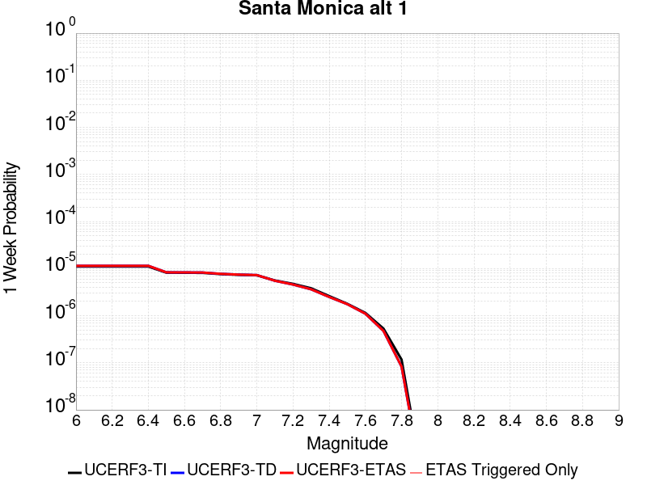 |  |  |  |

| Magnitude | 1 wk TI Prob | 1 wk TD Prob | 1 wk ETAS Prob | 1 wk ETAS/TD Gain | 1 wk ETAS Triggered Only | 1 mo TI Prob | 1 mo TD Prob | 1 mo ETAS Prob | 1 mo ETAS/TD Gain | 1 mo ETAS Triggered Only | 1 yr TI Prob | 1 yr TD Prob | 1 yr ETAS Prob | 1 yr ETAS/TD Gain | 1 yr ETAS Triggered Only | 10 yr TI Prob | 10 yr TD Prob | 10 yr ETAS Prob | 10 yr ETAS/TD Gain | 10 yr ETAS Triggered Only |
|-----|-----|-----|-----|-----|-----|-----|-----|-----|-----|-----|-----|-----|-----|-----|-----|-----|-----|-----|-----|-----|
| 6.0 | 1.1066008E-5 | 1.1480437E-5 | 1.1480437E-5 | 1.0 | 0.0 | 4.742488E-5 | 4.9201022E-5 | 4.9201022E-5 | 1.0 | 0.0 | 5.7724497E-4 | 5.9887173E-4 | 6.0886575E-4 | 1.0166881 | 1.0E-5 | 0.005757478 | 0.005973966 | 0.0059938463 | 1.0033278 | 2.0E-5 |
| 6.1 | 1.1066008E-5 | 1.1480437E-5 | 1.1480437E-5 | 1.0 | 0.0 | 4.742488E-5 | 4.9201022E-5 | 4.9201022E-5 | 1.0 | 0.0 | 5.7724497E-4 | 5.9887173E-4 | 6.0886575E-4 | 1.0166881 | 1.0E-5 | 0.005757478 | 0.005973966 | 0.0059938463 | 1.0033278 | 2.0E-5 |
| 6.2 | 1.1066008E-5 | 1.1480437E-5 | 1.1480437E-5 | 1.0 | 0.0 | 4.742488E-5 | 4.9201022E-5 | 4.9201022E-5 | 1.0 | 0.0 | 5.7724497E-4 | 5.9887173E-4 | 6.0886575E-4 | 1.0166881 | 1.0E-5 | 0.005757478 | 0.005973966 | 0.0059938463 | 1.0033278 | 2.0E-5 |
| 6.3 | 1.1066008E-5 | 1.1480437E-5 | 1.1480437E-5 | 1.0 | 0.0 | 4.742488E-5 | 4.9201022E-5 | 4.9201022E-5 | 1.0 | 0.0 | 5.7724497E-4 | 5.9887173E-4 | 6.0886575E-4 | 1.0166881 | 1.0E-5 | 0.005757478 | 0.005973966 | 0.0059938463 | 1.0033278 | 2.0E-5 |
| 6.4 | 1.1066008E-5 | 1.1480437E-5 | 1.1480437E-5 | 1.0 | 0.0 | 4.742488E-5 | 4.9201022E-5 | 4.9201022E-5 | 1.0 | 0.0 | 5.7724497E-4 | 5.9887173E-4 | 6.0886575E-4 | 1.0166881 | 1.0E-5 | 0.005757478 | 0.005973966 | 0.0059938463 | 1.0033278 | 2.0E-5 |
| 6.5 | 8.183544E-6 | 8.335521E-6 | 8.335521E-6 | 1.0 | 0.0 | 3.5071862E-5 | 3.5723177E-5 | 3.5723177E-5 | 1.0 | 0.0 | 4.2691626E-4 | 4.348445E-4 | 4.4484015E-4 | 1.0229868 | 1.0E-5 | 0.0042609703 | 0.004340102 | 0.004360015 | 1.0045882 | 2.0E-5 |
| 6.6 | 8.1543285E-6 | 8.303734E-6 | 8.303734E-6 | 1.0 | 0.0 | 3.4946657E-5 | 3.5586956E-5 | 3.5586956E-5 | 1.0 | 0.0 | 4.2539247E-4 | 4.3318665E-4 | 4.431823E-4 | 1.0230747 | 1.0E-5 | 0.0042457907 | 0.0043235878 | 0.0043435013 | 1.0046058 | 2.0E-5 |
| 6.7 | 8.110878E-6 | 8.2571305E-6 | 8.2571305E-6 | 1.0 | 0.0 | 3.4760444E-5 | 3.538723E-5 | 3.538723E-5 | 1.0 | 0.0 | 4.231262E-4 | 4.3075596E-4 | 4.4075164E-4 | 1.023205 | 1.0E-5 | 0.0042232145 | 0.004299375 | 0.0043192892 | 1.0046319 | 2.0E-5 |
| 6.8 | 7.644036E-6 | 7.751143E-6 | 7.751143E-6 | 1.0 | 0.0 | 3.275974E-5 | 3.321877E-5 | 3.321877E-5 | 1.0 | 0.0 | 3.9877684E-4 | 4.0436487E-4 | 4.1436084E-4 | 1.0247202 | 1.0E-5 | 0.00398062 | 0.0040364373 | 0.0040563564 | 1.0049349 | 2.0E-5 |
| 6.9 | 7.3698293E-6 | 7.4557984E-6 | 7.4557984E-6 | 1.0 | 0.0 | 3.15846E-5 | 3.1953037E-5 | 3.1953037E-5 | 1.0 | 0.0 | 3.8447464E-4 | 3.8896018E-4 | 3.989563E-4 | 1.0256996 | 1.0E-5 | 0.0038381014 | 0.0038829376 | 0.00390286 | 1.0051308 | 2.0E-5 |
| 7.0 | 7.209872E-6 | 7.2857038E-6 | 7.2857038E-6 | 1.0 | 0.0 | 3.0899086E-5 | 3.1224077E-5 | 3.1224077E-5 | 1.0 | 0.0 | 3.7613141E-4 | 3.8008823E-4 | 3.9008443E-4 | 1.0262997 | 1.0E-5 | 0.0037549543 | 0.0037945241 | 0.0038144484 | 1.0052508 | 2.0E-5 |
| 7.1 | 5.603456E-6 | 5.523948E-6 | 5.523948E-6 | 1.0 | 0.0 | 2.4014591E-5 | 2.3673849E-5 | 2.3673849E-5 | 1.0 | 0.0 | 2.923384E-4 | 2.881914E-4 | 2.981885E-4 | 1.0346892 | 1.0E-5 | 0.0029195412 | 0.0028782184 | 0.0028981608 | 1.0069288 | 2.0E-5 |
| 7.2 | 4.7483613E-6 | 4.5911765E-6 | 4.5911765E-6 | 1.0 | 0.0 | 2.0349962E-5 | 1.9676323E-5 | 1.9676323E-5 | 1.0 | 0.0 | 2.4773262E-4 | 2.3953304E-4 | 2.4953065E-4 | 1.0417379 | 1.0E-5 | 0.0024745662 | 0.0023927628 | 0.0024127148 | 1.0083386 | 2.0E-5 |
| 7.3 | 3.829015E-6 | 3.6342597E-6 | 3.6342597E-6 | 1.0 | 0.0 | 1.6409962E-5 | 1.5575306E-5 | 1.5575306E-5 | 1.0 | 0.0 | 1.9977297E-4 | 1.8961294E-4 | 1.8961294E-4 | 1.0 | 0.0 | 0.0019959346 | 0.0018945204 | 0.0019045015 | 1.0052683 | 1.0E-5 |
| 7.4 | 2.610755E-6 | 2.4995952E-6 | 2.4995952E-6 | 1.0 | 0.0 | 1.1188902E-5 | 1.0712507E-5 | 1.0712507E-5 | 1.0 | 0.0 | 1.3621636E-4 | 1.3041701E-4 | 1.3041701E-4 | 1.0 | 0.0 | 0.001361329 | 0.0013034092 | 0.0013034092 | 1.0 | 0.0 |
| 7.5 | 1.792146E-6 | 1.7584366E-6 | 1.7584366E-6 | 1.0 | 0.0 | 7.680603E-6 | 7.5361354E-6 | 7.5361354E-6 | 1.0 | 0.0 | 9.3507326E-5 | 9.174862E-5 | 9.174862E-5 | 1.0 | 0.0 | 9.3467993E-4 | 9.1711053E-4 | 9.1711053E-4 | 1.0 | 0.0 |
| 7.6 | 1.1473018E-6 | 1.1029273E-6 | 1.1029273E-6 | 1.0 | 0.0 | 4.9169985E-6 | 4.7268227E-6 | 4.7268227E-6 | 1.0 | 0.0 | 5.986281E-5 | 5.754756E-5 | 5.754756E-5 | 1.0 | 0.0 | 5.984669E-4 | 5.7532825E-4 | 5.7532825E-4 | 1.0 | 0.0 |
| 7.7 | 5.330919E-7 | 4.7453193E-7 | 4.7453193E-7 | 1.0 | 0.0 | 2.2846775E-6 | 2.0337068E-6 | 2.0337068E-6 | 1.0 | 0.0 | 2.7815593E-5 | 2.476011E-5 | 2.476011E-5 | 1.0 | 0.0 | 2.7812112E-4 | 2.4757464E-4 | 2.4757464E-4 | 1.0 | 0.0 |
| 7.8 | 1.1668574E-7 | 8.29686E-8 | 8.29686E-8 | 1.0 | 0.0 | 5.000816E-7 | 3.5557966E-7 | 3.5557966E-7 | 1.0 | 0.0 | 6.0884768E-6 | 4.329174E-6 | 4.329174E-6 | 1.0 | 0.0 | 6.08831E-5 | 4.3290926E-5 | 4.3290926E-5 | 1.0 | 0.0 |
| 7.9 | 8.007447E-10 | 6.1615857E-10 | 6.1615857E-10 | 1.0 | 0.0 | 3.4317629E-9 | 2.64068E-9 | 2.64068E-9 | 1.0 | 0.0 | 4.1781714E-8 | 3.215028E-8 | 3.215028E-8 | 1.0 | 0.0 | 4.1781706E-7 | 3.2150274E-7 | 3.2150274E-7 | 1.0 | 0.0 |

## San Cayetano
*[(top)](#table-of-contents)*

| 1 Week | 1 Month | 1 Year | 10 Year |
|-----|-----|-----|-----|
|  |  |  | 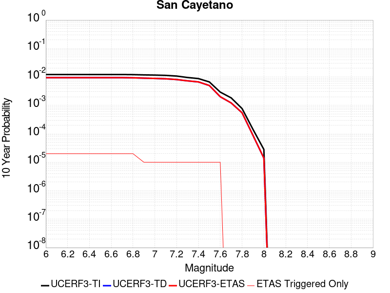 |

| Magnitude | 1 wk TI Prob | 1 wk TD Prob | 1 wk ETAS Prob | 1 wk ETAS/TD Gain | 1 wk ETAS Triggered Only | 1 mo TI Prob | 1 mo TD Prob | 1 mo ETAS Prob | 1 mo ETAS/TD Gain | 1 mo ETAS Triggered Only | 1 yr TI Prob | 1 yr TD Prob | 1 yr ETAS Prob | 1 yr ETAS/TD Gain | 1 yr ETAS Triggered Only | 10 yr TI Prob | 10 yr TD Prob | 10 yr ETAS Prob | 10 yr ETAS/TD Gain | 10 yr ETAS Triggered Only |
|-----|-----|-----|-----|-----|-----|-----|-----|-----|-----|-----|-----|-----|-----|-----|-----|-----|-----|-----|-----|-----|
| 6.0 | 2.3476267E-5 | 1.8169507E-5 | 1.8169507E-5 | 1.0 | 0.0 | 1.0060869E-4 | 7.786701E-5 | 7.786701E-5 | 1.0 | 0.0 | 0.0012242225 | 9.476222E-4 | 9.576127E-4 | 1.0105428 | 1.0E-5 | 0.012175002 | 0.009437101 | 0.009456912 | 1.0020993 | 2.0E-5 |
| 6.1 | 2.3476267E-5 | 1.8169507E-5 | 1.8169507E-5 | 1.0 | 0.0 | 1.0060869E-4 | 7.786701E-5 | 7.786701E-5 | 1.0 | 0.0 | 0.0012242225 | 9.476222E-4 | 9.576127E-4 | 1.0105428 | 1.0E-5 | 0.012175002 | 0.009437101 | 0.009456912 | 1.0020993 | 2.0E-5 |
| 6.2 | 2.3476267E-5 | 1.8169507E-5 | 1.8169507E-5 | 1.0 | 0.0 | 1.0060869E-4 | 7.786701E-5 | 7.786701E-5 | 1.0 | 0.0 | 0.0012242225 | 9.476222E-4 | 9.576127E-4 | 1.0105428 | 1.0E-5 | 0.012175002 | 0.009437101 | 0.009456912 | 1.0020993 | 2.0E-5 |
| 6.3 | 2.3476267E-5 | 1.8169507E-5 | 1.8169507E-5 | 1.0 | 0.0 | 1.0060869E-4 | 7.786701E-5 | 7.786701E-5 | 1.0 | 0.0 | 0.0012242225 | 9.476222E-4 | 9.576127E-4 | 1.0105428 | 1.0E-5 | 0.012175002 | 0.009437101 | 0.009456912 | 1.0020993 | 2.0E-5 |
| 6.4 | 2.3476267E-5 | 1.8169507E-5 | 1.8169507E-5 | 1.0 | 0.0 | 1.0060869E-4 | 7.786701E-5 | 7.786701E-5 | 1.0 | 0.0 | 0.0012242225 | 9.476222E-4 | 9.576127E-4 | 1.0105428 | 1.0E-5 | 0.012175002 | 0.009437101 | 0.009456912 | 1.0020993 | 2.0E-5 |
| 6.5 | 2.3476267E-5 | 1.8169507E-5 | 1.8169507E-5 | 1.0 | 0.0 | 1.0060869E-4 | 7.786701E-5 | 7.786701E-5 | 1.0 | 0.0 | 0.0012242225 | 9.476222E-4 | 9.576127E-4 | 1.0105428 | 1.0E-5 | 0.012175002 | 0.009437101 | 0.009456912 | 1.0020993 | 2.0E-5 |
| 6.6 | 2.3476267E-5 | 1.8169507E-5 | 1.8169507E-5 | 1.0 | 0.0 | 1.0060869E-4 | 7.786701E-5 | 7.786701E-5 | 1.0 | 0.0 | 0.0012242225 | 9.476222E-4 | 9.576127E-4 | 1.0105428 | 1.0E-5 | 0.012175002 | 0.009437101 | 0.009456912 | 1.0020993 | 2.0E-5 |
| 6.7 | 2.3476267E-5 | 1.8169507E-5 | 1.8169507E-5 | 1.0 | 0.0 | 1.0060869E-4 | 7.786701E-5 | 7.786701E-5 | 1.0 | 0.0 | 0.0012242225 | 9.476222E-4 | 9.576127E-4 | 1.0105428 | 1.0E-5 | 0.012175002 | 0.009437101 | 0.009456912 | 1.0020993 | 2.0E-5 |
| 6.8 | 2.3241924E-5 | 1.7937233E-5 | 1.7937233E-5 | 1.0 | 0.0 | 9.960445E-5 | 7.6871605E-5 | 7.6871605E-5 | 1.0 | 0.0 | 0.0012120095 | 9.355136E-4 | 9.4550423E-4 | 1.0106794 | 1.0E-5 | 0.012054204 | 0.009316779 | 0.009336592 | 1.0021267 | 2.0E-5 |
| 6.9 | 2.2761007E-5 | 1.743266E-5 | 1.743266E-5 | 1.0 | 0.0 | 9.7543525E-5 | 7.470928E-5 | 7.470928E-5 | 1.0 | 0.0 | 0.0011869454 | 9.092093E-4 | 9.092093E-4 | 1.0 | 0.0 | 0.011806256 | 0.009055895 | 0.009065804 | 1.0010942 | 1.0E-5 |
| 7.0 | 2.240283E-5 | 1.7066408E-5 | 1.7066408E-5 | 1.0 | 0.0 | 9.600859E-5 | 7.3139716E-5 | 7.3139716E-5 | 1.0 | 0.0 | 0.0011682777 | 8.901157E-4 | 8.901157E-4 | 1.0 | 0.0 | 0.011621549 | 0.008866488 | 0.008876399 | 1.0011178 | 1.0E-5 |
| 7.1 | 2.1871154E-5 | 1.6586284E-5 | 1.6586284E-5 | 1.0 | 0.0 | 9.373015E-5 | 7.1082155E-5 | 7.1082155E-5 | 1.0 | 0.0 | 0.0011405671 | 8.6508493E-4 | 8.6508493E-4 | 1.0 | 0.0 | 0.011347309 | 0.008618144 | 0.008628058 | 1.0011504 | 1.0E-5 |
| 7.2 | 2.0714133E-5 | 1.5564807E-5 | 1.5564807E-5 | 1.0 | 0.0 | 8.8771834E-5 | 6.670463E-5 | 6.670463E-5 | 1.0 | 0.0 | 0.0010802611 | 8.118295E-4 | 8.118295E-4 | 1.0 | 0.0 | 0.010750249 | 0.008089582 | 0.008099502 | 1.0012262 | 1.0E-5 |
| 7.3 | 1.8408395E-5 | 1.3997041E-5 | 1.3997041E-5 | 1.0 | 0.0 | 7.8890735E-5 | 5.9985956E-5 | 5.9985956E-5 | 1.0 | 0.0 | 9.600714E-4 | 7.300873E-4 | 7.300873E-4 | 1.0 | 0.0 | 0.009559342 | 0.007277768 | 0.007287695 | 1.001364 | 1.0E-5 |
| 7.4 | 1.6856795E-5 | 1.2850253E-5 | 1.2850253E-5 | 1.0 | 0.0 | 7.2241404E-5 | 5.5071367E-5 | 5.5071367E-5 | 1.0 | 0.0 | 8.7918417E-4 | 6.702905E-4 | 6.702905E-4 | 1.0 | 0.0 | 0.00875714 | 0.006683518 | 0.0066934517 | 1.0014862 | 1.0E-5 |
| 7.5 | 1.2822778E-5 | 9.577563E-6 | 9.577563E-6 | 1.0 | 0.0 | 5.495361E-5 | 4.1046063E-5 | 4.1046063E-5 | 1.0 | 0.0 | 6.688548E-4 | 4.9962284E-4 | 4.9962284E-4 | 1.0 | 0.0 | 0.006668452 | 0.004985341 | 0.004995291 | 1.0019959 | 1.0E-5 |
| 7.6 | 5.6272684E-6 | 3.8549674E-6 | 3.8549674E-6 | 1.0 | 0.0 | 2.4116642E-5 | 1.6521184E-5 | 1.6521184E-5 | 1.0 | 0.0 | 2.9358055E-4 | 2.0112695E-4 | 2.0112695E-4 | 1.0 | 0.0 | 0.0029319301 | 0.0020094602 | 0.00201944 | 1.0049665 | 1.0E-5 |
| 7.7 | 3.5261346E-6 | 2.3407508E-6 | 2.3407508E-6 | 1.0 | 0.0 | 1.5111918E-5 | 1.0031751E-5 | 1.0031751E-5 | 1.0 | 0.0 | 1.8397206E-4 | 1.221298E-4 | 1.221298E-4 | 1.0 | 0.0 | 0.0018381984 | 0.0012206341 | 0.0012206341 | 1.0 | 0.0 |
| 7.8 | 1.4826929E-6 | 1.0564586E-6 | 1.0564586E-6 | 1.0 | 0.0 | 6.354383E-6 | 4.527672E-6 | 4.527672E-6 | 1.0 | 0.0 | 7.736187E-5 | 5.512303E-5 | 5.512303E-5 | 1.0 | 0.0 | 7.733494E-4 | 5.510956E-4 | 5.510956E-4 | 1.0 | 0.0 |
| 7.9 | 2.7568166E-7 | 1.6978433E-7 | 1.6978433E-7 | 1.0 | 0.0 | 1.1814923E-6 | 7.276469E-7 | 7.276469E-7 | 1.0 | 0.0 | 1.4384574E-5 | 8.859066E-6 | 8.859066E-6 | 1.0 | 0.0 | 1.4383643E-4 | 8.858716E-5 | 8.858716E-5 | 1.0 | 0.0 |
| 8.0 | 5.407832E-8 | 2.68885E-8 | 2.68885E-8 | 1.0 | 0.0 | 2.3176422E-7 | 1.15236425E-7 | 1.15236425E-7 | 1.0 | 0.0 | 2.8217257E-6 | 1.4030026E-6 | 1.4030026E-6 | 1.0 | 0.0 | 2.8216898E-5 | 1.4029942E-5 | 1.4029942E-5 | 1.0 | 0.0 |

## Rinconada 2011 CFM
*[(top)](#table-of-contents)*

| 1 Week | 1 Month | 1 Year | 10 Year |
|-----|-----|-----|-----|
|  |  |  |  |

| Magnitude | 1 wk TI Prob | 1 wk TD Prob | 1 wk ETAS Prob | 1 wk ETAS/TD Gain | 1 wk ETAS Triggered Only | 1 mo TI Prob | 1 mo TD Prob | 1 mo ETAS Prob | 1 mo ETAS/TD Gain | 1 mo ETAS Triggered Only | 1 yr TI Prob | 1 yr TD Prob | 1 yr ETAS Prob | 1 yr ETAS/TD Gain | 1 yr ETAS Triggered Only | 10 yr TI Prob | 10 yr TD Prob | 10 yr ETAS Prob | 10 yr ETAS/TD Gain | 10 yr ETAS Triggered Only |
|-----|-----|-----|-----|-----|-----|-----|-----|-----|-----|-----|-----|-----|-----|-----|-----|-----|-----|-----|-----|-----|
| 6.0 | 1.5752368E-5 | 1.6274787E-5 | 1.6274787E-5 | 1.0 | 0.0 | 6.75084E-5 | 6.974724E-5 | 6.974724E-5 | 1.0 | 0.0 | 8.2160486E-4 | 8.48845E-4 | 8.6882804E-4 | 1.0235415 | 2.0E-5 | 0.008185739 | 0.008456407 | 0.008476238 | 1.0023451 | 2.0E-5 |
| 6.1 | 1.0966133E-5 | 1.1323078E-5 | 1.1323078E-5 | 1.0 | 0.0 | 4.6996865E-5 | 4.852658E-5 | 4.852658E-5 | 1.0 | 0.0 | 5.720366E-4 | 5.906517E-4 | 6.1063987E-4 | 1.0338409 | 2.0E-5 | 0.0057056635 | 0.0058909147 | 0.0059107966 | 1.003375 | 2.0E-5 |
| 6.2 | 1.0966133E-5 | 1.1323078E-5 | 1.1323078E-5 | 1.0 | 0.0 | 4.6996865E-5 | 4.852658E-5 | 4.852658E-5 | 1.0 | 0.0 | 5.720366E-4 | 5.906517E-4 | 6.1063987E-4 | 1.0338409 | 2.0E-5 | 0.0057056635 | 0.0058909147 | 0.0059107966 | 1.003375 | 2.0E-5 |
| 6.3 | 8.926149E-6 | 9.212811E-6 | 9.212811E-6 | 1.0 | 0.0 | 3.8254362E-5 | 3.9482882E-5 | 3.9482882E-5 | 1.0 | 0.0 | 4.6564735E-4 | 4.805984E-4 | 4.9059355E-4 | 1.0207974 | 1.0E-5 | 0.0046467283 | 0.004795635 | 0.004805587 | 1.0020752 | 1.0E-5 |
| 6.4 | 7.676955E-6 | 7.920225E-6 | 7.920225E-6 | 1.0 | 0.0 | 3.290082E-5 | 3.394338E-5 | 3.394338E-5 | 1.0 | 0.0 | 4.0049385E-4 | 4.1318245E-4 | 4.2317834E-4 | 1.0241923 | 1.0E-5 | 0.0039977287 | 0.004124169 | 0.0041341274 | 1.0024147 | 1.0E-5 |
| 6.5 | 6.1671026E-6 | 6.358982E-6 | 6.358982E-6 | 1.0 | 0.0 | 2.6430173E-5 | 2.7252494E-5 | 2.7252494E-5 | 1.0 | 0.0 | 3.2173982E-4 | 3.3174868E-4 | 3.4174536E-4 | 1.0301332 | 1.0E-5 | 0.003212744 | 0.0033125465 | 0.0033225133 | 1.0030088 | 1.0E-5 |
| 6.6 | 5.553456E-6 | 5.7248367E-6 | 5.7248367E-6 | 1.0 | 0.0 | 2.3800309E-5 | 2.4534784E-5 | 2.4534784E-5 | 1.0 | 0.0 | 2.897302E-4 | 2.9867011E-4 | 3.086671E-4 | 1.0334717 | 1.0E-5 | 0.0028935277 | 0.0029826956 | 0.0029926659 | 1.0033426 | 1.0E-5 |
| 6.7 | 4.787857E-6 | 4.93333E-6 | 4.93333E-6 | 1.0 | 0.0 | 2.0519226E-5 | 2.1142672E-5 | 2.1142672E-5 | 1.0 | 0.0 | 2.4979294E-4 | 2.5738167E-4 | 2.6737907E-4 | 1.0388428 | 1.0E-5 | 0.0024951235 | 0.0025708415 | 0.0025808157 | 1.0038798 | 1.0E-5 |
| 6.8 | 3.9955166E-6 | 4.1134927E-6 | 4.1134927E-6 | 1.0 | 0.0 | 1.7123532E-5 | 1.7629136E-5 | 1.7629136E-5 | 1.0 | 0.0 | 2.0845905E-4 | 2.1461361E-4 | 2.2461147E-4 | 1.0465853 | 1.0E-5 | 0.002082636 | 0.0021440673 | 0.0021540457 | 1.004654 | 1.0E-5 |
| 6.9 | 3.4250072E-6 | 3.5224602E-6 | 3.5224602E-6 | 1.0 | 0.0 | 1.46785205E-5 | 1.50961705E-5 | 1.50961705E-5 | 1.0 | 0.0 | 1.7869633E-4 | 1.837804E-4 | 1.837804E-4 | 1.0 | 0.0 | 0.001785527 | 0.0018362866 | 0.0018362866 | 1.0 | 0.0 |
| 7.0 | 2.7712713E-6 | 2.846711E-6 | 2.846711E-6 | 1.0 | 0.0 | 1.1876823E-5 | 1.2200132E-5 | 1.2200132E-5 | 1.0 | 0.0 | 1.4459073E-4 | 1.485265E-4 | 1.485265E-4 | 1.0 | 0.0 | 0.0014449668 | 0.0014842738 | 0.0014842738 | 1.0 | 0.0 |
| 7.1 | 2.227358E-6 | 2.285707E-6 | 2.285707E-6 | 1.0 | 0.0 | 9.545785E-6 | 9.79585E-6 | 9.79585E-6 | 1.0 | 0.0 | 1.16213734E-4 | 1.1925796E-4 | 1.1925796E-4 | 1.0 | 0.0 | 0.0011615298 | 0.0011919406 | 0.0011919406 | 1.0 | 0.0 |
| 7.2 | 1.581796E-6 | 1.620907E-6 | 1.620907E-6 | 1.0 | 0.0 | 6.779108E-6 | 6.946726E-6 | 6.946726E-6 | 1.0 | 0.0 | 8.253252E-5 | 8.457311E-5 | 8.457311E-5 | 1.0 | 0.0 | 8.250187E-4 | 8.454098E-4 | 8.454098E-4 | 1.0 | 0.0 |
| 7.3 | 1.0306567E-6 | 1.0546515E-6 | 1.0546515E-6 | 1.0 | 0.0 | 4.4170924E-6 | 4.519927E-6 | 4.519927E-6 | 1.0 | 0.0 | 5.3776774E-5 | 5.5028726E-5 | 5.5028726E-5 | 1.0 | 0.0 | 5.376376E-4 | 5.501513E-4 | 5.501513E-4 | 1.0 | 0.0 |
| 7.4 | 6.535541E-7 | 6.6827675E-7 | 6.6827675E-7 | 1.0 | 0.0 | 2.800943E-6 | 2.8640402E-6 | 2.8640402E-6 | 1.0 | 0.0 | 3.4100947E-5 | 3.4869132E-5 | 3.4869132E-5 | 1.0 | 0.0 | 3.4095717E-4 | 3.4863673E-4 | 3.4863673E-4 | 1.0 | 0.0 |
| 7.5 | 3.2656962E-7 | 3.3316834E-7 | 3.3316834E-7 | 1.0 | 0.0 | 1.3995833E-6 | 1.4278635E-6 | 1.4278635E-6 | 1.0 | 0.0 | 1.7039794E-5 | 1.73841E-5 | 1.73841E-5 | 1.0 | 0.0 | 1.7038487E-4 | 1.7382744E-4 | 1.7382744E-4 | 1.0 | 0.0 |
| 7.6 | 9.754343E-8 | 9.821057E-8 | 9.821057E-8 | 1.0 | 0.0 | 4.180432E-7 | 4.2090235E-7 | 4.2090235E-7 | 1.0 | 0.0 | 5.089664E-6 | 5.1244742E-6 | 5.1244742E-6 | 1.0 | 0.0 | 5.0895473E-5 | 5.124357E-5 | 5.124357E-5 | 1.0 | 0.0 |
| 7.7 | 6.0001453E-9 | 5.84914E-9 | 5.84914E-9 | 1.0 | 0.0 | 2.5714908E-8 | 2.5067743E-8 | 2.5067743E-8 | 1.0 | 0.0 | 3.1307894E-7 | 3.0519973E-7 | 3.0519973E-7 | 1.0 | 0.0 | 3.1307852E-6 | 3.0519934E-6 | 3.0519934E-6 | 1.0 | 0.0 |
| 7.8 | 7.400003E-11 | 7.4654505E-11 | 7.4654505E-11 | 1.0 | 0.0 | 3.171432E-10 | 3.1994807E-10 | 3.1994807E-10 | 1.0 | 0.0 | 3.861218E-9 | 3.8953676E-9 | 3.8953676E-9 | 1.0 | 0.0 | 3.861218E-8 | 3.8953676E-8 | 3.8953676E-8 | 1.0 | 0.0 |

## San Gabriel (Extension)
*[(top)](#table-of-contents)*

| 1 Week | 1 Month | 1 Year | 10 Year |
|-----|-----|-----|-----|
|  |  |  |  |

| Magnitude | 1 wk TI Prob | 1 wk TD Prob | 1 wk ETAS Prob | 1 wk ETAS/TD Gain | 1 wk ETAS Triggered Only | 1 mo TI Prob | 1 mo TD Prob | 1 mo ETAS Prob | 1 mo ETAS/TD Gain | 1 mo ETAS Triggered Only | 1 yr TI Prob | 1 yr TD Prob | 1 yr ETAS Prob | 1 yr ETAS/TD Gain | 1 yr ETAS Triggered Only | 10 yr TI Prob | 10 yr TD Prob | 10 yr ETAS Prob | 10 yr ETAS/TD Gain | 10 yr ETAS Triggered Only |
|-----|-----|-----|-----|-----|-----|-----|-----|-----|-----|-----|-----|-----|-----|-----|-----|-----|-----|-----|-----|-----|
| 6.0 | 5.6486106E-6 | 5.7171515E-6 | 5.7171515E-6 | 1.0 | 0.0 | 2.4208108E-5 | 2.4501855E-5 | 2.4501855E-5 | 1.0 | 0.0 | 2.9469383E-4 | 2.9827052E-4 | 2.9827052E-4 | 1.0 | 0.0 | 0.0029430336 | 0.0029788336 | 0.0029987742 | 1.0066941 | 2.0E-5 |
| 6.1 | 5.6486106E-6 | 5.7171515E-6 | 5.7171515E-6 | 1.0 | 0.0 | 2.4208108E-5 | 2.4501855E-5 | 2.4501855E-5 | 1.0 | 0.0 | 2.9469383E-4 | 2.9827052E-4 | 2.9827052E-4 | 1.0 | 0.0 | 0.0029430336 | 0.0029788336 | 0.0029987742 | 1.0066941 | 2.0E-5 |
| 6.2 | 5.6486106E-6 | 5.7171515E-6 | 5.7171515E-6 | 1.0 | 0.0 | 2.4208108E-5 | 2.4501855E-5 | 2.4501855E-5 | 1.0 | 0.0 | 2.9469383E-4 | 2.9827052E-4 | 2.9827052E-4 | 1.0 | 0.0 | 0.0029430336 | 0.0029788336 | 0.0029987742 | 1.0066941 | 2.0E-5 |
| 6.3 | 5.6486106E-6 | 5.7171515E-6 | 5.7171515E-6 | 1.0 | 0.0 | 2.4208108E-5 | 2.4501855E-5 | 2.4501855E-5 | 1.0 | 0.0 | 2.9469383E-4 | 2.9827052E-4 | 2.9827052E-4 | 1.0 | 0.0 | 0.0029430336 | 0.0029788336 | 0.0029987742 | 1.0066941 | 2.0E-5 |
| 6.4 | 5.6486106E-6 | 5.7171515E-6 | 5.7171515E-6 | 1.0 | 0.0 | 2.4208108E-5 | 2.4501855E-5 | 2.4501855E-5 | 1.0 | 0.0 | 2.9469383E-4 | 2.9827052E-4 | 2.9827052E-4 | 1.0 | 0.0 | 0.0029430336 | 0.0029788336 | 0.0029987742 | 1.0066941 | 2.0E-5 |
| 6.5 | 4.7134554E-6 | 4.754572E-6 | 4.754572E-6 | 1.0 | 0.0 | 2.0200367E-5 | 2.0376581E-5 | 2.0376581E-5 | 1.0 | 0.0 | 2.459117E-4 | 2.4805748E-4 | 2.4805748E-4 | 1.0 | 0.0 | 0.0024563975 | 0.0024778957 | 0.002497846 | 1.0080514 | 2.0E-5 |
| 6.6 | 4.7134554E-6 | 4.754572E-6 | 4.754572E-6 | 1.0 | 0.0 | 2.0200367E-5 | 2.0376581E-5 | 2.0376581E-5 | 1.0 | 0.0 | 2.459117E-4 | 2.4805748E-4 | 2.4805748E-4 | 1.0 | 0.0 | 0.0024563975 | 0.0024778957 | 0.002497846 | 1.0080514 | 2.0E-5 |
| 6.7 | 4.2468837E-6 | 4.2743873E-6 | 4.2743873E-6 | 1.0 | 0.0 | 1.8200803E-5 | 1.8318677E-5 | 1.8318677E-5 | 1.0 | 0.0 | 2.2157225E-4 | 2.230078E-4 | 2.230078E-4 | 1.0 | 0.0 | 0.0022135144 | 0.0022279175 | 0.002247873 | 1.008957 | 2.0E-5 |
| 6.8 | 4.1180615E-6 | 4.141776E-6 | 4.141776E-6 | 1.0 | 0.0 | 1.7648716E-5 | 1.7750353E-5 | 1.7750353E-5 | 1.0 | 0.0 | 2.1485193E-4 | 2.1608983E-4 | 2.1608983E-4 | 1.0 | 0.0 | 0.0021464431 | 0.0021588737 | 0.0021788306 | 1.0092441 | 2.0E-5 |
| 6.9 | 3.863861E-6 | 3.8800904E-6 | 3.8800904E-6 | 1.0 | 0.0 | 1.65593E-5 | 1.6628857E-5 | 1.6628857E-5 | 1.0 | 0.0 | 2.0159081E-4 | 2.0243821E-4 | 2.0243821E-4 | 1.0 | 0.0 | 0.0020140803 | 0.002022611 | 0.0020425704 | 1.0098683 | 2.0E-5 |
| 7.0 | 3.6947372E-6 | 3.705989E-6 | 3.705989E-6 | 1.0 | 0.0 | 1.5834492E-5 | 1.5882717E-5 | 1.5882717E-5 | 1.0 | 0.0 | 1.9276788E-4 | 1.9335559E-4 | 1.9335559E-4 | 1.0 | 0.0 | 0.0019260074 | 0.0019319453 | 0.0019519067 | 1.0103322 | 2.0E-5 |
| 7.1 | 3.5686835E-6 | 3.5732085E-6 | 3.5732085E-6 | 1.0 | 0.0 | 1.5294268E-5 | 1.5313664E-5 | 1.5313664E-5 | 1.0 | 0.0 | 1.861918E-4 | 1.8642857E-4 | 1.8642857E-4 | 1.0 | 0.0 | 0.0018603588 | 0.001862793 | 0.0018827557 | 1.0107166 | 2.0E-5 |
| 7.2 | 2.8023446E-6 | 2.7770957E-6 | 2.7770957E-6 | 1.0 | 0.0 | 1.2009994E-5 | 1.1901785E-5 | 1.1901785E-5 | 1.0 | 0.0 | 1.4621185E-4 | 1.448947E-4 | 1.448947E-4 | 1.0 | 0.0 | 0.001461157 | 0.0014480185 | 0.0014679895 | 1.013792 | 2.0E-5 |
| 7.3 | 2.5843012E-6 | 2.546268E-6 | 2.546268E-6 | 1.0 | 0.0 | 1.1075529E-5 | 1.0912532E-5 | 1.0912532E-5 | 1.0 | 0.0 | 1.3483623E-4 | 1.3285207E-4 | 1.3285207E-4 | 1.0 | 0.0 | 0.0013475444 | 0.0013277415 | 0.001347715 | 1.0150431 | 2.0E-5 |
| 7.4 | 2.4464468E-6 | 2.3969635E-6 | 2.3969635E-6 | 1.0 | 0.0 | 1.04847295E-5 | 1.0272661E-5 | 1.0272661E-5 | 1.0 | 0.0 | 1.276441E-4 | 1.2506256E-4 | 1.2506256E-4 | 1.0 | 0.0 | 0.0012757082 | 0.0012499366 | 0.0012699116 | 1.0159808 | 2.0E-5 |
| 7.5 | 2.0420266E-6 | 1.891297E-6 | 1.891297E-6 | 1.0 | 0.0 | 8.751514E-6 | 8.105533E-6 | 8.105533E-6 | 1.0 | 0.0 | 1.0654447E-4 | 9.868044E-5 | 9.868044E-5 | 1.0 | 0.0 | 0.001064934 | 9.863748E-4 | 9.96365E-4 | 1.0101281 | 1.0E-5 |
| 7.6 | 1.8326596E-6 | 1.6400626E-6 | 1.6400626E-6 | 1.0 | 0.0 | 7.854232E-6 | 7.028821E-6 | 7.028821E-6 | 1.0 | 0.0 | 9.562107E-5 | 8.557256E-5 | 8.557256E-5 | 1.0 | 0.0 | 9.5579936E-4 | 8.5540337E-4 | 8.6539483E-4 | 1.0116804 | 1.0E-5 |
| 7.7 | 1.4786998E-6 | 1.2525887E-6 | 1.2525887E-6 | 1.0 | 0.0 | 6.3372695E-6 | 5.368226E-6 | 5.368226E-6 | 1.0 | 0.0 | 7.715353E-5 | 6.535621E-5 | 6.535621E-5 | 1.0 | 0.0 | 7.7126746E-4 | 6.5337884E-4 | 6.633723E-4 | 1.015295 | 1.0E-5 |
| 7.8 | 7.6975533E-7 | 6.071072E-7 | 6.071072E-7 | 1.0 | 0.0 | 3.2989474E-6 | 2.6018854E-6 | 2.6018854E-6 | 1.0 | 0.0 | 4.0163945E-5 | 3.1677497E-5 | 3.1677497E-5 | 1.0 | 0.0 | 4.0156685E-4 | 3.1673696E-4 | 3.1673696E-4 | 1.0 | 0.0 |
| 7.9 | 1.7645915E-7 | 9.217281E-8 | 9.217281E-8 | 1.0 | 0.0 | 7.562533E-7 | 3.950263E-7 | 3.950263E-7 | 1.0 | 0.0 | 9.207345E-6 | 4.8094344E-6 | 4.8094344E-6 | 1.0 | 0.0 | 9.206964E-5 | 4.8098358E-5 | 4.8098358E-5 | 1.0 | 0.0 |
| 8.0 | 1.0463461E-7 | 2.4959572E-8 | 2.4959572E-8 | 1.0 | 0.0 | 4.4843398E-7 | 1.0696959E-7 | 1.0696959E-7 | 1.0 | 0.0 | 5.45967E-6 | 1.302354E-6 | 1.302354E-6 | 1.0 | 0.0 | 5.459536E-5 | 1.3028511E-5 | 1.3028511E-5 | 1.0 | 0.0 |
| 8.1 | 7.875717E-8 | 1.3871283E-8 | 1.3871283E-8 | 1.0 | 0.0 | 3.3753068E-7 | 5.9448354E-8 | 5.9448354E-8 | 1.0 | 0.0 | 4.109428E-6 | 7.2378344E-7 | 7.2378344E-7 | 1.0 | 0.0 | 4.109352E-5 | 7.2428584E-6 | 7.2428584E-6 | 1.0 | 0.0 |
| 8.2 | 1.33163E-8 | 1.7741913E-9 | 1.7741913E-9 | 1.0 | 0.0 | 5.7069855E-8 | 7.603677E-9 | 7.603677E-9 | 1.0 | 0.0 | 6.9482525E-7 | 9.257475E-8 | 9.257475E-8 | 1.0 | 0.0 | 6.9482307E-6 | 9.27746E-7 | 9.27746E-7 | 1.0 | 0.0 |

## Sisar
*[(top)](#table-of-contents)*

| 1 Week | 1 Month | 1 Year | 10 Year |
|-----|-----|-----|-----|
|  |  |  |  |

| Magnitude | 1 wk TI Prob | 1 wk TD Prob | 1 wk ETAS Prob | 1 wk ETAS/TD Gain | 1 wk ETAS Triggered Only | 1 mo TI Prob | 1 mo TD Prob | 1 mo ETAS Prob | 1 mo ETAS/TD Gain | 1 mo ETAS Triggered Only | 1 yr TI Prob | 1 yr TD Prob | 1 yr ETAS Prob | 1 yr ETAS/TD Gain | 1 yr ETAS Triggered Only | 10 yr TI Prob | 10 yr TD Prob | 10 yr ETAS Prob | 10 yr ETAS/TD Gain | 10 yr ETAS Triggered Only |
|-----|-----|-----|-----|-----|-----|-----|-----|-----|-----|-----|-----|-----|-----|-----|-----|-----|-----|-----|-----|-----|
| 6.0 | 4.544193E-6 | 3.83965E-6 | 3.83965E-6 | 1.0 | 0.0 | 1.9474966E-5 | 1.645554E-5 | 1.645554E-5 | 1.0 | 0.0 | 2.3708193E-4 | 2.0032813E-4 | 2.1032612E-4 | 1.0499082 | 1.0E-5 | 0.0023682916 | 0.002001509 | 0.0020214692 | 1.0099725 | 2.0E-5 |
| 6.1 | 4.544193E-6 | 3.83965E-6 | 3.83965E-6 | 1.0 | 0.0 | 1.9474966E-5 | 1.645554E-5 | 1.645554E-5 | 1.0 | 0.0 | 2.3708193E-4 | 2.0032813E-4 | 2.1032612E-4 | 1.0499082 | 1.0E-5 | 0.0023682916 | 0.002001509 | 0.0020214692 | 1.0099725 | 2.0E-5 |
| 6.2 | 4.544193E-6 | 3.83965E-6 | 3.83965E-6 | 1.0 | 0.0 | 1.9474966E-5 | 1.645554E-5 | 1.645554E-5 | 1.0 | 0.0 | 2.3708193E-4 | 2.0032813E-4 | 2.1032612E-4 | 1.0499082 | 1.0E-5 | 0.0023682916 | 0.002001509 | 0.0020214692 | 1.0099725 | 2.0E-5 |
| 6.3 | 4.544193E-6 | 3.83965E-6 | 3.83965E-6 | 1.0 | 0.0 | 1.9474966E-5 | 1.645554E-5 | 1.645554E-5 | 1.0 | 0.0 | 2.3708193E-4 | 2.0032813E-4 | 2.1032612E-4 | 1.0499082 | 1.0E-5 | 0.0023682916 | 0.002001509 | 0.0020214692 | 1.0099725 | 2.0E-5 |
| 6.4 | 4.544193E-6 | 3.83965E-6 | 3.83965E-6 | 1.0 | 0.0 | 1.9474966E-5 | 1.645554E-5 | 1.645554E-5 | 1.0 | 0.0 | 2.3708193E-4 | 2.0032813E-4 | 2.1032612E-4 | 1.0499082 | 1.0E-5 | 0.0023682916 | 0.002001509 | 0.0020214692 | 1.0099725 | 2.0E-5 |
| 6.5 | 4.544193E-6 | 3.83965E-6 | 3.83965E-6 | 1.0 | 0.0 | 1.9474966E-5 | 1.645554E-5 | 1.645554E-5 | 1.0 | 0.0 | 2.3708193E-4 | 2.0032813E-4 | 2.1032612E-4 | 1.0499082 | 1.0E-5 | 0.0023682916 | 0.002001509 | 0.0020214692 | 1.0099725 | 2.0E-5 |
| 6.6 | 4.544193E-6 | 3.83965E-6 | 3.83965E-6 | 1.0 | 0.0 | 1.9474966E-5 | 1.645554E-5 | 1.645554E-5 | 1.0 | 0.0 | 2.3708193E-4 | 2.0032813E-4 | 2.1032612E-4 | 1.0499082 | 1.0E-5 | 0.0023682916 | 0.002001509 | 0.0020214692 | 1.0099725 | 2.0E-5 |
| 6.7 | 4.544193E-6 | 3.83965E-6 | 3.83965E-6 | 1.0 | 0.0 | 1.9474966E-5 | 1.645554E-5 | 1.645554E-5 | 1.0 | 0.0 | 2.3708193E-4 | 2.0032813E-4 | 2.1032612E-4 | 1.0499082 | 1.0E-5 | 0.0023682916 | 0.002001509 | 0.0020214692 | 1.0099725 | 2.0E-5 |
| 6.8 | 4.544193E-6 | 3.83965E-6 | 3.83965E-6 | 1.0 | 0.0 | 1.9474966E-5 | 1.645554E-5 | 1.645554E-5 | 1.0 | 0.0 | 2.3708193E-4 | 2.0032813E-4 | 2.1032612E-4 | 1.0499082 | 1.0E-5 | 0.0023682916 | 0.002001509 | 0.0020214692 | 1.0099725 | 2.0E-5 |
| 6.9 | 4.542225E-6 | 3.837612E-6 | 3.837612E-6 | 1.0 | 0.0 | 1.9466532E-5 | 1.6446806E-5 | 1.6446806E-5 | 1.0 | 0.0 | 2.3697925E-4 | 2.002218E-4 | 2.1021979E-4 | 1.0499346 | 1.0E-5 | 0.002367267 | 0.0020004478 | 0.002020408 | 1.0099778 | 2.0E-5 |
| 7.0 | 4.5278484E-6 | 3.822676E-6 | 3.822676E-6 | 1.0 | 0.0 | 1.940492E-5 | 1.6382795E-5 | 1.6382795E-5 | 1.0 | 0.0 | 2.3622929E-4 | 1.9944261E-4 | 2.0944062E-4 | 1.0501298 | 1.0E-5 | 0.0023597833 | 0.00199267 | 0.0020126302 | 1.0100168 | 2.0E-5 |
| 7.1 | 4.5132488E-6 | 3.8074631E-6 | 3.8074631E-6 | 1.0 | 0.0 | 1.9342351E-5 | 1.63176E-5 | 1.63176E-5 | 1.0 | 0.0 | 2.3546767E-4 | 1.98649E-4 | 2.08647E-4 | 1.05033 | 1.0E-5 | 0.0023521832 | 0.001984748 | 0.0020047084 | 1.0100569 | 2.0E-5 |
| 7.2 | 4.448859E-6 | 3.7399232E-6 | 3.7399232E-6 | 1.0 | 0.0 | 1.9066398E-5 | 1.6028145E-5 | 1.6028145E-5 | 1.0 | 0.0 | 2.3210866E-4 | 1.9512554E-4 | 2.0512358E-4 | 1.051239 | 1.0E-5 | 0.0023186638 | 0.0019495757 | 0.0019695368 | 1.0102386 | 2.0E-5 |
| 7.3 | 4.3424366E-6 | 3.6337567E-6 | 3.6337567E-6 | 1.0 | 0.0 | 1.861031E-5 | 1.5573152E-5 | 1.5573152E-5 | 1.0 | 0.0 | 2.2655698E-4 | 1.8958695E-4 | 1.9958506E-4 | 1.0527363 | 1.0E-5 | 0.0022632615 | 0.0018942857 | 0.0019142478 | 1.0105381 | 2.0E-5 |
| 7.4 | 4.218641E-6 | 3.533109E-6 | 3.533109E-6 | 1.0 | 0.0 | 1.8079765E-5 | 1.514181E-5 | 1.514181E-5 | 1.0 | 0.0 | 2.2009891E-4 | 1.8433627E-4 | 1.9433443E-4 | 1.0542387 | 1.0E-5 | 0.0021988105 | 0.001841867 | 0.0018618301 | 1.0108385 | 2.0E-5 |
| 7.5 | 3.983779E-6 | 3.3478766E-6 | 3.3478766E-6 | 1.0 | 0.0 | 1.7073227E-5 | 1.4347966E-5 | 1.4347966E-5 | 1.0 | 0.0 | 2.0784672E-4 | 1.7467281E-4 | 1.8467107E-4 | 1.0572399 | 1.0E-5 | 0.0020765243 | 0.0017453883 | 0.0017653533 | 1.0114387 | 2.0E-5 |
| 7.6 | 2.777393E-6 | 2.3523016E-6 | 2.3523016E-6 | 1.0 | 0.0 | 1.1903058E-5 | 1.0081254E-5 | 1.0081254E-5 | 1.0 | 0.0 | 1.449101E-4 | 1.2273244E-4 | 1.327312E-4 | 1.0814681 | 1.0E-5 | 0.0014481564 | 0.0012266543 | 0.001236642 | 1.0081422 | 1.0E-5 |
| 7.7 | 1.9028433E-6 | 1.593904E-6 | 1.593904E-6 | 1.0 | 0.0 | 8.155017E-6 | 6.8309996E-6 | 6.8309996E-6 | 1.0 | 0.0 | 9.928281E-5 | 8.31643E-5 | 9.3163464E-5 | 1.1202339 | 1.0E-5 | 9.923846E-4 | 8.313365E-4 | 8.413282E-4 | 1.0120188 | 1.0E-5 |
| 7.8 | 4.9095956E-7 | 4.3584367E-7 | 4.3584367E-7 | 1.0 | 0.0 | 2.1041105E-6 | 1.8679001E-6 | 1.8679001E-6 | 1.0 | 0.0 | 2.5617246E-5 | 2.2741448E-5 | 2.2741448E-5 | 1.0 | 0.0 | 2.5614293E-4 | 2.2739139E-4 | 2.2739139E-4 | 1.0 | 0.0 |
| 7.9 | 1.16657894E-7 | 1.033569E-7 | 1.033569E-7 | 1.0 | 0.0 | 4.999623E-7 | 4.4295808E-7 | 4.4295808E-7 | 1.0 | 0.0 | 6.087024E-6 | 5.3930016E-6 | 5.3930016E-6 | 1.0 | 0.0 | 6.0868573E-5 | 5.3928736E-5 | 5.3928736E-5 | 1.0 | 0.0 |
| 8.0 | 2.5100346E-9 | 1.7068482E-9 | 1.7068482E-9 | 1.0 | 0.0 | 1.0757291E-8 | 7.315065E-9 | 7.315065E-9 | 1.0 | 0.0 | 1.3097001E-7 | 8.906091E-8 | 8.906091E-8 | 1.0 | 0.0 | 1.3096993E-6 | 8.906088E-7 | 8.906088E-7 | 1.0 | 0.0 |

## Pine Mtn
*[(top)](#table-of-contents)*

| 1 Week | 1 Month | 1 Year | 10 Year |
|-----|-----|-----|-----|
|  |  |  |  |

| Magnitude | 1 wk TI Prob | 1 wk TD Prob | 1 wk ETAS Prob | 1 wk ETAS/TD Gain | 1 wk ETAS Triggered Only | 1 mo TI Prob | 1 mo TD Prob | 1 mo ETAS Prob | 1 mo ETAS/TD Gain | 1 mo ETAS Triggered Only | 1 yr TI Prob | 1 yr TD Prob | 1 yr ETAS Prob | 1 yr ETAS/TD Gain | 1 yr ETAS Triggered Only | 10 yr TI Prob | 10 yr TD Prob | 10 yr ETAS Prob | 10 yr ETAS/TD Gain | 10 yr ETAS Triggered Only |
|-----|-----|-----|-----|-----|-----|-----|-----|-----|-----|-----|-----|-----|-----|-----|-----|-----|-----|-----|-----|-----|
| 6.0 | 6.894797E-6 | 7.225567E-6 | 7.225567E-6 | 1.0 | 0.0 | 2.9548795E-5 | 3.0966366E-5 | 3.0966366E-5 | 1.0 | 0.0 | 3.596972E-4 | 3.7695325E-4 | 3.8694948E-4 | 1.0265185 | 1.0E-5 | 0.0035911554 | 0.0037634359 | 0.0037833606 | 1.0052943 | 2.0E-5 |
| 6.1 | 6.894797E-6 | 7.225567E-6 | 7.225567E-6 | 1.0 | 0.0 | 2.9548795E-5 | 3.0966366E-5 | 3.0966366E-5 | 1.0 | 0.0 | 3.596972E-4 | 3.7695325E-4 | 3.8694948E-4 | 1.0265185 | 1.0E-5 | 0.0035911554 | 0.0037634359 | 0.0037833606 | 1.0052943 | 2.0E-5 |
| 6.2 | 6.894797E-6 | 7.225567E-6 | 7.225567E-6 | 1.0 | 0.0 | 2.9548795E-5 | 3.0966366E-5 | 3.0966366E-5 | 1.0 | 0.0 | 3.596972E-4 | 3.7695325E-4 | 3.8694948E-4 | 1.0265185 | 1.0E-5 | 0.0035911554 | 0.0037634359 | 0.0037833606 | 1.0052943 | 2.0E-5 |
| 6.3 | 6.894797E-6 | 7.225567E-6 | 7.225567E-6 | 1.0 | 0.0 | 2.9548795E-5 | 3.0966366E-5 | 3.0966366E-5 | 1.0 | 0.0 | 3.596972E-4 | 3.7695325E-4 | 3.8694948E-4 | 1.0265185 | 1.0E-5 | 0.0035911554 | 0.0037634359 | 0.0037833606 | 1.0052943 | 2.0E-5 |
| 6.4 | 6.894797E-6 | 7.225567E-6 | 7.225567E-6 | 1.0 | 0.0 | 2.9548795E-5 | 3.0966366E-5 | 3.0966366E-5 | 1.0 | 0.0 | 3.596972E-4 | 3.7695325E-4 | 3.8694948E-4 | 1.0265185 | 1.0E-5 | 0.0035911554 | 0.0037634359 | 0.0037833606 | 1.0052943 | 2.0E-5 |
| 6.5 | 6.894797E-6 | 7.225567E-6 | 7.225567E-6 | 1.0 | 0.0 | 2.9548795E-5 | 3.0966366E-5 | 3.0966366E-5 | 1.0 | 0.0 | 3.596972E-4 | 3.7695325E-4 | 3.8694948E-4 | 1.0265185 | 1.0E-5 | 0.0035911554 | 0.0037634359 | 0.0037833606 | 1.0052943 | 2.0E-5 |
| 6.6 | 6.894797E-6 | 7.225567E-6 | 7.225567E-6 | 1.0 | 0.0 | 2.9548795E-5 | 3.0966366E-5 | 3.0966366E-5 | 1.0 | 0.0 | 3.596972E-4 | 3.7695325E-4 | 3.8694948E-4 | 1.0265185 | 1.0E-5 | 0.0035911554 | 0.0037634359 | 0.0037833606 | 1.0052943 | 2.0E-5 |
| 6.7 | 6.0867933E-6 | 6.397216E-6 | 6.397216E-6 | 1.0 | 0.0 | 2.6085996E-5 | 2.7416365E-5 | 2.7416365E-5 | 1.0 | 0.0 | 3.1755073E-4 | 3.3374532E-4 | 3.4374197E-4 | 1.029953 | 1.0E-5 | 0.0031709734 | 0.00333266 | 0.0033426266 | 1.0029906 | 1.0E-5 |
| 6.8 | 5.6530425E-6 | 5.950697E-6 | 5.950697E-6 | 1.0 | 0.0 | 2.42271E-5 | 2.5502748E-5 | 2.5502748E-5 | 1.0 | 0.0 | 2.94925E-4 | 3.104538E-4 | 3.2045066E-4 | 1.0322009 | 1.0E-5 | 0.002945339 | 0.0031004054 | 0.0031103746 | 1.0032154 | 1.0E-5 |
| 6.9 | 4.6015225E-6 | 4.8639304E-6 | 4.8639304E-6 | 1.0 | 0.0 | 1.9720663E-5 | 2.0845258E-5 | 2.0845258E-5 | 1.0 | 0.0 | 2.4007261E-4 | 2.537629E-4 | 2.6376036E-4 | 1.0393969 | 1.0E-5 | 0.0023981342 | 0.0025348756 | 0.0025448503 | 1.003935 | 1.0E-5 |
| 7.0 | 4.4875965E-6 | 4.747569E-6 | 4.747569E-6 | 1.0 | 0.0 | 1.9232413E-5 | 2.0346575E-5 | 2.0346575E-5 | 1.0 | 0.0 | 2.3412947E-4 | 2.4769283E-4 | 2.5769035E-4 | 1.0403626 | 1.0E-5 | 0.0023388295 | 0.0024743115 | 0.0024842867 | 1.0040315 | 1.0E-5 |
| 7.1 | 3.203907E-6 | 3.429501E-6 | 3.429501E-6 | 1.0 | 0.0 | 1.3730958E-5 | 1.4697782E-5 | 1.4697782E-5 | 1.0 | 0.0 | 1.6716159E-4 | 1.7893147E-4 | 1.8892968E-4 | 1.0558773 | 1.0E-5 | 0.0016703589 | 0.0017879402 | 0.0017979223 | 1.005583 | 1.0E-5 |
| 7.2 | 2.2060601E-6 | 2.3785537E-6 | 2.3785537E-6 | 1.0 | 0.0 | 9.4545085E-6 | 1.0193765E-5 | 1.0193765E-5 | 1.0 | 0.0 | 1.15102564E-4 | 1.2410247E-4 | 1.3410124E-4 | 1.0805686 | 1.0E-5 | 0.0011504296 | 0.0012403765 | 0.0012503641 | 1.0080521 | 1.0E-5 |
| 7.3 | 1.3765207E-6 | 1.5217132E-6 | 1.5217132E-6 | 1.0 | 0.0 | 5.899361E-6 | 6.5216122E-6 | 6.5216122E-6 | 1.0 | 0.0 | 7.182235E-5 | 7.9397825E-5 | 7.9397825E-5 | 1.0 | 0.0 | 7.1799144E-4 | 7.937037E-4 | 7.937037E-4 | 1.0 | 0.0 |
| 7.4 | 1.1245983E-6 | 1.2587666E-6 | 1.2587666E-6 | 1.0 | 0.0 | 4.819698E-6 | 5.3947033E-6 | 5.3947033E-6 | 1.0 | 0.0 | 5.8678244E-5 | 6.567862E-5 | 6.567862E-5 | 1.0 | 0.0 | 5.866275E-4 | 6.566004E-4 | 6.566004E-4 | 1.0 | 0.0 |
| 7.5 | 8.031682E-7 | 9.2774985E-7 | 9.2774985E-7 | 1.0 | 0.0 | 3.4421448E-6 | 3.9760653E-6 | 3.9760653E-6 | 1.0 | 0.0 | 4.1907308E-5 | 4.8407586E-5 | 4.8407586E-5 | 1.0 | 0.0 | 4.1899405E-4 | 4.8397717E-4 | 4.8397717E-4 | 1.0 | 0.0 |
| 7.6 | 4.8953444E-7 | 6.003492E-7 | 6.003492E-7 | 1.0 | 0.0 | 2.098003E-6 | 2.572923E-6 | 2.572923E-6 | 1.0 | 0.0 | 2.5542888E-5 | 3.1324937E-5 | 3.1324937E-5 | 1.0 | 0.0 | 2.5539953E-4 | 3.1321007E-4 | 3.1321007E-4 | 1.0 | 0.0 |
| 7.7 | 6.634529E-8 | 6.788847E-8 | 6.788847E-8 | 1.0 | 0.0 | 2.843369E-7 | 2.9095054E-7 | 2.9095054E-7 | 1.0 | 0.0 | 3.4617963E-6 | 3.5423177E-6 | 3.5423177E-6 | 1.0 | 0.0 | 3.4617424E-5 | 3.542266E-5 | 3.542266E-5 | 1.0 | 0.0 |
| 7.8 | 9.235578E-9 | 9.488601E-9 | 9.488601E-9 | 1.0 | 0.0 | 3.9581046E-8 | 4.0665434E-8 | 4.0665434E-8 | 1.0 | 0.0 | 4.818991E-7 | 4.951016E-7 | 4.951016E-7 | 1.0 | 0.0 | 4.8189804E-6 | 4.9510063E-6 | 4.9510063E-6 | 1.0 | 0.0 |

## Puente Hills
*[(top)](#table-of-contents)*

| 1 Week | 1 Month | 1 Year | 10 Year |
|-----|-----|-----|-----|
|  |  |  | 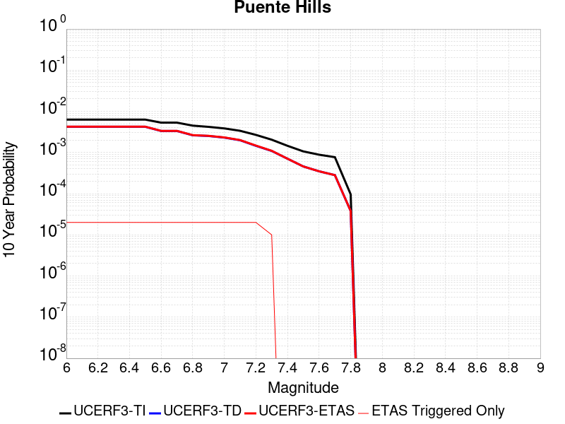 |

| Magnitude | 1 wk TI Prob | 1 wk TD Prob | 1 wk ETAS Prob | 1 wk ETAS/TD Gain | 1 wk ETAS Triggered Only | 1 mo TI Prob | 1 mo TD Prob | 1 mo ETAS Prob | 1 mo ETAS/TD Gain | 1 mo ETAS Triggered Only | 1 yr TI Prob | 1 yr TD Prob | 1 yr ETAS Prob | 1 yr ETAS/TD Gain | 1 yr ETAS Triggered Only | 10 yr TI Prob | 10 yr TD Prob | 10 yr ETAS Prob | 10 yr ETAS/TD Gain | 10 yr ETAS Triggered Only |
|-----|-----|-----|-----|-----|-----|-----|-----|-----|-----|-----|-----|-----|-----|-----|-----|-----|-----|-----|-----|-----|
| 6.0 | 1.2101656E-5 | 8.098579E-6 | 8.098579E-6 | 1.0 | 0.0 | 5.1863204E-5 | 3.4707766E-5 | 3.4707766E-5 | 1.0 | 0.0 | 6.312516E-4 | 4.2249076E-4 | 4.3248653E-4 | 1.0236591 | 1.0E-5 | 0.0062946146 | 0.0042174356 | 0.0042373515 | 1.0047222 | 2.0E-5 |
| 6.1 | 1.2101656E-5 | 8.098579E-6 | 8.098579E-6 | 1.0 | 0.0 | 5.1863204E-5 | 3.4707766E-5 | 3.4707766E-5 | 1.0 | 0.0 | 6.312516E-4 | 4.2249076E-4 | 4.3248653E-4 | 1.0236591 | 1.0E-5 | 0.0062946146 | 0.0042174356 | 0.0042373515 | 1.0047222 | 2.0E-5 |
| 6.2 | 1.2101656E-5 | 8.098579E-6 | 8.098579E-6 | 1.0 | 0.0 | 5.1863204E-5 | 3.4707766E-5 | 3.4707766E-5 | 1.0 | 0.0 | 6.312516E-4 | 4.2249076E-4 | 4.3248653E-4 | 1.0236591 | 1.0E-5 | 0.0062946146 | 0.0042174356 | 0.0042373515 | 1.0047222 | 2.0E-5 |
| 6.3 | 1.2101656E-5 | 8.098579E-6 | 8.098579E-6 | 1.0 | 0.0 | 5.1863204E-5 | 3.4707766E-5 | 3.4707766E-5 | 1.0 | 0.0 | 6.312516E-4 | 4.2249076E-4 | 4.3248653E-4 | 1.0236591 | 1.0E-5 | 0.0062946146 | 0.0042174356 | 0.0042373515 | 1.0047222 | 2.0E-5 |
| 6.4 | 1.2101656E-5 | 8.098579E-6 | 8.098579E-6 | 1.0 | 0.0 | 5.1863204E-5 | 3.4707766E-5 | 3.4707766E-5 | 1.0 | 0.0 | 6.312516E-4 | 4.2249076E-4 | 4.3248653E-4 | 1.0236591 | 1.0E-5 | 0.0062946146 | 0.0042174356 | 0.0042373515 | 1.0047222 | 2.0E-5 |
| 6.5 | 1.2101656E-5 | 8.098579E-6 | 8.098579E-6 | 1.0 | 0.0 | 5.1863204E-5 | 3.4707766E-5 | 3.4707766E-5 | 1.0 | 0.0 | 6.312516E-4 | 4.2249076E-4 | 4.3248653E-4 | 1.0236591 | 1.0E-5 | 0.0062946146 | 0.0042174356 | 0.0042373515 | 1.0047222 | 2.0E-5 |
| 6.6 | 1.0222488E-5 | 6.3991965E-6 | 6.3991965E-6 | 1.0 | 0.0 | 4.3809923E-5 | 2.7424852E-5 | 2.7424852E-5 | 1.0 | 0.0 | 5.332553E-4 | 3.3384888E-4 | 3.4384555E-4 | 1.0299437 | 1.0E-5 | 0.0053197746 | 0.0033337187 | 0.003353652 | 1.0059793 | 2.0E-5 |
| 6.7 | 1.0222488E-5 | 6.3991965E-6 | 6.3991965E-6 | 1.0 | 0.0 | 4.3809923E-5 | 2.7424852E-5 | 2.7424852E-5 | 1.0 | 0.0 | 5.332553E-4 | 3.3384888E-4 | 3.4384555E-4 | 1.0299437 | 1.0E-5 | 0.0053197746 | 0.0033337187 | 0.003353652 | 1.0059793 | 2.0E-5 |
| 6.8 | 8.6367845E-6 | 5.0282315E-6 | 5.0282315E-6 | 1.0 | 0.0 | 3.7014266E-5 | 2.1549387E-5 | 2.1549387E-5 | 1.0 | 0.0 | 4.505555E-4 | 2.6233276E-4 | 2.7233013E-4 | 1.0381095 | 1.0E-5 | 0.004496431 | 0.0026202872 | 0.0026402348 | 1.0076127 | 2.0E-5 |
| 6.9 | 8.066481E-6 | 4.8361135E-6 | 4.8361135E-6 | 1.0 | 0.0 | 3.4570177E-5 | 2.0726038E-5 | 2.0726038E-5 | 1.0 | 0.0 | 4.2081063E-4 | 2.5231083E-4 | 2.623083E-4 | 1.0396236 | 1.0E-5 | 0.0042001465 | 0.0025202974 | 0.002540247 | 1.0079156 | 2.0E-5 |
| 7.0 | 7.393828E-6 | 4.4173253E-6 | 4.4173253E-6 | 1.0 | 0.0 | 3.168745E-5 | 1.893126E-5 | 1.893126E-5 | 1.0 | 0.0 | 3.857264E-4 | 2.3046417E-4 | 2.4046186E-4 | 1.0433807 | 1.0E-5 | 0.0038505755 | 0.0023022972 | 0.002322251 | 1.008667 | 2.0E-5 |
| 7.1 | 6.4660953E-6 | 3.804474E-6 | 3.804474E-6 | 1.0 | 0.0 | 2.7711543E-5 | 1.630479E-5 | 1.630479E-5 | 1.0 | 0.0 | 3.373358E-4 | 1.9849309E-4 | 2.084911E-4 | 1.0503696 | 1.0E-5 | 0.0033682417 | 0.001983194 | 0.0020031543 | 1.0100647 | 2.0E-5 |
| 7.2 | 5.143232E-6 | 2.7865572E-6 | 2.7865572E-6 | 1.0 | 0.0 | 2.2042237E-5 | 1.1942333E-5 | 1.1942333E-5 | 1.0 | 0.0 | 2.6833118E-4 | 1.453883E-4 | 1.5538685E-4 | 1.0687714 | 1.0E-5 | 0.002680074 | 0.0014529417 | 0.0014729126 | 1.0137452 | 2.0E-5 |
| 7.3 | 3.928255E-6 | 2.091396E-6 | 2.091396E-6 | 1.0 | 0.0 | 1.683527E-5 | 8.963095E-6 | 8.963095E-6 | 1.0 | 0.0 | 2.0495013E-4 | 1.0912029E-4 | 1.0912029E-4 | 1.0 | 0.0 | 0.002047612 | 0.0010906737 | 0.0011006629 | 1.0091586 | 1.0E-5 |
| 7.4 | 2.7894434E-6 | 1.3546914E-6 | 1.3546914E-6 | 1.0 | 0.0 | 1.1954703E-5 | 5.805808E-6 | 5.805808E-6 | 1.0 | 0.0 | 1.4553878E-4 | 7.068346E-5 | 7.068346E-5 | 1.0 | 0.0 | 0.001454435 | 7.066142E-4 | 7.066142E-4 | 1.0 | 0.0 |
| 7.5 | 2.041735E-6 | 8.7873633E-7 | 8.7873633E-7 | 1.0 | 0.0 | 8.750263E-6 | 3.7660077E-6 | 3.7660077E-6 | 1.0 | 0.0 | 1.06529245E-4 | 4.585021E-5 | 4.585021E-5 | 1.0 | 0.0 | 0.0010647819 | 4.5841088E-4 | 4.5841088E-4 | 1.0 | 0.0 |
| 7.6 | 1.6959062E-6 | 6.698613E-7 | 6.698613E-7 | 1.0 | 0.0 | 7.268149E-6 | 2.8708312E-6 | 2.8708312E-6 | 1.0 | 0.0 | 8.848612E-5 | 3.4951838E-5 | 3.4951838E-5 | 1.0 | 0.0 | 8.84509E-4 | 3.494663E-4 | 3.494663E-4 | 1.0 | 0.0 |
| 7.7 | 1.4767965E-6 | 5.4073985E-7 | 5.4073985E-7 | 1.0 | 0.0 | 6.3291122E-6 | 2.3174546E-6 | 2.3174546E-6 | 1.0 | 0.0 | 7.705422E-5 | 2.821467E-5 | 2.821467E-5 | 1.0 | 0.0 | 7.702751E-4 | 2.8211344E-4 | 2.8211344E-4 | 1.0 | 0.0 |
| 7.8 | 1.8432911E-7 | 7.2812405E-8 | 7.2812405E-8 | 1.0 | 0.0 | 7.8998164E-7 | 3.1205315E-7 | 3.1205315E-7 | 1.0 | 0.0 | 9.617985E-6 | 3.7992436E-6 | 3.7992436E-6 | 1.0 | 0.0 | 9.617568E-5 | 3.799211E-5 | 3.799211E-5 | 1.0 | 0.0 |

## White Wolf
*[(top)](#table-of-contents)*

| 1 Week | 1 Month | 1 Year | 10 Year |
|-----|-----|-----|-----|
|  |  | 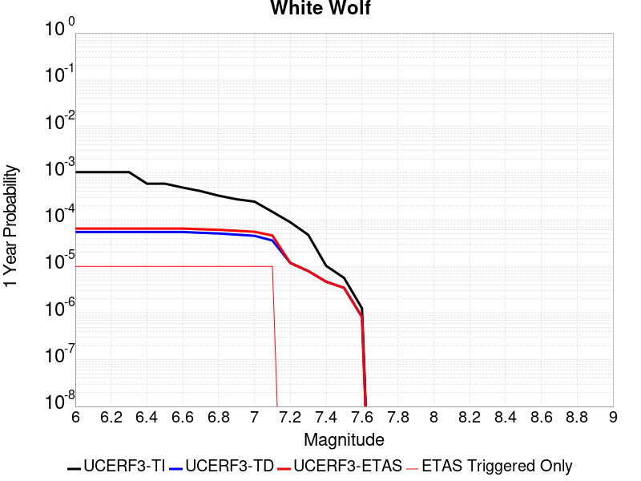 |  |

| Magnitude | 1 wk TI Prob | 1 wk TD Prob | 1 wk ETAS Prob | 1 wk ETAS/TD Gain | 1 wk ETAS Triggered Only | 1 mo TI Prob | 1 mo TD Prob | 1 mo ETAS Prob | 1 mo ETAS/TD Gain | 1 mo ETAS Triggered Only | 1 yr TI Prob | 1 yr TD Prob | 1 yr ETAS Prob | 1 yr ETAS/TD Gain | 1 yr ETAS Triggered Only | 10 yr TI Prob | 10 yr TD Prob | 10 yr ETAS Prob | 10 yr ETAS/TD Gain | 10 yr ETAS Triggered Only |
|-----|-----|-----|-----|-----|-----|-----|-----|-----|-----|-----|-----|-----|-----|-----|-----|-----|-----|-----|-----|-----|
| 6.0 | 2.0037822E-5 | 1.0468736E-6 | 1.0468736E-6 | 1.0 | 0.0 | 8.587355E-5 | 4.4865938E-6 | 4.4865938E-6 | 1.0 | 0.0 | 0.001045009 | 5.462296E-5 | 6.4622414E-5 | 1.1830631 | 1.0E-5 | 0.010401085 | 5.4610043E-4 | 5.660895E-4 | 1.0366033 | 2.0E-5 |
| 6.1 | 2.0037822E-5 | 1.0468736E-6 | 1.0468736E-6 | 1.0 | 0.0 | 8.587355E-5 | 4.4865938E-6 | 4.4865938E-6 | 1.0 | 0.0 | 0.001045009 | 5.462296E-5 | 6.4622414E-5 | 1.1830631 | 1.0E-5 | 0.010401085 | 5.4610043E-4 | 5.660895E-4 | 1.0366033 | 2.0E-5 |
| 6.2 | 2.0037822E-5 | 1.0468736E-6 | 1.0468736E-6 | 1.0 | 0.0 | 8.587355E-5 | 4.4865938E-6 | 4.4865938E-6 | 1.0 | 0.0 | 0.001045009 | 5.462296E-5 | 6.4622414E-5 | 1.1830631 | 1.0E-5 | 0.010401085 | 5.4610043E-4 | 5.660895E-4 | 1.0366033 | 2.0E-5 |
| 6.3 | 2.0037822E-5 | 1.0468736E-6 | 1.0468736E-6 | 1.0 | 0.0 | 8.587355E-5 | 4.4865938E-6 | 4.4865938E-6 | 1.0 | 0.0 | 0.001045009 | 5.462296E-5 | 6.4622414E-5 | 1.1830631 | 1.0E-5 | 0.010401085 | 5.4610043E-4 | 5.660895E-4 | 1.0366033 | 2.0E-5 |
| 6.4 | 1.132487E-5 | 1.0468736E-6 | 1.0468736E-6 | 1.0 | 0.0 | 4.8534253E-5 | 4.4865938E-6 | 4.4865938E-6 | 1.0 | 0.0 | 5.907443E-4 | 5.462296E-5 | 6.4622414E-5 | 1.1830631 | 1.0E-5 | 0.005891764 | 5.4610043E-4 | 5.660895E-4 | 1.0366033 | 2.0E-5 |
| 6.5 | 1.132487E-5 | 1.0468736E-6 | 1.0468736E-6 | 1.0 | 0.0 | 4.8534253E-5 | 4.4865938E-6 | 4.4865938E-6 | 1.0 | 0.0 | 5.907443E-4 | 5.462296E-5 | 6.4622414E-5 | 1.1830631 | 1.0E-5 | 0.005891764 | 5.4610043E-4 | 5.660895E-4 | 1.0366033 | 2.0E-5 |
| 6.6 | 9.347473E-6 | 1.0468736E-6 | 1.0468736E-6 | 1.0 | 0.0 | 4.0059982E-5 | 4.4865938E-6 | 4.4865938E-6 | 1.0 | 0.0 | 4.8762115E-4 | 5.462296E-5 | 6.4622414E-5 | 1.1830631 | 1.0E-5 | 0.0048655253 | 5.4610043E-4 | 5.660895E-4 | 1.0366033 | 2.0E-5 |
| 6.7 | 7.842647E-6 | 1.0047925E-6 | 1.0047925E-6 | 1.0 | 0.0 | 3.361091E-5 | 4.3062464E-6 | 4.3062464E-6 | 1.0 | 0.0 | 4.0913603E-4 | 5.242734E-5 | 6.2426814E-5 | 1.1907302 | 1.0E-5 | 0.004083836 | 5.241547E-4 | 5.441442E-4 | 1.0381367 | 2.0E-5 |
| 6.8 | 6.26597E-6 | 9.73443E-7 | 9.73443E-7 | 1.0 | 0.0 | 2.685388E-5 | 4.171892E-6 | 4.171892E-6 | 1.0 | 0.0 | 3.2689696E-4 | 5.0791652E-5 | 6.0791142E-5 | 1.1968727 | 1.0E-5 | 0.003264165 | 5.078053E-4 | 5.277952E-4 | 1.0393652 | 2.0E-5 |
| 6.9 | 5.258436E-6 | 9.1828633E-7 | 9.1828633E-7 | 1.0 | 0.0 | 2.2535958E-5 | 3.9355073E-6 | 3.9355073E-6 | 1.0 | 0.0 | 2.7434074E-4 | 4.7913796E-5 | 5.7913316E-5 | 1.2086982 | 1.0E-5 | 0.0027400232 | 4.7903945E-4 | 4.990299E-4 | 1.0417302 | 2.0E-5 |
| 7.0 | 4.675028E-6 | 8.6608276E-7 | 8.6608276E-7 | 1.0 | 0.0 | 2.003568E-5 | 3.7117782E-6 | 3.7117782E-6 | 1.0 | 0.0 | 2.4390711E-4 | 4.519001E-5 | 5.5189557E-5 | 1.2212778 | 1.0E-5 | 0.0024363957 | 4.5181293E-4 | 4.7180388E-4 | 1.0442461 | 2.0E-5 |
| 7.1 | 2.8270078E-6 | 6.873876E-7 | 6.873876E-7 | 1.0 | 0.0 | 1.2115692E-5 | 2.9459438E-6 | 2.9459438E-6 | 1.0 | 0.0 | 1.4749856E-4 | 3.5866316E-5 | 4.586596E-5 | 1.2788031 | 1.0E-5 | 0.001474007 | 3.586094E-4 | 3.786022E-4 | 1.055751 | 2.0E-5 |
| 7.2 | 1.6881406E-6 | 2.2703898E-7 | 2.2703898E-7 | 1.0 | 0.0 | 7.2348685E-6 | 9.730238E-7 | 9.730238E-7 | 1.0 | 0.0 | 8.808096E-5 | 1.1846502E-5 | 1.1846502E-5 | 1.0 | 0.0 | 8.8046055E-4 | 1.1845886E-4 | 1.1845886E-4 | 1.0 | 0.0 |
| 7.3 | 9.086107E-7 | 1.5264881E-7 | 1.5264881E-7 | 1.0 | 0.0 | 3.8940398E-6 | 6.5420903E-7 | 6.5420903E-7 | 1.0 | 0.0 | 4.7408903E-5 | 7.964967E-6 | 7.964967E-6 | 1.0 | 0.0 | 4.739879E-4 | 7.9646896E-5 | 7.9646896E-5 | 1.0 | 0.0 |
| 7.4 | 1.9717383E-7 | 9.003459E-8 | 9.003459E-8 | 1.0 | 0.0 | 8.450304E-7 | 3.8586248E-7 | 3.8586248E-7 | 1.0 | 0.0 | 1.0288197E-5 | 4.6978657E-6 | 4.6978657E-6 | 1.0 | 0.0 | 1.028772E-4 | 4.6977697E-5 | 4.6977697E-5 | 1.0 | 0.0 |
| 7.5 | 1.086975E-7 | 6.659703E-8 | 6.659703E-8 | 1.0 | 0.0 | 4.6584634E-7 | 2.8541584E-7 | 2.8541584E-7 | 1.0 | 0.0 | 5.6716644E-6 | 3.4749323E-6 | 3.4749323E-6 | 1.0 | 0.0 | 5.6715195E-5 | 3.4748802E-5 | 3.4748802E-5 | 1.0 | 0.0 |
| 7.6 | 2.4217808E-8 | 1.5820925E-8 | 1.5820925E-8 | 1.0 | 0.0 | 1.03790605E-7 | 6.780396E-8 | 6.780396E-8 | 1.0 | 0.0 | 1.2636499E-6 | 8.255129E-7 | 8.255129E-7 | 1.0 | 0.0 | 1.2636427E-5 | 8.255104E-6 | 8.255104E-6 | 1.0 | 0.0 |

## Ortigalita (South)
*[(top)](#table-of-contents)*

| 1 Week | 1 Month | 1 Year | 10 Year |
|-----|-----|-----|-----|
|  |  |  |  |

| Magnitude | 1 wk TI Prob | 1 wk TD Prob | 1 wk ETAS Prob | 1 wk ETAS/TD Gain | 1 wk ETAS Triggered Only | 1 mo TI Prob | 1 mo TD Prob | 1 mo ETAS Prob | 1 mo ETAS/TD Gain | 1 mo ETAS Triggered Only | 1 yr TI Prob | 1 yr TD Prob | 1 yr ETAS Prob | 1 yr ETAS/TD Gain | 1 yr ETAS Triggered Only | 10 yr TI Prob | 10 yr TD Prob | 10 yr ETAS Prob | 10 yr ETAS/TD Gain | 10 yr ETAS Triggered Only |
|-----|-----|-----|-----|-----|-----|-----|-----|-----|-----|-----|-----|-----|-----|-----|-----|-----|-----|-----|-----|-----|
| 6.0 | 3.72394E-5 | 4.3256532E-5 | 4.3256532E-5 | 1.0 | 0.0 | 1.5958765E-4 | 1.8537285E-4 | 1.8537285E-4 | 1.0 | 0.0 | 0.0019412481 | 0.0022547347 | 0.0022647122 | 1.0044252 | 1.0E-5 | 0.019243775 | 0.022334976 | 0.022344753 | 1.0004377 | 1.0E-5 |
| 6.1 | 2.7299884E-5 | 3.149268E-5 | 3.149268E-5 | 1.0 | 0.0 | 1.16994255E-4 | 1.3496196E-4 | 1.3496196E-4 | 1.0 | 0.0 | 0.0014234743 | 0.0016419792 | 0.0016519629 | 1.0060803 | 1.0E-5 | 0.014143906 | 0.016304404 | 0.01631424 | 1.0006033 | 1.0E-5 |
| 6.2 | 2.7299884E-5 | 3.149268E-5 | 3.149268E-5 | 1.0 | 0.0 | 1.16994255E-4 | 1.3496196E-4 | 1.3496196E-4 | 1.0 | 0.0 | 0.0014234743 | 0.0016419792 | 0.0016519629 | 1.0060803 | 1.0E-5 | 0.014143906 | 0.016304404 | 0.01631424 | 1.0006033 | 1.0E-5 |
| 6.3 | 2.0546433E-5 | 2.3631925E-5 | 2.3631925E-5 | 1.0 | 0.0 | 8.805317E-5 | 1.0127585E-4 | 1.0127585E-4 | 1.0 | 0.0 | 0.00107152 | 0.001232355 | 0.0012423426 | 1.0081046 | 1.0E-5 | 0.010663681 | 0.012257274 | 0.012267152 | 1.0008059 | 1.0E-5 |
| 6.4 | 2.0546433E-5 | 2.3631925E-5 | 2.3631925E-5 | 1.0 | 0.0 | 8.805317E-5 | 1.0127585E-4 | 1.0127585E-4 | 1.0 | 0.0 | 0.00107152 | 0.001232355 | 0.0012423426 | 1.0081046 | 1.0E-5 | 0.010663681 | 0.012257274 | 0.012267152 | 1.0008059 | 1.0E-5 |
| 6.5 | 1.7779594E-5 | 2.0447384E-5 | 2.0447384E-5 | 1.0 | 0.0 | 7.619603E-5 | 8.7628774E-5 | 8.7628774E-5 | 1.0 | 0.0 | 9.272918E-4 | 0.0010663718 | 0.001076361 | 1.0093676 | 1.0E-5 | 0.009234319 | 0.010614014 | 0.010623909 | 1.0009321 | 1.0E-5 |
| 6.6 | 1.6272212E-5 | 1.8715342E-5 | 1.8715342E-5 | 1.0 | 0.0 | 6.973618E-5 | 8.0206206E-5 | 8.0206206E-5 | 1.0 | 0.0 | 8.487073E-4 | 9.760854E-4 | 9.860756E-4 | 1.010235 | 1.0E-5 | 0.008454733 | 0.009719283 | 0.009729187 | 1.0010189 | 1.0E-5 |
| 6.7 | 1.3051484E-5 | 1.5039062E-5 | 1.5039062E-5 | 1.0 | 0.0 | 5.593373E-5 | 6.445159E-5 | 6.445159E-5 | 1.0 | 0.0 | 6.807804E-4 | 7.8442506E-4 | 7.944172E-4 | 1.0127382 | 1.0E-5 | 0.006786986 | 0.007817546 | 0.007827467 | 1.0012692 | 1.0E-5 |
| 6.8 | 1.04277415E-5 | 1.1987473E-5 | 1.1987473E-5 | 1.0 | 0.0 | 4.4689557E-5 | 5.1373918E-5 | 5.1373918E-5 | 1.0 | 0.0 | 5.439595E-4 | 6.2530534E-4 | 6.3529913E-4 | 1.0159822 | 1.0E-5 | 0.0054262993 | 0.0062362133 | 0.006246151 | 1.0015936 | 1.0E-5 |
| 6.9 | 7.639968E-6 | 8.79168E-6 | 8.79168E-6 | 1.0 | 0.0 | 3.274231E-5 | 3.7678114E-5 | 3.7678114E-5 | 1.0 | 0.0 | 3.9856473E-4 | 4.5864037E-4 | 4.5864037E-4 | 1.0 | 0.0 | 0.003978506 | 0.0045775245 | 0.0045775245 | 1.0 | 0.0 |
| 7.0 | 3.919831E-6 | 4.5334955E-6 | 4.5334955E-6 | 1.0 | 0.0 | 1.679917E-5 | 1.9429133E-5 | 1.9429133E-5 | 1.0 | 0.0 | 2.045107E-4 | 2.3652615E-4 | 2.3652615E-4 | 1.0 | 0.0 | 0.0020432258 | 0.0023629526 | 0.0023629526 | 1.0 | 0.0 |
| 7.1 | 1.6017933E-6 | 1.8570811E-6 | 1.8570811E-6 | 1.0 | 0.0 | 6.8648105E-6 | 7.958901E-6 | 7.958901E-6 | 1.0 | 0.0 | 8.357586E-5 | 9.689637E-5 | 9.689637E-5 | 1.0 | 0.0 | 8.3544437E-4 | 9.686459E-4 | 9.686459E-4 | 1.0 | 0.0 |

## Green Valley 2011 CFM
*[(top)](#table-of-contents)*

| 1 Week | 1 Month | 1 Year | 10 Year |
|-----|-----|-----|-----|
|  |  | 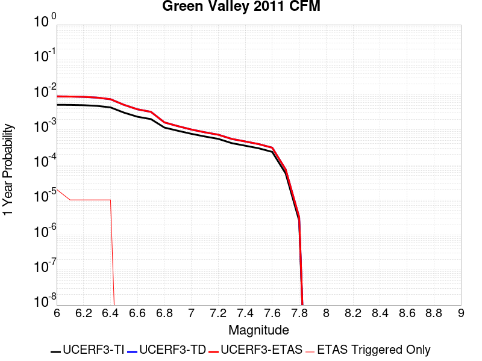 |  |

| Magnitude | 1 wk TI Prob | 1 wk TD Prob | 1 wk ETAS Prob | 1 wk ETAS/TD Gain | 1 wk ETAS Triggered Only | 1 mo TI Prob | 1 mo TD Prob | 1 mo ETAS Prob | 1 mo ETAS/TD Gain | 1 mo ETAS Triggered Only | 1 yr TI Prob | 1 yr TD Prob | 1 yr ETAS Prob | 1 yr ETAS/TD Gain | 1 yr ETAS Triggered Only | 10 yr TI Prob | 10 yr TD Prob | 10 yr ETAS Prob | 10 yr ETAS/TD Gain | 10 yr ETAS Triggered Only |
|-----|-----|-----|-----|-----|-----|-----|-----|-----|-----|-----|-----|-----|-----|-----|-----|-----|-----|-----|-----|-----|
| 6.0 | 9.9629346E-5 | 1.7303096E-4 | 1.7303096E-4 | 1.0 | 0.0 | 4.2691303E-4 | 7.413446E-4 | 7.413446E-4 | 1.0 | 0.0 | 0.0051852856 | 0.008987141 | 0.009006961 | 1.0022054 | 2.0E-5 | 0.050659515 | 0.08554168 | 0.08555997 | 1.0002139 | 2.0E-5 |
| 6.1 | 9.88615E-5 | 1.7150394E-4 | 1.7150394E-4 | 1.0 | 0.0 | 4.2362334E-4 | 7.348039E-4 | 7.348039E-4 | 1.0 | 0.0 | 0.0051454236 | 0.0089081675 | 0.008918079 | 1.0011126 | 1.0E-5 | 0.050279044 | 0.08482929 | 0.08483845 | 1.0001079 | 1.0E-5 |
| 6.2 | 9.696895E-5 | 1.6789426E-4 | 1.6789426E-4 | 1.0 | 0.0 | 4.15515E-4 | 7.193438E-4 | 7.193438E-4 | 1.0 | 0.0 | 0.0050471667 | 0.008721547 | 0.00873146 | 1.0011365 | 1.0E-5 | 0.04934063 | 0.08313806 | 0.083147235 | 1.0001103 | 1.0E-5 |
| 6.3 | 9.275224E-5 | 1.5968755E-4 | 1.5968755E-4 | 1.0 | 0.0 | 3.9744904E-4 | 6.8419095E-4 | 6.8419095E-4 | 1.0 | 0.0 | 0.0048282105 | 0.008296867 | 0.008306784 | 1.0011953 | 1.0E-5 | 0.047246475 | 0.07927713 | 0.07928634 | 1.0001161 | 1.0E-5 |
| 6.4 | 8.391499E-5 | 1.4366042E-4 | 1.4366042E-4 | 1.0 | 0.0 | 3.595861E-4 | 6.155415E-4 | 6.155415E-4 | 1.0 | 0.0 | 0.004369175 | 0.007467382 | 0.007477307 | 1.0013292 | 1.0E-5 | 0.04284265 | 0.07164556 | 0.07165484 | 1.0001296 | 1.0E-5 |
| 6.5 | 5.9519385E-5 | 9.932708E-5 | 9.932708E-5 | 1.0 | 0.0 | 2.5505814E-4 | 4.2561657E-4 | 4.2561657E-4 | 1.0 | 0.0 | 0.0031009112 | 0.005168488 | 0.005168488 | 1.0 | 0.0 | 0.030579966 | 0.05014941 | 0.05014941 | 1.0 | 0.0 |
| 6.6 | 4.5361558E-5 | 7.40199E-5 | 7.40199E-5 | 1.0 | 0.0 | 1.9439218E-4 | 3.1718693E-4 | 3.1718693E-4 | 1.0 | 0.0 | 0.0023641558 | 0.003853991 | 0.003853991 | 1.0 | 0.0 | 0.023391623 | 0.037669275 | 0.037669275 | 1.0 | 0.0 |
| 6.7 | 3.8808106E-5 | 6.264344E-5 | 6.264344E-5 | 1.0 | 0.0 | 1.6630985E-4 | 2.6844675E-4 | 2.6844675E-4 | 1.0 | 0.0 | 0.0020229418 | 0.0032628388 | 0.0032628388 | 1.0 | 0.0 | 0.020046256 | 0.032008745 | 0.032008745 | 1.0 | 0.0 |
| 6.8 | 2.2284667E-5 | 3.128603E-5 | 3.128603E-5 | 1.0 | 0.0 | 9.550222E-5 | 1.3407608E-4 | 1.3407608E-4 | 1.0 | 0.0 | 0.0011621192 | 0.0016311527 | 0.0016311527 | 1.0 | 0.0 | 0.011560607 | 0.016166579 | 0.016166579 | 1.0 | 0.0 |
| 6.9 | 1.8050168E-5 | 2.4448742E-5 | 2.4448742E-5 | 1.0 | 0.0 | 7.735557E-5 | 1.04776154E-4 | 1.04776154E-4 | 1.0 | 0.0 | 9.4139716E-4 | 0.0012749061 | 0.0012749061 | 1.0 | 0.0 | 0.009374191 | 0.012668985 | 0.012668985 | 1.0 | 0.0 |
| 7.0 | 1.4763166E-5 | 1.9583402E-5 | 1.9583402E-5 | 1.0 | 0.0 | 6.326917E-5 | 8.392618E-5 | 8.392618E-5 | 1.0 | 0.0 | 7.7002996E-4 | 0.0010213237 | 0.0010213237 | 1.0 | 0.0 | 0.007673672 | 0.010166345 | 0.010166345 | 1.0 | 0.0 |
| 7.1 | 1.2399713E-5 | 1.6304173E-5 | 1.6304173E-5 | 1.0 | 0.0 | 5.3140546E-5 | 6.987317E-5 | 6.987317E-5 | 1.0 | 0.0 | 6.467941E-4 | 8.5037574E-4 | 8.5037574E-4 | 1.0 | 0.0 | 0.006449148 | 0.008471897 | 0.008471897 | 1.0 | 0.0 |
| 7.2 | 1.0584195E-5 | 1.392217E-5 | 1.392217E-5 | 1.0 | 0.0 | 4.5360044E-5 | 5.9665086E-5 | 5.9665086E-5 | 1.0 | 0.0 | 5.521186E-4 | 7.2618196E-4 | 7.2618196E-4 | 1.0 | 0.0 | 0.0055074887 | 0.007238742 | 0.007238742 | 1.0 | 0.0 |
| 7.3 | 7.998173E-6 | 1.0544361E-5 | 1.0544361E-5 | 1.0 | 0.0 | 3.4277433E-5 | 4.5189343E-5 | 4.5189343E-5 | 1.0 | 0.0 | 4.1724785E-4 | 5.5004243E-4 | 5.5004243E-4 | 1.0 | 0.0 | 0.004164653 | 0.005487132 | 0.005487132 | 1.0 | 0.0 |
| 7.4 | 6.7571127E-6 | 8.932998E-6 | 8.932998E-6 | 1.0 | 0.0 | 2.8958733E-5 | 3.828372E-5 | 3.828372E-5 | 1.0 | 0.0 | 3.5251552E-4 | 4.6600556E-4 | 4.6600556E-4 | 1.0 | 0.0 | 0.0035195686 | 0.00465062 | 0.00465062 | 1.0 | 0.0 |
| 7.5 | 5.69878E-6 | 7.516554E-6 | 7.516554E-6 | 1.0 | 0.0 | 2.4423114E-5 | 3.221341E-5 | 3.221341E-5 | 1.0 | 0.0 | 2.9731085E-4 | 3.9212857E-4 | 3.9212857E-4 | 1.0 | 0.0 | 0.002969134 | 0.0039146794 | 0.0039146794 | 1.0 | 0.0 |
| 7.6 | 4.503664E-6 | 5.9358817E-6 | 5.9358817E-6 | 1.0 | 0.0 | 1.9301275E-5 | 2.5439249E-5 | 2.5439249E-5 | 1.0 | 0.0 | 2.3496768E-4 | 3.0967966E-4 | 3.0967966E-4 | 1.0 | 0.0 | 0.002347194 | 0.0030927253 | 0.0030927253 | 1.0 | 0.0 |
| 7.7 | 1.0873546E-6 | 1.4107662E-6 | 1.4107662E-6 | 1.0 | 0.0 | 4.6600826E-6 | 6.046127E-6 | 6.046127E-6 | 1.0 | 0.0 | 5.6735033E-5 | 7.360914E-5 | 7.360914E-5 | 1.0 | 0.0 | 5.672055E-4 | 7.358931E-4 | 7.358931E-4 | 1.0 | 0.0 |
| 7.8 | 4.9373917E-8 | 6.178036E-8 | 6.178036E-8 | 1.0 | 0.0 | 2.1160248E-7 | 2.6477298E-7 | 2.6477298E-7 | 1.0 | 0.0 | 2.5762572E-6 | 3.2236076E-6 | 3.2236076E-6 | 1.0 | 0.0 | 2.5762274E-5 | 3.222859E-5 | 3.222859E-5 | 1.0 | 0.0 |

## San Jacinto (Superstition Mtn)
*[(top)](#table-of-contents)*

| 1 Week | 1 Month | 1 Year | 10 Year |
|-----|-----|-----|-----|
|  | 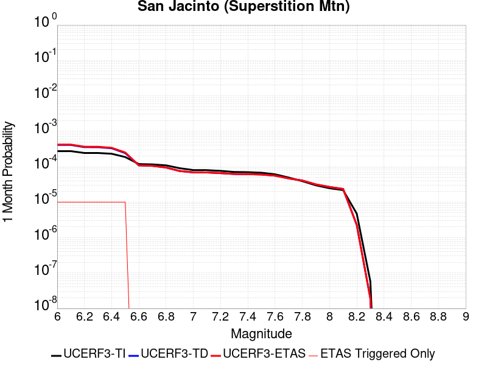 | 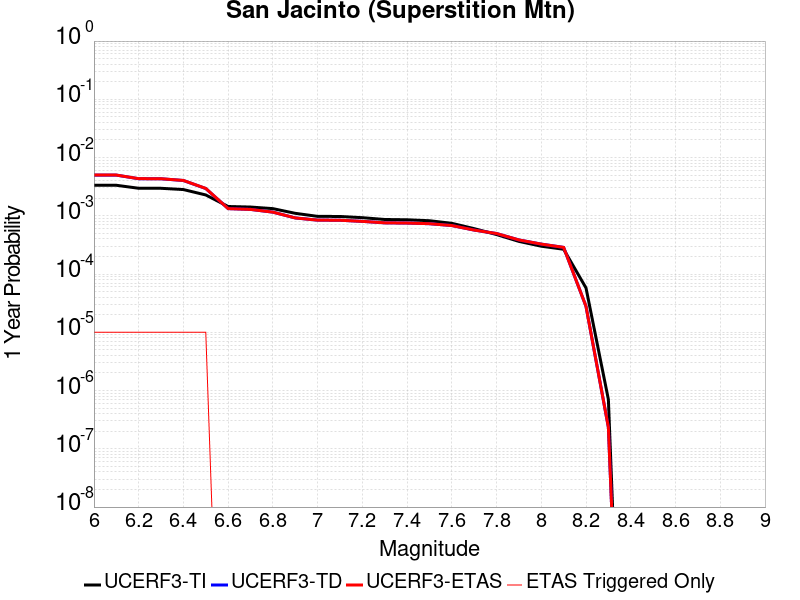 |  |

| Magnitude | 1 wk TI Prob | 1 wk TD Prob | 1 wk ETAS Prob | 1 wk ETAS/TD Gain | 1 wk ETAS Triggered Only | 1 mo TI Prob | 1 mo TD Prob | 1 mo ETAS Prob | 1 mo ETAS/TD Gain | 1 mo ETAS Triggered Only | 1 yr TI Prob | 1 yr TD Prob | 1 yr ETAS Prob | 1 yr ETAS/TD Gain | 1 yr ETAS Triggered Only | 10 yr TI Prob | 10 yr TD Prob | 10 yr ETAS Prob | 10 yr ETAS/TD Gain | 10 yr ETAS Triggered Only |
|-----|-----|-----|-----|-----|-----|-----|-----|-----|-----|-----|-----|-----|-----|-----|-----|-----|-----|-----|-----|-----|
| 6.0 | 6.4193904E-5 | 9.6002805E-5 | 9.6002805E-5 | 1.0 | 0.0 | 2.7508775E-4 | 4.1138552E-4 | 4.213814E-4 | 1.0242981 | 1.0E-5 | 0.0033440501 | 0.004998534 | 0.0050084842 | 1.0019906 | 1.0E-5 | 0.03294174 | 0.048822355 | 0.04884138 | 1.0003897 | 2.0E-5 |
| 6.1 | 6.4193904E-5 | 9.6002805E-5 | 9.6002805E-5 | 1.0 | 0.0 | 2.7508775E-4 | 4.1138552E-4 | 4.213814E-4 | 1.0242981 | 1.0E-5 | 0.0033440501 | 0.004998534 | 0.0050084842 | 1.0019906 | 1.0E-5 | 0.03294174 | 0.048822355 | 0.04884138 | 1.0003897 | 2.0E-5 |
| 6.2 | 5.7023593E-5 | 8.315118E-5 | 8.315118E-5 | 1.0 | 0.0 | 2.4436394E-4 | 3.5632294E-4 | 3.6631938E-4 | 1.0280545 | 1.0E-5 | 0.002971072 | 0.004331248 | 0.0043412047 | 1.0022988 | 1.0E-5 | 0.029316625 | 0.04250458 | 0.04252373 | 1.0004505 | 2.0E-5 |
| 6.3 | 5.6940098E-5 | 8.2996536E-5 | 8.2996536E-5 | 1.0 | 0.0 | 2.4400617E-4 | 3.5566036E-4 | 3.656568E-4 | 1.0281067 | 1.0E-5 | 0.002966728 | 0.0043232134 | 0.00433317 | 1.0023031 | 1.0E-5 | 0.029274331 | 0.04242795 | 0.0424471 | 1.0004514 | 2.0E-5 |
| 6.4 | 5.4171585E-5 | 7.749044E-5 | 7.749044E-5 | 1.0 | 0.0 | 2.3214328E-4 | 3.320689E-4 | 3.420656E-4 | 1.0301043 | 1.0E-5 | 0.0028226813 | 0.004037093 | 0.0040470525 | 1.002467 | 1.0E-5 | 0.02787096 | 0.03971742 | 0.03973663 | 1.0004835 | 2.0E-5 |
| 6.5 | 4.375144E-5 | 5.6427816E-5 | 5.6427816E-5 | 1.0 | 0.0 | 1.874927E-4 | 2.4181772E-4 | 2.518153E-4 | 1.0413435 | 1.0E-5 | 0.0022803338 | 0.0029413316 | 0.002951302 | 1.0033898 | 1.0E-5 | 0.022570757 | 0.029237961 | 0.029257378 | 1.000664 | 2.0E-5 |
| 6.6 | 2.772192E-5 | 2.5494071E-5 | 2.5494071E-5 | 1.0 | 0.0 | 1.1880282E-4 | 1.09255845E-4 | 1.09255845E-4 | 1.0 | 0.0 | 0.0014454646 | 0.0013293975 | 0.0013293975 | 1.0 | 0.0 | 0.014360986 | 0.013542279 | 0.013542279 | 1.0 | 0.0 |
| 6.7 | 2.7124124E-5 | 2.4705068E-5 | 2.4705068E-5 | 1.0 | 0.0 | 1.1624106E-4 | 1.0587468E-4 | 1.0587468E-4 | 1.0 | 0.0 | 0.0014143161 | 0.0012882812 | 0.0012882812 | 1.0 | 0.0 | 0.014053487 | 0.0131356325 | 0.0131356325 | 1.0 | 0.0 |
| 6.8 | 2.5475807E-5 | 2.2169877E-5 | 2.2169877E-5 | 1.0 | 0.0 | 1.0917746E-4 | 9.501037E-5 | 9.501037E-5 | 1.0 | 0.0 | 0.001328425 | 0.0011561494 | 0.0011561494 | 1.0 | 0.0 | 0.0132051185 | 0.011823943 | 0.011823943 | 1.0 | 0.0 |
| 6.9 | 2.1162023E-5 | 1.7631051E-5 | 1.7631051E-5 | 1.0 | 0.0 | 9.069123E-5 | 7.555948E-5 | 7.555948E-5 | 1.0 | 0.0 | 0.0011036064 | 9.195522E-4 | 9.195522E-4 | 1.0 | 0.0 | 0.010981417 | 0.0094489865 | 0.0094489865 | 1.0 | 0.0 |
| 7.0 | 1.8754288E-5 | 1.616617E-5 | 1.616617E-5 | 1.0 | 0.0 | 8.037304E-5 | 6.928176E-5 | 6.928176E-5 | 1.0 | 0.0 | 9.781026E-4 | 8.4318145E-4 | 8.4318145E-4 | 1.0 | 0.0 | 0.009738087 | 0.008672153 | 0.008672153 | 1.0 | 0.0 |
| 7.1 | 1.8678527E-5 | 1.6091313E-5 | 1.6091313E-5 | 1.0 | 0.0 | 8.0048376E-5 | 6.8960966E-5 | 6.8960966E-5 | 1.0 | 0.0 | 9.7415317E-4 | 8.392788E-4 | 8.392788E-4 | 1.0 | 0.0 | 0.009698939 | 0.008633161 | 0.008633161 | 1.0 | 0.0 |
| 7.2 | 1.7804578E-5 | 1.5385827E-5 | 1.5385827E-5 | 1.0 | 0.0 | 7.6303106E-5 | 6.59376E-5 | 6.59376E-5 | 1.0 | 0.0 | 9.285943E-4 | 8.024969E-4 | 8.024969E-4 | 1.0 | 0.0 | 0.009247236 | 0.0082646 | 0.0082646 | 1.0 | 0.0 |
| 7.3 | 1.6583685E-5 | 1.4534898E-5 | 1.4534898E-5 | 1.0 | 0.0 | 7.1070994E-5 | 6.229094E-5 | 6.229094E-5 | 1.0 | 0.0 | 8.649459E-4 | 7.581304E-4 | 7.581304E-4 | 1.0 | 0.0 | 0.00861587 | 0.007819886 | 0.007819886 | 1.0 | 0.0 |
| 7.4 | 1.6387552E-5 | 1.4399775E-5 | 1.4399775E-5 | 1.0 | 0.0 | 7.023047E-5 | 6.171187E-5 | 6.171187E-5 | 1.0 | 0.0 | 8.5472054E-4 | 7.5108506E-4 | 7.5108506E-4 | 1.0 | 0.0 | 0.008514405 | 0.0077492767 | 0.0077492767 | 1.0 | 0.0 |
| 7.5 | 1.5790754E-5 | 1.4040427E-5 | 1.4040427E-5 | 1.0 | 0.0 | 6.767291E-5 | 6.0171882E-5 | 6.0171882E-5 | 1.0 | 0.0 | 8.236062E-4 | 7.323484E-4 | 7.323484E-4 | 1.0 | 0.0 | 0.008205604 | 0.0075598094 | 0.0075598094 | 1.0 | 0.0 |
| 7.6 | 1.4248672E-5 | 1.3059319E-5 | 1.3059319E-5 | 1.0 | 0.0 | 6.106431E-5 | 5.5967317E-5 | 5.5967317E-5 | 1.0 | 0.0 | 7.432043E-4 | 6.811908E-4 | 6.811908E-4 | 1.0 | 0.0 | 0.007407237 | 0.007042322 | 0.007042322 | 1.0 | 0.0 |
| 7.7 | 1.15449975E-5 | 1.0907912E-5 | 1.0907912E-5 | 1.0 | 0.0 | 4.947762E-5 | 4.6747362E-5 | 4.6747362E-5 | 1.0 | 0.0 | 6.022235E-4 | 5.6900125E-4 | 5.6900125E-4 | 1.0 | 0.0 | 0.006005941 | 0.005912308 | 0.005912308 | 1.0 | 0.0 |
| 7.8 | 9.1391985E-6 | 9.518418E-6 | 9.518418E-6 | 1.0 | 0.0 | 3.9167408E-5 | 4.0792587E-5 | 4.0792587E-5 | 1.0 | 0.0 | 4.767588E-4 | 4.9653713E-4 | 4.9653713E-4 | 1.0 | 0.0 | 0.0047573727 | 0.0051787267 | 0.0051787267 | 1.0 | 0.0 |
| 7.9 | 6.973017E-6 | 7.385764E-6 | 7.385764E-6 | 1.0 | 0.0 | 2.9884017E-5 | 3.1652893E-5 | 3.1652893E-5 | 1.0 | 0.0 | 3.6377716E-4 | 3.8530637E-4 | 3.8530637E-4 | 1.0 | 0.0 | 0.0036318225 | 0.0040537147 | 0.0040537147 | 1.0 | 0.0 |
| 8.0 | 5.7638235E-6 | 6.263249E-6 | 6.263249E-6 | 1.0 | 0.0 | 2.4701867E-5 | 2.6842223E-5 | 2.6842223E-5 | 1.0 | 0.0 | 3.0070372E-4 | 3.2675554E-4 | 3.2675554E-4 | 1.0 | 0.0 | 0.0030029714 | 0.0034551586 | 0.0034551586 | 1.0 | 0.0 |
| 8.1 | 5.1124434E-6 | 5.498651E-6 | 5.498651E-6 | 1.0 | 0.0 | 2.1910288E-5 | 2.3565437E-5 | 2.3565437E-5 | 1.0 | 0.0 | 2.6672508E-4 | 2.8687192E-4 | 2.8687192E-4 | 1.0 | 0.0 | 0.0026640517 | 0.0030418336 | 0.0030418336 | 1.0 | 0.0 |
| 8.2 | 1.1075938E-6 | 5.339512E-7 | 5.339512E-7 | 1.0 | 0.0 | 4.7468216E-6 | 2.2883605E-6 | 2.2883605E-6 | 1.0 | 0.0 | 5.779102E-5 | 2.7860455E-5 | 2.7860455E-5 | 1.0 | 0.0 | 5.777599E-4 | 3.136582E-4 | 3.136582E-4 | 1.0 | 0.0 |
| 8.3 | 1.3584393E-8 | 4.4764112E-9 | 4.4764112E-9 | 1.0 | 0.0 | 5.8218827E-8 | 1.918462E-8 | 1.918462E-8 | 1.0 | 0.0 | 7.0881396E-7 | 2.3357273E-7 | 2.3357273E-7 | 1.0 | 0.0 | 7.0881174E-6 | 2.6165987E-6 | 2.6165987E-6 | 1.0 | 0.0 |

## San Pedro Basin
*[(top)](#table-of-contents)*

| 1 Week | 1 Month | 1 Year | 10 Year |
|-----|-----|-----|-----|
|  |  |  | 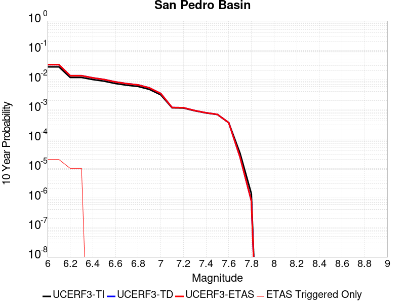 |

| Magnitude | 1 wk TI Prob | 1 wk TD Prob | 1 wk ETAS Prob | 1 wk ETAS/TD Gain | 1 wk ETAS Triggered Only | 1 mo TI Prob | 1 mo TD Prob | 1 mo ETAS Prob | 1 mo ETAS/TD Gain | 1 mo ETAS Triggered Only | 1 yr TI Prob | 1 yr TD Prob | 1 yr ETAS Prob | 1 yr ETAS/TD Gain | 1 yr ETAS Triggered Only | 10 yr TI Prob | 10 yr TD Prob | 10 yr ETAS Prob | 10 yr ETAS/TD Gain | 10 yr ETAS Triggered Only |
|-----|-----|-----|-----|-----|-----|-----|-----|-----|-----|-----|-----|-----|-----|-----|-----|-----|-----|-----|-----|-----|
| 6.0 | 5.3449043E-5 | 6.3371765E-5 | 7.3371135E-5 | 1.157789 | 1.0E-5 | 2.2904722E-4 | 2.7156848E-4 | 2.8156576E-4 | 1.0368131 | 1.0E-5 | 0.0027850836 | 0.0033019334 | 0.0033218674 | 1.0060371 | 2.0E-5 | 0.027504366 | 0.03259028 | 0.03260963 | 1.0005937 | 2.0E-5 |
| 6.1 | 5.3449043E-5 | 6.3371765E-5 | 7.3371135E-5 | 1.157789 | 1.0E-5 | 2.2904722E-4 | 2.7156848E-4 | 2.8156576E-4 | 1.0368131 | 1.0E-5 | 0.0027850836 | 0.0033019334 | 0.0033218674 | 1.0060371 | 2.0E-5 | 0.027504366 | 0.03259028 | 0.03260963 | 1.0005937 | 2.0E-5 |
| 6.2 | 2.3189454E-5 | 2.6643364E-5 | 3.6643098E-5 | 1.3753179 | 1.0E-5 | 9.9379584E-5 | 1.1418111E-4 | 1.2417996E-4 | 1.0875702 | 1.0E-5 | 0.0012092749 | 0.0013893156 | 0.0013993017 | 1.0071878 | 1.0E-5 | 0.012027155 | 0.013811166 | 0.013821028 | 1.0007141 | 1.0E-5 |
| 6.3 | 2.3189454E-5 | 2.6643364E-5 | 3.6643098E-5 | 1.3753179 | 1.0E-5 | 9.9379584E-5 | 1.1418111E-4 | 1.2417996E-4 | 1.0875702 | 1.0E-5 | 0.0012092749 | 0.0013893156 | 0.0013993017 | 1.0071878 | 1.0E-5 | 0.012027155 | 0.013811166 | 0.013821028 | 1.0007141 | 1.0E-5 |
| 6.4 | 1.966056E-5 | 2.2463855E-5 | 2.2463855E-5 | 1.0 | 0.0 | 8.425682E-5 | 9.627034E-5 | 9.627034E-5 | 1.0 | 0.0 | 0.001025344 | 0.0011715014 | 0.0011715014 | 1.0 | 0.0 | 0.010206259 | 0.011657343 | 0.011657343 | 1.0 | 0.0 |
| 6.5 | 1.7342953E-5 | 1.9745525E-5 | 1.9745525E-5 | 1.0 | 0.0 | 7.4324824E-5 | 8.462114E-5 | 8.462114E-5 | 1.0 | 0.0 | 9.04529E-4 | 0.0010298124 | 0.0010298124 | 1.0 | 0.0 | 0.009008561 | 0.010254125 | 0.010254125 | 1.0 | 0.0 |
| 6.6 | 1.439804E-5 | 1.6323016E-5 | 1.6323016E-5 | 1.0 | 0.0 | 6.170443E-5 | 6.995408E-5 | 6.995408E-5 | 1.0 | 0.0 | 7.509924E-4 | 8.513903E-4 | 8.513903E-4 | 1.0 | 0.0 | 0.0074845953 | 0.008484487 | 0.008484487 | 1.0 | 0.0 |
| 6.7 | 1.2634884E-5 | 1.4285555E-5 | 1.4285555E-5 | 1.0 | 0.0 | 5.414838E-5 | 6.122254E-5 | 6.122254E-5 | 1.0 | 0.0 | 6.590571E-4 | 7.4516E-4 | 7.4516E-4 | 1.0 | 0.0 | 0.006571059 | 0.0074296347 | 0.0074296347 | 1.0 | 0.0 |
| 6.8 | 1.146091E-5 | 1.2933422E-5 | 1.2933422E-5 | 1.0 | 0.0 | 4.911726E-5 | 5.5427943E-5 | 5.5427943E-5 | 1.0 | 0.0 | 5.9783855E-4 | 6.74656E-4 | 6.74656E-4 | 1.0 | 0.0 | 0.0059623276 | 0.006729019 | 0.006729019 | 1.0 | 0.0 |
| 6.9 | 9.109035E-6 | 1.023519E-5 | 1.023519E-5 | 1.0 | 0.0 | 3.9038136E-5 | 4.386452E-5 | 4.386452E-5 | 1.0 | 0.0 | 4.7518566E-4 | 5.339476E-4 | 5.339476E-4 | 1.0 | 0.0 | 0.0047417083 | 0.005329401 | 0.005329401 | 1.0 | 0.0 |
| 7.0 | 5.9351028E-6 | 6.584069E-6 | 6.584069E-6 | 1.0 | 0.0 | 2.5435906E-5 | 2.8217266E-5 | 2.8217266E-5 | 1.0 | 0.0 | 3.0963816E-4 | 3.4351466E-4 | 3.4351466E-4 | 1.0 | 0.0 | 0.0030920706 | 0.0034321537 | 0.0034321537 | 1.0 | 0.0 |
| 7.1 | 2.1557585E-6 | 2.2096617E-6 | 2.2096617E-6 | 1.0 | 0.0 | 9.238933E-6 | 9.469944E-6 | 9.469944E-6 | 1.0 | 0.0 | 1.1247819E-4 | 1.1529063E-4 | 1.1529063E-4 | 1.0 | 0.0 | 0.0011242128 | 0.0011523236 | 0.0011523236 | 1.0 | 0.0 |
| 7.2 | 2.1251979E-6 | 2.1780077E-6 | 2.1780077E-6 | 1.0 | 0.0 | 9.107958E-6 | 9.334286E-6 | 9.334286E-6 | 1.0 | 0.0 | 1.1088375E-4 | 1.13639166E-4 | 1.13639166E-4 | 1.0 | 0.0 | 0.0011082845 | 0.0011358259 | 0.0011358259 | 1.0 | 0.0 |
| 7.3 | 1.7145798E-6 | 1.7442975E-6 | 1.7442975E-6 | 1.0 | 0.0 | 7.3481783E-6 | 7.47554E-6 | 7.47554E-6 | 1.0 | 0.0 | 8.94604E-5 | 9.101099E-5 | 9.101099E-5 | 1.0 | 0.0 | 8.9424395E-4 | 9.097463E-4 | 9.097463E-4 | 1.0 | 0.0 |
| 7.4 | 1.4467993E-6 | 1.4641951E-6 | 1.4641951E-6 | 1.0 | 0.0 | 6.200554E-6 | 6.2751074E-6 | 6.2751074E-6 | 1.0 | 0.0 | 7.548913E-5 | 7.639683E-5 | 7.639683E-5 | 1.0 | 0.0 | 7.546349E-4 | 7.637129E-4 | 7.637129E-4 | 1.0 | 0.0 |
| 7.5 | 1.2803735E-6 | 1.293157E-6 | 1.293157E-6 | 1.0 | 0.0 | 5.487303E-6 | 5.54209E-6 | 5.54209E-6 | 1.0 | 0.0 | 6.680587E-5 | 6.747293E-5 | 6.747293E-5 | 1.0 | 0.0 | 6.678579E-4 | 6.745315E-4 | 6.745315E-4 | 1.0 | 0.0 |
| 7.6 | 6.755009E-7 | 6.769505E-7 | 6.769505E-7 | 1.0 | 0.0 | 2.8950008E-6 | 2.9012133E-6 | 2.9012133E-6 | 1.0 | 0.0 | 3.5246063E-5 | 3.532176E-5 | 3.532176E-5 | 1.0 | 0.0 | 3.5240475E-4 | 3.5316718E-4 | 3.5316718E-4 | 1.0 | 0.0 |
| 7.7 | 6.211885E-8 | 4.5700038E-8 | 4.5700038E-8 | 1.0 | 0.0 | 2.6622362E-7 | 1.9585728E-7 | 1.9585728E-7 | 1.0 | 0.0 | 3.2412677E-6 | 2.38456E-6 | 2.38456E-6 | 1.0 | 0.0 | 3.2412205E-5 | 2.3845365E-5 | 2.3845365E-5 | 1.0 | 0.0 |
| 7.8 | 2.6580573E-9 | 1.5138489E-9 | 1.5138489E-9 | 1.0 | 0.0 | 1.1391674E-8 | 6.487924E-9 | 6.487924E-9 | 1.0 | 0.0 | 1.3869362E-7 | 7.8990475E-8 | 7.8990475E-8 | 1.0 | 0.0 | 1.3869354E-6 | 7.8990473E-7 | 7.8990473E-7 | 1.0 | 0.0 |

## Cedar Mtn-Mahogany Mtn
*[(top)](#table-of-contents)*

| 1 Week | 1 Month | 1 Year | 10 Year |
|-----|-----|-----|-----|
|  |  | 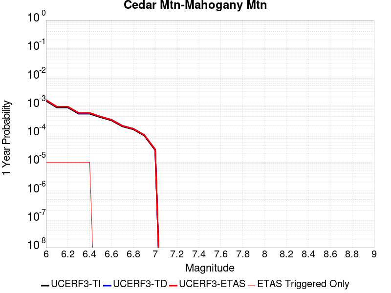 |  |

| Magnitude | 1 wk TI Prob | 1 wk TD Prob | 1 wk ETAS Prob | 1 wk ETAS/TD Gain | 1 wk ETAS Triggered Only | 1 mo TI Prob | 1 mo TD Prob | 1 mo ETAS Prob | 1 mo ETAS/TD Gain | 1 mo ETAS Triggered Only | 1 yr TI Prob | 1 yr TD Prob | 1 yr ETAS Prob | 1 yr ETAS/TD Gain | 1 yr ETAS Triggered Only | 10 yr TI Prob | 10 yr TD Prob | 10 yr ETAS Prob | 10 yr ETAS/TD Gain | 10 yr ETAS Triggered Only |
|-----|-----|-----|-----|-----|-----|-----|-----|-----|-----|-----|-----|-----|-----|-----|-----|-----|-----|-----|-----|-----|
| 6.0 | 2.7763876E-5 | 2.9589124E-5 | 3.9588827E-5 | 1.337952 | 1.0E-5 | 1.1898261E-4 | 1.2680476E-4 | 1.368035E-4 | 1.0788513 | 1.0E-5 | 0.0014476506 | 0.0015428247 | 0.0015528093 | 1.0064716 | 1.0E-5 | 0.0143825635 | 0.015328358 | 0.015338205 | 1.0006424 | 1.0E-5 |
| 6.1 | 1.6162443E-5 | 1.7143104E-5 | 2.7142933E-5 | 1.5833149 | 1.0E-5 | 6.926578E-5 | 7.346847E-5 | 8.346774E-5 | 1.1361028 | 1.0E-5 | 8.4298453E-4 | 8.9412933E-4 | 9.041204E-4 | 1.0111741 | 1.0E-5 | 0.008397939 | 0.00890713 | 0.008917041 | 1.0011127 | 1.0E-5 |
| 6.2 | 1.6162443E-5 | 1.7143104E-5 | 2.7142933E-5 | 1.5833149 | 1.0E-5 | 6.926578E-5 | 7.346847E-5 | 8.346774E-5 | 1.1361028 | 1.0E-5 | 8.4298453E-4 | 8.9412933E-4 | 9.041204E-4 | 1.0111741 | 1.0E-5 | 0.008397939 | 0.00890713 | 0.008917041 | 1.0011127 | 1.0E-5 |
| 6.3 | 9.746053E-6 | 1.030323E-5 | 2.0303127E-5 | 1.9705595 | 1.0E-5 | 4.1768133E-5 | 4.4155975E-5 | 5.4155535E-5 | 1.2264599 | 1.0E-5 | 5.0840835E-4 | 5.374705E-4 | 5.474651E-4 | 1.0185957 | 1.0E-5 | 0.0050724675 | 0.005362125 | 0.005372071 | 1.0018549 | 1.0E-5 |
| 6.4 | 9.746053E-6 | 1.030323E-5 | 2.0303127E-5 | 1.9705595 | 1.0E-5 | 4.1768133E-5 | 4.4155975E-5 | 5.4155535E-5 | 1.2264599 | 1.0E-5 | 5.0840835E-4 | 5.374705E-4 | 5.474651E-4 | 1.0185957 | 1.0E-5 | 0.0050724675 | 0.005362125 | 0.005372071 | 1.0018549 | 1.0E-5 |
| 6.5 | 7.290083E-6 | 7.695381E-6 | 7.695381E-6 | 1.0 | 0.0 | 3.124284E-5 | 3.2979802E-5 | 3.2979802E-5 | 1.0 | 0.0 | 3.8031515E-4 | 4.0145728E-4 | 4.0145728E-4 | 1.0 | 0.0 | 0.0037966494 | 0.0040075406 | 0.0040075406 | 1.0 | 0.0 |
| 6.6 | 5.67907E-6 | 5.9891963E-6 | 5.9891963E-6 | 1.0 | 0.0 | 2.4338644E-5 | 2.5667738E-5 | 2.5667738E-5 | 1.0 | 0.0 | 2.962827E-4 | 3.1246126E-4 | 3.1246126E-4 | 1.0 | 0.0 | 0.0029588798 | 0.0031203553 | 0.0031203553 | 1.0 | 0.0 |
| 6.7 | 3.4853963E-6 | 3.6726572E-6 | 3.6726572E-6 | 1.0 | 0.0 | 1.4937327E-5 | 1.5739868E-5 | 1.5739868E-5 | 1.0 | 0.0 | 1.8184677E-4 | 1.9161667E-4 | 1.9161667E-4 | 1.0 | 0.0 | 0.0018169804 | 0.0019145765 | 0.0019145765 | 1.0 | 0.0 |
| 6.8 | 2.7535168E-6 | 2.901597E-6 | 2.901597E-6 | 1.0 | 0.0 | 1.1800733E-5 | 1.2435359E-5 | 1.2435359E-5 | 1.0 | 0.0 | 1.4366445E-4 | 1.5139046E-4 | 1.5139046E-4 | 1.0 | 0.0 | 0.0014357162 | 0.0015129205 | 0.0015129205 | 1.0 | 0.0 |
| 6.9 | 1.6594106E-6 | 1.7497113E-6 | 1.7497113E-6 | 1.0 | 0.0 | 7.1117406E-6 | 7.4987424E-6 | 7.4987424E-6 | 1.0 | 0.0 | 8.6582E-5 | 9.1293674E-5 | 9.1293674E-5 | 1.0 | 0.0 | 8.654827E-4 | 9.1259216E-4 | 9.1259216E-4 | 1.0 | 0.0 |
| 7.0 | 5.10215E-7 | 5.389294E-7 | 5.389294E-7 | 1.0 | 0.0 | 2.186634E-6 | 2.3096961E-6 | 2.3096961E-6 | 1.0 | 0.0 | 2.6621943E-5 | 2.8120316E-5 | 2.8120316E-5 | 1.0 | 0.0 | 2.6618753E-4 | 2.811801E-4 | 2.811801E-4 | 1.0 | 0.0 |

## Hosgri (Extension)
*[(top)](#table-of-contents)*

| 1 Week | 1 Month | 1 Year | 10 Year |
|-----|-----|-----|-----|
|  |  |  |  |

| Magnitude | 1 wk TI Prob | 1 wk TD Prob | 1 wk ETAS Prob | 1 wk ETAS/TD Gain | 1 wk ETAS Triggered Only | 1 mo TI Prob | 1 mo TD Prob | 1 mo ETAS Prob | 1 mo ETAS/TD Gain | 1 mo ETAS Triggered Only | 1 yr TI Prob | 1 yr TD Prob | 1 yr ETAS Prob | 1 yr ETAS/TD Gain | 1 yr ETAS Triggered Only | 10 yr TI Prob | 10 yr TD Prob | 10 yr ETAS Prob | 10 yr ETAS/TD Gain | 10 yr ETAS Triggered Only |
|-----|-----|-----|-----|-----|-----|-----|-----|-----|-----|-----|-----|-----|-----|-----|-----|-----|-----|-----|-----|-----|
| 6.0 | 1.1369135E-5 | 1.20832E-5 | 1.20832E-5 | 1.0 | 0.0 | 4.8723956E-5 | 5.1784245E-5 | 5.1784245E-5 | 1.0 | 0.0 | 5.9305265E-4 | 6.3031353E-4 | 6.3031353E-4 | 1.0 | 0.0 | 0.005914725 | 0.0062875063 | 0.0063073807 | 1.003161 | 2.0E-5 |
| 6.1 | 6.934979E-6 | 7.324637E-6 | 7.324637E-6 | 1.0 | 0.0 | 2.9721E-5 | 3.1390948E-5 | 3.1390948E-5 | 1.0 | 0.0 | 3.617931E-4 | 3.821219E-4 | 3.821219E-4 | 1.0 | 0.0 | 0.0036120464 | 0.0038150612 | 0.0038150612 | 1.0 | 0.0 |
| 6.2 | 6.934979E-6 | 7.324637E-6 | 7.324637E-6 | 1.0 | 0.0 | 2.9721E-5 | 3.1390948E-5 | 3.1390948E-5 | 1.0 | 0.0 | 3.617931E-4 | 3.821219E-4 | 3.821219E-4 | 1.0 | 0.0 | 0.0036120464 | 0.0038150612 | 0.0038150612 | 1.0 | 0.0 |
| 6.3 | 4.5484676E-6 | 4.7693884E-6 | 4.7693884E-6 | 1.0 | 0.0 | 1.9493287E-5 | 2.0440079E-5 | 2.0440079E-5 | 1.0 | 0.0 | 2.3730492E-4 | 2.4882995E-4 | 2.4882995E-4 | 1.0 | 0.0 | 0.0023705168 | 0.002485556 | 0.002485556 | 1.0 | 0.0 |
| 6.4 | 4.218095E-6 | 4.4169165E-6 | 4.4169165E-6 | 1.0 | 0.0 | 1.8077424E-5 | 1.8929508E-5 | 1.8929508E-5 | 1.0 | 0.0 | 2.2007042E-4 | 2.304427E-4 | 2.304427E-4 | 1.0 | 0.0 | 0.002198526 | 0.0023020708 | 0.0023020708 | 1.0 | 0.0 |
| 6.5 | 3.717374E-6 | 3.883928E-6 | 3.883928E-6 | 1.0 | 0.0 | 1.5931506E-5 | 1.6645301E-5 | 1.6645301E-5 | 1.0 | 0.0 | 1.9394881E-4 | 2.0263788E-4 | 2.0263788E-4 | 1.0 | 0.0 | 0.0019377962 | 0.0020245498 | 0.0020245498 | 1.0 | 0.0 |
| 6.6 | 3.4605036E-6 | 3.6083538E-6 | 3.6083538E-6 | 1.0 | 0.0 | 1.4830645E-5 | 1.5464282E-5 | 1.5464282E-5 | 1.0 | 0.0 | 1.8054814E-4 | 1.8826152E-4 | 1.8826152E-4 | 1.0 | 0.0 | 0.0018040152 | 0.001881035 | 0.001881035 | 1.0 | 0.0 |
| 6.7 | 3.123439E-6 | 3.246613E-6 | 3.246613E-6 | 1.0 | 0.0 | 1.33860985E-5 | 1.3913982E-5 | 1.3913982E-5 | 1.0 | 0.0 | 1.6296357E-4 | 1.6938966E-4 | 1.6938966E-4 | 1.0 | 0.0 | 0.001628441 | 0.0016926165 | 0.0016926165 | 1.0 | 0.0 |
| 6.8 | 2.8290783E-6 | 2.9305816E-6 | 2.9305816E-6 | 1.0 | 0.0 | 1.2124565E-5 | 1.2559575E-5 | 1.2559575E-5 | 1.0 | 0.0 | 1.4760658E-4 | 1.5290218E-4 | 1.5290218E-4 | 1.0 | 0.0 | 0.0014750857 | 0.0015279786 | 0.0015279786 | 1.0 | 0.0 |
| 6.9 | 2.454112E-6 | 2.5283568E-6 | 2.5283568E-6 | 1.0 | 0.0 | 1.0517581E-5 | 1.0835771E-5 | 1.0835771E-5 | 1.0 | 0.0 | 1.2804402E-4 | 1.3191758E-4 | 1.3191758E-4 | 1.0 | 0.0 | 0.0012797028 | 0.0013183989 | 0.0013183989 | 1.0 | 0.0 |
| 7.0 | 2.1008145E-6 | 2.149904E-6 | 2.149904E-6 | 1.0 | 0.0 | 9.003459E-6 | 9.2138425E-6 | 9.2138425E-6 | 1.0 | 0.0 | 1.096116E-4 | 1.1217279E-4 | 1.1217279E-4 | 1.0 | 0.0 | 0.0010955755 | 0.0011211655 | 0.0011211655 | 1.0 | 0.0 |
| 7.1 | 1.744384E-6 | 1.7686655E-6 | 1.7686655E-6 | 1.0 | 0.0 | 7.47591E-6 | 7.579973E-6 | 7.579973E-6 | 1.0 | 0.0 | 9.1015405E-5 | 9.228228E-5 | 9.228228E-5 | 1.0 | 0.0 | 9.097813E-4 | 9.224413E-4 | 9.224413E-4 | 1.0 | 0.0 |
| 7.2 | 1.5456587E-6 | 1.5563166E-6 | 1.5563166E-6 | 1.0 | 0.0 | 6.6242346E-6 | 6.6699113E-6 | 6.6699113E-6 | 1.0 | 0.0 | 8.064707E-5 | 8.120316E-5 | 8.120316E-5 | 1.0 | 0.0 | 8.0617814E-4 | 8.117361E-4 | 8.117361E-4 | 1.0 | 0.0 |
| 7.3 | 1.3775123E-6 | 1.3766349E-6 | 1.3766349E-6 | 1.0 | 0.0 | 5.9036106E-6 | 5.8998507E-6 | 5.8998507E-6 | 1.0 | 0.0 | 7.187409E-5 | 7.1828326E-5 | 7.1828326E-5 | 1.0 | 0.0 | 7.185085E-4 | 7.180521E-4 | 7.180521E-4 | 1.0 | 0.0 |
| 7.4 | 1.214491E-6 | 1.2023712E-6 | 1.2023712E-6 | 1.0 | 0.0 | 5.2049513E-6 | 5.153009E-6 | 5.153009E-6 | 1.0 | 0.0 | 6.336844E-5 | 6.2736086E-5 | 6.2736086E-5 | 1.0 | 0.0 | 6.335037E-4 | 6.271846E-4 | 6.271846E-4 | 1.0 | 0.0 |
| 7.5 | 1.0101123E-6 | 9.842478E-7 | 9.842478E-7 | 1.0 | 0.0 | 4.3290456E-6 | 4.218198E-6 | 4.218198E-6 | 1.0 | 0.0 | 5.2704854E-5 | 5.1355353E-5 | 5.1355353E-5 | 1.0 | 0.0 | 5.2692357E-4 | 5.1343546E-4 | 5.1343546E-4 | 1.0 | 0.0 |
| 7.6 | 8.1558215E-7 | 7.766179E-7 | 7.766179E-7 | 1.0 | 0.0 | 3.4953473E-6 | 3.3283584E-6 | 3.3283584E-6 | 1.0 | 0.0 | 4.255502E-5 | 4.0522013E-5 | 4.0522013E-5 | 1.0 | 0.0 | 4.2546875E-4 | 4.0514668E-4 | 4.0514668E-4 | 1.0 | 0.0 |
| 7.7 | 4.757816E-7 | 4.1310682E-7 | 4.1310682E-7 | 1.0 | 0.0 | 2.0390623E-6 | 1.7704566E-6 | 1.7704566E-6 | 1.0 | 0.0 | 2.4825302E-5 | 2.1555097E-5 | 2.1555097E-5 | 1.0 | 0.0 | 2.482253E-4 | 2.1553019E-4 | 2.1553019E-4 | 1.0 | 0.0 |
| 7.8 | 2.782787E-7 | 2.00493E-7 | 2.00493E-7 | 1.0 | 0.0 | 1.1926223E-6 | 8.5925547E-7 | 8.5925547E-7 | 1.0 | 0.0 | 1.452008E-5 | 1.04613855E-5 | 1.04613855E-5 | 1.0 | 0.0 | 1.4519131E-4 | 1.0460896E-4 | 1.0460896E-4 | 1.0 | 0.0 |
| 7.9 | 1.6948086E-7 | 9.2453185E-8 | 9.2453185E-8 | 1.0 | 0.0 | 7.2634634E-7 | 3.9622788E-7 | 3.9622788E-7 | 1.0 | 0.0 | 8.843231E-6 | 4.8240636E-6 | 4.8240636E-6 | 1.0 | 0.0 | 8.842879E-5 | 4.8239595E-5 | 4.8239595E-5 | 1.0 | 0.0 |
| 8.0 | 1.0225492E-7 | 4.4745146E-8 | 4.4745146E-8 | 1.0 | 0.0 | 4.382353E-7 | 1.917649E-7 | 1.917649E-7 | 1.0 | 0.0 | 5.335502E-6 | 2.3347352E-6 | 2.3347352E-6 | 1.0 | 0.0 | 5.335374E-5 | 2.334711E-5 | 2.334711E-5 | 1.0 | 0.0 |
| 8.1 | 1.43711345E-8 | 5.7886886E-9 | 5.7886886E-9 | 1.0 | 0.0 | 6.1590576E-8 | 2.4808667E-8 | 2.4808667E-8 | 1.0 | 0.0 | 7.4986497E-7 | 3.0204546E-7 | 3.0204546E-7 | 1.0 | 0.0 | 7.4986247E-6 | 3.0204512E-6 | 3.0204512E-6 | 1.0 | 0.0 |

## Palos Verdes
*[(top)](#table-of-contents)*

| 1 Week | 1 Month | 1 Year | 10 Year |
|-----|-----|-----|-----|
|  |  |  |  |

| Magnitude | 1 wk TI Prob | 1 wk TD Prob | 1 wk ETAS Prob | 1 wk ETAS/TD Gain | 1 wk ETAS Triggered Only | 1 mo TI Prob | 1 mo TD Prob | 1 mo ETAS Prob | 1 mo ETAS/TD Gain | 1 mo ETAS Triggered Only | 1 yr TI Prob | 1 yr TD Prob | 1 yr ETAS Prob | 1 yr ETAS/TD Gain | 1 yr ETAS Triggered Only | 10 yr TI Prob | 10 yr TD Prob | 10 yr ETAS Prob | 10 yr ETAS/TD Gain | 10 yr ETAS Triggered Only |
|-----|-----|-----|-----|-----|-----|-----|-----|-----|-----|-----|-----|-----|-----|-----|-----|-----|-----|-----|-----|-----|
| 6.0 | 6.126063E-5 | 7.622823E-5 | 8.622746E-5 | 1.131175 | 1.0E-5 | 2.6251914E-4 | 3.2665484E-4 | 3.3665157E-4 | 1.0306034 | 1.0E-5 | 0.0031914865 | 0.0039703017 | 0.0039802617 | 1.0025088 | 1.0E-5 | 0.031460393 | 0.03905032 | 0.039069537 | 1.0004922 | 2.0E-5 |
| 6.1 | 6.126063E-5 | 7.622823E-5 | 8.622746E-5 | 1.131175 | 1.0E-5 | 2.6251914E-4 | 3.2665484E-4 | 3.3665157E-4 | 1.0306034 | 1.0E-5 | 0.0031914865 | 0.0039703017 | 0.0039802617 | 1.0025088 | 1.0E-5 | 0.031460393 | 0.03905032 | 0.039069537 | 1.0004922 | 2.0E-5 |
| 6.2 | 6.126063E-5 | 7.622823E-5 | 8.622746E-5 | 1.131175 | 1.0E-5 | 2.6251914E-4 | 3.2665484E-4 | 3.3665157E-4 | 1.0306034 | 1.0E-5 | 0.0031914865 | 0.0039703017 | 0.0039802617 | 1.0025088 | 1.0E-5 | 0.031460393 | 0.03905032 | 0.039069537 | 1.0004922 | 2.0E-5 |
| 6.3 | 4.0838047E-5 | 4.9750462E-5 | 5.9749967E-5 | 1.2009932 | 1.0E-5 | 1.7500846E-4 | 2.1320012E-4 | 2.2319799E-4 | 1.0468943 | 1.0E-5 | 0.0021286458 | 0.0025928293 | 0.0026028033 | 1.0038468 | 1.0E-5 | 0.021083709 | 0.02564748 | 0.025666967 | 1.0007598 | 2.0E-5 |
| 6.4 | 4.0838047E-5 | 4.9750462E-5 | 5.9749967E-5 | 1.2009932 | 1.0E-5 | 1.7500846E-4 | 2.1320012E-4 | 2.2319799E-4 | 1.0468943 | 1.0E-5 | 0.0021286458 | 0.0025928293 | 0.0026028033 | 1.0038468 | 1.0E-5 | 0.021083709 | 0.02564748 | 0.025666967 | 1.0007598 | 2.0E-5 |
| 6.5 | 3.0512005E-5 | 3.6562564E-5 | 4.65622E-5 | 1.2734938 | 1.0E-5 | 1.3075917E-4 | 1.5668797E-4 | 1.666864E-4 | 1.0638111 | 1.0E-5 | 0.0015908304 | 0.0019061224 | 0.0019161034 | 1.0052363 | 1.0E-5 | 0.015794903 | 0.018909669 | 0.01891948 | 1.0005188 | 1.0E-5 |
| 6.6 | 2.9255087E-5 | 3.515534E-5 | 4.515499E-5 | 1.2844418 | 1.0E-5 | 1.2537291E-4 | 1.506577E-4 | 1.606562E-4 | 1.0663656 | 1.0E-5 | 0.0015253464 | 0.0018328275 | 0.0018428091 | 1.0054461 | 1.0E-5 | 0.015149189 | 0.018188728 | 0.018198546 | 1.0005398 | 1.0E-5 |
| 6.7 | 2.287198E-5 | 2.7248976E-5 | 3.7248705E-5 | 1.3669763 | 1.0E-5 | 9.801909E-5 | 1.1677662E-4 | 1.2677544E-4 | 1.0856236 | 1.0E-5 | 0.001192729 | 0.0014209197 | 0.0014309055 | 1.0070277 | 1.0E-5 | 0.011863477 | 0.014127577 | 0.014137436 | 1.0006979 | 1.0E-5 |
| 6.8 | 2.1325764E-5 | 2.5432533E-5 | 3.5432276E-5 | 1.3931872 | 1.0E-5 | 9.139293E-5 | 1.0899252E-4 | 1.1899143E-4 | 1.0917394 | 1.0E-5 | 0.001112141 | 0.0013262664 | 0.0013362531 | 1.00753 | 1.0E-5 | 0.011065915 | 0.013192549 | 0.013202417 | 1.000748 | 1.0E-5 |
| 6.9 | 1.9009392E-5 | 2.2614122E-5 | 3.2613894E-5 | 1.4421916 | 1.0E-5 | 8.1466285E-5 | 9.6914555E-5 | 1.0691358E-4 | 1.1031737 | 1.0E-5 | 9.914007E-4 | 0.0011793834 | 0.0011893716 | 1.008469 | 1.0E-5 | 0.009869894 | 0.011739929 | 0.0117498115 | 1.0008417 | 1.0E-5 |
| 7.0 | 1.7098473E-5 | 2.0319867E-5 | 3.0319665E-5 | 1.4921192 | 1.0E-5 | 7.3277115E-5 | 8.708272E-5 | 9.708185E-5 | 1.1148233 | 1.0E-5 | 8.917837E-4 | 0.0010598017 | 0.001069791 | 1.0094258 | 1.0E-5 | 0.008882134 | 0.010555912 | 0.010565806 | 1.0009373 | 1.0E-5 |
| 7.1 | 1.5982785E-5 | 1.8995239E-5 | 2.899505E-5 | 1.5264376 | 1.0E-5 | 6.849585E-5 | 8.1406106E-5 | 9.1405294E-5 | 1.1228309 | 1.0E-5 | 8.336179E-4 | 9.907534E-4 | 0.0010007435 | 1.0100833 | 1.0E-5 | 0.008304977 | 0.009871728 | 0.009881629 | 1.001003 | 1.0E-5 |
| 7.2 | 1.4468002E-5 | 1.719767E-5 | 2.7197499E-5 | 1.581464 | 1.0E-5 | 6.200425E-5 | 7.370269E-5 | 8.3701954E-5 | 1.1356703 | 1.0E-5 | 7.546402E-4 | 8.970449E-4 | 9.070359E-4 | 1.0111377 | 1.0E-5 | 0.007520827 | 0.008942509 | 0.008952419 | 1.0011083 | 1.0E-5 |
| 7.3 | 5.288233E-6 | 6.2038207E-6 | 6.2038207E-6 | 1.0 | 0.0 | 2.2663658E-5 | 2.658773E-5 | 2.658773E-5 | 1.0 | 0.0 | 2.7589512E-4 | 3.2369242E-4 | 3.2369242E-4 | 1.0 | 0.0 | 0.0027555283 | 0.0032356323 | 0.0032356323 | 1.0 | 0.0 |
| 7.4 | 8.279556E-7 | 8.408364E-7 | 8.408364E-7 | 1.0 | 0.0 | 3.5483763E-6 | 3.60358E-6 | 3.60358E-6 | 1.0 | 0.0 | 4.3200624E-5 | 4.3872777E-5 | 4.3872777E-5 | 1.0 | 0.0 | 4.3192226E-4 | 4.3864836E-4 | 4.3864836E-4 | 1.0 | 0.0 |
| 7.5 | 6.559831E-7 | 6.667243E-7 | 6.667243E-7 | 1.0 | 0.0 | 2.8113532E-6 | 2.8573872E-6 | 2.8573872E-6 | 1.0 | 0.0 | 3.4227687E-5 | 3.47882E-5 | 3.47882E-5 | 1.0 | 0.0 | 3.4222414E-4 | 3.478342E-4 | 3.478342E-4 | 1.0 | 0.0 |
| 7.6 | 3.5018968E-7 | 3.562011E-7 | 3.562011E-7 | 1.0 | 0.0 | 1.500812E-6 | 1.5265755E-6 | 1.5265755E-6 | 1.0 | 0.0 | 1.8272232E-5 | 1.8585944E-5 | 1.8585944E-5 | 1.0 | 0.0 | 1.8270731E-4 | 1.858485E-4 | 1.858485E-4 | 1.0 | 0.0 |
| 7.7 | 1.1986104E-7 | 1.2198406E-7 | 1.2198406E-7 | 1.0 | 0.0 | 5.1369005E-7 | 5.227887E-7 | 5.227887E-7 | 1.0 | 0.0 | 6.2541585E-6 | 6.364934E-6 | 6.364934E-6 | 1.0 | 0.0 | 6.2539824E-5 | 6.364756E-5 | 6.364756E-5 | 1.0 | 0.0 |
| 7.8 | 3.0445005E-8 | 3.1027664E-8 | 3.1027664E-8 | 1.0 | 0.0 | 1.3047858E-7 | 1.3297569E-7 | 1.3297569E-7 | 1.0 | 0.0 | 1.5885756E-6 | 1.6189781E-6 | 1.6189781E-6 | 1.0 | 0.0 | 1.5885644E-5 | 1.6189684E-5 | 1.6189684E-5 | 1.0 | 0.0 |

## Clamshell-Sawpit
*[(top)](#table-of-contents)*

| 1 Week | 1 Month | 1 Year | 10 Year |
|-----|-----|-----|-----|
|  |  |  | 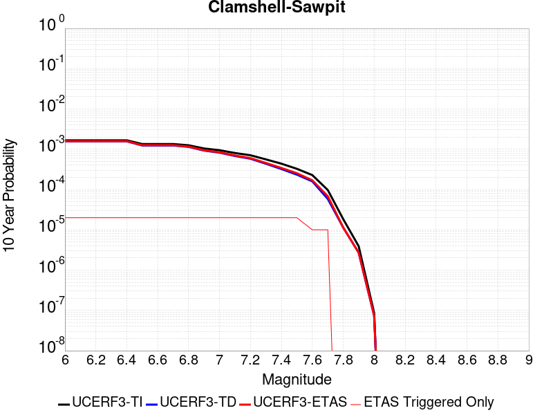 |

| Magnitude | 1 wk TI Prob | 1 wk TD Prob | 1 wk ETAS Prob | 1 wk ETAS/TD Gain | 1 wk ETAS Triggered Only | 1 mo TI Prob | 1 mo TD Prob | 1 mo ETAS Prob | 1 mo ETAS/TD Gain | 1 mo ETAS Triggered Only | 1 yr TI Prob | 1 yr TD Prob | 1 yr ETAS Prob | 1 yr ETAS/TD Gain | 1 yr ETAS Triggered Only | 10 yr TI Prob | 10 yr TD Prob | 10 yr ETAS Prob | 10 yr ETAS/TD Gain | 10 yr ETAS Triggered Only |
|-----|-----|-----|-----|-----|-----|-----|-----|-----|-----|-----|-----|-----|-----|-----|-----|-----|-----|-----|-----|-----|
| 6.0 | 3.202998E-6 | 3.0127833E-6 | 3.0127833E-6 | 1.0 | 0.0 | 1.3727062E-5 | 1.2911869E-5 | 1.2911869E-5 | 1.0 | 0.0 | 1.6711417E-4 | 1.5719148E-4 | 1.671899E-4 | 1.0636067 | 1.0E-5 | 0.0016698855 | 0.0015708823 | 0.0015908508 | 1.0127116 | 2.0E-5 |
| 6.1 | 3.202998E-6 | 3.0127833E-6 | 3.0127833E-6 | 1.0 | 0.0 | 1.3727062E-5 | 1.2911869E-5 | 1.2911869E-5 | 1.0 | 0.0 | 1.6711417E-4 | 1.5719148E-4 | 1.671899E-4 | 1.0636067 | 1.0E-5 | 0.0016698855 | 0.0015708823 | 0.0015908508 | 1.0127116 | 2.0E-5 |
| 6.2 | 3.202998E-6 | 3.0127833E-6 | 3.0127833E-6 | 1.0 | 0.0 | 1.3727062E-5 | 1.2911869E-5 | 1.2911869E-5 | 1.0 | 0.0 | 1.6711417E-4 | 1.5719148E-4 | 1.671899E-4 | 1.0636067 | 1.0E-5 | 0.0016698855 | 0.0015708823 | 0.0015908508 | 1.0127116 | 2.0E-5 |
| 6.3 | 3.202998E-6 | 3.0127833E-6 | 3.0127833E-6 | 1.0 | 0.0 | 1.3727062E-5 | 1.2911869E-5 | 1.2911869E-5 | 1.0 | 0.0 | 1.6711417E-4 | 1.5719148E-4 | 1.671899E-4 | 1.0636067 | 1.0E-5 | 0.0016698855 | 0.0015708823 | 0.0015908508 | 1.0127116 | 2.0E-5 |
| 6.4 | 3.202998E-6 | 3.0127833E-6 | 3.0127833E-6 | 1.0 | 0.0 | 1.3727062E-5 | 1.2911869E-5 | 1.2911869E-5 | 1.0 | 0.0 | 1.6711417E-4 | 1.5719148E-4 | 1.671899E-4 | 1.0636067 | 1.0E-5 | 0.0016698855 | 0.0015708823 | 0.0015908508 | 1.0127116 | 2.0E-5 |
| 6.5 | 2.5862723E-6 | 2.3807918E-6 | 2.3807918E-6 | 1.0 | 0.0 | 1.1083977E-5 | 1.02033555E-5 | 1.02033555E-5 | 1.0 | 0.0 | 1.3493907E-4 | 1.2421908E-4 | 1.3421783E-4 | 1.080493 | 1.0E-5 | 0.0013485716 | 0.0012415267 | 0.0012615019 | 1.0160892 | 2.0E-5 |
| 6.6 | 2.5862723E-6 | 2.3807918E-6 | 2.3807918E-6 | 1.0 | 0.0 | 1.1083977E-5 | 1.02033555E-5 | 1.02033555E-5 | 1.0 | 0.0 | 1.3493907E-4 | 1.2421908E-4 | 1.3421783E-4 | 1.080493 | 1.0E-5 | 0.0013485716 | 0.0012415267 | 0.0012615019 | 1.0160892 | 2.0E-5 |
| 6.7 | 2.5862723E-6 | 2.3807918E-6 | 2.3807918E-6 | 1.0 | 0.0 | 1.1083977E-5 | 1.02033555E-5 | 1.02033555E-5 | 1.0 | 0.0 | 1.3493907E-4 | 1.2421908E-4 | 1.3421783E-4 | 1.080493 | 1.0E-5 | 0.0013485716 | 0.0012415267 | 0.0012615019 | 1.0160892 | 2.0E-5 |
| 6.8 | 2.4098806E-6 | 2.1977469E-6 | 2.1977469E-6 | 1.0 | 0.0 | 1.0328019E-5 | 9.418883E-6 | 9.418883E-6 | 1.0 | 0.0 | 1.2573638E-4 | 1.1466913E-4 | 1.2466797E-4 | 1.0871974 | 1.0E-5 | 0.0012566525 | 0.0011461262 | 0.0011661033 | 1.0174301 | 2.0E-5 |
| 6.9 | 2.0073985E-6 | 1.7784384E-6 | 1.7784384E-6 | 1.0 | 0.0 | 8.603109E-6 | 7.6218575E-6 | 7.6218575E-6 | 1.0 | 0.0 | 1.0473781E-4 | 9.279228E-5 | 1.0279135E-4 | 1.1077576 | 1.0E-5 | 0.0010468846 | 9.275472E-4 | 9.475287E-4 | 1.0215422 | 2.0E-5 |
| 7.0 | 1.8166766E-6 | 1.5807223E-6 | 1.5807223E-6 | 1.0 | 0.0 | 7.785734E-6 | 6.774507E-6 | 6.774507E-6 | 1.0 | 0.0 | 9.478718E-5 | 8.24766E-5 | 9.247578E-5 | 1.1212366 | 1.0E-5 | 9.4746763E-4 | 8.2446996E-4 | 8.4445346E-4 | 1.024238 | 2.0E-5 |
| 7.1 | 1.5471421E-6 | 1.305307E-6 | 1.305307E-6 | 1.0 | 0.0 | 6.6305925E-6 | 5.594161E-6 | 5.594161E-6 | 1.0 | 0.0 | 8.072447E-5 | 6.8106834E-5 | 7.810615E-5 | 1.1468182 | 1.0E-5 | 8.0695155E-4 | 6.8086514E-4 | 7.008515E-4 | 1.0293545 | 2.0E-5 |
| 7.2 | 1.3608037E-6 | 1.1153539E-6 | 1.1153539E-6 | 1.0 | 0.0 | 5.8320024E-6 | 4.7800795E-6 | 4.7800795E-6 | 1.0 | 0.0 | 7.1002316E-5 | 5.8195965E-5 | 6.819538E-5 | 1.1718233 | 1.0E-5 | 7.097964E-4 | 5.818119E-4 | 6.018002E-4 | 1.0343554 | 2.0E-5 |
| 7.3 | 1.0749634E-6 | 8.384333E-7 | 8.384333E-7 | 1.0 | 0.0 | 4.6069777E-6 | 3.593281E-6 | 3.593281E-6 | 1.0 | 0.0 | 5.608851E-5 | 4.3747346E-5 | 5.374691E-5 | 1.2285753 | 1.0E-5 | 5.6074356E-4 | 4.3739015E-4 | 4.5738142E-4 | 1.0457058 | 2.0E-5 |
| 7.4 | 8.416856E-7 | 6.200111E-7 | 6.200111E-7 | 1.0 | 0.0 | 3.607219E-6 | 2.657188E-6 | 2.657188E-6 | 1.0 | 0.0 | 4.3917007E-5 | 3.2350803E-5 | 4.235048E-5 | 1.3091013 | 1.0E-5 | 4.390833E-4 | 3.2346288E-4 | 3.4345643E-4 | 1.0618109 | 2.0E-5 |
| 7.5 | 6.2779594E-7 | 4.4969397E-7 | 4.4969397E-7 | 1.0 | 0.0 | 2.6905511E-6 | 1.9272586E-6 | 1.9272586E-6 | 1.0 | 0.0 | 3.275697E-5 | 2.346414E-5 | 3.3463904E-5 | 1.4261723 | 1.0E-5 | 3.275214E-4 | 2.3461849E-4 | 2.546138E-4 | 1.0852247 | 2.0E-5 |
| 7.6 | 4.3822078E-7 | 3.0595726E-7 | 3.0595726E-7 | 1.0 | 0.0 | 1.8780877E-6 | 1.3112448E-6 | 1.3112448E-6 | 1.0 | 0.0 | 2.2865479E-5 | 1.5964304E-5 | 2.5964146E-5 | 1.6263875 | 1.0E-5 | 2.2863125E-4 | 1.5963313E-4 | 1.6963153E-4 | 1.0626336 | 1.0E-5 |
| 7.7 | 1.8704569E-7 | 1.12380086E-7 | 1.12380086E-7 | 1.0 | 0.0 | 8.0162414E-7 | 4.8162883E-7 | 4.8162883E-7 | 1.0 | 0.0 | 9.75973E-6 | 5.863816E-6 | 1.5863758E-5 | 2.705364 | 1.0E-5 | 9.7593016E-5 | 5.8636677E-5 | 6.863609E-5 | 1.1705317 | 1.0E-5 |
| 7.8 | 3.5378733E-8 | 2.183811E-8 | 2.183811E-8 | 1.0 | 0.0 | 1.5162313E-7 | 9.359189E-8 | 9.359189E-8 | 1.0 | 0.0 | 1.84601E-6 | 1.1394808E-6 | 1.1394808E-6 | 1.0 | 0.0 | 1.8459947E-5 | 1.1394752E-5 | 1.1394752E-5 | 1.0 | 0.0 |
| 7.9 | 7.504945E-9 | 5.1921765E-9 | 5.1921765E-9 | 1.0 | 0.0 | 3.2164053E-8 | 2.2252184E-8 | 2.2252184E-8 | 1.0 | 0.0 | 3.9159727E-7 | 2.709203E-7 | 2.709203E-7 | 1.0 | 0.0 | 3.915966E-6 | 2.7092008E-6 | 2.7092008E-6 | 1.0 | 0.0 |
| 8.0 | 1.6554036E-10 | 1.4181756E-10 | 1.4181756E-10 | 1.0 | 0.0 | 7.0945894E-10 | 6.077895E-10 | 6.077895E-10 | 1.0 | 0.0 | 8.637662E-9 | 7.399838E-9 | 7.399838E-9 | 1.0 | 0.0 | 8.6376616E-8 | 7.399838E-8 | 7.399838E-8 | 1.0 | 0.0 |

## Malibu Coast alt 1
*[(top)](#table-of-contents)*

| 1 Week | 1 Month | 1 Year | 10 Year |
|-----|-----|-----|-----|
|  |  |  |  |

| Magnitude | 1 wk TI Prob | 1 wk TD Prob | 1 wk ETAS Prob | 1 wk ETAS/TD Gain | 1 wk ETAS Triggered Only | 1 mo TI Prob | 1 mo TD Prob | 1 mo ETAS Prob | 1 mo ETAS/TD Gain | 1 mo ETAS Triggered Only | 1 yr TI Prob | 1 yr TD Prob | 1 yr ETAS Prob | 1 yr ETAS/TD Gain | 1 yr ETAS Triggered Only | 10 yr TI Prob | 10 yr TD Prob | 10 yr ETAS Prob | 10 yr ETAS/TD Gain | 10 yr ETAS Triggered Only |
|-----|-----|-----|-----|-----|-----|-----|-----|-----|-----|-----|-----|-----|-----|-----|-----|-----|-----|-----|-----|-----|
| 6.0 | 1.6572556E-5 | 1.7598271E-5 | 1.7598271E-5 | 1.0 | 0.0 | 7.102331E-5 | 7.5419084E-5 | 7.5419084E-5 | 1.0 | 0.0 | 8.6436566E-4 | 9.178595E-4 | 9.278503E-4 | 1.0108849 | 1.0E-5 | 0.0086101135 | 0.009142619 | 0.009162435 | 1.0021676 | 2.0E-5 |
| 6.1 | 1.6572556E-5 | 1.7598271E-5 | 1.7598271E-5 | 1.0 | 0.0 | 7.102331E-5 | 7.5419084E-5 | 7.5419084E-5 | 1.0 | 0.0 | 8.6436566E-4 | 9.178595E-4 | 9.278503E-4 | 1.0108849 | 1.0E-5 | 0.0086101135 | 0.009142619 | 0.009162435 | 1.0021676 | 2.0E-5 |
| 6.2 | 1.1085717E-5 | 1.155727E-5 | 1.155727E-5 | 1.0 | 0.0 | 4.750935E-5 | 4.953024E-5 | 4.953024E-5 | 1.0 | 0.0 | 5.782728E-4 | 6.0286734E-4 | 6.128613E-4 | 1.0165774 | 1.0E-5 | 0.0057677035 | 0.00601269 | 0.00603257 | 1.0033063 | 2.0E-5 |
| 6.3 | 1.0208568E-5 | 1.0592348E-5 | 1.0592348E-5 | 1.0 | 0.0 | 4.375027E-5 | 4.5395005E-5 | 4.5395005E-5 | 1.0 | 0.0 | 5.325294E-4 | 5.52547E-4 | 5.625414E-4 | 1.018088 | 1.0E-5 | 0.0053125503 | 0.005512039 | 0.005531929 | 1.0036085 | 2.0E-5 |
| 6.4 | 9.0682315E-6 | 9.3427325E-6 | 9.3427325E-6 | 1.0 | 0.0 | 3.8863272E-5 | 4.003968E-5 | 4.003968E-5 | 1.0 | 0.0 | 4.730576E-4 | 4.8737606E-4 | 4.973712E-4 | 1.020508 | 1.0E-5 | 0.0047205184 | 0.0048632855 | 0.0048831883 | 1.0040925 | 2.0E-5 |
| 6.5 | 7.605796E-6 | 7.748663E-6 | 7.748663E-6 | 1.0 | 0.0 | 3.259586E-5 | 3.320814E-5 | 3.320814E-5 | 1.0 | 0.0 | 3.9678233E-4 | 4.0423544E-4 | 4.1423138E-4 | 1.0247281 | 1.0E-5 | 0.0039607463 | 0.004035139 | 0.0040550586 | 1.0049365 | 2.0E-5 |
| 6.6 | 5.889873E-6 | 5.879592E-6 | 5.879592E-6 | 1.0 | 0.0 | 2.5242069E-5 | 2.519801E-5 | 2.519801E-5 | 1.0 | 0.0 | 3.0727885E-4 | 3.0674267E-4 | 3.167396E-4 | 1.0325906 | 1.0E-5 | 0.003068543 | 0.0030632056 | 0.0030831443 | 1.0065091 | 2.0E-5 |
| 6.7 | 5.66586E-6 | 5.641693E-6 | 5.641693E-6 | 1.0 | 0.0 | 2.428203E-5 | 2.417846E-5 | 2.417846E-5 | 1.0 | 0.0 | 2.955936E-4 | 2.943331E-4 | 3.0433014E-4 | 1.0339651 | 1.0E-5 | 0.0029520073 | 0.0029394445 | 0.0029593857 | 1.006784 | 2.0E-5 |
| 6.8 | 5.521556E-6 | 5.4894776E-6 | 5.4894776E-6 | 1.0 | 0.0 | 2.3663597E-5 | 2.352612E-5 | 2.352612E-5 | 1.0 | 0.0 | 2.880662E-4 | 2.8639295E-4 | 2.963901E-4 | 1.0349071 | 1.0E-5 | 0.0028769306 | 0.0028602504 | 0.0028801933 | 1.0069724 | 2.0E-5 |
| 6.9 | 5.29752E-6 | 5.24998E-6 | 5.24998E-6 | 1.0 | 0.0 | 2.270346E-5 | 2.249972E-5 | 2.249972E-5 | 1.0 | 0.0 | 2.7637955E-4 | 2.7389973E-4 | 2.8389698E-4 | 1.0364997 | 1.0E-5 | 0.0027603607 | 0.0027356318 | 0.0027555772 | 1.007291 | 2.0E-5 |
| 7.0 | 5.106743E-6 | 5.047725E-6 | 5.047725E-6 | 1.0 | 0.0 | 2.1885859E-5 | 2.163293E-5 | 2.163293E-5 | 1.0 | 0.0 | 2.6642776E-4 | 2.6334915E-4 | 2.7334652E-4 | 1.0379624 | 1.0E-5 | 0.0026610855 | 0.0026303804 | 0.0026503277 | 1.0075835 | 2.0E-5 |
| 7.1 | 4.8469647E-6 | 4.770417E-6 | 4.770417E-6 | 1.0 | 0.0 | 2.0772539E-5 | 2.0444484E-5 | 2.0444484E-5 | 1.0 | 0.0 | 2.528763E-4 | 2.4888324E-4 | 2.5888075E-4 | 1.0401695 | 1.0E-5 | 0.0025258875 | 0.0024860532 | 0.0025060035 | 1.0080249 | 2.0E-5 |
| 7.2 | 4.545514E-6 | 4.448235E-6 | 4.448235E-6 | 1.0 | 0.0 | 1.9480629E-5 | 1.9063724E-5 | 1.9063724E-5 | 1.0 | 0.0 | 2.3715083E-4 | 2.3207619E-4 | 2.4207386E-4 | 1.0430793 | 1.0E-5 | 0.0023689792 | 0.0023183457 | 0.0023382993 | 1.0086068 | 2.0E-5 |
| 7.3 | 3.794097E-6 | 3.6519675E-6 | 3.6519675E-6 | 1.0 | 0.0 | 1.6260314E-5 | 1.5651196E-5 | 1.5651196E-5 | 1.0 | 0.0 | 1.9795135E-4 | 1.9053668E-4 | 1.9053668E-4 | 1.0 | 0.0 | 0.001977751 | 0.0019037378 | 0.0019137188 | 1.0052428 | 1.0E-5 |
| 7.4 | 2.808217E-6 | 2.7191002E-6 | 2.7191002E-6 | 1.0 | 0.0 | 1.203516E-5 | 1.1653235E-5 | 1.1653235E-5 | 1.0 | 0.0 | 1.4651821E-4 | 1.4186892E-4 | 1.4186892E-4 | 1.0 | 0.0 | 0.0014642165 | 0.0014177862 | 0.0014177862 | 1.0 | 0.0 |
| 7.5 | 1.83809E-6 | 1.819086E-6 | 1.819086E-6 | 1.0 | 0.0 | 7.877505E-6 | 7.79606E-6 | 7.79606E-6 | 1.0 | 0.0 | 9.59044E-5 | 9.491292E-5 | 9.491292E-5 | 1.0 | 0.0 | 9.5863023E-4 | 9.487258E-4 | 9.487258E-4 | 1.0 | 0.0 |
| 7.6 | 1.1292672E-6 | 1.1001556E-6 | 1.1001556E-6 | 1.0 | 0.0 | 4.839708E-6 | 4.7149438E-6 | 4.7149438E-6 | 1.0 | 0.0 | 5.8921847E-5 | 5.7402947E-5 | 5.7402947E-5 | 1.0 | 0.0 | 5.890623E-4 | 5.7388283E-4 | 5.7388283E-4 | 1.0 | 0.0 |
| 7.7 | 5.065272E-7 | 4.6092035E-7 | 4.6092035E-7 | 1.0 | 0.0 | 2.170829E-6 | 1.9753716E-6 | 1.9753716E-6 | 1.0 | 0.0 | 2.6429525E-5 | 2.4049894E-5 | 2.4049894E-5 | 1.0 | 0.0 | 2.642638E-4 | 2.4047404E-4 | 2.4047404E-4 | 1.0 | 0.0 |
| 7.8 | 8.952991E-8 | 6.708018E-8 | 6.708018E-8 | 1.0 | 0.0 | 3.8369956E-7 | 2.8748644E-7 | 2.8748644E-7 | 1.0 | 0.0 | 4.671532E-6 | 3.5001422E-6 | 3.5001422E-6 | 1.0 | 0.0 | 4.671434E-5 | 3.500089E-5 | 3.500089E-5 | 1.0 | 0.0 |
| 7.9 | 8.007447E-10 | 6.1615857E-10 | 6.1615857E-10 | 1.0 | 0.0 | 3.4317629E-9 | 2.64068E-9 | 2.64068E-9 | 1.0 | 0.0 | 4.1781714E-8 | 3.215028E-8 | 3.215028E-8 | 1.0 | 0.0 | 4.1781706E-7 | 3.2150274E-7 | 3.2150274E-7 | 1.0 | 0.0 |

## Kern Canyon (Lake Isabella) 2011
*[(top)](#table-of-contents)*

| 1 Week | 1 Month | 1 Year | 10 Year |
|-----|-----|-----|-----|
|  |  |  |  |

| Magnitude | 1 wk TI Prob | 1 wk TD Prob | 1 wk ETAS Prob | 1 wk ETAS/TD Gain | 1 wk ETAS Triggered Only | 1 mo TI Prob | 1 mo TD Prob | 1 mo ETAS Prob | 1 mo ETAS/TD Gain | 1 mo ETAS Triggered Only | 1 yr TI Prob | 1 yr TD Prob | 1 yr ETAS Prob | 1 yr ETAS/TD Gain | 1 yr ETAS Triggered Only | 10 yr TI Prob | 10 yr TD Prob | 10 yr ETAS Prob | 10 yr ETAS/TD Gain | 10 yr ETAS Triggered Only |
|-----|-----|-----|-----|-----|-----|-----|-----|-----|-----|-----|-----|-----|-----|-----|-----|-----|-----|-----|-----|-----|
| 6.0 | 4.2387383E-6 | 4.001647E-6 | 4.001647E-6 | 1.0 | 0.0 | 1.8165894E-5 | 1.7149814E-5 | 1.7149814E-5 | 1.0 | 0.0 | 2.2114732E-4 | 2.0878084E-4 | 2.1877875E-4 | 1.0478871 | 1.0E-5 | 0.0022092736 | 0.0020860308 | 0.002105989 | 1.0095676 | 2.0E-5 |
| 6.1 | 4.2387383E-6 | 4.001647E-6 | 4.001647E-6 | 1.0 | 0.0 | 1.8165894E-5 | 1.7149814E-5 | 1.7149814E-5 | 1.0 | 0.0 | 2.2114732E-4 | 2.0878084E-4 | 2.1877875E-4 | 1.0478871 | 1.0E-5 | 0.0022092736 | 0.0020860308 | 0.002105989 | 1.0095676 | 2.0E-5 |
| 6.2 | 4.2387383E-6 | 4.001647E-6 | 4.001647E-6 | 1.0 | 0.0 | 1.8165894E-5 | 1.7149814E-5 | 1.7149814E-5 | 1.0 | 0.0 | 2.2114732E-4 | 2.0878084E-4 | 2.1877875E-4 | 1.0478871 | 1.0E-5 | 0.0022092736 | 0.0020860308 | 0.002105989 | 1.0095676 | 2.0E-5 |
| 6.3 | 4.2387383E-6 | 4.001647E-6 | 4.001647E-6 | 1.0 | 0.0 | 1.8165894E-5 | 1.7149814E-5 | 1.7149814E-5 | 1.0 | 0.0 | 2.2114732E-4 | 2.0878084E-4 | 2.1877875E-4 | 1.0478871 | 1.0E-5 | 0.0022092736 | 0.0020860308 | 0.002105989 | 1.0095676 | 2.0E-5 |
| 6.4 | 4.2387383E-6 | 4.001647E-6 | 4.001647E-6 | 1.0 | 0.0 | 1.8165894E-5 | 1.7149814E-5 | 1.7149814E-5 | 1.0 | 0.0 | 2.2114732E-4 | 2.0878084E-4 | 2.1877875E-4 | 1.0478871 | 1.0E-5 | 0.0022092736 | 0.0020860308 | 0.002105989 | 1.0095676 | 2.0E-5 |
| 6.5 | 2.7857532E-6 | 2.517871E-6 | 2.517871E-6 | 1.0 | 0.0 | 1.1938888E-5 | 1.0790834E-5 | 1.0790834E-5 | 1.0 | 0.0 | 1.4534626E-4 | 1.313708E-4 | 1.313708E-4 | 1.0 | 0.0 | 0.0014525123 | 0.0013129641 | 0.001322951 | 1.0076064 | 1.0E-5 |
| 6.6 | 2.2233348E-6 | 1.944126E-6 | 1.944126E-6 | 1.0 | 0.0 | 9.528543E-6 | 8.331944E-6 | 8.331944E-6 | 1.0 | 0.0 | 1.1600384E-4 | 1.0143677E-4 | 1.0143677E-4 | 1.0 | 0.0 | 0.001159433 | 0.0010139133 | 0.0010239033 | 1.0098528 | 1.0E-5 |
| 6.7 | 2.1635126E-6 | 1.8835061E-6 | 1.8835061E-6 | 1.0 | 0.0 | 9.272164E-6 | 8.072145E-6 | 8.072145E-6 | 1.0 | 0.0 | 1.1288274E-4 | 9.827401E-5 | 9.827401E-5 | 1.0 | 0.0 | 0.0011282542 | 9.823136E-4 | 9.923038E-4 | 1.0101701 | 1.0E-5 |
| 6.8 | 1.8685711E-6 | 1.5831444E-6 | 1.5831444E-6 | 1.0 | 0.0 | 8.008137E-6 | 6.784887E-6 | 6.784887E-6 | 1.0 | 0.0 | 9.74947E-5 | 8.260291E-5 | 8.260291E-5 | 1.0 | 0.0 | 9.745194E-4 | 8.25727E-4 | 8.3571876E-4 | 1.0121006 | 1.0E-5 |
| 6.9 | 1.5815071E-6 | 1.3064939E-6 | 1.3064939E-6 | 1.0 | 0.0 | 6.77787E-6 | 5.5992477E-6 | 5.5992477E-6 | 1.0 | 0.0 | 8.251744E-5 | 6.816874E-5 | 6.816874E-5 | 1.0 | 0.0 | 8.248681E-4 | 6.814809E-4 | 6.914741E-4 | 1.0146639 | 1.0E-5 |
| 7.0 | 1.3772564E-6 | 1.1210726E-6 | 1.1210726E-6 | 1.0 | 0.0 | 5.9025137E-6 | 4.804588E-6 | 4.804588E-6 | 1.0 | 0.0 | 7.186073E-5 | 5.849431E-5 | 5.849431E-5 | 1.0 | 0.0 | 7.18375E-4 | 5.847912E-4 | 5.947854E-4 | 1.0170901 | 1.0E-5 |
| 7.1 | 1.0916998E-6 | 8.7637835E-7 | 8.7637835E-7 | 1.0 | 0.0 | 4.678705E-6 | 3.7559018E-6 | 3.7559018E-6 | 1.0 | 0.0 | 5.6961744E-5 | 4.572716E-5 | 4.572716E-5 | 1.0 | 0.0 | 5.6947145E-4 | 4.5717886E-4 | 4.6717428E-4 | 1.0218632 | 1.0E-5 |
| 7.2 | 7.6277024E-7 | 5.9014616E-7 | 5.9014616E-7 | 1.0 | 0.0 | 3.2690114E-6 | 2.5291954E-6 | 2.5291954E-6 | 1.0 | 0.0 | 3.9799485E-5 | 3.0792526E-5 | 3.0792526E-5 | 1.0 | 0.0 | 3.9792358E-4 | 3.078832E-4 | 3.078832E-4 | 1.0 | 0.0 |
| 7.3 | 5.3265916E-7 | 4.3824443E-7 | 4.3824443E-7 | 1.0 | 0.0 | 2.282823E-6 | 1.8781891E-6 | 1.8781891E-6 | 1.0 | 0.0 | 2.7793016E-5 | 2.2866716E-5 | 2.2866716E-5 | 1.0 | 0.0 | 2.778954E-4 | 2.2864401E-4 | 2.2864401E-4 | 1.0 | 0.0 |
| 7.4 | 3.4946007E-7 | 3.0065758E-7 | 3.0065758E-7 | 1.0 | 0.0 | 1.497685E-6 | 1.2885318E-6 | 1.2885318E-6 | 1.0 | 0.0 | 1.8234163E-5 | 1.5687765E-5 | 1.5687765E-5 | 1.0 | 0.0 | 1.8232666E-4 | 1.568668E-4 | 1.568668E-4 | 1.0 | 0.0 |
| 7.5 | 1.8317026E-7 | 1.4244814E-7 | 1.4244814E-7 | 1.0 | 0.0 | 7.850152E-7 | 6.104919E-7 | 6.104919E-7 | 1.0 | 0.0 | 9.557518E-6 | 7.4327145E-6 | 7.4327145E-6 | 1.0 | 0.0 | 9.5571064E-5 | 7.432474E-5 | 7.432474E-5 | 1.0 | 0.0 |
| 7.6 | 2.572245E-8 | 1.7352718E-8 | 1.7352718E-8 | 1.0 | 0.0 | 1.10239064E-7 | 7.436879E-8 | 7.436879E-8 | 1.0 | 0.0 | 1.3421597E-6 | 9.054397E-7 | 9.054397E-7 | 1.0 | 0.0 | 1.3421517E-5 | 9.054365E-6 | 9.054365E-6 | 1.0 | 0.0 |

## Santa Ynez River
*[(top)](#table-of-contents)*

| 1 Week | 1 Month | 1 Year | 10 Year |
|-----|-----|-----|-----|
|  |  |  |  |

| Magnitude | 1 wk TI Prob | 1 wk TD Prob | 1 wk ETAS Prob | 1 wk ETAS/TD Gain | 1 wk ETAS Triggered Only | 1 mo TI Prob | 1 mo TD Prob | 1 mo ETAS Prob | 1 mo ETAS/TD Gain | 1 mo ETAS Triggered Only | 1 yr TI Prob | 1 yr TD Prob | 1 yr ETAS Prob | 1 yr ETAS/TD Gain | 1 yr ETAS Triggered Only | 10 yr TI Prob | 10 yr TD Prob | 10 yr ETAS Prob | 10 yr ETAS/TD Gain | 10 yr ETAS Triggered Only |
|-----|-----|-----|-----|-----|-----|-----|-----|-----|-----|-----|-----|-----|-----|-----|-----|-----|-----|-----|-----|-----|
| 6.0 | 1.6396456E-5 | 1.7209572E-5 | 1.7209572E-5 | 1.0 | 0.0 | 7.026863E-5 | 7.375342E-5 | 7.375342E-5 | 1.0 | 0.0 | 8.551848E-4 | 8.976135E-4 | 9.076045E-4 | 1.0111307 | 1.0E-5 | 0.0085190125 | 0.008943428 | 0.00896325 | 1.0022162 | 2.0E-5 |
| 6.1 | 1.6396456E-5 | 1.7209572E-5 | 1.7209572E-5 | 1.0 | 0.0 | 7.026863E-5 | 7.375342E-5 | 7.375342E-5 | 1.0 | 0.0 | 8.551848E-4 | 8.976135E-4 | 9.076045E-4 | 1.0111307 | 1.0E-5 | 0.0085190125 | 0.008943428 | 0.00896325 | 1.0022162 | 2.0E-5 |
| 6.2 | 1.6396456E-5 | 1.7209572E-5 | 1.7209572E-5 | 1.0 | 0.0 | 7.026863E-5 | 7.375342E-5 | 7.375342E-5 | 1.0 | 0.0 | 8.551848E-4 | 8.976135E-4 | 9.076045E-4 | 1.0111307 | 1.0E-5 | 0.0085190125 | 0.008943428 | 0.00896325 | 1.0022162 | 2.0E-5 |
| 6.3 | 9.736976E-6 | 1.0122406E-5 | 1.0122406E-5 | 1.0 | 0.0 | 4.172923E-5 | 4.3381046E-5 | 4.3381046E-5 | 1.0 | 0.0 | 5.0793495E-4 | 5.280412E-4 | 5.280412E-4 | 1.0 | 0.0 | 0.005067755 | 0.005268371 | 0.0052783187 | 1.0018882 | 1.0E-5 |
| 6.4 | 9.736976E-6 | 1.0122406E-5 | 1.0122406E-5 | 1.0 | 0.0 | 4.172923E-5 | 4.3381046E-5 | 4.3381046E-5 | 1.0 | 0.0 | 5.0793495E-4 | 5.280412E-4 | 5.280412E-4 | 1.0 | 0.0 | 0.005067755 | 0.005268371 | 0.0052783187 | 1.0018882 | 1.0E-5 |
| 6.5 | 7.081964E-6 | 7.3299525E-6 | 7.3299525E-6 | 1.0 | 0.0 | 3.035092E-5 | 3.1413714E-5 | 3.1413714E-5 | 1.0 | 0.0 | 3.694598E-4 | 3.8239642E-4 | 3.8239642E-4 | 1.0 | 0.0 | 0.0036884616 | 0.003817546 | 0.003817546 | 1.0 | 0.0 |
| 6.6 | 5.873247E-6 | 6.0597904E-6 | 6.0597904E-6 | 1.0 | 0.0 | 2.5170815E-5 | 2.5970277E-5 | 2.5970277E-5 | 1.0 | 0.0 | 3.064116E-4 | 3.161431E-4 | 3.161431E-4 | 1.0 | 0.0 | 0.0030598943 | 0.003157021 | 0.003157021 | 1.0 | 0.0 |
| 6.7 | 4.973277E-6 | 5.1159423E-6 | 5.1159423E-6 | 1.0 | 0.0 | 2.1313872E-5 | 2.1925287E-5 | 2.1925287E-5 | 1.0 | 0.0 | 2.5946548E-4 | 2.6690814E-4 | 2.6690814E-4 | 1.0 | 0.0 | 0.0025916274 | 0.0026659246 | 0.0026659246 | 1.0 | 0.0 |
| 6.8 | 4.396492E-6 | 4.511015E-6 | 4.511015E-6 | 1.0 | 0.0 | 1.884197E-5 | 1.9332781E-5 | 1.9332781E-5 | 1.0 | 0.0 | 2.2937685E-4 | 2.3535153E-4 | 2.3535153E-4 | 1.0 | 0.0 | 0.0022914023 | 0.0023510582 | 0.0023510582 | 1.0 | 0.0 |
| 6.9 | 3.5255632E-6 | 3.6013655E-6 | 3.6013655E-6 | 1.0 | 0.0 | 1.5109469E-5 | 1.5434332E-5 | 1.5434332E-5 | 1.0 | 0.0 | 1.8394225E-4 | 1.8789696E-4 | 1.8789696E-4 | 1.0 | 0.0 | 0.0018379007 | 0.0018773971 | 0.0018773971 | 1.0 | 0.0 |
| 7.0 | 3.211603E-6 | 3.2736843E-6 | 3.2736843E-6 | 1.0 | 0.0 | 1.376394E-5 | 1.4030001E-5 | 1.4030001E-5 | 1.0 | 0.0 | 1.6756308E-4 | 1.7080201E-4 | 1.7080201E-4 | 1.0 | 0.0 | 0.0016743679 | 0.0017067215 | 0.0017067215 | 1.0 | 0.0 |
| 7.1 | 2.5094619E-6 | 2.5409465E-6 | 2.5409465E-6 | 1.0 | 0.0 | 1.0754793E-5 | 1.0889726E-5 | 1.0889726E-5 | 1.0 | 0.0 | 1.3093173E-4 | 1.325744E-4 | 1.325744E-4 | 1.0 | 0.0 | 0.0013085462 | 0.0013249591 | 0.0013249591 | 1.0 | 0.0 |
| 7.2 | 2.0515774E-6 | 2.0619607E-6 | 2.0619607E-6 | 1.0 | 0.0 | 8.792445E-6 | 8.836944E-6 | 8.836944E-6 | 1.0 | 0.0 | 1.0704277E-4 | 1.0758453E-4 | 1.0758453E-4 | 1.0 | 0.0 | 0.0010699122 | 0.0010753288 | 0.0010753288 | 1.0 | 0.0 |
| 7.3 | 1.6845745E-6 | 1.6774113E-6 | 1.6774113E-6 | 1.0 | 0.0 | 7.219585E-6 | 7.188886E-6 | 7.188886E-6 | 1.0 | 0.0 | 8.78949E-5 | 8.75212E-5 | 8.75212E-5 | 1.0 | 0.0 | 8.7860145E-4 | 8.7487017E-4 | 8.7487017E-4 | 1.0 | 0.0 |
| 7.4 | 1.3600285E-6 | 1.3333537E-6 | 1.3333537E-6 | 1.0 | 0.0 | 5.82868E-6 | 5.71436E-6 | 5.71436E-6 | 1.0 | 0.0 | 7.096187E-5 | 6.957014E-5 | 6.957014E-5 | 1.0 | 0.0 | 7.0939213E-4 | 6.954858E-4 | 6.954858E-4 | 1.0 | 0.0 |
| 7.5 | 9.735342E-7 | 9.290247E-7 | 9.290247E-7 | 1.0 | 0.0 | 4.172283E-6 | 3.981528E-6 | 3.981528E-6 | 1.0 | 0.0 | 5.079636E-5 | 4.8474045E-5 | 4.8474045E-5 | 1.0 | 0.0 | 5.0784746E-4 | 4.8463643E-4 | 4.8463643E-4 | 1.0 | 0.0 |
| 7.6 | 5.067187E-7 | 4.77864E-7 | 4.77864E-7 | 1.0 | 0.0 | 2.1716498E-6 | 2.047987E-6 | 2.047987E-6 | 1.0 | 0.0 | 2.6439517E-5 | 2.4933963E-5 | 2.4933963E-5 | 1.0 | 0.0 | 2.643637E-4 | 2.493124E-4 | 2.493124E-4 | 1.0 | 0.0 |
| 7.7 | 2.769089E-7 | 2.575952E-7 | 2.575952E-7 | 1.0 | 0.0 | 1.1867519E-6 | 1.1039789E-6 | 1.1039789E-6 | 1.0 | 0.0 | 1.4448608E-5 | 1.344086E-5 | 1.344086E-5 | 1.0 | 0.0 | 1.444767E-4 | 1.344005E-4 | 1.344005E-4 | 1.0 | 0.0 |
| 7.8 | 1.7044663E-7 | 1.5449315E-7 | 1.5449315E-7 | 1.0 | 0.0 | 7.3048534E-7 | 6.621133E-7 | 6.621133E-7 | 1.0 | 0.0 | 8.893623E-6 | 8.0612E-6 | 8.0612E-6 | 1.0 | 0.0 | 8.893267E-5 | 8.06091E-5 | 8.06091E-5 | 1.0 | 0.0 |
| 7.9 | 4.8344287E-8 | 4.0911427E-8 | 4.0911427E-8 | 1.0 | 0.0 | 2.0718979E-7 | 1.7533468E-7 | 1.7533468E-7 | 1.0 | 0.0 | 2.5225327E-6 | 2.1346975E-6 | 2.1346975E-6 | 1.0 | 0.0 | 2.5225041E-5 | 2.1346776E-5 | 2.1346776E-5 | 1.0 | 0.0 |

## Los Alamos 2011 CFM
*[(top)](#table-of-contents)*

| 1 Week | 1 Month | 1 Year | 10 Year |
|-----|-----|-----|-----|
|  |  | 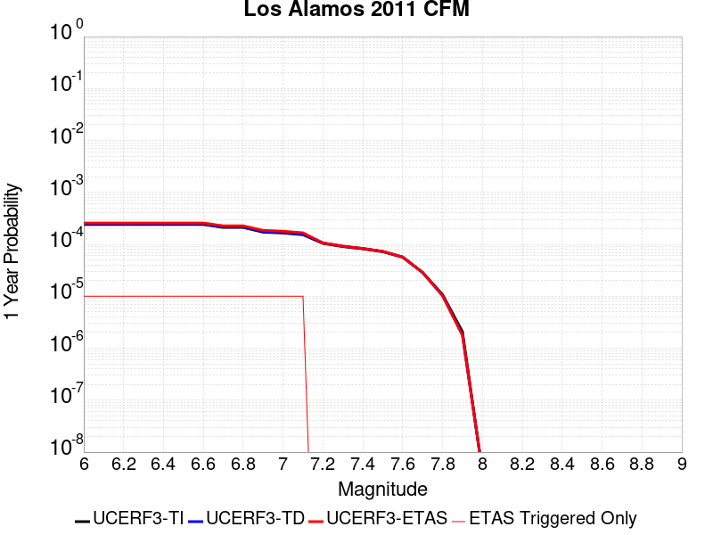 |  |

| Magnitude | 1 wk TI Prob | 1 wk TD Prob | 1 wk ETAS Prob | 1 wk ETAS/TD Gain | 1 wk ETAS Triggered Only | 1 mo TI Prob | 1 mo TD Prob | 1 mo ETAS Prob | 1 mo ETAS/TD Gain | 1 mo ETAS Triggered Only | 1 yr TI Prob | 1 yr TD Prob | 1 yr ETAS Prob | 1 yr ETAS/TD Gain | 1 yr ETAS Triggered Only | 10 yr TI Prob | 10 yr TD Prob | 10 yr ETAS Prob | 10 yr ETAS/TD Gain | 10 yr ETAS Triggered Only |
|-----|-----|-----|-----|-----|-----|-----|-----|-----|-----|-----|-----|-----|-----|-----|-----|-----|-----|-----|-----|-----|
| 6.0 | 4.6284417E-6 | 4.751756E-6 | 4.751756E-6 | 1.0 | 0.0 | 1.9836029E-5 | 2.036452E-5 | 3.0364316E-5 | 1.4910401 | 1.0E-5 | 2.4147688E-4 | 2.4791158E-4 | 2.579091E-4 | 1.040327 | 1.0E-5 | 0.0024121467 | 0.0024765243 | 0.0024964747 | 1.0080558 | 2.0E-5 |
| 6.1 | 4.6284417E-6 | 4.751756E-6 | 4.751756E-6 | 1.0 | 0.0 | 1.9836029E-5 | 2.036452E-5 | 3.0364316E-5 | 1.4910401 | 1.0E-5 | 2.4147688E-4 | 2.4791158E-4 | 2.579091E-4 | 1.040327 | 1.0E-5 | 0.0024121467 | 0.0024765243 | 0.0024964747 | 1.0080558 | 2.0E-5 |
| 6.2 | 4.6284417E-6 | 4.751756E-6 | 4.751756E-6 | 1.0 | 0.0 | 1.9836029E-5 | 2.036452E-5 | 3.0364316E-5 | 1.4910401 | 1.0E-5 | 2.4147688E-4 | 2.4791158E-4 | 2.579091E-4 | 1.040327 | 1.0E-5 | 0.0024121467 | 0.0024765243 | 0.0024964747 | 1.0080558 | 2.0E-5 |
| 6.3 | 4.6284417E-6 | 4.751756E-6 | 4.751756E-6 | 1.0 | 0.0 | 1.9836029E-5 | 2.036452E-5 | 3.0364316E-5 | 1.4910401 | 1.0E-5 | 2.4147688E-4 | 2.4791158E-4 | 2.579091E-4 | 1.040327 | 1.0E-5 | 0.0024121467 | 0.0024765243 | 0.0024964747 | 1.0080558 | 2.0E-5 |
| 6.4 | 4.6284417E-6 | 4.751756E-6 | 4.751756E-6 | 1.0 | 0.0 | 1.9836029E-5 | 2.036452E-5 | 3.0364316E-5 | 1.4910401 | 1.0E-5 | 2.4147688E-4 | 2.4791158E-4 | 2.579091E-4 | 1.040327 | 1.0E-5 | 0.0024121467 | 0.0024765243 | 0.0024964747 | 1.0080558 | 2.0E-5 |
| 6.5 | 4.6284417E-6 | 4.751756E-6 | 4.751756E-6 | 1.0 | 0.0 | 1.9836029E-5 | 2.036452E-5 | 3.0364316E-5 | 1.4910401 | 1.0E-5 | 2.4147688E-4 | 2.4791158E-4 | 2.579091E-4 | 1.040327 | 1.0E-5 | 0.0024121467 | 0.0024765243 | 0.0024964747 | 1.0080558 | 2.0E-5 |
| 6.6 | 4.6284417E-6 | 4.751756E-6 | 4.751756E-6 | 1.0 | 0.0 | 1.9836029E-5 | 2.036452E-5 | 3.0364316E-5 | 1.4910401 | 1.0E-5 | 2.4147688E-4 | 2.4791158E-4 | 2.579091E-4 | 1.040327 | 1.0E-5 | 0.0024121467 | 0.0024765243 | 0.0024964747 | 1.0080558 | 2.0E-5 |
| 6.7 | 4.062321E-6 | 4.1663707E-6 | 4.1663707E-6 | 1.0 | 0.0 | 1.7409831E-5 | 1.7855762E-5 | 2.7855584E-5 | 1.5600333 | 1.0E-5 | 2.1194408E-4 | 2.1737372E-4 | 2.2737155E-4 | 1.0459937 | 1.0E-5 | 0.0021174205 | 0.0021717607 | 0.0021817388 | 1.0045946 | 1.0E-5 |
| 6.8 | 4.062321E-6 | 4.1663707E-6 | 4.1663707E-6 | 1.0 | 0.0 | 1.7409831E-5 | 1.7855762E-5 | 2.7855584E-5 | 1.5600333 | 1.0E-5 | 2.1194408E-4 | 2.1737372E-4 | 2.2737155E-4 | 1.0459937 | 1.0E-5 | 0.0021174205 | 0.0021717607 | 0.0021817388 | 1.0045946 | 1.0E-5 |
| 6.9 | 3.2936077E-6 | 3.3729766E-6 | 3.3729766E-6 | 1.0 | 0.0 | 1.4115385E-5 | 1.4455539E-5 | 2.4455394E-5 | 1.6917664 | 1.0E-5 | 1.7184127E-4 | 1.7598292E-4 | 1.8598115E-4 | 1.0568137 | 1.0E-5 | 0.0017170844 | 0.0017585282 | 0.0017685106 | 1.0056766 | 1.0E-5 |
| 7.0 | 3.1687898E-6 | 3.2448338E-6 | 3.2448338E-6 | 1.0 | 0.0 | 1.3580457E-5 | 1.3906361E-5 | 2.3906223E-5 | 1.7190853 | 1.0E-5 | 1.6532952E-4 | 1.6929772E-4 | 1.7929604E-4 | 1.0590576 | 1.0E-5 | 0.0016520657 | 0.0016917791 | 0.0017017622 | 1.005901 | 1.0E-5 |
| 7.1 | 2.9379228E-6 | 3.0073431E-6 | 3.0073431E-6 | 1.0 | 0.0 | 1.25910365E-5 | 1.2888555E-5 | 2.2888426E-5 | 1.7758722 | 1.0E-5 | 1.5328509E-4 | 1.5690776E-4 | 1.6690619E-4 | 1.0637217 | 1.0E-5 | 0.001531794 | 0.0015680589 | 0.0015780432 | 1.0063673 | 1.0E-5 |
| 7.2 | 2.0020686E-6 | 2.041643E-6 | 2.041643E-6 | 1.0 | 0.0 | 8.580266E-6 | 8.749869E-6 | 8.749869E-6 | 1.0 | 0.0 | 1.0445973E-4 | 1.065245E-4 | 1.065245E-4 | 1.0 | 0.0 | 0.0010441064 | 0.0010647388 | 0.0010647388 | 1.0 | 0.0 |
| 7.3 | 1.7364243E-6 | 1.7678924E-6 | 1.7678924E-6 | 1.0 | 0.0 | 7.441797E-6 | 7.5766598E-6 | 7.5766598E-6 | 1.0 | 0.0 | 9.0600115E-5 | 9.224196E-5 | 9.224196E-5 | 1.0 | 0.0 | 9.0563187E-4 | 9.2203985E-4 | 9.2203985E-4 | 1.0 | 0.0 |
| 7.4 | 1.5718434E-6 | 1.598329E-6 | 1.598329E-6 | 1.0 | 0.0 | 6.7364545E-6 | 6.849964E-6 | 6.849964E-6 | 1.0 | 0.0 | 8.201325E-5 | 8.339515E-5 | 8.339515E-5 | 1.0 | 0.0 | 8.198299E-4 | 8.3364156E-4 | 8.3364156E-4 | 1.0 | 0.0 |
| 7.5 | 1.3841119E-6 | 1.4042898E-6 | 1.4042898E-6 | 1.0 | 0.0 | 5.9318945E-6 | 6.018371E-6 | 6.018371E-6 | 1.0 | 0.0 | 7.221842E-5 | 7.3271236E-5 | 7.3271236E-5 | 1.0 | 0.0 | 7.2194956E-4 | 7.324736E-4 | 7.324736E-4 | 1.0 | 0.0 |
| 7.6 | 1.0843726E-6 | 1.0934511E-6 | 1.0934511E-6 | 1.0 | 0.0 | 4.647303E-6 | 4.686211E-6 | 4.686211E-6 | 1.0 | 0.0 | 5.6579443E-5 | 5.705315E-5 | 5.705315E-5 | 1.0 | 0.0 | 5.656504E-4 | 5.7038764E-4 | 5.7038764E-4 | 1.0 | 0.0 |
| 7.7 | 5.544814E-7 | 5.501919E-7 | 5.501919E-7 | 1.0 | 0.0 | 2.3763469E-6 | 2.357963E-6 | 2.357963E-6 | 1.0 | 0.0 | 2.8931638E-5 | 2.8707824E-5 | 2.8707824E-5 | 1.0 | 0.0 | 2.8927872E-4 | 2.870413E-4 | 2.870413E-4 | 1.0 | 0.0 |
| 7.8 | 2.0707465E-7 | 1.977874E-7 | 1.977874E-7 | 1.0 | 0.0 | 8.874625E-7 | 8.4766003E-7 | 8.4766003E-7 | 1.0 | 0.0 | 1.08048025E-5 | 1.0320213E-5 | 1.0320213E-5 | 1.0 | 0.0 | 1.0804277E-4 | 1.0319738E-4 | 1.0319738E-4 | 1.0 | 0.0 |
| 7.9 | 3.9821284E-8 | 3.433199E-8 | 3.433199E-8 | 1.0 | 0.0 | 1.7066264E-7 | 1.4713709E-7 | 1.4713709E-7 | 1.0 | 0.0 | 2.0778157E-6 | 1.7913927E-6 | 1.7913927E-6 | 1.0 | 0.0 | 2.0777963E-5 | 1.7913788E-5 | 1.7913788E-5 | 1.0 | 0.0 |
| 8.0 | 7.880441E-11 | 8.235368E-11 | 8.235368E-11 | 1.0 | 0.0 | 3.3773329E-10 | 3.5294412E-10 | 3.5294412E-10 | 1.0 | 0.0 | 4.1119033E-9 | 4.297095E-9 | 4.297095E-9 | 1.0 | 0.0 | 4.1119034E-8 | 4.2970953E-8 | 4.2970953E-8 | 1.0 | 0.0 |

## Johnson Valley (No) 2011 rev
*[(top)](#table-of-contents)*

| 1 Week | 1 Month | 1 Year | 10 Year |
|-----|-----|-----|-----|
|  |  | 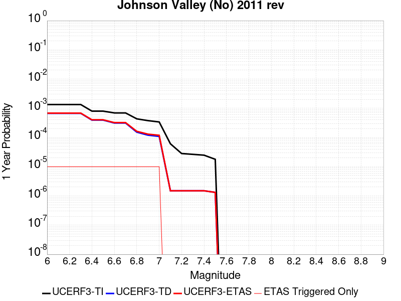 |  |

| Magnitude | 1 wk TI Prob | 1 wk TD Prob | 1 wk ETAS Prob | 1 wk ETAS/TD Gain | 1 wk ETAS Triggered Only | 1 mo TI Prob | 1 mo TD Prob | 1 mo ETAS Prob | 1 mo ETAS/TD Gain | 1 mo ETAS Triggered Only | 1 yr TI Prob | 1 yr TD Prob | 1 yr ETAS Prob | 1 yr ETAS/TD Gain | 1 yr ETAS Triggered Only | 10 yr TI Prob | 10 yr TD Prob | 10 yr ETAS Prob | 10 yr ETAS/TD Gain | 10 yr ETAS Triggered Only |
|-----|-----|-----|-----|-----|-----|-----|-----|-----|-----|-----|-----|-----|-----|-----|-----|-----|-----|-----|-----|-----|
| 6.0 | 2.577707E-5 | 1.2901344E-5 | 1.2901344E-5 | 1.0 | 0.0 | 1.1046848E-4 | 5.5290526E-5 | 5.5290526E-5 | 1.0 | 0.0 | 0.0013441239 | 6.7299395E-4 | 6.829872E-4 | 1.014849 | 1.0E-5 | 0.013360229 | 0.0067134677 | 0.006733333 | 1.0029591 | 2.0E-5 |
| 6.1 | 2.577707E-5 | 1.2901344E-5 | 1.2901344E-5 | 1.0 | 0.0 | 1.1046848E-4 | 5.5290526E-5 | 5.5290526E-5 | 1.0 | 0.0 | 0.0013441239 | 6.7299395E-4 | 6.829872E-4 | 1.014849 | 1.0E-5 | 0.013360229 | 0.0067134677 | 0.006733333 | 1.0029591 | 2.0E-5 |
| 6.2 | 2.577707E-5 | 1.2901344E-5 | 1.2901344E-5 | 1.0 | 0.0 | 1.1046848E-4 | 5.5290526E-5 | 5.5290526E-5 | 1.0 | 0.0 | 0.0013441239 | 6.7299395E-4 | 6.829872E-4 | 1.014849 | 1.0E-5 | 0.013360229 | 0.0067134677 | 0.006733333 | 1.0029591 | 2.0E-5 |
| 6.3 | 2.577707E-5 | 1.2901344E-5 | 1.2901344E-5 | 1.0 | 0.0 | 1.1046848E-4 | 5.5290526E-5 | 5.5290526E-5 | 1.0 | 0.0 | 0.0013441239 | 6.7299395E-4 | 6.829872E-4 | 1.014849 | 1.0E-5 | 0.013360229 | 0.0067134677 | 0.006733333 | 1.0029591 | 2.0E-5 |
| 6.4 | 1.5296591E-5 | 7.5370353E-6 | 7.5370353E-6 | 1.0 | 0.0 | 6.555518E-5 | 3.2301286E-5 | 3.2301286E-5 | 1.0 | 0.0 | 7.97842E-4 | 3.9321595E-4 | 4.03212E-4 | 1.0254213 | 1.0E-5 | 0.007949836 | 0.003927043 | 0.0039469646 | 1.0050728 | 2.0E-5 |
| 6.5 | 1.5296591E-5 | 7.5370353E-6 | 7.5370353E-6 | 1.0 | 0.0 | 6.555518E-5 | 3.2301286E-5 | 3.2301286E-5 | 1.0 | 0.0 | 7.97842E-4 | 3.9321595E-4 | 4.03212E-4 | 1.0254213 | 1.0E-5 | 0.007949836 | 0.003927043 | 0.0039469646 | 1.0050728 | 2.0E-5 |
| 6.6 | 1.3289383E-5 | 5.9919753E-6 | 5.9919753E-6 | 1.0 | 0.0 | 5.6953253E-5 | 2.5679738E-5 | 2.5679738E-5 | 1.0 | 0.0 | 6.9318525E-4 | 3.1262293E-4 | 3.226198E-4 | 1.0319774 | 1.0E-5 | 0.0069102696 | 0.003123496 | 0.0031434335 | 1.0063831 | 2.0E-5 |
| 6.7 | 1.3289383E-5 | 5.9919753E-6 | 5.9919753E-6 | 1.0 | 0.0 | 5.6953253E-5 | 2.5679738E-5 | 2.5679738E-5 | 1.0 | 0.0 | 6.9318525E-4 | 3.1262293E-4 | 3.226198E-4 | 1.0319774 | 1.0E-5 | 0.0069102696 | 0.003123496 | 0.0031434335 | 1.0063831 | 2.0E-5 |
| 6.8 | 8.330789E-6 | 2.9214602E-6 | 2.9214602E-6 | 1.0 | 0.0 | 3.570289E-5 | 1.2520515E-5 | 1.2520515E-5 | 1.0 | 0.0 | 4.34596E-4 | 1.5243233E-4 | 1.624308E-4 | 1.0655929 | 1.0E-5 | 0.0043374705 | 0.0015238377 | 0.0015438072 | 1.0131048 | 2.0E-5 |
| 6.9 | 7.2359003E-6 | 2.3014725E-6 | 2.3014725E-6 | 1.0 | 0.0 | 3.1010633E-5 | 9.863446E-6 | 9.863446E-6 | 1.0 | 0.0 | 3.7748902E-4 | 1.2008617E-4 | 1.3008497E-4 | 1.0832635 | 1.0E-5 | 0.0037684843 | 0.0012007357 | 0.0012207117 | 1.0166365 | 2.0E-5 |
| 7.0 | 6.5149957E-6 | 2.088642E-6 | 2.088642E-6 | 1.0 | 0.0 | 2.792111E-5 | 8.951322E-6 | 8.951322E-6 | 1.0 | 0.0 | 3.398865E-4 | 1.089822E-4 | 1.18981116E-4 | 1.0917481 | 1.0E-5 | 0.003393671 | 0.0010898075 | 0.0010997965 | 1.0091659 | 1.0E-5 |
| 7.1 | 1.1662233E-6 | 2.8795448E-8 | 2.8795448E-8 | 1.0 | 0.0 | 4.9980904E-6 | 1.2340907E-7 | 1.2340907E-7 | 1.0 | 0.0 | 6.0850052E-5 | 1.5025045E-6 | 1.5025045E-6 | 1.0 | 0.0 | 6.083339E-4 | 1.5024959E-5 | 1.5024959E-5 | 1.0 | 0.0 |
| 7.2 | 5.413881E-7 | 2.8795448E-8 | 2.8795448E-8 | 1.0 | 0.0 | 2.3202326E-6 | 1.2340907E-7 | 1.2340907E-7 | 1.0 | 0.0 | 2.8248465E-5 | 1.5025045E-6 | 1.5025045E-6 | 1.0 | 0.0 | 2.8244875E-4 | 1.5024959E-5 | 1.5024959E-5 | 1.0 | 0.0 |
| 7.3 | 5.076821E-7 | 2.8795448E-8 | 2.8795448E-8 | 1.0 | 0.0 | 2.1757785E-6 | 1.2340905E-7 | 1.2340905E-7 | 1.0 | 0.0 | 2.648978E-5 | 1.5025045E-6 | 1.5025045E-6 | 1.0 | 0.0 | 2.6486625E-4 | 1.5024959E-5 | 1.5024959E-5 | 1.0 | 0.0 |
| 7.4 | 4.7568687E-7 | 2.8777395E-8 | 2.8777395E-8 | 1.0 | 0.0 | 2.0386565E-6 | 1.2333169E-7 | 1.2333169E-7 | 1.0 | 0.0 | 2.482036E-5 | 1.5015625E-6 | 1.5015625E-6 | 1.0 | 0.0 | 2.4817587E-4 | 1.5015539E-5 | 1.5015539E-5 | 1.0 | 0.0 |
| 7.5 | 3.435626E-7 | 2.5352403E-8 | 2.5352403E-8 | 1.0 | 0.0 | 1.4724103E-6 | 1.0865315E-7 | 1.0865315E-7 | 1.0 | 0.0 | 1.7926448E-5 | 1.3228514E-6 | 1.3228514E-6 | 1.0 | 0.0 | 1.7925001E-4 | 1.3228451E-5 | 1.3228451E-5 | 1.0 | 0.0 |

## Northridge
*[(top)](#table-of-contents)*

| 1 Week | 1 Month | 1 Year | 10 Year |
|-----|-----|-----|-----|
|  |  |  | 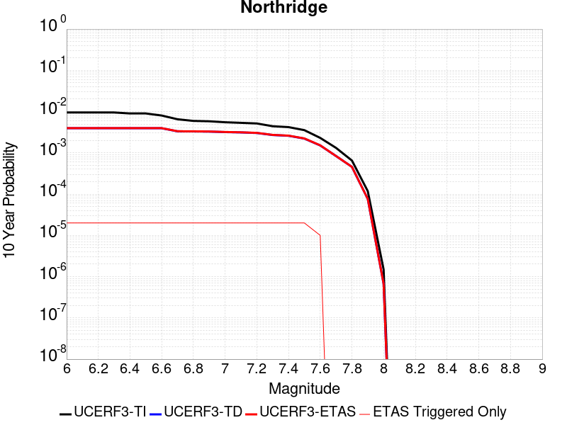 |

| Magnitude | 1 wk TI Prob | 1 wk TD Prob | 1 wk ETAS Prob | 1 wk ETAS/TD Gain | 1 wk ETAS Triggered Only | 1 mo TI Prob | 1 mo TD Prob | 1 mo ETAS Prob | 1 mo ETAS/TD Gain | 1 mo ETAS Triggered Only | 1 yr TI Prob | 1 yr TD Prob | 1 yr ETAS Prob | 1 yr ETAS/TD Gain | 1 yr ETAS Triggered Only | 10 yr TI Prob | 10 yr TD Prob | 10 yr ETAS Prob | 10 yr ETAS/TD Gain | 10 yr ETAS Triggered Only |
|-----|-----|-----|-----|-----|-----|-----|-----|-----|-----|-----|-----|-----|-----|-----|-----|-----|-----|-----|-----|-----|
| 6.0 | 1.8340852E-5 | 7.5880284E-6 | 7.5880284E-6 | 1.0 | 0.0 | 7.860128E-5 | 3.251973E-5 | 3.251973E-5 | 1.0 | 0.0 | 9.565505E-4 | 3.9585796E-4 | 3.9585796E-4 | 1.0 | 0.0 | 0.009524435 | 0.003951762 | 0.003971683 | 1.005041 | 2.0E-5 |
| 6.1 | 1.8340852E-5 | 7.5880284E-6 | 7.5880284E-6 | 1.0 | 0.0 | 7.860128E-5 | 3.251973E-5 | 3.251973E-5 | 1.0 | 0.0 | 9.565505E-4 | 3.9585796E-4 | 3.9585796E-4 | 1.0 | 0.0 | 0.009524435 | 0.003951762 | 0.003971683 | 1.005041 | 2.0E-5 |
| 6.2 | 1.8340852E-5 | 7.5880284E-6 | 7.5880284E-6 | 1.0 | 0.0 | 7.860128E-5 | 3.251973E-5 | 3.251973E-5 | 1.0 | 0.0 | 9.565505E-4 | 3.9585796E-4 | 3.9585796E-4 | 1.0 | 0.0 | 0.009524435 | 0.003951762 | 0.003971683 | 1.005041 | 2.0E-5 |
| 6.3 | 1.8340852E-5 | 7.5880284E-6 | 7.5880284E-6 | 1.0 | 0.0 | 7.860128E-5 | 3.251973E-5 | 3.251973E-5 | 1.0 | 0.0 | 9.565505E-4 | 3.9585796E-4 | 3.9585796E-4 | 1.0 | 0.0 | 0.009524435 | 0.003951762 | 0.003971683 | 1.005041 | 2.0E-5 |
| 6.4 | 1.7361892E-5 | 7.5880284E-6 | 7.5880284E-6 | 1.0 | 0.0 | 7.440598E-5 | 3.251973E-5 | 3.251973E-5 | 1.0 | 0.0 | 9.055163E-4 | 3.9585796E-4 | 3.9585796E-4 | 1.0 | 0.0 | 0.009018354 | 0.003951762 | 0.003971683 | 1.005041 | 2.0E-5 |
| 6.5 | 1.7361892E-5 | 7.5880284E-6 | 7.5880284E-6 | 1.0 | 0.0 | 7.440598E-5 | 3.251973E-5 | 3.251973E-5 | 1.0 | 0.0 | 9.055163E-4 | 3.9585796E-4 | 3.9585796E-4 | 1.0 | 0.0 | 0.009018354 | 0.003951762 | 0.003971683 | 1.005041 | 2.0E-5 |
| 6.6 | 1.5458201E-5 | 7.5880284E-6 | 7.5880284E-6 | 1.0 | 0.0 | 6.624775E-5 | 3.251973E-5 | 3.251973E-5 | 1.0 | 0.0 | 8.0626784E-4 | 3.9585796E-4 | 3.9585796E-4 | 1.0 | 0.0 | 0.008033488 | 0.003951762 | 0.003971683 | 1.005041 | 2.0E-5 |
| 6.7 | 1.2538368E-5 | 6.381612E-6 | 6.381612E-6 | 1.0 | 0.0 | 5.3734755E-5 | 2.734948E-5 | 2.734948E-5 | 1.0 | 0.0 | 6.5402425E-4 | 3.3292949E-4 | 3.3292949E-4 | 1.0 | 0.0 | 0.0065210275 | 0.0033243664 | 0.0033443 | 1.0059962 | 2.0E-5 |
| 6.8 | 1.1438097E-5 | 6.3502694E-6 | 6.3502694E-6 | 1.0 | 0.0 | 4.9019498E-5 | 2.721516E-5 | 2.721516E-5 | 1.0 | 0.0 | 5.9664896E-4 | 3.312946E-4 | 3.312946E-4 | 1.0 | 0.0 | 0.005950495 | 0.0033080664 | 0.0033280002 | 1.0060258 | 2.0E-5 |
| 6.9 | 1.1204891E-5 | 6.2867225E-6 | 6.2867225E-6 | 1.0 | 0.0 | 4.8020076E-5 | 2.6942822E-5 | 2.6942822E-5 | 1.0 | 0.0 | 5.8448757E-4 | 3.279799E-4 | 3.279799E-4 | 1.0 | 0.0 | 0.0058295266 | 0.0032750175 | 0.003294952 | 1.0060868 | 2.0E-5 |
| 7.0 | 1.061046E-5 | 6.115376E-6 | 6.115376E-6 | 1.0 | 0.0 | 4.5472607E-5 | 2.6208494E-5 | 2.6208494E-5 | 1.0 | 0.0 | 5.534883E-4 | 3.1904213E-4 | 3.1904213E-4 | 1.0 | 0.0 | 0.0055211177 | 0.003185887 | 0.0032058232 | 1.0062577 | 2.0E-5 |
| 7.1 | 1.0266979E-5 | 6.004295E-6 | 6.004295E-6 | 1.0 | 0.0 | 4.40006E-5 | 2.5732441E-5 | 2.5732441E-5 | 1.0 | 0.0 | 5.355756E-4 | 3.1324785E-4 | 3.1324785E-4 | 1.0 | 0.0 | 0.0053428668 | 0.0031281086 | 0.003148046 | 1.0063736 | 2.0E-5 |
| 7.2 | 9.91273E-6 | 5.820007E-6 | 5.820007E-6 | 1.0 | 0.0 | 4.248244E-5 | 2.494265E-5 | 2.494265E-5 | 1.0 | 0.0 | 5.171009E-4 | 3.0363488E-4 | 3.0363488E-4 | 1.0 | 0.0 | 0.0051589934 | 0.0030322452 | 0.0030521844 | 1.0065758 | 2.0E-5 |
| 7.3 | 8.4959265E-6 | 5.193102E-6 | 5.193102E-6 | 1.0 | 0.0 | 3.6410605E-5 | 2.2255961E-5 | 2.2255961E-5 | 1.0 | 0.0 | 4.4320893E-4 | 2.7093288E-4 | 2.7093288E-4 | 1.0 | 0.0 | 0.00442326 | 0.002706052 | 0.002725998 | 1.0073708 | 2.0E-5 |
| 7.4 | 8.0847185E-6 | 4.9819787E-6 | 4.9819787E-6 | 1.0 | 0.0 | 3.4648332E-5 | 2.1351163E-5 | 2.1351163E-5 | 1.0 | 0.0 | 4.2176177E-4 | 2.5991965E-4 | 2.5991965E-4 | 1.0 | 0.0 | 0.0042096223 | 0.0025961823 | 0.0026161303 | 1.0076836 | 2.0E-5 |
| 7.5 | 6.8220684E-6 | 4.2533266E-6 | 4.2533266E-6 | 1.0 | 0.0 | 2.9237108E-5 | 1.8228417E-5 | 1.8228417E-5 | 1.0 | 0.0 | 3.5590364E-4 | 2.2190856E-4 | 2.2190856E-4 | 1.0 | 0.0 | 0.0035533418 | 0.0022168907 | 0.0022368464 | 1.0090016 | 2.0E-5 |
| 7.6 | 4.4224143E-6 | 2.899968E-6 | 2.899968E-6 | 1.0 | 0.0 | 1.8953066E-5 | 1.2428376E-5 | 1.2428376E-5 | 1.0 | 0.0 | 2.3072914E-4 | 1.5130508E-4 | 1.5130508E-4 | 1.0 | 0.0 | 0.0023048974 | 0.0015120322 | 0.0015220172 | 1.0066036 | 1.0E-5 |
| 7.7 | 2.5297056E-6 | 1.6046126E-6 | 1.6046126E-6 | 1.0 | 0.0 | 1.0841551E-5 | 6.8768936E-6 | 6.8768936E-6 | 1.0 | 0.0 | 1.319879E-4 | 8.372301E-5 | 8.372301E-5 | 1.0 | 0.0 | 0.0013190953 | 8.3691935E-4 | 8.3691935E-4 | 1.0 | 0.0 |
| 7.8 | 1.2508156E-6 | 8.7802323E-7 | 8.7802323E-7 | 1.0 | 0.0 | 5.3606273E-6 | 3.7629513E-6 | 3.7629513E-6 | 1.0 | 0.0 | 6.526368E-5 | 4.5812983E-5 | 4.5812983E-5 | 1.0 | 0.0 | 6.524452E-4 | 4.5803667E-4 | 4.5803667E-4 | 1.0 | 0.0 |
| 7.9 | 2.262199E-7 | 1.4665106E-7 | 1.4665106E-7 | 1.0 | 0.0 | 9.695135E-7 | 6.285044E-7 | 6.285044E-7 | 1.0 | 0.0 | 1.1803763E-5 | 7.652015E-6 | 7.652015E-6 | 1.0 | 0.0 | 1.1803136E-4 | 7.6517594E-5 | 7.6517594E-5 | 1.0 | 0.0 |
| 8.0 | 2.865362E-9 | 1.2753111E-9 | 1.2753111E-9 | 1.0 | 0.0 | 1.2280123E-8 | 5.465619E-9 | 5.465619E-9 | 1.0 | 0.0 | 1.4951048E-7 | 6.654391E-8 | 6.654391E-8 | 1.0 | 0.0 | 1.4951038E-6 | 6.6543913E-7 | 6.6543913E-7 | 1.0 | 0.0 |

## San Diego Trough south
*[(top)](#table-of-contents)*

| 1 Week | 1 Month | 1 Year | 10 Year |
|-----|-----|-----|-----|
|  | 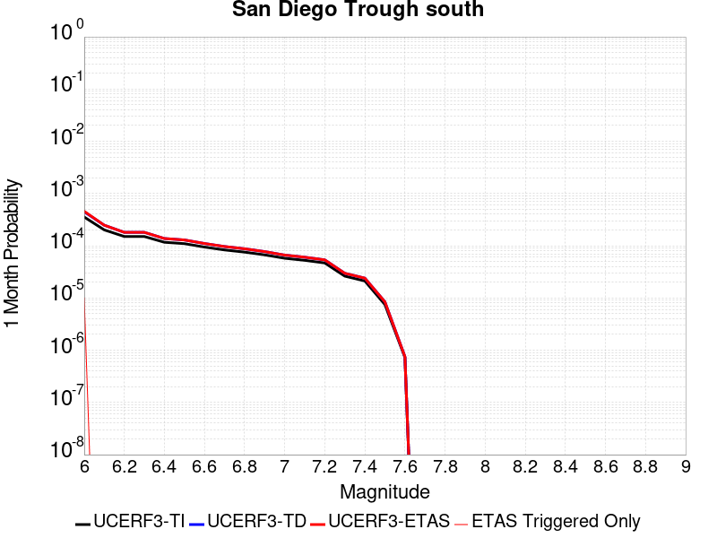 |  |  |

| Magnitude | 1 wk TI Prob | 1 wk TD Prob | 1 wk ETAS Prob | 1 wk ETAS/TD Gain | 1 wk ETAS Triggered Only | 1 mo TI Prob | 1 mo TD Prob | 1 mo ETAS Prob | 1 mo ETAS/TD Gain | 1 mo ETAS Triggered Only | 1 yr TI Prob | 1 yr TD Prob | 1 yr ETAS Prob | 1 yr ETAS/TD Gain | 1 yr ETAS Triggered Only | 10 yr TI Prob | 10 yr TD Prob | 10 yr ETAS Prob | 10 yr ETAS/TD Gain | 10 yr ETAS Triggered Only |
|-----|-----|-----|-----|-----|-----|-----|-----|-----|-----|-----|-----|-----|-----|-----|-----|-----|-----|-----|-----|-----|
| 6.0 | 8.279495E-5 | 1.0425905E-4 | 1.0425905E-4 | 1.0 | 0.0 | 3.5478722E-4 | 4.4675023E-4 | 4.5674577E-4 | 1.0223739 | 1.0E-5 | 0.004310982 | 0.0054260944 | 0.0054360405 | 1.001833 | 1.0E-5 | 0.042283054 | 0.052994724 | 0.053013664 | 1.0003574 | 2.0E-5 |
| 6.1 | 4.6961468E-5 | 5.773192E-5 | 5.773192E-5 | 1.0 | 0.0 | 2.0124791E-4 | 2.4739734E-4 | 2.4739734E-4 | 1.0 | 0.0 | 0.00244744 | 0.0030079763 | 0.0030079763 | 1.0 | 0.0 | 0.024206603 | 0.02968051 | 0.02968051 | 1.0 | 0.0 |
| 6.2 | 3.5079658E-5 | 4.2143583E-5 | 4.2143583E-5 | 1.0 | 0.0 | 1.5033272E-4 | 1.8060306E-4 | 1.8060306E-4 | 1.0 | 0.0 | 0.0018287642 | 0.0021966458 | 0.0021966458 | 1.0 | 0.0 | 0.018137876 | 0.021751761 | 0.021751761 | 1.0 | 0.0 |
| 6.3 | 3.5079658E-5 | 4.2143583E-5 | 4.2143583E-5 | 1.0 | 0.0 | 1.5033272E-4 | 1.8060306E-4 | 1.8060306E-4 | 1.0 | 0.0 | 0.0018287642 | 0.0021966458 | 0.0021966458 | 1.0 | 0.0 | 0.018137876 | 0.021751761 | 0.021751761 | 1.0 | 0.0 |
| 6.4 | 2.7196904E-5 | 3.2087904E-5 | 3.2087904E-5 | 1.0 | 0.0 | 1.16552954E-4 | 1.3751238E-4 | 1.3751238E-4 | 1.0 | 0.0 | 0.0014181085 | 0.0016729396 | 0.0016729396 | 1.0 | 0.0 | 0.014090929 | 0.01660506 | 0.01660506 | 1.0 | 0.0 |
| 6.5 | 2.5584688E-5 | 3.0102321E-5 | 3.0102321E-5 | 1.0 | 0.0 | 1.0964406E-4 | 1.290036E-4 | 1.290036E-4 | 1.0 | 0.0 | 0.0013340989 | 0.0015694996 | 0.0015694996 | 1.0 | 0.0 | 0.013261181 | 0.015585696 | 0.015585696 | 1.0 | 0.0 |
| 6.6 | 2.2034688E-5 | 2.574329E-5 | 2.574329E-5 | 1.0 | 0.0 | 9.443096E-5 | 1.10323745E-4 | 1.10323745E-4 | 1.0 | 0.0 | 0.0011490905 | 0.0013423713 | 0.0013423713 | 1.0 | 0.0 | 0.011431668 | 0.013343622 | 0.013343622 | 1.0 | 0.0 |
| 6.7 | 1.9394853E-5 | 2.254225E-5 | 2.254225E-5 | 1.0 | 0.0 | 8.311815E-5 | 9.660609E-5 | 9.660609E-5 | 1.0 | 0.0 | 0.0010114936 | 0.0011755498 | 0.0011755498 | 1.0 | 0.0 | 0.01006902 | 0.011694018 | 0.011694018 | 1.0 | 0.0 |
| 6.8 | 1.7615313E-5 | 2.0403613E-5 | 2.0403613E-5 | 1.0 | 0.0 | 7.549201E-5 | 8.744115E-5 | 8.744115E-5 | 1.0 | 0.0 | 9.1872766E-4 | 0.0010640804 | 0.0010640804 | 1.0 | 0.0 | 0.009149387 | 0.01059042 | 0.01059042 | 1.0 | 0.0 |
| 6.9 | 1.5621423E-5 | 1.8026485E-5 | 1.8026485E-5 | 1.0 | 0.0 | 6.6947236E-5 | 7.7254095E-5 | 7.7254095E-5 | 1.0 | 0.0 | 8.147778E-4 | 9.401663E-4 | 9.401663E-4 | 1.0 | 0.0 | 0.008117969 | 0.0093623325 | 0.0093623325 | 1.0 | 0.0 |
| 7.0 | 1.3444376E-5 | 1.5448395E-5 | 1.5448395E-5 | 1.0 | 0.0 | 5.7617483E-5 | 6.620574E-5 | 6.620574E-5 | 1.0 | 0.0 | 7.0126704E-4 | 8.057596E-4 | 8.057596E-4 | 1.0 | 0.0 | 0.006990582 | 0.008028714 | 0.008028714 | 1.0 | 0.0 |
| 7.1 | 1.2268361E-5 | 1.40733055E-5 | 1.40733055E-5 | 1.0 | 0.0 | 5.2577634E-5 | 6.031279E-5 | 6.031279E-5 | 1.0 | 0.0 | 6.399447E-4 | 7.3406345E-4 | 7.3406345E-4 | 1.0 | 0.0 | 0.0063810493 | 0.007316692 | 0.007316692 | 1.0 | 0.0 |
| 7.2 | 1.0922655E-5 | 1.2513806E-5 | 1.2513806E-5 | 1.0 | 0.0 | 4.681054E-5 | 5.362951E-5 | 5.362951E-5 | 1.0 | 0.0 | 5.697693E-4 | 6.527462E-4 | 6.527462E-4 | 1.0 | 0.0 | 0.0056831064 | 0.0065085697 | 0.0065085697 | 1.0 | 0.0 |
| 7.3 | 6.1106753E-6 | 6.9290486E-6 | 6.9290486E-6 | 1.0 | 0.0 | 2.6188345E-5 | 2.9695586E-5 | 2.9695586E-5 | 1.0 | 0.0 | 3.1879646E-4 | 3.6148418E-4 | 3.6148418E-4 | 1.0 | 0.0 | 0.0031833951 | 0.0036090072 | 0.0036090072 | 1.0 | 0.0 |
| 7.4 | 4.933187E-6 | 5.5896517E-6 | 5.5896517E-6 | 1.0 | 0.0 | 2.114206E-5 | 2.3955432E-5 | 2.3955432E-5 | 1.0 | 0.0 | 2.5737417E-4 | 2.9161875E-4 | 2.9161875E-4 | 1.0 | 0.0 | 0.002570763 | 0.002912402 | 0.002912402 | 1.0 | 0.0 |
| 7.5 | 1.7489613E-6 | 1.9697113E-6 | 1.9697113E-6 | 1.0 | 0.0 | 7.495527E-6 | 8.441594E-6 | 8.441594E-6 | 1.0 | 0.0 | 9.125422E-5 | 1.0277178E-4 | 1.0277178E-4 | 1.0 | 0.0 | 9.1216754E-4 | 0.0010272645 | 0.0010272645 | 1.0 | 0.0 |
| 7.6 | 1.6988751E-7 | 1.7533898E-7 | 1.7533898E-7 | 1.0 | 0.0 | 7.2808916E-7 | 7.5145255E-7 | 7.5145255E-7 | 1.0 | 0.0 | 8.864449E-6 | 9.148898E-6 | 9.148898E-6 | 1.0 | 0.0 | 8.8640954E-5 | 9.148542E-5 | 9.148542E-5 | 1.0 | 0.0 |

## San Juan
*[(top)](#table-of-contents)*

| 1 Week | 1 Month | 1 Year | 10 Year |
|-----|-----|-----|-----|
|  |  | 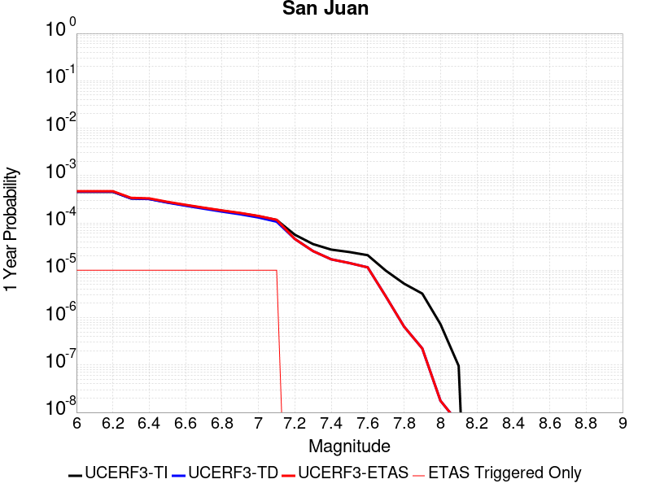 |  |

| Magnitude | 1 wk TI Prob | 1 wk TD Prob | 1 wk ETAS Prob | 1 wk ETAS/TD Gain | 1 wk ETAS Triggered Only | 1 mo TI Prob | 1 mo TD Prob | 1 mo ETAS Prob | 1 mo ETAS/TD Gain | 1 mo ETAS Triggered Only | 1 yr TI Prob | 1 yr TD Prob | 1 yr ETAS Prob | 1 yr ETAS/TD Gain | 1 yr ETAS Triggered Only | 10 yr TI Prob | 10 yr TD Prob | 10 yr ETAS Prob | 10 yr ETAS/TD Gain | 10 yr ETAS Triggered Only |
|-----|-----|-----|-----|-----|-----|-----|-----|-----|-----|-----|-----|-----|-----|-----|-----|-----|-----|-----|-----|-----|
| 6.0 | 8.682808E-6 | 8.749572E-6 | 8.749572E-6 | 1.0 | 0.0 | 3.72115E-5 | 3.7497655E-5 | 3.7497655E-5 | 1.0 | 0.0 | 4.5295584E-4 | 4.5644314E-4 | 4.6643856E-4 | 1.0218985 | 1.0E-5 | 0.004520337 | 0.004555597 | 0.004575506 | 1.0043702 | 2.0E-5 |
| 6.1 | 8.682808E-6 | 8.749572E-6 | 8.749572E-6 | 1.0 | 0.0 | 3.72115E-5 | 3.7497655E-5 | 3.7497655E-5 | 1.0 | 0.0 | 4.5295584E-4 | 4.5644314E-4 | 4.6643856E-4 | 1.0218985 | 1.0E-5 | 0.004520337 | 0.004555597 | 0.004575506 | 1.0043702 | 2.0E-5 |
| 6.2 | 8.682808E-6 | 8.749572E-6 | 8.749572E-6 | 1.0 | 0.0 | 3.72115E-5 | 3.7497655E-5 | 3.7497655E-5 | 1.0 | 0.0 | 4.5295584E-4 | 4.5644314E-4 | 4.6643856E-4 | 1.0218985 | 1.0E-5 | 0.004520337 | 0.004555597 | 0.004575506 | 1.0043702 | 2.0E-5 |
| 6.3 | 6.3054235E-6 | 6.2829813E-6 | 6.2829813E-6 | 1.0 | 0.0 | 2.7022963E-5 | 2.6926793E-5 | 2.6926793E-5 | 1.0 | 0.0 | 3.2895492E-4 | 3.277858E-4 | 3.3778252E-4 | 1.0304977 | 1.0E-5 | 0.003284684 | 0.0032732226 | 0.0032831898 | 1.0030451 | 1.0E-5 |
| 6.4 | 6.1490473E-6 | 6.114809E-6 | 6.114809E-6 | 1.0 | 0.0 | 2.6352795E-5 | 2.6206068E-5 | 2.6206068E-5 | 1.0 | 0.0 | 3.2079802E-4 | 3.1901355E-4 | 3.2901036E-4 | 1.0313367 | 1.0E-5 | 0.0032033534 | 0.0031857518 | 0.0031957198 | 1.003129 | 1.0E-5 |
| 6.5 | 5.204848E-6 | 5.1375655E-6 | 5.1375655E-6 | 1.0 | 0.0 | 2.23063E-5 | 2.2017957E-5 | 2.2017957E-5 | 1.0 | 0.0 | 2.7154534E-4 | 2.6803662E-4 | 2.7803393E-4 | 1.0372983 | 1.0E-5 | 0.0027121378 | 0.0026772867 | 0.00268726 | 1.0037252 | 1.0E-5 |
| 6.6 | 4.5179986E-6 | 4.4152753E-6 | 4.4152753E-6 | 1.0 | 0.0 | 1.9362706E-5 | 1.8922474E-5 | 1.8922474E-5 | 1.0 | 0.0 | 2.3571544E-4 | 2.3035756E-4 | 2.4035526E-4 | 1.0434008 | 1.0E-5 | 0.0023546559 | 0.0023013244 | 0.0023113014 | 1.0043353 | 1.0E-5 |
| 6.7 | 3.9442616E-6 | 3.8200474E-6 | 3.8200474E-6 | 1.0 | 0.0 | 1.6903869E-5 | 1.6371532E-5 | 1.6371532E-5 | 1.0 | 0.0 | 2.0578515E-4 | 1.9930584E-4 | 2.0930385E-4 | 1.0501641 | 1.0E-5 | 0.002055947 | 0.0019913954 | 0.0020013754 | 1.0050116 | 1.0E-5 |
| 6.8 | 3.4536245E-6 | 3.3165454E-6 | 3.3165454E-6 | 1.0 | 0.0 | 1.4801163E-5 | 1.4213692E-5 | 1.4213692E-5 | 1.0 | 0.0 | 1.8018926E-4 | 1.7303857E-4 | 1.8303684E-4 | 1.0577806 | 1.0E-5 | 0.0018004322 | 0.0017291567 | 0.0017391394 | 1.0057732 | 1.0E-5 |
| 6.9 | 3.059865E-6 | 2.9122323E-6 | 2.9122323E-6 | 1.0 | 0.0 | 1.3113641E-5 | 1.2480939E-5 | 1.2480939E-5 | 1.0 | 0.0 | 1.596469E-4 | 1.5194541E-4 | 1.6194388E-4 | 1.065803 | 1.0E-5 | 0.0015953224 | 0.0015185294 | 0.0015285142 | 1.0065753 | 1.0E-5 |
| 7.0 | 2.6504351E-6 | 2.4921894E-6 | 2.4921894E-6 | 1.0 | 0.0 | 1.1358958E-5 | 1.0680771E-5 | 1.0680771E-5 | 1.0 | 0.0 | 1.3828653E-4 | 1.3003117E-4 | 1.4002986E-4 | 1.0768946 | 1.0E-5 | 0.0013820052 | 0.0012996623 | 0.0013096492 | 1.0076844 | 1.0E-5 |
| 7.1 | 2.2039317E-6 | 2.0339817E-6 | 2.0339817E-6 | 1.0 | 0.0 | 9.445387E-6 | 8.717038E-6 | 8.717038E-6 | 1.0 | 0.0 | 1.1499152E-4 | 1.061253E-4 | 1.1612424E-4 | 1.0942183 | 1.0E-5 | 0.0011493203 | 0.0010608557 | 0.001070845 | 1.0094163 | 1.0E-5 |
| 7.2 | 1.0786707E-6 | 8.7714795E-7 | 8.7714795E-7 | 1.0 | 0.0 | 4.622866E-6 | 3.7592E-6 | 3.7592E-6 | 1.0 | 0.0 | 5.628194E-5 | 4.576731E-5 | 4.576731E-5 | 1.0 | 0.0 | 5.6267687E-4 | 4.5763733E-4 | 4.5763733E-4 | 1.0 | 0.0 |
| 7.3 | 6.846433E-7 | 4.869599E-7 | 4.869599E-7 | 1.0 | 0.0 | 2.9341822E-6 | 2.086969E-6 | 2.086969E-6 | 1.0 | 0.0 | 3.5723086E-5 | 2.5408553E-5 | 2.5408553E-5 | 1.0 | 0.0 | 3.571734E-4 | 2.5409024E-4 | 2.5409024E-4 | 1.0 | 0.0 |
| 7.4 | 5.23043E-7 | 3.26338E-7 | 3.26338E-7 | 1.0 | 0.0 | 2.2416111E-6 | 1.3985907E-6 | 1.3985907E-6 | 1.0 | 0.0 | 2.7291273E-5 | 1.7027709E-5 | 1.7027709E-5 | 1.0 | 0.0 | 2.7287923E-4 | 1.7029612E-4 | 1.7029612E-4 | 1.0 | 0.0 |
| 7.5 | 4.648444E-7 | 2.7239713E-7 | 2.7239713E-7 | 1.0 | 0.0 | 1.9921886E-6 | 1.1674158E-6 | 1.1674158E-6 | 1.0 | 0.0 | 2.4254627E-5 | 1.4213195E-5 | 1.4213195E-5 | 1.0 | 0.0 | 2.425198E-4 | 1.4215261E-4 | 1.4215261E-4 | 1.0 | 0.0 |
| 7.6 | 3.9906567E-7 | 2.2087056E-7 | 2.2087056E-7 | 1.0 | 0.0 | 1.7102802E-6 | 9.4658776E-7 | 9.4658776E-7 | 1.0 | 0.0 | 2.0822463E-5 | 1.1524646E-5 | 1.1524646E-5 | 1.0 | 0.0 | 2.0820512E-4 | 1.1526561E-4 | 1.1526561E-4 | 1.0 | 0.0 |
| 7.7 | 1.8784601E-7 | 5.3678413E-8 | 5.3678413E-8 | 1.0 | 0.0 | 8.0505407E-7 | 2.300503E-7 | 2.300503E-7 | 1.0 | 0.0 | 9.80149E-6 | 2.800859E-6 | 2.800859E-6 | 1.0 | 0.0 | 9.801057E-5 | 2.8017048E-5 | 2.8017048E-5 | 1.0 | 0.0 |
| 7.8 | 1.00154914E-7 | 1.2418047E-8 | 1.2418047E-8 | 1.0 | 0.0 | 4.2923529E-7 | 5.3220194E-8 | 5.3220194E-8 | 1.0 | 0.0 | 5.225927E-6 | 6.479557E-7 | 6.479557E-7 | 1.0 | 0.0 | 5.225804E-5 | 6.48537E-6 | 6.48537E-6 | 1.0 | 0.0 |
| 7.9 | 6.171429E-8 | 4.2973958E-9 | 4.2973958E-9 | 1.0 | 0.0 | 2.6448978E-7 | 1.8417403E-8 | 1.8417403E-8 | 1.0 | 0.0 | 3.2201583E-6 | 2.2423187E-7 | 2.2423187E-7 | 1.0 | 0.0 | 3.2201115E-5 | 2.2475485E-6 | 2.2475485E-6 | 1.0 | 0.0 |
| 8.0 | 1.3974572E-8 | 3.3787872E-10 | 3.3787872E-10 | 1.0 | 0.0 | 5.989102E-8 | 1.4480476E-9 | 1.4480476E-9 | 1.0 | 0.0 | 7.2917294E-7 | 1.7629972E-8 | 1.7629972E-8 | 1.0 | 0.0 | 7.2917055E-6 | 1.8054902E-7 | 1.8054902E-7 | 1.0 | 0.0 |
| 8.1 | 1.8403477E-9 | 1.1305712E-10 | 1.1305712E-10 | 1.0 | 0.0 | 7.887204E-9 | 4.845303E-10 | 4.845303E-10 | 1.0 | 0.0 | 9.602671E-8 | 5.8991594E-9 | 5.8991594E-9 | 1.0 | 0.0 | 9.602667E-7 | 6.018756E-8 | 6.018756E-8 | 1.0 | 0.0 |

## North Frontal  (West)
*[(top)](#table-of-contents)*

| 1 Week | 1 Month | 1 Year | 10 Year |
|-----|-----|-----|-----|
| 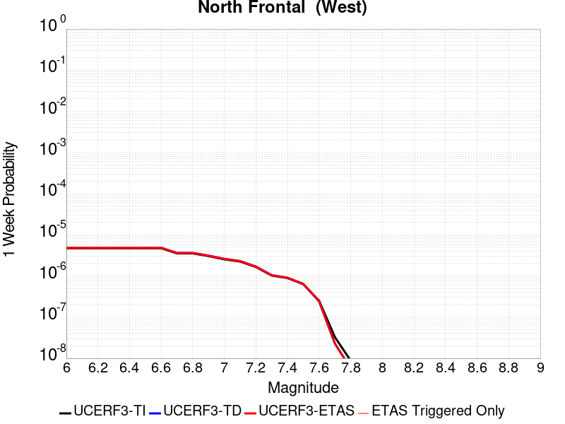 |  |  |  |

| Magnitude | 1 wk TI Prob | 1 wk TD Prob | 1 wk ETAS Prob | 1 wk ETAS/TD Gain | 1 wk ETAS Triggered Only | 1 mo TI Prob | 1 mo TD Prob | 1 mo ETAS Prob | 1 mo ETAS/TD Gain | 1 mo ETAS Triggered Only | 1 yr TI Prob | 1 yr TD Prob | 1 yr ETAS Prob | 1 yr ETAS/TD Gain | 1 yr ETAS Triggered Only | 10 yr TI Prob | 10 yr TD Prob | 10 yr ETAS Prob | 10 yr ETAS/TD Gain | 10 yr ETAS Triggered Only |
|-----|-----|-----|-----|-----|-----|-----|-----|-----|-----|-----|-----|-----|-----|-----|-----|-----|-----|-----|-----|-----|
| 6.0 | 4.7316266E-6 | 4.8526927E-6 | 4.8526927E-6 | 1.0 | 0.0 | 2.0278241E-5 | 2.0797097E-5 | 2.0797097E-5 | 1.0 | 0.0 | 2.4685962E-4 | 2.531767E-4 | 2.6317418E-4 | 1.0394881 | 1.0E-5 | 0.0024658558 | 0.0025290288 | 0.0025390035 | 1.003944 | 1.0E-5 |
| 6.1 | 4.7316266E-6 | 4.8526927E-6 | 4.8526927E-6 | 1.0 | 0.0 | 2.0278241E-5 | 2.0797097E-5 | 2.0797097E-5 | 1.0 | 0.0 | 2.4685962E-4 | 2.531767E-4 | 2.6317418E-4 | 1.0394881 | 1.0E-5 | 0.0024658558 | 0.0025290288 | 0.0025390035 | 1.003944 | 1.0E-5 |
| 6.2 | 4.7316266E-6 | 4.8526927E-6 | 4.8526927E-6 | 1.0 | 0.0 | 2.0278241E-5 | 2.0797097E-5 | 2.0797097E-5 | 1.0 | 0.0 | 2.4685962E-4 | 2.531767E-4 | 2.6317418E-4 | 1.0394881 | 1.0E-5 | 0.0024658558 | 0.0025290288 | 0.0025390035 | 1.003944 | 1.0E-5 |
| 6.3 | 4.7316266E-6 | 4.8526927E-6 | 4.8526927E-6 | 1.0 | 0.0 | 2.0278241E-5 | 2.0797097E-5 | 2.0797097E-5 | 1.0 | 0.0 | 2.4685962E-4 | 2.531767E-4 | 2.6317418E-4 | 1.0394881 | 1.0E-5 | 0.0024658558 | 0.0025290288 | 0.0025390035 | 1.003944 | 1.0E-5 |
| 6.4 | 4.7316266E-6 | 4.8526927E-6 | 4.8526927E-6 | 1.0 | 0.0 | 2.0278241E-5 | 2.0797097E-5 | 2.0797097E-5 | 1.0 | 0.0 | 2.4685962E-4 | 2.531767E-4 | 2.6317418E-4 | 1.0394881 | 1.0E-5 | 0.0024658558 | 0.0025290288 | 0.0025390035 | 1.003944 | 1.0E-5 |
| 6.5 | 4.7316266E-6 | 4.8526927E-6 | 4.8526927E-6 | 1.0 | 0.0 | 2.0278241E-5 | 2.0797097E-5 | 2.0797097E-5 | 1.0 | 0.0 | 2.4685962E-4 | 2.531767E-4 | 2.6317418E-4 | 1.0394881 | 1.0E-5 | 0.0024658558 | 0.0025290288 | 0.0025390035 | 1.003944 | 1.0E-5 |
| 6.6 | 4.7316266E-6 | 4.8526927E-6 | 4.8526927E-6 | 1.0 | 0.0 | 2.0278241E-5 | 2.0797097E-5 | 2.0797097E-5 | 1.0 | 0.0 | 2.4685962E-4 | 2.531767E-4 | 2.6317418E-4 | 1.0394881 | 1.0E-5 | 0.0024658558 | 0.0025290288 | 0.0025390035 | 1.003944 | 1.0E-5 |
| 6.7 | 3.5382777E-6 | 3.630902E-6 | 3.630902E-6 | 1.0 | 0.0 | 1.516396E-5 | 1.5560921E-5 | 1.5560921E-5 | 1.0 | 0.0 | 1.8460557E-4 | 1.8943852E-4 | 1.9943662E-4 | 1.0527775 | 1.0E-5 | 0.0018445229 | 0.0018928472 | 0.0019028283 | 1.0052731 | 1.0E-5 |
| 6.8 | 3.5382777E-6 | 3.630902E-6 | 3.630902E-6 | 1.0 | 0.0 | 1.516396E-5 | 1.5560921E-5 | 1.5560921E-5 | 1.0 | 0.0 | 1.8460557E-4 | 1.8943852E-4 | 1.9943662E-4 | 1.0527775 | 1.0E-5 | 0.0018445229 | 0.0018928472 | 0.0019028283 | 1.0052731 | 1.0E-5 |
| 6.9 | 3.0428037E-6 | 3.122775E-6 | 3.122775E-6 | 1.0 | 0.0 | 1.30405215E-5 | 1.3383256E-5 | 1.3383256E-5 | 1.0 | 0.0 | 1.5875678E-4 | 1.6292965E-4 | 1.7292802E-4 | 1.0613662 | 1.0E-5 | 0.0015864341 | 0.0016281691 | 0.0016381528 | 1.0061319 | 1.0E-5 |
| 7.0 | 2.538778E-6 | 2.6061032E-6 | 2.6061032E-6 | 1.0 | 0.0 | 1.0880432E-5 | 1.1168968E-5 | 1.1168968E-5 | 1.0 | 0.0 | 1.324612E-4 | 1.3597417E-4 | 1.4597281E-4 | 1.0735334 | 1.0E-5 | 0.0013238228 | 0.0013589566 | 0.0013689429 | 1.0073485 | 1.0E-5 |
| 7.1 | 2.2418935E-6 | 2.301219E-6 | 2.301219E-6 | 1.0 | 0.0 | 9.60808E-6 | 9.862332E-6 | 9.862332E-6 | 1.0 | 0.0 | 1.1697209E-4 | 1.2006772E-4 | 1.3006652E-4 | 1.0832763 | 1.0E-5 | 0.0011691054 | 0.0012000725 | 0.0012100604 | 1.0083228 | 1.0E-5 |
| 7.2 | 1.6526745E-6 | 1.692494E-6 | 1.692494E-6 | 1.0 | 0.0 | 7.082872E-6 | 7.253527E-6 | 7.253527E-6 | 1.0 | 0.0 | 8.623055E-5 | 8.830837E-5 | 9.8307486E-5 | 1.1132295 | 1.0E-5 | 8.61971E-4 | 8.827578E-4 | 8.92749E-4 | 1.0113181 | 1.0E-5 |
| 7.3 | 1.0246019E-6 | 1.0442322E-6 | 1.0442322E-6 | 1.0 | 0.0 | 4.391144E-6 | 4.475274E-6 | 4.475274E-6 | 1.0 | 0.0 | 5.3460866E-5 | 5.4485216E-5 | 6.448467E-5 | 1.183526 | 1.0E-5 | 5.344801E-4 | 5.4473005E-4 | 5.547246E-4 | 1.0183477 | 1.0E-5 |
| 7.4 | 8.9045164E-7 | 9.0566147E-7 | 9.0566147E-7 | 1.0 | 0.0 | 3.8162157E-6 | 3.881401E-6 | 3.881401E-6 | 1.0 | 0.0 | 4.646144E-5 | 4.7255144E-5 | 5.725467E-5 | 1.2116072 | 1.0E-5 | 4.6451724E-4 | 4.7246183E-4 | 4.824571E-4 | 1.0211557 | 1.0E-5 |
| 7.5 | 6.3357E-7 | 6.402745E-7 | 6.402745E-7 | 1.0 | 0.0 | 2.7152971E-6 | 2.744031E-6 | 2.744031E-6 | 1.0 | 0.0 | 3.305824E-5 | 3.340813E-5 | 3.340813E-5 | 1.0 | 0.0 | 3.3053322E-4 | 3.3403767E-4 | 3.3403767E-4 | 1.0 | 0.0 |
| 7.6 | 2.5087024E-7 | 2.436135E-7 | 2.436135E-7 | 1.0 | 0.0 | 1.0751578E-6 | 1.0440575E-6 | 1.0440575E-6 | 1.0 | 0.0 | 1.3089967E-5 | 1.2711347E-5 | 1.2711347E-5 | 1.0 | 0.0 | 1.3089196E-4 | 1.2710826E-4 | 1.2710826E-4 | 1.0 | 0.0 |
| 7.7 | 3.282987E-8 | 2.2875435E-8 | 2.2875435E-8 | 1.0 | 0.0 | 1.4069944E-7 | 9.8037575E-8 | 9.8037575E-8 | 1.0 | 0.0 | 1.7130144E-6 | 1.193607E-6 | 1.193607E-6 | 1.0 | 0.0 | 1.7130013E-5 | 1.1936014E-5 | 1.1936014E-5 | 1.0 | 0.0 |
| 7.8 | 8.77499E-9 | 5.6817466E-9 | 5.6817466E-9 | 1.0 | 0.0 | 3.7607098E-8 | 2.4350342E-8 | 2.4350342E-8 | 1.0 | 0.0 | 4.578663E-7 | 2.964654E-7 | 2.964654E-7 | 1.0 | 0.0 | 4.5786537E-6 | 2.9646515E-6 | 2.9646515E-6 | 1.0 | 0.0 |

## Great Valley 07 (Orestimba)
*[(top)](#table-of-contents)*

| 1 Week | 1 Month | 1 Year | 10 Year |
|-----|-----|-----|-----|
|  |  |  |  |

| Magnitude | 1 wk TI Prob | 1 wk TD Prob | 1 wk ETAS Prob | 1 wk ETAS/TD Gain | 1 wk ETAS Triggered Only | 1 mo TI Prob | 1 mo TD Prob | 1 mo ETAS Prob | 1 mo ETAS/TD Gain | 1 mo ETAS Triggered Only | 1 yr TI Prob | 1 yr TD Prob | 1 yr ETAS Prob | 1 yr ETAS/TD Gain | 1 yr ETAS Triggered Only | 10 yr TI Prob | 10 yr TD Prob | 10 yr ETAS Prob | 10 yr ETAS/TD Gain | 10 yr ETAS Triggered Only |
|-----|-----|-----|-----|-----|-----|-----|-----|-----|-----|-----|-----|-----|-----|-----|-----|-----|-----|-----|-----|-----|
| 6.0 | 2.9687902E-5 | 3.2757947E-5 | 3.2757947E-5 | 1.0 | 0.0 | 1.2722766E-4 | 1.4038406E-4 | 1.4038406E-4 | 1.0 | 0.0 | 0.0015478961 | 0.0017079079 | 0.0017079079 | 1.0 | 0.0 | 0.015371585 | 0.016955366 | 0.016965197 | 1.0005798 | 1.0E-5 |
| 6.1 | 2.9687902E-5 | 3.2757947E-5 | 3.2757947E-5 | 1.0 | 0.0 | 1.2722766E-4 | 1.4038406E-4 | 1.4038406E-4 | 1.0 | 0.0 | 0.0015478961 | 0.0017079079 | 0.0017079079 | 1.0 | 0.0 | 0.015371585 | 0.016955366 | 0.016965197 | 1.0005798 | 1.0E-5 |
| 6.2 | 1.9231524E-5 | 2.1159447E-5 | 2.1159447E-5 | 1.0 | 0.0 | 8.2418206E-5 | 9.0680325E-5 | 9.0680325E-5 | 1.0 | 0.0 | 0.0010029797 | 0.0011034969 | 0.0011034969 | 1.0 | 0.0 | 0.00998465 | 0.010982586 | 0.010992476 | 1.0009005 | 1.0E-5 |
| 6.3 | 1.324766E-5 | 1.4548723E-5 | 1.4548723E-5 | 1.0 | 0.0 | 5.6774446E-5 | 6.235023E-5 | 6.235023E-5 | 1.0 | 0.0 | 6.910097E-4 | 7.5885886E-4 | 7.5885886E-4 | 1.0 | 0.0 | 0.006888649 | 0.0075636217 | 0.0075735464 | 1.0013121 | 1.0E-5 |
| 6.4 | 7.818645E-6 | 8.57295E-6 | 8.57295E-6 | 1.0 | 0.0 | 3.3508048E-5 | 3.6740716E-5 | 3.6740716E-5 | 1.0 | 0.0 | 4.078841E-4 | 4.4722977E-4 | 4.4722977E-4 | 1.0 | 0.0 | 0.004071363 | 0.0044636377 | 0.0044636377 | 1.0 | 0.0 |
| 6.5 | 5.3076565E-6 | 5.817875E-6 | 5.817875E-6 | 1.0 | 0.0 | 2.27469E-5 | 2.4933523E-5 | 2.4933523E-5 | 1.0 | 0.0 | 2.7690834E-4 | 3.0352548E-4 | 3.0352548E-4 | 1.0 | 0.0 | 0.0027656353 | 0.0030313185 | 0.0030313185 | 1.0 | 0.0 |
| 6.6 | 3.6003578E-6 | 3.9485462E-6 | 3.9485462E-6 | 1.0 | 0.0 | 1.5430012E-5 | 1.6922239E-5 | 1.6922239E-5 | 1.0 | 0.0 | 1.8784421E-4 | 2.0601034E-4 | 2.0601034E-4 | 1.0 | 0.0 | 0.0018768552 | 0.0020583477 | 0.0020583477 | 1.0 | 0.0 |
| 6.7 | 2.5361826E-6 | 2.783504E-6 | 2.783504E-6 | 1.0 | 0.0 | 1.0869308E-5 | 1.1929255E-5 | 1.1929255E-5 | 1.0 | 0.0 | 1.3232579E-4 | 1.4523033E-4 | 1.4523033E-4 | 1.0 | 0.0 | 0.0013224703 | 0.001451484 | 0.001451484 | 1.0 | 0.0 |
| 6.8 | 1.2115831E-6 | 1.3313972E-6 | 1.3313972E-6 | 1.0 | 0.0 | 5.1924885E-6 | 5.705981E-6 | 5.705981E-6 | 1.0 | 0.0 | 6.3216714E-5 | 6.9469075E-5 | 6.9469075E-5 | 1.0 | 0.0 | 6.3198735E-4 | 6.9456873E-4 | 6.9456873E-4 | 1.0 | 0.0 |

## La Panza 2011
*[(top)](#table-of-contents)*

| 1 Week | 1 Month | 1 Year | 10 Year |
|-----|-----|-----|-----|
|  |  |  |  |

| Magnitude | 1 wk TI Prob | 1 wk TD Prob | 1 wk ETAS Prob | 1 wk ETAS/TD Gain | 1 wk ETAS Triggered Only | 1 mo TI Prob | 1 mo TD Prob | 1 mo ETAS Prob | 1 mo ETAS/TD Gain | 1 mo ETAS Triggered Only | 1 yr TI Prob | 1 yr TD Prob | 1 yr ETAS Prob | 1 yr ETAS/TD Gain | 1 yr ETAS Triggered Only | 10 yr TI Prob | 10 yr TD Prob | 10 yr ETAS Prob | 10 yr ETAS/TD Gain | 10 yr ETAS Triggered Only |
|-----|-----|-----|-----|-----|-----|-----|-----|-----|-----|-----|-----|-----|-----|-----|-----|-----|-----|-----|-----|-----|
| 6.0 | 4.6754544E-6 | 4.717608E-6 | 4.717608E-6 | 1.0 | 0.0 | 2.0037509E-5 | 2.0218175E-5 | 2.0218175E-5 | 1.0 | 0.0 | 2.4392935E-4 | 2.4613045E-4 | 2.4613045E-4 | 1.0 | 0.0 | 0.0024366176 | 0.0024587729 | 0.0024687483 | 1.004057 | 1.0E-5 |
| 6.1 | 4.6754544E-6 | 4.717608E-6 | 4.717608E-6 | 1.0 | 0.0 | 2.0037509E-5 | 2.0218175E-5 | 2.0218175E-5 | 1.0 | 0.0 | 2.4392935E-4 | 2.4613045E-4 | 2.4613045E-4 | 1.0 | 0.0 | 0.0024366176 | 0.0024587729 | 0.0024687483 | 1.004057 | 1.0E-5 |
| 6.2 | 4.6754544E-6 | 4.717608E-6 | 4.717608E-6 | 1.0 | 0.0 | 2.0037509E-5 | 2.0218175E-5 | 2.0218175E-5 | 1.0 | 0.0 | 2.4392935E-4 | 2.4613045E-4 | 2.4613045E-4 | 1.0 | 0.0 | 0.0024366176 | 0.0024587729 | 0.0024687483 | 1.004057 | 1.0E-5 |
| 6.3 | 4.6754544E-6 | 4.717608E-6 | 4.717608E-6 | 1.0 | 0.0 | 2.0037509E-5 | 2.0218175E-5 | 2.0218175E-5 | 1.0 | 0.0 | 2.4392935E-4 | 2.4613045E-4 | 2.4613045E-4 | 1.0 | 0.0 | 0.0024366176 | 0.0024587729 | 0.0024687483 | 1.004057 | 1.0E-5 |
| 6.4 | 4.6754544E-6 | 4.717608E-6 | 4.717608E-6 | 1.0 | 0.0 | 2.0037509E-5 | 2.0218175E-5 | 2.0218175E-5 | 1.0 | 0.0 | 2.4392935E-4 | 2.4613045E-4 | 2.4613045E-4 | 1.0 | 0.0 | 0.0024366176 | 0.0024587729 | 0.0024687483 | 1.004057 | 1.0E-5 |
| 6.5 | 2.485343E-6 | 2.5006163E-6 | 2.5006163E-6 | 1.0 | 0.0 | 1.0651426E-5 | 1.0716885E-5 | 1.0716885E-5 | 1.0 | 0.0 | 1.296734E-4 | 1.3047065E-4 | 1.3047065E-4 | 1.0 | 0.0 | 0.0012959775 | 0.001303979 | 0.001303979 | 1.0 | 0.0 |
| 6.6 | 2.485343E-6 | 2.5006163E-6 | 2.5006163E-6 | 1.0 | 0.0 | 1.0651426E-5 | 1.0716885E-5 | 1.0716885E-5 | 1.0 | 0.0 | 1.296734E-4 | 1.3047065E-4 | 1.3047065E-4 | 1.0 | 0.0 | 0.0012959775 | 0.001303979 | 0.001303979 | 1.0 | 0.0 |
| 6.7 | 1.5108508E-6 | 1.5146534E-6 | 1.5146534E-6 | 1.0 | 0.0 | 6.4750584E-6 | 6.491356E-6 | 6.491356E-6 | 1.0 | 0.0 | 7.8830984E-5 | 7.90295E-5 | 7.90295E-5 | 1.0 | 0.0 | 7.880303E-4 | 7.900248E-4 | 7.900248E-4 | 1.0 | 0.0 |
| 6.8 | 1.3865837E-6 | 1.3885259E-6 | 1.3885259E-6 | 1.0 | 0.0 | 5.942488E-6 | 5.950812E-6 | 5.950812E-6 | 1.0 | 0.0 | 7.234739E-5 | 7.244883E-5 | 7.244883E-5 | 1.0 | 0.0 | 7.232384E-4 | 7.242619E-4 | 7.242619E-4 | 1.0 | 0.0 |
| 6.9 | 9.826583E-7 | 9.796437E-7 | 9.796437E-7 | 1.0 | 0.0 | 4.2113857E-6 | 4.1984663E-6 | 4.1984663E-6 | 1.0 | 0.0 | 5.1272415E-5 | 5.1115185E-5 | 5.1115185E-5 | 1.0 | 0.0 | 5.126059E-4 | 5.1103963E-4 | 5.1103963E-4 | 1.0 | 0.0 |
| 7.0 | 6.7797646E-7 | 6.71036E-7 | 6.71036E-7 | 1.0 | 0.0 | 2.9056102E-6 | 2.8758654E-6 | 2.8758654E-6 | 1.0 | 0.0 | 3.537523E-5 | 3.501313E-5 | 3.501313E-5 | 1.0 | 0.0 | 3.5369597E-4 | 3.5007924E-4 | 3.5007924E-4 | 1.0 | 0.0 |
| 7.1 | 3.4979826E-7 | 3.3875276E-7 | 3.3875276E-7 | 1.0 | 0.0 | 1.4991346E-6 | 1.4517968E-6 | 1.4517968E-6 | 1.0 | 0.0 | 1.825181E-5 | 1.7675495E-5 | 1.7675495E-5 | 1.0 | 0.0 | 1.825031E-4 | 1.7674205E-4 | 1.7674205E-4 | 1.0 | 0.0 |
| 7.2 | 2.5088332E-7 | 2.3833275E-7 | 2.3833275E-7 | 1.0 | 0.0 | 1.0752137E-6 | 1.0214256E-6 | 1.0214256E-6 | 1.0 | 0.0 | 1.3090649E-5 | 1.2435796E-5 | 1.2435796E-5 | 1.0 | 0.0 | 1.3089878E-4 | 1.2435185E-4 | 1.2435185E-4 | 1.0 | 0.0 |
| 7.3 | 1.0159086E-7 | 8.64596E-8 | 8.64596E-8 | 1.0 | 0.0 | 4.3538932E-7 | 3.705411E-7 | 3.705411E-7 | 1.0 | 0.0 | 5.300852E-6 | 4.511329E-6 | 4.511329E-6 | 1.0 | 0.0 | 5.3007258E-5 | 4.5112414E-5 | 4.5112414E-5 | 1.0 | 0.0 |
| 7.4 | 3.5006252E-8 | 1.9407974E-8 | 1.9407974E-8 | 1.0 | 0.0 | 1.5002678E-7 | 8.317703E-8 | 8.317703E-8 | 1.0 | 0.0 | 1.8265745E-6 | 1.0126798E-6 | 1.0126798E-6 | 1.0 | 0.0 | 1.8265595E-5 | 1.0126755E-5 | 1.0126755E-5 | 1.0 | 0.0 |
| 7.5 | 2.592274E-8 | 1.0241491E-8 | 1.0241491E-8 | 1.0 | 0.0 | 1.1109746E-7 | 4.3892104E-8 | 4.3892104E-8 | 1.0 | 0.0 | 1.3526106E-6 | 5.3438623E-7 | 5.3438623E-7 | 1.0 | 0.0 | 1.3526024E-5 | 5.3438503E-6 | 5.3438503E-6 | 1.0 | 0.0 |
| 7.6 | 1.9016717E-8 | 5.246079E-9 | 5.246079E-9 | 1.0 | 0.0 | 8.150022E-8 | 2.2483196E-8 | 2.2483196E-8 | 1.0 | 0.0 | 9.922647E-7 | 2.7373287E-7 | 2.7373287E-7 | 1.0 | 0.0 | 9.922603E-6 | 2.7373255E-6 | 2.7373255E-6 | 1.0 | 0.0 |
| 7.7 | 1.17738495E-8 | 1.24002E-9 | 1.24002E-9 | 1.0 | 0.0 | 5.0459356E-8 | 5.3143716E-9 | 5.3143716E-9 | 1.0 | 0.0 | 6.1434247E-7 | 6.470247E-8 | 6.470247E-8 | 1.0 | 0.0 | 6.143408E-6 | 6.4702454E-7 | 6.4702454E-7 | 1.0 | 0.0 |
| 7.8 | 5.489079E-9 | 2.0114244E-10 | 2.0114244E-10 | 1.0 | 0.0 | 2.3524624E-8 | 8.6204055E-10 | 8.6204055E-10 | 1.0 | 0.0 | 2.8641225E-7 | 1.0495341E-8 | 1.0495341E-8 | 1.0 | 0.0 | 2.8641189E-6 | 1.049534E-7 | 1.049534E-7 | 1.0 | 0.0 |
| 7.9 | 2.5081048E-9 | 6.6833206E-11 | 6.6833206E-11 | 1.0 | 0.0 | 1.0749021E-8 | 2.864291E-10 | 2.864291E-10 | 1.0 | 0.0 | 1.3086932E-7 | 3.4872727E-9 | 3.4872727E-9 | 1.0 | 0.0 | 1.3086925E-6 | 3.487273E-8 | 3.487273E-8 | 1.0 | 0.0 |

## Gillem - Big Crack 2011 CFM
*[(top)](#table-of-contents)*

| 1 Week | 1 Month | 1 Year | 10 Year |
|-----|-----|-----|-----|
|  |  |  |  |

| Magnitude | 1 wk TI Prob | 1 wk TD Prob | 1 wk ETAS Prob | 1 wk ETAS/TD Gain | 1 wk ETAS Triggered Only | 1 mo TI Prob | 1 mo TD Prob | 1 mo ETAS Prob | 1 mo ETAS/TD Gain | 1 mo ETAS Triggered Only | 1 yr TI Prob | 1 yr TD Prob | 1 yr ETAS Prob | 1 yr ETAS/TD Gain | 1 yr ETAS Triggered Only | 10 yr TI Prob | 10 yr TD Prob | 10 yr ETAS Prob | 10 yr ETAS/TD Gain | 10 yr ETAS Triggered Only |
|-----|-----|-----|-----|-----|-----|-----|-----|-----|-----|-----|-----|-----|-----|-----|-----|-----|-----|-----|-----|-----|
| 6.0 | 2.196852E-5 | 2.360472E-5 | 2.360472E-5 | 1.0 | 0.0 | 9.4147406E-5 | 1.0115966E-4 | 1.0115966E-4 | 1.0 | 0.0 | 0.0011456419 | 0.0012310119 | 0.0012310119 | 1.0 | 0.0 | 0.011397537 | 0.01225079 | 0.012260667 | 1.0008063 | 1.0E-5 |
| 6.1 | 9.992795E-6 | 1.0711992E-5 | 1.0711992E-5 | 1.0 | 0.0 | 4.2825563E-5 | 4.5907833E-5 | 4.5907833E-5 | 1.0 | 0.0 | 5.2127644E-4 | 5.5880286E-4 | 5.5880286E-4 | 1.0 | 0.0 | 0.0052005537 | 0.0055757877 | 0.005585732 | 1.0017835 | 1.0E-5 |
| 6.2 | 9.992795E-6 | 1.0711992E-5 | 1.0711992E-5 | 1.0 | 0.0 | 4.2825563E-5 | 4.5907833E-5 | 4.5907833E-5 | 1.0 | 0.0 | 5.2127644E-4 | 5.5880286E-4 | 5.5880286E-4 | 1.0 | 0.0 | 0.0052005537 | 0.0055757877 | 0.005585732 | 1.0017835 | 1.0E-5 |
| 6.3 | 4.6127884E-6 | 4.942704E-6 | 4.942704E-6 | 1.0 | 0.0 | 1.9768944E-5 | 2.118287E-5 | 2.118287E-5 | 1.0 | 0.0 | 2.406603E-4 | 2.5787536E-4 | 2.5787536E-4 | 1.0 | 0.0 | 0.0024039985 | 0.0025761996 | 0.0025861738 | 1.0038717 | 1.0E-5 |
| 6.4 | 4.6127884E-6 | 4.942704E-6 | 4.942704E-6 | 1.0 | 0.0 | 1.9768944E-5 | 2.118287E-5 | 2.118287E-5 | 1.0 | 0.0 | 2.406603E-4 | 2.5787536E-4 | 2.5787536E-4 | 1.0 | 0.0 | 0.0024039985 | 0.0025761996 | 0.0025861738 | 1.0038717 | 1.0E-5 |
| 6.5 | 2.716712E-6 | 2.911139E-6 | 2.911139E-6 | 1.0 | 0.0 | 1.1643E-5 | 1.2476264E-5 | 1.2476264E-5 | 1.0 | 0.0 | 1.417443E-4 | 1.5189036E-4 | 1.5189036E-4 | 1.0 | 0.0 | 0.0014165393 | 0.0015181034 | 0.0015181034 | 1.0 | 0.0 |
| 6.6 | 1.3818255E-6 | 1.4820831E-6 | 1.4820831E-6 | 1.0 | 0.0 | 5.922096E-6 | 6.3517764E-6 | 6.3517764E-6 | 1.0 | 0.0 | 7.209913E-5 | 7.7331366E-5 | 7.7331366E-5 | 1.0 | 0.0 | 7.2075747E-4 | 7.731655E-4 | 7.731655E-4 | 1.0 | 0.0 |

## Del Valle
*[(top)](#table-of-contents)*

| 1 Week | 1 Month | 1 Year | 10 Year |
|-----|-----|-----|-----|
|  |  | 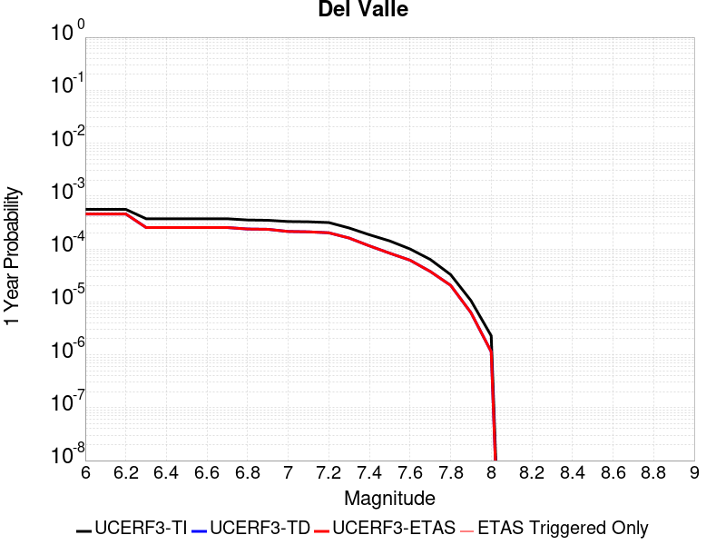 |  |

| Magnitude | 1 wk TI Prob | 1 wk TD Prob | 1 wk ETAS Prob | 1 wk ETAS/TD Gain | 1 wk ETAS Triggered Only | 1 mo TI Prob | 1 mo TD Prob | 1 mo ETAS Prob | 1 mo ETAS/TD Gain | 1 mo ETAS Triggered Only | 1 yr TI Prob | 1 yr TD Prob | 1 yr ETAS Prob | 1 yr ETAS/TD Gain | 1 yr ETAS Triggered Only | 10 yr TI Prob | 10 yr TD Prob | 10 yr ETAS Prob | 10 yr ETAS/TD Gain | 10 yr ETAS Triggered Only |
|-----|-----|-----|-----|-----|-----|-----|-----|-----|-----|-----|-----|-----|-----|-----|-----|-----|-----|-----|-----|-----|
| 6.0 | 1.0716125E-5 | 8.768021E-6 | 8.768021E-6 | 1.0 | 0.0 | 4.592544E-5 | 3.7576803E-5 | 3.7576803E-5 | 1.0 | 0.0 | 5.589988E-4 | 4.574213E-4 | 4.574213E-4 | 1.0 | 0.0 | 0.0055759475 | 0.004566771 | 0.0045767254 | 1.0021797 | 1.0E-5 |
| 6.1 | 1.0716125E-5 | 8.768021E-6 | 8.768021E-6 | 1.0 | 0.0 | 4.592544E-5 | 3.7576803E-5 | 3.7576803E-5 | 1.0 | 0.0 | 5.589988E-4 | 4.574213E-4 | 4.574213E-4 | 1.0 | 0.0 | 0.0055759475 | 0.004566771 | 0.0045767254 | 1.0021797 | 1.0E-5 |
| 6.2 | 1.0716125E-5 | 8.768021E-6 | 8.768021E-6 | 1.0 | 0.0 | 4.592544E-5 | 3.7576803E-5 | 3.7576803E-5 | 1.0 | 0.0 | 5.589988E-4 | 4.574213E-4 | 4.574213E-4 | 1.0 | 0.0 | 0.0055759475 | 0.004566771 | 0.0045767254 | 1.0021797 | 1.0E-5 |
| 6.3 | 7.1293784E-6 | 4.8659167E-6 | 4.8659167E-6 | 1.0 | 0.0 | 3.055412E-5 | 2.0853766E-5 | 2.0853766E-5 | 1.0 | 0.0 | 3.7193293E-4 | 2.5386576E-4 | 2.5386576E-4 | 1.0 | 0.0 | 0.0037131102 | 0.002535862 | 0.0025458364 | 1.0039334 | 1.0E-5 |
| 6.4 | 7.1293784E-6 | 4.8659167E-6 | 4.8659167E-6 | 1.0 | 0.0 | 3.055412E-5 | 2.0853766E-5 | 2.0853766E-5 | 1.0 | 0.0 | 3.7193293E-4 | 2.5386576E-4 | 2.5386576E-4 | 1.0 | 0.0 | 0.0037131102 | 0.002535862 | 0.0025458364 | 1.0039334 | 1.0E-5 |
| 6.5 | 7.1293784E-6 | 4.8659167E-6 | 4.8659167E-6 | 1.0 | 0.0 | 3.055412E-5 | 2.0853766E-5 | 2.0853766E-5 | 1.0 | 0.0 | 3.7193293E-4 | 2.5386576E-4 | 2.5386576E-4 | 1.0 | 0.0 | 0.0037131102 | 0.002535862 | 0.0025458364 | 1.0039334 | 1.0E-5 |
| 6.6 | 7.1293784E-6 | 4.8659167E-6 | 4.8659167E-6 | 1.0 | 0.0 | 3.055412E-5 | 2.0853766E-5 | 2.0853766E-5 | 1.0 | 0.0 | 3.7193293E-4 | 2.5386576E-4 | 2.5386576E-4 | 1.0 | 0.0 | 0.0037131102 | 0.002535862 | 0.0025458364 | 1.0039334 | 1.0E-5 |
| 6.7 | 7.12272E-6 | 4.8632924E-6 | 4.8632924E-6 | 1.0 | 0.0 | 3.0525585E-5 | 2.0842519E-5 | 2.0842519E-5 | 1.0 | 0.0 | 3.7158563E-4 | 2.5372885E-4 | 2.5372885E-4 | 1.0 | 0.0 | 0.003709649 | 0.002534496 | 0.0025444706 | 1.0039356 | 1.0E-5 |
| 6.8 | 6.7558703E-6 | 4.559491E-6 | 4.559491E-6 | 1.0 | 0.0 | 2.895341E-5 | 1.9540534E-5 | 1.9540534E-5 | 1.0 | 0.0 | 3.5245073E-4 | 2.3788065E-4 | 2.3788065E-4 | 1.0 | 0.0 | 0.0035189227 | 0.002376354 | 0.0023863302 | 1.0041981 | 1.0E-5 |
| 6.9 | 6.6700386E-6 | 4.5026277E-6 | 4.5026277E-6 | 1.0 | 0.0 | 2.8585566E-5 | 1.9296836E-5 | 1.9296836E-5 | 1.0 | 0.0 | 3.479737E-4 | 2.3491429E-4 | 2.3491429E-4 | 1.0 | 0.0 | 0.003474293 | 0.0023467531 | 0.0023567297 | 1.0042512 | 1.0E-5 |
| 7.0 | 6.3181424E-6 | 4.098784E-6 | 4.098784E-6 | 1.0 | 0.0 | 2.7077473E-5 | 1.75661E-5 | 1.75661E-5 | 1.0 | 0.0 | 3.2961834E-4 | 2.1384671E-4 | 2.1384671E-4 | 1.0 | 0.0 | 0.0032912986 | 0.0021364824 | 0.002146461 | 1.0046706 | 1.0E-5 |
| 7.1 | 6.248759E-6 | 4.0339737E-6 | 4.0339737E-6 | 1.0 | 0.0 | 2.678012E-5 | 1.7288346E-5 | 1.7288346E-5 | 1.0 | 0.0 | 3.2599916E-4 | 2.104657E-4 | 2.104657E-4 | 1.0 | 0.0 | 0.0032552136 | 0.0021027366 | 0.0021127157 | 1.0047457 | 1.0E-5 |
| 7.2 | 6.0411944E-6 | 3.869962E-6 | 3.869962E-6 | 1.0 | 0.0 | 2.5890577E-5 | 1.6585447E-5 | 1.6585447E-5 | 1.0 | 0.0 | 3.1517216E-4 | 2.0190953E-4 | 2.0190953E-4 | 1.0 | 0.0 | 0.0031472554 | 0.0020173325 | 0.0020273123 | 1.0049471 | 1.0E-5 |
| 7.3 | 4.7691183E-6 | 3.0781514E-6 | 3.0781514E-6 | 1.0 | 0.0 | 2.0438918E-5 | 1.3192012E-5 | 1.3192012E-5 | 1.0 | 0.0 | 2.488154E-4 | 1.6060112E-4 | 1.6060112E-4 | 1.0 | 0.0 | 0.00248537 | 0.0016048873 | 0.0016148712 | 1.0062209 | 1.0E-5 |
| 7.4 | 3.5524722E-6 | 2.1893625E-6 | 2.1893625E-6 | 1.0 | 0.0 | 1.5224792E-5 | 9.3829485E-6 | 9.3829485E-6 | 1.0 | 0.0 | 1.8534607E-4 | 1.14231494E-4 | 1.14231494E-4 | 1.0 | 0.0 | 0.0018519156 | 0.001141736 | 0.0011517246 | 1.0087487 | 1.0E-5 |
| 7.5 | 2.7133442E-6 | 1.5916223E-6 | 1.5916223E-6 | 1.0 | 0.0 | 1.1628566E-5 | 6.821221E-6 | 6.821221E-6 | 1.0 | 0.0 | 1.415686E-4 | 8.304522E-5 | 8.304522E-5 | 1.0 | 0.0 | 0.0014147845 | 8.301438E-4 | 8.401355E-4 | 1.0120361 | 1.0E-5 |
| 7.6 | 1.915338E-6 | 1.1739246E-6 | 1.1739246E-6 | 1.0 | 0.0 | 8.208566E-6 | 5.031096E-6 | 5.031096E-6 | 1.0 | 0.0 | 9.993471E-5 | 6.125188E-5 | 6.125188E-5 | 1.0 | 0.0 | 9.988978E-4 | 6.123509E-4 | 6.223448E-4 | 1.0163205 | 1.0E-5 |
| 7.7 | 1.2120448E-6 | 7.1803703E-7 | 7.1803703E-7 | 1.0 | 0.0 | 5.194467E-6 | 3.077298E-6 | 3.077298E-6 | 1.0 | 0.0 | 6.3240805E-5 | 3.7465463E-5 | 3.7465463E-5 | 1.0 | 0.0 | 6.322281E-4 | 3.7459185E-4 | 3.7459185E-4 | 1.0 | 0.0 |
| 7.8 | 6.272381E-7 | 3.9325712E-7 | 3.9325712E-7 | 1.0 | 0.0 | 2.6881603E-6 | 1.6853867E-6 | 1.6853867E-6 | 1.0 | 0.0 | 3.272786E-5 | 2.051939E-5 | 2.051939E-5 | 1.0 | 0.0 | 3.272304E-4 | 2.0517512E-4 | 2.0517512E-4 | 1.0 | 0.0 |
| 7.9 | 2.0292627E-7 | 1.2004664E-7 | 1.2004664E-7 | 1.0 | 0.0 | 8.6968373E-7 | 5.1448546E-7 | 5.1448546E-7 | 1.0 | 0.0 | 1.0588348E-5 | 6.263843E-6 | 6.263843E-6 | 1.0 | 0.0 | 1.0587843E-4 | 6.263668E-5 | 6.263668E-5 | 1.0 | 0.0 |
| 8.0 | 4.374492E-8 | 2.1900265E-8 | 2.1900265E-8 | 1.0 | 0.0 | 1.8747821E-7 | 9.3858276E-8 | 9.3858276E-8 | 1.0 | 0.0 | 2.2825448E-6 | 1.1427239E-6 | 1.1427239E-6 | 1.0 | 0.0 | 2.2825214E-5 | 1.1427184E-5 | 1.1427184E-5 | 1.0 | 0.0 |

## Calaveras (So) 2011 CFM
*[(top)](#table-of-contents)*

| 1 Week | 1 Month | 1 Year | 10 Year |
|-----|-----|-----|-----|
| 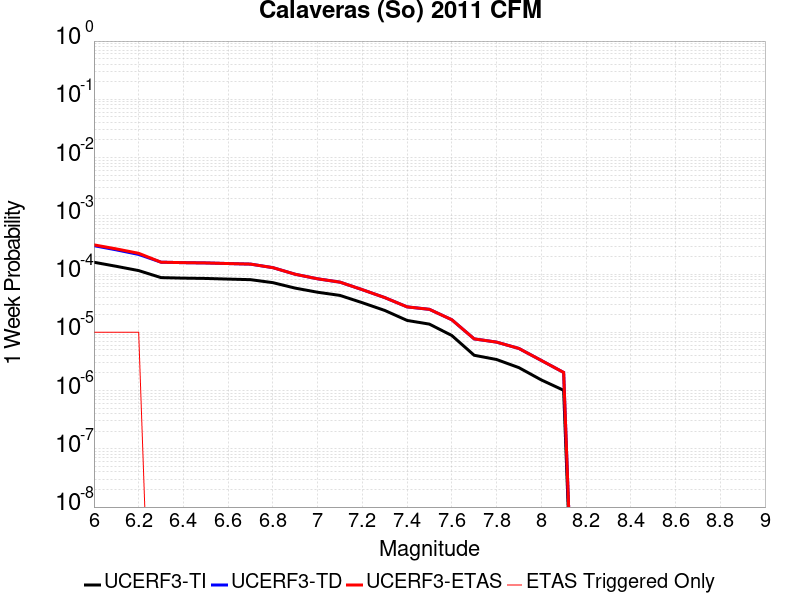 |  |  |  |

| Magnitude | 1 wk TI Prob | 1 wk TD Prob | 1 wk ETAS Prob | 1 wk ETAS/TD Gain | 1 wk ETAS Triggered Only | 1 mo TI Prob | 1 mo TD Prob | 1 mo ETAS Prob | 1 mo ETAS/TD Gain | 1 mo ETAS Triggered Only | 1 yr TI Prob | 1 yr TD Prob | 1 yr ETAS Prob | 1 yr ETAS/TD Gain | 1 yr ETAS Triggered Only | 10 yr TI Prob | 10 yr TD Prob | 10 yr ETAS Prob | 10 yr ETAS/TD Gain | 10 yr ETAS Triggered Only |
|-----|-----|-----|-----|-----|-----|-----|-----|-----|-----|-----|-----|-----|-----|-----|-----|-----|-----|-----|-----|-----|
| 6.0 | 1.5950744E-4 | 3.07182E-4 | 3.1717893E-4 | 1.032544 | 1.0E-5 | 6.834242E-4 | 0.0013155838 | 0.0013255706 | 1.0075912 | 1.0E-5 | 0.00828899 | 0.01586041 | 0.01587025 | 1.0006205 | 1.0E-5 | 0.079865426 | 0.14442472 | 0.14443329 | 1.0000592 | 1.0E-5 |
| 6.1 | 1.3584697E-4 | 2.6039843E-4 | 2.7039583E-4 | 1.0383927 | 1.0E-5 | 5.8207137E-4 | 0.0011153528 | 0.0011253417 | 1.0089557 | 1.0E-5 | 0.007063716 | 0.013463387 | 0.013473253 | 1.0007328 | 1.0E-5 | 0.06843361 | 0.1240527 | 0.124061465 | 1.0000706 | 1.0E-5 |
| 6.2 | 1.14676266E-4 | 2.171953E-4 | 2.2719312E-4 | 1.0460315 | 1.0E-5 | 4.9137714E-4 | 9.3039346E-4 | 9.4038417E-4 | 1.0107381 | 1.0E-5 | 0.0059661185 | 0.011246999 | 0.011256887 | 1.0008792 | 1.0E-5 | 0.058084648 | 0.10504322 | 0.105052166 | 1.0000852 | 1.0E-5 |
| 6.3 | 8.691518E-5 | 1.5991413E-4 | 1.5991413E-4 | 1.0 | 0.0 | 3.7244044E-4 | 6.85134E-4 | 6.85134E-4 | 1.0 | 0.0 | 0.004525038 | 0.008302956 | 0.008302956 | 1.0 | 0.0 | 0.044339992 | 0.07935925 | 0.07935925 | 1.0 | 0.0 |
| 6.4 | 8.50982E-5 | 1.5697793E-4 | 1.5697793E-4 | 1.0 | 0.0 | 3.646556E-4 | 6.725568E-4 | 6.725568E-4 | 1.0 | 0.0 | 0.0044306475 | 0.008150981 | 0.008150981 | 1.0 | 0.0 | 0.04343345 | 0.07796543 | 0.07796543 | 1.0 | 0.0 |
| 6.5 | 8.4062965E-5 | 1.5522187E-4 | 1.5522187E-4 | 1.0 | 0.0 | 3.602201E-4 | 6.6503574E-4 | 6.6503574E-4 | 1.0 | 0.0 | 0.004376863 | 0.008060186 | 0.008060186 | 1.0 | 0.0 | 0.042916555 | 0.0771368 | 0.0771368 | 1.0 | 0.0 |
| 6.6 | 8.194716E-5 | 1.5157944E-4 | 1.5157944E-4 | 1.0 | 0.0 | 3.5115483E-4 | 6.494359E-4 | 6.494359E-4 | 1.0 | 0.0 | 0.0042669317 | 0.007872019 | 0.007872019 | 1.0 | 0.0 | 0.04185927 | 0.07542207 | 0.07542207 | 1.0 | 0.0 |
| 6.7 | 8.012326E-5 | 1.4825833E-4 | 1.4825833E-4 | 1.0 | 0.0 | 3.433402E-4 | 6.3521194E-4 | 6.3521194E-4 | 1.0 | 0.0 | 0.004172157 | 0.007700504 | 0.007700504 | 1.0 | 0.0 | 0.040946912 | 0.07386414 | 0.07386414 | 1.0 | 0.0 |
| 6.8 | 7.119773E-5 | 1.2885146E-4 | 1.2885146E-4 | 1.0 | 0.0 | 3.0509746E-4 | 5.5208657E-4 | 5.5208657E-4 | 1.0 | 0.0 | 0.0037082357 | 0.0066977087 | 0.0066977087 | 1.0 | 0.0 | 0.036469642 | 0.06470736 | 0.06470736 | 1.0 | 0.0 |
| 6.9 | 5.7343088E-5 | 9.9215715E-5 | 9.9215715E-5 | 1.0 | 0.0 | 2.4573295E-4 | 4.2514122E-4 | 4.2514122E-4 | 1.0 | 0.0 | 0.0029876942 | 0.0051638843 | 0.0051638843 | 1.0 | 0.0 | 0.02947844 | 0.050521772 | 0.050521772 | 1.0 | 0.0 |
| 7.0 | 4.8746577E-5 | 8.2872946E-5 | 8.2872946E-5 | 1.0 | 0.0 | 2.0889717E-4 | 3.5512177E-4 | 3.5512177E-4 | 1.0 | 0.0 | 0.0025403565 | 0.0043151025 | 0.0043151025 | 1.0 | 0.0 | 0.025115121 | 0.042496696 | 0.042496696 | 1.0 | 0.0 |
| 7.1 | 4.2998014E-5 | 7.266674E-5 | 7.266674E-5 | 1.0 | 0.0 | 1.8426418E-4 | 3.1139204E-4 | 3.1139204E-4 | 1.0 | 0.0 | 0.002241108 | 0.0037846677 | 0.0037846677 | 1.0 | 0.0 | 0.022186412 | 0.03743137 | 0.03743137 | 1.0 | 0.0 |
| 7.2 | 3.221292E-5 | 5.3921813E-5 | 5.3921813E-5 | 1.0 | 0.0 | 1.3804805E-4 | 2.3107318E-4 | 2.3107318E-4 | 1.0 | 0.0 | 0.0016794393 | 0.0028097143 | 0.0028097143 | 1.0 | 0.0 | 0.016668037 | 0.028043631 | 0.028043631 | 1.0 | 0.0 |
| 7.3 | 2.3756531E-5 | 3.9486065E-5 | 3.9486065E-5 | 1.0 | 0.0 | 1.0180973E-4 | 1.6921511E-4 | 1.6921511E-4 | 1.0 | 0.0 | 0.0012388286 | 0.0020582643 | 0.0020582643 | 1.0 | 0.0 | 0.012319452 | 0.020650236 | 0.020650236 | 1.0 | 0.0 |
| 7.4 | 1.5997684E-5 | 2.734871E-5 | 2.734871E-5 | 1.0 | 0.0 | 6.8559704E-5 | 1.172035E-4 | 1.172035E-4 | 1.0 | 0.0 | 8.343947E-4 | 0.001426021 | 0.001426021 | 1.0 | 0.0 | 0.008312687 | 0.014378974 | 0.014378974 | 1.0 | 0.0 |
| 7.5 | 1.3814293E-5 | 2.4790226E-5 | 2.4790226E-5 | 1.0 | 0.0 | 5.9202768E-5 | 1.0623951E-4 | 1.0623951E-4 | 1.0 | 0.0 | 7.205553E-4 | 0.001292701 | 0.001292701 | 1.0 | 0.0 | 0.007182234 | 0.013058075 | 0.013058075 | 1.0 | 0.0 |
| 7.6 | 8.817309E-6 | 1.6436143E-5 | 1.6436143E-5 | 1.0 | 0.0 | 3.7787922E-5 | 7.043872E-5 | 7.043872E-5 | 1.0 | 0.0 | 4.5997082E-4 | 8.5725536E-4 | 8.5725536E-4 | 1.0 | 0.0 | 0.004590199 | 0.008721771 | 0.008721771 | 1.0 | 0.0 |
| 7.7 | 4.0352206E-6 | 7.711456E-6 | 7.711456E-6 | 1.0 | 0.0 | 1.7293689E-5 | 3.304868E-5 | 3.304868E-5 | 1.0 | 0.0 | 2.1053031E-4 | 4.0229346E-4 | 4.0229346E-4 | 1.0 | 0.0 | 0.0021033096 | 0.004167241 | 0.004167241 | 1.0 | 0.0 |
| 7.8 | 3.413169E-6 | 6.79093E-6 | 6.79093E-6 | 1.0 | 0.0 | 1.4627784E-5 | 2.9103661E-5 | 2.9103661E-5 | 1.0 | 0.0 | 1.7807873E-4 | 3.5427953E-4 | 3.5427953E-4 | 1.0 | 0.0 | 0.0017793609 | 0.0036683267 | 0.0036683267 | 1.0 | 0.0 |
| 7.9 | 2.4740732E-6 | 5.28193E-6 | 5.28193E-6 | 1.0 | 0.0 | 1.06031275E-5 | 2.2636646E-5 | 2.2636646E-5 | 1.0 | 0.0 | 1.2908543E-4 | 2.7556636E-4 | 2.7556636E-4 | 1.0 | 0.0 | 0.0012901047 | 0.002836207 | 0.002836207 | 1.0 | 0.0 |
| 8.0 | 1.5231818E-6 | 3.2905639E-6 | 3.2905639E-6 | 1.0 | 0.0 | 6.527906E-6 | 1.4102341E-5 | 1.4102341E-5 | 1.0 | 0.0 | 7.9474354E-5 | 1.716825E-4 | 1.716825E-4 | 1.0 | 0.0 | 7.944594E-4 | 0.0017573038 | 0.0017573038 | 1.0 | 0.0 |
| 8.1 | 1.0104524E-6 | 2.046827E-6 | 2.046827E-6 | 1.0 | 0.0 | 4.330503E-6 | 8.7720855E-6 | 8.7720855E-6 | 1.0 | 0.0 | 5.2722597E-5 | 1.0679494E-4 | 1.0679494E-4 | 1.0 | 0.0 | 5.271009E-4 | 0.0010935272 | 0.0010935272 | 1.0 | 0.0 |

## Ozena
*[(top)](#table-of-contents)*

| 1 Week | 1 Month | 1 Year | 10 Year |
|-----|-----|-----|-----|
|  |  |  |  |

| Magnitude | 1 wk TI Prob | 1 wk TD Prob | 1 wk ETAS Prob | 1 wk ETAS/TD Gain | 1 wk ETAS Triggered Only | 1 mo TI Prob | 1 mo TD Prob | 1 mo ETAS Prob | 1 mo ETAS/TD Gain | 1 mo ETAS Triggered Only | 1 yr TI Prob | 1 yr TD Prob | 1 yr ETAS Prob | 1 yr ETAS/TD Gain | 1 yr ETAS Triggered Only | 10 yr TI Prob | 10 yr TD Prob | 10 yr ETAS Prob | 10 yr ETAS/TD Gain | 10 yr ETAS Triggered Only |
|-----|-----|-----|-----|-----|-----|-----|-----|-----|-----|-----|-----|-----|-----|-----|-----|-----|-----|-----|-----|-----|
| 6.0 | 1.4377547E-6 | 1.4513802E-6 | 1.4513802E-6 | 1.0 | 0.0 | 6.161791E-6 | 6.220187E-6 | 6.220187E-6 | 1.0 | 0.0 | 7.5017226E-5 | 7.572842E-5 | 7.572842E-5 | 1.0 | 0.0 | 7.4991904E-4 | 7.5705274E-4 | 7.670452E-4 | 1.0131991 | 1.0E-5 |
| 6.1 | 1.4377547E-6 | 1.4513802E-6 | 1.4513802E-6 | 1.0 | 0.0 | 6.161791E-6 | 6.220187E-6 | 6.220187E-6 | 1.0 | 0.0 | 7.5017226E-5 | 7.572842E-5 | 7.572842E-5 | 1.0 | 0.0 | 7.4991904E-4 | 7.5705274E-4 | 7.670452E-4 | 1.0131991 | 1.0E-5 |
| 6.2 | 1.4377547E-6 | 1.4513802E-6 | 1.4513802E-6 | 1.0 | 0.0 | 6.161791E-6 | 6.220187E-6 | 6.220187E-6 | 1.0 | 0.0 | 7.5017226E-5 | 7.572842E-5 | 7.572842E-5 | 1.0 | 0.0 | 7.4991904E-4 | 7.5705274E-4 | 7.670452E-4 | 1.0131991 | 1.0E-5 |
| 6.3 | 1.4377547E-6 | 1.4513802E-6 | 1.4513802E-6 | 1.0 | 0.0 | 6.161791E-6 | 6.220187E-6 | 6.220187E-6 | 1.0 | 0.0 | 7.5017226E-5 | 7.572842E-5 | 7.572842E-5 | 1.0 | 0.0 | 7.4991904E-4 | 7.5705274E-4 | 7.670452E-4 | 1.0131991 | 1.0E-5 |
| 6.4 | 1.4377547E-6 | 1.4513802E-6 | 1.4513802E-6 | 1.0 | 0.0 | 6.161791E-6 | 6.220187E-6 | 6.220187E-6 | 1.0 | 0.0 | 7.5017226E-5 | 7.572842E-5 | 7.572842E-5 | 1.0 | 0.0 | 7.4991904E-4 | 7.5705274E-4 | 7.670452E-4 | 1.0131991 | 1.0E-5 |
| 6.5 | 1.4377547E-6 | 1.4513802E-6 | 1.4513802E-6 | 1.0 | 0.0 | 6.161791E-6 | 6.220187E-6 | 6.220187E-6 | 1.0 | 0.0 | 7.5017226E-5 | 7.572842E-5 | 7.572842E-5 | 1.0 | 0.0 | 7.4991904E-4 | 7.5705274E-4 | 7.670452E-4 | 1.0131991 | 1.0E-5 |
| 6.6 | 1.4377547E-6 | 1.4513802E-6 | 1.4513802E-6 | 1.0 | 0.0 | 6.161791E-6 | 6.220187E-6 | 6.220187E-6 | 1.0 | 0.0 | 7.5017226E-5 | 7.572842E-5 | 7.572842E-5 | 1.0 | 0.0 | 7.4991904E-4 | 7.5705274E-4 | 7.670452E-4 | 1.0131991 | 1.0E-5 |
| 6.7 | 1.4377547E-6 | 1.4513802E-6 | 1.4513802E-6 | 1.0 | 0.0 | 6.161791E-6 | 6.220187E-6 | 6.220187E-6 | 1.0 | 0.0 | 7.5017226E-5 | 7.572842E-5 | 7.572842E-5 | 1.0 | 0.0 | 7.4991904E-4 | 7.5705274E-4 | 7.670452E-4 | 1.0131991 | 1.0E-5 |
| 6.8 | 9.223257E-7 | 9.317636E-7 | 9.317636E-7 | 1.0 | 0.0 | 3.9528186E-6 | 3.9932665E-6 | 3.9932665E-6 | 1.0 | 0.0 | 4.81245E-5 | 4.8616977E-5 | 4.8616977E-5 | 1.0 | 0.0 | 4.811408E-4 | 4.8606747E-4 | 4.8606747E-4 | 1.0 | 0.0 |
| 6.9 | 9.141515E-7 | 9.235383E-7 | 9.235383E-7 | 1.0 | 0.0 | 3.917786E-6 | 3.958016E-6 | 3.958016E-6 | 1.0 | 0.0 | 4.7698002E-5 | 4.8187816E-5 | 4.8187816E-5 | 1.0 | 0.0 | 4.7687767E-4 | 4.817777E-4 | 4.817777E-4 | 1.0 | 0.0 |
| 7.0 | 8.767648E-7 | 8.858589E-7 | 8.858589E-7 | 1.0 | 0.0 | 3.757558E-6 | 3.7965328E-6 | 3.7965328E-6 | 1.0 | 0.0 | 4.5747307E-5 | 4.622185E-5 | 4.622185E-5 | 1.0 | 0.0 | 4.5737892E-4 | 4.6212628E-4 | 4.6212628E-4 | 1.0 | 0.0 |
| 7.1 | 8.199402E-7 | 8.2854103E-7 | 8.2854103E-7 | 1.0 | 0.0 | 3.5140247E-6 | 3.5508854E-6 | 3.5508854E-6 | 1.0 | 0.0 | 4.2782412E-5 | 4.323121E-5 | 4.323121E-5 | 1.0 | 0.0 | 4.2774176E-4 | 4.3223173E-4 | 4.3223173E-4 | 1.0 | 0.0 |
| 7.2 | 7.38705E-7 | 7.4642725E-7 | 7.4642725E-7 | 1.0 | 0.0 | 3.1658747E-6 | 3.1989703E-6 | 3.1989703E-6 | 1.0 | 0.0 | 3.8543843E-5 | 3.8946804E-5 | 3.8946804E-5 | 1.0 | 0.0 | 3.853716E-4 | 3.8940329E-4 | 3.8940329E-4 | 1.0 | 0.0 |
| 7.3 | 6.490017E-7 | 6.557811E-7 | 6.557811E-7 | 1.0 | 0.0 | 2.7814328E-6 | 2.8104876E-6 | 2.8104876E-6 | 1.0 | 0.0 | 3.386342E-5 | 3.421718E-5 | 3.421718E-5 | 1.0 | 0.0 | 3.3858258E-4 | 3.421225E-4 | 3.421225E-4 | 1.0 | 0.0 |
| 7.4 | 5.346736E-7 | 5.4022684E-7 | 5.4022684E-7 | 1.0 | 0.0 | 2.291456E-6 | 2.3152559E-6 | 2.3152559E-6 | 1.0 | 0.0 | 2.789812E-5 | 2.8187907E-5 | 2.8187907E-5 | 1.0 | 0.0 | 2.789462E-4 | 2.8184635E-4 | 2.8184635E-4 | 1.0 | 0.0 |
| 7.5 | 2.939325E-7 | 2.9666094E-7 | 2.9666094E-7 | 1.0 | 0.0 | 1.25971E-6 | 1.2714034E-6 | 1.2714034E-6 | 1.0 | 0.0 | 1.5336862E-5 | 1.5479243E-5 | 1.5479243E-5 | 1.0 | 0.0 | 1.5335804E-4 | 1.5478328E-4 | 1.5478328E-4 | 1.0 | 0.0 |
| 7.6 | 1.4151905E-7 | 1.4253278E-7 | 1.4253278E-7 | 1.0 | 0.0 | 6.065101E-7 | 6.1085467E-7 | 6.1085467E-7 | 1.0 | 0.0 | 7.3842357E-6 | 7.437131E-6 | 7.437131E-6 | 1.0 | 0.0 | 7.38399E-5 | 7.4368894E-5 | 7.4368894E-5 | 1.0 | 0.0 |
| 7.7 | 4.4957577E-8 | 4.5252282E-8 | 4.5252282E-8 | 1.0 | 0.0 | 1.9267533E-7 | 1.9393833E-7 | 1.9393833E-7 | 1.0 | 0.0 | 2.3458194E-6 | 2.3611967E-6 | 2.3611967E-6 | 1.0 | 0.0 | 2.3457947E-5 | 2.3611727E-5 | 2.3611727E-5 | 1.0 | 0.0 |
| 7.8 | 5.9993255E-9 | 6.041303E-9 | 6.041303E-9 | 1.0 | 0.0 | 2.5711394E-8 | 2.5891298E-8 | 2.5891298E-8 | 1.0 | 0.0 | 3.1303617E-7 | 3.1522652E-7 | 3.1522652E-7 | 1.0 | 0.0 | 3.1303573E-6 | 3.1522618E-6 | 3.1522618E-6 | 1.0 | 0.0 |

## Newport-Inglewood alt 1
*[(top)](#table-of-contents)*

| 1 Week | 1 Month | 1 Year | 10 Year |
|-----|-----|-----|-----|
|  |  |  |  |

| Magnitude | 1 wk TI Prob | 1 wk TD Prob | 1 wk ETAS Prob | 1 wk ETAS/TD Gain | 1 wk ETAS Triggered Only | 1 mo TI Prob | 1 mo TD Prob | 1 mo ETAS Prob | 1 mo ETAS/TD Gain | 1 mo ETAS Triggered Only | 1 yr TI Prob | 1 yr TD Prob | 1 yr ETAS Prob | 1 yr ETAS/TD Gain | 1 yr ETAS Triggered Only | 10 yr TI Prob | 10 yr TD Prob | 10 yr ETAS Prob | 10 yr ETAS/TD Gain | 10 yr ETAS Triggered Only |
|-----|-----|-----|-----|-----|-----|-----|-----|-----|-----|-----|-----|-----|-----|-----|-----|-----|-----|-----|-----|-----|
| 6.0 | 2.9668912E-5 | 3.040552E-5 | 3.040552E-5 | 1.0 | 0.0 | 1.2714628E-4 | 1.303056E-4 | 1.303056E-4 | 1.0 | 0.0 | 0.0015469068 | 0.0015858014 | 0.0015858014 | 1.0 | 0.0 | 0.015361829 | 0.015792465 | 0.015802307 | 1.0006232 | 1.0E-5 |
| 6.1 | 2.9668912E-5 | 3.040552E-5 | 3.040552E-5 | 1.0 | 0.0 | 1.2714628E-4 | 1.303056E-4 | 1.303056E-4 | 1.0 | 0.0 | 0.0015469068 | 0.0015858014 | 0.0015858014 | 1.0 | 0.0 | 0.015361829 | 0.015792465 | 0.015802307 | 1.0006232 | 1.0E-5 |
| 6.2 | 2.9668912E-5 | 3.040552E-5 | 3.040552E-5 | 1.0 | 0.0 | 1.2714628E-4 | 1.303056E-4 | 1.303056E-4 | 1.0 | 0.0 | 0.0015469068 | 0.0015858014 | 0.0015858014 | 1.0 | 0.0 | 0.015361829 | 0.015792465 | 0.015802307 | 1.0006232 | 1.0E-5 |
| 6.3 | 2.9668912E-5 | 3.040552E-5 | 3.040552E-5 | 1.0 | 0.0 | 1.2714628E-4 | 1.303056E-4 | 1.303056E-4 | 1.0 | 0.0 | 0.0015469068 | 0.0015858014 | 0.0015858014 | 1.0 | 0.0 | 0.015361829 | 0.015792465 | 0.015802307 | 1.0006232 | 1.0E-5 |
| 6.4 | 1.275942E-5 | 1.0272689E-5 | 1.0272689E-5 | 1.0 | 0.0 | 5.4682085E-5 | 4.402509E-5 | 4.402509E-5 | 1.0 | 0.0 | 6.65551E-4 | 5.358778E-4 | 5.358778E-4 | 1.0 | 0.0 | 0.0066356123 | 0.005346281 | 0.0053562275 | 1.0018605 | 1.0E-5 |
| 6.5 | 1.275942E-5 | 1.0272689E-5 | 1.0272689E-5 | 1.0 | 0.0 | 5.4682085E-5 | 4.402509E-5 | 4.402509E-5 | 1.0 | 0.0 | 6.65551E-4 | 5.358778E-4 | 5.358778E-4 | 1.0 | 0.0 | 0.0066356123 | 0.005346281 | 0.0053562275 | 1.0018605 | 1.0E-5 |
| 6.6 | 1.1255358E-5 | 8.66204E-6 | 8.66204E-6 | 1.0 | 0.0 | 4.8236358E-5 | 3.712251E-5 | 3.712251E-5 | 1.0 | 0.0 | 5.871194E-4 | 4.518745E-4 | 4.518745E-4 | 1.0 | 0.0 | 0.005855706 | 0.004509734 | 0.004519689 | 1.0022074 | 1.0E-5 |
| 6.7 | 1.0504745E-5 | 7.899962E-6 | 7.899962E-6 | 1.0 | 0.0 | 4.5019555E-5 | 3.3856548E-5 | 3.3856548E-5 | 1.0 | 0.0 | 5.4797524E-4 | 4.1212674E-4 | 4.1212674E-4 | 1.0 | 0.0 | 0.0054662596 | 0.0041137543 | 0.0041137543 | 1.0 | 0.0 |
| 6.8 | 1.0476007E-5 | 7.881343E-6 | 7.881343E-6 | 1.0 | 0.0 | 4.4896402E-5 | 3.3776756E-5 | 3.3776756E-5 | 1.0 | 0.0 | 5.464766E-4 | 4.1115563E-4 | 4.1115563E-4 | 1.0 | 0.0 | 0.005451347 | 0.004104079 | 0.004104079 | 1.0 | 0.0 |
| 6.9 | 9.076797E-6 | 6.4897567E-6 | 6.4897567E-6 | 1.0 | 0.0 | 3.889998E-5 | 2.7812948E-5 | 2.7812948E-5 | 1.0 | 0.0 | 4.7350433E-4 | 3.3857036E-4 | 3.3857036E-4 | 1.0 | 0.0 | 0.004724967 | 0.003380583 | 0.003380583 | 1.0 | 0.0 |
| 7.0 | 8.73795E-6 | 6.21215E-6 | 6.21215E-6 | 1.0 | 0.0 | 3.7447822E-5 | 2.662323E-5 | 2.662323E-5 | 1.0 | 0.0 | 4.5583185E-4 | 3.240899E-4 | 3.240899E-4 | 1.0 | 0.0 | 0.0045489795 | 0.0032362042 | 0.0032362042 | 1.0 | 0.0 |
| 7.1 | 8.391299E-6 | 5.955852E-6 | 5.955852E-6 | 1.0 | 0.0 | 3.5962214E-5 | 2.5524832E-5 | 2.5524832E-5 | 1.0 | 0.0 | 4.37752E-4 | 3.107208E-4 | 3.107208E-4 | 1.0 | 0.0 | 0.004368907 | 0.003102893 | 0.003102893 | 1.0 | 0.0 |
| 7.2 | 7.796882E-6 | 5.4965785E-6 | 5.4965785E-6 | 1.0 | 0.0 | 3.341478E-5 | 2.3556555E-5 | 2.3556555E-5 | 1.0 | 0.0 | 4.06749E-4 | 2.8676353E-4 | 2.8676353E-4 | 1.0 | 0.0 | 0.0040600533 | 0.0028639587 | 0.0028639587 | 1.0 | 0.0 |
| 7.3 | 6.4738833E-6 | 4.647811E-6 | 4.647811E-6 | 1.0 | 0.0 | 2.774492E-5 | 1.9919036E-5 | 1.9919036E-5 | 1.0 | 0.0 | 3.3774204E-4 | 2.4248744E-4 | 2.4248744E-4 | 1.0 | 0.0 | 0.0033722918 | 0.0024222452 | 0.0024222452 | 1.0 | 0.0 |
| 7.4 | 5.382145E-6 | 3.885752E-6 | 3.885752E-6 | 1.0 | 0.0 | 2.3066134E-5 | 1.6653117E-5 | 1.6653117E-5 | 1.0 | 0.0 | 2.8079396E-4 | 2.0273299E-4 | 2.0273299E-4 | 1.0 | 0.0 | 0.0028043943 | 0.0020254948 | 0.0020254948 | 1.0 | 0.0 |
| 7.5 | 3.648244E-6 | 2.573781E-6 | 2.573781E-6 | 1.0 | 0.0 | 1.5635238E-5 | 1.10304445E-5 | 1.10304445E-5 | 1.0 | 0.0 | 1.9034238E-4 | 1.3428749E-4 | 1.3428749E-4 | 1.0 | 0.0 | 0.0019017943 | 0.0013420738 | 0.0013420738 | 1.0 | 0.0 |
| 7.6 | 2.2906888E-6 | 1.5479967E-6 | 1.5479967E-6 | 1.0 | 0.0 | 9.817201E-6 | 6.634255E-6 | 6.634255E-6 | 1.0 | 0.0 | 1.1951787E-4 | 8.076913E-5 | 8.076913E-5 | 1.0 | 0.0 | 0.0011945361 | 8.0740446E-4 | 8.0740446E-4 | 1.0 | 0.0 |
| 7.7 | 6.0479874E-7 | 3.397505E-7 | 3.397505E-7 | 1.0 | 0.0 | 2.5919921E-6 | 1.4560729E-6 | 1.4560729E-6 | 1.0 | 0.0 | 3.1557047E-5 | 1.7727558E-5 | 1.7727558E-5 | 1.0 | 0.0 | 3.1552566E-4 | 1.772628E-4 | 1.772628E-4 | 1.0 | 0.0 |
| 7.8 | 1.16056995E-8 | 9.782997E-9 | 9.782997E-9 | 1.0 | 0.0 | 4.9738713E-8 | 4.1927127E-8 | 4.1927127E-8 | 1.0 | 0.0 | 6.0556863E-7 | 5.1046277E-7 | 5.1046277E-7 | 1.0 | 0.0 | 6.05567E-6 | 5.1046277E-6 | 5.1046277E-6 | 1.0 | 0.0 |

## Channel Islands Western Deep Ramp
*[(top)](#table-of-contents)*

| 1 Week | 1 Month | 1 Year | 10 Year |
|-----|-----|-----|-----|
|  |  | 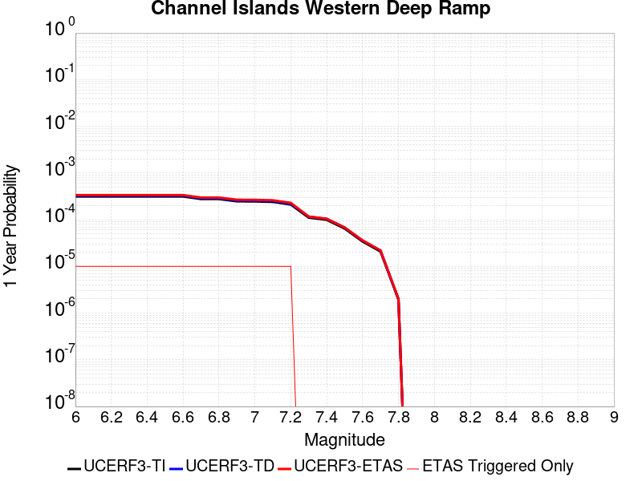 |  |

| Magnitude | 1 wk TI Prob | 1 wk TD Prob | 1 wk ETAS Prob | 1 wk ETAS/TD Gain | 1 wk ETAS Triggered Only | 1 mo TI Prob | 1 mo TD Prob | 1 mo ETAS Prob | 1 mo ETAS/TD Gain | 1 mo ETAS Triggered Only | 1 yr TI Prob | 1 yr TD Prob | 1 yr ETAS Prob | 1 yr ETAS/TD Gain | 1 yr ETAS Triggered Only | 10 yr TI Prob | 10 yr TD Prob | 10 yr ETAS Prob | 10 yr ETAS/TD Gain | 10 yr ETAS Triggered Only |
|-----|-----|-----|-----|-----|-----|-----|-----|-----|-----|-----|-----|-----|-----|-----|-----|-----|-----|-----|-----|-----|
| 6.0 | 6.0213506E-6 | 6.2549007E-6 | 6.2549007E-6 | 1.0 | 0.0 | 2.5805533E-5 | 2.6806467E-5 | 2.6806467E-5 | 1.0 | 0.0 | 3.1413708E-4 | 3.263243E-4 | 3.3632107E-4 | 1.0306344 | 1.0E-5 | 0.0031369338 | 0.003258893 | 0.0032688605 | 1.0030586 | 1.0E-5 |
| 6.1 | 6.0213506E-6 | 6.2549007E-6 | 6.2549007E-6 | 1.0 | 0.0 | 2.5805533E-5 | 2.6806467E-5 | 2.6806467E-5 | 1.0 | 0.0 | 3.1413708E-4 | 3.263243E-4 | 3.3632107E-4 | 1.0306344 | 1.0E-5 | 0.0031369338 | 0.003258893 | 0.0032688605 | 1.0030586 | 1.0E-5 |
| 6.2 | 6.0213506E-6 | 6.2549007E-6 | 6.2549007E-6 | 1.0 | 0.0 | 2.5805533E-5 | 2.6806467E-5 | 2.6806467E-5 | 1.0 | 0.0 | 3.1413708E-4 | 3.263243E-4 | 3.3632107E-4 | 1.0306344 | 1.0E-5 | 0.0031369338 | 0.003258893 | 0.0032688605 | 1.0030586 | 1.0E-5 |
| 6.3 | 6.0213506E-6 | 6.2549007E-6 | 6.2549007E-6 | 1.0 | 0.0 | 2.5805533E-5 | 2.6806467E-5 | 2.6806467E-5 | 1.0 | 0.0 | 3.1413708E-4 | 3.263243E-4 | 3.3632107E-4 | 1.0306344 | 1.0E-5 | 0.0031369338 | 0.003258893 | 0.0032688605 | 1.0030586 | 1.0E-5 |
| 6.4 | 6.0213506E-6 | 6.2549007E-6 | 6.2549007E-6 | 1.0 | 0.0 | 2.5805533E-5 | 2.6806467E-5 | 2.6806467E-5 | 1.0 | 0.0 | 3.1413708E-4 | 3.263243E-4 | 3.3632107E-4 | 1.0306344 | 1.0E-5 | 0.0031369338 | 0.003258893 | 0.0032688605 | 1.0030586 | 1.0E-5 |
| 6.5 | 6.0213506E-6 | 6.2549007E-6 | 6.2549007E-6 | 1.0 | 0.0 | 2.5805533E-5 | 2.6806467E-5 | 2.6806467E-5 | 1.0 | 0.0 | 3.1413708E-4 | 3.263243E-4 | 3.3632107E-4 | 1.0306344 | 1.0E-5 | 0.0031369338 | 0.003258893 | 0.0032688605 | 1.0030586 | 1.0E-5 |
| 6.6 | 6.0213506E-6 | 6.2549007E-6 | 6.2549007E-6 | 1.0 | 0.0 | 2.5805533E-5 | 2.6806467E-5 | 2.6806467E-5 | 1.0 | 0.0 | 3.1413708E-4 | 3.263243E-4 | 3.3632107E-4 | 1.0306344 | 1.0E-5 | 0.0031369338 | 0.003258893 | 0.0032688605 | 1.0030586 | 1.0E-5 |
| 6.7 | 5.313309E-6 | 5.52527E-6 | 5.52527E-6 | 1.0 | 0.0 | 2.2771126E-5 | 2.3679535E-5 | 2.3679535E-5 | 1.0 | 0.0 | 2.772032E-4 | 2.882643E-4 | 2.982614E-4 | 1.0346804 | 1.0E-5 | 0.0027685766 | 0.002879307 | 0.002889278 | 1.003463 | 1.0E-5 |
| 6.8 | 5.313309E-6 | 5.52527E-6 | 5.52527E-6 | 1.0 | 0.0 | 2.2771126E-5 | 2.3679535E-5 | 2.3679535E-5 | 1.0 | 0.0 | 2.772032E-4 | 2.882643E-4 | 2.982614E-4 | 1.0346804 | 1.0E-5 | 0.0027685766 | 0.002879307 | 0.002889278 | 1.003463 | 1.0E-5 |
| 6.9 | 4.744377E-6 | 4.9394575E-6 | 4.9394575E-6 | 1.0 | 0.0 | 2.0332885E-5 | 2.1168953E-5 | 2.1168953E-5 | 1.0 | 0.0 | 2.4752476E-4 | 2.5770525E-4 | 2.6770268E-4 | 1.038794 | 1.0E-5 | 0.0024724922 | 0.0025744315 | 0.0025844057 | 1.0038743 | 1.0E-5 |
| 7.0 | 4.722209E-6 | 4.9165E-6 | 4.9165E-6 | 1.0 | 0.0 | 2.0237881E-5 | 2.1070566E-5 | 2.1070566E-5 | 1.0 | 0.0 | 2.4636835E-4 | 2.5650766E-4 | 2.665051E-4 | 1.0389752 | 1.0E-5 | 0.002460954 | 0.0025624833 | 0.0025724578 | 1.0038924 | 1.0E-5 |
| 7.1 | 4.611174E-6 | 4.8014354E-6 | 4.8014354E-6 | 1.0 | 0.0 | 1.9762025E-5 | 2.057744E-5 | 2.057744E-5 | 1.0 | 0.0 | 2.4057609E-4 | 2.5050525E-4 | 2.6050274E-4 | 1.0399094 | 1.0E-5 | 0.002403158 | 0.0025025955 | 0.0025125707 | 1.0039859 | 1.0E-5 |
| 7.2 | 4.043994E-6 | 4.21205E-6 | 4.21205E-6 | 1.0 | 0.0 | 1.7331287E-5 | 1.8051538E-5 | 1.8051538E-5 | 1.0 | 0.0 | 2.10988E-4 | 2.1975888E-4 | 2.2975667E-4 | 1.0454944 | 1.0E-5 | 0.002107878 | 0.0021957664 | 0.0022057444 | 1.0045443 | 1.0E-5 |
| 7.3 | 2.1233036E-6 | 2.2298022E-6 | 2.2298022E-6 | 1.0 | 0.0 | 9.099841E-6 | 9.556261E-6 | 9.556261E-6 | 1.0 | 0.0 | 1.1078493E-4 | 1.1634132E-4 | 1.1634132E-4 | 1.0 | 0.0 | 0.0011072971 | 0.0011628097 | 0.0011628097 | 1.0 | 0.0 |
| 7.4 | 1.9051884E-6 | 2.0015107E-6 | 2.0015107E-6 | 1.0 | 0.0 | 8.165067E-6 | 8.577875E-6 | 8.577875E-6 | 1.0 | 0.0 | 9.940516E-5 | 1.0443068E-4 | 1.0443068E-4 | 1.0 | 0.0 | 9.93607E-4 | 0.0010438213 | 0.0010438213 | 1.0 | 0.0 |
| 7.5 | 1.2408497E-6 | 1.3038928E-6 | 1.3038928E-6 | 1.0 | 0.0 | 5.317916E-6 | 5.5880996E-6 | 5.5880996E-6 | 1.0 | 0.0 | 6.4743705E-5 | 6.803301E-5 | 6.803301E-5 | 1.0 | 0.0 | 6.4724847E-4 | 6.8012404E-4 | 6.8012404E-4 | 1.0 | 0.0 |
| 7.6 | 6.5440025E-7 | 6.886766E-7 | 6.886766E-7 | 1.0 | 0.0 | 2.8045695E-6 | 2.9514679E-6 | 2.9514679E-6 | 1.0 | 0.0 | 3.4145098E-5 | 3.5933543E-5 | 3.5933543E-5 | 1.0 | 0.0 | 3.4139853E-4 | 3.5927873E-4 | 3.5927873E-4 | 1.0 | 0.0 |
| 7.7 | 3.985963E-7 | 4.1931077E-7 | 4.1931077E-7 | 1.0 | 0.0 | 1.7082689E-6 | 1.797045E-6 | 1.797045E-6 | 1.0 | 0.0 | 2.0797976E-5 | 2.1878815E-5 | 2.1878815E-5 | 1.0 | 0.0 | 2.0796029E-4 | 2.1876777E-4 | 2.1876777E-4 | 1.0 | 0.0 |
| 7.8 | 3.706329E-8 | 3.8592006E-8 | 3.8592006E-8 | 1.0 | 0.0 | 1.5884267E-7 | 1.653943E-7 | 1.653943E-7 | 1.0 | 0.0 | 1.9339077E-6 | 2.0136738E-6 | 2.0136738E-6 | 1.0 | 0.0 | 1.933891E-5 | 2.0136567E-5 | 2.0136567E-5 | 1.0 | 0.0 |

## Santa Cruz Catalina Ridge alt1
*[(top)](#table-of-contents)*

| 1 Week | 1 Month | 1 Year | 10 Year |
|-----|-----|-----|-----|
|  |  |  |  |

| Magnitude | 1 wk TI Prob | 1 wk TD Prob | 1 wk ETAS Prob | 1 wk ETAS/TD Gain | 1 wk ETAS Triggered Only | 1 mo TI Prob | 1 mo TD Prob | 1 mo ETAS Prob | 1 mo ETAS/TD Gain | 1 mo ETAS Triggered Only | 1 yr TI Prob | 1 yr TD Prob | 1 yr ETAS Prob | 1 yr ETAS/TD Gain | 1 yr ETAS Triggered Only | 10 yr TI Prob | 10 yr TD Prob | 10 yr ETAS Prob | 10 yr ETAS/TD Gain | 10 yr ETAS Triggered Only |
|-----|-----|-----|-----|-----|-----|-----|-----|-----|-----|-----|-----|-----|-----|-----|-----|-----|-----|-----|-----|-----|
| 6.0 | 3.2833184E-5 | 3.655896E-5 | 3.655896E-5 | 1.0 | 0.0 | 1.4070606E-4 | 1.5667279E-4 | 1.5667279E-4 | 1.0 | 0.0 | 0.00171175 | 0.0019059886 | 0.0019059886 | 1.0 | 0.0 | 0.016986247 | 0.01891332 | 0.01892313 | 1.0005187 | 1.0E-5 |
| 6.1 | 1.9835548E-5 | 2.1659771E-5 | 2.1659771E-5 | 1.0 | 0.0 | 8.500672E-5 | 9.2824404E-5 | 9.2824404E-5 | 1.0 | 0.0 | 0.0010344655 | 0.0011295713 | 0.0011295713 | 1.0 | 0.0 | 0.010296632 | 0.011240433 | 0.011250321 | 1.0008796 | 1.0E-5 |
| 6.2 | 1.9835548E-5 | 2.1659771E-5 | 2.1659771E-5 | 1.0 | 0.0 | 8.500672E-5 | 9.2824404E-5 | 9.2824404E-5 | 1.0 | 0.0 | 0.0010344655 | 0.0011295713 | 0.0011295713 | 1.0 | 0.0 | 0.010296632 | 0.011240433 | 0.011250321 | 1.0008796 | 1.0E-5 |
| 6.3 | 1.5728183E-5 | 1.7034137E-5 | 1.7034137E-5 | 1.0 | 0.0 | 6.7404755E-5 | 7.3001436E-5 | 7.3001436E-5 | 1.0 | 0.0 | 8.2034385E-4 | 8.884362E-4 | 8.884362E-4 | 1.0 | 0.0 | 0.008173222 | 0.008849524 | 0.008859436 | 1.00112 | 1.0E-5 |
| 6.4 | 1.5728183E-5 | 1.7034137E-5 | 1.7034137E-5 | 1.0 | 0.0 | 6.7404755E-5 | 7.3001436E-5 | 7.3001436E-5 | 1.0 | 0.0 | 8.2034385E-4 | 8.884362E-4 | 8.884362E-4 | 1.0 | 0.0 | 0.008173222 | 0.008849524 | 0.008859436 | 1.00112 | 1.0E-5 |
| 6.5 | 1.3707734E-5 | 1.4794678E-5 | 1.4794678E-5 | 1.0 | 0.0 | 5.8746107E-5 | 6.3404244E-5 | 6.3404244E-5 | 1.0 | 0.0 | 7.1499916E-4 | 7.716768E-4 | 7.716768E-4 | 1.0 | 0.0 | 0.0071270303 | 0.0076903705 | 0.007700294 | 1.0012903 | 1.0E-5 |
| 6.6 | 1.2539813E-5 | 1.3510358E-5 | 1.3510358E-5 | 1.0 | 0.0 | 5.3740947E-5 | 5.7900266E-5 | 5.7900266E-5 | 1.0 | 0.0 | 6.540996E-4 | 7.0471043E-4 | 7.0471043E-4 | 1.0 | 0.0 | 0.0065217763 | 0.0070250607 | 0.0070349905 | 1.0014135 | 1.0E-5 |
| 6.7 | 1.1504083E-5 | 1.23775E-5 | 1.23775E-5 | 1.0 | 0.0 | 4.930228E-5 | 5.304536E-5 | 5.304536E-5 | 1.0 | 0.0 | 6.0008996E-4 | 6.456379E-4 | 6.456379E-4 | 1.0 | 0.0 | 0.005984721 | 0.0064378507 | 0.0064477865 | 1.0015433 | 1.0E-5 |
| 6.8 | 1.012739E-5 | 1.0877178E-5 | 1.0877178E-5 | 1.0 | 0.0 | 4.340238E-5 | 4.6615653E-5 | 4.6615653E-5 | 1.0 | 0.0 | 5.282958E-4 | 5.673993E-4 | 5.673993E-4 | 1.0 | 0.0 | 0.0052704164 | 0.005659675 | 0.0056696185 | 1.0017569 | 1.0E-5 |
| 6.9 | 8.9607865E-6 | 9.60921E-6 | 9.60921E-6 | 1.0 | 0.0 | 3.8402806E-5 | 4.1181684E-5 | 4.1181684E-5 | 1.0 | 0.0 | 4.6745385E-4 | 5.0127273E-4 | 5.0127273E-4 | 1.0 | 0.0 | 0.0046647177 | 0.00500154 | 0.00500154 | 1.0 | 0.0 |
| 7.0 | 8.046829E-6 | 8.619827E-6 | 8.619827E-6 | 1.0 | 0.0 | 3.4485955E-5 | 3.6941598E-5 | 3.6941598E-5 | 1.0 | 0.0 | 4.1978562E-4 | 4.4967196E-4 | 4.4967196E-4 | 1.0 | 0.0 | 0.004189935 | 0.004487711 | 0.004487711 | 1.0 | 0.0 |
| 7.1 | 7.136131E-6 | 7.637727E-6 | 7.637727E-6 | 1.0 | 0.0 | 3.0583058E-5 | 3.273271E-5 | 3.273271E-5 | 1.0 | 0.0 | 3.7228514E-4 | 3.9844858E-4 | 3.9844858E-4 | 1.0 | 0.0 | 0.0037166206 | 0.0039774184 | 0.0039774184 | 1.0 | 0.0 |
| 7.2 | 6.362014E-6 | 6.8050217E-6 | 6.8050217E-6 | 1.0 | 0.0 | 2.726549E-5 | 2.9164055E-5 | 2.9164055E-5 | 1.0 | 0.0 | 3.3190678E-4 | 3.5501516E-4 | 3.5501516E-4 | 1.0 | 0.0 | 0.0033141149 | 0.0035445488 | 0.0035445488 | 1.0 | 0.0 |
| 7.3 | 5.004101E-6 | 5.3517642E-6 | 5.3517642E-6 | 1.0 | 0.0 | 2.1445969E-5 | 2.2935934E-5 | 2.2935934E-5 | 1.0 | 0.0 | 2.6107338E-4 | 2.7920975E-4 | 2.7920975E-4 | 1.0 | 0.0 | 0.002607669 | 0.0027886443 | 0.0027886443 | 1.0 | 0.0 |
| 7.4 | 3.4901443E-6 | 3.732087E-6 | 3.732087E-6 | 1.0 | 0.0 | 1.4957676E-5 | 1.5994563E-5 | 1.5994563E-5 | 1.0 | 0.0 | 1.8209449E-4 | 1.9471678E-4 | 1.9471678E-4 | 1.0 | 0.0 | 0.0018194534 | 0.0019455003 | 0.0019455003 | 1.0 | 0.0 |
| 7.5 | 1.1215045E-6 | 1.1893966E-6 | 1.1893966E-6 | 1.0 | 0.0 | 4.806439E-6 | 5.0974045E-6 | 5.0974045E-6 | 1.0 | 0.0 | 5.851682E-5 | 6.205916E-5 | 6.205916E-5 | 1.0 | 0.0 | 5.850142E-4 | 6.204214E-4 | 6.204214E-4 | 1.0 | 0.0 |
| 7.6 | 2.8599047E-7 | 2.9952182E-7 | 2.9952182E-7 | 1.0 | 0.0 | 1.2256729E-6 | 1.2836642E-6 | 1.2836642E-6 | 1.0 | 0.0 | 1.4922465E-5 | 1.5628502E-5 | 1.5628502E-5 | 1.0 | 0.0 | 1.4921463E-4 | 1.5627417E-4 | 1.5627417E-4 | 1.0 | 0.0 |
| 7.7 | 2.0781519E-7 | 2.1744457E-7 | 2.1744457E-7 | 1.0 | 0.0 | 8.906362E-7 | 9.3190494E-7 | 9.3190494E-7 | 1.0 | 0.0 | 1.08434415E-5 | 1.1345885E-5 | 1.1345885E-5 | 1.0 | 0.0 | 1.0842913E-4 | 1.1345315E-4 | 1.1345315E-4 | 1.0 | 0.0 |
| 7.8 | 3.614776E-8 | 3.7641225E-8 | 3.7641225E-8 | 1.0 | 0.0 | 1.5491896E-7 | 1.6131952E-7 | 1.6131952E-7 | 1.0 | 0.0 | 1.8861368E-6 | 1.9640636E-6 | 1.9640636E-6 | 1.0 | 0.0 | 1.8861208E-5 | 1.9640474E-5 | 1.9640474E-5 | 1.0 | 0.0 |

## San Jose
*[(top)](#table-of-contents)*

| 1 Week | 1 Month | 1 Year | 10 Year |
|-----|-----|-----|-----|
|  |  |  |  |

| Magnitude | 1 wk TI Prob | 1 wk TD Prob | 1 wk ETAS Prob | 1 wk ETAS/TD Gain | 1 wk ETAS Triggered Only | 1 mo TI Prob | 1 mo TD Prob | 1 mo ETAS Prob | 1 mo ETAS/TD Gain | 1 mo ETAS Triggered Only | 1 yr TI Prob | 1 yr TD Prob | 1 yr ETAS Prob | 1 yr ETAS/TD Gain | 1 yr ETAS Triggered Only | 10 yr TI Prob | 10 yr TD Prob | 10 yr ETAS Prob | 10 yr ETAS/TD Gain | 10 yr ETAS Triggered Only |
|-----|-----|-----|-----|-----|-----|-----|-----|-----|-----|-----|-----|-----|-----|-----|-----|-----|-----|-----|-----|-----|
| 6.0 | 5.0851277E-6 | 4.125725E-6 | 4.125725E-6 | 1.0 | 0.0 | 2.1793223E-5 | 1.7681574E-5 | 1.7681574E-5 | 1.0 | 0.0 | 2.653002E-4 | 2.1525452E-4 | 2.1525452E-4 | 1.0 | 0.0 | 0.0026498367 | 0.0021507433 | 0.002160722 | 1.0046395 | 1.0E-5 |
| 6.1 | 5.0851277E-6 | 4.125725E-6 | 4.125725E-6 | 1.0 | 0.0 | 2.1793223E-5 | 1.7681574E-5 | 1.7681574E-5 | 1.0 | 0.0 | 2.653002E-4 | 2.1525452E-4 | 2.1525452E-4 | 1.0 | 0.0 | 0.0026498367 | 0.0021507433 | 0.002160722 | 1.0046395 | 1.0E-5 |
| 6.2 | 5.0851277E-6 | 4.125725E-6 | 4.125725E-6 | 1.0 | 0.0 | 2.1793223E-5 | 1.7681574E-5 | 1.7681574E-5 | 1.0 | 0.0 | 2.653002E-4 | 2.1525452E-4 | 2.1525452E-4 | 1.0 | 0.0 | 0.0026498367 | 0.0021507433 | 0.002160722 | 1.0046395 | 1.0E-5 |
| 6.3 | 5.0851277E-6 | 4.125725E-6 | 4.125725E-6 | 1.0 | 0.0 | 2.1793223E-5 | 1.7681574E-5 | 1.7681574E-5 | 1.0 | 0.0 | 2.653002E-4 | 2.1525452E-4 | 2.1525452E-4 | 1.0 | 0.0 | 0.0026498367 | 0.0021507433 | 0.002160722 | 1.0046395 | 1.0E-5 |
| 6.4 | 4.3115124E-6 | 3.3238314E-6 | 3.3238314E-6 | 1.0 | 0.0 | 1.8477778E-5 | 1.4244926E-5 | 1.4244926E-5 | 1.0 | 0.0 | 2.2494372E-4 | 1.7342038E-4 | 1.7342038E-4 | 1.0 | 0.0 | 0.0022471617 | 0.0017330924 | 0.001743075 | 1.0057601 | 1.0E-5 |
| 6.5 | 4.3115124E-6 | 3.3238314E-6 | 3.3238314E-6 | 1.0 | 0.0 | 1.8477778E-5 | 1.4244926E-5 | 1.4244926E-5 | 1.0 | 0.0 | 2.2494372E-4 | 1.7342038E-4 | 1.7342038E-4 | 1.0 | 0.0 | 0.0022471617 | 0.0017330924 | 0.001743075 | 1.0057601 | 1.0E-5 |
| 6.6 | 3.110396E-6 | 2.0800292E-6 | 2.0800292E-6 | 1.0 | 0.0 | 1.33302E-5 | 8.914381E-6 | 8.914381E-6 | 1.0 | 0.0 | 1.622831E-4 | 1.0852747E-4 | 1.0852747E-4 | 1.0 | 0.0 | 0.0016216465 | 0.0010847967 | 0.0010947859 | 1.0092083 | 1.0E-5 |
| 6.7 | 3.110396E-6 | 2.0800292E-6 | 2.0800292E-6 | 1.0 | 0.0 | 1.33302E-5 | 8.914381E-6 | 8.914381E-6 | 1.0 | 0.0 | 1.622831E-4 | 1.0852747E-4 | 1.0852747E-4 | 1.0 | 0.0 | 0.0016216465 | 0.0010847967 | 0.0010947859 | 1.0092083 | 1.0E-5 |
| 6.8 | 2.856651E-6 | 1.9024797E-6 | 1.9024797E-6 | 1.0 | 0.0 | 1.2242733E-5 | 8.15346E-6 | 8.15346E-6 | 1.0 | 0.0 | 1.4904508E-4 | 9.926411E-5 | 9.926411E-5 | 1.0 | 0.0 | 0.0014894515 | 9.922467E-4 | 0.0010022367 | 1.0100682 | 1.0E-5 |
| 6.9 | 2.1618725E-6 | 1.4187103E-6 | 1.4187103E-6 | 1.0 | 0.0 | 9.265135E-6 | 6.080173E-6 | 6.080173E-6 | 1.0 | 0.0 | 1.12797185E-4 | 7.402369E-5 | 7.402369E-5 | 1.0 | 0.0 | 0.0011273995 | 7.400235E-4 | 7.400235E-4 | 1.0 | 0.0 |
| 7.0 | 1.9684312E-6 | 1.3256772E-6 | 1.3256772E-6 | 1.0 | 0.0 | 8.436106E-6 | 5.681462E-6 | 5.681462E-6 | 1.0 | 0.0 | 1.02704755E-4 | 6.9169684E-5 | 6.9169684E-5 | 1.0 | 0.0 | 0.001026573 | 6.9151423E-4 | 6.9151423E-4 | 1.0 | 0.0 |
| 7.1 | 1.6070337E-6 | 1.1155536E-6 | 1.1155536E-6 | 1.0 | 0.0 | 6.887269E-6 | 4.7809353E-6 | 4.7809353E-6 | 1.0 | 0.0 | 8.384928E-5 | 5.82064E-5 | 5.82064E-5 | 1.0 | 0.0 | 8.3817646E-4 | 5.819422E-4 | 5.819422E-4 | 1.0 | 0.0 |
| 7.2 | 1.0631658E-6 | 6.4040677E-7 | 6.4040677E-7 | 1.0 | 0.0 | 4.556417E-6 | 2.7445976E-6 | 2.7445976E-6 | 1.0 | 0.0 | 5.5472963E-5 | 3.3414977E-5 | 3.3414977E-5 | 1.0 | 0.0 | 5.545912E-4 | 3.3412542E-4 | 3.3412542E-4 | 1.0 | 0.0 |
| 7.3 | 7.060711E-7 | 4.5827397E-7 | 4.5827397E-7 | 1.0 | 0.0 | 3.0260155E-6 | 1.96403E-6 | 1.96403E-6 | 1.0 | 0.0 | 3.6841117E-5 | 2.391181E-5 | 2.391181E-5 | 1.0 | 0.0 | 3.6835007E-4 | 2.3911778E-4 | 2.3911778E-4 | 1.0 | 0.0 |
| 7.4 | 3.3677085E-7 | 2.3235165E-7 | 2.3235165E-7 | 1.0 | 0.0 | 1.4433028E-6 | 9.957924E-7 | 9.957924E-7 | 1.0 | 0.0 | 1.757207E-5 | 1.2123709E-5 | 1.2123709E-5 | 1.0 | 0.0 | 1.7570681E-4 | 1.2125527E-4 | 1.2125527E-4 | 1.0 | 0.0 |
| 7.5 | 3.129161E-7 | 1.9532374E-7 | 1.9532374E-7 | 1.0 | 0.0 | 1.3410682E-6 | 8.371014E-7 | 8.371014E-7 | 1.0 | 0.0 | 1.6327383E-5 | 1.0191665E-5 | 1.0191665E-5 | 1.0 | 0.0 | 1.6326184E-4 | 1.0193672E-4 | 1.0193672E-4 | 1.0 | 0.0 |
| 7.6 | 2.8008668E-7 | 1.4242943E-7 | 1.4242943E-7 | 1.0 | 0.0 | 1.2003709E-6 | 6.104117E-7 | 6.104117E-7 | 1.0 | 0.0 | 1.46144175E-5 | 7.4317386E-6 | 7.4317386E-6 | 1.0 | 0.0 | 1.4613457E-4 | 7.433959E-5 | 7.433959E-5 | 1.0 | 0.0 |
| 7.7 | 2.7852005E-7 | 1.4017505E-7 | 1.4017505E-7 | 1.0 | 0.0 | 1.1936568E-6 | 6.0075007E-7 | 6.0075007E-7 | 1.0 | 0.0 | 1.4532674E-5 | 7.3141096E-6 | 7.3141096E-6 | 1.0 | 0.0 | 1.4531724E-4 | 7.316337E-5 | 7.316337E-5 | 1.0 | 0.0 |
| 7.8 | 1.1810797E-7 | 7.519506E-8 | 7.519506E-8 | 1.0 | 0.0 | 5.0617695E-7 | 3.222645E-7 | 3.222645E-7 | 1.0 | 0.0 | 6.1626865E-6 | 3.923564E-6 | 3.923564E-6 | 1.0 | 0.0 | 6.162516E-5 | 3.92379E-5 | 3.92379E-5 | 1.0 | 0.0 |

## Los Osos 2011
*[(top)](#table-of-contents)*

| 1 Week | 1 Month | 1 Year | 10 Year |
|-----|-----|-----|-----|
|  |  |  |  |

| Magnitude | 1 wk TI Prob | 1 wk TD Prob | 1 wk ETAS Prob | 1 wk ETAS/TD Gain | 1 wk ETAS Triggered Only | 1 mo TI Prob | 1 mo TD Prob | 1 mo ETAS Prob | 1 mo ETAS/TD Gain | 1 mo ETAS Triggered Only | 1 yr TI Prob | 1 yr TD Prob | 1 yr ETAS Prob | 1 yr ETAS/TD Gain | 1 yr ETAS Triggered Only | 10 yr TI Prob | 10 yr TD Prob | 10 yr ETAS Prob | 10 yr ETAS/TD Gain | 10 yr ETAS Triggered Only |
|-----|-----|-----|-----|-----|-----|-----|-----|-----|-----|-----|-----|-----|-----|-----|-----|-----|-----|-----|-----|-----|
| 6.0 | 4.8871775E-6 | 4.9815035E-6 | 4.9815035E-6 | 1.0 | 0.0 | 2.0944879E-5 | 2.134914E-5 | 2.134914E-5 | 1.0 | 0.0 | 2.5497406E-4 | 2.5989758E-4 | 2.5989758E-4 | 1.0 | 0.0 | 0.002546817 | 0.0025962107 | 0.0026061847 | 1.0038418 | 1.0E-5 |
| 6.1 | 4.8871775E-6 | 4.9815035E-6 | 4.9815035E-6 | 1.0 | 0.0 | 2.0944879E-5 | 2.134914E-5 | 2.134914E-5 | 1.0 | 0.0 | 2.5497406E-4 | 2.5989758E-4 | 2.5989758E-4 | 1.0 | 0.0 | 0.002546817 | 0.0025962107 | 0.0026061847 | 1.0038418 | 1.0E-5 |
| 6.2 | 4.8871775E-6 | 4.9815035E-6 | 4.9815035E-6 | 1.0 | 0.0 | 2.0944879E-5 | 2.134914E-5 | 2.134914E-5 | 1.0 | 0.0 | 2.5497406E-4 | 2.5989758E-4 | 2.5989758E-4 | 1.0 | 0.0 | 0.002546817 | 0.0025962107 | 0.0026061847 | 1.0038418 | 1.0E-5 |
| 6.3 | 4.8871775E-6 | 4.9815035E-6 | 4.9815035E-6 | 1.0 | 0.0 | 2.0944879E-5 | 2.134914E-5 | 2.134914E-5 | 1.0 | 0.0 | 2.5497406E-4 | 2.5989758E-4 | 2.5989758E-4 | 1.0 | 0.0 | 0.002546817 | 0.0025962107 | 0.0026061847 | 1.0038418 | 1.0E-5 |
| 6.4 | 4.8871775E-6 | 4.9815035E-6 | 4.9815035E-6 | 1.0 | 0.0 | 2.0944879E-5 | 2.134914E-5 | 2.134914E-5 | 1.0 | 0.0 | 2.5497406E-4 | 2.5989758E-4 | 2.5989758E-4 | 1.0 | 0.0 | 0.002546817 | 0.0025962107 | 0.0026061847 | 1.0038418 | 1.0E-5 |
| 6.5 | 3.1724062E-6 | 3.223409E-6 | 3.223409E-6 | 1.0 | 0.0 | 1.3595956E-5 | 1.3814538E-5 | 1.3814538E-5 | 1.0 | 0.0 | 1.6551818E-4 | 1.6817915E-4 | 1.6817915E-4 | 1.0 | 0.0 | 0.0016539496 | 0.0016805322 | 0.0016805322 | 1.0 | 0.0 |
| 6.6 | 3.1022591E-6 | 3.151118E-6 | 3.151118E-6 | 1.0 | 0.0 | 1.3295328E-5 | 1.3504723E-5 | 1.3504723E-5 | 1.0 | 0.0 | 1.618586E-4 | 1.6440773E-4 | 1.6440773E-4 | 1.0 | 0.0 | 0.0016174077 | 0.0016428737 | 0.0016428737 | 1.0 | 0.0 |
| 6.7 | 2.611518E-6 | 2.6491955E-6 | 2.6491955E-6 | 1.0 | 0.0 | 1.1192172E-5 | 1.1353646E-5 | 1.1353646E-5 | 1.0 | 0.0 | 1.3625617E-4 | 1.382219E-4 | 1.382219E-4 | 1.0 | 0.0 | 0.0013617266 | 0.001381364 | 0.001381364 | 1.0 | 0.0 |
| 6.8 | 2.4780884E-6 | 2.512171E-6 | 2.512171E-6 | 1.0 | 0.0 | 1.0620336E-5 | 1.0766403E-5 | 1.0766403E-5 | 1.0 | 0.0 | 1.2929492E-4 | 1.3107312E-4 | 1.3107312E-4 | 1.0 | 0.0 | 0.0012921972 | 0.0013099621 | 0.0013099621 | 1.0 | 0.0 |
| 6.9 | 2.1376322E-6 | 2.1635162E-6 | 2.1635162E-6 | 1.0 | 0.0 | 9.161248E-6 | 9.272179E-6 | 9.272179E-6 | 1.0 | 0.0 | 1.1153249E-4 | 1.1288296E-4 | 1.1288296E-4 | 1.0 | 0.0 | 0.0011147653 | 0.0011282581 | 0.0011282581 | 1.0 | 0.0 |
| 7.0 | 1.9282882E-6 | 1.9494685E-6 | 1.9494685E-6 | 1.0 | 0.0 | 8.264066E-6 | 8.354838E-6 | 8.354838E-6 | 1.0 | 0.0 | 1.0061036E-4 | 1.0171542E-4 | 1.0171542E-4 | 1.0 | 0.0 | 0.0010056482 | 0.00101669 | 0.00101669 | 1.0 | 0.0 |
| 7.1 | 1.6353226E-6 | 1.6501209E-6 | 1.6501209E-6 | 1.0 | 0.0 | 7.0085066E-6 | 7.071928E-6 | 7.071928E-6 | 1.0 | 0.0 | 8.532523E-5 | 8.609732E-5 | 8.609732E-5 | 1.0 | 0.0 | 8.529247E-4 | 8.606405E-4 | 8.606405E-4 | 1.0 | 0.0 |
| 7.2 | 1.4446276E-6 | 1.4553427E-6 | 1.4553427E-6 | 1.0 | 0.0 | 6.191247E-6 | 6.2371682E-6 | 6.2371682E-6 | 1.0 | 0.0 | 7.537582E-5 | 7.5934884E-5 | 7.5934884E-5 | 1.0 | 0.0 | 7.535026E-4 | 7.5908995E-4 | 7.5908995E-4 | 1.0 | 0.0 |
| 7.3 | 1.2014582E-6 | 1.2069152E-6 | 1.2069152E-6 | 1.0 | 0.0 | 5.149096E-6 | 5.1724833E-6 | 5.1724833E-6 | 1.0 | 0.0 | 6.268844E-5 | 6.2973166E-5 | 6.2973166E-5 | 1.0 | 0.0 | 6.267076E-4 | 6.2955363E-4 | 6.2955363E-4 | 1.0 | 0.0 |
| 7.4 | 9.707733E-7 | 9.709845E-7 | 9.709845E-7 | 1.0 | 0.0 | 4.16045E-6 | 4.1613553E-6 | 4.1613553E-6 | 1.0 | 0.0 | 5.0652303E-5 | 5.0663326E-5 | 5.0663326E-5 | 1.0 | 0.0 | 5.064076E-4 | 5.0651806E-4 | 5.0651806E-4 | 1.0 | 0.0 |
| 7.5 | 7.174908E-7 | 7.114977E-7 | 7.114977E-7 | 1.0 | 0.0 | 3.074957E-6 | 3.0492722E-6 | 3.0492722E-6 | 1.0 | 0.0 | 3.743696E-5 | 3.712426E-5 | 3.712426E-5 | 1.0 | 0.0 | 3.7430652E-4 | 3.7118077E-4 | 3.7118077E-4 | 1.0 | 0.0 |
| 7.6 | 4.5535776E-7 | 4.4208457E-7 | 4.4208457E-7 | 1.0 | 0.0 | 1.9515319E-6 | 1.8946467E-6 | 1.8946467E-6 | 1.0 | 0.0 | 2.3759641E-5 | 2.3067081E-5 | 2.3067081E-5 | 1.0 | 0.0 | 2.37571E-4 | 2.3064695E-4 | 2.3064695E-4 | 1.0 | 0.0 |
| 7.7 | 2.1173553E-7 | 1.9061224E-7 | 1.9061224E-7 | 1.0 | 0.0 | 9.0743765E-7 | 8.1690933E-7 | 8.1690933E-7 | 1.0 | 0.0 | 1.1047998E-5 | 9.945827E-6 | 9.945827E-6 | 1.0 | 0.0 | 1.1047449E-4 | 9.945384E-5 | 9.945384E-5 | 1.0 | 0.0 |
| 7.8 | 9.873608E-8 | 7.3678876E-8 | 7.3678876E-8 | 1.0 | 0.0 | 4.2315455E-7 | 3.1576658E-7 | 3.1576658E-7 | 1.0 | 0.0 | 5.1518946E-6 | 3.8444514E-6 | 3.8444514E-6 | 1.0 | 0.0 | 5.1517753E-5 | 3.8443854E-5 | 3.8443854E-5 | 1.0 | 0.0 |
| 7.9 | 5.4399106E-8 | 3.1883175E-8 | 3.1883175E-8 | 1.0 | 0.0 | 2.33139E-7 | 1.3664217E-7 | 1.3664217E-7 | 1.0 | 0.0 | 2.8384638E-6 | 1.6636172E-6 | 1.6636172E-6 | 1.0 | 0.0 | 2.8384275E-5 | 1.663605E-5 | 1.663605E-5 | 1.0 | 0.0 |
| 8.0 | 1.817203E-8 | 8.421595E-9 | 8.421595E-9 | 1.0 | 0.0 | 7.7880124E-8 | 3.6092548E-8 | 3.6092548E-8 | 1.0 | 0.0 | 9.481901E-7 | 4.3942669E-7 | 4.3942669E-7 | 1.0 | 0.0 | 9.481861E-6 | 4.3942587E-6 | 4.3942587E-6 | 1.0 | 0.0 |

## Hunting Creek - Bartlett Springs connector 2011
*[(top)](#table-of-contents)*

| 1 Week | 1 Month | 1 Year | 10 Year |
|-----|-----|-----|-----|
|  |  |  |  |

| Magnitude | 1 wk TI Prob | 1 wk TD Prob | 1 wk ETAS Prob | 1 wk ETAS/TD Gain | 1 wk ETAS Triggered Only | 1 mo TI Prob | 1 mo TD Prob | 1 mo ETAS Prob | 1 mo ETAS/TD Gain | 1 mo ETAS Triggered Only | 1 yr TI Prob | 1 yr TD Prob | 1 yr ETAS Prob | 1 yr ETAS/TD Gain | 1 yr ETAS Triggered Only | 10 yr TI Prob | 10 yr TD Prob | 10 yr ETAS Prob | 10 yr ETAS/TD Gain | 10 yr ETAS Triggered Only |
|-----|-----|-----|-----|-----|-----|-----|-----|-----|-----|-----|-----|-----|-----|-----|-----|-----|-----|-----|-----|-----|
| 6.0 | 4.940016E-5 | 6.7873414E-5 | 6.7873414E-5 | 1.0 | 0.0 | 2.1169778E-4 | 2.9085318E-4 | 3.0085025E-4 | 1.0343716 | 1.0E-5 | 0.002574374 | 0.0035352195 | 0.0035451842 | 1.0028187 | 1.0E-5 | 0.025447546 | 0.034775995 | 0.034785647 | 1.0002775 | 1.0E-5 |
| 6.1 | 4.940016E-5 | 6.7873414E-5 | 6.7873414E-5 | 1.0 | 0.0 | 2.1169778E-4 | 2.9085318E-4 | 3.0085025E-4 | 1.0343716 | 1.0E-5 | 0.002574374 | 0.0035352195 | 0.0035451842 | 1.0028187 | 1.0E-5 | 0.025447546 | 0.034775995 | 0.034785647 | 1.0002775 | 1.0E-5 |
| 6.2 | 4.472471E-5 | 6.100793E-5 | 6.100793E-5 | 1.0 | 0.0 | 1.9166325E-4 | 2.614367E-4 | 2.714341E-4 | 1.0382402 | 1.0E-5 | 0.0023310026 | 0.0031782414 | 0.0031882096 | 1.0031364 | 1.0E-5 | 0.02306703 | 0.03131888 | 0.031328566 | 1.0003093 | 1.0E-5 |
| 6.3 | 4.472471E-5 | 6.100793E-5 | 6.100793E-5 | 1.0 | 0.0 | 1.9166325E-4 | 2.614367E-4 | 2.714341E-4 | 1.0382402 | 1.0E-5 | 0.0023310026 | 0.0031782414 | 0.0031882096 | 1.0031364 | 1.0E-5 | 0.02306703 | 0.03131888 | 0.031328566 | 1.0003093 | 1.0E-5 |
| 6.4 | 4.0001003E-5 | 5.4106935E-5 | 5.4106935E-5 | 1.0 | 0.0 | 1.714216E-4 | 2.3186632E-4 | 2.3186632E-4 | 1.0 | 0.0 | 0.0020850603 | 0.0028192701 | 0.0028192701 | 1.0 | 0.0 | 0.02065605 | 0.027830102 | 0.027830102 | 1.0 | 0.0 |
| 6.5 | 3.8033053E-5 | 5.1268355E-5 | 5.1268355E-5 | 1.0 | 0.0 | 1.6298861E-4 | 2.197032E-4 | 2.197032E-4 | 1.0 | 0.0 | 0.0019825802 | 0.0026715791 | 0.0026715791 | 1.0 | 0.0 | 0.019649856 | 0.026392108 | 0.026392108 | 1.0 | 0.0 |
| 6.6 | 3.653754E-5 | 4.9131297E-5 | 4.9131297E-5 | 1.0 | 0.0 | 1.5658008E-4 | 2.1054587E-4 | 2.1054587E-4 | 1.0 | 0.0 | 0.0019046954 | 0.0025603776 | 0.0025603776 | 1.0 | 0.0 | 0.018884527 | 0.025307981 | 0.025307981 | 1.0 | 0.0 |
| 6.7 | 3.372024E-5 | 4.5141747E-5 | 4.5141747E-5 | 1.0 | 0.0 | 1.4450731E-4 | 1.934504E-4 | 1.934504E-4 | 1.0 | 0.0 | 0.0017579567 | 0.0023527322 | 0.0023527322 | 1.0 | 0.0 | 0.017441148 | 0.023279548 | 0.023279548 | 1.0 | 0.0 |
| 6.8 | 2.9650024E-5 | 3.941287E-5 | 3.941287E-5 | 1.0 | 0.0 | 1.2706534E-4 | 1.6890126E-4 | 1.6890126E-4 | 1.0 | 0.0 | 0.0015459227 | 0.0020544236 | 0.0020544236 | 1.0 | 0.0 | 0.015352124 | 0.020352496 | 0.020352496 | 1.0 | 0.0 |
| 6.9 | 2.860775E-5 | 3.7814003E-5 | 3.7814003E-5 | 1.0 | 0.0 | 1.2259888E-4 | 1.6204998E-4 | 1.6204998E-4 | 1.0 | 0.0 | 0.0014916194 | 0.0019711799 | 0.0019711799 | 1.0 | 0.0 | 0.014816469 | 0.019537043 | 0.019537043 | 1.0 | 0.0 |
| 7.0 | 2.6696067E-5 | 3.5068544E-5 | 3.5068544E-5 | 1.0 | 0.0 | 1.144067E-4 | 1.5028517E-4 | 1.5028517E-4 | 1.0 | 0.0 | 0.0013920115 | 0.001828195 | 0.001828195 | 1.0 | 0.0 | 0.013833242 | 0.018132268 | 0.018132268 | 1.0 | 0.0 |
| 7.1 | 2.456087E-5 | 3.2014224E-5 | 3.2014224E-5 | 1.0 | 0.0 | 1.0525662E-4 | 1.3719666E-4 | 1.3719666E-4 | 1.0 | 0.0 | 0.001280746 | 0.0016690986 | 0.0016690986 | 1.0 | 0.0 | 0.012733897 | 0.016567077 | 0.016567077 | 1.0 | 0.0 |
| 7.2 | 2.295761E-5 | 2.982398E-5 | 2.982398E-5 | 1.0 | 0.0 | 9.8386045E-5 | 1.2781084E-4 | 1.2781084E-4 | 1.0 | 0.0 | 0.0011971919 | 0.0015549955 | 0.0015549955 | 1.0 | 0.0 | 0.011907627 | 0.015442743 | 0.015442743 | 1.0 | 0.0 |
| 7.3 | 2.1256936E-5 | 2.7542896E-5 | 2.7542896E-5 | 1.0 | 0.0 | 9.109797E-5 | 1.1803569E-4 | 1.1803569E-4 | 1.0 | 0.0 | 0.0011085535 | 0.0014361461 | 0.0014361461 | 1.0 | 0.0 | 0.011030397 | 0.014270082 | 0.014270082 | 1.0 | 0.0 |
| 7.4 | 1.8784336E-5 | 2.430763E-5 | 2.430763E-5 | 1.0 | 0.0 | 8.050181E-5 | 1.0417144E-4 | 1.0417144E-4 | 1.0 | 0.0 | 9.796688E-4 | 0.0012675569 | 0.0012675569 | 1.0 | 0.0 | 0.009753612 | 0.012604473 | 0.012604473 | 1.0 | 0.0 |
| 7.5 | 1.7248298E-5 | 2.2269673E-5 | 2.2269673E-5 | 1.0 | 0.0 | 7.391918E-5 | 9.5438E-5 | 9.5438E-5 | 1.0 | 0.0 | 8.9959445E-4 | 0.0011613459 | 0.0011613459 | 1.0 | 0.0 | 0.008959615 | 0.011553904 | 0.011553904 | 1.0 | 0.0 |
| 7.6 | 1.0653709E-5 | 1.3722595E-5 | 1.3722595E-5 | 1.0 | 0.0 | 4.5657955E-5 | 5.8809812E-5 | 5.8809812E-5 | 1.0 | 0.0 | 5.557438E-4 | 7.157769E-4 | 7.157769E-4 | 1.0 | 0.0 | 0.0055435603 | 0.007135182 | 0.007135182 | 1.0 | 0.0 |
| 7.7 | 3.286316E-6 | 4.09049E-6 | 4.09049E-6 | 1.0 | 0.0 | 1.4084137E-5 | 1.7530556E-5 | 1.7530556E-5 | 1.0 | 0.0 | 1.7146087E-4 | 2.1341378E-4 | 2.1341378E-4 | 1.0 | 0.0 | 0.0017132863 | 0.0021321473 | 0.0021321473 | 1.0 | 0.0 |
| 7.8 | 5.1855085E-7 | 5.972202E-7 | 5.972202E-7 | 1.0 | 0.0 | 2.222359E-6 | 2.5595127E-6 | 2.5595127E-6 | 1.0 | 0.0 | 2.7056883E-5 | 3.116163E-5 | 3.116163E-5 | 1.0 | 0.0 | 2.705359E-4 | 3.1156646E-4 | 3.1156646E-4 | 1.0 | 0.0 |

## Oceanside alt1
*[(top)](#table-of-contents)*

| 1 Week | 1 Month | 1 Year | 10 Year |
|-----|-----|-----|-----|
|  |  | 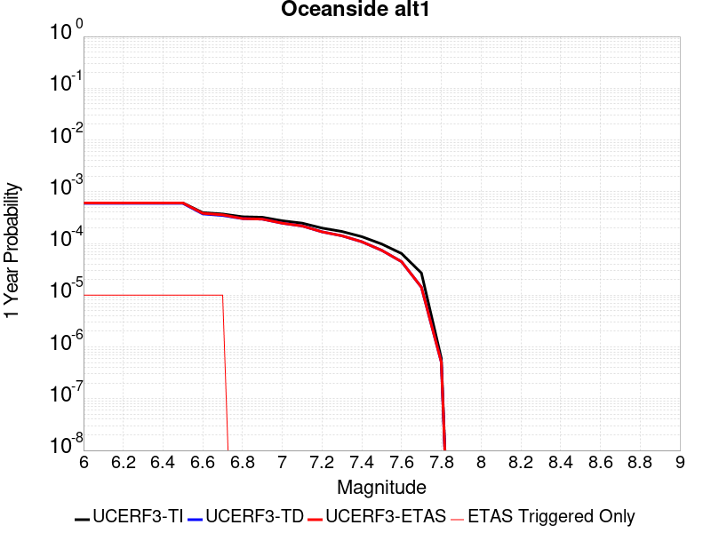 | 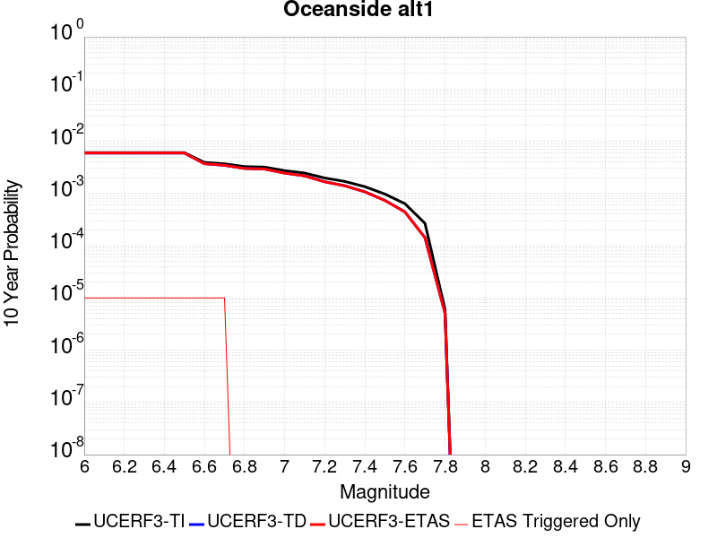 |

| Magnitude | 1 wk TI Prob | 1 wk TD Prob | 1 wk ETAS Prob | 1 wk ETAS/TD Gain | 1 wk ETAS Triggered Only | 1 mo TI Prob | 1 mo TD Prob | 1 mo ETAS Prob | 1 mo ETAS/TD Gain | 1 mo ETAS Triggered Only | 1 yr TI Prob | 1 yr TD Prob | 1 yr ETAS Prob | 1 yr ETAS/TD Gain | 1 yr ETAS Triggered Only | 10 yr TI Prob | 10 yr TD Prob | 10 yr ETAS Prob | 10 yr ETAS/TD Gain | 10 yr ETAS Triggered Only |
|-----|-----|-----|-----|-----|-----|-----|-----|-----|-----|-----|-----|-----|-----|-----|-----|-----|-----|-----|-----|-----|
| 6.0 | 1.1617542E-5 | 1.1423561E-5 | 1.1423561E-5 | 1.0 | 0.0 | 4.9788516E-5 | 4.895729E-5 | 4.895729E-5 | 1.0 | 0.0 | 6.060066E-4 | 5.959081E-4 | 6.059021E-4 | 1.0167711 | 1.0E-5 | 0.0060435664 | 0.0059446995 | 0.0059546405 | 1.0016721 | 1.0E-5 |
| 6.1 | 1.1617542E-5 | 1.1423561E-5 | 1.1423561E-5 | 1.0 | 0.0 | 4.9788516E-5 | 4.895729E-5 | 4.895729E-5 | 1.0 | 0.0 | 6.060066E-4 | 5.959081E-4 | 6.059021E-4 | 1.0167711 | 1.0E-5 | 0.0060435664 | 0.0059446995 | 0.0059546405 | 1.0016721 | 1.0E-5 |
| 6.2 | 1.1617542E-5 | 1.1423561E-5 | 1.1423561E-5 | 1.0 | 0.0 | 4.9788516E-5 | 4.895729E-5 | 4.895729E-5 | 1.0 | 0.0 | 6.060066E-4 | 5.959081E-4 | 6.059021E-4 | 1.0167711 | 1.0E-5 | 0.0060435664 | 0.0059446995 | 0.0059546405 | 1.0016721 | 1.0E-5 |
| 6.3 | 1.1617542E-5 | 1.1423561E-5 | 1.1423561E-5 | 1.0 | 0.0 | 4.9788516E-5 | 4.895729E-5 | 4.895729E-5 | 1.0 | 0.0 | 6.060066E-4 | 5.959081E-4 | 6.059021E-4 | 1.0167711 | 1.0E-5 | 0.0060435664 | 0.0059446995 | 0.0059546405 | 1.0016721 | 1.0E-5 |
| 6.4 | 1.1617542E-5 | 1.1423561E-5 | 1.1423561E-5 | 1.0 | 0.0 | 4.9788516E-5 | 4.895729E-5 | 4.895729E-5 | 1.0 | 0.0 | 6.060066E-4 | 5.959081E-4 | 6.059021E-4 | 1.0167711 | 1.0E-5 | 0.0060435664 | 0.0059446995 | 0.0059546405 | 1.0016721 | 1.0E-5 |
| 6.5 | 1.1617542E-5 | 1.1423561E-5 | 1.1423561E-5 | 1.0 | 0.0 | 4.9788516E-5 | 4.895729E-5 | 4.895729E-5 | 1.0 | 0.0 | 6.060066E-4 | 5.959081E-4 | 6.059021E-4 | 1.0167711 | 1.0E-5 | 0.0060435664 | 0.0059446995 | 0.0059546405 | 1.0016721 | 1.0E-5 |
| 6.6 | 7.561768E-6 | 7.133651E-6 | 7.133651E-6 | 1.0 | 0.0 | 3.2407173E-5 | 3.057244E-5 | 3.057244E-5 | 1.0 | 0.0 | 3.9448592E-4 | 3.7215694E-4 | 3.821532E-4 | 1.0268604 | 1.0E-5 | 0.0039378637 | 0.0037154485 | 0.0037254114 | 1.0026815 | 1.0E-5 |
| 6.7 | 7.1042605E-6 | 6.655718E-6 | 6.655718E-6 | 1.0 | 0.0 | 3.0446476E-5 | 2.85242E-5 | 2.85242E-5 | 1.0 | 0.0 | 3.706228E-4 | 3.472276E-4 | 3.572241E-4 | 1.0287895 | 1.0E-5 | 0.0037000529 | 0.003466934 | 0.0034768994 | 1.0028744 | 1.0E-5 |
| 6.8 | 6.285554E-6 | 5.799733E-6 | 5.799733E-6 | 1.0 | 0.0 | 2.693781E-5 | 2.4855766E-5 | 2.4855766E-5 | 1.0 | 0.0 | 3.2791847E-4 | 3.0257748E-4 | 3.0257748E-4 | 1.0 | 0.0 | 0.0032743502 | 0.0030217124 | 0.0030217124 | 1.0 | 0.0 |
| 6.9 | 6.148883E-6 | 5.656571E-6 | 5.656571E-6 | 1.0 | 0.0 | 2.635209E-5 | 2.4242225E-5 | 2.4242225E-5 | 1.0 | 0.0 | 3.2078946E-4 | 2.9510967E-4 | 2.9510967E-4 | 1.0 | 0.0 | 0.003203268 | 0.0029472348 | 0.0029472348 | 1.0 | 0.0 |
| 7.0 | 5.253857E-6 | 4.722425E-6 | 4.722425E-6 | 1.0 | 0.0 | 2.2516335E-5 | 2.023881E-5 | 2.023881E-5 | 1.0 | 0.0 | 2.7410188E-4 | 2.4637993E-4 | 2.4637993E-4 | 1.0 | 0.0 | 0.0027376404 | 0.0024610993 | 0.0024610993 | 1.0 | 0.0 |
| 7.1 | 4.730754E-6 | 4.1785274E-6 | 4.1785274E-6 | 1.0 | 0.0 | 2.0274503E-5 | 1.7907852E-5 | 1.7907852E-5 | 1.0 | 0.0 | 2.468141E-4 | 2.1800655E-4 | 2.1800655E-4 | 1.0 | 0.0 | 0.0024654015 | 0.0021779535 | 0.0021779535 | 1.0 | 0.0 |
| 7.2 | 3.7998386E-6 | 3.2140354E-6 | 3.2140354E-6 | 1.0 | 0.0 | 1.6284921E-5 | 1.37743655E-5 | 1.37743655E-5 | 1.0 | 0.0 | 1.9825088E-4 | 1.6769012E-4 | 1.6769012E-4 | 1.0 | 0.0 | 0.001980741 | 0.001675648 | 0.001675648 | 1.0 | 0.0 |
| 7.3 | 3.2656465E-6 | 2.6983823E-6 | 2.6983823E-6 | 1.0 | 0.0 | 1.3995553E-5 | 1.1564445E-5 | 1.1564445E-5 | 1.0 | 0.0 | 1.7038253E-4 | 1.4078814E-4 | 1.4078814E-4 | 1.0 | 0.0 | 0.0017025196 | 0.0014070006 | 0.0014070006 | 1.0 | 0.0 |
| 7.4 | 2.593703E-6 | 2.0680366E-6 | 2.0680366E-6 | 1.0 | 0.0 | 1.1115822E-5 | 8.862984E-6 | 8.862984E-6 | 1.0 | 0.0 | 1.3532673E-4 | 1.0790158E-4 | 1.0790158E-4 | 1.0 | 0.0 | 0.0013524436 | 0.0010785008 | 0.0010785008 | 1.0 | 0.0 |
| 7.5 | 1.8715585E-6 | 1.4137331E-6 | 1.4137331E-6 | 1.0 | 0.0 | 8.020941E-6 | 6.0588427E-6 | 6.0588427E-6 | 1.0 | 0.0 | 9.7650576E-5 | 7.376397E-5 | 7.376397E-5 | 1.0 | 0.0 | 9.7607676E-4 | 7.3740096E-4 | 7.3740096E-4 | 1.0 | 0.0 |
| 7.6 | 1.2246786E-6 | 8.526984E-7 | 8.526984E-7 | 1.0 | 0.0 | 5.248612E-6 | 3.6544168E-6 | 3.6544168E-6 | 1.0 | 0.0 | 6.389998E-5 | 4.4491662E-5 | 4.4491662E-5 | 1.0 | 0.0 | 6.3881604E-4 | 4.4483205E-4 | 4.4483205E-4 | 1.0 | 0.0 |
| 7.7 | 5.140719E-7 | 2.7346863E-7 | 2.7346863E-7 | 1.0 | 0.0 | 2.2031636E-6 | 1.172008E-6 | 1.172008E-6 | 1.0 | 0.0 | 2.6823185E-5 | 1.4269117E-5 | 1.4269117E-5 | 1.0 | 0.0 | 2.6819948E-4 | 1.4268335E-4 | 1.4268335E-4 | 1.0 | 0.0 |
| 7.8 | 1.16056995E-8 | 9.782997E-9 | 9.782997E-9 | 1.0 | 0.0 | 4.9738713E-8 | 4.1927127E-8 | 4.1927127E-8 | 1.0 | 0.0 | 6.0556863E-7 | 5.1046277E-7 | 5.1046277E-7 | 1.0 | 0.0 | 6.05567E-6 | 5.1046277E-6 | 5.1046277E-6 | 1.0 | 0.0 |

## Goose Lake 2011 CFM
*[(top)](#table-of-contents)*

| 1 Week | 1 Month | 1 Year | 10 Year |
|-----|-----|-----|-----|
|  |  |  |  |

| Magnitude | 1 wk TI Prob | 1 wk TD Prob | 1 wk ETAS Prob | 1 wk ETAS/TD Gain | 1 wk ETAS Triggered Only | 1 mo TI Prob | 1 mo TD Prob | 1 mo ETAS Prob | 1 mo ETAS/TD Gain | 1 mo ETAS Triggered Only | 1 yr TI Prob | 1 yr TD Prob | 1 yr ETAS Prob | 1 yr ETAS/TD Gain | 1 yr ETAS Triggered Only | 10 yr TI Prob | 10 yr TD Prob | 10 yr ETAS Prob | 10 yr ETAS/TD Gain | 10 yr ETAS Triggered Only |
|-----|-----|-----|-----|-----|-----|-----|-----|-----|-----|-----|-----|-----|-----|-----|-----|-----|-----|-----|-----|-----|
| 6.0 | 3.780968E-6 | 3.823028E-6 | 3.823028E-6 | 1.0 | 0.0 | 1.6204049E-5 | 1.6384309E-5 | 1.6384309E-5 | 1.0 | 0.0 | 1.9726643E-4 | 1.9946179E-4 | 1.9946179E-4 | 1.0 | 0.0 | 0.001970914 | 0.001992936 | 0.002002916 | 1.0050077 | 1.0E-5 |
| 6.1 | 2.2035124E-6 | 2.2298047E-6 | 2.2298047E-6 | 1.0 | 0.0 | 9.443591E-6 | 9.556272E-6 | 9.556272E-6 | 1.0 | 0.0 | 1.1496965E-4 | 1.1634159E-4 | 1.1634159E-4 | 1.0 | 0.0 | 0.0011491019 | 0.001162825 | 0.001162825 | 1.0 | 0.0 |
| 6.2 | 1.5624689E-6 | 1.5826951E-6 | 1.5826951E-6 | 1.0 | 0.0 | 6.6962784E-6 | 6.7829615E-6 | 6.7829615E-6 | 1.0 | 0.0 | 8.152414E-5 | 8.257947E-5 | 8.257947E-5 | 1.0 | 0.0 | 8.1494235E-4 | 8.2549226E-4 | 8.2549226E-4 | 1.0 | 0.0 |
| 6.3 | 1.5624689E-6 | 1.5826951E-6 | 1.5826951E-6 | 1.0 | 0.0 | 6.6962784E-6 | 6.7829615E-6 | 6.7829615E-6 | 1.0 | 0.0 | 8.152414E-5 | 8.257947E-5 | 8.257947E-5 | 1.0 | 0.0 | 8.1494235E-4 | 8.2549226E-4 | 8.2549226E-4 | 1.0 | 0.0 |
| 6.4 | 1.256464E-6 | 1.2738719E-6 | 1.2738719E-6 | 1.0 | 0.0 | 5.3848344E-6 | 5.4594398E-6 | 5.4594398E-6 | 1.0 | 0.0 | 6.5558386E-5 | 6.6466666E-5 | 6.6466666E-5 | 1.0 | 0.0 | 6.553905E-4 | 6.644699E-4 | 6.644699E-4 | 1.0 | 0.0 |
| 6.5 | 1.0910911E-6 | 1.1069426E-6 | 1.1069426E-6 | 1.0 | 0.0 | 4.6760965E-6 | 4.744031E-6 | 4.744031E-6 | 1.0 | 0.0 | 5.692999E-5 | 5.7757057E-5 | 5.7757057E-5 | 1.0 | 0.0 | 5.6915404E-4 | 5.7742174E-4 | 5.7742174E-4 | 1.0 | 0.0 |
| 6.6 | 9.546601E-7 | 9.691265E-7 | 9.691265E-7 | 1.0 | 0.0 | 4.091394E-6 | 4.1533926E-6 | 4.1533926E-6 | 1.0 | 0.0 | 4.9811584E-5 | 5.0566392E-5 | 5.0566392E-5 | 1.0 | 0.0 | 4.980042E-4 | 5.055498E-4 | 5.055498E-4 | 1.0 | 0.0 |
| 6.7 | 7.790316E-7 | 7.9159804E-7 | 7.9159804E-7 | 1.0 | 0.0 | 3.3387028E-6 | 3.3925587E-6 | 3.3925587E-6 | 1.0 | 0.0 | 4.0647945E-5 | 4.1303625E-5 | 4.1303625E-5 | 1.0 | 0.0 | 4.0640513E-4 | 4.1296007E-4 | 4.1296007E-4 | 1.0 | 0.0 |
| 6.8 | 6.3714384E-7 | 6.478754E-7 | 6.478754E-7 | 1.0 | 0.0 | 2.7306137E-6 | 2.776606E-6 | 2.776606E-6 | 1.0 | 0.0 | 3.3244716E-5 | 3.380466E-5 | 3.380466E-5 | 1.0 | 0.0 | 3.323974E-4 | 3.3799565E-4 | 3.3799565E-4 | 1.0 | 0.0 |
| 6.9 | 4.92586E-7 | 5.0139266E-7 | 5.0139266E-7 | 1.0 | 0.0 | 2.1110811E-6 | 2.148824E-6 | 2.148824E-6 | 1.0 | 0.0 | 2.5702111E-5 | 2.6161622E-5 | 2.6161622E-5 | 1.0 | 0.0 | 2.569914E-4 | 2.6158578E-4 | 2.6158578E-4 | 1.0 | 0.0 |
| 7.0 | 3.130245E-7 | 3.1903622E-7 | 3.1903622E-7 | 1.0 | 0.0 | 1.3415328E-6 | 1.3672974E-6 | 1.3672974E-6 | 1.0 | 0.0 | 1.6333039E-5 | 1.664672E-5 | 1.664672E-5 | 1.0 | 0.0 | 1.6331839E-4 | 1.6645493E-4 | 1.6645493E-4 | 1.0 | 0.0 |
| 7.1 | 1.7680084E-7 | 1.8023968E-7 | 1.8023968E-7 | 1.0 | 0.0 | 7.5771766E-7 | 7.7245556E-7 | 7.7245556E-7 | 1.0 | 0.0 | 9.225173E-6 | 9.404607E-6 | 9.404607E-6 | 1.0 | 0.0 | 9.22479E-5 | 9.4042196E-5 | 9.4042196E-5 | 1.0 | 0.0 |
| 7.2 | 4.8641045E-8 | 4.9402168E-8 | 4.9402168E-8 | 1.0 | 0.0 | 2.084616E-7 | 2.1172356E-7 | 2.1172356E-7 | 1.0 | 0.0 | 2.538017E-6 | 2.5777315E-6 | 2.5777315E-6 | 1.0 | 0.0 | 2.537988E-5 | 2.5777028E-5 | 2.5777028E-5 | 1.0 | 0.0 |
| 7.3 | 5.3911844E-9 | 5.4758256E-9 | 5.4758256E-9 | 1.0 | 0.0 | 2.3105075E-8 | 2.3467823E-8 | 2.3467823E-8 | 1.0 | 0.0 | 2.8130427E-7 | 2.8572074E-7 | 2.8572074E-7 | 1.0 | 0.0 | 2.8130391E-6 | 2.8572053E-6 | 2.8572053E-6 | 1.0 | 0.0 |

## Ventura-Pitas Point
*[(top)](#table-of-contents)*

| 1 Week | 1 Month | 1 Year | 10 Year |
|-----|-----|-----|-----|
|  |  |  |  |

| Magnitude | 1 wk TI Prob | 1 wk TD Prob | 1 wk ETAS Prob | 1 wk ETAS/TD Gain | 1 wk ETAS Triggered Only | 1 mo TI Prob | 1 mo TD Prob | 1 mo ETAS Prob | 1 mo ETAS/TD Gain | 1 mo ETAS Triggered Only | 1 yr TI Prob | 1 yr TD Prob | 1 yr ETAS Prob | 1 yr ETAS/TD Gain | 1 yr ETAS Triggered Only | 10 yr TI Prob | 10 yr TD Prob | 10 yr ETAS Prob | 10 yr ETAS/TD Gain | 10 yr ETAS Triggered Only |
|-----|-----|-----|-----|-----|-----|-----|-----|-----|-----|-----|-----|-----|-----|-----|-----|-----|-----|-----|-----|-----|
| 6.0 | 3.3179622E-5 | 3.37358E-5 | 3.37358E-5 | 1.0 | 0.0 | 1.4219063E-4 | 1.4457543E-4 | 1.4457543E-4 | 1.0 | 0.0 | 0.0017297962 | 0.0017590416 | 0.0017590416 | 1.0 | 0.0 | 0.017163932 | 0.01747688 | 0.017486706 | 1.0005622 | 1.0E-5 |
| 6.1 | 3.3179622E-5 | 3.37358E-5 | 3.37358E-5 | 1.0 | 0.0 | 1.4219063E-4 | 1.4457543E-4 | 1.4457543E-4 | 1.0 | 0.0 | 0.0017297962 | 0.0017590416 | 0.0017590416 | 1.0 | 0.0 | 0.017163932 | 0.01747688 | 0.017486706 | 1.0005622 | 1.0E-5 |
| 6.2 | 3.3179622E-5 | 3.37358E-5 | 3.37358E-5 | 1.0 | 0.0 | 1.4219063E-4 | 1.4457543E-4 | 1.4457543E-4 | 1.0 | 0.0 | 0.0017297962 | 0.0017590416 | 0.0017590416 | 1.0 | 0.0 | 0.017163932 | 0.01747688 | 0.017486706 | 1.0005622 | 1.0E-5 |
| 6.3 | 3.3179622E-5 | 3.37358E-5 | 3.37358E-5 | 1.0 | 0.0 | 1.4219063E-4 | 1.4457543E-4 | 1.4457543E-4 | 1.0 | 0.0 | 0.0017297962 | 0.0017590416 | 0.0017590416 | 1.0 | 0.0 | 0.017163932 | 0.01747688 | 0.017486706 | 1.0005622 | 1.0E-5 |
| 6.4 | 1.8754668E-5 | 1.7019853E-5 | 1.7019853E-5 | 1.0 | 0.0 | 8.037467E-5 | 7.294031E-5 | 7.294031E-5 | 1.0 | 0.0 | 9.781223E-4 | 8.877096E-4 | 8.877096E-4 | 1.0 | 0.0 | 0.009738282 | 0.008844146 | 0.008844146 | 1.0 | 0.0 |
| 6.5 | 1.8754668E-5 | 1.7019853E-5 | 1.7019853E-5 | 1.0 | 0.0 | 8.037467E-5 | 7.294031E-5 | 7.294031E-5 | 1.0 | 0.0 | 9.781223E-4 | 8.877096E-4 | 8.877096E-4 | 1.0 | 0.0 | 0.009738282 | 0.008844146 | 0.008844146 | 1.0 | 0.0 |
| 6.6 | 1.4361558E-5 | 1.2122441E-5 | 1.2122441E-5 | 1.0 | 0.0 | 6.154808E-5 | 5.19523E-5 | 5.19523E-5 | 1.0 | 0.0 | 7.490902E-4 | 6.32338E-4 | 6.32338E-4 | 1.0 | 0.0 | 0.0074657016 | 0.0063058166 | 0.0063058166 | 1.0 | 0.0 |
| 6.7 | 1.4361558E-5 | 1.2122441E-5 | 1.2122441E-5 | 1.0 | 0.0 | 6.154808E-5 | 5.19523E-5 | 5.19523E-5 | 1.0 | 0.0 | 7.490902E-4 | 6.32338E-4 | 6.32338E-4 | 1.0 | 0.0 | 0.0074657016 | 0.0063058166 | 0.0063058166 | 1.0 | 0.0 |
| 6.8 | 1.3663846E-5 | 1.1344573E-5 | 1.1344573E-5 | 1.0 | 0.0 | 5.8558027E-5 | 4.8618702E-5 | 4.8618702E-5 | 1.0 | 0.0 | 7.127108E-4 | 5.917739E-4 | 5.917739E-4 | 1.0 | 0.0 | 0.007104293 | 0.0059023695 | 0.0059023695 | 1.0 | 0.0 |
| 6.9 | 1.3644157E-5 | 1.1322673E-5 | 1.1322673E-5 | 1.0 | 0.0 | 5.8473648E-5 | 4.852485E-5 | 4.852485E-5 | 1.0 | 0.0 | 7.116841E-4 | 5.9063185E-4 | 5.9063185E-4 | 1.0 | 0.0 | 0.007094092 | 0.0058910097 | 0.0058910097 | 1.0 | 0.0 |
| 7.0 | 1.3568845E-5 | 1.12422385E-5 | 1.12422385E-5 | 1.0 | 0.0 | 5.8150898E-5 | 4.8180143E-5 | 4.8180143E-5 | 1.0 | 0.0 | 7.077572E-4 | 5.864373E-4 | 5.864373E-4 | 1.0 | 0.0 | 0.007055073 | 0.0058492855 | 0.0058492855 | 1.0 | 0.0 |
| 7.1 | 1.306572E-5 | 1.072068E-5 | 1.072068E-5 | 1.0 | 0.0 | 5.599474E-5 | 4.5944973E-5 | 4.5944973E-5 | 1.0 | 0.0 | 6.815227E-4 | 5.5923837E-4 | 5.5923837E-4 | 1.0 | 0.0 | 0.0067943637 | 0.005578688 | 0.005578688 | 1.0 | 0.0 |
| 7.2 | 1.232604E-5 | 9.9952695E-6 | 9.9952695E-6 | 1.0 | 0.0 | 5.2824813E-5 | 4.2836175E-5 | 4.2836175E-5 | 1.0 | 0.0 | 6.429523E-4 | 5.214074E-4 | 5.214074E-4 | 1.0 | 0.0 | 0.0064109527 | 0.0052022054 | 0.0052022054 | 1.0 | 0.0 |
| 7.3 | 1.0917261E-5 | 8.843945E-6 | 8.843945E-6 | 1.0 | 0.0 | 4.678742E-5 | 3.790208E-5 | 3.790208E-5 | 1.0 | 0.0 | 5.69488E-4 | 4.6136163E-4 | 4.6136163E-4 | 1.0 | 0.0 | 0.0056803077 | 0.0046043773 | 0.0046043773 | 1.0 | 0.0 |
| 7.4 | 1.039959E-5 | 8.423664E-6 | 8.423664E-6 | 1.0 | 0.0 | 4.456891E-5 | 3.6100926E-5 | 3.6100926E-5 | 1.0 | 0.0 | 5.424914E-4 | 4.3944168E-4 | 4.3944168E-4 | 1.0 | 0.0 | 0.0054116896 | 0.004386062 | 0.004386062 | 1.0 | 0.0 |
| 7.5 | 9.015877E-6 | 7.297624E-6 | 7.297624E-6 | 1.0 | 0.0 | 3.86389E-5 | 3.1275165E-5 | 3.1275165E-5 | 1.0 | 0.0 | 4.7032707E-4 | 3.8071E-4 | 3.8071E-4 | 1.0 | 0.0 | 0.004693329 | 0.0038008976 | 0.0038008976 | 1.0 | 0.0 |
| 7.6 | 4.900162E-6 | 3.874157E-6 | 3.874157E-6 | 1.0 | 0.0 | 2.1000526E-5 | 1.6603424E-5 | 1.6603424E-5 | 1.0 | 0.0 | 2.556514E-4 | 2.0212808E-4 | 2.0212808E-4 | 1.0 | 0.0 | 0.0025535747 | 0.002019456 | 0.002019456 | 1.0 | 0.0 |
| 7.7 | 3.8850626E-6 | 3.1267878E-6 | 3.1267878E-6 | 1.0 | 0.0 | 1.6650163E-5 | 1.3400451E-5 | 1.3400451E-5 | 1.0 | 0.0 | 2.0269687E-4 | 1.6313836E-4 | 1.6313836E-4 | 1.0 | 0.0 | 0.002025121 | 0.0016301954 | 0.0016301954 | 1.0 | 0.0 |
| 7.8 | 2.4654719E-6 | 2.0299206E-6 | 2.0299206E-6 | 1.0 | 0.0 | 1.0566265E-5 | 8.6996315E-6 | 8.6996315E-6 | 1.0 | 0.0 | 1.2863669E-4 | 1.05912906E-4 | 1.05912906E-4 | 1.0 | 0.0 | 0.0012856225 | 0.001058629 | 0.001058629 | 1.0 | 0.0 |
| 7.9 | 4.095894E-7 | 3.2765396E-7 | 3.2765396E-7 | 1.0 | 0.0 | 1.7553821E-6 | 1.4042306E-6 | 1.4042306E-6 | 1.0 | 0.0 | 2.1371567E-5 | 1.7096376E-5 | 1.7096376E-5 | 1.0 | 0.0 | 2.1369511E-4 | 1.7095092E-4 | 1.7095092E-4 | 1.0 | 0.0 |
| 8.0 | 7.791402E-9 | 5.6836416E-9 | 5.6836416E-9 | 1.0 | 0.0 | 3.3391725E-8 | 2.4358464E-8 | 2.4358464E-8 | 1.0 | 0.0 | 4.0654416E-7 | 2.9656428E-7 | 2.9656428E-7 | 1.0 | 0.0 | 4.065434E-6 | 2.9656408E-6 | 2.9656408E-6 | 1.0 | 0.0 |

## Great Valley 10 (Panoche)
*[(top)](#table-of-contents)*

| 1 Week | 1 Month | 1 Year | 10 Year |
|-----|-----|-----|-----|
|  |  |  |  |

| Magnitude | 1 wk TI Prob | 1 wk TD Prob | 1 wk ETAS Prob | 1 wk ETAS/TD Gain | 1 wk ETAS Triggered Only | 1 mo TI Prob | 1 mo TD Prob | 1 mo ETAS Prob | 1 mo ETAS/TD Gain | 1 mo ETAS Triggered Only | 1 yr TI Prob | 1 yr TD Prob | 1 yr ETAS Prob | 1 yr ETAS/TD Gain | 1 yr ETAS Triggered Only | 10 yr TI Prob | 10 yr TD Prob | 10 yr ETAS Prob | 10 yr ETAS/TD Gain | 10 yr ETAS Triggered Only |
|-----|-----|-----|-----|-----|-----|-----|-----|-----|-----|-----|-----|-----|-----|-----|-----|-----|-----|-----|-----|-----|
| 6.0 | 1.6014626E-5 | 1.657571E-5 | 1.657571E-5 | 1.0 | 0.0 | 6.863231E-5 | 7.1036855E-5 | 7.1036855E-5 | 1.0 | 0.0 | 8.35278E-4 | 8.6453604E-4 | 8.7452744E-4 | 1.0115569 | 1.0E-5 | 0.008321454 | 0.008612341 | 0.008622254 | 1.0011511 | 1.0E-5 |
| 6.1 | 1.6014626E-5 | 1.657571E-5 | 1.657571E-5 | 1.0 | 0.0 | 6.863231E-5 | 7.1036855E-5 | 7.1036855E-5 | 1.0 | 0.0 | 8.35278E-4 | 8.6453604E-4 | 8.7452744E-4 | 1.0115569 | 1.0E-5 | 0.008321454 | 0.008612341 | 0.008622254 | 1.0011511 | 1.0E-5 |
| 6.2 | 1.56782E-5 | 1.6198752E-5 | 1.6198752E-5 | 1.0 | 0.0 | 6.719056E-5 | 6.94214E-5 | 6.94214E-5 | 1.0 | 0.0 | 8.17738E-4 | 8.4488327E-4 | 8.5487484E-4 | 1.0118259 | 1.0E-5 | 0.008147354 | 0.008417313 | 0.008427229 | 1.001178 | 1.0E-5 |
| 6.3 | 1.5263338E-5 | 1.572381E-5 | 1.572381E-5 | 1.0 | 0.0 | 6.541267E-5 | 6.738605E-5 | 6.738605E-5 | 1.0 | 0.0 | 7.961082E-4 | 8.201217E-4 | 8.301135E-4 | 1.0121833 | 1.0E-5 | 0.007932622 | 0.008171538 | 0.0081814565 | 1.0012138 | 1.0E-5 |
| 6.4 | 1.4720723E-5 | 1.5099659E-5 | 1.5099659E-5 | 1.0 | 0.0 | 6.308728E-5 | 6.4711254E-5 | 6.4711254E-5 | 1.0 | 0.0 | 7.67817E-4 | 7.8758E-4 | 7.975721E-4 | 1.0126871 | 1.0E-5 | 0.007651695 | 0.007848457 | 0.007858379 | 1.0012641 | 1.0E-5 |
| 6.5 | 1.408264E-5 | 1.4356237E-5 | 1.4356237E-5 | 1.0 | 0.0 | 6.0352773E-5 | 6.152531E-5 | 6.152531E-5 | 1.0 | 0.0 | 7.3454727E-4 | 7.488184E-4 | 7.588109E-4 | 1.0133444 | 1.0E-5 | 0.0073212404 | 0.0074635018 | 0.0074734273 | 1.0013299 | 1.0E-5 |
| 6.6 | 1.3197086E-5 | 1.3322132E-5 | 1.3322132E-5 | 1.0 | 0.0 | 5.6557717E-5 | 5.709363E-5 | 5.709363E-5 | 1.0 | 0.0 | 6.8837265E-4 | 6.948983E-4 | 7.048914E-4 | 1.0143806 | 1.0E-5 | 0.006862442 | 0.0069277873 | 0.006937718 | 1.0014335 | 1.0E-5 |
| 6.7 | 1.017583E-5 | 9.745547E-6 | 9.745547E-6 | 1.0 | 0.0 | 4.360997E-5 | 4.1765972E-5 | 4.1765972E-5 | 1.0 | 0.0 | 5.30822E-4 | 5.083845E-4 | 5.183794E-4 | 1.0196601 | 1.0E-5 | 0.0052955584 | 0.005072467 | 0.0050824163 | 1.0019615 | 1.0E-5 |
| 6.8 | 8.557912E-6 | 7.872833E-6 | 7.872833E-6 | 1.0 | 0.0 | 3.667625E-5 | 3.3740285E-5 | 3.3740285E-5 | 1.0 | 0.0 | 4.4644187E-4 | 4.107126E-4 | 4.2070847E-4 | 1.0243379 | 1.0E-5 | 0.0044554602 | 0.004099742 | 0.004109701 | 1.0024291 | 1.0E-5 |
| 6.9 | 6.14664E-6 | 5.09214E-6 | 5.09214E-6 | 1.0 | 0.0 | 2.6342475E-5 | 2.1823282E-5 | 2.1823282E-5 | 1.0 | 0.0 | 3.2067244E-4 | 2.6566745E-4 | 2.756648E-4 | 1.037631 | 1.0E-5 | 0.003202101 | 0.002653637 | 0.0026636103 | 1.0037584 | 1.0E-5 |
| 7.0 | 3.2310581E-6 | 1.6951159E-6 | 1.6951159E-6 | 1.0 | 0.0 | 1.3847319E-5 | 7.2647626E-6 | 7.2647626E-6 | 1.0 | 0.0 | 1.6857806E-4 | 8.844499E-5 | 9.844411E-5 | 1.1130546 | 1.0E-5 | 0.0016845023 | 8.8410726E-4 | 8.940984E-4 | 1.0113008 | 1.0E-5 |
| 7.1 | 2.544492E-6 | 9.1887256E-7 | 9.1887256E-7 | 1.0 | 0.0 | 1.090492E-5 | 3.9380197E-6 | 3.9380197E-6 | 1.0 | 0.0 | 1.327593E-4 | 4.7944384E-5 | 5.7943904E-5 | 1.208565 | 1.0E-5 | 0.0013268003 | 4.7934518E-4 | 4.893404E-4 | 1.0208519 | 1.0E-5 |
| 7.2 | 2.4479045E-6 | 8.841117E-7 | 8.841117E-7 | 1.0 | 0.0 | 1.0490977E-5 | 3.7890452E-6 | 3.7890452E-6 | 1.0 | 0.0 | 1.2772017E-4 | 4.6130695E-5 | 5.6130233E-5 | 1.2167654 | 1.0E-5 | 0.0012764678 | 4.6121594E-4 | 4.7121133E-4 | 1.0216718 | 1.0E-5 |
| 7.3 | 2.0559578E-6 | 7.892632E-7 | 7.892632E-7 | 1.0 | 0.0 | 8.811218E-6 | 3.3825524E-6 | 3.3825524E-6 | 1.0 | 0.0 | 1.072713E-4 | 4.1181847E-5 | 4.1181847E-5 | 1.0 | 0.0 | 0.0010721954 | 4.117468E-4 | 4.117468E-4 | 1.0 | 0.0 |
| 7.4 | 1.727687E-6 | 7.3876646E-7 | 7.3876646E-7 | 1.0 | 0.0 | 7.404352E-6 | 3.1661384E-6 | 3.1661384E-6 | 1.0 | 0.0 | 9.0144255E-5 | 3.85471E-5 | 3.85471E-5 | 1.0 | 0.0 | 9.0107694E-4 | 3.8540873E-4 | 3.8540873E-4 | 1.0 | 0.0 |
| 7.5 | 1.5002679E-6 | 6.5460756E-7 | 6.5460756E-7 | 1.0 | 0.0 | 6.4297037E-6 | 2.805458E-6 | 2.805458E-6 | 1.0 | 0.0 | 7.827883E-5 | 3.415596E-5 | 3.415596E-5 | 1.0 | 0.0 | 7.825126E-4 | 3.4151124E-4 | 3.4151124E-4 | 1.0 | 0.0 |

## San Gregorio (North) 2011 CFM
*[(top)](#table-of-contents)*

| 1 Week | 1 Month | 1 Year | 10 Year |
|-----|-----|-----|-----|
|  |  |  |  |

| Magnitude | 1 wk TI Prob | 1 wk TD Prob | 1 wk ETAS Prob | 1 wk ETAS/TD Gain | 1 wk ETAS Triggered Only | 1 mo TI Prob | 1 mo TD Prob | 1 mo ETAS Prob | 1 mo ETAS/TD Gain | 1 mo ETAS Triggered Only | 1 yr TI Prob | 1 yr TD Prob | 1 yr ETAS Prob | 1 yr ETAS/TD Gain | 1 yr ETAS Triggered Only | 10 yr TI Prob | 10 yr TD Prob | 10 yr ETAS Prob | 10 yr ETAS/TD Gain | 10 yr ETAS Triggered Only |
|-----|-----|-----|-----|-----|-----|-----|-----|-----|-----|-----|-----|-----|-----|-----|-----|-----|-----|-----|-----|-----|
| 6.0 | 5.0283932E-5 | 4.306001E-5 | 4.306001E-5 | 1.0 | 0.0 | 2.1548476E-4 | 1.845299E-4 | 1.9452805E-4 | 1.0541818 | 1.0E-5 | 0.0026203706 | 0.0022443503 | 0.002254328 | 1.0044457 | 1.0E-5 | 0.02589687 | 0.022297954 | 0.022307731 | 1.0004385 | 1.0E-5 |
| 6.1 | 5.0283932E-5 | 4.306001E-5 | 4.306001E-5 | 1.0 | 0.0 | 2.1548476E-4 | 1.845299E-4 | 1.9452805E-4 | 1.0541818 | 1.0E-5 | 0.0026203706 | 0.0022443503 | 0.002254328 | 1.0044457 | 1.0E-5 | 0.02589687 | 0.022297954 | 0.022307731 | 1.0004385 | 1.0E-5 |
| 6.2 | 4.2998647E-5 | 3.4443507E-5 | 3.4443507E-5 | 1.0 | 0.0 | 1.842669E-4 | 1.4760674E-4 | 1.5760526E-4 | 1.0677376 | 1.0E-5 | 0.0022411412 | 0.0017956431 | 0.0018056252 | 1.0055591 | 1.0E-5 | 0.022186736 | 0.01788679 | 0.017896611 | 1.0005491 | 1.0E-5 |
| 6.3 | 4.2998647E-5 | 3.4443507E-5 | 3.4443507E-5 | 1.0 | 0.0 | 1.842669E-4 | 1.4760674E-4 | 1.5760526E-4 | 1.0677376 | 1.0E-5 | 0.0022411412 | 0.0017956431 | 0.0018056252 | 1.0055591 | 1.0E-5 | 0.022186736 | 0.01788679 | 0.017896611 | 1.0005491 | 1.0E-5 |
| 6.4 | 4.1101295E-5 | 3.2328644E-5 | 3.2328644E-5 | 1.0 | 0.0 | 1.7613651E-4 | 1.3854404E-4 | 1.4854266E-4 | 1.0721692 | 1.0E-5 | 0.0021423528 | 0.001685482 | 0.0016954652 | 1.005923 | 1.0E-5 | 0.02121817 | 0.016802493 | 0.016812326 | 1.0005852 | 1.0E-5 |
| 6.5 | 4.1032585E-5 | 3.2246677E-5 | 3.2246677E-5 | 1.0 | 0.0 | 1.7584208E-4 | 1.381928E-4 | 1.4819141E-4 | 1.0723526 | 1.0E-5 | 0.0021387753 | 0.0016812122 | 0.0016911954 | 1.005938 | 1.0E-5 | 0.021183075 | 0.016760446 | 0.016770279 | 1.0005866 | 1.0E-5 |
| 6.6 | 4.011629E-5 | 3.126826E-5 | 3.126826E-5 | 1.0 | 0.0 | 1.7191563E-4 | 1.3400002E-4 | 1.4399868E-4 | 1.0746169 | 1.0E-5 | 0.0020910634 | 0.0016302431 | 0.0016402268 | 1.006124 | 1.0E-5 | 0.020714961 | 0.016258562 | 0.0162684 | 1.0006051 | 1.0E-5 |
| 6.7 | 3.8583938E-5 | 2.9455243E-5 | 2.9455243E-5 | 1.0 | 0.0 | 1.6534925E-4 | 1.2623073E-4 | 1.3622947E-4 | 1.07921 | 1.0E-5 | 0.0020112682 | 0.00153579 | 0.0015457746 | 1.0065013 | 1.0E-5 | 0.019931622 | 0.0153272385 | 0.015337085 | 1.0006424 | 1.0E-5 |
| 6.8 | 3.44341E-5 | 2.4452358E-5 | 2.4452358E-5 | 1.0 | 0.0 | 1.4756636E-4 | 1.0479167E-4 | 1.14790615E-4 | 1.0954174 | 1.0E-5 | 0.0017951399 | 0.0012751024 | 0.0012850895 | 1.0078325 | 1.0E-5 | 0.017807078 | 0.0127526 | 0.012762473 | 1.0007741 | 1.0E-5 |
| 6.9 | 3.221199E-5 | 2.1779444E-5 | 2.1779444E-5 | 1.0 | 0.0 | 1.3804408E-4 | 9.333718E-5 | 1.0333624E-4 | 1.1071285 | 1.0E-5 | 0.0016793909 | 0.001135796 | 0.0011457846 | 1.0087944 | 1.0E-5 | 0.01666756 | 0.011373482 | 0.011383369 | 1.0008693 | 1.0E-5 |
| 7.0 | 2.9186718E-5 | 1.8148163E-5 | 1.8148163E-5 | 1.0 | 0.0 | 1.2507994E-4 | 7.777555E-5 | 7.777555E-5 | 1.0 | 0.0 | 0.0015217843 | 9.4651035E-4 | 9.4651035E-4 | 1.0 | 0.0 | 0.015114053 | 0.0094977645 | 0.0094977645 | 1.0 | 0.0 |
| 7.1 | 2.6840138E-5 | 1.5285703E-5 | 1.5285703E-5 | 1.0 | 0.0 | 1.1502409E-4 | 6.5508524E-5 | 6.5508524E-5 | 1.0 | 0.0 | 0.0013995186 | 7.972764E-4 | 7.972764E-4 | 1.0 | 0.0 | 0.013907375 | 0.008016584 | 0.008016584 | 1.0 | 0.0 |
| 7.2 | 2.453002E-5 | 1.2607806E-5 | 1.2607806E-5 | 1.0 | 0.0 | 1.05124425E-4 | 5.4032334E-5 | 5.4032334E-5 | 1.0 | 0.0 | 0.0012791384 | 6.576457E-4 | 6.576457E-4 | 1.0 | 0.0 | 0.012718005 | 0.006628373 | 0.006628373 | 1.0 | 0.0 |
| 7.3 | 2.3330727E-5 | 1.1489774E-5 | 1.1489774E-5 | 1.0 | 0.0 | 9.9985E-5 | 4.924096E-5 | 4.924096E-5 | 1.0 | 0.0 | 0.0012166376 | 5.9934426E-4 | 5.9934426E-4 | 1.0 | 0.0 | 0.012099981 | 0.006047372 | 0.006047372 | 1.0 | 0.0 |
| 7.4 | 2.2136466E-5 | 1.0370048E-5 | 1.0370048E-5 | 1.0 | 0.0 | 9.486712E-5 | 4.4442306E-5 | 4.4442306E-5 | 1.0 | 0.0 | 0.0011543952 | 5.40951E-4 | 5.40951E-4 | 1.0 | 0.0 | 0.011484168 | 0.0054649427 | 0.0054649427 | 1.0 | 0.0 |
| 7.5 | 2.0994974E-5 | 9.428222E-6 | 9.428222E-6 | 1.0 | 0.0 | 8.997535E-5 | 4.040604E-5 | 4.040604E-5 | 1.0 | 0.0 | 0.0010948994 | 4.9183273E-4 | 4.9183273E-4 | 1.0 | 0.0 | 0.010895205 | 0.004974083 | 0.004974083 | 1.0 | 0.0 |
| 7.6 | 1.7091823E-5 | 6.8944946E-6 | 6.8944946E-6 | 1.0 | 0.0 | 7.3248615E-5 | 2.95475E-5 | 2.95475E-5 | 1.0 | 0.0 | 8.9143694E-4 | 3.5968152E-4 | 3.5968152E-4 | 1.0 | 0.0 | 0.008878695 | 0.0036488718 | 0.0036488718 | 1.0 | 0.0 |
| 7.7 | 1.2772179E-5 | 4.0212976E-6 | 4.0212976E-6 | 1.0 | 0.0 | 5.473676E-5 | 1.7234017E-5 | 1.7234017E-5 | 1.0 | 0.0 | 6.6621625E-4 | 2.0980398E-4 | 2.0980398E-4 | 1.0 | 0.0 | 0.006642225 | 0.002137152 | 0.002137152 | 1.0 | 0.0 |
| 7.8 | 7.041923E-6 | 1.9409326E-6 | 1.9409326E-6 | 1.0 | 0.0 | 3.017932E-5 | 8.318257E-6 | 8.318257E-6 | 1.0 | 0.0 | 3.6737128E-4 | 1.0127007E-4 | 1.0127007E-4 | 1.0 | 0.0 | 0.0036676454 | 0.0010380556 | 0.0010380556 | 1.0 | 0.0 |
| 7.9 | 2.946768E-6 | 1.0036017E-6 | 1.0036017E-6 | 1.0 | 0.0 | 1.2628945E-5 | 4.301143E-6 | 4.301143E-6 | 1.0 | 0.0 | 1.5374656E-4 | 5.2365154E-5 | 5.2365154E-5 | 1.0 | 0.0 | 0.0015364023 | 5.341041E-4 | 5.341041E-4 | 1.0 | 0.0 |
| 8.0 | 1.1433375E-6 | 5.1832274E-7 | 5.1832274E-7 | 1.0 | 0.0 | 4.9000087E-6 | 2.221381E-6 | 2.221381E-6 | 1.0 | 0.0 | 5.965597E-5 | 2.704498E-5 | 2.704498E-5 | 1.0 | 0.0 | 5.963996E-4 | 2.7406466E-4 | 2.7406466E-4 | 1.0 | 0.0 |
| 8.1 | 2.6675295E-7 | 1.6297024E-7 | 1.6297024E-7 | 1.0 | 0.0 | 1.1432264E-6 | 6.9844367E-7 | 6.9844367E-7 | 1.0 | 0.0 | 1.3918692E-5 | 8.503518E-6 | 8.503518E-6 | 1.0 | 0.0 | 1.391782E-4 | 8.64163E-5 | 8.64163E-5 | 1.0 | 0.0 |
| 8.2 | 1.2704569E-8 | 9.43797E-9 | 9.43797E-9 | 1.0 | 0.0 | 5.444815E-8 | 4.0448445E-8 | 4.0448445E-8 | 1.0 | 0.0 | 6.629061E-7 | 4.924597E-7 | 4.924597E-7 | 1.0 | 0.0 | 6.629041E-6 | 5.1149595E-6 | 5.1149595E-6 | 1.0 | 0.0 |

## San Andreas (Offshore) 2011 CFM
*[(top)](#table-of-contents)*

| 1 Week | 1 Month | 1 Year | 10 Year |
|-----|-----|-----|-----|
|  | 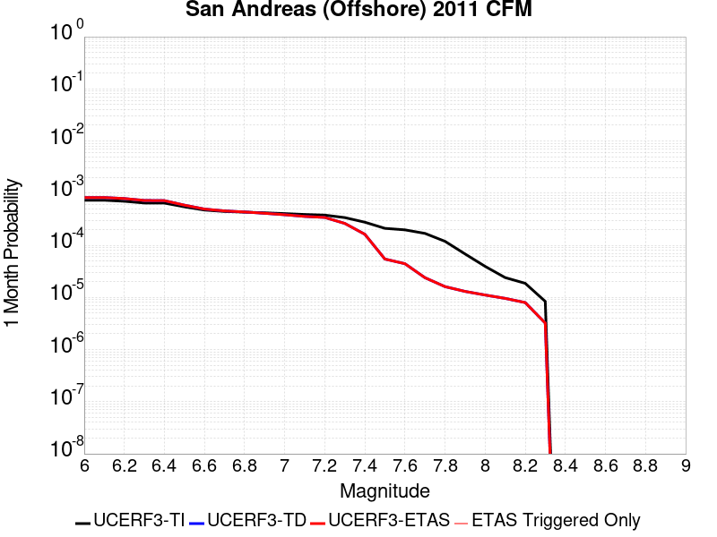 |  |  |

| Magnitude | 1 wk TI Prob | 1 wk TD Prob | 1 wk ETAS Prob | 1 wk ETAS/TD Gain | 1 wk ETAS Triggered Only | 1 mo TI Prob | 1 mo TD Prob | 1 mo ETAS Prob | 1 mo ETAS/TD Gain | 1 mo ETAS Triggered Only | 1 yr TI Prob | 1 yr TD Prob | 1 yr ETAS Prob | 1 yr ETAS/TD Gain | 1 yr ETAS Triggered Only | 10 yr TI Prob | 10 yr TD Prob | 10 yr ETAS Prob | 10 yr ETAS/TD Gain | 10 yr ETAS Triggered Only |
|-----|-----|-----|-----|-----|-----|-----|-----|-----|-----|-----|-----|-----|-----|-----|-----|-----|-----|-----|-----|-----|
| 6.0 | 1.7072787E-4 | 1.9230861E-4 | 1.9230861E-4 | 1.0 | 0.0 | 7.3148566E-4 | 8.239218E-4 | 8.239218E-4 | 1.0 | 0.0 | 0.008869528 | 0.009985624 | 0.009985624 | 1.0 | 0.0 | 0.085237645 | 0.09681897 | 0.096828 | 1.0000933 | 1.0E-5 |
| 6.1 | 1.7072787E-4 | 1.9230861E-4 | 1.9230861E-4 | 1.0 | 0.0 | 7.3148566E-4 | 8.239218E-4 | 8.239218E-4 | 1.0 | 0.0 | 0.008869528 | 0.009985624 | 0.009985624 | 1.0 | 0.0 | 0.085237645 | 0.09681897 | 0.096828 | 1.0000933 | 1.0E-5 |
| 6.2 | 1.6312556E-4 | 1.841247E-4 | 1.841247E-4 | 1.0 | 0.0 | 6.989222E-4 | 7.888696E-4 | 7.888696E-4 | 1.0 | 0.0 | 0.008476226 | 0.009562689 | 0.009562689 | 1.0 | 0.0 | 0.08160117 | 0.092837386 | 0.09284645 | 1.0000978 | 1.0E-5 |
| 6.3 | 1.5103363E-4 | 1.6884992E-4 | 1.6884992E-4 | 1.0 | 0.0 | 6.471264E-4 | 7.2344404E-4 | 7.2344404E-4 | 1.0 | 0.0 | 0.007850339 | 0.0087728035 | 0.0087728035 | 1.0 | 0.0 | 0.075787395 | 0.0854748 | 0.085483946 | 1.000107 | 1.0E-5 |
| 6.4 | 1.5047993E-4 | 1.6770918E-4 | 1.6770918E-4 | 1.0 | 0.0 | 6.4475456E-4 | 7.1855786E-4 | 7.1855786E-4 | 1.0 | 0.0 | 0.007821669 | 0.00871379 | 0.00871379 | 1.0 | 0.0 | 0.0755203 | 0.08495498 | 0.08496413 | 1.0001078 | 1.0E-5 |
| 6.5 | 1.2760791E-4 | 1.3738245E-4 | 1.3738245E-4 | 1.0 | 0.0 | 5.467764E-4 | 5.8865047E-4 | 5.8865047E-4 | 1.0 | 0.0 | 0.0066367025 | 0.007143542 | 0.007143542 | 1.0 | 0.0 | 0.064419635 | 0.0702599 | 0.0702599 | 1.0 | 0.0 |
| 6.6 | 1.1063525E-4 | 1.1559195E-4 | 1.1559195E-4 | 1.0 | 0.0 | 4.740649E-4 | 4.953011E-4 | 4.953011E-4 | 1.0 | 0.0 | 0.0057564764 | 0.006013819 | 0.006013819 | 1.0 | 0.0 | 0.05609626 | 0.059508454 | 0.059508454 | 1.0 | 0.0 |
| 6.7 | 1.0391049E-4 | 1.06482934E-4 | 1.06482934E-4 | 1.0 | 0.0 | 4.4525467E-4 | 4.562766E-4 | 4.562766E-4 | 1.0 | 0.0 | 0.0054075094 | 0.005541206 | 0.005541206 | 1.0 | 0.0 | 0.052778035 | 0.05500336 | 0.05500336 | 1.0 | 0.0 |
| 6.8 | 1.0096706E-4 | 1.01605525E-4 | 1.01605525E-4 | 1.0 | 0.0 | 4.3264418E-4 | 4.3538053E-4 | 4.3538053E-4 | 1.0 | 0.0 | 0.0052547283 | 0.0052880514 | 0.0052880514 | 1.0 | 0.0 | 0.051321987 | 0.052703105 | 0.052703105 | 1.0 | 0.0 |
| 6.9 | 9.800265E-5 | 9.590958E-5 | 9.590958E-5 | 1.0 | 0.0 | 4.1994374E-4 | 4.1097723E-4 | 4.1097723E-4 | 1.0 | 0.0 | 0.0051008356 | 0.0049923365 | 0.0049923365 | 1.0 | 0.0 | 0.049853306 | 0.050030544 | 0.050030544 | 1.0 | 0.0 |
| 7.0 | 9.4642375E-5 | 9.004343E-5 | 9.004343E-5 | 1.0 | 0.0 | 4.0554712E-4 | 3.858442E-4 | 3.858442E-4 | 1.0 | 0.0 | 0.004926363 | 0.004687697 | 0.004687697 | 1.0 | 0.0 | 0.048185747 | 0.04721001 | 0.04721001 | 1.0 | 0.0 |
| 7.1 | 9.0996844E-5 | 8.356279E-5 | 8.356279E-5 | 1.0 | 0.0 | 3.8992817E-4 | 3.5807793E-4 | 3.5807793E-4 | 1.0 | 0.0 | 0.004737046 | 0.0043510403 | 0.0043510403 | 1.0 | 0.0 | 0.04637333 | 0.04406191 | 0.04406191 | 1.0 | 0.0 |
| 7.2 | 8.848287E-5 | 7.983863E-5 | 7.983863E-5 | 1.0 | 0.0 | 3.791572E-4 | 3.4212155E-4 | 3.4212155E-4 | 1.0 | 0.0 | 0.004606472 | 0.0041575283 | 0.0041575283 | 1.0 | 0.0 | 0.045121472 | 0.04220582 | 0.04220582 | 1.0 | 0.0 |
| 7.3 | 7.9280784E-5 | 6.1292594E-5 | 6.1292594E-5 | 1.0 | 0.0 | 3.3973053E-4 | 2.626567E-4 | 2.626567E-4 | 1.0 | 0.0 | 0.004128377 | 0.0031932583 | 0.0031932583 | 1.0 | 0.0 | 0.040525194 | 0.032915413 | 0.032915413 | 1.0 | 0.0 |
| 7.4 | 6.468038E-5 | 3.7944243E-5 | 3.7944243E-5 | 1.0 | 0.0 | 2.771722E-4 | 1.6260838E-4 | 1.6260838E-4 | 1.0 | 0.0 | 0.0033693502 | 0.0019780172 | 0.0019780172 | 1.0 | 0.0 | 0.0331872 | 0.020829497 | 0.020829497 | 1.0 | 0.0 |
| 7.5 | 4.930574E-5 | 1.2707521E-5 | 1.2707521E-5 | 1.0 | 0.0 | 2.1129321E-4 | 5.4459677E-5 | 5.4459677E-5 | 1.0 | 0.0 | 0.0025694598 | 6.628465E-4 | 6.628465E-4 | 1.0 | 0.0 | 0.02539953 | 0.0074847145 | 0.0074847145 | 1.0 | 0.0 |
| 7.6 | 4.612566E-5 | 1.0339619E-5 | 1.0339619E-5 | 1.0 | 0.0 | 1.9766642E-4 | 4.4311906E-5 | 4.4311906E-5 | 1.0 | 0.0 | 0.0024039324 | 5.393653E-4 | 5.393653E-4 | 1.0 | 0.0 | 0.023780935 | 0.0061747665 | 0.0061747665 | 1.0 | 0.0 |
| 7.7 | 3.9435414E-5 | 5.5769233E-6 | 5.5769233E-6 | 1.0 | 0.0 | 1.6899795E-4 | 2.3900882E-5 | 2.3900882E-5 | 1.0 | 0.0 | 0.0020556084 | 2.9095457E-4 | 2.9095457E-4 | 1.0 | 0.0 | 0.020366974 | 0.0035434263 | 0.0035434263 | 1.0 | 0.0 |
| 7.8 | 2.7787428E-5 | 3.756979E-6 | 3.756979E-6 | 1.0 | 0.0 | 1.1908354E-4 | 1.6101238E-5 | 1.6101238E-5 | 1.0 | 0.0 | 0.0014488777 | 1.9601498E-4 | 1.9601498E-4 | 1.0 | 0.0 | 0.014394675 | 0.0023888182 | 0.0023888182 | 1.0 | 0.0 |
| 7.9 | 1.590671E-5 | 3.0425315E-6 | 3.0425315E-6 | 1.0 | 0.0 | 6.816983E-5 | 1.30393555E-5 | 1.30393555E-5 | 1.0 | 0.0 | 8.2965166E-4 | 1.5874262E-4 | 1.5874262E-4 | 1.0 | 0.0 | 0.008265611 | 0.0019053174 | 0.0019053174 | 1.0 | 0.0 |
| 8.0 | 9.193638E-6 | 2.5936763E-6 | 2.5936763E-6 | 1.0 | 0.0 | 3.940071E-5 | 1.1115709E-5 | 1.1115709E-5 | 1.0 | 0.0 | 4.7959806E-4 | 1.3532538E-4 | 1.3532538E-4 | 1.0 | 0.0 | 0.0047856434 | 0.0016125332 | 0.0016125332 | 1.0 | 0.0 |
| 8.1 | 5.601576E-6 | 2.2359047E-6 | 2.2359047E-6 | 1.0 | 0.0 | 2.4006533E-5 | 9.582413E-6 | 9.582413E-6 | 1.0 | 0.0 | 2.9224035E-4 | 1.1665966E-4 | 1.1665966E-4 | 1.0 | 0.0 | 0.0029185633 | 0.0014030746 | 0.0014030746 | 1.0 | 0.0 |
| 8.2 | 4.3508785E-6 | 1.8588705E-6 | 1.8588705E-6 | 1.0 | 0.0 | 1.864649E-5 | 7.966563E-6 | 7.966563E-6 | 1.0 | 0.0 | 2.2699735E-4 | 9.698862E-5 | 9.698862E-5 | 1.0 | 0.0 | 0.0022676561 | 0.0011602329 | 0.0011602329 | 1.0 | 0.0 |
| 8.3 | 1.9573292E-6 | 7.519665E-7 | 7.519665E-7 | 1.0 | 0.0 | 8.388526E-6 | 3.22271E-6 | 3.22271E-6 | 1.0 | 0.0 | 1.0212552E-4 | 3.92358E-5 | 3.92358E-5 | 1.0 | 0.0 | 0.001020786 | 4.643898E-4 | 4.643898E-4 | 1.0 | 0.0 |

## Hat Creek-McArthur-Mayfield
*[(top)](#table-of-contents)*

| 1 Week | 1 Month | 1 Year | 10 Year |
|-----|-----|-----|-----|
|  | 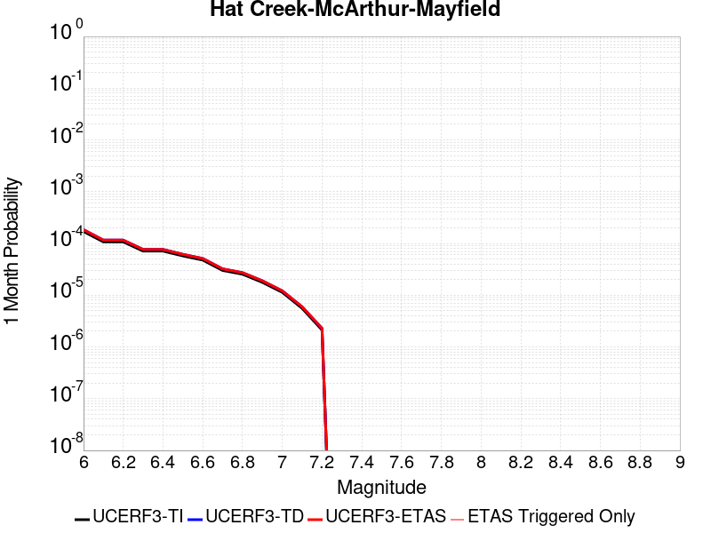 | 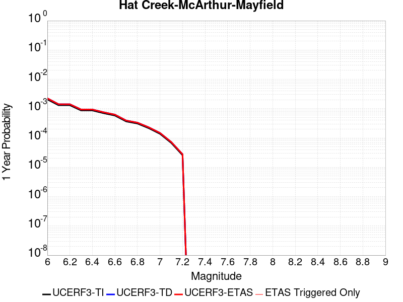 |  |

| Magnitude | 1 wk TI Prob | 1 wk TD Prob | 1 wk ETAS Prob | 1 wk ETAS/TD Gain | 1 wk ETAS Triggered Only | 1 mo TI Prob | 1 mo TD Prob | 1 mo ETAS Prob | 1 mo ETAS/TD Gain | 1 mo ETAS Triggered Only | 1 yr TI Prob | 1 yr TD Prob | 1 yr ETAS Prob | 1 yr ETAS/TD Gain | 1 yr ETAS Triggered Only | 10 yr TI Prob | 10 yr TD Prob | 10 yr ETAS Prob | 10 yr ETAS/TD Gain | 10 yr ETAS Triggered Only |
|-----|-----|-----|-----|-----|-----|-----|-----|-----|-----|-----|-----|-----|-----|-----|-----|-----|-----|-----|-----|-----|
| 6.0 | 3.967457E-5 | 4.3158816E-5 | 4.3158816E-5 | 1.0 | 0.0 | 1.7002279E-4 | 1.8495388E-4 | 1.8495388E-4 | 1.0 | 0.0 | 0.002068062 | 0.0022496022 | 0.0022496022 | 1.0 | 0.0 | 0.02048922 | 0.022280656 | 0.022290433 | 1.0004388 | 1.0E-5 |
| 6.1 | 2.5044013E-5 | 2.7071455E-5 | 2.7071455E-5 | 1.0 | 0.0 | 1.0732707E-4 | 1.16015544E-4 | 1.16015544E-4 | 1.0 | 0.0 | 0.0013059238 | 0.0014116059 | 0.0014116059 | 1.0 | 0.0 | 0.01298276 | 0.014029811 | 0.014029811 | 1.0 | 0.0 |
| 6.2 | 2.5044013E-5 | 2.7071455E-5 | 2.7071455E-5 | 1.0 | 0.0 | 1.0732707E-4 | 1.16015544E-4 | 1.16015544E-4 | 1.0 | 0.0 | 0.0013059238 | 0.0014116059 | 0.0014116059 | 1.0 | 0.0 | 0.01298276 | 0.014029811 | 0.014029811 | 1.0 | 0.0 |
| 6.3 | 1.6624012E-5 | 1.7891252E-5 | 1.7891252E-5 | 1.0 | 0.0 | 7.124382E-5 | 7.6674594E-5 | 7.6674594E-5 | 1.0 | 0.0 | 8.670483E-4 | 9.3312195E-4 | 9.3312195E-4 | 1.0 | 0.0 | 0.008636732 | 0.009292973 | 0.009292973 | 1.0 | 0.0 |
| 6.4 | 1.6624012E-5 | 1.7891252E-5 | 1.7891252E-5 | 1.0 | 0.0 | 7.124382E-5 | 7.6674594E-5 | 7.6674594E-5 | 1.0 | 0.0 | 8.670483E-4 | 9.3312195E-4 | 9.3312195E-4 | 1.0 | 0.0 | 0.008636732 | 0.009292973 | 0.009292973 | 1.0 | 0.0 |
| 6.5 | 1.3394842E-5 | 1.4392279E-5 | 1.4392279E-5 | 1.0 | 0.0 | 5.7405203E-5 | 6.167977E-5 | 6.167977E-5 | 1.0 | 0.0 | 6.986842E-4 | 7.5069803E-4 | 7.5069803E-4 | 1.0 | 0.0 | 0.006964916 | 0.0074822144 | 0.0074822144 | 1.0 | 0.0 |
| 6.6 | 1.1137514E-5 | 1.1954662E-5 | 1.1954662E-5 | 1.0 | 0.0 | 4.7731326E-5 | 5.1233284E-5 | 5.1233284E-5 | 1.0 | 0.0 | 5.809739E-4 | 6.235907E-4 | 6.235907E-4 | 1.0 | 0.0 | 0.005794574 | 0.0062188306 | 0.0062188306 | 1.0 | 0.0 |
| 6.7 | 7.0200663E-6 | 7.5243615E-6 | 7.5243615E-6 | 1.0 | 0.0 | 3.008565E-5 | 3.2246873E-5 | 3.2246873E-5 | 1.0 | 0.0 | 3.6623122E-4 | 3.9253655E-4 | 3.9253655E-4 | 1.0 | 0.0 | 0.0036562826 | 0.0039185947 | 0.0039185947 | 1.0 | 0.0 |
| 6.8 | 5.940172E-6 | 6.365537E-6 | 6.365537E-6 | 1.0 | 0.0 | 2.545763E-5 | 2.7280596E-5 | 2.7280596E-5 | 1.0 | 0.0 | 3.0990256E-4 | 3.320919E-4 | 3.320919E-4 | 1.0 | 0.0 | 0.0030947074 | 0.0033160849 | 0.0033160849 | 1.0 | 0.0 |
| 6.9 | 4.129831E-6 | 4.423589E-6 | 4.423589E-6 | 1.0 | 0.0 | 1.7699154E-5 | 1.8958104E-5 | 1.8958104E-5 | 1.0 | 0.0 | 2.154659E-4 | 2.3079127E-4 | 2.3079127E-4 | 1.0 | 0.0 | 0.002152571 | 0.002305594 | 0.002305594 | 1.0 | 0.0 |
| 7.0 | 2.6512955E-6 | 2.8374266E-6 | 2.8374266E-6 | 1.0 | 0.0 | 1.1362646E-5 | 1.2160345E-5 | 1.2160345E-5 | 1.0 | 0.0 | 1.3833142E-4 | 1.4804257E-4 | 1.4804257E-4 | 1.0 | 0.0 | 0.0013824535 | 0.001479482 | 0.001479482 | 1.0 | 0.0 |
| 7.1 | 1.2992575E-6 | 1.3909448E-6 | 1.3909448E-6 | 1.0 | 0.0 | 5.568235E-6 | 5.96118E-6 | 5.96118E-6 | 1.0 | 0.0 | 6.779115E-5 | 7.257517E-5 | 7.257517E-5 | 1.0 | 0.0 | 6.7770475E-4 | 7.2553626E-4 | 7.2553626E-4 | 1.0 | 0.0 |
| 7.2 | 4.968191E-7 | 5.3271987E-7 | 5.3271987E-7 | 1.0 | 0.0 | 2.1292228E-6 | 2.2830839E-6 | 2.2830839E-6 | 1.0 | 0.0 | 2.592298E-5 | 2.7796319E-5 | 2.7796319E-5 | 1.0 | 0.0 | 2.5919956E-4 | 2.7794077E-4 | 2.7794077E-4 | 1.0 | 0.0 |

## Robinson Creek
*[(top)](#table-of-contents)*

| 1 Week | 1 Month | 1 Year | 10 Year |
|-----|-----|-----|-----|
|  |  |  |  |

| Magnitude | 1 wk TI Prob | 1 wk TD Prob | 1 wk ETAS Prob | 1 wk ETAS/TD Gain | 1 wk ETAS Triggered Only | 1 mo TI Prob | 1 mo TD Prob | 1 mo ETAS Prob | 1 mo ETAS/TD Gain | 1 mo ETAS Triggered Only | 1 yr TI Prob | 1 yr TD Prob | 1 yr ETAS Prob | 1 yr ETAS/TD Gain | 1 yr ETAS Triggered Only | 10 yr TI Prob | 10 yr TD Prob | 10 yr ETAS Prob | 10 yr ETAS/TD Gain | 10 yr ETAS Triggered Only |
|-----|-----|-----|-----|-----|-----|-----|-----|-----|-----|-----|-----|-----|-----|-----|-----|-----|-----|-----|-----|-----|
| 6.0 | 1.3705327E-5 | 1.5285246E-5 | 1.5285246E-5 | 1.0 | 0.0 | 5.8735794E-5 | 6.5508204E-5 | 6.5508204E-5 | 1.0 | 0.0 | 7.1487366E-4 | 7.9756236E-4 | 8.0755434E-4 | 1.0125282 | 1.0E-5 | 0.0071257832 | 0.007975623 | 0.007985543 | 1.0012438 | 1.0E-5 |
| 6.1 | 1.3705327E-5 | 1.5285246E-5 | 1.5285246E-5 | 1.0 | 0.0 | 5.8735794E-5 | 6.5508204E-5 | 6.5508204E-5 | 1.0 | 0.0 | 7.1487366E-4 | 7.9756236E-4 | 8.0755434E-4 | 1.0125282 | 1.0E-5 | 0.0071257832 | 0.007975623 | 0.007985543 | 1.0012438 | 1.0E-5 |
| 6.2 | 1.3705327E-5 | 1.5285246E-5 | 1.5285246E-5 | 1.0 | 0.0 | 5.8735794E-5 | 6.5508204E-5 | 6.5508204E-5 | 1.0 | 0.0 | 7.1487366E-4 | 7.9756236E-4 | 8.0755434E-4 | 1.0125282 | 1.0E-5 | 0.0071257832 | 0.007975623 | 0.007985543 | 1.0012438 | 1.0E-5 |
| 6.3 | 1.3705327E-5 | 1.5285246E-5 | 1.5285246E-5 | 1.0 | 0.0 | 5.8735794E-5 | 6.5508204E-5 | 6.5508204E-5 | 1.0 | 0.0 | 7.1487366E-4 | 7.9756236E-4 | 8.0755434E-4 | 1.0125282 | 1.0E-5 | 0.0071257832 | 0.007975623 | 0.007985543 | 1.0012438 | 1.0E-5 |
| 6.4 | 1.3705327E-5 | 1.5285246E-5 | 1.5285246E-5 | 1.0 | 0.0 | 5.8735794E-5 | 6.5508204E-5 | 6.5508204E-5 | 1.0 | 0.0 | 7.1487366E-4 | 7.9756236E-4 | 8.0755434E-4 | 1.0125282 | 1.0E-5 | 0.0071257832 | 0.007975623 | 0.007985543 | 1.0012438 | 1.0E-5 |

## Reliz 2011 CFM
*[(top)](#table-of-contents)*

| 1 Week | 1 Month | 1 Year | 10 Year |
|-----|-----|-----|-----|
| 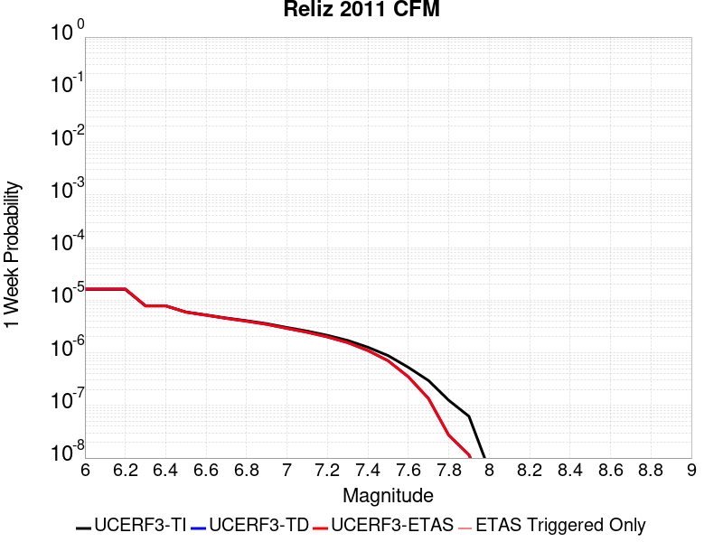 |  | 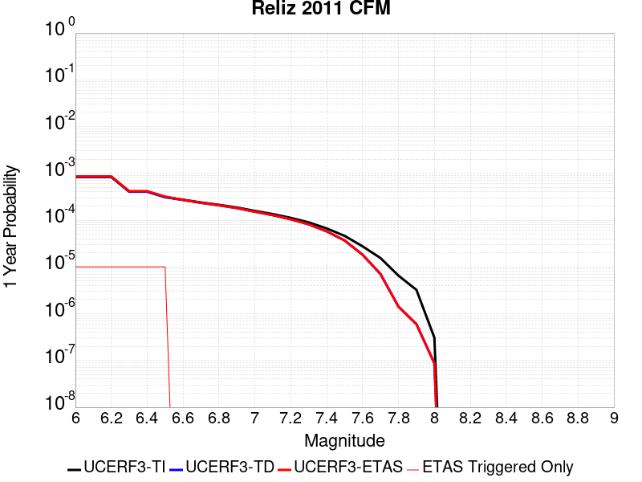 |  |

| Magnitude | 1 wk TI Prob | 1 wk TD Prob | 1 wk ETAS Prob | 1 wk ETAS/TD Gain | 1 wk ETAS Triggered Only | 1 mo TI Prob | 1 mo TD Prob | 1 mo ETAS Prob | 1 mo ETAS/TD Gain | 1 mo ETAS Triggered Only | 1 yr TI Prob | 1 yr TD Prob | 1 yr ETAS Prob | 1 yr ETAS/TD Gain | 1 yr ETAS Triggered Only | 10 yr TI Prob | 10 yr TD Prob | 10 yr ETAS Prob | 10 yr ETAS/TD Gain | 10 yr ETAS Triggered Only |
|-----|-----|-----|-----|-----|-----|-----|-----|-----|-----|-----|-----|-----|-----|-----|-----|-----|-----|-----|-----|-----|
| 6.0 | 1.6002472E-5 | 1.6282886E-5 | 1.6282886E-5 | 1.0 | 0.0 | 6.8580215E-5 | 6.978204E-5 | 6.978204E-5 | 1.0 | 0.0 | 8.3464425E-4 | 8.49285E-4 | 8.592765E-4 | 1.0117646 | 1.0E-5 | 0.008315164 | 0.008462588 | 0.008472503 | 1.0011717 | 1.0E-5 |
| 6.1 | 1.6002472E-5 | 1.6282886E-5 | 1.6282886E-5 | 1.0 | 0.0 | 6.8580215E-5 | 6.978204E-5 | 6.978204E-5 | 1.0 | 0.0 | 8.3464425E-4 | 8.49285E-4 | 8.592765E-4 | 1.0117646 | 1.0E-5 | 0.008315164 | 0.008462588 | 0.008472503 | 1.0011717 | 1.0E-5 |
| 6.2 | 1.6002472E-5 | 1.6282886E-5 | 1.6282886E-5 | 1.0 | 0.0 | 6.8580215E-5 | 6.978204E-5 | 6.978204E-5 | 1.0 | 0.0 | 8.3464425E-4 | 8.49285E-4 | 8.592765E-4 | 1.0117646 | 1.0E-5 | 0.008315164 | 0.008462588 | 0.008472503 | 1.0011717 | 1.0E-5 |
| 6.3 | 7.792404E-6 | 7.8038465E-6 | 7.8038465E-6 | 1.0 | 0.0 | 3.339559E-5 | 3.3444634E-5 | 3.3444634E-5 | 1.0 | 0.0 | 4.0651546E-4 | 4.071131E-4 | 4.1710903E-4 | 1.0245532 | 1.0E-5 | 0.0040577264 | 0.004063948 | 0.004073907 | 1.0024507 | 1.0E-5 |
| 6.4 | 7.792404E-6 | 7.8038465E-6 | 7.8038465E-6 | 1.0 | 0.0 | 3.339559E-5 | 3.3444634E-5 | 3.3444634E-5 | 1.0 | 0.0 | 4.0651546E-4 | 4.071131E-4 | 4.1710903E-4 | 1.0245532 | 1.0E-5 | 0.0040577264 | 0.004063948 | 0.004073907 | 1.0024507 | 1.0E-5 |
| 6.5 | 5.9659374E-6 | 5.9287763E-6 | 5.9287763E-6 | 1.0 | 0.0 | 2.5568053E-5 | 2.5408795E-5 | 2.5408795E-5 | 1.0 | 0.0 | 3.1124658E-4 | 3.0930838E-4 | 3.1930528E-4 | 1.0323201 | 1.0E-5 | 0.00310811 | 0.0030889949 | 0.003098964 | 1.0032274 | 1.0E-5 |
| 6.6 | 5.2350692E-6 | 5.1790216E-6 | 5.1790216E-6 | 1.0 | 0.0 | 2.2435817E-5 | 2.2195618E-5 | 2.2195618E-5 | 1.0 | 0.0 | 2.7312184E-4 | 2.701983E-4 | 2.701983E-4 | 1.0 | 0.0 | 0.002727864 | 0.002698906 | 0.002698906 | 1.0 | 0.0 |
| 6.7 | 4.580206E-6 | 4.5061533E-6 | 4.5061533E-6 | 1.0 | 0.0 | 1.9629308E-5 | 1.9311943E-5 | 1.9311943E-5 | 1.0 | 0.0 | 2.389606E-4 | 2.3509761E-4 | 2.3509761E-4 | 1.0 | 0.0 | 0.002387038 | 0.0023486894 | 0.0023486894 | 1.0 | 0.0 |
| 6.8 | 4.0765017E-6 | 3.9882693E-6 | 3.9882693E-6 | 1.0 | 0.0 | 1.7470604E-5 | 1.709247E-5 | 1.709247E-5 | 1.0 | 0.0 | 2.1268385E-4 | 2.08081E-4 | 2.08081E-4 | 1.0 | 0.0 | 0.002124804 | 0.002079058 | 0.002079058 | 1.0 | 0.0 |
| 6.9 | 3.5752896E-6 | 3.4725467E-6 | 3.4725467E-6 | 1.0 | 0.0 | 1.532258E-5 | 1.4882258E-5 | 1.4882258E-5 | 1.0 | 0.0 | 1.8653645E-4 | 1.8117645E-4 | 1.8117645E-4 | 1.0 | 0.0 | 0.0018637994 | 0.0018104821 | 0.0018104821 | 1.0 | 0.0 |
| 7.0 | 3.0259848E-6 | 2.9079688E-6 | 2.9079688E-6 | 1.0 | 0.0 | 1.2968442E-5 | 1.2462664E-5 | 1.2462664E-5 | 1.0 | 0.0 | 1.5787935E-4 | 1.5172239E-4 | 1.5172239E-4 | 1.0 | 0.0 | 0.0015776722 | 0.0015163814 | 0.0015163814 | 1.0 | 0.0 |
| 7.1 | 2.5861116E-6 | 2.4551923E-6 | 2.4551923E-6 | 1.0 | 0.0 | 1.1083288E-5 | 1.0522211E-5 | 1.0522211E-5 | 1.0 | 0.0 | 1.3493067E-4 | 1.281004E-4 | 1.281004E-4 | 1.0 | 0.0 | 0.0013484878 | 0.0012804584 | 0.0012804584 | 1.0 | 0.0 |
| 7.2 | 2.1482588E-6 | 2.00326E-6 | 2.00326E-6 | 1.0 | 0.0 | 9.20679E-6 | 8.585373E-6 | 8.585373E-6 | 1.0 | 0.0 | 1.12086906E-4 | 1.04521896E-4 | 1.04521896E-4 | 1.0 | 0.0 | 0.0011203039 | 0.00104492 | 0.00104492 | 1.0 | 0.0 |
| 7.3 | 1.7194744E-6 | 1.5611456E-6 | 1.5611456E-6 | 1.0 | 0.0 | 7.3691554E-6 | 6.690607E-6 | 6.690607E-6 | 1.0 | 0.0 | 8.971577E-5 | 8.1455095E-5 | 8.1455095E-5 | 1.0 | 0.0 | 8.967956E-4 | 8.144446E-4 | 8.144446E-4 | 1.0 | 0.0 |
| 7.4 | 1.2755178E-6 | 1.1056493E-6 | 1.1056493E-6 | 1.0 | 0.0 | 5.4664933E-6 | 4.7384883E-6 | 4.7384883E-6 | 1.0 | 0.0 | 6.655252E-5 | 5.768957E-5 | 5.768957E-5 | 1.0 | 0.0 | 6.6532596E-4 | 5.7693804E-4 | 5.7693804E-4 | 1.0 | 0.0 |
| 7.5 | 8.8463224E-7 | 7.058199E-7 | 7.058199E-7 | 1.0 | 0.0 | 3.7912755E-6 | 3.024939E-6 | 3.024939E-6 | 1.0 | 0.0 | 4.6157802E-5 | 3.682801E-5 | 3.682801E-5 | 1.0 | 0.0 | 4.6148215E-4 | 3.684111E-4 | 3.684111E-4 | 1.0 | 0.0 |
| 7.6 | 5.291355E-7 | 3.5009091E-7 | 3.5009091E-7 | 1.0 | 0.0 | 2.2677216E-6 | 1.5003886E-6 | 1.5003886E-6 | 1.0 | 0.0 | 2.760916E-5 | 1.826708E-5 | 1.826708E-5 | 1.0 | 0.0 | 2.760573E-4 | 1.8284774E-4 | 1.8284774E-4 | 1.0 | 0.0 |
| 7.7 | 2.9663357E-7 | 1.3511887E-7 | 1.3511887E-7 | 1.0 | 0.0 | 1.2712861E-6 | 5.7908073E-7 | 5.7908073E-7 | 1.0 | 0.0 | 1.5477797E-5 | 7.050285E-6 | 7.050285E-6 | 1.0 | 0.0 | 1.547672E-4 | 7.068567E-5 | 7.068567E-5 | 1.0 | 0.0 |
| 7.8 | 1.2509386E-7 | 2.7160407E-8 | 2.7160407E-8 | 1.0 | 0.0 | 5.3611643E-7 | 1.16401736E-7 | 1.16401736E-7 | 1.0 | 0.0 | 6.527198E-6 | 1.4171902E-6 | 1.4171902E-6 | 1.0 | 0.0 | 6.527006E-5 | 1.4328973E-5 | 1.4328973E-5 | 1.0 | 0.0 |
| 7.9 | 6.213493E-8 | 1.14839676E-8 | 1.14839676E-8 | 1.0 | 0.0 | 2.6629255E-7 | 4.9217E-8 | 4.9217E-8 | 1.0 | 0.0 | 3.242107E-6 | 5.9921683E-7 | 5.9921683E-7 | 1.0 | 0.0 | 3.2420594E-5 | 6.1243118E-6 | 6.1243118E-6 | 1.0 | 0.0 |
| 8.0 | 5.92383E-9 | 1.6782599E-9 | 1.6782599E-9 | 1.0 | 0.0 | 2.5387841E-8 | 7.1925417E-9 | 7.1925417E-9 | 1.0 | 0.0 | 3.0909692E-7 | 8.756919E-8 | 8.756919E-8 | 1.0 | 0.0 | 3.090965E-6 | 9.00749E-7 | 9.00749E-7 | 1.0 | 0.0 |

## Owens Valley Keough Hot Springs
*[(top)](#table-of-contents)*

| 1 Week | 1 Month | 1 Year | 10 Year |
|-----|-----|-----|-----|
|  |  |  |  |

| Magnitude | 1 wk TI Prob | 1 wk TD Prob | 1 wk ETAS Prob | 1 wk ETAS/TD Gain | 1 wk ETAS Triggered Only | 1 mo TI Prob | 1 mo TD Prob | 1 mo ETAS Prob | 1 mo ETAS/TD Gain | 1 mo ETAS Triggered Only | 1 yr TI Prob | 1 yr TD Prob | 1 yr ETAS Prob | 1 yr ETAS/TD Gain | 1 yr ETAS Triggered Only | 10 yr TI Prob | 10 yr TD Prob | 10 yr ETAS Prob | 10 yr ETAS/TD Gain | 10 yr ETAS Triggered Only |
|-----|-----|-----|-----|-----|-----|-----|-----|-----|-----|-----|-----|-----|-----|-----|-----|-----|-----|-----|-----|-----|
| 6.0 | 1.5708529E-5 | 4.95061E-6 | 4.95061E-6 | 1.0 | 0.0 | 6.7320536E-5 | 2.1216758E-5 | 3.1216547E-5 | 1.4713155 | 1.0E-5 | 8.193192E-4 | 2.5828852E-4 | 2.6828595E-4 | 1.0387064 | 1.0E-5 | 0.008163051 | 0.0025805589 | 0.002590533 | 1.0038651 | 1.0E-5 |
| 6.1 | 1.5708529E-5 | 4.95061E-6 | 4.95061E-6 | 1.0 | 0.0 | 6.7320536E-5 | 2.1216758E-5 | 3.1216547E-5 | 1.4713155 | 1.0E-5 | 8.193192E-4 | 2.5828852E-4 | 2.6828595E-4 | 1.0387064 | 1.0E-5 | 0.008163051 | 0.0025805589 | 0.002590533 | 1.0038651 | 1.0E-5 |
| 6.2 | 1.5708529E-5 | 4.95061E-6 | 4.95061E-6 | 1.0 | 0.0 | 6.7320536E-5 | 2.1216758E-5 | 3.1216547E-5 | 1.4713155 | 1.0E-5 | 8.193192E-4 | 2.5828852E-4 | 2.6828595E-4 | 1.0387064 | 1.0E-5 | 0.008163051 | 0.0025805589 | 0.002590533 | 1.0038651 | 1.0E-5 |
| 6.3 | 1.5708529E-5 | 4.95061E-6 | 4.95061E-6 | 1.0 | 0.0 | 6.7320536E-5 | 2.1216758E-5 | 3.1216547E-5 | 1.4713155 | 1.0E-5 | 8.193192E-4 | 2.5828852E-4 | 2.6828595E-4 | 1.0387064 | 1.0E-5 | 0.008163051 | 0.0025805589 | 0.002590533 | 1.0038651 | 1.0E-5 |
| 6.4 | 1.4622509E-5 | 3.7264542E-6 | 3.7264542E-6 | 1.0 | 0.0 | 6.266639E-5 | 1.597044E-5 | 2.597028E-5 | 1.6261469 | 1.0E-5 | 7.626962E-4 | 1.9442604E-4 | 2.044241E-4 | 1.0514234 | 1.0E-5 | 0.007600839 | 0.0019430561 | 0.0019530366 | 1.0051365 | 1.0E-5 |
| 6.5 | 1.3335527E-5 | 2.2776267E-6 | 2.2776267E-6 | 1.0 | 0.0 | 5.7151006E-5 | 9.761225E-6 | 1.9761126E-5 | 2.0244517 | 1.0E-5 | 6.955913E-4 | 1.1883711E-4 | 1.2883592E-4 | 1.0841388 | 1.0E-5 | 0.0069341804 | 0.001187975 | 0.0011979631 | 1.0084077 | 1.0E-5 |
| 6.6 | 1.3332855E-5 | 2.2747759E-6 | 2.2747759E-6 | 1.0 | 0.0 | 5.7139558E-5 | 9.7490065E-6 | 1.974891E-5 | 2.0257356 | 1.0E-5 | 6.9545204E-4 | 1.18688375E-4 | 1.2868718E-4 | 1.0842443 | 1.0E-5 | 0.0069327964 | 0.0011864892 | 0.0011964773 | 1.0084182 | 1.0E-5 |
| 6.7 | 1.3318214E-5 | 2.2640058E-6 | 2.2640058E-6 | 1.0 | 0.0 | 5.707681E-5 | 9.70285E-6 | 1.9702753E-5 | 2.030615 | 1.0E-5 | 6.946886E-4 | 1.18126474E-4 | 1.2812529E-4 | 1.084645 | 1.0E-5 | 0.0069252094 | 0.0011808762 | 0.0011908644 | 1.0084583 | 1.0E-5 |
| 6.8 | 1.2441338E-5 | 1.6776884E-6 | 1.6776884E-6 | 1.0 | 0.0 | 5.331893E-5 | 7.190075E-6 | 7.190075E-6 | 1.0 | 0.0 | 6.489646E-4 | 8.753594E-5 | 8.753594E-5 | 1.0 | 0.0 | 0.0064707273 | 8.752164E-4 | 8.752164E-4 | 1.0 | 0.0 |
| 6.9 | 1.1130476E-5 | 1.0302945E-6 | 1.0302945E-6 | 1.0 | 0.0 | 4.7701167E-5 | 4.4155404E-6 | 4.4155404E-6 | 1.0 | 0.0 | 5.806069E-4 | 5.3757893E-5 | 5.3757893E-5 | 1.0 | 0.0 | 0.0057909233 | 5.3762126E-4 | 5.3762126E-4 | 1.0 | 0.0 |
| 7.0 | 1.0986073E-5 | 9.5785E-7 | 9.5785E-7 | 1.0 | 0.0 | 4.7082318E-5 | 4.1050653E-6 | 4.1050653E-6 | 1.0 | 0.0 | 5.730765E-4 | 4.9978033E-5 | 4.9978033E-5 | 1.0 | 0.0 | 0.0057160086 | 4.998395E-4 | 4.998395E-4 | 1.0 | 0.0 |
| 7.1 | 1.0451338E-5 | 7.999411E-7 | 7.999411E-7 | 1.0 | 0.0 | 4.4790682E-5 | 3.4283146E-6 | 3.4283146E-6 | 1.0 | 0.0 | 5.451901E-4 | 4.173894E-5 | 4.173894E-5 | 1.0 | 0.0 | 0.005438545 | 4.1747853E-4 | 4.1747853E-4 | 1.0 | 0.0 |
| 7.2 | 9.989061E-6 | 6.544159E-7 | 6.544159E-7 | 1.0 | 0.0 | 4.280956E-5 | 2.8046366E-6 | 2.8046366E-6 | 1.0 | 0.0 | 5.2108173E-4 | 3.4145916E-5 | 3.4145916E-5 | 1.0 | 0.0 | 0.0051986156 | 3.4156654E-4 | 3.4156654E-4 | 1.0 | 0.0 |
| 7.3 | 9.465365E-6 | 5.4592874E-7 | 5.4592874E-7 | 1.0 | 0.0 | 4.056522E-5 | 2.3396926E-6 | 2.3396926E-6 | 1.0 | 0.0 | 4.937696E-4 | 2.8485389E-5 | 2.8485389E-5 | 1.0 | 0.0 | 0.0049267393 | 2.849722E-4 | 2.849722E-4 | 1.0 | 0.0 |
| 7.4 | 6.3824805E-6 | 4.0157266E-7 | 4.0157266E-7 | 1.0 | 0.0 | 2.73532E-5 | 1.7210247E-6 | 1.7210247E-6 | 1.0 | 0.0 | 3.3297433E-4 | 2.0953275E-5 | 2.0953275E-5 | 1.0 | 0.0 | 0.0033247585 | 2.0962617E-4 | 2.0962617E-4 | 1.0 | 0.0 |
| 7.5 | 1.6192645E-6 | 2.5158894E-7 | 2.5158894E-7 | 1.0 | 0.0 | 6.9396865E-6 | 1.0782379E-6 | 1.0782379E-6 | 1.0 | 0.0 | 8.448741E-5 | 1.3127469E-5 | 1.3127469E-5 | 1.0 | 0.0 | 8.4455294E-4 | 1.3126706E-4 | 1.3126706E-4 | 1.0 | 0.0 |
| 7.6 | 5.7062545E-7 | 1.0791249E-7 | 1.0791249E-7 | 1.0 | 0.0 | 2.4455355E-6 | 4.6248203E-7 | 4.6248203E-7 | 1.0 | 0.0 | 2.9773988E-5 | 5.6307053E-6 | 5.6307053E-6 | 1.0 | 0.0 | 2.977E-4 | 5.6305707E-5 | 5.6305707E-5 | 1.0 | 0.0 |
| 7.7 | 2.5988817E-7 | 4.5449596E-8 | 4.5449596E-8 | 1.0 | 0.0 | 1.113806E-6 | 1.9478398E-7 | 1.9478398E-7 | 1.0 | 0.0 | 1.3560503E-5 | 2.3714929E-6 | 2.3714929E-6 | 1.0 | 0.0 | 1.3559677E-4 | 2.3714718E-5 | 2.3714718E-5 | 1.0 | 0.0 |

## Northridge Hills
*[(top)](#table-of-contents)*

| 1 Week | 1 Month | 1 Year | 10 Year |
|-----|-----|-----|-----|
|  |  |  | 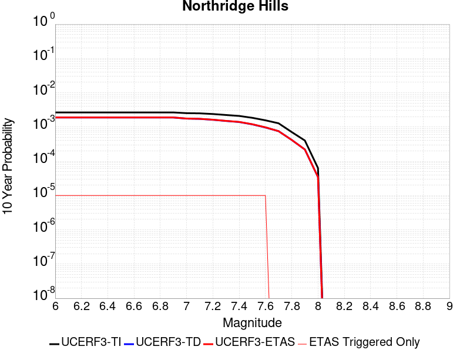 |

| Magnitude | 1 wk TI Prob | 1 wk TD Prob | 1 wk ETAS Prob | 1 wk ETAS/TD Gain | 1 wk ETAS Triggered Only | 1 mo TI Prob | 1 mo TD Prob | 1 mo ETAS Prob | 1 mo ETAS/TD Gain | 1 mo ETAS Triggered Only | 1 yr TI Prob | 1 yr TD Prob | 1 yr ETAS Prob | 1 yr ETAS/TD Gain | 1 yr ETAS Triggered Only | 10 yr TI Prob | 10 yr TD Prob | 10 yr ETAS Prob | 10 yr ETAS/TD Gain | 10 yr ETAS Triggered Only |
|-----|-----|-----|-----|-----|-----|-----|-----|-----|-----|-----|-----|-----|-----|-----|-----|-----|-----|-----|-----|-----|
| 6.0 | 5.095982E-6 | 3.615339E-6 | 3.615339E-6 | 1.0 | 0.0 | 2.183974E-5 | 1.5494219E-5 | 1.5494219E-5 | 1.0 | 0.0 | 2.658664E-4 | 1.886259E-4 | 1.886259E-4 | 1.0 | 0.0 | 0.0026554854 | 0.0018846703 | 0.0018946514 | 1.005296 | 1.0E-5 |
| 6.1 | 5.095982E-6 | 3.615339E-6 | 3.615339E-6 | 1.0 | 0.0 | 2.183974E-5 | 1.5494219E-5 | 1.5494219E-5 | 1.0 | 0.0 | 2.658664E-4 | 1.886259E-4 | 1.886259E-4 | 1.0 | 0.0 | 0.0026554854 | 0.0018846703 | 0.0018946514 | 1.005296 | 1.0E-5 |
| 6.2 | 5.095982E-6 | 3.615339E-6 | 3.615339E-6 | 1.0 | 0.0 | 2.183974E-5 | 1.5494219E-5 | 1.5494219E-5 | 1.0 | 0.0 | 2.658664E-4 | 1.886259E-4 | 1.886259E-4 | 1.0 | 0.0 | 0.0026554854 | 0.0018846703 | 0.0018946514 | 1.005296 | 1.0E-5 |
| 6.3 | 5.095982E-6 | 3.615339E-6 | 3.615339E-6 | 1.0 | 0.0 | 2.183974E-5 | 1.5494219E-5 | 1.5494219E-5 | 1.0 | 0.0 | 2.658664E-4 | 1.886259E-4 | 1.886259E-4 | 1.0 | 0.0 | 0.0026554854 | 0.0018846703 | 0.0018946514 | 1.005296 | 1.0E-5 |
| 6.4 | 5.095982E-6 | 3.615339E-6 | 3.615339E-6 | 1.0 | 0.0 | 2.183974E-5 | 1.5494219E-5 | 1.5494219E-5 | 1.0 | 0.0 | 2.658664E-4 | 1.886259E-4 | 1.886259E-4 | 1.0 | 0.0 | 0.0026554854 | 0.0018846703 | 0.0018946514 | 1.005296 | 1.0E-5 |
| 6.5 | 5.095982E-6 | 3.615339E-6 | 3.615339E-6 | 1.0 | 0.0 | 2.183974E-5 | 1.5494219E-5 | 1.5494219E-5 | 1.0 | 0.0 | 2.658664E-4 | 1.886259E-4 | 1.886259E-4 | 1.0 | 0.0 | 0.0026554854 | 0.0018846703 | 0.0018946514 | 1.005296 | 1.0E-5 |
| 6.6 | 5.095982E-6 | 3.615339E-6 | 3.615339E-6 | 1.0 | 0.0 | 2.183974E-5 | 1.5494219E-5 | 1.5494219E-5 | 1.0 | 0.0 | 2.658664E-4 | 1.886259E-4 | 1.886259E-4 | 1.0 | 0.0 | 0.0026554854 | 0.0018846703 | 0.0018946514 | 1.005296 | 1.0E-5 |
| 6.7 | 5.095982E-6 | 3.615339E-6 | 3.615339E-6 | 1.0 | 0.0 | 2.183974E-5 | 1.5494219E-5 | 1.5494219E-5 | 1.0 | 0.0 | 2.658664E-4 | 1.886259E-4 | 1.886259E-4 | 1.0 | 0.0 | 0.0026554854 | 0.0018846703 | 0.0018946514 | 1.005296 | 1.0E-5 |
| 6.8 | 5.095982E-6 | 3.615339E-6 | 3.615339E-6 | 1.0 | 0.0 | 2.183974E-5 | 1.5494219E-5 | 1.5494219E-5 | 1.0 | 0.0 | 2.658664E-4 | 1.886259E-4 | 1.886259E-4 | 1.0 | 0.0 | 0.0026554854 | 0.0018846703 | 0.0018946514 | 1.005296 | 1.0E-5 |
| 6.9 | 5.0942654E-6 | 3.6135539E-6 | 3.6135539E-6 | 1.0 | 0.0 | 2.1832384E-5 | 1.5486568E-5 | 1.5486568E-5 | 1.0 | 0.0 | 2.6577685E-4 | 1.8853277E-4 | 1.8853277E-4 | 1.0 | 0.0 | 0.002654592 | 0.0018837407 | 0.0018937219 | 1.0052986 | 1.0E-5 |
| 7.0 | 4.851143E-6 | 3.3588672E-6 | 3.3588672E-6 | 1.0 | 0.0 | 2.0790447E-5 | 1.4395066E-5 | 1.4395066E-5 | 1.0 | 0.0 | 2.5309427E-4 | 1.7524588E-4 | 1.7524588E-4 | 1.0 | 0.0 | 0.0025280623 | 0.0017510812 | 0.0017610637 | 1.0057007 | 1.0E-5 |
| 7.1 | 4.7910607E-6 | 3.2971482E-6 | 3.2971482E-6 | 1.0 | 0.0 | 2.0532956E-5 | 1.4130558E-5 | 1.4130558E-5 | 1.0 | 0.0 | 2.4996005E-4 | 1.72026E-4 | 1.72026E-4 | 1.0 | 0.0 | 0.0024967908 | 0.0017189324 | 0.0017289153 | 1.0058075 | 1.0E-5 |
| 7.2 | 4.580079E-6 | 3.1069255E-6 | 3.1069255E-6 | 1.0 | 0.0 | 1.9628762E-5 | 1.3315327E-5 | 1.3315327E-5 | 1.0 | 0.0 | 2.3895396E-4 | 1.6210208E-4 | 1.6210208E-4 | 1.0 | 0.0 | 0.0023869718 | 0.0016198418 | 0.0016298257 | 1.0061635 | 1.0E-5 |
| 7.3 | 4.290062E-6 | 2.8683571E-6 | 2.8683571E-6 | 1.0 | 0.0 | 1.838585E-5 | 1.2292901E-5 | 1.2292901E-5 | 1.0 | 0.0 | 2.2382473E-4 | 1.4965583E-4 | 1.4965583E-4 | 1.0 | 0.0 | 0.0022359942 | 0.0014955534 | 0.0015055385 | 1.0066764 | 1.0E-5 |
| 7.4 | 4.0259683E-6 | 2.6740338E-6 | 2.6740338E-6 | 1.0 | 0.0 | 1.7254037E-5 | 1.1460094E-5 | 1.1460094E-5 | 1.0 | 0.0 | 2.1004764E-4 | 1.3951774E-4 | 1.3951774E-4 | 1.0 | 0.0 | 0.002098492 | 0.0013943043 | 0.0014042903 | 1.0071621 | 1.0E-5 |
| 7.5 | 3.5477108E-6 | 2.285316E-6 | 2.285316E-6 | 1.0 | 0.0 | 1.5204386E-5 | 9.794175E-6 | 9.794175E-6 | 1.0 | 0.0 | 1.8509767E-4 | 1.19237564E-4 | 1.19237564E-4 | 1.0 | 0.0 | 0.0018494357 | 0.0011917375 | 0.0012017256 | 1.0083811 | 1.0E-5 |
| 7.6 | 2.9990608E-6 | 1.8529302E-6 | 1.8529302E-6 | 1.0 | 0.0 | 1.2853055E-5 | 7.941105E-6 | 7.941105E-6 | 1.0 | 0.0 | 1.564747E-4 | 9.667867E-5 | 9.667867E-5 | 1.0 | 0.0 | 0.0015636457 | 9.663669E-4 | 9.7635726E-4 | 1.0103381 | 1.0E-5 |
| 7.7 | 2.4542855E-6 | 1.4462214E-6 | 1.4462214E-6 | 1.0 | 0.0 | 1.05183235E-5 | 6.198077E-6 | 6.198077E-6 | 1.0 | 0.0 | 1.2805307E-4 | 7.545898E-5 | 7.545898E-5 | 1.0 | 0.0 | 0.001279793 | 7.5433415E-4 | 7.5433415E-4 | 1.0 | 0.0 |
| 7.8 | 1.3623128E-6 | 8.016773E-7 | 8.016773E-7 | 1.0 | 0.0 | 5.8384703E-6 | 3.4357552E-6 | 3.4357552E-6 | 1.0 | 0.0 | 7.108106E-5 | 4.182952E-5 | 4.182952E-5 | 1.0 | 0.0 | 7.1058323E-4 | 4.182167E-4 | 4.182167E-4 | 1.0 | 0.0 |
| 7.9 | 7.716622E-7 | 4.2193074E-7 | 4.2193074E-7 | 1.0 | 0.0 | 3.3071194E-6 | 1.8082733E-6 | 1.8082733E-6 | 1.0 | 0.0 | 4.0263436E-5 | 2.2015505E-5 | 2.2015505E-5 | 1.0 | 0.0 | 4.0256142E-4 | 2.2013336E-4 | 2.2013336E-4 | 1.0 | 0.0 |
| 8.0 | 1.2117711E-7 | 6.6220935E-8 | 6.6220935E-8 | 1.0 | 0.0 | 5.1933034E-7 | 2.8380396E-7 | 2.8380396E-7 | 1.0 | 0.0 | 6.3228285E-6 | 3.455308E-6 | 3.455308E-6 | 1.0 | 0.0 | 6.3226486E-5 | 3.4552562E-5 | 3.4552562E-5 | 1.0 | 0.0 |

## Los Alamos extension
*[(top)](#table-of-contents)*

| 1 Week | 1 Month | 1 Year | 10 Year |
|-----|-----|-----|-----|
|  | 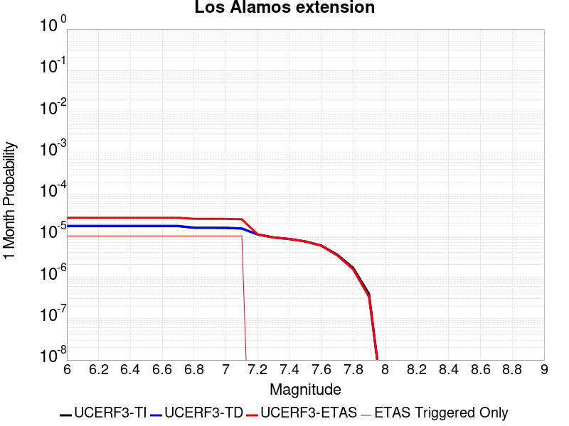 |  |  |

| Magnitude | 1 wk TI Prob | 1 wk TD Prob | 1 wk ETAS Prob | 1 wk ETAS/TD Gain | 1 wk ETAS Triggered Only | 1 mo TI Prob | 1 mo TD Prob | 1 mo ETAS Prob | 1 mo ETAS/TD Gain | 1 mo ETAS Triggered Only | 1 yr TI Prob | 1 yr TD Prob | 1 yr ETAS Prob | 1 yr ETAS/TD Gain | 1 yr ETAS Triggered Only | 10 yr TI Prob | 10 yr TD Prob | 10 yr ETAS Prob | 10 yr ETAS/TD Gain | 10 yr ETAS Triggered Only |
|-----|-----|-----|-----|-----|-----|-----|-----|-----|-----|-----|-----|-----|-----|-----|-----|-----|-----|-----|-----|-----|
| 6.0 | 4.0146506E-6 | 4.086186E-6 | 4.086186E-6 | 1.0 | 0.0 | 1.7205533E-5 | 1.7512113E-5 | 2.7511938E-5 | 1.5710233 | 1.0E-5 | 2.0945723E-4 | 2.1319023E-4 | 2.231881E-4 | 1.0468965 | 1.0E-5 | 0.0020925992 | 0.0021299664 | 0.002139945 | 1.0046849 | 1.0E-5 |
| 6.1 | 4.0146506E-6 | 4.086186E-6 | 4.086186E-6 | 1.0 | 0.0 | 1.7205533E-5 | 1.7512113E-5 | 2.7511938E-5 | 1.5710233 | 1.0E-5 | 2.0945723E-4 | 2.1319023E-4 | 2.231881E-4 | 1.0468965 | 1.0E-5 | 0.0020925992 | 0.0021299664 | 0.002139945 | 1.0046849 | 1.0E-5 |
| 6.2 | 4.0146506E-6 | 4.086186E-6 | 4.086186E-6 | 1.0 | 0.0 | 1.7205533E-5 | 1.7512113E-5 | 2.7511938E-5 | 1.5710233 | 1.0E-5 | 2.0945723E-4 | 2.1319023E-4 | 2.231881E-4 | 1.0468965 | 1.0E-5 | 0.0020925992 | 0.0021299664 | 0.002139945 | 1.0046849 | 1.0E-5 |
| 6.3 | 4.0146506E-6 | 4.086186E-6 | 4.086186E-6 | 1.0 | 0.0 | 1.7205533E-5 | 1.7512113E-5 | 2.7511938E-5 | 1.5710233 | 1.0E-5 | 2.0945723E-4 | 2.1319023E-4 | 2.231881E-4 | 1.0468965 | 1.0E-5 | 0.0020925992 | 0.0021299664 | 0.002139945 | 1.0046849 | 1.0E-5 |
| 6.4 | 4.0146506E-6 | 4.086186E-6 | 4.086186E-6 | 1.0 | 0.0 | 1.7205533E-5 | 1.7512113E-5 | 2.7511938E-5 | 1.5710233 | 1.0E-5 | 2.0945723E-4 | 2.1319023E-4 | 2.231881E-4 | 1.0468965 | 1.0E-5 | 0.0020925992 | 0.0021299664 | 0.002139945 | 1.0046849 | 1.0E-5 |
| 6.5 | 4.0146506E-6 | 4.086186E-6 | 4.086186E-6 | 1.0 | 0.0 | 1.7205533E-5 | 1.7512113E-5 | 2.7511938E-5 | 1.5710233 | 1.0E-5 | 2.0945723E-4 | 2.1319023E-4 | 2.231881E-4 | 1.0468965 | 1.0E-5 | 0.0020925992 | 0.0021299664 | 0.002139945 | 1.0046849 | 1.0E-5 |
| 6.6 | 4.0146506E-6 | 4.086186E-6 | 4.086186E-6 | 1.0 | 0.0 | 1.7205533E-5 | 1.7512113E-5 | 2.7511938E-5 | 1.5710233 | 1.0E-5 | 2.0945723E-4 | 2.1319023E-4 | 2.231881E-4 | 1.0468965 | 1.0E-5 | 0.0020925992 | 0.0021299664 | 0.002139945 | 1.0046849 | 1.0E-5 |
| 6.7 | 4.0146506E-6 | 4.086186E-6 | 4.086186E-6 | 1.0 | 0.0 | 1.7205533E-5 | 1.7512113E-5 | 2.7511938E-5 | 1.5710233 | 1.0E-5 | 2.0945723E-4 | 2.1319023E-4 | 2.231881E-4 | 1.0468965 | 1.0E-5 | 0.0020925992 | 0.0021299664 | 0.002139945 | 1.0046849 | 1.0E-5 |
| 6.8 | 3.6584688E-6 | 3.7188836E-6 | 3.7188836E-6 | 1.0 | 0.0 | 1.5679057E-5 | 1.593798E-5 | 2.5937821E-5 | 1.6274221 | 1.0E-5 | 1.9087581E-4 | 1.9402857E-4 | 2.0402663E-4 | 1.0515288 | 1.0E-5 | 0.0019071194 | 0.001938684 | 0.0019486647 | 1.0051482 | 1.0E-5 |
| 6.9 | 3.644631E-6 | 3.7045936E-6 | 3.7045936E-6 | 1.0 | 0.0 | 1.5619753E-5 | 1.5876738E-5 | 2.587658E-5 | 1.6298423 | 1.0E-5 | 1.901539E-4 | 1.9328308E-4 | 2.0328115E-4 | 1.0517275 | 1.0E-5 | 0.0018999127 | 0.0019312421 | 0.0019412228 | 1.005168 | 1.0E-5 |
| 7.0 | 3.6318522E-6 | 3.691354E-6 | 3.691354E-6 | 1.0 | 0.0 | 1.5564989E-5 | 1.5819998E-5 | 2.581984E-5 | 1.6321013 | 1.0E-5 | 1.8948725E-4 | 1.9259239E-4 | 2.0259045E-4 | 1.0519131 | 1.0E-5 | 0.0018932576 | 0.0019243471 | 0.0019343279 | 1.0051866 | 1.0E-5 |
| 7.1 | 3.5001724E-6 | 3.555424E-6 | 3.555424E-6 | 1.0 | 0.0 | 1.5000653E-5 | 1.5237448E-5 | 2.5237296E-5 | 1.6562679 | 1.0E-5 | 1.8261763E-4 | 1.8550105E-4 | 1.9549919E-4 | 1.0538981 | 1.0E-5 | 0.0018246764 | 0.0018535528 | 0.0018635342 | 1.005385 | 1.0E-5 |
| 7.2 | 2.5204702E-6 | 2.543714E-6 | 2.543714E-6 | 1.0 | 0.0 | 1.080197E-5 | 1.09015855E-5 | 1.09015855E-5 | 1.0 | 0.0 | 1.3150605E-4 | 1.3271878E-4 | 1.3271878E-4 | 1.0 | 0.0 | 0.0013142825 | 0.0013264008 | 0.0013264008 | 1.0 | 0.0 |
| 7.3 | 2.1399692E-6 | 2.1501494E-6 | 2.1501494E-6 | 1.0 | 0.0 | 9.1712645E-6 | 9.214894E-6 | 9.214894E-6 | 1.0 | 0.0 | 1.1165442E-4 | 1.1218559E-4 | 1.1218559E-4 | 1.0 | 0.0 | 0.0011159834 | 0.0011212928 | 0.0011212928 | 1.0 | 0.0 |
| 7.4 | 1.9660122E-6 | 1.9702534E-6 | 1.9702534E-6 | 1.0 | 0.0 | 8.42574E-6 | 8.443916E-6 | 8.443916E-6 | 1.0 | 0.0 | 1.0257855E-4 | 1.0279986E-4 | 1.0279986E-4 | 1.0 | 0.0 | 0.0010253121 | 0.0010275261 | 0.0010275261 | 1.0 | 0.0 |
| 7.5 | 1.7204633E-6 | 1.715114E-6 | 1.715114E-6 | 1.0 | 0.0 | 7.373393E-6 | 7.350468E-6 | 7.350468E-6 | 1.0 | 0.0 | 8.976737E-5 | 8.9488305E-5 | 8.9488305E-5 | 1.0 | 0.0 | 8.9731114E-4 | 8.945256E-4 | 8.945256E-4 | 1.0 | 0.0 |
| 7.6 | 1.3717638E-6 | 1.3535962E-6 | 1.3535962E-6 | 1.0 | 0.0 | 5.878974E-6 | 5.8011137E-6 | 5.8011137E-6 | 1.0 | 0.0 | 7.157416E-5 | 7.0626294E-5 | 7.0626294E-5 | 1.0 | 0.0 | 7.1551115E-4 | 7.060411E-4 | 7.060411E-4 | 1.0 | 0.0 |
| 7.7 | 8.272564E-7 | 7.957727E-7 | 7.957727E-7 | 1.0 | 0.0 | 3.5453797E-6 | 3.4104498E-6 | 3.4104498E-6 | 1.0 | 0.0 | 4.3164142E-5 | 4.1521438E-5 | 4.1521438E-5 | 1.0 | 0.0 | 4.315576E-4 | 4.1513698E-4 | 4.1513698E-4 | 1.0 | 0.0 |
| 7.8 | 3.9708277E-7 | 3.671965E-7 | 3.671965E-7 | 1.0 | 0.0 | 1.7017821E-6 | 1.5736983E-6 | 1.5736983E-6 | 1.0 | 0.0 | 2.0719E-5 | 1.915961E-5 | 1.915961E-5 | 1.0 | 0.0 | 2.071707E-4 | 1.9157965E-4 | 1.9157965E-4 | 1.0 | 0.0 |
| 7.9 | 9.292528E-8 | 7.889245E-8 | 7.889245E-8 | 1.0 | 0.0 | 3.9825116E-7 | 3.3811042E-7 | 3.3811042E-7 | 1.0 | 0.0 | 4.848697E-6 | 4.1164867E-6 | 4.1164867E-6 | 1.0 | 0.0 | 4.8485912E-5 | 4.1164116E-5 | 4.1164116E-5 | 1.0 | 0.0 |
| 8.0 | 7.880441E-11 | 8.235368E-11 | 8.235368E-11 | 1.0 | 0.0 | 3.3773329E-10 | 3.5294412E-10 | 3.5294412E-10 | 1.0 | 0.0 | 4.1119033E-9 | 4.297095E-9 | 4.297095E-9 | 1.0 | 0.0 | 4.1119034E-8 | 4.2970953E-8 | 4.2970953E-8 | 1.0 | 0.0 |

## Great Valley 04b Gordon Valley
*[(top)](#table-of-contents)*

| 1 Week | 1 Month | 1 Year | 10 Year |
|-----|-----|-----|-----|
|  |  | 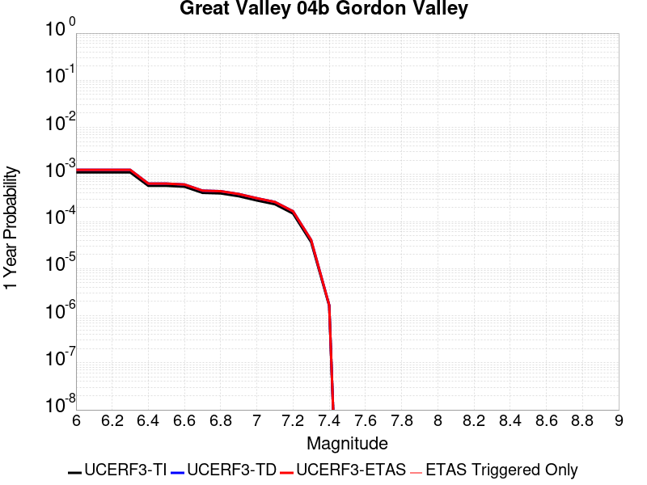 |  |

| Magnitude | 1 wk TI Prob | 1 wk TD Prob | 1 wk ETAS Prob | 1 wk ETAS/TD Gain | 1 wk ETAS Triggered Only | 1 mo TI Prob | 1 mo TD Prob | 1 mo ETAS Prob | 1 mo ETAS/TD Gain | 1 mo ETAS Triggered Only | 1 yr TI Prob | 1 yr TD Prob | 1 yr ETAS Prob | 1 yr ETAS/TD Gain | 1 yr ETAS Triggered Only | 10 yr TI Prob | 10 yr TD Prob | 10 yr ETAS Prob | 10 yr ETAS/TD Gain | 10 yr ETAS Triggered Only |
|-----|-----|-----|-----|-----|-----|-----|-----|-----|-----|-----|-----|-----|-----|-----|-----|-----|-----|-----|-----|-----|
| 6.0 | 2.1181217E-5 | 2.3982373E-5 | 2.3982373E-5 | 1.0 | 0.0 | 9.077348E-5 | 1.0277849E-4 | 1.0277849E-4 | 1.0 | 0.0 | 0.0011046068 | 0.0012507765 | 0.0012507765 | 1.0 | 0.0 | 0.010991322 | 0.012453819 | 0.0124636935 | 1.000793 | 1.0E-5 |
| 6.1 | 2.1181217E-5 | 2.3982373E-5 | 2.3982373E-5 | 1.0 | 0.0 | 9.077348E-5 | 1.0277849E-4 | 1.0277849E-4 | 1.0 | 0.0 | 0.0011046068 | 0.0012507765 | 0.0012507765 | 1.0 | 0.0 | 0.010991322 | 0.012453819 | 0.0124636935 | 1.000793 | 1.0E-5 |
| 6.2 | 2.1181217E-5 | 2.3982373E-5 | 2.3982373E-5 | 1.0 | 0.0 | 9.077348E-5 | 1.0277849E-4 | 1.0277849E-4 | 1.0 | 0.0 | 0.0011046068 | 0.0012507765 | 0.0012507765 | 1.0 | 0.0 | 0.010991322 | 0.012453819 | 0.0124636935 | 1.000793 | 1.0E-5 |
| 6.3 | 2.1181217E-5 | 2.3982373E-5 | 2.3982373E-5 | 1.0 | 0.0 | 9.077348E-5 | 1.0277849E-4 | 1.0277849E-4 | 1.0 | 0.0 | 0.0011046068 | 0.0012507765 | 0.0012507765 | 1.0 | 0.0 | 0.010991322 | 0.012453819 | 0.0124636935 | 1.000793 | 1.0E-5 |
| 6.4 | 1.0988268E-5 | 1.2254686E-5 | 1.2254686E-5 | 1.0 | 0.0 | 4.7091726E-5 | 5.2519114E-5 | 5.2519114E-5 | 1.0 | 0.0 | 5.731909E-4 | 6.392486E-4 | 6.392486E-4 | 1.0 | 0.0 | 0.005717147 | 0.006375685 | 0.006385621 | 1.0015584 | 1.0E-5 |
| 6.5 | 1.0988268E-5 | 1.2254686E-5 | 1.2254686E-5 | 1.0 | 0.0 | 4.7091726E-5 | 5.2519114E-5 | 5.2519114E-5 | 1.0 | 0.0 | 5.731909E-4 | 6.392486E-4 | 6.392486E-4 | 1.0 | 0.0 | 0.005717147 | 0.006375685 | 0.006385621 | 1.0015584 | 1.0E-5 |
| 6.6 | 1.0517822E-5 | 1.172424E-5 | 1.172424E-5 | 1.0 | 0.0 | 4.5075605E-5 | 5.0245864E-5 | 5.0245864E-5 | 1.0 | 0.0 | 5.4865726E-4 | 6.115873E-4 | 6.115873E-4 | 1.0 | 0.0 | 0.0054730466 | 0.006100596 | 0.0061105345 | 1.0016292 | 1.0E-5 |
| 6.7 | 7.789219E-6 | 8.677775E-6 | 8.677775E-6 | 1.0 | 0.0 | 3.3381937E-5 | 3.7189966E-5 | 3.7189966E-5 | 1.0 | 0.0 | 4.063493E-4 | 4.5269894E-4 | 4.5269894E-4 | 1.0 | 0.0 | 0.004056071 | 0.004518285 | 0.004518285 | 1.0 | 0.0 |
| 6.8 | 7.5850853E-6 | 8.452517E-6 | 8.452517E-6 | 1.0 | 0.0 | 3.2507105E-5 | 3.62246E-5 | 3.62246E-5 | 1.0 | 0.0 | 3.957021E-4 | 4.409504E-4 | 4.409504E-4 | 1.0 | 0.0 | 0.0039499826 | 0.004401267 | 0.004401267 | 1.0 | 0.0 |
| 6.9 | 6.604105E-6 | 7.3586607E-6 | 7.3586607E-6 | 1.0 | 0.0 | 2.8303E-5 | 3.1536758E-5 | 3.1536758E-5 | 1.0 | 0.0 | 3.4453452E-4 | 3.8389626E-4 | 3.8389626E-4 | 1.0 | 0.0 | 0.0034400085 | 0.0038327174 | 0.0038327174 | 1.0 | 0.0 |
| 7.0 | 5.3701115E-6 | 5.9885097E-6 | 5.9885097E-6 | 1.0 | 0.0 | 2.301456E-5 | 2.5664805E-5 | 2.5664805E-5 | 1.0 | 0.0 | 2.8016625E-4 | 3.1242712E-4 | 3.1242712E-4 | 1.0 | 0.0 | 0.0027981328 | 0.0031201674 | 0.0031201674 | 1.0 | 0.0 |
| 7.1 | 4.4685607E-6 | 4.986555E-6 | 4.986555E-6 | 1.0 | 0.0 | 1.9150835E-5 | 2.1370788E-5 | 2.1370788E-5 | 1.0 | 0.0 | 2.3313647E-4 | 2.6016077E-4 | 2.6016077E-4 | 1.0 | 0.0 | 0.0023289204 | 0.0025988068 | 0.0025988068 | 1.0 | 0.0 |
| 7.2 | 2.833378E-6 | 3.1644681E-6 | 3.1644681E-6 | 1.0 | 0.0 | 1.2142991E-5 | 1.3561946E-5 | 1.3561946E-5 | 1.0 | 0.0 | 1.4783088E-4 | 1.6510593E-4 | 1.6510593E-4 | 1.0 | 0.0 | 0.0014773258 | 0.0016500045 | 0.0016500045 | 1.0 | 0.0 |
| 7.3 | 7.0087293E-7 | 7.772929E-7 | 7.772929E-7 | 1.0 | 0.0 | 3.0037377E-6 | 3.3312535E-6 | 3.3312535E-6 | 1.0 | 0.0 | 3.656989E-5 | 4.0557716E-5 | 4.0557716E-5 | 1.0 | 0.0 | 3.6563876E-4 | 4.055481E-4 | 4.055481E-4 | 1.0 | 0.0 |
| 7.4 | 3.112171E-8 | 3.2068495E-8 | 3.2068495E-8 | 1.0 | 0.0 | 1.3337875E-7 | 1.374364E-7 | 1.374364E-7 | 1.0 | 0.0 | 1.6238852E-6 | 1.673287E-6 | 1.673287E-6 | 1.0 | 0.0 | 1.6238733E-5 | 1.6732753E-5 | 1.6732753E-5 | 1.0 | 0.0 |

## Emerson-Copper Mtn 2011
*[(top)](#table-of-contents)*

| 1 Week | 1 Month | 1 Year | 10 Year |
|-----|-----|-----|-----|
|  |  |  |  |

| Magnitude | 1 wk TI Prob | 1 wk TD Prob | 1 wk ETAS Prob | 1 wk ETAS/TD Gain | 1 wk ETAS Triggered Only | 1 mo TI Prob | 1 mo TD Prob | 1 mo ETAS Prob | 1 mo ETAS/TD Gain | 1 mo ETAS Triggered Only | 1 yr TI Prob | 1 yr TD Prob | 1 yr ETAS Prob | 1 yr ETAS/TD Gain | 1 yr ETAS Triggered Only | 10 yr TI Prob | 10 yr TD Prob | 10 yr ETAS Prob | 10 yr ETAS/TD Gain | 10 yr ETAS Triggered Only |
|-----|-----|-----|-----|-----|-----|-----|-----|-----|-----|-----|-----|-----|-----|-----|-----|-----|-----|-----|-----|-----|
| 6.0 | 2.1364202E-5 | 9.9681E-6 | 9.9681E-6 | 1.0 | 0.0 | 9.1557646E-5 | 4.271978E-5 | 4.271978E-5 | 1.0 | 0.0 | 0.0011141442 | 5.199979E-4 | 5.199979E-4 | 1.0 | 0.0 | 0.011085749 | 0.005188681 | 0.0051986296 | 1.0019172 | 1.0E-5 |
| 6.1 | 2.1364202E-5 | 9.9681E-6 | 9.9681E-6 | 1.0 | 0.0 | 9.1557646E-5 | 4.271978E-5 | 4.271978E-5 | 1.0 | 0.0 | 0.0011141442 | 5.199979E-4 | 5.199979E-4 | 1.0 | 0.0 | 0.011085749 | 0.005188681 | 0.0051986296 | 1.0019172 | 1.0E-5 |
| 6.2 | 2.1364202E-5 | 9.9681E-6 | 9.9681E-6 | 1.0 | 0.0 | 9.1557646E-5 | 4.271978E-5 | 4.271978E-5 | 1.0 | 0.0 | 0.0011141442 | 5.199979E-4 | 5.199979E-4 | 1.0 | 0.0 | 0.011085749 | 0.005188681 | 0.0051986296 | 1.0019172 | 1.0E-5 |
| 6.3 | 1.7751237E-5 | 8.089185E-6 | 8.089185E-6 | 1.0 | 0.0 | 7.607452E-5 | 3.466751E-5 | 3.466751E-5 | 1.0 | 0.0 | 9.258136E-4 | 4.220015E-4 | 4.220015E-4 | 1.0 | 0.0 | 0.00921966 | 0.004212624 | 0.004212624 | 1.0 | 0.0 |
| 6.4 | 1.7751237E-5 | 8.089185E-6 | 8.089185E-6 | 1.0 | 0.0 | 7.607452E-5 | 3.466751E-5 | 3.466751E-5 | 1.0 | 0.0 | 9.258136E-4 | 4.220015E-4 | 4.220015E-4 | 1.0 | 0.0 | 0.00921966 | 0.004212624 | 0.004212624 | 1.0 | 0.0 |
| 6.5 | 1.5886664E-5 | 6.6038024E-6 | 6.6038024E-6 | 1.0 | 0.0 | 6.808392E-5 | 2.830173E-5 | 2.830173E-5 | 1.0 | 0.0 | 8.286065E-4 | 3.4452378E-4 | 3.4452378E-4 | 1.0 | 0.0 | 0.008255237 | 0.0034403608 | 0.0034403608 | 1.0 | 0.0 |
| 6.6 | 1.5886664E-5 | 6.6038024E-6 | 6.6038024E-6 | 1.0 | 0.0 | 6.808392E-5 | 2.830173E-5 | 2.830173E-5 | 1.0 | 0.0 | 8.286065E-4 | 3.4452378E-4 | 3.4452378E-4 | 1.0 | 0.0 | 0.008255237 | 0.0034403608 | 0.0034403608 | 1.0 | 0.0 |
| 6.7 | 1.428471E-5 | 5.47035E-6 | 5.47035E-6 | 1.0 | 0.0 | 6.121875E-5 | 2.3444169E-5 | 2.3444169E-5 | 1.0 | 0.0 | 7.450834E-4 | 2.853993E-4 | 2.853993E-4 | 1.0 | 0.0 | 0.007425902 | 0.0028507158 | 0.0028507158 | 1.0 | 0.0 |
| 6.8 | 1.3490684E-5 | 5.073629E-6 | 5.073629E-6 | 1.0 | 0.0 | 5.7815934E-5 | 2.1743963E-5 | 2.1743963E-5 | 1.0 | 0.0 | 7.0368167E-4 | 2.6470446E-4 | 2.6470446E-4 | 1.0 | 0.0 | 0.007014576 | 0.0026442725 | 0.0026442725 | 1.0 | 0.0 |
| 6.9 | 1.2235421E-5 | 4.289579E-6 | 4.289579E-6 | 1.0 | 0.0 | 5.2436466E-5 | 1.83838E-5 | 1.83838E-5 | 1.0 | 0.0 | 6.38227E-4 | 2.2380339E-4 | 2.2380339E-4 | 1.0 | 0.0 | 0.0063639707 | 0.0022361344 | 0.0022361344 | 1.0 | 0.0 |
| 7.0 | 1.1009851E-5 | 3.718866E-6 | 3.718866E-6 | 1.0 | 0.0 | 4.7184225E-5 | 1.593792E-5 | 1.593792E-5 | 1.0 | 0.0 | 5.743165E-4 | 1.9403033E-4 | 1.9403033E-4 | 1.0 | 0.0 | 0.005728345 | 0.0019389469 | 0.0019389469 | 1.0 | 0.0 |
| 7.1 | 9.726373E-6 | 3.2115988E-6 | 3.2115988E-6 | 1.0 | 0.0 | 4.168379E-5 | 1.3763941E-5 | 1.3763941E-5 | 1.0 | 0.0 | 5.07382E-4 | 1.6756647E-4 | 1.6756647E-4 | 1.0 | 0.0 | 0.0050622504 | 0.0016747324 | 0.0016747324 | 1.0 | 0.0 |
| 7.2 | 3.9335127E-6 | 1.152438E-6 | 1.152438E-6 | 1.0 | 0.0 | 1.6857803E-5 | 4.939011E-6 | 4.939011E-6 | 1.0 | 0.0 | 2.0522442E-4 | 6.0130857E-5 | 6.0130857E-5 | 1.0 | 0.0 | 0.00205035 | 6.0115184E-4 | 6.0115184E-4 | 1.0 | 0.0 |
| 7.3 | 2.661632E-6 | 6.9111877E-7 | 6.9111877E-7 | 1.0 | 0.0 | 1.14069435E-5 | 2.9619343E-6 | 2.9619343E-6 | 1.0 | 0.0 | 1.3887069E-4 | 3.6060963E-5 | 3.6060963E-5 | 1.0 | 0.0 | 0.0013878393 | 3.6055216E-4 | 3.6055216E-4 | 1.0 | 0.0 |
| 7.4 | 2.0893426E-6 | 5.4615964E-7 | 5.4615964E-7 | 1.0 | 0.0 | 8.954295E-6 | 2.340682E-6 | 2.340682E-6 | 1.0 | 0.0 | 1.0901308E-4 | 2.8497436E-5 | 2.8497436E-5 | 1.0 | 0.0 | 0.0010895962 | 2.8493837E-4 | 2.8493837E-4 | 1.0 | 0.0 |
| 7.5 | 1.1681728E-6 | 3.6029326E-7 | 3.6029326E-7 | 1.0 | 0.0 | 5.0064455E-6 | 1.544113E-6 | 1.544113E-6 | 1.0 | 0.0 | 6.0951766E-5 | 1.879942E-5 | 1.879942E-5 | 1.0 | 0.0 | 6.093505E-4 | 1.8797876E-4 | 1.8797876E-4 | 1.0 | 0.0 |
| 7.6 | 1.3154387E-7 | 7.119745E-8 | 7.119745E-8 | 1.0 | 0.0 | 5.6375933E-7 | 3.051319E-7 | 3.051319E-7 | 1.0 | 0.0 | 6.863748E-6 | 3.7149762E-6 | 3.7149762E-6 | 1.0 | 0.0 | 6.863536E-5 | 3.7149297E-5 | 3.7149297E-5 | 1.0 | 0.0 |

## Great Valley 05 Pittsburg - Kirby Hills alt1
*[(top)](#table-of-contents)*

| 1 Week | 1 Month | 1 Year | 10 Year |
|-----|-----|-----|-----|
|  |  |  |  |

| Magnitude | 1 wk TI Prob | 1 wk TD Prob | 1 wk ETAS Prob | 1 wk ETAS/TD Gain | 1 wk ETAS Triggered Only | 1 mo TI Prob | 1 mo TD Prob | 1 mo ETAS Prob | 1 mo ETAS/TD Gain | 1 mo ETAS Triggered Only | 1 yr TI Prob | 1 yr TD Prob | 1 yr ETAS Prob | 1 yr ETAS/TD Gain | 1 yr ETAS Triggered Only | 10 yr TI Prob | 10 yr TD Prob | 10 yr ETAS Prob | 10 yr ETAS/TD Gain | 10 yr ETAS Triggered Only |
|-----|-----|-----|-----|-----|-----|-----|-----|-----|-----|-----|-----|-----|-----|-----|-----|-----|-----|-----|-----|-----|
| 6.0 | 4.187212E-5 | 5.3444855E-5 | 5.3444855E-5 | 1.0 | 0.0 | 1.794396E-4 | 2.2903502E-4 | 2.2903502E-4 | 1.0 | 0.0 | 0.002182488 | 0.0027858997 | 0.0027858997 | 1.0 | 0.0 | 0.021611776 | 0.027604194 | 0.027613917 | 1.0003523 | 1.0E-5 |
| 6.1 | 4.187212E-5 | 5.3444855E-5 | 5.3444855E-5 | 1.0 | 0.0 | 1.794396E-4 | 2.2903502E-4 | 2.2903502E-4 | 1.0 | 0.0 | 0.002182488 | 0.0027858997 | 0.0027858997 | 1.0 | 0.0 | 0.021611776 | 0.027604194 | 0.027613917 | 1.0003523 | 1.0E-5 |
| 6.2 | 1.7353306E-5 | 2.2155487E-5 | 2.2155487E-5 | 1.0 | 0.0 | 7.436919E-5 | 9.495095E-5 | 9.495095E-5 | 1.0 | 0.0 | 9.050688E-4 | 0.0011557989 | 0.0011557989 | 1.0 | 0.0 | 0.009013915 | 0.011535612 | 0.011545497 | 1.0008569 | 1.0E-5 |
| 6.3 | 1.7353306E-5 | 2.2155487E-5 | 2.2155487E-5 | 1.0 | 0.0 | 7.436919E-5 | 9.495095E-5 | 9.495095E-5 | 1.0 | 0.0 | 9.050688E-4 | 0.0011557989 | 0.0011557989 | 1.0 | 0.0 | 0.009013915 | 0.011535612 | 0.011545497 | 1.0008569 | 1.0E-5 |
| 6.4 | 1.4028824E-5 | 1.7901719E-5 | 1.7901719E-5 | 1.0 | 0.0 | 6.0122147E-5 | 7.672165E-5 | 7.672165E-5 | 1.0 | 0.0 | 7.3174125E-4 | 9.340638E-4 | 9.340638E-4 | 1.0 | 0.0 | 0.0072933645 | 0.009338545 | 0.009348451 | 1.0010608 | 1.0E-5 |

## Hector Mine
*[(top)](#table-of-contents)*

| 1 Week | 1 Month | 1 Year | 10 Year |
|-----|-----|-----|-----|
|  | 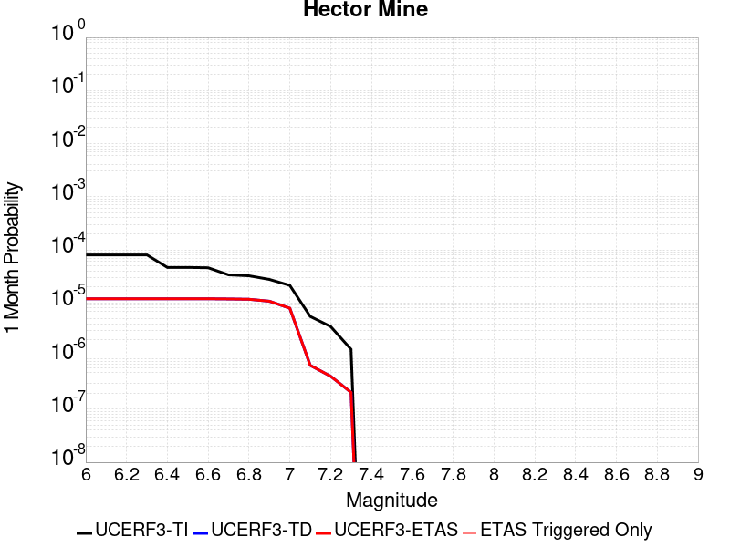 |  |  |

| Magnitude | 1 wk TI Prob | 1 wk TD Prob | 1 wk ETAS Prob | 1 wk ETAS/TD Gain | 1 wk ETAS Triggered Only | 1 mo TI Prob | 1 mo TD Prob | 1 mo ETAS Prob | 1 mo ETAS/TD Gain | 1 mo ETAS Triggered Only | 1 yr TI Prob | 1 yr TD Prob | 1 yr ETAS Prob | 1 yr ETAS/TD Gain | 1 yr ETAS Triggered Only | 10 yr TI Prob | 10 yr TD Prob | 10 yr ETAS Prob | 10 yr ETAS/TD Gain | 10 yr ETAS Triggered Only |
|-----|-----|-----|-----|-----|-----|-----|-----|-----|-----|-----|-----|-----|-----|-----|-----|-----|-----|-----|-----|-----|
| 6.0 | 1.8760093E-5 | 2.7963101E-6 | 2.7963101E-6 | 1.0 | 0.0 | 8.039792E-5 | 1.1984153E-5 | 1.1984153E-5 | 1.0 | 0.0 | 9.78405E-4 | 1.459013E-4 | 1.459013E-4 | 1.0 | 0.0 | 0.009741086 | 0.0014584473 | 0.0014684327 | 1.0068467 | 1.0E-5 |
| 6.1 | 1.8760093E-5 | 2.7963101E-6 | 2.7963101E-6 | 1.0 | 0.0 | 8.039792E-5 | 1.1984153E-5 | 1.1984153E-5 | 1.0 | 0.0 | 9.78405E-4 | 1.459013E-4 | 1.459013E-4 | 1.0 | 0.0 | 0.009741086 | 0.0014584473 | 0.0014684327 | 1.0068467 | 1.0E-5 |
| 6.2 | 1.8760093E-5 | 2.7963101E-6 | 2.7963101E-6 | 1.0 | 0.0 | 8.039792E-5 | 1.1984153E-5 | 1.1984153E-5 | 1.0 | 0.0 | 9.78405E-4 | 1.459013E-4 | 1.459013E-4 | 1.0 | 0.0 | 0.009741086 | 0.0014584473 | 0.0014684327 | 1.0068467 | 1.0E-5 |
| 6.3 | 1.8760093E-5 | 2.7963101E-6 | 2.7963101E-6 | 1.0 | 0.0 | 8.039792E-5 | 1.1984153E-5 | 1.1984153E-5 | 1.0 | 0.0 | 9.78405E-4 | 1.459013E-4 | 1.459013E-4 | 1.0 | 0.0 | 0.009741086 | 0.0014584473 | 0.0014684327 | 1.0068467 | 1.0E-5 |
| 6.4 | 1.0888055E-5 | 2.7963101E-6 | 2.7963101E-6 | 1.0 | 0.0 | 4.666226E-5 | 1.1984153E-5 | 1.1984153E-5 | 1.0 | 0.0 | 5.679649E-4 | 1.459013E-4 | 1.459013E-4 | 1.0 | 0.0 | 0.0056651547 | 0.0014584473 | 0.0014684327 | 1.0068467 | 1.0E-5 |
| 6.5 | 1.0888055E-5 | 2.7963101E-6 | 2.7963101E-6 | 1.0 | 0.0 | 4.666226E-5 | 1.1984153E-5 | 1.1984153E-5 | 1.0 | 0.0 | 5.679649E-4 | 1.459013E-4 | 1.459013E-4 | 1.0 | 0.0 | 0.0056651547 | 0.0014584473 | 0.0014684327 | 1.0068467 | 1.0E-5 |
| 6.6 | 1.0730738E-5 | 2.7963101E-6 | 2.7963101E-6 | 1.0 | 0.0 | 4.5988065E-5 | 1.1984153E-5 | 1.1984153E-5 | 1.0 | 0.0 | 5.5976084E-4 | 1.459013E-4 | 1.459013E-4 | 1.0 | 0.0 | 0.0055835294 | 0.0014584473 | 0.0014684327 | 1.0068467 | 1.0E-5 |
| 6.7 | 7.881326E-6 | 2.7709912E-6 | 2.7709912E-6 | 1.0 | 0.0 | 3.3776672E-5 | 1.1875645E-5 | 1.1875645E-5 | 1.0 | 0.0 | 4.111534E-4 | 1.4458038E-4 | 1.4458038E-4 | 1.0 | 0.0 | 0.0041039353 | 0.0014452554 | 0.0014552409 | 1.0069093 | 1.0E-5 |
| 6.8 | 7.5683483E-6 | 2.7327694E-6 | 2.7327694E-6 | 1.0 | 0.0 | 3.2435375E-5 | 1.1711839E-5 | 1.1711839E-5 | 1.0 | 0.0 | 3.9482914E-4 | 1.425863E-4 | 1.425863E-4 | 1.0 | 0.0 | 0.0039412836 | 0.0014253402 | 0.001435326 | 1.0070058 | 1.0E-5 |
| 6.9 | 6.473048E-6 | 2.5138563E-6 | 2.5138563E-6 | 1.0 | 0.0 | 2.7741338E-5 | 1.0773648E-5 | 1.0773648E-5 | 1.0 | 0.0 | 3.3769844E-4 | 1.3116523E-4 | 1.3116523E-4 | 1.0 | 0.0 | 0.0033718573 | 0.0013112677 | 0.0013212545 | 1.0076162 | 1.0E-5 |
| 7.0 | 4.9959954E-6 | 1.8564691E-6 | 1.8564691E-6 | 1.0 | 0.0 | 2.1411232E-5 | 7.9562915E-6 | 7.9562915E-6 | 1.0 | 0.0 | 2.6065056E-4 | 9.686711E-5 | 9.686711E-5 | 1.0 | 0.0 | 0.0026034506 | 9.6859847E-4 | 9.785888E-4 | 1.0103142 | 1.0E-5 |
| 7.1 | 1.2997541E-6 | 1.5600176E-7 | 1.5600176E-7 | 1.0 | 0.0 | 5.5703626E-6 | 6.685788E-7 | 6.685788E-7 | 1.0 | 0.0 | 6.7817055E-5 | 8.13992E-6 | 8.13992E-6 | 1.0 | 0.0 | 6.779636E-4 | 8.139662E-5 | 8.139662E-5 | 1.0 | 0.0 |
| 7.2 | 8.392699E-7 | 9.726067E-8 | 9.726067E-8 | 1.0 | 0.0 | 3.596866E-6 | 4.1683137E-7 | 4.1683137E-7 | 1.0 | 0.0 | 4.3790962E-5 | 5.074912E-6 | 5.074912E-6 | 1.0 | 0.0 | 4.3782333E-4 | 5.0748153E-5 | 5.0748153E-5 | 1.0 | 0.0 |
| 7.3 | 3.13015E-7 | 4.8286488E-8 | 4.8286488E-8 | 1.0 | 0.0 | 1.3414921E-6 | 2.0694208E-7 | 2.0694208E-7 | 1.0 | 0.0 | 1.6332544E-5 | 2.5195177E-6 | 2.5195177E-6 | 1.0 | 0.0 | 1.6331344E-4 | 2.5194977E-5 | 2.5194977E-5 | 1.0 | 0.0 |

## Newport-Inglewood (Offshore)
*[(top)](#table-of-contents)*

| 1 Week | 1 Month | 1 Year | 10 Year |
|-----|-----|-----|-----|
| 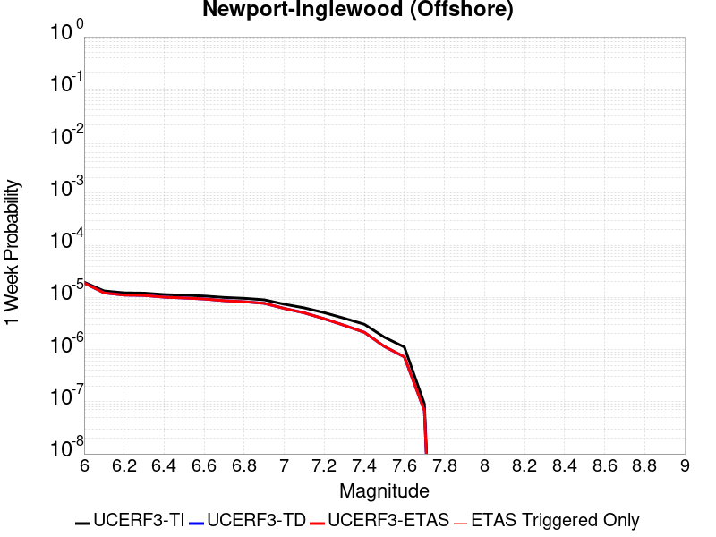 |  | 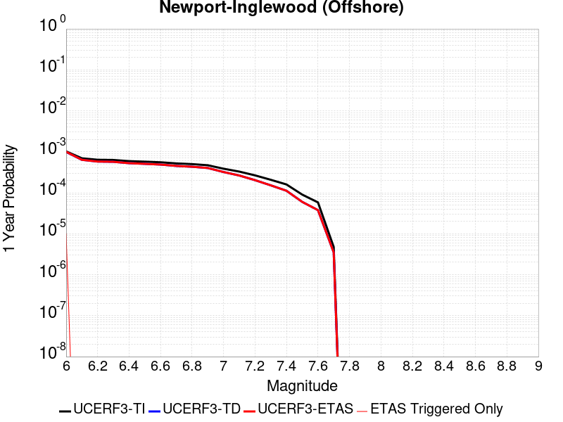 |  |

| Magnitude | 1 wk TI Prob | 1 wk TD Prob | 1 wk ETAS Prob | 1 wk ETAS/TD Gain | 1 wk ETAS Triggered Only | 1 mo TI Prob | 1 mo TD Prob | 1 mo ETAS Prob | 1 mo ETAS/TD Gain | 1 mo ETAS Triggered Only | 1 yr TI Prob | 1 yr TD Prob | 1 yr ETAS Prob | 1 yr ETAS/TD Gain | 1 yr ETAS Triggered Only | 10 yr TI Prob | 10 yr TD Prob | 10 yr ETAS Prob | 10 yr ETAS/TD Gain | 10 yr ETAS Triggered Only |
|-----|-----|-----|-----|-----|-----|-----|-----|-----|-----|-----|-----|-----|-----|-----|-----|-----|-----|-----|-----|-----|
| 6.0 | 1.9626508E-5 | 1.8965571E-5 | 1.8965571E-5 | 1.0 | 0.0 | 8.411089E-5 | 8.127856E-5 | 8.127856E-5 | 1.0 | 0.0 | 0.001023569 | 9.891298E-4 | 9.9912E-4 | 1.0100999 | 1.0E-5 | 0.010188672 | 0.009848615 | 0.009858516 | 1.0010054 | 1.0E-5 |
| 6.1 | 1.331886E-5 | 1.2218245E-5 | 1.2218245E-5 | 1.0 | 0.0 | 5.707958E-5 | 5.2362862E-5 | 5.2362862E-5 | 1.0 | 0.0 | 6.947222E-4 | 6.373329E-4 | 6.373329E-4 | 1.0 | 0.0 | 0.006925544 | 0.0063552284 | 0.0063552284 | 1.0 | 0.0 |
| 6.2 | 1.2250852E-5 | 1.1076171E-5 | 1.1076171E-5 | 1.0 | 0.0 | 5.2502597E-5 | 4.746845E-5 | 4.746845E-5 | 1.0 | 0.0 | 6.3903164E-4 | 5.777761E-4 | 5.777761E-4 | 1.0 | 0.0 | 0.006371971 | 0.0057628606 | 0.0057628606 | 1.0 | 0.0 |
| 6.3 | 1.2106258E-5 | 1.0919031E-5 | 1.0919031E-5 | 1.0 | 0.0 | 5.1882926E-5 | 4.6795016E-5 | 4.6795016E-5 | 1.0 | 0.0 | 6.3149154E-4 | 5.6958135E-4 | 5.6958135E-4 | 1.0 | 0.0 | 0.0062970007 | 0.0056813317 | 0.0056813317 | 1.0 | 0.0 |
| 6.4 | 1.1348758E-5 | 1.0109495E-5 | 1.0109495E-5 | 1.0 | 0.0 | 4.8636626E-5 | 4.332569E-5 | 4.332569E-5 | 1.0 | 0.0 | 5.919901E-4 | 5.2736345E-4 | 5.2736345E-4 | 1.0 | 0.0 | 0.005904155 | 0.0052612154 | 0.0052612154 | 1.0 | 0.0 |
| 6.5 | 1.100837E-5 | 9.743519E-6 | 9.743519E-6 | 1.0 | 0.0 | 4.7177873E-5 | 4.175727E-5 | 4.175727E-5 | 1.0 | 0.0 | 5.7423924E-4 | 5.08277E-4 | 5.08277E-4 | 1.0 | 0.0 | 0.005727576 | 0.005071236 | 0.005071236 | 1.0 | 0.0 |
| 6.6 | 1.0634696E-5 | 9.345668E-6 | 9.345668E-6 | 1.0 | 0.0 | 4.557647E-5 | 4.0052255E-5 | 4.0052255E-5 | 1.0 | 0.0 | 5.5475225E-4 | 4.8752784E-4 | 4.8752784E-4 | 1.0 | 0.0 | 0.0055336943 | 0.00486467 | 0.00486467 | 1.0 | 0.0 |
| 6.7 | 9.9780855E-6 | 8.668028E-6 | 8.668028E-6 | 1.0 | 0.0 | 4.276252E-5 | 3.714817E-5 | 3.714817E-5 | 1.0 | 0.0 | 5.205093E-4 | 4.521858E-4 | 4.521858E-4 | 1.0 | 0.0 | 0.0051929182 | 0.004512736 | 0.004512736 | 1.0 | 0.0 |
| 6.8 | 9.59546E-6 | 8.273059E-6 | 8.273059E-6 | 1.0 | 0.0 | 4.1122752E-5 | 3.545549E-5 | 3.545549E-5 | 1.0 | 0.0 | 5.0055445E-4 | 4.3158577E-4 | 4.3158577E-4 | 1.0 | 0.0 | 0.004994285 | 0.004307552 | 0.004307552 | 1.0 | 0.0 |
| 6.9 | 9.000614E-6 | 7.7069435E-6 | 7.7069435E-6 | 1.0 | 0.0 | 3.857349E-5 | 3.3029344E-5 | 3.3029344E-5 | 1.0 | 0.0 | 4.6953102E-4 | 4.0205874E-4 | 4.0205874E-4 | 1.0 | 0.0 | 0.004685402 | 0.0040133847 | 0.0040133847 | 1.0 | 0.0 |
| 7.0 | 7.4070194E-6 | 6.148973E-6 | 6.148973E-6 | 1.0 | 0.0 | 3.1743984E-5 | 2.6352478E-5 | 2.6352478E-5 | 1.0 | 0.0 | 3.8641447E-4 | 3.2079432E-4 | 3.2079432E-4 | 1.0 | 0.0 | 0.0038574322 | 0.0032033324 | 0.0032033324 | 1.0 | 0.0 |
| 7.1 | 6.299615E-6 | 5.056658E-6 | 5.056658E-6 | 1.0 | 0.0 | 2.699807E-5 | 2.1671214E-5 | 2.1671214E-5 | 1.0 | 0.0 | 3.2865192E-4 | 2.6381522E-4 | 2.6381522E-4 | 1.0 | 0.0 | 0.003281663 | 0.002635035 | 0.002635035 | 1.0 | 0.0 |
| 7.2 | 5.096653E-6 | 3.89282E-6 | 3.89282E-6 | 1.0 | 0.0 | 2.1842614E-5 | 1.6683409E-5 | 1.6683409E-5 | 1.0 | 0.0 | 2.6590136E-4 | 2.0310168E-4 | 2.0310168E-4 | 1.0 | 0.0 | 0.0026558342 | 0.0020291717 | 0.0020291717 | 1.0 | 0.0 |
| 7.3 | 3.9753018E-6 | 2.909908E-6 | 2.909908E-6 | 1.0 | 0.0 | 1.7036897E-5 | 1.2470975E-5 | 1.2470975E-5 | 1.0 | 0.0 | 2.0740448E-4 | 1.5182362E-4 | 1.5182362E-4 | 1.0 | 0.0 | 0.00207211 | 0.0015172071 | 0.0015172071 | 1.0 | 0.0 |
| 7.4 | 3.0568392E-6 | 2.1449978E-6 | 2.1449978E-6 | 1.0 | 0.0 | 1.3100675E-5 | 9.192815E-6 | 9.192815E-6 | 1.0 | 0.0 | 1.5948903E-4 | 1.11916845E-4 | 1.11916845E-4 | 1.0 | 0.0 | 0.0015937461 | 0.0011186111 | 0.0011186111 | 1.0 | 0.0 |
| 7.5 | 1.7279019E-6 | 1.1469773E-6 | 1.1469773E-6 | 1.0 | 0.0 | 7.405273E-6 | 4.915608E-6 | 4.915608E-6 | 1.0 | 0.0 | 9.015547E-5 | 5.9845923E-5 | 5.9845923E-5 | 1.0 | 0.0 | 9.01189E-4 | 5.9830194E-4 | 5.9830194E-4 | 1.0 | 0.0 |
| 7.6 | 1.1156416E-6 | 7.2230335E-7 | 7.2230335E-7 | 1.0 | 0.0 | 4.7813123E-6 | 3.0955823E-6 | 3.0955823E-6 | 1.0 | 0.0 | 5.821092E-5 | 3.7688085E-5 | 3.7688085E-5 | 1.0 | 0.0 | 5.8195676E-4 | 3.7681928E-4 | 3.7681928E-4 | 1.0 | 0.0 |
| 7.7 | 9.117973E-8 | 6.734264E-8 | 6.734264E-8 | 1.0 | 0.0 | 3.907702E-7 | 2.886113E-7 | 2.886113E-7 | 1.0 | 0.0 | 4.757617E-6 | 3.513837E-6 | 3.513837E-6 | 1.0 | 0.0 | 4.7575148E-5 | 3.5137844E-5 | 3.5137844E-5 | 1.0 | 0.0 |

## Great Valley 12
*[(top)](#table-of-contents)*

| 1 Week | 1 Month | 1 Year | 10 Year |
|-----|-----|-----|-----|
|  |  | 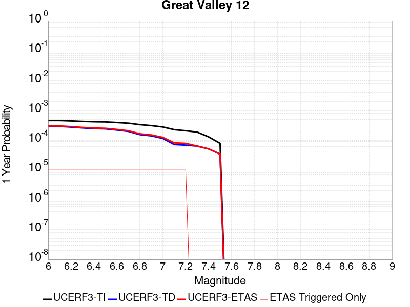 |  |

| Magnitude | 1 wk TI Prob | 1 wk TD Prob | 1 wk ETAS Prob | 1 wk ETAS/TD Gain | 1 wk ETAS Triggered Only | 1 mo TI Prob | 1 mo TD Prob | 1 mo ETAS Prob | 1 mo ETAS/TD Gain | 1 mo ETAS Triggered Only | 1 yr TI Prob | 1 yr TD Prob | 1 yr ETAS Prob | 1 yr ETAS/TD Gain | 1 yr ETAS Triggered Only | 10 yr TI Prob | 10 yr TD Prob | 10 yr ETAS Prob | 10 yr ETAS/TD Gain | 10 yr ETAS Triggered Only |
|-----|-----|-----|-----|-----|-----|-----|-----|-----|-----|-----|-----|-----|-----|-----|-----|-----|-----|-----|-----|-----|
| 6.0 | 8.757157E-6 | 5.5550795E-6 | 5.5550795E-6 | 1.0 | 0.0 | 3.7530135E-5 | 2.3807273E-5 | 2.3807273E-5 | 1.0 | 0.0 | 4.5683357E-4 | 2.898162E-4 | 2.998133E-4 | 1.0344946 | 1.0E-5 | 0.004558956 | 0.0028945035 | 0.0029044745 | 1.0034448 | 1.0E-5 |
| 6.1 | 8.757157E-6 | 5.5550795E-6 | 5.5550795E-6 | 1.0 | 0.0 | 3.7530135E-5 | 2.3807273E-5 | 2.3807273E-5 | 1.0 | 0.0 | 4.5683357E-4 | 2.898162E-4 | 2.998133E-4 | 1.0344946 | 1.0E-5 | 0.004558956 | 0.0028945035 | 0.0029044745 | 1.0034448 | 1.0E-5 |
| 6.2 | 8.499136E-6 | 5.2807454E-6 | 5.2807454E-6 | 1.0 | 0.0 | 3.642436E-5 | 2.2631577E-5 | 2.2631577E-5 | 1.0 | 0.0 | 4.4337637E-4 | 2.7550576E-4 | 2.85503E-4 | 1.0362868 | 1.0E-5 | 0.0044249278 | 0.0027517565 | 0.002761729 | 1.0036241 | 1.0E-5 |
| 6.3 | 8.186883E-6 | 4.948888E-6 | 4.948888E-6 | 1.0 | 0.0 | 3.508617E-5 | 2.1209353E-5 | 2.1209353E-5 | 1.0 | 0.0 | 4.270904E-4 | 2.5819428E-4 | 2.681917E-4 | 1.0387205 | 1.0E-5 | 0.004262705 | 0.0025790436 | 0.0025890179 | 1.0038674 | 1.0E-5 |
| 6.4 | 7.979878E-6 | 4.7208882E-6 | 4.7208882E-6 | 1.0 | 0.0 | 3.419903E-5 | 2.0232226E-5 | 2.0232226E-5 | 1.0 | 0.0 | 4.1629362E-4 | 2.4630045E-4 | 2.56298E-4 | 1.0405908 | 1.0E-5 | 0.0041551464 | 0.002460369 | 0.0024703443 | 1.0040544 | 1.0E-5 |
| 6.5 | 7.871003E-6 | 4.6008613E-6 | 4.6008613E-6 | 1.0 | 0.0 | 3.373243E-5 | 1.9717834E-5 | 1.9717834E-5 | 1.0 | 0.0 | 4.1061494E-4 | 2.4003911E-4 | 2.500367E-4 | 1.0416498 | 1.0E-5 | 0.0040985704 | 0.0023978916 | 0.0024078675 | 1.0041603 | 1.0E-5 |
| 6.6 | 7.508221E-6 | 4.204241E-6 | 4.204241E-6 | 1.0 | 0.0 | 3.2177693E-5 | 1.8018058E-5 | 1.8018058E-5 | 1.0 | 0.0 | 3.91693E-4 | 2.1934863E-4 | 2.2934643E-4 | 1.0455796 | 1.0E-5 | 0.003910033 | 0.0021914076 | 0.0022013856 | 1.0045533 | 1.0E-5 |
| 6.7 | 7.1297914E-6 | 3.7819566E-6 | 3.7819566E-6 | 1.0 | 0.0 | 3.055589E-5 | 1.6208289E-5 | 1.6208289E-5 | 1.0 | 0.0 | 3.7195446E-4 | 1.9731885E-4 | 2.0731687E-4 | 1.0506694 | 1.0E-5 | 0.0037133251 | 0.0019715154 | 0.0019814956 | 1.0050622 | 1.0E-5 |
| 6.8 | 6.376581E-6 | 2.9485184E-6 | 2.9485184E-6 | 1.0 | 0.0 | 2.7327918E-5 | 1.26364475E-5 | 1.26364475E-5 | 1.0 | 0.0 | 3.326666E-4 | 1.5383805E-4 | 1.638365E-4 | 1.0649934 | 1.0E-5 | 0.0033216903 | 0.0015373322 | 0.0015473168 | 1.0064948 | 1.0E-5 |
| 6.9 | 5.9095E-6 | 2.686582E-6 | 2.686582E-6 | 1.0 | 0.0 | 2.5326184E-5 | 1.1513874E-5 | 1.1513874E-5 | 1.0 | 0.0 | 3.0830267E-4 | 1.4017255E-4 | 1.5017115E-4 | 1.0713307 | 1.0E-5 | 0.003078753 | 0.0014008568 | 0.0014108428 | 1.0071285 | 1.0E-5 |
| 7.0 | 5.3239864E-6 | 2.1967064E-6 | 2.1967064E-6 | 1.0 | 0.0 | 2.2816885E-5 | 9.4144225E-6 | 9.4144225E-6 | 1.0 | 0.0 | 2.7776015E-4 | 1.146147E-4 | 1.2461355E-4 | 1.0872388 | 1.0E-5 | 0.0027741324 | 0.0011455694 | 0.0011555579 | 1.0087193 | 1.0E-5 |
| 7.1 | 4.329147E-6 | 1.3707703E-6 | 1.3707703E-6 | 1.0 | 0.0 | 1.8553355E-5 | 5.874717E-6 | 5.874717E-6 | 1.0 | 0.0 | 2.2586368E-4 | 7.1522416E-5 | 8.1521706E-5 | 1.1398063 | 1.0E-5 | 0.0022563424 | 7.150027E-4 | 7.249955E-4 | 1.013976 | 1.0E-5 |
| 7.2 | 3.978488E-6 | 1.3106023E-6 | 1.3106023E-6 | 1.0 | 0.0 | 1.7050552E-5 | 5.6168556E-6 | 5.6168556E-6 | 1.0 | 0.0 | 2.075707E-4 | 6.838316E-5 | 7.838247E-5 | 1.1462249 | 1.0E-5 | 0.0020737692 | 6.8362977E-4 | 6.936229E-4 | 1.0146178 | 1.0E-5 |
| 7.3 | 3.586542E-6 | 1.2157539E-6 | 1.2157539E-6 | 1.0 | 0.0 | 1.5370804E-5 | 5.2103637E-6 | 5.2103637E-6 | 1.0 | 0.0 | 1.8712347E-4 | 6.343442E-5 | 6.343442E-5 | 1.0 | 0.0 | 0.0018696598 | 6.341716E-4 | 6.341716E-4 | 1.0 | 0.0 |
| 7.4 | 2.4837766E-6 | 9.800468E-7 | 9.800468E-7 | 1.0 | 0.0 | 1.0644713E-5 | 4.2001943E-6 | 4.2001943E-6 | 1.0 | 0.0 | 1.2959167E-4 | 5.113623E-5 | 5.113623E-5 | 1.0 | 0.0 | 0.0012951613 | 5.112512E-4 | 5.112512E-4 | 1.0 | 0.0 |
| 7.5 | 1.5002679E-6 | 6.5460756E-7 | 6.5460756E-7 | 1.0 | 0.0 | 6.4297037E-6 | 2.805458E-6 | 2.805458E-6 | 1.0 | 0.0 | 7.827883E-5 | 3.415596E-5 | 3.415596E-5 | 1.0 | 0.0 | 7.825126E-4 | 3.4151124E-4 | 3.4151124E-4 | 1.0 | 0.0 |

## Elysian Park (Lower CFM)
*[(top)](#table-of-contents)*

| 1 Week | 1 Month | 1 Year | 10 Year |
|-----|-----|-----|-----|
|  |  |  |  |

| Magnitude | 1 wk TI Prob | 1 wk TD Prob | 1 wk ETAS Prob | 1 wk ETAS/TD Gain | 1 wk ETAS Triggered Only | 1 mo TI Prob | 1 mo TD Prob | 1 mo ETAS Prob | 1 mo ETAS/TD Gain | 1 mo ETAS Triggered Only | 1 yr TI Prob | 1 yr TD Prob | 1 yr ETAS Prob | 1 yr ETAS/TD Gain | 1 yr ETAS Triggered Only | 10 yr TI Prob | 10 yr TD Prob | 10 yr ETAS Prob | 10 yr ETAS/TD Gain | 10 yr ETAS Triggered Only |
|-----|-----|-----|-----|-----|-----|-----|-----|-----|-----|-----|-----|-----|-----|-----|-----|-----|-----|-----|-----|-----|
| 6.0 | 2.1766498E-6 | 2.1037972E-6 | 2.1037972E-6 | 1.0 | 0.0 | 9.328466E-6 | 9.016251E-6 | 1.901616E-5 | 2.1090984 | 1.0E-5 | 1.1356815E-4 | 1.0976877E-4 | 1.19767676E-4 | 1.0910906 | 1.0E-5 | 0.0011351013 | 0.0010972874 | 0.0011072764 | 1.0091034 | 1.0E-5 |
| 6.1 | 2.1766498E-6 | 2.1037972E-6 | 2.1037972E-6 | 1.0 | 0.0 | 9.328466E-6 | 9.016251E-6 | 1.901616E-5 | 2.1090984 | 1.0E-5 | 1.1356815E-4 | 1.0976877E-4 | 1.19767676E-4 | 1.0910906 | 1.0E-5 | 0.0011351013 | 0.0010972874 | 0.0011072764 | 1.0091034 | 1.0E-5 |
| 6.2 | 1.0031182E-6 | 9.186276E-7 | 9.186276E-7 | 1.0 | 0.0 | 4.299071E-6 | 3.93697E-6 | 1.393693E-5 | 3.5400145 | 1.0E-5 | 5.2339932E-5 | 4.7931655E-5 | 5.7931175E-5 | 1.2086204 | 1.0E-5 | 5.2327604E-4 | 4.7922297E-4 | 4.8921816E-4 | 1.0208571 | 1.0E-5 |
| 6.3 | 1.0031182E-6 | 9.186276E-7 | 9.186276E-7 | 1.0 | 0.0 | 4.299071E-6 | 3.93697E-6 | 1.393693E-5 | 3.5400145 | 1.0E-5 | 5.2339932E-5 | 4.7931655E-5 | 5.7931175E-5 | 1.2086204 | 1.0E-5 | 5.2327604E-4 | 4.7922297E-4 | 4.8921816E-4 | 1.0208571 | 1.0E-5 |
| 6.4 | 6.9606244E-7 | 6.092002E-7 | 6.092002E-7 | 1.0 | 0.0 | 2.9831212E-6 | 2.6108553E-6 | 2.6108553E-6 | 1.0 | 0.0 | 3.6318896E-5 | 3.17867E-5 | 3.17867E-5 | 1.0 | 0.0 | 3.6312963E-4 | 3.1782177E-4 | 3.1782177E-4 | 1.0 | 0.0 |
| 6.5 | 6.901879E-7 | 6.032685E-7 | 6.032685E-7 | 1.0 | 0.0 | 2.9579448E-6 | 2.5854338E-6 | 2.5854338E-6 | 1.0 | 0.0 | 3.6012385E-5 | 3.1477204E-5 | 3.1477204E-5 | 1.0 | 0.0 | 3.600655E-4 | 3.147277E-4 | 3.147277E-4 | 1.0 | 0.0 |
| 6.6 | 6.4198554E-7 | 5.5466677E-7 | 5.5466677E-7 | 1.0 | 0.0 | 2.7513638E-6 | 2.377141E-6 | 2.377141E-6 | 1.0 | 0.0 | 3.3497337E-5 | 2.8941307E-5 | 2.8941307E-5 | 1.0 | 0.0 | 3.349229E-4 | 2.8937554E-4 | 2.8937554E-4 | 1.0 | 0.0 |
| 6.7 | 6.138733E-7 | 5.2634743E-7 | 5.2634743E-7 | 1.0 | 0.0 | 2.6308828E-6 | 2.2557726E-6 | 2.2557726E-6 | 1.0 | 0.0 | 3.203053E-5 | 2.7463688E-5 | 2.7463688E-5 | 1.0 | 0.0 | 3.2025913E-4 | 2.7460305E-4 | 2.7460305E-4 | 1.0 | 0.0 |
| 6.8 | 5.84778E-7 | 5.0029945E-7 | 5.0029945E-7 | 1.0 | 0.0 | 2.506189E-6 | 2.1441388E-6 | 2.1441388E-6 | 1.0 | 0.0 | 3.0512423E-5 | 2.6104577E-5 | 2.6104577E-5 | 1.0 | 0.0 | 3.0508233E-4 | 2.6101523E-4 | 2.6101523E-4 | 1.0 | 0.0 |
| 6.9 | 5.322785E-7 | 4.5801346E-7 | 4.5801346E-7 | 1.0 | 0.0 | 2.2811914E-6 | 1.9629133E-6 | 1.9629133E-6 | 1.0 | 0.0 | 2.7773152E-5 | 2.3898207E-5 | 2.3898207E-5 | 1.0 | 0.0 | 2.7769682E-4 | 2.3895648E-4 | 2.3895648E-4 | 1.0 | 0.0 |
| 7.0 | 4.8147206E-7 | 4.1124636E-7 | 4.1124636E-7 | 1.0 | 0.0 | 2.06345E-6 | 1.7624831E-6 | 1.7624831E-6 | 1.0 | 0.0 | 2.5122214E-5 | 2.1458021E-5 | 2.1458021E-5 | 1.0 | 0.0 | 2.5119373E-4 | 2.1455958E-4 | 2.1455958E-4 | 1.0 | 0.0 |
| 7.1 | 4.1932955E-7 | 3.545618E-7 | 3.545618E-7 | 1.0 | 0.0 | 1.7971255E-6 | 1.5195495E-6 | 1.5195495E-6 | 1.0 | 0.0 | 2.1879783E-5 | 1.850036E-5 | 1.850036E-5 | 1.0 | 0.0 | 2.1877629E-4 | 1.8498824E-4 | 1.8498824E-4 | 1.0 | 0.0 |
| 7.2 | 3.426051E-7 | 2.7810648E-7 | 2.7810648E-7 | 1.0 | 0.0 | 1.4683067E-6 | 1.1918843E-6 | 1.1918843E-6 | 1.0 | 0.0 | 1.7876488E-5 | 1.4511095E-5 | 1.4511095E-5 | 1.0 | 0.0 | 1.787505E-4 | 1.451015E-4 | 1.451015E-4 | 1.0 | 0.0 |
| 7.3 | 2.7771645E-7 | 2.2096796E-7 | 2.2096796E-7 | 1.0 | 0.0 | 1.1902127E-6 | 9.4700516E-7 | 9.4700516E-7 | 1.0 | 0.0 | 1.4490744E-5 | 1.1529727E-5 | 1.1529727E-5 | 1.0 | 0.0 | 1.4489799E-4 | 1.1529131E-4 | 1.1529131E-4 | 1.0 | 0.0 |
| 7.4 | 2.2756493E-7 | 1.7840037E-7 | 1.7840037E-7 | 1.0 | 0.0 | 9.752779E-7 | 7.645728E-7 | 7.645728E-7 | 1.0 | 0.0 | 1.1873944E-5 | 9.308634E-6 | 9.308634E-6 | 1.0 | 0.0 | 1.18733085E-4 | 9.308245E-5 | 9.308245E-5 | 1.0 | 0.0 |
| 7.5 | 1.7874558E-7 | 1.3542872E-7 | 1.3542872E-7 | 1.0 | 0.0 | 7.660522E-7 | 5.8040865E-7 | 5.8040865E-7 | 1.0 | 0.0 | 9.326646E-6 | 7.066453E-6 | 7.066453E-6 | 1.0 | 0.0 | 9.326255E-5 | 7.0662296E-5 | 7.0662296E-5 | 1.0 | 0.0 |
| 7.6 | 1.3124549E-7 | 9.250901E-8 | 9.250901E-8 | 1.0 | 0.0 | 5.624805E-7 | 3.964671E-7 | 3.964671E-7 | 1.0 | 0.0 | 6.8481786E-6 | 4.8269762E-6 | 4.8269762E-6 | 1.0 | 0.0 | 6.8479676E-5 | 4.8268732E-5 | 4.8268732E-5 | 1.0 | 0.0 |
| 7.7 | 8.439993E-8 | 5.090013E-8 | 5.090013E-8 | 1.0 | 0.0 | 3.6171392E-7 | 2.181434E-7 | 2.181434E-7 | 1.0 | 0.0 | 4.403858E-6 | 2.6558928E-6 | 2.6558928E-6 | 1.0 | 0.0 | 4.4037708E-5 | 2.6558624E-5 | 2.6558624E-5 | 1.0 | 0.0 |
| 7.8 | 1.2591407E-8 | 7.22764E-9 | 7.22764E-9 | 1.0 | 0.0 | 5.3963173E-8 | 3.09756E-8 | 3.09756E-8 | 1.0 | 0.0 | 6.570014E-7 | 3.7712783E-7 | 3.7712783E-7 | 1.0 | 0.0 | 6.5699946E-6 | 3.771272E-6 | 3.771272E-6 | 1.0 | 0.0 |
| 7.9 | 2.8324232E-11 | 2.1406099E-11 | 2.1406099E-11 | 1.0 | 0.0 | 1.2138957E-10 | 9.174039E-11 | 9.174039E-11 | 1.0 | 0.0 | 1.4779177E-9 | 1.116939E-9 | 1.116939E-9 | 1.0 | 0.0 | 1.4779177E-8 | 1.1169389E-8 | 1.1169389E-8 | 1.0 | 0.0 |

## Round Valley
*[(top)](#table-of-contents)*

| 1 Week | 1 Month | 1 Year | 10 Year |
|-----|-----|-----|-----|
|  |  |  |  |

| Magnitude | 1 wk TI Prob | 1 wk TD Prob | 1 wk ETAS Prob | 1 wk ETAS/TD Gain | 1 wk ETAS Triggered Only | 1 mo TI Prob | 1 mo TD Prob | 1 mo ETAS Prob | 1 mo ETAS/TD Gain | 1 mo ETAS Triggered Only | 1 yr TI Prob | 1 yr TD Prob | 1 yr ETAS Prob | 1 yr ETAS/TD Gain | 1 yr ETAS Triggered Only | 10 yr TI Prob | 10 yr TD Prob | 10 yr ETAS Prob | 10 yr ETAS/TD Gain | 10 yr ETAS Triggered Only |
|-----|-----|-----|-----|-----|-----|-----|-----|-----|-----|-----|-----|-----|-----|-----|-----|-----|-----|-----|-----|-----|
| 6.0 | 1.588152E-5 | 1.3670716E-5 | 1.3670716E-5 | 1.0 | 0.0 | 6.806188E-5 | 5.8587688E-5 | 5.8587688E-5 | 1.0 | 0.0 | 8.283384E-4 | 7.131111E-4 | 7.131111E-4 | 1.0 | 0.0 | 0.008252576 | 0.007112115 | 0.007122044 | 1.0013961 | 1.0E-5 |
| 6.1 | 1.588152E-5 | 1.3670716E-5 | 1.3670716E-5 | 1.0 | 0.0 | 6.806188E-5 | 5.8587688E-5 | 5.8587688E-5 | 1.0 | 0.0 | 8.283384E-4 | 7.131111E-4 | 7.131111E-4 | 1.0 | 0.0 | 0.008252576 | 0.007112115 | 0.007122044 | 1.0013961 | 1.0E-5 |
| 6.2 | 1.588152E-5 | 1.3670716E-5 | 1.3670716E-5 | 1.0 | 0.0 | 6.806188E-5 | 5.8587688E-5 | 5.8587688E-5 | 1.0 | 0.0 | 8.283384E-4 | 7.131111E-4 | 7.131111E-4 | 1.0 | 0.0 | 0.008252576 | 0.007112115 | 0.007122044 | 1.0013961 | 1.0E-5 |
| 6.3 | 1.588152E-5 | 1.3670716E-5 | 1.3670716E-5 | 1.0 | 0.0 | 6.806188E-5 | 5.8587688E-5 | 5.8587688E-5 | 1.0 | 0.0 | 8.283384E-4 | 7.131111E-4 | 7.131111E-4 | 1.0 | 0.0 | 0.008252576 | 0.007112115 | 0.007122044 | 1.0013961 | 1.0E-5 |
| 6.4 | 1.588152E-5 | 1.3670716E-5 | 1.3670716E-5 | 1.0 | 0.0 | 6.806188E-5 | 5.8587688E-5 | 5.8587688E-5 | 1.0 | 0.0 | 8.283384E-4 | 7.131111E-4 | 7.131111E-4 | 1.0 | 0.0 | 0.008252576 | 0.007112115 | 0.007122044 | 1.0013961 | 1.0E-5 |
| 6.5 | 1.0646776E-5 | 7.952968E-6 | 7.952968E-6 | 1.0 | 0.0 | 4.5628243E-5 | 3.408375E-5 | 3.408375E-5 | 1.0 | 0.0 | 5.553823E-4 | 4.1489903E-4 | 4.1489903E-4 | 1.0 | 0.0 | 0.005539963 | 0.004142073 | 0.004142073 | 1.0 | 0.0 |
| 6.6 | 8.632956E-6 | 5.768648E-6 | 5.768648E-6 | 1.0 | 0.0 | 3.6997862E-5 | 2.4722565E-5 | 2.4722565E-5 | 1.0 | 0.0 | 4.5035584E-4 | 3.0095948E-4 | 3.0095948E-4 | 1.0 | 0.0 | 0.0044944426 | 0.003005897 | 0.003005897 | 1.0 | 0.0 |
| 6.7 | 8.632956E-6 | 5.768648E-6 | 5.768648E-6 | 1.0 | 0.0 | 3.6997862E-5 | 2.4722565E-5 | 2.4722565E-5 | 1.0 | 0.0 | 4.5035584E-4 | 3.0095948E-4 | 3.0095948E-4 | 1.0 | 0.0 | 0.0044944426 | 0.003005897 | 0.003005897 | 1.0 | 0.0 |
| 6.8 | 7.143895E-6 | 4.2017227E-6 | 4.2017227E-6 | 1.0 | 0.0 | 3.0616335E-5 | 1.800727E-5 | 1.800727E-5 | 1.0 | 0.0 | 3.726901E-4 | 2.1921811E-4 | 2.1921811E-4 | 1.0 | 0.0 | 0.0037206567 | 0.0021901834 | 0.0021901834 | 1.0 | 0.0 |
| 6.9 | 6.5120694E-6 | 3.6643512E-6 | 3.6643512E-6 | 1.0 | 0.0 | 2.790857E-5 | 1.5704276E-5 | 1.5704276E-5 | 1.0 | 0.0 | 3.3973387E-4 | 1.911843E-4 | 1.911843E-4 | 1.0 | 0.0 | 0.0033921495 | 0.0019103473 | 0.0019103473 | 1.0 | 0.0 |
| 7.0 | 5.0614435E-6 | 2.6835412E-6 | 2.6835412E-6 | 1.0 | 0.0 | 2.169172E-5 | 1.1500846E-5 | 1.1500846E-5 | 1.0 | 0.0 | 2.6406467E-4 | 1.4001483E-4 | 1.4001483E-4 | 1.0 | 0.0 | 0.0026375111 | 0.0013993676 | 0.0013993676 | 1.0 | 0.0 |
| 7.1 | 4.41728E-6 | 2.3573723E-6 | 2.3573723E-6 | 1.0 | 0.0 | 1.8931061E-5 | 1.0102991E-5 | 1.0102991E-5 | 1.0 | 0.0 | 2.304613E-4 | 1.2299795E-4 | 1.2299795E-4 | 1.0 | 0.0 | 0.0023022245 | 0.0012293953 | 0.0012293953 | 1.0 | 0.0 |
| 7.2 | 2.535495E-6 | 1.1208174E-6 | 1.1208174E-6 | 1.0 | 0.0 | 1.0866362E-5 | 4.803497E-6 | 4.803497E-6 | 1.0 | 0.0 | 1.3228992E-4 | 5.8481528E-5 | 5.8481528E-5 | 1.0 | 0.0 | 0.0013221119 | 5.847126E-4 | 5.847126E-4 | 1.0 | 0.0 |
| 7.3 | 7.900015E-7 | 4.0890467E-7 | 4.0890467E-7 | 1.0 | 0.0 | 3.3857161E-6 | 1.7524486E-6 | 1.7524486E-6 | 1.0 | 0.0 | 4.1220315E-5 | 2.1336062E-5 | 2.1336062E-5 | 1.0 | 0.0 | 4.121267E-4 | 2.1336062E-4 | 2.1336062E-4 | 1.0 | 0.0 |

## Keddie Ridge 2011 CFM
*[(top)](#table-of-contents)*

| 1 Week | 1 Month | 1 Year | 10 Year |
|-----|-----|-----|-----|
|  |  |  |  |

| Magnitude | 1 wk TI Prob | 1 wk TD Prob | 1 wk ETAS Prob | 1 wk ETAS/TD Gain | 1 wk ETAS Triggered Only | 1 mo TI Prob | 1 mo TD Prob | 1 mo ETAS Prob | 1 mo ETAS/TD Gain | 1 mo ETAS Triggered Only | 1 yr TI Prob | 1 yr TD Prob | 1 yr ETAS Prob | 1 yr ETAS/TD Gain | 1 yr ETAS Triggered Only | 10 yr TI Prob | 10 yr TD Prob | 10 yr ETAS Prob | 10 yr ETAS/TD Gain | 10 yr ETAS Triggered Only |
|-----|-----|-----|-----|-----|-----|-----|-----|-----|-----|-----|-----|-----|-----|-----|-----|-----|-----|-----|-----|-----|
| 6.0 | 2.2591947E-5 | 2.5189574E-5 | 2.5189574E-5 | 1.0 | 0.0 | 9.6819036E-5 | 1.07951295E-4 | 1.07951295E-4 | 1.0 | 0.0 | 0.0011781343 | 0.0013135937 | 0.0013135937 | 1.0 | 0.0 | 0.011719079 | 0.013066236 | 0.013076105 | 1.0007553 | 1.0E-5 |
| 6.1 | 2.2591947E-5 | 2.5189574E-5 | 2.5189574E-5 | 1.0 | 0.0 | 9.6819036E-5 | 1.07951295E-4 | 1.07951295E-4 | 1.0 | 0.0 | 0.0011781343 | 0.0013135937 | 0.0013135937 | 1.0 | 0.0 | 0.011719079 | 0.013066236 | 0.013076105 | 1.0007553 | 1.0E-5 |
| 6.2 | 1.3775145E-5 | 1.5323049E-5 | 1.5323049E-5 | 1.0 | 0.0 | 5.9035E-5 | 6.566869E-5 | 6.566869E-5 | 1.0 | 0.0 | 7.185141E-4 | 7.9924724E-4 | 7.9924724E-4 | 1.0 | 0.0 | 0.0071619535 | 0.007966147 | 0.007966147 | 1.0 | 0.0 |
| 6.3 | 9.705435E-6 | 1.0768508E-5 | 1.0768508E-5 | 1.0 | 0.0 | 4.1594063E-5 | 4.6150006E-5 | 4.6150006E-5 | 1.0 | 0.0 | 5.0629E-4 | 5.6174386E-4 | 5.6174386E-4 | 1.0 | 0.0 | 0.005051381 | 0.0056044697 | 0.0056044697 | 1.0 | 0.0 |
| 6.4 | 7.2549733E-6 | 8.027383E-6 | 8.027383E-6 | 1.0 | 0.0 | 3.109237E-5 | 3.4402663E-5 | 3.4402663E-5 | 1.0 | 0.0 | 3.7848388E-4 | 4.1877988E-4 | 4.1877988E-4 | 1.0 | 0.0 | 0.003778399 | 0.0041806945 | 0.0041806945 | 1.0 | 0.0 |
| 6.5 | 5.983293E-6 | 6.6131174E-6 | 6.6131174E-6 | 1.0 | 0.0 | 2.5642432E-5 | 2.8341661E-5 | 2.8341661E-5 | 1.0 | 0.0 | 3.1215188E-4 | 3.4501182E-4 | 3.4501182E-4 | 1.0 | 0.0 | 0.0031171376 | 0.0034454246 | 0.0034454246 | 1.0 | 0.0 |
| 6.6 | 4.0336154E-6 | 4.4578674E-6 | 4.4578674E-6 | 1.0 | 0.0 | 1.728681E-5 | 1.9105028E-5 | 1.9105028E-5 | 1.0 | 0.0 | 2.1044657E-4 | 2.3258293E-4 | 2.3258293E-4 | 1.0 | 0.0 | 0.002102474 | 0.0023237912 | 0.0023237912 | 1.0 | 0.0 |
| 6.7 | 1.5832104E-6 | 1.781639E-6 | 1.781639E-6 | 1.0 | 0.0 | 6.7851697E-6 | 7.635575E-6 | 7.635575E-6 | 1.0 | 0.0 | 8.260631E-5 | 9.295943E-5 | 9.295943E-5 | 1.0 | 0.0 | 8.2575605E-4 | 9.292321E-4 | 9.292321E-4 | 1.0 | 0.0 |
| 6.8 | 7.5177275E-7 | 8.5904594E-7 | 8.5904594E-7 | 1.0 | 0.0 | 3.221879E-6 | 3.6816214E-6 | 3.6816214E-6 | 1.0 | 0.0 | 3.9225673E-5 | 4.4822984E-5 | 4.4822984E-5 | 1.0 | 0.0 | 3.921875E-4 | 4.48156E-4 | 4.48156E-4 | 1.0 | 0.0 |

## Fontana (Seismicity)
*[(top)](#table-of-contents)*

| 1 Week | 1 Month | 1 Year | 10 Year |
|-----|-----|-----|-----|
|  |  |  |  |

| Magnitude | 1 wk TI Prob | 1 wk TD Prob | 1 wk ETAS Prob | 1 wk ETAS/TD Gain | 1 wk ETAS Triggered Only | 1 mo TI Prob | 1 mo TD Prob | 1 mo ETAS Prob | 1 mo ETAS/TD Gain | 1 mo ETAS Triggered Only | 1 yr TI Prob | 1 yr TD Prob | 1 yr ETAS Prob | 1 yr ETAS/TD Gain | 1 yr ETAS Triggered Only | 10 yr TI Prob | 10 yr TD Prob | 10 yr ETAS Prob | 10 yr ETAS/TD Gain | 10 yr ETAS Triggered Only |
|-----|-----|-----|-----|-----|-----|-----|-----|-----|-----|-----|-----|-----|-----|-----|-----|-----|-----|-----|-----|-----|
| 6.0 | 7.1789214E-6 | 7.552053E-6 | 7.552053E-6 | 1.0 | 0.0 | 3.076644E-5 | 3.236577E-5 | 4.2365446E-5 | 1.3089584 | 1.0E-5 | 3.7451705E-4 | 3.9402276E-4 | 4.0401882E-4 | 1.0253693 | 1.0E-5 | 0.003738865 | 0.003937241 | 0.0039472017 | 1.0025299 | 1.0E-5 |
| 6.1 | 7.1789214E-6 | 7.552053E-6 | 7.552053E-6 | 1.0 | 0.0 | 3.076644E-5 | 3.236577E-5 | 4.2365446E-5 | 1.3089584 | 1.0E-5 | 3.7451705E-4 | 3.9402276E-4 | 4.0401882E-4 | 1.0253693 | 1.0E-5 | 0.003738865 | 0.003937241 | 0.0039472017 | 1.0025299 | 1.0E-5 |
| 6.2 | 7.1789214E-6 | 7.552053E-6 | 7.552053E-6 | 1.0 | 0.0 | 3.076644E-5 | 3.236577E-5 | 4.2365446E-5 | 1.3089584 | 1.0E-5 | 3.7451705E-4 | 3.9402276E-4 | 4.0401882E-4 | 1.0253693 | 1.0E-5 | 0.003738865 | 0.003937241 | 0.0039472017 | 1.0025299 | 1.0E-5 |
| 6.3 | 7.1789214E-6 | 7.552053E-6 | 7.552053E-6 | 1.0 | 0.0 | 3.076644E-5 | 3.236577E-5 | 4.2365446E-5 | 1.3089584 | 1.0E-5 | 3.7451705E-4 | 3.9402276E-4 | 4.0401882E-4 | 1.0253693 | 1.0E-5 | 0.003738865 | 0.003937241 | 0.0039472017 | 1.0025299 | 1.0E-5 |
| 6.4 | 7.1789214E-6 | 7.552053E-6 | 7.552053E-6 | 1.0 | 0.0 | 3.076644E-5 | 3.236577E-5 | 4.2365446E-5 | 1.3089584 | 1.0E-5 | 3.7451705E-4 | 3.9402276E-4 | 4.0401882E-4 | 1.0253693 | 1.0E-5 | 0.003738865 | 0.003937241 | 0.0039472017 | 1.0025299 | 1.0E-5 |
| 6.5 | 5.2611317E-6 | 5.5327637E-6 | 5.5327637E-6 | 1.0 | 0.0 | 2.2547512E-5 | 2.3711844E-5 | 3.3711607E-5 | 1.4217201 | 1.0E-5 | 2.744814E-4 | 2.886917E-4 | 2.9868883E-4 | 1.034629 | 1.0E-5 | 0.002741426 | 0.002886917 | 0.0028968882 | 1.0034539 | 1.0E-5 |
| 6.6 | 5.2611317E-6 | 5.5327637E-6 | 5.5327637E-6 | 1.0 | 0.0 | 2.2547512E-5 | 2.3711844E-5 | 3.3711607E-5 | 1.4217201 | 1.0E-5 | 2.744814E-4 | 2.886917E-4 | 2.9868883E-4 | 1.034629 | 1.0E-5 | 0.002741426 | 0.002886917 | 0.0028968882 | 1.0034539 | 1.0E-5 |

## Joshua Tree (Seismicity)
*[(top)](#table-of-contents)*

| 1 Week | 1 Month | 1 Year | 10 Year |
|-----|-----|-----|-----|
| 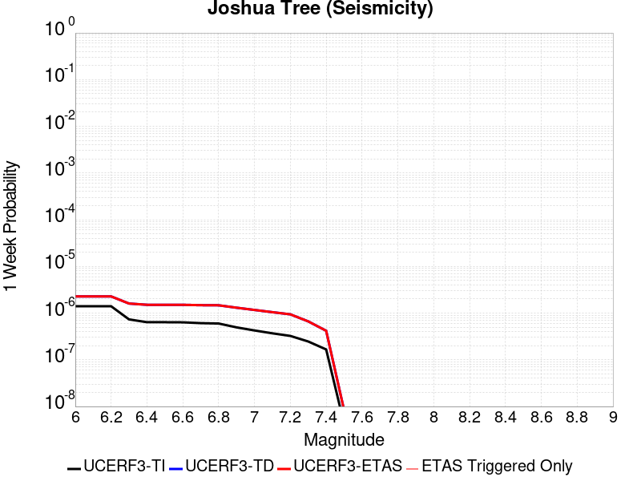 |  |  |  |

| Magnitude | 1 wk TI Prob | 1 wk TD Prob | 1 wk ETAS Prob | 1 wk ETAS/TD Gain | 1 wk ETAS Triggered Only | 1 mo TI Prob | 1 mo TD Prob | 1 mo ETAS Prob | 1 mo ETAS/TD Gain | 1 mo ETAS Triggered Only | 1 yr TI Prob | 1 yr TD Prob | 1 yr ETAS Prob | 1 yr ETAS/TD Gain | 1 yr ETAS Triggered Only | 10 yr TI Prob | 10 yr TD Prob | 10 yr ETAS Prob | 10 yr ETAS/TD Gain | 10 yr ETAS Triggered Only |
|-----|-----|-----|-----|-----|-----|-----|-----|-----|-----|-----|-----|-----|-----|-----|-----|-----|-----|-----|-----|-----|
| 6.0 | 1.4025588E-6 | 2.2783847E-6 | 2.2783847E-6 | 1.0 | 0.0 | 6.0109523E-6 | 9.764472E-6 | 9.764472E-6 | 1.0 | 0.0 | 7.318089E-5 | 1.18876625E-4 | 1.2887543E-4 | 1.0841109 | 1.0E-5 | 7.315679E-4 | 0.0011881945 | 0.0011981827 | 1.0084062 | 1.0E-5 |
| 6.1 | 1.4025588E-6 | 2.2783847E-6 | 2.2783847E-6 | 1.0 | 0.0 | 6.0109523E-6 | 9.764472E-6 | 9.764472E-6 | 1.0 | 0.0 | 7.318089E-5 | 1.18876625E-4 | 1.2887543E-4 | 1.0841109 | 1.0E-5 | 7.315679E-4 | 0.0011881945 | 0.0011981827 | 1.0084062 | 1.0E-5 |
| 6.2 | 1.4025588E-6 | 2.2783847E-6 | 2.2783847E-6 | 1.0 | 0.0 | 6.0109523E-6 | 9.764472E-6 | 9.764472E-6 | 1.0 | 0.0 | 7.318089E-5 | 1.18876625E-4 | 1.2887543E-4 | 1.0841109 | 1.0E-5 | 7.315679E-4 | 0.0011881945 | 0.0011981827 | 1.0084062 | 1.0E-5 |
| 6.3 | 7.3325685E-7 | 1.6024147E-6 | 1.6024147E-6 | 1.0 | 0.0 | 3.1425257E-6 | 6.867474E-6 | 6.867474E-6 | 1.0 | 0.0 | 3.825958E-5 | 8.360837E-5 | 8.360837E-5 | 1.0 | 0.0 | 3.8252992E-4 | 8.357777E-4 | 8.357777E-4 | 1.0 | 0.0 |
| 6.4 | 6.38256E-7 | 1.5066635E-6 | 1.5066635E-6 | 1.0 | 0.0 | 2.7353801E-6 | 6.4571136E-6 | 6.4571136E-6 | 1.0 | 0.0 | 3.3302742E-5 | 7.86126E-5 | 7.86126E-5 | 1.0 | 0.0 | 3.3297754E-4 | 7.858553E-4 | 7.858553E-4 | 1.0 | 0.0 |
| 6.5 | 6.38256E-7 | 1.5066635E-6 | 1.5066635E-6 | 1.0 | 0.0 | 2.7353801E-6 | 6.4571136E-6 | 6.4571136E-6 | 1.0 | 0.0 | 3.3302742E-5 | 7.86126E-5 | 7.86126E-5 | 1.0 | 0.0 | 3.3297754E-4 | 7.858553E-4 | 7.858553E-4 | 1.0 | 0.0 |
| 6.6 | 6.3436806E-7 | 1.5037517E-6 | 1.5037517E-6 | 1.0 | 0.0 | 2.7187175E-6 | 6.4446344E-6 | 6.4446344E-6 | 1.0 | 0.0 | 3.3099885E-5 | 7.8460675E-5 | 7.8460675E-5 | 1.0 | 0.0 | 3.3094952E-4 | 7.843372E-4 | 7.843372E-4 | 1.0 | 0.0 |
| 6.7 | 6.094856E-7 | 1.4784422E-6 | 1.4784422E-6 | 1.0 | 0.0 | 2.6120786E-6 | 6.336166E-6 | 6.336166E-6 | 1.0 | 0.0 | 3.1801592E-5 | 7.714016E-5 | 7.714016E-5 | 1.0 | 0.0 | 3.179704E-4 | 7.711412E-4 | 7.711412E-4 | 1.0 | 0.0 |
| 6.8 | 5.984801E-7 | 1.4697196E-6 | 1.4697196E-6 | 1.0 | 0.0 | 2.564912E-6 | 6.2987833E-6 | 6.2987833E-6 | 1.0 | 0.0 | 3.1227355E-5 | 7.6685064E-5 | 7.6685064E-5 | 1.0 | 0.0 | 3.1222968E-4 | 7.665933E-4 | 7.665933E-4 | 1.0 | 0.0 |
| 6.9 | 4.94631E-7 | 1.3041546E-6 | 1.3041546E-6 | 1.0 | 0.0 | 2.1198455E-6 | 5.589222E-6 | 5.589222E-6 | 1.0 | 0.0 | 2.5808813E-5 | 6.804671E-5 | 6.804671E-5 | 1.0 | 0.0 | 2.5805813E-4 | 6.802647E-4 | 6.802647E-4 | 1.0 | 0.0 |
| 7.0 | 4.250375E-7 | 1.1678469E-6 | 1.1678469E-6 | 1.0 | 0.0 | 1.8215881E-6 | 5.005049E-6 | 5.005049E-6 | 1.0 | 0.0 | 2.2177608E-5 | 6.0934817E-5 | 6.0934817E-5 | 1.0 | 0.0 | 2.2175396E-4 | 6.091861E-4 | 6.091861E-4 | 1.0 | 0.0 |
| 7.1 | 3.6888565E-7 | 1.046297E-6 | 1.046297E-6 | 1.0 | 0.0 | 1.5809376E-6 | 4.4841227E-6 | 4.4841227E-6 | 1.0 | 0.0 | 1.9247746E-5 | 5.459287E-5 | 5.459287E-5 | 1.0 | 0.0 | 1.9246078E-4 | 5.4579903E-4 | 5.4579903E-4 | 1.0 | 0.0 |
| 7.2 | 3.2473773E-7 | 9.411272E-7 | 9.411272E-7 | 1.0 | 0.0 | 1.3917323E-6 | 4.033396E-6 | 4.033396E-6 | 1.0 | 0.0 | 1.694421E-5 | 4.9105536E-5 | 4.9105536E-5 | 1.0 | 0.0 | 1.6942917E-4 | 4.9095094E-4 | 4.9095094E-4 | 1.0 | 0.0 |
| 7.3 | 2.465367E-7 | 6.6454135E-7 | 6.6454135E-7 | 1.0 | 0.0 | 1.0565853E-6 | 2.8480313E-6 | 2.8480313E-6 | 1.0 | 0.0 | 1.2863851E-5 | 3.4674264E-5 | 3.4674264E-5 | 1.0 | 0.0 | 1.2863107E-4 | 3.46692E-4 | 3.46692E-4 | 1.0 | 0.0 |
| 7.4 | 1.6654941E-7 | 4.1864584E-7 | 4.1864584E-7 | 1.0 | 0.0 | 7.13783E-7 | 1.7941954E-6 | 1.7941954E-6 | 1.0 | 0.0 | 8.690274E-6 | 2.1844138E-5 | 2.1844138E-5 | 1.0 | 0.0 | 8.689934E-5 | 2.1842266E-4 | 2.1842266E-4 | 1.0 | 0.0 |
| 7.5 | 4.24214E-9 | 8.3450304E-9 | 8.3450304E-9 | 1.0 | 0.0 | 1.81806E-8 | 3.5764415E-8 | 3.5764415E-8 | 1.0 | 0.0 | 2.213488E-7 | 4.3543173E-7 | 4.3543173E-7 | 1.0 | 0.0 | 2.2134857E-6 | 4.354315E-6 | 4.354315E-6 | 1.0 | 0.0 |

## Almanor 2011 CFM
*[(top)](#table-of-contents)*

| 1 Week | 1 Month | 1 Year | 10 Year |
|-----|-----|-----|-----|
|  |  |  | 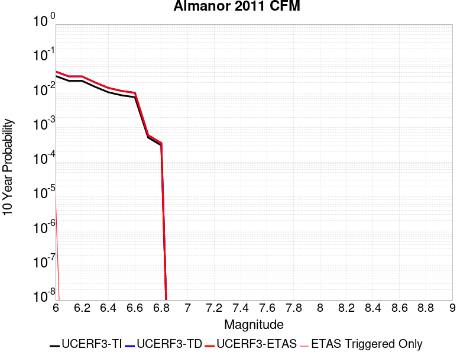 |

| Magnitude | 1 wk TI Prob | 1 wk TD Prob | 1 wk ETAS Prob | 1 wk ETAS/TD Gain | 1 wk ETAS Triggered Only | 1 mo TI Prob | 1 mo TD Prob | 1 mo ETAS Prob | 1 mo ETAS/TD Gain | 1 mo ETAS Triggered Only | 1 yr TI Prob | 1 yr TD Prob | 1 yr ETAS Prob | 1 yr ETAS/TD Gain | 1 yr ETAS Triggered Only | 10 yr TI Prob | 10 yr TD Prob | 10 yr ETAS Prob | 10 yr ETAS/TD Gain | 10 yr ETAS Triggered Only |
|-----|-----|-----|-----|-----|-----|-----|-----|-----|-----|-----|-----|-----|-----|-----|-----|-----|-----|-----|-----|-----|
| 6.0 | 6.1479834E-5 | 8.32757E-5 | 8.32757E-5 | 1.0 | 0.0 | 2.6345838E-4 | 3.5685036E-4 | 3.5685036E-4 | 1.0 | 0.0 | 0.0032028882 | 0.0043366845 | 0.0043366845 | 1.0 | 0.0 | 0.031571172 | 0.042588383 | 0.042597957 | 1.0002248 | 1.0E-5 |
| 6.1 | 4.4387216E-5 | 5.977017E-5 | 5.977017E-5 | 1.0 | 0.0 | 1.9021705E-4 | 2.5613434E-4 | 2.5613434E-4 | 1.0 | 0.0 | 0.0023134327 | 0.0031144852 | 0.0031144852 | 1.0 | 0.0 | 0.022894967 | 0.030756874 | 0.030756874 | 1.0 | 0.0 |
| 6.2 | 4.4387216E-5 | 5.977017E-5 | 5.977017E-5 | 1.0 | 0.0 | 1.9021705E-4 | 2.5613434E-4 | 2.5613434E-4 | 1.0 | 0.0 | 0.0023134327 | 0.0031144852 | 0.0031144852 | 1.0 | 0.0 | 0.022894967 | 0.030756874 | 0.030756874 | 1.0 | 0.0 |
| 6.3 | 2.9523822E-5 | 3.9548726E-5 | 3.9548726E-5 | 1.0 | 0.0 | 1.2652454E-4 | 1.6948384E-4 | 1.6948384E-4 | 1.0 | 0.0 | 0.0015393476 | 0.0020618802 | 0.0020618802 | 1.0 | 0.0 | 0.015287281 | 0.020461963 | 0.020461963 | 1.0 | 0.0 |
| 6.4 | 2.0512744E-5 | 2.7431839E-5 | 2.7431839E-5 | 1.0 | 0.0 | 8.79088E-5 | 1.17560085E-4 | 1.17560085E-4 | 1.0 | 0.0 | 0.001069764 | 0.0014306771 | 0.0014306771 | 1.0 | 0.0 | 0.010646289 | 0.01424517 | 0.01424517 | 1.0 | 0.0 |
| 6.5 | 1.6750226E-5 | 2.2391336E-5 | 2.2391336E-5 | 1.0 | 0.0 | 7.178471E-5 | 9.5959615E-5 | 9.5959615E-5 | 1.0 | 0.0 | 8.7362836E-4 | 0.0011680095 | 0.0011680095 | 1.0 | 0.0 | 0.008702018 | 0.011649679 | 0.011649679 | 1.0 | 0.0 |
| 6.6 | 1.4745303E-5 | 1.9707753E-5 | 1.9707753E-5 | 1.0 | 0.0 | 6.319262E-5 | 8.4459345E-5 | 8.4459345E-5 | 1.0 | 0.0 | 7.690986E-4 | 0.0010281415 | 0.0010281415 | 1.0 | 0.0 | 0.0076644225 | 0.010265556 | 0.010265556 | 1.0 | 0.0 |
| 6.7 | 9.951145E-7 | 1.1616605E-6 | 1.1616605E-6 | 1.0 | 0.0 | 4.26477E-6 | 4.9785367E-6 | 4.9785367E-6 | 1.0 | 0.0 | 5.1922336E-5 | 6.0612172E-5 | 6.0612172E-5 | 1.0 | 0.0 | 5.1910203E-4 | 6.0597365E-4 | 6.0597365E-4 | 1.0 | 0.0 |
| 6.8 | 5.866312E-7 | 6.8495365E-7 | 6.8495365E-7 | 1.0 | 0.0 | 2.5141312E-6 | 2.935513E-6 | 2.935513E-6 | 1.0 | 0.0 | 3.0609117E-5 | 3.5739416E-5 | 3.5739416E-5 | 1.0 | 0.0 | 3.06049E-4 | 3.5734952E-4 | 3.5734952E-4 | 1.0 | 0.0 |

## Great Valley 13 (Coalinga)
*[(top)](#table-of-contents)*

| 1 Week | 1 Month | 1 Year | 10 Year |
|-----|-----|-----|-----|
|  |  | 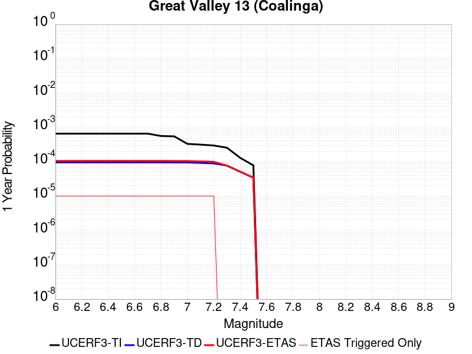 |  |

| Magnitude | 1 wk TI Prob | 1 wk TD Prob | 1 wk ETAS Prob | 1 wk ETAS/TD Gain | 1 wk ETAS Triggered Only | 1 mo TI Prob | 1 mo TD Prob | 1 mo ETAS Prob | 1 mo ETAS/TD Gain | 1 mo ETAS Triggered Only | 1 yr TI Prob | 1 yr TD Prob | 1 yr ETAS Prob | 1 yr ETAS/TD Gain | 1 yr ETAS Triggered Only | 10 yr TI Prob | 10 yr TD Prob | 10 yr ETAS Prob | 10 yr ETAS/TD Gain | 10 yr ETAS Triggered Only |
|-----|-----|-----|-----|-----|-----|-----|-----|-----|-----|-----|-----|-----|-----|-----|-----|-----|-----|-----|-----|-----|
| 6.0 | 1.25701345E-5 | 1.8250508E-6 | 1.8250508E-6 | 1.0 | 0.0 | 5.3870892E-5 | 7.8216235E-6 | 7.8216235E-6 | 1.0 | 0.0 | 6.556807E-4 | 9.5224306E-5 | 1.0522336E-4 | 1.1050053 | 1.0E-5 | 0.006537495 | 9.5185434E-4 | 9.618448E-4 | 1.0104958 | 1.0E-5 |
| 6.1 | 1.25701345E-5 | 1.8250508E-6 | 1.8250508E-6 | 1.0 | 0.0 | 5.3870892E-5 | 7.8216235E-6 | 7.8216235E-6 | 1.0 | 0.0 | 6.556807E-4 | 9.5224306E-5 | 1.0522336E-4 | 1.1050053 | 1.0E-5 | 0.006537495 | 9.5185434E-4 | 9.618448E-4 | 1.0104958 | 1.0E-5 |
| 6.2 | 1.25701345E-5 | 1.8250508E-6 | 1.8250508E-6 | 1.0 | 0.0 | 5.3870892E-5 | 7.8216235E-6 | 7.8216235E-6 | 1.0 | 0.0 | 6.556807E-4 | 9.5224306E-5 | 1.0522336E-4 | 1.1050053 | 1.0E-5 | 0.006537495 | 9.5185434E-4 | 9.618448E-4 | 1.0104958 | 1.0E-5 |
| 6.3 | 1.25701345E-5 | 1.8250508E-6 | 1.8250508E-6 | 1.0 | 0.0 | 5.3870892E-5 | 7.8216235E-6 | 7.8216235E-6 | 1.0 | 0.0 | 6.556807E-4 | 9.5224306E-5 | 1.0522336E-4 | 1.1050053 | 1.0E-5 | 0.006537495 | 9.5185434E-4 | 9.618448E-4 | 1.0104958 | 1.0E-5 |
| 6.4 | 1.25701345E-5 | 1.8250508E-6 | 1.8250508E-6 | 1.0 | 0.0 | 5.3870892E-5 | 7.8216235E-6 | 7.8216235E-6 | 1.0 | 0.0 | 6.556807E-4 | 9.5224306E-5 | 1.0522336E-4 | 1.1050053 | 1.0E-5 | 0.006537495 | 9.5185434E-4 | 9.618448E-4 | 1.0104958 | 1.0E-5 |
| 6.5 | 1.25701345E-5 | 1.8250508E-6 | 1.8250508E-6 | 1.0 | 0.0 | 5.3870892E-5 | 7.8216235E-6 | 7.8216235E-6 | 1.0 | 0.0 | 6.556807E-4 | 9.5224306E-5 | 1.0522336E-4 | 1.1050053 | 1.0E-5 | 0.006537495 | 9.5185434E-4 | 9.618448E-4 | 1.0104958 | 1.0E-5 |
| 6.6 | 1.25701345E-5 | 1.8250508E-6 | 1.8250508E-6 | 1.0 | 0.0 | 5.3870892E-5 | 7.8216235E-6 | 7.8216235E-6 | 1.0 | 0.0 | 6.556807E-4 | 9.5224306E-5 | 1.0522336E-4 | 1.1050053 | 1.0E-5 | 0.006537495 | 9.5185434E-4 | 9.618448E-4 | 1.0104958 | 1.0E-5 |
| 6.7 | 1.25701345E-5 | 1.8250508E-6 | 1.8250508E-6 | 1.0 | 0.0 | 5.3870892E-5 | 7.8216235E-6 | 7.8216235E-6 | 1.0 | 0.0 | 6.556807E-4 | 9.5224306E-5 | 1.0522336E-4 | 1.1050053 | 1.0E-5 | 0.006537495 | 9.5185434E-4 | 9.618448E-4 | 1.0104958 | 1.0E-5 |
| 6.8 | 1.0720415E-5 | 1.8250508E-6 | 1.8250508E-6 | 1.0 | 0.0 | 4.5943823E-5 | 7.8216235E-6 | 7.8216235E-6 | 1.0 | 0.0 | 5.592225E-4 | 9.5224306E-5 | 1.0522336E-4 | 1.1050053 | 1.0E-5 | 0.005578173 | 9.5185434E-4 | 9.618448E-4 | 1.0104958 | 1.0E-5 |
| 6.9 | 1.0485409E-5 | 1.8209635E-6 | 1.8209635E-6 | 1.0 | 0.0 | 4.4936693E-5 | 7.804108E-6 | 7.804108E-6 | 1.0 | 0.0 | 5.469669E-4 | 9.5011055E-5 | 1.05010105E-4 | 1.105241 | 1.0E-5 | 0.005456226 | 9.4972365E-4 | 9.597142E-4 | 1.0105194 | 1.0E-5 |
| 7.0 | 6.3302773E-6 | 1.8158357E-6 | 1.8158357E-6 | 1.0 | 0.0 | 2.7129478E-5 | 7.782131E-6 | 7.782131E-6 | 1.0 | 0.0 | 3.3025132E-4 | 9.4743526E-5 | 1.04742576E-4 | 1.1055381 | 1.0E-5 | 0.0032976097 | 9.4705063E-4 | 9.5704116E-4 | 1.0105491 | 1.0E-5 |
| 7.1 | 6.022003E-6 | 1.7661426E-6 | 1.7661426E-6 | 1.0 | 0.0 | 2.5808331E-5 | 7.569162E-6 | 7.569162E-6 | 1.0 | 0.0 | 3.141711E-4 | 9.215085E-5 | 1.0214992E-4 | 1.1085078 | 1.0E-5 | 0.0031372732 | 9.211455E-4 | 9.3113625E-4 | 1.010846 | 1.0E-5 |
| 7.2 | 5.671345E-6 | 1.7059748E-6 | 1.7059748E-6 | 1.0 | 0.0 | 2.4305538E-5 | 7.311301E-6 | 7.311301E-6 | 1.0 | 0.0 | 2.9587973E-4 | 8.901165E-5 | 9.901076E-5 | 1.1123348 | 1.0E-5 | 0.002954861 | 8.89779E-4 | 8.997701E-4 | 1.0112288 | 1.0E-5 |
| 7.3 | 4.8831785E-6 | 1.4730837E-6 | 1.4730837E-6 | 1.0 | 0.0 | 2.092774E-5 | 6.3132015E-6 | 6.3132015E-6 | 1.0 | 0.0 | 2.5476544E-4 | 7.6860684E-5 | 7.6860684E-5 | 1.0 | 0.0 | 0.0025447358 | 7.6835766E-4 | 7.6835766E-4 | 1.0 | 0.0 |
| 7.4 | 2.4837766E-6 | 9.800468E-7 | 9.800468E-7 | 1.0 | 0.0 | 1.0644713E-5 | 4.2001943E-6 | 4.2001943E-6 | 1.0 | 0.0 | 1.2959167E-4 | 5.113623E-5 | 5.113623E-5 | 1.0 | 0.0 | 0.0012951613 | 5.112512E-4 | 5.112512E-4 | 1.0 | 0.0 |
| 7.5 | 1.5002679E-6 | 6.5460756E-7 | 6.5460756E-7 | 1.0 | 0.0 | 6.4297037E-6 | 2.805458E-6 | 2.805458E-6 | 1.0 | 0.0 | 7.827883E-5 | 3.415596E-5 | 3.415596E-5 | 1.0 | 0.0 | 7.825126E-4 | 3.4151124E-4 | 3.4151124E-4 | 1.0 | 0.0 |

## Point Reyes 2011 CFM
*[(top)](#table-of-contents)*

| 1 Week | 1 Month | 1 Year | 10 Year |
|-----|-----|-----|-----|
|  |  |  |  |

| Magnitude | 1 wk TI Prob | 1 wk TD Prob | 1 wk ETAS Prob | 1 wk ETAS/TD Gain | 1 wk ETAS Triggered Only | 1 mo TI Prob | 1 mo TD Prob | 1 mo ETAS Prob | 1 mo ETAS/TD Gain | 1 mo ETAS Triggered Only | 1 yr TI Prob | 1 yr TD Prob | 1 yr ETAS Prob | 1 yr ETAS/TD Gain | 1 yr ETAS Triggered Only | 10 yr TI Prob | 10 yr TD Prob | 10 yr ETAS Prob | 10 yr ETAS/TD Gain | 10 yr ETAS Triggered Only |
|-----|-----|-----|-----|-----|-----|-----|-----|-----|-----|-----|-----|-----|-----|-----|-----|-----|-----|-----|-----|-----|
| 6.0 | 8.8644965E-6 | 8.9671985E-6 | 8.9671985E-6 | 1.0 | 0.0 | 3.7990147E-5 | 3.843032E-5 | 3.843032E-5 | 1.0 | 0.0 | 4.624319E-4 | 4.67795E-4 | 4.67795E-4 | 1.0 | 0.0 | 0.0046147075 | 0.0046687312 | 0.0046786848 | 1.0021319 | 1.0E-5 |
| 6.1 | 4.526405E-6 | 4.5392417E-6 | 4.5392417E-6 | 1.0 | 0.0 | 1.9398734E-5 | 1.9453753E-5 | 1.9453753E-5 | 1.0 | 0.0 | 2.36154E-4 | 2.3682477E-4 | 2.3682477E-4 | 1.0 | 0.0 | 0.002359032 | 0.00236583 | 0.00236583 | 1.0 | 0.0 |
| 6.2 | 4.526405E-6 | 4.5392417E-6 | 4.5392417E-6 | 1.0 | 0.0 | 1.9398734E-5 | 1.9453753E-5 | 1.9453753E-5 | 1.0 | 0.0 | 2.36154E-4 | 2.3682477E-4 | 2.3682477E-4 | 1.0 | 0.0 | 0.002359032 | 0.00236583 | 0.00236583 | 1.0 | 0.0 |
| 6.3 | 2.6842322E-6 | 2.6606945E-6 | 2.6606945E-6 | 1.0 | 0.0 | 1.1503801E-5 | 1.1402927E-5 | 1.1402927E-5 | 1.0 | 0.0 | 1.4004979E-4 | 1.38822E-4 | 1.38822E-4 | 1.0 | 0.0 | 0.0013996155 | 0.0013873745 | 0.0013873745 | 1.0 | 0.0 |
| 6.4 | 2.6842322E-6 | 2.6606945E-6 | 2.6606945E-6 | 1.0 | 0.0 | 1.1503801E-5 | 1.1402927E-5 | 1.1402927E-5 | 1.0 | 0.0 | 1.4004979E-4 | 1.38822E-4 | 1.38822E-4 | 1.0 | 0.0 | 0.0013996155 | 0.0013873745 | 0.0013873745 | 1.0 | 0.0 |
| 6.5 | 1.9281833E-6 | 1.8906428E-6 | 1.8906428E-6 | 1.0 | 0.0 | 8.263617E-6 | 8.10273E-6 | 8.10273E-6 | 1.0 | 0.0 | 1.0060489E-4 | 9.864636E-5 | 9.864636E-5 | 1.0 | 0.0 | 0.0010055936 | 9.860365E-4 | 9.860365E-4 | 1.0 | 0.0 |
| 6.6 | 1.4726726E-6 | 1.4269731E-6 | 1.4269731E-6 | 1.0 | 0.0 | 6.3114385E-6 | 6.115585E-6 | 6.115585E-6 | 1.0 | 0.0 | 7.683905E-5 | 7.445475E-5 | 7.445475E-5 | 1.0 | 0.0 | 7.6812494E-4 | 7.4430514E-4 | 7.4430514E-4 | 1.0 | 0.0 |
| 6.7 | 8.572307E-7 | 8.0073517E-7 | 8.0073517E-7 | 1.0 | 0.0 | 3.6738406E-6 | 3.4317177E-6 | 3.4317177E-6 | 1.0 | 0.0 | 4.472809E-5 | 4.178038E-5 | 4.178038E-5 | 1.0 | 0.0 | 4.471909E-4 | 4.1772908E-4 | 4.1772908E-4 | 1.0 | 0.0 |
| 6.8 | 6.6745434E-7 | 6.077435E-7 | 6.077435E-7 | 1.0 | 0.0 | 2.8605155E-6 | 2.6046125E-6 | 2.6046125E-6 | 1.0 | 0.0 | 3.482622E-5 | 3.1710704E-5 | 3.1710704E-5 | 1.0 | 0.0 | 3.4820763E-4 | 3.1706505E-4 | 3.1706505E-4 | 1.0 | 0.0 |
| 6.9 | 4.291521E-7 | 3.6537236E-7 | 3.6537236E-7 | 1.0 | 0.0 | 1.839222E-6 | 1.5658807E-6 | 1.5658807E-6 | 1.0 | 0.0 | 2.2392298E-5 | 1.9064433E-5 | 1.9064433E-5 | 1.0 | 0.0 | 2.2390042E-4 | 1.9063058E-4 | 1.9063058E-4 | 1.0 | 0.0 |
| 7.0 | 2.6812808E-7 | 2.0188676E-7 | 2.0188676E-7 | 1.0 | 0.0 | 1.1491198E-6 | 8.652287E-7 | 8.652287E-7 | 1.0 | 0.0 | 1.3990444E-5 | 1.0534109E-5 | 1.0534109E-5 | 1.0 | 0.0 | 1.3989564E-4 | 1.0533839E-4 | 1.0533839E-4 | 1.0 | 0.0 |
| 7.1 | 1.9451231E-7 | 1.2726741E-7 | 1.2726741E-7 | 1.0 | 0.0 | 8.336239E-7 | 5.4543165E-7 | 5.4543165E-7 | 1.0 | 0.0 | 1.0149324E-5 | 6.64061E-6 | 6.64061E-6 | 1.0 | 0.0 | 1.014886E-4 | 6.640634E-5 | 6.640634E-5 | 1.0 | 0.0 |
| 7.2 | 1.6715143E-7 | 1.00440445E-7 | 1.00440445E-7 | 1.0 | 0.0 | 7.1636305E-7 | 4.3045898E-7 | 4.3045898E-7 | 1.0 | 0.0 | 8.721685E-6 | 5.2408254E-6 | 5.2408254E-6 | 1.0 | 0.0 | 8.721343E-5 | 5.240924E-5 | 5.240924E-5 | 1.0 | 0.0 |
| 7.3 | 1.5503173E-7 | 9.014282E-8 | 9.014282E-8 | 1.0 | 0.0 | 6.644215E-7 | 3.863263E-7 | 3.863263E-7 | 1.0 | 0.0 | 8.089301E-6 | 4.7035123E-6 | 4.7035123E-6 | 1.0 | 0.0 | 8.089007E-5 | 4.703635E-5 | 4.703635E-5 | 1.0 | 0.0 |
| 7.4 | 1.4251614E-7 | 8.09877E-8 | 8.09877E-8 | 1.0 | 0.0 | 6.1078333E-7 | 3.4709007E-7 | 3.4709007E-7 | 1.0 | 0.0 | 7.4362615E-6 | 4.225813E-6 | 4.225813E-6 | 1.0 | 0.0 | 7.436013E-5 | 4.2259548E-5 | 4.2259548E-5 | 1.0 | 0.0 |
| 7.5 | 1.2710186E-7 | 7.030747E-8 | 7.030747E-8 | 1.0 | 0.0 | 5.447221E-7 | 3.013177E-7 | 3.013177E-7 | 1.0 | 0.0 | 6.6319717E-6 | 3.6685367E-6 | 3.6685367E-6 | 1.0 | 0.0 | 6.6317734E-5 | 3.6686983E-5 | 3.6686983E-5 | 1.0 | 0.0 |
| 7.6 | 1.0144708E-7 | 5.4962506E-8 | 5.4962506E-8 | 1.0 | 0.0 | 4.347731E-7 | 2.3555357E-7 | 2.3555357E-7 | 1.0 | 0.0 | 5.2933497E-6 | 2.8678608E-6 | 2.8678608E-6 | 1.0 | 0.0 | 5.293224E-5 | 2.8680459E-5 | 2.8680459E-5 | 1.0 | 0.0 |
| 7.7 | 7.090527E-8 | 3.983186E-8 | 3.983186E-8 | 1.0 | 0.0 | 3.038797E-7 | 1.7070796E-7 | 1.7070796E-7 | 1.0 | 0.0 | 3.699729E-6 | 2.0783675E-6 | 2.0783675E-6 | 1.0 | 0.0 | 3.6996673E-5 | 2.0785701E-5 | 2.0785701E-5 | 1.0 | 0.0 |
| 7.8 | 3.8712045E-8 | 2.7447635E-8 | 2.7447635E-8 | 1.0 | 0.0 | 1.6590876E-7 | 1.1763272E-7 | 1.1763272E-7 | 1.0 | 0.0 | 2.0199373E-6 | 1.4321774E-6 | 1.4321774E-6 | 1.0 | 0.0 | 2.0199188E-5 | 1.4323902E-5 | 1.4323902E-5 | 1.0 | 0.0 |
| 7.9 | 1.7068782E-8 | 1.1839267E-8 | 1.1839267E-8 | 1.0 | 0.0 | 7.315192E-8 | 5.0739715E-8 | 5.0739715E-8 | 1.0 | 0.0 | 8.906242E-7 | 6.1775586E-7 | 6.1775586E-7 | 1.0 | 0.0 | 8.906207E-6 | 6.1797623E-6 | 6.1797623E-6 | 1.0 | 0.0 |
| 8.0 | 1.0172592E-8 | 7.0329933E-9 | 7.0329933E-9 | 1.0 | 0.0 | 4.359682E-8 | 3.01414E-8 | 3.01414E-8 | 1.0 | 0.0 | 5.3079117E-7 | 3.6697148E-7 | 3.6697148E-7 | 1.0 | 0.0 | 5.307899E-6 | 3.6719296E-6 | 3.6719296E-6 | 1.0 | 0.0 |
| 8.1 | 3.7861243E-9 | 3.5478485E-9 | 3.5478485E-9 | 1.0 | 0.0 | 1.6226247E-8 | 1.5205064E-8 | 1.5205064E-8 | 1.0 | 0.0 | 1.9755454E-7 | 1.8512165E-7 | 1.8512165E-7 | 1.0 | 0.0 | 1.9755437E-6 | 1.8530355E-6 | 1.8530355E-6 | 1.0 | 0.0 |

