# Parent Section Magnitude-Probability Distributions

Only fault sections with at least one triggered aftershock are plotted. Sections are sorted by total supraseismogenic trigger rate (decreasing)

## Table Of Contents

* [Garlock (Central)](#garlock-central)
* [Tank Canyon](#tank-canyon)
* [Little Lake](#little-lake)
* [Owl Lake](#owl-lake)
* [Airport Lake](#airport-lake)
* [Panamint Valley](#panamint-valley)
* [Garlock (East)](#garlock-east)
* [Blackwater](#blackwater)
* [Ash Hill](#ash-hill)
* [Hunter Mountain-Saline Valley](#hunter-mountain-saline-valley)
* [Garlock (West)](#garlock-west)
* [Gravel Hills-Harper Lk](#gravel-hills-harper-lk)
* [McLean Lake](#mclean-lake)
* [Goldstone Lake](#goldstone-lake)
* [So Sierra Nevada](#so-sierra-nevada)
* [San Andreas (Mojave S)](#san-andreas-mojave-s)
* [Coyote Canyon](#coyote-canyon)
* [San Andreas (Mojave N)](#san-andreas-mojave-n)
* [Nelson Lake](#nelson-lake)
* [Lenwood-Lockhart-Old Woman Springs](#lenwood-lockhart-old-woman-springs)
* [Death Valley (So)](#death-valley-so)
* [Towne Pass](#towne-pass)
* [San Andreas (San Bernardino N)](#san-andreas-san-bernardino-n)
* [Paradise](#paradise)
* [Bicycle Lake](#bicycle-lake)
* [Garlic Springs](#garlic-springs)
* [Helendale-So Lockhart](#helendale-so-lockhart)
* [Death Valley (Black Mtns Frontal)](#death-valley-black-mtns-frontal)
* [San Andreas (San Bernardino S)](#san-andreas-san-bernardino-s)
* [Coyote Lake](#coyote-lake)
* [San Andreas (Big Bend)](#san-andreas-big-bend)
* [Death Valley (No)](#death-valley-no)
* [San Andreas (Parkfield)](#san-andreas-parkfield)
* [Sierra Nevada  (No Extension)](#sierra-nevada--no-extension)
* [White Wolf (Extension)](#white-wolf-extension)
* [Red Pass](#red-pass)
* [Ludlow](#ludlow)
* [Calico-Hidalgo](#calico-hidalgo)
* [San Andreas (Carrizo) rev](#san-andreas-carrizo-rev)
* [San Andreas (Cholame) rev](#san-andreas-cholame-rev)
* [Death Valley (Fish Lake Valley)](#death-valley-fish-lake-valley)
* [Cady](#cady)
* [Scodie Lineament](#scodie-lineament)
* [San Andreas (North Branch Mill Creek)](#san-andreas-north-branch-mill-creek)
* [San Jacinto (San Bernardino)](#san-jacinto-san-bernardino)
* [Elsinore (Glen Ivy) rev](#elsinore-glen-ivy-rev)
* [Lake Isabella (Seismicity)](#lake-isabella-seismicity)
* [Cleghorn Lake](#cleghorn-lake)
* [San Andreas (San Gorgonio Pass-Garnet HIll)](#san-andreas-san-gorgonio-pass-garnet-hill)
* [Owens Valley](#owens-valley)
* [San Andreas (Coachella) rev](#san-andreas-coachella-rev)
* [Baker](#baker)
* [Manix-Afton Hills](#manix-afton-hills)
* [San Jacinto (Stepovers Combined)](#san-jacinto-stepovers-combined)
* [San Jacinto (San Jacinto Valley) rev](#san-jacinto-san-jacinto-valley-rev)
* [San Jacinto (Anza) rev](#san-jacinto-anza-rev)
* [Ortigalita (North)](#ortigalita-north)
* [Pinto Mtn](#pinto-mtn)
* [Mission Ridge-Arroyo Parida-Santa Ana](#mission-ridge-arroyo-parida-santa-ana)
* [Pleito](#pleito)
* [Rose Canyon](#rose-canyon)
* [San Andreas (Creeping Section) 2011 CFM](#san-andreas-creeping-section-2011-cfm)
* [Independence rev 2011](#independence-rev-2011)
* [Deep Springs](#deep-springs)
* [Santa Ynez (East)](#santa-ynez-east)
* [Kern Canyon (North Kern) 2011](#kern-canyon-north-kern-2011)
* [Lost Hills](#lost-hills)
* [Blue Cut](#blue-cut)
* [Big Pine (East)](#big-pine-east)
* [Mission Creek](#mission-creek)
* [Oceanic - West Huasna](#oceanic---west-huasna)
* [Cucamonga](#cucamonga)
* [San Jacinto (Lytle Creek connector)](#san-jacinto-lytle-creek-connector)
* [Pisgah-Bullion Mtn-Mesquite Lk](#pisgah-bullion-mtn-mesquite-lk)
* [Cleghorn](#cleghorn)
* [Camp Rock 2011](#camp-rock-2011)
* [Bullion Mountains](#bullion-mountains)
* [Kern Canyon (South Kern) 2011](#kern-canyon-south-kern-2011)
* [Chino alt 1](#chino-alt-1)
* [San Luis Range 2011 CFM](#san-luis-range-2011-cfm)
* [Great Valley 09 (Laguna Seca)](#great-valley-09-laguna-seca)
* [Tin Mountain](#tin-mountain)
* [San Jacinto (Coyote Creek)](#san-jacinto-coyote-creek)
* [San Jacinto (Borrego)](#san-jacinto-borrego)
* [Cleghorn Pass](#cleghorn-pass)
* [Big Pine (Central)](#big-pine-central)
* [San Diego Trough north alt1](#san-diego-trough-north-alt1)
* [Dry Mountain](#dry-mountain)
* [Verdugo](#verdugo)
* [Sierra Madre](#sierra-madre)
* [Santa Rosa Island](#santa-rosa-island)
* [Malibu Coast (Extension) alt 1](#malibu-coast-extension-alt-1)
* [Great Valley 08 (Quinto)](#great-valley-08-quinto)
* [Sheephole](#sheephole)
* [Hollywood](#hollywood)
* [Red Mountain](#red-mountain)
* [Channel Islands Thrust](#channel-islands-thrust)
* [Hunting Creek - Berryessa 2011 CFM](#hunting-creek---berryessa-2011-cfm)
* [Imperial](#imperial)
* [Elysian Park (Upper)](#elysian-park-upper)
* [White Mountains](#white-mountains)
* [San Gabriel](#san-gabriel)
* [Brawley (Seismic Zone) alt 1](#brawley-seismic-zone-alt-1)
* [Santa Cruz Island](#santa-cruz-island)
* [Raymond](#raymond)
* [Whittier alt 1](#whittier-alt-1)
* [Elmore Ranch](#elmore-ranch)
* [Santa Susana East (connector)](#santa-susana-east-connector)
* [Monterey Bay-Tularcitos](#monterey-bay-tularcitos)
* [Coronado Bank alt1](#coronado-bank-alt1)
* [Oak Ridge (Onshore)](#oak-ridge-onshore)
* [Santa Ynez (West)](#santa-ynez-west)
* [Pine Mtn](#pine-mtn)
* [San Jacinto (Superstition Mtn)](#san-jacinto-superstition-mtn)
* [Malibu Coast alt 1](#malibu-coast-alt-1)
* [Santa Ynez River](#santa-ynez-river)
* [Johnson Valley (No) 2011 rev](#johnson-valley-no-2011-rev)
* [Puente Hills](#puente-hills)
* [Clamshell-Sawpit](#clamshell-sawpit)
* [Simi-Santa Rosa](#simi-santa-rosa)
* [Hosgri (Extension)](#hosgri-extension)
* [San Diego Trough south](#san-diego-trough-south)
* [White Wolf](#white-wolf)
* [Santa Susana alt 1](#santa-susana-alt-1)
* [Sierra Madre (San Fernando)](#sierra-madre-san-fernando)
* [Ortigalita (South)](#ortigalita-south)
* [San Cayetano](#san-cayetano)
* [Cedar Mtn-Mahogany Mtn](#cedar-mtn-mahogany-mtn)
* [Northridge](#northridge)
* [Rinconada 2011 CFM](#rinconada-2011-cfm)
* [Santa Monica alt 1](#santa-monica-alt-1)
* [Goose Lake 2011 CFM](#goose-lake-2011-cfm)
* [Emerson-Copper Mtn 2011](#emerson-copper-mtn-2011)
* [Del Valle](#del-valle)
* [Los Osos 2011](#los-osos-2011)
* [Point Reyes 2011 CFM](#point-reyes-2011-cfm)
* [Great Valley 07 (Orestimba)](#great-valley-07-orestimba)
* [Oceanside alt1](#oceanside-alt1)
* [Great Valley 05 Pittsburg - Kirby Hills alt1](#great-valley-05-pittsburg---kirby-hills-alt1)
* [Newport-Inglewood (Offshore)](#newport-inglewood-offshore)
* [San Jacinto (Clark) rev](#san-jacinto-clark-rev)
* [Fontana (Seismicity)](#fontana-seismicity)
* [Palos Verdes](#palos-verdes)
* [Santa Cruz Catalina Ridge alt1](#santa-cruz-catalina-ridge-alt1)
* [Great Valley 11](#great-valley-11)
* [San Gabriel (Extension)](#san-gabriel-extension)
* [Los Alamos 2011 CFM](#los-alamos-2011-cfm)
* [Kern Canyon (Lake Isabella) 2011](#kern-canyon-lake-isabella-2011)
* [Gillem - Big Crack 2011 CFM](#gillem---big-crack-2011-cfm)
* [San Juan](#san-juan)
* [Reliz 2011 CFM](#reliz-2011-cfm)
* [Round Valley](#round-valley)
* [Keddie Ridge 2011 CFM](#keddie-ridge-2011-cfm)
* [Green Valley 2011 CFM](#green-valley-2011-cfm)
* [Newport-Inglewood alt 1](#newport-inglewood-alt-1)
* [Channel Islands Western Deep Ramp](#channel-islands-western-deep-ramp)
* [Ozena](#ozena)
* [Calaveras (So) 2011 CFM](#calaveras-so-2011-cfm)
* [Elysian Park (Lower CFM)](#elysian-park-lower-cfm)
* [Almanor 2011 CFM](#almanor-2011-cfm)
* [San Andreas (Offshore) 2011 CFM](#san-andreas-offshore-2011-cfm)
* [Robinson Creek](#robinson-creek)
* [San Pedro Basin](#san-pedro-basin)
* [Hat Creek-McArthur-Mayfield](#hat-creek-mcarthur-mayfield)
* [Joshua Tree (Seismicity)](#joshua-tree-seismicity)
* [North Frontal  (West)](#north-frontal--west)
* [Northridge Hills](#northridge-hills)
* [La Panza 2011](#la-panza-2011)
* [Sisar](#sisar)
* [Owens Valley Keough Hot Springs](#owens-valley-keough-hot-springs)
* [San Gregorio (North) 2011 CFM](#san-gregorio-north-2011-cfm)

## Garlock (Central)
*[(top)](#table-of-contents)*

| 1 Week | 1 Month | 1 Year | 10 Year |
|-----|-----|-----|-----|
|  |  |  |  |

| Magnitude | 1 wk TI Prob | 1 wk TD Prob | 1 wk ETAS Prob | 1 wk ETAS/TD Gain | 1 wk ETAS Triggered Only | 1 mo TI Prob | 1 mo TD Prob | 1 mo ETAS Prob | 1 mo ETAS/TD Gain | 1 mo ETAS Triggered Only | 1 yr TI Prob | 1 yr TD Prob | 1 yr ETAS Prob | 1 yr ETAS/TD Gain | 1 yr ETAS Triggered Only | 10 yr TI Prob | 10 yr TD Prob | 10 yr ETAS Prob | 10 yr ETAS/TD Gain | 10 yr ETAS Triggered Only |
|-----|-----|-----|-----|-----|-----|-----|-----|-----|-----|-----|-----|-----|-----|-----|-----|-----|-----|-----|-----|-----|
| 6.0 | 5.5131142E-5 | 7.0252914E-5 | 0.0053336723 | 75.921005 | 0.005263789 | 2.3625491E-4 | 3.0104956E-4 | 0.013486527 | 44.798363 | 0.013189448 | 0.0028726095 | 0.0036591839 | 0.038148824 | 10.425501 | 0.034616306 | 0.028357591 | 0.03608289 | 0.09049682 | 2.508026 | 0.05645084 |
| 6.1 | 5.5131142E-5 | 7.0252914E-5 | 0.0053336723 | 75.921005 | 0.005263789 | 2.3625491E-4 | 3.0104956E-4 | 0.013486527 | 44.798363 | 0.013189448 | 0.0028726095 | 0.0036591839 | 0.038148824 | 10.425501 | 0.034616306 | 0.028357591 | 0.03608289 | 0.09049682 | 2.508026 | 0.05645084 |
| 6.2 | 4.216245E-5 | 5.166702E-5 | 0.0036366137 | 70.38559 | 0.0035851318 | 1.806837E-4 | 2.2141146E-4 | 0.008576876 | 38.737267 | 0.008357314 | 0.0021976046 | 0.0026923837 | 0.025066035 | 9.3099785 | 0.022434052 | 0.021759989 | 0.02669258 | 0.06268395 | 2.348366 | 0.036978416 |
| 6.3 | 4.216245E-5 | 5.166702E-5 | 0.0036366137 | 70.38559 | 0.0035851318 | 1.806837E-4 | 2.2141146E-4 | 0.008576876 | 38.737267 | 0.008357314 | 0.0021976046 | 0.0026923837 | 0.025066035 | 9.3099785 | 0.022434052 | 0.021759989 | 0.02669258 | 0.06268395 | 2.348366 | 0.036978416 |
| 6.4 | 3.6858168E-5 | 4.411584E-5 | 0.003101535 | 70.30434 | 0.003057554 | 1.5795401E-4 | 1.8905434E-4 | 0.0071541644 | 37.841843 | 0.006966427 | 0.0019213937 | 0.0022993318 | 0.020554623 | 8.939389 | 0.018297361 | 0.019048655 | 0.02285164 | 0.05200206 | 2.275638 | 0.029832134 |
| 6.5 | 3.39199E-5 | 4.0023286E-5 | 0.0028216864 | 70.50112 | 0.0027817746 | 1.453629E-4 | 1.7151721E-4 | 0.0065253433 | 38.04483 | 0.006354916 | 0.0017683565 | 0.0020862438 | 0.018789932 | 9.006585 | 0.016738608 | 0.017543508 | 0.02076252 | 0.047333438 | 2.279754 | 0.027134292 |
| 6.6 | 3.3571985E-5 | 3.947746E-5 | 0.0027971624 | 70.85467 | 0.0027577938 | 1.4387199E-4 | 1.6917827E-4 | 0.0064870543 | 38.344486 | 0.006318945 | 0.0017502342 | 0.0020578213 | 0.018702157 | 9.088328 | 0.016678657 | 0.017365133 | 0.02048383 | 0.046933115 | 2.2912276 | 0.027002398 |
| 6.7 | 3.2580007E-5 | 3.8093858E-5 | 0.0026638932 | 69.92973 | 0.0026258994 | 1.3962112E-4 | 1.632493E-4 | 0.0061814515 | 37.865105 | 0.006019185 | 0.0016985617 | 0.0019857697 | 0.017973144 | 9.050971 | 0.016019184 | 0.016856372 | 0.019776449 | 0.04511652 | 2.2813258 | 0.025851319 |
| 6.8 | 3.2185937E-5 | 3.7521055E-5 | 0.0026393419 | 70.34296 | 0.0026019185 | 1.3793244E-4 | 1.6079473E-4 | 0.0060111727 | 37.38414 | 0.005851319 | 0.0016780337 | 0.0019559395 | 0.017608717 | 9.00269 | 0.015683454 | 0.016654192 | 0.01948324 | 0.044372376 | 2.277464 | 0.025383692 |
| 6.9 | 3.165394E-5 | 3.672561E-5 | 0.0025666086 | 69.88607 | 0.002529976 | 1.3565269E-4 | 1.5738611E-4 | 0.0058639217 | 37.258194 | 0.005707434 | 0.0016503202 | 0.0019145131 | 0.017184982 | 8.976163 | 0.01529976 | 0.01638118 | 0.01907586 | 0.0434343 | 2.2769248 | 0.024832135 |
| 7.0 | 3.0903822E-5 | 3.5630834E-5 | 0.002469597 | 69.31066 | 0.0024340528 | 1.3243823E-4 | 1.5269476E-4 | 0.005691417 | 37.273167 | 0.005539568 | 0.0016112428 | 0.0018574947 | 0.01665011 | 8.963745 | 0.014820144 | 0.015996104 | 0.018515008 | 0.042087123 | 2.2731357 | 0.024016786 |
| 7.1 | 3.0069863E-5 | 3.4397097E-5 | 0.0023964262 | 69.669426 | 0.0023621104 | 1.2886449E-4 | 1.4740792E-4 | 0.0055303075 | 37.51703 | 0.005383693 | 0.0015677959 | 0.0017932352 | 0.016060172 | 8.9559765 | 0.014292566 | 0.01556781 | 0.017882649 | 0.040669184 | 2.274226 | 0.02320144 |
| 7.2 | 2.7957109E-5 | 3.1286367E-5 | 0.0019377015 | 61.934372 | 0.0019064748 | 1.1981068E-4 | 1.3407765E-4 | 0.0045819227 | 34.17365 | 0.0044484413 | 0.0014577188 | 0.0016311926 | 0.013709779 | 8.404758 | 0.012098322 | 0.014481937 | 0.016286217 | 0.035642024 | 2.1884778 | 0.019676259 |
| 7.3 | 2.4519275E-5 | 2.6719412E-5 | 0.0014655299 | 54.848885 | 0.0014388489 | 1.0507837E-4 | 1.14506816E-4 | 0.0034114914 | 29.79291 | 0.003297362 | 0.0012785783 | 0.0013932437 | 0.010122073 | 7.265113 | 0.008741007 | 0.012712469 | 0.013930428 | 0.02804754 | 2.013401 | 0.014316547 |
| 7.4 | 2.3225532E-5 | 2.5203923E-5 | 0.0012601848 | 49.99955 | 0.001235012 | 9.95342E-5 | 1.0801242E-4 | 0.002949432 | 27.306416 | 0.0028417266 | 0.0012111551 | 0.0013142723 | 0.009109769 | 6.9314165 | 0.0078057554 | 0.012045753 | 0.013148054 | 0.025773605 | 1.9602602 | 0.012793765 |
| 7.5 | 2.097765E-5 | 2.2487986E-5 | 9.936892E-4 | 44.187557 | 9.71223E-4 | 8.9901114E-5 | 9.637359E-5 | 0.00239831 | 24.885553 | 0.0023021582 | 0.0010939965 | 0.0011727286 | 0.007112996 | 6.0653386 | 0.005947242 | 0.010886264 | 0.011742581 | 0.021293366 | 1.8133464 | 0.009664268 |
| 7.6 | 1.511254E-5 | 1.5995334E-5 | 5.5555505E-4 | 34.73232 | 5.3956837E-4 | 6.476642E-5 | 6.854967E-5 | 0.0014353625 | 20.939013 | 0.0013669065 | 7.882459E-4 | 8.342805E-4 | 0.004248696 | 5.0926466 | 0.0034172663 | 0.007854558 | 0.008385628 | 0.013961973 | 1.6649883 | 0.0056235013 |
| 7.7 | 9.934069E-6 | 1.0682508E-5 | 1.3058531E-4 | 12.224217 | 1.1990408E-4 | 4.2573887E-5 | 4.5781377E-5 | 4.17467E-4 | 9.118708 | 3.7170263E-4 | 5.182138E-4 | 5.572461E-4 | 0.0015998302 | 2.8709583 | 0.0010431655 | 0.00517007 | 0.0056296107 | 0.0073942007 | 1.313448 | 0.0017745803 |
| 7.8 | 6.7562896E-6 | 8.431477E-6 | 4.4402397E-5 | 5.266266 | 3.597122E-5 | 2.8955206E-5 | 3.61344E-5 | 2.6394392E-4 | 7.3045053 | 2.2781774E-4 | 3.5247262E-4 | 4.3984767E-4 | 0.0011110152 | 2.525909 | 6.7146285E-4 | 0.0035191406 | 0.0044482257 | 0.0056061214 | 1.2603052 | 0.0011630695 |
| 7.9 | 3.975453E-6 | 5.3728795E-6 | 2.9353567E-5 | 5.4632835 | 2.3980816E-5 | 1.7037546E-5 | 2.3026425E-5 | 1.7889813E-4 | 7.7692537 | 1.558753E-4 | 2.0741238E-4 | 2.8031075E-4 | 6.878703E-4 | 2.4539564 | 4.0767386E-4 | 0.002072189 | 0.0028345888 | 0.003468279 | 1.2235563 | 6.354916E-4 |
| 8.0 | 1.6729537E-6 | 2.078155E-6 | 2.078155E-6 | 1.0 | 0.0 | 7.169782E-6 | 8.906349E-6 | 5.6867553E-5 | 6.385058 | 4.7961632E-5 | 8.7288594E-5 | 1.08429434E-4 | 2.2832051E-4 | 2.105706 | 1.1990408E-4 | 8.7254314E-4 | 0.001097267 | 0.0012769258 | 1.163733 | 1.7985611E-4 |
| 8.1 | 3.6733252E-7 | 3.1499187E-7 | 3.1499187E-7 | 1.0 | 0.0 | 1.5742813E-6 | 1.3499646E-6 | 1.3499646E-6 | 1.0 | 0.0 | 1.9166706E-5 | 1.643571E-5 | 2.842592E-5 | 1.7295219 | 1.1990408E-5 | 1.9165053E-4 | 1.6643589E-4 | 1.9041271E-4 | 1.1440604 | 2.3980816E-5 |

## Tank Canyon
*[(top)](#table-of-contents)*

| 1 Week | 1 Month | 1 Year | 10 Year |
|-----|-----|-----|-----|
|  | 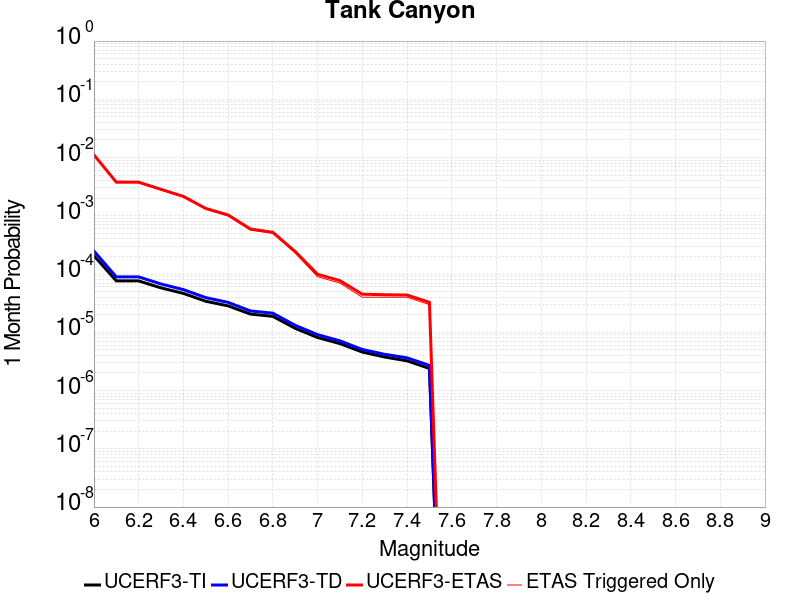 |  |  |

| Magnitude | 1 wk TI Prob | 1 wk TD Prob | 1 wk ETAS Prob | 1 wk ETAS/TD Gain | 1 wk ETAS Triggered Only | 1 mo TI Prob | 1 mo TD Prob | 1 mo ETAS Prob | 1 mo ETAS/TD Gain | 1 mo ETAS Triggered Only | 1 yr TI Prob | 1 yr TD Prob | 1 yr ETAS Prob | 1 yr ETAS/TD Gain | 1 yr ETAS Triggered Only | 10 yr TI Prob | 10 yr TD Prob | 10 yr ETAS Prob | 10 yr ETAS/TD Gain | 10 yr ETAS Triggered Only |
|-----|-----|-----|-----|-----|-----|-----|-----|-----|-----|-----|-----|-----|-----|-----|-----|-----|-----|-----|-----|-----|
| 6.0 | 4.8284557E-5 | 5.796635E-5 | 0.0040145717 | 69.256935 | 0.0039568343 | 2.0691741E-4 | 2.484074E-4 | 0.011037094 | 44.43142 | 0.010791367 | 0.0025163088 | 0.0030208372 | 0.03120881 | 10.331179 | 0.028273381 | 0.02488006 | 0.029864404 | 0.077894256 | 2.6082642 | 0.049508393 |
| 6.1 | 1.7796336E-5 | 2.0873764E-5 | 0.00125586 | 60.16452 | 0.001235012 | 7.626778E-5 | 8.945614E-5 | 0.0037462034 | 41.877544 | 0.0036570744 | 9.281647E-4 | 0.0010886216 | 0.011137622 | 10.230941 | 0.010059952 | 0.009242975 | 0.010836975 | 0.028354887 | 2.6164947 | 0.017709833 |
| 6.2 | 1.7796336E-5 | 2.0873764E-5 | 0.00125586 | 60.16452 | 0.001235012 | 7.626778E-5 | 8.945614E-5 | 0.0037462034 | 41.877544 | 0.0036570744 | 9.281647E-4 | 0.0010886216 | 0.011137622 | 10.230941 | 0.010059952 | 0.009242975 | 0.010836975 | 0.028354887 | 2.6164947 | 0.017709833 |
| 6.3 | 1.3515912E-5 | 1.575988E-5 | 9.5099694E-4 | 60.342903 | 9.352518E-4 | 5.792405E-5 | 6.7540735E-5 | 0.00277719 | 41.11874 | 0.002709832 | 7.049971E-4 | 8.220222E-4 | 0.008010353 | 9.744692 | 0.007194245 | 0.007027647 | 0.008192427 | 0.020893274 | 2.5503151 | 0.012805755 |
| 6.4 | 1.0870146E-5 | 1.2618259E-5 | 7.7999465E-4 | 61.814762 | 7.673861E-4 | 4.658551E-5 | 5.407723E-5 | 0.002152285 | 39.80021 | 0.0020983214 | 5.67031E-4 | 6.582093E-4 | 0.006074306 | 9.228533 | 0.005419664 | 0.005655863 | 0.006564614 | 0.016213087 | 2.4697702 | 0.00971223 |
| 6.5 | 7.964826E-6 | 9.196251E-6 | 5.24779E-4 | 57.06445 | 5.155875E-4 | 3.4134522E-5 | 3.941197E-5 | 0.0013702947 | 34.76849 | 0.0013309353 | 4.1550855E-4 | 4.7974577E-4 | 0.0038953726 | 8.11966 | 0.0034172663 | 0.0041473247 | 0.0047884025 | 0.01095776 | 2.2883956 | 0.006199041 |
| 6.6 | 6.6317E-6 | 7.6124184E-6 | 3.7931223E-4 | 49.828083 | 3.7170263E-4 | 2.8421264E-5 | 3.2624295E-5 | 0.0010517756 | 32.239033 | 0.0010191847 | 3.4597394E-4 | 3.971375E-4 | 0.0030819222 | 7.76034 | 0.0026858514 | 0.0034543579 | 0.00396543 | 0.008694802 | 2.1926506 | 0.0047482015 |
| 6.7 | 4.793663E-6 | 5.4308543E-6 | 2.5722804E-4 | 47.364197 | 2.5179857E-4 | 2.0544108E-5 | 2.3274906E-5 | 6.2278134E-4 | 26.75763 | 5.995204E-4 | 2.500958E-4 | 2.8333953E-4 | 0.0018416508 | 6.499802 | 0.001558753 | 0.0024981452 | 0.0028304753 | 0.0055804634 | 1.9715639 | 0.0027577938 |
| 6.8 | 4.382823E-6 | 4.969316E-6 | 2.3278593E-4 | 46.844666 | 2.2781774E-4 | 1.8783392E-5 | 2.1296917E-5 | 5.488636E-4 | 25.771975 | 5.2757794E-4 | 2.286638E-4 | 2.5926338E-4 | 0.0016497901 | 6.3633747 | 0.0013908873 | 0.0022842865 | 0.0025902835 | 0.00504195 | 1.9464858 | 0.0024580336 |
| 6.9 | 2.729601E-6 | 3.0735694E-6 | 1.2297728E-4 | 40.011227 | 1.1990408E-4 | 1.1698237E-5 | 1.317238E-5 | 2.5297736E-4 | 19.205137 | 2.3980816E-4 | 1.4241673E-4 | 1.6036315E-4 | 8.197298E-4 | 5.111709 | 6.594724E-4 | 0.001423255 | 0.0016026403 | 0.0027997594 | 1.7469668 | 0.0011990408 |
| 7.0 | 1.8987357E-6 | 2.126954E-6 | 5.008848E-5 | 23.549397 | 4.7961632E-5 | 8.137413E-6 | 9.115489E-6 | 1.0503788E-4 | 11.52301 | 9.5923264E-5 | 9.90685E-5 | 1.1097613E-4 | 4.1070307E-4 | 3.7008233 | 2.997602E-4 | 9.902435E-4 | 0.0011092757 | 0.0017201082 | 1.5506588 | 6.1151077E-4 |
| 7.1 | 1.4928986E-6 | 1.6641375E-6 | 4.9625687E-5 | 29.820665 | 4.7961632E-5 | 6.398121E-6 | 7.1320014E-6 | 9.1064256E-5 | 12.768401 | 8.393286E-5 | 7.789434E-5 | 8.682925E-5 | 3.2661657E-4 | 3.7615962 | 2.3980816E-4 | 7.786704E-4 | 8.680111E-4 | 0.001323251 | 1.5244633 | 4.5563548E-4 |
| 7.2 | 1.069082E-6 | 1.1828638E-6 | 2.516365E-5 | 21.273499 | 2.3980816E-5 | 4.581772E-6 | 5.0694093E-6 | 5.3030795E-5 | 10.460942 | 4.7961632E-5 | 5.5781646E-5 | 6.171884E-5 | 2.0559486E-4 | 3.331152 | 1.4388488E-4 | 5.576765E-4 | 6.170693E-4 | 8.447465E-4 | 1.3689653 | 2.2781774E-4 |
| 7.3 | 8.776551E-7 | 9.770052E-7 | 2.4957797E-5 | 25.545202 | 2.3980816E-5 | 3.7613736E-6 | 4.1871617E-6 | 5.2148593E-5 | 12.454402 | 4.7961632E-5 | 4.579376E-5 | 5.097802E-5 | 1.8286578E-4 | 3.5871496 | 1.3189449E-4 | 4.5784327E-4 | 5.0971424E-4 | 6.774944E-4 | 1.3291651 | 1.6786571E-4 |
| 7.4 | 7.55721E-7 | 8.510284E-7 | 2.4831823E-5 | 29.178608 | 2.3980816E-5 | 3.2388E-6 | 3.6472622E-6 | 5.1608717E-5 | 14.149988 | 4.7961632E-5 | 3.9431678E-5 | 4.440503E-5 | 1.7629366E-4 | 3.970128 | 1.3189449E-4 | 3.942468E-4 | 4.4401243E-4 | 5.9981854E-4 | 1.3509048 | 1.558753E-4 |
| 7.5 | 5.587665E-7 | 6.305647E-7 | 1.2620965E-5 | 20.015335 | 1.1990408E-5 | 2.3947114E-6 | 2.7024203E-6 | 3.8673545E-5 | 14.310707 | 3.597122E-5 | 2.915522E-5 | 3.2901968E-5 | 1.1683206E-4 | 3.550914 | 8.393286E-5 | 2.9151395E-4 | 3.2901968E-4 | 4.3689783E-4 | 1.3278775 | 1.0791367E-4 |

## Little Lake
*[(top)](#table-of-contents)*

| 1 Week | 1 Month | 1 Year | 10 Year |
|-----|-----|-----|-----|
|  |  |  |  |

| Magnitude | 1 wk TI Prob | 1 wk TD Prob | 1 wk ETAS Prob | 1 wk ETAS/TD Gain | 1 wk ETAS Triggered Only | 1 mo TI Prob | 1 mo TD Prob | 1 mo ETAS Prob | 1 mo ETAS/TD Gain | 1 mo ETAS Triggered Only | 1 yr TI Prob | 1 yr TD Prob | 1 yr ETAS Prob | 1 yr ETAS/TD Gain | 1 yr ETAS Triggered Only | 10 yr TI Prob | 10 yr TD Prob | 10 yr ETAS Prob | 10 yr ETAS/TD Gain | 10 yr ETAS Triggered Only |
|-----|-----|-----|-----|-----|-----|-----|-----|-----|-----|-----|-----|-----|-----|-----|-----|-----|-----|-----|-----|-----|
| 6.0 | 2.8424427E-5 | 3.120616E-5 | 0.0032805053 | 105.12364 | 0.0032494005 | 1.2181328E-4 | 1.3373457E-4 | 0.0075548044 | 56.49103 | 0.0074220626 | 0.0014820677 | 0.0016271356 | 0.02021794 | 12.425479 | 0.018621104 | 0.014722223 | 0.016165627 | 0.045409337 | 2.8090057 | 0.02972422 |
| 6.1 | 2.8424427E-5 | 3.120616E-5 | 0.0032805053 | 105.12364 | 0.0032494005 | 1.2181328E-4 | 1.3373457E-4 | 0.0075548044 | 56.49103 | 0.0074220626 | 0.0014820677 | 0.0016271356 | 0.02021794 | 12.425479 | 0.018621104 | 0.014722223 | 0.016165627 | 0.045409337 | 2.8090057 | 0.02972422 |
| 6.2 | 2.8424427E-5 | 3.120616E-5 | 0.0032805053 | 105.12364 | 0.0032494005 | 1.2181328E-4 | 1.3373457E-4 | 0.0075548044 | 56.49103 | 0.0074220626 | 0.0014820677 | 0.0016271356 | 0.02021794 | 12.425479 | 0.018621104 | 0.014722223 | 0.016165627 | 0.045409337 | 2.8090057 | 0.02972422 |
| 6.3 | 1.48860645E-5 | 1.6081593E-5 | 0.001994467 | 124.02173 | 0.0019784172 | 6.379586E-5 | 6.891945E-5 | 0.0045050643 | 65.367096 | 0.004436451 | 7.7643775E-4 | 8.387995E-4 | 0.011669036 | 13.911592 | 0.010839328 | 0.007737305 | 0.008359154 | 0.025124304 | 3.005604 | 0.016906476 |
| 6.4 | 1.48860645E-5 | 1.6081593E-5 | 0.001994467 | 124.02173 | 0.0019784172 | 6.379586E-5 | 6.891945E-5 | 0.0045050643 | 65.367096 | 0.004436451 | 7.7643775E-4 | 8.387995E-4 | 0.011669036 | 13.911592 | 0.010839328 | 0.007737305 | 0.008359154 | 0.025124304 | 3.005604 | 0.016906476 |
| 6.5 | 1.2797581E-5 | 1.3765735E-5 | 0.0018482729 | 134.26619 | 0.0018345324 | 5.4845623E-5 | 5.899482E-5 | 0.0040875343 | 69.28632 | 0.004028777 | 6.675408E-4 | 7.180509E-4 | 0.010626998 | 14.799783 | 0.009916067 | 0.006655392 | 0.0071598585 | 0.022564357 | 3.1515088 | 0.015515587 |
| 6.6 | 9.661896E-6 | 1.0289158E-5 | 0.0015570358 | 151.32782 | 0.0015467625 | 4.1407468E-5 | 4.4095737E-5 | 0.0034612112 | 78.4931 | 0.0034172663 | 5.040193E-4 | 5.367496E-4 | 0.00898545 | 16.740486 | 0.008453238 | 0.005028777 | 0.0053561367 | 0.018522646 | 3.45821 | 0.01323741 |
| 6.7 | 7.767871E-6 | 8.199779E-6 | 0.0013391242 | 163.31223 | 0.0013309353 | 3.329045E-5 | 3.514151E-5 | 0.0029487081 | 83.909546 | 0.002913669 | 4.0523586E-4 | 4.2777765E-4 | 0.007451151 | 17.41828 | 0.007026379 | 0.004044977 | 0.0042708935 | 0.015362409 | 3.5970008 | 0.011139088 |
| 6.8 | 6.4235196E-6 | 6.735819E-6 | 0.001037904 | 154.08727 | 0.001031175 | 2.752908E-5 | 2.886755E-5 | 0.0023549395 | 81.5774 | 0.002326139 | 3.35115E-4 | 3.5141854E-4 | 0.0058410955 | 16.621477 | 0.005491607 | 0.003346101 | 0.0035098887 | 0.0122799575 | 3.4986744 | 0.008800959 |
| 6.9 | 3.1283696E-6 | 3.1122067E-6 | 6.865633E-4 | 220.60338 | 6.834532E-4 | 1.3407229E-5 | 1.3337969E-5 | 0.0014881385 | 111.57159 | 0.0014748202 | 1.6322079E-4 | 1.6237919E-4 | 0.0033752867 | 20.78645 | 0.0032134294 | 0.0016310095 | 0.0016227537 | 0.0067582913 | 4.1647058 | 0.005143885 |
| 7.0 | 2.290603E-6 | 2.2287015E-6 | 3.859209E-4 | 173.15953 | 3.8369306E-4 | 9.816834E-6 | 9.551549E-6 | 9.567847E-4 | 100.17064 | 9.472422E-4 | 1.19513395E-4 | 1.16284944E-4 | 0.0022023732 | 18.939453 | 0.002086331 | 0.0011944914 | 0.0011623431 | 0.0044079665 | 3.7923112 | 0.0032494005 |
| 7.1 | 1.293693E-6 | 1.1776951E-6 | 1.2108163E-4 | 102.81237 | 1.1990408E-4 | 5.5443866E-6 | 5.047259E-6 | 3.0480593E-4 | 60.39039 | 2.997602E-4 | 6.750081E-5 | 6.144935E-5 | 9.007263E-4 | 14.65803 | 8.393285E-4 | 6.7480316E-4 | 6.14392E-4 | 0.002016408 | 3.2819564 | 0.0014028777 |
| 7.2 | 4.715842E-7 | 3.0918443E-7 | 3.0918443E-7 | 1.0 | 0.0 | 2.0210737E-6 | 1.3250755E-6 | 1.3250755E-6 | 1.0 | 0.0 | 2.4606294E-5 | 1.613268E-5 | 4.0113107E-5 | 2.4864504 | 2.3980816E-5 | 2.460357E-4 | 1.6131563E-4 | 2.4523493E-4 | 1.5202181 | 8.393286E-5 |
| 7.3 | 3.9430947E-7 | 2.3098025E-7 | 2.3098025E-7 | 1.0 | 0.0 | 1.6898966E-6 | 9.89915E-7 | 9.89915E-7 | 1.0 | 0.0 | 2.0574296E-5 | 1.2052149E-5 | 1.2052149E-5 | 1.0 | 0.0 | 2.0572392E-4 | 1.20515026E-4 | 1.8045984E-4 | 1.4974053 | 5.995204E-5 |
| 7.4 | 3.547123E-7 | 1.9679635E-7 | 1.9679635E-7 | 1.0 | 0.0 | 1.5201948E-6 | 8.4341264E-7 | 8.4341264E-7 | 1.0 | 0.0 | 1.8508214E-5 | 1.0268501E-5 | 1.0268501E-5 | 1.0 | 0.0 | 1.8506673E-4 | 1.0268033E-4 | 1.5063703E-4 | 1.4670486 | 4.7961632E-5 |
| 7.5 | 2.6354266E-7 | 1.4423487E-7 | 1.4423487E-7 | 1.0 | 0.0 | 1.129468E-6 | 6.1814933E-7 | 6.1814933E-7 | 1.0 | 0.0 | 1.3751187E-5 | 7.5259427E-6 | 7.5259427E-6 | 1.0 | 0.0 | 1.3750336E-4 | 7.525693E-5 | 9.923594E-5 | 1.3186285 | 2.3980816E-5 |
| 7.6 | 1.269913E-7 | 7.5727044E-8 | 7.5727044E-8 | 1.0 | 0.0 | 5.4424834E-7 | 3.2454443E-7 | 3.2454443E-7 | 1.0 | 0.0 | 6.6262032E-6 | 3.9513216E-6 | 3.9513216E-6 | 1.0 | 0.0 | 6.626006E-5 | 3.951255E-5 | 6.3492414E-5 | 1.6068925 | 2.3980816E-5 |

## Owl Lake
*[(top)](#table-of-contents)*

| 1 Week | 1 Month | 1 Year | 10 Year |
|-----|-----|-----|-----|
|  |  |  |  |

| Magnitude | 1 wk TI Prob | 1 wk TD Prob | 1 wk ETAS Prob | 1 wk ETAS/TD Gain | 1 wk ETAS Triggered Only | 1 mo TI Prob | 1 mo TD Prob | 1 mo ETAS Prob | 1 mo ETAS/TD Gain | 1 mo ETAS Triggered Only | 1 yr TI Prob | 1 yr TD Prob | 1 yr ETAS Prob | 1 yr ETAS/TD Gain | 1 yr ETAS Triggered Only | 10 yr TI Prob | 10 yr TD Prob | 10 yr ETAS Prob | 10 yr ETAS/TD Gain | 10 yr ETAS Triggered Only |
|-----|-----|-----|-----|-----|-----|-----|-----|-----|-----|-----|-----|-----|-----|-----|-----|-----|-----|-----|-----|-----|
| 6.0 | 5.0320643E-5 | 6.636149E-5 | 0.0016370007 | 24.667929 | 0.0015707434 | 2.1564208E-4 | 2.8438168E-4 | 0.004036312 | 14.193291 | 0.0037529976 | 0.0026222812 | 0.00345791 | 0.014391196 | 4.161819 | 0.010971223 | 0.02591553 | 0.0341423 | 0.05272985 | 1.5444142 | 0.019244604 |
| 6.1 | 5.0320643E-5 | 6.636149E-5 | 0.0016370007 | 24.667929 | 0.0015707434 | 2.1564208E-4 | 2.8438168E-4 | 0.004036312 | 14.193291 | 0.0037529976 | 0.0026222812 | 0.00345791 | 0.014391196 | 4.161819 | 0.010971223 | 0.02591553 | 0.0341423 | 0.05272985 | 1.5444142 | 0.019244604 |
| 6.2 | 2.4125871E-5 | 3.098269E-5 | 0.0012299863 | 39.699142 | 0.0011990408 | 1.0339249E-4 | 1.3277736E-4 | 0.0029741267 | 22.39935 | 0.0028417266 | 0.0012580766 | 0.0016155228 | 0.010019191 | 6.2018256 | 0.008417266 | 0.012509781 | 0.016071297 | 0.030122366 | 1.8742958 | 0.014280575 |
| 6.3 | 1.7433485E-5 | 2.2356835E-5 | 0.0011014694 | 49.267677 | 0.0010791367 | 7.471279E-5 | 9.5812386E-5 | 0.0026495245 | 27.653257 | 0.0025539568 | 9.0924866E-4 | 0.0011660426 | 0.008435734 | 7.234498 | 0.0072781774 | 0.009055373 | 0.01162957 | 0.023610895 | 2.0302465 | 0.012122302 |
| 6.4 | 1.7433485E-5 | 2.2356835E-5 | 0.0011014694 | 49.267677 | 0.0010791367 | 7.471279E-5 | 9.5812386E-5 | 0.0026495245 | 27.653257 | 0.0025539568 | 9.0924866E-4 | 0.0011660426 | 0.008435734 | 7.234498 | 0.0072781774 | 0.009055373 | 0.01162957 | 0.023610895 | 2.0302465 | 0.012122302 |
| 6.5 | 1.5182742E-5 | 1.9430352E-5 | 0.0010745657 | 55.30346 | 0.0010551559 | 6.506727E-5 | 8.327114E-5 | 0.0025051318 | 30.084036 | 0.0024220624 | 7.919061E-4 | 0.0010135059 | 0.008020786 | 7.9139013 | 0.0070143887 | 0.0078909 | 0.010119047 | 0.02164392 | 2.1389287 | 0.011642686 |
| 6.6 | 6.7271576E-6 | 8.548157E-6 | 8.8384043E-4 | 103.39544 | 8.7529974E-4 | 2.8830356E-5 | 3.6634476E-5 | 0.0020149793 | 55.00227 | 0.0019784172 | 3.5095305E-4 | 4.4593913E-4 | 0.005959067 | 13.362961 | 0.0055155875 | 0.0035039932 | 0.004468226 | 0.012919503 | 2.8914165 | 0.008489208 |
| 6.7 | 6.682835E-6 | 8.4806015E-6 | 8.837729E-4 | 104.21111 | 8.7529974E-4 | 2.8640408E-5 | 3.634496E-5 | 0.0020146903 | 55.432453 | 0.0019784172 | 3.4864116E-4 | 4.424157E-4 | 0.0059435777 | 13.434374 | 0.005503597 | 0.003480947 | 0.004433152 | 0.012872789 | 2.9037557 | 0.008477218 |
| 6.8 | 6.5774975E-6 | 8.327072E-6 | 8.8361953E-4 | 106.11408 | 8.7529974E-4 | 2.8188972E-5 | 3.5686993E-5 | 0.0020020436 | 56.100094 | 0.0019664268 | 3.4314668E-4 | 4.3440814E-4 | 0.005899659 | 13.580912 | 0.005467626 | 0.0034261728 | 0.0043532955 | 0.012733919 | 2.9251215 | 0.008417266 |
| 6.9 | 6.363419E-6 | 8.0002355E-6 | 8.713027E-4 | 108.90963 | 8.6330937E-4 | 2.727151E-5 | 3.4286306E-5 | 0.0019886557 | 58.00146 | 0.0019544365 | 3.3198006E-4 | 4.173614E-4 | 0.0058587347 | 14.037558 | 0.005443645 | 0.0033148455 | 0.004183282 | 0.012517576 | 2.9922857 | 0.008369304 |
| 7.0 | 6.1342453E-6 | 7.632424E-6 | 8.589449E-4 | 112.53893 | 8.5131894E-4 | 2.6289357E-5 | 3.271001E-5 | 0.0019631025 | 60.015347 | 0.0019304557 | 3.2002592E-4 | 3.981771E-4 | 0.005791712 | 14.545568 | 0.0053956835 | 0.0031956544 | 0.00399197 | 0.012244266 | 3.0672243 | 0.008285372 |
| 7.1 | 5.842926E-6 | 7.142961E-6 | 8.2248484E-4 | 115.14621 | 8.153477E-4 | 2.504087E-5 | 3.0612362E-5 | 0.0019010587 | 62.101017 | 0.0018705036 | 3.0482994E-4 | 3.7264716E-4 | 0.005586531 | 14.991475 | 0.0052158274 | 0.0030441214 | 0.0037374226 | 0.01171708 | 3.1350694 | 0.008009592 |
| 7.2 | 4.77173E-6 | 5.3591634E-6 | 4.969633E-4 | 92.7315 | 4.916067E-4 | 2.045011E-5 | 2.2967664E-5 | 0.0011620303 | 50.594185 | 0.0011390888 | 2.4895166E-4 | 2.7959948E-4 | 0.003839755 | 13.733054 | 0.003561151 | 0.0024867293 | 0.0028089995 | 0.008189526 | 2.9154603 | 0.0053956835 |
| 7.3 | 3.0494948E-6 | 2.7109647E-6 | 1.3460508E-4 | 49.6521 | 1.3189449E-4 | 1.3069198E-5 | 1.1618369E-5 | 2.7540428E-4 | 23.70421 | 2.6378897E-4 | 1.5910587E-4 | 1.4144463E-4 | 0.0011604851 | 8.204519 | 0.0010191847 | 0.0015899199 | 0.0014235033 | 0.0029560907 | 2.0766308 | 0.0015347722 |
| 7.4 | 2.7263884E-6 | 2.3061473E-6 | 5.0267667E-5 | 21.797249 | 4.7961632E-5 | 1.1684469E-5 | 9.883452E-6 | 1.4177663E-4 | 14.34485 | 1.3189449E-4 | 1.4224913E-4 | 1.2032448E-4 | 7.797176E-4 | 6.480124 | 6.594724E-4 | 0.0014215811 | 0.0012114698 | 0.0021815163 | 1.8007187 | 9.71223E-4 |
| 7.5 | 2.6090431E-6 | 2.1660758E-6 | 5.01276E-5 | 23.142128 | 4.7961632E-5 | 1.1181565E-5 | 9.283149E-6 | 1.4117641E-4 | 15.207814 | 1.3189449E-4 | 1.3612706E-4 | 1.1301658E-4 | 6.5252394E-4 | 5.773701 | 5.3956837E-4 | 0.001360437 | 0.001138222 | 0.0019765953 | 1.7365638 | 8.393285E-4 |
| 7.6 | 2.3008756E-6 | 1.8732376E-6 | 4.983478E-5 | 26.603554 | 4.7961632E-5 | 9.860858E-6 | 8.028137E-6 | 1.2793126E-4 | 15.93536 | 1.1990408E-4 | 1.20049335E-4 | 9.7738266E-5 | 5.053723E-4 | 5.1706696 | 4.0767386E-4 | 0.001199845 | 9.852252E-4 | 0.0015961335 | 1.6200697 | 6.1151077E-4 |
| 7.7 | 1.7184348E-6 | 1.3423282E-6 | 3.7313504E-5 | 27.7976 | 3.597122E-5 | 7.3646997E-6 | 5.7528227E-6 | 1.01675534E-4 | 17.674025 | 9.5923264E-5 | 8.966153E-5 | 7.0038404E-5 | 3.4579847E-4 | 4.937269 | 2.7577937E-4 | 8.962536E-4 | 7.080495E-4 | 0.0011393985 | 1.6092074 | 4.3165468E-4 |
| 7.8 | 8.4612907E-7 | 8.4087924E-7 | 2.4821675E-5 | 29.518715 | 2.3980816E-5 | 3.6262625E-6 | 3.6037634E-6 | 5.156522E-5 | 14.308715 | 4.7961632E-5 | 4.4148852E-5 | 4.3874956E-5 | 1.517839E-4 | 3.4594653 | 1.0791367E-4 | 4.414008E-4 | 4.4413717E-4 | 6.478836E-4 | 1.4587466 | 2.0383693E-4 |
| 7.9 | 2.716738E-7 | 3.7694025E-7 | 1.23673435E-5 | 32.809822 | 1.1990408E-5 | 1.1643157E-6 | 1.6154573E-6 | 2.5596233E-5 | 15.844575 | 2.3980816E-5 | 1.4175452E-5 | 1.9668027E-5 | 5.5638542E-5 | 2.828883 | 3.597122E-5 | 1.4174548E-4 | 1.9843443E-4 | 2.703626E-4 | 1.3624783 | 7.194244E-5 |
| 8.0 | 2.1995428E-8 | 3.386013E-8 | 3.386013E-8 | 1.0 | 0.0 | 9.426611E-8 | 1.4511484E-7 | 1.4511484E-7 | 1.0 | 0.0 | 1.1476893E-6 | 1.7667724E-6 | 1.7667724E-6 | 1.0 | 0.0 | 1.14768345E-5 | 1.7968985E-5 | 1.7968985E-5 | 1.0 | 0.0 |

## Airport Lake
*[(top)](#table-of-contents)*

| 1 Week | 1 Month | 1 Year | 10 Year |
|-----|-----|-----|-----|
| 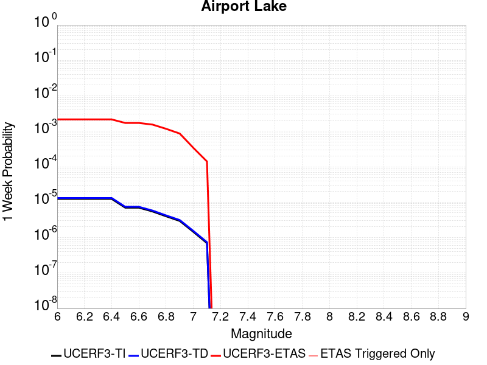 |  |  |  |

| Magnitude | 1 wk TI Prob | 1 wk TD Prob | 1 wk ETAS Prob | 1 wk ETAS/TD Gain | 1 wk ETAS Triggered Only | 1 mo TI Prob | 1 mo TD Prob | 1 mo ETAS Prob | 1 mo ETAS/TD Gain | 1 mo ETAS Triggered Only | 1 yr TI Prob | 1 yr TD Prob | 1 yr ETAS Prob | 1 yr ETAS/TD Gain | 1 yr ETAS Triggered Only | 10 yr TI Prob | 10 yr TD Prob | 10 yr ETAS Prob | 10 yr ETAS/TD Gain | 10 yr ETAS Triggered Only |
|-----|-----|-----|-----|-----|-----|-----|-----|-----|-----|-----|-----|-----|-----|-----|-----|-----|-----|-----|-----|-----|
| 6.0 | 1.2387061E-5 | 1.31032575E-5 | 0.0021353776 | 162.96541 | 0.002122302 | 5.3086325E-5 | 5.6155768E-5 | 0.005019906 | 89.392525 | 0.004964029 | 6.461343E-4 | 6.835104E-4 | 0.012330221 | 18.03955 | 0.011654676 | 0.0064425888 | 0.0068168915 | 0.025287239 | 3.7094972 | 0.018597122 |
| 6.1 | 1.2387061E-5 | 1.31032575E-5 | 0.0021353776 | 162.96541 | 0.002122302 | 5.3086325E-5 | 5.6155768E-5 | 0.005019906 | 89.392525 | 0.004964029 | 6.461343E-4 | 6.835104E-4 | 0.012330221 | 18.03955 | 0.011654676 | 0.0064425888 | 0.0068168915 | 0.025287239 | 3.7094972 | 0.018597122 |
| 6.2 | 1.2387061E-5 | 1.31032575E-5 | 0.0021353776 | 162.96541 | 0.002122302 | 5.3086325E-5 | 5.6155768E-5 | 0.005019906 | 89.392525 | 0.004964029 | 6.461343E-4 | 6.835104E-4 | 0.012330221 | 18.03955 | 0.011654676 | 0.0064425888 | 0.0068168915 | 0.025287239 | 3.7094972 | 0.018597122 |
| 6.3 | 1.2387061E-5 | 1.31032575E-5 | 0.0021353776 | 162.96541 | 0.002122302 | 5.3086325E-5 | 5.6155768E-5 | 0.005019906 | 89.392525 | 0.004964029 | 6.461343E-4 | 6.835104E-4 | 0.012330221 | 18.03955 | 0.011654676 | 0.0064425888 | 0.0068168915 | 0.025287239 | 3.7094972 | 0.018597122 |
| 6.4 | 1.2387061E-5 | 1.31032575E-5 | 0.0021353776 | 162.96541 | 0.002122302 | 5.3086325E-5 | 5.6155768E-5 | 0.005019906 | 89.392525 | 0.004964029 | 6.461343E-4 | 6.835104E-4 | 0.012330221 | 18.03955 | 0.011654676 | 0.0064425888 | 0.0068168915 | 0.025287239 | 3.7094972 | 0.018597122 |
| 6.5 | 6.9922594E-6 | 7.38498E-6 | 0.0016740393 | 226.68163 | 0.0016666667 | 2.996648E-5 | 3.164956E-5 | 0.0037965183 | 119.95485 | 0.003764988 | 3.6478083E-4 | 3.8527072E-4 | 0.009194825 | 23.865881 | 0.00881295 | 0.003641826 | 0.0038465653 | 0.017701937 | 4.602011 | 0.013908873 |
| 6.6 | 6.9922594E-6 | 7.38498E-6 | 0.0016740393 | 226.68163 | 0.0016666667 | 2.996648E-5 | 3.164956E-5 | 0.0037965183 | 119.95485 | 0.003764988 | 3.6478083E-4 | 3.8527072E-4 | 0.009194825 | 23.865881 | 0.00881295 | 0.003641826 | 0.0038465653 | 0.017701937 | 4.602011 | 0.013908873 |
| 6.7 | 5.477277E-6 | 5.7861116E-6 | 0.0015045784 | 260.0327 | 0.0014988009 | 2.3473833E-5 | 2.4797408E-5 | 0.0032861074 | 132.51819 | 0.0032613908 | 2.8575645E-4 | 3.0187052E-4 | 0.007865534 | 26.055986 | 0.0075659472 | 0.0028538927 | 0.0030149885 | 0.01489752 | 4.941153 | 0.011918466 |
| 6.8 | 3.9950432E-6 | 4.2191186E-6 | 0.001179274 | 279.50723 | 0.0011750599 | 1.7121502E-5 | 1.8081826E-5 | 0.0025600023 | 141.57875 | 0.0025419665 | 2.0843433E-4 | 2.2012675E-4 | 0.0058184145 | 26.43211 | 0.00559952 | 0.0020823893 | 0.002199358 | 0.010968997 | 4.987363 | 0.008788968 |
| 6.9 | 2.95695E-6 | 3.1230477E-6 | 9.2638156E-4 | 296.6274 | 9.232614E-4 | 1.2672582E-5 | 1.3384434E-5 | 0.0019438142 | 145.22948 | 0.0019304557 | 1.5427776E-4 | 1.6294557E-4 | 0.004262997 | 26.162092 | 0.0041007195 | 0.001541707 | 0.0016284833 | 0.008068818 | 4.9548054 | 0.0064508393 |
| 7.0 | 1.456072E-6 | 1.5408239E-6 | 3.612525E-4 | 234.45412 | 3.5971223E-4 | 6.2402937E-6 | 6.60352E-6 | 9.298588E-4 | 140.8126 | 9.232614E-4 | 7.597293E-5 | 8.03959E-5 | 0.0020706435 | 25.755587 | 0.0019904077 | 7.594696E-4 | 8.03767E-4 | 0.0038109403 | 4.7413497 | 0.0030095924 |
| 7.1 | 6.995192E-7 | 7.4090326E-7 | 1.20644894E-4 | 162.83488 | 1.1990408E-4 | 2.997936E-6 | 3.1752998E-6 | 3.0293455E-4 | 95.40345 | 2.997602E-4 | 3.649926E-5 | 3.8659273E-5 | 8.419855E-4 | 21.779652 | 8.0335734E-4 | 3.6493264E-4 | 3.8659273E-4 | 0.0016930419 | 4.379394 | 0.0013069544 |

## Panamint Valley
*[(top)](#table-of-contents)*

| 1 Week | 1 Month | 1 Year | 10 Year |
|-----|-----|-----|-----|
| 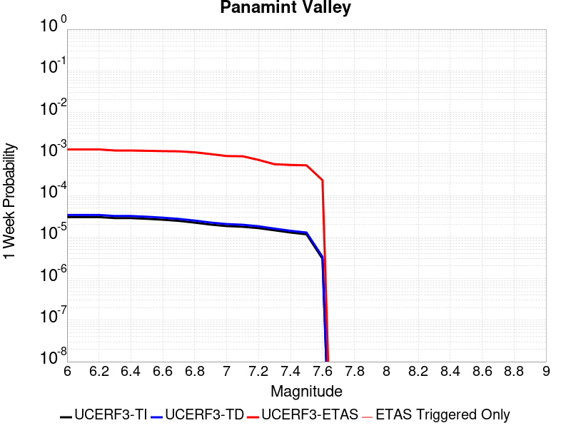 | 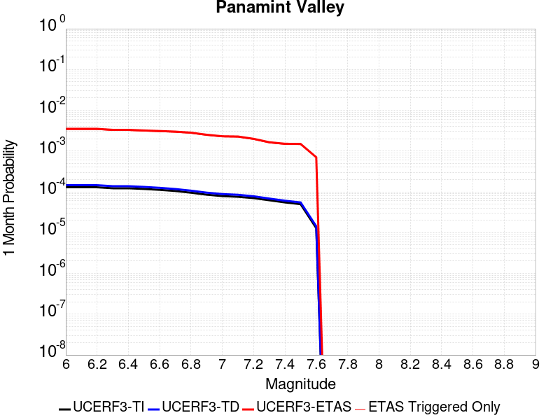 | 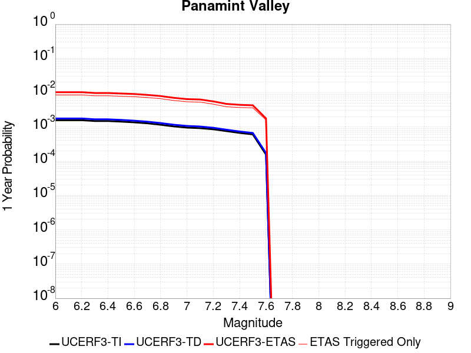 | 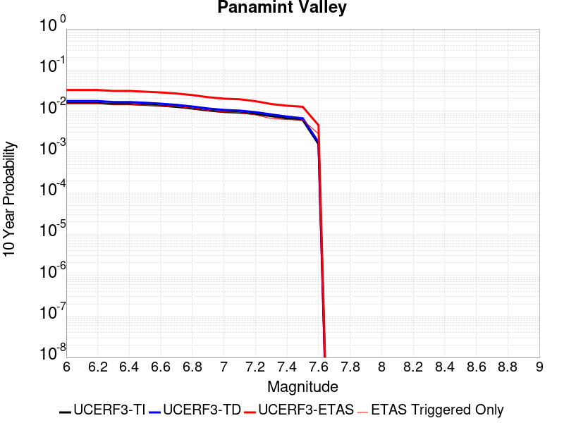 |

| Magnitude | 1 wk TI Prob | 1 wk TD Prob | 1 wk ETAS Prob | 1 wk ETAS/TD Gain | 1 wk ETAS Triggered Only | 1 mo TI Prob | 1 mo TD Prob | 1 mo ETAS Prob | 1 mo ETAS/TD Gain | 1 mo ETAS Triggered Only | 1 yr TI Prob | 1 yr TD Prob | 1 yr ETAS Prob | 1 yr ETAS/TD Gain | 1 yr ETAS Triggered Only | 10 yr TI Prob | 10 yr TD Prob | 10 yr ETAS Prob | 10 yr ETAS/TD Gain | 10 yr ETAS Triggered Only |
|-----|-----|-----|-----|-----|-----|-----|-----|-----|-----|-----|-----|-----|-----|-----|-----|-----|-----|-----|-----|-----|
| 6.0 | 3.0211835E-5 | 3.3985398E-5 | 0.0014128354 | 41.57184 | 0.0013788969 | 1.2947287E-4 | 1.4564373E-4 | 0.0036822988 | 25.282919 | 0.0035371704 | 0.0015751923 | 0.0017717998 | 0.010473382 | 5.911154 | 0.008717027 | 0.015640736 | 0.01758359 | 0.032614328 | 1.8548161 | 0.01529976 |
| 6.1 | 3.0211835E-5 | 3.3985398E-5 | 0.0014128354 | 41.57184 | 0.0013788969 | 1.2947287E-4 | 1.4564373E-4 | 0.0036822988 | 25.282919 | 0.0035371704 | 0.0015751923 | 0.0017717998 | 0.010473382 | 5.911154 | 0.008717027 | 0.015640736 | 0.01758359 | 0.032614328 | 1.8548161 | 0.01529976 |
| 6.2 | 3.0211835E-5 | 3.3985398E-5 | 0.0014128354 | 41.57184 | 0.0013788969 | 1.2947287E-4 | 1.4564373E-4 | 0.0036822988 | 25.282919 | 0.0035371704 | 0.0015751923 | 0.0017717998 | 0.010473382 | 5.911154 | 0.008717027 | 0.015640736 | 0.01758359 | 0.032614328 | 1.8548161 | 0.01529976 |
| 6.3 | 2.8573924E-5 | 3.2103522E-5 | 0.001351006 | 42.082798 | 0.0013189449 | 1.2245393E-4 | 1.3757942E-4 | 0.0034944317 | 25.399378 | 0.003357314 | 0.001489857 | 0.0016737703 | 0.009981185 | 5.9632945 | 0.008321343 | 0.01479908 | 0.016618231 | 0.030897312 | 1.8592418 | 0.014520383 |
| 6.4 | 2.8573924E-5 | 3.2103522E-5 | 0.001351006 | 42.082798 | 0.0013189449 | 1.2245393E-4 | 1.3757942E-4 | 0.0034944317 | 25.399378 | 0.003357314 | 0.001489857 | 0.0016737703 | 0.009981185 | 5.9632945 | 0.008321343 | 0.01479908 | 0.016618231 | 0.030897312 | 1.8592418 | 0.014520383 |
| 6.5 | 2.7468774E-5 | 3.0829244E-5 | 0.0013257534 | 43.00311 | 0.001294964 | 1.1771801E-4 | 1.3211879E-4 | 0.003369101 | 25.500544 | 0.00323741 | 0.0014322745 | 0.0016073869 | 0.009628047 | 5.9898753 | 0.008033573 | 0.014230782 | 0.015964093 | 0.02966272 | 1.85809 | 0.013920863 |
| 6.6 | 2.6135967E-5 | 2.9253257E-5 | 0.0013001993 | 44.44631 | 0.0012709833 | 1.1200648E-4 | 1.2536523E-4 | 0.0032664582 | 26.055536 | 0.0031414868 | 0.0013628257 | 0.0015252795 | 0.009295185 | 6.094086 | 0.0077817747 | 0.013544982 | 0.015154443 | 0.028391995 | 1.8735096 | 0.013441247 |
| 6.7 | 2.4498746E-5 | 2.7342086E-5 | 0.0012863005 | 47.04471 | 0.0012589928 | 1.04990395E-4 | 1.1717525E-4 | 0.003162382 | 26.98848 | 0.0030455636 | 0.0012775084 | 0.0014257001 | 0.008765341 | 6.1480956 | 0.0073501198 | 0.012701893 | 0.014171662 | 0.026725015 | 1.8858068 | 0.012733813 |
| 6.8 | 2.2244329E-5 | 2.4936131E-5 | 0.0012119568 | 48.602444 | 0.0011870504 | 9.532935E-5 | 1.0686488E-4 | 0.002984255 | 27.925499 | 0.0028776978 | 0.0011600169 | 0.0013003252 | 0.008078071 | 6.212347 | 0.006786571 | 0.011539802 | 0.012932883 | 0.024436831 | 1.8895115 | 0.011654676 |
| 6.9 | 1.9902658E-5 | 2.2290924E-5 | 0.0011014036 | 49.410404 | 0.0010791367 | 8.529431E-5 | 9.552913E-5 | 0.0026612312 | 27.857798 | 0.0025659471 | 0.0010379635 | 0.0011624652 | 0.0071866293 | 6.182232 | 0.006031175 | 0.010331288 | 0.011568946 | 0.021725846 | 1.8779451 | 0.010275779 |
| 7.0 | 1.8353881E-5 | 2.056681E-5 | 9.917698E-4 | 48.221863 | 9.71223E-4 | 7.865712E-5 | 8.814059E-5 | 0.0024380533 | 27.660961 | 0.0023501199 | 9.5722964E-4 | 0.0010726011 | 0.006570295 | 6.125572 | 0.005503597 | 0.009531168 | 0.0106791705 | 0.020038573 | 1.8764166 | 0.0094604315 |
| 7.1 | 1.7667631E-5 | 1.9773222E-5 | 9.90977E-4 | 50.117123 | 9.71223E-4 | 7.571623E-5 | 8.473973E-5 | 0.0024106817 | 28.44807 | 0.002326139 | 9.2145515E-4 | 0.0010312354 | 0.0064213546 | 6.226856 | 0.0053956835 | 0.009176437 | 0.010269388 | 0.019371586 | 1.8863429 | 0.009196643 |
| 7.2 | 1.6381597E-5 | 1.8158824E-5 | 8.0951134E-4 | 44.579506 | 7.913669E-4 | 7.020495E-5 | 7.782131E-5 | 0.002092053 | 26.88278 | 0.0020143886 | 8.544101E-4 | 9.4707985E-4 | 0.00561891 | 5.932879 | 0.004676259 | 0.008511325 | 0.009435088 | 0.0173216 | 1.8358705 | 0.007961631 |
| 7.3 | 1.4520491E-5 | 1.5966963E-5 | 6.5144844E-4 | 40.79977 | 6.354916E-4 | 6.222919E-5 | 6.842814E-5 | 0.0017349807 | 25.354784 | 0.0016666667 | 7.57377E-4 | 8.3281036E-4 | 0.0047743693 | 5.7328405 | 0.003944844 | 0.0075480095 | 0.008300003 | 0.014792427 | 1.7822195 | 0.006546763 |
| 7.4 | 1.2852287E-5 | 1.4145856E-5 | 6.25648E-4 | 44.22836 | 6.1151077E-4 | 5.5080065E-5 | 6.0623777E-5 | 0.0015833132 | 26.117033 | 0.0015227818 | 6.7039346E-4 | 7.3786033E-4 | 0.00450007 | 6.09881 | 0.003764988 | 0.0066837464 | 0.007357025 | 0.013462851 | 1.8299313 | 0.006151079 |
| 7.5 | 1.1637851E-5 | 1.2837149E-5 | 6.1234983E-4 | 47.701385 | 5.995204E-4 | 4.987555E-5 | 5.5015284E-5 | 0.0015657236 | 28.459793 | 0.0015107914 | 6.070656E-4 | 6.6962093E-4 | 0.004372176 | 6.5293303 | 0.003705036 | 0.006054099 | 0.0066789286 | 0.0126579115 | 1.8952008 | 0.006019185 |
| 7.6 | 3.0068115E-6 | 3.3331687E-6 | 2.791116E-4 | 83.73762 | 2.7577937E-4 | 1.2886271E-5 | 1.4284972E-5 | 7.5767963E-4 | 53.04033 | 7.4340525E-4 | 1.5687906E-4 | 1.7391294E-4 | 0.0018642663 | 10.719539 | 0.0016906474 | 0.0015676835 | 0.001739208 | 0.0045161443 | 2.5966673 | 0.0027817746 |

## Garlock (East)
*[(top)](#table-of-contents)*

| 1 Week | 1 Month | 1 Year | 10 Year |
|-----|-----|-----|-----|
|  | 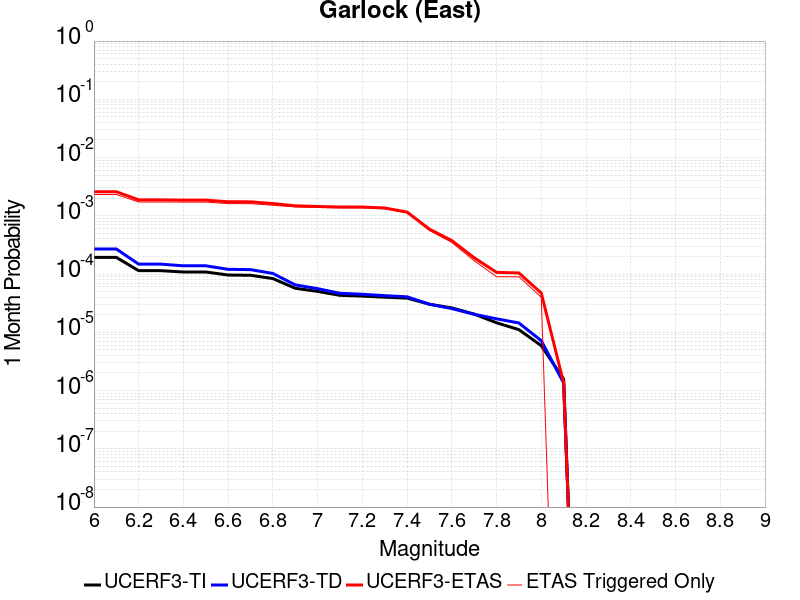 |  |  |

| Magnitude | 1 wk TI Prob | 1 wk TD Prob | 1 wk ETAS Prob | 1 wk ETAS/TD Gain | 1 wk ETAS Triggered Only | 1 mo TI Prob | 1 mo TD Prob | 1 mo ETAS Prob | 1 mo ETAS/TD Gain | 1 mo ETAS Triggered Only | 1 yr TI Prob | 1 yr TD Prob | 1 yr ETAS Prob | 1 yr ETAS/TD Gain | 1 yr ETAS Triggered Only | 10 yr TI Prob | 10 yr TD Prob | 10 yr ETAS Prob | 10 yr ETAS/TD Gain | 10 yr ETAS Triggered Only |
|-----|-----|-----|-----|-----|-----|-----|-----|-----|-----|-----|-----|-----|-----|-----|-----|-----|-----|-----|-----|-----|
| 6.0 | 4.5092507E-5 | 6.2906794E-5 | 0.0010460584 | 16.628702 | 9.832134E-4 | 1.9323928E-4 | 2.695752E-4 | 0.0025831 | 9.582113 | 0.0023141487 | 0.0023501497 | 0.0032775842 | 0.010603613 | 3.2351916 | 0.0073501198 | 0.023254504 | 0.03235364 | 0.04510476 | 1.394117 | 0.013177458 |
| 6.1 | 4.5092507E-5 | 6.2906794E-5 | 0.0010460584 | 16.628702 | 9.832134E-4 | 1.9323928E-4 | 2.695752E-4 | 0.0025831 | 9.582113 | 0.0023141487 | 0.0023501497 | 0.0032775842 | 0.010603613 | 3.2351916 | 0.0073501198 | 0.023254504 | 0.03235364 | 0.04510476 | 1.394117 | 0.013177458 |
| 6.2 | 2.6674514E-5 | 3.4512483E-5 | 8.138621E-4 | 23.581673 | 7.793765E-4 | 1.1431433E-4 | 1.4790244E-4 | 0.0018622772 | 12.591253 | 0.0017146283 | 0.0013908884 | 0.001799258 | 0.007125389 | 3.960182 | 0.0053357314 | 0.01382215 | 0.017891733 | 0.027124021 | 1.5160086 | 0.0094004795 |
| 6.3 | 2.6674514E-5 | 3.4512483E-5 | 8.138621E-4 | 23.581673 | 7.793765E-4 | 1.1431433E-4 | 1.4790244E-4 | 0.0018622772 | 12.591253 | 0.0017146283 | 0.0013908884 | 0.001799258 | 0.007125389 | 3.960182 | 0.0053357314 | 0.01382215 | 0.017891733 | 0.027124021 | 1.5160086 | 0.0094004795 |
| 6.4 | 2.5312667E-5 | 3.2341675E-5 | 7.9970295E-4 | 24.726702 | 7.673861E-4 | 1.0847834E-4 | 1.3859998E-4 | 0.0018410019 | 13.282844 | 0.0017026379 | 0.0013199237 | 0.001686178 | 0.006905181 | 4.095167 | 0.0052278177 | 0.013121112 | 0.01677974 | 0.025798487 | 1.5374783 | 0.009172662 |
| 6.5 | 2.5312667E-5 | 3.2341675E-5 | 7.9970295E-4 | 24.726702 | 7.673861E-4 | 1.0847834E-4 | 1.3859998E-4 | 0.0018410019 | 13.282844 | 0.0017026379 | 0.0013199237 | 0.001686178 | 0.006905181 | 4.095167 | 0.0052278177 | 0.013121112 | 0.01677974 | 0.025798487 | 1.5374783 | 0.009172662 |
| 6.6 | 2.246556E-5 | 2.813642E-5 | 7.8351086E-4 | 27.846857 | 7.553957E-4 | 9.627742E-5 | 1.20579214E-4 | 0.0017510781 | 14.522222 | 0.0016306954 | 0.0011715472 | 0.0014670868 | 0.0064717242 | 4.4112754 | 0.00501199 | 0.011653901 | 0.014620015 | 0.0232096 | 1.5875221 | 0.008717027 |
| 6.7 | 2.2241198E-5 | 2.7806154E-5 | 7.831808E-4 | 28.165737 | 7.553957E-4 | 9.531594E-5 | 1.1916392E-4 | 0.001749665 | 14.682842 | 0.0016306954 | 0.0011598538 | 0.0014498787 | 0.0064426293 | 4.4435644 | 0.005 | 0.011538187 | 0.0144502055 | 0.023005817 | 1.5920755 | 0.008681055 |
| 6.8 | 1.9528685E-5 | 2.3900653E-5 | 7.4330793E-4 | 31.099901 | 7.1942445E-4 | 8.369167E-5 | 1.0242746E-4 | 0.0016370424 | 15.982457 | 0.0015347722 | 0.0010184698 | 0.0012463606 | 0.005916791 | 4.747255 | 0.004676259 | 0.010138147 | 0.012437694 | 0.020477919 | 1.6464401 | 0.008141487 |
| 6.9 | 1.3318621E-5 | 1.5201007E-5 | 7.106341E-4 | 46.749146 | 6.9544365E-4 | 5.7078556E-5 | 6.514558E-5 | 0.0015039007 | 23.085232 | 0.0014388489 | 6.9470983E-4 | 7.928645E-4 | 0.0050221225 | 6.33415 | 0.004232614 | 0.0069254204 | 0.007940986 | 0.015101891 | 1.9017653 | 0.0072182254 |
| 7.0 | 1.1760853E-5 | 1.3109839E-5 | 6.9655414E-4 | 53.132168 | 6.834532E-4 | 5.0402683E-5 | 5.618384E-5 | 0.0014709724 | 26.181416 | 0.001414868 | 6.134799E-4 | 6.838286E-4 | 0.004793726 | 7.010128 | 0.00411271 | 0.0061178906 | 0.006857582 | 0.013800052 | 2.0123787 | 0.0069904076 |
| 7.1 | 1.0064758E-5 | 1.090491E-5 | 6.943507E-4 | 63.67322 | 6.834532E-4 | 4.3133965E-5 | 4.673451E-5 | 0.0014375568 | 30.76007 | 0.0013908873 | 5.2502943E-4 | 5.688476E-4 | 0.0045833495 | 8.057253 | 0.0040167863 | 0.005237907 | 0.005714025 | 0.012414129 | 2.172572 | 0.006738609 |
| 7.2 | 9.768808E-6 | 1.0500772E-5 | 6.9394684E-4 | 66.08531 | 6.834532E-4 | 4.186565E-5 | 4.500255E-5 | 0.0014358272 | 31.905462 | 0.0013908873 | 5.095951E-4 | 5.477718E-4 | 0.0045264065 | 8.263307 | 0.0039808154 | 0.0050842804 | 0.005504284 | 0.012134256 | 2.2045112 | 0.006666667 |
| 7.3 | 9.344516E-6 | 9.946395E-6 | 6.8140257E-4 | 68.507484 | 6.7146285E-4 | 4.004731E-5 | 4.2626732E-5 | 0.0013854952 | 32.502964 | 0.0013429257 | 4.8746695E-4 | 5.1886035E-4 | 0.0042459425 | 8.183208 | 0.0037290168 | 0.0048639905 | 0.005215945 | 0.011478075 | 2.2005744 | 0.006294964 |
| 7.4 | 9.023491E-6 | 9.49255E-6 | 5.8502663E-4 | 61.630085 | 5.7553954E-4 | 3.867153E-5 | 4.068174E-5 | 0.0011917141 | 29.293585 | 0.0011510791 | 4.7072413E-4 | 4.95191E-4 | 0.0038029049 | 7.6796727 | 0.0033093526 | 0.004697283 | 0.004979378 | 0.010574878 | 2.1237347 | 0.0056235013 |
| 7.5 | 7.081253E-6 | 7.0893525E-6 | 3.1883773E-4 | 44.97417 | 3.117506E-4 | 3.0347876E-5 | 3.038259E-5 | 6.418748E-4 | 21.126402 | 6.1151077E-4 | 3.6942272E-4 | 3.6984598E-4 | 0.0019400085 | 5.2454495 | 0.0015707434 | 0.003688092 | 0.0037251879 | 0.006353251 | 1.7054847 | 0.0026378897 |
| 7.6 | 6.116396E-6 | 5.9608415E-6 | 1.7382555E-4 | 29.161242 | 1.6786571E-4 | 2.6212863E-5 | 2.5546216E-5 | 3.8524927E-4 | 15.0804825 | 3.5971223E-4 | 3.1909486E-4 | 3.1098103E-4 | 0.001245942 | 4.0064883 | 9.352518E-4 | 0.0031863707 | 0.003136586 | 0.004798025 | 1.5296966 | 0.0016666667 |
| 7.7 | 4.797145E-6 | 4.7587923E-6 | 6.471055E-5 | 13.598103 | 5.995204E-5 | 2.055903E-5 | 2.0394666E-5 | 1.8825695E-4 | 9.230696 | 1.6786571E-4 | 2.5027743E-4 | 2.482769E-4 | 6.918118E-4 | 2.7864528 | 4.4364508E-4 | 0.0024999576 | 0.002510134 | 0.0033832365 | 1.3478311 | 8.7529974E-4 |
| 7.8 | 3.4028885E-6 | 3.979809E-6 | 1.5970169E-5 | 4.0127974 | 1.1990408E-5 | 1.4583726E-5 | 1.7056214E-5 | 1.1297784E-4 | 6.623852 | 9.5923264E-5 | 1.775424E-4 | 2.076397E-4 | 4.8336183E-4 | 2.3278873 | 2.7577937E-4 | 0.0017740062 | 0.0021019245 | 0.0026642892 | 1.2675475 | 5.6354917E-4 |
| 7.9 | 2.5928412E-6 | 3.373588E-6 | 1.5363956E-5 | 4.5541883 | 1.1990408E-5 | 1.1112129E-5 | 1.44581545E-5 | 1.1038003E-4 | 7.634448 | 9.5923264E-5 | 1.3528178E-4 | 1.7601387E-4 | 4.0379152E-4 | 2.294089 | 2.2781774E-4 | 0.0013519945 | 0.0017818334 | 0.0021528737 | 1.2082351 | 3.7170263E-4 |
| 8.0 | 1.3743648E-6 | 1.673991E-6 | 1.673991E-6 | 1.0 | 0.0 | 5.8901214E-6 | 7.174228E-6 | 4.314519E-5 | 6.0139146 | 3.597122E-5 | 7.1709874E-5 | 8.7342756E-5 | 1.7126827E-4 | 1.9608756 | 8.393286E-5 | 7.1686733E-4 | 8.839922E-4 | 0.0010277499 | 1.1626233 | 1.4388488E-4 |
| 8.1 | 3.6733252E-7 | 3.1499187E-7 | 3.1499187E-7 | 1.0 | 0.0 | 1.5742813E-6 | 1.3499646E-6 | 1.3499646E-6 | 1.0 | 0.0 | 1.9166706E-5 | 1.643571E-5 | 2.842592E-5 | 1.7295219 | 1.1990408E-5 | 1.9165053E-4 | 1.6643589E-4 | 1.9041271E-4 | 1.1440604 | 2.3980816E-5 |

## Blackwater
*[(top)](#table-of-contents)*

| 1 Week | 1 Month | 1 Year | 10 Year |
|-----|-----|-----|-----|
| 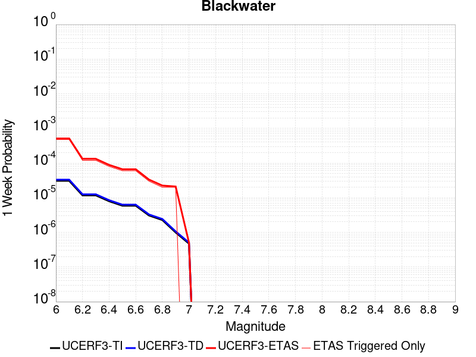 | 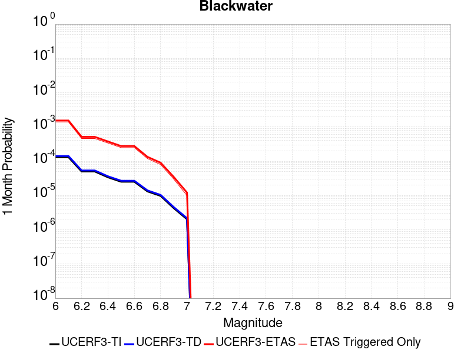 | 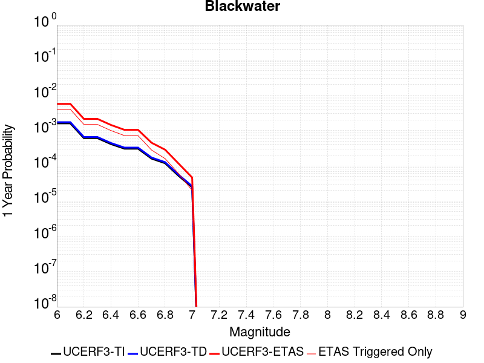 | 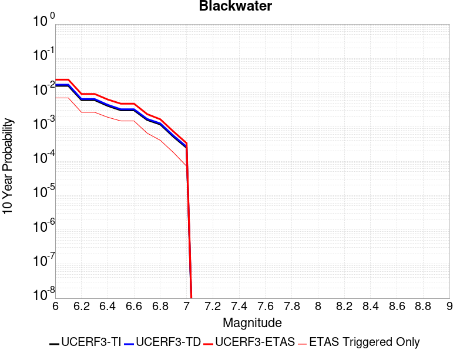 |

| Magnitude | 1 wk TI Prob | 1 wk TD Prob | 1 wk ETAS Prob | 1 wk ETAS/TD Gain | 1 wk ETAS Triggered Only | 1 mo TI Prob | 1 mo TD Prob | 1 mo ETAS Prob | 1 mo ETAS/TD Gain | 1 mo ETAS Triggered Only | 1 yr TI Prob | 1 yr TD Prob | 1 yr ETAS Prob | 1 yr ETAS/TD Gain | 1 yr ETAS Triggered Only | 10 yr TI Prob | 10 yr TD Prob | 10 yr ETAS Prob | 10 yr ETAS/TD Gain | 10 yr ETAS Triggered Only |
|-----|-----|-----|-----|-----|-----|-----|-----|-----|-----|-----|-----|-----|-----|-----|-----|-----|-----|-----|-----|-----|
| 6.0 | 3.0708583E-5 | 3.309619E-5 | 5.3667667E-4 | 16.215662 | 5.0359714E-4 | 1.3160157E-4 | 1.4183388E-4 | 0.0015205352 | 10.720536 | 0.0013788969 | 0.0016010714 | 0.0017255963 | 0.0056516635 | 3.2751944 | 0.0039328537 | 0.015895851 | 0.017135808 | 0.02405357 | 1.403702 | 0.0070383693 |
| 6.1 | 3.0708583E-5 | 3.309619E-5 | 5.3667667E-4 | 16.215662 | 5.0359714E-4 | 1.3160157E-4 | 1.4183388E-4 | 0.0015205352 | 10.720536 | 0.0013788969 | 0.0016010714 | 0.0017255963 | 0.0056516635 | 3.2751944 | 0.0039328537 | 0.015895851 | 0.017135808 | 0.02405357 | 1.403702 | 0.0070383693 |
| 6.2 | 1.1707779E-5 | 1.2545242E-5 | 1.324478E-4 | 10.557614 | 1.1990408E-4 | 5.017523E-5 | 5.3764266E-5 | 4.973855E-4 | 9.251228 | 4.4364508E-4 | 6.107122E-4 | 6.5439293E-4 | 0.0021162655 | 3.2339368 | 0.0014628298 | 0.006090366 | 0.006525631 | 0.009193956 | 1.4088991 | 0.0026858514 |
| 6.3 | 1.1707779E-5 | 1.2545242E-5 | 1.324478E-4 | 10.557614 | 1.1990408E-4 | 5.017523E-5 | 5.3764266E-5 | 4.973855E-4 | 9.251228 | 4.4364508E-4 | 6.107122E-4 | 6.5439293E-4 | 0.0021162655 | 3.2339368 | 0.0014628298 | 0.006090366 | 0.006525631 | 0.009193956 | 1.4088991 | 0.0026858514 |
| 6.4 | 7.929244E-6 | 8.480176E-6 | 1.0440262E-4 | 12.311375 | 9.5923264E-5 | 3.3982033E-5 | 3.6343128E-5 | 3.7206235E-4 | 10.237488 | 3.3573143E-4 | 4.136527E-4 | 4.4239179E-4 | 0.0014731106 | 3.3298779 | 0.001031175 | 0.0041288356 | 0.0044155167 | 0.006325511 | 1.4325641 | 0.0019184652 |
| 6.5 | 5.8832115E-6 | 6.286048E-6 | 7.822804E-5 | 12.44471 | 7.194244E-5 | 2.521352E-5 | 2.6939942E-5 | 2.907218E-4 | 10.791478 | 2.6378897E-4 | 3.0693135E-4 | 3.2794697E-4 | 0.0010711085 | 3.2661026 | 7.4340525E-4 | 0.0030650778 | 0.0032748834 | 0.0047687762 | 1.4561666 | 0.0014988009 |
| 6.6 | 5.8832115E-6 | 6.286048E-6 | 7.822804E-5 | 12.44471 | 7.194244E-5 | 2.521352E-5 | 2.6939942E-5 | 2.907218E-4 | 10.791478 | 2.6378897E-4 | 3.0693135E-4 | 3.2794697E-4 | 0.0010711085 | 3.2661026 | 7.4340525E-4 | 0.0030650778 | 0.0032748834 | 0.0047687762 | 1.4561666 | 0.0014988009 |
| 6.7 | 3.0715053E-6 | 3.281496E-6 | 3.92526E-5 | 11.961801 | 3.597122E-5 | 1.3163528E-5 | 1.4063485E-5 | 1.4595612E-4 | 10.378375 | 1.3189449E-4 | 1.6025416E-4 | 1.7121063E-4 | 4.469428E-4 | 2.610485 | 2.7577937E-4 | 0.0016013865 | 0.0017109019 | 0.002369246 | 1.3847936 | 6.594724E-4 |
| 6.8 | 2.2722281E-6 | 2.4287758E-6 | 2.6409532E-5 | 10.873598 | 2.3980816E-5 | 9.738084E-6 | 1.0409003E-5 | 9.434098E-5 | 9.063402 | 8.393286E-5 | 1.1855473E-4 | 1.2672316E-4 | 2.9456758E-4 | 2.324497 | 1.6786571E-4 | 0.001184915 | 0.0012665992 | 0.0016737566 | 1.3214573 | 4.0767386E-4 |
| 6.9 | 9.952399E-7 | 1.0653588E-6 | 2.5046149E-5 | 23.50959 | 2.3980816E-5 | 4.265307E-6 | 4.5658185E-6 | 4.0536877E-5 | 8.878338 | 3.597122E-5 | 5.1928873E-5 | 5.5587938E-5 | 1.2752638E-4 | 2.2941377 | 7.194244E-5 | 5.191674E-4 | 5.5579096E-4 | 7.355471E-4 | 1.323424 | 1.7985611E-4 |
| 7.0 | 4.7385504E-7 | 5.0756074E-7 | 5.0756074E-7 | 1.0 | 0.0 | 2.0308057E-6 | 2.1752603E-6 | 1.4165642E-5 | 6.5121593 | 1.1990408E-5 | 2.4724779E-5 | 2.6483794E-5 | 5.0463976E-5 | 1.9054662 | 2.3980816E-5 | 2.4722028E-4 | 2.6483793E-4 | 3.3676132E-4 | 1.2715751 | 7.194244E-5 |

## Ash Hill
*[(top)](#table-of-contents)*

| 1 Week | 1 Month | 1 Year | 10 Year |
|-----|-----|-----|-----|
| 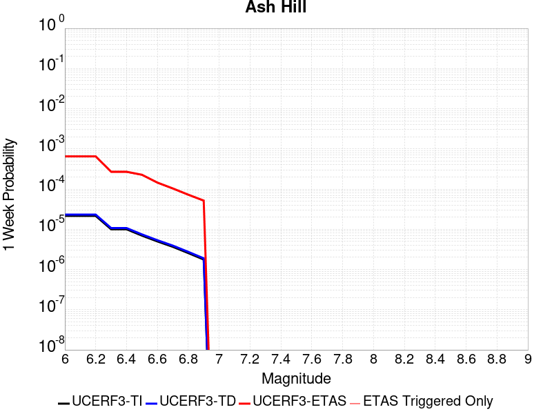 | 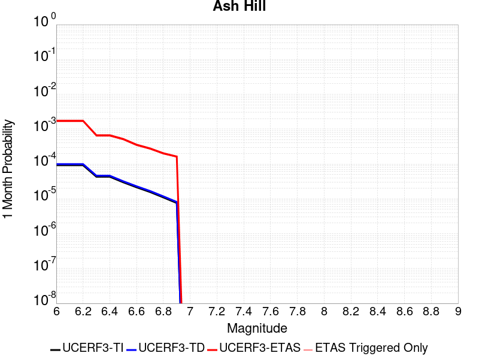 | 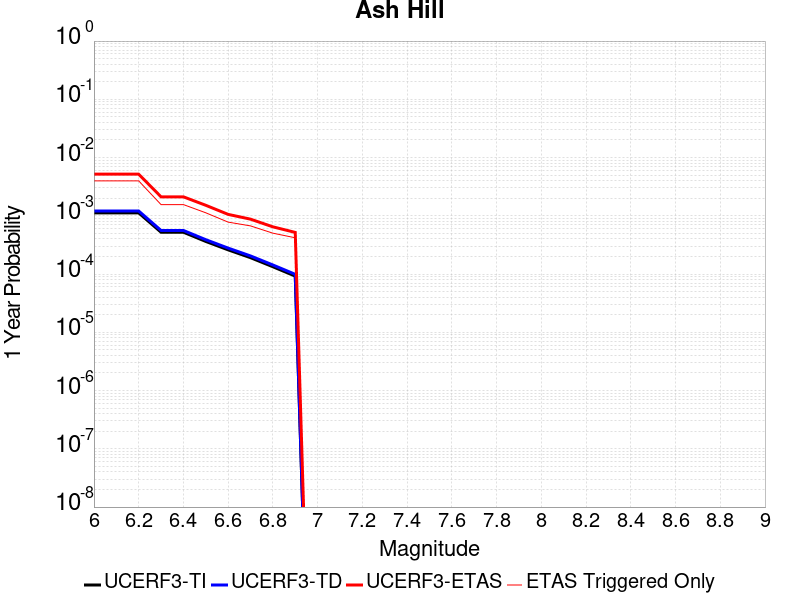 | 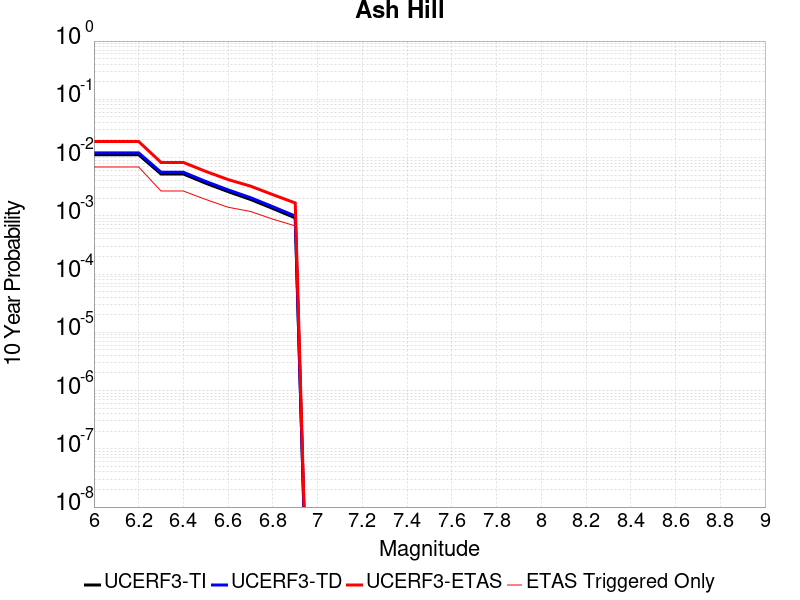 |

| Magnitude | 1 wk TI Prob | 1 wk TD Prob | 1 wk ETAS Prob | 1 wk ETAS/TD Gain | 1 wk ETAS Triggered Only | 1 mo TI Prob | 1 mo TD Prob | 1 mo ETAS Prob | 1 mo ETAS/TD Gain | 1 mo ETAS Triggered Only | 1 yr TI Prob | 1 yr TD Prob | 1 yr ETAS Prob | 1 yr ETAS/TD Gain | 1 yr ETAS Triggered Only | 10 yr TI Prob | 10 yr TD Prob | 10 yr ETAS Prob | 10 yr ETAS/TD Gain | 10 yr ETAS Triggered Only |
|-----|-----|-----|-----|-----|-----|-----|-----|-----|-----|-----|-----|-----|-----|-----|-----|-----|-----|-----|-----|-----|
| 6.0 | 2.1545662E-5 | 2.3194681E-5 | 7.0663204E-4 | 30.465261 | 6.834532E-4 | 9.2335285E-5 | 9.9402445E-5 | 0.001741925 | 17.523966 | 0.0016426858 | 0.0011236023 | 0.0012096328 | 0.005185633 | 4.2869477 | 0.0039808154 | 0.011179381 | 0.01203847 | 0.018826263 | 1.5638418 | 0.0068705035 |
| 6.1 | 2.1545662E-5 | 2.3194681E-5 | 7.0663204E-4 | 30.465261 | 6.834532E-4 | 9.2335285E-5 | 9.9402445E-5 | 0.001741925 | 17.523966 | 0.0016426858 | 0.0011236023 | 0.0012096328 | 0.005185633 | 4.2869477 | 0.0039808154 | 0.011179381 | 0.01203847 | 0.018826263 | 1.5638418 | 0.0068705035 |
| 6.2 | 2.1545662E-5 | 2.3194681E-5 | 7.0663204E-4 | 30.465261 | 6.834532E-4 | 9.2335285E-5 | 9.9402445E-5 | 0.001741925 | 17.523966 | 0.0016426858 | 0.0011236023 | 0.0012096328 | 0.005185633 | 4.2869477 | 0.0039808154 | 0.011179381 | 0.01203847 | 0.018826263 | 1.5638418 | 0.0068705035 |
| 6.3 | 1.0025529E-5 | 1.0747037E-5 | 2.8652346E-4 | 26.660692 | 2.7577937E-4 | 4.2965847E-5 | 4.605799E-5 | 6.695305E-4 | 14.536684 | 6.235012E-4 | 5.229836E-4 | 5.60625E-4 | 0.0021185041 | 3.7788258 | 0.001558753 | 0.005217545 | 0.0055934195 | 0.008240401 | 1.4732313 | 0.0026618706 |
| 6.4 | 1.0025529E-5 | 1.0747037E-5 | 2.8652346E-4 | 26.660692 | 2.7577937E-4 | 4.2965847E-5 | 4.605799E-5 | 6.695305E-4 | 14.536684 | 6.235012E-4 | 5.229836E-4 | 5.60625E-4 | 0.0021185041 | 3.7788258 | 0.001558753 | 0.005217545 | 0.0055934195 | 0.008240401 | 1.4732313 | 0.0026618706 |
| 6.5 | 6.9617327E-6 | 7.456704E-6 | 2.4726306E-4 | 33.159832 | 2.3980816E-4 | 2.9835655E-5 | 3.1956963E-5 | 5.23548E-4 | 16.382908 | 4.916067E-4 | 3.6318856E-4 | 3.8901521E-4 | 0.0015156751 | 3.8961844 | 0.0011270983 | 0.0036259557 | 0.0038841967 | 0.0057832664 | 1.4889221 | 0.0019064748 |
| 6.6 | 4.9919777E-6 | 5.346739E-6 | 1.4923087E-4 | 27.910633 | 1.4388488E-4 | 2.1394015E-5 | 2.2914432E-5 | 3.5863815E-4 | 15.651192 | 3.3573143E-4 | 2.60441E-4 | 2.789542E-4 | 0.0010581133 | 3.7931435 | 7.793765E-4 | 0.0026013597 | 0.0027866988 | 0.0041856673 | 1.5020163 | 0.0014028777 |
| 6.7 | 3.6630722E-6 | 3.9246606E-6 | 9.9847544E-5 | 25.441063 | 9.5923264E-5 | 1.5698786E-5 | 1.6819899E-5 | 2.8060444E-4 | 16.682884 | 2.6378897E-4 | 1.9111596E-4 | 2.0476876E-4 | 8.760941E-4 | 4.2784557 | 6.7146285E-4 | 0.0019095168 | 0.002046364 | 0.003230985 | 1.5788908 | 0.0011870504 |
| 6.8 | 2.5599613E-6 | 2.7449514E-6 | 6.2696825E-5 | 22.840778 | 5.995204E-5 | 1.0971216E-5 | 1.1764052E-5 | 2.0360832E-4 | 17.307669 | 1.9184653E-4 | 1.3356637E-4 | 1.4322287E-4 | 6.467479E-4 | 4.5156746 | 5.0359714E-4 | 0.0013348613 | 0.0014317906 | 0.002305837 | 1.610457 | 8.7529974E-4 |
| 6.9 | 1.7684905E-6 | 1.896889E-6 | 4.985843E-5 | 26.284315 | 4.7961632E-5 | 7.579223E-6 | 8.129524E-6 | 1.6400356E-4 | 20.17382 | 1.558753E-4 | 9.2273134E-5 | 9.8976954E-5 | 5.185997E-4 | 5.2396 | 4.1966425E-4 | 9.223483E-4 | 9.897696E-4 | 0.0016605678 | 1.6777318 | 6.7146285E-4 |

## Hunter Mountain-Saline Valley
*[(top)](#table-of-contents)*

| 1 Week | 1 Month | 1 Year | 10 Year |
|-----|-----|-----|-----|
|  | 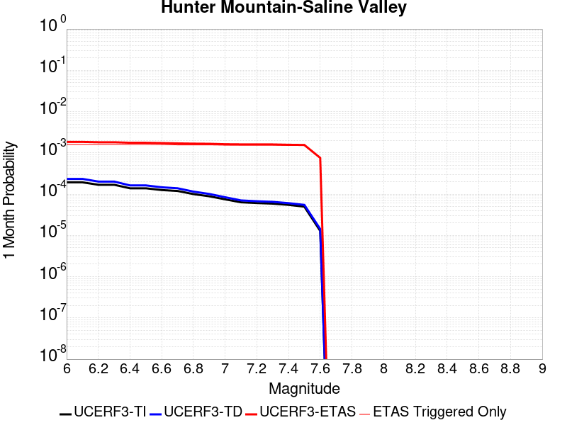 | 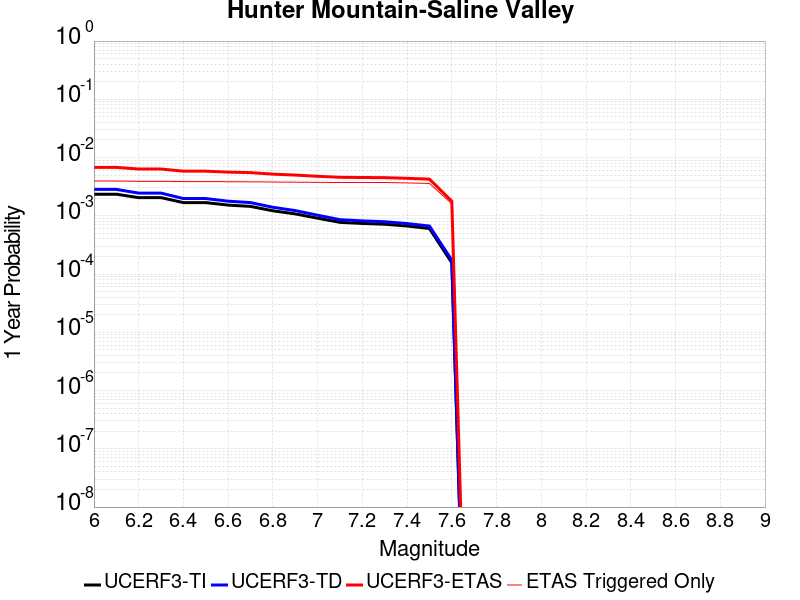 | 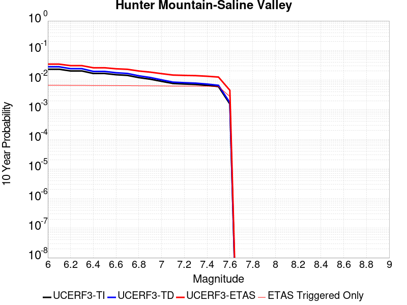 |

| Magnitude | 1 wk TI Prob | 1 wk TD Prob | 1 wk ETAS Prob | 1 wk ETAS/TD Gain | 1 wk ETAS Triggered Only | 1 mo TI Prob | 1 mo TD Prob | 1 mo ETAS Prob | 1 mo ETAS/TD Gain | 1 mo ETAS Triggered Only | 1 yr TI Prob | 1 yr TD Prob | 1 yr ETAS Prob | 1 yr ETAS/TD Gain | 1 yr ETAS Triggered Only | 10 yr TI Prob | 10 yr TD Prob | 10 yr ETAS Prob | 10 yr ETAS/TD Gain | 10 yr ETAS Triggered Only |
|-----|-----|-----|-----|-----|-----|-----|-----|-----|-----|-----|-----|-----|-----|-----|-----|-----|-----|-----|-----|-----|
| 6.0 | 4.5103672E-5 | 5.4571992E-5 | 6.9002894E-4 | 12.644379 | 6.354916E-4 | 1.9328714E-4 | 2.3385909E-4 | 0.001840198 | 7.8688326 | 0.0016067147 | 0.002350731 | 0.0028436056 | 0.0068250573 | 2.400142 | 0.0039928057 | 0.023260195 | 0.028092787 | 0.03447894 | 1.2273235 | 0.0065707434 |
| 6.1 | 4.5103672E-5 | 5.4571992E-5 | 6.9002894E-4 | 12.644379 | 6.354916E-4 | 1.9328714E-4 | 2.3385909E-4 | 0.001840198 | 7.8688326 | 0.0016067147 | 0.002350731 | 0.0028436056 | 0.0068250573 | 2.400142 | 0.0039928057 | 0.023260195 | 0.028092787 | 0.03447894 | 1.2273235 | 0.0065707434 |
| 6.2 | 3.9363465E-5 | 4.7064877E-5 | 6.8252656E-4 | 14.501824 | 6.354916E-4 | 1.6868966E-4 | 2.0169078E-4 | 0.0018080813 | 8.964621 | 0.0016067147 | 0.002051862 | 0.0024528939 | 0.0064000227 | 2.6091723 | 0.0039568343 | 0.020330196 | 0.024274237 | 0.030650383 | 1.2626714 | 0.006534772 |
| 6.3 | 3.9363465E-5 | 4.7064877E-5 | 6.8252656E-4 | 14.501824 | 6.354916E-4 | 1.6868966E-4 | 2.0169078E-4 | 0.0018080813 | 8.964621 | 0.0016067147 | 0.002051862 | 0.0024528939 | 0.0064000227 | 2.6091723 | 0.0039568343 | 0.020330196 | 0.024274237 | 0.030650383 | 1.2626714 | 0.006534772 |
| 6.4 | 3.2311684E-5 | 3.795214E-5 | 6.6142966E-4 | 17.427994 | 6.235012E-4 | 1.384713E-4 | 1.626423E-4 | 0.0017571071 | 10.803507 | 0.0015947243 | 0.0016845843 | 0.0019784442 | 0.005903517 | 2.983919 | 0.0039328537 | 0.016718714 | 0.019617062 | 0.025964864 | 1.3235859 | 0.00647482 |
| 6.5 | 3.2311684E-5 | 3.795214E-5 | 6.6142966E-4 | 17.427994 | 6.235012E-4 | 1.384713E-4 | 1.626423E-4 | 0.0017571071 | 10.803507 | 0.0015947243 | 0.0016845843 | 0.0019784442 | 0.005903517 | 2.983919 | 0.0039328537 | 0.016718714 | 0.019617062 | 0.025964864 | 1.3235859 | 0.00647482 |
| 6.6 | 2.9305844E-5 | 3.4182853E-5 | 6.5766275E-4 | 19.23955 | 6.235012E-4 | 1.2559042E-4 | 1.4649007E-4 | 0.001728992 | 11.8027935 | 0.0015827338 | 0.0015279909 | 0.0017821203 | 0.005684027 | 3.1894743 | 0.003908873 | 0.015175272 | 0.017686214 | 0.023999406 | 1.3569555 | 0.0064268587 |
| 6.7 | 2.7826512E-5 | 3.2345237E-5 | 6.558263E-4 | 20.275822 | 6.235012E-4 | 1.19251024E-4 | 1.3861542E-4 | 0.0016971524 | 12.243604 | 0.001558753 | 0.0014509142 | 0.0016863967 | 0.005564737 | 3.2997797 | 0.003884892 | 0.014414776 | 0.01674368 | 0.02303935 | 1.3760028 | 0.0064028776 |
| 6.8 | 2.3389874E-5 | 2.6867507E-5 | 6.503519E-4 | 24.205893 | 6.235012E-4 | 1.0023846E-4 | 1.1514164E-4 | 0.0016737152 | 14.536141 | 0.001558753 | 0.00121972 | 0.0014009953 | 0.0052564973 | 3.7519736 | 0.0038609114 | 0.01213047 | 0.013927842 | 0.020206071 | 1.4507682 | 0.0063669067 |
| 6.9 | 2.069209E-5 | 2.3570727E-5 | 6.4705726E-4 | 27.45173 | 6.235012E-4 | 8.867737E-5 | 1.0101369E-4 | 0.0016596093 | 16.429546 | 0.001558753 | 0.0010791123 | 0.001229184 | 0.0050733737 | 4.1274323 | 0.0038489208 | 0.010738871 | 0.012228882 | 0.018494241 | 1.5123411 | 0.0063429256 |
| 7.0 | 1.7462342E-5 | 1.9634126E-5 | 6.311329E-4 | 32.14469 | 6.1151077E-4 | 7.483646E-5 | 8.414367E-5 | 0.0016187867 | 19.238365 | 0.0015347722 | 9.1075303E-4 | 0.0010239903 | 0.0048330356 | 4.7198057 | 0.0038129496 | 0.009070295 | 0.010196352 | 0.016438998 | 1.612243 | 0.0063069547 |
| 7.1 | 1.4807709E-5 | 1.6442245E-5 | 6.2794297E-4 | 38.19083 | 6.1151077E-4 | 6.3460066E-5 | 7.046495E-5 | 0.001605129 | 22.779112 | 0.0015347722 | 7.723524E-4 | 8.575896E-4 | 0.004643309 | 5.414372 | 0.0037889688 | 0.007696735 | 0.008545788 | 0.014715629 | 1.7219745 | 0.0062230215 |
| 7.2 | 1.4180048E-5 | 1.5698814E-5 | 6.272E-4 | 39.952065 | 6.1151077E-4 | 6.077022E-5 | 6.727898E-5 | 0.0016019479 | 23.810524 | 0.0015347722 | 7.396263E-4 | 8.1883004E-4 | 0.0046046963 | 5.623507 | 0.0037889688 | 0.0073716943 | 0.00816108 | 0.014333315 | 1.7563012 | 0.0062230215 |
| 7.3 | 1.3730402E-5 | 1.5172541E-5 | 6.2667404E-4 | 41.303173 | 6.1151077E-4 | 5.8843252E-5 | 6.502365E-5 | 0.001599696 | 24.601759 | 0.0015347722 | 7.161811E-4 | 7.913914E-4 | 0.0045773615 | 5.7839417 | 0.0037889688 | 0.007138774 | 0.007888664 | 0.014062594 | 1.7826332 | 0.0062230215 |
| 7.4 | 1.2810095E-5 | 1.410972E-5 | 6.2561186E-4 | 44.339073 | 6.1151077E-4 | 5.489925E-5 | 6.0468916E-5 | 0.0015711689 | 25.983084 | 0.0015107914 | 6.681934E-4 | 7.359762E-4 | 0.00447423 | 6.0793138 | 0.0037410073 | 0.006661878 | 0.0073382827 | 0.0134085165 | 1.8272008 | 0.006115108 |
| 7.5 | 1.1595659E-5 | 1.2801013E-5 | 6.1231374E-4 | 47.83322 | 5.995204E-4 | 4.9694736E-5 | 5.4860422E-5 | 0.0015535791 | 28.318762 | 0.0014988009 | 6.0486543E-4 | 6.677366E-4 | 0.004346334 | 6.509054 | 0.0036810553 | 0.006032217 | 0.0066601736 | 0.012603538 | 1.8923738 | 0.0059832134 |
| 7.6 | 2.997694E-6 | 3.3252948E-6 | 2.7910376E-4 | 83.93354 | 2.7577937E-4 | 1.28471975E-5 | 1.4251226E-5 | 7.5764593E-4 | 53.16356 | 7.4340525E-4 | 1.564034E-4 | 1.7350215E-4 | 0.0018638563 | 10.742555 | 0.0016906474 | 0.0015629337 | 0.0017351025 | 0.00451205 | 2.600452 | 0.0027817746 |

## Garlock (West)
*[(top)](#table-of-contents)*

| 1 Week | 1 Month | 1 Year | 10 Year |
|-----|-----|-----|-----|
| 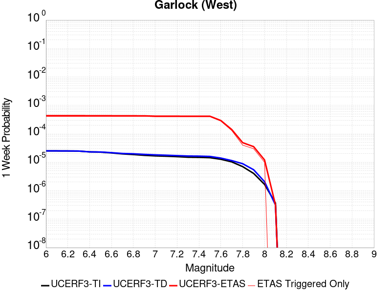 | 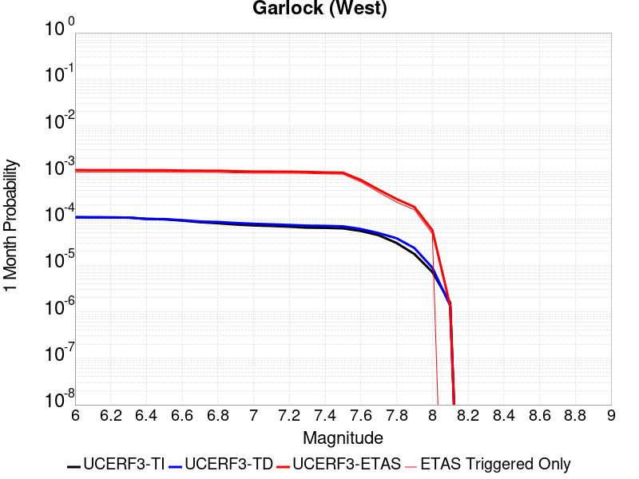 | 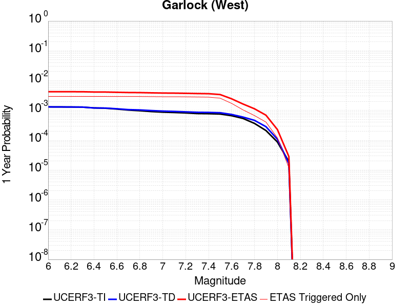 | 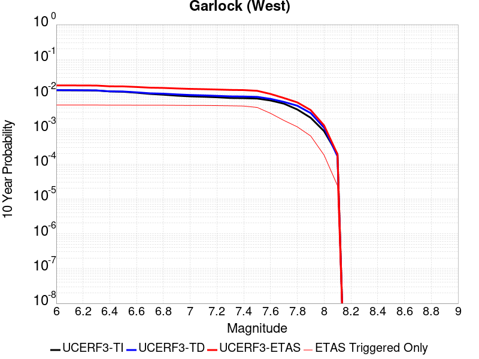 |

| Magnitude | 1 wk TI Prob | 1 wk TD Prob | 1 wk ETAS Prob | 1 wk ETAS/TD Gain | 1 wk ETAS Triggered Only | 1 mo TI Prob | 1 mo TD Prob | 1 mo ETAS Prob | 1 mo ETAS/TD Gain | 1 mo ETAS Triggered Only | 1 yr TI Prob | 1 yr TD Prob | 1 yr ETAS Prob | 1 yr ETAS/TD Gain | 1 yr ETAS Triggered Only | 10 yr TI Prob | 10 yr TD Prob | 10 yr ETAS Prob | 10 yr ETAS/TD Gain | 10 yr ETAS Triggered Only |
|-----|-----|-----|-----|-----|-----|-----|-----|-----|-----|-----|-----|-----|-----|-----|-----|-----|-----|-----|-----|-----|
| 6.0 | 2.5181727E-5 | 2.5202135E-5 | 4.4485583E-4 | 17.651514 | 4.1966425E-4 | 1.0791722E-4 | 1.080047E-4 | 0.0011150902 | 10.32446 | 0.0010071943 | 0.0013131002 | 0.0013141674 | 0.004247957 | 3.232432 | 0.0029376498 | 0.013053683 | 0.013144457 | 0.017995905 | 1.369087 | 0.0049160672 |
| 6.1 | 2.5077732E-5 | 2.5103205E-5 | 4.4475694E-4 | 17.717138 | 4.1966425E-4 | 1.0747157E-4 | 1.07580745E-4 | 0.0011146667 | 10.361209 | 0.0010071943 | 0.001307681 | 0.0013090121 | 0.0042428165 | 3.2412357 | 0.0029376498 | 0.013000126 | 0.0130935125 | 0.017945211 | 1.3705422 | 0.0049160672 |
| 6.2 | 2.494612E-5 | 2.498488E-5 | 4.4463866E-4 | 17.79631 | 4.1966425E-4 | 1.0690756E-4 | 1.07073676E-4 | 0.00111416 | 10.405546 | 0.0010071943 | 0.0013008224 | 0.0013028459 | 0.0042366683 | 3.251857 | 0.0029376498 | 0.012932341 | 0.013032575 | 0.017884573 | 1.3722978 | 0.0049160672 |
| 6.3 | 2.4733758E-5 | 2.4804243E-5 | 4.444581E-4 | 17.918633 | 4.1966425E-4 | 1.0599751E-4 | 1.0629959E-4 | 0.0011133867 | 10.474046 | 0.0010071943 | 0.0012897556 | 0.0012934325 | 0.004227283 | 3.268267 | 0.0029376498 | 0.012822957 | 0.012939542 | 0.017791998 | 1.3750099 | 0.0049160672 |
| 6.4 | 2.3237335E-5 | 2.318352E-5 | 4.4283806E-4 | 19.101416 | 4.1966425E-4 | 9.958477E-5 | 9.935417E-5 | 0.0011064484 | 11.136405 | 0.0010071943 | 0.0012117702 | 0.0012089686 | 0.004143067 | 3.4269433 | 0.0029376498 | 0.012051838 | 0.012104375 | 0.016913556 | 1.3973092 | 0.0048681055 |
| 6.5 | 2.2732203E-5 | 2.2998063E-5 | 4.4265267E-4 | 19.24739 | 4.1966425E-4 | 9.742009E-5 | 9.8559416E-5 | 0.0011056544 | 11.218151 | 0.0010071943 | 0.0011854442 | 0.0011993032 | 0.00413343 | 3.4465263 | 0.0029376498 | 0.011791403 | 0.012008769 | 0.016818415 | 1.4005111 | 0.0048681055 |
| 6.6 | 2.1319436E-5 | 2.1778224E-5 | 4.4143334E-4 | 20.269485 | 4.1966425E-4 | 9.136581E-5 | 9.333192E-5 | 0.0010884429 | 11.6620655 | 9.952039E-4 | 0.001111811 | 0.001135726 | 0.0040580626 | 3.5731 | 0.0029256595 | 0.011062649 | 0.0113796545 | 0.016180508 | 1.4218805 | 0.004856115 |
| 6.7 | 1.970802E-5 | 2.0398069E-5 | 4.400538E-4 | 21.573305 | 4.1966425E-4 | 8.446021E-5 | 8.741738E-5 | 0.0010825342 | 12.3835125 | 9.952039E-4 | 0.001027818 | 0.0010637887 | 0.003986336 | 3.7473006 | 0.0029256595 | 0.010230771 | 0.010667368 | 0.015459819 | 1.4492627 | 0.004844125 |
| 6.8 | 1.8744462E-5 | 1.9905692E-5 | 4.395616E-4 | 22.082207 | 4.1966425E-4 | 8.033094E-5 | 8.530733E-5 | 0.0010804263 | 12.665106 | 9.952039E-4 | 9.775903E-4 | 0.0010381235 | 0.003960746 | 3.8152936 | 0.0029256595 | 0.009733009 | 0.010413141 | 0.015206823 | 1.4603493 | 0.004844125 |
| 6.9 | 1.7559682E-5 | 1.895803E-5 | 4.3861434E-4 | 23.136072 | 4.1966425E-4 | 7.5253614E-5 | 8.124618E-5 | 0.0010523903 | 12.953105 | 9.71223E-4 | 9.158276E-4 | 9.887248E-4 | 0.0038875344 | 3.9318671 | 0.0029016787 | 0.0091206245 | 0.009923607 | 0.014684046 | 1.4797086 | 0.0048081535 |
| 7.0 | 1.6794445E-5 | 1.8220819E-5 | 4.2588727E-4 | 23.373661 | 4.0767386E-4 | 7.197421E-5 | 7.8086894E-5 | 0.0010372446 | 13.28321 | 9.592326E-4 | 8.759337E-4 | 9.5029466E-4 | 0.0038252578 | 4.0253386 | 0.0028776978 | 0.008724891 | 0.0095425 | 0.014269143 | 1.4953256 | 0.004772182 |
| 7.1 | 1.6337795E-5 | 1.7721602E-5 | 4.2538825E-4 | 24.003939 | 4.0767386E-4 | 7.0017246E-5 | 7.5947515E-5 | 0.0010351073 | 13.629245 | 9.592326E-4 | 8.521265E-4 | 9.2427013E-4 | 0.003799308 | 4.110604 | 0.0028776978 | 0.008488664 | 0.009284343 | 0.014012218 | 1.5092311 | 0.004772182 |
| 7.2 | 1.5780008E-5 | 1.7170225E-5 | 4.2483708E-4 | 24.742662 | 4.0767386E-4 | 6.762685E-5 | 7.358461E-5 | 0.0010327466 | 14.034819 | 9.592326E-4 | 8.2304585E-4 | 8.955257E-4 | 0.0037466872 | 4.1837854 | 0.002853717 | 0.008200042 | 0.008999176 | 0.013680883 | 1.5202372 | 0.004724221 |
| 7.3 | 1.5058865E-5 | 1.6623266E-5 | 4.2429034E-4 | 25.523886 | 4.0767386E-4 | 6.45364E-5 | 7.124063E-5 | 0.0010184153 | 14.295429 | 9.472422E-4 | 7.854473E-4 | 8.6701073E-4 | 0.0036823135 | 4.247137 | 0.0028177458 | 0.00782677 | 0.00871586 | 0.013339475 | 1.530483 | 0.004664269 |
| 7.4 | 1.4887923E-5 | 1.6459222E-5 | 4.2412637E-4 | 25.768314 | 4.0767386E-4 | 6.380382E-5 | 7.053762E-5 | 9.937339E-4 | 14.087998 | 9.232614E-4 | 7.7653467E-4 | 8.5845834E-4 | 0.003637845 | 4.237649 | 0.0027817746 | 0.0077382675 | 0.0086307125 | 0.013183404 | 1.5274988 | 0.004592326 |
| 7.5 | 1.4509299E-5 | 1.6051208E-5 | 4.2371853E-4 | 26.397923 | 4.0767386E-4 | 6.218123E-5 | 6.8789086E-5 | 9.799973E-4 | 14.246408 | 9.1127097E-4 | 7.567935E-4 | 8.3718647E-4 | 0.003412966 | 4.0767093 | 0.0025779377 | 0.0075422134 | 0.008419003 | 0.012580314 | 1.494276 | 0.004196643 |
| 7.6 | 1.2756717E-5 | 1.4055129E-5 | 2.778404E-4 | 19.7679 | 2.6378897E-4 | 5.4670498E-5 | 6.023488E-5 | 6.836985E-4 | 11.350541 | 6.235012E-4 | 6.6541E-4 | 7.331136E-4 | 0.0024584664 | 3.3534591 | 0.0017266187 | 0.006634211 | 0.007383898 | 0.010204642 | 1.3820128 | 0.0028417266 |
| 7.7 | 1.0328985E-5 | 1.1464573E-5 | 1.3136727E-4 | 11.458541 | 1.1990408E-4 | 4.4266326E-5 | 4.913296E-5 | 4.2081732E-4 | 8.564869 | 3.7170263E-4 | 5.388092E-4 | 5.9803E-4 | 0.0016405716 | 2.7432933 | 0.0010431655 | 0.0053750467 | 0.0060405903 | 0.007804451 | 1.2920014 | 0.0017745803 |
| 7.8 | 7.0306583E-6 | 8.902813E-6 | 4.4873716E-5 | 5.0403976 | 3.597122E-5 | 3.0131043E-5 | 3.8154354E-5 | 2.659634E-4 | 6.970722 | 2.2781774E-4 | 3.667837E-4 | 4.644304E-4 | 0.0011355814 | 2.4451056 | 6.7146285E-4 | 0.003661789 | 0.0046969377 | 0.0058545447 | 1.2464598 | 0.0011630695 |
| 7.9 | 4.060633E-6 | 5.4672782E-6 | 2.9447963E-5 | 5.38622 | 2.3980816E-5 | 1.7402595E-5 | 2.3430983E-5 | 1.7930263E-4 | 7.652374 | 1.558753E-4 | 2.11856E-4 | 2.8523497E-4 | 6.927925E-4 | 2.4288485 | 4.0767386E-4 | 0.0021165414 | 0.0028851798 | 0.003518838 | 1.2196251 | 6.354916E-4 |
| 8.0 | 1.6729537E-6 | 2.078155E-6 | 2.078155E-6 | 1.0 | 0.0 | 7.169782E-6 | 8.906349E-6 | 5.6867553E-5 | 6.385058 | 4.7961632E-5 | 8.7288594E-5 | 1.08429434E-4 | 2.2832051E-4 | 2.105706 | 1.1990408E-4 | 8.7254314E-4 | 0.001097267 | 0.0012769258 | 1.163733 | 1.7985611E-4 |
| 8.1 | 3.6733252E-7 | 3.1499187E-7 | 3.1499187E-7 | 1.0 | 0.0 | 1.5742813E-6 | 1.3499646E-6 | 1.3499646E-6 | 1.0 | 0.0 | 1.9166706E-5 | 1.643571E-5 | 2.842592E-5 | 1.7295219 | 1.1990408E-5 | 1.9165053E-4 | 1.6643589E-4 | 1.9041271E-4 | 1.1440604 | 2.3980816E-5 |

## Gravel Hills-Harper Lk
*[(top)](#table-of-contents)*

| 1 Week | 1 Month | 1 Year | 10 Year |
|-----|-----|-----|-----|
| 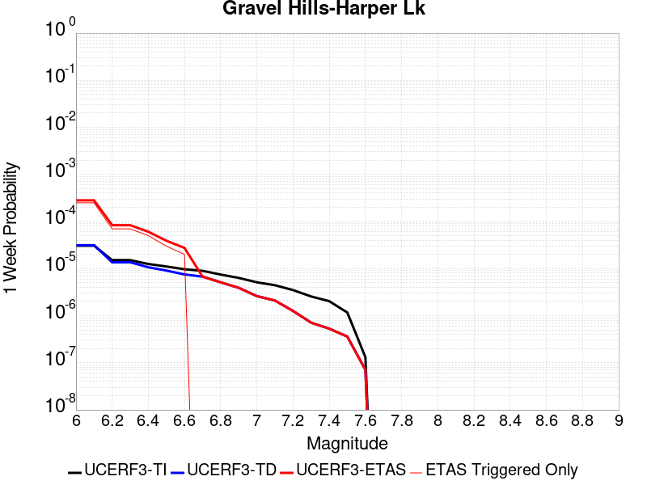 | 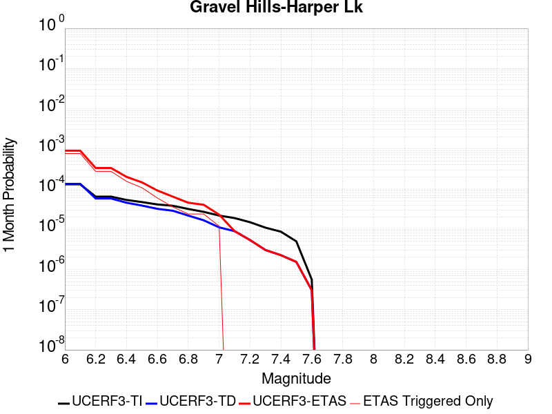 | 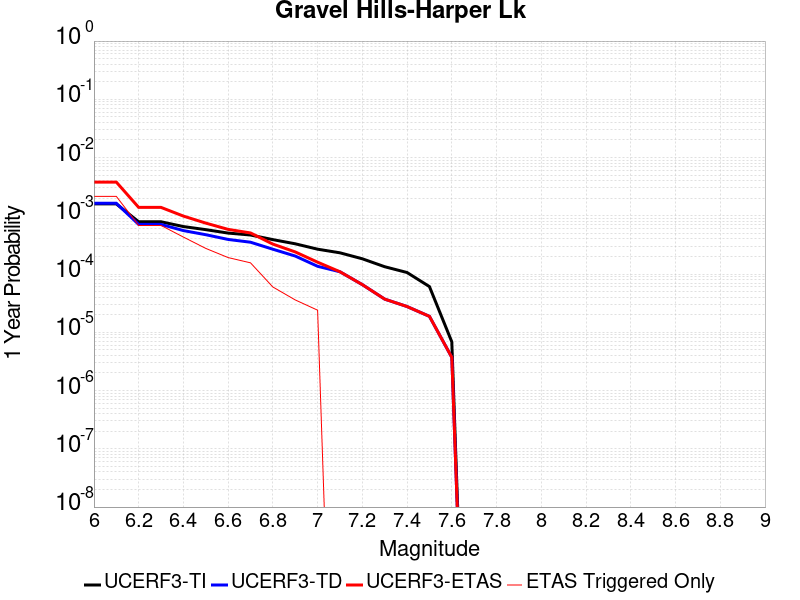 | 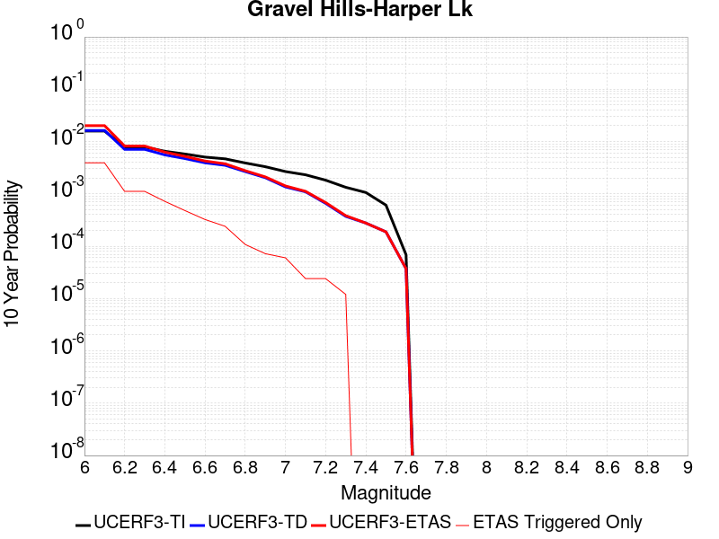 |

| Magnitude | 1 wk TI Prob | 1 wk TD Prob | 1 wk ETAS Prob | 1 wk ETAS/TD Gain | 1 wk ETAS Triggered Only | 1 mo TI Prob | 1 mo TD Prob | 1 mo ETAS Prob | 1 mo ETAS/TD Gain | 1 mo ETAS Triggered Only | 1 yr TI Prob | 1 yr TD Prob | 1 yr ETAS Prob | 1 yr ETAS/TD Gain | 1 yr ETAS Triggered Only | 10 yr TI Prob | 10 yr TD Prob | 10 yr ETAS Prob | 10 yr ETAS/TD Gain | 10 yr ETAS Triggered Only |
|-----|-----|-----|-----|-----|-----|-----|-----|-----|-----|-----|-----|-----|-----|-----|-----|-----|-----|-----|-----|-----|
| 6.0 | 3.0679566E-5 | 3.1465184E-5 | 2.9524585E-4 | 9.383255 | 2.6378897E-4 | 1.3147724E-4 | 1.3484505E-4 | 9.0212765E-4 | 6.690106 | 7.673861E-4 | 0.0015995599 | 0.0016407187 | 0.0037954508 | 2.3132856 | 0.0021582735 | 0.015880952 | 0.016307615 | 0.020164538 | 1.2365105 | 0.0039208634 |
| 6.1 | 3.0679566E-5 | 3.1465184E-5 | 2.9524585E-4 | 9.383255 | 2.6378897E-4 | 1.3147724E-4 | 1.3484505E-4 | 9.0212765E-4 | 6.690106 | 7.673861E-4 | 0.0015995599 | 0.0016407187 | 0.0037954508 | 2.3132856 | 0.0021582735 | 0.015880952 | 0.016307615 | 0.020164538 | 1.2365105 | 0.0039208634 |
| 6.2 | 1.514536E-5 | 1.3635392E-5 | 8.557686E-5 | 6.2760835 | 7.194244E-5 | 6.490707E-5 | 5.843615E-5 | 3.341994E-4 | 5.7190523 | 2.7577937E-4 | 7.8995706E-4 | 7.112398E-4 | 0.0013942069 | 1.9602488 | 6.834532E-4 | 0.007871548 | 0.0070908363 | 0.008198038 | 1.1561453 | 0.0011151079 |
| 6.3 | 1.514536E-5 | 1.3635392E-5 | 8.557686E-5 | 6.2760835 | 7.194244E-5 | 6.490707E-5 | 5.843615E-5 | 3.341994E-4 | 5.7190523 | 2.7577937E-4 | 7.8995706E-4 | 7.112398E-4 | 0.0013942069 | 1.9602488 | 6.834532E-4 | 0.007871548 | 0.0070908363 | 0.008198038 | 1.1561453 | 0.0011151079 |
| 6.4 | 1.2532521E-5 | 1.0689826E-5 | 5.8650945E-5 | 5.4866138 | 4.7961632E-5 | 5.37097E-5 | 4.581277E-5 | 2.0168093E-4 | 4.4022865 | 1.558753E-4 | 6.537194E-4 | 5.576335E-4 | 9.890475E-4 | 1.7736514 | 4.3165468E-4 | 0.0065179965 | 0.0055629327 | 0.006278355 | 1.1286052 | 7.1942445E-4 |
| 6.5 | 1.1094058E-5 | 9.083774E-6 | 4.505467E-5 | 4.9599066 | 3.597122E-5 | 4.7545094E-5 | 3.89299E-5 | 1.4683937E-4 | 3.7718918 | 1.0791367E-4 | 5.787078E-4 | 4.738725E-4 | 7.495212E-4 | 1.5816938 | 2.7577937E-4 | 0.0057720304 | 0.004729028 | 0.005206376 | 1.10094 | 4.796163E-4 |
| 6.6 | 9.688328E-6 | 7.531784E-6 | 3.151242E-5 | 4.183925 | 2.3980816E-5 | 4.1520743E-5 | 3.2278687E-5 | 9.2228795E-5 | 2.8572657 | 5.995204E-5 | 5.053978E-4 | 3.929247E-4 | 5.8469584E-4 | 1.4880608 | 1.9184653E-4 | 0.0050424994 | 0.0039225565 | 0.004245028 | 1.0822095 | 3.23741E-4 |
| 6.7 | 8.974824E-6 | 6.7494916E-6 | 6.7494916E-6 | 1.0 | 0.0 | 3.8462964E-5 | 2.8926084E-5 | 6.489627E-5 | 2.2435207 | 3.597122E-5 | 4.6818596E-4 | 3.5212038E-4 | 5.079408E-4 | 1.4425203 | 1.558753E-4 | 0.004672008 | 0.0035158454 | 0.0037548104 | 1.067968 | 2.3980816E-4 |
| 6.8 | 7.4780046E-6 | 5.116252E-6 | 5.116252E-6 | 1.0 | 0.0 | 3.20482E-5 | 2.1926619E-5 | 4.590691E-5 | 2.093661 | 2.3980816E-5 | 3.9011694E-4 | 2.6692526E-4 | 3.268613E-4 | 1.2245424 | 5.995204E-5 | 0.0038943281 | 0.002666185 | 0.0027738106 | 1.040367 | 1.0791367E-4 |
| 6.9 | 6.3409307E-6 | 3.9075426E-6 | 3.9075426E-6 | 1.0 | 0.0 | 2.7175134E-5 | 1.674651E-5 | 4.072692E-5 | 2.4319649 | 2.3980816E-5 | 3.3080703E-4 | 2.0387067E-4 | 2.3983455E-4 | 1.1764054 | 3.597122E-5 | 0.0033031502 | 0.0020369345 | 0.0021087304 | 1.0352471 | 7.194244E-5 |
| 7.0 | 5.1239335E-6 | 2.6058885E-6 | 2.6058885E-6 | 1.0 | 0.0 | 2.195953E-5 | 1.11680465E-5 | 2.315832E-5 | 2.0736232 | 1.1990408E-5 | 2.6732447E-4 | 1.3596273E-4 | 1.599403E-4 | 1.1763538 | 2.3980816E-5 | 0.0026700313 | 0.0013588208 | 0.0014186914 | 1.0440607 | 5.995204E-5 |
| 7.1 | 4.438899E-6 | 2.0984994E-6 | 2.0984994E-6 | 1.0 | 0.0 | 1.9023713E-5 | 8.993539E-6 | 8.993539E-6 | 1.0 | 0.0 | 2.315891E-4 | 1.0949106E-4 | 1.0949106E-4 | 1.0 | 0.0 | 0.002313479 | 0.0010943931 | 0.0011183476 | 1.0218885 | 2.3980816E-5 |
| 7.2 | 3.50367E-6 | 1.2615911E-6 | 1.2615911E-6 | 1.0 | 0.0 | 1.5015643E-5 | 5.406808E-6 | 5.406808E-6 | 1.0 | 0.0 | 1.8280011E-4 | 6.582599E-5 | 6.582599E-5 | 1.0 | 0.0 | 0.0018264982 | 6.580731E-4 | 6.8203814E-4 | 1.036417 | 2.3980816E-5 |
| 7.3 | 2.561638E-6 | 7.119307E-7 | 7.119307E-7 | 1.0 | 0.0 | 1.0978401E-5 | 3.051128E-6 | 3.051128E-6 | 1.0 | 0.0 | 1.3365384E-4 | 3.714687E-5 | 3.714687E-5 | 1.0 | 0.0 | 0.0013357349 | 3.7140862E-4 | 3.8339457E-4 | 1.0322716 | 1.1990408E-5 |
| 7.4 | 2.0368864E-6 | 5.304955E-7 | 5.304955E-7 | 1.0 | 0.0 | 8.729483E-6 | 2.2735503E-6 | 2.2735503E-6 | 1.0 | 0.0 | 1.06276275E-4 | 2.768013E-5 | 2.768013E-5 | 1.0 | 0.0 | 0.0010622547 | 2.7676736E-4 | 2.7676736E-4 | 1.0 | 0.0 |
| 7.5 | 1.1681728E-6 | 3.6031287E-7 | 3.6031287E-7 | 1.0 | 0.0 | 5.0064455E-6 | 1.5441972E-6 | 1.5441972E-6 | 1.0 | 0.0 | 6.0951766E-5 | 1.8800443E-5 | 1.8800443E-5 | 1.0 | 0.0 | 6.093505E-4 | 1.8798899E-4 | 1.8798899E-4 | 1.0 | 0.0 |
| 7.6 | 1.3154387E-7 | 7.1198265E-8 | 7.1198265E-8 | 1.0 | 0.0 | 5.6375933E-7 | 3.051354E-7 | 3.051354E-7 | 1.0 | 0.0 | 6.863748E-6 | 3.7150185E-6 | 3.7150185E-6 | 1.0 | 0.0 | 6.863536E-5 | 3.7149723E-5 | 3.7149723E-5 | 1.0 | 0.0 |

## McLean Lake
*[(top)](#table-of-contents)*

| 1 Week | 1 Month | 1 Year | 10 Year |
|-----|-----|-----|-----|
|  | 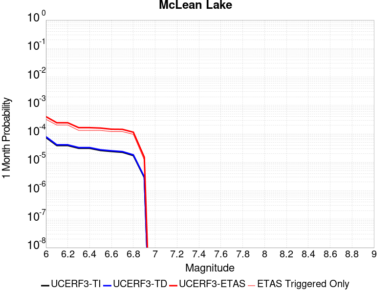 | 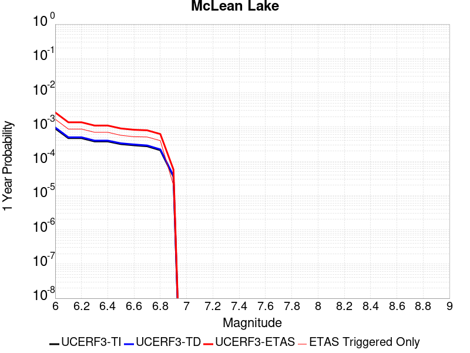 | 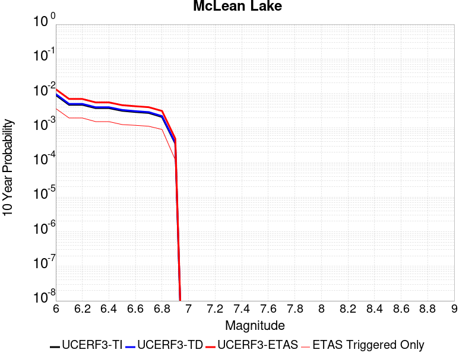 |

| Magnitude | 1 wk TI Prob | 1 wk TD Prob | 1 wk ETAS Prob | 1 wk ETAS/TD Gain | 1 wk ETAS Triggered Only | 1 mo TI Prob | 1 mo TD Prob | 1 mo ETAS Prob | 1 mo ETAS/TD Gain | 1 mo ETAS Triggered Only | 1 yr TI Prob | 1 yr TD Prob | 1 yr ETAS Prob | 1 yr ETAS/TD Gain | 1 yr ETAS Triggered Only | 10 yr TI Prob | 10 yr TD Prob | 10 yr ETAS Prob | 10 yr ETAS/TD Gain | 10 yr ETAS Triggered Only |
|-----|-----|-----|-----|-----|-----|-----|-----|-----|-----|-----|-----|-----|-----|-----|-----|-----|-----|-----|-----|-----|
| 6.0 | 1.7360222E-5 | 1.8501789E-5 | 1.3840364E-4 | 7.4805546 | 1.1990408E-4 | 7.439883E-5 | 7.929125E-5 | 4.030066E-4 | 5.082611 | 3.23741E-4 | 9.0542925E-4 | 9.64992E-4 | 0.0026060927 | 2.7006366 | 0.0016426858 | 0.009017491 | 0.009612858 | 0.013246653 | 1.378014 | 0.0036690647 |
| 6.1 | 9.062689E-6 | 9.592268E-6 | 8.1534025E-5 | 8.499973 | 7.194244E-5 | 3.8839516E-5 | 4.110912E-5 | 2.4493766E-4 | 5.958232 | 2.0383693E-4 | 4.727685E-4 | 5.003975E-4 | 0.0013752592 | 2.7483337 | 8.7529974E-4 | 0.0047176396 | 0.0049935905 | 0.006938267 | 1.3894346 | 0.0019544365 |
| 6.2 | 9.062689E-6 | 9.592268E-6 | 8.1534025E-5 | 8.499973 | 7.194244E-5 | 3.8839516E-5 | 4.110912E-5 | 2.4493766E-4 | 5.958232 | 2.0383693E-4 | 4.727685E-4 | 5.003975E-4 | 0.0013752592 | 2.7483337 | 8.7529974E-4 | 0.0047176396 | 0.0049935905 | 0.006938267 | 1.3894346 | 0.0019544365 |
| 6.3 | 7.2575485E-6 | 7.667767E-6 | 4.3638713E-5 | 5.6911893 | 3.597122E-5 | 3.110341E-5 | 3.2861484E-5 | 1.6475163E-4 | 5.013518 | 1.3189449E-4 | 3.786182E-4 | 4.0002225E-4 | 0.0010951877 | 2.737817 | 6.9544365E-4 | 0.0037797375 | 0.003993727 | 0.0055223694 | 1.382761 | 0.0015347722 |
| 6.4 | 7.2575485E-6 | 7.667767E-6 | 4.3638713E-5 | 5.6911893 | 3.597122E-5 | 3.110341E-5 | 3.2861484E-5 | 1.6475163E-4 | 5.013518 | 1.3189449E-4 | 3.786182E-4 | 4.0002225E-4 | 0.0010951877 | 2.737817 | 6.9544365E-4 | 0.0037797375 | 0.003993727 | 0.0055223694 | 1.382761 | 0.0015347722 |
| 6.5 | 6.06582E-6 | 6.4039245E-6 | 4.237492E-5 | 6.6170235 | 3.597122E-5 | 2.5996113E-5 | 2.7445138E-5 | 1.59336E-4 | 5.8056183 | 1.3189449E-4 | 3.164567E-4 | 3.340998E-4 | 9.094471E-4 | 2.7220821 | 5.7553954E-4 | 0.0031600643 | 0.0033366138 | 0.004591406 | 1.3760675 | 0.0012589928 |
| 6.6 | 5.598744E-6 | 5.910306E-6 | 2.989098E-5 | 5.0574336 | 2.3980816E-5 | 2.3994397E-5 | 2.5329673E-5 | 1.4523072E-4 | 5.7336197 | 1.1990408E-4 | 2.9209262E-4 | 3.083515E-4 | 8.357668E-4 | 2.7104352 | 5.2757794E-4 | 0.0029170897 | 0.0030798658 | 0.0042752135 | 1.3881168 | 0.0011990408 |
| 6.7 | 5.246996E-6 | 5.539203E-6 | 2.9519886E-5 | 5.329266 | 2.3980816E-5 | 2.2486933E-5 | 2.3739261E-5 | 1.4364049E-4 | 6.0507565 | 1.1990408E-4 | 2.73744E-4 | 2.8899353E-4 | 8.04432E-4 | 2.7835643 | 5.155875E-4 | 0.0027340704 | 0.002886801 | 0.0040106457 | 1.3893045 | 0.0011270983 |
| 6.8 | 4.02324E-6 | 4.246936E-6 | 2.8227649E-5 | 6.646592 | 2.3980816E-5 | 1.7242342E-5 | 1.820106E-5 | 1.1412257E-4 | 6.270106 | 9.5923264E-5 | 2.099053E-4 | 2.2158133E-4 | 6.5314036E-4 | 2.9476328 | 4.3165468E-4 | 0.0020970714 | 0.0022141882 | 0.0031234415 | 1.4106486 | 9.1127097E-4 |
| 6.9 | 6.835972E-7 | 7.1399705E-7 | 7.1399705E-7 | 1.0 | 0.0 | 2.9296991E-6 | 3.0599856E-6 | 1.50503565E-5 | 4.9184403 | 1.1990408E-5 | 3.56685E-5 | 3.7255006E-5 | 6.1234925E-5 | 1.6436698 | 2.3980816E-5 | 3.5662777E-4 | 3.7251884E-4 | 4.9237825E-4 | 1.321754 | 1.1990408E-4 |

## Goldstone Lake
*[(top)](#table-of-contents)*

| 1 Week | 1 Month | 1 Year | 10 Year |
|-----|-----|-----|-----|
|  | 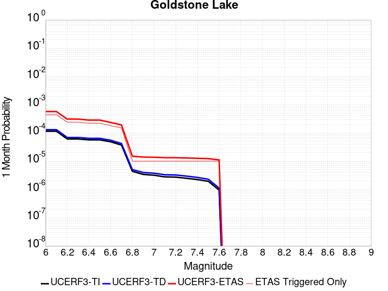 | 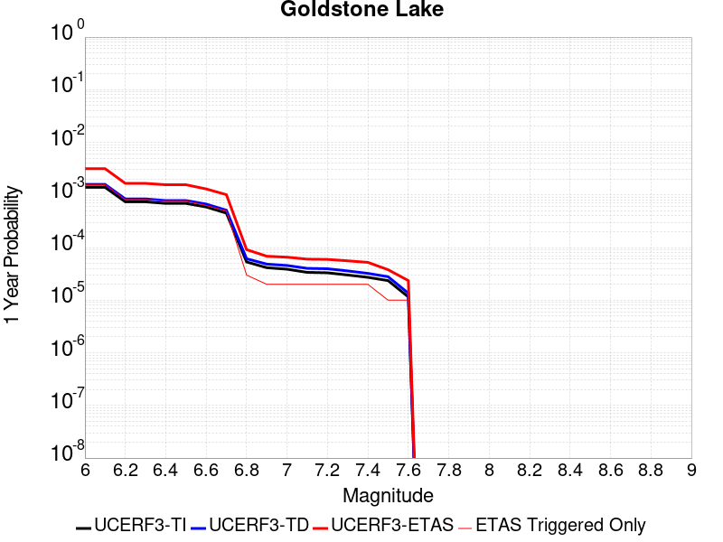 | 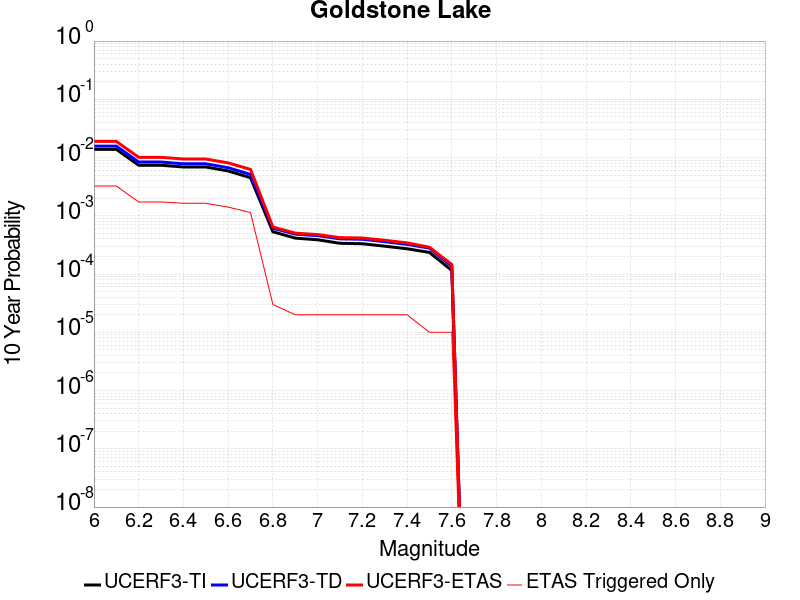 |

| Magnitude | 1 wk TI Prob | 1 wk TD Prob | 1 wk ETAS Prob | 1 wk ETAS/TD Gain | 1 wk ETAS Triggered Only | 1 mo TI Prob | 1 mo TD Prob | 1 mo ETAS Prob | 1 mo ETAS/TD Gain | 1 mo ETAS Triggered Only | 1 yr TI Prob | 1 yr TD Prob | 1 yr ETAS Prob | 1 yr ETAS/TD Gain | 1 yr ETAS Triggered Only | 10 yr TI Prob | 10 yr TD Prob | 10 yr ETAS Prob | 10 yr ETAS/TD Gain | 10 yr ETAS Triggered Only |
|-----|-----|-----|-----|-----|-----|-----|-----|-----|-----|-----|-----|-----|-----|-----|-----|-----|-----|-----|-----|-----|
| 6.0 | 2.671352E-5 | 3.0376628E-5 | 1.3828703E-4 | 4.552415 | 1.0791367E-4 | 1.1448149E-4 | 1.3018015E-4 | 5.497898E-4 | 4.2232995 | 4.1966425E-4 | 0.001392921 | 0.0015839875 | 0.0030804144 | 1.9447213 | 0.0014988009 | 0.013842222 | 0.015746472 | 0.018767683 | 1.1918658 | 0.0030695444 |
| 6.1 | 2.671352E-5 | 3.0376628E-5 | 1.3828703E-4 | 4.552415 | 1.0791367E-4 | 1.1448149E-4 | 1.3018015E-4 | 5.497898E-4 | 4.2232995 | 4.1966425E-4 | 0.001392921 | 0.0015839875 | 0.0030804144 | 1.9447213 | 0.0014988009 | 0.013842222 | 0.015746472 | 0.018767683 | 1.1918658 | 0.0030695444 |
| 6.2 | 1.4197047E-5 | 1.6096516E-5 | 5.206716E-5 | 3.2346852 | 3.597122E-5 | 6.0843064E-5 | 6.89838E-5 | 2.7280668E-4 | 3.9546483 | 2.0383693E-4 | 7.4051257E-4 | 8.396528E-4 | 0.0015944141 | 1.898897 | 7.553957E-4 | 0.007380498 | 0.008374499 | 0.009955869 | 1.1888314 | 0.0015947243 |
| 6.3 | 1.4197047E-5 | 1.6096516E-5 | 5.206716E-5 | 3.2346852 | 3.597122E-5 | 6.0843064E-5 | 6.89838E-5 | 2.7280668E-4 | 3.9546483 | 2.0383693E-4 | 7.4051257E-4 | 8.396528E-4 | 0.0015944141 | 1.898897 | 7.553957E-4 | 0.007380498 | 0.008374499 | 0.009955869 | 1.1888314 | 0.0015947243 |
| 6.4 | 1.3238931E-5 | 1.5008711E-5 | 5.0979394E-5 | 3.3966537 | 3.597122E-5 | 5.6737044E-5 | 6.432201E-5 | 2.561562E-4 | 3.9824033 | 1.9184653E-4 | 6.9055456E-4 | 7.8293716E-4 | 0.0015137794 | 1.9334621 | 7.314149E-4 | 0.006884126 | 0.007811414 | 0.009310404 | 1.1918974 | 0.0015107914 |
| 6.5 | 1.3238931E-5 | 1.5008711E-5 | 5.0979394E-5 | 3.3966537 | 3.597122E-5 | 5.6737044E-5 | 6.432201E-5 | 2.561562E-4 | 3.9824033 | 1.9184653E-4 | 6.9055456E-4 | 7.8293716E-4 | 0.0015137794 | 1.9334621 | 7.314149E-4 | 0.006884126 | 0.007811414 | 0.009310404 | 1.1918974 | 0.0015107914 |
| 6.6 | 1.1328278E-5 | 1.2855381E-5 | 3.683589E-5 | 2.8654063 | 2.3980816E-5 | 4.8548856E-5 | 5.5093864E-5 | 1.9897083E-4 | 3.6114879 | 1.4388488E-4 | 5.90922E-4 | 6.706571E-4 | 0.0012338283 | 1.8397305 | 5.6354917E-4 | 0.0058935313 | 0.0066957204 | 0.007946284 | 1.1867704 | 0.0012589928 |
| 6.7 | 8.651175E-6 | 9.8247265E-6 | 3.3805307E-5 | 3.4408393 | 2.3980816E-5 | 3.707594E-5 | 4.2105803E-5 | 1.6200483E-4 | 3.8475654 | 1.1990408E-4 | 4.5130608E-4 | 5.126081E-4 | 9.4404153E-4 | 1.8416438 | 4.3165468E-4 | 0.0045039062 | 0.0051231356 | 0.006113241 | 1.1932616 | 9.952039E-4 |
| 6.8 | 1.0215377E-6 | 1.1754793E-6 | 1.1754793E-6 | 1.0 | 0.0 | 4.378012E-6 | 5.037759E-6 | 1.7028106E-5 | 3.3800955 | 1.1990408E-5 | 5.3300988E-5 | 6.133311E-5 | 9.730212E-5 | 1.5864536 | 3.597122E-5 | 5.3288206E-4 | 6.13173E-4 | 6.491222E-4 | 1.0586281 | 3.597122E-5 |
| 6.9 | 7.9360774E-7 | 9.2834586E-7 | 9.2834586E-7 | 1.0 | 0.0 | 3.4011714E-6 | 3.9786196E-6 | 1.5968979E-5 | 4.0136986 | 1.1990408E-5 | 4.1408475E-5 | 4.8438687E-5 | 7.241834E-5 | 1.4950517 | 2.3980816E-5 | 4.140076E-4 | 4.842883E-4 | 5.082575E-4 | 1.0494937 | 2.3980816E-5 |
| 7.0 | 7.4382757E-7 | 8.7473853E-7 | 8.7473853E-7 | 1.0 | 0.0 | 3.1878285E-6 | 3.7488744E-6 | 1.5739237E-5 | 4.19839 | 1.1990408E-5 | 3.8811122E-5 | 4.5641656E-5 | 6.9621376E-5 | 1.5253911 | 2.3980816E-5 | 3.8804344E-4 | 4.563295E-4 | 4.8029935E-4 | 1.0525275 | 2.3980816E-5 |
| 7.1 | 6.4709513E-7 | 7.711347E-7 | 7.711347E-7 | 1.0 | 0.0 | 2.773262E-6 | 3.304859E-6 | 1.5295227E-5 | 4.628103 | 1.1990408E-5 | 3.376394E-5 | 4.0235976E-5 | 6.421583E-5 | 1.5959803 | 2.3980816E-5 | 3.375881E-4 | 4.0229288E-4 | 4.2626404E-4 | 1.0595864 | 2.3980816E-5 |
| 7.2 | 6.356704E-7 | 7.5884054E-7 | 7.5884054E-7 | 1.0 | 0.0 | 2.7242988E-6 | 3.25217E-6 | 1.5242539E-5 | 4.6868825 | 1.1990408E-5 | 3.3167835E-5 | 3.959451E-5 | 6.357438E-5 | 1.6056361 | 2.3980816E-5 | 3.3162883E-4 | 3.958805E-4 | 4.1985183E-4 | 1.0605519 | 2.3980816E-5 |
| 7.3 | 5.7695723E-7 | 6.8966074E-7 | 6.8966074E-7 | 1.0 | 0.0 | 2.4726714E-6 | 2.9556859E-6 | 1.4946058E-5 | 5.056714 | 1.1990408E-5 | 3.0104358E-5 | 3.598494E-5 | 5.9964892E-5 | 1.6663885 | 2.3980816E-5 | 3.0100282E-4 | 3.5979686E-4 | 3.8376905E-4 | 1.066627 | 2.3980816E-5 |
| 7.4 | 5.209647E-7 | 6.193549E-7 | 6.193549E-7 | 1.0 | 0.0 | 2.232704E-6 | 2.654376E-6 | 1.4644752E-5 | 5.517211 | 1.1990408E-5 | 2.718283E-5 | 3.2316606E-5 | 5.6296645E-5 | 1.7420347 | 2.3980816E-5 | 2.7179506E-4 | 3.231246E-4 | 3.4709767E-4 | 1.0741915 | 2.3980816E-5 |
| 7.5 | 4.512955E-7 | 5.3489146E-7 | 5.3489146E-7 | 1.0 | 0.0 | 1.934122E-6 | 2.2923903E-6 | 1.428277E-5 | 6.2305145 | 1.1990408E-5 | 2.3547682E-5 | 2.7909547E-5 | 3.989962E-5 | 1.4296048 | 1.1990408E-5 | 2.3545188E-4 | 2.7906572E-4 | 2.910528E-4 | 1.0429542 | 1.1990408E-5 |
| 7.6 | 2.21172E-7 | 2.6039737E-7 | 2.6039737E-7 | 1.0 | 0.0 | 9.478797E-7 | 1.1159884E-6 | 1.31063825E-5 | 11.744192 | 1.1990408E-5 | 1.1540374E-5 | 1.3587103E-5 | 2.5577348E-5 | 1.8824725 | 1.1990408E-5 | 1.1539775E-4 | 1.3586554E-4 | 1.4785431E-4 | 1.08824 | 1.1990408E-5 |

## So Sierra Nevada
*[(top)](#table-of-contents)*

| 1 Week | 1 Month | 1 Year | 10 Year |
|-----|-----|-----|-----|
| 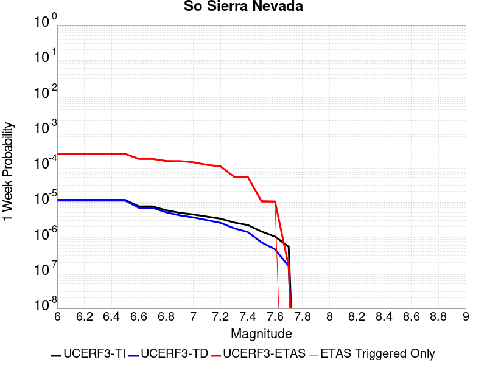 | 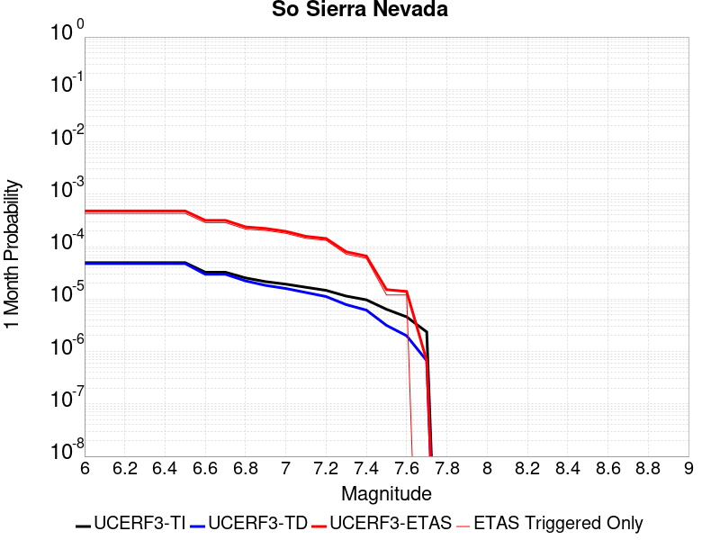 | 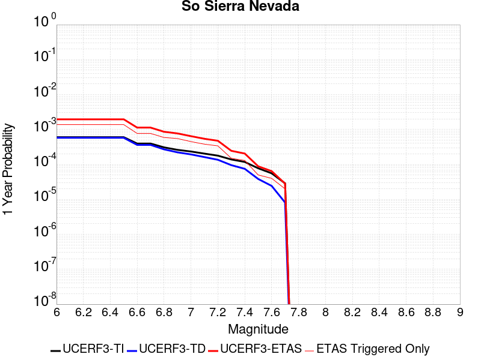 |  |

| Magnitude | 1 wk TI Prob | 1 wk TD Prob | 1 wk ETAS Prob | 1 wk ETAS/TD Gain | 1 wk ETAS Triggered Only | 1 mo TI Prob | 1 mo TD Prob | 1 mo ETAS Prob | 1 mo ETAS/TD Gain | 1 mo ETAS Triggered Only | 1 yr TI Prob | 1 yr TD Prob | 1 yr ETAS Prob | 1 yr ETAS/TD Gain | 1 yr ETAS Triggered Only | 10 yr TI Prob | 10 yr TD Prob | 10 yr ETAS Prob | 10 yr ETAS/TD Gain | 10 yr ETAS Triggered Only |
|-----|-----|-----|-----|-----|-----|-----|-----|-----|-----|-----|-----|-----|-----|-----|-----|-----|-----|-----|-----|-----|
| 6.0 | 1.15488665E-5 | 1.1079722E-5 | 2.2690467E-4 | 20.479275 | 2.1582734E-4 | 4.9494203E-5 | 4.748373E-5 | 4.791179E-4 | 10.090149 | 4.3165468E-4 | 6.024253E-4 | 5.779738E-4 | 0.0019920242 | 3.446565 | 0.001414868 | 0.006007948 | 0.005765975 | 0.008460183 | 1.4672596 | 0.002709832 |
| 6.1 | 1.15488665E-5 | 1.1079722E-5 | 2.2690467E-4 | 20.479275 | 2.1582734E-4 | 4.9494203E-5 | 4.748373E-5 | 4.791179E-4 | 10.090149 | 4.3165468E-4 | 6.024253E-4 | 5.779738E-4 | 0.0019920242 | 3.446565 | 0.001414868 | 0.006007948 | 0.005765975 | 0.008460183 | 1.4672596 | 0.002709832 |
| 6.2 | 1.15488665E-5 | 1.1079722E-5 | 2.2690467E-4 | 20.479275 | 2.1582734E-4 | 4.9494203E-5 | 4.748373E-5 | 4.791179E-4 | 10.090149 | 4.3165468E-4 | 6.024253E-4 | 5.779738E-4 | 0.0019920242 | 3.446565 | 0.001414868 | 0.006007948 | 0.005765975 | 0.008460183 | 1.4672596 | 0.002709832 |
| 6.3 | 1.15488665E-5 | 1.1079722E-5 | 2.2690467E-4 | 20.479275 | 2.1582734E-4 | 4.9494203E-5 | 4.748373E-5 | 4.791179E-4 | 10.090149 | 4.3165468E-4 | 6.024253E-4 | 5.779738E-4 | 0.0019920242 | 3.446565 | 0.001414868 | 0.006007948 | 0.005765975 | 0.008460183 | 1.4672596 | 0.002709832 |
| 6.4 | 1.15488665E-5 | 1.1079722E-5 | 2.2690467E-4 | 20.479275 | 2.1582734E-4 | 4.9494203E-5 | 4.748373E-5 | 4.791179E-4 | 10.090149 | 4.3165468E-4 | 6.024253E-4 | 5.779738E-4 | 0.0019920242 | 3.446565 | 0.001414868 | 0.006007948 | 0.005765975 | 0.008460183 | 1.4672596 | 0.002709832 |
| 6.5 | 1.15488665E-5 | 1.1079722E-5 | 2.2690467E-4 | 20.479275 | 2.1582734E-4 | 4.9494203E-5 | 4.748373E-5 | 4.791179E-4 | 10.090149 | 4.3165468E-4 | 6.024253E-4 | 5.779738E-4 | 0.0019920242 | 3.446565 | 0.001414868 | 0.006007948 | 0.005765975 | 0.008460183 | 1.4672596 | 0.002709832 |
| 6.6 | 7.587044E-6 | 6.935689E-6 | 1.8679055E-4 | 26.931795 | 1.7985611E-4 | 3.2515498E-5 | 2.9724059E-5 | 3.1748528E-4 | 10.681088 | 2.8776977E-4 | 3.9580427E-4 | 3.6183326E-4 | 0.0011409278 | 3.1531866 | 7.793765E-4 | 0.003951 | 0.0036127327 | 0.0051539075 | 1.4265952 | 0.0015467625 |
| 6.7 | 7.587044E-6 | 6.935689E-6 | 1.8679055E-4 | 26.931795 | 1.7985611E-4 | 3.2515498E-5 | 2.9724059E-5 | 3.1748528E-4 | 10.681088 | 2.8776977E-4 | 3.9580427E-4 | 3.6183326E-4 | 0.0011409278 | 3.1531866 | 7.793765E-4 | 0.003951 | 0.0036127327 | 0.0051539075 | 1.4265952 | 0.0015467625 |
| 6.8 | 5.9026956E-6 | 5.1794364E-6 | 1.6105393E-4 | 31.094875 | 1.558753E-4 | 2.5297022E-5 | 2.2197402E-5 | 2.3801994E-4 | 10.722874 | 2.1582734E-4 | 3.0794772E-4 | 2.7022103E-4 | 8.456051E-4 | 3.129309 | 5.7553954E-4 | 0.0030752132 | 0.0026990408 | 0.0037872228 | 1.4031737 | 0.001091127 |
| 6.9 | 5.0118915E-6 | 4.2524644E-6 | 1.601271E-4 | 37.655132 | 1.558753E-4 | 2.1479358E-5 | 1.8224722E-5 | 2.2205793E-4 | 12.184434 | 2.0383693E-4 | 2.614798E-4 | 2.2186415E-4 | 7.613128E-4 | 3.4314368 | 5.3956837E-4 | 0.0026117235 | 0.002216499 | 0.0031855693 | 1.4372077 | 9.71223E-4 |
| 7.0 | 4.4924795E-6 | 3.713954E-6 | 1.4759832E-4 | 39.741558 | 1.4388488E-4 | 1.925334E-5 | 1.5916852E-5 | 1.957701E-4 | 12.29955 | 1.7985611E-4 | 2.3438422E-4 | 1.9377106E-4 | 6.373302E-4 | 3.2890885 | 4.4364508E-4 | 0.0023413717 | 0.001936084 | 0.0027737876 | 1.4326793 | 8.393285E-4 |
| 7.1 | 3.9118436E-6 | 3.1120105E-6 | 1.2301572E-4 | 39.529335 | 1.1990408E-4 | 1.6764936E-5 | 1.3337123E-5 | 1.572201E-4 | 11.7881565 | 1.4388488E-4 | 2.0409399E-4 | 1.6236794E-4 | 5.220218E-4 | 3.2150543 | 3.5971223E-4 | 0.0020390663 | 0.0016225493 | 0.0022330678 | 1.3762712 | 6.1151077E-4 |
| 7.2 | 3.4200818E-6 | 2.6054847E-6 | 1.1051887E-4 | 42.417778 | 1.0791367E-4 | 1.4657411E-5 | 1.11663185E-5 | 1.4305933E-4 | 12.811683 | 1.3189449E-4 | 1.7843937E-4 | 1.3594194E-4 | 4.4765018E-4 | 3.2929509 | 3.117506E-4 | 0.0017829615 | 0.0013586376 | 0.0018974729 | 1.3965997 | 5.3956837E-4 |
| 7.3 | 2.6593618E-6 | 1.8284468E-6 | 4.978999E-5 | 27.230757 | 4.7961632E-5 | 1.13972155E-5 | 7.836179E-6 | 7.977806E-5 | 10.180736 | 7.194244E-5 | 1.3875226E-4 | 9.540159E-5 | 2.3927276E-4 | 2.5080583 | 1.4388488E-4 | 0.0013866565 | 9.536353E-4 | 0.0012411306 | 1.301473 | 2.8776977E-4 |
| 7.4 | 2.2577992E-6 | 1.4364622E-6 | 4.9398022E-5 | 34.388668 | 4.7961632E-5 | 9.676246E-6 | 6.1562537E-6 | 6.6107925E-5 | 10.738337 | 5.995204E-5 | 1.1780193E-4 | 7.495006E-5 | 1.9484515E-4 | 2.5996664 | 1.1990408E-4 | 0.001177395 | 7.4927293E-4 | 9.7692E-4 | 1.303824 | 2.2781774E-4 |
| 7.5 | 1.489319E-6 | 7.3541264E-7 | 1.2725812E-5 | 17.304314 | 1.1990408E-5 | 6.3827797E-6 | 3.1517645E-6 | 1.51421345E-5 | 4.8043356 | 1.1990408E-5 | 7.770758E-5 | 3.837206E-5 | 8.633186E-5 | 2.2498622 | 4.7961632E-5 | 7.7680405E-4 | 3.836548E-4 | 4.915271E-4 | 1.2811701 | 1.0791367E-4 |
| 7.6 | 1.0680322E-6 | 4.659796E-7 | 1.2456382E-5 | 26.731602 | 1.1990408E-5 | 4.577273E-6 | 1.997054E-6 | 1.3987437E-5 | 7.004036 | 1.1990408E-5 | 5.5726876E-5 | 2.4313864E-5 | 6.0284212E-5 | 2.4794173 | 3.597122E-5 | 5.5712904E-4 | 2.431123E-4 | 3.2702475E-4 | 1.3451592 | 8.393286E-5 |
| 7.7 | 5.509146E-7 | 1.5581199E-7 | 1.5581199E-7 | 1.0 | 0.0 | 2.3610605E-6 | 6.677655E-7 | 6.677655E-7 | 1.0 | 0.0 | 2.8745531E-5 | 8.130016E-6 | 3.2110638E-5 | 3.94964 | 2.3980816E-5 | 2.8741814E-4 | 8.12973E-5 | 1.05276165E-4 | 1.2949528 | 2.3980816E-5 |

## San Andreas (Mojave S)
*[(top)](#table-of-contents)*

| 1 Week | 1 Month | 1 Year | 10 Year |
|-----|-----|-----|-----|
| 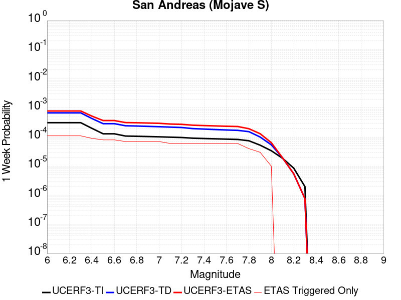 | 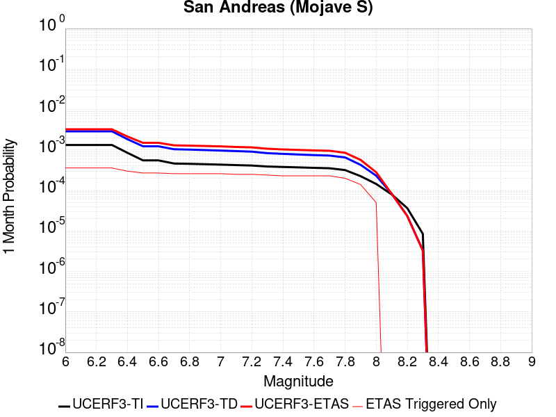 | 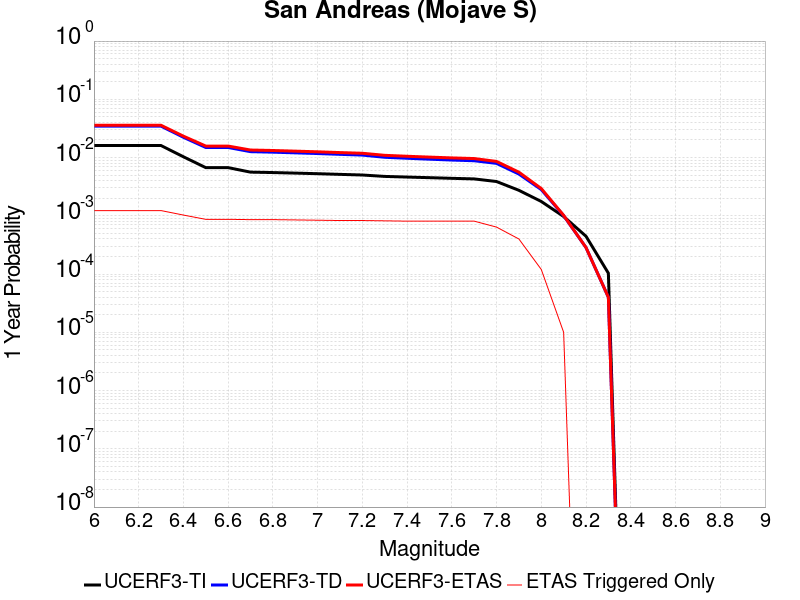 | 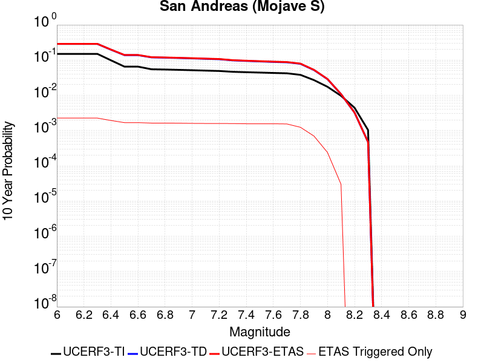 |

| Magnitude | 1 wk TI Prob | 1 wk TD Prob | 1 wk ETAS Prob | 1 wk ETAS/TD Gain | 1 wk ETAS Triggered Only | 1 mo TI Prob | 1 mo TD Prob | 1 mo ETAS Prob | 1 mo ETAS/TD Gain | 1 mo ETAS Triggered Only | 1 yr TI Prob | 1 yr TD Prob | 1 yr ETAS Prob | 1 yr ETAS/TD Gain | 1 yr ETAS Triggered Only | 10 yr TI Prob | 10 yr TD Prob | 10 yr ETAS Prob | 10 yr ETAS/TD Gain | 10 yr ETAS Triggered Only |
|-----|-----|-----|-----|-----|-----|-----|-----|-----|-----|-----|-----|-----|-----|-----|-----|-----|-----|-----|-----|-----|
| 6.0 | 3.1064058E-4 | 6.747043E-4 | 7.825452E-4 | 1.1598343 | 1.0791367E-4 | 0.0013306376 | 0.002888514 | 0.0032950102 | 1.1407285 | 4.0767386E-4 | 0.016080605 | 0.03462661 | 0.03588831 | 1.0364373 | 0.0013069544 | 0.1496549 | 0.28663692 | 0.28821933 | 1.0055206 | 0.0022182255 |
| 6.1 | 3.1064058E-4 | 6.747043E-4 | 7.825452E-4 | 1.1598343 | 1.0791367E-4 | 0.0013306376 | 0.002888514 | 0.0032950102 | 1.1407285 | 4.0767386E-4 | 0.016080605 | 0.03462661 | 0.03588831 | 1.0364373 | 0.0013069544 | 0.1496549 | 0.28663692 | 0.28821933 | 1.0055206 | 0.0022182255 |
| 6.2 | 3.1064058E-4 | 6.747043E-4 | 7.825452E-4 | 1.1598343 | 1.0791367E-4 | 0.0013306376 | 0.002888514 | 0.0032950102 | 1.1407285 | 4.0767386E-4 | 0.016080605 | 0.03462661 | 0.03588831 | 1.0364373 | 0.0013069544 | 0.1496549 | 0.28663692 | 0.28821933 | 1.0055206 | 0.0022182255 |
| 6.3 | 3.1064058E-4 | 6.747043E-4 | 7.825452E-4 | 1.1598343 | 1.0791367E-4 | 0.0013306376 | 0.002888514 | 0.0032950102 | 1.1407285 | 4.0767386E-4 | 0.016080605 | 0.03462661 | 0.03588831 | 1.0364373 | 0.0013069544 | 0.1496549 | 0.28663692 | 0.28821933 | 1.0055206 | 0.0022182255 |
| 6.4 | 1.9872203E-4 | 4.318848E-4 | 5.157814E-4 | 1.1942569 | 8.393286E-5 | 8.5138786E-4 | 0.0018496502 | 0.0021847605 | 1.181175 | 3.3573143E-4 | 0.010316478 | 0.022293096 | 0.023348177 | 1.0473276 | 0.0010791367 | 0.098504856 | 0.19703239 | 0.1985536 | 1.0077206 | 0.0018944844 |
| 6.5 | 1.291105E-4 | 2.8761322E-4 | 3.7152192E-4 | 1.2917415 | 8.393286E-5 | 5.5321335E-4 | 0.0012320485 | 0.001543415 | 1.2527226 | 3.117506E-4 | 0.006714592 | 0.0148978485 | 0.015819166 | 1.0618424 | 9.352518E-4 | 0.065152965 | 0.13807017 | 0.13949639 | 1.0103296 | 0.0016546763 |
| 6.6 | 1.291105E-4 | 2.8761322E-4 | 3.7152192E-4 | 1.2917415 | 8.393286E-5 | 5.5321335E-4 | 0.0012320485 | 0.001543415 | 1.2527226 | 3.117506E-4 | 0.006714592 | 0.0148978485 | 0.015819166 | 1.0618424 | 9.352518E-4 | 0.065152965 | 0.13807017 | 0.13949639 | 1.0103296 | 0.0016546763 |
| 6.7 | 1.08001186E-4 | 2.4342406E-4 | 3.15349E-4 | 1.2954718 | 7.194244E-5 | 4.6278012E-4 | 0.0010428295 | 0.001342277 | 1.2871492 | 2.997602E-4 | 0.0056198016 | 0.012622835 | 0.0135344425 | 1.0722189 | 9.232614E-4 | 0.054797906 | 0.11921291 | 0.12062808 | 1.011871 | 0.0016067147 |
| 6.8 | 1.0624356E-4 | 2.3860046E-4 | 3.1052576E-4 | 1.3014466 | 7.194244E-5 | 4.5525006E-4 | 0.0010221732 | 0.001321627 | 1.292958 | 2.997602E-4 | 0.0055285925 | 0.01237422 | 0.013286057 | 1.0736884 | 9.232614E-4 | 0.053930566 | 0.117162056 | 0.11858053 | 1.0121069 | 0.0016067147 |
| 6.9 | 1.0393785E-4 | 2.3230357E-4 | 3.0422932E-4 | 1.3096195 | 7.194244E-5 | 4.4537184E-4 | 9.952073E-4 | 0.0012946692 | 1.300904 | 2.997602E-4 | 0.0054089287 | 0.012049583 | 0.012961719 | 1.0756986 | 9.232614E-4 | 0.05279156 | 0.11445948 | 0.11588229 | 1.0124307 | 0.0016067147 |
| 7.0 | 1.0155622E-4 | 2.2599897E-4 | 2.9792514E-4 | 1.3182589 | 7.194244E-5 | 4.3516833E-4 | 9.682079E-4 | 0.0012676779 | 1.3093034 | 2.997602E-4 | 0.005285311 | 0.011724443 | 0.01262503 | 1.0768127 | 9.1127097E-4 | 0.05161361 | 0.11171984 | 0.1131364 | 1.0126796 | 0.0015947243 |
| 7.1 | 9.885595E-5 | 2.1888265E-4 | 2.7882156E-4 | 1.2738404 | 5.995204E-5 | 4.2359953E-4 | 9.377316E-4 | 0.0012252316 | 1.3065909 | 2.8776977E-4 | 0.0051451353 | 0.011357316 | 0.012246383 | 1.0782814 | 8.992806E-4 | 0.05027629 | 0.10860426 | 0.1100151 | 1.0129907 | 0.0015827338 |
| 7.2 | 9.6411415E-5 | 2.125122E-4 | 2.724515E-4 | 1.2820511 | 5.995204E-5 | 4.1312634E-4 | 9.1044896E-4 | 0.0011979567 | 1.3157868 | 2.8776977E-4 | 0.005018219 | 0.01102856 | 0.011917923 | 1.0806417 | 8.992806E-4 | 0.049064007 | 0.10579402 | 0.10720931 | 1.0133778 | 0.0015827338 |
| 7.3 | 9.1180635E-5 | 1.9479371E-4 | 2.5473407E-4 | 1.307712 | 5.995204E-5 | 3.907156E-4 | 8.345632E-4 | 0.0011101124 | 1.3301718 | 2.7577937E-4 | 0.004746591 | 0.010113581 | 0.010991898 | 1.0868453 | 8.8729017E-4 | 0.046464786 | 0.09798661 | 0.09940344 | 1.0144595 | 0.0015707434 |
| 7.4 | 8.887388E-5 | 1.8727897E-4 | 2.4721978E-4 | 1.3200616 | 5.995204E-5 | 3.8083247E-4 | 8.023774E-4 | 0.0010659547 | 1.3284954 | 2.6378897E-4 | 0.0046267817 | 0.009725285 | 0.010592072 | 1.0891272 | 8.7529974E-4 | 0.045316286 | 0.09462135 | 0.09602176 | 1.0148001 | 0.0015467625 |
| 7.5 | 8.6750515E-5 | 1.8059391E-4 | 2.4053513E-4 | 1.3319116 | 5.995204E-5 | 3.7173493E-4 | 7.7374437E-4 | 0.0010373292 | 1.3406614 | 2.6378897E-4 | 0.004516484 | 0.009379733 | 0.010246824 | 1.0924429 | 8.7529974E-4 | 0.04425787 | 0.09158487 | 0.09298997 | 1.0153421 | 0.0015467625 |
| 7.6 | 8.453092E-5 | 1.7446902E-4 | 2.344106E-4 | 1.3435657 | 5.995204E-5 | 3.6222505E-4 | 7.475102E-4 | 0.001011102 | 1.3526263 | 2.6378897E-4 | 0.0044011753 | 0.009063034 | 0.009930401 | 1.0957038 | 8.7529974E-4 | 0.04315024 | 0.088743635 | 0.09015313 | 1.0158828 | 0.0015467625 |
| 7.7 | 8.259102E-5 | 1.6968958E-4 | 2.2963145E-4 | 1.3532442 | 5.995204E-5 | 3.539135E-4 | 7.270384E-4 | 9.906356E-4 | 1.3625629 | 2.6378897E-4 | 0.004300386 | 0.008815835 | 0.009683419 | 1.0984119 | 8.7529974E-4 | 0.042181134 | 0.08649418 | 0.087885246 | 1.0160828 | 0.0015227818 |
| 7.8 | 7.444844E-5 | 1.5290553E-4 | 1.8887126E-4 | 1.2352153 | 3.597122E-5 | 3.1902574E-4 | 6.551449E-4 | 8.828134E-4 | 1.3475085 | 2.2781774E-4 | 0.0038772223 | 0.007947266 | 0.008649078 | 1.0883086 | 7.07434E-4 | 0.03810269 | 0.07832232 | 0.079460606 | 1.0145333 | 0.001235012 |
| 7.9 | 5.2586525E-5 | 1.0011239E-4 | 1.240908E-4 | 1.239515 | 2.3980816E-5 | 2.2535135E-4 | 4.2898257E-4 | 5.84791E-4 | 1.3632046 | 1.558753E-4 | 0.0027402006 | 0.005210366 | 0.005627844 | 1.0801244 | 4.1966425E-4 | 0.027066574 | 0.052222524 | 0.052847557 | 1.0119686 | 6.594724E-4 |
| 8.0 | 3.379877E-5 | 5.4101976E-5 | 5.4101976E-5 | 1.0 | 0.0 | 1.4484383E-4 | 2.3184501E-4 | 2.7979552E-4 | 1.2068214 | 4.7961632E-5 | 0.0017620471 | 0.002819061 | 0.0029505838 | 1.0466548 | 1.3189449E-4 | 0.017481409 | 0.028848516 | 0.029034829 | 1.0064583 | 1.9184653E-4 |
| 8.1 | 1.8668277E-5 | 1.9322531E-5 | 1.9322531E-5 | 1.0 | 0.0 | 8.000444E-5 | 8.280823E-5 | 8.280823E-5 | 1.0 | 0.0 | 9.736188E-4 | 0.0010077246 | 0.0010197029 | 1.0118865 | 1.1990408E-5 | 0.009693642 | 0.010805754 | 0.010829476 | 1.0021952 | 2.3980816E-5 |
| 8.2 | 8.541571E-6 | 5.465789E-6 | 5.465789E-6 | 1.0 | 0.0 | 3.660622E-5 | 2.34246E-5 | 2.34246E-5 | 1.0 | 0.0 | 4.455896E-4 | 2.8515726E-4 | 2.8515726E-4 | 1.0 | 0.0 | 0.0044469717 | 0.0032435213 | 0.0032435213 | 1.0 | 0.0 |
| 8.3 | 1.983087E-6 | 7.668296E-7 | 7.668296E-7 | 1.0 | 0.0 | 8.498917E-6 | 3.2864084E-6 | 3.2864084E-6 | 1.0 | 0.0 | 1.034694E-4 | 4.0011306E-5 | 4.0011306E-5 | 1.0 | 0.0 | 0.0010342124 | 4.724499E-4 | 4.724499E-4 | 1.0 | 0.0 |

## Coyote Canyon
*[(top)](#table-of-contents)*

| 1 Week | 1 Month | 1 Year | 10 Year |
|-----|-----|-----|-----|
| 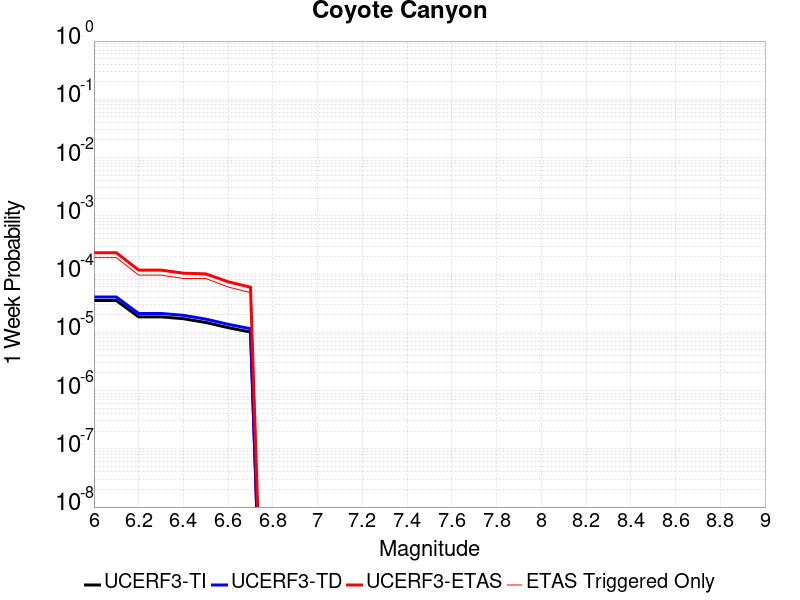 | 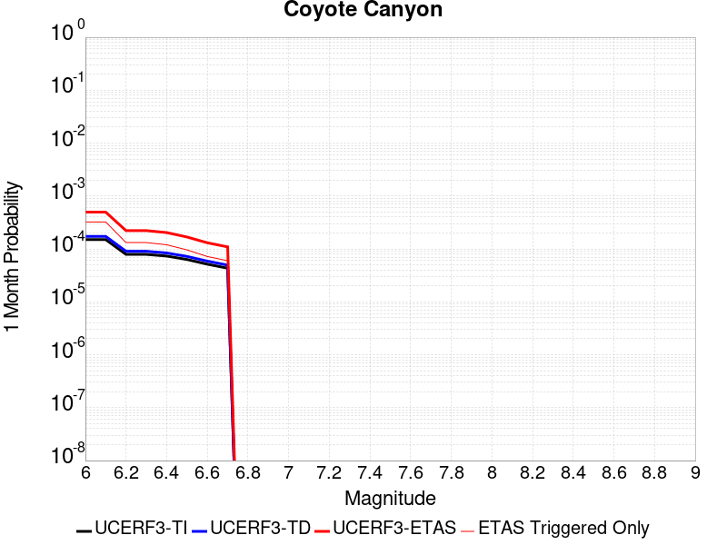 | 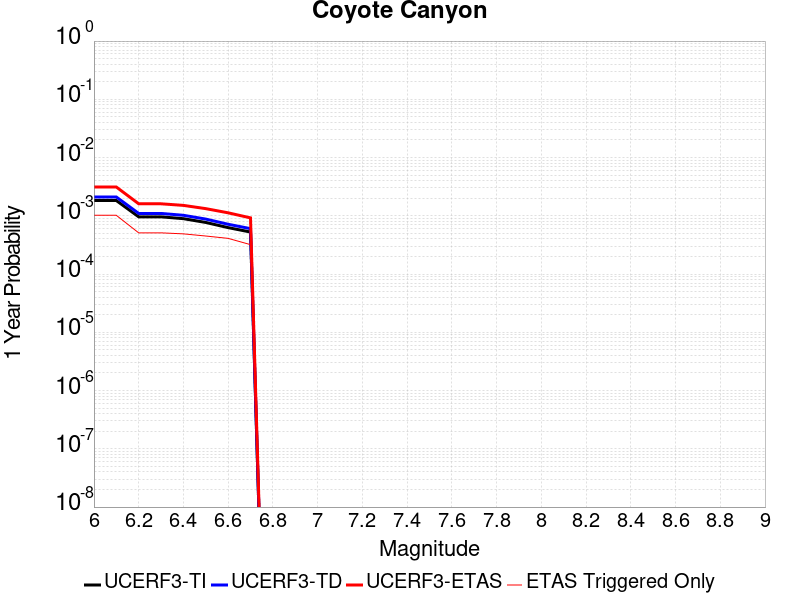 | 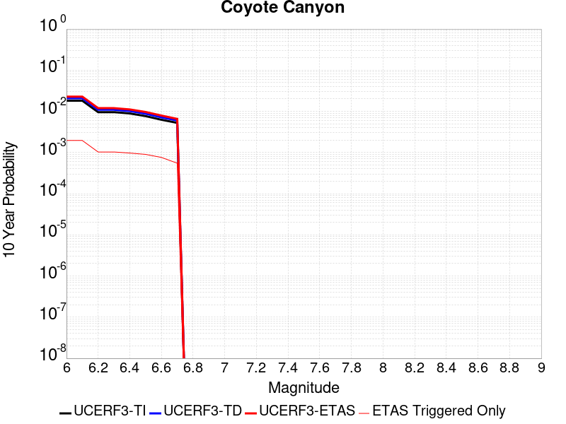 |

| Magnitude | 1 wk TI Prob | 1 wk TD Prob | 1 wk ETAS Prob | 1 wk ETAS/TD Gain | 1 wk ETAS Triggered Only | 1 mo TI Prob | 1 mo TD Prob | 1 mo ETAS Prob | 1 mo ETAS/TD Gain | 1 mo ETAS Triggered Only | 1 yr TI Prob | 1 yr TD Prob | 1 yr ETAS Prob | 1 yr ETAS/TD Gain | 1 yr ETAS Triggered Only | 10 yr TI Prob | 10 yr TD Prob | 10 yr ETAS Prob | 10 yr ETAS/TD Gain | 10 yr ETAS Triggered Only |
|-----|-----|-----|-----|-----|-----|-----|-----|-----|-----|-----|-----|-----|-----|-----|-----|-----|-----|-----|-----|-----|
| 6.0 | 3.5090034E-5 | 4.036513E-5 | 2.322039E-4 | 5.752587 | 1.9184653E-4 | 1.503772E-4 | 1.7298339E-4 | 4.966684E-4 | 2.8711913 | 3.23741E-4 | 0.0018293047 | 0.0021042947 | 0.003145265 | 1.4946885 | 0.0010431655 | 0.018143194 | 0.020869615 | 0.022771522 | 1.0911329 | 0.001942446 |
| 6.1 | 3.5090034E-5 | 4.036513E-5 | 2.322039E-4 | 5.752587 | 1.9184653E-4 | 1.503772E-4 | 1.7298339E-4 | 4.966684E-4 | 2.8711913 | 3.23741E-4 | 0.0018293047 | 0.0021042947 | 0.003145265 | 1.4946885 | 0.0010431655 | 0.018143194 | 0.020869615 | 0.022771522 | 1.0911329 | 0.001942446 |
| 6.2 | 1.841879E-5 | 2.1060194E-5 | 1.16981435E-4 | 5.5546227 | 9.5923264E-5 | 7.8935285E-5 | 9.0255424E-5 | 2.2213801E-4 | 2.461215 | 1.3189449E-4 | 9.606133E-4 | 0.0010984079 | 0.0016014518 | 1.4579756 | 5.0359714E-4 | 0.0095647145 | 0.010939874 | 0.011947909 | 1.0921432 | 0.0010191847 |
| 6.3 | 1.841879E-5 | 2.1060194E-5 | 1.16981435E-4 | 5.5546227 | 9.5923264E-5 | 7.8935285E-5 | 9.0255424E-5 | 2.2213801E-4 | 2.461215 | 1.3189449E-4 | 9.606133E-4 | 0.0010984079 | 0.0016014518 | 1.4579756 | 5.0359714E-4 | 0.0095647145 | 0.010939874 | 0.011947909 | 1.0921432 | 0.0010191847 |
| 6.4 | 1.712201E-5 | 1.9565581E-5 | 1.0349679E-4 | 5.2897377 | 8.393286E-5 | 7.337798E-5 | 8.385037E-5 | 2.0374439E-4 | 2.4298568 | 1.1990408E-4 | 8.930107E-4 | 0.0010205007 | 0.0014996275 | 1.4695017 | 4.796163E-4 | 0.008894307 | 0.0101680625 | 0.011117541 | 1.0933785 | 9.592326E-4 |
| 6.5 | 1.4744935E-5 | 1.6837288E-5 | 1.0076873E-4 | 5.9848547 | 8.393286E-5 | 6.3191044E-5 | 7.215834E-5 | 1.6807468E-4 | 2.3292482 | 9.5923264E-5 | 7.6907943E-4 | 8.7826716E-4 | 0.0013095428 | 1.4910529 | 4.3165468E-4 | 0.007664232 | 0.008757159 | 0.009624793 | 1.0990772 | 8.7529974E-4 |
| 6.6 | 1.2017839E-5 | 1.3724348E-5 | 7.367556E-5 | 5.368238 | 5.995204E-5 | 5.150401E-5 | 5.8817808E-5 | 1.3075602E-4 | 2.2230687 | 7.194244E-5 | 6.268809E-4 | 7.159601E-4 | 0.0010993785 | 1.5355303 | 3.8369306E-4 | 0.0062511545 | 0.007145228 | 0.007859512 | 1.0999665 | 7.1942445E-4 |
| 6.7 | 1.00956095E-5 | 1.1533734E-5 | 5.949481E-5 | 5.1583304 | 4.7961632E-5 | 4.326618E-5 | 4.9429844E-5 | 1.0937892E-4 | 2.2128112 | 5.995204E-5 | 5.266384E-4 | 6.0172915E-4 | 8.893258E-4 | 1.4779503 | 2.8776977E-4 | 0.005253921 | 0.006009526 | 0.0065339333 | 1.0872627 | 5.2757794E-4 |

## San Andreas (Mojave N)
*[(top)](#table-of-contents)*

| 1 Week | 1 Month | 1 Year | 10 Year |
|-----|-----|-----|-----|
| 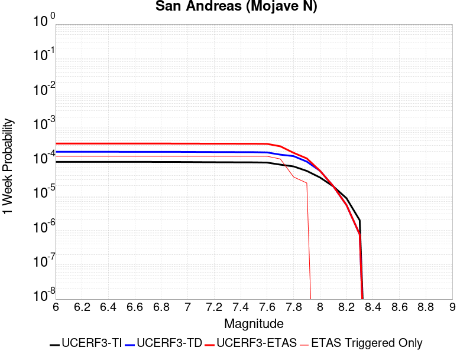 | 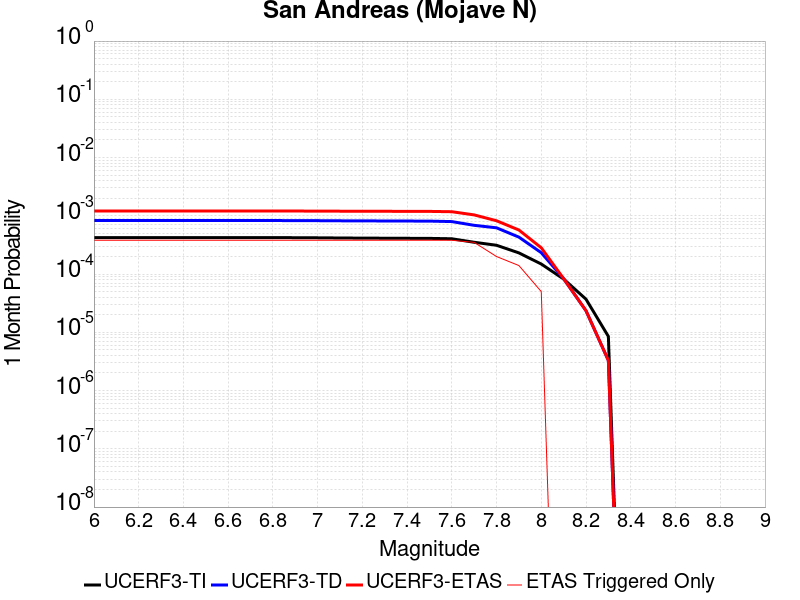 | 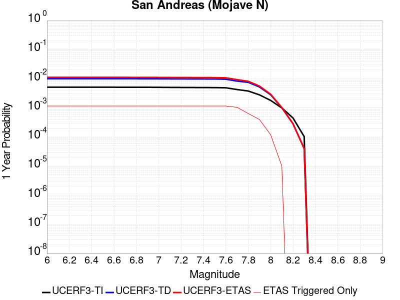 | 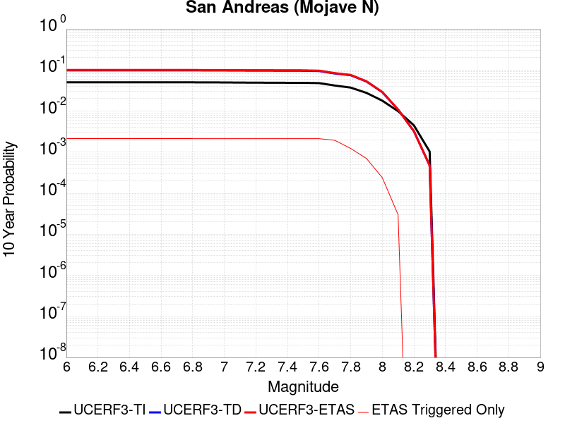 |

| Magnitude | 1 wk TI Prob | 1 wk TD Prob | 1 wk ETAS Prob | 1 wk ETAS/TD Gain | 1 wk ETAS Triggered Only | 1 mo TI Prob | 1 mo TD Prob | 1 mo ETAS Prob | 1 mo ETAS/TD Gain | 1 mo ETAS Triggered Only | 1 yr TI Prob | 1 yr TD Prob | 1 yr ETAS Prob | 1 yr ETAS/TD Gain | 1 yr ETAS Triggered Only | 10 yr TI Prob | 10 yr TD Prob | 10 yr ETAS Prob | 10 yr ETAS/TD Gain | 10 yr ETAS Triggered Only |
|-----|-----|-----|-----|-----|-----|-----|-----|-----|-----|-----|-----|-----|-----|-----|-----|-----|-----|-----|-----|-----|
| 6.0 | 9.877682E-5 | 1.9409315E-4 | 3.3795013E-4 | 1.7411748 | 1.4388488E-4 | 4.2326056E-4 | 8.315628E-4 | 0.0012388977 | 1.4898425 | 4.0767386E-4 | 0.0051410277 | 0.010077406 | 0.011276233 | 1.1189619 | 0.0012110312 | 0.05023708 | 0.09835201 | 0.10023314 | 1.0191265 | 0.002086331 |
| 6.1 | 9.877682E-5 | 1.9409315E-4 | 3.3795013E-4 | 1.7411748 | 1.4388488E-4 | 4.2326056E-4 | 8.315628E-4 | 0.0012388977 | 1.4898425 | 4.0767386E-4 | 0.0051410277 | 0.010077406 | 0.011276233 | 1.1189619 | 0.0012110312 | 0.05023708 | 0.09835201 | 0.10023314 | 1.0191265 | 0.002086331 |
| 6.2 | 9.877682E-5 | 1.9409315E-4 | 3.3795013E-4 | 1.7411748 | 1.4388488E-4 | 4.2326056E-4 | 8.315628E-4 | 0.0012388977 | 1.4898425 | 4.0767386E-4 | 0.0051410277 | 0.010077406 | 0.011276233 | 1.1189619 | 0.0012110312 | 0.05023708 | 0.09835201 | 0.10023314 | 1.0191265 | 0.002086331 |
| 6.3 | 9.877682E-5 | 1.9409315E-4 | 3.3795013E-4 | 1.7411748 | 1.4388488E-4 | 4.2326056E-4 | 8.315628E-4 | 0.0012388977 | 1.4898425 | 4.0767386E-4 | 0.0051410277 | 0.010077406 | 0.011276233 | 1.1189619 | 0.0012110312 | 0.05023708 | 0.09835201 | 0.10023314 | 1.0191265 | 0.002086331 |
| 6.4 | 9.877682E-5 | 1.9409315E-4 | 3.3795013E-4 | 1.7411748 | 1.4388488E-4 | 4.2326056E-4 | 8.315628E-4 | 0.0012388977 | 1.4898425 | 4.0767386E-4 | 0.0051410277 | 0.010077406 | 0.011276233 | 1.1189619 | 0.0012110312 | 0.05023708 | 0.09835201 | 0.10023314 | 1.0191265 | 0.002086331 |
| 6.5 | 9.861474E-5 | 1.9383078E-4 | 3.376878E-4 | 1.7421783 | 1.4388488E-4 | 4.2256617E-4 | 8.304391E-4 | 0.0012377744 | 1.4905059 | 4.0767386E-4 | 0.0051326132 | 0.010063851 | 0.011262695 | 1.1191237 | 0.0012110312 | 0.050156746 | 0.098229796 | 0.10011119 | 1.019153 | 0.002086331 |
| 6.6 | 9.861474E-5 | 1.9383078E-4 | 3.376878E-4 | 1.7421783 | 1.4388488E-4 | 4.2256617E-4 | 8.304391E-4 | 0.0012377744 | 1.4905059 | 4.0767386E-4 | 0.0051326132 | 0.010063851 | 0.011262695 | 1.1191237 | 0.0012110312 | 0.050156746 | 0.098229796 | 0.10011119 | 1.019153 | 0.002086331 |
| 6.7 | 9.8552715E-5 | 1.9373032E-4 | 3.3758732E-4 | 1.7425632 | 1.4388488E-4 | 4.223004E-4 | 8.3000876E-4 | 0.0012373442 | 1.4907604 | 4.0767386E-4 | 0.0051293927 | 0.01005866 | 0.01125751 | 1.1191858 | 0.0012110312 | 0.050125998 | 0.098182976 | 0.100064464 | 1.0191631 | 0.002086331 |
| 6.8 | 9.8464974E-5 | 1.9358192E-4 | 3.3743895E-4 | 1.7431326 | 1.4388488E-4 | 4.219245E-4 | 8.293732E-4 | 0.001236709 | 1.4911369 | 4.0767386E-4 | 0.0051248376 | 0.010050993 | 0.011249852 | 1.1192777 | 0.0012110312 | 0.05008251 | 0.09811299 | 0.09999463 | 1.0191783 | 0.002086331 |
| 6.9 | 9.825824E-5 | 1.9326196E-4 | 3.3711904E-4 | 1.7443632 | 1.4388488E-4 | 4.2103877E-4 | 8.280028E-4 | 0.0012353391 | 1.4919504 | 4.0767386E-4 | 0.0051141046 | 0.010034463 | 0.011233343 | 1.1194762 | 0.0012110312 | 0.049980022 | 0.09796208 | 0.09984403 | 1.019211 | 0.002086331 |
| 7.0 | 9.781462E-5 | 1.9257552E-4 | 3.364327E-4 | 1.7470169 | 1.4388488E-4 | 4.1913814E-4 | 8.250628E-4 | 0.0012324003 | 1.4937048 | 4.0767386E-4 | 0.005091073 | 0.009998998 | 0.01119792 | 1.1199043 | 0.0012110312 | 0.04976007 | 0.097638436 | 0.09952106 | 1.0192816 | 0.002086331 |
| 7.1 | 9.7121134E-5 | 1.9159251E-4 | 3.3544982E-4 | 1.7508504 | 1.4388488E-4 | 4.1616702E-4 | 8.208525E-4 | 0.0012281918 | 1.4962392 | 4.0767386E-4 | 0.005055068 | 0.009948207 | 0.011147191 | 1.1205226 | 0.0012110312 | 0.04941613 | 0.097174905 | 0.099058494 | 1.0193835 | 0.002086331 |
| 7.2 | 9.663819E-5 | 1.9090026E-4 | 3.3475767E-4 | 1.7535738 | 1.4388488E-4 | 4.1409794E-4 | 8.178876E-4 | 0.0012252281 | 1.4980396 | 4.0767386E-4 | 0.0050299936 | 0.009912439 | 0.011111465 | 1.1209619 | 0.0012110312 | 0.049176537 | 0.09684814 | 0.09873241 | 1.0194559 | 0.002086331 |
| 7.3 | 9.6277574E-5 | 1.9042526E-4 | 3.3428275E-4 | 1.7554538 | 1.4388488E-4 | 4.125529E-4 | 8.158532E-4 | 0.0012231944 | 1.4992825 | 4.0767386E-4 | 0.0050112694 | 0.009887895 | 0.011086951 | 1.121265 | 0.0012110312 | 0.04899759 | 0.09662155 | 0.098506294 | 1.0195065 | 0.002086331 |
| 7.4 | 9.593308E-5 | 1.8982294E-4 | 3.336805E-4 | 1.7578514 | 1.4388488E-4 | 4.1107697E-4 | 8.132734E-4 | 0.0012206157 | 1.5008676 | 4.0767386E-4 | 0.0049933824 | 0.00985677 | 0.011055864 | 1.1216519 | 0.0012110312 | 0.04882661 | 0.09633968 | 0.09821418 | 1.0194572 | 0.0020743406 |
| 7.5 | 9.561707E-5 | 1.8928363E-4 | 3.3314127E-4 | 1.7600111 | 1.4388488E-4 | 4.0972308E-4 | 8.109635E-4 | 0.0012183067 | 1.5022954 | 4.0767386E-4 | 0.0049769743 | 0.009828901 | 0.011028029 | 1.1220002 | 0.0012110312 | 0.048669744 | 0.09608582 | 0.097960845 | 1.0195141 | 0.0020743406 |
| 7.6 | 9.418194E-5 | 1.8580563E-4 | 3.296638E-4 | 1.77424 | 1.4388488E-4 | 4.0357444E-4 | 7.96067E-4 | 0.0012034164 | 1.5117023 | 4.0767386E-4 | 0.004902454 | 0.009649157 | 0.010848502 | 1.1242954 | 0.0012110312 | 0.047957025 | 0.09446791 | 0.09634629 | 1.0198838 | 0.0020743406 |
| 7.7 | 8.202141E-5 | 1.6029038E-4 | 2.8017524E-4 | 1.747923 | 1.1990408E-4 | 3.51473E-4 | 6.86778E-4 | 0.0010582253 | 1.540855 | 3.7170263E-4 | 0.00427079 | 0.008329522 | 0.009423451 | 1.1313316 | 0.0011031175 | 0.04189639 | 0.08226675 | 0.084005386 | 1.021134 | 0.0018944844 |
| 7.8 | 7.2859846E-5 | 1.4523414E-4 | 1.8120013E-4 | 1.2476414 | 3.597122E-5 | 3.1221908E-4 | 6.2228355E-4 | 8.4995956E-4 | 1.3658718 | 2.2781774E-4 | 0.003794643 | 0.007550025 | 0.008252118 | 1.0929922 | 7.07434E-4 | 0.037304975 | 0.074755974 | 0.07588757 | 1.0151372 | 0.0012230215 |
| 7.9 | 5.3874453E-5 | 1.0050546E-4 | 1.2448386E-4 | 1.2385781 | 2.3980816E-5 | 2.3087008E-4 | 4.3066658E-4 | 5.864748E-4 | 1.3617837 | 1.558753E-4 | 0.0028072202 | 0.005230771 | 0.00564824 | 1.0798103 | 4.1966425E-4 | 0.02772022 | 0.052447177 | 0.053072065 | 1.0119146 | 6.594724E-4 |
| 8.0 | 3.468538E-5 | 5.4288335E-5 | 5.4288335E-5 | 1.0 | 0.0 | 1.4864317E-4 | 2.3264355E-4 | 2.8059402E-4 | 1.2061113 | 4.7961632E-5 | 0.0018082283 | 0.0028287582 | 0.0029602796 | 1.0464944 | 1.3189449E-4 | 0.017935853 | 0.028961267 | 0.029147558 | 1.0064324 | 1.9184653E-4 |
| 8.1 | 1.9152367E-5 | 1.9415891E-5 | 1.9415891E-5 | 1.0 | 0.0 | 8.207899E-5 | 8.320831E-5 | 8.320831E-5 | 1.0 | 0.0 | 9.988535E-4 | 0.0010125911 | 0.0010245693 | 1.0118294 | 1.1990408E-5 | 0.009943757 | 0.010863188 | 0.0108869085 | 1.0021836 | 2.3980816E-5 |
| 8.2 | 8.643924E-6 | 5.4798497E-6 | 5.4798497E-6 | 1.0 | 0.0 | 3.704486E-5 | 2.348486E-5 | 2.348486E-5 | 1.0 | 0.0 | 4.5092785E-4 | 2.858907E-4 | 2.858907E-4 | 1.0 | 0.0 | 0.0045001395 | 0.0032514327 | 0.0032514327 | 1.0 | 0.0 |
| 8.3 | 1.983087E-6 | 7.668296E-7 | 7.668296E-7 | 1.0 | 0.0 | 8.498917E-6 | 3.2864084E-6 | 3.2864084E-6 | 1.0 | 0.0 | 1.034694E-4 | 4.0011306E-5 | 4.0011306E-5 | 1.0 | 0.0 | 0.0010342124 | 4.724499E-4 | 4.724499E-4 | 1.0 | 0.0 |

## Nelson Lake
*[(top)](#table-of-contents)*

| 1 Week | 1 Month | 1 Year | 10 Year |
|-----|-----|-----|-----|
| 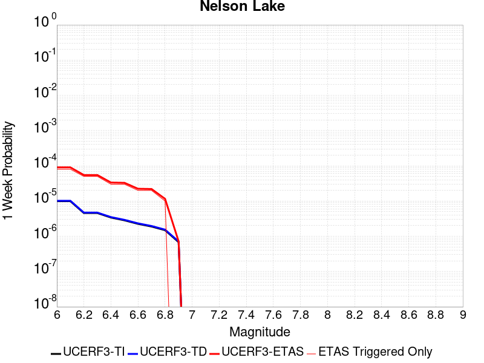 | 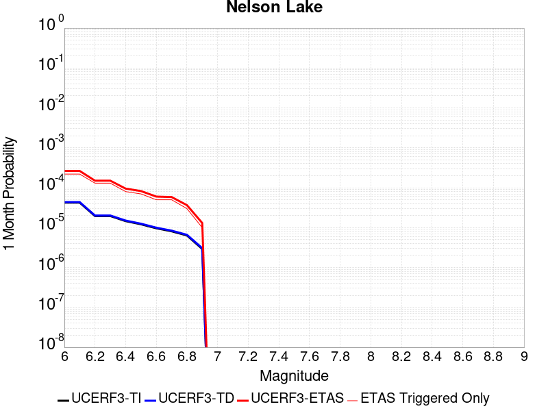 | 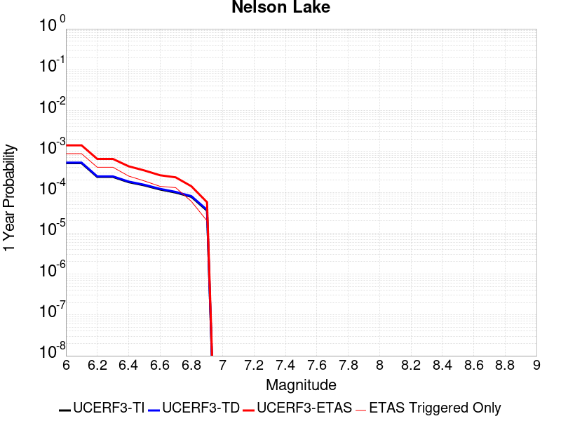 | 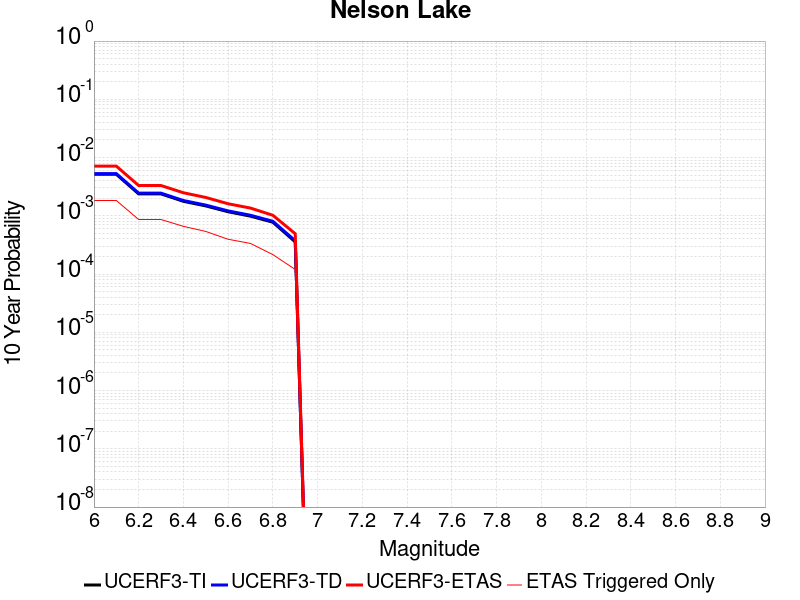 |

| Magnitude | 1 wk TI Prob | 1 wk TD Prob | 1 wk ETAS Prob | 1 wk ETAS/TD Gain | 1 wk ETAS Triggered Only | 1 mo TI Prob | 1 mo TD Prob | 1 mo ETAS Prob | 1 mo ETAS/TD Gain | 1 mo ETAS Triggered Only | 1 yr TI Prob | 1 yr TD Prob | 1 yr ETAS Prob | 1 yr ETAS/TD Gain | 1 yr ETAS Triggered Only | 10 yr TI Prob | 10 yr TD Prob | 10 yr ETAS Prob | 10 yr ETAS/TD Gain | 10 yr ETAS Triggered Only |
|-----|-----|-----|-----|-----|-----|-----|-----|-----|-----|-----|-----|-----|-----|-----|-----|-----|-----|-----|-----|-----|
| 6.0 | 9.913453E-6 | 1.0192293E-5 | 8.213401E-5 | 8.058442 | 7.194244E-5 | 4.2485535E-5 | 4.3680586E-5 | 2.5949848E-4 | 5.94082 | 2.1582734E-4 | 5.1713863E-4 | 5.316917E-4 | 0.0014544622 | 2.7355368 | 9.232614E-4 | 0.0051593683 | 0.0053052236 | 0.0071300236 | 1.3439628 | 0.0018345324 |
| 6.1 | 9.913453E-6 | 1.0192293E-5 | 8.213401E-5 | 8.058442 | 7.194244E-5 | 4.2485535E-5 | 4.3680586E-5 | 2.5949848E-4 | 5.94082 | 2.1582734E-4 | 5.1713863E-4 | 5.316917E-4 | 0.0014544622 | 2.7355368 | 9.232614E-4 | 0.0051593683 | 0.0053052236 | 0.0071300236 | 1.3439628 | 0.0018345324 |
| 6.2 | 4.5596407E-6 | 4.696332E-6 | 5.265774E-5 | 11.212525 | 4.7961632E-5 | 1.954117E-5 | 2.0126989E-5 | 1.5201882E-4 | 7.5529838 | 1.3189449E-4 | 2.3788778E-4 | 2.450198E-4 | 6.765687E-4 | 2.7612817 | 4.3165468E-4 | 0.0023763329 | 0.0024476226 | 0.003308819 | 1.3518502 | 8.6330937E-4 |
| 6.3 | 4.5596407E-6 | 4.696332E-6 | 5.265774E-5 | 11.212525 | 4.7961632E-5 | 1.954117E-5 | 2.0126989E-5 | 1.5201882E-4 | 7.5529838 | 1.3189449E-4 | 2.3788778E-4 | 2.450198E-4 | 6.765687E-4 | 2.7612817 | 4.3165468E-4 | 0.0023763329 | 0.0024476226 | 0.003308819 | 1.3518502 | 8.6330937E-4 |
| 6.4 | 3.4025713E-6 | 3.509912E-6 | 3.948101E-5 | 11.248433 | 3.597122E-5 | 1.4582367E-5 | 1.50423975E-5 | 1.1096422E-4 | 7.376764 | 9.5923264E-5 | 1.7752586E-4 | 1.8312664E-4 | 4.8283194E-4 | 2.6366012 | 2.997602E-4 | 0.001773841 | 0.0018298404 | 0.002488106 | 1.3597394 | 6.594724E-4 |
| 6.5 | 2.8352947E-6 | 2.9278688E-6 | 3.8898987E-5 | 13.2857685 | 3.597122E-5 | 1.2151207E-5 | 1.2547953E-5 | 9.647975E-5 | 7.688884 | 8.393286E-5 | 1.479309E-4 | 1.5276136E-4 | 3.805443E-4 | 2.4911032 | 2.2781774E-4 | 0.0014783246 | 0.0015266375 | 0.002065382 | 1.3528962 | 5.3956837E-4 |
| 6.6 | 2.251518E-6 | 2.3290781E-6 | 2.6309837E-5 | 11.296245 | 2.3980816E-5 | 9.649328E-6 | 9.981729E-6 | 6.993317E-5 | 7.006118 | 5.995204E-5 | 1.1747423E-4 | 1.2152141E-4 | 2.8936673E-4 | 2.3811996 | 1.6786571E-4 | 0.0011741214 | 0.0012146112 | 0.0016098141 | 1.3253739 | 3.9568346E-4 |
| 6.7 | 1.8911853E-6 | 1.9591491E-6 | 2.5939917E-5 | 13.2404 | 2.3980816E-5 | 8.105055E-6 | 8.39633E-6 | 6.8347865E-5 | 8.140207 | 5.995204E-5 | 9.867457E-5 | 1.022211E-4 | 2.5808046E-4 | 2.524728 | 1.558753E-4 | 9.863076E-4 | 0.0010217984 | 0.0013571867 | 1.3282335 | 3.3573143E-4 |
| 6.8 | 1.4874814E-6 | 1.5438383E-6 | 1.3534227E-5 | 8.766609 | 1.1990408E-5 | 6.374905E-6 | 6.6164357E-6 | 4.258742E-5 | 6.4366107 | 3.597122E-5 | 7.76117E-5 | 8.055265E-5 | 1.524893E-4 | 1.8930389 | 7.194244E-5 | 7.75846E-4 | 8.052856E-4 | 0.0010209391 | 1.2677976 | 2.1582734E-4 |
| 6.9 | 6.835972E-7 | 7.1399705E-7 | 7.1399705E-7 | 1.0 | 0.0 | 2.9296991E-6 | 3.0599856E-6 | 1.50503565E-5 | 4.9184403 | 1.1990408E-5 | 3.56685E-5 | 3.7255006E-5 | 6.1234925E-5 | 1.6436698 | 2.3980816E-5 | 3.5662777E-4 | 3.7251884E-4 | 4.9237825E-4 | 1.321754 | 1.1990408E-4 |

## Lenwood-Lockhart-Old Woman Springs
*[(top)](#table-of-contents)*

| 1 Week | 1 Month | 1 Year | 10 Year |
|-----|-----|-----|-----|
| 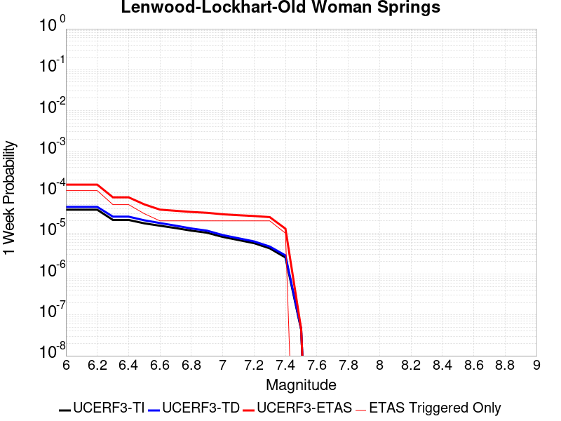 | 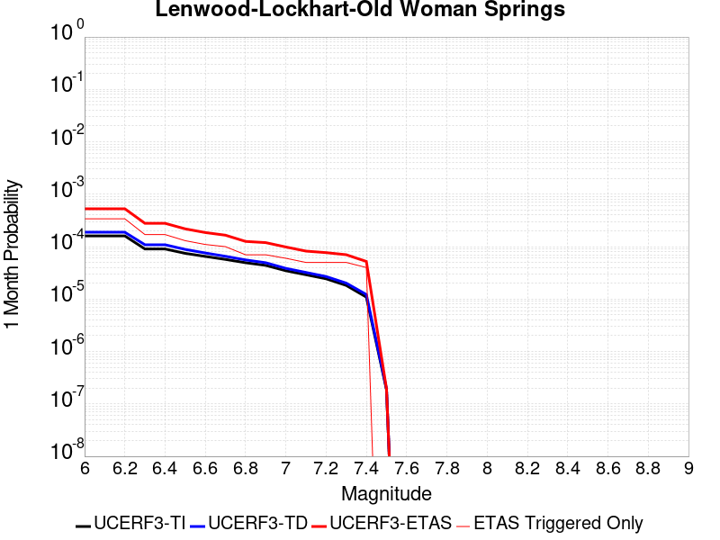 | 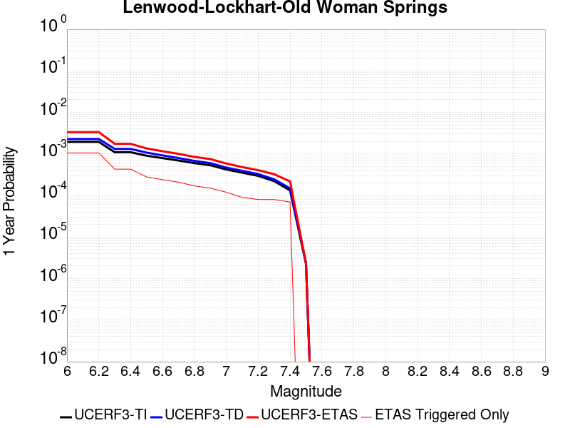 | 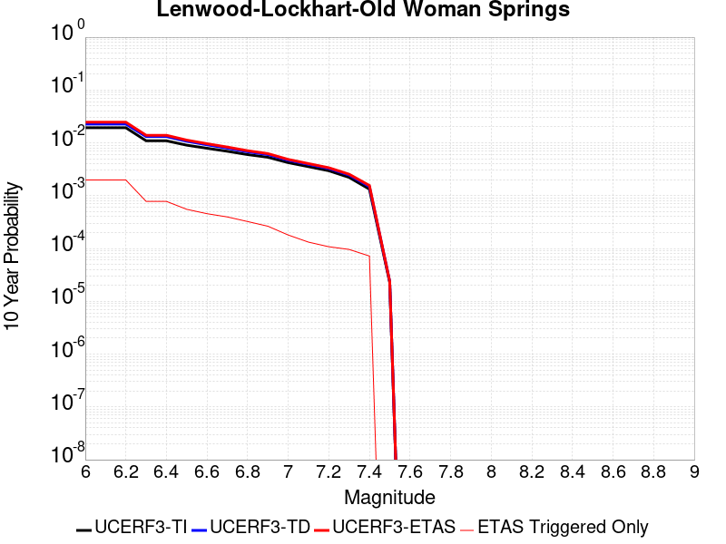 |

| Magnitude | 1 wk TI Prob | 1 wk TD Prob | 1 wk ETAS Prob | 1 wk ETAS/TD Gain | 1 wk ETAS Triggered Only | 1 mo TI Prob | 1 mo TD Prob | 1 mo ETAS Prob | 1 mo ETAS/TD Gain | 1 mo ETAS Triggered Only | 1 yr TI Prob | 1 yr TD Prob | 1 yr ETAS Prob | 1 yr ETAS/TD Gain | 1 yr ETAS Triggered Only | 10 yr TI Prob | 10 yr TD Prob | 10 yr ETAS Prob | 10 yr ETAS/TD Gain | 10 yr ETAS Triggered Only |
|-----|-----|-----|-----|-----|-----|-----|-----|-----|-----|-----|-----|-----|-----|-----|-----|-----|-----|-----|-----|-----|
| 6.0 | 3.744542E-5 | 4.3962966E-5 | 1.518719E-4 | 3.4545414 | 1.0791367E-4 | 1.604705E-4 | 1.8840008E-4 | 5.2406825E-4 | 2.7816775 | 3.3573143E-4 | 0.0019519776 | 0.0022915301 | 0.0033203422 | 1.4489629 | 0.001031175 | 0.019349206 | 0.022697017 | 0.02463053 | 1.085188 | 0.0019784172 |
| 6.1 | 3.744542E-5 | 4.3962966E-5 | 1.518719E-4 | 3.4545414 | 1.0791367E-4 | 1.604705E-4 | 1.8840008E-4 | 5.2406825E-4 | 2.7816775 | 3.3573143E-4 | 0.0019519776 | 0.0022915301 | 0.0033203422 | 1.4489629 | 0.001031175 | 0.019349206 | 0.022697017 | 0.02463053 | 1.085188 | 0.0019784172 |
| 6.2 | 3.744542E-5 | 4.3962966E-5 | 1.518719E-4 | 3.4545414 | 1.0791367E-4 | 1.604705E-4 | 1.8840008E-4 | 5.2406825E-4 | 2.7816775 | 3.3573143E-4 | 0.0019519776 | 0.0022915301 | 0.0033203422 | 1.4489629 | 0.001031175 | 0.019349206 | 0.022697017 | 0.02463053 | 1.085188 | 0.0019784172 |
| 6.3 | 2.1079984E-5 | 2.5353596E-5 | 6.132391E-5 | 2.418746 | 3.597122E-5 | 9.0339665E-5 | 1.0865386E-4 | 2.525231E-4 | 2.3241062 | 1.4388488E-4 | 0.0010993304 | 0.0013220779 | 0.0017292128 | 1.3079507 | 4.0767386E-4 | 0.010939079 | 0.013144341 | 0.013913473 | 1.0585144 | 7.793765E-4 |
| 6.4 | 2.1079984E-5 | 2.5353596E-5 | 6.132391E-5 | 2.418746 | 3.597122E-5 | 9.0339665E-5 | 1.0865386E-4 | 2.525231E-4 | 2.3241062 | 1.4388488E-4 | 0.0010993304 | 0.0013220779 | 0.0017292128 | 1.3079507 | 4.0767386E-4 | 0.010939079 | 0.013144341 | 0.013913473 | 1.0585144 | 7.793765E-4 |
| 6.5 | 1.7397282E-5 | 2.0662535E-5 | 4.4642857E-5 | 2.1605701 | 2.3980816E-5 | 7.455765E-5 | 8.855078E-5 | 1.964549E-4 | 2.2185562 | 1.0791367E-4 | 9.073613E-4 | 0.0010775843 | 0.001341089 | 1.2445328 | 2.6378897E-4 | 0.009036654 | 0.010724886 | 0.01127053 | 1.0508764 | 5.5155874E-4 |
| 6.6 | 1.52050325E-5 | 1.76798E-5 | 2.9669995E-5 | 1.6781862 | 1.1990408E-5 | 6.51628E-5 | 7.576841E-5 | 1.596949E-4 | 2.1076713 | 8.393286E-5 | 7.9306826E-4 | 9.220979E-4 | 0.0011377262 | 1.2338454 | 2.1582734E-4 | 0.007902439 | 0.009183581 | 0.009635032 | 1.0491585 | 4.5563548E-4 |
| 6.7 | 1.332523E-5 | 1.5264091E-5 | 2.7254317E-5 | 1.7855184 | 1.1990408E-5 | 5.7106878E-5 | 6.541593E-5 | 1.3735367E-4 | 2.0996976 | 7.194244E-5 | 6.950544E-4 | 7.9615373E-4 | 9.878476E-4 | 1.2407749 | 1.9184653E-4 | 0.006928845 | 0.007933645 | 0.008326189 | 1.0494784 | 3.9568346E-4 |
| 6.8 | 1.1525329E-5 | 1.303105E-5 | 2.5021302E-5 | 1.9201293 | 1.1990408E-5 | 4.9393333E-5 | 5.5846183E-5 | 1.1579487E-4 | 2.0734608 | 5.995204E-5 | 6.011979E-4 | 6.7971944E-4 | 8.47471E-4 | 1.2467954 | 1.6786571E-4 | 0.00599574 | 0.006776856 | 0.007098403 | 1.0474478 | 3.23741E-4 |
| 6.9 | 1.0253909E-5 | 1.15144985E-5 | 2.3504768E-5 | 2.0413194 | 1.1990408E-5 | 4.3944583E-5 | 4.9346934E-5 | 1.09296016E-4 | 2.214849 | 5.995204E-5 | 5.3489394E-4 | 6.0063694E-4 | 7.444354E-4 | 1.2394099 | 1.4388488E-4 | 0.0053360825 | 0.005990515 | 0.0062527237 | 1.0437707 | 2.6378897E-4 |
| 7.0 | 8.104563E-6 | 8.991321E-6 | 2.098162E-5 | 2.3335416 | 1.1990408E-5 | 3.4733377E-5 | 3.8533675E-5 | 8.6493455E-5 | 2.24462 | 4.7961632E-5 | 4.2279682E-4 | 4.6904891E-4 | 5.7691196E-4 | 1.2299612 | 1.0791367E-4 | 0.0042199334 | 0.0046808375 | 0.0048598517 | 1.038244 | 1.7985611E-4 |
| 7.1 | 6.7986157E-6 | 7.515848E-6 | 1.9506166E-5 | 2.5953379 | 1.1990408E-5 | 2.91366E-5 | 3.221039E-5 | 6.818046E-5 | 2.1167223 | 3.597122E-5 | 3.5468035E-4 | 3.9209312E-4 | 4.6400735E-4 | 1.1834111 | 7.194244E-5 | 0.003541148 | 0.0039142296 | 0.004045608 | 1.0335642 | 1.3189449E-4 |
| 7.2 | 5.6893327E-6 | 6.280039E-6 | 1.8270372E-5 | 2.9092767 | 1.1990408E-5 | 2.4382627E-5 | 2.6914187E-5 | 6.288444E-5 | 2.3364794 | 3.597122E-5 | 2.9681803E-4 | 3.2763294E-4 | 3.8756535E-4 | 1.1829255 | 5.995204E-5 | 0.002964219 | 0.0032716978 | 0.0033792583 | 1.0328761 | 1.0791367E-4 |
| 7.3 | 4.253348E-6 | 4.706927E-6 | 1.6697279E-5 | 3.547384 | 1.1990408E-5 | 1.8228506E-5 | 2.01724E-5 | 5.6142897E-5 | 2.7831542 | 3.597122E-5 | 2.2190946E-4 | 2.4557312E-4 | 3.0551042E-4 | 1.2440711 | 5.995204E-5 | 0.00221688 | 0.0024531984 | 0.0025488862 | 1.0390054 | 9.5923264E-5 |
| 7.4 | 2.5448119E-6 | 2.8520535E-6 | 1.4842427E-5 | 5.2041197 | 1.1990408E-5 | 1.0906291E-5 | 1.22230385E-5 | 4.8193822E-5 | 3.9428678 | 3.597122E-5 | 1.3277601E-4 | 1.4880698E-4 | 2.0875009E-4 | 1.4028246 | 5.995204E-5 | 0.001326967 | 0.0014872355 | 0.001559071 | 1.0483013 | 7.194244E-5 |
| 7.5 | 4.3706837E-8 | 4.5629356E-8 | 4.5629356E-8 | 1.0 | 0.0 | 1.8731501E-7 | 1.9555438E-7 | 1.9555438E-7 | 1.0 | 0.0 | 2.2805577E-6 | 2.3808725E-6 | 2.3808725E-6 | 1.0 | 0.0 | 2.2805343E-5 | 2.3808525E-5 | 2.3808525E-5 | 1.0 | 0.0 |

## Death Valley (So)
*[(top)](#table-of-contents)*

| 1 Week | 1 Month | 1 Year | 10 Year |
|-----|-----|-----|-----|
| 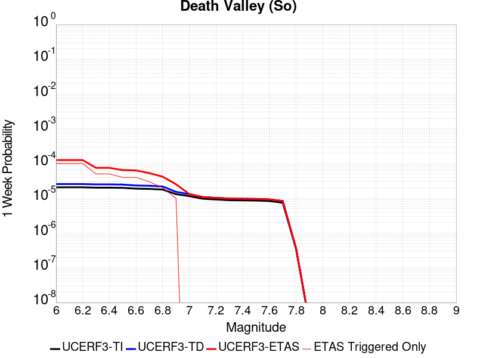 | 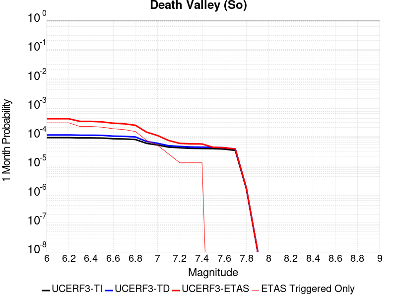 | 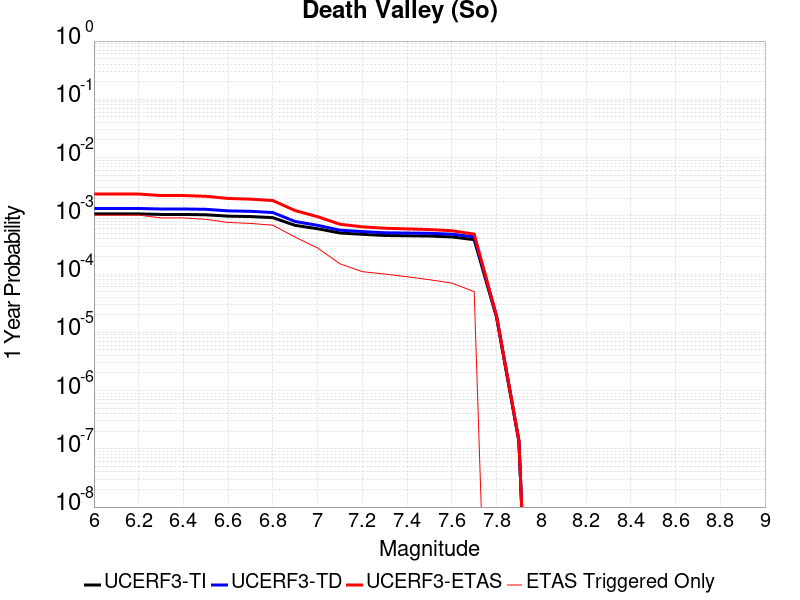 | 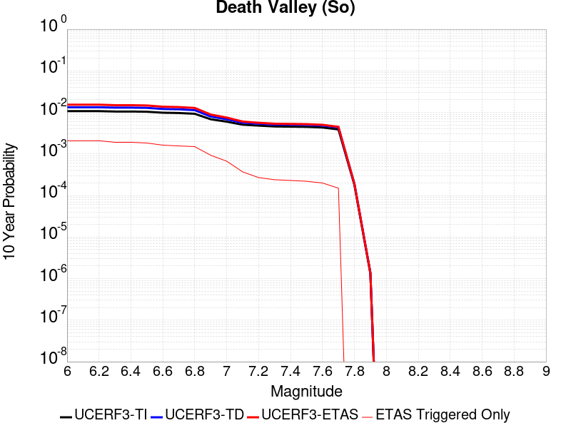 |

| Magnitude | 1 wk TI Prob | 1 wk TD Prob | 1 wk ETAS Prob | 1 wk ETAS/TD Gain | 1 wk ETAS Triggered Only | 1 mo TI Prob | 1 mo TD Prob | 1 mo ETAS Prob | 1 mo ETAS/TD Gain | 1 mo ETAS Triggered Only | 1 yr TI Prob | 1 yr TD Prob | 1 yr ETAS Prob | 1 yr ETAS/TD Gain | 1 yr ETAS Triggered Only | 10 yr TI Prob | 10 yr TD Prob | 10 yr ETAS Prob | 10 yr ETAS/TD Gain | 10 yr ETAS Triggered Only |
|-----|-----|-----|-----|-----|-----|-----|-----|-----|-----|-----|-----|-----|-----|-----|-----|-----|-----|-----|-----|-----|
| 6.0 | 2.0684236E-5 | 2.5618423E-5 | 1.4551943E-4 | 5.680265 | 1.1990408E-4 | 8.864371E-5 | 1.09788714E-4 | 3.975269E-4 | 3.6208358 | 2.8776977E-4 | 0.0010787029 | 0.0013358749 | 0.0024255444 | 1.8156973 | 0.001091127 | 0.010734817 | 0.013281729 | 0.015293025 | 1.1514333 | 0.0020383694 |
| 6.1 | 2.0684236E-5 | 2.5618423E-5 | 1.4551943E-4 | 5.680265 | 1.1990408E-4 | 8.864371E-5 | 1.09788714E-4 | 3.975269E-4 | 3.6208358 | 2.8776977E-4 | 0.0010787029 | 0.0013358749 | 0.0024255444 | 1.8156973 | 0.001091127 | 0.010734817 | 0.013281729 | 0.015293025 | 1.1514333 | 0.0020383694 |
| 6.2 | 2.0684236E-5 | 2.5618423E-5 | 1.4551943E-4 | 5.680265 | 1.1990408E-4 | 8.864371E-5 | 1.09788714E-4 | 3.975269E-4 | 3.6208358 | 2.8776977E-4 | 0.0010787029 | 0.0013358749 | 0.0024255444 | 1.8156973 | 0.001091127 | 0.010734817 | 0.013281729 | 0.015293025 | 1.1514333 | 0.0020383694 |
| 6.3 | 2.0240292E-5 | 2.5118497E-5 | 8.5069034E-5 | 3.3867085 | 5.995204E-5 | 8.6741224E-5 | 1.0764636E-4 | 3.2345045E-4 | 3.0047507 | 2.1582734E-4 | 0.0010555626 | 0.0013098232 | 0.0022677993 | 1.7313782 | 9.592326E-4 | 0.010505628 | 0.013024284 | 0.014870426 | 1.1417462 | 0.0018705036 |
| 6.4 | 2.0240292E-5 | 2.5118497E-5 | 8.5069034E-5 | 3.3867085 | 5.995204E-5 | 8.6741224E-5 | 1.0764636E-4 | 3.2345045E-4 | 3.0047507 | 2.1582734E-4 | 0.0010555626 | 0.0013098232 | 0.0022677993 | 1.7313782 | 9.592326E-4 | 0.010505628 | 0.013024284 | 0.014870426 | 1.1417462 | 0.0018705036 |
| 6.5 | 1.9962767E-5 | 2.4807747E-5 | 7.276819E-5 | 2.9332848 | 4.7961632E-5 | 8.55519E-5 | 1.0631468E-4 | 3.1012992E-4 | 2.9170942 | 2.0383693E-4 | 0.0010410968 | 0.0012936293 | 0.0022156963 | 1.7127753 | 9.232614E-4 | 0.010362327 | 0.012864228 | 0.0146514885 | 1.1389326 | 0.0018105515 |
| 6.6 | 1.8937297E-5 | 2.3311568E-5 | 7.127208E-5 | 3.0573697 | 4.7961632E-5 | 8.115732E-5 | 9.990298E-5 | 2.7974113E-4 | 2.800128 | 1.7985611E-4 | 9.876423E-4 | 0.0012156547 | 0.002041987 | 1.6797427 | 8.2733814E-4 | 0.009832645 | 0.0120931 | 0.013704075 | 1.1332145 | 0.0016306954 |
| 6.7 | 1.8621096E-5 | 2.2912203E-5 | 5.8882604E-5 | 2.5699232 | 3.597122E-5 | 7.980225E-5 | 9.8191544E-5 | 2.6604076E-4 | 2.7094061 | 1.6786571E-4 | 9.711593E-4 | 0.0011948409 | 0.0019852624 | 1.6615285 | 7.913669E-4 | 0.009669261 | 0.011887211 | 0.013439283 | 1.1305665 | 0.0015707434 |
| 6.8 | 1.7830353E-5 | 2.1806247E-5 | 4.578654E-5 | 2.0996983 | 2.3980816E-5 | 7.641356E-5 | 9.345208E-5 | 2.3732352E-4 | 2.539521 | 1.4388488E-4 | 9.29938E-4 | 0.0011371992 | 0.0018677823 | 1.6424408 | 7.314149E-4 | 0.009260561 | 0.011316643 | 0.012798483 | 1.1309434 | 0.0014988009 |
| 6.9 | 1.3135183E-5 | 1.5304242E-5 | 2.7294465E-5 | 1.7834576 | 1.1990408E-5 | 5.6292425E-5 | 6.558799E-5 | 1.3752573E-4 | 2.0968125 | 7.194244E-5 | 6.8514474E-4 | 7.982477E-4 | 0.0012774812 | 1.6003568 | 4.796163E-4 | 0.006830362 | 0.007954813 | 0.008906415 | 1.1196259 | 9.592326E-4 |
| 7.0 | 1.1507512E-5 | 1.3154444E-5 | 1.3154444E-5 | 1.0 | 0.0 | 4.9316975E-5 | 5.6375004E-5 | 1.0433393E-4 | 1.8507127 | 4.7961632E-5 | 6.002687E-4 | 6.861553E-4 | 9.97692E-4 | 1.4540323 | 3.117506E-4 | 0.0059864987 | 0.006841068 | 0.007519846 | 1.099221 | 6.834532E-4 |
| 7.1 | 9.715903E-6 | 1.0865454E-5 | 1.0865454E-5 | 1.0 | 0.0 | 4.1638916E-5 | 4.6565423E-5 | 7.0545124E-5 | 1.5149679 | 2.3980816E-5 | 5.068359E-4 | 5.667908E-4 | 7.3456136E-4 | 1.2960008 | 1.6786571E-4 | 0.0050568148 | 0.0056539057 | 0.0060354294 | 1.0674796 | 3.8369306E-4 |
| 7.2 | 9.233269E-6 | 1.0286473E-5 | 1.0286473E-5 | 1.0 | 0.0 | 3.9570554E-5 | 4.4084165E-5 | 5.607404E-5 | 1.2719771 | 1.1990408E-5 | 4.81665E-4 | 5.3659675E-4 | 6.564365E-4 | 1.223333 | 1.1990408E-4 | 0.0048062233 | 0.005353442 | 0.0056277453 | 1.0512387 | 2.7577937E-4 |
| 7.3 | 8.8041315E-6 | 9.808313E-6 | 9.808313E-6 | 1.0 | 0.0 | 3.7731446E-5 | 4.2034975E-5 | 5.4024877E-5 | 1.2852364 | 1.1990408E-5 | 4.592835E-4 | 5.1165983E-4 | 6.195183E-4 | 1.2108011 | 1.0791367E-4 | 0.0045833546 | 0.0051052445 | 0.0053438284 | 1.0467331 | 2.3980816E-4 |
| 7.4 | 8.708749E-6 | 9.707323E-6 | 9.707323E-6 | 1.0 | 0.0 | 3.7322676E-5 | 4.1602176E-5 | 5.3592084E-5 | 1.288204 | 1.1990408E-5 | 4.5430884E-4 | 5.06393E-4 | 6.022676E-4 | 1.1893287 | 9.5923264E-5 | 0.004533812 | 0.0050528166 | 0.0052794833 | 1.0448594 | 2.2781774E-4 |
| 7.5 | 8.612678E-6 | 9.604964E-6 | 9.604964E-6 | 1.0 | 0.0 | 3.6910955E-5 | 4.116351E-5 | 4.116351E-5 | 1.0 | 0.0 | 4.492982E-4 | 5.010547E-4 | 5.849455E-4 | 1.1674285 | 8.393286E-5 | 0.004483909 | 0.0049996753 | 0.0052144234 | 1.0429524 | 2.1582734E-4 |
| 7.6 | 8.319024E-6 | 9.28406E-6 | 9.28406E-6 | 1.0 | 0.0 | 3.5652476E-5 | 3.9788243E-5 | 3.9788243E-5 | 1.0 | 0.0 | 4.3398244E-4 | 4.8431839E-4 | 5.56226E-4 | 1.1484717 | 7.194244E-5 | 0.0043313587 | 0.004833053 | 0.0050359047 | 1.0419718 | 2.0383693E-4 |
| 7.7 | 7.4718328E-6 | 8.3453E-6 | 8.3453E-6 | 1.0 | 0.0 | 3.2021748E-5 | 3.57651E-5 | 3.57651E-5 | 1.0 | 0.0 | 3.8979502E-4 | 4.3535716E-4 | 4.8329792E-4 | 1.1101182 | 4.7961632E-5 | 0.00389112 | 0.004345448 | 0.004500646 | 1.0357151 | 1.558753E-4 |
| 7.8 | 3.4586725E-7 | 3.648288E-7 | 3.648288E-7 | 1.0 | 0.0 | 1.4822873E-6 | 1.5635511E-6 | 1.5635511E-6 | 1.0 | 0.0 | 1.80467E-5 | 1.9036073E-5 | 1.9036073E-5 | 1.0 | 0.0 | 1.8045233E-4 | 1.9034486E-4 | 1.9034486E-4 | 1.0 | 0.0 |
| 7.9 | 2.5591178E-9 | 2.6696871E-9 | 2.6696871E-9 | 1.0 | 0.0 | 1.0967647E-8 | 1.1441516E-8 | 1.1441516E-8 | 1.0 | 0.0 | 1.335311E-7 | 1.3930045E-7 | 1.3930045E-7 | 1.0 | 0.0 | 1.3353102E-6 | 1.3930046E-6 | 1.3930046E-6 | 1.0 | 0.0 |

## Towne Pass
*[(top)](#table-of-contents)*

| 1 Week | 1 Month | 1 Year | 10 Year |
|-----|-----|-----|-----|
| 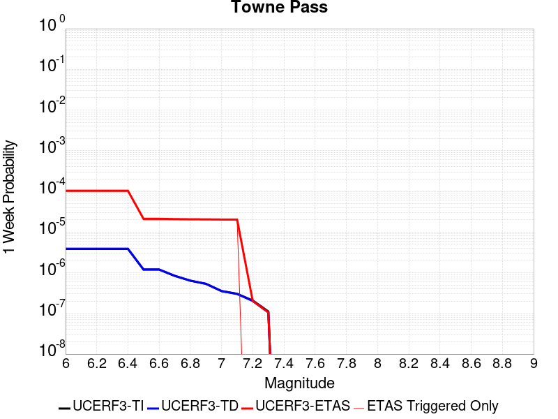 | 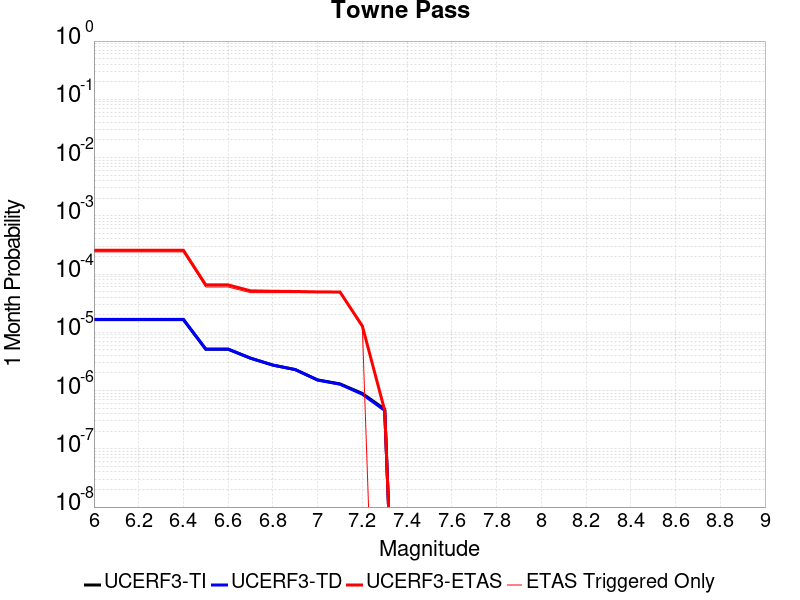 |  | 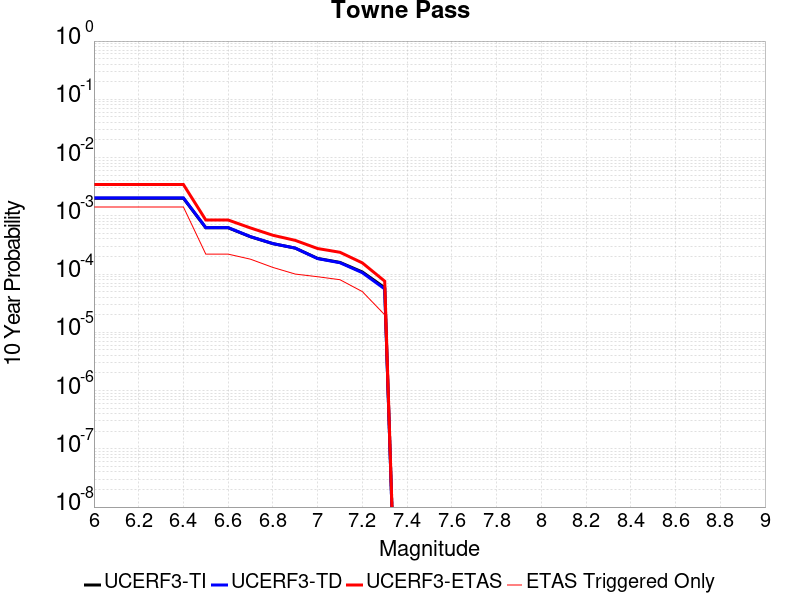 |

| Magnitude | 1 wk TI Prob | 1 wk TD Prob | 1 wk ETAS Prob | 1 wk ETAS/TD Gain | 1 wk ETAS Triggered Only | 1 mo TI Prob | 1 mo TD Prob | 1 mo ETAS Prob | 1 mo ETAS/TD Gain | 1 mo ETAS Triggered Only | 1 yr TI Prob | 1 yr TD Prob | 1 yr ETAS Prob | 1 yr ETAS/TD Gain | 1 yr ETAS Triggered Only | 10 yr TI Prob | 10 yr TD Prob | 10 yr ETAS Prob | 10 yr ETAS/TD Gain | 10 yr ETAS Triggered Only |
|-----|-----|-----|-----|-----|-----|-----|-----|-----|-----|-----|-----|-----|-----|-----|-----|-----|-----|-----|-----|-----|
| 6.0 | 3.849728E-6 | 3.8945495E-6 | 1.2379816E-4 | 31.787542 | 1.1990408E-4 | 1.649873E-5 | 1.6690845E-5 | 2.56495E-4 | 15.367407 | 2.3980816E-4 | 2.0085352E-4 | 2.0319645E-4 | 9.704266E-4 | 4.775805 | 7.673861E-4 | 0.0020067208 | 0.0020305358 | 0.003466463 | 1.7071667 | 0.0014388489 |
| 6.1 | 3.849728E-6 | 3.8945495E-6 | 1.2379816E-4 | 31.787542 | 1.1990408E-4 | 1.649873E-5 | 1.6690845E-5 | 2.56495E-4 | 15.367407 | 2.3980816E-4 | 2.0085352E-4 | 2.0319645E-4 | 9.704266E-4 | 4.775805 | 7.673861E-4 | 0.0020067208 | 0.0020305358 | 0.003466463 | 1.7071667 | 0.0014388489 |
| 6.2 | 3.849728E-6 | 3.8945495E-6 | 1.2379816E-4 | 31.787542 | 1.1990408E-4 | 1.649873E-5 | 1.6690845E-5 | 2.56495E-4 | 15.367407 | 2.3980816E-4 | 2.0085352E-4 | 2.0319645E-4 | 9.704266E-4 | 4.775805 | 7.673861E-4 | 0.0020067208 | 0.0020305358 | 0.003466463 | 1.7071667 | 0.0014388489 |
| 6.3 | 3.849728E-6 | 3.8945495E-6 | 1.2379816E-4 | 31.787542 | 1.1990408E-4 | 1.649873E-5 | 1.6690845E-5 | 2.56495E-4 | 15.367407 | 2.3980816E-4 | 2.0085352E-4 | 2.0319645E-4 | 9.704266E-4 | 4.775805 | 7.673861E-4 | 0.0020067208 | 0.0020305358 | 0.003466463 | 1.7071667 | 0.0014388489 |
| 6.4 | 3.849728E-6 | 3.8945495E-6 | 1.2379816E-4 | 31.787542 | 1.1990408E-4 | 1.649873E-5 | 1.6690845E-5 | 2.56495E-4 | 15.367407 | 2.3980816E-4 | 2.0085352E-4 | 2.0319645E-4 | 9.704266E-4 | 4.775805 | 7.673861E-4 | 0.0020067208 | 0.0020305358 | 0.003466463 | 1.7071667 | 0.0014388489 |
| 6.5 | 1.1953545E-6 | 1.2030553E-6 | 2.5183841E-5 | 20.933237 | 2.3980816E-5 | 5.1229376E-6 | 5.155942E-6 | 6.510767E-5 | 12.627697 | 5.995204E-5 | 6.236998E-5 | 6.27719E-5 | 1.4669949E-4 | 2.3370247 | 8.393286E-5 | 6.235248E-4 | 6.2755344E-4 | 8.0729666E-4 | 1.286419 | 1.7985611E-4 |
| 6.6 | 1.1953545E-6 | 1.2030553E-6 | 2.5183841E-5 | 20.933237 | 2.3980816E-5 | 5.1229376E-6 | 5.155942E-6 | 6.510767E-5 | 12.627697 | 5.995204E-5 | 6.236998E-5 | 6.27719E-5 | 1.4669949E-4 | 2.3370247 | 8.393286E-5 | 6.235248E-4 | 6.2755344E-4 | 8.0729666E-4 | 1.286419 | 1.7985611E-4 |
| 6.7 | 8.375951E-7 | 8.410697E-7 | 2.4821866E-5 | 29.512257 | 2.3980816E-5 | 3.5896885E-6 | 3.60458E-6 | 5.156604E-5 | 14.305699 | 4.7961632E-5 | 4.370358E-5 | 4.3884935E-5 | 1.1582422E-4 | 2.6392708 | 7.194244E-5 | 4.3694986E-4 | 4.387684E-4 | 5.825902E-4 | 1.3277851 | 1.4388488E-4 |
| 6.8 | 6.38041E-7 | 6.39218E-7 | 2.4620018E-5 | 38.51584 | 2.3980816E-5 | 2.7344586E-6 | 2.739503E-6 | 5.0701E-5 | 18.507372 | 4.7961632E-5 | 3.3291526E-5 | 3.335298E-5 | 1.05293024E-4 | 3.1569302 | 7.194244E-5 | 3.3286537E-4 | 3.3348353E-4 | 4.4136122E-4 | 1.3234873 | 1.0791367E-4 |
| 6.9 | 5.3460053E-7 | 5.345355E-7 | 2.4515339E-5 | 45.86288 | 2.3980816E-5 | 2.2911431E-6 | 2.2908646E-6 | 5.0252387E-5 | 21.935991 | 4.7961632E-5 | 2.789431E-5 | 2.7890954E-5 | 7.585125E-5 | 2.7195644 | 4.7961632E-5 | 2.789081E-4 | 2.7887785E-4 | 3.5080023E-4 | 1.2578992 | 7.194244E-5 |
| 7.0 | 3.557783E-7 | 3.5324413E-7 | 2.4334051E-5 | 68.887344 | 2.3980816E-5 | 1.5247632E-6 | 1.5139026E-6 | 4.947546E-5 | 32.68074 | 4.7961632E-5 | 1.8563835E-5 | 1.8431618E-5 | 6.6392364E-5 | 3.602091 | 4.7961632E-5 | 1.8562283E-4 | 1.8430172E-4 | 2.562309E-4 | 1.3902795 | 7.194244E-5 |
| 7.1 | 3.037942E-7 | 3.0002388E-7 | 2.4280833E-5 | 80.929665 | 2.3980816E-5 | 1.3019744E-6 | 1.2858161E-6 | 4.9247385E-5 | 38.300488 | 4.7961632E-5 | 1.5851423E-5 | 1.5654707E-5 | 6.361559E-5 | 4.0636716 | 4.7961632E-5 | 1.5850292E-4 | 1.5653679E-4 | 2.1647943E-4 | 1.3829302 | 5.995204E-5 |
| 7.2 | 2.0808248E-7 | 2.021783E-7 | 2.021783E-7 | 1.0 | 0.0 | 8.917818E-7 | 8.6647816E-7 | 1.2856875E-5 | 14.838084 | 1.1990408E-5 | 1.0857389E-5 | 1.0549325E-5 | 2.2539607E-5 | 2.1365921 | 1.1990408E-5 | 1.0856859E-4 | 1.054887E-4 | 1.29467E-4 | 1.2273066 | 2.3980816E-5 |
| 7.3 | 1.1162073E-7 | 1.06369825E-7 | 1.06369825E-7 | 1.0 | 0.0 | 4.7837443E-7 | 4.5587063E-7 | 4.5587063E-7 | 1.0 | 0.0 | 5.8241935E-6 | 5.550213E-6 | 5.550213E-6 | 1.0 | 0.0 | 5.8240406E-5 | 5.5500943E-5 | 6.7490684E-5 | 1.2160277 | 1.1990408E-5 |

## San Andreas (San Bernardino N)
*[(top)](#table-of-contents)*

| 1 Week | 1 Month | 1 Year | 10 Year |
|-----|-----|-----|-----|
| 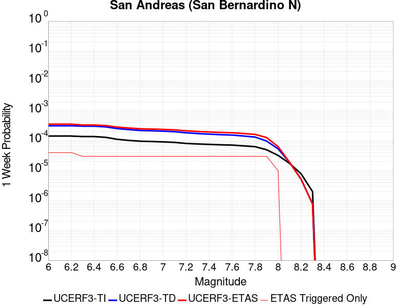 | 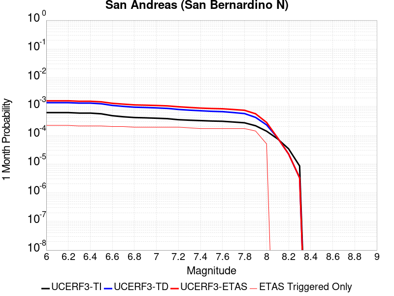 | 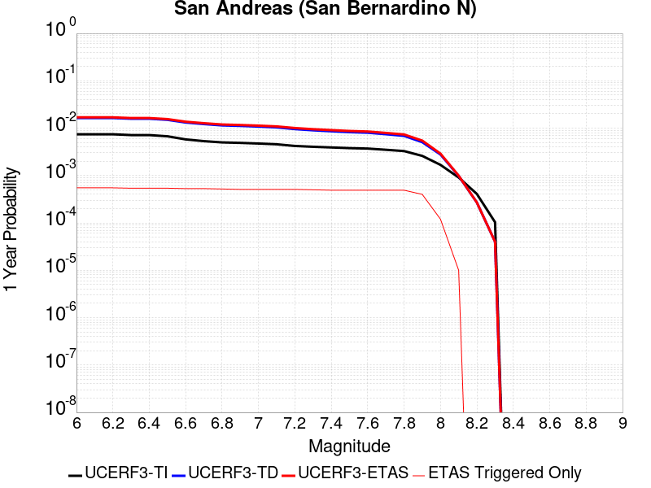 | 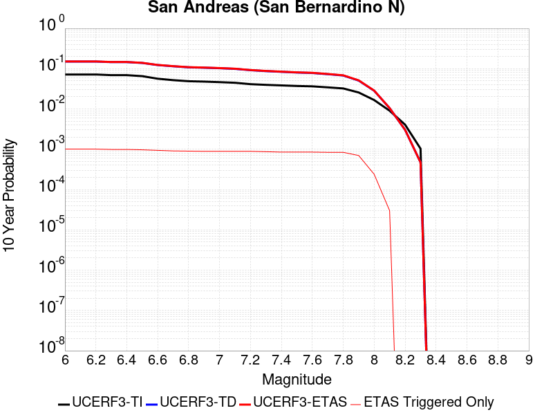 |

| Magnitude | 1 wk TI Prob | 1 wk TD Prob | 1 wk ETAS Prob | 1 wk ETAS/TD Gain | 1 wk ETAS Triggered Only | 1 mo TI Prob | 1 mo TD Prob | 1 mo ETAS Prob | 1 mo ETAS/TD Gain | 1 mo ETAS Triggered Only | 1 yr TI Prob | 1 yr TD Prob | 1 yr ETAS Prob | 1 yr ETAS/TD Gain | 1 yr ETAS Triggered Only | 10 yr TI Prob | 10 yr TD Prob | 10 yr ETAS Prob | 10 yr ETAS/TD Gain | 10 yr ETAS Triggered Only |
|-----|-----|-----|-----|-----|-----|-----|-----|-----|-----|-----|-----|-----|-----|-----|-----|-----|-----|-----|-----|-----|
| 6.0 | 1.4273766E-4 | 3.161376E-4 | 3.5209744E-4 | 1.1137475 | 3.597122E-5 | 6.115894E-4 | 0.0013541778 | 0.0016056354 | 1.1856903 | 2.5179857E-4 | 0.0074207084 | 0.016363978 | 0.016941894 | 1.0353163 | 5.8752997E-4 | 0.07177748 | 0.15029658 | 0.1511524 | 1.0056942 | 0.0010071943 |
| 6.1 | 1.4273766E-4 | 3.161376E-4 | 3.5209744E-4 | 1.1137475 | 3.597122E-5 | 6.115894E-4 | 0.0013541778 | 0.0016056354 | 1.1856903 | 2.5179857E-4 | 0.0074207084 | 0.016363978 | 0.016941894 | 1.0353163 | 5.8752997E-4 | 0.07177748 | 0.15029658 | 0.1511524 | 1.0056942 | 0.0010071943 |
| 6.2 | 1.4273766E-4 | 3.161376E-4 | 3.5209744E-4 | 1.1137475 | 3.597122E-5 | 6.115894E-4 | 0.0013541778 | 0.0016056354 | 1.1856903 | 2.5179857E-4 | 0.0074207084 | 0.016363978 | 0.016941894 | 1.0353163 | 5.8752997E-4 | 0.07177748 | 0.15029658 | 0.1511524 | 1.0056942 | 0.0010071943 |
| 6.3 | 1.3730655E-4 | 3.0518573E-4 | 3.2915926E-4 | 1.0785538 | 2.3980816E-5 | 5.883239E-4 | 0.001307289 | 0.0015467836 | 1.1831995 | 2.3980816E-4 | 0.0071393442 | 0.01580149 | 0.016367935 | 1.0358475 | 5.7553954E-4 | 0.06914291 | 0.14559646 | 0.14643653 | 1.0057698 | 9.832134E-4 |
| 6.4 | 1.3730655E-4 | 3.0518573E-4 | 3.2915926E-4 | 1.0785538 | 2.3980816E-5 | 5.883239E-4 | 0.001307289 | 0.0015467836 | 1.1831995 | 2.3980816E-4 | 0.0071393442 | 0.01580149 | 0.016367935 | 1.0358475 | 5.7553954E-4 | 0.06914291 | 0.14559646 | 0.14643653 | 1.0057698 | 9.832134E-4 |
| 6.5 | 1.2942807E-4 | 2.8932988E-4 | 3.1330375E-4 | 1.08286 | 2.3980816E-5 | 5.545738E-4 | 0.0012394012 | 0.0014789121 | 1.1932473 | 2.3980816E-4 | 0.0067310524 | 0.014986552 | 0.015553466 | 1.0378282 | 5.7553954E-4 | 0.06530788 | 0.13873914 | 0.13956529 | 1.0059547 | 9.592326E-4 |
| 6.6 | 1.1125901E-4 | 2.537176E-4 | 2.776923E-4 | 1.0944937 | 2.3980816E-5 | 4.767372E-4 | 0.0010869103 | 0.0013144803 | 1.2093735 | 2.2781774E-4 | 0.005788839 | 0.013153472 | 0.013709608 | 1.0422806 | 5.6354917E-4 | 0.056403454 | 0.12302898 | 0.12383865 | 1.0065812 | 9.232614E-4 |
| 6.7 | 1.02209575E-4 | 2.3506685E-4 | 2.5904202E-4 | 1.101993 | 2.3980816E-5 | 4.3796748E-4 | 0.0010070418 | 0.0012346301 | 1.2259969 | 2.2781774E-4 | 0.0053192247 | 0.01219223 | 0.012748908 | 1.0456585 | 5.6354917E-4 | 0.051936906 | 0.11482068 | 0.11560609 | 1.0068403 | 8.8729017E-4 |
| 6.8 | 9.610582E-5 | 2.2032406E-4 | 2.442996E-4 | 1.1088194 | 2.3980816E-5 | 4.1181705E-4 | 9.439049E-4 | 0.0011595285 | 1.2284379 | 2.1582734E-4 | 0.0050023515 | 0.011431754 | 0.011977007 | 1.0476964 | 5.5155874E-4 | 0.048912346 | 0.1082225 | 0.109003074 | 1.0072126 | 8.7529974E-4 |
| 6.9 | 9.3877505E-5 | 2.1487933E-4 | 2.3885499E-4 | 1.1115774 | 2.3980816E-5 | 4.0227012E-4 | 9.2058704E-4 | 0.0011362156 | 1.2342296 | 2.1582734E-4 | 0.0048866454 | 0.011150793 | 0.011696202 | 1.048912 | 5.5155874E-4 | 0.04780577 | 0.10581279 | 0.10659547 | 1.0073968 | 8.7529974E-4 |
| 7.0 | 9.1019785E-5 | 2.0814833E-4 | 2.3212415E-4 | 1.1151862 | 2.3980816E-5 | 3.900265E-4 | 8.917599E-4 | 0.0011073948 | 1.2418082 | 2.1582734E-4 | 0.0047382377 | 0.010803353 | 0.011348953 | 1.0505029 | 5.5155874E-4 | 0.046384744 | 0.10278319 | 0.10356852 | 1.0076407 | 8.7529974E-4 |
| 7.1 | 8.771155E-5 | 1.9989353E-4 | 2.2386955E-4 | 1.119944 | 2.3980816E-5 | 3.758525E-4 | 8.564058E-4 | 0.0010720483 | 1.2517995 | 2.1582734E-4 | 0.0045664064 | 0.01037709 | 0.010922926 | 1.0526 | 5.5155874E-4 | 0.044737056 | 0.09909467 | 0.09988323 | 1.0079577 | 8.7529974E-4 |
| 7.2 | 8.0830236E-5 | 1.8394848E-4 | 2.0792488E-4 | 1.1303431 | 2.3980816E-5 | 3.4636928E-4 | 7.881126E-4 | 0.0010037698 | 1.2736377 | 2.1582734E-4 | 0.0042088944 | 0.009553162 | 0.010099452 | 1.0571842 | 5.5155874E-4 | 0.041300658 | 0.09182531 | 0.09262023 | 1.008657 | 8.7529974E-4 |
| 7.3 | 7.7668235E-5 | 1.7338296E-4 | 1.9735961E-4 | 1.1382873 | 2.3980816E-5 | 3.328214E-4 | 7.428583E-4 | 9.4654376E-4 | 1.2741916 | 2.0383693E-4 | 0.0040445733 | 0.009006873 | 0.009541581 | 1.0593667 | 5.3956837E-4 | 0.03971748 | 0.087092124 | 0.0878693 | 1.0089236 | 8.5131894E-4 |
| 7.4 | 7.520177E-5 | 1.6558339E-4 | 1.8956023E-4 | 1.1448022 | 2.3980816E-5 | 3.2225347E-4 | 7.0945016E-4 | 9.011606E-4 | 1.270224 | 1.9184653E-4 | 0.0039163795 | 0.0086034145 | 0.009126453 | 1.0607944 | 5.2757794E-4 | 0.038480744 | 0.08354814 | 0.08430636 | 1.0090752 | 8.2733814E-4 |
| 7.5 | 7.274697E-5 | 1.5845922E-4 | 1.8243624E-4 | 1.1513134 | 2.3980816E-5 | 3.1173544E-4 | 6.789343E-4 | 8.706505E-4 | 1.2823782 | 1.9184653E-4 | 0.003788775 | 0.008234753 | 0.008757986 | 1.0635396 | 5.2757794E-4 | 0.03724827 | 0.08026466 | 0.08102559 | 1.0094802 | 8.2733814E-4 |
| 7.6 | 7.1185845E-5 | 1.5415733E-4 | 1.7813445E-4 | 1.1555367 | 2.3980816E-5 | 3.0504653E-4 | 6.6050707E-4 | 8.5222686E-4 | 1.2902615 | 1.9184653E-4 | 0.0037076178 | 0.008012074 | 0.008535425 | 1.0653203 | 5.2757794E-4 | 0.036463667 | 0.078254156 | 0.07901675 | 1.0097451 | 8.2733814E-4 |
| 7.7 | 6.709961E-5 | 1.4324463E-4 | 1.6722201E-4 | 1.1673876 | 2.3980816E-5 | 2.8753807E-4 | 6.1376113E-4 | 8.054899E-4 | 1.3123834 | 1.9184653E-4 | 0.003495157 | 0.007446978 | 0.0079706265 | 1.070317 | 5.2757794E-4 | 0.034406938 | 0.073082365 | 0.07383812 | 1.0103412 | 8.153477E-4 |
| 7.8 | 6.300812E-5 | 1.3208245E-4 | 1.560601E-4 | 1.1815355 | 2.3980816E-5 | 2.7000686E-4 | 5.659449E-4 | 7.5768284E-4 | 1.3387926 | 1.9184653E-4 | 0.0032823787 | 0.0068686386 | 0.0073925927 | 1.0762821 | 5.2757794E-4 | 0.032343175 | 0.06773997 | 0.06850009 | 1.011221 | 8.153477E-4 |
| 7.9 | 4.983037E-5 | 9.728091E-5 | 1.2125939E-4 | 1.246487 | 2.3980816E-5 | 2.1354125E-4 | 4.1685157E-4 | 5.7266187E-4 | 1.3737789 | 1.558753E-4 | 0.0025967648 | 0.005063368 | 0.0054809074 | 1.0824628 | 4.1966425E-4 | 0.025666296 | 0.0506703 | 0.051296357 | 1.0123554 | 6.594724E-4 |
| 8.0 | 3.2211527E-5 | 5.333152E-5 | 5.333152E-5 | 1.0 | 0.0 | 1.380421E-4 | 2.2854365E-4 | 2.7649433E-4 | 1.2098097 | 4.7961632E-5 | 0.0016793669 | 0.0027789702 | 0.0029104983 | 1.0473298 | 1.3189449E-4 | 0.016667323 | 0.02837451 | 0.028560912 | 1.0065694 | 1.9184653E-4 |
| 8.1 | 1.743376E-5 | 1.8836954E-5 | 1.8836954E-5 | 1.0 | 0.0 | 7.471398E-5 | 8.07273E-5 | 8.07273E-5 | 1.0 | 0.0 | 9.0926304E-4 | 9.824124E-4 | 9.94391E-4 | 1.0121931 | 1.1990408E-5 | 0.009055517 | 0.010490617 | 0.010514346 | 1.002262 | 2.3980816E-5 |
| 8.2 | 7.831616E-6 | 5.1597067E-6 | 5.1597067E-6 | 1.0 | 0.0 | 3.3563636E-5 | 2.2112841E-5 | 2.2112841E-5 | 1.0 | 0.0 | 4.0856065E-4 | 2.6919067E-4 | 2.6919067E-4 | 1.0 | 0.0 | 0.004078103 | 0.003044315 | 0.003044315 | 1.0 | 0.0 |
| 8.3 | 1.983087E-6 | 7.668296E-7 | 7.668296E-7 | 1.0 | 0.0 | 8.498917E-6 | 3.2864084E-6 | 3.2864084E-6 | 1.0 | 0.0 | 1.034694E-4 | 4.0011306E-5 | 4.0011306E-5 | 1.0 | 0.0 | 0.0010342124 | 4.724499E-4 | 4.724499E-4 | 1.0 | 0.0 |

## Paradise
*[(top)](#table-of-contents)*

| 1 Week | 1 Month | 1 Year | 10 Year |
|-----|-----|-----|-----|
| 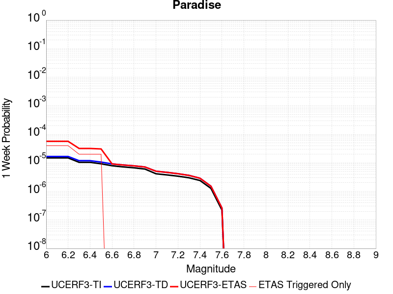 | 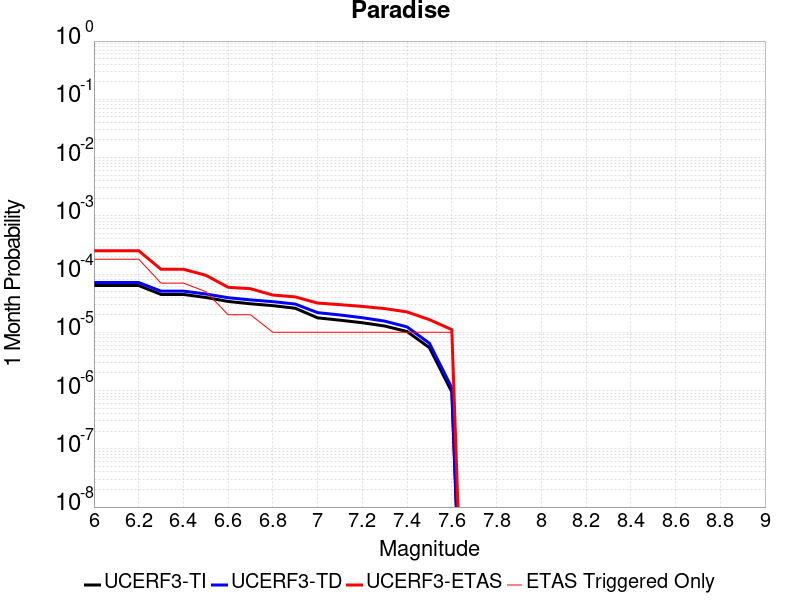 | 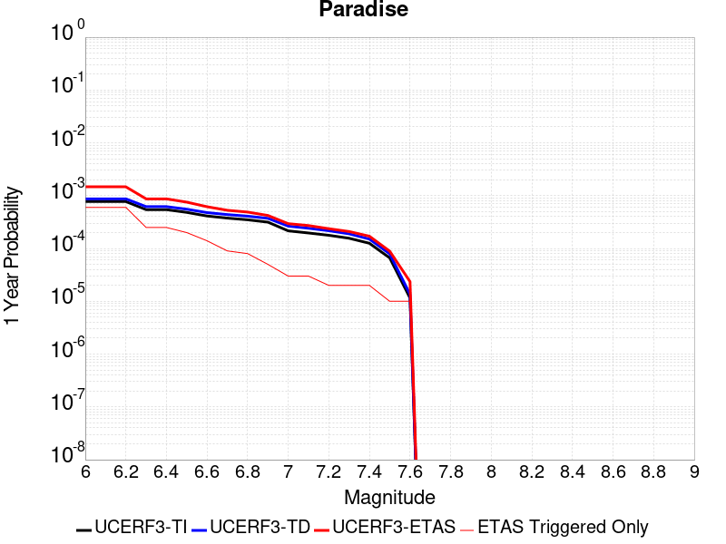 | 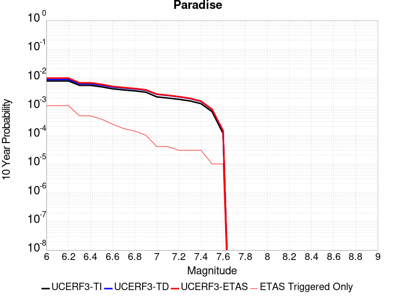 |

| Magnitude | 1 wk TI Prob | 1 wk TD Prob | 1 wk ETAS Prob | 1 wk ETAS/TD Gain | 1 wk ETAS Triggered Only | 1 mo TI Prob | 1 mo TD Prob | 1 mo ETAS Prob | 1 mo ETAS/TD Gain | 1 mo ETAS Triggered Only | 1 yr TI Prob | 1 yr TD Prob | 1 yr ETAS Prob | 1 yr ETAS/TD Gain | 1 yr ETAS Triggered Only | 10 yr TI Prob | 10 yr TD Prob | 10 yr ETAS Prob | 10 yr ETAS/TD Gain | 10 yr ETAS Triggered Only |
|-----|-----|-----|-----|-----|-----|-----|-----|-----|-----|-----|-----|-----|-----|-----|-----|-----|-----|-----|-----|-----|
| 6.0 | 1.4851273E-5 | 1.6694854E-5 | 5.2665477E-5 | 3.1545935 | 3.597122E-5 | 6.364676E-5 | 7.154755E-5 | 2.3940124E-4 | 3.346044 | 1.6786571E-4 | 7.7462377E-4 | 8.707668E-4 | 0.0014098653 | 1.6191077 | 5.3956837E-4 | 0.0077192914 | 0.008675928 | 0.009638725 | 1.1109734 | 9.71223E-4 |
| 6.1 | 1.4851273E-5 | 1.6694854E-5 | 5.2665477E-5 | 3.1545935 | 3.597122E-5 | 6.364676E-5 | 7.154755E-5 | 2.3940124E-4 | 3.346044 | 1.6786571E-4 | 7.7462377E-4 | 8.707668E-4 | 0.0014098653 | 1.6191077 | 5.3956837E-4 | 0.0077192914 | 0.008675928 | 0.009638725 | 1.1109734 | 9.71223E-4 |
| 6.2 | 1.4851273E-5 | 1.6694854E-5 | 5.2665477E-5 | 3.1545935 | 3.597122E-5 | 6.364676E-5 | 7.154755E-5 | 2.3940124E-4 | 3.346044 | 1.6786571E-4 | 7.7462377E-4 | 8.707668E-4 | 0.0014098653 | 1.6191077 | 5.3956837E-4 | 0.0077192914 | 0.008675928 | 0.009638725 | 1.1109734 | 9.71223E-4 |
| 6.3 | 1.0426831E-5 | 1.1888727E-5 | 3.586926E-5 | 3.0170813 | 2.3980816E-5 | 4.4685654E-5 | 5.0950726E-5 | 1.2288951E-4 | 2.4119284 | 7.194244E-5 | 5.43912E-4 | 6.201545E-4 | 8.4783096E-4 | 1.3671286 | 2.2781774E-4 | 0.0054258266 | 0.006184847 | 0.006601916 | 1.067434 | 4.1966425E-4 |
| 6.4 | 1.0426831E-5 | 1.1888727E-5 | 3.586926E-5 | 3.0170813 | 2.3980816E-5 | 4.4685654E-5 | 5.0950726E-5 | 1.2288951E-4 | 2.4119284 | 7.194244E-5 | 5.43912E-4 | 6.201545E-4 | 8.4783096E-4 | 1.3671286 | 2.2781774E-4 | 0.0054258266 | 0.006184847 | 0.006601916 | 1.067434 | 4.1966425E-4 |
| 6.5 | 9.25027E-6 | 1.0620054E-5 | 3.4600616E-5 | 3.2580452 | 2.3980816E-5 | 3.964341E-5 | 4.551375E-5 | 9.34732E-5 | 2.0537353 | 4.7961632E-5 | 4.8255164E-4 | 5.539939E-4 | 7.337504E-4 | 1.3244737 | 1.7985611E-4 | 0.0048150513 | 0.0055266283 | 0.00584858 | 1.0582546 | 3.23741E-4 |
| 6.6 | 7.904275E-6 | 9.159603E-6 | 9.159603E-6 | 1.0 | 0.0 | 3.3875025E-5 | 3.925487E-5 | 5.124481E-5 | 1.3054382 | 1.1990408E-5 | 4.1235037E-4 | 4.7782718E-4 | 5.8568927E-4 | 1.2257346 | 1.0791367E-4 | 0.0041158604 | 0.004768395 | 0.0049712597 | 1.0425436 | 2.0383693E-4 |
| 6.7 | 7.2061953E-6 | 8.407318E-6 | 8.407318E-6 | 1.0 | 0.0 | 3.088333E-5 | 3.6030888E-5 | 4.8020862E-5 | 1.3327694 | 1.1990408E-5 | 3.7593965E-4 | 4.385914E-4 | 5.2248745E-4 | 1.1912851 | 8.393286E-5 | 0.003753043 | 0.0043776273 | 0.0045447582 | 1.0381784 | 1.6786571E-4 |
| 6.8 | 6.6948724E-6 | 7.84223E-6 | 7.84223E-6 | 1.0 | 0.0 | 2.8691995E-5 | 3.3609143E-5 | 4.559915E-5 | 1.3567482 | 1.1990408E-5 | 3.4926904E-4 | 4.0911807E-4 | 4.930166E-4 | 1.2050717 | 8.393286E-5 | 0.003487206 | 0.0040840064 | 0.0042392453 | 1.0380114 | 1.558753E-4 |
| 6.9 | 6.0421025E-6 | 7.130678E-6 | 7.130678E-6 | 1.0 | 0.0 | 2.5894467E-5 | 3.055971E-5 | 4.2549753E-5 | 1.392348 | 1.1990408E-5 | 3.1521954E-4 | 3.7200435E-4 | 4.1994813E-4 | 1.1288797 | 4.7961632E-5 | 0.0031477278 | 0.0037141545 | 0.0038216675 | 1.0289468 | 1.0791367E-4 |
| 7.0 | 4.134091E-6 | 5.0803487E-6 | 5.0803487E-6 | 1.0 | 0.0 | 1.7717413E-5 | 2.177275E-5 | 3.37629E-5 | 1.5506951 | 1.1990408E-5 | 2.1568815E-4 | 2.6505254E-4 | 2.89027E-4 | 1.0904517 | 2.3980816E-5 | 0.0021547892 | 0.0026475172 | 0.0026833932 | 1.0135508 | 3.597122E-5 |
| 7.1 | 3.7674888E-6 | 4.6319055E-6 | 4.6319055E-6 | 1.0 | 0.0 | 1.6146281E-5 | 1.985088E-5 | 3.184105E-5 | 1.604012 | 1.1990408E-5 | 1.9656324E-4 | 2.4165919E-4 | 2.656342E-4 | 1.09921 | 2.3980816E-5 | 0.0019638946 | 0.0024141145 | 0.002449999 | 1.0148644 | 3.597122E-5 |
| 7.2 | 3.4065345E-6 | 4.156755E-6 | 4.156755E-6 | 1.0 | 0.0 | 1.4599351E-5 | 1.7814553E-5 | 2.9804745E-5 | 1.6730561 | 1.1990408E-5 | 1.777326E-4 | 2.1687208E-4 | 2.408477E-4 | 1.1105518 | 2.3980816E-5 | 0.0017759053 | 0.0021667527 | 0.0022026459 | 1.0165654 | 3.597122E-5 |
| 7.3 | 2.9934936E-6 | 3.6293434E-6 | 3.6293434E-6 | 1.0 | 0.0 | 1.2829195E-5 | 1.5554244E-5 | 2.7544465E-5 | 1.770865 | 1.1990408E-5 | 1.5618425E-4 | 1.8935793E-4 | 2.1333422E-4 | 1.1266187 | 2.3980816E-5 | 0.0015607453 | 0.0018921113 | 0.0019280144 | 1.0189751 | 3.597122E-5 |
| 7.4 | 2.4049796E-6 | 2.8890036E-6 | 2.8890036E-6 | 1.0 | 0.0 | 1.0307015E-5 | 1.2381393E-5 | 2.4371653E-5 | 1.9684095 | 1.1990408E-5 | 1.2548068E-4 | 1.5073447E-4 | 1.7471168E-4 | 1.1590691 | 2.3980816E-5 | 0.0012540985 | 0.0015064639 | 0.0015423809 | 1.023842 | 3.597122E-5 |
| 7.5 | 1.2710091E-6 | 1.5134775E-6 | 1.5134775E-6 | 1.0 | 0.0 | 5.44717E-6 | 6.486323E-6 | 1.8476652E-5 | 2.8485558 | 1.1990408E-5 | 6.631728E-5 | 7.896937E-5 | 9.0958834E-5 | 1.1518242 | 1.1990408E-5 | 6.6297496E-4 | 7.8953576E-4 | 8.015167E-4 | 1.0151746 | 1.1990408E-5 |
| 7.6 | 2.21172E-7 | 2.6039737E-7 | 2.6039737E-7 | 1.0 | 0.0 | 9.478797E-7 | 1.1159884E-6 | 1.31063825E-5 | 11.744192 | 1.1990408E-5 | 1.1540374E-5 | 1.3587103E-5 | 2.5577348E-5 | 1.8824725 | 1.1990408E-5 | 1.1539775E-4 | 1.3586554E-4 | 1.4785431E-4 | 1.08824 | 1.1990408E-5 |

## Bicycle Lake
*[(top)](#table-of-contents)*

| 1 Week | 1 Month | 1 Year | 10 Year |
|-----|-----|-----|-----|
| 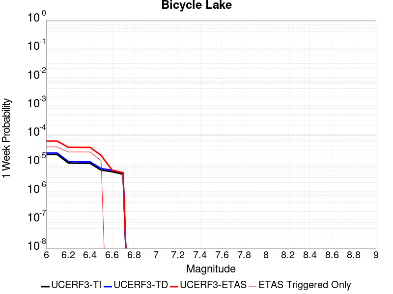 | 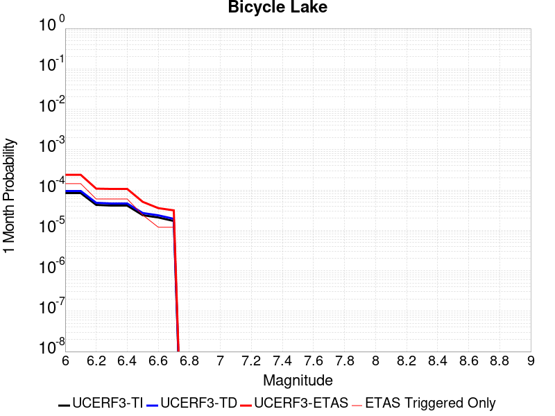 | 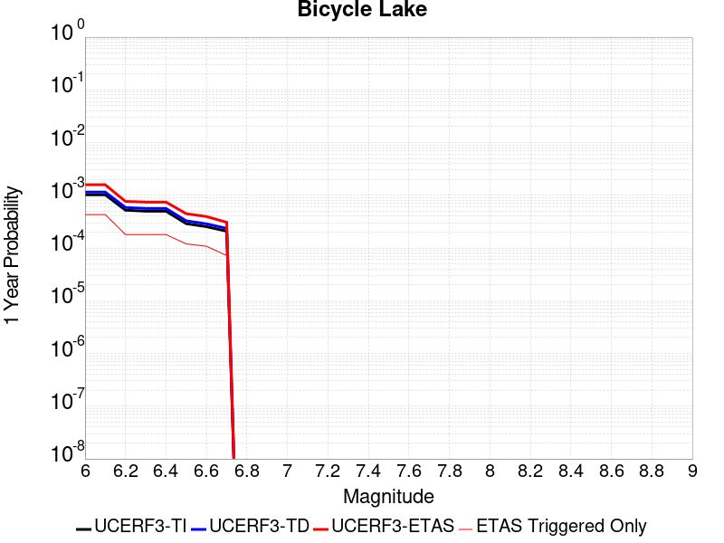 | 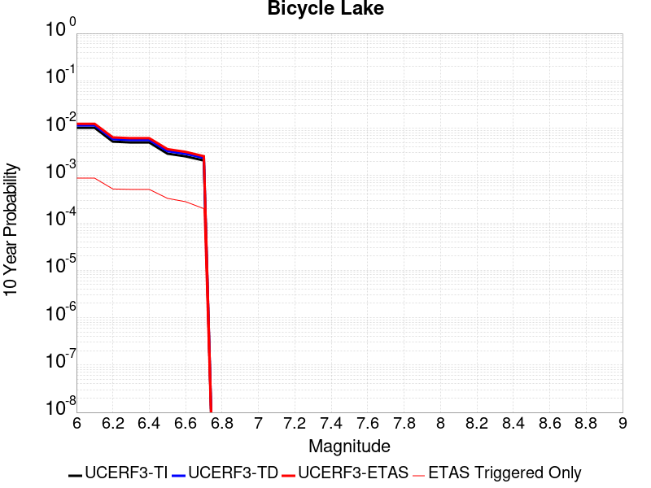 |

| Magnitude | 1 wk TI Prob | 1 wk TD Prob | 1 wk ETAS Prob | 1 wk ETAS/TD Gain | 1 wk ETAS Triggered Only | 1 mo TI Prob | 1 mo TD Prob | 1 mo ETAS Prob | 1 mo ETAS/TD Gain | 1 mo ETAS Triggered Only | 1 yr TI Prob | 1 yr TD Prob | 1 yr ETAS Prob | 1 yr ETAS/TD Gain | 1 yr ETAS Triggered Only | 10 yr TI Prob | 10 yr TD Prob | 10 yr ETAS Prob | 10 yr ETAS/TD Gain | 10 yr ETAS Triggered Only |
|-----|-----|-----|-----|-----|-----|-----|-----|-----|-----|-----|-----|-----|-----|-----|-----|-----|-----|-----|-----|-----|
| 6.0 | 1.9621975E-5 | 2.2097447E-5 | 5.8067875E-5 | 2.6278093 | 3.597122E-5 | 8.4091465E-5 | 9.470067E-5 | 2.3857194E-4 | 2.519221 | 1.4388488E-4 | 0.0010233327 | 0.0011525059 | 0.001583663 | 1.3741041 | 4.3165468E-4 | 0.01018633 | 0.011478599 | 0.012367558 | 1.0774448 | 8.992806E-4 |
| 6.1 | 1.9621975E-5 | 2.2097447E-5 | 5.8067875E-5 | 2.6278093 | 3.597122E-5 | 8.4091465E-5 | 9.470067E-5 | 2.3857194E-4 | 2.519221 | 1.4388488E-4 | 0.0010233327 | 0.0011525059 | 0.001583663 | 1.3741041 | 4.3165468E-4 | 0.01018633 | 0.011478599 | 0.012367558 | 1.0774448 | 8.992806E-4 |
| 6.2 | 9.9971285E-6 | 1.1255827E-5 | 3.523637E-5 | 3.1305006 | 2.3980816E-5 | 4.2844134E-5 | 4.823866E-5 | 1.0818781E-4 | 2.2427614 | 5.995204E-5 | 5.2150246E-4 | 5.8719947E-4 | 7.6694996E-4 | 1.3061149 | 1.7985611E-4 | 0.0052028033 | 0.005861584 | 0.0063503096 | 1.0833776 | 4.916067E-4 |
| 6.3 | 9.589428E-6 | 1.0798527E-5 | 3.4779085E-5 | 3.2207248 | 2.3980816E-5 | 4.10969E-5 | 4.627887E-5 | 1.0622814E-4 | 2.2953916 | 5.995204E-5 | 5.002399E-4 | 5.6335144E-4 | 7.4310624E-4 | 1.3190811 | 1.7985611E-4 | 0.0049911533 | 0.0056243236 | 0.006113165 | 1.0869156 | 4.916067E-4 |
| 6.4 | 9.589428E-6 | 1.0798527E-5 | 3.4779085E-5 | 3.2207248 | 2.3980816E-5 | 4.10969E-5 | 4.627887E-5 | 1.0622814E-4 | 2.2953916 | 5.995204E-5 | 5.002399E-4 | 5.6335144E-4 | 7.4310624E-4 | 1.3190811 | 1.7985611E-4 | 0.0049911533 | 0.0056243236 | 0.006113165 | 1.0869156 | 4.916067E-4 |
| 6.5 | 5.557707E-6 | 6.2857107E-6 | 1.8276043E-5 | 2.907554 | 1.1990408E-5 | 2.3818526E-5 | 2.6938633E-5 | 5.0918803E-5 | 1.8901776 | 2.3980816E-5 | 2.8995197E-4 | 3.2795538E-4 | 4.4782014E-4 | 1.365491 | 1.1990408E-4 | 0.0028957394 | 0.0032773502 | 0.003576128 | 1.0911645 | 2.997602E-4 |
| 6.6 | 4.8742945E-6 | 5.5133855E-6 | 5.5133855E-6 | 1.0 | 0.0 | 2.0889667E-5 | 2.3628729E-5 | 3.5618854E-5 | 1.5074384 | 1.1990408E-5 | 2.54302E-4 | 2.87668E-4 | 3.9555063E-4 | 1.3750248 | 1.0791367E-4 | 0.002540112 | 0.0028755253 | 0.0031265996 | 1.0873144 | 2.5179857E-4 |
| 6.7 | 3.991108E-6 | 4.515989E-6 | 4.515989E-6 | 1.0 | 0.0 | 1.7104636E-5 | 1.9354238E-5 | 3.1344414E-5 | 1.6195116 | 1.1990408E-5 | 2.0822904E-4 | 2.3563785E-4 | 3.0756334E-4 | 1.3052374 | 7.194244E-5 | 0.0020803404 | 0.0023563786 | 0.0025238488 | 1.071071 | 1.6786571E-4 |

## Garlic Springs
*[(top)](#table-of-contents)*

| 1 Week | 1 Month | 1 Year | 10 Year |
|-----|-----|-----|-----|
| 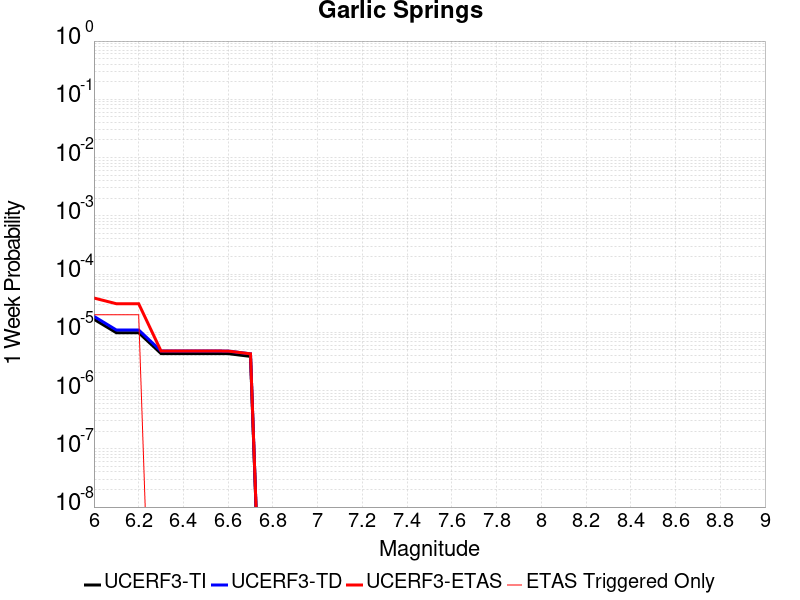 | 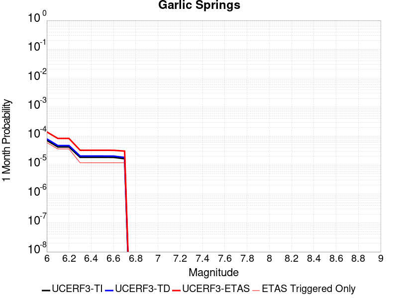 | 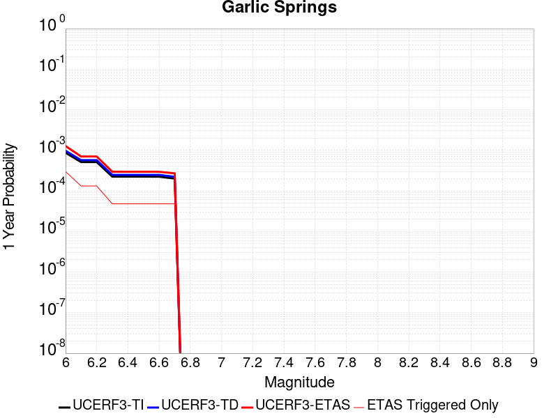 | 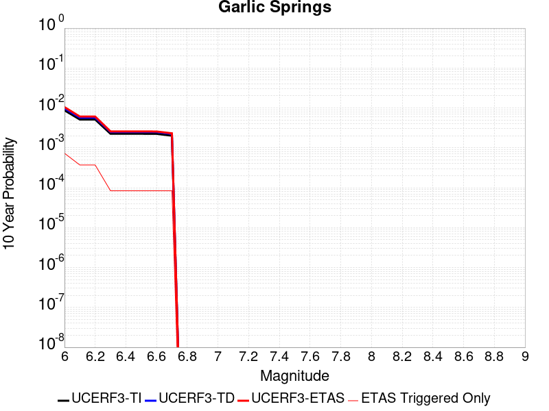 |

| Magnitude | 1 wk TI Prob | 1 wk TD Prob | 1 wk ETAS Prob | 1 wk ETAS/TD Gain | 1 wk ETAS Triggered Only | 1 mo TI Prob | 1 mo TD Prob | 1 mo ETAS Prob | 1 mo ETAS/TD Gain | 1 mo ETAS Triggered Only | 1 yr TI Prob | 1 yr TD Prob | 1 yr ETAS Prob | 1 yr ETAS/TD Gain | 1 yr ETAS Triggered Only | 10 yr TI Prob | 10 yr TD Prob | 10 yr ETAS Prob | 10 yr ETAS/TD Gain | 10 yr ETAS Triggered Only |
|-----|-----|-----|-----|-----|-----|-----|-----|-----|-----|-----|-----|-----|-----|-----|-----|-----|-----|-----|-----|-----|
| 6.0 | 1.6760017E-5 | 1.8777133E-5 | 4.2757496E-5 | 2.2771049 | 2.3980816E-5 | 7.182667E-5 | 8.0471604E-5 | 1.4041882E-4 | 1.7449486 | 5.995204E-5 | 8.7413884E-4 | 9.794189E-4 | 0.0012788854 | 1.3057595 | 2.997602E-4 | 0.008707083 | 0.009762568 | 0.010486842 | 1.074189 | 7.314149E-4 |
| 6.1 | 9.852767E-6 | 1.0973752E-5 | 3.4954304E-5 | 3.1852646 | 2.3980816E-5 | 4.222546E-5 | 4.702992E-5 | 8.299945E-5 | 1.7648222 | 3.597122E-5 | 5.139737E-4 | 5.7250983E-4 | 7.0432876E-4 | 1.2302475 | 1.3189449E-4 | 0.005127866 | 0.0057173073 | 0.006086885 | 1.0646418 | 3.7170263E-4 |
| 6.2 | 9.852767E-6 | 1.0973752E-5 | 3.4954304E-5 | 3.1852646 | 2.3980816E-5 | 4.222546E-5 | 4.702992E-5 | 8.299945E-5 | 1.7648222 | 3.597122E-5 | 5.139737E-4 | 5.7250983E-4 | 7.0432876E-4 | 1.2302475 | 1.3189449E-4 | 0.005127866 | 0.0057173073 | 0.006086885 | 1.0646418 | 3.7170263E-4 |
| 6.3 | 4.3167724E-6 | 4.7780964E-6 | 4.7780964E-6 | 1.0 | 0.0 | 1.8500323E-5 | 2.0477524E-5 | 3.2467688E-5 | 1.5855279 | 1.1990408E-5 | 2.2521814E-4 | 2.4930836E-4 | 2.9725806E-4 | 1.1923308 | 4.7961632E-5 | 0.0022499003 | 0.0024925452 | 0.002576269 | 1.0335896 | 8.393286E-5 |
| 6.4 | 4.3167724E-6 | 4.7780964E-6 | 4.7780964E-6 | 1.0 | 0.0 | 1.8500323E-5 | 2.0477524E-5 | 3.2467688E-5 | 1.5855279 | 1.1990408E-5 | 2.2521814E-4 | 2.4930836E-4 | 2.9725806E-4 | 1.1923308 | 4.7961632E-5 | 0.0022499003 | 0.0024925452 | 0.002576269 | 1.0335896 | 8.393286E-5 |
| 6.5 | 4.3167724E-6 | 4.7780964E-6 | 4.7780964E-6 | 1.0 | 0.0 | 1.8500323E-5 | 2.0477524E-5 | 3.2467688E-5 | 1.5855279 | 1.1990408E-5 | 2.2521814E-4 | 2.4930836E-4 | 2.9725806E-4 | 1.1923308 | 4.7961632E-5 | 0.0022499003 | 0.0024925452 | 0.002576269 | 1.0335896 | 8.393286E-5 |
| 6.6 | 4.301311E-6 | 4.7609647E-6 | 4.7609647E-6 | 1.0 | 0.0 | 1.8434059E-5 | 2.0404104E-5 | 3.2394266E-5 | 1.5876349 | 1.1990408E-5 | 2.2441156E-4 | 2.4841467E-4 | 2.963644E-4 | 1.1930228 | 4.7961632E-5 | 0.0022418506 | 0.0024836282 | 0.0025673527 | 1.0337105 | 8.393286E-5 |
| 6.7 | 3.8599724E-6 | 4.2711204E-6 | 4.2711204E-6 | 1.0 | 0.0 | 1.6542634E-5 | 1.8304801E-5 | 3.0294988E-5 | 1.6550297 | 1.1990408E-5 | 2.0138794E-4 | 2.2286095E-4 | 2.708119E-4 | 1.2151608 | 4.7961632E-5 | 0.0020120554 | 0.0022286095 | 0.0023123552 | 1.0375776 | 8.393286E-5 |

## Helendale-So Lockhart
*[(top)](#table-of-contents)*

| 1 Week | 1 Month | 1 Year | 10 Year |
|-----|-----|-----|-----|
| 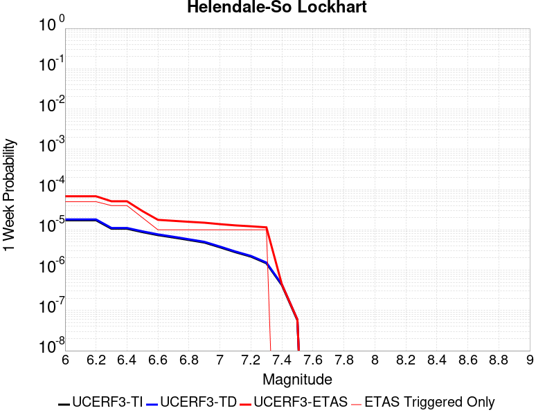 | 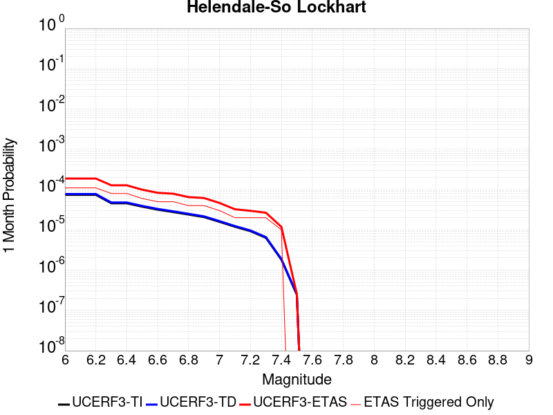 | 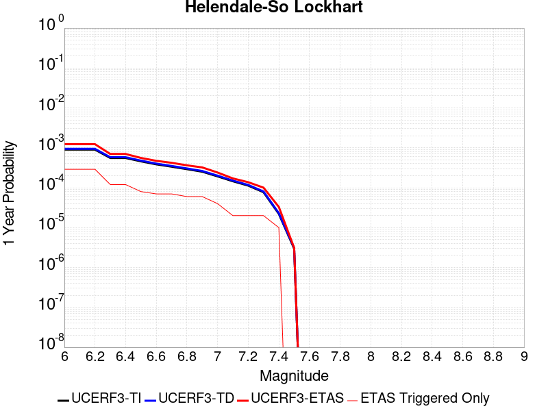 | 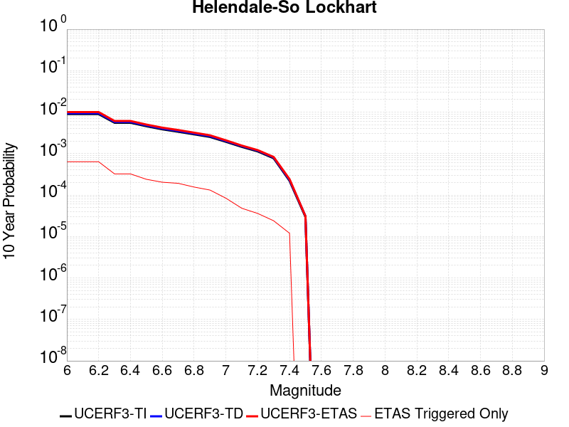 |

| Magnitude | 1 wk TI Prob | 1 wk TD Prob | 1 wk ETAS Prob | 1 wk ETAS/TD Gain | 1 wk ETAS Triggered Only | 1 mo TI Prob | 1 mo TD Prob | 1 mo ETAS Prob | 1 mo ETAS/TD Gain | 1 mo ETAS Triggered Only | 1 yr TI Prob | 1 yr TD Prob | 1 yr ETAS Prob | 1 yr ETAS/TD Gain | 1 yr ETAS Triggered Only | 10 yr TI Prob | 10 yr TD Prob | 10 yr ETAS Prob | 10 yr ETAS/TD Gain | 10 yr ETAS Triggered Only |
|-----|-----|-----|-----|-----|-----|-----|-----|-----|-----|-----|-----|-----|-----|-----|-----|-----|-----|-----|-----|-----|
| 6.0 | 1.7296055E-5 | 1.8103841E-5 | 6.6064604E-5 | 3.6492035 | 4.7961632E-5 | 7.412385E-5 | 7.7585704E-5 | 1.85491E-4 | 2.3907883 | 1.0791367E-4 | 9.0208417E-4 | 9.442173E-4 | 0.0012197363 | 1.2917962 | 2.7577937E-4 | 0.008984311 | 0.009404174 | 0.010033689 | 1.06694 | 6.354916E-4 |
| 6.1 | 1.7296055E-5 | 1.8103841E-5 | 6.6064604E-5 | 3.6492035 | 4.7961632E-5 | 7.412385E-5 | 7.7585704E-5 | 1.85491E-4 | 2.3907883 | 1.0791367E-4 | 9.0208417E-4 | 9.442173E-4 | 0.0012197363 | 1.2917962 | 2.7577937E-4 | 0.008984311 | 0.009404174 | 0.010033689 | 1.06694 | 6.354916E-4 |
| 6.2 | 1.7296055E-5 | 1.8103841E-5 | 6.6064604E-5 | 3.6492035 | 4.7961632E-5 | 7.412385E-5 | 7.7585704E-5 | 1.85491E-4 | 2.3907883 | 1.0791367E-4 | 9.0208417E-4 | 9.442173E-4 | 0.0012197363 | 1.2917962 | 2.7577937E-4 | 0.008984311 | 0.009404174 | 0.010033689 | 1.06694 | 6.354916E-4 |
| 6.3 | 1.0669118E-5 | 1.1135489E-5 | 4.710631E-5 | 4.2302866 | 3.597122E-5 | 4.5723988E-5 | 4.7722668E-5 | 1.1966168E-4 | 2.5074391 | 7.194244E-5 | 5.5654737E-4 | 5.8087136E-4 | 6.8872236E-4 | 1.185671 | 1.0791367E-4 | 0.0055515557 | 0.005793827 | 0.006115692 | 1.0555532 | 3.23741E-4 |
| 6.4 | 1.0669118E-5 | 1.1135489E-5 | 4.710631E-5 | 4.2302866 | 3.597122E-5 | 4.5723988E-5 | 4.7722668E-5 | 1.1966168E-4 | 2.5074391 | 7.194244E-5 | 5.5654737E-4 | 5.8087136E-4 | 6.8872236E-4 | 1.185671 | 1.0791367E-4 | 0.0055515557 | 0.005793827 | 0.006115692 | 1.0555532 | 3.23741E-4 |
| 6.5 | 8.790038E-6 | 9.1702495E-6 | 2.1160547E-5 | 2.3075213 | 1.1990408E-5 | 3.767105E-5 | 3.9300485E-5 | 8.726023E-5 | 2.2203348 | 4.7961632E-5 | 4.585485E-4 | 4.7837992E-4 | 5.5028795E-4 | 1.1503158 | 7.194244E-5 | 0.0045760344 | 0.0047736657 | 0.005012329 | 1.0499958 | 2.3980816E-4 |
| 6.6 | 7.396949E-6 | 7.715581E-6 | 7.715581E-6 | 1.0 | 0.0 | 3.1700827E-5 | 3.3066364E-5 | 6.9036396E-5 | 2.0878134 | 3.597122E-5 | 3.858892E-4 | 4.025096E-4 | 4.624375E-4 | 1.1488856 | 5.995204E-5 | 0.003852198 | 0.004017913 | 0.004220931 | 1.0505282 | 2.0383693E-4 |
| 6.7 | 6.4600285E-6 | 6.7380697E-6 | 6.7380697E-6 | 1.0 | 0.0 | 2.7685543E-5 | 2.8877126E-5 | 6.484731E-5 | 2.245629 | 3.597122E-5 | 3.3701936E-4 | 3.5152308E-4 | 4.1145404E-4 | 1.1704894 | 5.995204E-5 | 0.0033650869 | 0.003509752 | 0.0037009253 | 1.0544691 | 1.9184653E-4 |
| 6.8 | 5.600104E-6 | 5.836042E-6 | 5.836042E-6 | 1.0 | 0.0 | 2.4000226E-5 | 2.5011372E-5 | 6.0981696E-5 | 2.4381588 | 3.597122E-5 | 2.9216358E-4 | 3.044715E-4 | 3.6440528E-4 | 1.1968453 | 5.995204E-5 | 0.0029177975 | 0.003040605 | 0.0031960064 | 1.0511087 | 1.558753E-4 |
| 6.9 | 4.839122E-6 | 5.039537E-6 | 5.039537E-6 | 1.0 | 0.0 | 2.0738931E-5 | 2.159784E-5 | 5.7568286E-5 | 2.665465 | 3.597122E-5 | 2.5246723E-4 | 2.6292243E-4 | 3.2285872E-4 | 1.2279618 | 5.995204E-5 | 0.002521806 | 0.002626161 | 0.0027577092 | 1.0500914 | 1.3189449E-4 |
| 7.0 | 3.6937633E-6 | 3.845229E-6 | 3.845229E-6 | 1.0 | 0.0 | 1.5830317E-5 | 1.6479451E-5 | 4.045987E-5 | 2.455171 | 2.3980816E-5 | 1.9271708E-4 | 2.0061915E-4 | 2.3658315E-4 | 1.179265 | 3.597122E-5 | 0.0019255003 | 0.0020044118 | 0.0020881766 | 1.0417901 | 8.393286E-5 |
| 7.1 | 2.7858857E-6 | 2.8978693E-6 | 2.8978693E-6 | 1.0 | 0.0 | 1.1939455E-5 | 1.2419382E-5 | 2.440964E-5 | 1.9654473 | 1.1990408E-5 | 1.4535317E-4 | 1.511957E-4 | 1.6318429E-4 | 1.0792919 | 1.1990408E-5 | 0.0014525814 | 0.0015109498 | 0.001558839 | 1.0316948 | 4.7961632E-5 |
| 7.2 | 2.1672065E-6 | 2.2540248E-6 | 2.2540248E-6 | 1.0 | 0.0 | 9.2879945E-6 | 9.660072E-6 | 2.1650363E-5 | 2.241222 | 1.1990408E-5 | 1.1307546E-4 | 1.176052E-4 | 1.295942E-4 | 1.1019428 | 1.1990408E-5 | 0.0011301794 | 0.0011754478 | 0.0012113769 | 1.0305662 | 3.597122E-5 |
| 7.3 | 1.4823496E-6 | 1.5422185E-6 | 1.5422185E-6 | 1.0 | 0.0 | 6.3529114E-6 | 6.6094917E-6 | 1.859982E-5 | 2.8141074 | 1.1990408E-5 | 7.734395E-5 | 8.046775E-5 | 9.245719E-5 | 1.1489968 | 1.1990408E-5 | 7.731704E-4 | 8.044012E-4 | 8.283627E-4 | 1.029788 | 2.3980816E-5 |
| 7.4 | 4.2321457E-7 | 4.4109012E-7 | 4.4109012E-7 | 1.0 | 0.0 | 1.8137755E-6 | 1.8903852E-6 | 1.388077E-5 | 7.3428264 | 1.1990408E-5 | 2.2082493E-5 | 2.3015242E-5 | 3.5005374E-5 | 1.5209649 | 1.1990408E-5 | 2.2080299E-4 | 2.3013311E-4 | 2.4212076E-4 | 1.05209 | 1.1990408E-5 |
| 7.5 | 5.6942316E-8 | 5.941599E-8 | 5.941599E-8 | 1.0 | 0.0 | 2.440385E-7 | 2.5463993E-7 | 2.5463993E-7 | 1.0 | 0.0 | 2.9711643E-6 | 3.1002376E-6 | 3.1002376E-6 | 1.0 | 0.0 | 2.9711247E-5 | 3.1002022E-5 | 3.1002022E-5 | 1.0 | 0.0 |

## Death Valley (Black Mtns Frontal)
*[(top)](#table-of-contents)*

| 1 Week | 1 Month | 1 Year | 10 Year |
|-----|-----|-----|-----|
| 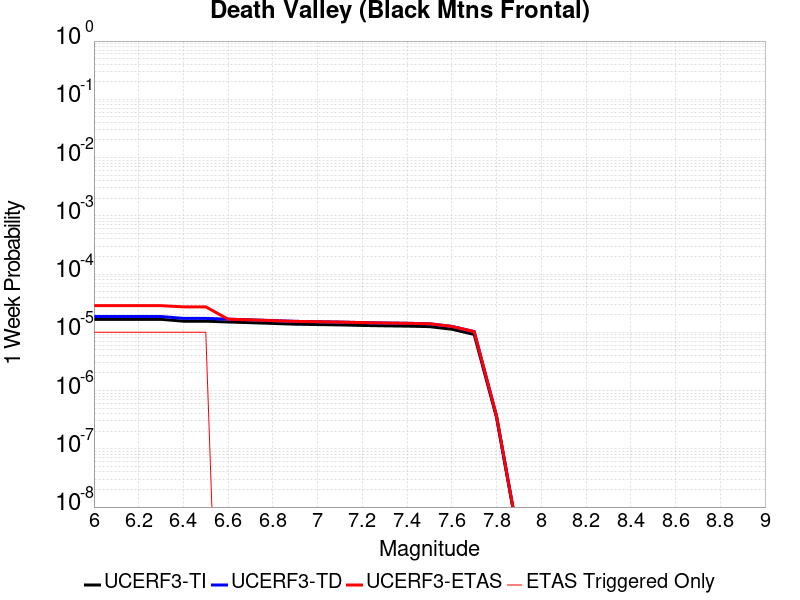 | 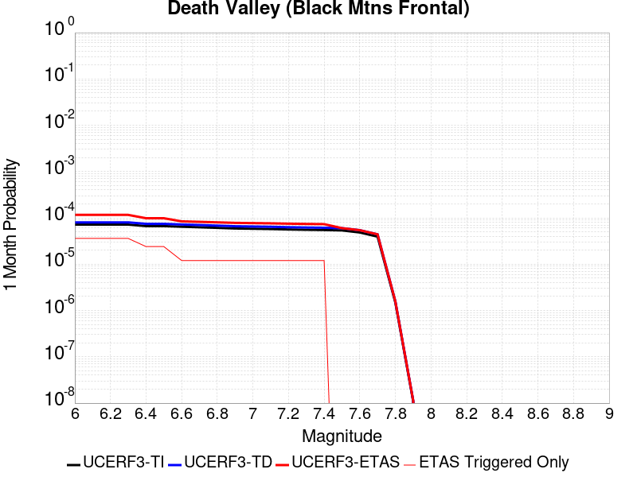 | 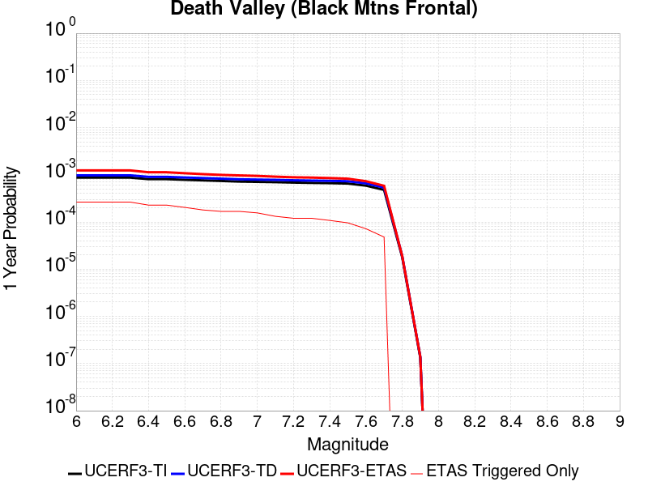 | 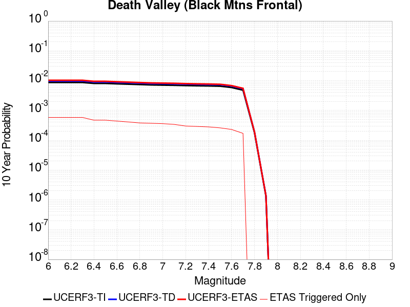 |

| Magnitude | 1 wk TI Prob | 1 wk TD Prob | 1 wk ETAS Prob | 1 wk ETAS/TD Gain | 1 wk ETAS Triggered Only | 1 mo TI Prob | 1 mo TD Prob | 1 mo ETAS Prob | 1 mo ETAS/TD Gain | 1 mo ETAS Triggered Only | 1 yr TI Prob | 1 yr TD Prob | 1 yr ETAS Prob | 1 yr ETAS/TD Gain | 1 yr ETAS Triggered Only | 10 yr TI Prob | 10 yr TD Prob | 10 yr ETAS Prob | 10 yr ETAS/TD Gain | 10 yr ETAS Triggered Only |
|-----|-----|-----|-----|-----|-----|-----|-----|-----|-----|-----|-----|-----|-----|-----|-----|-----|-----|-----|-----|-----|
| 6.0 | 1.6707214E-5 | 1.867056E-5 | 3.0660744E-5 | 1.6421974 | 1.1990408E-5 | 7.160038E-5 | 8.001427E-5 | 1.1598262E-4 | 1.449524 | 3.597122E-5 | 8.71386E-4 | 9.7374606E-4 | 0.0012372781 | 1.2706374 | 2.6378897E-4 | 0.00867977 | 0.009695647 | 0.010253733 | 1.0575603 | 5.6354917E-4 |
| 6.1 | 1.6707214E-5 | 1.867056E-5 | 3.0660744E-5 | 1.6421974 | 1.1990408E-5 | 7.160038E-5 | 8.001427E-5 | 1.1598262E-4 | 1.449524 | 3.597122E-5 | 8.71386E-4 | 9.7374606E-4 | 0.0012372781 | 1.2706374 | 2.6378897E-4 | 0.00867977 | 0.009695647 | 0.010253733 | 1.0575603 | 5.6354917E-4 |
| 6.2 | 1.6707214E-5 | 1.867056E-5 | 3.0660744E-5 | 1.6421974 | 1.1990408E-5 | 7.160038E-5 | 8.001427E-5 | 1.1598262E-4 | 1.449524 | 3.597122E-5 | 8.71386E-4 | 9.7374606E-4 | 0.0012372781 | 1.2706374 | 2.6378897E-4 | 0.00867977 | 0.009695647 | 0.010253733 | 1.0575603 | 5.6354917E-4 |
| 6.3 | 1.6707214E-5 | 1.867056E-5 | 3.0660744E-5 | 1.6421974 | 1.1990408E-5 | 7.160038E-5 | 8.001427E-5 | 1.1598262E-4 | 1.449524 | 3.597122E-5 | 8.71386E-4 | 9.7374606E-4 | 0.0012372781 | 1.2706374 | 2.6378897E-4 | 0.00867977 | 0.009695647 | 0.010253733 | 1.0575603 | 5.6354917E-4 |
| 6.4 | 1.5515609E-5 | 1.7338483E-5 | 2.9328685E-5 | 1.6915368 | 1.1990408E-5 | 6.649377E-5 | 7.430571E-5 | 9.828474E-5 | 1.3227078 | 2.3980816E-5 | 8.0926094E-4 | 9.0430264E-4 | 0.0011319143 | 1.2516986 | 2.2781774E-4 | 0.008063202 | 0.009006913 | 0.00948221 | 1.0527701 | 4.796163E-4 |
| 6.5 | 1.5515609E-5 | 1.7338483E-5 | 2.9328685E-5 | 1.6915368 | 1.1990408E-5 | 6.649377E-5 | 7.430571E-5 | 9.828474E-5 | 1.3227078 | 2.3980816E-5 | 8.0926094E-4 | 9.0430264E-4 | 0.0011319143 | 1.2516986 | 2.2781774E-4 | 0.008063202 | 0.009006913 | 0.00948221 | 1.0527701 | 4.796163E-4 |
| 6.6 | 1.5041828E-5 | 1.6809407E-5 | 1.6809407E-5 | 1.0 | 0.0 | 6.4463384E-5 | 7.203836E-5 | 8.40279E-5 | 1.1664327 | 1.1990408E-5 | 7.8455906E-4 | 8.7672E-4 | 0.0010803782 | 1.2322956 | 2.0383693E-4 | 0.00781795 | 0.008733268 | 0.009184925 | 1.0517168 | 4.5563548E-4 |
| 6.7 | 1.4634985E-5 | 1.6356273E-5 | 1.6356273E-5 | 1.0 | 0.0 | 6.271985E-5 | 7.009646E-5 | 8.208602E-5 | 1.1710439 | 1.1990408E-5 | 7.6334673E-4 | 8.53096E-4 | 0.0010327987 | 1.2106477 | 1.7985611E-4 | 0.007607299 | 0.008498848 | 0.008914946 | 1.0489593 | 4.1966425E-4 |
| 6.8 | 1.4209158E-5 | 1.5882297E-5 | 1.5882297E-5 | 1.0 | 0.0 | 6.089497E-5 | 6.806524E-5 | 8.005483E-5 | 1.1761485 | 1.1990408E-5 | 7.4114406E-4 | 8.2838483E-4 | 9.961115E-4 | 1.2024744 | 1.6786571E-4 | 0.007386771 | 0.008253585 | 0.008657894 | 1.0489858 | 4.0767386E-4 |
| 6.9 | 1.3780098E-5 | 1.5404834E-5 | 1.5404834E-5 | 1.0 | 0.0 | 5.9056227E-5 | 6.601908E-5 | 7.80087E-5 | 1.1816083 | 1.1990408E-5 | 7.1877235E-4 | 8.0349133E-4 | 9.712222E-4 | 1.2087525 | 1.6786571E-4 | 0.0071645193 | 0.008006458 | 0.008398973 | 1.0490248 | 3.9568346E-4 |
| 7.0 | 1.3585064E-5 | 1.5188394E-5 | 1.5188394E-5 | 1.0 | 0.0 | 5.8220405E-5 | 6.5091524E-5 | 7.708115E-5 | 1.1841965 | 1.1990408E-5 | 7.086029E-4 | 7.922066E-4 | 9.4795844E-4 | 1.1966051 | 1.558753E-4 | 0.007063476 | 0.007894417 | 0.008275081 | 1.0482194 | 3.8369306E-4 |
| 7.1 | 1.3398601E-5 | 1.4981575E-5 | 1.4981575E-5 | 1.0 | 0.0 | 5.742131E-5 | 6.4205204E-5 | 7.619484E-5 | 1.1867393 | 1.1990408E-5 | 6.9888023E-4 | 7.814234E-4 | 9.132148E-4 | 1.1686556 | 1.3189449E-4 | 0.0069668638 | 0.007787346 | 0.008144257 | 1.0458322 | 3.5971223E-4 |
| 7.2 | 1.3126312E-5 | 1.4679792E-5 | 1.4679792E-5 | 1.0 | 0.0 | 5.6254412E-5 | 6.291191E-5 | 7.490156E-5 | 1.1905785 | 1.1990408E-5 | 6.846822E-4 | 7.656887E-4 | 8.85501E-4 | 1.1564765 | 1.1990408E-4 | 0.006825765 | 0.00763109 | 0.007940461 | 1.0405409 | 3.117506E-4 |
| 7.3 | 1.2922429E-5 | 1.4454016E-5 | 1.4454016E-5 | 1.0 | 0.0 | 5.5380664E-5 | 6.1944345E-5 | 7.393401E-5 | 1.1935555 | 1.1990408E-5 | 6.74051E-4 | 7.5391686E-4 | 8.737305E-4 | 1.1589216 | 1.1990408E-4 | 0.006720101 | 0.0075141727 | 0.0078116804 | 1.0395929 | 2.997602E-4 |
| 7.4 | 1.2768878E-5 | 1.4283997E-5 | 1.4283997E-5 | 1.0 | 0.0 | 5.4722615E-5 | 6.1215724E-5 | 7.3205396E-5 | 1.1958594 | 1.1990408E-5 | 6.660441E-4 | 7.45052E-4 | 8.5288525E-4 | 1.1447326 | 1.0791367E-4 | 0.0066405144 | 0.0074261203 | 0.0077117532 | 1.0384632 | 2.8776977E-4 |
| 7.5 | 1.2521929E-5 | 1.40122365E-5 | 1.40122365E-5 | 1.0 | 0.0 | 5.366431E-5 | 6.0051094E-5 | 6.0051094E-5 | 1.0 | 0.0 | 6.531671E-4 | 7.308822E-4 | 8.267354E-4 | 1.1311471 | 9.5923264E-5 | 0.006512506 | 0.0072853607 | 0.0075472277 | 1.0359443 | 2.6378897E-4 |
| 7.6 | 1.1301089E-5 | 1.2648349E-5 | 1.2648349E-5 | 1.0 | 0.0 | 4.8432343E-5 | 5.4206117E-5 | 5.4206117E-5 | 1.0 | 0.0 | 5.895042E-4 | 6.597649E-4 | 7.316599E-4 | 1.1089706 | 7.194244E-5 | 0.0058794282 | 0.0065786145 | 0.006816845 | 1.0362129 | 2.3980816E-4 |
| 7.7 | 9.189108E-6 | 1.0283521E-5 | 1.0283521E-5 | 1.0 | 0.0 | 3.93813E-5 | 4.407152E-5 | 4.407152E-5 | 1.0 | 0.0 | 4.7936183E-4 | 5.3644367E-4 | 5.843796E-4 | 1.0893587 | 4.7961632E-5 | 0.004783291 | 0.0053519984 | 0.005530892 | 1.0334256 | 1.7985611E-4 |
| 7.8 | 3.4586725E-7 | 3.648288E-7 | 3.648288E-7 | 1.0 | 0.0 | 1.4822873E-6 | 1.5635511E-6 | 1.5635511E-6 | 1.0 | 0.0 | 1.80467E-5 | 1.9036073E-5 | 1.9036073E-5 | 1.0 | 0.0 | 1.8045233E-4 | 1.9034486E-4 | 1.9034486E-4 | 1.0 | 0.0 |
| 7.9 | 2.5591178E-9 | 2.6696871E-9 | 2.6696871E-9 | 1.0 | 0.0 | 1.0967647E-8 | 1.1441516E-8 | 1.1441516E-8 | 1.0 | 0.0 | 1.335311E-7 | 1.3930045E-7 | 1.3930045E-7 | 1.0 | 0.0 | 1.3353102E-6 | 1.3930046E-6 | 1.3930046E-6 | 1.0 | 0.0 |

## San Andreas (San Bernardino S)
*[(top)](#table-of-contents)*

| 1 Week | 1 Month | 1 Year | 10 Year |
|-----|-----|-----|-----|
|  | 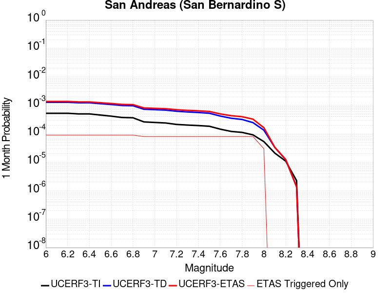 | 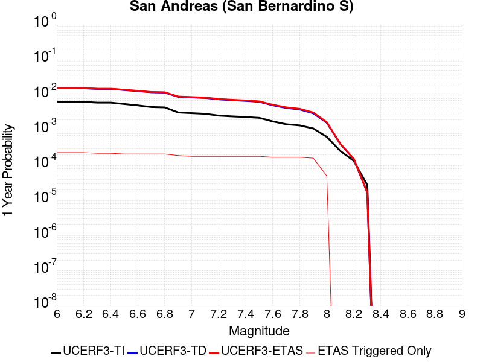 | 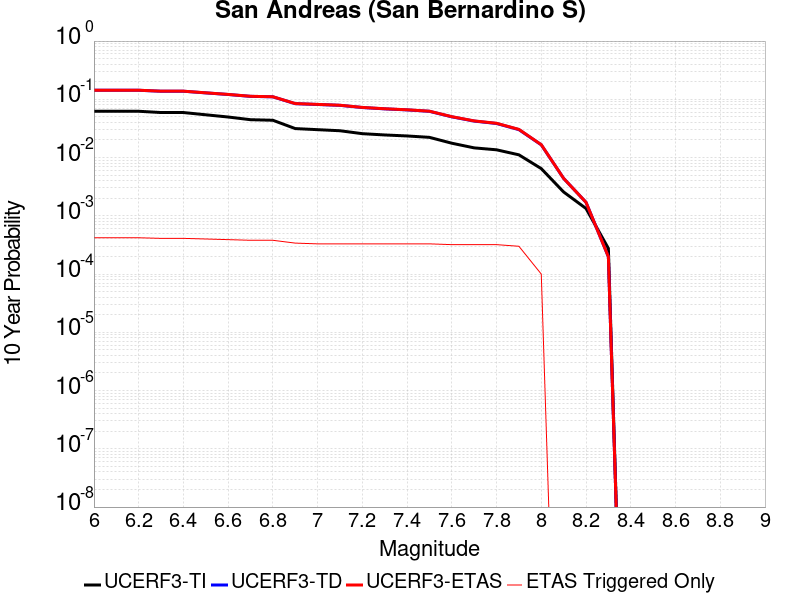 |

| Magnitude | 1 wk TI Prob | 1 wk TD Prob | 1 wk ETAS Prob | 1 wk ETAS/TD Gain | 1 wk ETAS Triggered Only | 1 mo TI Prob | 1 mo TD Prob | 1 mo ETAS Prob | 1 mo ETAS/TD Gain | 1 mo ETAS Triggered Only | 1 yr TI Prob | 1 yr TD Prob | 1 yr ETAS Prob | 1 yr ETAS/TD Gain | 1 yr ETAS Triggered Only | 10 yr TI Prob | 10 yr TD Prob | 10 yr ETAS Prob | 10 yr ETAS/TD Gain | 10 yr ETAS Triggered Only |
|-----|-----|-----|-----|-----|-----|-----|-----|-----|-----|-----|-----|-----|-----|-----|-----|-----|-----|-----|-----|-----|
| 6.0 | 1.2336002E-4 | 3.0008948E-4 | 3.0008948E-4 | 1.0 | 0.0 | 5.2857865E-4 | 0.0012854899 | 0.0013693149 | 1.0652086 | 8.393286E-5 | 0.006416472 | 0.015543484 | 0.01576776 | 1.014429 | 2.2781774E-4 | 0.06234337 | 0.14285627 | 0.14321598 | 1.002518 | 4.1966425E-4 |
| 6.1 | 1.2336002E-4 | 3.0008948E-4 | 3.0008948E-4 | 1.0 | 0.0 | 5.2857865E-4 | 0.0012854899 | 0.0013693149 | 1.0652086 | 8.393286E-5 | 0.006416472 | 0.015543484 | 0.01576776 | 1.014429 | 2.2781774E-4 | 0.06234337 | 0.14285627 | 0.14321598 | 1.002518 | 4.1966425E-4 |
| 6.2 | 1.2336002E-4 | 3.0008948E-4 | 3.0008948E-4 | 1.0 | 0.0 | 5.2857865E-4 | 0.0012854899 | 0.0013693149 | 1.0652086 | 8.393286E-5 | 0.006416472 | 0.015543484 | 0.01576776 | 1.014429 | 2.2781774E-4 | 0.06234337 | 0.14285627 | 0.14321598 | 1.002518 | 4.1966425E-4 |
| 6.3 | 1.1712257E-4 | 2.8797207E-4 | 2.8797207E-4 | 1.0 | 0.0 | 5.018573E-4 | 0.001233608 | 0.0013174373 | 1.0679545 | 8.393286E-5 | 0.006093008 | 0.01492059 | 0.015133197 | 1.0142492 | 2.1582734E-4 | 0.059286322 | 0.13756467 | 0.13791627 | 1.0025558 | 4.0767386E-4 |
| 6.4 | 1.1712257E-4 | 2.8797207E-4 | 2.8797207E-4 | 1.0 | 0.0 | 5.018573E-4 | 0.001233608 | 0.0013174373 | 1.0679545 | 8.393286E-5 | 0.006093008 | 0.01492059 | 0.015133197 | 1.0142492 | 2.1582734E-4 | 0.059286322 | 0.13756467 | 0.13791627 | 1.0025558 | 4.0767386E-4 |
| 6.5 | 1.0689076E-4 | 2.6809986E-4 | 2.6809986E-4 | 1.0 | 0.0 | 4.5802278E-4 | 0.0011485183 | 0.0012323547 | 1.0729953 | 8.393286E-5 | 0.0055621783 | 0.013898174 | 0.014099178 | 1.0144626 | 2.0383693E-4 | 0.05425003 | 0.12881182 | 0.12915653 | 1.0026761 | 3.9568346E-4 |
| 6.6 | 9.7648895E-5 | 2.5054725E-4 | 2.5054725E-4 | 1.0 | 0.0 | 4.1842813E-4 | 0.0010733557 | 0.0011571985 | 1.0781127 | 8.393286E-5 | 0.005082469 | 0.012994168 | 0.013195356 | 1.015483 | 2.0383693E-4 | 0.049677886 | 0.12097161 | 0.121308886 | 1.0027881 | 3.8369306E-4 |
| 6.7 | 8.757013E-5 | 2.3125445E-4 | 2.3125445E-4 | 1.0 | 0.0 | 3.7524657E-4 | 9.907364E-4 | 0.0010745861 | 1.0846337 | 8.393286E-5 | 0.00455906 | 0.011999588 | 0.0122009795 | 1.0167831 | 2.0383693E-4 | 0.04466656 | 0.11227982 | 0.11260978 | 1.0029387 | 3.7170263E-4 |
| 6.8 | 8.562978E-5 | 2.2685292E-4 | 2.2685292E-4 | 1.0 | 0.0 | 3.6693315E-4 | 9.7188674E-4 | 0.0010557381 | 1.0862768 | 8.393286E-5 | 0.004458263 | 0.01177259 | 0.011974027 | 1.0171107 | 2.0383693E-4 | 0.043698758 | 0.11029001 | 0.11062072 | 1.0029985 | 3.7170263E-4 |
| 6.9 | 6.124075E-5 | 1.7069813E-4 | 1.7069813E-4 | 1.0 | 0.0 | 2.6243398E-4 | 7.313591E-4 | 8.152306E-4 | 1.1146789 | 8.393286E-5 | 0.0031904527 | 0.00886815 | 0.009058296 | 1.0214413 | 1.9184653E-4 | 0.031450346 | 0.08419993 | 0.08450739 | 1.0036516 | 3.3573143E-4 |
| 7.0 | 5.8598747E-5 | 1.6498787E-4 | 1.6498787E-4 | 1.0 | 0.0 | 2.5111332E-4 | 7.069001E-4 | 7.907736E-4 | 1.1186497 | 8.393286E-5 | 0.0030530186 | 0.008572741 | 0.008751055 | 1.0208001 | 1.7985611E-4 | 0.03011414 | 0.08151753 | 0.081814885 | 1.0036477 | 3.23741E-4 |
| 7.1 | 5.613814E-5 | 1.5917298E-4 | 1.5917298E-4 | 1.0 | 0.0 | 2.4056983E-4 | 6.819924E-4 | 7.65868E-4 | 1.1229862 | 8.393286E-5 | 0.0029250039 | 0.008271826 | 0.008450195 | 1.0215634 | 1.7985611E-4 | 0.028868021 | 0.078816354 | 0.07911458 | 1.0037838 | 3.23741E-4 |
| 7.2 | 4.991222E-5 | 1.4523676E-4 | 1.4523676E-4 | 1.0 | 0.0 | 2.1389198E-4 | 6.2229513E-4 | 7.0617575E-4 | 1.1347923 | 8.393286E-5 | 0.002601025 | 0.0075502265 | 0.0077287247 | 1.0236415 | 1.7985611E-4 | 0.025707912 | 0.072269924 | 0.072570264 | 1.0041559 | 3.23741E-4 |
| 7.3 | 4.7410045E-5 | 1.3717797E-4 | 1.3717797E-4 | 1.0 | 0.0 | 2.0317009E-4 | 5.8777345E-4 | 6.71657E-4 | 1.142714 | 8.393286E-5 | 0.0024707897 | 0.0071327467 | 0.00731132 | 1.0250357 | 1.7985611E-4 | 0.024434982 | 0.06855203 | 0.06885358 | 1.0043988 | 3.23741E-4 |
| 7.4 | 4.5556746E-5 | 1.3125638E-4 | 1.3125638E-4 | 1.0 | 0.0 | 1.952286E-4 | 5.6240644E-4 | 6.4629206E-4 | 1.1491549 | 8.393286E-5 | 0.002374317 | 0.006825879 | 0.007004508 | 1.0261693 | 1.7985611E-4 | 0.023491086 | 0.065804236 | 0.06610667 | 1.004596 | 3.23741E-4 |
| 7.5 | 4.3084514E-5 | 1.2360894E-4 | 1.2360894E-4 | 1.0 | 0.0 | 1.8463485E-4 | 5.2964536E-4 | 6.135338E-4 | 1.158386 | 8.393286E-5 | 0.0022456115 | 0.006429438 | 0.006608138 | 1.027794 | 1.7985611E-4 | 0.022230545 | 0.062204733 | 0.06250834 | 1.0048807 | 3.23741E-4 |
| 7.6 | 3.408608E-5 | 9.838868E-5 | 9.838868E-5 | 1.0 | 0.0 | 1.4607502E-4 | 4.215977E-4 | 5.054952E-4 | 1.1989989 | 8.393286E-5 | 0.0017770125 | 0.005120897 | 0.0052879034 | 1.0326127 | 1.6786571E-4 | 0.017628696 | 0.050035115 | 0.050331265 | 1.0059189 | 3.117506E-4 |
| 7.7 | 2.8315713E-5 | 8.251823E-5 | 8.251823E-5 | 1.0 | 0.0 | 1.2134742E-4 | 3.5360164E-4 | 4.3750484E-4 | 1.2372817 | 8.393286E-5 | 0.0014764034 | 0.004296611 | 0.0044637555 | 1.0389014 | 1.6786571E-4 | 0.01466633 | 0.04228543 | 0.042584002 | 1.0070608 | 3.117506E-4 |
| 7.8 | 2.6222975E-5 | 7.4660275E-5 | 7.4660275E-5 | 1.0 | 0.0 | 1.1237934E-4 | 3.1993337E-4 | 4.038394E-4 | 1.2622608 | 8.393286E-5 | 0.0013673597 | 0.003888238 | 0.004055451 | 1.0430049 | 1.6786571E-4 | 0.013589768 | 0.03844993 | 0.03874969 | 1.0077962 | 3.117506E-4 |
| 7.9 | 2.1469694E-5 | 5.7903162E-5 | 5.7903162E-5 | 1.0 | 0.0 | 9.200973E-5 | 2.4813283E-4 | 3.3204484E-4 | 1.3381739 | 8.393286E-5 | 0.0011196428 | 0.003016835 | 0.0031722402 | 1.0515126 | 1.558753E-4 | 0.011140184 | 0.030163256 | 0.030442348 | 1.0092527 | 2.8776977E-4 |
| 8.0 | 1.2420249E-5 | 3.1332525E-5 | 3.1332525E-5 | 1.0 | 0.0 | 5.322855E-5 | 1.3427534E-4 | 1.5825294E-4 | 1.1785704 | 2.3980816E-5 | 6.478649E-4 | 0.0016335774 | 0.0016814606 | 1.0293119 | 4.7961632E-5 | 0.0064597935 | 0.016528832 | 0.016599586 | 1.0042806 | 7.194244E-5 |
| 8.1 | 4.9197724E-6 | 7.827271E-6 | 7.827271E-6 | 1.0 | 0.0 | 2.1084568E-5 | 3.3545013E-5 | 3.3545013E-5 | 1.0 | 0.0 | 2.566744E-4 | 4.0833413E-4 | 4.0833413E-4 | 1.0 | 0.0 | 0.002563781 | 0.0043868436 | 0.0043868436 | 1.0 | 0.0 |
| 8.2 | 2.5634774E-6 | 2.9089954E-6 | 2.9089954E-6 | 1.0 | 0.0 | 1.0986286E-5 | 1.2467063E-5 | 1.2467063E-5 | 1.0 | 0.0 | 1.3374983E-4 | 1.5177597E-4 | 1.5177597E-4 | 1.0 | 0.0 | 0.0013366934 | 0.0017061684 | 0.0017061684 | 1.0 | 0.0 |
| 8.3 | 5.2850464E-7 | 3.211945E-7 | 3.211945E-7 | 1.0 | 0.0 | 2.2650179E-6 | 1.3765473E-6 | 1.3765473E-6 | 1.0 | 0.0 | 2.7576245E-5 | 1.6759346E-5 | 1.6759346E-5 | 1.0 | 0.0 | 2.7572823E-4 | 1.9887649E-4 | 1.9887649E-4 | 1.0 | 0.0 |

## Coyote Lake
*[(top)](#table-of-contents)*

| 1 Week | 1 Month | 1 Year | 10 Year |
|-----|-----|-----|-----|
| 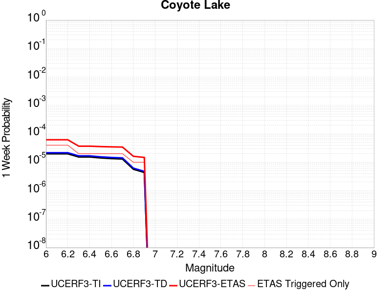 | 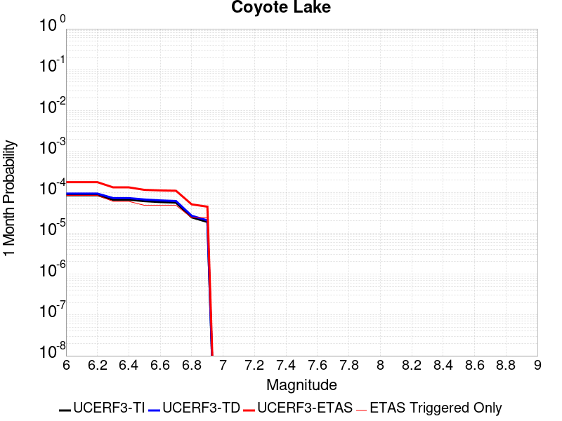 | 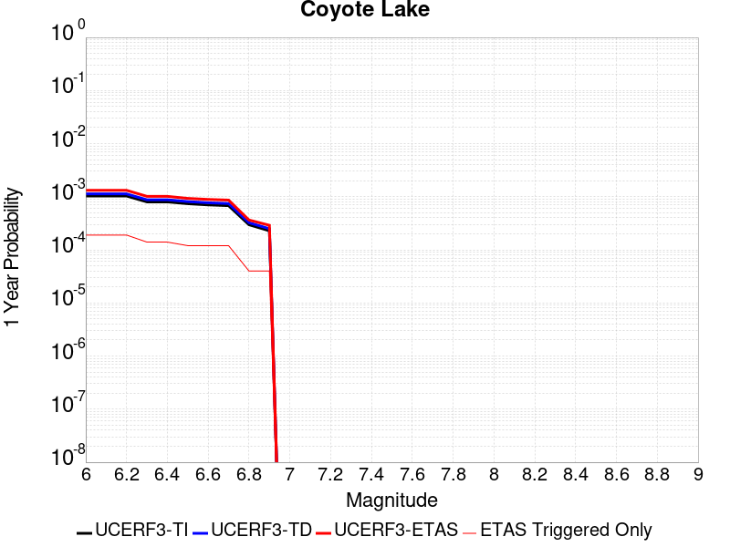 | 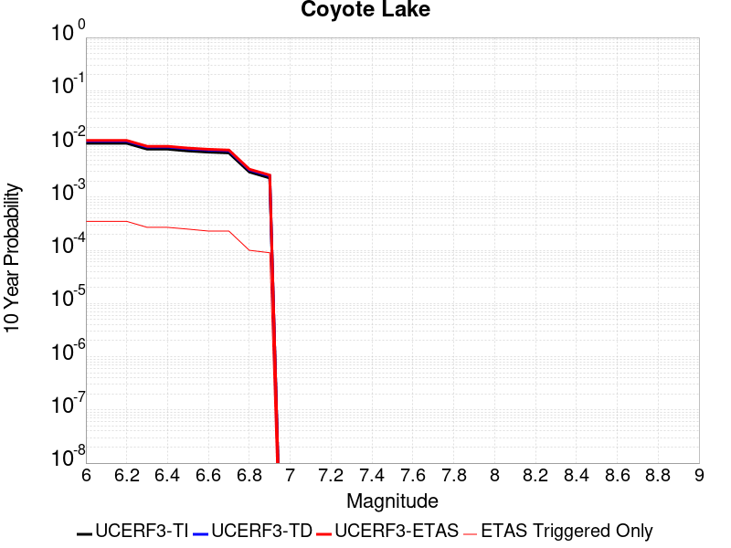 |

| Magnitude | 1 wk TI Prob | 1 wk TD Prob | 1 wk ETAS Prob | 1 wk ETAS/TD Gain | 1 wk ETAS Triggered Only | 1 mo TI Prob | 1 mo TD Prob | 1 mo ETAS Prob | 1 mo ETAS/TD Gain | 1 mo ETAS Triggered Only | 1 yr TI Prob | 1 yr TD Prob | 1 yr ETAS Prob | 1 yr ETAS/TD Gain | 1 yr ETAS Triggered Only | 10 yr TI Prob | 10 yr TD Prob | 10 yr ETAS Prob | 10 yr ETAS/TD Gain | 10 yr ETAS Triggered Only |
|-----|-----|-----|-----|-----|-----|-----|-----|-----|-----|-----|-----|-----|-----|-----|-----|-----|-----|-----|-----|-----|
| 6.0 | 1.980352E-5 | 2.1707021E-5 | 6.9667614E-5 | 3.2094505 | 4.7961632E-5 | 8.486947E-5 | 9.302718E-5 | 1.7695222E-4 | 1.9021561 | 8.393286E-5 | 0.0010327959 | 0.0011320895 | 0.0013476725 | 1.1904293 | 2.1582734E-4 | 0.010280091 | 0.011270401 | 0.011626059 | 1.0315568 | 3.5971223E-4 |
| 6.1 | 1.980352E-5 | 2.1707021E-5 | 6.9667614E-5 | 3.2094505 | 4.7961632E-5 | 8.486947E-5 | 9.302718E-5 | 1.7695222E-4 | 1.9021561 | 8.393286E-5 | 0.0010327959 | 0.0011320895 | 0.0013476725 | 1.1904293 | 2.1582734E-4 | 0.010280091 | 0.011270401 | 0.011626059 | 1.0315568 | 3.5971223E-4 |
| 6.2 | 1.980352E-5 | 2.1707021E-5 | 6.9667614E-5 | 3.2094505 | 4.7961632E-5 | 8.486947E-5 | 9.302718E-5 | 1.7695222E-4 | 1.9021561 | 8.393286E-5 | 0.0010327959 | 0.0011320895 | 0.0013476725 | 1.1904293 | 2.1582734E-4 | 0.010280091 | 0.011270401 | 0.011626059 | 1.0315568 | 3.5971223E-4 |
| 6.3 | 1.5344787E-5 | 1.6820884E-5 | 4.0801297E-5 | 2.4256332 | 2.3980816E-5 | 6.576172E-5 | 7.208785E-5 | 1.3203557E-4 | 1.8315924 | 5.995204E-5 | 8.003548E-4 | 8.7737746E-4 | 0.001033116 | 1.1775047 | 1.558753E-4 | 0.007974784 | 0.00874518 | 0.009006662 | 1.0299002 | 2.6378897E-4 |
| 6.4 | 1.5344787E-5 | 1.6820884E-5 | 4.0801297E-5 | 2.4256332 | 2.3980816E-5 | 6.576172E-5 | 7.208785E-5 | 1.3203557E-4 | 1.8315924 | 5.995204E-5 | 8.003548E-4 | 8.7737746E-4 | 0.001033116 | 1.1775047 | 1.558753E-4 | 0.007974784 | 0.00874518 | 0.009006662 | 1.0299002 | 2.6378897E-4 |
| 6.5 | 1.4189697E-5 | 1.5558186E-5 | 3.9538627E-5 | 2.5413392 | 2.3980816E-5 | 6.081157E-5 | 6.667658E-5 | 1.1463501E-4 | 1.7192696 | 4.7961632E-5 | 7.401293E-4 | 8.1154524E-4 | 9.433327E-4 | 1.1623907 | 1.3189449E-4 | 0.0073766913 | 0.008091759 | 0.008329627 | 1.0293963 | 2.3980816E-4 |
| 6.6 | 1.3469301E-5 | 1.47717665E-5 | 3.8752227E-5 | 2.6233983 | 2.3980816E-5 | 5.7724297E-5 | 6.3306376E-5 | 1.1126497E-4 | 1.7575635 | 4.7961632E-5 | 7.025667E-4 | 7.7054254E-4 | 9.023354E-4 | 1.171039 | 1.3189449E-4 | 0.0070034964 | 0.0076846126 | 0.007898781 | 1.0278698 | 2.1582734E-4 |
| 6.7 | 1.3027966E-5 | 1.4281927E-5 | 3.82624E-5 | 2.679078 | 2.3980816E-5 | 5.5832945E-5 | 6.120716E-5 | 1.09165856E-4 | 1.7835472 | 4.7961632E-5 | 6.7955407E-4 | 7.450021E-4 | 8.7679835E-4 | 1.1769072 | 1.3189449E-4 | 0.006774798 | 0.007430923 | 0.007645147 | 1.0288286 | 2.1582734E-4 |
| 6.8 | 5.695434E-6 | 6.2244944E-6 | 1.8214827E-5 | 2.9263144 | 1.1990408E-5 | 2.4408775E-5 | 2.6676302E-5 | 5.0656476E-5 | 1.8989319 | 2.3980816E-5 | 2.971363E-4 | 3.2476554E-4 | 3.727116E-4 | 1.1476328 | 4.7961632E-5 | 0.0029673933 | 0.0032458503 | 0.0033295108 | 1.0257746 | 8.393286E-5 |
| 6.9 | 4.385688E-6 | 4.7931144E-6 | 1.6783464E-5 | 3.501578 | 1.1990408E-5 | 1.879567E-5 | 2.0541918E-5 | 4.4522243E-5 | 2.1673846 | 2.3980816E-5 | 2.2881327E-4 | 2.5009786E-4 | 2.980475E-4 | 1.1917235 | 4.7961632E-5 | 0.002285778 | 0.0025009785 | 0.0025847016 | 1.0334761 | 8.393286E-5 |

## San Andreas (Big Bend)
*[(top)](#table-of-contents)*

| 1 Week | 1 Month | 1 Year | 10 Year |
|-----|-----|-----|-----|
| 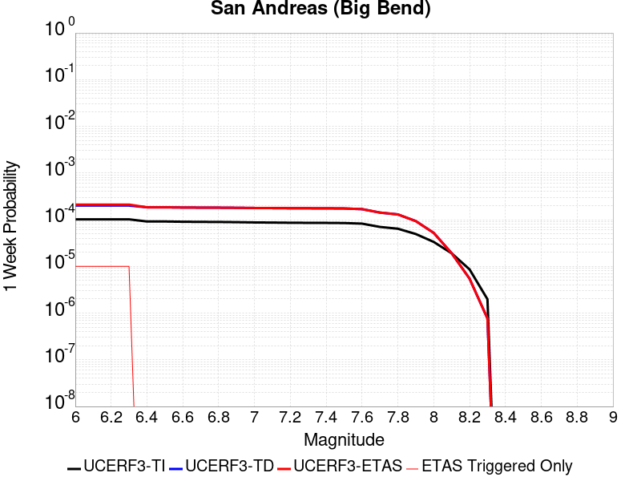 | 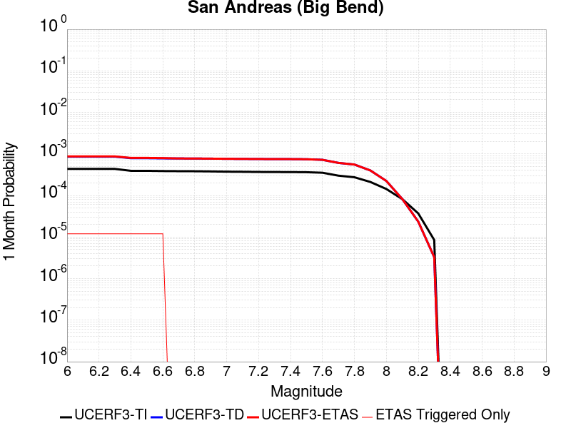 | 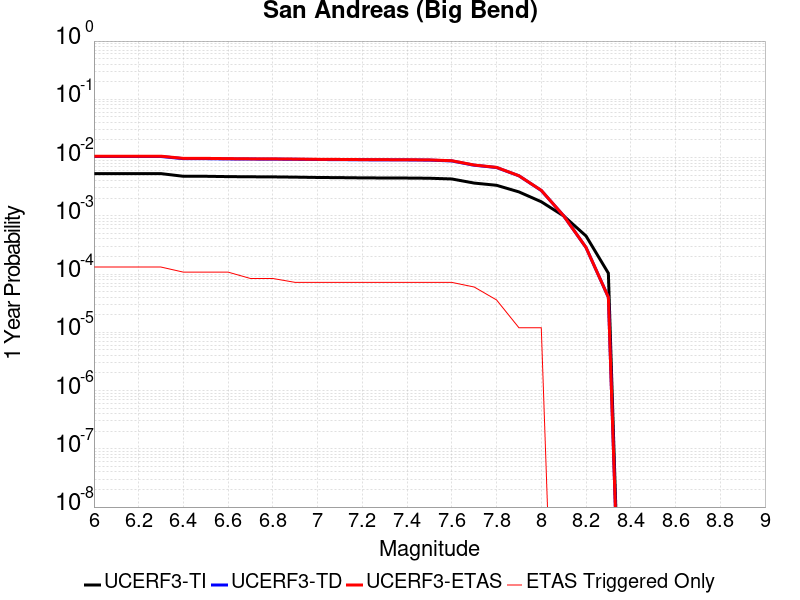 | 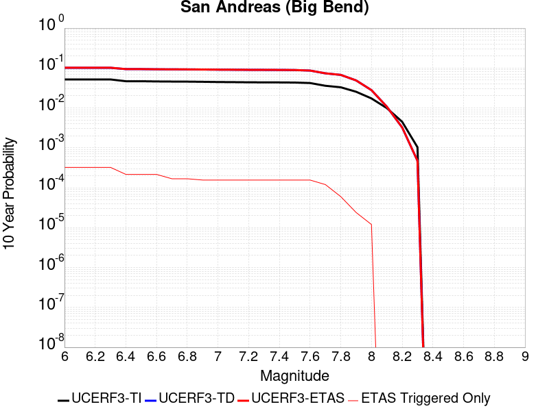 |

| Magnitude | 1 wk TI Prob | 1 wk TD Prob | 1 wk ETAS Prob | 1 wk ETAS/TD Gain | 1 wk ETAS Triggered Only | 1 mo TI Prob | 1 mo TD Prob | 1 mo ETAS Prob | 1 mo ETAS/TD Gain | 1 mo ETAS Triggered Only | 1 yr TI Prob | 1 yr TD Prob | 1 yr ETAS Prob | 1 yr ETAS/TD Gain | 1 yr ETAS Triggered Only | 10 yr TI Prob | 10 yr TD Prob | 10 yr ETAS Prob | 10 yr ETAS/TD Gain | 10 yr ETAS Triggered Only |
|-----|-----|-----|-----|-----|-----|-----|-----|-----|-----|-----|-----|-----|-----|-----|-----|-----|-----|-----|-----|-----|
| 6.0 | 1.0179969E-4 | 2.0080687E-4 | 2.0080687E-4 | 1.0 | 0.0 | 4.362114E-4 | 8.60318E-4 | 8.7229814E-4 | 1.0139252 | 1.1990408E-5 | 0.0052979486 | 0.010424351 | 0.010554871 | 1.0125207 | 1.3189449E-4 | 0.051734097 | 0.1014857 | 0.101776585 | 1.0028663 | 3.23741E-4 |
| 6.1 | 1.0179969E-4 | 2.0080687E-4 | 2.0080687E-4 | 1.0 | 0.0 | 4.362114E-4 | 8.60318E-4 | 8.7229814E-4 | 1.0139252 | 1.1990408E-5 | 0.0052979486 | 0.010424351 | 0.010554871 | 1.0125207 | 1.3189449E-4 | 0.051734097 | 0.1014857 | 0.101776585 | 1.0028663 | 3.23741E-4 |
| 6.2 | 1.0179969E-4 | 2.0080687E-4 | 2.0080687E-4 | 1.0 | 0.0 | 4.362114E-4 | 8.60318E-4 | 8.7229814E-4 | 1.0139252 | 1.1990408E-5 | 0.0052979486 | 0.010424351 | 0.010554871 | 1.0125207 | 1.3189449E-4 | 0.051734097 | 0.1014857 | 0.101776585 | 1.0028663 | 3.23741E-4 |
| 6.3 | 1.0179969E-4 | 2.0080687E-4 | 2.0080687E-4 | 1.0 | 0.0 | 4.362114E-4 | 8.60318E-4 | 8.7229814E-4 | 1.0139252 | 1.1990408E-5 | 0.0052979486 | 0.010424351 | 0.010554871 | 1.0125207 | 1.3189449E-4 | 0.051734097 | 0.1014857 | 0.101776585 | 1.0028663 | 3.23741E-4 |
| 6.4 | 9.1639464E-5 | 1.8437792E-4 | 1.8437792E-4 | 1.0 | 0.0 | 3.9268145E-4 | 7.89952E-4 | 8.0193294E-4 | 1.0151666 | 1.1990408E-5 | 0.0047704205 | 0.009575372 | 0.009682252 | 1.011162 | 1.0791367E-4 | 0.046693064 | 0.09381153 | 0.09400711 | 1.0020849 | 2.1582734E-4 |
| 6.5 | 9.1639464E-5 | 1.8437792E-4 | 1.8437792E-4 | 1.0 | 0.0 | 3.9268145E-4 | 7.89952E-4 | 8.0193294E-4 | 1.0151666 | 1.1990408E-5 | 0.0047704205 | 0.009575372 | 0.009682252 | 1.011162 | 1.0791367E-4 | 0.046693064 | 0.09381153 | 0.09400711 | 1.0020849 | 2.1582734E-4 |
| 6.6 | 9.042622E-5 | 1.8244829E-4 | 1.8244829E-4 | 1.0 | 0.0 | 3.8748336E-4 | 7.8168715E-4 | 7.936682E-4 | 1.0153271 | 1.1990408E-5 | 0.0047074095 | 0.009475624 | 0.009582516 | 1.0112807 | 1.0791367E-4 | 0.046089325 | 0.09290548 | 0.093101256 | 1.0021073 | 2.1582734E-4 |
| 6.7 | 8.9836685E-5 | 1.8159159E-4 | 1.8159159E-4 | 1.0 | 0.0 | 3.8495753E-4 | 7.7801774E-4 | 7.7801774E-4 | 1.0 | 0.0 | 0.00467679 | 0.009431336 | 0.009514477 | 1.0088154 | 8.393286E-5 | 0.045795817 | 0.09249973 | 0.092652075 | 1.0016469 | 1.6786571E-4 |
| 6.8 | 8.9471854E-5 | 1.8105932E-4 | 1.8105932E-4 | 1.0 | 0.0 | 3.8339442E-4 | 7.75738E-4 | 7.75738E-4 | 1.0 | 0.0 | 0.004657841 | 0.00940382 | 0.009486964 | 1.0088415 | 8.393286E-5 | 0.04561414 | 0.09224692 | 0.0923993 | 1.0016519 | 1.6786571E-4 |
| 6.9 | 8.858234E-5 | 1.7987892E-4 | 1.7987892E-4 | 1.0 | 0.0 | 3.7958333E-4 | 7.706821E-4 | 7.706821E-4 | 1.0 | 0.0 | 0.004611638 | 0.009342793 | 0.009414064 | 1.0076283 | 7.194244E-5 | 0.04517103 | 0.091686994 | 0.09182858 | 1.0015442 | 1.558753E-4 |
| 7.0 | 8.7433385E-5 | 1.7826671E-4 | 1.7826671E-4 | 1.0 | 0.0 | 3.746607E-4 | 7.6377665E-4 | 7.6377665E-4 | 1.0 | 0.0 | 0.004551957 | 0.009259437 | 0.009330714 | 1.0076977 | 7.194244E-5 | 0.044598386 | 0.09092137 | 0.091063075 | 1.0015585 | 1.558753E-4 |
| 7.1 | 8.684964E-5 | 1.7738611E-4 | 1.7738611E-4 | 1.0 | 0.0 | 3.7215967E-4 | 7.600049E-4 | 7.600049E-4 | 1.0 | 0.0 | 0.0045216335 | 0.009213906 | 0.0092851855 | 1.0077361 | 7.194244E-5 | 0.04430731 | 0.09050287 | 0.090644635 | 1.0015664 | 1.558753E-4 |
| 7.2 | 8.606521E-5 | 1.7629213E-4 | 1.7629213E-4 | 1.0 | 0.0 | 3.6879873E-4 | 7.5531914E-4 | 7.5531914E-4 | 1.0 | 0.0 | 0.0044808835 | 0.009157337 | 0.009228621 | 1.0077844 | 7.194244E-5 | 0.043916024 | 0.08998334 | 0.09012519 | 1.0015764 | 1.558753E-4 |
| 7.3 | 8.568266E-5 | 1.7571205E-4 | 1.7571205E-4 | 1.0 | 0.0 | 3.6715972E-4 | 7.528345E-4 | 7.528345E-4 | 1.0 | 0.0 | 0.0044610105 | 0.00912734 | 0.0091986265 | 1.0078101 | 7.194244E-5 | 0.043725148 | 0.08970444 | 0.08984633 | 1.0015818 | 1.558753E-4 |
| 7.4 | 8.5432206E-5 | 1.7533782E-4 | 1.7533782E-4 | 1.0 | 0.0 | 3.6608664E-4 | 7.5123156E-4 | 7.5123156E-4 | 1.0 | 0.0 | 0.004447999 | 0.009107988 | 0.0091792755 | 1.0078269 | 7.194244E-5 | 0.043600157 | 0.08952458 | 0.0896665 | 1.0015852 | 1.558753E-4 |
| 7.5 | 8.4791965E-5 | 1.7403076E-4 | 1.7403076E-4 | 1.0 | 0.0 | 3.633435E-4 | 7.4563315E-4 | 7.4563315E-4 | 1.0 | 0.0 | 0.0044147377 | 0.009040395 | 0.009111688 | 1.0078859 | 7.194244E-5 | 0.043280575 | 0.0889021 | 0.08904412 | 1.0015974 | 1.558753E-4 |
| 7.6 | 8.241105E-5 | 1.684837E-4 | 1.684837E-4 | 1.0 | 0.0 | 3.531424E-4 | 7.2187337E-4 | 7.2187337E-4 | 1.0 | 0.0 | 0.0042910352 | 0.008753479 | 0.008824793 | 1.0081468 | 7.194244E-5 | 0.042091176 | 0.08627858 | 0.086421005 | 1.0016508 | 1.558753E-4 |
| 7.7 | 7.00432E-5 | 1.4211683E-4 | 1.4211683E-4 | 1.0 | 0.0 | 3.001506E-4 | 6.0893E-4 | 6.0893E-4 | 1.0 | 0.0 | 0.0036482112 | 0.007388561 | 0.00744807 | 1.0080543 | 5.995204E-5 | 0.035888977 | 0.07354971 | 0.0736608 | 1.0015104 | 1.1990408E-4 |
| 7.8 | 6.415362E-5 | 1.297541E-4 | 1.297541E-4 | 1.0 | 0.0 | 2.749151E-4 | 5.5597053E-4 | 5.5597053E-4 | 1.0 | 0.0 | 0.0033419547 | 0.006747963 | 0.0067836912 | 1.0052947 | 3.597122E-5 | 0.03292141 | 0.0672817 | 0.06733762 | 1.0008311 | 5.995204E-5 |
| 7.9 | 4.939911E-5 | 9.345801E-5 | 9.345801E-5 | 1.0 | 0.0 | 2.116933E-4 | 4.0047284E-4 | 4.0047284E-4 | 1.0 | 0.0 | 0.0025743195 | 0.0048648654 | 0.0048767976 | 1.0024527 | 1.1990408E-5 | 0.025447013 | 0.048936196 | 0.048959002 | 1.0004661 | 2.3980816E-5 |
| 8.0 | 3.344983E-5 | 5.225443E-5 | 5.225443E-5 | 1.0 | 0.0 | 1.4334853E-4 | 2.2392833E-4 | 2.2392833E-4 | 1.0 | 0.0 | 0.0017438711 | 0.0027229206 | 0.0027348786 | 1.0043916 | 1.1990408E-5 | 0.017302496 | 0.02793573 | 0.027947387 | 1.0004172 | 1.1990408E-5 |
| 8.1 | 1.9104898E-5 | 1.9186356E-5 | 1.9186356E-5 | 1.0 | 0.0 | 8.1875565E-5 | 8.222465E-5 | 8.222465E-5 | 1.0 | 0.0 | 9.963791E-4 | 0.001000626 | 0.001000626 | 1.0 | 0.0 | 0.009919235 | 0.010756767 | 0.010756767 | 1.0 | 0.0 |
| 8.2 | 8.643924E-6 | 5.4798497E-6 | 5.4798497E-6 | 1.0 | 0.0 | 3.704486E-5 | 2.348486E-5 | 2.348486E-5 | 1.0 | 0.0 | 4.5092785E-4 | 2.858907E-4 | 2.858907E-4 | 1.0 | 0.0 | 0.0045001395 | 0.0032514327 | 0.0032514327 | 1.0 | 0.0 |
| 8.3 | 1.983087E-6 | 7.668296E-7 | 7.668296E-7 | 1.0 | 0.0 | 8.498917E-6 | 3.2864084E-6 | 3.2864084E-6 | 1.0 | 0.0 | 1.034694E-4 | 4.0011306E-5 | 4.0011306E-5 | 1.0 | 0.0 | 0.0010342124 | 4.724499E-4 | 4.724499E-4 | 1.0 | 0.0 |

## Death Valley (No)
*[(top)](#table-of-contents)*

| 1 Week | 1 Month | 1 Year | 10 Year |
|-----|-----|-----|-----|
| 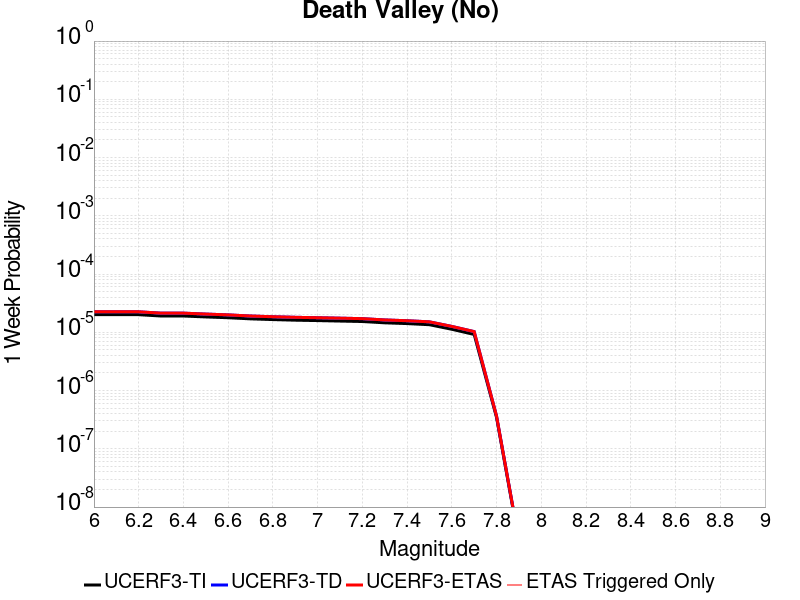 |  | 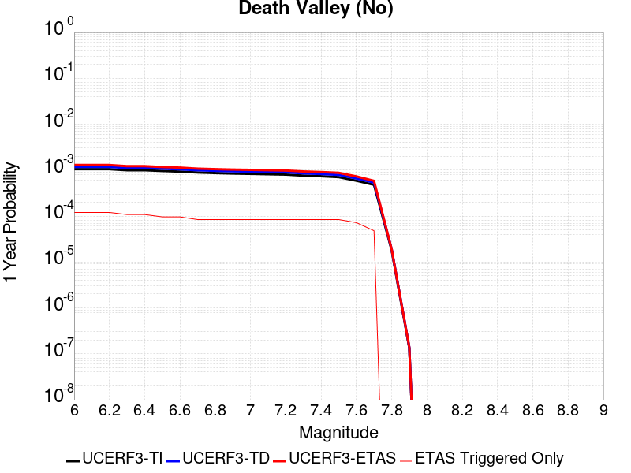 | 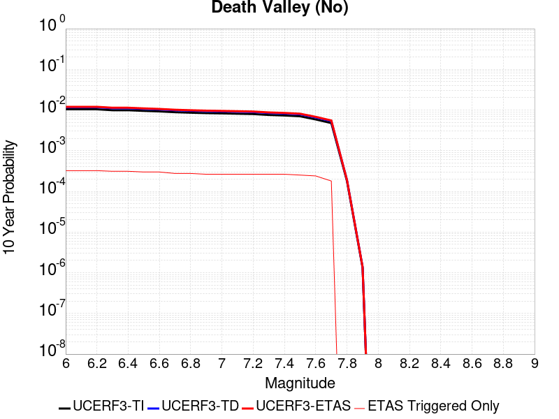 |

| Magnitude | 1 wk TI Prob | 1 wk TD Prob | 1 wk ETAS Prob | 1 wk ETAS/TD Gain | 1 wk ETAS Triggered Only | 1 mo TI Prob | 1 mo TD Prob | 1 mo ETAS Prob | 1 mo ETAS/TD Gain | 1 mo ETAS Triggered Only | 1 yr TI Prob | 1 yr TD Prob | 1 yr ETAS Prob | 1 yr ETAS/TD Gain | 1 yr ETAS Triggered Only | 10 yr TI Prob | 10 yr TD Prob | 10 yr ETAS Prob | 10 yr ETAS/TD Gain | 10 yr ETAS Triggered Only |
|-----|-----|-----|-----|-----|-----|-----|-----|-----|-----|-----|-----|-----|-----|-----|-----|-----|-----|-----|-----|-----|
| 6.0 | 2.0074807E-5 | 2.2500446E-5 | 2.2500446E-5 | 1.0 | 0.0 | 8.603206E-5 | 9.642696E-5 | 1.20405464E-4 | 1.2486701 | 2.3980816E-5 | 0.001046937 | 0.0011733733 | 0.0012931367 | 1.1020676 | 1.1990408E-4 | 0.010420183 | 0.011672693 | 0.011992656 | 1.0274111 | 3.23741E-4 |
| 6.1 | 2.0074807E-5 | 2.2500446E-5 | 2.2500446E-5 | 1.0 | 0.0 | 8.603206E-5 | 9.642696E-5 | 1.20405464E-4 | 1.2486701 | 2.3980816E-5 | 0.001046937 | 0.0011733733 | 0.0012931367 | 1.1020676 | 1.1990408E-4 | 0.010420183 | 0.011672693 | 0.011992656 | 1.0274111 | 3.23741E-4 |
| 6.2 | 2.0074807E-5 | 2.2500446E-5 | 2.2500446E-5 | 1.0 | 0.0 | 8.603206E-5 | 9.642696E-5 | 1.20405464E-4 | 1.2486701 | 2.3980816E-5 | 0.001046937 | 0.0011733733 | 0.0012931367 | 1.1020676 | 1.1990408E-4 | 0.010420183 | 0.011672693 | 0.011992656 | 1.0274111 | 3.23741E-4 |
| 6.3 | 1.9050609E-5 | 2.1337288E-5 | 2.1337288E-5 | 1.0 | 0.0 | 8.164292E-5 | 9.144236E-5 | 1.15420975E-4 | 1.2622267 | 2.3980816E-5 | 9.935491E-4 | 0.0011127489 | 0.0012205425 | 1.0968715 | 1.0791367E-4 | 0.009891188 | 0.011072595 | 0.011380893 | 1.0278434 | 3.117506E-4 |
| 6.4 | 1.9050609E-5 | 2.1337288E-5 | 2.1337288E-5 | 1.0 | 0.0 | 8.164292E-5 | 9.144236E-5 | 1.15420975E-4 | 1.2622267 | 2.3980816E-5 | 9.935491E-4 | 0.0011127489 | 0.0012205425 | 1.0968715 | 1.0791367E-4 | 0.009891188 | 0.011072595 | 0.011380893 | 1.0278434 | 3.117506E-4 |
| 6.5 | 1.8367004E-5 | 2.0561336E-5 | 2.0561336E-5 | 1.0 | 0.0 | 7.8713354E-5 | 8.811707E-5 | 1.0010642E-4 | 1.1360617 | 1.1990408E-5 | 9.5791375E-4 | 0.0010723039 | 0.0011681243 | 1.0893594 | 9.5923264E-5 | 0.009537951 | 0.010672084 | 0.010968646 | 1.0277885 | 2.997602E-4 |
| 6.6 | 1.779439E-5 | 1.9911244E-5 | 1.9911244E-5 | 1.0 | 0.0 | 7.625944E-5 | 8.533114E-5 | 9.732053E-5 | 1.1405042 | 1.1990408E-5 | 9.280632E-4 | 0.0010384179 | 0.0011342416 | 1.0922785 | 9.5923264E-5 | 0.009241969 | 0.010336416 | 0.0106330775 | 1.0287006 | 2.997602E-4 |
| 6.7 | 1.7025437E-5 | 1.9043726E-5 | 1.9043726E-5 | 1.0 | 0.0 | 7.296412E-5 | 8.161345E-5 | 8.161345E-5 | 1.0 | 0.0 | 8.87976E-4 | 9.93197E-4 | 0.0010770465 | 1.0844238 | 8.393286E-5 | 0.008844362 | 0.009888301 | 0.010161353 | 1.0276136 | 2.7577937E-4 |
| 6.8 | 1.6545107E-5 | 1.851284E-5 | 1.851284E-5 | 1.0 | 0.0 | 7.090568E-5 | 7.933836E-5 | 7.933836E-5 | 1.0 | 0.0 | 8.629347E-4 | 9.655226E-4 | 0.0010493743 | 1.086846 | 8.393286E-5 | 0.008595915 | 0.009613981 | 0.009887109 | 1.0284095 | 2.7577937E-4 |
| 6.9 | 1.615478E-5 | 1.8087881E-5 | 1.8087881E-5 | 1.0 | 0.0 | 6.9232934E-5 | 7.751722E-5 | 7.751722E-5 | 1.0 | 0.0 | 8.4258494E-4 | 9.433697E-4 | 0.0010272233 | 1.0888875 | 8.393286E-5 | 0.008393973 | 0.009394345 | 0.009655655 | 1.0278158 | 2.6378897E-4 |
| 7.0 | 1.5894311E-5 | 1.7805834E-5 | 1.7805834E-5 | 1.0 | 0.0 | 6.81167E-5 | 7.6308526E-5 | 7.6308526E-5 | 1.0 | 0.0 | 8.2900526E-4 | 9.286663E-4 | 0.0010125212 | 1.090296 | 8.393286E-5 | 0.008259195 | 0.009248544 | 0.009509894 | 1.0282584 | 2.6378897E-4 |
| 7.1 | 1.5602263E-5 | 1.7483784E-5 | 1.7483784E-5 | 1.0 | 0.0 | 6.6865134E-5 | 7.4928386E-5 | 7.4928386E-5 | 1.0 | 0.0 | 8.137789E-4 | 9.118773E-4 | 9.957337E-4 | 1.0919601 | 8.393286E-5 | 0.008108052 | 0.009082039 | 0.009343432 | 1.0287813 | 2.6378897E-4 |
| 7.2 | 1.5323829E-5 | 1.7170905E-5 | 1.7170905E-5 | 1.0 | 0.0 | 6.56719E-5 | 7.358755E-5 | 7.358755E-5 | 1.0 | 0.0 | 7.99262E-4 | 8.9556625E-4 | 9.79424E-4 | 1.0936365 | 8.393286E-5 | 0.007963934 | 0.008920249 | 0.009181685 | 1.0293081 | 2.6378897E-4 |
| 7.3 | 1.4556212E-5 | 1.6302716E-5 | 1.6302716E-5 | 1.0 | 0.0 | 6.238227E-5 | 6.986695E-5 | 6.986695E-5 | 1.0 | 0.0 | 7.592395E-4 | 8.503039E-4 | 9.341654E-4 | 1.0986253 | 8.393286E-5 | 0.0075665074 | 0.008471149 | 0.0087327035 | 1.0308759 | 2.6378897E-4 |
| 7.4 | 1.411725E-5 | 1.5808211E-5 | 1.5808211E-5 | 1.0 | 0.0 | 6.0501097E-5 | 6.774775E-5 | 6.774775E-5 | 1.0 | 0.0 | 7.363519E-4 | 8.245226E-4 | 9.083862E-4 | 1.1017118 | 8.393286E-5 | 0.0073391674 | 0.008215268 | 0.008476891 | 1.0318458 | 2.6378897E-4 |
| 7.5 | 1.3503312E-5 | 1.5126531E-5 | 1.5126531E-5 | 1.0 | 0.0 | 5.7870053E-5 | 6.482641E-5 | 6.482641E-5 | 1.0 | 0.0 | 7.043401E-4 | 7.8898156E-4 | 8.728482E-4 | 1.1062974 | 8.393286E-5 | 0.007021119 | 0.007862429 | 0.008112248 | 1.0317737 | 2.5179857E-4 |
| 7.6 | 1.1279839E-5 | 1.2626528E-5 | 1.2626528E-5 | 1.0 | 0.0 | 4.834127E-5 | 5.4112596E-5 | 5.4112596E-5 | 1.0 | 0.0 | 5.88396E-4 | 6.58627E-4 | 7.305221E-4 | 1.109159 | 7.194244E-5 | 0.005868405 | 0.0065673026 | 0.006805536 | 1.0362756 | 2.3980816E-4 |
| 7.7 | 9.189108E-6 | 1.0283521E-5 | 1.0283521E-5 | 1.0 | 0.0 | 3.93813E-5 | 4.407152E-5 | 4.407152E-5 | 1.0 | 0.0 | 4.7936183E-4 | 5.3644367E-4 | 5.843796E-4 | 1.0893587 | 4.7961632E-5 | 0.004783291 | 0.0053519984 | 0.005530892 | 1.0334256 | 1.7985611E-4 |
| 7.8 | 3.4586725E-7 | 3.648288E-7 | 3.648288E-7 | 1.0 | 0.0 | 1.4822873E-6 | 1.5635511E-6 | 1.5635511E-6 | 1.0 | 0.0 | 1.80467E-5 | 1.9036073E-5 | 1.9036073E-5 | 1.0 | 0.0 | 1.8045233E-4 | 1.9034486E-4 | 1.9034486E-4 | 1.0 | 0.0 |
| 7.9 | 2.5591178E-9 | 2.6696871E-9 | 2.6696871E-9 | 1.0 | 0.0 | 1.0967647E-8 | 1.1441516E-8 | 1.1441516E-8 | 1.0 | 0.0 | 1.335311E-7 | 1.3930045E-7 | 1.3930045E-7 | 1.0 | 0.0 | 1.3353102E-6 | 1.3930046E-6 | 1.3930046E-6 | 1.0 | 0.0 |

## San Andreas (Parkfield)
*[(top)](#table-of-contents)*

| 1 Week | 1 Month | 1 Year | 10 Year |
|-----|-----|-----|-----|
| 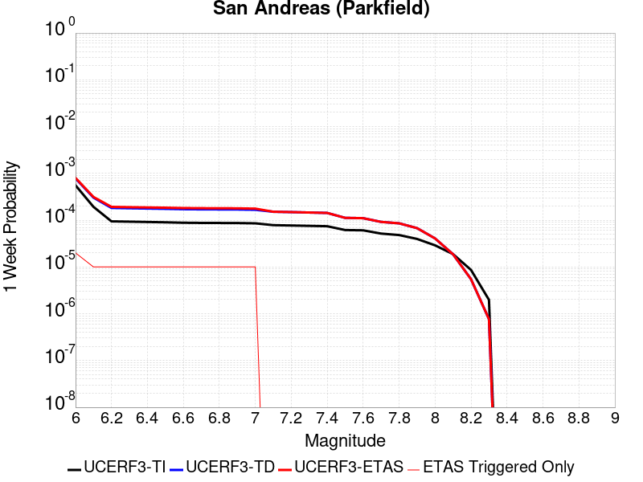 | 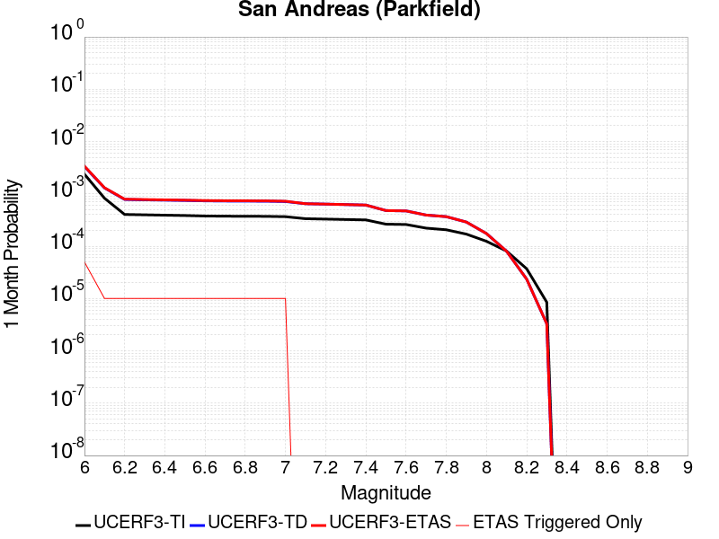 |  | 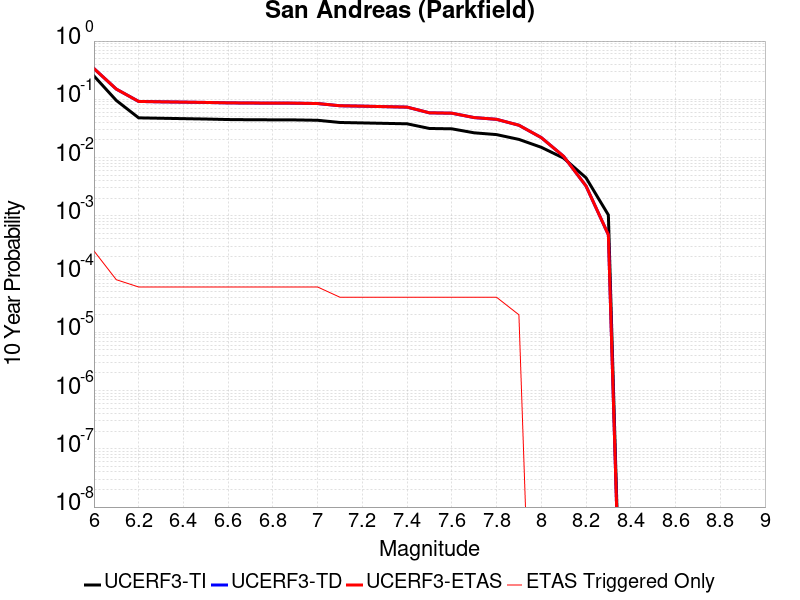 |

| Magnitude | 1 wk TI Prob | 1 wk TD Prob | 1 wk ETAS Prob | 1 wk ETAS/TD Gain | 1 wk ETAS Triggered Only | 1 mo TI Prob | 1 mo TD Prob | 1 mo ETAS Prob | 1 mo ETAS/TD Gain | 1 mo ETAS Triggered Only | 1 yr TI Prob | 1 yr TD Prob | 1 yr ETAS Prob | 1 yr ETAS/TD Gain | 1 yr ETAS Triggered Only | 10 yr TI Prob | 10 yr TD Prob | 10 yr ETAS Prob | 10 yr ETAS/TD Gain | 10 yr ETAS Triggered Only |
|-----|-----|-----|-----|-----|-----|-----|-----|-----|-----|-----|-----|-----|-----|-----|-----|-----|-----|-----|-----|-----|
| 6.0 | 5.556969E-4 | 7.788437E-4 | 8.028058E-4 | 1.0307662 | 2.3980816E-5 | 0.0023793848 | 0.0033341812 | 0.0033939332 | 1.0179211 | 5.995204E-5 | 0.028586963 | 0.04023991 | 0.0403665 | 1.0031458 | 1.3189449E-4 | 0.25176284 | 0.33731642 | 0.33747536 | 1.0004711 | 2.3980816E-4 |
| 6.1 | 1.925858E-4 | 3.0304783E-4 | 3.1503462E-4 | 1.0395541 | 1.1990408E-5 | 8.2510663E-4 | 0.0012982241 | 0.0013101989 | 1.009224 | 1.1990408E-5 | 0.0099994885 | 0.015792182 | 0.015815783 | 1.0014945 | 2.3980816E-5 | 0.095613256 | 0.14979222 | 0.1498534 | 1.0004083 | 7.194244E-5 |
| 6.2 | 9.4306815E-5 | 1.8250331E-4 | 1.9449153E-4 | 1.0656877 | 1.1990408E-5 | 4.0410945E-4 | 7.819238E-4 | 7.939048E-4 | 1.0153224 | 1.1990408E-5 | 0.0049089384 | 0.009478576 | 0.009502329 | 1.002506 | 2.3980816E-5 | 0.048019063 | 0.09188674 | 0.09194118 | 1.0005925 | 5.995204E-5 |
| 6.3 | 9.283051E-5 | 1.7946832E-4 | 1.9145658E-4 | 1.0667987 | 1.1990408E-5 | 3.9778434E-4 | 7.689244E-4 | 7.809056E-4 | 1.0155817 | 1.1990408E-5 | 0.0048322747 | 0.009321672 | 0.00934543 | 1.0025486 | 2.3980816E-5 | 0.047285385 | 0.09053965 | 0.09059417 | 1.0006022 | 5.995204E-5 |
| 6.4 | 9.138826E-5 | 1.770899E-4 | 1.8907819E-4 | 1.0676961 | 1.1990408E-5 | 3.916052E-4 | 7.5873715E-4 | 7.7071844E-4 | 1.0157912 | 1.1990408E-5 | 0.0047573745 | 0.009198696 | 0.009222457 | 1.002583 | 2.3980816E-5 | 0.046568092 | 0.089441724 | 0.089496315 | 1.0006104 | 5.995204E-5 |
| 6.5 | 9.000255E-5 | 1.746699E-4 | 1.8665822E-4 | 1.0686342 | 1.1990408E-5 | 3.8566816E-4 | 7.483717E-4 | 7.6035317E-4 | 1.01601 | 1.1990408E-5 | 0.0046854047 | 0.009073567 | 0.009097329 | 1.0026189 | 2.3980816E-5 | 0.045878403 | 0.08832737 | 0.08838203 | 1.0006188 | 5.995204E-5 |
| 6.6 | 8.8109264E-5 | 1.7148067E-4 | 1.8346903E-4 | 1.0699108 | 1.1990408E-5 | 3.7755648E-4 | 7.3471136E-4 | 7.4669294E-4 | 1.016308 | 1.1990408E-5 | 0.0045870654 | 0.008908638 | 0.008932405 | 1.0026679 | 2.3980816E-5 | 0.04493529 | 0.086858675 | 0.08691342 | 1.0006303 | 5.995204E-5 |
| 6.7 | 8.738073E-5 | 1.7015127E-4 | 1.8213964E-4 | 1.0704571 | 1.1990408E-5 | 3.7443507E-4 | 7.290171E-4 | 7.409988E-4 | 1.0164354 | 1.1990408E-5 | 0.0045492216 | 0.008839916 | 0.008863686 | 1.0026888 | 2.3980816E-5 | 0.04457213 | 0.086258985 | 0.08631376 | 1.000635 | 5.995204E-5 |
| 6.8 | 8.710195E-5 | 1.6960612E-4 | 1.815945E-4 | 1.0706836 | 1.1990408E-5 | 3.7324068E-4 | 7.266821E-4 | 7.386638E-4 | 1.0164882 | 1.1990408E-5 | 0.0045347405 | 0.008811726 | 0.008835495 | 1.0026975 | 2.3980816E-5 | 0.04443313 | 0.08600653 | 0.08606133 | 1.000637 | 5.995204E-5 |
| 6.9 | 8.6801556E-5 | 1.6901553E-4 | 1.8100392E-4 | 1.0709306 | 1.1990408E-5 | 3.7195362E-4 | 7.2415237E-4 | 7.361341E-4 | 1.0165459 | 1.1990408E-5 | 0.0045191357 | 0.008781176 | 0.008804946 | 1.002707 | 2.3980816E-5 | 0.044283327 | 0.08573254 | 0.085787356 | 1.0006393 | 5.995204E-5 |
| 7.0 | 8.5571606E-5 | 1.6654332E-4 | 1.7853173E-4 | 1.0719837 | 1.1990408E-5 | 3.6668387E-4 | 7.13563E-4 | 7.255449E-4 | 1.0167916 | 1.1990408E-5 | 0.004455241 | 0.008653281 | 0.008677054 | 1.0027473 | 2.3980816E-5 | 0.043669727 | 0.08458075 | 0.08463563 | 1.0006489 | 5.995204E-5 |
| 7.1 | 7.82589E-5 | 1.5135074E-4 | 1.5135074E-4 | 1.0 | 0.0 | 3.3535215E-4 | 6.484855E-4 | 6.484855E-4 | 1.0 | 0.0 | 0.0040752706 | 0.0078668995 | 0.007878795 | 1.0015122 | 1.1990408E-5 | 0.040013418 | 0.077491894 | 0.07752508 | 1.0004282 | 3.597122E-5 |
| 7.2 | 7.690929E-5 | 1.4872287E-4 | 1.4872287E-4 | 1.0 | 0.0 | 3.2956956E-4 | 6.372288E-4 | 6.372288E-4 | 1.0 | 0.0 | 0.004005129 | 0.007730829 | 0.0077427267 | 1.001539 | 1.1990408E-5 | 0.0393371 | 0.07626493 | 0.07629816 | 1.0004357 | 3.597122E-5 |
| 7.3 | 7.5543794E-5 | 1.4568791E-4 | 1.4568791E-4 | 1.0 | 0.0 | 3.2371894E-4 | 6.242281E-4 | 6.242281E-4 | 1.0 | 0.0 | 0.003934157 | 0.007573656 | 0.007585556 | 1.0015712 | 1.1990408E-5 | 0.038652334 | 0.07482772 | 0.074861005 | 1.0004448 | 3.597122E-5 |
| 7.4 | 7.4214564E-5 | 1.4269682E-4 | 1.4269682E-4 | 1.0 | 0.0 | 3.1802364E-4 | 6.114152E-4 | 6.114152E-4 | 1.0 | 0.0 | 0.003865065 | 0.007418731 | 0.007430633 | 1.0016042 | 1.1990408E-5 | 0.03798529 | 0.07340127 | 0.073434606 | 1.0004541 | 3.597122E-5 |
| 7.5 | 6.149578E-5 | 1.1196503E-4 | 1.1196503E-4 | 1.0 | 0.0 | 2.6352672E-4 | 4.7976198E-4 | 4.7976198E-4 | 1.0 | 0.0 | 0.0032037178 | 0.00582549 | 0.0058374107 | 1.0020462 | 1.1990408E-5 | 0.03157923 | 0.058584154 | 0.058618017 | 1.000578 | 3.597122E-5 |
| 7.6 | 6.0643448E-5 | 1.10251094E-4 | 1.10251094E-4 | 1.0 | 0.0 | 2.598746E-4 | 4.7241923E-4 | 4.7241923E-4 | 1.0 | 0.0 | 0.0031593828 | 0.0057365666 | 0.005748488 | 1.0020782 | 1.1990408E-5 | 0.031148417 | 0.057744972 | 0.05777887 | 1.000587 | 3.597122E-5 |
| 7.7 | 5.1652263E-5 | 9.179838E-5 | 9.179838E-5 | 1.0 | 0.0 | 2.2134806E-4 | 3.9336234E-4 | 3.9336234E-4 | 1.0 | 0.0 | 0.002691582 | 0.0047786795 | 0.004790613 | 1.0024972 | 1.1990408E-5 | 0.026592141 | 0.048560265 | 0.04859449 | 1.0007048 | 3.597122E-5 |
| 7.8 | 4.8090482E-5 | 8.564368E-5 | 8.564368E-5 | 1.0 | 0.0 | 2.060858E-4 | 3.6699275E-4 | 3.6699275E-4 | 1.0 | 0.0 | 0.0025062072 | 0.004458991 | 0.0044709276 | 1.0026771 | 1.1990408E-5 | 0.024781305 | 0.045324653 | 0.045358993 | 1.0007577 | 3.597122E-5 |
| 7.9 | 3.970278E-5 | 6.754111E-5 | 6.754111E-5 | 1.0 | 0.0 | 1.7014367E-4 | 2.894298E-4 | 2.894298E-4 | 1.0 | 0.0 | 0.002069531 | 0.0035181176 | 0.0035181176 | 1.0 | 0.0 | 0.020503636 | 0.03589899 | 0.03591055 | 1.000322 | 1.1990408E-5 |
| 8.0 | 2.8982335E-5 | 4.072124E-5 | 4.072124E-5 | 1.0 | 0.0 | 1.2420409E-4 | 1.7450792E-4 | 1.7450792E-4 | 1.0 | 0.0 | 0.0015111357 | 0.002122565 | 0.002122565 | 1.0 | 0.0 | 0.015009012 | 0.02202231 | 0.02202231 | 1.0 | 0.0 |
| 8.1 | 1.8836186E-5 | 1.8694205E-5 | 1.8694205E-5 | 1.0 | 0.0 | 8.0724014E-5 | 8.011556E-5 | 8.011556E-5 | 1.0 | 0.0 | 9.823717E-4 | 9.749711E-4 | 9.749711E-4 | 1.0 | 0.0 | 0.009780403 | 0.010494972 | 0.010494972 | 1.0 | 0.0 |
| 8.2 | 8.643924E-6 | 5.4798497E-6 | 5.4798497E-6 | 1.0 | 0.0 | 3.704486E-5 | 2.348486E-5 | 2.348486E-5 | 1.0 | 0.0 | 4.5092785E-4 | 2.858907E-4 | 2.858907E-4 | 1.0 | 0.0 | 0.0045001395 | 0.0032514327 | 0.0032514327 | 1.0 | 0.0 |
| 8.3 | 1.983087E-6 | 7.668296E-7 | 7.668296E-7 | 1.0 | 0.0 | 8.498917E-6 | 3.2864084E-6 | 3.2864084E-6 | 1.0 | 0.0 | 1.034694E-4 | 4.0011306E-5 | 4.0011306E-5 | 1.0 | 0.0 | 0.0010342124 | 4.724499E-4 | 4.724499E-4 | 1.0 | 0.0 |

## Sierra Nevada  (No Extension)
*[(top)](#table-of-contents)*

| 1 Week | 1 Month | 1 Year | 10 Year |
|-----|-----|-----|-----|
| 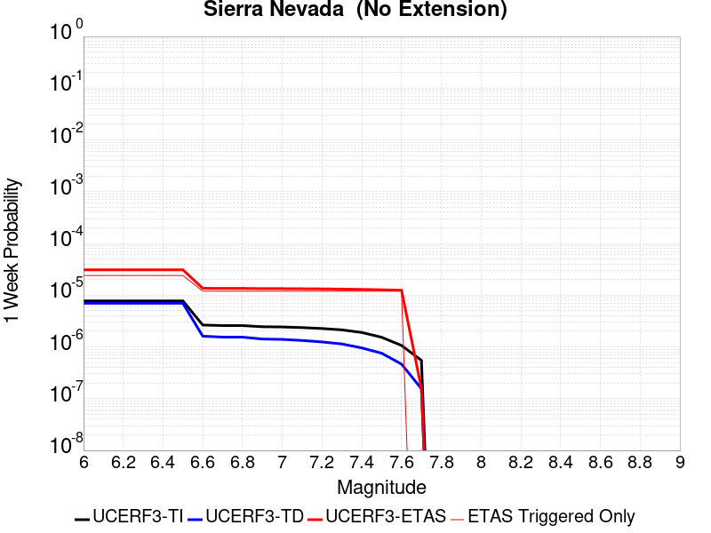 | 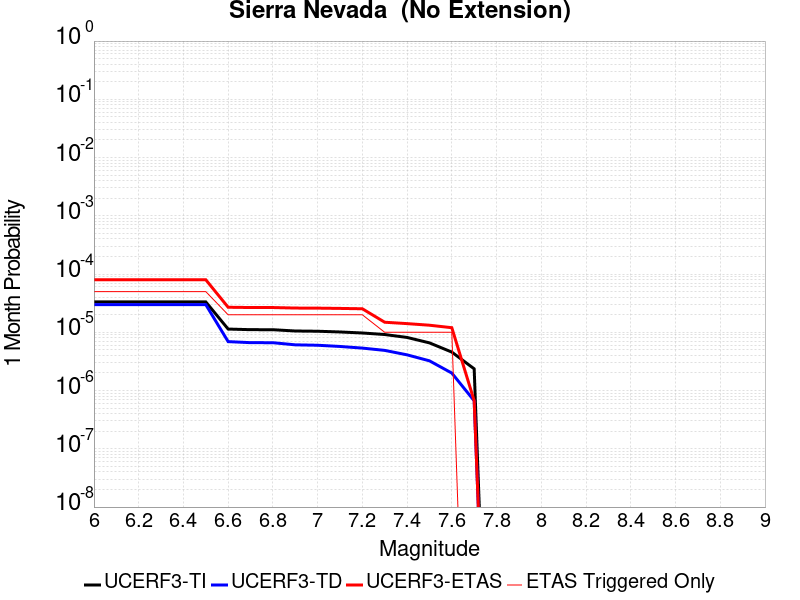 | 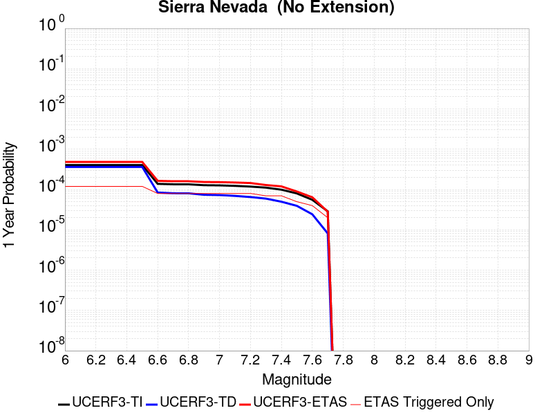 | 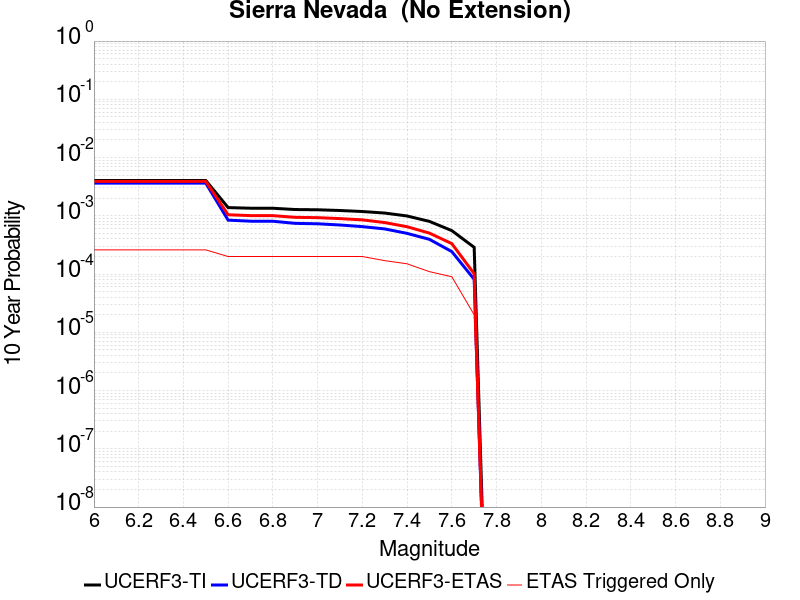 |

| Magnitude | 1 wk TI Prob | 1 wk TD Prob | 1 wk ETAS Prob | 1 wk ETAS/TD Gain | 1 wk ETAS Triggered Only | 1 mo TI Prob | 1 mo TD Prob | 1 mo ETAS Prob | 1 mo ETAS/TD Gain | 1 mo ETAS Triggered Only | 1 yr TI Prob | 1 yr TD Prob | 1 yr ETAS Prob | 1 yr ETAS/TD Gain | 1 yr ETAS Triggered Only | 10 yr TI Prob | 10 yr TD Prob | 10 yr ETAS Prob | 10 yr ETAS/TD Gain | 10 yr ETAS Triggered Only |
|-----|-----|-----|-----|-----|-----|-----|-----|-----|-----|-----|-----|-----|-----|-----|-----|-----|-----|-----|-----|-----|
| 6.0 | 7.7690465E-6 | 6.9763832E-6 | 3.095703E-5 | 4.437404 | 2.3980816E-5 | 3.329549E-5 | 2.9898645E-5 | 7.7858844E-5 | 2.6040926 | 4.7961632E-5 | 4.0529718E-4 | 3.6399104E-4 | 4.7186544E-4 | 1.2963655 | 1.0791367E-4 | 0.004045588 | 0.0036374647 | 0.0038764006 | 1.0656874 | 2.3980816E-4 |
| 6.1 | 7.7690465E-6 | 6.9763832E-6 | 3.095703E-5 | 4.437404 | 2.3980816E-5 | 3.329549E-5 | 2.9898645E-5 | 7.7858844E-5 | 2.6040926 | 4.7961632E-5 | 4.0529718E-4 | 3.6399104E-4 | 4.7186544E-4 | 1.2963655 | 1.0791367E-4 | 0.004045588 | 0.0036374647 | 0.0038764006 | 1.0656874 | 2.3980816E-4 |
| 6.2 | 7.7690465E-6 | 6.9763832E-6 | 3.095703E-5 | 4.437404 | 2.3980816E-5 | 3.329549E-5 | 2.9898645E-5 | 7.7858844E-5 | 2.6040926 | 4.7961632E-5 | 4.0529718E-4 | 3.6399104E-4 | 4.7186544E-4 | 1.2963655 | 1.0791367E-4 | 0.004045588 | 0.0036374647 | 0.0038764006 | 1.0656874 | 2.3980816E-4 |
| 6.3 | 7.7690465E-6 | 6.9763832E-6 | 3.095703E-5 | 4.437404 | 2.3980816E-5 | 3.329549E-5 | 2.9898645E-5 | 7.7858844E-5 | 2.6040926 | 4.7961632E-5 | 4.0529718E-4 | 3.6399104E-4 | 4.7186544E-4 | 1.2963655 | 1.0791367E-4 | 0.004045588 | 0.0036374647 | 0.0038764006 | 1.0656874 | 2.3980816E-4 |
| 6.4 | 7.7690465E-6 | 6.9763832E-6 | 3.095703E-5 | 4.437404 | 2.3980816E-5 | 3.329549E-5 | 2.9898645E-5 | 7.7858844E-5 | 2.6040926 | 4.7961632E-5 | 4.0529718E-4 | 3.6399104E-4 | 4.7186544E-4 | 1.2963655 | 1.0791367E-4 | 0.004045588 | 0.0036374647 | 0.0038764006 | 1.0656874 | 2.3980816E-4 |
| 6.5 | 7.7690465E-6 | 6.9763832E-6 | 3.095703E-5 | 4.437404 | 2.3980816E-5 | 3.329549E-5 | 2.9898645E-5 | 7.7858844E-5 | 2.6040926 | 4.7961632E-5 | 4.0529718E-4 | 3.6399104E-4 | 4.7186544E-4 | 1.2963655 | 1.0791367E-4 | 0.004045588 | 0.0036374647 | 0.0038764006 | 1.0656874 | 2.3980816E-4 |
| 6.6 | 2.653E-6 | 1.6148814E-6 | 1.36052695E-5 | 8.424934 | 1.1990408E-5 | 1.136995E-5 | 6.920902E-6 | 1.8911227E-5 | 2.73248 | 1.1990408E-5 | 1.3842035E-4 | 8.4258754E-5 | 1.4420574E-4 | 1.711463 | 5.995204E-5 | 0.0013833415 | 8.4227155E-4 | 0.0010219761 | 1.2133571 | 1.7985611E-4 |
| 6.7 | 2.5902466E-6 | 1.5502146E-6 | 1.35406035E-5 | 8.734664 | 1.1990408E-5 | 1.11010095E-5 | 6.64376E-6 | 1.8634088E-5 | 2.8047502 | 1.1990408E-5 | 1.351464E-4 | 8.0884805E-5 | 1.40832E-4 | 1.7411427 | 5.995204E-5 | 0.0013506424 | 8.085567E-4 | 9.882674E-4 | 1.2222611 | 1.7985611E-4 |
| 6.8 | 2.5853892E-6 | 1.5470148E-6 | 1.3537404E-5 | 8.750663 | 1.1990408E-5 | 1.1080193E-5 | 6.6300463E-6 | 1.8620374E-5 | 2.8084834 | 1.1990408E-5 | 1.34893E-4 | 8.071786E-5 | 1.4066506E-4 | 1.7426758 | 5.995204E-5 | 0.0013481114 | 8.0688833E-4 | 9.865994E-4 | 1.222721 | 1.7985611E-4 |
| 6.9 | 2.458257E-6 | 1.4220883E-6 | 1.3412479E-5 | 9.431537 | 1.1990408E-5 | 1.0535345E-5 | 6.0946504E-6 | 1.8084986E-5 | 2.967354 | 1.1990408E-5 | 1.2826028E-4 | 7.419986E-5 | 1.3414746E-4 | 1.8079206 | 5.995204E-5 | 0.0012818627 | 7.417528E-4 | 9.214755E-4 | 1.2422945 | 1.7985611E-4 |
| 7.0 | 2.4341468E-6 | 1.399052E-6 | 1.3389443E-5 | 9.570368 | 1.1990408E-5 | 1.0432016E-5 | 5.995924E-6 | 1.798626E-5 | 2.9997478 | 1.1990408E-5 | 1.270024E-4 | 7.2997944E-5 | 1.3294561E-4 | 1.821224 | 5.995204E-5 | 0.0012692984 | 7.297416E-4 | 9.094665E-4 | 1.2462857 | 1.7985611E-4 |
| 7.1 | 2.3652476E-6 | 1.3340014E-6 | 1.3324393E-5 | 9.988291 | 1.1990408E-5 | 1.0136736E-5 | 5.717136E-6 | 1.7707474E-5 | 3.097263 | 1.1990408E-5 | 1.2340778E-4 | 6.960393E-5 | 1.2955179E-4 | 1.8612714 | 5.995204E-5 | 0.0012333926 | 6.9582294E-4 | 8.7555393E-4 | 1.2582998 | 1.7985611E-4 |
| 7.2 | 2.272158E-6 | 1.2503074E-6 | 1.32407E-5 | 10.589955 | 1.1990408E-5 | 9.737784E-6 | 5.3584495E-6 | 1.7348793E-5 | 3.2376516 | 1.1990408E-5 | 1.1855107E-4 | 6.523718E-5 | 1.2518531E-4 | 1.9189258 | 5.995204E-5 | 0.0011848784 | 6.5218186E-4 | 8.3192065E-4 | 1.2755961 | 1.7985611E-4 |
| 7.3 | 2.1382127E-6 | 1.1419947E-6 | 1.3132389E-5 | 11.499517 | 1.1990408E-5 | 9.163737E-6 | 4.8942543E-6 | 1.6884604E-5 | 3.4498827 | 1.1990408E-5 | 1.1156279E-4 | 5.9585927E-5 | 1.19534394E-4 | 2.0060844 | 5.995204E-5 | 0.001115068 | 5.957007E-4 | 7.634664E-4 | 1.2816275 | 1.6786571E-4 |
| 7.4 | 1.9048055E-6 | 9.575474E-7 | 1.2947944E-5 | 13.521987 | 1.1990408E-5 | 8.163426E-6 | 4.1037683E-6 | 1.6094127E-5 | 3.9217923 | 1.1990408E-5 | 9.9385186E-5 | 4.996224E-5 | 1.09911285E-4 | 2.199887 | 5.995204E-5 | 9.934074E-4 | 4.995108E-4 | 6.4332376E-4 | 1.2879077 | 1.4388488E-4 |
| 7.5 | 1.5373403E-6 | 7.5602395E-7 | 1.2746423E-5 | 16.859812 | 1.1990408E-5 | 6.5885843E-6 | 3.2400987E-6 | 1.5230467E-5 | 4.7006183 | 1.1990408E-5 | 8.021306E-5 | 3.9447492E-5 | 8.740723E-5 | 2.2157867 | 4.7961632E-5 | 8.0184115E-4 | 3.944054E-4 | 5.0227647E-4 | 1.2735032 | 1.0791367E-4 |
| 7.6 | 1.0680322E-6 | 4.659796E-7 | 1.2456382E-5 | 26.731602 | 1.1990408E-5 | 4.577273E-6 | 1.997054E-6 | 1.3987437E-5 | 7.004036 | 1.1990408E-5 | 5.5726876E-5 | 2.4313864E-5 | 6.0284212E-5 | 2.4794173 | 3.597122E-5 | 5.5712904E-4 | 2.431123E-4 | 3.2702475E-4 | 1.3451592 | 8.393286E-5 |
| 7.7 | 5.509146E-7 | 1.5581199E-7 | 1.5581199E-7 | 1.0 | 0.0 | 2.3610605E-6 | 6.677655E-7 | 6.677655E-7 | 1.0 | 0.0 | 2.8745531E-5 | 8.130016E-6 | 3.2110638E-5 | 3.94964 | 2.3980816E-5 | 2.8741814E-4 | 8.12973E-5 | 1.05276165E-4 | 1.2949528 | 2.3980816E-5 |

## White Wolf (Extension)
*[(top)](#table-of-contents)*

| 1 Week | 1 Month | 1 Year | 10 Year |
|-----|-----|-----|-----|
| 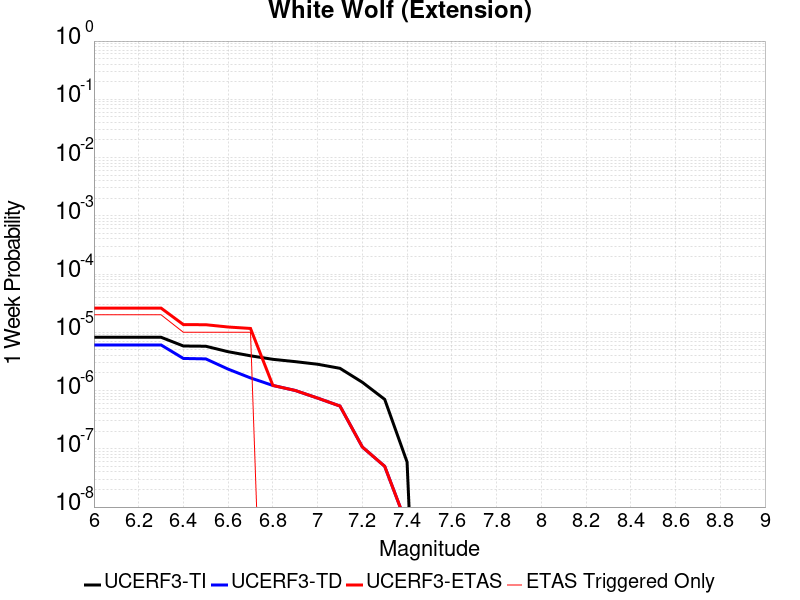 | 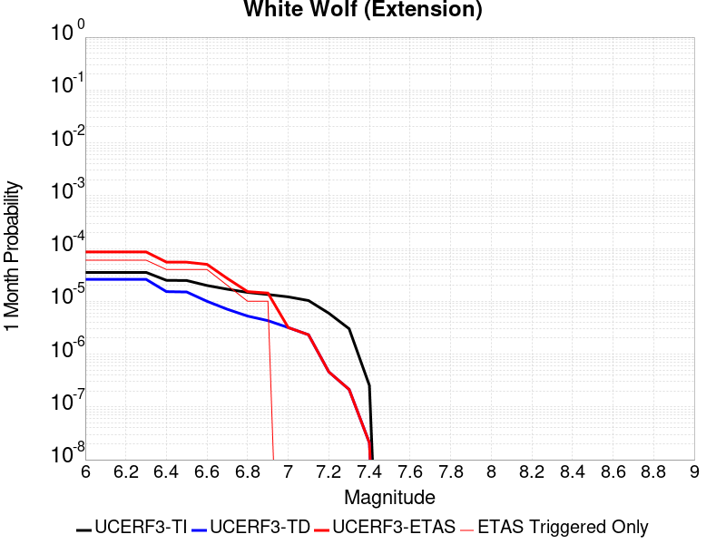 | 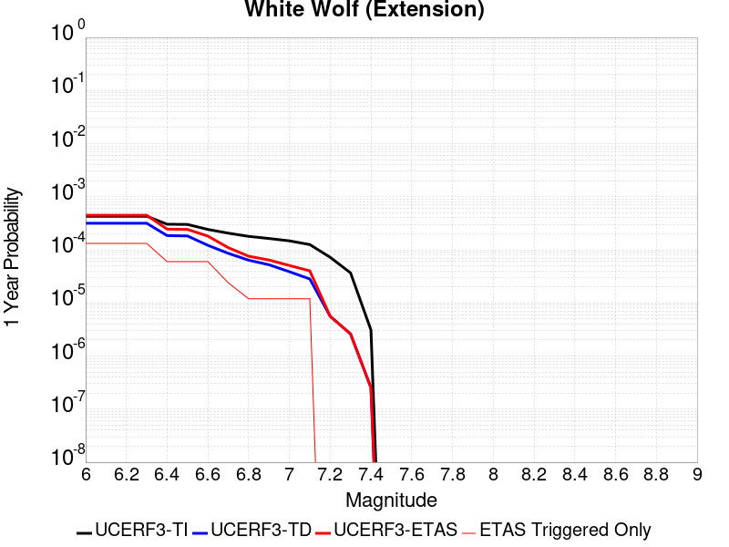 | 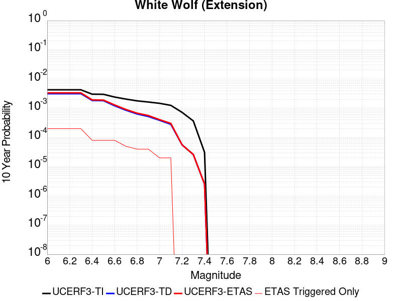 |

| Magnitude | 1 wk TI Prob | 1 wk TD Prob | 1 wk ETAS Prob | 1 wk ETAS/TD Gain | 1 wk ETAS Triggered Only | 1 mo TI Prob | 1 mo TD Prob | 1 mo ETAS Prob | 1 mo ETAS/TD Gain | 1 mo ETAS Triggered Only | 1 yr TI Prob | 1 yr TD Prob | 1 yr ETAS Prob | 1 yr ETAS/TD Gain | 1 yr ETAS Triggered Only | 10 yr TI Prob | 10 yr TD Prob | 10 yr ETAS Prob | 10 yr ETAS/TD Gain | 10 yr ETAS Triggered Only |
|-----|-----|-----|-----|-----|-----|-----|-----|-----|-----|-----|-----|-----|-----|-----|-----|-----|-----|-----|-----|-----|
| 6.0 | 8.222555E-6 | 6.0667057E-6 | 3.0047377E-5 | 4.952832 | 2.3980816E-5 | 3.5239045E-5 | 2.5999947E-5 | 8.595043E-5 | 3.3057923 | 5.995204E-5 | 4.289509E-4 | 3.1650998E-4 | 4.4836273E-4 | 1.4165832 | 1.3189449E-4 | 0.0042812387 | 0.0031612439 | 0.003376389 | 1.0680571 | 2.1582734E-4 |
| 6.1 | 8.222555E-6 | 6.0667057E-6 | 3.0047377E-5 | 4.952832 | 2.3980816E-5 | 3.5239045E-5 | 2.5999947E-5 | 8.595043E-5 | 3.3057923 | 5.995204E-5 | 4.289509E-4 | 3.1650998E-4 | 4.4836273E-4 | 1.4165832 | 1.3189449E-4 | 0.0042812387 | 0.0031612439 | 0.003376389 | 1.0680571 | 2.1582734E-4 |
| 6.2 | 8.222555E-6 | 6.0667057E-6 | 3.0047377E-5 | 4.952832 | 2.3980816E-5 | 3.5239045E-5 | 2.5999947E-5 | 8.595043E-5 | 3.3057923 | 5.995204E-5 | 4.289509E-4 | 3.1650998E-4 | 4.4836273E-4 | 1.4165832 | 1.3189449E-4 | 0.0042812387 | 0.0031612439 | 0.003376389 | 1.0680571 | 2.1582734E-4 |
| 6.3 | 8.222555E-6 | 6.0667057E-6 | 3.0047377E-5 | 4.952832 | 2.3980816E-5 | 3.5239045E-5 | 2.5999947E-5 | 8.595043E-5 | 3.3057923 | 5.995204E-5 | 4.289509E-4 | 3.1650998E-4 | 4.4836273E-4 | 1.4165832 | 1.3189449E-4 | 0.0042812387 | 0.0031612439 | 0.003376389 | 1.0680571 | 2.1582734E-4 |
| 6.4 | 5.821773E-6 | 3.5572016E-6 | 1.5547566E-5 | 4.3707294 | 1.1990408E-5 | 2.4950215E-5 | 1.5245067E-5 | 5.1215742E-5 | 3.359496 | 3.597122E-5 | 3.0372653E-4 | 1.8559398E-4 | 2.455349E-4 | 1.322968 | 5.995204E-5 | 0.0030331176 | 0.0018544982 | 0.0019382754 | 1.0451751 | 8.393286E-5 |
| 6.5 | 5.766023E-6 | 3.4991353E-6 | 1.54895E-5 | 4.4266653 | 1.1990408E-5 | 2.4711293E-5 | 1.4996214E-5 | 5.0966897E-5 | 3.398651 | 3.597122E-5 | 3.0081844E-4 | 1.8256472E-4 | 2.425058E-4 | 1.3283279 | 5.995204E-5 | 0.0030041158 | 0.0018242556 | 0.0019080353 | 1.0459255 | 8.393286E-5 |
| 6.6 | 4.643576E-6 | 2.332643E-6 | 1.4323023E-5 | 6.1402555 | 1.1990408E-5 | 1.9900888E-5 | 9.997005E-6 | 4.5967867E-5 | 4.598164 | 3.597122E-5 | 2.4226638E-4 | 1.2170716E-4 | 1.816519E-4 | 1.4925326 | 5.995204E-5 | 0.0024200242 | 0.0012164476 | 0.0013002782 | 1.0689144 | 8.393286E-5 |
| 6.7 | 3.9529173E-6 | 1.6483629E-6 | 1.3638751E-5 | 8.274119 | 1.1990408E-5 | 1.6940963E-5 | 7.064394E-6 | 1.9054716E-5 | 2.6972897 | 1.1990408E-5 | 2.0623671E-4 | 8.600579E-5 | 1.0998455E-4 | 1.278804 | 2.3980816E-5 | 0.002060454 | 8.5974357E-4 | 9.0766395E-4 | 1.055738 | 4.7961632E-5 |
| 6.8 | 3.4377522E-6 | 1.2245362E-6 | 1.2245362E-6 | 1.0 | 0.0 | 1.473314E-5 | 5.2480023E-6 | 5.2480023E-6 | 1.0 | 0.0 | 1.7936122E-4 | 6.389264E-5 | 7.5882286E-5 | 1.187653 | 1.1990408E-5 | 0.0017921652 | 6.3875184E-4 | 6.747001E-4 | 1.056279 | 3.597122E-5 |
| 6.9 | 3.1367306E-6 | 1.0033893E-6 | 1.0033893E-6 | 1.0 | 0.0 | 1.3443062E-5 | 4.3002333E-6 | 4.3002333E-6 | 1.0 | 0.0 | 1.63657E-4 | 5.235416E-5 | 6.434394E-5 | 1.229013 | 1.1990408E-5 | 0.0016353652 | 5.234259E-4 | 5.593783E-4 | 1.0686867 | 3.597122E-5 |
| 7.0 | 2.8298145E-6 | 7.4287595E-7 | 7.4287595E-7 | 1.0 | 0.0 | 1.2127721E-5 | 3.1837506E-6 | 3.1837506E-6 | 1.0 | 0.0 | 1.47645E-4 | 3.8761526E-5 | 5.0751467E-5 | 1.3093259 | 1.1990408E-5 | 0.0014754693 | 3.8755263E-4 | 4.1152415E-4 | 1.0618536 | 2.3980816E-5 |
| 7.1 | 2.4091064E-6 | 5.4228286E-7 | 5.4228286E-7 | 1.0 | 0.0 | 1.03247E-5 | 2.3240675E-6 | 2.3240675E-6 | 1.0 | 0.0 | 1.2569598E-4 | 2.8295197E-5 | 4.0285264E-5 | 1.4237492 | 1.1990408E-5 | 0.001256249 | 2.8291997E-4 | 3.06894E-4 | 1.0847379 | 2.3980816E-5 |
| 7.2 | 1.3875518E-6 | 1.07434374E-7 | 1.07434374E-7 | 1.0 | 0.0 | 5.9466374E-6 | 4.6043297E-7 | 4.6043297E-7 | 1.0 | 0.0 | 7.23979E-5 | 5.6057584E-6 | 5.6057584E-6 | 1.0 | 0.0 | 7.2374323E-4 | 5.605628E-5 | 5.605628E-5 | 1.0 | 0.0 |
| 7.3 | 7.056077E-7 | 5.0022493E-8 | 5.0022493E-8 | 1.0 | 0.0 | 3.0240296E-6 | 2.143821E-7 | 2.143821E-7 | 1.0 | 0.0 | 3.681694E-5 | 2.6100993E-6 | 2.6100993E-6 | 1.0 | 0.0 | 3.681084E-4 | 2.6100734E-5 | 2.6100734E-5 | 1.0 | 0.0 |
| 7.4 | 5.9334678E-8 | 4.8685624E-9 | 4.8685624E-9 | 1.0 | 0.0 | 2.5429145E-7 | 2.0865269E-8 | 2.0865269E-8 | 1.0 | 0.0 | 3.095994E-6 | 2.5403463E-7 | 2.5403463E-7 | 1.0 | 0.0 | 3.095951E-5 | 2.5403444E-6 | 2.5403444E-6 | 1.0 | 0.0 |

## Red Pass
*[(top)](#table-of-contents)*

| 1 Week | 1 Month | 1 Year | 10 Year |
|-----|-----|-----|-----|
|  | 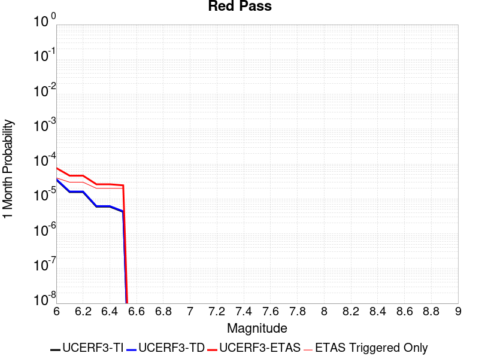 | 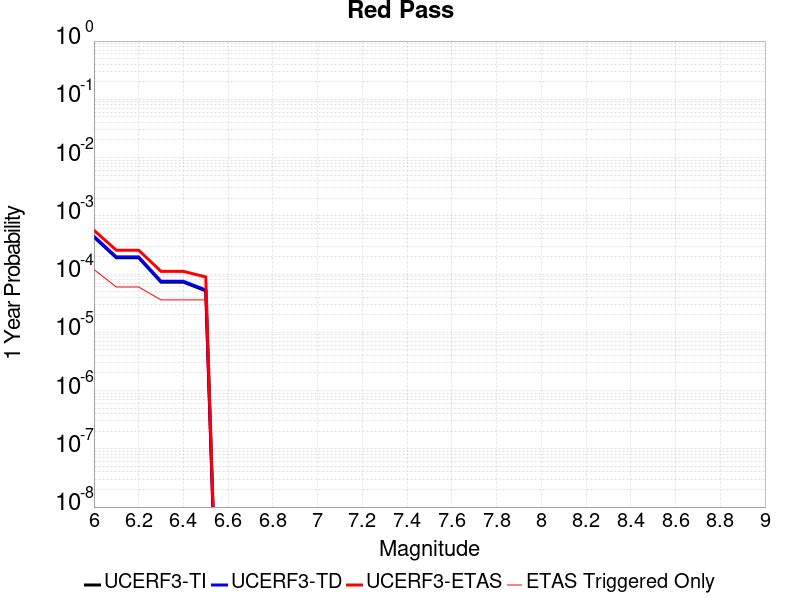 | 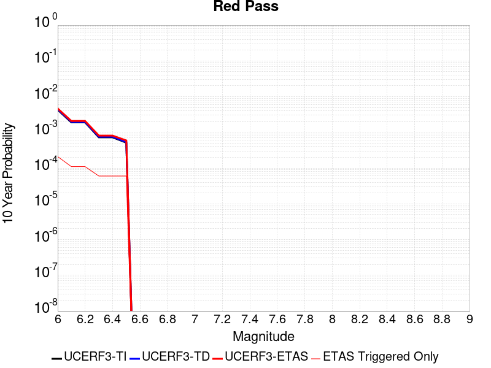 |

| Magnitude | 1 wk TI Prob | 1 wk TD Prob | 1 wk ETAS Prob | 1 wk ETAS/TD Gain | 1 wk ETAS Triggered Only | 1 mo TI Prob | 1 mo TD Prob | 1 mo ETAS Prob | 1 mo ETAS/TD Gain | 1 mo ETAS Triggered Only | 1 yr TI Prob | 1 yr TD Prob | 1 yr ETAS Prob | 1 yr ETAS/TD Gain | 1 yr ETAS Triggered Only | 10 yr TI Prob | 10 yr TD Prob | 10 yr ETAS Prob | 10 yr ETAS/TD Gain | 10 yr ETAS Triggered Only |
|-----|-----|-----|-----|-----|-----|-----|-----|-----|-----|-----|-----|-----|-----|-----|-----|-----|-----|-----|-----|-----|
| 6.0 | 8.258278E-6 | 8.551305E-6 | 8.551305E-6 | 1.0 | 0.0 | 3.539214E-5 | 3.6648038E-5 | 8.460791E-5 | 2.3086615 | 4.7961632E-5 | 4.308141E-4 | 4.4611638E-4 | 5.6596694E-4 | 1.2686532 | 1.1990408E-4 | 0.0042997985 | 0.004453966 | 0.004668832 | 1.0482415 | 2.1582734E-4 |
| 6.1 | 3.649988E-6 | 3.7753332E-6 | 3.7753332E-6 | 1.0 | 0.0 | 1.5642712E-5 | 1.6179927E-5 | 5.2150568E-5 | 3.2231648 | 3.597122E-5 | 1.9043336E-4 | 1.9697756E-4 | 2.569178E-4 | 1.3042998 | 5.995204E-5 | 0.0019027026 | 0.001968497 | 0.0021001317 | 1.0668707 | 1.3189449E-4 |
| 6.2 | 3.649988E-6 | 3.7753332E-6 | 3.7753332E-6 | 1.0 | 0.0 | 1.5642712E-5 | 1.6179927E-5 | 5.2150568E-5 | 3.2231648 | 3.597122E-5 | 1.9043336E-4 | 1.9697756E-4 | 2.569178E-4 | 1.3042998 | 5.995204E-5 | 0.0019027026 | 0.001968497 | 0.0021001317 | 1.0668707 | 1.3189449E-4 |
| 6.3 | 1.3924937E-6 | 1.4411233E-6 | 1.4411233E-6 | 1.0 | 0.0 | 5.9678164E-6 | 6.176236E-6 | 3.0156903E-5 | 4.8827314 | 2.3980816E-5 | 7.265574E-5 | 7.51945E-5 | 1.1116301E-4 | 1.4783398 | 3.597122E-5 | 7.263199E-4 | 7.518293E-4 | 8.237176E-4 | 1.0956179 | 7.194244E-5 |
| 6.4 | 1.3924937E-6 | 1.4411233E-6 | 1.4411233E-6 | 1.0 | 0.0 | 5.9678164E-6 | 6.176236E-6 | 3.0156903E-5 | 4.8827314 | 2.3980816E-5 | 7.265574E-5 | 7.51945E-5 | 1.1116301E-4 | 1.4783398 | 3.597122E-5 | 7.263199E-4 | 7.518293E-4 | 8.237176E-4 | 1.0956179 | 7.194244E-5 |
| 6.5 | 9.876812E-7 | 1.022196E-6 | 1.022196E-6 | 1.0 | 0.0 | 4.2329125E-6 | 4.38084E-6 | 2.836155E-5 | 6.4739985 | 2.3980816E-5 | 5.153449E-5 | 5.3336724E-5 | 8.930603E-5 | 1.6743816 | 3.597122E-5 | 5.1522546E-4 | 5.333672E-4 | 6.052713E-4 | 1.1348115 | 7.194244E-5 |

## Ludlow
*[(top)](#table-of-contents)*

| 1 Week | 1 Month | 1 Year | 10 Year |
|-----|-----|-----|-----|
| 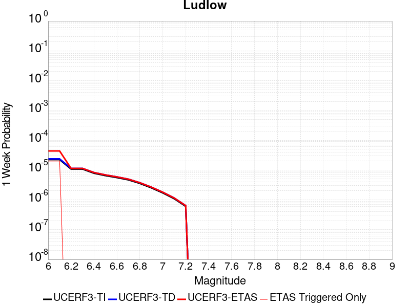 | 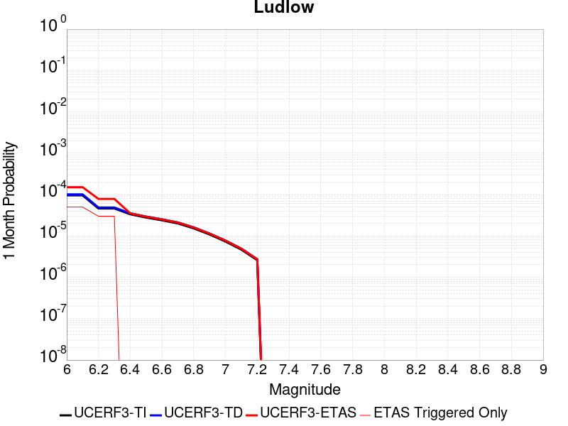 | 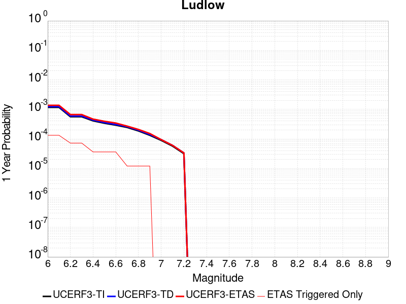 | 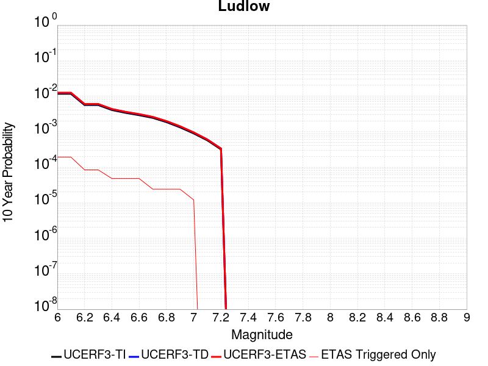 |

| Magnitude | 1 wk TI Prob | 1 wk TD Prob | 1 wk ETAS Prob | 1 wk ETAS/TD Gain | 1 wk ETAS Triggered Only | 1 mo TI Prob | 1 mo TD Prob | 1 mo ETAS Prob | 1 mo ETAS/TD Gain | 1 mo ETAS Triggered Only | 1 yr TI Prob | 1 yr TD Prob | 1 yr ETAS Prob | 1 yr ETAS/TD Gain | 1 yr ETAS Triggered Only | 10 yr TI Prob | 10 yr TD Prob | 10 yr ETAS Prob | 10 yr ETAS/TD Gain | 10 yr ETAS Triggered Only |
|-----|-----|-----|-----|-----|-----|-----|-----|-----|-----|-----|-----|-----|-----|-----|-----|-----|-----|-----|-----|-----|
| 6.0 | 2.2407607E-5 | 2.3657429E-5 | 4.7637677E-5 | 2.0136456 | 2.3980816E-5 | 9.602906E-5 | 1.0138529E-4 | 1.4934206E-4 | 1.4730151 | 4.7961632E-5 | 0.0011685267 | 0.001233711 | 0.0013654428 | 1.1067768 | 1.3189449E-4 | 0.011624013 | 0.012273132 | 0.012462624 | 1.0154396 | 1.9184653E-4 |
| 6.1 | 2.2407607E-5 | 2.3657429E-5 | 4.7637677E-5 | 2.0136456 | 2.3980816E-5 | 9.602906E-5 | 1.0138529E-4 | 1.4934206E-4 | 1.4730151 | 4.7961632E-5 | 0.0011685267 | 0.001233711 | 0.0013654428 | 1.1067768 | 1.3189449E-4 | 0.011624013 | 0.012273132 | 0.012462624 | 1.0154396 | 1.9184653E-4 |
| 6.2 | 1.0781252E-5 | 1.1365745E-5 | 1.1365745E-5 | 1.0 | 0.0 | 4.620455E-5 | 4.870945E-5 | 7.26891E-5 | 1.4922997 | 2.3980816E-5 | 5.623952E-4 | 5.9288024E-4 | 6.6478003E-4 | 1.1212721 | 7.194244E-5 | 0.00560974 | 0.005913404 | 0.00599684 | 1.0141097 | 8.393286E-5 |
| 6.3 | 1.0781252E-5 | 1.1365745E-5 | 1.1365745E-5 | 1.0 | 0.0 | 4.620455E-5 | 4.870945E-5 | 7.26891E-5 | 1.4922997 | 2.3980816E-5 | 5.623952E-4 | 5.9288024E-4 | 6.6478003E-4 | 1.1212721 | 7.194244E-5 | 0.00560974 | 0.005913404 | 0.00599684 | 1.0141097 | 8.393286E-5 |
| 6.4 | 7.814439E-6 | 8.237788E-6 | 8.237788E-6 | 1.0 | 0.0 | 3.3490025E-5 | 3.5304336E-5 | 3.5304336E-5 | 1.0 | 0.0 | 4.0766477E-4 | 4.2974693E-4 | 4.6570267E-4 | 1.0836673 | 3.597122E-5 | 0.0040691774 | 0.0042893053 | 0.004337061 | 1.0111337 | 4.7961632E-5 |
| 6.5 | 6.4986366E-6 | 6.850969E-6 | 6.850969E-6 | 1.0 | 0.0 | 2.7851002E-5 | 2.936097E-5 | 2.936097E-5 | 1.0 | 0.0 | 3.390332E-4 | 3.574121E-4 | 3.9337046E-4 | 1.1006076 | 3.597122E-5 | 0.003385164 | 0.0035684688 | 0.0036162594 | 1.0133924 | 4.7961632E-5 |
| 6.6 | 5.582177E-6 | 5.8860483E-6 | 5.8860483E-6 | 1.0 | 0.0 | 2.3923398E-5 | 2.522568E-5 | 2.522568E-5 | 1.0 | 0.0 | 2.9122844E-4 | 3.070801E-4 | 3.4304027E-4 | 1.1171036 | 3.597122E-5 | 0.0029084706 | 0.003066631 | 0.0031144456 | 1.0155919 | 4.7961632E-5 |
| 6.7 | 4.6858763E-6 | 4.940463E-6 | 4.940463E-6 | 1.0 | 0.0 | 2.0082172E-5 | 2.1173244E-5 | 2.1173244E-5 | 1.0 | 0.0 | 2.4447302E-4 | 2.577543E-4 | 2.697416E-4 | 1.0465068 | 1.1990408E-5 | 0.0024420423 | 0.0025746098 | 0.002598529 | 1.0092903 | 2.3980816E-5 |
| 6.8 | 3.5584908E-6 | 3.7520454E-6 | 3.7520454E-6 | 1.0 | 0.0 | 1.5250586E-5 | 1.6080097E-5 | 1.6080097E-5 | 1.0 | 0.0 | 1.8566006E-4 | 1.9575801E-4 | 2.0774607E-4 | 1.0612391 | 1.1990408E-5 | 0.0018550502 | 0.0019558968 | 0.0019798307 | 1.0122368 | 2.3980816E-5 |
| 6.9 | 2.532834E-6 | 2.6710227E-6 | 2.6710227E-6 | 1.0 | 0.0 | 1.0854958E-5 | 1.1447192E-5 | 1.1447192E-5 | 1.0 | 0.0 | 1.3215111E-4 | 1.3936093E-4 | 1.5134967E-4 | 1.0860265 | 1.1990408E-5 | 0.0013207254 | 0.0013927629 | 0.0014167103 | 1.0171942 | 2.3980816E-5 |
| 7.0 | 1.7083285E-6 | 1.801957E-6 | 1.801957E-6 | 1.0 | 0.0 | 7.3213873E-6 | 7.7226505E-6 | 7.7226505E-6 | 1.0 | 0.0 | 8.913424E-5 | 9.4019386E-5 | 9.4019386E-5 | 1.0 | 0.0 | 8.9098496E-4 | 9.3981257E-4 | 9.517917E-4 | 1.0127463 | 1.1990408E-5 |
| 7.1 | 1.0905424E-6 | 1.1497702E-6 | 1.1497702E-6 | 1.0 | 0.0 | 4.6737446E-6 | 4.927578E-6 | 4.927578E-6 | 1.0 | 0.0 | 5.6901354E-5 | 5.999171E-5 | 5.999171E-5 | 1.0 | 0.0 | 5.6886784E-4 | 5.997649E-4 | 5.997649E-4 | 1.0 | 0.0 |
| 7.2 | 6.06668E-7 | 6.387322E-7 | 6.387322E-7 | 1.0 | 0.0 | 2.600003E-6 | 2.7374213E-6 | 2.7374213E-6 | 1.0 | 0.0 | 3.1654577E-5 | 3.3327666E-5 | 3.3327666E-5 | 1.0 | 0.0 | 3.1650066E-4 | 3.332335E-4 | 3.332335E-4 | 1.0 | 0.0 |

## Calico-Hidalgo
*[(top)](#table-of-contents)*

| 1 Week | 1 Month | 1 Year | 10 Year |
|-----|-----|-----|-----|
| 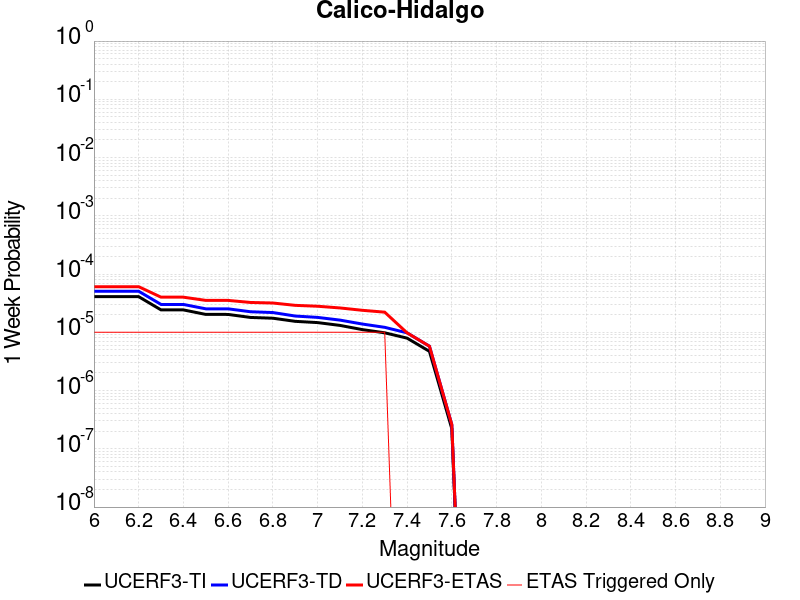 | 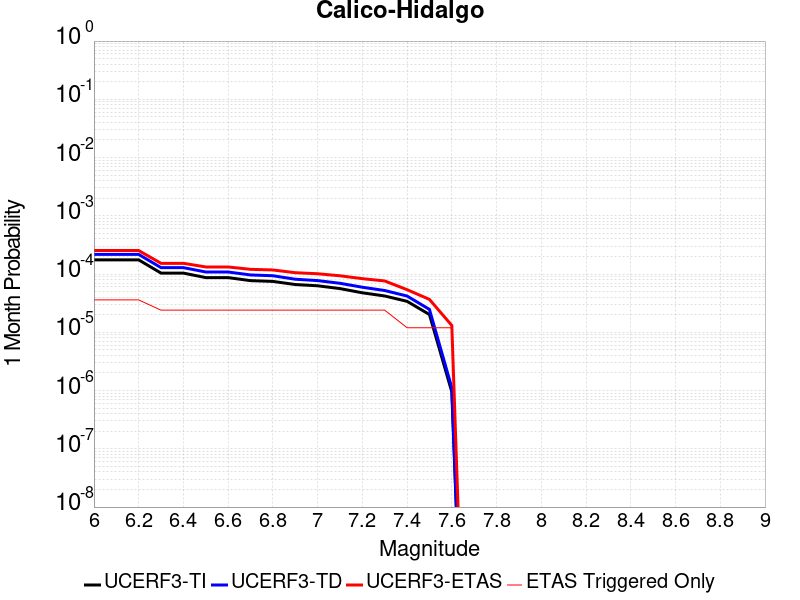 | 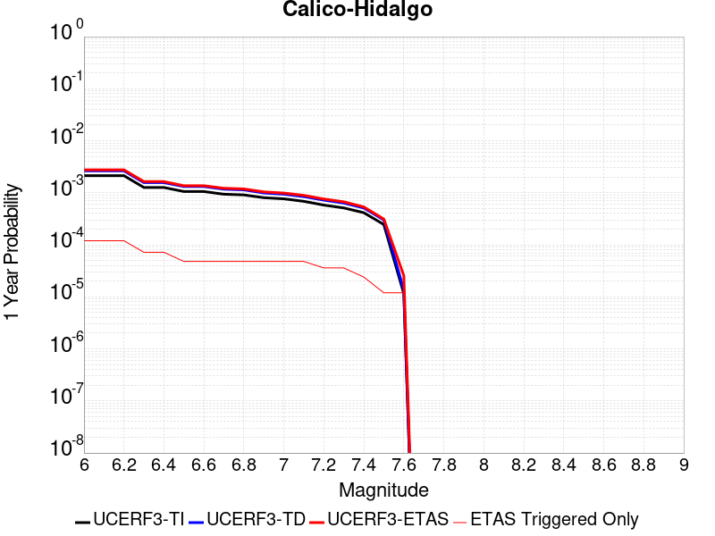 | 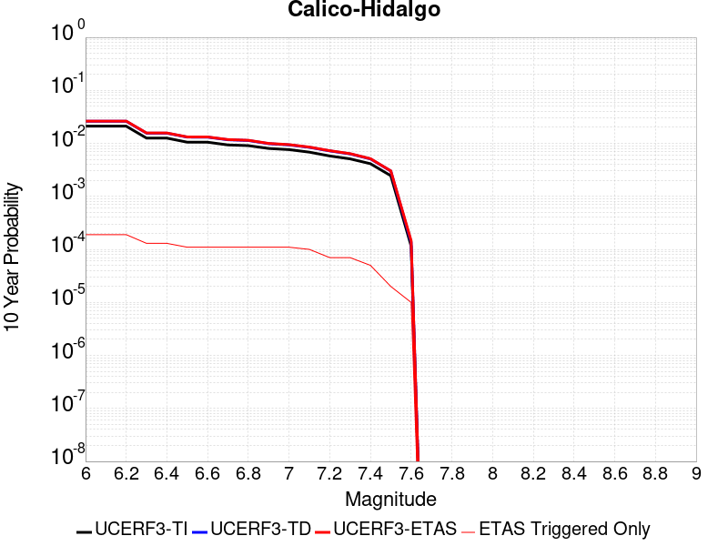 |

| Magnitude | 1 wk TI Prob | 1 wk TD Prob | 1 wk ETAS Prob | 1 wk ETAS/TD Gain | 1 wk ETAS Triggered Only | 1 mo TI Prob | 1 mo TD Prob | 1 mo ETAS Prob | 1 mo ETAS/TD Gain | 1 mo ETAS Triggered Only | 1 yr TI Prob | 1 yr TD Prob | 1 yr ETAS Prob | 1 yr ETAS/TD Gain | 1 yr ETAS Triggered Only | 10 yr TI Prob | 10 yr TD Prob | 10 yr ETAS Prob | 10 yr ETAS/TD Gain | 10 yr ETAS Triggered Only |
|-----|-----|-----|-----|-----|-----|-----|-----|-----|-----|-----|-----|-----|-----|-----|-----|-----|-----|-----|-----|-----|
| 6.0 | 4.0906612E-5 | 5.0704653E-5 | 6.269445E-5 | 1.2364635 | 1.1990408E-5 | 1.7530227E-4 | 2.1728984E-4 | 2.5325324E-4 | 1.1655089 | 3.597122E-5 | 0.0021322158 | 0.0026426981 | 0.0027622855 | 1.045252 | 1.1990408E-4 | 0.02111873 | 0.026153097 | 0.026339926 | 1.0071436 | 1.9184653E-4 |
| 6.1 | 4.0906612E-5 | 5.0704653E-5 | 6.269445E-5 | 1.2364635 | 1.1990408E-5 | 1.7530227E-4 | 2.1728984E-4 | 2.5325324E-4 | 1.1655089 | 3.597122E-5 | 0.0021322158 | 0.0026426981 | 0.0027622855 | 1.045252 | 1.1990408E-4 | 0.02111873 | 0.026153097 | 0.026339926 | 1.0071436 | 1.9184653E-4 |
| 6.2 | 4.0906612E-5 | 5.0704653E-5 | 6.269445E-5 | 1.2364635 | 1.1990408E-5 | 1.7530227E-4 | 2.1728984E-4 | 2.5325324E-4 | 1.1655089 | 3.597122E-5 | 0.0021322158 | 0.0026426981 | 0.0027622855 | 1.045252 | 1.1990408E-4 | 0.02111873 | 0.026153097 | 0.026339926 | 1.0071436 | 1.9184653E-4 |
| 6.3 | 2.4242801E-5 | 3.009103E-5 | 4.208108E-5 | 1.3984592 | 1.1990408E-5 | 1.0389358E-4 | 1.2895538E-4 | 1.529331E-4 | 1.1859381 | 2.3980816E-5 | 0.0012641704 | 0.001568934 | 0.0016407635 | 1.0457824 | 7.194244E-5 | 0.01257003 | 0.015582247 | 0.015712086 | 1.0083325 | 1.3189449E-4 |
| 6.4 | 2.4242801E-5 | 3.009103E-5 | 4.208108E-5 | 1.3984592 | 1.1990408E-5 | 1.0389358E-4 | 1.2895538E-4 | 1.529331E-4 | 1.1859381 | 2.3980816E-5 | 0.0012641704 | 0.001568934 | 0.0016407635 | 1.0457824 | 7.194244E-5 | 0.01257003 | 0.015582247 | 0.015712086 | 1.0083325 | 1.3189449E-4 |
| 6.5 | 2.0286952E-5 | 2.5315985E-5 | 3.730609E-5 | 1.4736179 | 1.1990408E-5 | 8.694118E-5 | 1.0849266E-4 | 1.3247087E-4 | 1.2210124 | 2.3980816E-5 | 0.0010579949 | 0.0013201149 | 0.0013680132 | 1.0362835 | 4.7961632E-5 | 0.010529719 | 0.013124665 | 0.013231162 | 1.0081143 | 1.0791367E-4 |
| 6.6 | 2.0269223E-5 | 2.5296935E-5 | 3.7287038E-5 | 1.4739746 | 1.1990408E-5 | 8.6865206E-5 | 1.08411026E-4 | 1.3238924E-4 | 1.2211788 | 2.3980816E-5 | 0.0010570707 | 0.0013191222 | 0.0013670205 | 1.0363108 | 4.7961632E-5 | 0.010520565 | 0.013114855 | 0.013221353 | 1.0081204 | 1.0791367E-4 |
| 6.7 | 1.799852E-5 | 2.25408E-5 | 3.4530938E-5 | 1.5319304 | 1.1990408E-5 | 7.713423E-5 | 9.6599935E-5 | 1.20578436E-4 | 1.2482247 | 2.3980816E-5 | 9.3870464E-4 | 0.0011754843 | 0.0012233895 | 1.0407536 | 4.7961632E-5 | 0.009347493 | 0.011694277 | 0.011800928 | 1.00912 | 1.0791367E-4 |
| 6.8 | 1.7458793E-5 | 2.1842314E-5 | 3.3832457E-5 | 1.5489413 | 1.1990408E-5 | 7.4821255E-5 | 9.3606635E-5 | 1.1758521E-4 | 1.2561631 | 2.3980816E-5 | 9.10568E-4 | 0.0011390795 | 0.0011869865 | 1.0420576 | 4.7961632E-5 | 0.009068459 | 0.011333993 | 0.011440683 | 1.0094134 | 1.0791367E-4 |
| 6.9 | 1.542884E-5 | 1.9026087E-5 | 3.1016265E-5 | 1.6301968 | 1.1990408E-5 | 6.612192E-5 | 8.1537895E-5 | 1.0551676E-4 | 1.2940824 | 2.3980816E-5 | 8.04737E-4 | 9.92285E-4 | 0.001040199 | 1.0482866 | 4.7961632E-5 | 0.008018291 | 0.00987994 | 0.009986788 | 1.0108145 | 1.0791367E-4 |
| 7.0 | 1.468253E-5 | 1.8030747E-5 | 3.0020938E-5 | 1.6649859 | 1.1990408E-5 | 6.292361E-5 | 7.7272416E-5 | 1.01251375E-4 | 1.3103173 | 2.3980816E-5 | 7.658257E-4 | 9.403986E-4 | 9.883151E-4 | 1.0509534 | 4.7961632E-5 | 0.0076319184 | 0.009365558 | 0.0094724605 | 1.0114145 | 1.0791367E-4 |
| 7.1 | 1.3139281E-5 | 1.620107E-5 | 2.8191283E-5 | 1.7400877 | 1.1990408E-5 | 5.6309986E-5 | 6.943138E-5 | 9.341053E-5 | 1.3453647 | 2.3980816E-5 | 6.853584E-4 | 8.4501173E-4 | 8.929329E-4 | 1.0567106 | 4.7961632E-5 | 0.0068324856 | 0.008419285 | 0.0085144 | 1.0112973 | 9.5923264E-5 |
| 7.2 | 1.1127404E-5 | 1.3866703E-5 | 2.5856943E-5 | 1.8646786 | 1.1990408E-5 | 4.7688E-5 | 5.9427435E-5 | 8.340683E-5 | 1.4035071 | 2.3980816E-5 | 5.8044674E-4 | 7.2329975E-4 | 7.592449E-4 | 1.0496961 | 3.597122E-5 | 0.0057893298 | 0.0072105634 | 0.007281987 | 1.0099055 | 7.194244E-5 |
| 7.3 | 9.808154E-6 | 1.2176301E-5 | 2.4166562E-5 | 1.9847212 | 1.1990408E-5 | 4.2034266E-5 | 5.2183164E-5 | 7.616273E-5 | 1.4595268 | 2.3980816E-5 | 5.11647E-4 | 6.3515553E-4 | 6.711039E-4 | 1.0565977 | 3.597122E-5 | 0.0051047057 | 0.0063344776 | 0.0064059645 | 1.0112853 | 7.194244E-5 |
| 7.4 | 7.942452E-6 | 9.7922075E-6 | 9.7922075E-6 | 1.0 | 0.0 | 3.4038632E-5 | 4.196598E-5 | 5.3955886E-5 | 1.2857053 | 1.1990408E-5 | 4.1434157E-4 | 5.1082554E-4 | 5.347941E-4 | 1.0469213 | 2.3980816E-5 | 0.0041356985 | 0.0050974544 | 0.005157101 | 1.0117012 | 5.995204E-5 |
| 7.5 | 4.7121216E-6 | 5.772871E-6 | 5.772871E-6 | 1.0 | 0.0 | 2.019465E-5 | 2.4740684E-5 | 3.6730795E-5 | 1.4846313 | 1.1990408E-5 | 2.4584212E-4 | 3.0118387E-4 | 3.1317066E-4 | 1.039799 | 1.1990408E-5 | 0.0024557032 | 0.0030085093 | 0.003032418 | 1.007947 | 2.3980816E-5 |
| 7.6 | 2.21172E-7 | 2.6039737E-7 | 2.6039737E-7 | 1.0 | 0.0 | 9.478797E-7 | 1.1159884E-6 | 1.31063825E-5 | 11.744192 | 1.1990408E-5 | 1.1540374E-5 | 1.3587103E-5 | 2.5577348E-5 | 1.8824725 | 1.1990408E-5 | 1.1539775E-4 | 1.3586554E-4 | 1.4785431E-4 | 1.08824 | 1.1990408E-5 |

## San Andreas (Carrizo) rev
*[(top)](#table-of-contents)*

| 1 Week | 1 Month | 1 Year | 10 Year |
|-----|-----|-----|-----|
| 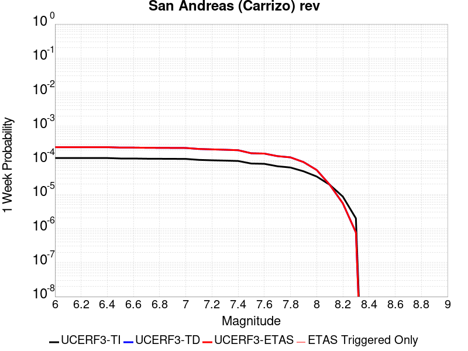 | 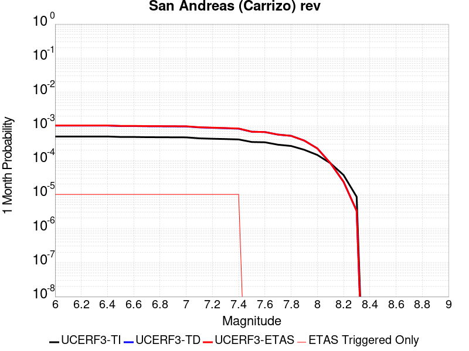 | 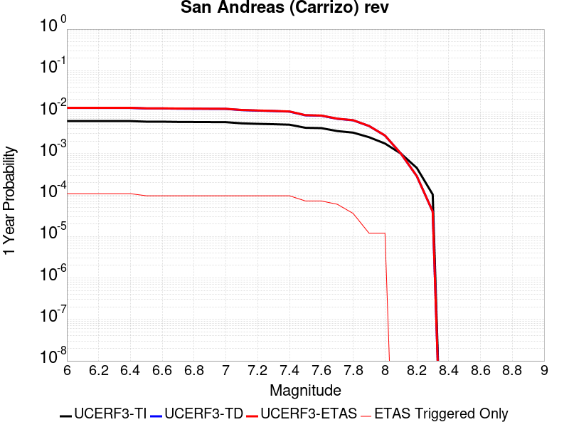 | 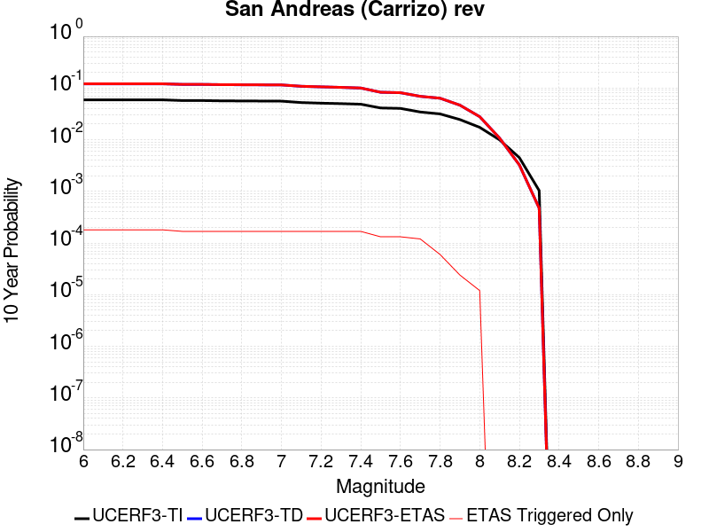 |

| Magnitude | 1 wk TI Prob | 1 wk TD Prob | 1 wk ETAS Prob | 1 wk ETAS/TD Gain | 1 wk ETAS Triggered Only | 1 mo TI Prob | 1 mo TD Prob | 1 mo ETAS Prob | 1 mo ETAS/TD Gain | 1 mo ETAS Triggered Only | 1 yr TI Prob | 1 yr TD Prob | 1 yr ETAS Prob | 1 yr ETAS/TD Gain | 1 yr ETAS Triggered Only | 10 yr TI Prob | 10 yr TD Prob | 10 yr ETAS Prob | 10 yr ETAS/TD Gain | 10 yr ETAS Triggered Only |
|-----|-----|-----|-----|-----|-----|-----|-----|-----|-----|-----|-----|-----|-----|-----|-----|-----|-----|-----|-----|-----|
| 6.0 | 1.1674632E-4 | 2.4332498E-4 | 2.4332498E-4 | 1.0 | 0.0 | 5.002454E-4 | 0.0010424062 | 0.001054384 | 1.0114906 | 1.1990408E-5 | 0.006073493 | 0.012617926 | 0.012724479 | 1.0084445 | 1.0791367E-4 | 0.0591016 | 0.12065402 | 0.12081218 | 1.0013108 | 1.7985611E-4 |
| 6.1 | 1.1674632E-4 | 2.4332498E-4 | 2.4332498E-4 | 1.0 | 0.0 | 5.002454E-4 | 0.0010424062 | 0.001054384 | 1.0114906 | 1.1990408E-5 | 0.006073493 | 0.012617926 | 0.012724479 | 1.0084445 | 1.0791367E-4 | 0.0591016 | 0.12065402 | 0.12081218 | 1.0013108 | 1.7985611E-4 |
| 6.2 | 1.1674632E-4 | 2.4332498E-4 | 2.4332498E-4 | 1.0 | 0.0 | 5.002454E-4 | 0.0010424062 | 0.001054384 | 1.0114906 | 1.1990408E-5 | 0.006073493 | 0.012617926 | 0.012724479 | 1.0084445 | 1.0791367E-4 | 0.0591016 | 0.12065402 | 0.12081218 | 1.0013108 | 1.7985611E-4 |
| 6.3 | 1.1674632E-4 | 2.4332498E-4 | 2.4332498E-4 | 1.0 | 0.0 | 5.002454E-4 | 0.0010424062 | 0.001054384 | 1.0114906 | 1.1990408E-5 | 0.006073493 | 0.012617926 | 0.012724479 | 1.0084445 | 1.0791367E-4 | 0.0591016 | 0.12065402 | 0.12081218 | 1.0013108 | 1.7985611E-4 |
| 6.4 | 1.1674632E-4 | 2.4332498E-4 | 2.4332498E-4 | 1.0 | 0.0 | 5.002454E-4 | 0.0010424062 | 0.001054384 | 1.0114906 | 1.1990408E-5 | 0.006073493 | 0.012617926 | 0.012724479 | 1.0084445 | 1.0791367E-4 | 0.0591016 | 0.12065402 | 0.12081218 | 1.0013108 | 1.7985611E-4 |
| 6.5 | 1.13136164E-4 | 2.3652466E-4 | 2.3652466E-4 | 1.0 | 0.0 | 4.847792E-4 | 0.0010132849 | 0.0010252631 | 1.0118213 | 1.1990408E-5 | 0.0058862255 | 0.012267408 | 0.012362154 | 1.0077235 | 9.5923264E-5 | 0.057327334 | 0.11762535 | 0.11777347 | 1.0012592 | 1.6786571E-4 |
| 6.6 | 1.13136164E-4 | 2.3652466E-4 | 2.3652466E-4 | 1.0 | 0.0 | 4.847792E-4 | 0.0010132849 | 0.0010252631 | 1.0118213 | 1.1990408E-5 | 0.0058862255 | 0.012267408 | 0.012362154 | 1.0077235 | 9.5923264E-5 | 0.057327334 | 0.11762535 | 0.11777347 | 1.0012592 | 1.6786571E-4 |
| 6.7 | 1.1149675E-4 | 2.3343669E-4 | 2.3343669E-4 | 1.0 | 0.0 | 4.777557E-4 | 0.0010000608 | 0.0010120393 | 1.0119777 | 1.1990408E-5 | 0.0058011734 | 0.012108203 | 0.012202965 | 1.0078262 | 9.5923264E-5 | 0.05652051 | 0.11624688 | 0.11639523 | 1.0012761 | 1.6786571E-4 |
| 6.8 | 1.1103589E-4 | 2.3245816E-4 | 2.3245816E-4 | 1.0 | 0.0 | 4.7578133E-4 | 9.958703E-4 | 0.0010078489 | 1.0120281 | 1.1990408E-5 | 0.005777263 | 0.0120577505 | 0.012152516 | 1.0078593 | 9.5923264E-5 | 0.056293584 | 0.11580715 | 0.11595558 | 1.0012816 | 1.6786571E-4 |
| 6.9 | 1.1053259E-4 | 2.3138185E-4 | 2.3138185E-4 | 1.0 | 0.0 | 4.7362508E-4 | 9.912612E-4 | 0.0010032397 | 1.0120841 | 1.1990408E-5 | 0.0057511497 | 0.012002253 | 0.012097024 | 1.0078962 | 9.5923264E-5 | 0.05604569 | 0.11532332 | 0.115471825 | 1.0012877 | 1.6786571E-4 |
| 7.0 | 1.1005377E-4 | 2.3039016E-4 | 2.3039016E-4 | 1.0 | 0.0 | 4.7157376E-4 | 9.870143E-4 | 9.989928E-4 | 1.0121362 | 1.1990408E-5 | 0.0057263062 | 0.011951115 | 0.012045892 | 1.0079304 | 9.5923264E-5 | 0.055809796 | 0.11487561 | 0.11502419 | 1.0012934 | 1.6786571E-4 |
| 7.1 | 1.0308142E-4 | 2.1548544E-4 | 2.1548544E-4 | 1.0 | 0.0 | 4.417027E-4 | 9.231832E-4 | 9.3516253E-4 | 1.0129762 | 1.1990408E-5 | 0.0053644776 | 0.011182146 | 0.011276997 | 1.0084823 | 9.5923264E-5 | 0.052368138 | 0.108131535 | 0.108281255 | 1.0013845 | 1.6786571E-4 |
| 7.2 | 1.0027479E-4 | 2.0956367E-4 | 2.0956367E-4 | 1.0 | 0.0 | 4.296783E-4 | 8.978219E-4 | 9.098016E-4 | 1.013343 | 1.1990408E-5 | 0.0052187922 | 0.0108764935 | 0.010971374 | 1.0087234 | 9.5923264E-5 | 0.050979212 | 0.10543535 | 0.105585515 | 1.0014243 | 1.6786571E-4 |
| 7.3 | 9.816942E-5 | 2.0431461E-4 | 2.0431461E-4 | 1.0 | 0.0 | 4.2065824E-4 | 8.753412E-4 | 8.873211E-4 | 1.013686 | 1.1990408E-5 | 0.005109493 | 0.010605487 | 0.0107003935 | 1.0089488 | 9.5923264E-5 | 0.049935985 | 0.103018686 | 0.10316926 | 1.0014616 | 1.6786571E-4 |
| 7.4 | 9.5634205E-5 | 1.9800827E-4 | 1.9800827E-4 | 1.0 | 0.0 | 4.0979648E-4 | 8.4833184E-4 | 8.603121E-4 | 1.0141221 | 1.1990408E-5 | 0.0049778637 | 0.0102797905 | 0.010374728 | 1.0092354 | 9.5923264E-5 | 0.048678253 | 0.100104466 | 0.10025553 | 1.0015091 | 1.6786571E-4 |
| 7.5 | 8.052417E-5 | 1.6120363E-4 | 1.6120363E-4 | 1.0 | 0.0 | 3.4505792E-4 | 6.9068995E-4 | 6.9068995E-4 | 1.0 | 0.0 | 0.0041929903 | 0.008376808 | 0.008448148 | 1.0085163 | 7.194244E-5 | 0.04114753 | 0.08284498 | 0.08296595 | 1.0014602 | 1.3189449E-4 |
| 7.6 | 7.897024E-5 | 1.5773512E-4 | 1.5773512E-4 | 1.0 | 0.0 | 3.384E-4 | 6.758327E-4 | 6.758327E-4 | 1.0 | 0.0 | 0.0041122385 | 0.008197296 | 0.008268649 | 1.0087044 | 7.194244E-5 | 0.040369697 | 0.081185855 | 0.081307046 | 1.0014927 | 1.3189449E-4 |
| 7.7 | 6.707427E-5 | 1.3282998E-4 | 1.3282998E-4 | 1.0 | 0.0 | 2.8742946E-4 | 5.691472E-4 | 5.691472E-4 | 1.0 | 0.0 | 0.003493839 | 0.0069073834 | 0.0069669215 | 1.0086194 | 5.995204E-5 | 0.034394164 | 0.06907934 | 0.06919096 | 1.0016159 | 1.1990408E-4 |
| 7.8 | 6.147705E-5 | 1.2203727E-4 | 1.2203727E-4 | 1.0 | 0.0 | 2.6344648E-4 | 5.229121E-4 | 5.229121E-4 | 1.0 | 0.0 | 0.0032027436 | 0.006347895 | 0.006383638 | 1.0056306 | 3.597122E-5 | 0.031569764 | 0.063543044 | 0.063599184 | 1.0008836 | 5.995204E-5 |
| 7.9 | 4.7636717E-5 | 8.88427E-5 | 8.88427E-5 | 1.0 | 0.0 | 2.0414138E-4 | 3.806989E-4 | 3.806989E-4 | 1.0 | 0.0 | 0.0024825884 | 0.0046251663 | 0.004637101 | 1.0025804 | 1.1990408E-5 | 0.024550365 | 0.046649244 | 0.046672106 | 1.0004901 | 2.3980816E-5 |
| 8.0 | 3.3554235E-5 | 5.2164494E-5 | 5.2164494E-5 | 1.0 | 0.0 | 1.4379594E-4 | 2.2354297E-4 | 2.2354297E-4 | 1.0 | 0.0 | 0.0017493097 | 0.0027182405 | 0.0027301984 | 1.0043991 | 1.1990408E-5 | 0.017356034 | 0.027894506 | 0.027906163 | 1.0004178 | 1.1990408E-5 |
| 8.1 | 1.9175432E-5 | 1.9198285E-5 | 1.9198285E-5 | 1.0 | 0.0 | 8.217783E-5 | 8.227578E-5 | 8.227578E-5 | 1.0 | 0.0 | 0.0010000558 | 0.0010012479 | 0.0010012479 | 1.0 | 0.0 | 0.009955673 | 0.010765004 | 0.010765004 | 1.0 | 0.0 |
| 8.2 | 8.643924E-6 | 5.4798497E-6 | 5.4798497E-6 | 1.0 | 0.0 | 3.704486E-5 | 2.348486E-5 | 2.348486E-5 | 1.0 | 0.0 | 4.5092785E-4 | 2.858907E-4 | 2.858907E-4 | 1.0 | 0.0 | 0.0045001395 | 0.0032514327 | 0.0032514327 | 1.0 | 0.0 |
| 8.3 | 1.983087E-6 | 7.668296E-7 | 7.668296E-7 | 1.0 | 0.0 | 8.498917E-6 | 3.2864084E-6 | 3.2864084E-6 | 1.0 | 0.0 | 1.034694E-4 | 4.0011306E-5 | 4.0011306E-5 | 1.0 | 0.0 | 0.0010342124 | 4.724499E-4 | 4.724499E-4 | 1.0 | 0.0 |

## San Andreas (Cholame) rev
*[(top)](#table-of-contents)*

| 1 Week | 1 Month | 1 Year | 10 Year |
|-----|-----|-----|-----|
| 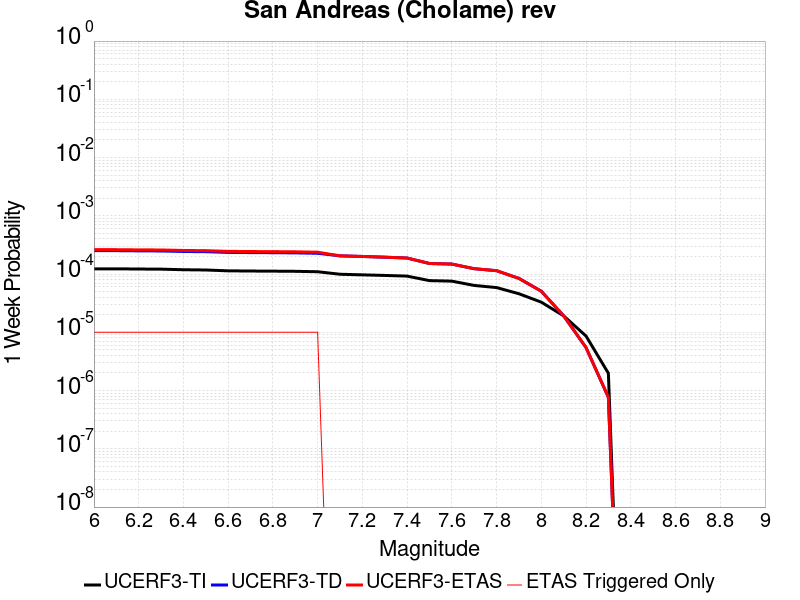 |  | 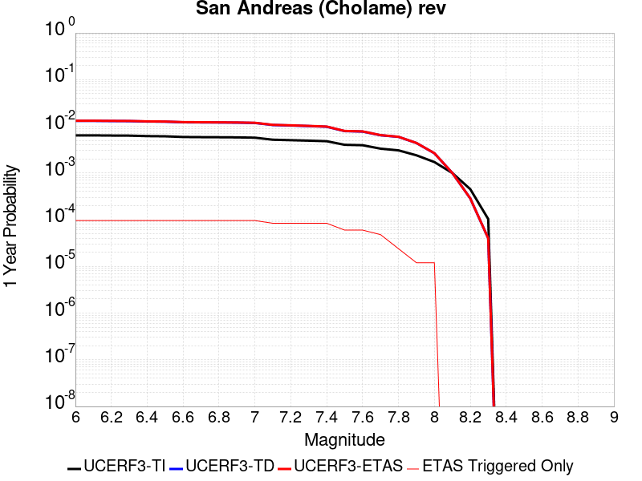 | 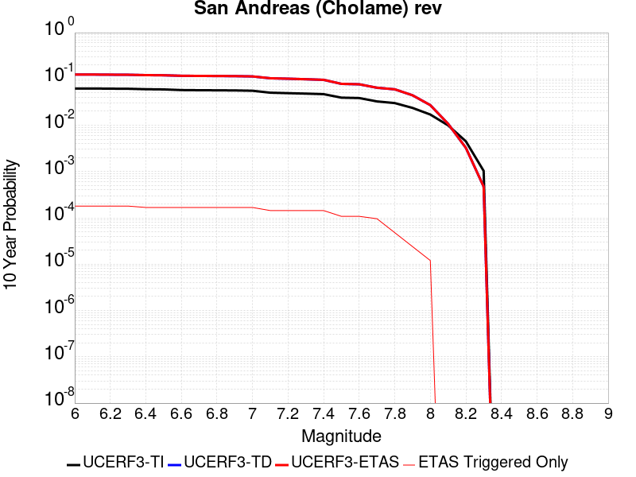 |

| Magnitude | 1 wk TI Prob | 1 wk TD Prob | 1 wk ETAS Prob | 1 wk ETAS/TD Gain | 1 wk ETAS Triggered Only | 1 mo TI Prob | 1 mo TD Prob | 1 mo ETAS Prob | 1 mo ETAS/TD Gain | 1 mo ETAS Triggered Only | 1 yr TI Prob | 1 yr TD Prob | 1 yr ETAS Prob | 1 yr ETAS/TD Gain | 1 yr ETAS Triggered Only | 10 yr TI Prob | 10 yr TD Prob | 10 yr ETAS Prob | 10 yr ETAS/TD Gain | 10 yr ETAS Triggered Only |
|-----|-----|-----|-----|-----|-----|-----|-----|-----|-----|-----|-----|-----|-----|-----|-----|-----|-----|-----|-----|-----|
| 6.0 | 1.2302514E-4 | 2.5213862E-4 | 2.64126E-4 | 1.0475428 | 1.1990408E-5 | 5.27144E-4 | 0.0010801482 | 0.001104103 | 1.0221775 | 2.3980816E-5 | 0.0063991086 | 0.013072014 | 0.013166684 | 1.0072421 | 9.5923264E-5 | 0.06217949 | 0.12443058 | 0.12458806 | 1.0012655 | 1.7985611E-4 |
| 6.1 | 1.2302514E-4 | 2.5213862E-4 | 2.64126E-4 | 1.0475428 | 1.1990408E-5 | 5.27144E-4 | 0.0010801482 | 0.001104103 | 1.0221775 | 2.3980816E-5 | 0.0063991086 | 0.013072014 | 0.013166684 | 1.0072421 | 9.5923264E-5 | 0.06217949 | 0.12443058 | 0.12458806 | 1.0012655 | 1.7985611E-4 |
| 6.2 | 1.2203569E-4 | 2.5030645E-4 | 2.6229385E-4 | 1.0478909 | 1.1990408E-5 | 5.2290526E-4 | 0.0010723026 | 0.0010962576 | 1.0223398 | 2.3980816E-5 | 0.006347804 | 0.0129776355 | 0.013072314 | 1.0072955 | 9.5923264E-5 | 0.061695136 | 0.12361675 | 0.12377437 | 1.0012751 | 1.7985611E-4 |
| 6.3 | 1.2142645E-4 | 2.491661E-4 | 2.6115353E-4 | 1.0481101 | 1.1990408E-5 | 5.202953E-4 | 0.0010674193 | 0.0010913746 | 1.0224422 | 2.3980816E-5 | 0.006316212 | 0.012918889 | 0.013013573 | 1.0073291 | 9.5923264E-5 | 0.06139677 | 0.12311087 | 0.12326858 | 1.001281 | 1.7985611E-4 |
| 6.4 | 1.1865206E-4 | 2.4422092E-4 | 2.562084E-4 | 1.0490845 | 1.1990408E-5 | 5.0840975E-4 | 0.0010462429 | 0.0010701986 | 1.0228969 | 2.3980816E-5 | 0.006172335 | 0.012664088 | 0.012758797 | 1.0074785 | 9.5923264E-5 | 0.060036868 | 0.12090351 | 0.12105108 | 1.0012206 | 1.6786571E-4 |
| 6.5 | 1.17443946E-4 | 2.421537E-4 | 2.5414123E-4 | 1.0495037 | 1.1990408E-5 | 5.032341E-4 | 0.0010373904 | 0.0010613464 | 1.0230925 | 2.3980816E-5 | 0.006109677 | 0.012557554 | 0.012652272 | 1.0075427 | 9.5923264E-5 | 0.059444077 | 0.11997763 | 0.12012536 | 1.0012313 | 1.6786571E-4 |
| 6.6 | 1.13579066E-4 | 2.3524289E-4 | 2.4723046E-4 | 1.0509584 | 1.1990408E-5 | 4.866766E-4 | 0.0010077958 | 0.0010317524 | 1.0237713 | 2.3980816E-5 | 0.0059092017 | 0.012201327 | 0.01229608 | 1.0077658 | 9.5923264E-5 | 0.057545185 | 0.11689143 | 0.11703967 | 1.0012683 | 1.6786571E-4 |
| 6.7 | 1.1271412E-4 | 2.336858E-4 | 2.456734E-4 | 1.051298 | 1.1990408E-5 | 4.829711E-4 | 0.0010011276 | 0.0010250845 | 1.0239298 | 2.3980816E-5 | 0.005864331 | 0.01212105 | 0.01221581 | 1.0078179 | 9.5923264E-5 | 0.057119697 | 0.11619493 | 0.1163433 | 1.0012769 | 1.6786571E-4 |
| 6.8 | 1.1217975E-4 | 2.3256983E-4 | 2.4455745E-4 | 1.0515442 | 1.1990408E-5 | 4.8068175E-4 | 9.963487E-4 | 0.0010203056 | 1.0240448 | 2.3980816E-5 | 0.005836608 | 0.012063511 | 0.0121582765 | 1.0078557 | 9.5923264E-5 | 0.056856725 | 0.11569312 | 0.11584157 | 1.001283 | 1.6786571E-4 |
| 6.9 | 1.1146753E-4 | 2.3105709E-4 | 2.4304472E-4 | 1.0518817 | 1.1990408E-5 | 4.7763053E-4 | 9.898704E-4 | 0.0010138274 | 1.0242022 | 2.3980816E-5 | 0.0057996577 | 0.011985509 | 0.012080282 | 1.0079074 | 9.5923264E-5 | 0.056506127 | 0.11501348 | 0.11516204 | 1.0012916 | 1.6786571E-4 |
| 7.0 | 1.0965793E-4 | 2.2728977E-4 | 2.3927745E-4 | 1.0527419 | 1.1990408E-5 | 4.698779E-4 | 9.7373687E-4 | 9.976943E-4 | 1.0246036 | 2.3980816E-5 | 0.005705768 | 0.0117912255 | 0.011886018 | 1.0080392 | 9.5923264E-5 | 0.055614736 | 0.11331484 | 0.113463685 | 1.0013136 | 1.6786571E-4 |
| 7.1 | 9.927982E-5 | 2.0547757E-4 | 2.0547757E-4 | 1.0 | 0.0 | 4.2541555E-4 | 8.80322E-4 | 8.9230185E-4 | 1.0136085 | 1.1990408E-5 | 0.0051671406 | 0.010665542 | 0.01074858 | 1.0077856 | 8.393286E-5 | 0.05048634 | 0.10340853 | 0.10353753 | 1.0012475 | 1.4388488E-4 |
| 7.2 | 9.696786E-5 | 2.0051954E-4 | 2.0051954E-4 | 1.0 | 0.0 | 4.1551032E-4 | 8.5908745E-4 | 8.710676E-4 | 1.0139451 | 1.1990408E-5 | 0.00504711 | 0.010409511 | 0.01049257 | 1.0079792 | 8.393286E-5 | 0.04934009 | 0.10114636 | 0.1012757 | 1.0012786 | 1.4388488E-4 |
| 7.3 | 9.4727984E-5 | 1.9481099E-4 | 1.9481099E-4 | 1.0 | 0.0 | 4.0591392E-4 | 8.346381E-4 | 8.466185E-4 | 1.014354 | 1.1990408E-5 | 0.0049308087 | 0.010114641 | 0.010197725 | 1.0082142 | 8.393286E-5 | 0.048228268 | 0.09851684 | 0.098646544 | 1.0013167 | 1.4388488E-4 |
| 7.4 | 9.220358E-5 | 1.885154E-4 | 1.885154E-4 | 1.0 | 0.0 | 3.9509835E-4 | 8.076739E-4 | 8.1965467E-4 | 1.0148336 | 1.1990408E-5 | 0.004799717 | 0.009789341 | 0.009872452 | 1.00849 | 8.393286E-5 | 0.046973653 | 0.09559427 | 0.095724404 | 1.0013613 | 1.4388488E-4 |
| 7.5 | 7.71631E-5 | 1.5185357E-4 | 1.5185357E-4 | 1.0 | 0.0 | 3.306571E-4 | 6.506389E-4 | 6.506389E-4 | 1.0 | 0.0 | 0.0040183207 | 0.007892828 | 0.007952307 | 1.0075358 | 5.995204E-5 | 0.03946433 | 0.07831838 | 0.078417845 | 1.0012699 | 1.0791367E-4 |
| 7.6 | 7.5634416E-5 | 1.4844738E-4 | 1.4844738E-4 | 1.0 | 0.0 | 3.241072E-4 | 6.360481E-4 | 6.360481E-4 | 1.0 | 0.0 | 0.0039388672 | 0.007716457 | 0.007775946 | 1.0077094 | 5.995204E-5 | 0.038697794 | 0.076681465 | 0.0767811 | 1.0012994 | 1.0791367E-4 |
| 7.7 | 6.3783E-5 | 1.2365259E-4 | 1.2365259E-4 | 1.0 | 0.0 | 2.7332708E-4 | 5.2983203E-4 | 5.2983203E-4 | 1.0 | 0.0 | 0.0033226798 | 0.0064316522 | 0.0064793057 | 1.0074092 | 4.7961632E-5 | 0.032734364 | 0.064570144 | 0.06465987 | 1.0013896 | 9.5923264E-5 |
| 7.8 | 5.863422E-5 | 1.142205E-4 | 1.142205E-4 | 1.0 | 0.0 | 2.512653E-4 | 4.894246E-4 | 4.894246E-4 | 1.0 | 0.0 | 0.003054864 | 0.0059424853 | 0.005966324 | 1.0040115 | 2.3980816E-5 | 0.030132094 | 0.059686445 | 0.059731543 | 1.0007555 | 4.7961632E-5 |
| 7.9 | 4.595283E-5 | 8.4306725E-5 | 8.4306725E-5 | 1.0 | 0.0 | 1.9692584E-4 | 3.612645E-4 | 3.612645E-4 | 1.0 | 0.0 | 0.0023949358 | 0.0043895314 | 0.004401469 | 1.0027196 | 1.1990408E-5 | 0.023692891 | 0.044382483 | 0.0444054 | 1.0005163 | 2.3980816E-5 |
| 8.0 | 3.2950178E-5 | 5.08E-5 | 5.08E-5 | 1.0 | 0.0 | 1.412074E-4 | 2.1769613E-4 | 2.1769613E-4 | 1.0 | 0.0 | 0.0017178444 | 0.0026472306 | 0.0026591893 | 1.0045174 | 1.1990408E-5 | 0.017046256 | 0.027193451 | 0.027205117 | 1.0004289 | 1.1990408E-5 |
| 8.1 | 1.9177472E-5 | 1.9198456E-5 | 1.9198456E-5 | 1.0 | 0.0 | 8.218658E-5 | 8.227651E-5 | 8.227651E-5 | 1.0 | 0.0 | 0.0010001622 | 0.0010012568 | 0.0010012568 | 1.0 | 0.0 | 0.009956728 | 0.01076512 | 0.01076512 | 1.0 | 0.0 |
| 8.2 | 8.643924E-6 | 5.4798497E-6 | 5.4798497E-6 | 1.0 | 0.0 | 3.704486E-5 | 2.348486E-5 | 2.348486E-5 | 1.0 | 0.0 | 4.5092785E-4 | 2.858907E-4 | 2.858907E-4 | 1.0 | 0.0 | 0.0045001395 | 0.0032514327 | 0.0032514327 | 1.0 | 0.0 |
| 8.3 | 1.983087E-6 | 7.668296E-7 | 7.668296E-7 | 1.0 | 0.0 | 8.498917E-6 | 3.2864084E-6 | 3.2864084E-6 | 1.0 | 0.0 | 1.034694E-4 | 4.0011306E-5 | 4.0011306E-5 | 1.0 | 0.0 | 0.0010342124 | 4.724499E-4 | 4.724499E-4 | 1.0 | 0.0 |

## Death Valley (Fish Lake Valley)
*[(top)](#table-of-contents)*

| 1 Week | 1 Month | 1 Year | 10 Year |
|-----|-----|-----|-----|
| 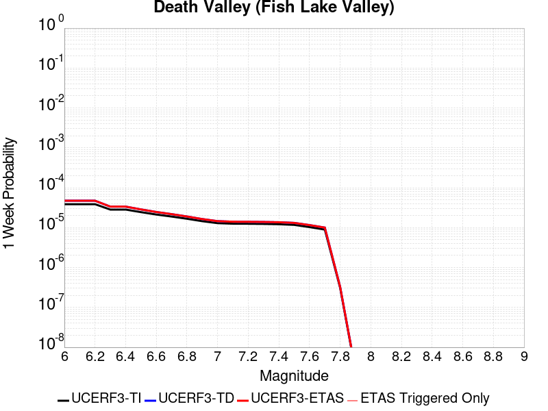 | 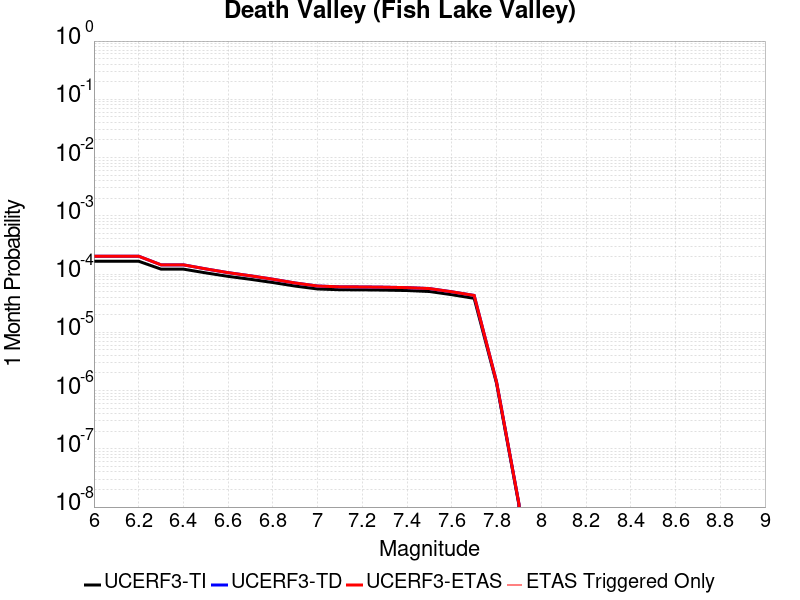 | 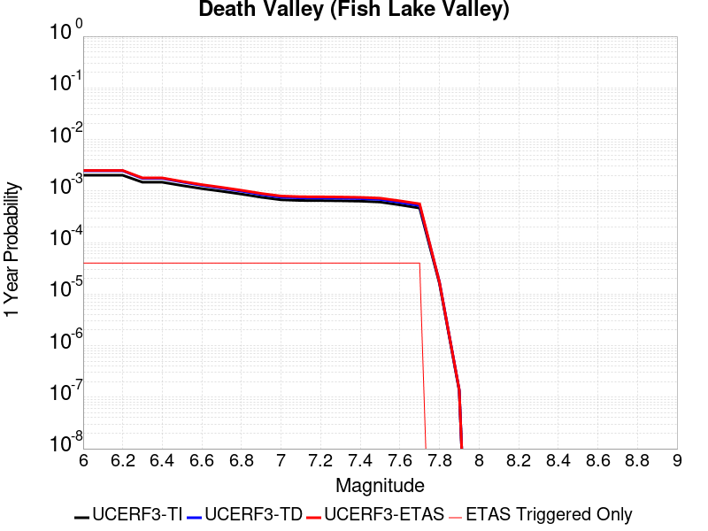 | 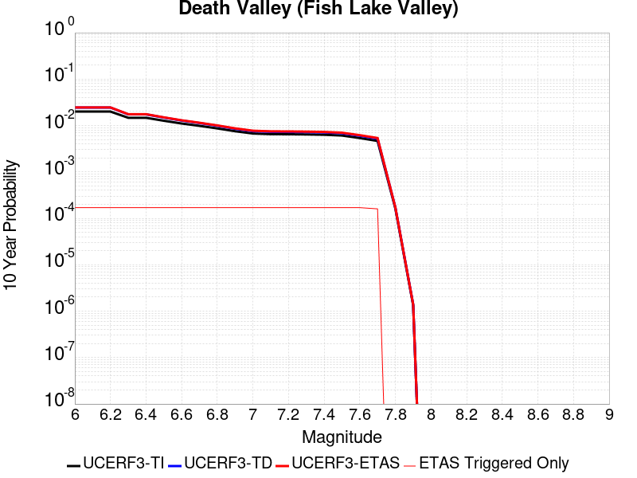 |

| Magnitude | 1 wk TI Prob | 1 wk TD Prob | 1 wk ETAS Prob | 1 wk ETAS/TD Gain | 1 wk ETAS Triggered Only | 1 mo TI Prob | 1 mo TD Prob | 1 mo ETAS Prob | 1 mo ETAS/TD Gain | 1 mo ETAS Triggered Only | 1 yr TI Prob | 1 yr TD Prob | 1 yr ETAS Prob | 1 yr ETAS/TD Gain | 1 yr ETAS Triggered Only | 10 yr TI Prob | 10 yr TD Prob | 10 yr ETAS Prob | 10 yr ETAS/TD Gain | 10 yr ETAS Triggered Only |
|-----|-----|-----|-----|-----|-----|-----|-----|-----|-----|-----|-----|-----|-----|-----|-----|-----|-----|-----|-----|-----|
| 6.0 | 3.872328E-5 | 4.7268895E-5 | 4.7268895E-5 | 1.0 | 0.0 | 1.6594635E-4 | 2.0256694E-4 | 2.0256694E-4 | 1.0 | 0.0 | 0.0020185246 | 0.0024636039 | 0.0024994863 | 1.0145651 | 3.597122E-5 | 0.02000288 | 0.024388881 | 0.024564352 | 1.0071946 | 1.7985611E-4 |
| 6.1 | 3.872328E-5 | 4.7268895E-5 | 4.7268895E-5 | 1.0 | 0.0 | 1.6594635E-4 | 2.0256694E-4 | 2.0256694E-4 | 1.0 | 0.0 | 0.0020185246 | 0.0024636039 | 0.0024994863 | 1.0145651 | 3.597122E-5 | 0.02000288 | 0.024388881 | 0.024564352 | 1.0071946 | 1.7985611E-4 |
| 6.2 | 3.872328E-5 | 4.7268895E-5 | 4.7268895E-5 | 1.0 | 0.0 | 1.6594635E-4 | 2.0256694E-4 | 2.0256694E-4 | 1.0 | 0.0 | 0.0020185246 | 0.0024636039 | 0.0024994863 | 1.0145651 | 3.597122E-5 | 0.02000288 | 0.024388881 | 0.024564352 | 1.0071946 | 1.7985611E-4 |
| 6.3 | 2.8356371E-5 | 3.3610693E-5 | 3.3610693E-5 | 1.0 | 0.0 | 1.2152165E-4 | 1.4403832E-4 | 1.4403832E-4 | 1.0 | 0.0 | 0.0014785219 | 0.001752335 | 0.0017882432 | 1.0204916 | 3.597122E-5 | 0.014687235 | 0.01739221 | 0.017568938 | 1.0101613 | 1.7985611E-4 |
| 6.4 | 2.8356371E-5 | 3.3610693E-5 | 3.3610693E-5 | 1.0 | 0.0 | 1.2152165E-4 | 1.4403832E-4 | 1.4403832E-4 | 1.0 | 0.0 | 0.0014785219 | 0.001752335 | 0.0017882432 | 1.0204916 | 3.597122E-5 | 0.014687235 | 0.01739221 | 0.017568938 | 1.0101613 | 1.7985611E-4 |
| 6.5 | 2.4448687E-5 | 2.8608209E-5 | 2.8608209E-5 | 1.0 | 0.0 | 1.0477588E-4 | 1.2260114E-4 | 1.2260114E-4 | 1.0 | 0.0 | 0.0012748998 | 0.0014916973 | 0.0015276149 | 1.0240784 | 3.597122E-5 | 0.012676105 | 0.014821712 | 0.014998903 | 1.0119548 | 1.7985611E-4 |
| 6.6 | 2.1298161E-5 | 2.4660607E-5 | 2.4660607E-5 | 1.0 | 0.0 | 9.127464E-5 | 1.0568422E-4 | 1.0568422E-4 | 1.0 | 0.0 | 0.0011107022 | 0.0012859798 | 0.0013219047 | 1.0279359 | 3.597122E-5 | 0.011051672 | 0.012788794 | 0.012966351 | 1.0138837 | 1.7985611E-4 |
| 6.7 | 1.8959729E-5 | 2.178146E-5 | 2.178146E-5 | 1.0 | 0.0 | 8.125345E-5 | 9.3345916E-5 | 9.3345916E-5 | 1.0 | 0.0 | 9.888117E-4 | 0.0011359196 | 0.0011718499 | 1.0316311 | 3.597122E-5 | 0.009844234 | 0.011303794 | 0.011481618 | 1.0157312 | 1.7985611E-4 |
| 6.8 | 1.6691629E-5 | 1.9018706E-5 | 1.9018706E-5 | 1.0 | 0.0 | 7.153359E-5 | 8.150629E-5 | 8.150629E-5 | 1.0 | 0.0 | 8.7057345E-4 | 9.919042E-4 | 0.0010278397 | 1.0362289 | 3.597122E-5 | 0.008671708 | 0.009876527 | 0.010054606 | 1.0180306 | 1.7985611E-4 |
| 6.9 | 1.450505E-5 | 1.6389824E-5 | 1.6389824E-5 | 1.0 | 0.0 | 6.216302E-5 | 7.024026E-5 | 7.024026E-5 | 1.0 | 0.0 | 7.5657194E-4 | 8.548484E-4 | 8.907889E-4 | 1.0420431 | 3.597122E-5 | 0.007540013 | 0.008516532 | 0.008694856 | 1.0209386 | 1.7985611E-4 |
| 7.0 | 1.2940855E-5 | 1.453821E-5 | 1.453821E-5 | 1.0 | 0.0 | 5.545963E-5 | 6.230516E-5 | 6.230516E-5 | 1.0 | 0.0 | 6.750118E-4 | 7.583071E-4 | 7.9425104E-4 | 1.0474002 | 3.597122E-5 | 0.006729651 | 0.0075578135 | 0.0077363104 | 1.0236175 | 1.7985611E-4 |
| 7.1 | 1.2544658E-5 | 1.4078437E-5 | 1.4078437E-5 | 1.0 | 0.0 | 5.3761712E-5 | 6.033479E-5 | 6.033479E-5 | 1.0 | 0.0 | 6.5435225E-4 | 7.343341E-4 | 7.702789E-4 | 1.0489489 | 3.597122E-5 | 0.006524288 | 0.0073196692 | 0.007498209 | 1.0243918 | 1.7985611E-4 |
| 7.2 | 1.2489416E-5 | 1.4015902E-5 | 1.4015902E-5 | 1.0 | 0.0 | 5.3524967E-5 | 6.00668E-5 | 6.00668E-5 | 1.0 | 0.0 | 6.514716E-4 | 7.310735E-4 | 7.670184E-4 | 1.0491673 | 3.597122E-5 | 0.006495651 | 0.007287278 | 0.007465823 | 1.024501 | 1.7985611E-4 |
| 7.3 | 1.2368307E-5 | 1.3880038E-5 | 1.3880038E-5 | 1.0 | 0.0 | 5.3005948E-5 | 5.948455E-5 | 5.948455E-5 | 1.0 | 0.0 | 6.451563E-4 | 7.239894E-4 | 7.5993454E-4 | 1.0496488 | 3.597122E-5 | 0.0064328653 | 0.0072168987 | 0.007395457 | 1.0247416 | 1.7985611E-4 |
| 7.4 | 1.2161707E-5 | 1.3648089E-5 | 1.3648089E-5 | 1.0 | 0.0 | 5.212056E-5 | 5.8490532E-5 | 5.8490532E-5 | 1.0 | 0.0 | 6.3438306E-4 | 7.118952E-4 | 7.478408E-4 | 1.0504929 | 3.597122E-5 | 0.006325751 | 0.0070967353 | 0.007275315 | 1.0251637 | 1.7985611E-4 |
| 7.5 | 1.1707948E-5 | 1.314573E-5 | 1.314573E-5 | 1.0 | 0.0 | 5.0175953E-5 | 5.6337656E-5 | 5.6337656E-5 | 1.0 | 0.0 | 6.10721E-4 | 6.857007E-4 | 7.2164723E-4 | 1.0524231 | 3.597122E-5 | 0.0060904534 | 0.0068364325 | 0.007015059 | 1.0261286 | 1.7985611E-4 |
| 7.6 | 1.0319538E-5 | 1.157981E-5 | 1.157981E-5 | 1.0 | 0.0 | 4.4225842E-5 | 4.9626844E-5 | 4.9626844E-5 | 1.0 | 0.0 | 5.383166E-4 | 6.040445E-4 | 6.39994E-4 | 1.0595146 | 3.597122E-5 | 0.0053701443 | 0.0060245576 | 0.00620333 | 1.0296739 | 1.7985611E-4 |
| 7.7 | 8.937764E-6 | 1.0022941E-5 | 1.0022941E-5 | 1.0 | 0.0 | 3.830414E-5 | 4.295478E-5 | 4.295478E-5 | 1.0 | 0.0 | 4.6625308E-4 | 5.2285404E-4 | 5.588064E-4 | 1.0687618 | 3.597122E-5 | 0.0046527605 | 0.005216748 | 0.0053837383 | 1.0320103 | 1.6786571E-4 |
| 7.8 | 3.108007E-7 | 3.2846788E-7 | 3.2846788E-7 | 1.0 | 0.0 | 1.3320023E-6 | 1.4077187E-6 | 1.4077187E-6 | 1.0 | 0.0 | 1.6217007E-5 | 1.7138846E-5 | 1.7138846E-5 | 1.0 | 0.0 | 1.6215823E-4 | 1.713756E-4 | 1.713756E-4 | 1.0 | 0.0 |
| 7.9 | 2.5591178E-9 | 2.6696871E-9 | 2.6696871E-9 | 1.0 | 0.0 | 1.0967647E-8 | 1.1441516E-8 | 1.1441516E-8 | 1.0 | 0.0 | 1.335311E-7 | 1.3930045E-7 | 1.3930045E-7 | 1.0 | 0.0 | 1.3353102E-6 | 1.3930046E-6 | 1.3930046E-6 | 1.0 | 0.0 |

## Cady
*[(top)](#table-of-contents)*

| 1 Week | 1 Month | 1 Year | 10 Year |
|-----|-----|-----|-----|
| 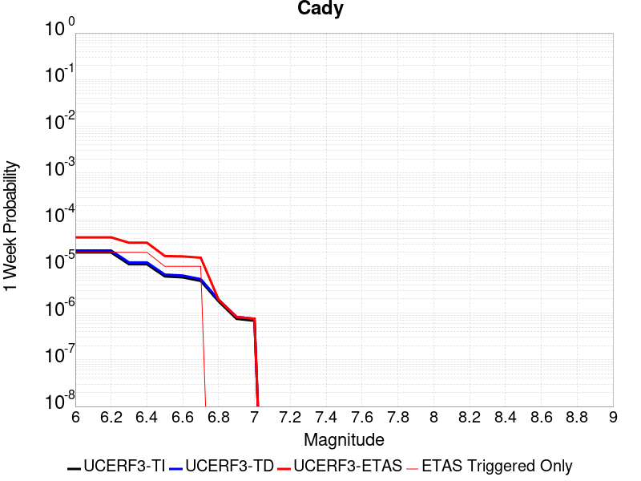 | 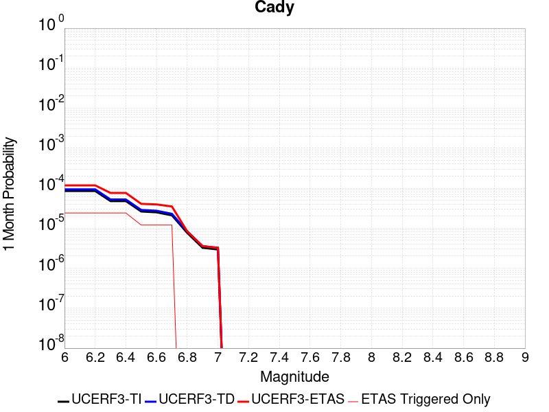 | 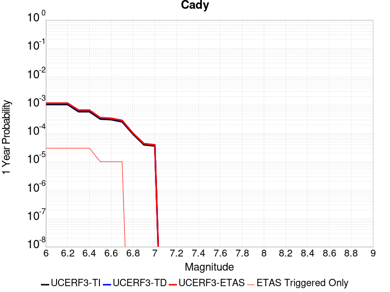 | 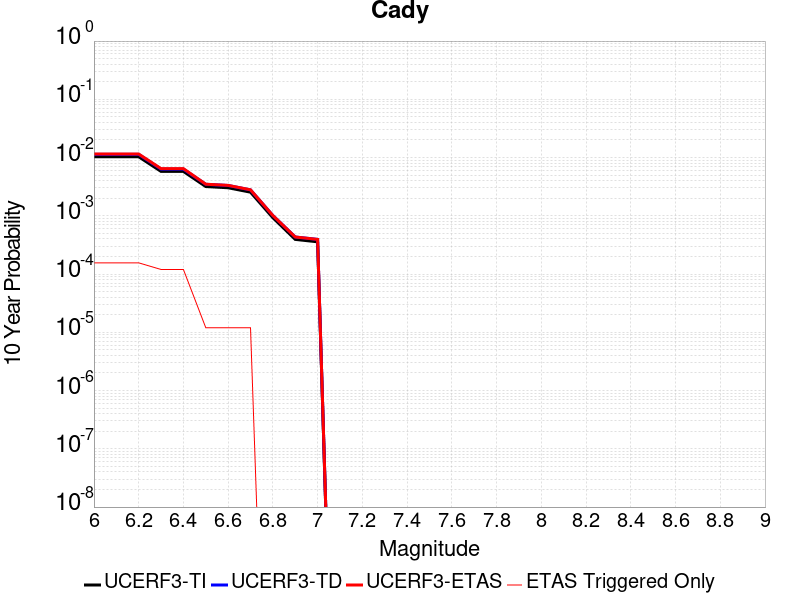 |

| Magnitude | 1 wk TI Prob | 1 wk TD Prob | 1 wk ETAS Prob | 1 wk ETAS/TD Gain | 1 wk ETAS Triggered Only | 1 mo TI Prob | 1 mo TD Prob | 1 mo ETAS Prob | 1 mo ETAS/TD Gain | 1 mo ETAS Triggered Only | 1 yr TI Prob | 1 yr TD Prob | 1 yr ETAS Prob | 1 yr ETAS/TD Gain | 1 yr ETAS Triggered Only | 10 yr TI Prob | 10 yr TD Prob | 10 yr ETAS Prob | 10 yr ETAS/TD Gain | 10 yr ETAS Triggered Only |
|-----|-----|-----|-----|-----|-----|-----|-----|-----|-----|-----|-----|-----|-----|-----|-----|-----|-----|-----|-----|-----|
| 6.0 | 1.9892565E-5 | 2.1859016E-5 | 4.5839308E-5 | 2.0970435 | 2.3980816E-5 | 8.525106E-5 | 9.3678645E-5 | 1.1765721E-4 | 1.2559662 | 2.3980816E-5 | 0.0010374374 | 0.0011400316 | 0.0011759619 | 1.0315169 | 3.597122E-5 | 0.010326075 | 0.011350849 | 0.011504955 | 1.0135766 | 1.558753E-4 |
| 6.1 | 1.9892565E-5 | 2.1859016E-5 | 4.5839308E-5 | 2.0970435 | 2.3980816E-5 | 8.525106E-5 | 9.3678645E-5 | 1.1765721E-4 | 1.2559662 | 2.3980816E-5 | 0.0010374374 | 0.0011400316 | 0.0011759619 | 1.0315169 | 3.597122E-5 | 0.010326075 | 0.011350849 | 0.011504955 | 1.0135766 | 1.558753E-4 |
| 6.2 | 1.9892565E-5 | 2.1859016E-5 | 4.5839308E-5 | 2.0970435 | 2.3980816E-5 | 8.525106E-5 | 9.3678645E-5 | 1.1765721E-4 | 1.2559662 | 2.3980816E-5 | 0.0010374374 | 0.0011400316 | 0.0011759619 | 1.0315169 | 3.597122E-5 | 0.010326075 | 0.011350849 | 0.011504955 | 1.0135766 | 1.558753E-4 |
| 6.3 | 1.1117327E-5 | 1.2176738E-5 | 3.615726E-5 | 2.9693718 | 2.3980816E-5 | 4.764482E-5 | 5.218515E-5 | 7.616472E-5 | 1.4595094 | 2.3980816E-5 | 5.7992124E-4 | 6.3520053E-4 | 6.711489E-4 | 1.0565938 | 3.597122E-5 | 0.0057841022 | 0.0063369554 | 0.0064560995 | 1.0188015 | 1.1990408E-4 |
| 6.4 | 1.1117327E-5 | 1.2176738E-5 | 3.615726E-5 | 2.9693718 | 2.3980816E-5 | 4.764482E-5 | 5.218515E-5 | 7.616472E-5 | 1.4595094 | 2.3980816E-5 | 5.7992124E-4 | 6.3520053E-4 | 6.711489E-4 | 1.0565938 | 3.597122E-5 | 0.0057841022 | 0.0063369554 | 0.0064560995 | 1.0188015 | 1.1990408E-4 |
| 6.5 | 6.103093E-6 | 6.672103E-6 | 1.8662431E-5 | 2.7970836 | 1.1990408E-5 | 2.615585E-5 | 2.8594486E-5 | 4.058455E-5 | 1.4193139 | 1.1990408E-5 | 3.1840094E-4 | 3.4809482E-4 | 3.6008103E-4 | 1.0344338 | 1.1990408E-5 | 0.0031794512 | 0.0034767296 | 0.0034886783 | 1.0034368 | 1.1990408E-5 |
| 6.6 | 5.817237E-6 | 6.365738E-6 | 1.835607E-5 | 2.8835728 | 1.1990408E-5 | 2.4930776E-5 | 2.728152E-5 | 3.92716E-5 | 1.4394946 | 1.1990408E-5 | 3.034899E-4 | 3.3211432E-4 | 3.4410076E-4 | 1.0360912 | 1.1990408E-5 | 0.0030307577 | 0.003317402 | 0.0033293527 | 1.0036024 | 1.1990408E-5 |
| 6.7 | 4.8846314E-6 | 5.3406343E-6 | 1.7330978E-5 | 3.245116 | 1.1990408E-5 | 2.0933967E-5 | 2.2888298E-5 | 3.487843E-5 | 1.5238543 | 1.1990408E-5 | 2.5484123E-4 | 2.7864118E-4 | 2.9062823E-4 | 1.0430198 | 1.1990408E-5 | 0.0025454918 | 0.0027840736 | 0.0027960306 | 1.0042948 | 1.1990408E-5 |
| 6.8 | 1.7788773E-6 | 1.9399313E-6 | 1.9399313E-6 | 1.0 | 0.0 | 7.6237375E-6 | 8.313974E-6 | 8.313974E-6 | 1.0 | 0.0 | 9.281505E-5 | 1.01219506E-4 | 1.01219506E-4 | 1.0 | 0.0 | 9.2776294E-4 | 0.0010118886 | 0.0010118886 | 1.0 | 0.0 |
| 6.9 | 7.5455404E-7 | 8.297202E-7 | 8.297202E-7 | 1.0 | 0.0 | 3.233799E-6 | 3.5559406E-6 | 3.5559406E-6 | 1.0 | 0.0 | 3.937079E-5 | 4.3293054E-5 | 4.3293054E-5 | 1.0 | 0.0 | 3.9363815E-4 | 4.3287914E-4 | 4.3287914E-4 | 1.0 | 0.0 |
| 7.0 | 6.8578805E-7 | 7.541916E-7 | 7.541916E-7 | 1.0 | 0.0 | 2.9390883E-6 | 3.2322475E-6 | 3.2322475E-6 | 1.0 | 0.0 | 3.578281E-5 | 3.9352235E-5 | 3.9352235E-5 | 1.0 | 0.0 | 3.577705E-4 | 3.9348513E-4 | 3.9348513E-4 | 1.0 | 0.0 |

## Scodie Lineament
*[(top)](#table-of-contents)*

| 1 Week | 1 Month | 1 Year | 10 Year |
|-----|-----|-----|-----|
| 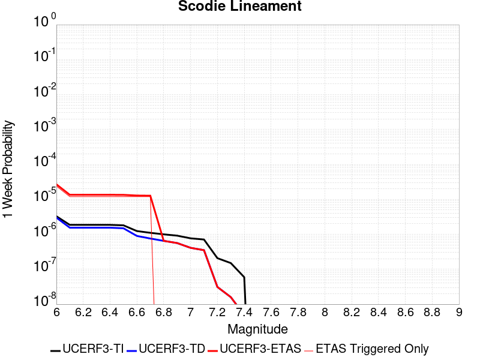 | 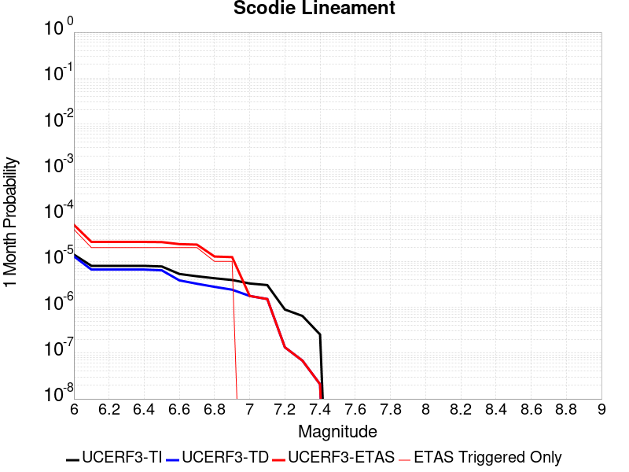 |  | 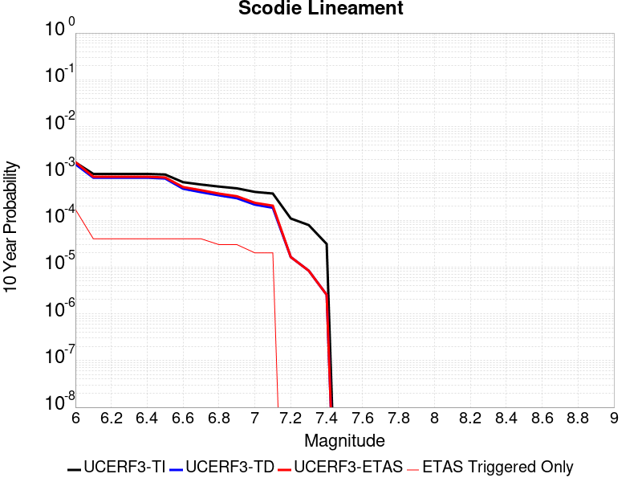 |

| Magnitude | 1 wk TI Prob | 1 wk TD Prob | 1 wk ETAS Prob | 1 wk ETAS/TD Gain | 1 wk ETAS Triggered Only | 1 mo TI Prob | 1 mo TD Prob | 1 mo ETAS Prob | 1 mo ETAS/TD Gain | 1 mo ETAS Triggered Only | 1 yr TI Prob | 1 yr TD Prob | 1 yr ETAS Prob | 1 yr ETAS/TD Gain | 1 yr ETAS Triggered Only | 10 yr TI Prob | 10 yr TD Prob | 10 yr ETAS Prob | 10 yr ETAS/TD Gain | 10 yr ETAS Triggered Only |
|-----|-----|-----|-----|-----|-----|-----|-----|-----|-----|-----|-----|-----|-----|-----|-----|-----|-----|-----|-----|-----|
| 6.0 | 3.2919327E-6 | 3.0133565E-6 | 2.69941E-5 | 8.95815 | 2.3980816E-5 | 1.4108206E-5 | 1.2914339E-5 | 4.8885096E-5 | 3.7853348 | 3.597122E-5 | 1.7175387E-4 | 1.5722391E-4 | 2.7710912E-4 | 1.7625127 | 1.1990408E-4 | 0.0017162118 | 0.0015714383 | 0.0017270687 | 1.0990369 | 1.558753E-4 |
| 6.1 | 1.8663811E-6 | 1.5490589E-6 | 1.3539448E-5 | 8.740435 | 1.1990408E-5 | 7.998751E-6 | 6.6388097E-6 | 1.8629138E-5 | 2.806096 | 1.1990408E-5 | 9.738045E-5 | 8.082501E-5 | 1.0480388E-4 | 1.2966765 | 2.3980816E-5 | 9.7337784E-4 | 8.0800493E-4 | 8.439471E-4 | 1.0444826 | 3.597122E-5 |
| 6.2 | 1.8663811E-6 | 1.5490589E-6 | 1.3539448E-5 | 8.740435 | 1.1990408E-5 | 7.998751E-6 | 6.6388097E-6 | 1.8629138E-5 | 2.806096 | 1.1990408E-5 | 9.738045E-5 | 8.082501E-5 | 1.0480388E-4 | 1.2966765 | 2.3980816E-5 | 9.7337784E-4 | 8.0800493E-4 | 8.439471E-4 | 1.0444826 | 3.597122E-5 |
| 6.3 | 1.8663811E-6 | 1.5490589E-6 | 1.3539448E-5 | 8.740435 | 1.1990408E-5 | 7.998751E-6 | 6.6388097E-6 | 1.8629138E-5 | 2.806096 | 1.1990408E-5 | 9.738045E-5 | 8.082501E-5 | 1.0480388E-4 | 1.2966765 | 2.3980816E-5 | 9.7337784E-4 | 8.0800493E-4 | 8.439471E-4 | 1.0444826 | 3.597122E-5 |
| 6.4 | 1.8663811E-6 | 1.5490589E-6 | 1.3539448E-5 | 8.740435 | 1.1990408E-5 | 7.998751E-6 | 6.6388097E-6 | 1.8629138E-5 | 2.806096 | 1.1990408E-5 | 9.738045E-5 | 8.082501E-5 | 1.0480388E-4 | 1.2966765 | 2.3980816E-5 | 9.7337784E-4 | 8.0800493E-4 | 8.439471E-4 | 1.0444826 | 3.597122E-5 |
| 6.5 | 1.8106311E-6 | 1.4909926E-6 | 1.3481383E-5 | 9.041884 | 1.1990408E-5 | 7.759824E-6 | 6.3899556E-6 | 1.8380286E-5 | 2.8764343 | 1.1990408E-5 | 9.447177E-5 | 7.779543E-5 | 1.0177438E-4 | 1.3082309 | 2.3980816E-5 | 9.4431615E-4 | 7.777306E-4 | 8.1367383E-4 | 1.0462155 | 3.597122E-5 |
| 6.6 | 1.2414679E-6 | 8.9976135E-7 | 1.2890158E-5 | 14.326197 | 1.1990408E-5 | 5.320566E-6 | 3.8561147E-6 | 1.5846477E-5 | 4.109441 | 1.1990408E-5 | 6.477596E-5 | 4.6947276E-5 | 7.0926966E-5 | 1.5107791 | 2.3980816E-5 | 6.475708E-4 | 4.6938224E-4 | 5.0533656E-4 | 1.0765992 | 3.597122E-5 |
| 6.7 | 1.1062215E-6 | 7.5943603E-7 | 1.2749834E-5 | 16.788557 | 1.1990408E-5 | 4.7409408E-6 | 3.254722E-6 | 1.5245091E-5 | 4.6839914 | 1.1990408E-5 | 5.7719422E-5 | 3.9625593E-5 | 6.3605454E-5 | 1.6051611 | 2.3980816E-5 | 5.770443E-4 | 3.9619225E-4 | 4.3214922E-4 | 1.0907564 | 3.597122E-5 |
| 6.8 | 1.0006736E-6 | 6.5004406E-7 | 6.5004406E-7 | 1.0 | 0.0 | 4.288594E-6 | 2.7859005E-6 | 2.7859005E-6 | 1.0 | 0.0 | 5.221238E-5 | 3.3917873E-5 | 4.5907873E-5 | 1.353501 | 1.1990408E-5 | 5.220012E-4 | 3.3913302E-4 | 3.631057E-4 | 1.0706881 | 2.3980816E-5 |
| 6.9 | 9.167364E-7 | 5.6316645E-7 | 5.6316645E-7 | 1.0 | 0.0 | 3.9288643E-6 | 2.4135686E-6 | 2.4135686E-6 | 1.0 | 0.0 | 4.7832873E-5 | 2.9384859E-5 | 4.1374915E-5 | 1.4080352 | 1.1990408E-5 | 4.782258E-4 | 2.9381542E-4 | 3.1778918E-4 | 1.0815947 | 2.3980816E-5 |
| 7.0 | 7.6987664E-7 | 4.113416E-7 | 4.113416E-7 | 1.0 | 0.0 | 3.2994672E-6 | 1.7628915E-6 | 1.7628915E-6 | 1.0 | 0.0 | 4.0170275E-5 | 2.1463033E-5 | 3.3453183E-5 | 1.5586419 | 1.1990408E-5 | 4.0163012E-4 | 2.1461345E-4 | 2.3858913E-4 | 1.1117156 | 2.3980816E-5 |
| 7.1 | 7.1038727E-7 | 3.5211795E-7 | 3.5211795E-7 | 1.0 | 0.0 | 3.0445133E-6 | 1.5090762E-6 | 1.5090762E-6 | 1.0 | 0.0 | 3.706632E-5 | 1.8372884E-5 | 3.0363071E-5 | 1.6526023 | 1.1990408E-5 | 3.7060137E-4 | 1.8371714E-4 | 2.0769356E-4 | 1.1305072 | 2.3980816E-5 |
| 7.2 | 2.0799602E-7 | 3.1187685E-8 | 3.1187685E-8 | 1.0 | 0.0 | 8.914113E-7 | 1.336615E-7 | 1.336615E-7 | 1.0 | 0.0 | 1.0852878E-5 | 1.6273277E-6 | 1.6273277E-6 | 1.0 | 0.0 | 1.08523476E-4 | 1.6273165E-5 | 1.6273165E-5 | 1.0 | 0.0 |
| 7.3 | 1.5048182E-7 | 1.5946263E-8 | 1.5946263E-8 | 1.0 | 0.0 | 6.449219E-7 | 6.834112E-8 | 6.834112E-8 | 1.0 | 0.0 | 7.851896E-6 | 8.320529E-7 | 8.320529E-7 | 1.0 | 0.0 | 7.851618E-5 | 8.3205005E-6 | 8.3205005E-6 | 1.0 | 0.0 |
| 7.4 | 5.9334678E-8 | 4.8685624E-9 | 4.8685624E-9 | 1.0 | 0.0 | 2.5429145E-7 | 2.0865269E-8 | 2.0865269E-8 | 1.0 | 0.0 | 3.095994E-6 | 2.5403463E-7 | 2.5403463E-7 | 1.0 | 0.0 | 3.095951E-5 | 2.5403444E-6 | 2.5403444E-6 | 1.0 | 0.0 |

## San Andreas (North Branch Mill Creek)
*[(top)](#table-of-contents)*

| 1 Week | 1 Month | 1 Year | 10 Year |
|-----|-----|-----|-----|
| 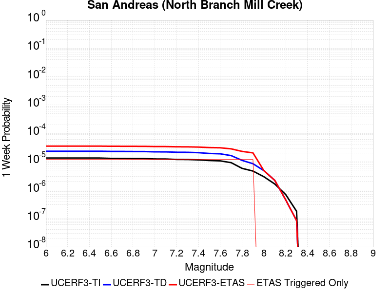 | 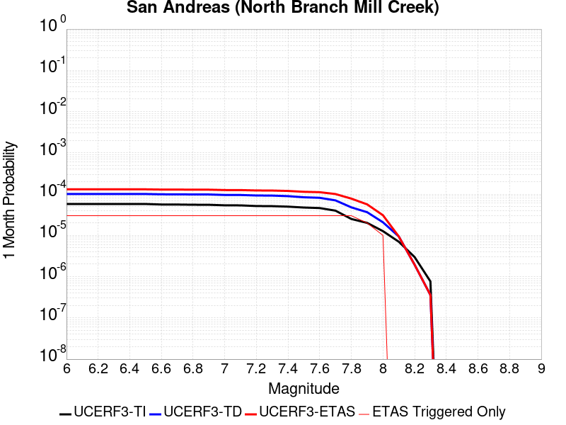 | 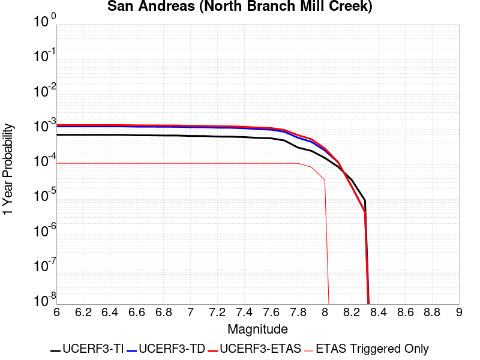 | 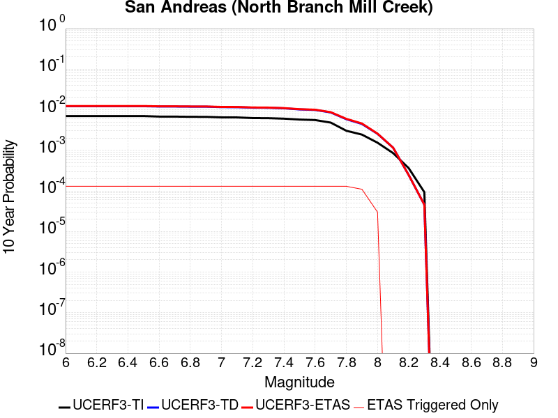 |

| Magnitude | 1 wk TI Prob | 1 wk TD Prob | 1 wk ETAS Prob | 1 wk ETAS/TD Gain | 1 wk ETAS Triggered Only | 1 mo TI Prob | 1 mo TD Prob | 1 mo ETAS Prob | 1 mo ETAS/TD Gain | 1 mo ETAS Triggered Only | 1 yr TI Prob | 1 yr TD Prob | 1 yr ETAS Prob | 1 yr ETAS/TD Gain | 1 yr ETAS Triggered Only | 10 yr TI Prob | 10 yr TD Prob | 10 yr ETAS Prob | 10 yr ETAS/TD Gain | 10 yr ETAS Triggered Only |
|-----|-----|-----|-----|-----|-----|-----|-----|-----|-----|-----|-----|-----|-----|-----|-----|-----|-----|-----|-----|-----|
| 6.0 | 1.3461156E-5 | 2.3506776E-5 | 3.54969E-5 | 1.510071 | 1.1990408E-5 | 5.7689394E-5 | 1.0073945E-4 | 1.3670705E-4 | 1.3570359 | 3.597122E-5 | 7.02142E-4 | 0.0012258161 | 0.0013335975 | 1.0879263 | 1.0791367E-4 | 0.0069992766 | 0.012233093 | 0.012375218 | 1.011618 | 1.4388488E-4 |
| 6.1 | 1.3461156E-5 | 2.3506776E-5 | 3.54969E-5 | 1.510071 | 1.1990408E-5 | 5.7689394E-5 | 1.0073945E-4 | 1.3670705E-4 | 1.3570359 | 3.597122E-5 | 7.02142E-4 | 0.0012258161 | 0.0013335975 | 1.0879263 | 1.0791367E-4 | 0.0069992766 | 0.012233093 | 0.012375218 | 1.011618 | 1.4388488E-4 |
| 6.2 | 1.3461156E-5 | 2.3506776E-5 | 3.54969E-5 | 1.510071 | 1.1990408E-5 | 5.7689394E-5 | 1.0073945E-4 | 1.3670705E-4 | 1.3570359 | 3.597122E-5 | 7.02142E-4 | 0.0012258161 | 0.0013335975 | 1.0879263 | 1.0791367E-4 | 0.0069992766 | 0.012233093 | 0.012375218 | 1.011618 | 1.4388488E-4 |
| 6.3 | 1.3461156E-5 | 2.3506776E-5 | 3.54969E-5 | 1.510071 | 1.1990408E-5 | 5.7689394E-5 | 1.0073945E-4 | 1.3670705E-4 | 1.3570359 | 3.597122E-5 | 7.02142E-4 | 0.0012258161 | 0.0013335975 | 1.0879263 | 1.0791367E-4 | 0.0069992766 | 0.012233093 | 0.012375218 | 1.011618 | 1.4388488E-4 |
| 6.4 | 1.3461156E-5 | 2.3506776E-5 | 3.54969E-5 | 1.510071 | 1.1990408E-5 | 5.7689394E-5 | 1.0073945E-4 | 1.3670705E-4 | 1.3570359 | 3.597122E-5 | 7.02142E-4 | 0.0012258161 | 0.0013335975 | 1.0879263 | 1.0791367E-4 | 0.0069992766 | 0.012233093 | 0.012375218 | 1.011618 | 1.4388488E-4 |
| 6.5 | 1.3450706E-5 | 2.3495735E-5 | 3.548586E-5 | 1.5103108 | 1.1990408E-5 | 5.764461E-5 | 1.0069214E-4 | 1.3665974E-4 | 1.3572036 | 3.597122E-5 | 7.0159714E-4 | 0.0012252406 | 0.0013330221 | 1.0879675 | 1.0791367E-4 | 0.006993862 | 0.012227403 | 0.012369528 | 1.0116235 | 1.4388488E-4 |
| 6.6 | 1.3074523E-5 | 2.3110017E-5 | 3.5100147E-5 | 1.5188283 | 1.1990408E-5 | 5.6032466E-5 | 9.9039185E-5 | 1.3500685E-4 | 1.363166 | 3.597122E-5 | 6.8198174E-4 | 0.0012051383 | 0.0013129219 | 1.0894368 | 1.0791367E-4 | 0.006798926 | 0.0120285675 | 0.012170722 | 1.011818 | 1.4388488E-4 |
| 6.7 | 1.3050216E-5 | 2.3085311E-5 | 3.507544E-5 | 1.5193835 | 1.1990408E-5 | 5.59283E-5 | 9.893332E-5 | 1.3490098E-4 | 1.3635546 | 3.597122E-5 | 6.8071426E-4 | 0.0012038508 | 0.0013116346 | 1.0895325 | 1.0791367E-4 | 0.0067863287 | 0.012015832 | 0.012157988 | 1.0118307 | 1.4388488E-4 |
| 6.8 | 1.29049395E-5 | 2.293372E-5 | 3.492385E-5 | 1.5228168 | 1.1990408E-5 | 5.530571E-5 | 9.828369E-5 | 1.3425137E-4 | 1.3659579 | 3.597122E-5 | 6.73139E-4 | 0.0011959502 | 0.0013037348 | 1.0901246 | 1.0791367E-4 | 0.0067110364 | 0.011937677 | 0.012079843 | 1.0119091 | 1.4388488E-4 |
| 6.9 | 1.2867369E-5 | 2.2893122E-5 | 3.4883255E-5 | 1.5237439 | 1.1990408E-5 | 5.51447E-5 | 9.810971E-5 | 1.340774E-4 | 1.3666068 | 3.597122E-5 | 6.711799E-4 | 0.0011938344 | 0.0013016192 | 1.0902846 | 1.0791367E-4 | 0.006691564 | 0.011916745 | 0.012058916 | 1.0119303 | 1.4388488E-4 |
| 7.0 | 1.2495996E-5 | 2.2293154E-5 | 3.4283294E-5 | 1.5378395 | 1.1990408E-5 | 5.3553173E-5 | 9.5538606E-5 | 1.315064E-4 | 1.3764738 | 3.597122E-5 | 6.518148E-4 | 0.0011625647 | 0.001270353 | 1.0927159 | 1.0791367E-4 | 0.0064990623 | 0.011607327 | 0.011749541 | 1.0122522 | 1.4388488E-4 |
| 7.1 | 1.2452067E-5 | 2.2238226E-5 | 3.4228367E-5 | 1.5391681 | 1.1990408E-5 | 5.3364907E-5 | 9.5303214E-5 | 1.3127101E-4 | 1.3774037 | 3.597122E-5 | 6.4952404E-4 | 0.0011597018 | 0.0012674904 | 1.092945 | 1.0791367E-4 | 0.0064762887 | 0.011578998 | 0.011721216 | 1.0122825 | 1.4388488E-4 |
| 7.2 | 1.2002777E-5 | 2.1616754E-5 | 3.3606902E-5 | 1.5546693 | 1.1990408E-5 | 5.143946E-5 | 9.263996E-5 | 1.2860785E-4 | 1.3882546 | 3.597122E-5 | 6.2609545E-4 | 0.0011273106 | 0.0012351025 | 1.0956187 | 1.0791367E-4 | 0.006243344 | 0.011258403 | 0.011400667 | 1.0126363 | 1.4388488E-4 |
| 7.3 | 1.1923425E-5 | 2.1486576E-5 | 3.3476725E-5 | 1.5580298 | 1.1990408E-5 | 5.109939E-5 | 9.208209E-5 | 1.2805E-4 | 1.390607 | 3.597122E-5 | 6.219575E-4 | 0.0011205255 | 0.0012283183 | 1.0961984 | 1.0791367E-4 | 0.0062021962 | 0.011191265 | 0.011333539 | 1.012713 | 1.4388488E-4 |
| 7.4 | 1.16105175E-5 | 2.0860489E-5 | 3.2850647E-5 | 1.5747783 | 1.1990408E-5 | 4.975841E-5 | 8.9399044E-5 | 1.2536705E-4 | 1.402331 | 3.597122E-5 | 6.0564023E-4 | 0.0010878925 | 0.0011956887 | 1.0990872 | 1.0791367E-4 | 0.006039923 | 0.01086884 | 0.011011161 | 1.0130944 | 1.4388488E-4 |
| 7.5 | 1.1037265E-5 | 1.956039E-5 | 3.155056E-5 | 1.6129824 | 1.1990408E-5 | 4.7301706E-5 | 8.382756E-5 | 1.1979577E-4 | 1.4290738 | 3.597122E-5 | 5.757461E-4 | 0.0010201249 | 0.0011279284 | 1.1056769 | 1.0791367E-4 | 0.005742567 | 0.010198223 | 0.010340641 | 1.0139649 | 1.4388488E-4 |
| 7.6 | 1.0720915E-5 | 1.900222E-5 | 3.09924E-5 | 1.6309884 | 1.1990408E-5 | 4.5945973E-5 | 8.143555E-5 | 1.1740385E-4 | 1.441678 | 3.597122E-5 | 5.592486E-4 | 9.910291E-4 | 0.0010988358 | 1.1087826 | 1.0791367E-4 | 0.005578433 | 0.009909907 | 0.010052366 | 1.0143754 | 1.4388488E-4 |
| 7.7 | 9.276279E-6 | 1.6447744E-5 | 2.8437955E-5 | 1.7289882 | 1.1990408E-5 | 3.9754876E-5 | 7.048844E-5 | 1.06457126E-4 | 1.5102779 | 3.597122E-5 | 4.839081E-4 | 8.578605E-4 | 9.6568157E-4 | 1.125686 | 1.0791367E-4 | 0.0048285574 | 0.008589173 | 0.008731822 | 1.016608 | 1.4388488E-4 |
| 7.8 | 5.8346777E-6 | 1.1159965E-5 | 2.3150238E-5 | 2.0744007 | 1.1990408E-5 | 2.5005522E-5 | 4.7827543E-5 | 8.3797044E-5 | 1.7520667 | 3.597122E-5 | 3.043997E-4 | 5.821449E-4 | 6.899957E-4 | 1.1852646 | 1.0791367E-4 | 0.0030398308 | 0.005849473 | 0.0059925164 | 1.024454 | 1.4388488E-4 |
| 7.9 | 4.690204E-6 | 8.513225E-6 | 2.050353E-5 | 2.4084327 | 1.1990408E-5 | 2.0100719E-5 | 3.648474E-5 | 6.046468E-5 | 1.6572595 | 2.3980816E-5 | 2.4469878E-4 | 4.4411127E-4 | 5.280069E-4 | 1.1889067 | 8.393286E-5 | 0.002444295 | 0.0044728746 | 0.004592242 | 1.026687 | 1.1990408E-4 |
| 8.0 | 2.9570454E-6 | 4.8494758E-6 | 4.8494758E-6 | 1.0 | 0.0 | 1.267299E-5 | 2.0783302E-5 | 3.277346E-5 | 1.5769131 | 1.1990408E-5 | 1.5428272E-4 | 2.5300734E-4 | 2.8896946E-4 | 1.1421386 | 3.597122E-5 | 0.0015417566 | 0.0025509594 | 0.0025868388 | 1.014065 | 3.597122E-5 |
| 8.1 | 1.6376824E-6 | 2.198225E-6 | 2.198225E-6 | 1.0 | 0.0 | 7.01862E-6 | 9.420931E-6 | 9.420931E-6 | 1.0 | 0.0 | 8.544835E-5 | 1.1469381E-4 | 1.1469381E-4 | 1.0 | 0.0 | 8.54155E-4 | 0.0011613552 | 0.0011613552 | 1.0 | 0.0 |
| 8.2 | 6.9631557E-7 | 4.5401492E-7 | 4.5401492E-7 | 1.0 | 0.0 | 2.984206E-6 | 1.9457768E-6 | 1.9457768E-6 | 1.0 | 0.0 | 3.63321E-5 | 2.3689576E-5 | 2.3689576E-5 | 1.0 | 0.0 | 3.6326164E-4 | 2.453756E-4 | 2.453756E-4 | 1.0 | 0.0 |
| 8.3 | 1.7876137E-7 | 8.368747E-8 | 8.368747E-8 | 1.0 | 0.0 | 7.661199E-7 | 3.5866054E-7 | 3.5866054E-7 | 1.0 | 0.0 | 9.32747E-6 | 4.3666837E-6 | 4.3666837E-6 | 1.0 | 0.0 | 9.3270784E-5 | 4.5861943E-5 | 4.5861943E-5 | 1.0 | 0.0 |

## San Jacinto (San Bernardino)
*[(top)](#table-of-contents)*

| 1 Week | 1 Month | 1 Year | 10 Year |
|-----|-----|-----|-----|
| 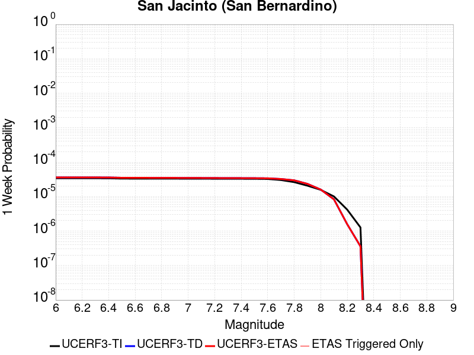 | 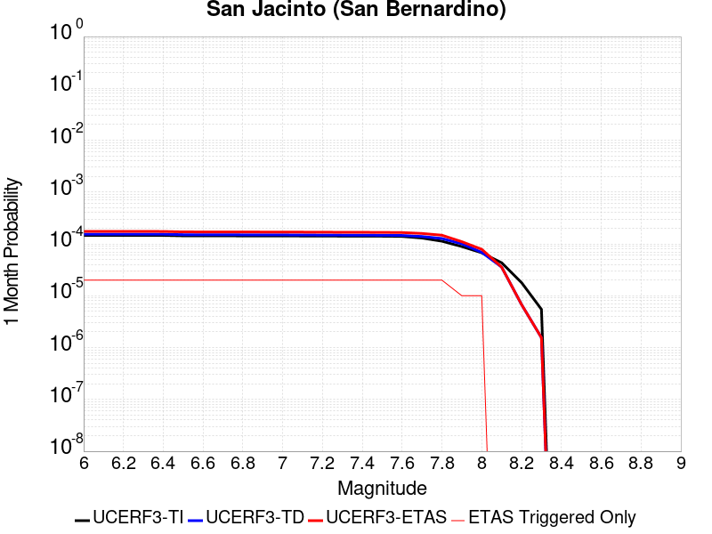 | 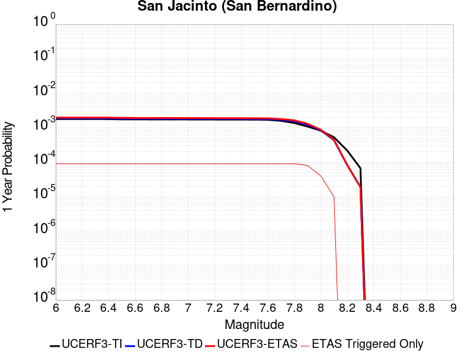 | 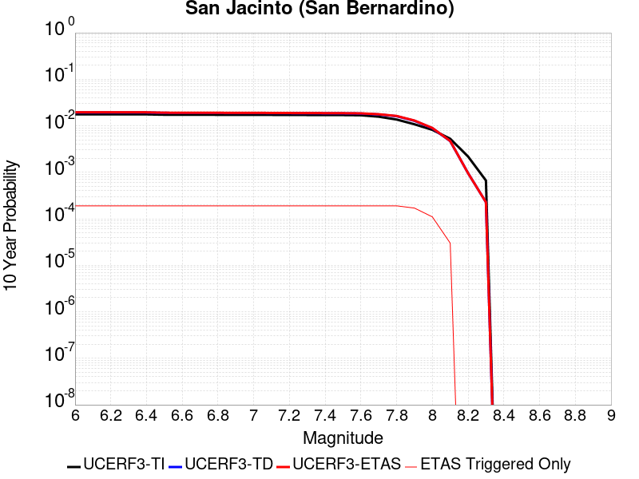 |

| Magnitude | 1 wk TI Prob | 1 wk TD Prob | 1 wk ETAS Prob | 1 wk ETAS/TD Gain | 1 wk ETAS Triggered Only | 1 mo TI Prob | 1 mo TD Prob | 1 mo ETAS Prob | 1 mo ETAS/TD Gain | 1 mo ETAS Triggered Only | 1 yr TI Prob | 1 yr TD Prob | 1 yr ETAS Prob | 1 yr ETAS/TD Gain | 1 yr ETAS Triggered Only | 10 yr TI Prob | 10 yr TD Prob | 10 yr ETAS Prob | 10 yr ETAS/TD Gain | 10 yr ETAS Triggered Only |
|-----|-----|-----|-----|-----|-----|-----|-----|-----|-----|-----|-----|-----|-----|-----|-----|-----|-----|-----|-----|-----|
| 6.0 | 3.409352E-5 | 3.600249E-5 | 3.600249E-5 | 1.0 | 0.0 | 1.461069E-4 | 1.5428728E-4 | 1.782644E-4 | 1.1554056 | 2.3980816E-5 | 0.0017774 | 0.001876831 | 0.0019725743 | 1.0510132 | 9.5923264E-5 | 0.01763251 | 0.019358097 | 0.019499198 | 1.0072889 | 1.4388488E-4 |
| 6.1 | 3.409352E-5 | 3.600249E-5 | 3.600249E-5 | 1.0 | 0.0 | 1.461069E-4 | 1.5428728E-4 | 1.782644E-4 | 1.1554056 | 2.3980816E-5 | 0.0017774 | 0.001876831 | 0.0019725743 | 1.0510132 | 9.5923264E-5 | 0.01763251 | 0.019358097 | 0.019499198 | 1.0072889 | 1.4388488E-4 |
| 6.2 | 3.409352E-5 | 3.600249E-5 | 3.600249E-5 | 1.0 | 0.0 | 1.461069E-4 | 1.5428728E-4 | 1.782644E-4 | 1.1554056 | 2.3980816E-5 | 0.0017774 | 0.001876831 | 0.0019725743 | 1.0510132 | 9.5923264E-5 | 0.01763251 | 0.019358097 | 0.019499198 | 1.0072889 | 1.4388488E-4 |
| 6.3 | 3.409352E-5 | 3.600249E-5 | 3.600249E-5 | 1.0 | 0.0 | 1.461069E-4 | 1.5428728E-4 | 1.782644E-4 | 1.1554056 | 2.3980816E-5 | 0.0017774 | 0.001876831 | 0.0019725743 | 1.0510132 | 9.5923264E-5 | 0.01763251 | 0.019358097 | 0.019499198 | 1.0072889 | 1.4388488E-4 |
| 6.4 | 3.400795E-5 | 3.589515E-5 | 3.589515E-5 | 1.0 | 0.0 | 1.4574021E-4 | 1.5382729E-4 | 1.7780442E-4 | 1.1558704 | 2.3980816E-5 | 0.0017729428 | 0.0018712406 | 0.0019669842 | 1.0511659 | 9.5923264E-5 | 0.017588645 | 0.019303178 | 0.019444285 | 1.00731 | 1.4388488E-4 |
| 6.5 | 3.341482E-5 | 3.5155765E-5 | 3.5155765E-5 | 1.0 | 0.0 | 1.4319851E-4 | 1.5065886E-4 | 1.7463606E-4 | 1.1591489 | 2.3980816E-5 | 0.0017420477 | 0.0018327299 | 0.0019284773 | 1.0522431 | 9.5923264E-5 | 0.017284546 | 0.018924711 | 0.019065872 | 1.0074592 | 1.4388488E-4 |
| 6.6 | 3.3364955E-5 | 3.509298E-5 | 3.509298E-5 | 1.0 | 0.0 | 1.4298483E-4 | 1.5038982E-4 | 1.7436703E-4 | 1.1594337 | 2.3980816E-5 | 0.0017394501 | 0.0018294598 | 0.0019252077 | 1.0523367 | 9.5923264E-5 | 0.017258976 | 0.018892575 | 0.019033741 | 1.007472 | 1.4388488E-4 |
| 6.7 | 3.335922E-5 | 3.5082754E-5 | 3.5082754E-5 | 1.0 | 0.0 | 1.4296026E-4 | 1.5034601E-4 | 1.7432321E-4 | 1.1594802 | 2.3980816E-5 | 0.0017391514 | 0.0018289272 | 0.0019246751 | 1.052352 | 9.5923264E-5 | 0.017256035 | 0.018887365 | 0.019028533 | 1.0074742 | 1.4388488E-4 |
| 6.8 | 3.327683E-5 | 3.4976816E-5 | 3.4976816E-5 | 1.0 | 0.0 | 1.4260718E-4 | 1.4989203E-4 | 1.7386925E-4 | 1.1599633 | 2.3980816E-5 | 0.0017348597 | 0.0018234095 | 0.0019191578 | 1.0525106 | 9.5923264E-5 | 0.017213784 | 0.018833136 | 0.018974312 | 1.0074961 | 1.4388488E-4 |
| 6.9 | 3.3235785E-5 | 3.4917768E-5 | 3.4917768E-5 | 1.0 | 0.0 | 1.4243131E-4 | 1.49639E-4 | 1.7361624E-4 | 1.1602339 | 2.3980816E-5 | 0.0017327217 | 0.0018203339 | 0.0019160826 | 1.0525995 | 9.5923264E-5 | 0.017192734 | 0.018803004 | 0.018944183 | 1.0075084 | 1.4388488E-4 |
| 7.0 | 3.3197095E-5 | 3.4857694E-5 | 3.4857694E-5 | 1.0 | 0.0 | 1.422655E-4 | 1.4938158E-4 | 1.7335881E-4 | 1.16051 | 2.3980816E-5 | 0.0017307063 | 0.001817205 | 0.0019129539 | 1.0526903 | 9.5923264E-5 | 0.017172894 | 0.01877238 | 0.018913563 | 1.0075208 | 1.4388488E-4 |
| 7.1 | 3.3129716E-5 | 3.47379E-5 | 3.47379E-5 | 1.0 | 0.0 | 1.4197677E-4 | 1.4886823E-4 | 1.7284548E-4 | 1.1610636 | 2.3980816E-5 | 0.0017271966 | 0.0018109654 | 0.0019067149 | 1.0528721 | 9.5923264E-5 | 0.017138338 | 0.018711457 | 0.01885265 | 1.0075458 | 1.4388488E-4 |
| 7.2 | 3.3034008E-5 | 3.4605342E-5 | 3.4605342E-5 | 1.0 | 0.0 | 1.4156665E-4 | 1.4830018E-4 | 1.7227745E-4 | 1.1616806 | 2.3980816E-5 | 0.0017222111 | 0.001804061 | 0.0018998112 | 1.0530748 | 9.5923264E-5 | 0.017089253 | 0.018643849 | 0.01878505 | 1.0075737 | 1.4388488E-4 |
| 7.3 | 3.2956614E-5 | 3.447309E-5 | 3.447309E-5 | 1.0 | 0.0 | 1.4123498E-4 | 1.4773346E-4 | 1.7171074E-4 | 1.162301 | 2.3980816E-5 | 0.0017181796 | 0.0017971725 | 0.0018929233 | 1.0532786 | 9.5923264E-5 | 0.017049557 | 0.018576592 | 0.018717803 | 1.0076016 | 1.4388488E-4 |
| 7.4 | 3.2915937E-5 | 3.439478E-5 | 3.439478E-5 | 1.0 | 0.0 | 1.4106068E-4 | 1.4739788E-4 | 1.7137516E-4 | 1.1626705 | 2.3980816E-5 | 0.0017160608 | 0.0017930934 | 0.0018888447 | 1.0534 | 9.5923264E-5 | 0.017028693 | 0.018536855 | 0.018678073 | 1.0076182 | 1.4388488E-4 |
| 7.5 | 3.281791E-5 | 3.4259683E-5 | 3.4259683E-5 | 1.0 | 0.0 | 1.406406E-4 | 1.4681896E-4 | 1.7079625E-4 | 1.163312 | 2.3980816E-5 | 0.0017109542 | 0.0017860567 | 0.0018818085 | 1.0536108 | 9.5923264E-5 | 0.016978411 | 0.018467735 | 0.018608963 | 1.0076473 | 1.4388488E-4 |
| 7.6 | 3.2521442E-5 | 3.39846E-5 | 3.39846E-5 | 1.0 | 0.0 | 1.3937015E-4 | 1.4564018E-4 | 1.696175E-4 | 1.164634 | 2.3980816E-5 | 0.0016955109 | 0.0017717284 | 0.0018674817 | 1.0540451 | 9.5923264E-5 | 0.016826328 | 0.01832535 | 0.018466597 | 1.0077078 | 1.4388488E-4 |
| 7.7 | 3.0287873E-5 | 3.246845E-5 | 3.246845E-5 | 1.0 | 0.0 | 1.297987E-4 | 1.391431E-4 | 1.6312057E-4 | 1.1723224 | 2.3980816E-5 | 0.0015791537 | 0.001692752 | 0.0017885128 | 1.0565711 | 9.5923264E-5 | 0.01567979 | 0.017536119 | 0.01767748 | 1.0080612 | 1.4388488E-4 |
| 7.8 | 2.6316151E-5 | 2.9678711E-5 | 2.9678711E-5 | 1.0 | 0.0 | 1.1277862E-4 | 1.2718828E-4 | 1.5116605E-4 | 1.1885219 | 2.3980816E-5 | 0.0013722149 | 0.0015474184 | 0.0016431932 | 1.0618933 | 9.5923264E-5 | 0.013637724 | 0.016077382 | 0.016218955 | 1.0088056 | 1.4388488E-4 |
| 7.9 | 2.0761147E-5 | 2.3431265E-5 | 2.3431265E-5 | 1.0 | 0.0 | 8.897331E-5 | 1.0041584E-4 | 1.1240505E-4 | 1.1193955 | 1.1990408E-5 | 0.0010827117 | 0.0012218781 | 0.0013057083 | 1.0686077 | 8.393286E-5 | 0.010774517 | 0.012799971 | 0.01291834 | 1.0092477 | 1.1990408E-4 |
| 8.0 | 1.5738568E-5 | 1.6043394E-5 | 1.6043394E-5 | 1.0 | 0.0 | 6.744926E-5 | 6.8755595E-5 | 8.074518E-5 | 1.1743797 | 1.1990408E-5 | 8.2088535E-4 | 8.3677855E-4 | 8.8470004E-4 | 1.057269 | 4.7961632E-5 | 0.008178596 | 0.008871087 | 0.008954275 | 1.0093775 | 8.393286E-5 |
| 8.1 | 1.0105832E-5 | 8.336244E-6 | 8.336244E-6 | 1.0 | 0.0 | 4.3309992E-5 | 3.5726272E-5 | 3.5726272E-5 | 1.0 | 0.0 | 5.2717153E-4 | 4.3488108E-4 | 4.4686627E-4 | 1.0275598 | 1.1990408E-5 | 0.005259227 | 0.00468032 | 0.0047041886 | 1.0050998 | 2.3980816E-5 |
| 8.2 | 4.189207E-6 | 1.5801045E-6 | 1.5801045E-6 | 1.0 | 0.0 | 1.7953622E-5 | 6.771859E-6 | 6.771859E-6 | 1.0 | 0.0 | 2.1856341E-4 | 8.244429E-5 | 8.244429E-5 | 1.0 | 0.0 | 0.0021834858 | 9.575395E-4 | 9.575395E-4 | 1.0 | 0.0 |
| 8.3 | 1.2758221E-6 | 3.6194777E-7 | 3.6194777E-7 | 1.0 | 0.0 | 5.4677976E-6 | 1.5512038E-6 | 1.5512038E-6 | 1.0 | 0.0 | 6.65684E-5 | 1.8885747E-5 | 1.8885747E-5 | 1.0 | 0.0 | 6.6548464E-4 | 2.2777634E-4 | 2.2777634E-4 | 1.0 | 0.0 |

## Elsinore (Glen Ivy) rev
*[(top)](#table-of-contents)*

| 1 Week | 1 Month | 1 Year | 10 Year |
|-----|-----|-----|-----|
|  | 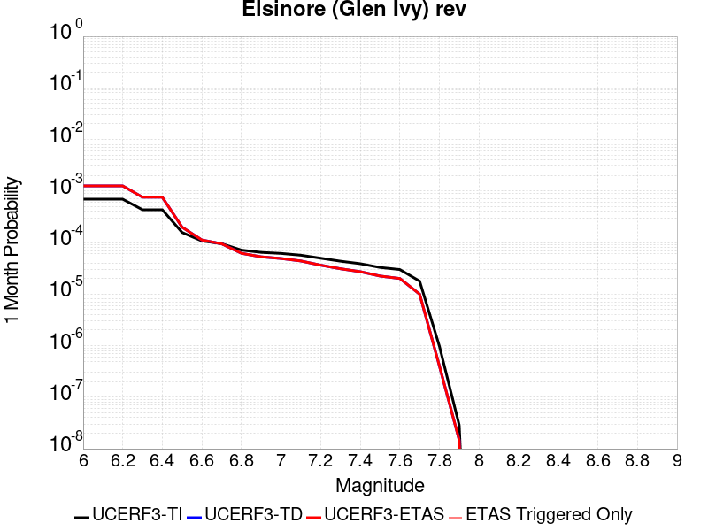 | 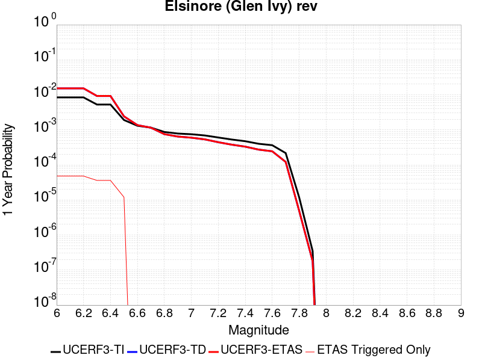 | 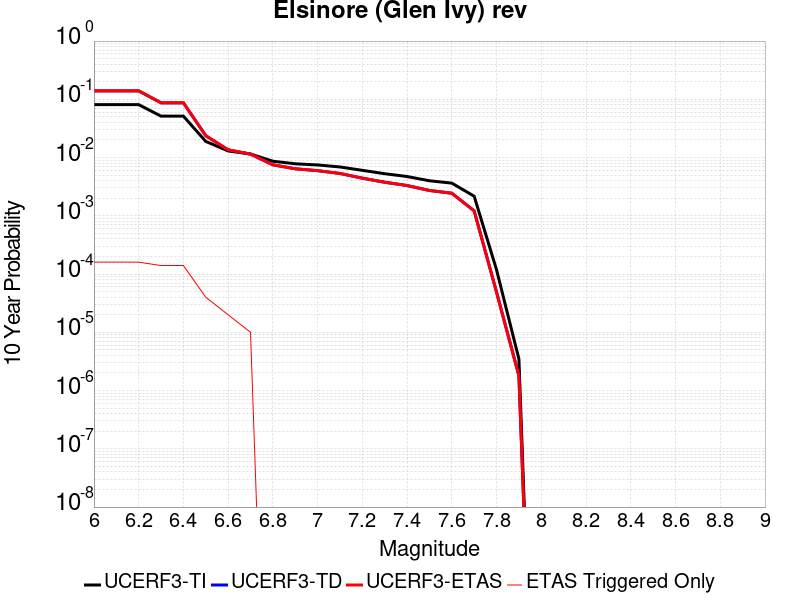 |

| Magnitude | 1 wk TI Prob | 1 wk TD Prob | 1 wk ETAS Prob | 1 wk ETAS/TD Gain | 1 wk ETAS Triggered Only | 1 mo TI Prob | 1 mo TD Prob | 1 mo ETAS Prob | 1 mo ETAS/TD Gain | 1 mo ETAS Triggered Only | 1 yr TI Prob | 1 yr TD Prob | 1 yr ETAS Prob | 1 yr ETAS/TD Gain | 1 yr ETAS Triggered Only | 10 yr TI Prob | 10 yr TD Prob | 10 yr ETAS Prob | 10 yr ETAS/TD Gain | 10 yr ETAS Triggered Only |
|-----|-----|-----|-----|-----|-----|-----|-----|-----|-----|-----|-----|-----|-----|-----|-----|-----|-----|-----|-----|-----|
| 6.0 | 1.6204086E-4 | 2.9362022E-4 | 2.9362022E-4 | 1.0 | 0.0 | 6.94276E-4 | 0.0012579202 | 0.0012579202 | 1.0 | 0.0 | 0.008420097 | 0.015235162 | 0.015282393 | 1.0031002 | 4.7961632E-5 | 0.081081145 | 0.13969512 | 0.1398086 | 1.0008123 | 1.3189449E-4 |
| 6.1 | 1.6204086E-4 | 2.9362022E-4 | 2.9362022E-4 | 1.0 | 0.0 | 6.94276E-4 | 0.0012579202 | 0.0012579202 | 1.0 | 0.0 | 0.008420097 | 0.015235162 | 0.015282393 | 1.0031002 | 4.7961632E-5 | 0.081081145 | 0.13969512 | 0.1398086 | 1.0008123 | 1.3189449E-4 |
| 6.2 | 1.6204086E-4 | 2.9362022E-4 | 2.9362022E-4 | 1.0 | 0.0 | 6.94276E-4 | 0.0012579202 | 0.0012579202 | 1.0 | 0.0 | 0.008420097 | 0.015235162 | 0.015282393 | 1.0031002 | 4.7961632E-5 | 0.081081145 | 0.13969512 | 0.1398086 | 1.0008123 | 1.3189449E-4 |
| 6.3 | 1.0111737E-4 | 1.7703768E-4 | 1.7703768E-4 | 1.0 | 0.0 | 4.332882E-4 | 7.58629E-4 | 7.58629E-4 | 1.0 | 0.0 | 0.005262531 | 0.0092178825 | 0.009253522 | 1.0038663 | 3.597122E-5 | 0.0513964 | 0.08702082 | 0.08711935 | 1.0011321 | 1.0791367E-4 |
| 6.4 | 1.0111737E-4 | 1.7703768E-4 | 1.7703768E-4 | 1.0 | 0.0 | 4.332882E-4 | 7.58629E-4 | 7.58629E-4 | 1.0 | 0.0 | 0.005262531 | 0.0092178825 | 0.009253522 | 1.0038663 | 3.597122E-5 | 0.0513964 | 0.08702082 | 0.08711935 | 1.0011321 | 1.0791367E-4 |
| 6.5 | 3.6624708E-5 | 4.639301E-5 | 4.639301E-5 | 1.0 | 0.0 | 1.569536E-4 | 1.9881407E-4 | 1.9881407E-4 | 1.0 | 0.0 | 0.001909235 | 0.0024182373 | 0.0024301987 | 1.0049464 | 1.1990408E-5 | 0.01892915 | 0.023740914 | 0.02377603 | 1.0014791 | 3.597122E-5 |
| 6.6 | 2.5051324E-5 | 2.614908E-5 | 2.614908E-5 | 1.0 | 0.0 | 1.073584E-4 | 1.1206293E-4 | 1.1206293E-4 | 1.0 | 0.0 | 0.0013063047 | 0.0013635567 | 0.0013635567 | 1.0 | 0.0 | 0.012986525 | 0.013565315 | 0.01358897 | 1.0017438 | 2.3980816E-5 |
| 6.7 | 2.2189772E-5 | 2.207403E-5 | 2.207403E-5 | 1.0 | 0.0 | 9.509556E-5 | 9.459976E-5 | 9.459976E-5 | 1.0 | 0.0 | 0.0011571734 | 0.0011511799 | 0.0011511799 | 1.0 | 0.0 | 0.011511663 | 0.011466023 | 0.0114778755 | 1.0010338 | 1.1990408E-5 |
| 6.8 | 1.6654378E-5 | 1.4438445E-5 | 1.4438445E-5 | 1.0 | 0.0 | 7.137396E-5 | 6.187761E-5 | 6.187761E-5 | 1.0 | 0.0 | 8.686314E-4 | 7.531047E-4 | 7.531047E-4 | 1.0 | 0.0 | 0.008652439 | 0.0075108632 | 0.0075108632 | 1.0 | 0.0 |
| 6.9 | 1.5042909E-5 | 1.23326745E-5 | 1.23326745E-5 | 1.0 | 0.0 | 6.446802E-5 | 5.2853266E-5 | 5.2853266E-5 | 1.0 | 0.0 | 7.8461546E-4 | 6.433017E-4 | 6.433017E-4 | 1.0 | 0.0 | 0.007818509 | 0.006418618 | 0.006418618 | 1.0 | 0.0 |
| 7.0 | 1.4361385E-5 | 1.14519435E-5 | 1.14519435E-5 | 1.0 | 0.0 | 6.154734E-5 | 4.907885E-5 | 4.907885E-5 | 1.0 | 0.0 | 7.490812E-4 | 5.973741E-4 | 5.973741E-4 | 1.0 | 0.0 | 0.007465612 | 0.0059616743 | 0.0059616743 | 1.0 | 0.0 |
| 7.1 | 1.3265571E-5 | 1.0245398E-5 | 1.0245398E-5 | 1.0 | 0.0 | 5.6851208E-5 | 4.3908123E-5 | 4.3908123E-5 | 1.0 | 0.0 | 6.919436E-4 | 5.344528E-4 | 5.344528E-4 | 1.0 | 0.0 | 0.006897931 | 0.0053350315 | 0.0053350315 | 1.0 | 0.0 |
| 7.2 | 1.1596403E-5 | 8.50544E-6 | 8.50544E-6 | 1.0 | 0.0 | 4.9697923E-5 | 3.6451387E-5 | 3.6451387E-5 | 1.0 | 0.0 | 6.049042E-4 | 4.4370696E-4 | 4.4370696E-4 | 1.0 | 0.0 | 0.006032603 | 0.004429626 | 0.004429626 | 1.0 | 0.0 |
| 7.3 | 1.0150827E-5 | 7.23907E-6 | 7.23907E-6 | 1.0 | 0.0 | 4.3502816E-5 | 3.1024225E-5 | 3.1024225E-5 | 1.0 | 0.0 | 5.2951806E-4 | 3.776559E-4 | 3.776559E-4 | 1.0 | 0.0 | 0.005282581 | 0.0037705277 | 0.0037705277 | 1.0 | 0.0 |
| 7.4 | 9.080705E-6 | 6.352785E-6 | 6.352785E-6 | 1.0 | 0.0 | 3.8916725E-5 | 2.7225946E-5 | 2.7225946E-5 | 1.0 | 0.0 | 4.7370812E-4 | 3.3142683E-4 | 3.3142683E-4 | 1.0 | 0.0 | 0.004726996 | 0.0033094764 | 0.0033094764 | 1.0 | 0.0 |
| 7.5 | 7.671649E-6 | 5.2258497E-6 | 5.2258497E-6 | 1.0 | 0.0 | 3.287808E-5 | 2.2396314E-5 | 2.2396314E-5 | 1.0 | 0.0 | 4.0021708E-4 | 2.7264224E-4 | 2.7264224E-4 | 1.0 | 0.0 | 0.0039949706 | 0.0027232026 | 0.0027232026 | 1.0 | 0.0 |
| 7.6 | 6.990086E-6 | 4.687739E-6 | 4.687739E-6 | 1.0 | 0.0 | 2.9957167E-5 | 2.0090161E-5 | 2.0090161E-5 | 1.0 | 0.0 | 3.6466747E-4 | 2.4457145E-4 | 2.4457145E-4 | 1.0 | 0.0 | 0.0036406964 | 0.002443139 | 0.002443139 | 1.0 | 0.0 |
| 7.7 | 4.163505E-6 | 2.3296475E-6 | 2.3296475E-6 | 1.0 | 0.0 | 1.7843471E-5 | 9.984169E-6 | 9.984169E-6 | 1.0 | 0.0 | 2.172226E-4 | 1.21551224E-4 | 1.21551224E-4 | 1.0 | 0.0 | 0.0021701038 | 0.0012149204 | 0.0012149204 | 1.0 | 0.0 |
| 7.8 | 2.2692414E-7 | 9.385943E-8 | 9.385943E-8 | 1.0 | 0.0 | 9.725317E-7 | 4.0225464E-7 | 4.0225464E-7 | 1.0 | 0.0 | 1.1840509E-5 | 4.8974425E-6 | 4.8974425E-6 | 1.0 | 0.0 | 1.1839878E-4 | 4.8973674E-5 | 4.8973674E-5 | 1.0 | 0.0 |
| 7.9 | 6.676829E-9 | 3.4399772E-9 | 3.4399772E-9 | 1.0 | 0.0 | 2.861498E-8 | 1.4742759E-8 | 1.4742759E-8 | 1.0 | 0.0 | 3.4838732E-7 | 1.7949307E-7 | 1.7949307E-7 | 1.0 | 0.0 | 3.4838679E-6 | 1.7949295E-6 | 1.7949295E-6 | 1.0 | 0.0 |

## Lake Isabella (Seismicity)
*[(top)](#table-of-contents)*

| 1 Week | 1 Month | 1 Year | 10 Year |
|-----|-----|-----|-----|
|  |  | 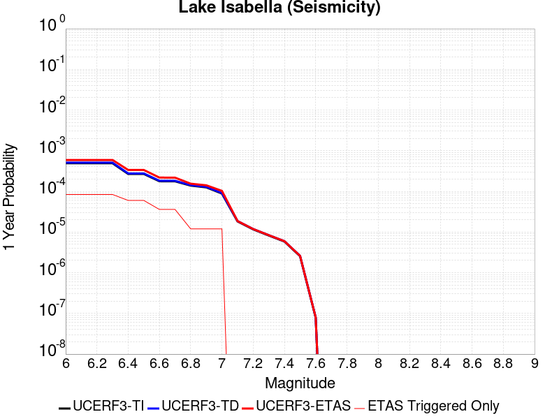 | 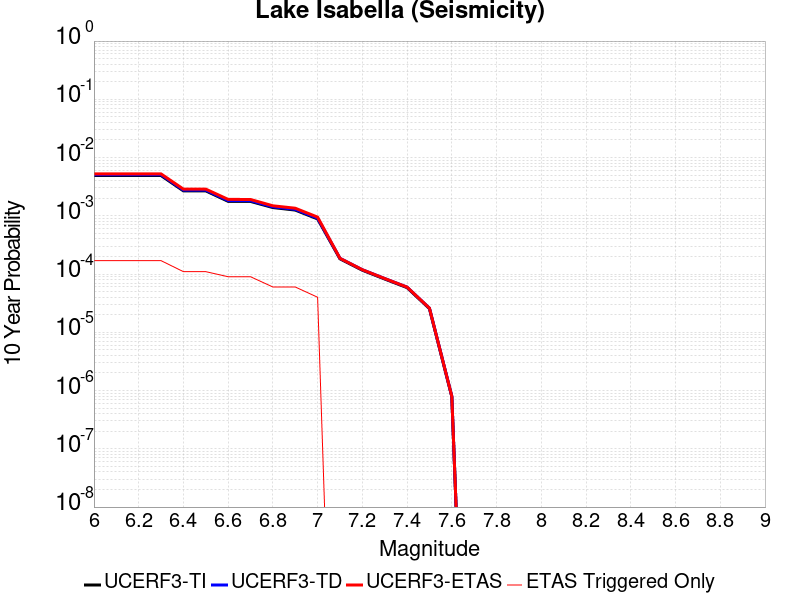 |

| Magnitude | 1 wk TI Prob | 1 wk TD Prob | 1 wk ETAS Prob | 1 wk ETAS/TD Gain | 1 wk ETAS Triggered Only | 1 mo TI Prob | 1 mo TD Prob | 1 mo ETAS Prob | 1 mo ETAS/TD Gain | 1 mo ETAS Triggered Only | 1 yr TI Prob | 1 yr TD Prob | 1 yr ETAS Prob | 1 yr ETAS/TD Gain | 1 yr ETAS Triggered Only | 10 yr TI Prob | 10 yr TD Prob | 10 yr ETAS Prob | 10 yr ETAS/TD Gain | 10 yr ETAS Triggered Only |
|-----|-----|-----|-----|-----|-----|-----|-----|-----|-----|-----|-----|-----|-----|-----|-----|-----|-----|-----|-----|-----|
| 6.0 | 9.431637E-6 | 9.741694E-6 | 9.741694E-6 | 1.0 | 0.0 | 4.0420677E-5 | 4.1749525E-5 | 7.771925E-5 | 1.86156 | 3.597122E-5 | 4.920106E-4 | 5.0819496E-4 | 5.920852E-4 | 1.1650748 | 8.393286E-5 | 0.004909227 | 0.005071621 | 0.0052028466 | 1.0258745 | 1.3189449E-4 |
| 6.1 | 9.431637E-6 | 9.741694E-6 | 9.741694E-6 | 1.0 | 0.0 | 4.0420677E-5 | 4.1749525E-5 | 7.771925E-5 | 1.86156 | 3.597122E-5 | 4.920106E-4 | 5.0819496E-4 | 5.920852E-4 | 1.1650748 | 8.393286E-5 | 0.004909227 | 0.005071621 | 0.0052028466 | 1.0258745 | 1.3189449E-4 |
| 6.2 | 9.431637E-6 | 9.741694E-6 | 9.741694E-6 | 1.0 | 0.0 | 4.0420677E-5 | 4.1749525E-5 | 7.771925E-5 | 1.86156 | 3.597122E-5 | 4.920106E-4 | 5.0819496E-4 | 5.920852E-4 | 1.1650748 | 8.393286E-5 | 0.004909227 | 0.005071621 | 0.0052028466 | 1.0258745 | 1.3189449E-4 |
| 6.3 | 9.431637E-6 | 9.741694E-6 | 9.741694E-6 | 1.0 | 0.0 | 4.0420677E-5 | 4.1749525E-5 | 7.771925E-5 | 1.86156 | 3.597122E-5 | 4.920106E-4 | 5.0819496E-4 | 5.920852E-4 | 1.1650748 | 8.393286E-5 | 0.004909227 | 0.005071621 | 0.0052028466 | 1.0258745 | 1.3189449E-4 |
| 6.4 | 5.144063E-6 | 5.3000977E-6 | 5.3000977E-6 | 1.0 | 0.0 | 2.2045799E-5 | 2.2714525E-5 | 4.6694797E-5 | 2.0557241 | 2.3980816E-5 | 2.6837454E-4 | 2.765177E-4 | 3.3645317E-4 | 1.2167509 | 5.995204E-5 | 0.0026805066 | 0.002762077 | 0.0028577351 | 1.0346328 | 9.5923264E-5 |
| 6.5 | 5.144063E-6 | 5.3000977E-6 | 5.3000977E-6 | 1.0 | 0.0 | 2.2045799E-5 | 2.2714525E-5 | 4.6694797E-5 | 2.0557241 | 2.3980816E-5 | 2.6837454E-4 | 2.765177E-4 | 3.3645317E-4 | 1.2167509 | 5.995204E-5 | 0.0026805066 | 0.002762077 | 0.0028577351 | 1.0346328 | 9.5923264E-5 |
| 6.6 | 3.4009804E-6 | 3.4987995E-6 | 3.4987995E-6 | 1.0 | 0.0 | 1.4575549E-5 | 1.4994778E-5 | 1.4994778E-5 | 1.0 | 0.0 | 1.7744285E-4 | 1.8254772E-4 | 2.1851239E-4 | 1.197015 | 3.597122E-5 | 0.0017730123 | 0.0018241355 | 0.0018959468 | 1.0393672 | 7.194244E-5 |
| 6.7 | 3.3880428E-6 | 3.4856662E-6 | 3.4856662E-6 | 1.0 | 0.0 | 1.4520103E-5 | 1.4938492E-5 | 1.4938492E-5 | 1.0 | 0.0 | 1.767679E-4 | 1.8186258E-4 | 2.1782726E-4 | 1.1977575 | 3.597122E-5 | 0.0017662736 | 0.0018172951 | 0.0018891068 | 1.0395157 | 7.194244E-5 |
| 6.8 | 2.6582E-6 | 2.7337105E-6 | 2.7337105E-6 | 1.0 | 0.0 | 1.1392236E-5 | 1.1715857E-5 | 1.1715857E-5 | 1.0 | 0.0 | 1.3869164E-4 | 1.4263256E-4 | 1.5462126E-4 | 1.084053 | 1.1990408E-5 | 0.0013860512 | 0.0014255423 | 0.0014614622 | 1.0251974 | 3.597122E-5 |
| 6.9 | 2.406011E-6 | 2.474338E-6 | 2.474338E-6 | 1.0 | 0.0 | 1.0311434E-5 | 1.0604271E-5 | 1.0604271E-5 | 1.0 | 0.0 | 1.2553448E-4 | 1.2910066E-4 | 1.4108952E-4 | 1.0928644 | 1.1990408E-5 | 0.0012546359 | 0.0012903863 | 0.001326311 | 1.0278404 | 3.597122E-5 |
| 7.0 | 1.6953097E-6 | 1.7429437E-6 | 1.7429437E-6 | 1.0 | 0.0 | 7.265593E-6 | 7.469743E-6 | 7.469743E-6 | 1.0 | 0.0 | 8.8455E-5 | 9.094137E-5 | 1.0293069E-4 | 1.1318357 | 1.1990408E-5 | 8.84198E-4 | 9.0914435E-4 | 9.4508287E-4 | 1.03953 | 3.597122E-5 |
| 7.1 | 3.5013824E-7 | 3.571492E-7 | 3.571492E-7 | 1.0 | 0.0 | 1.5005916E-6 | 1.5306384E-6 | 1.5306384E-6 | 1.0 | 0.0 | 1.826955E-5 | 1.8635366E-5 | 1.8635366E-5 | 1.0 | 0.0 | 1.8268047E-4 | 1.863383E-4 | 1.863383E-4 | 1.0 | 0.0 |
| 7.2 | 2.2321095E-7 | 2.2750632E-7 | 2.2750632E-7 | 1.0 | 0.0 | 9.56618E-7 | 9.750268E-7 | 9.750268E-7 | 1.0 | 0.0 | 1.1646762E-5 | 1.1870887E-5 | 1.1870887E-5 | 1.0 | 0.0 | 1.1646151E-4 | 1.1870263E-4 | 1.1870263E-4 | 1.0 | 0.0 |
| 7.3 | 1.5760406E-7 | 1.6060963E-7 | 1.6060963E-7 | 1.0 | 0.0 | 6.7544585E-7 | 6.883268E-7 | 6.883268E-7 | 1.0 | 0.0 | 8.223522E-6 | 8.380347E-6 | 8.380347E-6 | 1.0 | 0.0 | 8.2232174E-5 | 8.3800376E-5 | 8.3800376E-5 | 1.0 | 0.0 |
| 7.4 | 1.1216497E-7 | 1.1431735E-7 | 1.1431735E-7 | 1.0 | 0.0 | 4.8070694E-7 | 4.8993144E-7 | 4.8993144E-7 | 1.0 | 0.0 | 5.852591E-6 | 5.964899E-6 | 5.964899E-6 | 1.0 | 0.0 | 5.8524372E-5 | 5.9647435E-5 | 5.9647435E-5 | 1.0 | 0.0 |
| 7.5 | 4.885185E-8 | 4.9787864E-8 | 4.9787864E-8 | 1.0 | 0.0 | 2.0936506E-7 | 2.1337654E-7 | 2.1337654E-7 | 1.0 | 0.0 | 2.5490165E-6 | 2.5978566E-6 | 2.5978566E-6 | 1.0 | 0.0 | 2.5489873E-5 | 2.597828E-5 | 2.597828E-5 | 1.0 | 0.0 |
| 7.6 | 1.504641E-9 | 1.5317939E-9 | 1.5317939E-9 | 1.0 | 0.0 | 6.4484613E-9 | 6.5648313E-9 | 6.5648313E-9 | 1.0 | 0.0 | 7.851001E-8 | 7.992682E-8 | 7.992682E-8 | 1.0 | 0.0 | 7.8509987E-7 | 7.992682E-7 | 7.992682E-7 | 1.0 | 0.0 |

## Cleghorn Lake
*[(top)](#table-of-contents)*

| 1 Week | 1 Month | 1 Year | 10 Year |
|-----|-----|-----|-----|
|  | 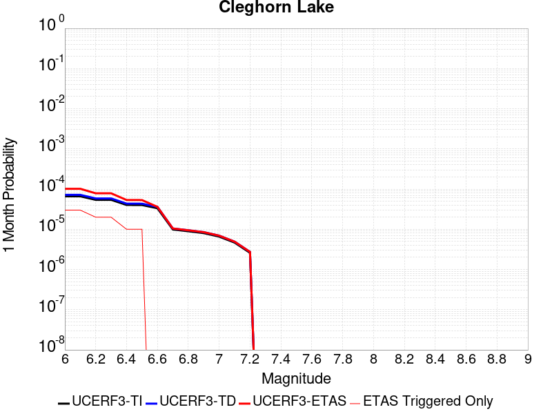 | 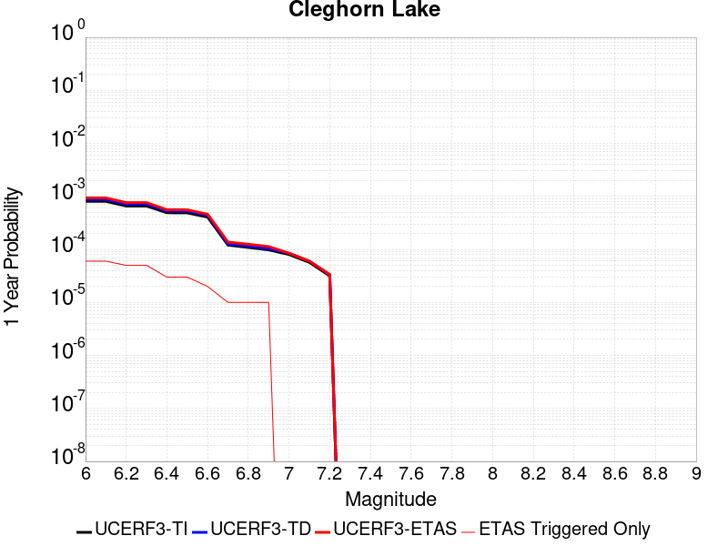 | 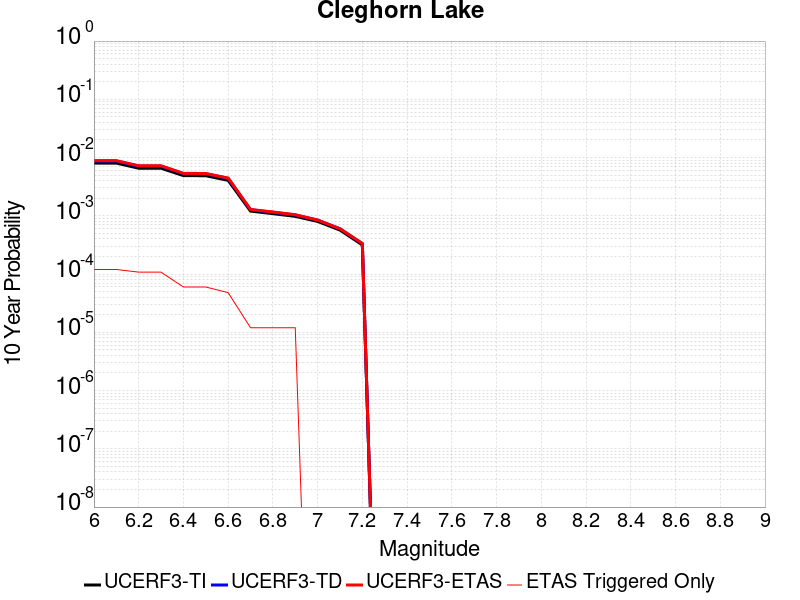 |

| Magnitude | 1 wk TI Prob | 1 wk TD Prob | 1 wk ETAS Prob | 1 wk ETAS/TD Gain | 1 wk ETAS Triggered Only | 1 mo TI Prob | 1 mo TD Prob | 1 mo ETAS Prob | 1 mo ETAS/TD Gain | 1 mo ETAS Triggered Only | 1 yr TI Prob | 1 yr TD Prob | 1 yr ETAS Prob | 1 yr ETAS/TD Gain | 1 yr ETAS Triggered Only | 10 yr TI Prob | 10 yr TD Prob | 10 yr ETAS Prob | 10 yr ETAS/TD Gain | 10 yr ETAS Triggered Only |
|-----|-----|-----|-----|-----|-----|-----|-----|-----|-----|-----|-----|-----|-----|-----|-----|-----|-----|-----|-----|-----|
| 6.0 | 1.5467183E-5 | 1.6794396E-5 | 1.6794396E-5 | 1.0 | 0.0 | 6.6286244E-5 | 7.1974304E-5 | 1.07942935E-4 | 1.4997427 | 3.597122E-5 | 8.067362E-4 | 8.7598973E-4 | 9.4786915E-4 | 1.0820551 | 7.194244E-5 | 0.008038137 | 0.008730795 | 0.0088496525 | 1.0136136 | 1.1990408E-4 |
| 6.1 | 1.5467183E-5 | 1.6794396E-5 | 1.6794396E-5 | 1.0 | 0.0 | 6.6286244E-5 | 7.1974304E-5 | 1.07942935E-4 | 1.4997427 | 3.597122E-5 | 8.067362E-4 | 8.7598973E-4 | 9.4786915E-4 | 1.0820551 | 7.194244E-5 | 0.008038137 | 0.008730795 | 0.0088496525 | 1.0136136 | 1.1990408E-4 |
| 6.2 | 1.2624631E-5 | 1.3681697E-5 | 1.3681697E-5 | 1.0 | 0.0 | 5.410444E-5 | 5.86348E-5 | 8.261421E-5 | 1.408962 | 2.3980816E-5 | 6.585225E-4 | 7.1369356E-4 | 7.736028E-4 | 1.0839425 | 5.995204E-5 | 0.0065657445 | 0.007118811 | 0.0072259563 | 1.015051 | 1.0791367E-4 |
| 6.3 | 1.2624631E-5 | 1.3681697E-5 | 1.3681697E-5 | 1.0 | 0.0 | 5.410444E-5 | 5.86348E-5 | 8.261421E-5 | 1.408962 | 2.3980816E-5 | 6.585225E-4 | 7.1369356E-4 | 7.736028E-4 | 1.0839425 | 5.995204E-5 | 0.0065657445 | 0.007118811 | 0.0072259563 | 1.015051 | 1.0791367E-4 |
| 6.4 | 9.417684E-6 | 1.0170226E-5 | 1.0170226E-5 | 1.0 | 0.0 | 4.036088E-5 | 4.3586184E-5 | 5.557607E-5 | 1.2750845 | 1.1990408E-5 | 4.912829E-4 | 5.305737E-4 | 5.6652585E-4 | 1.0677608 | 3.597122E-5 | 0.004901982 | 0.0052971053 | 0.0053567397 | 1.0112579 | 5.995204E-5 |
| 6.5 | 9.368219E-6 | 1.0117652E-5 | 1.0117652E-5 | 1.0 | 0.0 | 4.014889E-5 | 4.3360877E-5 | 5.5350763E-5 | 1.2765139 | 1.1990408E-5 | 4.8870314E-4 | 5.278319E-4 | 5.6378415E-4 | 1.0681131 | 3.597122E-5 | 0.004876298 | 0.0052698175 | 0.005329454 | 1.0113165 | 5.995204E-5 |
| 6.6 | 7.803798E-6 | 8.441923E-6 | 8.441923E-6 | 1.0 | 0.0 | 3.3444423E-5 | 3.6179394E-5 | 3.6179394E-5 | 1.0 | 0.0 | 4.0710976E-4 | 4.40435E-4 | 4.6440525E-4 | 1.054424 | 2.3980816E-5 | 0.0040636472 | 0.004399538 | 0.004447289 | 1.0108535 | 4.7961632E-5 |
| 6.7 | 2.3108669E-6 | 2.4438523E-6 | 2.4438523E-6 | 1.0 | 0.0 | 9.903678E-6 | 1.0473612E-5 | 1.0473612E-5 | 1.0 | 0.0 | 1.205706E-4 | 1.2750895E-4 | 1.3949783E-4 | 1.0940238 | 1.1990408E-5 | 0.001205052 | 0.0012743765 | 0.0012863517 | 1.0093969 | 1.1990408E-5 |
| 6.8 | 2.0882828E-6 | 2.2062986E-6 | 2.2062986E-6 | 1.0 | 0.0 | 8.949753E-6 | 9.455533E-6 | 9.455533E-6 | 1.0 | 0.0 | 1.08957785E-4 | 1.15115196E-4 | 1.2710423E-4 | 1.104148 | 1.1990408E-5 | 0.0010890438 | 0.0011505726 | 0.0011625491 | 1.0104092 | 1.1990408E-5 |
| 6.9 | 1.876935E-6 | 1.9810657E-6 | 1.9810657E-6 | 1.0 | 0.0 | 8.043982E-6 | 8.490254E-6 | 8.490254E-6 | 1.0 | 0.0 | 9.7931086E-5 | 1.033641E-4 | 1.1535327E-4 | 1.1159897 | 1.1990408E-5 | 9.788794E-4 | 0.0010331762 | 0.0010451543 | 1.0115933 | 1.1990408E-5 |
| 7.0 | 1.5357559E-6 | 1.6202926E-6 | 1.6202926E-6 | 1.0 | 0.0 | 6.5817944E-6 | 6.944093E-6 | 6.944093E-6 | 1.0 | 0.0 | 8.01304E-5 | 8.454118E-5 | 8.454118E-5 | 1.0 | 0.0 | 8.010151E-4 | 8.4510265E-4 | 8.4510265E-4 | 1.0 | 0.0 |
| 7.1 | 1.0905424E-6 | 1.1497702E-6 | 1.1497702E-6 | 1.0 | 0.0 | 4.6737446E-6 | 4.927578E-6 | 4.927578E-6 | 1.0 | 0.0 | 5.6901354E-5 | 5.999171E-5 | 5.999171E-5 | 1.0 | 0.0 | 5.6886784E-4 | 5.997649E-4 | 5.997649E-4 | 1.0 | 0.0 |
| 7.2 | 6.06668E-7 | 6.387322E-7 | 6.387322E-7 | 1.0 | 0.0 | 2.600003E-6 | 2.7374213E-6 | 2.7374213E-6 | 1.0 | 0.0 | 3.1654577E-5 | 3.3327666E-5 | 3.3327666E-5 | 1.0 | 0.0 | 3.1650066E-4 | 3.332335E-4 | 3.332335E-4 | 1.0 | 0.0 |

## San Andreas (San Gorgonio Pass-Garnet HIll)
*[(top)](#table-of-contents)*

| 1 Week | 1 Month | 1 Year | 10 Year |
|-----|-----|-----|-----|
| 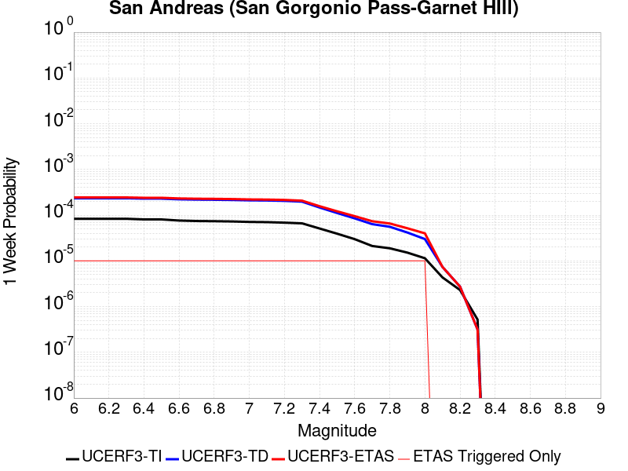 | 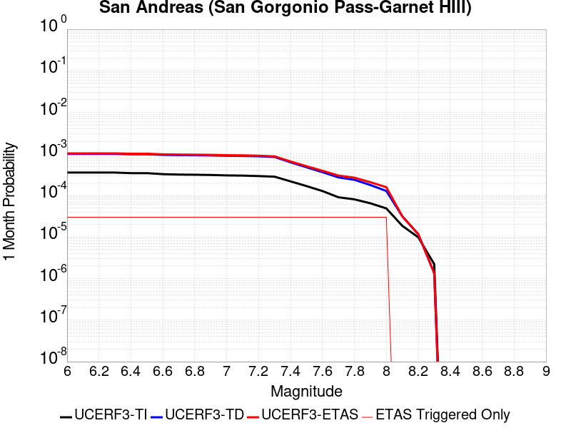 | 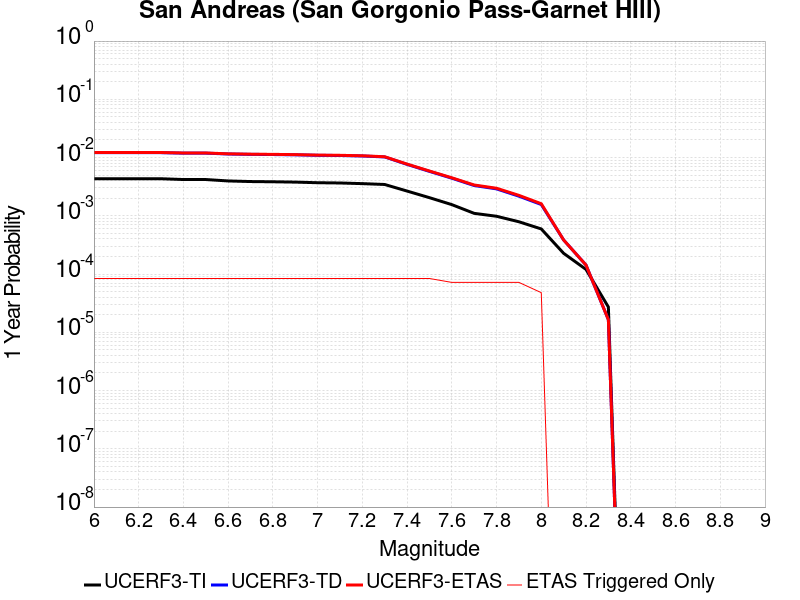 | 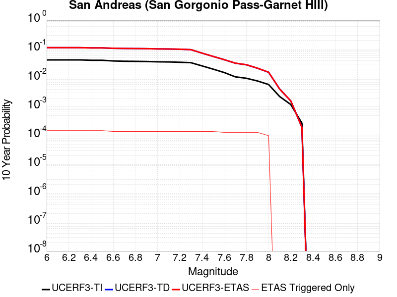 |

| Magnitude | 1 wk TI Prob | 1 wk TD Prob | 1 wk ETAS Prob | 1 wk ETAS/TD Gain | 1 wk ETAS Triggered Only | 1 mo TI Prob | 1 mo TD Prob | 1 mo ETAS Prob | 1 mo ETAS/TD Gain | 1 mo ETAS Triggered Only | 1 yr TI Prob | 1 yr TD Prob | 1 yr ETAS Prob | 1 yr ETAS/TD Gain | 1 yr ETAS Triggered Only | 10 yr TI Prob | 10 yr TD Prob | 10 yr ETAS Prob | 10 yr ETAS/TD Gain | 10 yr ETAS Triggered Only |
|-----|-----|-----|-----|-----|-----|-----|-----|-----|-----|-----|-----|-----|-----|-----|-----|-----|-----|-----|-----|-----|
| 6.0 | 8.31567E-5 | 2.3386451E-4 | 2.3386451E-4 | 1.0 | 0.0 | 3.5633717E-4 | 0.0010018935 | 0.0010258503 | 1.0239115 | 2.3980816E-5 | 0.004329778 | 0.012129918 | 0.012212833 | 1.0068356 | 8.393286E-5 | 0.042463828 | 0.11259502 | 0.11271206 | 1.0010395 | 1.3189449E-4 |
| 6.1 | 8.31567E-5 | 2.3386451E-4 | 2.3386451E-4 | 1.0 | 0.0 | 3.5633717E-4 | 0.0010018935 | 0.0010258503 | 1.0239115 | 2.3980816E-5 | 0.004329778 | 0.012129918 | 0.012212833 | 1.0068356 | 8.393286E-5 | 0.042463828 | 0.11259502 | 0.11271206 | 1.0010395 | 1.3189449E-4 |
| 6.2 | 8.31567E-5 | 2.3386451E-4 | 2.3386451E-4 | 1.0 | 0.0 | 3.5633717E-4 | 0.0010018935 | 0.0010258503 | 1.0239115 | 2.3980816E-5 | 0.004329778 | 0.012129918 | 0.012212833 | 1.0068356 | 8.393286E-5 | 0.042463828 | 0.11259502 | 0.11271206 | 1.0010395 | 1.3189449E-4 |
| 6.3 | 8.31567E-5 | 2.3386451E-4 | 2.3386451E-4 | 1.0 | 0.0 | 3.5633717E-4 | 0.0010018935 | 0.0010258503 | 1.0239115 | 2.3980816E-5 | 0.004329778 | 0.012129918 | 0.012212833 | 1.0068356 | 8.393286E-5 | 0.042463828 | 0.11259502 | 0.11271206 | 1.0010395 | 1.3189449E-4 |
| 6.4 | 8.059055E-5 | 2.2944735E-4 | 2.2944735E-4 | 1.0 | 0.0 | 3.4534236E-4 | 9.829777E-4 | 0.0010069349 | 1.0243721 | 2.3980816E-5 | 0.0041964394 | 0.011902156 | 0.011985091 | 1.006968 | 8.393286E-5 | 0.041180745 | 0.110576175 | 0.11069349 | 1.0010608 | 1.3189449E-4 |
| 6.5 | 8.059055E-5 | 2.2944735E-4 | 2.2944735E-4 | 1.0 | 0.0 | 3.4534236E-4 | 9.829777E-4 | 0.0010069349 | 1.0243721 | 2.3980816E-5 | 0.0041964394 | 0.011902156 | 0.011985091 | 1.006968 | 8.393286E-5 | 0.041180745 | 0.110576175 | 0.11069349 | 1.0010608 | 1.3189449E-4 |
| 6.6 | 7.619237E-5 | 2.2189032E-4 | 2.2189032E-4 | 1.0 | 0.0 | 3.2649786E-4 | 9.506143E-4 | 9.7457226E-4 | 1.0252026 | 2.3980816E-5 | 0.0039678677 | 0.0115128625 | 0.011595829 | 1.0072064 | 8.393286E-5 | 0.03897764 | 0.10711278 | 0.10721984 | 1.0009996 | 1.1990408E-4 |
| 6.7 | 7.440636E-5 | 2.1864849E-4 | 2.1864849E-4 | 1.0 | 0.0 | 3.188454E-4 | 9.367307E-4 | 9.606891E-4 | 1.0255766 | 2.3980816E-5 | 0.0038750346 | 0.011345596 | 0.011428577 | 1.0073138 | 8.393286E-5 | 0.038081564 | 0.10562121 | 0.10572845 | 1.0010153 | 1.1990408E-4 |
| 6.8 | 7.3735864E-5 | 2.1712016E-4 | 2.1712016E-4 | 1.0 | 0.0 | 3.1597257E-4 | 9.3018543E-4 | 9.5414394E-4 | 1.0257567 | 2.3980816E-5 | 0.0038401815 | 0.011266734 | 0.011349722 | 1.0073657 | 8.393286E-5 | 0.03774495 | 0.10492276 | 0.105030075 | 1.0010229 | 1.1990408E-4 |
| 6.9 | 7.27575E-5 | 2.1480983E-4 | 2.1480983E-4 | 1.0 | 0.0 | 3.117806E-4 | 9.20291E-4 | 9.4424974E-4 | 1.0260339 | 2.3980816E-5 | 0.003789323 | 0.011147508 | 0.011230506 | 1.0074453 | 8.393286E-5 | 0.037253562 | 0.10387066 | 0.10397811 | 1.0010345 | 1.1990408E-4 |
| 7.0 | 7.102591E-5 | 2.1065009E-4 | 2.1065009E-4 | 1.0 | 0.0 | 3.0436125E-4 | 9.0247596E-4 | 9.2643517E-4 | 1.0265483 | 2.3980816E-5 | 0.003699303 | 0.010932805 | 0.01101582 | 1.0075933 | 8.393286E-5 | 0.03638325 | 0.101972826 | 0.1020805 | 1.001056 | 1.1990408E-4 |
| 7.1 | 7.028513E-5 | 2.0900648E-4 | 2.0900648E-4 | 1.0 | 0.0 | 3.0118722E-4 | 8.954368E-4 | 9.193961E-4 | 1.0267571 | 2.3980816E-5 | 0.0036607897 | 0.01084796 | 0.010930982 | 1.0076532 | 8.393286E-5 | 0.036010686 | 0.10121585 | 0.10132361 | 1.0010648 | 1.1990408E-4 |
| 7.2 | 6.8498244E-5 | 2.0508505E-4 | 2.0508505E-4 | 1.0 | 0.0 | 2.9353087E-4 | 8.78642E-4 | 9.026018E-4 | 1.027269 | 2.3980816E-5 | 0.003567883 | 0.010645497 | 0.010728536 | 1.0078005 | 8.393286E-5 | 0.035111405 | 0.09940783 | 0.09951582 | 1.0010862 | 1.1990408E-4 |
| 7.3 | 6.622592E-5 | 1.973576E-4 | 1.973576E-4 | 1.0 | 0.0 | 2.8379448E-4 | 8.4554625E-4 | 8.695068E-4 | 1.0283374 | 2.3980816E-5 | 0.0034497243 | 0.010246415 | 0.010329487 | 1.0081075 | 8.393286E-5 | 0.033966612 | 0.09590419 | 0.09601259 | 1.0011303 | 1.1990408E-4 |
| 7.4 | 5.1050705E-5 | 1.4692261E-4 | 1.4692261E-4 | 1.0 | 0.0 | 2.1877038E-4 | 6.295173E-4 | 6.53483E-4 | 1.03807 | 2.3980816E-5 | 0.002660276 | 0.0076376316 | 0.007720923 | 1.0109055 | 8.393286E-5 | 0.02628654 | 0.07287696 | 0.07298812 | 1.0015254 | 1.1990408E-4 |
| 7.5 | 3.9302922E-5 | 1.11326524E-4 | 1.11326524E-4 | 1.0 | 0.0 | 1.6843023E-4 | 4.7702674E-4 | 5.0099613E-4 | 1.0502474 | 2.3980816E-5 | 0.0020487092 | 0.005792404 | 0.005875851 | 1.0144062 | 8.393286E-5 | 0.020299247 | 0.05602189 | 0.056135077 | 1.0020204 | 1.1990408E-4 |
| 7.6 | 2.9851626E-5 | 8.49747E-5 | 8.49747E-5 | 1.0 | 0.0 | 1.2792926E-4 | 3.6412658E-4 | 3.8809868E-4 | 1.0658345 | 2.3980816E-5 | 0.0015564259 | 0.004424255 | 0.004495879 | 1.016189 | 7.194244E-5 | 0.0154556995 | 0.043204896 | 0.04330815 | 1.0023898 | 1.0791367E-4 |
| 7.7 | 2.1135214E-5 | 6.355116E-5 | 6.355116E-5 | 1.0 | 0.0 | 9.0576345E-5 | 2.723337E-4 | 2.96308E-4 | 1.0880327 | 2.3980816E-5 | 0.0011022091 | 0.003310627 | 0.0033823315 | 1.0216588 | 7.194244E-5 | 0.010967582 | 0.032592565 | 0.032696962 | 1.003203 | 1.0791367E-4 |
| 7.8 | 1.883379E-5 | 5.5660596E-5 | 5.5660596E-5 | 1.0 | 0.0 | 8.0713755E-5 | 2.3852361E-4 | 2.624987E-4 | 1.1005145 | 2.3980816E-5 | 9.822468E-4 | 0.0029001608 | 0.0029718946 | 1.0247344 | 7.194244E-5 | 0.0097791655 | 0.028704397 | 0.028809214 | 1.0036516 | 1.0791367E-4 |
| 7.9 | 1.5156185E-5 | 4.1675128E-5 | 4.1675128E-5 | 1.0 | 0.0 | 6.495346E-5 | 1.7859548E-4 | 2.02572E-4 | 1.1342505 | 2.3980816E-5 | 7.9052144E-4 | 0.0021722328 | 0.0022440192 | 1.0330472 | 7.194244E-5 | 0.007877152 | 0.02176709 | 0.021872653 | 1.0048498 | 1.0791367E-4 |
| 8.0 | 1.1405907E-5 | 2.9986788E-5 | 2.9986788E-5 | 1.0 | 0.0 | 4.8881542E-5 | 1.2850849E-4 | 1.5248622E-4 | 1.1865848 | 2.3980816E-5 | 5.9497025E-4 | 0.0015634688 | 0.0016113556 | 1.0306284 | 4.7961632E-5 | 0.005933798 | 0.015778678 | 0.015849486 | 1.0044875 | 7.194244E-5 |
| 8.1 | 4.3511436E-6 | 7.373693E-6 | 7.373693E-6 | 1.0 | 0.0 | 1.8647626E-5 | 3.160116E-5 | 3.160116E-5 | 1.0 | 0.0 | 2.2701119E-4 | 3.8467633E-4 | 3.8467633E-4 | 1.0 | 0.0 | 0.0022677942 | 0.004118566 | 0.004118566 | 1.0 | 0.0 |
| 8.2 | 2.3042528E-6 | 2.7350309E-6 | 2.7350309E-6 | 1.0 | 0.0 | 9.875332E-6 | 1.1721509E-5 | 1.1721509E-5 | 1.0 | 0.0 | 1.2022553E-4 | 1.4270007E-4 | 1.4270007E-4 | 1.0 | 0.0 | 0.0012016051 | 0.0015990696 | 0.0015990696 | 1.0 | 0.0 |
| 8.3 | 5.202968E-7 | 3.1628537E-7 | 3.1628537E-7 | 1.0 | 0.0 | 2.2298414E-6 | 1.3555081E-6 | 1.3555081E-6 | 1.0 | 0.0 | 2.714798E-5 | 1.6503198E-5 | 1.6503198E-5 | 1.0 | 0.0 | 2.7144665E-4 | 1.9580164E-4 | 1.9580164E-4 | 1.0 | 0.0 |

## Owens Valley
*[(top)](#table-of-contents)*

| 1 Week | 1 Month | 1 Year | 10 Year |
|-----|-----|-----|-----|
| 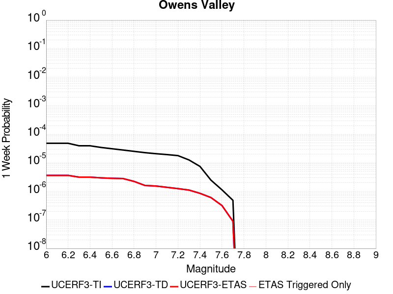 | 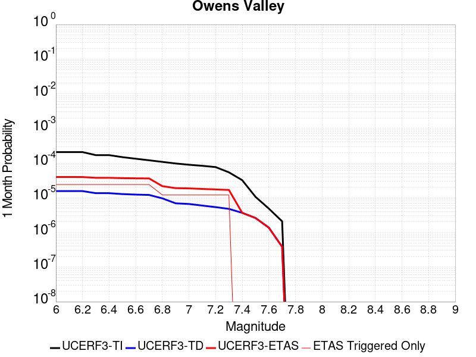 | 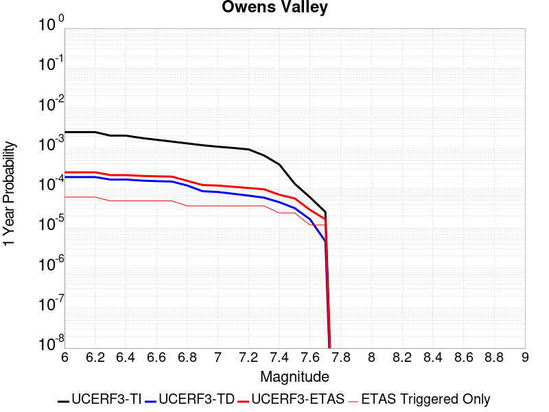 | 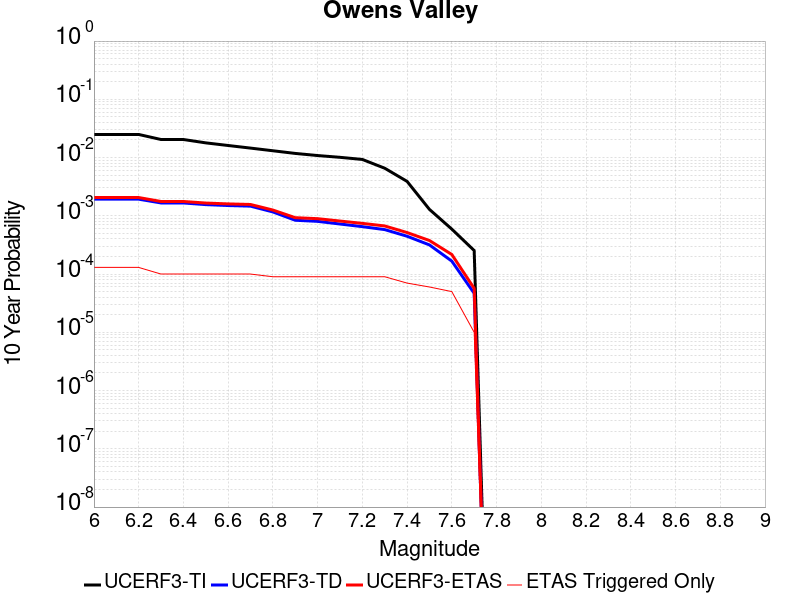 |

| Magnitude | 1 wk TI Prob | 1 wk TD Prob | 1 wk ETAS Prob | 1 wk ETAS/TD Gain | 1 wk ETAS Triggered Only | 1 mo TI Prob | 1 mo TD Prob | 1 mo ETAS Prob | 1 mo ETAS/TD Gain | 1 mo ETAS Triggered Only | 1 yr TI Prob | 1 yr TD Prob | 1 yr ETAS Prob | 1 yr ETAS/TD Gain | 1 yr ETAS Triggered Only | 10 yr TI Prob | 10 yr TD Prob | 10 yr ETAS Prob | 10 yr ETAS/TD Gain | 10 yr ETAS Triggered Only |
|-----|-----|-----|-----|-----|-----|-----|-----|-----|-----|-----|-----|-----|-----|-----|-----|-----|-----|-----|-----|-----|
| 6.0 | 4.83821E-5 | 3.627396E-6 | 3.627396E-6 | 1.0 | 0.0 | 2.0733538E-4 | 1.5545897E-5 | 3.9526338E-5 | 2.5425577 | 2.3980816E-5 | 0.002521386 | 1.8925584E-4 | 2.4919654E-4 | 1.3167177 | 5.995204E-5 | 0.024929691 | 0.0019254381 | 0.0020451113 | 1.0621538 | 1.1990408E-4 |
| 6.1 | 4.83821E-5 | 3.627396E-6 | 3.627396E-6 | 1.0 | 0.0 | 2.0733538E-4 | 1.5545897E-5 | 3.9526338E-5 | 2.5425577 | 2.3980816E-5 | 0.002521386 | 1.8925584E-4 | 2.4919654E-4 | 1.3167177 | 5.995204E-5 | 0.024929691 | 0.0019254381 | 0.0020451113 | 1.0621538 | 1.1990408E-4 |
| 6.2 | 4.83821E-5 | 3.627396E-6 | 3.627396E-6 | 1.0 | 0.0 | 2.0733538E-4 | 1.5545897E-5 | 3.9526338E-5 | 2.5425577 | 2.3980816E-5 | 0.002521386 | 1.8925584E-4 | 2.4919654E-4 | 1.3167177 | 5.995204E-5 | 0.024929691 | 0.0019254381 | 0.0020451113 | 1.0621538 | 1.1990408E-4 |
| 6.3 | 3.953008E-5 | 3.1558448E-6 | 3.1558448E-6 | 1.0 | 0.0 | 1.6940363E-4 | 1.3524983E-5 | 3.7505473E-5 | 2.7730515 | 2.3980816E-5 | 0.002060538 | 1.6465495E-4 | 2.1260869E-4 | 1.2912377 | 4.7961632E-5 | 0.020415364 | 0.0016594394 | 0.001743233 | 1.0504951 | 8.393286E-5 |
| 6.4 | 3.953008E-5 | 3.1558448E-6 | 3.1558448E-6 | 1.0 | 0.0 | 1.6940363E-4 | 1.3524983E-5 | 3.7505473E-5 | 2.7730515 | 2.3980816E-5 | 0.002060538 | 1.6465495E-4 | 2.1260869E-4 | 1.2912377 | 4.7961632E-5 | 0.020415364 | 0.0016594394 | 0.001743233 | 1.0504951 | 8.393286E-5 |
| 6.5 | 3.457342E-5 | 2.9718876E-6 | 2.9718876E-6 | 1.0 | 0.0 | 1.4816338E-4 | 1.2736603E-5 | 3.6717112E-5 | 2.8828025 | 2.3980816E-5 | 0.0018023965 | 1.5505782E-4 | 2.0301201E-4 | 1.3092666 | 4.7961632E-5 | 0.017878477 | 0.0015558768 | 0.0016396791 | 1.0538617 | 8.393286E-5 |
| 6.6 | 3.1127765E-5 | 2.8746979E-6 | 2.8746979E-6 | 1.0 | 0.0 | 1.3339789E-4 | 1.232008E-5 | 3.63006E-5 | 2.946458 | 2.3980816E-5 | 0.0016229092 | 1.4998733E-4 | 1.9794177E-4 | 1.3197232 | 4.7961632E-5 | 0.016111081 | 0.001501365 | 0.0015851718 | 1.0558205 | 8.393286E-5 |
| 6.7 | 2.806885E-5 | 2.810566E-6 | 2.810566E-6 | 1.0 | 0.0 | 1.2028952E-4 | 1.2045231E-5 | 3.6025758E-5 | 2.990873 | 2.3980816E-5 | 0.001463541 | 1.4664151E-4 | 1.9459611E-4 | 1.3270192 | 4.7961632E-5 | 0.014539397 | 0.001465831 | 0.0015496408 | 1.0571756 | 8.393286E-5 |
| 6.8 | 2.524524E-5 | 2.235501E-6 | 2.235501E-6 | 1.0 | 0.0 | 1.0818939E-4 | 9.5806845E-6 | 2.1570977E-5 | 2.2515068 | 1.1990408E-5 | 0.0013164099 | 1.1663889E-4 | 1.5260592E-4 | 1.3083622 | 3.597122E-5 | 0.01308639 | 0.0011660501 | 0.0012379086 | 1.0616256 | 7.194244E-5 |
| 6.9 | 2.2704568E-5 | 1.6082656E-6 | 1.6082656E-6 | 1.0 | 0.0 | 9.730166E-5 | 6.8925488E-6 | 1.8882874E-5 | 2.7396069 | 1.1990408E-5 | 0.0011840039 | 8.391357E-5 | 1.1988177E-4 | 1.4286339 | 3.597122E-5 | 0.011777153 | 8.390308E-4 | 9.109129E-4 | 1.0856727 | 7.194244E-5 |
| 7.0 | 2.0871712E-5 | 1.5396373E-6 | 1.5396373E-6 | 1.0 | 0.0 | 8.944713E-5 | 6.598429E-6 | 1.8588758E-5 | 2.817149 | 1.1990408E-5 | 0.0010884746 | 8.033293E-5 | 1.16301264E-4 | 1.4477408 | 3.597122E-5 | 0.010831586 | 8.0321095E-4 | 8.750956E-4 | 1.0894966 | 7.194244E-5 |
| 7.1 | 1.944928E-5 | 1.3864965E-6 | 1.3864965E-6 | 1.0 | 0.0 | 8.335139E-5 | 5.942114E-6 | 1.793245E-5 | 3.017857 | 1.1990408E-5 | 0.0010143308 | 7.2342846E-5 | 1.0831147E-4 | 1.4971967 | 3.597122E-5 | 0.010097133 | 7.233511E-4 | 7.9524145E-4 | 1.0993853 | 7.194244E-5 |
| 7.2 | 1.7876306E-5 | 1.2489834E-6 | 1.2489834E-6 | 1.0 | 0.0 | 7.6610486E-5 | 5.3527747E-6 | 1.7343118E-5 | 3.2400239 | 1.1990408E-5 | 9.3233347E-4 | 6.516809E-5 | 1.0113697E-4 | 1.5519401 | 3.597122E-5 | 0.009284316 | 6.516274E-4 | 7.23523E-4 | 1.1103324 | 7.194244E-5 |
| 7.3 | 1.2618672E-5 | 1.1115851E-6 | 1.1115851E-6 | 1.0 | 0.0 | 5.40789E-5 | 4.763928E-6 | 1.6754278E-5 | 3.5169044 | 1.1990408E-5 | 6.582117E-4 | 5.799928E-5 | 9.396842E-5 | 1.6201652 | 3.597122E-5 | 0.0065626553 | 5.799741E-4 | 6.518748E-4 | 1.1239723 | 7.194244E-5 |
| 7.4 | 7.4874442E-6 | 8.549184E-7 | 8.549184E-7 | 1.0 | 0.0 | 3.208865E-5 | 3.663931E-6 | 3.663931E-6 | 1.0 | 0.0 | 3.906093E-4 | 4.4607452E-5 | 6.85872E-5 | 1.5375726 | 2.3980816E-5 | 0.003899234 | 4.4607726E-4 | 4.940175E-4 | 1.1074708 | 4.7961632E-5 |
| 7.5 | 2.4734156E-6 | 6.068976E-7 | 6.068976E-7 | 1.0 | 0.0 | 1.060031E-5 | 2.6009868E-6 | 2.6009868E-6 | 1.0 | 0.0 | 1.2905113E-4 | 3.1666557E-5 | 5.5646615E-5 | 1.7572675 | 2.3980816E-5 | 0.0012897621 | 3.1662078E-4 | 3.6456724E-4 | 1.1514318 | 4.7961632E-5 |
| 7.6 | 1.1328841E-6 | 3.1967096E-7 | 3.1967096E-7 | 1.0 | 0.0 | 4.8552088E-6 | 1.3700177E-6 | 1.3700177E-6 | 1.0 | 0.0 | 5.9110564E-5 | 1.6679838E-5 | 2.8670047E-5 | 1.7188443 | 1.1990408E-5 | 5.9094845E-4 | 1.6678606E-4 | 2.0275128E-4 | 1.2156368 | 3.597122E-5 |
| 7.7 | 4.8613185E-7 | 8.965384E-8 | 8.965384E-8 | 1.0 | 0.0 | 2.0834207E-6 | 3.842307E-7 | 3.842307E-7 | 1.0 | 0.0 | 2.536535E-5 | 4.677999E-6 | 1.6668351E-5 | 3.5631366 | 1.1990408E-5 | 2.5362454E-4 | 4.6779078E-5 | 5.8768925E-5 | 1.2563078 | 1.1990408E-5 |

## San Andreas (Coachella) rev
*[(top)](#table-of-contents)*

| 1 Week | 1 Month | 1 Year | 10 Year |
|-----|-----|-----|-----|
| 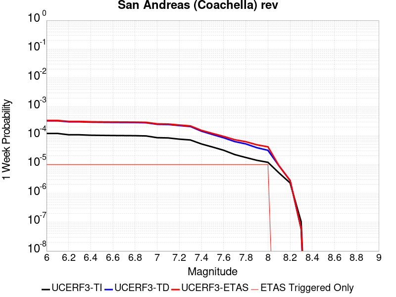 | 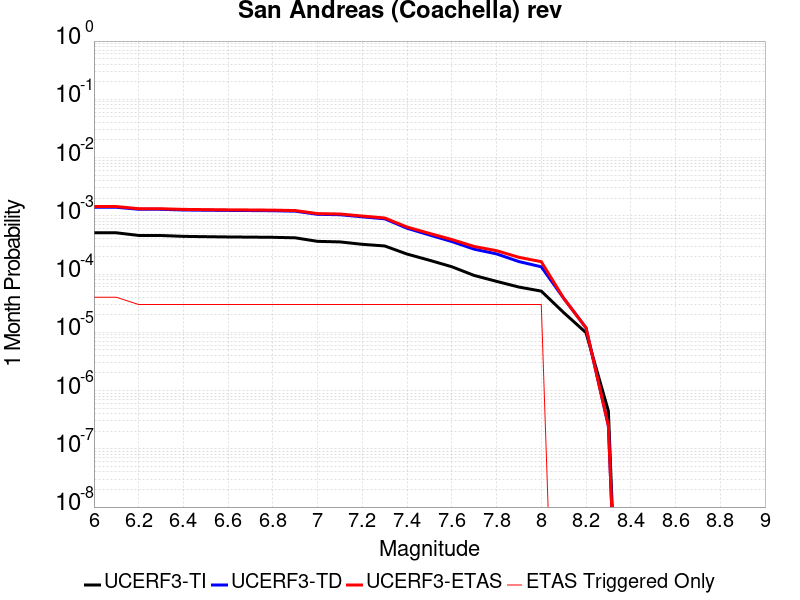 | 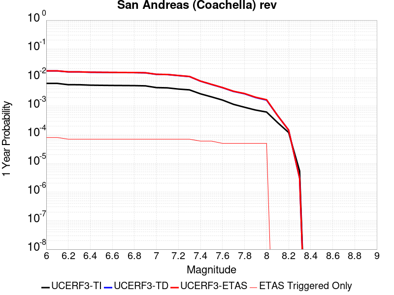 | 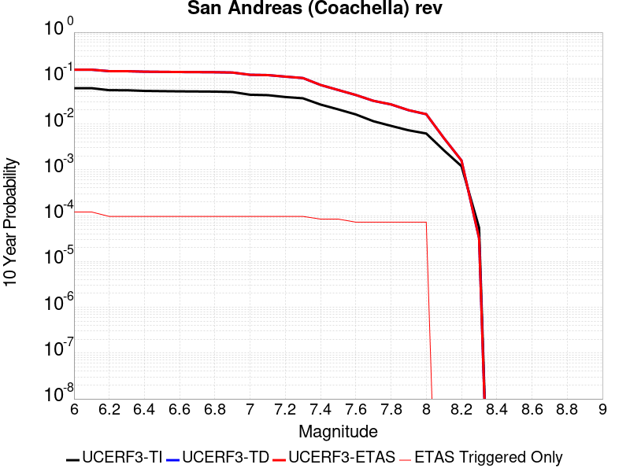 |

| Magnitude | 1 wk TI Prob | 1 wk TD Prob | 1 wk ETAS Prob | 1 wk ETAS/TD Gain | 1 wk ETAS Triggered Only | 1 mo TI Prob | 1 mo TD Prob | 1 mo ETAS Prob | 1 mo ETAS/TD Gain | 1 mo ETAS Triggered Only | 1 yr TI Prob | 1 yr TD Prob | 1 yr ETAS Prob | 1 yr ETAS/TD Gain | 1 yr ETAS Triggered Only | 10 yr TI Prob | 10 yr TD Prob | 10 yr ETAS Prob | 10 yr ETAS/TD Gain | 10 yr ETAS Triggered Only |
|-----|-----|-----|-----|-----|-----|-----|-----|-----|-----|-----|-----|-----|-----|-----|-----|-----|-----|-----|-----|-----|
| 6.0 | 1.1925945E-4 | 3.2733803E-4 | 3.2733803E-4 | 1.0 | 0.0 | 5.110118E-4 | 0.0014021277 | 0.0014380486 | 1.0256188 | 3.597122E-5 | 0.0062038354 | 0.016938623 | 0.017021134 | 1.0048711 | 8.393286E-5 | 0.060334753 | 0.15267034 | 0.15277193 | 1.0006654 | 1.1990408E-4 |
| 6.1 | 1.1925945E-4 | 3.2733803E-4 | 3.2733803E-4 | 1.0 | 0.0 | 5.110118E-4 | 0.0014021277 | 0.0014380486 | 1.0256188 | 3.597122E-5 | 0.0062038354 | 0.016938623 | 0.017021134 | 1.0048711 | 8.393286E-5 | 0.060334753 | 0.15267034 | 0.15277193 | 1.0006654 | 1.1990408E-4 |
| 6.2 | 1.07432395E-4 | 3.0234526E-4 | 3.0234526E-4 | 1.0 | 0.0 | 4.603433E-4 | 0.0012951259 | 0.0013190757 | 1.0184922 | 2.3980816E-5 | 0.005590286 | 0.015655253 | 0.015726069 | 1.0045235 | 7.194244E-5 | 0.05451731 | 0.14184146 | 0.14192377 | 1.0005803 | 9.5923264E-5 |
| 6.3 | 1.0718766E-4 | 3.017983E-4 | 3.017983E-4 | 1.0 | 0.0 | 4.592948E-4 | 0.0012927842 | 0.001316734 | 1.0185257 | 2.3980816E-5 | 0.005577586 | 0.015627153 | 0.015697971 | 1.0045317 | 7.194244E-5 | 0.054396555 | 0.14160971 | 0.14169206 | 1.0005815 | 9.5923264E-5 |
| 6.4 | 1.0355944E-4 | 2.9387916E-4 | 2.9387916E-4 | 1.0 | 0.0 | 4.4375064E-4 | 0.0012588782 | 0.0012828287 | 1.0190253 | 2.3980816E-5 | 0.0053892885 | 0.015220184 | 0.015291031 | 1.0046549 | 7.194244E-5 | 0.052604496 | 0.13816981 | 0.13825248 | 1.0005983 | 9.5923264E-5 |
| 6.5 | 1.0227914E-4 | 2.910735E-4 | 2.910735E-4 | 1.0 | 0.0 | 4.382655E-4 | 0.0012468654 | 0.0012708162 | 1.0192089 | 2.3980816E-5 | 0.0053228354 | 0.015075962 | 0.01514682 | 1.0047001 | 7.194244E-5 | 0.051971316 | 0.136949 | 0.1370318 | 1.0006045 | 9.5923264E-5 |
| 6.6 | 1.0116757E-4 | 2.8873098E-4 | 2.8873098E-4 | 1.0 | 0.0 | 4.3350324E-4 | 0.0012368355 | 0.0012607867 | 1.0193648 | 2.3980816E-5 | 0.0052651367 | 0.014955532 | 0.015026398 | 1.0047385 | 7.194244E-5 | 0.051421247 | 0.13592719 | 0.13601008 | 1.0006098 | 9.5923264E-5 |
| 6.7 | 1.0050676E-4 | 2.873166E-4 | 2.873166E-4 | 1.0 | 0.0 | 4.3067214E-4 | 0.0012307797 | 0.001254731 | 1.0194603 | 2.3980816E-5 | 0.005230834 | 0.01488281 | 0.014953682 | 1.0047619 | 7.194244E-5 | 0.051094085 | 0.13531192 | 0.13539486 | 1.000613 | 9.5923264E-5 |
| 6.8 | 9.976819E-5 | 2.853531E-4 | 2.853531E-4 | 1.0 | 0.0 | 4.2750788E-4 | 0.0012223726 | 0.0012463242 | 1.0195943 | 2.3980816E-5 | 0.0051924936 | 0.014781849 | 0.014852729 | 1.004795 | 7.194244E-5 | 0.050728295 | 0.13446361 | 0.13454662 | 1.0006175 | 9.5923264E-5 |
| 6.9 | 9.77719E-5 | 2.8032195E-4 | 2.8032195E-4 | 1.0 | 0.0 | 4.1895514E-4 | 0.0012008306 | 0.0012247826 | 1.0199462 | 2.3980816E-5 | 0.0050888555 | 0.014523101 | 0.014593998 | 1.0048817 | 7.194244E-5 | 0.049738888 | 0.13229203 | 0.13237527 | 1.0006292 | 9.5923264E-5 |
| 7.0 | 8.500761E-5 | 2.4766565E-4 | 2.4766565E-4 | 1.0 | 0.0 | 3.6426744E-4 | 0.0010609957 | 0.0010849511 | 1.0225782 | 2.3980816E-5 | 0.0044259406 | 0.012841888 | 0.012912907 | 1.0055302 | 7.194244E-5 | 0.04338823 | 0.11814933 | 0.11823393 | 1.000716 | 9.5923264E-5 |
| 7.1 | 8.319876E-5 | 2.4369264E-4 | 2.4369264E-4 | 1.0 | 0.0 | 3.5651738E-4 | 0.0010439822 | 0.001067938 | 1.0229466 | 2.3980816E-5 | 0.004331963 | 0.012637171 | 0.012708204 | 1.005621 | 7.194244E-5 | 0.042484846 | 0.116369456 | 0.11645422 | 1.0007284 | 9.5923264E-5 |
| 7.2 | 7.563917E-5 | 2.2417592E-4 | 2.2417592E-4 | 1.0 | 0.0 | 3.2412758E-4 | 9.6040324E-4 | 9.84361E-4 | 1.0249455 | 2.3980816E-5 | 0.0039391145 | 0.0116309095 | 0.011702015 | 1.0061135 | 7.194244E-5 | 0.03870018 | 0.10777538 | 0.10786097 | 1.000794 | 9.5923264E-5 |
| 7.3 | 7.082985E-5 | 2.073362E-4 | 2.073362E-4 | 1.0 | 0.0 | 3.0352117E-4 | 8.88284E-4 | 9.122435E-4 | 1.0269728 | 2.3980816E-5 | 0.0036891096 | 0.010761855 | 0.010833023 | 1.006613 | 7.194244E-5 | 0.03628465 | 0.10029767 | 0.10038397 | 1.0008605 | 9.5923264E-5 |
| 7.4 | 5.146215E-5 | 1.4276853E-4 | 1.4276853E-4 | 1.0 | 0.0 | 2.2053342E-4 | 6.117225E-4 | 6.3568866E-4 | 1.0391781 | 2.3980816E-5 | 0.0026816884 | 0.007422478 | 0.007481985 | 1.0080172 | 5.995204E-5 | 0.02649557 | 0.07086292 | 0.070940904 | 1.0011005 | 8.393286E-5 |
| 7.5 | 4.0285166E-5 | 1.0944253E-4 | 1.0944253E-4 | 1.0 | 0.0 | 1.7263928E-4 | 4.689554E-4 | 4.92925E-4 | 1.0511127 | 2.3980816E-5 | 0.002099857 | 0.005694655 | 0.0057542655 | 1.0104678 | 5.995204E-5 | 0.020801254 | 0.055022955 | 0.05510227 | 1.0014415 | 8.393286E-5 |
| 7.6 | 3.1168736E-5 | 8.441267E-5 | 8.441267E-5 | 1.0 | 0.0 | 1.3357346E-4 | 3.6171856E-4 | 3.8569068E-4 | 1.0662729 | 2.3980816E-5 | 0.0016250437 | 0.004395057 | 0.004442808 | 1.0108646 | 4.7961632E-5 | 0.016132116 | 0.042820677 | 0.04288954 | 1.0016081 | 7.194244E-5 |
| 7.7 | 2.2100989E-5 | 6.2408275E-5 | 6.2408275E-5 | 1.0 | 0.0 | 9.4715084E-5 | 2.6743664E-4 | 2.9141104E-4 | 1.0896451 | 2.3980816E-5 | 0.001152546 | 0.003251186 | 0.0032989918 | 1.0147041 | 4.7961632E-5 | 0.011465867 | 0.03190961 | 0.031979255 | 1.0021826 | 7.194244E-5 |
| 7.8 | 1.7484861E-5 | 5.1814186E-5 | 5.1814186E-5 | 1.0 | 0.0 | 7.493296E-5 | 2.2204191E-4 | 2.4601741E-4 | 1.1079773 | 2.3980816E-5 | 9.1192697E-4 | 0.002700012 | 0.002747844 | 1.0177156 | 4.7961632E-5 | 0.009081938 | 0.026648527 | 0.026718553 | 1.0026277 | 7.194244E-5 |
| 7.9 | 1.3967285E-5 | 3.8237675E-5 | 3.8237675E-5 | 1.0 | 0.0 | 5.985842E-5 | 1.6386545E-4 | 1.8784235E-4 | 1.1463206 | 2.3980816E-5 | 7.2853256E-4 | 0.0019932375 | 0.0020411036 | 1.0240142 | 4.7961632E-5 | 0.0072614877 | 0.019916428 | 0.019986939 | 1.0035403 | 7.194244E-5 |
| 8.0 | 1.1887396E-5 | 3.107819E-5 | 3.107819E-5 | 1.0 | 0.0 | 5.094499E-5 | 1.3318544E-4 | 1.5716307E-4 | 1.1800319 | 2.3980816E-5 | 6.200787E-4 | 0.0016203277 | 0.0016682117 | 1.029552 | 4.7961632E-5 | 0.006183513 | 0.016285317 | 0.016356088 | 1.0043457 | 7.194244E-5 |
| 8.1 | 5.100864E-6 | 8.978668E-6 | 8.978668E-6 | 1.0 | 0.0 | 2.1860664E-5 | 3.847944E-5 | 3.847944E-5 | 1.0 | 0.0 | 2.6612106E-4 | 4.6838663E-4 | 4.6838663E-4 | 1.0 | 0.0 | 0.002658026 | 0.004920349 | 0.004920349 | 1.0 | 0.0 |
| 8.2 | 2.3004484E-6 | 2.7885583E-6 | 2.7885583E-6 | 1.0 | 0.0 | 9.859027E-6 | 1.19509095E-5 | 1.19509095E-5 | 1.0 | 0.0 | 1.2002704E-4 | 1.4549264E-4 | 1.4549264E-4 | 1.0 | 0.0 | 0.0011996223 | 0.0015984807 | 0.0015984807 | 1.0 | 0.0 |
| 8.3 | 1.0424446E-7 | 5.8219563E-8 | 5.8219563E-8 | 1.0 | 0.0 | 4.4676187E-7 | 2.495124E-7 | 2.495124E-7 | 1.0 | 0.0 | 5.439312E-6 | 3.0378094E-6 | 3.0378094E-6 | 1.0 | 0.0 | 5.4391792E-5 | 3.193819E-5 | 3.193819E-5 | 1.0 | 0.0 |

## Baker
*[(top)](#table-of-contents)*

| 1 Week | 1 Month | 1 Year | 10 Year |
|-----|-----|-----|-----|
| 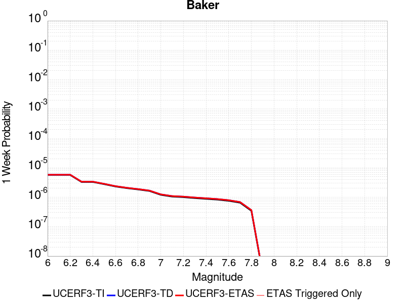 | 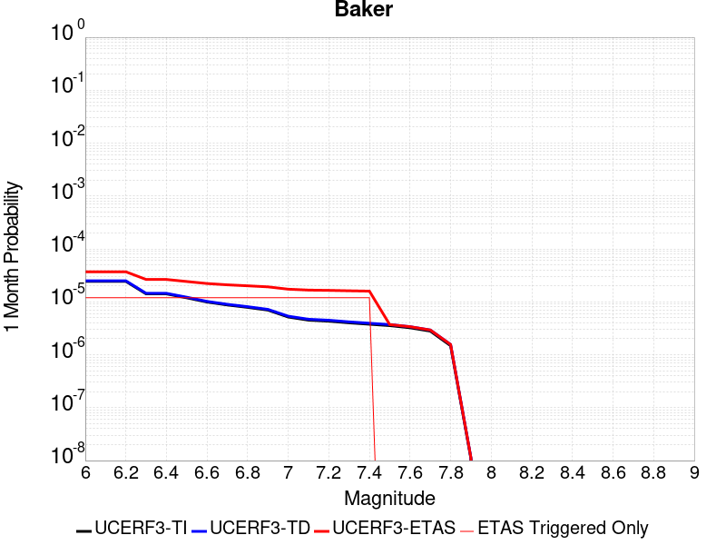 | 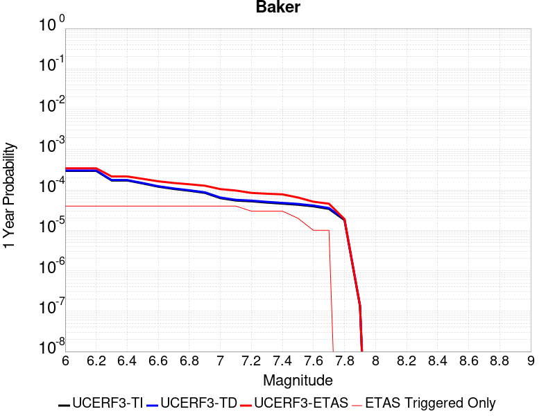 | 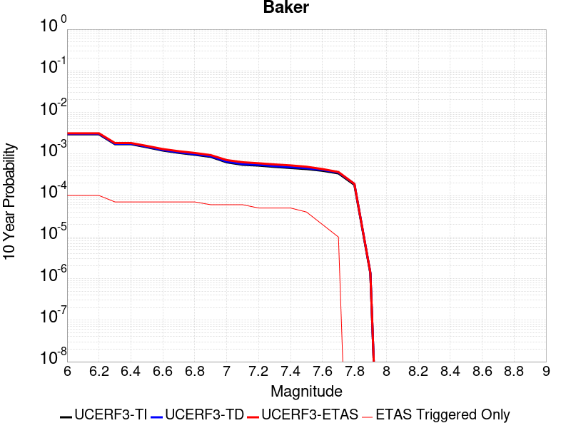 |

| Magnitude | 1 wk TI Prob | 1 wk TD Prob | 1 wk ETAS Prob | 1 wk ETAS/TD Gain | 1 wk ETAS Triggered Only | 1 mo TI Prob | 1 mo TD Prob | 1 mo ETAS Prob | 1 mo ETAS/TD Gain | 1 mo ETAS Triggered Only | 1 yr TI Prob | 1 yr TD Prob | 1 yr ETAS Prob | 1 yr ETAS/TD Gain | 1 yr ETAS Triggered Only | 10 yr TI Prob | 10 yr TD Prob | 10 yr ETAS Prob | 10 yr ETAS/TD Gain | 10 yr ETAS Triggered Only |
|-----|-----|-----|-----|-----|-----|-----|-----|-----|-----|-----|-----|-----|-----|-----|-----|-----|-----|-----|-----|-----|
| 6.0 | 5.695525E-6 | 5.834856E-6 | 5.834856E-6 | 1.0 | 0.0 | 2.4409164E-5 | 2.500631E-5 | 3.699642E-5 | 1.4794832 | 1.1990408E-5 | 2.9714106E-4 | 3.044133E-4 | 3.523603E-4 | 1.1575063 | 4.7961632E-5 | 0.0029674405 | 0.0030403587 | 0.003147944 | 1.0353858 | 1.0791367E-4 |
| 6.1 | 5.695525E-6 | 5.834856E-6 | 5.834856E-6 | 1.0 | 0.0 | 2.4409164E-5 | 2.500631E-5 | 3.699642E-5 | 1.4794832 | 1.1990408E-5 | 2.9714106E-4 | 3.044133E-4 | 3.523603E-4 | 1.1575063 | 4.7961632E-5 | 0.0029674405 | 0.0030403587 | 0.003147944 | 1.0353858 | 1.0791367E-4 |
| 6.2 | 5.695525E-6 | 5.834856E-6 | 5.834856E-6 | 1.0 | 0.0 | 2.4409164E-5 | 2.500631E-5 | 3.699642E-5 | 1.4794832 | 1.1990408E-5 | 2.9714106E-4 | 3.044133E-4 | 3.523603E-4 | 1.1575063 | 4.7961632E-5 | 0.0029674405 | 0.0030403587 | 0.003147944 | 1.0353858 | 1.0791367E-4 |
| 6.3 | 3.2995713E-6 | 3.3836786E-6 | 3.3836786E-6 | 1.0 | 0.0 | 1.4140943E-5 | 1.4501402E-5 | 2.6491636E-5 | 1.8268328 | 1.1990408E-5 | 1.7215237E-4 | 1.7654074E-4 | 2.244939E-4 | 1.2716266 | 4.7961632E-5 | 0.0017201907 | 0.0017640521 | 0.0018358675 | 1.0407106 | 7.194244E-5 |
| 6.4 | 3.2995713E-6 | 3.3836786E-6 | 3.3836786E-6 | 1.0 | 0.0 | 1.4140943E-5 | 1.4501402E-5 | 2.6491636E-5 | 1.8268328 | 1.1990408E-5 | 1.7215237E-4 | 1.7654074E-4 | 2.244939E-4 | 1.2716266 | 4.7961632E-5 | 0.0017201907 | 0.0017640521 | 0.0018358675 | 1.0407106 | 7.194244E-5 |
| 6.5 | 2.782202E-6 | 2.8558507E-6 | 2.8558507E-6 | 1.0 | 0.0 | 1.1923668E-5 | 1.2239304E-5 | 2.4229565E-5 | 1.9796522 | 1.1990408E-5 | 1.4516099E-4 | 1.4900367E-4 | 1.9695815E-4 | 1.3218342 | 4.7961632E-5 | 0.001450662 | 0.0014890704 | 0.0015609057 | 1.0482417 | 7.194244E-5 |
| 6.6 | 2.3163404E-6 | 2.380929E-6 | 2.380929E-6 | 1.0 | 0.0 | 9.927136E-6 | 1.0203942E-5 | 2.2194228E-5 | 2.175064 | 1.1990408E-5 | 1.20856166E-4 | 1.2422612E-4 | 1.7218178E-4 | 1.3860353 | 4.7961632E-5 | 0.0012079047 | 0.001241587 | 0.00131344 | 1.057872 | 7.194244E-5 |
| 6.7 | 2.037056E-6 | 2.0965088E-6 | 2.0965088E-6 | 1.0 | 0.0 | 8.7302105E-6 | 8.985007E-6 | 2.0975307E-5 | 2.3344786 | 1.1990408E-5 | 1.0628513E-4 | 1.0938713E-4 | 1.5734351E-4 | 1.4384097 | 4.7961632E-5 | 0.0010623431 | 0.0010933491 | 0.0011652128 | 1.0657282 | 7.194244E-5 |
| 6.8 | 1.8356744E-6 | 1.8915364E-6 | 1.8915364E-6 | 1.0 | 0.0 | 7.867153E-6 | 8.10656E-6 | 2.009687E-5 | 2.4790874 | 1.1990408E-5 | 9.577837E-5 | 9.869304E-5 | 1.4664994E-4 | 1.4859197 | 4.7961632E-5 | 9.57371E-4 | 9.865061E-4 | 0.0010583776 | 1.0728545 | 7.194244E-5 |
| 6.9 | 1.6310546E-6 | 1.6832144E-6 | 1.6832144E-6 | 1.0 | 0.0 | 6.9902153E-6 | 7.213757E-6 | 1.9204077E-5 | 2.6621466 | 1.1990408E-5 | 8.510255E-5 | 8.782406E-5 | 1.3578148E-4 | 1.5460624 | 4.7961632E-5 | 8.5069967E-4 | 8.779048E-4 | 9.3780423E-4 | 1.0682299 | 5.995204E-5 |
| 7.0 | 1.2058036E-6 | 1.2508729E-6 | 1.2508729E-6 | 1.0 | 0.0 | 5.1677193E-6 | 5.3608724E-6 | 1.7351216E-5 | 3.2366402 | 1.1990408E-5 | 6.291517E-5 | 6.526669E-5 | 1.1322519E-4 | 1.7348082 | 4.7961632E-5 | 6.289736E-4 | 6.5247755E-4 | 7.1239047E-4 | 1.0918237 | 5.995204E-5 |
| 7.1 | 1.052382E-6 | 1.0951668E-6 | 1.0951668E-6 | 1.0 | 0.0 | 4.5102006E-6 | 4.693564E-6 | 1.6683915E-5 | 3.554637 | 1.1990408E-5 | 5.491031E-5 | 5.7142646E-5 | 1.05101535E-4 | 1.8392837 | 4.7961632E-5 | 5.4896745E-4 | 5.712804E-4 | 6.311982E-4 | 1.1048833 | 5.995204E-5 |
| 7.2 | 1.0067454E-6 | 1.0487769E-6 | 1.0487769E-6 | 1.0 | 0.0 | 4.3146156E-6 | 4.4947506E-6 | 1.6485104E-5 | 3.667635 | 1.1990408E-5 | 5.252918E-5 | 5.4722223E-5 | 9.069148E-5 | 1.6573062 | 3.597122E-5 | 5.251676E-4 | 5.4708833E-4 | 5.9502374E-4 | 1.0876191 | 4.7961632E-5 |
| 7.3 | 9.3596316E-7 | 9.76778E-7 | 9.76778E-7 | 1.0 | 0.0 | 4.0112645E-6 | 4.186185E-6 | 1.6176542E-5 | 3.8642685 | 1.1990408E-5 | 4.8836053E-5 | 5.0965617E-5 | 8.6935004E-5 | 1.705758 | 3.597122E-5 | 4.8825322E-4 | 5.095401E-4 | 5.5747724E-4 | 1.0940794 | 4.7961632E-5 |
| 7.4 | 8.8117395E-7 | 9.2077187E-7 | 9.2077187E-7 | 1.0 | 0.0 | 3.7764542E-6 | 3.9461593E-6 | 1.5936519E-5 | 4.038489 | 1.1990408E-5 | 4.5977362E-5 | 4.8043436E-5 | 8.401293E-5 | 1.748687 | 3.597122E-5 | 4.596785E-4 | 4.8033125E-4 | 5.2826985E-4 | 1.0998032 | 4.7961632E-5 |
| 7.5 | 8.292386E-7 | 8.674649E-7 | 8.674649E-7 | 1.0 | 0.0 | 3.5538749E-6 | 3.7177015E-6 | 3.7177015E-6 | 1.0 | 0.0 | 4.326757E-5 | 4.5262084E-5 | 6.924181E-5 | 1.5297973 | 2.3980816E-5 | 4.3259145E-4 | 4.5252938E-4 | 4.8848434E-4 | 1.0794532 | 3.597122E-5 |
| 7.6 | 7.553842E-7 | 7.9145207E-7 | 7.9145207E-7 | 1.0 | 0.0 | 3.2373566E-6 | 3.3919332E-6 | 3.3919332E-6 | 1.0 | 0.0 | 3.9414106E-5 | 4.129601E-5 | 5.3285923E-5 | 1.2903407 | 1.1990408E-5 | 3.9407116E-4 | 4.1288408E-4 | 4.3685499E-4 | 1.0580573 | 2.3980816E-5 |
| 7.7 | 6.5285366E-7 | 6.852842E-7 | 6.852842E-7 | 1.0 | 0.0 | 2.797941E-6 | 2.9369291E-6 | 2.9369291E-6 | 1.0 | 0.0 | 3.40644E-5 | 3.5756533E-5 | 4.774651E-5 | 1.3353227 | 1.1990408E-5 | 3.405918E-4 | 3.5750846E-4 | 3.6949458E-4 | 1.0335268 | 1.1990408E-5 |
| 7.8 | 3.4586725E-7 | 3.648288E-7 | 3.648288E-7 | 1.0 | 0.0 | 1.4822873E-6 | 1.5635511E-6 | 1.5635511E-6 | 1.0 | 0.0 | 1.80467E-5 | 1.9036073E-5 | 1.9036073E-5 | 1.0 | 0.0 | 1.8045233E-4 | 1.9034486E-4 | 1.9034486E-4 | 1.0 | 0.0 |
| 7.9 | 2.5591178E-9 | 2.6696871E-9 | 2.6696871E-9 | 1.0 | 0.0 | 1.0967647E-8 | 1.1441516E-8 | 1.1441516E-8 | 1.0 | 0.0 | 1.335311E-7 | 1.3930045E-7 | 1.3930045E-7 | 1.0 | 0.0 | 1.3353102E-6 | 1.3930046E-6 | 1.3930046E-6 | 1.0 | 0.0 |

## Manix-Afton Hills
*[(top)](#table-of-contents)*

| 1 Week | 1 Month | 1 Year | 10 Year |
|-----|-----|-----|-----|
|  | 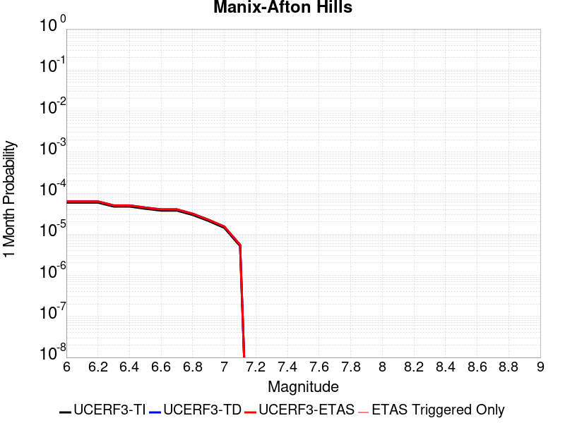 | 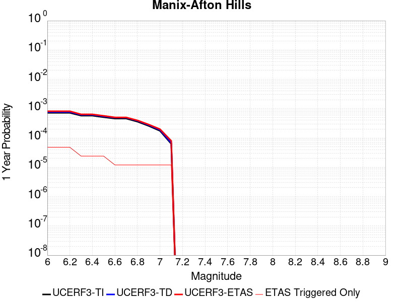 | 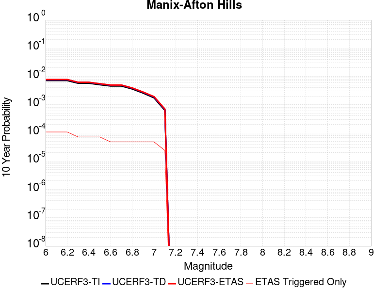 |

| Magnitude | 1 wk TI Prob | 1 wk TD Prob | 1 wk ETAS Prob | 1 wk ETAS/TD Gain | 1 wk ETAS Triggered Only | 1 mo TI Prob | 1 mo TD Prob | 1 mo ETAS Prob | 1 mo ETAS/TD Gain | 1 mo ETAS Triggered Only | 1 yr TI Prob | 1 yr TD Prob | 1 yr ETAS Prob | 1 yr ETAS/TD Gain | 1 yr ETAS Triggered Only | 10 yr TI Prob | 10 yr TD Prob | 10 yr ETAS Prob | 10 yr ETAS/TD Gain | 10 yr ETAS Triggered Only |
|-----|-----|-----|-----|-----|-----|-----|-----|-----|-----|-----|-----|-----|-----|-----|-----|-----|-----|-----|-----|-----|
| 6.0 | 1.3783202E-5 | 1.4711221E-5 | 1.4711221E-5 | 1.0 | 0.0 | 5.906953E-5 | 6.304667E-5 | 6.304667E-5 | 1.0 | 0.0 | 7.189342E-4 | 7.673403E-4 | 8.152651E-4 | 1.0624558 | 4.7961632E-5 | 0.0071661277 | 0.007648664 | 0.007755752 | 1.0140009 | 1.0791367E-4 |
| 6.1 | 1.3783202E-5 | 1.4711221E-5 | 1.4711221E-5 | 1.0 | 0.0 | 5.906953E-5 | 6.304667E-5 | 6.304667E-5 | 1.0 | 0.0 | 7.189342E-4 | 7.673403E-4 | 8.152651E-4 | 1.0624558 | 4.7961632E-5 | 0.0071661277 | 0.007648664 | 0.007755752 | 1.0140009 | 1.0791367E-4 |
| 6.2 | 1.3783202E-5 | 1.4711221E-5 | 1.4711221E-5 | 1.0 | 0.0 | 5.906953E-5 | 6.304667E-5 | 6.304667E-5 | 1.0 | 0.0 | 7.189342E-4 | 7.673403E-4 | 8.152651E-4 | 1.0624558 | 4.7961632E-5 | 0.0071661277 | 0.007648664 | 0.007755752 | 1.0140009 | 1.0791367E-4 |
| 6.3 | 1.10494875E-5 | 1.1793241E-5 | 1.1793241E-5 | 1.0 | 0.0 | 4.7354086E-5 | 5.054154E-5 | 5.054154E-5 | 1.0 | 0.0 | 5.763835E-4 | 6.151799E-4 | 6.3914596E-4 | 1.0389578 | 2.3980816E-5 | 0.005748908 | 0.00613581 | 0.006207311 | 1.0116531 | 7.194244E-5 |
| 6.4 | 1.10494875E-5 | 1.1793241E-5 | 1.1793241E-5 | 1.0 | 0.0 | 4.7354086E-5 | 5.054154E-5 | 5.054154E-5 | 1.0 | 0.0 | 5.763835E-4 | 6.151799E-4 | 6.3914596E-4 | 1.0389578 | 2.3980816E-5 | 0.005748908 | 0.00613581 | 0.006207311 | 1.0116531 | 7.194244E-5 |
| 6.5 | 9.788949E-6 | 1.0454414E-5 | 1.0454414E-5 | 1.0 | 0.0 | 4.1951964E-5 | 4.4803914E-5 | 4.4803914E-5 | 1.0 | 0.0 | 5.1064545E-4 | 5.4536044E-4 | 5.6932814E-4 | 1.0439484 | 2.3980816E-5 | 0.0050947363 | 0.005441148 | 0.0055126986 | 1.01315 | 7.194244E-5 |
| 6.6 | 8.810006E-6 | 9.413714E-6 | 9.413714E-6 | 1.0 | 0.0 | 3.775662E-5 | 4.0343915E-5 | 4.0343915E-5 | 1.0 | 0.0 | 4.5958988E-4 | 4.9108535E-4 | 5.0306984E-4 | 1.0244042 | 1.1990408E-5 | 0.0045864056 | 0.004900884 | 0.0049486104 | 1.0097383 | 4.7961632E-5 |
| 6.7 | 8.80128E-6 | 9.404193E-6 | 9.404193E-6 | 1.0 | 0.0 | 3.7719226E-5 | 4.0303115E-5 | 4.0303115E-5 | 1.0 | 0.0 | 4.591348E-4 | 4.9058883E-4 | 5.025733E-4 | 1.0244288 | 1.1990408E-5 | 0.004581874 | 0.0048959404 | 0.004943667 | 1.0097482 | 4.7961632E-5 |
| 6.8 | 6.8994877E-6 | 7.3801443E-6 | 7.3801443E-6 | 1.0 | 0.0 | 2.9568899E-5 | 3.1628853E-5 | 3.1628853E-5 | 1.0 | 0.0 | 3.5994186E-4 | 3.850214E-4 | 3.9700718E-4 | 1.0311302 | 1.1990408E-5 | 0.003593594 | 0.0038443485 | 0.0038921256 | 1.0124279 | 4.7961632E-5 |
| 6.9 | 4.9328037E-6 | 5.2710093E-6 | 5.2710093E-6 | 1.0 | 0.0 | 2.1140417E-5 | 2.258988E-5 | 2.258988E-5 | 1.0 | 0.0 | 2.5735417E-4 | 2.7500323E-4 | 2.8699034E-4 | 1.043589 | 1.1990408E-5 | 0.0025705635 | 0.0027472344 | 0.0027950644 | 1.0174102 | 4.7961632E-5 |
| 7.0 | 3.347973E-6 | 3.5900646E-6 | 3.5900646E-6 | 1.0 | 0.0 | 1.4348378E-5 | 1.5385924E-5 | 1.5385924E-5 | 1.0 | 0.0 | 1.746775E-4 | 1.8731161E-4 | 1.9929977E-4 | 1.0640012 | 1.1990408E-5 | 0.0017454025 | 0.00187194 | 0.0019198118 | 1.0255734 | 4.7961632E-5 |
| 7.1 | 1.2073567E-6 | 1.2934943E-6 | 1.2934943E-6 | 1.0 | 0.0 | 5.1743755E-6 | 5.5435444E-6 | 5.5435444E-6 | 1.0 | 0.0 | 6.29962E-5 | 6.74922E-5 | 7.94818E-5 | 1.1776443 | 1.1990408E-5 | 6.297835E-4 | 6.7487714E-4 | 6.9884176E-4 | 1.0355096 | 2.3980816E-5 |

## San Jacinto (Stepovers Combined)
*[(top)](#table-of-contents)*

| 1 Week | 1 Month | 1 Year | 10 Year |
|-----|-----|-----|-----|
| 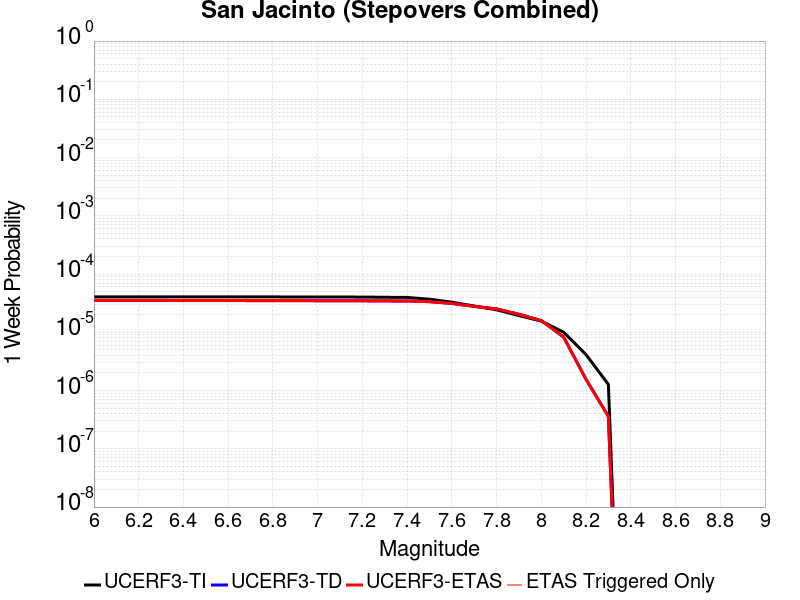 | 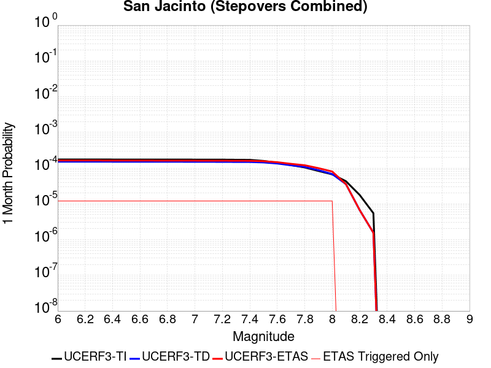 | 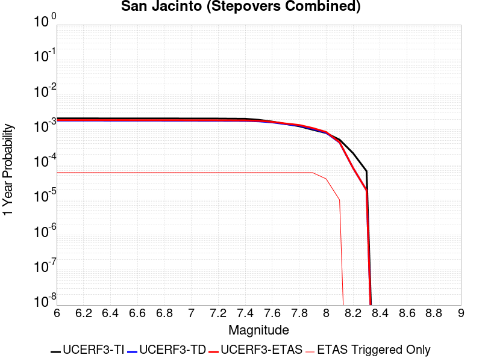 | 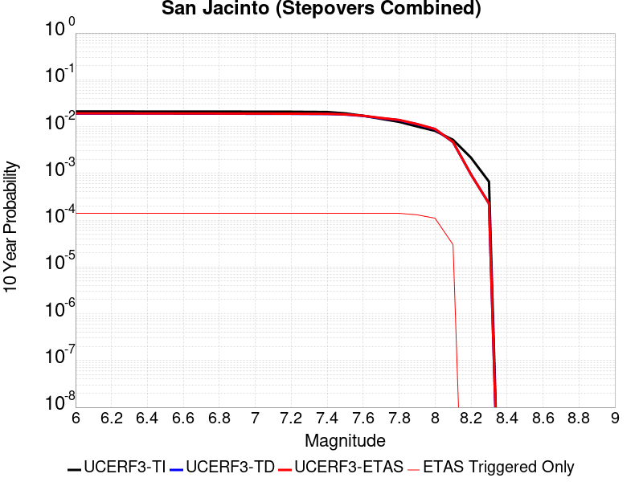 |

| Magnitude | 1 wk TI Prob | 1 wk TD Prob | 1 wk ETAS Prob | 1 wk ETAS/TD Gain | 1 wk ETAS Triggered Only | 1 mo TI Prob | 1 mo TD Prob | 1 mo ETAS Prob | 1 mo ETAS/TD Gain | 1 mo ETAS Triggered Only | 1 yr TI Prob | 1 yr TD Prob | 1 yr ETAS Prob | 1 yr ETAS/TD Gain | 1 yr ETAS Triggered Only | 10 yr TI Prob | 10 yr TD Prob | 10 yr ETAS Prob | 10 yr ETAS/TD Gain | 10 yr ETAS Triggered Only |
|-----|-----|-----|-----|-----|-----|-----|-----|-----|-----|-----|-----|-----|-----|-----|-----|-----|-----|-----|-----|-----|
| 6.0 | 4.0667746E-5 | 3.5287198E-5 | 3.5287198E-5 | 1.0 | 0.0 | 1.742787E-4 | 1.5122209E-4 | 1.6321069E-4 | 1.0792781 | 1.1990408E-5 | 0.0021197782 | 0.0018395748 | 0.0018994166 | 1.0325302 | 5.995204E-5 | 0.020996714 | 0.018994363 | 0.019100226 | 1.0055734 | 1.0791367E-4 |
| 6.1 | 4.0667746E-5 | 3.5287198E-5 | 3.5287198E-5 | 1.0 | 0.0 | 1.742787E-4 | 1.5122209E-4 | 1.6321069E-4 | 1.0792781 | 1.1990408E-5 | 0.0021197782 | 0.0018395748 | 0.0018994166 | 1.0325302 | 5.995204E-5 | 0.020996714 | 0.018994363 | 0.019100226 | 1.0055734 | 1.0791367E-4 |
| 6.2 | 4.0667746E-5 | 3.5287198E-5 | 3.5287198E-5 | 1.0 | 0.0 | 1.742787E-4 | 1.5122209E-4 | 1.6321069E-4 | 1.0792781 | 1.1990408E-5 | 0.0021197782 | 0.0018395748 | 0.0018994166 | 1.0325302 | 5.995204E-5 | 0.020996714 | 0.018994363 | 0.019100226 | 1.0055734 | 1.0791367E-4 |
| 6.3 | 4.0667746E-5 | 3.5287198E-5 | 3.5287198E-5 | 1.0 | 0.0 | 1.742787E-4 | 1.5122209E-4 | 1.6321069E-4 | 1.0792781 | 1.1990408E-5 | 0.0021197782 | 0.0018395748 | 0.0018994166 | 1.0325302 | 5.995204E-5 | 0.020996714 | 0.018994363 | 0.019100226 | 1.0055734 | 1.0791367E-4 |
| 6.4 | 4.0577226E-5 | 3.515909E-5 | 3.515909E-5 | 1.0 | 0.0 | 1.738908E-4 | 1.5067312E-4 | 1.6266172E-4 | 1.079567 | 1.1990408E-5 | 0.0021150648 | 0.0018329041 | 0.0018927462 | 1.0326488 | 5.995204E-5 | 0.020950472 | 0.018928928 | 0.0190348 | 1.0055931 | 1.0791367E-4 |
| 6.5 | 4.0577226E-5 | 3.515909E-5 | 3.515909E-5 | 1.0 | 0.0 | 1.738908E-4 | 1.5067312E-4 | 1.6266172E-4 | 1.079567 | 1.1990408E-5 | 0.0021150648 | 0.0018329041 | 0.0018927462 | 1.0326488 | 5.995204E-5 | 0.020950472 | 0.018928928 | 0.0190348 | 1.0055931 | 1.0791367E-4 |
| 6.6 | 4.053861E-5 | 3.5104433E-5 | 3.5104433E-5 | 1.0 | 0.0 | 1.7372532E-4 | 1.5043891E-4 | 1.624275E-4 | 1.0796908 | 1.1990408E-5 | 0.0021130538 | 0.0018300572 | 0.0018898996 | 1.0326997 | 5.995204E-5 | 0.020930743 | 0.018901005 | 0.01900688 | 1.0056015 | 1.0791367E-4 |
| 6.7 | 4.0516545E-5 | 3.50735E-5 | 3.50735E-5 | 1.0 | 0.0 | 1.7363077E-4 | 1.5030634E-4 | 1.6229495E-4 | 1.0797611 | 1.1990408E-5 | 0.002111905 | 0.0018284466 | 0.001888289 | 1.0327286 | 5.995204E-5 | 0.020919468 | 0.018885203 | 0.018991077 | 1.0056063 | 1.0791367E-4 |
| 6.8 | 4.049434E-5 | 3.504506E-5 | 3.504506E-5 | 1.0 | 0.0 | 1.7353562E-4 | 1.5018447E-4 | 1.6217308E-4 | 1.0798259 | 1.1990408E-5 | 0.0021107488 | 0.0018269654 | 0.0018868078 | 1.0327551 | 5.995204E-5 | 0.020908125 | 0.018870614 | 0.018976491 | 1.0056107 | 1.0791367E-4 |
| 6.9 | 4.046386E-5 | 3.500762E-5 | 3.500762E-5 | 1.0 | 0.0 | 1.73405E-4 | 1.5002403E-4 | 1.6201264E-4 | 1.0799112 | 1.1990408E-5 | 0.0021091616 | 0.0018250152 | 0.0018848579 | 1.0327902 | 5.995204E-5 | 0.020892553 | 0.018851386 | 0.018957267 | 1.0056165 | 1.0791367E-4 |
| 7.0 | 4.036382E-5 | 3.4888177E-5 | 3.4888177E-5 | 1.0 | 0.0 | 1.7297632E-4 | 1.4951221E-4 | 1.6150082E-4 | 1.0801848 | 1.1990408E-5 | 0.0021039525 | 0.0018187946 | 0.0018786376 | 1.0329026 | 5.995204E-5 | 0.02084144 | 0.018789997 | 0.018895883 | 1.0056353 | 1.0791367E-4 |
| 7.1 | 4.0343282E-5 | 3.486664E-5 | 3.486664E-5 | 1.0 | 0.0 | 1.7288832E-4 | 1.4941991E-4 | 1.6140853E-4 | 1.0802344 | 1.1990408E-5 | 0.002102883 | 0.0018176727 | 0.0018775158 | 1.0329229 | 5.995204E-5 | 0.020830948 | 0.018778874 | 0.018884761 | 1.0056386 | 1.0791367E-4 |
| 7.2 | 4.0257353E-5 | 3.4771132E-5 | 3.4771132E-5 | 1.0 | 0.0 | 1.725201E-4 | 1.4901065E-4 | 1.6099928E-4 | 1.0804548 | 1.1990408E-5 | 0.0020984085 | 0.0018126983 | 0.0018725416 | 1.0330135 | 5.995204E-5 | 0.020787042 | 0.01872961 | 0.018835504 | 1.0056537 | 1.0791367E-4 |
| 7.3 | 3.9940667E-5 | 3.4598754E-5 | 3.4598754E-5 | 1.0 | 0.0 | 1.7116306E-4 | 1.4827197E-4 | 1.6026059E-4 | 1.0808557 | 1.1990408E-5 | 0.0020819185 | 0.0018037198 | 0.0018635637 | 1.0331781 | 5.995204E-5 | 0.020625217 | 0.018638225 | 0.018744128 | 1.005682 | 1.0791367E-4 |
| 7.4 | 3.9721202E-5 | 3.4484117E-5 | 3.4484117E-5 | 1.0 | 0.0 | 1.7022261E-4 | 1.4778072E-4 | 1.5976936E-4 | 1.0811245 | 1.1990408E-5 | 0.0020704903 | 0.0017977487 | 0.0018575931 | 1.0332885 | 5.995204E-5 | 0.020513052 | 0.018577335 | 0.018683244 | 1.005701 | 1.0791367E-4 |
| 7.5 | 3.7036873E-5 | 3.355129E-5 | 3.355129E-5 | 1.0 | 0.0 | 1.5871979E-4 | 1.4378333E-4 | 1.5577201E-4 | 1.0833802 | 1.1990408E-5 | 0.0019307006 | 0.0017491594 | 0.0018090066 | 1.0342149 | 5.995204E-5 | 0.019140124 | 0.018078765 | 0.018184727 | 1.0058612 | 1.0791367E-4 |
| 7.6 | 3.2940967E-5 | 3.133173E-5 | 3.133173E-5 | 1.0 | 0.0 | 1.4116794E-4 | 1.3427193E-4 | 1.4626073E-4 | 1.0892874 | 1.1990408E-5 | 0.0017173645 | 0.0016335372 | 0.0016933914 | 1.0366408 | 5.995204E-5 | 0.01704153 | 0.016911475 | 0.017017564 | 1.0062732 | 1.0791367E-4 |
| 7.7 | 2.8236149E-5 | 2.7897275E-5 | 2.7897275E-5 | 1.0 | 0.0 | 1.2100645E-4 | 1.1955428E-4 | 1.3154325E-4 | 1.1002806 | 1.1990408E-5 | 0.0014722579 | 0.0014546025 | 0.0015144673 | 1.0411555 | 5.995204E-5 | 0.014625421 | 0.015122045 | 0.015228327 | 1.0070282 | 1.0791367E-4 |
| 7.8 | 2.4329287E-5 | 2.5220394E-5 | 2.5220394E-5 | 1.0 | 0.0 | 1.042642E-4 | 1.0808293E-4 | 1.2007204E-4 | 1.1109251 | 1.1990408E-5 | 0.0012686774 | 0.0013151162 | 0.0013749894 | 1.045527 | 5.995204E-5 | 0.012614589 | 0.013719083 | 0.013825515 | 1.007758 | 1.0791367E-4 |
| 7.9 | 1.9370926E-5 | 2.0433014E-5 | 2.0433014E-5 | 1.0 | 0.0 | 8.301561E-5 | 8.7567125E-5 | 9.955648E-5 | 1.1369162 | 1.1990408E-5 | 0.0010102465 | 0.001065609 | 0.0011254972 | 1.0562009 | 5.995204E-5 | 0.0100566605 | 0.011205519 | 0.011300367 | 1.0084645 | 9.5923264E-5 |
| 8.0 | 1.5583017E-5 | 1.5896165E-5 | 1.5896165E-5 | 1.0 | 0.0 | 6.6782646E-5 | 6.8124646E-5 | 8.011424E-5 | 1.1759949 | 1.1990408E-5 | 8.127754E-4 | 8.2910265E-4 | 8.770245E-4 | 1.0577997 | 4.7961632E-5 | 0.008098091 | 0.008786912 | 0.008870107 | 1.0094681 | 8.393286E-5 |
| 8.1 | 1.0024873E-5 | 8.298104E-6 | 8.298104E-6 | 1.0 | 0.0 | 4.2963035E-5 | 3.556282E-5 | 3.556282E-5 | 1.0 | 0.0 | 5.229494E-4 | 4.3289183E-4 | 4.4487705E-4 | 1.0276864 | 1.1990408E-5 | 0.0052172043 | 0.0046564727 | 0.0046803416 | 1.005126 | 2.3980816E-5 |
| 8.2 | 4.142796E-6 | 1.5626505E-6 | 1.5626505E-6 | 1.0 | 0.0 | 1.775472E-5 | 6.697056E-6 | 6.697056E-6 | 1.0 | 0.0 | 2.1614227E-4 | 8.153364E-5 | 8.153364E-5 | 1.0 | 0.0 | 0.0021593217 | 9.464045E-4 | 9.464045E-4 | 1.0 | 0.0 |
| 8.3 | 1.2750878E-6 | 3.6166134E-7 | 3.6166134E-7 | 1.0 | 0.0 | 5.4646503E-6 | 1.5499762E-6 | 1.5499762E-6 | 1.0 | 0.0 | 6.653009E-5 | 1.8870802E-5 | 1.8870802E-5 | 1.0 | 0.0 | 6.6510175E-4 | 2.2760578E-4 | 2.2760578E-4 | 1.0 | 0.0 |

## San Jacinto (San Jacinto Valley) rev
*[(top)](#table-of-contents)*

| 1 Week | 1 Month | 1 Year | 10 Year |
|-----|-----|-----|-----|
| 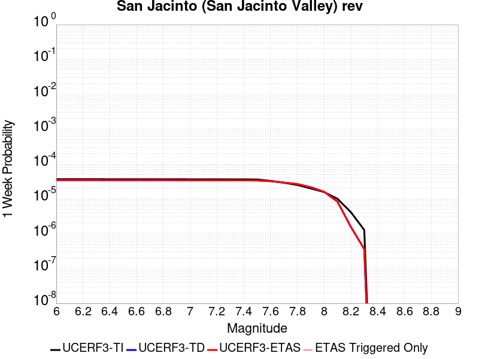 | 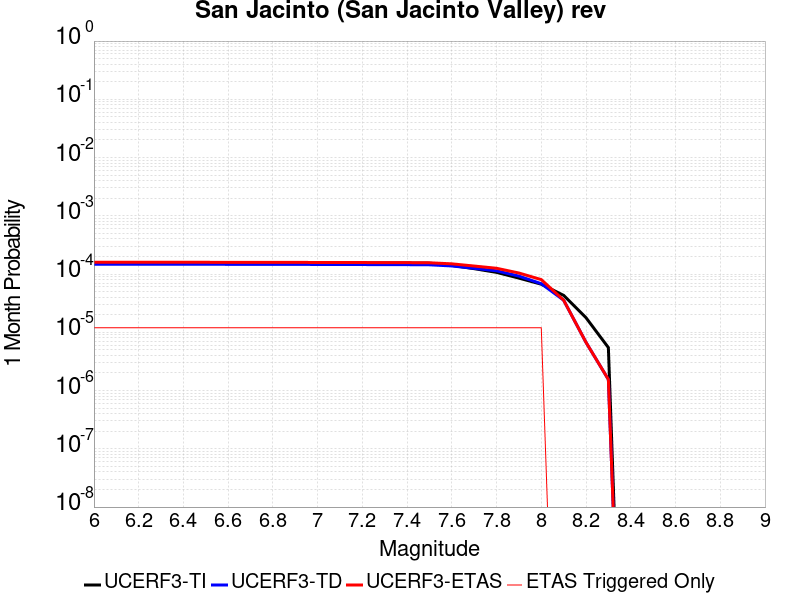 | 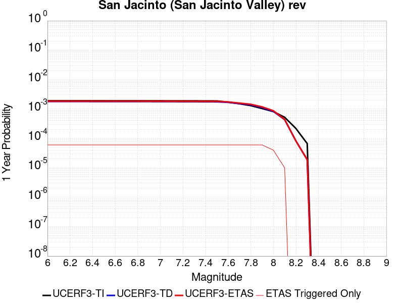 | 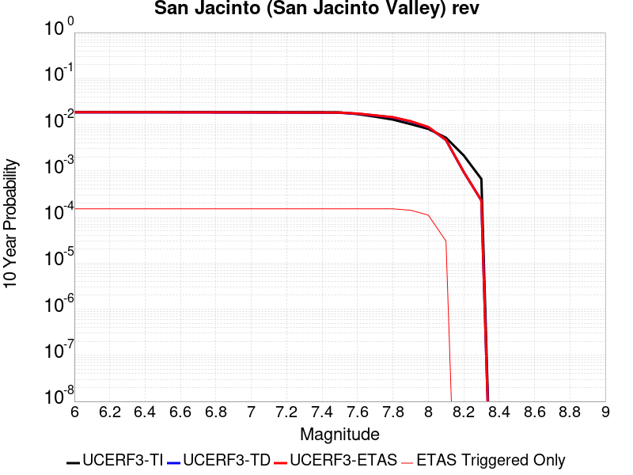 |

| Magnitude | 1 wk TI Prob | 1 wk TD Prob | 1 wk ETAS Prob | 1 wk ETAS/TD Gain | 1 wk ETAS Triggered Only | 1 mo TI Prob | 1 mo TD Prob | 1 mo ETAS Prob | 1 mo ETAS/TD Gain | 1 mo ETAS Triggered Only | 1 yr TI Prob | 1 yr TD Prob | 1 yr ETAS Prob | 1 yr ETAS/TD Gain | 1 yr ETAS Triggered Only | 10 yr TI Prob | 10 yr TD Prob | 10 yr ETAS Prob | 10 yr ETAS/TD Gain | 10 yr ETAS Triggered Only |
|-----|-----|-----|-----|-----|-----|-----|-----|-----|-----|-----|-----|-----|-----|-----|-----|-----|-----|-----|-----|-----|
| 6.0 | 3.652694E-5 | 3.4417048E-5 | 3.4417048E-5 | 1.0 | 0.0 | 1.5653463E-4 | 1.4749331E-4 | 1.5948195E-4 | 1.0812826 | 1.1990408E-5 | 0.0019041431 | 0.0017942534 | 0.0018540978 | 1.0333534 | 5.995204E-5 | 0.018879099 | 0.018534157 | 0.018640071 | 1.0057145 | 1.0791367E-4 |
| 6.1 | 3.652694E-5 | 3.4417048E-5 | 3.4417048E-5 | 1.0 | 0.0 | 1.5653463E-4 | 1.4749331E-4 | 1.5948195E-4 | 1.0812826 | 1.1990408E-5 | 0.0019041431 | 0.0017942534 | 0.0018540978 | 1.0333534 | 5.995204E-5 | 0.018879099 | 0.018534157 | 0.018640071 | 1.0057145 | 1.0791367E-4 |
| 6.2 | 3.652694E-5 | 3.4417048E-5 | 3.4417048E-5 | 1.0 | 0.0 | 1.5653463E-4 | 1.4749331E-4 | 1.5948195E-4 | 1.0812826 | 1.1990408E-5 | 0.0019041431 | 0.0017942534 | 0.0018540978 | 1.0333534 | 5.995204E-5 | 0.018879099 | 0.018534157 | 0.018640071 | 1.0057145 | 1.0791367E-4 |
| 6.3 | 3.652694E-5 | 3.4417048E-5 | 3.4417048E-5 | 1.0 | 0.0 | 1.5653463E-4 | 1.4749331E-4 | 1.5948195E-4 | 1.0812826 | 1.1990408E-5 | 0.0019041431 | 0.0017942534 | 0.0018540978 | 1.0333534 | 5.995204E-5 | 0.018879099 | 0.018534157 | 0.018640071 | 1.0057145 | 1.0791367E-4 |
| 6.4 | 3.646941E-5 | 3.433862E-5 | 3.433862E-5 | 1.0 | 0.0 | 1.5628811E-4 | 1.4715722E-4 | 1.5914587E-4 | 1.0814682 | 1.1990408E-5 | 0.0019011468 | 0.0017901688 | 0.0018500135 | 1.0334296 | 5.995204E-5 | 0.018849645 | 0.018494038 | 0.018599955 | 1.0057272 | 1.0791367E-4 |
| 6.5 | 3.646941E-5 | 3.433862E-5 | 3.433862E-5 | 1.0 | 0.0 | 1.5628811E-4 | 1.4715722E-4 | 1.5914587E-4 | 1.0814682 | 1.1990408E-5 | 0.0019011468 | 0.0017901688 | 0.0018500135 | 1.0334296 | 5.995204E-5 | 0.018849645 | 0.018494038 | 0.018599955 | 1.0057272 | 1.0791367E-4 |
| 6.6 | 3.6442503E-5 | 3.4302004E-5 | 3.4302004E-5 | 1.0 | 0.0 | 1.561728E-4 | 1.4700032E-4 | 1.5898896E-4 | 1.0815552 | 1.1990408E-5 | 0.0018997455 | 0.0017882616 | 0.0018481064 | 1.0334654 | 5.995204E-5 | 0.018835869 | 0.018475305 | 0.018581226 | 1.005733 | 1.0791367E-4 |
| 6.7 | 3.6432113E-5 | 3.4287576E-5 | 3.4287576E-5 | 1.0 | 0.0 | 1.5612828E-4 | 1.4693849E-4 | 1.5892713E-4 | 1.0815896 | 1.1990408E-5 | 0.0018992044 | 0.0017875104 | 0.0018473552 | 1.0334795 | 5.995204E-5 | 0.018830549 | 0.01846793 | 0.01857385 | 1.0057354 | 1.0791367E-4 |
| 6.8 | 3.6409598E-5 | 3.425663E-5 | 3.425663E-5 | 1.0 | 0.0 | 1.560318E-4 | 1.4680588E-4 | 1.5879452E-4 | 1.0816633 | 1.1990408E-5 | 0.0018980318 | 0.0017858985 | 0.0018457434 | 1.0335097 | 5.995204E-5 | 0.018819023 | 0.018452084 | 0.018558005 | 1.0057404 | 1.0791367E-4 |
| 6.9 | 3.638078E-5 | 3.4217053E-5 | 3.4217053E-5 | 1.0 | 0.0 | 1.5590832E-4 | 1.4663627E-4 | 1.5862493E-4 | 1.0817578 | 1.1990408E-5 | 0.0018965311 | 0.001783837 | 0.001843682 | 1.0335485 | 5.995204E-5 | 0.018804269 | 0.018431816 | 0.018537741 | 1.0057468 | 1.0791367E-4 |
| 7.0 | 3.6294874E-5 | 3.4099063E-5 | 3.4099063E-5 | 1.0 | 0.0 | 1.5554018E-4 | 1.4613067E-4 | 1.5811932E-4 | 1.0820407 | 1.1990408E-5 | 0.0018920569 | 0.0017776915 | 0.001837537 | 1.0336647 | 5.995204E-5 | 0.018760284 | 0.018371396 | 0.018477326 | 1.005766 | 1.0791367E-4 |
| 7.1 | 3.6260717E-5 | 3.405534E-5 | 3.405534E-5 | 1.0 | 0.0 | 1.5539382E-4 | 1.4594331E-4 | 1.5793198E-4 | 1.0821459 | 1.1990408E-5 | 0.001890278 | 0.0017754143 | 0.00183526 | 1.033708 | 5.995204E-5 | 0.018742796 | 0.018348996 | 0.018454928 | 1.0057733 | 1.0791367E-4 |
| 7.2 | 3.6210204E-5 | 3.398956E-5 | 3.398956E-5 | 1.0 | 0.0 | 1.5517735E-4 | 1.4566141E-4 | 1.5765008E-4 | 1.082305 | 1.1990408E-5 | 0.001887647 | 0.0017719879 | 0.0018318336 | 1.0337733 | 5.995204E-5 | 0.01871693 | 0.018315274 | 0.01842121 | 1.005784 | 1.0791367E-4 |
| 7.3 | 3.6119454E-5 | 3.3877837E-5 | 3.3877837E-5 | 1.0 | 0.0 | 1.5478847E-4 | 1.4518267E-4 | 1.5717134E-4 | 1.0825764 | 1.1990408E-5 | 0.0018829206 | 0.0017661685 | 0.0018260147 | 1.0338848 | 5.995204E-5 | 0.018670462 | 0.018257825 | 0.018363768 | 1.0058026 | 1.0791367E-4 |
| 7.4 | 3.607848E-5 | 3.3825334E-5 | 3.3825334E-5 | 1.0 | 0.0 | 1.5461289E-4 | 1.4495767E-4 | 1.5694633E-4 | 1.0827047 | 1.1990408E-5 | 0.0018807866 | 0.0017634337 | 0.00182328 | 1.0339373 | 5.995204E-5 | 0.018649481 | 0.018230818 | 0.018336764 | 1.0058113 | 1.0791367E-4 |
| 7.5 | 3.5856774E-5 | 3.3635082E-5 | 3.3635082E-5 | 1.0 | 0.0 | 1.5366284E-4 | 1.4414241E-4 | 1.561311E-4 | 1.0831724 | 1.1990408E-5 | 0.0018692396 | 0.0017535238 | 0.0018133707 | 1.0341295 | 5.995204E-5 | 0.018535944 | 0.018131904 | 0.018237863 | 1.0058436 | 1.0791367E-4 |
| 7.6 | 3.286655E-5 | 3.215777E-5 | 3.215777E-5 | 1.0 | 0.0 | 1.4084904E-4 | 1.3781176E-4 | 1.4980051E-4 | 1.0869937 | 1.1990408E-5 | 0.001713488 | 0.0016765689 | 0.0017364204 | 1.0356988 | 5.995204E-5 | 0.017003361 | 0.017351432 | 0.017457472 | 1.0061114 | 1.0791367E-4 |
| 7.7 | 2.8882527E-5 | 2.9250317E-5 | 2.9250317E-5 | 1.0 | 0.0 | 1.237764E-4 | 1.2535248E-4 | 1.373414E-4 | 1.0956415 | 1.1990408E-5 | 0.0015059357 | 0.0015250992 | 0.0015849598 | 1.0392503 | 5.995204E-5 | 0.014957713 | 0.015837716 | 0.01594392 | 1.0067058 | 1.0791367E-4 |
| 7.8 | 2.4950225E-5 | 2.6540692E-5 | 2.6540692E-5 | 1.0 | 0.0 | 1.0692515E-4 | 1.1374087E-4 | 1.2572992E-4 | 1.1054066 | 1.1990408E-5 | 0.0013010362 | 0.0013839162 | 0.0014437854 | 1.0432606 | 5.995204E-5 | 0.012934455 | 0.0144187445 | 0.0145251015 | 1.0073763 | 1.0791367E-4 |
| 7.9 | 1.9881603E-5 | 2.1519538E-5 | 2.1519538E-5 | 1.0 | 0.0 | 8.520408E-5 | 9.222333E-5 | 1.0421263E-4 | 1.1300029 | 1.1990408E-5 | 0.001036866 | 0.0011222415 | 0.0011821262 | 1.0533618 | 5.995204E-5 | 0.010320415 | 0.011783319 | 0.011878111 | 1.0080447 | 9.5923264E-5 |
| 8.0 | 1.563292E-5 | 1.5947082E-5 | 1.5947082E-5 | 1.0 | 0.0 | 6.6996516E-5 | 6.834285E-5 | 8.0332444E-5 | 1.1754329 | 1.1990408E-5 | 8.153773E-4 | 8.3175726E-4 | 8.79679E-4 | 1.057615 | 4.7961632E-5 | 0.00812392 | 0.008815629 | 0.008898823 | 1.009437 | 8.393286E-5 |
| 8.1 | 1.0045313E-5 | 8.307514E-6 | 8.307514E-6 | 1.0 | 0.0 | 4.305063E-5 | 3.5603145E-5 | 3.5603145E-5 | 1.0 | 0.0 | 5.2401534E-4 | 4.333826E-4 | 4.4536783E-4 | 1.027655 | 1.1990408E-5 | 0.0052278144 | 0.0046621817 | 0.004686051 | 1.0051197 | 2.3980816E-5 |
| 8.2 | 4.1554413E-6 | 1.5672123E-6 | 1.5672123E-6 | 1.0 | 0.0 | 1.7808914E-5 | 6.716607E-6 | 6.716607E-6 | 1.0 | 0.0 | 2.1680194E-4 | 8.177165E-5 | 8.177165E-5 | 1.0 | 0.0 | 0.0021659054 | 9.492334E-4 | 9.492334E-4 | 1.0 | 0.0 |
| 8.3 | 1.2758221E-6 | 3.6194777E-7 | 3.6194777E-7 | 1.0 | 0.0 | 5.4677976E-6 | 1.5512038E-6 | 1.5512038E-6 | 1.0 | 0.0 | 6.65684E-5 | 1.8885747E-5 | 1.8885747E-5 | 1.0 | 0.0 | 6.6548464E-4 | 2.2777634E-4 | 2.2777634E-4 | 1.0 | 0.0 |

## San Jacinto (Anza) rev
*[(top)](#table-of-contents)*

| 1 Week | 1 Month | 1 Year | 10 Year |
|-----|-----|-----|-----|
| 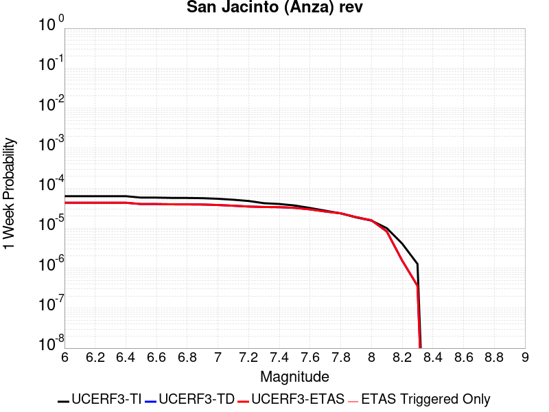 | 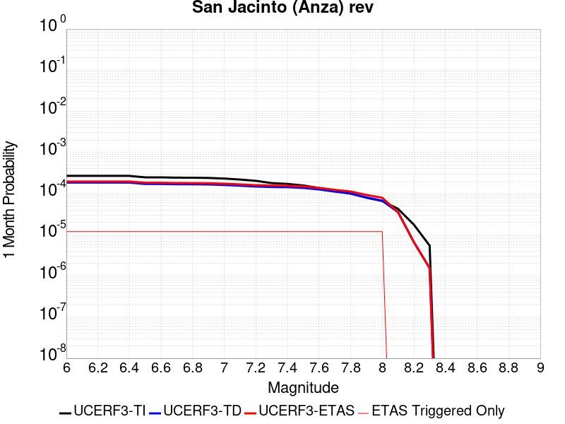 | 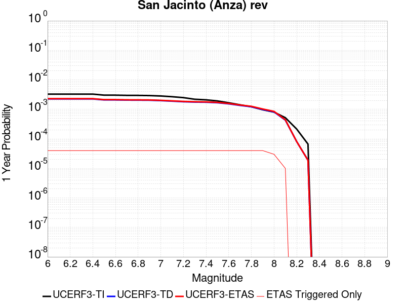 | 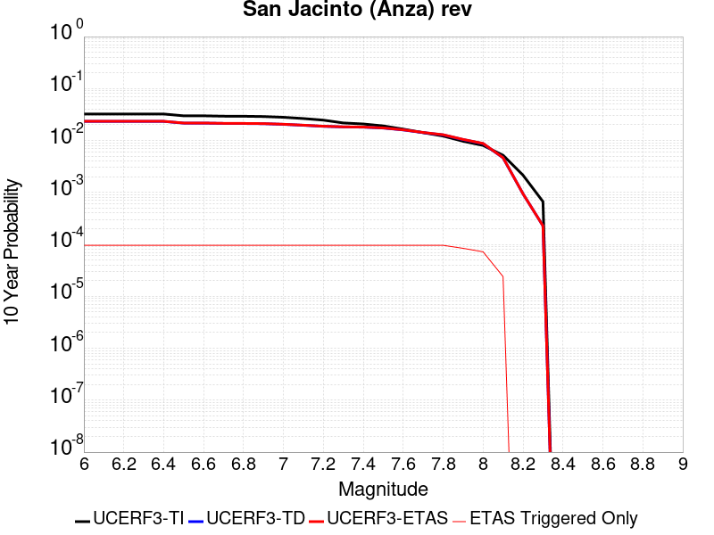 |

| Magnitude | 1 wk TI Prob | 1 wk TD Prob | 1 wk ETAS Prob | 1 wk ETAS/TD Gain | 1 wk ETAS Triggered Only | 1 mo TI Prob | 1 mo TD Prob | 1 mo ETAS Prob | 1 mo ETAS/TD Gain | 1 mo ETAS Triggered Only | 1 yr TI Prob | 1 yr TD Prob | 1 yr ETAS Prob | 1 yr ETAS/TD Gain | 1 yr ETAS Triggered Only | 10 yr TI Prob | 10 yr TD Prob | 10 yr ETAS Prob | 10 yr ETAS/TD Gain | 10 yr ETAS Triggered Only |
|-----|-----|-----|-----|-----|-----|-----|-----|-----|-----|-----|-----|-----|-----|-----|-----|-----|-----|-----|-----|-----|
| 6.0 | 6.3015636E-5 | 4.3319626E-5 | 4.3319626E-5 | 1.0 | 0.0 | 2.7003905E-4 | 1.8564239E-4 | 1.9763058E-4 | 1.0645767 | 1.1990408E-5 | 0.0032827691 | 0.0022578652 | 0.0023057186 | 1.0211941 | 4.7961632E-5 | 0.032346968 | 0.02330496 | 0.023398647 | 1.0040201 | 9.5923264E-5 |
| 6.1 | 6.3015636E-5 | 4.3319626E-5 | 4.3319626E-5 | 1.0 | 0.0 | 2.7003905E-4 | 1.8564239E-4 | 1.9763058E-4 | 1.0645767 | 1.1990408E-5 | 0.0032827691 | 0.0022578652 | 0.0023057186 | 1.0211941 | 4.7961632E-5 | 0.032346968 | 0.02330496 | 0.023398647 | 1.0040201 | 9.5923264E-5 |
| 6.2 | 6.3015636E-5 | 4.3319626E-5 | 4.3319626E-5 | 1.0 | 0.0 | 2.7003905E-4 | 1.8564239E-4 | 1.9763058E-4 | 1.0645767 | 1.1990408E-5 | 0.0032827691 | 0.0022578652 | 0.0023057186 | 1.0211941 | 4.7961632E-5 | 0.032346968 | 0.02330496 | 0.023398647 | 1.0040201 | 9.5923264E-5 |
| 6.3 | 6.3015636E-5 | 4.3319626E-5 | 4.3319626E-5 | 1.0 | 0.0 | 2.7003905E-4 | 1.8564239E-4 | 1.9763058E-4 | 1.0645767 | 1.1990408E-5 | 0.0032827691 | 0.0022578652 | 0.0023057186 | 1.0211941 | 4.7961632E-5 | 0.032346968 | 0.02330496 | 0.023398647 | 1.0040201 | 9.5923264E-5 |
| 6.4 | 6.3015636E-5 | 4.3319626E-5 | 4.3319626E-5 | 1.0 | 0.0 | 2.7003905E-4 | 1.8564239E-4 | 1.9763058E-4 | 1.0645767 | 1.1990408E-5 | 0.0032827691 | 0.0022578652 | 0.0023057186 | 1.0211941 | 4.7961632E-5 | 0.032346968 | 0.02330496 | 0.023398647 | 1.0040201 | 9.5923264E-5 |
| 6.5 | 5.811017E-5 | 4.0098632E-5 | 4.0098632E-5 | 1.0 | 0.0 | 2.4901982E-4 | 1.7184E-4 | 1.8382835E-4 | 1.0697646 | 1.1990408E-5 | 0.0030276014 | 0.00209015 | 0.0021380116 | 1.0228986 | 4.7961632E-5 | 0.02986684 | 0.021602087 | 0.021695938 | 1.0043446 | 9.5923264E-5 |
| 6.6 | 5.811017E-5 | 4.0098632E-5 | 4.0098632E-5 | 1.0 | 0.0 | 2.4901982E-4 | 1.7184E-4 | 1.8382835E-4 | 1.0697646 | 1.1990408E-5 | 0.0030276014 | 0.00209015 | 0.0021380116 | 1.0228986 | 4.7961632E-5 | 0.02986684 | 0.021602087 | 0.021695938 | 1.0043446 | 9.5923264E-5 |
| 6.7 | 5.712442E-5 | 3.952116E-5 | 3.952116E-5 | 1.0 | 0.0 | 2.4479596E-4 | 1.6936543E-4 | 1.8135381E-4 | 1.0707841 | 1.1990408E-5 | 0.0029763177 | 0.0020600795 | 0.0021079425 | 1.0232335 | 4.7961632E-5 | 0.029367693 | 0.021293823 | 0.021387704 | 1.0044088 | 9.5923264E-5 |
| 6.8 | 5.6967532E-5 | 3.9377548E-5 | 3.9377548E-5 | 1.0 | 0.0 | 2.4412372E-4 | 1.6875003E-4 | 1.8073843E-4 | 1.0710423 | 1.1990408E-5 | 0.0029681553 | 0.0020526012 | 0.0021004644 | 1.0233183 | 4.7961632E-5 | 0.029288229 | 0.021218529 | 0.021312416 | 1.0044248 | 9.5923264E-5 |
| 6.9 | 5.6211324E-5 | 3.9082228E-5 | 3.9082228E-5 | 1.0 | 0.0 | 2.4088343E-4 | 1.6748454E-4 | 1.7947295E-4 | 1.0715791 | 1.1990408E-5 | 0.0029288116 | 0.0020372227 | 0.0020850867 | 1.0234947 | 4.7961632E-5 | 0.028905109 | 0.021057902 | 0.021151805 | 1.0044593 | 9.5923264E-5 |
| 7.0 | 5.4383527E-5 | 3.7942387E-5 | 3.7942387E-5 | 1.0 | 0.0 | 2.3305144E-4 | 1.6260012E-4 | 1.7458858E-4 | 1.0737298 | 1.1990408E-5 | 0.0028337094 | 0.001977864 | 0.0020257307 | 1.0242013 | 4.7961632E-5 | 0.027978465 | 0.020448677 | 0.020542638 | 1.004595 | 9.5923264E-5 |
| 7.1 | 5.1393665E-5 | 3.640475E-5 | 3.640475E-5 | 1.0 | 0.0 | 2.2023996E-4 | 1.5601104E-4 | 1.6799958E-4 | 1.0768442 | 1.1990408E-5 | 0.0026781242 | 0.0018977838 | 0.0019456544 | 1.0252244 | 4.7961632E-5 | 0.026460782 | 0.019622007 | 0.019716047 | 1.0047927 | 9.5923264E-5 |
| 7.2 | 4.785222E-5 | 3.475601E-5 | 3.475601E-5 | 1.0 | 0.0 | 2.0506482E-4 | 1.4894584E-4 | 1.6093446E-4 | 1.0804898 | 1.1990408E-5 | 0.0024938055 | 0.0018119109 | 0.0018597855 | 1.0264223 | 4.7961632E-5 | 0.024660049 | 0.018736389 | 0.018830515 | 1.0050237 | 9.5923264E-5 |
| 7.3 | 4.2143256E-5 | 3.3850083E-5 | 3.3850083E-5 | 1.0 | 0.0 | 1.8060145E-4 | 1.4506375E-4 | 1.5705242E-4 | 1.0826441 | 1.1990408E-5 | 0.002196605 | 0.0017647238 | 0.0018126008 | 1.02713 | 4.7961632E-5 | 0.02175019 | 0.018244414 | 0.018338587 | 1.0051618 | 9.5923264E-5 |
| 7.4 | 4.0264713E-5 | 3.3488133E-5 | 3.3488133E-5 | 1.0 | 0.0 | 1.7255165E-4 | 1.435127E-4 | 1.5550139E-4 | 1.0835375 | 1.1990408E-5 | 0.002098792 | 0.0017458702 | 0.0017937481 | 1.0274235 | 4.7961632E-5 | 0.020790804 | 0.018048922 | 0.018143114 | 1.0052187 | 9.5923264E-5 |
| 7.5 | 3.694492E-5 | 3.2201835E-5 | 3.2201835E-5 | 1.0 | 0.0 | 1.5832575E-4 | 1.3800059E-4 | 1.4998934E-4 | 1.0868746 | 1.1990408E-5 | 0.0019259118 | 0.0016788654 | 0.0017267464 | 1.0285199 | 4.7961632E-5 | 0.01909306 | 0.017365217 | 0.017459475 | 1.005428 | 9.5923264E-5 |
| 7.6 | 3.200565E-5 | 2.9517045E-5 | 2.9517045E-5 | 1.0 | 0.0 | 1.3715986E-4 | 1.2649549E-4 | 1.3848439E-4 | 1.0947772 | 1.1990408E-5 | 0.001668642 | 0.0015389969 | 0.0015868847 | 1.0311162 | 4.7961632E-5 | 0.01656168 | 0.015953032 | 0.016047426 | 1.005917 | 9.5923264E-5 |
| 7.7 | 2.731642E-5 | 2.610537E-5 | 2.610537E-5 | 1.0 | 0.0 | 1.1706512E-4 | 1.11875364E-4 | 1.2386443E-4 | 1.1071645 | 1.1990408E-5 | 0.001424336 | 0.0013612325 | 0.0014091289 | 1.035186 | 4.7961632E-5 | 0.014152412 | 0.0141735645 | 0.014268128 | 1.0066718 | 9.5923264E-5 |
| 7.8 | 2.3466424E-5 | 2.3516895E-5 | 2.3516895E-5 | 1.0 | 0.0 | 1.0056651E-4 | 1.007828E-4 | 1.12772E-4 | 1.1189607 | 1.1990408E-5 | 0.0012237094 | 0.0012263408 | 0.0012742436 | 1.0390615 | 4.7961632E-5 | 0.012169928 | 0.012815201 | 0.012909894 | 1.0073892 | 9.5923264E-5 |
| 7.9 | 1.8611925E-5 | 1.8918972E-5 | 1.8918972E-5 | 1.0 | 0.0 | 7.9762955E-5 | 8.107879E-5 | 9.306823E-5 | 1.1478739 | 1.1990408E-5 | 9.7068126E-4 | 9.86688E-4 | 0.0010346023 | 1.0485607 | 4.7961632E-5 | 0.0096645225 | 0.010399517 | 0.010482577 | 1.0079869 | 8.393286E-5 |
| 8.0 | 1.5460775E-5 | 1.5750582E-5 | 1.5750582E-5 | 1.0 | 0.0 | 6.6258784E-5 | 6.7500754E-5 | 7.949035E-5 | 1.1776217 | 1.1990408E-5 | 8.0640207E-4 | 8.215125E-4 | 8.574542E-4 | 1.0437506 | 3.597122E-5 | 0.008034821 | 0.008707945 | 0.008779261 | 1.0081898 | 7.194244E-5 |
| 8.1 | 9.983884E-6 | 8.275629E-6 | 8.275629E-6 | 1.0 | 0.0 | 4.2787375E-5 | 3.54665E-5 | 3.54665E-5 | 1.0 | 0.0 | 5.2081177E-4 | 4.3171959E-4 | 4.4370483E-4 | 1.0277616 | 1.1990408E-5 | 0.0051959283 | 0.004643071 | 0.004666941 | 1.0051409 | 2.3980816E-5 |
| 8.2 | 4.1226E-6 | 1.5546157E-6 | 1.5546157E-6 | 1.0 | 0.0 | 1.7668166E-5 | 6.6626217E-6 | 6.6626217E-6 | 1.0 | 0.0 | 2.1508869E-4 | 8.111443E-5 | 8.111443E-5 | 1.0 | 0.0 | 0.0021488064 | 9.4143586E-4 | 9.4143586E-4 | 1.0 | 0.0 |
| 8.3 | 1.2750878E-6 | 3.6166134E-7 | 3.6166134E-7 | 1.0 | 0.0 | 5.4646503E-6 | 1.5499762E-6 | 1.5499762E-6 | 1.0 | 0.0 | 6.653009E-5 | 1.8870802E-5 | 1.8870802E-5 | 1.0 | 0.0 | 6.6510175E-4 | 2.2760578E-4 | 2.2760578E-4 | 1.0 | 0.0 |

## Ortigalita (North)
*[(top)](#table-of-contents)*

| 1 Week | 1 Month | 1 Year | 10 Year |
|-----|-----|-----|-----|
| 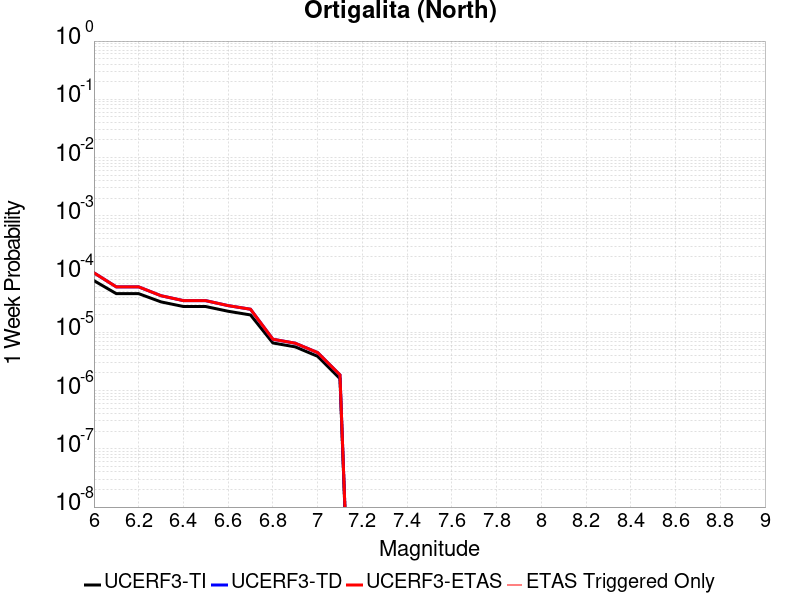 | 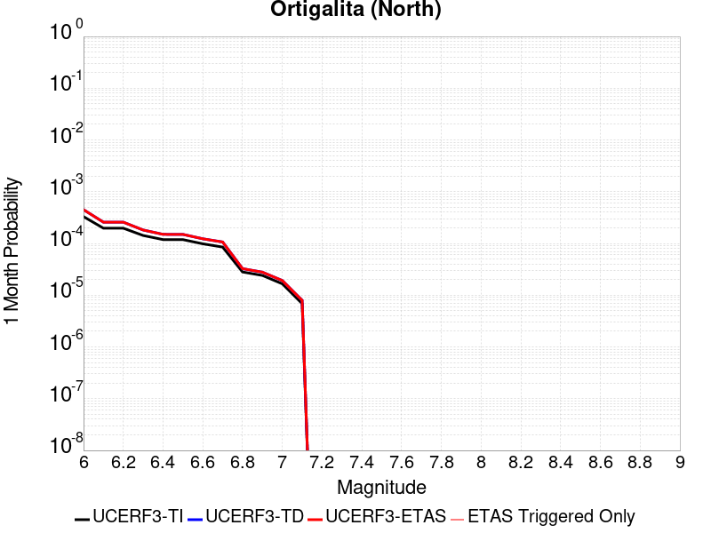 |  | 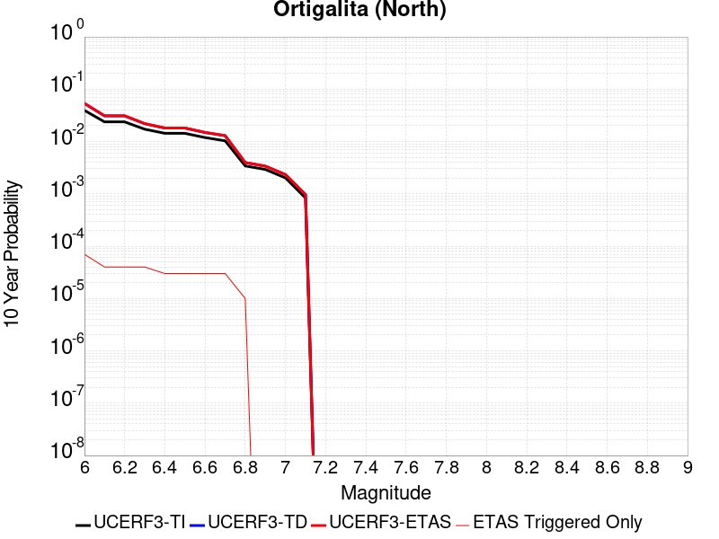 |

| Magnitude | 1 wk TI Prob | 1 wk TD Prob | 1 wk ETAS Prob | 1 wk ETAS/TD Gain | 1 wk ETAS Triggered Only | 1 mo TI Prob | 1 mo TD Prob | 1 mo ETAS Prob | 1 mo ETAS/TD Gain | 1 mo ETAS Triggered Only | 1 yr TI Prob | 1 yr TD Prob | 1 yr ETAS Prob | 1 yr ETAS/TD Gain | 1 yr ETAS Triggered Only | 10 yr TI Prob | 10 yr TD Prob | 10 yr ETAS Prob | 10 yr ETAS/TD Gain | 10 yr ETAS Triggered Only |
|-----|-----|-----|-----|-----|-----|-----|-----|-----|-----|-----|-----|-----|-----|-----|-----|-----|-----|-----|-----|-----|
| 6.0 | 7.711876E-5 | 1.0507023E-4 | 1.0507023E-4 | 1.0 | 0.0 | 3.3046713E-4 | 4.5023413E-4 | 4.5023413E-4 | 1.0 | 0.0 | 0.004016016 | 0.005468329 | 0.0054921787 | 1.0043614 | 2.3980816E-5 | 0.039442103 | 0.053457033 | 0.05351378 | 1.0010616 | 5.995204E-5 |
| 6.1 | 4.607858E-5 | 6.024174E-5 | 6.024174E-5 | 1.0 | 0.0 | 1.9746469E-4 | 2.5815613E-4 | 2.5815613E-4 | 1.0 | 0.0 | 0.0024014818 | 0.0031388826 | 0.0031627882 | 1.0076159 | 2.3980816E-5 | 0.023756953 | 0.030976266 | 0.031022742 | 1.0015004 | 4.7961632E-5 |
| 6.2 | 4.607858E-5 | 6.024174E-5 | 6.024174E-5 | 1.0 | 0.0 | 1.9746469E-4 | 2.5815613E-4 | 2.5815613E-4 | 1.0 | 0.0 | 0.0024014818 | 0.0031388826 | 0.0031627882 | 1.0076159 | 2.3980816E-5 | 0.023756953 | 0.030976266 | 0.031022742 | 1.0015004 | 4.7961632E-5 |
| 6.3 | 3.327423E-5 | 4.247674E-5 | 4.247674E-5 | 1.0 | 0.0 | 1.4259605E-4 | 1.820322E-4 | 1.820322E-4 | 1.0 | 0.0 | 0.0017347244 | 0.0022142797 | 0.0022262437 | 1.005403 | 1.1990408E-5 | 0.017212452 | 0.021946438 | 0.021993347 | 1.0021374 | 4.7961632E-5 |
| 6.4 | 2.7732503E-5 | 3.4999855E-5 | 3.4999855E-5 | 1.0 | 0.0 | 1.1884817E-4 | 1.4999225E-4 | 1.4999225E-4 | 1.0 | 0.0 | 0.001446016 | 0.001824874 | 0.0018368425 | 1.0065585 | 1.1990408E-5 | 0.014366428 | 0.018121855 | 0.018157175 | 1.001949 | 3.597122E-5 |
| 6.5 | 2.7689714E-5 | 3.4949666E-5 | 3.4949666E-5 | 1.0 | 0.0 | 1.186648E-4 | 1.4977719E-4 | 1.4977719E-4 | 1.0 | 0.0 | 0.0014437864 | 0.00182226 | 0.0018342285 | 1.006568 | 1.1990408E-5 | 0.014344421 | 0.018096142 | 0.018131463 | 1.0019518 | 3.597122E-5 |
| 6.6 | 2.2976905E-5 | 2.8719256E-5 | 2.8719256E-5 | 1.0 | 0.0 | 9.846873E-5 | 1.2307815E-4 | 1.2307815E-4 | 1.0 | 0.0 | 0.0011981975 | 0.001497687 | 0.0015096595 | 1.0079939 | 1.1990408E-5 | 0.011917574 | 0.014899201 | 0.014934636 | 1.0023783 | 3.597122E-5 |
| 6.7 | 1.9871539E-5 | 2.490528E-5 | 2.490528E-5 | 1.0 | 0.0 | 8.516096E-5 | 1.0673395E-4 | 1.0673395E-4 | 1.0 | 0.0 | 0.0010363415 | 0.0012989598 | 0.0013109347 | 1.0092188 | 1.1990408E-5 | 0.010315218 | 0.012937365 | 0.012972871 | 1.0027444 | 3.597122E-5 |
| 6.8 | 6.5640475E-6 | 7.6056526E-6 | 7.6056526E-6 | 1.0 | 0.0 | 2.813133E-5 | 3.2595264E-5 | 3.2595264E-5 | 1.0 | 0.0 | 3.424451E-4 | 3.9677793E-4 | 4.087636E-4 | 1.0302074 | 1.1990408E-5 | 0.0034191788 | 0.0039609824 | 0.0039729252 | 1.0030152 | 1.1990408E-5 |
| 6.9 | 5.6219683E-6 | 6.5019726E-6 | 6.5019726E-6 | 1.0 | 0.0 | 2.4093928E-5 | 2.7865315E-5 | 2.7865315E-5 | 1.0 | 0.0 | 2.933041E-4 | 3.3920998E-4 | 3.3920998E-4 | 1.0 | 0.0 | 0.0029291727 | 0.0033871792 | 0.0033871792 | 1.0 | 0.0 |
| 7.0 | 3.875591E-6 | 4.4848484E-6 | 4.4848484E-6 | 1.0 | 0.0 | 1.6609569E-5 | 1.922065E-5 | 1.922065E-5 | 1.0 | 0.0 | 2.0220275E-4 | 2.339884E-4 | 2.339884E-4 | 1.0 | 0.0 | 0.0020201886 | 0.0023376285 | 0.0023376285 | 1.0 | 0.0 |
| 7.1 | 1.6017933E-6 | 1.8570811E-6 | 1.8570811E-6 | 1.0 | 0.0 | 6.8648105E-6 | 7.958901E-6 | 7.958901E-6 | 1.0 | 0.0 | 8.357586E-5 | 9.689637E-5 | 9.689637E-5 | 1.0 | 0.0 | 8.3544437E-4 | 9.686459E-4 | 9.686459E-4 | 1.0 | 0.0 |

## Pinto Mtn
*[(top)](#table-of-contents)*

| 1 Week | 1 Month | 1 Year | 10 Year |
|-----|-----|-----|-----|
| 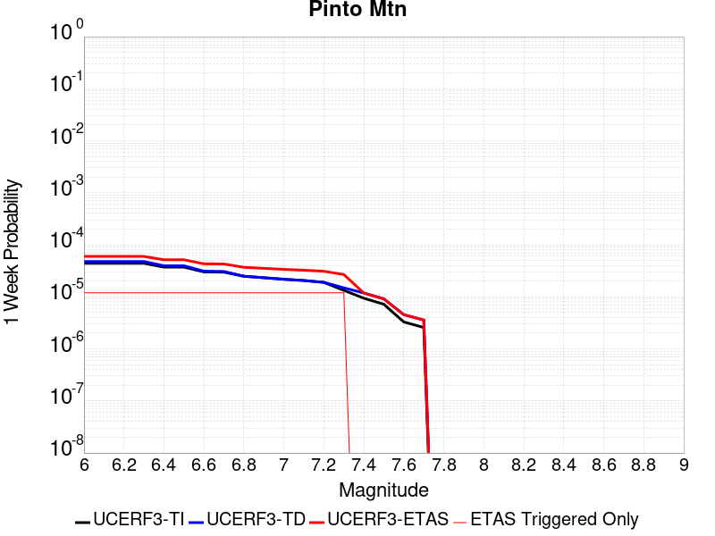 | 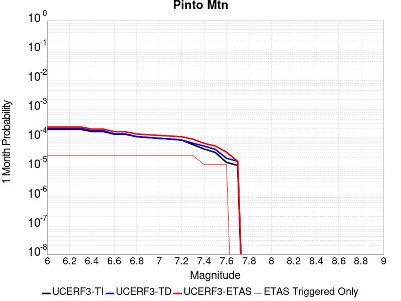 | 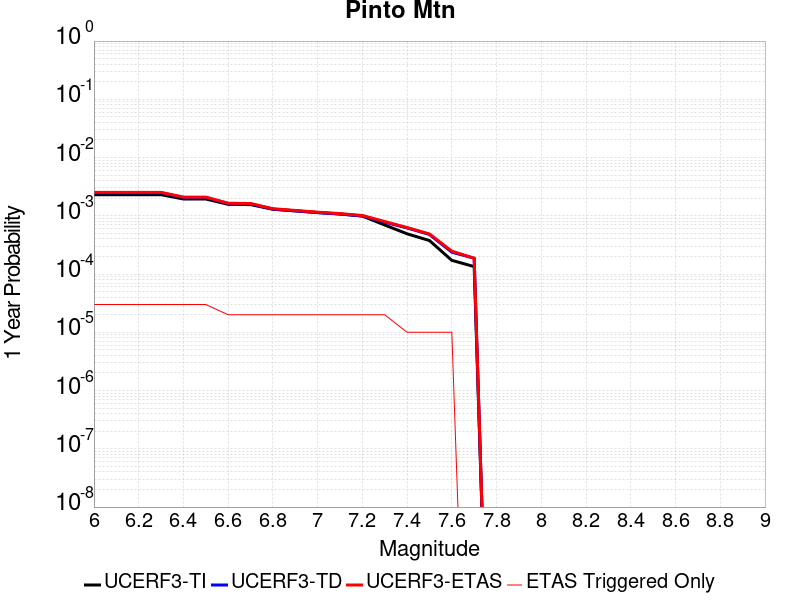 | 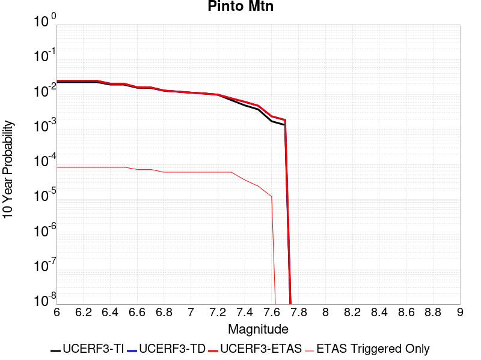 |

| Magnitude | 1 wk TI Prob | 1 wk TD Prob | 1 wk ETAS Prob | 1 wk ETAS/TD Gain | 1 wk ETAS Triggered Only | 1 mo TI Prob | 1 mo TD Prob | 1 mo ETAS Prob | 1 mo ETAS/TD Gain | 1 mo ETAS Triggered Only | 1 yr TI Prob | 1 yr TD Prob | 1 yr ETAS Prob | 1 yr ETAS/TD Gain | 1 yr ETAS Triggered Only | 10 yr TI Prob | 10 yr TD Prob | 10 yr ETAS Prob | 10 yr ETAS/TD Gain | 10 yr ETAS Triggered Only |
|-----|-----|-----|-----|-----|-----|-----|-----|-----|-----|-----|-----|-----|-----|-----|-----|-----|-----|-----|-----|-----|
| 6.0 | 4.4194956E-5 | 4.785523E-5 | 5.984506E-5 | 1.2505438 | 1.1990408E-5 | 1.893932E-4 | 2.0507864E-4 | 2.2905454E-4 | 1.1169107 | 2.3980816E-5 | 0.0023034236 | 0.002494138 | 0.0025300195 | 1.0143863 | 3.597122E-5 | 0.022796938 | 0.024678964 | 0.024760826 | 1.003317 | 8.393286E-5 |
| 6.1 | 4.4194956E-5 | 4.785523E-5 | 5.984506E-5 | 1.2505438 | 1.1990408E-5 | 1.893932E-4 | 2.0507864E-4 | 2.2905454E-4 | 1.1169107 | 2.3980816E-5 | 0.0023034236 | 0.002494138 | 0.0025300195 | 1.0143863 | 3.597122E-5 | 0.022796938 | 0.024678964 | 0.024760826 | 1.003317 | 8.393286E-5 |
| 6.2 | 4.4194956E-5 | 4.785523E-5 | 5.984506E-5 | 1.2505438 | 1.1990408E-5 | 1.893932E-4 | 2.0507864E-4 | 2.2905454E-4 | 1.1169107 | 2.3980816E-5 | 0.0023034236 | 0.002494138 | 0.0025300195 | 1.0143863 | 3.597122E-5 | 0.022796938 | 0.024678964 | 0.024760826 | 1.003317 | 8.393286E-5 |
| 6.3 | 4.4194956E-5 | 4.785523E-5 | 5.984506E-5 | 1.2505438 | 1.1990408E-5 | 1.893932E-4 | 2.0507864E-4 | 2.2905454E-4 | 1.1169107 | 2.3980816E-5 | 0.0023034236 | 0.002494138 | 0.0025300195 | 1.0143863 | 3.597122E-5 | 0.022796938 | 0.024678964 | 0.024760826 | 1.003317 | 8.393286E-5 |
| 6.4 | 3.729929E-5 | 3.960458E-5 | 5.1594514E-5 | 1.302741 | 1.1990408E-5 | 1.5984432E-4 | 1.697234E-4 | 1.9370015E-4 | 1.1412696 | 2.3980816E-5 | 0.0019443673 | 0.0020645177 | 0.0021004146 | 1.0173876 | 3.597122E-5 | 0.019274427 | 0.020463403 | 0.020545619 | 1.0040177 | 8.393286E-5 |
| 6.5 | 3.729929E-5 | 3.960458E-5 | 5.1594514E-5 | 1.302741 | 1.1990408E-5 | 1.5984432E-4 | 1.697234E-4 | 1.9370015E-4 | 1.1412696 | 2.3980816E-5 | 0.0019443673 | 0.0020645177 | 0.0021004146 | 1.0173876 | 3.597122E-5 | 0.019274427 | 0.020463403 | 0.020545619 | 1.0040177 | 8.393286E-5 |
| 6.6 | 3.0204548E-5 | 3.1206488E-5 | 4.319652E-5 | 1.3842161 | 1.1990408E-5 | 1.2944164E-4 | 1.3373543E-4 | 1.5771303E-4 | 1.1792914 | 2.3980816E-5 | 0.0015748127 | 0.0016270474 | 0.0016509892 | 1.0147148 | 2.3980816E-5 | 0.015636992 | 0.01615522 | 0.016226 | 1.0043813 | 7.194244E-5 |
| 6.7 | 2.9857754E-5 | 3.0815863E-5 | 4.2805903E-5 | 1.3890865 | 1.1990408E-5 | 1.2795553E-4 | 1.320615E-4 | 1.5603915E-4 | 1.1815642 | 2.3980816E-5 | 0.0015567453 | 0.0016066976 | 0.0016306399 | 1.0149015 | 2.3980816E-5 | 0.015458848 | 0.015954657 | 0.01602545 | 1.0044372 | 7.194244E-5 |
| 6.8 | 2.4819734E-5 | 2.5010428E-5 | 3.7000536E-5 | 1.4794043 | 1.1990408E-5 | 1.0636595E-4 | 1.0718327E-4 | 1.311615E-4 | 1.2237126 | 2.3980816E-5 | 0.0012942362 | 0.0013041968 | 0.0013281463 | 1.0183635 | 2.3980816E-5 | 0.012867244 | 0.012967796 | 0.01302697 | 1.0045632 | 5.995204E-5 |
| 6.9 | 2.331124E-5 | 2.3338684E-5 | 3.5328812E-5 | 1.5137448 | 1.1990408E-5 | 9.990149E-5 | 1.00019206E-4 | 1.2399763E-4 | 1.2397381 | 2.3980816E-5 | 0.001215622 | 0.001217074 | 0.0012410256 | 1.0196797 | 2.3980816E-5 | 0.012089936 | 0.012106278 | 0.012165504 | 1.0048922 | 5.995204E-5 |
| 7.0 | 2.1818534E-5 | 2.1761793E-5 | 3.375194E-5 | 1.5509723 | 1.1990408E-5 | 9.3504656E-5 | 9.32616E-5 | 1.1724018E-4 | 1.257111 | 2.3980816E-5 | 0.0011378246 | 0.0011348884 | 0.001158842 | 1.0211066 | 2.3980816E-5 | 0.011320163 | 0.01129303 | 0.011352305 | 1.0052488 | 5.995204E-5 |
| 7.1 | 2.066081E-5 | 2.054142E-5 | 3.253158E-5 | 1.5837066 | 1.1990408E-5 | 8.854332E-5 | 8.80318E-5 | 1.120105E-4 | 1.2723869 | 2.3980816E-5 | 0.0010774818 | 0.0010712796 | 0.0010952348 | 1.0223613 | 2.3980816E-5 | 0.010722724 | 0.010663206 | 0.010722518 | 1.0055624 | 5.995204E-5 |
| 7.2 | 1.8990233E-5 | 1.9054683E-5 | 3.1044863E-5 | 1.629251 | 1.1990408E-5 | 8.138417E-5 | 8.166048E-5 | 1.0563934E-4 | 1.2936409 | 2.3980816E-5 | 9.904018E-4 | 9.937823E-4 | 0.0010177392 | 1.0241069 | 2.3980816E-5 | 0.009859995 | 0.0098953815 | 0.00995474 | 1.0059986 | 5.995204E-5 |
| 7.3 | 1.3335872E-5 | 1.4907276E-5 | 2.6897505E-5 | 1.8043206 | 1.1990408E-5 | 5.7152483E-5 | 6.388683E-5 | 8.7866116E-5 | 1.37534 | 2.3980816E-5 | 6.956093E-4 | 7.775574E-4 | 8.0151955E-4 | 1.0308173 | 2.3980816E-5 | 0.006934359 | 0.0077496674 | 0.0078091547 | 1.0076761 | 5.995204E-5 |
| 7.4 | 9.414066E-6 | 1.186147E-5 | 1.186147E-5 | 1.0 | 0.0 | 4.0345374E-5 | 5.0833933E-5 | 6.282373E-5 | 1.2358621 | 1.1990408E-5 | 4.910942E-4 | 6.187368E-4 | 6.307198E-4 | 1.0193669 | 1.1990408E-5 | 0.0049001034 | 0.0061710896 | 0.006206839 | 1.005793 | 3.597122E-5 |
| 7.5 | 7.2101157E-6 | 9.158733E-6 | 9.158733E-6 | 1.0 | 0.0 | 3.090013E-5 | 3.9251165E-5 | 5.1241102E-5 | 1.305467 | 1.1990408E-5 | 3.7614413E-4 | 4.7778594E-4 | 4.897706E-4 | 1.0250838 | 1.1990408E-5 | 0.0037550807 | 0.0047683627 | 0.0047922293 | 1.0050051 | 2.3980816E-5 |
| 7.6 | 3.296375E-6 | 4.546122E-6 | 4.546122E-6 | 1.0 | 0.0 | 1.4127245E-5 | 1.9483241E-5 | 3.1473417E-5 | 1.6154096 | 1.1990408E-5 | 1.7198564E-4 | 2.3718402E-4 | 2.491716E-4 | 1.0505412 | 1.1990408E-5 | 0.0017185259 | 0.0023694462 | 0.0023814084 | 1.0050484 | 1.1990408E-5 |
| 7.7 | 2.5741092E-6 | 3.5850085E-6 | 3.5850085E-6 | 1.0 | 0.0 | 1.103185E-5 | 1.536424E-5 | 1.536424E-5 | 1.0 | 0.0 | 1.3430449E-4 | 1.8704488E-4 | 1.8704488E-4 | 1.0 | 0.0 | 0.0013422335 | 0.0018690043 | 0.0018690043 | 1.0 | 0.0 |

## Mission Ridge-Arroyo Parida-Santa Ana
*[(top)](#table-of-contents)*

| 1 Week | 1 Month | 1 Year | 10 Year |
|-----|-----|-----|-----|
|  | 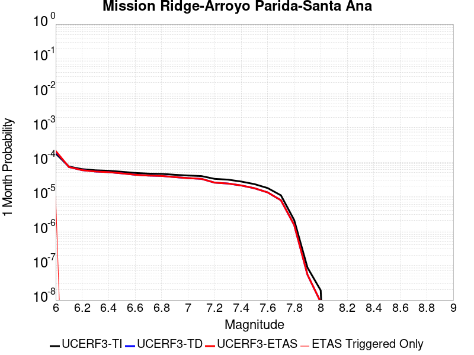 | 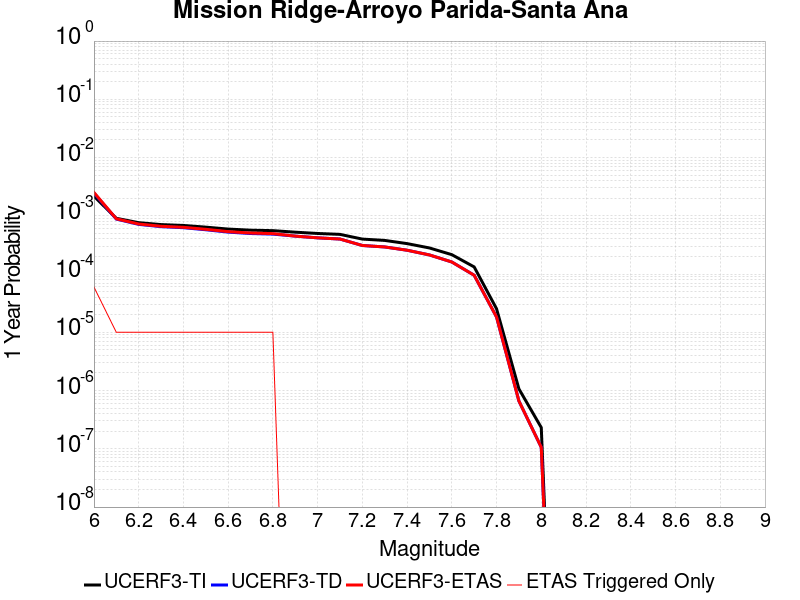 | 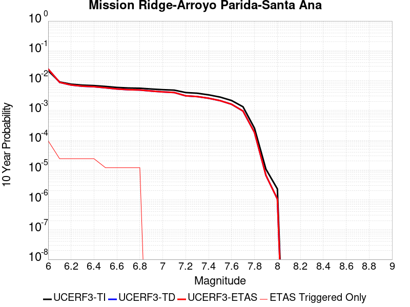 |

| Magnitude | 1 wk TI Prob | 1 wk TD Prob | 1 wk ETAS Prob | 1 wk ETAS/TD Gain | 1 wk ETAS Triggered Only | 1 mo TI Prob | 1 mo TD Prob | 1 mo ETAS Prob | 1 mo ETAS/TD Gain | 1 mo ETAS Triggered Only | 1 yr TI Prob | 1 yr TD Prob | 1 yr ETAS Prob | 1 yr ETAS/TD Gain | 1 yr ETAS Triggered Only | 10 yr TI Prob | 10 yr TD Prob | 10 yr ETAS Prob | 10 yr ETAS/TD Gain | 10 yr ETAS Triggered Only |
|-----|-----|-----|-----|-----|-----|-----|-----|-----|-----|-----|-----|-----|-----|-----|-----|-----|-----|-----|-----|-----|
| 6.0 | 4.169034E-5 | 4.7139558E-5 | 4.7139558E-5 | 1.0 | 0.0 | 1.7866064E-4 | 2.0201589E-4 | 2.1400387E-4 | 1.0593418 | 1.1990408E-5 | 0.0021730233 | 0.0024575135 | 0.002529279 | 1.0292026 | 7.194244E-5 | 0.021518968 | 0.024385266 | 0.02447885 | 1.0038377 | 9.5923264E-5 |
| 6.1 | 1.73813E-5 | 1.6854512E-5 | 1.6854512E-5 | 1.0 | 0.0 | 7.4489166E-5 | 7.223168E-5 | 7.223168E-5 | 1.0 | 0.0 | 9.065282E-4 | 8.790767E-4 | 8.9105655E-4 | 1.0136278 | 1.1990408E-5 | 0.009028391 | 0.008757136 | 0.008780907 | 1.0027144 | 2.3980816E-5 |
| 6.2 | 1.4622182E-5 | 1.367351E-5 | 1.367351E-5 | 1.0 | 0.0 | 6.2664985E-5 | 5.8599464E-5 | 5.8599464E-5 | 1.0 | 0.0 | 7.6267915E-4 | 7.1321876E-4 | 7.2520063E-4 | 1.0167997 | 1.1990408E-5 | 0.007600669 | 0.007109741 | 0.007133552 | 1.003349 | 2.3980816E-5 |
| 6.3 | 1.3552434E-5 | 1.2482403E-5 | 1.2482403E-5 | 1.0 | 0.0 | 5.8080568E-5 | 5.3494932E-5 | 5.3494932E-5 | 1.0 | 0.0 | 7.069015E-4 | 6.511093E-4 | 6.6309195E-4 | 1.0184034 | 1.1990408E-5 | 0.00704657 | 0.0064923796 | 0.0065162047 | 1.0036697 | 2.3980816E-5 |
| 6.4 | 1.30977305E-5 | 1.1979351E-5 | 1.1979351E-5 | 1.0 | 0.0 | 5.613192E-5 | 5.133908E-5 | 5.133908E-5 | 1.0 | 0.0 | 6.831918E-4 | 6.2487705E-4 | 6.3686E-4 | 1.0191765 | 1.1990408E-5 | 0.006810953 | 0.0062315455 | 0.0062553766 | 1.0038244 | 2.3980816E-5 |
| 6.5 | 1.225205E-5 | 1.10489855E-5 | 1.10489855E-5 | 1.0 | 0.0 | 5.2507727E-5 | 4.735195E-5 | 4.735195E-5 | 1.0 | 0.0 | 6.3909404E-4 | 5.763602E-4 | 5.883437E-4 | 1.0207916 | 1.1990408E-5 | 0.006372592 | 0.005748964 | 0.0057608853 | 1.0020736 | 1.1990408E-5 |
| 6.6 | 1.1352241E-5 | 1.0063705E-5 | 1.0063705E-5 | 1.0 | 0.0 | 4.8651553E-5 | 4.3129465E-5 | 4.3129465E-5 | 1.0 | 0.0 | 5.921717E-4 | 5.249768E-4 | 5.369609E-4 | 1.0228279 | 1.1990408E-5 | 0.0059059616 | 0.005237613 | 0.0052495403 | 1.0022773 | 1.1990408E-5 |
| 6.7 | 1.0864116E-5 | 9.517188E-6 | 9.517188E-6 | 1.0 | 0.0 | 4.6559664E-5 | 4.0787323E-5 | 4.0787323E-5 | 1.0 | 0.0 | 5.667165E-4 | 4.964745E-4 | 5.08459E-4 | 1.0241392 | 1.1990408E-5 | 0.005652734 | 0.004953888 | 0.0049658185 | 1.0024084 | 1.1990408E-5 |
| 6.8 | 1.0666365E-5 | 9.299937E-6 | 9.299937E-6 | 1.0 | 0.0 | 4.571219E-5 | 3.9856277E-5 | 3.9856277E-5 | 1.0 | 0.0 | 5.564038E-4 | 4.8514412E-4 | 4.971287E-4 | 1.0247031 | 1.1990408E-5 | 0.005550127 | 0.0048410823 | 0.004853015 | 1.0024648 | 1.1990408E-5 |
| 6.9 | 1.0038665E-5 | 8.592192E-6 | 8.592192E-6 | 1.0 | 0.0 | 4.302214E-5 | 3.682317E-5 | 3.682317E-5 | 1.0 | 0.0 | 5.236687E-4 | 4.4823167E-4 | 4.4823167E-4 | 1.0 | 0.0 | 0.005224364 | 0.004473487 | 0.004473487 | 1.0 | 0.0 |
| 7.0 | 9.5379955E-6 | 8.025209E-6 | 8.025209E-6 | 1.0 | 0.0 | 4.0876483E-5 | 3.439331E-5 | 3.439331E-5 | 1.0 | 0.0 | 4.975576E-4 | 4.186598E-4 | 4.186598E-4 | 1.0 | 0.0 | 0.00496445 | 0.0041789105 | 0.0041789105 | 1.0 | 0.0 |
| 7.1 | 9.207389E-6 | 7.652504E-6 | 7.652504E-6 | 1.0 | 0.0 | 3.945964E-5 | 3.2796044E-5 | 3.2796044E-5 | 1.0 | 0.0 | 4.803152E-4 | 3.9922036E-4 | 3.9922036E-4 | 1.0 | 0.0 | 0.004792784 | 0.003985228 | 0.003985228 | 1.0 | 0.0 |
| 7.2 | 7.638091E-6 | 5.93121E-6 | 5.93121E-6 | 1.0 | 0.0 | 3.2734264E-5 | 2.5419227E-5 | 2.5419227E-5 | 1.0 | 0.0 | 3.984668E-4 | 3.0943545E-4 | 3.0943545E-4 | 1.0 | 0.0 | 0.0039775306 | 0.0030901027 | 0.0030901027 | 1.0 | 0.0 |
| 7.3 | 7.2500147E-6 | 5.596238E-6 | 5.596238E-6 | 1.0 | 0.0 | 3.1071122E-5 | 2.3983659E-5 | 2.3983659E-5 | 1.0 | 0.0 | 3.7822526E-4 | 2.919622E-4 | 2.919622E-4 | 1.0 | 0.0 | 0.0037758215 | 0.002915842 | 0.002915842 | 1.0 | 0.0 |
| 7.4 | 6.3899715E-6 | 4.918567E-6 | 4.918567E-6 | 1.0 | 0.0 | 2.7385306E-5 | 2.1079404E-5 | 2.1079404E-5 | 1.0 | 0.0 | 3.3336508E-4 | 2.566117E-4 | 2.566117E-4 | 1.0 | 0.0 | 0.0033286542 | 0.0025631986 | 0.0025631986 | 1.0 | 0.0 |
| 7.5 | 5.379025E-6 | 4.083909E-6 | 4.083909E-6 | 1.0 | 0.0 | 2.305276E-5 | 1.750235E-5 | 1.750235E-5 | 1.0 | 0.0 | 2.806312E-4 | 2.1307038E-4 | 2.1307038E-4 | 1.0 | 0.0 | 0.0028027708 | 0.0021286723 | 0.0021286723 | 1.0 | 0.0 |
| 7.6 | 4.1270696E-6 | 3.0883848E-6 | 3.0883848E-6 | 1.0 | 0.0 | 1.768732E-5 | 1.3235868E-5 | 1.3235868E-5 | 1.0 | 0.0 | 2.1532185E-4 | 1.6113486E-4 | 1.6113486E-4 | 1.0 | 0.0 | 0.0021511333 | 0.0016101883 | 0.0016101883 | 1.0 | 0.0 |
| 7.7 | 2.5406805E-6 | 1.8282261E-6 | 1.8282261E-6 | 1.0 | 0.0 | 1.0888585E-5 | 7.835231E-6 | 7.835231E-6 | 1.0 | 0.0 | 1.3256045E-4 | 9.538983E-5 | 9.538983E-5 | 1.0 | 0.0 | 0.0013248142 | 9.53495E-4 | 9.53495E-4 | 1.0 | 0.0 |
| 7.8 | 4.8608285E-7 | 3.5099296E-7 | 3.5099296E-7 | 1.0 | 0.0 | 2.0832106E-6 | 1.5042547E-6 | 1.5042547E-6 | 1.0 | 0.0 | 2.5362791E-5 | 1.8314147E-5 | 1.8314147E-5 | 1.0 | 0.0 | 2.5359896E-4 | 1.8312651E-4 | 1.8312651E-4 | 1.0 | 0.0 |
| 7.9 | 2.0472514E-8 | 1.2689093E-8 | 1.2689093E-8 | 1.0 | 0.0 | 8.7739345E-8 | 5.438183E-8 | 5.438183E-8 | 1.0 | 0.0 | 1.068226E-6 | 6.6209856E-7 | 6.6209856E-7 | 1.0 | 0.0 | 1.0682209E-5 | 6.620967E-6 | 6.620967E-6 | 1.0 | 0.0 |
| 8.0 | 4.443582E-9 | 2.0322608E-9 | 2.0322608E-9 | 1.0 | 0.0 | 1.9043922E-8 | 8.709689E-9 | 8.709689E-9 | 1.0 | 0.0 | 2.3185973E-7 | 1.0604046E-7 | 1.0604046E-7 | 1.0 | 0.0 | 2.3185949E-6 | 1.0604042E-6 | 1.0604042E-6 | 1.0 | 0.0 |

## Pleito
*[(top)](#table-of-contents)*

| 1 Week | 1 Month | 1 Year | 10 Year |
|-----|-----|-----|-----|
|  | 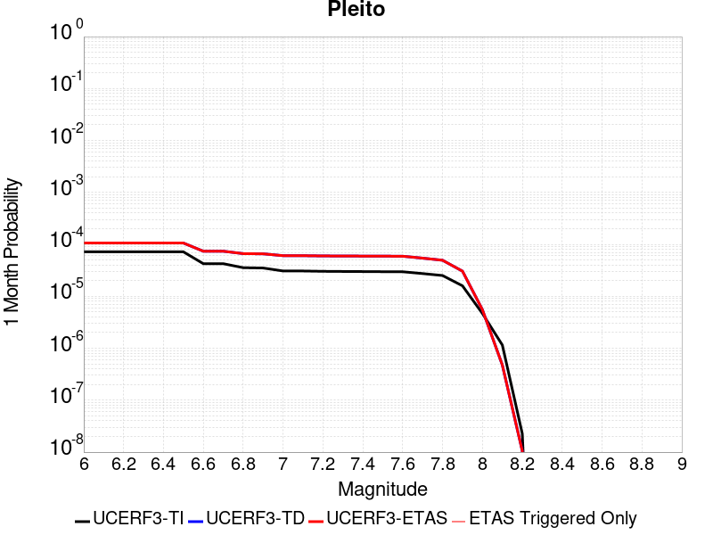 | 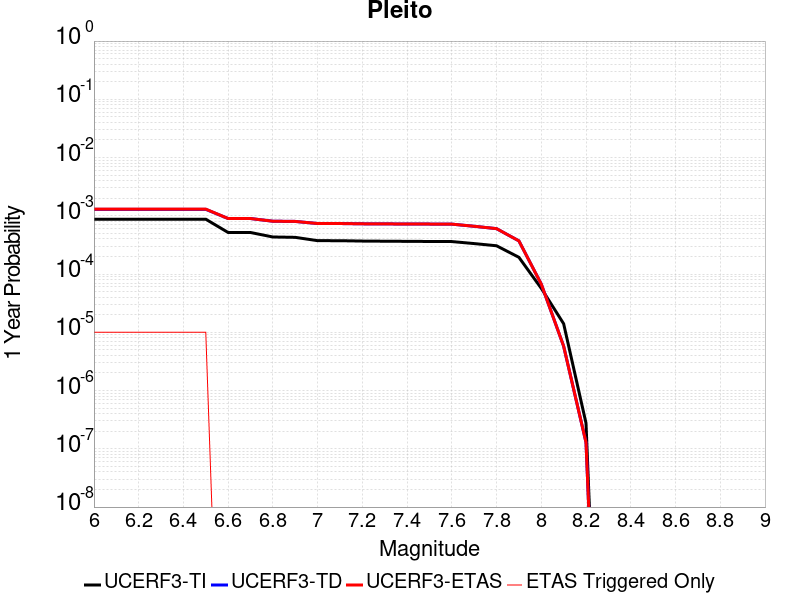 | 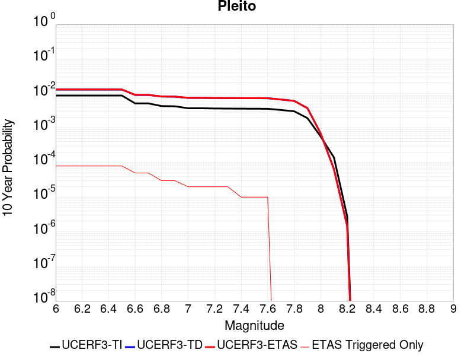 |

| Magnitude | 1 wk TI Prob | 1 wk TD Prob | 1 wk ETAS Prob | 1 wk ETAS/TD Gain | 1 wk ETAS Triggered Only | 1 mo TI Prob | 1 mo TD Prob | 1 mo ETAS Prob | 1 mo ETAS/TD Gain | 1 mo ETAS Triggered Only | 1 yr TI Prob | 1 yr TD Prob | 1 yr ETAS Prob | 1 yr ETAS/TD Gain | 1 yr ETAS Triggered Only | 10 yr TI Prob | 10 yr TD Prob | 10 yr ETAS Prob | 10 yr ETAS/TD Gain | 10 yr ETAS Triggered Only |
|-----|-----|-----|-----|-----|-----|-----|-----|-----|-----|-----|-----|-----|-----|-----|-----|-----|-----|-----|-----|-----|
| 6.0 | 1.6763008E-5 | 2.47705E-5 | 2.47705E-5 | 1.0 | 0.0 | 7.183948E-5 | 1.0615537E-4 | 1.0615537E-4 | 1.0 | 0.0 | 8.742947E-4 | 0.0012917474 | 0.0013037224 | 1.0092703 | 1.1990408E-5 | 0.00870863 | 0.012957253 | 0.013051933 | 1.0073072 | 9.5923264E-5 |
| 6.1 | 1.6763008E-5 | 2.47705E-5 | 2.47705E-5 | 1.0 | 0.0 | 7.183948E-5 | 1.0615537E-4 | 1.0615537E-4 | 1.0 | 0.0 | 8.742947E-4 | 0.0012917474 | 0.0013037224 | 1.0092703 | 1.1990408E-5 | 0.00870863 | 0.012957253 | 0.013051933 | 1.0073072 | 9.5923264E-5 |
| 6.2 | 1.6763008E-5 | 2.47705E-5 | 2.47705E-5 | 1.0 | 0.0 | 7.183948E-5 | 1.0615537E-4 | 1.0615537E-4 | 1.0 | 0.0 | 8.742947E-4 | 0.0012917474 | 0.0013037224 | 1.0092703 | 1.1990408E-5 | 0.00870863 | 0.012957253 | 0.013051933 | 1.0073072 | 9.5923264E-5 |
| 6.3 | 1.6763008E-5 | 2.47705E-5 | 2.47705E-5 | 1.0 | 0.0 | 7.183948E-5 | 1.0615537E-4 | 1.0615537E-4 | 1.0 | 0.0 | 8.742947E-4 | 0.0012917474 | 0.0013037224 | 1.0092703 | 1.1990408E-5 | 0.00870863 | 0.012957253 | 0.013051933 | 1.0073072 | 9.5923264E-5 |
| 6.4 | 1.6763008E-5 | 2.47705E-5 | 2.47705E-5 | 1.0 | 0.0 | 7.183948E-5 | 1.0615537E-4 | 1.0615537E-4 | 1.0 | 0.0 | 8.742947E-4 | 0.0012917474 | 0.0013037224 | 1.0092703 | 1.1990408E-5 | 0.00870863 | 0.012957253 | 0.013051933 | 1.0073072 | 9.5923264E-5 |
| 6.5 | 1.6763008E-5 | 2.47705E-5 | 2.47705E-5 | 1.0 | 0.0 | 7.183948E-5 | 1.0615537E-4 | 1.0615537E-4 | 1.0 | 0.0 | 8.742947E-4 | 0.0012917474 | 0.0013037224 | 1.0092703 | 1.1990408E-5 | 0.00870863 | 0.012957253 | 0.013051933 | 1.0073072 | 9.5923264E-5 |
| 6.6 | 9.910213E-6 | 1.7221182E-5 | 1.7221182E-5 | 1.0 | 0.0 | 4.247165E-5 | 7.3803E-5 | 7.3803E-5 | 1.0 | 0.0 | 5.169696E-4 | 8.9818484E-4 | 8.9818484E-4 | 1.0 | 0.0 | 0.0051576863 | 0.009054025 | 0.009113434 | 1.0065616 | 5.995204E-5 |
| 6.7 | 9.910213E-6 | 1.7221182E-5 | 1.7221182E-5 | 1.0 | 0.0 | 4.247165E-5 | 7.3803E-5 | 7.3803E-5 | 1.0 | 0.0 | 5.169696E-4 | 8.9818484E-4 | 8.9818484E-4 | 1.0 | 0.0 | 0.0051576863 | 0.009054025 | 0.009113434 | 1.0065616 | 5.995204E-5 |
| 6.8 | 8.300162E-6 | 1.5480773E-5 | 1.5480773E-5 | 1.0 | 0.0 | 3.557164E-5 | 6.634449E-5 | 6.634449E-5 | 1.0 | 0.0 | 4.3299864E-4 | 8.0744625E-4 | 8.0744625E-4 | 1.0 | 0.0 | 0.004321559 | 0.008153455 | 0.008189133 | 1.0043758 | 3.597122E-5 |
| 6.9 | 8.183114E-6 | 1.5351985E-5 | 1.5351985E-5 | 1.0 | 0.0 | 3.5070017E-5 | 6.579257E-5 | 6.579257E-5 | 1.0 | 0.0 | 4.2689382E-4 | 8.007316E-4 | 8.007316E-4 | 1.0 | 0.0 | 0.0042607468 | 0.008086799 | 0.008122479 | 1.0044122 | 3.597122E-5 |
| 7.0 | 7.1748823E-6 | 1.4138895E-5 | 1.4138895E-5 | 1.0 | 0.0 | 3.0749135E-5 | 6.059386E-5 | 6.059386E-5 | 1.0 | 0.0 | 3.743064E-4 | 7.3748105E-4 | 7.3748105E-4 | 1.0 | 0.0 | 0.0037367654 | 0.0074582137 | 0.0074820155 | 1.0031914 | 2.3980816E-5 |
| 7.1 | 7.1671807E-6 | 1.4129264E-5 | 1.4129264E-5 | 1.0 | 0.0 | 3.0716128E-5 | 6.0552586E-5 | 6.0552586E-5 | 1.0 | 0.0 | 3.7390468E-4 | 7.369789E-4 | 7.369789E-4 | 1.0 | 0.0 | 0.0037327618 | 0.007453226 | 0.0074770283 | 1.0031935 | 2.3980816E-5 |
| 7.2 | 7.0649667E-6 | 1.3976534E-5 | 1.3976534E-5 | 1.0 | 0.0 | 3.0278077E-5 | 5.989806E-5 | 5.989806E-5 | 1.0 | 0.0 | 3.6857324E-4 | 7.290154E-4 | 7.290154E-4 | 1.0 | 0.0 | 0.0036796255 | 0.007373973 | 0.007397777 | 1.0032281 | 2.3980816E-5 |
| 7.3 | 7.02082E-6 | 1.39199765E-5 | 1.39199765E-5 | 1.0 | 0.0 | 3.008888E-5 | 5.9655682E-5 | 5.9655682E-5 | 1.0 | 0.0 | 3.6627054E-4 | 7.260664E-4 | 7.260664E-4 | 1.0 | 0.0 | 0.0036566744 | 0.0073444657 | 0.007368271 | 1.0032412 | 2.3980816E-5 |
| 7.4 | 6.987146E-6 | 1.3879531E-5 | 1.3879531E-5 | 1.0 | 0.0 | 2.9944567E-5 | 5.948235E-5 | 5.948235E-5 | 1.0 | 0.0 | 3.6451413E-4 | 7.239575E-4 | 7.239575E-4 | 1.0 | 0.0 | 0.0036391679 | 0.007323398 | 0.0073353 | 1.0016253 | 1.1990408E-5 |
| 7.5 | 6.9494554E-6 | 1.3836431E-5 | 1.3836431E-5 | 1.0 | 0.0 | 2.9783041E-5 | 5.9297647E-5 | 5.9297647E-5 | 1.0 | 0.0 | 3.625482E-4 | 7.217102E-4 | 7.217102E-4 | 1.0 | 0.0 | 0.0036195726 | 0.007301023 | 0.0073129265 | 1.0016303 | 1.1990408E-5 |
| 7.6 | 6.92694E-6 | 1.3795536E-5 | 1.3795536E-5 | 1.0 | 0.0 | 2.9686547E-5 | 5.9122387E-5 | 5.9122387E-5 | 1.0 | 0.0 | 3.6137376E-4 | 7.1957783E-4 | 7.1957783E-4 | 1.0 | 0.0 | 0.0036078666 | 0.0072797714 | 0.0072916746 | 1.0016351 | 1.1990408E-5 |
| 7.7 | 6.395867E-6 | 1.2674343E-5 | 1.2674343E-5 | 1.0 | 0.0 | 2.741057E-5 | 5.4317487E-5 | 5.4317487E-5 | 1.0 | 0.0 | 3.336726E-4 | 6.6111505E-4 | 6.6111505E-4 | 1.0 | 0.0 | 0.0033317201 | 0.006698295 | 0.006698295 | 1.0 | 0.0 |
| 7.8 | 5.8664327E-6 | 1.1541453E-5 | 1.1541453E-5 | 1.0 | 0.0 | 2.5141611E-5 | 4.9462433E-5 | 4.9462433E-5 | 1.0 | 0.0 | 3.060561E-4 | 6.020389E-4 | 6.020389E-4 | 1.0 | 0.0 | 0.0030563495 | 0.006103509 | 0.006103509 | 1.0 | 0.0 |
| 7.9 | 3.7167474E-6 | 7.1174723E-6 | 7.1174723E-6 | 1.0 | 0.0 | 1.592882E-5 | 3.0503097E-5 | 3.0503097E-5 | 1.0 | 0.0 | 1.9391612E-4 | 3.7131205E-4 | 3.7131205E-4 | 1.0 | 0.0 | 0.0019374699 | 0.0037692138 | 0.0037692138 | 1.0 | 0.0 |
| 8.0 | 1.0903841E-6 | 1.2886832E-6 | 1.2886832E-6 | 1.0 | 0.0 | 4.6730665E-6 | 5.522916E-6 | 5.522916E-6 | 1.0 | 0.0 | 5.68931E-5 | 6.723944E-5 | 6.723944E-5 | 1.0 | 0.0 | 5.6878536E-4 | 6.9458556E-4 | 6.9458556E-4 | 1.0 | 0.0 |
| 8.1 | 2.6894583E-7 | 1.1072907E-7 | 1.1072907E-7 | 1.0 | 0.0 | 1.1526245E-6 | 4.7455305E-7 | 4.7455305E-7 | 1.0 | 0.0 | 1.4033113E-5 | 5.7776683E-6 | 5.7776683E-6 | 1.0 | 0.0 | 1.4032227E-4 | 6.4639265E-5 | 6.4639265E-5 | 1.0 | 0.0 |
| 8.2 | 5.2967013E-9 | 2.4608289E-9 | 2.4608289E-9 | 1.0 | 0.0 | 2.2700148E-8 | 1.054641E-8 | 1.054641E-8 | 1.0 | 0.0 | 2.7637427E-7 | 1.2840253E-7 | 1.2840253E-7 | 1.0 | 0.0 | 2.7637393E-6 | 1.46096E-6 | 1.46096E-6 | 1.0 | 0.0 |

## Rose Canyon
*[(top)](#table-of-contents)*

| 1 Week | 1 Month | 1 Year | 10 Year |
|-----|-----|-----|-----|
|  | 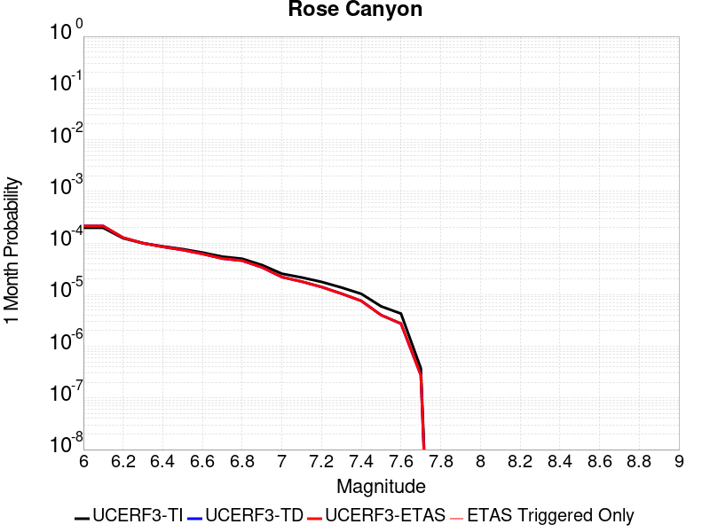 |  | 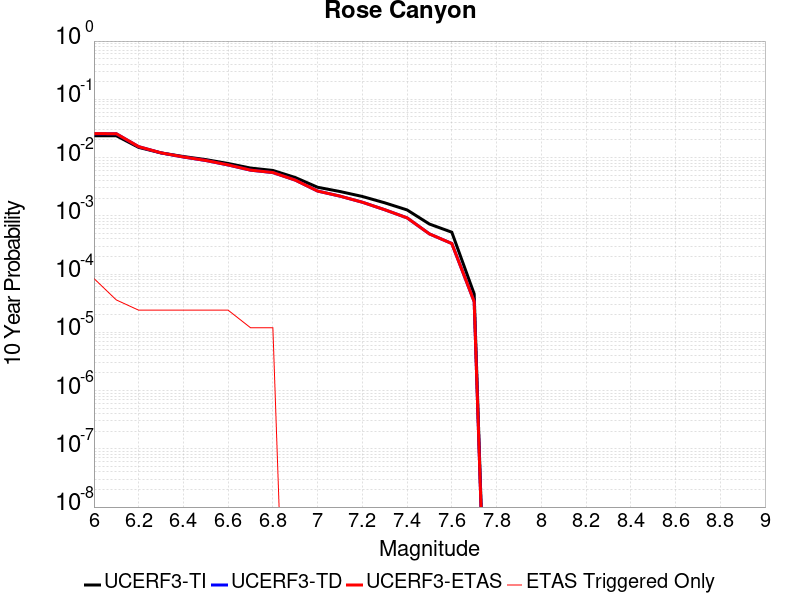 |

| Magnitude | 1 wk TI Prob | 1 wk TD Prob | 1 wk ETAS Prob | 1 wk ETAS/TD Gain | 1 wk ETAS Triggered Only | 1 mo TI Prob | 1 mo TD Prob | 1 mo ETAS Prob | 1 mo ETAS/TD Gain | 1 mo ETAS Triggered Only | 1 yr TI Prob | 1 yr TD Prob | 1 yr ETAS Prob | 1 yr ETAS/TD Gain | 1 yr ETAS Triggered Only | 10 yr TI Prob | 10 yr TD Prob | 10 yr ETAS Prob | 10 yr ETAS/TD Gain | 10 yr ETAS Triggered Only |
|-----|-----|-----|-----|-----|-----|-----|-----|-----|-----|-----|-----|-----|-----|-----|-----|-----|-----|-----|-----|-----|
| 6.0 | 4.5923203E-5 | 4.9715825E-5 | 4.9715825E-5 | 1.0 | 0.0 | 1.9679888E-4 | 2.1305127E-4 | 2.1305127E-4 | 1.0 | 0.0 | 0.0023933933 | 0.0025910123 | 0.002650809 | 1.0230786 | 5.995204E-5 | 0.023677798 | 0.025640773 | 0.025722554 | 1.0031894 | 8.393286E-5 |
| 6.1 | 4.5923203E-5 | 4.9715825E-5 | 4.9715825E-5 | 1.0 | 0.0 | 1.9679888E-4 | 2.1305127E-4 | 2.1305127E-4 | 1.0 | 0.0 | 0.0023933933 | 0.0025910123 | 0.002614931 | 1.0092314 | 2.3980816E-5 | 0.023677798 | 0.025640773 | 0.025675822 | 1.001367 | 3.597122E-5 |
| 6.2 | 2.8844734E-5 | 2.9669445E-5 | 2.9669445E-5 | 1.0 | 0.0 | 1.2361443E-4 | 1.2714828E-4 | 1.2714828E-4 | 1.0 | 0.0 | 0.0015039665 | 0.0015469306 | 0.0015589026 | 1.0077391 | 1.1990408E-5 | 0.0149382865 | 0.01537464 | 0.015398253 | 1.0015358 | 2.3980816E-5 |
| 6.3 | 2.3171577E-5 | 2.3161689E-5 | 2.3161689E-5 | 1.0 | 0.0 | 9.9302975E-5 | 9.926068E-5 | 9.926068E-5 | 1.0 | 0.0 | 0.0012083431 | 0.0012078421 | 0.001219818 | 1.0099151 | 1.1990408E-5 | 0.012017938 | 0.0120226685 | 0.01204636 | 1.0019706 | 2.3980816E-5 |
| 6.4 | 2.0066604E-5 | 1.9667403E-5 | 1.9667403E-5 | 1.0 | 0.0 | 8.599689E-5 | 8.42862E-5 | 8.42862E-5 | 1.0 | 0.0 | 0.0010465092 | 0.0010257114 | 0.0010376895 | 1.0116779 | 1.1990408E-5 | 0.010415946 | 0.010217753 | 0.010241489 | 1.002323 | 2.3980816E-5 |
| 6.5 | 1.776989E-5 | 1.7114124E-5 | 1.7114124E-5 | 1.0 | 0.0 | 7.615444E-5 | 7.334422E-5 | 7.334422E-5 | 1.0 | 0.0 | 9.267859E-4 | 8.92607E-4 | 9.045867E-4 | 1.013421 | 1.1990408E-5 | 0.009229303 | 0.008896374 | 0.008920142 | 1.0026716 | 2.3980816E-5 |
| 6.6 | 1.5227364E-5 | 1.43395055E-5 | 1.43395055E-5 | 1.0 | 0.0 | 6.52585E-5 | 6.1453604E-5 | 6.1453604E-5 | 1.0 | 0.0 | 7.942326E-4 | 7.47946E-4 | 7.5992744E-4 | 1.0160191 | 1.1990408E-5 | 0.007914 | 0.007458486 | 0.0074822884 | 1.0031912 | 2.3980816E-5 |
| 6.7 | 1.2703898E-5 | 1.167345E-5 | 1.167345E-5 | 1.0 | 0.0 | 5.4444143E-5 | 5.002814E-5 | 5.002814E-5 | 1.0 | 0.0 | 6.626558E-4 | 6.089266E-4 | 6.089266E-4 | 1.0 | 0.0 | 0.006606833 | 0.006075177 | 0.0060870945 | 1.0019617 | 1.1990408E-5 |
| 6.8 | 1.1554917E-5 | 1.0609485E-5 | 1.0609485E-5 | 1.0 | 0.0 | 4.9520135E-5 | 4.5468452E-5 | 4.5468452E-5 | 1.0 | 0.0 | 6.0274085E-4 | 5.534419E-4 | 5.534419E-4 | 1.0 | 0.0 | 0.0060110865 | 0.005522644 | 0.0055345683 | 1.0021591 | 1.1990408E-5 |
| 6.9 | 8.732078E-6 | 7.881448E-6 | 7.881448E-6 | 1.0 | 0.0 | 3.7422655E-5 | 3.3777214E-5 | 3.3777214E-5 | 1.0 | 0.0 | 4.5552556E-4 | 4.111629E-4 | 4.111629E-4 | 1.0 | 0.0 | 0.0045459294 | 0.0041048555 | 0.0041048555 | 1.0 | 0.0 |
| 7.0 | 5.9337494E-6 | 5.107531E-6 | 5.107531E-6 | 1.0 | 0.0 | 2.5430107E-5 | 2.1889235E-5 | 2.1889235E-5 | 1.0 | 0.0 | 3.0956755E-4 | 2.66469E-4 | 2.66469E-4 | 1.0 | 0.0 | 0.0030913667 | 0.0026615104 | 0.0026615104 | 1.0 | 0.0 |
| 7.1 | 5.013409E-6 | 4.177419E-6 | 4.177419E-6 | 1.0 | 0.0 | 2.1485863E-5 | 1.7903103E-5 | 1.7903103E-5 | 1.0 | 0.0 | 2.6155898E-4 | 2.1794859E-4 | 2.1794859E-4 | 1.0 | 0.0 | 0.0026125133 | 0.00217736 | 0.00217736 | 1.0 | 0.0 |
| 7.2 | 4.120763E-6 | 3.2821677E-6 | 3.2821677E-6 | 1.0 | 0.0 | 1.7660293E-5 | 1.4066358E-5 | 1.4066358E-5 | 1.0 | 0.0 | 2.1499286E-4 | 1.7124454E-4 | 1.7124454E-4 | 1.0 | 0.0 | 0.0021478499 | 0.0017111353 | 0.0017111353 | 1.0 | 0.0 |
| 7.3 | 3.2081239E-6 | 2.4405597E-6 | 2.4405597E-6 | 1.0 | 0.0 | 1.374903E-5 | 1.04595E-5 | 1.04595E-5 | 1.0 | 0.0 | 1.6738157E-4 | 1.2733703E-4 | 1.2733703E-4 | 1.0 | 0.0 | 0.0016725556 | 0.0012726476 | 0.0012726476 | 1.0 | 0.0 |
| 7.4 | 2.4194755E-6 | 1.7680803E-6 | 1.7680803E-6 | 1.0 | 0.0 | 1.0369139E-5 | 7.5774656E-6 | 7.5774656E-6 | 1.0 | 0.0 | 1.2623696E-4 | 9.2251794E-5 | 9.2251794E-5 | 1.0 | 0.0 | 0.0012616527 | 9.221403E-4 | 9.221403E-4 | 1.0 | 0.0 |
| 7.5 | 1.3842889E-6 | 9.378737E-7 | 9.378737E-7 | 1.0 | 0.0 | 5.9326535E-6 | 4.0194527E-6 | 4.0194527E-6 | 1.0 | 0.0 | 7.222766E-5 | 4.8935777E-5 | 4.8935777E-5 | 1.0 | 0.0 | 7.220419E-4 | 4.8925355E-4 | 4.8925355E-4 | 1.0 | 0.0 |
| 7.6 | 1.0021575E-6 | 6.411548E-7 | 6.411548E-7 | 1.0 | 0.0 | 4.2949537E-6 | 2.7478038E-6 | 2.7478038E-6 | 1.0 | 0.0 | 5.2289808E-5 | 3.345402E-5 | 3.345402E-5 | 1.0 | 0.0 | 5.2277505E-4 | 3.3449198E-4 | 3.3449198E-4 | 1.0 | 0.0 |
| 7.7 | 8.7620116E-8 | 6.449284E-8 | 6.449284E-8 | 1.0 | 0.0 | 3.7551473E-7 | 2.7639786E-7 | 2.7639786E-7 | 1.0 | 0.0 | 4.5718825E-6 | 3.365139E-6 | 3.365139E-6 | 1.0 | 0.0 | 4.5717883E-5 | 3.365091E-5 | 3.365091E-5 | 1.0 | 0.0 |

## San Andreas (Creeping Section) 2011 CFM
*[(top)](#table-of-contents)*

| 1 Week | 1 Month | 1 Year | 10 Year |
|-----|-----|-----|-----|
| 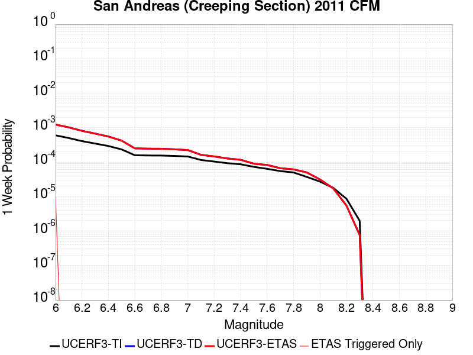 |  | 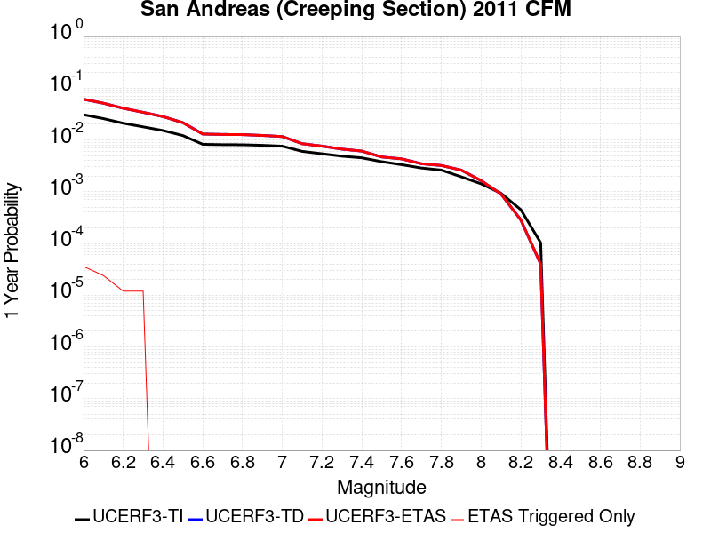 | 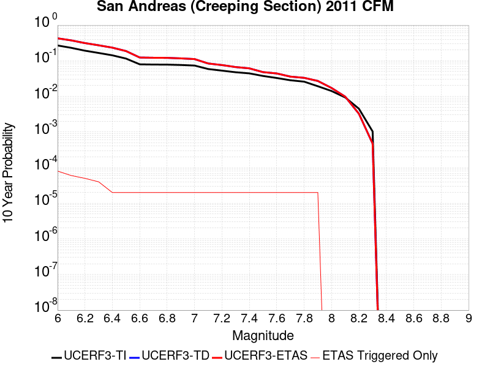 |

| Magnitude | 1 wk TI Prob | 1 wk TD Prob | 1 wk ETAS Prob | 1 wk ETAS/TD Gain | 1 wk ETAS Triggered Only | 1 mo TI Prob | 1 mo TD Prob | 1 mo ETAS Prob | 1 mo ETAS/TD Gain | 1 mo ETAS Triggered Only | 1 yr TI Prob | 1 yr TD Prob | 1 yr ETAS Prob | 1 yr ETAS/TD Gain | 1 yr ETAS Triggered Only | 10 yr TI Prob | 10 yr TD Prob | 10 yr ETAS Prob | 10 yr ETAS/TD Gain | 10 yr ETAS Triggered Only |
|-----|-----|-----|-----|-----|-----|-----|-----|-----|-----|-----|-----|-----|-----|-----|-----|-----|-----|-----|-----|-----|
| 6.0 | 5.986481E-4 | 0.0012278741 | 0.0012398497 | 1.0097532 | 1.1990408E-5 | 0.0025631124 | 0.0052457973 | 0.0052696527 | 1.0045475 | 2.3980816E-5 | 0.030762846 | 0.061208665 | 0.061242435 | 1.0005517 | 3.597122E-5 | 0.26835477 | 0.4259623 | 0.4260105 | 1.0001131 | 8.393286E-5 |
| 6.1 | 5.015945E-4 | 0.0010222398 | 0.0010222398 | 1.0 | 0.0 | 0.00214792 | 0.004368119 | 0.0043800566 | 1.002733 | 1.1990408E-5 | 0.025839351 | 0.0512512 | 0.05127395 | 1.0004439 | 2.3980816E-5 | 0.23032776 | 0.37288252 | 0.37292013 | 1.0001009 | 5.995204E-5 |
| 6.2 | 4.073338E-4 | 8.109135E-4 | 8.109135E-4 | 1.0 | 0.0 | 0.0017445484 | 0.0034676173 | 0.0034676173 | 1.0 | 0.0 | 0.021034058 | 0.040936444 | 0.040947944 | 1.0002809 | 1.1990408E-5 | 0.19150782 | 0.3130621 | 0.31309503 | 1.0001053 | 4.7961632E-5 |
| 6.3 | 3.464099E-4 | 6.7394925E-4 | 6.7394925E-4 | 1.0 | 0.0 | 0.0014837692 | 0.00288274 | 0.00288274 | 1.0 | 0.0 | 0.017915873 | 0.034192428 | 0.034204006 | 1.0003387 | 1.1990408E-5 | 0.16538359 | 0.27134693 | 0.27137312 | 1.0000966 | 3.597122E-5 |
| 6.4 | 2.935057E-4 | 5.545115E-4 | 5.545115E-4 | 1.0 | 0.0 | 0.0012572751 | 0.0023718805 | 0.0023718805 | 1.0 | 0.0 | 0.015200248 | 0.028267467 | 0.028267467 | 1.0 | 0.0 | 0.14201577 | 0.2330172 | 0.23302642 | 1.0000395 | 1.1990408E-5 |
| 6.5 | 2.3409708E-4 | 4.2095222E-4 | 4.2095222E-4 | 1.0 | 0.0 | 0.0010028875 | 0.0018015768 | 0.0018015768 | 1.0 | 0.0 | 0.012141965 | 0.021591473 | 0.021591473 | 1.0 | 0.0 | 0.11499573 | 0.18685804 | 0.18686779 | 1.0000522 | 1.1990408E-5 |
| 6.6 | 1.5842178E-4 | 2.5079807E-4 | 2.5079807E-4 | 1.0 | 0.0 | 6.7877385E-4 | 0.0010744074 | 0.0010744074 | 1.0 | 0.0 | 0.0082328 | 0.013001034 | 0.013001034 | 1.0 | 0.0 | 0.07934396 | 0.12318426 | 0.12319478 | 1.0000854 | 1.1990408E-5 |
| 6.7 | 1.5616413E-4 | 2.461632E-4 | 2.461632E-4 | 1.0 | 0.0 | 6.691031E-4 | 0.0010545597 | 0.0010545597 | 1.0 | 0.0 | 0.0081159435 | 0.012762894 | 0.012762894 | 1.0 | 0.0 | 0.0782586 | 0.12121142 | 0.12122195 | 1.0000869 | 1.1990408E-5 |
| 6.8 | 1.5538467E-4 | 2.4440174E-4 | 2.4440174E-4 | 1.0 | 0.0 | 6.6576427E-4 | 0.0010470168 | 0.0010470168 | 1.0 | 0.0 | 0.008075596 | 0.012672268 | 0.012672268 | 1.0 | 0.0 | 0.07788358 | 0.12044227 | 0.120452814 | 1.0000876 | 1.1990408E-5 |
| 6.9 | 1.5153569E-4 | 2.3549511E-4 | 2.3549511E-4 | 1.0 | 0.0 | 6.49277E-4 | 0.0010088764 | 0.0010088764 | 1.0 | 0.0 | 0.007876333 | 0.012214421 | 0.012214421 | 1.0 | 0.0 | 0.07602952 | 0.11651233 | 0.11652292 | 1.000091 | 1.1990408E-5 |
| 7.0 | 1.4588932E-4 | 2.2406683E-4 | 2.2406683E-4 | 1.0 | 0.0 | 6.250901E-4 | 9.5993496E-4 | 9.5993496E-4 | 1.0 | 0.0 | 0.0075839474 | 0.011625077 | 0.011625077 | 1.0 | 0.0 | 0.073302895 | 0.111358546 | 0.1113692 | 1.0000957 | 1.1990408E-5 |
| 7.1 | 1.1565079E-4 | 1.6290719E-4 | 1.6290719E-4 | 1.0 | 0.0 | 4.955521E-4 | 6.9798774E-4 | 6.9798774E-4 | 1.0 | 0.0 | 0.006016669 | 0.008465091 | 0.008465091 | 1.0 | 0.0 | 0.058563538 | 0.08370675 | 0.08371774 | 1.0001312 | 1.1990408E-5 |
| 7.2 | 1.0393792E-4 | 1.4624344E-4 | 1.4624344E-4 | 1.0 | 0.0 | 4.4537216E-4 | 6.2660786E-4 | 6.2660786E-4 | 1.0 | 0.0 | 0.005408933 | 0.007602434 | 0.007602434 | 1.0 | 0.0 | 0.052791595 | 0.07565546 | 0.07566655 | 1.0001465 | 1.1990408E-5 |
| 7.3 | 9.332884E-5 | 1.2788197E-4 | 1.2788197E-4 | 1.0 | 0.0 | 3.999194E-4 | 5.479511E-4 | 5.479511E-4 | 1.0 | 0.0 | 0.0048581534 | 0.0066510327 | 0.0066510327 | 1.0 | 0.0 | 0.047533102 | 0.06651482 | 0.06652601 | 1.0001683 | 1.1990408E-5 |
| 7.4 | 8.670252E-5 | 1.17095995E-4 | 1.17095995E-4 | 1.0 | 0.0 | 3.715293E-4 | 5.0174404E-4 | 5.0174404E-4 | 1.0 | 0.0 | 0.004513991 | 0.006091744 | 0.006091744 | 1.0 | 0.0 | 0.044233937 | 0.061179653 | 0.06119091 | 1.0001839 | 1.1990408E-5 |
| 7.5 | 7.3036405E-5 | 9.011144E-5 | 9.011144E-5 | 1.0 | 0.0 | 3.129756E-4 | 3.861348E-4 | 3.861348E-4 | 1.0 | 0.0 | 0.0038038217 | 0.004691079 | 0.004691079 | 1.0 | 0.0 | 0.03739367 | 0.047901772 | 0.047913186 | 1.0002383 | 1.1990408E-5 |
| 7.6 | 6.3935775E-5 | 8.284792E-5 | 8.284792E-5 | 1.0 | 0.0 | 2.7398168E-4 | 3.550143E-4 | 3.550143E-4 | 1.0 | 0.0 | 0.0033306254 | 0.004313751 | 0.004313751 | 1.0 | 0.0 | 0.032811474 | 0.04401211 | 0.044023573 | 1.0002605 | 1.1990408E-5 |
| 7.7 | 5.5050095E-5 | 6.6657536E-5 | 6.6657536E-5 | 1.0 | 0.0 | 2.3590765E-4 | 2.8564388E-4 | 2.8564388E-4 | 1.0 | 0.0 | 0.0028683927 | 0.0034721727 | 0.0034721727 | 1.0 | 0.0 | 0.0283165 | 0.035814673 | 0.035826232 | 1.0003228 | 1.1990408E-5 |
| 7.8 | 5.027131E-5 | 6.166444E-5 | 6.166444E-5 | 1.0 | 0.0 | 2.1543067E-4 | 2.6424942E-4 | 2.6424942E-4 | 1.0 | 0.0 | 0.0026197135 | 0.0032124936 | 0.0032124936 | 1.0 | 0.0 | 0.025890453 | 0.033143617 | 0.03315521 | 1.0003498 | 1.1990408E-5 |
| 7.9 | 3.7271806E-5 | 5.0253755E-5 | 5.0253755E-5 | 1.0 | 0.0 | 1.5972654E-4 | 2.1535547E-4 | 2.1535547E-4 | 1.0 | 0.0 | 0.0019429359 | 0.0026188022 | 0.0026188022 | 1.0 | 0.0 | 0.019260362 | 0.027081102 | 0.027092768 | 1.0004308 | 1.1990408E-5 |
| 8.0 | 2.7310243E-5 | 3.144777E-5 | 3.144777E-5 | 1.0 | 0.0 | 1.17038646E-4 | 1.3476919E-4 | 1.3476919E-4 | 1.0 | 0.0 | 0.0014240141 | 0.0016395808 | 0.0016395808 | 1.0 | 0.0 | 0.014149235 | 0.0172237 | 0.0172237 | 1.0 | 0.0 |
| 8.1 | 1.7940547E-5 | 1.7413187E-5 | 1.7413187E-5 | 1.0 | 0.0 | 7.688579E-5 | 7.4625816E-5 | 7.4625816E-5 | 1.0 | 0.0 | 9.3568244E-4 | 9.081911E-4 | 9.081911E-4 | 1.0 | 0.0 | 0.009317525 | 0.009805583 | 0.009805583 | 1.0 | 0.0 |
| 8.2 | 8.643924E-6 | 5.4798497E-6 | 5.4798497E-6 | 1.0 | 0.0 | 3.704486E-5 | 2.348486E-5 | 2.348486E-5 | 1.0 | 0.0 | 4.5092785E-4 | 2.858907E-4 | 2.858907E-4 | 1.0 | 0.0 | 0.0045001395 | 0.0032514327 | 0.0032514327 | 1.0 | 0.0 |
| 8.3 | 1.983087E-6 | 7.668296E-7 | 7.668296E-7 | 1.0 | 0.0 | 8.498917E-6 | 3.2864084E-6 | 3.2864084E-6 | 1.0 | 0.0 | 1.034694E-4 | 4.0011306E-5 | 4.0011306E-5 | 1.0 | 0.0 | 0.0010342124 | 4.724499E-4 | 4.724499E-4 | 1.0 | 0.0 |

## Independence rev 2011
*[(top)](#table-of-contents)*

| 1 Week | 1 Month | 1 Year | 10 Year |
|-----|-----|-----|-----|
| 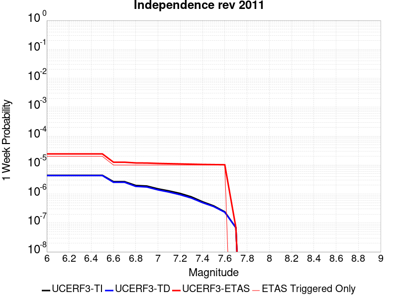 | 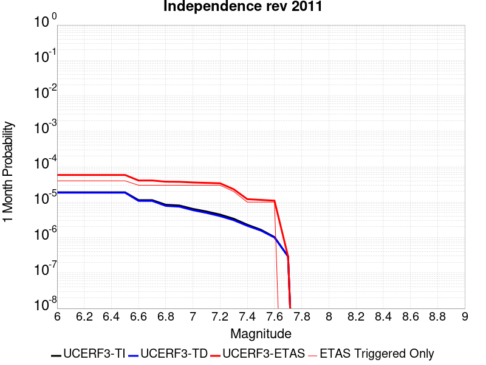 | 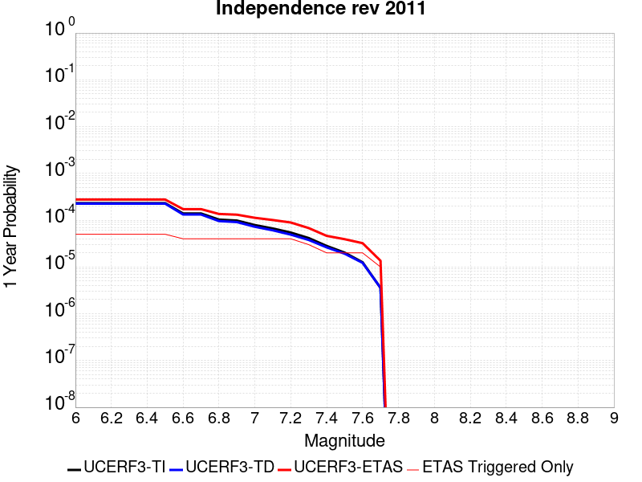 | 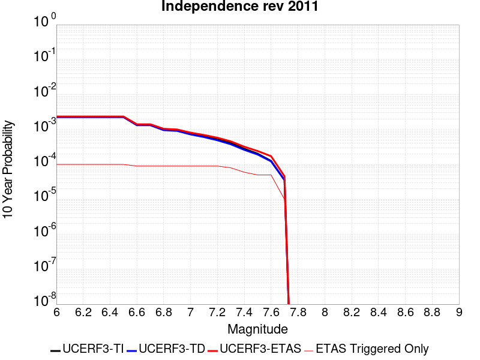 |

| Magnitude | 1 wk TI Prob | 1 wk TD Prob | 1 wk ETAS Prob | 1 wk ETAS/TD Gain | 1 wk ETAS Triggered Only | 1 mo TI Prob | 1 mo TD Prob | 1 mo ETAS Prob | 1 mo ETAS/TD Gain | 1 mo ETAS Triggered Only | 1 yr TI Prob | 1 yr TD Prob | 1 yr ETAS Prob | 1 yr ETAS/TD Gain | 1 yr ETAS Triggered Only | 10 yr TI Prob | 10 yr TD Prob | 10 yr ETAS Prob | 10 yr ETAS/TD Gain | 10 yr ETAS Triggered Only |
|-----|-----|-----|-----|-----|-----|-----|-----|-----|-----|-----|-----|-----|-----|-----|-----|-----|-----|-----|-----|-----|
| 6.0 | 4.422171E-6 | 4.3262453E-6 | 1.63166E-5 | 3.7715385 | 1.1990408E-5 | 1.8952025E-5 | 1.8540937E-5 | 4.2521307E-5 | 2.2933743 | 2.3980816E-5 | 2.3071647E-4 | 2.257155E-4 | 2.616786E-4 | 1.1593293 | 3.597122E-5 | 0.0023047708 | 0.0022551562 | 0.0023388995 | 1.0371343 | 8.393286E-5 |
| 6.1 | 4.422171E-6 | 4.3262453E-6 | 1.63166E-5 | 3.7715385 | 1.1990408E-5 | 1.8952025E-5 | 1.8540937E-5 | 4.2521307E-5 | 2.2933743 | 2.3980816E-5 | 2.3071647E-4 | 2.257155E-4 | 2.616786E-4 | 1.1593293 | 3.597122E-5 | 0.0023047708 | 0.0022551562 | 0.0023388995 | 1.0371343 | 8.393286E-5 |
| 6.2 | 4.422171E-6 | 4.3262453E-6 | 1.63166E-5 | 3.7715385 | 1.1990408E-5 | 1.8952025E-5 | 1.8540937E-5 | 4.2521307E-5 | 2.2933743 | 2.3980816E-5 | 2.3071647E-4 | 2.257155E-4 | 2.616786E-4 | 1.1593293 | 3.597122E-5 | 0.0023047708 | 0.0022551562 | 0.0023388995 | 1.0371343 | 8.393286E-5 |
| 6.3 | 4.422171E-6 | 4.3262453E-6 | 1.63166E-5 | 3.7715385 | 1.1990408E-5 | 1.8952025E-5 | 1.8540937E-5 | 4.2521307E-5 | 2.2933743 | 2.3980816E-5 | 2.3071647E-4 | 2.257155E-4 | 2.616786E-4 | 1.1593293 | 3.597122E-5 | 0.0023047708 | 0.0022551562 | 0.0023388995 | 1.0371343 | 8.393286E-5 |
| 6.4 | 4.422171E-6 | 4.3262453E-6 | 1.63166E-5 | 3.7715385 | 1.1990408E-5 | 1.8952025E-5 | 1.8540937E-5 | 4.2521307E-5 | 2.2933743 | 2.3980816E-5 | 2.3071647E-4 | 2.257155E-4 | 2.616786E-4 | 1.1593293 | 3.597122E-5 | 0.0023047708 | 0.0022551562 | 0.0023388995 | 1.0371343 | 8.393286E-5 |
| 6.5 | 4.422171E-6 | 4.3262453E-6 | 1.63166E-5 | 3.7715385 | 1.1990408E-5 | 1.8952025E-5 | 1.8540937E-5 | 4.2521307E-5 | 2.2933743 | 2.3980816E-5 | 2.3071647E-4 | 2.257155E-4 | 2.616786E-4 | 1.1593293 | 3.597122E-5 | 0.0023047708 | 0.0022551562 | 0.0023388995 | 1.0371343 | 8.393286E-5 |
| 6.6 | 2.663744E-6 | 2.5319996E-6 | 1.4522377E-5 | 5.7355366 | 1.1990408E-5 | 1.1415996E-5 | 1.0851385E-5 | 3.483194E-5 | 3.2099073 | 2.3980816E-5 | 1.3898089E-4 | 1.3210809E-4 | 1.6807456E-4 | 1.2722503 | 3.597122E-5 | 0.0013889399 | 0.0013203438 | 0.0014041658 | 1.063485 | 8.393286E-5 |
| 6.7 | 2.663744E-6 | 2.5319996E-6 | 1.4522377E-5 | 5.7355366 | 1.1990408E-5 | 1.1415996E-5 | 1.0851385E-5 | 3.483194E-5 | 3.2099073 | 2.3980816E-5 | 1.3898089E-4 | 1.3210809E-4 | 1.6807456E-4 | 1.2722503 | 3.597122E-5 | 0.0013889399 | 0.0013203438 | 0.0014041658 | 1.063485 | 8.393286E-5 |
| 6.8 | 1.9716529E-6 | 1.83227E-6 | 1.3822656E-5 | 7.5440063 | 1.1990408E-5 | 8.449913E-6 | 7.852563E-6 | 3.183319E-5 | 4.05386 | 2.3980816E-5 | 1.0287284E-4 | 9.560089E-5 | 1.3156867E-4 | 1.3762286 | 3.597122E-5 | 0.0010282523 | 9.556105E-4 | 0.0010394631 | 1.0877477 | 8.393286E-5 |
| 6.9 | 1.8788617E-6 | 1.7430103E-6 | 1.3733397E-5 | 7.8791256 | 1.1990408E-5 | 8.0522395E-6 | 7.470024E-6 | 3.145066E-5 | 4.210249 | 2.3980816E-5 | 9.80316E-5 | 9.094387E-5 | 1.2691182E-4 | 1.3954961 | 3.597122E-5 | 9.798837E-4 | 9.090785E-4 | 9.92935E-4 | 1.0922434 | 8.393286E-5 |
| 7.0 | 1.5045488E-6 | 1.3849595E-6 | 1.3375351E-5 | 9.657575 | 1.1990408E-5 | 6.44805E-6 | 5.9355275E-6 | 2.99162E-5 | 5.040192 | 2.3980816E-5 | 7.8502184E-5 | 7.226271E-5 | 1.0823133E-4 | 1.4977481 | 3.597122E-5 | 7.8474457E-4 | 7.2239724E-4 | 8.062694E-4 | 1.1161027 | 8.393286E-5 |
| 7.1 | 1.272341E-6 | 1.1625177E-6 | 1.3152911E-5 | 11.31416 | 1.1990408E-5 | 5.4528787E-6 | 4.9822092E-6 | 2.8962904E-5 | 5.8132653 | 2.3980816E-5 | 6.6386776E-5 | 6.065674E-5 | 9.662578E-5 | 1.5929933 | 3.597122E-5 | 6.636695E-4 | 6.06405E-4 | 6.9028704E-4 | 1.1383266 | 8.393286E-5 |
| 7.2 | 1.0416892E-6 | 9.4099494E-7 | 1.2931391E-5 | 13.742254 | 1.1990408E-5 | 4.464375E-6 | 4.032829E-6 | 2.8013548E-5 | 6.946376 | 2.3980816E-5 | 5.4352407E-5 | 4.909861E-5 | 8.5068066E-5 | 1.7325963 | 3.597122E-5 | 5.4339116E-4 | 4.9087947E-4 | 5.7477114E-4 | 1.1709007 | 8.393286E-5 |
| 7.3 | 7.9450155E-7 | 7.235053E-7 | 1.2713905E-5 | 17.572647 | 1.1990408E-5 | 3.4050022E-6 | 3.1007335E-6 | 2.7081474E-5 | 8.733893 | 2.3980816E-5 | 4.1455114E-5 | 3.7750786E-5 | 7.372065E-5 | 1.9528242 | 3.597122E-5 | 4.144738E-4 | 3.7744487E-4 | 4.6134603E-4 | 1.2222872 | 8.393286E-5 |
| 7.4 | 5.3893444E-7 | 5.0195445E-7 | 1.2492356E-5 | 24.88743 | 1.1990408E-5 | 2.309717E-6 | 2.1512315E-6 | 1.4141613E-5 | 6.573729 | 1.1990408E-5 | 2.8120441E-5 | 2.6190934E-5 | 5.0171122E-5 | 1.9155911 | 2.3980816E-5 | 2.8116882E-4 | 2.6187891E-4 | 3.2181526E-4 | 1.2288704 | 5.995204E-5 |
| 7.5 | 3.8852085E-7 | 3.6825747E-7 | 1.2358661E-5 | 33.559837 | 1.1990408E-5 | 1.6650882E-6 | 1.5782454E-6 | 1.3568634E-5 | 8.59729 | 1.1990408E-5 | 2.027226E-5 | 1.9214971E-5 | 4.3195327E-5 | 2.2480037 | 2.3980816E-5 | 2.0270412E-4 | 1.921333E-4 | 2.4008572E-4 | 1.2495788 | 4.7961632E-5 |
| 7.6 | 2.414929E-7 | 2.3457659E-7 | 1.2224981E-5 | 52.115093 | 1.1990408E-5 | 1.0349692E-6 | 1.0053279E-6 | 1.2995723E-5 | 12.926851 | 1.1990408E-5 | 1.2600677E-5 | 1.22398E-5 | 3.622032E-5 | 2.9592252 | 2.3980816E-5 | 1.2599962E-4 | 1.2239137E-4 | 1.7034714E-4 | 1.391823 | 4.7961632E-5 |
| 7.7 | 6.8298014E-8 | 6.858993E-8 | 6.858993E-8 | 1.0 | 0.0 | 2.9270575E-7 | 2.939568E-7 | 2.939568E-7 | 1.0 | 0.0 | 3.5636867E-6 | 3.5789185E-6 | 1.5569283E-5 | 4.350276 | 1.1990408E-5 | 3.5636294E-5 | 3.5788657E-5 | 4.7778634E-5 | 1.3350217 | 1.1990408E-5 |

## Deep Springs
*[(top)](#table-of-contents)*

| 1 Week | 1 Month | 1 Year | 10 Year |
|-----|-----|-----|-----|
|  | 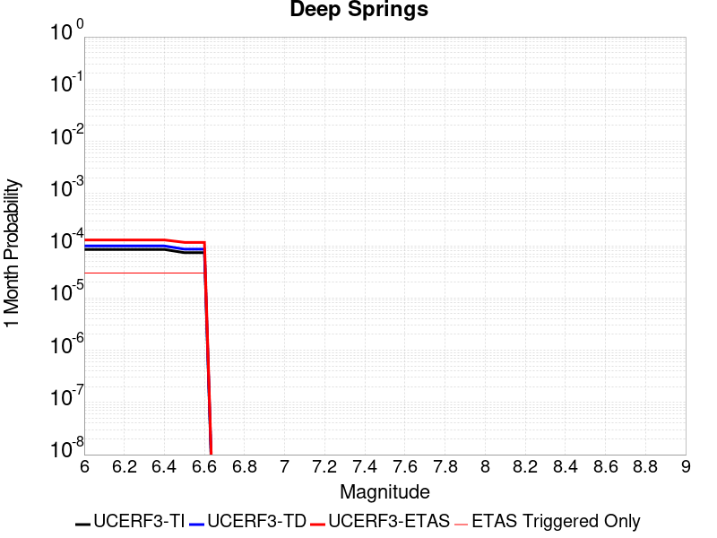 | 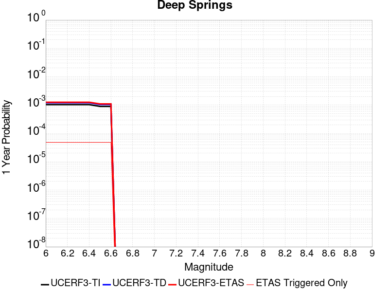 | 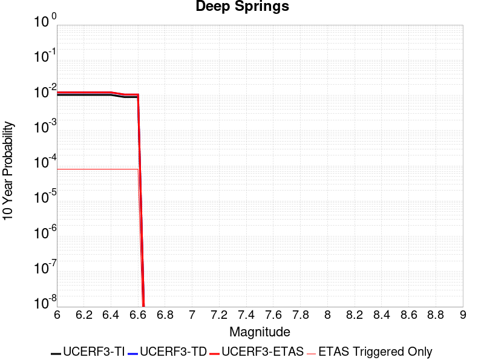 |

| Magnitude | 1 wk TI Prob | 1 wk TD Prob | 1 wk ETAS Prob | 1 wk ETAS/TD Gain | 1 wk ETAS Triggered Only | 1 mo TI Prob | 1 mo TD Prob | 1 mo ETAS Prob | 1 mo ETAS/TD Gain | 1 mo ETAS Triggered Only | 1 yr TI Prob | 1 yr TD Prob | 1 yr ETAS Prob | 1 yr ETAS/TD Gain | 1 yr ETAS Triggered Only | 10 yr TI Prob | 10 yr TD Prob | 10 yr ETAS Prob | 10 yr ETAS/TD Gain | 10 yr ETAS Triggered Only |
|-----|-----|-----|-----|-----|-----|-----|-----|-----|-----|-----|-----|-----|-----|-----|-----|-----|-----|-----|-----|-----|
| 6.0 | 1.9810619E-5 | 2.311303E-5 | 2.311303E-5 | 1.0 | 0.0 | 8.489989E-5 | 9.905495E-5 | 1.2303339E-4 | 1.2420721 | 2.3980816E-5 | 0.001033166 | 0.0012058346 | 0.0012537384 | 1.0397266 | 4.7961632E-5 | 0.010283757 | 0.01204269 | 0.012125612 | 1.0068856 | 8.393286E-5 |
| 6.1 | 1.9810619E-5 | 2.311303E-5 | 2.311303E-5 | 1.0 | 0.0 | 8.489989E-5 | 9.905495E-5 | 1.2303339E-4 | 1.2420721 | 2.3980816E-5 | 0.001033166 | 0.0012058346 | 0.0012537384 | 1.0397266 | 4.7961632E-5 | 0.010283757 | 0.01204269 | 0.012125612 | 1.0068856 | 8.393286E-5 |
| 6.2 | 1.9810619E-5 | 2.311303E-5 | 2.311303E-5 | 1.0 | 0.0 | 8.489989E-5 | 9.905495E-5 | 1.2303339E-4 | 1.2420721 | 2.3980816E-5 | 0.001033166 | 0.0012058346 | 0.0012537384 | 1.0397266 | 4.7961632E-5 | 0.010283757 | 0.01204269 | 0.012125612 | 1.0068856 | 8.393286E-5 |
| 6.3 | 1.9810619E-5 | 2.311303E-5 | 2.311303E-5 | 1.0 | 0.0 | 8.489989E-5 | 9.905495E-5 | 1.2303339E-4 | 1.2420721 | 2.3980816E-5 | 0.001033166 | 0.0012058346 | 0.0012537384 | 1.0397266 | 4.7961632E-5 | 0.010283757 | 0.01204269 | 0.012125612 | 1.0068856 | 8.393286E-5 |
| 6.4 | 1.9810619E-5 | 2.311303E-5 | 2.311303E-5 | 1.0 | 0.0 | 8.489989E-5 | 9.905495E-5 | 1.2303339E-4 | 1.2420721 | 2.3980816E-5 | 0.001033166 | 0.0012058346 | 0.0012537384 | 1.0397266 | 4.7961632E-5 | 0.010283757 | 0.01204269 | 0.012125612 | 1.0068856 | 8.393286E-5 |
| 6.5 | 1.7190405E-5 | 2.0050999E-5 | 2.0050999E-5 | 1.0 | 0.0 | 7.367108E-5 | 8.593285E-5 | 1.09911605E-4 | 1.2790406 | 2.3980816E-5 | 8.9657627E-4 | 0.0010462324 | 0.0010941438 | 1.0457942 | 4.7961632E-5 | 0.008929676 | 0.010462287 | 0.010545341 | 1.0079385 | 8.393286E-5 |
| 6.6 | 1.7190405E-5 | 2.0050999E-5 | 2.0050999E-5 | 1.0 | 0.0 | 7.367108E-5 | 8.593285E-5 | 1.09911605E-4 | 1.2790406 | 2.3980816E-5 | 8.9657627E-4 | 0.0010462324 | 0.0010941438 | 1.0457942 | 4.7961632E-5 | 0.008929676 | 0.010462287 | 0.010545341 | 1.0079385 | 8.393286E-5 |

## Santa Ynez (East)
*[(top)](#table-of-contents)*

| 1 Week | 1 Month | 1 Year | 10 Year |
|-----|-----|-----|-----|
| 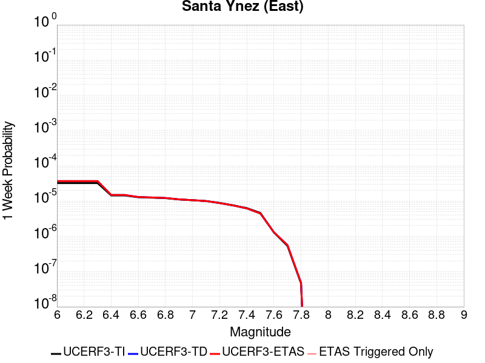 | 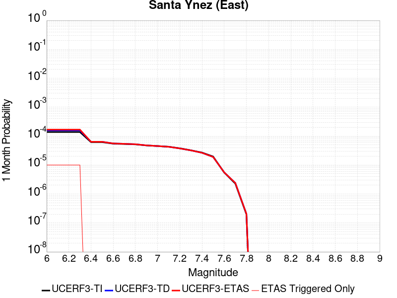 | 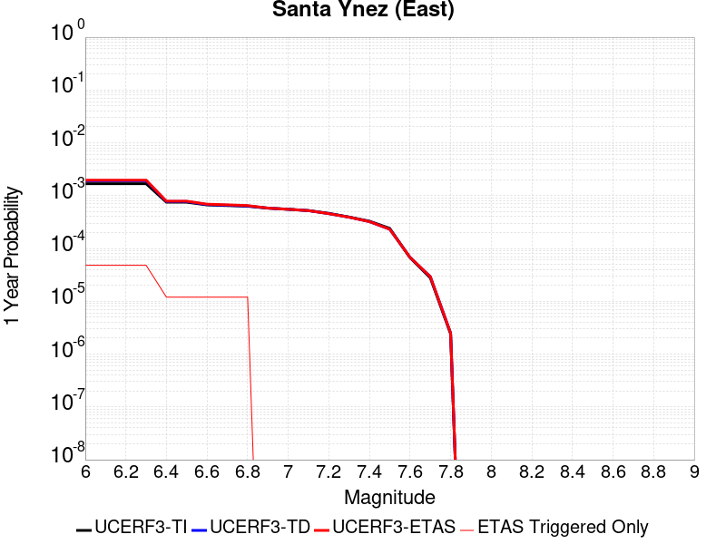 | 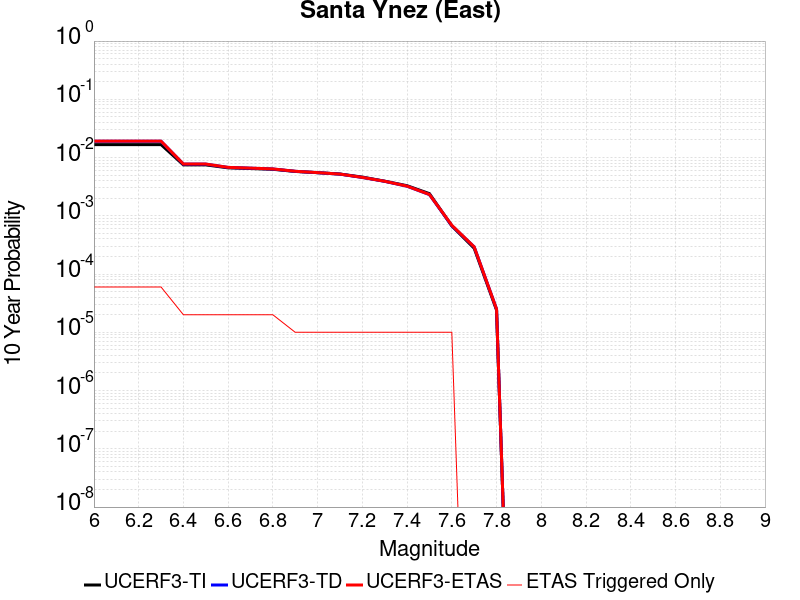 |

| Magnitude | 1 wk TI Prob | 1 wk TD Prob | 1 wk ETAS Prob | 1 wk ETAS/TD Gain | 1 wk ETAS Triggered Only | 1 mo TI Prob | 1 mo TD Prob | 1 mo ETAS Prob | 1 mo ETAS/TD Gain | 1 mo ETAS Triggered Only | 1 yr TI Prob | 1 yr TD Prob | 1 yr ETAS Prob | 1 yr ETAS/TD Gain | 1 yr ETAS Triggered Only | 10 yr TI Prob | 10 yr TD Prob | 10 yr ETAS Prob | 10 yr ETAS/TD Gain | 10 yr ETAS Triggered Only |
|-----|-----|-----|-----|-----|-----|-----|-----|-----|-----|-----|-----|-----|-----|-----|-----|-----|-----|-----|-----|-----|
| 6.0 | 3.2269712E-5 | 3.6751346E-5 | 3.6751346E-5 | 1.0 | 0.0 | 1.3829143E-4 | 1.5749958E-4 | 1.694881E-4 | 1.0761178 | 1.1990408E-5 | 0.0016823979 | 0.0019164606 | 0.0019643304 | 1.0249782 | 4.7961632E-5 | 0.016697178 | 0.019056875 | 0.019127447 | 1.0037032 | 7.194244E-5 |
| 6.1 | 3.2269712E-5 | 3.6751346E-5 | 3.6751346E-5 | 1.0 | 0.0 | 1.3829143E-4 | 1.5749958E-4 | 1.694881E-4 | 1.0761178 | 1.1990408E-5 | 0.0016823979 | 0.0019164606 | 0.0019643304 | 1.0249782 | 4.7961632E-5 | 0.016697178 | 0.019056875 | 0.019127447 | 1.0037032 | 7.194244E-5 |
| 6.2 | 3.2269712E-5 | 3.6751346E-5 | 3.6751346E-5 | 1.0 | 0.0 | 1.3829143E-4 | 1.5749958E-4 | 1.694881E-4 | 1.0761178 | 1.1990408E-5 | 0.0016823979 | 0.0019164606 | 0.0019643304 | 1.0249782 | 4.7961632E-5 | 0.016697178 | 0.019056875 | 0.019127447 | 1.0037032 | 7.194244E-5 |
| 6.3 | 3.2269712E-5 | 3.6751346E-5 | 3.6751346E-5 | 1.0 | 0.0 | 1.3829143E-4 | 1.5749958E-4 | 1.694881E-4 | 1.0761178 | 1.1990408E-5 | 0.0016823979 | 0.0019164606 | 0.0019643304 | 1.0249782 | 4.7961632E-5 | 0.016697178 | 0.019056875 | 0.019127447 | 1.0037032 | 7.194244E-5 |
| 6.4 | 1.4404779E-5 | 1.4849569E-5 | 1.4849569E-5 | 1.0 | 0.0 | 6.1733306E-5 | 6.363949E-5 | 6.363949E-5 | 1.0 | 0.0 | 7.513438E-4 | 7.7454036E-4 | 7.865215E-4 | 1.0154687 | 1.1990408E-5 | 0.0074880854 | 0.007718959 | 0.0077427546 | 1.0030828 | 2.3980816E-5 |
| 6.5 | 1.4404779E-5 | 1.4849569E-5 | 1.4849569E-5 | 1.0 | 0.0 | 6.1733306E-5 | 6.363949E-5 | 6.363949E-5 | 1.0 | 0.0 | 7.513438E-4 | 7.7454036E-4 | 7.865215E-4 | 1.0154687 | 1.1990408E-5 | 0.0074880854 | 0.007718959 | 0.0077427546 | 1.0030828 | 2.3980816E-5 |
| 6.6 | 1.280208E-5 | 1.3012098E-5 | 1.3012098E-5 | 1.0 | 0.0 | 5.4864904E-5 | 5.5764955E-5 | 5.5764955E-5 | 1.0 | 0.0 | 6.6777546E-4 | 6.7872857E-4 | 6.9071085E-4 | 1.017654 | 1.1990408E-5 | 0.006657724 | 0.006766767 | 0.0067905854 | 1.0035199 | 2.3980816E-5 |
| 6.7 | 1.2457027E-5 | 1.2628613E-5 | 1.2628613E-5 | 1.0 | 0.0 | 5.3386164E-5 | 5.4121516E-5 | 5.4121516E-5 | 1.0 | 0.0 | 6.497827E-4 | 6.587319E-4 | 6.707144E-4 | 1.0181903 | 1.1990408E-5 | 0.00647886 | 0.0065679904 | 0.0065918136 | 1.0036272 | 2.3980816E-5 |
| 6.8 | 1.2095134E-5 | 1.2231055E-5 | 1.2231055E-5 | 1.0 | 0.0 | 5.1835254E-5 | 5.2417763E-5 | 5.2417763E-5 | 1.0 | 0.0 | 6.309115E-4 | 6.38001E-4 | 6.4998376E-4 | 1.0187818 | 1.1990408E-5 | 0.0062912325 | 0.0063618817 | 0.00638571 | 1.0037454 | 2.3980816E-5 |
| 6.9 | 1.1104036E-5 | 1.11574755E-5 | 1.11574755E-5 | 1.0 | 0.0 | 4.758786E-5 | 4.7816884E-5 | 4.7816884E-5 | 1.0 | 0.0 | 5.7922816E-4 | 5.820163E-4 | 5.820163E-4 | 1.0 | 0.0 | 0.005777207 | 0.005805066 | 0.0058169863 | 1.0020535 | 1.1990408E-5 |
| 7.0 | 1.0577444E-5 | 1.0581802E-5 | 1.0581802E-5 | 1.0 | 0.0 | 4.5331115E-5 | 4.5349796E-5 | 4.5349796E-5 | 1.0 | 0.0 | 5.5176654E-4 | 5.519951E-4 | 5.519951E-4 | 1.0 | 0.0 | 0.0055039856 | 0.0055063786 | 0.005518303 | 1.0021656 | 1.1990408E-5 |
| 7.1 | 1.0021775E-5 | 9.981102E-6 | 9.981102E-6 | 1.0 | 0.0 | 4.294976E-5 | 4.2775457E-5 | 4.2775457E-5 | 1.0 | 0.0 | 5.2278786E-4 | 5.2066793E-4 | 5.2066793E-4 | 1.0 | 0.0 | 0.0052155964 | 0.0051946132 | 0.005206541 | 1.0022962 | 1.1990408E-5 |
| 7.2 | 8.874109E-6 | 8.748894E-6 | 8.748894E-6 | 1.0 | 0.0 | 3.8031343E-5 | 3.749473E-5 | 3.749473E-5 | 1.0 | 0.0 | 4.629332E-4 | 4.564038E-4 | 4.564038E-4 | 1.0 | 0.0 | 0.0046197 | 0.0045547825 | 0.0045667184 | 1.0026205 | 1.1990408E-5 |
| 7.3 | 7.5504267E-6 | 7.505199E-6 | 7.505199E-6 | 1.0 | 0.0 | 3.235857E-5 | 3.216475E-5 | 3.216475E-5 | 1.0 | 0.0 | 3.9389438E-4 | 3.9153645E-4 | 3.9153645E-4 | 1.0 | 0.0 | 0.0039319694 | 0.003908573 | 0.003920517 | 1.0030557 | 1.1990408E-5 |
| 7.4 | 6.309394E-6 | 6.1832216E-6 | 6.1832216E-6 | 1.0 | 0.0 | 2.703998E-5 | 2.6499258E-5 | 2.6499258E-5 | 1.0 | 0.0 | 3.2916202E-4 | 3.2258165E-4 | 3.2258165E-4 | 1.0 | 0.0 | 0.003286749 | 0.0032212313 | 0.003233183 | 1.0037103 | 1.1990408E-5 |
| 7.5 | 4.6103073E-6 | 4.440935E-6 | 4.440935E-6 | 1.0 | 0.0 | 1.975831E-5 | 1.9032443E-5 | 1.9032443E-5 | 1.0 | 0.0 | 2.4053088E-4 | 2.3169606E-4 | 2.3169606E-4 | 1.0 | 0.0 | 0.002402707 | 0.0023146144 | 0.002326577 | 1.0051683 | 1.1990408E-5 |
| 7.6 | 1.2858658E-6 | 1.3008267E-6 | 1.3008267E-6 | 1.0 | 0.0 | 5.5108417E-6 | 5.5749606E-6 | 5.5749606E-6 | 1.0 | 0.0 | 6.7092435E-5 | 6.78731E-5 | 6.78731E-5 | 1.0 | 0.0 | 6.707218E-4 | 6.7853054E-4 | 6.905128E-4 | 1.0176592 | 1.1990408E-5 |
| 7.7 | 5.3302307E-7 | 5.612178E-7 | 5.612178E-7 | 1.0 | 0.0 | 2.2843826E-6 | 2.4052172E-6 | 2.4052172E-6 | 1.0 | 0.0 | 2.7812002E-5 | 2.9283161E-5 | 2.9283161E-5 | 1.0 | 0.0 | 2.7808524E-4 | 2.9279658E-4 | 2.9279658E-4 | 1.0 | 0.0 |
| 7.8 | 4.613933E-8 | 4.803036E-8 | 4.803036E-8 | 1.0 | 0.0 | 1.9773998E-7 | 2.0584437E-7 | 2.0584437E-7 | 1.0 | 0.0 | 2.4074816E-6 | 2.5061524E-6 | 2.5061524E-6 | 1.0 | 0.0 | 2.4074554E-5 | 2.5061252E-5 | 2.5061252E-5 | 1.0 | 0.0 |

## Kern Canyon (North Kern) 2011
*[(top)](#table-of-contents)*

| 1 Week | 1 Month | 1 Year | 10 Year |
|-----|-----|-----|-----|
|  | 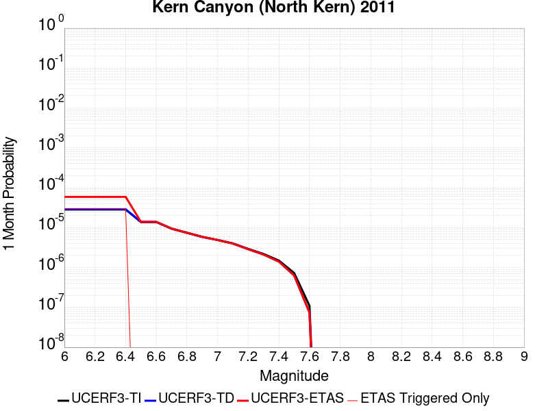 | 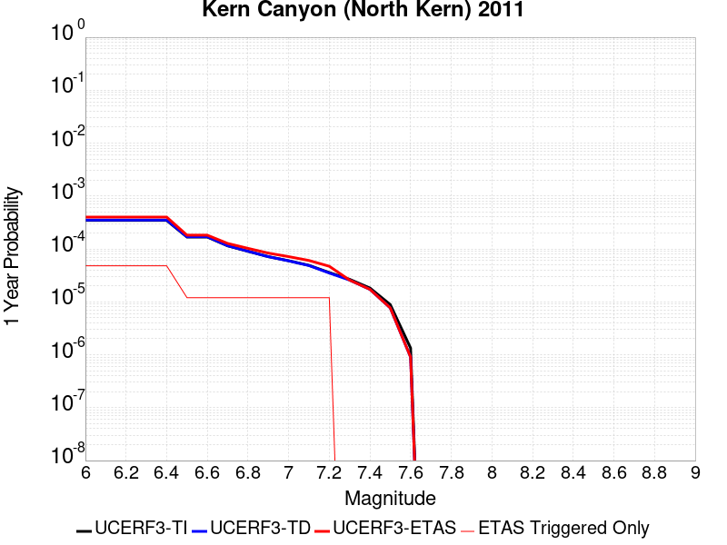 | 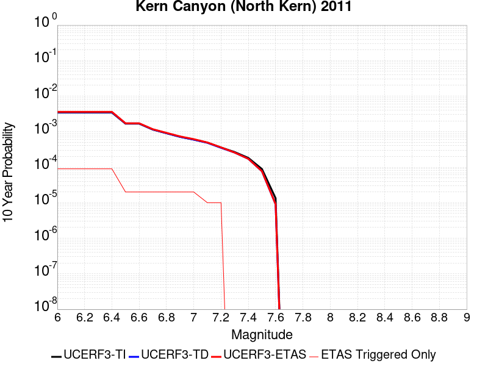 |

| Magnitude | 1 wk TI Prob | 1 wk TD Prob | 1 wk ETAS Prob | 1 wk ETAS/TD Gain | 1 wk ETAS Triggered Only | 1 mo TI Prob | 1 mo TD Prob | 1 mo ETAS Prob | 1 mo ETAS/TD Gain | 1 mo ETAS Triggered Only | 1 yr TI Prob | 1 yr TD Prob | 1 yr ETAS Prob | 1 yr ETAS/TD Gain | 1 yr ETAS Triggered Only | 10 yr TI Prob | 10 yr TD Prob | 10 yr ETAS Prob | 10 yr ETAS/TD Gain | 10 yr ETAS Triggered Only |
|-----|-----|-----|-----|-----|-----|-----|-----|-----|-----|-----|-----|-----|-----|-----|-----|-----|-----|-----|-----|-----|
| 6.0 | 6.6264497E-6 | 6.7573515E-6 | 6.7573515E-6 | 1.0 | 0.0 | 2.8398761E-5 | 2.8959801E-5 | 5.2939922E-5 | 1.8280485 | 2.3980816E-5 | 3.4570007E-4 | 3.5253653E-4 | 4.0048128E-4 | 1.1359993 | 4.7961632E-5 | 0.0034516277 | 0.0035205614 | 0.0036041988 | 1.0237569 | 8.393286E-5 |
| 6.1 | 6.6264497E-6 | 6.7573515E-6 | 6.7573515E-6 | 1.0 | 0.0 | 2.8398761E-5 | 2.8959801E-5 | 5.2939922E-5 | 1.8280485 | 2.3980816E-5 | 3.4570007E-4 | 3.5253653E-4 | 4.0048128E-4 | 1.1359993 | 4.7961632E-5 | 0.0034516277 | 0.0035205614 | 0.0036041988 | 1.0237569 | 8.393286E-5 |
| 6.2 | 6.6264497E-6 | 6.7573515E-6 | 6.7573515E-6 | 1.0 | 0.0 | 2.8398761E-5 | 2.8959801E-5 | 5.2939922E-5 | 1.8280485 | 2.3980816E-5 | 3.4570007E-4 | 3.5253653E-4 | 4.0048128E-4 | 1.1359993 | 4.7961632E-5 | 0.0034516277 | 0.0035205614 | 0.0036041988 | 1.0237569 | 8.393286E-5 |
| 6.3 | 6.6264497E-6 | 6.7573515E-6 | 6.7573515E-6 | 1.0 | 0.0 | 2.8398761E-5 | 2.8959801E-5 | 5.2939922E-5 | 1.8280485 | 2.3980816E-5 | 3.4570007E-4 | 3.5253653E-4 | 4.0048128E-4 | 1.1359993 | 4.7961632E-5 | 0.0034516277 | 0.0035205614 | 0.0036041988 | 1.0237569 | 8.393286E-5 |
| 6.4 | 6.6264497E-6 | 6.7573515E-6 | 6.7573515E-6 | 1.0 | 0.0 | 2.8398761E-5 | 2.8959801E-5 | 5.2939922E-5 | 1.8280485 | 2.3980816E-5 | 3.4570007E-4 | 3.5253653E-4 | 4.0048128E-4 | 1.1359993 | 4.7961632E-5 | 0.0034516277 | 0.0035205614 | 0.0036041988 | 1.0237569 | 8.393286E-5 |
| 6.5 | 3.2162225E-6 | 3.2571006E-6 | 3.2571006E-6 | 1.0 | 0.0 | 1.3783738E-5 | 1.3958933E-5 | 1.3958933E-5 | 1.0 | 0.0 | 1.6780409E-4 | 1.6993756E-4 | 1.8192592E-4 | 1.0705458 | 1.1990408E-5 | 0.0016767744 | 0.0016981558 | 0.0017101258 | 1.0070488 | 1.1990408E-5 |
| 6.6 | 3.2162225E-6 | 3.2571006E-6 | 3.2571006E-6 | 1.0 | 0.0 | 1.3783738E-5 | 1.3958933E-5 | 1.3958933E-5 | 1.0 | 0.0 | 1.6780409E-4 | 1.6993756E-4 | 1.8192592E-4 | 1.0705458 | 1.1990408E-5 | 0.0016767744 | 0.0016981558 | 0.0017101258 | 1.0070488 | 1.1990408E-5 |
| 6.7 | 2.1908265E-6 | 2.2071279E-6 | 2.2071279E-6 | 1.0 | 0.0 | 9.389223E-6 | 9.459087E-6 | 9.459087E-6 | 1.0 | 0.0 | 1.1430779E-4 | 1.1515849E-4 | 1.2714752E-4 | 1.1041089 | 1.1990408E-5 | 0.0011424901 | 0.0011510076 | 0.0011629842 | 1.0104053 | 1.1990408E-5 |
| 6.8 | 1.7303895E-6 | 1.7365574E-6 | 1.7365574E-6 | 1.0 | 0.0 | 7.415934E-6 | 7.442368E-6 | 7.442368E-6 | 1.0 | 0.0 | 9.028525E-5 | 9.060716E-5 | 1.0259648E-4 | 1.132322 | 1.1990408E-5 | 9.024858E-4 | 9.057119E-4 | 9.1769145E-4 | 1.0132266 | 1.1990408E-5 |
| 6.9 | 1.3700314E-6 | 1.3688657E-6 | 1.3688657E-6 | 1.0 | 0.0 | 5.87155E-6 | 5.866554E-6 | 5.866554E-6 | 1.0 | 0.0 | 7.148377E-5 | 7.1423005E-5 | 8.341255E-5 | 1.1678668 | 1.1990408E-5 | 7.146078E-4 | 7.1400503E-4 | 7.259869E-4 | 1.0167812 | 1.1990408E-5 |
| 7.0 | 1.1467797E-6 | 1.1413833E-6 | 1.1413833E-6 | 1.0 | 0.0 | 4.9147607E-6 | 4.8916336E-6 | 4.8916336E-6 | 1.0 | 0.0 | 5.983557E-5 | 5.9554044E-5 | 7.154374E-5 | 1.2013246 | 1.1990408E-5 | 5.981946E-4 | 5.95384E-4 | 6.0736726E-4 | 1.0201269 | 1.1990408E-5 |
| 7.1 | 9.3952065E-7 | 9.302714E-7 | 9.302714E-7 | 1.0 | 0.0 | 4.026511E-6 | 3.9868714E-6 | 3.9868714E-6 | 1.0 | 0.0 | 4.9021666E-5 | 4.8539096E-5 | 6.052892E-5 | 1.2470138 | 1.1990408E-5 | 4.901085E-4 | 4.8528673E-4 | 4.972713E-4 | 1.0246959 | 1.1990408E-5 |
| 7.2 | 6.858055E-7 | 6.719318E-7 | 6.719318E-7 | 1.0 | 0.0 | 2.939163E-6 | 2.8797044E-6 | 2.8797044E-6 | 1.0 | 0.0 | 3.5783723E-5 | 3.5059846E-5 | 4.7049834E-5 | 1.3419863 | 1.1990408E-5 | 3.5777962E-4 | 3.5054405E-4 | 3.6253023E-4 | 1.0341932 | 1.1990408E-5 |
| 7.3 | 5.1101983E-7 | 4.939313E-7 | 4.939313E-7 | 1.0 | 0.0 | 2.1900833E-6 | 2.1168466E-6 | 2.1168466E-6 | 1.0 | 0.0 | 2.6663936E-5 | 2.5772308E-5 | 2.5772308E-5 | 1.0 | 0.0 | 2.6660739E-4 | 2.5769367E-4 | 2.5769367E-4 | 1.0 | 0.0 |
| 7.4 | 3.4999414E-7 | 3.2995996E-7 | 3.2995996E-7 | 1.0 | 0.0 | 1.499974E-6 | 1.4141134E-6 | 1.4141134E-6 | 1.0 | 0.0 | 1.8262032E-5 | 1.7216697E-5 | 1.7216697E-5 | 1.0 | 0.0 | 1.826053E-4 | 1.7215387E-4 | 1.7215387E-4 | 1.0 | 0.0 |
| 7.5 | 1.7021522E-7 | 1.4750091E-7 | 1.4750091E-7 | 1.0 | 0.0 | 7.2949354E-7 | 6.3214657E-7 | 6.3214657E-7 | 1.0 | 0.0 | 8.881548E-6 | 7.696359E-6 | 7.696359E-6 | 1.0 | 0.0 | 8.8811925E-5 | 7.6961E-5 | 7.6961E-5 | 1.0 | 0.0 |
| 7.6 | 2.572245E-8 | 1.7352637E-8 | 1.7352637E-8 | 1.0 | 0.0 | 1.10239064E-7 | 7.4368444E-8 | 7.4368444E-8 | 1.0 | 0.0 | 1.3421597E-6 | 9.0543546E-7 | 9.0543546E-7 | 1.0 | 0.0 | 1.3421517E-5 | 9.0543235E-6 | 9.0543235E-6 | 1.0 | 0.0 |

## Lost Hills
*[(top)](#table-of-contents)*

| 1 Week | 1 Month | 1 Year | 10 Year |
|-----|-----|-----|-----|
| 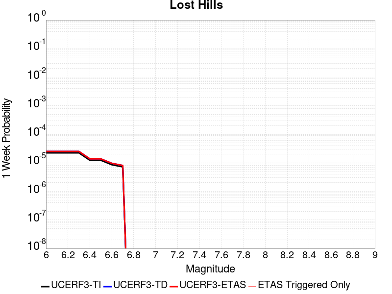 | 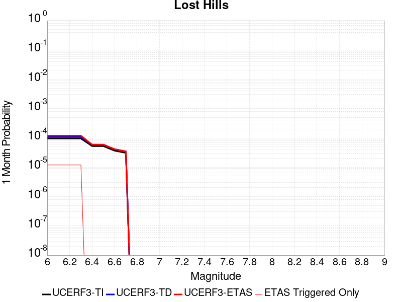 | 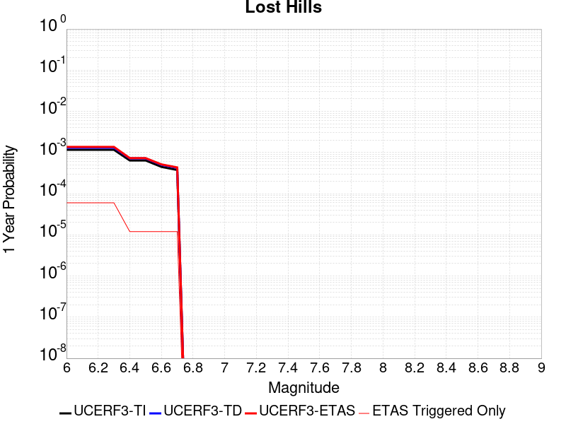 | 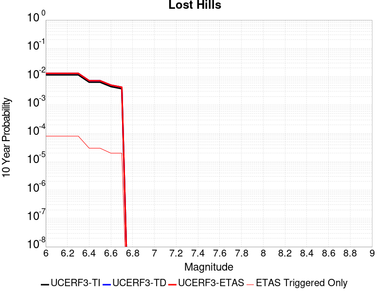 |

| Magnitude | 1 wk TI Prob | 1 wk TD Prob | 1 wk ETAS Prob | 1 wk ETAS/TD Gain | 1 wk ETAS Triggered Only | 1 mo TI Prob | 1 mo TD Prob | 1 mo ETAS Prob | 1 mo ETAS/TD Gain | 1 mo ETAS Triggered Only | 1 yr TI Prob | 1 yr TD Prob | 1 yr ETAS Prob | 1 yr ETAS/TD Gain | 1 yr ETAS Triggered Only | 10 yr TI Prob | 10 yr TD Prob | 10 yr ETAS Prob | 10 yr ETAS/TD Gain | 10 yr ETAS Triggered Only |
|-----|-----|-----|-----|-----|-----|-----|-----|-----|-----|-----|-----|-----|-----|-----|-----|-----|-----|-----|-----|-----|
| 6.0 | 2.233523E-5 | 2.5106996E-5 | 2.5106996E-5 | 1.0 | 0.0 | 9.571891E-5 | 1.0759792E-4 | 1.19587035E-4 | 1.1114252 | 1.1990408E-5 | 0.0011647546 | 0.0013093855 | 0.0013692591 | 1.0457264 | 5.995204E-5 | 0.011586686 | 0.013033304 | 0.013116143 | 1.006356 | 8.393286E-5 |
| 6.1 | 2.233523E-5 | 2.5106996E-5 | 2.5106996E-5 | 1.0 | 0.0 | 9.571891E-5 | 1.0759792E-4 | 1.19587035E-4 | 1.1114252 | 1.1990408E-5 | 0.0011647546 | 0.0013093855 | 0.0013692591 | 1.0457264 | 5.995204E-5 | 0.011586686 | 0.013033304 | 0.013116143 | 1.006356 | 8.393286E-5 |
| 6.2 | 2.233523E-5 | 2.5106996E-5 | 2.5106996E-5 | 1.0 | 0.0 | 9.571891E-5 | 1.0759792E-4 | 1.19587035E-4 | 1.1114252 | 1.1990408E-5 | 0.0011647546 | 0.0013093855 | 0.0013692591 | 1.0457264 | 5.995204E-5 | 0.011586686 | 0.013033304 | 0.013116143 | 1.006356 | 8.393286E-5 |
| 6.3 | 2.233523E-5 | 2.5106996E-5 | 2.5106996E-5 | 1.0 | 0.0 | 9.571891E-5 | 1.0759792E-4 | 1.19587035E-4 | 1.1114252 | 1.1990408E-5 | 0.0011647546 | 0.0013093855 | 0.0013692591 | 1.0457264 | 5.995204E-5 | 0.011586686 | 0.013033304 | 0.013116143 | 1.006356 | 8.393286E-5 |
| 6.4 | 1.2288092E-5 | 1.37813295E-5 | 1.37813295E-5 | 1.0 | 0.0 | 5.2662188E-5 | 5.9062033E-5 | 5.9062033E-5 | 1.0 | 0.0 | 6.409735E-4 | 7.189368E-4 | 7.309186E-4 | 1.0166659 | 1.1990408E-5 | 0.006391279 | 0.007175316 | 0.007211029 | 1.0049772 | 3.597122E-5 |
| 6.5 | 1.2288092E-5 | 1.37813295E-5 | 1.37813295E-5 | 1.0 | 0.0 | 5.2662188E-5 | 5.9062033E-5 | 5.9062033E-5 | 1.0 | 0.0 | 6.409735E-4 | 7.189368E-4 | 7.309186E-4 | 1.0166659 | 1.1990408E-5 | 0.006391279 | 0.007175316 | 0.007211029 | 1.0049772 | 3.597122E-5 |
| 6.6 | 8.58281E-6 | 9.633926E-6 | 9.633926E-6 | 1.0 | 0.0 | 3.6782953E-5 | 4.1288073E-5 | 4.1288073E-5 | 1.0 | 0.0 | 4.4774043E-4 | 5.026495E-4 | 5.146339E-4 | 1.0238425 | 1.1990408E-5 | 0.0044683935 | 0.0050232867 | 0.005047147 | 1.0047499 | 2.3980816E-5 |
| 6.7 | 7.205685E-6 | 8.088433E-6 | 8.088433E-6 | 1.0 | 0.0 | 3.088114E-5 | 3.4664714E-5 | 3.4664714E-5 | 1.0 | 0.0 | 3.7591302E-4 | 4.2204288E-4 | 4.3402822E-4 | 1.0283984 | 1.1990408E-5 | 0.0037527776 | 0.004220429 | 0.0042443085 | 1.0056581 | 2.3980816E-5 |

## Blue Cut
*[(top)](#table-of-contents)*

| 1 Week | 1 Month | 1 Year | 10 Year |
|-----|-----|-----|-----|
|  | 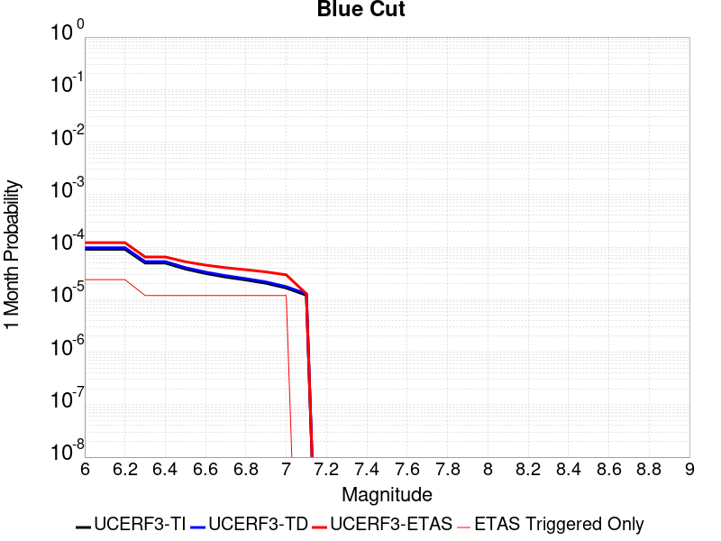 | 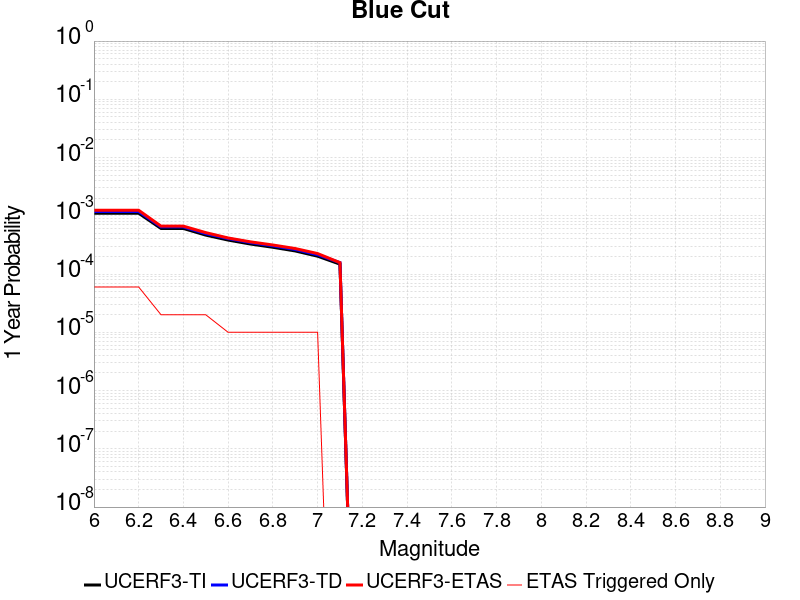 | 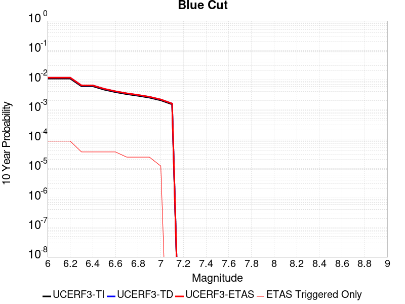 |

| Magnitude | 1 wk TI Prob | 1 wk TD Prob | 1 wk ETAS Prob | 1 wk ETAS/TD Gain | 1 wk ETAS Triggered Only | 1 mo TI Prob | 1 mo TD Prob | 1 mo ETAS Prob | 1 mo ETAS/TD Gain | 1 mo ETAS Triggered Only | 1 yr TI Prob | 1 yr TD Prob | 1 yr ETAS Prob | 1 yr ETAS/TD Gain | 1 yr ETAS Triggered Only | 10 yr TI Prob | 10 yr TD Prob | 10 yr ETAS Prob | 10 yr ETAS/TD Gain | 10 yr ETAS Triggered Only |
|-----|-----|-----|-----|-----|-----|-----|-----|-----|-----|-----|-----|-----|-----|-----|-----|-----|-----|-----|-----|-----|
| 6.0 | 2.1227985E-5 | 2.2719787E-5 | 2.2719787E-5 | 1.0 | 0.0 | 9.097391E-5 | 9.736721E-5 | 1.21345685E-4 | 1.2462685 | 2.3980816E-5 | 0.0011070445 | 0.0011848592 | 0.001232764 | 1.0404308 | 4.7961632E-5 | 0.011015458 | 0.011791261 | 0.0118742045 | 1.0070343 | 8.393286E-5 |
| 6.1 | 2.1227985E-5 | 2.2719787E-5 | 2.2719787E-5 | 1.0 | 0.0 | 9.097391E-5 | 9.736721E-5 | 1.21345685E-4 | 1.2462685 | 2.3980816E-5 | 0.0011070445 | 0.0011848592 | 0.001232764 | 1.0404308 | 4.7961632E-5 | 0.011015458 | 0.011791261 | 0.0118742045 | 1.0070343 | 8.393286E-5 |
| 6.2 | 2.1227985E-5 | 2.2719787E-5 | 2.2719787E-5 | 1.0 | 0.0 | 9.097391E-5 | 9.736721E-5 | 1.21345685E-4 | 1.2462685 | 2.3980816E-5 | 0.0011070445 | 0.0011848592 | 0.001232764 | 1.0404308 | 4.7961632E-5 | 0.011015458 | 0.011791261 | 0.0118742045 | 1.0070343 | 8.393286E-5 |
| 6.3 | 1.1613981E-5 | 1.23536465E-5 | 1.23536465E-5 | 1.0 | 0.0 | 4.9773254E-5 | 5.2943193E-5 | 6.493297E-5 | 1.2264649 | 1.1990408E-5 | 6.0582085E-4 | 6.444052E-4 | 6.563879E-4 | 1.018595 | 1.1990408E-5 | 0.0060417196 | 0.0064266133 | 0.0064623533 | 1.0055612 | 3.597122E-5 |
| 6.4 | 1.1613981E-5 | 1.23536465E-5 | 1.23536465E-5 | 1.0 | 0.0 | 4.9773254E-5 | 5.2943193E-5 | 6.493297E-5 | 1.2264649 | 1.1990408E-5 | 6.0582085E-4 | 6.444052E-4 | 6.563879E-4 | 1.018595 | 1.1990408E-5 | 0.0060417196 | 0.0064266133 | 0.0064623533 | 1.0055612 | 3.597122E-5 |
| 6.5 | 8.931326E-6 | 9.481677E-6 | 9.481677E-6 | 1.0 | 0.0 | 3.8276554E-5 | 4.063518E-5 | 5.26251E-5 | 1.2950625 | 1.1990408E-5 | 4.6591737E-4 | 4.9463013E-4 | 5.066146E-4 | 1.0242292 | 1.1990408E-5 | 0.0046494175 | 0.0049362015 | 0.004971995 | 1.0072513 | 3.597122E-5 |
| 6.6 | 7.345353E-6 | 7.790341E-6 | 7.790341E-6 | 1.0 | 0.0 | 3.1479703E-5 | 3.3386797E-5 | 4.5376804E-5 | 1.3591242 | 1.1990408E-5 | 3.83198E-4 | 4.0641645E-4 | 4.18402E-4 | 1.0294908 | 1.1990408E-5 | 0.0038253788 | 0.0040575233 | 0.0040933485 | 1.0088294 | 3.597122E-5 |
| 6.7 | 6.2775666E-6 | 6.655202E-6 | 6.655202E-6 | 1.0 | 0.0 | 2.690358E-5 | 2.8522025E-5 | 4.051209E-5 | 1.4203792 | 1.1990408E-5 | 3.2750185E-4 | 3.4720785E-4 | 3.591941E-4 | 1.0345218 | 1.1990408E-5 | 0.0032701963 | 0.0034673947 | 0.0034912925 | 1.0068921 | 2.3980816E-5 |
| 6.8 | 5.5234095E-6 | 5.8551577E-6 | 5.8551577E-6 | 1.0 | 0.0 | 2.367154E-5 | 2.5093334E-5 | 3.708344E-5 | 1.4778204 | 1.1990408E-5 | 2.8816288E-4 | 3.0547578E-4 | 3.1746252E-4 | 1.0392396 | 1.1990408E-5 | 0.002877895 | 0.003051275 | 0.0030751824 | 1.0078353 | 2.3980816E-5 |
| 6.9 | 4.7780054E-6 | 5.0654608E-6 | 5.0654608E-6 | 1.0 | 0.0 | 2.0477004E-5 | 2.1708976E-5 | 3.3699125E-5 | 1.5523129 | 1.1990408E-5 | 2.4927902E-4 | 2.6428179E-4 | 2.7626904E-4 | 1.0453578 | 1.1990408E-5 | 0.0024899957 | 0.0026403673 | 0.0026642848 | 1.0090584 | 2.3980816E-5 |
| 7.0 | 3.883171E-6 | 4.1185203E-6 | 4.1185203E-6 | 1.0 | 0.0 | 1.6642054E-5 | 1.765072E-5 | 2.9640916E-5 | 1.6793035 | 1.1990408E-5 | 2.0259817E-4 | 2.1488321E-4 | 2.2687105E-4 | 1.0557877 | 1.1990408E-5 | 0.0020241356 | 0.00214743 | 0.0021593948 | 1.0055716 | 1.1990408E-5 |
| 7.1 | 2.8358215E-6 | 3.0097403E-6 | 3.0097403E-6 | 1.0 | 0.0 | 1.2153464E-5 | 1.289886E-5 | 1.289886E-5 | 1.0 | 0.0 | 1.4795837E-4 | 1.5703888E-4 | 1.5703888E-4 | 1.0 | 0.0 | 0.001478599 | 0.0015699244 | 0.0015699244 | 1.0 | 0.0 |

## Big Pine (East)
*[(top)](#table-of-contents)*

| 1 Week | 1 Month | 1 Year | 10 Year |
|-----|-----|-----|-----|
|  | 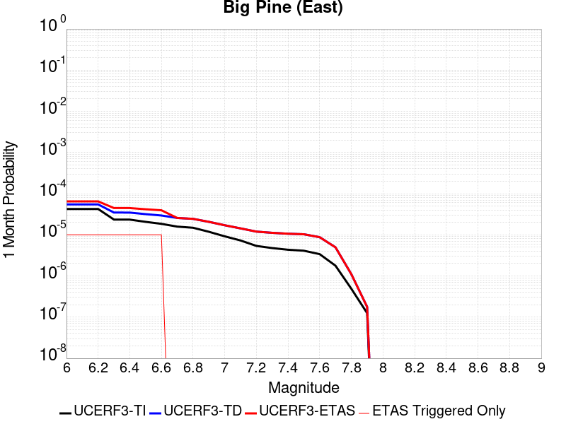 | 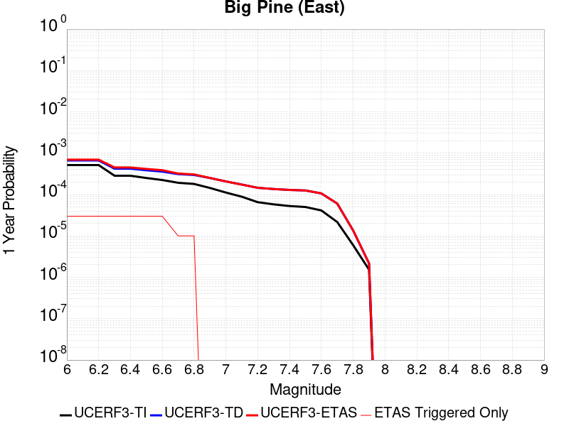 | 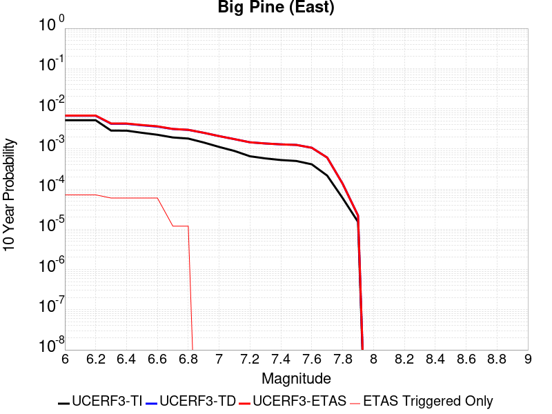 |

| Magnitude | 1 wk TI Prob | 1 wk TD Prob | 1 wk ETAS Prob | 1 wk ETAS/TD Gain | 1 wk ETAS Triggered Only | 1 mo TI Prob | 1 mo TD Prob | 1 mo ETAS Prob | 1 mo ETAS/TD Gain | 1 mo ETAS Triggered Only | 1 yr TI Prob | 1 yr TD Prob | 1 yr ETAS Prob | 1 yr ETAS/TD Gain | 1 yr ETAS Triggered Only | 10 yr TI Prob | 10 yr TD Prob | 10 yr ETAS Prob | 10 yr ETAS/TD Gain | 10 yr ETAS Triggered Only |
|-----|-----|-----|-----|-----|-----|-----|-----|-----|-----|-----|-----|-----|-----|-----|-----|-----|-----|-----|-----|-----|
| 6.0 | 9.916913E-6 | 1.2818231E-5 | 1.2818231E-5 | 1.0 | 0.0 | 4.250036E-5 | 5.4934244E-5 | 6.692399E-5 | 1.2182564 | 1.1990408E-5 | 5.173191E-4 | 6.686413E-4 | 7.045884E-4 | 1.0537615 | 3.597122E-5 | 0.0051611643 | 0.0066710766 | 0.0067425393 | 1.0107123 | 7.194244E-5 |
| 6.1 | 9.916913E-6 | 1.2818231E-5 | 1.2818231E-5 | 1.0 | 0.0 | 4.250036E-5 | 5.4934244E-5 | 6.692399E-5 | 1.2182564 | 1.1990408E-5 | 5.173191E-4 | 6.686413E-4 | 7.045884E-4 | 1.0537615 | 3.597122E-5 | 0.0051611643 | 0.0066710766 | 0.0067425393 | 1.0107123 | 7.194244E-5 |
| 6.2 | 9.916913E-6 | 1.2818231E-5 | 1.2818231E-5 | 1.0 | 0.0 | 4.250036E-5 | 5.4934244E-5 | 6.692399E-5 | 1.2182564 | 1.1990408E-5 | 5.173191E-4 | 6.686413E-4 | 7.045884E-4 | 1.0537615 | 3.597122E-5 | 0.0051611643 | 0.0066710766 | 0.0067425393 | 1.0107123 | 7.194244E-5 |
| 6.3 | 5.479711E-6 | 8.114161E-6 | 8.114161E-6 | 1.0 | 0.0 | 2.3484265E-5 | 3.4774526E-5 | 4.676452E-5 | 1.3447924 | 1.1990408E-5 | 2.858834E-4 | 4.233008E-4 | 4.5925681E-4 | 1.084942 | 3.597122E-5 | 0.0028551589 | 0.0042278613 | 0.0042875595 | 1.0141202 | 5.995204E-5 |
| 6.4 | 5.465009E-6 | 8.098454E-6 | 8.098454E-6 | 1.0 | 0.0 | 2.3421257E-5 | 3.4707216E-5 | 4.6697205E-5 | 1.345461 | 1.1990408E-5 | 2.851165E-4 | 4.224816E-4 | 4.5843763E-4 | 1.0851067 | 3.597122E-5 | 0.0028475097 | 0.0042197 | 0.0042793993 | 1.0141478 | 5.995204E-5 |
| 6.5 | 4.826767E-6 | 7.423505E-6 | 7.423505E-6 | 1.0 | 0.0 | 2.068598E-5 | 3.181465E-5 | 4.3804674E-5 | 1.3768712 | 1.1990408E-5 | 2.518227E-4 | 3.8727728E-4 | 4.2323457E-4 | 1.0928464 | 3.597122E-5 | 0.0025153751 | 0.003868898 | 0.003928618 | 1.0154359 | 5.995204E-5 |
| 6.6 | 4.3146847E-6 | 6.883437E-6 | 6.883437E-6 | 1.0 | 0.0 | 1.8491375E-5 | 2.9500125E-5 | 4.1490177E-5 | 1.4064409 | 1.1990408E-5 | 2.2510924E-4 | 3.5910727E-4 | 3.9506558E-4 | 1.1001325 | 3.597122E-5 | 0.0022488134 | 0.0035881116 | 0.0036478485 | 1.0166485 | 5.995204E-5 |
| 6.7 | 3.6968106E-6 | 5.9966014E-6 | 5.9966014E-6 | 1.0 | 0.0 | 1.5843378E-5 | 2.5699477E-5 | 2.5699477E-5 | 1.0 | 0.0 | 1.9287605E-4 | 3.1284773E-4 | 3.248344E-4 | 1.0383147 | 1.1990408E-5 | 0.0019270873 | 0.003126825 | 0.0031387778 | 1.0038227 | 1.1990408E-5 |
| 6.8 | 3.4671132E-6 | 5.7032753E-6 | 5.7032753E-6 | 1.0 | 0.0 | 1.4858972E-5 | 2.4442388E-5 | 2.4442388E-5 | 1.0 | 0.0 | 1.8089297E-4 | 2.9754688E-4 | 3.0953373E-4 | 1.0402856 | 1.1990408E-5 | 0.0018074579 | 0.002974228 | 0.0029861827 | 1.0040195 | 1.1990408E-5 |
| 6.9 | 2.7686972E-6 | 4.8262373E-6 | 4.8262373E-6 | 1.0 | 0.0 | 1.1865792E-5 | 2.0683714E-5 | 2.0683714E-5 | 1.0 | 0.0 | 1.4445644E-4 | 2.5179586E-4 | 2.5179586E-4 | 1.0 | 0.0 | 0.0014436257 | 0.002517781 | 0.002517781 | 1.0 | 0.0 |
| 7.0 | 2.1472624E-6 | 3.985962E-6 | 3.985962E-6 | 1.0 | 0.0 | 9.20252E-6 | 1.7082584E-5 | 1.7082584E-5 | 1.0 | 0.0 | 1.12034926E-4 | 2.0796116E-4 | 2.0796116E-4 | 1.0 | 0.0 | 0.0011197845 | 0.0020803085 | 0.0020803085 | 1.0 | 0.0 |
| 7.1 | 1.7018335E-6 | 3.3457143E-6 | 3.3457143E-6 | 1.0 | 0.0 | 7.293552E-6 | 1.4338699E-5 | 1.4338699E-5 | 1.0 | 0.0 | 8.879537E-5 | 1.7456003E-4 | 1.7456003E-4 | 1.0 | 0.0 | 8.87599E-4 | 0.0017468405 | 0.0017468405 | 1.0 | 0.0 |
| 7.2 | 1.25603E-6 | 2.795276E-6 | 2.795276E-6 | 1.0 | 0.0 | 5.3829745E-6 | 1.19797005E-5 | 1.19797005E-5 | 1.0 | 0.0 | 6.553574E-5 | 1.4584333E-4 | 1.4584333E-4 | 1.0 | 0.0 | 6.551642E-4 | 0.001460063 | 0.001460063 | 1.0 | 0.0 |
| 7.3 | 1.112297E-6 | 2.6110797E-6 | 2.6110797E-6 | 1.0 | 0.0 | 4.7669787E-6 | 1.11902955E-5 | 1.11902955E-5 | 1.0 | 0.0 | 5.803642E-5 | 1.3623355E-4 | 1.3623355E-4 | 1.0 | 0.0 | 5.802127E-4 | 0.0013639197 | 0.0013639197 | 1.0 | 0.0 |
| 7.4 | 1.0137181E-6 | 2.4842075E-6 | 2.4842075E-6 | 1.0 | 0.0 | 4.3444993E-6 | 1.0646561E-5 | 1.0646561E-5 | 1.0 | 0.0 | 5.2892992E-5 | 1.2961439E-4 | 1.2961439E-4 | 1.0 | 0.0 | 5.288041E-4 | 0.0012975911 | 0.0012975911 | 1.0 | 0.0 |
| 7.5 | 9.598608E-7 | 2.4078427E-6 | 2.4078427E-6 | 1.0 | 0.0 | 4.1136827E-6 | 1.0319286E-5 | 1.0319286E-5 | 1.0 | 0.0 | 5.0082934E-5 | 1.2563028E-4 | 1.2563028E-4 | 1.0 | 0.0 | 5.007165E-4 | 0.0012576039 | 0.0012576039 | 1.0 | 0.0 |
| 7.6 | 7.929459E-7 | 2.0454722E-6 | 2.0454722E-6 | 1.0 | 0.0 | 3.3983351E-6 | 8.766281E-6 | 8.766281E-6 | 1.0 | 0.0 | 4.1373947E-5 | 1.06724416E-4 | 1.06724416E-4 | 1.0 | 0.0 | 4.1366243E-4 | 0.0010688324 | 0.0010688324 | 1.0 | 0.0 |
| 7.7 | 4.155788E-7 | 1.1609936E-6 | 1.1609936E-6 | 1.0 | 0.0 | 1.7810507E-6 | 4.975678E-6 | 4.975678E-6 | 1.0 | 0.0 | 2.1684076E-5 | 6.0577237E-5 | 6.0577237E-5 | 1.0 | 0.0 | 2.1681961E-4 | 6.087925E-4 | 6.087925E-4 | 1.0 | 0.0 |
| 7.8 | 1.14666925E-7 | 2.5929913E-7 | 2.5929913E-7 | 1.0 | 0.0 | 4.914296E-7 | 1.1112816E-6 | 1.1112816E-6 | 1.0 | 0.0 | 5.9831386E-6 | 1.3529773E-5 | 1.3529773E-5 | 1.0 | 0.0 | 5.9829777E-5 | 1.3639126E-4 | 1.3639126E-4 | 1.0 | 0.0 |
| 7.9 | 2.9231824E-8 | 4.148024E-8 | 4.148024E-8 | 1.0 | 0.0 | 1.2527924E-7 | 1.7777246E-7 | 1.7777246E-7 | 1.0 | 0.0 | 1.5252737E-6 | 2.1643777E-6 | 2.1643777E-6 | 1.0 | 0.0 | 1.5252632E-5 | 2.1976275E-5 | 2.1976275E-5 | 1.0 | 0.0 |

## Mission Creek
*[(top)](#table-of-contents)*

| 1 Week | 1 Month | 1 Year | 10 Year |
|-----|-----|-----|-----|
| 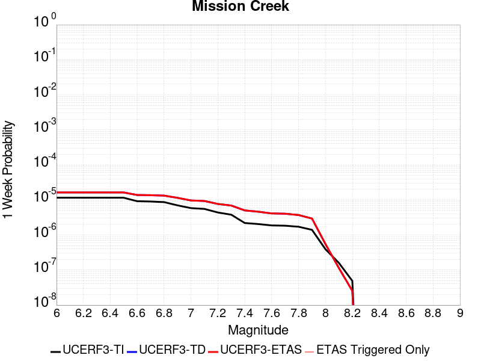 | 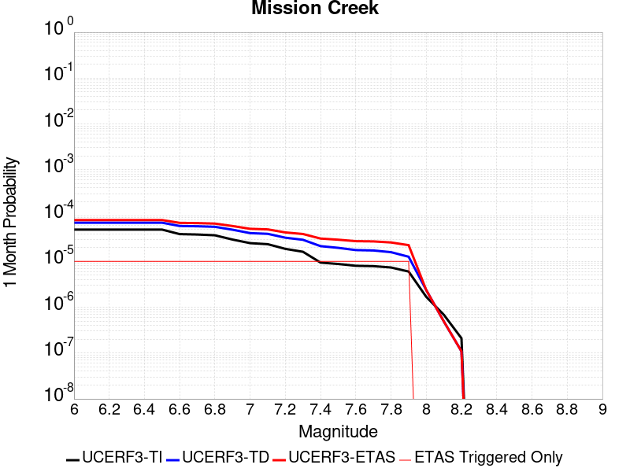 | 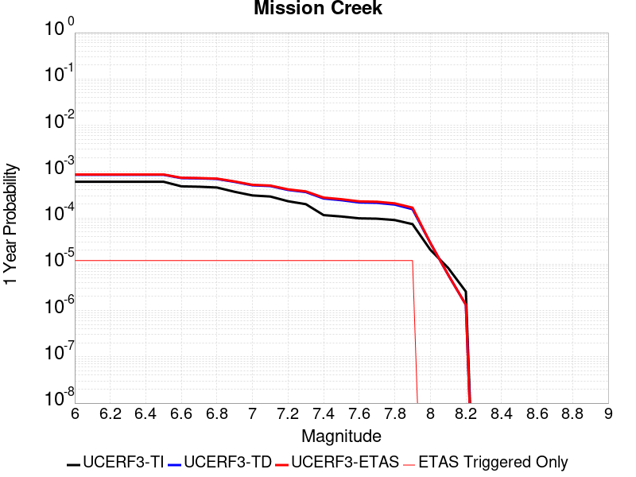 |  |

| Magnitude | 1 wk TI Prob | 1 wk TD Prob | 1 wk ETAS Prob | 1 wk ETAS/TD Gain | 1 wk ETAS Triggered Only | 1 mo TI Prob | 1 mo TD Prob | 1 mo ETAS Prob | 1 mo ETAS/TD Gain | 1 mo ETAS Triggered Only | 1 yr TI Prob | 1 yr TD Prob | 1 yr ETAS Prob | 1 yr ETAS/TD Gain | 1 yr ETAS Triggered Only | 10 yr TI Prob | 10 yr TD Prob | 10 yr ETAS Prob | 10 yr ETAS/TD Gain | 10 yr ETAS Triggered Only |
|-----|-----|-----|-----|-----|-----|-----|-----|-----|-----|-----|-----|-----|-----|-----|-----|-----|-----|-----|-----|-----|
| 6.0 | 1.1549387E-5 | 1.6324713E-5 | 1.6324713E-5 | 1.0 | 0.0 | 4.9496433E-5 | 6.9961265E-5 | 8.1950835E-5 | 1.1713744 | 1.1990408E-5 | 6.0245243E-4 | 8.5146056E-4 | 8.6344074E-4 | 1.0140702 | 1.1990408E-5 | 0.006008218 | 0.008511184 | 0.008594403 | 1.0097775 | 8.393286E-5 |
| 6.1 | 1.1549387E-5 | 1.6324713E-5 | 1.6324713E-5 | 1.0 | 0.0 | 4.9496433E-5 | 6.9961265E-5 | 8.1950835E-5 | 1.1713744 | 1.1990408E-5 | 6.0245243E-4 | 8.5146056E-4 | 8.6344074E-4 | 1.0140702 | 1.1990408E-5 | 0.006008218 | 0.008511184 | 0.008594403 | 1.0097775 | 8.393286E-5 |
| 6.2 | 1.1549387E-5 | 1.6324713E-5 | 1.6324713E-5 | 1.0 | 0.0 | 4.9496433E-5 | 6.9961265E-5 | 8.1950835E-5 | 1.1713744 | 1.1990408E-5 | 6.0245243E-4 | 8.5146056E-4 | 8.6344074E-4 | 1.0140702 | 1.1990408E-5 | 0.006008218 | 0.008511184 | 0.008594403 | 1.0097775 | 8.393286E-5 |
| 6.3 | 1.1549387E-5 | 1.6324713E-5 | 1.6324713E-5 | 1.0 | 0.0 | 4.9496433E-5 | 6.9961265E-5 | 8.1950835E-5 | 1.1713744 | 1.1990408E-5 | 6.0245243E-4 | 8.5146056E-4 | 8.6344074E-4 | 1.0140702 | 1.1990408E-5 | 0.006008218 | 0.008511184 | 0.008594403 | 1.0097775 | 8.393286E-5 |
| 6.4 | 1.1549387E-5 | 1.6324713E-5 | 1.6324713E-5 | 1.0 | 0.0 | 4.9496433E-5 | 6.9961265E-5 | 8.1950835E-5 | 1.1713744 | 1.1990408E-5 | 6.0245243E-4 | 8.5146056E-4 | 8.6344074E-4 | 1.0140702 | 1.1990408E-5 | 0.006008218 | 0.008511184 | 0.008594403 | 1.0097775 | 8.393286E-5 |
| 6.5 | 1.1549387E-5 | 1.6324713E-5 | 1.6324713E-5 | 1.0 | 0.0 | 4.9496433E-5 | 6.9961265E-5 | 8.1950835E-5 | 1.1713744 | 1.1990408E-5 | 6.0245243E-4 | 8.5146056E-4 | 8.6344074E-4 | 1.0140702 | 1.1990408E-5 | 0.006008218 | 0.008511184 | 0.008594403 | 1.0097775 | 8.393286E-5 |
| 6.6 | 9.202681E-6 | 1.3847972E-5 | 1.3847972E-5 | 1.0 | 0.0 | 3.9439463E-5 | 5.9347152E-5 | 7.133685E-5 | 1.2020265 | 1.1990408E-5 | 4.800697E-4 | 7.2232104E-4 | 7.343028E-4 | 1.0165879 | 1.1990408E-5 | 0.004790339 | 0.0072283596 | 0.007311686 | 1.0115277 | 8.393286E-5 |
| 6.7 | 9.019164E-6 | 1.365364E-5 | 1.365364E-5 | 1.0 | 0.0 | 3.8652986E-5 | 5.8514335E-5 | 7.0504044E-5 | 1.204902 | 1.1990408E-5 | 4.7049852E-4 | 7.121882E-4 | 7.2417007E-4 | 1.016824 | 1.1990408E-5 | 0.004695036 | 0.0071276836 | 0.007211018 | 1.0116917 | 8.393286E-5 |
| 6.8 | 8.673558E-6 | 1.3275746E-5 | 1.3275746E-5 | 1.0 | 0.0 | 3.717186E-5 | 5.6894864E-5 | 6.888459E-5 | 1.2107347 | 1.1990408E-5 | 4.524734E-4 | 6.924836E-4 | 7.044657E-4 | 1.0173031 | 1.1990408E-5 | 0.0045155324 | 0.0069318693 | 0.0070152204 | 1.0120243 | 8.393286E-5 |
| 6.9 | 7.002255E-6 | 1.1479958E-5 | 1.1479958E-5 | 1.0 | 0.0 | 3.000932E-5 | 4.9198927E-5 | 6.1188744E-5 | 1.2437007 | 1.1990408E-5 | 3.653022E-4 | 5.988392E-4 | 6.108224E-4 | 1.0200107 | 1.1990408E-5 | 0.0036470229 | 0.0060006846 | 0.0060841134 | 1.0139033 | 8.393286E-5 |
| 7.0 | 5.84644E-6 | 9.677164E-6 | 9.677164E-6 | 1.0 | 0.0 | 2.5055931E-5 | 4.1472922E-5 | 5.3462834E-5 | 1.2891021 | 1.1990408E-5 | 3.0501327E-4 | 5.0482043E-4 | 5.1680475E-4 | 1.0237398 | 1.1990408E-5 | 0.0030459496 | 0.0050649596 | 0.005148467 | 1.0164874 | 8.393286E-5 |
| 7.1 | 5.54703E-6 | 9.331631E-6 | 9.331631E-6 | 1.0 | 0.0 | 2.377277E-5 | 3.999212E-5 | 5.1982046E-5 | 1.2998073 | 1.1990408E-5 | 2.8939504E-4 | 4.8679972E-4 | 4.987843E-4 | 1.0246191 | 1.1990408E-5 | 0.0028901845 | 0.0048855497 | 0.0049690725 | 1.0170959 | 8.393286E-5 |
| 7.2 | 4.384709E-6 | 7.6836495E-6 | 7.6836495E-6 | 1.0 | 0.0 | 1.8791474E-5 | 3.292953E-5 | 4.4919543E-5 | 1.3641113 | 1.1990408E-5 | 2.2876218E-4 | 4.0084694E-4 | 4.1283254E-4 | 1.0299007 | 1.1990408E-5 | 0.0022852682 | 0.0040294197 | 0.0041130143 | 1.0207461 | 8.393286E-5 |
| 7.3 | 3.7888456E-6 | 6.9174894E-6 | 6.9174894E-6 | 1.0 | 0.0 | 1.623781E-5 | 2.9646066E-5 | 4.1636118E-5 | 1.4044399 | 1.1990408E-5 | 1.9767738E-4 | 3.608844E-4 | 3.728705E-4 | 1.033213 | 1.1990408E-5 | 0.0019750162 | 0.0036311483 | 0.0037147764 | 1.0230308 | 8.393286E-5 |
| 7.4 | 2.1982462E-6 | 5.0257536E-6 | 5.0257536E-6 | 1.0 | 0.0 | 9.421021E-6 | 2.1538768E-5 | 3.352892E-5 | 1.5566776 | 1.1990408E-5 | 1.1469489E-4 | 2.6220313E-4 | 2.741904E-4 | 1.0457175 | 1.1990408E-5 | 0.0011463572 | 0.0026468872 | 0.002718639 | 1.0271081 | 7.194244E-5 |
| 7.5 | 2.051923E-6 | 4.6169393E-6 | 4.6169393E-6 | 1.0 | 0.0 | 8.793926E-6 | 1.9786734E-5 | 3.1776905E-5 | 1.6059701 | 1.1990408E-5 | 1.0706078E-4 | 2.40877E-4 | 2.5286453E-4 | 1.0497662 | 1.1990408E-5 | 0.0010700922 | 0.0024345173 | 0.0025062845 | 1.029479 | 7.194244E-5 |
| 7.6 | 1.8733427E-6 | 4.1252324E-6 | 4.1252324E-6 | 1.0 | 0.0 | 8.028587E-6 | 1.767945E-5 | 2.9669643E-5 | 1.6781996 | 1.1990408E-5 | 9.774366E-5 | 2.1522611E-4 | 2.2721394E-4 | 1.0556988 | 1.1990408E-5 | 9.770069E-4 | 0.0021790217 | 0.0022508074 | 1.032944 | 7.194244E-5 |
| 7.7 | 1.8411953E-6 | 4.044895E-6 | 4.044895E-6 | 1.0 | 0.0 | 7.890813E-6 | 1.733515E-5 | 2.9325349E-5 | 1.6916698 | 1.1990408E-5 | 9.606641E-5 | 2.1103508E-4 | 2.2302296E-4 | 1.0568051 | 1.1990408E-5 | 9.6024893E-4 | 0.0021373003 | 0.002209089 | 1.0335885 | 7.194244E-5 |
| 7.8 | 1.7194251E-6 | 3.7121463E-6 | 3.7121463E-6 | 1.0 | 0.0 | 7.368944E-6 | 1.5909101E-5 | 2.7899318E-5 | 1.7536703 | 1.1990408E-5 | 8.97132E-5 | 1.9367617E-4 | 2.0566426E-4 | 1.0618975 | 1.1990408E-5 | 8.967699E-4 | 0.0019632233 | 0.0020350243 | 1.0365732 | 7.194244E-5 |
| 7.9 | 1.4035052E-6 | 2.9514722E-6 | 2.9514722E-6 | 1.0 | 0.0 | 6.0150082E-6 | 1.2649106E-5 | 2.4639363E-5 | 1.9479133 | 1.1990408E-5 | 7.3230265E-5 | 1.5399205E-4 | 1.659806E-4 | 1.0778518 | 1.1990408E-5 | 7.3206134E-4 | 0.0015638224 | 0.0016356524 | 1.0459323 | 7.194244E-5 |
| 8.0 | 3.9318823E-7 | 5.5319464E-7 | 5.5319464E-7 | 1.0 | 0.0 | 1.6850913E-6 | 2.3708321E-6 | 2.3708321E-6 | 1.0 | 0.0 | 2.0515794E-5 | 2.8864504E-5 | 2.8864504E-5 | 1.0 | 0.0 | 2.0513899E-4 | 2.9916913E-4 | 2.9916913E-4 | 1.0 | 0.0 |
| 8.1 | 1.596793E-7 | 1.1391901E-7 | 1.1391901E-7 | 1.0 | 0.0 | 6.8433974E-7 | 4.8822426E-7 | 4.8822426E-7 | 1.0 | 0.0 | 8.331805E-6 | 5.944114E-6 | 5.944114E-6 | 1.0 | 0.0 | 8.331492E-5 | 6.5564316E-5 | 6.5564316E-5 | 1.0 | 0.0 |
| 8.2 | 4.9003038E-8 | 2.5475106E-8 | 2.5475106E-8 | 1.0 | 0.0 | 2.10013E-7 | 1.0917902E-7 | 1.0917902E-7 | 1.0 | 0.0 | 2.5569052E-6 | 1.3292538E-6 | 1.3292538E-6 | 1.0 | 0.0 | 2.556876E-5 | 1.4973085E-5 | 1.4973085E-5 | 1.0 | 0.0 |

## Oceanic - West Huasna
*[(top)](#table-of-contents)*

| 1 Week | 1 Month | 1 Year | 10 Year |
|-----|-----|-----|-----|
|  |  | 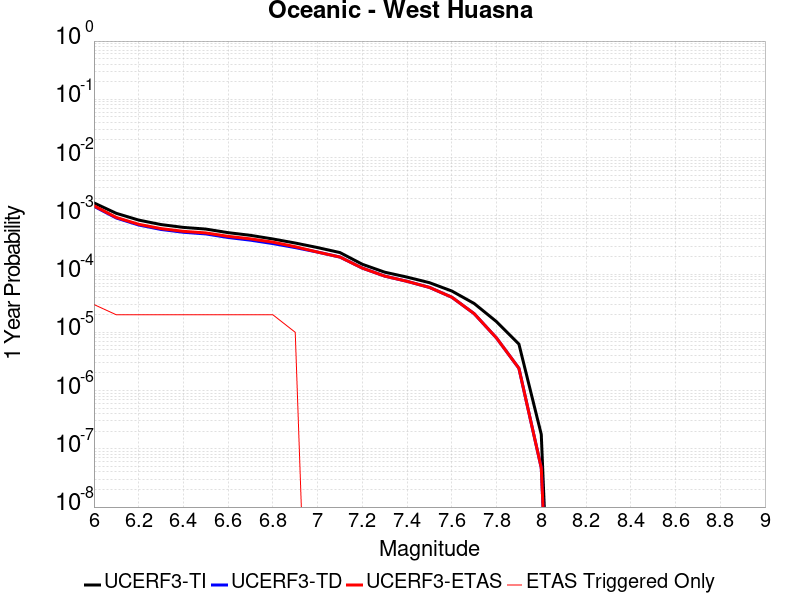 | 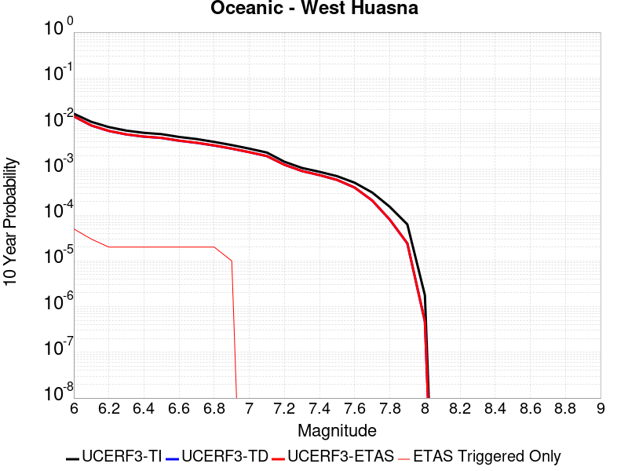 |

| Magnitude | 1 wk TI Prob | 1 wk TD Prob | 1 wk ETAS Prob | 1 wk ETAS/TD Gain | 1 wk ETAS Triggered Only | 1 mo TI Prob | 1 mo TD Prob | 1 mo ETAS Prob | 1 mo ETAS/TD Gain | 1 mo ETAS Triggered Only | 1 yr TI Prob | 1 yr TD Prob | 1 yr ETAS Prob | 1 yr ETAS/TD Gain | 1 yr ETAS Triggered Only | 10 yr TI Prob | 10 yr TD Prob | 10 yr ETAS Prob | 10 yr ETAS/TD Gain | 10 yr ETAS Triggered Only |
|-----|-----|-----|-----|-----|-----|-----|-----|-----|-----|-----|-----|-----|-----|-----|-----|-----|-----|-----|-----|-----|
| 6.0 | 3.195567E-5 | 2.7927153E-5 | 2.7927153E-5 | 1.0 | 0.0 | 1.3694567E-4 | 1.19682554E-4 | 1.19682554E-4 | 1.0 | 0.0 | 0.0016660384 | 0.0014562042 | 0.001492123 | 1.0246661 | 3.597122E-5 | 0.016536033 | 0.014471174 | 0.014518442 | 1.0032663 | 4.7961632E-5 |
| 6.1 | 2.1156782E-5 | 1.7573653E-5 | 1.7573653E-5 | 1.0 | 0.0 | 9.066878E-5 | 7.531353E-5 | 7.531353E-5 | 1.0 | 0.0 | 0.0011033333 | 9.1656594E-4 | 9.4052474E-4 | 1.0261397 | 2.3980816E-5 | 0.010978713 | 0.009128864 | 0.0091645075 | 1.0039045 | 3.597122E-5 |
| 6.2 | 1.6195117E-5 | 1.3327269E-5 | 1.3327269E-5 | 1.0 | 0.0 | 6.9405796E-5 | 5.711563E-5 | 5.711563E-5 | 1.0 | 0.0 | 8.44688E-4 | 6.951635E-4 | 7.1912765E-4 | 1.0344727 | 2.3980816E-5 | 0.008414844 | 0.006930183 | 0.006953998 | 1.0034363 | 2.3980816E-5 |
| 6.3 | 1.3559345E-5 | 1.1179233E-5 | 1.1179233E-5 | 1.0 | 0.0 | 5.811018E-5 | 4.7910125E-5 | 4.7910125E-5 | 1.0 | 0.0 | 7.072618E-4 | 5.831506E-4 | 6.071174E-4 | 1.0410988 | 2.3980816E-5 | 0.0070501505 | 0.0058163223 | 0.0058401637 | 1.004099 | 2.3980816E-5 |
| 6.4 | 1.2120619E-5 | 1.0001056E-5 | 1.0001056E-5 | 1.0 | 0.0 | 5.1944477E-5 | 4.2860964E-5 | 4.2860964E-5 | 1.0 | 0.0 | 6.322405E-4 | 5.217078E-4 | 5.456761E-4 | 1.045942 | 2.3980816E-5 | 0.006304447 | 0.005204898 | 0.0052287537 | 1.0045834 | 2.3980816E-5 |
| 6.5 | 1.13511915E-5 | 9.367545E-6 | 9.367545E-6 | 1.0 | 0.0 | 4.8647056E-5 | 4.014601E-5 | 4.014601E-5 | 1.0 | 0.0 | 5.9211696E-4 | 4.8866845E-4 | 5.1263755E-4 | 1.0490499 | 2.3980816E-5 | 0.0059054173 | 0.004875998 | 0.004899862 | 1.0048941 | 2.3980816E-5 |
| 6.6 | 9.850605E-6 | 8.135479E-6 | 8.135479E-6 | 1.0 | 0.0 | 4.2216197E-5 | 3.4865876E-5 | 3.4865876E-5 | 1.0 | 0.0 | 5.1386096E-4 | 4.2440955E-4 | 4.483802E-4 | 1.0564799 | 2.3980816E-5 | 0.0051267436 | 0.0042360225 | 0.004259902 | 1.0056372 | 2.3980816E-5 |
| 6.7 | 8.8558645E-6 | 7.318487E-6 | 7.318487E-6 | 1.0 | 0.0 | 3.7953152E-5 | 3.136457E-5 | 3.136457E-5 | 1.0 | 0.0 | 4.6198163E-4 | 3.8179688E-4 | 4.0576854E-4 | 1.0627865 | 2.3980816E-5 | 0.004610224 | 0.003811435 | 0.0038353244 | 1.0062678 | 2.3980816E-5 |
| 6.8 | 7.67136E-6 | 6.3918033E-6 | 6.3918033E-6 | 1.0 | 0.0 | 3.2876844E-5 | 2.7393156E-5 | 2.7393156E-5 | 1.0 | 0.0 | 4.0020206E-4 | 3.334608E-4 | 3.574336E-4 | 1.071891 | 2.3980816E-5 | 0.003994821 | 0.0033296254 | 0.0033535264 | 1.0071783 | 2.3980816E-5 |
| 6.9 | 6.534529E-6 | 5.45837E-6 | 5.45837E-6 | 1.0 | 0.0 | 2.8004823E-5 | 2.3392806E-5 | 2.3392806E-5 | 1.0 | 0.0 | 3.4090536E-4 | 2.8477033E-4 | 2.9675732E-4 | 1.0420935 | 1.1990408E-5 | 0.0034038287 | 0.002844071 | 0.002856027 | 1.0042039 | 1.1990408E-5 |
| 7.0 | 5.460525E-6 | 4.5699867E-6 | 4.5699867E-6 | 1.0 | 0.0 | 2.3402039E-5 | 1.9585512E-5 | 1.9585512E-5 | 1.0 | 0.0 | 2.8488258E-4 | 2.3842762E-4 | 2.3842762E-4 | 1.0 | 0.0 | 0.0028451765 | 0.002381732 | 0.002381732 | 1.0 | 0.0 |
| 7.1 | 4.4825083E-6 | 3.7524742E-6 | 3.7524742E-6 | 1.0 | 0.0 | 1.9210609E-5 | 1.6081935E-5 | 1.6081935E-5 | 1.0 | 0.0 | 2.3386406E-4 | 1.9578006E-4 | 1.9578006E-4 | 1.0 | 0.0 | 0.002336181 | 0.0019560878 | 0.0019560878 | 1.0 | 0.0 |
| 7.2 | 2.821708E-6 | 2.4249584E-6 | 2.4249584E-6 | 1.0 | 0.0 | 1.2092979E-5 | 1.0392638E-5 | 1.0392638E-5 | 1.0 | 0.0 | 1.4722206E-4 | 1.2652302E-4 | 1.2652302E-4 | 1.0 | 0.0 | 0.0014712457 | 0.0012645123 | 0.0012645123 | 1.0 | 0.0 |
| 7.3 | 2.0644757E-6 | 1.7687632E-6 | 1.7687632E-6 | 1.0 | 0.0 | 8.847723E-6 | 7.580392E-6 | 7.580392E-6 | 1.0 | 0.0 | 1.0771569E-4 | 9.2287366E-5 | 9.2287366E-5 | 1.0 | 0.0 | 0.001076635 | 9.224921E-4 | 9.224921E-4 | 1.0 | 0.0 |
| 7.4 | 1.6980367E-6 | 1.43801E-6 | 1.43801E-6 | 1.0 | 0.0 | 7.27728E-6 | 6.1628857E-6 | 6.1628857E-6 | 1.0 | 0.0 | 8.8597284E-5 | 7.503055E-5 | 7.503055E-5 | 1.0 | 0.0 | 8.8561967E-4 | 7.500538E-4 | 7.500538E-4 | 1.0 | 0.0 |
| 7.5 | 1.3637683E-6 | 1.1302833E-6 | 1.1302833E-6 | 1.0 | 0.0 | 5.844708E-6 | 4.8440625E-6 | 4.8440625E-6 | 1.0 | 0.0 | 7.1156996E-5 | 5.8974863E-5 | 5.8974863E-5 | 1.0 | 0.0 | 7.1134215E-4 | 5.8959366E-4 | 5.8959366E-4 | 1.0 | 0.0 |
| 7.6 | 9.802994E-7 | 7.677435E-7 | 7.677435E-7 | 1.0 | 0.0 | 4.2012766E-6 | 3.290325E-6 | 3.290325E-6 | 1.0 | 0.0 | 5.1149345E-5 | 4.005897E-5 | 4.005897E-5 | 1.0 | 0.0 | 5.113757E-4 | 4.005189E-4 | 4.005189E-4 | 1.0 | 0.0 |
| 7.7 | 5.986191E-7 | 4.0052313E-7 | 4.0052313E-7 | 1.0 | 0.0 | 2.5655079E-6 | 1.7165265E-6 | 1.7165265E-6 | 1.0 | 0.0 | 3.1234613E-5 | 2.0898511E-5 | 2.0898511E-5 | 1.0 | 0.0 | 3.123022E-4 | 2.0896681E-4 | 2.0896681E-4 | 1.0 | 0.0 |
| 7.8 | 2.9189815E-7 | 1.5287357E-7 | 1.5287357E-7 | 1.0 | 0.0 | 1.2509914E-6 | 6.5517224E-7 | 6.5517224E-7 | 1.0 | 0.0 | 1.5230714E-5 | 7.976692E-6 | 7.976692E-6 | 1.0 | 0.0 | 1.522967E-4 | 7.976538E-5 | 7.976538E-5 | 1.0 | 0.0 |
| 7.9 | 1.2057845E-7 | 4.6221164E-8 | 4.6221164E-8 | 1.0 | 0.0 | 5.1676466E-7 | 1.9809069E-7 | 1.9809069E-7 | 1.0 | 0.0 | 6.2915915E-6 | 2.4117514E-6 | 2.4117514E-6 | 1.0 | 0.0 | 6.2914136E-5 | 2.4118557E-5 | 2.4118557E-5 | 1.0 | 0.0 |
| 8.0 | 3.3806387E-9 | 9.0147434E-10 | 9.0147434E-10 | 1.0 | 0.0 | 1.4488451E-8 | 3.8634624E-9 | 3.8634624E-9 | 1.0 | 0.0 | 1.7639688E-7 | 4.703766E-8 | 4.703766E-8 | 1.0 | 0.0 | 1.7639674E-6 | 4.714705E-7 | 4.714705E-7 | 1.0 | 0.0 |

## Cucamonga
*[(top)](#table-of-contents)*

| 1 Week | 1 Month | 1 Year | 10 Year |
|-----|-----|-----|-----|
|  | 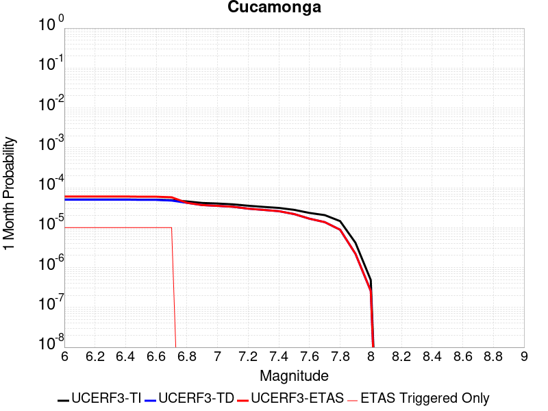 | 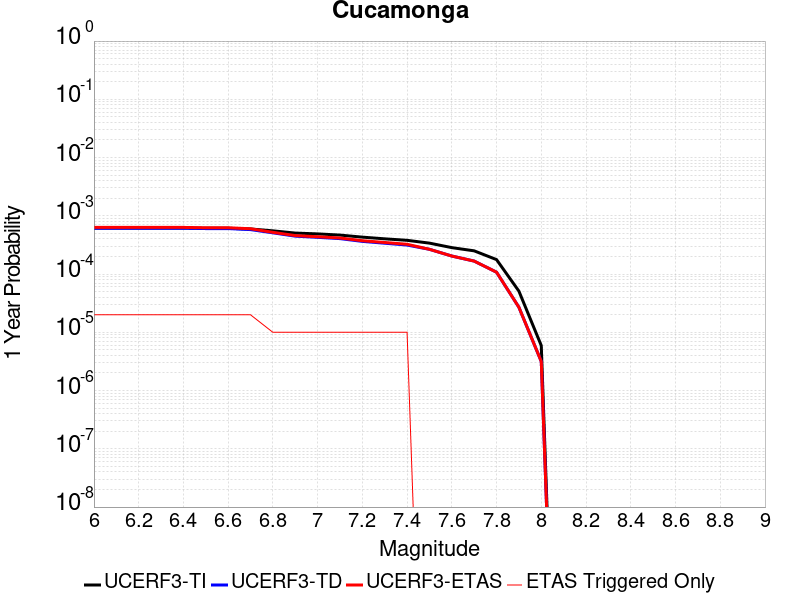 | 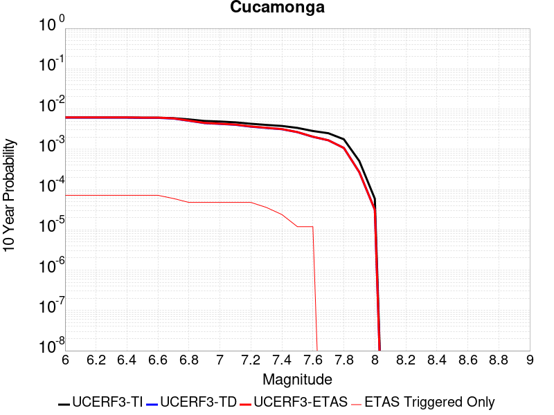 |

| Magnitude | 1 wk TI Prob | 1 wk TD Prob | 1 wk ETAS Prob | 1 wk ETAS/TD Gain | 1 wk ETAS Triggered Only | 1 mo TI Prob | 1 mo TD Prob | 1 mo ETAS Prob | 1 mo ETAS/TD Gain | 1 mo ETAS Triggered Only | 1 yr TI Prob | 1 yr TD Prob | 1 yr ETAS Prob | 1 yr ETAS/TD Gain | 1 yr ETAS Triggered Only | 10 yr TI Prob | 10 yr TD Prob | 10 yr ETAS Prob | 10 yr ETAS/TD Gain | 10 yr ETAS Triggered Only |
|-----|-----|-----|-----|-----|-----|-----|-----|-----|-----|-----|-----|-----|-----|-----|-----|-----|-----|-----|-----|-----|
| 6.0 | 1.1848348E-5 | 1.1737756E-5 | 1.1737756E-5 | 1.0 | 0.0 | 5.0777642E-5 | 5.0303715E-5 | 6.229352E-5 | 1.2383482 | 1.1990408E-5 | 6.180424E-4 | 6.122783E-4 | 6.362444E-4 | 1.0391425 | 2.3980816E-5 | 0.0061632637 | 0.0061070886 | 0.0061785914 | 1.0117083 | 7.194244E-5 |
| 6.1 | 1.1848348E-5 | 1.1737756E-5 | 1.1737756E-5 | 1.0 | 0.0 | 5.0777642E-5 | 5.0303715E-5 | 6.229352E-5 | 1.2383482 | 1.1990408E-5 | 6.180424E-4 | 6.122783E-4 | 6.362444E-4 | 1.0391425 | 2.3980816E-5 | 0.0061632637 | 0.0061070886 | 0.0061785914 | 1.0117083 | 7.194244E-5 |
| 6.2 | 1.1848348E-5 | 1.1737756E-5 | 1.1737756E-5 | 1.0 | 0.0 | 5.0777642E-5 | 5.0303715E-5 | 6.229352E-5 | 1.2383482 | 1.1990408E-5 | 6.180424E-4 | 6.122783E-4 | 6.362444E-4 | 1.0391425 | 2.3980816E-5 | 0.0061632637 | 0.0061070886 | 0.0061785914 | 1.0117083 | 7.194244E-5 |
| 6.3 | 1.1848348E-5 | 1.1737756E-5 | 1.1737756E-5 | 1.0 | 0.0 | 5.0777642E-5 | 5.0303715E-5 | 6.229352E-5 | 1.2383482 | 1.1990408E-5 | 6.180424E-4 | 6.122783E-4 | 6.362444E-4 | 1.0391425 | 2.3980816E-5 | 0.0061632637 | 0.0061070886 | 0.0061785914 | 1.0117083 | 7.194244E-5 |
| 6.4 | 1.1848348E-5 | 1.1737756E-5 | 1.1737756E-5 | 1.0 | 0.0 | 5.0777642E-5 | 5.0303715E-5 | 6.229352E-5 | 1.2383482 | 1.1990408E-5 | 6.180424E-4 | 6.122783E-4 | 6.362444E-4 | 1.0391425 | 2.3980816E-5 | 0.0061632637 | 0.0061070886 | 0.0061785914 | 1.0117083 | 7.194244E-5 |
| 6.5 | 1.16988695E-5 | 1.1576785E-5 | 1.1576785E-5 | 1.0 | 0.0 | 5.013705E-5 | 4.9613864E-5 | 6.160368E-5 | 1.2416625 | 1.1990408E-5 | 6.102476E-4 | 6.0388405E-4 | 6.278504E-4 | 1.0396869 | 2.3980816E-5 | 0.006085745 | 0.006023602 | 0.006095111 | 1.0118715 | 7.194244E-5 |
| 6.6 | 1.16988695E-5 | 1.1576785E-5 | 1.1576785E-5 | 1.0 | 0.0 | 5.013705E-5 | 4.9613864E-5 | 6.160368E-5 | 1.2416625 | 1.1990408E-5 | 6.102476E-4 | 6.0388405E-4 | 6.278504E-4 | 1.0396869 | 2.3980816E-5 | 0.006085745 | 0.006023602 | 0.006095111 | 1.0118715 | 7.194244E-5 |
| 6.7 | 1.1397107E-5 | 1.1115677E-5 | 1.1115677E-5 | 1.0 | 0.0 | 4.884383E-5 | 4.7637757E-5 | 5.9627593E-5 | 1.2516876 | 1.1990408E-5 | 5.9451134E-4 | 5.798378E-4 | 6.038048E-4 | 1.0413338 | 2.3980816E-5 | 0.005929234 | 0.0057844 | 0.005844005 | 1.0103045 | 5.995204E-5 |
| 6.8 | 1.058387E-5 | 9.785641E-6 | 9.785641E-6 | 1.0 | 0.0 | 4.5358654E-5 | 4.1937794E-5 | 4.1937794E-5 | 1.0 | 0.0 | 5.521017E-4 | 5.1047414E-4 | 5.224584E-4 | 1.0234767 | 1.1990408E-5 | 0.00550732 | 0.0050940234 | 0.005141741 | 1.0093673 | 4.7961632E-5 |
| 6.9 | 9.690046E-6 | 8.5800775E-6 | 8.5800775E-6 | 1.0 | 0.0 | 4.1528107E-5 | 3.6771246E-5 | 3.6771246E-5 | 1.0 | 0.0 | 5.054874E-4 | 4.4759834E-4 | 4.595834E-4 | 1.0267763 | 1.1990408E-5 | 0.005043391 | 0.004467903 | 0.0045156507 | 1.0106868 | 4.7961632E-5 |
| 7.0 | 9.381461E-6 | 8.187685E-6 | 8.187685E-6 | 1.0 | 0.0 | 4.020564E-5 | 3.5089608E-5 | 3.5089608E-5 | 1.0 | 0.0 | 4.893937E-4 | 4.271326E-4 | 4.3911787E-4 | 1.0280598 | 1.1990408E-5 | 0.0048831734 | 0.0042640497 | 0.0043118065 | 1.0112 | 4.7961632E-5 |
| 7.1 | 8.946492E-6 | 7.78246E-6 | 7.78246E-6 | 1.0 | 0.0 | 3.8341543E-5 | 3.335297E-5 | 3.335297E-5 | 1.0 | 0.0 | 4.667083E-4 | 4.059971E-4 | 4.1798264E-4 | 1.0295212 | 1.1990408E-5 | 0.0046572937 | 0.0040534893 | 0.0041012564 | 1.0117842 | 4.7961632E-5 |
| 7.2 | 8.251016E-6 | 6.9758194E-6 | 6.9758194E-6 | 1.0 | 0.0 | 3.5361016E-5 | 2.9896028E-5 | 2.9896028E-5 | 1.0 | 0.0 | 4.3043532E-4 | 3.6392358E-4 | 3.759096E-4 | 1.0329356 | 1.1990408E-5 | 0.0042960253 | 0.0036342086 | 0.003681996 | 1.0131493 | 4.7961632E-5 |
| 7.3 | 7.717881E-6 | 6.486875E-6 | 6.486875E-6 | 1.0 | 0.0 | 3.3076216E-5 | 2.7800597E-5 | 2.7800597E-5 | 1.0 | 0.0 | 4.026285E-4 | 3.3841992E-4 | 3.5040628E-4 | 1.0354185 | 1.1990408E-5 | 0.004018998 | 0.0033799817 | 0.0034158314 | 1.0106064 | 3.597122E-5 |
| 7.4 | 7.275623E-6 | 6.0325037E-6 | 6.0325037E-6 | 1.0 | 0.0 | 3.118087E-5 | 2.5853333E-5 | 2.5853333E-5 | 1.0 | 0.0 | 3.7956095E-4 | 3.1471907E-4 | 3.2670572E-4 | 1.0380868 | 1.1990408E-5 | 0.0037891332 | 0.0031436686 | 0.003167574 | 1.0076044 | 2.3980816E-5 |
| 7.5 | 6.5109502E-6 | 5.101059E-6 | 5.101059E-6 | 1.0 | 0.0 | 2.7903774E-5 | 2.1861499E-5 | 2.1861499E-5 | 1.0 | 0.0 | 3.3967546E-4 | 2.661314E-4 | 2.661314E-4 | 1.0 | 0.0 | 0.0033915674 | 0.00265905 | 0.0026710085 | 1.0044973 | 1.1990408E-5 |
| 7.6 | 5.4495326E-6 | 3.9089846E-6 | 3.9089846E-6 | 1.0 | 0.0 | 2.335493E-5 | 1.6752683E-5 | 1.6752683E-5 | 1.0 | 0.0 | 2.8430918E-4 | 2.0394489E-4 | 2.0394489E-4 | 1.0 | 0.0 | 0.0028394572 | 0.0020384968 | 0.0020504629 | 1.00587 | 1.1990408E-5 |
| 7.7 | 4.7997164E-6 | 3.2006355E-6 | 3.2006355E-6 | 1.0 | 0.0 | 2.057005E-5 | 1.3716938E-5 | 1.3716938E-5 | 1.0 | 0.0 | 2.504116E-4 | 1.6699095E-4 | 1.6699095E-4 | 1.0 | 0.0 | 0.002501296 | 0.001669585 | 0.001669585 | 1.0 | 0.0 |
| 7.8 | 3.3941733E-6 | 2.0644336E-6 | 2.0644336E-6 | 1.0 | 0.0 | 1.4546376E-5 | 8.847543E-6 | 8.847543E-6 | 1.0 | 0.0 | 1.7708774E-4 | 1.07713524E-4 | 1.07713524E-4 | 1.0 | 0.0 | 0.0017694668 | 0.0010768501 | 0.0010768501 | 1.0 | 0.0 |
| 7.9 | 9.750552E-7 | 5.1567173E-7 | 5.1567173E-7 | 1.0 | 0.0 | 4.178801E-6 | 2.2100198E-6 | 2.2100198E-6 | 1.0 | 0.0 | 5.0875715E-5 | 2.6906664E-5 | 2.6906664E-5 | 1.0 | 0.0 | 5.086407E-4 | 2.6903447E-4 | 2.6903447E-4 | 1.0 | 0.0 |
| 8.0 | 1.133857E-7 | 6.0540515E-8 | 6.0540515E-8 | 1.0 | 0.0 | 4.8593864E-7 | 2.5945934E-7 | 2.5945934E-7 | 1.0 | 0.0 | 5.9162867E-6 | 3.158913E-6 | 3.158913E-6 | 1.0 | 0.0 | 5.916129E-5 | 3.1588697E-5 | 3.1588697E-5 | 1.0 | 0.0 |

## San Jacinto (Lytle Creek connector)
*[(top)](#table-of-contents)*

| 1 Week | 1 Month | 1 Year | 10 Year |
|-----|-----|-----|-----|
| 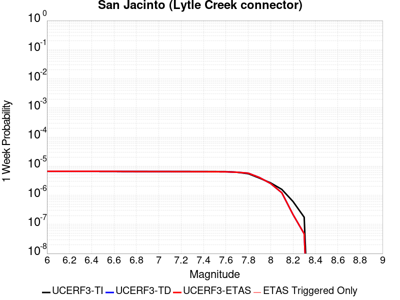 | 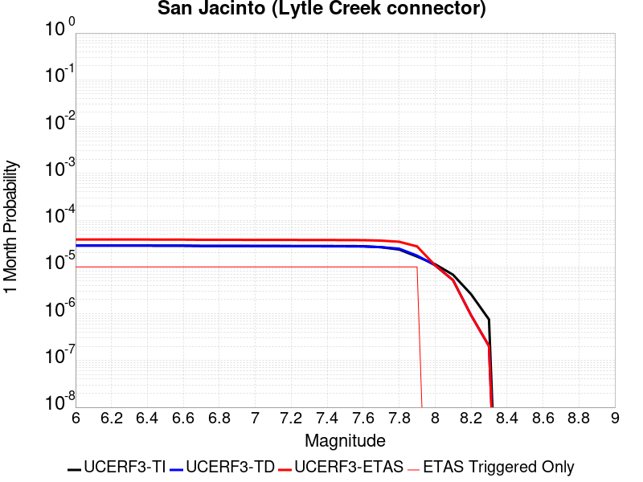 | 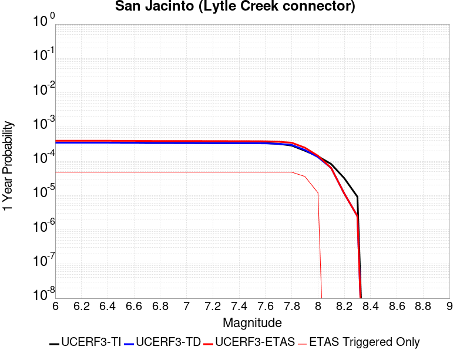 | 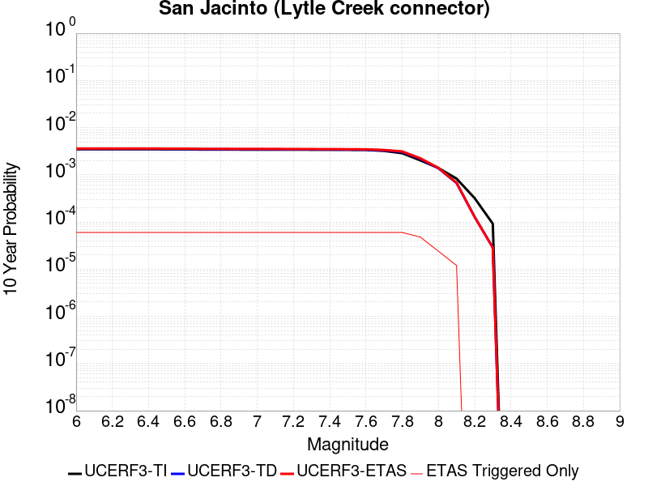 |

| Magnitude | 1 wk TI Prob | 1 wk TD Prob | 1 wk ETAS Prob | 1 wk ETAS/TD Gain | 1 wk ETAS Triggered Only | 1 mo TI Prob | 1 mo TD Prob | 1 mo ETAS Prob | 1 mo ETAS/TD Gain | 1 mo ETAS Triggered Only | 1 yr TI Prob | 1 yr TD Prob | 1 yr ETAS Prob | 1 yr ETAS/TD Gain | 1 yr ETAS Triggered Only | 10 yr TI Prob | 10 yr TD Prob | 10 yr ETAS Prob | 10 yr ETAS/TD Gain | 10 yr ETAS Triggered Only |
|-----|-----|-----|-----|-----|-----|-----|-----|-----|-----|-----|-----|-----|-----|-----|-----|-----|-----|-----|-----|-----|
| 6.0 | 6.693995E-6 | 6.662972E-6 | 6.662972E-6 | 1.0 | 0.0 | 2.8688235E-5 | 2.8555281E-5 | 4.0545347E-5 | 1.4198896 | 1.1990408E-5 | 3.492233E-4 | 3.4760518E-4 | 3.9555013E-4 | 1.1379293 | 4.7961632E-5 | 0.00348675 | 0.0035508168 | 0.003610556 | 1.016824 | 5.995204E-5 |
| 6.1 | 6.693995E-6 | 6.662972E-6 | 6.662972E-6 | 1.0 | 0.0 | 2.8688235E-5 | 2.8555281E-5 | 4.0545347E-5 | 1.4198896 | 1.1990408E-5 | 3.492233E-4 | 3.4760518E-4 | 3.9555013E-4 | 1.1379293 | 4.7961632E-5 | 0.00348675 | 0.0035508168 | 0.003610556 | 1.016824 | 5.995204E-5 |
| 6.2 | 6.693995E-6 | 6.662972E-6 | 6.662972E-6 | 1.0 | 0.0 | 2.8688235E-5 | 2.8555281E-5 | 4.0545347E-5 | 1.4198896 | 1.1990408E-5 | 3.492233E-4 | 3.4760518E-4 | 3.9555013E-4 | 1.1379293 | 4.7961632E-5 | 0.00348675 | 0.0035508168 | 0.003610556 | 1.016824 | 5.995204E-5 |
| 6.3 | 6.693995E-6 | 6.662972E-6 | 6.662972E-6 | 1.0 | 0.0 | 2.8688235E-5 | 2.8555281E-5 | 4.0545347E-5 | 1.4198896 | 1.1990408E-5 | 3.492233E-4 | 3.4760518E-4 | 3.9555013E-4 | 1.1379293 | 4.7961632E-5 | 0.00348675 | 0.0035508168 | 0.003610556 | 1.016824 | 5.995204E-5 |
| 6.4 | 6.693995E-6 | 6.662972E-6 | 6.662972E-6 | 1.0 | 0.0 | 2.8688235E-5 | 2.8555281E-5 | 4.0545347E-5 | 1.4198896 | 1.1990408E-5 | 3.492233E-4 | 3.4760518E-4 | 3.9555013E-4 | 1.1379293 | 4.7961632E-5 | 0.00348675 | 0.0035508168 | 0.003610556 | 1.016824 | 5.995204E-5 |
| 6.5 | 6.6561875E-6 | 6.6231896E-6 | 6.6231896E-6 | 1.0 | 0.0 | 2.8526205E-5 | 2.838479E-5 | 4.0374856E-5 | 1.4224117 | 1.1990408E-5 | 3.472512E-4 | 3.455301E-4 | 3.9347514E-4 | 1.138758 | 4.7961632E-5 | 0.0034670907 | 0.0035301324 | 0.0035898727 | 1.016923 | 5.995204E-5 |
| 6.6 | 6.6561875E-6 | 6.6231896E-6 | 6.6231896E-6 | 1.0 | 0.0 | 2.8526205E-5 | 2.838479E-5 | 4.0374856E-5 | 1.4224117 | 1.1990408E-5 | 3.472512E-4 | 3.455301E-4 | 3.9347514E-4 | 1.138758 | 4.7961632E-5 | 0.0034670907 | 0.0035301324 | 0.0035898727 | 1.016923 | 5.995204E-5 |
| 6.7 | 6.5802237E-6 | 6.5423656E-6 | 6.5423656E-6 | 1.0 | 0.0 | 2.8200653E-5 | 2.803841E-5 | 4.002848E-5 | 1.4276302 | 1.1990408E-5 | 3.4328885E-4 | 3.4131424E-4 | 3.8925948E-4 | 1.1404725 | 4.7961632E-5 | 0.0034275902 | 0.0034881064 | 0.0035478494 | 1.0171276 | 5.995204E-5 |
| 6.8 | 6.575632E-6 | 6.5368554E-6 | 6.5368554E-6 | 1.0 | 0.0 | 2.8180975E-5 | 2.8014794E-5 | 4.0004867E-5 | 1.4279907 | 1.1990408E-5 | 3.4304935E-4 | 3.410268E-4 | 3.8897208E-4 | 1.1405909 | 4.7961632E-5 | 0.0034252026 | 0.0034852412 | 0.0035449842 | 1.0171417 | 5.995204E-5 |
| 6.9 | 6.570433E-6 | 6.528249E-6 | 6.528249E-6 | 1.0 | 0.0 | 2.8158694E-5 | 2.797791E-5 | 3.996798E-5 | 1.428555 | 1.1990408E-5 | 3.4277816E-4 | 3.4057788E-4 | 3.8852319E-4 | 1.1407763 | 4.7961632E-5 | 0.0034224992 | 0.003480766 | 0.0035405094 | 1.0171639 | 5.995204E-5 |
| 7.0 | 6.5643826E-6 | 6.5183694E-6 | 6.5183694E-6 | 1.0 | 0.0 | 2.8132765E-5 | 2.7935572E-5 | 3.9925642E-5 | 1.4292045 | 1.1990408E-5 | 3.424626E-4 | 3.4006257E-4 | 3.880079E-4 | 1.1409897 | 4.7961632E-5 | 0.0034193532 | 0.003475629 | 0.0035353727 | 1.0171893 | 5.995204E-5 |
| 7.1 | 6.557402E-6 | 6.5070813E-6 | 6.5070813E-6 | 1.0 | 0.0 | 2.8102848E-5 | 2.7887192E-5 | 3.9877264E-5 | 1.429949 | 1.1990408E-5 | 3.4209844E-4 | 3.3947374E-4 | 3.874191E-4 | 1.1412343 | 4.7961632E-5 | 0.0034157229 | 0.0034697603 | 0.0035295042 | 1.0172185 | 5.995204E-5 |
| 7.2 | 6.546394E-6 | 6.489047E-6 | 6.489047E-6 | 1.0 | 0.0 | 2.8055672E-5 | 2.7809905E-5 | 3.979998E-5 | 1.431144 | 1.1990408E-5 | 3.4152428E-4 | 3.3853305E-4 | 3.8647844E-4 | 1.141627 | 4.7961632E-5 | 0.0034099987 | 0.003460387 | 0.0035201316 | 1.0172653 | 5.995204E-5 |
| 7.3 | 6.5364216E-6 | 6.469831E-6 | 6.469831E-6 | 1.0 | 0.0 | 2.8012933E-5 | 2.7727552E-5 | 3.9717626E-5 | 1.4324245 | 1.1990408E-5 | 3.4100408E-4 | 3.3753074E-4 | 3.854762E-4 | 1.1420476 | 4.7961632E-5 | 0.003404813 | 0.0034504079 | 0.003510153 | 1.0173154 | 5.995204E-5 |
| 7.4 | 6.5269523E-6 | 6.4509163E-6 | 6.4509163E-6 | 1.0 | 0.0 | 2.7972354E-5 | 2.764649E-5 | 3.963657E-5 | 1.4336925 | 1.1990408E-5 | 3.4051016E-4 | 3.3654412E-4 | 3.844896E-4 | 1.1424642 | 4.7961632E-5 | 0.0033998888 | 0.003440589 | 0.0035003347 | 1.017365 | 5.995204E-5 |
| 7.5 | 6.5111835E-6 | 6.4271885E-6 | 6.4271885E-6 | 1.0 | 0.0 | 2.7904773E-5 | 2.7544802E-5 | 3.953488E-5 | 1.4352937 | 1.1990408E-5 | 3.3968766E-4 | 3.3530645E-4 | 3.83252E-4 | 1.1429902 | 4.7961632E-5 | 0.0033916887 | 0.003428261 | 0.0034880075 | 1.0174277 | 5.995204E-5 |
| 7.6 | 6.4768806E-6 | 6.3862944E-6 | 6.3862944E-6 | 1.0 | 0.0 | 2.7757764E-5 | 2.7369546E-5 | 3.9359627E-5 | 1.438081 | 1.1990408E-5 | 3.3789838E-4 | 3.3317335E-4 | 3.81119E-4 | 1.143906 | 4.7961632E-5 | 0.0033738504 | 0.0034069915 | 0.0034667393 | 1.0175368 | 5.995204E-5 |
| 7.7 | 6.1655364E-6 | 6.1787587E-6 | 6.1787587E-6 | 1.0 | 0.0 | 2.642346E-5 | 2.6480126E-5 | 3.8470214E-5 | 1.4527959 | 1.1990408E-5 | 3.2165812E-4 | 3.2234789E-4 | 3.7029406E-4 | 1.1487404 | 4.7961632E-5 | 0.0032119295 | 0.003298596 | 0.0033583501 | 1.018115 | 5.995204E-5 |
| 7.8 | 5.5043524E-6 | 5.7397438E-6 | 5.7397438E-6 | 1.0 | 0.0 | 2.3589868E-5 | 2.459867E-5 | 3.6588783E-5 | 1.4874293 | 1.1990408E-5 | 2.871688E-4 | 2.994477E-4 | 3.47395E-4 | 1.160119 | 4.7961632E-5 | 0.0028679797 | 0.0030686588 | 0.0031284268 | 1.0194769 | 5.995204E-5 |
| 7.9 | 3.889249E-6 | 4.0789296E-6 | 4.0789296E-6 | 1.0 | 0.0 | 1.6668104E-5 | 1.748101E-5 | 2.9471208E-5 | 1.6858985 | 1.1990408E-5 | 2.0291525E-4 | 2.1281054E-4 | 2.487741E-4 | 1.1689934 | 3.597122E-5 | 0.0020273007 | 0.0021954647 | 0.0022433212 | 1.0217978 | 4.7961632E-5 |
| 8.0 | 2.668535E-6 | 2.5329996E-6 | 2.5329996E-6 | 1.0 | 0.0 | 1.1436528E-5 | 1.0855668E-5 | 1.0855668E-5 | 1.0 | 0.0 | 1.3923083E-4 | 1.3215977E-4 | 1.441486E-4 | 1.0907146 | 1.1990408E-5 | 0.0013914363 | 0.0013765821 | 0.00140053 | 1.0173966 | 2.3980816E-5 |
| 8.1 | 1.5911459E-6 | 1.2194711E-6 | 1.2194711E-6 | 1.0 | 0.0 | 6.8191785E-6 | 5.226294E-6 | 5.226294E-6 | 1.0 | 0.0 | 8.3020335E-5 | 6.362829E-5 | 6.362829E-5 | 1.0 | 0.0 | 8.298933E-4 | 6.6975754E-4 | 6.8173994E-4 | 1.0178906 | 1.1990408E-5 |
| 8.2 | 6.1294963E-7 | 2.1835329E-7 | 2.1835329E-7 | 1.0 | 0.0 | 2.6269242E-6 | 9.357995E-7 | 9.357995E-7 | 1.0 | 0.0 | 3.1982334E-5 | 1.1393299E-5 | 1.1393299E-5 | 1.0 | 0.0 | 3.1977732E-4 | 1.2797497E-4 | 1.2797497E-4 | 1.0 | 0.0 |
| 8.3 | 1.762871E-7 | 4.7604622E-8 | 4.7604622E-8 | 1.0 | 0.0 | 7.5551594E-7 | 2.0401978E-7 | 2.0401978E-7 | 1.0 | 0.0 | 9.1983675E-6 | 2.4839383E-6 | 2.4839383E-6 | 1.0 | 0.0 | 9.197987E-5 | 2.8720697E-5 | 2.8720697E-5 | 1.0 | 0.0 |

## Pisgah-Bullion Mtn-Mesquite Lk
*[(top)](#table-of-contents)*

| 1 Week | 1 Month | 1 Year | 10 Year |
|-----|-----|-----|-----|
|  |  | 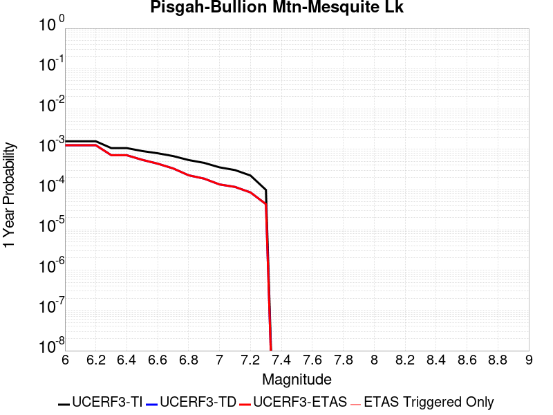 | 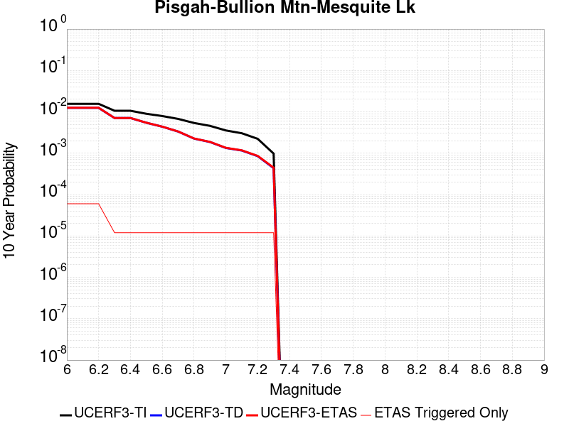 |

| Magnitude | 1 wk TI Prob | 1 wk TD Prob | 1 wk ETAS Prob | 1 wk ETAS/TD Gain | 1 wk ETAS Triggered Only | 1 mo TI Prob | 1 mo TD Prob | 1 mo ETAS Prob | 1 mo ETAS/TD Gain | 1 mo ETAS Triggered Only | 1 yr TI Prob | 1 yr TD Prob | 1 yr ETAS Prob | 1 yr ETAS/TD Gain | 1 yr ETAS Triggered Only | 10 yr TI Prob | 10 yr TD Prob | 10 yr ETAS Prob | 10 yr ETAS/TD Gain | 10 yr ETAS Triggered Only |
|-----|-----|-----|-----|-----|-----|-----|-----|-----|-----|-----|-----|-----|-----|-----|-----|-----|-----|-----|-----|-----|
| 6.0 | 3.0240792E-5 | 2.4091496E-5 | 2.4091496E-5 | 1.0 | 0.0 | 1.2959696E-4 | 1.0324575E-4 | 1.0324575E-4 | 1.0 | 0.0 | 0.0015767008 | 0.0012563926 | 0.0012563926 | 1.0 | 0.0 | 0.015655609 | 0.012502918 | 0.01256212 | 1.0047351 | 5.995204E-5 |
| 6.1 | 3.0240792E-5 | 2.4091496E-5 | 2.4091496E-5 | 1.0 | 0.0 | 1.2959696E-4 | 1.0324575E-4 | 1.0324575E-4 | 1.0 | 0.0 | 0.0015767008 | 0.0012563926 | 0.0012563926 | 1.0 | 0.0 | 0.015655609 | 0.012502918 | 0.01256212 | 1.0047351 | 5.995204E-5 |
| 6.2 | 3.0240792E-5 | 2.4091496E-5 | 2.4091496E-5 | 1.0 | 0.0 | 1.2959696E-4 | 1.0324575E-4 | 1.0324575E-4 | 1.0 | 0.0 | 0.0015767008 | 0.0012563926 | 0.0012563926 | 1.0 | 0.0 | 0.015655609 | 0.012502918 | 0.01256212 | 1.0047351 | 5.995204E-5 |
| 6.3 | 2.0498217E-5 | 1.3638254E-5 | 1.3638254E-5 | 1.0 | 0.0 | 8.784654E-5 | 5.8448444E-5 | 5.8448444E-5 | 1.0 | 0.0 | 0.0010690069 | 7.1139366E-4 | 7.1139366E-4 | 1.0 | 0.0 | 0.01063879 | 0.00709279 | 0.007104696 | 1.0016785 | 1.1990408E-5 |
| 6.4 | 2.0498217E-5 | 1.3638254E-5 | 1.3638254E-5 | 1.0 | 0.0 | 8.784654E-5 | 5.8448444E-5 | 5.8448444E-5 | 1.0 | 0.0 | 0.0010690069 | 7.1139366E-4 | 7.1139366E-4 | 1.0 | 0.0 | 0.01063879 | 0.00709279 | 0.007104696 | 1.0016785 | 1.1990408E-5 |
| 6.5 | 1.7316182E-5 | 1.0477178E-5 | 1.0477178E-5 | 1.0 | 0.0 | 7.42101E-5 | 4.4901473E-5 | 4.4901473E-5 | 1.0 | 0.0 | 9.0313336E-4 | 5.465483E-4 | 5.465483E-4 | 1.0 | 0.0 | 0.008994718 | 0.005453037 | 0.005464962 | 1.0021869 | 1.1990408E-5 |
| 6.6 | 1.5251077E-5 | 8.414378E-6 | 8.414378E-6 | 1.0 | 0.0 | 6.536012E-5 | 3.606116E-5 | 3.606116E-5 | 1.0 | 0.0 | 7.9546886E-4 | 4.389634E-4 | 4.389634E-4 | 1.0 | 0.0 | 0.007926274 | 0.004381681 | 0.0043936186 | 1.0027245 | 1.1990408E-5 |
| 6.7 | 1.2997425E-5 | 6.411573E-6 | 6.411573E-6 | 1.0 | 0.0 | 5.570206E-5 | 2.7477907E-5 | 2.7477907E-5 | 1.0 | 0.0 | 6.7796157E-4 | 3.344968E-4 | 3.344968E-4 | 1.0 | 0.0 | 0.0067589693 | 0.0033403935 | 0.003352344 | 1.0035775 | 1.1990408E-5 |
| 6.8 | 1.035386E-5 | 4.333283E-6 | 4.333283E-6 | 1.0 | 0.0 | 4.437293E-5 | 1.8571085E-5 | 1.8571085E-5 | 1.0 | 0.0 | 5.401065E-4 | 2.2608037E-4 | 2.2608037E-4 | 1.0 | 0.0 | 0.0053879567 | 0.0022585907 | 0.002270554 | 1.0052968 | 1.1990408E-5 |
| 6.9 | 8.816252E-6 | 3.580692E-6 | 3.580692E-6 | 1.0 | 0.0 | 3.778339E-5 | 1.5345737E-5 | 1.5345737E-5 | 1.0 | 0.0 | 4.5991567E-4 | 1.8681891E-4 | 1.8681891E-4 | 1.0 | 0.0 | 0.00458965 | 0.0018666771 | 0.001878645 | 1.0064114 | 1.1990408E-5 |
| 7.0 | 6.8232207E-6 | 2.5676256E-6 | 2.5676256E-6 | 1.0 | 0.0 | 2.9242048E-5 | 1.10040655E-5 | 1.10040655E-5 | 1.0 | 0.0 | 3.5596377E-4 | 1.3396658E-4 | 1.3396658E-4 | 1.0 | 0.0 | 0.0035539411 | 0.0013388892 | 0.0013508636 | 1.0089436 | 1.1990408E-5 |
| 7.1 | 5.837013E-6 | 2.2274157E-6 | 2.2274157E-6 | 1.0 | 0.0 | 2.501553E-5 | 9.546034E-6 | 9.546034E-6 | 1.0 | 0.0 | 3.045215E-4 | 1.1621706E-4 | 1.1621706E-4 | 1.0 | 0.0 | 0.0030410455 | 0.0011615918 | 0.0011735683 | 1.0103104 | 1.1990408E-5 |
| 7.2 | 4.278052E-6 | 1.6275965E-6 | 1.6275965E-6 | 1.0 | 0.0 | 1.833438E-5 | 6.9753964E-6 | 6.9753964E-6 | 1.0 | 0.0 | 2.231982E-4 | 8.492238E-5 | 8.492238E-5 | 1.0 | 0.0 | 0.0022297418 | 8.489225E-4 | 8.609027E-4 | 1.0141122 | 1.1990408E-5 |
| 7.3 | 1.8803692E-6 | 8.3450385E-7 | 8.3450385E-7 | 1.0 | 0.0 | 8.0587E-6 | 3.576441E-6 | 3.576441E-6 | 1.0 | 0.0 | 9.811026E-5 | 4.3542448E-5 | 4.3542448E-5 | 1.0 | 0.0 | 9.806695E-4 | 4.353536E-4 | 4.473388E-4 | 1.0275297 | 1.1990408E-5 |

## Cleghorn
*[(top)](#table-of-contents)*

| 1 Week | 1 Month | 1 Year | 10 Year |
|-----|-----|-----|-----|
| 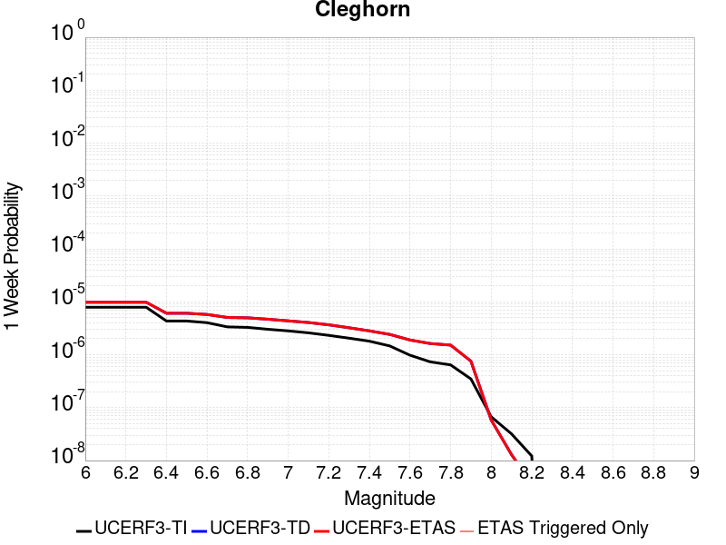 | 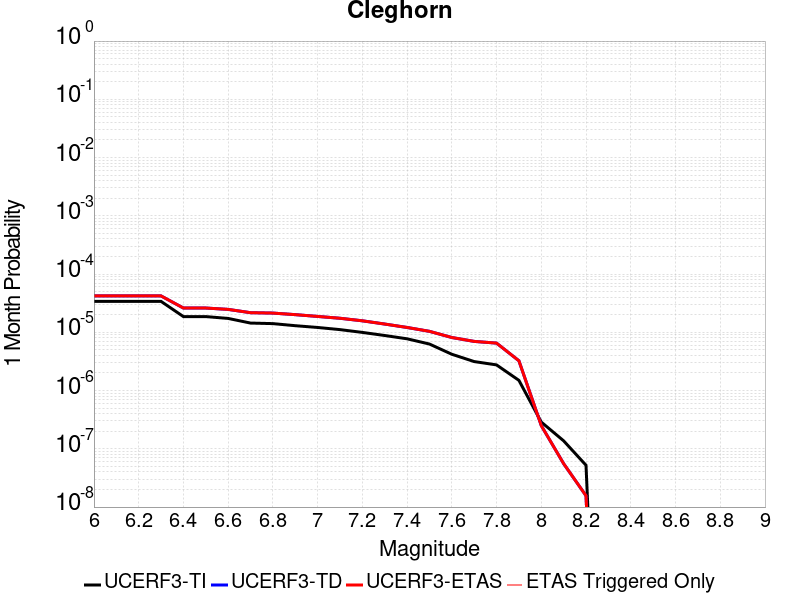 | 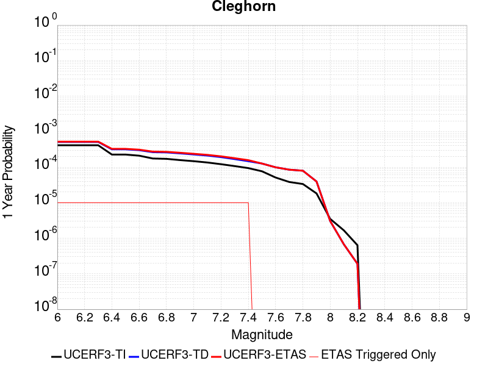 | 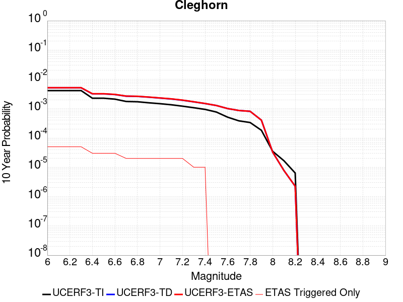 |

| Magnitude | 1 wk TI Prob | 1 wk TD Prob | 1 wk ETAS Prob | 1 wk ETAS/TD Gain | 1 wk ETAS Triggered Only | 1 mo TI Prob | 1 mo TD Prob | 1 mo ETAS Prob | 1 mo ETAS/TD Gain | 1 mo ETAS Triggered Only | 1 yr TI Prob | 1 yr TD Prob | 1 yr ETAS Prob | 1 yr ETAS/TD Gain | 1 yr ETAS Triggered Only | 10 yr TI Prob | 10 yr TD Prob | 10 yr ETAS Prob | 10 yr ETAS/TD Gain | 10 yr ETAS Triggered Only |
|-----|-----|-----|-----|-----|-----|-----|-----|-----|-----|-----|-----|-----|-----|-----|-----|-----|-----|-----|-----|-----|
| 6.0 | 7.9267165E-6 | 9.832575E-6 | 9.832575E-6 | 1.0 | 0.0 | 3.39712E-5 | 4.213899E-5 | 4.213899E-5 | 1.0 | 0.0 | 4.1352084E-4 | 5.12932E-4 | 5.249163E-4 | 1.0233642 | 1.1990408E-5 | 0.004127522 | 0.005132577 | 0.005192221 | 1.0116208 | 5.995204E-5 |
| 6.1 | 7.9267165E-6 | 9.832575E-6 | 9.832575E-6 | 1.0 | 0.0 | 3.39712E-5 | 4.213899E-5 | 4.213899E-5 | 1.0 | 0.0 | 4.1352084E-4 | 5.12932E-4 | 5.249163E-4 | 1.0233642 | 1.1990408E-5 | 0.004127522 | 0.005132577 | 0.005192221 | 1.0116208 | 5.995204E-5 |
| 6.2 | 7.9267165E-6 | 9.832575E-6 | 9.832575E-6 | 1.0 | 0.0 | 3.39712E-5 | 4.213899E-5 | 4.213899E-5 | 1.0 | 0.0 | 4.1352084E-4 | 5.12932E-4 | 5.249163E-4 | 1.0233642 | 1.1990408E-5 | 0.004127522 | 0.005132577 | 0.005192221 | 1.0116208 | 5.995204E-5 |
| 6.3 | 7.9267165E-6 | 9.832575E-6 | 9.832575E-6 | 1.0 | 0.0 | 3.39712E-5 | 4.213899E-5 | 4.213899E-5 | 1.0 | 0.0 | 4.1352084E-4 | 5.12932E-4 | 5.249163E-4 | 1.0233642 | 1.1990408E-5 | 0.004127522 | 0.005132577 | 0.005192221 | 1.0116208 | 5.995204E-5 |
| 6.4 | 4.3445207E-6 | 6.0924144E-6 | 6.0924144E-6 | 1.0 | 0.0 | 1.8619241E-5 | 2.6110092E-5 | 2.6110092E-5 | 1.0 | 0.0 | 2.2666567E-4 | 3.1784503E-4 | 3.2983162E-4 | 1.0377121 | 1.1990408E-5 | 0.0022643462 | 0.0031880767 | 0.003223933 | 1.011247 | 3.597122E-5 |
| 6.5 | 4.3445207E-6 | 6.0924144E-6 | 6.0924144E-6 | 1.0 | 0.0 | 1.8619241E-5 | 2.6110092E-5 | 2.6110092E-5 | 1.0 | 0.0 | 2.2666567E-4 | 3.1784503E-4 | 3.2983162E-4 | 1.0377121 | 1.1990408E-5 | 0.0022643462 | 0.0031880767 | 0.003223933 | 1.011247 | 3.597122E-5 |
| 6.6 | 4.040109E-6 | 5.7748202E-6 | 5.7748202E-6 | 1.0 | 0.0 | 1.7314638E-5 | 2.4749E-5 | 2.4749E-5 | 1.0 | 0.0 | 2.1078532E-4 | 3.0127834E-4 | 3.1326516E-4 | 1.0397865 | 1.1990408E-5 | 0.002105855 | 0.0030228654 | 0.0030587278 | 1.0118637 | 3.597122E-5 |
| 6.7 | 3.3632055E-6 | 5.0683134E-6 | 5.0683134E-6 | 1.0 | 0.0 | 1.4413658E-5 | 2.1721164E-5 | 2.1721164E-5 | 1.0 | 0.0 | 1.7547216E-4 | 2.6442338E-4 | 2.7641063E-4 | 1.0453335 | 1.1990408E-5 | 0.0017533366 | 0.0026551976 | 0.002679115 | 1.0090077 | 2.3980816E-5 |
| 6.8 | 3.2902772E-6 | 4.99022E-6 | 4.99022E-6 | 1.0 | 0.0 | 1.4101111E-5 | 2.1386484E-5 | 2.1386484E-5 | 1.0 | 0.0 | 1.716675E-4 | 2.6034965E-4 | 2.7233694E-4 | 1.046043 | 1.1990408E-5 | 0.0017153495 | 0.0026145563 | 0.0026384743 | 1.009148 | 2.3980816E-5 |
| 6.9 | 3.031547E-6 | 4.6919777E-6 | 4.6919777E-6 | 1.0 | 0.0 | 1.299228E-5 | 2.0108322E-5 | 2.0108322E-5 | 1.0 | 0.0 | 1.5816953E-4 | 2.447916E-4 | 2.5677908E-4 | 1.0489701 | 1.1990408E-5 | 0.00158057 | 0.0024593272 | 0.0024832492 | 1.009727 | 2.3980816E-5 |
| 7.0 | 2.8259715E-6 | 4.371534E-6 | 4.371534E-6 | 1.0 | 0.0 | 1.211125E-5 | 1.8735012E-5 | 1.8735012E-5 | 1.0 | 0.0 | 1.4744449E-4 | 2.2807514E-4 | 2.400628E-4 | 1.0525602 | 1.1990408E-5 | 0.001473467 | 0.002292517 | 0.0023164428 | 1.0104365 | 2.3980816E-5 |
| 7.1 | 2.5962665E-6 | 4.066747E-6 | 4.066747E-6 | 1.0 | 0.0 | 1.1126809E-5 | 1.74288E-5 | 1.74288E-5 | 1.0 | 0.0 | 1.3546048E-4 | 2.1217519E-4 | 2.2416304E-4 | 1.0564998 | 1.1990408E-5 | 0.0013537793 | 0.0021338374 | 0.002157767 | 1.0112144 | 2.3980816E-5 |
| 7.2 | 2.3247253E-6 | 3.6772897E-6 | 3.6772897E-6 | 1.0 | 0.0 | 9.96307E-6 | 1.5759719E-5 | 1.5759719E-5 | 1.0 | 0.0 | 1.21293626E-4 | 1.9185786E-4 | 2.0384598E-4 | 1.0624843 | 1.1990408E-5 | 0.0012122744 | 0.0019310551 | 0.0019549895 | 1.0123945 | 2.3980816E-5 |
| 7.3 | 2.056928E-6 | 3.2359856E-6 | 3.2359856E-6 | 1.0 | 0.0 | 8.815376E-6 | 1.3868437E-5 | 1.3868437E-5 | 1.0 | 0.0 | 1.0732192E-4 | 1.688353E-4 | 1.8082368E-4 | 1.0710064 | 1.1990408E-5 | 0.001072701 | 0.0017012694 | 0.0017132394 | 1.007036 | 1.1990408E-5 |
| 7.4 | 1.8055999E-6 | 2.8263637E-6 | 2.8263637E-6 | 1.0 | 0.0 | 7.738263E-6 | 1.21129315E-5 | 1.21129315E-5 | 1.0 | 0.0 | 9.4209274E-5 | 1.474651E-4 | 1.5945375E-4 | 1.0812981 | 1.1990408E-5 | 9.4169343E-4 | 0.001488009 | 0.0014999816 | 1.008046 | 1.1990408E-5 |
| 7.5 | 1.4683443E-6 | 2.425593E-6 | 2.425593E-6 | 1.0 | 0.0 | 6.292889E-6 | 1.0395358E-5 | 1.0395358E-5 | 1.0 | 0.0 | 7.661323E-5 | 1.2655623E-4 | 1.2655623E-4 | 1.0 | 0.0 | 7.658682E-4 | 0.0012792206 | 0.0012792206 | 1.0 | 0.0 |
| 7.6 | 9.804088E-7 | 1.901101E-6 | 1.901101E-6 | 1.0 | 0.0 | 4.201745E-6 | 8.147551E-6 | 8.147551E-6 | 1.0 | 0.0 | 5.1155046E-5 | 9.919196E-5 | 9.919196E-5 | 1.0 | 0.0 | 5.114327E-4 | 0.0010058905 | 0.0010058905 | 1.0 | 0.0 |
| 7.7 | 7.3434086E-7 | 1.6292396E-6 | 1.6292396E-6 | 1.0 | 0.0 | 3.1471714E-6 | 6.982437E-6 | 6.982437E-6 | 1.0 | 0.0 | 3.831614E-5 | 8.500788E-5 | 8.500788E-5 | 1.0 | 0.0 | 3.8309532E-4 | 8.642013E-4 | 8.642013E-4 | 1.0 | 0.0 |
| 7.8 | 6.434184E-7 | 1.522801E-6 | 1.522801E-6 | 1.0 | 0.0 | 2.7575045E-6 | 6.5262734E-6 | 6.5262734E-6 | 1.0 | 0.0 | 3.35721E-5 | 7.9454505E-5 | 7.9454505E-5 | 1.0 | 0.0 | 3.3567028E-4 | 8.083677E-4 | 8.083677E-4 | 1.0 | 0.0 |
| 7.9 | 3.4943926E-7 | 7.5788125E-7 | 7.5788125E-7 | 1.0 | 0.0 | 1.497596E-6 | 3.2480586E-6 | 3.2480586E-6 | 1.0 | 0.0 | 1.8233079E-5 | 3.9544404E-5 | 3.9544404E-5 | 1.0 | 0.0 | 1.8231584E-4 | 4.0423044E-4 | 4.0423044E-4 | 1.0 | 0.0 |
| 8.0 | 6.717524E-8 | 5.8440865E-8 | 5.8440865E-8 | 1.0 | 0.0 | 2.8789387E-7 | 2.5046083E-7 | 2.5046083E-7 | 1.0 | 0.0 | 3.505102E-6 | 3.0493563E-6 | 3.0493563E-6 | 1.0 | 0.0 | 3.5050467E-5 | 3.276327E-5 | 3.276327E-5 | 1.0 | 0.0 |
| 8.1 | 3.1984914E-8 | 1.2973213E-8 | 1.2973213E-8 | 1.0 | 0.0 | 1.370782E-7 | 5.5599482E-8 | 5.5599482E-8 | 1.0 | 0.0 | 1.6689258E-6 | 6.769235E-7 | 6.769235E-7 | 1.0 | 0.0 | 1.6689133E-5 | 7.754204E-6 | 7.754204E-6 | 1.0 | 0.0 |
| 8.2 | 1.21887656E-8 | 3.654808E-9 | 3.654808E-9 | 1.0 | 0.0 | 5.2237567E-8 | 1.5663463E-8 | 1.5663463E-8 | 1.0 | 0.0 | 6.359922E-7 | 1.9070265E-7 | 1.9070265E-7 | 1.0 | 0.0 | 6.3599036E-6 | 2.2501451E-6 | 2.2501451E-6 | 1.0 | 0.0 |

## Camp Rock 2011
*[(top)](#table-of-contents)*

| 1 Week | 1 Month | 1 Year | 10 Year |
|-----|-----|-----|-----|
|  | 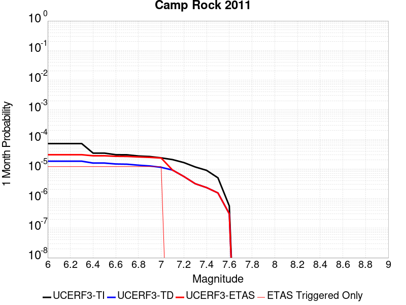 | 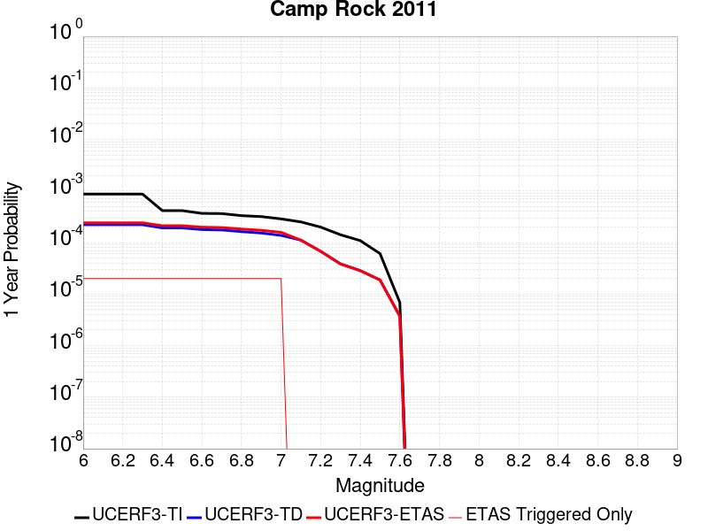 | 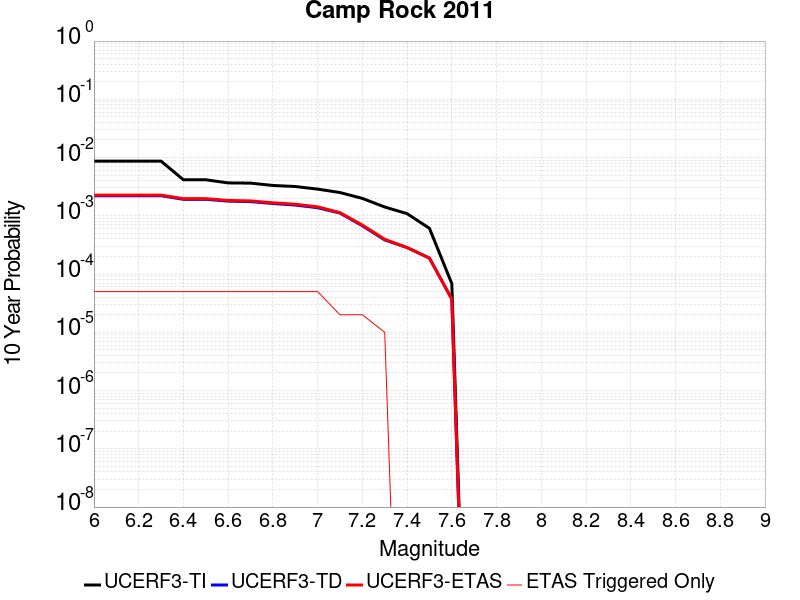 |

| Magnitude | 1 wk TI Prob | 1 wk TD Prob | 1 wk ETAS Prob | 1 wk ETAS/TD Gain | 1 wk ETAS Triggered Only | 1 mo TI Prob | 1 mo TD Prob | 1 mo ETAS Prob | 1 mo ETAS/TD Gain | 1 mo ETAS Triggered Only | 1 yr TI Prob | 1 yr TD Prob | 1 yr ETAS Prob | 1 yr ETAS/TD Gain | 1 yr ETAS Triggered Only | 10 yr TI Prob | 10 yr TD Prob | 10 yr ETAS Prob | 10 yr ETAS/TD Gain | 10 yr ETAS Triggered Only |
|-----|-----|-----|-----|-----|-----|-----|-----|-----|-----|-----|-----|-----|-----|-----|-----|-----|-----|-----|-----|-----|
| 6.0 | 1.6710783E-5 | 4.2503107E-6 | 4.2503107E-6 | 1.0 | 0.0 | 7.161568E-5 | 1.8215493E-5 | 3.0205681E-5 | 1.6582413 | 1.1990408E-5 | 8.7157206E-4 | 2.2175159E-4 | 2.4572707E-4 | 1.1081188 | 2.3980816E-5 | 0.008681616 | 0.0022153559 | 0.0022751752 | 1.0270021 | 5.995204E-5 |
| 6.1 | 1.6710783E-5 | 4.2503107E-6 | 4.2503107E-6 | 1.0 | 0.0 | 7.161568E-5 | 1.8215493E-5 | 3.0205681E-5 | 1.6582413 | 1.1990408E-5 | 8.7157206E-4 | 2.2175159E-4 | 2.4572707E-4 | 1.1081188 | 2.3980816E-5 | 0.008681616 | 0.0022153559 | 0.0022751752 | 1.0270021 | 5.995204E-5 |
| 6.2 | 1.6710783E-5 | 4.2503107E-6 | 4.2503107E-6 | 1.0 | 0.0 | 7.161568E-5 | 1.8215493E-5 | 3.0205681E-5 | 1.6582413 | 1.1990408E-5 | 8.7157206E-4 | 2.2175159E-4 | 2.4572707E-4 | 1.1081188 | 2.3980816E-5 | 0.008681616 | 0.0022153559 | 0.0022751752 | 1.0270021 | 5.995204E-5 |
| 6.3 | 1.6710783E-5 | 4.2503107E-6 | 4.2503107E-6 | 1.0 | 0.0 | 7.161568E-5 | 1.8215493E-5 | 3.0205681E-5 | 1.6582413 | 1.1990408E-5 | 8.7157206E-4 | 2.2175159E-4 | 2.4572707E-4 | 1.1081188 | 2.3980816E-5 | 0.008681616 | 0.0022153559 | 0.0022751752 | 1.0270021 | 5.995204E-5 |
| 6.4 | 7.982846E-6 | 3.6821327E-6 | 3.6821327E-6 | 1.0 | 0.0 | 3.421175E-5 | 1.5780475E-5 | 2.7770695E-5 | 1.7598135 | 1.1990408E-5 | 4.1644843E-4 | 1.921107E-4 | 2.160869E-4 | 1.1248041 | 2.3980816E-5 | 0.0041566887 | 0.0019194811 | 0.001979318 | 1.0311735 | 5.995204E-5 |
| 6.5 | 7.982846E-6 | 3.6821327E-6 | 3.6821327E-6 | 1.0 | 0.0 | 3.421175E-5 | 1.5780475E-5 | 2.7770695E-5 | 1.7598135 | 1.1990408E-5 | 4.1644843E-4 | 1.921107E-4 | 2.160869E-4 | 1.1248041 | 2.3980816E-5 | 0.0041566887 | 0.0019194811 | 0.001979318 | 1.0311735 | 5.995204E-5 |
| 6.6 | 7.048869E-6 | 3.4243997E-6 | 3.4243997E-6 | 1.0 | 0.0 | 3.0209088E-5 | 1.4675918E-5 | 2.666615E-5 | 1.8170005 | 1.1990408E-5 | 3.677336E-4 | 1.7866497E-4 | 2.0264149E-4 | 1.1341983 | 2.3980816E-5 | 0.0036712566 | 0.0017852448 | 0.0018450898 | 1.033522 | 5.995204E-5 |
| 6.7 | 6.987307E-6 | 3.3623767E-6 | 3.3623767E-6 | 1.0 | 0.0 | 2.9945259E-5 | 1.4410108E-5 | 2.6400343E-5 | 1.8320712 | 1.1990408E-5 | 3.6452254E-4 | 1.7542925E-4 | 1.9940585E-4 | 1.1366739 | 2.3980816E-5 | 0.0036392517 | 0.0017529388 | 0.0018127857 | 1.034141 | 5.995204E-5 |
| 6.8 | 6.3737602E-6 | 3.117947E-6 | 3.117947E-6 | 1.0 | 0.0 | 2.731583E-5 | 1.3362564E-5 | 2.535281E-5 | 1.8973014 | 1.1990408E-5 | 3.3251947E-4 | 1.6267736E-4 | 1.8665427E-4 | 1.1473894 | 2.3980816E-5 | 0.0033202237 | 0.0016256113 | 0.0016854659 | 1.0368197 | 5.995204E-5 |
| 6.9 | 6.112211E-6 | 2.9331534E-6 | 2.9331534E-6 | 1.0 | 0.0 | 2.6194928E-5 | 1.2570598E-5 | 2.4560855E-5 | 1.9538335 | 1.1990408E-5 | 3.1887658E-4 | 1.5303657E-4 | 1.7701372E-4 | 1.1566759 | 2.3980816E-5 | 0.003184194 | 0.0015293396 | 0.0015891999 | 1.0391413 | 5.995204E-5 |
| 7.0 | 5.5140117E-6 | 2.6419564E-6 | 2.6419564E-6 | 1.0 | 0.0 | 2.3631264E-5 | 1.1322622E-5 | 2.3312894E-5 | 2.058966 | 1.1990408E-5 | 2.8767265E-4 | 1.3784446E-4 | 1.6182197E-4 | 1.1739461 | 2.3980816E-5 | 0.0028730053 | 0.0013776148 | 0.0014374843 | 1.0434588 | 5.995204E-5 |
| 7.1 | 4.8151105E-6 | 2.1342985E-6 | 2.1342985E-6 | 1.0 | 0.0 | 2.0636026E-5 | 9.146962E-6 | 9.146962E-6 | 1.0 | 0.0 | 2.5121463E-4 | 1.1135879E-4 | 1.1135879E-4 | 1.0 | 0.0 | 0.0025093083 | 0.0011130519 | 0.001137006 | 1.0215211 | 2.3980816E-5 |
| 7.2 | 3.818335E-6 | 1.293763E-6 | 1.293763E-6 | 1.0 | 0.0 | 1.6364189E-5 | 5.5446876E-6 | 5.5446876E-6 | 1.0 | 0.0 | 1.9921579E-4 | 6.750456E-5 | 6.750456E-5 | 1.0 | 0.0 | 0.0019903728 | 6.748488E-4 | 6.988134E-4 | 1.0355111 | 2.3980816E-5 |
| 7.3 | 2.7166698E-6 | 7.383734E-7 | 7.383734E-7 | 1.0 | 0.0 | 1.1642818E-5 | 3.1644536E-6 | 3.1644536E-6 | 1.0 | 0.0 | 1.4174209E-4 | 3.8526563E-5 | 3.8526563E-5 | 1.0 | 0.0 | 0.0014165172 | 3.8520084E-4 | 3.9718664E-4 | 1.0311157 | 1.1990408E-5 |
| 7.4 | 2.0893426E-6 | 5.461961E-7 | 5.461961E-7 | 1.0 | 0.0 | 8.954295E-6 | 2.3408381E-6 | 2.3408381E-6 | 1.0 | 0.0 | 1.0901308E-4 | 2.8499337E-5 | 2.8499337E-5 | 1.0 | 0.0 | 0.0010895962 | 2.8495738E-4 | 2.8495738E-4 | 1.0 | 0.0 |
| 7.5 | 1.1681728E-6 | 3.6031287E-7 | 3.6031287E-7 | 1.0 | 0.0 | 5.0064455E-6 | 1.5441972E-6 | 1.5441972E-6 | 1.0 | 0.0 | 6.0951766E-5 | 1.8800443E-5 | 1.8800443E-5 | 1.0 | 0.0 | 6.093505E-4 | 1.8798899E-4 | 1.8798899E-4 | 1.0 | 0.0 |
| 7.6 | 1.3154387E-7 | 7.1198265E-8 | 7.1198265E-8 | 1.0 | 0.0 | 5.6375933E-7 | 3.051354E-7 | 3.051354E-7 | 1.0 | 0.0 | 6.863748E-6 | 3.7150185E-6 | 3.7150185E-6 | 1.0 | 0.0 | 6.863536E-5 | 3.7149723E-5 | 3.7149723E-5 | 1.0 | 0.0 |

## Bullion Mountains
*[(top)](#table-of-contents)*

| 1 Week | 1 Month | 1 Year | 10 Year |
|-----|-----|-----|-----|
| 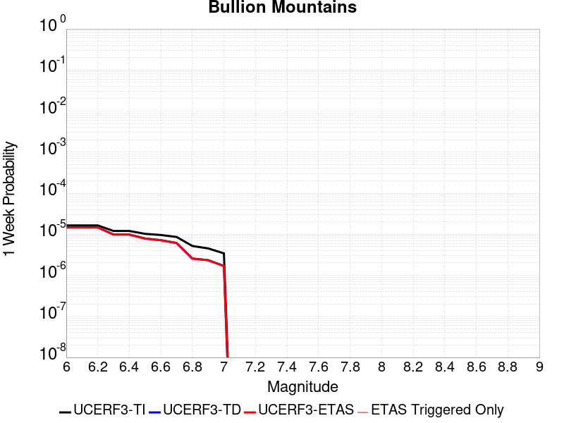 | 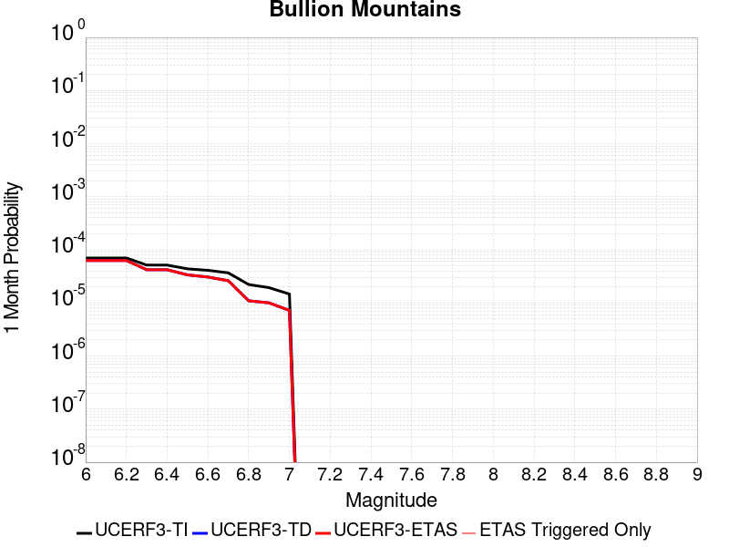 | 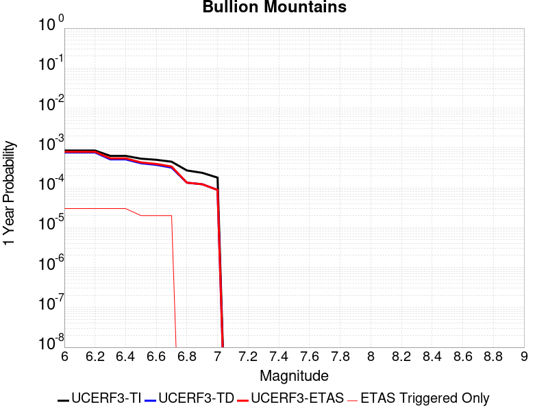 | 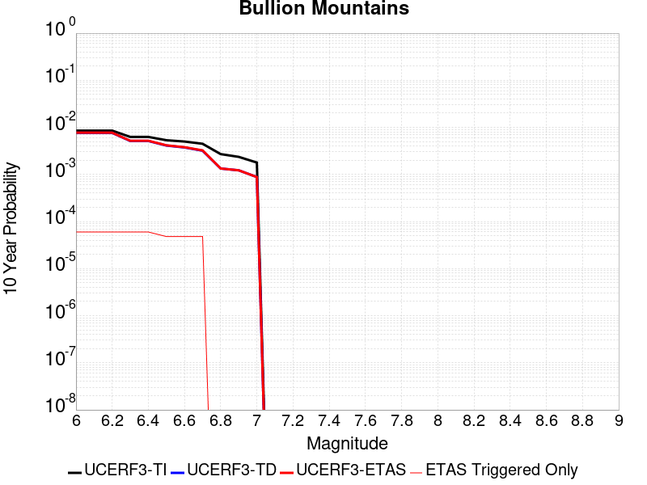 |

| Magnitude | 1 wk TI Prob | 1 wk TD Prob | 1 wk ETAS Prob | 1 wk ETAS/TD Gain | 1 wk ETAS Triggered Only | 1 mo TI Prob | 1 mo TD Prob | 1 mo ETAS Prob | 1 mo ETAS/TD Gain | 1 mo ETAS Triggered Only | 1 yr TI Prob | 1 yr TD Prob | 1 yr ETAS Prob | 1 yr ETAS/TD Gain | 1 yr ETAS Triggered Only | 10 yr TI Prob | 10 yr TD Prob | 10 yr ETAS Prob | 10 yr ETAS/TD Gain | 10 yr ETAS Triggered Only |
|-----|-----|-----|-----|-----|-----|-----|-----|-----|-----|-----|-----|-----|-----|-----|-----|-----|-----|-----|-----|-----|
| 6.0 | 1.6420427E-5 | 1.4692306E-5 | 1.4692306E-5 | 1.0 | 0.0 | 7.037136E-5 | 6.296572E-5 | 6.296572E-5 | 1.0 | 0.0 | 8.5643446E-4 | 7.663764E-4 | 8.0232E-4 | 1.0469007 | 3.597122E-5 | 0.008531413 | 0.0076411283 | 0.007700622 | 1.007786 | 5.995204E-5 |
| 6.1 | 1.6420427E-5 | 1.4692306E-5 | 1.4692306E-5 | 1.0 | 0.0 | 7.037136E-5 | 6.296572E-5 | 6.296572E-5 | 1.0 | 0.0 | 8.5643446E-4 | 7.663764E-4 | 8.0232E-4 | 1.0469007 | 3.597122E-5 | 0.008531413 | 0.0076411283 | 0.007700622 | 1.007786 | 5.995204E-5 |
| 6.2 | 1.6420427E-5 | 1.4692306E-5 | 1.4692306E-5 | 1.0 | 0.0 | 7.037136E-5 | 6.296572E-5 | 6.296572E-5 | 1.0 | 0.0 | 8.5643446E-4 | 7.663764E-4 | 8.0232E-4 | 1.0469007 | 3.597122E-5 | 0.008531413 | 0.0076411283 | 0.007700622 | 1.007786 | 5.995204E-5 |
| 6.3 | 1.2046778E-5 | 9.862485E-6 | 9.862485E-6 | 1.0 | 0.0 | 5.1628023E-5 | 4.226724E-5 | 4.226724E-5 | 1.0 | 0.0 | 6.283899E-4 | 5.145053E-4 | 5.5045803E-4 | 1.0698782 | 3.597122E-5 | 0.0062661595 | 0.0051354226 | 0.005195067 | 1.0116143 | 5.995204E-5 |
| 6.4 | 1.2046778E-5 | 9.862485E-6 | 9.862485E-6 | 1.0 | 0.0 | 5.1628023E-5 | 4.226724E-5 | 4.226724E-5 | 1.0 | 0.0 | 6.283899E-4 | 5.145053E-4 | 5.5045803E-4 | 1.0698782 | 3.597122E-5 | 0.0062661595 | 0.0051354226 | 0.005195067 | 1.0116143 | 5.995204E-5 |
| 6.5 | 1.0244343E-5 | 7.879582E-6 | 7.879582E-6 | 1.0 | 0.0 | 4.390359E-5 | 3.3769316E-5 | 3.3769316E-5 | 1.0 | 0.0 | 5.343951E-4 | 4.1108453E-4 | 4.350555E-4 | 1.0583115 | 2.3980816E-5 | 0.005331118 | 0.0041052722 | 0.004153037 | 1.011635 | 4.7961632E-5 |
| 6.6 | 9.605408E-6 | 7.1776108E-6 | 7.1776108E-6 | 1.0 | 0.0 | 4.1165385E-5 | 3.076094E-5 | 3.076094E-5 | 1.0 | 0.0 | 5.010733E-4 | 3.7447043E-4 | 3.9844227E-4 | 1.0640153 | 2.3980816E-5 | 0.00499945 | 0.0037403915 | 0.0037881737 | 1.0127747 | 4.7961632E-5 |
| 6.7 | 8.60418E-6 | 6.1241044E-6 | 6.1241044E-6 | 1.0 | 0.0 | 3.687454E-5 | 2.6246007E-5 | 2.6246007E-5 | 1.0 | 0.0 | 4.48855E-4 | 3.1951777E-4 | 3.4349092E-4 | 1.0750291 | 2.3980816E-5 | 0.004479495 | 0.0031924958 | 0.0032403043 | 1.0149753 | 4.7961632E-5 |
| 6.8 | 5.187994E-6 | 2.5632194E-6 | 2.5632194E-6 | 1.0 | 0.0 | 2.223407E-5 | 1.0985203E-5 | 1.0985203E-5 | 1.0 | 0.0 | 2.7066618E-4 | 1.3374063E-4 | 1.3374063E-4 | 1.0 | 0.0 | 0.0027033675 | 0.001336993 | 0.001336993 | 1.0 | 0.0 |
| 6.9 | 4.5302368E-6 | 2.3443622E-6 | 2.3443622E-6 | 1.0 | 0.0 | 1.9415156E-5 | 1.0047251E-5 | 1.0047251E-5 | 1.0 | 0.0 | 2.3635388E-4 | 1.2232238E-4 | 1.2232238E-4 | 1.0 | 0.0 | 0.0023610266 | 0.0012229396 | 0.0012229396 | 1.0 | 0.0 |
| 7.0 | 3.431668E-6 | 1.6882757E-6 | 1.6882757E-6 | 1.0 | 0.0 | 1.4707065E-5 | 7.2354674E-6 | 7.2354674E-6 | 1.0 | 0.0 | 1.7904381E-4 | 8.8091816E-5 | 8.8091816E-5 | 1.0 | 0.0 | 0.0017889962 | 8.809181E-4 | 8.809181E-4 | 1.0 | 0.0 |

## Kern Canyon (South Kern) 2011
*[(top)](#table-of-contents)*

| 1 Week | 1 Month | 1 Year | 10 Year |
|-----|-----|-----|-----|
|  | 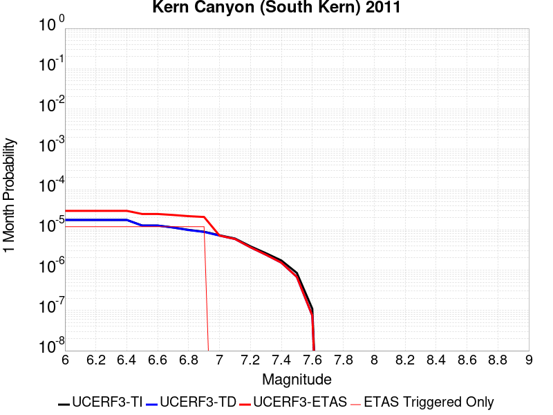 | 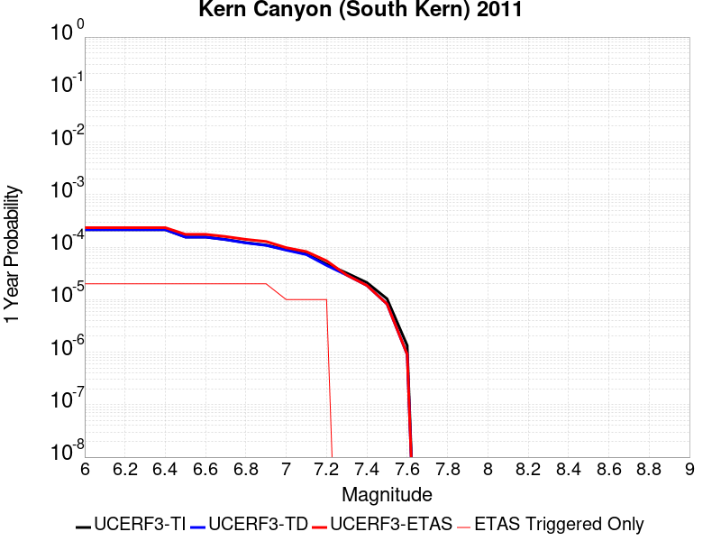 | 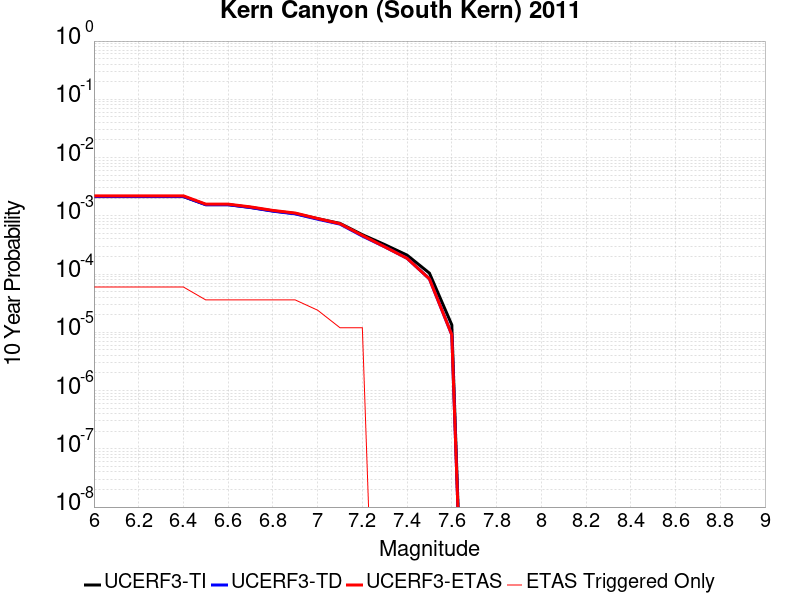 |

| Magnitude | 1 wk TI Prob | 1 wk TD Prob | 1 wk ETAS Prob | 1 wk ETAS/TD Gain | 1 wk ETAS Triggered Only | 1 mo TI Prob | 1 mo TD Prob | 1 mo ETAS Prob | 1 mo ETAS/TD Gain | 1 mo ETAS Triggered Only | 1 yr TI Prob | 1 yr TD Prob | 1 yr ETAS Prob | 1 yr ETAS/TD Gain | 1 yr ETAS Triggered Only | 10 yr TI Prob | 10 yr TD Prob | 10 yr ETAS Prob | 10 yr ETAS/TD Gain | 10 yr ETAS Triggered Only |
|-----|-----|-----|-----|-----|-----|-----|-----|-----|-----|-----|-----|-----|-----|-----|-----|-----|-----|-----|-----|-----|
| 6.0 | 4.105075E-6 | 4.113737E-6 | 4.113737E-6 | 1.0 | 0.0 | 1.7593058E-5 | 1.7630186E-5 | 2.9620382E-5 | 1.6800947 | 1.1990408E-5 | 2.1417443E-4 | 2.14627E-4 | 2.3860266E-4 | 1.1117085 | 2.3980816E-5 | 0.0021396813 | 0.002144261 | 0.0022040845 | 1.0278994 | 5.995204E-5 |
| 6.1 | 4.105075E-6 | 4.113737E-6 | 4.113737E-6 | 1.0 | 0.0 | 1.7593058E-5 | 1.7630186E-5 | 2.9620382E-5 | 1.6800947 | 1.1990408E-5 | 2.1417443E-4 | 2.14627E-4 | 2.3860266E-4 | 1.1117085 | 2.3980816E-5 | 0.0021396813 | 0.002144261 | 0.0022040845 | 1.0278994 | 5.995204E-5 |
| 6.2 | 4.105075E-6 | 4.113737E-6 | 4.113737E-6 | 1.0 | 0.0 | 1.7593058E-5 | 1.7630186E-5 | 2.9620382E-5 | 1.6800947 | 1.1990408E-5 | 2.1417443E-4 | 2.14627E-4 | 2.3860266E-4 | 1.1117085 | 2.3980816E-5 | 0.0021396813 | 0.002144261 | 0.0022040845 | 1.0278994 | 5.995204E-5 |
| 6.3 | 4.105075E-6 | 4.113737E-6 | 4.113737E-6 | 1.0 | 0.0 | 1.7593058E-5 | 1.7630186E-5 | 2.9620382E-5 | 1.6800947 | 1.1990408E-5 | 2.1417443E-4 | 2.14627E-4 | 2.3860266E-4 | 1.1117085 | 2.3980816E-5 | 0.0021396813 | 0.002144261 | 0.0022040845 | 1.0278994 | 5.995204E-5 |
| 6.4 | 4.105075E-6 | 4.113737E-6 | 4.113737E-6 | 1.0 | 0.0 | 1.7593058E-5 | 1.7630186E-5 | 2.9620382E-5 | 1.6800947 | 1.1990408E-5 | 2.1417443E-4 | 2.14627E-4 | 2.3860266E-4 | 1.1117085 | 2.3980816E-5 | 0.0021396813 | 0.002144261 | 0.0022040845 | 1.0278994 | 5.995204E-5 |
| 6.5 | 2.9849807E-6 | 2.9731623E-6 | 2.9731623E-6 | 1.0 | 0.0 | 1.2792712E-5 | 1.2742063E-5 | 2.4732317E-5 | 1.940998 | 1.1990408E-5 | 1.5574014E-4 | 1.5512372E-4 | 1.7910081E-4 | 1.1545676 | 2.3980816E-5 | 0.0015563103 | 0.0015501695 | 0.001586085 | 1.0231687 | 3.597122E-5 |
| 6.6 | 2.9849807E-6 | 2.9731623E-6 | 2.9731623E-6 | 1.0 | 0.0 | 1.2792712E-5 | 1.2742063E-5 | 2.4732317E-5 | 1.940998 | 1.1990408E-5 | 1.5574014E-4 | 1.5512372E-4 | 1.7910081E-4 | 1.1545676 | 2.3980816E-5 | 0.0015563103 | 0.0015501695 | 0.001586085 | 1.0231687 | 3.597122E-5 |
| 6.7 | 2.6756725E-6 | 2.6582275E-6 | 2.6582275E-6 | 1.0 | 0.0 | 1.1467117E-5 | 1.1392354E-5 | 2.3382625E-5 | 2.052484 | 1.1990408E-5 | 1.396032E-4 | 1.386932E-4 | 1.6267068E-4 | 1.1728815 | 2.3980816E-5 | 0.0013951553 | 0.0013860773 | 0.0014219986 | 1.0259159 | 3.597122E-5 |
| 6.8 | 2.3283721E-6 | 2.3047846E-6 | 2.3047846E-6 | 1.0 | 0.0 | 9.9787E-6 | 9.877612E-6 | 2.1867902E-5 | 2.2138855 | 1.1990408E-5 | 1.214839E-4 | 1.2025336E-4 | 1.442313E-4 | 1.1993951 | 2.3980816E-5 | 0.001214175 | 0.0012018904 | 0.0012378184 | 1.0298929 | 3.597122E-5 |
| 6.9 | 2.0972677E-6 | 2.0696464E-6 | 2.0696464E-6 | 1.0 | 0.0 | 8.988259E-6 | 8.8698835E-6 | 2.0860185E-5 | 2.3517992 | 1.1990408E-5 | 1.0942656E-4 | 1.0798554E-4 | 1.3196377E-4 | 1.2220503 | 2.3980816E-5 | 0.0010937268 | 0.0010793365 | 0.0011152689 | 1.0332912 | 3.597122E-5 |
| 7.0 | 1.7132242E-6 | 1.678708E-6 | 1.678708E-6 | 1.0 | 0.0 | 7.3423685E-6 | 7.1944432E-6 | 7.1944432E-6 | 1.0 | 0.0 | 8.938967E-5 | 8.7588865E-5 | 9.957822E-5 | 1.1368822 | 1.1990408E-5 | 8.935372E-4 | 8.7554724E-4 | 8.995071E-4 | 1.0273656 | 2.3980816E-5 |
| 7.1 | 1.4215541E-6 | 1.381579E-6 | 1.381579E-6 | 1.0 | 0.0 | 6.0923603E-6 | 5.9210392E-6 | 5.9210392E-6 | 1.0 | 0.0 | 7.417196E-5 | 7.2086295E-5 | 8.407584E-5 | 1.1663221 | 1.1990408E-5 | 7.414721E-4 | 7.206318E-4 | 7.3261355E-4 | 1.0166267 | 1.1990408E-5 |
| 7.2 | 9.097853E-7 | 8.6038E-7 | 8.6038E-7 | 1.0 | 0.0 | 3.899074E-6 | 3.6873375E-6 | 3.6873375E-6 | 1.0 | 0.0 | 4.7470192E-5 | 4.4892422E-5 | 5.688229E-5 | 1.2670801 | 1.1990408E-5 | 4.7460053E-4 | 4.4883462E-4 | 4.6081963E-4 | 1.0267025 | 1.1990408E-5 |
| 7.3 | 6.144169E-7 | 5.628223E-7 | 5.628223E-7 | 1.0 | 0.0 | 2.6332125E-6 | 2.4120934E-6 | 2.4120934E-6 | 1.0 | 0.0 | 3.205889E-5 | 2.9366847E-5 | 2.9366847E-5 | 1.0 | 0.0 | 3.2054266E-4 | 2.9363018E-4 | 2.9363018E-4 | 1.0 | 0.0 |
| 7.4 | 4.049844E-7 | 3.5728428E-7 | 3.5728428E-7 | 1.0 | 0.0 | 1.7356463E-6 | 1.5312174E-6 | 1.5312174E-6 | 1.0 | 0.0 | 2.1131287E-5 | 1.8642415E-5 | 1.8642415E-5 | 1.0 | 0.0 | 2.1129279E-4 | 1.8640877E-4 | 1.8640877E-4 | 1.0 | 0.0 |
| 7.5 | 1.9871162E-7 | 1.58305E-7 | 1.58305E-7 | 1.0 | 0.0 | 8.5162094E-7 | 6.7844985E-7 | 6.7844985E-7 | 1.0 | 0.0 | 1.0368436E-5 | 8.260096E-6 | 8.260096E-6 | 1.0 | 0.0 | 1.0367952E-4 | 8.259798E-5 | 8.259798E-5 | 1.0 | 0.0 |
| 7.6 | 2.572245E-8 | 1.7352637E-8 | 1.7352637E-8 | 1.0 | 0.0 | 1.10239064E-7 | 7.4368444E-8 | 7.4368444E-8 | 1.0 | 0.0 | 1.3421597E-6 | 9.0543546E-7 | 9.0543546E-7 | 1.0 | 0.0 | 1.3421517E-5 | 9.0543235E-6 | 9.0543235E-6 | 1.0 | 0.0 |

## Chino alt 1
*[(top)](#table-of-contents)*

| 1 Week | 1 Month | 1 Year | 10 Year |
|-----|-----|-----|-----|
|  | 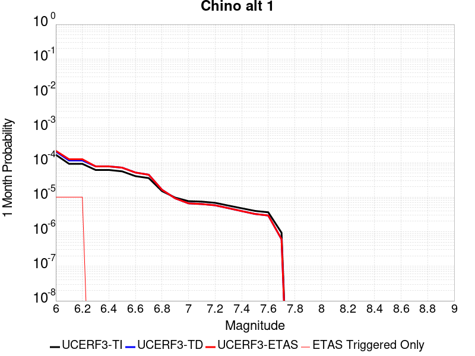 | 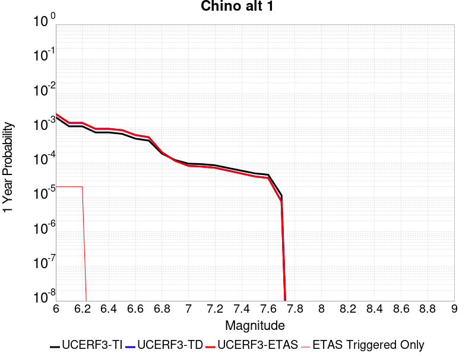 | 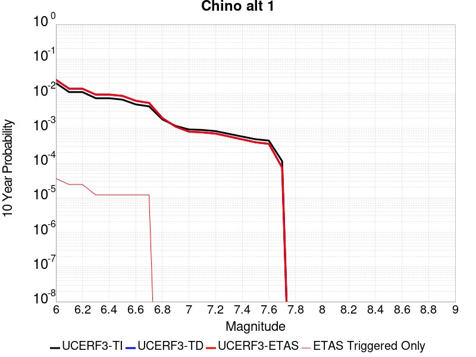 |

| Magnitude | 1 wk TI Prob | 1 wk TD Prob | 1 wk ETAS Prob | 1 wk ETAS/TD Gain | 1 wk ETAS Triggered Only | 1 mo TI Prob | 1 mo TD Prob | 1 mo ETAS Prob | 1 mo ETAS/TD Gain | 1 mo ETAS Triggered Only | 1 yr TI Prob | 1 yr TD Prob | 1 yr ETAS Prob | 1 yr ETAS/TD Gain | 1 yr ETAS Triggered Only | 10 yr TI Prob | 10 yr TD Prob | 10 yr ETAS Prob | 10 yr ETAS/TD Gain | 10 yr ETAS Triggered Only |
|-----|-----|-----|-----|-----|-----|-----|-----|-----|-----|-----|-----|-----|-----|-----|-----|-----|-----|-----|-----|-----|
| 6.0 | 3.939946E-5 | 4.895037E-5 | 4.895037E-5 | 1.0 | 0.0 | 1.6884391E-4 | 2.0977337E-4 | 2.0977337E-4 | 1.0 | 0.0 | 0.0020537362 | 0.0025514876 | 0.0025634475 | 1.0046874 | 1.1990408E-5 | 0.020348595 | 0.025278764 | 0.025313826 | 1.001387 | 3.597122E-5 |
| 6.1 | 2.1505624E-5 | 2.6880154E-5 | 2.6880154E-5 | 1.0 | 0.0 | 9.2163704E-5 | 1.151962E-4 | 1.151962E-4 | 1.0 | 0.0 | 0.0011215154 | 0.0014017228 | 0.0014136963 | 1.0085421 | 1.1990408E-5 | 0.011158722 | 0.013945717 | 0.013969364 | 1.0016956 | 2.3980816E-5 |
| 6.2 | 2.1505624E-5 | 2.6880154E-5 | 2.6880154E-5 | 1.0 | 0.0 | 9.2163704E-5 | 1.151962E-4 | 1.151962E-4 | 1.0 | 0.0 | 0.0011215154 | 0.0014017228 | 0.0014136963 | 1.0085421 | 1.1990408E-5 | 0.011158722 | 0.013945717 | 0.013969364 | 1.0016956 | 2.3980816E-5 |
| 6.3 | 1.4290785E-5 | 1.8166014E-5 | 1.8166014E-5 | 1.0 | 0.0 | 6.1244784E-5 | 7.785228E-5 | 7.785228E-5 | 1.0 | 0.0 | 7.454001E-4 | 9.4748475E-4 | 9.4748475E-4 | 1.0 | 0.0 | 0.007429048 | 0.009444912 | 0.009456789 | 1.0012575 | 1.1990408E-5 |
| 6.4 | 1.4290785E-5 | 1.8166014E-5 | 1.8166014E-5 | 1.0 | 0.0 | 6.1244784E-5 | 7.785228E-5 | 7.785228E-5 | 1.0 | 0.0 | 7.454001E-4 | 9.4748475E-4 | 9.4748475E-4 | 1.0 | 0.0 | 0.007429048 | 0.009444912 | 0.009456789 | 1.0012575 | 1.1990408E-5 |
| 6.5 | 1.3017944E-5 | 1.6652937E-5 | 1.6652937E-5 | 1.0 | 0.0 | 5.5789995E-5 | 7.136803E-5 | 7.136803E-5 | 1.0 | 0.0 | 6.790315E-4 | 8.686031E-4 | 8.686031E-4 | 1.0 | 0.0 | 0.0067696036 | 0.008662385 | 0.008674271 | 1.0013722 | 1.1990408E-5 |
| 6.6 | 9.470016E-6 | 1.2040057E-5 | 1.2040057E-5 | 1.0 | 0.0 | 4.058515E-5 | 5.1599414E-5 | 5.1599414E-5 | 1.0 | 0.0 | 4.940122E-4 | 6.2807574E-4 | 6.2807574E-4 | 1.0 | 0.0 | 0.004929154 | 0.0062722242 | 0.006284139 | 1.0018997 | 1.1990408E-5 |
| 6.7 | 8.314155E-6 | 1.0408293E-5 | 1.0408293E-5 | 1.0 | 0.0 | 3.5631605E-5 | 4.460639E-5 | 4.460639E-5 | 1.0 | 0.0 | 4.3372845E-4 | 5.429797E-4 | 5.429797E-4 | 1.0 | 0.0 | 0.004328829 | 0.005426062 | 0.0054379874 | 1.0021977 | 1.1990408E-5 |
| 6.8 | 3.4856364E-6 | 3.8135372E-6 | 3.8135372E-6 | 1.0 | 0.0 | 1.4938357E-5 | 1.634364E-5 | 1.634364E-5 | 1.0 | 0.0 | 1.8185932E-4 | 1.9896773E-4 | 1.9896773E-4 | 1.0 | 0.0 | 0.0018171056 | 0.001989573 | 0.001989573 | 1.0 | 0.0 |
| 6.9 | 2.2645952E-6 | 2.152999E-6 | 2.152999E-6 | 1.0 | 0.0 | 9.705372E-6 | 9.227107E-6 | 9.227107E-6 | 1.0 | 0.0 | 1.18156495E-4 | 1.1233445E-4 | 1.1233445E-4 | 1.0 | 0.0 | 0.0011809369 | 0.0011233927 | 0.0011233927 | 1.0 | 0.0 |
| 7.0 | 1.7864003E-6 | 1.5431575E-6 | 1.5431575E-6 | 1.0 | 0.0 | 7.655979E-6 | 6.613516E-6 | 6.613516E-6 | 1.0 | 0.0 | 9.3207556E-5 | 8.0516635E-5 | 8.0516635E-5 | 1.0 | 0.0 | 9.316847E-4 | 8.0532173E-4 | 8.0532173E-4 | 1.0 | 0.0 |
| 7.1 | 1.7315456E-6 | 1.4734279E-6 | 1.4734279E-6 | 1.0 | 0.0 | 7.420889E-6 | 6.3146763E-6 | 6.3146763E-6 | 1.0 | 0.0 | 9.034557E-5 | 7.6878525E-5 | 7.6878525E-5 | 1.0 | 0.0 | 9.0308854E-4 | 7.6895714E-4 | 7.6895714E-4 | 1.0 | 0.0 |
| 7.2 | 1.6008337E-6 | 1.3574753E-6 | 1.3574753E-6 | 1.0 | 0.0 | 6.860698E-6 | 5.817739E-6 | 5.817739E-6 | 1.0 | 0.0 | 8.352579E-5 | 7.082872E-5 | 7.082872E-5 | 1.0 | 0.0 | 8.34944E-4 | 7.084856E-4 | 7.084856E-4 | 1.0 | 0.0 |
| 7.3 | 1.3320939E-6 | 1.1218251E-6 | 1.1218251E-6 | 1.0 | 0.0 | 5.7089615E-6 | 4.8078136E-6 | 4.8078136E-6 | 1.0 | 0.0 | 6.9504385E-5 | 5.8533606E-5 | 5.8533606E-5 | 1.0 | 0.0 | 6.9482654E-4 | 5.853264E-4 | 5.853264E-4 | 1.0 | 0.0 |
| 7.4 | 1.114294E-6 | 9.2374523E-7 | 9.2374523E-7 | 1.0 | 0.0 | 4.775537E-6 | 3.958902E-6 | 3.958902E-6 | 1.0 | 0.0 | 5.8140613E-5 | 4.8198606E-5 | 4.8198606E-5 | 1.0 | 0.0 | 5.81254E-4 | 4.8189834E-4 | 4.8189834E-4 | 1.0 | 0.0 |
| 7.5 | 9.354081E-7 | 7.623702E-7 | 7.623702E-7 | 1.0 | 0.0 | 4.0088858E-6 | 3.2672967E-6 | 3.2672967E-6 | 1.0 | 0.0 | 4.8807087E-5 | 3.9778646E-5 | 3.9778646E-5 | 1.0 | 0.0 | 4.879637E-4 | 3.9771866E-4 | 3.9771866E-4 | 1.0 | 0.0 |
| 7.6 | 8.521771E-7 | 6.8809493E-7 | 6.8809493E-7 | 1.0 | 0.0 | 3.6521824E-6 | 2.9489752E-6 | 2.9489752E-6 | 1.0 | 0.0 | 4.4464414E-5 | 3.5903213E-5 | 3.5903213E-5 | 1.0 | 0.0 | 4.4455516E-4 | 3.589773E-4 | 3.589773E-4 | 1.0 | 0.0 |
| 7.7 | 2.1803626E-7 | 1.4187151E-7 | 1.4187151E-7 | 1.0 | 0.0 | 9.344408E-7 | 6.080207E-7 | 6.080207E-7 | 1.0 | 0.0 | 1.1376757E-5 | 7.402636E-6 | 7.402636E-6 | 1.0 | 0.0 | 1.13761744E-4 | 7.402486E-5 | 7.402486E-5 | 1.0 | 0.0 |

## San Luis Range 2011 CFM
*[(top)](#table-of-contents)*

| 1 Week | 1 Month | 1 Year | 10 Year |
|-----|-----|-----|-----|
| 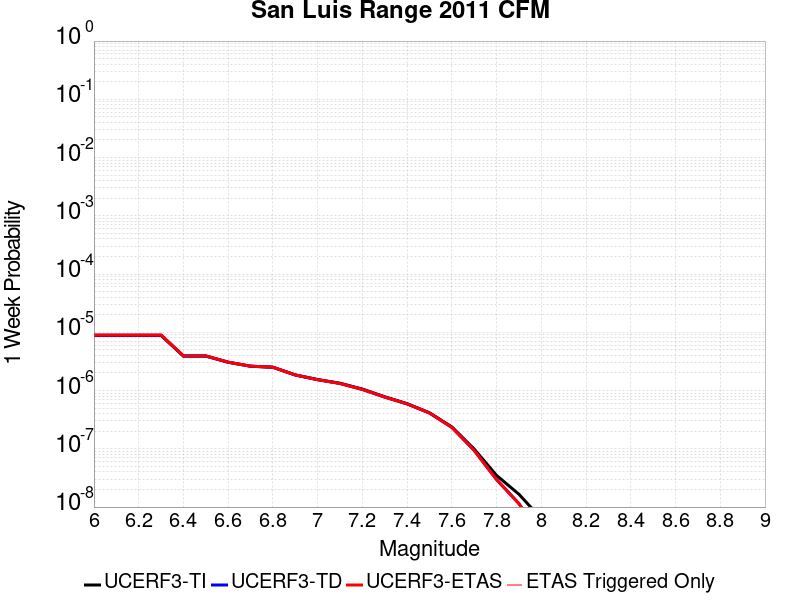 |  | 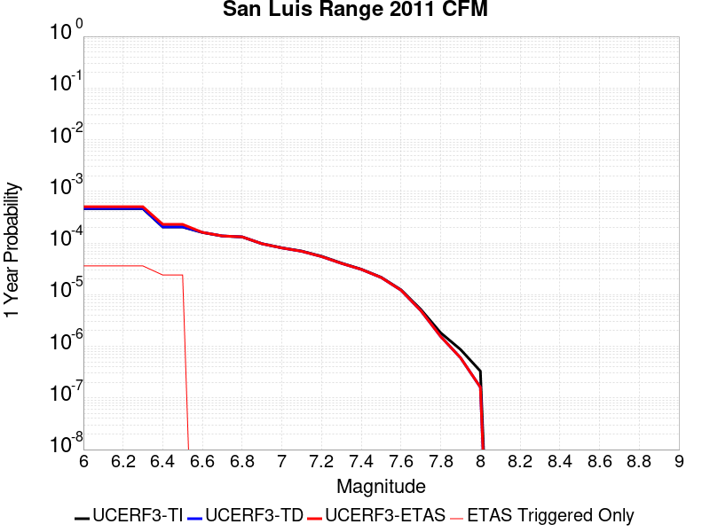 | 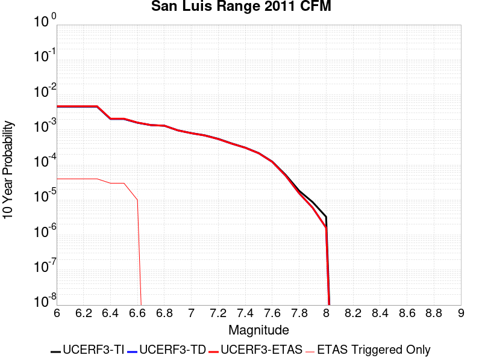 |

| Magnitude | 1 wk TI Prob | 1 wk TD Prob | 1 wk ETAS Prob | 1 wk ETAS/TD Gain | 1 wk ETAS Triggered Only | 1 mo TI Prob | 1 mo TD Prob | 1 mo ETAS Prob | 1 mo ETAS/TD Gain | 1 mo ETAS Triggered Only | 1 yr TI Prob | 1 yr TD Prob | 1 yr ETAS Prob | 1 yr ETAS/TD Gain | 1 yr ETAS Triggered Only | 10 yr TI Prob | 10 yr TD Prob | 10 yr ETAS Prob | 10 yr ETAS/TD Gain | 10 yr ETAS Triggered Only |
|-----|-----|-----|-----|-----|-----|-----|-----|-----|-----|-----|-----|-----|-----|-----|-----|-----|-----|-----|-----|-----|
| 6.0 | 8.8368415E-6 | 8.965477E-6 | 8.965477E-6 | 1.0 | 0.0 | 3.787163E-5 | 3.8422953E-5 | 3.8422953E-5 | 1.0 | 0.0 | 4.609895E-4 | 4.677069E-4 | 5.0366134E-4 | 1.0768738 | 3.597122E-5 | 0.0046003438 | 0.0046680085 | 0.0047157463 | 1.0102266 | 4.7961632E-5 |
| 6.1 | 8.8368415E-6 | 8.965477E-6 | 8.965477E-6 | 1.0 | 0.0 | 3.787163E-5 | 3.8422953E-5 | 3.8422953E-5 | 1.0 | 0.0 | 4.609895E-4 | 4.677069E-4 | 5.0366134E-4 | 1.0768738 | 3.597122E-5 | 0.0046003438 | 0.0046680085 | 0.0047157463 | 1.0102266 | 4.7961632E-5 |
| 6.2 | 8.8368415E-6 | 8.965477E-6 | 8.965477E-6 | 1.0 | 0.0 | 3.787163E-5 | 3.8422953E-5 | 3.8422953E-5 | 1.0 | 0.0 | 4.609895E-4 | 4.677069E-4 | 5.0366134E-4 | 1.0768738 | 3.597122E-5 | 0.0046003438 | 0.0046680085 | 0.0047157463 | 1.0102266 | 4.7961632E-5 |
| 6.3 | 8.8368415E-6 | 8.965477E-6 | 8.965477E-6 | 1.0 | 0.0 | 3.787163E-5 | 3.8422953E-5 | 3.8422953E-5 | 1.0 | 0.0 | 4.609895E-4 | 4.677069E-4 | 5.0366134E-4 | 1.0768738 | 3.597122E-5 | 0.0046003438 | 0.0046680085 | 0.0047157463 | 1.0102266 | 4.7961632E-5 |
| 6.4 | 3.9094193E-6 | 3.941213E-6 | 3.941213E-6 | 1.0 | 0.0 | 1.6754546E-5 | 1.6890806E-5 | 1.6890806E-5 | 1.0 | 0.0 | 2.039675E-4 | 2.0562643E-4 | 2.2960232E-4 | 1.1165992 | 2.3980816E-5 | 0.0020378039 | 0.0020543905 | 0.0020902879 | 1.0174735 | 3.597122E-5 |
| 6.5 | 3.9094193E-6 | 3.941213E-6 | 3.941213E-6 | 1.0 | 0.0 | 1.6754546E-5 | 1.6890806E-5 | 1.6890806E-5 | 1.0 | 0.0 | 2.039675E-4 | 2.0562643E-4 | 2.2960232E-4 | 1.1165992 | 2.3980816E-5 | 0.0020378039 | 0.0020543905 | 0.0020902879 | 1.0174735 | 3.597122E-5 |
| 6.6 | 3.0587726E-6 | 3.0753965E-6 | 3.0753965E-6 | 1.0 | 0.0 | 1.3108959E-5 | 1.3180205E-5 | 1.3180205E-5 | 1.0 | 0.0 | 1.595899E-4 | 1.604573E-4 | 1.604573E-4 | 1.0 | 0.0 | 0.0015947534 | 0.0016034264 | 0.0016153976 | 1.007466 | 1.1990408E-5 |
| 6.7 | 2.6160574E-6 | 2.6251346E-6 | 2.6251346E-6 | 1.0 | 0.0 | 1.1211626E-5 | 1.1250529E-5 | 1.1250529E-5 | 1.0 | 0.0 | 1.3649299E-4 | 1.3696664E-4 | 1.3696664E-4 | 1.0 | 0.0 | 0.0013640919 | 0.0013688284 | 0.0013688284 | 1.0 | 0.0 |
| 6.8 | 2.5110312E-6 | 2.5181473E-6 | 2.5181473E-6 | 1.0 | 0.0 | 1.0761518E-5 | 1.0792015E-5 | 1.0792015E-5 | 1.0 | 0.0 | 1.310136E-4 | 1.3138492E-4 | 1.3138492E-4 | 1.0 | 0.0 | 0.0013093639 | 0.0013130783 | 0.0013130783 | 1.0 | 0.0 |
| 6.9 | 1.8564405E-6 | 1.8524926E-6 | 1.8524926E-6 | 1.0 | 0.0 | 7.95615E-6 | 7.93923E-6 | 7.93923E-6 | 1.0 | 0.0 | 9.686181E-5 | 9.665586E-5 | 9.665586E-5 | 1.0 | 0.0 | 9.68196E-4 | 9.661402E-4 | 9.661402E-4 | 1.0 | 0.0 |
| 7.0 | 1.546127E-6 | 1.5369586E-6 | 1.5369586E-6 | 1.0 | 0.0 | 6.626242E-6 | 6.586949E-6 | 6.586949E-6 | 1.0 | 0.0 | 8.06715E-5 | 8.019316E-5 | 8.019316E-5 | 1.0 | 0.0 | 8.0642226E-4 | 8.016429E-4 | 8.016429E-4 | 1.0 | 0.0 |
| 7.1 | 1.3368208E-6 | 1.3235369E-6 | 1.3235369E-6 | 1.0 | 0.0 | 5.7292195E-6 | 5.672289E-6 | 5.672289E-6 | 1.0 | 0.0 | 6.975101E-5 | 6.905793E-5 | 6.905793E-5 | 1.0 | 0.0 | 6.972912E-4 | 6.903652E-4 | 6.903652E-4 | 1.0 | 0.0 |
| 7.2 | 1.0623363E-6 | 1.0454403E-6 | 1.0454403E-6 | 1.0 | 0.0 | 4.5528623E-6 | 4.480451E-6 | 4.480451E-6 | 1.0 | 0.0 | 5.5429686E-5 | 5.4548127E-5 | 5.4548127E-5 | 1.0 | 0.0 | 5.5415864E-4 | 5.4534763E-4 | 5.4534763E-4 | 1.0 | 0.0 |
| 7.3 | 7.831679E-7 | 7.7274194E-7 | 7.7274194E-7 | 1.0 | 0.0 | 3.3564295E-6 | 3.311747E-6 | 3.311747E-6 | 1.0 | 0.0 | 4.086376E-5 | 4.0319774E-5 | 4.0319774E-5 | 1.0 | 0.0 | 4.0856248E-4 | 4.0312472E-4 | 4.0312472E-4 | 1.0 | 0.0 |
| 7.4 | 5.9558846E-7 | 5.91066E-7 | 5.91066E-7 | 1.0 | 0.0 | 2.5525194E-6 | 2.5331376E-6 | 2.5331376E-6 | 1.0 | 0.0 | 3.107648E-5 | 3.0840514E-5 | 3.0840514E-5 | 1.0 | 0.0 | 3.1072134E-4 | 3.0836245E-4 | 3.0836245E-4 | 1.0 | 0.0 |
| 7.5 | 4.1616502E-7 | 4.1196506E-7 | 4.1196506E-7 | 1.0 | 0.0 | 1.7835631E-6 | 1.7655633E-6 | 1.7655633E-6 | 1.0 | 0.0 | 2.1714664E-5 | 2.1495522E-5 | 2.1495522E-5 | 1.0 | 0.0 | 2.1712543E-4 | 2.1493447E-4 | 2.1493447E-4 | 1.0 | 0.0 |
| 7.6 | 2.3816014E-7 | 2.3376697E-7 | 2.3376697E-7 | 1.0 | 0.0 | 1.0206859E-6 | 1.001858E-6 | 1.001858E-6 | 1.0 | 0.0 | 1.242678E-5 | 1.2197554E-5 | 1.2197554E-5 | 1.0 | 0.0 | 1.2426086E-4 | 1.2196886E-4 | 1.2196886E-4 | 1.0 | 0.0 |
| 7.7 | 9.918777E-8 | 9.386869E-8 | 9.386869E-8 | 1.0 | 0.0 | 4.2509038E-7 | 4.0229432E-7 | 4.0229432E-7 | 1.0 | 0.0 | 5.1754632E-6 | 4.8979223E-6 | 4.8979223E-6 | 1.0 | 0.0 | 5.1753424E-5 | 4.897815E-5 | 4.897815E-5 | 1.0 | 0.0 |
| 7.8 | 3.4982556E-8 | 2.9687454E-8 | 2.9687454E-8 | 1.0 | 0.0 | 1.4992524E-7 | 1.2723194E-7 | 1.2723194E-7 | 1.0 | 0.0 | 1.8253382E-6 | 1.5490477E-6 | 1.5490477E-6 | 1.0 | 0.0 | 1.8253233E-5 | 1.549037E-5 | 1.549037E-5 | 1.0 | 0.0 |
| 7.9 | 1.6624908E-8 | 1.1477859E-8 | 1.1477859E-8 | 1.0 | 0.0 | 7.12496E-8 | 4.919082E-8 | 4.919082E-8 | 1.0 | 0.0 | 8.6746354E-7 | 5.9889805E-7 | 5.9889805E-7 | 1.0 | 0.0 | 8.674601E-6 | 5.988965E-6 | 5.988965E-6 | 1.0 | 0.0 |
| 8.0 | 6.3352315E-9 | 3.0893488E-9 | 3.0893488E-9 | 1.0 | 0.0 | 2.715099E-8 | 1.3240064E-8 | 1.3240064E-8 | 1.0 | 0.0 | 3.3056327E-7 | 1.6119778E-7 | 1.6119778E-7 | 1.0 | 0.0 | 3.3056278E-6 | 1.6119766E-6 | 1.6119766E-6 | 1.0 | 0.0 |

## Great Valley 09 (Laguna Seca)
*[(top)](#table-of-contents)*

| 1 Week | 1 Month | 1 Year | 10 Year |
|-----|-----|-----|-----|
|  |  | 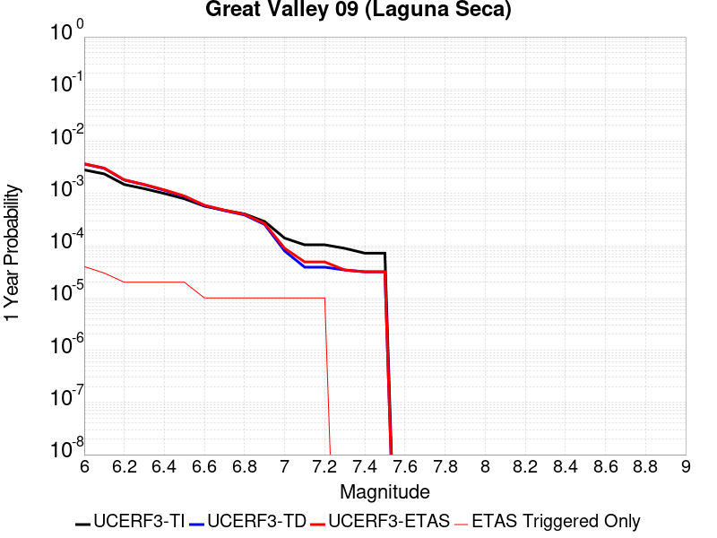 | 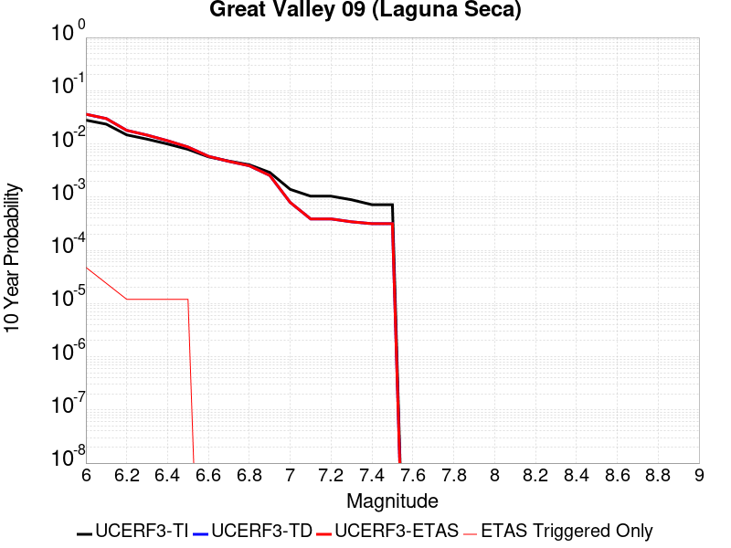 |

| Magnitude | 1 wk TI Prob | 1 wk TD Prob | 1 wk ETAS Prob | 1 wk ETAS/TD Gain | 1 wk ETAS Triggered Only | 1 mo TI Prob | 1 mo TD Prob | 1 mo ETAS Prob | 1 mo ETAS/TD Gain | 1 mo ETAS Triggered Only | 1 yr TI Prob | 1 yr TD Prob | 1 yr ETAS Prob | 1 yr ETAS/TD Gain | 1 yr ETAS Triggered Only | 10 yr TI Prob | 10 yr TD Prob | 10 yr ETAS Prob | 10 yr ETAS/TD Gain | 10 yr ETAS Triggered Only |
|-----|-----|-----|-----|-----|-----|-----|-----|-----|-----|-----|-----|-----|-----|-----|-----|-----|-----|-----|-----|-----|
| 6.0 | 5.4353277E-5 | 7.050538E-5 | 7.050538E-5 | 1.0 | 0.0 | 2.3292181E-4 | 3.0212724E-4 | 3.0212724E-4 | 1.0 | 0.0 | 0.0028321352 | 0.003672335 | 0.0037081742 | 1.0097592 | 3.597122E-5 | 0.02796312 | 0.036116913 | 0.03616314 | 1.00128 | 4.7961632E-5 |
| 6.1 | 4.5578287E-5 | 5.822371E-5 | 5.822371E-5 | 1.0 | 0.0 | 1.953209E-4 | 2.49502E-4 | 2.49502E-4 | 1.0 | 0.0 | 0.0023754383 | 0.0030335493 | 0.0030574575 | 1.0078812 | 2.3980816E-5 | 0.023502063 | 0.029920705 | 0.029943967 | 1.0007775 | 2.3980816E-5 |
| 6.2 | 2.8536782E-5 | 3.47386E-5 | 3.47386E-5 | 1.0 | 0.0 | 1.2229476E-4 | 1.488658E-4 | 1.488658E-4 | 1.0 | 0.0 | 0.0014879217 | 0.0018108767 | 0.0018228453 | 1.0066093 | 1.1990408E-5 | 0.014779986 | 0.017958745 | 0.017970521 | 1.0006557 | 1.1990408E-5 |
| 6.3 | 2.3698774E-5 | 2.8214314E-5 | 2.8214314E-5 | 1.0 | 0.0 | 1.01562226E-4 | 1.2090732E-4 | 1.2090732E-4 | 1.0 | 0.0 | 0.0012358186 | 0.0014710726 | 0.0014830453 | 1.0081388 | 1.1990408E-5 | 0.012289686 | 0.014611831 | 0.014623646 | 1.0008086 | 1.1990408E-5 |
| 6.4 | 1.9191197E-5 | 2.2123912E-5 | 2.2123912E-5 | 1.0 | 0.0 | 8.2245395E-5 | 9.480767E-5 | 9.480767E-5 | 1.0 | 0.0 | 0.0010008777 | 0.0011536786 | 0.0011656552 | 1.0103812 | 1.1990408E-5 | 0.009963818 | 0.011477305 | 0.011489158 | 1.0010327 | 1.1990408E-5 |
| 6.5 | 1.5203241E-5 | 1.680269E-5 | 1.680269E-5 | 1.0 | 0.0 | 6.5155116E-5 | 7.200383E-5 | 7.200383E-5 | 1.0 | 0.0 | 7.9297484E-4 | 8.7628904E-4 | 8.882689E-4 | 1.0136712 | 1.1990408E-5 | 0.007901512 | 0.008729759 | 0.008741645 | 1.0013615 | 1.1990408E-5 |
| 6.6 | 1.0984925E-5 | 1.1242844E-5 | 1.1242844E-5 | 1.0 | 0.0 | 4.70774E-5 | 4.818275E-5 | 4.818275E-5 | 1.0 | 0.0 | 5.730166E-4 | 5.864695E-4 | 5.864695E-4 | 1.0 | 0.0 | 0.005715413 | 0.0058496143 | 0.0058496143 | 1.0 | 0.0 |
| 6.7 | 9.134616E-6 | 9.020084E-6 | 9.020084E-6 | 1.0 | 0.0 | 3.9147766E-5 | 3.865694E-5 | 3.865694E-5 | 1.0 | 0.0 | 4.7651984E-4 | 4.7054898E-4 | 4.7054898E-4 | 1.0 | 0.0 | 0.004754993 | 0.0046957717 | 0.0046957717 | 1.0 | 0.0 |
| 6.8 | 7.785589E-6 | 7.4521E-6 | 7.4521E-6 | 1.0 | 0.0 | 3.3366385E-5 | 3.193719E-5 | 3.193719E-5 | 1.0 | 0.0 | 4.0616E-4 | 3.8876795E-4 | 3.8876795E-4 | 1.0 | 0.0 | 0.0040541845 | 0.0038810824 | 0.0038810824 | 1.0 | 0.0 |
| 6.9 | 5.579095E-6 | 4.8985944E-6 | 4.8985944E-6 | 1.0 | 0.0 | 2.3910188E-5 | 2.0993815E-5 | 2.0993815E-5 | 1.0 | 0.0 | 2.9106764E-4 | 2.555711E-4 | 2.555711E-4 | 1.0 | 0.0 | 0.002906867 | 0.0025529093 | 0.0025529093 | 1.0 | 0.0 |
| 7.0 | 2.6816688E-6 | 1.5216407E-6 | 1.5216407E-6 | 1.0 | 0.0 | 1.1492816E-5 | 6.5213017E-6 | 6.5213017E-6 | 1.0 | 0.0 | 1.3991605E-4 | 7.939404E-5 | 7.939404E-5 | 1.0 | 0.0 | 0.0013982799 | 7.936655E-4 | 7.936655E-4 | 1.0 | 0.0 |
| 7.1 | 1.9951021E-6 | 7.4539724E-7 | 7.4539724E-7 | 1.0 | 0.0 | 8.55041E-6 | 3.194556E-6 | 3.194556E-6 | 1.0 | 0.0 | 1.0409627E-4 | 3.8893068E-5 | 3.8893068E-5 | 1.0 | 0.0 | 0.0010404752 | 3.8886676E-4 | 3.8886676E-4 | 1.0 | 0.0 |
| 7.2 | 1.9951021E-6 | 7.4539724E-7 | 7.4539724E-7 | 1.0 | 0.0 | 8.55041E-6 | 3.194556E-6 | 3.194556E-6 | 1.0 | 0.0 | 1.0409627E-4 | 3.8893068E-5 | 3.8893068E-5 | 1.0 | 0.0 | 0.0010404752 | 3.8886676E-4 | 3.8886676E-4 | 1.0 | 0.0 |
| 7.3 | 1.7087556E-6 | 6.579003E-7 | 6.579003E-7 | 1.0 | 0.0 | 7.3232177E-6 | 2.81957E-6 | 2.81957E-6 | 1.0 | 0.0 | 8.915652E-5 | 3.4327764E-5 | 3.4327764E-5 | 1.0 | 0.0 | 8.9120766E-4 | 3.4322866E-4 | 3.4322866E-4 | 1.0 | 0.0 |
| 7.4 | 1.3804846E-6 | 6.0739524E-7 | 6.0739524E-7 | 1.0 | 0.0 | 5.916349E-6 | 2.60312E-6 | 2.60312E-6 | 1.0 | 0.0 | 7.2029165E-5 | 3.1692565E-5 | 3.1692565E-5 | 1.0 | 0.0 | 7.200583E-4 | 3.1688449E-4 | 3.1688449E-4 | 1.0 | 0.0 |
| 7.5 | 1.3804846E-6 | 6.0739524E-7 | 6.0739524E-7 | 1.0 | 0.0 | 5.916349E-6 | 2.60312E-6 | 2.60312E-6 | 1.0 | 0.0 | 7.2029165E-5 | 3.1692565E-5 | 3.1692565E-5 | 1.0 | 0.0 | 7.200583E-4 | 3.1688449E-4 | 3.1688449E-4 | 1.0 | 0.0 |

## Tin Mountain
*[(top)](#table-of-contents)*

| 1 Week | 1 Month | 1 Year | 10 Year |
|-----|-----|-----|-----|
|  | 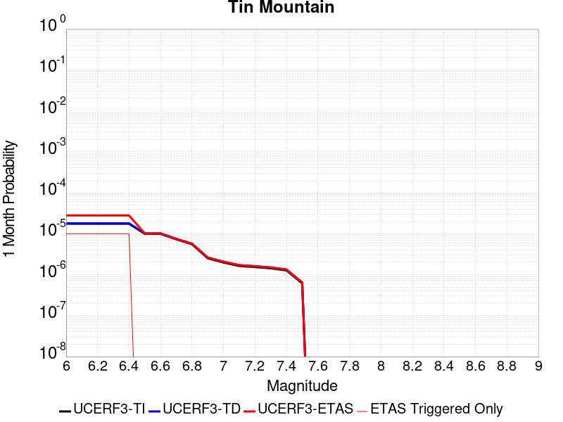 | 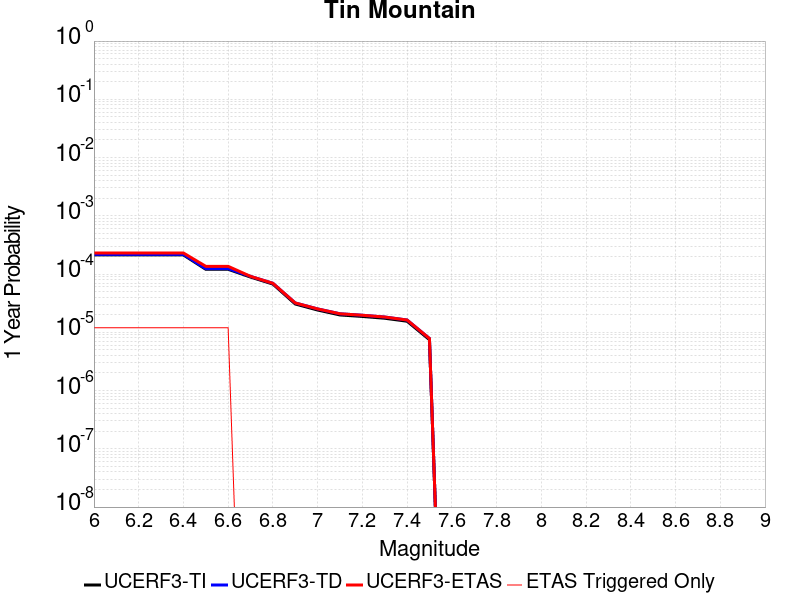 | 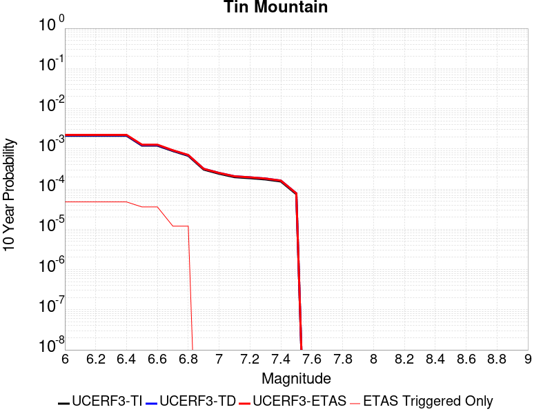 |

| Magnitude | 1 wk TI Prob | 1 wk TD Prob | 1 wk ETAS Prob | 1 wk ETAS/TD Gain | 1 wk ETAS Triggered Only | 1 mo TI Prob | 1 mo TD Prob | 1 mo ETAS Prob | 1 mo ETAS/TD Gain | 1 mo ETAS Triggered Only | 1 yr TI Prob | 1 yr TD Prob | 1 yr ETAS Prob | 1 yr ETAS/TD Gain | 1 yr ETAS Triggered Only | 10 yr TI Prob | 10 yr TD Prob | 10 yr ETAS Prob | 10 yr ETAS/TD Gain | 10 yr ETAS Triggered Only |
|-----|-----|-----|-----|-----|-----|-----|-----|-----|-----|-----|-----|-----|-----|-----|-----|-----|-----|-----|-----|-----|
| 6.0 | 4.083776E-6 | 4.18155E-6 | 4.18155E-6 | 1.0 | 0.0 | 1.750178E-5 | 1.7920827E-5 | 1.7920827E-5 | 1.0 | 0.0 | 2.1306332E-4 | 2.1816794E-4 | 2.3015573E-4 | 1.0549475 | 1.1990408E-5 | 0.0021285915 | 0.0021799032 | 0.0022277604 | 1.0219538 | 4.7961632E-5 |
| 6.1 | 4.083776E-6 | 4.18155E-6 | 4.18155E-6 | 1.0 | 0.0 | 1.750178E-5 | 1.7920827E-5 | 1.7920827E-5 | 1.0 | 0.0 | 2.1306332E-4 | 2.1816794E-4 | 2.3015573E-4 | 1.0549475 | 1.1990408E-5 | 0.0021285915 | 0.0021799032 | 0.0022277604 | 1.0219538 | 4.7961632E-5 |
| 6.2 | 4.083776E-6 | 4.18155E-6 | 4.18155E-6 | 1.0 | 0.0 | 1.750178E-5 | 1.7920827E-5 | 1.7920827E-5 | 1.0 | 0.0 | 2.1306332E-4 | 2.1816794E-4 | 2.3015573E-4 | 1.0549475 | 1.1990408E-5 | 0.0021285915 | 0.0021799032 | 0.0022277604 | 1.0219538 | 4.7961632E-5 |
| 6.3 | 4.083776E-6 | 4.18155E-6 | 4.18155E-6 | 1.0 | 0.0 | 1.750178E-5 | 1.7920827E-5 | 1.7920827E-5 | 1.0 | 0.0 | 2.1306332E-4 | 2.1816794E-4 | 2.3015573E-4 | 1.0549475 | 1.1990408E-5 | 0.0021285915 | 0.0021799032 | 0.0022277604 | 1.0219538 | 4.7961632E-5 |
| 6.4 | 4.083776E-6 | 4.18155E-6 | 4.18155E-6 | 1.0 | 0.0 | 1.750178E-5 | 1.7920827E-5 | 1.7920827E-5 | 1.0 | 0.0 | 2.1306332E-4 | 2.1816794E-4 | 2.3015573E-4 | 1.0549475 | 1.1990408E-5 | 0.0021285915 | 0.0021799032 | 0.0022277604 | 1.0219538 | 4.7961632E-5 |
| 6.5 | 2.3143427E-6 | 2.3731652E-6 | 2.3731652E-6 | 1.0 | 0.0 | 9.9185745E-6 | 1.0170673E-5 | 1.0170673E-5 | 1.0 | 0.0 | 1.2075195E-4 | 1.2382168E-4 | 1.358106E-4 | 1.096824 | 1.1990408E-5 | 0.0012068636 | 0.0012376028 | 0.0012735295 | 1.0290293 | 3.597122E-5 |
| 6.6 | 2.3143427E-6 | 2.3731652E-6 | 2.3731652E-6 | 1.0 | 0.0 | 9.9185745E-6 | 1.0170673E-5 | 1.0170673E-5 | 1.0 | 0.0 | 1.2075195E-4 | 1.2382168E-4 | 1.358106E-4 | 1.096824 | 1.1990408E-5 | 0.0012068636 | 0.0012376028 | 0.0012735295 | 1.0290293 | 3.597122E-5 |
| 6.7 | 1.7029532E-6 | 1.7497979E-6 | 1.7497979E-6 | 1.0 | 0.0 | 7.2983503E-6 | 7.4991153E-6 | 7.4991153E-6 | 1.0 | 0.0 | 8.885379E-5 | 9.129844E-5 | 9.129844E-5 | 1.0 | 0.0 | 8.881827E-4 | 9.1266196E-4 | 9.2464144E-4 | 1.0131259 | 1.1990408E-5 |
| 6.8 | 1.2914646E-6 | 1.3299432E-6 | 1.3299432E-6 | 1.0 | 0.0 | 5.534837E-6 | 5.6997465E-6 | 5.6997465E-6 | 1.0 | 0.0 | 6.738455E-5 | 6.939264E-5 | 6.939264E-5 | 1.0 | 0.0 | 6.736412E-4 | 6.937531E-4 | 7.057352E-4 | 1.0172714 | 1.1990408E-5 |
| 6.9 | 5.8708974E-7 | 6.117028E-7 | 6.117028E-7 | 1.0 | 0.0 | 2.5160964E-6 | 2.621581E-6 | 2.621581E-6 | 1.0 | 0.0 | 3.0633044E-5 | 3.1917323E-5 | 3.1917323E-5 | 1.0 | 0.0 | 3.0628822E-4 | 3.191315E-4 | 3.191315E-4 | 1.0 | 0.0 |
| 7.0 | 4.6248786E-7 | 4.832044E-7 | 4.832044E-7 | 1.0 | 0.0 | 1.9820893E-6 | 2.0708746E-6 | 2.0708746E-6 | 1.0 | 0.0 | 2.413167E-5 | 2.5212645E-5 | 2.5212645E-5 | 1.0 | 0.0 | 2.412905E-4 | 2.5210154E-4 | 2.5210154E-4 | 1.0 | 0.0 |
| 7.1 | 3.804606E-7 | 3.9871725E-7 | 3.9871725E-7 | 1.0 | 0.0 | 1.6305444E-6 | 1.7087873E-6 | 1.7087873E-6 | 1.0 | 0.0 | 1.9851697E-5 | 2.080432E-5 | 2.080432E-5 | 1.0 | 0.0 | 1.9849923E-4 | 2.080271E-4 | 2.080271E-4 | 1.0 | 0.0 |
| 7.2 | 3.5864858E-7 | 3.7617107E-7 | 3.7617107E-7 | 1.0 | 0.0 | 1.5370645E-6 | 1.6121609E-6 | 1.6121609E-6 | 1.0 | 0.0 | 1.87136E-5 | 1.9627916E-5 | 1.9627916E-5 | 1.0 | 0.0 | 1.8712023E-4 | 1.9626514E-4 | 1.9626514E-4 | 1.0 | 0.0 |
| 7.3 | 3.342063E-7 | 3.50637E-7 | 3.50637E-7 | 1.0 | 0.0 | 1.4323119E-6 | 1.5027293E-6 | 1.5027293E-6 | 1.0 | 0.0 | 1.7438259E-5 | 1.829561E-5 | 1.829561E-5 | 1.0 | 0.0 | 1.743689E-4 | 1.8294434E-4 | 1.8294434E-4 | 1.0 | 0.0 |
| 7.4 | 2.971242E-7 | 3.116602E-7 | 3.116602E-7 | 1.0 | 0.0 | 1.2733886E-6 | 1.3356861E-6 | 1.3356861E-6 | 1.0 | 0.0 | 1.5503398E-5 | 1.626189E-5 | 1.626189E-5 | 1.0 | 0.0 | 1.5502315E-4 | 1.6261027E-4 | 1.6261027E-4 | 1.0 | 0.0 |
| 7.5 | 1.4326713E-7 | 1.501262E-7 | 1.501262E-7 | 1.0 | 0.0 | 6.140018E-7 | 6.43398E-7 | 6.43398E-7 | 1.0 | 0.0 | 7.4754466E-6 | 7.833371E-6 | 7.833371E-6 | 1.0 | 0.0 | 7.475195E-5 | 7.83337E-5 | 7.83337E-5 | 1.0 | 0.0 |

## San Jacinto (Coyote Creek)
*[(top)](#table-of-contents)*

| 1 Week | 1 Month | 1 Year | 10 Year |
|-----|-----|-----|-----|
| 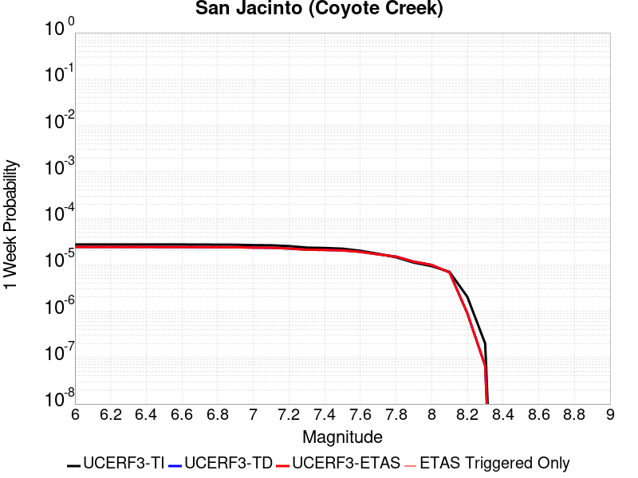 | 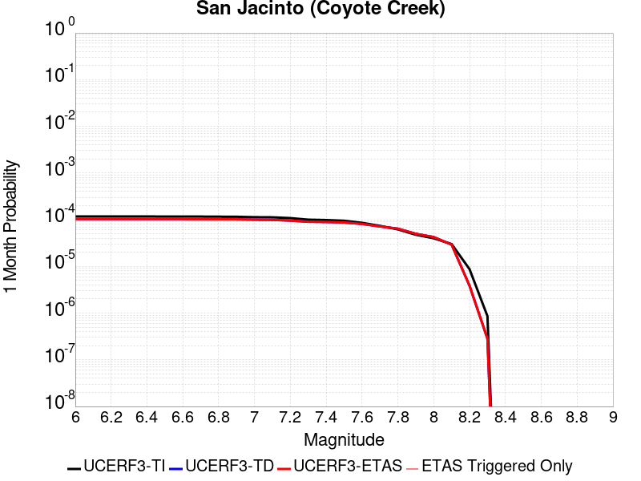 | 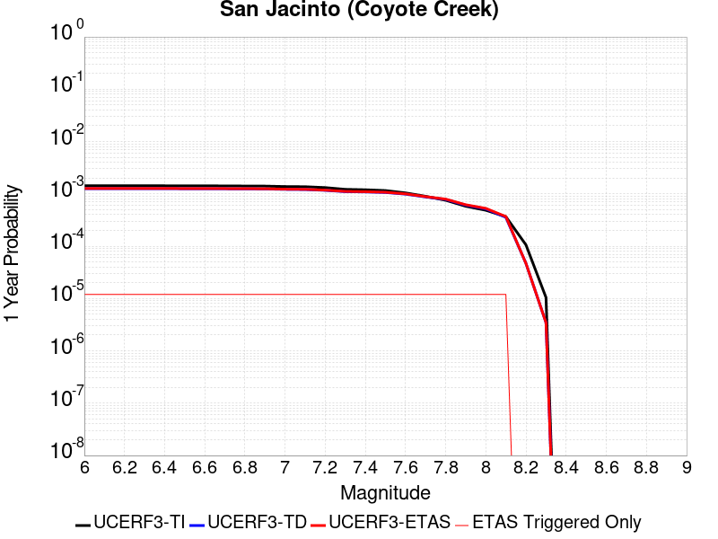 | 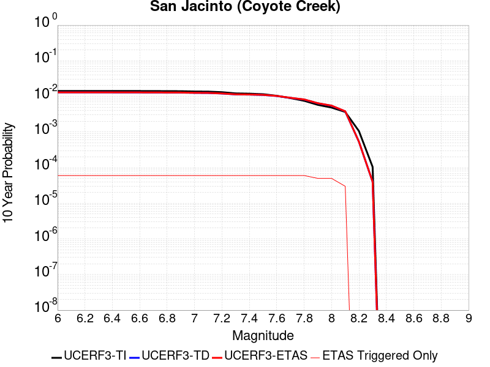 |

| Magnitude | 1 wk TI Prob | 1 wk TD Prob | 1 wk ETAS Prob | 1 wk ETAS/TD Gain | 1 wk ETAS Triggered Only | 1 mo TI Prob | 1 mo TD Prob | 1 mo ETAS Prob | 1 mo ETAS/TD Gain | 1 mo ETAS Triggered Only | 1 yr TI Prob | 1 yr TD Prob | 1 yr ETAS Prob | 1 yr ETAS/TD Gain | 1 yr ETAS Triggered Only | 10 yr TI Prob | 10 yr TD Prob | 10 yr ETAS Prob | 10 yr ETAS/TD Gain | 10 yr ETAS Triggered Only |
|-----|-----|-----|-----|-----|-----|-----|-----|-----|-----|-----|-----|-----|-----|-----|-----|-----|-----|-----|-----|-----|
| 6.0 | 2.7374346E-5 | 2.415327E-5 | 2.415327E-5 | 1.0 | 0.0 | 1.1731335E-4 | 1.0350993E-4 | 1.0350993E-4 | 1.0 | 0.0 | 0.0014273542 | 0.0012595074 | 0.0012714827 | 1.0095079 | 1.1990408E-5 | 0.01418221 | 0.01293251 | 0.012979851 | 1.0036607 | 4.7961632E-5 |
| 6.1 | 2.7374346E-5 | 2.415327E-5 | 2.415327E-5 | 1.0 | 0.0 | 1.1731335E-4 | 1.0350993E-4 | 1.0350993E-4 | 1.0 | 0.0 | 0.0014273542 | 0.0012595074 | 0.0012714827 | 1.0095079 | 1.1990408E-5 | 0.01418221 | 0.01293251 | 0.012979851 | 1.0036607 | 4.7961632E-5 |
| 6.2 | 2.7374346E-5 | 2.415327E-5 | 2.415327E-5 | 1.0 | 0.0 | 1.1731335E-4 | 1.0350993E-4 | 1.0350993E-4 | 1.0 | 0.0 | 0.0014273542 | 0.0012595074 | 0.0012714827 | 1.0095079 | 1.1990408E-5 | 0.01418221 | 0.01293251 | 0.012979851 | 1.0036607 | 4.7961632E-5 |
| 6.3 | 2.7374346E-5 | 2.415327E-5 | 2.415327E-5 | 1.0 | 0.0 | 1.1731335E-4 | 1.0350993E-4 | 1.0350993E-4 | 1.0 | 0.0 | 0.0014273542 | 0.0012595074 | 0.0012714827 | 1.0095079 | 1.1990408E-5 | 0.01418221 | 0.01293251 | 0.012979851 | 1.0036607 | 4.7961632E-5 |
| 6.4 | 2.7374346E-5 | 2.415327E-5 | 2.415327E-5 | 1.0 | 0.0 | 1.1731335E-4 | 1.0350993E-4 | 1.0350993E-4 | 1.0 | 0.0 | 0.0014273542 | 0.0012595074 | 0.0012714827 | 1.0095079 | 1.1990408E-5 | 0.01418221 | 0.01293251 | 0.012979851 | 1.0036607 | 4.7961632E-5 |
| 6.5 | 2.7282445E-5 | 2.4039346E-5 | 2.4039346E-5 | 1.0 | 0.0 | 1.16919524E-4 | 1.0302171E-4 | 1.0302171E-4 | 1.0 | 0.0 | 0.0014225657 | 0.0012535703 | 0.0012655456 | 1.0095531 | 1.1990408E-5 | 0.014134934 | 0.012873836 | 0.012921181 | 1.0036776 | 4.7961632E-5 |
| 6.6 | 2.7282445E-5 | 2.4039346E-5 | 2.4039346E-5 | 1.0 | 0.0 | 1.16919524E-4 | 1.0302171E-4 | 1.0302171E-4 | 1.0 | 0.0 | 0.0014225657 | 0.0012535703 | 0.0012655456 | 1.0095531 | 1.1990408E-5 | 0.014134934 | 0.012873836 | 0.012921181 | 1.0036776 | 4.7961632E-5 |
| 6.7 | 2.7216198E-5 | 2.3964463E-5 | 2.3964463E-5 | 1.0 | 0.0 | 1.1663563E-4 | 1.0270082E-4 | 1.0270082E-4 | 1.0 | 0.0 | 0.0014191137 | 0.0012496678 | 0.0012616434 | 1.0095829 | 1.1990408E-5 | 0.014100855 | 0.0128352465 | 0.012882592 | 1.0036887 | 4.7961632E-5 |
| 6.8 | 2.7078617E-5 | 2.3881676E-5 | 2.3881676E-5 | 1.0 | 0.0 | 1.1604605E-4 | 1.0234604E-4 | 1.0234604E-4 | 1.0 | 0.0 | 0.001411945 | 0.0012453535 | 0.0012573289 | 1.0096161 | 1.1990408E-5 | 0.014030075 | 0.012792386 | 0.012839734 | 1.0037013 | 4.7961632E-5 |
| 6.9 | 2.6982952E-5 | 2.3801183E-5 | 2.3801183E-5 | 1.0 | 0.0 | 1.15636096E-4 | 1.020011E-4 | 1.020011E-4 | 1.0 | 0.0 | 0.0014069602 | 0.0012411585 | 0.001253134 | 1.0096487 | 1.1990408E-5 | 0.013980856 | 0.012750699 | 0.0127980495 | 1.0037135 | 4.7961632E-5 |
| 7.0 | 2.6449972E-5 | 2.3378187E-5 | 2.3378187E-5 | 1.0 | 0.0 | 1.1335209E-4 | 1.001884E-4 | 1.001884E-4 | 1.0 | 0.0 | 0.001379188 | 0.0012191138 | 0.0012310896 | 1.0098233 | 1.1990408E-5 | 0.0137065975 | 0.0125320535 | 0.012579414 | 1.0037792 | 4.7961632E-5 |
| 7.1 | 2.6257849E-5 | 2.3204217E-5 | 2.3204217E-5 | 1.0 | 0.0 | 1.1252879E-4 | 9.944286E-5 | 9.944286E-5 | 1.0 | 0.0 | 0.0013691769 | 0.001210047 | 0.0012220229 | 1.009897 | 1.1990408E-5 | 0.013607717 | 0.012441914 | 0.012489279 | 1.0038068 | 4.7961632E-5 |
| 7.2 | 2.5270041E-5 | 2.2398921E-5 | 2.2398921E-5 | 1.0 | 0.0 | 1.0829568E-4 | 9.5991854E-5 | 9.5991854E-5 | 1.0 | 0.0 | 0.0013177024 | 0.0011680766 | 0.0011800531 | 1.0102531 | 1.1990408E-5 | 0.013099162 | 0.012022921 | 0.012070306 | 1.0039412 | 4.7961632E-5 |
| 7.3 | 2.339701E-5 | 2.1130656E-5 | 2.1130656E-5 | 1.0 | 0.0 | 1.0026905E-4 | 9.055682E-5 | 9.055682E-5 | 1.0 | 0.0 | 0.001220092 | 0.0011019738 | 0.001113951 | 1.0108689 | 1.1990408E-5 | 0.012134149 | 0.011361783 | 0.0114092 | 1.0041734 | 4.7961632E-5 |
| 7.4 | 2.296333E-5 | 2.0860984E-5 | 2.0860984E-5 | 1.0 | 0.0 | 9.841056E-5 | 8.940117E-5 | 8.940117E-5 | 1.0 | 0.0 | 0.0011974899 | 0.0010879177 | 0.0010998951 | 1.0110095 | 1.1990408E-5 | 0.011910575 | 0.011220883 | 0.0112683065 | 1.0042263 | 4.7961632E-5 |
| 7.5 | 2.2188895E-5 | 2.0383844E-5 | 2.0383844E-5 | 1.0 | 0.0 | 9.50918E-5 | 8.735642E-5 | 8.735642E-5 | 1.0 | 0.0 | 0.0011571277 | 0.0010630476 | 0.0010750252 | 1.0112673 | 1.1990408E-5 | 0.011511209 | 0.010970469 | 0.011017905 | 1.004324 | 4.7961632E-5 |
| 7.6 | 2.0013189E-5 | 1.8969942E-5 | 1.8969942E-5 | 1.0 | 0.0 | 8.5767984E-5 | 8.1297236E-5 | 8.1297236E-5 | 1.0 | 0.0 | 0.001043725 | 9.893461E-4 | 0.0010013246 | 1.0121075 | 1.1990408E-5 | 0.010388365 | 0.010228388 | 0.010275858 | 1.004641 | 4.7961632E-5 |
| 7.7 | 1.7230794E-5 | 1.6751088E-5 | 1.6751088E-5 | 1.0 | 0.0 | 7.384417E-5 | 7.17884E-5 | 7.17884E-5 | 1.0 | 0.0 | 8.986819E-4 | 8.736742E-4 | 8.856541E-4 | 1.0137122 | 1.1990408E-5 | 0.008950562 | 0.009066812 | 0.009114338 | 1.0052419 | 4.7961632E-5 |
| 7.8 | 1.4478809E-5 | 1.49981E-5 | 1.49981E-5 | 1.0 | 0.0 | 6.205057E-5 | 6.427599E-5 | 6.427599E-5 | 1.0 | 0.0 | 7.552038E-4 | 7.822799E-4 | 7.942609E-4 | 1.0153155 | 1.1990408E-5 | 0.0075264242 | 0.008145113 | 0.008192684 | 1.0058404 | 4.7961632E-5 |
| 7.9 | 1.1114467E-5 | 1.1651392E-5 | 1.1651392E-5 | 1.0 | 0.0 | 4.7632562E-5 | 4.9933584E-5 | 4.9933584E-5 | 1.0 | 0.0 | 5.797721E-4 | 6.077724E-4 | 6.1975553E-4 | 1.0197165 | 1.1990408E-5 | 0.0057826187 | 0.0063836263 | 0.006419368 | 1.0055989 | 3.597122E-5 |
| 8.0 | 9.327402E-6 | 9.904865E-6 | 9.904865E-6 | 1.0 | 0.0 | 3.9973966E-5 | 4.2448733E-5 | 4.2448733E-5 | 1.0 | 0.0 | 4.8657437E-4 | 5.166913E-4 | 5.286755E-4 | 1.0231942 | 1.1990408E-5 | 0.0048551033 | 0.0054529547 | 0.0054887296 | 1.0065607 | 3.597122E-5 |
| 8.1 | 7.0235833E-6 | 6.83171E-6 | 6.83171E-6 | 1.0 | 0.0 | 3.0100724E-5 | 2.9278432E-5 | 2.9278432E-5 | 1.0 | 0.0 | 3.664147E-4 | 3.5640708E-4 | 3.6839323E-4 | 1.0336305 | 1.1990408E-5 | 0.003658111 | 0.0037898365 | 0.0038137264 | 1.0063037 | 2.3980816E-5 |
| 8.2 | 2.0358202E-6 | 9.0030267E-7 | 9.0030267E-7 | 1.0 | 0.0 | 8.724915E-6 | 3.8584344E-6 | 3.8584344E-6 | 1.0 | 0.0 | 1.06220665E-4 | 4.697545E-5 | 4.697545E-5 | 1.0 | 0.0 | 0.001061699 | 5.3301745E-4 | 5.3301745E-4 | 1.0 | 0.0 |
| 8.3 | 2.0051264E-7 | 6.6244816E-8 | 6.6244816E-8 | 1.0 | 0.0 | 8.5933965E-7 | 2.8390633E-7 | 2.8390633E-7 | 1.0 | 0.0 | 1.046241E-5 | 3.4565546E-6 | 3.4565546E-6 | 1.0 | 0.0 | 1.0461917E-4 | 4.018022E-5 | 4.018022E-5 | 1.0 | 0.0 |

## San Jacinto (Borrego)
*[(top)](#table-of-contents)*

| 1 Week | 1 Month | 1 Year | 10 Year |
|-----|-----|-----|-----|
|  | 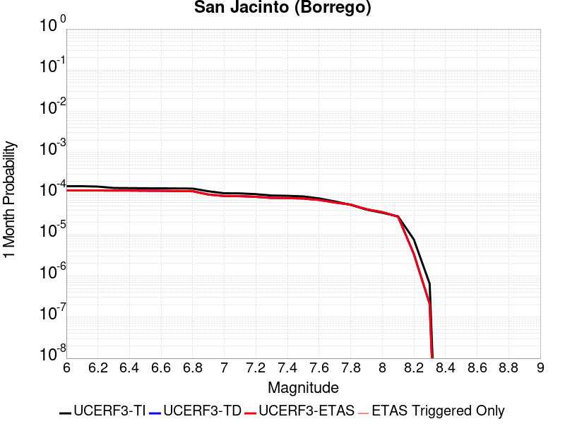 | 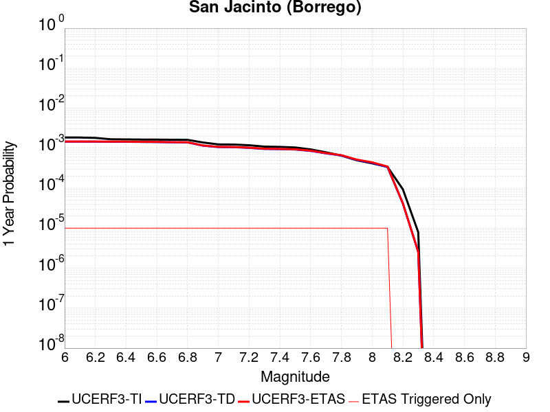 | 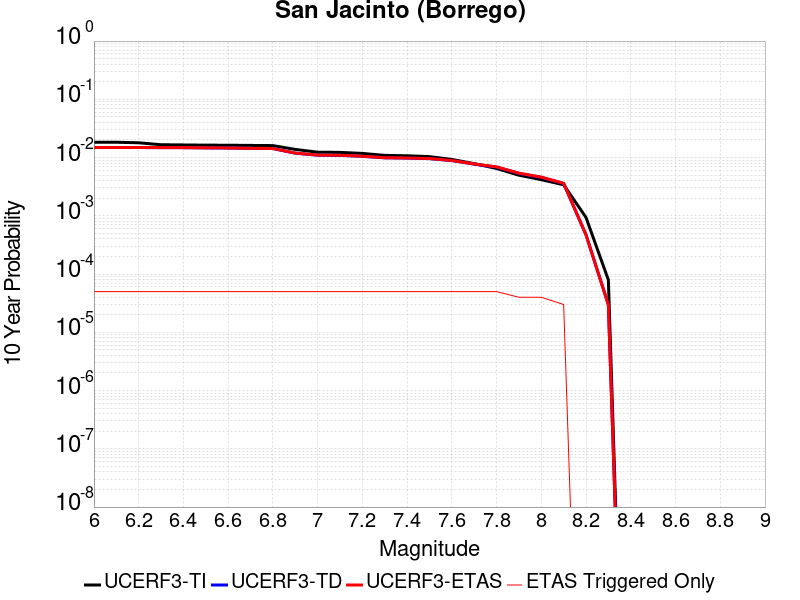 |

| Magnitude | 1 wk TI Prob | 1 wk TD Prob | 1 wk ETAS Prob | 1 wk ETAS/TD Gain | 1 wk ETAS Triggered Only | 1 mo TI Prob | 1 mo TD Prob | 1 mo ETAS Prob | 1 mo ETAS/TD Gain | 1 mo ETAS Triggered Only | 1 yr TI Prob | 1 yr TD Prob | 1 yr ETAS Prob | 1 yr ETAS/TD Gain | 1 yr ETAS Triggered Only | 10 yr TI Prob | 10 yr TD Prob | 10 yr ETAS Prob | 10 yr ETAS/TD Gain | 10 yr ETAS Triggered Only |
|-----|-----|-----|-----|-----|-----|-----|-----|-----|-----|-----|-----|-----|-----|-----|-----|-----|-----|-----|-----|-----|
| 6.0 | 3.543992E-5 | 2.7934115E-5 | 2.7934115E-5 | 1.0 | 0.0 | 1.5187653E-4 | 1.1971221E-4 | 1.1971221E-4 | 1.0 | 0.0 | 0.0018475284 | 0.001456534 | 0.0014685069 | 1.0082202 | 1.1990408E-5 | 0.018322436 | 0.014873597 | 0.014920845 | 1.0031767 | 4.7961632E-5 |
| 6.1 | 3.542281E-5 | 2.7934115E-5 | 2.7934115E-5 | 1.0 | 0.0 | 1.5180321E-4 | 1.1971221E-4 | 1.1971221E-4 | 1.0 | 0.0 | 0.0018466372 | 0.001456534 | 0.0014685069 | 1.0082202 | 1.1990408E-5 | 0.018313672 | 0.014873597 | 0.014920845 | 1.0031767 | 4.7961632E-5 |
| 6.2 | 3.4688688E-5 | 2.7934115E-5 | 2.7934115E-5 | 1.0 | 0.0 | 1.4865733E-4 | 1.1971221E-4 | 1.1971221E-4 | 1.0 | 0.0 | 0.0018084005 | 0.0014565339 | 0.0014685069 | 1.0082202 | 1.1990408E-5 | 0.017937548 | 0.014873596 | 0.014920845 | 1.0031767 | 4.7961632E-5 |
| 6.3 | 3.2087122E-5 | 2.7779462E-5 | 2.7779462E-5 | 1.0 | 0.0 | 1.3750899E-4 | 1.1904947E-4 | 1.1904947E-4 | 1.0 | 0.0 | 0.0016728862 | 0.0014484759 | 0.001460449 | 1.008266 | 1.1990408E-5 | 0.016603488 | 0.01479463 | 0.0148418825 | 1.0031939 | 4.7961632E-5 |
| 6.4 | 3.1828724E-5 | 2.7746448E-5 | 2.7746448E-5 | 1.0 | 0.0 | 1.364017E-4 | 1.18908E-4 | 1.18908E-4 | 1.0 | 0.0 | 0.0016594254 | 0.0014467557 | 0.0014587287 | 1.0082757 | 1.1990408E-5 | 0.016470885 | 0.014777708 | 0.014824961 | 1.0031976 | 4.7961632E-5 |
| 6.5 | 3.1563577E-5 | 2.7486154E-5 | 2.7486154E-5 | 1.0 | 0.0 | 1.3526545E-4 | 1.1779256E-4 | 1.1779256E-4 | 1.0 | 0.0 | 0.0016456128 | 0.0014331931 | 0.0014451663 | 1.0083542 | 1.1990408E-5 | 0.0163348 | 0.014644288 | 0.0146915475 | 1.0032271 | 4.7961632E-5 |
| 6.6 | 3.1467625E-5 | 2.7330374E-5 | 2.7330374E-5 | 1.0 | 0.0 | 1.3485427E-4 | 1.1712498E-4 | 1.1712498E-4 | 1.0 | 0.0 | 0.0016406142 | 0.001425076 | 0.0014370494 | 1.0084019 | 1.1990408E-5 | 0.016285548 | 0.014564533 | 0.014611796 | 1.0032451 | 4.7961632E-5 |
| 6.7 | 3.1223695E-5 | 2.6948383E-5 | 2.6948383E-5 | 1.0 | 0.0 | 1.3380898E-4 | 1.1548802E-4 | 1.1548802E-4 | 1.0 | 0.0 | 0.0016279068 | 0.0014051719 | 0.0014171455 | 1.0085211 | 1.1990408E-5 | 0.01616033 | 0.014368899 | 0.014416172 | 1.0032899 | 4.7961632E-5 |
| 6.8 | 3.1015585E-5 | 2.6769376E-5 | 2.6769376E-5 | 1.0 | 0.0 | 1.3291716E-4 | 1.14720926E-4 | 1.14720926E-4 | 1.0 | 0.0 | 0.001617065 | 0.0013958444 | 0.001407818 | 1.0085781 | 1.1990408E-5 | 0.016053487 | 0.014276173 | 0.01432345 | 1.0033116 | 4.7961632E-5 |
| 6.9 | 2.6641965E-5 | 2.2191349E-5 | 2.2191349E-5 | 1.0 | 0.0 | 1.1417485E-4 | 9.510233E-5 | 9.510233E-5 | 1.0 | 0.0 | 0.0013891924 | 0.0011572598 | 0.0011692364 | 1.010349 | 1.1990408E-5 | 0.0138054015 | 0.011886145 | 0.011933536 | 1.0039871 | 4.7961632E-5 |
| 7.0 | 2.3854353E-5 | 2.048587E-5 | 2.048587E-5 | 1.0 | 0.0 | 1.02228936E-4 | 8.779365E-5 | 8.779365E-5 | 1.0 | 0.0 | 0.0012439266 | 0.0010683661 | 0.0010803436 | 1.0112112 | 1.1990408E-5 | 0.012369866 | 0.010986375 | 0.01103381 | 1.0043176 | 4.7961632E-5 |
| 7.1 | 2.3672901E-5 | 2.032235E-5 | 2.032235E-5 | 1.0 | 0.0 | 1.0145135E-4 | 8.709289E-5 | 8.709289E-5 | 1.0 | 0.0 | 0.0012344702 | 0.0010598428 | 0.0010718204 | 1.0113014 | 1.1990408E-5 | 0.0122763505 | 0.010901547 | 0.010948986 | 1.0043516 | 4.7961632E-5 |
| 7.2 | 2.2717244E-5 | 1.9549674E-5 | 1.9549674E-5 | 1.0 | 0.0 | 9.735599E-5 | 8.378164E-5 | 8.378164E-5 | 1.0 | 0.0 | 0.0011846646 | 0.0010195666 | 0.0010315446 | 1.0117483 | 1.1990408E-5 | 0.01178369 | 0.010498884 | 0.0105463425 | 1.0045203 | 4.7961632E-5 |
| 7.3 | 2.1016205E-5 | 1.8391213E-5 | 1.8391213E-5 | 1.0 | 0.0 | 9.006634E-5 | 7.881711E-5 | 7.881711E-5 | 1.0 | 0.0 | 0.001096006 | 9.5917797E-4 | 9.711569E-4 | 1.0124887 | 1.1990408E-5 | 0.010906163 | 0.009894462 | 0.0099419495 | 1.0047994 | 4.7961632E-5 |
| 7.4 | 2.0683625E-5 | 1.8193714E-5 | 1.8193714E-5 | 1.0 | 0.0 | 8.86411E-5 | 7.797074E-5 | 7.797074E-5 | 1.0 | 0.0 | 0.001078671 | 9.488824E-4 | 9.6086145E-4 | 1.0126244 | 1.1990408E-5 | 0.010734501 | 0.009791178 | 0.00983867 | 1.0048505 | 4.7961632E-5 |
| 7.5 | 1.9993966E-5 | 1.7788683E-5 | 1.7788683E-5 | 1.0 | 0.0 | 8.568561E-5 | 7.6234996E-5 | 7.6234996E-5 | 1.0 | 0.0 | 0.001042723 | 9.2776783E-4 | 9.3974714E-4 | 1.0129119 | 1.1990408E-5 | 0.010378438 | 0.00957807 | 0.009625572 | 1.0049595 | 4.7961632E-5 |
| 7.6 | 1.788966E-5 | 1.6441732E-5 | 1.6441732E-5 | 1.0 | 0.0 | 7.666772E-5 | 7.046267E-5 | 7.046267E-5 | 1.0 | 0.0 | 9.3302975E-4 | 8.575471E-4 | 8.695272E-4 | 1.0139703 | 1.1990408E-5 | 0.00929122 | 0.0088698575 | 0.008917394 | 1.0053593 | 4.7961632E-5 |
| 7.7 | 1.5125781E-5 | 1.4243621E-5 | 1.4243621E-5 | 1.0 | 0.0 | 6.4823165E-5 | 6.1042665E-5 | 6.1042665E-5 | 1.0 | 0.0 | 7.889362E-4 | 7.4294186E-4 | 7.549233E-4 | 1.0161271 | 1.1990408E-5 | 0.007861412 | 0.0077174758 | 0.0077650673 | 1.0061667 | 4.7961632E-5 |
| 7.8 | 1.250089E-5 | 1.2636515E-5 | 1.2636515E-5 | 1.0 | 0.0 | 5.3574146E-5 | 5.415537E-5 | 5.415537E-5 | 1.0 | 0.0 | 6.5207E-4 | 6.591428E-4 | 6.711253E-4 | 1.0181789 | 1.1990408E-5 | 0.006501599 | 0.00687092 | 0.006918552 | 1.0069324 | 4.7961632E-5 |
| 7.9 | 9.561E-6 | 9.759914E-6 | 9.759914E-6 | 1.0 | 0.0 | 4.0975072E-5 | 4.1827538E-5 | 4.1827538E-5 | 1.0 | 0.0 | 4.987573E-4 | 5.091318E-4 | 5.2111613E-4 | 1.0235387 | 1.1990408E-5 | 0.0049763937 | 0.0053551346 | 0.005390913 | 1.0066812 | 3.597122E-5 |
| 8.0 | 8.01699E-6 | 8.2982915E-6 | 8.2982915E-6 | 1.0 | 0.0 | 3.4358076E-5 | 3.5563622E-5 | 3.5563622E-5 | 1.0 | 0.0 | 4.1822926E-4 | 4.329016E-4 | 4.4488683E-4 | 1.0276858 | 1.1990408E-5 | 0.0041744304 | 0.0045759073 | 0.004611714 | 1.007825 | 3.597122E-5 |
| 8.1 | 6.541947E-6 | 6.466171E-6 | 6.466171E-6 | 1.0 | 0.0 | 2.8036617E-5 | 2.7711869E-5 | 2.7711869E-5 | 1.0 | 0.0 | 3.4129233E-4 | 3.3734026E-4 | 3.4932664E-4 | 1.035532 | 1.1990408E-5 | 0.0034076865 | 0.0035827826 | 0.0036066775 | 1.0066694 | 2.3980816E-5 |
| 8.2 | 1.7968189E-6 | 7.978815E-7 | 7.978815E-7 | 1.0 | 0.0 | 7.70063E-6 | 3.419488E-6 | 3.419488E-6 | 1.0 | 0.0 | 9.3751136E-5 | 4.163149E-5 | 4.163149E-5 | 1.0 | 0.0 | 9.371159E-4 | 4.7162327E-4 | 4.7162327E-4 | 1.0 | 0.0 |
| 8.3 | 1.5167889E-7 | 4.9030522E-8 | 4.9030522E-8 | 1.0 | 0.0 | 6.500522E-7 | 2.1013079E-7 | 2.1013079E-7 | 1.0 | 0.0 | 7.9143565E-6 | 2.55834E-6 | 2.55834E-6 | 1.0 | 0.0 | 7.914075E-5 | 2.9725656E-5 | 2.9725656E-5 | 1.0 | 0.0 |

## Cleghorn Pass
*[(top)](#table-of-contents)*

| 1 Week | 1 Month | 1 Year | 10 Year |
|-----|-----|-----|-----|
|  | 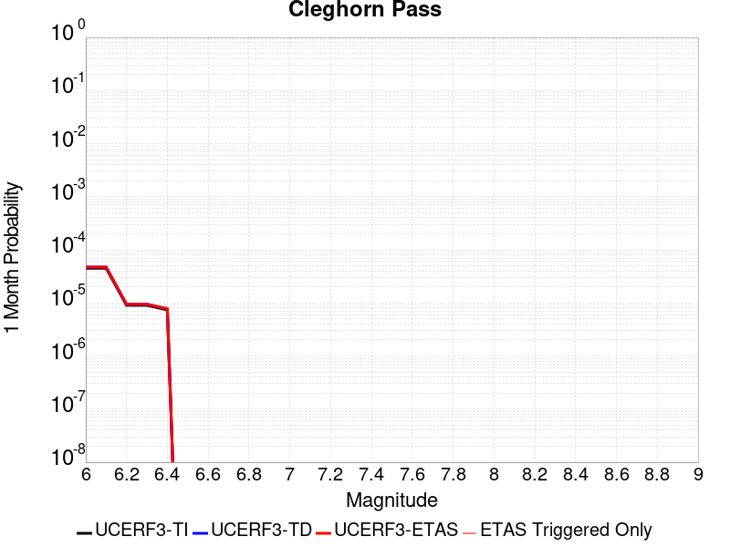 |  | 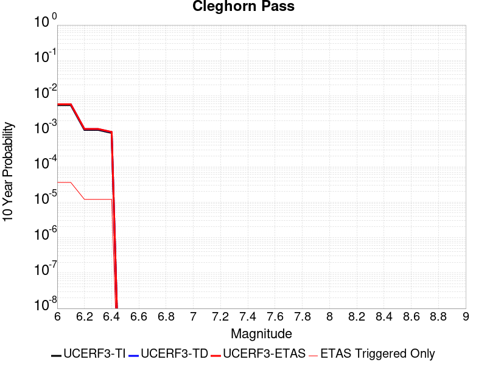 |

| Magnitude | 1 wk TI Prob | 1 wk TD Prob | 1 wk ETAS Prob | 1 wk ETAS/TD Gain | 1 wk ETAS Triggered Only | 1 mo TI Prob | 1 mo TD Prob | 1 mo ETAS Prob | 1 mo ETAS/TD Gain | 1 mo ETAS Triggered Only | 1 yr TI Prob | 1 yr TD Prob | 1 yr ETAS Prob | 1 yr ETAS/TD Gain | 1 yr ETAS Triggered Only | 10 yr TI Prob | 10 yr TD Prob | 10 yr ETAS Prob | 10 yr ETAS/TD Gain | 10 yr ETAS Triggered Only |
|-----|-----|-----|-----|-----|-----|-----|-----|-----|-----|-----|-----|-----|-----|-----|-----|-----|-----|-----|-----|-----|
| 6.0 | 1.0522846E-5 | 1.1040714E-5 | 1.1040714E-5 | 1.0 | 0.0 | 4.509713E-5 | 4.7316782E-5 | 4.7316782E-5 | 1.0 | 0.0 | 5.4891926E-4 | 5.759822E-4 | 5.999492E-4 | 1.0416107 | 2.3980816E-5 | 0.0054756533 | 0.005750059 | 0.005785824 | 1.0062199 | 3.597122E-5 |
| 6.1 | 1.0522846E-5 | 1.1040714E-5 | 1.1040714E-5 | 1.0 | 0.0 | 4.509713E-5 | 4.7316782E-5 | 4.7316782E-5 | 1.0 | 0.0 | 5.4891926E-4 | 5.759822E-4 | 5.999492E-4 | 1.0416107 | 2.3980816E-5 | 0.0054756533 | 0.005750059 | 0.005785824 | 1.0062199 | 3.597122E-5 |
| 6.2 | 2.1045846E-6 | 2.2082168E-6 | 2.2082168E-6 | 1.0 | 0.0 | 9.019617E-6 | 9.463776E-6 | 9.463776E-6 | 1.0 | 0.0 | 1.098083E-4 | 1.1521958E-4 | 1.272086E-4 | 1.1040537 | 1.1990408E-5 | 0.0010975406 | 0.0011520098 | 0.0011639864 | 1.0103962 | 1.1990408E-5 |
| 6.3 | 2.1045846E-6 | 2.2082168E-6 | 2.2082168E-6 | 1.0 | 0.0 | 9.019617E-6 | 9.463776E-6 | 9.463776E-6 | 1.0 | 0.0 | 1.098083E-4 | 1.1521958E-4 | 1.272086E-4 | 1.1040537 | 1.1990408E-5 | 0.0010975406 | 0.0011520098 | 0.0011639864 | 1.0103962 | 1.1990408E-5 |
| 6.4 | 1.7259927E-6 | 1.8108889E-6 | 1.8108889E-6 | 1.0 | 0.0 | 7.3970905E-6 | 7.760952E-6 | 7.760952E-6 | 1.0 | 0.0 | 9.005586E-5 | 9.4489595E-5 | 1.06478874E-4 | 1.1268846 | 1.1990408E-5 | 9.001937E-4 | 9.4489596E-4 | 9.5687504E-4 | 1.0126777 | 1.1990408E-5 |

## Big Pine (Central)
*[(top)](#table-of-contents)*

| 1 Week | 1 Month | 1 Year | 10 Year |
|-----|-----|-----|-----|
| 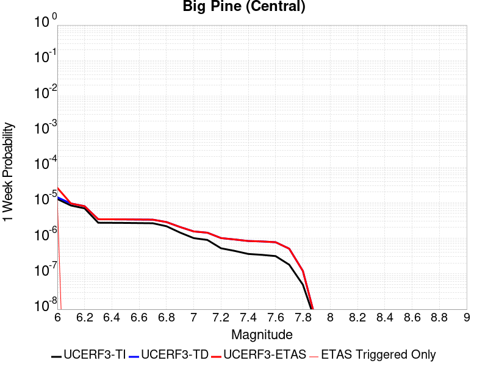 | 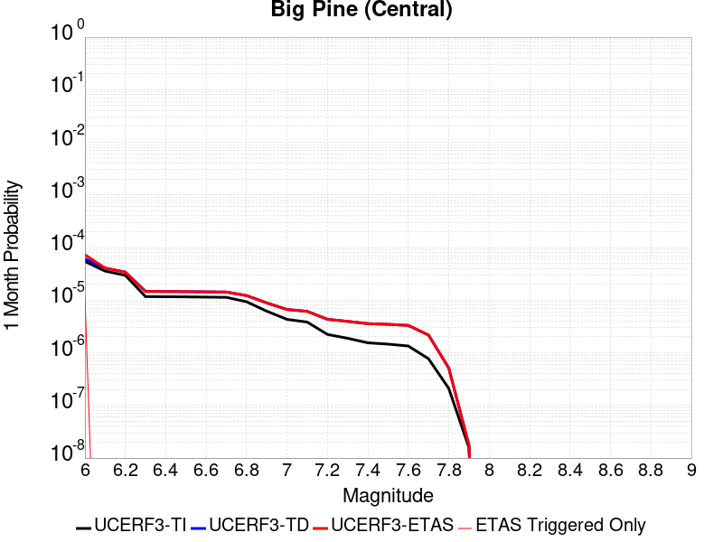 | 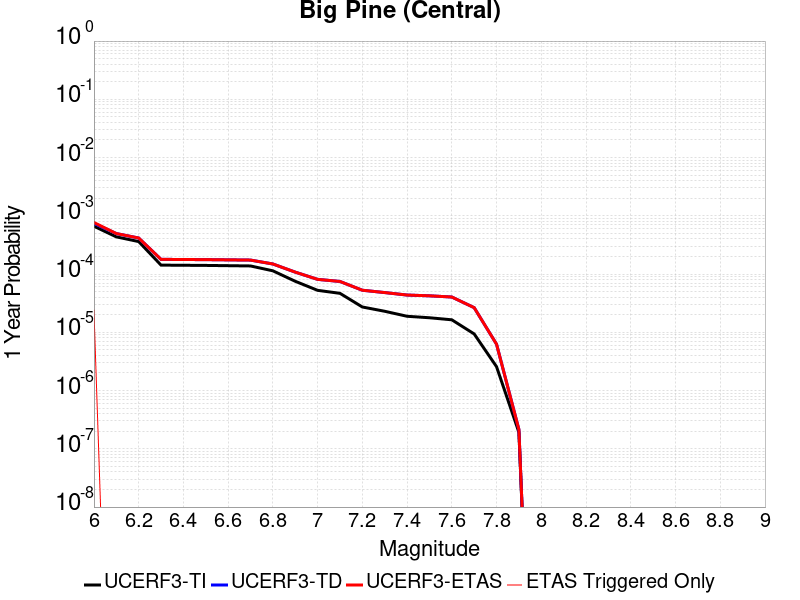 | 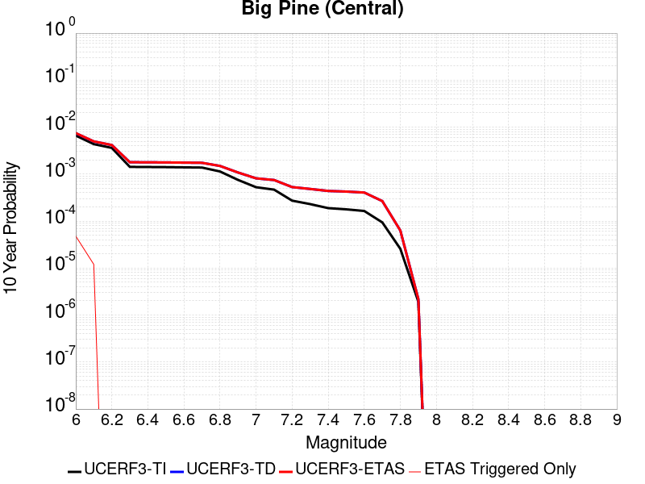 |

| Magnitude | 1 wk TI Prob | 1 wk TD Prob | 1 wk ETAS Prob | 1 wk ETAS/TD Gain | 1 wk ETAS Triggered Only | 1 mo TI Prob | 1 mo TD Prob | 1 mo ETAS Prob | 1 mo ETAS/TD Gain | 1 mo ETAS Triggered Only | 1 yr TI Prob | 1 yr TD Prob | 1 yr ETAS Prob | 1 yr ETAS/TD Gain | 1 yr ETAS Triggered Only | 10 yr TI Prob | 10 yr TD Prob | 10 yr ETAS Prob | 10 yr ETAS/TD Gain | 10 yr ETAS Triggered Only |
|-----|-----|-----|-----|-----|-----|-----|-----|-----|-----|-----|-----|-----|-----|-----|-----|-----|-----|-----|-----|-----|
| 6.0 | 1.2706755E-5 | 1.4251012E-5 | 2.6241249E-5 | 1.8413603 | 1.1990408E-5 | 5.4456385E-5 | 6.107454E-5 | 7.306422E-5 | 1.1963122 | 1.1990408E-5 | 6.628048E-4 | 7.4336544E-4 | 7.673284E-4 | 1.0322359 | 2.3980816E-5 | 0.006608314 | 0.0074138143 | 0.0074614203 | 1.0064212 | 4.7961632E-5 |
| 6.1 | 8.342579E-6 | 9.511191E-6 | 9.511191E-6 | 1.0 | 0.0 | 3.5753423E-5 | 4.0761734E-5 | 4.0761734E-5 | 1.0 | 0.0 | 4.3521097E-4 | 4.961828E-4 | 4.961828E-4 | 1.0 | 0.0 | 0.0043435963 | 0.0049543027 | 0.0049662334 | 1.0024083 | 1.1990408E-5 |
| 6.2 | 6.923899E-6 | 7.967559E-6 | 7.967559E-6 | 1.0 | 0.0 | 2.9673516E-5 | 3.4146342E-5 | 3.4146342E-5 | 1.0 | 0.0 | 3.6121515E-4 | 4.1567165E-4 | 4.1567165E-4 | 1.0 | 0.0 | 0.003606286 | 0.0041522477 | 0.0041522477 | 1.0 | 0.0 |
| 6.3 | 2.728396E-6 | 3.4246525E-6 | 3.4246525E-6 | 1.0 | 0.0 | 1.1693074E-5 | 1.4677004E-5 | 1.4677004E-5 | 1.0 | 0.0 | 1.4235388E-4 | 1.7867875E-4 | 1.7867875E-4 | 1.0 | 0.0 | 0.0014226272 | 0.0017868559 | 0.0017868559 | 1.0 | 0.0 |
| 6.4 | 2.7136944E-6 | 3.4089458E-6 | 3.4089458E-6 | 1.0 | 0.0 | 1.1630066E-5 | 1.4609691E-5 | 1.4609691E-5 | 1.0 | 0.0 | 1.4158686E-4 | 1.7785933E-4 | 1.7785933E-4 | 1.0 | 0.0 | 0.0014149669 | 0.0017786748 | 0.0017786748 | 1.0 | 0.0 |
| 6.5 | 2.6971882E-6 | 3.3912906E-6 | 3.3912906E-6 | 1.0 | 0.0 | 1.1559327E-5 | 1.4534027E-5 | 1.4534027E-5 | 1.0 | 0.0 | 1.4072572E-4 | 1.7693828E-4 | 1.7693828E-4 | 1.0 | 0.0 | 0.0014063664 | 0.0017694789 | 0.0017694789 | 1.0 | 0.0 |
| 6.6 | 2.669092E-6 | 3.361311E-6 | 3.361311E-6 | 1.0 | 0.0 | 1.1438916E-5 | 1.4405543E-5 | 1.4405543E-5 | 1.0 | 0.0 | 1.3925991E-4 | 1.7537424E-4 | 1.7537424E-4 | 1.0 | 0.0 | 0.0013917267 | 0.0017538633 | 0.0017538633 | 1.0 | 0.0 |
| 6.7 | 2.6408059E-6 | 3.3313363E-6 | 3.3313363E-6 | 1.0 | 0.0 | 1.1317691E-5 | 1.4277082E-5 | 1.4277082E-5 | 1.0 | 0.0 | 1.3778417E-4 | 1.7381048E-4 | 1.7381048E-4 | 1.0 | 0.0 | 0.0013769877 | 0.0017382503 | 0.0017382503 | 1.0 | 0.0 |
| 6.8 | 2.1786943E-6 | 2.8547915E-6 | 2.8547915E-6 | 1.0 | 0.0 | 9.337228E-6 | 1.2234768E-5 | 1.2234768E-5 | 1.0 | 0.0 | 1.1367482E-4 | 1.4894885E-4 | 1.4894885E-4 | 1.0 | 0.0 | 0.0011361669 | 0.0014899815 | 0.0014899815 | 1.0 | 0.0 |
| 6.9 | 1.4411696E-6 | 2.0688422E-6 | 2.0688422E-6 | 1.0 | 0.0 | 6.1764263E-6 | 8.866437E-6 | 8.866437E-6 | 1.0 | 0.0 | 7.51954E-5 | 1.079438E-4 | 1.079438E-4 | 1.0 | 0.0 | 7.5169955E-4 | 0.0010803605 | 0.0010803605 | 1.0 | 0.0 |
| 7.0 | 1.0073411E-6 | 1.5545673E-6 | 1.5545673E-6 | 1.0 | 0.0 | 4.317169E-6 | 6.662415E-6 | 6.662415E-6 | 1.0 | 0.0 | 5.2560266E-5 | 8.111204E-5 | 8.111204E-5 | 1.0 | 0.0 | 5.2547833E-4 | 8.1225985E-4 | 8.1225985E-4 | 1.0 | 0.0 |
| 7.1 | 8.947104E-7 | 1.4305514E-6 | 1.4305514E-6 | 1.0 | 0.0 | 3.834468E-6 | 6.130921E-6 | 6.130921E-6 | 1.0 | 0.0 | 4.6683643E-5 | 7.464155E-5 | 7.464155E-5 | 1.0 | 0.0 | 4.6673836E-4 | 7.476001E-4 | 7.476001E-4 | 1.0 | 0.0 |
| 7.2 | 5.215166E-7 | 1.0114496E-6 | 1.0114496E-6 | 1.0 | 0.0 | 2.2350691E-6 | 4.3347773E-6 | 4.3347773E-6 | 1.0 | 0.0 | 2.7211627E-5 | 5.2774678E-5 | 5.2774678E-5 | 1.0 | 0.0 | 2.7208295E-4 | 5.290466E-4 | 5.290466E-4 | 1.0 | 0.0 |
| 7.3 | 4.4024807E-7 | 9.2223235E-7 | 9.2223235E-7 | 1.0 | 0.0 | 1.8867761E-6 | 3.9524184E-6 | 3.9524184E-6 | 1.0 | 0.0 | 2.2971257E-5 | 4.8119677E-5 | 4.8119677E-5 | 1.0 | 0.0 | 2.2968883E-4 | 4.8251753E-4 | 4.8251753E-4 | 1.0 | 0.0 |
| 7.4 | 3.6130905E-7 | 8.3611724E-7 | 8.3611724E-7 | 1.0 | 0.0 | 1.5484665E-6 | 3.583355E-6 | 3.583355E-6 | 1.0 | 0.0 | 1.8852415E-5 | 4.362651E-5 | 4.362651E-5 | 1.0 | 0.0 | 1.8850817E-4 | 4.3759486E-4 | 4.3759486E-4 | 1.0 | 0.0 |
| 7.5 | 3.408184E-7 | 8.110739E-7 | 8.110739E-7 | 1.0 | 0.0 | 1.4606494E-6 | 3.4760267E-6 | 3.4760267E-6 | 1.0 | 0.0 | 1.7783263E-5 | 4.231984E-5 | 4.231984E-5 | 1.0 | 0.0 | 1.778184E-4 | 4.2451176E-4 | 4.2451176E-4 | 1.0 | 0.0 |
| 7.6 | 3.1428627E-7 | 7.7341E-7 | 7.7341E-7 | 1.0 | 0.0 | 1.3469405E-6 | 3.3146102E-6 | 3.3146102E-6 | 1.0 | 0.0 | 1.6398877E-5 | 4.0354673E-5 | 4.0354673E-5 | 1.0 | 0.0 | 1.6397667E-4 | 4.0483844E-4 | 4.0483844E-4 | 1.0 | 0.0 |
| 7.7 | 1.7972785E-7 | 5.0796626E-7 | 5.0796626E-7 | 1.0 | 0.0 | 7.70262E-7 | 2.1769965E-6 | 2.1769965E-6 | 1.0 | 0.0 | 9.377899E-6 | 2.6504622E-5 | 2.6504622E-5 | 1.0 | 0.0 | 9.377503E-5 | 2.663867E-4 | 2.663867E-4 | 1.0 | 0.0 |
| 7.8 | 4.9230927E-8 | 1.1985297E-7 | 1.1985297E-7 | 1.0 | 0.0 | 2.1098968E-7 | 5.136555E-7 | 5.136555E-7 | 1.0 | 0.0 | 2.5687964E-6 | 6.2537392E-6 | 6.2537392E-6 | 1.0 | 0.0 | 2.5687666E-5 | 6.2977226E-5 | 6.2977226E-5 | 1.0 | 0.0 |
| 7.9 | 3.6805972E-9 | 4.1070685E-9 | 4.1070685E-9 | 1.0 | 0.0 | 1.5773987E-8 | 1.7601723E-8 | 1.7601723E-8 | 1.0 | 0.0 | 1.9204828E-7 | 2.1430095E-7 | 2.1430095E-7 | 1.0 | 0.0 | 1.920481E-6 | 2.190991E-6 | 2.190991E-6 | 1.0 | 0.0 |

## San Diego Trough north alt1
*[(top)](#table-of-contents)*

| 1 Week | 1 Month | 1 Year | 10 Year |
|-----|-----|-----|-----|
| 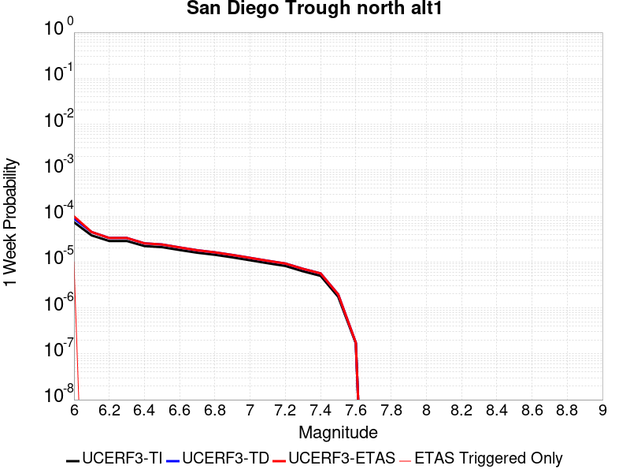 | 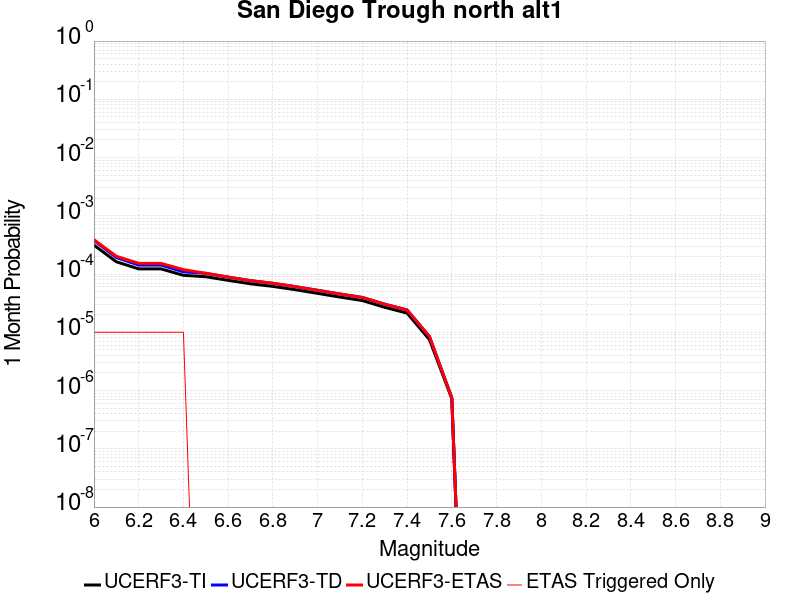 | 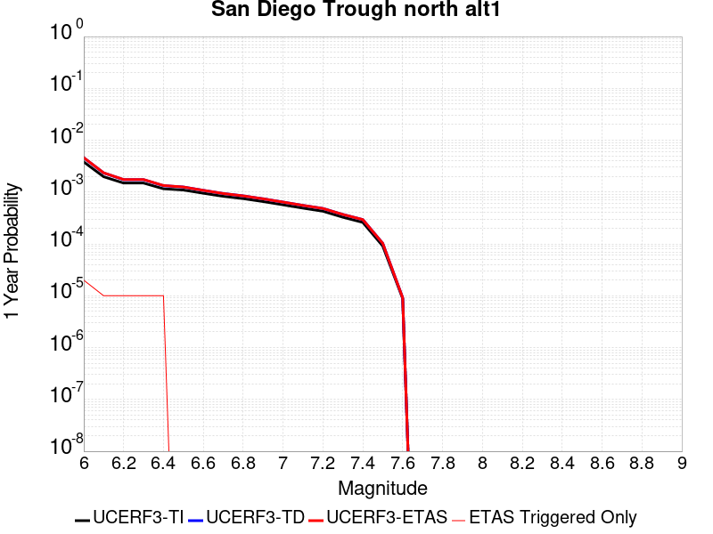 | 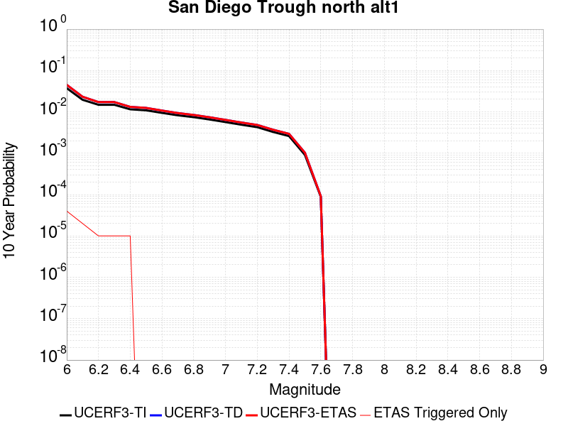 |

| Magnitude | 1 wk TI Prob | 1 wk TD Prob | 1 wk ETAS Prob | 1 wk ETAS/TD Gain | 1 wk ETAS Triggered Only | 1 mo TI Prob | 1 mo TD Prob | 1 mo ETAS Prob | 1 mo ETAS/TD Gain | 1 mo ETAS Triggered Only | 1 yr TI Prob | 1 yr TD Prob | 1 yr ETAS Prob | 1 yr ETAS/TD Gain | 1 yr ETAS Triggered Only | 10 yr TI Prob | 10 yr TD Prob | 10 yr ETAS Prob | 10 yr ETAS/TD Gain | 10 yr ETAS Triggered Only |
|-----|-----|-----|-----|-----|-----|-----|-----|-----|-----|-----|-----|-----|-----|-----|-----|-----|-----|-----|-----|-----|
| 6.0 | 7.329252E-5 | 8.821339E-5 | 1.0020274E-4 | 1.135913 | 1.1990408E-5 | 3.14073E-4 | 3.7800625E-4 | 3.8999214E-4 | 1.0317081 | 1.1990408E-5 | 0.0038171355 | 0.0045931544 | 0.004617025 | 1.005197 | 2.3980816E-5 | 0.03752231 | 0.045046188 | 0.04508054 | 1.0007626 | 3.597122E-5 |
| 6.1 | 3.7940346E-5 | 4.488612E-5 | 4.488612E-5 | 1.0 | 0.0 | 1.6259136E-4 | 1.9235547E-4 | 2.0434357E-4 | 1.0623226 | 1.1990408E-5 | 0.0019777524 | 0.002339501 | 0.0023514633 | 1.0051132 | 1.1990408E-5 | 0.019602431 | 0.023157248 | 0.02316896 | 1.0005058 | 1.1990408E-5 |
| 6.2 | 2.8645263E-5 | 3.329751E-5 | 3.329751E-5 | 1.0 | 0.0 | 1.2275964E-4 | 1.4269596E-4 | 1.5468466E-4 | 1.0840156 | 1.1990408E-5 | 0.0014935739 | 0.0017359565 | 0.0017479261 | 1.0068951 | 1.1990408E-5 | 0.0148357535 | 0.01722662 | 0.017238405 | 1.000684 | 1.1990408E-5 |
| 6.3 | 2.8645263E-5 | 3.329751E-5 | 3.329751E-5 | 1.0 | 0.0 | 1.2275964E-4 | 1.4269596E-4 | 1.5468466E-4 | 1.0840156 | 1.1990408E-5 | 0.0014935739 | 0.0017359565 | 0.0017479261 | 1.0068951 | 1.1990408E-5 | 0.0148357535 | 0.01722662 | 0.017238405 | 1.000684 | 1.1990408E-5 |
| 6.4 | 2.2204576E-5 | 2.5448817E-5 | 2.5448817E-5 | 1.0 | 0.0 | 9.5159E-5 | 1.0906186E-4 | 1.2105096E-4 | 1.1099293 | 1.1990408E-5 | 0.001157945 | 0.0013270293 | 0.0013390038 | 1.0090235 | 1.1990408E-5 | 0.011519298 | 0.013192211 | 0.013204044 | 1.0008969 | 1.1990408E-5 |
| 6.5 | 2.1004838E-5 | 2.4025157E-5 | 2.4025157E-5 | 1.0 | 0.0 | 9.0017624E-5 | 1.0296095E-4 | 1.0296095E-4 | 1.0 | 0.0 | 0.0010954136 | 0.001252838 | 0.001252838 | 1.0 | 0.0 | 0.010900296 | 0.012458827 | 0.012458827 | 1.0 | 0.0 |
| 6.6 | 1.820557E-5 | 2.0705167E-5 | 2.0705167E-5 | 1.0 | 0.0 | 7.802154E-5 | 8.873344E-5 | 8.873344E-5 | 1.0 | 0.0 | 9.4949827E-4 | 0.0010797997 | 0.0010797997 | 1.0 | 0.0 | 0.009454516 | 0.010746201 | 0.010746201 | 1.0 | 0.0 |
| 6.7 | 1.5884485E-5 | 1.7983964E-5 | 1.7983964E-5 | 1.0 | 0.0 | 6.807459E-5 | 7.707187E-5 | 7.707187E-5 | 1.0 | 0.0 | 8.284929E-4 | 9.379488E-4 | 9.379488E-4 | 1.0 | 0.0 | 0.008254109 | 0.009340268 | 0.009340268 | 1.0 | 0.0 |
| 6.8 | 1.4331171E-5 | 1.6201348E-5 | 1.6201348E-5 | 1.0 | 0.0 | 6.141786E-5 | 6.9432506E-5 | 6.9432506E-5 | 1.0 | 0.0 | 7.4750587E-4 | 8.4501493E-4 | 8.4501493E-4 | 1.0 | 0.0 | 0.0074499645 | 0.008418285 | 0.008418285 | 1.0 | 0.0 |
| 6.9 | 1.2574203E-5 | 1.4206081E-5 | 1.4206081E-5 | 1.0 | 0.0 | 5.3888325E-5 | 6.088179E-5 | 6.088179E-5 | 1.0 | 0.0 | 6.558929E-4 | 7.4098515E-4 | 7.4098515E-4 | 1.0 | 0.0 | 0.0065396037 | 0.0073853307 | 0.0073853307 | 1.0 | 0.0 |
| 7.0 | 1.0883844E-5 | 1.22894735E-5 | 1.22894735E-5 | 1.0 | 0.0 | 4.664421E-5 | 5.2668114E-5 | 5.2668114E-5 | 1.0 | 0.0 | 5.677453E-4 | 6.410466E-4 | 6.410466E-4 | 1.0 | 0.0 | 0.00566297 | 0.0063921027 | 0.0063921027 | 1.0 | 0.0 |
| 7.1 | 9.393088E-6 | 1.0607203E-5 | 1.0607203E-5 | 1.0 | 0.0 | 4.025547E-5 | 4.5458655E-5 | 4.5458655E-5 | 1.0 | 0.0 | 4.900001E-4 | 5.5331935E-4 | 5.5331935E-4 | 1.0 | 0.0 | 0.0048892107 | 0.005519513 | 0.005519513 | 1.0 | 0.0 |
| 7.2 | 8.190791E-6 | 9.258787E-6 | 9.258787E-6 | 1.0 | 0.0 | 3.510292E-5 | 3.9679915E-5 | 3.9679915E-5 | 1.0 | 0.0 | 4.2729423E-4 | 4.8299658E-4 | 4.8299658E-4 | 1.0 | 0.0 | 0.0042647356 | 0.004819548 | 0.004819548 | 1.0 | 0.0 |
| 7.3 | 6.268162E-6 | 7.08984E-6 | 7.08984E-6 | 1.0 | 0.0 | 2.6863276E-5 | 3.0384675E-5 | 3.0384675E-5 | 1.0 | 0.0 | 3.2701128E-4 | 3.6987104E-4 | 3.6987104E-4 | 1.0 | 0.0 | 0.003265305 | 0.0036926004 | 0.0036926004 | 1.0 | 0.0 |
| 7.4 | 4.985186E-6 | 5.6427807E-6 | 5.6427807E-6 | 1.0 | 0.0 | 2.1364907E-5 | 2.4183124E-5 | 2.4183124E-5 | 1.0 | 0.0 | 2.600867E-4 | 2.9439016E-4 | 2.9439016E-4 | 1.0 | 0.0 | 0.002597825 | 0.002940043 | 0.002940043 | 1.0 | 0.0 |
| 7.5 | 1.7489613E-6 | 1.9697113E-6 | 1.9697113E-6 | 1.0 | 0.0 | 7.495527E-6 | 8.441594E-6 | 8.441594E-6 | 1.0 | 0.0 | 9.125422E-5 | 1.0277178E-4 | 1.0277178E-4 | 1.0 | 0.0 | 9.1216754E-4 | 0.0010272645 | 0.0010272645 | 1.0 | 0.0 |
| 7.6 | 1.6988751E-7 | 1.7533898E-7 | 1.7533898E-7 | 1.0 | 0.0 | 7.2808916E-7 | 7.5145255E-7 | 7.5145255E-7 | 1.0 | 0.0 | 8.864449E-6 | 9.148898E-6 | 9.148898E-6 | 1.0 | 0.0 | 8.8640954E-5 | 9.148542E-5 | 9.148542E-5 | 1.0 | 0.0 |

## Dry Mountain
*[(top)](#table-of-contents)*

| 1 Week | 1 Month | 1 Year | 10 Year |
|-----|-----|-----|-----|
|  | 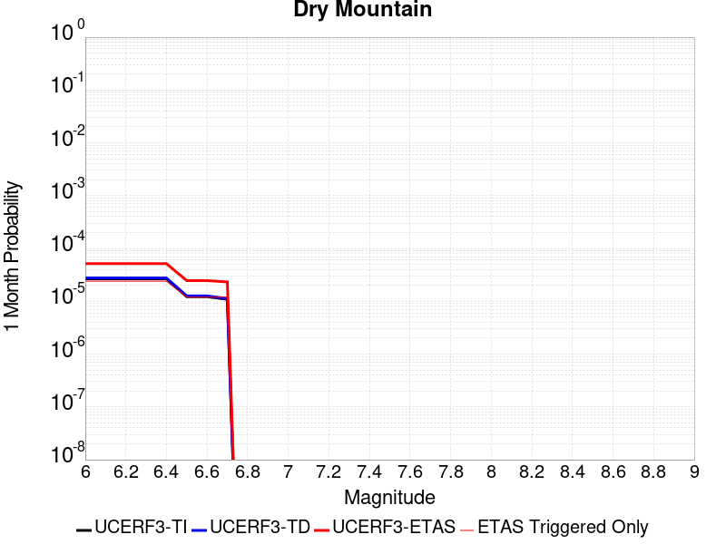 |  | 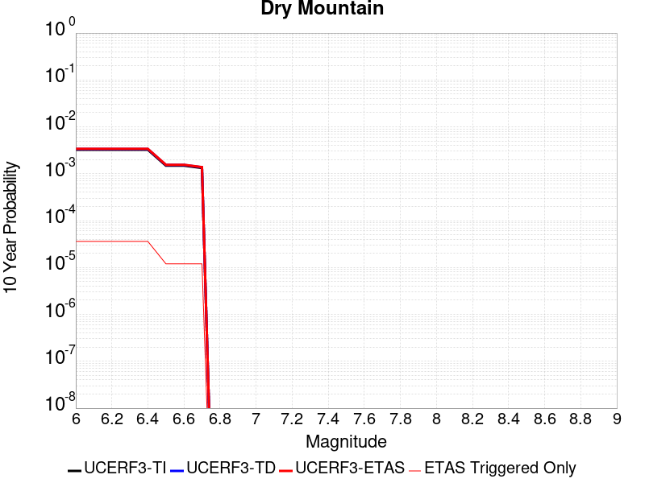 |

| Magnitude | 1 wk TI Prob | 1 wk TD Prob | 1 wk ETAS Prob | 1 wk ETAS/TD Gain | 1 wk ETAS Triggered Only | 1 mo TI Prob | 1 mo TD Prob | 1 mo ETAS Prob | 1 mo ETAS/TD Gain | 1 mo ETAS Triggered Only | 1 yr TI Prob | 1 yr TD Prob | 1 yr ETAS Prob | 1 yr ETAS/TD Gain | 1 yr ETAS Triggered Only | 10 yr TI Prob | 10 yr TD Prob | 10 yr ETAS Prob | 10 yr ETAS/TD Gain | 10 yr ETAS Triggered Only |
|-----|-----|-----|-----|-----|-----|-----|-----|-----|-----|-----|-----|-----|-----|-----|-----|-----|-----|-----|-----|-----|
| 6.0 | 6.222801E-6 | 6.439411E-6 | 6.439411E-6 | 1.0 | 0.0 | 2.6668875E-5 | 2.7597274E-5 | 5.1577426E-5 | 1.868932 | 2.3980816E-5 | 3.2464517E-4 | 3.359609E-4 | 3.7192006E-4 | 1.1070337 | 3.597122E-5 | 0.0032417132 | 0.0033560924 | 0.0033919427 | 1.0106822 | 3.597122E-5 |
| 6.1 | 6.222801E-6 | 6.439411E-6 | 6.439411E-6 | 1.0 | 0.0 | 2.6668875E-5 | 2.7597274E-5 | 5.1577426E-5 | 1.868932 | 2.3980816E-5 | 3.2464517E-4 | 3.359609E-4 | 3.7192006E-4 | 1.1070337 | 3.597122E-5 | 0.0032417132 | 0.0033560924 | 0.0033919427 | 1.0106822 | 3.597122E-5 |
| 6.2 | 6.222801E-6 | 6.439411E-6 | 6.439411E-6 | 1.0 | 0.0 | 2.6668875E-5 | 2.7597274E-5 | 5.1577426E-5 | 1.868932 | 2.3980816E-5 | 3.2464517E-4 | 3.359609E-4 | 3.7192006E-4 | 1.1070337 | 3.597122E-5 | 0.0032417132 | 0.0033560924 | 0.0033919427 | 1.0106822 | 3.597122E-5 |
| 6.3 | 6.222801E-6 | 6.439411E-6 | 6.439411E-6 | 1.0 | 0.0 | 2.6668875E-5 | 2.7597274E-5 | 5.1577426E-5 | 1.868932 | 2.3980816E-5 | 3.2464517E-4 | 3.359609E-4 | 3.7192006E-4 | 1.1070337 | 3.597122E-5 | 0.0032417132 | 0.0033560924 | 0.0033919427 | 1.0106822 | 3.597122E-5 |
| 6.4 | 6.222801E-6 | 6.439411E-6 | 6.439411E-6 | 1.0 | 0.0 | 2.6668875E-5 | 2.7597274E-5 | 5.1577426E-5 | 1.868932 | 2.3980816E-5 | 3.2464517E-4 | 3.359609E-4 | 3.7192006E-4 | 1.1070337 | 3.597122E-5 | 0.0032417132 | 0.0033560924 | 0.0033919427 | 1.0106822 | 3.597122E-5 |
| 6.5 | 2.8528623E-6 | 2.952182E-6 | 2.952182E-6 | 1.0 | 0.0 | 1.22264955E-5 | 1.2652196E-5 | 2.4642452E-5 | 1.9476818 | 1.1990408E-5 | 1.4884741E-4 | 1.5403831E-4 | 1.6602686E-4 | 1.0778284 | 1.1990408E-5 | 0.0014874774 | 0.0015401688 | 0.0015521407 | 1.0077732 | 1.1990408E-5 |
| 6.6 | 2.8528623E-6 | 2.952182E-6 | 2.952182E-6 | 1.0 | 0.0 | 1.22264955E-5 | 1.2652196E-5 | 2.4642452E-5 | 1.9476818 | 1.1990408E-5 | 1.4884741E-4 | 1.5403831E-4 | 1.6602686E-4 | 1.0778284 | 1.1990408E-5 | 0.0014874774 | 0.0015401688 | 0.0015521407 | 1.0077732 | 1.1990408E-5 |
| 6.7 | 2.541E-6 | 2.62937E-6 | 2.62937E-6 | 1.0 | 0.0 | 1.0889954E-5 | 1.12687285E-5 | 2.3259001E-5 | 2.0640306 | 1.1990408E-5 | 1.3257713E-4 | 1.3719677E-4 | 1.4918554E-4 | 1.0873837 | 1.1990408E-5 | 0.0013249806 | 0.0013719677 | 0.0013839416 | 1.0087276 | 1.1990408E-5 |

## Verdugo
*[(top)](#table-of-contents)*

| 1 Week | 1 Month | 1 Year | 10 Year |
|-----|-----|-----|-----|
| 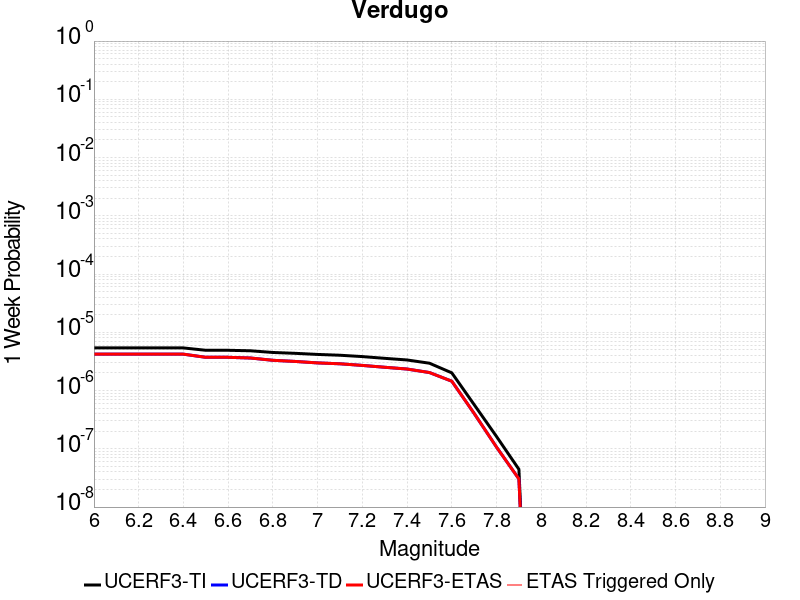 | 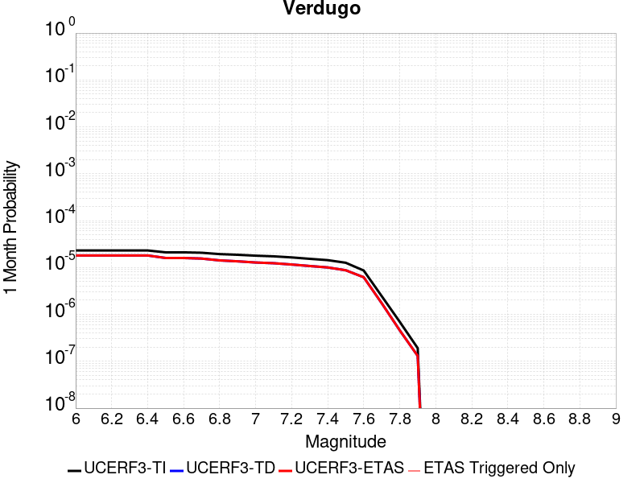 | 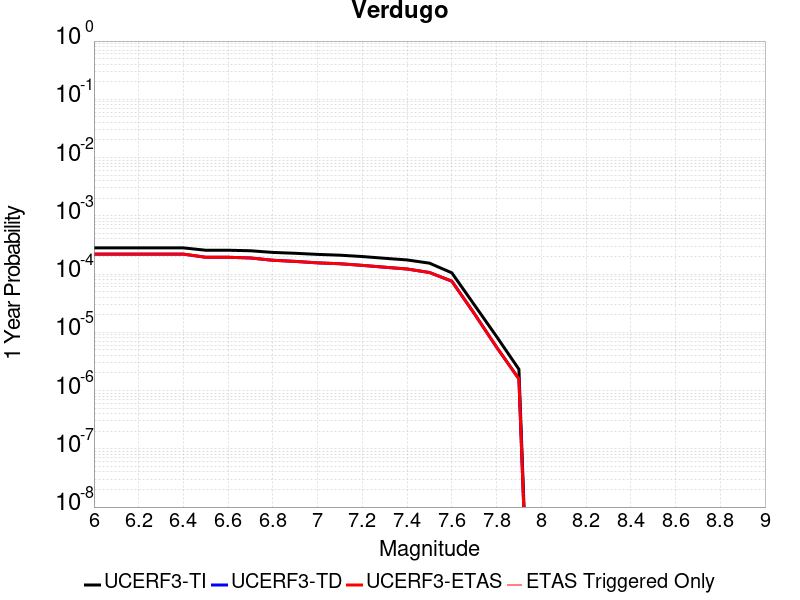 | 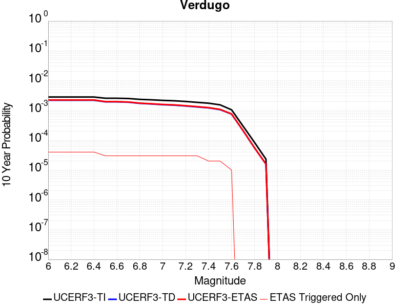 |

| Magnitude | 1 wk TI Prob | 1 wk TD Prob | 1 wk ETAS Prob | 1 wk ETAS/TD Gain | 1 wk ETAS Triggered Only | 1 mo TI Prob | 1 mo TD Prob | 1 mo ETAS Prob | 1 mo ETAS/TD Gain | 1 mo ETAS Triggered Only | 1 yr TI Prob | 1 yr TD Prob | 1 yr ETAS Prob | 1 yr ETAS/TD Gain | 1 yr ETAS Triggered Only | 10 yr TI Prob | 10 yr TD Prob | 10 yr ETAS Prob | 10 yr ETAS/TD Gain | 10 yr ETAS Triggered Only |
|-----|-----|-----|-----|-----|-----|-----|-----|-----|-----|-----|-----|-----|-----|-----|-----|-----|-----|-----|-----|-----|
| 6.0 | 5.392987E-6 | 4.2165602E-6 | 4.2165602E-6 | 1.0 | 0.0 | 2.3112598E-5 | 1.8070848E-5 | 1.8070848E-5 | 1.0 | 0.0 | 2.8135953E-4 | 2.1999085E-4 | 2.1999085E-4 | 1.0 | 0.0 | 0.0028100356 | 0.0021977786 | 0.0022456348 | 1.0217748 | 4.7961632E-5 |
| 6.1 | 5.392987E-6 | 4.2165602E-6 | 4.2165602E-6 | 1.0 | 0.0 | 2.3112598E-5 | 1.8070848E-5 | 1.8070848E-5 | 1.0 | 0.0 | 2.8135953E-4 | 2.1999085E-4 | 2.1999085E-4 | 1.0 | 0.0 | 0.0028100356 | 0.0021977786 | 0.0022456348 | 1.0217748 | 4.7961632E-5 |
| 6.2 | 5.392987E-6 | 4.2165602E-6 | 4.2165602E-6 | 1.0 | 0.0 | 2.3112598E-5 | 1.8070848E-5 | 1.8070848E-5 | 1.0 | 0.0 | 2.8135953E-4 | 2.1999085E-4 | 2.1999085E-4 | 1.0 | 0.0 | 0.0028100356 | 0.0021977786 | 0.0022456348 | 1.0217748 | 4.7961632E-5 |
| 6.3 | 5.392987E-6 | 4.2165602E-6 | 4.2165602E-6 | 1.0 | 0.0 | 2.3112598E-5 | 1.8070848E-5 | 1.8070848E-5 | 1.0 | 0.0 | 2.8135953E-4 | 2.1999085E-4 | 2.1999085E-4 | 1.0 | 0.0 | 0.0028100356 | 0.0021977786 | 0.0022456348 | 1.0217748 | 4.7961632E-5 |
| 6.4 | 5.392987E-6 | 4.2165602E-6 | 4.2165602E-6 | 1.0 | 0.0 | 2.3112598E-5 | 1.8070848E-5 | 1.8070848E-5 | 1.0 | 0.0 | 2.8135953E-4 | 2.1999085E-4 | 2.1999085E-4 | 1.0 | 0.0 | 0.0028100356 | 0.0021977786 | 0.0022456348 | 1.0217748 | 4.7961632E-5 |
| 6.5 | 4.9154837E-6 | 3.7225057E-6 | 3.7225057E-6 | 1.0 | 0.0 | 2.1066187E-5 | 1.59535E-5 | 1.59535E-5 | 1.0 | 0.0 | 2.5645064E-4 | 1.9421674E-4 | 1.9421674E-4 | 1.0 | 0.0 | 0.002561549 | 0.001940491 | 0.0019763925 | 1.0185012 | 3.597122E-5 |
| 6.6 | 4.9154837E-6 | 3.7225057E-6 | 3.7225057E-6 | 1.0 | 0.0 | 2.1066187E-5 | 1.59535E-5 | 1.59535E-5 | 1.0 | 0.0 | 2.5645064E-4 | 1.9421674E-4 | 1.9421674E-4 | 1.0 | 0.0 | 0.002561549 | 0.001940491 | 0.0019763925 | 1.0185012 | 3.597122E-5 |
| 6.7 | 4.817006E-6 | 3.6206918E-6 | 3.6206918E-6 | 1.0 | 0.0 | 2.0644147E-5 | 1.551716E-5 | 1.551716E-5 | 1.0 | 0.0 | 2.513135E-4 | 1.8890524E-4 | 1.8890524E-4 | 1.0 | 0.0 | 0.0025102948 | 0.0018874662 | 0.0019233696 | 1.019022 | 3.597122E-5 |
| 6.8 | 4.507407E-6 | 3.3071422E-6 | 3.3071422E-6 | 1.0 | 0.0 | 1.9317316E-5 | 1.417339E-5 | 1.417339E-5 | 1.0 | 0.0 | 2.3516294E-4 | 1.725475E-4 | 1.725475E-4 | 1.0 | 0.0 | 0.0023491425 | 0.0017241496 | 0.0017600588 | 1.0208272 | 3.597122E-5 |
| 6.9 | 4.3573054E-6 | 3.161048E-6 | 3.161048E-6 | 1.0 | 0.0 | 1.8674033E-5 | 1.3547278E-5 | 1.3547278E-5 | 1.0 | 0.0 | 2.2733262E-4 | 1.6492575E-4 | 1.6492575E-4 | 1.0 | 0.0 | 0.0022710022 | 0.001648046 | 0.0016839579 | 1.0217906 | 3.597122E-5 |
| 7.0 | 4.171527E-6 | 2.983706E-6 | 2.983706E-6 | 1.0 | 0.0 | 1.787785E-5 | 1.278725E-5 | 1.278725E-5 | 1.0 | 0.0 | 2.1764109E-4 | 1.5567376E-4 | 1.5567376E-4 | 1.0 | 0.0 | 0.0021742806 | 0.0015556583 | 0.0015915736 | 1.0230869 | 3.597122E-5 |
| 7.1 | 4.0405484E-6 | 2.882296E-6 | 2.882296E-6 | 1.0 | 0.0 | 1.731652E-5 | 1.2352639E-5 | 1.2352639E-5 | 1.0 | 0.0 | 2.1080824E-4 | 1.5038312E-4 | 1.5038312E-4 | 1.0 | 0.0 | 0.0021060838 | 0.0015028245 | 0.0015387416 | 1.0238998 | 3.597122E-5 |
| 7.2 | 3.8306007E-6 | 2.7018784E-6 | 2.7018784E-6 | 1.0 | 0.0 | 1.6416758E-5 | 1.1579428E-5 | 1.1579428E-5 | 1.0 | 0.0 | 1.9985568E-4 | 1.4097053E-4 | 1.4097053E-4 | 1.0 | 0.0 | 0.0019967605 | 0.0014088218 | 0.0014447423 | 1.0254968 | 3.597122E-5 |
| 7.3 | 3.5750938E-6 | 2.5122074E-6 | 2.5122074E-6 | 1.0 | 0.0 | 1.532174E-5 | 1.0766559E-5 | 1.0766559E-5 | 1.0 | 0.0 | 1.8652623E-4 | 1.3107508E-4 | 1.3107508E-4 | 1.0 | 0.0 | 0.0018636974 | 0.0013099882 | 0.0013459123 | 1.0274233 | 3.597122E-5 |
| 7.4 | 3.3510041E-6 | 2.3408884E-6 | 2.3408884E-6 | 1.0 | 0.0 | 1.4361368E-5 | 1.0032341E-5 | 1.0032341E-5 | 1.0 | 0.0 | 1.7483562E-4 | 1.2213702E-4 | 1.2213702E-4 | 1.0 | 0.0 | 0.0017469813 | 0.0012207093 | 0.0012446608 | 1.019621 | 2.3980816E-5 |
| 7.5 | 2.948287E-6 | 2.0391387E-6 | 2.0391387E-6 | 1.0 | 0.0 | 1.2635454E-5 | 8.739137E-6 | 8.739137E-6 | 1.0 | 0.0 | 1.538258E-4 | 1.06393905E-4 | 1.06393905E-4 | 1.0 | 0.0 | 0.0015371935 | 0.0010634399 | 0.0010873952 | 1.0225263 | 2.3980816E-5 |
| 7.6 | 2.0134323E-6 | 1.4471433E-6 | 1.4471433E-6 | 1.0 | 0.0 | 8.628967E-6 | 6.2020285E-6 | 6.2020285E-6 | 1.0 | 0.0 | 1.05052604E-4 | 7.550717E-5 | 7.550717E-5 | 1.0 | 0.0 | 0.0010500296 | 7.5482397E-4 | 7.668053E-4 | 1.0158731 | 1.1990408E-5 |
| 7.7 | 5.726436E-7 | 4.0453094E-7 | 4.0453094E-7 | 1.0 | 0.0 | 2.4541846E-6 | 1.733703E-6 | 1.733703E-6 | 1.0 | 0.0 | 2.9879287E-5 | 2.1107655E-5 | 2.1107655E-5 | 1.0 | 0.0 | 2.987527E-4 | 2.1105906E-4 | 2.1105906E-4 | 1.0 | 0.0 |
| 7.8 | 1.6248204E-7 | 1.068809E-7 | 1.068809E-7 | 1.0 | 0.0 | 6.963514E-7 | 4.5806092E-7 | 4.5806092E-7 | 1.0 | 0.0 | 8.478045E-6 | 5.576878E-6 | 5.576878E-6 | 1.0 | 0.0 | 8.477722E-5 | 5.576741E-5 | 5.576741E-5 | 1.0 | 0.0 |
| 7.9 | 4.4475744E-8 | 3.037577E-8 | 3.037577E-8 | 1.0 | 0.0 | 1.9061031E-7 | 1.3018186E-7 | 1.3018186E-7 | 1.0 | 0.0 | 2.320678E-6 | 1.5849631E-6 | 1.5849631E-6 | 1.0 | 0.0 | 2.3206538E-5 | 1.5849531E-5 | 1.5849531E-5 | 1.0 | 0.0 |

## Sierra Madre
*[(top)](#table-of-contents)*

| 1 Week | 1 Month | 1 Year | 10 Year |
|-----|-----|-----|-----|
| 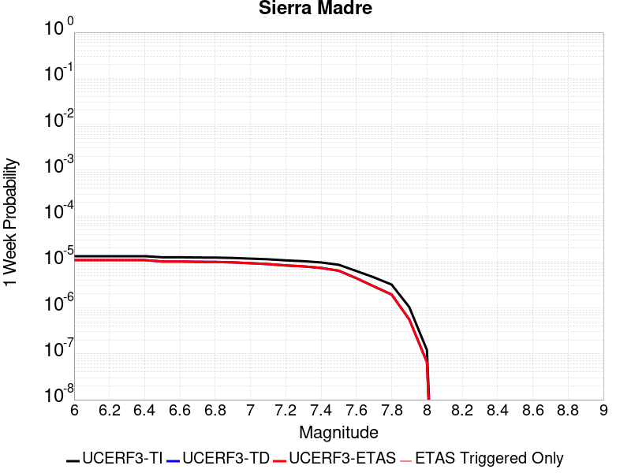 | 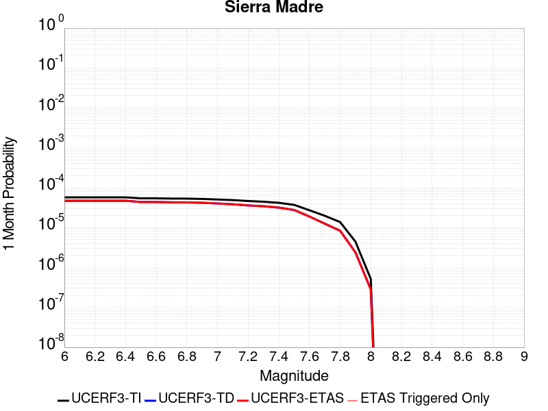 | 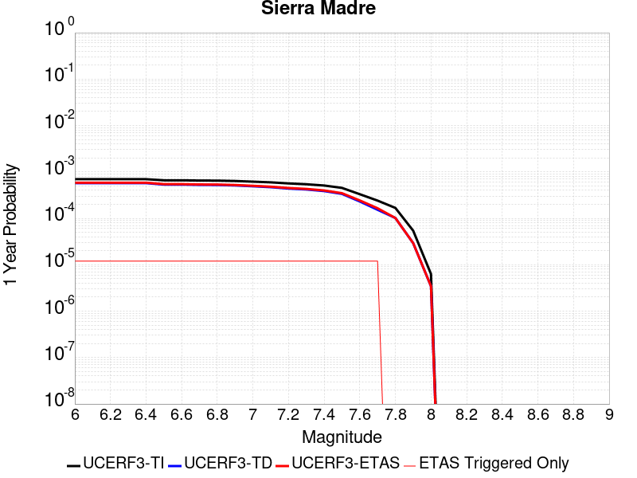 | 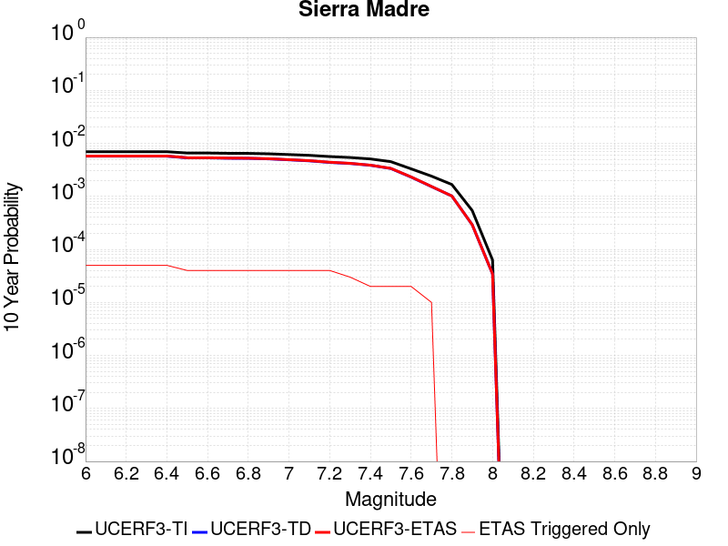 |

| Magnitude | 1 wk TI Prob | 1 wk TD Prob | 1 wk ETAS Prob | 1 wk ETAS/TD Gain | 1 wk ETAS Triggered Only | 1 mo TI Prob | 1 mo TD Prob | 1 mo ETAS Prob | 1 mo ETAS/TD Gain | 1 mo ETAS Triggered Only | 1 yr TI Prob | 1 yr TD Prob | 1 yr ETAS Prob | 1 yr ETAS/TD Gain | 1 yr ETAS Triggered Only | 10 yr TI Prob | 10 yr TD Prob | 10 yr ETAS Prob | 10 yr ETAS/TD Gain | 10 yr ETAS Triggered Only |
|-----|-----|-----|-----|-----|-----|-----|-----|-----|-----|-----|-----|-----|-----|-----|-----|-----|-----|-----|-----|-----|
| 6.0 | 1.3379373E-5 | 1.100113E-5 | 1.100113E-5 | 1.0 | 0.0 | 5.7338908E-5 | 4.7146856E-5 | 4.7146856E-5 | 1.0 | 0.0 | 6.978776E-4 | 5.738633E-4 | 5.858468E-4 | 1.0208822 | 1.1990408E-5 | 0.0069569005 | 0.005724178 | 0.005771865 | 1.0083308 | 4.7961632E-5 |
| 6.1 | 1.3379373E-5 | 1.100113E-5 | 1.100113E-5 | 1.0 | 0.0 | 5.7338908E-5 | 4.7146856E-5 | 4.7146856E-5 | 1.0 | 0.0 | 6.978776E-4 | 5.738633E-4 | 5.858468E-4 | 1.0208822 | 1.1990408E-5 | 0.0069569005 | 0.005724178 | 0.005771865 | 1.0083308 | 4.7961632E-5 |
| 6.2 | 1.3379373E-5 | 1.100113E-5 | 1.100113E-5 | 1.0 | 0.0 | 5.7338908E-5 | 4.7146856E-5 | 4.7146856E-5 | 1.0 | 0.0 | 6.978776E-4 | 5.738633E-4 | 5.858468E-4 | 1.0208822 | 1.1990408E-5 | 0.0069569005 | 0.005724178 | 0.005771865 | 1.0083308 | 4.7961632E-5 |
| 6.3 | 1.3379373E-5 | 1.100113E-5 | 1.100113E-5 | 1.0 | 0.0 | 5.7338908E-5 | 4.7146856E-5 | 4.7146856E-5 | 1.0 | 0.0 | 6.978776E-4 | 5.738633E-4 | 5.858468E-4 | 1.0208822 | 1.1990408E-5 | 0.0069569005 | 0.005724178 | 0.005771865 | 1.0083308 | 4.7961632E-5 |
| 6.4 | 1.3379373E-5 | 1.100113E-5 | 1.100113E-5 | 1.0 | 0.0 | 5.7338908E-5 | 4.7146856E-5 | 4.7146856E-5 | 1.0 | 0.0 | 6.978776E-4 | 5.738633E-4 | 5.858468E-4 | 1.0208822 | 1.1990408E-5 | 0.0069569005 | 0.005724178 | 0.005771865 | 1.0083308 | 4.7961632E-5 |
| 6.5 | 1.26563245E-5 | 1.0230579E-5 | 1.0230579E-5 | 1.0 | 0.0 | 5.4240263E-5 | 4.3844608E-5 | 4.3844608E-5 | 1.0 | 0.0 | 6.601751E-4 | 5.3367845E-4 | 5.456624E-4 | 1.0224555 | 1.1990408E-5 | 0.006582173 | 0.00532429 | 0.005371996 | 1.0089601 | 4.7961632E-5 |
| 6.6 | 1.26563245E-5 | 1.0230579E-5 | 1.0230579E-5 | 1.0 | 0.0 | 5.4240263E-5 | 4.3844608E-5 | 4.3844608E-5 | 1.0 | 0.0 | 6.601751E-4 | 5.3367845E-4 | 5.456624E-4 | 1.0224555 | 1.1990408E-5 | 0.006582173 | 0.00532429 | 0.005371996 | 1.0089601 | 4.7961632E-5 |
| 6.7 | 1.2502474E-5 | 1.0066722E-5 | 1.0066722E-5 | 1.0 | 0.0 | 5.3580934E-5 | 4.3142387E-5 | 4.3142387E-5 | 1.0 | 0.0 | 6.521526E-4 | 5.2513304E-4 | 5.371171E-4 | 1.0228211 | 1.1990408E-5 | 0.0065024206 | 0.0052392404 | 0.0052869506 | 1.0091064 | 4.7961632E-5 |
| 6.8 | 1.2454966E-5 | 1.0019007E-5 | 1.0019007E-5 | 1.0 | 0.0 | 5.3377335E-5 | 4.29379E-5 | 4.29379E-5 | 1.0 | 0.0 | 6.4967526E-4 | 5.226446E-4 | 5.3462875E-4 | 1.0229298 | 1.1990408E-5 | 0.006477792 | 0.005214473 | 0.005262185 | 1.0091498 | 4.7961632E-5 |
| 6.9 | 1.2225574E-5 | 9.7929815E-6 | 9.7929815E-6 | 1.0 | 0.0 | 5.2394265E-5 | 4.196925E-5 | 4.196925E-5 | 1.0 | 0.0 | 6.3771347E-4 | 5.108569E-4 | 5.228412E-4 | 1.0234592 | 1.1990408E-5 | 0.006358865 | 0.0050971415 | 0.0051448587 | 1.0093615 | 4.7961632E-5 |
| 7.0 | 1.182946E-5 | 9.3995195E-6 | 9.3995195E-6 | 1.0 | 0.0 | 5.06967E-5 | 4.0283037E-5 | 4.0283037E-5 | 1.0 | 0.0 | 6.1705755E-4 | 4.903367E-4 | 5.0232117E-4 | 1.0244415 | 1.1990408E-5 | 0.006153469 | 0.004892859 | 0.004940586 | 1.0097544 | 4.7961632E-5 |
| 7.1 | 1.14369095E-5 | 8.986527E-6 | 8.986527E-6 | 1.0 | 0.0 | 4.9014405E-5 | 3.8513124E-5 | 3.8513124E-5 | 1.0 | 0.0 | 5.9658696E-4 | 4.6879737E-4 | 4.8078215E-4 | 1.0255649 | 1.1990408E-5 | 0.005949879 | 0.00467839 | 0.0047261273 | 1.0102037 | 4.7961632E-5 |
| 7.2 | 1.0836419E-5 | 8.399916E-6 | 8.399916E-6 | 1.0 | 0.0 | 4.644097E-5 | 3.5999146E-5 | 3.5999146E-5 | 1.0 | 0.0 | 5.652721E-4 | 4.3820238E-4 | 4.5018754E-4 | 1.0273508 | 1.1990408E-5 | 0.0056383642 | 0.0043736803 | 0.0044214325 | 1.010918 | 4.7961632E-5 |
| 7.3 | 1.0403439E-5 | 8.021173E-6 | 8.021173E-6 | 1.0 | 0.0 | 4.4585406E-5 | 3.4376008E-5 | 3.4376008E-5 | 1.0 | 0.0 | 5.426921E-4 | 4.1844844E-4 | 4.3043384E-4 | 1.0286424 | 1.1990408E-5 | 0.005413687 | 0.0041769007 | 0.0042127217 | 1.0085759 | 3.597122E-5 |
| 7.4 | 9.768864E-6 | 7.414793E-6 | 7.414793E-6 | 1.0 | 0.0 | 4.186589E-5 | 3.17773E-5 | 3.17773E-5 | 1.0 | 0.0 | 5.09598E-4 | 3.8682084E-4 | 3.9880662E-4 | 1.0309854 | 1.1990408E-5 | 0.0050843097 | 0.0038617672 | 0.0038856554 | 1.0061858 | 2.3980816E-5 |
| 7.5 | 8.687089E-6 | 6.4504875E-6 | 6.4504875E-6 | 1.0 | 0.0 | 3.722985E-5 | 2.7644659E-5 | 2.7644659E-5 | 1.0 | 0.0 | 4.5317915E-4 | 3.3652261E-4 | 3.4850897E-4 | 1.0356183 | 1.1990408E-5 | 0.004522561 | 0.0033604174 | 0.0033843175 | 1.0071123 | 2.3980816E-5 |
| 7.6 | 6.3506063E-6 | 4.430626E-6 | 4.430626E-6 | 1.0 | 0.0 | 2.72166E-5 | 1.8988261E-5 | 1.8988261E-5 | 1.0 | 0.0 | 3.3131172E-4 | 2.3115781E-4 | 2.4314545E-4 | 1.0518591 | 1.1990408E-5 | 0.003308182 | 0.0023093987 | 0.0023333242 | 1.01036 | 2.3980816E-5 |
| 7.7 | 4.62223E-6 | 2.9332562E-6 | 2.9332562E-6 | 1.0 | 0.0 | 1.9809406E-5 | 1.2571038E-5 | 1.2571038E-5 | 1.0 | 0.0 | 2.4115283E-4 | 1.5304166E-4 | 1.6503023E-4 | 1.0783354 | 1.1990408E-5 | 0.0024089129 | 0.0015295637 | 0.0015415358 | 1.0078272 | 1.1990408E-5 |
| 7.8 | 3.2145008E-6 | 1.9496579E-6 | 1.9496579E-6 | 1.0 | 0.0 | 1.3776359E-5 | 8.35565E-6 | 8.35565E-6 | 1.0 | 0.0 | 1.6771426E-4 | 1.01725294E-4 | 1.01725294E-4 | 1.0 | 0.0 | 0.0016758774 | 0.0010169316 | 0.0010169316 | 1.0 | 0.0 |
| 7.9 | 1.0391769E-6 | 5.6034094E-7 | 5.6034094E-7 | 1.0 | 0.0 | 4.4536077E-6 | 2.401459E-6 | 2.401459E-6 | 1.0 | 0.0 | 5.4221324E-5 | 2.9237375E-5 | 2.9237375E-5 | 1.0 | 0.0 | 5.4208096E-4 | 2.9233572E-4 | 2.9233572E-4 | 1.0 | 0.0 |
| 8.0 | 1.210983E-7 | 6.6141716E-8 | 6.6141716E-8 | 1.0 | 0.0 | 5.1899264E-7 | 2.8346446E-7 | 2.8346446E-7 | 1.0 | 0.0 | 6.3187167E-6 | 3.4511747E-6 | 3.4511747E-6 | 1.0 | 0.0 | 6.318537E-5 | 3.4511228E-5 | 3.4511228E-5 | 1.0 | 0.0 |

## Santa Rosa Island
*[(top)](#table-of-contents)*

| 1 Week | 1 Month | 1 Year | 10 Year |
|-----|-----|-----|-----|
| 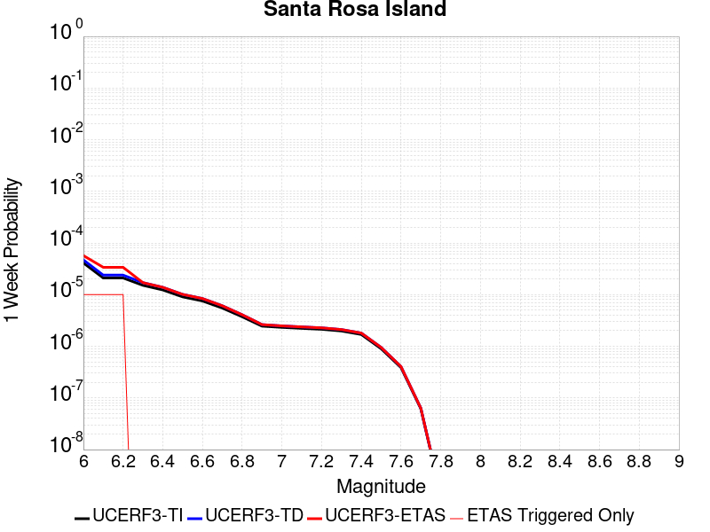 | 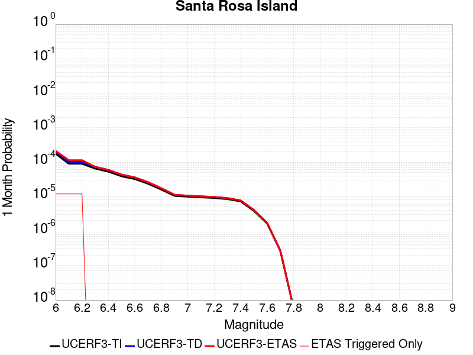 | 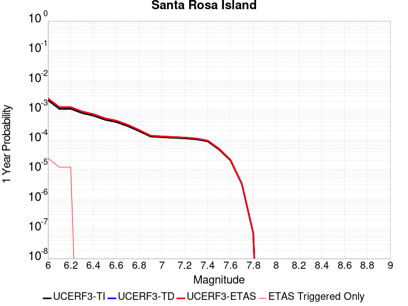 | 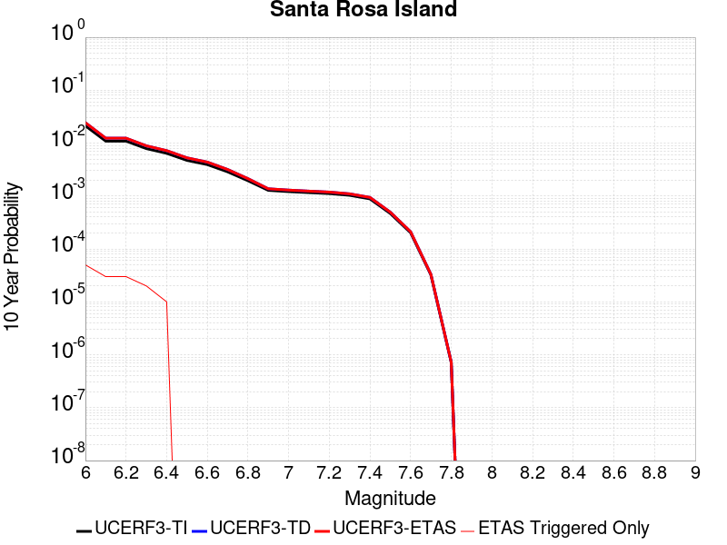 |

| Magnitude | 1 wk TI Prob | 1 wk TD Prob | 1 wk ETAS Prob | 1 wk ETAS/TD Gain | 1 wk ETAS Triggered Only | 1 mo TI Prob | 1 mo TD Prob | 1 mo ETAS Prob | 1 mo ETAS/TD Gain | 1 mo ETAS Triggered Only | 1 yr TI Prob | 1 yr TD Prob | 1 yr ETAS Prob | 1 yr ETAS/TD Gain | 1 yr ETAS Triggered Only | 10 yr TI Prob | 10 yr TD Prob | 10 yr ETAS Prob | 10 yr ETAS/TD Gain | 10 yr ETAS Triggered Only |
|-----|-----|-----|-----|-----|-----|-----|-----|-----|-----|-----|-----|-----|-----|-----|-----|-----|-----|-----|-----|-----|
| 6.0 | 4.1143165E-5 | 4.7092042E-5 | 5.9081885E-5 | 1.2546045 | 1.1990408E-5 | 1.7631594E-4 | 2.0180854E-4 | 2.1379652E-4 | 1.0594028 | 1.1990408E-5 | 0.002144533 | 0.0024544473 | 0.0024783693 | 1.0097463 | 2.3980816E-5 | 0.021239553 | 0.024294013 | 0.02434081 | 1.0019263 | 4.7961632E-5 |
| 6.1 | 2.1061249E-5 | 2.3865383E-5 | 3.5855504E-5 | 1.5024064 | 1.1990408E-5 | 9.0259375E-5 | 1.0227637E-4 | 1.1426555E-4 | 1.1172234 | 1.1990408E-5 | 0.0010983539 | 0.0012445324 | 0.0012565079 | 1.0096225 | 1.1990408E-5 | 0.01092941 | 0.012378667 | 0.012402351 | 1.0019133 | 2.3980816E-5 |
| 6.2 | 2.1061249E-5 | 2.3865383E-5 | 3.5855504E-5 | 1.5024064 | 1.1990408E-5 | 9.0259375E-5 | 1.0227637E-4 | 1.1426555E-4 | 1.1172234 | 1.1990408E-5 | 0.0010983539 | 0.0012445324 | 0.0012565079 | 1.0096225 | 1.1990408E-5 | 0.01092941 | 0.012378667 | 0.012402351 | 1.0019133 | 2.3980816E-5 |
| 6.3 | 1.5158236E-5 | 1.7074708E-5 | 1.7074708E-5 | 1.0 | 0.0 | 6.496225E-5 | 7.317533E-5 | 7.317533E-5 | 1.0 | 0.0 | 7.906284E-4 | 8.905574E-4 | 8.905574E-4 | 1.0 | 0.0 | 0.007878214 | 0.008871138 | 0.008883023 | 1.0013397 | 1.1990408E-5 |
| 6.4 | 1.2341918E-5 | 1.3853143E-5 | 1.3853143E-5 | 1.0 | 0.0 | 5.2892858E-5 | 5.9369308E-5 | 5.9369308E-5 | 1.0 | 0.0 | 6.437803E-4 | 7.225897E-4 | 7.225897E-4 | 1.0 | 0.0 | 0.006419184 | 0.0072032386 | 0.0072032386 | 1.0 | 0.0 |
| 6.5 | 9.061158E-6 | 1.0117188E-5 | 1.0117188E-5 | 1.0 | 0.0 | 3.883296E-5 | 4.335869E-5 | 4.335869E-5 | 1.0 | 0.0 | 4.726887E-4 | 5.277695E-4 | 5.277695E-4 | 1.0 | 0.0 | 0.004716845 | 0.0052656992 | 0.0052656992 | 1.0 | 0.0 |
| 6.6 | 7.5461685E-6 | 8.400861E-6 | 8.400861E-6 | 1.0 | 0.0 | 3.2340322E-5 | 3.6003217E-5 | 3.6003217E-5 | 1.0 | 0.0 | 3.936723E-4 | 4.382553E-4 | 4.382553E-4 | 1.0 | 0.0 | 0.003929756 | 0.0043743397 | 0.0043743397 | 1.0 | 0.0 |
| 6.7 | 5.5023775E-6 | 6.0874677E-6 | 6.0874677E-6 | 1.0 | 0.0 | 2.3581404E-5 | 2.6088905E-5 | 2.6088905E-5 | 1.0 | 0.0 | 2.8706578E-4 | 3.1758935E-4 | 3.1758935E-4 | 1.0 | 0.0 | 0.0028669522 | 0.0031716768 | 0.0031716768 | 1.0 | 0.0 |
| 6.8 | 3.7351679E-6 | 4.0831915E-6 | 4.0831915E-6 | 1.0 | 0.0 | 1.6007763E-5 | 1.749929E-5 | 1.749929E-5 | 1.0 | 0.0 | 1.948771E-4 | 2.1303551E-4 | 2.1303551E-4 | 1.0 | 0.0 | 0.0019470629 | 0.002128558 | 0.002128558 | 1.0 | 0.0 |
| 6.9 | 2.456366E-6 | 2.6292953E-6 | 2.6292953E-6 | 1.0 | 0.0 | 1.0527241E-5 | 1.126836E-5 | 1.126836E-5 | 1.0 | 0.0 | 1.2816161E-4 | 1.3718367E-4 | 1.3718367E-4 | 1.0 | 0.0 | 0.0012808773 | 0.0013709929 | 0.0013709929 | 1.0 | 0.0 |
| 7.0 | 2.3245157E-6 | 2.482801E-6 | 2.482801E-6 | 1.0 | 0.0 | 9.962172E-6 | 1.0640532E-5 | 1.0640532E-5 | 1.0 | 0.0 | 1.2128269E-4 | 1.295408E-4 | 1.295408E-4 | 1.0 | 0.0 | 0.0012121652 | 0.0012946551 | 0.0012946551 | 1.0 | 0.0 |
| 7.1 | 2.2248344E-6 | 2.3732712E-6 | 2.3732712E-6 | 1.0 | 0.0 | 9.53497E-6 | 1.0171123E-5 | 1.0171123E-5 | 1.0 | 0.0 | 1.1608207E-4 | 1.238264E-4 | 1.238264E-4 | 1.0 | 0.0 | 0.0011602144 | 0.001237576 | 0.001237576 | 1.0 | 0.0 |
| 7.2 | 2.1350402E-6 | 2.2761742E-6 | 2.2761742E-6 | 1.0 | 0.0 | 9.150141E-6 | 9.7549955E-6 | 9.7549955E-6 | 1.0 | 0.0 | 1.1139726E-4 | 1.1876062E-4 | 1.1876062E-4 | 1.0 | 0.0 | 0.0011134144 | 0.0011869734 | 0.0011869734 | 1.0 | 0.0 |
| 7.3 | 1.9793572E-6 | 2.1087376E-6 | 2.1087376E-6 | 1.0 | 0.0 | 8.482932E-6 | 9.037415E-6 | 9.037415E-6 | 1.0 | 0.0 | 1.032748E-4 | 1.10024994E-4 | 1.10024994E-4 | 1.0 | 0.0 | 0.0010322682 | 0.001099707 | 0.001099707 | 1.0 | 0.0 |
| 7.4 | 1.6951194E-6 | 1.804589E-6 | 1.804589E-6 | 1.0 | 0.0 | 7.264777E-6 | 7.73393E-6 | 7.73393E-6 | 1.0 | 0.0 | 8.844508E-5 | 9.4156545E-5 | 9.4156545E-5 | 1.0 | 0.0 | 8.840988E-4 | 9.411682E-4 | 9.411682E-4 | 1.0 | 0.0 |
| 7.5 | 8.987207E-7 | 9.51229E-7 | 9.51229E-7 | 1.0 | 0.0 | 3.8516546E-6 | 4.0766895E-6 | 4.0766895E-6 | 1.0 | 0.0 | 4.6892885E-5 | 4.9632577E-5 | 4.9632577E-5 | 1.0 | 0.0 | 4.688299E-4 | 4.9621606E-4 | 4.9621606E-4 | 1.0 | 0.0 |
| 7.6 | 3.8783037E-7 | 4.052958E-7 | 4.052958E-7 | 1.0 | 0.0 | 1.6621291E-6 | 1.7369808E-6 | 1.7369808E-6 | 1.0 | 0.0 | 2.0236233E-5 | 2.1147544E-5 | 2.1147544E-5 | 1.0 | 0.0 | 2.023439E-4 | 2.1145596E-4 | 2.1145596E-4 | 1.0 | 0.0 |
| 7.7 | 6.181804E-8 | 6.3390665E-8 | 6.3390665E-8 | 1.0 | 0.0 | 2.6493444E-7 | 2.7167425E-7 | 2.7167425E-7 | 1.0 | 0.0 | 3.225572E-6 | 3.307629E-6 | 3.307629E-6 | 1.0 | 0.0 | 3.225525E-5 | 3.3075805E-5 | 3.3075805E-5 | 1.0 | 0.0 |
| 7.8 | 1.3704449E-9 | 1.3964188E-9 | 1.3964188E-9 | 1.0 | 0.0 | 5.873335E-9 | 5.984652E-9 | 5.984652E-9 | 1.0 | 0.0 | 7.1507856E-8 | 7.286314E-8 | 7.286314E-8 | 1.0 | 0.0 | 7.1507833E-7 | 7.286312E-7 | 7.286312E-7 | 1.0 | 0.0 |

## Malibu Coast (Extension) alt 1
*[(top)](#table-of-contents)*

| 1 Week | 1 Month | 1 Year | 10 Year |
|-----|-----|-----|-----|
| 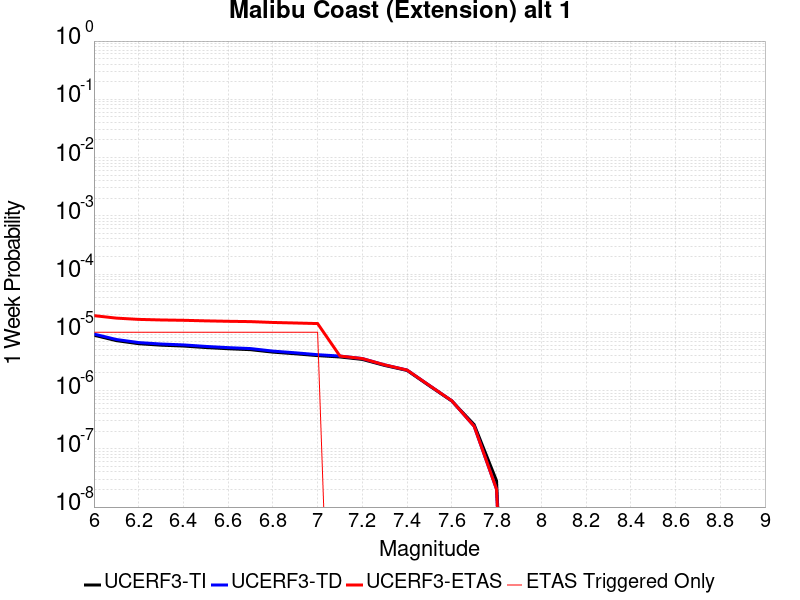 | 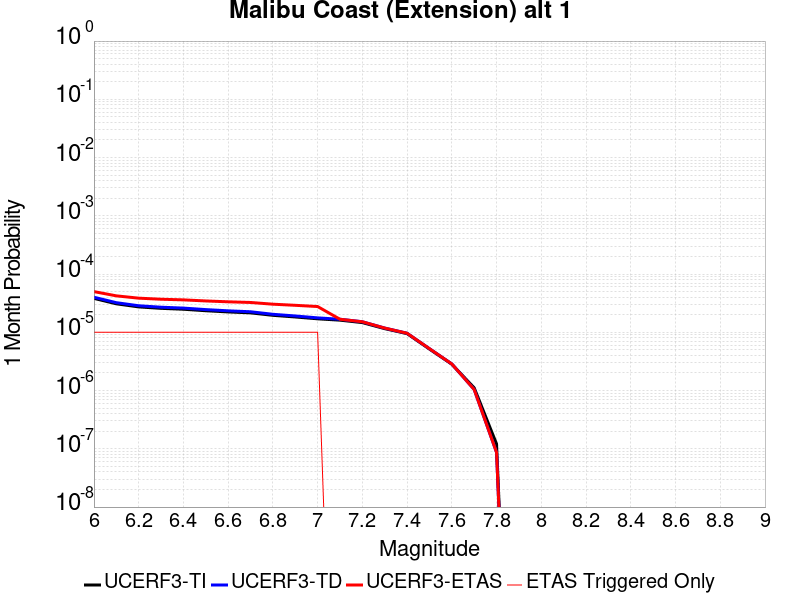 | 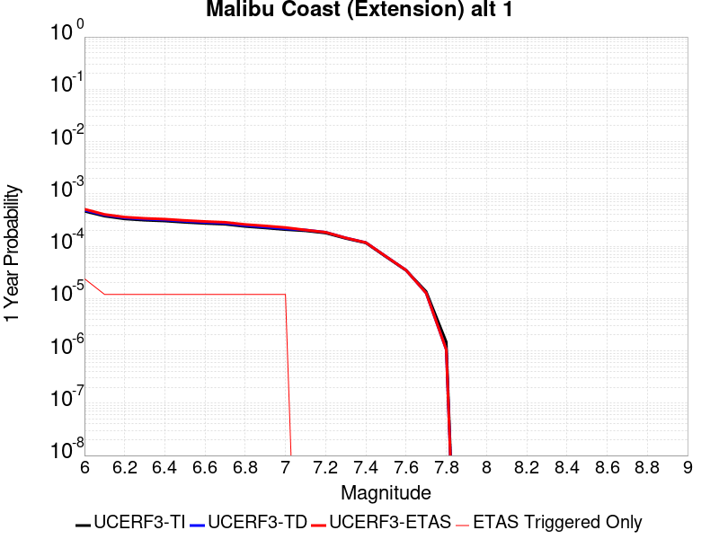 | 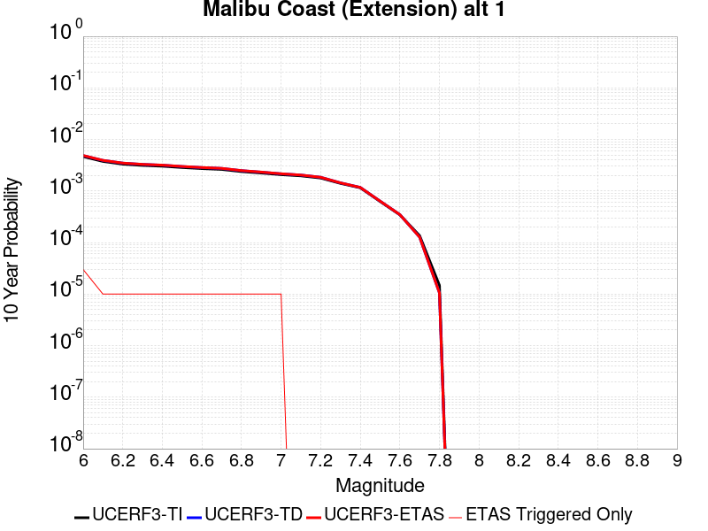 |

| Magnitude | 1 wk TI Prob | 1 wk TD Prob | 1 wk ETAS Prob | 1 wk ETAS/TD Gain | 1 wk ETAS Triggered Only | 1 mo TI Prob | 1 mo TD Prob | 1 mo ETAS Prob | 1 mo ETAS/TD Gain | 1 mo ETAS Triggered Only | 1 yr TI Prob | 1 yr TD Prob | 1 yr ETAS Prob | 1 yr ETAS/TD Gain | 1 yr ETAS Triggered Only | 10 yr TI Prob | 10 yr TD Prob | 10 yr ETAS Prob | 10 yr ETAS/TD Gain | 10 yr ETAS Triggered Only |
|-----|-----|-----|-----|-----|-----|-----|-----|-----|-----|-----|-----|-----|-----|-----|-----|-----|-----|-----|-----|-----|
| 6.0 | 8.930738E-6 | 9.329346E-6 | 2.1319642E-5 | 2.2852237 | 1.1990408E-5 | 3.827403E-5 | 3.9982307E-5 | 5.1972234E-5 | 1.2998809 | 1.1990408E-5 | 4.6588664E-4 | 4.8667757E-4 | 5.106467E-4 | 1.0492506 | 2.3980816E-5 | 0.0046491115 | 0.0048563 | 0.004892097 | 1.0073712 | 3.597122E-5 |
| 6.1 | 7.199952E-6 | 7.530357E-6 | 1.9520674E-5 | 2.5922642 | 1.1990408E-5 | 3.0856572E-5 | 3.227256E-5 | 4.4262582E-5 | 1.3715236 | 1.1990408E-5 | 3.75614E-4 | 3.928482E-4 | 4.048339E-4 | 1.0305097 | 1.1990408E-5 | 0.0037497976 | 0.003921604 | 0.003933547 | 1.0030456 | 1.1990408E-5 |
| 6.2 | 6.3721413E-6 | 6.6668467E-6 | 1.8657174E-5 | 2.7985005 | 1.1990408E-5 | 2.7308892E-5 | 2.857189E-5 | 4.0561954E-5 | 1.4196455 | 1.1990408E-5 | 3.3243504E-4 | 3.478076E-4 | 3.5979383E-4 | 1.0344622 | 1.1990408E-5 | 0.0033193815 | 0.0034726725 | 0.0034846212 | 1.0034409 | 1.1990408E-5 |
| 6.3 | 6.016345E-6 | 6.2952113E-6 | 1.8285544E-5 | 2.904675 | 1.1990408E-5 | 2.578408E-5 | 2.69792E-5 | 3.8969283E-5 | 1.4444195 | 1.1990408E-5 | 3.1387596E-4 | 3.2842258E-4 | 3.4040905E-4 | 1.0364971 | 1.1990408E-5 | 0.00313433 | 0.0032794084 | 0.0032913594 | 1.0036442 | 1.1990408E-5 |
| 6.4 | 5.8104883E-6 | 6.0795965E-6 | 1.8069932E-5 | 2.9722254 | 1.1990408E-5 | 2.4901856E-5 | 2.6055155E-5 | 3.804525E-5 | 1.4601814 | 1.1990408E-5 | 3.031379E-4 | 3.1717564E-4 | 3.2916226E-4 | 1.0377917 | 1.1990408E-5 | 0.0030272473 | 0.0031672644 | 0.0031792168 | 1.0037737 | 1.1990408E-5 |
| 6.5 | 5.476925E-6 | 5.7275624E-6 | 1.77179E-5 | 3.0934453 | 1.1990408E-5 | 2.3472323E-5 | 2.4546467E-5 | 3.653658E-5 | 1.4884659 | 1.1990408E-5 | 2.8573806E-4 | 2.9881255E-4 | 3.1079937E-4 | 1.0401149 | 1.1990408E-5 | 0.0028537093 | 0.0029841396 | 0.002996094 | 1.004006 | 1.1990408E-5 |
| 6.6 | 5.222387E-6 | 5.4586267E-6 | 1.7448969E-5 | 3.196586 | 1.1990408E-5 | 2.2381464E-5 | 2.3393906E-5 | 3.5384033E-5 | 1.512532 | 1.1990408E-5 | 2.7246025E-4 | 2.847839E-4 | 2.9677086E-4 | 1.0420915 | 1.1990408E-5 | 0.0027212645 | 0.00284422 | 0.0028561763 | 1.0042037 | 1.1990408E-5 |
| 6.7 | 5.0337076E-6 | 5.2591486E-6 | 1.7249493E-5 | 3.2799022 | 1.1990408E-5 | 2.1572854E-5 | 2.2539016E-5 | 3.4529152E-5 | 1.5319725 | 1.1990408E-5 | 2.6261783E-4 | 2.7437825E-4 | 2.8636536E-4 | 1.0436883 | 1.1990408E-5 | 0.002623077 | 0.0027404248 | 0.0027523825 | 1.0043634 | 1.1990408E-5 |
| 6.8 | 4.5675624E-6 | 4.7587573E-6 | 1.6749107E-5 | 3.519639 | 1.1990408E-5 | 1.9575122E-5 | 2.0394515E-5 | 3.238468E-5 | 1.5879111 | 1.1990408E-5 | 2.3830103E-4 | 2.4827512E-4 | 2.6026255E-4 | 1.0482829 | 1.1990408E-5 | 0.0023804565 | 0.0024799972 | 0.0024919577 | 1.0048229 | 1.1990408E-5 |
| 6.9 | 4.2802412E-6 | 4.4520584E-6 | 1.6442413E-5 | 3.6932156 | 1.1990408E-5 | 1.8343762E-5 | 1.9080113E-5 | 3.1070293E-5 | 1.6284124 | 1.1990408E-5 | 2.2331243E-4 | 2.3227576E-4 | 2.4426338E-4 | 1.0516094 | 1.1990408E-5 | 0.0022308815 | 0.0023203467 | 0.0023323093 | 1.0051556 | 1.1990408E-5 |
| 7.0 | 3.9794063E-6 | 4.130134E-6 | 1.6120492E-5 | 3.90314 | 1.1990408E-5 | 1.7054486E-5 | 1.7700455E-5 | 2.9690651E-5 | 1.6773947 | 1.1990408E-5 | 2.0761859E-4 | 2.1548186E-4 | 2.2746969E-4 | 1.0556326 | 1.1990408E-5 | 0.0020742472 | 0.0021527428 | 0.0021647073 | 1.0055579 | 1.1990408E-5 |
| 7.1 | 3.7730424E-6 | 3.91125E-6 | 3.91125E-6 | 1.0 | 0.0 | 1.6170083E-5 | 1.6762395E-5 | 1.6762395E-5 | 1.0 | 0.0 | 1.9685295E-4 | 2.0406317E-4 | 2.0406317E-4 | 1.0 | 0.0 | 0.0019667868 | 0.0020387706 | 0.0020387706 | 1.0 | 0.0 |
| 7.2 | 3.424985E-6 | 3.5413673E-6 | 3.5413673E-6 | 1.0 | 0.0 | 1.4678424E-5 | 1.51772E-5 | 1.51772E-5 | 1.0 | 0.0 | 1.7869516E-4 | 1.8476686E-4 | 1.8476686E-4 | 1.0 | 0.0 | 0.0017855153 | 0.0018461446 | 0.0018461446 | 1.0 | 0.0 |
| 7.3 | 2.6966375E-6 | 2.759676E-6 | 2.759676E-6 | 1.0 | 0.0 | 1.15569665E-5 | 1.1827129E-5 | 1.1827129E-5 | 1.0 | 0.0 | 1.4069698E-4 | 1.4398582E-4 | 1.4398582E-4 | 1.0 | 0.0 | 0.0014060794 | 0.0014389295 | 0.0014389295 | 1.0 | 0.0 |
| 7.4 | 2.215957E-6 | 2.2493962E-6 | 2.2493962E-6 | 1.0 | 0.0 | 9.496924E-6 | 9.640234E-6 | 9.640234E-6 | 1.0 | 0.0 | 1.1561892E-4 | 1.1736356E-4 | 1.1736356E-4 | 1.0 | 0.0 | 0.0011555878 | 0.0011730195 | 0.0011730195 | 1.0 | 0.0 |
| 7.5 | 1.2040218E-6 | 1.2219169E-6 | 1.2219169E-6 | 1.0 | 0.0 | 5.160083E-6 | 5.236777E-6 | 5.236777E-6 | 1.0 | 0.0 | 6.2822204E-5 | 6.3755906E-5 | 6.3755906E-5 | 1.0 | 0.0 | 6.280445E-4 | 6.37378E-4 | 6.37378E-4 | 1.0 | 0.0 |
| 7.6 | 6.6157446E-7 | 6.6790335E-7 | 6.6790335E-7 | 1.0 | 0.0 | 2.835316E-6 | 2.86244E-6 | 2.86244E-6 | 1.0 | 0.0 | 3.4519428E-5 | 3.4849665E-5 | 3.4849665E-5 | 1.0 | 0.0 | 3.4514067E-4 | 3.4844351E-4 | 3.4844351E-4 | 1.0 | 0.0 |
| 7.7 | 2.6012302E-7 | 2.4357794E-7 | 2.4357794E-7 | 1.0 | 0.0 | 1.1148124E-6 | 1.0439051E-6 | 1.0439051E-6 | 1.0 | 0.0 | 1.3572758E-5 | 1.2709481E-5 | 1.2709481E-5 | 1.0 | 0.0 | 1.3571928E-4 | 1.2708861E-4 | 1.2708861E-4 | 1.0 | 0.0 |
| 7.8 | 2.8323132E-8 | 2.026683E-8 | 2.026683E-8 | 1.0 | 0.0 | 1.2138484E-7 | 8.685784E-8 | 8.685784E-8 | 1.0 | 0.0 | 1.4778595E-6 | 1.0574938E-6 | 1.0574938E-6 | 1.0 | 0.0 | 1.4778497E-5 | 1.0574896E-5 | 1.0574896E-5 | 1.0 | 0.0 |

## Great Valley 08 (Quinto)
*[(top)](#table-of-contents)*

| 1 Week | 1 Month | 1 Year | 10 Year |
|-----|-----|-----|-----|
| 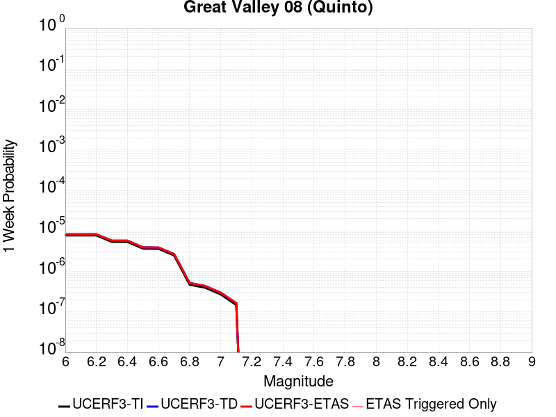 |  | 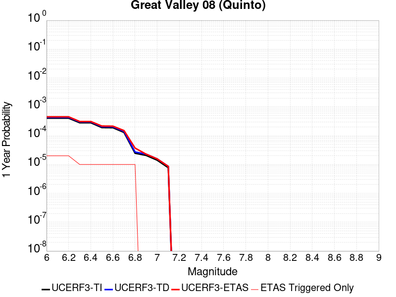 | 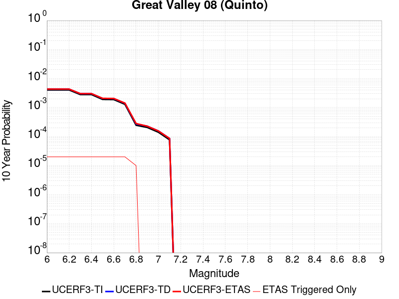 |

| Magnitude | 1 wk TI Prob | 1 wk TD Prob | 1 wk ETAS Prob | 1 wk ETAS/TD Gain | 1 wk ETAS Triggered Only | 1 mo TI Prob | 1 mo TD Prob | 1 mo ETAS Prob | 1 mo ETAS/TD Gain | 1 mo ETAS Triggered Only | 1 yr TI Prob | 1 yr TD Prob | 1 yr ETAS Prob | 1 yr ETAS/TD Gain | 1 yr ETAS Triggered Only | 10 yr TI Prob | 10 yr TD Prob | 10 yr ETAS Prob | 10 yr ETAS/TD Gain | 10 yr ETAS Triggered Only |
|-----|-----|-----|-----|-----|-----|-----|-----|-----|-----|-----|-----|-----|-----|-----|-----|-----|-----|-----|-----|-----|
| 6.0 | 7.737697E-6 | 8.253111E-6 | 8.253111E-6 | 1.0 | 0.0 | 3.3161137E-5 | 3.5370103E-5 | 3.5370103E-5 | 1.0 | 0.0 | 4.0366207E-4 | 4.3056477E-4 | 4.5453527E-4 | 1.0556722 | 2.3980816E-5 | 0.004029296 | 0.0042991587 | 0.0043230364 | 1.0055541 | 2.3980816E-5 |
| 6.1 | 7.737697E-6 | 8.253111E-6 | 8.253111E-6 | 1.0 | 0.0 | 3.3161137E-5 | 3.5370103E-5 | 3.5370103E-5 | 1.0 | 0.0 | 4.0366207E-4 | 4.3056477E-4 | 4.5453527E-4 | 1.0556722 | 2.3980816E-5 | 0.004029296 | 0.0042991587 | 0.0043230364 | 1.0055541 | 2.3980816E-5 |
| 6.2 | 7.737697E-6 | 8.253111E-6 | 8.253111E-6 | 1.0 | 0.0 | 3.3161137E-5 | 3.5370103E-5 | 3.5370103E-5 | 1.0 | 0.0 | 4.0366207E-4 | 4.3056477E-4 | 4.5453527E-4 | 1.0556722 | 2.3980816E-5 | 0.004029296 | 0.0042991587 | 0.0043230364 | 1.0055541 | 2.3980816E-5 |
| 6.3 | 5.374012E-6 | 5.750627E-6 | 5.750627E-6 | 1.0 | 0.0 | 2.3031276E-5 | 2.4645375E-5 | 2.4645375E-5 | 1.0 | 0.0 | 2.803697E-4 | 3.0002726E-4 | 3.1201408E-4 | 1.0399524 | 1.1990408E-5 | 0.0028001624 | 0.0029973155 | 0.0030212244 | 1.0079768 | 2.3980816E-5 |
| 6.4 | 5.374012E-6 | 5.750627E-6 | 5.750627E-6 | 1.0 | 0.0 | 2.3031276E-5 | 2.4645375E-5 | 2.4645375E-5 | 1.0 | 0.0 | 2.803697E-4 | 3.0002726E-4 | 3.1201408E-4 | 1.0399524 | 1.1990408E-5 | 0.0028001624 | 0.0029973155 | 0.0030212244 | 1.0079768 | 2.3980816E-5 |
| 6.5 | 3.65427E-6 | 3.941365E-6 | 3.941365E-6 | 1.0 | 0.0 | 1.5661062E-5 | 1.6891494E-5 | 1.6891494E-5 | 1.0 | 0.0 | 1.9065675E-4 | 2.056416E-4 | 2.1762954E-4 | 1.0582954 | 1.1990408E-5 | 0.0019049325 | 0.0020552047 | 0.0020791362 | 1.0116444 | 2.3980816E-5 |
| 6.6 | 3.6143538E-6 | 3.8985513E-6 | 3.8985513E-6 | 1.0 | 0.0 | 1.5489995E-5 | 1.6708009E-5 | 1.6708009E-5 | 1.0 | 0.0 | 1.8857437E-4 | 2.0340808E-4 | 2.1539605E-4 | 1.0589355 | 1.1990408E-5 | 0.0018841444 | 0.0020329105 | 0.0020568427 | 1.0117723 | 2.3980816E-5 |
| 6.7 | 2.4821015E-6 | 2.685736E-6 | 2.685736E-6 | 1.0 | 0.0 | 1.0637535E-5 | 1.15102785E-5 | 1.15102785E-5 | 1.0 | 0.0 | 1.2950429E-4 | 1.4013429E-4 | 1.5212302E-4 | 1.0855517 | 1.1990408E-5 | 0.0012942884 | 0.0014010142 | 0.0014249614 | 1.0170928 | 2.3980816E-5 |
| 6.8 | 4.7110538E-7 | 5.1930914E-7 | 5.1930914E-7 | 1.0 | 0.0 | 2.0190216E-6 | 2.2256088E-6 | 2.2256088E-6 | 1.0 | 0.0 | 2.458131E-5 | 2.7096468E-5 | 3.908655E-5 | 1.4424962 | 1.1990408E-5 | 2.457859E-4 | 2.7093347E-4 | 2.829206E-4 | 1.0442439 | 1.1990408E-5 |
| 6.9 | 3.958685E-7 | 4.3704054E-7 | 4.3704054E-7 | 1.0 | 0.0 | 1.6965782E-6 | 1.8730296E-6 | 1.8730296E-6 | 1.0 | 0.0 | 2.0655643E-5 | 2.2803915E-5 | 2.2803915E-5 | 1.0 | 0.0 | 2.0653724E-4 | 2.2801736E-4 | 2.2801736E-4 | 1.0 | 0.0 |
| 7.0 | 2.70294E-7 | 2.9920432E-7 | 2.9920432E-7 | 1.0 | 0.0 | 1.1584025E-6 | 1.2823037E-6 | 1.2823037E-6 | 1.0 | 0.0 | 1.4103458E-5 | 1.561195E-5 | 1.561195E-5 | 1.0 | 0.0 | 1.4102564E-4 | 1.561098E-4 | 1.561098E-4 | 1.0 | 0.0 |
| 7.1 | 1.4828602E-7 | 1.6469349E-7 | 1.6469349E-7 | 1.0 | 0.0 | 6.3551136E-7 | 7.058291E-7 | 7.058291E-7 | 1.0 | 0.0 | 7.737323E-6 | 8.593443E-6 | 8.593443E-6 | 1.0 | 0.0 | 7.737054E-5 | 8.593191E-5 | 8.593191E-5 | 1.0 | 0.0 |

## Sheephole
*[(top)](#table-of-contents)*

| 1 Week | 1 Month | 1 Year | 10 Year |
|-----|-----|-----|-----|
|  | 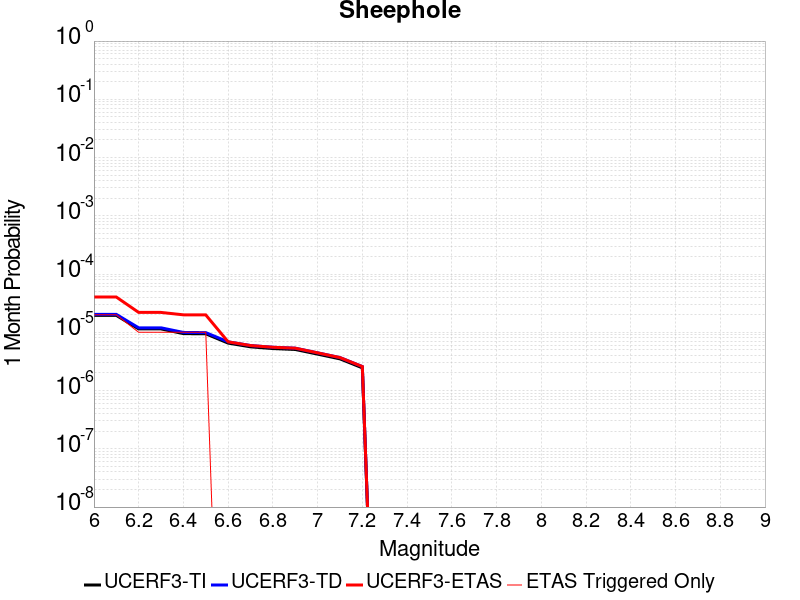 | 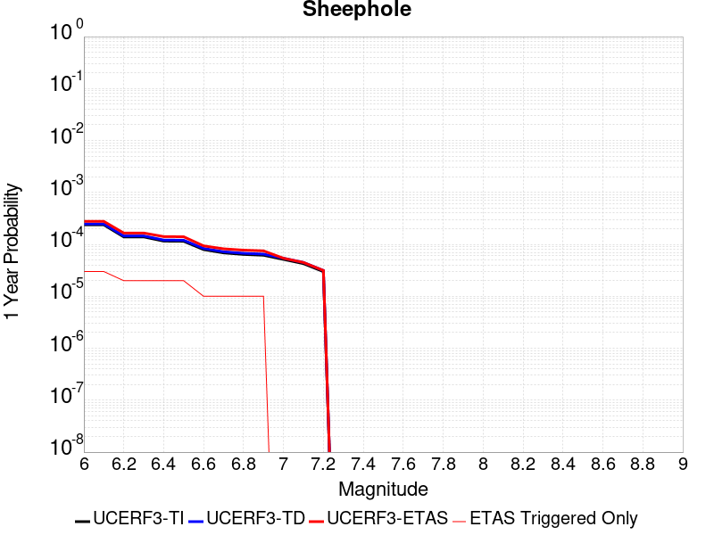 | 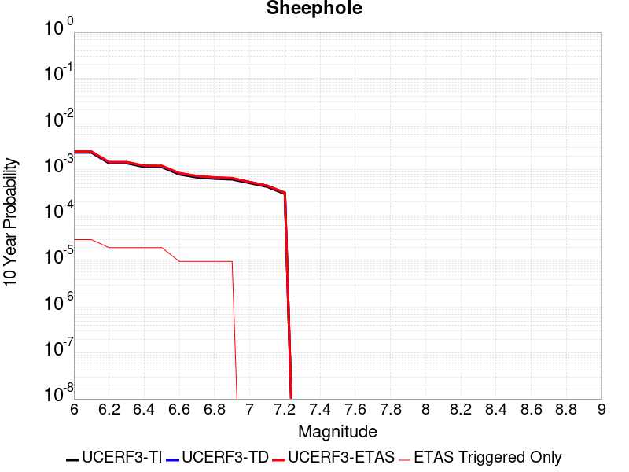 |

| Magnitude | 1 wk TI Prob | 1 wk TD Prob | 1 wk ETAS Prob | 1 wk ETAS/TD Gain | 1 wk ETAS Triggered Only | 1 mo TI Prob | 1 mo TD Prob | 1 mo ETAS Prob | 1 mo ETAS/TD Gain | 1 mo ETAS Triggered Only | 1 yr TI Prob | 1 yr TD Prob | 1 yr ETAS Prob | 1 yr ETAS/TD Gain | 1 yr ETAS Triggered Only | 10 yr TI Prob | 10 yr TD Prob | 10 yr ETAS Prob | 10 yr ETAS/TD Gain | 10 yr ETAS Triggered Only |
|-----|-----|-----|-----|-----|-----|-----|-----|-----|-----|-----|-----|-----|-----|-----|-----|-----|-----|-----|-----|-----|
| 6.0 | 4.5579695E-6 | 4.7412877E-6 | 4.7412877E-6 | 1.0 | 0.0 | 1.9534009E-5 | 2.0319678E-5 | 4.4300006E-5 | 2.180153 | 2.3980816E-5 | 2.3780059E-4 | 2.4736955E-4 | 2.8333187E-4 | 1.145379 | 3.597122E-5 | 0.0023754628 | 0.0024714863 | 0.0025073686 | 1.0145185 | 3.597122E-5 |
| 6.1 | 4.5579695E-6 | 4.7412877E-6 | 4.7412877E-6 | 1.0 | 0.0 | 1.9534009E-5 | 2.0319678E-5 | 4.4300006E-5 | 2.180153 | 2.3980816E-5 | 2.3780059E-4 | 2.4736955E-4 | 2.8333187E-4 | 1.145379 | 3.597122E-5 | 0.0023754628 | 0.0024714863 | 0.0025073686 | 1.0145185 | 3.597122E-5 |
| 6.2 | 2.6677674E-6 | 2.7874107E-6 | 2.7874107E-6 | 1.0 | 0.0 | 1.1433239E-5 | 1.1945997E-5 | 2.3936262E-5 | 2.0037055 | 1.1990408E-5 | 1.3919079E-4 | 1.4543389E-4 | 1.6941121E-4 | 1.1648675 | 2.3980816E-5 | 0.0013910364 | 0.001453493 | 0.001477439 | 1.0164747 | 2.3980816E-5 |
| 6.3 | 2.6677674E-6 | 2.7874107E-6 | 2.7874107E-6 | 1.0 | 0.0 | 1.1433239E-5 | 1.1945997E-5 | 2.3936262E-5 | 2.0037055 | 1.1990408E-5 | 1.3919079E-4 | 1.4543389E-4 | 1.6941121E-4 | 1.1648675 | 2.3980816E-5 | 0.0013910364 | 0.001453493 | 0.001477439 | 1.0164747 | 2.3980816E-5 |
| 6.4 | 2.2159759E-6 | 2.3228936E-6 | 2.3228936E-6 | 1.0 | 0.0 | 9.497005E-6 | 9.955224E-6 | 2.1945512E-5 | 2.2044218 | 1.1990408E-5 | 1.156199E-4 | 1.2119893E-4 | 1.4517683E-4 | 1.1978393 | 2.3980816E-5 | 0.0011555976 | 0.0012114076 | 0.0012353595 | 1.0197718 | 2.3980816E-5 |
| 6.5 | 2.1986082E-6 | 2.3047737E-6 | 2.3047737E-6 | 1.0 | 0.0 | 9.4225725E-6 | 9.877569E-6 | 2.1867858E-5 | 2.2138908 | 1.1990408E-5 | 1.1471378E-4 | 1.2025358E-4 | 1.4423151E-4 | 1.1993947 | 2.3980816E-5 | 0.0011465458 | 0.0012019643 | 0.0012259163 | 1.0199274 | 2.3980816E-5 |
| 6.6 | 1.5232331E-6 | 1.6019028E-6 | 1.6019028E-6 | 1.0 | 0.0 | 6.5281256E-6 | 6.8652807E-6 | 6.8652807E-6 | 1.0 | 0.0 | 7.947703E-5 | 8.358178E-5 | 9.557118E-5 | 1.1434453 | 1.1990408E-5 | 7.9448614E-4 | 8.3552214E-4 | 8.4750255E-4 | 1.0143389 | 1.1990408E-5 |
| 6.7 | 1.3137362E-6 | 1.3828287E-6 | 1.3828287E-6 | 1.0 | 0.0 | 5.6302856E-6 | 5.926396E-6 | 5.926396E-6 | 1.0 | 0.0 | 6.854657E-5 | 7.2151626E-5 | 8.414117E-5 | 1.1661714 | 1.1990408E-5 | 6.8525434E-4 | 7.212959E-4 | 7.3327764E-4 | 1.0166115 | 1.1990408E-5 |
| 6.8 | 1.2275751E-6 | 1.2922936E-6 | 1.2922936E-6 | 1.0 | 0.0 | 5.2610258E-6 | 5.5383903E-6 | 5.5383903E-6 | 1.0 | 0.0 | 6.4051106E-5 | 6.742795E-5 | 7.941755E-5 | 1.1778135 | 1.1990408E-5 | 6.4032647E-4 | 6.740883E-4 | 6.8607065E-4 | 1.0177757 | 1.1990408E-5 |
| 6.9 | 1.1837088E-6 | 1.2461107E-6 | 1.2461107E-6 | 1.0 | 0.0 | 5.0730278E-6 | 5.340464E-6 | 5.340464E-6 | 1.0 | 0.0 | 6.176237E-5 | 6.501835E-5 | 7.700797E-5 | 1.1844038 | 1.1990408E-5 | 6.17452E-4 | 6.500064E-4 | 6.6198903E-4 | 1.0184346 | 1.1990408E-5 |
| 7.0 | 9.849371E-7 | 1.036636E-6 | 1.036636E-6 | 1.0 | 0.0 | 4.2211523E-6 | 4.442719E-6 | 4.442719E-6 | 1.0 | 0.0 | 5.1391315E-5 | 5.408886E-5 | 5.408886E-5 | 1.0 | 0.0 | 5.137943E-4 | 5.4076704E-4 | 5.4076704E-4 | 1.0 | 0.0 |
| 7.1 | 8.1643645E-7 | 8.5917287E-7 | 8.5917287E-7 | 1.0 | 0.0 | 3.4990085E-6 | 3.6821648E-6 | 3.6821648E-6 | 1.0 | 0.0 | 4.2599597E-5 | 4.482952E-5 | 4.482952E-5 | 1.0 | 0.0 | 4.259143E-4 | 4.482134E-4 | 4.482134E-4 | 1.0 | 0.0 |
| 7.2 | 5.7295756E-7 | 6.029544E-7 | 6.029544E-7 | 1.0 | 0.0 | 2.45553E-6 | 2.584088E-6 | 2.584088E-6 | 1.0 | 0.0 | 2.9895667E-5 | 3.1460884E-5 | 3.1460884E-5 | 1.0 | 0.0 | 2.9891645E-4 | 3.14571E-4 | 3.14571E-4 | 1.0 | 0.0 |

## Hollywood
*[(top)](#table-of-contents)*

| 1 Week | 1 Month | 1 Year | 10 Year |
|-----|-----|-----|-----|
|  | 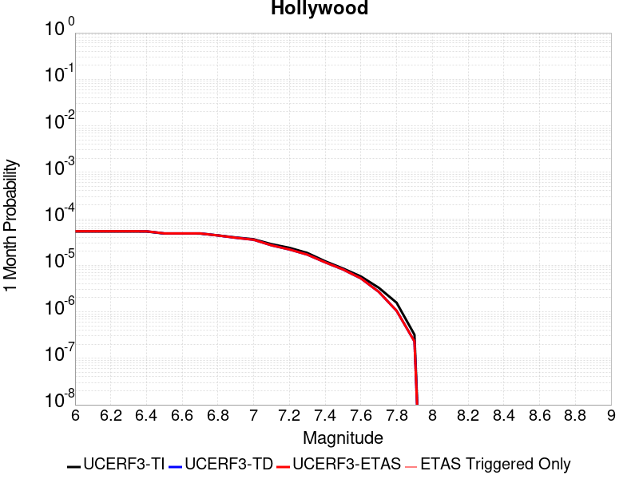 | 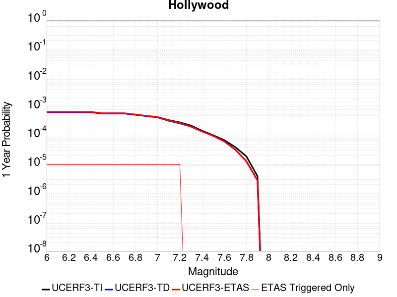 | 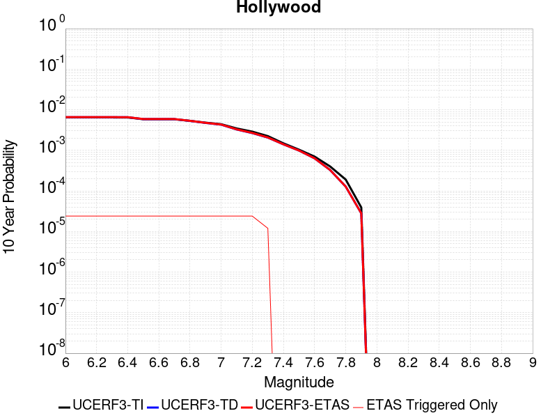 |

| Magnitude | 1 wk TI Prob | 1 wk TD Prob | 1 wk ETAS Prob | 1 wk ETAS/TD Gain | 1 wk ETAS Triggered Only | 1 mo TI Prob | 1 mo TD Prob | 1 mo ETAS Prob | 1 mo ETAS/TD Gain | 1 mo ETAS Triggered Only | 1 yr TI Prob | 1 yr TD Prob | 1 yr ETAS Prob | 1 yr ETAS/TD Gain | 1 yr ETAS Triggered Only | 10 yr TI Prob | 10 yr TD Prob | 10 yr ETAS Prob | 10 yr ETAS/TD Gain | 10 yr ETAS Triggered Only |
|-----|-----|-----|-----|-----|-----|-----|-----|-----|-----|-----|-----|-----|-----|-----|-----|-----|-----|-----|-----|-----|
| 6.0 | 1.24487615E-5 | 1.2593381E-5 | 1.2593381E-5 | 1.0 | 0.0 | 5.3350745E-5 | 5.3970543E-5 | 5.3970543E-5 | 1.0 | 0.0 | 6.4935174E-4 | 6.568979E-4 | 6.688805E-4 | 1.018241 | 1.1990408E-5 | 0.0064745755 | 0.0065500494 | 0.0065738736 | 1.0036372 | 2.3980816E-5 |
| 6.1 | 1.24487615E-5 | 1.2593381E-5 | 1.2593381E-5 | 1.0 | 0.0 | 5.3350745E-5 | 5.3970543E-5 | 5.3970543E-5 | 1.0 | 0.0 | 6.4935174E-4 | 6.568979E-4 | 6.688805E-4 | 1.018241 | 1.1990408E-5 | 0.0064745755 | 0.0065500494 | 0.0065738736 | 1.0036372 | 2.3980816E-5 |
| 6.2 | 1.24487615E-5 | 1.2593381E-5 | 1.2593381E-5 | 1.0 | 0.0 | 5.3350745E-5 | 5.3970543E-5 | 5.3970543E-5 | 1.0 | 0.0 | 6.4935174E-4 | 6.568979E-4 | 6.688805E-4 | 1.018241 | 1.1990408E-5 | 0.0064745755 | 0.0065500494 | 0.0065738736 | 1.0036372 | 2.3980816E-5 |
| 6.3 | 1.24487615E-5 | 1.2593381E-5 | 1.2593381E-5 | 1.0 | 0.0 | 5.3350745E-5 | 5.3970543E-5 | 5.3970543E-5 | 1.0 | 0.0 | 6.4935174E-4 | 6.568979E-4 | 6.688805E-4 | 1.018241 | 1.1990408E-5 | 0.0064745755 | 0.0065500494 | 0.0065738736 | 1.0036372 | 2.3980816E-5 |
| 6.4 | 1.2431024E-5 | 1.2573994E-5 | 1.2573994E-5 | 1.0 | 0.0 | 5.327473E-5 | 5.3887463E-5 | 5.3887463E-5 | 1.0 | 0.0 | 6.4842677E-4 | 6.55887E-4 | 6.678695E-4 | 1.0182692 | 1.1990408E-5 | 0.0064653796 | 0.00654 | 0.0065638237 | 1.0036428 | 2.3980816E-5 |
| 6.5 | 1.1242222E-5 | 1.1317946E-5 | 1.1317946E-5 | 1.0 | 0.0 | 4.8180063E-5 | 4.8504597E-5 | 4.8504597E-5 | 1.0 | 0.0 | 5.864344E-4 | 5.9038616E-4 | 6.023695E-4 | 1.0202974 | 1.1990408E-5 | 0.0058488925 | 0.0058884635 | 0.0059123035 | 1.0040486 | 2.3980816E-5 |
| 6.6 | 1.1234066E-5 | 1.130906E-5 | 1.130906E-5 | 1.0 | 0.0 | 4.8145106E-5 | 4.8466514E-5 | 4.8466514E-5 | 1.0 | 0.0 | 5.86009E-4 | 5.899227E-4 | 6.019061E-4 | 1.0203134 | 1.1990408E-5 | 0.005844661 | 0.0058838543 | 0.005907694 | 1.0040517 | 2.3980816E-5 |
| 6.7 | 1.12294E-5 | 1.1303803E-5 | 1.1303803E-5 | 1.0 | 0.0 | 4.812511E-5 | 4.8443988E-5 | 4.8443988E-5 | 1.0 | 0.0 | 5.857657E-4 | 5.896486E-4 | 6.0163194E-4 | 1.0203228 | 1.1990408E-5 | 0.0058422405 | 0.0058811274 | 0.005904967 | 1.0040536 | 2.3980816E-5 |
| 6.8 | 1.0252819E-5 | 1.0218574E-5 | 1.0218574E-5 | 1.0 | 0.0 | 4.3939912E-5 | 4.3793167E-5 | 4.3793167E-5 | 1.0 | 0.0 | 5.3483713E-4 | 5.330535E-4 | 5.450375E-4 | 1.0224818 | 1.1990408E-5 | 0.005335517 | 0.005317975 | 0.0053418283 | 1.0044854 | 2.3980816E-5 |
| 6.9 | 9.252289E-6 | 9.110419E-6 | 9.110419E-6 | 1.0 | 0.0 | 3.9652066E-5 | 3.904408E-5 | 3.904408E-5 | 1.0 | 0.0 | 4.8265693E-4 | 4.7525964E-4 | 4.8724434E-4 | 1.0252172 | 1.1990408E-5 | 0.0048161 | 0.004742606 | 0.004766473 | 1.0050325 | 2.3980816E-5 |
| 7.0 | 8.474604E-6 | 8.25836E-6 | 8.25836E-6 | 1.0 | 0.0 | 3.6319227E-5 | 3.53925E-5 | 3.53925E-5 | 1.0 | 0.0 | 4.4209688E-4 | 4.308199E-4 | 4.4280515E-4 | 1.0278196 | 1.1990408E-5 | 0.004412184 | 0.0042999974 | 0.004323875 | 1.005553 | 2.3980816E-5 |
| 7.1 | 6.643643E-6 | 6.2684458E-6 | 6.2684458E-6 | 1.0 | 0.0 | 2.8472443E-5 | 2.6864493E-5 | 2.6864493E-5 | 1.0 | 0.0 | 3.4659685E-4 | 3.2702653E-4 | 3.3901303E-4 | 1.0366529 | 1.1990408E-5 | 0.0034605677 | 0.003265499 | 0.0032894015 | 1.0073197 | 2.3980816E-5 |
| 7.2 | 5.549002E-6 | 5.108774E-6 | 5.108774E-6 | 1.0 | 0.0 | 2.378122E-5 | 2.1894564E-5 | 2.1894564E-5 | 1.0 | 0.0 | 2.8949787E-4 | 2.6653384E-4 | 2.7852107E-4 | 1.0449744 | 1.1990408E-5 | 0.0028912104 | 0.0026621583 | 0.0026860752 | 1.0089841 | 2.3980816E-5 |
| 7.3 | 4.3059727E-6 | 3.959942E-6 | 3.959942E-6 | 1.0 | 0.0 | 1.8454039E-5 | 1.6971071E-5 | 1.6971071E-5 | 1.0 | 0.0 | 2.2465475E-4 | 2.0660329E-4 | 2.0660329E-4 | 1.0 | 0.0 | 0.0022442779 | 0.0020641224 | 0.002076088 | 1.005797 | 1.1990408E-5 |
| 7.4 | 2.8550733E-6 | 2.7013389E-6 | 2.7013389E-6 | 1.0 | 0.0 | 1.2235971E-5 | 1.1577115E-5 | 1.1577115E-5 | 1.0 | 0.0 | 1.4896276E-4 | 1.4094231E-4 | 1.4094231E-4 | 1.0 | 0.0 | 0.0014886294 | 0.0014085344 | 0.0014085344 | 1.0 | 0.0 |
| 7.5 | 1.9927045E-6 | 1.8976702E-6 | 1.8976702E-6 | 1.0 | 0.0 | 8.540134E-6 | 8.132847E-6 | 8.132847E-6 | 1.0 | 0.0 | 1.0397117E-4 | 9.9012956E-5 | 9.9012956E-5 | 1.0 | 0.0 | 0.0010392254 | 9.896919E-4 | 9.896919E-4 | 1.0 | 0.0 |
| 7.6 | 1.345084E-6 | 1.221624E-6 | 1.221624E-6 | 1.0 | 0.0 | 5.764633E-6 | 5.235521E-6 | 5.235521E-6 | 1.0 | 0.0 | 7.018215E-5 | 6.374063E-5 | 6.374063E-5 | 1.0 | 0.0 | 7.0159987E-4 | 6.372254E-4 | 6.372254E-4 | 1.0 | 0.0 |
| 7.7 | 7.6835164E-7 | 6.2778713E-7 | 6.2778713E-7 | 1.0 | 0.0 | 3.2929315E-6 | 2.6905136E-6 | 2.6905136E-6 | 1.0 | 0.0 | 4.00907E-5 | 3.2756525E-5 | 3.2756525E-5 | 1.0 | 0.0 | 4.0083472E-4 | 3.2751844E-4 | 3.2751844E-4 | 1.0 | 0.0 |
| 7.8 | 3.6562128E-7 | 2.453623E-7 | 2.453623E-7 | 1.0 | 0.0 | 1.5669474E-6 | 1.0515523E-6 | 1.0515523E-6 | 1.0 | 0.0 | 1.9077417E-5 | 1.2802578E-5 | 1.2802578E-5 | 1.0 | 0.0 | 1.907578E-4 | 1.2801877E-4 | 1.2801877E-4 | 1.0 | 0.0 |
| 7.9 | 7.5024424E-8 | 5.3819846E-8 | 5.3819846E-8 | 1.0 | 0.0 | 3.215332E-7 | 2.3065647E-7 | 2.3065647E-7 | 1.0 | 0.0 | 3.91466E-6 | 2.8082402E-6 | 2.8082402E-6 | 1.0 | 0.0 | 3.9145907E-5 | 2.8082177E-5 | 2.8082177E-5 | 1.0 | 0.0 |

## Red Mountain
*[(top)](#table-of-contents)*

| 1 Week | 1 Month | 1 Year | 10 Year |
|-----|-----|-----|-----|
| 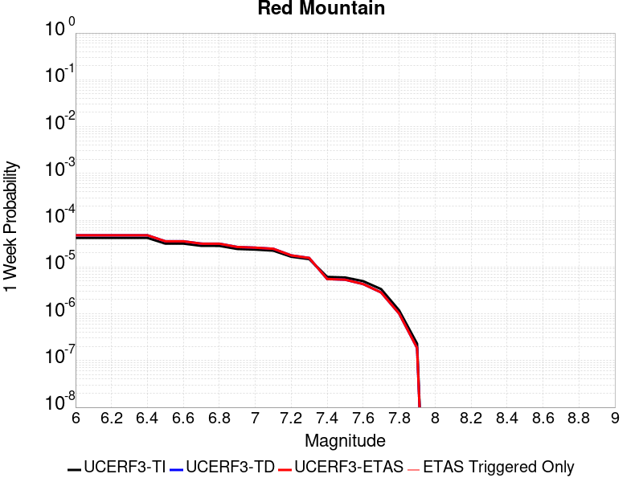 | 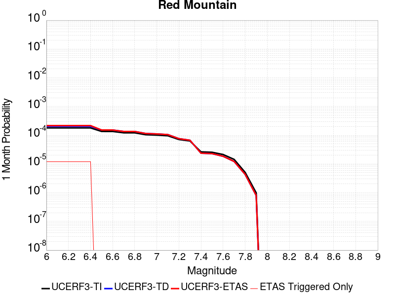 | 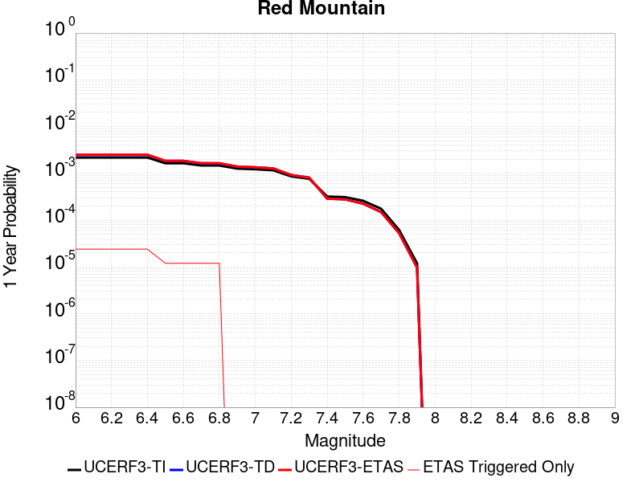 | 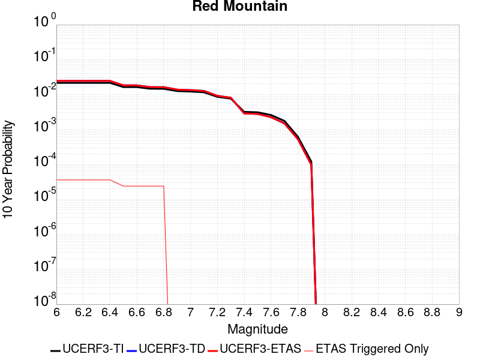 |

| Magnitude | 1 wk TI Prob | 1 wk TD Prob | 1 wk ETAS Prob | 1 wk ETAS/TD Gain | 1 wk ETAS Triggered Only | 1 mo TI Prob | 1 mo TD Prob | 1 mo ETAS Prob | 1 mo ETAS/TD Gain | 1 mo ETAS Triggered Only | 1 yr TI Prob | 1 yr TD Prob | 1 yr ETAS Prob | 1 yr ETAS/TD Gain | 1 yr ETAS Triggered Only | 10 yr TI Prob | 10 yr TD Prob | 10 yr ETAS Prob | 10 yr ETAS/TD Gain | 10 yr ETAS Triggered Only |
|-----|-----|-----|-----|-----|-----|-----|-----|-----|-----|-----|-----|-----|-----|-----|-----|-----|-----|-----|-----|-----|
| 6.0 | 4.1810763E-5 | 4.7591006E-5 | 4.7591006E-5 | 1.0 | 0.0 | 1.7917668E-4 | 2.0394645E-4 | 2.159344E-4 | 1.05878 | 1.1990408E-5 | 0.0021792934 | 0.0024803858 | 0.002504307 | 1.0096442 | 2.3980816E-5 | 0.021580452 | 0.02454463 | 0.024579719 | 1.0014296 | 3.597122E-5 |
| 6.1 | 4.1810763E-5 | 4.7591006E-5 | 4.7591006E-5 | 1.0 | 0.0 | 1.7917668E-4 | 2.0394645E-4 | 2.159344E-4 | 1.05878 | 1.1990408E-5 | 0.0021792934 | 0.0024803858 | 0.002504307 | 1.0096442 | 2.3980816E-5 | 0.021580452 | 0.02454463 | 0.024579719 | 1.0014296 | 3.597122E-5 |
| 6.2 | 4.1810763E-5 | 4.7591006E-5 | 4.7591006E-5 | 1.0 | 0.0 | 1.7917668E-4 | 2.0394645E-4 | 2.159344E-4 | 1.05878 | 1.1990408E-5 | 0.0021792934 | 0.0024803858 | 0.002504307 | 1.0096442 | 2.3980816E-5 | 0.021580452 | 0.02454463 | 0.024579719 | 1.0014296 | 3.597122E-5 |
| 6.3 | 4.1810763E-5 | 4.7591006E-5 | 4.7591006E-5 | 1.0 | 0.0 | 1.7917668E-4 | 2.0394645E-4 | 2.159344E-4 | 1.05878 | 1.1990408E-5 | 0.0021792934 | 0.0024803858 | 0.002504307 | 1.0096442 | 2.3980816E-5 | 0.021580452 | 0.02454463 | 0.024579719 | 1.0014296 | 3.597122E-5 |
| 6.4 | 4.1810763E-5 | 4.7591006E-5 | 4.7591006E-5 | 1.0 | 0.0 | 1.7917668E-4 | 2.0394645E-4 | 2.159344E-4 | 1.05878 | 1.1990408E-5 | 0.0021792934 | 0.0024803858 | 0.002504307 | 1.0096442 | 2.3980816E-5 | 0.021580452 | 0.02454463 | 0.024579719 | 1.0014296 | 3.597122E-5 |
| 6.5 | 3.154503E-5 | 3.5360477E-5 | 3.5360477E-5 | 1.0 | 0.0 | 1.3518598E-4 | 1.5153662E-4 | 1.5153662E-4 | 1.0 | 0.0 | 0.0016446467 | 0.0018434891 | 0.0018554574 | 1.0064923 | 1.1990408E-5 | 0.01632528 | 0.018291617 | 0.01831516 | 1.0012871 | 2.3980816E-5 |
| 6.6 | 3.1535834E-5 | 3.5349858E-5 | 3.5349858E-5 | 1.0 | 0.0 | 1.3514658E-4 | 1.5149111E-4 | 1.5149111E-4 | 1.0 | 0.0 | 0.0016441676 | 0.001842936 | 0.0018549043 | 1.0064942 | 1.1990408E-5 | 0.01632056 | 0.018286178 | 0.01830972 | 1.0012875 | 2.3980816E-5 |
| 6.7 | 2.8267326E-5 | 3.146999E-5 | 3.146999E-5 | 1.0 | 0.0 | 1.2114006E-4 | 1.348649E-4 | 1.348649E-4 | 1.0 | 0.0 | 0.0014738824 | 0.0016408286 | 0.0016527992 | 1.0072955 | 1.1990408E-5 | 0.014641452 | 0.016295899 | 0.01631949 | 1.0014476 | 2.3980816E-5 |
| 6.8 | 2.8212884E-5 | 3.1407875E-5 | 3.1407875E-5 | 1.0 | 0.0 | 1.20906756E-4 | 1.3459871E-4 | 1.3459871E-4 | 1.0 | 0.0 | 0.0014710457 | 0.0016375926 | 0.0016495634 | 1.00731 | 1.1990408E-5 | 0.014613459 | 0.016264014 | 0.016287604 | 1.0014505 | 2.3980816E-5 |
| 6.9 | 2.4227871E-5 | 2.6707517E-5 | 2.6707517E-5 | 1.0 | 0.0 | 1.03829596E-4 | 1.1445619E-4 | 1.1445619E-4 | 1.0 | 0.0 | 0.0012633923 | 0.0013926893 | 0.0013926893 | 1.0 | 0.0 | 0.012562336 | 0.013847304 | 0.013847304 | 1.0 | 0.0 |
| 7.0 | 2.348524E-5 | 2.5836282E-5 | 2.5836282E-5 | 1.0 | 0.0 | 1.0064714E-4 | 1.1072265E-4 | 1.1072265E-4 | 1.0 | 0.0 | 0.0012246901 | 0.0013472902 | 0.0013472902 | 1.0 | 0.0 | 0.012179627 | 0.013398857 | 0.013398857 | 1.0 | 0.0 |
| 7.1 | 2.2311642E-5 | 2.4463316E-5 | 2.4463316E-5 | 1.0 | 0.0 | 9.561782E-5 | 1.04839E-4 | 1.04839E-4 | 1.0 | 0.0 | 0.0011635252 | 0.0012757422 | 0.0012757422 | 1.0 | 0.0 | 0.01157452 | 0.012691703 | 0.012691703 | 1.0 | 0.0 |
| 7.2 | 1.6533986E-5 | 1.7670676E-5 | 1.7670676E-5 | 1.0 | 0.0 | 7.085802E-5 | 7.572963E-5 | 7.572963E-5 | 1.0 | 0.0 | 8.623549E-4 | 9.2168164E-4 | 9.2168164E-4 | 1.0 | 0.0 | 0.008590161 | 0.009184869 | 0.009184869 | 1.0 | 0.0 |
| 7.3 | 1.4703092E-5 | 1.5559806E-5 | 1.5559806E-5 | 1.0 | 0.0 | 6.301173E-5 | 6.6683526E-5 | 6.6683526E-5 | 1.0 | 0.0 | 7.668978E-4 | 8.1163115E-4 | 8.1163115E-4 | 1.0 | 0.0 | 0.0076425658 | 0.008092744 | 0.008092744 | 1.0 | 0.0 |
| 7.4 | 6.1331984E-6 | 5.52893E-6 | 5.52893E-6 | 1.0 | 0.0 | 2.6284872E-5 | 2.3695204E-5 | 2.3695204E-5 | 1.0 | 0.0 | 3.199713E-4 | 2.8845144E-4 | 2.8845144E-4 | 1.0 | 0.0 | 0.0031951098 | 0.0028808247 | 0.0028808247 | 1.0 | 0.0 |
| 7.5 | 5.954766E-6 | 5.338558E-6 | 5.338558E-6 | 1.0 | 0.0 | 2.5520176E-5 | 2.2879336E-5 | 2.2879336E-5 | 1.0 | 0.0 | 3.1066386E-4 | 2.7852083E-4 | 2.7852083E-4 | 1.0 | 0.0 | 0.003102299 | 0.0027817716 | 0.0027817716 | 1.0 | 0.0 |
| 7.6 | 4.9726646E-6 | 4.315341E-6 | 4.315341E-6 | 1.0 | 0.0 | 2.1311245E-5 | 1.8494187E-5 | 1.8494187E-5 | 1.0 | 0.0 | 2.5943352E-4 | 2.2514381E-4 | 2.2514381E-4 | 1.0 | 0.0 | 0.0025913084 | 0.0022491917 | 0.0022491917 | 1.0 | 0.0 |
| 7.7 | 3.3613894E-6 | 2.8526943E-6 | 2.8526943E-6 | 1.0 | 0.0 | 1.4405875E-5 | 1.2225777E-5 | 1.2225777E-5 | 1.0 | 0.0 | 1.7537741E-4 | 1.4883894E-4 | 1.4883894E-4 | 1.0 | 0.0 | 0.0017523908 | 0.0014874188 | 0.0014874188 | 1.0 | 0.0 |
| 7.8 | 1.1828961E-6 | 1.0122844E-6 | 1.0122844E-6 | 1.0 | 0.0 | 5.069545E-6 | 4.338355E-6 | 4.338355E-6 | 1.0 | 0.0 | 6.171996E-5 | 5.281822E-5 | 5.281822E-5 | 1.0 | 0.0 | 6.170282E-4 | 5.280596E-4 | 5.280596E-4 | 1.0 | 0.0 |
| 7.9 | 2.2967266E-7 | 1.8619119E-7 | 1.8619119E-7 | 1.0 | 0.0 | 9.843111E-7 | 7.9796195E-7 | 7.9796195E-7 | 1.0 | 0.0 | 1.19839215E-5 | 9.715147E-6 | 9.715147E-6 | 1.0 | 0.0 | 1.1983275E-4 | 9.714751E-5 | 9.714751E-5 | 1.0 | 0.0 |

## Channel Islands Thrust
*[(top)](#table-of-contents)*

| 1 Week | 1 Month | 1 Year | 10 Year |
|-----|-----|-----|-----|
| 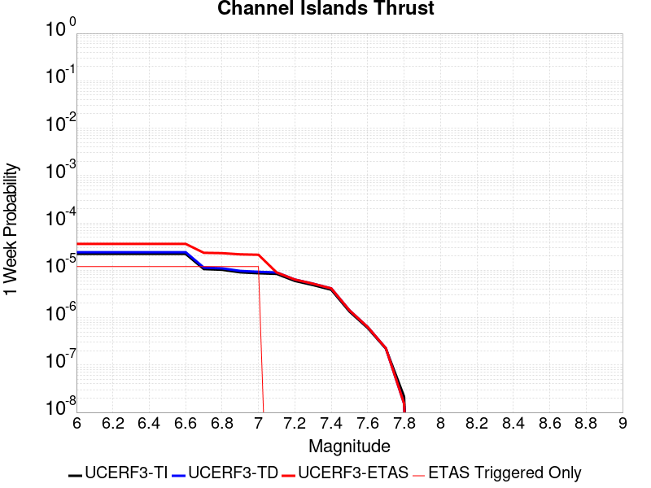 | 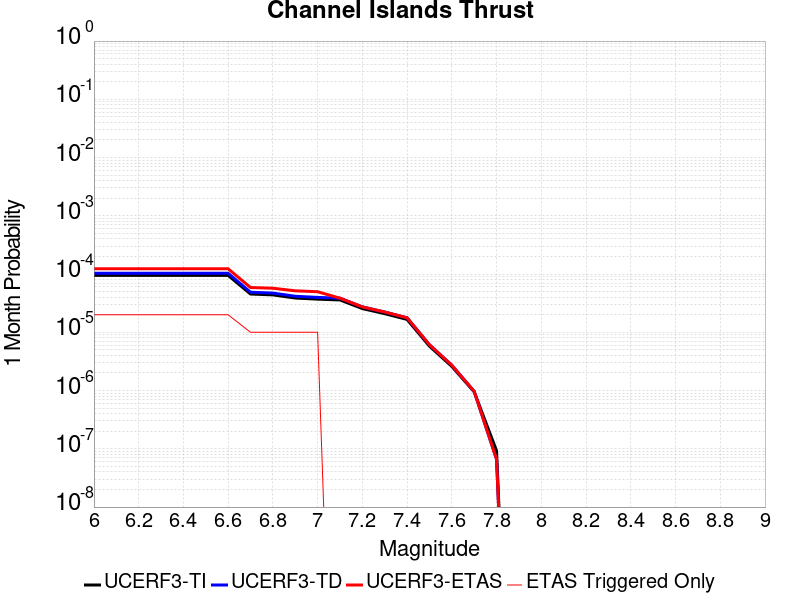 |  | 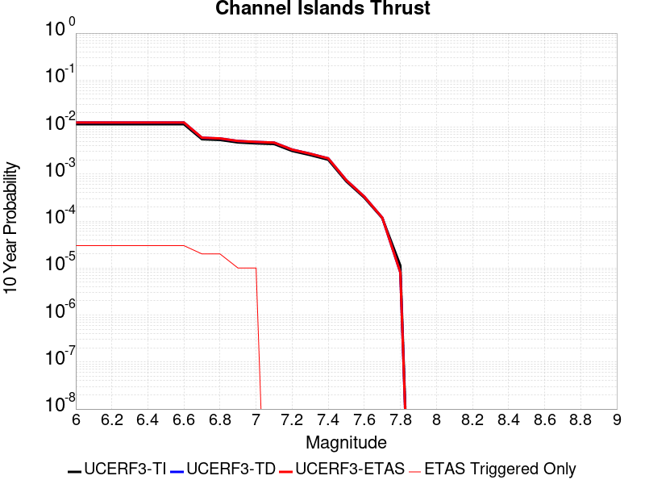 |

| Magnitude | 1 wk TI Prob | 1 wk TD Prob | 1 wk ETAS Prob | 1 wk ETAS/TD Gain | 1 wk ETAS Triggered Only | 1 mo TI Prob | 1 mo TD Prob | 1 mo ETAS Prob | 1 mo ETAS/TD Gain | 1 mo ETAS Triggered Only | 1 yr TI Prob | 1 yr TD Prob | 1 yr ETAS Prob | 1 yr ETAS/TD Gain | 1 yr ETAS Triggered Only | 10 yr TI Prob | 10 yr TD Prob | 10 yr ETAS Prob | 10 yr ETAS/TD Gain | 10 yr ETAS Triggered Only |
|-----|-----|-----|-----|-----|-----|-----|-----|-----|-----|-----|-----|-----|-----|-----|-----|-----|-----|-----|-----|-----|
| 6.0 | 2.2156251E-5 | 2.4092304E-5 | 3.6082423E-5 | 1.4976742 | 1.1990408E-5 | 9.495191E-5 | 1.03249244E-4 | 1.2722758E-4 | 1.2322375 | 2.3980816E-5 | 0.0011554264 | 0.0012564411 | 0.0012923672 | 1.0285935 | 3.597122E-5 | 0.011494373 | 0.012503966 | 0.012539487 | 1.0028408 | 3.597122E-5 |
| 6.1 | 2.2156251E-5 | 2.4092304E-5 | 3.6082423E-5 | 1.4976742 | 1.1990408E-5 | 9.495191E-5 | 1.03249244E-4 | 1.2722758E-4 | 1.2322375 | 2.3980816E-5 | 0.0011554264 | 0.0012564411 | 0.0012923672 | 1.0285935 | 3.597122E-5 | 0.011494373 | 0.012503966 | 0.012539487 | 1.0028408 | 3.597122E-5 |
| 6.2 | 2.2156251E-5 | 2.4092304E-5 | 3.6082423E-5 | 1.4976742 | 1.1990408E-5 | 9.495191E-5 | 1.03249244E-4 | 1.2722758E-4 | 1.2322375 | 2.3980816E-5 | 0.0011554264 | 0.0012564411 | 0.0012923672 | 1.0285935 | 3.597122E-5 | 0.011494373 | 0.012503966 | 0.012539487 | 1.0028408 | 3.597122E-5 |
| 6.3 | 2.2156251E-5 | 2.4092304E-5 | 3.6082423E-5 | 1.4976742 | 1.1990408E-5 | 9.495191E-5 | 1.03249244E-4 | 1.2722758E-4 | 1.2322375 | 2.3980816E-5 | 0.0011554264 | 0.0012564411 | 0.0012923672 | 1.0285935 | 3.597122E-5 | 0.011494373 | 0.012503966 | 0.012539487 | 1.0028408 | 3.597122E-5 |
| 6.4 | 2.2156251E-5 | 2.4092304E-5 | 3.6082423E-5 | 1.4976742 | 1.1990408E-5 | 9.495191E-5 | 1.03249244E-4 | 1.2722758E-4 | 1.2322375 | 2.3980816E-5 | 0.0011554264 | 0.0012564411 | 0.0012923672 | 1.0285935 | 3.597122E-5 | 0.011494373 | 0.012503966 | 0.012539487 | 1.0028408 | 3.597122E-5 |
| 6.5 | 2.2156251E-5 | 2.4092304E-5 | 3.6082423E-5 | 1.4976742 | 1.1990408E-5 | 9.495191E-5 | 1.03249244E-4 | 1.2722758E-4 | 1.2322375 | 2.3980816E-5 | 0.0011554264 | 0.0012564411 | 0.0012923672 | 1.0285935 | 3.597122E-5 | 0.011494373 | 0.012503966 | 0.012539487 | 1.0028408 | 3.597122E-5 |
| 6.6 | 2.2156251E-5 | 2.4092304E-5 | 3.6082423E-5 | 1.4976742 | 1.1990408E-5 | 9.495191E-5 | 1.03249244E-4 | 1.2722758E-4 | 1.2322375 | 2.3980816E-5 | 0.0011554264 | 0.0012564411 | 0.0012923672 | 1.0285935 | 3.597122E-5 | 0.011494373 | 0.012503966 | 0.012539487 | 1.0028408 | 3.597122E-5 |
| 6.7 | 1.0601296E-5 | 1.1379656E-5 | 2.3369927E-5 | 2.0536585 | 1.1990408E-5 | 4.5433335E-5 | 4.876907E-5 | 6.075889E-5 | 1.2458489 | 1.1990408E-5 | 5.5301044E-4 | 5.9360656E-4 | 6.1757315E-4 | 1.0403745 | 2.3980816E-5 | 0.005516363 | 0.0059207114 | 0.0059445505 | 1.0040263 | 2.3980816E-5 |
| 6.8 | 1.0246747E-5 | 1.0996777E-5 | 2.2987053E-5 | 2.0903444 | 1.1990408E-5 | 4.391389E-5 | 4.712822E-5 | 5.911806E-5 | 1.254409 | 1.1990408E-5 | 5.345204E-4 | 5.736398E-4 | 5.976069E-4 | 1.0417807 | 2.3980816E-5 | 0.0053323656 | 0.005722081 | 0.0057459245 | 1.004167 | 2.3980816E-5 |
| 6.9 | 9.049551E-6 | 9.699738E-6 | 2.169003E-5 | 2.236146 | 1.1990408E-5 | 3.878322E-5 | 4.1569667E-5 | 5.3559575E-5 | 1.2884293 | 1.1990408E-5 | 4.7208337E-4 | 5.059973E-4 | 5.179816E-4 | 1.0236846 | 1.1990408E-5 | 0.0047108172 | 0.005048869 | 0.005060799 | 1.0023628 | 1.1990408E-5 |
| 7.0 | 8.6542195E-6 | 9.274692E-6 | 2.1264988E-5 | 2.292797 | 1.1990408E-5 | 3.7088983E-5 | 3.97481E-5 | 5.1738032E-5 | 1.3016479 | 1.1990408E-5 | 4.5146482E-4 | 4.8382973E-4 | 4.9581437E-4 | 1.0247703 | 1.1990408E-5 | 0.004505487 | 0.0048281755 | 0.004840108 | 1.0024714 | 1.1990408E-5 |
| 7.1 | 8.391028E-6 | 8.993012E-6 | 8.993012E-6 | 1.0 | 0.0 | 3.5961057E-5 | 3.8540933E-5 | 3.8540933E-5 | 1.0 | 0.0 | 4.3773788E-4 | 4.691389E-4 | 4.691389E-4 | 1.0 | 0.0 | 0.004368766 | 0.0046818955 | 0.0046818955 | 1.0 | 0.0 |
| 7.2 | 5.965188E-6 | 6.3717544E-6 | 6.3717544E-6 | 1.0 | 0.0 | 2.556484E-5 | 2.7307235E-5 | 2.7307235E-5 | 1.0 | 0.0 | 3.1120746E-4 | 3.3241542E-4 | 3.3241542E-4 | 1.0 | 0.0 | 0.00310772 | 0.00331924 | 0.00331924 | 1.0 | 0.0 |
| 7.3 | 4.877518E-6 | 5.2060545E-6 | 5.2060545E-6 | 1.0 | 0.0 | 2.0903482E-5 | 2.2311473E-5 | 2.2311473E-5 | 1.0 | 0.0 | 2.5447016E-4 | 2.7160876E-4 | 2.7160876E-4 | 1.0 | 0.0 | 0.0025417898 | 0.0027128144 | 0.0027128144 | 1.0 | 0.0 |
| 7.4 | 3.8829853E-6 | 4.1419007E-6 | 4.1419007E-6 | 1.0 | 0.0 | 1.664126E-5 | 1.7750885E-5 | 1.7750885E-5 | 1.0 | 0.0 | 2.0258849E-4 | 2.16096E-4 | 2.16096E-4 | 1.0 | 0.0 | 0.002024039 | 0.0021589005 | 0.0021589005 | 1.0 | 0.0 |
| 7.5 | 1.3489616E-6 | 1.4278027E-6 | 1.4278027E-6 | 1.0 | 0.0 | 5.7812517E-6 | 6.1191404E-6 | 6.1191404E-6 | 1.0 | 0.0 | 7.038446E-5 | 7.449803E-5 | 7.449803E-5 | 1.0 | 0.0 | 7.036218E-4 | 7.447345E-4 | 7.447345E-4 | 1.0 | 0.0 |
| 7.6 | 6.058192E-7 | 6.353832E-7 | 6.353832E-7 | 1.0 | 0.0 | 2.5963652E-6 | 2.723068E-6 | 2.723068E-6 | 1.0 | 0.0 | 3.161029E-5 | 3.3152864E-5 | 3.3152864E-5 | 1.0 | 0.0 | 3.1605794E-4 | 3.314808E-4 | 3.314808E-4 | 1.0 | 0.0 |
| 7.7 | 2.2170494E-7 | 2.260808E-7 | 2.260808E-7 | 1.0 | 0.0 | 9.5016367E-7 | 9.689174E-7 | 9.689174E-7 | 1.0 | 0.0 | 1.1568181E-5 | 1.1796516E-5 | 1.1796516E-5 | 1.0 | 0.0 | 1.1567579E-4 | 1.17960015E-4 | 1.17960015E-4 | 1.0 | 0.0 |
| 7.8 | 2.1613102E-8 | 1.5466789E-8 | 1.5466789E-8 | 1.0 | 0.0 | 9.262757E-8 | 6.628623E-8 | 6.628623E-8 | 1.0 | 0.0 | 1.1277401E-6 | 8.0703467E-7 | 8.0703467E-7 | 1.0 | 0.0 | 1.1277344E-5 | 8.070325E-6 | 8.070325E-6 | 1.0 | 0.0 |

## Hunting Creek - Berryessa 2011 CFM
*[(top)](#table-of-contents)*

| 1 Week | 1 Month | 1 Year | 10 Year |
|-----|-----|-----|-----|
|  | 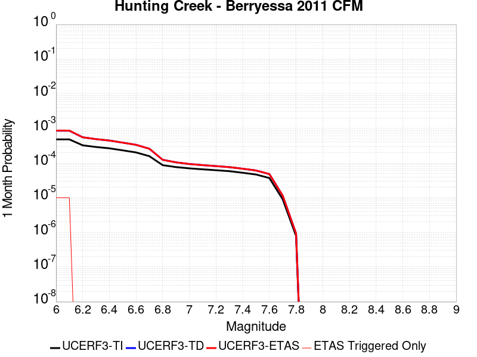 | 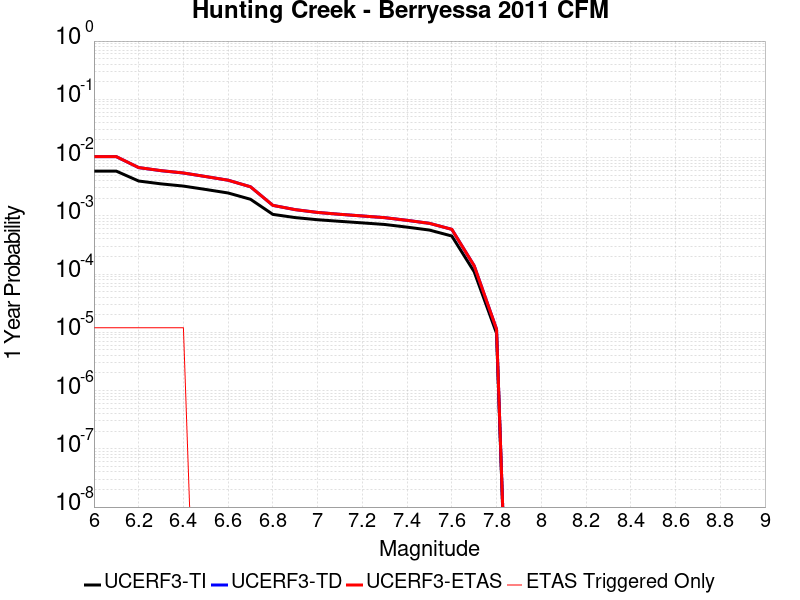 | 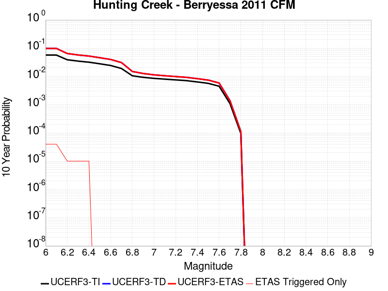 |

| Magnitude | 1 wk TI Prob | 1 wk TD Prob | 1 wk ETAS Prob | 1 wk ETAS/TD Gain | 1 wk ETAS Triggered Only | 1 mo TI Prob | 1 mo TD Prob | 1 mo ETAS Prob | 1 mo ETAS/TD Gain | 1 mo ETAS Triggered Only | 1 yr TI Prob | 1 yr TD Prob | 1 yr ETAS Prob | 1 yr ETAS/TD Gain | 1 yr ETAS Triggered Only | 10 yr TI Prob | 10 yr TD Prob | 10 yr ETAS Prob | 10 yr ETAS/TD Gain | 10 yr ETAS Triggered Only |
|-----|-----|-----|-----|-----|-----|-----|-----|-----|-----|-----|-----|-----|-----|-----|-----|-----|-----|-----|-----|-----|
| 6.0 | 1.1270982E-4 | 2.0014354E-4 | 2.0014354E-4 | 1.0 | 0.0 | 4.8295266E-4 | 8.574329E-4 | 8.574329E-4 | 1.0 | 0.0 | 0.0058641075 | 0.010387073 | 0.010398939 | 1.0011424 | 1.1990408E-5 | 0.057117578 | 0.09804065 | 0.098073095 | 1.0003309 | 3.597122E-5 |
| 6.1 | 1.1239393E-4 | 1.9962489E-4 | 1.9962489E-4 | 1.0 | 0.0 | 4.8159933E-4 | 8.552116E-4 | 8.552116E-4 | 1.0 | 0.0 | 0.0058477195 | 0.010360309 | 0.010372176 | 1.0011454 | 1.1990408E-5 | 0.056962132 | 0.09779912 | 0.09783158 | 1.0003319 | 3.597122E-5 |
| 6.2 | 7.596265E-5 | 1.2941175E-4 | 1.2941175E-4 | 1.0 | 0.0 | 3.2551357E-4 | 5.544276E-4 | 5.544276E-4 | 1.0 | 0.0 | 0.0039559277 | 0.0067212153 | 0.006733125 | 1.0017719 | 1.1990408E-5 | 0.038862433 | 0.0645938 | 0.06460501 | 1.0001737 | 1.1990408E-5 |
| 6.3 | 6.78794E-5 | 1.145196E-4 | 1.145196E-4 | 1.0 | 0.0 | 2.9087928E-4 | 4.9066654E-4 | 4.9066654E-4 | 1.0 | 0.0 | 0.003535705 | 0.0059528556 | 0.0059647746 | 1.0020022 | 1.1990408E-5 | 0.034799766 | 0.05746746 | 0.057478763 | 1.0001967 | 1.1990408E-5 |
| 6.4 | 6.2165134E-5 | 1.0437306E-4 | 1.0437306E-4 | 1.0 | 0.0 | 2.6639478E-4 | 4.4723987E-4 | 4.4723987E-4 | 1.0 | 0.0 | 0.0032385332 | 0.005427739 | 0.0054396647 | 1.0021971 | 1.1990408E-5 | 0.03191742 | 0.052552443 | 0.052563805 | 1.0002161 | 1.1990408E-5 |
| 6.5 | 5.4368087E-5 | 9.071981E-5 | 9.071981E-5 | 1.0 | 0.0 | 2.3298527E-4 | 3.887444E-4 | 3.887444E-4 | 1.0 | 0.0 | 0.0028329059 | 0.004720021 | 0.004720021 | 1.0 | 0.0 | 0.027970633 | 0.045881823 | 0.045881823 | 1.0 | 0.0 |
| 6.6 | 4.729947E-5 | 7.848042E-5 | 7.848042E-5 | 1.0 | 0.0 | 2.0269625E-4 | 3.363043E-4 | 3.363043E-4 | 1.0 | 0.0 | 0.002465034 | 0.0040850975 | 0.0040850975 | 1.0 | 0.0 | 0.02437869 | 0.039853033 | 0.039853033 | 1.0 | 0.0 |
| 6.7 | 3.6875328E-5 | 6.0455113E-5 | 6.0455113E-5 | 1.0 | 0.0 | 1.5802756E-4 | 2.5907016E-4 | 2.5907016E-4 | 1.0 | 0.0 | 0.0019222875 | 0.0031483201 | 0.0031483201 | 1.0 | 0.0 | 0.019057442 | 0.030893533 | 0.030893533 | 1.0 | 0.0 |
| 6.8 | 2.0292036E-5 | 2.897696E-5 | 2.897696E-5 | 1.0 | 0.0 | 8.6962966E-5 | 1.241811E-4 | 1.241811E-4 | 1.0 | 0.0 | 0.0010582599 | 0.00151084 | 0.00151084 | 1.0 | 0.0 | 0.010532344 | 0.014978847 | 0.014978847 | 1.0 | 0.0 |
| 6.9 | 1.7871042E-5 | 2.4472789E-5 | 2.4472789E-5 | 1.0 | 0.0 | 7.658793E-5 | 1.048792E-4 | 1.048792E-4 | 1.0 | 0.0 | 9.320591E-4 | 0.0012761577 | 0.0012761577 | 1.0 | 0.0 | 0.009281595 | 0.012680048 | 0.012680048 | 1.0 | 0.0 |
| 7.0 | 1.6415532E-5 | 2.1906764E-5 | 2.1906764E-5 | 1.0 | 0.0 | 7.035038E-5 | 9.388277E-5 | 9.388277E-5 | 1.0 | 0.0 | 8.561793E-4 | 0.0011424269 | 0.0011424269 | 1.0 | 0.0 | 0.008528882 | 0.011364769 | 0.011364769 | 1.0 | 0.0 |
| 7.1 | 1.5409885E-5 | 2.03468E-5 | 2.03468E-5 | 1.0 | 0.0 | 6.6040695E-5 | 8.719768E-5 | 8.719768E-5 | 1.0 | 0.0 | 8.0374884E-4 | 0.0010611176 | 0.0010611176 | 1.0 | 0.0 | 0.00800848 | 0.010560832 | 0.010560832 | 1.0 | 0.0 |
| 7.2 | 1.4497423E-5 | 1.905539E-5 | 1.905539E-5 | 1.0 | 0.0 | 6.213033E-5 | 8.166341E-5 | 8.166341E-5 | 1.0 | 0.0 | 7.5617427E-4 | 9.938016E-4 | 9.938016E-4 | 1.0 | 0.0 | 0.0075360634 | 0.009894148 | 0.009894148 | 1.0 | 0.0 |
| 7.3 | 1.3615175E-5 | 1.7826538E-5 | 1.7826538E-5 | 1.0 | 0.0 | 5.8349444E-5 | 7.639723E-5 | 7.639723E-5 | 1.0 | 0.0 | 7.101729E-4 | 9.2974224E-4 | 9.2974224E-4 | 1.0 | 0.0 | 0.0070790765 | 0.009259034 | 0.009259034 | 1.0 | 0.0 |
| 7.4 | 1.2252825E-5 | 1.6026612E-5 | 1.6026612E-5 | 1.0 | 0.0 | 5.251105E-5 | 6.868369E-5 | 6.868369E-5 | 1.0 | 0.0 | 6.391345E-4 | 8.359059E-4 | 8.359059E-4 | 1.0 | 0.0 | 0.0063729943 | 0.008328059 | 0.008328059 | 1.0 | 0.0 |
| 7.5 | 1.0913301E-5 | 1.4241439E-5 | 1.4241439E-5 | 1.0 | 0.0 | 4.6770452E-5 | 6.103333E-5 | 6.103333E-5 | 1.0 | 0.0 | 5.6928146E-4 | 7.4283016E-4 | 7.4283016E-4 | 1.0 | 0.0 | 0.0056782532 | 0.0074038464 | 0.0074038464 | 1.0 | 0.0 |
| 7.6 | 8.623192E-6 | 1.1234897E-5 | 1.1234897E-5 | 1.0 | 0.0 | 3.6956015E-5 | 4.8148686E-5 | 4.8148686E-5 | 1.0 | 0.0 | 4.4984656E-4 | 5.860551E-4 | 5.860551E-4 | 1.0 | 0.0 | 0.00448937 | 0.0058454107 | 0.0058454107 | 1.0 | 0.0 |
| 7.7 | 2.0993634E-6 | 2.6626365E-6 | 2.6626365E-6 | 1.0 | 0.0 | 8.997241E-6 | 1.141125E-5 | 1.141125E-5 | 1.0 | 0.0 | 1.09535904E-4 | 1.3892318E-4 | 1.3892318E-4 | 1.0 | 0.0 | 0.0010948193 | 0.0013883698 | 0.0013883698 | 1.0 | 0.0 |
| 7.8 | 1.8428308E-7 | 2.167475E-7 | 2.167475E-7 | 1.0 | 0.0 | 7.897844E-7 | 9.2891753E-7 | 9.2891753E-7 | 1.0 | 0.0 | 9.615583E-6 | 1.1309516E-5 | 1.1309516E-5 | 1.0 | 0.0 | 9.615166E-5 | 1.13088005E-4 | 1.13088005E-4 | 1.0 | 0.0 |

## Imperial
*[(top)](#table-of-contents)*

| 1 Week | 1 Month | 1 Year | 10 Year |
|-----|-----|-----|-----|
|  | 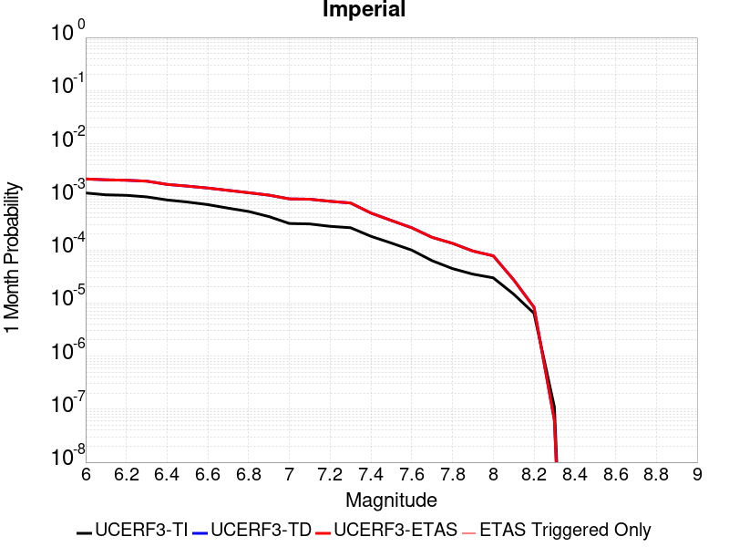 | 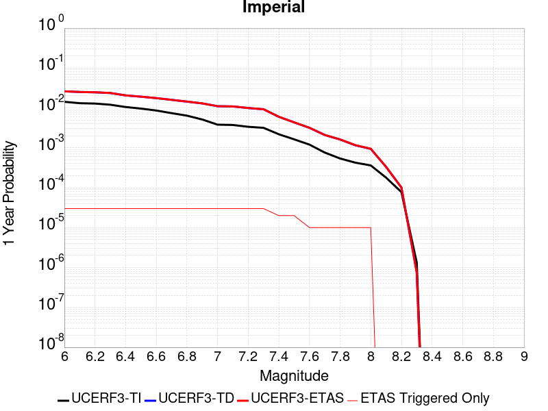 | 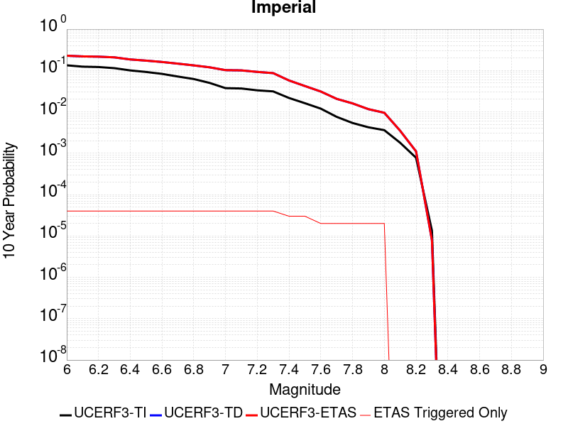 |

| Magnitude | 1 wk TI Prob | 1 wk TD Prob | 1 wk ETAS Prob | 1 wk ETAS/TD Gain | 1 wk ETAS Triggered Only | 1 mo TI Prob | 1 mo TD Prob | 1 mo ETAS Prob | 1 mo ETAS/TD Gain | 1 mo ETAS Triggered Only | 1 yr TI Prob | 1 yr TD Prob | 1 yr ETAS Prob | 1 yr ETAS/TD Gain | 1 yr ETAS Triggered Only | 10 yr TI Prob | 10 yr TD Prob | 10 yr ETAS Prob | 10 yr ETAS/TD Gain | 10 yr ETAS Triggered Only |
|-----|-----|-----|-----|-----|-----|-----|-----|-----|-----|-----|-----|-----|-----|-----|-----|-----|-----|-----|-----|-----|
| 6.0 | 2.7496446E-4 | 5.0565513E-4 | 5.0565513E-4 | 1.0 | 0.0 | 0.0011778869 | 0.002165333 | 0.002165333 | 1.0 | 0.0 | 0.0142467655 | 0.026045265 | 0.0260803 | 1.0013452 | 3.597122E-5 | 0.13367249 | 0.22808637 | 0.22811413 | 1.0001217 | 3.597122E-5 |
| 6.1 | 2.5356023E-4 | 4.8667885E-4 | 4.8667885E-4 | 1.0 | 0.0 | 0.001086234 | 0.0020841376 | 0.0020841376 | 1.0 | 0.0 | 0.013144928 | 0.02507692 | 0.02511199 | 1.0013984 | 3.597122E-5 | 0.123940155 | 0.21951756 | 0.21954563 | 1.0001279 | 3.597122E-5 |
| 6.2 | 2.4820742E-4 | 4.7763108E-4 | 4.7763108E-4 | 1.0 | 0.0 | 0.0010633124 | 0.0020454223 | 0.0020454223 | 1.0 | 0.0 | 0.01286919 | 0.024616843 | 0.024651928 | 1.0014253 | 3.597122E-5 | 0.12148927 | 0.2160229 | 0.21605109 | 1.0001305 | 3.597122E-5 |
| 6.3 | 2.3205351E-4 | 4.590021E-4 | 4.590021E-4 | 1.0 | 0.0 | 9.94136E-4 | 0.0019657058 | 0.0019657058 | 1.0 | 0.0 | 0.012036599 | 0.023666281 | 0.0237014 | 1.0014839 | 3.597122E-5 | 0.11405133 | 0.20796864 | 0.20799713 | 1.000137 | 3.597122E-5 |
| 6.4 | 2.0304754E-4 | 3.9885996E-4 | 3.9885996E-4 | 1.0 | 0.0 | 8.6991355E-4 | 0.0017082945 | 0.0017082945 | 1.0 | 0.0 | 0.010539869 | 0.020600514 | 0.020635745 | 1.0017102 | 3.597122E-5 | 0.100537635 | 0.18510117 | 0.18513048 | 1.0001583 | 3.597122E-5 |
| 6.5 | 1.854992E-4 | 3.6997703E-4 | 3.6997703E-4 | 1.0 | 0.0 | 7.9475436E-4 | 0.0015846646 | 0.0015846646 | 1.0 | 0.0 | 0.009633281 | 0.019123985 | 0.019159267 | 1.001845 | 3.597122E-5 | 0.0922623 | 0.17333072 | 0.17336045 | 1.0001715 | 3.597122E-5 |
| 6.6 | 1.6586106E-4 | 3.4043082E-4 | 3.4043082E-4 | 1.0 | 0.0 | 7.106394E-4 | 0.0014581835 | 0.0014581835 | 1.0 | 0.0 | 0.008617763 | 0.017610526 | 0.017645864 | 1.0020066 | 3.597122E-5 | 0.08291132 | 0.16080588 | 0.16083607 | 1.0001878 | 3.597122E-5 |
| 6.7 | 1.4224656E-4 | 3.077392E-4 | 3.077392E-4 | 1.0 | 0.0 | 6.094856E-4 | 0.0013182238 | 0.0013182238 | 1.0 | 0.0 | 0.0073952693 | 0.015933173 | 0.01596857 | 1.0022217 | 3.597122E-5 | 0.07153955 | 0.1465114 | 0.1465421 | 1.0002096 | 3.597122E-5 |
| 6.8 | 1.2317259E-4 | 2.779711E-4 | 2.779711E-4 | 1.0 | 0.0 | 5.2777573E-4 | 0.0011907669 | 0.0011907669 | 1.0 | 0.0 | 0.0064067547 | 0.0144026 | 0.014438053 | 1.0024616 | 3.597122E-5 | 0.06225166 | 0.13296051 | 0.1329917 | 1.0002346 | 3.597122E-5 |
| 6.9 | 9.859898E-5 | 2.5018715E-4 | 2.5018715E-4 | 1.0 | 0.0 | 4.2249862E-4 | 0.0010717943 | 0.0010717943 | 1.0 | 0.0 | 0.0051317946 | 0.012971984 | 0.013007489 | 1.002737 | 3.597122E-5 | 0.05014893 | 0.11942433 | 0.11945601 | 1.0002652 | 3.597122E-5 |
| 7.0 | 7.3191884E-5 | 2.1270063E-4 | 2.1270063E-4 | 1.0 | 0.0 | 3.136418E-4 | 9.1125886E-4 | 9.1125886E-4 | 1.0 | 0.0 | 0.003811904 | 0.011038825 | 0.011074399 | 1.0032226 | 3.597122E-5 | 0.037471764 | 0.10207849 | 0.10211079 | 1.0003164 | 3.597122E-5 |
| 7.1 | 7.1760296E-5 | 2.0971385E-4 | 2.0971385E-4 | 1.0 | 0.0 | 3.0750787E-4 | 8.984672E-4 | 8.984672E-4 | 1.0 | 0.0 | 0.003737482 | 0.010884652 | 0.010920231 | 1.0032688 | 3.597122E-5 | 0.03675245 | 0.100714855 | 0.1007472 | 1.0003211 | 3.597122E-5 |
| 7.2 | 6.46614E-5 | 1.9139807E-4 | 1.9139807E-4 | 1.0 | 0.0 | 2.7709085E-4 | 8.2002254E-4 | 8.2002254E-4 | 1.0 | 0.0 | 0.0033683628 | 0.009938694 | 0.009974307 | 1.0035833 | 3.597122E-5 | 0.033177625 | 0.09252202 | 0.09255466 | 1.0003529 | 3.597122E-5 |
| 7.3 | 6.088115E-5 | 1.781138E-4 | 1.781138E-4 | 1.0 | 0.0 | 2.6089314E-4 | 7.631244E-4 | 7.631244E-4 | 1.0 | 0.0 | 0.0031717476 | 0.009252035 | 0.009287673 | 1.003852 | 3.597122E-5 | 0.031268585 | 0.08657247 | 0.086605325 | 1.0003796 | 3.597122E-5 |
| 7.4 | 4.199346E-5 | 1.15126604E-4 | 1.15126604E-4 | 1.0 | 0.0 | 1.7995955E-4 | 4.933073E-4 | 4.933073E-4 | 1.0 | 0.0 | 0.0021888057 | 0.005989646 | 0.0060134833 | 1.0039797 | 2.3980816E-5 | 0.02167372 | 0.057449933 | 0.057472534 | 1.0003934 | 2.3980816E-5 |
| 7.5 | 3.130448E-5 | 8.335176E-5 | 8.335176E-5 | 1.0 | 0.0 | 1.3415517E-4 | 3.5717324E-4 | 3.5717324E-4 | 1.0 | 0.0 | 0.0016321153 | 0.0043399734 | 0.00436385 | 1.0055016 | 2.3980816E-5 | 0.016201803 | 0.042140562 | 0.042163532 | 1.0005451 | 2.3980816E-5 |
| 7.6 | 2.3074248E-5 | 6.0860824E-5 | 6.0860824E-5 | 1.0 | 0.0 | 9.888588E-5 | 2.6080615E-4 | 2.6080615E-4 | 1.0 | 0.0 | 0.0012032706 | 0.0031707147 | 0.003182667 | 1.0037696 | 1.1990408E-5 | 0.011967761 | 0.031033779 | 0.031045396 | 1.0003743 | 1.1990408E-5 |
| 7.7 | 1.45864815E-5 | 4.0138115E-5 | 4.0138115E-5 | 1.0 | 0.0 | 6.2511994E-5 | 1.7200918E-4 | 1.7200918E-4 | 1.0 | 0.0 | 7.608177E-4 | 0.0020922057 | 0.002104171 | 1.005719 | 1.1990408E-5 | 0.007582182 | 0.020633917 | 0.02064566 | 1.0005691 | 1.1990408E-5 |
| 7.8 | 1.0352979E-5 | 3.097231E-5 | 3.097231E-5 | 1.0 | 0.0 | 4.4369157E-5 | 1.3273173E-4 | 1.3273173E-4 | 1.0 | 0.0 | 5.400606E-4 | 0.0016148133 | 0.0016267843 | 1.0074133 | 1.1990408E-5 | 0.0053875 | 0.016022068 | 0.016033866 | 1.0007364 | 1.1990408E-5 |
| 7.9 | 8.137906E-6 | 2.2158269E-5 | 2.2158269E-5 | 1.0 | 0.0 | 3.4876273E-5 | 9.496055E-5 | 9.496055E-5 | 1.0 | 0.0 | 4.2453592E-4 | 0.0011555325 | 0.0011675091 | 1.0103645 | 1.1990408E-5 | 0.004237258 | 0.011622174 | 0.011634025 | 1.0010197 | 1.1990408E-5 |
| 8.0 | 6.93792E-6 | 1.801665E-5 | 1.801665E-5 | 1.0 | 0.0 | 2.9733603E-5 | 7.721193E-5 | 7.721193E-5 | 1.0 | 0.0 | 3.6194647E-4 | 9.396506E-4 | 9.516297E-4 | 1.0127485 | 1.1990408E-5 | 0.0036135751 | 0.00950525 | 0.009517126 | 1.0012494 | 1.1990408E-5 |
| 8.1 | 3.4286315E-6 | 6.3835337E-6 | 6.3835337E-6 | 1.0 | 0.0 | 1.4694053E-5 | 2.7357715E-5 | 2.7357715E-5 | 1.0 | 0.0 | 1.7888541E-4 | 3.330294E-4 | 3.330294E-4 | 1.0 | 0.0 | 0.0017874148 | 0.0034878491 | 0.0034878491 | 1.0 | 0.0 |
| 8.2 | 1.4906886E-6 | 1.9381007E-6 | 1.9381007E-6 | 1.0 | 0.0 | 6.3886496E-6 | 8.3061195E-6 | 8.3061195E-6 | 1.0 | 0.0 | 7.7779034E-5 | 1.0112235E-4 | 1.0112235E-4 | 1.0 | 0.0 | 7.775182E-4 | 0.0011082698 | 0.0011082698 | 1.0 | 0.0 |
| 8.3 | 2.5758007E-8 | 1.4514695E-8 | 1.4514695E-8 | 1.0 | 0.0 | 1.10391454E-7 | 6.2205835E-8 | 6.2205835E-8 | 1.0 | 0.0 | 1.3440151E-6 | 7.57356E-7 | 7.57356E-7 | 1.0 | 0.0 | 1.344007E-5 | 7.895551E-6 | 7.895551E-6 | 1.0 | 0.0 |

## Elysian Park (Upper)
*[(top)](#table-of-contents)*

| 1 Week | 1 Month | 1 Year | 10 Year |
|-----|-----|-----|-----|
|  | 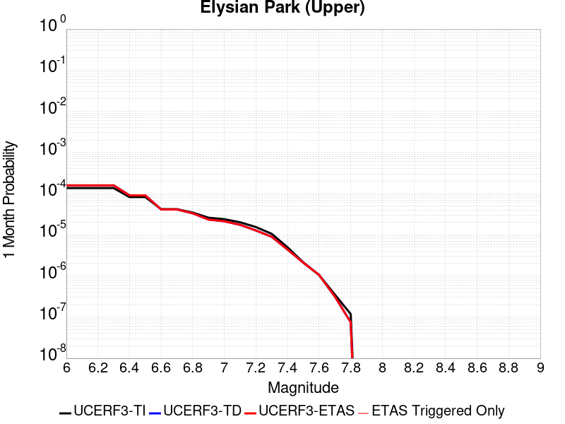 | 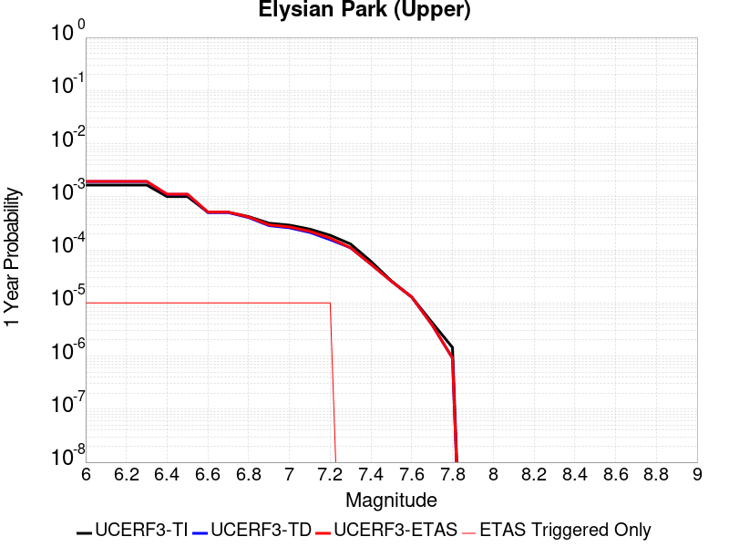 | 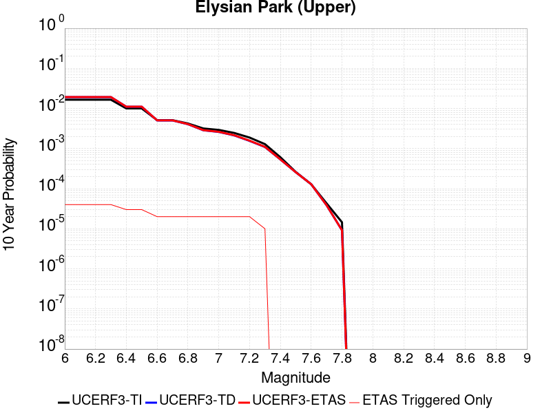 |

| Magnitude | 1 wk TI Prob | 1 wk TD Prob | 1 wk ETAS Prob | 1 wk ETAS/TD Gain | 1 wk ETAS Triggered Only | 1 mo TI Prob | 1 mo TD Prob | 1 mo ETAS Prob | 1 mo ETAS/TD Gain | 1 mo ETAS Triggered Only | 1 yr TI Prob | 1 yr TD Prob | 1 yr ETAS Prob | 1 yr ETAS/TD Gain | 1 yr ETAS Triggered Only | 10 yr TI Prob | 10 yr TD Prob | 10 yr ETAS Prob | 10 yr ETAS/TD Gain | 10 yr ETAS Triggered Only |
|-----|-----|-----|-----|-----|-----|-----|-----|-----|-----|-----|-----|-----|-----|-----|-----|-----|-----|-----|-----|-----|
| 6.0 | 3.1876025E-5 | 3.703652E-5 | 3.703652E-5 | 1.0 | 0.0 | 1.3660437E-4 | 1.5872101E-4 | 1.5872101E-4 | 1.0 | 0.0 | 0.0016618895 | 0.0019311584 | 0.0019431256 | 1.006197 | 1.1990408E-5 | 0.016495159 | 0.019190295 | 0.019225575 | 1.0018384 | 3.597122E-5 |
| 6.1 | 3.1876025E-5 | 3.703652E-5 | 3.703652E-5 | 1.0 | 0.0 | 1.3660437E-4 | 1.5872101E-4 | 1.5872101E-4 | 1.0 | 0.0 | 0.0016618895 | 0.0019311584 | 0.0019431256 | 1.006197 | 1.1990408E-5 | 0.016495159 | 0.019190295 | 0.019225575 | 1.0018384 | 3.597122E-5 |
| 6.2 | 3.1876025E-5 | 3.703652E-5 | 3.703652E-5 | 1.0 | 0.0 | 1.3660437E-4 | 1.5872101E-4 | 1.5872101E-4 | 1.0 | 0.0 | 0.0016618895 | 0.0019311584 | 0.0019431256 | 1.006197 | 1.1990408E-5 | 0.016495159 | 0.019190295 | 0.019225575 | 1.0018384 | 3.597122E-5 |
| 6.3 | 3.1876025E-5 | 3.703652E-5 | 3.703652E-5 | 1.0 | 0.0 | 1.3660437E-4 | 1.5872101E-4 | 1.5872101E-4 | 1.0 | 0.0 | 0.0016618895 | 0.0019311584 | 0.0019431256 | 1.006197 | 1.1990408E-5 | 0.016495159 | 0.019190295 | 0.019225575 | 1.0018384 | 3.597122E-5 |
| 6.4 | 1.9273462E-5 | 2.120273E-5 | 2.120273E-5 | 1.0 | 0.0 | 8.259794E-5 | 9.0866655E-5 | 9.0866655E-5 | 1.0 | 0.0 | 0.001005166 | 0.0011059135 | 0.0011178907 | 1.01083 | 1.1990408E-5 | 0.010006315 | 0.011020964 | 0.01104468 | 1.002152 | 2.3980816E-5 |
| 6.5 | 1.9273462E-5 | 2.120273E-5 | 2.120273E-5 | 1.0 | 0.0 | 8.259794E-5 | 9.0866655E-5 | 9.0866655E-5 | 1.0 | 0.0 | 0.001005166 | 0.0011059135 | 0.0011178907 | 1.01083 | 1.1990408E-5 | 0.010006315 | 0.011020964 | 0.01104468 | 1.002152 | 2.3980816E-5 |
| 6.6 | 9.813258E-6 | 9.665728E-6 | 9.665728E-6 | 1.0 | 0.0 | 4.205614E-5 | 4.142393E-5 | 4.142393E-5 | 1.0 | 0.0 | 5.119132E-4 | 5.042269E-4 | 5.1621126E-4 | 1.0237678 | 1.1990408E-5 | 0.005107356 | 0.005031552 | 0.005055412 | 1.0047421 | 2.3980816E-5 |
| 6.7 | 9.801478E-6 | 9.653297E-6 | 9.653297E-6 | 1.0 | 0.0 | 4.2005657E-5 | 4.137066E-5 | 4.137066E-5 | 1.0 | 0.0 | 5.112989E-4 | 5.0357863E-4 | 5.1556295E-4 | 1.0237985 | 1.1990408E-5 | 0.0051012407 | 0.0050250986 | 0.0050489586 | 1.0047482 | 2.3980816E-5 |
| 6.8 | 8.102489E-6 | 7.7731065E-6 | 7.7731065E-6 | 1.0 | 0.0 | 3.4724493E-5 | 3.3312917E-5 | 3.3312917E-5 | 1.0 | 0.0 | 4.2268867E-4 | 4.0551423E-4 | 4.174998E-4 | 1.0295564 | 1.1990408E-5 | 0.004218856 | 0.0040482366 | 0.0040721204 | 1.0058998 | 2.3980816E-5 |
| 6.9 | 6.08275E-6 | 5.4815127E-6 | 5.4815127E-6 | 1.0 | 0.0 | 2.6068668E-5 | 2.349199E-5 | 2.349199E-5 | 1.0 | 0.0 | 3.173398E-4 | 2.8597823E-4 | 2.979652E-4 | 1.0419157 | 1.1990408E-5 | 0.0031688702 | 0.0028561796 | 0.002880092 | 1.0083722 | 2.3980816E-5 |
| 7.0 | 5.5995934E-6 | 4.982836E-6 | 4.982836E-6 | 1.0 | 0.0 | 2.3998036E-5 | 2.135484E-5 | 2.135484E-5 | 1.0 | 0.0 | 2.9213692E-4 | 2.599648E-4 | 2.719521E-4 | 1.0461112 | 1.1990408E-5 | 0.0029175316 | 0.0025966743 | 0.002620593 | 1.0092112 | 2.3980816E-5 |
| 7.1 | 4.709881E-6 | 4.0874465E-6 | 4.0874465E-6 | 1.0 | 0.0 | 2.0185047E-5 | 1.7517514E-5 | 1.7517514E-5 | 1.0 | 0.0 | 2.4572524E-4 | 2.1325526E-4 | 2.2524311E-4 | 1.0562136 | 1.1990408E-5 | 0.002454537 | 0.0021305475 | 0.0021544774 | 1.0112318 | 2.3980816E-5 |
| 7.2 | 3.6063436E-6 | 2.9779865E-6 | 2.9779865E-6 | 1.0 | 0.0 | 1.5455667E-5 | 1.2762738E-5 | 1.2762738E-5 | 1.0 | 0.0 | 1.881565E-4 | 1.5537537E-4 | 1.673639E-4 | 1.0771586 | 1.1990408E-5 | 0.0018799726 | 0.0015526785 | 0.0015766221 | 1.0154208 | 2.3980816E-5 |
| 7.3 | 2.471135E-6 | 2.0954842E-6 | 2.0954842E-6 | 1.0 | 0.0 | 1.0590536E-5 | 8.980616E-6 | 8.980616E-6 | 1.0 | 0.0 | 1.2893214E-4 | 1.0933358E-4 | 1.0933358E-4 | 1.0 | 0.0 | 0.0012885736 | 0.0010928052 | 0.0011047825 | 1.0109601 | 1.1990408E-5 |
| 7.4 | 1.163943E-6 | 1.0275212E-6 | 1.0275212E-6 | 1.0 | 0.0 | 4.988318E-6 | 4.403655E-6 | 4.403655E-6 | 1.0 | 0.0 | 6.0731076E-5 | 5.3613214E-5 | 5.3613214E-5 | 1.0 | 0.0 | 6.071448E-4 | 5.3600577E-4 | 5.3600577E-4 | 1.0 | 0.0 |
| 7.5 | 4.99459E-7 | 4.9176606E-7 | 4.9176606E-7 | 1.0 | 0.0 | 2.140537E-6 | 2.107567E-6 | 2.107567E-6 | 1.0 | 0.0 | 2.6060725E-5 | 2.5659343E-5 | 2.5659343E-5 | 1.0 | 0.0 | 2.605767E-4 | 2.5656537E-4 | 2.5656537E-4 | 1.0 | 0.0 |
| 7.6 | 2.4667852E-7 | 2.4778674E-7 | 2.4778674E-7 | 1.0 | 0.0 | 1.0571932E-6 | 1.0619428E-6 | 1.0619428E-6 | 1.0 | 0.0 | 1.2871251E-5 | 1.2929081E-5 | 1.2929081E-5 | 1.0 | 0.0 | 1.2870505E-4 | 1.2928365E-4 | 1.2928365E-4 | 1.0 | 0.0 |
| 7.7 | 8.2312795E-8 | 7.386629E-8 | 7.386629E-8 | 1.0 | 0.0 | 3.527691E-7 | 3.1656978E-7 | 3.1656978E-7 | 1.0 | 0.0 | 4.294955E-6 | 3.8542316E-6 | 3.8542316E-6 | 1.0 | 0.0 | 4.2948723E-5 | 3.8541762E-5 | 3.8541762E-5 | 1.0 | 0.0 |
| 7.8 | 2.7819295E-8 | 1.7567322E-8 | 1.7567322E-8 | 1.0 | 0.0 | 1.1922555E-7 | 7.528852E-8 | 7.528852E-8 | 1.0 | 0.0 | 1.45157E-6 | 9.166375E-7 | 9.166375E-7 | 1.0 | 0.0 | 1.45156055E-5 | 9.166352E-6 | 9.166352E-6 | 1.0 | 0.0 |

## White Mountains
*[(top)](#table-of-contents)*

| 1 Week | 1 Month | 1 Year | 10 Year |
|-----|-----|-----|-----|
|  | 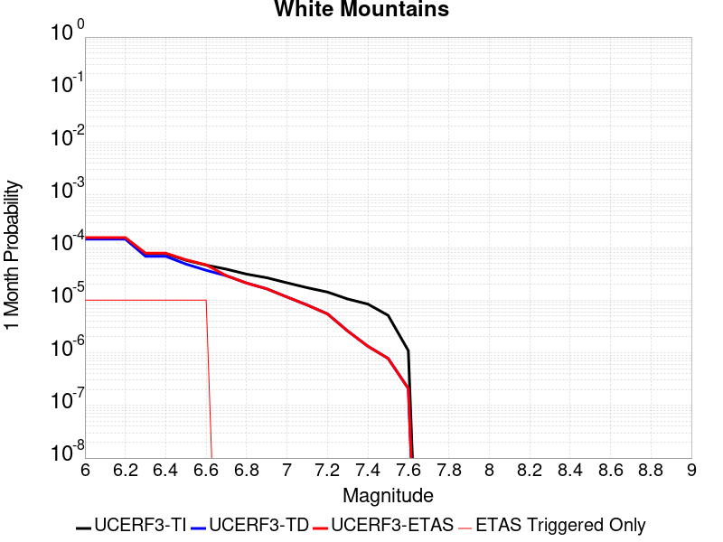 | 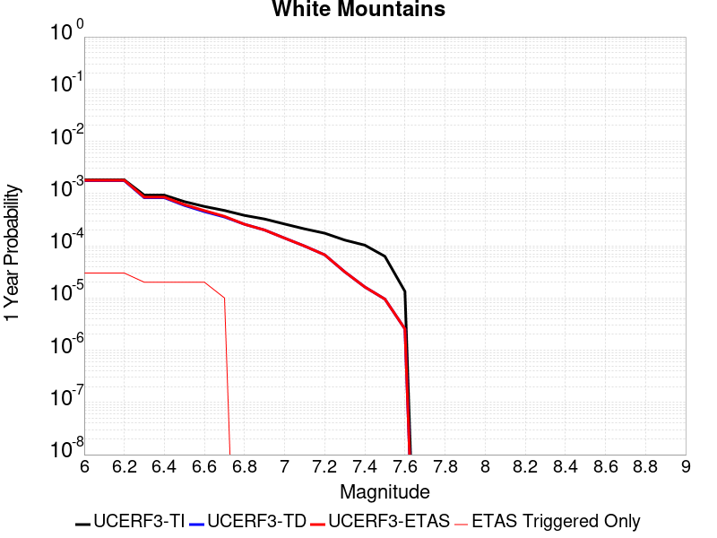 | 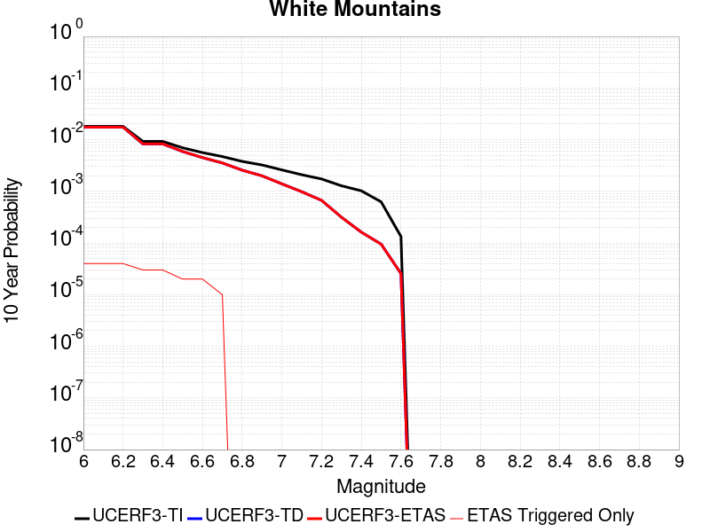 |

| Magnitude | 1 wk TI Prob | 1 wk TD Prob | 1 wk ETAS Prob | 1 wk ETAS/TD Gain | 1 wk ETAS Triggered Only | 1 mo TI Prob | 1 mo TD Prob | 1 mo ETAS Prob | 1 mo ETAS/TD Gain | 1 mo ETAS Triggered Only | 1 yr TI Prob | 1 yr TD Prob | 1 yr ETAS Prob | 1 yr ETAS/TD Gain | 1 yr ETAS Triggered Only | 10 yr TI Prob | 10 yr TD Prob | 10 yr ETAS Prob | 10 yr ETAS/TD Gain | 10 yr ETAS Triggered Only |
|-----|-----|-----|-----|-----|-----|-----|-----|-----|-----|-----|-----|-----|-----|-----|-----|-----|-----|-----|-----|-----|
| 6.0 | 3.503579E-5 | 3.3784425E-5 | 3.3784425E-5 | 1.0 | 0.0 | 1.5014476E-4 | 1.4478304E-4 | 1.5677171E-4 | 1.0828044 | 1.1990408E-5 | 0.0018264796 | 0.0017614291 | 0.001797337 | 1.0203856 | 3.597122E-5 | 0.018115403 | 0.017487012 | 0.017522354 | 1.0020211 | 3.597122E-5 |
| 6.1 | 3.503579E-5 | 3.3784425E-5 | 3.3784425E-5 | 1.0 | 0.0 | 1.5014476E-4 | 1.4478304E-4 | 1.5677171E-4 | 1.0828044 | 1.1990408E-5 | 0.0018264796 | 0.0017614291 | 0.001797337 | 1.0203856 | 3.597122E-5 | 0.018115403 | 0.017487012 | 0.017522354 | 1.0020211 | 3.597122E-5 |
| 6.2 | 3.503579E-5 | 3.3784425E-5 | 3.3784425E-5 | 1.0 | 0.0 | 1.5014476E-4 | 1.4478304E-4 | 1.5677171E-4 | 1.0828044 | 1.1990408E-5 | 0.0018264796 | 0.0017614291 | 0.001797337 | 1.0203856 | 3.597122E-5 | 0.018115403 | 0.017487012 | 0.017522354 | 1.0020211 | 3.597122E-5 |
| 6.3 | 1.7818425E-5 | 1.5916237E-5 | 1.5916237E-5 | 1.0 | 0.0 | 7.636245E-5 | 6.821074E-5 | 8.0200334E-5 | 1.1757728 | 1.1990408E-5 | 9.293162E-4 | 8.301636E-4 | 8.5412455E-4 | 1.0288628 | 2.3980816E-5 | 0.009254395 | 0.0082720835 | 0.008295866 | 1.002875 | 2.3980816E-5 |
| 6.4 | 1.7818425E-5 | 1.5916237E-5 | 1.5916237E-5 | 1.0 | 0.0 | 7.636245E-5 | 6.821074E-5 | 8.0200334E-5 | 1.1757728 | 1.1990408E-5 | 9.293162E-4 | 8.301636E-4 | 8.5412455E-4 | 1.0288628 | 2.3980816E-5 | 0.009254395 | 0.0082720835 | 0.008295866 | 1.002875 | 2.3980816E-5 |
| 6.5 | 1.3397557E-5 | 1.1336382E-5 | 1.1336382E-5 | 1.0 | 0.0 | 5.741684E-5 | 4.8583628E-5 | 6.0573453E-5 | 1.2467873 | 1.1990408E-5 | 6.988258E-4 | 5.913521E-4 | 6.153188E-4 | 1.0405285 | 2.3980816E-5 | 0.006966323 | 0.0058984905 | 0.00592233 | 1.0040416 | 2.3980816E-5 |
| 6.6 | 1.0818695E-5 | 8.625452E-6 | 8.625452E-6 | 1.0 | 0.0 | 4.6365014E-5 | 3.6965725E-5 | 4.8955688E-5 | 1.3243536 | 1.1990408E-5 | 5.6434784E-4 | 4.499691E-4 | 4.7393912E-4 | 1.0532703 | 2.3980816E-5 | 0.005629168 | 0.0044910167 | 0.00451489 | 1.0053158 | 2.3980816E-5 |
| 6.7 | 9.067908E-6 | 6.8025106E-6 | 6.8025106E-6 | 1.0 | 0.0 | 3.8861883E-5 | 2.915331E-5 | 2.915331E-5 | 1.0 | 0.0 | 4.7304068E-4 | 3.5488693E-4 | 3.6687308E-4 | 1.0337746 | 1.1990408E-5 | 0.00472035 | 0.0035435192 | 0.0035554671 | 1.0033717 | 1.1990408E-5 |
| 6.8 | 7.295947E-6 | 4.9364417E-6 | 4.9364417E-6 | 1.0 | 0.0 | 3.126797E-5 | 2.1156015E-5 | 2.1156015E-5 | 1.0 | 0.0 | 3.8062103E-4 | 2.5754515E-4 | 2.5754515E-4 | 1.0 | 0.0 | 0.0037996976 | 0.0025725798 | 0.0025725798 | 1.0 | 0.0 |
| 6.9 | 6.2243444E-6 | 3.832255E-6 | 3.832255E-6 | 1.0 | 0.0 | 2.6675489E-5 | 1.6423848E-5 | 1.6423848E-5 | 1.0 | 0.0 | 3.2472567E-4 | 1.9994254E-4 | 1.9994254E-4 | 1.0 | 0.0 | 0.0032425157 | 0.0019976792 | 0.0019976792 | 1.0 | 0.0 |
| 7.0 | 4.9878413E-6 | 2.6795697E-6 | 2.6795697E-6 | 1.0 | 0.0 | 2.1376287E-5 | 1.1483821E-5 | 1.1483821E-5 | 1.0 | 0.0 | 2.602252E-4 | 1.3980681E-4 | 1.3980681E-4 | 1.0 | 0.0 | 0.002599207 | 0.0013972148 | 0.0013972148 | 1.0 | 0.0 |
| 7.1 | 4.0252844E-6 | 1.88579E-6 | 1.88579E-6 | 1.0 | 0.0 | 1.7251105E-5 | 8.081933E-6 | 8.081933E-6 | 1.0 | 0.0 | 2.1001195E-4 | 9.839322E-5 | 9.839322E-5 | 1.0 | 0.0 | 0.0020981359 | 9.835094E-4 | 9.835094E-4 | 1.0 | 0.0 |
| 7.2 | 3.3284066E-6 | 1.2819944E-6 | 1.2819944E-6 | 1.0 | 0.0 | 1.4264522E-5 | 5.4942507E-6 | 5.4942507E-6 | 1.0 | 0.0 | 1.736567E-4 | 6.689055E-5 | 6.689055E-5 | 1.0 | 0.0 | 0.0017352107 | 6.6871423E-4 | 6.6871423E-4 | 1.0 | 0.0 |
| 7.3 | 2.458226E-6 | 6.057493E-7 | 6.057493E-7 | 1.0 | 0.0 | 1.0535211E-5 | 2.596066E-6 | 2.596066E-6 | 1.0 | 0.0 | 1.2825865E-4 | 3.1606683E-5 | 3.1606683E-5 | 1.0 | 0.0 | 0.0012818464 | 3.1602563E-4 | 3.1602563E-4 | 1.0 | 0.0 |
| 7.4 | 1.965953E-6 | 3.1091668E-7 | 3.1091668E-7 | 1.0 | 0.0 | 8.425486E-6 | 1.3324994E-6 | 1.3324994E-6 | 1.0 | 0.0 | 1.0257547E-4 | 1.622306E-5 | 1.622306E-5 | 1.0 | 0.0 | 0.0010252813 | 1.6221889E-4 | 1.6221889E-4 | 1.0 | 0.0 |
| 7.5 | 1.2014192E-6 | 1.824589E-7 | 1.824589E-7 | 1.0 | 0.0 | 5.148929E-6 | 7.819665E-7 | 7.819665E-7 | 1.0 | 0.0 | 6.2686406E-5 | 9.520401E-6 | 9.520401E-6 | 1.0 | 0.0 | 6.266873E-4 | 9.520002E-5 | 9.520002E-5 | 1.0 | 0.0 |
| 7.6 | 2.5612175E-7 | 4.8950795E-8 | 4.8950795E-8 | 1.0 | 0.0 | 1.0976642E-6 | 2.097891E-7 | 2.097891E-7 | 1.0 | 0.0 | 1.3363979E-5 | 2.5541797E-6 | 2.5541797E-6 | 1.0 | 0.0 | 1.3363175E-4 | 2.554154E-5 | 2.554154E-5 | 1.0 | 0.0 |

## San Gabriel
*[(top)](#table-of-contents)*

| 1 Week | 1 Month | 1 Year | 10 Year |
|-----|-----|-----|-----|
| 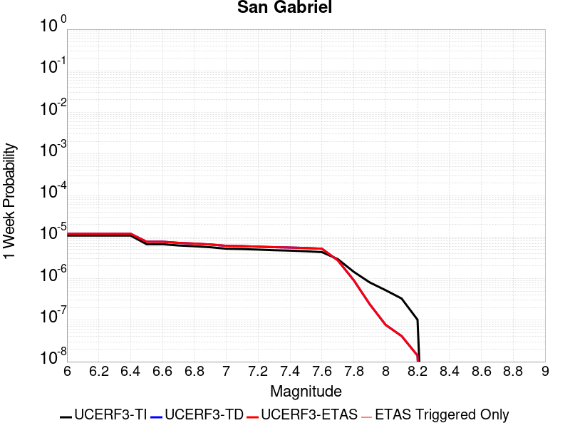 | 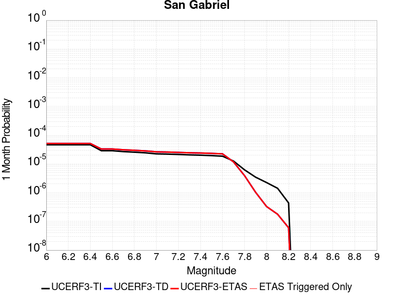 | 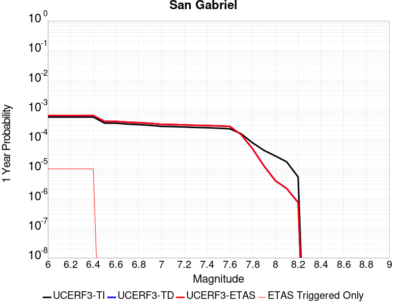 | 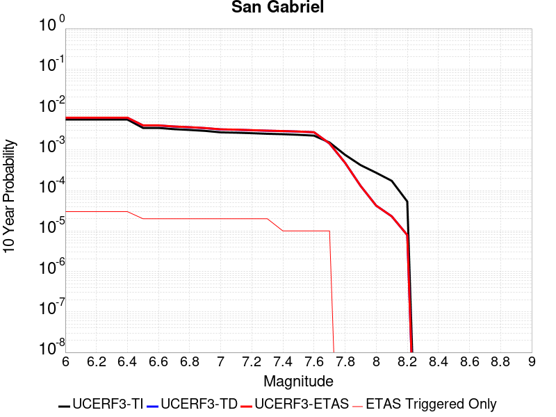 |

| Magnitude | 1 wk TI Prob | 1 wk TD Prob | 1 wk ETAS Prob | 1 wk ETAS/TD Gain | 1 wk ETAS Triggered Only | 1 mo TI Prob | 1 mo TD Prob | 1 mo ETAS Prob | 1 mo ETAS/TD Gain | 1 mo ETAS Triggered Only | 1 yr TI Prob | 1 yr TD Prob | 1 yr ETAS Prob | 1 yr ETAS/TD Gain | 1 yr ETAS Triggered Only | 10 yr TI Prob | 10 yr TD Prob | 10 yr ETAS Prob | 10 yr ETAS/TD Gain | 10 yr ETAS Triggered Only |
|-----|-----|-----|-----|-----|-----|-----|-----|-----|-----|-----|-----|-----|-----|-----|-----|-----|-----|-----|-----|-----|
| 6.0 | 1.083775E-5 | 1.1987322E-5 | 1.1987322E-5 | 1.0 | 0.0 | 4.6446676E-5 | 5.1373292E-5 | 5.1373292E-5 | 1.0 | 0.0 | 5.653415E-4 | 6.253016E-4 | 6.3728454E-4 | 1.0191634 | 1.1990408E-5 | 0.0056390543 | 0.006247514 | 0.0062832604 | 1.0057217 | 3.597122E-5 |
| 6.1 | 1.083775E-5 | 1.1987322E-5 | 1.1987322E-5 | 1.0 | 0.0 | 4.6446676E-5 | 5.1373292E-5 | 5.1373292E-5 | 1.0 | 0.0 | 5.653415E-4 | 6.253016E-4 | 6.3728454E-4 | 1.0191634 | 1.1990408E-5 | 0.0056390543 | 0.006247514 | 0.0062832604 | 1.0057217 | 3.597122E-5 |
| 6.2 | 1.083775E-5 | 1.1987322E-5 | 1.1987322E-5 | 1.0 | 0.0 | 4.6446676E-5 | 5.1373292E-5 | 5.1373292E-5 | 1.0 | 0.0 | 5.653415E-4 | 6.253016E-4 | 6.3728454E-4 | 1.0191634 | 1.1990408E-5 | 0.0056390543 | 0.006247514 | 0.0062832604 | 1.0057217 | 3.597122E-5 |
| 6.3 | 1.083775E-5 | 1.1987322E-5 | 1.1987322E-5 | 1.0 | 0.0 | 4.6446676E-5 | 5.1373292E-5 | 5.1373292E-5 | 1.0 | 0.0 | 5.653415E-4 | 6.253016E-4 | 6.3728454E-4 | 1.0191634 | 1.1990408E-5 | 0.0056390543 | 0.006247514 | 0.0062832604 | 1.0057217 | 3.597122E-5 |
| 6.4 | 1.083775E-5 | 1.1987322E-5 | 1.1987322E-5 | 1.0 | 0.0 | 4.6446676E-5 | 5.1373292E-5 | 5.1373292E-5 | 1.0 | 0.0 | 5.653415E-4 | 6.253016E-4 | 6.3728454E-4 | 1.0191634 | 1.1990408E-5 | 0.0056390543 | 0.006247514 | 0.0062832604 | 1.0057217 | 3.597122E-5 |
| 6.5 | 6.7317824E-6 | 7.719057E-6 | 7.719057E-6 | 1.0 | 0.0 | 2.8850178E-5 | 3.308126E-5 | 3.308126E-5 | 1.0 | 0.0 | 3.511943E-4 | 4.0269096E-4 | 4.0269096E-4 | 1.0 | 0.0 | 0.003506398 | 0.0040307054 | 0.0040545897 | 1.0059255 | 2.3980816E-5 |
| 6.6 | 6.7317824E-6 | 7.719057E-6 | 7.719057E-6 | 1.0 | 0.0 | 2.8850178E-5 | 3.308126E-5 | 3.308126E-5 | 1.0 | 0.0 | 3.511943E-4 | 4.0269096E-4 | 4.0269096E-4 | 1.0 | 0.0 | 0.003506398 | 0.0040307054 | 0.0040545897 | 1.0059255 | 2.3980816E-5 |
| 6.7 | 6.274881E-6 | 7.247975E-6 | 7.247975E-6 | 1.0 | 0.0 | 2.6892068E-5 | 3.1062387E-5 | 3.1062387E-5 | 1.0 | 0.0 | 3.2736175E-4 | 3.781199E-4 | 3.781199E-4 | 1.0 | 0.0 | 0.0032687993 | 0.0037858514 | 0.0038097415 | 1.0063103 | 2.3980816E-5 |
| 6.8 | 5.996209E-6 | 6.9606945E-6 | 6.9606945E-6 | 1.0 | 0.0 | 2.5697784E-5 | 2.9831212E-5 | 2.9831212E-5 | 1.0 | 0.0 | 3.128256E-4 | 3.6313542E-4 | 3.6313542E-4 | 1.0 | 0.0 | 0.003123856 | 0.0036365038 | 0.0036603974 | 1.0065705 | 2.3980816E-5 |
| 6.9 | 5.686331E-6 | 6.6257326E-6 | 6.6257326E-6 | 1.0 | 0.0 | 2.4369761E-5 | 2.8395692E-5 | 2.8395692E-5 | 1.0 | 0.0 | 2.9666146E-4 | 3.4566363E-4 | 3.4566363E-4 | 1.0 | 0.0 | 0.0029626573 | 0.0034623418 | 0.0034862396 | 1.0069022 | 2.3980816E-5 |
| 7.0 | 5.2329838E-6 | 6.14961E-6 | 6.14961E-6 | 1.0 | 0.0 | 2.242688E-5 | 2.6355208E-5 | 2.6355208E-5 | 1.0 | 0.0 | 2.7301308E-4 | 3.2082817E-4 | 3.2082817E-4 | 1.0 | 0.0 | 0.002726779 | 0.00321472 | 0.0032386237 | 1.0074357 | 2.3980816E-5 |
| 7.1 | 5.135671E-6 | 6.03973E-6 | 6.03973E-6 | 1.0 | 0.0 | 2.2009834E-5 | 2.5884305E-5 | 2.5884305E-5 | 1.0 | 0.0 | 2.6793676E-4 | 3.150966E-4 | 3.150966E-4 | 1.0 | 0.0 | 0.0026761394 | 0.0031575684 | 0.0031814736 | 1.0075707 | 2.3980816E-5 |
| 7.2 | 4.989062E-6 | 5.873101E-6 | 5.873101E-6 | 1.0 | 0.0 | 2.1381518E-5 | 2.5170193E-5 | 2.5170193E-5 | 1.0 | 0.0 | 2.6028889E-4 | 3.0640478E-4 | 3.0640478E-4 | 1.0 | 0.0 | 0.0025998424 | 0.003070893 | 0.0030948003 | 1.0077851 | 2.3980816E-5 |
| 7.3 | 4.8219395E-6 | 5.7046464E-6 | 5.7046464E-6 | 1.0 | 0.0 | 2.0665291E-5 | 2.444826E-5 | 2.444826E-5 | 1.0 | 0.0 | 2.5157086E-4 | 2.9761766E-4 | 2.9761766E-4 | 1.0 | 0.0 | 0.0025128627 | 0.0029832611 | 0.0030071705 | 1.0080144 | 2.3980816E-5 |
| 7.4 | 4.7118383E-6 | 5.593198E-6 | 5.593198E-6 | 1.0 | 0.0 | 2.0193436E-5 | 2.3970631E-5 | 2.3970631E-5 | 1.0 | 0.0 | 2.4582737E-4 | 2.918041E-4 | 2.918041E-4 | 1.0 | 0.0 | 0.002455556 | 0.0029252786 | 0.002937234 | 1.0040869 | 1.1990408E-5 |
| 7.5 | 4.5506545E-6 | 5.4385555E-6 | 5.4385555E-6 | 1.0 | 0.0 | 1.9502659E-5 | 2.330789E-5 | 2.330789E-5 | 1.0 | 0.0 | 2.37419E-4 | 2.8373738E-4 | 2.8373738E-4 | 1.0 | 0.0 | 0.002371655 | 0.0028448196 | 0.002856776 | 1.0042028 | 1.1990408E-5 |
| 7.6 | 4.343636E-6 | 5.2314185E-6 | 5.2314185E-6 | 1.0 | 0.0 | 1.861545E-5 | 2.2420176E-5 | 2.2420176E-5 | 1.0 | 0.0 | 2.2661954E-4 | 2.729322E-4 | 2.729322E-4 | 1.0 | 0.0 | 0.0022638857 | 0.00273703 | 0.0027489876 | 1.0043688 | 1.1990408E-5 |
| 7.7 | 2.936235E-6 | 2.7454162E-6 | 2.7454162E-6 | 1.0 | 0.0 | 1.2583803E-5 | 1.17660165E-5 | 1.17660165E-5 | 1.0 | 0.0 | 1.5319703E-4 | 1.4324186E-4 | 1.4324186E-4 | 1.0 | 0.0 | 0.0015309147 | 0.0014387933 | 0.0014507663 | 1.0083216 | 1.1990408E-5 |
| 7.8 | 1.4541639E-6 | 9.129234E-7 | 9.129234E-7 | 1.0 | 0.0 | 6.232116E-6 | 3.912523E-6 | 3.912523E-6 | 1.0 | 0.0 | 7.587337E-5 | 4.7633926E-5 | 4.7633926E-5 | 1.0 | 0.0 | 7.584747E-4 | 4.8114438E-4 | 4.8114438E-4 | 1.0 | 0.0 |
| 7.9 | 8.098958E-7 | 2.419679E-7 | 2.419679E-7 | 1.0 | 0.0 | 3.4709774E-6 | 1.0370048E-6 | 1.0370048E-6 | 1.0 | 0.0 | 4.225833E-5 | 1.2625461E-5 | 1.2625461E-5 | 1.0 | 0.0 | 4.2250296E-4 | 1.2933378E-4 | 1.2933378E-4 | 1.0 | 0.0 |
| 8.0 | 5.2473234E-7 | 7.6891794E-8 | 7.6891794E-8 | 1.0 | 0.0 | 2.248851E-6 | 3.2953622E-7 | 3.2953622E-7 | 1.0 | 0.0 | 2.7379416E-5 | 4.012096E-6 | 4.012096E-6 | 1.0 | 0.0 | 2.7376044E-4 | 4.224638E-5 | 4.224638E-5 | 1.0 | 0.0 |
| 8.1 | 3.3162388E-7 | 4.155149E-8 | 4.155149E-8 | 1.0 | 0.0 | 1.4212444E-6 | 1.7807781E-7 | 1.7807781E-7 | 1.0 | 0.0 | 1.7303513E-5 | 2.168095E-6 | 2.168095E-6 | 1.0 | 0.0 | 1.7302166E-4 | 2.2995899E-5 | 2.2995899E-5 | 1.0 | 0.0 |
| 8.2 | 1.0235345E-7 | 1.4060946E-8 | 1.4060946E-8 | 1.0 | 0.0 | 4.3865757E-7 | 6.02612E-8 | 6.02612E-8 | 1.0 | 0.0 | 5.340643E-6 | 7.336798E-7 | 7.336798E-7 | 1.0 | 0.0 | 5.3405143E-5 | 7.937039E-6 | 7.937039E-6 | 1.0 | 0.0 |

## Brawley (Seismic Zone) alt 1
*[(top)](#table-of-contents)*

| 1 Week | 1 Month | 1 Year | 10 Year |
|-----|-----|-----|-----|
| 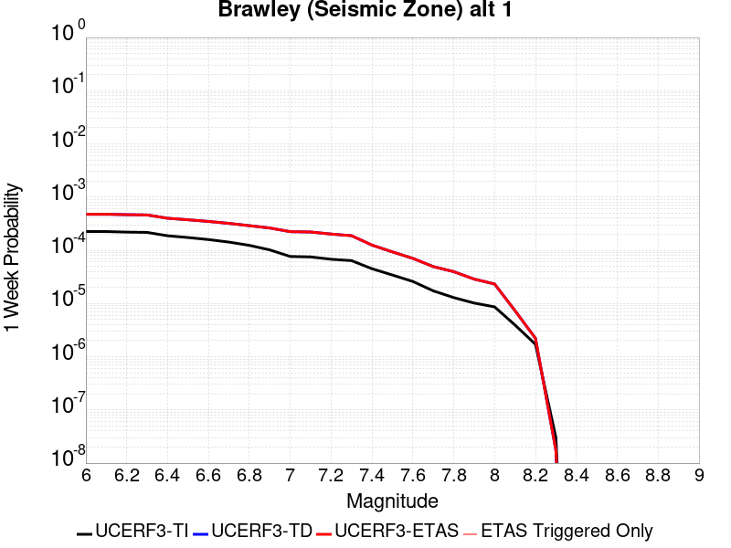 |  | 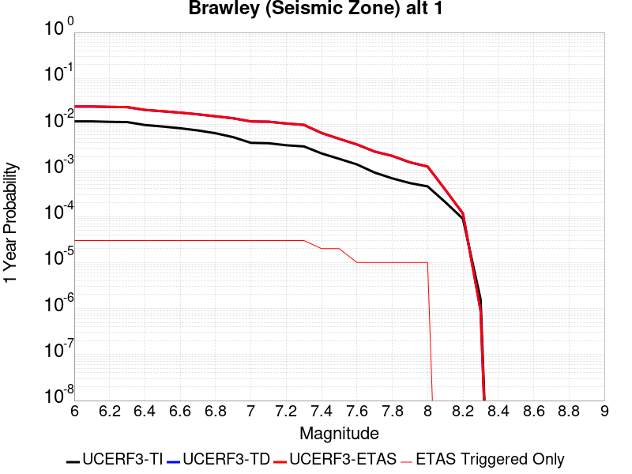 | 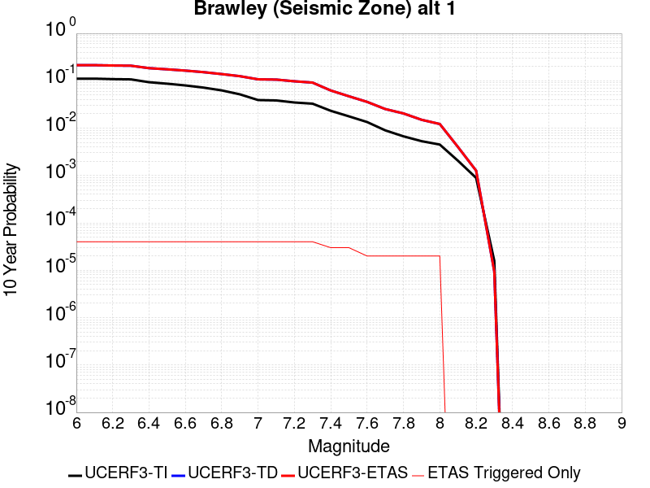 |

| Magnitude | 1 wk TI Prob | 1 wk TD Prob | 1 wk ETAS Prob | 1 wk ETAS/TD Gain | 1 wk ETAS Triggered Only | 1 mo TI Prob | 1 mo TD Prob | 1 mo ETAS Prob | 1 mo ETAS/TD Gain | 1 mo ETAS Triggered Only | 1 yr TI Prob | 1 yr TD Prob | 1 yr ETAS Prob | 1 yr ETAS/TD Gain | 1 yr ETAS Triggered Only | 10 yr TI Prob | 10 yr TD Prob | 10 yr ETAS Prob | 10 yr ETAS/TD Gain | 10 yr ETAS Triggered Only |
|-----|-----|-----|-----|-----|-----|-----|-----|-----|-----|-----|-----|-----|-----|-----|-----|-----|-----|-----|-----|-----|
| 6.0 | 2.2521618E-4 | 4.7641253E-4 | 4.7641253E-4 | 1.0 | 0.0 | 9.6485513E-4 | 0.0020402074 | 0.0020402074 | 1.0 | 0.0 | 0.011683988 | 0.02455069 | 0.024585776 | 1.0014292 | 3.597122E-5 | 0.11088423 | 0.21353015 | 0.21355844 | 1.0001324 | 3.597122E-5 |
| 6.1 | 2.2521618E-4 | 4.7641253E-4 | 4.7641253E-4 | 1.0 | 0.0 | 9.6485513E-4 | 0.0020402074 | 0.0020402074 | 1.0 | 0.0 | 0.011683988 | 0.02455069 | 0.024585776 | 1.0014292 | 3.597122E-5 | 0.11088423 | 0.21353015 | 0.21355844 | 1.0001324 | 3.597122E-5 |
| 6.2 | 2.198148E-4 | 4.6725658E-4 | 4.6725658E-4 | 1.0 | 0.0 | 9.417233E-4 | 0.002001028 | 0.002001028 | 1.0 | 0.0 | 0.011405343 | 0.024084855 | 0.02411996 | 1.0014576 | 3.597122E-5 | 0.10837428 | 0.20996629 | 0.2099947 | 1.0001353 | 3.597122E-5 |
| 6.3 | 2.1704129E-4 | 4.6161312E-4 | 4.6161312E-4 | 1.0 | 0.0 | 9.298453E-4 | 0.0019768786 | 0.0019768786 | 1.0 | 0.0 | 0.011262234 | 0.023797998 | 0.023833115 | 1.0014756 | 3.597122E-5 | 0.107082725 | 0.20785725 | 0.20788574 | 1.0001371 | 3.597122E-5 |
| 6.4 | 1.876142E-4 | 4.0053183E-4 | 4.0053183E-4 | 1.0 | 0.0 | 8.038131E-4 | 0.0017154501 | 0.0017154501 | 1.0 | 0.0 | 0.00974259 | 0.02068463 | 0.020719858 | 1.001703 | 3.597122E-5 | 0.093263686 | 0.184608 | 0.18463734 | 1.0001589 | 3.597122E-5 |
| 6.5 | 1.7390939E-4 | 3.7485067E-4 | 3.7485067E-4 | 1.0 | 0.0 | 7.45113E-4 | 0.0016055258 | 0.0016055258 | 1.0 | 0.0 | 0.009034078 | 0.019372813 | 0.019408086 | 1.0018208 | 3.597122E-5 | 0.086755216 | 0.17442966 | 0.17445935 | 1.0001702 | 3.597122E-5 |
| 6.6 | 1.591791E-4 | 3.489955E-4 | 3.489955E-4 | 1.0 | 0.0 | 6.8201777E-4 | 0.0014948477 | 0.0014948477 | 1.0 | 0.0 | 0.008271996 | 0.018049458 | 0.018084781 | 1.0019569 | 3.597122E-5 | 0.07970774 | 0.16383699 | 0.16386707 | 1.0001836 | 3.597122E-5 |
| 6.7 | 1.4268003E-4 | 3.206533E-4 | 3.206533E-4 | 1.0 | 0.0 | 6.1134255E-4 | 0.0013735129 | 0.0013735129 | 1.0 | 0.0 | 0.007417723 | 0.016596261 | 0.016631635 | 1.0021315 | 3.597122E-5 | 0.07174956 | 0.15196045 | 0.15199095 | 1.0002007 | 3.597122E-5 |
| 6.8 | 1.239713E-4 | 2.9059697E-4 | 2.9059697E-4 | 1.0 | 0.0 | 5.3119735E-4 | 0.0012448273 | 0.0012448273 | 1.0 | 0.0 | 0.0064481674 | 0.015051884 | 0.015087313 | 1.0023538 | 3.597122E-5 | 0.06264243 | 0.13840161 | 0.1384326 | 1.0002239 | 3.597122E-5 |
| 6.9 | 1.0180238E-4 | 2.625907E-4 | 2.625907E-4 | 1.0 | 0.0 | 4.3622297E-4 | 0.0011249076 | 0.0011249076 | 1.0 | 0.0 | 0.005298089 | 0.013610746 | 0.013646227 | 1.0026069 | 3.597122E-5 | 0.05173543 | 0.12498065 | 0.12501213 | 1.0002519 | 3.597122E-5 |
| 7.0 | 7.6619996E-5 | 2.2402873E-4 | 2.2402873E-4 | 1.0 | 0.0 | 3.283301E-4 | 9.59773E-4 | 9.59773E-4 | 1.0 | 0.0 | 0.0039900932 | 0.011623339 | 0.011658891 | 1.0030588 | 3.597122E-5 | 0.039192066 | 0.10728151 | 0.107313626 | 1.0002993 | 3.597122E-5 |
| 7.1 | 7.5127435E-5 | 2.208599E-4 | 2.208599E-4 | 1.0 | 0.0 | 3.2193496E-4 | 9.4620226E-4 | 9.4620226E-4 | 1.0 | 0.0 | 0.0039125155 | 0.011459865 | 0.0114954235 | 1.0031029 | 3.597122E-5 | 0.038443442 | 0.10584534 | 0.105877504 | 1.0003039 | 3.597122E-5 |
| 7.2 | 6.788582E-5 | 2.0213598E-4 | 2.0213598E-4 | 1.0 | 0.0 | 2.9090676E-4 | 8.660125E-4 | 8.660125E-4 | 1.0 | 0.0 | 0.0035360386 | 0.010493369 | 0.010528962 | 1.003392 | 3.597122E-5 | 0.034803 | 0.09751546 | 0.09754792 | 1.000333 | 3.597122E-5 |
| 7.3 | 6.399602E-5 | 1.88444E-4 | 1.88444E-4 | 1.0 | 0.0 | 2.7423984E-4 | 8.0737006E-4 | 8.0737006E-4 | 1.0 | 0.0 | 0.0033337586 | 0.009786017 | 0.009821637 | 1.0036398 | 3.597122E-5 | 0.03284188 | 0.091409855 | 0.09144254 | 1.0003575 | 3.597122E-5 |
| 7.4 | 4.506759E-5 | 1.2531783E-4 | 1.2531783E-4 | 1.0 | 0.0 | 1.9313251E-4 | 5.369668E-4 | 5.369668E-4 | 1.0 | 0.0 | 0.0023488526 | 0.0065181484 | 0.006541973 | 1.0036551 | 2.3980816E-5 | 0.023241805 | 0.062375 | 0.062397487 | 1.0003605 | 2.3980816E-5 |
| 7.5 | 3.43289E-5 | 9.337587E-5 | 9.337587E-5 | 1.0 | 0.0 | 1.4711556E-4 | 4.0012124E-4 | 4.0012124E-4 | 1.0 | 0.0 | 0.0017896603 | 0.004860657 | 0.0048845215 | 1.0049096 | 2.3980816E-5 | 0.01775316 | 0.04706493 | 0.047087785 | 1.0004855 | 2.3980816E-5 |
| 7.6 | 2.5980507E-5 | 7.054998E-5 | 7.054998E-5 | 1.0 | 0.0 | 1.1134028E-4 | 3.0232212E-4 | 3.0232212E-4 | 1.0 | 0.0 | 0.001354725 | 0.0036745837 | 0.00368653 | 1.0032511 | 1.1990408E-5 | 0.013464959 | 0.035849415 | 0.035860974 | 1.0003225 | 1.1990408E-5 |
| 7.7 | 1.7292105E-5 | 4.9423474E-5 | 4.9423474E-5 | 1.0 | 0.0 | 7.4106916E-5 | 2.1179771E-4 | 2.1179771E-4 | 1.0 | 0.0 | 9.018782E-4 | 0.0025755935 | 0.002587553 | 1.0046434 | 1.1990408E-5 | 0.008982267 | 0.025297757 | 0.025309443 | 1.0004619 | 1.1990408E-5 |
| 7.8 | 1.2927471E-5 | 3.970735E-5 | 3.970735E-5 | 1.0 | 0.0 | 5.5402274E-5 | 1.7016326E-4 | 1.7016326E-4 | 1.0 | 0.0 | 6.743139E-4 | 0.0020697718 | 0.0020817374 | 1.0057812 | 1.1990408E-5 | 0.0067227143 | 0.02043814 | 0.020449886 | 1.0005747 | 1.1990408E-5 |
| 7.9 | 1.0200774E-5 | 2.8757075E-5 | 2.8757075E-5 | 1.0 | 0.0 | 4.371687E-5 | 1.2323879E-4 | 1.2323879E-4 | 1.0 | 0.0 | 5.321229E-4 | 0.0014994006 | 0.0015113731 | 1.0079848 | 1.1990408E-5 | 0.005308505 | 0.0149969105 | 0.015008721 | 1.0007875 | 1.1990408E-5 |
| 8.0 | 8.650396E-6 | 2.3287128E-5 | 2.3287128E-5 | 1.0 | 0.0 | 3.70726E-5 | 9.979816E-5 | 9.979816E-5 | 1.0 | 0.0 | 4.5126543E-4 | 0.0012143662 | 0.001226342 | 1.0098618 | 1.1990408E-5 | 0.0045035016 | 0.012215644 | 0.012227489 | 1.0009695 | 1.1990408E-5 |
| 8.1 | 3.9368224E-6 | 7.3321658E-6 | 7.3321658E-6 | 1.0 | 0.0 | 1.6871985E-5 | 3.1423187E-5 | 3.1423187E-5 | 1.0 | 0.0 | 2.0539707E-4 | 3.825103E-4 | 3.825103E-4 | 1.0 | 0.0 | 0.0020520731 | 0.00400326 | 0.00400326 | 1.0 | 0.0 |
| 8.2 | 1.7101195E-6 | 2.2195122E-6 | 2.2195122E-6 | 1.0 | 0.0 | 7.329063E-6 | 9.51216E-6 | 9.51216E-6 | 1.0 | 0.0 | 8.922769E-5 | 1.15804425E-4 | 1.15804425E-4 | 1.0 | 0.0 | 8.9191867E-4 | 0.0012675166 | 0.0012675166 | 1.0 | 0.0 |
| 8.3 | 3.0346666E-8 | 1.7233086E-8 | 1.7233086E-8 | 1.0 | 0.0 | 1.3005713E-7 | 7.385608E-8 | 7.385608E-8 | 1.0 | 0.0 | 1.5834444E-6 | 8.991977E-7 | 8.991977E-7 | 1.0 | 0.0 | 1.5834332E-5 | 9.37692E-6 | 9.37692E-6 | 1.0 | 0.0 |

## Santa Cruz Island
*[(top)](#table-of-contents)*

| 1 Week | 1 Month | 1 Year | 10 Year |
|-----|-----|-----|-----|
| 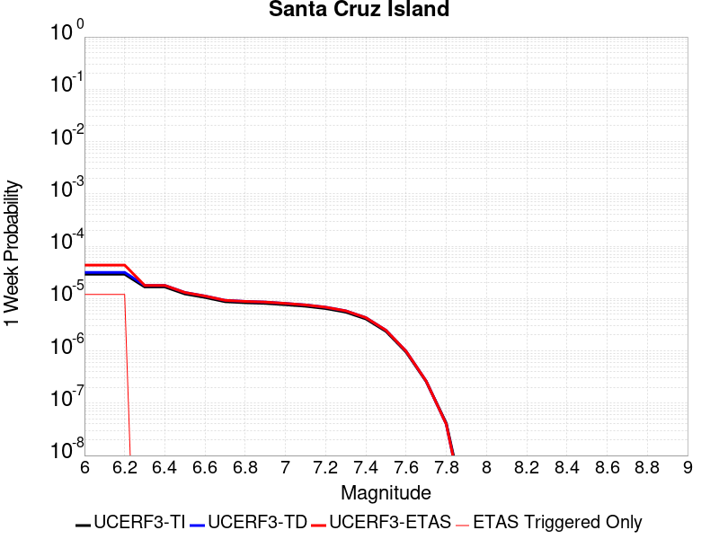 | 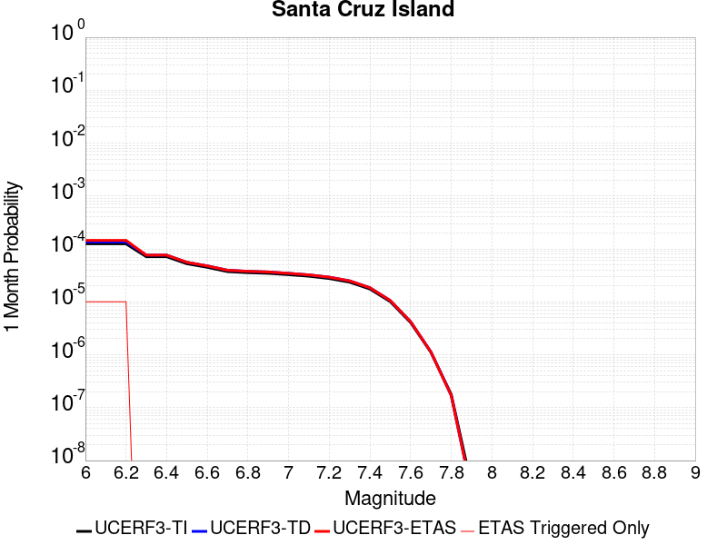 | 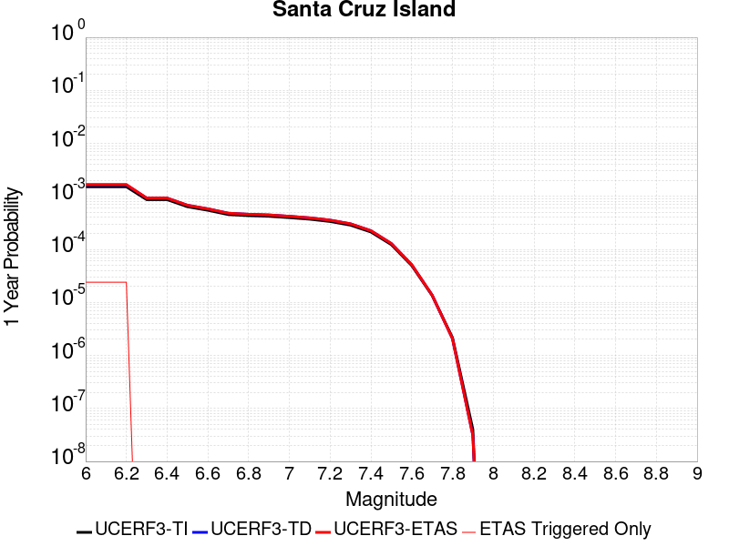 | 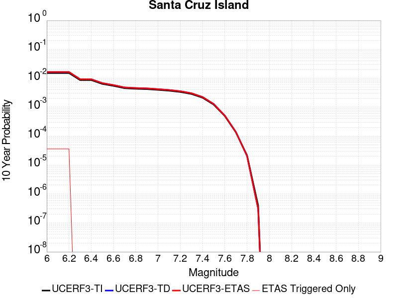 |

| Magnitude | 1 wk TI Prob | 1 wk TD Prob | 1 wk ETAS Prob | 1 wk ETAS/TD Gain | 1 wk ETAS Triggered Only | 1 mo TI Prob | 1 mo TD Prob | 1 mo ETAS Prob | 1 mo ETAS/TD Gain | 1 mo ETAS Triggered Only | 1 yr TI Prob | 1 yr TD Prob | 1 yr ETAS Prob | 1 yr ETAS/TD Gain | 1 yr ETAS Triggered Only | 10 yr TI Prob | 10 yr TD Prob | 10 yr ETAS Prob | 10 yr ETAS/TD Gain | 10 yr ETAS Triggered Only |
|-----|-----|-----|-----|-----|-----|-----|-----|-----|-----|-----|-----|-----|-----|-----|-----|-----|-----|-----|-----|-----|
| 6.0 | 2.9164563E-5 | 3.1600095E-5 | 4.3590124E-5 | 1.3794302 | 1.1990408E-5 | 1.2498499E-4 | 1.3542273E-4 | 1.4741151E-4 | 1.0885286 | 1.1990408E-5 | 0.0015206301 | 0.0016476609 | 0.0016716023 | 1.0145304 | 2.3980816E-5 | 0.015102667 | 0.01636818 | 0.016403563 | 1.0021616 | 3.597122E-5 |
| 6.1 | 2.9164563E-5 | 3.1600095E-5 | 4.3590124E-5 | 1.3794302 | 1.1990408E-5 | 1.2498499E-4 | 1.3542273E-4 | 1.4741151E-4 | 1.0885286 | 1.1990408E-5 | 0.0015206301 | 0.0016476609 | 0.0016716023 | 1.0145304 | 2.3980816E-5 | 0.015102667 | 0.01636818 | 0.016403563 | 1.0021616 | 3.597122E-5 |
| 6.2 | 2.9164563E-5 | 3.1600095E-5 | 4.3590124E-5 | 1.3794302 | 1.1990408E-5 | 1.2498499E-4 | 1.3542273E-4 | 1.4741151E-4 | 1.0885286 | 1.1990408E-5 | 0.0015206301 | 0.0016476609 | 0.0016716023 | 1.0145304 | 2.3980816E-5 | 0.015102667 | 0.01636818 | 0.016403563 | 1.0021616 | 3.597122E-5 |
| 6.3 | 1.6635553E-5 | 1.7804527E-5 | 1.7804527E-5 | 1.0 | 0.0 | 7.1293274E-5 | 7.630298E-5 | 7.630298E-5 | 1.0 | 0.0 | 8.6765E-4 | 9.286111E-4 | 9.286111E-4 | 1.0 | 0.0 | 0.008642701 | 0.009249181 | 0.009249181 | 1.0 | 0.0 |
| 6.4 | 1.6635553E-5 | 1.7804527E-5 | 1.7804527E-5 | 1.0 | 0.0 | 7.1293274E-5 | 7.630298E-5 | 7.630298E-5 | 1.0 | 0.0 | 8.6765E-4 | 9.286111E-4 | 9.286111E-4 | 1.0 | 0.0 | 0.008642701 | 0.009249181 | 0.009249181 | 1.0 | 0.0 |
| 6.5 | 1.2238748E-5 | 1.3043111E-5 | 1.3043111E-5 | 1.0 | 0.0 | 5.2450723E-5 | 5.5897868E-5 | 5.5897868E-5 | 1.0 | 0.0 | 6.3840044E-4 | 6.8034773E-4 | 6.8034773E-4 | 1.0 | 0.0 | 0.0063656955 | 0.006783047 | 0.006783047 | 1.0 | 0.0 |
| 6.6 | 1.0489767E-5 | 1.11567315E-5 | 1.11567315E-5 | 1.0 | 0.0 | 4.495537E-5 | 4.7813697E-5 | 4.7813697E-5 | 1.0 | 0.0 | 5.4719415E-4 | 5.8197853E-4 | 5.8197853E-4 | 1.0 | 0.0 | 0.005458487 | 0.005804785 | 0.005804785 | 1.0 | 0.0 |
| 6.7 | 8.699222E-6 | 9.236859E-6 | 9.236859E-6 | 1.0 | 0.0 | 3.7281847E-5 | 3.958594E-5 | 3.958594E-5 | 1.0 | 0.0 | 4.5381195E-4 | 4.818528E-4 | 4.818528E-4 | 1.0 | 0.0 | 0.0045288634 | 0.004808148 | 0.004808148 | 1.0 | 0.0 |
| 6.8 | 8.307732E-6 | 8.816977E-6 | 8.816977E-6 | 1.0 | 0.0 | 3.560408E-5 | 3.77865E-5 | 3.77865E-5 | 1.0 | 0.0 | 4.3339343E-4 | 4.5995394E-4 | 4.5995394E-4 | 1.0 | 0.0 | 0.004325492 | 0.004590073 | 0.004590073 | 1.0 | 0.0 |
| 6.9 | 8.073121E-6 | 8.565009E-6 | 8.565009E-6 | 1.0 | 0.0 | 3.459863E-5 | 3.6706668E-5 | 3.6706668E-5 | 1.0 | 0.0 | 4.2115687E-4 | 4.4681245E-4 | 4.4681245E-4 | 1.0 | 0.0 | 0.004203596 | 0.0044591925 | 0.0044591925 | 1.0 | 0.0 |
| 7.0 | 7.617019E-6 | 8.0747295E-6 | 8.0747295E-6 | 1.0 | 0.0 | 3.264396E-5 | 3.4605528E-5 | 3.4605528E-5 | 1.0 | 0.0 | 3.9736772E-4 | 4.2124125E-4 | 4.2124125E-4 | 1.0 | 0.0 | 0.003966579 | 0.0042044753 | 0.0042044753 | 1.0 | 0.0 |
| 7.1 | 7.1224836E-6 | 7.5458483E-6 | 7.5458483E-6 | 1.0 | 0.0 | 3.052457E-5 | 3.233895E-5 | 3.233895E-5 | 1.0 | 0.0 | 3.715733E-4 | 3.9365597E-4 | 3.9365597E-4 | 1.0 | 0.0 | 0.003709526 | 0.0039296295 | 0.0039296295 | 1.0 | 0.0 |
| 7.2 | 6.441115E-6 | 6.8274385E-6 | 6.8274385E-6 | 1.0 | 0.0 | 2.7604487E-5 | 2.9260125E-5 | 2.9260125E-5 | 1.0 | 0.0 | 3.360328E-4 | 3.5618403E-4 | 3.5618403E-4 | 1.0 | 0.0 | 0.0033552512 | 0.0035561598 | 0.0035561598 | 1.0 | 0.0 |
| 7.3 | 5.494274E-6 | 5.820041E-6 | 5.820041E-6 | 1.0 | 0.0 | 2.3546674E-5 | 2.4942796E-5 | 2.4942796E-5 | 1.0 | 0.0 | 2.8664304E-4 | 3.0363642E-4 | 3.0363642E-4 | 1.0 | 0.0 | 0.002862736 | 0.0030322387 | 0.0030322387 | 1.0 | 0.0 |
| 7.4 | 4.0802624E-6 | 4.3122895E-6 | 4.3122895E-6 | 1.0 | 0.0 | 1.7486722E-5 | 1.848111E-5 | 1.848111E-5 | 1.0 | 0.0 | 2.1288003E-4 | 2.2498437E-4 | 2.2498437E-4 | 1.0 | 0.0 | 0.0021267622 | 0.002247575 | 0.002247575 | 1.0 | 0.0 |
| 7.5 | 2.3584746E-6 | 2.4753267E-6 | 2.4753267E-6 | 1.0 | 0.0 | 1.0107709E-5 | 1.06085E-5 | 1.06085E-5 | 1.0 | 0.0 | 1.2305441E-4 | 1.2915088E-4 | 1.2915088E-4 | 1.0 | 0.0 | 0.0012298629 | 0.0012907633 | 0.0012907633 | 1.0 | 0.0 |
| 7.6 | 9.4981914E-7 | 9.860988E-7 | 9.860988E-7 | 1.0 | 0.0 | 4.0706473E-6 | 4.226131E-6 | 4.226131E-6 | 1.0 | 0.0 | 4.9559E-5 | 5.145194E-5 | 5.145194E-5 | 1.0 | 0.0 | 4.954795E-4 | 5.144016E-4 | 5.144016E-4 | 1.0 | 0.0 |
| 7.7 | 2.6013532E-7 | 2.641672E-7 | 2.641672E-7 | 1.0 | 0.0 | 1.1148652E-6 | 1.1321447E-6 | 1.1321447E-6 | 1.0 | 0.0 | 1.3573399E-5 | 1.3783775E-5 | 1.3783775E-5 | 1.0 | 0.0 | 1.357257E-4 | 1.3782927E-4 | 1.3782927E-4 | 1.0 | 0.0 |
| 7.8 | 4.1522263E-8 | 3.9656918E-8 | 3.9656918E-8 | 1.0 | 0.0 | 1.7795254E-7 | 1.6995821E-7 | 1.6995821E-7 | 1.0 | 0.0 | 2.16657E-6 | 2.0692394E-6 | 2.0692394E-6 | 1.0 | 0.0 | 2.1665488E-5 | 2.0692223E-5 | 2.0692223E-5 | 1.0 | 0.0 |
| 7.9 | 7.7242046E-10 | 5.946851E-10 | 5.946851E-10 | 1.0 | 0.0 | 3.3103735E-9 | 2.54865E-9 | 2.54865E-9 | 1.0 | 0.0 | 4.0303796E-8 | 3.1029813E-8 | 3.1029813E-8 | 1.0 | 0.0 | 4.030379E-7 | 3.102981E-7 | 3.102981E-7 | 1.0 | 0.0 |

## Raymond
*[(top)](#table-of-contents)*

| 1 Week | 1 Month | 1 Year | 10 Year |
|-----|-----|-----|-----|
| 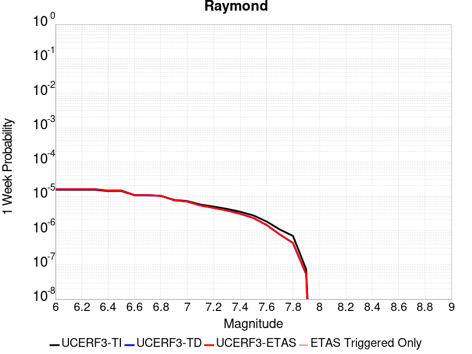 | 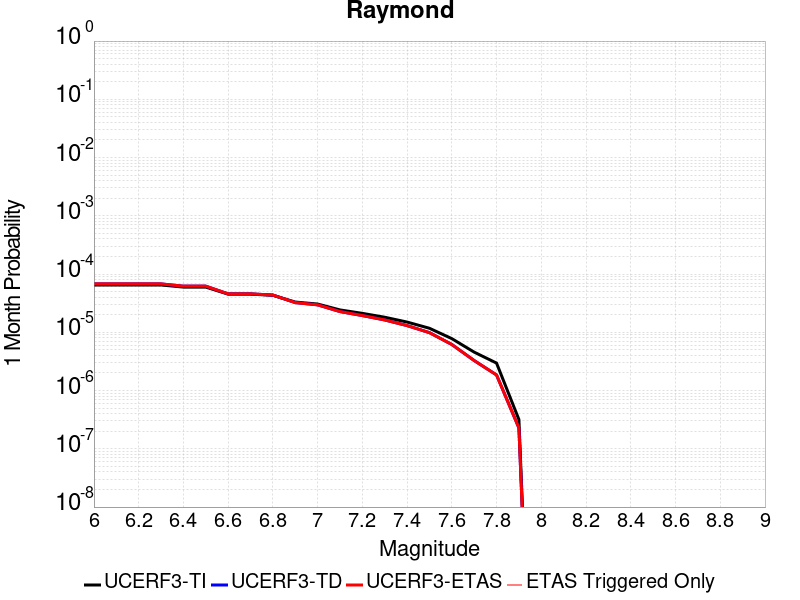 | 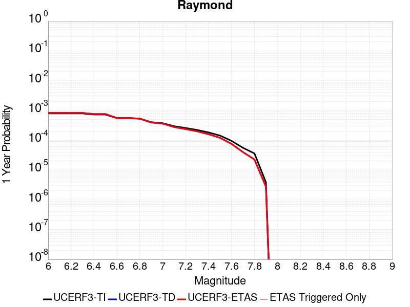 | 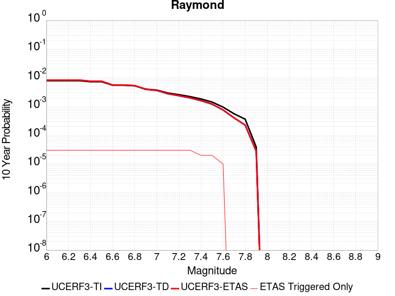 |

| Magnitude | 1 wk TI Prob | 1 wk TD Prob | 1 wk ETAS Prob | 1 wk ETAS/TD Gain | 1 wk ETAS Triggered Only | 1 mo TI Prob | 1 mo TD Prob | 1 mo ETAS Prob | 1 mo ETAS/TD Gain | 1 mo ETAS Triggered Only | 1 yr TI Prob | 1 yr TD Prob | 1 yr ETAS Prob | 1 yr ETAS/TD Gain | 1 yr ETAS Triggered Only | 10 yr TI Prob | 10 yr TD Prob | 10 yr ETAS Prob | 10 yr ETAS/TD Gain | 10 yr ETAS Triggered Only |
|-----|-----|-----|-----|-----|-----|-----|-----|-----|-----|-----|-----|-----|-----|-----|-----|-----|-----|-----|-----|-----|
| 6.0 | 1.5157413E-5 | 1.5810376E-5 | 1.5810376E-5 | 1.0 | 0.0 | 6.4958724E-5 | 6.775714E-5 | 6.775714E-5 | 1.0 | 0.0 | 7.905855E-4 | 8.24656E-4 | 8.24656E-4 | 1.0 | 0.0 | 0.007877788 | 0.008218477 | 0.008254152 | 1.0043409 | 3.597122E-5 |
| 6.1 | 1.5157413E-5 | 1.5810376E-5 | 1.5810376E-5 | 1.0 | 0.0 | 6.4958724E-5 | 6.775714E-5 | 6.775714E-5 | 1.0 | 0.0 | 7.905855E-4 | 8.24656E-4 | 8.24656E-4 | 1.0 | 0.0 | 0.007877788 | 0.008218477 | 0.008254152 | 1.0043409 | 3.597122E-5 |
| 6.2 | 1.5157413E-5 | 1.5810376E-5 | 1.5810376E-5 | 1.0 | 0.0 | 6.4958724E-5 | 6.775714E-5 | 6.775714E-5 | 1.0 | 0.0 | 7.905855E-4 | 8.24656E-4 | 8.24656E-4 | 1.0 | 0.0 | 0.007877788 | 0.008218477 | 0.008254152 | 1.0043409 | 3.597122E-5 |
| 6.3 | 1.5157413E-5 | 1.5810376E-5 | 1.5810376E-5 | 1.0 | 0.0 | 6.4958724E-5 | 6.775714E-5 | 6.775714E-5 | 1.0 | 0.0 | 7.905855E-4 | 8.24656E-4 | 8.24656E-4 | 1.0 | 0.0 | 0.007877788 | 0.008218477 | 0.008254152 | 1.0043409 | 3.597122E-5 |
| 6.4 | 1.3941944E-5 | 1.4454918E-5 | 1.4454918E-5 | 1.0 | 0.0 | 5.9749822E-5 | 6.194831E-5 | 6.194831E-5 | 1.0 | 0.0 | 7.2721124E-4 | 7.53983E-4 | 7.53983E-4 | 1.0 | 0.0 | 0.007248361 | 0.0075165825 | 0.0075522834 | 1.0047497 | 3.597122E-5 |
| 6.5 | 1.3941944E-5 | 1.4454918E-5 | 1.4454918E-5 | 1.0 | 0.0 | 5.9749822E-5 | 6.194831E-5 | 6.194831E-5 | 1.0 | 0.0 | 7.2721124E-4 | 7.53983E-4 | 7.53983E-4 | 1.0 | 0.0 | 0.007248361 | 0.0075165825 | 0.0075522834 | 1.0047497 | 3.597122E-5 |
| 6.6 | 1.0542609E-5 | 1.0671283E-5 | 1.0671283E-5 | 1.0 | 0.0 | 4.5181827E-5 | 4.57333E-5 | 4.57333E-5 | 1.0 | 0.0 | 5.499499E-4 | 5.566662E-4 | 5.566662E-4 | 1.0 | 0.0 | 0.005485909 | 0.0055532786 | 0.0055890502 | 1.0064415 | 3.597122E-5 |
| 6.7 | 1.0542609E-5 | 1.0671283E-5 | 1.0671283E-5 | 1.0 | 0.0 | 4.5181827E-5 | 4.57333E-5 | 4.57333E-5 | 1.0 | 0.0 | 5.499499E-4 | 5.566662E-4 | 5.566662E-4 | 1.0 | 0.0 | 0.005485909 | 0.0055532786 | 0.0055890502 | 1.0064415 | 3.597122E-5 |
| 6.8 | 1.0079132E-5 | 1.0176812E-5 | 1.0176812E-5 | 1.0 | 0.0 | 4.3195567E-5 | 4.361421E-5 | 4.361421E-5 | 1.0 | 0.0 | 5.257791E-4 | 5.30879E-4 | 5.30879E-4 | 1.0 | 0.0 | 0.0052453685 | 0.0052966573 | 0.0053324383 | 1.0067554 | 3.597122E-5 |
| 6.9 | 7.721598E-6 | 7.5490307E-6 | 7.5490307E-6 | 1.0 | 0.0 | 3.3092143E-5 | 3.2352593E-5 | 3.2352593E-5 | 1.0 | 0.0 | 4.0282236E-4 | 3.9382285E-4 | 3.9382285E-4 | 1.0 | 0.0 | 0.0040209293 | 0.003931383 | 0.003967213 | 1.0091138 | 3.597122E-5 |
| 7.0 | 7.137566E-6 | 6.9114235E-6 | 6.9114235E-6 | 1.0 | 0.0 | 3.058921E-5 | 2.9620056E-5 | 2.9620056E-5 | 1.0 | 0.0 | 3.7236E-4 | 3.6056558E-4 | 3.6056558E-4 | 1.0 | 0.0 | 0.0037173668 | 0.003599924 | 0.0036357658 | 1.0099562 | 3.597122E-5 |
| 7.1 | 5.654976E-6 | 5.2996397E-6 | 5.2996397E-6 | 1.0 | 0.0 | 2.4235387E-5 | 2.2712544E-5 | 2.2712544E-5 | 1.0 | 0.0 | 2.9502588E-4 | 2.7649035E-4 | 2.7649035E-4 | 1.0 | 0.0 | 0.0029463451 | 0.0027614946 | 0.0027973666 | 1.01299 | 3.597122E-5 |
| 7.2 | 4.9358455E-6 | 4.5267484E-6 | 4.5267484E-6 | 1.0 | 0.0 | 2.1153453E-5 | 1.9400206E-5 | 1.9400206E-5 | 1.0 | 0.0 | 2.5751285E-4 | 2.3617204E-4 | 2.3617204E-4 | 1.0 | 0.0 | 0.0025721465 | 0.0023592326 | 0.002395119 | 1.015211 | 3.597122E-5 |
| 7.3 | 4.2368597E-6 | 3.8056999E-6 | 3.8056999E-6 | 1.0 | 0.0 | 1.8157843E-5 | 1.6310041E-5 | 1.6310041E-5 | 1.0 | 0.0 | 2.2104931E-4 | 1.9855677E-4 | 1.9855677E-4 | 1.0 | 0.0 | 0.0022082955 | 0.0019838123 | 0.0020197122 | 1.0180964 | 3.597122E-5 |
| 7.4 | 3.4999923E-6 | 3.0438184E-6 | 3.0438184E-6 | 1.0 | 0.0 | 1.49998805E-5 | 1.3044872E-5 | 1.3044872E-5 | 1.0 | 0.0 | 1.8260824E-4 | 1.5880981E-4 | 1.5880981E-4 | 1.0 | 0.0 | 0.0018245826 | 0.001586979 | 0.0016109217 | 1.015087 | 2.3980816E-5 |
| 7.5 | 2.738017E-6 | 2.3021105E-6 | 2.3021105E-6 | 1.0 | 0.0 | 1.1734306E-5 | 9.86615E-6 | 9.86615E-6 | 1.0 | 0.0 | 1.428558E-4 | 1.2011383E-4 | 1.2011383E-4 | 1.0 | 0.0 | 0.0014276401 | 0.0012005034 | 0.0012244554 | 1.0199517 | 2.3980816E-5 |
| 7.6 | 1.8186392E-6 | 1.4423566E-6 | 1.4423566E-6 | 1.0 | 0.0 | 7.794145E-6 | 6.181514E-6 | 6.181514E-6 | 1.0 | 0.0 | 9.488958E-5 | 7.5257376E-5 | 7.5257376E-5 | 1.0 | 0.0 | 9.4849075E-4 | 7.523304E-4 | 7.643118E-4 | 1.0159256 | 1.1990408E-5 |
| 7.7 | 1.0660348E-6 | 7.644165E-7 | 7.644165E-7 | 1.0 | 0.0 | 4.5687125E-6 | 3.2760668E-6 | 3.2760668E-6 | 1.0 | 0.0 | 5.5622655E-5 | 3.98854E-5 | 3.98854E-5 | 1.0 | 0.0 | 5.5608735E-4 | 3.9879154E-4 | 3.9879154E-4 | 1.0 | 0.0 |
| 7.8 | 6.913602E-7 | 4.320714E-7 | 4.320714E-7 | 1.0 | 0.0 | 2.962969E-6 | 1.8517333E-6 | 1.8517333E-6 | 1.0 | 0.0 | 3.607355E-5 | 2.2544626E-5 | 2.2544626E-5 | 1.0 | 0.0 | 3.6067693E-4 | 2.2543124E-4 | 2.2543124E-4 | 1.0 | 0.0 |
| 7.9 | 7.425201E-8 | 5.322516E-8 | 5.322516E-8 | 1.0 | 0.0 | 3.1822285E-7 | 2.2810782E-7 | 2.2810782E-7 | 1.0 | 0.0 | 3.874356E-6 | 2.7772105E-6 | 2.7772105E-6 | 1.0 | 0.0 | 3.8742884E-5 | 2.7771888E-5 | 2.7771888E-5 | 1.0 | 0.0 |

## Whittier alt 1
*[(top)](#table-of-contents)*

| 1 Week | 1 Month | 1 Year | 10 Year |
|-----|-----|-----|-----|
| 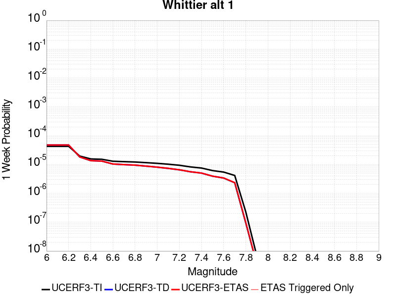 |  | 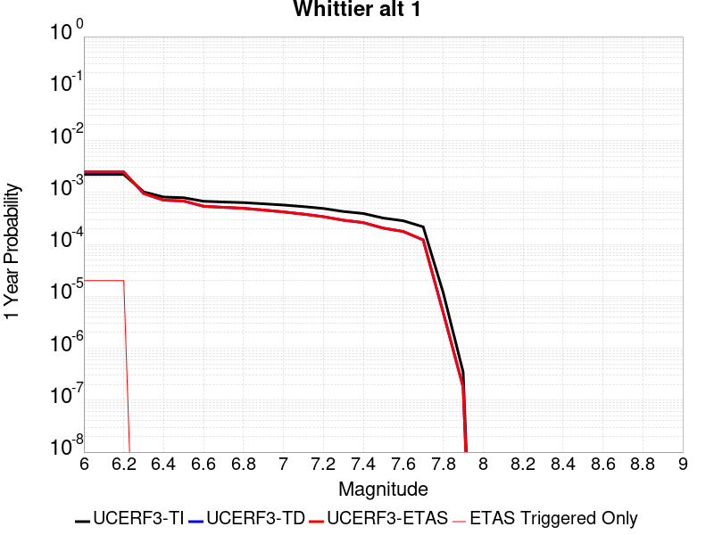 | 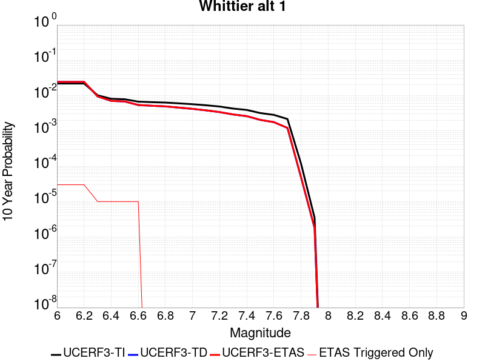 |

| Magnitude | 1 wk TI Prob | 1 wk TD Prob | 1 wk ETAS Prob | 1 wk ETAS/TD Gain | 1 wk ETAS Triggered Only | 1 mo TI Prob | 1 mo TD Prob | 1 mo ETAS Prob | 1 mo ETAS/TD Gain | 1 mo ETAS Triggered Only | 1 yr TI Prob | 1 yr TD Prob | 1 yr ETAS Prob | 1 yr ETAS/TD Gain | 1 yr ETAS Triggered Only | 10 yr TI Prob | 10 yr TD Prob | 10 yr ETAS Prob | 10 yr ETAS/TD Gain | 10 yr ETAS Triggered Only |
|-----|-----|-----|-----|-----|-----|-----|-----|-----|-----|-----|-----|-----|-----|-----|-----|-----|-----|-----|-----|-----|
| 6.0 | 4.2554693E-5 | 4.7253463E-5 | 4.7253463E-5 | 1.0 | 0.0 | 1.8236451E-4 | 2.0250095E-4 | 2.0250095E-4 | 1.0 | 0.0 | 0.002218027 | 0.0024629822 | 0.002486904 | 1.0097125 | 2.3980816E-5 | 0.02196019 | 0.02439089 | 0.024425982 | 1.0014389 | 3.597122E-5 |
| 6.1 | 4.2554693E-5 | 4.7253463E-5 | 4.7253463E-5 | 1.0 | 0.0 | 1.8236451E-4 | 2.0250095E-4 | 2.0250095E-4 | 1.0 | 0.0 | 0.002218027 | 0.0024629822 | 0.002486904 | 1.0097125 | 2.3980816E-5 | 0.02196019 | 0.02439089 | 0.024425982 | 1.0014389 | 3.597122E-5 |
| 6.2 | 4.2554693E-5 | 4.7253463E-5 | 4.7253463E-5 | 1.0 | 0.0 | 1.8236451E-4 | 2.0250095E-4 | 2.0250095E-4 | 1.0 | 0.0 | 0.002218027 | 0.0024629822 | 0.002486904 | 1.0097125 | 2.3980816E-5 | 0.02196019 | 0.02439089 | 0.024425982 | 1.0014389 | 3.597122E-5 |
| 6.3 | 1.9617712E-5 | 1.8269313E-5 | 1.8269313E-5 | 1.0 | 0.0 | 8.40732E-5 | 7.829482E-5 | 7.829482E-5 | 1.0 | 0.0 | 0.0010231105 | 9.528416E-4 | 9.528416E-4 | 1.0 | 0.0 | 0.01018413 | 0.009490847 | 0.009502724 | 1.0012513 | 1.1990408E-5 |
| 6.4 | 1.5611336E-5 | 1.3604893E-5 | 1.3604893E-5 | 1.0 | 0.0 | 6.690401E-5 | 5.8305417E-5 | 5.8305417E-5 | 1.0 | 0.0 | 8.142519E-4 | 7.0964324E-4 | 7.0964324E-4 | 1.0 | 0.0 | 0.008112748 | 0.0070757363 | 0.007087642 | 1.0016826 | 1.1990408E-5 |
| 6.5 | 1.5150166E-5 | 1.3101541E-5 | 1.3101541E-5 | 1.0 | 0.0 | 6.492767E-5 | 5.614829E-5 | 5.614829E-5 | 1.0 | 0.0 | 7.9020765E-4 | 6.833969E-4 | 6.833969E-4 | 1.0 | 0.0 | 0.007874036 | 0.0068149036 | 0.006826812 | 1.0017475 | 1.1990408E-5 |
| 6.6 | 1.295588E-5 | 1.0381249E-5 | 1.0381249E-5 | 1.0 | 0.0 | 5.552402E-5 | 4.449032E-5 | 4.449032E-5 | 1.0 | 0.0 | 6.7579525E-4 | 5.4153695E-4 | 5.4153695E-4 | 1.0 | 0.0 | 0.006737438 | 0.005403607 | 0.0054155327 | 1.0022069 | 1.1990408E-5 |
| 6.7 | 1.2542085E-5 | 9.899882E-6 | 9.899882E-6 | 1.0 | 0.0 | 5.3750682E-5 | 4.2427386E-5 | 4.2427386E-5 | 1.0 | 0.0 | 6.542181E-4 | 5.1643286E-4 | 5.1643286E-4 | 1.0 | 0.0 | 0.006522954 | 0.0051537454 | 0.0051537454 | 1.0 | 0.0 |
| 6.8 | 1.2195878E-5 | 9.495912E-6 | 9.495912E-6 | 1.0 | 0.0 | 5.2267E-5 | 4.0696144E-5 | 4.0696144E-5 | 1.0 | 0.0 | 6.36165E-4 | 4.953648E-4 | 4.953648E-4 | 1.0 | 0.0 | 0.0063434686 | 0.0049439464 | 0.0049439464 | 1.0 | 0.0 |
| 6.9 | 1.1580298E-5 | 8.773408E-6 | 8.773408E-6 | 1.0 | 0.0 | 4.9628903E-5 | 3.7599788E-5 | 3.7599788E-5 | 1.0 | 0.0 | 6.040644E-4 | 4.576829E-4 | 4.576829E-4 | 1.0 | 0.0 | 0.00602425 | 0.0045686625 | 0.0045686625 | 1.0 | 0.0 |
| 7.0 | 1.0964795E-5 | 8.084448E-6 | 8.084448E-6 | 1.0 | 0.0 | 4.6991136E-5 | 3.4647182E-5 | 3.4647182E-5 | 1.0 | 0.0 | 5.7196687E-4 | 4.2174934E-4 | 4.2174934E-4 | 1.0 | 0.0 | 0.0057049696 | 0.004210698 | 0.004210698 | 1.0 | 0.0 |
| 7.1 | 1.0230601E-5 | 7.3269985E-6 | 7.3269985E-6 | 1.0 | 0.0 | 4.3844695E-5 | 3.140105E-5 | 3.140105E-5 | 1.0 | 0.0 | 5.336784E-4 | 3.8224205E-4 | 3.8224205E-4 | 1.0 | 0.0 | 0.005323986 | 0.0038170093 | 0.0038170093 | 1.0 | 0.0 |
| 7.2 | 9.40865E-6 | 6.5435725E-6 | 6.5435725E-6 | 1.0 | 0.0 | 4.032216E-5 | 2.8043587E-5 | 2.8043587E-5 | 1.0 | 0.0 | 4.908117E-4 | 3.413784E-4 | 3.413784E-4 | 1.0 | 0.0 | 0.0048972913 | 0.0034096325 | 0.0034096325 | 1.0 | 0.0 |
| 7.3 | 8.237384E-6 | 5.5979945E-6 | 5.5979945E-6 | 1.0 | 0.0 | 3.5302593E-5 | 2.399119E-5 | 2.399119E-5 | 1.0 | 0.0 | 4.2972428E-4 | 2.9205464E-4 | 2.9205464E-4 | 1.0 | 0.0 | 0.0042889426 | 0.002917029 | 0.002917029 | 1.0 | 0.0 |
| 7.4 | 7.5316966E-6 | 5.0280382E-6 | 5.0280382E-6 | 1.0 | 0.0 | 3.2278298E-5 | 2.1548563E-5 | 2.1548563E-5 | 1.0 | 0.0 | 3.9291743E-4 | 2.6232318E-4 | 2.6232318E-4 | 1.0 | 0.0 | 0.0039222343 | 0.0026202472 | 0.0026202472 | 1.0 | 0.0 |
| 7.5 | 6.149649E-6 | 3.934013E-6 | 3.934013E-6 | 1.0 | 0.0 | 2.6355372E-5 | 1.685995E-5 | 1.685995E-5 | 1.0 | 0.0 | 3.208294E-4 | 2.0525148E-4 | 2.0525148E-4 | 1.0 | 0.0 | 0.003203666 | 0.0020507083 | 0.0020507083 | 1.0 | 0.0 |
| 7.6 | 5.457711E-6 | 3.395529E-6 | 3.395529E-6 | 1.0 | 0.0 | 2.338998E-5 | 1.4552191E-5 | 1.4552191E-5 | 1.0 | 0.0 | 2.8473578E-4 | 1.7715934E-4 | 1.7715934E-4 | 1.0 | 0.0 | 0.0028437122 | 0.0017702618 | 0.0017702618 | 1.0 | 0.0 |
| 7.7 | 4.1676276E-6 | 2.3333084E-6 | 2.3333084E-6 | 1.0 | 0.0 | 1.7861139E-5 | 9.99986E-6 | 9.99986E-6 | 1.0 | 0.0 | 2.1743766E-4 | 1.2174223E-4 | 1.2174223E-4 | 1.0 | 0.0 | 0.0021722503 | 0.0012168285 | 0.0012168285 | 1.0 | 0.0 |
| 7.8 | 2.2692414E-7 | 9.385943E-8 | 9.385943E-8 | 1.0 | 0.0 | 9.725317E-7 | 4.0225464E-7 | 4.0225464E-7 | 1.0 | 0.0 | 1.1840509E-5 | 4.8974425E-6 | 4.8974425E-6 | 1.0 | 0.0 | 1.1839878E-4 | 4.8973674E-5 | 4.8973674E-5 | 1.0 | 0.0 |
| 7.9 | 6.676829E-9 | 3.4399772E-9 | 3.4399772E-9 | 1.0 | 0.0 | 2.861498E-8 | 1.4742759E-8 | 1.4742759E-8 | 1.0 | 0.0 | 3.4838732E-7 | 1.7949307E-7 | 1.7949307E-7 | 1.0 | 0.0 | 3.4838679E-6 | 1.7949295E-6 | 1.7949295E-6 | 1.0 | 0.0 |

## Elmore Ranch
*[(top)](#table-of-contents)*

| 1 Week | 1 Month | 1 Year | 10 Year |
|-----|-----|-----|-----|
| 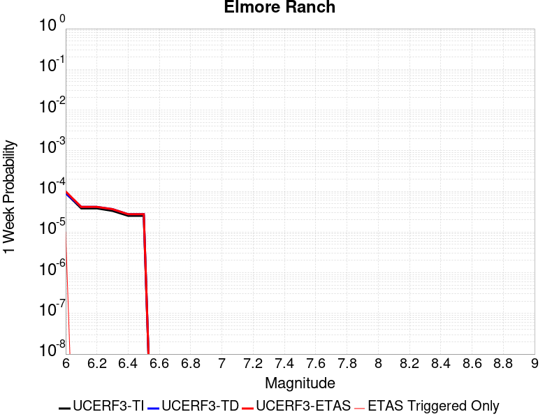 | 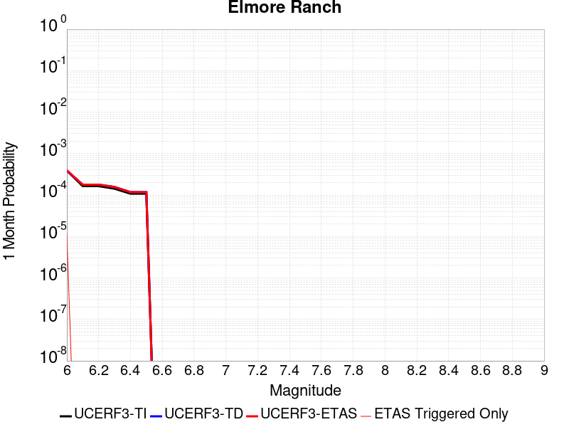 | 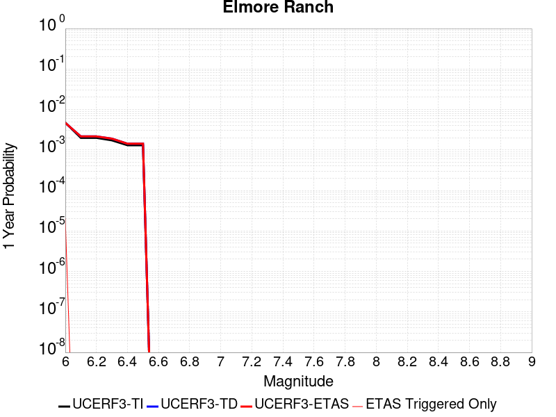 | 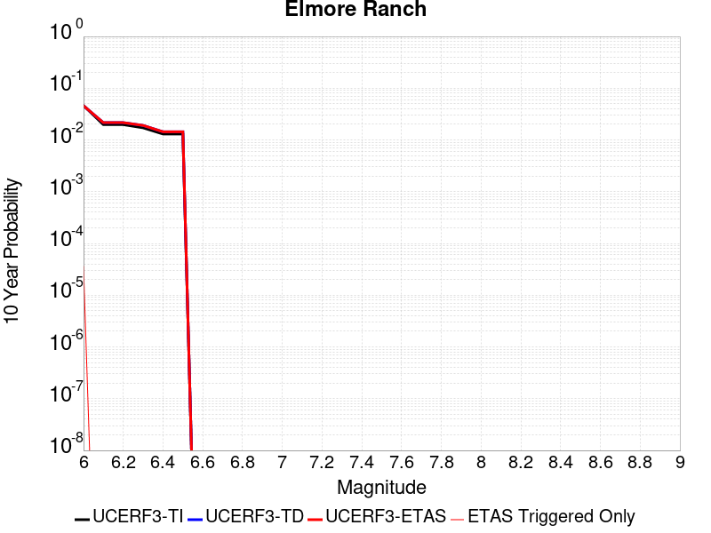 |

| Magnitude | 1 wk TI Prob | 1 wk TD Prob | 1 wk ETAS Prob | 1 wk ETAS/TD Gain | 1 wk ETAS Triggered Only | 1 mo TI Prob | 1 mo TD Prob | 1 mo ETAS Prob | 1 mo ETAS/TD Gain | 1 mo ETAS Triggered Only | 1 yr TI Prob | 1 yr TD Prob | 1 yr ETAS Prob | 1 yr ETAS/TD Gain | 1 yr ETAS Triggered Only | 10 yr TI Prob | 10 yr TD Prob | 10 yr ETAS Prob | 10 yr ETAS/TD Gain | 10 yr ETAS Triggered Only |
|-----|-----|-----|-----|-----|-----|-----|-----|-----|-----|-----|-----|-----|-----|-----|-----|-----|-----|-----|-----|-----|
| 6.0 | 9.102099E-5 | 8.9526366E-5 | 1.015157E-4 | 1.1339196 | 1.1990408E-5 | 3.9003167E-4 | 3.8364116E-4 | 3.9562696E-4 | 1.0312423 | 1.1990408E-5 | 0.0047383 | 0.004662308 | 0.004686177 | 1.0051196 | 2.3980816E-5 | 0.046385348 | 0.045873385 | 0.045907706 | 1.0007482 | 3.597122E-5 |
| 6.1 | 3.8306698E-5 | 4.1500927E-5 | 4.1500927E-5 | 1.0 | 0.0 | 1.6416123E-4 | 1.7785306E-4 | 1.7785306E-4 | 1.0 | 0.0 | 0.0019968306 | 0.0021632449 | 0.0021632449 | 1.0 | 0.0 | 0.019789828 | 0.02162934 | 0.02162934 | 1.0 | 0.0 |
| 6.2 | 3.8306698E-5 | 4.1500927E-5 | 4.1500927E-5 | 1.0 | 0.0 | 1.6416123E-4 | 1.7785306E-4 | 1.7785306E-4 | 1.0 | 0.0 | 0.0019968306 | 0.0021632449 | 0.0021632449 | 1.0 | 0.0 | 0.019789828 | 0.02162934 | 0.02162934 | 1.0 | 0.0 |
| 6.3 | 3.3197924E-5 | 3.6556212E-5 | 3.6556212E-5 | 1.0 | 0.0 | 1.4226905E-4 | 1.5666404E-4 | 1.5666404E-4 | 1.0 | 0.0 | 0.0017307495 | 0.0019060043 | 0.0019060043 | 1.0 | 0.0 | 0.017173318 | 0.019090874 | 0.019090874 | 1.0 | 0.0 |
| 6.4 | 2.5148964E-5 | 2.7421656E-5 | 2.7421656E-5 | 1.0 | 0.0 | 1.0777682E-4 | 1.1751975E-4 | 1.1751975E-4 | 1.0 | 0.0 | 0.0013113929 | 0.0014305117 | 0.0014305117 | 1.0 | 0.0 | 0.01303681 | 0.014387799 | 0.014387799 | 1.0 | 0.0 |
| 6.5 | 2.5148964E-5 | 2.7421656E-5 | 2.7421656E-5 | 1.0 | 0.0 | 1.0777682E-4 | 1.1751975E-4 | 1.1751975E-4 | 1.0 | 0.0 | 0.0013113929 | 0.0014305117 | 0.0014305117 | 1.0 | 0.0 | 0.01303681 | 0.014387799 | 0.014387799 | 1.0 | 0.0 |

## Santa Susana East (connector)
*[(top)](#table-of-contents)*

| 1 Week | 1 Month | 1 Year | 10 Year |
|-----|-----|-----|-----|
| 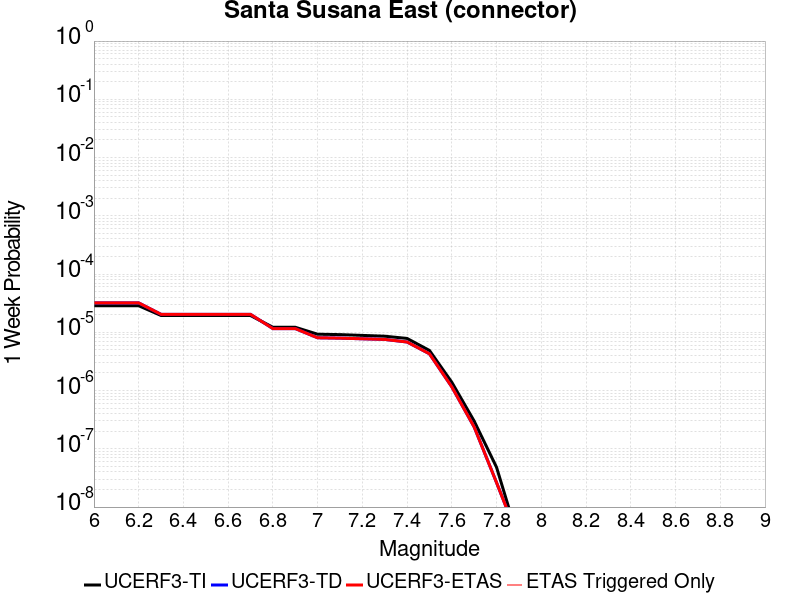 |  | 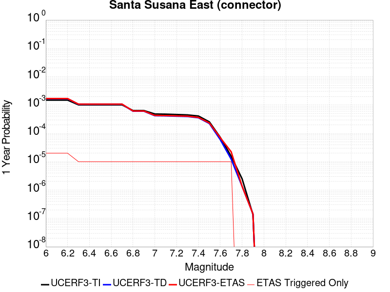 | 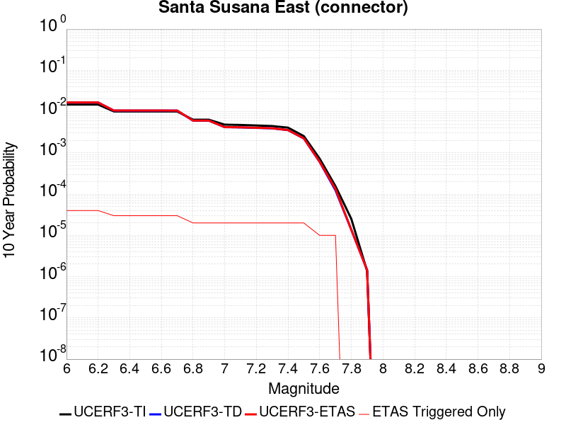 |

| Magnitude | 1 wk TI Prob | 1 wk TD Prob | 1 wk ETAS Prob | 1 wk ETAS/TD Gain | 1 wk ETAS Triggered Only | 1 mo TI Prob | 1 mo TD Prob | 1 mo ETAS Prob | 1 mo ETAS/TD Gain | 1 mo ETAS Triggered Only | 1 yr TI Prob | 1 yr TD Prob | 1 yr ETAS Prob | 1 yr ETAS/TD Gain | 1 yr ETAS Triggered Only | 10 yr TI Prob | 10 yr TD Prob | 10 yr ETAS Prob | 10 yr ETAS/TD Gain | 10 yr ETAS Triggered Only |
|-----|-----|-----|-----|-----|-----|-----|-----|-----|-----|-----|-----|-----|-----|-----|-----|-----|-----|-----|-----|-----|
| 6.0 | 2.858397E-5 | 3.202183E-5 | 3.202183E-5 | 1.0 | 0.0 | 1.2249697E-4 | 1.3723079E-4 | 1.3723079E-4 | 1.0 | 0.0 | 0.0014903803 | 0.0016697859 | 0.0016937268 | 1.0143377 | 2.3980816E-5 | 0.014804244 | 0.01659952 | 0.016634893 | 1.002131 | 3.597122E-5 |
| 6.1 | 2.858397E-5 | 3.202183E-5 | 3.202183E-5 | 1.0 | 0.0 | 1.2249697E-4 | 1.3723079E-4 | 1.3723079E-4 | 1.0 | 0.0 | 0.0014903803 | 0.0016697859 | 0.0016937268 | 1.0143377 | 2.3980816E-5 | 0.014804244 | 0.01659952 | 0.016634893 | 1.002131 | 3.597122E-5 |
| 6.2 | 2.858397E-5 | 3.202183E-5 | 3.202183E-5 | 1.0 | 0.0 | 1.2249697E-4 | 1.3723079E-4 | 1.3723079E-4 | 1.0 | 0.0 | 0.0014903803 | 0.0016697859 | 0.0016937268 | 1.0143377 | 2.3980816E-5 | 0.014804244 | 0.01659952 | 0.016634893 | 1.002131 | 3.597122E-5 |
| 6.3 | 1.943582E-5 | 2.0367674E-5 | 2.0367674E-5 | 1.0 | 0.0 | 8.329371E-5 | 8.728774E-5 | 8.728774E-5 | 1.0 | 0.0 | 0.001013629 | 0.0010623224 | 0.0010743 | 1.0112749 | 1.1990408E-5 | 0.010090181 | 0.010583875 | 0.010607601 | 1.0022418 | 2.3980816E-5 |
| 6.4 | 1.943582E-5 | 2.0367674E-5 | 2.0367674E-5 | 1.0 | 0.0 | 8.329371E-5 | 8.728774E-5 | 8.728774E-5 | 1.0 | 0.0 | 0.001013629 | 0.0010623224 | 0.0010743 | 1.0112749 | 1.1990408E-5 | 0.010090181 | 0.010583875 | 0.010607601 | 1.0022418 | 2.3980816E-5 |
| 6.5 | 1.943582E-5 | 2.0367674E-5 | 2.0367674E-5 | 1.0 | 0.0 | 8.329371E-5 | 8.728774E-5 | 8.728774E-5 | 1.0 | 0.0 | 0.001013629 | 0.0010623224 | 0.0010743 | 1.0112749 | 1.1990408E-5 | 0.010090181 | 0.010583875 | 0.010607601 | 1.0022418 | 2.3980816E-5 |
| 6.6 | 1.943582E-5 | 2.0367674E-5 | 2.0367674E-5 | 1.0 | 0.0 | 8.329371E-5 | 8.728774E-5 | 8.728774E-5 | 1.0 | 0.0 | 0.001013629 | 0.0010623224 | 0.0010743 | 1.0112749 | 1.1990408E-5 | 0.010090181 | 0.010583875 | 0.010607601 | 1.0022418 | 2.3980816E-5 |
| 6.7 | 1.9404439E-5 | 2.0355095E-5 | 2.0355095E-5 | 1.0 | 0.0 | 8.3159226E-5 | 8.7233835E-5 | 8.7233835E-5 | 1.0 | 0.0 | 0.0010119933 | 0.0010616668 | 0.0010736444 | 1.011282 | 1.1990408E-5 | 0.010073971 | 0.01057738 | 0.010601107 | 1.0022432 | 2.3980816E-5 |
| 6.8 | 1.2217526E-5 | 1.1593199E-5 | 1.1593199E-5 | 1.0 | 0.0 | 5.2359774E-5 | 4.9684288E-5 | 4.9684288E-5 | 1.0 | 0.0 | 6.372938E-4 | 6.047551E-4 | 6.167383E-4 | 1.0198148 | 1.1990408E-5 | 0.0063546924 | 0.006033141 | 0.0060450593 | 1.0019754 | 1.1990408E-5 |
| 6.9 | 1.2217526E-5 | 1.1593199E-5 | 1.1593199E-5 | 1.0 | 0.0 | 5.2359774E-5 | 4.9684288E-5 | 4.9684288E-5 | 1.0 | 0.0 | 6.372938E-4 | 6.047551E-4 | 6.167383E-4 | 1.0198148 | 1.1990408E-5 | 0.0063546924 | 0.006033141 | 0.0060450593 | 1.0019754 | 1.1990408E-5 |
| 7.0 | 9.276017E-6 | 8.059215E-6 | 8.059215E-6 | 1.0 | 0.0 | 3.9753755E-5 | 3.4539054E-5 | 3.4539054E-5 | 1.0 | 0.0 | 4.8389446E-4 | 4.204353E-4 | 4.3242067E-4 | 1.028507 | 1.1990408E-5 | 0.0048284214 | 0.0041971253 | 0.0042090653 | 1.0028448 | 1.1990408E-5 |
| 7.1 | 9.130355E-6 | 7.942386E-6 | 7.942386E-6 | 1.0 | 0.0 | 3.9129503E-5 | 3.4038374E-5 | 3.4038374E-5 | 1.0 | 0.0 | 4.7629757E-4 | 4.1434186E-4 | 4.263273E-4 | 1.0289265 | 1.1990408E-5 | 0.00475278 | 0.004136419 | 0.00414836 | 1.0028868 | 1.1990408E-5 |
| 7.2 | 8.851015E-6 | 7.741543E-6 | 7.741543E-6 | 1.0 | 0.0 | 3.7932372E-5 | 3.317764E-5 | 3.317764E-5 | 1.0 | 0.0 | 4.6172875E-4 | 4.0386632E-4 | 4.158519E-4 | 1.029677 | 1.1990408E-5 | 0.0046077054 | 0.0040320465 | 0.0040439884 | 1.0029618 | 1.1990408E-5 |
| 7.3 | 8.573006E-6 | 7.5502617E-6 | 7.5502617E-6 | 1.0 | 0.0 | 3.6740938E-5 | 3.2357882E-5 | 3.2357882E-5 | 1.0 | 0.0 | 4.472291E-4 | 3.9388944E-4 | 4.0587512E-4 | 1.030429 | 1.1990408E-5 | 0.004463301 | 0.00393263 | 0.0039445735 | 1.003037 | 1.1990408E-5 |
| 7.4 | 7.852282E-6 | 6.8177665E-6 | 6.8177665E-6 | 1.0 | 0.0 | 3.36522E-5 | 2.9218689E-5 | 2.9218689E-5 | 1.0 | 0.0 | 4.096385E-4 | 3.556825E-4 | 3.6766866E-4 | 1.033699 | 1.1990408E-5 | 0.0040888423 | 0.0035517968 | 0.0035637445 | 1.0033638 | 1.1990408E-5 |
| 7.5 | 4.8869324E-6 | 4.279099E-6 | 4.279099E-6 | 1.0 | 0.0 | 2.0943828E-5 | 1.8338877E-5 | 1.8338877E-5 | 1.0 | 0.0 | 2.5496128E-4 | 2.232546E-4 | 2.3524233E-4 | 1.0536953 | 1.1990408E-5 | 0.0025466895 | 0.0022304675 | 0.002242431 | 1.0053637 | 1.1990408E-5 |
| 7.6 | 1.3894544E-6 | 1.1568255E-6 | 1.1568255E-6 | 1.0 | 0.0 | 5.954791E-6 | 4.9578157E-6 | 4.9578157E-6 | 1.0 | 0.0 | 7.249717E-5 | 6.035996E-5 | 7.234964E-5 | 1.1986364 | 1.1990408E-5 | 7.247352E-4 | 6.0345745E-4 | 6.154406E-4 | 1.0198575 | 1.1990408E-5 |
| 7.7 | 2.9924632E-7 | 2.3719628E-7 | 2.3719628E-7 | 1.0 | 0.0 | 1.2824837E-6 | 1.0165551E-6 | 1.0165551E-6 | 1.0 | 0.0 | 1.5614127E-5 | 1.2376496E-5 | 2.4366755E-5 | 1.9687928 | 1.1990408E-5 | 1.5613029E-4 | 1.2375879E-4 | 1.357477E-4 | 1.0968733 | 1.1990408E-5 |
| 7.8 | 4.8188564E-8 | 2.63245E-8 | 2.63245E-8 | 1.0 | 0.0 | 2.065224E-7 | 1.1281927E-7 | 1.1281927E-7 | 1.0 | 0.0 | 2.5144072E-6 | 1.3735739E-6 | 1.3735739E-6 | 1.0 | 0.0 | 2.5143789E-5 | 1.3735663E-5 | 1.3735663E-5 | 1.0 | 0.0 |
| 7.9 | 2.6127251E-9 | 2.768132E-9 | 2.768132E-9 | 1.0 | 0.0 | 1.1197393E-8 | 1.1863423E-8 | 1.1863423E-8 | 1.0 | 0.0 | 1.3632825E-7 | 1.4443718E-7 | 1.4443718E-7 | 1.0 | 0.0 | 1.3632817E-6 | 1.4443717E-6 | 1.4443717E-6 | 1.0 | 0.0 |

## Monterey Bay-Tularcitos
*[(top)](#table-of-contents)*

| 1 Week | 1 Month | 1 Year | 10 Year |
|-----|-----|-----|-----|
| 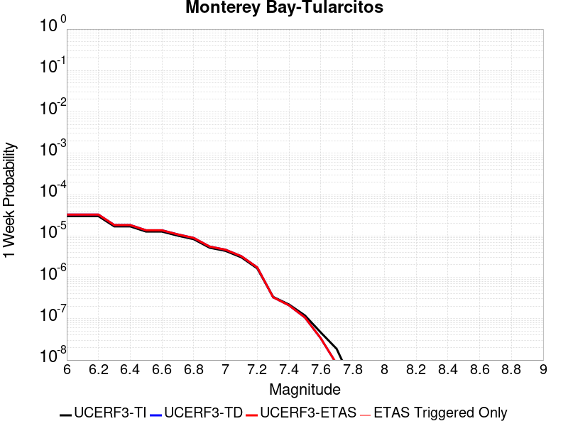 |  | 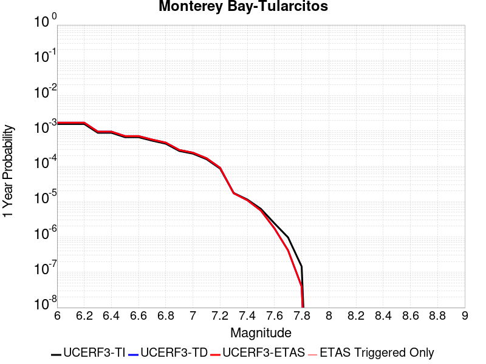 | 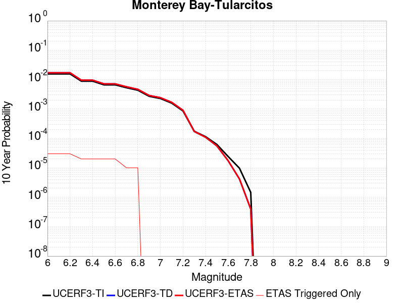 |

| Magnitude | 1 wk TI Prob | 1 wk TD Prob | 1 wk ETAS Prob | 1 wk ETAS/TD Gain | 1 wk ETAS Triggered Only | 1 mo TI Prob | 1 mo TD Prob | 1 mo ETAS Prob | 1 mo ETAS/TD Gain | 1 mo ETAS Triggered Only | 1 yr TI Prob | 1 yr TD Prob | 1 yr ETAS Prob | 1 yr ETAS/TD Gain | 1 yr ETAS Triggered Only | 10 yr TI Prob | 10 yr TD Prob | 10 yr ETAS Prob | 10 yr ETAS/TD Gain | 10 yr ETAS Triggered Only |
|-----|-----|-----|-----|-----|-----|-----|-----|-----|-----|-----|-----|-----|-----|-----|-----|-----|-----|-----|-----|-----|
| 6.0 | 3.0131365E-5 | 3.2799162E-5 | 3.2799162E-5 | 1.0 | 0.0 | 1.2912804E-4 | 1.4056086E-4 | 1.4056086E-4 | 1.0 | 0.0 | 0.001571 | 0.0017100906 | 0.0017100906 | 1.0 | 0.0 | 0.015599402 | 0.016980117 | 0.017015478 | 1.0020825 | 3.597122E-5 |
| 6.1 | 3.0131365E-5 | 3.2799162E-5 | 3.2799162E-5 | 1.0 | 0.0 | 1.2912804E-4 | 1.4056086E-4 | 1.4056086E-4 | 1.0 | 0.0 | 0.001571 | 0.0017100906 | 0.0017100906 | 1.0 | 0.0 | 0.015599402 | 0.016980117 | 0.017015478 | 1.0020825 | 3.597122E-5 |
| 6.2 | 3.0131365E-5 | 3.2799162E-5 | 3.2799162E-5 | 1.0 | 0.0 | 1.2912804E-4 | 1.4056086E-4 | 1.4056086E-4 | 1.0 | 0.0 | 0.001571 | 0.0017100906 | 0.0017100906 | 1.0 | 0.0 | 0.015599402 | 0.016980117 | 0.017015478 | 1.0020825 | 3.597122E-5 |
| 6.3 | 1.6998249E-5 | 1.8330993E-5 | 1.8330993E-5 | 1.0 | 0.0 | 7.28476E-5 | 7.855914E-5 | 7.855914E-5 | 1.0 | 0.0 | 8.865586E-4 | 9.560565E-4 | 9.560565E-4 | 1.0 | 0.0 | 0.0088303005 | 0.00952136 | 0.009545112 | 1.0024947 | 2.3980816E-5 |
| 6.4 | 1.6998249E-5 | 1.8330993E-5 | 1.8330993E-5 | 1.0 | 0.0 | 7.28476E-5 | 7.855914E-5 | 7.855914E-5 | 1.0 | 0.0 | 8.865586E-4 | 9.560565E-4 | 9.560565E-4 | 1.0 | 0.0 | 0.0088303005 | 0.00952136 | 0.009545112 | 1.0024947 | 2.3980816E-5 |
| 6.5 | 1.27470785E-5 | 1.3693452E-5 | 1.3693452E-5 | 1.0 | 0.0 | 5.4629192E-5 | 5.868496E-5 | 5.868496E-5 | 1.0 | 0.0 | 6.649074E-4 | 7.142655E-4 | 7.142655E-4 | 1.0 | 0.0 | 0.0066292146 | 0.007120751 | 0.0071445606 | 1.0033437 | 2.3980816E-5 |
| 6.6 | 1.2739422E-5 | 1.3685539E-5 | 1.3685539E-5 | 1.0 | 0.0 | 5.4596385E-5 | 5.865105E-5 | 5.865105E-5 | 1.0 | 0.0 | 6.645082E-4 | 7.1385293E-4 | 7.1385293E-4 | 1.0 | 0.0 | 0.0066252467 | 0.007116651 | 0.0071404614 | 1.0033457 | 2.3980816E-5 |
| 6.7 | 1.0160109E-5 | 1.0885862E-5 | 1.0885862E-5 | 1.0 | 0.0 | 4.35426E-5 | 4.66529E-5 | 4.66529E-5 | 1.0 | 0.0 | 5.300022E-4 | 5.678581E-4 | 5.678581E-4 | 1.0 | 0.0 | 0.005287399 | 0.005664782 | 0.0056767045 | 1.0021046 | 1.1990408E-5 |
| 6.8 | 8.349859E-6 | 8.932674E-6 | 8.932674E-6 | 1.0 | 0.0 | 3.578462E-5 | 3.828236E-5 | 3.828236E-5 | 1.0 | 0.0 | 4.3559066E-4 | 4.659937E-4 | 4.659937E-4 | 1.0 | 0.0 | 0.004347378 | 0.0046507306 | 0.004662665 | 1.0025662 | 1.1990408E-5 |
| 6.9 | 5.193639E-6 | 5.536483E-6 | 5.536483E-6 | 1.0 | 0.0 | 2.2258262E-5 | 2.3727587E-5 | 2.3727587E-5 | 1.0 | 0.0 | 2.7096065E-4 | 2.8884833E-4 | 2.8884833E-4 | 1.0 | 0.0 | 0.0027063051 | 0.00288505 | 0.00288505 | 1.0 | 0.0 |
| 7.0 | 4.359381E-6 | 4.6434106E-6 | 4.6434106E-6 | 1.0 | 0.0 | 1.8682927E-5 | 1.9900195E-5 | 1.9900195E-5 | 1.0 | 0.0 | 2.274409E-4 | 2.4226093E-4 | 2.4226093E-4 | 1.0 | 0.0 | 0.0022720827 | 0.0024202613 | 0.0024202613 | 1.0 | 0.0 |
| 7.1 | 3.0398533E-6 | 3.231074E-6 | 3.231074E-6 | 1.0 | 0.0 | 1.3027877E-5 | 1.38474015E-5 | 1.38474015E-5 | 1.0 | 0.0 | 1.5860285E-4 | 1.685817E-4 | 1.685817E-4 | 1.0 | 0.0 | 0.001584897 | 0.0016847957 | 0.0016847957 | 1.0 | 0.0 |
| 7.2 | 1.642335E-6 | 1.7333325E-6 | 1.7333325E-6 | 1.0 | 0.0 | 7.0385595E-6 | 7.4285585E-6 | 7.4285585E-6 | 1.0 | 0.0 | 8.569109E-5 | 9.044101E-5 | 9.044101E-5 | 1.0 | 0.0 | 8.5658056E-4 | 9.042448E-4 | 9.042448E-4 | 1.0 | 0.0 |
| 7.3 | 3.356842E-7 | 3.295272E-7 | 3.295272E-7 | 1.0 | 0.0 | 1.4386458E-6 | 1.4122586E-6 | 1.4122586E-6 | 1.0 | 0.0 | 1.7515373E-5 | 1.7194114E-5 | 1.7194114E-5 | 1.0 | 0.0 | 1.7513991E-4 | 1.7192794E-4 | 1.7192794E-4 | 1.0 | 0.0 |
| 7.4 | 2.1973483E-7 | 2.1006697E-7 | 2.1006697E-7 | 1.0 | 0.0 | 9.417204E-7 | 9.002867E-7 | 9.002867E-7 | 1.0 | 0.0 | 1.1465385E-5 | 1.09609355E-5 | 1.09609355E-5 | 1.0 | 0.0 | 1.1464794E-4 | 1.09603985E-4 | 1.09603985E-4 | 1.0 | 0.0 |
| 7.5 | 1.1944135E-7 | 1.0696283E-7 | 1.0696283E-7 | 1.0 | 0.0 | 5.118914E-7 | 4.5841205E-7 | 4.5841205E-7 | 1.0 | 0.0 | 6.23226E-6 | 5.5811524E-6 | 5.5811524E-6 | 1.0 | 0.0 | 6.2320854E-5 | 5.5810135E-5 | 5.5810135E-5 | 1.0 | 0.0 |
| 7.6 | 4.636058E-8 | 3.3366945E-8 | 3.3366945E-8 | 1.0 | 0.0 | 1.9868818E-7 | 1.4300119E-7 | 1.4300119E-7 | 1.0 | 0.0 | 2.419026E-6 | 1.7410381E-6 | 1.7410381E-6 | 1.0 | 0.0 | 2.4189996E-5 | 1.7410246E-5 | 1.7410246E-5 | 1.0 | 0.0 |
| 7.7 | 1.8588572E-8 | 8.005146E-9 | 8.005146E-9 | 1.0 | 0.0 | 7.9665305E-8 | 3.4307767E-8 | 3.4307767E-8 | 1.0 | 0.0 | 9.699246E-7 | 4.1769698E-7 | 4.1769698E-7 | 1.0 | 0.0 | 9.699204E-6 | 4.176962E-6 | 4.176962E-6 | 1.0 | 0.0 |
| 7.8 | 2.7960154E-9 | 7.612305E-10 | 7.612305E-10 | 1.0 | 0.0 | 1.1982923E-8 | 3.2624166E-9 | 3.2624166E-9 | 1.0 | 0.0 | 1.4589209E-7 | 3.971992E-8 | 3.971992E-8 | 1.0 | 0.0 | 1.4589199E-6 | 3.9719916E-7 | 3.9719916E-7 | 1.0 | 0.0 |

## Coronado Bank alt1
*[(top)](#table-of-contents)*

| 1 Week | 1 Month | 1 Year | 10 Year |
|-----|-----|-----|-----|
| 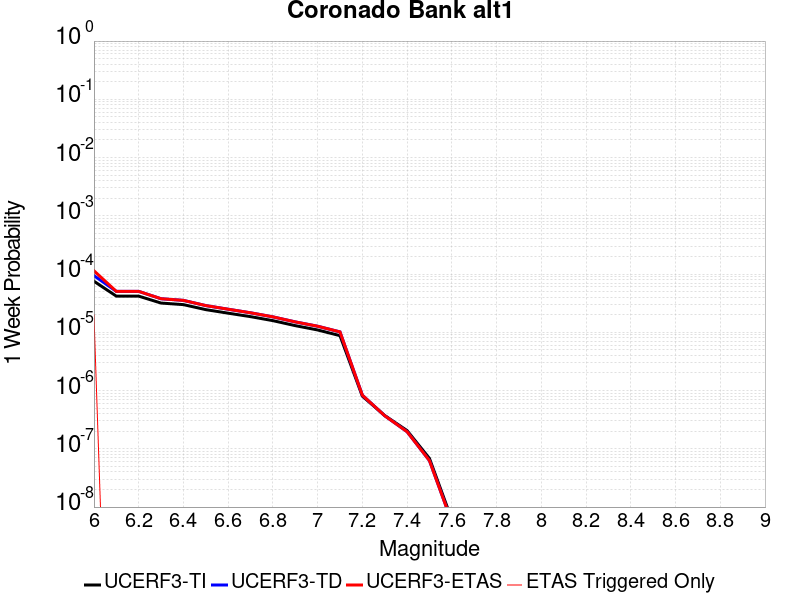 | 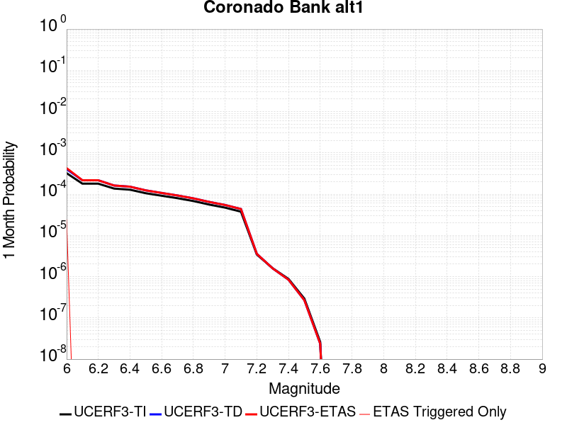 | 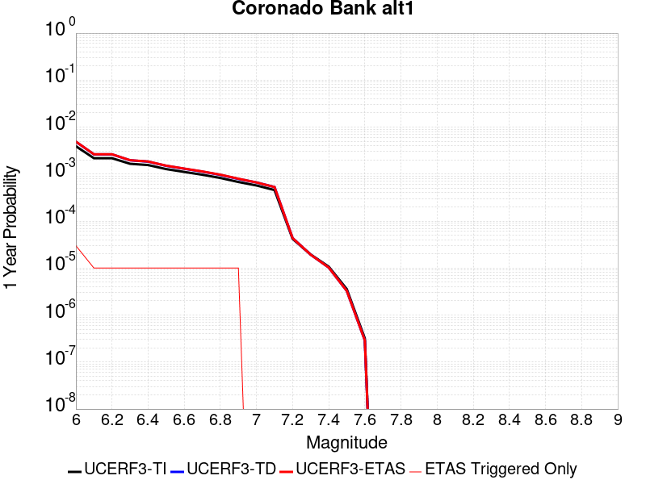 | 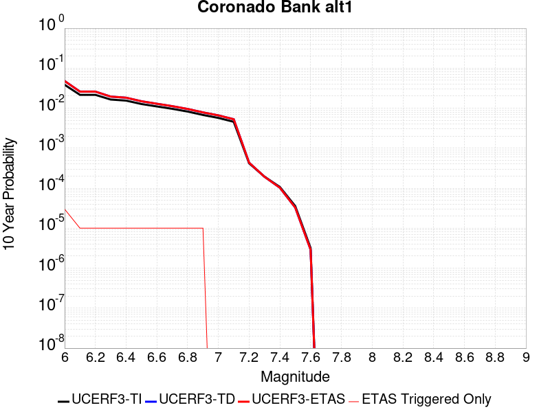 |

| Magnitude | 1 wk TI Prob | 1 wk TD Prob | 1 wk ETAS Prob | 1 wk ETAS/TD Gain | 1 wk ETAS Triggered Only | 1 mo TI Prob | 1 mo TD Prob | 1 mo ETAS Prob | 1 mo ETAS/TD Gain | 1 mo ETAS Triggered Only | 1 yr TI Prob | 1 yr TD Prob | 1 yr ETAS Prob | 1 yr ETAS/TD Gain | 1 yr ETAS Triggered Only | 10 yr TI Prob | 10 yr TD Prob | 10 yr ETAS Prob | 10 yr ETAS/TD Gain | 10 yr ETAS Triggered Only |
|-----|-----|-----|-----|-----|-----|-----|-----|-----|-----|-----|-----|-----|-----|-----|-----|-----|-----|-----|-----|-----|
| 6.0 | 7.533492E-5 | 9.3952294E-5 | 1.1793086E-4 | 1.2552207 | 2.3980816E-5 | 3.22824E-4 | 4.0259483E-4 | 4.26566E-4 | 1.0595417 | 2.3980816E-5 | 0.0039233007 | 0.004891124 | 0.0049269195 | 1.0073184 | 3.597122E-5 | 0.03854755 | 0.047905073 | 0.047939323 | 1.0007149 | 3.597122E-5 |
| 6.1 | 4.1807285E-5 | 5.049425E-5 | 5.049425E-5 | 1.0 | 0.0 | 1.7916178E-4 | 2.1638657E-4 | 2.1638657E-4 | 1.0 | 0.0 | 0.0021791123 | 0.002631421 | 0.0026433798 | 1.0045446 | 1.1990408E-5 | 0.021578677 | 0.026011758 | 0.026023436 | 1.000449 | 1.1990408E-5 |
| 6.2 | 4.1807285E-5 | 5.049425E-5 | 5.049425E-5 | 1.0 | 0.0 | 1.7916178E-4 | 2.1638657E-4 | 2.1638657E-4 | 1.0 | 0.0 | 0.0021791123 | 0.002631421 | 0.0026433798 | 1.0045446 | 1.1990408E-5 | 0.021578677 | 0.026011758 | 0.026023436 | 1.000449 | 1.1990408E-5 |
| 6.3 | 3.1793104E-5 | 3.771206E-5 | 3.771206E-5 | 1.0 | 0.0 | 1.3624904E-4 | 1.6161331E-4 | 1.6161331E-4 | 1.0 | 0.0 | 0.0016575698 | 0.001965897 | 0.0019778637 | 1.0060872 | 1.1990408E-5 | 0.016452603 | 0.019488946 | 0.019500703 | 1.0006032 | 1.1990408E-5 |
| 6.4 | 2.9878007E-5 | 3.5336663E-5 | 3.5336663E-5 | 1.0 | 0.0 | 1.2804232E-4 | 1.5143424E-4 | 1.5143424E-4 | 1.0 | 0.0 | 0.0015578003 | 0.0018421836 | 0.001854152 | 1.0064968 | 1.1990408E-5 | 0.015469253 | 0.018272884 | 0.018284656 | 1.0006442 | 1.1990408E-5 |
| 6.5 | 2.4512565E-5 | 2.8764713E-5 | 2.8764713E-5 | 1.0 | 0.0 | 1.0504962E-4 | 1.2327167E-4 | 1.2327167E-4 | 1.0 | 0.0 | 0.0012782287 | 0.001499827 | 0.0015117995 | 1.0079825 | 1.1990408E-5 | 0.012709012 | 0.014900027 | 0.014911839 | 1.0007927 | 1.1990408E-5 |
| 6.6 | 2.1317413E-5 | 2.4907233E-5 | 2.4907233E-5 | 1.0 | 0.0 | 9.135714E-5 | 1.0674105E-4 | 1.0674105E-4 | 1.0 | 0.0 | 0.0011117056 | 0.0012988199 | 0.0013107947 | 1.0092198 | 1.1990408E-5 | 0.011061605 | 0.012914695 | 0.01292653 | 1.0009165 | 1.1990408E-5 |
| 6.7 | 1.8585655E-5 | 2.1635356E-5 | 2.1635356E-5 | 1.0 | 0.0 | 7.9650374E-5 | 9.2719776E-5 | 9.2719776E-5 | 1.0 | 0.0 | 9.6931186E-4 | 0.0011282992 | 0.0011402761 | 1.010615 | 1.1990408E-5 | 0.0096509475 | 0.0112278685 | 0.011239724 | 1.001056 | 1.1990408E-5 |
| 6.8 | 1.5862879E-5 | 1.8419874E-5 | 1.8419874E-5 | 1.0 | 0.0 | 6.798199E-5 | 7.894004E-5 | 7.894004E-5 | 1.0 | 0.0 | 8.273665E-4 | 9.606905E-4 | 9.7266934E-4 | 1.012469 | 1.1990408E-5 | 0.008242928 | 0.009567357 | 0.009579232 | 1.0012413 | 1.1990408E-5 |
| 6.9 | 1.3021509E-5 | 1.5095589E-5 | 1.5095589E-5 | 1.0 | 0.0 | 5.5805274E-5 | 6.469388E-5 | 6.469388E-5 | 1.0 | 0.0 | 6.792174E-4 | 7.8738143E-4 | 7.9936243E-4 | 1.0152162 | 1.1990408E-5 | 0.006771452 | 0.00784774 | 0.007859637 | 1.0015159 | 1.1990408E-5 |
| 7.0 | 1.0974371E-5 | 1.27203775E-5 | 1.27203775E-5 | 1.0 | 0.0 | 4.7032172E-5 | 5.4514865E-5 | 5.4514865E-5 | 1.0 | 0.0 | 5.7246623E-4 | 6.635339E-4 | 6.635339E-4 | 1.0 | 0.0 | 0.0057099373 | 0.006617277 | 0.006617277 | 1.0 | 0.0 |
| 7.1 | 8.766221E-6 | 1.0164053E-5 | 1.0164053E-5 | 1.0 | 0.0 | 3.7568978E-5 | 4.3559594E-5 | 4.3559594E-5 | 1.0 | 0.0 | 4.573063E-4 | 5.302262E-4 | 5.302262E-4 | 1.0 | 0.0 | 0.0045636636 | 0.005291311 | 0.005291311 | 1.0 | 0.0 |
| 7.2 | 8.026024E-7 | 8.331837E-7 | 8.331837E-7 | 1.0 | 0.0 | 3.43972E-6 | 3.5707824E-6 | 3.5707824E-6 | 1.0 | 0.0 | 4.1877785E-5 | 4.347342E-5 | 4.347342E-5 | 1.0 | 0.0 | 4.1869894E-4 | 4.3465025E-4 | 4.3465025E-4 | 1.0 | 0.0 |
| 7.3 | 3.7293114E-7 | 3.7001186E-7 | 3.7001186E-7 | 1.0 | 0.0 | 1.5982754E-6 | 1.5857643E-6 | 1.5857643E-6 | 1.0 | 0.0 | 1.9458828E-5 | 1.930651E-5 | 1.930651E-5 | 1.0 | 0.0 | 1.9457124E-4 | 1.9304838E-4 | 1.9304838E-4 | 1.0 | 0.0 |
| 7.4 | 2.0557036E-7 | 1.9674462E-7 | 1.9674462E-7 | 1.0 | 0.0 | 8.810155E-7 | 8.43191E-7 | 8.43191E-7 | 1.0 | 0.0 | 1.0726311E-5 | 1.0265802E-5 | 1.0265802E-5 | 1.0 | 0.0 | 1.0725793E-4 | 1.02653314E-4 | 1.02653314E-4 | 1.0 | 0.0 |
| 7.5 | 6.845446E-8 | 6.279388E-8 | 6.279388E-8 | 1.0 | 0.0 | 2.9337625E-7 | 2.6911658E-7 | 2.6911658E-7 | 1.0 | 0.0 | 3.5718497E-6 | 3.2764897E-6 | 3.2764897E-6 | 1.0 | 0.0 | 3.5717923E-5 | 3.2764423E-5 | 3.2764423E-5 | 1.0 | 0.0 |
| 7.6 | 6.0975145E-9 | 5.531861E-9 | 5.531861E-9 | 1.0 | 0.0 | 2.6132206E-8 | 2.3707976E-8 | 2.3707976E-8 | 1.0 | 0.0 | 3.1815955E-7 | 2.8864457E-7 | 2.8864457E-7 | 1.0 | 0.0 | 3.181591E-6 | 2.886443E-6 | 2.886443E-6 | 1.0 | 0.0 |

## Oak Ridge (Onshore)
*[(top)](#table-of-contents)*

| 1 Week | 1 Month | 1 Year | 10 Year |
|-----|-----|-----|-----|
| 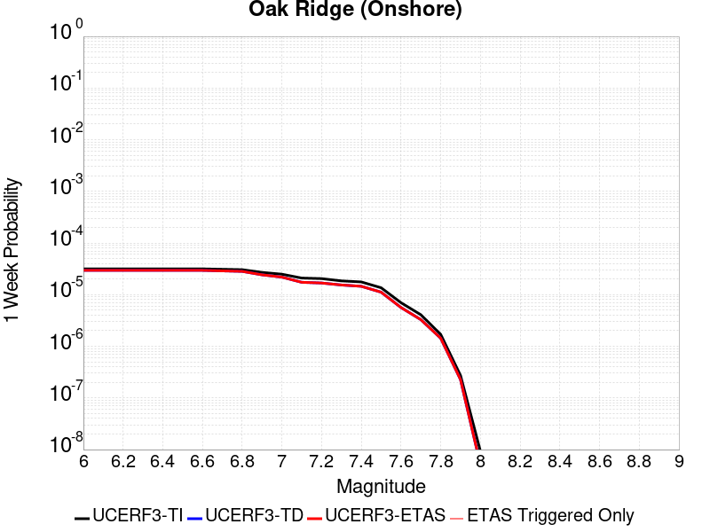 |  | 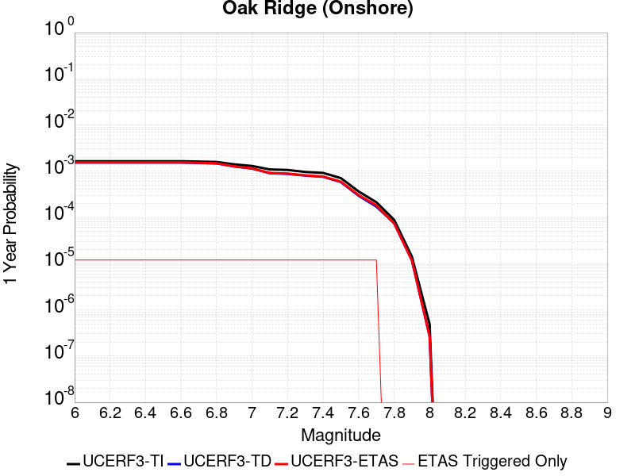 | 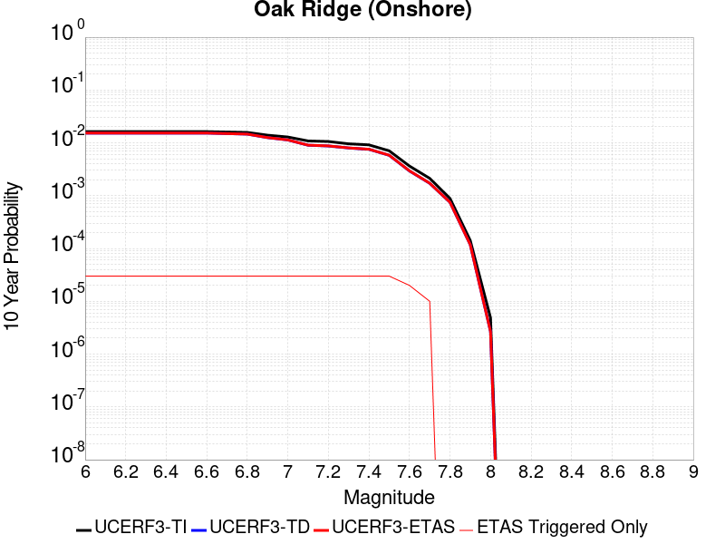 |

| Magnitude | 1 wk TI Prob | 1 wk TD Prob | 1 wk ETAS Prob | 1 wk ETAS/TD Gain | 1 wk ETAS Triggered Only | 1 mo TI Prob | 1 mo TD Prob | 1 mo ETAS Prob | 1 mo ETAS/TD Gain | 1 mo ETAS Triggered Only | 1 yr TI Prob | 1 yr TD Prob | 1 yr ETAS Prob | 1 yr ETAS/TD Gain | 1 yr ETAS Triggered Only | 10 yr TI Prob | 10 yr TD Prob | 10 yr ETAS Prob | 10 yr ETAS/TD Gain | 10 yr ETAS Triggered Only |
|-----|-----|-----|-----|-----|-----|-----|-----|-----|-----|-----|-----|-----|-----|-----|-----|-----|-----|-----|-----|-----|
| 6.0 | 3.155064E-5 | 2.952645E-5 | 2.952645E-5 | 1.0 | 0.0 | 1.3521002E-4 | 1.26536E-4 | 1.26536E-4 | 1.0 | 0.0 | 0.001644939 | 0.0015395252 | 0.0015514971 | 1.0077764 | 1.1990408E-5 | 0.01632816 | 0.015293104 | 0.015316718 | 1.0015441 | 2.3980816E-5 |
| 6.1 | 3.155064E-5 | 2.952645E-5 | 2.952645E-5 | 1.0 | 0.0 | 1.3521002E-4 | 1.26536E-4 | 1.26536E-4 | 1.0 | 0.0 | 0.001644939 | 0.0015395252 | 0.0015514971 | 1.0077764 | 1.1990408E-5 | 0.01632816 | 0.015293104 | 0.015316718 | 1.0015441 | 2.3980816E-5 |
| 6.2 | 3.155064E-5 | 2.952645E-5 | 2.952645E-5 | 1.0 | 0.0 | 1.3521002E-4 | 1.26536E-4 | 1.26536E-4 | 1.0 | 0.0 | 0.001644939 | 0.0015395252 | 0.0015514971 | 1.0077764 | 1.1990408E-5 | 0.01632816 | 0.015293104 | 0.015316718 | 1.0015441 | 2.3980816E-5 |
| 6.3 | 3.155064E-5 | 2.952645E-5 | 2.952645E-5 | 1.0 | 0.0 | 1.3521002E-4 | 1.26536E-4 | 1.26536E-4 | 1.0 | 0.0 | 0.001644939 | 0.0015395252 | 0.0015514971 | 1.0077764 | 1.1990408E-5 | 0.01632816 | 0.015293104 | 0.015316718 | 1.0015441 | 2.3980816E-5 |
| 6.4 | 3.155064E-5 | 2.952645E-5 | 2.952645E-5 | 1.0 | 0.0 | 1.3521002E-4 | 1.26536E-4 | 1.26536E-4 | 1.0 | 0.0 | 0.001644939 | 0.0015395252 | 0.0015514971 | 1.0077764 | 1.1990408E-5 | 0.01632816 | 0.015293104 | 0.015316718 | 1.0015441 | 2.3980816E-5 |
| 6.5 | 3.155064E-5 | 2.952645E-5 | 2.952645E-5 | 1.0 | 0.0 | 1.3521002E-4 | 1.26536E-4 | 1.26536E-4 | 1.0 | 0.0 | 0.001644939 | 0.0015395252 | 0.0015514971 | 1.0077764 | 1.1990408E-5 | 0.01632816 | 0.015293104 | 0.015316718 | 1.0015441 | 2.3980816E-5 |
| 6.6 | 3.155064E-5 | 2.952645E-5 | 2.952645E-5 | 1.0 | 0.0 | 1.3521002E-4 | 1.26536E-4 | 1.26536E-4 | 1.0 | 0.0 | 0.001644939 | 0.0015395252 | 0.0015514971 | 1.0077764 | 1.1990408E-5 | 0.01632816 | 0.015293104 | 0.015316718 | 1.0015441 | 2.3980816E-5 |
| 6.7 | 3.098897E-5 | 2.8864635E-5 | 2.8864635E-5 | 1.0 | 0.0 | 1.328031E-4 | 1.2369992E-4 | 1.2369992E-4 | 1.0 | 0.0 | 0.0016156785 | 0.0015050438 | 0.0015170162 | 1.0079548 | 1.1990408E-5 | 0.016039822 | 0.014952951 | 0.014976573 | 1.0015798 | 2.3980816E-5 |
| 6.8 | 3.0449872E-5 | 2.823982E-5 | 2.823982E-5 | 1.0 | 0.0 | 1.3049292E-4 | 1.2102239E-4 | 1.2102239E-4 | 1.0 | 0.0 | 0.0015875935 | 0.001472489 | 0.0014844617 | 1.0081309 | 1.1990408E-5 | 0.015762992 | 0.014631692 | 0.014655322 | 1.0016149 | 2.3980816E-5 |
| 6.9 | 2.697928E-5 | 2.4220137E-5 | 2.4220137E-5 | 1.0 | 0.0 | 1.15620365E-4 | 1.0379658E-4 | 1.0379658E-4 | 1.0 | 0.0 | 0.0014067689 | 0.0012630123 | 0.0012749875 | 1.0094815 | 1.1990408E-5 | 0.0139789665 | 0.012561057 | 0.012584737 | 1.0018852 | 2.3980816E-5 |
| 7.0 | 2.4893961E-5 | 2.1862359E-5 | 2.1862359E-5 | 1.0 | 0.0 | 1.0668404E-4 | 9.369256E-5 | 9.369256E-5 | 1.0 | 0.0 | 0.0012981043 | 0.0011401277 | 0.0011521045 | 1.0105047 | 1.1990408E-5 | 0.012905477 | 0.011345069 | 0.011368778 | 1.0020897 | 2.3980816E-5 |
| 7.1 | 2.0945363E-5 | 1.7354718E-5 | 1.7354718E-5 | 1.0 | 0.0 | 8.976275E-5 | 7.437527E-5 | 7.437527E-5 | 1.0 | 0.0 | 0.0010923136 | 9.051474E-4 | 9.1712695E-4 | 1.013235 | 1.1990408E-5 | 0.0108696 | 0.009015542 | 0.009039307 | 1.002636 | 2.3980816E-5 |
| 7.2 | 2.0439404E-5 | 1.6809645E-5 | 1.6809645E-5 | 1.0 | 0.0 | 8.7594504E-5 | 7.2039365E-5 | 7.2039365E-5 | 1.0 | 0.0 | 0.0010659413 | 8.7673106E-4 | 8.8871096E-4 | 1.0136642 | 1.1990408E-5 | 0.010608427 | 0.00873364 | 0.0087574115 | 1.0027218 | 2.3980816E-5 |
| 7.3 | 1.8463334E-5 | 1.5382002E-5 | 1.5382002E-5 | 1.0 | 0.0 | 7.912617E-5 | 6.5921224E-5 | 6.5921224E-5 | 1.0 | 0.0 | 9.6293533E-4 | 8.0229976E-4 | 8.1428053E-4 | 1.0149331 | 1.1990408E-5 | 0.009587734 | 0.007994897 | 0.0080186855 | 1.0029756 | 2.3980816E-5 |
| 7.4 | 1.763139E-5 | 1.4517013E-5 | 1.4517013E-5 | 1.0 | 0.0 | 7.556091E-5 | 6.221431E-5 | 6.221431E-5 | 1.0 | 0.0 | 9.1956573E-4 | 7.5719994E-4 | 7.6918124E-4 | 1.0158232 | 1.1990408E-5 | 0.009157699 | 0.007547003 | 0.007570803 | 1.0031536 | 2.3980816E-5 |
| 7.5 | 1.3594944E-5 | 1.1163477E-5 | 1.1163477E-5 | 1.0 | 0.0 | 5.8262744E-5 | 4.7842612E-5 | 4.7842612E-5 | 1.0 | 0.0 | 7.0911803E-4 | 5.823306E-4 | 5.943141E-4 | 1.0205784 | 1.1990408E-5 | 0.007068595 | 0.0058083185 | 0.00583216 | 1.0041047 | 2.3980816E-5 |
| 7.6 | 6.9889534E-6 | 5.6367617E-6 | 5.6367617E-6 | 1.0 | 0.0 | 2.9952313E-5 | 2.4157329E-5 | 2.4157329E-5 | 1.0 | 0.0 | 3.646084E-4 | 2.940762E-4 | 3.0606307E-4 | 1.0407611 | 1.1990408E-5 | 0.0036401073 | 0.0029369146 | 0.0029608249 | 1.0081413 | 2.3980816E-5 |
| 7.7 | 4.0824193E-6 | 3.2832884E-6 | 3.2832884E-6 | 1.0 | 0.0 | 1.7495966E-5 | 1.4071161E-5 | 1.4071161E-5 | 1.0 | 0.0 | 2.1299256E-4 | 1.7130304E-4 | 1.832914E-4 | 1.0699834 | 1.1990408E-5 | 0.0021278851 | 0.0017117234 | 0.0017236932 | 1.0069929 | 1.1990408E-5 |
| 7.8 | 1.7023609E-6 | 1.4370602E-6 | 1.4370602E-6 | 1.0 | 0.0 | 7.295812E-6 | 6.158815E-6 | 6.158815E-6 | 1.0 | 0.0 | 8.882289E-5 | 7.498102E-5 | 7.498102E-5 | 1.0 | 0.0 | 8.8787393E-4 | 7.4956E-4 | 7.4956E-4 | 1.0 | 0.0 |
| 7.9 | 2.721225E-7 | 2.2616715E-7 | 2.2616715E-7 | 1.0 | 0.0 | 1.1662388E-6 | 9.692874E-7 | 9.692874E-7 | 1.0 | 0.0 | 1.4198865E-5 | 1.1801013E-5 | 1.1801013E-5 | 1.0 | 0.0 | 1.4197957E-4 | 1.1800414E-4 | 1.1800414E-4 | 1.0 | 0.0 |
| 8.0 | 9.364255E-9 | 5.1209232E-9 | 5.1209232E-9 | 1.0 | 0.0 | 4.0132523E-8 | 2.1946814E-8 | 2.1946814E-8 | 1.0 | 0.0 | 4.8861335E-7 | 2.6720244E-7 | 2.6720244E-7 | 1.0 | 0.0 | 4.8861225E-6 | 2.6720215E-6 | 2.6720215E-6 | 1.0 | 0.0 |

## Santa Ynez (West)
*[(top)](#table-of-contents)*

| 1 Week | 1 Month | 1 Year | 10 Year |
|-----|-----|-----|-----|
| 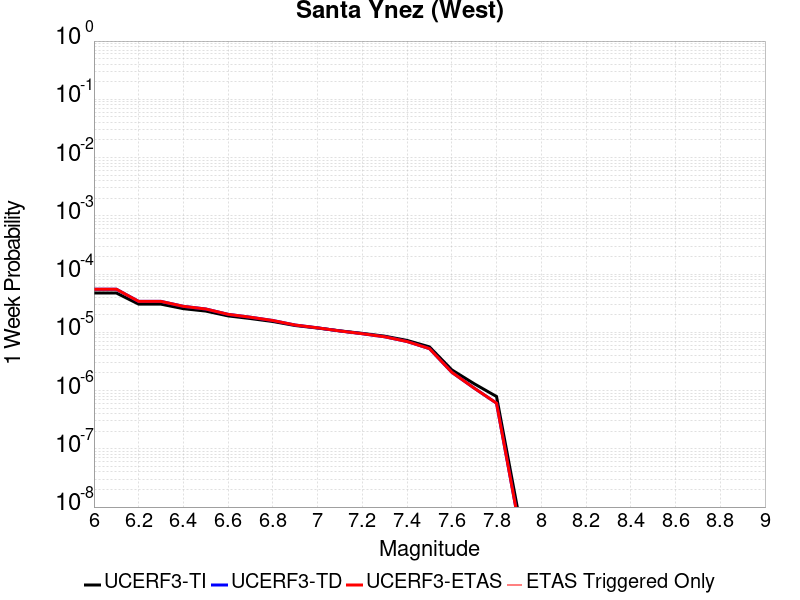 | 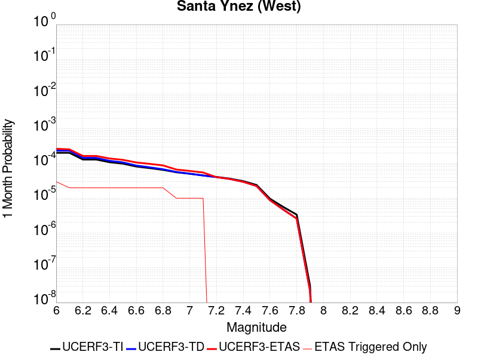 | 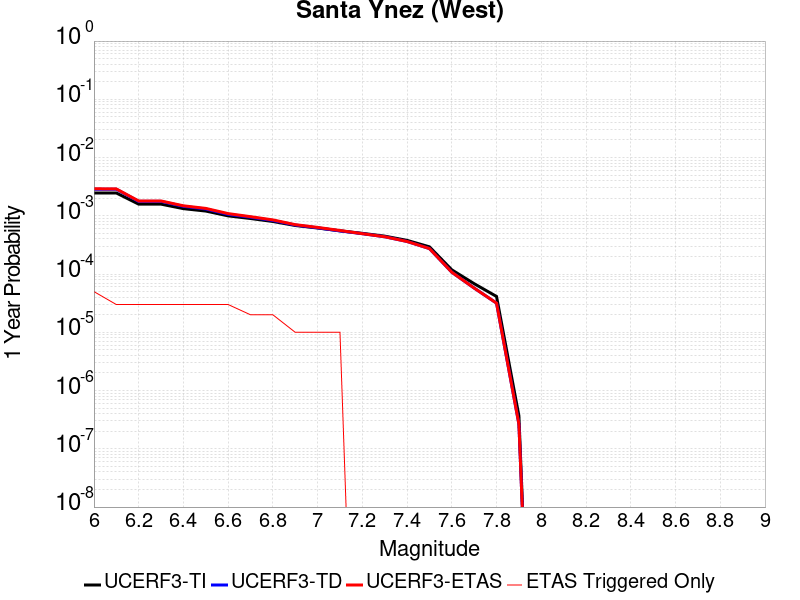 | 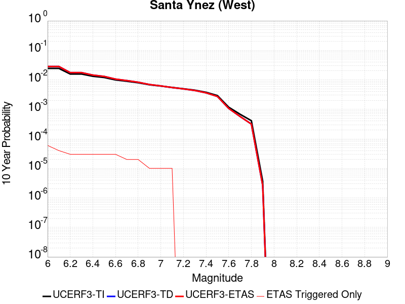 |

| Magnitude | 1 wk TI Prob | 1 wk TD Prob | 1 wk ETAS Prob | 1 wk ETAS/TD Gain | 1 wk ETAS Triggered Only | 1 mo TI Prob | 1 mo TD Prob | 1 mo ETAS Prob | 1 mo ETAS/TD Gain | 1 mo ETAS Triggered Only | 1 yr TI Prob | 1 yr TD Prob | 1 yr ETAS Prob | 1 yr ETAS/TD Gain | 1 yr ETAS Triggered Only | 10 yr TI Prob | 10 yr TD Prob | 10 yr ETAS Prob | 10 yr ETAS/TD Gain | 10 yr ETAS Triggered Only |
|-----|-----|-----|-----|-----|-----|-----|-----|-----|-----|-----|-----|-----|-----|-----|-----|-----|-----|-----|-----|-----|
| 6.0 | 4.7352758E-5 | 5.497349E-5 | 5.497349E-5 | 1.0 | 0.0 | 2.0292461E-4 | 2.3558107E-4 | 2.3558107E-4 | 1.0 | 0.0 | 0.0024678076 | 0.0028645964 | 0.0028885086 | 1.0083475 | 2.3980816E-5 | 0.024405818 | 0.028305095 | 0.02834005 | 1.0012349 | 3.597122E-5 |
| 6.1 | 4.7352758E-5 | 5.497349E-5 | 5.497349E-5 | 1.0 | 0.0 | 2.0292461E-4 | 2.3558107E-4 | 2.3558107E-4 | 1.0 | 0.0 | 0.0024678076 | 0.0028645964 | 0.0028765525 | 1.0041738 | 1.1990408E-5 | 0.024405818 | 0.028305095 | 0.028328398 | 1.0008233 | 2.3980816E-5 |
| 6.2 | 3.0415853E-5 | 3.3925786E-5 | 3.3925786E-5 | 1.0 | 0.0 | 1.3034715E-4 | 1.4538833E-4 | 1.4538833E-4 | 1.0 | 0.0 | 0.0015858212 | 0.0017687011 | 0.0017806703 | 1.0067673 | 1.1990408E-5 | 0.015745522 | 0.01755015 | 0.017561931 | 1.0006713 | 1.1990408E-5 |
| 6.3 | 3.0415853E-5 | 3.3925786E-5 | 3.3925786E-5 | 1.0 | 0.0 | 1.3034715E-4 | 1.4538833E-4 | 1.4538833E-4 | 1.0 | 0.0 | 0.0015858212 | 0.0017687011 | 0.0017806703 | 1.0067673 | 1.1990408E-5 | 0.015745522 | 0.01755015 | 0.017561931 | 1.0006713 | 1.1990408E-5 |
| 6.4 | 2.5452082E-5 | 2.7912925E-5 | 2.7912925E-5 | 1.0 | 0.0 | 1.09075794E-4 | 1.1962145E-4 | 1.1962145E-4 | 1.0 | 0.0 | 0.0013271887 | 0.001455435 | 0.0014674079 | 1.0082264 | 1.1990408E-5 | 0.013192902 | 0.014461209 | 0.014473027 | 1.0008172 | 1.1990408E-5 |
| 6.5 | 2.3143784E-5 | 2.5128682E-5 | 2.5128682E-5 | 1.0 | 0.0 | 9.9183875E-5 | 1.0768999E-4 | 1.0768999E-4 | 1.0 | 0.0 | 0.0012068948 | 0.0013103489 | 0.0013223236 | 1.0091386 | 1.1990408E-5 | 0.012003611 | 0.013027899 | 0.013039733 | 1.0009084 | 1.1990408E-5 |
| 6.6 | 1.9118515E-5 | 2.0354646E-5 | 2.0354646E-5 | 1.0 | 0.0 | 8.193392E-5 | 8.723133E-5 | 8.723133E-5 | 1.0 | 0.0 | 9.97089E-4 | 0.001061532 | 0.0010735097 | 1.0112834 | 1.1990408E-5 | 0.00992627 | 0.010565523 | 0.010577387 | 1.0011228 | 1.1990408E-5 |
| 6.7 | 1.722807E-5 | 1.8146604E-5 | 1.8146604E-5 | 1.0 | 0.0 | 7.3832496E-5 | 7.776888E-5 | 7.776888E-5 | 1.0 | 0.0 | 8.985399E-4 | 9.464303E-4 | 9.464303E-4 | 1.0 | 0.0 | 0.008949154 | 0.009424643 | 0.009424643 | 1.0 | 0.0 |
| 6.8 | 1.5317364E-5 | 1.5926695E-5 | 1.5926695E-5 | 1.0 | 0.0 | 6.56442E-5 | 6.82555E-5 | 6.82555E-5 | 1.0 | 0.0 | 7.98925E-4 | 8.306982E-4 | 8.306982E-4 | 1.0 | 0.0 | 0.007960589 | 0.008276418 | 0.008276418 | 1.0 | 0.0 |
| 6.9 | 1.3071226E-5 | 1.3329779E-5 | 1.3329779E-5 | 1.0 | 0.0 | 5.6018336E-5 | 5.7126388E-5 | 5.7126388E-5 | 1.0 | 0.0 | 6.8180985E-4 | 6.9529406E-4 | 6.9529406E-4 | 1.0 | 0.0 | 0.0067972173 | 0.0069314474 | 0.0069314474 | 1.0 | 0.0 |
| 7.0 | 1.1836986E-5 | 1.19329125E-5 | 1.19329125E-5 | 1.0 | 0.0 | 5.0728955E-5 | 5.1140058E-5 | 5.1140058E-5 | 1.0 | 0.0 | 6.1745E-4 | 6.2245404E-4 | 6.2245404E-4 | 1.0 | 0.0 | 0.006157372 | 0.006207299 | 0.006207299 | 1.0 | 0.0 |
| 7.1 | 1.0597169E-5 | 1.0542309E-5 | 1.0542309E-5 | 1.0 | 0.0 | 4.541565E-5 | 4.5180546E-5 | 4.5180546E-5 | 1.0 | 0.0 | 5.5279525E-4 | 5.4993544E-4 | 5.4993544E-4 | 1.0 | 0.0 | 0.0055142213 | 0.005485877 | 0.005485877 | 1.0 | 0.0 |
| 7.2 | 9.59113E-6 | 9.459241E-6 | 9.459241E-6 | 1.0 | 0.0 | 4.11042E-5 | 4.053898E-5 | 4.053898E-5 | 1.0 | 0.0 | 5.0032866E-4 | 4.9345137E-4 | 4.9345137E-4 | 1.0 | 0.0 | 0.004992037 | 0.0049236757 | 0.0049236757 | 1.0 | 0.0 |
| 7.3 | 8.586084E-6 | 8.379669E-6 | 8.379669E-6 | 1.0 | 0.0 | 3.679698E-5 | 3.591238E-5 | 3.591238E-5 | 1.0 | 0.0 | 4.4791115E-4 | 4.3714655E-4 | 4.3714655E-4 | 1.0 | 0.0 | 0.004470094 | 0.0043629776 | 0.0043629776 | 1.0 | 0.0 |
| 7.4 | 7.2622997E-6 | 6.951613E-6 | 6.951613E-6 | 1.0 | 0.0 | 3.112377E-5 | 2.9792294E-5 | 2.9792294E-5 | 1.0 | 0.0 | 3.78866E-4 | 3.6266178E-4 | 3.6266178E-4 | 1.0 | 0.0 | 0.0037822074 | 0.0036207996 | 0.0036207996 | 1.0 | 0.0 |
| 7.5 | 5.627296E-6 | 5.251639E-6 | 5.251639E-6 | 1.0 | 0.0 | 2.411676E-5 | 2.2506834E-5 | 2.2506834E-5 | 1.0 | 0.0 | 2.9358198E-4 | 2.7398695E-4 | 2.7398695E-4 | 1.0 | 0.0 | 0.0029319443 | 0.0027365636 | 0.0027365636 | 1.0 | 0.0 |
| 7.6 | 2.265244E-6 | 2.0608784E-6 | 2.0608784E-6 | 1.0 | 0.0 | 9.708152E-6 | 8.832307E-6 | 8.832307E-6 | 1.0 | 0.0 | 1.18190335E-4 | 1.0752812E-4 | 1.0752812E-4 | 1.0 | 0.0 | 0.001181275 | 0.0010747695 | 0.0010747695 | 1.0 | 0.0 |
| 7.7 | 1.3099874E-6 | 1.1016341E-6 | 1.1016341E-6 | 1.0 | 0.0 | 5.61422E-6 | 4.7212807E-6 | 4.7212807E-6 | 1.0 | 0.0 | 6.8350986E-5 | 5.74801E-5 | 5.74801E-5 | 1.0 | 0.0 | 6.832996E-4 | 5.746547E-4 | 5.746547E-4 | 1.0 | 0.0 |
| 7.8 | 7.903951E-7 | 6.071191E-7 | 6.071191E-7 | 1.0 | 0.0 | 3.3874032E-6 | 2.6019363E-6 | 2.6019363E-6 | 1.0 | 0.0 | 4.1240855E-5 | 3.1678126E-5 | 3.1678126E-5 | 1.0 | 0.0 | 4.12332E-4 | 3.1673745E-4 | 3.1673745E-4 | 1.0 | 0.0 |
| 7.9 | 7.0753297E-9 | 5.089978E-9 | 5.089978E-9 | 1.0 | 0.0 | 3.032284E-8 | 2.1814193E-8 | 2.1814193E-8 | 1.0 | 0.0 | 3.6918053E-7 | 2.6558777E-7 | 2.6558777E-7 | 1.0 | 0.0 | 3.691799E-6 | 2.6558755E-6 | 2.6558755E-6 | 1.0 | 0.0 |

## Pine Mtn
*[(top)](#table-of-contents)*

| 1 Week | 1 Month | 1 Year | 10 Year |
|-----|-----|-----|-----|
|  | 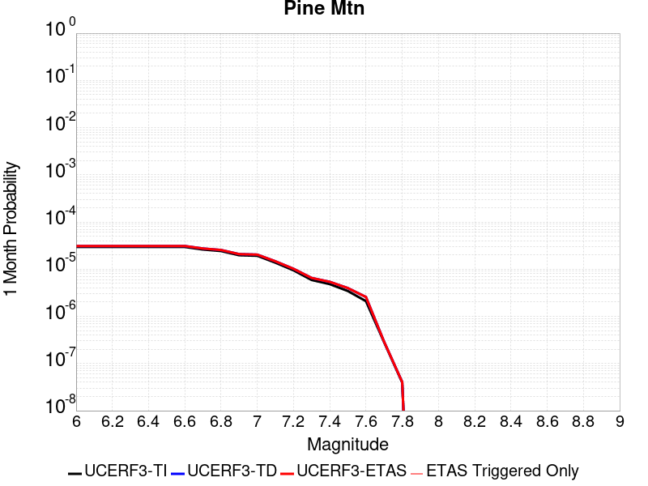 | 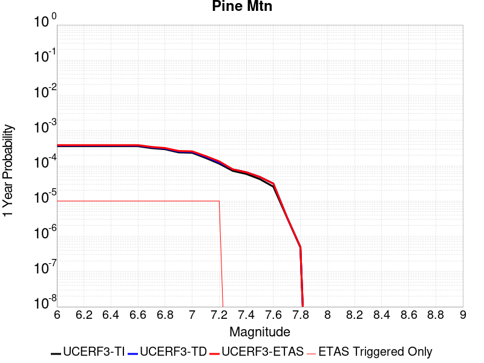 | 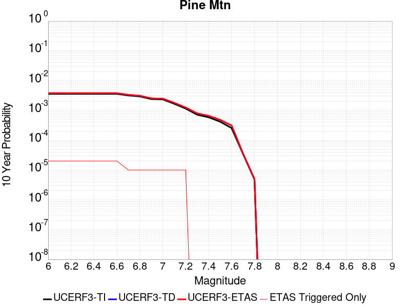 |

| Magnitude | 1 wk TI Prob | 1 wk TD Prob | 1 wk ETAS Prob | 1 wk ETAS/TD Gain | 1 wk ETAS Triggered Only | 1 mo TI Prob | 1 mo TD Prob | 1 mo ETAS Prob | 1 mo ETAS/TD Gain | 1 mo ETAS Triggered Only | 1 yr TI Prob | 1 yr TD Prob | 1 yr ETAS Prob | 1 yr ETAS/TD Gain | 1 yr ETAS Triggered Only | 10 yr TI Prob | 10 yr TD Prob | 10 yr ETAS Prob | 10 yr ETAS/TD Gain | 10 yr ETAS Triggered Only |
|-----|-----|-----|-----|-----|-----|-----|-----|-----|-----|-----|-----|-----|-----|-----|-----|-----|-----|-----|-----|-----|
| 6.0 | 6.894797E-6 | 7.2255634E-6 | 7.2255634E-6 | 1.0 | 0.0 | 2.9548795E-5 | 3.0966352E-5 | 3.0966352E-5 | 1.0 | 0.0 | 3.596972E-4 | 3.7695307E-4 | 3.8893896E-4 | 1.0317968 | 1.1990408E-5 | 0.0035911554 | 0.0037634342 | 0.0037873248 | 1.0063481 | 2.3980816E-5 |
| 6.1 | 6.894797E-6 | 7.2255634E-6 | 7.2255634E-6 | 1.0 | 0.0 | 2.9548795E-5 | 3.0966352E-5 | 3.0966352E-5 | 1.0 | 0.0 | 3.596972E-4 | 3.7695307E-4 | 3.8893896E-4 | 1.0317968 | 1.1990408E-5 | 0.0035911554 | 0.0037634342 | 0.0037873248 | 1.0063481 | 2.3980816E-5 |
| 6.2 | 6.894797E-6 | 7.2255634E-6 | 7.2255634E-6 | 1.0 | 0.0 | 2.9548795E-5 | 3.0966352E-5 | 3.0966352E-5 | 1.0 | 0.0 | 3.596972E-4 | 3.7695307E-4 | 3.8893896E-4 | 1.0317968 | 1.1990408E-5 | 0.0035911554 | 0.0037634342 | 0.0037873248 | 1.0063481 | 2.3980816E-5 |
| 6.3 | 6.894797E-6 | 7.2255634E-6 | 7.2255634E-6 | 1.0 | 0.0 | 2.9548795E-5 | 3.0966352E-5 | 3.0966352E-5 | 1.0 | 0.0 | 3.596972E-4 | 3.7695307E-4 | 3.8893896E-4 | 1.0317968 | 1.1990408E-5 | 0.0035911554 | 0.0037634342 | 0.0037873248 | 1.0063481 | 2.3980816E-5 |
| 6.4 | 6.894797E-6 | 7.2255634E-6 | 7.2255634E-6 | 1.0 | 0.0 | 2.9548795E-5 | 3.0966352E-5 | 3.0966352E-5 | 1.0 | 0.0 | 3.596972E-4 | 3.7695307E-4 | 3.8893896E-4 | 1.0317968 | 1.1990408E-5 | 0.0035911554 | 0.0037634342 | 0.0037873248 | 1.0063481 | 2.3980816E-5 |
| 6.5 | 6.894797E-6 | 7.2255634E-6 | 7.2255634E-6 | 1.0 | 0.0 | 2.9548795E-5 | 3.0966352E-5 | 3.0966352E-5 | 1.0 | 0.0 | 3.596972E-4 | 3.7695307E-4 | 3.8893896E-4 | 1.0317968 | 1.1990408E-5 | 0.0035911554 | 0.0037634342 | 0.0037873248 | 1.0063481 | 2.3980816E-5 |
| 6.6 | 6.894797E-6 | 7.2255634E-6 | 7.2255634E-6 | 1.0 | 0.0 | 2.9548795E-5 | 3.0966352E-5 | 3.0966352E-5 | 1.0 | 0.0 | 3.596972E-4 | 3.7695307E-4 | 3.8893896E-4 | 1.0317968 | 1.1990408E-5 | 0.0035911554 | 0.0037634342 | 0.0037873248 | 1.0063481 | 2.3980816E-5 |
| 6.7 | 6.0867933E-6 | 6.397213E-6 | 6.397213E-6 | 1.0 | 0.0 | 2.6085996E-5 | 2.741635E-5 | 2.741635E-5 | 1.0 | 0.0 | 3.1755073E-4 | 3.3374512E-4 | 3.4573153E-4 | 1.0359149 | 1.1990408E-5 | 0.0031709734 | 0.0033326582 | 0.0033446087 | 1.0035858 | 1.1990408E-5 |
| 6.8 | 5.6530425E-6 | 5.9506933E-6 | 5.9506933E-6 | 1.0 | 0.0 | 2.42271E-5 | 2.5502733E-5 | 2.5502733E-5 | 1.0 | 0.0 | 2.94925E-4 | 3.104536E-4 | 3.224403E-4 | 1.0386102 | 1.1990408E-5 | 0.002945339 | 0.0031004036 | 0.0031123569 | 1.0038553 | 1.1990408E-5 |
| 6.9 | 4.6015225E-6 | 4.8639267E-6 | 4.8639267E-6 | 1.0 | 0.0 | 1.9720663E-5 | 2.0845242E-5 | 2.0845242E-5 | 1.0 | 0.0 | 2.4007261E-4 | 2.5376273E-4 | 2.657501E-4 | 1.0472385 | 1.1990408E-5 | 0.0023981342 | 0.0025348738 | 0.0025468338 | 1.0047182 | 1.1990408E-5 |
| 7.0 | 4.4875965E-6 | 4.7475655E-6 | 4.7475655E-6 | 1.0 | 0.0 | 1.9232413E-5 | 2.0346559E-5 | 2.0346559E-5 | 1.0 | 0.0 | 2.3412947E-4 | 2.4769266E-4 | 2.596801E-4 | 1.0483965 | 1.1990408E-5 | 0.0023388295 | 0.0024743096 | 0.0024862704 | 1.0048339 | 1.1990408E-5 |
| 7.1 | 3.203907E-6 | 3.4294974E-6 | 3.4294974E-6 | 1.0 | 0.0 | 1.3730958E-5 | 1.4697767E-5 | 1.4697767E-5 | 1.0 | 0.0 | 1.6716159E-4 | 1.7893128E-4 | 1.9091956E-4 | 1.0669992 | 1.1990408E-5 | 0.0016703589 | 0.0017879383 | 0.0017999073 | 1.0066943 | 1.1990408E-5 |
| 7.2 | 2.2060601E-6 | 2.3785535E-6 | 2.3785535E-6 | 1.0 | 0.0 | 9.4545085E-6 | 1.0193763E-5 | 1.0193763E-5 | 1.0 | 0.0 | 1.15102564E-4 | 1.2410246E-4 | 1.3609137E-4 | 1.0966051 | 1.1990408E-5 | 0.0011504296 | 0.0012403764 | 0.0012523519 | 1.0096548 | 1.1990408E-5 |
| 7.3 | 1.3765207E-6 | 1.5217128E-6 | 1.5217128E-6 | 1.0 | 0.0 | 5.899361E-6 | 6.52161E-6 | 6.52161E-6 | 1.0 | 0.0 | 7.182235E-5 | 7.93978E-5 | 7.93978E-5 | 1.0 | 0.0 | 7.1799144E-4 | 7.937035E-4 | 7.937035E-4 | 1.0 | 0.0 |
| 7.4 | 1.1245983E-6 | 1.2587657E-6 | 1.2587657E-6 | 1.0 | 0.0 | 4.819698E-6 | 5.3946997E-6 | 5.3946997E-6 | 1.0 | 0.0 | 5.8678244E-5 | 6.567857E-5 | 6.567857E-5 | 1.0 | 0.0 | 5.866275E-4 | 6.5659994E-4 | 6.5659994E-4 | 1.0 | 0.0 |
| 7.5 | 8.031682E-7 | 9.277495E-7 | 9.277495E-7 | 1.0 | 0.0 | 3.4421448E-6 | 3.9760635E-6 | 3.9760635E-6 | 1.0 | 0.0 | 4.1907308E-5 | 4.8407568E-5 | 4.8407568E-5 | 1.0 | 0.0 | 4.1899405E-4 | 4.83977E-4 | 4.83977E-4 | 1.0 | 0.0 |
| 7.6 | 4.8953444E-7 | 6.0034915E-7 | 6.0034915E-7 | 1.0 | 0.0 | 2.098003E-6 | 2.5729225E-6 | 2.5729225E-6 | 1.0 | 0.0 | 2.5542888E-5 | 3.1324933E-5 | 3.1324933E-5 | 1.0 | 0.0 | 2.5539953E-4 | 3.1321004E-4 | 3.1321004E-4 | 1.0 | 0.0 |
| 7.7 | 6.634529E-8 | 6.788847E-8 | 6.788847E-8 | 1.0 | 0.0 | 2.843369E-7 | 2.9095054E-7 | 2.9095054E-7 | 1.0 | 0.0 | 3.4617963E-6 | 3.5423177E-6 | 3.5423177E-6 | 1.0 | 0.0 | 3.4617424E-5 | 3.542266E-5 | 3.542266E-5 | 1.0 | 0.0 |
| 7.8 | 9.235578E-9 | 9.488601E-9 | 9.488601E-9 | 1.0 | 0.0 | 3.9581046E-8 | 4.0665434E-8 | 4.0665434E-8 | 1.0 | 0.0 | 4.818991E-7 | 4.951016E-7 | 4.951016E-7 | 1.0 | 0.0 | 4.8189804E-6 | 4.9510063E-6 | 4.9510063E-6 | 1.0 | 0.0 |

## San Jacinto (Superstition Mtn)
*[(top)](#table-of-contents)*

| 1 Week | 1 Month | 1 Year | 10 Year |
|-----|-----|-----|-----|
|  | 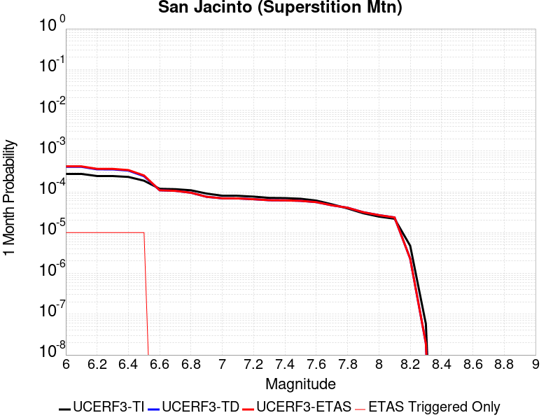 | 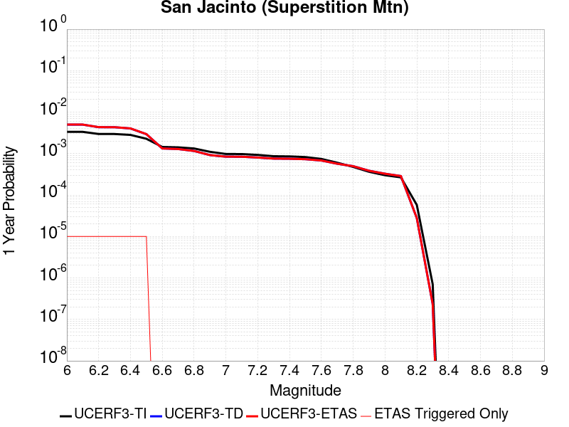 | 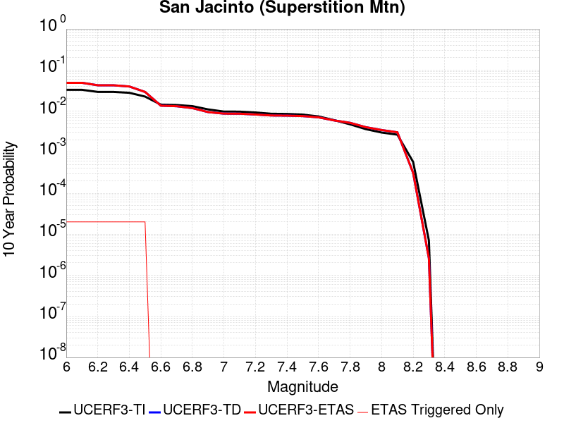 |

| Magnitude | 1 wk TI Prob | 1 wk TD Prob | 1 wk ETAS Prob | 1 wk ETAS/TD Gain | 1 wk ETAS Triggered Only | 1 mo TI Prob | 1 mo TD Prob | 1 mo ETAS Prob | 1 mo ETAS/TD Gain | 1 mo ETAS Triggered Only | 1 yr TI Prob | 1 yr TD Prob | 1 yr ETAS Prob | 1 yr ETAS/TD Gain | 1 yr ETAS Triggered Only | 10 yr TI Prob | 10 yr TD Prob | 10 yr ETAS Prob | 10 yr ETAS/TD Gain | 10 yr ETAS Triggered Only |
|-----|-----|-----|-----|-----|-----|-----|-----|-----|-----|-----|-----|-----|-----|-----|-----|-----|-----|-----|-----|-----|
| 6.0 | 6.4193904E-5 | 9.600102E-5 | 9.600102E-5 | 1.0 | 0.0 | 2.7508775E-4 | 4.1137784E-4 | 4.2336332E-4 | 1.029135 | 1.1990408E-5 | 0.0033440501 | 0.004998455 | 0.005010385 | 1.0023868 | 1.1990408E-5 | 0.03294174 | 0.048827495 | 0.048850305 | 1.0004672 | 2.3980816E-5 |
| 6.1 | 6.4193904E-5 | 9.600102E-5 | 9.600102E-5 | 1.0 | 0.0 | 2.7508775E-4 | 4.1137784E-4 | 4.2336332E-4 | 1.029135 | 1.1990408E-5 | 0.0033440501 | 0.004998455 | 0.005010385 | 1.0023868 | 1.1990408E-5 | 0.03294174 | 0.048827495 | 0.048850305 | 1.0004672 | 2.3980816E-5 |
| 6.2 | 5.7023593E-5 | 8.3151084E-5 | 8.3151084E-5 | 1.0 | 0.0 | 2.4436394E-4 | 3.5632253E-4 | 3.6830865E-4 | 1.0336385 | 1.1990408E-5 | 0.002971072 | 0.004331238 | 0.0043431767 | 1.0027564 | 1.1990408E-5 | 0.029316625 | 0.04250735 | 0.04253031 | 1.0005401 | 2.3980816E-5 |
| 6.3 | 5.6940098E-5 | 8.299644E-5 | 8.299644E-5 | 1.0 | 0.0 | 2.4400617E-4 | 3.5565995E-4 | 3.676461E-4 | 1.0337012 | 1.1990408E-5 | 0.002966728 | 0.004323203 | 0.0043351417 | 1.0027615 | 1.1990408E-5 | 0.029274331 | 0.0424306 | 0.042453565 | 1.0005412 | 2.3980816E-5 |
| 6.4 | 5.4171585E-5 | 7.7490105E-5 | 7.7490105E-5 | 1.0 | 0.0 | 2.3214328E-4 | 3.320675E-4 | 3.440539E-4 | 1.0360963 | 1.1990408E-5 | 0.0028226813 | 0.004037075 | 0.0040490176 | 1.002958 | 1.1990408E-5 | 0.02787096 | 0.03971982 | 0.03974285 | 1.0005797 | 2.3980816E-5 |
| 6.5 | 4.375144E-5 | 5.6427685E-5 | 5.6427685E-5 | 1.0 | 0.0 | 1.874927E-4 | 2.4181715E-4 | 2.5380467E-4 | 1.0495726 | 1.1990408E-5 | 0.0022803338 | 0.0029413246 | 0.0029532798 | 1.0040646 | 1.1990408E-5 | 0.022570757 | 0.029240036 | 0.029263316 | 1.0007962 | 2.3980816E-5 |
| 6.6 | 2.772192E-5 | 2.5494404E-5 | 2.5494404E-5 | 1.0 | 0.0 | 1.1880282E-4 | 1.0925727E-4 | 1.0925727E-4 | 1.0 | 0.0 | 0.0014454646 | 0.0013294149 | 0.0013294149 | 1.0 | 0.0 | 0.014360986 | 0.013543627 | 0.013543627 | 1.0 | 0.0 |
| 6.7 | 2.7124124E-5 | 2.4705407E-5 | 2.4705407E-5 | 1.0 | 0.0 | 1.1624106E-4 | 1.05876126E-4 | 1.05876126E-4 | 1.0 | 0.0 | 0.0014143161 | 0.0012882988 | 0.0012882988 | 1.0 | 0.0 | 0.014053487 | 0.013137068 | 0.013137068 | 1.0 | 0.0 |
| 6.8 | 2.5475807E-5 | 2.2170334E-5 | 2.2170334E-5 | 1.0 | 0.0 | 1.0917746E-4 | 9.501232E-5 | 9.501232E-5 | 1.0 | 0.0 | 0.001328425 | 0.0011561731 | 0.0011561731 | 1.0 | 0.0 | 0.0132051185 | 0.0118252365 | 0.0118252365 | 1.0 | 0.0 |
| 6.9 | 2.1162023E-5 | 1.7631666E-5 | 1.7631666E-5 | 1.0 | 0.0 | 9.069123E-5 | 7.5562115E-5 | 7.5562115E-5 | 1.0 | 0.0 | 0.0011036064 | 9.195843E-4 | 9.195843E-4 | 1.0 | 0.0 | 0.010981417 | 0.009449712 | 0.009449712 | 1.0 | 0.0 |
| 7.0 | 1.8754288E-5 | 1.6166736E-5 | 1.6166736E-5 | 1.0 | 0.0 | 8.037304E-5 | 6.9284186E-5 | 6.9284186E-5 | 1.0 | 0.0 | 9.781026E-4 | 8.4321096E-4 | 8.4321096E-4 | 1.0 | 0.0 | 0.009738087 | 0.008672746 | 0.008672746 | 1.0 | 0.0 |
| 7.1 | 1.8678527E-5 | 1.6091873E-5 | 1.6091873E-5 | 1.0 | 0.0 | 8.0048376E-5 | 6.896337E-5 | 6.896337E-5 | 1.0 | 0.0 | 9.7415317E-4 | 8.3930796E-4 | 8.3930796E-4 | 1.0 | 0.0 | 0.009698939 | 0.008633699 | 0.008633699 | 1.0 | 0.0 |
| 7.2 | 1.7804578E-5 | 1.5386398E-5 | 1.5386398E-5 | 1.0 | 0.0 | 7.6303106E-5 | 6.5940054E-5 | 6.5940054E-5 | 1.0 | 0.0 | 9.285943E-4 | 8.0252666E-4 | 8.0252666E-4 | 1.0 | 0.0 | 0.009247236 | 0.008264985 | 0.008264985 | 1.0 | 0.0 |
| 7.3 | 1.6583685E-5 | 1.4535444E-5 | 1.4535444E-5 | 1.0 | 0.0 | 7.1070994E-5 | 6.2293286E-5 | 6.2293286E-5 | 1.0 | 0.0 | 8.649459E-4 | 7.5815886E-4 | 7.5815886E-4 | 1.0 | 0.0 | 0.00861587 | 0.007820267 | 0.007820267 | 1.0 | 0.0 |
| 7.4 | 1.6387552E-5 | 1.4400321E-5 | 1.4400321E-5 | 1.0 | 0.0 | 7.023047E-5 | 6.171421E-5 | 6.171421E-5 | 1.0 | 0.0 | 8.5472054E-4 | 7.5111346E-4 | 7.5111346E-4 | 1.0 | 0.0 | 0.008514405 | 0.007749644 | 0.007749644 | 1.0 | 0.0 |
| 7.5 | 1.5790754E-5 | 1.4040957E-5 | 1.4040957E-5 | 1.0 | 0.0 | 6.767291E-5 | 6.017415E-5 | 6.017415E-5 | 1.0 | 0.0 | 8.236062E-4 | 7.32376E-4 | 7.32376E-4 | 1.0 | 0.0 | 0.008205604 | 0.007560181 | 0.007560181 | 1.0 | 0.0 |
| 7.6 | 1.4248672E-5 | 1.30597955E-5 | 1.30597955E-5 | 1.0 | 0.0 | 6.106431E-5 | 5.596936E-5 | 5.596936E-5 | 1.0 | 0.0 | 7.432043E-4 | 6.8121566E-4 | 6.8121566E-4 | 1.0 | 0.0 | 0.007407237 | 0.007042702 | 0.007042702 | 1.0 | 0.0 |
| 7.7 | 1.15449975E-5 | 1.09083485E-5 | 1.09083485E-5 | 1.0 | 0.0 | 4.947762E-5 | 4.6749232E-5 | 4.6749232E-5 | 1.0 | 0.0 | 6.022235E-4 | 5.69024E-4 | 5.69024E-4 | 1.0 | 0.0 | 0.006005941 | 0.005912628 | 0.005912628 | 1.0 | 0.0 |
| 7.8 | 9.1391985E-6 | 9.518787E-6 | 9.518787E-6 | 1.0 | 0.0 | 3.9167408E-5 | 4.0794166E-5 | 4.0794166E-5 | 1.0 | 0.0 | 4.767588E-4 | 4.9655634E-4 | 4.9655634E-4 | 1.0 | 0.0 | 0.0047573727 | 0.0051790397 | 0.0051790397 | 1.0 | 0.0 |
| 7.9 | 6.973017E-6 | 7.3861297E-6 | 7.3861297E-6 | 1.0 | 0.0 | 2.9884017E-5 | 3.165446E-5 | 3.165446E-5 | 1.0 | 0.0 | 3.6377716E-4 | 3.8532543E-4 | 3.8532543E-4 | 1.0 | 0.0 | 0.0036318225 | 0.004053871 | 0.004053871 | 1.0 | 0.0 |
| 8.0 | 5.7638235E-6 | 6.263572E-6 | 6.263572E-6 | 1.0 | 0.0 | 2.4701867E-5 | 2.6843605E-5 | 2.6843605E-5 | 1.0 | 0.0 | 3.0070372E-4 | 3.267724E-4 | 3.267724E-4 | 1.0 | 0.0 | 0.0030029714 | 0.0034553434 | 0.0034553434 | 1.0 | 0.0 |
| 8.1 | 5.1124434E-6 | 5.498948E-6 | 5.498948E-6 | 1.0 | 0.0 | 2.1910288E-5 | 2.3566712E-5 | 2.3566712E-5 | 1.0 | 0.0 | 2.6672508E-4 | 2.8688743E-4 | 2.8688743E-4 | 1.0 | 0.0 | 0.0026640517 | 0.0030420625 | 0.0030420625 | 1.0 | 0.0 |
| 8.2 | 1.1075938E-6 | 5.341373E-7 | 5.341373E-7 | 1.0 | 0.0 | 4.7468216E-6 | 2.289158E-6 | 2.289158E-6 | 1.0 | 0.0 | 5.779102E-5 | 2.7870163E-5 | 2.7870163E-5 | 1.0 | 0.0 | 5.777599E-4 | 3.1373248E-4 | 3.1373248E-4 | 1.0 | 0.0 |
| 8.3 | 1.3584393E-8 | 4.478424E-9 | 4.478424E-9 | 1.0 | 0.0 | 5.8218827E-8 | 1.9193244E-8 | 1.9193244E-8 | 1.0 | 0.0 | 7.0881396E-7 | 2.3367775E-7 | 2.3367775E-7 | 1.0 | 0.0 | 7.0881174E-6 | 2.6188773E-6 | 2.6188773E-6 | 1.0 | 0.0 |

## Malibu Coast alt 1
*[(top)](#table-of-contents)*

| 1 Week | 1 Month | 1 Year | 10 Year |
|-----|-----|-----|-----|
|  |  | 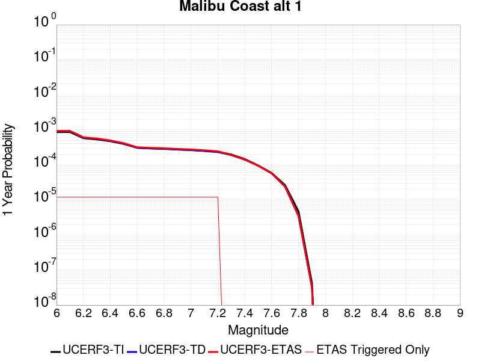 | 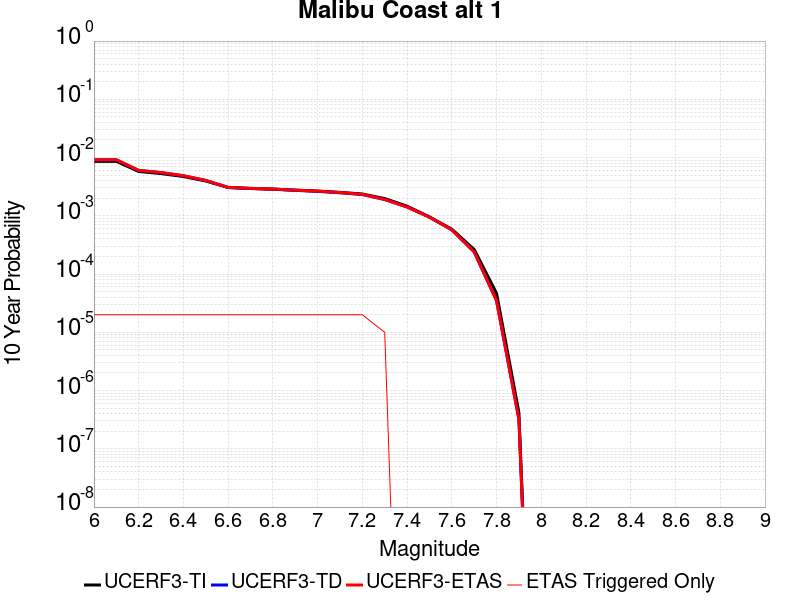 |

| Magnitude | 1 wk TI Prob | 1 wk TD Prob | 1 wk ETAS Prob | 1 wk ETAS/TD Gain | 1 wk ETAS Triggered Only | 1 mo TI Prob | 1 mo TD Prob | 1 mo ETAS Prob | 1 mo ETAS/TD Gain | 1 mo ETAS Triggered Only | 1 yr TI Prob | 1 yr TD Prob | 1 yr ETAS Prob | 1 yr ETAS/TD Gain | 1 yr ETAS Triggered Only | 10 yr TI Prob | 10 yr TD Prob | 10 yr ETAS Prob | 10 yr ETAS/TD Gain | 10 yr ETAS Triggered Only |
|-----|-----|-----|-----|-----|-----|-----|-----|-----|-----|-----|-----|-----|-----|-----|-----|-----|-----|-----|-----|-----|
| 6.0 | 1.6572556E-5 | 1.7598268E-5 | 1.7598268E-5 | 1.0 | 0.0 | 7.102331E-5 | 7.541908E-5 | 7.541908E-5 | 1.0 | 0.0 | 8.6436566E-4 | 9.178593E-4 | 9.2983874E-4 | 1.0130515 | 1.1990408E-5 | 0.0086101135 | 0.009142617 | 0.0091663785 | 1.002599 | 2.3980816E-5 |
| 6.1 | 1.6572556E-5 | 1.7598268E-5 | 1.7598268E-5 | 1.0 | 0.0 | 7.102331E-5 | 7.541908E-5 | 7.541908E-5 | 1.0 | 0.0 | 8.6436566E-4 | 9.178593E-4 | 9.2983874E-4 | 1.0130515 | 1.1990408E-5 | 0.0086101135 | 0.009142617 | 0.0091663785 | 1.002599 | 2.3980816E-5 |
| 6.2 | 1.1085717E-5 | 1.1557268E-5 | 1.1557268E-5 | 1.0 | 0.0 | 4.750935E-5 | 4.953023E-5 | 4.953023E-5 | 1.0 | 0.0 | 5.782728E-4 | 6.028672E-4 | 6.148504E-4 | 1.019877 | 1.1990408E-5 | 0.0057677035 | 0.0060126884 | 0.006036525 | 1.0039644 | 2.3980816E-5 |
| 6.3 | 1.0208568E-5 | 1.05923455E-5 | 1.05923455E-5 | 1.0 | 0.0 | 4.375027E-5 | 4.5394994E-5 | 4.5394994E-5 | 1.0 | 0.0 | 5.325294E-4 | 5.525468E-4 | 5.645306E-4 | 1.0216882 | 1.1990408E-5 | 0.0053125503 | 0.005512038 | 0.005535886 | 1.0043267 | 2.3980816E-5 |
| 6.4 | 9.0682315E-6 | 9.34273E-6 | 9.34273E-6 | 1.0 | 0.0 | 3.8863272E-5 | 4.0039668E-5 | 4.0039668E-5 | 1.0 | 0.0 | 4.730576E-4 | 4.8737595E-4 | 4.993605E-4 | 1.02459 | 1.1990408E-5 | 0.0047205184 | 0.004863284 | 0.0048871483 | 1.004907 | 2.3980816E-5 |
| 6.5 | 7.605796E-6 | 7.74866E-6 | 7.74866E-6 | 1.0 | 0.0 | 3.259586E-5 | 3.320813E-5 | 3.320813E-5 | 1.0 | 0.0 | 3.9678233E-4 | 4.042353E-4 | 4.1622086E-4 | 1.02965 | 1.1990408E-5 | 0.0039607463 | 0.004035138 | 0.004059022 | 1.005919 | 2.3980816E-5 |
| 6.6 | 5.889873E-6 | 5.8795895E-6 | 5.8795895E-6 | 1.0 | 0.0 | 2.5242069E-5 | 2.5197998E-5 | 2.5197998E-5 | 1.0 | 0.0 | 3.0727885E-4 | 3.0674253E-4 | 3.1872926E-4 | 1.0390775 | 1.1990408E-5 | 0.003068543 | 0.0030632042 | 0.0030871117 | 1.0078046 | 2.3980816E-5 |
| 6.7 | 5.66586E-6 | 5.64169E-6 | 5.64169E-6 | 1.0 | 0.0 | 2.428203E-5 | 2.417845E-5 | 2.417845E-5 | 1.0 | 0.0 | 2.955936E-4 | 2.9433295E-4 | 3.0631982E-4 | 1.0407256 | 1.1990408E-5 | 0.0029520073 | 0.002939443 | 0.0029633536 | 1.0081342 | 2.3980816E-5 |
| 6.8 | 5.521556E-6 | 5.489475E-6 | 5.489475E-6 | 1.0 | 0.0 | 2.3663597E-5 | 2.3526109E-5 | 2.3526109E-5 | 1.0 | 0.0 | 2.880662E-4 | 2.8639284E-4 | 2.983798E-4 | 1.041855 | 1.1990408E-5 | 0.0028769306 | 0.002860249 | 0.0028841614 | 1.0083601 | 2.3980816E-5 |
| 6.9 | 5.29752E-6 | 5.249977E-6 | 5.249977E-6 | 1.0 | 0.0 | 2.270346E-5 | 2.249971E-5 | 2.249971E-5 | 1.0 | 0.0 | 2.7637955E-4 | 2.738996E-4 | 2.8588672E-4 | 1.0437647 | 1.1990408E-5 | 0.0027603607 | 0.0027356306 | 0.0027595458 | 1.0087421 | 2.3980816E-5 |
| 7.0 | 5.106743E-6 | 5.047723E-6 | 5.047723E-6 | 1.0 | 0.0 | 2.1885859E-5 | 2.1632919E-5 | 2.1632919E-5 | 1.0 | 0.0 | 2.6642776E-4 | 2.6334904E-4 | 2.7533626E-4 | 1.0455185 | 1.1990408E-5 | 0.0026610855 | 0.002630379 | 0.0026542968 | 1.0090929 | 2.3980816E-5 |
| 7.1 | 4.8469647E-6 | 4.7704148E-6 | 4.7704148E-6 | 1.0 | 0.0 | 2.0772539E-5 | 2.0444475E-5 | 2.0444475E-5 | 1.0 | 0.0 | 2.528763E-4 | 2.488831E-4 | 2.6087053E-4 | 1.0481648 | 1.1990408E-5 | 0.0025258875 | 0.0024860518 | 0.002509973 | 1.0096222 | 2.3980816E-5 |
| 7.2 | 4.545514E-6 | 4.448232E-6 | 4.448232E-6 | 1.0 | 0.0 | 1.9480629E-5 | 1.9063713E-5 | 1.9063713E-5 | 1.0 | 0.0 | 2.3715083E-4 | 2.3207605E-4 | 2.4406367E-4 | 1.0516539 | 1.1990408E-5 | 0.0023689792 | 0.0023183445 | 0.0023422698 | 1.01032 | 2.3980816E-5 |
| 7.3 | 3.794097E-6 | 3.6519655E-6 | 3.6519655E-6 | 1.0 | 0.0 | 1.6260314E-5 | 1.5651187E-5 | 1.5651187E-5 | 1.0 | 0.0 | 1.9795135E-4 | 1.9053658E-4 | 1.9053658E-4 | 1.0 | 0.0 | 0.001977751 | 0.0019037367 | 0.0019157043 | 1.0062864 | 1.1990408E-5 |
| 7.4 | 2.808217E-6 | 2.7191E-6 | 2.7191E-6 | 1.0 | 0.0 | 1.203516E-5 | 1.1653234E-5 | 1.1653234E-5 | 1.0 | 0.0 | 1.4651821E-4 | 1.418689E-4 | 1.418689E-4 | 1.0 | 0.0 | 0.0014642165 | 0.0014177861 | 0.0014177861 | 1.0 | 0.0 |
| 7.5 | 1.83809E-6 | 1.8190852E-6 | 1.8190852E-6 | 1.0 | 0.0 | 7.877505E-6 | 7.796056E-6 | 7.796056E-6 | 1.0 | 0.0 | 9.59044E-5 | 9.4912866E-5 | 9.4912866E-5 | 1.0 | 0.0 | 9.5863023E-4 | 9.487253E-4 | 9.487253E-4 | 1.0 | 0.0 |
| 7.6 | 1.1292672E-6 | 1.100155E-6 | 1.100155E-6 | 1.0 | 0.0 | 4.839708E-6 | 4.7149415E-6 | 4.7149415E-6 | 1.0 | 0.0 | 5.8921847E-5 | 5.7402918E-5 | 5.7402918E-5 | 1.0 | 0.0 | 5.890623E-4 | 5.7388254E-4 | 5.7388254E-4 | 1.0 | 0.0 |
| 7.7 | 5.065272E-7 | 4.609203E-7 | 4.609203E-7 | 1.0 | 0.0 | 2.170829E-6 | 1.9753713E-6 | 1.9753713E-6 | 1.0 | 0.0 | 2.6429525E-5 | 2.404989E-5 | 2.404989E-5 | 1.0 | 0.0 | 2.642638E-4 | 2.4047401E-4 | 2.4047401E-4 | 1.0 | 0.0 |
| 7.8 | 8.952991E-8 | 6.708074E-8 | 6.708074E-8 | 1.0 | 0.0 | 3.8369956E-7 | 2.8748886E-7 | 2.8748886E-7 | 1.0 | 0.0 | 4.671532E-6 | 3.5001713E-6 | 3.5001713E-6 | 1.0 | 0.0 | 4.671434E-5 | 3.5001183E-5 | 3.5001183E-5 | 1.0 | 0.0 |
| 7.9 | 8.007447E-10 | 6.160915E-10 | 6.160915E-10 | 1.0 | 0.0 | 3.4317629E-9 | 2.6403923E-9 | 2.6403923E-9 | 1.0 | 0.0 | 4.1781714E-8 | 3.2146776E-8 | 3.2146776E-8 | 1.0 | 0.0 | 4.1781706E-7 | 3.2146772E-7 | 3.2146772E-7 | 1.0 | 0.0 |

## Santa Ynez River
*[(top)](#table-of-contents)*

| 1 Week | 1 Month | 1 Year | 10 Year |
|-----|-----|-----|-----|
|  | 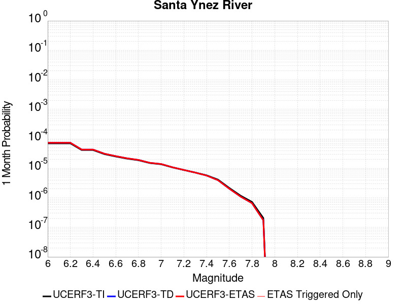 | 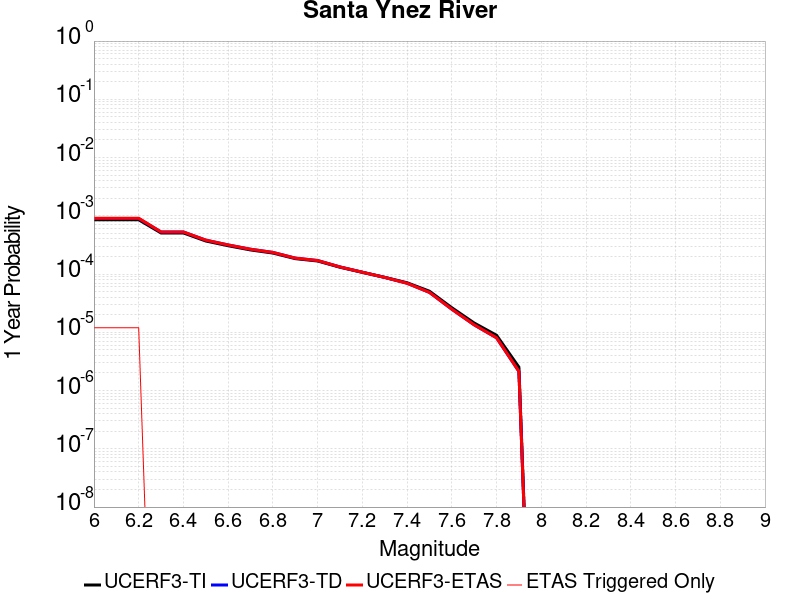 | 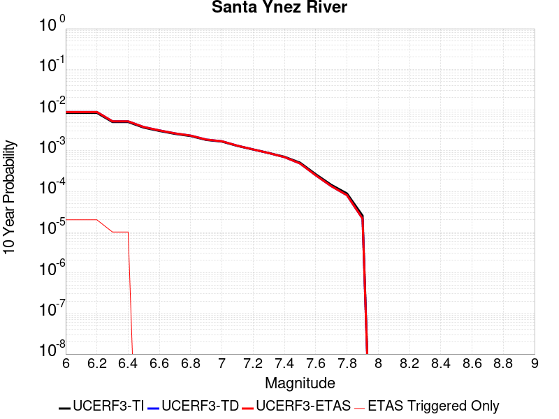 |

| Magnitude | 1 wk TI Prob | 1 wk TD Prob | 1 wk ETAS Prob | 1 wk ETAS/TD Gain | 1 wk ETAS Triggered Only | 1 mo TI Prob | 1 mo TD Prob | 1 mo ETAS Prob | 1 mo ETAS/TD Gain | 1 mo ETAS Triggered Only | 1 yr TI Prob | 1 yr TD Prob | 1 yr ETAS Prob | 1 yr ETAS/TD Gain | 1 yr ETAS Triggered Only | 10 yr TI Prob | 10 yr TD Prob | 10 yr ETAS Prob | 10 yr ETAS/TD Gain | 10 yr ETAS Triggered Only |
|-----|-----|-----|-----|-----|-----|-----|-----|-----|-----|-----|-----|-----|-----|-----|-----|-----|-----|-----|-----|-----|
| 6.0 | 1.6396456E-5 | 1.7209564E-5 | 1.7209564E-5 | 1.0 | 0.0 | 7.026863E-5 | 7.375339E-5 | 7.375339E-5 | 1.0 | 0.0 | 8.551848E-4 | 8.976132E-4 | 9.095928E-4 | 1.0133461 | 1.1990408E-5 | 0.0085190125 | 0.008943425 | 0.008967191 | 1.0026574 | 2.3980816E-5 |
| 6.1 | 1.6396456E-5 | 1.7209564E-5 | 1.7209564E-5 | 1.0 | 0.0 | 7.026863E-5 | 7.375339E-5 | 7.375339E-5 | 1.0 | 0.0 | 8.551848E-4 | 8.976132E-4 | 9.095928E-4 | 1.0133461 | 1.1990408E-5 | 0.0085190125 | 0.008943425 | 0.008967191 | 1.0026574 | 2.3980816E-5 |
| 6.2 | 1.6396456E-5 | 1.7209564E-5 | 1.7209564E-5 | 1.0 | 0.0 | 7.026863E-5 | 7.375339E-5 | 7.375339E-5 | 1.0 | 0.0 | 8.551848E-4 | 8.976132E-4 | 9.095928E-4 | 1.0133461 | 1.1990408E-5 | 0.0085190125 | 0.008943425 | 0.008967191 | 1.0026574 | 2.3980816E-5 |
| 6.3 | 9.736976E-6 | 1.0122399E-5 | 1.0122399E-5 | 1.0 | 0.0 | 4.172923E-5 | 4.3381016E-5 | 4.3381016E-5 | 1.0 | 0.0 | 5.0793495E-4 | 5.2804087E-4 | 5.2804087E-4 | 1.0 | 0.0 | 0.005067755 | 0.0052683675 | 0.005280295 | 1.0022639 | 1.1990408E-5 |
| 6.4 | 9.736976E-6 | 1.0122399E-5 | 1.0122399E-5 | 1.0 | 0.0 | 4.172923E-5 | 4.3381016E-5 | 4.3381016E-5 | 1.0 | 0.0 | 5.0793495E-4 | 5.2804087E-4 | 5.2804087E-4 | 1.0 | 0.0 | 0.005067755 | 0.0052683675 | 0.005280295 | 1.0022639 | 1.1990408E-5 |
| 6.5 | 7.081964E-6 | 7.3299457E-6 | 7.3299457E-6 | 1.0 | 0.0 | 3.035092E-5 | 3.1413685E-5 | 3.1413685E-5 | 1.0 | 0.0 | 3.694598E-4 | 3.8239607E-4 | 3.8239607E-4 | 1.0 | 0.0 | 0.0036884616 | 0.0038175425 | 0.0038175425 | 1.0 | 0.0 |
| 6.6 | 5.873247E-6 | 6.0597836E-6 | 6.0597836E-6 | 1.0 | 0.0 | 2.5170815E-5 | 2.5970248E-5 | 2.5970248E-5 | 1.0 | 0.0 | 3.064116E-4 | 3.1614274E-4 | 3.1614274E-4 | 1.0 | 0.0 | 0.0030598943 | 0.0031570175 | 0.0031570175 | 1.0 | 0.0 |
| 6.7 | 4.973277E-6 | 5.115936E-6 | 5.115936E-6 | 1.0 | 0.0 | 2.1313872E-5 | 2.1925258E-5 | 2.1925258E-5 | 1.0 | 0.0 | 2.5946548E-4 | 2.669078E-4 | 2.669078E-4 | 1.0 | 0.0 | 0.0025916274 | 0.002665921 | 0.002665921 | 1.0 | 0.0 |
| 6.8 | 4.396492E-6 | 4.5110087E-6 | 4.5110087E-6 | 1.0 | 0.0 | 1.884197E-5 | 1.9332752E-5 | 1.9332752E-5 | 1.0 | 0.0 | 2.2937685E-4 | 2.3535118E-4 | 2.3535118E-4 | 1.0 | 0.0 | 0.0022914023 | 0.0023510547 | 0.0023510547 | 1.0 | 0.0 |
| 6.9 | 3.5255632E-6 | 3.6013587E-6 | 3.6013587E-6 | 1.0 | 0.0 | 1.5109469E-5 | 1.5434303E-5 | 1.5434303E-5 | 1.0 | 0.0 | 1.8394225E-4 | 1.878966E-4 | 1.878966E-4 | 1.0 | 0.0 | 0.0018379007 | 0.0018773936 | 0.0018773936 | 1.0 | 0.0 |
| 7.0 | 3.211603E-6 | 3.2736775E-6 | 3.2736775E-6 | 1.0 | 0.0 | 1.376394E-5 | 1.4029972E-5 | 1.4029972E-5 | 1.0 | 0.0 | 1.6756308E-4 | 1.7080165E-4 | 1.7080165E-4 | 1.0 | 0.0 | 0.0016743679 | 0.001706718 | 0.001706718 | 1.0 | 0.0 |
| 7.1 | 2.5094619E-6 | 2.5409397E-6 | 2.5409397E-6 | 1.0 | 0.0 | 1.0754793E-5 | 1.0889697E-5 | 1.0889697E-5 | 1.0 | 0.0 | 1.3093173E-4 | 1.3257404E-4 | 1.3257404E-4 | 1.0 | 0.0 | 0.0013085462 | 0.0013249556 | 0.0013249556 | 1.0 | 0.0 |
| 7.2 | 2.0515774E-6 | 2.0619539E-6 | 2.0619539E-6 | 1.0 | 0.0 | 8.792445E-6 | 8.836915E-6 | 8.836915E-6 | 1.0 | 0.0 | 1.0704277E-4 | 1.0758417E-4 | 1.0758417E-4 | 1.0 | 0.0 | 0.0010699122 | 0.0010753252 | 0.0010753252 | 1.0 | 0.0 |
| 7.3 | 1.6845745E-6 | 1.6774045E-6 | 1.6774045E-6 | 1.0 | 0.0 | 7.219585E-6 | 7.1888567E-6 | 7.1888567E-6 | 1.0 | 0.0 | 8.78949E-5 | 8.752084E-5 | 8.752084E-5 | 1.0 | 0.0 | 8.7860145E-4 | 8.748666E-4 | 8.748666E-4 | 1.0 | 0.0 |
| 7.4 | 1.3600285E-6 | 1.3333469E-6 | 1.3333469E-6 | 1.0 | 0.0 | 5.82868E-6 | 5.714331E-6 | 5.714331E-6 | 1.0 | 0.0 | 7.096187E-5 | 6.956978E-5 | 6.956978E-5 | 1.0 | 0.0 | 7.0939213E-4 | 6.9548225E-4 | 6.9548225E-4 | 1.0 | 0.0 |
| 7.5 | 9.735342E-7 | 9.290183E-7 | 9.290183E-7 | 1.0 | 0.0 | 4.172283E-6 | 3.981501E-6 | 3.981501E-6 | 1.0 | 0.0 | 5.079636E-5 | 4.8473714E-5 | 4.8473714E-5 | 1.0 | 0.0 | 5.0784746E-4 | 4.846331E-4 | 4.846331E-4 | 1.0 | 0.0 |
| 7.6 | 5.067187E-7 | 4.778607E-7 | 4.778607E-7 | 1.0 | 0.0 | 2.1716498E-6 | 2.0479727E-6 | 2.0479727E-6 | 1.0 | 0.0 | 2.6439517E-5 | 2.493379E-5 | 2.493379E-5 | 1.0 | 0.0 | 2.643637E-4 | 2.4931066E-4 | 2.4931066E-4 | 1.0 | 0.0 |
| 7.7 | 2.769089E-7 | 2.5759311E-7 | 2.5759311E-7 | 1.0 | 0.0 | 1.1867519E-6 | 1.1039699E-6 | 1.1039699E-6 | 1.0 | 0.0 | 1.4448608E-5 | 1.3440752E-5 | 1.3440752E-5 | 1.0 | 0.0 | 1.444767E-4 | 1.3439942E-4 | 1.3439942E-4 | 1.0 | 0.0 |
| 7.8 | 1.7044663E-7 | 1.5449127E-7 | 1.5449127E-7 | 1.0 | 0.0 | 7.3048534E-7 | 6.6210526E-7 | 6.6210526E-7 | 1.0 | 0.0 | 8.893623E-6 | 8.061102E-6 | 8.061102E-6 | 1.0 | 0.0 | 8.893267E-5 | 8.0608115E-5 | 8.0608115E-5 | 1.0 | 0.0 |
| 7.9 | 4.8344287E-8 | 4.0911235E-8 | 4.0911235E-8 | 1.0 | 0.0 | 2.0718979E-7 | 1.7533385E-7 | 1.7533385E-7 | 1.0 | 0.0 | 2.5225327E-6 | 2.1346877E-6 | 2.1346877E-6 | 1.0 | 0.0 | 2.5225041E-5 | 2.1346676E-5 | 2.1346676E-5 | 1.0 | 0.0 |

## Johnson Valley (No) 2011 rev
*[(top)](#table-of-contents)*

| 1 Week | 1 Month | 1 Year | 10 Year |
|-----|-----|-----|-----|
| 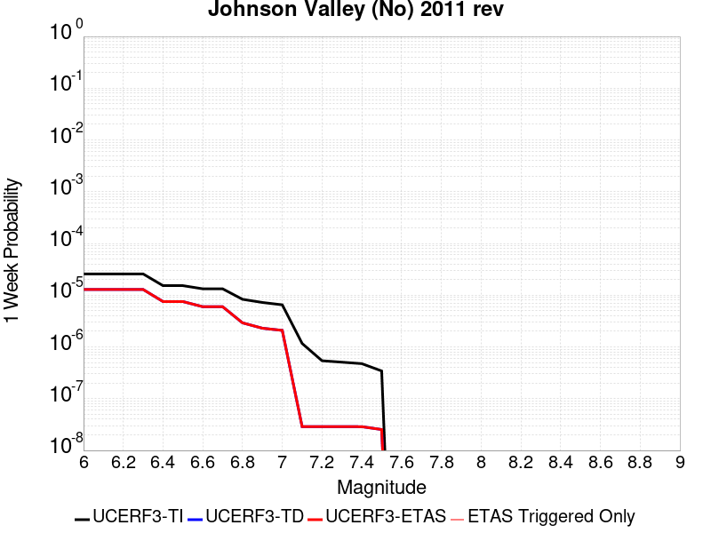 | 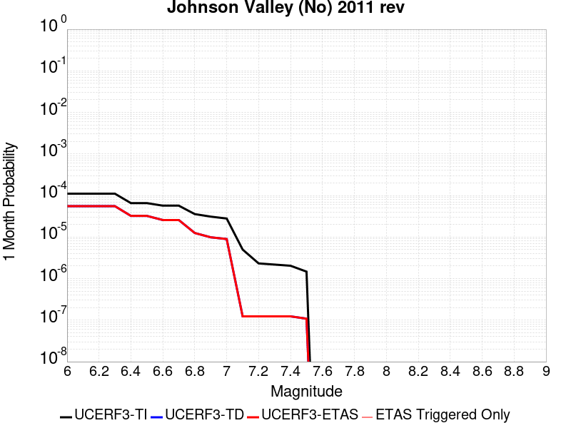 | 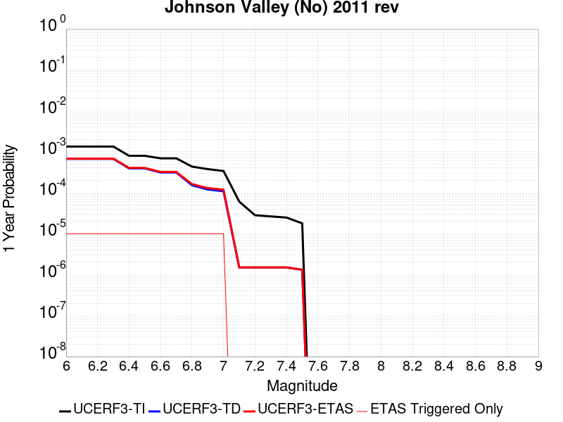 | 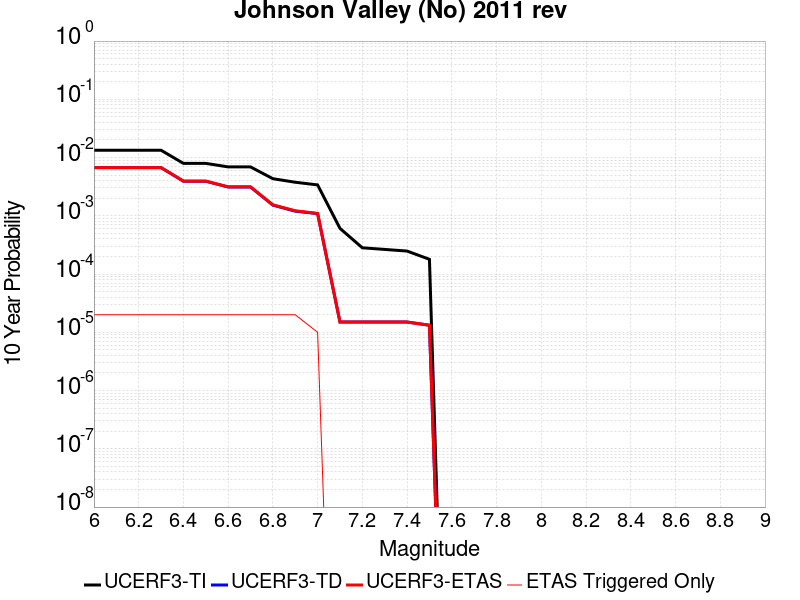 |

| Magnitude | 1 wk TI Prob | 1 wk TD Prob | 1 wk ETAS Prob | 1 wk ETAS/TD Gain | 1 wk ETAS Triggered Only | 1 mo TI Prob | 1 mo TD Prob | 1 mo ETAS Prob | 1 mo ETAS/TD Gain | 1 mo ETAS Triggered Only | 1 yr TI Prob | 1 yr TD Prob | 1 yr ETAS Prob | 1 yr ETAS/TD Gain | 1 yr ETAS Triggered Only | 10 yr TI Prob | 10 yr TD Prob | 10 yr ETAS Prob | 10 yr ETAS/TD Gain | 10 yr ETAS Triggered Only |
|-----|-----|-----|-----|-----|-----|-----|-----|-----|-----|-----|-----|-----|-----|-----|-----|-----|-----|-----|-----|-----|
| 6.0 | 2.577707E-5 | 1.29011505E-5 | 1.29011505E-5 | 1.0 | 0.0 | 1.1046848E-4 | 5.5289696E-5 | 5.5289696E-5 | 1.0 | 0.0 | 0.0013441239 | 6.729838E-4 | 6.8496616E-4 | 1.0178047 | 1.1990408E-5 | 0.013360229 | 0.006713367 | 0.006737187 | 1.0035481 | 2.3980816E-5 |
| 6.1 | 2.577707E-5 | 1.29011505E-5 | 1.29011505E-5 | 1.0 | 0.0 | 1.1046848E-4 | 5.5289696E-5 | 5.5289696E-5 | 1.0 | 0.0 | 0.0013441239 | 6.729838E-4 | 6.8496616E-4 | 1.0178047 | 1.1990408E-5 | 0.013360229 | 0.006713367 | 0.006737187 | 1.0035481 | 2.3980816E-5 |
| 6.2 | 2.577707E-5 | 1.29011505E-5 | 1.29011505E-5 | 1.0 | 0.0 | 1.1046848E-4 | 5.5289696E-5 | 5.5289696E-5 | 1.0 | 0.0 | 0.0013441239 | 6.729838E-4 | 6.8496616E-4 | 1.0178047 | 1.1990408E-5 | 0.013360229 | 0.006713367 | 0.006737187 | 1.0035481 | 2.3980816E-5 |
| 6.3 | 2.577707E-5 | 1.29011505E-5 | 1.29011505E-5 | 1.0 | 0.0 | 1.1046848E-4 | 5.5289696E-5 | 5.5289696E-5 | 1.0 | 0.0 | 0.0013441239 | 6.729838E-4 | 6.8496616E-4 | 1.0178047 | 1.1990408E-5 | 0.013360229 | 0.006713367 | 0.006737187 | 1.0035481 | 2.3980816E-5 |
| 6.4 | 1.5296591E-5 | 7.536876E-6 | 7.536876E-6 | 1.0 | 0.0 | 6.555518E-5 | 3.2300606E-5 | 3.2300606E-5 | 1.0 | 0.0 | 7.97842E-4 | 3.9320765E-4 | 4.0519334E-4 | 1.0304818 | 1.1990408E-5 | 0.007949836 | 0.0039269608 | 0.0039508473 | 1.0060828 | 2.3980816E-5 |
| 6.5 | 1.5296591E-5 | 7.536876E-6 | 7.536876E-6 | 1.0 | 0.0 | 6.555518E-5 | 3.2300606E-5 | 3.2300606E-5 | 1.0 | 0.0 | 7.97842E-4 | 3.9320765E-4 | 4.0519334E-4 | 1.0304818 | 1.1990408E-5 | 0.007949836 | 0.0039269608 | 0.0039508473 | 1.0060828 | 2.3980816E-5 |
| 6.6 | 1.3289383E-5 | 5.9918434E-6 | 5.9918434E-6 | 1.0 | 0.0 | 5.6953253E-5 | 2.5679172E-5 | 2.5679172E-5 | 1.0 | 0.0 | 6.9318525E-4 | 3.1261603E-4 | 3.246027E-4 | 1.0383431 | 1.1990408E-5 | 0.0069102696 | 0.0031234273 | 0.0031473332 | 1.0076537 | 2.3980816E-5 |
| 6.7 | 1.3289383E-5 | 5.9918434E-6 | 5.9918434E-6 | 1.0 | 0.0 | 5.6953253E-5 | 2.5679172E-5 | 2.5679172E-5 | 1.0 | 0.0 | 6.9318525E-4 | 3.1261603E-4 | 3.246027E-4 | 1.0383431 | 1.1990408E-5 | 0.0069102696 | 0.0031234273 | 0.0031473332 | 1.0076537 | 2.3980816E-5 |
| 6.8 | 8.330789E-6 | 2.9212572E-6 | 2.9212572E-6 | 1.0 | 0.0 | 3.570289E-5 | 1.2519647E-5 | 1.2519647E-5 | 1.0 | 0.0 | 4.34596E-4 | 1.5242174E-4 | 1.6441032E-4 | 1.078654 | 1.1990408E-5 | 0.0043374705 | 0.0015237319 | 0.0015476762 | 1.0157143 | 2.3980816E-5 |
| 6.9 | 7.2359003E-6 | 2.3013858E-6 | 2.3013858E-6 | 1.0 | 0.0 | 3.1010633E-5 | 9.863074E-6 | 9.863074E-6 | 1.0 | 0.0 | 3.7748902E-4 | 1.2008165E-4 | 1.3207062E-4 | 1.0998402 | 1.1990408E-5 | 0.0037684843 | 0.0012006905 | 0.0012246425 | 1.0199485 | 2.3980816E-5 |
| 7.0 | 6.5149957E-6 | 2.0885384E-6 | 2.0885384E-6 | 1.0 | 0.0 | 2.792111E-5 | 8.950878E-6 | 8.950878E-6 | 1.0 | 0.0 | 3.398865E-4 | 1.0897678E-4 | 1.2096589E-4 | 1.1100152 | 1.1990408E-5 | 0.003393671 | 0.0010897532 | 0.0011017306 | 1.0109909 | 1.1990408E-5 |
| 7.1 | 1.1662233E-6 | 2.8803857E-8 | 2.8803857E-8 | 1.0 | 0.0 | 4.9980904E-6 | 1.2344509E-7 | 1.2344509E-7 | 1.0 | 0.0 | 6.0850052E-5 | 1.5029432E-6 | 1.5029432E-6 | 1.0 | 0.0 | 6.083339E-4 | 1.5029346E-5 | 1.5029346E-5 | 1.0 | 0.0 |
| 7.2 | 5.413881E-7 | 2.8803857E-8 | 2.8803857E-8 | 1.0 | 0.0 | 2.3202326E-6 | 1.2344509E-7 | 1.2344509E-7 | 1.0 | 0.0 | 2.8248465E-5 | 1.5029432E-6 | 1.5029432E-6 | 1.0 | 0.0 | 2.8244875E-4 | 1.5029346E-5 | 1.5029346E-5 | 1.0 | 0.0 |
| 7.3 | 5.076821E-7 | 2.8803855E-8 | 2.8803855E-8 | 1.0 | 0.0 | 2.1757785E-6 | 1.2344509E-7 | 1.2344509E-7 | 1.0 | 0.0 | 2.648978E-5 | 1.5029432E-6 | 1.5029432E-6 | 1.0 | 0.0 | 2.6486625E-4 | 1.5029346E-5 | 1.5029346E-5 | 1.0 | 0.0 |
| 7.4 | 4.7568687E-7 | 2.8785777E-8 | 2.8785777E-8 | 1.0 | 0.0 | 2.0386565E-6 | 1.2336761E-7 | 1.2336761E-7 | 1.0 | 0.0 | 2.482036E-5 | 1.5019998E-6 | 1.5019998E-6 | 1.0 | 0.0 | 2.4817587E-4 | 1.5019913E-5 | 1.5019913E-5 | 1.0 | 0.0 |
| 7.5 | 3.435626E-7 | 2.535922E-8 | 2.535922E-8 | 1.0 | 0.0 | 1.4724103E-6 | 1.0868237E-7 | 1.0868237E-7 | 1.0 | 0.0 | 1.7926448E-5 | 1.3232072E-6 | 1.3232072E-6 | 1.0 | 0.0 | 1.7925001E-4 | 1.3232009E-5 | 1.3232009E-5 | 1.0 | 0.0 |

## Puente Hills
*[(top)](#table-of-contents)*

| 1 Week | 1 Month | 1 Year | 10 Year |
|-----|-----|-----|-----|
| 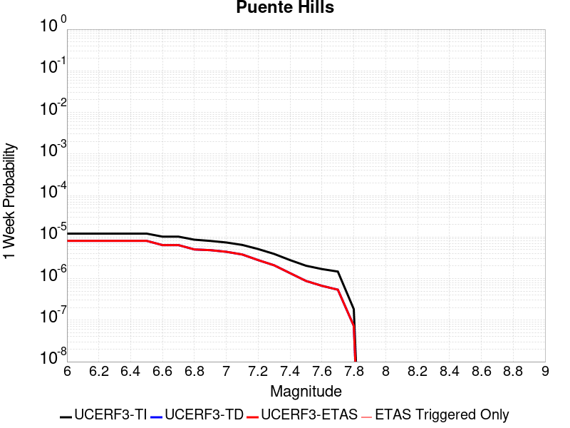 | 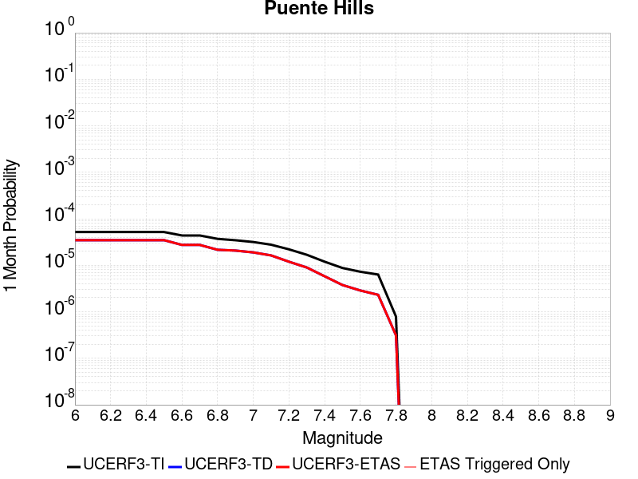 | 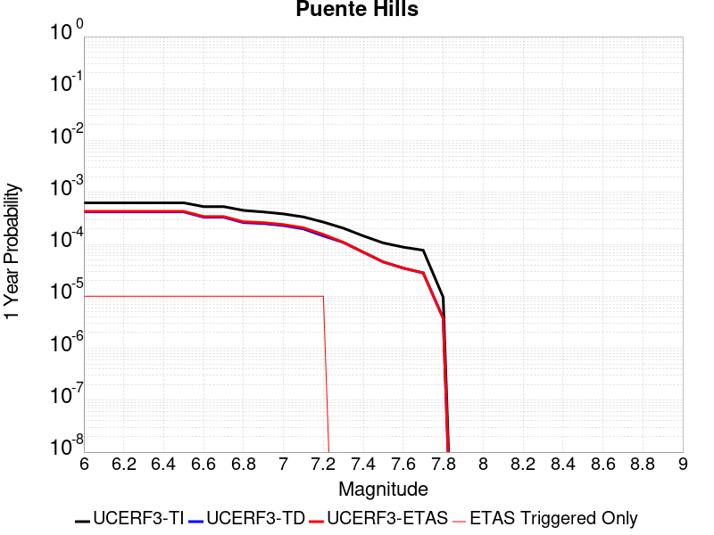 | 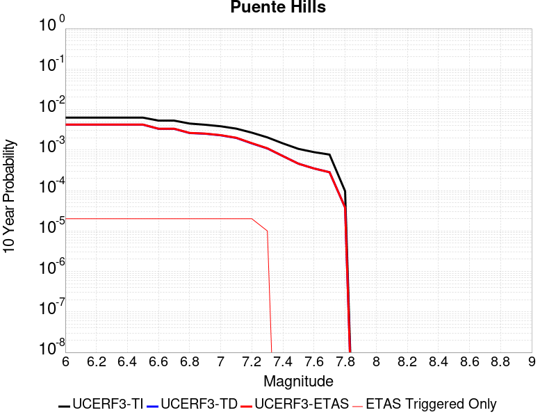 |

| Magnitude | 1 wk TI Prob | 1 wk TD Prob | 1 wk ETAS Prob | 1 wk ETAS/TD Gain | 1 wk ETAS Triggered Only | 1 mo TI Prob | 1 mo TD Prob | 1 mo ETAS Prob | 1 mo ETAS/TD Gain | 1 mo ETAS Triggered Only | 1 yr TI Prob | 1 yr TD Prob | 1 yr ETAS Prob | 1 yr ETAS/TD Gain | 1 yr ETAS Triggered Only | 10 yr TI Prob | 10 yr TD Prob | 10 yr ETAS Prob | 10 yr ETAS/TD Gain | 10 yr ETAS Triggered Only |
|-----|-----|-----|-----|-----|-----|-----|-----|-----|-----|-----|-----|-----|-----|-----|-----|-----|-----|-----|-----|-----|
| 6.0 | 1.2101656E-5 | 8.098785E-6 | 8.098785E-6 | 1.0 | 0.0 | 5.1863204E-5 | 3.4708646E-5 | 3.4708646E-5 | 1.0 | 0.0 | 6.312516E-4 | 4.2250147E-4 | 4.344868E-4 | 1.0283675 | 1.1990408E-5 | 0.0062946146 | 0.0042175422 | 0.004241422 | 1.005662 | 2.3980816E-5 |
| 6.1 | 1.2101656E-5 | 8.098785E-6 | 8.098785E-6 | 1.0 | 0.0 | 5.1863204E-5 | 3.4708646E-5 | 3.4708646E-5 | 1.0 | 0.0 | 6.312516E-4 | 4.2250147E-4 | 4.344868E-4 | 1.0283675 | 1.1990408E-5 | 0.0062946146 | 0.0042175422 | 0.004241422 | 1.005662 | 2.3980816E-5 |
| 6.2 | 1.2101656E-5 | 8.098785E-6 | 8.098785E-6 | 1.0 | 0.0 | 5.1863204E-5 | 3.4708646E-5 | 3.4708646E-5 | 1.0 | 0.0 | 6.312516E-4 | 4.2250147E-4 | 4.344868E-4 | 1.0283675 | 1.1990408E-5 | 0.0062946146 | 0.0042175422 | 0.004241422 | 1.005662 | 2.3980816E-5 |
| 6.3 | 1.2101656E-5 | 8.098785E-6 | 8.098785E-6 | 1.0 | 0.0 | 5.1863204E-5 | 3.4708646E-5 | 3.4708646E-5 | 1.0 | 0.0 | 6.312516E-4 | 4.2250147E-4 | 4.344868E-4 | 1.0283675 | 1.1990408E-5 | 0.0062946146 | 0.0042175422 | 0.004241422 | 1.005662 | 2.3980816E-5 |
| 6.4 | 1.2101656E-5 | 8.098785E-6 | 8.098785E-6 | 1.0 | 0.0 | 5.1863204E-5 | 3.4708646E-5 | 3.4708646E-5 | 1.0 | 0.0 | 6.312516E-4 | 4.2250147E-4 | 4.344868E-4 | 1.0283675 | 1.1990408E-5 | 0.0062946146 | 0.0042175422 | 0.004241422 | 1.005662 | 2.3980816E-5 |
| 6.5 | 1.2101656E-5 | 8.098785E-6 | 8.098785E-6 | 1.0 | 0.0 | 5.1863204E-5 | 3.4708646E-5 | 3.4708646E-5 | 1.0 | 0.0 | 6.312516E-4 | 4.2250147E-4 | 4.344868E-4 | 1.0283675 | 1.1990408E-5 | 0.0062946146 | 0.0042175422 | 0.004241422 | 1.005662 | 2.3980816E-5 |
| 6.6 | 1.0222488E-5 | 6.3993284E-6 | 6.3993284E-6 | 1.0 | 0.0 | 4.3809923E-5 | 2.742542E-5 | 2.742542E-5 | 1.0 | 0.0 | 5.332553E-4 | 3.3385577E-4 | 3.4584219E-4 | 1.035903 | 1.1990408E-5 | 0.0053197746 | 0.0033337874 | 0.0033576884 | 1.0071692 | 2.3980816E-5 |
| 6.7 | 1.0222488E-5 | 6.3993284E-6 | 6.3993284E-6 | 1.0 | 0.0 | 4.3809923E-5 | 2.742542E-5 | 2.742542E-5 | 1.0 | 0.0 | 5.332553E-4 | 3.3385577E-4 | 3.4584219E-4 | 1.035903 | 1.1990408E-5 | 0.0053197746 | 0.0033337874 | 0.0033576884 | 1.0071692 | 2.3980816E-5 |
| 6.8 | 8.6367845E-6 | 5.02838E-6 | 5.02838E-6 | 1.0 | 0.0 | 3.7014266E-5 | 2.1550026E-5 | 2.1550026E-5 | 1.0 | 0.0 | 4.505555E-4 | 2.6234053E-4 | 2.743278E-4 | 1.0456935 | 1.1990408E-5 | 0.004496431 | 0.0026203648 | 0.0026442828 | 1.0091277 | 2.3980816E-5 |
| 6.9 | 8.066481E-6 | 4.8362404E-6 | 4.8362404E-6 | 1.0 | 0.0 | 3.4570177E-5 | 2.0726584E-5 | 2.0726584E-5 | 1.0 | 0.0 | 4.2081063E-4 | 2.5231746E-4 | 2.6430484E-4 | 1.0475091 | 1.1990408E-5 | 0.0042001465 | 0.0025203635 | 0.002544284 | 1.0094908 | 2.3980816E-5 |
| 7.0 | 7.393828E-6 | 4.417414E-6 | 4.417414E-6 | 1.0 | 0.0 | 3.168745E-5 | 1.893164E-5 | 1.893164E-5 | 1.0 | 0.0 | 3.857264E-4 | 2.3046878E-4 | 2.4245643E-4 | 1.0520142 | 1.1990408E-5 | 0.0038505755 | 0.0023023433 | 0.0023262687 | 1.0103918 | 2.3980816E-5 |
| 7.1 | 6.4660953E-6 | 3.8045498E-6 | 3.8045498E-6 | 1.0 | 0.0 | 2.7711543E-5 | 1.6305114E-5 | 1.6305114E-5 | 1.0 | 0.0 | 3.373358E-4 | 1.9849703E-4 | 2.1048506E-4 | 1.060394 | 1.1990408E-5 | 0.0033682417 | 0.0019832333 | 0.0020071664 | 1.0120678 | 2.3980816E-5 |
| 7.2 | 5.143232E-6 | 2.7866233E-6 | 2.7866233E-6 | 1.0 | 0.0 | 2.2042237E-5 | 1.1942618E-5 | 1.1942618E-5 | 1.0 | 0.0 | 2.6833118E-4 | 1.4539176E-4 | 1.5738043E-4 | 1.0824577 | 1.1990408E-5 | 0.002680074 | 0.0014529761 | 0.0014769222 | 1.0164807 | 2.3980816E-5 |
| 7.3 | 3.928255E-6 | 2.0914442E-6 | 2.0914442E-6 | 1.0 | 0.0 | 1.683527E-5 | 8.963302E-6 | 8.963302E-6 | 1.0 | 0.0 | 2.0495013E-4 | 1.091228E-4 | 1.091228E-4 | 1.0 | 0.0 | 0.002047612 | 0.0010906989 | 0.0011026761 | 1.0109813 | 1.1990408E-5 |
| 7.4 | 2.7894434E-6 | 1.3547324E-6 | 1.3547324E-6 | 1.0 | 0.0 | 1.1954703E-5 | 5.805983E-6 | 5.805983E-6 | 1.0 | 0.0 | 1.4553878E-4 | 7.068559E-5 | 7.068559E-5 | 1.0 | 0.0 | 0.001454435 | 7.0663553E-4 | 7.0663553E-4 | 1.0 | 0.0 |
| 7.5 | 2.041735E-6 | 8.787759E-7 | 8.787759E-7 | 1.0 | 0.0 | 8.750263E-6 | 3.766177E-6 | 3.766177E-6 | 1.0 | 0.0 | 1.06529245E-4 | 4.5852277E-5 | 4.5852277E-5 | 1.0 | 0.0 | 0.0010647819 | 4.5843152E-4 | 4.5843152E-4 | 1.0 | 0.0 |
| 7.6 | 1.6959062E-6 | 6.699006E-7 | 6.699006E-7 | 1.0 | 0.0 | 7.268149E-6 | 2.8709997E-6 | 2.8709997E-6 | 1.0 | 0.0 | 8.848612E-5 | 3.495389E-5 | 3.495389E-5 | 1.0 | 0.0 | 8.84509E-4 | 3.494868E-4 | 3.494868E-4 | 1.0 | 0.0 |
| 7.7 | 1.4767965E-6 | 5.40793E-7 | 5.40793E-7 | 1.0 | 0.0 | 6.3291122E-6 | 2.3176822E-6 | 2.3176822E-6 | 1.0 | 0.0 | 7.705422E-5 | 2.8217442E-5 | 2.8217442E-5 | 1.0 | 0.0 | 7.702751E-4 | 2.8214118E-4 | 2.8214118E-4 | 1.0 | 0.0 |
| 7.8 | 1.8432911E-7 | 7.282394E-8 | 7.282394E-8 | 1.0 | 0.0 | 7.8998164E-7 | 3.1210257E-7 | 3.1210257E-7 | 1.0 | 0.0 | 9.617985E-6 | 3.7998457E-6 | 3.7998457E-6 | 1.0 | 0.0 | 9.617568E-5 | 3.7998132E-5 | 3.7998132E-5 | 1.0 | 0.0 |

## Clamshell-Sawpit
*[(top)](#table-of-contents)*

| 1 Week | 1 Month | 1 Year | 10 Year |
|-----|-----|-----|-----|
| 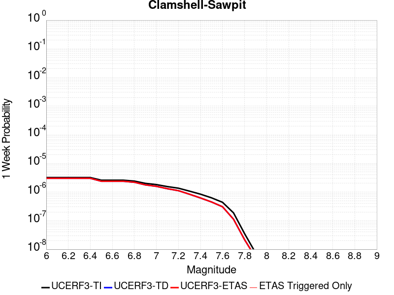 | 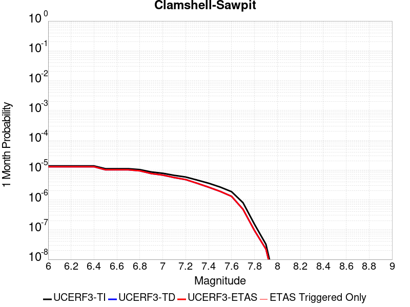 | 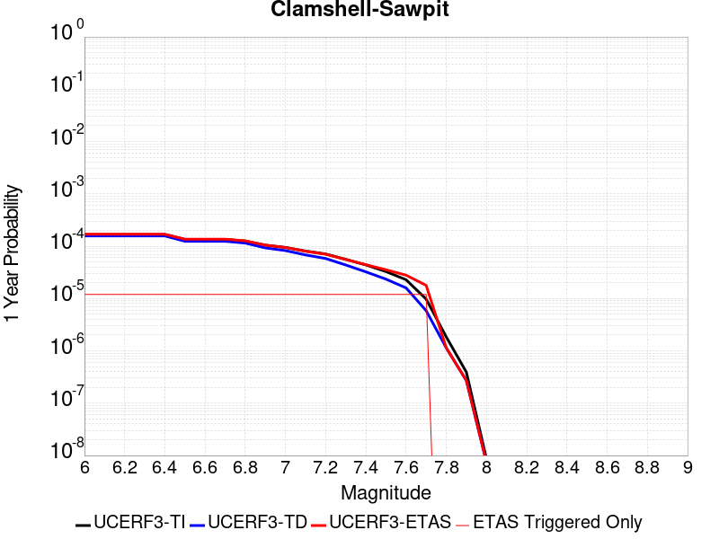 | 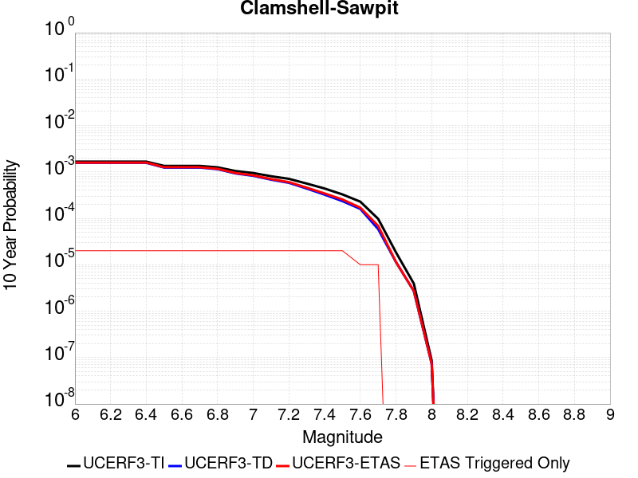 |

| Magnitude | 1 wk TI Prob | 1 wk TD Prob | 1 wk ETAS Prob | 1 wk ETAS/TD Gain | 1 wk ETAS Triggered Only | 1 mo TI Prob | 1 mo TD Prob | 1 mo ETAS Prob | 1 mo ETAS/TD Gain | 1 mo ETAS Triggered Only | 1 yr TI Prob | 1 yr TD Prob | 1 yr ETAS Prob | 1 yr ETAS/TD Gain | 1 yr ETAS Triggered Only | 10 yr TI Prob | 10 yr TD Prob | 10 yr ETAS Prob | 10 yr ETAS/TD Gain | 10 yr ETAS Triggered Only |
|-----|-----|-----|-----|-----|-----|-----|-----|-----|-----|-----|-----|-----|-----|-----|-----|-----|-----|-----|-----|-----|
| 6.0 | 3.202998E-6 | 3.0127826E-6 | 3.0127826E-6 | 1.0 | 0.0 | 1.3727062E-5 | 1.2911866E-5 | 1.2911866E-5 | 1.0 | 0.0 | 1.6711417E-4 | 1.5719143E-4 | 1.6917996E-4 | 1.076267 | 1.1990408E-5 | 0.0016698855 | 0.0015708818 | 0.001594825 | 1.0152419 | 2.3980816E-5 |
| 6.1 | 3.202998E-6 | 3.0127826E-6 | 3.0127826E-6 | 1.0 | 0.0 | 1.3727062E-5 | 1.2911866E-5 | 1.2911866E-5 | 1.0 | 0.0 | 1.6711417E-4 | 1.5719143E-4 | 1.6917996E-4 | 1.076267 | 1.1990408E-5 | 0.0016698855 | 0.0015708818 | 0.001594825 | 1.0152419 | 2.3980816E-5 |
| 6.2 | 3.202998E-6 | 3.0127826E-6 | 3.0127826E-6 | 1.0 | 0.0 | 1.3727062E-5 | 1.2911866E-5 | 1.2911866E-5 | 1.0 | 0.0 | 1.6711417E-4 | 1.5719143E-4 | 1.6917996E-4 | 1.076267 | 1.1990408E-5 | 0.0016698855 | 0.0015708818 | 0.001594825 | 1.0152419 | 2.3980816E-5 |
| 6.3 | 3.202998E-6 | 3.0127826E-6 | 3.0127826E-6 | 1.0 | 0.0 | 1.3727062E-5 | 1.2911866E-5 | 1.2911866E-5 | 1.0 | 0.0 | 1.6711417E-4 | 1.5719143E-4 | 1.6917996E-4 | 1.076267 | 1.1990408E-5 | 0.0016698855 | 0.0015708818 | 0.001594825 | 1.0152419 | 2.3980816E-5 |
| 6.4 | 3.202998E-6 | 3.0127826E-6 | 3.0127826E-6 | 1.0 | 0.0 | 1.3727062E-5 | 1.2911866E-5 | 1.2911866E-5 | 1.0 | 0.0 | 1.6711417E-4 | 1.5719143E-4 | 1.6917996E-4 | 1.076267 | 1.1990408E-5 | 0.0016698855 | 0.0015708818 | 0.001594825 | 1.0152419 | 2.3980816E-5 |
| 6.5 | 2.5862723E-6 | 2.380791E-6 | 2.380791E-6 | 1.0 | 0.0 | 1.1083977E-5 | 1.0203352E-5 | 1.0203352E-5 | 1.0 | 0.0 | 1.3493907E-4 | 1.2421903E-4 | 1.3620795E-4 | 1.0965143 | 1.1990408E-5 | 0.0013485716 | 0.0012415263 | 0.0012654774 | 1.0192916 | 2.3980816E-5 |
| 6.6 | 2.5862723E-6 | 2.380791E-6 | 2.380791E-6 | 1.0 | 0.0 | 1.1083977E-5 | 1.0203352E-5 | 1.0203352E-5 | 1.0 | 0.0 | 1.3493907E-4 | 1.2421903E-4 | 1.3620795E-4 | 1.0965143 | 1.1990408E-5 | 0.0013485716 | 0.0012415263 | 0.0012654774 | 1.0192916 | 2.3980816E-5 |
| 6.7 | 2.5862723E-6 | 2.380791E-6 | 2.380791E-6 | 1.0 | 0.0 | 1.1083977E-5 | 1.0203352E-5 | 1.0203352E-5 | 1.0 | 0.0 | 1.3493907E-4 | 1.2421903E-4 | 1.3620795E-4 | 1.0965143 | 1.1990408E-5 | 0.0013485716 | 0.0012415263 | 0.0012654774 | 1.0192916 | 2.3980816E-5 |
| 6.8 | 2.4098806E-6 | 2.197746E-6 | 2.197746E-6 | 1.0 | 0.0 | 1.0328019E-5 | 9.418879E-6 | 9.418879E-6 | 1.0 | 0.0 | 1.2573638E-4 | 1.14669085E-4 | 1.2665812E-4 | 1.1045533 | 1.1990408E-5 | 0.0012566525 | 0.0011461257 | 0.0011700791 | 1.0208994 | 2.3980816E-5 |
| 6.9 | 2.0073985E-6 | 1.7784376E-6 | 1.7784376E-6 | 1.0 | 0.0 | 8.603109E-6 | 7.621854E-6 | 7.621854E-6 | 1.0 | 0.0 | 1.0473781E-4 | 9.2792245E-5 | 1.0478154E-4 | 1.1292058 | 1.1990408E-5 | 0.0010468846 | 9.275468E-4 | 9.5150544E-4 | 1.02583 | 2.3980816E-5 |
| 7.0 | 1.8166766E-6 | 1.5807215E-6 | 1.5807215E-6 | 1.0 | 0.0 | 7.785734E-6 | 6.7745036E-6 | 6.7745036E-6 | 1.0 | 0.0 | 9.478718E-5 | 8.247656E-5 | 9.446598E-5 | 1.1453676 | 1.1990408E-5 | 9.4746763E-4 | 8.2446955E-4 | 8.484306E-4 | 1.0290624 | 2.3980816E-5 |
| 7.1 | 1.5471421E-6 | 1.3053062E-6 | 1.3053062E-6 | 1.0 | 0.0 | 6.6305925E-6 | 5.5941578E-6 | 5.5941578E-6 | 1.0 | 0.0 | 8.072447E-5 | 6.81068E-5 | 8.009639E-5 | 1.176041 | 1.1990408E-5 | 8.0695155E-4 | 6.8086473E-4 | 7.0482923E-4 | 1.0351971 | 2.3980816E-5 |
| 7.2 | 1.3608037E-6 | 1.1153531E-6 | 1.1153531E-6 | 1.0 | 0.0 | 5.8320024E-6 | 4.7800763E-6 | 4.7800763E-6 | 1.0 | 0.0 | 7.1002316E-5 | 5.8195925E-5 | 7.018563E-5 | 1.2060232 | 1.1990408E-5 | 7.097964E-4 | 5.818115E-4 | 6.057783E-4 | 1.0411935 | 2.3980816E-5 |
| 7.3 | 1.0749634E-6 | 8.3843213E-7 | 8.3843213E-7 | 1.0 | 0.0 | 4.6069777E-6 | 3.5932758E-6 | 3.5932758E-6 | 1.0 | 0.0 | 5.608851E-5 | 4.374728E-5 | 5.5737164E-5 | 1.2740715 | 1.1990408E-5 | 5.6074356E-4 | 4.3738954E-4 | 4.6135986E-4 | 1.0548031 | 2.3980816E-5 |
| 7.4 | 8.416856E-7 | 6.2000976E-7 | 6.2000976E-7 | 1.0 | 0.0 | 3.607219E-6 | 2.657182E-6 | 2.657182E-6 | 1.0 | 0.0 | 4.3917007E-5 | 3.235073E-5 | 4.4340748E-5 | 1.370626 | 1.1990408E-5 | 4.390833E-4 | 3.2346218E-4 | 3.4743524E-4 | 1.074114 | 2.3980816E-5 |
| 7.5 | 6.2779594E-7 | 4.4969224E-7 | 4.4969224E-7 | 1.0 | 0.0 | 2.6905511E-6 | 1.927251E-6 | 1.927251E-6 | 1.0 | 0.0 | 3.275697E-5 | 2.3464048E-5 | 3.5454173E-5 | 1.5109999 | 1.1990408E-5 | 3.275214E-4 | 2.3461759E-4 | 2.5859277E-4 | 1.1021883 | 2.3980816E-5 |
| 7.6 | 4.3822078E-7 | 3.0595675E-7 | 3.0595675E-7 | 1.0 | 0.0 | 1.8780877E-6 | 1.3112426E-6 | 1.3112426E-6 | 1.0 | 0.0 | 2.2865479E-5 | 1.5964277E-5 | 2.7954493E-5 | 1.7510654 | 1.1990408E-5 | 2.2863125E-4 | 1.5963285E-4 | 1.7162134E-4 | 1.0751004 | 1.1990408E-5 |
| 7.7 | 1.8704569E-7 | 1.1238066E-7 | 1.1238066E-7 | 1.0 | 0.0 | 8.0162414E-7 | 4.8163133E-7 | 4.8163133E-7 | 1.0 | 0.0 | 9.75973E-6 | 5.863846E-6 | 1.7854183E-5 | 3.0447905 | 1.1990408E-5 | 9.7593016E-5 | 5.863698E-5 | 7.062668E-5 | 1.2044735 | 1.1990408E-5 |
| 7.8 | 3.5378733E-8 | 2.1838439E-8 | 2.1838439E-8 | 1.0 | 0.0 | 1.5162313E-7 | 9.359331E-8 | 9.359331E-8 | 1.0 | 0.0 | 1.84601E-6 | 1.139498E-6 | 1.139498E-6 | 1.0 | 0.0 | 1.8459947E-5 | 1.1394924E-5 | 1.1394924E-5 | 1.0 | 0.0 |
| 7.9 | 7.504945E-9 | 5.1920908E-9 | 5.1920908E-9 | 1.0 | 0.0 | 3.2164053E-8 | 2.2251818E-8 | 2.2251818E-8 | 1.0 | 0.0 | 3.9159727E-7 | 2.7091585E-7 | 2.7091585E-7 | 1.0 | 0.0 | 3.915966E-6 | 2.709156E-6 | 2.709156E-6 | 1.0 | 0.0 |
| 8.0 | 1.6554036E-10 | 1.4180812E-10 | 1.4180812E-10 | 1.0 | 0.0 | 7.0945894E-10 | 6.077491E-10 | 6.077491E-10 | 1.0 | 0.0 | 8.637662E-9 | 7.3993442E-9 | 7.3993442E-9 | 1.0 | 0.0 | 8.6376616E-8 | 7.399344E-8 | 7.399344E-8 | 1.0 | 0.0 |

## Simi-Santa Rosa
*[(top)](#table-of-contents)*

| 1 Week | 1 Month | 1 Year | 10 Year |
|-----|-----|-----|-----|
|  | 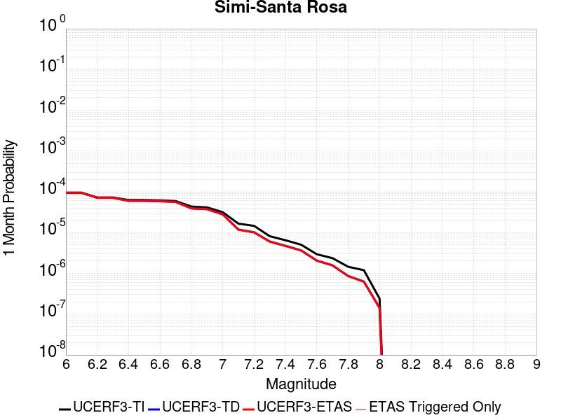 | 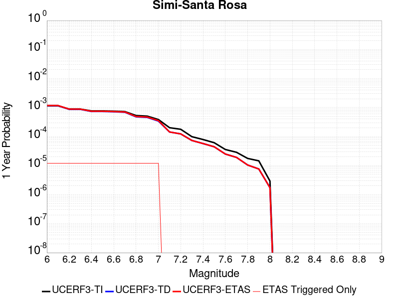 |  |

| Magnitude | 1 wk TI Prob | 1 wk TD Prob | 1 wk ETAS Prob | 1 wk ETAS/TD Gain | 1 wk ETAS Triggered Only | 1 mo TI Prob | 1 mo TD Prob | 1 mo ETAS Prob | 1 mo ETAS/TD Gain | 1 mo ETAS Triggered Only | 1 yr TI Prob | 1 yr TD Prob | 1 yr ETAS Prob | 1 yr ETAS/TD Gain | 1 yr ETAS Triggered Only | 10 yr TI Prob | 10 yr TD Prob | 10 yr ETAS Prob | 10 yr ETAS/TD Gain | 10 yr ETAS Triggered Only |
|-----|-----|-----|-----|-----|-----|-----|-----|-----|-----|-----|-----|-----|-----|-----|-----|-----|-----|-----|-----|-----|
| 6.0 | 2.198912E-5 | 2.2275886E-5 | 2.2275886E-5 | 1.0 | 0.0 | 9.4235686E-5 | 9.5464835E-5 | 9.5464835E-5 | 1.0 | 0.0 | 0.0011467156 | 0.0011617085 | 0.001173685 | 1.0103093 | 1.1990408E-5 | 0.011408163 | 0.011560804 | 0.011584507 | 1.0020503 | 2.3980816E-5 |
| 6.1 | 2.198912E-5 | 2.2275886E-5 | 2.2275886E-5 | 1.0 | 0.0 | 9.4235686E-5 | 9.5464835E-5 | 9.5464835E-5 | 1.0 | 0.0 | 0.0011467156 | 0.0011617085 | 0.001173685 | 1.0103093 | 1.1990408E-5 | 0.011408163 | 0.011560804 | 0.011584507 | 1.0020503 | 2.3980816E-5 |
| 6.2 | 1.69983E-5 | 1.6668911E-5 | 1.6668911E-5 | 1.0 | 0.0 | 7.284782E-5 | 7.14364E-5 | 7.14364E-5 | 1.0 | 0.0 | 8.865613E-4 | 8.694203E-4 | 8.8140025E-4 | 1.0137793 | 1.1990408E-5 | 0.008830327 | 0.0086631095 | 0.008686882 | 1.0027442 | 2.3980816E-5 |
| 6.3 | 1.69983E-5 | 1.6668911E-5 | 1.6668911E-5 | 1.0 | 0.0 | 7.284782E-5 | 7.14364E-5 | 7.14364E-5 | 1.0 | 0.0 | 8.865613E-4 | 8.694203E-4 | 8.8140025E-4 | 1.0137793 | 1.1990408E-5 | 0.008830327 | 0.0086631095 | 0.008686882 | 1.0027442 | 2.3980816E-5 |
| 6.4 | 1.4666188E-5 | 1.4052852E-5 | 1.4052852E-5 | 1.0 | 0.0 | 6.285358E-5 | 6.022526E-5 | 6.022526E-5 | 1.0 | 0.0 | 7.6497364E-4 | 7.330208E-4 | 7.4500235E-4 | 1.0163455 | 1.1990408E-5 | 0.0076234564 | 0.0073085045 | 0.00733231 | 1.0032573 | 2.3980816E-5 |
| 6.5 | 1.4666188E-5 | 1.4052852E-5 | 1.4052852E-5 | 1.0 | 0.0 | 6.285358E-5 | 6.022526E-5 | 6.022526E-5 | 1.0 | 0.0 | 7.6497364E-4 | 7.330208E-4 | 7.4500235E-4 | 1.0163455 | 1.1990408E-5 | 0.0076234564 | 0.0073085045 | 0.00733231 | 1.0032573 | 2.3980816E-5 |
| 6.6 | 1.4377586E-5 | 1.3729887E-5 | 1.3729887E-5 | 1.0 | 0.0 | 6.1616774E-5 | 5.8841186E-5 | 5.8841186E-5 | 1.0 | 0.0 | 7.4992597E-4 | 7.1618083E-4 | 7.2816265E-4 | 1.0167302 | 1.1990408E-5 | 0.007474003 | 0.007141196 | 0.007165006 | 1.0033342 | 2.3980816E-5 |
| 6.7 | 1.3881404E-5 | 1.3207847E-5 | 1.3207847E-5 | 1.0 | 0.0 | 5.9490372E-5 | 5.6603967E-5 | 5.6603967E-5 | 1.0 | 0.0 | 7.240546E-4 | 6.889601E-4 | 7.0094224E-4 | 1.0173917 | 1.1990408E-5 | 0.007217 | 0.0068706917 | 0.0068945074 | 1.0034664 | 2.3980816E-5 |
| 6.8 | 1.0176516E-5 | 9.154378E-6 | 9.154378E-6 | 1.0 | 0.0 | 4.3612912E-5 | 3.9232553E-5 | 3.9232553E-5 | 1.0 | 0.0 | 5.308578E-4 | 4.7756822E-4 | 4.895529E-4 | 1.0250952 | 1.1990408E-5 | 0.0052959146 | 0.004767053 | 0.004790919 | 1.0050066 | 2.3980816E-5 |
| 6.9 | 9.699797E-6 | 8.7749395E-6 | 8.7749395E-6 | 1.0 | 0.0 | 4.15699E-5 | 3.7606434E-5 | 3.7606434E-5 | 1.0 | 0.0 | 5.05996E-4 | 4.5777857E-4 | 4.697635E-4 | 1.0261806 | 1.1990408E-5 | 0.005048454 | 0.004569974 | 0.004593845 | 1.0052235 | 2.3980816E-5 |
| 7.0 | 7.4049476E-6 | 6.559509E-6 | 6.559509E-6 | 1.0 | 0.0 | 3.1735104E-5 | 2.811195E-5 | 2.811195E-5 | 1.0 | 0.0 | 3.8630638E-4 | 3.422219E-4 | 3.542082E-4 | 1.035025 | 1.1990408E-5 | 0.0038563553 | 0.0034181913 | 0.0034420902 | 1.0069916 | 2.3980816E-5 |
| 7.1 | 3.873439E-6 | 2.759614E-6 | 2.759614E-6 | 1.0 | 0.0 | 1.6600346E-5 | 1.1826865E-5 | 1.1826865E-5 | 1.0 | 0.0 | 2.0209046E-4 | 1.439828E-4 | 1.439828E-4 | 1.0 | 0.0 | 0.0020190678 | 0.0014389188 | 0.0014508918 | 1.0083209 | 1.1990408E-5 |
| 7.2 | 3.417706E-6 | 2.3677471E-6 | 2.3677471E-6 | 1.0 | 0.0 | 1.4647229E-5 | 1.014745E-5 | 1.014745E-5 | 1.0 | 0.0 | 1.7831543E-4 | 1.2353843E-4 | 1.2353843E-4 | 1.0 | 0.0 | 0.0017817242 | 0.0012347198 | 0.0012466954 | 1.009699 | 1.1990408E-5 |
| 7.3 | 1.90225E-6 | 1.4074596E-6 | 1.4074596E-6 | 1.0 | 0.0 | 8.152474E-6 | 6.0319558E-6 | 6.0319558E-6 | 1.0 | 0.0 | 9.9251854E-5 | 7.343661E-5 | 7.343661E-5 | 1.0 | 0.0 | 9.920754E-4 | 7.341257E-4 | 7.461073E-4 | 1.016321 | 1.1990408E-5 |
| 7.4 | 1.5170556E-6 | 1.1025584E-6 | 1.1025584E-6 | 1.0 | 0.0 | 6.5016507E-6 | 4.7252415E-6 | 4.7252415E-6 | 1.0 | 0.0 | 7.915472E-5 | 5.752831E-5 | 5.752831E-5 | 1.0 | 0.0 | 7.9126534E-4 | 5.751353E-4 | 5.871188E-4 | 1.020836 | 1.1990408E-5 |
| 7.5 | 1.178732E-6 | 8.5358926E-7 | 8.5358926E-7 | 1.0 | 0.0 | 5.0516987E-6 | 3.6582346E-6 | 3.6582346E-6 | 1.0 | 0.0 | 6.1502695E-5 | 4.4538105E-5 | 4.4538105E-5 | 1.0 | 0.0 | 6.148568E-4 | 4.4529274E-4 | 4.572778E-4 | 1.0269151 | 1.1990408E-5 |
| 7.6 | 6.8722386E-7 | 4.793958E-7 | 4.793958E-7 | 1.0 | 0.0 | 2.9452417E-6 | 2.0545517E-6 | 2.0545517E-6 | 1.0 | 0.0 | 3.5857727E-5 | 2.5013882E-5 | 2.5013882E-5 | 1.0 | 0.0 | 3.5851944E-4 | 2.5011078E-4 | 2.5011078E-4 | 1.0 | 0.0 |
| 7.7 | 5.5126515E-7 | 3.673869E-7 | 3.673869E-7 | 1.0 | 0.0 | 2.3625628E-6 | 1.5745143E-6 | 1.5745143E-6 | 1.0 | 0.0 | 2.8763823E-5 | 1.9169544E-5 | 1.9169544E-5 | 1.0 | 0.0 | 2.87601E-4 | 1.91679E-4 | 1.91679E-4 | 1.0 | 0.0 |
| 7.8 | 3.3860243E-7 | 2.0081488E-7 | 2.0081488E-7 | 1.0 | 0.0 | 1.4511525E-6 | 8.6063494E-7 | 8.6063494E-7 | 1.0 | 0.0 | 1.7667637E-5 | 1.047818E-5 | 1.047818E-5 | 1.0 | 0.0 | 1.7666233E-4 | 1.0477692E-4 | 1.0477692E-4 | 1.0 | 0.0 |
| 7.9 | 2.7955386E-7 | 1.4654502E-7 | 1.4654502E-7 | 1.0 | 0.0 | 1.1980875E-6 | 6.280499E-7 | 6.280499E-7 | 1.0 | 0.0 | 1.4586617E-5 | 7.646482E-6 | 7.646482E-6 | 1.0 | 0.0 | 1.458566E-4 | 7.646223E-5 | 7.646223E-5 | 1.0 | 0.0 |
| 8.0 | 5.6259015E-8 | 3.3357086E-8 | 3.3357086E-8 | 1.0 | 0.0 | 2.4111003E-7 | 1.4295894E-7 | 1.4295894E-7 | 1.0 | 0.0 | 2.9355108E-6 | 1.7405239E-6 | 1.7405239E-6 | 1.0 | 0.0 | 2.935472E-5 | 1.7405117E-5 | 1.7405117E-5 | 1.0 | 0.0 |

## Hosgri (Extension)
*[(top)](#table-of-contents)*

| 1 Week | 1 Month | 1 Year | 10 Year |
|-----|-----|-----|-----|
|  | 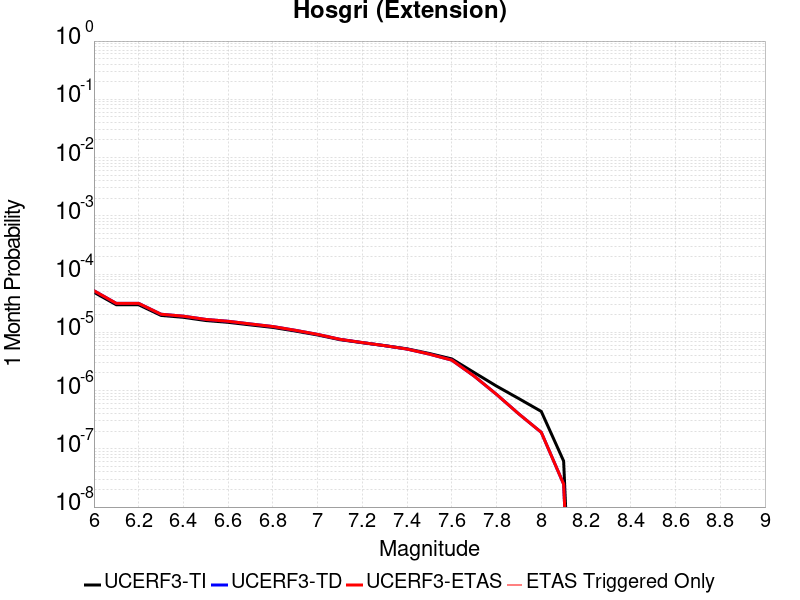 | 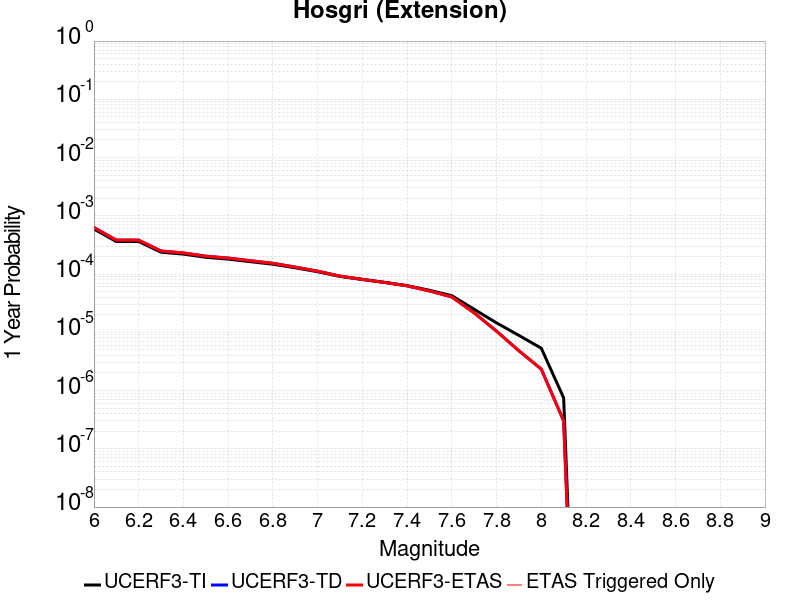 | 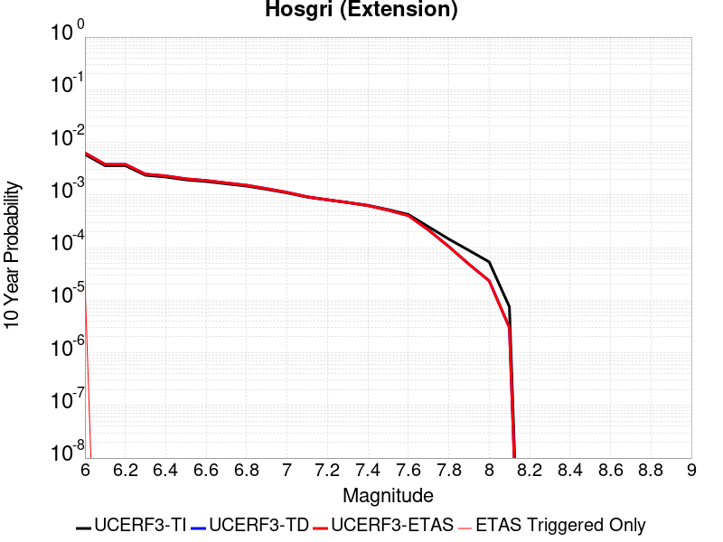 |

| Magnitude | 1 wk TI Prob | 1 wk TD Prob | 1 wk ETAS Prob | 1 wk ETAS/TD Gain | 1 wk ETAS Triggered Only | 1 mo TI Prob | 1 mo TD Prob | 1 mo ETAS Prob | 1 mo ETAS/TD Gain | 1 mo ETAS Triggered Only | 1 yr TI Prob | 1 yr TD Prob | 1 yr ETAS Prob | 1 yr ETAS/TD Gain | 1 yr ETAS Triggered Only | 10 yr TI Prob | 10 yr TD Prob | 10 yr ETAS Prob | 10 yr ETAS/TD Gain | 10 yr ETAS Triggered Only |
|-----|-----|-----|-----|-----|-----|-----|-----|-----|-----|-----|-----|-----|-----|-----|-----|-----|-----|-----|-----|-----|
| 6.0 | 1.1369135E-5 | 1.2083198E-5 | 1.2083198E-5 | 1.0 | 0.0 | 4.8723956E-5 | 5.1784238E-5 | 5.1784238E-5 | 1.0 | 0.0 | 5.9305265E-4 | 6.303134E-4 | 6.303134E-4 | 1.0 | 0.0 | 0.005914725 | 0.0062875054 | 0.0063113356 | 1.00379 | 2.3980816E-5 |
| 6.1 | 6.934979E-6 | 7.3246356E-6 | 7.3246356E-6 | 1.0 | 0.0 | 2.9721E-5 | 3.139094E-5 | 3.139094E-5 | 1.0 | 0.0 | 3.617931E-4 | 3.8212183E-4 | 3.8212183E-4 | 1.0 | 0.0 | 0.0036120464 | 0.0038150605 | 0.0038150605 | 1.0 | 0.0 |
| 6.2 | 6.934979E-6 | 7.3246356E-6 | 7.3246356E-6 | 1.0 | 0.0 | 2.9721E-5 | 3.139094E-5 | 3.139094E-5 | 1.0 | 0.0 | 3.617931E-4 | 3.8212183E-4 | 3.8212183E-4 | 1.0 | 0.0 | 0.0036120464 | 0.0038150605 | 0.0038150605 | 1.0 | 0.0 |
| 6.3 | 4.5484676E-6 | 4.769387E-6 | 4.769387E-6 | 1.0 | 0.0 | 1.9493287E-5 | 2.0440071E-5 | 2.0440071E-5 | 1.0 | 0.0 | 2.3730492E-4 | 2.4882986E-4 | 2.4882986E-4 | 1.0 | 0.0 | 0.0023705168 | 0.0024855551 | 0.0024855551 | 1.0 | 0.0 |
| 6.4 | 4.218095E-6 | 4.416915E-6 | 4.416915E-6 | 1.0 | 0.0 | 1.8077424E-5 | 1.89295E-5 | 1.89295E-5 | 1.0 | 0.0 | 2.2007042E-4 | 2.3044262E-4 | 2.3044262E-4 | 1.0 | 0.0 | 0.002198526 | 0.0023020701 | 0.0023020701 | 1.0 | 0.0 |
| 6.5 | 3.717374E-6 | 3.8839266E-6 | 3.8839266E-6 | 1.0 | 0.0 | 1.5931506E-5 | 1.6645294E-5 | 1.6645294E-5 | 1.0 | 0.0 | 1.9394881E-4 | 2.0263779E-4 | 2.0263779E-4 | 1.0 | 0.0 | 0.0019377962 | 0.002024549 | 0.002024549 | 1.0 | 0.0 |
| 6.6 | 3.4605036E-6 | 3.6083522E-6 | 3.6083522E-6 | 1.0 | 0.0 | 1.4830645E-5 | 1.5464277E-5 | 1.5464277E-5 | 1.0 | 0.0 | 1.8054814E-4 | 1.8826143E-4 | 1.8826143E-4 | 1.0 | 0.0 | 0.0018040152 | 0.0018810342 | 0.0018810342 | 1.0 | 0.0 |
| 6.7 | 3.123439E-6 | 3.2466114E-6 | 3.2466114E-6 | 1.0 | 0.0 | 1.33860985E-5 | 1.3913976E-5 | 1.3913976E-5 | 1.0 | 0.0 | 1.6296357E-4 | 1.6938959E-4 | 1.6938959E-4 | 1.0 | 0.0 | 0.001628441 | 0.0016926157 | 0.0016926157 | 1.0 | 0.0 |
| 6.8 | 2.8290783E-6 | 2.93058E-6 | 2.93058E-6 | 1.0 | 0.0 | 1.2124565E-5 | 1.2559569E-5 | 1.2559569E-5 | 1.0 | 0.0 | 1.4760658E-4 | 1.529021E-4 | 1.529021E-4 | 1.0 | 0.0 | 0.0014750857 | 0.0015279776 | 0.0015279776 | 1.0 | 0.0 |
| 6.9 | 2.454112E-6 | 2.5283553E-6 | 2.5283553E-6 | 1.0 | 0.0 | 1.0517581E-5 | 1.08357635E-5 | 1.08357635E-5 | 1.0 | 0.0 | 1.2804402E-4 | 1.3191749E-4 | 1.3191749E-4 | 1.0 | 0.0 | 0.0012797028 | 0.001318398 | 0.001318398 | 1.0 | 0.0 |
| 7.0 | 2.1008145E-6 | 2.1499025E-6 | 2.1499025E-6 | 1.0 | 0.0 | 9.003459E-6 | 9.213836E-6 | 9.213836E-6 | 1.0 | 0.0 | 1.096116E-4 | 1.1217271E-4 | 1.1217271E-4 | 1.0 | 0.0 | 0.0010955755 | 0.0011211646 | 0.0011211646 | 1.0 | 0.0 |
| 7.1 | 1.744384E-6 | 1.7686639E-6 | 1.7686639E-6 | 1.0 | 0.0 | 7.47591E-6 | 7.579966E-6 | 7.579966E-6 | 1.0 | 0.0 | 9.1015405E-5 | 9.22822E-5 | 9.22822E-5 | 1.0 | 0.0 | 9.097813E-4 | 9.224405E-4 | 9.224405E-4 | 1.0 | 0.0 |
| 7.2 | 1.5456587E-6 | 1.556315E-6 | 1.556315E-6 | 1.0 | 0.0 | 6.6242346E-6 | 6.6699045E-6 | 6.6699045E-6 | 1.0 | 0.0 | 8.064707E-5 | 8.120307E-5 | 8.120307E-5 | 1.0 | 0.0 | 8.0617814E-4 | 8.117353E-4 | 8.117353E-4 | 1.0 | 0.0 |
| 7.3 | 1.3775123E-6 | 1.3766333E-6 | 1.3766333E-6 | 1.0 | 0.0 | 5.9036106E-6 | 5.899844E-6 | 5.899844E-6 | 1.0 | 0.0 | 7.187409E-5 | 7.182824E-5 | 7.182824E-5 | 1.0 | 0.0 | 7.185085E-4 | 7.180513E-4 | 7.180513E-4 | 1.0 | 0.0 |
| 7.4 | 1.214491E-6 | 1.2023696E-6 | 1.2023696E-6 | 1.0 | 0.0 | 5.2049513E-6 | 5.1530023E-6 | 5.1530023E-6 | 1.0 | 0.0 | 6.336844E-5 | 6.2736006E-5 | 6.2736006E-5 | 1.0 | 0.0 | 6.335037E-4 | 6.2718376E-4 | 6.2718376E-4 | 1.0 | 0.0 |
| 7.5 | 1.0101123E-6 | 9.842462E-7 | 9.842462E-7 | 1.0 | 0.0 | 4.3290456E-6 | 4.218191E-6 | 4.218191E-6 | 1.0 | 0.0 | 5.2704854E-5 | 5.135527E-5 | 5.135527E-5 | 1.0 | 0.0 | 5.2692357E-4 | 5.1343464E-4 | 5.1343464E-4 | 1.0 | 0.0 |
| 7.6 | 8.1558215E-7 | 7.7661633E-7 | 7.7661633E-7 | 1.0 | 0.0 | 3.4953473E-6 | 3.3283516E-6 | 3.3283516E-6 | 1.0 | 0.0 | 4.255502E-5 | 4.0521933E-5 | 4.0521933E-5 | 1.0 | 0.0 | 4.2546875E-4 | 4.0514587E-4 | 4.0514587E-4 | 1.0 | 0.0 |
| 7.7 | 4.757816E-7 | 4.1310525E-7 | 4.1310525E-7 | 1.0 | 0.0 | 2.0390623E-6 | 1.7704498E-6 | 1.7704498E-6 | 1.0 | 0.0 | 2.4825302E-5 | 2.1555015E-5 | 2.1555015E-5 | 1.0 | 0.0 | 2.482253E-4 | 2.1552936E-4 | 2.1552936E-4 | 1.0 | 0.0 |
| 7.8 | 2.782787E-7 | 2.0049143E-7 | 2.0049143E-7 | 1.0 | 0.0 | 1.1926223E-6 | 8.5924864E-7 | 8.5924864E-7 | 1.0 | 0.0 | 1.452008E-5 | 1.0461303E-5 | 1.0461303E-5 | 1.0 | 0.0 | 1.4519131E-4 | 1.0460813E-4 | 1.0460813E-4 | 1.0 | 0.0 |
| 7.9 | 1.6948086E-7 | 9.2455664E-8 | 9.2455664E-8 | 1.0 | 0.0 | 7.2634634E-7 | 3.9623848E-7 | 3.9623848E-7 | 1.0 | 0.0 | 8.843231E-6 | 4.824193E-6 | 4.824193E-6 | 1.0 | 0.0 | 8.842879E-5 | 4.824089E-5 | 4.824089E-5 | 1.0 | 0.0 |
| 8.0 | 1.0225492E-7 | 4.4748486E-8 | 4.4748486E-8 | 1.0 | 0.0 | 4.382353E-7 | 1.9177921E-7 | 1.9177921E-7 | 1.0 | 0.0 | 5.335502E-6 | 2.3349094E-6 | 2.3349094E-6 | 1.0 | 0.0 | 5.335374E-5 | 2.3348852E-5 | 2.3348852E-5 | 1.0 | 0.0 |
| 8.1 | 1.43711345E-8 | 5.789212E-9 | 5.789212E-9 | 1.0 | 0.0 | 6.1590576E-8 | 2.4810909E-8 | 2.4810909E-8 | 1.0 | 0.0 | 7.4986497E-7 | 3.0207278E-7 | 3.0207278E-7 | 1.0 | 0.0 | 7.4986247E-6 | 3.0207243E-6 | 3.0207243E-6 | 1.0 | 0.0 |

## San Diego Trough south
*[(top)](#table-of-contents)*

| 1 Week | 1 Month | 1 Year | 10 Year |
|-----|-----|-----|-----|
| 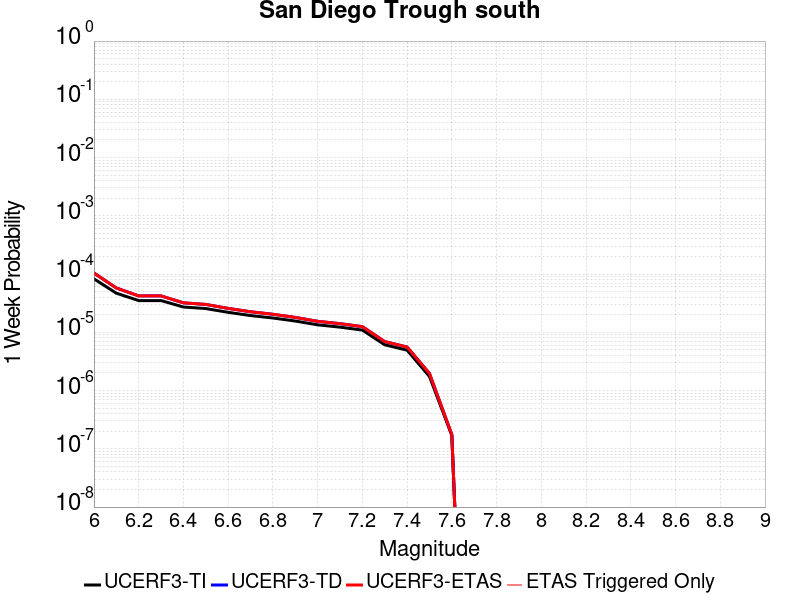 | 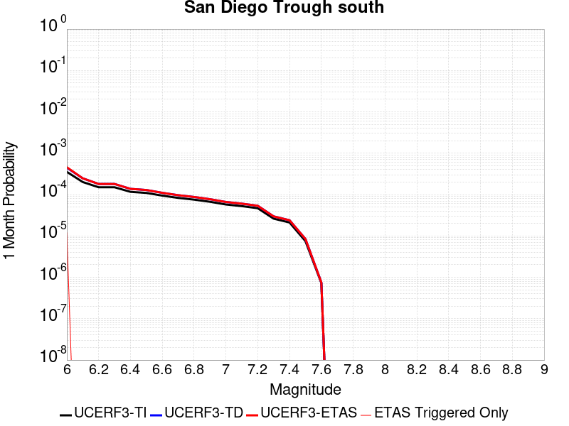 | 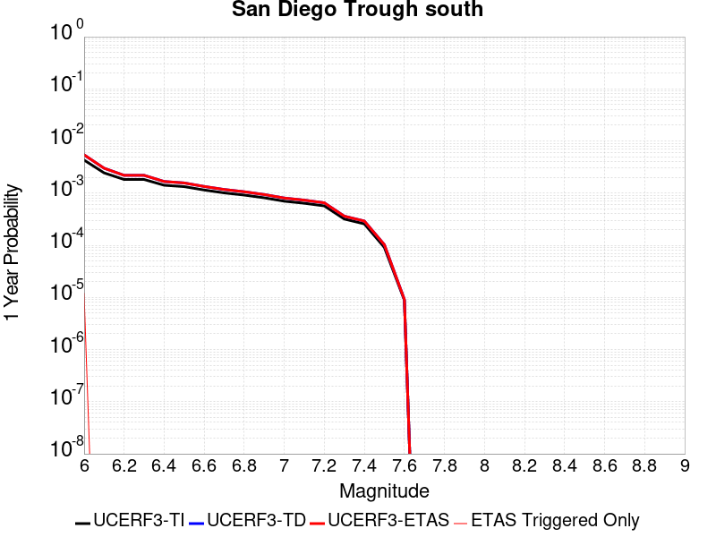 | 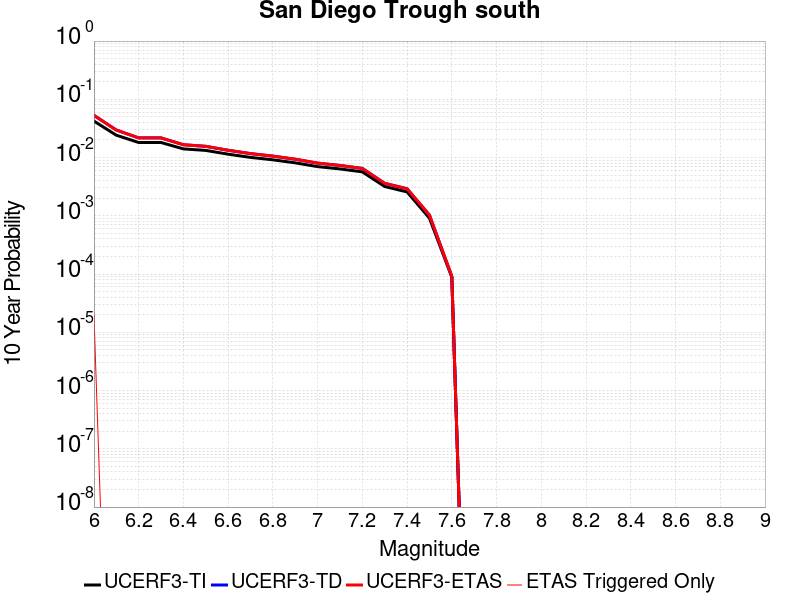 |

| Magnitude | 1 wk TI Prob | 1 wk TD Prob | 1 wk ETAS Prob | 1 wk ETAS/TD Gain | 1 wk ETAS Triggered Only | 1 mo TI Prob | 1 mo TD Prob | 1 mo ETAS Prob | 1 mo ETAS/TD Gain | 1 mo ETAS Triggered Only | 1 yr TI Prob | 1 yr TD Prob | 1 yr ETAS Prob | 1 yr ETAS/TD Gain | 1 yr ETAS Triggered Only | 10 yr TI Prob | 10 yr TD Prob | 10 yr ETAS Prob | 10 yr ETAS/TD Gain | 10 yr ETAS Triggered Only |
|-----|-----|-----|-----|-----|-----|-----|-----|-----|-----|-----|-----|-----|-----|-----|-----|-----|-----|-----|-----|-----|
| 6.0 | 8.279495E-5 | 1.0424506E-4 | 1.0424506E-4 | 1.0 | 0.0 | 3.5478722E-4 | 4.4669298E-4 | 4.5867806E-4 | 1.0268307 | 1.1990408E-5 | 0.004310982 | 0.005425812 | 0.005437738 | 1.0021979 | 1.1990408E-5 | 0.042283054 | 0.052993916 | 0.053016625 | 1.0004286 | 2.3980816E-5 |
| 6.1 | 4.6961468E-5 | 5.7731268E-5 | 5.7731268E-5 | 1.0 | 0.0 | 2.0124791E-4 | 2.4739723E-4 | 2.4739723E-4 | 1.0 | 0.0 | 0.00244744 | 0.0030080716 | 0.0030080716 | 1.0 | 0.0 | 0.024206603 | 0.029680338 | 0.029680338 | 1.0 | 0.0 |
| 6.2 | 3.5079658E-5 | 4.2142692E-5 | 4.2142692E-5 | 1.0 | 0.0 | 1.5033272E-4 | 1.805993E-4 | 1.805993E-4 | 1.0 | 0.0 | 0.0018287642 | 0.002196623 | 0.002196623 | 1.0 | 0.0 | 0.018137876 | 0.021751693 | 0.021751693 | 1.0 | 0.0 |
| 6.3 | 3.5079658E-5 | 4.2142692E-5 | 4.2142692E-5 | 1.0 | 0.0 | 1.5033272E-4 | 1.805993E-4 | 1.805993E-4 | 1.0 | 0.0 | 0.0018287642 | 0.002196623 | 0.002196623 | 1.0 | 0.0 | 0.018137876 | 0.021751693 | 0.021751693 | 1.0 | 0.0 |
| 6.4 | 2.7196904E-5 | 3.2087937E-5 | 3.2087937E-5 | 1.0 | 0.0 | 1.16552954E-4 | 1.3751259E-4 | 1.3751259E-4 | 1.0 | 0.0 | 0.0014181085 | 0.0016729443 | 0.0016729443 | 1.0 | 0.0 | 0.014090929 | 0.016605038 | 0.016605038 | 1.0 | 0.0 |
| 6.5 | 2.5584688E-5 | 3.0102354E-5 | 3.0102354E-5 | 1.0 | 0.0 | 1.0964406E-4 | 1.2900379E-4 | 1.2900379E-4 | 1.0 | 0.0 | 0.0013340989 | 0.0015695024 | 0.0015695024 | 1.0 | 0.0 | 0.013261181 | 0.015585679 | 0.015585679 | 1.0 | 0.0 |
| 6.6 | 2.2034688E-5 | 2.5743318E-5 | 2.5743318E-5 | 1.0 | 0.0 | 9.443096E-5 | 1.1032389E-4 | 1.1032389E-4 | 1.0 | 0.0 | 0.0011490905 | 0.0013423724 | 0.0013423724 | 1.0 | 0.0 | 0.011431668 | 0.013343615 | 0.013343615 | 1.0 | 0.0 |
| 6.7 | 1.9394853E-5 | 2.2542248E-5 | 2.2542248E-5 | 1.0 | 0.0 | 8.311815E-5 | 9.660609E-5 | 9.660609E-5 | 1.0 | 0.0 | 0.0010114936 | 0.0011755497 | 0.0011755497 | 1.0 | 0.0 | 0.01006902 | 0.011694018 | 0.011694018 | 1.0 | 0.0 |
| 6.8 | 1.7615313E-5 | 2.0403613E-5 | 2.0403613E-5 | 1.0 | 0.0 | 7.549201E-5 | 8.744115E-5 | 8.744115E-5 | 1.0 | 0.0 | 9.1872766E-4 | 0.0010640804 | 0.0010640804 | 1.0 | 0.0 | 0.009149387 | 0.01059042 | 0.01059042 | 1.0 | 0.0 |
| 6.9 | 1.5621423E-5 | 1.8026485E-5 | 1.8026485E-5 | 1.0 | 0.0 | 6.6947236E-5 | 7.7254095E-5 | 7.7254095E-5 | 1.0 | 0.0 | 8.147778E-4 | 9.4016624E-4 | 9.4016624E-4 | 1.0 | 0.0 | 0.008117969 | 0.0093623325 | 0.0093623325 | 1.0 | 0.0 |
| 7.0 | 1.3444376E-5 | 1.5448395E-5 | 1.5448395E-5 | 1.0 | 0.0 | 5.7617483E-5 | 6.620574E-5 | 6.620574E-5 | 1.0 | 0.0 | 7.0126704E-4 | 8.057596E-4 | 8.057596E-4 | 1.0 | 0.0 | 0.006990582 | 0.008028714 | 0.008028714 | 1.0 | 0.0 |
| 7.1 | 1.2268361E-5 | 1.40733055E-5 | 1.40733055E-5 | 1.0 | 0.0 | 5.2577634E-5 | 6.031279E-5 | 6.031279E-5 | 1.0 | 0.0 | 6.399447E-4 | 7.3406345E-4 | 7.3406345E-4 | 1.0 | 0.0 | 0.0063810493 | 0.007316692 | 0.007316692 | 1.0 | 0.0 |
| 7.2 | 1.0922655E-5 | 1.2513806E-5 | 1.2513806E-5 | 1.0 | 0.0 | 4.681054E-5 | 5.362951E-5 | 5.362951E-5 | 1.0 | 0.0 | 5.697693E-4 | 6.527462E-4 | 6.527462E-4 | 1.0 | 0.0 | 0.0056831064 | 0.0065085697 | 0.0065085697 | 1.0 | 0.0 |
| 7.3 | 6.1106753E-6 | 6.9290486E-6 | 6.9290486E-6 | 1.0 | 0.0 | 2.6188345E-5 | 2.9695586E-5 | 2.9695586E-5 | 1.0 | 0.0 | 3.1879646E-4 | 3.6148418E-4 | 3.6148418E-4 | 1.0 | 0.0 | 0.0031833951 | 0.0036090072 | 0.0036090072 | 1.0 | 0.0 |
| 7.4 | 4.933187E-6 | 5.5896517E-6 | 5.5896517E-6 | 1.0 | 0.0 | 2.114206E-5 | 2.3955432E-5 | 2.3955432E-5 | 1.0 | 0.0 | 2.5737417E-4 | 2.9161875E-4 | 2.9161875E-4 | 1.0 | 0.0 | 0.002570763 | 0.002912402 | 0.002912402 | 1.0 | 0.0 |
| 7.5 | 1.7489613E-6 | 1.9697113E-6 | 1.9697113E-6 | 1.0 | 0.0 | 7.495527E-6 | 8.441594E-6 | 8.441594E-6 | 1.0 | 0.0 | 9.125422E-5 | 1.0277178E-4 | 1.0277178E-4 | 1.0 | 0.0 | 9.1216754E-4 | 0.0010272645 | 0.0010272645 | 1.0 | 0.0 |
| 7.6 | 1.6988751E-7 | 1.7533898E-7 | 1.7533898E-7 | 1.0 | 0.0 | 7.2808916E-7 | 7.5145255E-7 | 7.5145255E-7 | 1.0 | 0.0 | 8.864449E-6 | 9.148898E-6 | 9.148898E-6 | 1.0 | 0.0 | 8.8640954E-5 | 9.148542E-5 | 9.148542E-5 | 1.0 | 0.0 |

## White Wolf
*[(top)](#table-of-contents)*

| 1 Week | 1 Month | 1 Year | 10 Year |
|-----|-----|-----|-----|
|  |  | 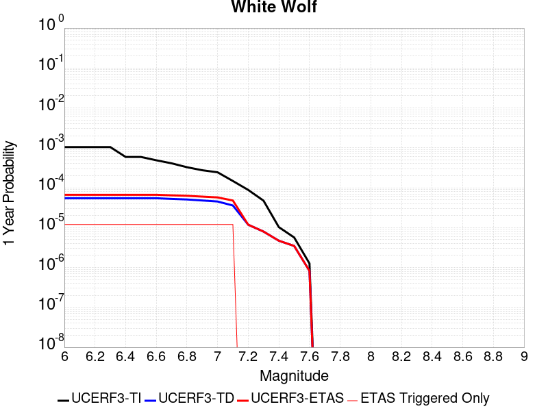 | 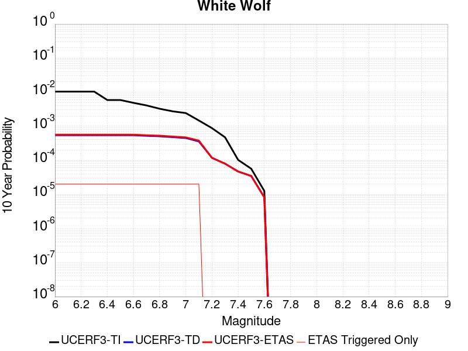 |

| Magnitude | 1 wk TI Prob | 1 wk TD Prob | 1 wk ETAS Prob | 1 wk ETAS/TD Gain | 1 wk ETAS Triggered Only | 1 mo TI Prob | 1 mo TD Prob | 1 mo ETAS Prob | 1 mo ETAS/TD Gain | 1 mo ETAS Triggered Only | 1 yr TI Prob | 1 yr TD Prob | 1 yr ETAS Prob | 1 yr ETAS/TD Gain | 1 yr ETAS Triggered Only | 10 yr TI Prob | 10 yr TD Prob | 10 yr ETAS Prob | 10 yr ETAS/TD Gain | 10 yr ETAS Triggered Only |
|-----|-----|-----|-----|-----|-----|-----|-----|-----|-----|-----|-----|-----|-----|-----|-----|-----|-----|-----|-----|-----|
| 6.0 | 2.0037822E-5 | 1.0469304E-6 | 1.0469304E-6 | 1.0 | 0.0 | 8.587355E-5 | 4.486837E-6 | 4.486837E-6 | 1.0 | 0.0 | 0.001045009 | 5.462592E-5 | 6.661568E-5 | 1.2194884 | 1.1990408E-5 | 0.010401085 | 5.4613E-4 | 5.700977E-4 | 1.0438864 | 2.3980816E-5 |
| 6.1 | 2.0037822E-5 | 1.0469304E-6 | 1.0469304E-6 | 1.0 | 0.0 | 8.587355E-5 | 4.486837E-6 | 4.486837E-6 | 1.0 | 0.0 | 0.001045009 | 5.462592E-5 | 6.661568E-5 | 1.2194884 | 1.1990408E-5 | 0.010401085 | 5.4613E-4 | 5.700977E-4 | 1.0438864 | 2.3980816E-5 |
| 6.2 | 2.0037822E-5 | 1.0469304E-6 | 1.0469304E-6 | 1.0 | 0.0 | 8.587355E-5 | 4.486837E-6 | 4.486837E-6 | 1.0 | 0.0 | 0.001045009 | 5.462592E-5 | 6.661568E-5 | 1.2194884 | 1.1990408E-5 | 0.010401085 | 5.4613E-4 | 5.700977E-4 | 1.0438864 | 2.3980816E-5 |
| 6.3 | 2.0037822E-5 | 1.0469304E-6 | 1.0469304E-6 | 1.0 | 0.0 | 8.587355E-5 | 4.486837E-6 | 4.486837E-6 | 1.0 | 0.0 | 0.001045009 | 5.462592E-5 | 6.661568E-5 | 1.2194884 | 1.1990408E-5 | 0.010401085 | 5.4613E-4 | 5.700977E-4 | 1.0438864 | 2.3980816E-5 |
| 6.4 | 1.132487E-5 | 1.0469304E-6 | 1.0469304E-6 | 1.0 | 0.0 | 4.8534253E-5 | 4.486837E-6 | 4.486837E-6 | 1.0 | 0.0 | 5.907443E-4 | 5.462592E-5 | 6.661568E-5 | 1.2194884 | 1.1990408E-5 | 0.005891764 | 5.4613E-4 | 5.700977E-4 | 1.0438864 | 2.3980816E-5 |
| 6.5 | 1.132487E-5 | 1.0469304E-6 | 1.0469304E-6 | 1.0 | 0.0 | 4.8534253E-5 | 4.486837E-6 | 4.486837E-6 | 1.0 | 0.0 | 5.907443E-4 | 5.462592E-5 | 6.661568E-5 | 1.2194884 | 1.1990408E-5 | 0.005891764 | 5.4613E-4 | 5.700977E-4 | 1.0438864 | 2.3980816E-5 |
| 6.6 | 9.347473E-6 | 1.0469304E-6 | 1.0469304E-6 | 1.0 | 0.0 | 4.0059982E-5 | 4.486837E-6 | 4.486837E-6 | 1.0 | 0.0 | 4.8762115E-4 | 5.462592E-5 | 6.661568E-5 | 1.2194884 | 1.1990408E-5 | 0.0048655253 | 5.4613E-4 | 5.700977E-4 | 1.0438864 | 2.3980816E-5 |
| 6.7 | 7.842647E-6 | 1.0048476E-6 | 1.0048476E-6 | 1.0 | 0.0 | 3.361091E-5 | 4.306483E-6 | 4.306483E-6 | 1.0 | 0.0 | 4.0913603E-4 | 5.243022E-5 | 6.442E-5 | 1.2286807 | 1.1990408E-5 | 0.004083836 | 5.2418344E-4 | 5.481517E-4 | 1.0457249 | 2.3980816E-5 |
| 6.8 | 6.26597E-6 | 9.734948E-7 | 9.734948E-7 | 1.0 | 0.0 | 2.685388E-5 | 4.172114E-6 | 4.172114E-6 | 1.0 | 0.0 | 3.2689696E-4 | 5.079436E-5 | 6.278416E-5 | 1.2360458 | 1.1990408E-5 | 0.003264165 | 5.078324E-4 | 5.31801E-4 | 1.0471979 | 2.3980816E-5 |
| 6.9 | 5.258436E-6 | 9.183371E-7 | 9.183371E-7 | 1.0 | 0.0 | 2.2535958E-5 | 3.9357246E-6 | 3.9357246E-6 | 1.0 | 0.0 | 2.7434074E-4 | 4.7916445E-5 | 5.9906277E-5 | 1.2502238 | 1.1990408E-5 | 0.0027400232 | 4.7906593E-4 | 5.0303526E-4 | 1.0500335 | 2.3980816E-5 |
| 7.0 | 4.675028E-6 | 8.66129E-7 | 8.66129E-7 | 1.0 | 0.0 | 2.003568E-5 | 3.7119764E-6 | 3.7119764E-6 | 1.0 | 0.0 | 2.4390711E-4 | 4.5192424E-5 | 5.718229E-5 | 1.265307 | 1.1990408E-5 | 0.0024363957 | 4.5183706E-4 | 4.7580703E-4 | 1.05305 | 2.3980816E-5 |
| 7.1 | 2.8270078E-6 | 6.8742594E-7 | 6.8742594E-7 | 1.0 | 0.0 | 1.2115692E-5 | 2.9461082E-6 | 2.9461082E-6 | 1.0 | 0.0 | 1.4749856E-4 | 3.5868317E-5 | 4.7858295E-5 | 1.3342776 | 1.1990408E-5 | 0.001474007 | 3.586294E-4 | 3.826016E-4 | 1.066844 | 2.3980816E-5 |
| 7.2 | 1.6881406E-6 | 2.2706854E-7 | 2.2706854E-7 | 1.0 | 0.0 | 7.2348685E-6 | 9.731506E-7 | 9.731506E-7 | 1.0 | 0.0 | 8.808096E-5 | 1.1848045E-5 | 1.1848045E-5 | 1.0 | 0.0 | 8.8046055E-4 | 1.1847429E-4 | 1.1847429E-4 | 1.0 | 0.0 |
| 7.3 | 9.086107E-7 | 1.5266669E-7 | 1.5266669E-7 | 1.0 | 0.0 | 3.8940398E-6 | 6.5428566E-7 | 6.5428566E-7 | 1.0 | 0.0 | 4.7408903E-5 | 7.965899E-6 | 7.965899E-6 | 1.0 | 0.0 | 4.739879E-4 | 7.965622E-5 | 7.965622E-5 | 1.0 | 0.0 |
| 7.4 | 1.9717383E-7 | 9.003981E-8 | 9.003981E-8 | 1.0 | 0.0 | 8.450304E-7 | 3.8588485E-7 | 3.8588485E-7 | 1.0 | 0.0 | 1.0288197E-5 | 4.698138E-6 | 4.698138E-6 | 1.0 | 0.0 | 1.028772E-4 | 4.6980418E-5 | 4.6980418E-5 | 1.0 | 0.0 |
| 7.5 | 1.086975E-7 | 6.659757E-8 | 6.659757E-8 | 1.0 | 0.0 | 4.6584634E-7 | 2.8541814E-7 | 2.8541814E-7 | 1.0 | 0.0 | 5.6716644E-6 | 3.4749605E-6 | 3.4749605E-6 | 1.0 | 0.0 | 5.6715195E-5 | 3.4749086E-5 | 3.4749086E-5 | 1.0 | 0.0 |
| 7.6 | 2.4217808E-8 | 1.5820843E-8 | 1.5820843E-8 | 1.0 | 0.0 | 1.03790605E-7 | 6.780361E-8 | 6.780361E-8 | 1.0 | 0.0 | 1.2636499E-6 | 8.255087E-7 | 8.255087E-7 | 1.0 | 0.0 | 1.2636427E-5 | 8.255061E-6 | 8.255061E-6 | 1.0 | 0.0 |

## Santa Susana alt 1
*[(top)](#table-of-contents)*

| 1 Week | 1 Month | 1 Year | 10 Year |
|-----|-----|-----|-----|
|  | 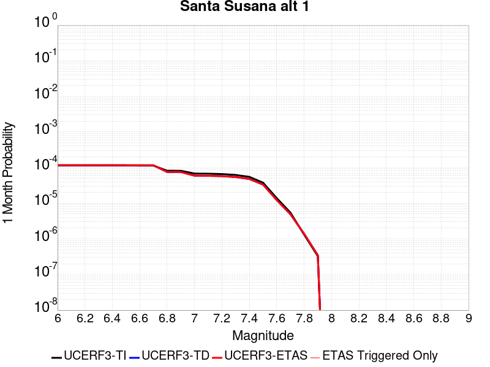 | 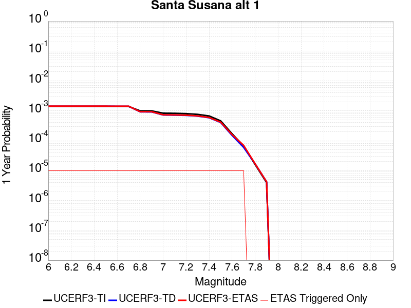 | 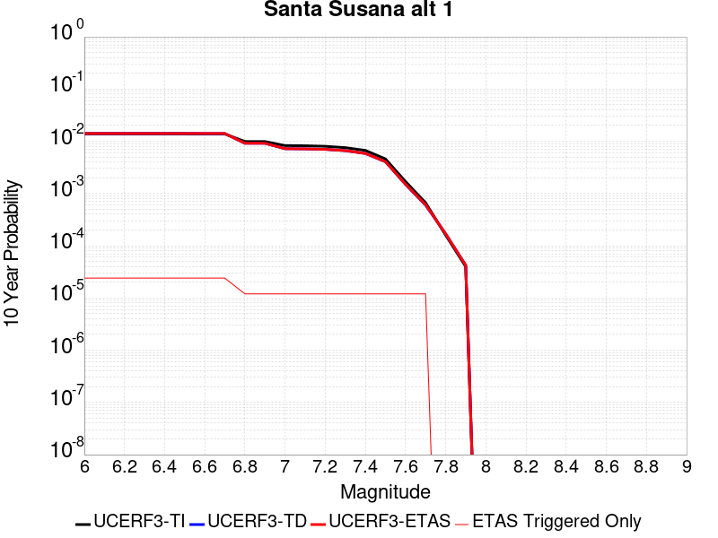 |

| Magnitude | 1 wk TI Prob | 1 wk TD Prob | 1 wk ETAS Prob | 1 wk ETAS/TD Gain | 1 wk ETAS Triggered Only | 1 mo TI Prob | 1 mo TD Prob | 1 mo ETAS Prob | 1 mo ETAS/TD Gain | 1 mo ETAS Triggered Only | 1 yr TI Prob | 1 yr TD Prob | 1 yr ETAS Prob | 1 yr ETAS/TD Gain | 1 yr ETAS Triggered Only | 10 yr TI Prob | 10 yr TD Prob | 10 yr ETAS Prob | 10 yr ETAS/TD Gain | 10 yr ETAS Triggered Only |
|-----|-----|-----|-----|-----|-----|-----|-----|-----|-----|-----|-----|-----|-----|-----|-----|-----|-----|-----|-----|-----|
| 6.0 | 2.674877E-5 | 2.7198636E-5 | 2.7198636E-5 | 1.0 | 0.0 | 1.1463255E-4 | 1.16561016E-4 | 1.16561016E-4 | 1.0 | 0.0 | 0.0013947578 | 0.0014183201 | 0.0014302935 | 1.0084419 | 1.1990408E-5 | 0.013860362 | 0.014104444 | 0.014128086 | 1.0016762 | 2.3980816E-5 |
| 6.1 | 2.674877E-5 | 2.7198636E-5 | 2.7198636E-5 | 1.0 | 0.0 | 1.1463255E-4 | 1.16561016E-4 | 1.16561016E-4 | 1.0 | 0.0 | 0.0013947578 | 0.0014183201 | 0.0014302935 | 1.0084419 | 1.1990408E-5 | 0.013860362 | 0.014104444 | 0.014128086 | 1.0016762 | 2.3980816E-5 |
| 6.2 | 2.674877E-5 | 2.7198636E-5 | 2.7198636E-5 | 1.0 | 0.0 | 1.1463255E-4 | 1.16561016E-4 | 1.16561016E-4 | 1.0 | 0.0 | 0.0013947578 | 0.0014183201 | 0.0014302935 | 1.0084419 | 1.1990408E-5 | 0.013860362 | 0.014104444 | 0.014128086 | 1.0016762 | 2.3980816E-5 |
| 6.3 | 2.674877E-5 | 2.7198636E-5 | 2.7198636E-5 | 1.0 | 0.0 | 1.1463255E-4 | 1.16561016E-4 | 1.16561016E-4 | 1.0 | 0.0 | 0.0013947578 | 0.0014183201 | 0.0014302935 | 1.0084419 | 1.1990408E-5 | 0.013860362 | 0.014104444 | 0.014128086 | 1.0016762 | 2.3980816E-5 |
| 6.4 | 2.674877E-5 | 2.7198636E-5 | 2.7198636E-5 | 1.0 | 0.0 | 1.1463255E-4 | 1.16561016E-4 | 1.16561016E-4 | 1.0 | 0.0 | 0.0013947578 | 0.0014183201 | 0.0014302935 | 1.0084419 | 1.1990408E-5 | 0.013860362 | 0.014104444 | 0.014128086 | 1.0016762 | 2.3980816E-5 |
| 6.5 | 2.674877E-5 | 2.7198636E-5 | 2.7198636E-5 | 1.0 | 0.0 | 1.1463255E-4 | 1.16561016E-4 | 1.16561016E-4 | 1.0 | 0.0 | 0.0013947578 | 0.0014183201 | 0.0014302935 | 1.0084419 | 1.1990408E-5 | 0.013860362 | 0.014104444 | 0.014128086 | 1.0016762 | 2.3980816E-5 |
| 6.6 | 2.6647976E-5 | 2.707497E-5 | 2.707497E-5 | 1.0 | 0.0 | 1.14200615E-4 | 1.16031064E-4 | 1.16031064E-4 | 1.0 | 0.0 | 0.0013895056 | 0.0014118766 | 0.0014238501 | 1.0084805 | 1.1990408E-5 | 0.013808494 | 0.014040828 | 0.014064471 | 1.001684 | 2.3980816E-5 |
| 6.7 | 2.6647976E-5 | 2.707497E-5 | 2.707497E-5 | 1.0 | 0.0 | 1.14200615E-4 | 1.16031064E-4 | 1.16031064E-4 | 1.0 | 0.0 | 0.0013895056 | 0.0014118766 | 0.0014238501 | 1.0084805 | 1.1990408E-5 | 0.013808494 | 0.014040828 | 0.014064471 | 1.001684 | 2.3980816E-5 |
| 6.8 | 1.9073179E-5 | 1.7637585E-5 | 1.7637585E-5 | 1.0 | 0.0 | 8.1739636E-5 | 7.5587566E-5 | 7.5587566E-5 | 1.0 | 0.0 | 9.947256E-4 | 9.199082E-4 | 9.318876E-4 | 1.0130223 | 1.1990408E-5 | 0.009902848 | 0.009163258 | 0.009175138 | 1.0012965 | 1.1990408E-5 |
| 6.9 | 1.9041876E-5 | 1.7619717E-5 | 1.7619717E-5 | 1.0 | 0.0 | 8.160549E-5 | 7.551099E-5 | 7.551099E-5 | 1.0 | 0.0 | 9.930939E-4 | 9.189767E-4 | 9.3095604E-4 | 1.0130355 | 1.1990408E-5 | 0.0098866755 | 0.009154019 | 0.009165899 | 1.0012978 | 1.1990408E-5 |
| 7.0 | 1.5917482E-5 | 1.3864059E-5 | 1.3864059E-5 | 1.0 | 0.0 | 6.8215995E-5 | 5.941607E-5 | 5.941607E-5 | 1.0 | 0.0 | 8.302132E-4 | 7.231552E-4 | 7.351369E-4 | 1.0165687 | 1.1990408E-5 | 0.008271185 | 0.007208915 | 0.007220819 | 1.0016513 | 1.1990408E-5 |
| 7.1 | 1.577788E-5 | 1.3744065E-5 | 1.3744065E-5 | 1.0 | 0.0 | 6.761774E-5 | 5.890183E-5 | 5.890183E-5 | 1.0 | 0.0 | 8.2293496E-4 | 7.168985E-4 | 7.288803E-4 | 1.0167134 | 1.1990408E-5 | 0.008198941 | 0.0071467515 | 0.007158656 | 1.0016657 | 1.1990408E-5 |
| 7.2 | 1.5416446E-5 | 1.3470131E-5 | 1.3470131E-5 | 1.0 | 0.0 | 6.606882E-5 | 5.7727884E-5 | 5.7727884E-5 | 1.0 | 0.0 | 8.0409093E-4 | 7.0261495E-4 | 7.1459694E-4 | 1.0170534 | 1.1990408E-5 | 0.008011877 | 0.0070048203 | 0.007016727 | 1.0016998 | 1.1990408E-5 |
| 7.3 | 1.4534083E-5 | 1.2718048E-5 | 1.2718048E-5 | 1.0 | 0.0 | 6.228744E-5 | 5.4504806E-5 | 5.4504806E-5 | 1.0 | 0.0 | 7.580857E-4 | 6.633984E-4 | 6.7538087E-4 | 1.0180622 | 1.1990408E-5 | 0.007555048 | 0.006615032 | 0.006626943 | 1.0018007 | 1.1990408E-5 |
| 7.4 | 1.2858995E-5 | 1.1229788E-5 | 1.1229788E-5 | 1.0 | 0.0 | 5.5108816E-5 | 4.8126793E-5 | 4.8126793E-5 | 1.0 | 0.0 | 6.7074323E-4 | 5.8579014E-4 | 5.977735E-4 | 1.0204568 | 1.1990408E-5 | 0.0066872234 | 0.0058432347 | 0.005855155 | 1.00204 | 1.1990408E-5 |
| 7.5 | 8.827668E-6 | 7.805538E-6 | 7.805538E-6 | 1.0 | 0.0 | 3.7832317E-5 | 3.345189E-5 | 3.345189E-5 | 1.0 | 0.0 | 4.605111E-4 | 4.0720313E-4 | 4.1918864E-4 | 1.0294337 | 1.1990408E-5 | 0.0045955796 | 0.004064819 | 0.0040767603 | 1.0029378 | 1.1990408E-5 |
| 7.6 | 3.2533426E-6 | 2.872008E-6 | 2.872008E-6 | 1.0 | 0.0 | 1.3942822E-5 | 1.230855E-5 | 1.230855E-5 | 1.0 | 0.0 | 1.6974064E-4 | 1.4984666E-4 | 1.6183527E-4 | 1.0800059 | 1.1990408E-5 | 0.0016961104 | 0.0014974931 | 0.0015094655 | 1.007995 | 1.1990408E-5 |
| 7.7 | 1.2751709E-6 | 1.1491198E-6 | 1.1491198E-6 | 1.0 | 0.0 | 5.4650063E-6 | 4.9247906E-6 | 4.9247906E-6 | 1.0 | 0.0 | 6.653442E-5 | 5.9957765E-5 | 7.1947456E-5 | 1.1999689 | 1.1990408E-5 | 6.6514505E-4 | 5.994248E-4 | 6.1140803E-4 | 1.0199912 | 1.1990408E-5 |
| 7.8 | 3.067544E-7 | 3.240072E-7 | 3.240072E-7 | 1.0 | 0.0 | 1.3146611E-6 | 1.3886016E-6 | 1.3886016E-6 | 1.0 | 0.0 | 1.600588E-5 | 1.6906104E-5 | 1.6906104E-5 | 1.0 | 0.0 | 1.6004729E-4 | 1.690492E-4 | 1.690492E-4 | 1.0 | 0.0 |
| 7.9 | 7.622999E-8 | 8.088032E-8 | 8.088032E-8 | 1.0 | 0.0 | 3.2669993E-7 | 3.4662992E-7 | 3.4662992E-7 | 1.0 | 0.0 | 3.977564E-6 | 4.220213E-6 | 4.220213E-6 | 1.0 | 0.0 | 3.977493E-5 | 4.2201536E-5 | 4.2201536E-5 | 1.0 | 0.0 |

## Sierra Madre (San Fernando)
*[(top)](#table-of-contents)*

| 1 Week | 1 Month | 1 Year | 10 Year |
|-----|-----|-----|-----|
| 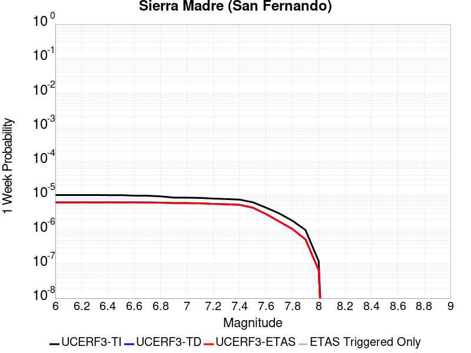 | 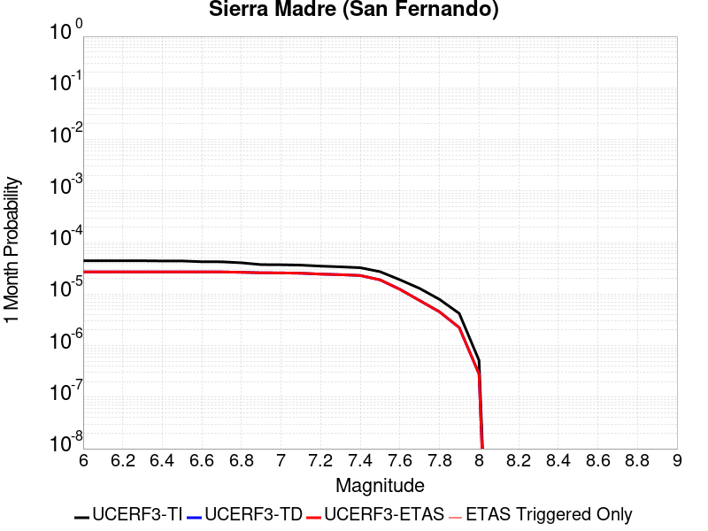 | 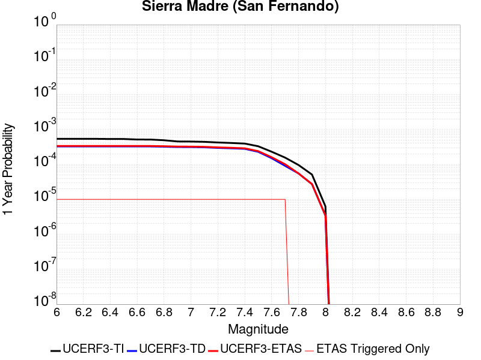 | 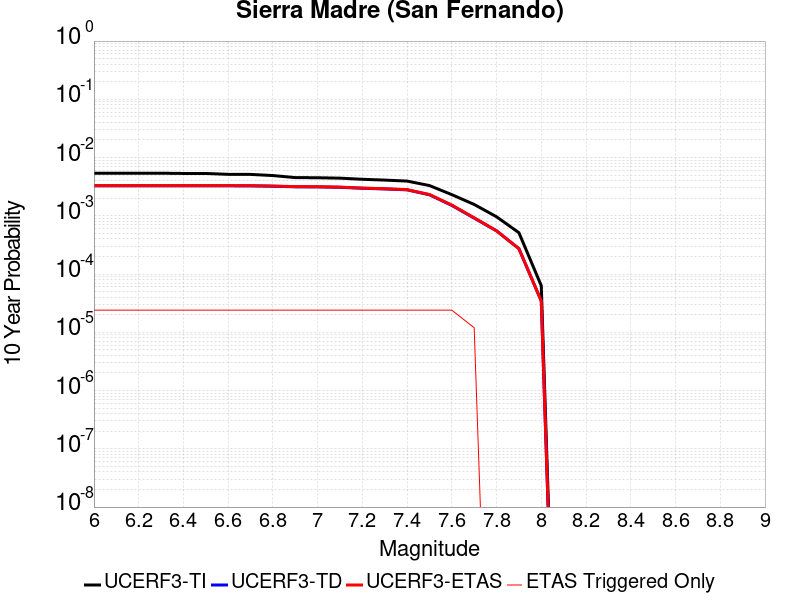 |

| Magnitude | 1 wk TI Prob | 1 wk TD Prob | 1 wk ETAS Prob | 1 wk ETAS/TD Gain | 1 wk ETAS Triggered Only | 1 mo TI Prob | 1 mo TD Prob | 1 mo ETAS Prob | 1 mo ETAS/TD Gain | 1 mo ETAS Triggered Only | 1 yr TI Prob | 1 yr TD Prob | 1 yr ETAS Prob | 1 yr ETAS/TD Gain | 1 yr ETAS Triggered Only | 10 yr TI Prob | 10 yr TD Prob | 10 yr ETAS Prob | 10 yr ETAS/TD Gain | 10 yr ETAS Triggered Only |
|-----|-----|-----|-----|-----|-----|-----|-----|-----|-----|-----|-----|-----|-----|-----|-----|-----|-----|-----|-----|-----|
| 6.0 | 1.0346413E-5 | 6.287434E-6 | 6.287434E-6 | 1.0 | 0.0 | 4.4341014E-5 | 2.6945874E-5 | 2.6945874E-5 | 1.0 | 0.0 | 5.3971814E-4 | 3.2801775E-4 | 3.4000422E-4 | 1.0365422 | 1.1990408E-5 | 0.0053840918 | 0.0032754485 | 0.0032993506 | 1.0072974 | 2.3980816E-5 |
| 6.1 | 1.0346413E-5 | 6.287434E-6 | 6.287434E-6 | 1.0 | 0.0 | 4.4341014E-5 | 2.6945874E-5 | 2.6945874E-5 | 1.0 | 0.0 | 5.3971814E-4 | 3.2801775E-4 | 3.4000422E-4 | 1.0365422 | 1.1990408E-5 | 0.0053840918 | 0.0032754485 | 0.0032993506 | 1.0072974 | 2.3980816E-5 |
| 6.2 | 1.0346413E-5 | 6.287434E-6 | 6.287434E-6 | 1.0 | 0.0 | 4.4341014E-5 | 2.6945874E-5 | 2.6945874E-5 | 1.0 | 0.0 | 5.3971814E-4 | 3.2801775E-4 | 3.4000422E-4 | 1.0365422 | 1.1990408E-5 | 0.0053840918 | 0.0032754485 | 0.0032993506 | 1.0072974 | 2.3980816E-5 |
| 6.3 | 1.0346413E-5 | 6.287434E-6 | 6.287434E-6 | 1.0 | 0.0 | 4.4341014E-5 | 2.6945874E-5 | 2.6945874E-5 | 1.0 | 0.0 | 5.3971814E-4 | 3.2801775E-4 | 3.4000422E-4 | 1.0365422 | 1.1990408E-5 | 0.0053840918 | 0.0032754485 | 0.0032993506 | 1.0072974 | 2.3980816E-5 |
| 6.4 | 1.0249558E-5 | 6.287434E-6 | 6.287434E-6 | 1.0 | 0.0 | 4.392594E-5 | 2.6945874E-5 | 2.6945874E-5 | 1.0 | 0.0 | 5.3466705E-4 | 3.2801775E-4 | 3.4000422E-4 | 1.0365422 | 1.1990408E-5 | 0.0053338245 | 0.0032754485 | 0.0032993506 | 1.0072974 | 2.3980816E-5 |
| 6.5 | 1.0249558E-5 | 6.287434E-6 | 6.287434E-6 | 1.0 | 0.0 | 4.392594E-5 | 2.6945874E-5 | 2.6945874E-5 | 1.0 | 0.0 | 5.3466705E-4 | 3.2801775E-4 | 3.4000422E-4 | 1.0365422 | 1.1990408E-5 | 0.0053338245 | 0.0032754485 | 0.0032993506 | 1.0072974 | 2.3980816E-5 |
| 6.6 | 9.9035515E-6 | 6.287434E-6 | 6.287434E-6 | 1.0 | 0.0 | 4.2443102E-5 | 2.6945874E-5 | 2.6945874E-5 | 1.0 | 0.0 | 5.166222E-4 | 3.2801775E-4 | 3.4000422E-4 | 1.0365422 | 1.1990408E-5 | 0.0051542283 | 0.0032754485 | 0.0032993506 | 1.0072974 | 2.3980816E-5 |
| 6.7 | 9.87217E-6 | 6.274855E-6 | 6.274855E-6 | 1.0 | 0.0 | 4.2308613E-5 | 2.6891963E-5 | 2.6891963E-5 | 1.0 | 0.0 | 5.149856E-4 | 3.2736157E-4 | 3.3934807E-4 | 1.0366154 | 1.1990408E-5 | 0.005137938 | 0.003268906 | 0.0032928085 | 1.007312 | 2.3980816E-5 |
| 6.8 | 9.4359175E-6 | 6.1788287E-6 | 6.1788287E-6 | 1.0 | 0.0 | 4.043902E-5 | 2.6480431E-5 | 2.6480431E-5 | 1.0 | 0.0 | 4.9223384E-4 | 3.2235266E-4 | 3.3433922E-4 | 1.0371846 | 1.1990408E-5 | 0.0049114493 | 0.0032189623 | 0.003242866 | 1.0074259 | 2.3980816E-5 |
| 6.9 | 8.700447E-6 | 6.0400866E-6 | 6.0400866E-6 | 1.0 | 0.0 | 3.72871E-5 | 2.5885834E-5 | 2.5885834E-5 | 1.0 | 0.0 | 4.5387587E-4 | 3.1511553E-4 | 3.2710217E-4 | 1.0380388 | 1.1990408E-5 | 0.0045295 | 0.0031467967 | 0.003170702 | 1.0075967 | 2.3980816E-5 |
| 7.0 | 8.648878E-6 | 6.0150014E-6 | 6.0150014E-6 | 1.0 | 0.0 | 3.7066096E-5 | 2.5778329E-5 | 2.5778329E-5 | 1.0 | 0.0 | 4.5118626E-4 | 3.1380705E-4 | 3.257937E-4 | 1.0381975 | 1.1990408E-5 | 0.004502713 | 0.0031337484 | 0.003157654 | 1.0076284 | 2.3980816E-5 |
| 7.1 | 8.505786E-6 | 5.924631E-6 | 5.924631E-6 | 1.0 | 0.0 | 3.645286E-5 | 2.5391035E-5 | 2.5391035E-5 | 1.0 | 0.0 | 4.437232E-4 | 3.0909307E-4 | 3.2107977E-4 | 1.0387802 | 1.1990408E-5 | 0.0044283825 | 0.0030867406 | 0.0031106474 | 1.007745 | 2.3980816E-5 |
| 7.2 | 8.139752E-6 | 5.6989234E-6 | 5.6989234E-6 | 1.0 | 0.0 | 3.4884186E-5 | 2.4423734E-5 | 2.4423734E-5 | 1.0 | 0.0 | 4.246322E-4 | 2.9731944E-4 | 3.0930628E-4 | 1.0403163 | 1.1990408E-5 | 0.004238217 | 0.0029693225 | 0.002993232 | 1.0080522 | 2.3980816E-5 |
| 7.3 | 7.8816E-6 | 5.552236E-6 | 5.552236E-6 | 1.0 | 0.0 | 3.3777847E-5 | 2.3795086E-5 | 2.3795086E-5 | 1.0 | 0.0 | 4.111677E-4 | 2.8966772E-4 | 3.0165465E-4 | 1.0413817 | 1.1990408E-5 | 0.004104078 | 0.002893007 | 0.0029169184 | 1.0082653 | 2.3980816E-5 |
| 7.4 | 7.5810603E-6 | 5.35647E-6 | 5.35647E-6 | 1.0 | 0.0 | 3.2489854E-5 | 2.2956105E-5 | 2.2956105E-5 | 1.0 | 0.0 | 3.9549218E-4 | 2.7945577E-4 | 2.9144282E-4 | 1.0428942 | 1.1990408E-5 | 0.0039478904 | 0.0027911486 | 0.0028150624 | 1.0085678 | 2.3980816E-5 |
| 7.5 | 6.349153E-6 | 4.4077274E-6 | 4.4077274E-6 | 1.0 | 0.0 | 2.7210372E-5 | 1.8890129E-5 | 1.8890129E-5 | 1.0 | 0.0 | 3.312359E-4 | 2.2996387E-4 | 2.4195152E-4 | 1.0521284 | 1.1990408E-5 | 0.0033074263 | 0.0022973411 | 0.0023212668 | 1.0104145 | 2.3980816E-5 |
| 7.6 | 4.430576E-6 | 2.8907298E-6 | 2.8907298E-6 | 1.0 | 0.0 | 1.8988047E-5 | 1.2388785E-5 | 1.2388785E-5 | 1.0 | 0.0 | 2.3115493E-4 | 1.5082324E-4 | 1.6281183E-4 | 1.0794878 | 1.1990408E-5 | 0.0023091463 | 0.0015072313 | 0.001531176 | 1.0158865 | 2.3980816E-5 |
| 7.7 | 3.005066E-6 | 1.7511459E-6 | 1.7511459E-6 | 1.0 | 0.0 | 1.2878791E-5 | 7.5048893E-6 | 7.5048893E-6 | 1.0 | 0.0 | 1.56788E-4 | 9.13682E-5 | 1.0335752E-4 | 1.1312197 | 1.1990408E-5 | 0.0015667742 | 9.1330754E-4 | 9.25287E-4 | 1.0131166 | 1.1990408E-5 |
| 7.8 | 1.8459098E-6 | 1.0583101E-6 | 1.0583101E-6 | 1.0 | 0.0 | 7.911018E-6 | 4.535607E-6 | 4.535607E-6 | 1.0 | 0.0 | 9.631238E-5 | 5.5219618E-5 | 5.5219618E-5 | 1.0 | 0.0 | 9.627065E-4 | 5.5205944E-4 | 5.5205944E-4 | 1.0 | 0.0 |
| 7.9 | 9.839262E-7 | 5.234948E-7 | 5.234948E-7 | 1.0 | 0.0 | 4.2168194E-6 | 2.2435472E-6 | 2.2435472E-6 | 1.0 | 0.0 | 5.1338568E-5 | 2.7314849E-5 | 2.7314849E-5 | 1.0 | 0.0 | 5.132671E-4 | 2.731152E-4 | 2.731152E-4 | 1.0 | 0.0 |
| 8.0 | 1.210983E-7 | 6.6141716E-8 | 6.6141716E-8 | 1.0 | 0.0 | 5.1899264E-7 | 2.8346446E-7 | 2.8346446E-7 | 1.0 | 0.0 | 6.3187167E-6 | 3.4511747E-6 | 3.4511747E-6 | 1.0 | 0.0 | 6.318537E-5 | 3.4511228E-5 | 3.4511228E-5 | 1.0 | 0.0 |

## Ortigalita (South)
*[(top)](#table-of-contents)*

| 1 Week | 1 Month | 1 Year | 10 Year |
|-----|-----|-----|-----|
| 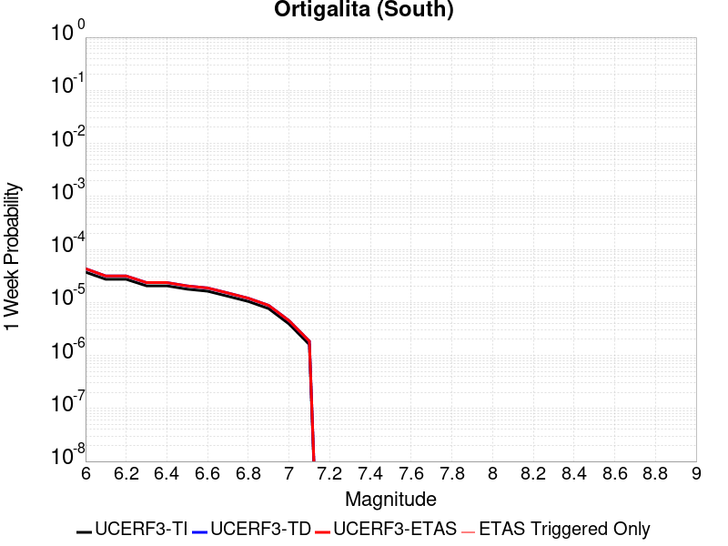 |  | 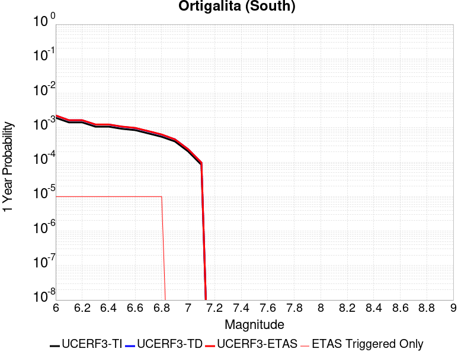 | 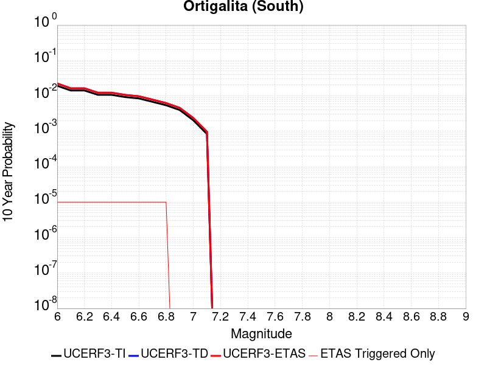 |

| Magnitude | 1 wk TI Prob | 1 wk TD Prob | 1 wk ETAS Prob | 1 wk ETAS/TD Gain | 1 wk ETAS Triggered Only | 1 mo TI Prob | 1 mo TD Prob | 1 mo ETAS Prob | 1 mo ETAS/TD Gain | 1 mo ETAS Triggered Only | 1 yr TI Prob | 1 yr TD Prob | 1 yr ETAS Prob | 1 yr ETAS/TD Gain | 1 yr ETAS Triggered Only | 10 yr TI Prob | 10 yr TD Prob | 10 yr ETAS Prob | 10 yr ETAS/TD Gain | 10 yr ETAS Triggered Only |
|-----|-----|-----|-----|-----|-----|-----|-----|-----|-----|-----|-----|-----|-----|-----|-----|-----|-----|-----|-----|-----|
| 6.0 | 3.72394E-5 | 4.325655E-5 | 4.325655E-5 | 1.0 | 0.0 | 1.5958765E-4 | 1.8537292E-4 | 1.8537292E-4 | 1.0 | 0.0 | 0.0019412481 | 0.002254736 | 0.0022666992 | 1.0053059 | 1.1990408E-5 | 0.019243775 | 0.022334972 | 0.022346694 | 1.0005249 | 1.1990408E-5 |
| 6.1 | 2.7299884E-5 | 3.1492684E-5 | 3.1492684E-5 | 1.0 | 0.0 | 1.16994255E-4 | 1.3496199E-4 | 1.3496199E-4 | 1.0 | 0.0 | 0.0014234743 | 0.0016419792 | 0.00165395 | 1.0072904 | 1.1990408E-5 | 0.014143906 | 0.016304402 | 0.016316196 | 1.0007234 | 1.1990408E-5 |
| 6.2 | 2.7299884E-5 | 3.1492684E-5 | 3.1492684E-5 | 1.0 | 0.0 | 1.16994255E-4 | 1.3496199E-4 | 1.3496199E-4 | 1.0 | 0.0 | 0.0014234743 | 0.0016419792 | 0.00165395 | 1.0072904 | 1.1990408E-5 | 0.014143906 | 0.016304402 | 0.016316196 | 1.0007234 | 1.1990408E-5 |
| 6.3 | 2.0546433E-5 | 2.3631923E-5 | 2.3631923E-5 | 1.0 | 0.0 | 8.805317E-5 | 1.01275844E-4 | 1.01275844E-4 | 1.0 | 0.0 | 0.00107152 | 0.0012323549 | 0.0012443305 | 1.0097177 | 1.1990408E-5 | 0.010663681 | 0.012257273 | 0.012269117 | 1.0009662 | 1.1990408E-5 |
| 6.4 | 2.0546433E-5 | 2.3631923E-5 | 2.3631923E-5 | 1.0 | 0.0 | 8.805317E-5 | 1.01275844E-4 | 1.01275844E-4 | 1.0 | 0.0 | 0.00107152 | 0.0012323549 | 0.0012443305 | 1.0097177 | 1.1990408E-5 | 0.010663681 | 0.012257273 | 0.012269117 | 1.0009662 | 1.1990408E-5 |
| 6.5 | 1.7779594E-5 | 2.0447382E-5 | 2.0447382E-5 | 1.0 | 0.0 | 7.619603E-5 | 8.7628774E-5 | 8.7628774E-5 | 1.0 | 0.0 | 9.272918E-4 | 0.0010663717 | 0.0010783493 | 1.0112321 | 1.1990408E-5 | 0.009234319 | 0.010614014 | 0.010625877 | 1.0011177 | 1.1990408E-5 |
| 6.6 | 1.6272212E-5 | 1.8715342E-5 | 1.8715342E-5 | 1.0 | 0.0 | 6.973618E-5 | 8.0206206E-5 | 8.0206206E-5 | 1.0 | 0.0 | 8.487073E-4 | 9.760853E-4 | 9.88064E-4 | 1.0122722 | 1.1990408E-5 | 0.008454733 | 0.009719283 | 0.009731158 | 1.0012217 | 1.1990408E-5 |
| 6.7 | 1.3051484E-5 | 1.5039062E-5 | 1.5039062E-5 | 1.0 | 0.0 | 5.593373E-5 | 6.445159E-5 | 6.445159E-5 | 1.0 | 0.0 | 6.807804E-4 | 7.8442506E-4 | 7.9640606E-4 | 1.0152736 | 1.1990408E-5 | 0.006786986 | 0.007817546 | 0.007829443 | 1.0015218 | 1.1990408E-5 |
| 6.8 | 1.04277415E-5 | 1.1987473E-5 | 1.1987473E-5 | 1.0 | 0.0 | 4.4689557E-5 | 5.1373918E-5 | 5.1373918E-5 | 1.0 | 0.0 | 5.439595E-4 | 6.2530534E-4 | 6.3728826E-4 | 1.0191633 | 1.1990408E-5 | 0.0054262993 | 0.0062362133 | 0.006248129 | 1.0019107 | 1.1990408E-5 |
| 6.9 | 7.639968E-6 | 8.79168E-6 | 8.79168E-6 | 1.0 | 0.0 | 3.274231E-5 | 3.7678114E-5 | 3.7678114E-5 | 1.0 | 0.0 | 3.9856473E-4 | 4.5864037E-4 | 4.5864037E-4 | 1.0 | 0.0 | 0.003978506 | 0.0045775245 | 0.0045775245 | 1.0 | 0.0 |
| 7.0 | 3.919831E-6 | 4.5334955E-6 | 4.5334955E-6 | 1.0 | 0.0 | 1.679917E-5 | 1.9429133E-5 | 1.9429133E-5 | 1.0 | 0.0 | 2.045107E-4 | 2.3652615E-4 | 2.3652615E-4 | 1.0 | 0.0 | 0.0020432258 | 0.0023629526 | 0.0023629526 | 1.0 | 0.0 |
| 7.1 | 1.6017933E-6 | 1.8570811E-6 | 1.8570811E-6 | 1.0 | 0.0 | 6.8648105E-6 | 7.958901E-6 | 7.958901E-6 | 1.0 | 0.0 | 8.357586E-5 | 9.689637E-5 | 9.689637E-5 | 1.0 | 0.0 | 8.3544437E-4 | 9.686459E-4 | 9.686459E-4 | 1.0 | 0.0 |

## San Cayetano
*[(top)](#table-of-contents)*

| 1 Week | 1 Month | 1 Year | 10 Year |
|-----|-----|-----|-----|
|  | 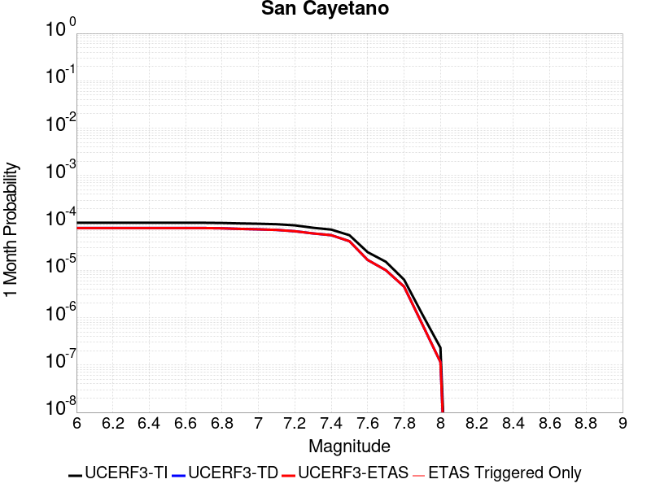 | 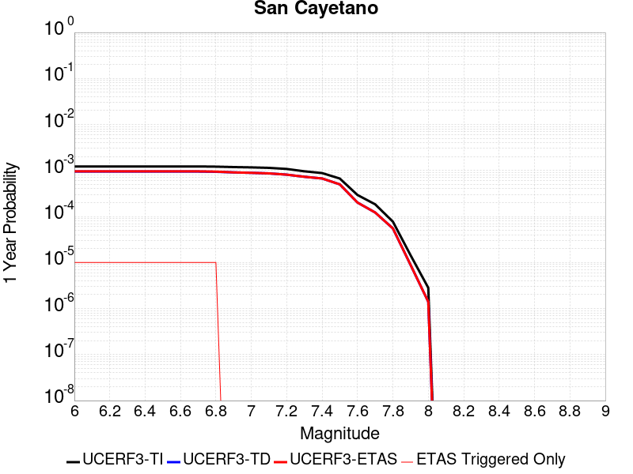 | 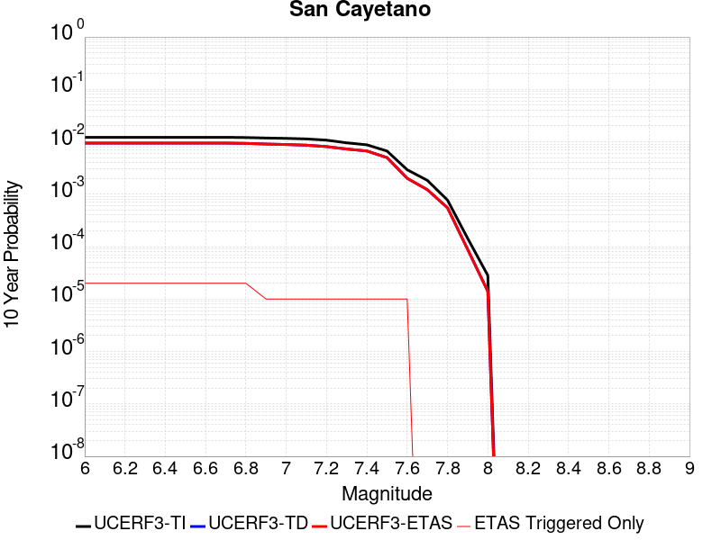 |

| Magnitude | 1 wk TI Prob | 1 wk TD Prob | 1 wk ETAS Prob | 1 wk ETAS/TD Gain | 1 wk ETAS Triggered Only | 1 mo TI Prob | 1 mo TD Prob | 1 mo ETAS Prob | 1 mo ETAS/TD Gain | 1 mo ETAS Triggered Only | 1 yr TI Prob | 1 yr TD Prob | 1 yr ETAS Prob | 1 yr ETAS/TD Gain | 1 yr ETAS Triggered Only | 10 yr TI Prob | 10 yr TD Prob | 10 yr ETAS Prob | 10 yr ETAS/TD Gain | 10 yr ETAS Triggered Only |
|-----|-----|-----|-----|-----|-----|-----|-----|-----|-----|-----|-----|-----|-----|-----|-----|-----|-----|-----|-----|-----|
| 6.0 | 2.3476267E-5 | 1.816963E-5 | 1.816963E-5 | 1.0 | 0.0 | 1.0060869E-4 | 7.786754E-5 | 7.786754E-5 | 1.0 | 0.0 | 0.0012242225 | 9.4762864E-4 | 9.5960766E-4 | 1.0126411 | 1.1990408E-5 | 0.012175002 | 0.009436766 | 0.00946052 | 1.0025172 | 2.3980816E-5 |
| 6.1 | 2.3476267E-5 | 1.816963E-5 | 1.816963E-5 | 1.0 | 0.0 | 1.0060869E-4 | 7.786754E-5 | 7.786754E-5 | 1.0 | 0.0 | 0.0012242225 | 9.4762864E-4 | 9.5960766E-4 | 1.0126411 | 1.1990408E-5 | 0.012175002 | 0.009436766 | 0.00946052 | 1.0025172 | 2.3980816E-5 |
| 6.2 | 2.3476267E-5 | 1.816963E-5 | 1.816963E-5 | 1.0 | 0.0 | 1.0060869E-4 | 7.786754E-5 | 7.786754E-5 | 1.0 | 0.0 | 0.0012242225 | 9.4762864E-4 | 9.5960766E-4 | 1.0126411 | 1.1990408E-5 | 0.012175002 | 0.009436766 | 0.00946052 | 1.0025172 | 2.3980816E-5 |
| 6.3 | 2.3476267E-5 | 1.816963E-5 | 1.816963E-5 | 1.0 | 0.0 | 1.0060869E-4 | 7.786754E-5 | 7.786754E-5 | 1.0 | 0.0 | 0.0012242225 | 9.4762864E-4 | 9.5960766E-4 | 1.0126411 | 1.1990408E-5 | 0.012175002 | 0.009436766 | 0.00946052 | 1.0025172 | 2.3980816E-5 |
| 6.4 | 2.3476267E-5 | 1.816963E-5 | 1.816963E-5 | 1.0 | 0.0 | 1.0060869E-4 | 7.786754E-5 | 7.786754E-5 | 1.0 | 0.0 | 0.0012242225 | 9.4762864E-4 | 9.5960766E-4 | 1.0126411 | 1.1990408E-5 | 0.012175002 | 0.009436766 | 0.00946052 | 1.0025172 | 2.3980816E-5 |
| 6.5 | 2.3476267E-5 | 1.816963E-5 | 1.816963E-5 | 1.0 | 0.0 | 1.0060869E-4 | 7.786754E-5 | 7.786754E-5 | 1.0 | 0.0 | 0.0012242225 | 9.4762864E-4 | 9.5960766E-4 | 1.0126411 | 1.1990408E-5 | 0.012175002 | 0.009436766 | 0.00946052 | 1.0025172 | 2.3980816E-5 |
| 6.6 | 2.3476267E-5 | 1.816963E-5 | 1.816963E-5 | 1.0 | 0.0 | 1.0060869E-4 | 7.786754E-5 | 7.786754E-5 | 1.0 | 0.0 | 0.0012242225 | 9.4762864E-4 | 9.5960766E-4 | 1.0126411 | 1.1990408E-5 | 0.012175002 | 0.009436766 | 0.00946052 | 1.0025172 | 2.3980816E-5 |
| 6.7 | 2.3476267E-5 | 1.816963E-5 | 1.816963E-5 | 1.0 | 0.0 | 1.0060869E-4 | 7.786754E-5 | 7.786754E-5 | 1.0 | 0.0 | 0.0012242225 | 9.4762864E-4 | 9.5960766E-4 | 1.0126411 | 1.1990408E-5 | 0.012175002 | 0.009436766 | 0.00946052 | 1.0025172 | 2.3980816E-5 |
| 6.8 | 2.3241924E-5 | 1.7937333E-5 | 1.7937333E-5 | 1.0 | 0.0 | 9.960445E-5 | 7.6872035E-5 | 7.6872035E-5 | 1.0 | 0.0 | 0.0012120095 | 9.3551876E-4 | 9.4749796E-4 | 1.0128049 | 1.1990408E-5 | 0.012054204 | 0.00931666 | 0.009340418 | 1.00255 | 2.3980816E-5 |
| 6.9 | 2.2761007E-5 | 1.7432758E-5 | 1.7432758E-5 | 1.0 | 0.0 | 9.7543525E-5 | 7.47097E-5 | 7.47097E-5 | 1.0 | 0.0 | 0.0011869454 | 9.092145E-4 | 9.092145E-4 | 1.0 | 0.0 | 0.011806256 | 0.009055776 | 0.009067657 | 1.001312 | 1.1990408E-5 |
| 7.0 | 2.240283E-5 | 1.7066497E-5 | 1.7066497E-5 | 1.0 | 0.0 | 9.600859E-5 | 7.3140094E-5 | 7.3140094E-5 | 1.0 | 0.0 | 0.0011682777 | 8.901203E-4 | 8.901203E-4 | 1.0 | 0.0 | 0.011621549 | 0.008866365 | 0.008878249 | 1.0013404 | 1.1990408E-5 |
| 7.1 | 2.1871154E-5 | 1.6586335E-5 | 1.6586335E-5 | 1.0 | 0.0 | 9.373015E-5 | 7.108237E-5 | 7.108237E-5 | 1.0 | 0.0 | 0.0011405671 | 8.650876E-4 | 8.650876E-4 | 1.0 | 0.0 | 0.011347309 | 0.008618002 | 0.008629889 | 1.0013794 | 1.1990408E-5 |
| 7.2 | 2.0714133E-5 | 1.5564854E-5 | 1.5564854E-5 | 1.0 | 0.0 | 8.8771834E-5 | 6.670483E-5 | 6.670483E-5 | 1.0 | 0.0 | 0.0010802611 | 8.1183197E-4 | 8.1183197E-4 | 1.0 | 0.0 | 0.010750249 | 0.008089437 | 0.008101331 | 1.0014702 | 1.1990408E-5 |
| 7.3 | 1.8408395E-5 | 1.3997111E-5 | 1.3997111E-5 | 1.0 | 0.0 | 7.8890735E-5 | 5.9986254E-5 | 5.9986254E-5 | 1.0 | 0.0 | 9.600714E-4 | 7.3009095E-4 | 7.3009095E-4 | 1.0 | 0.0 | 0.009559342 | 0.007277643 | 0.007289546 | 1.0016356 | 1.1990408E-5 |
| 7.4 | 1.6856795E-5 | 1.28503E-5 | 1.28503E-5 | 1.0 | 0.0 | 7.2241404E-5 | 5.5071567E-5 | 5.5071567E-5 | 1.0 | 0.0 | 8.7918417E-4 | 6.702929E-4 | 6.702929E-4 | 1.0 | 0.0 | 0.00875714 | 0.0066833915 | 0.0066953017 | 1.0017821 | 1.1990408E-5 |
| 7.5 | 1.2822778E-5 | 9.577698E-6 | 9.577698E-6 | 1.0 | 0.0 | 5.495361E-5 | 4.104664E-5 | 4.104664E-5 | 1.0 | 0.0 | 6.688548E-4 | 4.996298E-4 | 4.996298E-4 | 1.0 | 0.0 | 0.006668452 | 0.0049852366 | 0.004997167 | 1.0023932 | 1.1990408E-5 |
| 7.6 | 5.6272684E-6 | 3.8549683E-6 | 3.8549683E-6 | 1.0 | 0.0 | 2.4116642E-5 | 1.6521188E-5 | 1.6521188E-5 | 1.0 | 0.0 | 2.9358055E-4 | 2.01127E-4 | 2.01127E-4 | 1.0 | 0.0 | 0.0029319301 | 0.0020094607 | 0.002021427 | 1.005955 | 1.1990408E-5 |
| 7.7 | 3.5261346E-6 | 2.340742E-6 | 2.340742E-6 | 1.0 | 0.0 | 1.5111918E-5 | 1.0031713E-5 | 1.0031713E-5 | 1.0 | 0.0 | 1.8397206E-4 | 1.2212934E-4 | 1.2212934E-4 | 1.0 | 0.0 | 0.0018381984 | 0.0012206296 | 0.0012206296 | 1.0 | 0.0 |
| 7.8 | 1.4826929E-6 | 1.0564453E-6 | 1.0564453E-6 | 1.0 | 0.0 | 6.354383E-6 | 4.5276147E-6 | 4.5276147E-6 | 1.0 | 0.0 | 7.736187E-5 | 5.512234E-5 | 5.512234E-5 | 1.0 | 0.0 | 7.733494E-4 | 5.5108865E-4 | 5.5108865E-4 | 1.0 | 0.0 |
| 7.9 | 2.7568166E-7 | 1.6978672E-7 | 1.6978672E-7 | 1.0 | 0.0 | 1.1814923E-6 | 7.2765715E-7 | 7.2765715E-7 | 1.0 | 0.0 | 1.4384574E-5 | 8.85919E-6 | 8.85919E-6 | 1.0 | 0.0 | 1.4383643E-4 | 8.85884E-5 | 8.85884E-5 | 1.0 | 0.0 |
| 8.0 | 5.407832E-8 | 2.6889136E-8 | 2.6889136E-8 | 1.0 | 0.0 | 2.3176422E-7 | 1.15239146E-7 | 1.15239146E-7 | 1.0 | 0.0 | 2.8217257E-6 | 1.4030358E-6 | 1.4030358E-6 | 1.0 | 0.0 | 2.8216898E-5 | 1.4030274E-5 | 1.4030274E-5 | 1.0 | 0.0 |

## Cedar Mtn-Mahogany Mtn
*[(top)](#table-of-contents)*

| 1 Week | 1 Month | 1 Year | 10 Year |
|-----|-----|-----|-----|
| 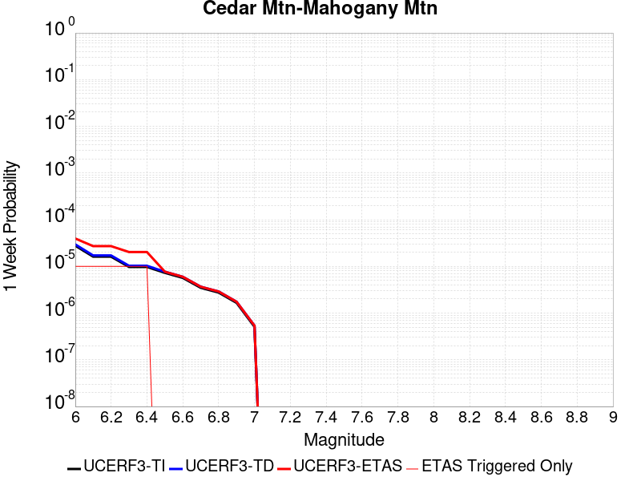 | 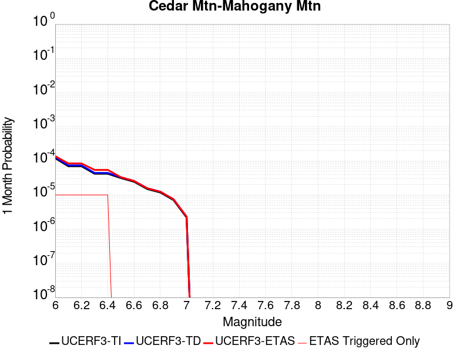 | 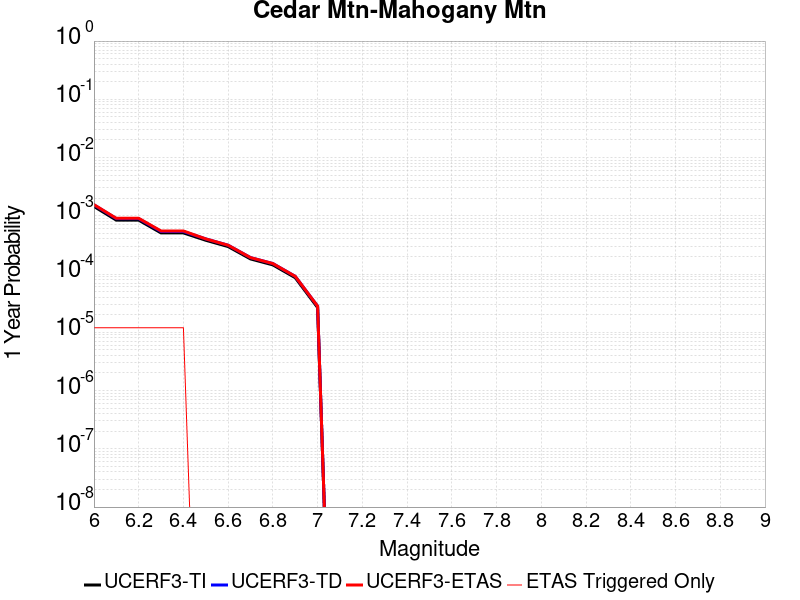 | 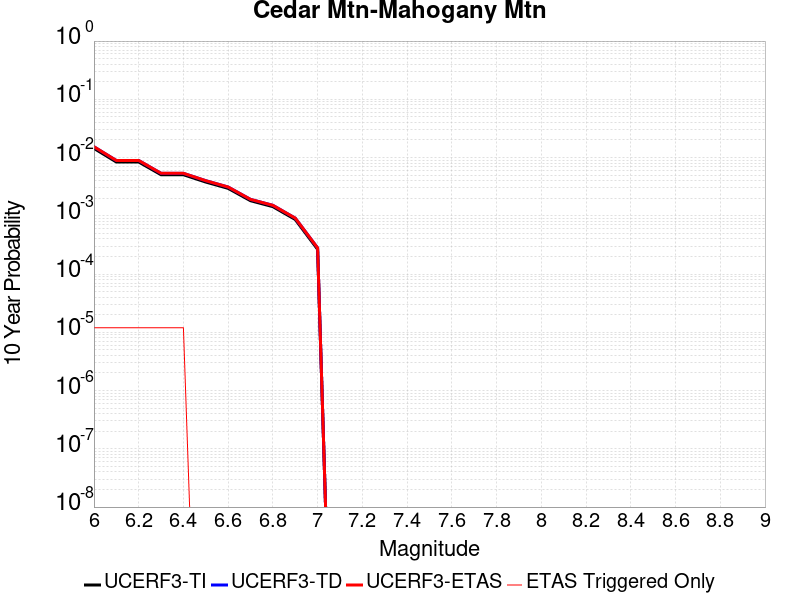 |

| Magnitude | 1 wk TI Prob | 1 wk TD Prob | 1 wk ETAS Prob | 1 wk ETAS/TD Gain | 1 wk ETAS Triggered Only | 1 mo TI Prob | 1 mo TD Prob | 1 mo ETAS Prob | 1 mo ETAS/TD Gain | 1 mo ETAS Triggered Only | 1 yr TI Prob | 1 yr TD Prob | 1 yr ETAS Prob | 1 yr ETAS/TD Gain | 1 yr ETAS Triggered Only | 10 yr TI Prob | 10 yr TD Prob | 10 yr ETAS Prob | 10 yr ETAS/TD Gain | 10 yr ETAS Triggered Only |
|-----|-----|-----|-----|-----|-----|-----|-----|-----|-----|-----|-----|-----|-----|-----|-----|-----|-----|-----|-----|-----|
| 6.0 | 2.7763876E-5 | 2.9589124E-5 | 4.1579176E-5 | 1.4052182 | 1.1990408E-5 | 1.1898261E-4 | 1.2680476E-4 | 1.3879365E-4 | 1.0945461 | 1.1990408E-5 | 0.0014476506 | 0.0015428247 | 0.0015547966 | 1.0077597 | 1.1990408E-5 | 0.0143825635 | 0.015328358 | 0.015340164 | 1.0007702 | 1.1990408E-5 |
| 6.1 | 1.6162443E-5 | 1.7143104E-5 | 2.9133305E-5 | 1.6994184 | 1.1990408E-5 | 6.926578E-5 | 7.346847E-5 | 8.5458E-5 | 1.1631927 | 1.1990408E-5 | 8.4298453E-4 | 8.9412933E-4 | 9.0610905E-4 | 1.0133982 | 1.1990408E-5 | 0.008397939 | 0.00890713 | 0.008919014 | 1.0013342 | 1.1990408E-5 |
| 6.2 | 1.6162443E-5 | 1.7143104E-5 | 2.9133305E-5 | 1.6994184 | 1.1990408E-5 | 6.926578E-5 | 7.346847E-5 | 8.5458E-5 | 1.1631927 | 1.1990408E-5 | 8.4298453E-4 | 8.9412933E-4 | 9.0610905E-4 | 1.0133982 | 1.1990408E-5 | 0.008397939 | 0.00890713 | 0.008919014 | 1.0013342 | 1.1990408E-5 |
| 6.3 | 9.746053E-6 | 1.030323E-5 | 2.2293514E-5 | 2.1637404 | 1.1990408E-5 | 4.1768133E-5 | 4.4155975E-5 | 5.6145855E-5 | 1.2715347 | 1.1990408E-5 | 5.0840835E-4 | 5.374705E-4 | 5.494545E-4 | 1.022297 | 1.1990408E-5 | 0.0050724675 | 0.005362125 | 0.005374051 | 1.0022241 | 1.1990408E-5 |
| 6.4 | 9.746053E-6 | 1.030323E-5 | 2.2293514E-5 | 2.1637404 | 1.1990408E-5 | 4.1768133E-5 | 4.4155975E-5 | 5.6145855E-5 | 1.2715347 | 1.1990408E-5 | 5.0840835E-4 | 5.374705E-4 | 5.494545E-4 | 1.022297 | 1.1990408E-5 | 0.0050724675 | 0.005362125 | 0.005374051 | 1.0022241 | 1.1990408E-5 |
| 6.5 | 7.290083E-6 | 7.695381E-6 | 7.695381E-6 | 1.0 | 0.0 | 3.124284E-5 | 3.2979802E-5 | 3.2979802E-5 | 1.0 | 0.0 | 3.8031515E-4 | 4.0145728E-4 | 4.0145728E-4 | 1.0 | 0.0 | 0.0037966494 | 0.0040075406 | 0.0040075406 | 1.0 | 0.0 |
| 6.6 | 5.67907E-6 | 5.9891963E-6 | 5.9891963E-6 | 1.0 | 0.0 | 2.4338644E-5 | 2.5667738E-5 | 2.5667738E-5 | 1.0 | 0.0 | 2.962827E-4 | 3.1246126E-4 | 3.1246126E-4 | 1.0 | 0.0 | 0.0029588798 | 0.0031203553 | 0.0031203553 | 1.0 | 0.0 |
| 6.7 | 3.4853963E-6 | 3.6726572E-6 | 3.6726572E-6 | 1.0 | 0.0 | 1.4937327E-5 | 1.5739868E-5 | 1.5739868E-5 | 1.0 | 0.0 | 1.8184677E-4 | 1.9161667E-4 | 1.9161667E-4 | 1.0 | 0.0 | 0.0018169804 | 0.0019145765 | 0.0019145765 | 1.0 | 0.0 |
| 6.8 | 2.7535168E-6 | 2.901597E-6 | 2.901597E-6 | 1.0 | 0.0 | 1.1800733E-5 | 1.2435359E-5 | 1.2435359E-5 | 1.0 | 0.0 | 1.4366445E-4 | 1.5139046E-4 | 1.5139046E-4 | 1.0 | 0.0 | 0.0014357162 | 0.0015129205 | 0.0015129205 | 1.0 | 0.0 |
| 6.9 | 1.6594106E-6 | 1.7497113E-6 | 1.7497113E-6 | 1.0 | 0.0 | 7.1117406E-6 | 7.4987424E-6 | 7.4987424E-6 | 1.0 | 0.0 | 8.6582E-5 | 9.1293674E-5 | 9.1293674E-5 | 1.0 | 0.0 | 8.654827E-4 | 9.1259216E-4 | 9.1259216E-4 | 1.0 | 0.0 |
| 7.0 | 5.10215E-7 | 5.389294E-7 | 5.389294E-7 | 1.0 | 0.0 | 2.186634E-6 | 2.3096961E-6 | 2.3096961E-6 | 1.0 | 0.0 | 2.6621943E-5 | 2.8120316E-5 | 2.8120316E-5 | 1.0 | 0.0 | 2.6618753E-4 | 2.811801E-4 | 2.811801E-4 | 1.0 | 0.0 |

## Northridge
*[(top)](#table-of-contents)*

| 1 Week | 1 Month | 1 Year | 10 Year |
|-----|-----|-----|-----|
| 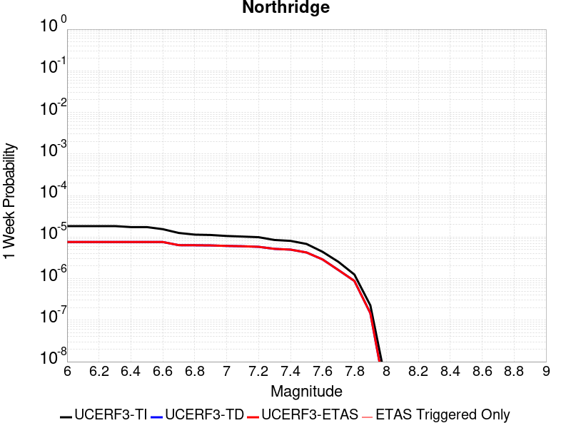 | 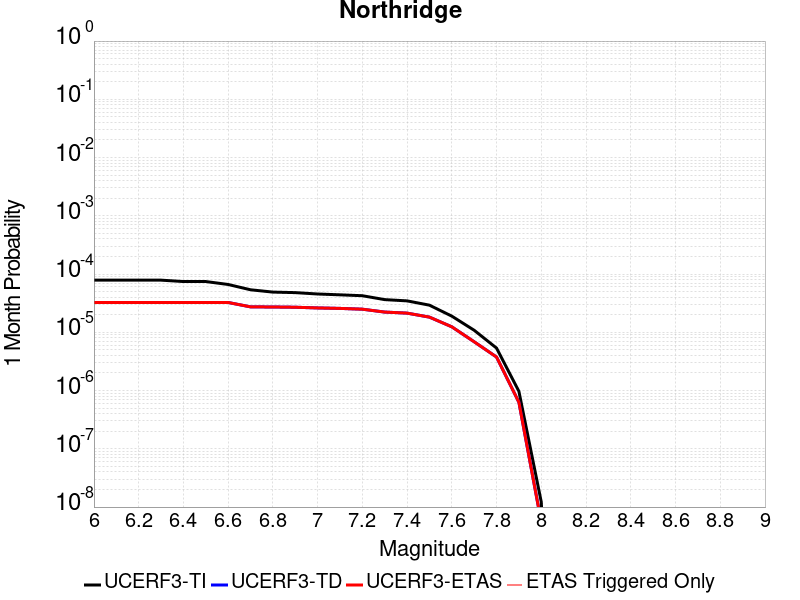 |  | 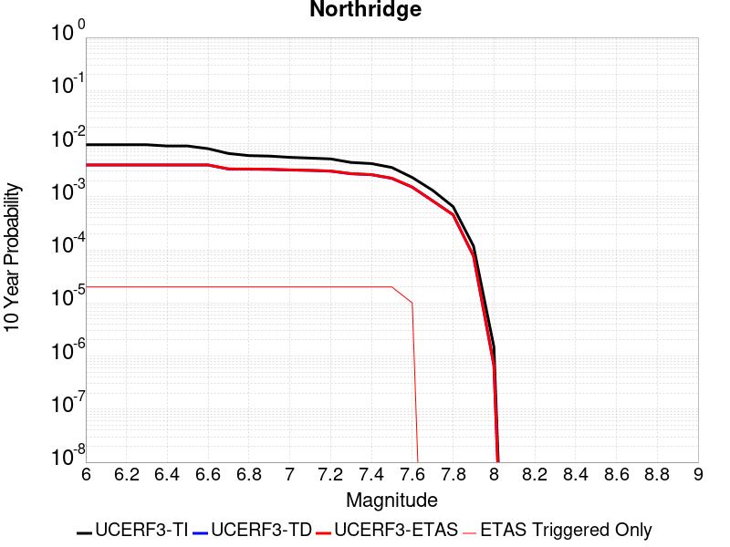 |

| Magnitude | 1 wk TI Prob | 1 wk TD Prob | 1 wk ETAS Prob | 1 wk ETAS/TD Gain | 1 wk ETAS Triggered Only | 1 mo TI Prob | 1 mo TD Prob | 1 mo ETAS Prob | 1 mo ETAS/TD Gain | 1 mo ETAS Triggered Only | 1 yr TI Prob | 1 yr TD Prob | 1 yr ETAS Prob | 1 yr ETAS/TD Gain | 1 yr ETAS Triggered Only | 10 yr TI Prob | 10 yr TD Prob | 10 yr ETAS Prob | 10 yr ETAS/TD Gain | 10 yr ETAS Triggered Only |
|-----|-----|-----|-----|-----|-----|-----|-----|-----|-----|-----|-----|-----|-----|-----|-----|-----|-----|-----|-----|-----|
| 6.0 | 1.8340852E-5 | 7.5881535E-6 | 7.5881535E-6 | 1.0 | 0.0 | 7.860128E-5 | 3.2520264E-5 | 3.2520264E-5 | 1.0 | 0.0 | 9.565505E-4 | 3.9586448E-4 | 3.9586448E-4 | 1.0 | 0.0 | 0.009524435 | 0.003951816 | 0.0039757015 | 1.0060443 | 2.3980816E-5 |
| 6.1 | 1.8340852E-5 | 7.5881535E-6 | 7.5881535E-6 | 1.0 | 0.0 | 7.860128E-5 | 3.2520264E-5 | 3.2520264E-5 | 1.0 | 0.0 | 9.565505E-4 | 3.9586448E-4 | 3.9586448E-4 | 1.0 | 0.0 | 0.009524435 | 0.003951816 | 0.0039757015 | 1.0060443 | 2.3980816E-5 |
| 6.2 | 1.8340852E-5 | 7.5881535E-6 | 7.5881535E-6 | 1.0 | 0.0 | 7.860128E-5 | 3.2520264E-5 | 3.2520264E-5 | 1.0 | 0.0 | 9.565505E-4 | 3.9586448E-4 | 3.9586448E-4 | 1.0 | 0.0 | 0.009524435 | 0.003951816 | 0.0039757015 | 1.0060443 | 2.3980816E-5 |
| 6.3 | 1.8340852E-5 | 7.5881535E-6 | 7.5881535E-6 | 1.0 | 0.0 | 7.860128E-5 | 3.2520264E-5 | 3.2520264E-5 | 1.0 | 0.0 | 9.565505E-4 | 3.9586448E-4 | 3.9586448E-4 | 1.0 | 0.0 | 0.009524435 | 0.003951816 | 0.0039757015 | 1.0060443 | 2.3980816E-5 |
| 6.4 | 1.7361892E-5 | 7.5881535E-6 | 7.5881535E-6 | 1.0 | 0.0 | 7.440598E-5 | 3.2520264E-5 | 3.2520264E-5 | 1.0 | 0.0 | 9.055163E-4 | 3.9586448E-4 | 3.9586448E-4 | 1.0 | 0.0 | 0.009018354 | 0.003951816 | 0.0039757015 | 1.0060443 | 2.3980816E-5 |
| 6.5 | 1.7361892E-5 | 7.5881535E-6 | 7.5881535E-6 | 1.0 | 0.0 | 7.440598E-5 | 3.2520264E-5 | 3.2520264E-5 | 1.0 | 0.0 | 9.055163E-4 | 3.9586448E-4 | 3.9586448E-4 | 1.0 | 0.0 | 0.009018354 | 0.003951816 | 0.0039757015 | 1.0060443 | 2.3980816E-5 |
| 6.6 | 1.5458201E-5 | 7.5881535E-6 | 7.5881535E-6 | 1.0 | 0.0 | 6.624775E-5 | 3.2520264E-5 | 3.2520264E-5 | 1.0 | 0.0 | 8.0626784E-4 | 3.9586448E-4 | 3.9586448E-4 | 1.0 | 0.0 | 0.008033488 | 0.003951816 | 0.0039757015 | 1.0060443 | 2.3980816E-5 |
| 6.7 | 1.2538368E-5 | 6.381707E-6 | 6.381707E-6 | 1.0 | 0.0 | 5.3734755E-5 | 2.7349888E-5 | 2.7349888E-5 | 1.0 | 0.0 | 6.5402425E-4 | 3.3293446E-4 | 3.3293446E-4 | 1.0 | 0.0 | 0.0065210275 | 0.0033244046 | 0.0033483058 | 1.0071896 | 2.3980816E-5 |
| 6.8 | 1.1438097E-5 | 6.3503594E-6 | 6.3503594E-6 | 1.0 | 0.0 | 4.9019498E-5 | 2.7215545E-5 | 2.7215545E-5 | 1.0 | 0.0 | 5.9664896E-4 | 3.3129932E-4 | 3.3129932E-4 | 1.0 | 0.0 | 0.005950495 | 0.003308102 | 0.0033320035 | 1.0072252 | 2.3980816E-5 |
| 6.9 | 1.1204891E-5 | 6.2868094E-6 | 6.2868094E-6 | 1.0 | 0.0 | 4.8020076E-5 | 2.6943193E-5 | 2.6943193E-5 | 1.0 | 0.0 | 5.8448757E-4 | 3.2798442E-4 | 3.2798442E-4 | 1.0 | 0.0 | 0.0058295266 | 0.0032750512 | 0.0032989534 | 1.0072984 | 2.3980816E-5 |
| 7.0 | 1.061046E-5 | 6.1154565E-6 | 6.1154565E-6 | 1.0 | 0.0 | 4.5472607E-5 | 2.6208838E-5 | 2.6208838E-5 | 1.0 | 0.0 | 5.534883E-4 | 3.1904632E-4 | 3.1904632E-4 | 1.0 | 0.0 | 0.0055211177 | 0.003185929 | 0.0032098335 | 1.0075032 | 2.3980816E-5 |
| 7.1 | 1.0266979E-5 | 6.0043685E-6 | 6.0043685E-6 | 1.0 | 0.0 | 4.40006E-5 | 2.5732756E-5 | 2.5732756E-5 | 1.0 | 0.0 | 5.355756E-4 | 3.132517E-4 | 3.132517E-4 | 1.0 | 0.0 | 0.0053428668 | 0.0031281472 | 0.003152053 | 1.0076421 | 2.3980816E-5 |
| 7.2 | 9.91273E-6 | 5.820076E-6 | 5.820076E-6 | 1.0 | 0.0 | 4.248244E-5 | 2.4942945E-5 | 2.4942945E-5 | 1.0 | 0.0 | 5.171009E-4 | 3.0363846E-4 | 3.0363846E-4 | 1.0 | 0.0 | 0.0051589934 | 0.003032281 | 0.003056189 | 1.0078845 | 2.3980816E-5 |
| 7.3 | 8.4959265E-6 | 5.1931415E-6 | 5.1931415E-6 | 1.0 | 0.0 | 3.6410605E-5 | 2.2256132E-5 | 2.2256132E-5 | 1.0 | 0.0 | 4.4320893E-4 | 2.7093495E-4 | 2.7093495E-4 | 1.0 | 0.0 | 0.00442326 | 0.0027060728 | 0.0027299887 | 1.0088378 | 2.3980816E-5 |
| 7.4 | 8.0847185E-6 | 4.9820114E-6 | 4.9820114E-6 | 1.0 | 0.0 | 3.4648332E-5 | 2.1351305E-5 | 2.1351305E-5 | 1.0 | 0.0 | 4.2176177E-4 | 2.5992136E-4 | 2.5992136E-4 | 1.0 | 0.0 | 0.0042096223 | 0.0025961995 | 0.002620118 | 1.009213 | 2.3980816E-5 |
| 7.5 | 6.8220684E-6 | 4.2533693E-6 | 4.2533693E-6 | 1.0 | 0.0 | 2.9237108E-5 | 1.8228598E-5 | 1.8228598E-5 | 1.0 | 0.0 | 3.5590364E-4 | 2.2191078E-4 | 2.2191078E-4 | 1.0 | 0.0 | 0.0035533418 | 0.0022169128 | 0.0022408406 | 1.0107932 | 2.3980816E-5 |
| 7.6 | 4.4224143E-6 | 2.8999916E-6 | 2.8999916E-6 | 1.0 | 0.0 | 1.8953066E-5 | 1.2428477E-5 | 1.2428477E-5 | 1.0 | 0.0 | 2.3072914E-4 | 1.5130632E-4 | 1.5130632E-4 | 1.0 | 0.0 | 0.0023048974 | 0.0015120446 | 0.0015240168 | 1.0079179 | 1.1990408E-5 |
| 7.7 | 2.5297056E-6 | 1.6046072E-6 | 1.6046072E-6 | 1.0 | 0.0 | 1.0841551E-5 | 6.87687E-6 | 6.87687E-6 | 1.0 | 0.0 | 1.319879E-4 | 8.372273E-5 | 8.372273E-5 | 1.0 | 0.0 | 0.0013190953 | 8.3691656E-4 | 8.3691656E-4 | 1.0 | 0.0 |
| 7.8 | 1.2508156E-6 | 8.78015E-7 | 8.78015E-7 | 1.0 | 0.0 | 5.3606273E-6 | 3.7629159E-6 | 3.7629159E-6 | 1.0 | 0.0 | 6.526368E-5 | 4.581255E-5 | 4.581255E-5 | 1.0 | 0.0 | 6.524452E-4 | 4.5803236E-4 | 4.5803236E-4 | 1.0 | 0.0 |
| 7.9 | 2.262199E-7 | 1.4664893E-7 | 1.4664893E-7 | 1.0 | 0.0 | 9.695135E-7 | 6.2849523E-7 | 6.2849523E-7 | 1.0 | 0.0 | 1.1803763E-5 | 7.651904E-6 | 7.651904E-6 | 1.0 | 0.0 | 1.1803136E-4 | 7.651648E-5 | 7.651648E-5 | 1.0 | 0.0 |
| 8.0 | 2.865362E-9 | 1.2753953E-9 | 1.2753953E-9 | 1.0 | 0.0 | 1.2280123E-8 | 5.46598E-9 | 5.46598E-9 | 1.0 | 0.0 | 1.4951048E-7 | 6.654831E-8 | 6.654831E-8 | 1.0 | 0.0 | 1.4951038E-6 | 6.6548307E-7 | 6.6548307E-7 | 1.0 | 0.0 |

## Rinconada 2011 CFM
*[(top)](#table-of-contents)*

| 1 Week | 1 Month | 1 Year | 10 Year |
|-----|-----|-----|-----|
| 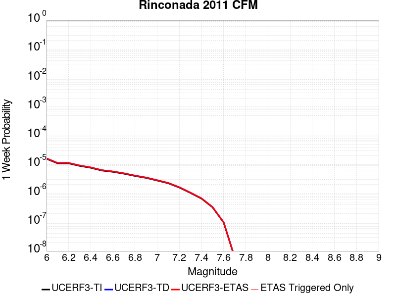 |  |  | 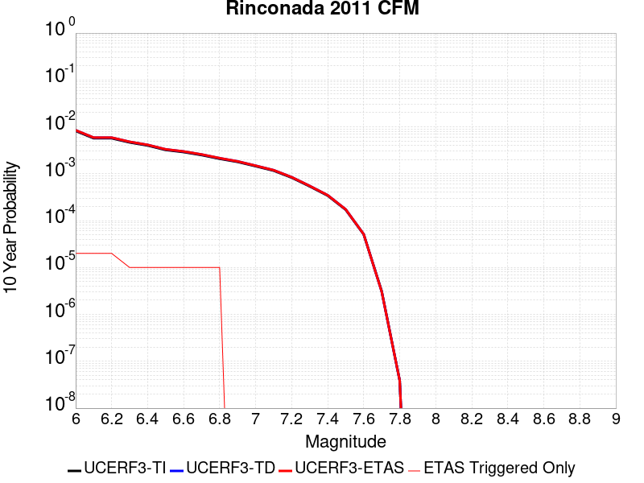 |

| Magnitude | 1 wk TI Prob | 1 wk TD Prob | 1 wk ETAS Prob | 1 wk ETAS/TD Gain | 1 wk ETAS Triggered Only | 1 mo TI Prob | 1 mo TD Prob | 1 mo ETAS Prob | 1 mo ETAS/TD Gain | 1 mo ETAS Triggered Only | 1 yr TI Prob | 1 yr TD Prob | 1 yr ETAS Prob | 1 yr ETAS/TD Gain | 1 yr ETAS Triggered Only | 10 yr TI Prob | 10 yr TD Prob | 10 yr ETAS Prob | 10 yr ETAS/TD Gain | 10 yr ETAS Triggered Only |
|-----|-----|-----|-----|-----|-----|-----|-----|-----|-----|-----|-----|-----|-----|-----|-----|-----|-----|-----|-----|-----|
| 6.0 | 1.5752368E-5 | 1.6274787E-5 | 1.6274787E-5 | 1.0 | 0.0 | 6.75084E-5 | 6.974724E-5 | 6.974724E-5 | 1.0 | 0.0 | 8.2160486E-4 | 8.48845E-4 | 8.728054E-4 | 1.0282271 | 2.3980816E-5 | 0.008185739 | 0.008456407 | 0.008480185 | 1.0028118 | 2.3980816E-5 |
| 6.1 | 1.0966133E-5 | 1.1323078E-5 | 1.1323078E-5 | 1.0 | 0.0 | 4.6996865E-5 | 4.8526577E-5 | 4.8526577E-5 | 1.0 | 0.0 | 5.720366E-4 | 5.9065165E-4 | 6.146183E-4 | 1.0405766 | 2.3980816E-5 | 0.0057056635 | 0.0058909142 | 0.005914754 | 1.0040468 | 2.3980816E-5 |
| 6.2 | 1.0966133E-5 | 1.1323078E-5 | 1.1323078E-5 | 1.0 | 0.0 | 4.6996865E-5 | 4.8526577E-5 | 4.8526577E-5 | 1.0 | 0.0 | 5.720366E-4 | 5.9065165E-4 | 6.146183E-4 | 1.0405766 | 2.3980816E-5 | 0.0057056635 | 0.0058909142 | 0.005914754 | 1.0040468 | 2.3980816E-5 |
| 6.3 | 8.926149E-6 | 9.212811E-6 | 9.212811E-6 | 1.0 | 0.0 | 3.8254362E-5 | 3.9482882E-5 | 3.9482882E-5 | 1.0 | 0.0 | 4.6564735E-4 | 4.8059836E-4 | 4.92583E-4 | 1.0249369 | 1.1990408E-5 | 0.0046467283 | 0.004795635 | 0.0048075677 | 1.0024883 | 1.1990408E-5 |
| 6.4 | 7.676955E-6 | 7.920225E-6 | 7.920225E-6 | 1.0 | 0.0 | 3.290082E-5 | 3.394338E-5 | 3.394338E-5 | 1.0 | 0.0 | 4.0049385E-4 | 4.1318245E-4 | 4.251679E-4 | 1.0290077 | 1.1990408E-5 | 0.0039977287 | 0.004124169 | 0.0041361097 | 1.0028954 | 1.1990408E-5 |
| 6.5 | 6.1671026E-6 | 6.3589814E-6 | 6.3589814E-6 | 1.0 | 0.0 | 2.6430173E-5 | 2.7252492E-5 | 2.7252492E-5 | 1.0 | 0.0 | 3.2173982E-4 | 3.3174866E-4 | 3.437351E-4 | 1.036131 | 1.1990408E-5 | 0.003212744 | 0.0033125463 | 0.003324497 | 1.0036077 | 1.1990408E-5 |
| 6.6 | 5.553456E-6 | 5.7248362E-6 | 5.7248362E-6 | 1.0 | 0.0 | 2.3800309E-5 | 2.4534782E-5 | 2.4534782E-5 | 1.0 | 0.0 | 2.897302E-4 | 2.986701E-4 | 3.106569E-4 | 1.040134 | 1.1990408E-5 | 0.0028935277 | 0.0029826954 | 0.00299465 | 1.004008 | 1.1990408E-5 |
| 6.7 | 4.787857E-6 | 4.93333E-6 | 4.93333E-6 | 1.0 | 0.0 | 2.0519226E-5 | 2.114267E-5 | 2.114267E-5 | 1.0 | 0.0 | 2.4979294E-4 | 2.5738165E-4 | 2.6936896E-4 | 1.0465741 | 1.1990408E-5 | 0.0024951235 | 0.0025708412 | 0.0025828008 | 1.004652 | 1.1990408E-5 |
| 6.8 | 3.9955166E-6 | 4.1134927E-6 | 4.1134927E-6 | 1.0 | 0.0 | 1.7123532E-5 | 1.7629134E-5 | 1.7629134E-5 | 1.0 | 0.0 | 2.0845905E-4 | 2.146136E-4 | 2.2660143E-4 | 1.0558578 | 1.1990408E-5 | 0.002082636 | 0.002144067 | 0.0021560318 | 1.0055804 | 1.1990408E-5 |
| 6.9 | 3.4250072E-6 | 3.5224598E-6 | 3.5224598E-6 | 1.0 | 0.0 | 1.46785205E-5 | 1.509617E-5 | 1.509617E-5 | 1.0 | 0.0 | 1.7869633E-4 | 1.8378037E-4 | 1.8378037E-4 | 1.0 | 0.0 | 0.001785527 | 0.0018362864 | 0.0018362864 | 1.0 | 0.0 |
| 7.0 | 2.7712713E-6 | 2.8467105E-6 | 2.8467105E-6 | 1.0 | 0.0 | 1.1876823E-5 | 1.2200131E-5 | 1.2200131E-5 | 1.0 | 0.0 | 1.4459073E-4 | 1.4852648E-4 | 1.4852648E-4 | 1.0 | 0.0 | 0.0014449668 | 0.0014842737 | 0.0014842737 | 1.0 | 0.0 |
| 7.1 | 2.227358E-6 | 2.2857066E-6 | 2.2857066E-6 | 1.0 | 0.0 | 9.545785E-6 | 9.795849E-6 | 9.795849E-6 | 1.0 | 0.0 | 1.16213734E-4 | 1.19257944E-4 | 1.19257944E-4 | 1.0 | 0.0 | 0.0011615298 | 0.0011919405 | 0.0011919405 | 1.0 | 0.0 |
| 7.2 | 1.581796E-6 | 1.6209067E-6 | 1.6209067E-6 | 1.0 | 0.0 | 6.779108E-6 | 6.9467246E-6 | 6.9467246E-6 | 1.0 | 0.0 | 8.253252E-5 | 8.457309E-5 | 8.457309E-5 | 1.0 | 0.0 | 8.250187E-4 | 8.4540964E-4 | 8.4540964E-4 | 1.0 | 0.0 |
| 7.3 | 1.0306567E-6 | 1.0546512E-6 | 1.0546512E-6 | 1.0 | 0.0 | 4.4170924E-6 | 4.519926E-6 | 4.519926E-6 | 1.0 | 0.0 | 5.3776774E-5 | 5.5028708E-5 | 5.5028708E-5 | 1.0 | 0.0 | 5.376376E-4 | 5.5015105E-4 | 5.5015105E-4 | 1.0 | 0.0 |
| 7.4 | 6.535541E-7 | 6.682764E-7 | 6.682764E-7 | 1.0 | 0.0 | 2.800943E-6 | 2.8640386E-6 | 2.8640386E-6 | 1.0 | 0.0 | 3.4100947E-5 | 3.4869114E-5 | 3.4869114E-5 | 1.0 | 0.0 | 3.4095717E-4 | 3.4863656E-4 | 3.4863656E-4 | 1.0 | 0.0 |
| 7.5 | 3.2656962E-7 | 3.33168E-7 | 3.33168E-7 | 1.0 | 0.0 | 1.3995833E-6 | 1.427862E-6 | 1.427862E-6 | 1.0 | 0.0 | 1.7039794E-5 | 1.7384082E-5 | 1.7384082E-5 | 1.0 | 0.0 | 1.7038487E-4 | 1.7382725E-4 | 1.7382725E-4 | 1.0 | 0.0 |
| 7.6 | 9.754343E-8 | 9.821022E-8 | 9.821022E-8 | 1.0 | 0.0 | 4.180432E-7 | 4.2090088E-7 | 4.2090088E-7 | 1.0 | 0.0 | 5.089664E-6 | 5.1244565E-6 | 5.1244565E-6 | 1.0 | 0.0 | 5.0895473E-5 | 5.124339E-5 | 5.124339E-5 | 1.0 | 0.0 |
| 7.7 | 6.0001453E-9 | 5.8490692E-9 | 5.8490692E-9 | 1.0 | 0.0 | 2.5714908E-8 | 2.506744E-8 | 2.506744E-8 | 1.0 | 0.0 | 3.1307894E-7 | 3.0519604E-7 | 3.0519604E-7 | 1.0 | 0.0 | 3.1307852E-6 | 3.0519564E-6 | 3.0519564E-6 | 1.0 | 0.0 |
| 7.8 | 7.400003E-11 | 7.4654505E-11 | 7.4654505E-11 | 1.0 | 0.0 | 3.171432E-10 | 3.1994807E-10 | 3.1994807E-10 | 1.0 | 0.0 | 3.861218E-9 | 3.8953676E-9 | 3.8953676E-9 | 1.0 | 0.0 | 3.861218E-8 | 3.8953676E-8 | 3.8953676E-8 | 1.0 | 0.0 |

## Santa Monica alt 1
*[(top)](#table-of-contents)*

| 1 Week | 1 Month | 1 Year | 10 Year |
|-----|-----|-----|-----|
| 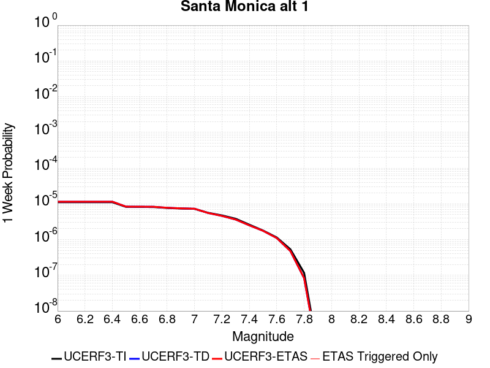 | 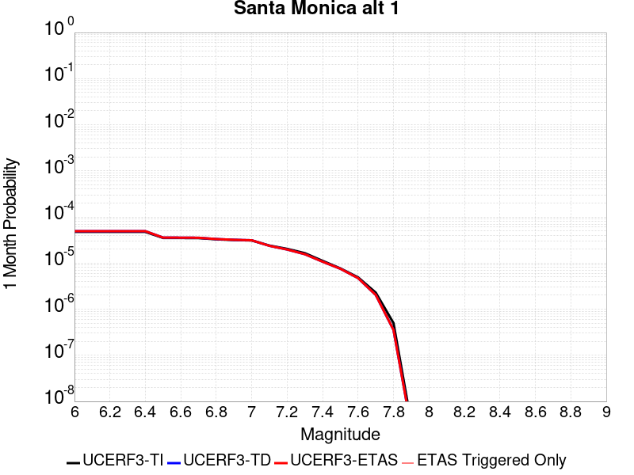 | 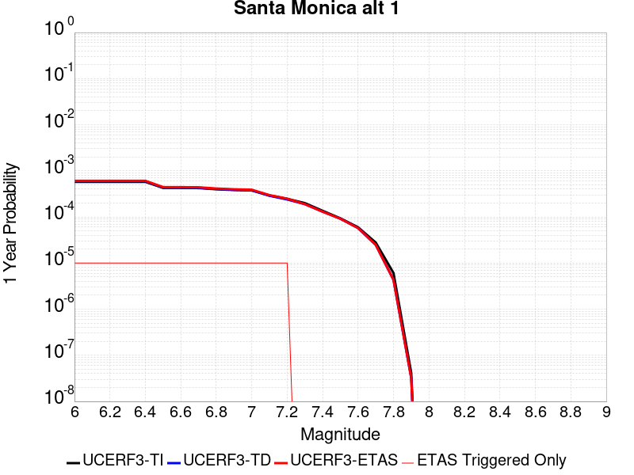 | 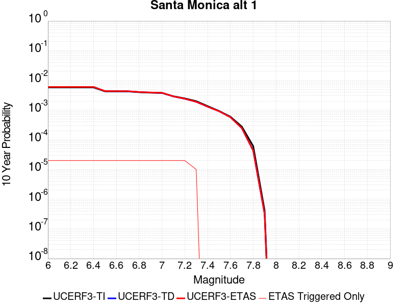 |

| Magnitude | 1 wk TI Prob | 1 wk TD Prob | 1 wk ETAS Prob | 1 wk ETAS/TD Gain | 1 wk ETAS Triggered Only | 1 mo TI Prob | 1 mo TD Prob | 1 mo ETAS Prob | 1 mo ETAS/TD Gain | 1 mo ETAS Triggered Only | 1 yr TI Prob | 1 yr TD Prob | 1 yr ETAS Prob | 1 yr ETAS/TD Gain | 1 yr ETAS Triggered Only | 10 yr TI Prob | 10 yr TD Prob | 10 yr ETAS Prob | 10 yr ETAS/TD Gain | 10 yr ETAS Triggered Only |
|-----|-----|-----|-----|-----|-----|-----|-----|-----|-----|-----|-----|-----|-----|-----|-----|-----|-----|-----|-----|-----|
| 6.0 | 1.1066008E-5 | 1.1480435E-5 | 1.1480435E-5 | 1.0 | 0.0 | 4.742488E-5 | 4.920102E-5 | 4.920102E-5 | 1.0 | 0.0 | 5.7724497E-4 | 5.988717E-4 | 6.108549E-4 | 1.0200096 | 1.1990408E-5 | 0.005757478 | 0.0059739654 | 0.0059978026 | 1.0039903 | 2.3980816E-5 |
| 6.1 | 1.1066008E-5 | 1.1480435E-5 | 1.1480435E-5 | 1.0 | 0.0 | 4.742488E-5 | 4.920102E-5 | 4.920102E-5 | 1.0 | 0.0 | 5.7724497E-4 | 5.988717E-4 | 6.108549E-4 | 1.0200096 | 1.1990408E-5 | 0.005757478 | 0.0059739654 | 0.0059978026 | 1.0039903 | 2.3980816E-5 |
| 6.2 | 1.1066008E-5 | 1.1480435E-5 | 1.1480435E-5 | 1.0 | 0.0 | 4.742488E-5 | 4.920102E-5 | 4.920102E-5 | 1.0 | 0.0 | 5.7724497E-4 | 5.988717E-4 | 6.108549E-4 | 1.0200096 | 1.1990408E-5 | 0.005757478 | 0.0059739654 | 0.0059978026 | 1.0039903 | 2.3980816E-5 |
| 6.3 | 1.1066008E-5 | 1.1480435E-5 | 1.1480435E-5 | 1.0 | 0.0 | 4.742488E-5 | 4.920102E-5 | 4.920102E-5 | 1.0 | 0.0 | 5.7724497E-4 | 5.988717E-4 | 6.108549E-4 | 1.0200096 | 1.1990408E-5 | 0.005757478 | 0.0059739654 | 0.0059978026 | 1.0039903 | 2.3980816E-5 |
| 6.4 | 1.1066008E-5 | 1.1480435E-5 | 1.1480435E-5 | 1.0 | 0.0 | 4.742488E-5 | 4.920102E-5 | 4.920102E-5 | 1.0 | 0.0 | 5.7724497E-4 | 5.988717E-4 | 6.108549E-4 | 1.0200096 | 1.1990408E-5 | 0.005757478 | 0.0059739654 | 0.0059978026 | 1.0039903 | 2.3980816E-5 |
| 6.5 | 8.183544E-6 | 8.335519E-6 | 8.335519E-6 | 1.0 | 0.0 | 3.5071862E-5 | 3.5723173E-5 | 3.5723173E-5 | 1.0 | 0.0 | 4.2691626E-4 | 4.348444E-4 | 4.468296E-4 | 1.027562 | 1.1990408E-5 | 0.0042609703 | 0.004340101 | 0.004363978 | 1.0055014 | 2.3980816E-5 |
| 6.6 | 8.1543285E-6 | 8.303733E-6 | 8.303733E-6 | 1.0 | 0.0 | 3.4946657E-5 | 3.558695E-5 | 3.558695E-5 | 1.0 | 0.0 | 4.2539247E-4 | 4.3318656E-4 | 4.4517178E-4 | 1.0276675 | 1.1990408E-5 | 0.0042457907 | 0.0043235873 | 0.004347464 | 1.0055225 | 2.3980816E-5 |
| 6.7 | 8.110878E-6 | 8.257129E-6 | 8.257129E-6 | 1.0 | 0.0 | 3.4760444E-5 | 3.5387224E-5 | 3.5387224E-5 | 1.0 | 0.0 | 4.231262E-4 | 4.3075587E-4 | 4.4274112E-4 | 1.0278238 | 1.1990408E-5 | 0.0042232145 | 0.0042993743 | 0.004323252 | 1.0055537 | 2.3980816E-5 |
| 6.8 | 7.644036E-6 | 7.751141E-6 | 7.751141E-6 | 1.0 | 0.0 | 3.275974E-5 | 3.3218763E-5 | 3.3218763E-5 | 1.0 | 0.0 | 3.9877684E-4 | 4.0436478E-4 | 4.1635035E-4 | 1.0296404 | 1.1990408E-5 | 0.00398062 | 0.0040364363 | 0.0040603206 | 1.0059171 | 2.3980816E-5 |
| 6.9 | 7.3698293E-6 | 7.455797E-6 | 7.455797E-6 | 1.0 | 0.0 | 3.15846E-5 | 3.1953034E-5 | 3.1953034E-5 | 1.0 | 0.0 | 3.8447464E-4 | 3.8896012E-4 | 4.0094586E-4 | 1.0308149 | 1.1990408E-5 | 0.0038381014 | 0.003882937 | 0.0039068246 | 1.0061519 | 2.3980816E-5 |
| 7.0 | 7.209872E-6 | 7.285702E-6 | 7.285702E-6 | 1.0 | 0.0 | 3.0899086E-5 | 3.1224074E-5 | 3.1224074E-5 | 1.0 | 0.0 | 3.7613141E-4 | 3.8008817E-4 | 3.92074E-4 | 1.0315344 | 1.1990408E-5 | 0.0037549543 | 0.0037945234 | 0.0038184132 | 1.0062959 | 2.3980816E-5 |
| 7.1 | 5.603456E-6 | 5.523946E-6 | 5.523946E-6 | 1.0 | 0.0 | 2.4014591E-5 | 2.3673843E-5 | 2.3673843E-5 | 1.0 | 0.0 | 2.923384E-4 | 2.881913E-4 | 3.0017828E-4 | 1.0415938 | 1.1990408E-5 | 0.0029195412 | 0.0028782175 | 0.0029021294 | 1.0083078 | 2.3980816E-5 |
| 7.2 | 4.7483613E-6 | 4.591175E-6 | 4.591175E-6 | 1.0 | 0.0 | 2.0349962E-5 | 1.9676318E-5 | 1.9676318E-5 | 1.0 | 0.0 | 2.4773262E-4 | 2.3953296E-4 | 2.5152048E-4 | 1.0500455 | 1.1990408E-5 | 0.0024745662 | 0.0023927619 | 0.0024166855 | 1.0099982 | 2.3980816E-5 |
| 7.3 | 3.829015E-6 | 3.6342587E-6 | 3.6342587E-6 | 1.0 | 0.0 | 1.6409962E-5 | 1.5575302E-5 | 1.5575302E-5 | 1.0 | 0.0 | 1.9977297E-4 | 1.8961288E-4 | 1.8961288E-4 | 1.0 | 0.0 | 0.0019959346 | 0.0018945198 | 0.0019064875 | 1.006317 | 1.1990408E-5 |
| 7.4 | 2.610755E-6 | 2.499595E-6 | 2.499595E-6 | 1.0 | 0.0 | 1.1188902E-5 | 1.0712507E-5 | 1.0712507E-5 | 1.0 | 0.0 | 1.3621636E-4 | 1.30417E-4 | 1.30417E-4 | 1.0 | 0.0 | 0.001361329 | 0.0013034091 | 0.0013034091 | 1.0 | 0.0 |
| 7.5 | 1.792146E-6 | 1.7584358E-6 | 1.7584358E-6 | 1.0 | 0.0 | 7.680603E-6 | 7.5361318E-6 | 7.5361318E-6 | 1.0 | 0.0 | 9.3507326E-5 | 9.1748574E-5 | 9.1748574E-5 | 1.0 | 0.0 | 9.3467993E-4 | 9.171101E-4 | 9.171101E-4 | 1.0 | 0.0 |
| 7.6 | 1.1473018E-6 | 1.1029267E-6 | 1.1029267E-6 | 1.0 | 0.0 | 4.9169985E-6 | 4.7268204E-6 | 4.7268204E-6 | 1.0 | 0.0 | 5.986281E-5 | 5.7547535E-5 | 5.7547535E-5 | 1.0 | 0.0 | 5.984669E-4 | 5.7532795E-4 | 5.7532795E-4 | 1.0 | 0.0 |
| 7.7 | 5.330919E-7 | 4.74532E-7 | 4.74532E-7 | 1.0 | 0.0 | 2.2846775E-6 | 2.033707E-6 | 2.033707E-6 | 1.0 | 0.0 | 2.7815593E-5 | 2.4760113E-5 | 2.4760113E-5 | 1.0 | 0.0 | 2.7812112E-4 | 2.4757467E-4 | 2.4757467E-4 | 1.0 | 0.0 |
| 7.8 | 1.1668574E-7 | 8.2969436E-8 | 8.2969436E-8 | 1.0 | 0.0 | 5.000816E-7 | 3.5558327E-7 | 3.5558327E-7 | 1.0 | 0.0 | 6.0884768E-6 | 4.329218E-6 | 4.329218E-6 | 1.0 | 0.0 | 6.08831E-5 | 4.3291366E-5 | 4.3291366E-5 | 1.0 | 0.0 |
| 7.9 | 8.007447E-10 | 6.160915E-10 | 6.160915E-10 | 1.0 | 0.0 | 3.4317629E-9 | 2.6403923E-9 | 2.6403923E-9 | 1.0 | 0.0 | 4.1781714E-8 | 3.2146776E-8 | 3.2146776E-8 | 1.0 | 0.0 | 4.1781706E-7 | 3.2146772E-7 | 3.2146772E-7 | 1.0 | 0.0 |

## Goose Lake 2011 CFM
*[(top)](#table-of-contents)*

| 1 Week | 1 Month | 1 Year | 10 Year |
|-----|-----|-----|-----|
| 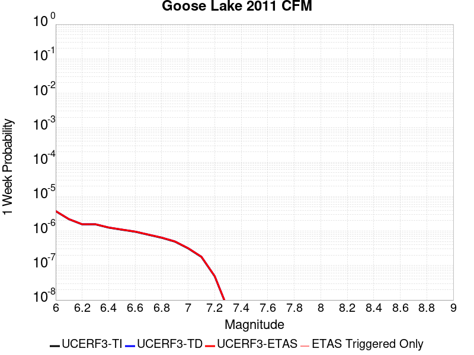 | 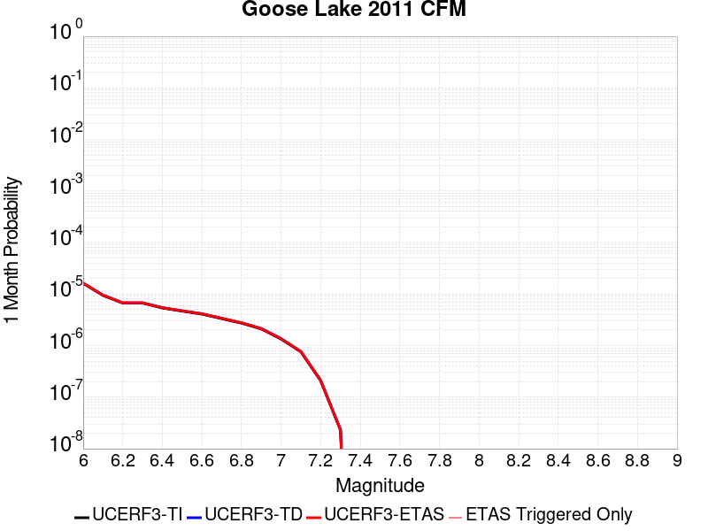 |  |  |

| Magnitude | 1 wk TI Prob | 1 wk TD Prob | 1 wk ETAS Prob | 1 wk ETAS/TD Gain | 1 wk ETAS Triggered Only | 1 mo TI Prob | 1 mo TD Prob | 1 mo ETAS Prob | 1 mo ETAS/TD Gain | 1 mo ETAS Triggered Only | 1 yr TI Prob | 1 yr TD Prob | 1 yr ETAS Prob | 1 yr ETAS/TD Gain | 1 yr ETAS Triggered Only | 10 yr TI Prob | 10 yr TD Prob | 10 yr ETAS Prob | 10 yr ETAS/TD Gain | 10 yr ETAS Triggered Only |
|-----|-----|-----|-----|-----|-----|-----|-----|-----|-----|-----|-----|-----|-----|-----|-----|-----|-----|-----|-----|-----|
| 6.0 | 3.780968E-6 | 3.823028E-6 | 3.823028E-6 | 1.0 | 0.0 | 1.6204049E-5 | 1.6384309E-5 | 1.6384309E-5 | 1.0 | 0.0 | 1.9726643E-4 | 1.9946179E-4 | 1.9946179E-4 | 1.0 | 0.0 | 0.001970914 | 0.001992936 | 0.0020049026 | 1.0060045 | 1.1990408E-5 |
| 6.1 | 2.2035124E-6 | 2.2298047E-6 | 2.2298047E-6 | 1.0 | 0.0 | 9.443591E-6 | 9.556272E-6 | 9.556272E-6 | 1.0 | 0.0 | 1.1496965E-4 | 1.1634159E-4 | 1.1634159E-4 | 1.0 | 0.0 | 0.0011491019 | 0.001162825 | 0.001162825 | 1.0 | 0.0 |
| 6.2 | 1.5624689E-6 | 1.5826951E-6 | 1.5826951E-6 | 1.0 | 0.0 | 6.6962784E-6 | 6.7829615E-6 | 6.7829615E-6 | 1.0 | 0.0 | 8.152414E-5 | 8.257947E-5 | 8.257947E-5 | 1.0 | 0.0 | 8.1494235E-4 | 8.2549226E-4 | 8.2549226E-4 | 1.0 | 0.0 |
| 6.3 | 1.5624689E-6 | 1.5826951E-6 | 1.5826951E-6 | 1.0 | 0.0 | 6.6962784E-6 | 6.7829615E-6 | 6.7829615E-6 | 1.0 | 0.0 | 8.152414E-5 | 8.257947E-5 | 8.257947E-5 | 1.0 | 0.0 | 8.1494235E-4 | 8.2549226E-4 | 8.2549226E-4 | 1.0 | 0.0 |
| 6.4 | 1.256464E-6 | 1.2738719E-6 | 1.2738719E-6 | 1.0 | 0.0 | 5.3848344E-6 | 5.4594398E-6 | 5.4594398E-6 | 1.0 | 0.0 | 6.5558386E-5 | 6.6466666E-5 | 6.6466666E-5 | 1.0 | 0.0 | 6.553905E-4 | 6.644699E-4 | 6.644699E-4 | 1.0 | 0.0 |
| 6.5 | 1.0910911E-6 | 1.1069426E-6 | 1.1069426E-6 | 1.0 | 0.0 | 4.6760965E-6 | 4.744031E-6 | 4.744031E-6 | 1.0 | 0.0 | 5.692999E-5 | 5.7757057E-5 | 5.7757057E-5 | 1.0 | 0.0 | 5.6915404E-4 | 5.7742174E-4 | 5.7742174E-4 | 1.0 | 0.0 |
| 6.6 | 9.546601E-7 | 9.691265E-7 | 9.691265E-7 | 1.0 | 0.0 | 4.091394E-6 | 4.1533926E-6 | 4.1533926E-6 | 1.0 | 0.0 | 4.9811584E-5 | 5.0566392E-5 | 5.0566392E-5 | 1.0 | 0.0 | 4.980042E-4 | 5.055498E-4 | 5.055498E-4 | 1.0 | 0.0 |
| 6.7 | 7.790316E-7 | 7.9159804E-7 | 7.9159804E-7 | 1.0 | 0.0 | 3.3387028E-6 | 3.3925587E-6 | 3.3925587E-6 | 1.0 | 0.0 | 4.0647945E-5 | 4.1303625E-5 | 4.1303625E-5 | 1.0 | 0.0 | 4.0640513E-4 | 4.1296007E-4 | 4.1296007E-4 | 1.0 | 0.0 |
| 6.8 | 6.3714384E-7 | 6.478754E-7 | 6.478754E-7 | 1.0 | 0.0 | 2.7306137E-6 | 2.776606E-6 | 2.776606E-6 | 1.0 | 0.0 | 3.3244716E-5 | 3.380466E-5 | 3.380466E-5 | 1.0 | 0.0 | 3.323974E-4 | 3.3799565E-4 | 3.3799565E-4 | 1.0 | 0.0 |
| 6.9 | 4.92586E-7 | 5.0139266E-7 | 5.0139266E-7 | 1.0 | 0.0 | 2.1110811E-6 | 2.148824E-6 | 2.148824E-6 | 1.0 | 0.0 | 2.5702111E-5 | 2.6161622E-5 | 2.6161622E-5 | 1.0 | 0.0 | 2.569914E-4 | 2.6158578E-4 | 2.6158578E-4 | 1.0 | 0.0 |
| 7.0 | 3.130245E-7 | 3.1903622E-7 | 3.1903622E-7 | 1.0 | 0.0 | 1.3415328E-6 | 1.3672974E-6 | 1.3672974E-6 | 1.0 | 0.0 | 1.6333039E-5 | 1.664672E-5 | 1.664672E-5 | 1.0 | 0.0 | 1.6331839E-4 | 1.6645493E-4 | 1.6645493E-4 | 1.0 | 0.0 |
| 7.1 | 1.7680084E-7 | 1.8023968E-7 | 1.8023968E-7 | 1.0 | 0.0 | 7.5771766E-7 | 7.7245556E-7 | 7.7245556E-7 | 1.0 | 0.0 | 9.225173E-6 | 9.404607E-6 | 9.404607E-6 | 1.0 | 0.0 | 9.22479E-5 | 9.4042196E-5 | 9.4042196E-5 | 1.0 | 0.0 |
| 7.2 | 4.8641045E-8 | 4.9402168E-8 | 4.9402168E-8 | 1.0 | 0.0 | 2.084616E-7 | 2.1172356E-7 | 2.1172356E-7 | 1.0 | 0.0 | 2.538017E-6 | 2.5777315E-6 | 2.5777315E-6 | 1.0 | 0.0 | 2.537988E-5 | 2.5777028E-5 | 2.5777028E-5 | 1.0 | 0.0 |
| 7.3 | 5.3911844E-9 | 5.4758256E-9 | 5.4758256E-9 | 1.0 | 0.0 | 2.3105075E-8 | 2.3467823E-8 | 2.3467823E-8 | 1.0 | 0.0 | 2.8130427E-7 | 2.8572074E-7 | 2.8572074E-7 | 1.0 | 0.0 | 2.8130391E-6 | 2.8572053E-6 | 2.8572053E-6 | 1.0 | 0.0 |

## Emerson-Copper Mtn 2011
*[(top)](#table-of-contents)*

| 1 Week | 1 Month | 1 Year | 10 Year |
|-----|-----|-----|-----|
| 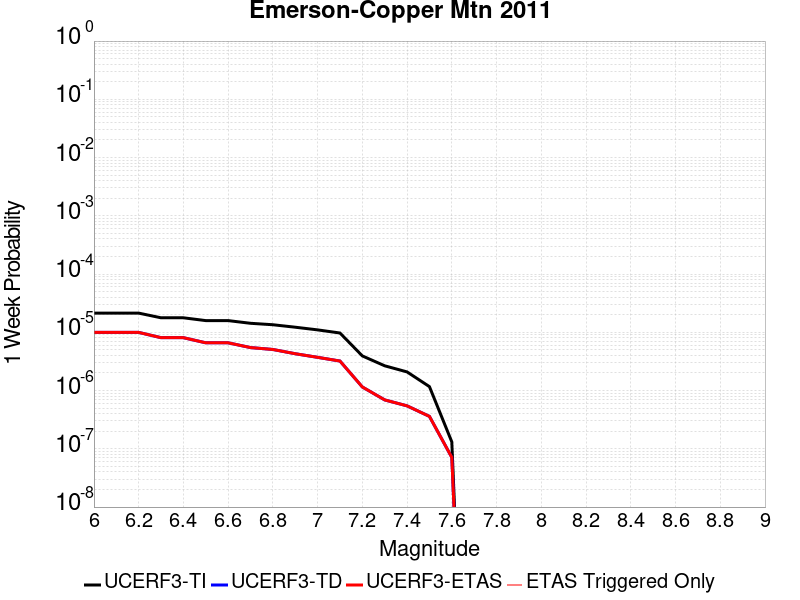 |  | 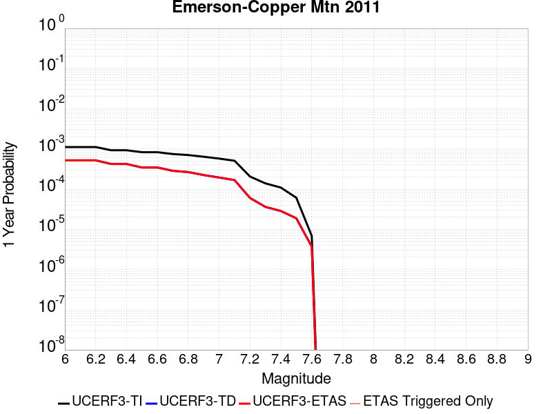 | 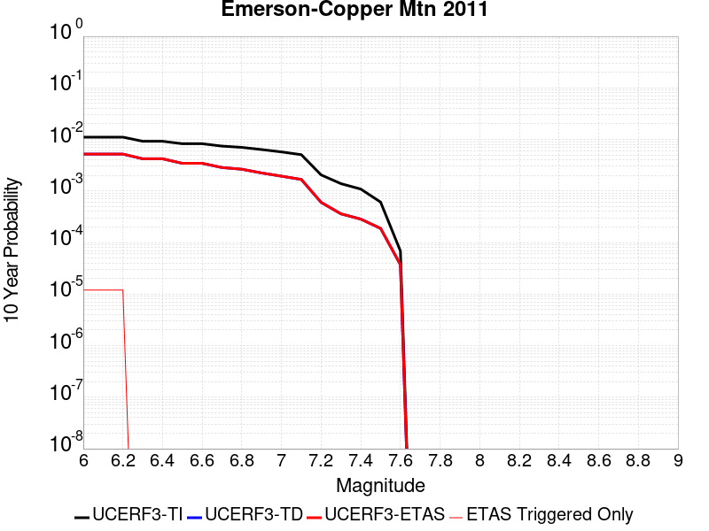 |

| Magnitude | 1 wk TI Prob | 1 wk TD Prob | 1 wk ETAS Prob | 1 wk ETAS/TD Gain | 1 wk ETAS Triggered Only | 1 mo TI Prob | 1 mo TD Prob | 1 mo ETAS Prob | 1 mo ETAS/TD Gain | 1 mo ETAS Triggered Only | 1 yr TI Prob | 1 yr TD Prob | 1 yr ETAS Prob | 1 yr ETAS/TD Gain | 1 yr ETAS Triggered Only | 10 yr TI Prob | 10 yr TD Prob | 10 yr ETAS Prob | 10 yr ETAS/TD Gain | 10 yr ETAS Triggered Only |
|-----|-----|-----|-----|-----|-----|-----|-----|-----|-----|-----|-----|-----|-----|-----|-----|-----|-----|-----|-----|-----|
| 6.0 | 2.1364202E-5 | 9.968277E-6 | 9.968277E-6 | 1.0 | 0.0 | 9.1557646E-5 | 4.2720538E-5 | 4.2720538E-5 | 1.0 | 0.0 | 0.0011141442 | 5.200071E-4 | 5.200071E-4 | 1.0 | 0.0 | 0.011085749 | 0.005188773 | 0.0052007013 | 1.0022988 | 1.1990408E-5 |
| 6.1 | 2.1364202E-5 | 9.968277E-6 | 9.968277E-6 | 1.0 | 0.0 | 9.1557646E-5 | 4.2720538E-5 | 4.2720538E-5 | 1.0 | 0.0 | 0.0011141442 | 5.200071E-4 | 5.200071E-4 | 1.0 | 0.0 | 0.011085749 | 0.005188773 | 0.0052007013 | 1.0022988 | 1.1990408E-5 |
| 6.2 | 2.1364202E-5 | 9.968277E-6 | 9.968277E-6 | 1.0 | 0.0 | 9.1557646E-5 | 4.2720538E-5 | 4.2720538E-5 | 1.0 | 0.0 | 0.0011141442 | 5.200071E-4 | 5.200071E-4 | 1.0 | 0.0 | 0.011085749 | 0.005188773 | 0.0052007013 | 1.0022988 | 1.1990408E-5 |
| 6.3 | 1.7751237E-5 | 8.089365E-6 | 8.089365E-6 | 1.0 | 0.0 | 7.607452E-5 | 3.4668283E-5 | 3.4668283E-5 | 1.0 | 0.0 | 9.258136E-4 | 4.2201087E-4 | 4.2201087E-4 | 1.0 | 0.0 | 0.00921966 | 0.0042127175 | 0.0042127175 | 1.0 | 0.0 |
| 6.4 | 1.7751237E-5 | 8.089365E-6 | 8.089365E-6 | 1.0 | 0.0 | 7.607452E-5 | 3.4668283E-5 | 3.4668283E-5 | 1.0 | 0.0 | 9.258136E-4 | 4.2201087E-4 | 4.2201087E-4 | 1.0 | 0.0 | 0.00921966 | 0.0042127175 | 0.0042127175 | 1.0 | 0.0 |
| 6.5 | 1.5886664E-5 | 6.6039356E-6 | 6.6039356E-6 | 1.0 | 0.0 | 6.808392E-5 | 2.83023E-5 | 2.83023E-5 | 1.0 | 0.0 | 8.286065E-4 | 3.445307E-4 | 3.445307E-4 | 1.0 | 0.0 | 0.008255237 | 0.00344043 | 0.00344043 | 1.0 | 0.0 |
| 6.6 | 1.5886664E-5 | 6.6039356E-6 | 6.6039356E-6 | 1.0 | 0.0 | 6.808392E-5 | 2.83023E-5 | 2.83023E-5 | 1.0 | 0.0 | 8.286065E-4 | 3.445307E-4 | 3.445307E-4 | 1.0 | 0.0 | 0.008255237 | 0.00344043 | 0.00344043 | 1.0 | 0.0 |
| 6.7 | 1.428471E-5 | 5.470503E-6 | 5.470503E-6 | 1.0 | 0.0 | 6.121875E-5 | 2.3444823E-5 | 2.3444823E-5 | 1.0 | 0.0 | 7.450834E-4 | 2.8540727E-4 | 2.8540727E-4 | 1.0 | 0.0 | 0.007425902 | 0.0028507954 | 0.0028507954 | 1.0 | 0.0 |
| 6.8 | 1.3490684E-5 | 5.073793E-6 | 5.073793E-6 | 1.0 | 0.0 | 5.7815934E-5 | 2.1744667E-5 | 2.1744667E-5 | 1.0 | 0.0 | 7.0368167E-4 | 2.6471302E-4 | 2.6471302E-4 | 1.0 | 0.0 | 0.007014576 | 0.002644358 | 0.002644358 | 1.0 | 0.0 |
| 6.9 | 1.2235421E-5 | 4.2897627E-6 | 4.2897627E-6 | 1.0 | 0.0 | 5.2436466E-5 | 1.8384588E-5 | 1.8384588E-5 | 1.0 | 0.0 | 6.38227E-4 | 2.2381297E-4 | 2.2381297E-4 | 1.0 | 0.0 | 0.0063639707 | 0.00223623 | 0.00223623 | 1.0 | 0.0 |
| 7.0 | 1.1009851E-5 | 3.7190669E-6 | 3.7190669E-6 | 1.0 | 0.0 | 4.7184225E-5 | 1.593878E-5 | 1.593878E-5 | 1.0 | 0.0 | 5.743165E-4 | 1.9404081E-4 | 1.9404081E-4 | 1.0 | 0.0 | 0.005728345 | 0.0019390517 | 0.0019390517 | 1.0 | 0.0 |
| 7.1 | 9.726373E-6 | 3.2118642E-6 | 3.2118642E-6 | 1.0 | 0.0 | 4.168379E-5 | 1.3765079E-5 | 1.3765079E-5 | 1.0 | 0.0 | 5.07382E-4 | 1.6758032E-4 | 1.6758032E-4 | 1.0 | 0.0 | 0.0050622504 | 0.0016748707 | 0.0016748707 | 1.0 | 0.0 |
| 7.2 | 3.9335127E-6 | 1.1525033E-6 | 1.1525033E-6 | 1.0 | 0.0 | 1.6857803E-5 | 4.9392906E-6 | 4.9392906E-6 | 1.0 | 0.0 | 2.0522442E-4 | 6.0134265E-5 | 6.0134265E-5 | 1.0 | 0.0 | 0.00205035 | 6.011859E-4 | 6.011859E-4 | 1.0 | 0.0 |
| 7.3 | 2.661632E-6 | 6.9116606E-7 | 6.9116606E-7 | 1.0 | 0.0 | 1.14069435E-5 | 2.962137E-6 | 2.962137E-6 | 1.0 | 0.0 | 1.3887069E-4 | 3.6063433E-5 | 3.6063433E-5 | 1.0 | 0.0 | 0.0013878393 | 3.6057684E-4 | 3.6057684E-4 | 1.0 | 0.0 |
| 7.4 | 2.0893426E-6 | 5.461961E-7 | 5.461961E-7 | 1.0 | 0.0 | 8.954295E-6 | 2.3408381E-6 | 2.3408381E-6 | 1.0 | 0.0 | 1.0901308E-4 | 2.8499337E-5 | 2.8499337E-5 | 1.0 | 0.0 | 0.0010895962 | 2.8495738E-4 | 2.8495738E-4 | 1.0 | 0.0 |
| 7.5 | 1.1681728E-6 | 3.6031287E-7 | 3.6031287E-7 | 1.0 | 0.0 | 5.0064455E-6 | 1.5441972E-6 | 1.5441972E-6 | 1.0 | 0.0 | 6.0951766E-5 | 1.8800443E-5 | 1.8800443E-5 | 1.0 | 0.0 | 6.093505E-4 | 1.8798899E-4 | 1.8798899E-4 | 1.0 | 0.0 |
| 7.6 | 1.3154387E-7 | 7.1198265E-8 | 7.1198265E-8 | 1.0 | 0.0 | 5.6375933E-7 | 3.051354E-7 | 3.051354E-7 | 1.0 | 0.0 | 6.863748E-6 | 3.7150185E-6 | 3.7150185E-6 | 1.0 | 0.0 | 6.863536E-5 | 3.7149723E-5 | 3.7149723E-5 | 1.0 | 0.0 |

## Del Valle
*[(top)](#table-of-contents)*

| 1 Week | 1 Month | 1 Year | 10 Year |
|-----|-----|-----|-----|
| 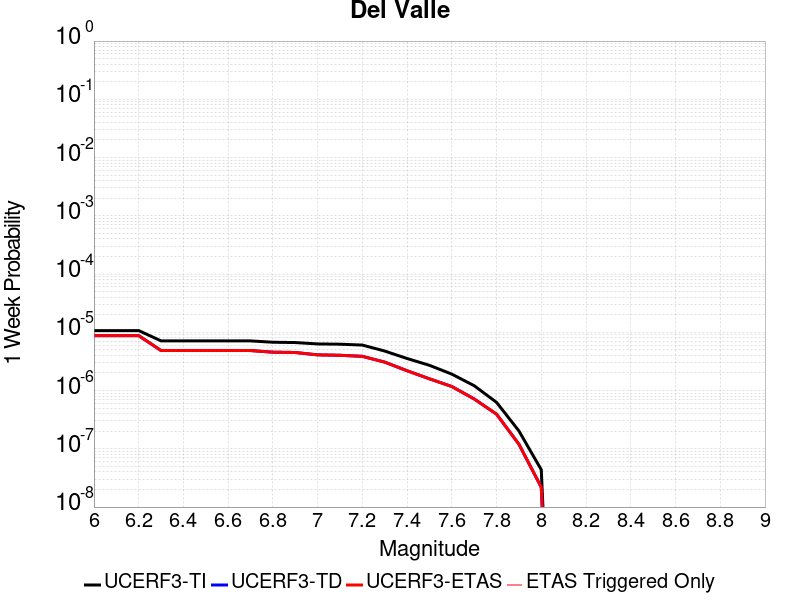 | 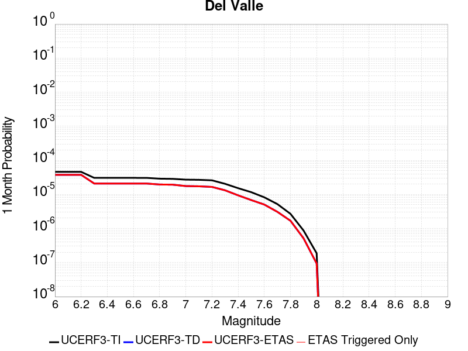 | 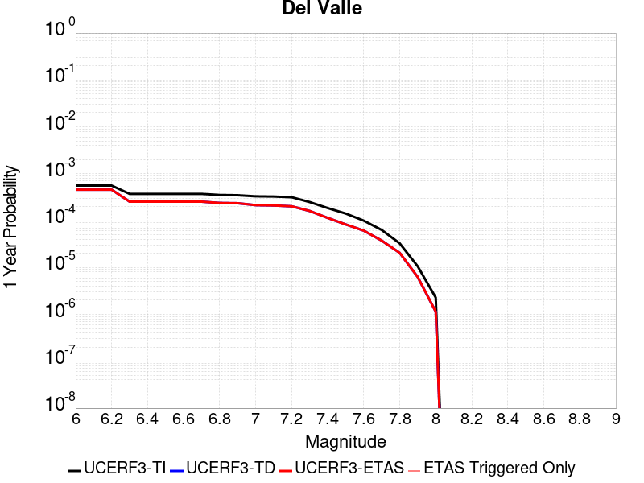 | 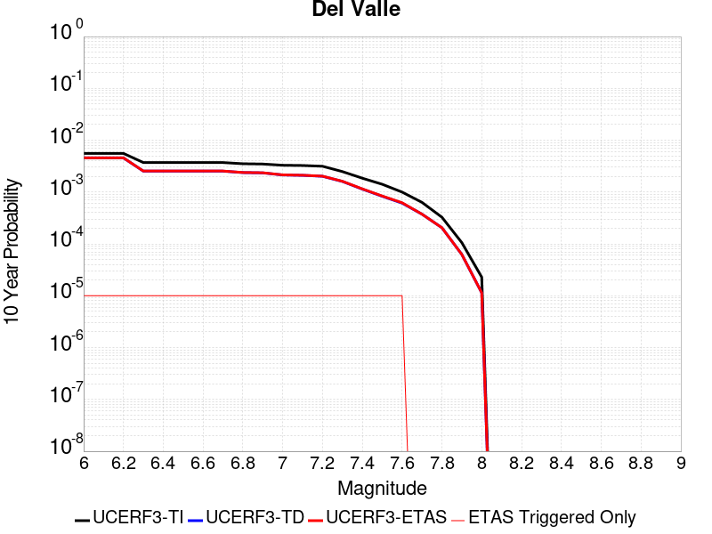 |

| Magnitude | 1 wk TI Prob | 1 wk TD Prob | 1 wk ETAS Prob | 1 wk ETAS/TD Gain | 1 wk ETAS Triggered Only | 1 mo TI Prob | 1 mo TD Prob | 1 mo ETAS Prob | 1 mo ETAS/TD Gain | 1 mo ETAS Triggered Only | 1 yr TI Prob | 1 yr TD Prob | 1 yr ETAS Prob | 1 yr ETAS/TD Gain | 1 yr ETAS Triggered Only | 10 yr TI Prob | 10 yr TD Prob | 10 yr ETAS Prob | 10 yr ETAS/TD Gain | 10 yr ETAS Triggered Only |
|-----|-----|-----|-----|-----|-----|-----|-----|-----|-----|-----|-----|-----|-----|-----|-----|-----|-----|-----|-----|-----|
| 6.0 | 1.0716125E-5 | 8.768052E-6 | 8.768052E-6 | 1.0 | 0.0 | 4.592544E-5 | 3.7576934E-5 | 3.7576934E-5 | 1.0 | 0.0 | 5.589988E-4 | 4.574229E-4 | 4.574229E-4 | 1.0 | 0.0 | 0.0055759475 | 0.0045667686 | 0.004578704 | 1.0026135 | 1.1990408E-5 |
| 6.1 | 1.0716125E-5 | 8.768052E-6 | 8.768052E-6 | 1.0 | 0.0 | 4.592544E-5 | 3.7576934E-5 | 3.7576934E-5 | 1.0 | 0.0 | 5.589988E-4 | 4.574229E-4 | 4.574229E-4 | 1.0 | 0.0 | 0.0055759475 | 0.0045667686 | 0.004578704 | 1.0026135 | 1.1990408E-5 |
| 6.2 | 1.0716125E-5 | 8.768052E-6 | 8.768052E-6 | 1.0 | 0.0 | 4.592544E-5 | 3.7576934E-5 | 3.7576934E-5 | 1.0 | 0.0 | 5.589988E-4 | 4.574229E-4 | 4.574229E-4 | 1.0 | 0.0 | 0.0055759475 | 0.0045667686 | 0.004578704 | 1.0026135 | 1.1990408E-5 |
| 6.3 | 7.1293784E-6 | 4.865947E-6 | 4.865947E-6 | 1.0 | 0.0 | 3.055412E-5 | 2.0853897E-5 | 2.0853897E-5 | 1.0 | 0.0 | 3.7193293E-4 | 2.5386736E-4 | 2.5386736E-4 | 1.0 | 0.0 | 0.0037131102 | 0.0025358594 | 0.0025478194 | 1.0047164 | 1.1990408E-5 |
| 6.4 | 7.1293784E-6 | 4.865947E-6 | 4.865947E-6 | 1.0 | 0.0 | 3.055412E-5 | 2.0853897E-5 | 2.0853897E-5 | 1.0 | 0.0 | 3.7193293E-4 | 2.5386736E-4 | 2.5386736E-4 | 1.0 | 0.0 | 0.0037131102 | 0.0025358594 | 0.0025478194 | 1.0047164 | 1.1990408E-5 |
| 6.5 | 7.1293784E-6 | 4.865947E-6 | 4.865947E-6 | 1.0 | 0.0 | 3.055412E-5 | 2.0853897E-5 | 2.0853897E-5 | 1.0 | 0.0 | 3.7193293E-4 | 2.5386736E-4 | 2.5386736E-4 | 1.0 | 0.0 | 0.0037131102 | 0.0025358594 | 0.0025478194 | 1.0047164 | 1.1990408E-5 |
| 6.6 | 7.1293784E-6 | 4.865947E-6 | 4.865947E-6 | 1.0 | 0.0 | 3.055412E-5 | 2.0853897E-5 | 2.0853897E-5 | 1.0 | 0.0 | 3.7193293E-4 | 2.5386736E-4 | 2.5386736E-4 | 1.0 | 0.0 | 0.0037131102 | 0.0025358594 | 0.0025478194 | 1.0047164 | 1.1990408E-5 |
| 6.7 | 7.12272E-6 | 4.863323E-6 | 4.863323E-6 | 1.0 | 0.0 | 3.0525585E-5 | 2.084265E-5 | 2.084265E-5 | 1.0 | 0.0 | 3.7158563E-4 | 2.5373045E-4 | 2.5373045E-4 | 1.0 | 0.0 | 0.003709649 | 0.0025344936 | 0.0025464536 | 1.0047189 | 1.1990408E-5 |
| 6.8 | 6.7558703E-6 | 4.5595193E-6 | 4.5595193E-6 | 1.0 | 0.0 | 2.895341E-5 | 1.9540656E-5 | 1.9540656E-5 | 1.0 | 0.0 | 3.5245073E-4 | 2.3788214E-4 | 2.3788214E-4 | 1.0 | 0.0 | 0.0035189227 | 0.0023763503 | 0.0023883122 | 1.0050337 | 1.1990408E-5 |
| 6.9 | 6.6700386E-6 | 4.5026545E-6 | 4.5026545E-6 | 1.0 | 0.0 | 2.8585566E-5 | 1.9296951E-5 | 1.9296951E-5 | 1.0 | 0.0 | 3.479737E-4 | 2.3491567E-4 | 2.3491567E-4 | 1.0 | 0.0 | 0.003474293 | 0.0023467485 | 0.0023587109 | 1.0050974 | 1.1990408E-5 |
| 7.0 | 6.3181424E-6 | 4.09881E-6 | 4.09881E-6 | 1.0 | 0.0 | 2.7077473E-5 | 1.7566214E-5 | 1.7566214E-5 | 1.0 | 0.0 | 3.2961834E-4 | 2.1384809E-4 | 2.1384809E-4 | 1.0 | 0.0 | 0.0032912986 | 0.002136478 | 0.0021484427 | 1.0056002 | 1.1990408E-5 |
| 7.1 | 6.248759E-6 | 4.034E-6 | 4.034E-6 | 1.0 | 0.0 | 2.678012E-5 | 1.728846E-5 | 1.728846E-5 | 1.0 | 0.0 | 3.2599916E-4 | 2.1046709E-4 | 2.1046709E-4 | 1.0 | 0.0 | 0.0032552136 | 0.002102732 | 0.0021146971 | 1.0056903 | 1.1990408E-5 |
| 7.2 | 6.0411944E-6 | 3.869988E-6 | 3.869988E-6 | 1.0 | 0.0 | 2.5890577E-5 | 1.6585562E-5 | 1.6585562E-5 | 1.0 | 0.0 | 3.1517216E-4 | 2.0191091E-4 | 2.0191091E-4 | 1.0 | 0.0 | 0.0031472554 | 0.002017328 | 0.0020292941 | 1.0059317 | 1.1990408E-5 |
| 7.3 | 4.7691183E-6 | 3.078193E-6 | 3.078193E-6 | 1.0 | 0.0 | 2.0438918E-5 | 1.319219E-5 | 1.319219E-5 | 1.0 | 0.0 | 2.488154E-4 | 1.6060329E-4 | 1.6060329E-4 | 1.0 | 0.0 | 0.00248537 | 0.0016048981 | 0.0016168692 | 1.0074592 | 1.1990408E-5 |
| 7.4 | 3.5524722E-6 | 2.1893868E-6 | 2.1893868E-6 | 1.0 | 0.0 | 1.5224792E-5 | 9.383053E-6 | 9.383053E-6 | 1.0 | 0.0 | 1.8534607E-4 | 1.1423277E-4 | 1.1423277E-4 | 1.0 | 0.0 | 0.0018519156 | 0.0011417487 | 0.0011537254 | 1.0104898 | 1.1990408E-5 |
| 7.5 | 2.7133442E-6 | 1.591647E-6 | 1.591647E-6 | 1.0 | 0.0 | 1.1628566E-5 | 6.8213267E-6 | 6.8213267E-6 | 1.0 | 0.0 | 1.415686E-4 | 8.304651E-5 | 8.304651E-5 | 1.0 | 0.0 | 0.0014147845 | 8.3015667E-4 | 8.421371E-4 | 1.0144316 | 1.1990408E-5 |
| 7.6 | 1.915338E-6 | 1.1739402E-6 | 1.1739402E-6 | 1.0 | 0.0 | 8.208566E-6 | 5.031163E-6 | 5.031163E-6 | 1.0 | 0.0 | 9.993471E-5 | 6.125269E-5 | 6.125269E-5 | 1.0 | 0.0 | 9.988978E-4 | 6.12359E-4 | 6.243421E-4 | 1.0195687 | 1.1990408E-5 |
| 7.7 | 1.2120448E-6 | 7.1804885E-7 | 7.1804885E-7 | 1.0 | 0.0 | 5.194467E-6 | 3.0773488E-6 | 3.0773488E-6 | 1.0 | 0.0 | 6.3240805E-5 | 3.746608E-5 | 3.746608E-5 | 1.0 | 0.0 | 6.322281E-4 | 3.7459802E-4 | 3.7459802E-4 | 1.0 | 0.0 |
| 7.8 | 6.272381E-7 | 3.9326522E-7 | 3.9326522E-7 | 1.0 | 0.0 | 2.6881603E-6 | 1.6854212E-6 | 1.6854212E-6 | 1.0 | 0.0 | 3.272786E-5 | 2.0519812E-5 | 2.0519812E-5 | 1.0 | 0.0 | 3.272304E-4 | 2.0517933E-4 | 2.0517933E-4 | 1.0 | 0.0 |
| 7.9 | 2.0292627E-7 | 1.2005012E-7 | 1.2005012E-7 | 1.0 | 0.0 | 8.6968373E-7 | 5.145004E-7 | 5.145004E-7 | 1.0 | 0.0 | 1.0588348E-5 | 6.2640247E-6 | 6.2640247E-6 | 1.0 | 0.0 | 1.0587843E-4 | 6.26385E-5 | 6.26385E-5 | 1.0 | 0.0 |
| 8.0 | 4.374492E-8 | 2.1900798E-8 | 2.1900798E-8 | 1.0 | 0.0 | 1.8747821E-7 | 9.386056E-8 | 9.386056E-8 | 1.0 | 0.0 | 2.2825448E-6 | 1.1427518E-6 | 1.1427518E-6 | 1.0 | 0.0 | 2.2825214E-5 | 1.1427463E-5 | 1.1427463E-5 | 1.0 | 0.0 |

## Los Osos 2011
*[(top)](#table-of-contents)*

| 1 Week | 1 Month | 1 Year | 10 Year |
|-----|-----|-----|-----|
|  |  | 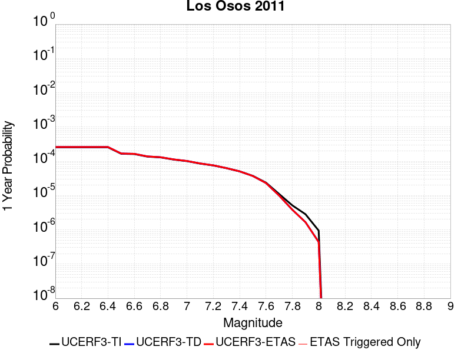 | 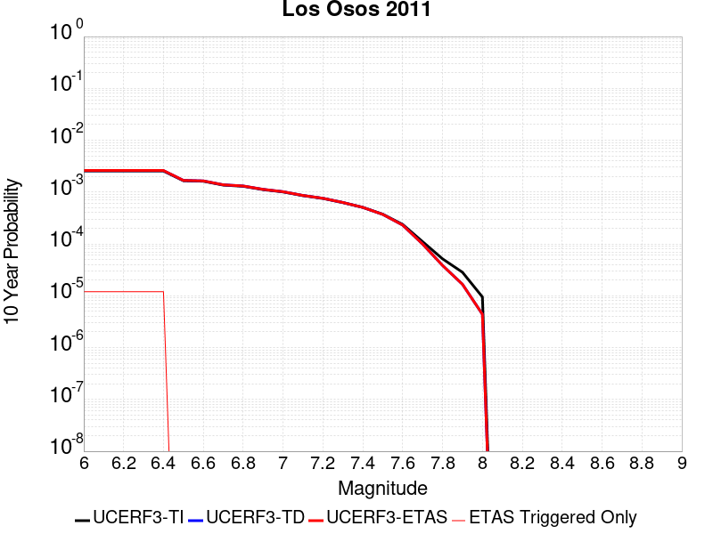 |

| Magnitude | 1 wk TI Prob | 1 wk TD Prob | 1 wk ETAS Prob | 1 wk ETAS/TD Gain | 1 wk ETAS Triggered Only | 1 mo TI Prob | 1 mo TD Prob | 1 mo ETAS Prob | 1 mo ETAS/TD Gain | 1 mo ETAS Triggered Only | 1 yr TI Prob | 1 yr TD Prob | 1 yr ETAS Prob | 1 yr ETAS/TD Gain | 1 yr ETAS Triggered Only | 10 yr TI Prob | 10 yr TD Prob | 10 yr ETAS Prob | 10 yr ETAS/TD Gain | 10 yr ETAS Triggered Only |
|-----|-----|-----|-----|-----|-----|-----|-----|-----|-----|-----|-----|-----|-----|-----|-----|-----|-----|-----|-----|-----|
| 6.0 | 4.8871775E-6 | 4.9815035E-6 | 4.9815035E-6 | 1.0 | 0.0 | 2.0944879E-5 | 2.1349142E-5 | 2.1349142E-5 | 1.0 | 0.0 | 2.5497406E-4 | 2.5989758E-4 | 2.5989758E-4 | 1.0 | 0.0 | 0.002546817 | 0.002596211 | 0.0026081703 | 1.0046065 | 1.1990408E-5 |
| 6.1 | 4.8871775E-6 | 4.9815035E-6 | 4.9815035E-6 | 1.0 | 0.0 | 2.0944879E-5 | 2.1349142E-5 | 2.1349142E-5 | 1.0 | 0.0 | 2.5497406E-4 | 2.5989758E-4 | 2.5989758E-4 | 1.0 | 0.0 | 0.002546817 | 0.002596211 | 0.0026081703 | 1.0046065 | 1.1990408E-5 |
| 6.2 | 4.8871775E-6 | 4.9815035E-6 | 4.9815035E-6 | 1.0 | 0.0 | 2.0944879E-5 | 2.1349142E-5 | 2.1349142E-5 | 1.0 | 0.0 | 2.5497406E-4 | 2.5989758E-4 | 2.5989758E-4 | 1.0 | 0.0 | 0.002546817 | 0.002596211 | 0.0026081703 | 1.0046065 | 1.1990408E-5 |
| 6.3 | 4.8871775E-6 | 4.9815035E-6 | 4.9815035E-6 | 1.0 | 0.0 | 2.0944879E-5 | 2.1349142E-5 | 2.1349142E-5 | 1.0 | 0.0 | 2.5497406E-4 | 2.5989758E-4 | 2.5989758E-4 | 1.0 | 0.0 | 0.002546817 | 0.002596211 | 0.0026081703 | 1.0046065 | 1.1990408E-5 |
| 6.4 | 4.8871775E-6 | 4.9815035E-6 | 4.9815035E-6 | 1.0 | 0.0 | 2.0944879E-5 | 2.1349142E-5 | 2.1349142E-5 | 1.0 | 0.0 | 2.5497406E-4 | 2.5989758E-4 | 2.5989758E-4 | 1.0 | 0.0 | 0.002546817 | 0.002596211 | 0.0026081703 | 1.0046065 | 1.1990408E-5 |
| 6.5 | 3.1724062E-6 | 3.2234093E-6 | 3.2234093E-6 | 1.0 | 0.0 | 1.3595956E-5 | 1.3814539E-5 | 1.3814539E-5 | 1.0 | 0.0 | 1.6551818E-4 | 1.6817916E-4 | 1.6817916E-4 | 1.0 | 0.0 | 0.0016539496 | 0.0016805324 | 0.0016805324 | 1.0 | 0.0 |
| 6.6 | 3.1022591E-6 | 3.1511186E-6 | 3.1511186E-6 | 1.0 | 0.0 | 1.3295328E-5 | 1.3504725E-5 | 1.3504725E-5 | 1.0 | 0.0 | 1.618586E-4 | 1.6440774E-4 | 1.6440774E-4 | 1.0 | 0.0 | 0.0016174077 | 0.001642874 | 0.001642874 | 1.0 | 0.0 |
| 6.7 | 2.611518E-6 | 2.649196E-6 | 2.649196E-6 | 1.0 | 0.0 | 1.1192172E-5 | 1.1353647E-5 | 1.1353647E-5 | 1.0 | 0.0 | 1.3625617E-4 | 1.3822193E-4 | 1.3822193E-4 | 1.0 | 0.0 | 0.0013617266 | 0.0013813641 | 0.0013813641 | 1.0 | 0.0 |
| 6.8 | 2.4780884E-6 | 2.5121715E-6 | 2.5121715E-6 | 1.0 | 0.0 | 1.0620336E-5 | 1.0766405E-5 | 1.0766405E-5 | 1.0 | 0.0 | 1.2929492E-4 | 1.3107313E-4 | 1.3107313E-4 | 1.0 | 0.0 | 0.0012921972 | 0.0013099624 | 0.0013099624 | 1.0 | 0.0 |
| 6.9 | 2.1376322E-6 | 2.1635167E-6 | 2.1635167E-6 | 1.0 | 0.0 | 9.161248E-6 | 9.272181E-6 | 9.272181E-6 | 1.0 | 0.0 | 1.1153249E-4 | 1.12882975E-4 | 1.12882975E-4 | 1.0 | 0.0 | 0.0011147653 | 0.0011282583 | 0.0011282583 | 1.0 | 0.0 |
| 7.0 | 1.9282882E-6 | 1.949469E-6 | 1.949469E-6 | 1.0 | 0.0 | 8.264066E-6 | 8.35484E-6 | 8.35484E-6 | 1.0 | 0.0 | 1.0061036E-4 | 1.0171544E-4 | 1.0171544E-4 | 1.0 | 0.0 | 0.0010056482 | 0.0010166903 | 0.0010166903 | 1.0 | 0.0 |
| 7.1 | 1.6353226E-6 | 1.6501212E-6 | 1.6501212E-6 | 1.0 | 0.0 | 7.0085066E-6 | 7.0719293E-6 | 7.0719293E-6 | 1.0 | 0.0 | 8.532523E-5 | 8.6097345E-5 | 8.6097345E-5 | 1.0 | 0.0 | 8.529247E-4 | 8.6064066E-4 | 8.6064066E-4 | 1.0 | 0.0 |
| 7.2 | 1.4446276E-6 | 1.4553431E-6 | 1.4553431E-6 | 1.0 | 0.0 | 6.191247E-6 | 6.2371696E-6 | 6.2371696E-6 | 1.0 | 0.0 | 7.537582E-5 | 7.59349E-5 | 7.59349E-5 | 1.0 | 0.0 | 7.535026E-4 | 7.590901E-4 | 7.590901E-4 | 1.0 | 0.0 |
| 7.3 | 1.2014582E-6 | 1.2069155E-6 | 1.2069155E-6 | 1.0 | 0.0 | 5.149096E-6 | 5.1724846E-6 | 5.1724846E-6 | 1.0 | 0.0 | 6.268844E-5 | 6.297319E-5 | 6.297319E-5 | 1.0 | 0.0 | 6.267076E-4 | 6.295538E-4 | 6.295538E-4 | 1.0 | 0.0 |
| 7.4 | 9.707733E-7 | 9.709848E-7 | 9.709848E-7 | 1.0 | 0.0 | 4.16045E-6 | 4.161357E-6 | 4.161357E-6 | 1.0 | 0.0 | 5.0652303E-5 | 5.0663344E-5 | 5.0663344E-5 | 1.0 | 0.0 | 5.064076E-4 | 5.0651823E-4 | 5.0651823E-4 | 1.0 | 0.0 |
| 7.5 | 7.174908E-7 | 7.1149805E-7 | 7.1149805E-7 | 1.0 | 0.0 | 3.074957E-6 | 3.0492738E-6 | 3.0492738E-6 | 1.0 | 0.0 | 3.743696E-5 | 3.712428E-5 | 3.712428E-5 | 1.0 | 0.0 | 3.7430652E-4 | 3.7118094E-4 | 3.7118094E-4 | 1.0 | 0.0 |
| 7.6 | 4.5535776E-7 | 4.420849E-7 | 4.420849E-7 | 1.0 | 0.0 | 1.9515319E-6 | 1.8946482E-6 | 1.8946482E-6 | 1.0 | 0.0 | 2.3759641E-5 | 2.30671E-5 | 2.30671E-5 | 1.0 | 0.0 | 2.37571E-4 | 2.3064714E-4 | 2.3064714E-4 | 1.0 | 0.0 |
| 7.7 | 2.1173553E-7 | 1.9061258E-7 | 1.9061258E-7 | 1.0 | 0.0 | 9.0743765E-7 | 8.169108E-7 | 8.169108E-7 | 1.0 | 0.0 | 1.1047998E-5 | 9.945844E-6 | 9.945844E-6 | 1.0 | 0.0 | 1.1047449E-4 | 9.945402E-5 | 9.945402E-5 | 1.0 | 0.0 |
| 7.8 | 9.873608E-8 | 7.3679686E-8 | 7.3679686E-8 | 1.0 | 0.0 | 4.2315455E-7 | 3.1577002E-7 | 3.1577002E-7 | 1.0 | 0.0 | 5.1518946E-6 | 3.844493E-6 | 3.844493E-6 | 1.0 | 0.0 | 5.1517753E-5 | 3.8444276E-5 | 3.8444276E-5 | 1.0 | 0.0 |
| 7.9 | 5.4399106E-8 | 3.1883726E-8 | 3.1883726E-8 | 1.0 | 0.0 | 2.33139E-7 | 1.3664453E-7 | 1.3664453E-7 | 1.0 | 0.0 | 2.8384638E-6 | 1.6636459E-6 | 1.6636459E-6 | 1.0 | 0.0 | 2.8384275E-5 | 1.6636335E-5 | 1.6636335E-5 | 1.0 | 0.0 |
| 8.0 | 1.817203E-8 | 8.422238E-9 | 8.422238E-9 | 1.0 | 0.0 | 7.7880124E-8 | 3.6095305E-8 | 3.6095305E-8 | 1.0 | 0.0 | 9.481901E-7 | 4.3946025E-7 | 4.3946025E-7 | 1.0 | 0.0 | 9.481861E-6 | 4.3945943E-6 | 4.3945943E-6 | 1.0 | 0.0 |

## Point Reyes 2011 CFM
*[(top)](#table-of-contents)*

| 1 Week | 1 Month | 1 Year | 10 Year |
|-----|-----|-----|-----|
| 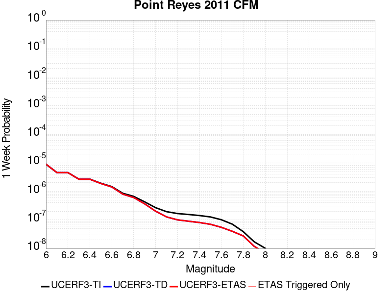 | 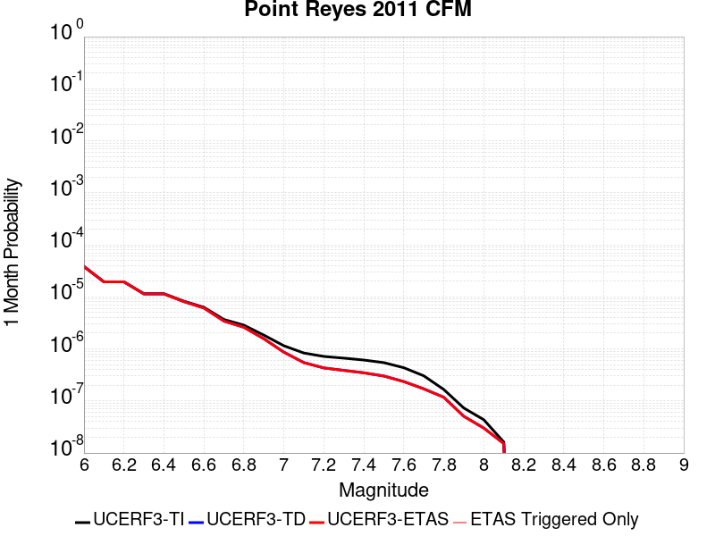 | 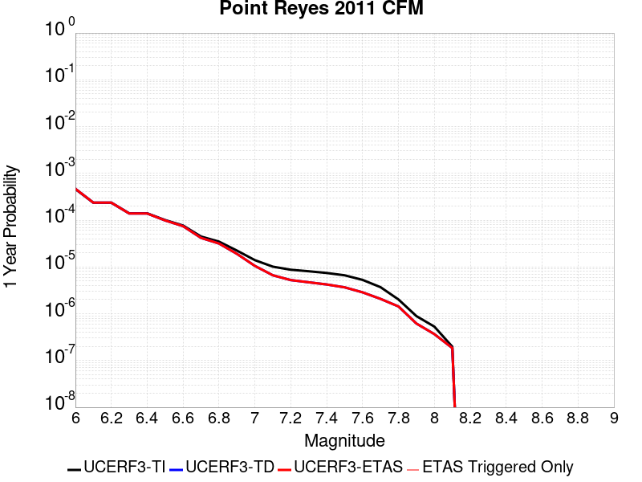 | 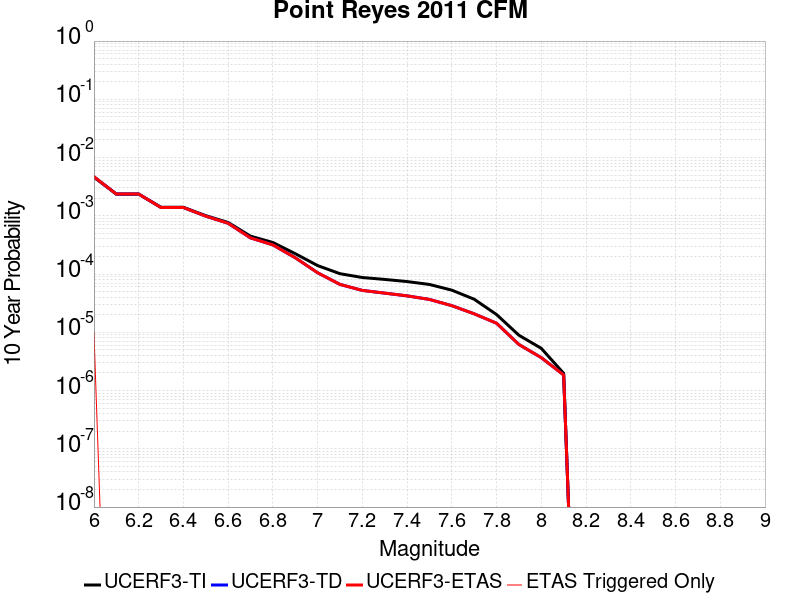 |

| Magnitude | 1 wk TI Prob | 1 wk TD Prob | 1 wk ETAS Prob | 1 wk ETAS/TD Gain | 1 wk ETAS Triggered Only | 1 mo TI Prob | 1 mo TD Prob | 1 mo ETAS Prob | 1 mo ETAS/TD Gain | 1 mo ETAS Triggered Only | 1 yr TI Prob | 1 yr TD Prob | 1 yr ETAS Prob | 1 yr ETAS/TD Gain | 1 yr ETAS Triggered Only | 10 yr TI Prob | 10 yr TD Prob | 10 yr ETAS Prob | 10 yr ETAS/TD Gain | 10 yr ETAS Triggered Only |
|-----|-----|-----|-----|-----|-----|-----|-----|-----|-----|-----|-----|-----|-----|-----|-----|-----|-----|-----|-----|-----|
| 6.0 | 8.8644965E-6 | 8.967201E-6 | 8.967201E-6 | 1.0 | 0.0 | 3.7990147E-5 | 3.843033E-5 | 3.843033E-5 | 1.0 | 0.0 | 4.624319E-4 | 4.6779512E-4 | 4.6779512E-4 | 1.0 | 0.0 | 0.0046147075 | 0.0046687326 | 0.004680667 | 1.0025562 | 1.1990408E-5 |
| 6.1 | 4.526405E-6 | 4.5392444E-6 | 4.5392444E-6 | 1.0 | 0.0 | 1.9398734E-5 | 1.9453766E-5 | 1.9453766E-5 | 1.0 | 0.0 | 2.36154E-4 | 2.368249E-4 | 2.368249E-4 | 1.0 | 0.0 | 0.002359032 | 0.0023658313 | 0.0023658313 | 1.0 | 0.0 |
| 6.2 | 4.526405E-6 | 4.5392444E-6 | 4.5392444E-6 | 1.0 | 0.0 | 1.9398734E-5 | 1.9453766E-5 | 1.9453766E-5 | 1.0 | 0.0 | 2.36154E-4 | 2.368249E-4 | 2.368249E-4 | 1.0 | 0.0 | 0.002359032 | 0.0023658313 | 0.0023658313 | 1.0 | 0.0 |
| 6.3 | 2.6842322E-6 | 2.6606972E-6 | 2.6606972E-6 | 1.0 | 0.0 | 1.1503801E-5 | 1.1402939E-5 | 1.1402939E-5 | 1.0 | 0.0 | 1.4004979E-4 | 1.3882213E-4 | 1.3882213E-4 | 1.0 | 0.0 | 0.0013996155 | 0.0013873759 | 0.0013873759 | 1.0 | 0.0 |
| 6.4 | 2.6842322E-6 | 2.6606972E-6 | 2.6606972E-6 | 1.0 | 0.0 | 1.1503801E-5 | 1.1402939E-5 | 1.1402939E-5 | 1.0 | 0.0 | 1.4004979E-4 | 1.3882213E-4 | 1.3882213E-4 | 1.0 | 0.0 | 0.0013996155 | 0.0013873759 | 0.0013873759 | 1.0 | 0.0 |
| 6.5 | 1.9281833E-6 | 1.8906454E-6 | 1.8906454E-6 | 1.0 | 0.0 | 8.263617E-6 | 8.102741E-6 | 8.102741E-6 | 1.0 | 0.0 | 1.0060489E-4 | 9.8646495E-5 | 9.8646495E-5 | 1.0 | 0.0 | 0.0010055936 | 9.860379E-4 | 9.860379E-4 | 1.0 | 0.0 |
| 6.6 | 1.4726726E-6 | 1.4269757E-6 | 1.4269757E-6 | 1.0 | 0.0 | 6.3114385E-6 | 6.115596E-6 | 6.115596E-6 | 1.0 | 0.0 | 7.683905E-5 | 7.445489E-5 | 7.445489E-5 | 1.0 | 0.0 | 7.6812494E-4 | 7.443066E-4 | 7.443066E-4 | 1.0 | 0.0 |
| 6.7 | 8.572307E-7 | 8.007378E-7 | 8.007378E-7 | 1.0 | 0.0 | 3.6738406E-6 | 3.4317288E-6 | 3.4317288E-6 | 1.0 | 0.0 | 4.472809E-5 | 4.1780513E-5 | 4.1780513E-5 | 1.0 | 0.0 | 4.471909E-4 | 4.177305E-4 | 4.177305E-4 | 1.0 | 0.0 |
| 6.8 | 6.6745434E-7 | 6.0774613E-7 | 6.0774613E-7 | 1.0 | 0.0 | 2.8605155E-6 | 2.6046237E-6 | 2.6046237E-6 | 1.0 | 0.0 | 3.482622E-5 | 3.1710842E-5 | 3.1710842E-5 | 1.0 | 0.0 | 3.4820763E-4 | 3.1706647E-4 | 3.1706647E-4 | 1.0 | 0.0 |
| 6.9 | 4.291521E-7 | 3.65375E-7 | 3.65375E-7 | 1.0 | 0.0 | 1.839222E-6 | 1.5658918E-6 | 1.5658918E-6 | 1.0 | 0.0 | 2.2392298E-5 | 1.906457E-5 | 1.906457E-5 | 1.0 | 0.0 | 2.2390042E-4 | 1.90632E-4 | 1.90632E-4 | 1.0 | 0.0 |
| 7.0 | 2.6812808E-7 | 2.0188939E-7 | 2.0188939E-7 | 1.0 | 0.0 | 1.1491198E-6 | 8.6523994E-7 | 8.6523994E-7 | 1.0 | 0.0 | 1.3990444E-5 | 1.0534246E-5 | 1.0534246E-5 | 1.0 | 0.0 | 1.3989564E-4 | 1.05339815E-4 | 1.05339815E-4 | 1.0 | 0.0 |
| 7.1 | 1.9451231E-7 | 1.2727004E-7 | 1.2727004E-7 | 1.0 | 0.0 | 8.336239E-7 | 5.454429E-7 | 5.454429E-7 | 1.0 | 0.0 | 1.0149324E-5 | 6.640747E-6 | 6.640747E-6 | 1.0 | 0.0 | 1.014886E-4 | 6.640777E-5 | 6.640777E-5 | 1.0 | 0.0 |
| 7.2 | 1.6715143E-7 | 1.0044323E-7 | 1.0044323E-7 | 1.0 | 0.0 | 7.1636305E-7 | 4.304709E-7 | 4.304709E-7 | 1.0 | 0.0 | 8.721685E-6 | 5.2409705E-6 | 5.2409705E-6 | 1.0 | 0.0 | 8.721343E-5 | 5.2410738E-5 | 5.2410738E-5 | 1.0 | 0.0 |
| 7.3 | 1.5503173E-7 | 9.014564E-8 | 9.014564E-8 | 1.0 | 0.0 | 6.644215E-7 | 3.8633837E-7 | 3.8633837E-7 | 1.0 | 0.0 | 8.089301E-6 | 4.703659E-6 | 4.703659E-6 | 1.0 | 0.0 | 8.089007E-5 | 4.703787E-5 | 4.703787E-5 | 1.0 | 0.0 |
| 7.4 | 1.4251614E-7 | 8.099046E-8 | 8.099046E-8 | 1.0 | 0.0 | 6.1078333E-7 | 3.4710192E-7 | 3.4710192E-7 | 1.0 | 0.0 | 7.4362615E-6 | 4.2259576E-6 | 4.2259576E-6 | 1.0 | 0.0 | 7.436013E-5 | 4.2261043E-5 | 4.2261043E-5 | 1.0 | 0.0 |
| 7.5 | 1.2710186E-7 | 7.031006E-8 | 7.031006E-8 | 1.0 | 0.0 | 5.447221E-7 | 3.0132875E-7 | 3.0132875E-7 | 1.0 | 0.0 | 6.6319717E-6 | 3.6686715E-6 | 3.6686715E-6 | 1.0 | 0.0 | 6.6317734E-5 | 3.668838E-5 | 3.668838E-5 | 1.0 | 0.0 |
| 7.6 | 1.0144708E-7 | 5.496477E-8 | 5.496477E-8 | 1.0 | 0.0 | 4.347731E-7 | 2.3556325E-7 | 2.3556325E-7 | 1.0 | 0.0 | 5.2933497E-6 | 2.8679788E-6 | 2.8679788E-6 | 1.0 | 0.0 | 5.293224E-5 | 2.8681687E-5 | 2.8681687E-5 | 1.0 | 0.0 |
| 7.7 | 7.090527E-8 | 3.9833534E-8 | 3.9833534E-8 | 1.0 | 0.0 | 3.038797E-7 | 1.7071513E-7 | 1.7071513E-7 | 1.0 | 0.0 | 3.699729E-6 | 2.0784546E-6 | 2.0784546E-6 | 1.0 | 0.0 | 3.6996673E-5 | 2.0786621E-5 | 2.0786621E-5 | 1.0 | 0.0 |
| 7.8 | 3.8712045E-8 | 2.7448936E-8 | 2.7448936E-8 | 1.0 | 0.0 | 1.6590876E-7 | 1.17638294E-7 | 1.17638294E-7 | 1.0 | 0.0 | 2.0199373E-6 | 1.4322452E-6 | 1.4322452E-6 | 1.0 | 0.0 | 2.0199188E-5 | 1.432463E-5 | 1.432463E-5 | 1.0 | 0.0 |
| 7.9 | 1.7068782E-8 | 1.18407035E-8 | 1.18407035E-8 | 1.0 | 0.0 | 7.315192E-8 | 5.0745875E-8 | 5.0745875E-8 | 1.0 | 0.0 | 8.906242E-7 | 6.1783084E-7 | 6.1783084E-7 | 1.0 | 0.0 | 8.906207E-6 | 6.1805604E-6 | 6.1805604E-6 | 1.0 | 0.0 |
| 8.0 | 1.0172592E-8 | 7.0342603E-9 | 7.0342603E-9 | 1.0 | 0.0 | 4.359682E-8 | 3.0146833E-8 | 3.0146833E-8 | 1.0 | 0.0 | 5.3079117E-7 | 3.6703761E-7 | 3.6703761E-7 | 1.0 | 0.0 | 5.307899E-6 | 3.6726397E-6 | 3.6726397E-6 | 1.0 | 0.0 |
| 8.1 | 3.7861243E-9 | 3.5482264E-9 | 3.5482264E-9 | 1.0 | 0.0 | 1.6226247E-8 | 1.5206684E-8 | 1.5206684E-8 | 1.0 | 0.0 | 1.9755454E-7 | 1.8514133E-7 | 1.8514133E-7 | 1.0 | 0.0 | 1.9755437E-6 | 1.8534101E-6 | 1.8534101E-6 | 1.0 | 0.0 |

## Great Valley 07 (Orestimba)
*[(top)](#table-of-contents)*

| 1 Week | 1 Month | 1 Year | 10 Year |
|-----|-----|-----|-----|
|  |  | 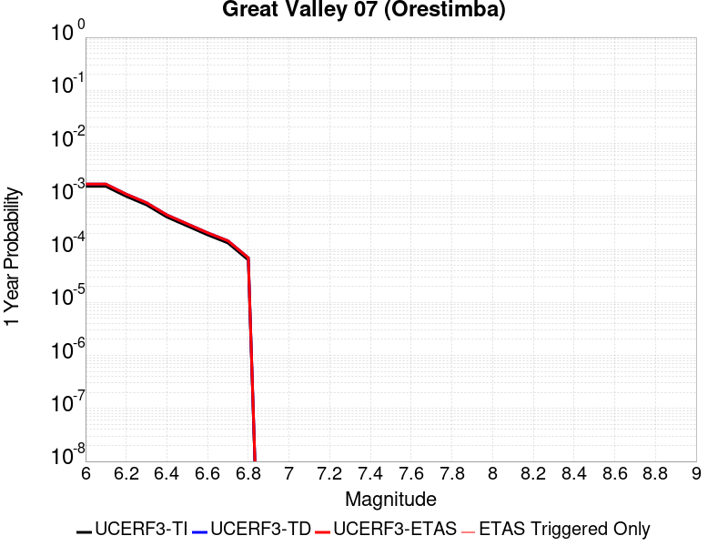 | 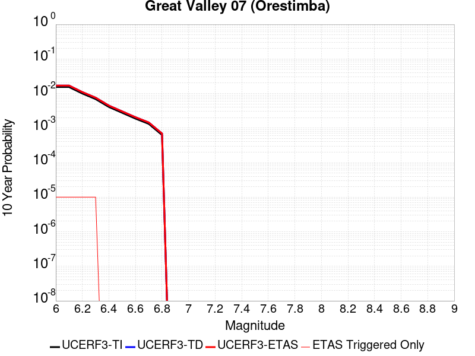 |

| Magnitude | 1 wk TI Prob | 1 wk TD Prob | 1 wk ETAS Prob | 1 wk ETAS/TD Gain | 1 wk ETAS Triggered Only | 1 mo TI Prob | 1 mo TD Prob | 1 mo ETAS Prob | 1 mo ETAS/TD Gain | 1 mo ETAS Triggered Only | 1 yr TI Prob | 1 yr TD Prob | 1 yr ETAS Prob | 1 yr ETAS/TD Gain | 1 yr ETAS Triggered Only | 10 yr TI Prob | 10 yr TD Prob | 10 yr ETAS Prob | 10 yr ETAS/TD Gain | 10 yr ETAS Triggered Only |
|-----|-----|-----|-----|-----|-----|-----|-----|-----|-----|-----|-----|-----|-----|-----|-----|-----|-----|-----|-----|-----|
| 6.0 | 2.9687902E-5 | 3.2757947E-5 | 3.2757947E-5 | 1.0 | 0.0 | 1.2722766E-4 | 1.4038406E-4 | 1.4038406E-4 | 1.0 | 0.0 | 0.0015478961 | 0.0017079079 | 0.0017079079 | 1.0 | 0.0 | 0.015371585 | 0.016955366 | 0.016967153 | 1.0006952 | 1.1990408E-5 |
| 6.1 | 2.9687902E-5 | 3.2757947E-5 | 3.2757947E-5 | 1.0 | 0.0 | 1.2722766E-4 | 1.4038406E-4 | 1.4038406E-4 | 1.0 | 0.0 | 0.0015478961 | 0.0017079079 | 0.0017079079 | 1.0 | 0.0 | 0.015371585 | 0.016955366 | 0.016967153 | 1.0006952 | 1.1990408E-5 |
| 6.2 | 1.9231524E-5 | 2.1159447E-5 | 2.1159447E-5 | 1.0 | 0.0 | 8.2418206E-5 | 9.0680325E-5 | 9.0680325E-5 | 1.0 | 0.0 | 0.0010029797 | 0.0011034969 | 0.0011034969 | 1.0 | 0.0 | 0.00998465 | 0.010982586 | 0.010994445 | 1.0010798 | 1.1990408E-5 |
| 6.3 | 1.324766E-5 | 1.4548723E-5 | 1.4548723E-5 | 1.0 | 0.0 | 5.6774446E-5 | 6.235023E-5 | 6.235023E-5 | 1.0 | 0.0 | 6.910097E-4 | 7.5885886E-4 | 7.5885886E-4 | 1.0 | 0.0 | 0.006888649 | 0.0075636217 | 0.0075755217 | 1.0015733 | 1.1990408E-5 |
| 6.4 | 7.818645E-6 | 8.57295E-6 | 8.57295E-6 | 1.0 | 0.0 | 3.3508048E-5 | 3.6740716E-5 | 3.6740716E-5 | 1.0 | 0.0 | 4.078841E-4 | 4.4722974E-4 | 4.4722974E-4 | 1.0 | 0.0 | 0.004071363 | 0.0044636377 | 0.0044636377 | 1.0 | 0.0 |
| 6.5 | 5.3076565E-6 | 5.817875E-6 | 5.817875E-6 | 1.0 | 0.0 | 2.27469E-5 | 2.4933523E-5 | 2.4933523E-5 | 1.0 | 0.0 | 2.7690834E-4 | 3.0352548E-4 | 3.0352548E-4 | 1.0 | 0.0 | 0.0027656353 | 0.0030313185 | 0.0030313185 | 1.0 | 0.0 |
| 6.6 | 3.6003578E-6 | 3.9485462E-6 | 3.9485462E-6 | 1.0 | 0.0 | 1.5430012E-5 | 1.6922239E-5 | 1.6922239E-5 | 1.0 | 0.0 | 1.8784421E-4 | 2.0601034E-4 | 2.0601034E-4 | 1.0 | 0.0 | 0.0018768552 | 0.0020583477 | 0.0020583477 | 1.0 | 0.0 |
| 6.7 | 2.5361826E-6 | 2.783504E-6 | 2.783504E-6 | 1.0 | 0.0 | 1.0869308E-5 | 1.1929255E-5 | 1.1929255E-5 | 1.0 | 0.0 | 1.3232579E-4 | 1.4523033E-4 | 1.4523033E-4 | 1.0 | 0.0 | 0.0013224703 | 0.001451484 | 0.001451484 | 1.0 | 0.0 |
| 6.8 | 1.2115831E-6 | 1.3313972E-6 | 1.3313972E-6 | 1.0 | 0.0 | 5.1924885E-6 | 5.705981E-6 | 5.705981E-6 | 1.0 | 0.0 | 6.3216714E-5 | 6.9469075E-5 | 6.9469075E-5 | 1.0 | 0.0 | 6.3198735E-4 | 6.9456873E-4 | 6.9456873E-4 | 1.0 | 0.0 |

## Oceanside alt1
*[(top)](#table-of-contents)*

| 1 Week | 1 Month | 1 Year | 10 Year |
|-----|-----|-----|-----|
| 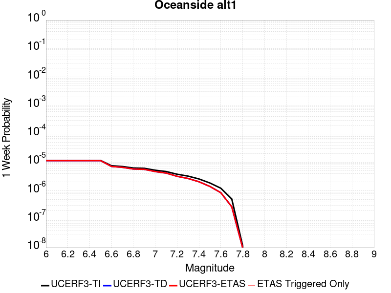 | 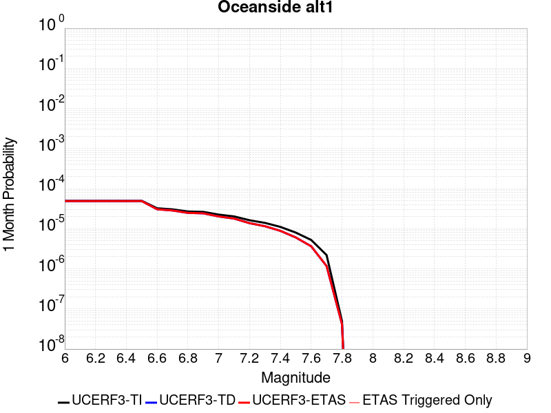 | 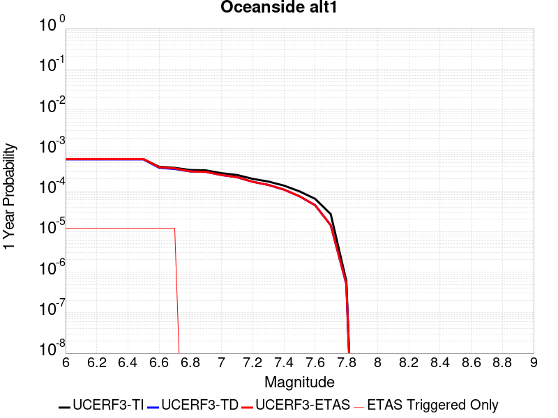 | 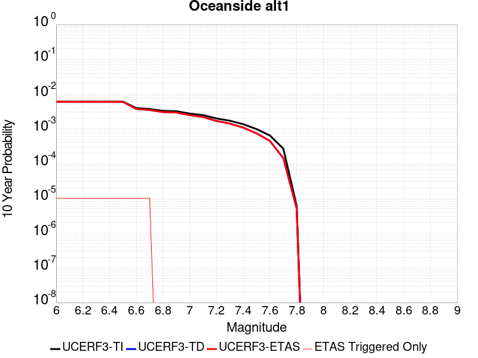 |

| Magnitude | 1 wk TI Prob | 1 wk TD Prob | 1 wk ETAS Prob | 1 wk ETAS/TD Gain | 1 wk ETAS Triggered Only | 1 mo TI Prob | 1 mo TD Prob | 1 mo ETAS Prob | 1 mo ETAS/TD Gain | 1 mo ETAS Triggered Only | 1 yr TI Prob | 1 yr TD Prob | 1 yr ETAS Prob | 1 yr ETAS/TD Gain | 1 yr ETAS Triggered Only | 10 yr TI Prob | 10 yr TD Prob | 10 yr ETAS Prob | 10 yr ETAS/TD Gain | 10 yr ETAS Triggered Only |
|-----|-----|-----|-----|-----|-----|-----|-----|-----|-----|-----|-----|-----|-----|-----|-----|-----|-----|-----|-----|-----|
| 6.0 | 1.1617542E-5 | 1.142357E-5 | 1.142357E-5 | 1.0 | 0.0 | 4.9788516E-5 | 4.895733E-5 | 4.895733E-5 | 1.0 | 0.0 | 6.060066E-4 | 5.9590855E-4 | 6.078918E-4 | 1.0201092 | 1.1990408E-5 | 0.0060435664 | 0.0059447046 | 0.0059566237 | 1.002005 | 1.1990408E-5 |
| 6.1 | 1.1617542E-5 | 1.142357E-5 | 1.142357E-5 | 1.0 | 0.0 | 4.9788516E-5 | 4.895733E-5 | 4.895733E-5 | 1.0 | 0.0 | 6.060066E-4 | 5.9590855E-4 | 6.078918E-4 | 1.0201092 | 1.1990408E-5 | 0.0060435664 | 0.0059447046 | 0.0059566237 | 1.002005 | 1.1990408E-5 |
| 6.2 | 1.1617542E-5 | 1.142357E-5 | 1.142357E-5 | 1.0 | 0.0 | 4.9788516E-5 | 4.895733E-5 | 4.895733E-5 | 1.0 | 0.0 | 6.060066E-4 | 5.9590855E-4 | 6.078918E-4 | 1.0201092 | 1.1990408E-5 | 0.0060435664 | 0.0059447046 | 0.0059566237 | 1.002005 | 1.1990408E-5 |
| 6.3 | 1.1617542E-5 | 1.142357E-5 | 1.142357E-5 | 1.0 | 0.0 | 4.9788516E-5 | 4.895733E-5 | 4.895733E-5 | 1.0 | 0.0 | 6.060066E-4 | 5.9590855E-4 | 6.078918E-4 | 1.0201092 | 1.1990408E-5 | 0.0060435664 | 0.0059447046 | 0.0059566237 | 1.002005 | 1.1990408E-5 |
| 6.4 | 1.1617542E-5 | 1.142357E-5 | 1.142357E-5 | 1.0 | 0.0 | 4.9788516E-5 | 4.895733E-5 | 4.895733E-5 | 1.0 | 0.0 | 6.060066E-4 | 5.9590855E-4 | 6.078918E-4 | 1.0201092 | 1.1990408E-5 | 0.0060435664 | 0.0059447046 | 0.0059566237 | 1.002005 | 1.1990408E-5 |
| 6.5 | 1.1617542E-5 | 1.142357E-5 | 1.142357E-5 | 1.0 | 0.0 | 4.9788516E-5 | 4.895733E-5 | 4.895733E-5 | 1.0 | 0.0 | 6.060066E-4 | 5.9590855E-4 | 6.078918E-4 | 1.0201092 | 1.1990408E-5 | 0.0060435664 | 0.0059447046 | 0.0059566237 | 1.002005 | 1.1990408E-5 |
| 6.6 | 7.561768E-6 | 7.1336603E-6 | 7.1336603E-6 | 1.0 | 0.0 | 3.2407173E-5 | 3.057248E-5 | 3.057248E-5 | 1.0 | 0.0 | 3.9448592E-4 | 3.7215743E-4 | 3.8414335E-4 | 1.0322067 | 1.1990408E-5 | 0.0039378637 | 0.0037154534 | 0.0037273993 | 1.0032152 | 1.1990408E-5 |
| 6.7 | 7.1042605E-6 | 6.6557277E-6 | 6.6557277E-6 | 1.0 | 0.0 | 3.0446476E-5 | 2.852424E-5 | 2.852424E-5 | 1.0 | 0.0 | 3.706228E-4 | 3.4722808E-4 | 3.5921432E-4 | 1.0345198 | 1.1990408E-5 | 0.0037000529 | 0.0034669389 | 0.0034788877 | 1.0034465 | 1.1990408E-5 |
| 6.8 | 6.285554E-6 | 5.7997427E-6 | 5.7997427E-6 | 1.0 | 0.0 | 2.693781E-5 | 2.4855806E-5 | 2.4855806E-5 | 1.0 | 0.0 | 3.2791847E-4 | 3.0257797E-4 | 3.0257797E-4 | 1.0 | 0.0 | 0.0032743502 | 0.0030217173 | 0.0030217173 | 1.0 | 0.0 |
| 6.9 | 6.148883E-6 | 5.6565805E-6 | 5.6565805E-6 | 1.0 | 0.0 | 2.635209E-5 | 2.4242265E-5 | 2.4242265E-5 | 1.0 | 0.0 | 3.2078946E-4 | 2.9511016E-4 | 2.9511016E-4 | 1.0 | 0.0 | 0.003203268 | 0.0029472397 | 0.0029472397 | 1.0 | 0.0 |
| 7.0 | 5.253857E-6 | 4.7224344E-6 | 4.7224344E-6 | 1.0 | 0.0 | 2.2516335E-5 | 2.023885E-5 | 2.023885E-5 | 1.0 | 0.0 | 2.7410188E-4 | 2.4638043E-4 | 2.4638043E-4 | 1.0 | 0.0 | 0.0027376404 | 0.0024611044 | 0.0024611044 | 1.0 | 0.0 |
| 7.1 | 4.730754E-6 | 4.1785374E-6 | 4.1785374E-6 | 1.0 | 0.0 | 2.0274503E-5 | 1.7907896E-5 | 1.7907896E-5 | 1.0 | 0.0 | 2.468141E-4 | 2.1800707E-4 | 2.1800707E-4 | 1.0 | 0.0 | 0.0024654015 | 0.0021779586 | 0.0021779586 | 1.0 | 0.0 |
| 7.2 | 3.7998386E-6 | 3.2140474E-6 | 3.2140474E-6 | 1.0 | 0.0 | 1.6284921E-5 | 1.3774416E-5 | 1.3774416E-5 | 1.0 | 0.0 | 1.9825088E-4 | 1.6769074E-4 | 1.6769074E-4 | 1.0 | 0.0 | 0.001980741 | 0.0016756542 | 0.0016756542 | 1.0 | 0.0 |
| 7.3 | 3.2656465E-6 | 2.6983946E-6 | 2.6983946E-6 | 1.0 | 0.0 | 1.3995553E-5 | 1.1564497E-5 | 1.1564497E-5 | 1.0 | 0.0 | 1.7038253E-4 | 1.4078878E-4 | 1.4078878E-4 | 1.0 | 0.0 | 0.0017025196 | 0.0014070069 | 0.0014070069 | 1.0 | 0.0 |
| 7.4 | 2.593703E-6 | 2.068043E-6 | 2.068043E-6 | 1.0 | 0.0 | 1.1115822E-5 | 8.863011E-6 | 8.863011E-6 | 1.0 | 0.0 | 1.3532673E-4 | 1.07901906E-4 | 1.07901906E-4 | 1.0 | 0.0 | 0.0013524436 | 0.001078504 | 0.001078504 | 1.0 | 0.0 |
| 7.5 | 1.8715585E-6 | 1.4137245E-6 | 1.4137245E-6 | 1.0 | 0.0 | 8.020941E-6 | 6.0588054E-6 | 6.0588054E-6 | 1.0 | 0.0 | 9.7650576E-5 | 7.376352E-5 | 7.376352E-5 | 1.0 | 0.0 | 9.7607676E-4 | 7.373964E-4 | 7.373964E-4 | 1.0 | 0.0 |
| 7.6 | 1.2246786E-6 | 8.5268715E-7 | 8.5268715E-7 | 1.0 | 0.0 | 5.248612E-6 | 3.6543686E-6 | 3.6543686E-6 | 1.0 | 0.0 | 6.389998E-5 | 4.4491073E-5 | 4.4491073E-5 | 1.0 | 0.0 | 6.3881604E-4 | 4.4482618E-4 | 4.4482618E-4 | 1.0 | 0.0 |
| 7.7 | 5.140719E-7 | 2.7347338E-7 | 2.7347338E-7 | 1.0 | 0.0 | 2.2031636E-6 | 1.1720283E-6 | 1.1720283E-6 | 1.0 | 0.0 | 2.6823185E-5 | 1.4269365E-5 | 1.4269365E-5 | 1.0 | 0.0 | 2.6819948E-4 | 1.4268584E-4 | 1.4268584E-4 | 1.0 | 0.0 |
| 7.8 | 1.16056995E-8 | 9.782392E-9 | 9.782392E-9 | 1.0 | 0.0 | 4.9738713E-8 | 4.1924537E-8 | 4.1924537E-8 | 1.0 | 0.0 | 6.0556863E-7 | 5.104312E-7 | 5.104312E-7 | 1.0 | 0.0 | 6.05567E-6 | 5.104312E-6 | 5.104312E-6 | 1.0 | 0.0 |

## Great Valley 05 Pittsburg - Kirby Hills alt1
*[(top)](#table-of-contents)*

| 1 Week | 1 Month | 1 Year | 10 Year |
|-----|-----|-----|-----|
|  | 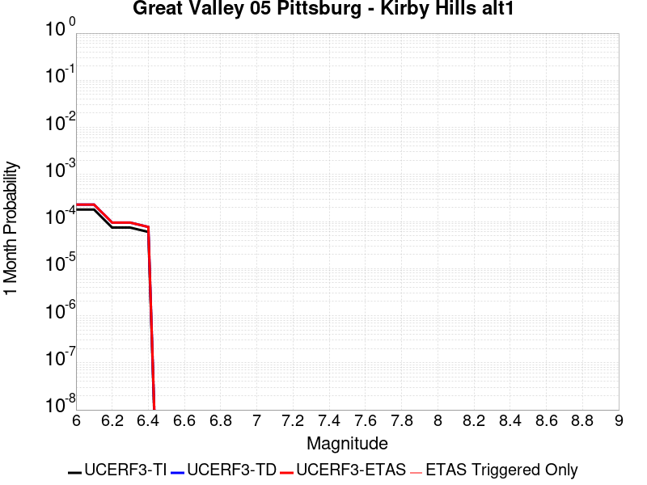 | 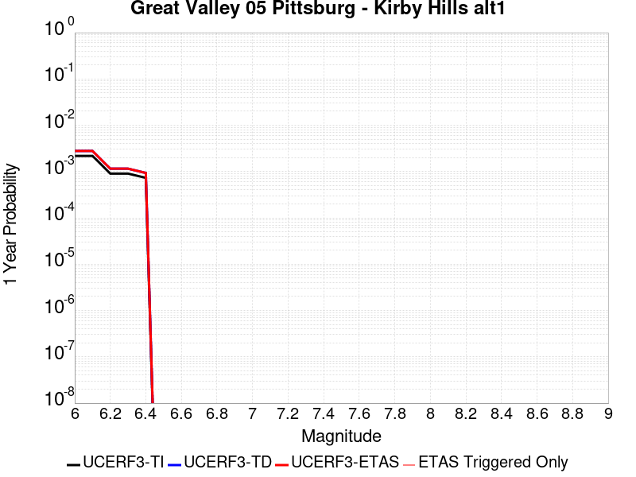 | 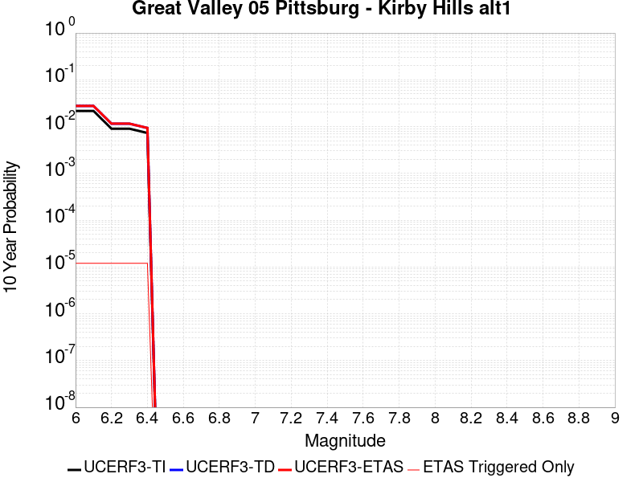 |

| Magnitude | 1 wk TI Prob | 1 wk TD Prob | 1 wk ETAS Prob | 1 wk ETAS/TD Gain | 1 wk ETAS Triggered Only | 1 mo TI Prob | 1 mo TD Prob | 1 mo ETAS Prob | 1 mo ETAS/TD Gain | 1 mo ETAS Triggered Only | 1 yr TI Prob | 1 yr TD Prob | 1 yr ETAS Prob | 1 yr ETAS/TD Gain | 1 yr ETAS Triggered Only | 10 yr TI Prob | 10 yr TD Prob | 10 yr ETAS Prob | 10 yr ETAS/TD Gain | 10 yr ETAS Triggered Only |
|-----|-----|-----|-----|-----|-----|-----|-----|-----|-----|-----|-----|-----|-----|-----|-----|-----|-----|-----|-----|-----|
| 6.0 | 4.187212E-5 | 5.3444037E-5 | 5.3444037E-5 | 1.0 | 0.0 | 1.794396E-4 | 2.2903152E-4 | 2.2903152E-4 | 1.0 | 0.0 | 0.002182488 | 0.0027858876 | 0.0027858876 | 1.0 | 0.0 | 0.021611776 | 0.027604017 | 0.027615678 | 1.0004224 | 1.1990408E-5 |
| 6.1 | 4.187212E-5 | 5.3444037E-5 | 5.3444037E-5 | 1.0 | 0.0 | 1.794396E-4 | 2.2903152E-4 | 2.2903152E-4 | 1.0 | 0.0 | 0.002182488 | 0.0027858876 | 0.0027858876 | 1.0 | 0.0 | 0.021611776 | 0.027604017 | 0.027615678 | 1.0004224 | 1.1990408E-5 |
| 6.2 | 1.7353306E-5 | 2.2155189E-5 | 2.2155189E-5 | 1.0 | 0.0 | 7.436919E-5 | 9.4949675E-5 | 9.4949675E-5 | 1.0 | 0.0 | 9.050688E-4 | 0.0011557965 | 0.0011557965 | 1.0 | 0.0 | 0.009013915 | 0.011535524 | 0.011547376 | 1.0010275 | 1.1990408E-5 |
| 6.3 | 1.7353306E-5 | 2.2155189E-5 | 2.2155189E-5 | 1.0 | 0.0 | 7.436919E-5 | 9.4949675E-5 | 9.4949675E-5 | 1.0 | 0.0 | 9.050688E-4 | 0.0011557965 | 0.0011557965 | 1.0 | 0.0 | 0.009013915 | 0.011535524 | 0.011547376 | 1.0010275 | 1.1990408E-5 |
| 6.4 | 1.4028824E-5 | 1.7901253E-5 | 1.7901253E-5 | 1.0 | 0.0 | 6.0122147E-5 | 7.6719654E-5 | 7.6719654E-5 | 1.0 | 0.0 | 7.3174125E-4 | 9.3406177E-4 | 9.3406177E-4 | 1.0 | 0.0 | 0.0072933645 | 0.00933847 | 0.009350349 | 1.001272 | 1.1990408E-5 |

## Newport-Inglewood (Offshore)
*[(top)](#table-of-contents)*

| 1 Week | 1 Month | 1 Year | 10 Year |
|-----|-----|-----|-----|
| 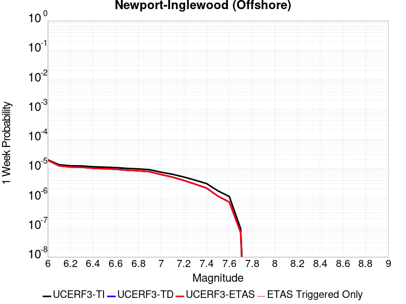 | 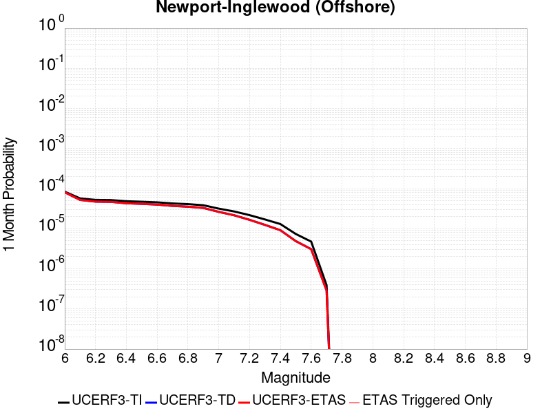 | 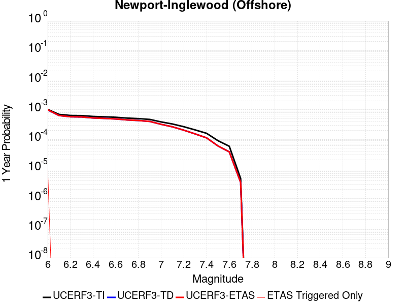 | 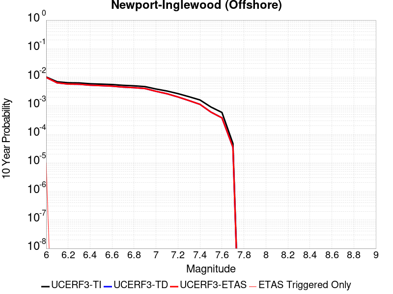 |

| Magnitude | 1 wk TI Prob | 1 wk TD Prob | 1 wk ETAS Prob | 1 wk ETAS/TD Gain | 1 wk ETAS Triggered Only | 1 mo TI Prob | 1 mo TD Prob | 1 mo ETAS Prob | 1 mo ETAS/TD Gain | 1 mo ETAS Triggered Only | 1 yr TI Prob | 1 yr TD Prob | 1 yr ETAS Prob | 1 yr ETAS/TD Gain | 1 yr ETAS Triggered Only | 10 yr TI Prob | 10 yr TD Prob | 10 yr ETAS Prob | 10 yr ETAS/TD Gain | 10 yr ETAS Triggered Only |
|-----|-----|-----|-----|-----|-----|-----|-----|-----|-----|-----|-----|-----|-----|-----|-----|-----|-----|-----|-----|-----|
| 6.0 | 1.9626508E-5 | 1.896559E-5 | 1.896559E-5 | 1.0 | 0.0 | 8.411089E-5 | 8.127864E-5 | 8.127864E-5 | 1.0 | 0.0 | 0.001023569 | 9.891307E-4 | 0.0010011093 | 1.0121102 | 1.1990408E-5 | 0.010188672 | 0.0098486245 | 0.009860497 | 1.0012054 | 1.1990408E-5 |
| 6.1 | 1.331886E-5 | 1.2218263E-5 | 1.2218263E-5 | 1.0 | 0.0 | 5.707958E-5 | 5.2362942E-5 | 5.2362942E-5 | 1.0 | 0.0 | 6.947222E-4 | 6.3733384E-4 | 6.3733384E-4 | 1.0 | 0.0 | 0.006925544 | 0.0063552377 | 0.0063552377 | 1.0 | 0.0 |
| 6.2 | 1.2250852E-5 | 1.1076189E-5 | 1.1076189E-5 | 1.0 | 0.0 | 5.2502597E-5 | 4.7468526E-5 | 4.7468526E-5 | 1.0 | 0.0 | 6.3903164E-4 | 5.7777704E-4 | 5.7777704E-4 | 1.0 | 0.0 | 0.006371971 | 0.00576287 | 0.00576287 | 1.0 | 0.0 |
| 6.3 | 1.2106258E-5 | 1.091905E-5 | 1.091905E-5 | 1.0 | 0.0 | 5.1882926E-5 | 4.6795092E-5 | 4.6795092E-5 | 1.0 | 0.0 | 6.3149154E-4 | 5.695823E-4 | 5.695823E-4 | 1.0 | 0.0 | 0.0062970007 | 0.0056813415 | 0.0056813415 | 1.0 | 0.0 |
| 6.4 | 1.1348758E-5 | 1.0109513E-5 | 1.0109513E-5 | 1.0 | 0.0 | 4.8636626E-5 | 4.332577E-5 | 4.332577E-5 | 1.0 | 0.0 | 5.919901E-4 | 5.273644E-4 | 5.273644E-4 | 1.0 | 0.0 | 0.005904155 | 0.005261225 | 0.005261225 | 1.0 | 0.0 |
| 6.5 | 1.100837E-5 | 9.743537E-6 | 9.743537E-6 | 1.0 | 0.0 | 4.7177873E-5 | 4.175735E-5 | 4.175735E-5 | 1.0 | 0.0 | 5.7423924E-4 | 5.082779E-4 | 5.082779E-4 | 1.0 | 0.0 | 0.005727576 | 0.0050712456 | 0.0050712456 | 1.0 | 0.0 |
| 6.6 | 1.0634696E-5 | 9.345687E-6 | 9.345687E-6 | 1.0 | 0.0 | 4.557647E-5 | 4.0052335E-5 | 4.0052335E-5 | 1.0 | 0.0 | 5.5475225E-4 | 4.875288E-4 | 4.875288E-4 | 1.0 | 0.0 | 0.0055336943 | 0.004864679 | 0.004864679 | 1.0 | 0.0 |
| 6.7 | 9.9780855E-6 | 8.668048E-6 | 8.668048E-6 | 1.0 | 0.0 | 4.276252E-5 | 3.7148253E-5 | 3.7148253E-5 | 1.0 | 0.0 | 5.205093E-4 | 4.521868E-4 | 4.521868E-4 | 1.0 | 0.0 | 0.0051929182 | 0.0045127464 | 0.0045127464 | 1.0 | 0.0 |
| 6.8 | 9.59546E-6 | 8.273084E-6 | 8.273084E-6 | 1.0 | 0.0 | 4.1122752E-5 | 3.5455596E-5 | 3.5455596E-5 | 1.0 | 0.0 | 5.0055445E-4 | 4.3158708E-4 | 4.3158708E-4 | 1.0 | 0.0 | 0.004994285 | 0.004307565 | 0.004307565 | 1.0 | 0.0 |
| 6.9 | 9.000614E-6 | 7.706967E-6 | 7.706967E-6 | 1.0 | 0.0 | 3.857349E-5 | 3.3029446E-5 | 3.3029446E-5 | 1.0 | 0.0 | 4.6953102E-4 | 4.0205996E-4 | 4.0205996E-4 | 1.0 | 0.0 | 0.004685402 | 0.004013397 | 0.004013397 | 1.0 | 0.0 |
| 7.0 | 7.4070194E-6 | 6.1490105E-6 | 6.1490105E-6 | 1.0 | 0.0 | 3.1743984E-5 | 2.6352638E-5 | 2.6352638E-5 | 1.0 | 0.0 | 3.8641447E-4 | 3.2079627E-4 | 3.2079627E-4 | 1.0 | 0.0 | 0.0038574322 | 0.0032033517 | 0.0032033517 | 1.0 | 0.0 |
| 7.1 | 6.299615E-6 | 5.056689E-6 | 5.056689E-6 | 1.0 | 0.0 | 2.699807E-5 | 2.1671345E-5 | 2.1671345E-5 | 1.0 | 0.0 | 3.2865192E-4 | 2.6381682E-4 | 2.6381682E-4 | 1.0 | 0.0 | 0.003281663 | 0.002635051 | 0.002635051 | 1.0 | 0.0 |
| 7.2 | 5.096653E-6 | 3.8928574E-6 | 3.8928574E-6 | 1.0 | 0.0 | 2.1842614E-5 | 1.6683567E-5 | 1.6683567E-5 | 1.0 | 0.0 | 2.6590136E-4 | 2.0310361E-4 | 2.0310361E-4 | 1.0 | 0.0 | 0.0026558342 | 0.002029191 | 0.002029191 | 1.0 | 0.0 |
| 7.3 | 3.9753018E-6 | 2.9099435E-6 | 2.9099435E-6 | 1.0 | 0.0 | 1.7036897E-5 | 1.2471127E-5 | 1.2471127E-5 | 1.0 | 0.0 | 2.0740448E-4 | 1.5182547E-4 | 1.5182547E-4 | 1.0 | 0.0 | 0.00207211 | 0.0015172255 | 0.0015172255 | 1.0 | 0.0 |
| 7.4 | 3.0568392E-6 | 2.145023E-6 | 2.145023E-6 | 1.0 | 0.0 | 1.3100675E-5 | 9.192923E-6 | 9.192923E-6 | 1.0 | 0.0 | 1.5948903E-4 | 1.11918154E-4 | 1.11918154E-4 | 1.0 | 0.0 | 0.0015937461 | 0.0011186242 | 0.0011186242 | 1.0 | 0.0 |
| 7.5 | 1.7279019E-6 | 1.1470016E-6 | 1.1470016E-6 | 1.0 | 0.0 | 7.405273E-6 | 4.9157125E-6 | 4.9157125E-6 | 1.0 | 0.0 | 9.015547E-5 | 5.9847192E-5 | 5.9847192E-5 | 1.0 | 0.0 | 9.01189E-4 | 5.983146E-4 | 5.983146E-4 | 1.0 | 0.0 |
| 7.6 | 1.1156416E-6 | 7.2231035E-7 | 7.2231035E-7 | 1.0 | 0.0 | 4.7813123E-6 | 3.0956123E-6 | 3.0956123E-6 | 1.0 | 0.0 | 5.821092E-5 | 3.7688453E-5 | 3.7688453E-5 | 1.0 | 0.0 | 5.8195676E-4 | 3.7682295E-4 | 3.7682295E-4 | 1.0 | 0.0 |
| 7.7 | 9.117973E-8 | 6.7341894E-8 | 6.7341894E-8 | 1.0 | 0.0 | 3.907702E-7 | 2.8860808E-7 | 2.8860808E-7 | 1.0 | 0.0 | 4.757617E-6 | 3.513798E-6 | 3.513798E-6 | 1.0 | 0.0 | 4.7575148E-5 | 3.5137455E-5 | 3.5137455E-5 | 1.0 | 0.0 |

## San Jacinto (Clark) rev
*[(top)](#table-of-contents)*

| 1 Week | 1 Month | 1 Year | 10 Year |
|-----|-----|-----|-----|
| 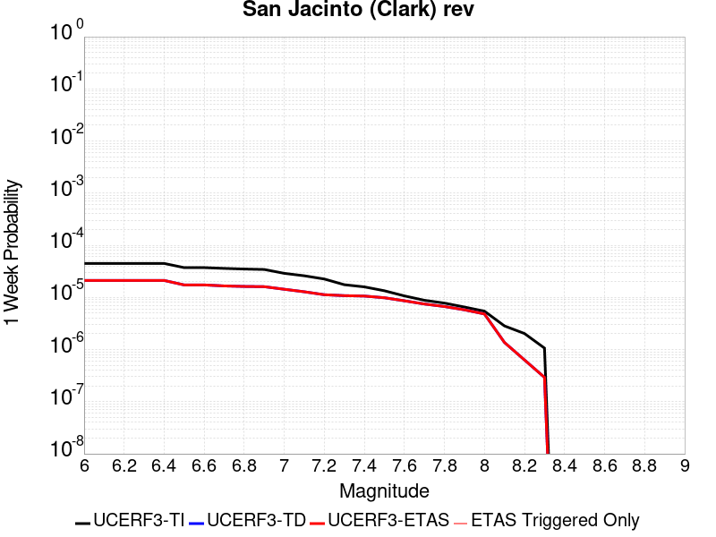 | 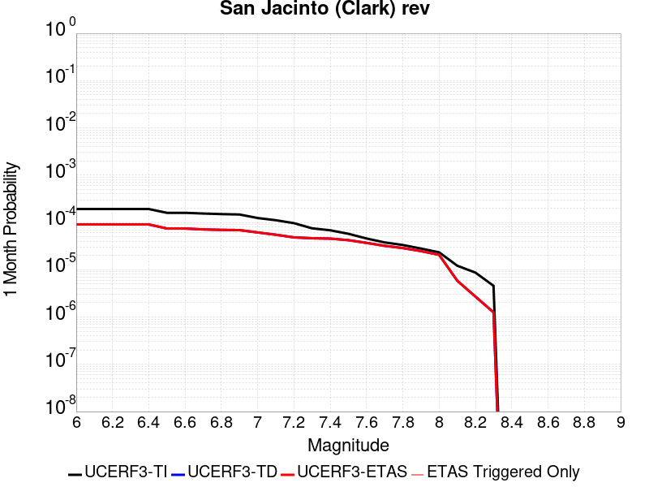 | 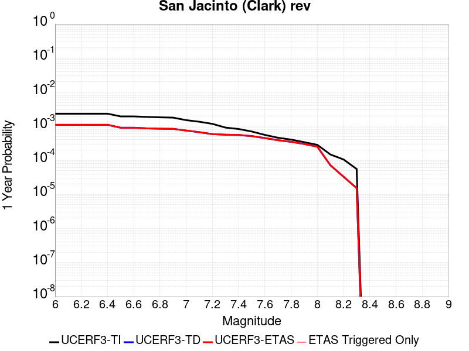 | 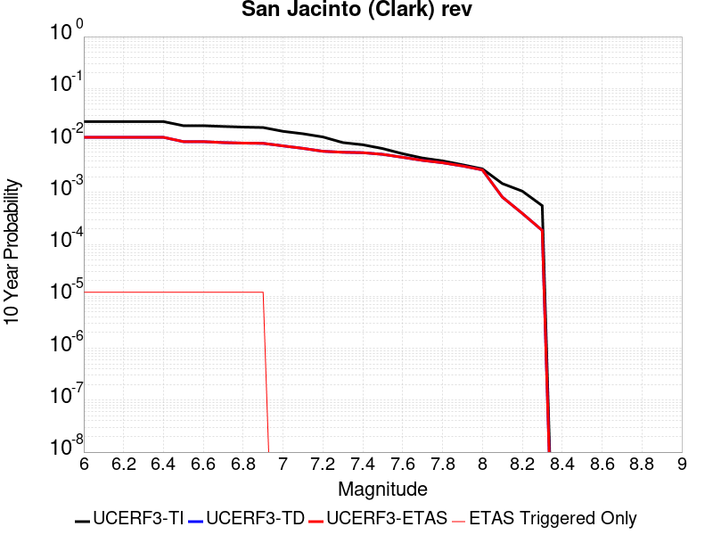 |

| Magnitude | 1 wk TI Prob | 1 wk TD Prob | 1 wk ETAS Prob | 1 wk ETAS/TD Gain | 1 wk ETAS Triggered Only | 1 mo TI Prob | 1 mo TD Prob | 1 mo ETAS Prob | 1 mo ETAS/TD Gain | 1 mo ETAS Triggered Only | 1 yr TI Prob | 1 yr TD Prob | 1 yr ETAS Prob | 1 yr ETAS/TD Gain | 1 yr ETAS Triggered Only | 10 yr TI Prob | 10 yr TD Prob | 10 yr ETAS Prob | 10 yr ETAS/TD Gain | 10 yr ETAS Triggered Only |
|-----|-----|-----|-----|-----|-----|-----|-----|-----|-----|-----|-----|-----|-----|-----|-----|-----|-----|-----|-----|-----|
| 6.0 | 4.482615E-5 | 2.1162805E-5 | 2.1162805E-5 | 1.0 | 0.0 | 1.9209793E-4 | 9.069463E-5 | 9.069463E-5 | 1.0 | 0.0 | 0.0023362834 | 0.0011036571 | 0.0011036571 | 1.0 | 0.0 | 0.02311874 | 0.011508432 | 0.011520284 | 1.0010298 | 1.1990408E-5 |
| 6.1 | 4.482615E-5 | 2.1162805E-5 | 2.1162805E-5 | 1.0 | 0.0 | 1.9209793E-4 | 9.069463E-5 | 9.069463E-5 | 1.0 | 0.0 | 0.0023362834 | 0.0011036571 | 0.0011036571 | 1.0 | 0.0 | 0.02311874 | 0.011508432 | 0.011520284 | 1.0010298 | 1.1990408E-5 |
| 6.2 | 4.482615E-5 | 2.1162805E-5 | 2.1162805E-5 | 1.0 | 0.0 | 1.9209793E-4 | 9.069463E-5 | 9.069463E-5 | 1.0 | 0.0 | 0.0023362834 | 0.0011036571 | 0.0011036571 | 1.0 | 0.0 | 0.02311874 | 0.011508432 | 0.011520284 | 1.0010298 | 1.1990408E-5 |
| 6.3 | 4.482615E-5 | 2.1162805E-5 | 2.1162805E-5 | 1.0 | 0.0 | 1.9209793E-4 | 9.069463E-5 | 9.069463E-5 | 1.0 | 0.0 | 0.0023362834 | 0.0011036571 | 0.0011036571 | 1.0 | 0.0 | 0.02311874 | 0.011508432 | 0.011520284 | 1.0010298 | 1.1990408E-5 |
| 6.4 | 4.482615E-5 | 2.1162805E-5 | 2.1162805E-5 | 1.0 | 0.0 | 1.9209793E-4 | 9.069463E-5 | 9.069463E-5 | 1.0 | 0.0 | 0.0023362834 | 0.0011036571 | 0.0011036571 | 1.0 | 0.0 | 0.02311874 | 0.011508432 | 0.011520284 | 1.0010298 | 1.1990408E-5 |
| 6.5 | 3.7294863E-5 | 1.7363767E-5 | 1.7363767E-5 | 1.0 | 0.0 | 1.5982533E-4 | 7.441404E-5 | 7.441404E-5 | 1.0 | 0.0 | 0.0019441366 | 9.056189E-4 | 9.056189E-4 | 1.0 | 0.0 | 0.01927216 | 0.009498186 | 0.009510063 | 1.0012504 | 1.1990408E-5 |
| 6.6 | 3.7294863E-5 | 1.7363767E-5 | 1.7363767E-5 | 1.0 | 0.0 | 1.5982533E-4 | 7.441404E-5 | 7.441404E-5 | 1.0 | 0.0 | 0.0019441366 | 9.056189E-4 | 9.056189E-4 | 1.0 | 0.0 | 0.01927216 | 0.009498186 | 0.009510063 | 1.0012504 | 1.1990408E-5 |
| 6.7 | 3.6039248E-5 | 1.661182E-5 | 1.661182E-5 | 1.0 | 0.0 | 1.5444479E-4 | 7.11916E-5 | 7.11916E-5 | 1.0 | 0.0 | 0.0018787434 | 8.6641713E-4 | 8.6641713E-4 | 1.0 | 0.0 | 0.01862939 | 0.009100041 | 0.009111922 | 1.0013056 | 1.1990408E-5 |
| 6.8 | 3.5031844E-5 | 1.6240316E-5 | 1.6240316E-5 | 1.0 | 0.0 | 1.5012783E-4 | 6.959952E-5 | 6.959952E-5 | 1.0 | 0.0 | 0.0018262739 | 8.470488E-4 | 8.470488E-4 | 1.0 | 0.0 | 0.01811338 | 0.008899899 | 0.008911783 | 1.0013353 | 1.1990408E-5 |
| 6.9 | 3.435112E-5 | 1.6070499E-5 | 1.6070499E-5 | 1.0 | 0.0 | 1.4721078E-4 | 6.887177E-5 | 6.887177E-5 | 1.0 | 0.0 | 0.0017908178 | 8.381953E-4 | 8.381953E-4 | 1.0 | 0.0 | 0.017764548 | 0.008808068 | 0.008819953 | 1.0013493 | 1.1990408E-5 |
| 7.0 | 2.8959772E-5 | 1.4343366E-5 | 1.4343366E-5 | 1.0 | 0.0 | 1.241074E-4 | 6.1470135E-5 | 6.1470135E-5 | 1.0 | 0.0 | 0.0015099603 | 7.481447E-4 | 7.481447E-4 | 1.0 | 0.0 | 0.014997416 | 0.0078715505 | 0.0078715505 | 1.0 | 0.0 |
| 7.1 | 2.6002877E-5 | 1.2835043E-5 | 1.2835043E-5 | 1.0 | 0.0 | 1.11436144E-4 | 5.500618E-5 | 5.500618E-5 | 1.0 | 0.0 | 0.0013558907 | 6.694966E-4 | 6.694966E-4 | 1.0 | 0.0 | 0.013476475 | 0.007049743 | 0.007049743 | 1.0 | 0.0 |
| 7.2 | 2.2544838E-5 | 1.1267972E-5 | 1.1267972E-5 | 1.0 | 0.0 | 9.661716E-5 | 4.829042E-5 | 4.829042E-5 | 1.0 | 0.0 | 0.001175679 | 5.8777875E-4 | 5.8777875E-4 | 1.0 | 0.0 | 0.011694785 | 0.0061956523 | 0.0061956523 | 1.0 | 0.0 |
| 7.3 | 1.75334E-5 | 1.081679E-5 | 1.081679E-5 | 1.0 | 0.0 | 7.514098E-5 | 4.6356854E-5 | 4.6356854E-5 | 1.0 | 0.0 | 9.144575E-4 | 5.6424993E-4 | 5.6424993E-4 | 1.0 | 0.0 | 0.009107036 | 0.005936473 | 0.005936473 | 1.0 | 0.0 |
| 7.4 | 1.5924552E-5 | 1.0616479E-5 | 1.0616479E-5 | 1.0 | 0.0 | 6.82463E-5 | 4.5498407E-5 | 4.5498407E-5 | 1.0 | 0.0 | 8.305819E-4 | 5.538037E-4 | 5.538037E-4 | 1.0 | 0.0 | 0.008274844 | 0.005823671 | 0.005823671 | 1.0 | 0.0 |
| 7.5 | 1.3428931E-5 | 9.856627E-6 | 9.856627E-6 | 1.0 | 0.0 | 5.7551293E-5 | 4.224201E-5 | 4.224201E-5 | 1.0 | 0.0 | 7.004617E-4 | 5.1417615E-4 | 5.1417615E-4 | 1.0 | 0.0 | 0.006982579 | 0.005409115 | 0.005409115 | 1.0 | 0.0 |
| 7.6 | 1.0688787E-5 | 8.61931E-6 | 8.61931E-6 | 1.0 | 0.0 | 4.5808283E-5 | 3.6939382E-5 | 3.6939382E-5 | 1.0 | 0.0 | 5.5757316E-4 | 4.4964463E-4 | 4.4964463E-4 | 1.0 | 0.0 | 0.005561762 | 0.004744031 | 0.004744031 | 1.0 | 0.0 |
| 7.7 | 8.81236E-6 | 7.4723484E-6 | 7.4723484E-6 | 1.0 | 0.0 | 3.776671E-5 | 3.202396E-5 | 3.202396E-5 | 1.0 | 0.0 | 4.597127E-4 | 3.8982215E-4 | 3.8982215E-4 | 1.0 | 0.0 | 0.0045876284 | 0.004136955 | 0.004136955 | 1.0 | 0.0 |
| 7.8 | 7.780431E-6 | 6.7006613E-6 | 6.7006613E-6 | 1.0 | 0.0 | 3.3344273E-5 | 2.8716804E-5 | 2.8716804E-5 | 1.0 | 0.0 | 4.0589093E-4 | 3.4957117E-4 | 3.4957117E-4 | 1.0 | 0.0 | 0.0040515037 | 0.0037249678 | 0.0037249678 | 1.0 | 0.0 |
| 7.9 | 6.5437994E-6 | 5.784193E-6 | 5.784193E-6 | 1.0 | 0.0 | 2.8044553E-5 | 2.4789164E-5 | 2.4789164E-5 | 1.0 | 0.0 | 3.4138895E-4 | 3.0176644E-4 | 3.0176644E-4 | 1.0 | 0.0 | 0.0034086495 | 0.003236521 | 0.003236521 | 1.0 | 0.0 |
| 8.0 | 5.4488164E-6 | 4.8167294E-6 | 4.8167294E-6 | 1.0 | 0.0 | 2.3351862E-5 | 2.0642963E-5 | 2.0642963E-5 | 1.0 | 0.0 | 2.8427184E-4 | 2.5129924E-4 | 2.5129924E-4 | 1.0 | 0.0 | 0.0028390845 | 0.0027126544 | 0.0027126544 | 1.0 | 0.0 |
| 8.1 | 2.8397242E-6 | 1.3684335E-6 | 1.3684335E-6 | 1.0 | 0.0 | 1.217019E-5 | 5.864702E-6 | 5.864702E-6 | 1.0 | 0.0 | 1.4816198E-4 | 7.140042E-5 | 7.140042E-5 | 1.0 | 0.0 | 0.0014806325 | 8.12321E-4 | 8.12321E-4 | 1.0 | 0.0 |
| 8.2 | 2.030244E-6 | 6.326596E-7 | 6.326596E-7 | 1.0 | 0.0 | 8.701017E-6 | 2.7113954E-6 | 2.7113954E-6 | 1.0 | 0.0 | 1.05929736E-4 | 3.3010747E-5 | 3.3010747E-5 | 1.0 | 0.0 | 0.0010587925 | 3.9531066E-4 | 3.9531066E-4 | 1.0 | 0.0 |
| 8.3 | 1.0659804E-6 | 2.9287372E-7 | 2.9287372E-7 | 1.0 | 0.0 | 4.568479E-6 | 1.2551725E-6 | 1.2551725E-6 | 1.0 | 0.0 | 5.5619817E-5 | 1.5281621E-5 | 1.5281621E-5 | 1.0 | 0.0 | 5.5605895E-4 | 1.8588232E-4 | 1.8588232E-4 | 1.0 | 0.0 |

## Fontana (Seismicity)
*[(top)](#table-of-contents)*

| 1 Week | 1 Month | 1 Year | 10 Year |
|-----|-----|-----|-----|
|  | 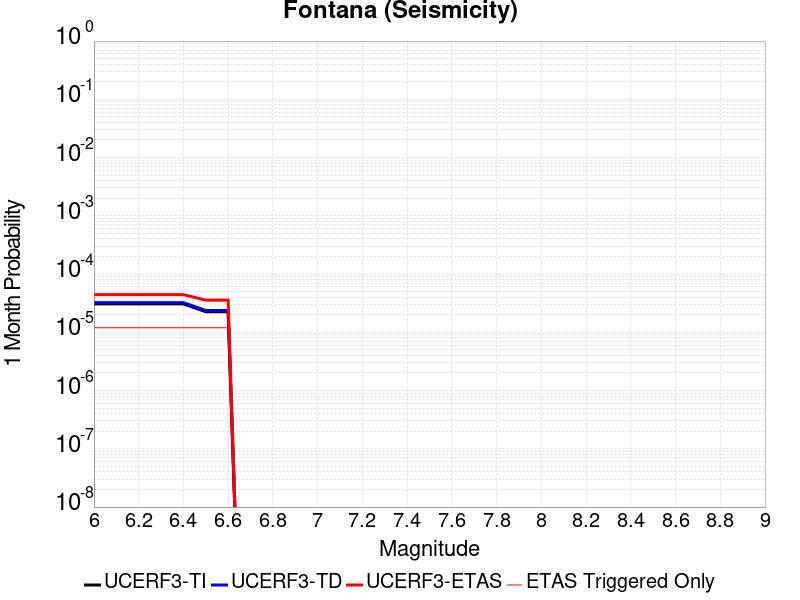 | 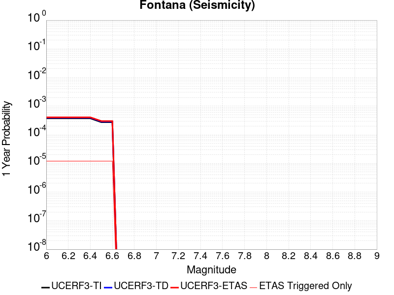 | 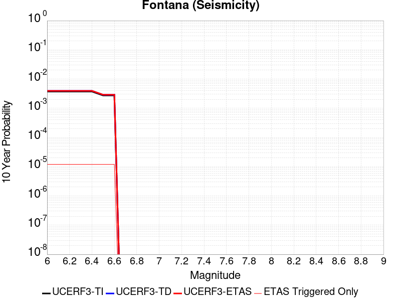 |

| Magnitude | 1 wk TI Prob | 1 wk TD Prob | 1 wk ETAS Prob | 1 wk ETAS/TD Gain | 1 wk ETAS Triggered Only | 1 mo TI Prob | 1 mo TD Prob | 1 mo ETAS Prob | 1 mo ETAS/TD Gain | 1 mo ETAS Triggered Only | 1 yr TI Prob | 1 yr TD Prob | 1 yr ETAS Prob | 1 yr ETAS/TD Gain | 1 yr ETAS Triggered Only | 10 yr TI Prob | 10 yr TD Prob | 10 yr ETAS Prob | 10 yr ETAS/TD Gain | 10 yr ETAS Triggered Only |
|-----|-----|-----|-----|-----|-----|-----|-----|-----|-----|-----|-----|-----|-----|-----|-----|-----|-----|-----|-----|-----|
| 6.0 | 7.1789214E-6 | 7.552053E-6 | 7.552053E-6 | 1.0 | 0.0 | 3.076644E-5 | 3.236577E-5 | 4.4355787E-5 | 1.3704537 | 1.1990408E-5 | 3.7451705E-4 | 3.9402276E-4 | 4.0600845E-4 | 1.0304188 | 1.1990408E-5 | 0.003738865 | 0.003937241 | 0.0039491844 | 1.0030334 | 1.1990408E-5 |
| 6.1 | 7.1789214E-6 | 7.552053E-6 | 7.552053E-6 | 1.0 | 0.0 | 3.076644E-5 | 3.236577E-5 | 4.4355787E-5 | 1.3704537 | 1.1990408E-5 | 3.7451705E-4 | 3.9402276E-4 | 4.0600845E-4 | 1.0304188 | 1.1990408E-5 | 0.003738865 | 0.003937241 | 0.0039491844 | 1.0030334 | 1.1990408E-5 |
| 6.2 | 7.1789214E-6 | 7.552053E-6 | 7.552053E-6 | 1.0 | 0.0 | 3.076644E-5 | 3.236577E-5 | 4.4355787E-5 | 1.3704537 | 1.1990408E-5 | 3.7451705E-4 | 3.9402276E-4 | 4.0600845E-4 | 1.0304188 | 1.1990408E-5 | 0.003738865 | 0.003937241 | 0.0039491844 | 1.0030334 | 1.1990408E-5 |
| 6.3 | 7.1789214E-6 | 7.552053E-6 | 7.552053E-6 | 1.0 | 0.0 | 3.076644E-5 | 3.236577E-5 | 4.4355787E-5 | 1.3704537 | 1.1990408E-5 | 3.7451705E-4 | 3.9402276E-4 | 4.0600845E-4 | 1.0304188 | 1.1990408E-5 | 0.003738865 | 0.003937241 | 0.0039491844 | 1.0030334 | 1.1990408E-5 |
| 6.4 | 7.1789214E-6 | 7.552053E-6 | 7.552053E-6 | 1.0 | 0.0 | 3.076644E-5 | 3.236577E-5 | 4.4355787E-5 | 1.3704537 | 1.1990408E-5 | 3.7451705E-4 | 3.9402276E-4 | 4.0600845E-4 | 1.0304188 | 1.1990408E-5 | 0.003738865 | 0.003937241 | 0.0039491844 | 1.0030334 | 1.1990408E-5 |
| 6.5 | 5.2611317E-6 | 5.5327637E-6 | 5.5327637E-6 | 1.0 | 0.0 | 2.2547512E-5 | 2.3711844E-5 | 3.5701967E-5 | 1.5056597 | 1.1990408E-5 | 2.744814E-4 | 2.886917E-4 | 3.0067866E-4 | 1.0415217 | 1.1990408E-5 | 0.002741426 | 0.002886917 | 0.0028988728 | 1.0041413 | 1.1990408E-5 |
| 6.6 | 5.2611317E-6 | 5.5327637E-6 | 5.5327637E-6 | 1.0 | 0.0 | 2.2547512E-5 | 2.3711844E-5 | 3.5701967E-5 | 1.5056597 | 1.1990408E-5 | 2.744814E-4 | 2.886917E-4 | 3.0067866E-4 | 1.0415217 | 1.1990408E-5 | 0.002741426 | 0.002886917 | 0.0028988728 | 1.0041413 | 1.1990408E-5 |

## Palos Verdes
*[(top)](#table-of-contents)*

| 1 Week | 1 Month | 1 Year | 10 Year |
|-----|-----|-----|-----|
| 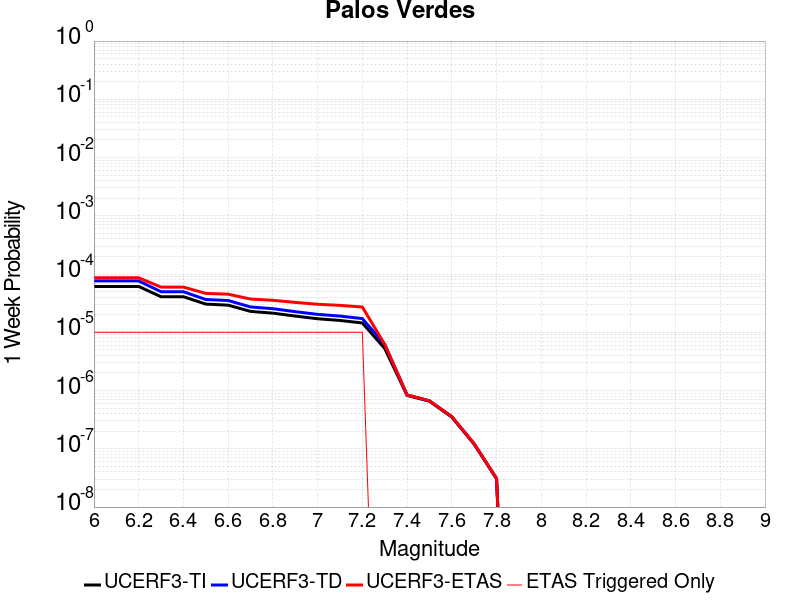 | 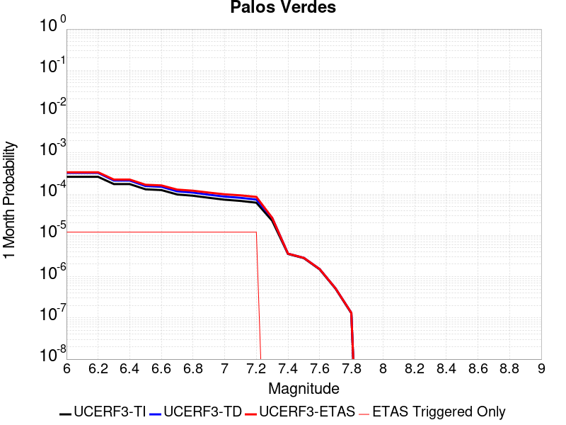 |  | 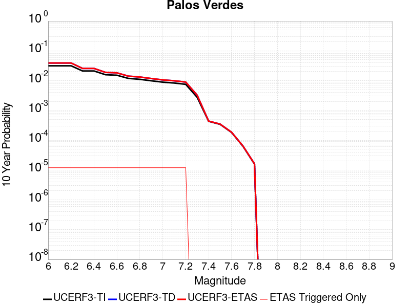 |

| Magnitude | 1 wk TI Prob | 1 wk TD Prob | 1 wk ETAS Prob | 1 wk ETAS/TD Gain | 1 wk ETAS Triggered Only | 1 mo TI Prob | 1 mo TD Prob | 1 mo ETAS Prob | 1 mo ETAS/TD Gain | 1 mo ETAS Triggered Only | 1 yr TI Prob | 1 yr TD Prob | 1 yr ETAS Prob | 1 yr ETAS/TD Gain | 1 yr ETAS Triggered Only | 10 yr TI Prob | 10 yr TD Prob | 10 yr ETAS Prob | 10 yr ETAS/TD Gain | 10 yr ETAS Triggered Only |
|-----|-----|-----|-----|-----|-----|-----|-----|-----|-----|-----|-----|-----|-----|-----|-----|-----|-----|-----|-----|-----|
| 6.0 | 6.126063E-5 | 7.622862E-5 | 8.821812E-5 | 1.1572833 | 1.1990408E-5 | 2.6251914E-4 | 3.2665656E-4 | 3.3864303E-4 | 1.0366945 | 1.1990408E-5 | 0.0031914865 | 0.0039702994 | 0.003982242 | 1.003008 | 1.1990408E-5 | 0.031460393 | 0.039050125 | 0.039061647 | 1.000295 | 1.1990408E-5 |
| 6.1 | 6.126063E-5 | 7.622862E-5 | 8.821812E-5 | 1.1572833 | 1.1990408E-5 | 2.6251914E-4 | 3.2665656E-4 | 3.3864303E-4 | 1.0366945 | 1.1990408E-5 | 0.0031914865 | 0.0039702994 | 0.003982242 | 1.003008 | 1.1990408E-5 | 0.031460393 | 0.039050125 | 0.039061647 | 1.000295 | 1.1990408E-5 |
| 6.2 | 6.126063E-5 | 7.622862E-5 | 8.821812E-5 | 1.1572833 | 1.1990408E-5 | 2.6251914E-4 | 3.2665656E-4 | 3.3864303E-4 | 1.0366945 | 1.1990408E-5 | 0.0031914865 | 0.0039702994 | 0.003982242 | 1.003008 | 1.1990408E-5 | 0.031460393 | 0.039050125 | 0.039061647 | 1.000295 | 1.1990408E-5 |
| 6.3 | 4.0838047E-5 | 4.975089E-5 | 6.1740706E-5 | 1.240997 | 1.1990408E-5 | 1.7500846E-4 | 2.1320196E-4 | 2.2518981E-4 | 1.0562277 | 1.1990408E-5 | 0.0021286458 | 0.0025928554 | 0.0026048147 | 1.0046124 | 1.1990408E-5 | 0.021083709 | 0.025647415 | 0.025659097 | 1.0004555 | 1.1990408E-5 |
| 6.4 | 4.0838047E-5 | 4.975089E-5 | 6.1740706E-5 | 1.240997 | 1.1990408E-5 | 1.7500846E-4 | 2.1320196E-4 | 2.2518981E-4 | 1.0562277 | 1.1990408E-5 | 0.0021286458 | 0.0025928554 | 0.0026048147 | 1.0046124 | 1.1990408E-5 | 0.021083709 | 0.025647415 | 0.025659097 | 1.0004555 | 1.1990408E-5 |
| 6.5 | 3.0512005E-5 | 3.6562593E-5 | 4.8552563E-5 | 1.32793 | 1.1990408E-5 | 1.3075917E-4 | 1.566881E-4 | 1.6867662E-4 | 1.0765121 | 1.1990408E-5 | 0.0015908304 | 0.001906127 | 0.0019180945 | 1.0062785 | 1.1990408E-5 | 0.015794903 | 0.01890965 | 0.018921413 | 1.0006222 | 1.1990408E-5 |
| 6.6 | 2.9255087E-5 | 3.5155368E-5 | 4.7145353E-5 | 1.3410571 | 1.1990408E-5 | 1.2537291E-4 | 1.5065783E-4 | 1.6264642E-4 | 1.0795751 | 1.1990408E-5 | 0.0015253464 | 0.0018328319 | 0.0018448004 | 1.00653 | 1.1990408E-5 | 0.015149189 | 0.01818871 | 0.018200481 | 1.0006472 | 1.1990408E-5 |
| 6.7 | 2.287198E-5 | 2.7248976E-5 | 3.9239058E-5 | 1.4400195 | 1.1990408E-5 | 9.801909E-5 | 1.1677662E-4 | 1.2876562E-4 | 1.1026661 | 1.1990408E-5 | 0.001192729 | 0.0014209197 | 0.0014328931 | 1.0084265 | 1.1990408E-5 | 0.011863477 | 0.014127577 | 0.014139397 | 1.0008367 | 1.1990408E-5 |
| 6.8 | 2.1325764E-5 | 2.5432531E-5 | 3.7422633E-5 | 1.4714475 | 1.1990408E-5 | 9.139293E-5 | 1.0899252E-4 | 1.2098162E-4 | 1.1099993 | 1.1990408E-5 | 0.001112141 | 0.0013262664 | 0.0013382409 | 1.0090288 | 1.1990408E-5 | 0.011065915 | 0.013192548 | 0.013204381 | 1.0008969 | 1.1990408E-5 |
| 6.9 | 1.9009392E-5 | 2.2614122E-5 | 3.4604258E-5 | 1.5302057 | 1.1990408E-5 | 8.1466285E-5 | 9.6914555E-5 | 1.089038E-4 | 1.1237094 | 1.1990408E-5 | 9.914007E-4 | 0.0011793834 | 0.0011913596 | 1.0101547 | 1.1990408E-5 | 0.009869894 | 0.011739929 | 0.011751778 | 1.0010093 | 1.1990408E-5 |
| 7.0 | 1.7098473E-5 | 2.0319867E-5 | 3.2310032E-5 | 1.590071 | 1.1990408E-5 | 7.3277115E-5 | 8.708272E-5 | 9.907209E-5 | 1.1376779 | 1.1990408E-5 | 8.917837E-4 | 0.0010598017 | 0.0010717794 | 1.0113019 | 1.1990408E-5 | 0.008882134 | 0.010555912 | 0.010567776 | 1.0011239 | 1.1990408E-5 |
| 7.1 | 1.5982785E-5 | 1.8995239E-5 | 3.098542E-5 | 1.6312202 | 1.1990408E-5 | 6.849585E-5 | 8.1406106E-5 | 9.339554E-5 | 1.1472793 | 1.1990408E-5 | 8.336179E-4 | 9.907534E-4 | 0.001002732 | 1.0120903 | 1.1990408E-5 | 0.008304977 | 0.009871728 | 0.009883599 | 1.0012026 | 1.1990408E-5 |
| 7.2 | 1.4468002E-5 | 1.719767E-5 | 2.9187871E-5 | 1.6971991 | 1.1990408E-5 | 6.200425E-5 | 7.370269E-5 | 8.569222E-5 | 1.1626742 | 1.1990408E-5 | 7.546402E-4 | 8.970449E-4 | 9.090245E-4 | 1.0133545 | 1.1990408E-5 | 0.007520827 | 0.008942509 | 0.008954392 | 1.0013288 | 1.1990408E-5 |
| 7.3 | 5.288233E-6 | 6.2038207E-6 | 6.2038207E-6 | 1.0 | 0.0 | 2.2663658E-5 | 2.658773E-5 | 2.658773E-5 | 1.0 | 0.0 | 2.7589512E-4 | 3.2369242E-4 | 3.2369242E-4 | 1.0 | 0.0 | 0.0027555283 | 0.0032356323 | 0.0032356323 | 1.0 | 0.0 |
| 7.4 | 8.279556E-7 | 8.408364E-7 | 8.408364E-7 | 1.0 | 0.0 | 3.5483763E-6 | 3.60358E-6 | 3.60358E-6 | 1.0 | 0.0 | 4.3200624E-5 | 4.3872777E-5 | 4.3872777E-5 | 1.0 | 0.0 | 4.3192226E-4 | 4.3864836E-4 | 4.3864836E-4 | 1.0 | 0.0 |
| 7.5 | 6.559831E-7 | 6.667243E-7 | 6.667243E-7 | 1.0 | 0.0 | 2.8113532E-6 | 2.8573872E-6 | 2.8573872E-6 | 1.0 | 0.0 | 3.4227687E-5 | 3.47882E-5 | 3.47882E-5 | 1.0 | 0.0 | 3.4222414E-4 | 3.478342E-4 | 3.478342E-4 | 1.0 | 0.0 |
| 7.6 | 3.5018968E-7 | 3.562011E-7 | 3.562011E-7 | 1.0 | 0.0 | 1.500812E-6 | 1.5265755E-6 | 1.5265755E-6 | 1.0 | 0.0 | 1.8272232E-5 | 1.8585944E-5 | 1.8585944E-5 | 1.0 | 0.0 | 1.8270731E-4 | 1.858485E-4 | 1.858485E-4 | 1.0 | 0.0 |
| 7.7 | 1.1986104E-7 | 1.2198406E-7 | 1.2198406E-7 | 1.0 | 0.0 | 5.1369005E-7 | 5.227887E-7 | 5.227887E-7 | 1.0 | 0.0 | 6.2541585E-6 | 6.364934E-6 | 6.364934E-6 | 1.0 | 0.0 | 6.2539824E-5 | 6.364756E-5 | 6.364756E-5 | 1.0 | 0.0 |
| 7.8 | 3.0445005E-8 | 3.1027664E-8 | 3.1027664E-8 | 1.0 | 0.0 | 1.3047858E-7 | 1.3297569E-7 | 1.3297569E-7 | 1.0 | 0.0 | 1.5885756E-6 | 1.6189781E-6 | 1.6189781E-6 | 1.0 | 0.0 | 1.5885644E-5 | 1.6189684E-5 | 1.6189684E-5 | 1.0 | 0.0 |

## Santa Cruz Catalina Ridge alt1
*[(top)](#table-of-contents)*

| 1 Week | 1 Month | 1 Year | 10 Year |
|-----|-----|-----|-----|
| 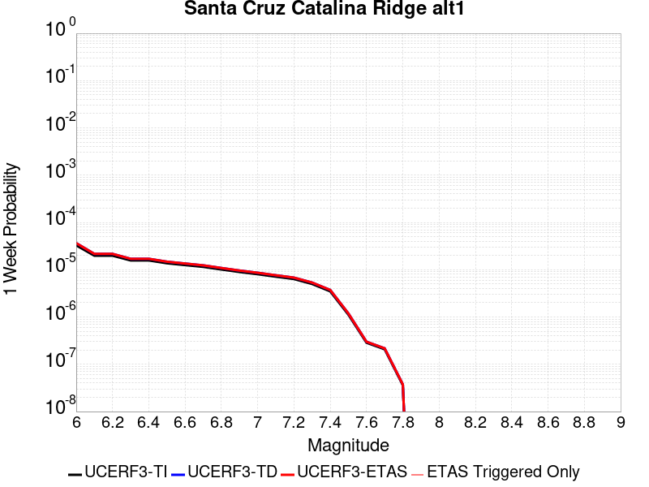 | 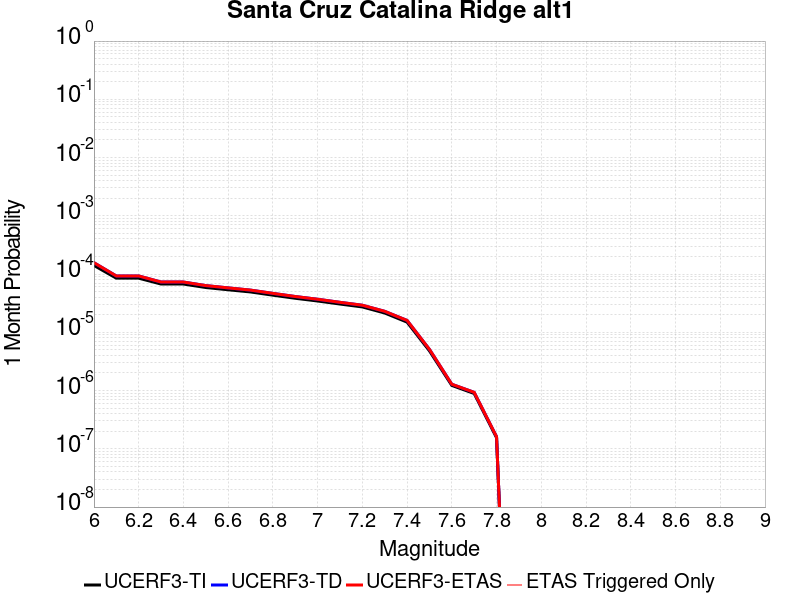 |  | 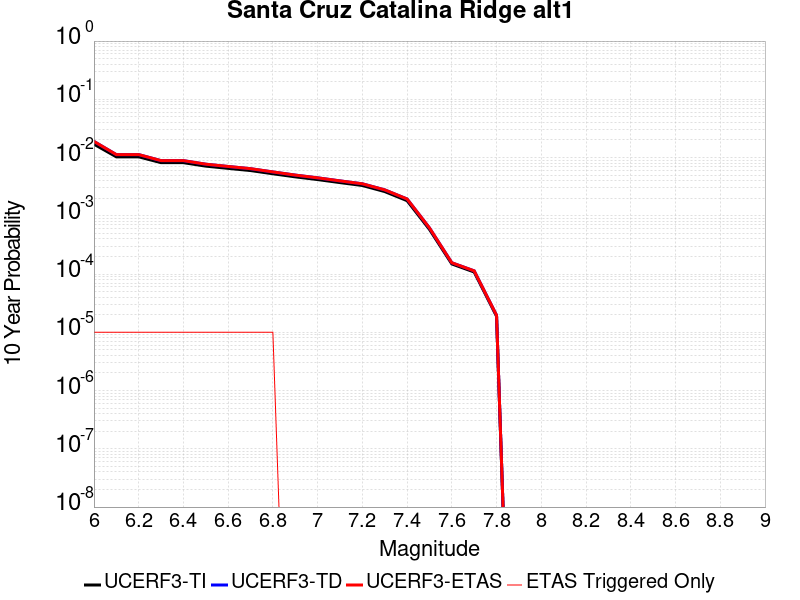 |

| Magnitude | 1 wk TI Prob | 1 wk TD Prob | 1 wk ETAS Prob | 1 wk ETAS/TD Gain | 1 wk ETAS Triggered Only | 1 mo TI Prob | 1 mo TD Prob | 1 mo ETAS Prob | 1 mo ETAS/TD Gain | 1 mo ETAS Triggered Only | 1 yr TI Prob | 1 yr TD Prob | 1 yr ETAS Prob | 1 yr ETAS/TD Gain | 1 yr ETAS Triggered Only | 10 yr TI Prob | 10 yr TD Prob | 10 yr ETAS Prob | 10 yr ETAS/TD Gain | 10 yr ETAS Triggered Only |
|-----|-----|-----|-----|-----|-----|-----|-----|-----|-----|-----|-----|-----|-----|-----|-----|-----|-----|-----|-----|-----|
| 6.0 | 3.2833184E-5 | 3.655896E-5 | 3.655896E-5 | 1.0 | 0.0 | 1.4070606E-4 | 1.5667277E-4 | 1.5667277E-4 | 1.0 | 0.0 | 0.00171175 | 0.0019059887 | 0.0019059887 | 1.0 | 0.0 | 0.016986247 | 0.018913316 | 0.01892508 | 1.000622 | 1.1990408E-5 |
| 6.1 | 1.9835548E-5 | 2.1659771E-5 | 2.1659771E-5 | 1.0 | 0.0 | 8.500672E-5 | 9.2824404E-5 | 9.2824404E-5 | 1.0 | 0.0 | 0.0010344655 | 0.0011295713 | 0.0011295713 | 1.0 | 0.0 | 0.010296632 | 0.011240433 | 0.011252289 | 1.0010548 | 1.1990408E-5 |
| 6.2 | 1.9835548E-5 | 2.1659771E-5 | 2.1659771E-5 | 1.0 | 0.0 | 8.500672E-5 | 9.2824404E-5 | 9.2824404E-5 | 1.0 | 0.0 | 0.0010344655 | 0.0011295713 | 0.0011295713 | 1.0 | 0.0 | 0.010296632 | 0.011240433 | 0.011252289 | 1.0010548 | 1.1990408E-5 |
| 6.3 | 1.5728183E-5 | 1.7034137E-5 | 1.7034137E-5 | 1.0 | 0.0 | 6.7404755E-5 | 7.3001436E-5 | 7.3001436E-5 | 1.0 | 0.0 | 8.2034385E-4 | 8.884362E-4 | 8.884362E-4 | 1.0 | 0.0 | 0.008173222 | 0.008849524 | 0.008861409 | 1.0013429 | 1.1990408E-5 |
| 6.4 | 1.5728183E-5 | 1.7034137E-5 | 1.7034137E-5 | 1.0 | 0.0 | 6.7404755E-5 | 7.3001436E-5 | 7.3001436E-5 | 1.0 | 0.0 | 8.2034385E-4 | 8.884362E-4 | 8.884362E-4 | 1.0 | 0.0 | 0.008173222 | 0.008849524 | 0.008861409 | 1.0013429 | 1.1990408E-5 |
| 6.5 | 1.3707734E-5 | 1.4794678E-5 | 1.4794678E-5 | 1.0 | 0.0 | 5.8746107E-5 | 6.3404244E-5 | 6.3404244E-5 | 1.0 | 0.0 | 7.1499916E-4 | 7.716768E-4 | 7.716768E-4 | 1.0 | 0.0 | 0.0071270303 | 0.0076903705 | 0.0077022687 | 1.0015471 | 1.1990408E-5 |
| 6.6 | 1.2539813E-5 | 1.3510358E-5 | 1.3510358E-5 | 1.0 | 0.0 | 5.3740947E-5 | 5.7900266E-5 | 5.7900266E-5 | 1.0 | 0.0 | 6.540996E-4 | 7.0471043E-4 | 7.0471043E-4 | 1.0 | 0.0 | 0.0065217763 | 0.0070250607 | 0.0070369667 | 1.0016948 | 1.1990408E-5 |
| 6.7 | 1.1504083E-5 | 1.23775E-5 | 1.23775E-5 | 1.0 | 0.0 | 4.930228E-5 | 5.304536E-5 | 5.304536E-5 | 1.0 | 0.0 | 6.0008996E-4 | 6.456379E-4 | 6.456379E-4 | 1.0 | 0.0 | 0.005984721 | 0.0064378507 | 0.006449764 | 1.0018505 | 1.1990408E-5 |
| 6.8 | 1.012739E-5 | 1.0877178E-5 | 1.0877178E-5 | 1.0 | 0.0 | 4.340238E-5 | 4.6615653E-5 | 4.6615653E-5 | 1.0 | 0.0 | 5.282958E-4 | 5.673993E-4 | 5.673993E-4 | 1.0 | 0.0 | 0.0052704164 | 0.005659675 | 0.0056715976 | 1.0021065 | 1.1990408E-5 |
| 6.9 | 8.9607865E-6 | 9.60921E-6 | 9.60921E-6 | 1.0 | 0.0 | 3.8402806E-5 | 4.1181684E-5 | 4.1181684E-5 | 1.0 | 0.0 | 4.6745385E-4 | 5.0127273E-4 | 5.0127273E-4 | 1.0 | 0.0 | 0.0046647177 | 0.00500154 | 0.00500154 | 1.0 | 0.0 |
| 7.0 | 8.046829E-6 | 8.619827E-6 | 8.619827E-6 | 1.0 | 0.0 | 3.4485955E-5 | 3.6941598E-5 | 3.6941598E-5 | 1.0 | 0.0 | 4.1978562E-4 | 4.4967196E-4 | 4.4967196E-4 | 1.0 | 0.0 | 0.004189935 | 0.004487711 | 0.004487711 | 1.0 | 0.0 |
| 7.1 | 7.136131E-6 | 7.637727E-6 | 7.637727E-6 | 1.0 | 0.0 | 3.0583058E-5 | 3.273271E-5 | 3.273271E-5 | 1.0 | 0.0 | 3.7228514E-4 | 3.9844858E-4 | 3.9844858E-4 | 1.0 | 0.0 | 0.0037166206 | 0.0039774184 | 0.0039774184 | 1.0 | 0.0 |
| 7.2 | 6.362014E-6 | 6.8050217E-6 | 6.8050217E-6 | 1.0 | 0.0 | 2.726549E-5 | 2.9164055E-5 | 2.9164055E-5 | 1.0 | 0.0 | 3.3190678E-4 | 3.5501516E-4 | 3.5501516E-4 | 1.0 | 0.0 | 0.0033141149 | 0.0035445488 | 0.0035445488 | 1.0 | 0.0 |
| 7.3 | 5.004101E-6 | 5.3517642E-6 | 5.3517642E-6 | 1.0 | 0.0 | 2.1445969E-5 | 2.2935934E-5 | 2.2935934E-5 | 1.0 | 0.0 | 2.6107338E-4 | 2.7920975E-4 | 2.7920975E-4 | 1.0 | 0.0 | 0.002607669 | 0.0027886443 | 0.0027886443 | 1.0 | 0.0 |
| 7.4 | 3.4901443E-6 | 3.732087E-6 | 3.732087E-6 | 1.0 | 0.0 | 1.4957676E-5 | 1.5994563E-5 | 1.5994563E-5 | 1.0 | 0.0 | 1.8209449E-4 | 1.9471678E-4 | 1.9471678E-4 | 1.0 | 0.0 | 0.0018194534 | 0.0019455003 | 0.0019455003 | 1.0 | 0.0 |
| 7.5 | 1.1215045E-6 | 1.1893966E-6 | 1.1893966E-6 | 1.0 | 0.0 | 4.806439E-6 | 5.0974045E-6 | 5.0974045E-6 | 1.0 | 0.0 | 5.851682E-5 | 6.205916E-5 | 6.205916E-5 | 1.0 | 0.0 | 5.850142E-4 | 6.204214E-4 | 6.204214E-4 | 1.0 | 0.0 |
| 7.6 | 2.8599047E-7 | 2.9952182E-7 | 2.9952182E-7 | 1.0 | 0.0 | 1.2256729E-6 | 1.2836642E-6 | 1.2836642E-6 | 1.0 | 0.0 | 1.4922465E-5 | 1.5628502E-5 | 1.5628502E-5 | 1.0 | 0.0 | 1.4921463E-4 | 1.5627417E-4 | 1.5627417E-4 | 1.0 | 0.0 |
| 7.7 | 2.0781519E-7 | 2.1744457E-7 | 2.1744457E-7 | 1.0 | 0.0 | 8.906362E-7 | 9.3190494E-7 | 9.3190494E-7 | 1.0 | 0.0 | 1.08434415E-5 | 1.1345885E-5 | 1.1345885E-5 | 1.0 | 0.0 | 1.0842913E-4 | 1.1345315E-4 | 1.1345315E-4 | 1.0 | 0.0 |
| 7.8 | 3.614776E-8 | 3.7641225E-8 | 3.7641225E-8 | 1.0 | 0.0 | 1.5491896E-7 | 1.6131952E-7 | 1.6131952E-7 | 1.0 | 0.0 | 1.8861368E-6 | 1.9640636E-6 | 1.9640636E-6 | 1.0 | 0.0 | 1.8861208E-5 | 1.9640474E-5 | 1.9640474E-5 | 1.0 | 0.0 |

## Great Valley 11
*[(top)](#table-of-contents)*

| 1 Week | 1 Month | 1 Year | 10 Year |
|-----|-----|-----|-----|
| 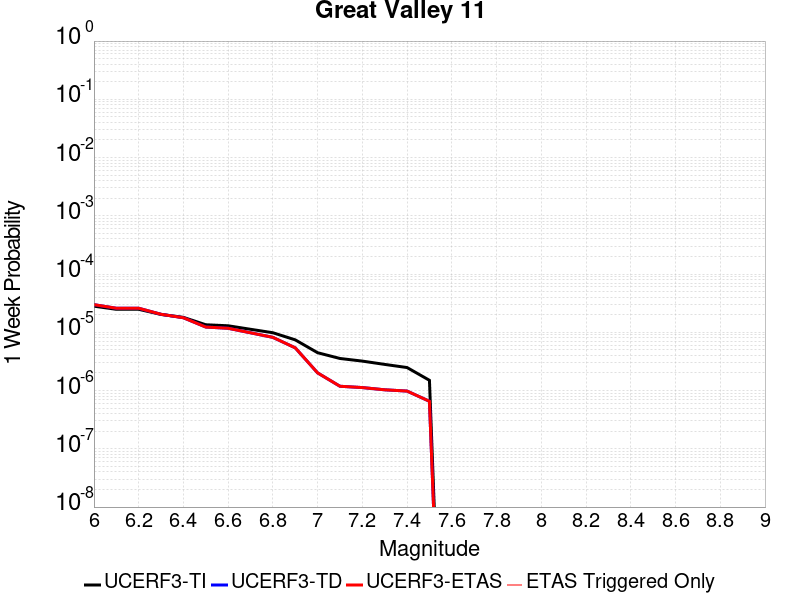 | 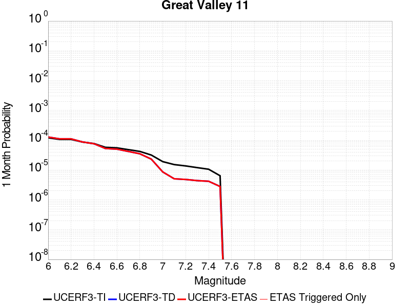 | 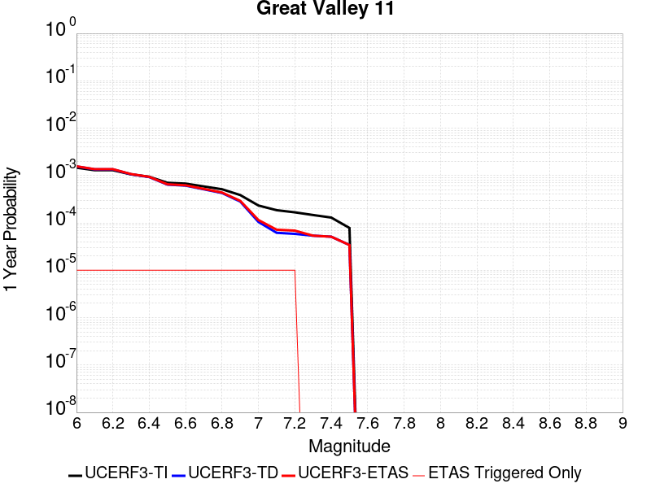 | 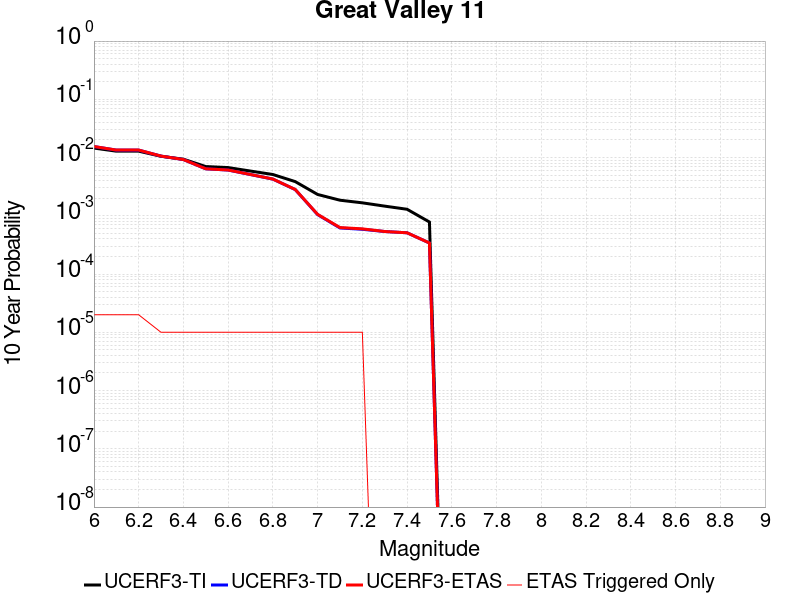 |

| Magnitude | 1 wk TI Prob | 1 wk TD Prob | 1 wk ETAS Prob | 1 wk ETAS/TD Gain | 1 wk ETAS Triggered Only | 1 mo TI Prob | 1 mo TD Prob | 1 mo ETAS Prob | 1 mo ETAS/TD Gain | 1 mo ETAS Triggered Only | 1 yr TI Prob | 1 yr TD Prob | 1 yr ETAS Prob | 1 yr ETAS/TD Gain | 1 yr ETAS Triggered Only | 10 yr TI Prob | 10 yr TD Prob | 10 yr ETAS Prob | 10 yr ETAS/TD Gain | 10 yr ETAS Triggered Only |
|-----|-----|-----|-----|-----|-----|-----|-----|-----|-----|-----|-----|-----|-----|-----|-----|-----|-----|-----|-----|-----|
| 6.0 | 2.8099583E-5 | 2.9832845E-5 | 2.9832845E-5 | 1.0 | 0.0 | 1.20421224E-4 | 1.2784921E-4 | 1.2784921E-4 | 1.0 | 0.0 | 0.0014651422 | 0.0015555277 | 0.0015555277 | 1.0 | 0.0 | 0.0145552 | 0.015453923 | 0.015465727 | 1.0007639 | 1.1990408E-5 |
| 6.1 | 2.483194E-5 | 2.5907739E-5 | 2.5907739E-5 | 1.0 | 0.0 | 1.0641825E-4 | 1.1102881E-4 | 1.1102881E-4 | 1.0 | 0.0 | 0.0012948721 | 0.0013510018 | 0.0013510018 | 1.0 | 0.0 | 0.012873529 | 0.013434302 | 0.013446132 | 1.0008805 | 1.1990408E-5 |
| 6.2 | 2.483194E-5 | 2.5907739E-5 | 2.5907739E-5 | 1.0 | 0.0 | 1.0641825E-4 | 1.1102881E-4 | 1.1102881E-4 | 1.0 | 0.0 | 0.0012948721 | 0.0013510018 | 0.0013510018 | 1.0 | 0.0 | 0.012873529 | 0.013434302 | 0.013446132 | 1.0008805 | 1.1990408E-5 |
| 6.3 | 2.0257901E-5 | 2.0399362E-5 | 2.0399362E-5 | 1.0 | 0.0 | 8.681669E-5 | 8.742315E-5 | 8.742315E-5 | 1.0 | 0.0 | 0.0010564806 | 0.001063899 | 0.001063899 | 1.0 | 0.0 | 0.01051472 | 0.010592245 | 0.010592245 | 1.0 | 0.0 |
| 6.4 | 1.8054898E-5 | 1.7781249E-5 | 1.7781249E-5 | 1.0 | 0.0 | 7.737584E-5 | 7.6203345E-5 | 7.6203345E-5 | 1.0 | 0.0 | 9.416436E-4 | 9.274187E-4 | 9.274187E-4 | 1.0 | 0.0 | 0.009376635 | 0.009239235 | 0.009239235 | 1.0 | 0.0 |
| 6.5 | 1.34804895E-5 | 1.2321299E-5 | 1.2321299E-5 | 1.0 | 0.0 | 5.777225E-5 | 5.2804524E-5 | 5.2804524E-5 | 1.0 | 0.0 | 7.031501E-4 | 6.427096E-4 | 6.427096E-4 | 1.0 | 0.0 | 0.007009294 | 0.0064089457 | 0.0064089457 | 1.0 | 0.0 |
| 6.6 | 1.294883E-5 | 1.1732548E-5 | 1.1732548E-5 | 1.0 | 0.0 | 5.5493805E-5 | 5.0281404E-5 | 5.0281404E-5 | 1.0 | 0.0 | 6.754276E-4 | 6.120082E-4 | 6.120082E-4 | 1.0 | 0.0 | 0.006733784 | 0.0061036535 | 0.0061036535 | 1.0 | 0.0 |
| 6.7 | 1.1272237E-5 | 9.812085E-6 | 9.812085E-6 | 1.0 | 0.0 | 4.8308695E-5 | 4.205113E-5 | 4.205113E-5 | 1.0 | 0.0 | 5.879996E-4 | 5.11855E-4 | 5.11855E-4 | 1.0 | 0.0 | 0.005864462 | 0.0051070447 | 0.0051070447 | 1.0 | 0.0 |
| 6.8 | 9.8337505E-6 | 8.193942E-6 | 8.193942E-6 | 1.0 | 0.0 | 4.2143965E-5 | 3.5116434E-5 | 3.5116434E-5 | 1.0 | 0.0 | 5.1298196E-4 | 4.274608E-4 | 4.274608E-4 | 1.0 | 0.0 | 0.005117994 | 0.0042665955 | 0.0042665955 | 1.0 | 0.0 |
| 6.9 | 7.4224813E-6 | 5.413251E-6 | 5.413251E-6 | 1.0 | 0.0 | 3.1810247E-5 | 2.3199449E-5 | 2.3199449E-5 | 1.0 | 0.0 | 3.872209E-4 | 2.824181E-4 | 2.824181E-4 | 1.0 | 0.0 | 0.0038654688 | 0.0028207325 | 0.0028207325 | 1.0 | 0.0 |
| 7.0 | 4.4628923E-6 | 2.0111208E-6 | 2.0111208E-6 | 1.0 | 0.0 | 1.912654E-5 | 8.619061E-6 | 8.619061E-6 | 1.0 | 0.0 | 2.3284076E-4 | 1.0493213E-4 | 1.0493213E-4 | 1.0 | 0.0 | 0.0023259693 | 0.0010488374 | 0.0010488374 | 1.0 | 0.0 |
| 7.1 | 3.5546527E-6 | 1.1856094E-6 | 1.1856094E-6 | 1.0 | 0.0 | 1.5234136E-5 | 5.0811736E-6 | 5.0811736E-6 | 1.0 | 0.0 | 1.8545982E-4 | 6.18616E-5 | 6.18616E-5 | 1.0 | 0.0 | 0.0018530512 | 6.1845063E-4 | 6.1845063E-4 | 1.0 | 0.0 |
| 7.2 | 3.2039936E-6 | 1.125436E-6 | 1.125436E-6 | 1.0 | 0.0 | 1.3731329E-5 | 4.823289E-6 | 4.823289E-6 | 1.0 | 0.0 | 1.671661E-4 | 5.8722027E-5 | 5.8722027E-5 | 1.0 | 0.0 | 0.0016704041 | 5.870718E-4 | 5.870718E-4 | 1.0 | 0.0 |
| 7.3 | 2.8120473E-6 | 1.0305815E-6 | 1.0305815E-6 | 1.0 | 0.0 | 1.2051575E-5 | 4.416771E-6 | 4.416771E-6 | 1.0 | 0.0 | 1.4671806E-4 | 5.377293E-5 | 5.377293E-5 | 1.0 | 0.0 | 0.0014662122 | 5.376058E-4 | 5.376058E-4 | 1.0 | 0.0 |
| 7.4 | 2.4837766E-6 | 9.800765E-7 | 9.800765E-7 | 1.0 | 0.0 | 1.0644713E-5 | 4.2003217E-6 | 4.2003217E-6 | 1.0 | 0.0 | 1.2959167E-4 | 5.113778E-5 | 5.113778E-5 | 1.0 | 0.0 | 0.0012951613 | 5.112667E-4 | 5.112667E-4 | 1.0 | 0.0 |
| 7.5 | 1.5002679E-6 | 6.5462535E-7 | 6.5462535E-7 | 1.0 | 0.0 | 6.4297037E-6 | 2.8055345E-6 | 2.8055345E-6 | 1.0 | 0.0 | 7.827883E-5 | 3.415689E-5 | 3.415689E-5 | 1.0 | 0.0 | 7.825126E-4 | 3.4152053E-4 | 3.4152053E-4 | 1.0 | 0.0 |

## San Gabriel (Extension)
*[(top)](#table-of-contents)*

| 1 Week | 1 Month | 1 Year | 10 Year |
|-----|-----|-----|-----|
|  | 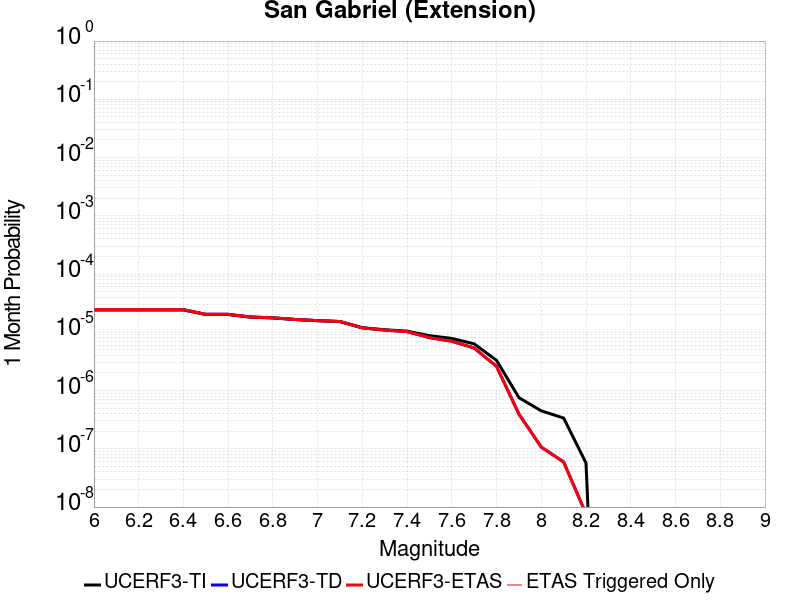 | 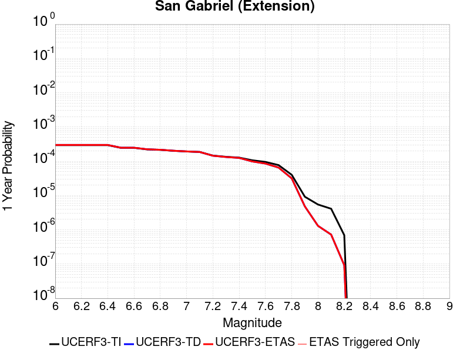 | 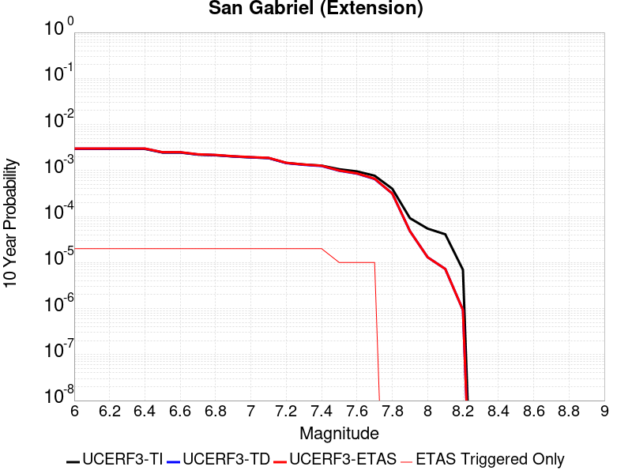 |

| Magnitude | 1 wk TI Prob | 1 wk TD Prob | 1 wk ETAS Prob | 1 wk ETAS/TD Gain | 1 wk ETAS Triggered Only | 1 mo TI Prob | 1 mo TD Prob | 1 mo ETAS Prob | 1 mo ETAS/TD Gain | 1 mo ETAS Triggered Only | 1 yr TI Prob | 1 yr TD Prob | 1 yr ETAS Prob | 1 yr ETAS/TD Gain | 1 yr ETAS Triggered Only | 10 yr TI Prob | 10 yr TD Prob | 10 yr ETAS Prob | 10 yr ETAS/TD Gain | 10 yr ETAS Triggered Only |
|-----|-----|-----|-----|-----|-----|-----|-----|-----|-----|-----|-----|-----|-----|-----|-----|-----|-----|-----|-----|-----|
| 6.0 | 5.6486106E-6 | 5.7171446E-6 | 5.7171446E-6 | 1.0 | 0.0 | 2.4208108E-5 | 2.4501825E-5 | 2.4501825E-5 | 1.0 | 0.0 | 2.9469383E-4 | 2.9827014E-4 | 2.9827014E-4 | 1.0 | 0.0 | 0.0029430336 | 0.0029788287 | 0.0029907834 | 1.0040132 | 1.1990408E-5 |
| 6.1 | 5.6486106E-6 | 5.7171446E-6 | 5.7171446E-6 | 1.0 | 0.0 | 2.4208108E-5 | 2.4501825E-5 | 2.4501825E-5 | 1.0 | 0.0 | 2.9469383E-4 | 2.9827014E-4 | 2.9827014E-4 | 1.0 | 0.0 | 0.0029430336 | 0.0029788287 | 0.0029907834 | 1.0040132 | 1.1990408E-5 |
| 6.2 | 5.6486106E-6 | 5.7171446E-6 | 5.7171446E-6 | 1.0 | 0.0 | 2.4208108E-5 | 2.4501825E-5 | 2.4501825E-5 | 1.0 | 0.0 | 2.9469383E-4 | 2.9827014E-4 | 2.9827014E-4 | 1.0 | 0.0 | 0.0029430336 | 0.0029788287 | 0.0029907834 | 1.0040132 | 1.1990408E-5 |
| 6.3 | 5.6486106E-6 | 5.7171446E-6 | 5.7171446E-6 | 1.0 | 0.0 | 2.4208108E-5 | 2.4501825E-5 | 2.4501825E-5 | 1.0 | 0.0 | 2.9469383E-4 | 2.9827014E-4 | 2.9827014E-4 | 1.0 | 0.0 | 0.0029430336 | 0.0029788287 | 0.0029907834 | 1.0040132 | 1.1990408E-5 |
| 6.4 | 5.6486106E-6 | 5.7171446E-6 | 5.7171446E-6 | 1.0 | 0.0 | 2.4208108E-5 | 2.4501825E-5 | 2.4501825E-5 | 1.0 | 0.0 | 2.9469383E-4 | 2.9827014E-4 | 2.9827014E-4 | 1.0 | 0.0 | 0.0029430336 | 0.0029788287 | 0.0029907834 | 1.0040132 | 1.1990408E-5 |
| 6.5 | 4.7134554E-6 | 4.754565E-6 | 4.754565E-6 | 1.0 | 0.0 | 2.0200367E-5 | 2.0376552E-5 | 2.0376552E-5 | 1.0 | 0.0 | 2.459117E-4 | 2.4805713E-4 | 2.4805713E-4 | 1.0 | 0.0 | 0.0024563975 | 0.0024778906 | 0.0024898513 | 1.004827 | 1.1990408E-5 |
| 6.6 | 4.7134554E-6 | 4.754565E-6 | 4.754565E-6 | 1.0 | 0.0 | 2.0200367E-5 | 2.0376552E-5 | 2.0376552E-5 | 1.0 | 0.0 | 2.459117E-4 | 2.4805713E-4 | 2.4805713E-4 | 1.0 | 0.0 | 0.0024563975 | 0.0024778906 | 0.0024898513 | 1.004827 | 1.1990408E-5 |
| 6.7 | 4.2468837E-6 | 4.2743804E-6 | 4.2743804E-6 | 1.0 | 0.0 | 1.8200803E-5 | 1.8318648E-5 | 1.8318648E-5 | 1.0 | 0.0 | 2.2157225E-4 | 2.2300745E-4 | 2.2300745E-4 | 1.0 | 0.0 | 0.0022135144 | 0.0022279124 | 0.0022398762 | 1.0053699 | 1.1990408E-5 |
| 6.8 | 4.1180615E-6 | 4.1417693E-6 | 4.1417693E-6 | 1.0 | 0.0 | 1.7648716E-5 | 1.7750324E-5 | 1.7750324E-5 | 1.0 | 0.0 | 2.1485193E-4 | 2.1608948E-4 | 2.1608948E-4 | 1.0 | 0.0 | 0.0021464431 | 0.0021588686 | 0.0021708333 | 1.005542 | 1.1990408E-5 |
| 6.9 | 3.863861E-6 | 3.8800836E-6 | 3.8800836E-6 | 1.0 | 0.0 | 1.65593E-5 | 1.6628828E-5 | 1.6628828E-5 | 1.0 | 0.0 | 2.0159081E-4 | 2.0243786E-4 | 2.0243786E-4 | 1.0 | 0.0 | 0.0020140803 | 0.0020226059 | 0.0020345722 | 1.0059162 | 1.1990408E-5 |
| 7.0 | 3.6947372E-6 | 3.7059822E-6 | 3.7059822E-6 | 1.0 | 0.0 | 1.5834492E-5 | 1.5882688E-5 | 1.5882688E-5 | 1.0 | 0.0 | 1.9276788E-4 | 1.9335524E-4 | 1.9335524E-4 | 1.0 | 0.0 | 0.0019260074 | 0.0019319403 | 0.0019439076 | 1.0061945 | 1.1990408E-5 |
| 7.1 | 3.5686835E-6 | 3.5732016E-6 | 3.5732016E-6 | 1.0 | 0.0 | 1.5294268E-5 | 1.5313635E-5 | 1.5313635E-5 | 1.0 | 0.0 | 1.861918E-4 | 1.8642822E-4 | 1.8642822E-4 | 1.0 | 0.0 | 0.0018603588 | 0.0018627879 | 0.001874756 | 1.0064248 | 1.1990408E-5 |
| 7.2 | 2.8023446E-6 | 2.7770893E-6 | 2.7770893E-6 | 1.0 | 0.0 | 1.2009994E-5 | 1.1901758E-5 | 1.1901758E-5 | 1.0 | 0.0 | 1.4621185E-4 | 1.4489438E-4 | 1.4489438E-4 | 1.0 | 0.0 | 0.001461157 | 0.0014480136 | 0.0014599867 | 1.0082686 | 1.1990408E-5 |
| 7.3 | 2.5843012E-6 | 2.546262E-6 | 2.546262E-6 | 1.0 | 0.0 | 1.1075529E-5 | 1.0912507E-5 | 1.0912507E-5 | 1.0 | 0.0 | 1.3483623E-4 | 1.3285177E-4 | 1.3285177E-4 | 1.0 | 0.0 | 0.0013475444 | 0.001327737 | 0.0013397115 | 1.0090188 | 1.1990408E-5 |
| 7.4 | 2.4464468E-6 | 2.3969585E-6 | 2.3969585E-6 | 1.0 | 0.0 | 1.04847295E-5 | 1.027264E-5 | 1.027264E-5 | 1.0 | 0.0 | 1.276441E-4 | 1.250623E-4 | 1.250623E-4 | 1.0 | 0.0 | 0.0012757082 | 0.0012499326 | 0.001261908 | 1.0095809 | 1.1990408E-5 |
| 7.5 | 2.0420266E-6 | 1.8913017E-6 | 1.8913017E-6 | 1.0 | 0.0 | 8.751514E-6 | 8.105554E-6 | 8.105554E-6 | 1.0 | 0.0 | 1.0654447E-4 | 9.8680684E-5 | 9.8680684E-5 | 1.0 | 0.0 | 0.001064934 | 9.863758E-4 | 9.983544E-4 | 1.0121441 | 1.1990408E-5 |
| 7.6 | 1.8326596E-6 | 1.640076E-6 | 1.640076E-6 | 1.0 | 0.0 | 7.854232E-6 | 7.0288784E-6 | 7.0288784E-6 | 1.0 | 0.0 | 9.562107E-5 | 8.557326E-5 | 8.557326E-5 | 1.0 | 0.0 | 9.5579936E-4 | 8.5540896E-4 | 8.673891E-4 | 1.0140052 | 1.1990408E-5 |
| 7.7 | 1.4786998E-6 | 1.2526061E-6 | 1.2526061E-6 | 1.0 | 0.0 | 6.3372695E-6 | 5.368301E-6 | 5.368301E-6 | 1.0 | 0.0 | 7.715353E-5 | 6.535712E-5 | 6.535712E-5 | 1.0 | 0.0 | 7.7126746E-4 | 6.533867E-4 | 6.6536927E-4 | 1.0183392 | 1.1990408E-5 |
| 7.8 | 7.6975533E-7 | 6.071264E-7 | 6.071264E-7 | 1.0 | 0.0 | 3.2989474E-6 | 2.601968E-6 | 2.601968E-6 | 1.0 | 0.0 | 4.0163945E-5 | 3.16785E-5 | 3.16785E-5 | 1.0 | 0.0 | 4.0156685E-4 | 3.1674592E-4 | 3.1674592E-4 | 1.0 | 0.0 |
| 7.9 | 1.7645915E-7 | 9.218553E-8 | 9.218553E-8 | 1.0 | 0.0 | 7.562533E-7 | 3.9508078E-7 | 3.9508078E-7 | 1.0 | 0.0 | 9.207345E-6 | 4.810098E-6 | 4.810098E-6 | 1.0 | 0.0 | 9.206964E-5 | 4.810463E-5 | 4.810463E-5 | 1.0 | 0.0 |
| 8.0 | 1.0463461E-7 | 2.4971815E-8 | 2.4971815E-8 | 1.0 | 0.0 | 4.4843398E-7 | 1.0702206E-7 | 1.0702206E-7 | 1.0 | 0.0 | 5.45967E-6 | 1.3029928E-6 | 1.3029928E-6 | 1.0 | 0.0 | 5.459536E-5 | 1.3034539E-5 | 1.3034539E-5 | 1.0 | 0.0 |
| 8.1 | 7.875717E-8 | 1.38816025E-8 | 1.38816025E-8 | 1.0 | 0.0 | 3.3753068E-7 | 5.949258E-8 | 5.949258E-8 | 1.0 | 0.0 | 4.109428E-6 | 7.243219E-7 | 7.243219E-7 | 1.0 | 0.0 | 4.109352E-5 | 7.247882E-6 | 7.247882E-6 | 1.0 | 0.0 |
| 8.2 | 1.33163E-8 | 1.7755355E-9 | 1.7755355E-9 | 1.0 | 0.0 | 5.7069855E-8 | 7.609438E-9 | 7.609438E-9 | 1.0 | 0.0 | 6.9482525E-7 | 9.26449E-8 | 9.26449E-8 | 1.0 | 0.0 | 6.9482307E-6 | 9.284174E-7 | 9.284174E-7 | 1.0 | 0.0 |

## Los Alamos 2011 CFM
*[(top)](#table-of-contents)*

| 1 Week | 1 Month | 1 Year | 10 Year |
|-----|-----|-----|-----|
| 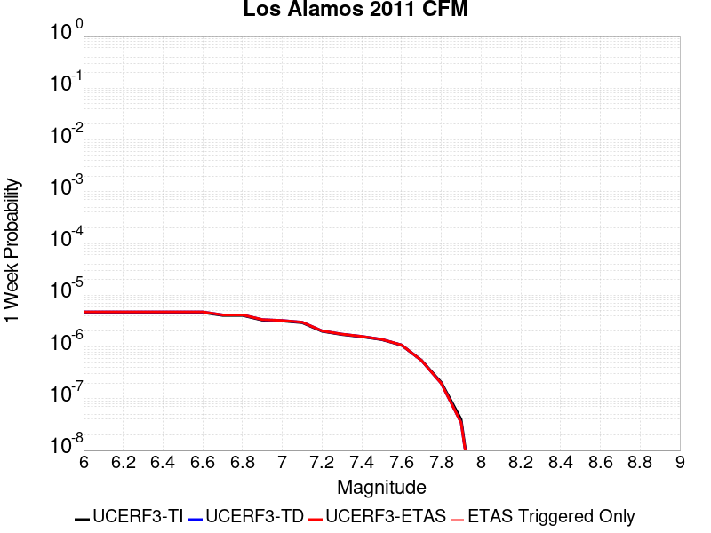 | 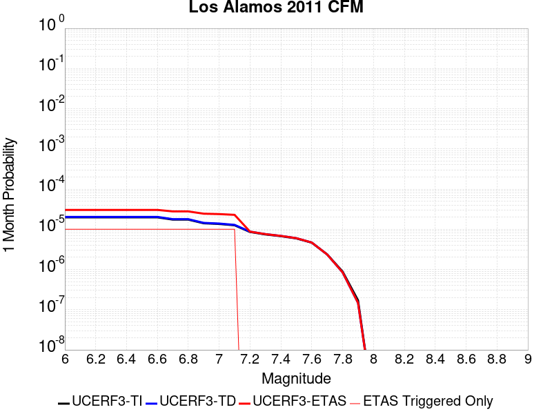 | 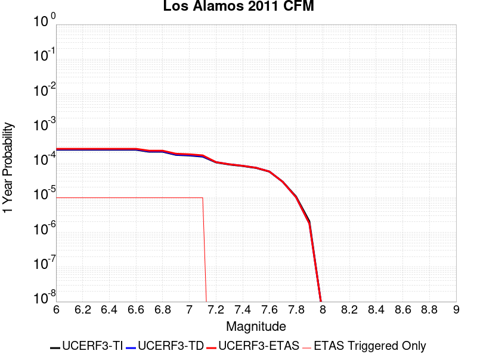 | 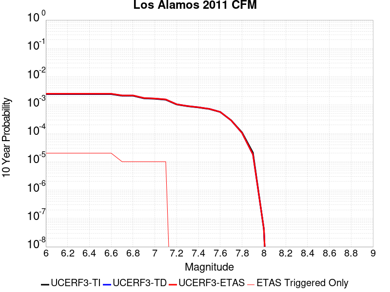 |

| Magnitude | 1 wk TI Prob | 1 wk TD Prob | 1 wk ETAS Prob | 1 wk ETAS/TD Gain | 1 wk ETAS Triggered Only | 1 mo TI Prob | 1 mo TD Prob | 1 mo ETAS Prob | 1 mo ETAS/TD Gain | 1 mo ETAS Triggered Only | 1 yr TI Prob | 1 yr TD Prob | 1 yr ETAS Prob | 1 yr ETAS/TD Gain | 1 yr ETAS Triggered Only | 10 yr TI Prob | 10 yr TD Prob | 10 yr ETAS Prob | 10 yr ETAS/TD Gain | 10 yr ETAS Triggered Only |
|-----|-----|-----|-----|-----|-----|-----|-----|-----|-----|-----|-----|-----|-----|-----|-----|-----|-----|-----|-----|-----|
| 6.0 | 4.6284417E-6 | 4.751753E-6 | 4.751753E-6 | 1.0 | 0.0 | 1.9836029E-5 | 2.0364507E-5 | 2.0364507E-5 | 1.0 | 0.0 | 2.4147688E-4 | 2.4791143E-4 | 2.4791143E-4 | 1.0 | 0.0 | 0.0024121467 | 0.0024765227 | 0.0024884834 | 1.0048296 | 1.1990408E-5 |
| 6.1 | 4.6284417E-6 | 4.751753E-6 | 4.751753E-6 | 1.0 | 0.0 | 1.9836029E-5 | 2.0364507E-5 | 2.0364507E-5 | 1.0 | 0.0 | 2.4147688E-4 | 2.4791143E-4 | 2.4791143E-4 | 1.0 | 0.0 | 0.0024121467 | 0.0024765227 | 0.0024884834 | 1.0048296 | 1.1990408E-5 |
| 6.2 | 4.6284417E-6 | 4.751753E-6 | 4.751753E-6 | 1.0 | 0.0 | 1.9836029E-5 | 2.0364507E-5 | 2.0364507E-5 | 1.0 | 0.0 | 2.4147688E-4 | 2.4791143E-4 | 2.4791143E-4 | 1.0 | 0.0 | 0.0024121467 | 0.0024765227 | 0.0024884834 | 1.0048296 | 1.1990408E-5 |
| 6.3 | 4.6284417E-6 | 4.751753E-6 | 4.751753E-6 | 1.0 | 0.0 | 1.9836029E-5 | 2.0364507E-5 | 2.0364507E-5 | 1.0 | 0.0 | 2.4147688E-4 | 2.4791143E-4 | 2.4791143E-4 | 1.0 | 0.0 | 0.0024121467 | 0.0024765227 | 0.0024884834 | 1.0048296 | 1.1990408E-5 |
| 6.4 | 4.6284417E-6 | 4.751753E-6 | 4.751753E-6 | 1.0 | 0.0 | 1.9836029E-5 | 2.0364507E-5 | 2.0364507E-5 | 1.0 | 0.0 | 2.4147688E-4 | 2.4791143E-4 | 2.4791143E-4 | 1.0 | 0.0 | 0.0024121467 | 0.0024765227 | 0.0024884834 | 1.0048296 | 1.1990408E-5 |
| 6.5 | 4.6284417E-6 | 4.751753E-6 | 4.751753E-6 | 1.0 | 0.0 | 1.9836029E-5 | 2.0364507E-5 | 2.0364507E-5 | 1.0 | 0.0 | 2.4147688E-4 | 2.4791143E-4 | 2.4791143E-4 | 1.0 | 0.0 | 0.0024121467 | 0.0024765227 | 0.0024884834 | 1.0048296 | 1.1990408E-5 |
| 6.6 | 4.6284417E-6 | 4.751753E-6 | 4.751753E-6 | 1.0 | 0.0 | 1.9836029E-5 | 2.0364507E-5 | 2.0364507E-5 | 1.0 | 0.0 | 2.4147688E-4 | 2.4791143E-4 | 2.4791143E-4 | 1.0 | 0.0 | 0.0024121467 | 0.0024765227 | 0.0024884834 | 1.0048296 | 1.1990408E-5 |
| 6.7 | 4.062321E-6 | 4.166368E-6 | 4.166368E-6 | 1.0 | 0.0 | 1.7409831E-5 | 1.785575E-5 | 1.785575E-5 | 1.0 | 0.0 | 2.1194408E-4 | 2.1737357E-4 | 2.1737357E-4 | 1.0 | 0.0 | 0.0021174205 | 0.0021717593 | 0.0021717593 | 1.0 | 0.0 |
| 6.8 | 4.062321E-6 | 4.166368E-6 | 4.166368E-6 | 1.0 | 0.0 | 1.7409831E-5 | 1.785575E-5 | 1.785575E-5 | 1.0 | 0.0 | 2.1194408E-4 | 2.1737357E-4 | 2.1737357E-4 | 1.0 | 0.0 | 0.0021174205 | 0.0021717593 | 0.0021717593 | 1.0 | 0.0 |
| 6.9 | 3.2936077E-6 | 3.3729737E-6 | 3.3729737E-6 | 1.0 | 0.0 | 1.4115385E-5 | 1.4455527E-5 | 1.4455527E-5 | 1.0 | 0.0 | 1.7184127E-4 | 1.7598276E-4 | 1.7598276E-4 | 1.0 | 0.0 | 0.0017170844 | 0.0017585267 | 0.0017585267 | 1.0 | 0.0 |
| 7.0 | 3.1687898E-6 | 3.2448309E-6 | 3.2448309E-6 | 1.0 | 0.0 | 1.3580457E-5 | 1.39063495E-5 | 1.39063495E-5 | 1.0 | 0.0 | 1.6532952E-4 | 1.6929758E-4 | 1.6929758E-4 | 1.0 | 0.0 | 0.0016520657 | 0.0016917776 | 0.0016917776 | 1.0 | 0.0 |
| 7.1 | 2.9379228E-6 | 3.0073402E-6 | 3.0073402E-6 | 1.0 | 0.0 | 1.25910365E-5 | 1.2888542E-5 | 1.2888542E-5 | 1.0 | 0.0 | 1.5328509E-4 | 1.5690761E-4 | 1.5690761E-4 | 1.0 | 0.0 | 0.001531794 | 0.0015680575 | 0.0015680575 | 1.0 | 0.0 |
| 7.2 | 2.0020686E-6 | 2.04164E-6 | 2.04164E-6 | 1.0 | 0.0 | 8.580266E-6 | 8.749857E-6 | 8.749857E-6 | 1.0 | 0.0 | 1.0445973E-4 | 1.0652435E-4 | 1.0652435E-4 | 1.0 | 0.0 | 0.0010441064 | 0.0010647373 | 0.0010647373 | 1.0 | 0.0 |
| 7.3 | 1.7364243E-6 | 1.7678894E-6 | 1.7678894E-6 | 1.0 | 0.0 | 7.441797E-6 | 7.5766475E-6 | 7.5766475E-6 | 1.0 | 0.0 | 9.0600115E-5 | 9.224181E-5 | 9.224181E-5 | 1.0 | 0.0 | 9.0563187E-4 | 9.220384E-4 | 9.220384E-4 | 1.0 | 0.0 |
| 7.4 | 1.5718434E-6 | 1.5983262E-6 | 1.5983262E-6 | 1.0 | 0.0 | 6.7364545E-6 | 6.8499517E-6 | 6.8499517E-6 | 1.0 | 0.0 | 8.201325E-5 | 8.3395E-5 | 8.3395E-5 | 1.0 | 0.0 | 8.198299E-4 | 8.3364005E-4 | 8.3364005E-4 | 1.0 | 0.0 |
| 7.5 | 1.3841119E-6 | 1.404287E-6 | 1.404287E-6 | 1.0 | 0.0 | 5.9318945E-6 | 6.018359E-6 | 6.018359E-6 | 1.0 | 0.0 | 7.221842E-5 | 7.327108E-5 | 7.327108E-5 | 1.0 | 0.0 | 7.2194956E-4 | 7.324721E-4 | 7.324721E-4 | 1.0 | 0.0 |
| 7.6 | 1.0843726E-6 | 1.0934483E-6 | 1.0934483E-6 | 1.0 | 0.0 | 4.647303E-6 | 4.6861987E-6 | 4.6861987E-6 | 1.0 | 0.0 | 5.6579443E-5 | 5.7053E-5 | 5.7053E-5 | 1.0 | 0.0 | 5.656504E-4 | 5.703861E-4 | 5.703861E-4 | 1.0 | 0.0 |
| 7.7 | 5.544814E-7 | 5.501903E-7 | 5.501903E-7 | 1.0 | 0.0 | 2.3763469E-6 | 2.3579564E-6 | 2.3579564E-6 | 1.0 | 0.0 | 2.8931638E-5 | 2.8707742E-5 | 2.8707742E-5 | 1.0 | 0.0 | 2.8927872E-4 | 2.870405E-4 | 2.870405E-4 | 1.0 | 0.0 |
| 7.8 | 2.0707465E-7 | 1.9778587E-7 | 1.9778587E-7 | 1.0 | 0.0 | 8.874625E-7 | 8.4765344E-7 | 8.4765344E-7 | 1.0 | 0.0 | 1.08048025E-5 | 1.0320132E-5 | 1.0320132E-5 | 1.0 | 0.0 | 1.0804277E-4 | 1.0319657E-4 | 1.0319657E-4 | 1.0 | 0.0 |
| 7.9 | 3.9821284E-8 | 3.4331322E-8 | 3.4331322E-8 | 1.0 | 0.0 | 1.7066264E-7 | 1.4713423E-7 | 1.4713423E-7 | 1.0 | 0.0 | 2.0778157E-6 | 1.7913579E-6 | 1.7913579E-6 | 1.0 | 0.0 | 2.0777963E-5 | 1.791344E-5 | 1.791344E-5 | 1.0 | 0.0 |
| 8.0 | 7.880441E-11 | 8.235368E-11 | 8.235368E-11 | 1.0 | 0.0 | 3.3773329E-10 | 3.5294412E-10 | 3.5294412E-10 | 1.0 | 0.0 | 4.1119033E-9 | 4.297095E-9 | 4.297095E-9 | 1.0 | 0.0 | 4.1119034E-8 | 4.2970953E-8 | 4.2970953E-8 | 1.0 | 0.0 |

## Kern Canyon (Lake Isabella) 2011
*[(top)](#table-of-contents)*

| 1 Week | 1 Month | 1 Year | 10 Year |
|-----|-----|-----|-----|
| 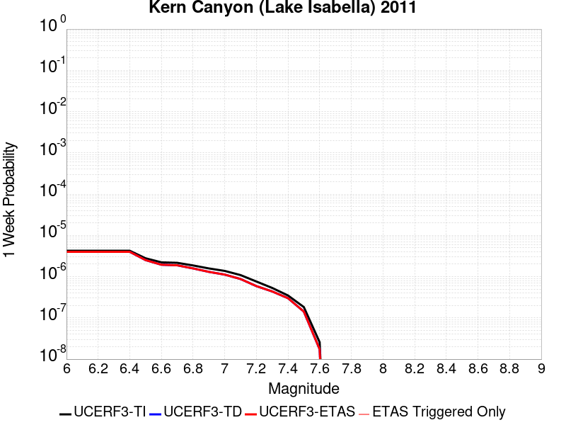 | 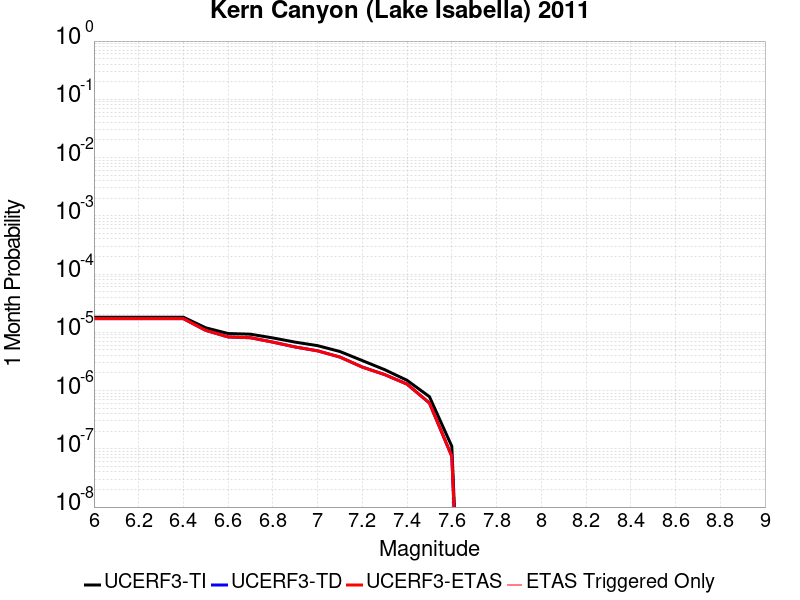 | 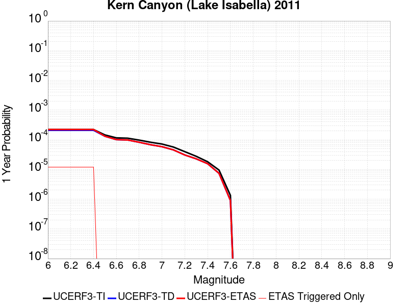 | 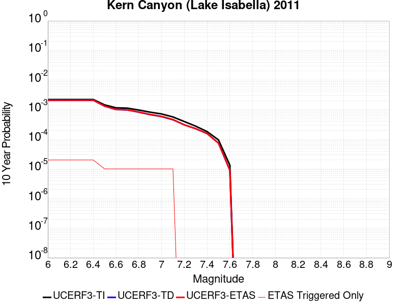 |

| Magnitude | 1 wk TI Prob | 1 wk TD Prob | 1 wk ETAS Prob | 1 wk ETAS/TD Gain | 1 wk ETAS Triggered Only | 1 mo TI Prob | 1 mo TD Prob | 1 mo ETAS Prob | 1 mo ETAS/TD Gain | 1 mo ETAS Triggered Only | 1 yr TI Prob | 1 yr TD Prob | 1 yr ETAS Prob | 1 yr ETAS/TD Gain | 1 yr ETAS Triggered Only | 10 yr TI Prob | 10 yr TD Prob | 10 yr ETAS Prob | 10 yr ETAS/TD Gain | 10 yr ETAS Triggered Only |
|-----|-----|-----|-----|-----|-----|-----|-----|-----|-----|-----|-----|-----|-----|-----|-----|-----|-----|-----|-----|-----|
| 6.0 | 4.2387383E-6 | 4.0016507E-6 | 4.0016507E-6 | 1.0 | 0.0 | 1.8165894E-5 | 1.7149829E-5 | 1.7149829E-5 | 1.0 | 0.0 | 2.2114732E-4 | 2.0878103E-4 | 2.2076894E-4 | 1.0574186 | 1.1990408E-5 | 0.0022092736 | 0.0020860326 | 0.002097998 | 1.005736 | 1.1990408E-5 |
| 6.1 | 4.2387383E-6 | 4.0016507E-6 | 4.0016507E-6 | 1.0 | 0.0 | 1.8165894E-5 | 1.7149829E-5 | 1.7149829E-5 | 1.0 | 0.0 | 2.2114732E-4 | 2.0878103E-4 | 2.2076894E-4 | 1.0574186 | 1.1990408E-5 | 0.0022092736 | 0.0020860326 | 0.002097998 | 1.005736 | 1.1990408E-5 |
| 6.2 | 4.2387383E-6 | 4.0016507E-6 | 4.0016507E-6 | 1.0 | 0.0 | 1.8165894E-5 | 1.7149829E-5 | 1.7149829E-5 | 1.0 | 0.0 | 2.2114732E-4 | 2.0878103E-4 | 2.2076894E-4 | 1.0574186 | 1.1990408E-5 | 0.0022092736 | 0.0020860326 | 0.002097998 | 1.005736 | 1.1990408E-5 |
| 6.3 | 4.2387383E-6 | 4.0016507E-6 | 4.0016507E-6 | 1.0 | 0.0 | 1.8165894E-5 | 1.7149829E-5 | 1.7149829E-5 | 1.0 | 0.0 | 2.2114732E-4 | 2.0878103E-4 | 2.2076894E-4 | 1.0574186 | 1.1990408E-5 | 0.0022092736 | 0.0020860326 | 0.002097998 | 1.005736 | 1.1990408E-5 |
| 6.4 | 4.2387383E-6 | 4.0016507E-6 | 4.0016507E-6 | 1.0 | 0.0 | 1.8165894E-5 | 1.7149829E-5 | 1.7149829E-5 | 1.0 | 0.0 | 2.2114732E-4 | 2.0878103E-4 | 2.2076894E-4 | 1.0574186 | 1.1990408E-5 | 0.0022092736 | 0.0020860326 | 0.002097998 | 1.005736 | 1.1990408E-5 |
| 6.5 | 2.7857532E-6 | 2.5178747E-6 | 2.5178747E-6 | 1.0 | 0.0 | 1.1938888E-5 | 1.0790849E-5 | 1.0790849E-5 | 1.0 | 0.0 | 1.4534626E-4 | 1.31371E-4 | 1.31371E-4 | 1.0 | 0.0 | 0.0014525123 | 0.0013129661 | 0.0013129661 | 1.0 | 0.0 |
| 6.6 | 2.2233348E-6 | 1.94413E-6 | 1.94413E-6 | 1.0 | 0.0 | 9.528543E-6 | 8.331959E-6 | 8.331959E-6 | 1.0 | 0.0 | 1.1600384E-4 | 1.0143697E-4 | 1.0143697E-4 | 1.0 | 0.0 | 0.001159433 | 0.0010139153 | 0.0010139153 | 1.0 | 0.0 |
| 6.7 | 2.1635126E-6 | 1.8835098E-6 | 1.8835098E-6 | 1.0 | 0.0 | 9.272164E-6 | 8.07216E-6 | 8.07216E-6 | 1.0 | 0.0 | 1.1288274E-4 | 9.82742E-5 | 9.82742E-5 | 1.0 | 0.0 | 0.0011282542 | 9.823156E-4 | 9.823156E-4 | 1.0 | 0.0 |
| 6.8 | 1.8685711E-6 | 1.583148E-6 | 1.583148E-6 | 1.0 | 0.0 | 8.008137E-6 | 6.784903E-6 | 6.784903E-6 | 1.0 | 0.0 | 9.74947E-5 | 8.260311E-5 | 8.260311E-5 | 1.0 | 0.0 | 9.745194E-4 | 8.25729E-4 | 8.25729E-4 | 1.0 | 0.0 |
| 6.9 | 1.5815071E-6 | 1.3064976E-6 | 1.3064976E-6 | 1.0 | 0.0 | 6.77787E-6 | 5.599263E-6 | 5.599263E-6 | 1.0 | 0.0 | 8.251744E-5 | 6.816892E-5 | 6.816892E-5 | 1.0 | 0.0 | 8.248681E-4 | 6.814828E-4 | 6.814828E-4 | 1.0 | 0.0 |
| 7.0 | 1.3772564E-6 | 1.1210758E-6 | 1.1210758E-6 | 1.0 | 0.0 | 5.9025137E-6 | 4.804602E-6 | 4.804602E-6 | 1.0 | 0.0 | 7.186073E-5 | 5.849448E-5 | 5.849448E-5 | 1.0 | 0.0 | 7.18375E-4 | 5.8479287E-4 | 5.8479287E-4 | 1.0 | 0.0 |
| 7.1 | 1.0916998E-6 | 8.763808E-7 | 8.763808E-7 | 1.0 | 0.0 | 4.678705E-6 | 3.7559125E-6 | 3.7559125E-6 | 1.0 | 0.0 | 5.6961744E-5 | 4.5727287E-5 | 4.5727287E-5 | 1.0 | 0.0 | 5.6947145E-4 | 4.5718014E-4 | 4.5718014E-4 | 1.0 | 0.0 |
| 7.2 | 7.6277024E-7 | 5.901475E-7 | 5.901475E-7 | 1.0 | 0.0 | 3.2690114E-6 | 2.5292013E-6 | 2.5292013E-6 | 1.0 | 0.0 | 3.9799485E-5 | 3.0792595E-5 | 3.0792595E-5 | 1.0 | 0.0 | 3.9792358E-4 | 3.078839E-4 | 3.078839E-4 | 1.0 | 0.0 |
| 7.3 | 5.3265916E-7 | 4.3824562E-7 | 4.3824562E-7 | 1.0 | 0.0 | 2.282823E-6 | 1.8781942E-6 | 1.8781942E-6 | 1.0 | 0.0 | 2.7793016E-5 | 2.286678E-5 | 2.286678E-5 | 1.0 | 0.0 | 2.778954E-4 | 2.2864464E-4 | 2.2864464E-4 | 1.0 | 0.0 |
| 7.4 | 3.4946007E-7 | 3.006581E-7 | 3.006581E-7 | 1.0 | 0.0 | 1.497685E-6 | 1.288534E-6 | 1.288534E-6 | 1.0 | 0.0 | 1.8234163E-5 | 1.568779E-5 | 1.568779E-5 | 1.0 | 0.0 | 1.8232666E-4 | 1.5686706E-4 | 1.5686706E-4 | 1.0 | 0.0 |
| 7.5 | 1.8317026E-7 | 1.4244868E-7 | 1.4244868E-7 | 1.0 | 0.0 | 7.850152E-7 | 6.104942E-7 | 6.104942E-7 | 1.0 | 0.0 | 9.557518E-6 | 7.4327427E-6 | 7.4327427E-6 | 1.0 | 0.0 | 9.5571064E-5 | 7.432502E-5 | 7.432502E-5 | 1.0 | 0.0 |
| 7.6 | 2.572245E-8 | 1.7352637E-8 | 1.7352637E-8 | 1.0 | 0.0 | 1.10239064E-7 | 7.4368444E-8 | 7.4368444E-8 | 1.0 | 0.0 | 1.3421597E-6 | 9.0543546E-7 | 9.0543546E-7 | 1.0 | 0.0 | 1.3421517E-5 | 9.0543235E-6 | 9.0543235E-6 | 1.0 | 0.0 |

## Gillem - Big Crack 2011 CFM
*[(top)](#table-of-contents)*

| 1 Week | 1 Month | 1 Year | 10 Year |
|-----|-----|-----|-----|
|  |  | 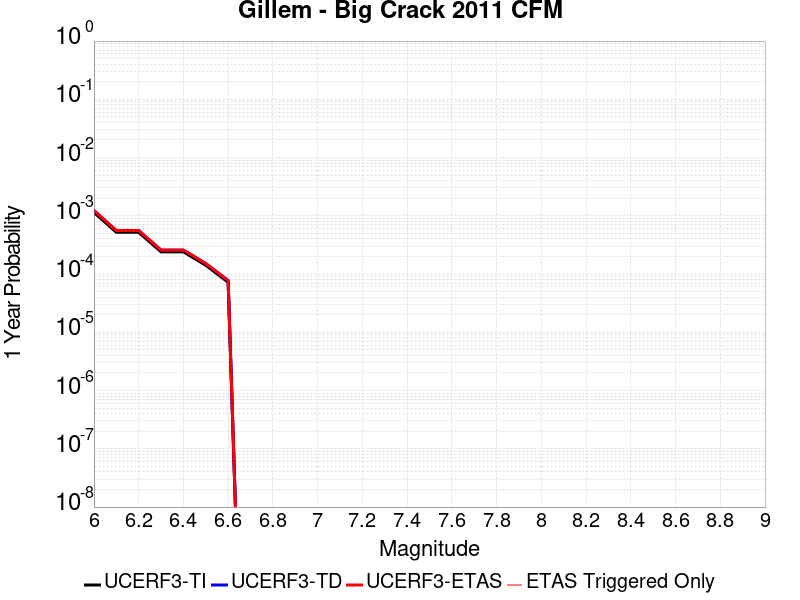 | 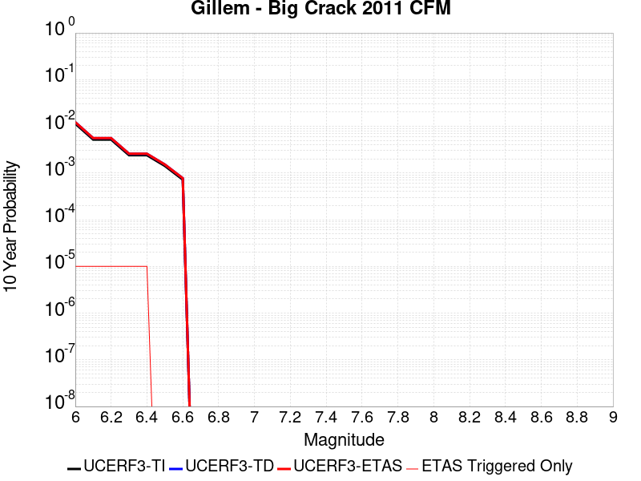 |

| Magnitude | 1 wk TI Prob | 1 wk TD Prob | 1 wk ETAS Prob | 1 wk ETAS/TD Gain | 1 wk ETAS Triggered Only | 1 mo TI Prob | 1 mo TD Prob | 1 mo ETAS Prob | 1 mo ETAS/TD Gain | 1 mo ETAS Triggered Only | 1 yr TI Prob | 1 yr TD Prob | 1 yr ETAS Prob | 1 yr ETAS/TD Gain | 1 yr ETAS Triggered Only | 10 yr TI Prob | 10 yr TD Prob | 10 yr ETAS Prob | 10 yr ETAS/TD Gain | 10 yr ETAS Triggered Only |
|-----|-----|-----|-----|-----|-----|-----|-----|-----|-----|-----|-----|-----|-----|-----|-----|-----|-----|-----|-----|-----|
| 6.0 | 2.196852E-5 | 2.360472E-5 | 2.360472E-5 | 1.0 | 0.0 | 9.4147406E-5 | 1.0115966E-4 | 1.0115966E-4 | 1.0 | 0.0 | 0.0011456419 | 0.0012310119 | 0.0012310119 | 1.0 | 0.0 | 0.011397537 | 0.01225079 | 0.012262633 | 1.0009668 | 1.1990408E-5 |
| 6.1 | 9.992795E-6 | 1.0711992E-5 | 1.0711992E-5 | 1.0 | 0.0 | 4.2825563E-5 | 4.5907833E-5 | 4.5907833E-5 | 1.0 | 0.0 | 5.2127644E-4 | 5.5880286E-4 | 5.5880286E-4 | 1.0 | 0.0 | 0.0052005537 | 0.0055757877 | 0.005587711 | 1.0021385 | 1.1990408E-5 |
| 6.2 | 9.992795E-6 | 1.0711992E-5 | 1.0711992E-5 | 1.0 | 0.0 | 4.2825563E-5 | 4.5907833E-5 | 4.5907833E-5 | 1.0 | 0.0 | 5.2127644E-4 | 5.5880286E-4 | 5.5880286E-4 | 1.0 | 0.0 | 0.0052005537 | 0.0055757877 | 0.005587711 | 1.0021385 | 1.1990408E-5 |
| 6.3 | 4.6127884E-6 | 4.942704E-6 | 4.942704E-6 | 1.0 | 0.0 | 1.9768944E-5 | 2.118287E-5 | 2.118287E-5 | 1.0 | 0.0 | 2.406603E-4 | 2.5787536E-4 | 2.5787536E-4 | 1.0 | 0.0 | 0.0024039985 | 0.0025761996 | 0.002588159 | 1.0046424 | 1.1990408E-5 |
| 6.4 | 4.6127884E-6 | 4.942704E-6 | 4.942704E-6 | 1.0 | 0.0 | 1.9768944E-5 | 2.118287E-5 | 2.118287E-5 | 1.0 | 0.0 | 2.406603E-4 | 2.5787536E-4 | 2.5787536E-4 | 1.0 | 0.0 | 0.0024039985 | 0.0025761996 | 0.002588159 | 1.0046424 | 1.1990408E-5 |
| 6.5 | 2.716712E-6 | 2.911139E-6 | 2.911139E-6 | 1.0 | 0.0 | 1.1643E-5 | 1.2476264E-5 | 1.2476264E-5 | 1.0 | 0.0 | 1.417443E-4 | 1.5189036E-4 | 1.5189036E-4 | 1.0 | 0.0 | 0.0014165393 | 0.0015181034 | 0.0015181034 | 1.0 | 0.0 |
| 6.6 | 1.3818255E-6 | 1.4820831E-6 | 1.4820831E-6 | 1.0 | 0.0 | 5.922096E-6 | 6.3517764E-6 | 6.3517764E-6 | 1.0 | 0.0 | 7.209913E-5 | 7.7331366E-5 | 7.7331366E-5 | 1.0 | 0.0 | 7.2075747E-4 | 7.731655E-4 | 7.731655E-4 | 1.0 | 0.0 |

## San Juan
*[(top)](#table-of-contents)*

| 1 Week | 1 Month | 1 Year | 10 Year |
|-----|-----|-----|-----|
|  | 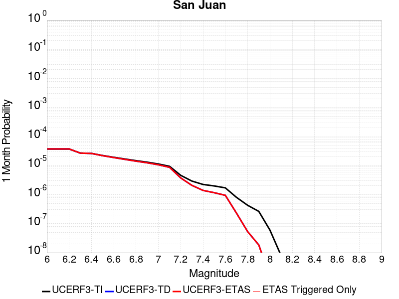 | 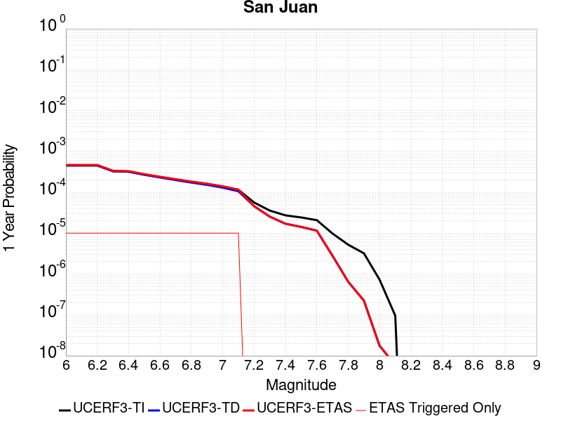 | 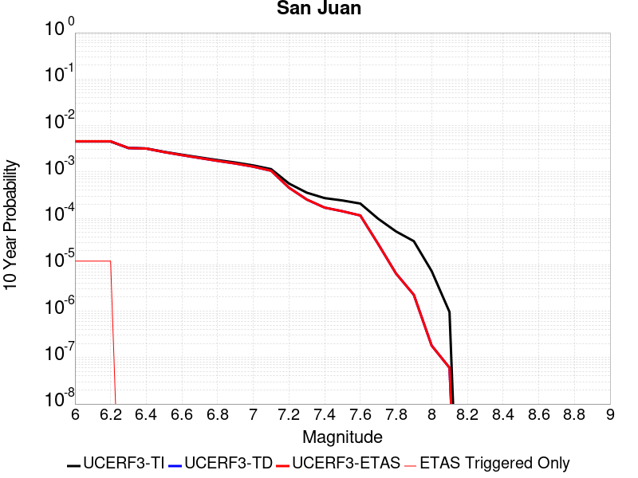 |

| Magnitude | 1 wk TI Prob | 1 wk TD Prob | 1 wk ETAS Prob | 1 wk ETAS/TD Gain | 1 wk ETAS Triggered Only | 1 mo TI Prob | 1 mo TD Prob | 1 mo ETAS Prob | 1 mo ETAS/TD Gain | 1 mo ETAS Triggered Only | 1 yr TI Prob | 1 yr TD Prob | 1 yr ETAS Prob | 1 yr ETAS/TD Gain | 1 yr ETAS Triggered Only | 10 yr TI Prob | 10 yr TD Prob | 10 yr ETAS Prob | 10 yr ETAS/TD Gain | 10 yr ETAS Triggered Only |
|-----|-----|-----|-----|-----|-----|-----|-----|-----|-----|-----|-----|-----|-----|-----|-----|-----|-----|-----|-----|-----|
| 6.0 | 8.682808E-6 | 8.749559E-6 | 8.749559E-6 | 1.0 | 0.0 | 3.72115E-5 | 3.7497597E-5 | 3.7497597E-5 | 1.0 | 0.0 | 4.5295584E-4 | 4.5644245E-4 | 4.5644245E-4 | 1.0 | 0.0 | 0.004520337 | 0.0045555905 | 0.0045675263 | 1.00262 | 1.1990408E-5 |
| 6.1 | 8.682808E-6 | 8.749559E-6 | 8.749559E-6 | 1.0 | 0.0 | 3.72115E-5 | 3.7497597E-5 | 3.7497597E-5 | 1.0 | 0.0 | 4.5295584E-4 | 4.5644245E-4 | 4.5644245E-4 | 1.0 | 0.0 | 0.004520337 | 0.0045555905 | 0.0045675263 | 1.00262 | 1.1990408E-5 |
| 6.2 | 8.682808E-6 | 8.749559E-6 | 8.749559E-6 | 1.0 | 0.0 | 3.72115E-5 | 3.7497597E-5 | 3.7497597E-5 | 1.0 | 0.0 | 4.5295584E-4 | 4.5644245E-4 | 4.5644245E-4 | 1.0 | 0.0 | 0.004520337 | 0.0045555905 | 0.0045675263 | 1.00262 | 1.1990408E-5 |
| 6.3 | 6.3054235E-6 | 6.282968E-6 | 6.282968E-6 | 1.0 | 0.0 | 2.7022963E-5 | 2.6926737E-5 | 2.6926737E-5 | 1.0 | 0.0 | 3.2895492E-4 | 3.277851E-4 | 3.277851E-4 | 1.0 | 0.0 | 0.003284684 | 0.0032732163 | 0.0032732163 | 1.0 | 0.0 |
| 6.4 | 6.1490473E-6 | 6.114796E-6 | 6.114796E-6 | 1.0 | 0.0 | 2.6352795E-5 | 2.6206013E-5 | 2.6206013E-5 | 1.0 | 0.0 | 3.2079802E-4 | 3.1901288E-4 | 3.1901288E-4 | 1.0 | 0.0 | 0.0032033534 | 0.0031857456 | 0.0031857456 | 1.0 | 0.0 |
| 6.5 | 5.204848E-6 | 5.137553E-6 | 5.137553E-6 | 1.0 | 0.0 | 2.23063E-5 | 2.2017904E-5 | 2.2017904E-5 | 1.0 | 0.0 | 2.7154534E-4 | 2.6803595E-4 | 2.6803595E-4 | 1.0 | 0.0 | 0.0027121378 | 0.002677281 | 0.002677281 | 1.0 | 0.0 |
| 6.6 | 4.5179986E-6 | 4.415269E-6 | 4.415269E-6 | 1.0 | 0.0 | 1.9362706E-5 | 1.8922448E-5 | 1.8922448E-5 | 1.0 | 0.0 | 2.3571544E-4 | 2.3035725E-4 | 2.3035725E-4 | 1.0 | 0.0 | 0.0023546559 | 0.0023013218 | 0.0023013218 | 1.0 | 0.0 |
| 6.7 | 3.9442616E-6 | 3.8200415E-6 | 3.8200415E-6 | 1.0 | 0.0 | 1.6903869E-5 | 1.6371509E-5 | 1.6371509E-5 | 1.0 | 0.0 | 2.0578515E-4 | 1.9930555E-4 | 1.9930555E-4 | 1.0 | 0.0 | 0.002055947 | 0.001991393 | 0.001991393 | 1.0 | 0.0 |
| 6.8 | 3.4536245E-6 | 3.31654E-6 | 3.31654E-6 | 1.0 | 0.0 | 1.4801163E-5 | 1.4213669E-5 | 1.4213669E-5 | 1.0 | 0.0 | 1.8018926E-4 | 1.730383E-4 | 1.730383E-4 | 1.0 | 0.0 | 0.0018004322 | 0.0017291544 | 0.0017291544 | 1.0 | 0.0 |
| 6.9 | 3.059865E-6 | 2.912227E-6 | 2.912227E-6 | 1.0 | 0.0 | 1.3113641E-5 | 1.2480916E-5 | 1.2480916E-5 | 1.0 | 0.0 | 1.596469E-4 | 1.5194513E-4 | 1.5194513E-4 | 1.0 | 0.0 | 0.0015953224 | 0.001518527 | 0.001518527 | 1.0 | 0.0 |
| 7.0 | 2.6504351E-6 | 2.4921849E-6 | 2.4921849E-6 | 1.0 | 0.0 | 1.1358958E-5 | 1.0680751E-5 | 1.0680751E-5 | 1.0 | 0.0 | 1.3828653E-4 | 1.3003094E-4 | 1.3003094E-4 | 1.0 | 0.0 | 0.0013820052 | 0.0012996603 | 0.0012996603 | 1.0 | 0.0 |
| 7.1 | 2.2039317E-6 | 2.0339805E-6 | 2.0339805E-6 | 1.0 | 0.0 | 9.445387E-6 | 8.717033E-6 | 8.717033E-6 | 1.0 | 0.0 | 1.1499152E-4 | 1.0612523E-4 | 1.0612523E-4 | 1.0 | 0.0 | 0.0011493203 | 0.0010608556 | 0.0010608556 | 1.0 | 0.0 |
| 7.2 | 1.0786707E-6 | 8.7714847E-7 | 8.7714847E-7 | 1.0 | 0.0 | 4.622866E-6 | 3.7592022E-6 | 3.7592022E-6 | 1.0 | 0.0 | 5.628194E-5 | 4.5767338E-5 | 4.5767338E-5 | 1.0 | 0.0 | 5.6267687E-4 | 4.5763818E-4 | 4.5763818E-4 | 1.0 | 0.0 |
| 7.3 | 6.846433E-7 | 4.869622E-7 | 4.869622E-7 | 1.0 | 0.0 | 2.9341822E-6 | 2.0869793E-6 | 2.0869793E-6 | 1.0 | 0.0 | 3.5723086E-5 | 2.5408679E-5 | 2.5408679E-5 | 1.0 | 0.0 | 3.571734E-4 | 2.5409125E-4 | 2.5409125E-4 | 1.0 | 0.0 |
| 7.4 | 5.23043E-7 | 3.2634222E-7 | 3.2634222E-7 | 1.0 | 0.0 | 2.2416111E-6 | 1.3986087E-6 | 1.3986087E-6 | 1.0 | 0.0 | 2.7291273E-5 | 1.7027929E-5 | 1.7027929E-5 | 1.0 | 0.0 | 2.7287923E-4 | 1.7029818E-4 | 1.7029818E-4 | 1.0 | 0.0 |
| 7.5 | 4.648444E-7 | 2.724016E-7 | 2.724016E-7 | 1.0 | 0.0 | 1.9921886E-6 | 1.1674349E-6 | 1.1674349E-6 | 1.0 | 0.0 | 2.4254627E-5 | 1.4213428E-5 | 1.4213428E-5 | 1.0 | 0.0 | 2.425198E-4 | 1.4215481E-4 | 1.4215481E-4 | 1.0 | 0.0 |
| 7.6 | 3.9906567E-7 | 2.2087482E-7 | 2.2087482E-7 | 1.0 | 0.0 | 1.7102802E-6 | 9.4660606E-7 | 9.4660606E-7 | 1.0 | 0.0 | 2.0822463E-5 | 1.1524869E-5 | 1.1524869E-5 | 1.0 | 0.0 | 2.0820512E-4 | 1.1526732E-4 | 1.1526732E-4 | 1.0 | 0.0 |
| 7.7 | 1.8784601E-7 | 5.3682427E-8 | 5.3682427E-8 | 1.0 | 0.0 | 8.0505407E-7 | 2.3006753E-7 | 2.3006753E-7 | 1.0 | 0.0 | 9.80149E-6 | 2.8010686E-6 | 2.8010686E-6 | 1.0 | 0.0 | 9.801057E-5 | 2.801939E-5 | 2.801939E-5 | 1.0 | 0.0 |
| 7.8 | 1.00154914E-7 | 1.24208075E-8 | 1.24208075E-8 | 1.0 | 0.0 | 4.2923529E-7 | 5.323204E-8 | 5.323204E-8 | 1.0 | 0.0 | 5.225927E-6 | 6.4809996E-7 | 6.4809996E-7 | 1.0 | 0.0 | 5.225804E-5 | 6.4868796E-6 | 6.4868796E-6 | 1.0 | 0.0 |
| 7.9 | 6.171429E-8 | 4.2991957E-9 | 4.2991957E-9 | 1.0 | 0.0 | 2.6448978E-7 | 1.8425133E-8 | 1.8425133E-8 | 1.0 | 0.0 | 3.2201583E-6 | 2.2432597E-7 | 2.2432597E-7 | 1.0 | 0.0 | 3.2201115E-5 | 2.248556E-6 | 2.248556E-6 | 1.0 | 0.0 |
| 8.0 | 1.3974572E-8 | 3.3835368E-10 | 3.3835368E-10 | 1.0 | 0.0 | 5.989102E-8 | 1.450087E-9 | 1.450087E-9 | 1.0 | 0.0 | 7.2917294E-7 | 1.7654811E-8 | 1.7654811E-8 | 1.0 | 0.0 | 7.2917055E-6 | 1.8085565E-7 | 1.8085565E-7 | 1.0 | 0.0 |
| 8.1 | 1.8403477E-9 | 1.13145604E-10 | 1.13145604E-10 | 1.0 | 0.0 | 7.887204E-9 | 4.8490567E-10 | 4.8490567E-10 | 1.0 | 0.0 | 9.602671E-8 | 5.903737E-9 | 5.903737E-9 | 1.0 | 0.0 | 9.602667E-7 | 6.028191E-8 | 6.028191E-8 | 1.0 | 0.0 |

## Reliz 2011 CFM
*[(top)](#table-of-contents)*

| 1 Week | 1 Month | 1 Year | 10 Year |
|-----|-----|-----|-----|
| 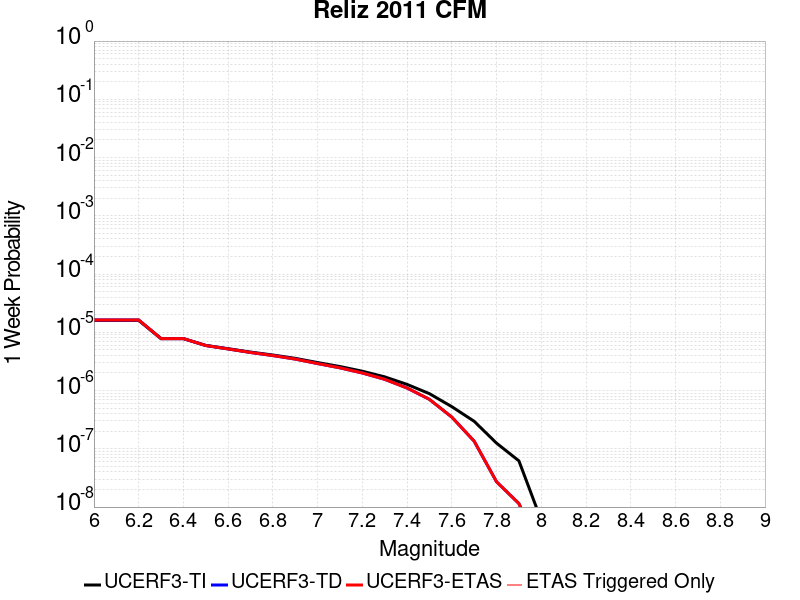 | 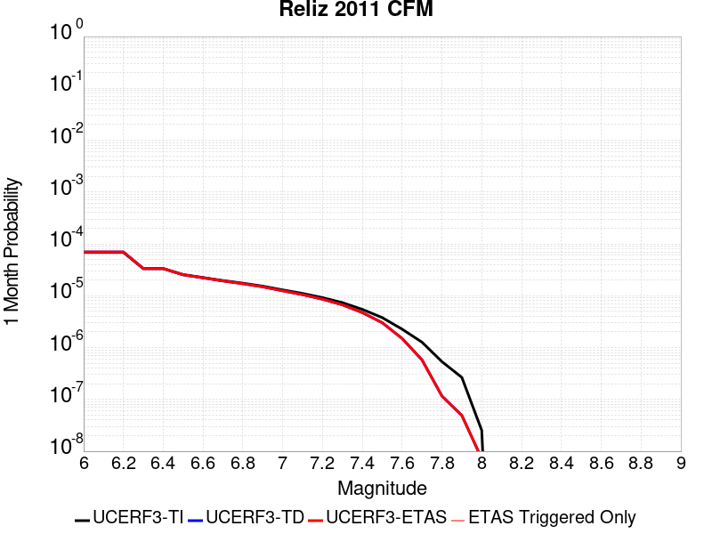 | 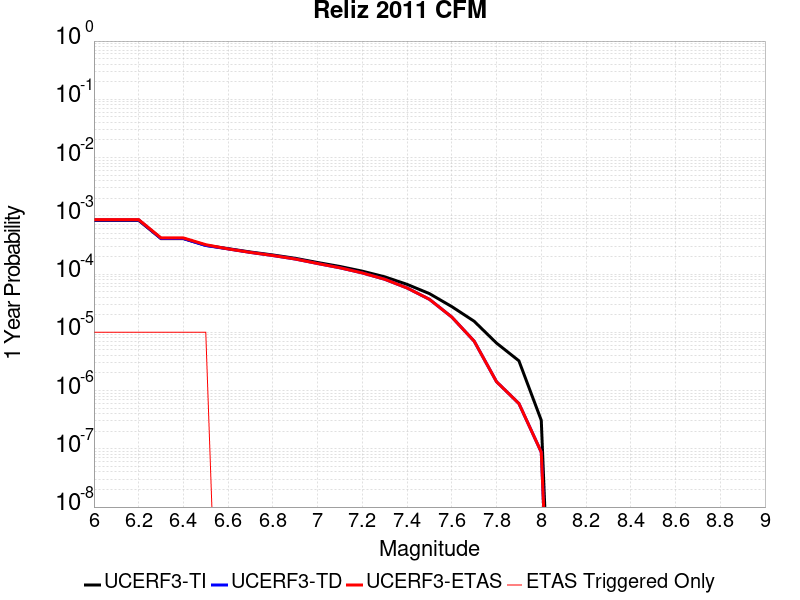 | 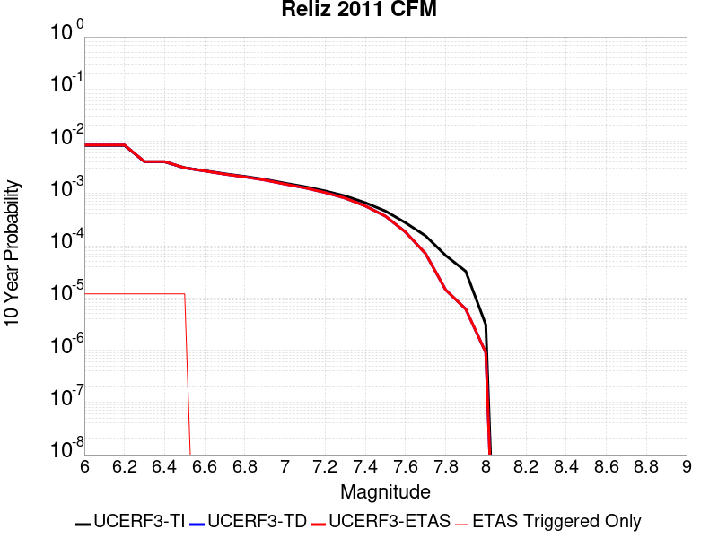 |

| Magnitude | 1 wk TI Prob | 1 wk TD Prob | 1 wk ETAS Prob | 1 wk ETAS/TD Gain | 1 wk ETAS Triggered Only | 1 mo TI Prob | 1 mo TD Prob | 1 mo ETAS Prob | 1 mo ETAS/TD Gain | 1 mo ETAS Triggered Only | 1 yr TI Prob | 1 yr TD Prob | 1 yr ETAS Prob | 1 yr ETAS/TD Gain | 1 yr ETAS Triggered Only | 10 yr TI Prob | 10 yr TD Prob | 10 yr ETAS Prob | 10 yr ETAS/TD Gain | 10 yr ETAS Triggered Only |
|-----|-----|-----|-----|-----|-----|-----|-----|-----|-----|-----|-----|-----|-----|-----|-----|-----|-----|-----|-----|-----|
| 6.0 | 1.6002472E-5 | 1.6282896E-5 | 1.6282896E-5 | 1.0 | 0.0 | 6.8580215E-5 | 6.978209E-5 | 6.978209E-5 | 1.0 | 0.0 | 8.3464425E-4 | 8.492855E-4 | 8.6126575E-4 | 1.0141063 | 1.1990408E-5 | 0.008315164 | 0.008462595 | 0.008474484 | 1.0014049 | 1.1990408E-5 |
| 6.1 | 1.6002472E-5 | 1.6282896E-5 | 1.6282896E-5 | 1.0 | 0.0 | 6.8580215E-5 | 6.978209E-5 | 6.978209E-5 | 1.0 | 0.0 | 8.3464425E-4 | 8.492855E-4 | 8.6126575E-4 | 1.0141063 | 1.1990408E-5 | 0.008315164 | 0.008462595 | 0.008474484 | 1.0014049 | 1.1990408E-5 |
| 6.2 | 1.6002472E-5 | 1.6282896E-5 | 1.6282896E-5 | 1.0 | 0.0 | 6.8580215E-5 | 6.978209E-5 | 6.978209E-5 | 1.0 | 0.0 | 8.3464425E-4 | 8.492855E-4 | 8.6126575E-4 | 1.0141063 | 1.1990408E-5 | 0.008315164 | 0.008462595 | 0.008474484 | 1.0014049 | 1.1990408E-5 |
| 6.3 | 7.792404E-6 | 7.8038565E-6 | 7.8038565E-6 | 1.0 | 0.0 | 3.339559E-5 | 3.3444678E-5 | 3.3444678E-5 | 1.0 | 0.0 | 4.0651546E-4 | 4.0711364E-4 | 4.1909915E-4 | 1.0294403 | 1.1990408E-5 | 0.0040577264 | 0.004063955 | 0.0040758965 | 1.0029384 | 1.1990408E-5 |
| 6.4 | 7.792404E-6 | 7.8038565E-6 | 7.8038565E-6 | 1.0 | 0.0 | 3.339559E-5 | 3.3444678E-5 | 3.3444678E-5 | 1.0 | 0.0 | 4.0651546E-4 | 4.0711364E-4 | 4.1909915E-4 | 1.0294403 | 1.1990408E-5 | 0.0040577264 | 0.004063955 | 0.0040758965 | 1.0029384 | 1.1990408E-5 |
| 6.5 | 5.9659374E-6 | 5.9287863E-6 | 5.9287863E-6 | 1.0 | 0.0 | 2.5568053E-5 | 2.5408837E-5 | 2.5408837E-5 | 1.0 | 0.0 | 3.1124658E-4 | 3.093089E-4 | 3.212956E-4 | 1.0387532 | 1.1990408E-5 | 0.00310811 | 0.0030890019 | 0.0031009552 | 1.0038697 | 1.1990408E-5 |
| 6.6 | 5.2350692E-6 | 5.1790316E-6 | 5.1790316E-6 | 1.0 | 0.0 | 2.2435817E-5 | 2.2195662E-5 | 2.2195662E-5 | 1.0 | 0.0 | 2.7312184E-4 | 2.701988E-4 | 2.701988E-4 | 1.0 | 0.0 | 0.002727864 | 0.002698913 | 0.002698913 | 1.0 | 0.0 |
| 6.7 | 4.580206E-6 | 4.5061634E-6 | 4.5061634E-6 | 1.0 | 0.0 | 1.9629308E-5 | 1.9311987E-5 | 1.9311987E-5 | 1.0 | 0.0 | 2.389606E-4 | 2.3509814E-4 | 2.3509814E-4 | 1.0 | 0.0 | 0.002387038 | 0.002348696 | 0.002348696 | 1.0 | 0.0 |
| 6.8 | 4.0765017E-6 | 3.9882793E-6 | 3.9882793E-6 | 1.0 | 0.0 | 1.7470604E-5 | 1.7092514E-5 | 1.7092514E-5 | 1.0 | 0.0 | 2.1268385E-4 | 2.0808152E-4 | 2.0808152E-4 | 1.0 | 0.0 | 0.002124804 | 0.002079065 | 0.002079065 | 1.0 | 0.0 |
| 6.9 | 3.5752896E-6 | 3.4725567E-6 | 3.4725567E-6 | 1.0 | 0.0 | 1.532258E-5 | 1.4882301E-5 | 1.4882301E-5 | 1.0 | 0.0 | 1.8653645E-4 | 1.8117698E-4 | 1.8117698E-4 | 1.0 | 0.0 | 0.0018637994 | 0.0018104891 | 0.0018104891 | 1.0 | 0.0 |
| 7.0 | 3.0259848E-6 | 2.9079788E-6 | 2.9079788E-6 | 1.0 | 0.0 | 1.2968442E-5 | 1.2462707E-5 | 1.2462707E-5 | 1.0 | 0.0 | 1.5787935E-4 | 1.517229E-4 | 1.517229E-4 | 1.0 | 0.0 | 0.0015776722 | 0.0015163884 | 0.0015163884 | 1.0 | 0.0 |
| 7.1 | 2.5861116E-6 | 2.4552023E-6 | 2.4552023E-6 | 1.0 | 0.0 | 1.1083288E-5 | 1.0522253E-5 | 1.0522253E-5 | 1.0 | 0.0 | 1.3493067E-4 | 1.2810092E-4 | 1.2810092E-4 | 1.0 | 0.0 | 0.0013484878 | 0.0012804654 | 0.0012804654 | 1.0 | 0.0 |
| 7.2 | 2.1482588E-6 | 2.00327E-6 | 2.00327E-6 | 1.0 | 0.0 | 9.20679E-6 | 8.585415E-6 | 8.585415E-6 | 1.0 | 0.0 | 1.12086906E-4 | 1.0452242E-4 | 1.0452242E-4 | 1.0 | 0.0 | 0.0011203039 | 0.0010449268 | 0.0010449268 | 1.0 | 0.0 |
| 7.3 | 1.7194744E-6 | 1.5611555E-6 | 1.5611555E-6 | 1.0 | 0.0 | 7.3691554E-6 | 6.6906496E-6 | 6.6906496E-6 | 1.0 | 0.0 | 8.971577E-5 | 8.145561E-5 | 8.145561E-5 | 1.0 | 0.0 | 8.967956E-4 | 8.144516E-4 | 8.144516E-4 | 1.0 | 0.0 |
| 7.4 | 1.2755178E-6 | 1.1056595E-6 | 1.1056595E-6 | 1.0 | 0.0 | 5.4664933E-6 | 4.738532E-6 | 4.738532E-6 | 1.0 | 0.0 | 6.655252E-5 | 5.7690104E-5 | 5.7690104E-5 | 1.0 | 0.0 | 6.6532596E-4 | 5.7694514E-4 | 5.7694514E-4 | 1.0 | 0.0 |
| 7.5 | 8.8463224E-7 | 7.0583064E-7 | 7.0583064E-7 | 1.0 | 0.0 | 3.7912755E-6 | 3.0249848E-6 | 3.0249848E-6 | 1.0 | 0.0 | 4.6157802E-5 | 3.682857E-5 | 3.682857E-5 | 1.0 | 0.0 | 4.6148215E-4 | 3.6841843E-4 | 3.6841843E-4 | 1.0 | 0.0 |
| 7.6 | 5.291355E-7 | 3.5010314E-7 | 3.5010314E-7 | 1.0 | 0.0 | 2.2677216E-6 | 1.5004412E-6 | 1.5004412E-6 | 1.0 | 0.0 | 2.760916E-5 | 1.8267718E-5 | 1.8267718E-5 | 1.0 | 0.0 | 2.760573E-4 | 1.82855E-4 | 1.82855E-4 | 1.0 | 0.0 |
| 7.7 | 2.9663357E-7 | 1.3513149E-7 | 1.3513149E-7 | 1.0 | 0.0 | 1.2712861E-6 | 5.791348E-7 | 5.791348E-7 | 1.0 | 0.0 | 1.5477797E-5 | 7.0509436E-6 | 7.0509436E-6 | 1.0 | 0.0 | 1.547672E-4 | 7.069193E-5 | 7.069193E-5 | 1.0 | 0.0 |
| 7.8 | 1.2509386E-7 | 2.7168449E-8 | 2.7168449E-8 | 1.0 | 0.0 | 5.3611643E-7 | 1.1643621E-7 | 1.1643621E-7 | 1.0 | 0.0 | 6.527198E-6 | 1.41761E-6 | 1.41761E-6 | 1.0 | 0.0 | 6.527006E-5 | 1.4332477E-5 | 1.4332477E-5 | 1.0 | 0.0 |
| 7.9 | 6.213493E-8 | 1.1488184E-8 | 1.1488184E-8 | 1.0 | 0.0 | 2.6629255E-7 | 4.9235076E-8 | 4.9235076E-8 | 1.0 | 0.0 | 3.242107E-6 | 5.994369E-7 | 5.994369E-7 | 1.0 | 0.0 | 3.2420594E-5 | 6.1256383E-6 | 6.1256383E-6 | 1.0 | 0.0 |
| 8.0 | 5.92383E-9 | 1.6785642E-9 | 1.6785642E-9 | 1.0 | 0.0 | 2.5387841E-8 | 7.1938473E-9 | 7.1938473E-9 | 1.0 | 0.0 | 3.0909692E-7 | 8.7585086E-8 | 8.7585086E-8 | 1.0 | 0.0 | 3.090965E-6 | 9.0066555E-7 | 9.0066555E-7 | 1.0 | 0.0 |

## Round Valley
*[(top)](#table-of-contents)*

| 1 Week | 1 Month | 1 Year | 10 Year |
|-----|-----|-----|-----|
| 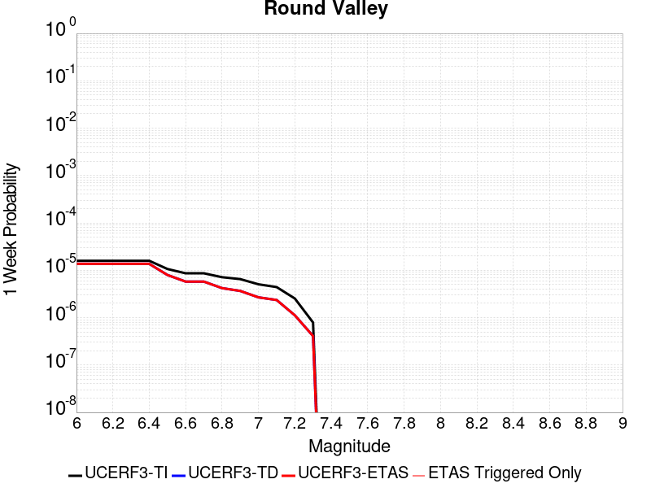 |  |  | 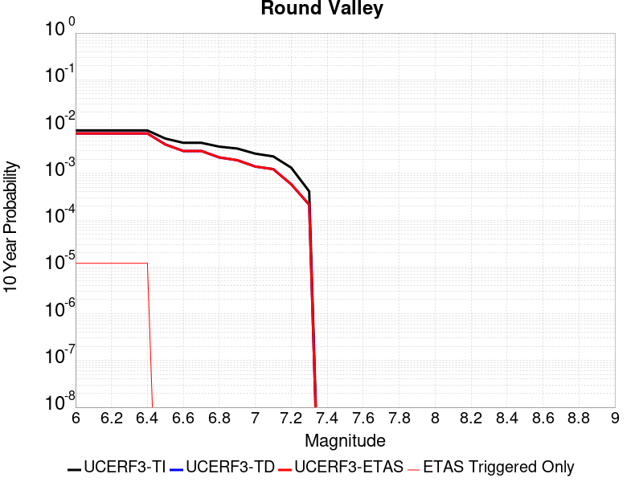 |

| Magnitude | 1 wk TI Prob | 1 wk TD Prob | 1 wk ETAS Prob | 1 wk ETAS/TD Gain | 1 wk ETAS Triggered Only | 1 mo TI Prob | 1 mo TD Prob | 1 mo ETAS Prob | 1 mo ETAS/TD Gain | 1 mo ETAS Triggered Only | 1 yr TI Prob | 1 yr TD Prob | 1 yr ETAS Prob | 1 yr ETAS/TD Gain | 1 yr ETAS Triggered Only | 10 yr TI Prob | 10 yr TD Prob | 10 yr ETAS Prob | 10 yr ETAS/TD Gain | 10 yr ETAS Triggered Only |
|-----|-----|-----|-----|-----|-----|-----|-----|-----|-----|-----|-----|-----|-----|-----|-----|-----|-----|-----|-----|-----|
| 6.0 | 1.588152E-5 | 1.367093E-5 | 1.367093E-5 | 1.0 | 0.0 | 6.806188E-5 | 5.8588605E-5 | 5.8588605E-5 | 1.0 | 0.0 | 8.283384E-4 | 7.131222E-4 | 7.131222E-4 | 1.0 | 0.0 | 0.008252576 | 0.007112226 | 0.007124131 | 1.0016739 | 1.1990408E-5 |
| 6.1 | 1.588152E-5 | 1.367093E-5 | 1.367093E-5 | 1.0 | 0.0 | 6.806188E-5 | 5.8588605E-5 | 5.8588605E-5 | 1.0 | 0.0 | 8.283384E-4 | 7.131222E-4 | 7.131222E-4 | 1.0 | 0.0 | 0.008252576 | 0.007112226 | 0.007124131 | 1.0016739 | 1.1990408E-5 |
| 6.2 | 1.588152E-5 | 1.367093E-5 | 1.367093E-5 | 1.0 | 0.0 | 6.806188E-5 | 5.8588605E-5 | 5.8588605E-5 | 1.0 | 0.0 | 8.283384E-4 | 7.131222E-4 | 7.131222E-4 | 1.0 | 0.0 | 0.008252576 | 0.007112226 | 0.007124131 | 1.0016739 | 1.1990408E-5 |
| 6.3 | 1.588152E-5 | 1.367093E-5 | 1.367093E-5 | 1.0 | 0.0 | 6.806188E-5 | 5.8588605E-5 | 5.8588605E-5 | 1.0 | 0.0 | 8.283384E-4 | 7.131222E-4 | 7.131222E-4 | 1.0 | 0.0 | 0.008252576 | 0.007112226 | 0.007124131 | 1.0016739 | 1.1990408E-5 |
| 6.4 | 1.588152E-5 | 1.367093E-5 | 1.367093E-5 | 1.0 | 0.0 | 6.806188E-5 | 5.8588605E-5 | 5.8588605E-5 | 1.0 | 0.0 | 8.283384E-4 | 7.131222E-4 | 7.131222E-4 | 1.0 | 0.0 | 0.008252576 | 0.007112226 | 0.007124131 | 1.0016739 | 1.1990408E-5 |
| 6.5 | 1.0646776E-5 | 7.953182E-6 | 7.953182E-6 | 1.0 | 0.0 | 4.5628243E-5 | 3.4084667E-5 | 3.4084667E-5 | 1.0 | 0.0 | 5.553823E-4 | 4.1491017E-4 | 4.1491017E-4 | 1.0 | 0.0 | 0.005539963 | 0.0041421843 | 0.0041421843 | 1.0 | 0.0 |
| 6.6 | 8.632956E-6 | 5.7688617E-6 | 5.7688617E-6 | 1.0 | 0.0 | 3.6997862E-5 | 2.472348E-5 | 2.472348E-5 | 1.0 | 0.0 | 4.5035584E-4 | 3.0097063E-4 | 3.0097063E-4 | 1.0 | 0.0 | 0.0044944426 | 0.0030060082 | 0.0030060082 | 1.0 | 0.0 |
| 6.7 | 8.632956E-6 | 5.7688617E-6 | 5.7688617E-6 | 1.0 | 0.0 | 3.6997862E-5 | 2.472348E-5 | 2.472348E-5 | 1.0 | 0.0 | 4.5035584E-4 | 3.0097063E-4 | 3.0097063E-4 | 1.0 | 0.0 | 0.0044944426 | 0.0030060082 | 0.0030060082 | 1.0 | 0.0 |
| 6.8 | 7.143895E-6 | 4.201937E-6 | 4.201937E-6 | 1.0 | 0.0 | 3.0616335E-5 | 1.8008186E-5 | 1.8008186E-5 | 1.0 | 0.0 | 3.726901E-4 | 2.1922929E-4 | 2.1922929E-4 | 1.0 | 0.0 | 0.0037206567 | 0.002190295 | 0.002190295 | 1.0 | 0.0 |
| 6.9 | 6.5120694E-6 | 3.664563E-6 | 3.664563E-6 | 1.0 | 0.0 | 2.790857E-5 | 1.5705184E-5 | 1.5705184E-5 | 1.0 | 0.0 | 3.3973387E-4 | 1.9119536E-4 | 1.9119536E-4 | 1.0 | 0.0 | 0.0033921495 | 0.0019104576 | 0.0019104576 | 1.0 | 0.0 |
| 7.0 | 5.0614435E-6 | 2.6837417E-6 | 2.6837417E-6 | 1.0 | 0.0 | 2.169172E-5 | 1.1501705E-5 | 1.1501705E-5 | 1.0 | 0.0 | 2.6406467E-4 | 1.400253E-4 | 1.400253E-4 | 1.0 | 0.0 | 0.0026375111 | 0.001399472 | 0.001399472 | 1.0 | 0.0 |
| 7.1 | 4.41728E-6 | 2.3575708E-6 | 2.3575708E-6 | 1.0 | 0.0 | 1.8931061E-5 | 1.0103841E-5 | 1.0103841E-5 | 1.0 | 0.0 | 2.304613E-4 | 1.2300831E-4 | 1.2300831E-4 | 1.0 | 0.0 | 0.0023022245 | 0.0012294988 | 0.0012294988 | 1.0 | 0.0 |
| 7.2 | 2.535495E-6 | 1.1208772E-6 | 1.1208772E-6 | 1.0 | 0.0 | 1.0866362E-5 | 4.803753E-6 | 4.803753E-6 | 1.0 | 0.0 | 1.3228992E-4 | 5.848465E-5 | 5.848465E-5 | 1.0 | 0.0 | 0.0013221119 | 5.847438E-4 | 5.847438E-4 | 1.0 | 0.0 |
| 7.3 | 7.900015E-7 | 4.089063E-7 | 4.089063E-7 | 1.0 | 0.0 | 3.3857161E-6 | 1.7524555E-6 | 1.7524555E-6 | 1.0 | 0.0 | 4.1220315E-5 | 2.1336145E-5 | 2.1336145E-5 | 1.0 | 0.0 | 4.121267E-4 | 2.1336146E-4 | 2.1336146E-4 | 1.0 | 0.0 |

## Keddie Ridge 2011 CFM
*[(top)](#table-of-contents)*

| 1 Week | 1 Month | 1 Year | 10 Year |
|-----|-----|-----|-----|
| 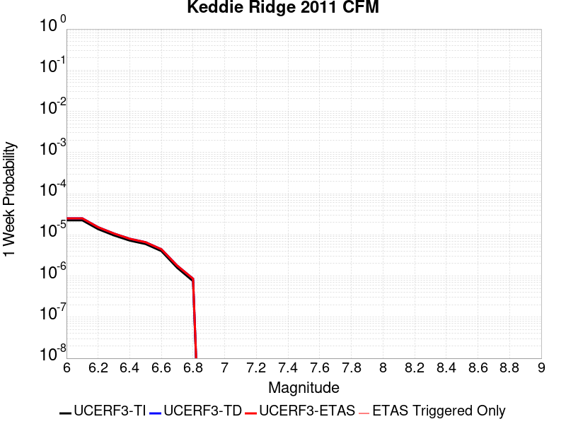 | 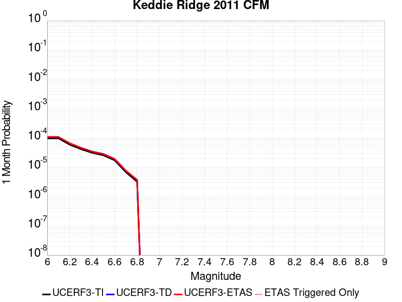 | 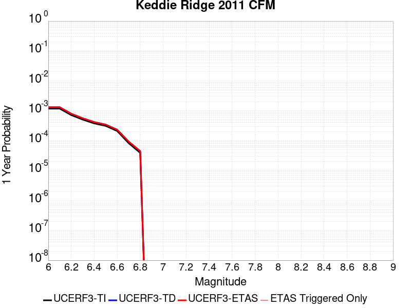 | 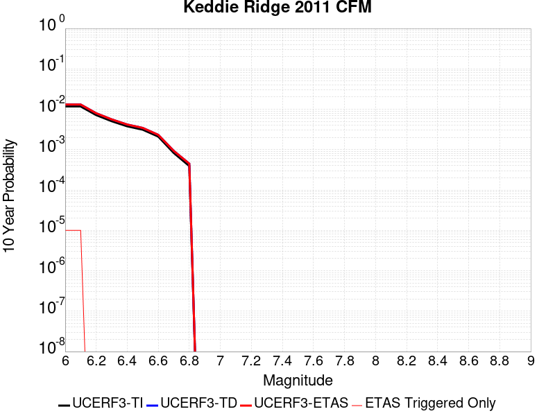 |

| Magnitude | 1 wk TI Prob | 1 wk TD Prob | 1 wk ETAS Prob | 1 wk ETAS/TD Gain | 1 wk ETAS Triggered Only | 1 mo TI Prob | 1 mo TD Prob | 1 mo ETAS Prob | 1 mo ETAS/TD Gain | 1 mo ETAS Triggered Only | 1 yr TI Prob | 1 yr TD Prob | 1 yr ETAS Prob | 1 yr ETAS/TD Gain | 1 yr ETAS Triggered Only | 10 yr TI Prob | 10 yr TD Prob | 10 yr ETAS Prob | 10 yr ETAS/TD Gain | 10 yr ETAS Triggered Only |
|-----|-----|-----|-----|-----|-----|-----|-----|-----|-----|-----|-----|-----|-----|-----|-----|-----|-----|-----|-----|-----|
| 6.0 | 2.2591947E-5 | 2.5189574E-5 | 2.5189574E-5 | 1.0 | 0.0 | 9.6819036E-5 | 1.07951295E-4 | 1.07951295E-4 | 1.0 | 0.0 | 0.0011781343 | 0.0013135937 | 0.0013135937 | 1.0 | 0.0 | 0.011719079 | 0.013066235 | 0.013078069 | 1.0009056 | 1.1990408E-5 |
| 6.1 | 2.2591947E-5 | 2.5189574E-5 | 2.5189574E-5 | 1.0 | 0.0 | 9.6819036E-5 | 1.07951295E-4 | 1.07951295E-4 | 1.0 | 0.0 | 0.0011781343 | 0.0013135937 | 0.0013135937 | 1.0 | 0.0 | 0.011719079 | 0.013066235 | 0.013078069 | 1.0009056 | 1.1990408E-5 |
| 6.2 | 1.3775145E-5 | 1.5323049E-5 | 1.5323049E-5 | 1.0 | 0.0 | 5.9035E-5 | 6.566869E-5 | 6.566869E-5 | 1.0 | 0.0 | 7.185141E-4 | 7.9924724E-4 | 7.9924724E-4 | 1.0 | 0.0 | 0.0071619535 | 0.007966147 | 0.007966147 | 1.0 | 0.0 |
| 6.3 | 9.705435E-6 | 1.0768509E-5 | 1.0768509E-5 | 1.0 | 0.0 | 4.1594063E-5 | 4.6150006E-5 | 4.6150006E-5 | 1.0 | 0.0 | 5.0629E-4 | 5.6174386E-4 | 5.6174386E-4 | 1.0 | 0.0 | 0.005051381 | 0.0056044697 | 0.0056044697 | 1.0 | 0.0 |
| 6.4 | 7.2549733E-6 | 8.027384E-6 | 8.027384E-6 | 1.0 | 0.0 | 3.109237E-5 | 3.4402667E-5 | 3.4402667E-5 | 1.0 | 0.0 | 3.7848388E-4 | 4.187799E-4 | 4.187799E-4 | 1.0 | 0.0 | 0.003778399 | 0.004180694 | 0.004180694 | 1.0 | 0.0 |
| 6.5 | 5.983293E-6 | 6.6131183E-6 | 6.6131183E-6 | 1.0 | 0.0 | 2.5642432E-5 | 2.8341665E-5 | 2.8341665E-5 | 1.0 | 0.0 | 3.1215188E-4 | 3.4501185E-4 | 3.4501185E-4 | 1.0 | 0.0 | 0.0031171376 | 0.0034454244 | 0.0034454244 | 1.0 | 0.0 |
| 6.6 | 4.0336154E-6 | 4.457868E-6 | 4.457868E-6 | 1.0 | 0.0 | 1.728681E-5 | 1.9105031E-5 | 1.9105031E-5 | 1.0 | 0.0 | 2.1044657E-4 | 2.3258296E-4 | 2.3258296E-4 | 1.0 | 0.0 | 0.002102474 | 0.002323791 | 0.002323791 | 1.0 | 0.0 |
| 6.7 | 1.5832104E-6 | 1.781639E-6 | 1.781639E-6 | 1.0 | 0.0 | 6.7851697E-6 | 7.635575E-6 | 7.635575E-6 | 1.0 | 0.0 | 8.260631E-5 | 9.295943E-5 | 9.295943E-5 | 1.0 | 0.0 | 8.2575605E-4 | 9.292321E-4 | 9.292321E-4 | 1.0 | 0.0 |
| 6.8 | 7.5177275E-7 | 8.5904594E-7 | 8.5904594E-7 | 1.0 | 0.0 | 3.221879E-6 | 3.6816214E-6 | 3.6816214E-6 | 1.0 | 0.0 | 3.9225673E-5 | 4.4822984E-5 | 4.4822984E-5 | 1.0 | 0.0 | 3.921875E-4 | 4.48156E-4 | 4.48156E-4 | 1.0 | 0.0 |

## Green Valley 2011 CFM
*[(top)](#table-of-contents)*

| 1 Week | 1 Month | 1 Year | 10 Year |
|-----|-----|-----|-----|
|  | 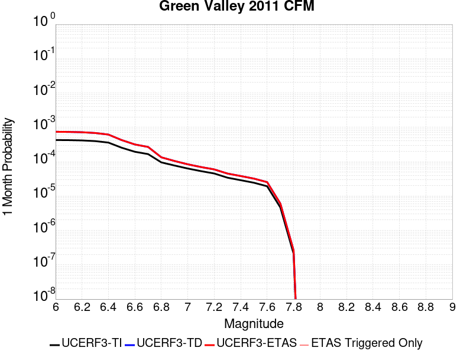 | 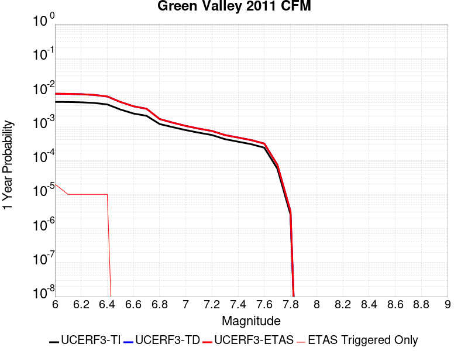 | 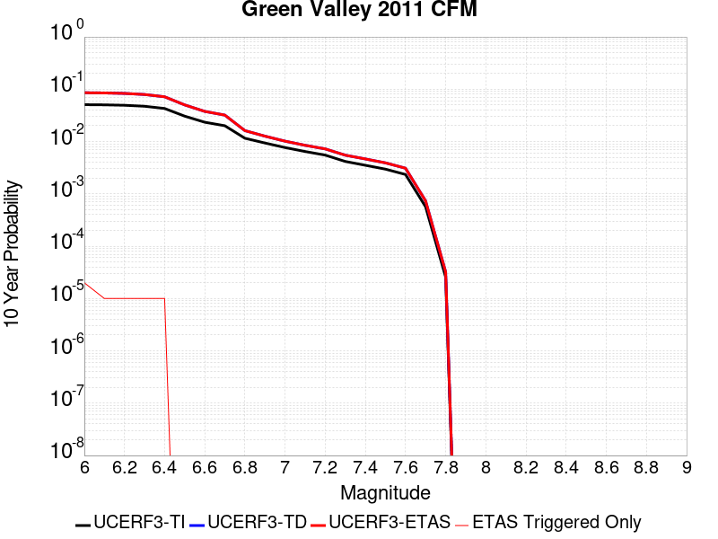 |

| Magnitude | 1 wk TI Prob | 1 wk TD Prob | 1 wk ETAS Prob | 1 wk ETAS/TD Gain | 1 wk ETAS Triggered Only | 1 mo TI Prob | 1 mo TD Prob | 1 mo ETAS Prob | 1 mo ETAS/TD Gain | 1 mo ETAS Triggered Only | 1 yr TI Prob | 1 yr TD Prob | 1 yr ETAS Prob | 1 yr ETAS/TD Gain | 1 yr ETAS Triggered Only | 10 yr TI Prob | 10 yr TD Prob | 10 yr ETAS Prob | 10 yr ETAS/TD Gain | 10 yr ETAS Triggered Only |
|-----|-----|-----|-----|-----|-----|-----|-----|-----|-----|-----|-----|-----|-----|-----|-----|-----|-----|-----|-----|-----|
| 6.0 | 9.9629346E-5 | 1.7306181E-4 | 1.7306181E-4 | 1.0 | 0.0 | 4.2691303E-4 | 7.414477E-4 | 7.414477E-4 | 1.0 | 0.0 | 0.0051852856 | 0.00898687 | 0.008998753 | 1.0013223 | 1.1990408E-5 | 0.050659515 | 0.085523866 | 0.08553483 | 1.0001281 | 1.1990408E-5 |
| 6.1 | 9.88615E-5 | 1.7153492E-4 | 1.7153492E-4 | 1.0 | 0.0 | 4.2362334E-4 | 7.349076E-4 | 7.349076E-4 | 1.0 | 0.0 | 0.0051454236 | 0.008907897 | 0.008919781 | 1.0013341 | 1.1990408E-5 | 0.050279044 | 0.08481148 | 0.08482245 | 1.0001293 | 1.1990408E-5 |
| 6.2 | 9.696895E-5 | 1.679252E-4 | 1.679252E-4 | 1.0 | 0.0 | 4.15515E-4 | 7.1944593E-4 | 7.1944593E-4 | 1.0 | 0.0 | 0.0050471667 | 0.008721275 | 0.008733161 | 1.0013628 | 1.1990408E-5 | 0.04934063 | 0.08312038 | 0.08313138 | 1.0001323 | 1.1990408E-5 |
| 6.3 | 9.275224E-5 | 1.5971852E-4 | 1.5971852E-4 | 1.0 | 0.0 | 3.9744904E-4 | 6.842931E-4 | 6.842931E-4 | 1.0 | 0.0 | 0.0048282105 | 0.008296597 | 0.008308488 | 1.0014333 | 1.1990408E-5 | 0.047246475 | 0.07925882 | 0.07926986 | 1.0001392 | 1.1990408E-5 |
| 6.4 | 8.391499E-5 | 1.4368363E-4 | 1.4368363E-4 | 1.0 | 0.0 | 3.595861E-4 | 6.156491E-4 | 6.156491E-4 | 1.0 | 0.0 | 0.004369175 | 0.007467232 | 0.007479133 | 1.0015937 | 1.1990408E-5 | 0.04284265 | 0.07163251 | 0.07164364 | 1.0001554 | 1.1990408E-5 |
| 6.5 | 5.9519385E-5 | 9.9345336E-5 | 9.9345336E-5 | 1.0 | 0.0 | 2.5505814E-4 | 4.257004E-4 | 4.257004E-4 | 1.0 | 0.0 | 0.0031009112 | 0.0051684165 | 0.0051684165 | 1.0 | 0.0 | 0.030579966 | 0.050147217 | 0.050147217 | 1.0 | 0.0 |
| 6.6 | 4.5361558E-5 | 7.4029726E-5 | 7.4029726E-5 | 1.0 | 0.0 | 1.9439218E-4 | 3.1723455E-4 | 3.1723455E-4 | 1.0 | 0.0 | 0.0023641558 | 0.003854048 | 0.003854048 | 1.0 | 0.0 | 0.023391623 | 0.03766713 | 0.03766713 | 1.0 | 0.0 |
| 6.7 | 3.8808106E-5 | 6.265495E-5 | 6.265495E-5 | 1.0 | 0.0 | 1.6630985E-4 | 2.684962E-4 | 2.684962E-4 | 1.0 | 0.0 | 0.0020229418 | 0.003262755 | 0.003262755 | 1.0 | 0.0 | 0.020046256 | 0.03200691 | 0.03200691 | 1.0 | 0.0 |
| 6.8 | 2.2284667E-5 | 3.1285566E-5 | 3.1285566E-5 | 1.0 | 0.0 | 9.550222E-5 | 1.340742E-4 | 1.340742E-4 | 1.0 | 0.0 | 0.0011621192 | 0.001631124 | 0.001631124 | 1.0 | 0.0 | 0.011560607 | 0.016166156 | 0.016166156 | 1.0 | 0.0 |
| 6.9 | 1.8050168E-5 | 2.4448267E-5 | 2.4448267E-5 | 1.0 | 0.0 | 7.735557E-5 | 1.0477412E-4 | 1.0477412E-4 | 1.0 | 0.0 | 9.4139716E-4 | 0.001274882 | 0.001274882 | 1.0 | 0.0 | 0.009374191 | 0.01266794 | 0.01266794 | 1.0 | 0.0 |
| 7.0 | 1.4763166E-5 | 1.958302E-5 | 1.958302E-5 | 1.0 | 0.0 | 6.326917E-5 | 8.392455E-5 | 8.392455E-5 | 1.0 | 0.0 | 7.7002996E-4 | 0.0010213053 | 0.0010213053 | 1.0 | 0.0 | 0.007673672 | 0.010165428 | 0.010165428 | 1.0 | 0.0 |
| 7.1 | 1.2399713E-5 | 1.630385E-5 | 1.630385E-5 | 1.0 | 0.0 | 5.3140546E-5 | 6.987178E-5 | 6.987178E-5 | 1.0 | 0.0 | 6.467941E-4 | 8.5035886E-4 | 8.5035886E-4 | 1.0 | 0.0 | 0.006449148 | 0.008471329 | 0.008471329 | 1.0 | 0.0 |
| 7.2 | 1.0584195E-5 | 1.3921863E-5 | 1.3921863E-5 | 1.0 | 0.0 | 4.5360044E-5 | 5.9663773E-5 | 5.9663773E-5 | 1.0 | 0.0 | 5.521186E-4 | 7.2616595E-4 | 7.2616595E-4 | 1.0 | 0.0 | 0.0055074887 | 0.0072383475 | 0.0072383475 | 1.0 | 0.0 |
| 7.3 | 7.998173E-6 | 1.054412E-5 | 1.054412E-5 | 1.0 | 0.0 | 3.4277433E-5 | 4.5188313E-5 | 4.5188313E-5 | 1.0 | 0.0 | 4.1724785E-4 | 5.500299E-4 | 5.500299E-4 | 1.0 | 0.0 | 0.004164653 | 0.0054869517 | 0.0054869517 | 1.0 | 0.0 |
| 7.4 | 6.7571127E-6 | 8.932785E-6 | 8.932785E-6 | 1.0 | 0.0 | 2.8958733E-5 | 3.8282808E-5 | 3.8282808E-5 | 1.0 | 0.0 | 3.5251552E-4 | 4.6599447E-4 | 4.6599447E-4 | 1.0 | 0.0 | 0.0035195686 | 0.0046503763 | 0.0046503763 | 1.0 | 0.0 |
| 7.5 | 5.69878E-6 | 7.5163775E-6 | 7.5163775E-6 | 1.0 | 0.0 | 2.4423114E-5 | 3.2212654E-5 | 3.2212654E-5 | 1.0 | 0.0 | 2.9731085E-4 | 3.9211934E-4 | 3.9211934E-4 | 1.0 | 0.0 | 0.002969134 | 0.0039144265 | 0.0039144265 | 1.0 | 0.0 |
| 7.6 | 4.503664E-6 | 5.9357344E-6 | 5.9357344E-6 | 1.0 | 0.0 | 1.9301275E-5 | 2.5438618E-5 | 2.5438618E-5 | 1.0 | 0.0 | 2.3496768E-4 | 3.09672E-4 | 3.09672E-4 | 1.0 | 0.0 | 0.002347194 | 0.0030925297 | 0.0030925297 | 1.0 | 0.0 |
| 7.7 | 1.0873546E-6 | 1.4107108E-6 | 1.4107108E-6 | 1.0 | 0.0 | 4.6600826E-6 | 6.0458897E-6 | 6.0458897E-6 | 1.0 | 0.0 | 5.6735033E-5 | 7.360625E-5 | 7.360625E-5 | 1.0 | 0.0 | 5.672055E-4 | 7.3582074E-4 | 7.3582074E-4 | 1.0 | 0.0 |
| 7.8 | 4.9373917E-8 | 6.177787E-8 | 6.177787E-8 | 1.0 | 0.0 | 2.1160248E-7 | 2.6476226E-7 | 2.6476226E-7 | 1.0 | 0.0 | 2.5762572E-6 | 3.223477E-6 | 3.223477E-6 | 1.0 | 0.0 | 2.5762274E-5 | 3.223268E-5 | 3.223268E-5 | 1.0 | 0.0 |

## Newport-Inglewood alt 1
*[(top)](#table-of-contents)*

| 1 Week | 1 Month | 1 Year | 10 Year |
|-----|-----|-----|-----|
| 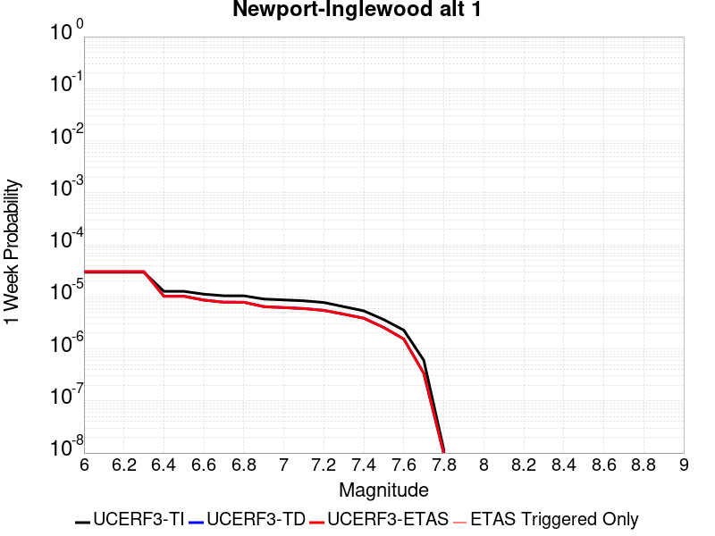 |  | 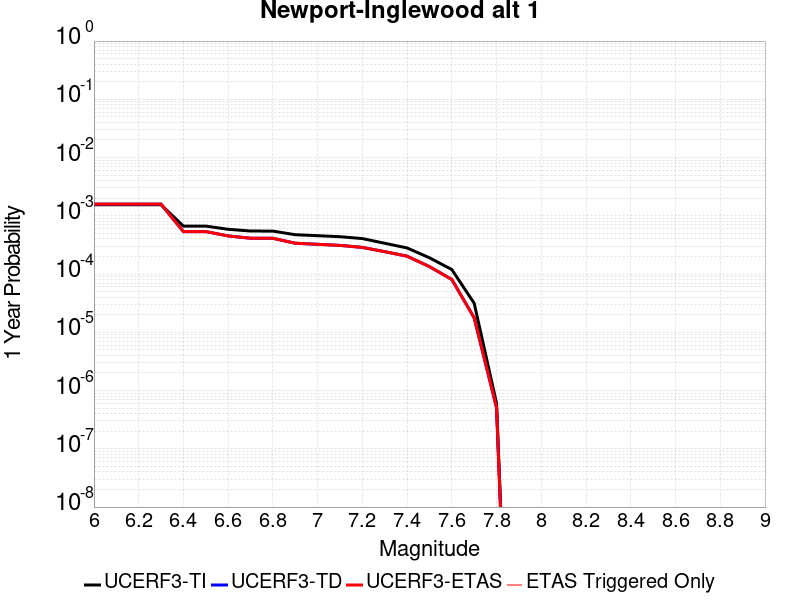 | 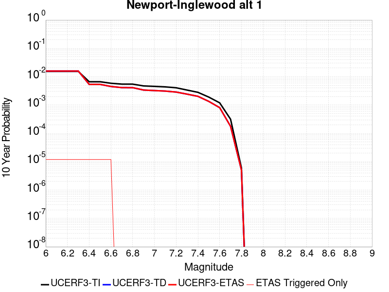 |

| Magnitude | 1 wk TI Prob | 1 wk TD Prob | 1 wk ETAS Prob | 1 wk ETAS/TD Gain | 1 wk ETAS Triggered Only | 1 mo TI Prob | 1 mo TD Prob | 1 mo ETAS Prob | 1 mo ETAS/TD Gain | 1 mo ETAS Triggered Only | 1 yr TI Prob | 1 yr TD Prob | 1 yr ETAS Prob | 1 yr ETAS/TD Gain | 1 yr ETAS Triggered Only | 10 yr TI Prob | 10 yr TD Prob | 10 yr ETAS Prob | 10 yr ETAS/TD Gain | 10 yr ETAS Triggered Only |
|-----|-----|-----|-----|-----|-----|-----|-----|-----|-----|-----|-----|-----|-----|-----|-----|-----|-----|-----|-----|-----|
| 6.0 | 2.9668912E-5 | 3.0405516E-5 | 3.0405516E-5 | 1.0 | 0.0 | 1.2714628E-4 | 1.3030559E-4 | 1.3030559E-4 | 1.0 | 0.0 | 0.0015469068 | 0.0015857986 | 0.0015857986 | 1.0 | 0.0 | 0.015361829 | 0.015792403 | 0.015804203 | 1.0007472 | 1.1990408E-5 |
| 6.1 | 2.9668912E-5 | 3.0405516E-5 | 3.0405516E-5 | 1.0 | 0.0 | 1.2714628E-4 | 1.3030559E-4 | 1.3030559E-4 | 1.0 | 0.0 | 0.0015469068 | 0.0015857986 | 0.0015857986 | 1.0 | 0.0 | 0.015361829 | 0.015792403 | 0.015804203 | 1.0007472 | 1.1990408E-5 |
| 6.2 | 2.9668912E-5 | 3.0405516E-5 | 3.0405516E-5 | 1.0 | 0.0 | 1.2714628E-4 | 1.3030559E-4 | 1.3030559E-4 | 1.0 | 0.0 | 0.0015469068 | 0.0015857986 | 0.0015857986 | 1.0 | 0.0 | 0.015361829 | 0.015792403 | 0.015804203 | 1.0007472 | 1.1990408E-5 |
| 6.3 | 2.9668912E-5 | 3.0405516E-5 | 3.0405516E-5 | 1.0 | 0.0 | 1.2714628E-4 | 1.3030559E-4 | 1.3030559E-4 | 1.0 | 0.0 | 0.0015469068 | 0.0015857986 | 0.0015857986 | 1.0 | 0.0 | 0.015361829 | 0.015792403 | 0.015804203 | 1.0007472 | 1.1990408E-5 |
| 6.4 | 1.275942E-5 | 1.0272664E-5 | 1.0272664E-5 | 1.0 | 0.0 | 5.4682085E-5 | 4.4024986E-5 | 4.4024986E-5 | 1.0 | 0.0 | 6.65551E-4 | 5.3587655E-4 | 5.3587655E-4 | 1.0 | 0.0 | 0.0066356123 | 0.0053462684 | 0.0053581945 | 1.0022308 | 1.1990408E-5 |
| 6.5 | 1.275942E-5 | 1.0272664E-5 | 1.0272664E-5 | 1.0 | 0.0 | 5.4682085E-5 | 4.4024986E-5 | 4.4024986E-5 | 1.0 | 0.0 | 6.65551E-4 | 5.3587655E-4 | 5.3587655E-4 | 1.0 | 0.0 | 0.0066356123 | 0.0053462684 | 0.0053581945 | 1.0022308 | 1.1990408E-5 |
| 6.6 | 1.1255358E-5 | 8.662018E-6 | 8.662018E-6 | 1.0 | 0.0 | 4.8236358E-5 | 3.7122416E-5 | 3.7122416E-5 | 1.0 | 0.0 | 5.871194E-4 | 4.5187338E-4 | 4.5187338E-4 | 1.0 | 0.0 | 0.005855706 | 0.004509723 | 0.004521659 | 1.0026468 | 1.1990408E-5 |
| 6.7 | 1.0504745E-5 | 7.899919E-6 | 7.899919E-6 | 1.0 | 0.0 | 4.5019555E-5 | 3.3856366E-5 | 3.3856366E-5 | 1.0 | 0.0 | 5.4797524E-4 | 4.1212453E-4 | 4.1212453E-4 | 1.0 | 0.0 | 0.0054662596 | 0.0041137324 | 0.0041137324 | 1.0 | 0.0 |
| 6.8 | 1.0476007E-5 | 7.881301E-6 | 7.881301E-6 | 1.0 | 0.0 | 4.4896402E-5 | 3.377657E-5 | 3.377657E-5 | 1.0 | 0.0 | 5.464766E-4 | 4.1115342E-4 | 4.1115342E-4 | 1.0 | 0.0 | 0.005451347 | 0.0041040573 | 0.0041040573 | 1.0 | 0.0 |
| 6.9 | 9.076797E-6 | 6.489738E-6 | 6.489738E-6 | 1.0 | 0.0 | 3.889998E-5 | 2.7812868E-5 | 2.7812868E-5 | 1.0 | 0.0 | 4.7350433E-4 | 3.385694E-4 | 3.385694E-4 | 1.0 | 0.0 | 0.004724967 | 0.0033805731 | 0.0033805731 | 1.0 | 0.0 |
| 7.0 | 8.73795E-6 | 6.212118E-6 | 6.212118E-6 | 1.0 | 0.0 | 3.7447822E-5 | 2.6623095E-5 | 2.6623095E-5 | 1.0 | 0.0 | 4.5583185E-4 | 3.2408824E-4 | 3.2408824E-4 | 1.0 | 0.0 | 0.0045489795 | 0.0032361876 | 0.0032361876 | 1.0 | 0.0 |
| 7.1 | 8.391299E-6 | 5.955894E-6 | 5.955894E-6 | 1.0 | 0.0 | 3.5962214E-5 | 2.552501E-5 | 2.552501E-5 | 1.0 | 0.0 | 4.37752E-4 | 3.1072294E-4 | 3.1072294E-4 | 1.0 | 0.0 | 0.004368907 | 0.0031029144 | 0.0031029144 | 1.0 | 0.0 |
| 7.2 | 7.796882E-6 | 5.496635E-6 | 5.496635E-6 | 1.0 | 0.0 | 3.341478E-5 | 2.3556795E-5 | 2.3556795E-5 | 1.0 | 0.0 | 4.06749E-4 | 2.8676644E-4 | 2.8676644E-4 | 1.0 | 0.0 | 0.0040600533 | 0.002863988 | 0.002863988 | 1.0 | 0.0 |
| 7.3 | 6.4738833E-6 | 4.647859E-6 | 4.647859E-6 | 1.0 | 0.0 | 2.774492E-5 | 1.9919245E-5 | 1.9919245E-5 | 1.0 | 0.0 | 3.3774204E-4 | 2.4248997E-4 | 2.4248997E-4 | 1.0 | 0.0 | 0.0033722918 | 0.0024222704 | 0.0024222704 | 1.0 | 0.0 |
| 7.4 | 5.382145E-6 | 3.8857956E-6 | 3.8857956E-6 | 1.0 | 0.0 | 2.3066134E-5 | 1.6653305E-5 | 1.6653305E-5 | 1.0 | 0.0 | 2.8079396E-4 | 2.0273525E-4 | 2.0273525E-4 | 1.0 | 0.0 | 0.0028043943 | 0.0020255174 | 0.0020255174 | 1.0 | 0.0 |
| 7.5 | 3.648244E-6 | 2.573805E-6 | 2.573805E-6 | 1.0 | 0.0 | 1.5635238E-5 | 1.1030546E-5 | 1.1030546E-5 | 1.0 | 0.0 | 1.9034238E-4 | 1.3428873E-4 | 1.3428873E-4 | 1.0 | 0.0 | 0.0019017943 | 0.0013420862 | 0.0013420862 | 1.0 | 0.0 |
| 7.6 | 2.2906888E-6 | 1.5479983E-6 | 1.5479983E-6 | 1.0 | 0.0 | 9.817201E-6 | 6.6342623E-6 | 6.6342623E-6 | 1.0 | 0.0 | 1.1951787E-4 | 8.076921E-5 | 8.076921E-5 | 1.0 | 0.0 | 0.0011945361 | 8.0740533E-4 | 8.0740533E-4 | 1.0 | 0.0 |
| 7.7 | 6.0479874E-7 | 3.3975476E-7 | 3.3975476E-7 | 1.0 | 0.0 | 2.5919921E-6 | 1.456091E-6 | 1.456091E-6 | 1.0 | 0.0 | 3.1557047E-5 | 1.7727778E-5 | 1.7727778E-5 | 1.0 | 0.0 | 3.1552566E-4 | 1.7726503E-4 | 1.7726503E-4 | 1.0 | 0.0 |
| 7.8 | 1.16056995E-8 | 9.782392E-9 | 9.782392E-9 | 1.0 | 0.0 | 4.9738713E-8 | 4.1924537E-8 | 4.1924537E-8 | 1.0 | 0.0 | 6.0556863E-7 | 5.104312E-7 | 5.104312E-7 | 1.0 | 0.0 | 6.05567E-6 | 5.104312E-6 | 5.104312E-6 | 1.0 | 0.0 |

## Channel Islands Western Deep Ramp
*[(top)](#table-of-contents)*

| 1 Week | 1 Month | 1 Year | 10 Year |
|-----|-----|-----|-----|
|  |  | 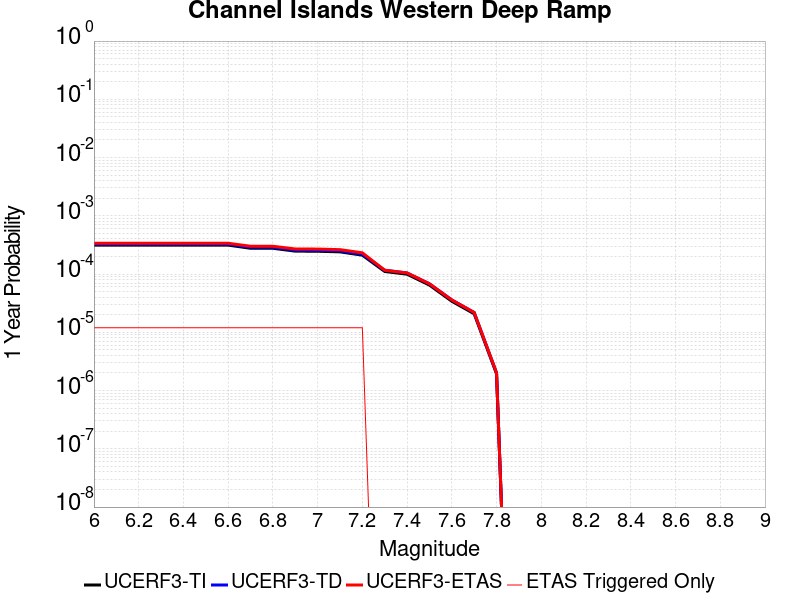 | 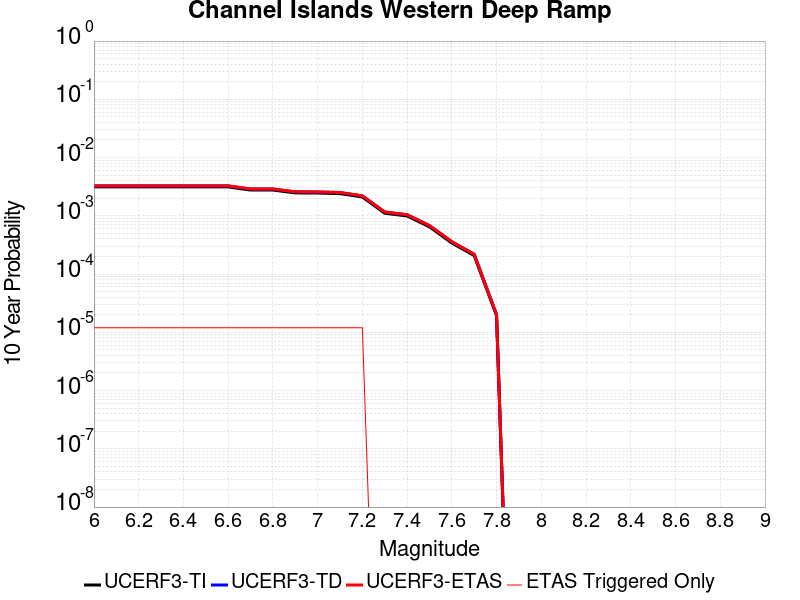 |

| Magnitude | 1 wk TI Prob | 1 wk TD Prob | 1 wk ETAS Prob | 1 wk ETAS/TD Gain | 1 wk ETAS Triggered Only | 1 mo TI Prob | 1 mo TD Prob | 1 mo ETAS Prob | 1 mo ETAS/TD Gain | 1 mo ETAS Triggered Only | 1 yr TI Prob | 1 yr TD Prob | 1 yr ETAS Prob | 1 yr ETAS/TD Gain | 1 yr ETAS Triggered Only | 10 yr TI Prob | 10 yr TD Prob | 10 yr ETAS Prob | 10 yr ETAS/TD Gain | 10 yr ETAS Triggered Only |
|-----|-----|-----|-----|-----|-----|-----|-----|-----|-----|-----|-----|-----|-----|-----|-----|-----|-----|-----|-----|-----|
| 6.0 | 6.0213506E-6 | 6.2549007E-6 | 6.2549007E-6 | 1.0 | 0.0 | 2.5805533E-5 | 2.6806467E-5 | 2.6806467E-5 | 1.0 | 0.0 | 3.1413708E-4 | 3.263243E-4 | 3.383108E-4 | 1.0367318 | 1.1990408E-5 | 0.0031369338 | 0.003258893 | 0.0032708445 | 1.0036674 | 1.1990408E-5 |
| 6.1 | 6.0213506E-6 | 6.2549007E-6 | 6.2549007E-6 | 1.0 | 0.0 | 2.5805533E-5 | 2.6806467E-5 | 2.6806467E-5 | 1.0 | 0.0 | 3.1413708E-4 | 3.263243E-4 | 3.383108E-4 | 1.0367318 | 1.1990408E-5 | 0.0031369338 | 0.003258893 | 0.0032708445 | 1.0036674 | 1.1990408E-5 |
| 6.2 | 6.0213506E-6 | 6.2549007E-6 | 6.2549007E-6 | 1.0 | 0.0 | 2.5805533E-5 | 2.6806467E-5 | 2.6806467E-5 | 1.0 | 0.0 | 3.1413708E-4 | 3.263243E-4 | 3.383108E-4 | 1.0367318 | 1.1990408E-5 | 0.0031369338 | 0.003258893 | 0.0032708445 | 1.0036674 | 1.1990408E-5 |
| 6.3 | 6.0213506E-6 | 6.2549007E-6 | 6.2549007E-6 | 1.0 | 0.0 | 2.5805533E-5 | 2.6806467E-5 | 2.6806467E-5 | 1.0 | 0.0 | 3.1413708E-4 | 3.263243E-4 | 3.383108E-4 | 1.0367318 | 1.1990408E-5 | 0.0031369338 | 0.003258893 | 0.0032708445 | 1.0036674 | 1.1990408E-5 |
| 6.4 | 6.0213506E-6 | 6.2549007E-6 | 6.2549007E-6 | 1.0 | 0.0 | 2.5805533E-5 | 2.6806467E-5 | 2.6806467E-5 | 1.0 | 0.0 | 3.1413708E-4 | 3.263243E-4 | 3.383108E-4 | 1.0367318 | 1.1990408E-5 | 0.0031369338 | 0.003258893 | 0.0032708445 | 1.0036674 | 1.1990408E-5 |
| 6.5 | 6.0213506E-6 | 6.2549007E-6 | 6.2549007E-6 | 1.0 | 0.0 | 2.5805533E-5 | 2.6806467E-5 | 2.6806467E-5 | 1.0 | 0.0 | 3.1413708E-4 | 3.263243E-4 | 3.383108E-4 | 1.0367318 | 1.1990408E-5 | 0.0031369338 | 0.003258893 | 0.0032708445 | 1.0036674 | 1.1990408E-5 |
| 6.6 | 6.0213506E-6 | 6.2549007E-6 | 6.2549007E-6 | 1.0 | 0.0 | 2.5805533E-5 | 2.6806467E-5 | 2.6806467E-5 | 1.0 | 0.0 | 3.1413708E-4 | 3.263243E-4 | 3.383108E-4 | 1.0367318 | 1.1990408E-5 | 0.0031369338 | 0.003258893 | 0.0032708445 | 1.0036674 | 1.1990408E-5 |
| 6.7 | 5.313309E-6 | 5.52527E-6 | 5.52527E-6 | 1.0 | 0.0 | 2.2771126E-5 | 2.3679535E-5 | 2.3679535E-5 | 1.0 | 0.0 | 2.772032E-4 | 2.882643E-4 | 3.0025124E-4 | 1.0415832 | 1.1990408E-5 | 0.0027685766 | 0.002879307 | 0.0028912628 | 1.0041523 | 1.1990408E-5 |
| 6.8 | 5.313309E-6 | 5.52527E-6 | 5.52527E-6 | 1.0 | 0.0 | 2.2771126E-5 | 2.3679535E-5 | 2.3679535E-5 | 1.0 | 0.0 | 2.772032E-4 | 2.882643E-4 | 3.0025124E-4 | 1.0415832 | 1.1990408E-5 | 0.0027685766 | 0.002879307 | 0.0028912628 | 1.0041523 | 1.1990408E-5 |
| 6.9 | 4.744377E-6 | 4.9394575E-6 | 4.9394575E-6 | 1.0 | 0.0 | 2.0332885E-5 | 2.1168953E-5 | 2.1168953E-5 | 1.0 | 0.0 | 2.4752476E-4 | 2.5770525E-4 | 2.6969257E-4 | 1.0465156 | 1.1990408E-5 | 0.0024724922 | 0.0025744315 | 0.002586391 | 1.0046455 | 1.1990408E-5 |
| 7.0 | 4.722209E-6 | 4.9165E-6 | 4.9165E-6 | 1.0 | 0.0 | 2.0237881E-5 | 2.1070566E-5 | 2.1070566E-5 | 1.0 | 0.0 | 2.4636835E-4 | 2.5650766E-4 | 2.68495E-4 | 1.0467328 | 1.1990408E-5 | 0.002460954 | 0.0025624833 | 0.0025744431 | 1.0046673 | 1.1990408E-5 |
| 7.1 | 4.611174E-6 | 4.8014354E-6 | 4.8014354E-6 | 1.0 | 0.0 | 1.9762025E-5 | 2.057744E-5 | 2.057744E-5 | 1.0 | 0.0 | 2.4057609E-4 | 2.5050525E-4 | 2.6249266E-4 | 1.0478529 | 1.1990408E-5 | 0.002403158 | 0.0025025955 | 0.002514556 | 1.0047792 | 1.1990408E-5 |
| 7.2 | 4.043994E-6 | 4.21205E-6 | 4.21205E-6 | 1.0 | 0.0 | 1.7331287E-5 | 1.8051538E-5 | 1.8051538E-5 | 1.0 | 0.0 | 2.10988E-4 | 2.1975888E-4 | 2.3174664E-4 | 1.0545497 | 1.1990408E-5 | 0.002107878 | 0.0021957664 | 0.0022077304 | 1.0054487 | 1.1990408E-5 |
| 7.3 | 2.1233036E-6 | 2.2298022E-6 | 2.2298022E-6 | 1.0 | 0.0 | 9.099841E-6 | 9.556261E-6 | 9.556261E-6 | 1.0 | 0.0 | 1.1078493E-4 | 1.1634132E-4 | 1.1634132E-4 | 1.0 | 0.0 | 0.0011072971 | 0.0011628097 | 0.0011628097 | 1.0 | 0.0 |
| 7.4 | 1.9051884E-6 | 2.0015107E-6 | 2.0015107E-6 | 1.0 | 0.0 | 8.165067E-6 | 8.577875E-6 | 8.577875E-6 | 1.0 | 0.0 | 9.940516E-5 | 1.0443068E-4 | 1.0443068E-4 | 1.0 | 0.0 | 9.93607E-4 | 0.0010438213 | 0.0010438213 | 1.0 | 0.0 |
| 7.5 | 1.2408497E-6 | 1.3038928E-6 | 1.3038928E-6 | 1.0 | 0.0 | 5.317916E-6 | 5.5880996E-6 | 5.5880996E-6 | 1.0 | 0.0 | 6.4743705E-5 | 6.803301E-5 | 6.803301E-5 | 1.0 | 0.0 | 6.4724847E-4 | 6.8012404E-4 | 6.8012404E-4 | 1.0 | 0.0 |
| 7.6 | 6.5440025E-7 | 6.886766E-7 | 6.886766E-7 | 1.0 | 0.0 | 2.8045695E-6 | 2.9514679E-6 | 2.9514679E-6 | 1.0 | 0.0 | 3.4145098E-5 | 3.5933543E-5 | 3.5933543E-5 | 1.0 | 0.0 | 3.4139853E-4 | 3.5927873E-4 | 3.5927873E-4 | 1.0 | 0.0 |
| 7.7 | 3.985963E-7 | 4.1931077E-7 | 4.1931077E-7 | 1.0 | 0.0 | 1.7082689E-6 | 1.797045E-6 | 1.797045E-6 | 1.0 | 0.0 | 2.0797976E-5 | 2.1878815E-5 | 2.1878815E-5 | 1.0 | 0.0 | 2.0796029E-4 | 2.1876777E-4 | 2.1876777E-4 | 1.0 | 0.0 |
| 7.8 | 3.706329E-8 | 3.8592006E-8 | 3.8592006E-8 | 1.0 | 0.0 | 1.5884267E-7 | 1.653943E-7 | 1.653943E-7 | 1.0 | 0.0 | 1.9339077E-6 | 2.0136738E-6 | 2.0136738E-6 | 1.0 | 0.0 | 1.933891E-5 | 2.0136567E-5 | 2.0136567E-5 | 1.0 | 0.0 |

## Ozena
*[(top)](#table-of-contents)*

| 1 Week | 1 Month | 1 Year | 10 Year |
|-----|-----|-----|-----|
|  | 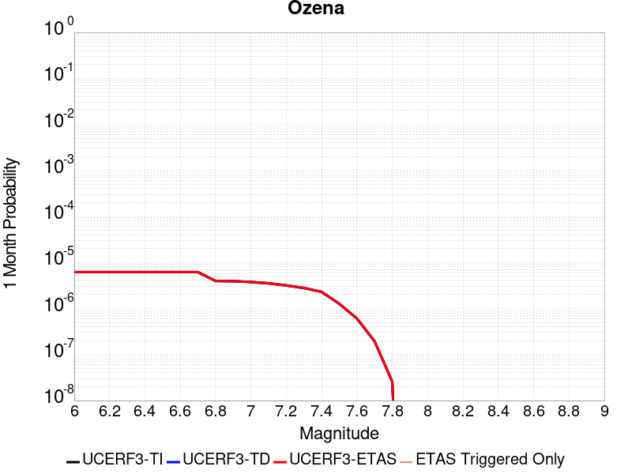 | 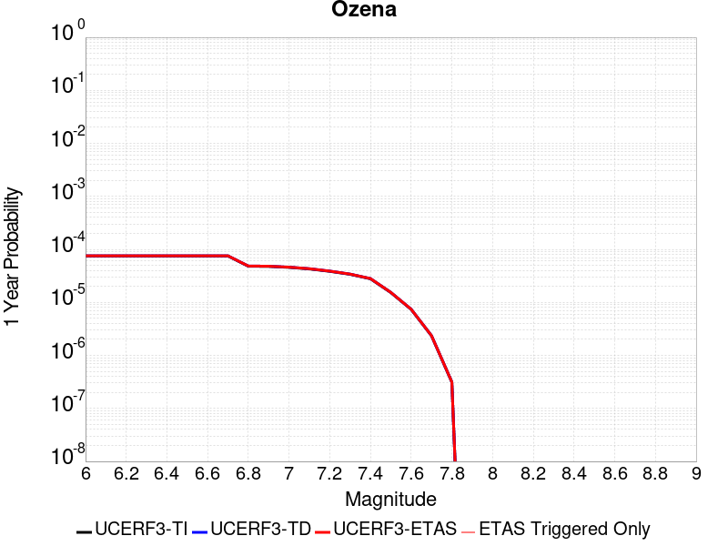 |  |

| Magnitude | 1 wk TI Prob | 1 wk TD Prob | 1 wk ETAS Prob | 1 wk ETAS/TD Gain | 1 wk ETAS Triggered Only | 1 mo TI Prob | 1 mo TD Prob | 1 mo ETAS Prob | 1 mo ETAS/TD Gain | 1 mo ETAS Triggered Only | 1 yr TI Prob | 1 yr TD Prob | 1 yr ETAS Prob | 1 yr ETAS/TD Gain | 1 yr ETAS Triggered Only | 10 yr TI Prob | 10 yr TD Prob | 10 yr ETAS Prob | 10 yr ETAS/TD Gain | 10 yr ETAS Triggered Only |
|-----|-----|-----|-----|-----|-----|-----|-----|-----|-----|-----|-----|-----|-----|-----|-----|-----|-----|-----|-----|-----|
| 6.0 | 1.4377547E-6 | 1.4513802E-6 | 1.4513802E-6 | 1.0 | 0.0 | 6.161791E-6 | 6.220187E-6 | 6.220187E-6 | 1.0 | 0.0 | 7.5017226E-5 | 7.572842E-5 | 7.572842E-5 | 1.0 | 0.0 | 7.4991904E-4 | 7.5705274E-4 | 7.690341E-4 | 1.0158262 | 1.1990408E-5 |
| 6.1 | 1.4377547E-6 | 1.4513802E-6 | 1.4513802E-6 | 1.0 | 0.0 | 6.161791E-6 | 6.220187E-6 | 6.220187E-6 | 1.0 | 0.0 | 7.5017226E-5 | 7.572842E-5 | 7.572842E-5 | 1.0 | 0.0 | 7.4991904E-4 | 7.5705274E-4 | 7.690341E-4 | 1.0158262 | 1.1990408E-5 |
| 6.2 | 1.4377547E-6 | 1.4513802E-6 | 1.4513802E-6 | 1.0 | 0.0 | 6.161791E-6 | 6.220187E-6 | 6.220187E-6 | 1.0 | 0.0 | 7.5017226E-5 | 7.572842E-5 | 7.572842E-5 | 1.0 | 0.0 | 7.4991904E-4 | 7.5705274E-4 | 7.690341E-4 | 1.0158262 | 1.1990408E-5 |
| 6.3 | 1.4377547E-6 | 1.4513802E-6 | 1.4513802E-6 | 1.0 | 0.0 | 6.161791E-6 | 6.220187E-6 | 6.220187E-6 | 1.0 | 0.0 | 7.5017226E-5 | 7.572842E-5 | 7.572842E-5 | 1.0 | 0.0 | 7.4991904E-4 | 7.5705274E-4 | 7.690341E-4 | 1.0158262 | 1.1990408E-5 |
| 6.4 | 1.4377547E-6 | 1.4513802E-6 | 1.4513802E-6 | 1.0 | 0.0 | 6.161791E-6 | 6.220187E-6 | 6.220187E-6 | 1.0 | 0.0 | 7.5017226E-5 | 7.572842E-5 | 7.572842E-5 | 1.0 | 0.0 | 7.4991904E-4 | 7.5705274E-4 | 7.690341E-4 | 1.0158262 | 1.1990408E-5 |
| 6.5 | 1.4377547E-6 | 1.4513802E-6 | 1.4513802E-6 | 1.0 | 0.0 | 6.161791E-6 | 6.220187E-6 | 6.220187E-6 | 1.0 | 0.0 | 7.5017226E-5 | 7.572842E-5 | 7.572842E-5 | 1.0 | 0.0 | 7.4991904E-4 | 7.5705274E-4 | 7.690341E-4 | 1.0158262 | 1.1990408E-5 |
| 6.6 | 1.4377547E-6 | 1.4513802E-6 | 1.4513802E-6 | 1.0 | 0.0 | 6.161791E-6 | 6.220187E-6 | 6.220187E-6 | 1.0 | 0.0 | 7.5017226E-5 | 7.572842E-5 | 7.572842E-5 | 1.0 | 0.0 | 7.4991904E-4 | 7.5705274E-4 | 7.690341E-4 | 1.0158262 | 1.1990408E-5 |
| 6.7 | 1.4377547E-6 | 1.4513802E-6 | 1.4513802E-6 | 1.0 | 0.0 | 6.161791E-6 | 6.220187E-6 | 6.220187E-6 | 1.0 | 0.0 | 7.5017226E-5 | 7.572842E-5 | 7.572842E-5 | 1.0 | 0.0 | 7.4991904E-4 | 7.5705274E-4 | 7.690341E-4 | 1.0158262 | 1.1990408E-5 |
| 6.8 | 9.223257E-7 | 9.317636E-7 | 9.317636E-7 | 1.0 | 0.0 | 3.9528186E-6 | 3.9932665E-6 | 3.9932665E-6 | 1.0 | 0.0 | 4.81245E-5 | 4.8616977E-5 | 4.8616977E-5 | 1.0 | 0.0 | 4.811408E-4 | 4.8606747E-4 | 4.8606747E-4 | 1.0 | 0.0 |
| 6.9 | 9.141515E-7 | 9.235383E-7 | 9.235383E-7 | 1.0 | 0.0 | 3.917786E-6 | 3.958016E-6 | 3.958016E-6 | 1.0 | 0.0 | 4.7698002E-5 | 4.8187816E-5 | 4.8187816E-5 | 1.0 | 0.0 | 4.7687767E-4 | 4.817777E-4 | 4.817777E-4 | 1.0 | 0.0 |
| 7.0 | 8.767648E-7 | 8.858589E-7 | 8.858589E-7 | 1.0 | 0.0 | 3.757558E-6 | 3.7965328E-6 | 3.7965328E-6 | 1.0 | 0.0 | 4.5747307E-5 | 4.622185E-5 | 4.622185E-5 | 1.0 | 0.0 | 4.5737892E-4 | 4.6212628E-4 | 4.6212628E-4 | 1.0 | 0.0 |
| 7.1 | 8.199402E-7 | 8.2854103E-7 | 8.2854103E-7 | 1.0 | 0.0 | 3.5140247E-6 | 3.5508854E-6 | 3.5508854E-6 | 1.0 | 0.0 | 4.2782412E-5 | 4.323121E-5 | 4.323121E-5 | 1.0 | 0.0 | 4.2774176E-4 | 4.3223173E-4 | 4.3223173E-4 | 1.0 | 0.0 |
| 7.2 | 7.38705E-7 | 7.4642725E-7 | 7.4642725E-7 | 1.0 | 0.0 | 3.1658747E-6 | 3.1989703E-6 | 3.1989703E-6 | 1.0 | 0.0 | 3.8543843E-5 | 3.8946804E-5 | 3.8946804E-5 | 1.0 | 0.0 | 3.853716E-4 | 3.8940329E-4 | 3.8940329E-4 | 1.0 | 0.0 |
| 7.3 | 6.490017E-7 | 6.557811E-7 | 6.557811E-7 | 1.0 | 0.0 | 2.7814328E-6 | 2.8104876E-6 | 2.8104876E-6 | 1.0 | 0.0 | 3.386342E-5 | 3.421718E-5 | 3.421718E-5 | 1.0 | 0.0 | 3.3858258E-4 | 3.421225E-4 | 3.421225E-4 | 1.0 | 0.0 |
| 7.4 | 5.346736E-7 | 5.4022684E-7 | 5.4022684E-7 | 1.0 | 0.0 | 2.291456E-6 | 2.3152559E-6 | 2.3152559E-6 | 1.0 | 0.0 | 2.789812E-5 | 2.8187907E-5 | 2.8187907E-5 | 1.0 | 0.0 | 2.789462E-4 | 2.8184635E-4 | 2.8184635E-4 | 1.0 | 0.0 |
| 7.5 | 2.939325E-7 | 2.9666094E-7 | 2.9666094E-7 | 1.0 | 0.0 | 1.25971E-6 | 1.2714034E-6 | 1.2714034E-6 | 1.0 | 0.0 | 1.5336862E-5 | 1.5479243E-5 | 1.5479243E-5 | 1.0 | 0.0 | 1.5335804E-4 | 1.5478328E-4 | 1.5478328E-4 | 1.0 | 0.0 |
| 7.6 | 1.4151905E-7 | 1.4253278E-7 | 1.4253278E-7 | 1.0 | 0.0 | 6.065101E-7 | 6.1085467E-7 | 6.1085467E-7 | 1.0 | 0.0 | 7.3842357E-6 | 7.437131E-6 | 7.437131E-6 | 1.0 | 0.0 | 7.38399E-5 | 7.4368894E-5 | 7.4368894E-5 | 1.0 | 0.0 |
| 7.7 | 4.4957577E-8 | 4.5252282E-8 | 4.5252282E-8 | 1.0 | 0.0 | 1.9267533E-7 | 1.9393833E-7 | 1.9393833E-7 | 1.0 | 0.0 | 2.3458194E-6 | 2.3611967E-6 | 2.3611967E-6 | 1.0 | 0.0 | 2.3457947E-5 | 2.3611727E-5 | 2.3611727E-5 | 1.0 | 0.0 |
| 7.8 | 5.9993255E-9 | 6.041303E-9 | 6.041303E-9 | 1.0 | 0.0 | 2.5711394E-8 | 2.5891298E-8 | 2.5891298E-8 | 1.0 | 0.0 | 3.1303617E-7 | 3.1522652E-7 | 3.1522652E-7 | 1.0 | 0.0 | 3.1303573E-6 | 3.1522618E-6 | 3.1522618E-6 | 1.0 | 0.0 |

## Calaveras (So) 2011 CFM
*[(top)](#table-of-contents)*

| 1 Week | 1 Month | 1 Year | 10 Year |
|-----|-----|-----|-----|
| 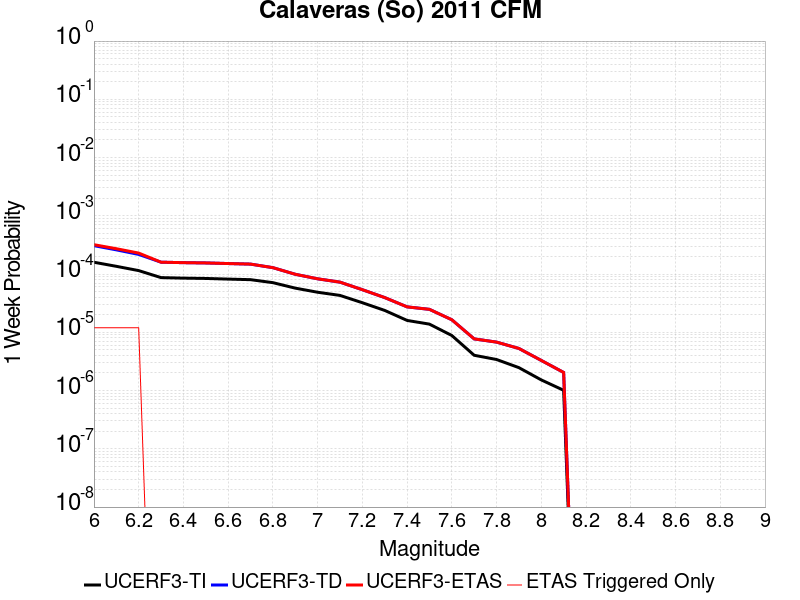 | 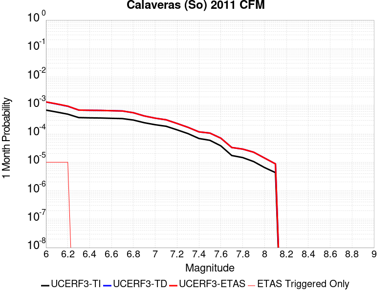 | 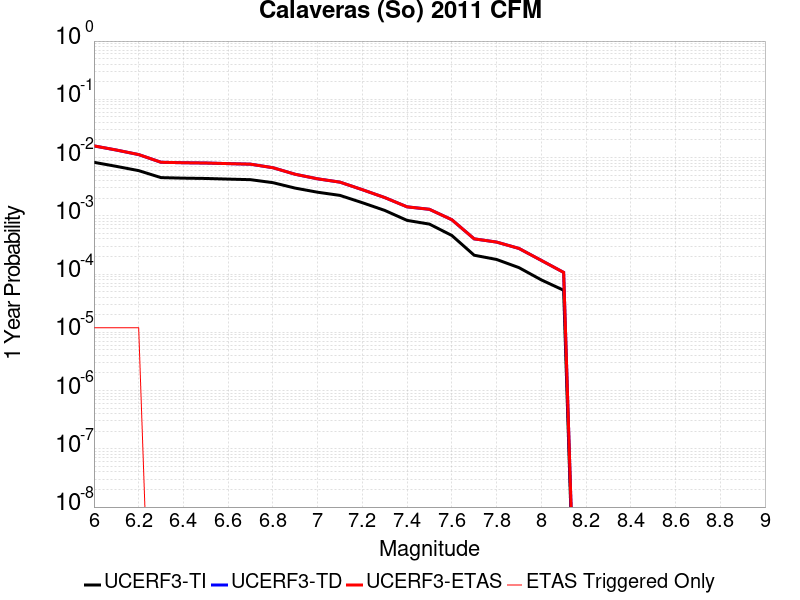 | 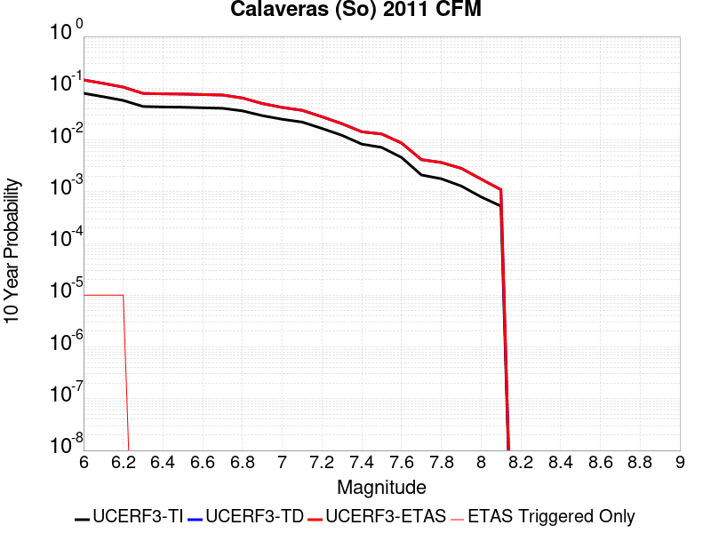 |

| Magnitude | 1 wk TI Prob | 1 wk TD Prob | 1 wk ETAS Prob | 1 wk ETAS/TD Gain | 1 wk ETAS Triggered Only | 1 mo TI Prob | 1 mo TD Prob | 1 mo ETAS Prob | 1 mo ETAS/TD Gain | 1 mo ETAS Triggered Only | 1 yr TI Prob | 1 yr TD Prob | 1 yr ETAS Prob | 1 yr ETAS/TD Gain | 1 yr ETAS Triggered Only | 10 yr TI Prob | 10 yr TD Prob | 10 yr ETAS Prob | 10 yr ETAS/TD Gain | 10 yr ETAS Triggered Only |
|-----|-----|-----|-----|-----|-----|-----|-----|-----|-----|-----|-----|-----|-----|-----|-----|-----|-----|-----|-----|-----|
| 6.0 | 1.5950744E-4 | 3.0719102E-4 | 3.1917775E-4 | 1.0390204 | 1.1990408E-5 | 6.834242E-4 | 0.0013158836 | 0.0013278582 | 1.0091001 | 1.1990408E-5 | 0.00828899 | 0.015860915 | 0.015872715 | 1.000744 | 1.1990408E-5 | 0.079865426 | 0.14441721 | 0.14442748 | 1.000071 | 1.1990408E-5 |
| 6.1 | 1.3584697E-4 | 2.604323E-4 | 2.724196E-4 | 1.0460284 | 1.1990408E-5 | 5.8207137E-4 | 0.0011156795 | 0.0011276565 | 1.0107352 | 1.1990408E-5 | 0.007063716 | 0.013463869 | 0.0134756975 | 1.0008786 | 1.1990408E-5 | 0.06843361 | 0.124044694 | 0.1240552 | 1.0000846 | 1.1990408E-5 |
| 6.2 | 1.14676266E-4 | 2.1731424E-4 | 2.2930204E-4 | 1.0551635 | 1.1990408E-5 | 4.9137714E-4 | 9.310301E-4 | 9.4300933E-4 | 1.0128666 | 1.1990408E-5 | 0.0059661185 | 0.01124721 | 0.011259065 | 1.001054 | 1.1990408E-5 | 0.058084648 | 0.10503508 | 0.10504582 | 1.0001022 | 1.1990408E-5 |
| 6.3 | 8.691518E-5 | 1.5990793E-4 | 1.5990793E-4 | 1.0 | 0.0 | 3.7244044E-4 | 6.851358E-4 | 6.851358E-4 | 1.0 | 0.0 | 0.004525038 | 0.008302716 | 0.008302716 | 1.0 | 0.0 | 0.044339992 | 0.079350494 | 0.079350494 | 1.0 | 0.0 |
| 6.4 | 8.50982E-5 | 1.5697183E-4 | 1.5697183E-4 | 1.0 | 0.0 | 3.646556E-4 | 6.725591E-4 | 6.725591E-4 | 1.0 | 0.0 | 0.0044306475 | 0.008150746 | 0.008150746 | 1.0 | 0.0 | 0.04343345 | 0.0779566 | 0.0779566 | 1.0 | 0.0 |
| 6.5 | 8.4062965E-5 | 1.5521735E-4 | 1.5521735E-4 | 1.0 | 0.0 | 3.602201E-4 | 6.650437E-4 | 6.650437E-4 | 1.0 | 0.0 | 0.004376863 | 0.008059946 | 0.008059946 | 1.0 | 0.0 | 0.042916555 | 0.07712786 | 0.07712786 | 1.0 | 0.0 |
| 6.6 | 8.194716E-5 | 1.5157646E-4 | 1.5157646E-4 | 1.0 | 0.0 | 3.5115483E-4 | 6.494477E-4 | 6.494477E-4 | 1.0 | 0.0 | 0.0042669317 | 0.007871782 | 0.007871782 | 1.0 | 0.0 | 0.04185927 | 0.075413086 | 0.075413086 | 1.0 | 0.0 |
| 6.7 | 8.012326E-5 | 1.4825336E-4 | 1.4825336E-4 | 1.0 | 0.0 | 3.433402E-4 | 6.3521386E-4 | 6.3521386E-4 | 1.0 | 0.0 | 0.004172157 | 0.0077002714 | 0.0077002714 | 1.0 | 0.0 | 0.040946912 | 0.073855184 | 0.073855184 | 1.0 | 0.0 |
| 6.8 | 7.119773E-5 | 1.2883788E-4 | 1.2883788E-4 | 1.0 | 0.0 | 3.0509746E-4 | 5.5204553E-4 | 5.5204553E-4 | 1.0 | 0.0 | 0.0037082357 | 0.0066975304 | 0.0066975304 | 1.0 | 0.0 | 0.036469642 | 0.064698465 | 0.064698465 | 1.0 | 0.0 |
| 6.9 | 5.7343088E-5 | 9.921204E-5 | 9.921204E-5 | 1.0 | 0.0 | 2.4573295E-4 | 4.2512562E-4 | 4.2512562E-4 | 1.0 | 0.0 | 0.0029876942 | 0.005163703 | 0.005163703 | 1.0 | 0.0 | 0.02947844 | 0.050519872 | 0.050519872 | 1.0 | 0.0 |
| 7.0 | 4.8746577E-5 | 8.286983E-5 | 8.286983E-5 | 1.0 | 0.0 | 2.0889717E-4 | 3.5510844E-4 | 3.5510844E-4 | 1.0 | 0.0 | 0.0025403565 | 0.004314941 | 0.004314941 | 1.0 | 0.0 | 0.025115121 | 0.042495564 | 0.042495564 | 1.0 | 0.0 |
| 7.1 | 4.2998014E-5 | 7.266396E-5 | 7.266396E-5 | 1.0 | 0.0 | 1.8426418E-4 | 3.1138014E-4 | 3.1138014E-4 | 1.0 | 0.0 | 0.002241108 | 0.0037845233 | 0.0037845233 | 1.0 | 0.0 | 0.022186412 | 0.03743038 | 0.03743038 | 1.0 | 0.0 |
| 7.2 | 3.221292E-5 | 5.3919634E-5 | 5.3919634E-5 | 1.0 | 0.0 | 1.3804805E-4 | 2.3106382E-4 | 2.3106382E-4 | 1.0 | 0.0 | 0.0016794393 | 0.002809601 | 0.002809601 | 1.0 | 0.0 | 0.016668037 | 0.0280428 | 0.0280428 | 1.0 | 0.0 |
| 7.3 | 2.3756531E-5 | 3.9484363E-5 | 3.9484363E-5 | 1.0 | 0.0 | 1.0180973E-4 | 1.6920782E-4 | 1.6920782E-4 | 1.0 | 0.0 | 0.0012388286 | 0.0020581756 | 0.0020581756 | 1.0 | 0.0 | 0.012319452 | 0.020649675 | 0.020649675 | 1.0 | 0.0 |
| 7.4 | 1.5997684E-5 | 2.7347376E-5 | 2.7347376E-5 | 1.0 | 0.0 | 6.8559704E-5 | 1.17197786E-4 | 1.17197786E-4 | 1.0 | 0.0 | 8.343947E-4 | 0.0014259516 | 0.0014259516 | 1.0 | 0.0 | 0.008312687 | 0.014379721 | 0.014379721 | 1.0 | 0.0 |
| 7.5 | 1.3814293E-5 | 2.4788933E-5 | 2.4788933E-5 | 1.0 | 0.0 | 5.9202768E-5 | 1.0623397E-4 | 1.0623397E-4 | 1.0 | 0.0 | 7.205553E-4 | 0.0012926336 | 0.0012926336 | 1.0 | 0.0 | 0.007182234 | 0.013058846 | 0.013058846 | 1.0 | 0.0 |
| 7.6 | 8.817309E-6 | 1.643521E-5 | 1.643521E-5 | 1.0 | 0.0 | 3.7787922E-5 | 7.043472E-5 | 7.043472E-5 | 1.0 | 0.0 | 4.5997082E-4 | 8.572067E-4 | 8.572067E-4 | 1.0 | 0.0 | 0.004590199 | 0.008722494 | 0.008722494 | 1.0 | 0.0 |
| 7.7 | 4.0352206E-6 | 7.711002E-6 | 7.711002E-6 | 1.0 | 0.0 | 1.7293689E-5 | 3.304673E-5 | 3.304673E-5 | 1.0 | 0.0 | 2.1053031E-4 | 4.0226974E-4 | 4.0226974E-4 | 1.0 | 0.0 | 0.0021033096 | 0.00416701 | 0.00416701 | 1.0 | 0.0 |
| 7.8 | 3.413169E-6 | 6.7905053E-6 | 6.7905053E-6 | 1.0 | 0.0 | 1.4627784E-5 | 2.910184E-5 | 2.910184E-5 | 1.0 | 0.0 | 1.7807873E-4 | 3.5425735E-4 | 3.5425735E-4 | 1.0 | 0.0 | 0.0017793609 | 0.0036680899 | 0.0036680899 | 1.0 | 0.0 |
| 7.9 | 2.4740732E-6 | 5.2815635E-6 | 5.2815635E-6 | 1.0 | 0.0 | 1.06031275E-5 | 2.2635075E-5 | 2.2635075E-5 | 1.0 | 0.0 | 1.2908543E-4 | 2.7554724E-4 | 2.7554724E-4 | 1.0 | 0.0 | 0.0012901047 | 0.0028359778 | 0.0028359778 | 1.0 | 0.0 |
| 8.0 | 1.5231818E-6 | 3.2903374E-6 | 3.2903374E-6 | 1.0 | 0.0 | 6.527906E-6 | 1.410137E-5 | 1.410137E-5 | 1.0 | 0.0 | 7.9474354E-5 | 1.7167069E-4 | 1.7167069E-4 | 1.0 | 0.0 | 7.944594E-4 | 0.0017571712 | 0.0017571712 | 1.0 | 0.0 |
| 8.1 | 1.0104524E-6 | 2.0467116E-6 | 2.0467116E-6 | 1.0 | 0.0 | 4.330503E-6 | 8.771593E-6 | 8.771593E-6 | 1.0 | 0.0 | 5.2722597E-5 | 1.0678893E-4 | 1.0678893E-4 | 1.0 | 0.0 | 5.271009E-4 | 0.0010934469 | 0.0010934469 | 1.0 | 0.0 |

## Elysian Park (Lower CFM)
*[(top)](#table-of-contents)*

| 1 Week | 1 Month | 1 Year | 10 Year |
|-----|-----|-----|-----|
| 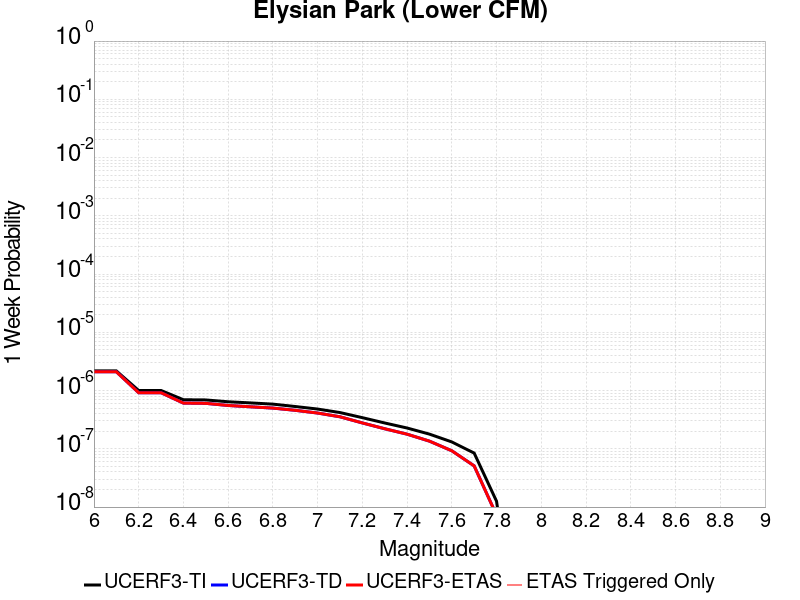 | 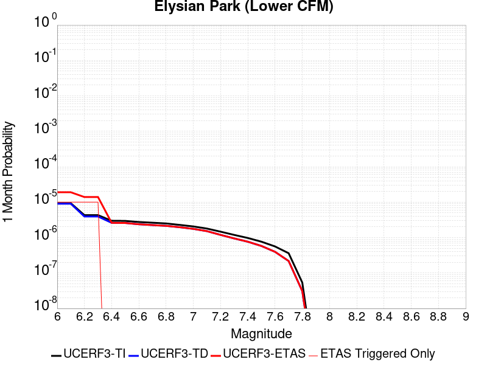 | 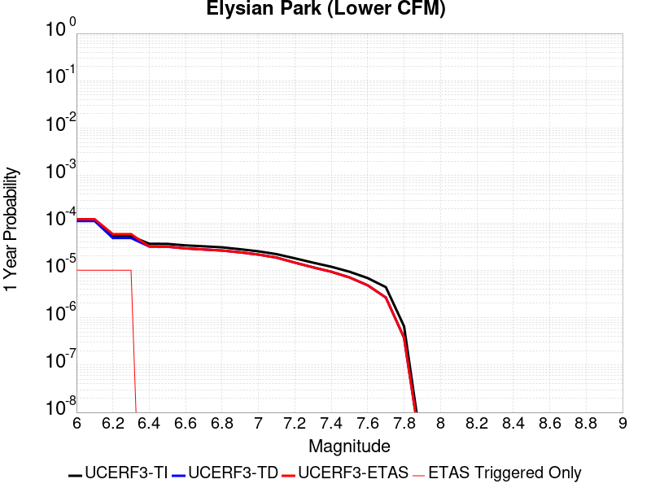 | 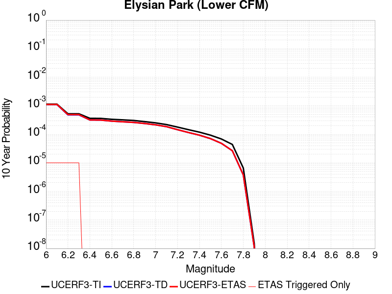 |

| Magnitude | 1 wk TI Prob | 1 wk TD Prob | 1 wk ETAS Prob | 1 wk ETAS/TD Gain | 1 wk ETAS Triggered Only | 1 mo TI Prob | 1 mo TD Prob | 1 mo ETAS Prob | 1 mo ETAS/TD Gain | 1 mo ETAS Triggered Only | 1 yr TI Prob | 1 yr TD Prob | 1 yr ETAS Prob | 1 yr ETAS/TD Gain | 1 yr ETAS Triggered Only | 10 yr TI Prob | 10 yr TD Prob | 10 yr ETAS Prob | 10 yr ETAS/TD Gain | 10 yr ETAS Triggered Only |
|-----|-----|-----|-----|-----|-----|-----|-----|-----|-----|-----|-----|-----|-----|-----|-----|-----|-----|-----|-----|-----|
| 6.0 | 2.1766498E-6 | 2.1037984E-6 | 2.1037984E-6 | 1.0 | 0.0 | 9.328466E-6 | 9.016256E-6 | 2.1006555E-5 | 2.3298535 | 1.1990408E-5 | 1.1356815E-4 | 1.0976882E-4 | 1.2175792E-4 | 1.1092212 | 1.1990408E-5 | 0.0011351013 | 0.001097288 | 0.0011092653 | 1.0109153 | 1.1990408E-5 |
| 6.1 | 2.1766498E-6 | 2.1037984E-6 | 2.1037984E-6 | 1.0 | 0.0 | 9.328466E-6 | 9.016256E-6 | 2.1006555E-5 | 2.3298535 | 1.1990408E-5 | 1.1356815E-4 | 1.0976882E-4 | 1.2175792E-4 | 1.1092212 | 1.1990408E-5 | 0.0011351013 | 0.001097288 | 0.0011092653 | 1.0109153 | 1.1990408E-5 |
| 6.2 | 1.0031182E-6 | 9.1862864E-7 | 9.1862864E-7 | 1.0 | 0.0 | 4.299071E-6 | 3.9369743E-6 | 1.5927335E-5 | 4.0455775 | 1.1990408E-5 | 5.2339932E-5 | 4.793171E-5 | 5.9921542E-5 | 1.2501441 | 1.1990408E-5 | 5.2327604E-4 | 4.792235E-4 | 4.9120816E-4 | 1.0250086 | 1.1990408E-5 |
| 6.3 | 1.0031182E-6 | 9.1862864E-7 | 9.1862864E-7 | 1.0 | 0.0 | 4.299071E-6 | 3.9369743E-6 | 1.5927335E-5 | 4.0455775 | 1.1990408E-5 | 5.2339932E-5 | 4.793171E-5 | 5.9921542E-5 | 1.2501441 | 1.1990408E-5 | 5.2327604E-4 | 4.792235E-4 | 4.9120816E-4 | 1.0250086 | 1.1990408E-5 |
| 6.4 | 6.9606244E-7 | 6.092012E-7 | 6.092012E-7 | 1.0 | 0.0 | 2.9831212E-6 | 2.6108596E-6 | 2.6108596E-6 | 1.0 | 0.0 | 3.6318896E-5 | 3.1786756E-5 | 3.1786756E-5 | 1.0 | 0.0 | 3.6312963E-4 | 3.1782233E-4 | 3.1782233E-4 | 1.0 | 0.0 |
| 6.5 | 6.901879E-7 | 6.0326954E-7 | 6.0326954E-7 | 1.0 | 0.0 | 2.9579448E-6 | 2.5854383E-6 | 2.5854383E-6 | 1.0 | 0.0 | 3.6012385E-5 | 3.147726E-5 | 3.147726E-5 | 1.0 | 0.0 | 3.600655E-4 | 3.1472824E-4 | 3.1472824E-4 | 1.0 | 0.0 |
| 6.6 | 6.4198554E-7 | 5.546678E-7 | 5.546678E-7 | 1.0 | 0.0 | 2.7513638E-6 | 2.3771454E-6 | 2.3771454E-6 | 1.0 | 0.0 | 3.3497337E-5 | 2.8941362E-5 | 2.8941362E-5 | 1.0 | 0.0 | 3.349229E-4 | 2.8937607E-4 | 2.8937607E-4 | 1.0 | 0.0 |
| 6.7 | 6.138733E-7 | 5.2634846E-7 | 5.2634846E-7 | 1.0 | 0.0 | 2.6308828E-6 | 2.2557772E-6 | 2.2557772E-6 | 1.0 | 0.0 | 3.203053E-5 | 2.7463742E-5 | 2.7463742E-5 | 1.0 | 0.0 | 3.2025913E-4 | 2.746036E-4 | 2.746036E-4 | 1.0 | 0.0 |
| 6.8 | 5.84778E-7 | 5.003004E-7 | 5.003004E-7 | 1.0 | 0.0 | 2.506189E-6 | 2.1441429E-6 | 2.1441429E-6 | 1.0 | 0.0 | 3.0512423E-5 | 2.6104626E-5 | 2.6104626E-5 | 1.0 | 0.0 | 3.0508233E-4 | 2.6101572E-4 | 2.6101572E-4 | 1.0 | 0.0 |
| 6.9 | 5.322785E-7 | 4.5801403E-7 | 4.5801403E-7 | 1.0 | 0.0 | 2.2811914E-6 | 1.9629158E-6 | 1.9629158E-6 | 1.0 | 0.0 | 2.7773152E-5 | 2.3898237E-5 | 2.3898237E-5 | 1.0 | 0.0 | 2.7769682E-4 | 2.3895678E-4 | 2.3895678E-4 | 1.0 | 0.0 |
| 7.0 | 4.8147206E-7 | 4.1124733E-7 | 4.1124733E-7 | 1.0 | 0.0 | 2.06345E-6 | 1.7624873E-6 | 1.7624873E-6 | 1.0 | 0.0 | 2.5122214E-5 | 2.1458072E-5 | 2.1458072E-5 | 1.0 | 0.0 | 2.5119373E-4 | 2.1456009E-4 | 2.1456009E-4 | 1.0 | 0.0 |
| 7.1 | 4.1932955E-7 | 3.5456276E-7 | 3.5456276E-7 | 1.0 | 0.0 | 1.7971255E-6 | 1.5195537E-6 | 1.5195537E-6 | 1.0 | 0.0 | 2.1879783E-5 | 1.850041E-5 | 1.850041E-5 | 1.0 | 0.0 | 2.1877629E-4 | 1.8498875E-4 | 1.8498875E-4 | 1.0 | 0.0 |
| 7.2 | 3.426051E-7 | 2.7810796E-7 | 2.7810796E-7 | 1.0 | 0.0 | 1.4683067E-6 | 1.1918906E-6 | 1.1918906E-6 | 1.0 | 0.0 | 1.7876488E-5 | 1.4511173E-5 | 1.4511173E-5 | 1.0 | 0.0 | 1.787505E-4 | 1.4510227E-4 | 1.4510227E-4 | 1.0 | 0.0 |
| 7.3 | 2.7771645E-7 | 2.2096945E-7 | 2.2096945E-7 | 1.0 | 0.0 | 1.1902127E-6 | 9.470116E-7 | 9.470116E-7 | 1.0 | 0.0 | 1.4490744E-5 | 1.1529804E-5 | 1.1529804E-5 | 1.0 | 0.0 | 1.4489799E-4 | 1.1529209E-4 | 1.1529209E-4 | 1.0 | 0.0 |
| 7.4 | 2.2756493E-7 | 1.784018E-7 | 1.784018E-7 | 1.0 | 0.0 | 9.752779E-7 | 7.6457894E-7 | 7.6457894E-7 | 1.0 | 0.0 | 1.1873944E-5 | 9.308708E-6 | 9.308708E-6 | 1.0 | 0.0 | 1.18733085E-4 | 9.30832E-5 | 9.30832E-5 | 1.0 | 0.0 |
| 7.5 | 1.7874558E-7 | 1.354304E-7 | 1.354304E-7 | 1.0 | 0.0 | 7.660522E-7 | 5.804159E-7 | 5.804159E-7 | 1.0 | 0.0 | 9.326646E-6 | 7.06654E-6 | 7.06654E-6 | 1.0 | 0.0 | 9.326255E-5 | 7.066317E-5 | 7.066317E-5 | 1.0 | 0.0 |
| 7.6 | 1.3124549E-7 | 9.251099E-8 | 9.251099E-8 | 1.0 | 0.0 | 5.624805E-7 | 3.964756E-7 | 3.964756E-7 | 1.0 | 0.0 | 6.8481786E-6 | 4.82708E-6 | 4.82708E-6 | 1.0 | 0.0 | 6.8479676E-5 | 4.8269765E-5 | 4.8269765E-5 | 1.0 | 0.0 |
| 7.7 | 8.439993E-8 | 5.0902187E-8 | 5.0902187E-8 | 1.0 | 0.0 | 3.6171392E-7 | 2.1815221E-7 | 2.1815221E-7 | 1.0 | 0.0 | 4.403858E-6 | 2.656E-6 | 2.656E-6 | 1.0 | 0.0 | 4.4037708E-5 | 2.6559695E-5 | 2.6559695E-5 | 1.0 | 0.0 |
| 7.8 | 1.2591407E-8 | 7.2279613E-9 | 7.2279613E-9 | 1.0 | 0.0 | 5.3963173E-8 | 3.0976977E-8 | 3.0976977E-8 | 1.0 | 0.0 | 6.570014E-7 | 3.7714463E-7 | 3.7714463E-7 | 1.0 | 0.0 | 6.5699946E-6 | 3.77144E-6 | 3.77144E-6 | 1.0 | 0.0 |
| 7.9 | 2.8324232E-11 | 2.1406432E-11 | 2.1406432E-11 | 1.0 | 0.0 | 1.2138957E-10 | 9.17425E-11 | 9.17425E-11 | 1.0 | 0.0 | 1.4779177E-9 | 1.1169644E-9 | 1.1169644E-9 | 1.0 | 0.0 | 1.4779177E-8 | 1.1169644E-8 | 1.1169644E-8 | 1.0 | 0.0 |

## Almanor 2011 CFM
*[(top)](#table-of-contents)*

| 1 Week | 1 Month | 1 Year | 10 Year |
|-----|-----|-----|-----|
| 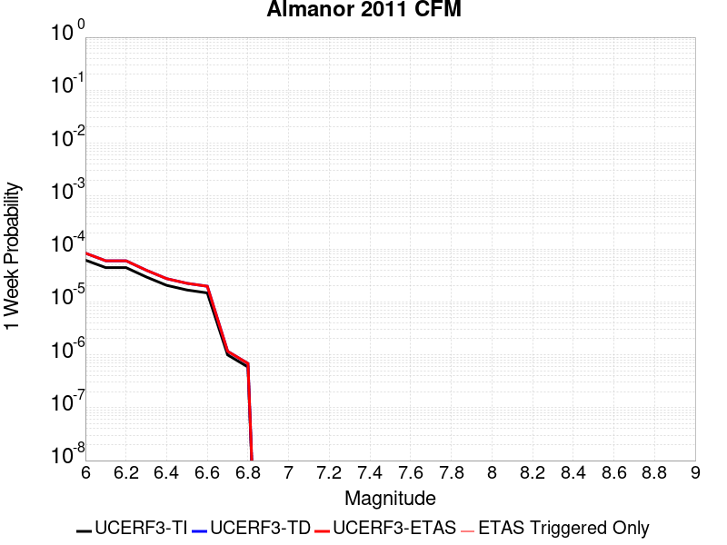 | 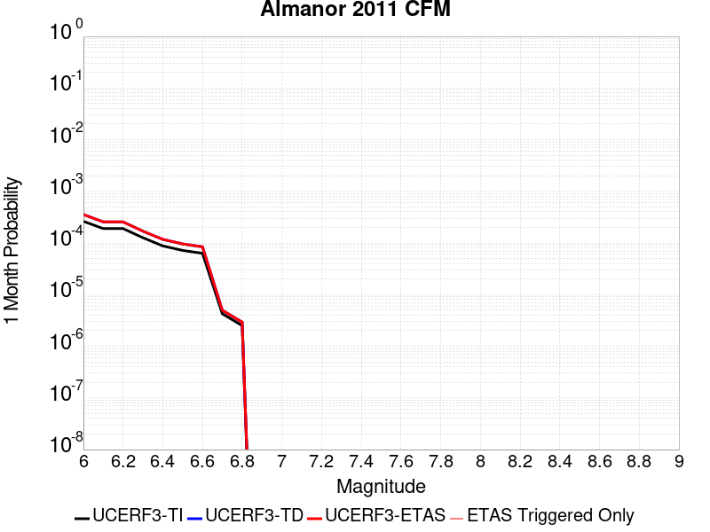 | 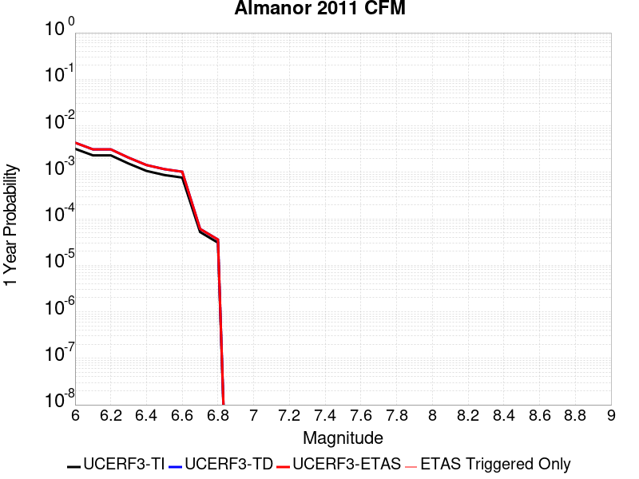 | 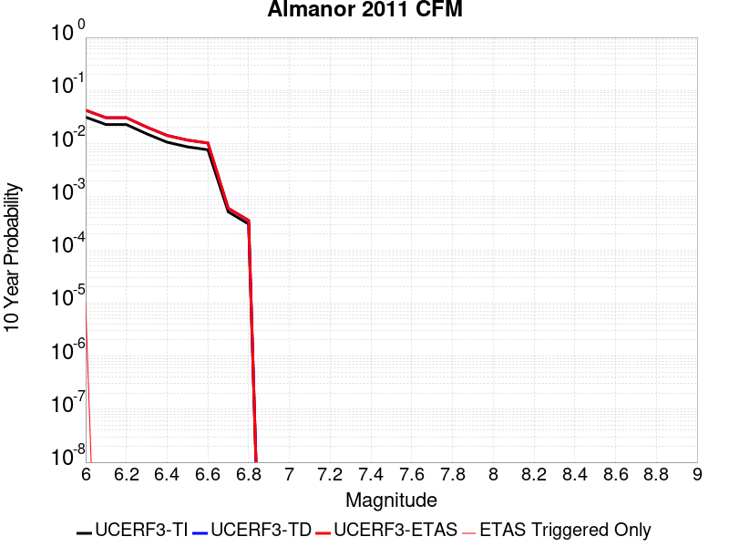 |

| Magnitude | 1 wk TI Prob | 1 wk TD Prob | 1 wk ETAS Prob | 1 wk ETAS/TD Gain | 1 wk ETAS Triggered Only | 1 mo TI Prob | 1 mo TD Prob | 1 mo ETAS Prob | 1 mo ETAS/TD Gain | 1 mo ETAS Triggered Only | 1 yr TI Prob | 1 yr TD Prob | 1 yr ETAS Prob | 1 yr ETAS/TD Gain | 1 yr ETAS Triggered Only | 10 yr TI Prob | 10 yr TD Prob | 10 yr ETAS Prob | 10 yr ETAS/TD Gain | 10 yr ETAS Triggered Only |
|-----|-----|-----|-----|-----|-----|-----|-----|-----|-----|-----|-----|-----|-----|-----|-----|-----|-----|-----|-----|-----|
| 6.0 | 6.1479834E-5 | 8.328266E-5 | 8.328266E-5 | 1.0 | 0.0 | 2.6345838E-4 | 3.5688275E-4 | 3.5688275E-4 | 1.0 | 0.0 | 0.0032028882 | 0.0043367865 | 0.0043367865 | 1.0 | 0.0 | 0.031571172 | 0.042587567 | 0.04259905 | 1.0002695 | 1.1990408E-5 |
| 6.1 | 4.4387216E-5 | 5.9773225E-5 | 5.9773225E-5 | 1.0 | 0.0 | 1.9021705E-4 | 2.5614997E-4 | 2.5614997E-4 | 1.0 | 0.0 | 0.0023134327 | 0.0031145536 | 0.0031145536 | 1.0 | 0.0 | 0.022894967 | 0.03075632 | 0.03075632 | 1.0 | 0.0 |
| 6.2 | 4.4387216E-5 | 5.9773225E-5 | 5.9773225E-5 | 1.0 | 0.0 | 1.9021705E-4 | 2.5614997E-4 | 2.5614997E-4 | 1.0 | 0.0 | 0.0023134327 | 0.0031145536 | 0.0031145536 | 1.0 | 0.0 | 0.022894967 | 0.03075632 | 0.03075632 | 1.0 | 0.0 |
| 6.3 | 2.9523822E-5 | 3.9548995E-5 | 3.9548995E-5 | 1.0 | 0.0 | 1.2652454E-4 | 1.6948754E-4 | 1.6948754E-4 | 1.0 | 0.0 | 0.0015393476 | 0.002061955 | 0.002061955 | 1.0 | 0.0 | 0.015287281 | 0.020461641 | 0.020461641 | 1.0 | 0.0 |
| 6.4 | 2.0512744E-5 | 2.7432861E-5 | 2.7432861E-5 | 1.0 | 0.0 | 8.79088E-5 | 1.1756653E-4 | 1.1756653E-4 | 1.0 | 0.0 | 0.001069764 | 0.0014307967 | 0.0014307967 | 1.0 | 0.0 | 0.010646289 | 0.014245 | 0.014245 | 1.0 | 0.0 |
| 6.5 | 1.6750226E-5 | 2.2392314E-5 | 2.2392314E-5 | 1.0 | 0.0 | 7.178471E-5 | 9.596587E-5 | 9.596587E-5 | 1.0 | 0.0 | 8.7362836E-4 | 0.0011681073 | 0.0011681073 | 1.0 | 0.0 | 0.008702018 | 0.011649518 | 0.011649518 | 1.0 | 0.0 |
| 6.6 | 1.4745303E-5 | 1.9708845E-5 | 1.9708845E-5 | 1.0 | 0.0 | 6.319262E-5 | 8.446605E-5 | 8.446605E-5 | 1.0 | 0.0 | 7.690986E-4 | 0.001028234 | 0.001028234 | 1.0 | 0.0 | 0.0076644225 | 0.010265394 | 0.010265394 | 1.0 | 0.0 |
| 6.7 | 9.951145E-7 | 1.1616605E-6 | 1.1616605E-6 | 1.0 | 0.0 | 4.26477E-6 | 4.9785363E-6 | 4.9785363E-6 | 1.0 | 0.0 | 5.1922336E-5 | 6.0612172E-5 | 6.0612172E-5 | 1.0 | 0.0 | 5.1910203E-4 | 6.0597365E-4 | 6.0597365E-4 | 1.0 | 0.0 |
| 6.8 | 5.866312E-7 | 6.8495365E-7 | 6.8495365E-7 | 1.0 | 0.0 | 2.5141312E-6 | 2.935513E-6 | 2.935513E-6 | 1.0 | 0.0 | 3.0609117E-5 | 3.5739416E-5 | 3.5739416E-5 | 1.0 | 0.0 | 3.06049E-4 | 3.5734952E-4 | 3.5734952E-4 | 1.0 | 0.0 |

## San Andreas (Offshore) 2011 CFM
*[(top)](#table-of-contents)*

| 1 Week | 1 Month | 1 Year | 10 Year |
|-----|-----|-----|-----|
| 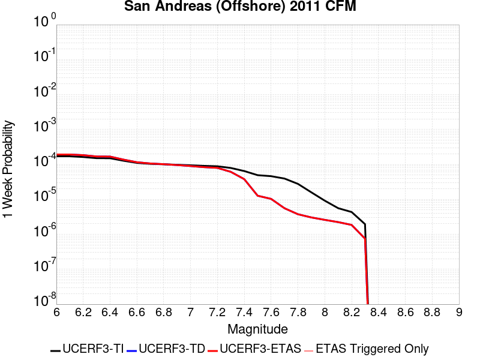 | 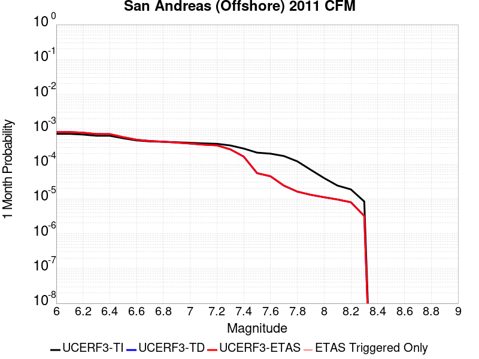 | 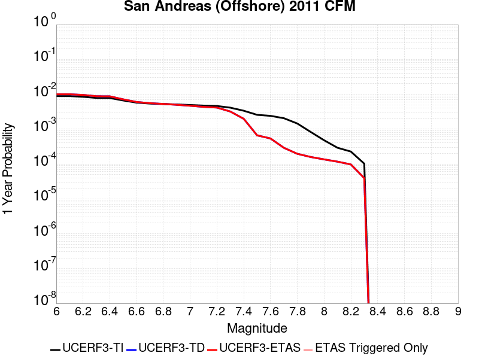 | 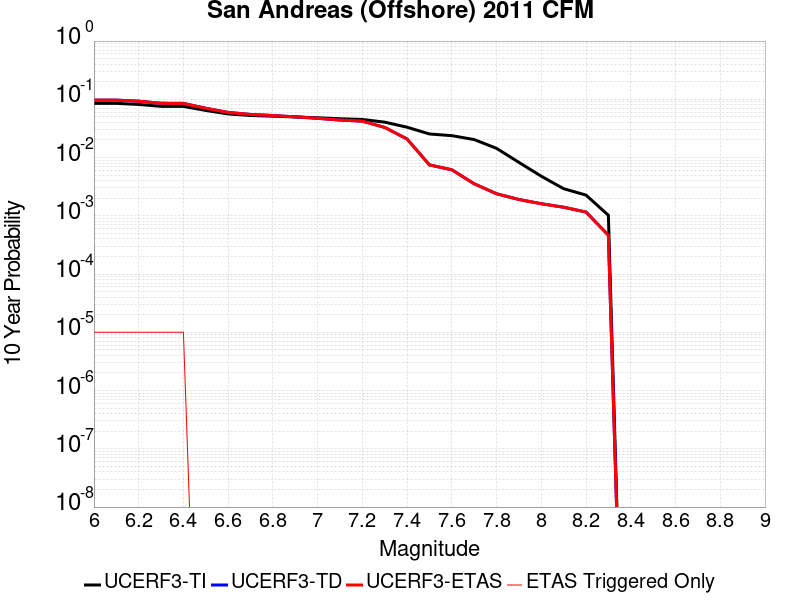 |

| Magnitude | 1 wk TI Prob | 1 wk TD Prob | 1 wk ETAS Prob | 1 wk ETAS/TD Gain | 1 wk ETAS Triggered Only | 1 mo TI Prob | 1 mo TD Prob | 1 mo ETAS Prob | 1 mo ETAS/TD Gain | 1 mo ETAS Triggered Only | 1 yr TI Prob | 1 yr TD Prob | 1 yr ETAS Prob | 1 yr ETAS/TD Gain | 1 yr ETAS Triggered Only | 10 yr TI Prob | 10 yr TD Prob | 10 yr ETAS Prob | 10 yr ETAS/TD Gain | 10 yr ETAS Triggered Only |
|-----|-----|-----|-----|-----|-----|-----|-----|-----|-----|-----|-----|-----|-----|-----|-----|-----|-----|-----|-----|-----|
| 6.0 | 1.7072787E-4 | 1.9230456E-4 | 1.9230456E-4 | 1.0 | 0.0 | 7.3148566E-4 | 8.2390447E-4 | 8.2390447E-4 | 1.0 | 0.0 | 0.008869528 | 0.009985414 | 0.009985414 | 1.0 | 0.0 | 0.085237645 | 0.09684723 | 0.096858054 | 1.0001118 | 1.1990408E-5 |
| 6.1 | 1.7072787E-4 | 1.9230456E-4 | 1.9230456E-4 | 1.0 | 0.0 | 7.3148566E-4 | 8.2390447E-4 | 8.2390447E-4 | 1.0 | 0.0 | 0.008869528 | 0.009985414 | 0.009985414 | 1.0 | 0.0 | 0.085237645 | 0.09684723 | 0.096858054 | 1.0001118 | 1.1990408E-5 |
| 6.2 | 1.6312556E-4 | 1.841198E-4 | 1.841198E-4 | 1.0 | 0.0 | 6.989222E-4 | 7.8884856E-4 | 7.8884856E-4 | 1.0 | 0.0 | 0.008476226 | 0.009562436 | 0.009562436 | 1.0 | 0.0 | 0.08160117 | 0.092867136 | 0.092878014 | 1.0001172 | 1.1990408E-5 |
| 6.3 | 1.5103363E-4 | 1.688459E-4 | 1.688459E-4 | 1.0 | 0.0 | 6.471264E-4 | 7.234268E-4 | 7.234268E-4 | 1.0 | 0.0 | 0.007850339 | 0.008772596 | 0.008772596 | 1.0 | 0.0 | 0.075787395 | 0.08550672 | 0.08551768 | 1.0001283 | 1.1990408E-5 |
| 6.4 | 1.5047993E-4 | 1.6770518E-4 | 1.6770518E-4 | 1.0 | 0.0 | 6.4475456E-4 | 7.185407E-4 | 7.185407E-4 | 1.0 | 0.0 | 0.007821669 | 0.008713583 | 0.008713583 | 1.0 | 0.0 | 0.0755203 | 0.08498692 | 0.08499789 | 1.0001291 | 1.1990408E-5 |
| 6.5 | 1.2760791E-4 | 1.3738252E-4 | 1.3738252E-4 | 1.0 | 0.0 | 5.467764E-4 | 5.886508E-4 | 5.886508E-4 | 1.0 | 0.0 | 0.0066367025 | 0.0071435464 | 0.0071435464 | 1.0 | 0.0 | 0.064419635 | 0.07026526 | 0.07026526 | 1.0 | 0.0 |
| 6.6 | 1.1063525E-4 | 1.1559396E-4 | 1.1559396E-4 | 1.0 | 0.0 | 4.740649E-4 | 4.953097E-4 | 4.953097E-4 | 1.0 | 0.0 | 0.0057564764 | 0.006013923 | 0.006013923 | 1.0 | 0.0 | 0.05609626 | 0.059502304 | 0.059502304 | 1.0 | 0.0 |
| 6.7 | 1.0391049E-4 | 1.06485095E-4 | 1.06485095E-4 | 1.0 | 0.0 | 4.4525467E-4 | 4.5628587E-4 | 4.5628587E-4 | 1.0 | 0.0 | 0.0054075094 | 0.0055413176 | 0.0055413176 | 1.0 | 0.0 | 0.052778035 | 0.055001423 | 0.055001423 | 1.0 | 0.0 |
| 6.8 | 1.0096706E-4 | 1.0160786E-4 | 1.0160786E-4 | 1.0 | 0.0 | 4.3264418E-4 | 4.3539054E-4 | 4.3539054E-4 | 1.0 | 0.0 | 0.0052547283 | 0.005288173 | 0.005288173 | 1.0 | 0.0 | 0.051321987 | 0.052699935 | 0.052699935 | 1.0 | 0.0 |
| 6.9 | 9.800265E-5 | 9.591212E-5 | 9.591212E-5 | 1.0 | 0.0 | 4.1994374E-4 | 4.1098808E-4 | 4.1098808E-4 | 1.0 | 0.0 | 0.0051008356 | 0.004992468 | 0.004992468 | 1.0 | 0.0 | 0.049853306 | 0.05002718 | 0.05002718 | 1.0 | 0.0 |
| 7.0 | 9.4642375E-5 | 9.00454E-5 | 9.00454E-5 | 1.0 | 0.0 | 4.0554712E-4 | 3.8585268E-4 | 3.8585268E-4 | 1.0 | 0.0 | 0.004926363 | 0.0046877996 | 0.0046877996 | 1.0 | 0.0 | 0.048185747 | 0.047207914 | 0.047207914 | 1.0 | 0.0 |
| 7.1 | 9.0996844E-5 | 8.356496E-5 | 8.356496E-5 | 1.0 | 0.0 | 3.8992817E-4 | 3.5808727E-4 | 3.5808727E-4 | 1.0 | 0.0 | 0.004737046 | 0.004351154 | 0.004351154 | 1.0 | 0.0 | 0.04637333 | 0.044059202 | 0.044059202 | 1.0 | 0.0 |
| 7.2 | 8.848287E-5 | 7.984079E-5 | 7.984079E-5 | 1.0 | 0.0 | 3.791572E-4 | 3.421308E-4 | 3.421308E-4 | 1.0 | 0.0 | 0.004606472 | 0.0041576405 | 0.0041576405 | 1.0 | 0.0 | 0.045121472 | 0.042202868 | 0.042202868 | 1.0 | 0.0 |
| 7.3 | 7.9280784E-5 | 6.1295636E-5 | 6.1295636E-5 | 1.0 | 0.0 | 3.3973053E-4 | 2.626697E-4 | 2.626697E-4 | 1.0 | 0.0 | 0.004128377 | 0.0031934164 | 0.0031934164 | 1.0 | 0.0 | 0.040525194 | 0.032914314 | 0.032914314 | 1.0 | 0.0 |
| 7.4 | 6.468038E-5 | 3.794719E-5 | 3.794719E-5 | 1.0 | 0.0 | 2.771722E-4 | 1.62621E-4 | 1.62621E-4 | 1.0 | 0.0 | 0.0033693502 | 0.0019781706 | 0.0019781706 | 1.0 | 0.0 | 0.0331872 | 0.02082928 | 0.02082928 | 1.0 | 0.0 |
| 7.5 | 4.930574E-5 | 1.2711595E-5 | 1.2711595E-5 | 1.0 | 0.0 | 2.1129321E-4 | 5.447714E-5 | 5.447714E-5 | 1.0 | 0.0 | 0.0025694598 | 6.6305895E-4 | 6.6305895E-4 | 1.0 | 0.0 | 0.02539953 | 0.0074862516 | 0.0074862516 | 1.0 | 0.0 |
| 7.6 | 4.612566E-5 | 1.0343632E-5 | 1.0343632E-5 | 1.0 | 0.0 | 1.9766642E-4 | 4.4329106E-5 | 4.4329106E-5 | 1.0 | 0.0 | 0.0024039324 | 5.395746E-4 | 5.395746E-4 | 1.0 | 0.0 | 0.023780935 | 0.0061765052 | 0.0061765052 | 1.0 | 0.0 |
| 7.7 | 3.9435414E-5 | 5.580712E-6 | 5.580712E-6 | 1.0 | 0.0 | 1.6899795E-4 | 2.3917117E-5 | 2.3917117E-5 | 1.0 | 0.0 | 0.0020556084 | 2.911522E-4 | 2.911522E-4 | 1.0 | 0.0 | 0.020366974 | 0.0035455872 | 0.0035455872 | 1.0 | 0.0 |
| 7.8 | 2.7787428E-5 | 3.7595619E-6 | 3.7595619E-6 | 1.0 | 0.0 | 1.1908354E-4 | 1.6112308E-5 | 1.6112308E-5 | 1.0 | 0.0 | 0.0014488777 | 1.9614973E-4 | 1.9614973E-4 | 1.0 | 0.0 | 0.014394675 | 0.0023902871 | 0.0023902871 | 1.0 | 0.0 |
| 7.9 | 1.590671E-5 | 3.0441697E-6 | 3.0441697E-6 | 1.0 | 0.0 | 6.816983E-5 | 1.3046377E-5 | 1.3046377E-5 | 1.0 | 0.0 | 8.2965166E-4 | 1.5882809E-4 | 1.5882809E-4 | 1.0 | 0.0 | 0.008265611 | 0.0019062381 | 0.0019062381 | 1.0 | 0.0 |
| 8.0 | 9.193638E-6 | 2.594852E-6 | 2.594852E-6 | 1.0 | 0.0 | 3.940071E-5 | 1.1120747E-5 | 1.1120747E-5 | 1.0 | 0.0 | 4.7959806E-4 | 1.3538671E-4 | 1.3538671E-4 | 1.0 | 0.0 | 0.0047856434 | 0.0016131136 | 0.0016131136 | 1.0 | 0.0 |
| 8.1 | 5.601576E-6 | 2.2368615E-6 | 2.2368615E-6 | 1.0 | 0.0 | 2.4006533E-5 | 9.586514E-6 | 9.586514E-6 | 1.0 | 0.0 | 2.9224035E-4 | 1.1670959E-4 | 1.1670959E-4 | 1.0 | 0.0 | 0.0029185633 | 0.0014035193 | 0.0014035193 | 1.0 | 0.0 |
| 8.2 | 4.3508785E-6 | 1.8596328E-6 | 1.8596328E-6 | 1.0 | 0.0 | 1.864649E-5 | 7.96983E-6 | 7.96983E-6 | 1.0 | 0.0 | 2.2699735E-4 | 9.7028395E-5 | 9.7028395E-5 | 1.0 | 0.0 | 0.0022676561 | 0.0011606053 | 0.0011606053 | 1.0 | 0.0 |
| 8.3 | 1.9573292E-6 | 7.523149E-7 | 7.523149E-7 | 1.0 | 0.0 | 8.388526E-6 | 3.2242028E-6 | 3.2242028E-6 | 1.0 | 0.0 | 1.0212552E-4 | 3.9253977E-5 | 3.9253977E-5 | 1.0 | 0.0 | 0.001020786 | 4.6455802E-4 | 4.6455802E-4 | 1.0 | 0.0 |

## Robinson Creek
*[(top)](#table-of-contents)*

| 1 Week | 1 Month | 1 Year | 10 Year |
|-----|-----|-----|-----|
|  | 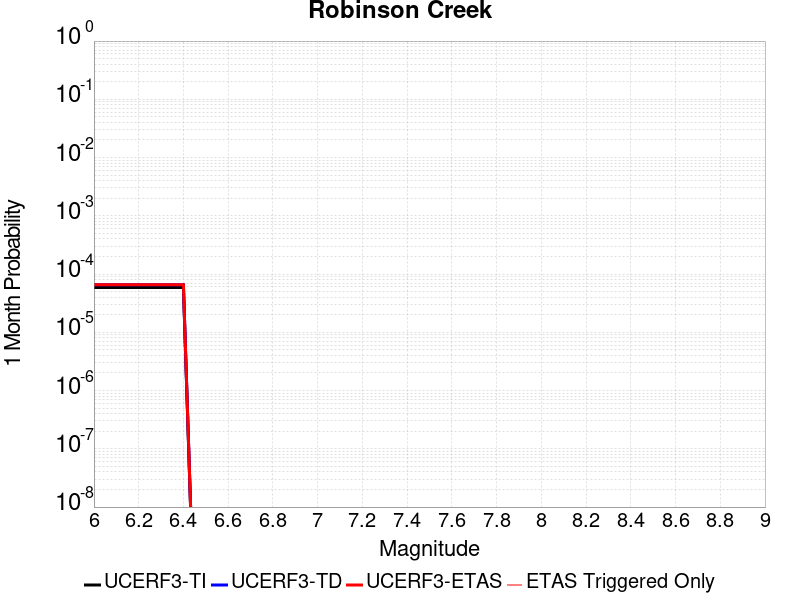 | 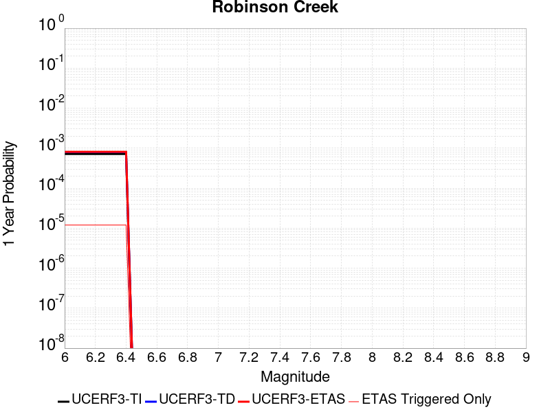 | 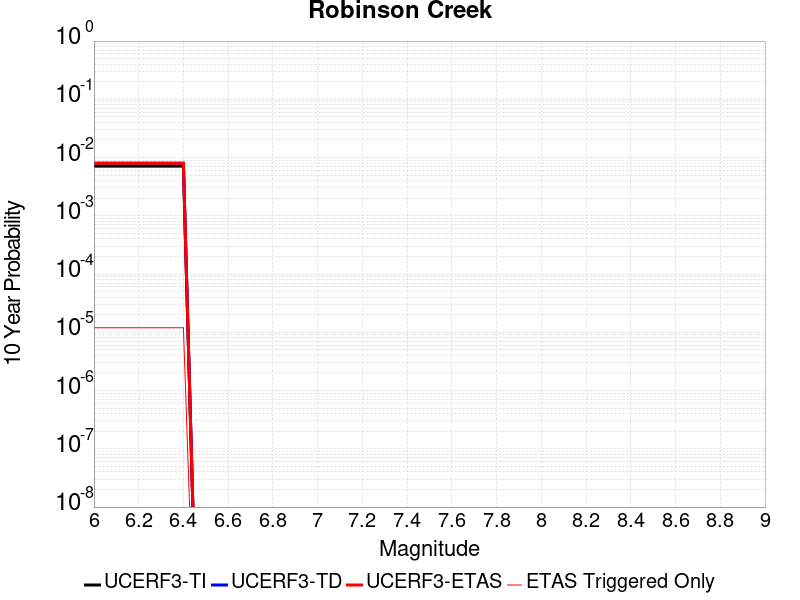 |

| Magnitude | 1 wk TI Prob | 1 wk TD Prob | 1 wk ETAS Prob | 1 wk ETAS/TD Gain | 1 wk ETAS Triggered Only | 1 mo TI Prob | 1 mo TD Prob | 1 mo ETAS Prob | 1 mo ETAS/TD Gain | 1 mo ETAS Triggered Only | 1 yr TI Prob | 1 yr TD Prob | 1 yr ETAS Prob | 1 yr ETAS/TD Gain | 1 yr ETAS Triggered Only | 10 yr TI Prob | 10 yr TD Prob | 10 yr ETAS Prob | 10 yr ETAS/TD Gain | 10 yr ETAS Triggered Only |
|-----|-----|-----|-----|-----|-----|-----|-----|-----|-----|-----|-----|-----|-----|-----|-----|-----|-----|-----|-----|-----|
| 6.0 | 1.3705327E-5 | 1.5285246E-5 | 1.5285246E-5 | 1.0 | 0.0 | 5.8735794E-5 | 6.5508204E-5 | 6.5508204E-5 | 1.0 | 0.0 | 7.1487366E-4 | 7.9756236E-4 | 8.095432E-4 | 1.0150218 | 1.1990408E-5 | 0.0071257832 | 0.007975623 | 0.007987518 | 1.0014914 | 1.1990408E-5 |
| 6.1 | 1.3705327E-5 | 1.5285246E-5 | 1.5285246E-5 | 1.0 | 0.0 | 5.8735794E-5 | 6.5508204E-5 | 6.5508204E-5 | 1.0 | 0.0 | 7.1487366E-4 | 7.9756236E-4 | 8.095432E-4 | 1.0150218 | 1.1990408E-5 | 0.0071257832 | 0.007975623 | 0.007987518 | 1.0014914 | 1.1990408E-5 |
| 6.2 | 1.3705327E-5 | 1.5285246E-5 | 1.5285246E-5 | 1.0 | 0.0 | 5.8735794E-5 | 6.5508204E-5 | 6.5508204E-5 | 1.0 | 0.0 | 7.1487366E-4 | 7.9756236E-4 | 8.095432E-4 | 1.0150218 | 1.1990408E-5 | 0.0071257832 | 0.007975623 | 0.007987518 | 1.0014914 | 1.1990408E-5 |
| 6.3 | 1.3705327E-5 | 1.5285246E-5 | 1.5285246E-5 | 1.0 | 0.0 | 5.8735794E-5 | 6.5508204E-5 | 6.5508204E-5 | 1.0 | 0.0 | 7.1487366E-4 | 7.9756236E-4 | 8.095432E-4 | 1.0150218 | 1.1990408E-5 | 0.0071257832 | 0.007975623 | 0.007987518 | 1.0014914 | 1.1990408E-5 |
| 6.4 | 1.3705327E-5 | 1.5285246E-5 | 1.5285246E-5 | 1.0 | 0.0 | 5.8735794E-5 | 6.5508204E-5 | 6.5508204E-5 | 1.0 | 0.0 | 7.1487366E-4 | 7.9756236E-4 | 8.095432E-4 | 1.0150218 | 1.1990408E-5 | 0.0071257832 | 0.007975623 | 0.007987518 | 1.0014914 | 1.1990408E-5 |

## San Pedro Basin
*[(top)](#table-of-contents)*

| 1 Week | 1 Month | 1 Year | 10 Year |
|-----|-----|-----|-----|
| 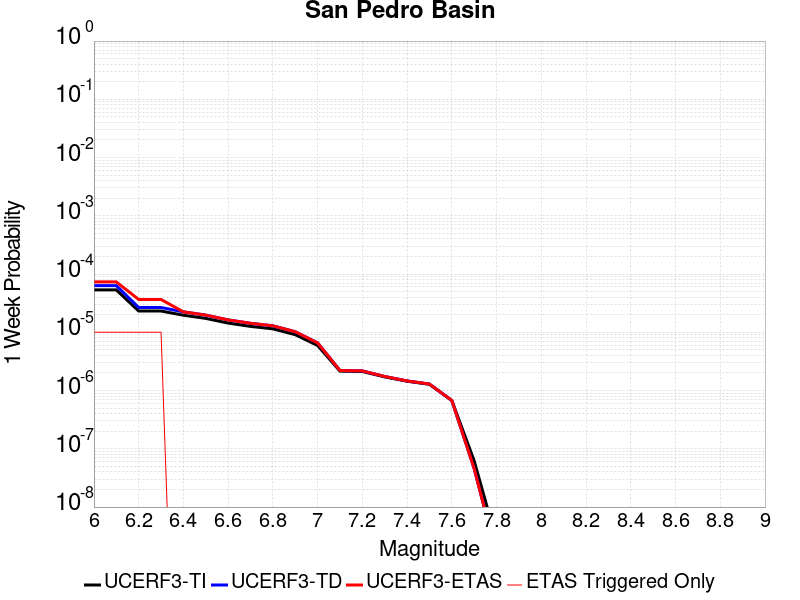 | 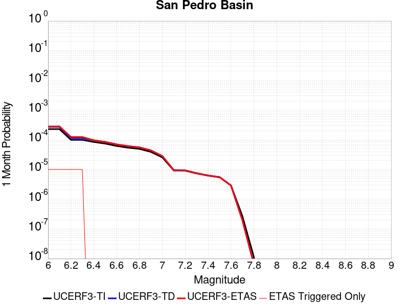 | 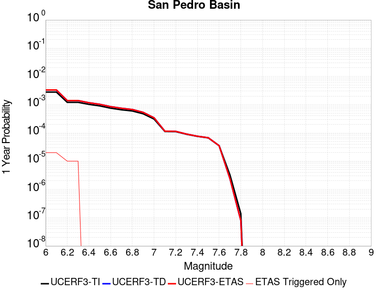 |  |

| Magnitude | 1 wk TI Prob | 1 wk TD Prob | 1 wk ETAS Prob | 1 wk ETAS/TD Gain | 1 wk ETAS Triggered Only | 1 mo TI Prob | 1 mo TD Prob | 1 mo ETAS Prob | 1 mo ETAS/TD Gain | 1 mo ETAS Triggered Only | 1 yr TI Prob | 1 yr TD Prob | 1 yr ETAS Prob | 1 yr ETAS/TD Gain | 1 yr ETAS Triggered Only | 10 yr TI Prob | 10 yr TD Prob | 10 yr ETAS Prob | 10 yr ETAS/TD Gain | 10 yr ETAS Triggered Only |
|-----|-----|-----|-----|-----|-----|-----|-----|-----|-----|-----|-----|-----|-----|-----|-----|-----|-----|-----|-----|-----|
| 6.0 | 5.3449043E-5 | 6.3371124E-5 | 6.3371124E-5 | 1.0 | 0.0 | 2.2904722E-4 | 2.7156572E-4 | 2.7156572E-4 | 1.0 | 0.0 | 0.0027850836 | 0.0033019078 | 0.0033138588 | 1.0036193 | 1.1990408E-5 | 0.027504366 | 0.032590248 | 0.03260185 | 1.000356 | 1.1990408E-5 |
| 6.1 | 5.3449043E-5 | 6.3371124E-5 | 6.3371124E-5 | 1.0 | 0.0 | 2.2904722E-4 | 2.7156572E-4 | 2.7156572E-4 | 1.0 | 0.0 | 0.0027850836 | 0.0033019078 | 0.0033138588 | 1.0036193 | 1.1990408E-5 | 0.027504366 | 0.032590248 | 0.03260185 | 1.000356 | 1.1990408E-5 |
| 6.2 | 2.3189454E-5 | 2.6643334E-5 | 2.6643334E-5 | 1.0 | 0.0 | 9.9379584E-5 | 1.14180984E-4 | 1.14180984E-4 | 1.0 | 0.0 | 0.0012092749 | 0.0013893144 | 0.0013893144 | 1.0 | 0.0 | 0.012027155 | 0.013811161 | 0.013811161 | 1.0 | 0.0 |
| 6.3 | 2.3189454E-5 | 2.6643334E-5 | 2.6643334E-5 | 1.0 | 0.0 | 9.9379584E-5 | 1.14180984E-4 | 1.14180984E-4 | 1.0 | 0.0 | 0.0012092749 | 0.0013893144 | 0.0013893144 | 1.0 | 0.0 | 0.012027155 | 0.013811161 | 0.013811161 | 1.0 | 0.0 |
| 6.4 | 1.966056E-5 | 2.2463848E-5 | 2.2463848E-5 | 1.0 | 0.0 | 8.425682E-5 | 9.627031E-5 | 9.627031E-5 | 1.0 | 0.0 | 0.001025344 | 0.001171501 | 0.001171501 | 1.0 | 0.0 | 0.010206259 | 0.011657341 | 0.011657341 | 1.0 | 0.0 |
| 6.5 | 1.7342953E-5 | 1.9745521E-5 | 1.9745521E-5 | 1.0 | 0.0 | 7.4324824E-5 | 8.4621126E-5 | 8.4621126E-5 | 1.0 | 0.0 | 9.04529E-4 | 0.0010298121 | 0.0010298121 | 1.0 | 0.0 | 0.009008561 | 0.010254124 | 0.010254124 | 1.0 | 0.0 |
| 6.6 | 1.439804E-5 | 1.6323014E-5 | 1.6323014E-5 | 1.0 | 0.0 | 6.170443E-5 | 6.995408E-5 | 6.995408E-5 | 1.0 | 0.0 | 7.509924E-4 | 8.513903E-4 | 8.513903E-4 | 1.0 | 0.0 | 0.0074845953 | 0.008484487 | 0.008484487 | 1.0 | 0.0 |
| 6.7 | 1.2634884E-5 | 1.4285554E-5 | 1.4285554E-5 | 1.0 | 0.0 | 5.414838E-5 | 6.1222534E-5 | 6.1222534E-5 | 1.0 | 0.0 | 6.590571E-4 | 7.451599E-4 | 7.451599E-4 | 1.0 | 0.0 | 0.006571059 | 0.007429634 | 0.007429634 | 1.0 | 0.0 |
| 6.8 | 1.146091E-5 | 1.2933421E-5 | 1.2933421E-5 | 1.0 | 0.0 | 4.911726E-5 | 5.542794E-5 | 5.542794E-5 | 1.0 | 0.0 | 5.9783855E-4 | 6.7465595E-4 | 6.7465595E-4 | 1.0 | 0.0 | 0.0059623276 | 0.0067290184 | 0.0067290184 | 1.0 | 0.0 |
| 6.9 | 9.109035E-6 | 1.0235189E-5 | 1.0235189E-5 | 1.0 | 0.0 | 3.9038136E-5 | 4.3864515E-5 | 4.3864515E-5 | 1.0 | 0.0 | 4.7518566E-4 | 5.339476E-4 | 5.339476E-4 | 1.0 | 0.0 | 0.0047417083 | 0.0053294008 | 0.0053294008 | 1.0 | 0.0 |
| 7.0 | 5.9351028E-6 | 6.584068E-6 | 6.584068E-6 | 1.0 | 0.0 | 2.5435906E-5 | 2.8217262E-5 | 2.8217262E-5 | 1.0 | 0.0 | 3.0963816E-4 | 3.4351464E-4 | 3.4351464E-4 | 1.0 | 0.0 | 0.0030920706 | 0.0034321535 | 0.0034321535 | 1.0 | 0.0 |
| 7.1 | 2.1557585E-6 | 2.2096608E-6 | 2.2096608E-6 | 1.0 | 0.0 | 9.238933E-6 | 9.469942E-6 | 9.469942E-6 | 1.0 | 0.0 | 1.1247819E-4 | 1.1529059E-4 | 1.1529059E-4 | 1.0 | 0.0 | 0.0011242128 | 0.0011523232 | 0.0011523232 | 1.0 | 0.0 |
| 7.2 | 2.1251979E-6 | 2.178007E-6 | 2.178007E-6 | 1.0 | 0.0 | 9.107958E-6 | 9.334282E-6 | 9.334282E-6 | 1.0 | 0.0 | 1.1088375E-4 | 1.1363912E-4 | 1.1363912E-4 | 1.0 | 0.0 | 0.0011082845 | 0.0011358254 | 0.0011358254 | 1.0 | 0.0 |
| 7.3 | 1.7145798E-6 | 1.7442967E-6 | 1.7442967E-6 | 1.0 | 0.0 | 7.3481783E-6 | 7.475536E-6 | 7.475536E-6 | 1.0 | 0.0 | 8.94604E-5 | 9.1010945E-5 | 9.1010945E-5 | 1.0 | 0.0 | 8.9424395E-4 | 9.0974587E-4 | 9.0974587E-4 | 1.0 | 0.0 |
| 7.4 | 1.4467993E-6 | 1.4641943E-6 | 1.4641943E-6 | 1.0 | 0.0 | 6.200554E-6 | 6.2751037E-6 | 6.2751037E-6 | 1.0 | 0.0 | 7.548913E-5 | 7.6396784E-5 | 7.6396784E-5 | 1.0 | 0.0 | 7.546349E-4 | 7.637125E-4 | 7.637125E-4 | 1.0 | 0.0 |
| 7.5 | 1.2803735E-6 | 1.2931564E-6 | 1.2931564E-6 | 1.0 | 0.0 | 5.487303E-6 | 5.5420874E-6 | 5.5420874E-6 | 1.0 | 0.0 | 6.680587E-5 | 6.7472894E-5 | 6.7472894E-5 | 1.0 | 0.0 | 6.678579E-4 | 6.7453115E-4 | 6.7453115E-4 | 1.0 | 0.0 |
| 7.6 | 6.755009E-7 | 6.769501E-7 | 6.769501E-7 | 1.0 | 0.0 | 2.8950008E-6 | 2.9012117E-6 | 2.9012117E-6 | 1.0 | 0.0 | 3.5246063E-5 | 3.5321737E-5 | 3.5321737E-5 | 1.0 | 0.0 | 3.5240475E-4 | 3.5316695E-4 | 3.5316695E-4 | 1.0 | 0.0 |
| 7.7 | 6.211885E-8 | 4.5699863E-8 | 4.5699863E-8 | 1.0 | 0.0 | 2.6622362E-7 | 1.9585654E-7 | 1.9585654E-7 | 1.0 | 0.0 | 3.2412677E-6 | 2.384551E-6 | 2.384551E-6 | 1.0 | 0.0 | 3.2412205E-5 | 2.3845274E-5 | 2.3845274E-5 | 1.0 | 0.0 |
| 7.8 | 2.6580573E-9 | 1.5138681E-9 | 1.5138681E-9 | 1.0 | 0.0 | 1.1391674E-8 | 6.488006E-9 | 6.488006E-9 | 1.0 | 0.0 | 1.3869362E-7 | 7.899148E-8 | 7.899148E-8 | 1.0 | 0.0 | 1.3869354E-6 | 7.8991474E-7 | 7.8991474E-7 | 1.0 | 0.0 |

## Hat Creek-McArthur-Mayfield
*[(top)](#table-of-contents)*

| 1 Week | 1 Month | 1 Year | 10 Year |
|-----|-----|-----|-----|
| 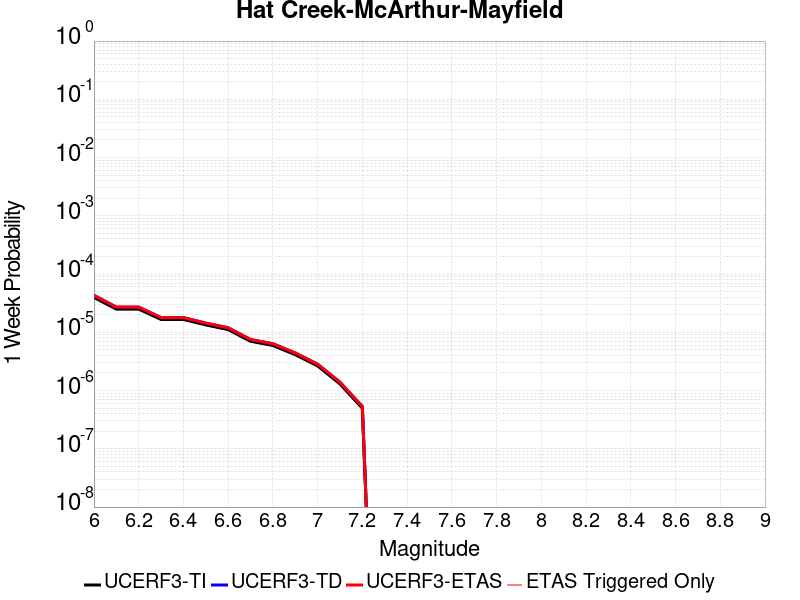 | 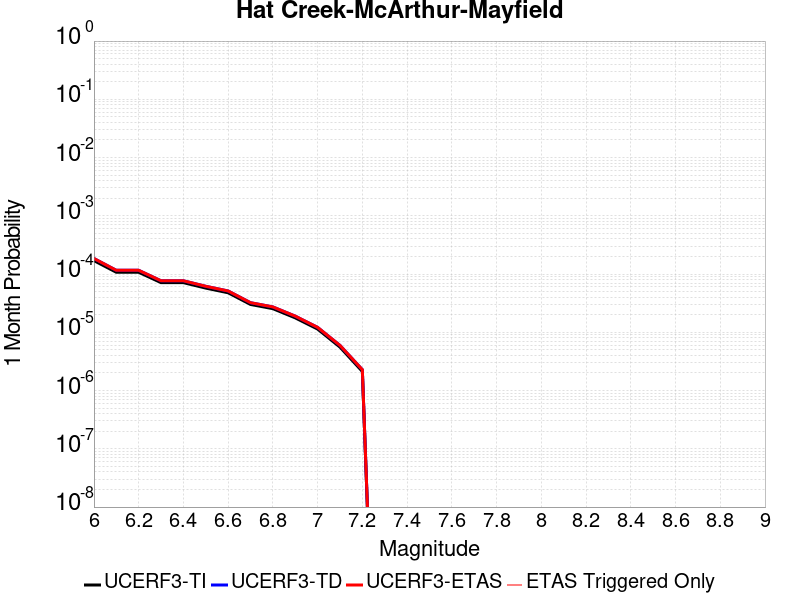 | 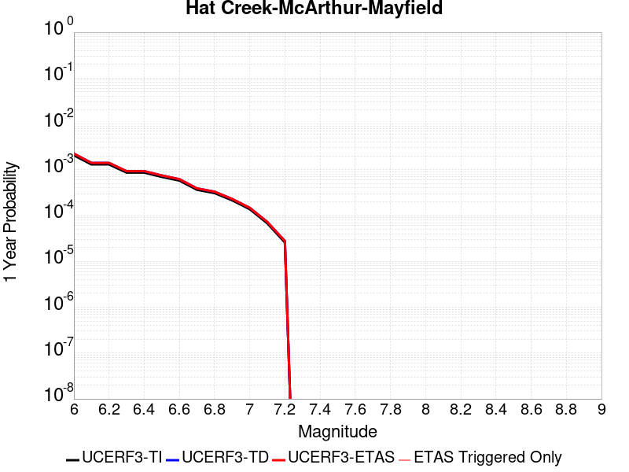 | 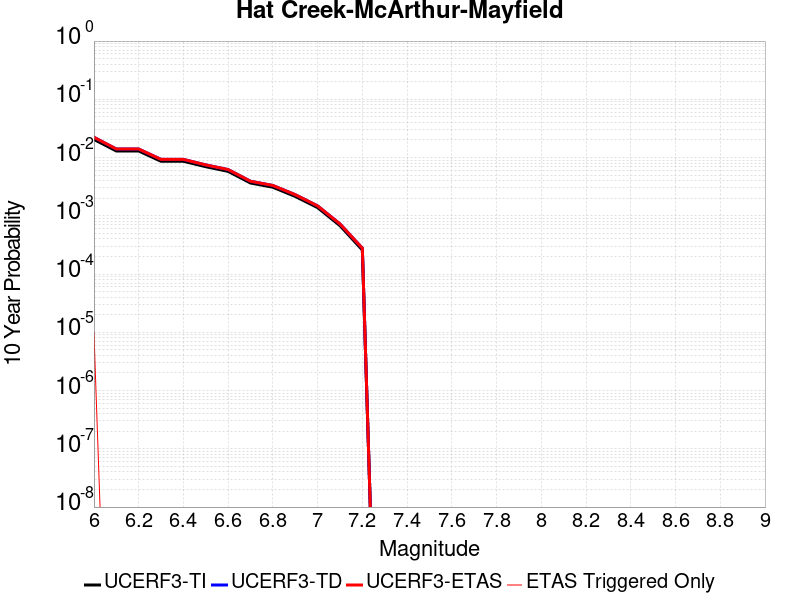 |

| Magnitude | 1 wk TI Prob | 1 wk TD Prob | 1 wk ETAS Prob | 1 wk ETAS/TD Gain | 1 wk ETAS Triggered Only | 1 mo TI Prob | 1 mo TD Prob | 1 mo ETAS Prob | 1 mo ETAS/TD Gain | 1 mo ETAS Triggered Only | 1 yr TI Prob | 1 yr TD Prob | 1 yr ETAS Prob | 1 yr ETAS/TD Gain | 1 yr ETAS Triggered Only | 10 yr TI Prob | 10 yr TD Prob | 10 yr ETAS Prob | 10 yr ETAS/TD Gain | 10 yr ETAS Triggered Only |
|-----|-----|-----|-----|-----|-----|-----|-----|-----|-----|-----|-----|-----|-----|-----|-----|-----|-----|-----|-----|-----|
| 6.0 | 3.967457E-5 | 4.3158816E-5 | 4.3158816E-5 | 1.0 | 0.0 | 1.7002279E-4 | 1.8495388E-4 | 1.8495388E-4 | 1.0 | 0.0 | 0.002068062 | 0.0022496022 | 0.0022496022 | 1.0 | 0.0 | 0.02048922 | 0.022280656 | 0.02229238 | 1.0005262 | 1.1990408E-5 |
| 6.1 | 2.5044013E-5 | 2.7071455E-5 | 2.7071455E-5 | 1.0 | 0.0 | 1.0732707E-4 | 1.16015544E-4 | 1.16015544E-4 | 1.0 | 0.0 | 0.0013059238 | 0.0014116059 | 0.0014116059 | 1.0 | 0.0 | 0.01298276 | 0.014029811 | 0.014029811 | 1.0 | 0.0 |
| 6.2 | 2.5044013E-5 | 2.7071455E-5 | 2.7071455E-5 | 1.0 | 0.0 | 1.0732707E-4 | 1.16015544E-4 | 1.16015544E-4 | 1.0 | 0.0 | 0.0013059238 | 0.0014116059 | 0.0014116059 | 1.0 | 0.0 | 0.01298276 | 0.014029811 | 0.014029811 | 1.0 | 0.0 |
| 6.3 | 1.6624012E-5 | 1.7891252E-5 | 1.7891252E-5 | 1.0 | 0.0 | 7.124382E-5 | 7.6674594E-5 | 7.6674594E-5 | 1.0 | 0.0 | 8.670483E-4 | 9.3312195E-4 | 9.3312195E-4 | 1.0 | 0.0 | 0.008636732 | 0.009292973 | 0.009292973 | 1.0 | 0.0 |
| 6.4 | 1.6624012E-5 | 1.7891252E-5 | 1.7891252E-5 | 1.0 | 0.0 | 7.124382E-5 | 7.6674594E-5 | 7.6674594E-5 | 1.0 | 0.0 | 8.670483E-4 | 9.3312195E-4 | 9.3312195E-4 | 1.0 | 0.0 | 0.008636732 | 0.009292973 | 0.009292973 | 1.0 | 0.0 |
| 6.5 | 1.3394842E-5 | 1.4392279E-5 | 1.4392279E-5 | 1.0 | 0.0 | 5.7405203E-5 | 6.167977E-5 | 6.167977E-5 | 1.0 | 0.0 | 6.986842E-4 | 7.5069803E-4 | 7.5069803E-4 | 1.0 | 0.0 | 0.006964916 | 0.0074822144 | 0.0074822144 | 1.0 | 0.0 |
| 6.6 | 1.1137514E-5 | 1.1954662E-5 | 1.1954662E-5 | 1.0 | 0.0 | 4.7731326E-5 | 5.1233284E-5 | 5.1233284E-5 | 1.0 | 0.0 | 5.809739E-4 | 6.235907E-4 | 6.235907E-4 | 1.0 | 0.0 | 0.005794574 | 0.0062188306 | 0.0062188306 | 1.0 | 0.0 |
| 6.7 | 7.0200663E-6 | 7.5243615E-6 | 7.5243615E-6 | 1.0 | 0.0 | 3.008565E-5 | 3.2246873E-5 | 3.2246873E-5 | 1.0 | 0.0 | 3.6623122E-4 | 3.9253655E-4 | 3.9253655E-4 | 1.0 | 0.0 | 0.0036562826 | 0.0039185947 | 0.0039185947 | 1.0 | 0.0 |
| 6.8 | 5.940172E-6 | 6.365537E-6 | 6.365537E-6 | 1.0 | 0.0 | 2.545763E-5 | 2.7280596E-5 | 2.7280596E-5 | 1.0 | 0.0 | 3.0990256E-4 | 3.320919E-4 | 3.320919E-4 | 1.0 | 0.0 | 0.0030947074 | 0.0033160849 | 0.0033160849 | 1.0 | 0.0 |
| 6.9 | 4.129831E-6 | 4.423589E-6 | 4.423589E-6 | 1.0 | 0.0 | 1.7699154E-5 | 1.8958104E-5 | 1.8958104E-5 | 1.0 | 0.0 | 2.154659E-4 | 2.3079127E-4 | 2.3079127E-4 | 1.0 | 0.0 | 0.002152571 | 0.002305594 | 0.002305594 | 1.0 | 0.0 |
| 7.0 | 2.6512955E-6 | 2.8374266E-6 | 2.8374266E-6 | 1.0 | 0.0 | 1.1362646E-5 | 1.2160345E-5 | 1.2160345E-5 | 1.0 | 0.0 | 1.3833142E-4 | 1.4804257E-4 | 1.4804257E-4 | 1.0 | 0.0 | 0.0013824535 | 0.001479482 | 0.001479482 | 1.0 | 0.0 |
| 7.1 | 1.2992575E-6 | 1.3909448E-6 | 1.3909448E-6 | 1.0 | 0.0 | 5.568235E-6 | 5.96118E-6 | 5.96118E-6 | 1.0 | 0.0 | 6.779115E-5 | 7.257517E-5 | 7.257517E-5 | 1.0 | 0.0 | 6.7770475E-4 | 7.2553626E-4 | 7.2553626E-4 | 1.0 | 0.0 |
| 7.2 | 4.968191E-7 | 5.3271987E-7 | 5.3271987E-7 | 1.0 | 0.0 | 2.1292228E-6 | 2.2830839E-6 | 2.2830839E-6 | 1.0 | 0.0 | 2.592298E-5 | 2.7796319E-5 | 2.7796319E-5 | 1.0 | 0.0 | 2.5919956E-4 | 2.7794077E-4 | 2.7794077E-4 | 1.0 | 0.0 |

## Joshua Tree (Seismicity)
*[(top)](#table-of-contents)*

| 1 Week | 1 Month | 1 Year | 10 Year |
|-----|-----|-----|-----|
| 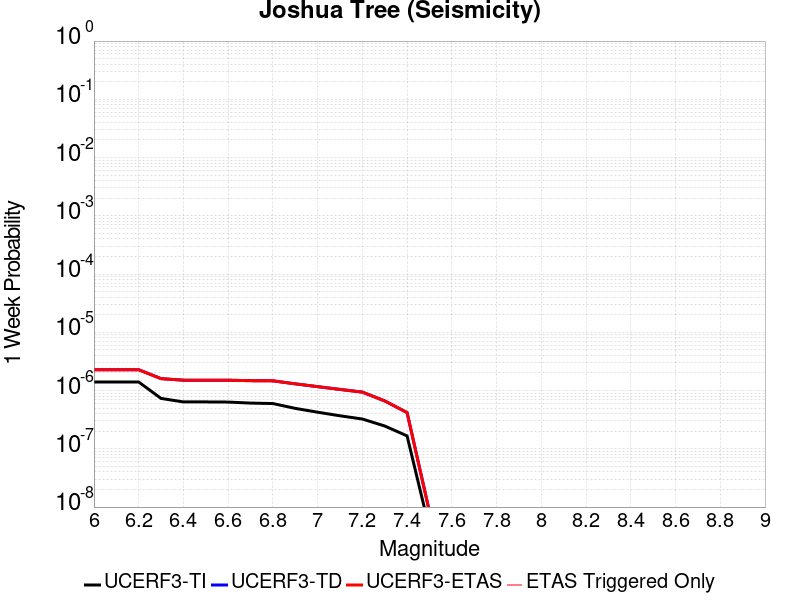 | 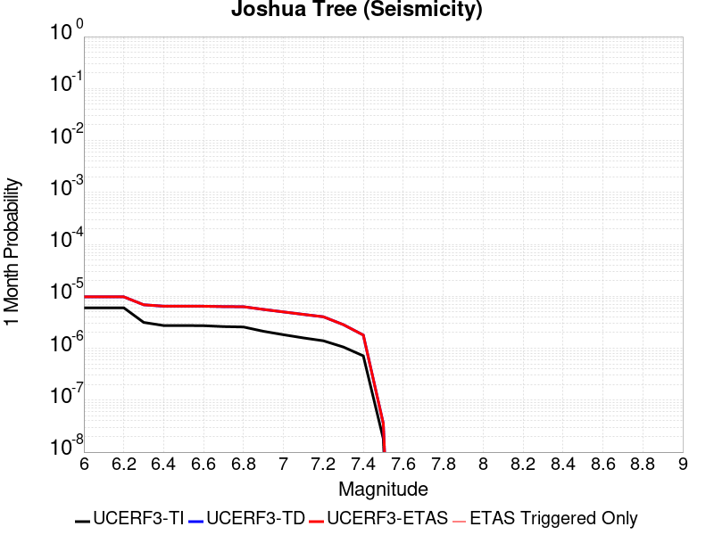 | 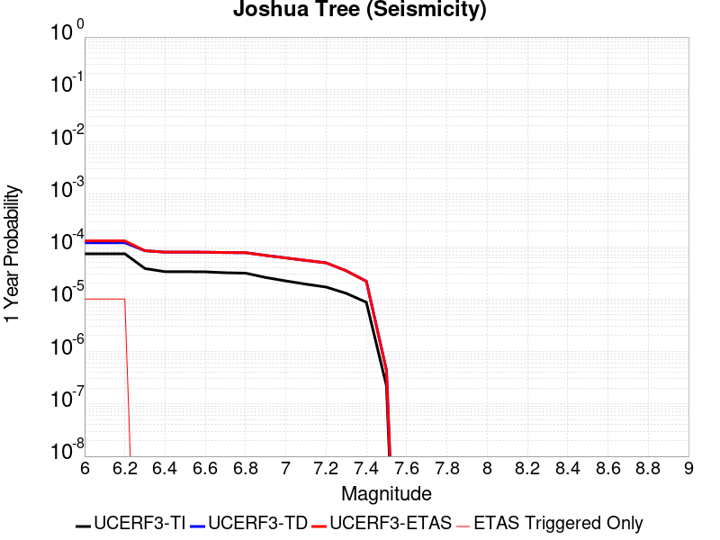 | 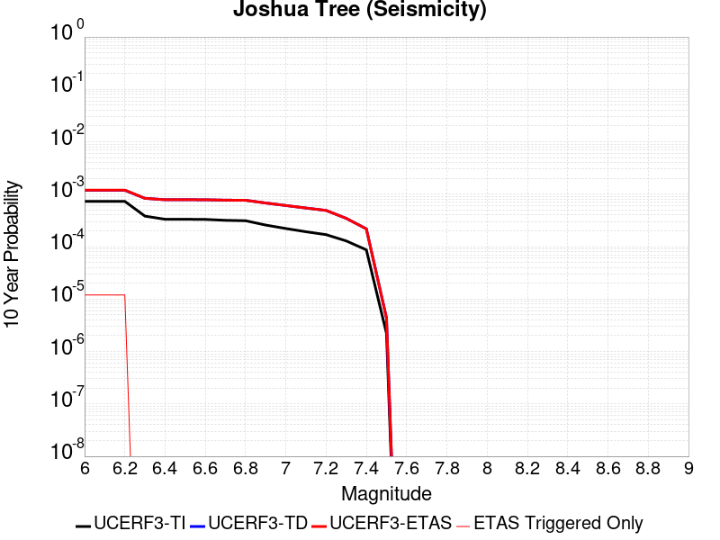 |

| Magnitude | 1 wk TI Prob | 1 wk TD Prob | 1 wk ETAS Prob | 1 wk ETAS/TD Gain | 1 wk ETAS Triggered Only | 1 mo TI Prob | 1 mo TD Prob | 1 mo ETAS Prob | 1 mo ETAS/TD Gain | 1 mo ETAS Triggered Only | 1 yr TI Prob | 1 yr TD Prob | 1 yr ETAS Prob | 1 yr ETAS/TD Gain | 1 yr ETAS Triggered Only | 10 yr TI Prob | 10 yr TD Prob | 10 yr ETAS Prob | 10 yr ETAS/TD Gain | 10 yr ETAS Triggered Only |
|-----|-----|-----|-----|-----|-----|-----|-----|-----|-----|-----|-----|-----|-----|-----|-----|-----|-----|-----|-----|-----|
| 6.0 | 1.4025588E-6 | 2.2783317E-6 | 2.2783317E-6 | 1.0 | 0.0 | 6.0109523E-6 | 9.764246E-6 | 9.764246E-6 | 1.0 | 0.0 | 7.318089E-5 | 1.1887387E-4 | 1.3086284E-4 | 1.1008546 | 1.1990408E-5 | 7.315679E-4 | 0.001188167 | 0.0012001431 | 1.0100795 | 1.1990408E-5 |
| 6.1 | 1.4025588E-6 | 2.2783317E-6 | 2.2783317E-6 | 1.0 | 0.0 | 6.0109523E-6 | 9.764246E-6 | 9.764246E-6 | 1.0 | 0.0 | 7.318089E-5 | 1.1887387E-4 | 1.3086284E-4 | 1.1008546 | 1.1990408E-5 | 7.315679E-4 | 0.001188167 | 0.0012001431 | 1.0100795 | 1.1990408E-5 |
| 6.2 | 1.4025588E-6 | 2.2783317E-6 | 2.2783317E-6 | 1.0 | 0.0 | 6.0109523E-6 | 9.764246E-6 | 9.764246E-6 | 1.0 | 0.0 | 7.318089E-5 | 1.1887387E-4 | 1.3086284E-4 | 1.1008546 | 1.1990408E-5 | 7.315679E-4 | 0.001188167 | 0.0012001431 | 1.0100795 | 1.1990408E-5 |
| 6.3 | 7.3325685E-7 | 1.6023617E-6 | 1.6023617E-6 | 1.0 | 0.0 | 3.1425257E-6 | 6.867247E-6 | 6.867247E-6 | 1.0 | 0.0 | 3.825958E-5 | 8.360561E-5 | 8.360561E-5 | 1.0 | 0.0 | 3.8252992E-4 | 8.3575014E-4 | 8.3575014E-4 | 1.0 | 0.0 |
| 6.4 | 6.38256E-7 | 1.5066106E-6 | 1.5066106E-6 | 1.0 | 0.0 | 2.7353801E-6 | 6.456887E-6 | 6.456887E-6 | 1.0 | 0.0 | 3.3302742E-5 | 7.860984E-5 | 7.860984E-5 | 1.0 | 0.0 | 3.3297754E-4 | 7.8582775E-4 | 7.8582775E-4 | 1.0 | 0.0 |
| 6.5 | 6.38256E-7 | 1.5066106E-6 | 1.5066106E-6 | 1.0 | 0.0 | 2.7353801E-6 | 6.456887E-6 | 6.456887E-6 | 1.0 | 0.0 | 3.3302742E-5 | 7.860984E-5 | 7.860984E-5 | 1.0 | 0.0 | 3.3297754E-4 | 7.8582775E-4 | 7.8582775E-4 | 1.0 | 0.0 |
| 6.6 | 6.3436806E-7 | 1.5036989E-6 | 1.5036989E-6 | 1.0 | 0.0 | 2.7187175E-6 | 6.4444084E-6 | 6.4444084E-6 | 1.0 | 0.0 | 3.3099885E-5 | 7.8457924E-5 | 7.8457924E-5 | 1.0 | 0.0 | 3.3094952E-4 | 7.8430964E-4 | 7.8430964E-4 | 1.0 | 0.0 |
| 6.7 | 6.094856E-7 | 1.4783893E-6 | 1.4783893E-6 | 1.0 | 0.0 | 2.6120786E-6 | 6.3359394E-6 | 6.3359394E-6 | 1.0 | 0.0 | 3.1801592E-5 | 7.71374E-5 | 7.71374E-5 | 1.0 | 0.0 | 3.179704E-4 | 7.711137E-4 | 7.711137E-4 | 1.0 | 0.0 |
| 6.8 | 5.984801E-7 | 1.4696668E-6 | 1.4696668E-6 | 1.0 | 0.0 | 2.564912E-6 | 6.2985573E-6 | 6.2985573E-6 | 1.0 | 0.0 | 3.1227355E-5 | 7.6682314E-5 | 7.6682314E-5 | 1.0 | 0.0 | 3.1222968E-4 | 7.6656585E-4 | 7.6656585E-4 | 1.0 | 0.0 |
| 6.9 | 4.94631E-7 | 1.3041065E-6 | 1.3041065E-6 | 1.0 | 0.0 | 2.1198455E-6 | 5.589016E-6 | 5.589016E-6 | 1.0 | 0.0 | 2.5808813E-5 | 6.80442E-5 | 6.80442E-5 | 1.0 | 0.0 | 2.5805813E-4 | 6.802397E-4 | 6.802397E-4 | 1.0 | 0.0 |
| 7.0 | 4.250375E-7 | 1.1678025E-6 | 1.1678025E-6 | 1.0 | 0.0 | 1.8215881E-6 | 5.0048584E-6 | 5.0048584E-6 | 1.0 | 0.0 | 2.2177608E-5 | 6.0932496E-5 | 6.0932496E-5 | 1.0 | 0.0 | 2.2175396E-4 | 6.0916296E-4 | 6.0916296E-4 | 1.0 | 0.0 |
| 7.1 | 3.6888565E-7 | 1.0462553E-6 | 1.0462553E-6 | 1.0 | 0.0 | 1.5809376E-6 | 4.483944E-6 | 4.483944E-6 | 1.0 | 0.0 | 1.9247746E-5 | 5.4590695E-5 | 5.4590695E-5 | 1.0 | 0.0 | 1.9246078E-4 | 5.4577726E-4 | 5.4577726E-4 | 1.0 | 0.0 |
| 7.2 | 3.2473773E-7 | 9.4108793E-7 | 9.4108793E-7 | 1.0 | 0.0 | 1.3917323E-6 | 4.033228E-6 | 4.033228E-6 | 1.0 | 0.0 | 1.694421E-5 | 4.9103484E-5 | 4.9103484E-5 | 1.0 | 0.0 | 1.6942917E-4 | 4.9093046E-4 | 4.9093046E-4 | 1.0 | 0.0 |
| 7.3 | 2.465367E-7 | 6.6451065E-7 | 6.6451065E-7 | 1.0 | 0.0 | 1.0565853E-6 | 2.8479E-6 | 2.8479E-6 | 1.0 | 0.0 | 1.2863851E-5 | 3.4672667E-5 | 3.4672667E-5 | 1.0 | 0.0 | 1.2863107E-4 | 3.46676E-4 | 3.46676E-4 | 1.0 | 0.0 |
| 7.4 | 1.6654941E-7 | 4.186258E-7 | 4.186258E-7 | 1.0 | 0.0 | 7.13783E-7 | 1.7941095E-6 | 1.7941095E-6 | 1.0 | 0.0 | 8.690274E-6 | 2.1843092E-5 | 2.1843092E-5 | 1.0 | 0.0 | 8.689934E-5 | 2.184122E-4 | 2.184122E-4 | 1.0 | 0.0 |
| 7.5 | 4.24214E-9 | 8.344335E-9 | 8.344335E-9 | 1.0 | 0.0 | 1.81806E-8 | 3.5761435E-8 | 3.5761435E-8 | 1.0 | 0.0 | 2.213488E-7 | 4.3539546E-7 | 4.3539546E-7 | 1.0 | 0.0 | 2.2134857E-6 | 4.3539526E-6 | 4.3539526E-6 | 1.0 | 0.0 |

## North Frontal  (West)
*[(top)](#table-of-contents)*

| 1 Week | 1 Month | 1 Year | 10 Year |
|-----|-----|-----|-----|
| 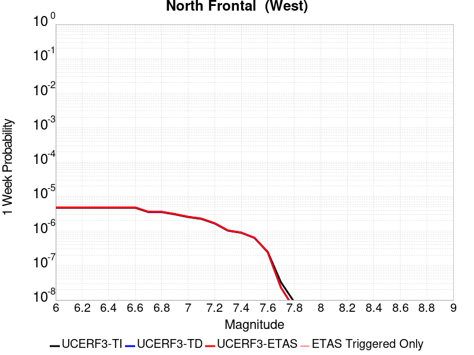 | 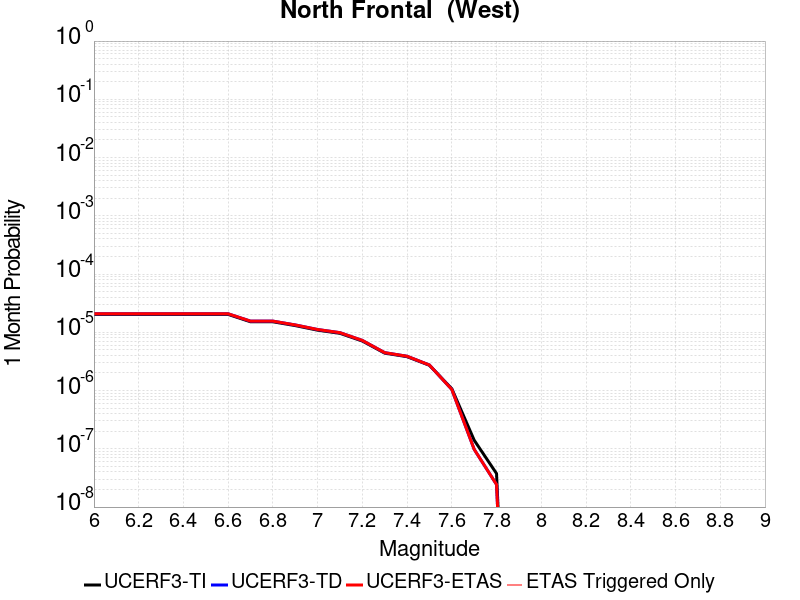 | 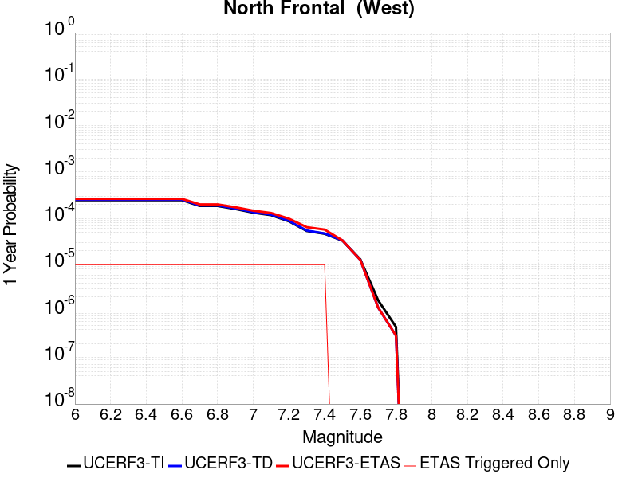 | 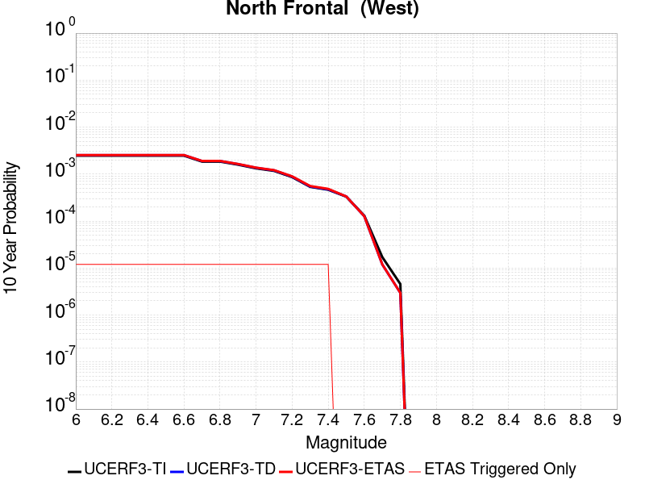 |

| Magnitude | 1 wk TI Prob | 1 wk TD Prob | 1 wk ETAS Prob | 1 wk ETAS/TD Gain | 1 wk ETAS Triggered Only | 1 mo TI Prob | 1 mo TD Prob | 1 mo ETAS Prob | 1 mo ETAS/TD Gain | 1 mo ETAS Triggered Only | 1 yr TI Prob | 1 yr TD Prob | 1 yr ETAS Prob | 1 yr ETAS/TD Gain | 1 yr ETAS Triggered Only | 10 yr TI Prob | 10 yr TD Prob | 10 yr ETAS Prob | 10 yr ETAS/TD Gain | 10 yr ETAS Triggered Only |
|-----|-----|-----|-----|-----|-----|-----|-----|-----|-----|-----|-----|-----|-----|-----|-----|-----|-----|-----|-----|-----|
| 6.0 | 4.7316266E-6 | 4.8526913E-6 | 4.8526913E-6 | 1.0 | 0.0 | 2.0278241E-5 | 2.0797092E-5 | 2.0797092E-5 | 1.0 | 0.0 | 2.4685962E-4 | 2.5317664E-4 | 2.65164E-4 | 1.0473479 | 1.1990408E-5 | 0.0024658558 | 0.002529028 | 0.0025409881 | 1.0047292 | 1.1990408E-5 |
| 6.1 | 4.7316266E-6 | 4.8526913E-6 | 4.8526913E-6 | 1.0 | 0.0 | 2.0278241E-5 | 2.0797092E-5 | 2.0797092E-5 | 1.0 | 0.0 | 2.4685962E-4 | 2.5317664E-4 | 2.65164E-4 | 1.0473479 | 1.1990408E-5 | 0.0024658558 | 0.002529028 | 0.0025409881 | 1.0047292 | 1.1990408E-5 |
| 6.2 | 4.7316266E-6 | 4.8526913E-6 | 4.8526913E-6 | 1.0 | 0.0 | 2.0278241E-5 | 2.0797092E-5 | 2.0797092E-5 | 1.0 | 0.0 | 2.4685962E-4 | 2.5317664E-4 | 2.65164E-4 | 1.0473479 | 1.1990408E-5 | 0.0024658558 | 0.002529028 | 0.0025409881 | 1.0047292 | 1.1990408E-5 |
| 6.3 | 4.7316266E-6 | 4.8526913E-6 | 4.8526913E-6 | 1.0 | 0.0 | 2.0278241E-5 | 2.0797092E-5 | 2.0797092E-5 | 1.0 | 0.0 | 2.4685962E-4 | 2.5317664E-4 | 2.65164E-4 | 1.0473479 | 1.1990408E-5 | 0.0024658558 | 0.002529028 | 0.0025409881 | 1.0047292 | 1.1990408E-5 |
| 6.4 | 4.7316266E-6 | 4.8526913E-6 | 4.8526913E-6 | 1.0 | 0.0 | 2.0278241E-5 | 2.0797092E-5 | 2.0797092E-5 | 1.0 | 0.0 | 2.4685962E-4 | 2.5317664E-4 | 2.65164E-4 | 1.0473479 | 1.1990408E-5 | 0.0024658558 | 0.002529028 | 0.0025409881 | 1.0047292 | 1.1990408E-5 |
| 6.5 | 4.7316266E-6 | 4.8526913E-6 | 4.8526913E-6 | 1.0 | 0.0 | 2.0278241E-5 | 2.0797092E-5 | 2.0797092E-5 | 1.0 | 0.0 | 2.4685962E-4 | 2.5317664E-4 | 2.65164E-4 | 1.0473479 | 1.1990408E-5 | 0.0024658558 | 0.002529028 | 0.0025409881 | 1.0047292 | 1.1990408E-5 |
| 6.6 | 4.7316266E-6 | 4.8526913E-6 | 4.8526913E-6 | 1.0 | 0.0 | 2.0278241E-5 | 2.0797092E-5 | 2.0797092E-5 | 1.0 | 0.0 | 2.4685962E-4 | 2.5317664E-4 | 2.65164E-4 | 1.0473479 | 1.1990408E-5 | 0.0024658558 | 0.002529028 | 0.0025409881 | 1.0047292 | 1.1990408E-5 |
| 6.7 | 3.5382777E-6 | 3.630901E-6 | 3.630901E-6 | 1.0 | 0.0 | 1.516396E-5 | 1.5560916E-5 | 1.5560916E-5 | 1.0 | 0.0 | 1.8460557E-4 | 1.8943845E-4 | 2.0142659E-4 | 1.0632825 | 1.1990408E-5 | 0.0018445229 | 0.0018928467 | 0.0019048144 | 1.0063226 | 1.1990408E-5 |
| 6.8 | 3.5382777E-6 | 3.630901E-6 | 3.630901E-6 | 1.0 | 0.0 | 1.516396E-5 | 1.5560916E-5 | 1.5560916E-5 | 1.0 | 0.0 | 1.8460557E-4 | 1.8943845E-4 | 2.0142659E-4 | 1.0632825 | 1.1990408E-5 | 0.0018445229 | 0.0018928467 | 0.0019048144 | 1.0063226 | 1.1990408E-5 |
| 6.9 | 3.0428037E-6 | 3.1227737E-6 | 3.1227737E-6 | 1.0 | 0.0 | 1.30405215E-5 | 1.3383251E-5 | 1.3383251E-5 | 1.0 | 0.0 | 1.5875678E-4 | 1.6292959E-4 | 1.7491804E-4 | 1.0735806 | 1.1990408E-5 | 0.0015864341 | 0.0016281684 | 0.0016401393 | 1.0073524 | 1.1990408E-5 |
| 7.0 | 2.538778E-6 | 2.6061018E-6 | 2.6061018E-6 | 1.0 | 0.0 | 1.0880432E-5 | 1.1168962E-5 | 1.1168962E-5 | 1.0 | 0.0 | 1.324612E-4 | 1.3597411E-4 | 1.4796288E-4 | 1.0881696 | 1.1990408E-5 | 0.0013238228 | 0.0013589559 | 0.00137093 | 1.0088112 | 1.1990408E-5 |
| 7.1 | 2.2418935E-6 | 2.3012176E-6 | 2.3012176E-6 | 1.0 | 0.0 | 9.60808E-6 | 9.862327E-6 | 9.862327E-6 | 1.0 | 0.0 | 1.1697209E-4 | 1.20067656E-4 | 1.3205662E-4 | 1.0998517 | 1.1990408E-5 | 0.0011691054 | 0.0012000718 | 0.0012120478 | 1.0099794 | 1.1990408E-5 |
| 7.2 | 1.6526745E-6 | 1.6924928E-6 | 1.6924928E-6 | 1.0 | 0.0 | 7.082872E-6 | 7.2535217E-6 | 7.2535217E-6 | 1.0 | 0.0 | 8.623055E-5 | 8.8308305E-5 | 1.0029765E-4 | 1.135767 | 1.1990408E-5 | 8.61971E-4 | 8.827572E-4 | 8.94737E-4 | 1.0135709 | 1.1990408E-5 |
| 7.3 | 1.0246019E-6 | 1.044231E-6 | 1.044231E-6 | 1.0 | 0.0 | 4.391144E-6 | 4.4752687E-6 | 4.4752687E-6 | 1.0 | 0.0 | 5.3460866E-5 | 5.448515E-5 | 6.64749E-5 | 1.2200555 | 1.1990408E-5 | 5.344801E-4 | 5.447294E-4 | 5.5671326E-4 | 1.0219997 | 1.1990408E-5 |
| 7.4 | 8.9045164E-7 | 9.0566016E-7 | 9.0566016E-7 | 1.0 | 0.0 | 3.8162157E-6 | 3.8813955E-6 | 3.8813955E-6 | 1.0 | 0.0 | 4.646144E-5 | 4.725508E-5 | 5.9244918E-5 | 1.253726 | 1.1990408E-5 | 4.6451724E-4 | 4.7246116E-4 | 4.8444592E-4 | 1.0253667 | 1.1990408E-5 |
| 7.5 | 6.3357E-7 | 6.402732E-7 | 6.402732E-7 | 1.0 | 0.0 | 2.7152971E-6 | 2.7440256E-6 | 2.7440256E-6 | 1.0 | 0.0 | 3.305824E-5 | 3.3408065E-5 | 3.3408065E-5 | 1.0 | 0.0 | 3.3053322E-4 | 3.34037E-4 | 3.34037E-4 | 1.0 | 0.0 |
| 7.6 | 2.5087024E-7 | 2.4361222E-7 | 2.4361222E-7 | 1.0 | 0.0 | 1.0751578E-6 | 1.044052E-6 | 1.044052E-6 | 1.0 | 0.0 | 1.3089967E-5 | 1.2711281E-5 | 1.2711281E-5 | 1.0 | 0.0 | 1.3089196E-4 | 1.2710759E-4 | 1.2710759E-4 | 1.0 | 0.0 |
| 7.7 | 3.282987E-8 | 2.2874342E-8 | 2.2874342E-8 | 1.0 | 0.0 | 1.4069944E-7 | 9.803289E-8 | 9.803289E-8 | 1.0 | 0.0 | 1.7130144E-6 | 1.1935499E-6 | 1.1935499E-6 | 1.0 | 0.0 | 1.7130013E-5 | 1.1935444E-5 | 1.1935444E-5 | 1.0 | 0.0 |
| 7.8 | 8.77499E-9 | 5.681659E-9 | 5.681659E-9 | 1.0 | 0.0 | 3.7607098E-8 | 2.4349967E-8 | 2.4349967E-8 | 1.0 | 0.0 | 4.578663E-7 | 2.9646083E-7 | 2.9646083E-7 | 1.0 | 0.0 | 4.5786537E-6 | 2.9646058E-6 | 2.9646058E-6 | 1.0 | 0.0 |

## Northridge Hills
*[(top)](#table-of-contents)*

| 1 Week | 1 Month | 1 Year | 10 Year |
|-----|-----|-----|-----|
| 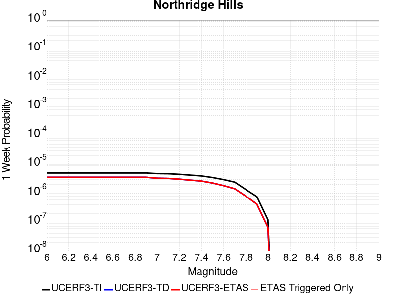 | 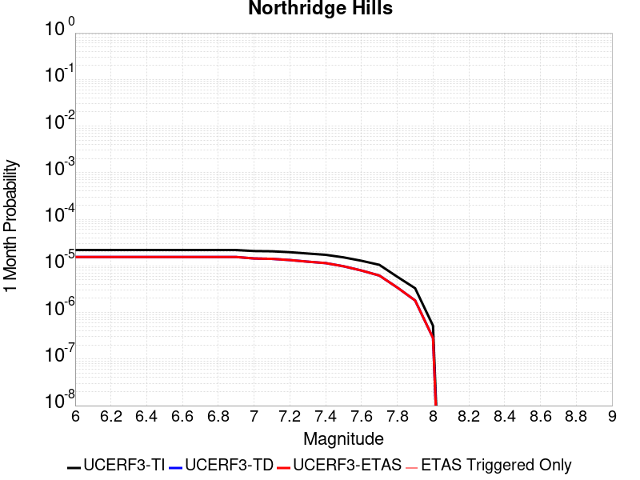 | 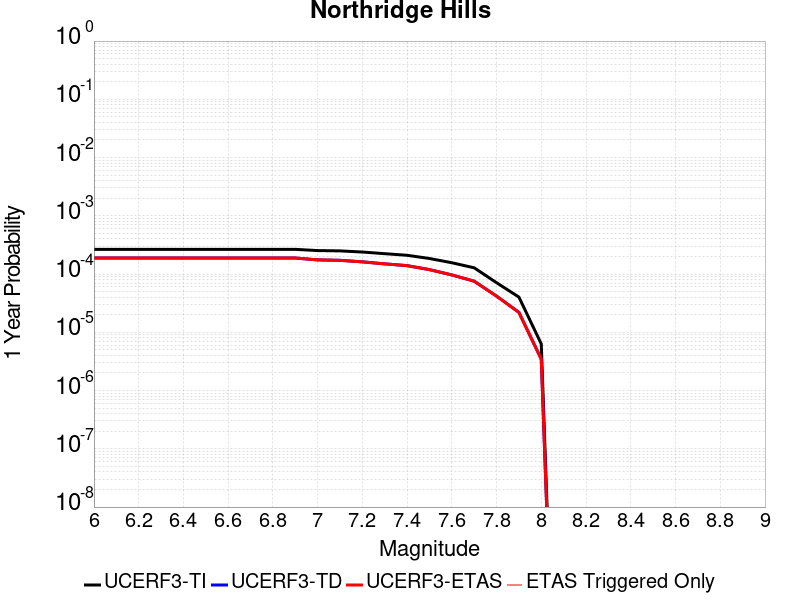 | 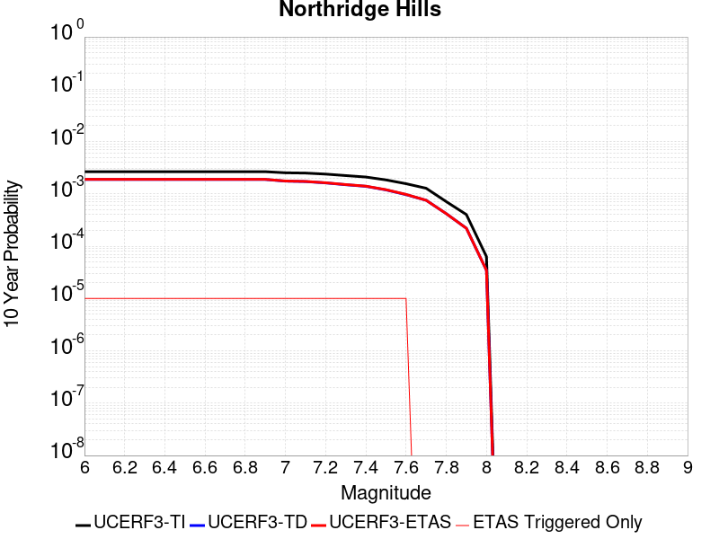 |

| Magnitude | 1 wk TI Prob | 1 wk TD Prob | 1 wk ETAS Prob | 1 wk ETAS/TD Gain | 1 wk ETAS Triggered Only | 1 mo TI Prob | 1 mo TD Prob | 1 mo ETAS Prob | 1 mo ETAS/TD Gain | 1 mo ETAS Triggered Only | 1 yr TI Prob | 1 yr TD Prob | 1 yr ETAS Prob | 1 yr ETAS/TD Gain | 1 yr ETAS Triggered Only | 10 yr TI Prob | 10 yr TD Prob | 10 yr ETAS Prob | 10 yr ETAS/TD Gain | 10 yr ETAS Triggered Only |
|-----|-----|-----|-----|-----|-----|-----|-----|-----|-----|-----|-----|-----|-----|-----|-----|-----|-----|-----|-----|-----|
| 6.0 | 5.095982E-6 | 3.6153342E-6 | 3.6153342E-6 | 1.0 | 0.0 | 2.183974E-5 | 1.5494197E-5 | 1.5494197E-5 | 1.0 | 0.0 | 2.658664E-4 | 1.8862565E-4 | 1.8862565E-4 | 1.0 | 0.0 | 0.0026554854 | 0.0018846678 | 0.0018966356 | 1.00635 | 1.1990408E-5 |
| 6.1 | 5.095982E-6 | 3.6153342E-6 | 3.6153342E-6 | 1.0 | 0.0 | 2.183974E-5 | 1.5494197E-5 | 1.5494197E-5 | 1.0 | 0.0 | 2.658664E-4 | 1.8862565E-4 | 1.8862565E-4 | 1.0 | 0.0 | 0.0026554854 | 0.0018846678 | 0.0018966356 | 1.00635 | 1.1990408E-5 |
| 6.2 | 5.095982E-6 | 3.6153342E-6 | 3.6153342E-6 | 1.0 | 0.0 | 2.183974E-5 | 1.5494197E-5 | 1.5494197E-5 | 1.0 | 0.0 | 2.658664E-4 | 1.8862565E-4 | 1.8862565E-4 | 1.0 | 0.0 | 0.0026554854 | 0.0018846678 | 0.0018966356 | 1.00635 | 1.1990408E-5 |
| 6.3 | 5.095982E-6 | 3.6153342E-6 | 3.6153342E-6 | 1.0 | 0.0 | 2.183974E-5 | 1.5494197E-5 | 1.5494197E-5 | 1.0 | 0.0 | 2.658664E-4 | 1.8862565E-4 | 1.8862565E-4 | 1.0 | 0.0 | 0.0026554854 | 0.0018846678 | 0.0018966356 | 1.00635 | 1.1990408E-5 |
| 6.4 | 5.095982E-6 | 3.6153342E-6 | 3.6153342E-6 | 1.0 | 0.0 | 2.183974E-5 | 1.5494197E-5 | 1.5494197E-5 | 1.0 | 0.0 | 2.658664E-4 | 1.8862565E-4 | 1.8862565E-4 | 1.0 | 0.0 | 0.0026554854 | 0.0018846678 | 0.0018966356 | 1.00635 | 1.1990408E-5 |
| 6.5 | 5.095982E-6 | 3.6153342E-6 | 3.6153342E-6 | 1.0 | 0.0 | 2.183974E-5 | 1.5494197E-5 | 1.5494197E-5 | 1.0 | 0.0 | 2.658664E-4 | 1.8862565E-4 | 1.8862565E-4 | 1.0 | 0.0 | 0.0026554854 | 0.0018846678 | 0.0018966356 | 1.00635 | 1.1990408E-5 |
| 6.6 | 5.095982E-6 | 3.6153342E-6 | 3.6153342E-6 | 1.0 | 0.0 | 2.183974E-5 | 1.5494197E-5 | 1.5494197E-5 | 1.0 | 0.0 | 2.658664E-4 | 1.8862565E-4 | 1.8862565E-4 | 1.0 | 0.0 | 0.0026554854 | 0.0018846678 | 0.0018966356 | 1.00635 | 1.1990408E-5 |
| 6.7 | 5.095982E-6 | 3.6153342E-6 | 3.6153342E-6 | 1.0 | 0.0 | 2.183974E-5 | 1.5494197E-5 | 1.5494197E-5 | 1.0 | 0.0 | 2.658664E-4 | 1.8862565E-4 | 1.8862565E-4 | 1.0 | 0.0 | 0.0026554854 | 0.0018846678 | 0.0018966356 | 1.00635 | 1.1990408E-5 |
| 6.8 | 5.095982E-6 | 3.6153342E-6 | 3.6153342E-6 | 1.0 | 0.0 | 2.183974E-5 | 1.5494197E-5 | 1.5494197E-5 | 1.0 | 0.0 | 2.658664E-4 | 1.8862565E-4 | 1.8862565E-4 | 1.0 | 0.0 | 0.0026554854 | 0.0018846678 | 0.0018966356 | 1.00635 | 1.1990408E-5 |
| 6.9 | 5.0942654E-6 | 3.613549E-6 | 3.613549E-6 | 1.0 | 0.0 | 2.1832384E-5 | 1.5486547E-5 | 1.5486547E-5 | 1.0 | 0.0 | 2.6577685E-4 | 1.8853252E-4 | 1.8853252E-4 | 1.0 | 0.0 | 0.002654592 | 0.0018837382 | 0.0018957059 | 1.0063533 | 1.1990408E-5 |
| 7.0 | 4.851143E-6 | 3.3588624E-6 | 3.3588624E-6 | 1.0 | 0.0 | 2.0790447E-5 | 1.4395046E-5 | 1.4395046E-5 | 1.0 | 0.0 | 2.5309427E-4 | 1.7524562E-4 | 1.7524562E-4 | 1.0 | 0.0 | 0.0025280623 | 0.0017510786 | 0.0017630481 | 1.0068355 | 1.1990408E-5 |
| 7.1 | 4.7910607E-6 | 3.2971432E-6 | 3.2971432E-6 | 1.0 | 0.0 | 2.0532956E-5 | 1.4130537E-5 | 1.4130537E-5 | 1.0 | 0.0 | 2.4996005E-4 | 1.7202574E-4 | 1.7202574E-4 | 1.0 | 0.0 | 0.0024967908 | 0.00171893 | 0.0017308997 | 1.0069635 | 1.1990408E-5 |
| 7.2 | 4.580079E-6 | 3.1069198E-6 | 3.1069198E-6 | 1.0 | 0.0 | 1.9628762E-5 | 1.3315303E-5 | 1.3315303E-5 | 1.0 | 0.0 | 2.3895396E-4 | 1.6210177E-4 | 1.6210177E-4 | 1.0 | 0.0 | 0.0023869718 | 0.0016198389 | 0.0016318099 | 1.0073903 | 1.1990408E-5 |
| 7.3 | 4.290062E-6 | 2.8683467E-6 | 2.8683467E-6 | 1.0 | 0.0 | 1.838585E-5 | 1.2292857E-5 | 1.2292857E-5 | 1.0 | 0.0 | 2.2382473E-4 | 1.4965527E-4 | 1.4965527E-4 | 1.0 | 0.0 | 0.0022359942 | 0.001495548 | 0.0015075204 | 1.0080054 | 1.1990408E-5 |
| 7.4 | 4.0259683E-6 | 2.6740217E-6 | 2.6740217E-6 | 1.0 | 0.0 | 1.7254037E-5 | 1.1460043E-5 | 1.1460043E-5 | 1.0 | 0.0 | 2.1004764E-4 | 1.3951711E-4 | 1.3951711E-4 | 1.0 | 0.0 | 0.002098492 | 0.001394298 | 0.0014062718 | 1.0085876 | 1.1990408E-5 |
| 7.5 | 3.5477108E-6 | 2.285331E-6 | 2.285331E-6 | 1.0 | 0.0 | 1.5204386E-5 | 9.794238E-6 | 9.794238E-6 | 1.0 | 0.0 | 1.8509767E-4 | 1.1923834E-4 | 1.1923834E-4 | 1.0 | 0.0 | 0.0018494357 | 0.0011917452 | 0.0012037213 | 1.0100492 | 1.1990408E-5 |
| 7.6 | 2.9990608E-6 | 1.8529445E-6 | 1.8529445E-6 | 1.0 | 0.0 | 1.2853055E-5 | 7.941167E-6 | 7.941167E-6 | 1.0 | 0.0 | 1.564747E-4 | 9.667942E-5 | 9.667942E-5 | 1.0 | 0.0 | 0.0015636457 | 9.663744E-4 | 9.783532E-4 | 1.0123956 | 1.1990408E-5 |
| 7.7 | 2.4542855E-6 | 1.446239E-6 | 1.446239E-6 | 1.0 | 0.0 | 1.05183235E-5 | 6.1981527E-6 | 6.1981527E-6 | 1.0 | 0.0 | 1.2805307E-4 | 7.54599E-5 | 7.54599E-5 | 1.0 | 0.0 | 0.001279793 | 7.5434335E-4 | 7.5434335E-4 | 1.0 | 0.0 |
| 7.8 | 1.3623128E-6 | 8.0169184E-7 | 8.0169184E-7 | 1.0 | 0.0 | 5.8384703E-6 | 3.4358175E-6 | 3.4358175E-6 | 1.0 | 0.0 | 7.108106E-5 | 4.1830277E-5 | 4.1830277E-5 | 1.0 | 0.0 | 7.1058323E-4 | 4.1822426E-4 | 4.1822426E-4 | 1.0 | 0.0 |
| 7.9 | 7.716622E-7 | 4.2194137E-7 | 4.2194137E-7 | 1.0 | 0.0 | 3.3071194E-6 | 1.808319E-6 | 1.808319E-6 | 1.0 | 0.0 | 4.0263436E-5 | 2.2016062E-5 | 2.2016062E-5 | 1.0 | 0.0 | 4.0256142E-4 | 2.2013891E-4 | 2.2013891E-4 | 1.0 | 0.0 |
| 8.0 | 1.2117711E-7 | 6.622407E-8 | 6.622407E-8 | 1.0 | 0.0 | 5.1933034E-7 | 2.8381743E-7 | 2.8381743E-7 | 1.0 | 0.0 | 6.3228285E-6 | 3.4554716E-6 | 3.4554716E-6 | 1.0 | 0.0 | 6.3226486E-5 | 3.45542E-5 | 3.45542E-5 | 1.0 | 0.0 |

## La Panza 2011
*[(top)](#table-of-contents)*

| 1 Week | 1 Month | 1 Year | 10 Year |
|-----|-----|-----|-----|
|  | 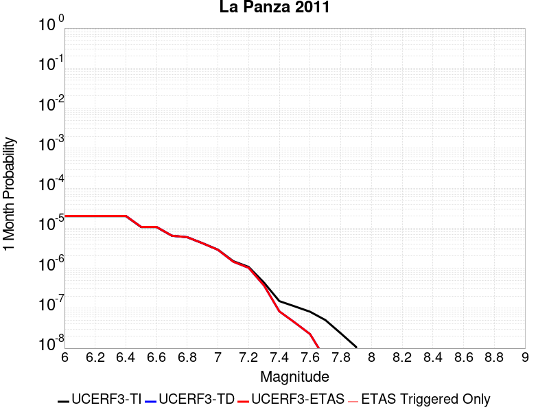 | 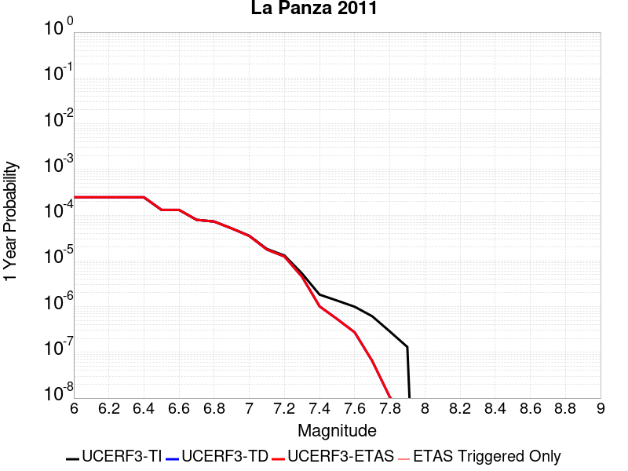 | 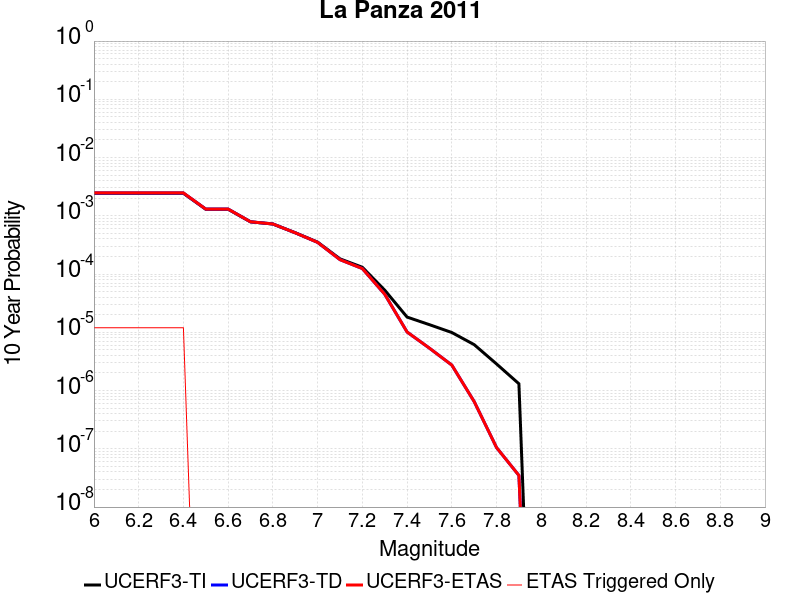 |

| Magnitude | 1 wk TI Prob | 1 wk TD Prob | 1 wk ETAS Prob | 1 wk ETAS/TD Gain | 1 wk ETAS Triggered Only | 1 mo TI Prob | 1 mo TD Prob | 1 mo ETAS Prob | 1 mo ETAS/TD Gain | 1 mo ETAS Triggered Only | 1 yr TI Prob | 1 yr TD Prob | 1 yr ETAS Prob | 1 yr ETAS/TD Gain | 1 yr ETAS Triggered Only | 10 yr TI Prob | 10 yr TD Prob | 10 yr ETAS Prob | 10 yr ETAS/TD Gain | 10 yr ETAS Triggered Only |
|-----|-----|-----|-----|-----|-----|-----|-----|-----|-----|-----|-----|-----|-----|-----|-----|-----|-----|-----|-----|-----|
| 6.0 | 4.6754544E-6 | 4.717608E-6 | 4.717608E-6 | 1.0 | 0.0 | 2.0037509E-5 | 2.0218175E-5 | 2.0218175E-5 | 1.0 | 0.0 | 2.4392935E-4 | 2.4613045E-4 | 2.4613045E-4 | 1.0 | 0.0 | 0.0024366176 | 0.0024587729 | 0.0024707338 | 1.0048646 | 1.1990408E-5 |
| 6.1 | 4.6754544E-6 | 4.717608E-6 | 4.717608E-6 | 1.0 | 0.0 | 2.0037509E-5 | 2.0218175E-5 | 2.0218175E-5 | 1.0 | 0.0 | 2.4392935E-4 | 2.4613045E-4 | 2.4613045E-4 | 1.0 | 0.0 | 0.0024366176 | 0.0024587729 | 0.0024707338 | 1.0048646 | 1.1990408E-5 |
| 6.2 | 4.6754544E-6 | 4.717608E-6 | 4.717608E-6 | 1.0 | 0.0 | 2.0037509E-5 | 2.0218175E-5 | 2.0218175E-5 | 1.0 | 0.0 | 2.4392935E-4 | 2.4613045E-4 | 2.4613045E-4 | 1.0 | 0.0 | 0.0024366176 | 0.0024587729 | 0.0024707338 | 1.0048646 | 1.1990408E-5 |
| 6.3 | 4.6754544E-6 | 4.717608E-6 | 4.717608E-6 | 1.0 | 0.0 | 2.0037509E-5 | 2.0218175E-5 | 2.0218175E-5 | 1.0 | 0.0 | 2.4392935E-4 | 2.4613045E-4 | 2.4613045E-4 | 1.0 | 0.0 | 0.0024366176 | 0.0024587729 | 0.0024707338 | 1.0048646 | 1.1990408E-5 |
| 6.4 | 4.6754544E-6 | 4.717608E-6 | 4.717608E-6 | 1.0 | 0.0 | 2.0037509E-5 | 2.0218175E-5 | 2.0218175E-5 | 1.0 | 0.0 | 2.4392935E-4 | 2.4613045E-4 | 2.4613045E-4 | 1.0 | 0.0 | 0.0024366176 | 0.0024587729 | 0.0024707338 | 1.0048646 | 1.1990408E-5 |
| 6.5 | 2.485343E-6 | 2.5006163E-6 | 2.5006163E-6 | 1.0 | 0.0 | 1.0651426E-5 | 1.0716885E-5 | 1.0716885E-5 | 1.0 | 0.0 | 1.296734E-4 | 1.3047065E-4 | 1.3047065E-4 | 1.0 | 0.0 | 0.0012959775 | 0.001303979 | 0.001303979 | 1.0 | 0.0 |
| 6.6 | 2.485343E-6 | 2.5006163E-6 | 2.5006163E-6 | 1.0 | 0.0 | 1.0651426E-5 | 1.0716885E-5 | 1.0716885E-5 | 1.0 | 0.0 | 1.296734E-4 | 1.3047065E-4 | 1.3047065E-4 | 1.0 | 0.0 | 0.0012959775 | 0.001303979 | 0.001303979 | 1.0 | 0.0 |
| 6.7 | 1.5108508E-6 | 1.5146534E-6 | 1.5146534E-6 | 1.0 | 0.0 | 6.4750584E-6 | 6.491356E-6 | 6.491356E-6 | 1.0 | 0.0 | 7.8830984E-5 | 7.90295E-5 | 7.90295E-5 | 1.0 | 0.0 | 7.880303E-4 | 7.900248E-4 | 7.900248E-4 | 1.0 | 0.0 |
| 6.8 | 1.3865837E-6 | 1.3885259E-6 | 1.3885259E-6 | 1.0 | 0.0 | 5.942488E-6 | 5.950812E-6 | 5.950812E-6 | 1.0 | 0.0 | 7.234739E-5 | 7.244883E-5 | 7.244883E-5 | 1.0 | 0.0 | 7.232384E-4 | 7.242619E-4 | 7.242619E-4 | 1.0 | 0.0 |
| 6.9 | 9.826583E-7 | 9.796437E-7 | 9.796437E-7 | 1.0 | 0.0 | 4.2113857E-6 | 4.1984663E-6 | 4.1984663E-6 | 1.0 | 0.0 | 5.1272415E-5 | 5.1115185E-5 | 5.1115185E-5 | 1.0 | 0.0 | 5.126059E-4 | 5.1103963E-4 | 5.1103963E-4 | 1.0 | 0.0 |
| 7.0 | 6.7797646E-7 | 6.71036E-7 | 6.71036E-7 | 1.0 | 0.0 | 2.9056102E-6 | 2.8758654E-6 | 2.8758654E-6 | 1.0 | 0.0 | 3.537523E-5 | 3.501313E-5 | 3.501313E-5 | 1.0 | 0.0 | 3.5369597E-4 | 3.5007924E-4 | 3.5007924E-4 | 1.0 | 0.0 |
| 7.1 | 3.4979826E-7 | 3.3875276E-7 | 3.3875276E-7 | 1.0 | 0.0 | 1.4991346E-6 | 1.4517968E-6 | 1.4517968E-6 | 1.0 | 0.0 | 1.825181E-5 | 1.7675495E-5 | 1.7675495E-5 | 1.0 | 0.0 | 1.825031E-4 | 1.7674206E-4 | 1.7674206E-4 | 1.0 | 0.0 |
| 7.2 | 2.5088332E-7 | 2.3833275E-7 | 2.3833275E-7 | 1.0 | 0.0 | 1.0752137E-6 | 1.0214256E-6 | 1.0214256E-6 | 1.0 | 0.0 | 1.3090649E-5 | 1.2435796E-5 | 1.2435796E-5 | 1.0 | 0.0 | 1.3089878E-4 | 1.2435185E-4 | 1.2435185E-4 | 1.0 | 0.0 |
| 7.3 | 1.0159086E-7 | 8.645961E-8 | 8.645961E-8 | 1.0 | 0.0 | 4.3538932E-7 | 3.7054113E-7 | 3.7054113E-7 | 1.0 | 0.0 | 5.300852E-6 | 4.5113293E-6 | 4.5113293E-6 | 1.0 | 0.0 | 5.3007258E-5 | 4.5112418E-5 | 4.5112418E-5 | 1.0 | 0.0 |
| 7.4 | 3.5006252E-8 | 1.940863E-8 | 1.940863E-8 | 1.0 | 0.0 | 1.5002678E-7 | 8.3179835E-8 | 8.3179835E-8 | 1.0 | 0.0 | 1.8265745E-6 | 1.012714E-6 | 1.012714E-6 | 1.0 | 0.0 | 1.8265595E-5 | 1.0127096E-5 | 1.0127096E-5 | 1.0 | 0.0 |
| 7.5 | 2.592274E-8 | 1.0242307E-8 | 1.0242307E-8 | 1.0 | 0.0 | 1.1109746E-7 | 4.3895596E-8 | 4.3895596E-8 | 1.0 | 0.0 | 1.3526106E-6 | 5.3442875E-7 | 5.3442875E-7 | 1.0 | 0.0 | 1.3526024E-5 | 5.3442755E-6 | 5.3442755E-6 | 1.0 | 0.0 |
| 7.6 | 1.9016717E-8 | 5.2468647E-9 | 5.2468647E-9 | 1.0 | 0.0 | 8.150022E-8 | 2.2486562E-8 | 2.2486562E-8 | 1.0 | 0.0 | 9.922647E-7 | 2.7377385E-7 | 2.7377385E-7 | 1.0 | 0.0 | 9.922603E-6 | 2.7377353E-6 | 2.7377353E-6 | 1.0 | 0.0 |
| 7.7 | 1.17738495E-8 | 1.2407027E-9 | 1.2407027E-9 | 1.0 | 0.0 | 5.0459356E-8 | 5.317297E-9 | 5.317297E-9 | 1.0 | 0.0 | 6.1434247E-7 | 6.473808E-8 | 6.473808E-8 | 1.0 | 0.0 | 6.143408E-6 | 6.4738066E-7 | 6.4738066E-7 | 1.0 | 0.0 |
| 7.8 | 5.489079E-9 | 2.0135205E-10 | 2.0135205E-10 | 1.0 | 0.0 | 2.3524624E-8 | 8.6293683E-10 | 8.6293683E-10 | 1.0 | 0.0 | 2.8641225E-7 | 1.0506253E-8 | 1.0506253E-8 | 1.0 | 0.0 | 2.8641189E-6 | 1.0506252E-7 | 1.0506252E-7 | 1.0 | 0.0 |
| 7.9 | 2.5081048E-9 | 6.6927686E-11 | 6.6927686E-11 | 1.0 | 0.0 | 1.0749021E-8 | 2.868329E-10 | 2.868329E-10 | 1.0 | 0.0 | 1.3086932E-7 | 3.492187E-9 | 3.492187E-9 | 1.0 | 0.0 | 1.3086925E-6 | 3.4921865E-8 | 3.4921865E-8 | 1.0 | 0.0 |

## Sisar
*[(top)](#table-of-contents)*

| 1 Week | 1 Month | 1 Year | 10 Year |
|-----|-----|-----|-----|
| 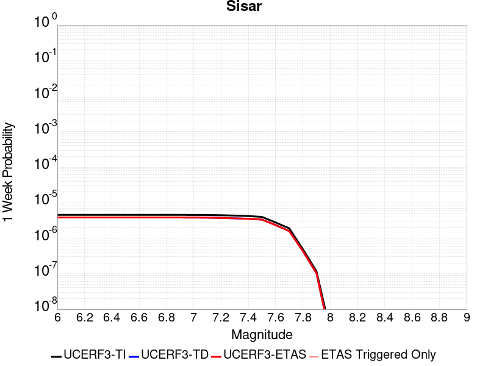 | 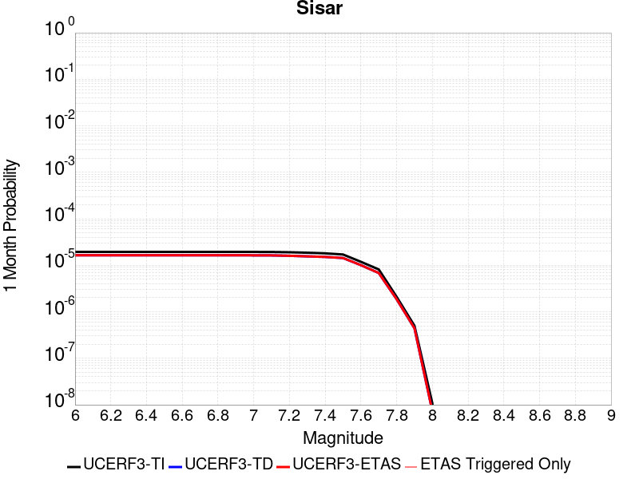 | 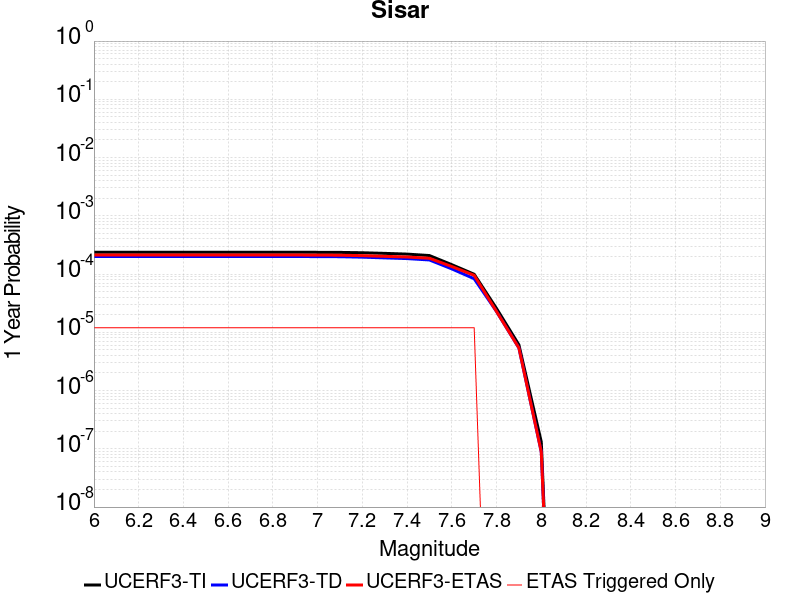 | 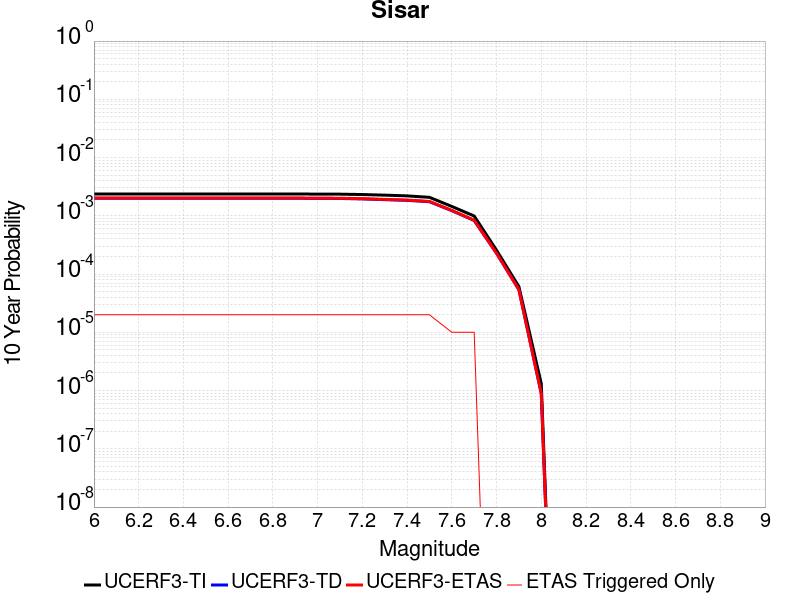 |

| Magnitude | 1 wk TI Prob | 1 wk TD Prob | 1 wk ETAS Prob | 1 wk ETAS/TD Gain | 1 wk ETAS Triggered Only | 1 mo TI Prob | 1 mo TD Prob | 1 mo ETAS Prob | 1 mo ETAS/TD Gain | 1 mo ETAS Triggered Only | 1 yr TI Prob | 1 yr TD Prob | 1 yr ETAS Prob | 1 yr ETAS/TD Gain | 1 yr ETAS Triggered Only | 10 yr TI Prob | 10 yr TD Prob | 10 yr ETAS Prob | 10 yr ETAS/TD Gain | 10 yr ETAS Triggered Only |
|-----|-----|-----|-----|-----|-----|-----|-----|-----|-----|-----|-----|-----|-----|-----|-----|-----|-----|-----|-----|-----|
| 6.0 | 4.544193E-6 | 3.8396215E-6 | 3.8396215E-6 | 1.0 | 0.0 | 1.9474966E-5 | 1.6455419E-5 | 1.6455419E-5 | 1.0 | 0.0 | 2.3708193E-4 | 2.0032664E-4 | 2.1231466E-4 | 1.0598423 | 1.1990408E-5 | 0.0023682916 | 0.0020014944 | 0.0020134607 | 1.0059787 | 1.1990408E-5 |
| 6.1 | 4.544193E-6 | 3.8396215E-6 | 3.8396215E-6 | 1.0 | 0.0 | 1.9474966E-5 | 1.6455419E-5 | 1.6455419E-5 | 1.0 | 0.0 | 2.3708193E-4 | 2.0032664E-4 | 2.1231466E-4 | 1.0598423 | 1.1990408E-5 | 0.0023682916 | 0.0020014944 | 0.0020134607 | 1.0059787 | 1.1990408E-5 |
| 6.2 | 4.544193E-6 | 3.8396215E-6 | 3.8396215E-6 | 1.0 | 0.0 | 1.9474966E-5 | 1.6455419E-5 | 1.6455419E-5 | 1.0 | 0.0 | 2.3708193E-4 | 2.0032664E-4 | 2.1231466E-4 | 1.0598423 | 1.1990408E-5 | 0.0023682916 | 0.0020014944 | 0.0020134607 | 1.0059787 | 1.1990408E-5 |
| 6.3 | 4.544193E-6 | 3.8396215E-6 | 3.8396215E-6 | 1.0 | 0.0 | 1.9474966E-5 | 1.6455419E-5 | 1.6455419E-5 | 1.0 | 0.0 | 2.3708193E-4 | 2.0032664E-4 | 2.1231466E-4 | 1.0598423 | 1.1990408E-5 | 0.0023682916 | 0.0020014944 | 0.0020134607 | 1.0059787 | 1.1990408E-5 |
| 6.4 | 4.544193E-6 | 3.8396215E-6 | 3.8396215E-6 | 1.0 | 0.0 | 1.9474966E-5 | 1.6455419E-5 | 1.6455419E-5 | 1.0 | 0.0 | 2.3708193E-4 | 2.0032664E-4 | 2.1231466E-4 | 1.0598423 | 1.1990408E-5 | 0.0023682916 | 0.0020014944 | 0.0020134607 | 1.0059787 | 1.1990408E-5 |
| 6.5 | 4.544193E-6 | 3.8396215E-6 | 3.8396215E-6 | 1.0 | 0.0 | 1.9474966E-5 | 1.6455419E-5 | 1.6455419E-5 | 1.0 | 0.0 | 2.3708193E-4 | 2.0032664E-4 | 2.1231466E-4 | 1.0598423 | 1.1990408E-5 | 0.0023682916 | 0.0020014944 | 0.0020134607 | 1.0059787 | 1.1990408E-5 |
| 6.6 | 4.544193E-6 | 3.8396215E-6 | 3.8396215E-6 | 1.0 | 0.0 | 1.9474966E-5 | 1.6455419E-5 | 1.6455419E-5 | 1.0 | 0.0 | 2.3708193E-4 | 2.0032664E-4 | 2.1231466E-4 | 1.0598423 | 1.1990408E-5 | 0.0023682916 | 0.0020014944 | 0.0020134607 | 1.0059787 | 1.1990408E-5 |
| 6.7 | 4.544193E-6 | 3.8396215E-6 | 3.8396215E-6 | 1.0 | 0.0 | 1.9474966E-5 | 1.6455419E-5 | 1.6455419E-5 | 1.0 | 0.0 | 2.3708193E-4 | 2.0032664E-4 | 2.1231466E-4 | 1.0598423 | 1.1990408E-5 | 0.0023682916 | 0.0020014944 | 0.0020134607 | 1.0059787 | 1.1990408E-5 |
| 6.8 | 4.544193E-6 | 3.8396215E-6 | 3.8396215E-6 | 1.0 | 0.0 | 1.9474966E-5 | 1.6455419E-5 | 1.6455419E-5 | 1.0 | 0.0 | 2.3708193E-4 | 2.0032664E-4 | 2.1231466E-4 | 1.0598423 | 1.1990408E-5 | 0.0023682916 | 0.0020014944 | 0.0020134607 | 1.0059787 | 1.1990408E-5 |
| 6.9 | 4.542225E-6 | 3.8375833E-6 | 3.8375833E-6 | 1.0 | 0.0 | 1.9466532E-5 | 1.6446686E-5 | 1.6446686E-5 | 1.0 | 0.0 | 2.3697925E-4 | 2.0022033E-4 | 2.1220832E-4 | 1.059874 | 1.1990408E-5 | 0.002367267 | 0.0020004332 | 0.0020123995 | 1.0059819 | 1.1990408E-5 |
| 7.0 | 4.5278484E-6 | 3.8226476E-6 | 3.8226476E-6 | 1.0 | 0.0 | 1.940492E-5 | 1.6382673E-5 | 1.6382673E-5 | 1.0 | 0.0 | 2.3622929E-4 | 1.9944114E-4 | 2.1142916E-4 | 1.0601081 | 1.1990408E-5 | 0.0023597833 | 0.0019926552 | 0.0020046218 | 1.0060053 | 1.1990408E-5 |
| 7.1 | 4.5132488E-6 | 3.807435E-6 | 3.807435E-6 | 1.0 | 0.0 | 1.9342351E-5 | 1.6317477E-5 | 1.6317477E-5 | 1.0 | 0.0 | 2.3546767E-4 | 1.9864751E-4 | 2.1063554E-4 | 1.0603483 | 1.1990408E-5 | 0.0023521832 | 0.0019847332 | 0.0019966997 | 1.0060294 | 1.1990408E-5 |
| 7.2 | 4.448859E-6 | 3.739895E-6 | 3.739895E-6 | 1.0 | 0.0 | 1.9066398E-5 | 1.6028025E-5 | 1.6028025E-5 | 1.0 | 0.0 | 2.3210866E-4 | 1.9512406E-4 | 2.0711213E-4 | 1.0614382 | 1.1990408E-5 | 0.0023186638 | 0.001949561 | 0.0019615279 | 1.0061383 | 1.1990408E-5 |
| 7.3 | 4.3424366E-6 | 3.6337285E-6 | 3.6337285E-6 | 1.0 | 0.0 | 1.861031E-5 | 1.557303E-5 | 1.557303E-5 | 1.0 | 0.0 | 2.2655698E-4 | 1.895855E-4 | 2.0157362E-4 | 1.0632334 | 1.1990408E-5 | 0.0022632615 | 0.001894271 | 0.0019062387 | 1.0063179 | 1.1990408E-5 |
| 7.4 | 4.218641E-6 | 3.533081E-6 | 3.533081E-6 | 1.0 | 0.0 | 1.8079765E-5 | 1.514169E-5 | 1.514169E-5 | 1.0 | 0.0 | 2.2009891E-4 | 1.8433481E-4 | 1.9632302E-4 | 1.0650349 | 1.1990408E-5 | 0.0021988105 | 0.0018418524 | 0.0018538208 | 1.006498 | 1.1990408E-5 |
| 7.5 | 3.983779E-6 | 3.3478473E-6 | 3.3478473E-6 | 1.0 | 0.0 | 1.7073227E-5 | 1.434784E-5 | 1.434784E-5 | 1.0 | 0.0 | 2.0784672E-4 | 1.7467128E-4 | 1.8665958E-4 | 1.0686336 | 1.1990408E-5 | 0.0020765243 | 0.0017453729 | 0.0017573424 | 1.0068579 | 1.1990408E-5 |
| 7.6 | 2.777393E-6 | 2.352279E-6 | 2.352279E-6 | 1.0 | 0.0 | 1.1903058E-5 | 1.0081157E-5 | 1.0081157E-5 | 1.0 | 0.0 | 1.449101E-4 | 1.2273125E-4 | 1.3472018E-4 | 1.0976845 | 1.1990408E-5 | 0.0014481564 | 0.0012266424 | 0.0012386182 | 1.009763 | 1.1990408E-5 |
| 7.7 | 1.9028433E-6 | 1.5938915E-6 | 1.5938915E-6 | 1.0 | 0.0 | 8.155017E-6 | 6.830946E-6 | 6.830946E-6 | 1.0 | 0.0 | 9.928281E-5 | 8.316364E-5 | 9.515305E-5 | 1.1441665 | 1.1990408E-5 | 9.923846E-4 | 8.313299E-4 | 8.433104E-4 | 1.0144112 | 1.1990408E-5 |
| 7.8 | 4.9095956E-7 | 4.358398E-7 | 4.358398E-7 | 1.0 | 0.0 | 2.1041105E-6 | 1.8678836E-6 | 1.8678836E-6 | 1.0 | 0.0 | 2.5617246E-5 | 2.2741247E-5 | 2.2741247E-5 | 1.0 | 0.0 | 2.5614293E-4 | 2.2738938E-4 | 2.2738938E-4 | 1.0 | 0.0 |
| 7.9 | 1.16657894E-7 | 1.0335634E-7 | 1.0335634E-7 | 1.0 | 0.0 | 4.999623E-7 | 4.4295567E-7 | 4.4295567E-7 | 1.0 | 0.0 | 6.087024E-6 | 5.392972E-6 | 5.392972E-6 | 1.0 | 0.0 | 6.0868573E-5 | 5.3928445E-5 | 5.3928445E-5 | 1.0 | 0.0 |
| 8.0 | 2.5100346E-9 | 1.7068081E-9 | 1.7068081E-9 | 1.0 | 0.0 | 1.0757291E-8 | 7.3148922E-9 | 7.3148922E-9 | 1.0 | 0.0 | 1.3097001E-7 | 8.905881E-8 | 8.905881E-8 | 1.0 | 0.0 | 1.3096993E-6 | 8.905878E-7 | 8.905878E-7 | 1.0 | 0.0 |

## Owens Valley Keough Hot Springs
*[(top)](#table-of-contents)*

| 1 Week | 1 Month | 1 Year | 10 Year |
|-----|-----|-----|-----|
| 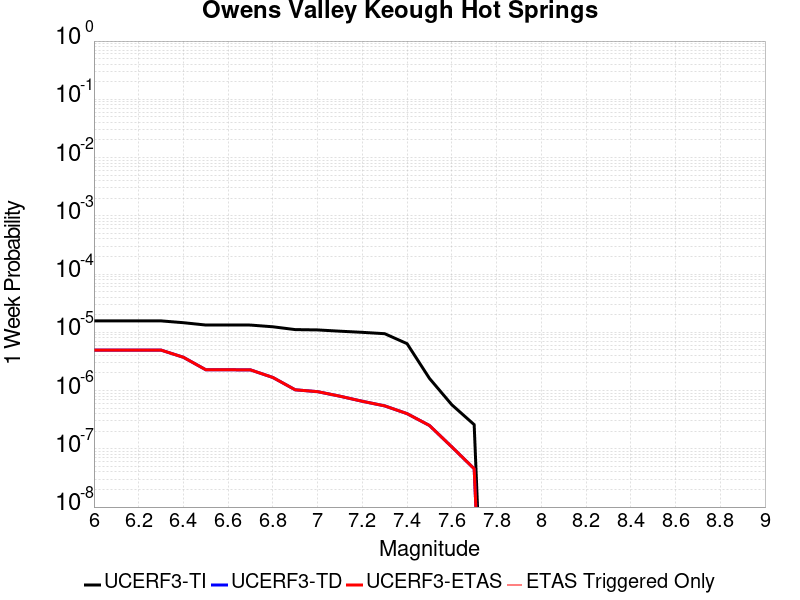 | 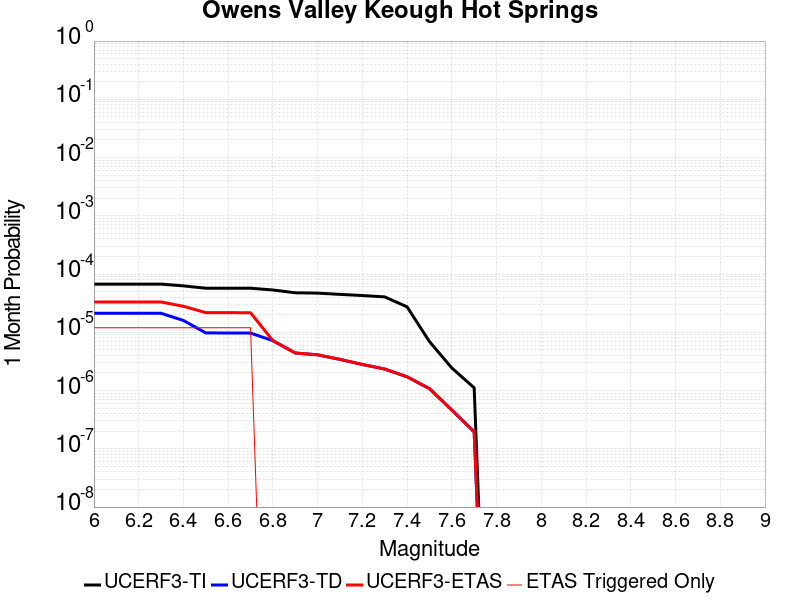 | 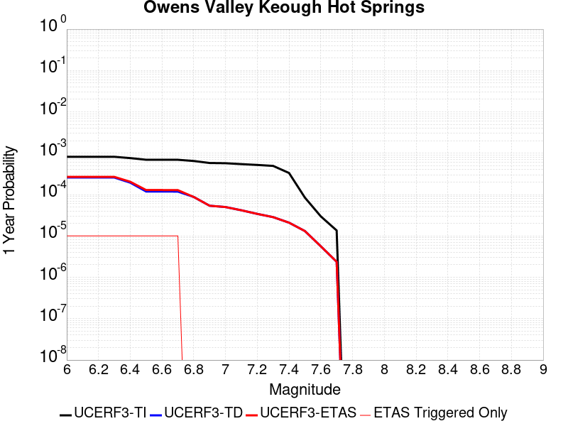 | 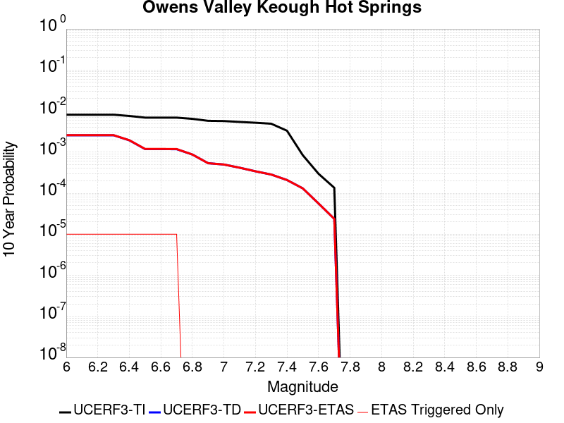 |

| Magnitude | 1 wk TI Prob | 1 wk TD Prob | 1 wk ETAS Prob | 1 wk ETAS/TD Gain | 1 wk ETAS Triggered Only | 1 mo TI Prob | 1 mo TD Prob | 1 mo ETAS Prob | 1 mo ETAS/TD Gain | 1 mo ETAS Triggered Only | 1 yr TI Prob | 1 yr TD Prob | 1 yr ETAS Prob | 1 yr ETAS/TD Gain | 1 yr ETAS Triggered Only | 10 yr TI Prob | 10 yr TD Prob | 10 yr ETAS Prob | 10 yr ETAS/TD Gain | 10 yr ETAS Triggered Only |
|-----|-----|-----|-----|-----|-----|-----|-----|-----|-----|-----|-----|-----|-----|-----|-----|-----|-----|-----|-----|-----|
| 6.0 | 1.5708529E-5 | 4.9508244E-6 | 4.9508244E-6 | 1.0 | 0.0 | 6.7320536E-5 | 2.1217675E-5 | 3.3207827E-5 | 1.5651021 | 1.1990408E-5 | 8.193192E-4 | 2.582997E-4 | 2.70287E-4 | 1.0464085 | 1.1990408E-5 | 0.008163051 | 0.0025806532 | 0.0025926125 | 1.0046343 | 1.1990408E-5 |
| 6.1 | 1.5708529E-5 | 4.9508244E-6 | 4.9508244E-6 | 1.0 | 0.0 | 6.7320536E-5 | 2.1217675E-5 | 3.3207827E-5 | 1.5651021 | 1.1990408E-5 | 8.193192E-4 | 2.582997E-4 | 2.70287E-4 | 1.0464085 | 1.1990408E-5 | 0.008163051 | 0.0025806532 | 0.0025926125 | 1.0046343 | 1.1990408E-5 |
| 6.2 | 1.5708529E-5 | 4.9508244E-6 | 4.9508244E-6 | 1.0 | 0.0 | 6.7320536E-5 | 2.1217675E-5 | 3.3207827E-5 | 1.5651021 | 1.1990408E-5 | 8.193192E-4 | 2.582997E-4 | 2.70287E-4 | 1.0464085 | 1.1990408E-5 | 0.008163051 | 0.0025806532 | 0.0025926125 | 1.0046343 | 1.1990408E-5 |
| 6.3 | 1.5708529E-5 | 4.9508244E-6 | 4.9508244E-6 | 1.0 | 0.0 | 6.7320536E-5 | 2.1217675E-5 | 3.3207827E-5 | 1.5651021 | 1.1990408E-5 | 8.193192E-4 | 2.582997E-4 | 2.70287E-4 | 1.0464085 | 1.1990408E-5 | 0.008163051 | 0.0025806532 | 0.0025926125 | 1.0046343 | 1.1990408E-5 |
| 6.4 | 1.4622509E-5 | 3.7266684E-6 | 3.7266684E-6 | 1.0 | 0.0 | 6.266639E-5 | 1.5971356E-5 | 2.7961572E-5 | 1.7507324 | 1.1990408E-5 | 7.626962E-4 | 1.9443722E-4 | 2.0642529E-4 | 1.0616553 | 1.1990408E-5 | 0.007600839 | 0.0019431504 | 0.0019551176 | 1.0061586 | 1.1990408E-5 |
| 6.5 | 1.3335527E-5 | 2.2778408E-6 | 2.2778408E-6 | 1.0 | 0.0 | 5.7151006E-5 | 9.762142E-6 | 2.1752432E-5 | 2.2282438 | 1.1990408E-5 | 6.955913E-4 | 1.18848286E-4 | 1.3083726E-4 | 1.1008763 | 1.1990408E-5 | 0.0069341804 | 0.0011880693 | 0.0012000456 | 1.0100803 | 1.1990408E-5 |
| 6.6 | 1.3332855E-5 | 2.27499E-6 | 2.27499E-6 | 1.0 | 0.0 | 5.7139558E-5 | 9.749924E-6 | 2.1740216E-5 | 2.2297828 | 1.1990408E-5 | 6.9545204E-4 | 1.1869955E-4 | 1.3068854E-4 | 1.1010028 | 1.1990408E-5 | 0.0069327964 | 0.0011865837 | 0.0011985598 | 1.010093 | 1.1990408E-5 |
| 6.7 | 1.3318214E-5 | 2.26422E-6 | 2.26422E-6 | 1.0 | 0.0 | 5.707681E-5 | 9.703767E-6 | 2.1694059E-5 | 2.2356327 | 1.1990408E-5 | 6.946886E-4 | 1.1813765E-4 | 1.3012665E-4 | 1.1014832 | 1.1990408E-5 | 0.0069252094 | 0.0011809706 | 0.0011929468 | 1.010141 | 1.1990408E-5 |
| 6.8 | 1.2441338E-5 | 1.6778914E-6 | 1.6778914E-6 | 1.0 | 0.0 | 5.331893E-5 | 7.190945E-6 | 7.190945E-6 | 1.0 | 0.0 | 6.489646E-4 | 8.7546534E-5 | 8.7546534E-5 | 1.0 | 0.0 | 0.0064707273 | 8.75305E-4 | 8.75305E-4 | 1.0 | 0.0 |
| 6.9 | 1.1130476E-5 | 1.0304584E-6 | 1.0304584E-6 | 1.0 | 0.0 | 4.7701167E-5 | 4.416243E-6 | 4.416243E-6 | 1.0 | 0.0 | 5.806069E-4 | 5.3766445E-5 | 5.3766445E-5 | 1.0 | 0.0 | 0.0057909233 | 5.376886E-4 | 5.376886E-4 | 1.0 | 0.0 |
| 7.0 | 1.0986073E-5 | 9.580101E-7 | 9.580101E-7 | 1.0 | 0.0 | 4.7082318E-5 | 4.105751E-6 | 4.105751E-6 | 1.0 | 0.0 | 5.730765E-4 | 4.9986385E-5 | 4.9986385E-5 | 1.0 | 0.0 | 0.0057160086 | 4.999046E-4 | 4.999046E-4 | 1.0 | 0.0 |
| 7.1 | 1.0451338E-5 | 8.000831E-7 | 8.000831E-7 | 1.0 | 0.0 | 4.4790682E-5 | 3.428923E-6 | 3.428923E-6 | 1.0 | 0.0 | 5.451901E-4 | 4.1746345E-5 | 4.1746345E-5 | 1.0 | 0.0 | 0.005438545 | 4.1753432E-4 | 4.1753432E-4 | 1.0 | 0.0 |
| 7.2 | 9.989061E-6 | 6.545439E-7 | 6.545439E-7 | 1.0 | 0.0 | 4.280956E-5 | 2.805185E-6 | 2.805185E-6 | 1.0 | 0.0 | 5.2108173E-4 | 3.4152596E-5 | 3.4152596E-5 | 1.0 | 0.0 | 0.0051986156 | 3.4161055E-4 | 3.4161055E-4 | 1.0 | 0.0 |
| 7.3 | 9.465365E-6 | 5.4604976E-7 | 5.4604976E-7 | 1.0 | 0.0 | 4.056522E-5 | 2.340211E-6 | 2.340211E-6 | 1.0 | 0.0 | 4.937696E-4 | 2.84917E-5 | 2.84917E-5 | 1.0 | 0.0 | 0.0049267393 | 2.8501268E-4 | 2.8501268E-4 | 1.0 | 0.0 |
| 7.4 | 6.3824805E-6 | 4.016707E-7 | 4.016707E-7 | 1.0 | 0.0 | 2.73532E-5 | 1.7214446E-6 | 1.7214446E-6 | 1.0 | 0.0 | 3.3297433E-4 | 2.0958389E-5 | 2.0958389E-5 | 1.0 | 0.0 | 0.0033247585 | 2.0965615E-4 | 2.0965615E-4 | 1.0 | 0.0 |
| 7.5 | 1.6192645E-6 | 2.5163493E-7 | 2.5163493E-7 | 1.0 | 0.0 | 6.9396865E-6 | 1.0784349E-6 | 1.0784349E-6 | 1.0 | 0.0 | 8.448741E-5 | 1.31298675E-5 | 1.31298675E-5 | 1.0 | 0.0 | 8.4455294E-4 | 1.3129105E-4 | 1.3129105E-4 | 1.0 | 0.0 |
| 7.6 | 5.7062545E-7 | 1.079331E-7 | 1.079331E-7 | 1.0 | 0.0 | 2.4455355E-6 | 4.6257034E-7 | 4.6257034E-7 | 1.0 | 0.0 | 2.9773988E-5 | 5.63178E-6 | 5.63178E-6 | 1.0 | 0.0 | 2.977E-4 | 5.6316454E-5 | 5.6316454E-5 | 1.0 | 0.0 |
| 7.7 | 2.5988817E-7 | 4.5461668E-8 | 4.5461668E-8 | 1.0 | 0.0 | 1.113806E-6 | 1.948357E-7 | 1.948357E-7 | 1.0 | 0.0 | 1.3560503E-5 | 2.3721225E-6 | 2.3721225E-6 | 1.0 | 0.0 | 1.3559677E-4 | 2.3721017E-5 | 2.3721017E-5 | 1.0 | 0.0 |

## San Gregorio (North) 2011 CFM
*[(top)](#table-of-contents)*

| 1 Week | 1 Month | 1 Year | 10 Year |
|-----|-----|-----|-----|
| 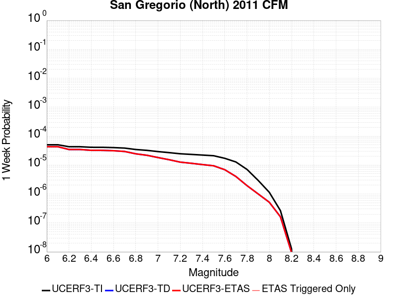 | 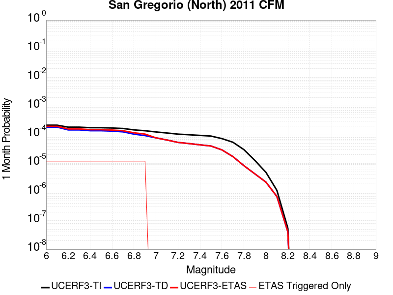 | 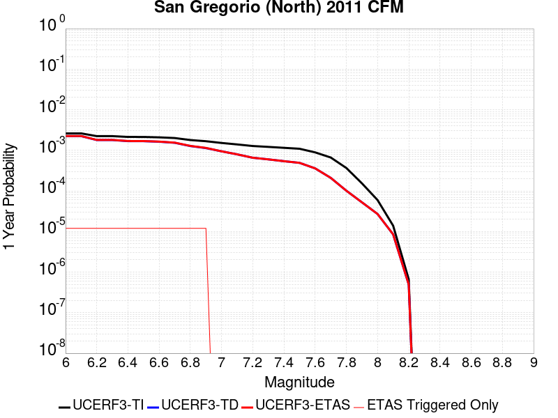 | 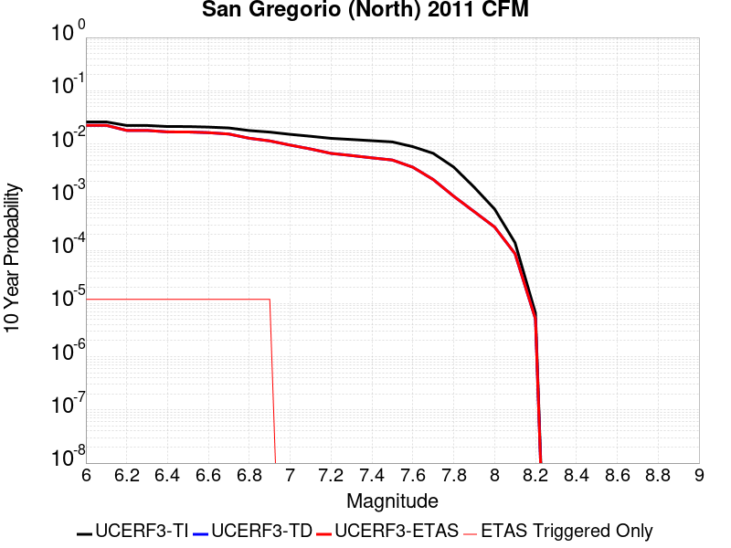 |

| Magnitude | 1 wk TI Prob | 1 wk TD Prob | 1 wk ETAS Prob | 1 wk ETAS/TD Gain | 1 wk ETAS Triggered Only | 1 mo TI Prob | 1 mo TD Prob | 1 mo ETAS Prob | 1 mo ETAS/TD Gain | 1 mo ETAS Triggered Only | 1 yr TI Prob | 1 yr TD Prob | 1 yr ETAS Prob | 1 yr ETAS/TD Gain | 1 yr ETAS Triggered Only | 10 yr TI Prob | 10 yr TD Prob | 10 yr ETAS Prob | 10 yr ETAS/TD Gain | 10 yr ETAS Triggered Only |
|-----|-----|-----|-----|-----|-----|-----|-----|-----|-----|-----|-----|-----|-----|-----|-----|-----|-----|-----|-----|-----|
| 6.0 | 5.0283932E-5 | 4.3060794E-5 | 4.3060794E-5 | 1.0 | 0.0 | 2.1548476E-4 | 1.8453323E-4 | 1.9652142E-4 | 1.064965 | 1.1990408E-5 | 0.0026203706 | 0.002244392 | 0.0022563555 | 1.0053304 | 1.1990408E-5 | 0.02589687 | 0.022294713 | 0.022306437 | 1.0005258 | 1.1990408E-5 |
| 6.1 | 5.0283932E-5 | 4.3060794E-5 | 4.3060794E-5 | 1.0 | 0.0 | 2.1548476E-4 | 1.8453323E-4 | 1.9652142E-4 | 1.064965 | 1.1990408E-5 | 0.0026203706 | 0.002244392 | 0.0022563555 | 1.0053304 | 1.1990408E-5 | 0.02589687 | 0.022294713 | 0.022306437 | 1.0005258 | 1.1990408E-5 |
| 6.2 | 4.2998647E-5 | 3.4444227E-5 | 3.4444227E-5 | 1.0 | 0.0 | 1.842669E-4 | 1.4760974E-4 | 1.5959838E-4 | 1.0812185 | 1.1990408E-5 | 0.0022411412 | 0.0017956786 | 0.0018076475 | 1.0066653 | 1.1990408E-5 | 0.022186736 | 0.017887903 | 0.01789968 | 1.0006583 | 1.1990408E-5 |
| 6.3 | 4.2998647E-5 | 3.4444227E-5 | 3.4444227E-5 | 1.0 | 0.0 | 1.842669E-4 | 1.4760974E-4 | 1.5959838E-4 | 1.0812185 | 1.1990408E-5 | 0.0022411412 | 0.0017956786 | 0.0018076475 | 1.0066653 | 1.1990408E-5 | 0.022186736 | 0.017887903 | 0.01789968 | 1.0006583 | 1.1990408E-5 |
| 6.4 | 4.1101295E-5 | 3.232945E-5 | 3.232945E-5 | 1.0 | 0.0 | 1.7613651E-4 | 1.385474E-4 | 1.5053614E-4 | 1.0865318 | 1.1990408E-5 | 0.0021423528 | 0.0016855211 | 0.0016974913 | 1.0071018 | 1.1990408E-5 | 0.02121817 | 0.01680324 | 0.01681503 | 1.0007015 | 1.1990408E-5 |
| 6.5 | 4.1032585E-5 | 3.2247484E-5 | 3.2247484E-5 | 1.0 | 0.0 | 1.7584208E-4 | 1.3819615E-4 | 1.501849E-4 | 1.0867517 | 1.1990408E-5 | 0.0021387753 | 0.0016812512 | 0.0016932215 | 1.0071199 | 1.1990408E-5 | 0.021183075 | 0.016761193 | 0.016772982 | 1.0007033 | 1.1990408E-5 |
| 6.6 | 4.011629E-5 | 3.1269094E-5 | 3.1269094E-5 | 1.0 | 0.0 | 1.7191563E-4 | 1.340035E-4 | 1.459923E-4 | 1.0894663 | 1.1990408E-5 | 0.0020910634 | 0.0016302838 | 0.0016422545 | 1.0073428 | 1.1990408E-5 | 0.020714961 | 0.016258746 | 0.01627054 | 1.0007255 | 1.1990408E-5 |
| 6.7 | 3.8583938E-5 | 2.9456065E-5 | 2.9456065E-5 | 1.0 | 0.0 | 1.6534925E-4 | 1.2623426E-4 | 1.3822314E-4 | 1.0949733 | 1.1990408E-5 | 0.0020112682 | 0.0015358328 | 0.0015478047 | 1.0077951 | 1.1990408E-5 | 0.019931622 | 0.015327258 | 0.015339064 | 1.0007703 | 1.1990408E-5 |
| 6.8 | 3.44341E-5 | 2.4453162E-5 | 2.4453162E-5 | 1.0 | 0.0 | 1.4756636E-4 | 1.04795115E-4 | 1.16784264E-4 | 1.1144056 | 1.1990408E-5 | 0.0017951399 | 0.001275144 | 0.0012871191 | 1.0093912 | 1.1990408E-5 | 0.017807078 | 0.012752353 | 0.01276419 | 1.0009283 | 1.1990408E-5 |
| 6.9 | 3.221199E-5 | 2.1780248E-5 | 2.1780248E-5 | 1.0 | 0.0 | 1.3804408E-4 | 9.3340626E-5 | 1.0532992E-4 | 1.1284466 | 1.1990408E-5 | 0.0016793909 | 0.001135838 | 0.0011478148 | 1.0105444 | 1.1990408E-5 | 0.01666756 | 0.01137376 | 0.011385615 | 1.0010422 | 1.1990408E-5 |
| 7.0 | 2.9186718E-5 | 1.8148972E-5 | 1.8148972E-5 | 1.0 | 0.0 | 1.2507994E-4 | 7.777901E-5 | 7.777901E-5 | 1.0 | 0.0 | 0.0015217843 | 9.4655243E-4 | 9.4655243E-4 | 1.0 | 0.0 | 0.015114053 | 0.009497915 | 0.009497915 | 1.0 | 0.0 |
| 7.1 | 2.6840138E-5 | 1.528651E-5 | 1.528651E-5 | 1.0 | 0.0 | 1.1502409E-4 | 6.551198E-5 | 6.551198E-5 | 1.0 | 0.0 | 0.0013995186 | 7.973184E-4 | 7.973184E-4 | 1.0 | 0.0 | 0.013907375 | 0.008016792 | 0.008016792 | 1.0 | 0.0 |
| 7.2 | 2.453002E-5 | 1.260862E-5 | 1.260862E-5 | 1.0 | 0.0 | 1.05124425E-4 | 5.4035827E-5 | 5.4035827E-5 | 1.0 | 0.0 | 0.0012791384 | 6.576882E-4 | 6.576882E-4 | 1.0 | 0.0 | 0.012718005 | 0.0066286726 | 0.0066286726 | 1.0 | 0.0 |
| 7.3 | 2.3330727E-5 | 1.1490594E-5 | 1.1490594E-5 | 1.0 | 0.0 | 9.9985E-5 | 4.9244478E-5 | 4.9244478E-5 | 1.0 | 0.0 | 0.0012166376 | 5.9938704E-4 | 5.9938704E-4 | 1.0 | 0.0 | 0.012099981 | 0.0060475916 | 0.0060475916 | 1.0 | 0.0 |
| 7.4 | 2.2136466E-5 | 1.03708635E-5 | 1.03708635E-5 | 1.0 | 0.0 | 9.486712E-5 | 4.4445802E-5 | 4.4445802E-5 | 1.0 | 0.0 | 0.0011543952 | 5.409935E-4 | 5.409935E-4 | 1.0 | 0.0 | 0.011484168 | 0.005465259 | 0.005465259 | 1.0 | 0.0 |
| 7.5 | 2.0994974E-5 | 9.429039E-6 | 9.429039E-6 | 1.0 | 0.0 | 8.997535E-5 | 4.0409544E-5 | 4.0409544E-5 | 1.0 | 0.0 | 0.0010948994 | 4.9187534E-4 | 4.9187534E-4 | 1.0 | 0.0 | 0.010895205 | 0.0049743364 | 0.0049743364 | 1.0 | 0.0 |
| 7.6 | 1.7091823E-5 | 6.895248E-6 | 6.895248E-6 | 1.0 | 0.0 | 7.3248615E-5 | 2.9550729E-5 | 2.9550729E-5 | 1.0 | 0.0 | 8.9143694E-4 | 3.5972084E-4 | 3.5972084E-4 | 1.0 | 0.0 | 0.008878695 | 0.0036490853 | 0.0036490853 | 1.0 | 0.0 |
| 7.7 | 1.2772179E-5 | 4.0219356E-6 | 4.0219356E-6 | 1.0 | 0.0 | 5.473676E-5 | 1.7236755E-5 | 1.7236755E-5 | 1.0 | 0.0 | 6.6621625E-4 | 2.098373E-4 | 2.098373E-4 | 1.0 | 0.0 | 0.006642225 | 0.002137503 | 0.002137503 | 1.0 | 0.0 |
| 7.8 | 7.041923E-6 | 1.9413242E-6 | 1.9413242E-6 | 1.0 | 0.0 | 3.017932E-5 | 8.319934E-6 | 8.319934E-6 | 1.0 | 0.0 | 3.6737128E-4 | 1.0129049E-4 | 1.0129049E-4 | 1.0 | 0.0 | 0.0036676454 | 0.0010382815 | 0.0010382815 | 1.0 | 0.0 |
| 7.9 | 2.946768E-6 | 1.0037718E-6 | 1.0037718E-6 | 1.0 | 0.0 | 1.2628945E-5 | 4.3018717E-6 | 4.3018717E-6 | 1.0 | 0.0 | 1.5374656E-4 | 5.237403E-5 | 5.237403E-5 | 1.0 | 0.0 | 0.0015364023 | 5.3422514E-4 | 5.3422514E-4 | 1.0 | 0.0 |
| 8.0 | 1.1433375E-6 | 5.1838697E-7 | 5.1838697E-7 | 1.0 | 0.0 | 4.9000087E-6 | 2.2216566E-6 | 2.2216566E-6 | 1.0 | 0.0 | 5.965597E-5 | 2.7048332E-5 | 2.7048332E-5 | 1.0 | 0.0 | 5.963996E-4 | 2.741109E-4 | 2.741109E-4 | 1.0 | 0.0 |
| 8.1 | 2.6675295E-7 | 1.6298877E-7 | 1.6298877E-7 | 1.0 | 0.0 | 1.1432264E-6 | 6.9852314E-7 | 6.9852314E-7 | 1.0 | 0.0 | 1.3918692E-5 | 8.504486E-6 | 8.504486E-6 | 1.0 | 0.0 | 1.391782E-4 | 8.6426866E-5 | 8.6426866E-5 | 1.0 | 0.0 |
| 8.2 | 1.2704569E-8 | 9.439506E-9 | 9.439506E-9 | 1.0 | 0.0 | 5.444815E-8 | 4.0455028E-8 | 4.0455028E-8 | 1.0 | 0.0 | 6.629061E-7 | 4.9253987E-7 | 4.9253987E-7 | 1.0 | 0.0 | 6.629041E-6 | 5.11646E-6 | 5.11646E-6 | 1.0 | 0.0 |

