# Parent Section Magnitude-Probability Distributions

Only fault sections with at least one triggered aftershock are plotted. Sections are sorted by total supraseismogenic trigger rate (decreasing)

## Table Of Contents

* [Garlock (Central)](#garlock-central)
* [Tank Canyon](#tank-canyon)
* [Little Lake](#little-lake)
* [Owl Lake](#owl-lake)
* [Airport Lake](#airport-lake)
* [Panamint Valley](#panamint-valley)
* [Garlock (East)](#garlock-east)
* [Blackwater](#blackwater)
* [Ash Hill](#ash-hill)
* [Hunter Mountain-Saline Valley](#hunter-mountain-saline-valley)
* [Garlock (West)](#garlock-west)
* [Gravel Hills-Harper Lk](#gravel-hills-harper-lk)
* [McLean Lake](#mclean-lake)
* [Goldstone Lake](#goldstone-lake)
* [So Sierra Nevada](#so-sierra-nevada)
* [San Andreas (Mojave S)](#san-andreas-mojave-s)
* [Coyote Canyon](#coyote-canyon)
* [San Andreas (Mojave N)](#san-andreas-mojave-n)
* [Death Valley (So)](#death-valley-so)
* [Lenwood-Lockhart-Old Woman Springs](#lenwood-lockhart-old-woman-springs)
* [Nelson Lake](#nelson-lake)
* [Towne Pass](#towne-pass)
* [Paradise](#paradise)
* [San Andreas (San Bernardino N)](#san-andreas-san-bernardino-n)
* [Bicycle Lake](#bicycle-lake)
* [Garlic Springs](#garlic-springs)
* [Helendale-So Lockhart](#helendale-so-lockhart)
* [Death Valley (Black Mtns Frontal)](#death-valley-black-mtns-frontal)
* [San Andreas (San Bernardino S)](#san-andreas-san-bernardino-s)
* [San Andreas (Big Bend)](#san-andreas-big-bend)
* [Coyote Lake](#coyote-lake)
* [Death Valley (No)](#death-valley-no)
* [Sierra Nevada  (No Extension)](#sierra-nevada--no-extension)
* [San Andreas (Parkfield)](#san-andreas-parkfield)
* [Ludlow](#ludlow)
* [Red Pass](#red-pass)
* [White Wolf (Extension)](#white-wolf-extension)
* [Calico-Hidalgo](#calico-hidalgo)
* [San Jacinto (San Bernardino)](#san-jacinto-san-bernardino)
* [San Andreas (Cholame) rev](#san-andreas-cholame-rev)
* [San Andreas (Carrizo) rev](#san-andreas-carrizo-rev)
* [Scodie Lineament](#scodie-lineament)
* [Death Valley (Fish Lake Valley)](#death-valley-fish-lake-valley)
* [Elsinore (Glen Ivy) rev](#elsinore-glen-ivy-rev)
* [Lake Isabella (Seismicity)](#lake-isabella-seismicity)
* [San Jacinto (San Jacinto Valley) rev](#san-jacinto-san-jacinto-valley-rev)
* [San Andreas (San Gorgonio Pass-Garnet HIll)](#san-andreas-san-gorgonio-pass-garnet-hill)
* [San Jacinto (Stepovers Combined)](#san-jacinto-stepovers-combined)
* [Cady](#cady)
* [Owens Valley](#owens-valley)
* [San Andreas (Coachella) rev](#san-andreas-coachella-rev)
* [San Andreas (North Branch Mill Creek)](#san-andreas-north-branch-mill-creek)
* [San Jacinto (Anza) rev](#san-jacinto-anza-rev)
* [Cleghorn Lake](#cleghorn-lake)
* [Pinto Mtn](#pinto-mtn)
* [Manix-Afton Hills](#manix-afton-hills)
* [Independence rev 2011](#independence-rev-2011)
* [Ortigalita (North)](#ortigalita-north)
* [Baker](#baker)
* [Blue Cut](#blue-cut)
* [Kern Canyon (North Kern) 2011](#kern-canyon-north-kern-2011)
* [Big Pine (East)](#big-pine-east)
* [Pisgah-Bullion Mtn-Mesquite Lk](#pisgah-bullion-mtn-mesquite-lk)
* [Mission Ridge-Arroyo Parida-Santa Ana](#mission-ridge-arroyo-parida-santa-ana)
* [San Andreas (Creeping Section) 2011 CFM](#san-andreas-creeping-section-2011-cfm)
* [Pleito](#pleito)
* [Lost Hills](#lost-hills)
* [Cucamonga](#cucamonga)
* [Mission Creek](#mission-creek)
* [Deep Springs](#deep-springs)
* [Oceanic - West Huasna](#oceanic---west-huasna)
* [Rose Canyon](#rose-canyon)
* [Santa Ynez (East)](#santa-ynez-east)
* [San Jacinto (Lytle Creek connector)](#san-jacinto-lytle-creek-connector)
* [Santa Ynez (West)](#santa-ynez-west)
* [Kern Canyon (South Kern) 2011](#kern-canyon-south-kern-2011)
* [Bullion Mountains](#bullion-mountains)
* [San Jacinto (Coyote Creek)](#san-jacinto-coyote-creek)
* [Chino alt 1](#chino-alt-1)
* [Tin Mountain](#tin-mountain)
* [Camp Rock 2011](#camp-rock-2011)
* [Santa Rosa Island](#santa-rosa-island)
* [San Jacinto (Borrego)](#san-jacinto-borrego)
* [San Diego Trough north alt1](#san-diego-trough-north-alt1)
* [Cleghorn](#cleghorn)
* [Great Valley 09 (Laguna Seca)](#great-valley-09-laguna-seca)
* [Dry Mountain](#dry-mountain)
* [Sierra Madre](#sierra-madre)
* [Elysian Park (Upper)](#elysian-park-upper)
* [Imperial](#imperial)
* [Brawley (Seismic Zone) alt 1](#brawley-seismic-zone-alt-1)
* [San Luis Range 2011 CFM](#san-luis-range-2011-cfm)
* [Cleghorn Pass](#cleghorn-pass)
* [White Mountains](#white-mountains)
* [Verdugo](#verdugo)
* [Big Pine (Central)](#big-pine-central)
* [Oak Ridge (Onshore)](#oak-ridge-onshore)
* [Santa Susana East (connector)](#santa-susana-east-connector)
* [Hunting Creek - Berryessa 2011 CFM](#hunting-creek---berryessa-2011-cfm)
* [Simi-Santa Rosa](#simi-santa-rosa)
* [Santa Cruz Island](#santa-cruz-island)
* [Monterey Bay-Tularcitos](#monterey-bay-tularcitos)
* [Whittier alt 1](#whittier-alt-1)
* [Sheephole](#sheephole)
* [San Jacinto (Clark) rev](#san-jacinto-clark-rev)
* [Red Mountain](#red-mountain)
* [Santa Susana alt 1](#santa-susana-alt-1)
* [Malibu Coast (Extension) alt 1](#malibu-coast-extension-alt-1)
* [Channel Islands Thrust](#channel-islands-thrust)
* [Raymond](#raymond)
* [Coronado Bank alt1](#coronado-bank-alt1)
* [San Clemente](#san-clemente)
* [San Gabriel](#san-gabriel)
* [Hollywood](#hollywood)
* [Elmore Ranch](#elmore-ranch)
* [Sierra Madre (San Fernando)](#sierra-madre-san-fernando)
* [Great Valley 08 (Quinto)](#great-valley-08-quinto)
* [Los Alamos 2011 CFM](#los-alamos-2011-cfm)
* [Puente Hills](#puente-hills)
* [Ortigalita (South)](#ortigalita-south)
* [Hosgri (Extension)](#hosgri-extension)
* [San Pedro Basin](#san-pedro-basin)
* [Johnson Valley (No) 2011 rev](#johnson-valley-no-2011-rev)
* [San Cayetano](#san-cayetano)
* [Malibu Coast alt 1](#malibu-coast-alt-1)
* [San Jacinto (Superstition Mtn)](#san-jacinto-superstition-mtn)
* [San Gabriel (Extension)](#san-gabriel-extension)
* [Rinconada 2011 CFM](#rinconada-2011-cfm)
* [San Juan](#san-juan)
* [Palos Verdes](#palos-verdes)
* [Northridge](#northridge)
* [Kern Canyon (Lake Isabella) 2011](#kern-canyon-lake-isabella-2011)
* [Sisar](#sisar)
* [Clamshell-Sawpit](#clamshell-sawpit)
* [White Wolf](#white-wolf)
* [Cedar Mtn-Mahogany Mtn](#cedar-mtn-mahogany-mtn)
* [Great Valley 11](#great-valley-11)
* [Santa Ynez River](#santa-ynez-river)
* [Green Valley 2011 CFM](#green-valley-2011-cfm)
* [Santa Monica alt 1](#santa-monica-alt-1)
* [San Diego Trough south](#san-diego-trough-south)
* [Pine Mtn](#pine-mtn)
* [San Andreas (Offshore) 2011 CFM](#san-andreas-offshore-2011-cfm)
* [North Frontal  (West)](#north-frontal--west)
* [Newport-Inglewood (Offshore)](#newport-inglewood-offshore)
* [Robinson Creek](#robinson-creek)
* [Oceanside alt1](#oceanside-alt1)
* [Fontana (Seismicity)](#fontana-seismicity)
* [Joshua Tree (Seismicity)](#joshua-tree-seismicity)
* [Great Valley 13 (Coalinga)](#great-valley-13-coalinga)
* [Hat Creek-McArthur-Mayfield](#hat-creek-mcarthur-mayfield)
* [Ventura-Pitas Point](#ventura-pitas-point)
* [Del Valle](#del-valle)
* [Great Valley 10 (Panoche)](#great-valley-10-panoche)
* [Goose Lake 2011 CFM](#goose-lake-2011-cfm)
* [San Gregorio (North) 2011 CFM](#san-gregorio-north-2011-cfm)
* [Great Valley 05 Pittsburg - Kirby Hills alt1](#great-valley-05-pittsburg---kirby-hills-alt1)
* [Point Reyes 2011 CFM](#point-reyes-2011-cfm)
* [Round Valley](#round-valley)
* [San Jose](#san-jose)
* [Channel Islands Western Deep Ramp](#channel-islands-western-deep-ramp)
* [Northridge Hills](#northridge-hills)
* [Hunting Creek - Bartlett Springs connector 2011](#hunting-creek---bartlett-springs-connector-2011)
* [Emerson-Copper Mtn 2011](#emerson-copper-mtn-2011)
* [Keddie Ridge 2011 CFM](#keddie-ridge-2011-cfm)
* [Calaveras (So) 2011 CFM](#calaveras-so-2011-cfm)
* [Owens Valley Keough Hot Springs](#owens-valley-keough-hot-springs)
* [Gillem - Big Crack 2011 CFM](#gillem---big-crack-2011-cfm)
* [Los Osos 2011](#los-osos-2011)
* [La Panza 2011](#la-panza-2011)
* [Almanor 2011 CFM](#almanor-2011-cfm)
* [Elysian Park (Lower CFM)](#elysian-park-lower-cfm)
* [Ozena](#ozena)
* [Los Alamos extension](#los-alamos-extension)
* [Newport-Inglewood alt 1](#newport-inglewood-alt-1)
* [Great Valley 12](#great-valley-12)
* [Great Valley 04b Gordon Valley](#great-valley-04b-gordon-valley)
* [Hector Mine](#hector-mine)
* [Santa Cruz Catalina Ridge alt1](#santa-cruz-catalina-ridge-alt1)
* [Reliz 2011 CFM](#reliz-2011-cfm)
* [Great Valley 07 (Orestimba)](#great-valley-07-orestimba)

## Garlock (Central)
*[(top)](#table-of-contents)*

| 1 Week | 1 Month | 1 Year | 10 Year |
|-----|-----|-----|-----|
|  |  |  |  |

| Magnitude | 1 wk TI Prob | 1 wk TD Prob | 1 wk ETAS Prob | 1 wk ETAS/TD Gain | 1 wk ETAS Triggered Only | 1 mo TI Prob | 1 mo TD Prob | 1 mo ETAS Prob | 1 mo ETAS/TD Gain | 1 mo ETAS Triggered Only | 1 yr TI Prob | 1 yr TD Prob | 1 yr ETAS Prob | 1 yr ETAS/TD Gain | 1 yr ETAS Triggered Only | 10 yr TI Prob | 10 yr TD Prob | 10 yr ETAS Prob | 10 yr ETAS/TD Gain | 10 yr ETAS Triggered Only |
|-----|-----|-----|-----|-----|-----|-----|-----|-----|-----|-----|-----|-----|-----|-----|-----|-----|-----|-----|-----|-----|
| 6.0 | 5.5131142E-5 | 7.0252914E-5 | 0.0052598882 | 74.87074 | 0.00519 | 2.3625491E-4 | 3.0104956E-4 | 0.013287139 | 44.136055 | 0.01299 | 0.0028726095 | 0.0036591839 | 0.038162466 | 10.429229 | 0.03463 | 0.028357591 | 0.03608289 | 0.09072735 | 2.5144148 | 0.05669 |
| 6.1 | 5.5131142E-5 | 7.0252914E-5 | 0.0052598882 | 74.87074 | 0.00519 | 2.3625491E-4 | 3.0104956E-4 | 0.013287139 | 44.136055 | 0.01299 | 0.0028726095 | 0.0036591839 | 0.038162466 | 10.429229 | 0.03463 | 0.028357591 | 0.03608289 | 0.09072735 | 2.5144148 | 0.05669 |
| 6.2 | 4.216245E-5 | 5.166702E-5 | 0.0035514862 | 68.737976 | 0.0035 | 1.806837E-4 | 2.2141146E-4 | 0.008449589 | 38.162384 | 0.00823 | 0.0021976046 | 0.0026923837 | 0.024912398 | 9.252914 | 0.02228 | 0.021759989 | 0.02669258 | 0.062792554 | 2.3524346 | 0.03709 |
| 6.3 | 4.216245E-5 | 5.166702E-5 | 0.0035514862 | 68.737976 | 0.0035 | 1.806837E-4 | 2.2141146E-4 | 0.008449589 | 38.162384 | 0.00823 | 0.0021976046 | 0.0026923837 | 0.024912398 | 9.252914 | 0.02228 | 0.021759989 | 0.02669258 | 0.062792554 | 2.3524346 | 0.03709 |
| 6.4 | 3.6858168E-5 | 4.411584E-5 | 0.002963987 | 67.186455 | 0.00292 | 1.5795401E-4 | 1.8905434E-4 | 0.006937778 | 36.697273 | 0.00675 | 0.0019213937 | 0.0022993318 | 0.020377668 | 8.86243 | 0.01812 | 0.019048655 | 0.02285164 | 0.052156318 | 2.2823884 | 0.02999 |
| 6.5 | 3.39199E-5 | 4.0023286E-5 | 0.0026799177 | 66.95896 | 0.00264 | 1.453629E-4 | 1.7151721E-4 | 0.0062904675 | 36.67543 | 0.00612 | 0.0017683565 | 0.0020862438 | 0.018591737 | 8.911584 | 0.01654 | 0.017543508 | 0.02076252 | 0.04742716 | 2.284268 | 0.02723 |
| 6.6 | 3.3571985E-5 | 3.947746E-5 | 0.002659374 | 67.364365 | 0.00262 | 1.4387199E-4 | 1.6917827E-4 | 0.006258148 | 36.99144 | 0.00609 | 0.0017502342 | 0.0020578213 | 0.018503908 | 8.99199 | 0.01648 | 0.017365133 | 0.02048383 | 0.04703851 | 2.2963731 | 0.02711 |
| 6.7 | 3.2580007E-5 | 3.8093858E-5 | 0.002527999 | 66.36238 | 0.00249 | 1.3962112E-4 | 1.632493E-4 | 0.0059623024 | 36.522686 | 0.0058 | 0.0016985617 | 0.0019857697 | 0.017754395 | 8.940812 | 0.0158 | 0.016856372 | 0.019776449 | 0.04521325 | 2.286217 | 0.02595 |
| 6.8 | 3.2185937E-5 | 3.7521055E-5 | 0.0025074284 | 66.82723 | 0.00247 | 1.3793244E-4 | 1.6079473E-4 | 0.0057798913 | 35.945774 | 0.00562 | 0.0016780337 | 0.0019559395 | 0.0173857 | 8.88867 | 0.01546 | 0.016654192 | 0.01948324 | 0.044457 | 2.2818074 | 0.02547 |
| 6.9 | 3.165394E-5 | 3.672561E-5 | 0.0024366374 | 66.34709 | 0.0024 | 1.3565269E-4 | 1.5738611E-4 | 0.005646522 | 35.876877 | 0.00549 | 0.0016503202 | 0.0019145131 | 0.016965643 | 8.861596 | 0.01508 | 0.01638118 | 0.01907586 | 0.04350087 | 2.2804148 | 0.0249 |
| 7.0 | 3.0903822E-5 | 3.5630834E-5 | 0.0023455485 | 65.82918 | 0.00231 | 1.3243823E-4 | 1.5269476E-4 | 0.005481881 | 35.90091 | 0.00533 | 0.0016112428 | 0.0018574947 | 0.016440356 | 8.850822 | 0.01461 | 0.015996104 | 0.018515008 | 0.042168796 | 2.2775466 | 0.0241 |
| 7.1 | 3.0069863E-5 | 3.4397097E-5 | 0.0022843196 | 66.41025 | 0.00225 | 1.2886449E-4 | 1.4740792E-4 | 0.0053366427 | 36.203228 | 0.00519 | 0.0015677959 | 0.0017932352 | 0.01586795 | 8.8487835 | 0.0141 | 0.01556781 | 0.017882649 | 0.040765982 | 2.279639 | 0.0233 |
| 7.2 | 2.7957109E-5 | 3.1286367E-5 | 0.00183123 | 58.531246 | 0.0018 | 1.1981068E-4 | 1.3407765E-4 | 0.004403505 | 32.842945 | 0.00427 | 0.0014577188 | 0.0016311926 | 0.013511782 | 8.283376 | 0.0119 | 0.014481937 | 0.016286217 | 0.035714563 | 2.192932 | 0.01975 |
| 7.3 | 2.4519275E-5 | 2.6719412E-5 | 0.0013666836 | 51.149464 | 0.00134 | 1.0507837E-4 | 1.14506816E-4 | 0.0032541472 | 28.418808 | 0.00314 | 0.0012785783 | 0.0013932437 | 0.009841457 | 7.063701 | 0.00846 | 0.012712469 | 0.013930428 | 0.028021362 | 2.011522 | 0.01429 |
| 7.4 | 2.3225532E-5 | 2.5203923E-5 | 0.0011851747 | 47.023422 | 0.00116 | 9.95342E-5 | 1.0801242E-4 | 0.0028077208 | 25.994425 | 0.0027 | 0.0012111551 | 0.0013142723 | 0.008874323 | 6.752271 | 0.00757 | 0.012045753 | 0.013148054 | 0.025750153 | 1.9584764 | 0.01277 |
| 7.5 | 2.097765E-5 | 2.2487986E-5 | 9.1246795E-4 | 40.575798 | 8.9E-4 | 8.9901114E-5 | 9.637359E-5 | 0.0022361674 | 23.203114 | 0.00214 | 0.0010939965 | 0.0011727286 | 0.006866044 | 5.8547597 | 0.0057 | 0.010886264 | 0.011742581 | 0.021289147 | 1.8129871 | 0.00966 |
| 7.6 | 1.511254E-5 | 1.5995334E-5 | 5.259872E-4 | 32.88379 | 5.1E-4 | 6.476642E-5 | 6.854967E-5 | 0.001348462 | 19.67131 | 0.00128 | 7.882459E-4 | 8.342805E-4 | 0.004091561 | 4.9042983 | 0.00326 | 0.007854558 | 0.008385628 | 0.01403783 | 1.6740344 | 0.0057 |
| 7.7 | 9.934069E-6 | 1.0682508E-5 | 1.4068112E-4 | 13.169297 | 1.3E-4 | 4.2573887E-5 | 4.5781377E-5 | 3.9576535E-4 | 8.64468 | 3.5E-4 | 5.182138E-4 | 5.572461E-4 | 0.0015466944 | 2.775604 | 9.9E-4 | 0.00517007 | 0.0056296107 | 0.007429421 | 1.3197043 | 0.00181 |
| 7.8 | 6.7562896E-6 | 8.431477E-6 | 4.843114E-5 | 5.7440877 | 4.0E-5 | 2.8955206E-5 | 3.61344E-5 | 2.3612718E-4 | 6.534692 | 2.0E-4 | 3.5247262E-4 | 4.3984767E-4 | 0.0010395837 | 2.3635087 | 6.0E-4 | 0.0035191406 | 0.0044482257 | 0.00559311 | 1.25738 | 0.00115 |
| 7.9 | 3.975453E-6 | 5.3728795E-6 | 3.537272E-5 | 6.583568 | 3.0E-5 | 1.7037546E-5 | 2.3026425E-5 | 1.630232E-4 | 7.079831 | 1.4E-4 | 2.0741238E-4 | 2.8031075E-4 | 6.602042E-4 | 2.3552582 | 3.8E-4 | 0.002072189 | 0.0028345888 | 0.0034827464 | 1.2286601 | 6.5E-4 |
| 8.0 | 1.6729537E-6 | 2.078155E-6 | 1.2078134E-5 | 5.8119507 | 1.0E-5 | 7.169782E-6 | 8.906349E-6 | 5.8905902E-5 | 6.613923 | 5.0E-5 | 8.7288594E-5 | 1.08429434E-4 | 2.1841751E-4 | 2.0143747 | 1.1E-4 | 8.7254314E-4 | 0.001097267 | 0.0013170256 | 1.2002782 | 2.2E-4 |
| 8.1 | 3.6733252E-7 | 3.1499187E-7 | 3.1499187E-7 | 1.0 | 0.0 | 1.5742813E-6 | 1.3499646E-6 | 1.3499646E-6 | 1.0 | 0.0 | 1.9166706E-5 | 1.643571E-5 | 2.6435546E-5 | 1.6084212 | 1.0E-5 | 1.9165053E-4 | 1.6643589E-4 | 1.9643089E-4 | 1.1802195 | 3.0E-5 |

## Tank Canyon
*[(top)](#table-of-contents)*

| 1 Week | 1 Month | 1 Year | 10 Year |
|-----|-----|-----|-----|
|  |  |  |  |

| Magnitude | 1 wk TI Prob | 1 wk TD Prob | 1 wk ETAS Prob | 1 wk ETAS/TD Gain | 1 wk ETAS Triggered Only | 1 mo TI Prob | 1 mo TD Prob | 1 mo ETAS Prob | 1 mo ETAS/TD Gain | 1 mo ETAS Triggered Only | 1 yr TI Prob | 1 yr TD Prob | 1 yr ETAS Prob | 1 yr ETAS/TD Gain | 1 yr ETAS Triggered Only | 10 yr TI Prob | 10 yr TD Prob | 10 yr ETAS Prob | 10 yr ETAS/TD Gain | 10 yr ETAS Triggered Only |
|-----|-----|-----|-----|-----|-----|-----|-----|-----|-----|-----|-----|-----|-----|-----|-----|-----|-----|-----|-----|-----|
| 6.0 | 4.8284557E-5 | 5.796635E-5 | 0.004047735 | 69.82905 | 0.00399 | 2.0691741E-4 | 2.484074E-4 | 0.011135702 | 44.828384 | 0.01089 | 0.0025163088 | 0.0030208372 | 0.031354986 | 10.379568 | 0.02842 | 0.02488006 | 0.029864404 | 0.07804134 | 2.6131892 | 0.04966 |
| 6.1 | 1.7796336E-5 | 2.0873764E-5 | 0.0012308485 | 58.966297 | 0.00121 | 7.626778E-5 | 8.945614E-5 | 0.003779126 | 42.245575 | 0.00369 | 9.281647E-4 | 0.0010886216 | 0.011187616 | 10.276864 | 0.01011 | 0.009242975 | 0.010836975 | 0.028612234 | 2.6402419 | 0.01797 |
| 6.2 | 1.7796336E-5 | 2.0873764E-5 | 0.0012308485 | 58.966297 | 0.00121 | 7.626778E-5 | 8.945614E-5 | 0.003779126 | 42.245575 | 0.00369 | 9.281647E-4 | 0.0010886216 | 0.011187616 | 10.276864 | 0.01011 | 0.009242975 | 0.010836975 | 0.028612234 | 2.6402419 | 0.01797 |
| 6.3 | 1.3515912E-5 | 1.575988E-5 | 9.5574505E-4 | 60.64418 | 9.4E-4 | 5.792405E-5 | 6.7540735E-5 | 0.002847353 | 42.157566 | 0.00278 | 7.049971E-4 | 8.220222E-4 | 0.008175972 | 9.946169 | 0.00736 | 0.007027647 | 0.008192427 | 0.021195024 | 2.5871482 | 0.01311 |
| 6.4 | 1.0870146E-5 | 1.2618259E-5 | 7.826085E-4 | 62.021915 | 7.7E-4 | 4.658551E-5 | 5.407723E-5 | 0.0021539638 | 39.83125 | 0.0021 | 5.67031E-4 | 6.582093E-4 | 0.006204556 | 9.426418 | 0.00555 | 0.005655863 | 0.006564614 | 0.016429428 | 2.5027256 | 0.00993 |
| 6.5 | 7.964826E-6 | 9.196251E-6 | 4.9919175E-4 | 54.28209 | 4.9E-4 | 3.4134522E-5 | 3.941197E-5 | 0.0013393607 | 33.9836 | 0.0013 | 4.1550855E-4 | 4.7974577E-4 | 0.0039180955 | 8.167025 | 0.00344 | 0.0041473247 | 0.0047884025 | 0.011058236 | 2.3093789 | 0.0063 |
| 6.6 | 6.6317E-6 | 7.6124184E-6 | 3.5760977E-4 | 46.977154 | 3.5E-4 | 2.8421264E-5 | 3.2624295E-5 | 0.0010325917 | 31.651005 | 0.001 | 3.4597394E-4 | 3.971375E-4 | 0.0031060614 | 7.8211226 | 0.00271 | 0.0034543579 | 0.00396543 | 0.008736435 | 2.2031496 | 0.00479 |
| 6.7 | 4.793663E-6 | 5.4308543E-6 | 2.4542955E-4 | 45.191704 | 2.4E-4 | 2.0544108E-5 | 2.3274906E-5 | 5.932616E-4 | 25.489325 | 5.7E-4 | 2.500958E-4 | 2.8333953E-4 | 0.0017829145 | 6.292502 | 0.0015 | 0.0024981452 | 0.0028304753 | 0.005532805 | 1.9547263 | 0.00271 |
| 6.8 | 4.382823E-6 | 4.969316E-6 | 2.2496823E-4 | 45.27147 | 2.2E-4 | 1.8783392E-5 | 2.1296917E-5 | 5.212863E-4 | 24.477076 | 5.0E-4 | 2.286638E-4 | 2.5926338E-4 | 0.0016089134 | 6.20571 | 0.00135 | 0.0022842865 | 0.0025902835 | 0.0050139893 | 1.9356912 | 0.00243 |
| 6.9 | 2.729601E-6 | 3.0735694E-6 | 1.230732E-4 | 40.042435 | 1.2E-4 | 1.1698237E-5 | 1.317238E-5 | 2.4316936E-4 | 18.460546 | 2.3E-4 | 1.4241673E-4 | 1.6036315E-4 | 7.9026213E-4 | 4.9279532 | 6.3E-4 | 0.001423255 | 0.0016026403 | 0.0027507972 | 1.7164159 | 0.00115 |
| 7.0 | 1.8987357E-6 | 2.126954E-6 | 5.212685E-5 | 24.507746 | 5.0E-5 | 8.137413E-6 | 9.115489E-6 | 9.9114666E-5 | 10.873215 | 9.0E-5 | 9.90685E-5 | 1.1097613E-4 | 4.0094394E-4 | 3.6128845 | 2.9E-4 | 9.902435E-4 | 0.0011092757 | 0.0016686546 | 1.5042739 | 5.6E-4 |
| 7.1 | 1.4928986E-6 | 1.6641375E-6 | 4.1664072E-5 | 25.036436 | 4.0E-5 | 6.398121E-6 | 7.1320014E-6 | 7.71315E-5 | 10.814846 | 7.0E-5 | 7.789434E-5 | 8.682925E-5 | 2.9681102E-4 | 3.41833 | 2.1E-4 | 7.786704E-4 | 8.680111E-4 | 0.0012576726 | 1.448913 | 3.9E-4 |
| 7.2 | 1.069082E-6 | 1.1828638E-6 | 2.1182841E-5 | 17.908098 | 2.0E-5 | 4.581772E-6 | 5.0694093E-6 | 4.5069206E-5 | 8.890426 | 4.0E-5 | 5.5781646E-5 | 6.171884E-5 | 1.8171144E-4 | 2.9441807 | 1.2E-4 | 5.576765E-4 | 6.170693E-4 | 8.0695207E-4 | 1.3077171 | 1.9E-4 |
| 7.3 | 8.776551E-7 | 9.770052E-7 | 2.0976986E-5 | 21.4707 | 2.0E-5 | 3.7613736E-6 | 4.1871617E-6 | 4.4186992E-5 | 10.552971 | 4.0E-5 | 4.579376E-5 | 5.097802E-5 | 1.6097241E-4 | 3.1576827 | 1.1E-4 | 4.5784327E-4 | 5.0971424E-4 | 6.496429E-4 | 1.2745237 | 1.4E-4 |
| 7.4 | 7.55721E-7 | 8.510284E-7 | 2.0851012E-5 | 24.50096 | 2.0E-5 | 3.2388E-6 | 3.6472622E-6 | 4.3647116E-5 | 11.96709 | 4.0E-5 | 3.9431678E-5 | 4.440503E-5 | 1.5440014E-4 | 3.4770868 | 1.1E-4 | 3.942468E-4 | 4.4401243E-4 | 5.739547E-4 | 1.2926546 | 1.3E-4 |
| 7.5 | 5.587665E-7 | 6.305647E-7 | 1.0630559E-5 | 16.85879 | 1.0E-5 | 2.3947114E-6 | 2.7024203E-6 | 3.270234E-5 | 12.10113 | 3.0E-5 | 2.915522E-5 | 3.2901968E-5 | 1.0289966E-4 | 3.1274624 | 7.0E-5 | 2.9151395E-4 | 3.2901968E-4 | 4.1899006E-4 | 1.2734499 | 9.0E-5 |

## Little Lake
*[(top)](#table-of-contents)*

| 1 Week | 1 Month | 1 Year | 10 Year |
|-----|-----|-----|-----|
|  |  |  |  |

| Magnitude | 1 wk TI Prob | 1 wk TD Prob | 1 wk ETAS Prob | 1 wk ETAS/TD Gain | 1 wk ETAS Triggered Only | 1 mo TI Prob | 1 mo TD Prob | 1 mo ETAS Prob | 1 mo ETAS/TD Gain | 1 mo ETAS Triggered Only | 1 yr TI Prob | 1 yr TD Prob | 1 yr ETAS Prob | 1 yr ETAS/TD Gain | 1 yr ETAS Triggered Only | 10 yr TI Prob | 10 yr TD Prob | 10 yr ETAS Prob | 10 yr ETAS/TD Gain | 10 yr ETAS Triggered Only |
|-----|-----|-----|-----|-----|-----|-----|-----|-----|-----|-----|-----|-----|-----|-----|-----|-----|-----|-----|-----|-----|
| 6.0 | 2.8424427E-5 | 3.120616E-5 | 0.0032011073 | 102.57934 | 0.00317 | 1.2181328E-4 | 1.3373457E-4 | 0.0074527557 | 55.727962 | 0.00732 | 0.0014820677 | 0.0016271356 | 0.019967245 | 12.271408 | 0.01837 | 0.014722223 | 0.016165627 | 0.044932943 | 2.7795362 | 0.02924 |
| 6.1 | 2.8424427E-5 | 3.120616E-5 | 0.0032011073 | 102.57934 | 0.00317 | 1.2181328E-4 | 1.3373457E-4 | 0.0074527557 | 55.727962 | 0.00732 | 0.0014820677 | 0.0016271356 | 0.019967245 | 12.271408 | 0.01837 | 0.014722223 | 0.016165627 | 0.044932943 | 2.7795362 | 0.02924 |
| 6.2 | 2.8424427E-5 | 3.120616E-5 | 0.0032011073 | 102.57934 | 0.00317 | 1.2181328E-4 | 1.3373457E-4 | 0.0074527557 | 55.727962 | 0.00732 | 0.0014820677 | 0.0016271356 | 0.019967245 | 12.271408 | 0.01837 | 0.014722223 | 0.016165627 | 0.044932943 | 2.7795362 | 0.02924 |
| 6.3 | 1.48860645E-5 | 1.6081593E-5 | 0.0019960497 | 124.12015 | 0.00198 | 6.379586E-5 | 6.891945E-5 | 0.0045186128 | 65.563675 | 0.00445 | 7.7643775E-4 | 8.387995E-4 | 0.011569791 | 13.793273 | 0.01074 | 0.007737305 | 0.008359154 | 0.024899723 | 2.9787374 | 0.01668 |
| 6.4 | 1.48860645E-5 | 1.6081593E-5 | 0.0019960497 | 124.12015 | 0.00198 | 6.379586E-5 | 6.891945E-5 | 0.0045186128 | 65.563675 | 0.00445 | 7.7643775E-4 | 8.387995E-4 | 0.011569791 | 13.793273 | 0.01074 | 0.007737305 | 0.008359154 | 0.024899723 | 2.9787374 | 0.01668 |
| 6.5 | 1.2797581E-5 | 1.3765735E-5 | 0.0018437406 | 133.93695 | 0.00183 | 5.4845623E-5 | 5.899482E-5 | 0.004138754 | 70.15453 | 0.00408 | 6.675408E-4 | 7.180509E-4 | 0.010550985 | 14.693923 | 0.00984 | 0.006655392 | 0.0071598585 | 0.022350313 | 3.1216137 | 0.0153 |
| 6.6 | 9.661896E-6 | 1.0289158E-5 | 0.0015602732 | 151.64246 | 0.00155 | 4.1407468E-5 | 4.4095737E-5 | 0.003553941 | 80.596016 | 0.00351 | 5.040193E-4 | 5.367496E-4 | 0.008922246 | 16.622734 | 0.00839 | 0.005028777 | 0.0053561367 | 0.018326294 | 3.4215505 | 0.01304 |
| 6.7 | 7.767871E-6 | 8.199779E-6 | 0.0013481888 | 164.41771 | 0.00134 | 3.329045E-5 | 3.514151E-5 | 0.0030450358 | 86.65067 | 0.00301 | 4.0523586E-4 | 4.2777765E-4 | 0.0074147875 | 17.333275 | 0.00699 | 0.004044977 | 0.0042708935 | 0.015243828 | 3.5692363 | 0.01102 |
| 6.8 | 6.4235196E-6 | 6.735819E-6 | 0.0010467288 | 155.39742 | 0.00104 | 2.752908E-5 | 2.886755E-5 | 0.002438798 | 84.48234 | 0.00241 | 3.35115E-4 | 3.5141854E-4 | 0.005869479 | 16.702246 | 0.00552 | 0.003346101 | 0.0035098887 | 0.012219212 | 3.4813673 | 0.00874 |
| 6.9 | 3.1283696E-6 | 3.1122067E-6 | 6.431102E-4 | 206.64122 | 6.4E-4 | 1.3407229E-5 | 1.3337969E-5 | 0.0015133179 | 113.4594 | 0.0015 | 1.6322079E-4 | 1.6237919E-4 | 0.0033918547 | 20.888483 | 0.00323 | 0.0016310095 | 0.0016227537 | 0.0067643966 | 4.168468 | 0.00515 |
| 7.0 | 2.290603E-6 | 2.2287015E-6 | 3.622279E-4 | 162.52867 | 3.6E-4 | 9.816834E-6 | 9.551549E-6 | 9.6954237E-4 | 101.5063 | 9.6E-4 | 1.19513395E-4 | 1.16284944E-4 | 0.0021660465 | 18.62706 | 0.00205 | 0.0011944914 | 0.0011623431 | 0.004398577 | 3.784233 | 0.00324 |
| 7.1 | 1.293693E-6 | 1.1776951E-6 | 1.4117753E-4 | 119.87613 | 1.4E-4 | 5.5443866E-6 | 5.047259E-6 | 3.4504556E-4 | 68.36295 | 3.4E-4 | 6.750081E-5 | 6.144935E-5 | 9.213965E-4 | 14.994408 | 8.6E-4 | 6.7480316E-4 | 6.14392E-4 | 0.0020934828 | 3.4074056 | 0.00148 |
| 7.2 | 4.715842E-7 | 3.0918443E-7 | 3.0918443E-7 | 1.0 | 0.0 | 2.0210737E-6 | 1.3250755E-6 | 1.3250755E-6 | 1.0 | 0.0 | 2.4606294E-5 | 1.613268E-5 | 5.6132034E-5 | 3.4793992 | 4.0E-5 | 2.460357E-4 | 1.6131563E-4 | 2.7129787E-4 | 1.681783 | 1.1E-4 |
| 7.3 | 3.9430947E-7 | 2.3098025E-7 | 2.3098025E-7 | 1.0 | 0.0 | 1.6898966E-6 | 9.89915E-7 | 9.89915E-7 | 1.0 | 0.0 | 2.0574296E-5 | 1.2052149E-5 | 3.2051907E-5 | 2.659435 | 2.0E-5 | 2.0572392E-4 | 1.20515026E-4 | 1.9050659E-4 | 1.5807704 | 7.0E-5 |
| 7.4 | 3.547123E-7 | 1.9679635E-7 | 1.9679635E-7 | 1.0 | 0.0 | 1.5201948E-6 | 8.4341264E-7 | 8.4341264E-7 | 1.0 | 0.0 | 1.8508214E-5 | 1.0268501E-5 | 3.0268297E-5 | 2.9476838 | 2.0E-5 | 1.8506673E-4 | 1.0268033E-4 | 1.6267417E-4 | 1.5842777 | 6.0E-5 |
| 7.5 | 2.6354266E-7 | 1.4423487E-7 | 1.4423487E-7 | 1.0 | 0.0 | 1.129468E-6 | 6.1814933E-7 | 6.1814933E-7 | 1.0 | 0.0 | 1.3751187E-5 | 7.5259427E-6 | 1.7525866E-5 | 2.3287272 | 1.0E-5 | 1.3750336E-4 | 7.525693E-5 | 1.0525467E-4 | 1.3986044 | 3.0E-5 |
| 7.6 | 1.269913E-7 | 7.5727044E-8 | 7.5727044E-8 | 1.0 | 0.0 | 5.4424834E-7 | 3.2454443E-7 | 3.2454443E-7 | 1.0 | 0.0 | 6.6262032E-6 | 3.9513216E-6 | 1.3951282E-5 | 3.5307887 | 1.0E-5 | 6.626006E-5 | 3.951255E-5 | 6.951136E-5 | 1.7592224 | 3.0E-5 |

## Owl Lake
*[(top)](#table-of-contents)*

| 1 Week | 1 Month | 1 Year | 10 Year |
|-----|-----|-----|-----|
|  |  |  |  |

| Magnitude | 1 wk TI Prob | 1 wk TD Prob | 1 wk ETAS Prob | 1 wk ETAS/TD Gain | 1 wk ETAS Triggered Only | 1 mo TI Prob | 1 mo TD Prob | 1 mo ETAS Prob | 1 mo ETAS/TD Gain | 1 mo ETAS Triggered Only | 1 yr TI Prob | 1 yr TD Prob | 1 yr ETAS Prob | 1 yr ETAS/TD Gain | 1 yr ETAS Triggered Only | 10 yr TI Prob | 10 yr TD Prob | 10 yr ETAS Prob | 10 yr ETAS/TD Gain | 10 yr ETAS Triggered Only |
|-----|-----|-----|-----|-----|-----|-----|-----|-----|-----|-----|-----|-----|-----|-----|-----|-----|-----|-----|-----|-----|
| 6.0 | 5.0320643E-5 | 6.636149E-5 | 0.00159626 | 24.054008 | 0.00153 | 2.1564208E-4 | 2.8438168E-4 | 0.003953338 | 13.901522 | 0.00367 | 0.0026222812 | 0.00345791 | 0.014220565 | 4.112474 | 0.0108 | 0.02591553 | 0.0341423 | 0.052580524 | 1.5400405 | 0.01909 |
| 6.1 | 5.0320643E-5 | 6.636149E-5 | 0.00159626 | 24.054008 | 0.00153 | 2.1564208E-4 | 2.8438168E-4 | 0.003953338 | 13.901522 | 0.00367 | 0.0026222812 | 0.00345791 | 0.014220565 | 4.112474 | 0.0108 | 0.02591553 | 0.0341423 | 0.052580524 | 1.5400405 | 0.01909 |
| 6.2 | 2.4125871E-5 | 3.098269E-5 | 0.0011909468 | 38.4391 | 0.00116 | 1.0339249E-4 | 1.3277736E-4 | 0.0029024095 | 21.859219 | 0.00277 | 0.0012580766 | 0.0016155228 | 0.009932065 | 6.147896 | 0.00833 | 0.012509781 | 0.016071297 | 0.03010212 | 1.8730361 | 0.01426 |
| 6.3 | 1.7433485E-5 | 2.2356835E-5 | 0.0010823332 | 48.41173 | 0.00106 | 7.471279E-5 | 9.5812386E-5 | 0.002595573 | 27.09016 | 0.0025 | 9.0924866E-4 | 0.0011660426 | 0.008447542 | 7.244625 | 0.00729 | 0.009055373 | 0.01162957 | 0.023707457 | 2.0385497 | 0.01222 |
| 6.4 | 1.7433485E-5 | 2.2356835E-5 | 0.0010823332 | 48.41173 | 0.00106 | 7.471279E-5 | 9.5812386E-5 | 0.002595573 | 27.09016 | 0.0025 | 9.0924866E-4 | 0.0011660426 | 0.008447542 | 7.244625 | 0.00729 | 0.009055373 | 0.01162957 | 0.023707457 | 2.0385497 | 0.01222 |
| 6.5 | 1.5182742E-5 | 1.9430352E-5 | 0.0010594102 | 54.523464 | 0.00104 | 6.506727E-5 | 8.327114E-5 | 0.0024530739 | 29.458874 | 0.00237 | 7.919061E-4 | 0.0010135059 | 0.008026391 | 7.919432 | 0.00702 | 0.0078909 | 0.010119047 | 0.021720452 | 2.146492 | 0.01172 |
| 6.6 | 6.7271576E-6 | 8.548157E-6 | 8.7854074E-4 | 102.77545 | 8.7E-4 | 2.8830356E-5 | 3.6634476E-5 | 0.001986563 | 54.2266 | 0.00195 | 3.5095305E-4 | 4.4593913E-4 | 0.0059634773 | 13.372851 | 0.00552 | 0.0035039932 | 0.004468226 | 0.012999933 | 2.9094172 | 0.00857 |
| 6.7 | 6.682835E-6 | 8.4806015E-6 | 8.784732E-4 | 103.58619 | 8.7E-4 | 2.8640408E-5 | 3.634496E-5 | 0.001986274 | 54.650604 | 0.00195 | 3.4864116E-4 | 4.424157E-4 | 0.005949978 | 13.448839 | 0.00551 | 0.003480947 | 0.004433152 | 0.012955204 | 2.922346 | 0.00856 |
| 6.8 | 6.5774975E-6 | 8.327072E-6 | 8.7831984E-4 | 105.47764 | 8.7E-4 | 2.8188972E-5 | 3.5686993E-5 | 0.0019756178 | 55.359604 | 0.00194 | 3.4314668E-4 | 4.3440814E-4 | 0.005912028 | 13.609385 | 0.00548 | 0.0034261728 | 0.0043532955 | 0.012826249 | 2.9463308 | 0.00851 |
| 6.9 | 6.363419E-6 | 8.0002355E-6 | 8.6799334E-4 | 108.49597 | 8.6E-4 | 2.727151E-5 | 3.4286306E-5 | 0.00196422 | 57.288765 | 0.00193 | 3.3198006E-4 | 4.173614E-4 | 0.005865087 | 14.052777 | 0.00545 | 0.0033148455 | 0.004183282 | 0.012607892 | 3.0138755 | 0.00846 |
| 7.0 | 6.1342453E-6 | 7.632424E-6 | 8.576259E-4 | 112.36613 | 8.5E-4 | 2.6289357E-5 | 3.271001E-5 | 0.0019426475 | 59.390003 | 0.00191 | 3.2002592E-4 | 3.981771E-4 | 0.005806023 | 14.58151 | 0.00541 | 0.0031956544 | 0.00399197 | 0.012348478 | 3.0933292 | 0.00839 |
| 7.1 | 5.842926E-6 | 7.142961E-6 | 8.271371E-4 | 115.797516 | 8.2E-4 | 2.504087E-5 | 3.0612362E-5 | 0.0018805558 | 61.431255 | 0.00185 | 3.0482994E-4 | 3.7264716E-4 | 0.0056006983 | 15.029493 | 0.00523 | 0.0030441214 | 0.0037374226 | 0.011817113 | 3.1618345 | 0.00811 |
| 7.2 | 4.77173E-6 | 5.3591634E-6 | 4.9535657E-4 | 92.431694 | 4.9E-4 | 2.045011E-5 | 2.2967664E-5 | 0.0011229424 | 48.892323 | 0.0011 | 2.4895166E-4 | 2.7959948E-4 | 0.0038286068 | 13.693183 | 0.00355 | 0.0024867293 | 0.0028089995 | 0.00824369 | 2.9347427 | 0.00545 |
| 7.3 | 3.0494948E-6 | 2.7109647E-6 | 1.4271059E-4 | 52.641994 | 1.4E-4 | 1.3069198E-5 | 1.1618369E-5 | 2.7161534E-4 | 23.378096 | 2.6E-4 | 1.5910587E-4 | 1.4144463E-4 | 0.0011313045 | 7.998215 | 9.9E-4 | 0.0015899199 | 0.0014235033 | 0.002971297 | 2.087313 | 0.00155 |
| 7.4 | 2.7263884E-6 | 2.3061473E-6 | 6.230601E-5 | 27.017359 | 6.0E-5 | 1.1684469E-5 | 9.883452E-6 | 1.3988216E-4 | 14.15317 | 1.3E-4 | 1.4224913E-4 | 1.2032448E-4 | 7.6024747E-4 | 6.3183107 | 6.4E-4 | 0.0014215811 | 0.0012114698 | 0.0021902826 | 1.8079548 | 9.8E-4 |
| 7.5 | 2.6090431E-6 | 2.1660758E-6 | 6.216595E-5 | 28.699802 | 6.0E-5 | 1.1181565E-5 | 9.283149E-6 | 1.3928194E-4 | 15.003738 | 1.3E-4 | 1.3612706E-4 | 1.1301658E-4 | 6.429567E-4 | 5.689048 | 5.3E-4 | 0.001360437 | 0.001138222 | 0.0019972431 | 1.7547044 | 8.6E-4 |
| 7.6 | 2.3008756E-6 | 1.8732376E-6 | 6.187313E-5 | 33.03005 | 6.0E-5 | 9.860858E-6 | 8.028137E-6 | 1.2802717E-4 | 15.947309 | 1.2E-4 | 1.20049335E-4 | 9.7738266E-5 | 4.976992E-4 | 5.092163 | 4.0E-4 | 0.001199845 | 9.852252E-4 | 0.0016245947 | 1.6489577 | 6.4E-4 |
| 7.7 | 1.7184348E-6 | 1.3423282E-6 | 4.1342275E-5 | 30.798931 | 4.0E-5 | 7.3646997E-6 | 5.7528227E-6 | 9.575231E-5 | 16.644403 | 9.0E-5 | 8.966153E-5 | 7.0038404E-5 | 3.200209E-4 | 4.56922 | 2.5E-4 | 8.962536E-4 | 7.080495E-4 | 0.0011377451 | 1.6068722 | 4.3E-4 |
| 7.8 | 8.4612907E-7 | 8.4087924E-7 | 2.0840862E-5 | 24.784607 | 2.0E-5 | 3.6262625E-6 | 3.6037634E-6 | 4.360362E-5 | 12.099468 | 4.0E-5 | 4.4148852E-5 | 4.3874956E-5 | 1.3387101E-4 | 3.051194 | 9.0E-5 | 4.414008E-4 | 4.4413717E-4 | 6.440483E-4 | 1.4501114 | 2.0E-4 |
| 7.9 | 2.716738E-7 | 3.7694025E-7 | 1.0376936E-5 | 27.529392 | 1.0E-5 | 1.1643157E-6 | 1.6154573E-6 | 2.1615426E-5 | 13.380375 | 2.0E-5 | 1.4175452E-5 | 1.9668027E-5 | 4.9667437E-5 | 2.5252883 | 3.0E-5 | 1.4174548E-4 | 1.9843443E-4 | 2.5842251E-4 | 1.3023069 | 6.0E-5 |
| 8.0 | 2.1995428E-8 | 3.386013E-8 | 3.386013E-8 | 1.0 | 0.0 | 9.426611E-8 | 1.4511484E-7 | 1.4511484E-7 | 1.0 | 0.0 | 1.1476893E-6 | 1.7667724E-6 | 1.7667724E-6 | 1.0 | 0.0 | 1.14768345E-5 | 1.7968985E-5 | 1.7968985E-5 | 1.0 | 0.0 |

## Airport Lake
*[(top)](#table-of-contents)*

| 1 Week | 1 Month | 1 Year | 10 Year |
|-----|-----|-----|-----|
|  |  |  | 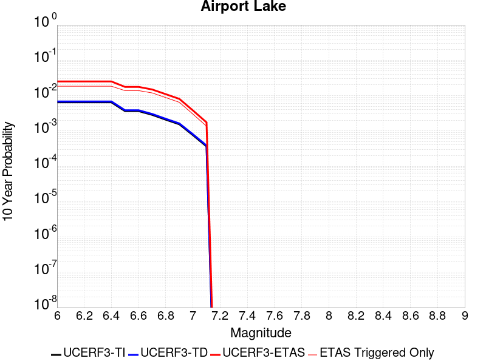 |

| Magnitude | 1 wk TI Prob | 1 wk TD Prob | 1 wk ETAS Prob | 1 wk ETAS/TD Gain | 1 wk ETAS Triggered Only | 1 mo TI Prob | 1 mo TD Prob | 1 mo ETAS Prob | 1 mo ETAS/TD Gain | 1 mo ETAS Triggered Only | 1 yr TI Prob | 1 yr TD Prob | 1 yr ETAS Prob | 1 yr ETAS/TD Gain | 1 yr ETAS Triggered Only | 10 yr TI Prob | 10 yr TD Prob | 10 yr ETAS Prob | 10 yr ETAS/TD Gain | 10 yr ETAS Triggered Only |
|-----|-----|-----|-----|-----|-----|-----|-----|-----|-----|-----|-----|-----|-----|-----|-----|-----|-----|-----|-----|-----|
| 6.0 | 1.2387061E-5 | 1.31032575E-5 | 0.0021630751 | 165.0792 | 0.00215 | 5.3086325E-5 | 5.6155768E-5 | 0.00514587 | 91.63564 | 0.00509 | 6.461343E-4 | 6.835104E-4 | 0.012235609 | 17.90113 | 0.01156 | 0.0064425888 | 0.0068168915 | 0.025081528 | 3.6793206 | 0.01839 |
| 6.1 | 1.2387061E-5 | 1.31032575E-5 | 0.0021630751 | 165.0792 | 0.00215 | 5.3086325E-5 | 5.6155768E-5 | 0.00514587 | 91.63564 | 0.00509 | 6.461343E-4 | 6.835104E-4 | 0.012235609 | 17.90113 | 0.01156 | 0.0064425888 | 0.0068168915 | 0.025081528 | 3.6793206 | 0.01839 |
| 6.2 | 1.2387061E-5 | 1.31032575E-5 | 0.0021630751 | 165.0792 | 0.00215 | 5.3086325E-5 | 5.6155768E-5 | 0.00514587 | 91.63564 | 0.00509 | 6.461343E-4 | 6.835104E-4 | 0.012235609 | 17.90113 | 0.01156 | 0.0064425888 | 0.0068168915 | 0.025081528 | 3.6793206 | 0.01839 |
| 6.3 | 1.2387061E-5 | 1.31032575E-5 | 0.0021630751 | 165.0792 | 0.00215 | 5.3086325E-5 | 5.6155768E-5 | 0.00514587 | 91.63564 | 0.00509 | 6.461343E-4 | 6.835104E-4 | 0.012235609 | 17.90113 | 0.01156 | 0.0064425888 | 0.0068168915 | 0.025081528 | 3.6793206 | 0.01839 |
| 6.4 | 1.2387061E-5 | 1.31032575E-5 | 0.0021630751 | 165.0792 | 0.00215 | 5.3086325E-5 | 5.6155768E-5 | 0.00514587 | 91.63564 | 0.00509 | 6.461343E-4 | 6.835104E-4 | 0.012235609 | 17.90113 | 0.01156 | 0.0064425888 | 0.0068168915 | 0.025081528 | 3.6793206 | 0.01839 |
| 6.5 | 6.9922594E-6 | 7.38498E-6 | 0.0017173723 | 232.54935 | 0.00171 | 2.996648E-5 | 3.164956E-5 | 0.0039515253 | 124.852455 | 0.00392 | 3.6478083E-4 | 3.8527072E-4 | 0.009201872 | 23.884174 | 0.00882 | 0.003641826 | 0.0038465653 | 0.017633328 | 4.584175 | 0.01384 |
| 6.6 | 6.9922594E-6 | 7.38498E-6 | 0.0017173723 | 232.54935 | 0.00171 | 2.996648E-5 | 3.164956E-5 | 0.0039515253 | 124.852455 | 0.00392 | 3.6478083E-4 | 3.8527072E-4 | 0.009201872 | 23.884174 | 0.00882 | 0.003641826 | 0.0038465653 | 0.017633328 | 4.584175 | 0.01384 |
| 6.7 | 5.477277E-6 | 5.7861116E-6 | 0.0015457772 | 267.153 | 0.00154 | 2.3473833E-5 | 2.4797408E-5 | 0.0034447126 | 138.91422 | 0.00342 | 2.8575645E-4 | 3.0187052E-4 | 0.00791957 | 26.234991 | 0.00762 | 0.0028538927 | 0.0030149885 | 0.01487911 | 4.935047 | 0.0119 |
| 6.8 | 3.9950432E-6 | 4.2191186E-6 | 0.0011742142 | 278.30795 | 0.00117 | 1.7121502E-5 | 1.8081826E-5 | 0.002658034 | 147.0003 | 0.00264 | 2.0843433E-4 | 2.2012675E-4 | 0.005828892 | 26.479706 | 0.00561 | 0.0020823893 | 0.002199358 | 0.010960048 | 4.983294 | 0.00878 |
| 6.9 | 2.95695E-6 | 3.1230477E-6 | 8.6312037E-4 | 276.3712 | 8.6E-4 | 1.2672582E-5 | 1.3384434E-5 | 0.0019733582 | 147.43681 | 0.00196 | 1.5427776E-4 | 1.6294557E-4 | 0.004252279 | 26.096317 | 0.00409 | 0.001541707 | 0.0016284833 | 0.0080679795 | 4.954291 | 0.00645 |
| 7.0 | 1.456072E-6 | 1.5408239E-6 | 3.415403E-4 | 221.66083 | 3.4E-4 | 6.2402937E-6 | 6.60352E-6 | 9.465973E-4 | 143.34738 | 9.4E-4 | 7.597293E-5 | 8.03959E-5 | 0.0020302392 | 25.25302 | 0.00195 | 7.594696E-4 | 8.03767E-4 | 0.0037913637 | 4.7169933 | 0.00299 |
| 7.1 | 6.995192E-7 | 7.4090326E-7 | 1.407408E-4 | 189.9584 | 1.4E-4 | 2.997936E-6 | 3.1752998E-6 | 3.431742E-4 | 108.07617 | 3.4E-4 | 3.649926E-5 | 3.8659273E-5 | 8.4862794E-4 | 21.951471 | 8.1E-4 | 3.6493264E-4 | 3.8659273E-4 | 0.001746067 | 4.516554 | 0.00136 |

## Panamint Valley
*[(top)](#table-of-contents)*

| 1 Week | 1 Month | 1 Year | 10 Year |
|-----|-----|-----|-----|
|  |  |  |  |

| Magnitude | 1 wk TI Prob | 1 wk TD Prob | 1 wk ETAS Prob | 1 wk ETAS/TD Gain | 1 wk ETAS Triggered Only | 1 mo TI Prob | 1 mo TD Prob | 1 mo ETAS Prob | 1 mo ETAS/TD Gain | 1 mo ETAS Triggered Only | 1 yr TI Prob | 1 yr TD Prob | 1 yr ETAS Prob | 1 yr ETAS/TD Gain | 1 yr ETAS Triggered Only | 10 yr TI Prob | 10 yr TD Prob | 10 yr ETAS Prob | 10 yr ETAS/TD Gain | 10 yr ETAS Triggered Only |
|-----|-----|-----|-----|-----|-----|-----|-----|-----|-----|-----|-----|-----|-----|-----|-----|-----|-----|-----|-----|-----|
| 6.0 | 3.0211835E-5 | 3.3985398E-5 | 0.001283943 | 37.77925 | 0.00125 | 1.2947287E-4 | 1.4564373E-4 | 0.003515153 | 24.135284 | 0.00337 | 0.0015751923 | 0.0017717998 | 0.01034658 | 5.8395877 | 0.00859 | 0.015640736 | 0.01758359 | 0.03263421 | 1.8559469 | 0.01532 |
| 6.1 | 3.0211835E-5 | 3.3985398E-5 | 0.001283943 | 37.77925 | 0.00125 | 1.2947287E-4 | 1.4564373E-4 | 0.003515153 | 24.135284 | 0.00337 | 0.0015751923 | 0.0017717998 | 0.01034658 | 5.8395877 | 0.00859 | 0.015640736 | 0.01758359 | 0.03263421 | 1.8559469 | 0.01532 |
| 6.2 | 3.0211835E-5 | 3.3985398E-5 | 0.001283943 | 37.77925 | 0.00125 | 1.2947287E-4 | 1.4564373E-4 | 0.003515153 | 24.135284 | 0.00337 | 0.0015751923 | 0.0017717998 | 0.01034658 | 5.8395877 | 0.00859 | 0.015640736 | 0.01758359 | 0.03263421 | 1.8559469 | 0.01532 |
| 6.3 | 2.8573924E-5 | 3.2103522E-5 | 0.0012120657 | 37.754913 | 0.00118 | 1.2245393E-4 | 1.3757942E-4 | 0.003317142 | 24.110743 | 0.00318 | 0.001489857 | 0.0016737703 | 0.009800145 | 5.855132 | 0.00814 | 0.01479908 | 0.016618231 | 0.0308871 | 1.8586274 | 0.01451 |
| 6.4 | 2.8573924E-5 | 3.2103522E-5 | 0.0012120657 | 37.754913 | 0.00118 | 1.2245393E-4 | 1.3757942E-4 | 0.003317142 | 24.110743 | 0.00318 | 0.001489857 | 0.0016737703 | 0.009800145 | 5.855132 | 0.00814 | 0.01479908 | 0.016618231 | 0.0308871 | 1.8586274 | 0.01451 |
| 6.5 | 2.7468774E-5 | 3.0829244E-5 | 0.0011907935 | 38.625454 | 0.00116 | 1.1771801E-4 | 1.3211879E-4 | 0.003201713 | 24.233593 | 0.00307 | 0.0014322745 | 0.0016073869 | 0.009464737 | 5.8882756 | 0.00787 | 0.014230782 | 0.015964093 | 0.029681552 | 1.8592696 | 0.01394 |
| 6.6 | 2.6135967E-5 | 2.9253257E-5 | 0.00116922 | 39.96888 | 0.00114 | 1.1200648E-4 | 1.2536523E-4 | 0.0031049917 | 24.767567 | 0.00298 | 0.0013628257 | 0.0015252795 | 0.009153626 | 6.001278 | 0.00764 | 0.013544982 | 0.015154443 | 0.02844001 | 1.876678 | 0.01349 |
| 6.7 | 2.4498746E-5 | 2.7342086E-5 | 0.0011573111 | 42.3271 | 0.00113 | 1.04990395E-4 | 1.1717525E-4 | 0.0029968377 | 25.57569 | 0.00288 | 0.0012775084 | 0.0014257001 | 0.008625421 | 6.0499544 | 0.00721 | 0.012701893 | 0.014171662 | 0.026780406 | 1.8897153 | 0.01279 |
| 6.8 | 2.2244329E-5 | 2.4936131E-5 | 0.0010949095 | 43.908554 | 0.00107 | 9.532935E-5 | 1.0686488E-4 | 0.0028265743 | 26.449982 | 0.00272 | 0.0011600169 | 0.0013003252 | 0.007981626 | 6.138177 | 0.00669 | 0.011539802 | 0.012932883 | 0.024540793 | 1.89755 | 0.01176 |
| 6.9 | 1.9902658E-5 | 2.2290924E-5 | 9.922693E-4 | 44.5145 | 9.7E-4 | 8.529431E-5 | 9.552913E-5 | 0.0025152978 | 26.330166 | 0.00242 | 0.0010379635 | 0.0011624652 | 0.0070855715 | 6.0952983 | 0.00593 | 0.010331288 | 0.011568946 | 0.021779438 | 1.8825777 | 0.01033 |
| 7.0 | 1.8353881E-5 | 2.056681E-5 | 8.905489E-4 | 43.300297 | 8.7E-4 | 7.865712E-5 | 8.814059E-5 | 0.002307945 | 26.184814 | 0.00222 | 9.5722964E-4 | 0.0010726011 | 0.006496777 | 6.05703 | 0.00543 | 0.009531168 | 0.0106791705 | 0.020077718 | 1.8800822 | 0.0095 |
| 7.1 | 1.7667631E-5 | 1.9773222E-5 | 8.7975623E-4 | 44.492302 | 8.6E-4 | 7.571623E-5 | 8.473973E-5 | 0.0022745542 | 26.84165 | 0.00219 | 9.2145515E-4 | 0.0010312354 | 0.0063357595 | 6.1438537 | 0.00531 | 0.009176437 | 0.010269388 | 0.019414498 | 1.8905215 | 0.00924 |
| 7.2 | 1.6381597E-5 | 1.8158824E-5 | 7.181461E-4 | 39.548054 | 7.0E-4 | 7.020495E-5 | 7.782131E-5 | 0.0019976718 | 25.669987 | 0.00192 | 8.544101E-4 | 9.4707985E-4 | 0.005572695 | 5.8840814 | 0.00463 | 0.008511325 | 0.009435088 | 0.017428948 | 1.847248 | 0.00807 |
| 7.3 | 1.4520491E-5 | 1.5966963E-5 | 5.659582E-4 | 35.445576 | 5.5E-4 | 6.222919E-5 | 6.842814E-5 | 0.00164832 | 24.088337 | 0.00158 | 7.57377E-4 | 8.3281036E-4 | 0.004709579 | 5.6550436 | 0.00388 | 0.0075480095 | 0.008300003 | 0.01485514 | 1.7897753 | 0.00661 |
| 7.4 | 1.2852287E-5 | 1.4145856E-5 | 5.4413837E-4 | 38.466274 | 5.3E-4 | 5.5080065E-5 | 6.0623777E-5 | 0.0015105358 | 24.916557 | 0.00145 | 6.7039346E-4 | 7.3786033E-4 | 0.004425138 | 5.9972563 | 0.00369 | 0.0066837464 | 0.007357025 | 0.013531265 | 1.8392304 | 0.00622 |
| 7.5 | 1.1637851E-5 | 1.2837149E-5 | 5.328305E-4 | 41.506916 | 5.2E-4 | 4.987555E-5 | 5.5015284E-5 | 0.0014949361 | 27.173105 | 0.00144 | 6.070656E-4 | 6.6962093E-4 | 0.004287197 | 6.402424 | 0.00362 | 0.006054099 | 0.0066789286 | 0.012708387 | 1.9027584 | 0.00607 |
| 7.6 | 3.0068115E-6 | 3.3331687E-6 | 2.3333241E-4 | 70.003174 | 2.3E-4 | 1.2886271E-5 | 1.4284972E-5 | 7.042751E-4 | 49.30182 | 6.9E-4 | 1.5687906E-4 | 1.7391294E-4 | 0.0017836329 | 10.255896 | 0.00161 | 0.0015676835 | 0.001739208 | 0.004534338 | 2.6071281 | 0.0028 |

## Garlock (East)
*[(top)](#table-of-contents)*

| 1 Week | 1 Month | 1 Year | 10 Year |
|-----|-----|-----|-----|
|  |  |  | 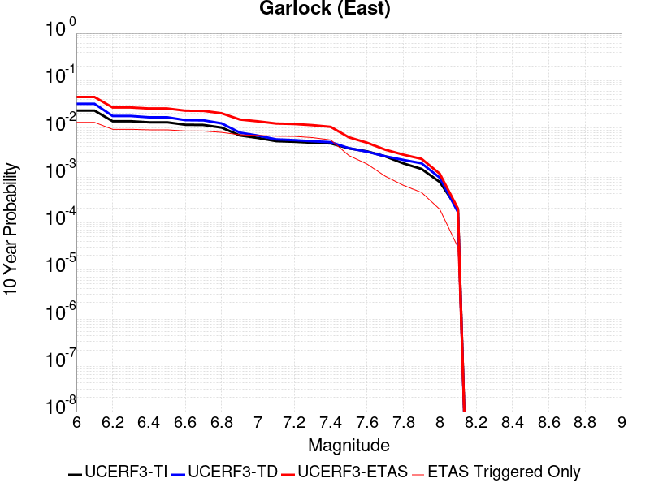 |

| Magnitude | 1 wk TI Prob | 1 wk TD Prob | 1 wk ETAS Prob | 1 wk ETAS/TD Gain | 1 wk ETAS Triggered Only | 1 mo TI Prob | 1 mo TD Prob | 1 mo ETAS Prob | 1 mo ETAS/TD Gain | 1 mo ETAS Triggered Only | 1 yr TI Prob | 1 yr TD Prob | 1 yr ETAS Prob | 1 yr ETAS/TD Gain | 1 yr ETAS Triggered Only | 10 yr TI Prob | 10 yr TD Prob | 10 yr ETAS Prob | 10 yr ETAS/TD Gain | 10 yr ETAS Triggered Only |
|-----|-----|-----|-----|-----|-----|-----|-----|-----|-----|-----|-----|-----|-----|-----|-----|-----|-----|-----|-----|-----|
| 6.0 | 4.5092507E-5 | 6.2906794E-5 | 0.0010728432 | 17.05449 | 0.00101 | 1.9323928E-4 | 2.695752E-4 | 0.0025889499 | 9.603813 | 0.00232 | 0.0023501497 | 0.0032775842 | 0.010503822 | 3.204745 | 0.00725 | 0.023254504 | 0.03235364 | 0.045020133 | 1.3915012 | 0.01309 |
| 6.1 | 4.5092507E-5 | 6.2906794E-5 | 0.0010728432 | 17.05449 | 0.00101 | 1.9323928E-4 | 2.695752E-4 | 0.0025889499 | 9.603813 | 0.00232 | 0.0023501497 | 0.0032775842 | 0.010503822 | 3.204745 | 0.00725 | 0.023254504 | 0.03235364 | 0.045020133 | 1.3915012 | 0.01309 |
| 6.2 | 2.6674514E-5 | 3.4512483E-5 | 8.1448554E-4 | 23.59974 | 7.8E-4 | 1.1431433E-4 | 1.4790244E-4 | 0.0018776465 | 12.695169 | 0.00173 | 0.0013908884 | 0.001799258 | 0.00697992 | 3.8793323 | 0.00519 | 0.01382215 | 0.017891733 | 0.027054803 | 1.5121399 | 0.00933 |
| 6.3 | 2.6674514E-5 | 3.4512483E-5 | 8.1448554E-4 | 23.59974 | 7.8E-4 | 1.1431433E-4 | 1.4790244E-4 | 0.0018776465 | 12.695169 | 0.00173 | 0.0013908884 | 0.001799258 | 0.00697992 | 3.8793323 | 0.00519 | 0.01382215 | 0.017891733 | 0.027054803 | 1.5121399 | 0.00933 |
| 6.4 | 2.5312667E-5 | 3.2341675E-5 | 8.0231676E-4 | 24.80752 | 7.7E-4 | 1.0847834E-4 | 1.3859998E-4 | 0.0018583615 | 13.408094 | 0.00172 | 0.0013199237 | 0.001686178 | 0.006767595 | 4.0135713 | 0.00509 | 0.013121112 | 0.01677974 | 0.025727043 | 1.5332206 | 0.0091 |
| 6.5 | 2.5312667E-5 | 3.2341675E-5 | 8.0231676E-4 | 24.80752 | 7.7E-4 | 1.0847834E-4 | 1.3859998E-4 | 0.0018583615 | 13.408094 | 0.00172 | 0.0013199237 | 0.001686178 | 0.006767595 | 4.0135713 | 0.00509 | 0.013121112 | 0.01677974 | 0.025727043 | 1.5332206 | 0.0091 |
| 6.6 | 2.246556E-5 | 2.813642E-5 | 7.6811557E-4 | 27.299692 | 7.4E-4 | 9.627742E-5 | 1.20579214E-4 | 0.0017403839 | 14.433532 | 0.00162 | 0.0011715472 | 0.0014670868 | 0.006299986 | 4.2942147 | 0.00484 | 0.011653901 | 0.014620015 | 0.023113992 | 1.5809827 | 0.00862 |
| 6.7 | 2.2241198E-5 | 2.7806154E-5 | 7.677856E-4 | 27.612074 | 7.4E-4 | 9.531594E-5 | 1.1916392E-4 | 0.0017389709 | 14.593099 | 0.00162 | 0.0011598538 | 0.0014498787 | 0.0062728757 | 4.3264832 | 0.00483 | 0.011538187 | 0.0144502055 | 0.022906221 | 1.5851831 | 0.00858 |
| 6.8 | 1.9528685E-5 | 2.3900653E-5 | 7.238839E-4 | 30.287203 | 7.0E-4 | 8.369167E-5 | 1.0242746E-4 | 0.0016222717 | 15.838251 | 0.00152 | 0.0010184698 | 0.0012463606 | 0.0057707145 | 4.630052 | 0.00453 | 0.010138147 | 0.012437694 | 0.02036782 | 1.637588 | 0.00803 |
| 6.9 | 1.3318621E-5 | 1.5201007E-5 | 6.8519084E-4 | 45.07536 | 6.7E-4 | 5.7078556E-5 | 6.514558E-5 | 0.0014850531 | 22.795916 | 0.00142 | 6.9470983E-4 | 7.928645E-4 | 0.004909598 | 6.1922283 | 0.00412 | 0.0069254204 | 0.007940986 | 0.015034208 | 1.893242 | 0.00715 |
| 7.0 | 1.1760853E-5 | 1.3109839E-5 | 6.7310117E-4 | 51.343212 | 6.6E-4 | 5.0402683E-5 | 5.618384E-5 | 0.0014461058 | 25.738821 | 0.00139 | 6.134799E-4 | 6.838286E-4 | 0.0046910862 | 6.8600326 | 0.00401 | 0.0061178906 | 0.006857582 | 0.013740059 | 2.0036304 | 0.00693 |
| 7.1 | 1.0064758E-5 | 1.090491E-5 | 6.708977E-4 | 61.522537 | 6.6E-4 | 4.3133965E-5 | 4.673451E-5 | 0.0014166705 | 30.313156 | 0.00137 | 5.2502943E-4 | 5.688476E-4 | 0.0044866176 | 7.887205 | 0.00392 | 0.005237907 | 0.005714025 | 0.012355856 | 2.1623733 | 0.00668 |
| 7.2 | 9.768808E-6 | 1.0500772E-5 | 6.704938E-4 | 63.85186 | 6.6E-4 | 4.186565E-5 | 4.500255E-5 | 0.0014149409 | 31.441347 | 0.00137 | 5.095951E-4 | 5.477718E-4 | 0.004435641 | 8.097607 | 0.00389 | 0.0050842804 | 0.005504284 | 0.012077901 | 2.1942728 | 0.00661 |
| 7.3 | 9.344516E-6 | 9.946395E-6 | 6.5993995E-4 | 66.349655 | 6.5E-4 | 4.004731E-5 | 4.2626732E-5 | 0.0013625704 | 31.965164 | 0.00132 | 4.8746695E-4 | 5.1886035E-4 | 0.004146977 | 7.992472 | 0.00363 | 0.0048639905 | 0.005215945 | 0.011413449 | 2.1881845 | 0.00623 |
| 7.4 | 9.023491E-6 | 9.49255E-6 | 5.794871E-4 | 61.04652 | 5.7E-4 | 3.867153E-5 | 4.068174E-5 | 0.0011606362 | 28.529657 | 0.00112 | 4.7072413E-4 | 4.95191E-4 | 0.0037036014 | 7.4791374 | 0.00321 | 0.004697283 | 0.004979378 | 0.010511693 | 2.1110454 | 0.00556 |
| 7.5 | 7.081253E-6 | 7.0893525E-6 | 3.0708723E-4 | 43.31668 | 3.0E-4 | 3.0347876E-5 | 3.038259E-5 | 5.9036555E-4 | 19.43105 | 5.6E-4 | 3.6942272E-4 | 3.6984598E-4 | 0.001829306 | 4.9461293 | 0.00146 | 0.003688092 | 0.0037251879 | 0.0063155023 | 1.6953514 | 0.0026 |
| 7.6 | 6.116396E-6 | 5.9608415E-6 | 1.8595977E-4 | 31.196898 | 1.8E-4 | 2.6212863E-5 | 2.5546216E-5 | 3.7553726E-4 | 14.70031 | 3.5E-4 | 3.1909486E-4 | 3.1098103E-4 | 0.0012107012 | 3.893167 | 9.0E-4 | 0.0031863707 | 0.003136586 | 0.0048511913 | 1.546647 | 0.00172 |
| 7.7 | 4.797145E-6 | 4.7587923E-6 | 7.4758456E-5 | 15.709545 | 7.0E-5 | 2.055903E-5 | 2.0394666E-5 | 1.9039119E-4 | 9.335343 | 1.7E-4 | 2.5027743E-4 | 2.482769E-4 | 6.9816515E-4 | 2.8120425 | 4.5E-4 | 0.0024999576 | 0.002510134 | 0.0034577493 | 1.3775159 | 9.5E-4 |
| 7.8 | 3.4028885E-6 | 3.979809E-6 | 2.397973E-5 | 6.0253463 | 2.0E-5 | 1.4583726E-5 | 1.7056214E-5 | 1.0705468E-4 | 6.276579 | 9.0E-5 | 1.775424E-4 | 2.076397E-4 | 4.7758364E-4 | 2.3000593 | 2.7E-4 | 0.0017740062 | 0.0021019245 | 0.0027106423 | 1.2896003 | 6.1E-4 |
| 7.9 | 2.5928412E-6 | 3.373588E-6 | 2.337352E-5 | 6.928386 | 2.0E-5 | 1.1112129E-5 | 1.44581545E-5 | 1.04456856E-4 | 7.224771 | 9.0E-5 | 1.3528178E-4 | 1.7601387E-4 | 4.059734E-4 | 2.3064852 | 2.3E-4 | 0.0013519945 | 0.0017818334 | 0.0022110671 | 1.2408944 | 4.3E-4 |
| 8.0 | 1.3743648E-6 | 1.673991E-6 | 1.1673975E-5 | 6.9737377 | 1.0E-5 | 5.8901214E-6 | 7.174228E-6 | 4.717394E-5 | 6.575473 | 4.0E-5 | 7.1709874E-5 | 8.7342756E-5 | 1.6733576E-4 | 1.9158517 | 8.0E-5 | 7.1686733E-4 | 8.839922E-4 | 0.0010738242 | 1.214744 | 1.9E-4 |
| 8.1 | 3.6733252E-7 | 3.1499187E-7 | 3.1499187E-7 | 1.0 | 0.0 | 1.5742813E-6 | 1.3499646E-6 | 1.3499646E-6 | 1.0 | 0.0 | 1.9166706E-5 | 1.643571E-5 | 2.6435546E-5 | 1.6084212 | 1.0E-5 | 1.9165053E-4 | 1.6643589E-4 | 1.9643089E-4 | 1.1802195 | 3.0E-5 |

## Blackwater
*[(top)](#table-of-contents)*

| 1 Week | 1 Month | 1 Year | 10 Year |
|-----|-----|-----|-----|
|  |  |  |  |

| Magnitude | 1 wk TI Prob | 1 wk TD Prob | 1 wk ETAS Prob | 1 wk ETAS/TD Gain | 1 wk ETAS Triggered Only | 1 mo TI Prob | 1 mo TD Prob | 1 mo ETAS Prob | 1 mo ETAS/TD Gain | 1 mo ETAS Triggered Only | 1 yr TI Prob | 1 yr TD Prob | 1 yr ETAS Prob | 1 yr ETAS/TD Gain | 1 yr ETAS Triggered Only | 10 yr TI Prob | 10 yr TD Prob | 10 yr ETAS Prob | 10 yr ETAS/TD Gain | 10 yr ETAS Triggered Only |
|-----|-----|-----|-----|-----|-----|-----|-----|-----|-----|-----|-----|-----|-----|-----|-----|-----|-----|-----|-----|-----|
| 6.0 | 3.0708583E-5 | 3.309619E-5 | 5.130803E-4 | 15.5027 | 4.8E-4 | 1.3160157E-4 | 1.4183388E-4 | 0.0015416353 | 10.869303 | 0.0014 | 0.0016010714 | 0.0017255963 | 0.005708711 | 3.3082542 | 0.00399 | 0.015895851 | 0.017135808 | 0.024065001 | 1.4043691 | 0.00705 |
| 6.1 | 3.0708583E-5 | 3.309619E-5 | 5.130803E-4 | 15.5027 | 4.8E-4 | 1.3160157E-4 | 1.4183388E-4 | 0.0015416353 | 10.869303 | 0.0014 | 0.0016010714 | 0.0017255963 | 0.005708711 | 3.3082542 | 0.00399 | 0.015895851 | 0.017135808 | 0.024065001 | 1.4043691 | 0.00705 |
| 6.2 | 1.1707779E-5 | 1.2545242E-5 | 1.3254373E-4 | 10.56526 | 1.2E-4 | 5.017523E-5 | 5.3764266E-5 | 5.1373953E-4 | 9.5554085 | 4.6E-4 | 6.107122E-4 | 6.5439293E-4 | 0.002143418 | 3.2754295 | 0.00149 | 0.006090366 | 0.006525631 | 0.009168273 | 1.4049634 | 0.00266 |
| 6.3 | 1.1707779E-5 | 1.2545242E-5 | 1.3254373E-4 | 10.56526 | 1.2E-4 | 5.017523E-5 | 5.3764266E-5 | 5.1373953E-4 | 9.5554085 | 4.6E-4 | 6.107122E-4 | 6.5439293E-4 | 0.002143418 | 3.2754295 | 0.00149 | 0.006090366 | 0.006525631 | 0.009168273 | 1.4049634 | 0.00266 |
| 6.4 | 7.929244E-6 | 8.480176E-6 | 8.84795E-5 | 10.433686 | 8.0E-5 | 3.3982033E-5 | 3.6343128E-5 | 3.7633078E-4 | 10.354936 | 3.4E-4 | 4.136527E-4 | 4.4239179E-4 | 0.0014419494 | 3.2594397 | 0.001 | 0.0041288356 | 0.0044155167 | 0.0062573478 | 1.417127 | 0.00185 |
| 6.5 | 5.8832115E-6 | 6.286048E-6 | 6.628567E-5 | 10.544888 | 6.0E-5 | 2.521352E-5 | 2.6939942E-5 | 2.7693322E-4 | 10.279652 | 2.5E-4 | 3.0693135E-4 | 3.2794697E-4 | 0.0010477109 | 3.194757 | 7.2E-4 | 0.0030650778 | 0.0032748834 | 0.004660331 | 1.4230525 | 0.00139 |
| 6.6 | 5.8832115E-6 | 6.286048E-6 | 6.628567E-5 | 10.544888 | 6.0E-5 | 2.521352E-5 | 2.6939942E-5 | 2.7693322E-4 | 10.279652 | 2.5E-4 | 3.0693135E-4 | 3.2794697E-4 | 0.0010477109 | 3.194757 | 7.2E-4 | 0.0030650778 | 0.0032748834 | 0.004660331 | 1.4230525 | 0.00139 |
| 6.7 | 3.0715053E-6 | 3.281496E-6 | 3.3281398E-5 | 10.142142 | 3.0E-5 | 1.3163528E-5 | 1.4063485E-5 | 1.340618E-4 | 9.532616 | 1.2E-4 | 1.6025416E-4 | 1.7121063E-4 | 4.511627E-4 | 2.6351323 | 2.8E-4 | 0.0016013865 | 0.0017109019 | 0.002349807 | 1.3734317 | 6.4E-4 |
| 6.8 | 2.2722281E-6 | 2.4287758E-6 | 2.2428727E-5 | 9.234581 | 2.0E-5 | 9.738084E-6 | 1.0409003E-5 | 9.040817E-5 | 8.685575 | 8.0E-5 | 1.1855473E-4 | 1.2672316E-4 | 2.8670288E-4 | 2.2624347 | 1.6E-4 | 0.001184915 | 0.0012665992 | 0.0016660925 | 1.3154063 | 4.0E-4 |
| 6.9 | 9.952399E-7 | 1.0653588E-6 | 2.1065338E-5 | 19.772997 | 2.0E-5 | 4.265307E-6 | 4.5658185E-6 | 3.456568E-5 | 7.5705338 | 3.0E-5 | 5.1928873E-5 | 5.5587938E-5 | 1.15584604E-4 | 2.079311 | 6.0E-5 | 5.191674E-4 | 5.5579096E-4 | 7.2569645E-4 | 1.3057004 | 1.7E-4 |
| 7.0 | 4.7385504E-7 | 5.0756074E-7 | 5.0756074E-7 | 1.0 | 0.0 | 2.0308057E-6 | 2.1752603E-6 | 1.2175238E-5 | 5.597141 | 1.0E-5 | 2.4724779E-5 | 2.6483794E-5 | 4.6483263E-5 | 1.7551588 | 2.0E-5 | 2.4722028E-4 | 2.6483793E-4 | 3.348194E-4 | 1.2642425 | 7.0E-5 |

## Ash Hill
*[(top)](#table-of-contents)*

| 1 Week | 1 Month | 1 Year | 10 Year |
|-----|-----|-----|-----|
|  |  | 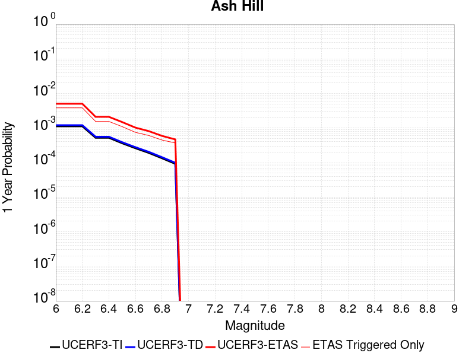 |  |

| Magnitude | 1 wk TI Prob | 1 wk TD Prob | 1 wk ETAS Prob | 1 wk ETAS/TD Gain | 1 wk ETAS Triggered Only | 1 mo TI Prob | 1 mo TD Prob | 1 mo ETAS Prob | 1 mo ETAS/TD Gain | 1 mo ETAS Triggered Only | 1 yr TI Prob | 1 yr TD Prob | 1 yr ETAS Prob | 1 yr ETAS/TD Gain | 1 yr ETAS Triggered Only | 10 yr TI Prob | 10 yr TD Prob | 10 yr ETAS Prob | 10 yr ETAS/TD Gain | 10 yr ETAS Triggered Only |
|-----|-----|-----|-----|-----|-----|-----|-----|-----|-----|-----|-----|-----|-----|-----|-----|-----|-----|-----|-----|-----|
| 6.0 | 2.1545662E-5 | 2.3194681E-5 | 6.5318006E-4 | 28.160769 | 6.3E-4 | 9.2335285E-5 | 9.9402445E-5 | 0.0016692464 | 16.79281 | 0.00157 | 0.0011236023 | 0.0012096328 | 0.005044988 | 4.170677 | 0.00384 | 0.011179381 | 0.01203847 | 0.01872697 | 1.5555938 | 0.00677 |
| 6.1 | 2.1545662E-5 | 2.3194681E-5 | 6.5318006E-4 | 28.160769 | 6.3E-4 | 9.2335285E-5 | 9.9402445E-5 | 0.0016692464 | 16.79281 | 0.00157 | 0.0011236023 | 0.0012096328 | 0.005044988 | 4.170677 | 0.00384 | 0.011179381 | 0.01203847 | 0.01872697 | 1.5555938 | 0.00677 |
| 6.2 | 2.1545662E-5 | 2.3194681E-5 | 6.5318006E-4 | 28.160769 | 6.3E-4 | 9.2335285E-5 | 9.9402445E-5 | 0.0016692464 | 16.79281 | 0.00157 | 0.0011236023 | 0.0012096328 | 0.005044988 | 4.170677 | 0.00384 | 0.011179381 | 0.01203847 | 0.01872697 | 1.5555938 | 0.00677 |
| 6.3 | 1.0025529E-5 | 1.0747037E-5 | 2.7074423E-4 | 25.192455 | 2.6E-4 | 4.2965847E-5 | 4.605799E-5 | 6.4603036E-4 | 14.026456 | 6.0E-4 | 5.229836E-4 | 5.60625E-4 | 0.002109756 | 3.7632215 | 0.00155 | 0.005217545 | 0.0055934195 | 0.008218653 | 1.4693432 | 0.00264 |
| 6.4 | 1.0025529E-5 | 1.0747037E-5 | 2.7074423E-4 | 25.192455 | 2.6E-4 | 4.2965847E-5 | 4.605799E-5 | 6.4603036E-4 | 14.026456 | 6.0E-4 | 5.229836E-4 | 5.60625E-4 | 0.002109756 | 3.7632215 | 0.00155 | 0.005217545 | 0.0055934195 | 0.008218653 | 1.4693432 | 0.00264 |
| 6.5 | 6.9617327E-6 | 7.456704E-6 | 2.2745506E-4 | 30.503431 | 2.2E-4 | 2.9835655E-5 | 3.1956963E-5 | 4.919423E-4 | 15.3939 | 4.6E-4 | 3.6318856E-4 | 3.8901521E-4 | 0.0014885874 | 3.8265529 | 0.0011 | 0.0036259557 | 0.0038841967 | 0.005736972 | 1.4770035 | 0.00186 |
| 6.6 | 4.9919777E-6 | 5.346739E-6 | 1.4534598E-4 | 27.184046 | 1.4E-4 | 2.1394015E-5 | 2.2914432E-5 | 3.3290734E-4 | 14.528283 | 3.1E-4 | 2.60441E-4 | 2.789542E-4 | 0.001028745 | 3.6878636 | 7.5E-4 | 0.0026013597 | 0.0027866988 | 0.004142909 | 1.4866726 | 0.00136 |
| 6.7 | 3.6630722E-6 | 3.9246606E-6 | 1.0392427E-4 | 26.479809 | 1.0E-4 | 1.5698786E-5 | 1.6819899E-5 | 2.5681587E-4 | 15.268574 | 2.4E-4 | 1.9111596E-4 | 2.0476876E-4 | 8.1464386E-4 | 3.97836 | 6.1E-4 | 0.0019095168 | 0.002046364 | 0.0031740514 | 1.5510689 | 0.00113 |
| 6.8 | 2.5599613E-6 | 2.7449514E-6 | 7.274476E-5 | 26.501291 | 7.0E-5 | 1.0971216E-5 | 1.1764052E-5 | 1.9176194E-4 | 16.30067 | 1.8E-4 | 1.3356637E-4 | 1.4322287E-4 | 5.931584E-4 | 4.141506 | 4.5E-4 | 0.0013348613 | 0.0014317906 | 0.0022606023 | 1.5788637 | 8.3E-4 |
| 6.9 | 1.7684905E-6 | 1.896889E-6 | 5.1896794E-5 | 27.358898 | 5.0E-5 | 7.579223E-6 | 8.129524E-6 | 1.4812838E-4 | 18.22104 | 1.4E-4 | 9.2273134E-5 | 9.8976954E-5 | 4.6894033E-4 | 4.737874 | 3.7E-4 | 9.223483E-4 | 9.897696E-4 | 0.0016391262 | 1.6560686 | 6.5E-4 |

## Hunter Mountain-Saline Valley
*[(top)](#table-of-contents)*

| 1 Week | 1 Month | 1 Year | 10 Year |
|-----|-----|-----|-----|
|  |  | 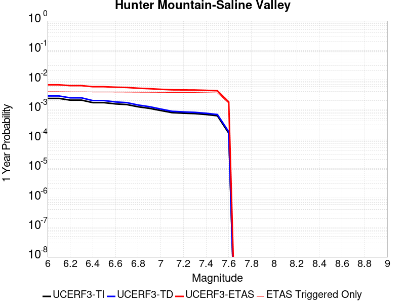 |  |

| Magnitude | 1 wk TI Prob | 1 wk TD Prob | 1 wk ETAS Prob | 1 wk ETAS/TD Gain | 1 wk ETAS Triggered Only | 1 mo TI Prob | 1 mo TD Prob | 1 mo ETAS Prob | 1 mo ETAS/TD Gain | 1 mo ETAS Triggered Only | 1 yr TI Prob | 1 yr TD Prob | 1 yr ETAS Prob | 1 yr ETAS/TD Gain | 1 yr ETAS Triggered Only | 10 yr TI Prob | 10 yr TD Prob | 10 yr ETAS Prob | 10 yr ETAS/TD Gain | 10 yr ETAS Triggered Only |
|-----|-----|-----|-----|-----|-----|-----|-----|-----|-----|-----|-----|-----|-----|-----|-----|-----|-----|-----|-----|-----|
| 6.0 | 4.5103672E-5 | 5.4571992E-5 | 6.04542E-4 | 11.07788 | 5.5E-4 | 1.9328714E-4 | 2.3385909E-4 | 0.0017535036 | 7.498121 | 0.00152 | 0.002350731 | 0.0028436056 | 0.0067823734 | 2.3851316 | 0.00395 | 0.023260195 | 0.028092787 | 0.03457541 | 1.2307575 | 0.00667 |
| 6.1 | 4.5103672E-5 | 5.4571992E-5 | 6.04542E-4 | 11.07788 | 5.5E-4 | 1.9328714E-4 | 2.3385909E-4 | 0.0017535036 | 7.498121 | 0.00152 | 0.002350731 | 0.0028436056 | 0.0067823734 | 2.3851316 | 0.00395 | 0.023260195 | 0.028092787 | 0.03457541 | 1.2307575 | 0.00667 |
| 6.2 | 3.9363465E-5 | 4.7064877E-5 | 5.97039E-4 | 12.685447 | 5.5E-4 | 1.6868966E-4 | 2.0169078E-4 | 0.0017213842 | 8.534769 | 0.00152 | 0.002051862 | 0.0024528939 | 0.006353303 | 2.5901256 | 0.00391 | 0.020330196 | 0.024274237 | 0.030743299 | 1.266499 | 0.00663 |
| 6.3 | 3.9363465E-5 | 4.7064877E-5 | 5.97039E-4 | 12.685447 | 5.5E-4 | 1.6868966E-4 | 2.0169078E-4 | 0.0017213842 | 8.534769 | 0.00152 | 0.002051862 | 0.0024528939 | 0.006353303 | 2.5901256 | 0.00391 | 0.020330196 | 0.024274237 | 0.030743299 | 1.266499 | 0.00663 |
| 6.4 | 3.2311684E-5 | 3.795214E-5 | 5.7793164E-4 | 15.227907 | 5.4E-4 | 1.384713E-4 | 1.626423E-4 | 0.0016723967 | 10.282668 | 0.00151 | 0.0016845843 | 0.0019784442 | 0.0058407877 | 2.9522123 | 0.00387 | 0.016718714 | 0.019617062 | 0.02603857 | 1.327343 | 0.00655 |
| 6.5 | 3.2311684E-5 | 3.795214E-5 | 5.7793164E-4 | 15.227907 | 5.4E-4 | 1.384713E-4 | 1.626423E-4 | 0.0016723967 | 10.282668 | 0.00151 | 0.0016845843 | 0.0019784442 | 0.0058407877 | 2.9522123 | 0.00387 | 0.016718714 | 0.019617062 | 0.02603857 | 1.327343 | 0.00655 |
| 6.6 | 2.9305844E-5 | 3.4182853E-5 | 5.741644E-4 | 16.796854 | 5.4E-4 | 1.2559042E-4 | 1.4649007E-4 | 0.0016462704 | 11.238102 | 0.0015 | 0.0015279909 | 0.0017821203 | 0.005625259 | 3.156498 | 0.00385 | 0.015175272 | 0.017686214 | 0.024081077 | 1.3615732 | 0.00651 |
| 6.7 | 2.7826512E-5 | 3.2345237E-5 | 5.7232776E-4 | 17.694344 | 5.4E-4 | 1.19251024E-4 | 1.3861542E-4 | 0.0016184102 | 11.675543 | 0.00148 | 0.0014509142 | 0.0016863967 | 0.0055099376 | 3.2672846 | 0.00383 | 0.014414776 | 0.01674368 | 0.023125013 | 1.3811189 | 0.00649 |
| 6.8 | 2.3389874E-5 | 2.6867507E-5 | 5.66853E-4 | 21.098087 | 5.4E-4 | 1.0023846E-4 | 1.1514164E-4 | 0.0015949713 | 13.852254 | 0.00148 | 0.00121972 | 0.0014009953 | 0.0051956717 | 3.7085576 | 0.0038 | 0.01213047 | 0.013927842 | 0.020278146 | 1.4559432 | 0.00644 |
| 6.9 | 2.069209E-5 | 2.3570727E-5 | 5.63558E-4 | 23.909233 | 5.4E-4 | 8.867737E-5 | 1.0101369E-4 | 0.0015808642 | 15.649999 | 0.00148 | 0.0010791123 | 0.001229184 | 0.0050045378 | 4.0714307 | 0.00378 | 0.010738871 | 0.012228882 | 0.018560495 | 1.517759 | 0.00641 |
| 7.0 | 1.7462342E-5 | 1.9634126E-5 | 5.4962374E-4 | 27.993286 | 5.3E-4 | 7.483646E-5 | 8.414367E-5 | 0.0015440208 | 18.349815 | 0.00146 | 9.1075303E-4 | 0.0010239903 | 0.0047701504 | 4.658394 | 0.00375 | 0.009070295 | 0.010196352 | 0.016501402 | 1.6183631 | 0.00637 |
| 7.1 | 1.4807709E-5 | 1.6442245E-5 | 5.4643356E-4 | 33.233513 | 5.3E-4 | 6.3460066E-5 | 7.046495E-5 | 0.0015303621 | 21.71806 | 0.00146 | 7.723524E-4 | 8.575896E-4 | 0.0045843907 | 5.3456697 | 0.00373 | 0.007696735 | 0.008545788 | 0.01479195 | 1.7309053 | 0.0063 |
| 7.2 | 1.4180048E-5 | 1.5698814E-5 | 5.456905E-4 | 34.759983 | 5.3E-4 | 6.077022E-5 | 6.727898E-5 | 0.0015271808 | 22.699224 | 0.00146 | 7.396263E-4 | 8.1883004E-4 | 0.0045457757 | 5.55155 | 0.00373 | 0.0073716943 | 0.00816108 | 0.014409666 | 1.7656566 | 0.0063 |
| 7.3 | 1.3730402E-5 | 1.5172541E-5 | 5.451645E-4 | 35.930996 | 5.3E-4 | 5.8843252E-5 | 6.502365E-5 | 0.0015249287 | 23.451912 | 0.00146 | 7.161811E-4 | 7.913914E-4 | 0.0045184395 | 5.709488 | 0.00373 | 0.007138774 | 0.007888664 | 0.014138965 | 1.7923143 | 0.0063 |
| 7.4 | 1.2810095E-5 | 1.410972E-5 | 5.441022E-4 | 38.56223 | 5.3E-4 | 5.489925E-5 | 6.0468916E-5 | 0.0015003819 | 24.812449 | 0.00144 | 6.681934E-4 | 7.359762E-4 | 0.004403275 | 5.9829044 | 0.00367 | 0.006661878 | 0.0073382827 | 0.013482858 | 1.8373317 | 0.00619 |
| 7.5 | 1.1595659E-5 | 1.2801013E-5 | 5.3279434E-4 | 41.621265 | 5.2E-4 | 4.9694736E-5 | 5.4860422E-5 | 0.001484782 | 27.06472 | 0.00143 | 6.0486543E-4 | 6.677366E-4 | 0.0042653326 | 6.3877473 | 0.0036 | 0.006032217 | 0.0066601736 | 0.012659946 | 1.9008433 | 0.00604 |
| 7.6 | 2.997694E-6 | 3.3252948E-6 | 2.3332454E-4 | 70.16657 | 2.3E-4 | 1.28471975E-5 | 1.4251226E-5 | 7.042414E-4 | 49.416195 | 6.9E-4 | 1.564034E-4 | 1.7350215E-4 | 0.0017832228 | 10.277814 | 0.00161 | 0.0015629337 | 0.0017351025 | 0.004530244 | 2.6109376 | 0.0028 |

## Garlock (West)
*[(top)](#table-of-contents)*

| 1 Week | 1 Month | 1 Year | 10 Year |
|-----|-----|-----|-----|
|  |  |  |  |

| Magnitude | 1 wk TI Prob | 1 wk TD Prob | 1 wk ETAS Prob | 1 wk ETAS/TD Gain | 1 wk ETAS Triggered Only | 1 mo TI Prob | 1 mo TD Prob | 1 mo ETAS Prob | 1 mo ETAS/TD Gain | 1 mo ETAS Triggered Only | 1 yr TI Prob | 1 yr TD Prob | 1 yr ETAS Prob | 1 yr ETAS/TD Gain | 1 yr ETAS Triggered Only | 10 yr TI Prob | 10 yr TD Prob | 10 yr ETAS Prob | 10 yr ETAS/TD Gain | 10 yr ETAS Triggered Only |
|-----|-----|-----|-----|-----|-----|-----|-----|-----|-----|-----|-----|-----|-----|-----|-----|-----|-----|-----|-----|-----|
| 6.0 | 2.5181727E-5 | 2.5202135E-5 | 4.351918E-4 | 17.268053 | 4.1E-4 | 1.0791722E-4 | 1.080047E-4 | 0.0010179065 | 9.424649 | 9.1E-4 | 0.0013131002 | 0.0013141674 | 0.004080527 | 3.1050284 | 0.00277 | 0.013053683 | 0.013144457 | 0.017960312 | 1.3663791 | 0.00488 |
| 6.1 | 2.5077732E-5 | 2.5103205E-5 | 4.3509292E-4 | 17.332167 | 4.1E-4 | 1.0747157E-4 | 1.07580745E-4 | 0.0010174828 | 9.457852 | 9.1E-4 | 0.001307681 | 0.0013090121 | 0.004075386 | 3.1133296 | 0.00277 | 0.013000126 | 0.0130935125 | 0.017909616 | 1.3678237 | 0.00488 |
| 6.2 | 2.494612E-5 | 2.498488E-5 | 4.3497465E-4 | 17.409515 | 4.1E-4 | 1.0690756E-4 | 1.07073676E-4 | 0.0010169762 | 9.4979105 | 9.1E-4 | 0.0013008224 | 0.0013028459 | 0.004069237 | 3.123345 | 0.00277 | 0.012932341 | 0.013032575 | 0.017848976 | 1.3695663 | 0.00488 |
| 6.3 | 2.4733758E-5 | 2.4804243E-5 | 4.3479408E-4 | 17.52902 | 4.1E-4 | 1.0599751E-4 | 1.0629959E-4 | 0.0010162028 | 9.559801 | 9.1E-4 | 0.0012897556 | 0.0012934325 | 0.00405985 | 3.1388183 | 0.00277 | 0.012822957 | 0.012939542 | 0.017756397 | 1.3722585 | 0.00488 |
| 6.4 | 2.3237335E-5 | 2.318352E-5 | 4.3317402E-4 | 18.684566 | 4.1E-4 | 9.958477E-5 | 9.935417E-5 | 0.0010092638 | 10.158242 | 9.1E-4 | 0.0012117702 | 0.0012089686 | 0.003965632 | 3.2801776 | 0.00276 | 0.012051838 | 0.012104375 | 0.016875912 | 1.3941993 | 0.00483 |
| 6.5 | 2.2732203E-5 | 2.2998063E-5 | 4.3298863E-4 | 18.827179 | 4.1E-4 | 9.742009E-5 | 9.8559416E-5 | 0.0010084697 | 10.2321 | 9.1E-4 | 0.0011854442 | 0.0011993032 | 0.003955993 | 3.2985764 | 0.00276 | 0.011791403 | 0.012008769 | 0.016780768 | 1.3973761 | 0.00483 |
| 6.6 | 2.1319436E-5 | 2.1778224E-5 | 4.317693E-4 | 19.825735 | 4.1E-4 | 9.136581E-5 | 9.333192E-5 | 9.93248E-4 | 10.642104 | 9.0E-4 | 0.001111811 | 0.001135726 | 0.0038826028 | 3.4186087 | 0.00275 | 0.011062649 | 0.0113796545 | 0.016144805 | 1.418743 | 0.00482 |
| 6.7 | 1.970802E-5 | 2.0398069E-5 | 4.3038971E-4 | 21.099531 | 4.1E-4 | 8.446021E-5 | 8.741738E-5 | 9.873387E-4 | 11.294536 | 9.0E-4 | 0.001027818 | 0.0010637887 | 0.0038108632 | 3.58235 | 0.00275 | 0.010230771 | 0.010667368 | 0.015416165 | 1.4451704 | 0.0048 |
| 6.8 | 1.8744462E-5 | 1.9905692E-5 | 4.2989754E-4 | 21.596714 | 4.1E-4 | 8.033094E-5 | 8.530733E-5 | 9.852306E-4 | 11.5491905 | 9.0E-4 | 9.775903E-4 | 0.0010381235 | 0.0037852686 | 3.6462605 | 0.00275 | 0.009733009 | 0.010413141 | 0.015163158 | 1.456156 | 0.0048 |
| 6.9 | 1.7559682E-5 | 1.895803E-5 | 4.2895027E-4 | 22.62631 | 4.1E-4 | 7.5253614E-5 | 8.124618E-5 | 9.6117466E-4 | 11.830399 | 8.8E-4 | 9.158276E-4 | 9.887248E-4 | 0.0037160255 | 3.7584023 | 0.00273 | 0.0091206245 | 0.009923607 | 0.014646271 | 1.475902 | 0.00477 |
| 7.0 | 1.6794445E-5 | 1.8220819E-5 | 4.1821352E-4 | 22.95251 | 4.0E-4 | 7.197421E-5 | 7.8086894E-5 | 9.48019E-4 | 12.140564 | 8.7E-4 | 8.759337E-4 | 9.5029466E-4 | 0.0036577194 | 3.8490372 | 0.00271 | 0.008724891 | 0.0095425 | 0.014237268 | 1.4919852 | 0.00474 |
| 7.1 | 1.6337795E-5 | 1.7721602E-5 | 4.177145E-4 | 23.570923 | 4.0E-4 | 7.0017246E-5 | 7.5947515E-5 | 9.458814E-4 | 12.454409 | 8.7E-4 | 8.521265E-4 | 9.2427013E-4 | 0.0036317653 | 3.9293332 | 0.00271 | 0.008488664 | 0.009284343 | 0.013970428 | 1.5047299 | 0.00473 |
| 7.2 | 1.5780008E-5 | 1.7170225E-5 | 4.1716336E-4 | 24.295742 | 4.0E-4 | 6.762685E-5 | 7.358461E-5 | 9.435206E-4 | 12.822254 | 8.7E-4 | 8.2304585E-4 | 8.955257E-4 | 0.0035731257 | 3.9899757 | 0.00268 | 0.008200042 | 0.008999176 | 0.01362715 | 1.5142664 | 0.00467 |
| 7.3 | 1.5058865E-5 | 1.6623266E-5 | 4.1661662E-4 | 25.06226 | 4.0E-4 | 6.45364E-5 | 7.124063E-5 | 9.311794E-4 | 13.070903 | 8.6E-4 | 7.854473E-4 | 8.6701073E-4 | 0.0035147131 | 4.053829 | 0.00265 | 0.00782677 | 0.00871586 | 0.013295592 | 1.5254482 | 0.00462 |
| 7.4 | 1.4887923E-5 | 1.6459222E-5 | 4.1645265E-4 | 25.302086 | 4.0E-4 | 6.380382E-5 | 7.053762E-5 | 9.1047835E-4 | 12.9077 | 8.4E-4 | 7.7653467E-4 | 8.5845834E-4 | 0.0034762092 | 4.0493627 | 0.00262 | 0.0077382675 | 0.0086307125 | 0.013121616 | 1.5203397 | 0.00453 |
| 7.5 | 1.4509299E-5 | 1.6051208E-5 | 4.160448E-4 | 25.919844 | 4.0E-4 | 6.218123E-5 | 6.8789086E-5 | 8.98732E-4 | 13.065038 | 8.3E-4 | 7.567935E-4 | 8.3718647E-4 | 0.0032451688 | 3.8762796 | 0.00241 | 0.0075422134 | 0.008419003 | 0.012534064 | 1.4887825 | 0.00415 |
| 7.6 | 1.2756717E-5 | 1.4055129E-5 | 2.940512E-4 | 20.921272 | 2.8E-4 | 5.4670498E-5 | 6.023488E-5 | 6.5019936E-4 | 10.794399 | 5.9E-4 | 6.6541E-4 | 7.331136E-4 | 0.002381904 | 3.2490244 | 0.00165 | 0.006634211 | 0.007383898 | 0.010262485 | 1.3898464 | 0.0029 |
| 7.7 | 1.0328985E-5 | 1.1464573E-5 | 1.4146308E-4 | 12.33915 | 1.3E-4 | 4.4266326E-5 | 4.913296E-5 | 3.9911576E-4 | 8.123178 | 3.5E-4 | 5.388092E-4 | 5.9803E-4 | 0.0015874379 | 2.6544454 | 9.9E-4 | 0.0053750467 | 0.0060405903 | 0.007839656 | 1.2978296 | 0.00181 |
| 7.8 | 7.0306583E-6 | 8.902813E-6 | 4.8902457E-5 | 5.4929223 | 4.0E-5 | 3.0131043E-5 | 3.8154354E-5 | 2.3814672E-4 | 6.241666 | 2.0E-4 | 3.667837E-4 | 4.644304E-4 | 0.0010641518 | 2.291305 | 6.0E-4 | 0.003661789 | 0.0046969377 | 0.0058415364 | 1.2436904 | 0.00115 |
| 7.9 | 4.060633E-6 | 5.4672782E-6 | 3.5467114E-5 | 6.487161 | 3.0E-5 | 1.7402595E-5 | 2.3430983E-5 | 1.634277E-4 | 6.974855 | 1.4E-4 | 2.11856E-4 | 2.8523497E-4 | 6.651266E-4 | 2.331855 | 3.8E-4 | 0.0021165414 | 0.0028851798 | 0.0035333044 | 1.2246393 | 6.5E-4 |
| 8.0 | 1.6729537E-6 | 2.078155E-6 | 1.2078134E-5 | 5.8119507 | 1.0E-5 | 7.169782E-6 | 8.906349E-6 | 5.8905902E-5 | 6.613923 | 5.0E-5 | 8.7288594E-5 | 1.08429434E-4 | 2.1841751E-4 | 2.0143747 | 1.1E-4 | 8.7254314E-4 | 0.001097267 | 0.0013170256 | 1.2002782 | 2.2E-4 |
| 8.1 | 3.6733252E-7 | 3.1499187E-7 | 3.1499187E-7 | 1.0 | 0.0 | 1.5742813E-6 | 1.3499646E-6 | 1.3499646E-6 | 1.0 | 0.0 | 1.9166706E-5 | 1.643571E-5 | 2.6435546E-5 | 1.6084212 | 1.0E-5 | 1.9165053E-4 | 1.6643589E-4 | 1.9643089E-4 | 1.1802195 | 3.0E-5 |

## Gravel Hills-Harper Lk
*[(top)](#table-of-contents)*

| 1 Week | 1 Month | 1 Year | 10 Year |
|-----|-----|-----|-----|
|  |  |  |  |

| Magnitude | 1 wk TI Prob | 1 wk TD Prob | 1 wk ETAS Prob | 1 wk ETAS/TD Gain | 1 wk ETAS Triggered Only | 1 mo TI Prob | 1 mo TD Prob | 1 mo ETAS Prob | 1 mo ETAS/TD Gain | 1 mo ETAS Triggered Only | 1 yr TI Prob | 1 yr TD Prob | 1 yr ETAS Prob | 1 yr ETAS/TD Gain | 1 yr ETAS Triggered Only | 10 yr TI Prob | 10 yr TD Prob | 10 yr ETAS Prob | 10 yr ETAS/TD Gain | 10 yr ETAS Triggered Only |
|-----|-----|-----|-----|-----|-----|-----|-----|-----|-----|-----|-----|-----|-----|-----|-----|-----|-----|-----|-----|-----|
| 6.0 | 3.0679566E-5 | 3.1465184E-5 | 2.8145732E-4 | 8.94504 | 2.5E-4 | 1.3147724E-4 | 1.3484505E-4 | 8.6474663E-4 | 6.4128914 | 7.3E-4 | 0.0015995599 | 0.0016407187 | 0.0036973387 | 2.2534873 | 0.00206 | 0.015880952 | 0.016307615 | 0.020084994 | 1.2316328 | 0.00384 |
| 6.1 | 3.0679566E-5 | 3.1465184E-5 | 2.8145732E-4 | 8.94504 | 2.5E-4 | 1.3147724E-4 | 1.3484505E-4 | 8.6474663E-4 | 6.4128914 | 7.3E-4 | 0.0015995599 | 0.0016407187 | 0.0036973387 | 2.2534873 | 0.00206 | 0.015880952 | 0.016307615 | 0.020084994 | 1.2316328 | 0.00384 |
| 6.2 | 1.514536E-5 | 1.3635392E-5 | 8.363444E-5 | 6.1336293 | 7.0E-5 | 6.490707E-5 | 5.843615E-5 | 3.0842156E-4 | 5.2779236 | 2.5E-4 | 7.8995706E-4 | 7.112398E-4 | 0.0013407917 | 1.8851472 | 6.3E-4 | 0.007871548 | 0.0070908363 | 0.008212823 | 1.1582307 | 0.00113 |
| 6.3 | 1.514536E-5 | 1.3635392E-5 | 8.363444E-5 | 6.1336293 | 7.0E-5 | 6.490707E-5 | 5.843615E-5 | 3.0842156E-4 | 5.2779236 | 2.5E-4 | 7.8995706E-4 | 7.112398E-4 | 0.0013407917 | 1.8851472 | 6.3E-4 | 0.007871548 | 0.0070908363 | 0.008212823 | 1.1582307 | 0.00113 |
| 6.4 | 1.2532521E-5 | 1.0689826E-5 | 6.068929E-5 | 5.6772947 | 5.0E-5 | 5.37097E-5 | 4.581277E-5 | 1.8580635E-4 | 4.0557766 | 1.4E-4 | 6.537194E-4 | 5.576335E-4 | 9.4741606E-4 | 1.698994 | 3.9E-4 | 0.0065179965 | 0.0055629327 | 0.006259039 | 1.1251329 | 7.0E-4 |
| 6.5 | 1.1094058E-5 | 9.083774E-6 | 3.90835E-5 | 4.302562 | 3.0E-5 | 4.7545094E-5 | 3.89299E-5 | 1.2892639E-4 | 3.3117578 | 9.0E-5 | 5.787078E-4 | 4.738725E-4 | 7.23754E-4 | 1.5273181 | 2.5E-4 | 0.0057720304 | 0.004729028 | 0.005166947 | 1.0926024 | 4.4E-4 |
| 6.6 | 9.688328E-6 | 7.531784E-6 | 2.7531632E-5 | 3.6553934 | 2.0E-5 | 4.1520743E-5 | 3.2278687E-5 | 8.2277074E-5 | 2.5489597 | 5.0E-5 | 5.053978E-4 | 3.929247E-4 | 5.72854E-4 | 1.457923 | 1.8E-4 | 0.0050424994 | 0.0039225565 | 0.0042213798 | 1.0761807 | 3.0E-4 |
| 6.7 | 8.974824E-6 | 6.7494916E-6 | 6.7494916E-6 | 1.0 | 0.0 | 3.8462964E-5 | 2.8926084E-5 | 5.8925216E-5 | 2.0370963 | 3.0E-5 | 4.6818596E-4 | 3.5212038E-4 | 4.820746E-4 | 1.369062 | 1.3E-4 | 0.004672008 | 0.0035158454 | 0.003725107 | 1.0595195 | 2.1E-4 |
| 6.8 | 7.4780046E-6 | 5.116252E-6 | 5.116252E-6 | 1.0 | 0.0 | 3.20482E-5 | 2.1926619E-5 | 4.192618E-5 | 1.9121133 | 2.0E-5 | 3.9011694E-4 | 2.6692526E-4 | 3.1691193E-4 | 1.1872684 | 5.0E-5 | 0.0038943281 | 0.002666185 | 0.0027559448 | 1.0336661 | 9.0E-5 |
| 6.9 | 6.3409307E-6 | 3.9075426E-6 | 3.9075426E-6 | 1.0 | 0.0 | 2.7175134E-5 | 1.674651E-5 | 3.6746176E-5 | 2.1942587 | 2.0E-5 | 3.3080703E-4 | 2.0387067E-4 | 2.3386456E-4 | 1.1471221 | 3.0E-5 | 0.0033031502 | 0.0020369345 | 0.0020968122 | 1.029396 | 6.0E-5 |
| 7.0 | 5.1239335E-6 | 2.6058885E-6 | 2.6058885E-6 | 1.0 | 0.0 | 2.195953E-5 | 1.11680465E-5 | 2.1167934E-5 | 1.8954017 | 1.0E-5 | 2.6732447E-4 | 1.3596273E-4 | 1.5596002E-4 | 1.1470791 | 2.0E-5 | 0.0026700313 | 0.0013588208 | 0.0014087529 | 1.0367466 | 5.0E-5 |
| 7.1 | 4.438899E-6 | 2.0984994E-6 | 2.0984994E-6 | 1.0 | 0.0 | 1.9023713E-5 | 8.993539E-6 | 8.993539E-6 | 1.0 | 0.0 | 2.315891E-4 | 1.0949106E-4 | 1.0949106E-4 | 1.0 | 0.0 | 0.002313479 | 0.0010943931 | 0.0011143711 | 1.018255 | 2.0E-5 |
| 7.2 | 3.50367E-6 | 1.2615911E-6 | 1.2615911E-6 | 1.0 | 0.0 | 1.5015643E-5 | 5.406808E-6 | 5.406808E-6 | 1.0 | 0.0 | 1.8280011E-4 | 6.582599E-5 | 6.582599E-5 | 1.0 | 0.0 | 0.0018264982 | 6.580731E-4 | 6.7805994E-4 | 1.0303718 | 2.0E-5 |
| 7.3 | 2.561638E-6 | 7.119307E-7 | 7.119307E-7 | 1.0 | 0.0 | 1.0978401E-5 | 3.051128E-6 | 3.051128E-6 | 1.0 | 0.0 | 1.3365384E-4 | 3.714687E-5 | 3.714687E-5 | 1.0 | 0.0 | 0.0013357349 | 3.7140862E-4 | 3.814049E-4 | 1.0269145 | 1.0E-5 |
| 7.4 | 2.0368864E-6 | 5.304955E-7 | 5.304955E-7 | 1.0 | 0.0 | 8.729483E-6 | 2.2735503E-6 | 2.2735503E-6 | 1.0 | 0.0 | 1.06276275E-4 | 2.768013E-5 | 2.768013E-5 | 1.0 | 0.0 | 0.0010622547 | 2.7676736E-4 | 2.7676736E-4 | 1.0 | 0.0 |
| 7.5 | 1.1681728E-6 | 3.6031287E-7 | 3.6031287E-7 | 1.0 | 0.0 | 5.0064455E-6 | 1.5441972E-6 | 1.5441972E-6 | 1.0 | 0.0 | 6.0951766E-5 | 1.8800443E-5 | 1.8800443E-5 | 1.0 | 0.0 | 6.093505E-4 | 1.8798899E-4 | 1.8798899E-4 | 1.0 | 0.0 |
| 7.6 | 1.3154387E-7 | 7.1198265E-8 | 7.1198265E-8 | 1.0 | 0.0 | 5.6375933E-7 | 3.051354E-7 | 3.051354E-7 | 1.0 | 0.0 | 6.863748E-6 | 3.7150185E-6 | 3.7150185E-6 | 1.0 | 0.0 | 6.863536E-5 | 3.7149723E-5 | 3.7149723E-5 | 1.0 | 0.0 |

## McLean Lake
*[(top)](#table-of-contents)*

| 1 Week | 1 Month | 1 Year | 10 Year |
|-----|-----|-----|-----|
|  | 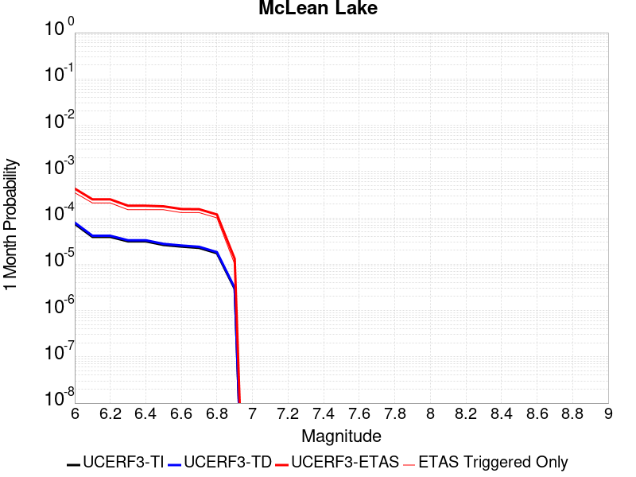 |  |  |

| Magnitude | 1 wk TI Prob | 1 wk TD Prob | 1 wk ETAS Prob | 1 wk ETAS/TD Gain | 1 wk ETAS Triggered Only | 1 mo TI Prob | 1 mo TD Prob | 1 mo ETAS Prob | 1 mo ETAS/TD Gain | 1 mo ETAS Triggered Only | 1 yr TI Prob | 1 yr TD Prob | 1 yr ETAS Prob | 1 yr ETAS/TD Gain | 1 yr ETAS Triggered Only | 10 yr TI Prob | 10 yr TD Prob | 10 yr ETAS Prob | 10 yr ETAS/TD Gain | 10 yr ETAS Triggered Only |
|-----|-----|-----|-----|-----|-----|-----|-----|-----|-----|-----|-----|-----|-----|-----|-----|-----|-----|-----|-----|-----|
| 6.0 | 1.7360222E-5 | 1.8501789E-5 | 1.584992E-4 | 8.566696 | 1.4E-4 | 7.439883E-5 | 7.929125E-5 | 4.2926348E-4 | 5.4137564 | 3.5E-4 | 9.0542925E-4 | 9.64992E-4 | 0.002653361 | 2.74962 | 0.00169 | 0.009017491 | 0.009612858 | 0.013287194 | 1.3822314 | 0.00371 |
| 6.1 | 9.062689E-6 | 9.592268E-6 | 7.95916E-5 | 8.297474 | 7.0E-5 | 3.8839516E-5 | 4.110912E-5 | 2.511005E-4 | 6.108145 | 2.1E-4 | 4.727685E-4 | 5.003975E-4 | 0.0013699621 | 2.737748 | 8.7E-4 | 0.0047176396 | 0.0049935905 | 0.006963703 | 1.3945283 | 0.00198 |
| 6.2 | 9.062689E-6 | 9.592268E-6 | 7.95916E-5 | 8.297474 | 7.0E-5 | 3.8839516E-5 | 4.110912E-5 | 2.511005E-4 | 6.108145 | 2.1E-4 | 4.727685E-4 | 5.003975E-4 | 0.0013699621 | 2.737748 | 8.7E-4 | 0.0047176396 | 0.0049935905 | 0.006963703 | 1.3945283 | 0.00198 |
| 6.3 | 7.2575485E-6 | 7.667767E-6 | 4.766746E-5 | 6.216603 | 4.0E-5 | 3.110341E-5 | 3.2861484E-5 | 1.8285656E-4 | 5.564464 | 1.5E-4 | 3.786182E-4 | 4.0002225E-4 | 0.0010997423 | 2.7492027 | 7.0E-4 | 0.0037797375 | 0.003993727 | 0.0055474965 | 1.3890526 | 0.00156 |
| 6.4 | 7.2575485E-6 | 7.667767E-6 | 4.766746E-5 | 6.216603 | 4.0E-5 | 3.110341E-5 | 3.2861484E-5 | 1.8285656E-4 | 5.564464 | 1.5E-4 | 3.786182E-4 | 4.0002225E-4 | 0.0010997423 | 2.7492027 | 7.0E-4 | 0.0037797375 | 0.003993727 | 0.0055474965 | 1.3890526 | 0.00156 |
| 6.5 | 6.06582E-6 | 6.4039245E-6 | 4.6403668E-5 | 7.24613 | 4.0E-5 | 2.5996113E-5 | 2.7445138E-5 | 1.7744102E-4 | 6.4652987 | 1.5E-4 | 3.164567E-4 | 3.340998E-4 | 9.039094E-4 | 2.705507 | 5.7E-4 | 0.0031600643 | 0.0033366138 | 0.00459241 | 1.3763684 | 0.00126 |
| 6.6 | 5.598744E-6 | 5.910306E-6 | 3.591013E-5 | 6.0758495 | 3.0E-5 | 2.3994397E-5 | 2.5329673E-5 | 1.5532639E-4 | 6.1321907 | 1.3E-4 | 2.9209262E-4 | 3.083515E-4 | 8.281912E-4 | 2.685867 | 5.2E-4 | 0.0029170897 | 0.0030798658 | 0.0042562317 | 1.3819536 | 0.00118 |
| 6.7 | 5.246996E-6 | 5.539203E-6 | 3.5539037E-5 | 6.4159117 | 3.0E-5 | 2.2486933E-5 | 2.3739261E-5 | 1.5373618E-4 | 6.4760303 | 1.3E-4 | 2.73744E-4 | 2.8899353E-4 | 7.9884613E-4 | 2.7642355 | 5.1E-4 | 0.0027340704 | 0.002886801 | 0.0040035676 | 1.3868527 | 0.00112 |
| 6.8 | 4.02324E-6 | 4.246936E-6 | 3.424681E-5 | 8.063887 | 3.0E-5 | 1.7242342E-5 | 1.820106E-5 | 1.1819924E-4 | 6.4940853 | 1.0E-4 | 2.099053E-4 | 2.2158133E-4 | 6.214927E-4 | 2.8048062 | 4.0E-4 | 0.0020970714 | 0.0022141882 | 0.003082262 | 1.3920505 | 8.7E-4 |
| 6.9 | 6.835972E-7 | 7.1399705E-7 | 7.1399705E-7 | 1.0 | 0.0 | 2.9296991E-6 | 3.0599856E-6 | 1.3059955E-5 | 4.267979 | 1.0E-5 | 3.56685E-5 | 3.7255006E-5 | 5.725426E-5 | 1.5368207 | 2.0E-5 | 3.5662777E-4 | 3.7251884E-4 | 5.024704E-4 | 1.3488456 | 1.3E-4 |

## Goldstone Lake
*[(top)](#table-of-contents)*

| 1 Week | 1 Month | 1 Year | 10 Year |
|-----|-----|-----|-----|
|  |  | 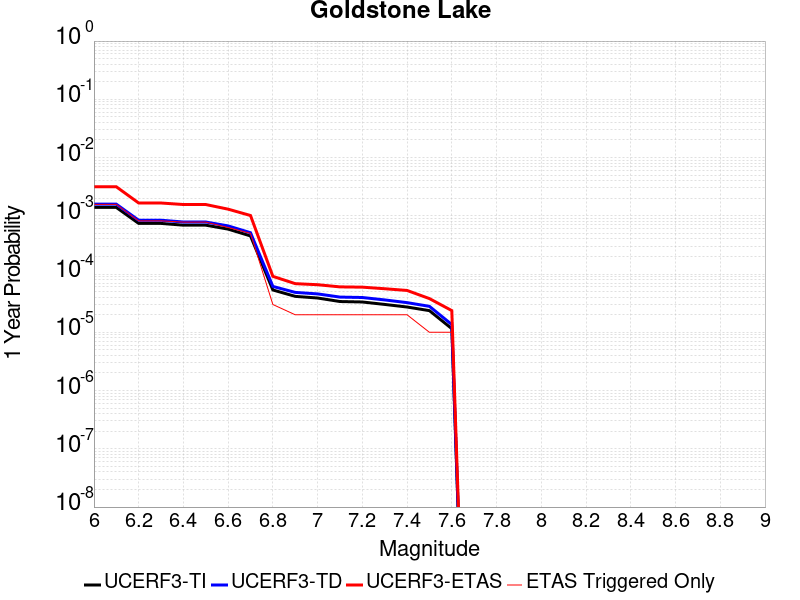 |  |

| Magnitude | 1 wk TI Prob | 1 wk TD Prob | 1 wk ETAS Prob | 1 wk ETAS/TD Gain | 1 wk ETAS Triggered Only | 1 mo TI Prob | 1 mo TD Prob | 1 mo ETAS Prob | 1 mo ETAS/TD Gain | 1 mo ETAS Triggered Only | 1 yr TI Prob | 1 yr TD Prob | 1 yr ETAS Prob | 1 yr ETAS/TD Gain | 1 yr ETAS Triggered Only | 10 yr TI Prob | 10 yr TD Prob | 10 yr ETAS Prob | 10 yr ETAS/TD Gain | 10 yr ETAS Triggered Only |
|-----|-----|-----|-----|-----|-----|-----|-----|-----|-----|-----|-----|-----|-----|-----|-----|-----|-----|-----|-----|-----|
| 6.0 | 2.671352E-5 | 3.0376628E-5 | 1.5037299E-4 | 4.9502854 | 1.2E-4 | 1.1448149E-4 | 1.3018015E-4 | 5.7012285E-4 | 4.3794913 | 4.4E-4 | 0.001392921 | 0.0015839875 | 0.0031515006 | 1.9895995 | 0.00157 | 0.013842222 | 0.015746472 | 0.018945297 | 1.2031454 | 0.00325 |
| 6.1 | 2.671352E-5 | 3.0376628E-5 | 1.5037299E-4 | 4.9502854 | 1.2E-4 | 1.1448149E-4 | 1.3018015E-4 | 5.7012285E-4 | 4.3794913 | 4.4E-4 | 0.001392921 | 0.0015839875 | 0.0031515006 | 1.9895995 | 0.00157 | 0.013842222 | 0.015746472 | 0.018945297 | 1.2031454 | 0.00325 |
| 6.2 | 1.4197047E-5 | 1.6096516E-5 | 5.6095872E-5 | 3.4849699 | 4.0E-5 | 6.0843064E-5 | 6.89838E-5 | 3.0896725E-4 | 4.478838 | 2.4E-4 | 7.4051257E-4 | 8.396528E-4 | 0.0016589642 | 1.9757742 | 8.2E-4 | 0.007380498 | 0.008374499 | 0.010090012 | 1.2048495 | 0.00173 |
| 6.3 | 1.4197047E-5 | 1.6096516E-5 | 5.6095872E-5 | 3.4849699 | 4.0E-5 | 6.0843064E-5 | 6.89838E-5 | 3.0896725E-4 | 4.478838 | 2.4E-4 | 7.4051257E-4 | 8.396528E-4 | 0.0016589642 | 1.9757742 | 8.2E-4 | 0.007380498 | 0.008374499 | 0.010090012 | 1.2048495 | 0.00173 |
| 6.4 | 1.3238931E-5 | 1.5008711E-5 | 4.5008263E-5 | 2.998809 | 3.0E-5 | 5.6737044E-5 | 6.432201E-5 | 2.8430787E-4 | 4.420071 | 2.2E-4 | 6.9055456E-4 | 7.8293716E-4 | 0.0015623264 | 1.9954685 | 7.8E-4 | 0.006884126 | 0.007811414 | 0.009438603 | 1.2083092 | 0.00164 |
| 6.5 | 1.3238931E-5 | 1.5008711E-5 | 4.5008263E-5 | 2.998809 | 3.0E-5 | 5.6737044E-5 | 6.432201E-5 | 2.8430787E-4 | 4.420071 | 2.2E-4 | 6.9055456E-4 | 7.8293716E-4 | 0.0015623264 | 1.9954685 | 7.8E-4 | 0.006884126 | 0.007811414 | 0.009438603 | 1.2083092 | 0.00164 |
| 6.6 | 1.1328278E-5 | 1.2855381E-5 | 3.2855125E-5 | 2.5557487 | 2.0E-5 | 4.8548856E-5 | 5.5093864E-5 | 2.3508395E-4 | 4.2669716 | 1.8E-4 | 5.90922E-4 | 6.706571E-4 | 0.0013002346 | 1.9387473 | 6.3E-4 | 0.0058935313 | 0.0066957204 | 0.00809628 | 1.2091722 | 0.00141 |
| 6.7 | 8.651175E-6 | 9.8247265E-6 | 2.982453E-5 | 3.03566 | 2.0E-5 | 3.707594E-5 | 4.2105803E-5 | 1.9209948E-4 | 4.5623045 | 1.5E-4 | 4.5130608E-4 | 5.126081E-4 | 0.0010123518 | 1.9749041 | 5.0E-4 | 0.0045039062 | 0.0051231356 | 0.006257295 | 1.22138 | 0.00114 |
| 6.8 | 1.0215377E-6 | 1.1754793E-6 | 1.1754793E-6 | 1.0 | 0.0 | 4.378012E-6 | 5.037759E-6 | 1.5037709E-5 | 2.9849997 | 1.0E-5 | 5.3300988E-5 | 6.133311E-5 | 9.133126E-5 | 1.4891022 | 3.0E-5 | 5.3288206E-4 | 6.13173E-4 | 6.431546E-4 | 1.0488958 | 3.0E-5 |
| 6.9 | 7.9360774E-7 | 9.2834586E-7 | 9.2834586E-7 | 1.0 | 0.0 | 3.4011714E-6 | 3.9786196E-6 | 1.397858E-5 | 3.5134246 | 1.0E-5 | 4.1408475E-5 | 4.8438687E-5 | 6.8437716E-5 | 1.4128731 | 2.0E-5 | 4.140076E-4 | 4.842883E-4 | 5.042786E-4 | 1.0412778 | 2.0E-5 |
| 7.0 | 7.4382757E-7 | 8.7473853E-7 | 8.7473853E-7 | 1.0 | 0.0 | 3.1878285E-6 | 3.7488744E-6 | 1.3748837E-5 | 3.6674573 | 1.0E-5 | 3.8811122E-5 | 4.5641656E-5 | 6.564074E-5 | 1.4381762 | 2.0E-5 | 3.8804344E-4 | 4.563295E-4 | 4.7632036E-4 | 1.043808 | 2.0E-5 |
| 7.1 | 6.4709513E-7 | 7.711347E-7 | 7.711347E-7 | 1.0 | 0.0 | 2.773262E-6 | 3.304859E-6 | 1.3304826E-5 | 4.0258374 | 1.0E-5 | 3.376394E-5 | 4.0235976E-5 | 6.0235172E-5 | 1.4970475 | 2.0E-5 | 3.375881E-4 | 4.0229288E-4 | 4.2228482E-4 | 1.049695 | 2.0E-5 |
| 7.2 | 6.356704E-7 | 7.5884054E-7 | 7.5884054E-7 | 1.0 | 0.0 | 2.7242988E-6 | 3.25217E-6 | 1.3252137E-5 | 4.07486 | 1.0E-5 | 3.3167835E-5 | 3.959451E-5 | 5.959372E-5 | 1.5051005 | 2.0E-5 | 3.3162883E-4 | 3.958805E-4 | 4.1587258E-4 | 1.0505003 | 2.0E-5 |
| 7.3 | 5.7695723E-7 | 6.8966074E-7 | 6.8966074E-7 | 1.0 | 0.0 | 2.4726714E-6 | 2.9556859E-6 | 1.29556565E-5 | 4.3832994 | 1.0E-5 | 3.0104358E-5 | 3.598494E-5 | 5.598422E-5 | 1.555768 | 2.0E-5 | 3.0100282E-4 | 3.5979686E-4 | 3.7978965E-4 | 1.0555669 | 2.0E-5 |
| 7.4 | 5.209647E-7 | 6.193549E-7 | 6.193549E-7 | 1.0 | 0.0 | 2.232704E-6 | 2.654376E-6 | 1.2654349E-5 | 4.767354 | 1.0E-5 | 2.718283E-5 | 3.2316606E-5 | 5.2315958E-5 | 1.6188569 | 2.0E-5 | 2.7179506E-4 | 3.231246E-4 | 3.4311815E-4 | 1.0618756 | 2.0E-5 |
| 7.5 | 4.512955E-7 | 5.3489146E-7 | 5.3489146E-7 | 1.0 | 0.0 | 1.934122E-6 | 2.2923903E-6 | 1.22923675E-5 | 5.3622494 | 1.0E-5 | 2.3547682E-5 | 2.7909547E-5 | 3.7909267E-5 | 1.3582903 | 1.0E-5 | 2.3545188E-4 | 2.7906572E-4 | 2.8906294E-4 | 1.0358238 | 1.0E-5 |
| 7.6 | 2.21172E-7 | 2.6039737E-7 | 2.6039737E-7 | 1.0 | 0.0 | 9.478797E-7 | 1.1159884E-6 | 1.1115977E-5 | 9.960656 | 1.0E-5 | 1.1540374E-5 | 1.3587103E-5 | 2.3586967E-5 | 1.7359821 | 1.0E-5 | 1.1539775E-4 | 1.3586554E-4 | 1.4586418E-4 | 1.0735922 | 1.0E-5 |

## So Sierra Nevada
*[(top)](#table-of-contents)*

| 1 Week | 1 Month | 1 Year | 10 Year |
|-----|-----|-----|-----|
|  |  |  |  |

| Magnitude | 1 wk TI Prob | 1 wk TD Prob | 1 wk ETAS Prob | 1 wk ETAS/TD Gain | 1 wk ETAS Triggered Only | 1 mo TI Prob | 1 mo TD Prob | 1 mo ETAS Prob | 1 mo ETAS/TD Gain | 1 mo ETAS Triggered Only | 1 yr TI Prob | 1 yr TD Prob | 1 yr ETAS Prob | 1 yr ETAS/TD Gain | 1 yr ETAS Triggered Only | 10 yr TI Prob | 10 yr TD Prob | 10 yr ETAS Prob | 10 yr ETAS/TD Gain | 10 yr ETAS Triggered Only |
|-----|-----|-----|-----|-----|-----|-----|-----|-----|-----|-----|-----|-----|-----|-----|-----|-----|-----|-----|-----|-----|
| 6.0 | 1.15488665E-5 | 1.1079722E-5 | 2.3107728E-4 | 20.855875 | 2.2E-4 | 4.9494203E-5 | 4.748373E-5 | 4.8746282E-4 | 10.265892 | 4.4E-4 | 6.024253E-4 | 5.779738E-4 | 0.0019571763 | 3.3862715 | 0.00138 | 0.006007948 | 0.005765975 | 0.008510061 | 1.4759101 | 0.00276 |
| 6.1 | 1.15488665E-5 | 1.1079722E-5 | 2.3107728E-4 | 20.855875 | 2.2E-4 | 4.9494203E-5 | 4.748373E-5 | 4.8746282E-4 | 10.265892 | 4.4E-4 | 6.024253E-4 | 5.779738E-4 | 0.0019571763 | 3.3862715 | 0.00138 | 0.006007948 | 0.005765975 | 0.008510061 | 1.4759101 | 0.00276 |
| 6.2 | 1.15488665E-5 | 1.1079722E-5 | 2.3107728E-4 | 20.855875 | 2.2E-4 | 4.9494203E-5 | 4.748373E-5 | 4.8746282E-4 | 10.265892 | 4.4E-4 | 6.024253E-4 | 5.779738E-4 | 0.0019571763 | 3.3862715 | 0.00138 | 0.006007948 | 0.005765975 | 0.008510061 | 1.4759101 | 0.00276 |
| 6.3 | 1.15488665E-5 | 1.1079722E-5 | 2.3107728E-4 | 20.855875 | 2.2E-4 | 4.9494203E-5 | 4.748373E-5 | 4.8746282E-4 | 10.265892 | 4.4E-4 | 6.024253E-4 | 5.779738E-4 | 0.0019571763 | 3.3862715 | 0.00138 | 0.006007948 | 0.005765975 | 0.008510061 | 1.4759101 | 0.00276 |
| 6.4 | 1.15488665E-5 | 1.1079722E-5 | 2.3107728E-4 | 20.855875 | 2.2E-4 | 4.9494203E-5 | 4.748373E-5 | 4.8746282E-4 | 10.265892 | 4.4E-4 | 6.024253E-4 | 5.779738E-4 | 0.0019571763 | 3.3862715 | 0.00138 | 0.006007948 | 0.005765975 | 0.008510061 | 1.4759101 | 0.00276 |
| 6.5 | 1.15488665E-5 | 1.1079722E-5 | 2.3107728E-4 | 20.855875 | 2.2E-4 | 4.9494203E-5 | 4.748373E-5 | 4.8746282E-4 | 10.265892 | 4.4E-4 | 6.024253E-4 | 5.779738E-4 | 0.0019571763 | 3.3862715 | 0.00138 | 0.006007948 | 0.005765975 | 0.008510061 | 1.4759101 | 0.00276 |
| 6.6 | 7.587044E-6 | 6.935689E-6 | 1.6693458E-4 | 24.068926 | 1.6E-4 | 3.2515498E-5 | 2.9724059E-5 | 3.0971575E-4 | 10.419699 | 2.8E-4 | 3.9580427E-4 | 3.6183326E-4 | 0.0011315546 | 3.1272821 | 7.7E-4 | 0.003951 | 0.0036127327 | 0.0051770606 | 1.433004 | 0.00157 |
| 6.7 | 7.587044E-6 | 6.935689E-6 | 1.6693458E-4 | 24.068926 | 1.6E-4 | 3.2515498E-5 | 2.9724059E-5 | 3.0971575E-4 | 10.419699 | 2.8E-4 | 3.9580427E-4 | 3.6183326E-4 | 0.0011315546 | 3.1272821 | 7.7E-4 | 0.003951 | 0.0036127327 | 0.0051770606 | 1.433004 | 0.00157 |
| 6.8 | 5.9026956E-6 | 5.1794364E-6 | 1.4517871E-4 | 28.029827 | 1.4E-4 | 2.5297022E-5 | 2.2197402E-5 | 2.3219275E-4 | 10.460357 | 2.1E-4 | 3.0794772E-4 | 2.7022103E-4 | 8.600616E-4 | 3.182808 | 5.9E-4 | 0.0030752132 | 0.0026990408 | 0.00385591 | 1.4286224 | 0.00116 |
| 6.9 | 5.0118915E-6 | 4.2524644E-6 | 1.4425187E-4 | 33.921947 | 1.4E-4 | 2.1479358E-5 | 1.8224722E-5 | 2.1822107E-4 | 11.973904 | 2.0E-4 | 2.614798E-4 | 2.2186415E-4 | 7.7174214E-4 | 3.4784446 | 5.5E-4 | 0.0026117235 | 0.002216499 | 0.0032342381 | 1.4591652 | 0.00102 |
| 7.0 | 4.4924795E-6 | 3.713954E-6 | 1.3371347E-4 | 36.003 | 1.3E-4 | 1.925334E-5 | 1.5916852E-5 | 1.8591415E-4 | 11.680334 | 1.7E-4 | 2.3438422E-4 | 1.9377106E-4 | 6.436839E-4 | 3.3218782 | 4.5E-4 | 0.0023413717 | 0.001936084 | 0.0028143802 | 1.4536457 | 8.8E-4 |
| 7.1 | 3.9118436E-6 | 3.1120105E-6 | 1.13111666E-4 | 36.346813 | 1.1E-4 | 1.6764936E-5 | 1.3337123E-5 | 1.5333526E-4 | 11.496877 | 1.4E-4 | 2.0409399E-4 | 1.6236794E-4 | 5.423062E-4 | 3.3399835 | 3.8E-4 | 0.0020390663 | 0.0016225493 | 0.0022914622 | 1.4122604 | 6.7E-4 |
| 7.2 | 3.4200818E-6 | 2.6054847E-6 | 1.0260523E-4 | 39.380474 | 1.0E-4 | 1.4657411E-5 | 1.11663185E-5 | 1.4116487E-4 | 12.642024 | 1.3E-4 | 1.7843937E-4 | 1.3594194E-4 | 4.7589574E-4 | 3.5007277 | 3.4E-4 | 0.0017829615 | 0.0013586376 | 0.0019578224 | 1.4410188 | 6.0E-4 |
| 7.3 | 2.6593618E-6 | 1.8284468E-6 | 5.1828356E-5 | 28.345564 | 5.0E-5 | 1.13972155E-5 | 7.836179E-6 | 7.783563E-5 | 9.932856 | 7.0E-5 | 1.3875226E-4 | 9.540159E-5 | 2.453873E-4 | 2.5721507 | 1.5E-4 | 0.0013866565 | 9.536353E-4 | 0.0012533492 | 1.3142856 | 3.0E-4 |
| 7.4 | 2.2577992E-6 | 1.4364622E-6 | 5.143639E-5 | 35.807686 | 5.0E-5 | 9.676246E-6 | 6.1562537E-6 | 6.615588E-5 | 10.746127 | 6.0E-5 | 1.1780193E-4 | 7.495006E-5 | 2.0494033E-4 | 2.734358 | 1.3E-4 | 0.001177395 | 7.4927293E-4 | 9.890931E-4 | 1.3200705 | 2.4E-4 |
| 7.5 | 1.489319E-6 | 7.3541264E-7 | 1.0735405E-5 | 14.597798 | 1.0E-5 | 6.3827797E-6 | 3.1517645E-6 | 1.3151733E-5 | 4.172816 | 1.0E-5 | 7.770758E-5 | 3.837206E-5 | 8.837014E-5 | 2.3029814 | 5.0E-5 | 7.7680405E-4 | 3.836548E-4 | 4.936126E-4 | 1.2866061 | 1.1E-4 |
| 7.6 | 1.0680322E-6 | 4.659796E-7 | 1.0465975E-5 | 22.460157 | 1.0E-5 | 4.577273E-6 | 1.997054E-6 | 1.1997034E-5 | 6.007366 | 1.0E-5 | 5.5726876E-5 | 2.4313864E-5 | 6.431289E-5 | 2.645112 | 4.0E-5 | 5.5712904E-4 | 2.431123E-4 | 3.330904E-4 | 1.3701093 | 9.0E-5 |
| 7.7 | 5.509146E-7 | 1.5581199E-7 | 1.5581199E-7 | 1.0 | 0.0 | 2.3610605E-6 | 6.677655E-7 | 6.677655E-7 | 1.0 | 0.0 | 2.8745531E-5 | 8.130016E-6 | 2.8129854E-5 | 3.4599998 | 2.0E-5 | 2.8741814E-4 | 8.12973E-5 | 1.0129568E-4 | 1.2459906 | 2.0E-5 |

## San Andreas (Mojave S)
*[(top)](#table-of-contents)*

| 1 Week | 1 Month | 1 Year | 10 Year |
|-----|-----|-----|-----|
|  |  |  |  |

| Magnitude | 1 wk TI Prob | 1 wk TD Prob | 1 wk ETAS Prob | 1 wk ETAS/TD Gain | 1 wk ETAS Triggered Only | 1 mo TI Prob | 1 mo TD Prob | 1 mo ETAS Prob | 1 mo ETAS/TD Gain | 1 mo ETAS Triggered Only | 1 yr TI Prob | 1 yr TD Prob | 1 yr ETAS Prob | 1 yr ETAS/TD Gain | 1 yr ETAS Triggered Only | 10 yr TI Prob | 10 yr TD Prob | 10 yr ETAS Prob | 10 yr ETAS/TD Gain | 10 yr ETAS Triggered Only |
|-----|-----|-----|-----|-----|-----|-----|-----|-----|-----|-----|-----|-----|-----|-----|-----|-----|-----|-----|-----|-----|
| 6.0 | 3.1064058E-4 | 6.747043E-4 | 7.8463013E-4 | 1.1629244 | 1.1E-4 | 0.0013306376 | 0.002888514 | 0.003247474 | 1.1242715 | 3.6E-4 | 0.016080605 | 0.03462661 | 0.03581402 | 1.0342919 | 0.00123 | 0.1496549 | 0.28663692 | 0.28824914 | 1.0056245 | 0.00226 |
| 6.1 | 3.1064058E-4 | 6.747043E-4 | 7.8463013E-4 | 1.1629244 | 1.1E-4 | 0.0013306376 | 0.002888514 | 0.003247474 | 1.1242715 | 3.6E-4 | 0.016080605 | 0.03462661 | 0.03581402 | 1.0342919 | 0.00123 | 0.1496549 | 0.28663692 | 0.28824914 | 1.0056245 | 0.00226 |
| 6.2 | 3.1064058E-4 | 6.747043E-4 | 7.8463013E-4 | 1.1629244 | 1.1E-4 | 0.0013306376 | 0.002888514 | 0.003247474 | 1.1242715 | 3.6E-4 | 0.016080605 | 0.03462661 | 0.03581402 | 1.0342919 | 0.00123 | 0.1496549 | 0.28663692 | 0.28824914 | 1.0056245 | 0.00226 |
| 6.3 | 3.1064058E-4 | 6.747043E-4 | 7.8463013E-4 | 1.1629244 | 1.1E-4 | 0.0013306376 | 0.002888514 | 0.003247474 | 1.1242715 | 3.6E-4 | 0.016080605 | 0.03462661 | 0.03581402 | 1.0342919 | 0.00123 | 0.1496549 | 0.28663692 | 0.28824914 | 1.0056245 | 0.00226 |
| 6.4 | 1.9872203E-4 | 4.318848E-4 | 5.2184594E-4 | 1.2082989 | 9.0E-5 | 8.5138786E-4 | 0.0018496502 | 0.0021490953 | 1.1618929 | 3.0E-4 | 0.010316478 | 0.022293096 | 0.023300136 | 1.0451727 | 0.00103 | 0.098504856 | 0.19703239 | 0.19858213 | 1.0078653 | 0.00193 |
| 6.5 | 1.291105E-4 | 2.8761322E-4 | 3.675902E-4 | 1.2780713 | 8.0E-5 | 5.5321335E-4 | 0.0012320485 | 0.0015017159 | 1.2188772 | 2.7E-4 | 0.006714592 | 0.0148978485 | 0.015754888 | 1.0575277 | 8.7E-4 | 0.065152965 | 0.13807017 | 0.13951822 | 1.0104877 | 0.00168 |
| 6.6 | 1.291105E-4 | 2.8761322E-4 | 3.675902E-4 | 1.2780713 | 8.0E-5 | 5.5321335E-4 | 0.0012320485 | 0.0015017159 | 1.2188772 | 2.7E-4 | 0.006714592 | 0.0148978485 | 0.015754888 | 1.0575277 | 8.7E-4 | 0.065152965 | 0.13807017 | 0.13951822 | 1.0104877 | 0.00168 |
| 6.7 | 1.08001186E-4 | 2.4342406E-4 | 3.13407E-4 | 1.2874941 | 7.0E-5 | 4.6278012E-4 | 0.0010428295 | 0.0013025582 | 1.2490617 | 2.6E-4 | 0.0056198016 | 0.012622835 | 0.01347198 | 1.0672705 | 8.6E-4 | 0.054797906 | 0.11921291 | 0.12064859 | 1.012043 | 0.00163 |
| 6.8 | 1.0624356E-4 | 2.3860046E-4 | 3.0858378E-4 | 1.2933074 | 7.0E-5 | 4.5525006E-4 | 0.0010221732 | 0.0012819074 | 1.2541 | 2.6E-4 | 0.0055285925 | 0.01237422 | 0.013223579 | 1.0686393 | 8.6E-4 | 0.053930566 | 0.117162056 | 0.118601084 | 1.0122824 | 0.00163 |
| 6.9 | 1.0393785E-4 | 2.3230357E-4 | 3.022873E-4 | 1.3012599 | 7.0E-5 | 4.4537184E-4 | 9.952073E-4 | 0.0012549486 | 1.260992 | 2.6E-4 | 0.0054089287 | 0.012049583 | 0.0128893405 | 1.0696919 | 8.5E-4 | 0.05279156 | 0.11445948 | 0.11589406 | 1.0125334 | 0.00162 |
| 7.0 | 1.0155622E-4 | 2.2599897E-4 | 2.9598316E-4 | 1.3096659 | 7.0E-5 | 4.3516833E-4 | 9.682079E-4 | 0.0012279561 | 1.2682774 | 2.6E-4 | 0.005285311 | 0.011724443 | 0.012554595 | 1.0708052 | 8.4E-4 | 0.05161361 | 0.11171984 | 0.11314109 | 1.0127215 | 0.0016 |
| 7.1 | 9.885595E-5 | 2.1888265E-4 | 2.788695E-4 | 1.2740595 | 6.0E-5 | 4.2359953E-4 | 9.377316E-4 | 0.0011874972 | 1.2663509 | 2.5E-4 | 0.0051451353 | 0.011357316 | 0.012177889 | 1.0722506 | 8.3E-4 | 0.05027629 | 0.10860426 | 0.110021584 | 1.0130503 | 0.00159 |
| 7.2 | 9.6411415E-5 | 2.125122E-4 | 2.7249946E-4 | 1.2822767 | 6.0E-5 | 4.1312634E-4 | 9.1044896E-4 | 0.0011602214 | 1.2743398 | 2.5E-4 | 0.005018219 | 0.01102856 | 0.011849406 | 1.0744292 | 8.3E-4 | 0.049064007 | 0.10579402 | 0.10721581 | 1.0134392 | 0.00159 |
| 7.3 | 9.1180635E-5 | 1.9479371E-4 | 2.5478203E-4 | 1.3079581 | 6.0E-5 | 3.907156E-4 | 8.345632E-4 | 0.0010743629 | 1.2873356 | 2.4E-4 | 0.004746591 | 0.010113581 | 0.010925288 | 1.0802591 | 8.2E-4 | 0.046464786 | 0.09798661 | 0.099411786 | 1.0145446 | 0.00158 |
| 7.4 | 8.887388E-5 | 1.8727897E-4 | 2.4726774E-4 | 1.3203176 | 6.0E-5 | 3.8083247E-4 | 8.023774E-4 | 0.0010321928 | 1.2864182 | 2.3E-4 | 0.0046267817 | 0.009725285 | 0.010527408 | 1.082478 | 8.1E-4 | 0.045316286 | 0.09462135 | 0.096033745 | 1.0149268 | 0.00156 |
| 7.5 | 8.6750515E-5 | 1.8059391E-4 | 2.4058307E-4 | 1.3321772 | 6.0E-5 | 3.7173493E-4 | 7.7374437E-4 | 0.0010035664 | 1.2970258 | 2.3E-4 | 0.004516484 | 0.009379733 | 0.010182136 | 1.0855464 | 8.1E-4 | 0.04425787 | 0.09158487 | 0.093002 | 1.0154734 | 0.00156 |
| 7.6 | 8.453092E-5 | 1.7446902E-4 | 2.3445857E-4 | 1.3438406 | 6.0E-5 | 3.6222505E-4 | 7.475102E-4 | 9.773383E-4 | 1.3074582 | 2.3E-4 | 0.0044011753 | 0.009063034 | 0.009865693 | 1.088564 | 8.1E-4 | 0.04315024 | 0.088743635 | 0.09016519 | 1.0160187 | 0.00156 |
| 7.7 | 8.259102E-5 | 1.6968958E-4 | 2.296794E-4 | 1.3535268 | 6.0E-5 | 3.539135E-4 | 7.270384E-4 | 9.568712E-4 | 1.3161219 | 2.3E-4 | 0.004300386 | 0.008815835 | 0.009618695 | 1.0910702 | 8.1E-4 | 0.042181134 | 0.08649418 | 0.087900974 | 1.0162647 | 0.00154 |
| 7.8 | 7.444844E-5 | 1.5290553E-4 | 1.9289942E-4 | 1.2615594 | 4.0E-5 | 3.1902574E-4 | 6.551449E-4 | 8.550139E-4 | 1.305076 | 2.0E-4 | 0.0038772223 | 0.007947266 | 0.00858218 | 1.0798908 | 6.4E-4 | 0.03810269 | 0.07832232 | 0.0794652 | 1.014592 | 0.00124 |
| 7.9 | 5.2586525E-5 | 1.0011239E-4 | 1.3010939E-4 | 1.2996331 | 3.0E-5 | 2.2535135E-4 | 4.2898257E-4 | 5.689225E-4 | 1.3262136 | 1.4E-4 | 0.0027402006 | 0.005210366 | 0.005608282 | 1.07637 | 4.0E-4 | 0.027066574 | 0.052222524 | 0.05288597 | 1.0127041 | 7.0E-4 |
| 8.0 | 3.379877E-5 | 5.4101976E-5 | 6.4101434E-5 | 1.1848261 | 1.0E-5 | 1.4484383E-4 | 2.3184501E-4 | 2.8183343E-4 | 1.2156113 | 5.0E-5 | 0.0017620471 | 0.002819061 | 0.0029387227 | 1.0424473 | 1.2E-4 | 0.017481409 | 0.028848516 | 0.029081592 | 1.0080793 | 2.4E-4 |
| 8.1 | 1.8668277E-5 | 1.9322531E-5 | 1.9322531E-5 | 1.0 | 0.0 | 8.000444E-5 | 8.280823E-5 | 8.280823E-5 | 1.0 | 0.0 | 9.736188E-4 | 0.0010077246 | 0.0010177144 | 1.0099133 | 1.0E-5 | 0.009693642 | 0.010805754 | 0.01083543 | 1.0027463 | 3.0E-5 |
| 8.2 | 8.541571E-6 | 5.465789E-6 | 5.465789E-6 | 1.0 | 0.0 | 3.660622E-5 | 2.34246E-5 | 2.34246E-5 | 1.0 | 0.0 | 4.455896E-4 | 2.8515726E-4 | 2.8515726E-4 | 1.0 | 0.0 | 0.0044469717 | 0.0032435213 | 0.0032435213 | 1.0 | 0.0 |
| 8.3 | 1.983087E-6 | 7.668296E-7 | 7.668296E-7 | 1.0 | 0.0 | 8.498917E-6 | 3.2864084E-6 | 3.2864084E-6 | 1.0 | 0.0 | 1.034694E-4 | 4.0011306E-5 | 4.0011306E-5 | 1.0 | 0.0 | 0.0010342124 | 4.724499E-4 | 4.724499E-4 | 1.0 | 0.0 |

## Coyote Canyon
*[(top)](#table-of-contents)*

| 1 Week | 1 Month | 1 Year | 10 Year |
|-----|-----|-----|-----|
|  |  |  |  |

| Magnitude | 1 wk TI Prob | 1 wk TD Prob | 1 wk ETAS Prob | 1 wk ETAS/TD Gain | 1 wk ETAS Triggered Only | 1 mo TI Prob | 1 mo TD Prob | 1 mo ETAS Prob | 1 mo ETAS/TD Gain | 1 mo ETAS Triggered Only | 1 yr TI Prob | 1 yr TD Prob | 1 yr ETAS Prob | 1 yr ETAS/TD Gain | 1 yr ETAS Triggered Only | 10 yr TI Prob | 10 yr TD Prob | 10 yr ETAS Prob | 10 yr ETAS/TD Gain | 10 yr ETAS Triggered Only |
|-----|-----|-----|-----|-----|-----|-----|-----|-----|-----|-----|-----|-----|-----|-----|-----|-----|-----|-----|-----|-----|
| 6.0 | 3.5090034E-5 | 4.036513E-5 | 2.0035867E-4 | 4.9636574 | 1.6E-4 | 1.503772E-4 | 1.7298339E-4 | 4.729315E-4 | 2.7339706 | 3.0E-4 | 0.0018293047 | 0.0021042947 | 0.0031221483 | 1.483703 | 0.00102 | 0.018143194 | 0.020869615 | 0.022788709 | 1.0919565 | 0.00196 |
| 6.1 | 3.5090034E-5 | 4.036513E-5 | 2.0035867E-4 | 4.9636574 | 1.6E-4 | 1.503772E-4 | 1.7298339E-4 | 4.729315E-4 | 2.7339706 | 3.0E-4 | 0.0018293047 | 0.0021042947 | 0.0031221483 | 1.483703 | 0.00102 | 0.018143194 | 0.020869615 | 0.022788709 | 1.0919565 | 0.00196 |
| 6.2 | 1.841879E-5 | 2.1060194E-5 | 1.0105851E-4 | 4.7985554 | 8.0E-5 | 7.8935285E-5 | 9.0255424E-5 | 2.102446E-4 | 2.3294399 | 1.2E-4 | 9.606133E-4 | 0.0010984079 | 0.0016078476 | 1.4637984 | 5.1E-4 | 0.0095647145 | 0.010939874 | 0.011958607 | 1.0931209 | 0.00103 |
| 6.3 | 1.841879E-5 | 2.1060194E-5 | 1.0105851E-4 | 4.7985554 | 8.0E-5 | 7.8935285E-5 | 9.0255424E-5 | 2.102446E-4 | 2.3294399 | 1.2E-4 | 9.606133E-4 | 0.0010984079 | 0.0016078476 | 1.4637984 | 5.1E-4 | 0.0095647145 | 0.010939874 | 0.011958607 | 1.0931209 | 0.00103 |
| 6.4 | 1.712201E-5 | 1.9565581E-5 | 8.9564215E-5 | 4.577641 | 7.0E-5 | 7.337798E-5 | 8.385037E-5 | 1.9384114E-4 | 2.3117507 | 1.1E-4 | 8.930107E-4 | 0.0010205007 | 0.0015100006 | 1.4796665 | 4.9E-4 | 0.008894307 | 0.0101680625 | 0.011128199 | 1.0944268 | 9.7E-4 |
| 6.5 | 1.4744935E-5 | 1.6837288E-5 | 8.683611E-5 | 5.157369 | 7.0E-5 | 6.3191044E-5 | 7.215834E-5 | 1.6215185E-4 | 2.247167 | 9.0E-5 | 7.6907943E-4 | 8.7826716E-4 | 0.0013278719 | 1.5119226 | 4.5E-4 | 0.007664232 | 0.008757159 | 0.009649278 | 1.101873 | 9.0E-4 |
| 6.6 | 1.2017839E-5 | 1.3724348E-5 | 6.372366E-5 | 4.6431103 | 5.0E-5 | 5.150401E-5 | 5.8817808E-5 | 1.2881368E-4 | 2.1900458 | 7.0E-5 | 6.268809E-4 | 7.159601E-4 | 0.0011256665 | 1.5722476 | 4.1E-4 | 0.0062511545 | 0.007145228 | 0.0078997975 | 1.1056046 | 7.6E-4 |
| 6.7 | 1.00956095E-5 | 1.1533734E-5 | 5.1533272E-5 | 4.4680476 | 4.0E-5 | 4.326618E-5 | 4.9429844E-5 | 1.0942688E-4 | 2.2137816 | 6.0E-5 | 5.266384E-4 | 6.0172915E-4 | 9.215366E-4 | 1.5314807 | 3.2E-4 | 0.005253921 | 0.006009526 | 0.006556221 | 1.0909714 | 5.5E-4 |

## San Andreas (Mojave N)
*[(top)](#table-of-contents)*

| 1 Week | 1 Month | 1 Year | 10 Year |
|-----|-----|-----|-----|
|  |  |  |  |

| Magnitude | 1 wk TI Prob | 1 wk TD Prob | 1 wk ETAS Prob | 1 wk ETAS/TD Gain | 1 wk ETAS Triggered Only | 1 mo TI Prob | 1 mo TD Prob | 1 mo ETAS Prob | 1 mo ETAS/TD Gain | 1 mo ETAS Triggered Only | 1 yr TI Prob | 1 yr TD Prob | 1 yr ETAS Prob | 1 yr ETAS/TD Gain | 1 yr ETAS Triggered Only | 10 yr TI Prob | 10 yr TD Prob | 10 yr ETAS Prob | 10 yr ETAS/TD Gain | 10 yr ETAS Triggered Only |
|-----|-----|-----|-----|-----|-----|-----|-----|-----|-----|-----|-----|-----|-----|-----|-----|-----|-----|-----|-----|-----|
| 6.0 | 9.877682E-5 | 1.9409315E-4 | 3.4406403E-4 | 1.7726748 | 1.5E-4 | 4.2326056E-4 | 8.315628E-4 | 0.0012112468 | 1.4565909 | 3.8E-4 | 0.0051410277 | 0.010077406 | 0.011225716 | 1.113949 | 0.00116 | 0.05023708 | 0.09835201 | 0.100290544 | 1.0197103 | 0.00215 |
| 6.1 | 9.877682E-5 | 1.9409315E-4 | 3.4406403E-4 | 1.7726748 | 1.5E-4 | 4.2326056E-4 | 8.315628E-4 | 0.0012112468 | 1.4565909 | 3.8E-4 | 0.0051410277 | 0.010077406 | 0.011225716 | 1.113949 | 0.00116 | 0.05023708 | 0.09835201 | 0.100290544 | 1.0197103 | 0.00215 |
| 6.2 | 9.877682E-5 | 1.9409315E-4 | 3.4406403E-4 | 1.7726748 | 1.5E-4 | 4.2326056E-4 | 8.315628E-4 | 0.0012112468 | 1.4565909 | 3.8E-4 | 0.0051410277 | 0.010077406 | 0.011225716 | 1.113949 | 0.00116 | 0.05023708 | 0.09835201 | 0.100290544 | 1.0197103 | 0.00215 |
| 6.3 | 9.877682E-5 | 1.9409315E-4 | 3.4406403E-4 | 1.7726748 | 1.5E-4 | 4.2326056E-4 | 8.315628E-4 | 0.0012112468 | 1.4565909 | 3.8E-4 | 0.0051410277 | 0.010077406 | 0.011225716 | 1.113949 | 0.00116 | 0.05023708 | 0.09835201 | 0.100290544 | 1.0197103 | 0.00215 |
| 6.4 | 9.877682E-5 | 1.9409315E-4 | 3.4406403E-4 | 1.7726748 | 1.5E-4 | 4.2326056E-4 | 8.315628E-4 | 0.0012112468 | 1.4565909 | 3.8E-4 | 0.0051410277 | 0.010077406 | 0.011225716 | 1.113949 | 0.00116 | 0.05023708 | 0.09835201 | 0.100290544 | 1.0197103 | 0.00215 |
| 6.5 | 9.861474E-5 | 1.9383078E-4 | 3.4380172E-4 | 1.7737209 | 1.5E-4 | 4.2256617E-4 | 8.304391E-4 | 0.0012101235 | 1.4572092 | 3.8E-4 | 0.0051326132 | 0.010063851 | 0.011212178 | 1.114104 | 0.00116 | 0.050156746 | 0.098229796 | 0.1001686 | 1.0197375 | 0.00215 |
| 6.6 | 9.861474E-5 | 1.9383078E-4 | 3.4380172E-4 | 1.7737209 | 1.5E-4 | 4.2256617E-4 | 8.304391E-4 | 0.0012101235 | 1.4572092 | 3.8E-4 | 0.0051326132 | 0.010063851 | 0.011212178 | 1.114104 | 0.00116 | 0.050156746 | 0.098229796 | 0.1001686 | 1.0197375 | 0.00215 |
| 6.7 | 9.8552715E-5 | 1.9373032E-4 | 3.4370125E-4 | 1.7741222 | 1.5E-4 | 4.223004E-4 | 8.3000876E-4 | 0.0012096934 | 1.4574465 | 3.8E-4 | 0.0051293927 | 0.01005866 | 0.011206992 | 1.1141635 | 0.00116 | 0.050125998 | 0.098182976 | 0.100121886 | 1.0197479 | 0.00215 |
| 6.8 | 9.8464974E-5 | 1.9358192E-4 | 3.4355288E-4 | 1.7747158 | 1.5E-4 | 4.219245E-4 | 8.293732E-4 | 0.001209058 | 1.4577973 | 3.8E-4 | 0.0051248376 | 0.010050993 | 0.011199335 | 1.1142515 | 0.00116 | 0.05008251 | 0.09811299 | 0.10004303 | 1.0196716 | 0.00214 |
| 6.9 | 9.825824E-5 | 1.9326196E-4 | 3.4323297E-4 | 1.7759986 | 1.5E-4 | 4.2103877E-4 | 8.280028E-4 | 0.0012076882 | 1.4585556 | 3.8E-4 | 0.0051141046 | 0.010034463 | 0.011182823 | 1.1144416 | 0.00116 | 0.049980022 | 0.09796208 | 0.09989244 | 1.0197052 | 0.00214 |
| 7.0 | 9.781462E-5 | 1.9257552E-4 | 3.4254664E-4 | 1.7787652 | 1.5E-4 | 4.1913814E-4 | 8.250628E-4 | 0.0012047493 | 1.460191 | 3.8E-4 | 0.005091073 | 0.009998998 | 0.011147399 | 1.1148516 | 0.00116 | 0.04976007 | 0.097638436 | 0.09956949 | 1.0197777 | 0.00214 |
| 7.1 | 9.7121134E-5 | 1.9159251E-4 | 3.4156378E-4 | 1.7827616 | 1.5E-4 | 4.1616702E-4 | 8.208525E-4 | 0.0012005406 | 1.4625534 | 3.8E-4 | 0.005055068 | 0.009948207 | 0.011096667 | 1.115444 | 0.00116 | 0.04941613 | 0.097174905 | 0.09910695 | 1.0198822 | 0.00214 |
| 7.2 | 9.663819E-5 | 1.9090026E-4 | 3.4087163E-4 | 1.7856007 | 1.5E-4 | 4.1409794E-4 | 8.178876E-4 | 0.0011975769 | 1.4642315 | 3.8E-4 | 0.0050299936 | 0.009912439 | 0.01106094 | 1.1158646 | 0.00116 | 0.049176537 | 0.09684814 | 0.098780885 | 1.0199565 | 0.00214 |
| 7.3 | 9.6277574E-5 | 1.9042526E-4 | 3.403967E-4 | 1.7875606 | 1.5E-4 | 4.125529E-4 | 8.158532E-4 | 0.0011955432 | 1.4653901 | 3.8E-4 | 0.0050112694 | 0.009887895 | 0.011036424 | 1.1161551 | 0.00116 | 0.04899759 | 0.09662155 | 0.09855478 | 1.0200083 | 0.00214 |
| 7.4 | 9.593308E-5 | 1.8982294E-4 | 3.3979447E-4 | 1.79006 | 1.5E-4 | 4.1107697E-4 | 8.132734E-4 | 0.0011929644 | 1.4668676 | 3.8E-4 | 0.0049933824 | 0.00985677 | 0.011005336 | 1.1165257 | 0.00116 | 0.04882661 | 0.09633968 | 0.09826448 | 1.0199792 | 0.00213 |
| 7.5 | 9.561707E-5 | 1.8928363E-4 | 3.3925523E-4 | 1.7923115 | 1.5E-4 | 4.0972308E-4 | 8.109635E-4 | 0.0011906554 | 1.4681984 | 3.8E-4 | 0.0049769743 | 0.009828901 | 0.0109775 | 1.1168593 | 0.00116 | 0.048669744 | 0.09608582 | 0.09801115 | 1.0200377 | 0.00213 |
| 7.6 | 9.418194E-5 | 1.8580563E-4 | 3.3577776E-4 | 1.8071452 | 1.5E-4 | 4.0357444E-4 | 7.96067E-4 | 0.0011757645 | 1.4769667 | 3.8E-4 | 0.004902454 | 0.009649157 | 0.0107979635 | 1.1190578 | 0.00116 | 0.047957025 | 0.09446791 | 0.09639669 | 1.0204173 | 0.00213 |
| 7.7 | 8.202141E-5 | 1.6029038E-4 | 2.9026956E-4 | 1.8108981 | 1.3E-4 | 3.51473E-4 | 6.86778E-4 | 0.0010365376 | 1.5092762 | 3.5E-4 | 0.00427079 | 0.008329522 | 0.009370776 | 1.1250076 | 0.00105 | 0.04189639 | 0.08226675 | 0.08404715 | 1.0216419 | 0.00194 |
| 7.8 | 7.2859846E-5 | 1.4523414E-4 | 1.8522833E-4 | 1.2753774 | 4.0E-5 | 3.1221908E-4 | 6.2228355E-4 | 8.221591E-4 | 1.3211969 | 2.0E-4 | 0.003794643 | 0.007550025 | 0.008185193 | 1.0841279 | 6.4E-4 | 0.037304975 | 0.074755974 | 0.07589403 | 1.0152235 | 0.00123 |
| 7.9 | 5.3874453E-5 | 1.0050546E-4 | 1.3050245E-4 | 1.2984612 | 3.0E-5 | 2.3087008E-4 | 4.3066658E-4 | 5.7060627E-4 | 1.3249375 | 1.4E-4 | 0.0028072202 | 0.005230771 | 0.0056286785 | 1.0760705 | 4.0E-4 | 0.02772022 | 0.052447177 | 0.053110465 | 1.0126468 | 7.0E-4 |
| 8.0 | 3.468538E-5 | 5.4288335E-5 | 6.428779E-5 | 1.1841916 | 1.0E-5 | 1.4864317E-4 | 2.3264355E-4 | 2.8263193E-4 | 1.214871 | 5.0E-5 | 0.0018082283 | 0.0028287582 | 0.0029484187 | 1.0423014 | 1.2E-4 | 0.017935853 | 0.028961267 | 0.029194318 | 1.008047 | 2.4E-4 |
| 8.1 | 1.9152367E-5 | 1.9415891E-5 | 1.9415891E-5 | 1.0 | 0.0 | 8.207899E-5 | 8.320831E-5 | 8.320831E-5 | 1.0 | 0.0 | 9.988535E-4 | 0.0010125911 | 0.0010225809 | 1.0098656 | 1.0E-5 | 0.009943757 | 0.010863188 | 0.010892862 | 1.0027316 | 3.0E-5 |
| 8.2 | 8.643924E-6 | 5.4798497E-6 | 5.4798497E-6 | 1.0 | 0.0 | 3.704486E-5 | 2.348486E-5 | 2.348486E-5 | 1.0 | 0.0 | 4.5092785E-4 | 2.858907E-4 | 2.858907E-4 | 1.0 | 0.0 | 0.0045001395 | 0.0032514327 | 0.0032514327 | 1.0 | 0.0 |
| 8.3 | 1.983087E-6 | 7.668296E-7 | 7.668296E-7 | 1.0 | 0.0 | 8.498917E-6 | 3.2864084E-6 | 3.2864084E-6 | 1.0 | 0.0 | 1.034694E-4 | 4.0011306E-5 | 4.0011306E-5 | 1.0 | 0.0 | 0.0010342124 | 4.724499E-4 | 4.724499E-4 | 1.0 | 0.0 |

## Death Valley (So)
*[(top)](#table-of-contents)*

| 1 Week | 1 Month | 1 Year | 10 Year |
|-----|-----|-----|-----|
| 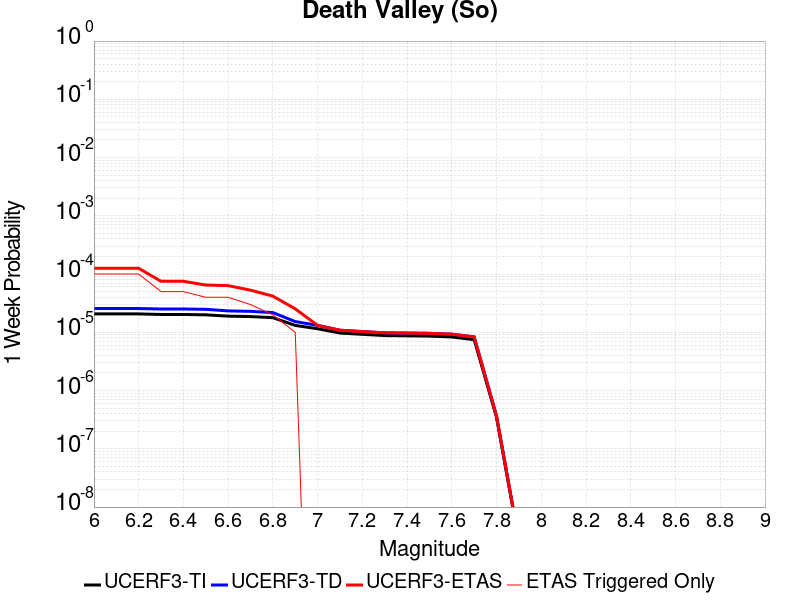 |  |  |  |

| Magnitude | 1 wk TI Prob | 1 wk TD Prob | 1 wk ETAS Prob | 1 wk ETAS/TD Gain | 1 wk ETAS Triggered Only | 1 mo TI Prob | 1 mo TD Prob | 1 mo ETAS Prob | 1 mo ETAS/TD Gain | 1 mo ETAS Triggered Only | 1 yr TI Prob | 1 yr TD Prob | 1 yr ETAS Prob | 1 yr ETAS/TD Gain | 1 yr ETAS Triggered Only | 10 yr TI Prob | 10 yr TD Prob | 10 yr ETAS Prob | 10 yr ETAS/TD Gain | 10 yr ETAS Triggered Only |
|-----|-----|-----|-----|-----|-----|-----|-----|-----|-----|-----|-----|-----|-----|-----|-----|-----|-----|-----|-----|-----|
| 6.0 | 2.0684236E-5 | 2.5618423E-5 | 1.2561586E-4 | 4.903341 | 1.0E-4 | 8.864371E-5 | 1.09788714E-4 | 3.7975906E-4 | 3.4589992 | 2.7E-4 | 0.0010787029 | 0.0013358749 | 0.0023644988 | 1.7700003 | 0.00103 | 0.010734817 | 0.013281729 | 0.015334102 | 1.1545261 | 0.00208 |
| 6.1 | 2.0684236E-5 | 2.5618423E-5 | 1.2561586E-4 | 4.903341 | 1.0E-4 | 8.864371E-5 | 1.09788714E-4 | 3.7975906E-4 | 3.4589992 | 2.7E-4 | 0.0010787029 | 0.0013358749 | 0.0023644988 | 1.7700003 | 0.00103 | 0.010734817 | 0.013281729 | 0.015334102 | 1.1545261 | 0.00208 |
| 6.2 | 2.0684236E-5 | 2.5618423E-5 | 1.2561586E-4 | 4.903341 | 1.0E-4 | 8.864371E-5 | 1.09788714E-4 | 3.7975906E-4 | 3.4589992 | 2.7E-4 | 0.0010787029 | 0.0013358749 | 0.0023644988 | 1.7700003 | 0.00103 | 0.010734817 | 0.013281729 | 0.015334102 | 1.1545261 | 0.00208 |
| 6.3 | 2.0240292E-5 | 2.5118497E-5 | 7.511724E-5 | 2.9905148 | 5.0E-5 | 8.6741224E-5 | 1.0764636E-4 | 3.1762375E-4 | 2.9506223 | 2.1E-4 | 0.0010555626 | 0.0013098232 | 0.0022286181 | 1.7014649 | 9.2E-4 | 0.010505628 | 0.013024284 | 0.014909407 | 1.1447392 | 0.00191 |
| 6.4 | 2.0240292E-5 | 2.5118497E-5 | 7.511724E-5 | 2.9905148 | 5.0E-5 | 8.6741224E-5 | 1.0764636E-4 | 3.1762375E-4 | 2.9506223 | 2.1E-4 | 0.0010555626 | 0.0013098232 | 0.0022286181 | 1.7014649 | 9.2E-4 | 0.010505628 | 0.013024284 | 0.014909407 | 1.1447392 | 0.00191 |
| 6.5 | 1.9962767E-5 | 2.4807747E-5 | 6.480675E-5 | 2.6123595 | 4.0E-5 | 8.55519E-5 | 1.0631468E-4 | 3.0629343E-4 | 2.881008 | 2.0E-4 | 0.0010410968 | 0.0012936293 | 0.0021625038 | 1.6716565 | 8.7E-4 | 0.010362327 | 0.012864228 | 0.014670687 | 1.140425 | 0.00183 |
| 6.6 | 1.8937297E-5 | 2.3311568E-5 | 6.331064E-5 | 2.7158463 | 4.0E-5 | 8.115732E-5 | 9.990298E-5 | 2.69886E-4 | 2.7014809 | 1.7E-4 | 9.876423E-4 | 0.0012156547 | 0.0019847185 | 1.6326336 | 7.7E-4 | 0.009832645 | 0.0120931 | 0.013703387 | 1.1331576 | 0.00163 |
| 6.7 | 1.8621096E-5 | 2.2912203E-5 | 5.2911517E-5 | 2.309316 | 3.0E-5 | 7.980225E-5 | 9.8191544E-5 | 2.5817583E-4 | 2.6293082 | 1.6E-4 | 9.711593E-4 | 0.0011948409 | 0.0019339568 | 1.6185893 | 7.4E-4 | 0.009669261 | 0.011887211 | 0.013428668 | 1.1296735 | 0.00156 |
| 6.8 | 1.7830353E-5 | 2.1806247E-5 | 4.180581E-5 | 1.9171484 | 2.0E-5 | 7.641356E-5 | 9.345208E-5 | 2.33439E-4 | 2.4979541 | 1.4E-4 | 9.29938E-4 | 0.0011371992 | 0.0018264145 | 1.6060638 | 6.9E-4 | 0.009260561 | 0.011316643 | 0.012799668 | 1.1310482 | 0.0015 |
| 6.9 | 1.3135183E-5 | 1.5304242E-5 | 2.5304089E-5 | 1.6534036 | 1.0E-5 | 5.6292425E-5 | 6.558799E-5 | 1.355834E-4 | 2.0671985 | 7.0E-5 | 6.8514474E-4 | 7.982477E-4 | 0.0012279045 | 1.5382499 | 4.3E-4 | 0.006830362 | 0.007954813 | 0.008877414 | 1.1159804 | 9.3E-4 |
| 7.0 | 1.1507512E-5 | 1.3154444E-5 | 1.3154444E-5 | 1.0 | 0.0 | 4.9316975E-5 | 5.6375004E-5 | 9.637275E-5 | 1.7094944 | 4.0E-5 | 6.002687E-4 | 6.861553E-4 | 9.659632E-4 | 1.4077909 | 2.8E-4 | 0.0059864987 | 0.006841068 | 0.0075064846 | 1.0972679 | 6.7E-4 |
| 7.1 | 9.715903E-6 | 1.0865454E-5 | 1.0865454E-5 | 1.0 | 0.0 | 4.1638916E-5 | 4.6565423E-5 | 6.656449E-5 | 1.4294832 | 2.0E-5 | 5.068359E-4 | 5.667908E-4 | 7.167058E-4 | 1.2644979 | 1.5E-4 | 0.0050568148 | 0.0056539057 | 0.006021814 | 1.0650715 | 3.7E-4 |
| 7.2 | 9.233269E-6 | 1.0286473E-5 | 1.0286473E-5 | 1.0 | 0.0 | 3.9570554E-5 | 4.4084165E-5 | 5.408372E-5 | 1.2268288 | 1.0E-5 | 4.81665E-4 | 5.3659675E-4 | 6.465377E-4 | 1.2048856 | 1.1E-4 | 0.0048062233 | 0.005353442 | 0.0056219967 | 1.0501648 | 2.7E-4 |
| 7.3 | 8.8041315E-6 | 9.808313E-6 | 9.808313E-6 | 1.0 | 0.0 | 3.7731446E-5 | 4.2034975E-5 | 5.2034553E-5 | 1.2378871 | 1.0E-5 | 4.592835E-4 | 5.1165983E-4 | 6.116087E-4 | 1.1953423 | 1.0E-4 | 0.0045833546 | 0.0051052445 | 0.0053440193 | 1.0467705 | 2.4E-4 |
| 7.4 | 8.708749E-6 | 9.707323E-6 | 9.707323E-6 | 1.0 | 0.0 | 3.7322676E-5 | 4.1602176E-5 | 5.1601757E-5 | 1.240362 | 1.0E-5 | 4.5430884E-4 | 5.06393E-4 | 5.963474E-4 | 1.1776376 | 9.0E-5 | 0.004533812 | 0.0050528166 | 0.0052816547 | 1.0452892 | 2.3E-4 |
| 7.5 | 8.612678E-6 | 9.604964E-6 | 9.604964E-6 | 1.0 | 0.0 | 3.6910955E-5 | 4.116351E-5 | 4.116351E-5 | 1.0 | 0.0 | 4.492982E-4 | 5.010547E-4 | 5.810146E-4 | 1.1595832 | 8.0E-5 | 0.004483909 | 0.0049996753 | 0.0052185752 | 1.0437828 | 2.2E-4 |
| 7.6 | 8.319024E-6 | 9.28406E-6 | 9.28406E-6 | 1.0 | 0.0 | 3.5652476E-5 | 3.9788243E-5 | 3.9788243E-5 | 1.0 | 0.0 | 4.3398244E-4 | 4.8431839E-4 | 5.542845E-4 | 1.1444631 | 7.0E-5 | 0.0043313587 | 0.004833053 | 0.0050320863 | 1.0411817 | 2.0E-4 |
| 7.7 | 7.4718328E-6 | 8.3453E-6 | 8.3453E-6 | 1.0 | 0.0 | 3.2021748E-5 | 3.57651E-5 | 3.57651E-5 | 1.0 | 0.0 | 3.8979502E-4 | 4.3535716E-4 | 4.853354E-4 | 1.1147982 | 5.0E-5 | 0.00389112 | 0.004345448 | 0.004494796 | 1.0343689 | 1.5E-4 |
| 7.8 | 3.4586725E-7 | 3.648288E-7 | 3.648288E-7 | 1.0 | 0.0 | 1.4822873E-6 | 1.5635511E-6 | 1.5635511E-6 | 1.0 | 0.0 | 1.80467E-5 | 1.9036073E-5 | 1.9036073E-5 | 1.0 | 0.0 | 1.8045233E-4 | 1.9034486E-4 | 1.9034486E-4 | 1.0 | 0.0 |
| 7.9 | 2.5591178E-9 | 2.6696871E-9 | 2.6696871E-9 | 1.0 | 0.0 | 1.0967647E-8 | 1.1441516E-8 | 1.1441516E-8 | 1.0 | 0.0 | 1.335311E-7 | 1.3930045E-7 | 1.3930045E-7 | 1.0 | 0.0 | 1.3353102E-6 | 1.3930046E-6 | 1.3930046E-6 | 1.0 | 0.0 |

## Lenwood-Lockhart-Old Woman Springs
*[(top)](#table-of-contents)*

| 1 Week | 1 Month | 1 Year | 10 Year |
|-----|-----|-----|-----|
| 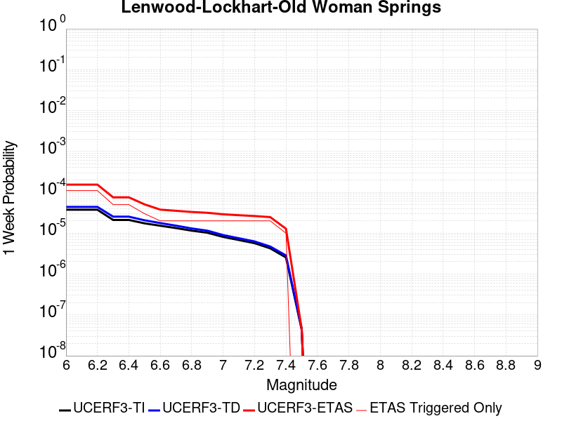 |  | 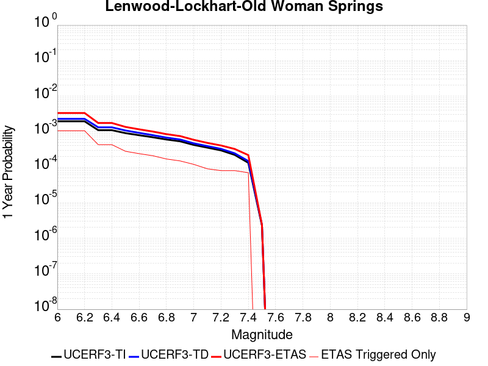 |  |

| Magnitude | 1 wk TI Prob | 1 wk TD Prob | 1 wk ETAS Prob | 1 wk ETAS/TD Gain | 1 wk ETAS Triggered Only | 1 mo TI Prob | 1 mo TD Prob | 1 mo ETAS Prob | 1 mo ETAS/TD Gain | 1 mo ETAS Triggered Only | 1 yr TI Prob | 1 yr TD Prob | 1 yr ETAS Prob | 1 yr ETAS/TD Gain | 1 yr ETAS Triggered Only | 10 yr TI Prob | 10 yr TD Prob | 10 yr ETAS Prob | 10 yr ETAS/TD Gain | 10 yr ETAS Triggered Only |
|-----|-----|-----|-----|-----|-----|-----|-----|-----|-----|-----|-----|-----|-----|-----|-----|-----|-----|-----|-----|-----|
| 6.0 | 3.744542E-5 | 4.3962966E-5 | 1.5395813E-4 | 3.501996 | 1.1E-4 | 1.604705E-4 | 1.8840008E-4 | 5.2833604E-4 | 2.80433 | 3.4E-4 | 0.0019519776 | 0.0022915301 | 0.003349101 | 1.461513 | 0.00106 | 0.019349206 | 0.022697017 | 0.024651622 | 1.0861173 | 0.002 |
| 6.1 | 3.744542E-5 | 4.3962966E-5 | 1.5395813E-4 | 3.501996 | 1.1E-4 | 1.604705E-4 | 1.8840008E-4 | 5.2833604E-4 | 2.80433 | 3.4E-4 | 0.0019519776 | 0.0022915301 | 0.003349101 | 1.461513 | 0.00106 | 0.019349206 | 0.022697017 | 0.024651622 | 1.0861173 | 0.002 |
| 6.2 | 3.744542E-5 | 4.3962966E-5 | 1.5395813E-4 | 3.501996 | 1.1E-4 | 1.604705E-4 | 1.8840008E-4 | 5.2833604E-4 | 2.80433 | 3.4E-4 | 0.0019519776 | 0.0022915301 | 0.003349101 | 1.461513 | 0.00106 | 0.019349206 | 0.022697017 | 0.024651622 | 1.0861173 | 0.002 |
| 6.3 | 2.1079984E-5 | 2.5353596E-5 | 7.535233E-5 | 2.9720569 | 5.0E-5 | 9.0339665E-5 | 1.0865386E-4 | 2.786354E-4 | 2.5644317 | 1.7E-4 | 0.0010993304 | 0.0013220779 | 0.0017515094 | 1.3248156 | 4.3E-4 | 0.010939079 | 0.013144341 | 0.01390422 | 1.0578103 | 7.7E-4 |
| 6.4 | 2.1079984E-5 | 2.5353596E-5 | 7.535233E-5 | 2.9720569 | 5.0E-5 | 9.0339665E-5 | 1.0865386E-4 | 2.786354E-4 | 2.5644317 | 1.7E-4 | 0.0010993304 | 0.0013220779 | 0.0017515094 | 1.3248156 | 4.3E-4 | 0.010939079 | 0.013144341 | 0.01390422 | 1.0578103 | 7.7E-4 |
| 6.5 | 1.7397282E-5 | 2.0662535E-5 | 5.0661914E-5 | 2.451873 | 3.0E-5 | 7.455765E-5 | 8.855078E-5 | 2.1853928E-4 | 2.4679542 | 1.3E-4 | 9.073613E-4 | 0.0010775843 | 0.0013572826 | 1.2595605 | 2.8E-4 | 0.009036654 | 0.010724886 | 0.011268987 | 1.0507326 | 5.5E-4 |
| 6.6 | 1.52050325E-5 | 1.76798E-5 | 3.7679445E-5 | 2.1312146 | 2.0E-5 | 6.51628E-5 | 7.576841E-5 | 1.8576007E-4 | 2.4516823 | 1.1E-4 | 7.9306826E-4 | 9.220979E-4 | 0.0011618766 | 1.260036 | 2.4E-4 | 0.007902439 | 0.009183581 | 0.009649265 | 1.0507083 | 4.7E-4 |
| 6.7 | 1.332523E-5 | 1.5264091E-5 | 3.5263787E-5 | 2.3102448 | 2.0E-5 | 5.7106878E-5 | 6.541593E-5 | 1.6540938E-4 | 2.5285797 | 1.0E-4 | 6.950544E-4 | 7.9615373E-4 | 0.0010059866 | 1.2635581 | 2.1E-4 | 0.006928845 | 0.007933645 | 0.008330472 | 1.0500182 | 4.0E-4 |
| 6.8 | 1.1525329E-5 | 1.303105E-5 | 3.303079E-5 | 2.5347757 | 2.0E-5 | 4.9393333E-5 | 5.5846183E-5 | 1.2584227E-4 | 2.253373 | 7.0E-5 | 6.011979E-4 | 6.7971944E-4 | 8.4960385E-4 | 1.2499332 | 1.7E-4 | 0.00599574 | 0.006776856 | 0.0070946873 | 1.0468996 | 3.2E-4 |
| 6.9 | 1.0253909E-5 | 1.15144985E-5 | 3.1514268E-5 | 2.7369206 | 2.0E-5 | 4.3944583E-5 | 4.9346934E-5 | 1.1934348E-4 | 2.4184577 | 7.0E-5 | 5.3489394E-4 | 6.0063694E-4 | 7.5054687E-4 | 1.2495849 | 1.5E-4 | 0.0053360825 | 0.005990515 | 0.0062489575 | 1.043142 | 2.6E-4 |
| 7.0 | 8.104563E-6 | 8.991321E-6 | 2.899114E-5 | 3.2243474 | 2.0E-5 | 3.4733377E-5 | 3.8533675E-5 | 9.853137E-5 | 2.5570195 | 6.0E-5 | 4.2279682E-4 | 4.6904891E-4 | 5.889926E-4 | 1.2557168 | 1.2E-4 | 0.0042199334 | 0.0046808375 | 0.004869948 | 1.040401 | 1.9E-4 |
| 7.1 | 6.7986157E-6 | 7.515848E-6 | 2.7515698E-5 | 3.6610236 | 2.0E-5 | 2.91366E-5 | 3.221039E-5 | 8.220878E-5 | 2.552244 | 5.0E-5 | 3.5468035E-4 | 3.9209312E-4 | 4.8205783E-4 | 1.2294474 | 9.0E-5 | 0.003541148 | 0.0039142296 | 0.0040536816 | 1.0356269 | 1.4E-4 |
| 7.2 | 5.6893327E-6 | 6.280039E-6 | 2.6279913E-5 | 4.184674 | 2.0E-5 | 2.4382627E-5 | 2.6914187E-5 | 7.691284E-5 | 2.8577063 | 5.0E-5 | 2.9681803E-4 | 3.2763294E-4 | 4.0760674E-4 | 1.2440957 | 8.0E-5 | 0.002964219 | 0.0032716978 | 0.0033913052 | 1.0365582 | 1.2E-4 |
| 7.3 | 4.253348E-6 | 4.706927E-6 | 2.4706833E-5 | 5.249037 | 2.0E-5 | 1.8228506E-5 | 2.01724E-5 | 7.017139E-5 | 3.4785843 | 5.0E-5 | 2.2190946E-4 | 2.4557312E-4 | 3.2555347E-4 | 1.3256886 | 8.0E-5 | 0.00221688 | 0.0024531984 | 0.0025629285 | 1.0447295 | 1.1E-4 |
| 7.4 | 2.5448119E-6 | 2.8520535E-6 | 1.2852025E-5 | 4.5062356 | 1.0E-5 | 1.0906291E-5 | 1.22230385E-5 | 5.222255E-5 | 4.272469 | 4.0E-5 | 1.3277601E-4 | 1.4880698E-4 | 2.1879656E-4 | 1.4703381 | 7.0E-5 | 0.001326967 | 0.0014872355 | 0.0015671166 | 1.053711 | 8.0E-5 |
| 7.5 | 4.3706837E-8 | 4.5629356E-8 | 4.5629356E-8 | 1.0 | 0.0 | 1.8731501E-7 | 1.9555438E-7 | 1.9555438E-7 | 1.0 | 0.0 | 2.2805577E-6 | 2.3808725E-6 | 2.3808725E-6 | 1.0 | 0.0 | 2.2805343E-5 | 2.3808525E-5 | 2.3808525E-5 | 1.0 | 0.0 |

## Nelson Lake
*[(top)](#table-of-contents)*

| 1 Week | 1 Month | 1 Year | 10 Year |
|-----|-----|-----|-----|
|  |  |  |  |

| Magnitude | 1 wk TI Prob | 1 wk TD Prob | 1 wk ETAS Prob | 1 wk ETAS/TD Gain | 1 wk ETAS Triggered Only | 1 mo TI Prob | 1 mo TD Prob | 1 mo ETAS Prob | 1 mo ETAS/TD Gain | 1 mo ETAS Triggered Only | 1 yr TI Prob | 1 yr TD Prob | 1 yr ETAS Prob | 1 yr ETAS/TD Gain | 1 yr ETAS Triggered Only | 10 yr TI Prob | 10 yr TD Prob | 10 yr ETAS Prob | 10 yr ETAS/TD Gain | 10 yr ETAS Triggered Only |
|-----|-----|-----|-----|-----|-----|-----|-----|-----|-----|-----|-----|-----|-----|-----|-----|-----|-----|-----|-----|-----|
| 6.0 | 9.913453E-6 | 1.0192293E-5 | 9.0191475E-5 | 8.848988 | 8.0E-5 | 4.2485535E-5 | 4.3680586E-5 | 2.6367098E-4 | 6.0363426 | 2.2E-4 | 5.1713863E-4 | 5.316917E-4 | 0.0014112238 | 2.6542146 | 8.8E-4 | 0.0051593683 | 0.0053052236 | 0.007135462 | 1.344988 | 0.00184 |
| 6.1 | 9.913453E-6 | 1.0192293E-5 | 9.0191475E-5 | 8.848988 | 8.0E-5 | 4.2485535E-5 | 4.3680586E-5 | 2.6367098E-4 | 6.0363426 | 2.2E-4 | 5.1713863E-4 | 5.316917E-4 | 0.0014112238 | 2.6542146 | 8.8E-4 | 0.0051593683 | 0.0053052236 | 0.007135462 | 1.344988 | 0.00184 |
| 6.2 | 4.5596407E-6 | 4.696332E-6 | 5.46961E-5 | 11.646557 | 5.0E-5 | 1.954117E-5 | 2.0126989E-5 | 1.5012437E-4 | 7.4588594 | 1.3E-4 | 2.3788778E-4 | 2.450198E-4 | 6.5491936E-4 | 2.6729243 | 4.1E-4 | 0.0023763329 | 0.0024476226 | 0.0033254686 | 1.3586526 | 8.8E-4 |
| 6.3 | 4.5596407E-6 | 4.696332E-6 | 5.46961E-5 | 11.646557 | 5.0E-5 | 1.954117E-5 | 2.0126989E-5 | 1.5012437E-4 | 7.4588594 | 1.3E-4 | 2.3788778E-4 | 2.450198E-4 | 6.5491936E-4 | 2.6729243 | 4.1E-4 | 0.0023763329 | 0.0024476226 | 0.0033254686 | 1.3586526 | 8.8E-4 |
| 6.4 | 3.4025713E-6 | 3.509912E-6 | 3.350981E-5 | 9.547193 | 3.0E-5 | 1.4582367E-5 | 1.50423975E-5 | 9.504119E-5 | 6.318221 | 8.0E-5 | 1.7752586E-4 | 1.8312664E-4 | 4.3308086E-4 | 2.3649254 | 2.5E-4 | 0.001773841 | 0.0018298404 | 0.0024487057 | 1.3382074 | 6.2E-4 |
| 6.5 | 2.8352947E-6 | 2.9278688E-6 | 3.2927783E-5 | 11.24633 | 3.0E-5 | 1.2151207E-5 | 1.2547953E-5 | 8.254708E-5 | 6.5785294 | 7.0E-5 | 1.479309E-4 | 1.5276136E-4 | 3.4273235E-4 | 2.2435799 | 1.9E-4 | 0.0014783246 | 0.0015266375 | 0.0020358588 | 1.3335575 | 5.1E-4 |
| 6.6 | 2.251518E-6 | 2.3290781E-6 | 2.2329032E-5 | 9.587069 | 2.0E-5 | 9.649328E-6 | 9.981729E-6 | 5.998123E-5 | 6.0091023 | 5.0E-5 | 1.1747423E-4 | 1.2152141E-4 | 2.6150438E-4 | 2.1519203 | 1.4E-4 | 0.0011741214 | 0.0012146112 | 0.0015841619 | 1.3042542 | 3.7E-4 |
| 6.7 | 1.8911853E-6 | 1.9591491E-6 | 2.195911E-5 | 11.208494 | 2.0E-5 | 8.105055E-6 | 8.39633E-6 | 5.8395908E-5 | 6.954933 | 5.0E-5 | 9.867457E-5 | 1.022211E-4 | 2.322078E-4 | 2.2716231 | 1.3E-4 | 9.863076E-4 | 0.0010217984 | 0.0013314815 | 1.3030767 | 3.1E-4 |
| 6.8 | 1.4874814E-6 | 1.5438383E-6 | 1.1543822E-5 | 7.4773526 | 1.0E-5 | 6.374905E-6 | 6.6164357E-6 | 3.661624E-5 | 5.5341334 | 3.0E-5 | 7.76117E-5 | 8.055265E-5 | 1.4054781E-4 | 1.7447945 | 6.0E-5 | 7.75846E-4 | 8.052856E-4 | 0.0010151165 | 1.2605671 | 2.1E-4 |
| 6.9 | 6.835972E-7 | 7.1399705E-7 | 7.1399705E-7 | 1.0 | 0.0 | 2.9296991E-6 | 3.0599856E-6 | 1.3059955E-5 | 4.267979 | 1.0E-5 | 3.56685E-5 | 3.7255006E-5 | 5.725426E-5 | 1.5368207 | 2.0E-5 | 3.5662777E-4 | 3.7251884E-4 | 5.024704E-4 | 1.3488456 | 1.3E-4 |

## Towne Pass
*[(top)](#table-of-contents)*

| 1 Week | 1 Month | 1 Year | 10 Year |
|-----|-----|-----|-----|
|  | 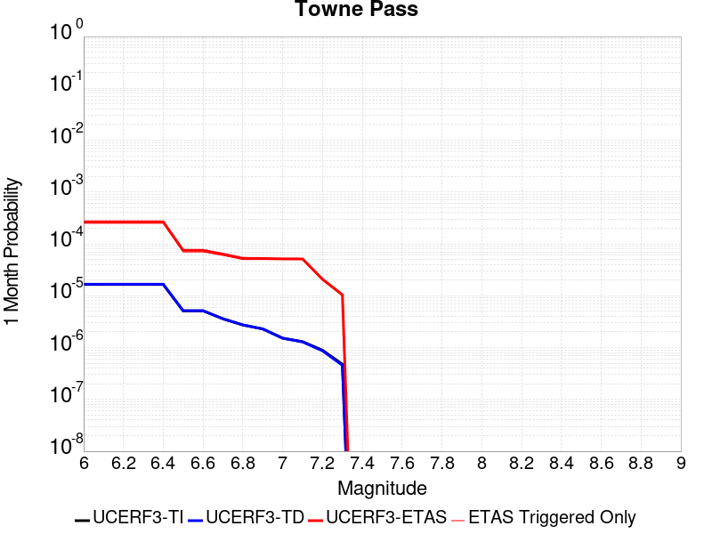 |  | 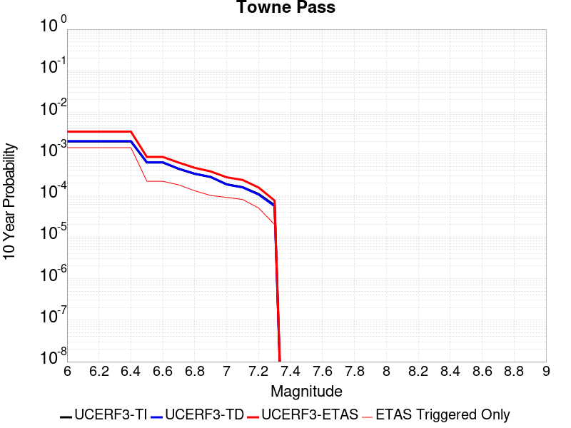 |

| Magnitude | 1 wk TI Prob | 1 wk TD Prob | 1 wk ETAS Prob | 1 wk ETAS/TD Gain | 1 wk ETAS Triggered Only | 1 mo TI Prob | 1 mo TD Prob | 1 mo ETAS Prob | 1 mo ETAS/TD Gain | 1 mo ETAS Triggered Only | 1 yr TI Prob | 1 yr TD Prob | 1 yr ETAS Prob | 1 yr ETAS/TD Gain | 1 yr ETAS Triggered Only | 10 yr TI Prob | 10 yr TD Prob | 10 yr ETAS Prob | 10 yr ETAS/TD Gain | 10 yr ETAS Triggered Only |
|-----|-----|-----|-----|-----|-----|-----|-----|-----|-----|-----|-----|-----|-----|-----|-----|-----|-----|-----|-----|-----|
| 6.0 | 3.849728E-6 | 3.8945495E-6 | 1.0389416E-4 | 26.67681 | 1.0E-4 | 1.649873E-5 | 1.6690845E-5 | 2.6668666E-4 | 15.978022 | 2.5E-4 | 2.0085352E-4 | 2.0319645E-4 | 9.4304606E-4 | 4.6410556 | 7.4E-4 | 0.0020067208 | 0.0020305358 | 0.0034476523 | 1.6979028 | 0.00142 |
| 6.1 | 3.849728E-6 | 3.8945495E-6 | 1.0389416E-4 | 26.67681 | 1.0E-4 | 1.649873E-5 | 1.6690845E-5 | 2.6668666E-4 | 15.978022 | 2.5E-4 | 2.0085352E-4 | 2.0319645E-4 | 9.4304606E-4 | 4.6410556 | 7.4E-4 | 0.0020067208 | 0.0020305358 | 0.0034476523 | 1.6979028 | 0.00142 |
| 6.2 | 3.849728E-6 | 3.8945495E-6 | 1.0389416E-4 | 26.67681 | 1.0E-4 | 1.649873E-5 | 1.6690845E-5 | 2.6668666E-4 | 15.978022 | 2.5E-4 | 2.0085352E-4 | 2.0319645E-4 | 9.4304606E-4 | 4.6410556 | 7.4E-4 | 0.0020067208 | 0.0020305358 | 0.0034476523 | 1.6979028 | 0.00142 |
| 6.3 | 3.849728E-6 | 3.8945495E-6 | 1.0389416E-4 | 26.67681 | 1.0E-4 | 1.649873E-5 | 1.6690845E-5 | 2.6668666E-4 | 15.978022 | 2.5E-4 | 2.0085352E-4 | 2.0319645E-4 | 9.4304606E-4 | 4.6410556 | 7.4E-4 | 0.0020067208 | 0.0020305358 | 0.0034476523 | 1.6979028 | 0.00142 |
| 6.4 | 3.849728E-6 | 3.8945495E-6 | 1.0389416E-4 | 26.67681 | 1.0E-4 | 1.649873E-5 | 1.6690845E-5 | 2.6668666E-4 | 15.978022 | 2.5E-4 | 2.0085352E-4 | 2.0319645E-4 | 9.4304606E-4 | 4.6410556 | 7.4E-4 | 0.0020067208 | 0.0020305358 | 0.0034476523 | 1.6979028 | 0.00142 |
| 6.5 | 1.1953545E-6 | 1.2030553E-6 | 2.1203032E-5 | 17.624321 | 2.0E-5 | 5.1229376E-6 | 5.155942E-6 | 7.515558E-5 | 14.5765 | 7.0E-5 | 6.236998E-5 | 6.27719E-5 | 1.6276562E-4 | 2.5929694 | 1.0E-4 | 6.235248E-4 | 6.2755344E-4 | 8.4741536E-4 | 1.3503478 | 2.2E-4 |
| 6.6 | 1.1953545E-6 | 1.2030553E-6 | 2.1203032E-5 | 17.624321 | 2.0E-5 | 5.1229376E-6 | 5.155942E-6 | 7.515558E-5 | 14.5765 | 7.0E-5 | 6.236998E-5 | 6.27719E-5 | 1.6276562E-4 | 2.5929694 | 1.0E-4 | 6.235248E-4 | 6.2755344E-4 | 8.4741536E-4 | 1.3503478 | 2.2E-4 |
| 6.7 | 8.375951E-7 | 8.410697E-7 | 2.0841053E-5 | 24.77922 | 2.0E-5 | 3.5896885E-6 | 3.60458E-6 | 6.360436E-5 | 17.64543 | 6.0E-5 | 4.370358E-5 | 4.3884935E-5 | 1.3388098E-4 | 3.0507276 | 9.0E-5 | 4.3694986E-4 | 4.387684E-4 | 6.186894E-4 | 1.4100592 | 1.8E-4 |
| 6.8 | 6.38041E-7 | 6.39218E-7 | 2.0639205E-5 | 32.288208 | 2.0E-5 | 2.7344586E-6 | 2.739503E-6 | 5.2739368E-5 | 19.251434 | 5.0E-5 | 3.3291526E-5 | 3.335298E-5 | 1.1335031E-4 | 3.3985064 | 8.0E-5 | 3.3286537E-4 | 3.3348353E-4 | 4.634402E-4 | 1.3896943 | 1.3E-4 |
| 6.9 | 5.3460053E-7 | 5.345355E-7 | 2.0534524E-5 | 38.41564 | 2.0E-5 | 2.2911431E-6 | 2.2908646E-6 | 5.229075E-5 | 22.82577 | 5.0E-5 | 2.789431E-5 | 2.7890954E-5 | 8.788928E-5 | 3.151175 | 6.0E-5 | 2.789081E-4 | 2.7887785E-4 | 3.7884997E-4 | 1.35848 | 1.0E-4 |
| 7.0 | 3.557783E-7 | 3.5324413E-7 | 2.0353236E-5 | 57.618046 | 2.0E-5 | 1.5247632E-6 | 1.5139026E-6 | 5.1513827E-5 | 34.027172 | 5.0E-5 | 1.8563835E-5 | 1.8431618E-5 | 6.8430694E-5 | 3.7126799 | 5.0E-5 | 1.8562283E-4 | 1.8430172E-4 | 2.7428515E-4 | 1.4882396 | 9.0E-5 |
| 7.1 | 3.037942E-7 | 3.0002388E-7 | 2.0300018E-5 | 67.66134 | 2.0E-5 | 1.3019744E-6 | 1.2858161E-6 | 5.128575E-5 | 39.88576 | 5.0E-5 | 1.5851423E-5 | 1.5654707E-5 | 6.565392E-5 | 4.1938777 | 5.0E-5 | 1.5850292E-4 | 1.5653679E-4 | 2.3652425E-4 | 1.510982 | 8.0E-5 |
| 7.2 | 2.0808248E-7 | 2.021783E-7 | 2.021783E-7 | 1.0 | 0.0 | 8.917818E-7 | 8.6647816E-7 | 2.086646E-5 | 24.081924 | 2.0E-5 | 1.0857389E-5 | 1.0549325E-5 | 3.0549116E-5 | 2.8958359 | 2.0E-5 | 1.0856859E-4 | 1.054887E-4 | 1.5548343E-4 | 1.4739344 | 5.0E-5 |
| 7.3 | 1.1162073E-7 | 1.06369825E-7 | 1.06369825E-7 | 1.0 | 0.0 | 4.7837443E-7 | 4.5587063E-7 | 1.0455866E-5 | 22.936039 | 1.0E-5 | 5.8241935E-6 | 5.550213E-6 | 1.5550157E-5 | 2.8017228 | 1.0E-5 | 5.8240406E-5 | 5.5500943E-5 | 7.549983E-5 | 1.3603343 | 2.0E-5 |

## Paradise
*[(top)](#table-of-contents)*

| 1 Week | 1 Month | 1 Year | 10 Year |
|-----|-----|-----|-----|
|  |  |  |  |

| Magnitude | 1 wk TI Prob | 1 wk TD Prob | 1 wk ETAS Prob | 1 wk ETAS/TD Gain | 1 wk ETAS Triggered Only | 1 mo TI Prob | 1 mo TD Prob | 1 mo ETAS Prob | 1 mo ETAS/TD Gain | 1 mo ETAS Triggered Only | 1 yr TI Prob | 1 yr TD Prob | 1 yr ETAS Prob | 1 yr ETAS/TD Gain | 1 yr ETAS Triggered Only | 10 yr TI Prob | 10 yr TD Prob | 10 yr ETAS Prob | 10 yr ETAS/TD Gain | 10 yr ETAS Triggered Only |
|-----|-----|-----|-----|-----|-----|-----|-----|-----|-----|-----|-----|-----|-----|-----|-----|-----|-----|-----|-----|-----|
| 6.0 | 1.4851273E-5 | 1.6694854E-5 | 5.6694185E-5 | 3.3959079 | 4.0E-5 | 6.364676E-5 | 7.154755E-5 | 2.5153466E-4 | 3.5156295 | 1.8E-4 | 7.7462377E-4 | 8.707668E-4 | 0.0014702444 | 1.6884478 | 6.0E-4 | 0.0077192914 | 0.008675928 | 0.009736645 | 1.1222597 | 0.00107 |
| 6.1 | 1.4851273E-5 | 1.6694854E-5 | 5.6694185E-5 | 3.3959079 | 4.0E-5 | 6.364676E-5 | 7.154755E-5 | 2.5153466E-4 | 3.5156295 | 1.8E-4 | 7.7462377E-4 | 8.707668E-4 | 0.0014702444 | 1.6884478 | 6.0E-4 | 0.0077192914 | 0.008675928 | 0.009736645 | 1.1222597 | 0.00107 |
| 6.2 | 1.4851273E-5 | 1.6694854E-5 | 5.6694185E-5 | 3.3959079 | 4.0E-5 | 6.364676E-5 | 7.154755E-5 | 2.5153466E-4 | 3.5156295 | 1.8E-4 | 7.7462377E-4 | 8.707668E-4 | 0.0014702444 | 1.6884478 | 6.0E-4 | 0.0077192914 | 0.008675928 | 0.009736645 | 1.1222597 | 0.00107 |
| 6.3 | 1.0426831E-5 | 1.1888727E-5 | 3.188849E-5 | 2.6822457 | 2.0E-5 | 4.4685654E-5 | 5.0950726E-5 | 1.2094716E-4 | 2.3738062 | 7.0E-5 | 5.43912E-4 | 6.201545E-4 | 8.6999947E-4 | 1.4028753 | 2.5E-4 | 0.0054258266 | 0.006184847 | 0.0066519403 | 1.0755222 | 4.7E-4 |
| 6.4 | 1.0426831E-5 | 1.1888727E-5 | 3.188849E-5 | 2.6822457 | 2.0E-5 | 4.4685654E-5 | 5.0950726E-5 | 1.2094716E-4 | 2.3738062 | 7.0E-5 | 5.43912E-4 | 6.201545E-4 | 8.6999947E-4 | 1.4028753 | 2.5E-4 | 0.0054258266 | 0.006184847 | 0.0066519403 | 1.0755222 | 4.7E-4 |
| 6.5 | 9.25027E-6 | 1.0620054E-5 | 3.061984E-5 | 2.8832097 | 2.0E-5 | 3.964341E-5 | 4.551375E-5 | 9.5511474E-5 | 2.098519 | 5.0E-5 | 4.8255164E-4 | 5.539939E-4 | 7.538831E-4 | 1.3608148 | 2.0E-4 | 0.0048150513 | 0.0055266283 | 0.0058846385 | 1.0647792 | 3.6E-4 |
| 6.6 | 7.904275E-6 | 9.159603E-6 | 9.159603E-6 | 1.0 | 0.0 | 3.3875025E-5 | 3.925487E-5 | 5.9254085E-5 | 1.5094709 | 2.0E-5 | 4.1235037E-4 | 4.7782718E-4 | 6.177603E-4 | 1.292853 | 1.4E-4 | 0.0041158604 | 0.004768395 | 0.0050072502 | 1.0500914 | 2.4E-4 |
| 6.7 | 7.2061953E-6 | 8.407318E-6 | 8.407318E-6 | 1.0 | 0.0 | 3.088333E-5 | 3.6030888E-5 | 5.6030167E-5 | 1.5550593 | 2.0E-5 | 3.7593965E-4 | 4.385914E-4 | 5.2855193E-4 | 1.2051123 | 9.0E-5 | 0.003753043 | 0.0043776273 | 0.004546883 | 1.0386639 | 1.7E-4 |
| 6.8 | 6.6948724E-6 | 7.84223E-6 | 7.84223E-6 | 1.0 | 0.0 | 2.8691995E-5 | 3.3609143E-5 | 4.360881E-5 | 1.297528 | 1.0E-5 | 3.4926904E-4 | 4.0911807E-4 | 4.8908533E-4 | 1.1954626 | 8.0E-5 | 0.003487206 | 0.0040840064 | 0.0042234347 | 1.0341401 | 1.4E-4 |
| 6.9 | 6.0421025E-6 | 7.130678E-6 | 7.130678E-6 | 1.0 | 0.0 | 2.5894467E-5 | 3.055971E-5 | 4.0559404E-5 | 1.3272182 | 1.0E-5 | 3.1521954E-4 | 3.7200435E-4 | 4.2198575E-4 | 1.134357 | 5.0E-5 | 0.0031477278 | 0.0037141545 | 0.0038137832 | 1.026824 | 1.0E-4 |
| 7.0 | 4.134091E-6 | 5.0803487E-6 | 5.0803487E-6 | 1.0 | 0.0 | 1.7717413E-5 | 2.177275E-5 | 3.177253E-5 | 1.4592797 | 1.0E-5 | 2.1568815E-4 | 2.6505254E-4 | 2.950446E-4 | 1.1131551 | 3.0E-5 | 0.0021547892 | 0.0026475172 | 0.0026874111 | 1.0150685 | 4.0E-5 |
| 7.1 | 3.7674888E-6 | 4.6319055E-6 | 4.6319055E-6 | 1.0 | 0.0 | 1.6146281E-5 | 1.985088E-5 | 2.9850682E-5 | 1.503746 | 1.0E-5 | 1.9656324E-4 | 2.4165919E-4 | 2.7165195E-4 | 1.1241118 | 3.0E-5 | 0.0019638946 | 0.0024141145 | 0.002454018 | 1.0165292 | 4.0E-5 |
| 7.2 | 3.4065345E-6 | 4.156755E-6 | 4.156755E-6 | 1.0 | 0.0 | 1.4599351E-5 | 1.7814553E-5 | 2.7814374E-5 | 1.5613289 | 1.0E-5 | 1.777326E-4 | 2.1687208E-4 | 2.3686775E-4 | 1.0922003 | 2.0E-5 | 0.0017759053 | 0.0021667527 | 0.0021966875 | 1.0138156 | 3.0E-5 |
| 7.3 | 2.9934936E-6 | 3.6293434E-6 | 3.6293434E-6 | 1.0 | 0.0 | 1.2829195E-5 | 1.5554244E-5 | 2.5554089E-5 | 1.6429013 | 1.0E-5 | 1.5618425E-4 | 1.8935793E-4 | 2.0935416E-4 | 1.1056001 | 2.0E-5 | 0.0015607453 | 0.0018921113 | 0.0019220544 | 1.0158253 | 3.0E-5 |
| 7.4 | 2.4049796E-6 | 2.8890036E-6 | 2.8890036E-6 | 1.0 | 0.0 | 1.0307015E-5 | 1.2381393E-5 | 2.238127E-5 | 1.8076535 | 1.0E-5 | 1.2548068E-4 | 1.5073447E-4 | 1.7073147E-4 | 1.1326636 | 2.0E-5 | 0.0012540985 | 0.0015064639 | 0.0015364186 | 1.0198842 | 3.0E-5 |
| 7.5 | 1.2710091E-6 | 1.5134775E-6 | 1.5134775E-6 | 1.0 | 0.0 | 5.44717E-6 | 6.486323E-6 | 1.6486258E-5 | 2.5416956 | 1.0E-5 | 6.631728E-5 | 7.896937E-5 | 8.896858E-5 | 1.1266214 | 1.0E-5 | 6.6297496E-4 | 7.8953576E-4 | 7.9952786E-4 | 1.0126556 | 1.0E-5 |
| 7.6 | 2.21172E-7 | 2.6039737E-7 | 2.6039737E-7 | 1.0 | 0.0 | 9.478797E-7 | 1.1159884E-6 | 1.1115977E-5 | 9.960656 | 1.0E-5 | 1.1540374E-5 | 1.3587103E-5 | 2.3586967E-5 | 1.7359821 | 1.0E-5 | 1.1539775E-4 | 1.3586554E-4 | 1.4586418E-4 | 1.0735922 | 1.0E-5 |

## San Andreas (San Bernardino N)
*[(top)](#table-of-contents)*

| 1 Week | 1 Month | 1 Year | 10 Year |
|-----|-----|-----|-----|
| 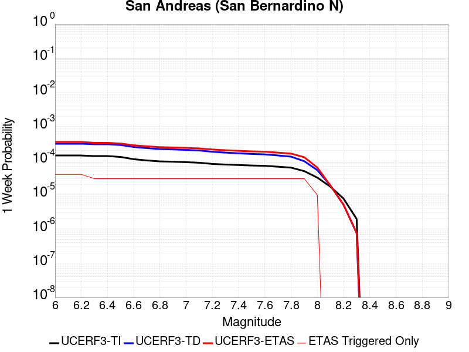 |  |  |  |

| Magnitude | 1 wk TI Prob | 1 wk TD Prob | 1 wk ETAS Prob | 1 wk ETAS/TD Gain | 1 wk ETAS Triggered Only | 1 mo TI Prob | 1 mo TD Prob | 1 mo ETAS Prob | 1 mo ETAS/TD Gain | 1 mo ETAS Triggered Only | 1 yr TI Prob | 1 yr TD Prob | 1 yr ETAS Prob | 1 yr ETAS/TD Gain | 1 yr ETAS Triggered Only | 10 yr TI Prob | 10 yr TD Prob | 10 yr ETAS Prob | 10 yr ETAS/TD Gain | 10 yr ETAS Triggered Only |
|-----|-----|-----|-----|-----|-----|-----|-----|-----|-----|-----|-----|-----|-----|-----|-----|-----|-----|-----|-----|-----|
| 6.0 | 1.4273766E-4 | 3.161376E-4 | 3.5612495E-4 | 1.1264871 | 4.0E-5 | 6.115894E-4 | 0.0013541778 | 0.0015738799 | 1.1622401 | 2.2E-4 | 0.0074207084 | 0.016363978 | 0.016904978 | 1.0330604 | 5.5E-4 | 0.07177748 | 0.15029658 | 0.15115479 | 1.00571 | 0.00101 |
| 6.1 | 1.4273766E-4 | 3.161376E-4 | 3.5612495E-4 | 1.1264871 | 4.0E-5 | 6.115894E-4 | 0.0013541778 | 0.0015738799 | 1.1622401 | 2.2E-4 | 0.0074207084 | 0.016363978 | 0.016904978 | 1.0330604 | 5.5E-4 | 0.07177748 | 0.15029658 | 0.15115479 | 1.00571 | 0.00101 |
| 6.2 | 1.4273766E-4 | 3.161376E-4 | 3.5612495E-4 | 1.1264871 | 4.0E-5 | 6.115894E-4 | 0.0013541778 | 0.0015738799 | 1.1622401 | 2.2E-4 | 0.0074207084 | 0.016363978 | 0.016904978 | 1.0330604 | 5.5E-4 | 0.07177748 | 0.15029658 | 0.15115479 | 1.00571 | 0.00101 |
| 6.3 | 1.3730655E-4 | 3.0518573E-4 | 3.351766E-4 | 1.0982708 | 3.0E-5 | 5.883239E-4 | 0.001307289 | 0.0015170145 | 1.1604278 | 2.1E-4 | 0.0071393442 | 0.01580149 | 0.016332958 | 1.033634 | 5.4E-4 | 0.06914291 | 0.14559646 | 0.14644232 | 1.0058097 | 9.9E-4 |
| 6.4 | 1.3730655E-4 | 3.0518573E-4 | 3.351766E-4 | 1.0982708 | 3.0E-5 | 5.883239E-4 | 0.001307289 | 0.0015170145 | 1.1604278 | 2.1E-4 | 0.0071393442 | 0.01580149 | 0.016332958 | 1.033634 | 5.4E-4 | 0.06914291 | 0.14559646 | 0.14644232 | 1.0058097 | 9.9E-4 |
| 6.5 | 1.2942807E-4 | 2.8932988E-4 | 3.193212E-4 | 1.1036578 | 3.0E-5 | 5.545738E-4 | 0.0012394012 | 0.0014491408 | 1.1692266 | 2.1E-4 | 0.0067310524 | 0.014986552 | 0.0155184595 | 1.0354923 | 5.4E-4 | 0.06530788 | 0.13873914 | 0.13957456 | 1.0060215 | 9.7E-4 |
| 6.6 | 1.1125901E-4 | 2.537176E-4 | 2.8370996E-4 | 1.1182117 | 3.0E-5 | 4.767372E-4 | 0.0010869103 | 0.0012866928 | 1.1838078 | 2.0E-4 | 0.005788839 | 0.013153472 | 0.013676501 | 1.0397636 | 5.3E-4 | 0.056403454 | 0.12302898 | 0.12385333 | 1.0067005 | 9.4E-4 |
| 6.7 | 1.02209575E-4 | 2.3506685E-4 | 2.650598E-4 | 1.1275933 | 3.0E-5 | 4.3796748E-4 | 0.0010070418 | 0.0012068404 | 1.1984015 | 2.0E-4 | 0.0053192247 | 0.01219223 | 0.012715768 | 1.0429403 | 5.3E-4 | 0.051936906 | 0.11482068 | 0.11562619 | 1.0070153 | 9.1E-4 |
| 6.8 | 9.610582E-5 | 2.2032406E-4 | 2.5031745E-4 | 1.1361331 | 3.0E-5 | 4.1181705E-4 | 9.439049E-4 | 0.0011337256 | 1.2011014 | 1.9E-4 | 0.0050023515 | 0.011431754 | 0.011945809 | 1.0449673 | 5.2E-4 | 0.048912346 | 0.1082225 | 0.1090251 | 1.0074162 | 9.0E-4 |
| 6.9 | 9.3877505E-5 | 2.1487933E-4 | 2.4487288E-4 | 1.1395832 | 3.0E-5 | 4.0227012E-4 | 9.2058704E-4 | 0.0011104121 | 1.2062 | 1.9E-4 | 0.0048866454 | 0.011150793 | 0.011655106 | 1.0452267 | 5.1E-4 | 0.04780577 | 0.10581279 | 0.106608614 | 1.007521 | 8.9E-4 |
| 7.0 | 9.1019785E-5 | 2.0814833E-4 | 2.3814208E-4 | 1.144098 | 3.0E-5 | 3.900265E-4 | 8.917599E-4 | 0.0010815904 | 1.2128718 | 1.9E-4 | 0.0047382377 | 0.010803353 | 0.011307843 | 1.0466976 | 5.1E-4 | 0.046384744 | 0.10278319 | 0.103581704 | 1.007769 | 8.9E-4 |
| 7.1 | 8.771155E-5 | 1.9989353E-4 | 2.2988753E-4 | 1.1500499 | 3.0E-5 | 3.758525E-4 | 8.564058E-4 | 0.0010462431 | 1.2216674 | 1.9E-4 | 0.0045664064 | 0.01037709 | 0.010881797 | 1.0486367 | 5.1E-4 | 0.044737056 | 0.09909467 | 0.09989647 | 1.0080913 | 8.9E-4 |
| 7.2 | 8.0830236E-5 | 1.8394848E-4 | 2.1394296E-4 | 1.1630591 | 3.0E-5 | 3.4636928E-4 | 7.881126E-4 | 9.779629E-4 | 1.2408923 | 1.9E-4 | 0.0042088944 | 0.009553162 | 0.010058289 | 1.0528755 | 5.1E-4 | 0.041300658 | 0.09182531 | 0.09263358 | 1.0088023 | 8.9E-4 |
| 7.3 | 7.7668235E-5 | 1.7338296E-4 | 2.0337776E-4 | 1.1729974 | 3.0E-5 | 3.328214E-4 | 7.428583E-4 | 9.2272455E-4 | 1.2421273 | 1.8E-4 | 0.0040445733 | 0.009006873 | 0.009502369 | 1.0550132 | 5.0E-4 | 0.03971748 | 0.087092124 | 0.087886356 | 1.0091194 | 8.7E-4 |
| 7.4 | 7.520177E-5 | 1.6558339E-4 | 1.9557842E-4 | 1.1811476 | 3.0E-5 | 3.2225347E-4 | 7.0945016E-4 | 8.793296E-4 | 1.2394521 | 1.7E-4 | 0.0039163795 | 0.0086034145 | 0.009089199 | 1.0564641 | 4.9E-4 | 0.038480744 | 0.08354814 | 0.08432713 | 1.0093237 | 8.5E-4 |
| 7.5 | 7.274697E-5 | 1.5845922E-4 | 1.8845448E-4 | 1.1892931 | 3.0E-5 | 3.1173544E-4 | 6.789343E-4 | 8.4881886E-4 | 1.2502224 | 1.7E-4 | 0.003788775 | 0.008234753 | 0.008720717 | 1.059014 | 4.9E-4 | 0.03724827 | 0.08026466 | 0.08104643 | 1.00974 | 8.5E-4 |
| 7.6 | 7.1185845E-5 | 1.5415733E-4 | 1.8415271E-4 | 1.1945764 | 3.0E-5 | 3.0504653E-4 | 6.6050707E-4 | 8.3039474E-4 | 1.257208 | 1.7E-4 | 0.0037076178 | 0.008012074 | 0.008498148 | 1.0606678 | 4.9E-4 | 0.036463667 | 0.078254156 | 0.079037644 | 1.010012 | 8.5E-4 |
| 7.7 | 6.709961E-5 | 1.4324463E-4 | 1.7324033E-4 | 1.209402 | 3.0E-5 | 2.8753807E-4 | 6.1376113E-4 | 7.836568E-4 | 1.2768108 | 1.7E-4 | 0.003495157 | 0.007446978 | 0.007933329 | 1.0653085 | 4.9E-4 | 0.034406938 | 0.073082365 | 0.07386097 | 1.0106539 | 8.4E-4 |
| 7.8 | 6.300812E-5 | 1.3208245E-4 | 1.6207849E-4 | 1.2271008 | 3.0E-5 | 2.7000686E-4 | 5.659449E-4 | 7.358487E-4 | 1.3002126 | 1.7E-4 | 0.0032823787 | 0.0068686386 | 0.0073552732 | 1.0708487 | 4.9E-4 | 0.032343175 | 0.06773997 | 0.06852307 | 1.0115603 | 8.4E-4 |
| 7.9 | 4.983037E-5 | 9.728091E-5 | 1.2727799E-4 | 1.3083553 | 3.0E-5 | 2.1354125E-4 | 4.1685157E-4 | 5.5679324E-4 | 1.335711 | 1.4E-4 | 0.0025967648 | 0.005063368 | 0.0054613426 | 1.0785989 | 4.0E-4 | 0.025666296 | 0.0506703 | 0.05133483 | 1.0131148 | 7.0E-4 |
| 8.0 | 3.2211527E-5 | 5.333152E-5 | 6.333099E-5 | 1.1874964 | 1.0E-5 | 1.380421E-4 | 2.2854365E-4 | 2.785322E-4 | 1.2187266 | 5.0E-5 | 0.0016793669 | 0.0027789702 | 0.0028986367 | 1.0430615 | 1.2E-4 | 0.016667323 | 0.02837451 | 0.0286077 | 1.0082183 | 2.4E-4 |
| 8.1 | 1.743376E-5 | 1.8836954E-5 | 1.8836954E-5 | 1.0 | 0.0 | 7.471398E-5 | 8.07273E-5 | 8.07273E-5 | 1.0 | 0.0 | 9.0926304E-4 | 9.824124E-4 | 9.924026E-4 | 1.010169 | 1.0E-5 | 0.009055517 | 0.010490617 | 0.010520302 | 1.0028297 | 3.0E-5 |
| 8.2 | 7.831616E-6 | 5.1597067E-6 | 5.1597067E-6 | 1.0 | 0.0 | 3.3563636E-5 | 2.2112841E-5 | 2.2112841E-5 | 1.0 | 0.0 | 4.0856065E-4 | 2.6919067E-4 | 2.6919067E-4 | 1.0 | 0.0 | 0.004078103 | 0.003044315 | 0.003044315 | 1.0 | 0.0 |
| 8.3 | 1.983087E-6 | 7.668296E-7 | 7.668296E-7 | 1.0 | 0.0 | 8.498917E-6 | 3.2864084E-6 | 3.2864084E-6 | 1.0 | 0.0 | 1.034694E-4 | 4.0011306E-5 | 4.0011306E-5 | 1.0 | 0.0 | 0.0010342124 | 4.724499E-4 | 4.724499E-4 | 1.0 | 0.0 |

## Bicycle Lake
*[(top)](#table-of-contents)*

| 1 Week | 1 Month | 1 Year | 10 Year |
|-----|-----|-----|-----|
|  |  |  |  |

| Magnitude | 1 wk TI Prob | 1 wk TD Prob | 1 wk ETAS Prob | 1 wk ETAS/TD Gain | 1 wk ETAS Triggered Only | 1 mo TI Prob | 1 mo TD Prob | 1 mo ETAS Prob | 1 mo ETAS/TD Gain | 1 mo ETAS Triggered Only | 1 yr TI Prob | 1 yr TD Prob | 1 yr ETAS Prob | 1 yr ETAS/TD Gain | 1 yr ETAS Triggered Only | 10 yr TI Prob | 10 yr TD Prob | 10 yr ETAS Prob | 10 yr ETAS/TD Gain | 10 yr ETAS Triggered Only |
|-----|-----|-----|-----|-----|-----|-----|-----|-----|-----|-----|-----|-----|-----|-----|-----|-----|-----|-----|-----|-----|
| 6.0 | 1.9621975E-5 | 2.2097447E-5 | 5.2096784E-5 | 2.3575928 | 3.0E-5 | 8.4091465E-5 | 9.470067E-5 | 2.1468931E-4 | 2.2670305 | 1.2E-4 | 0.0010233327 | 0.0011525059 | 0.0015720217 | 1.3640033 | 4.2E-4 | 0.01018633 | 0.011478599 | 0.012348498 | 1.0757844 | 8.8E-4 |
| 6.1 | 1.9621975E-5 | 2.2097447E-5 | 5.2096784E-5 | 2.3575928 | 3.0E-5 | 8.4091465E-5 | 9.470067E-5 | 2.1468931E-4 | 2.2670305 | 1.2E-4 | 0.0010233327 | 0.0011525059 | 0.0015720217 | 1.3640033 | 4.2E-4 | 0.01018633 | 0.011478599 | 0.012348498 | 1.0757844 | 8.8E-4 |
| 6.2 | 9.9971285E-6 | 1.1255827E-5 | 3.1255604E-5 | 2.7768373 | 2.0E-5 | 4.2844134E-5 | 4.823866E-5 | 9.823625E-5 | 2.036463 | 5.0E-5 | 5.2150246E-4 | 5.8719947E-4 | 7.87082E-4 | 1.3403997 | 2.0E-4 | 0.0052028033 | 0.005861584 | 0.006378536 | 1.0881932 | 5.2E-4 |
| 6.3 | 9.589428E-6 | 1.0798527E-5 | 3.079831E-5 | 2.8520846 | 2.0E-5 | 4.10969E-5 | 4.627887E-5 | 9.6276555E-5 | 2.0803566 | 5.0E-5 | 5.002399E-4 | 5.6335144E-4 | 7.632388E-4 | 1.3548181 | 2.0E-4 | 0.0049911533 | 0.0056243236 | 0.0061314553 | 1.0901675 | 5.1E-4 |
| 6.4 | 9.589428E-6 | 1.0798527E-5 | 3.079831E-5 | 2.8520846 | 2.0E-5 | 4.10969E-5 | 4.627887E-5 | 9.6276555E-5 | 2.0803566 | 5.0E-5 | 5.002399E-4 | 5.6335144E-4 | 7.632388E-4 | 1.3548181 | 2.0E-4 | 0.0049911533 | 0.0056243236 | 0.0061314553 | 1.0901675 | 5.1E-4 |
| 6.5 | 5.557707E-6 | 6.2857107E-6 | 1.6285649E-5 | 2.5909 | 1.0E-5 | 2.3818526E-5 | 2.6938633E-5 | 4.6938094E-5 | 1.7424082 | 2.0E-5 | 2.8995197E-4 | 3.2795538E-4 | 4.779062E-4 | 1.4572293 | 1.5E-4 | 0.0028957394 | 0.0032773502 | 0.0036062687 | 1.1003611 | 3.3E-4 |
| 6.6 | 4.8742945E-6 | 5.5133855E-6 | 5.5133855E-6 | 1.0 | 0.0 | 2.0889667E-5 | 2.3628729E-5 | 3.3628494E-5 | 1.4232036 | 1.0E-5 | 2.54302E-4 | 2.87668E-4 | 4.2762773E-4 | 1.4865321 | 1.4E-4 | 0.002540112 | 0.0028755253 | 0.00315472 | 1.0970935 | 2.8E-4 |
| 6.7 | 3.991108E-6 | 4.515989E-6 | 4.515989E-6 | 1.0 | 0.0 | 1.7104636E-5 | 1.9354238E-5 | 2.9354045E-5 | 1.5166727 | 1.0E-5 | 2.0822904E-4 | 2.3563785E-4 | 3.4561194E-4 | 1.4667081 | 1.1E-4 | 0.0020803404 | 0.0023563786 | 0.0025559072 | 1.084676 | 2.0E-4 |

## Garlic Springs
*[(top)](#table-of-contents)*

| 1 Week | 1 Month | 1 Year | 10 Year |
|-----|-----|-----|-----|
|  |  |  |  |

| Magnitude | 1 wk TI Prob | 1 wk TD Prob | 1 wk ETAS Prob | 1 wk ETAS/TD Gain | 1 wk ETAS Triggered Only | 1 mo TI Prob | 1 mo TD Prob | 1 mo ETAS Prob | 1 mo ETAS/TD Gain | 1 mo ETAS Triggered Only | 1 yr TI Prob | 1 yr TD Prob | 1 yr ETAS Prob | 1 yr ETAS/TD Gain | 1 yr ETAS Triggered Only | 10 yr TI Prob | 10 yr TD Prob | 10 yr ETAS Prob | 10 yr ETAS/TD Gain | 10 yr ETAS Triggered Only |
|-----|-----|-----|-----|-----|-----|-----|-----|-----|-----|-----|-----|-----|-----|-----|-----|-----|-----|-----|-----|-----|
| 6.0 | 1.6760017E-5 | 1.8777133E-5 | 3.8776758E-5 | 2.0651054 | 2.0E-5 | 7.182667E-5 | 8.0471604E-5 | 1.3046758E-4 | 1.6212872 | 5.0E-5 | 8.7413884E-4 | 9.794189E-4 | 0.001229174 | 1.2550035 | 2.5E-4 | 0.008707083 | 0.009762568 | 0.0104359295 | 1.0689738 | 6.8E-4 |
| 6.1 | 9.852767E-6 | 1.0973752E-5 | 3.0973533E-5 | 2.8225107 | 2.0E-5 | 4.222546E-5 | 4.702992E-5 | 7.702851E-5 | 1.6378618 | 3.0E-5 | 5.139737E-4 | 5.7250983E-4 | 6.824468E-4 | 1.1920265 | 1.1E-4 | 0.005127866 | 0.0057173073 | 0.0060454207 | 1.0573895 | 3.3E-4 |
| 6.2 | 9.852767E-6 | 1.0973752E-5 | 3.0973533E-5 | 2.8225107 | 2.0E-5 | 4.222546E-5 | 4.702992E-5 | 7.702851E-5 | 1.6378618 | 3.0E-5 | 5.139737E-4 | 5.7250983E-4 | 6.824468E-4 | 1.1920265 | 1.1E-4 | 0.005127866 | 0.0057173073 | 0.0060454207 | 1.0573895 | 3.3E-4 |
| 6.3 | 4.3167724E-6 | 4.7780964E-6 | 4.7780964E-6 | 1.0 | 0.0 | 1.8500323E-5 | 2.0477524E-5 | 3.047732E-5 | 1.4883302 | 1.0E-5 | 2.2521814E-4 | 2.4930836E-4 | 2.892984E-4 | 1.1604038 | 4.0E-5 | 0.0022499003 | 0.0024925452 | 0.0025723458 | 1.0320157 | 8.0E-5 |
| 6.4 | 4.3167724E-6 | 4.7780964E-6 | 4.7780964E-6 | 1.0 | 0.0 | 1.8500323E-5 | 2.0477524E-5 | 3.047732E-5 | 1.4883302 | 1.0E-5 | 2.2521814E-4 | 2.4930836E-4 | 2.892984E-4 | 1.1604038 | 4.0E-5 | 0.0022499003 | 0.0024925452 | 0.0025723458 | 1.0320157 | 8.0E-5 |
| 6.5 | 4.3167724E-6 | 4.7780964E-6 | 4.7780964E-6 | 1.0 | 0.0 | 1.8500323E-5 | 2.0477524E-5 | 3.047732E-5 | 1.4883302 | 1.0E-5 | 2.2521814E-4 | 2.4930836E-4 | 2.892984E-4 | 1.1604038 | 4.0E-5 | 0.0022499003 | 0.0024925452 | 0.0025723458 | 1.0320157 | 8.0E-5 |
| 6.6 | 4.301311E-6 | 4.7609647E-6 | 4.7609647E-6 | 1.0 | 0.0 | 1.8434059E-5 | 2.0404104E-5 | 3.04039E-5 | 1.4900875 | 1.0E-5 | 2.2441156E-4 | 2.4841467E-4 | 2.8840473E-4 | 1.160981 | 4.0E-5 | 0.0022418506 | 0.0024836282 | 0.0025634295 | 1.032131 | 8.0E-5 |
| 6.7 | 3.8599724E-6 | 4.2711204E-6 | 4.2711204E-6 | 1.0 | 0.0 | 1.6542634E-5 | 1.8304801E-5 | 2.8304617E-5 | 1.5462948 | 1.0E-5 | 2.0138794E-4 | 2.2286095E-4 | 2.6285203E-4 | 1.1794441 | 4.0E-5 | 0.0020120554 | 0.0022286095 | 0.0023084313 | 1.0358168 | 8.0E-5 |

## Helendale-So Lockhart
*[(top)](#table-of-contents)*

| 1 Week | 1 Month | 1 Year | 10 Year |
|-----|-----|-----|-----|
| 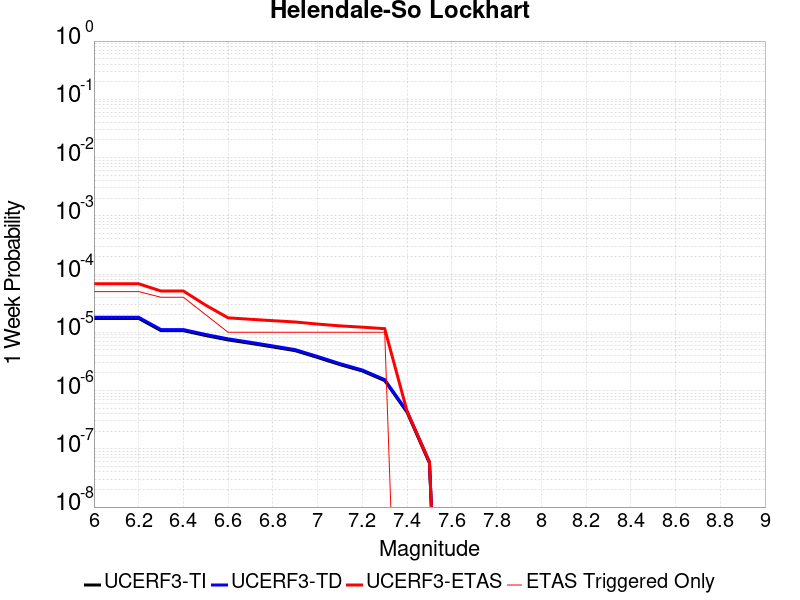 |  | 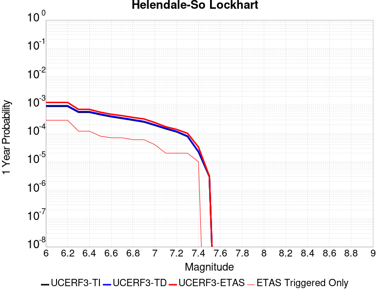 |  |

| Magnitude | 1 wk TI Prob | 1 wk TD Prob | 1 wk ETAS Prob | 1 wk ETAS/TD Gain | 1 wk ETAS Triggered Only | 1 mo TI Prob | 1 mo TD Prob | 1 mo ETAS Prob | 1 mo ETAS/TD Gain | 1 mo ETAS Triggered Only | 1 yr TI Prob | 1 yr TD Prob | 1 yr ETAS Prob | 1 yr ETAS/TD Gain | 1 yr ETAS Triggered Only | 10 yr TI Prob | 10 yr TD Prob | 10 yr ETAS Prob | 10 yr ETAS/TD Gain | 10 yr ETAS Triggered Only |
|-----|-----|-----|-----|-----|-----|-----|-----|-----|-----|-----|-----|-----|-----|-----|-----|-----|-----|-----|-----|-----|
| 6.0 | 1.7296055E-5 | 1.8103841E-5 | 6.8102934E-5 | 3.7617948 | 5.0E-5 | 7.412385E-5 | 7.7585704E-5 | 1.8757717E-4 | 2.417677 | 1.1E-4 | 9.0208417E-4 | 9.442173E-4 | 0.0012339435 | 1.3068427 | 2.9E-4 | 0.008984311 | 0.009404174 | 0.010008438 | 1.0642548 | 6.1E-4 |
| 6.1 | 1.7296055E-5 | 1.8103841E-5 | 6.8102934E-5 | 3.7617948 | 5.0E-5 | 7.412385E-5 | 7.7585704E-5 | 1.8757717E-4 | 2.417677 | 1.1E-4 | 9.0208417E-4 | 9.442173E-4 | 0.0012339435 | 1.3068427 | 2.9E-4 | 0.008984311 | 0.009404174 | 0.010008438 | 1.0642548 | 6.1E-4 |
| 6.2 | 1.7296055E-5 | 1.8103841E-5 | 6.8102934E-5 | 3.7617948 | 5.0E-5 | 7.412385E-5 | 7.7585704E-5 | 1.8757717E-4 | 2.417677 | 1.1E-4 | 9.0208417E-4 | 9.442173E-4 | 0.0012339435 | 1.3068427 | 2.9E-4 | 0.008984311 | 0.009404174 | 0.010008438 | 1.0642548 | 6.1E-4 |
| 6.3 | 1.0669118E-5 | 1.1135489E-5 | 5.1135044E-5 | 4.5920787 | 4.0E-5 | 4.5723988E-5 | 4.7722668E-5 | 1.2771886E-4 | 2.6762722 | 8.0E-5 | 5.5654737E-4 | 5.8087136E-4 | 7.0080167E-4 | 1.2064662 | 1.2E-4 | 0.0055515557 | 0.005793827 | 0.006102031 | 1.0531952 | 3.1E-4 |
| 6.4 | 1.0669118E-5 | 1.1135489E-5 | 5.1135044E-5 | 4.5920787 | 4.0E-5 | 4.5723988E-5 | 4.7722668E-5 | 1.2771886E-4 | 2.6762722 | 8.0E-5 | 5.5654737E-4 | 5.8087136E-4 | 7.0080167E-4 | 1.2064662 | 1.2E-4 | 0.0055515557 | 0.005793827 | 0.006102031 | 1.0531952 | 3.1E-4 |
| 6.5 | 8.790038E-6 | 9.1702495E-6 | 2.9170065E-5 | 3.1809456 | 2.0E-5 | 3.767105E-5 | 3.9300485E-5 | 9.929813E-5 | 2.5266387 | 6.0E-5 | 4.585485E-4 | 4.7837992E-4 | 5.583416E-4 | 1.1671511 | 8.0E-5 | 0.0045760344 | 0.0047736657 | 0.0049926154 | 1.0458661 | 2.2E-4 |
| 6.6 | 7.396949E-6 | 7.715581E-6 | 1.7715503E-5 | 2.2960687 | 1.0E-5 | 3.1700827E-5 | 3.3066364E-5 | 8.306471E-5 | 2.5120606 | 5.0E-5 | 3.858892E-4 | 4.025096E-4 | 4.7248145E-4 | 1.1738389 | 7.0E-5 | 0.003852198 | 0.004017913 | 0.004207149 | 1.0470983 | 1.9E-4 |
| 6.7 | 6.4600285E-6 | 6.7380697E-6 | 1.6738002E-5 | 2.4840946 | 1.0E-5 | 2.7685543E-5 | 2.8877126E-5 | 7.887568E-5 | 2.7314243 | 5.0E-5 | 3.3701936E-4 | 3.5152308E-4 | 4.2149847E-4 | 1.1990634 | 7.0E-5 | 0.0033650869 | 0.003509752 | 0.0036891203 | 1.0511056 | 1.8E-4 |
| 6.8 | 5.600104E-6 | 5.836042E-6 | 1.5835984E-5 | 2.71348 | 1.0E-5 | 2.4000226E-5 | 2.5011372E-5 | 6.501037E-5 | 2.5992324 | 4.0E-5 | 2.9216358E-4 | 3.044715E-4 | 3.6445324E-4 | 1.1970028 | 6.0E-5 | 0.0029177975 | 0.003040605 | 0.0031801793 | 1.0459034 | 1.4E-4 |
| 6.9 | 4.839122E-6 | 5.039537E-6 | 1.5039486E-5 | 2.9842992 | 1.0E-5 | 2.0738931E-5 | 2.159784E-5 | 6.159698E-5 | 2.8519971 | 4.0E-5 | 2.5246723E-4 | 2.6292243E-4 | 3.2290665E-4 | 1.2281442 | 6.0E-5 | 0.002521806 | 0.002626161 | 0.002745846 | 1.0455741 | 1.2E-4 |
| 7.0 | 3.6937633E-6 | 3.845229E-6 | 1.3845191E-5 | 3.6006155 | 1.0E-5 | 1.5830317E-5 | 1.6479451E-5 | 4.6478955E-5 | 2.820419 | 3.0E-5 | 1.9271708E-4 | 2.0061915E-4 | 2.4061112E-4 | 1.1993427 | 4.0E-5 | 0.0019255003 | 0.0020044118 | 0.0020842515 | 1.039832 | 8.0E-5 |
| 7.1 | 2.7858857E-6 | 2.8978693E-6 | 1.289784E-5 | 4.4508014 | 1.0E-5 | 1.1939455E-5 | 1.2419382E-5 | 3.2419135E-5 | 2.610366 | 2.0E-5 | 1.4535317E-4 | 1.511957E-4 | 1.7119267E-4 | 1.1322589 | 2.0E-5 | 0.0014525814 | 0.0015109498 | 0.0015608743 | 1.0330417 | 5.0E-5 |
| 7.2 | 2.1672065E-6 | 2.2540248E-6 | 1.2254002E-5 | 5.4364986 | 1.0E-5 | 9.2879945E-6 | 9.660072E-6 | 2.9659877E-5 | 3.070358 | 2.0E-5 | 1.1307546E-4 | 1.176052E-4 | 1.3760285E-4 | 1.1700405 | 2.0E-5 | 0.0011301794 | 0.0011754478 | 0.0012154009 | 1.0339895 | 4.0E-5 |
| 7.3 | 1.4823496E-6 | 1.5422185E-6 | 1.1542203E-5 | 7.4841557 | 1.0E-5 | 6.3529114E-6 | 6.6094917E-6 | 2.660936E-5 | 4.0259314 | 2.0E-5 | 7.734395E-5 | 8.046775E-5 | 1.0046614E-4 | 1.2485268 | 2.0E-5 | 7.731704E-4 | 8.044012E-4 | 8.343771E-4 | 1.0372648 | 3.0E-5 |
| 7.4 | 4.2321457E-7 | 4.4109012E-7 | 4.4109012E-7 | 1.0 | 0.0 | 1.8137755E-6 | 1.8903852E-6 | 1.1890366E-5 | 6.2899175 | 1.0E-5 | 2.2082493E-5 | 2.3015242E-5 | 3.301501E-5 | 1.4344847 | 1.0E-5 | 2.2080299E-4 | 2.3013311E-4 | 2.4013082E-4 | 1.0434431 | 1.0E-5 |
| 7.5 | 5.6942316E-8 | 5.941599E-8 | 5.941599E-8 | 1.0 | 0.0 | 2.440385E-7 | 2.5463993E-7 | 2.5463993E-7 | 1.0 | 0.0 | 2.9711643E-6 | 3.1002376E-6 | 3.1002376E-6 | 1.0 | 0.0 | 2.9711247E-5 | 3.1002022E-5 | 3.1002022E-5 | 1.0 | 0.0 |

## Death Valley (Black Mtns Frontal)
*[(top)](#table-of-contents)*

| 1 Week | 1 Month | 1 Year | 10 Year |
|-----|-----|-----|-----|
|  |  |  |  |

| Magnitude | 1 wk TI Prob | 1 wk TD Prob | 1 wk ETAS Prob | 1 wk ETAS/TD Gain | 1 wk ETAS Triggered Only | 1 mo TI Prob | 1 mo TD Prob | 1 mo ETAS Prob | 1 mo ETAS/TD Gain | 1 mo ETAS Triggered Only | 1 yr TI Prob | 1 yr TD Prob | 1 yr ETAS Prob | 1 yr ETAS/TD Gain | 1 yr ETAS Triggered Only | 10 yr TI Prob | 10 yr TD Prob | 10 yr ETAS Prob | 10 yr ETAS/TD Gain | 10 yr ETAS Triggered Only |
|-----|-----|-----|-----|-----|-----|-----|-----|-----|-----|-----|-----|-----|-----|-----|-----|-----|-----|-----|-----|-----|
| 6.0 | 1.6707214E-5 | 1.867056E-5 | 2.8670374E-5 | 1.5355926 | 1.0E-5 | 7.160038E-5 | 8.001427E-5 | 1.10011875E-4 | 1.3749031 | 3.0E-5 | 8.71386E-4 | 9.7374606E-4 | 0.0012334929 | 1.2667501 | 2.6E-4 | 0.00867977 | 0.009695647 | 0.010270024 | 1.0592407 | 5.8E-4 |
| 6.1 | 1.6707214E-5 | 1.867056E-5 | 2.8670374E-5 | 1.5355926 | 1.0E-5 | 7.160038E-5 | 8.001427E-5 | 1.10011875E-4 | 1.3749031 | 3.0E-5 | 8.71386E-4 | 9.7374606E-4 | 0.0012334929 | 1.2667501 | 2.6E-4 | 0.00867977 | 0.009695647 | 0.010270024 | 1.0592407 | 5.8E-4 |
| 6.2 | 1.6707214E-5 | 1.867056E-5 | 2.8670374E-5 | 1.5355926 | 1.0E-5 | 7.160038E-5 | 8.001427E-5 | 1.10011875E-4 | 1.3749031 | 3.0E-5 | 8.71386E-4 | 9.7374606E-4 | 0.0012334929 | 1.2667501 | 2.6E-4 | 0.00867977 | 0.009695647 | 0.010270024 | 1.0592407 | 5.8E-4 |
| 6.3 | 1.6707214E-5 | 1.867056E-5 | 2.8670374E-5 | 1.5355926 | 1.0E-5 | 7.160038E-5 | 8.001427E-5 | 1.10011875E-4 | 1.3749031 | 3.0E-5 | 8.71386E-4 | 9.7374606E-4 | 0.0012334929 | 1.2667501 | 2.6E-4 | 0.00867977 | 0.009695647 | 0.010270024 | 1.0592407 | 5.8E-4 |
| 6.4 | 1.5515609E-5 | 1.7338483E-5 | 2.733831E-5 | 1.5767417 | 1.0E-5 | 6.649377E-5 | 7.430571E-5 | 9.430422E-5 | 1.2691383 | 2.0E-5 | 8.0926094E-4 | 9.0430264E-4 | 0.0011141127 | 1.2320131 | 2.1E-4 | 0.008063202 | 0.009006913 | 0.009472679 | 1.0517122 | 4.7E-4 |
| 6.5 | 1.5515609E-5 | 1.7338483E-5 | 2.733831E-5 | 1.5767417 | 1.0E-5 | 6.649377E-5 | 7.430571E-5 | 9.430422E-5 | 1.2691383 | 2.0E-5 | 8.0926094E-4 | 9.0430264E-4 | 0.0011141127 | 1.2320131 | 2.1E-4 | 0.008063202 | 0.009006913 | 0.009472679 | 1.0517122 | 4.7E-4 |
| 6.6 | 1.5041828E-5 | 1.6809407E-5 | 1.6809407E-5 | 1.0 | 0.0 | 6.4463384E-5 | 7.203836E-5 | 8.2037644E-5 | 1.1388049 | 1.0E-5 | 7.8455906E-4 | 8.7672E-4 | 0.0010665534 | 1.2165269 | 1.9E-4 | 0.00781795 | 0.008733268 | 0.009169426 | 1.049942 | 4.4E-4 |
| 6.7 | 1.4634985E-5 | 1.6356273E-5 | 1.6356273E-5 | 1.0 | 0.0 | 6.271985E-5 | 7.009646E-5 | 8.009576E-5 | 1.1426506 | 1.0E-5 | 7.6334673E-4 | 8.53096E-4 | 0.001022951 | 1.1991042 | 1.7E-4 | 0.007607299 | 0.008498848 | 0.008905363 | 1.0478318 | 4.1E-4 |
| 6.8 | 1.4209158E-5 | 1.5882297E-5 | 1.5882297E-5 | 1.0 | 0.0 | 6.089497E-5 | 6.806524E-5 | 7.806456E-5 | 1.1469079 | 1.0E-5 | 7.4114406E-4 | 8.2838483E-4 | 9.782605E-4 | 1.1809253 | 1.5E-4 | 0.007386771 | 0.008253585 | 0.008630449 | 1.0456606 | 3.8E-4 |
| 6.9 | 1.3780098E-5 | 1.5404834E-5 | 1.5404834E-5 | 1.0 | 0.0 | 5.9056227E-5 | 6.601908E-5 | 7.601842E-5 | 1.1514614 | 1.0E-5 | 7.1877235E-4 | 8.0349133E-4 | 9.533708E-4 | 1.1865352 | 1.5E-4 | 0.0071645193 | 0.008006458 | 0.008373495 | 1.0458426 | 3.7E-4 |
| 7.0 | 1.3585064E-5 | 1.5188394E-5 | 1.5188394E-5 | 1.0 | 0.0 | 5.8220405E-5 | 6.5091524E-5 | 7.509087E-5 | 1.1536199 | 1.0E-5 | 7.086029E-4 | 7.922066E-4 | 9.320957E-4 | 1.1765816 | 1.4E-4 | 0.007063476 | 0.007894417 | 0.008251576 | 1.0452418 | 3.6E-4 |
| 7.1 | 1.3398601E-5 | 1.4981575E-5 | 1.4981575E-5 | 1.0 | 0.0 | 5.742131E-5 | 6.4205204E-5 | 7.420456E-5 | 1.1557406 | 1.0E-5 | 6.9888023E-4 | 7.814234E-4 | 9.013296E-4 | 1.153446 | 1.2E-4 | 0.0069668638 | 0.007787346 | 0.008124698 | 1.0433205 | 3.4E-4 |
| 7.2 | 1.3126312E-5 | 1.4679792E-5 | 1.4679792E-5 | 1.0 | 0.0 | 5.6254412E-5 | 6.291191E-5 | 7.291128E-5 | 1.1589425 | 1.0E-5 | 6.846822E-4 | 7.656887E-4 | 8.756045E-4 | 1.1435515 | 1.1E-4 | 0.006825765 | 0.00763109 | 0.007928801 | 1.0390129 | 3.0E-4 |
| 7.3 | 1.2922429E-5 | 1.4454016E-5 | 1.4454016E-5 | 1.0 | 0.0 | 5.5380664E-5 | 6.1944345E-5 | 7.194372E-5 | 1.1614252 | 1.0E-5 | 6.74051E-4 | 7.5391686E-4 | 8.6383394E-4 | 1.1457946 | 1.1E-4 | 0.006720101 | 0.0075141727 | 0.0078019938 | 1.0383037 | 2.9E-4 |
| 7.4 | 1.2768878E-5 | 1.4283997E-5 | 1.4283997E-5 | 1.0 | 0.0 | 5.4722615E-5 | 6.1215724E-5 | 7.121511E-5 | 1.1633468 | 1.0E-5 | 6.660441E-4 | 7.45052E-4 | 8.449775E-4 | 1.1341188 | 1.0E-4 | 0.0066405144 | 0.0074261203 | 0.007704041 | 1.0374248 | 2.8E-4 |
| 7.5 | 1.2521929E-5 | 1.40122365E-5 | 1.40122365E-5 | 1.0 | 0.0 | 5.366431E-5 | 6.0051094E-5 | 6.0051094E-5 | 1.0 | 0.0 | 6.531671E-4 | 7.308822E-4 | 8.2081644E-4 | 1.1230489 | 9.0E-5 | 0.006512506 | 0.0072853607 | 0.0075434665 | 1.035428 | 2.6E-4 |
| 7.6 | 1.1301089E-5 | 1.2648349E-5 | 1.2648349E-5 | 1.0 | 0.0 | 4.8432343E-5 | 5.4206117E-5 | 5.4206117E-5 | 1.0 | 0.0 | 5.895042E-4 | 6.597649E-4 | 7.297187E-4 | 1.1060284 | 7.0E-5 | 0.0058794282 | 0.0065786145 | 0.006807101 | 1.0347317 | 2.3E-4 |
| 7.7 | 9.189108E-6 | 1.0283521E-5 | 1.0283521E-5 | 1.0 | 0.0 | 3.93813E-5 | 4.407152E-5 | 4.407152E-5 | 1.0 | 0.0 | 4.7936183E-4 | 5.3644367E-4 | 5.8641686E-4 | 1.0931565 | 5.0E-5 | 0.004783291 | 0.0053519984 | 0.0055210884 | 1.0315938 | 1.7E-4 |
| 7.8 | 3.4586725E-7 | 3.648288E-7 | 3.648288E-7 | 1.0 | 0.0 | 1.4822873E-6 | 1.5635511E-6 | 1.5635511E-6 | 1.0 | 0.0 | 1.80467E-5 | 1.9036073E-5 | 1.9036073E-5 | 1.0 | 0.0 | 1.8045233E-4 | 1.9034486E-4 | 1.9034486E-4 | 1.0 | 0.0 |
| 7.9 | 2.5591178E-9 | 2.6696871E-9 | 2.6696871E-9 | 1.0 | 0.0 | 1.0967647E-8 | 1.1441516E-8 | 1.1441516E-8 | 1.0 | 0.0 | 1.335311E-7 | 1.3930045E-7 | 1.3930045E-7 | 1.0 | 0.0 | 1.3353102E-6 | 1.3930046E-6 | 1.3930046E-6 | 1.0 | 0.0 |

## San Andreas (San Bernardino S)
*[(top)](#table-of-contents)*

| 1 Week | 1 Month | 1 Year | 10 Year |
|-----|-----|-----|-----|
| 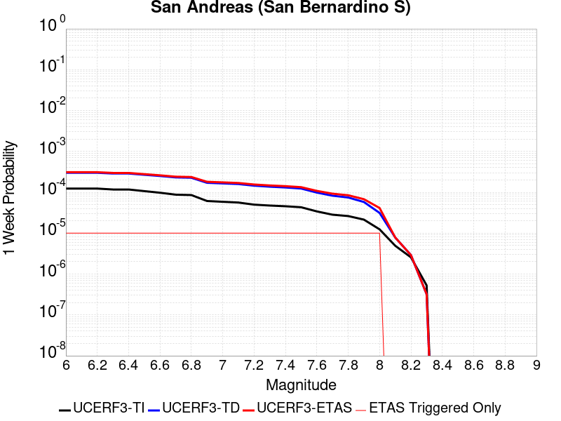 |  |  |  |

| Magnitude | 1 wk TI Prob | 1 wk TD Prob | 1 wk ETAS Prob | 1 wk ETAS/TD Gain | 1 wk ETAS Triggered Only | 1 mo TI Prob | 1 mo TD Prob | 1 mo ETAS Prob | 1 mo ETAS/TD Gain | 1 mo ETAS Triggered Only | 1 yr TI Prob | 1 yr TD Prob | 1 yr ETAS Prob | 1 yr ETAS/TD Gain | 1 yr ETAS Triggered Only | 10 yr TI Prob | 10 yr TD Prob | 10 yr ETAS Prob | 10 yr ETAS/TD Gain | 10 yr ETAS Triggered Only |
|-----|-----|-----|-----|-----|-----|-----|-----|-----|-----|-----|-----|-----|-----|-----|-----|-----|-----|-----|-----|-----|
| 6.0 | 1.2336002E-4 | 3.0008948E-4 | 3.1008647E-4 | 1.0333134 | 1.0E-5 | 5.2857865E-4 | 0.0012854899 | 0.0013753743 | 1.0699222 | 9.0E-5 | 0.006416472 | 0.015543484 | 0.01576991 | 1.0145673 | 2.3E-4 | 0.06234337 | 0.14285627 | 0.14321627 | 1.00252 | 4.2E-4 |
| 6.1 | 1.2336002E-4 | 3.0008948E-4 | 3.1008647E-4 | 1.0333134 | 1.0E-5 | 5.2857865E-4 | 0.0012854899 | 0.0013753743 | 1.0699222 | 9.0E-5 | 0.006416472 | 0.015543484 | 0.01576991 | 1.0145673 | 2.3E-4 | 0.06234337 | 0.14285627 | 0.14321627 | 1.00252 | 4.2E-4 |
| 6.2 | 1.2336002E-4 | 3.0008948E-4 | 3.1008647E-4 | 1.0333134 | 1.0E-5 | 5.2857865E-4 | 0.0012854899 | 0.0013753743 | 1.0699222 | 9.0E-5 | 0.006416472 | 0.015543484 | 0.01576991 | 1.0145673 | 2.3E-4 | 0.06234337 | 0.14285627 | 0.14321627 | 1.00252 | 4.2E-4 |
| 6.3 | 1.1712257E-4 | 2.8797207E-4 | 2.9796918E-4 | 1.0347155 | 1.0E-5 | 5.018573E-4 | 0.001233608 | 0.0013234969 | 1.0728667 | 9.0E-5 | 0.006093008 | 0.01492059 | 0.015137307 | 1.0145247 | 2.2E-4 | 0.059286322 | 0.13756467 | 0.13791826 | 1.0025704 | 4.1E-4 |
| 6.4 | 1.1712257E-4 | 2.8797207E-4 | 2.9796918E-4 | 1.0347155 | 1.0E-5 | 5.018573E-4 | 0.001233608 | 0.0013234969 | 1.0728667 | 9.0E-5 | 0.006093008 | 0.01492059 | 0.015137307 | 1.0145247 | 2.2E-4 | 0.059286322 | 0.13756467 | 0.13791826 | 1.0025704 | 4.1E-4 |
| 6.5 | 1.0689076E-4 | 2.6809986E-4 | 2.780972E-4 | 1.0372895 | 1.0E-5 | 4.5802278E-4 | 0.0011485183 | 0.0012384149 | 1.0782719 | 9.0E-5 | 0.0055621783 | 0.013898174 | 0.014105256 | 1.0148998 | 2.1E-4 | 0.05425003 | 0.12881182 | 0.1291603 | 1.0027053 | 4.0E-4 |
| 6.6 | 9.7648895E-5 | 2.5054725E-4 | 2.6054474E-4 | 1.0399027 | 1.0E-5 | 4.1842813E-4 | 0.0010733557 | 0.0011632591 | 1.0837592 | 9.0E-5 | 0.005082469 | 0.012994168 | 0.01320144 | 1.015951 | 2.1E-4 | 0.049677886 | 0.12097161 | 0.121314436 | 1.0028338 | 3.9E-4 |
| 6.7 | 8.757013E-5 | 2.3125445E-4 | 2.4125214E-4 | 1.0432324 | 1.0E-5 | 3.7524657E-4 | 9.907364E-4 | 0.0010806472 | 1.0907515 | 9.0E-5 | 0.00455906 | 0.011999588 | 0.0122070685 | 1.0172906 | 2.1E-4 | 0.04466656 | 0.11227982 | 0.11261715 | 1.0030044 | 3.8E-4 |
| 6.8 | 8.562978E-5 | 2.2685292E-4 | 2.3685065E-4 | 1.0440714 | 1.0E-5 | 3.6693315E-4 | 9.7188674E-4 | 0.0010617992 | 1.0925133 | 9.0E-5 | 0.004458263 | 0.01177259 | 0.011980117 | 1.0176281 | 2.1E-4 | 0.043698758 | 0.11029001 | 0.110628106 | 1.0030655 | 3.8E-4 |
| 6.9 | 6.124075E-5 | 1.7069813E-4 | 1.8069641E-4 | 1.058573 | 1.0E-5 | 2.6243398E-4 | 7.313591E-4 | 8.113006E-4 | 1.1093054 | 8.0E-5 | 0.0031904527 | 0.00886815 | 0.009056466 | 1.021235 | 1.9E-4 | 0.031450346 | 0.08419993 | 0.0845113 | 1.003698 | 3.4E-4 |
| 7.0 | 5.8598747E-5 | 1.6498787E-4 | 1.7498623E-4 | 1.0606005 | 1.0E-5 | 2.5111332E-4 | 7.069001E-4 | 7.8684354E-4 | 1.1130902 | 8.0E-5 | 0.0030530186 | 0.008572741 | 0.008751198 | 1.0208168 | 1.8E-4 | 0.03011414 | 0.08151753 | 0.08182063 | 1.0037183 | 3.3E-4 |
| 7.1 | 5.613814E-5 | 1.5917298E-4 | 1.691714E-4 | 1.0628147 | 1.0E-5 | 2.4056983E-4 | 6.819924E-4 | 7.619378E-4 | 1.1172234 | 8.0E-5 | 0.0029250039 | 0.008271826 | 0.008450338 | 1.0215806 | 1.8E-4 | 0.028868021 | 0.078816354 | 0.079120345 | 1.0038569 | 3.3E-4 |
| 7.2 | 4.991222E-5 | 1.4523676E-4 | 1.552353E-4 | 1.0688431 | 1.0E-5 | 2.1389198E-4 | 6.2229513E-4 | 7.0224534E-4 | 1.1284764 | 8.0E-5 | 0.002601025 | 0.0075502265 | 0.007728867 | 1.0236603 | 1.8E-4 | 0.025707912 | 0.072269924 | 0.072576076 | 1.0042362 | 3.3E-4 |
| 7.3 | 4.7410045E-5 | 1.3717797E-4 | 1.471766E-4 | 1.072888 | 1.0E-5 | 2.0317009E-4 | 5.8777345E-4 | 6.6772645E-4 | 1.1360269 | 8.0E-5 | 0.0024707897 | 0.0071327467 | 0.007311463 | 1.0250558 | 1.8E-4 | 0.024434982 | 0.06855203 | 0.06885941 | 1.0044838 | 3.3E-4 |
| 7.4 | 4.5556746E-5 | 1.3125638E-4 | 1.4125508E-4 | 1.0761768 | 1.0E-5 | 1.952286E-4 | 5.6240644E-4 | 6.423614E-4 | 1.1421659 | 8.0E-5 | 0.002374317 | 0.006825879 | 0.007004651 | 1.0261903 | 1.8E-4 | 0.023491086 | 0.065804236 | 0.06611252 | 1.0046849 | 3.3E-4 |
| 7.5 | 4.3084514E-5 | 1.2360894E-4 | 1.3360771E-4 | 1.0808903 | 1.0E-5 | 1.8463485E-4 | 5.2964536E-4 | 6.09603E-4 | 1.1509645 | 8.0E-5 | 0.0022456115 | 0.006429438 | 0.006608281 | 1.0278162 | 1.8E-4 | 0.022230545 | 0.062204733 | 0.06251421 | 1.0049751 | 3.3E-4 |
| 7.6 | 3.408608E-5 | 9.838868E-5 | 1.0838769E-4 | 1.1016277 | 1.0E-5 | 1.4607502E-4 | 4.215977E-4 | 5.01564E-4 | 1.1896744 | 8.0E-5 | 0.0017770125 | 0.005120897 | 0.005290027 | 1.0330273 | 1.7E-4 | 0.017628696 | 0.050035115 | 0.050339103 | 1.0060755 | 3.2E-4 |
| 7.7 | 2.8315713E-5 | 8.251823E-5 | 9.25174E-5 | 1.1211753 | 1.0E-5 | 1.2134742E-4 | 3.5360164E-4 | 4.3357335E-4 | 1.2261633 | 8.0E-5 | 0.0014764034 | 0.004296611 | 0.0044658803 | 1.039396 | 1.7E-4 | 0.01466633 | 0.04228543 | 0.0425919 | 1.0072476 | 3.2E-4 |
| 7.8 | 2.6222975E-5 | 7.4660275E-5 | 8.465953E-5 | 1.1339301 | 1.0E-5 | 1.1237934E-4 | 3.1993337E-4 | 3.999078E-4 | 1.2499721 | 8.0E-5 | 0.0013673597 | 0.003888238 | 0.004057577 | 1.0435516 | 1.7E-4 | 0.013589768 | 0.03844993 | 0.038757622 | 1.0080025 | 3.2E-4 |
| 7.9 | 2.1469694E-5 | 5.7903162E-5 | 6.790258E-5 | 1.1726922 | 1.0E-5 | 9.200973E-5 | 2.4813283E-4 | 3.2811298E-4 | 1.322328 | 8.0E-5 | 0.0011196428 | 0.003016835 | 0.0031763525 | 1.0528758 | 1.6E-4 | 0.011140184 | 0.030163256 | 0.03045421 | 1.0096458 | 3.0E-4 |
| 8.0 | 1.2420249E-5 | 3.1332525E-5 | 4.133221E-5 | 1.3191472 | 1.0E-5 | 5.322855E-5 | 1.3427534E-4 | 1.6427132E-4 | 1.2233915 | 3.0E-5 | 6.478649E-4 | 0.0016335774 | 0.0016834957 | 1.0305576 | 5.0E-5 | 0.0064597935 | 0.016528832 | 0.01662718 | 1.0059501 | 1.0E-4 |
| 8.1 | 4.9197724E-6 | 7.827271E-6 | 7.827271E-6 | 1.0 | 0.0 | 2.1084568E-5 | 3.3545013E-5 | 3.3545013E-5 | 1.0 | 0.0 | 2.566744E-4 | 4.0833413E-4 | 4.0833413E-4 | 1.0 | 0.0 | 0.002563781 | 0.0043868436 | 0.0043868436 | 1.0 | 0.0 |
| 8.2 | 2.5634774E-6 | 2.9089954E-6 | 2.9089954E-6 | 1.0 | 0.0 | 1.0986286E-5 | 1.2467063E-5 | 1.2467063E-5 | 1.0 | 0.0 | 1.3374983E-4 | 1.5177597E-4 | 1.5177597E-4 | 1.0 | 0.0 | 0.0013366934 | 0.0017061684 | 0.0017061684 | 1.0 | 0.0 |
| 8.3 | 5.2850464E-7 | 3.211945E-7 | 3.211945E-7 | 1.0 | 0.0 | 2.2650179E-6 | 1.3765473E-6 | 1.3765473E-6 | 1.0 | 0.0 | 2.7576245E-5 | 1.6759346E-5 | 1.6759346E-5 | 1.0 | 0.0 | 2.7572823E-4 | 1.9887649E-4 | 1.9887649E-4 | 1.0 | 0.0 |

## San Andreas (Big Bend)
*[(top)](#table-of-contents)*

| 1 Week | 1 Month | 1 Year | 10 Year |
|-----|-----|-----|-----|
| 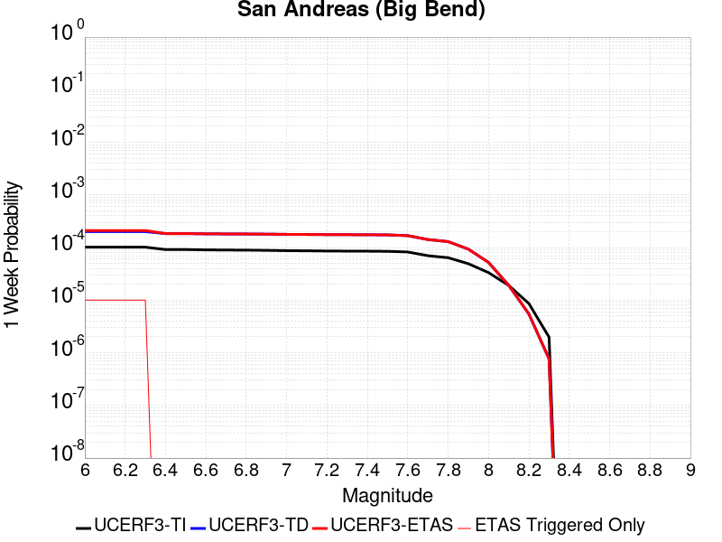 |  | 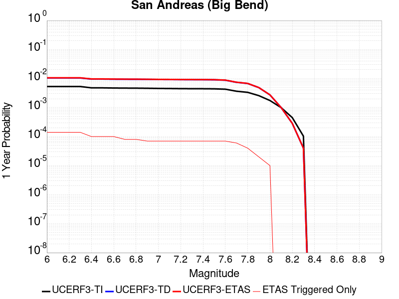 | 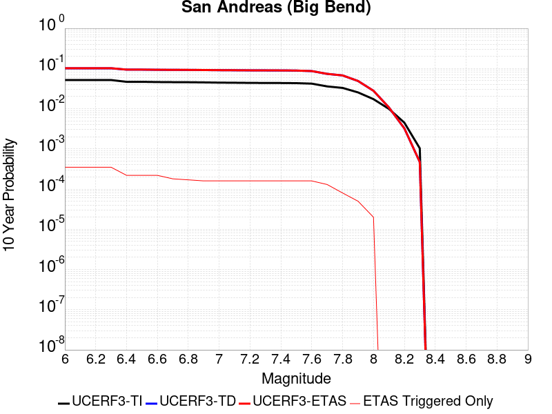 |

| Magnitude | 1 wk TI Prob | 1 wk TD Prob | 1 wk ETAS Prob | 1 wk ETAS/TD Gain | 1 wk ETAS Triggered Only | 1 mo TI Prob | 1 mo TD Prob | 1 mo ETAS Prob | 1 mo ETAS/TD Gain | 1 mo ETAS Triggered Only | 1 yr TI Prob | 1 yr TD Prob | 1 yr ETAS Prob | 1 yr ETAS/TD Gain | 1 yr ETAS Triggered Only | 10 yr TI Prob | 10 yr TD Prob | 10 yr ETAS Prob | 10 yr ETAS/TD Gain | 10 yr ETAS Triggered Only |
|-----|-----|-----|-----|-----|-----|-----|-----|-----|-----|-----|-----|-----|-----|-----|-----|-----|-----|-----|-----|-----|
| 6.0 | 1.0179969E-4 | 2.0080687E-4 | 2.1080486E-4 | 1.0497891 | 1.0E-5 | 4.362114E-4 | 8.60318E-4 | 8.803008E-4 | 1.0232272 | 2.0E-5 | 0.0052979486 | 0.010424351 | 0.010562892 | 1.01329 | 1.4E-4 | 0.051734097 | 0.1014857 | 0.10180017 | 1.0030987 | 3.5E-4 |
| 6.1 | 1.0179969E-4 | 2.0080687E-4 | 2.1080486E-4 | 1.0497891 | 1.0E-5 | 4.362114E-4 | 8.60318E-4 | 8.803008E-4 | 1.0232272 | 2.0E-5 | 0.0052979486 | 0.010424351 | 0.010562892 | 1.01329 | 1.4E-4 | 0.051734097 | 0.1014857 | 0.10180017 | 1.0030987 | 3.5E-4 |
| 6.2 | 1.0179969E-4 | 2.0080687E-4 | 2.1080486E-4 | 1.0497891 | 1.0E-5 | 4.362114E-4 | 8.60318E-4 | 8.803008E-4 | 1.0232272 | 2.0E-5 | 0.0052979486 | 0.010424351 | 0.010562892 | 1.01329 | 1.4E-4 | 0.051734097 | 0.1014857 | 0.10180017 | 1.0030987 | 3.5E-4 |
| 6.3 | 1.0179969E-4 | 2.0080687E-4 | 2.1080486E-4 | 1.0497891 | 1.0E-5 | 4.362114E-4 | 8.60318E-4 | 8.803008E-4 | 1.0232272 | 2.0E-5 | 0.0052979486 | 0.010424351 | 0.010562892 | 1.01329 | 1.4E-4 | 0.051734097 | 0.1014857 | 0.10180017 | 1.0030987 | 3.5E-4 |
| 6.4 | 9.1639464E-5 | 1.8437792E-4 | 1.8437792E-4 | 1.0 | 0.0 | 3.9268145E-4 | 7.89952E-4 | 7.999441E-4 | 1.0126489 | 1.0E-5 | 0.0047704205 | 0.009575372 | 0.009674414 | 1.0103434 | 1.0E-4 | 0.046693064 | 0.09381153 | 0.09401089 | 1.0021251 | 2.2E-4 |
| 6.5 | 9.1639464E-5 | 1.8437792E-4 | 1.8437792E-4 | 1.0 | 0.0 | 3.9268145E-4 | 7.89952E-4 | 7.999441E-4 | 1.0126489 | 1.0E-5 | 0.0047704205 | 0.009575372 | 0.009674414 | 1.0103434 | 1.0E-4 | 0.046693064 | 0.09381153 | 0.09401089 | 1.0021251 | 2.2E-4 |
| 6.6 | 9.042622E-5 | 1.8244829E-4 | 1.8244829E-4 | 1.0 | 0.0 | 3.8748336E-4 | 7.8168715E-4 | 7.916793E-4 | 1.0127828 | 1.0E-5 | 0.0047074095 | 0.009475624 | 0.009574677 | 1.0104533 | 1.0E-4 | 0.046089325 | 0.09290548 | 0.09310504 | 1.002148 | 2.2E-4 |
| 6.7 | 8.9836685E-5 | 1.8159159E-4 | 1.8159159E-4 | 1.0 | 0.0 | 3.8495753E-4 | 7.7801774E-4 | 7.7801774E-4 | 1.0 | 0.0 | 0.00467679 | 0.009431336 | 0.009510581 | 1.0084023 | 8.0E-5 | 0.045795817 | 0.09249973 | 0.09266309 | 1.001766 | 1.8E-4 |
| 6.8 | 8.9471854E-5 | 1.8105932E-4 | 1.8105932E-4 | 1.0 | 0.0 | 3.8339442E-4 | 7.75738E-4 | 7.75738E-4 | 1.0 | 0.0 | 0.004657841 | 0.00940382 | 0.009483068 | 1.0084271 | 8.0E-5 | 0.04561414 | 0.09224692 | 0.09240124 | 1.0016729 | 1.7E-4 |
| 6.9 | 8.858234E-5 | 1.7987892E-4 | 1.7987892E-4 | 1.0 | 0.0 | 3.7958333E-4 | 7.706821E-4 | 7.706821E-4 | 1.0 | 0.0 | 0.004611638 | 0.009342793 | 0.00941214 | 1.0074224 | 7.0E-5 | 0.04517103 | 0.091686994 | 0.091832325 | 1.0015851 | 1.6E-4 |
| 7.0 | 8.7433385E-5 | 1.7826671E-4 | 1.7826671E-4 | 1.0 | 0.0 | 3.746607E-4 | 7.6377665E-4 | 7.6377665E-4 | 1.0 | 0.0 | 0.004551957 | 0.009259437 | 0.009328789 | 1.0074898 | 7.0E-5 | 0.044598386 | 0.09092137 | 0.09106682 | 1.0015998 | 1.6E-4 |
| 7.1 | 8.684964E-5 | 1.7738611E-4 | 1.7738611E-4 | 1.0 | 0.0 | 3.7215967E-4 | 7.600049E-4 | 7.600049E-4 | 1.0 | 0.0 | 0.0045216335 | 0.009213906 | 0.00928326 | 1.0075272 | 7.0E-5 | 0.04430731 | 0.09050287 | 0.09064839 | 1.0016079 | 1.6E-4 |
| 7.2 | 8.606521E-5 | 1.7629213E-4 | 1.7629213E-4 | 1.0 | 0.0 | 3.6879873E-4 | 7.5531914E-4 | 7.5531914E-4 | 1.0 | 0.0 | 0.0044808835 | 0.009157337 | 0.009226697 | 1.0075742 | 7.0E-5 | 0.043916024 | 0.08998334 | 0.09012894 | 1.0016181 | 1.6E-4 |
| 7.3 | 8.568266E-5 | 1.7571205E-4 | 1.7571205E-4 | 1.0 | 0.0 | 3.6715972E-4 | 7.528345E-4 | 7.528345E-4 | 1.0 | 0.0 | 0.0044610105 | 0.00912734 | 0.009196701 | 1.0075992 | 7.0E-5 | 0.043725148 | 0.08970444 | 0.08985008 | 1.0016236 | 1.6E-4 |
| 7.4 | 8.5432206E-5 | 1.7533782E-4 | 1.7533782E-4 | 1.0 | 0.0 | 3.6608664E-4 | 7.5123156E-4 | 7.5123156E-4 | 1.0 | 0.0 | 0.004447999 | 0.009107988 | 0.009177351 | 1.0076156 | 7.0E-5 | 0.043600157 | 0.08952458 | 0.089670256 | 1.0016272 | 1.6E-4 |
| 7.5 | 8.4791965E-5 | 1.7403076E-4 | 1.7403076E-4 | 1.0 | 0.0 | 3.633435E-4 | 7.4563315E-4 | 7.4563315E-4 | 1.0 | 0.0 | 0.0044147377 | 0.009040395 | 0.0091097625 | 1.007673 | 7.0E-5 | 0.043280575 | 0.0889021 | 0.08904787 | 1.0016397 | 1.6E-4 |
| 7.6 | 8.241105E-5 | 1.684837E-4 | 1.684837E-4 | 1.0 | 0.0 | 3.531424E-4 | 7.2187337E-4 | 7.2187337E-4 | 1.0 | 0.0 | 0.0042910352 | 0.008753479 | 0.008822867 | 1.0079268 | 7.0E-5 | 0.042091176 | 0.08627858 | 0.086424775 | 1.0016944 | 1.6E-4 |
| 7.7 | 7.00432E-5 | 1.4211683E-4 | 1.4211683E-4 | 1.0 | 0.0 | 3.001506E-4 | 6.0893E-4 | 6.0893E-4 | 1.0 | 0.0 | 0.0036482112 | 0.007388561 | 0.0074481177 | 1.0080607 | 6.0E-5 | 0.035888977 | 0.07354971 | 0.07367015 | 1.0016375 | 1.3E-4 |
| 7.8 | 6.415362E-5 | 1.297541E-4 | 1.297541E-4 | 1.0 | 0.0 | 2.749151E-4 | 5.5597053E-4 | 5.5597053E-4 | 1.0 | 0.0 | 0.0033419547 | 0.006747963 | 0.0067876927 | 1.0058877 | 4.0E-5 | 0.03292141 | 0.0672817 | 0.06735632 | 1.001109 | 8.0E-5 |
| 7.9 | 4.939911E-5 | 9.345801E-5 | 9.345801E-5 | 1.0 | 0.0 | 2.116933E-4 | 4.0047284E-4 | 4.0047284E-4 | 1.0 | 0.0 | 0.0025743195 | 0.0048648654 | 0.0048847683 | 1.0040911 | 2.0E-5 | 0.025447013 | 0.048936196 | 0.04898375 | 1.0009718 | 5.0E-5 |
| 8.0 | 3.344983E-5 | 5.225443E-5 | 5.225443E-5 | 1.0 | 0.0 | 1.4334853E-4 | 2.2392833E-4 | 2.2392833E-4 | 1.0 | 0.0 | 0.0017438711 | 0.0027229206 | 0.0027328935 | 1.0036626 | 1.0E-5 | 0.017302496 | 0.02793573 | 0.027955173 | 1.000696 | 2.0E-5 |
| 8.1 | 1.9104898E-5 | 1.9186356E-5 | 1.9186356E-5 | 1.0 | 0.0 | 8.1875565E-5 | 8.222465E-5 | 8.222465E-5 | 1.0 | 0.0 | 9.963791E-4 | 0.001000626 | 0.001000626 | 1.0 | 0.0 | 0.009919235 | 0.010756767 | 0.010756767 | 1.0 | 0.0 |
| 8.2 | 8.643924E-6 | 5.4798497E-6 | 5.4798497E-6 | 1.0 | 0.0 | 3.704486E-5 | 2.348486E-5 | 2.348486E-5 | 1.0 | 0.0 | 4.5092785E-4 | 2.858907E-4 | 2.858907E-4 | 1.0 | 0.0 | 0.0045001395 | 0.0032514327 | 0.0032514327 | 1.0 | 0.0 |
| 8.3 | 1.983087E-6 | 7.668296E-7 | 7.668296E-7 | 1.0 | 0.0 | 8.498917E-6 | 3.2864084E-6 | 3.2864084E-6 | 1.0 | 0.0 | 1.034694E-4 | 4.0011306E-5 | 4.0011306E-5 | 1.0 | 0.0 | 0.0010342124 | 4.724499E-4 | 4.724499E-4 | 1.0 | 0.0 |

## Coyote Lake
*[(top)](#table-of-contents)*

| 1 Week | 1 Month | 1 Year | 10 Year |
|-----|-----|-----|-----|
|  |  |  |  |

| Magnitude | 1 wk TI Prob | 1 wk TD Prob | 1 wk ETAS Prob | 1 wk ETAS/TD Gain | 1 wk ETAS Triggered Only | 1 mo TI Prob | 1 mo TD Prob | 1 mo ETAS Prob | 1 mo ETAS/TD Gain | 1 mo ETAS Triggered Only | 1 yr TI Prob | 1 yr TD Prob | 1 yr ETAS Prob | 1 yr ETAS/TD Gain | 1 yr ETAS Triggered Only | 10 yr TI Prob | 10 yr TD Prob | 10 yr ETAS Prob | 10 yr ETAS/TD Gain | 10 yr ETAS Triggered Only |
|-----|-----|-----|-----|-----|-----|-----|-----|-----|-----|-----|-----|-----|-----|-----|-----|-----|-----|-----|-----|-----|
| 6.0 | 1.980352E-5 | 2.1707021E-5 | 6.170615E-5 | 2.8426816 | 4.0E-5 | 8.486947E-5 | 9.302718E-5 | 1.6302067E-4 | 1.7523983 | 7.0E-5 | 0.0010327959 | 0.0011320895 | 0.0013218744 | 1.1676413 | 1.9E-4 | 0.010280091 | 0.011270401 | 0.011616456 | 1.0307047 | 3.5E-4 |
| 6.1 | 1.980352E-5 | 2.1707021E-5 | 6.170615E-5 | 2.8426816 | 4.0E-5 | 8.486947E-5 | 9.302718E-5 | 1.6302067E-4 | 1.7523983 | 7.0E-5 | 0.0010327959 | 0.0011320895 | 0.0013218744 | 1.1676413 | 1.9E-4 | 0.010280091 | 0.011270401 | 0.011616456 | 1.0307047 | 3.5E-4 |
| 6.2 | 1.980352E-5 | 2.1707021E-5 | 6.170615E-5 | 2.8426816 | 4.0E-5 | 8.486947E-5 | 9.302718E-5 | 1.6302067E-4 | 1.7523983 | 7.0E-5 | 0.0010327959 | 0.0011320895 | 0.0013218744 | 1.1676413 | 1.9E-4 | 0.010280091 | 0.011270401 | 0.011616456 | 1.0307047 | 3.5E-4 |
| 6.3 | 1.5344787E-5 | 1.6820884E-5 | 3.6820547E-5 | 2.1889782 | 2.0E-5 | 6.576172E-5 | 7.208785E-5 | 1.2208425E-4 | 1.6935481 | 5.0E-5 | 8.003548E-4 | 8.7737746E-4 | 0.0010172547 | 1.1594265 | 1.4E-4 | 0.007974784 | 0.00874518 | 0.009012819 | 1.0306041 | 2.7E-4 |
| 6.4 | 1.5344787E-5 | 1.6820884E-5 | 3.6820547E-5 | 2.1889782 | 2.0E-5 | 6.576172E-5 | 7.208785E-5 | 1.2208425E-4 | 1.6935481 | 5.0E-5 | 8.003548E-4 | 8.7737746E-4 | 0.0010172547 | 1.1594265 | 1.4E-4 | 0.007974784 | 0.00874518 | 0.009012819 | 1.0306041 | 2.7E-4 |
| 6.5 | 1.4189697E-5 | 1.5558186E-5 | 3.5557874E-5 | 2.285477 | 2.0E-5 | 6.081157E-5 | 6.667658E-5 | 1.06673906E-4 | 1.5998708 | 4.0E-5 | 7.401293E-4 | 8.1154524E-4 | 9.314479E-4 | 1.1477461 | 1.2E-4 | 0.0073766913 | 0.008091759 | 0.008339737 | 1.0306456 | 2.5E-4 |
| 6.6 | 1.3469301E-5 | 1.47717665E-5 | 3.477147E-5 | 2.3539143 | 2.0E-5 | 5.7724297E-5 | 6.3306376E-5 | 1.0330384E-4 | 1.6318079 | 4.0E-5 | 7.025667E-4 | 7.7054254E-4 | 8.904501E-4 | 1.1556144 | 1.2E-4 | 0.0070034964 | 0.0076846126 | 0.007912845 | 1.0296999 | 2.3E-4 |
| 6.7 | 1.3027966E-5 | 1.4281927E-5 | 3.4281642E-5 | 2.4003513 | 2.0E-5 | 5.5832945E-5 | 6.120716E-5 | 1.01204714E-4 | 1.6534783 | 4.0E-5 | 6.7955407E-4 | 7.450021E-4 | 8.6491276E-4 | 1.1609534 | 1.2E-4 | 0.006774798 | 0.007430923 | 0.007659214 | 1.0307218 | 2.3E-4 |
| 6.8 | 5.695434E-6 | 6.2244944E-6 | 1.6224432E-5 | 2.6065462 | 1.0E-5 | 2.4408775E-5 | 2.6676302E-5 | 4.6675766E-5 | 1.7497091 | 2.0E-5 | 2.971363E-4 | 3.2476554E-4 | 3.6475257E-4 | 1.1231258 | 4.0E-5 | 0.0029673933 | 0.0032458503 | 0.0033455258 | 1.0307086 | 1.0E-4 |
| 6.9 | 4.385688E-6 | 4.7931144E-6 | 1.4793067E-5 | 3.086316 | 1.0E-5 | 1.879567E-5 | 2.0541918E-5 | 4.054151E-5 | 1.9735988 | 2.0E-5 | 2.2881327E-4 | 2.5009786E-4 | 2.9008786E-4 | 1.1598974 | 4.0E-5 | 0.002285778 | 0.0025009785 | 0.0025907536 | 1.035896 | 9.0E-5 |

## Death Valley (No)
*[(top)](#table-of-contents)*

| 1 Week | 1 Month | 1 Year | 10 Year |
|-----|-----|-----|-----|
|  | 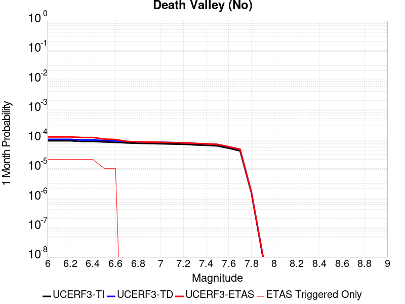 |  | 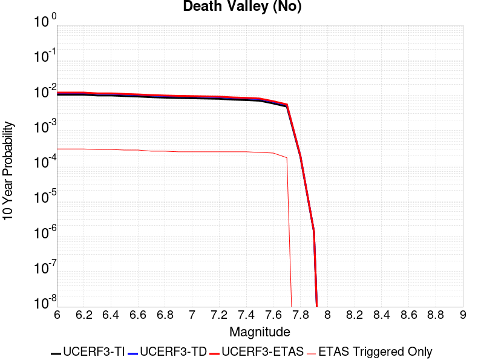 |

| Magnitude | 1 wk TI Prob | 1 wk TD Prob | 1 wk ETAS Prob | 1 wk ETAS/TD Gain | 1 wk ETAS Triggered Only | 1 mo TI Prob | 1 mo TD Prob | 1 mo ETAS Prob | 1 mo ETAS/TD Gain | 1 mo ETAS Triggered Only | 1 yr TI Prob | 1 yr TD Prob | 1 yr ETAS Prob | 1 yr ETAS/TD Gain | 1 yr ETAS Triggered Only | 10 yr TI Prob | 10 yr TD Prob | 10 yr ETAS Prob | 10 yr ETAS/TD Gain | 10 yr ETAS Triggered Only |
|-----|-----|-----|-----|-----|-----|-----|-----|-----|-----|-----|-----|-----|-----|-----|-----|-----|-----|-----|-----|-----|
| 6.0 | 2.0074807E-5 | 2.2500446E-5 | 2.2500446E-5 | 1.0 | 0.0 | 8.603206E-5 | 9.642696E-5 | 1.1642503E-4 | 1.2073909 | 2.0E-5 | 0.001046937 | 0.0011733733 | 0.0012832442 | 1.0936368 | 1.1E-4 | 0.010420183 | 0.011672693 | 0.011969191 | 1.025401 | 3.0E-4 |
| 6.1 | 2.0074807E-5 | 2.2500446E-5 | 2.2500446E-5 | 1.0 | 0.0 | 8.603206E-5 | 9.642696E-5 | 1.1642503E-4 | 1.2073909 | 2.0E-5 | 0.001046937 | 0.0011733733 | 0.0012832442 | 1.0936368 | 1.1E-4 | 0.010420183 | 0.011672693 | 0.011969191 | 1.025401 | 3.0E-4 |
| 6.2 | 2.0074807E-5 | 2.2500446E-5 | 2.2500446E-5 | 1.0 | 0.0 | 8.603206E-5 | 9.642696E-5 | 1.1642503E-4 | 1.2073909 | 2.0E-5 | 0.001046937 | 0.0011733733 | 0.0012832442 | 1.0936368 | 1.1E-4 | 0.010420183 | 0.011672693 | 0.011969191 | 1.025401 | 3.0E-4 |
| 6.3 | 1.9050609E-5 | 2.1337288E-5 | 2.1337288E-5 | 1.0 | 0.0 | 8.164292E-5 | 9.144236E-5 | 1.11440524E-4 | 1.2186971 | 2.0E-5 | 9.935491E-4 | 0.0011127489 | 0.0012126375 | 1.0897676 | 1.0E-4 | 0.009891188 | 0.011072595 | 0.011359383 | 1.0259008 | 2.9E-4 |
| 6.4 | 1.9050609E-5 | 2.1337288E-5 | 2.1337288E-5 | 1.0 | 0.0 | 8.164292E-5 | 9.144236E-5 | 1.11440524E-4 | 1.2186971 | 2.0E-5 | 9.935491E-4 | 0.0011127489 | 0.0012126375 | 1.0897676 | 1.0E-4 | 0.009891188 | 0.011072595 | 0.011359383 | 1.0259008 | 2.9E-4 |
| 6.5 | 1.8367004E-5 | 2.0561336E-5 | 2.0561336E-5 | 1.0 | 0.0 | 7.8713354E-5 | 8.811707E-5 | 9.811619E-5 | 1.1134754 | 1.0E-5 | 9.5791375E-4 | 0.0010723039 | 0.0011622073 | 1.0838414 | 9.0E-5 | 0.009537951 | 0.010672084 | 0.010949097 | 1.0259566 | 2.8E-4 |
| 6.6 | 1.779439E-5 | 1.9911244E-5 | 1.9911244E-5 | 1.0 | 0.0 | 7.625944E-5 | 8.533114E-5 | 9.5330295E-5 | 1.1171805 | 1.0E-5 | 9.280632E-4 | 0.0010384179 | 0.0011283245 | 1.0865803 | 9.0E-5 | 0.009241969 | 0.010336416 | 0.010613522 | 1.0268087 | 2.8E-4 |
| 6.7 | 1.7025437E-5 | 1.9043726E-5 | 1.9043726E-5 | 1.0 | 0.0 | 7.296412E-5 | 8.161345E-5 | 8.161345E-5 | 1.0 | 0.0 | 8.87976E-4 | 9.93197E-4 | 0.0010731175 | 1.0804679 | 8.0E-5 | 0.008844362 | 0.009888301 | 0.010145729 | 1.0260336 | 2.6E-4 |
| 6.8 | 1.6545107E-5 | 1.851284E-5 | 1.851284E-5 | 1.0 | 0.0 | 7.090568E-5 | 7.933836E-5 | 7.933836E-5 | 1.0 | 0.0 | 8.629347E-4 | 9.655226E-4 | 0.0010454453 | 1.0827767 | 8.0E-5 | 0.008595915 | 0.009613981 | 0.009871481 | 1.026784 | 2.6E-4 |
| 6.9 | 1.615478E-5 | 1.8087881E-5 | 1.8087881E-5 | 1.0 | 0.0 | 6.9232934E-5 | 7.751722E-5 | 7.751722E-5 | 1.0 | 0.0 | 8.4258494E-4 | 9.433697E-4 | 0.0010232942 | 1.0847224 | 8.0E-5 | 0.008393973 | 0.009394345 | 0.009641996 | 1.0263617 | 2.5E-4 |
| 7.0 | 1.5894311E-5 | 1.7805834E-5 | 1.7805834E-5 | 1.0 | 0.0 | 6.81167E-5 | 7.6308526E-5 | 7.6308526E-5 | 1.0 | 0.0 | 8.2900526E-4 | 9.286663E-4 | 0.0010085921 | 1.086065 | 8.0E-5 | 0.008259195 | 0.009248544 | 0.0094962325 | 1.0267813 | 2.5E-4 |
| 7.1 | 1.5602263E-5 | 1.7483784E-5 | 1.7483784E-5 | 1.0 | 0.0 | 6.6865134E-5 | 7.4928386E-5 | 7.4928386E-5 | 1.0 | 0.0 | 8.137789E-4 | 9.118773E-4 | 9.918044E-4 | 1.0876511 | 8.0E-5 | 0.008108052 | 0.009082039 | 0.009329769 | 1.0272769 | 2.5E-4 |
| 7.2 | 1.5323829E-5 | 1.7170905E-5 | 1.7170905E-5 | 1.0 | 0.0 | 6.56719E-5 | 7.358755E-5 | 7.358755E-5 | 1.0 | 0.0 | 7.99262E-4 | 8.9556625E-4 | 9.754946E-4 | 1.089249 | 8.0E-5 | 0.007963934 | 0.008920249 | 0.009168019 | 1.0277761 | 2.5E-4 |
| 7.3 | 1.4556212E-5 | 1.6302716E-5 | 1.6302716E-5 | 1.0 | 0.0 | 6.238227E-5 | 6.986695E-5 | 6.986695E-5 | 1.0 | 0.0 | 7.592395E-4 | 8.503039E-4 | 9.302359E-4 | 1.094004 | 8.0E-5 | 0.0075665074 | 0.008471149 | 0.008719032 | 1.029262 | 2.5E-4 |
| 7.4 | 1.411725E-5 | 1.5808211E-5 | 1.5808211E-5 | 1.0 | 0.0 | 6.0501097E-5 | 6.774775E-5 | 6.774775E-5 | 1.0 | 0.0 | 7.363519E-4 | 8.245226E-4 | 9.044566E-4 | 1.0969459 | 8.0E-5 | 0.0073391674 | 0.008215268 | 0.008463215 | 1.0301812 | 2.5E-4 |
| 7.5 | 1.3503312E-5 | 1.5126531E-5 | 1.5126531E-5 | 1.0 | 0.0 | 5.7870053E-5 | 6.482641E-5 | 6.482641E-5 | 1.0 | 0.0 | 7.043401E-4 | 7.8898156E-4 | 8.6891843E-4 | 1.1013166 | 8.0E-5 | 0.007021119 | 0.007862429 | 0.008100542 | 1.0302849 | 2.4E-4 |
| 7.6 | 1.1279839E-5 | 1.2626528E-5 | 1.2626528E-5 | 1.0 | 0.0 | 4.834127E-5 | 5.4112596E-5 | 5.4112596E-5 | 1.0 | 0.0 | 5.88396E-4 | 6.58627E-4 | 7.285809E-4 | 1.1062117 | 7.0E-5 | 0.005868405 | 0.0065673026 | 0.006795792 | 1.034792 | 2.3E-4 |
| 7.7 | 9.189108E-6 | 1.0283521E-5 | 1.0283521E-5 | 1.0 | 0.0 | 3.93813E-5 | 4.407152E-5 | 4.407152E-5 | 1.0 | 0.0 | 4.7936183E-4 | 5.3644367E-4 | 5.8641686E-4 | 1.0931565 | 5.0E-5 | 0.004783291 | 0.0053519984 | 0.0055210884 | 1.0315938 | 1.7E-4 |
| 7.8 | 3.4586725E-7 | 3.648288E-7 | 3.648288E-7 | 1.0 | 0.0 | 1.4822873E-6 | 1.5635511E-6 | 1.5635511E-6 | 1.0 | 0.0 | 1.80467E-5 | 1.9036073E-5 | 1.9036073E-5 | 1.0 | 0.0 | 1.8045233E-4 | 1.9034486E-4 | 1.9034486E-4 | 1.0 | 0.0 |
| 7.9 | 2.5591178E-9 | 2.6696871E-9 | 2.6696871E-9 | 1.0 | 0.0 | 1.0967647E-8 | 1.1441516E-8 | 1.1441516E-8 | 1.0 | 0.0 | 1.335311E-7 | 1.3930045E-7 | 1.3930045E-7 | 1.0 | 0.0 | 1.3353102E-6 | 1.3930046E-6 | 1.3930046E-6 | 1.0 | 0.0 |

## Sierra Nevada  (No Extension)
*[(top)](#table-of-contents)*

| 1 Week | 1 Month | 1 Year | 10 Year |
|-----|-----|-----|-----|
| 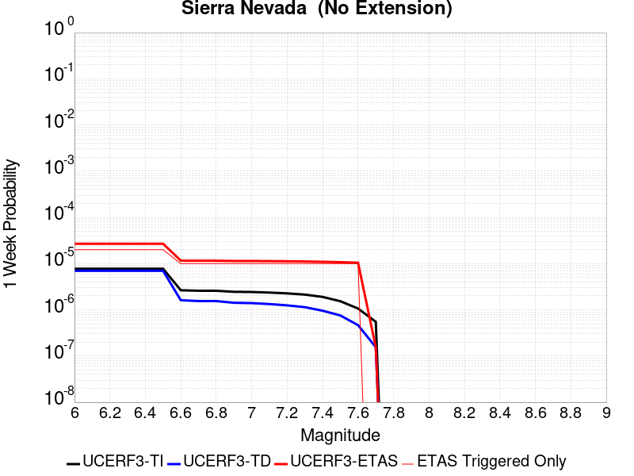 |  |  |  |

| Magnitude | 1 wk TI Prob | 1 wk TD Prob | 1 wk ETAS Prob | 1 wk ETAS/TD Gain | 1 wk ETAS Triggered Only | 1 mo TI Prob | 1 mo TD Prob | 1 mo ETAS Prob | 1 mo ETAS/TD Gain | 1 mo ETAS Triggered Only | 1 yr TI Prob | 1 yr TD Prob | 1 yr ETAS Prob | 1 yr ETAS/TD Gain | 1 yr ETAS Triggered Only | 10 yr TI Prob | 10 yr TD Prob | 10 yr ETAS Prob | 10 yr ETAS/TD Gain | 10 yr ETAS Triggered Only |
|-----|-----|-----|-----|-----|-----|-----|-----|-----|-----|-----|-----|-----|-----|-----|-----|-----|-----|-----|-----|-----|
| 6.0 | 7.7690465E-6 | 6.9763832E-6 | 2.6976244E-5 | 3.866795 | 2.0E-5 | 3.329549E-5 | 2.9898645E-5 | 7.989715E-5 | 2.6722667 | 5.0E-5 | 4.0529718E-4 | 3.6399104E-4 | 4.8394737E-4 | 1.3295585 | 1.2E-4 | 0.004045588 | 0.0036374647 | 0.003896519 | 1.0712184 | 2.6E-4 |
| 6.1 | 7.7690465E-6 | 6.9763832E-6 | 2.6976244E-5 | 3.866795 | 2.0E-5 | 3.329549E-5 | 2.9898645E-5 | 7.989715E-5 | 2.6722667 | 5.0E-5 | 4.0529718E-4 | 3.6399104E-4 | 4.8394737E-4 | 1.3295585 | 1.2E-4 | 0.004045588 | 0.0036374647 | 0.003896519 | 1.0712184 | 2.6E-4 |
| 6.2 | 7.7690465E-6 | 6.9763832E-6 | 2.6976244E-5 | 3.866795 | 2.0E-5 | 3.329549E-5 | 2.9898645E-5 | 7.989715E-5 | 2.6722667 | 5.0E-5 | 4.0529718E-4 | 3.6399104E-4 | 4.8394737E-4 | 1.3295585 | 1.2E-4 | 0.004045588 | 0.0036374647 | 0.003896519 | 1.0712184 | 2.6E-4 |
| 6.3 | 7.7690465E-6 | 6.9763832E-6 | 2.6976244E-5 | 3.866795 | 2.0E-5 | 3.329549E-5 | 2.9898645E-5 | 7.989715E-5 | 2.6722667 | 5.0E-5 | 4.0529718E-4 | 3.6399104E-4 | 4.8394737E-4 | 1.3295585 | 1.2E-4 | 0.004045588 | 0.0036374647 | 0.003896519 | 1.0712184 | 2.6E-4 |
| 6.4 | 7.7690465E-6 | 6.9763832E-6 | 2.6976244E-5 | 3.866795 | 2.0E-5 | 3.329549E-5 | 2.9898645E-5 | 7.989715E-5 | 2.6722667 | 5.0E-5 | 4.0529718E-4 | 3.6399104E-4 | 4.8394737E-4 | 1.3295585 | 1.2E-4 | 0.004045588 | 0.0036374647 | 0.003896519 | 1.0712184 | 2.6E-4 |
| 6.5 | 7.7690465E-6 | 6.9763832E-6 | 2.6976244E-5 | 3.866795 | 2.0E-5 | 3.329549E-5 | 2.9898645E-5 | 7.989715E-5 | 2.6722667 | 5.0E-5 | 4.0529718E-4 | 3.6399104E-4 | 4.8394737E-4 | 1.3295585 | 1.2E-4 | 0.004045588 | 0.0036374647 | 0.003896519 | 1.0712184 | 2.6E-4 |
| 6.6 | 2.653E-6 | 1.6148814E-6 | 1.1614865E-5 | 7.192395 | 1.0E-5 | 1.136995E-5 | 6.920902E-6 | 2.6920763E-5 | 3.8897767 | 2.0E-5 | 1.3842035E-4 | 8.4258754E-5 | 1.6425202E-4 | 1.9493762 | 8.0E-5 | 0.0013833415 | 8.4227155E-4 | 0.001042103 | 1.2372531 | 2.0E-4 |
| 6.7 | 2.5902466E-6 | 1.5502146E-6 | 1.1550199E-5 | 7.45071 | 1.0E-5 | 1.11010095E-5 | 6.64376E-6 | 2.6643627E-5 | 4.0103235 | 2.0E-5 | 1.351464E-4 | 8.0884805E-5 | 1.6087834E-4 | 1.9889809 | 8.0E-5 | 0.0013506424 | 8.085567E-4 | 0.001008395 | 1.2471544 | 2.0E-4 |
| 6.8 | 2.5853892E-6 | 1.5470148E-6 | 1.1546999E-5 | 7.4640527 | 1.0E-5 | 1.1080193E-5 | 6.6300463E-6 | 2.6629914E-5 | 4.01655 | 2.0E-5 | 1.34893E-4 | 8.071786E-5 | 1.607114E-4 | 1.9910266 | 8.0E-5 | 0.0013481114 | 8.0688833E-4 | 0.001006727 | 1.2476658 | 2.0E-4 |
| 6.9 | 2.458257E-6 | 1.4220883E-6 | 1.1422074E-5 | 8.031902 | 1.0E-5 | 1.0535345E-5 | 6.0946504E-6 | 2.6094529E-5 | 4.2815466 | 2.0E-5 | 1.2826028E-4 | 7.419986E-5 | 1.5419393E-4 | 2.0780892 | 8.0E-5 | 0.0012818627 | 7.417528E-4 | 9.416045E-4 | 1.2694316 | 2.0E-4 |
| 7.0 | 2.4341468E-6 | 1.399052E-6 | 1.1399038E-5 | 8.147687 | 1.0E-5 | 1.0432016E-5 | 5.995924E-6 | 2.5995803E-5 | 4.3355794 | 2.0E-5 | 1.270024E-4 | 7.2997944E-5 | 1.529921E-4 | 2.0958412 | 8.0E-5 | 0.0012692984 | 7.297416E-4 | 9.2959567E-4 | 1.2738696 | 2.0E-4 |
| 7.1 | 2.3652476E-6 | 1.3340014E-6 | 1.1333988E-5 | 8.496235 | 1.0E-5 | 1.0136736E-5 | 5.717136E-6 | 2.5717021E-5 | 4.498235 | 2.0E-5 | 1.2340778E-4 | 6.960393E-5 | 1.4959836E-4 | 2.1492805 | 8.0E-5 | 0.0012333926 | 6.9582294E-4 | 8.9568377E-4 | 1.2872294 | 2.0E-4 |
| 7.2 | 2.272158E-6 | 1.2503074E-6 | 1.1250295E-5 | 8.998023 | 1.0E-5 | 9.737784E-6 | 5.3584495E-6 | 2.5358342E-5 | 4.7324033 | 2.0E-5 | 1.1855107E-4 | 6.523718E-5 | 1.4523197E-4 | 2.2262144 | 8.0E-5 | 0.0011848784 | 6.5218186E-4 | 8.520514E-4 | 1.3064629 | 2.0E-4 |
| 7.3 | 2.1382127E-6 | 1.1419947E-6 | 1.1141983E-5 | 9.7565975 | 1.0E-5 | 9.163737E-6 | 4.8942543E-6 | 1.4894205E-5 | 3.0432022 | 1.0E-5 | 1.1156279E-4 | 5.9585927E-5 | 1.2958175E-4 | 2.174704 | 7.0E-5 | 0.001115068 | 5.957007E-4 | 7.655994E-4 | 1.2852082 | 1.7E-4 |
| 7.4 | 1.9048055E-6 | 9.575474E-7 | 1.0957538E-5 | 11.443337 | 1.0E-5 | 8.163426E-6 | 4.1037683E-6 | 1.4103727E-5 | 3.4367747 | 1.0E-5 | 9.9385186E-5 | 4.996224E-5 | 1.1995874E-4 | 2.400988 | 7.0E-5 | 9.934074E-4 | 4.995108E-4 | 6.4943585E-4 | 1.3001438 | 1.5E-4 |
| 7.5 | 1.5373403E-6 | 7.5602395E-7 | 1.0756016E-5 | 14.227084 | 1.0E-5 | 6.5885843E-6 | 3.2400987E-6 | 1.3240066E-5 | 4.0863156 | 1.0E-5 | 8.021306E-5 | 3.9447492E-5 | 8.944552E-5 | 2.2674577 | 5.0E-5 | 8.0184115E-4 | 3.944054E-4 | 5.04362E-4 | 1.2787908 | 1.1E-4 |
| 7.6 | 1.0680322E-6 | 4.659796E-7 | 1.0465975E-5 | 22.460157 | 1.0E-5 | 4.577273E-6 | 1.997054E-6 | 1.1997034E-5 | 6.007366 | 1.0E-5 | 5.5726876E-5 | 2.4313864E-5 | 6.431289E-5 | 2.645112 | 4.0E-5 | 5.5712904E-4 | 2.431123E-4 | 3.330904E-4 | 1.3701093 | 9.0E-5 |
| 7.7 | 5.509146E-7 | 1.5581199E-7 | 1.5581199E-7 | 1.0 | 0.0 | 2.3610605E-6 | 6.677655E-7 | 6.677655E-7 | 1.0 | 0.0 | 2.8745531E-5 | 8.130016E-6 | 2.8129854E-5 | 3.4599998 | 2.0E-5 | 2.8741814E-4 | 8.12973E-5 | 1.0129568E-4 | 1.2459906 | 2.0E-5 |

## San Andreas (Parkfield)
*[(top)](#table-of-contents)*

| 1 Week | 1 Month | 1 Year | 10 Year |
|-----|-----|-----|-----|
|  |  |  |  |

| Magnitude | 1 wk TI Prob | 1 wk TD Prob | 1 wk ETAS Prob | 1 wk ETAS/TD Gain | 1 wk ETAS Triggered Only | 1 mo TI Prob | 1 mo TD Prob | 1 mo ETAS Prob | 1 mo ETAS/TD Gain | 1 mo ETAS Triggered Only | 1 yr TI Prob | 1 yr TD Prob | 1 yr ETAS Prob | 1 yr ETAS/TD Gain | 1 yr ETAS Triggered Only | 10 yr TI Prob | 10 yr TD Prob | 10 yr ETAS Prob | 10 yr ETAS/TD Gain | 10 yr ETAS Triggered Only |
|-----|-----|-----|-----|-----|-----|-----|-----|-----|-----|-----|-----|-----|-----|-----|-----|-----|-----|-----|-----|-----|
| 6.0 | 5.556969E-4 | 7.788437E-4 | 7.988281E-4 | 1.0256591 | 2.0E-5 | 0.0023793848 | 0.0033341812 | 0.0033840144 | 1.0149462 | 5.0E-5 | 0.028586963 | 0.04023991 | 0.04037428 | 1.0033392 | 1.4E-4 | 0.25176284 | 0.33731642 | 0.3374821 | 1.0004911 | 2.5E-4 |
| 6.1 | 1.925858E-4 | 3.0304783E-4 | 3.1304482E-4 | 1.0329881 | 1.0E-5 | 8.2510663E-4 | 0.0012982241 | 0.0013082111 | 1.0076928 | 1.0E-5 | 0.0099994885 | 0.015792182 | 0.015811866 | 1.0012465 | 2.0E-5 | 0.095613256 | 0.14979222 | 0.14986023 | 1.0004541 | 8.0E-5 |
| 6.2 | 9.4306815E-5 | 1.8250331E-4 | 1.9250148E-4 | 1.0547836 | 1.0E-5 | 4.0410945E-4 | 7.819238E-4 | 7.91916E-4 | 1.012779 | 1.0E-5 | 0.0049089384 | 0.009478576 | 0.009498386 | 1.00209 | 2.0E-5 | 0.048019063 | 0.09188674 | 0.09194122 | 1.000593 | 6.0E-5 |
| 6.3 | 9.283051E-5 | 1.7946832E-4 | 1.8946652E-4 | 1.0557102 | 1.0E-5 | 3.9778434E-4 | 7.689244E-4 | 7.7891676E-4 | 1.0129951 | 1.0E-5 | 0.0048322747 | 0.009321672 | 0.009341486 | 1.0021255 | 2.0E-5 | 0.047285385 | 0.09053965 | 0.09059422 | 1.0006027 | 6.0E-5 |
| 6.4 | 9.138826E-5 | 1.770899E-4 | 1.8708812E-4 | 1.0564585 | 1.0E-5 | 3.916052E-4 | 7.5873715E-4 | 7.6872954E-4 | 1.0131698 | 1.0E-5 | 0.0047573745 | 0.009198696 | 0.009218513 | 1.0021542 | 2.0E-5 | 0.046568092 | 0.089441724 | 0.08949636 | 1.0006108 | 6.0E-5 |
| 6.5 | 9.000255E-5 | 1.746699E-4 | 1.8466816E-4 | 1.0572408 | 1.0E-5 | 3.8566816E-4 | 7.483717E-4 | 7.583642E-4 | 1.0133524 | 1.0E-5 | 0.0046854047 | 0.009073567 | 0.009093385 | 1.0021842 | 2.0E-5 | 0.045878403 | 0.08832737 | 0.08838207 | 1.0006193 | 6.0E-5 |
| 6.6 | 8.8109264E-5 | 1.7148067E-4 | 1.8147896E-4 | 1.0583056 | 1.0E-5 | 3.7755648E-4 | 7.3471136E-4 | 7.44704E-4 | 1.0136008 | 1.0E-5 | 0.0045870654 | 0.008908638 | 0.00892846 | 1.002225 | 2.0E-5 | 0.04493529 | 0.086858675 | 0.08691347 | 1.0006307 | 6.0E-5 |
| 6.7 | 8.738073E-5 | 1.7015127E-4 | 1.8014957E-4 | 1.0587612 | 1.0E-5 | 3.7443507E-4 | 7.290171E-4 | 7.390098E-4 | 1.013707 | 1.0E-5 | 0.0045492216 | 0.008839916 | 0.00885974 | 1.0022424 | 2.0E-5 | 0.04457213 | 0.086258985 | 0.08631381 | 1.0006356 | 6.0E-5 |
| 6.8 | 8.710195E-5 | 1.6960612E-4 | 1.7960442E-4 | 1.0589502 | 1.0E-5 | 3.7324068E-4 | 7.266821E-4 | 7.366748E-4 | 1.0137511 | 1.0E-5 | 0.0045347405 | 0.008811726 | 0.008831549 | 1.0022497 | 2.0E-5 | 0.04443313 | 0.08600653 | 0.08606137 | 1.0006377 | 6.0E-5 |
| 6.9 | 8.6801556E-5 | 1.6901553E-4 | 1.7901385E-4 | 1.0591562 | 1.0E-5 | 3.7195362E-4 | 7.2415237E-4 | 7.341451E-4 | 1.0137992 | 1.0E-5 | 0.0045191357 | 0.008781176 | 0.008801 | 1.0022576 | 2.0E-5 | 0.044283327 | 0.08573254 | 0.0857874 | 1.0006398 | 6.0E-5 |
| 7.0 | 8.5571606E-5 | 1.6654332E-4 | 1.7654165E-4 | 1.0600344 | 1.0E-5 | 3.6668387E-4 | 7.13563E-4 | 7.2355586E-4 | 1.0140042 | 1.0E-5 | 0.004455241 | 0.008653281 | 0.008673108 | 1.0022912 | 2.0E-5 | 0.043669727 | 0.08458075 | 0.084635675 | 1.0006493 | 6.0E-5 |
| 7.1 | 7.82589E-5 | 1.5135074E-4 | 1.5135074E-4 | 1.0 | 0.0 | 3.3535215E-4 | 6.484855E-4 | 6.484855E-4 | 1.0 | 0.0 | 0.0040752706 | 0.0078668995 | 0.007876821 | 1.0012611 | 1.0E-5 | 0.040013418 | 0.077491894 | 0.0775288 | 1.0004762 | 4.0E-5 |
| 7.2 | 7.690929E-5 | 1.4872287E-4 | 1.4872287E-4 | 1.0 | 0.0 | 3.2956956E-4 | 6.372288E-4 | 6.372288E-4 | 1.0 | 0.0 | 0.004005129 | 0.007730829 | 0.007740752 | 1.0012835 | 1.0E-5 | 0.0393371 | 0.07626493 | 0.07630189 | 1.0004845 | 4.0E-5 |
| 7.3 | 7.5543794E-5 | 1.4568791E-4 | 1.4568791E-4 | 1.0 | 0.0 | 3.2371894E-4 | 6.242281E-4 | 6.242281E-4 | 1.0 | 0.0 | 0.003934157 | 0.007573656 | 0.0075835804 | 1.0013103 | 1.0E-5 | 0.038652334 | 0.07482772 | 0.07486473 | 1.0004946 | 4.0E-5 |
| 7.4 | 7.4214564E-5 | 1.4269682E-4 | 1.4269682E-4 | 1.0 | 0.0 | 3.1802364E-4 | 6.114152E-4 | 6.114152E-4 | 1.0 | 0.0 | 0.003865065 | 0.007418731 | 0.0074286573 | 1.0013379 | 1.0E-5 | 0.03798529 | 0.07340127 | 0.07343834 | 1.000505 | 4.0E-5 |
| 7.5 | 6.149578E-5 | 1.1196503E-4 | 1.1196503E-4 | 1.0 | 0.0 | 2.6352672E-4 | 4.7976198E-4 | 4.7976198E-4 | 1.0 | 0.0 | 0.0032037178 | 0.00582549 | 0.005835432 | 1.0017066 | 1.0E-5 | 0.03157923 | 0.058584154 | 0.05862181 | 1.0006428 | 4.0E-5 |
| 7.6 | 6.0643448E-5 | 1.10251094E-4 | 1.10251094E-4 | 1.0 | 0.0 | 2.598746E-4 | 4.7241923E-4 | 4.7241923E-4 | 1.0 | 0.0 | 0.0031593828 | 0.0057365666 | 0.005746509 | 1.0017332 | 1.0E-5 | 0.031148417 | 0.057744972 | 0.057782665 | 1.0006527 | 4.0E-5 |
| 7.7 | 5.1652263E-5 | 9.179838E-5 | 9.179838E-5 | 1.0 | 0.0 | 2.2134806E-4 | 3.9336234E-4 | 3.9336234E-4 | 1.0 | 0.0 | 0.002691582 | 0.0047786795 | 0.004788632 | 1.0020826 | 1.0E-5 | 0.026592141 | 0.048560265 | 0.048598323 | 1.0007837 | 4.0E-5 |
| 7.8 | 4.8090482E-5 | 8.564368E-5 | 8.564368E-5 | 1.0 | 0.0 | 2.060858E-4 | 3.6699275E-4 | 3.6699275E-4 | 1.0 | 0.0 | 0.0025062072 | 0.004458991 | 0.0044689463 | 1.0022327 | 1.0E-5 | 0.024781305 | 0.045324653 | 0.04536284 | 1.0008426 | 4.0E-5 |
| 7.9 | 3.970278E-5 | 6.754111E-5 | 6.754111E-5 | 1.0 | 0.0 | 1.7014367E-4 | 2.894298E-4 | 2.894298E-4 | 1.0 | 0.0 | 0.002069531 | 0.0035181176 | 0.0035181176 | 1.0 | 0.0 | 0.020503636 | 0.03589899 | 0.035918273 | 1.0005372 | 2.0E-5 |
| 8.0 | 2.8982335E-5 | 4.072124E-5 | 4.072124E-5 | 1.0 | 0.0 | 1.2420409E-4 | 1.7450792E-4 | 1.7450792E-4 | 1.0 | 0.0 | 0.0015111357 | 0.002122565 | 0.002122565 | 1.0 | 0.0 | 0.015009012 | 0.02202231 | 0.02202231 | 1.0 | 0.0 |
| 8.1 | 1.8836186E-5 | 1.8694205E-5 | 1.8694205E-5 | 1.0 | 0.0 | 8.0724014E-5 | 8.011556E-5 | 8.011556E-5 | 1.0 | 0.0 | 9.823717E-4 | 9.749711E-4 | 9.749711E-4 | 1.0 | 0.0 | 0.009780403 | 0.010494972 | 0.010494972 | 1.0 | 0.0 |
| 8.2 | 8.643924E-6 | 5.4798497E-6 | 5.4798497E-6 | 1.0 | 0.0 | 3.704486E-5 | 2.348486E-5 | 2.348486E-5 | 1.0 | 0.0 | 4.5092785E-4 | 2.858907E-4 | 2.858907E-4 | 1.0 | 0.0 | 0.0045001395 | 0.0032514327 | 0.0032514327 | 1.0 | 0.0 |
| 8.3 | 1.983087E-6 | 7.668296E-7 | 7.668296E-7 | 1.0 | 0.0 | 8.498917E-6 | 3.2864084E-6 | 3.2864084E-6 | 1.0 | 0.0 | 1.034694E-4 | 4.0011306E-5 | 4.0011306E-5 | 1.0 | 0.0 | 0.0010342124 | 4.724499E-4 | 4.724499E-4 | 1.0 | 0.0 |

## Ludlow
*[(top)](#table-of-contents)*

| 1 Week | 1 Month | 1 Year | 10 Year |
|-----|-----|-----|-----|
|  | 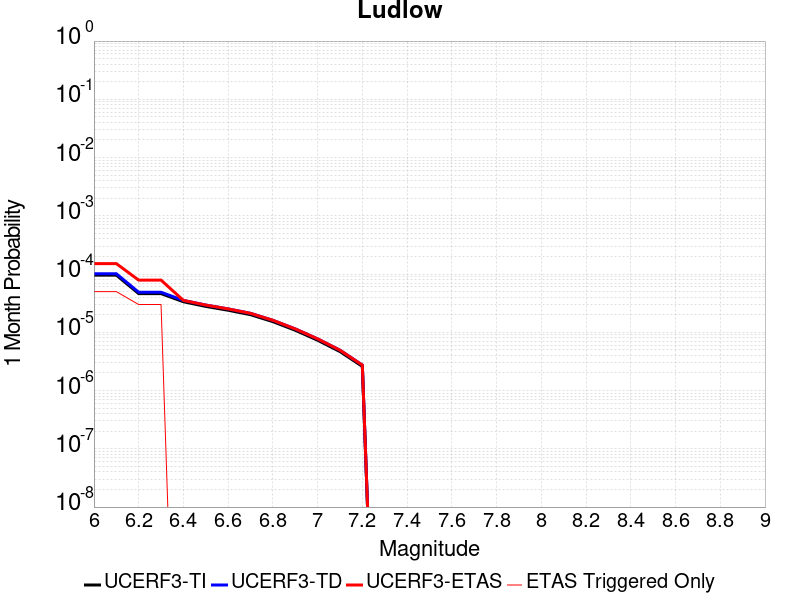 |  |  |

| Magnitude | 1 wk TI Prob | 1 wk TD Prob | 1 wk ETAS Prob | 1 wk ETAS/TD Gain | 1 wk ETAS Triggered Only | 1 mo TI Prob | 1 mo TD Prob | 1 mo ETAS Prob | 1 mo ETAS/TD Gain | 1 mo ETAS Triggered Only | 1 yr TI Prob | 1 yr TD Prob | 1 yr ETAS Prob | 1 yr ETAS/TD Gain | 1 yr ETAS Triggered Only | 10 yr TI Prob | 10 yr TD Prob | 10 yr ETAS Prob | 10 yr ETAS/TD Gain | 10 yr ETAS Triggered Only |
|-----|-----|-----|-----|-----|-----|-----|-----|-----|-----|-----|-----|-----|-----|-----|-----|-----|-----|-----|-----|-----|
| 6.0 | 2.2407607E-5 | 2.3657429E-5 | 4.3656957E-5 | 1.8453804 | 2.0E-5 | 9.602906E-5 | 1.0138529E-4 | 1.5138021E-4 | 1.4931182 | 5.0E-5 | 0.0011685267 | 0.001233711 | 0.001353563 | 1.0971475 | 1.2E-4 | 0.011624013 | 0.012273132 | 0.012490433 | 1.0177053 | 2.2E-4 |
| 6.1 | 2.2407607E-5 | 2.3657429E-5 | 4.3656957E-5 | 1.8453804 | 2.0E-5 | 9.602906E-5 | 1.0138529E-4 | 1.5138021E-4 | 1.4931182 | 5.0E-5 | 0.0011685267 | 0.001233711 | 0.001353563 | 1.0971475 | 1.2E-4 | 0.011624013 | 0.012273132 | 0.012490433 | 1.0177053 | 2.2E-4 |
| 6.2 | 1.0781252E-5 | 1.1365745E-5 | 1.1365745E-5 | 1.0 | 0.0 | 4.620455E-5 | 4.870945E-5 | 7.870799E-5 | 1.6158669 | 3.0E-5 | 5.623952E-4 | 5.9288024E-4 | 6.6283875E-4 | 1.1179976 | 7.0E-5 | 0.00560974 | 0.005913404 | 0.006032694 | 1.0201728 | 1.2E-4 |
| 6.3 | 1.0781252E-5 | 1.1365745E-5 | 1.1365745E-5 | 1.0 | 0.0 | 4.620455E-5 | 4.870945E-5 | 7.870799E-5 | 1.6158669 | 3.0E-5 | 5.623952E-4 | 5.9288024E-4 | 6.6283875E-4 | 1.1179976 | 7.0E-5 | 0.00560974 | 0.005913404 | 0.006032694 | 1.0201728 | 1.2E-4 |
| 6.4 | 7.814439E-6 | 8.237788E-6 | 8.237788E-6 | 1.0 | 0.0 | 3.3490025E-5 | 3.5304336E-5 | 3.5304336E-5 | 1.0 | 0.0 | 4.0766477E-4 | 4.2974693E-4 | 4.5973403E-4 | 1.0697786 | 3.0E-5 | 0.0040691774 | 0.0042893053 | 0.0043689623 | 1.018571 | 8.0E-5 |
| 6.5 | 6.4986366E-6 | 6.850969E-6 | 6.850969E-6 | 1.0 | 0.0 | 2.7851002E-5 | 2.936097E-5 | 2.936097E-5 | 1.0 | 0.0 | 3.390332E-4 | 3.574121E-4 | 3.8740138E-4 | 1.0839068 | 3.0E-5 | 0.003385164 | 0.0035684688 | 0.0036182904 | 1.0139616 | 5.0E-5 |
| 6.6 | 5.582177E-6 | 5.8860483E-6 | 5.8860483E-6 | 1.0 | 0.0 | 2.3923398E-5 | 2.522568E-5 | 2.522568E-5 | 1.0 | 0.0 | 2.9122844E-4 | 3.070801E-4 | 3.3707087E-4 | 1.0976644 | 3.0E-5 | 0.0029084706 | 0.003066631 | 0.0031164777 | 1.0162545 | 5.0E-5 |
| 6.7 | 4.6858763E-6 | 4.940463E-6 | 4.940463E-6 | 1.0 | 0.0 | 2.0082172E-5 | 2.1173244E-5 | 2.1173244E-5 | 1.0 | 0.0 | 2.4447302E-4 | 2.577543E-4 | 2.6775172E-4 | 1.0387866 | 1.0E-5 | 0.0024420423 | 0.0025746098 | 0.0025945583 | 1.0077481 | 2.0E-5 |
| 6.8 | 3.5584908E-6 | 3.7520454E-6 | 3.7520454E-6 | 1.0 | 0.0 | 1.5250586E-5 | 1.6080097E-5 | 1.6080097E-5 | 1.0 | 0.0 | 1.8566006E-4 | 1.9575801E-4 | 2.0575605E-4 | 1.0510734 | 1.0E-5 | 0.0018550502 | 0.0019558968 | 0.0019758577 | 1.0102055 | 2.0E-5 |
| 6.9 | 2.532834E-6 | 2.6710227E-6 | 2.6710227E-6 | 1.0 | 0.0 | 1.0854958E-5 | 1.1447192E-5 | 1.1447192E-5 | 1.0 | 0.0 | 1.3215111E-4 | 1.3936093E-4 | 1.4935953E-4 | 1.0717461 | 1.0E-5 | 0.0013207254 | 0.0013927629 | 0.0014127351 | 1.0143399 | 2.0E-5 |
| 7.0 | 1.7083285E-6 | 1.801957E-6 | 1.801957E-6 | 1.0 | 0.0 | 7.3213873E-6 | 7.7226505E-6 | 7.7226505E-6 | 1.0 | 0.0 | 8.913424E-5 | 9.4019386E-5 | 9.4019386E-5 | 1.0 | 0.0 | 8.9098496E-4 | 9.3981257E-4 | 9.4980316E-4 | 1.0106304 | 1.0E-5 |
| 7.1 | 1.0905424E-6 | 1.1497702E-6 | 1.1497702E-6 | 1.0 | 0.0 | 4.6737446E-6 | 4.927578E-6 | 4.927578E-6 | 1.0 | 0.0 | 5.6901354E-5 | 5.999171E-5 | 5.999171E-5 | 1.0 | 0.0 | 5.6886784E-4 | 5.997649E-4 | 5.997649E-4 | 1.0 | 0.0 |
| 7.2 | 6.06668E-7 | 6.387322E-7 | 6.387322E-7 | 1.0 | 0.0 | 2.600003E-6 | 2.7374213E-6 | 2.7374213E-6 | 1.0 | 0.0 | 3.1654577E-5 | 3.3327666E-5 | 3.3327666E-5 | 1.0 | 0.0 | 3.1650066E-4 | 3.332335E-4 | 3.332335E-4 | 1.0 | 0.0 |

## Red Pass
*[(top)](#table-of-contents)*

| 1 Week | 1 Month | 1 Year | 10 Year |
|-----|-----|-----|-----|
|  |  |  | 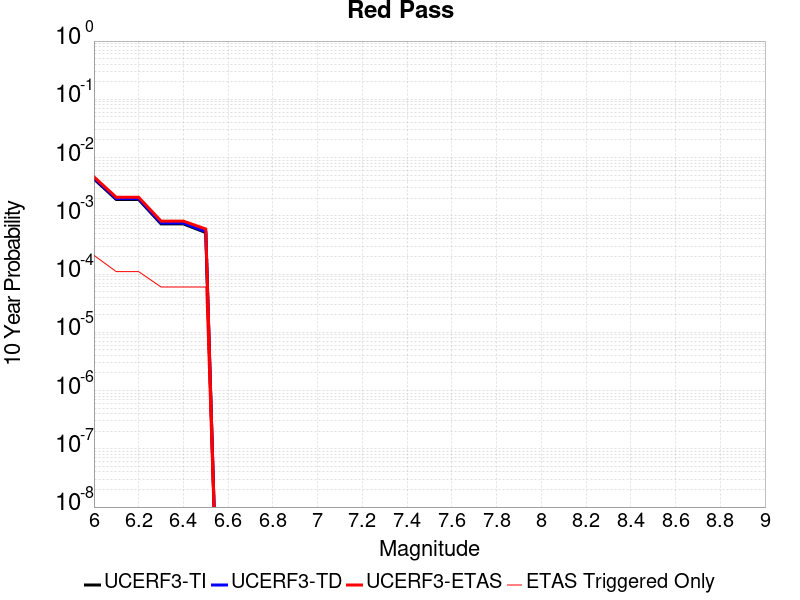 |

| Magnitude | 1 wk TI Prob | 1 wk TD Prob | 1 wk ETAS Prob | 1 wk ETAS/TD Gain | 1 wk ETAS Triggered Only | 1 mo TI Prob | 1 mo TD Prob | 1 mo ETAS Prob | 1 mo ETAS/TD Gain | 1 mo ETAS Triggered Only | 1 yr TI Prob | 1 yr TD Prob | 1 yr ETAS Prob | 1 yr ETAS/TD Gain | 1 yr ETAS Triggered Only | 10 yr TI Prob | 10 yr TD Prob | 10 yr ETAS Prob | 10 yr ETAS/TD Gain | 10 yr ETAS Triggered Only |
|-----|-----|-----|-----|-----|-----|-----|-----|-----|-----|-----|-----|-----|-----|-----|-----|-----|-----|-----|-----|-----|
| 6.0 | 8.258278E-6 | 8.551305E-6 | 8.551305E-6 | 1.0 | 0.0 | 3.539214E-5 | 3.6648038E-5 | 7.664657E-5 | 2.0914237 | 4.0E-5 | 4.308141E-4 | 4.4611638E-4 | 5.760584E-4 | 1.2912738 | 1.3E-4 | 0.0042997985 | 0.004453966 | 0.0046630306 | 1.046939 | 2.1E-4 |
| 6.1 | 3.649988E-6 | 3.7753332E-6 | 3.7753332E-6 | 1.0 | 0.0 | 1.5642712E-5 | 1.6179927E-5 | 4.617944E-5 | 2.8541193 | 3.0E-5 | 1.9043336E-4 | 1.9697756E-4 | 2.469677E-4 | 1.253786 | 5.0E-5 | 0.0019027026 | 0.001968497 | 0.0020782803 | 1.0557702 | 1.1E-4 |
| 6.2 | 3.649988E-6 | 3.7753332E-6 | 3.7753332E-6 | 1.0 | 0.0 | 1.5642712E-5 | 1.6179927E-5 | 4.617944E-5 | 2.8541193 | 3.0E-5 | 1.9043336E-4 | 1.9697756E-4 | 2.469677E-4 | 1.253786 | 5.0E-5 | 0.0019027026 | 0.001968497 | 0.0020782803 | 1.0557702 | 1.1E-4 |
| 6.3 | 1.3924937E-6 | 1.4411233E-6 | 1.4411233E-6 | 1.0 | 0.0 | 5.9678164E-6 | 6.176236E-6 | 2.6176112E-5 | 4.2381983 | 2.0E-5 | 7.265574E-5 | 7.51945E-5 | 1.0519224E-4 | 1.3989354 | 3.0E-5 | 7.263199E-4 | 7.518293E-4 | 8.117842E-4 | 1.0797453 | 6.0E-5 |
| 6.4 | 1.3924937E-6 | 1.4411233E-6 | 1.4411233E-6 | 1.0 | 0.0 | 5.9678164E-6 | 6.176236E-6 | 2.6176112E-5 | 4.2381983 | 2.0E-5 | 7.265574E-5 | 7.51945E-5 | 1.0519224E-4 | 1.3989354 | 3.0E-5 | 7.263199E-4 | 7.518293E-4 | 8.117842E-4 | 1.0797453 | 6.0E-5 |
| 6.5 | 9.876812E-7 | 1.022196E-6 | 1.022196E-6 | 1.0 | 0.0 | 4.2329125E-6 | 4.38084E-6 | 2.4380752E-5 | 5.565315 | 2.0E-5 | 5.153449E-5 | 5.3336724E-5 | 8.333512E-5 | 1.5624342 | 3.0E-5 | 5.1522546E-4 | 5.333672E-4 | 5.9333525E-4 | 1.1124328 | 6.0E-5 |

## White Wolf (Extension)
*[(top)](#table-of-contents)*

| 1 Week | 1 Month | 1 Year | 10 Year |
|-----|-----|-----|-----|
|  |  |  |  |

| Magnitude | 1 wk TI Prob | 1 wk TD Prob | 1 wk ETAS Prob | 1 wk ETAS/TD Gain | 1 wk ETAS Triggered Only | 1 mo TI Prob | 1 mo TD Prob | 1 mo ETAS Prob | 1 mo ETAS/TD Gain | 1 mo ETAS Triggered Only | 1 yr TI Prob | 1 yr TD Prob | 1 yr ETAS Prob | 1 yr ETAS/TD Gain | 1 yr ETAS Triggered Only | 10 yr TI Prob | 10 yr TD Prob | 10 yr ETAS Prob | 10 yr ETAS/TD Gain | 10 yr ETAS Triggered Only |
|-----|-----|-----|-----|-----|-----|-----|-----|-----|-----|-----|-----|-----|-----|-----|-----|-----|-----|-----|-----|-----|
| 6.0 | 8.222555E-6 | 6.0667057E-6 | 2.6066584E-5 | 4.296662 | 2.0E-5 | 3.5239045E-5 | 2.5999947E-5 | 8.5998385E-5 | 3.307637 | 6.0E-5 | 4.289509E-4 | 3.1650998E-4 | 4.36472E-4 | 1.379015 | 1.2E-4 | 0.0042812387 | 0.0031612439 | 0.0033606116 | 1.0630662 | 2.0E-4 |
| 6.1 | 8.222555E-6 | 6.0667057E-6 | 2.6066584E-5 | 4.296662 | 2.0E-5 | 3.5239045E-5 | 2.5999947E-5 | 8.5998385E-5 | 3.307637 | 6.0E-5 | 4.289509E-4 | 3.1650998E-4 | 4.36472E-4 | 1.379015 | 1.2E-4 | 0.0042812387 | 0.0031612439 | 0.0033606116 | 1.0630662 | 2.0E-4 |
| 6.2 | 8.222555E-6 | 6.0667057E-6 | 2.6066584E-5 | 4.296662 | 2.0E-5 | 3.5239045E-5 | 2.5999947E-5 | 8.5998385E-5 | 3.307637 | 6.0E-5 | 4.289509E-4 | 3.1650998E-4 | 4.36472E-4 | 1.379015 | 1.2E-4 | 0.0042812387 | 0.0031612439 | 0.0033606116 | 1.0630662 | 2.0E-4 |
| 6.3 | 8.222555E-6 | 6.0667057E-6 | 2.6066584E-5 | 4.296662 | 2.0E-5 | 3.5239045E-5 | 2.5999947E-5 | 8.5998385E-5 | 3.307637 | 6.0E-5 | 4.289509E-4 | 3.1650998E-4 | 4.36472E-4 | 1.379015 | 1.2E-4 | 0.0042812387 | 0.0031612439 | 0.0033606116 | 1.0630662 | 2.0E-4 |
| 6.4 | 5.821773E-6 | 3.5572016E-6 | 1.3557166E-5 | 3.8111885 | 1.0E-5 | 2.4950215E-5 | 1.5245067E-5 | 5.5244458E-5 | 3.6237595 | 4.0E-5 | 3.0372653E-4 | 1.8559398E-4 | 2.4558284E-4 | 1.3232263 | 6.0E-5 | 0.0030331176 | 0.0018544982 | 0.0019343498 | 1.0430584 | 8.0E-5 |
| 6.5 | 5.766023E-6 | 3.4991353E-6 | 1.34991005E-5 | 3.8578389 | 1.0E-5 | 2.4711293E-5 | 1.4996214E-5 | 5.4995613E-5 | 3.6672997 | 4.0E-5 | 3.0081844E-4 | 1.8256472E-4 | 2.4255375E-4 | 1.3285906 | 6.0E-5 | 0.0030041158 | 0.0018242556 | 0.0019041096 | 1.0437735 | 8.0E-5 |
| 6.6 | 4.643576E-6 | 2.332643E-6 | 1.233262E-5 | 5.286973 | 1.0E-5 | 1.9900888E-5 | 9.997005E-6 | 4.9996605E-5 | 5.0011587 | 4.0E-5 | 2.4226638E-4 | 1.2170716E-4 | 1.8169986E-4 | 1.4929266 | 6.0E-5 | 0.0024200242 | 0.0012164476 | 0.0012963503 | 1.0656853 | 8.0E-5 |
| 6.7 | 3.9529173E-6 | 1.6483629E-6 | 1.1648346E-5 | 7.0666156 | 1.0E-5 | 1.6940963E-5 | 7.064394E-6 | 2.7064252E-5 | 3.8310792 | 2.0E-5 | 2.0623671E-4 | 8.600579E-5 | 1.1600321E-4 | 1.3487837 | 3.0E-5 | 0.002060454 | 8.5974357E-4 | 9.097006E-4 | 1.0581069 | 5.0E-5 |
| 6.8 | 3.4377522E-6 | 1.2245362E-6 | 1.2245362E-6 | 1.0 | 0.0 | 1.473314E-5 | 5.2480023E-6 | 1.524795E-5 | 2.905477 | 1.0E-5 | 1.7936122E-4 | 6.389264E-5 | 8.389137E-5 | 1.3130051 | 2.0E-5 | 0.0017921652 | 6.3875184E-4 | 6.787263E-4 | 1.0625821 | 4.0E-5 |
| 6.9 | 3.1367306E-6 | 1.0033893E-6 | 1.0033893E-6 | 1.0 | 0.0 | 1.3443062E-5 | 4.3002333E-6 | 1.430019E-5 | 3.3254452 | 1.0E-5 | 1.63657E-4 | 5.235416E-5 | 7.235311E-5 | 1.3819935 | 2.0E-5 | 0.0016353652 | 5.234259E-4 | 5.6340493E-4 | 1.0763797 | 4.0E-5 |
| 7.0 | 2.8298145E-6 | 7.4287595E-7 | 7.4287595E-7 | 1.0 | 0.0 | 1.2127721E-5 | 3.1837506E-6 | 3.1837506E-6 | 1.0 | 0.0 | 1.47645E-4 | 3.8761526E-5 | 4.8761136E-5 | 1.2579778 | 1.0E-5 | 0.0014754693 | 3.8755263E-4 | 4.0754487E-4 | 1.0515859 | 2.0E-5 |
| 7.1 | 2.4091064E-6 | 5.4228286E-7 | 5.4228286E-7 | 1.0 | 0.0 | 1.03247E-5 | 2.3240675E-6 | 2.3240675E-6 | 1.0 | 0.0 | 1.2569598E-4 | 2.8295197E-5 | 3.8294915E-5 | 1.3534069 | 1.0E-5 | 0.001256249 | 2.8291997E-4 | 3.0291433E-4 | 1.0706713 | 2.0E-5 |
| 7.2 | 1.3875518E-6 | 1.07434374E-7 | 1.07434374E-7 | 1.0 | 0.0 | 5.9466374E-6 | 4.6043297E-7 | 4.6043297E-7 | 1.0 | 0.0 | 7.23979E-5 | 5.6057584E-6 | 5.6057584E-6 | 1.0 | 0.0 | 7.2374323E-4 | 5.605628E-5 | 5.605628E-5 | 1.0 | 0.0 |
| 7.3 | 7.056077E-7 | 5.0022493E-8 | 5.0022493E-8 | 1.0 | 0.0 | 3.0240296E-6 | 2.143821E-7 | 2.143821E-7 | 1.0 | 0.0 | 3.681694E-5 | 2.6100993E-6 | 2.6100993E-6 | 1.0 | 0.0 | 3.681084E-4 | 2.6100734E-5 | 2.6100734E-5 | 1.0 | 0.0 |
| 7.4 | 5.9334678E-8 | 4.8685624E-9 | 4.8685624E-9 | 1.0 | 0.0 | 2.5429145E-7 | 2.0865269E-8 | 2.0865269E-8 | 1.0 | 0.0 | 3.095994E-6 | 2.5403463E-7 | 2.5403463E-7 | 1.0 | 0.0 | 3.095951E-5 | 2.5403444E-6 | 2.5403444E-6 | 1.0 | 0.0 |

## Calico-Hidalgo
*[(top)](#table-of-contents)*

| 1 Week | 1 Month | 1 Year | 10 Year |
|-----|-----|-----|-----|
| 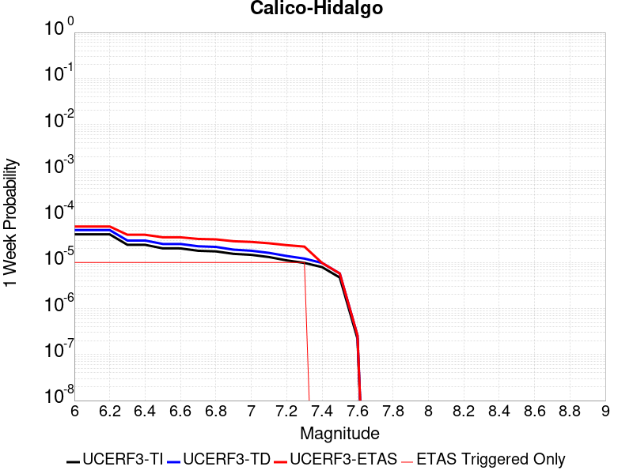 |  | 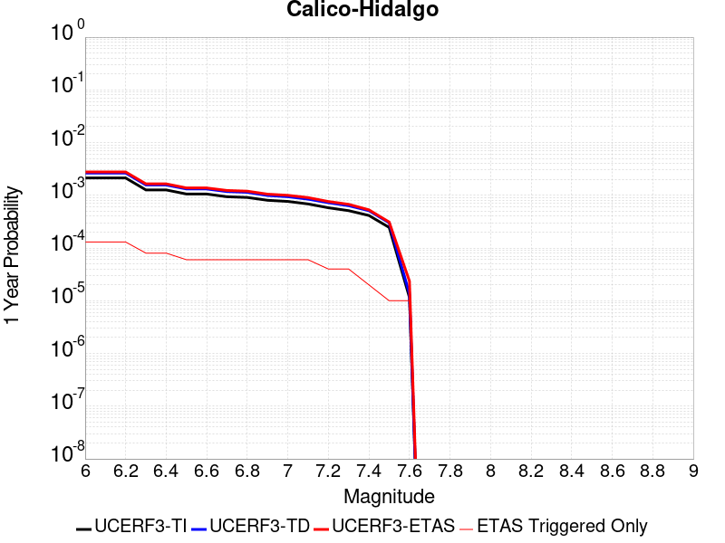 |  |

| Magnitude | 1 wk TI Prob | 1 wk TD Prob | 1 wk ETAS Prob | 1 wk ETAS/TD Gain | 1 wk ETAS Triggered Only | 1 mo TI Prob | 1 mo TD Prob | 1 mo ETAS Prob | 1 mo ETAS/TD Gain | 1 mo ETAS Triggered Only | 1 yr TI Prob | 1 yr TD Prob | 1 yr ETAS Prob | 1 yr ETAS/TD Gain | 1 yr ETAS Triggered Only | 10 yr TI Prob | 10 yr TD Prob | 10 yr ETAS Prob | 10 yr ETAS/TD Gain | 10 yr ETAS Triggered Only |
|-----|-----|-----|-----|-----|-----|-----|-----|-----|-----|-----|-----|-----|-----|-----|-----|-----|-----|-----|-----|-----|
| 6.0 | 4.0906612E-5 | 5.0704653E-5 | 6.0704144E-5 | 1.1972106 | 1.0E-5 | 1.7530227E-4 | 2.1728984E-4 | 2.6727899E-4 | 1.2300574 | 5.0E-5 | 0.0021322158 | 0.0026426981 | 0.0027723548 | 1.0490621 | 1.3E-4 | 0.02111873 | 0.026153097 | 0.026338128 | 1.007075 | 1.9E-4 |
| 6.1 | 4.0906612E-5 | 5.0704653E-5 | 6.0704144E-5 | 1.1972106 | 1.0E-5 | 1.7530227E-4 | 2.1728984E-4 | 2.6727899E-4 | 1.2300574 | 5.0E-5 | 0.0021322158 | 0.0026426981 | 0.0027723548 | 1.0490621 | 1.3E-4 | 0.02111873 | 0.026153097 | 0.026338128 | 1.007075 | 1.9E-4 |
| 6.2 | 4.0906612E-5 | 5.0704653E-5 | 6.0704144E-5 | 1.1972106 | 1.0E-5 | 1.7530227E-4 | 2.1728984E-4 | 2.6727899E-4 | 1.2300574 | 5.0E-5 | 0.0021322158 | 0.0026426981 | 0.0027723548 | 1.0490621 | 1.3E-4 | 0.02111873 | 0.026153097 | 0.026338128 | 1.007075 | 1.9E-4 |
| 6.3 | 2.4242801E-5 | 3.009103E-5 | 4.009073E-5 | 1.332315 | 1.0E-5 | 1.0389358E-4 | 1.2895538E-4 | 1.5895152E-4 | 1.2326086 | 3.0E-5 | 0.0012641704 | 0.001568934 | 0.0016488085 | 1.05091 | 8.0E-5 | 0.01257003 | 0.015582247 | 0.015710222 | 1.0082128 | 1.3E-4 |
| 6.4 | 2.4242801E-5 | 3.009103E-5 | 4.009073E-5 | 1.332315 | 1.0E-5 | 1.0389358E-4 | 1.2895538E-4 | 1.5895152E-4 | 1.2326086 | 3.0E-5 | 0.0012641704 | 0.001568934 | 0.0016488085 | 1.05091 | 8.0E-5 | 0.01257003 | 0.015582247 | 0.015710222 | 1.0082128 | 1.3E-4 |
| 6.5 | 2.0286952E-5 | 2.5315985E-5 | 3.5315734E-5 | 1.3949974 | 1.0E-5 | 8.694118E-5 | 1.0849266E-4 | 1.3848941E-4 | 1.2764864 | 3.0E-5 | 0.0010579949 | 0.0013201149 | 0.0013800358 | 1.0453906 | 6.0E-5 | 0.010529719 | 0.013124665 | 0.013233221 | 1.0082712 | 1.1E-4 |
| 6.6 | 2.0269223E-5 | 2.5296935E-5 | 3.529668E-5 | 1.3952948 | 1.0E-5 | 8.6865206E-5 | 1.08411026E-4 | 1.3840778E-4 | 1.2766947 | 3.0E-5 | 0.0010570707 | 0.0013191222 | 0.001379043 | 1.0454248 | 6.0E-5 | 0.010520565 | 0.013114855 | 0.013223412 | 1.0082774 | 1.1E-4 |
| 6.7 | 1.799852E-5 | 2.25408E-5 | 3.2540574E-5 | 1.44363 | 1.0E-5 | 7.713423E-5 | 9.6599935E-5 | 1.2659703E-4 | 1.3105292 | 3.0E-5 | 9.3870464E-4 | 0.0011754843 | 0.0012354137 | 1.0509828 | 6.0E-5 | 0.009347493 | 0.011694277 | 0.01180299 | 1.0092963 | 1.1E-4 |
| 6.8 | 1.7458793E-5 | 2.1842314E-5 | 3.1842093E-5 | 1.457817 | 1.0E-5 | 7.4821255E-5 | 9.3606635E-5 | 1.2360382E-4 | 1.3204601 | 3.0E-5 | 9.10568E-4 | 0.0011390795 | 0.0011990111 | 1.0526141 | 6.0E-5 | 0.009068459 | 0.011333993 | 0.011442746 | 1.0095953 | 1.1E-4 |
| 6.9 | 1.542884E-5 | 1.9026087E-5 | 2.9025896E-5 | 1.5255841 | 1.0E-5 | 6.612192E-5 | 8.1537895E-5 | 1.1153545E-4 | 1.367897 | 3.0E-5 | 8.04737E-4 | 9.92285E-4 | 0.0010522254 | 1.0604064 | 6.0E-5 | 0.008018291 | 0.00987994 | 0.009988854 | 1.0110236 | 1.1E-4 |
| 7.0 | 1.468253E-5 | 1.8030747E-5 | 2.8030567E-5 | 1.5545982 | 1.0E-5 | 6.292361E-5 | 7.7272416E-5 | 1.072701E-4 | 1.3882068 | 3.0E-5 | 7.658257E-4 | 9.403986E-4 | 0.0010003422 | 1.0637428 | 6.0E-5 | 0.0076319184 | 0.009365558 | 0.009474527 | 1.0116352 | 1.1E-4 |
| 7.1 | 1.3139281E-5 | 1.620107E-5 | 2.6200907E-5 | 1.6172332 | 1.0E-5 | 5.6309986E-5 | 6.943138E-5 | 9.942929E-5 | 1.4320513 | 3.0E-5 | 6.853584E-4 | 8.4501173E-4 | 9.049611E-4 | 1.0709449 | 6.0E-5 | 0.0068324856 | 0.008419285 | 0.0085184425 | 1.0117775 | 1.0E-4 |
| 7.2 | 1.1127404E-5 | 1.3866703E-5 | 2.3866563E-5 | 1.7211419 | 1.0E-5 | 4.7688E-5 | 5.9427435E-5 | 8.942565E-5 | 1.5047873 | 3.0E-5 | 5.8044674E-4 | 7.2329975E-4 | 7.632708E-4 | 1.0552621 | 4.0E-5 | 0.0057893298 | 0.0072105634 | 0.0072800587 | 1.009638 | 7.0E-5 |
| 7.3 | 9.808154E-6 | 1.2176301E-5 | 2.217618E-5 | 1.8212575 | 1.0E-5 | 4.2034266E-5 | 5.2183164E-5 | 8.21816E-5 | 1.5748681 | 3.0E-5 | 5.11647E-4 | 6.3515553E-4 | 6.751301E-4 | 1.0629367 | 4.0E-5 | 0.0051047057 | 0.0063344776 | 0.0064040343 | 1.0109806 | 7.0E-5 |
| 7.4 | 7.942452E-6 | 9.7922075E-6 | 9.7922075E-6 | 1.0 | 0.0 | 3.4038632E-5 | 4.196598E-5 | 5.1965562E-5 | 1.2382783 | 1.0E-5 | 4.1434157E-4 | 5.1082554E-4 | 5.3081533E-4 | 1.0391324 | 2.0E-5 | 0.0041356985 | 0.0050974544 | 0.0051471996 | 1.0097588 | 5.0E-5 |
| 7.5 | 4.7121216E-6 | 5.772871E-6 | 5.772871E-6 | 1.0 | 0.0 | 2.019465E-5 | 2.4740684E-5 | 3.474044E-5 | 1.4041826 | 1.0E-5 | 2.4584212E-4 | 3.0118387E-4 | 3.1118086E-4 | 1.0331923 | 1.0E-5 | 0.0024557032 | 0.0030085093 | 0.0030284491 | 1.0066278 | 2.0E-5 |
| 7.6 | 2.21172E-7 | 2.6039737E-7 | 2.6039737E-7 | 1.0 | 0.0 | 9.478797E-7 | 1.1159884E-6 | 1.1115977E-5 | 9.960656 | 1.0E-5 | 1.1540374E-5 | 1.3587103E-5 | 2.3586967E-5 | 1.7359821 | 1.0E-5 | 1.1539775E-4 | 1.3586554E-4 | 1.4586418E-4 | 1.0735922 | 1.0E-5 |

## San Jacinto (San Bernardino)
*[(top)](#table-of-contents)*

| 1 Week | 1 Month | 1 Year | 10 Year |
|-----|-----|-----|-----|
|  |  | 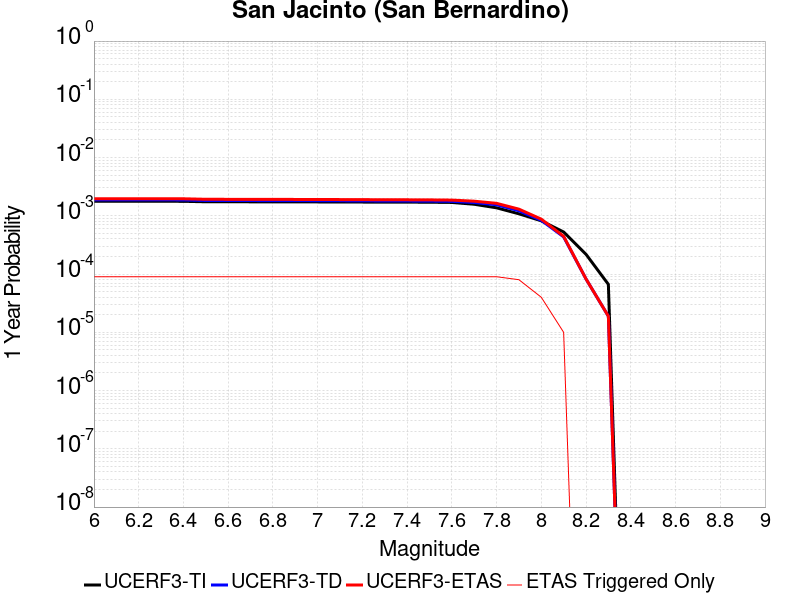 |  |

| Magnitude | 1 wk TI Prob | 1 wk TD Prob | 1 wk ETAS Prob | 1 wk ETAS/TD Gain | 1 wk ETAS Triggered Only | 1 mo TI Prob | 1 mo TD Prob | 1 mo ETAS Prob | 1 mo ETAS/TD Gain | 1 mo ETAS Triggered Only | 1 yr TI Prob | 1 yr TD Prob | 1 yr ETAS Prob | 1 yr ETAS/TD Gain | 1 yr ETAS Triggered Only | 10 yr TI Prob | 10 yr TD Prob | 10 yr ETAS Prob | 10 yr ETAS/TD Gain | 10 yr ETAS Triggered Only |
|-----|-----|-----|-----|-----|-----|-----|-----|-----|-----|-----|-----|-----|-----|-----|-----|-----|-----|-----|-----|-----|
| 6.0 | 3.409352E-5 | 3.600249E-5 | 3.600249E-5 | 1.0 | 0.0 | 1.461069E-4 | 1.5428728E-4 | 1.7428419E-4 | 1.1296083 | 2.0E-5 | 0.0017774 | 0.001876831 | 0.0019666622 | 1.0478631 | 9.0E-5 | 0.01763251 | 0.019358097 | 0.019544419 | 1.009625 | 1.9E-4 |
| 6.1 | 3.409352E-5 | 3.600249E-5 | 3.600249E-5 | 1.0 | 0.0 | 1.461069E-4 | 1.5428728E-4 | 1.7428419E-4 | 1.1296083 | 2.0E-5 | 0.0017774 | 0.001876831 | 0.0019666622 | 1.0478631 | 9.0E-5 | 0.01763251 | 0.019358097 | 0.019544419 | 1.009625 | 1.9E-4 |
| 6.2 | 3.409352E-5 | 3.600249E-5 | 3.600249E-5 | 1.0 | 0.0 | 1.461069E-4 | 1.5428728E-4 | 1.7428419E-4 | 1.1296083 | 2.0E-5 | 0.0017774 | 0.001876831 | 0.0019666622 | 1.0478631 | 9.0E-5 | 0.01763251 | 0.019358097 | 0.019544419 | 1.009625 | 1.9E-4 |
| 6.3 | 3.409352E-5 | 3.600249E-5 | 3.600249E-5 | 1.0 | 0.0 | 1.461069E-4 | 1.5428728E-4 | 1.7428419E-4 | 1.1296083 | 2.0E-5 | 0.0017774 | 0.001876831 | 0.0019666622 | 1.0478631 | 9.0E-5 | 0.01763251 | 0.019358097 | 0.019544419 | 1.009625 | 1.9E-4 |
| 6.4 | 3.400795E-5 | 3.589515E-5 | 3.589515E-5 | 1.0 | 0.0 | 1.4574021E-4 | 1.5382729E-4 | 1.7382421E-4 | 1.129996 | 2.0E-5 | 0.0017729428 | 0.0018712406 | 0.0019610722 | 1.0480064 | 9.0E-5 | 0.017588645 | 0.019303178 | 0.01948951 | 1.009653 | 1.9E-4 |
| 6.5 | 3.341482E-5 | 3.5155765E-5 | 3.5155765E-5 | 1.0 | 0.0 | 1.4319851E-4 | 1.5065886E-4 | 1.7065585E-4 | 1.1327302 | 2.0E-5 | 0.0017420477 | 0.0018327299 | 0.0019225649 | 1.0490171 | 9.0E-5 | 0.017284546 | 0.018924711 | 0.019111115 | 1.0098498 | 1.9E-4 |
| 6.6 | 3.3364955E-5 | 3.509298E-5 | 3.509298E-5 | 1.0 | 0.0 | 1.4298483E-4 | 1.5038982E-4 | 1.7038682E-4 | 1.1329677 | 2.0E-5 | 0.0017394501 | 0.0018294598 | 0.0019192952 | 1.0491048 | 9.0E-5 | 0.017258976 | 0.018892575 | 0.019078985 | 1.0098668 | 1.9E-4 |
| 6.7 | 3.335922E-5 | 3.5082754E-5 | 3.5082754E-5 | 1.0 | 0.0 | 1.4296026E-4 | 1.5034601E-4 | 1.70343E-4 | 1.1330065 | 2.0E-5 | 0.0017391514 | 0.0018289272 | 0.0019187626 | 1.0491192 | 9.0E-5 | 0.017256035 | 0.018887365 | 0.019073777 | 1.0098696 | 1.9E-4 |
| 6.8 | 3.327683E-5 | 3.4976816E-5 | 3.4976816E-5 | 1.0 | 0.0 | 1.4260718E-4 | 1.4989203E-4 | 1.6988904E-4 | 1.1334094 | 2.0E-5 | 0.0017348597 | 0.0018234095 | 0.0019132453 | 1.0492681 | 9.0E-5 | 0.017213784 | 0.018833136 | 0.019019557 | 1.0098985 | 1.9E-4 |
| 6.9 | 3.3235785E-5 | 3.4917768E-5 | 3.4917768E-5 | 1.0 | 0.0 | 1.4243131E-4 | 1.49639E-4 | 1.6963601E-4 | 1.133635 | 2.0E-5 | 0.0017327217 | 0.0018203339 | 0.0019101701 | 1.0493515 | 9.0E-5 | 0.017192734 | 0.018803004 | 0.01898943 | 1.0099148 | 1.9E-4 |
| 7.0 | 3.3197095E-5 | 3.4857694E-5 | 3.4857694E-5 | 1.0 | 0.0 | 1.422655E-4 | 1.4938158E-4 | 1.6937859E-4 | 1.1338654 | 2.0E-5 | 0.0017307063 | 0.001817205 | 0.0019070414 | 1.0494366 | 9.0E-5 | 0.017172894 | 0.01877238 | 0.018958813 | 1.0099312 | 1.9E-4 |
| 7.1 | 3.3129716E-5 | 3.47379E-5 | 3.47379E-5 | 1.0 | 0.0 | 1.4197677E-4 | 1.4886823E-4 | 1.6886526E-4 | 1.134327 | 2.0E-5 | 0.0017271966 | 0.0018109654 | 0.0019008024 | 1.0496073 | 9.0E-5 | 0.017138338 | 0.018711457 | 0.018897902 | 1.0099642 | 1.9E-4 |
| 7.2 | 3.3034008E-5 | 3.4605342E-5 | 3.4605342E-5 | 1.0 | 0.0 | 1.4156665E-4 | 1.4830018E-4 | 1.6829722E-4 | 1.1348416 | 2.0E-5 | 0.0017222111 | 0.001804061 | 0.0018938986 | 1.0497974 | 9.0E-5 | 0.017089253 | 0.018643849 | 0.018830305 | 1.0100011 | 1.9E-4 |
| 7.3 | 3.2956614E-5 | 3.447309E-5 | 3.447309E-5 | 1.0 | 0.0 | 1.4123498E-4 | 1.4773346E-4 | 1.6773051E-4 | 1.1353589 | 2.0E-5 | 0.0017181796 | 0.0017971725 | 0.0018870106 | 1.0499886 | 9.0E-5 | 0.017049557 | 0.018576592 | 0.018763062 | 1.0100379 | 1.9E-4 |
| 7.4 | 3.2915937E-5 | 3.439478E-5 | 3.439478E-5 | 1.0 | 0.0 | 1.4106068E-4 | 1.4739788E-4 | 1.6739493E-4 | 1.1356672 | 2.0E-5 | 0.0017160608 | 0.0017930934 | 0.001882932 | 1.0501026 | 9.0E-5 | 0.017028693 | 0.018536855 | 0.018723331 | 1.0100598 | 1.9E-4 |
| 7.5 | 3.281791E-5 | 3.4259683E-5 | 3.4259683E-5 | 1.0 | 0.0 | 1.406406E-4 | 1.4681896E-4 | 1.6681601E-4 | 1.1362022 | 2.0E-5 | 0.0017109542 | 0.0017860567 | 0.0018758959 | 1.0503004 | 9.0E-5 | 0.016978411 | 0.018467735 | 0.018654227 | 1.0100982 | 1.9E-4 |
| 7.6 | 3.2521442E-5 | 3.39846E-5 | 3.39846E-5 | 1.0 | 0.0 | 1.3937015E-4 | 1.4564018E-4 | 1.6563726E-4 | 1.1373048 | 2.0E-5 | 0.0016955109 | 0.0017717284 | 0.001861569 | 1.0507078 | 9.0E-5 | 0.016826328 | 0.01832535 | 0.018511867 | 1.0101782 | 1.9E-4 |
| 7.7 | 3.0287873E-5 | 3.246845E-5 | 3.246845E-5 | 1.0 | 0.0 | 1.297987E-4 | 1.391431E-4 | 1.5914031E-4 | 1.1437169 | 2.0E-5 | 0.0015791537 | 0.001692752 | 0.0017825996 | 1.0530778 | 9.0E-5 | 0.01567979 | 0.017536119 | 0.017722787 | 1.0106448 | 1.9E-4 |
| 7.8 | 2.6316151E-5 | 2.9678711E-5 | 2.9678711E-5 | 1.0 | 0.0 | 1.1277862E-4 | 1.2718828E-4 | 1.4718574E-4 | 1.1572272 | 2.0E-5 | 0.0013722149 | 0.0015474184 | 0.0016372792 | 1.0580714 | 9.0E-5 | 0.013637724 | 0.016077382 | 0.016264329 | 1.0116278 | 1.9E-4 |
| 7.9 | 2.0761147E-5 | 2.3431265E-5 | 2.3431265E-5 | 1.0 | 0.0 | 8.897331E-5 | 1.0041584E-4 | 1.1041484E-4 | 1.0995759 | 1.0E-5 | 0.0010827117 | 0.0012218781 | 0.0013017803 | 1.065393 | 8.0E-5 | 0.010774517 | 0.012799971 | 0.012967795 | 1.0131112 | 1.7E-4 |
| 8.0 | 1.5738568E-5 | 1.6043394E-5 | 1.6043394E-5 | 1.0 | 0.0 | 6.744926E-5 | 6.8755595E-5 | 7.875491E-5 | 1.1454327 | 1.0E-5 | 8.2088535E-4 | 8.3677855E-4 | 8.767451E-4 | 1.0477624 | 4.0E-5 | 0.008178596 | 0.008871087 | 0.008980111 | 1.0122899 | 1.1E-4 |
| 8.1 | 1.0105832E-5 | 8.336244E-6 | 8.336244E-6 | 1.0 | 0.0 | 4.3309992E-5 | 3.5726272E-5 | 3.5726272E-5 | 1.0 | 0.0 | 5.2717153E-4 | 4.3488108E-4 | 4.4487673E-4 | 1.0229847 | 1.0E-5 | 0.005259227 | 0.00468032 | 0.0047101798 | 1.0063798 | 3.0E-5 |
| 8.2 | 4.189207E-6 | 1.5801045E-6 | 1.5801045E-6 | 1.0 | 0.0 | 1.7953622E-5 | 6.771859E-6 | 6.771859E-6 | 1.0 | 0.0 | 2.1856341E-4 | 8.244429E-5 | 8.244429E-5 | 1.0 | 0.0 | 0.0021834858 | 9.575395E-4 | 9.575395E-4 | 1.0 | 0.0 |
| 8.3 | 1.2758221E-6 | 3.6194777E-7 | 3.6194777E-7 | 1.0 | 0.0 | 5.4677976E-6 | 1.5512038E-6 | 1.5512038E-6 | 1.0 | 0.0 | 6.65684E-5 | 1.8885747E-5 | 1.8885747E-5 | 1.0 | 0.0 | 6.6548464E-4 | 2.2777634E-4 | 2.2777634E-4 | 1.0 | 0.0 |

## San Andreas (Cholame) rev
*[(top)](#table-of-contents)*

| 1 Week | 1 Month | 1 Year | 10 Year |
|-----|-----|-----|-----|
|  |  |  | 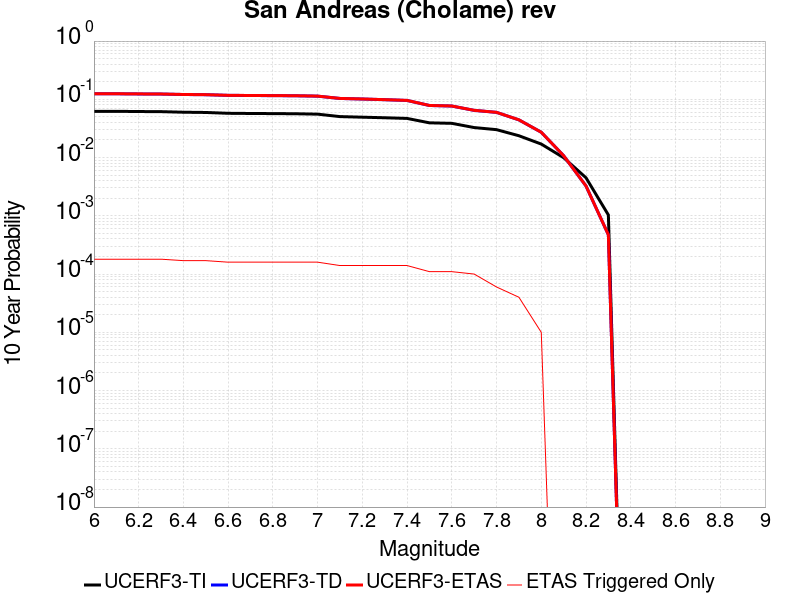 |

| Magnitude | 1 wk TI Prob | 1 wk TD Prob | 1 wk ETAS Prob | 1 wk ETAS/TD Gain | 1 wk ETAS Triggered Only | 1 mo TI Prob | 1 mo TD Prob | 1 mo ETAS Prob | 1 mo ETAS/TD Gain | 1 mo ETAS Triggered Only | 1 yr TI Prob | 1 yr TD Prob | 1 yr ETAS Prob | 1 yr ETAS/TD Gain | 1 yr ETAS Triggered Only | 10 yr TI Prob | 10 yr TD Prob | 10 yr ETAS Prob | 10 yr ETAS/TD Gain | 10 yr ETAS Triggered Only |
|-----|-----|-----|-----|-----|-----|-----|-----|-----|-----|-----|-----|-----|-----|-----|-----|-----|-----|-----|-----|-----|
| 6.0 | 1.2302514E-4 | 2.5213862E-4 | 2.6213608E-4 | 1.0396507 | 1.0E-5 | 5.27144E-4 | 0.0010801482 | 0.0011001265 | 1.018496 | 2.0E-5 | 0.0063991086 | 0.013072014 | 0.013170707 | 1.0075499 | 1.0E-4 | 0.06217949 | 0.12443058 | 0.124588184 | 1.0012666 | 1.8E-4 |
| 6.1 | 1.2302514E-4 | 2.5213862E-4 | 2.6213608E-4 | 1.0396507 | 1.0E-5 | 5.27144E-4 | 0.0010801482 | 0.0011001265 | 1.018496 | 2.0E-5 | 0.0063991086 | 0.013072014 | 0.013170707 | 1.0075499 | 1.0E-4 | 0.06217949 | 0.12443058 | 0.124588184 | 1.0012666 | 1.8E-4 |
| 6.2 | 1.2203569E-4 | 2.5030645E-4 | 2.6030396E-4 | 1.0399411 | 1.0E-5 | 5.2290526E-4 | 0.0010723026 | 0.0010922811 | 1.0186315 | 2.0E-5 | 0.006347804 | 0.0129776355 | 0.013076338 | 1.0076056 | 1.0E-4 | 0.061695136 | 0.12361675 | 0.1237745 | 1.0012761 | 1.8E-4 |
| 6.3 | 1.2142645E-4 | 2.491661E-4 | 2.5916361E-4 | 1.0401238 | 1.0E-5 | 5.202953E-4 | 0.0010674193 | 0.0010873979 | 1.0187168 | 2.0E-5 | 0.006316212 | 0.012918889 | 0.013017597 | 1.0076406 | 1.0E-4 | 0.06139677 | 0.12311087 | 0.1232687 | 1.0012821 | 1.8E-4 |
| 6.4 | 1.1865206E-4 | 2.4422092E-4 | 2.542185E-4 | 1.0409366 | 1.0E-5 | 5.0840975E-4 | 0.0010462429 | 0.001066222 | 1.019096 | 2.0E-5 | 0.006172335 | 0.012664088 | 0.012762822 | 1.0077963 | 1.0E-4 | 0.060036868 | 0.12090351 | 0.12105295 | 1.0012361 | 1.7E-4 |
| 6.5 | 1.17443946E-4 | 2.421537E-4 | 2.5215128E-4 | 1.0412861 | 1.0E-5 | 5.032341E-4 | 0.0010373904 | 0.0010573696 | 1.0192591 | 2.0E-5 | 0.006109677 | 0.012557554 | 0.012656298 | 1.0078633 | 1.0E-4 | 0.059444077 | 0.11997763 | 0.12012724 | 1.0012469 | 1.7E-4 |
| 6.6 | 1.13579066E-4 | 2.3524289E-4 | 2.4524055E-4 | 1.0424993 | 1.0E-5 | 4.866766E-4 | 0.0010077958 | 0.0010277756 | 1.0198253 | 2.0E-5 | 0.0059092017 | 0.012201327 | 0.012290229 | 1.0072862 | 9.0E-5 | 0.057545185 | 0.11689143 | 0.11703272 | 1.0012088 | 1.6E-4 |
| 6.7 | 1.1271412E-4 | 2.336858E-4 | 2.4368346E-4 | 1.0427825 | 1.0E-5 | 4.829711E-4 | 0.0010011276 | 0.0010211077 | 1.0199574 | 2.0E-5 | 0.005864331 | 0.01212105 | 0.012209958 | 1.0073351 | 9.0E-5 | 0.057119697 | 0.11619493 | 0.116336346 | 1.001217 | 1.6E-4 |
| 6.8 | 1.1217975E-4 | 2.3256983E-4 | 2.425675E-4 | 1.0429878 | 1.0E-5 | 4.8068175E-4 | 9.963487E-4 | 0.0010163287 | 1.0200533 | 2.0E-5 | 0.005836608 | 0.012063511 | 0.012152425 | 1.0073705 | 9.0E-5 | 0.056856725 | 0.11569312 | 0.115834616 | 1.001223 | 1.6E-4 |
| 6.9 | 1.1146753E-4 | 2.3105709E-4 | 2.4105477E-4 | 1.0432694 | 1.0E-5 | 4.7763053E-4 | 9.898704E-4 | 0.0010098505 | 1.0201846 | 2.0E-5 | 0.0057996577 | 0.011985509 | 0.01207443 | 1.0074191 | 9.0E-5 | 0.056506127 | 0.11501348 | 0.11515508 | 1.0012312 | 1.6E-4 |
| 7.0 | 1.0965793E-4 | 2.2728977E-4 | 2.372875E-4 | 1.0439867 | 1.0E-5 | 4.698779E-4 | 9.7373687E-4 | 9.937173E-4 | 1.0205194 | 2.0E-5 | 0.005705768 | 0.0117912255 | 0.011880165 | 1.0075428 | 9.0E-5 | 0.055614736 | 0.11331484 | 0.11345671 | 1.0012519 | 1.6E-4 |
| 7.1 | 9.927982E-5 | 2.0547757E-4 | 2.0547757E-4 | 1.0 | 0.0 | 4.2541555E-4 | 8.80322E-4 | 8.903132E-4 | 1.0113494 | 1.0E-5 | 0.0051671406 | 0.010665542 | 0.010744689 | 1.0074208 | 8.0E-5 | 0.05048634 | 0.10340853 | 0.10353405 | 1.0012139 | 1.4E-4 |
| 7.2 | 9.696786E-5 | 2.0051954E-4 | 2.0051954E-4 | 1.0 | 0.0 | 4.1551032E-4 | 8.5908745E-4 | 8.6907885E-4 | 1.0116303 | 1.0E-5 | 0.00504711 | 0.010409511 | 0.010488678 | 1.0076053 | 8.0E-5 | 0.04934009 | 0.10114636 | 0.1012722 | 1.0012442 | 1.4E-4 |
| 7.3 | 9.4727984E-5 | 1.9481099E-4 | 1.9481099E-4 | 1.0 | 0.0 | 4.0591392E-4 | 8.346381E-4 | 8.446297E-4 | 1.0119712 | 1.0E-5 | 0.0049308087 | 0.010114641 | 0.010193832 | 1.0078293 | 8.0E-5 | 0.048228268 | 0.09851684 | 0.09864304 | 1.001281 | 1.4E-4 |
| 7.4 | 9.220358E-5 | 1.885154E-4 | 1.885154E-4 | 1.0 | 0.0 | 3.9509835E-4 | 8.076739E-4 | 8.1766583E-4 | 1.0123712 | 1.0E-5 | 0.004799717 | 0.009789341 | 0.009868558 | 1.0080922 | 8.0E-5 | 0.046973653 | 0.09559427 | 0.09572089 | 1.0013245 | 1.4E-4 |
| 7.5 | 7.71631E-5 | 1.5185357E-4 | 1.5185357E-4 | 1.0 | 0.0 | 3.306571E-4 | 6.506389E-4 | 6.506389E-4 | 1.0 | 0.0 | 0.0040183207 | 0.007892828 | 0.007952355 | 1.0075419 | 6.0E-5 | 0.03946433 | 0.07831838 | 0.07841977 | 1.0012945 | 1.1E-4 |
| 7.6 | 7.5634416E-5 | 1.4844738E-4 | 1.4844738E-4 | 1.0 | 0.0 | 3.241072E-4 | 6.360481E-4 | 6.360481E-4 | 1.0 | 0.0 | 0.0039388672 | 0.007716457 | 0.0077759936 | 1.0077156 | 6.0E-5 | 0.038697794 | 0.076681465 | 0.07678303 | 1.0013245 | 1.1E-4 |
| 7.7 | 6.3783E-5 | 1.2365259E-4 | 1.2365259E-4 | 1.0 | 0.0 | 2.7332708E-4 | 5.2983203E-4 | 5.2983203E-4 | 1.0 | 0.0 | 0.0033226798 | 0.0064316522 | 0.006481331 | 1.007724 | 5.0E-5 | 0.032734364 | 0.064570144 | 0.064663686 | 1.0014488 | 1.0E-4 |
| 7.8 | 5.863422E-5 | 1.142205E-4 | 1.142205E-4 | 1.0 | 0.0 | 2.512653E-4 | 4.894246E-4 | 4.894246E-4 | 1.0 | 0.0 | 0.003054864 | 0.0059424853 | 0.005972307 | 1.0050184 | 3.0E-5 | 0.030132094 | 0.059686445 | 0.059742864 | 1.0009452 | 6.0E-5 |
| 7.9 | 4.595283E-5 | 8.4306725E-5 | 8.4306725E-5 | 1.0 | 0.0 | 1.9692584E-4 | 3.612645E-4 | 3.612645E-4 | 1.0 | 0.0 | 0.0023949358 | 0.0043895314 | 0.0044094436 | 1.0045363 | 2.0E-5 | 0.023692891 | 0.044382483 | 0.044420708 | 1.0008613 | 4.0E-5 |
| 8.0 | 3.2950178E-5 | 5.08E-5 | 5.08E-5 | 1.0 | 0.0 | 1.412074E-4 | 2.1769613E-4 | 2.1769613E-4 | 1.0 | 0.0 | 0.0017178444 | 0.0026472306 | 0.0026572042 | 1.0037675 | 1.0E-5 | 0.017046256 | 0.027193451 | 0.02720318 | 1.0003577 | 1.0E-5 |
| 8.1 | 1.9177472E-5 | 1.9198456E-5 | 1.9198456E-5 | 1.0 | 0.0 | 8.218658E-5 | 8.227651E-5 | 8.227651E-5 | 1.0 | 0.0 | 0.0010001622 | 0.0010012568 | 0.0010012568 | 1.0 | 0.0 | 0.009956728 | 0.01076512 | 0.01076512 | 1.0 | 0.0 |
| 8.2 | 8.643924E-6 | 5.4798497E-6 | 5.4798497E-6 | 1.0 | 0.0 | 3.704486E-5 | 2.348486E-5 | 2.348486E-5 | 1.0 | 0.0 | 4.5092785E-4 | 2.858907E-4 | 2.858907E-4 | 1.0 | 0.0 | 0.0045001395 | 0.0032514327 | 0.0032514327 | 1.0 | 0.0 |
| 8.3 | 1.983087E-6 | 7.668296E-7 | 7.668296E-7 | 1.0 | 0.0 | 8.498917E-6 | 3.2864084E-6 | 3.2864084E-6 | 1.0 | 0.0 | 1.034694E-4 | 4.0011306E-5 | 4.0011306E-5 | 1.0 | 0.0 | 0.0010342124 | 4.724499E-4 | 4.724499E-4 | 1.0 | 0.0 |

## San Andreas (Carrizo) rev
*[(top)](#table-of-contents)*

| 1 Week | 1 Month | 1 Year | 10 Year |
|-----|-----|-----|-----|
|  |  |  |  |

| Magnitude | 1 wk TI Prob | 1 wk TD Prob | 1 wk ETAS Prob | 1 wk ETAS/TD Gain | 1 wk ETAS Triggered Only | 1 mo TI Prob | 1 mo TD Prob | 1 mo ETAS Prob | 1 mo ETAS/TD Gain | 1 mo ETAS Triggered Only | 1 yr TI Prob | 1 yr TD Prob | 1 yr ETAS Prob | 1 yr ETAS/TD Gain | 1 yr ETAS Triggered Only | 10 yr TI Prob | 10 yr TD Prob | 10 yr ETAS Prob | 10 yr ETAS/TD Gain | 10 yr ETAS Triggered Only |
|-----|-----|-----|-----|-----|-----|-----|-----|-----|-----|-----|-----|-----|-----|-----|-----|-----|-----|-----|-----|-----|
| 6.0 | 1.1674632E-4 | 2.4332498E-4 | 2.4332498E-4 | 1.0 | 0.0 | 5.002454E-4 | 0.0010424062 | 0.0010523958 | 1.0095832 | 1.0E-5 | 0.006073493 | 0.012617926 | 0.012716665 | 1.0078253 | 1.0E-4 | 0.0591016 | 0.12065402 | 0.120812304 | 1.0013119 | 1.8E-4 |
| 6.1 | 1.1674632E-4 | 2.4332498E-4 | 2.4332498E-4 | 1.0 | 0.0 | 5.002454E-4 | 0.0010424062 | 0.0010523958 | 1.0095832 | 1.0E-5 | 0.006073493 | 0.012617926 | 0.012716665 | 1.0078253 | 1.0E-4 | 0.0591016 | 0.12065402 | 0.120812304 | 1.0013119 | 1.8E-4 |
| 6.2 | 1.1674632E-4 | 2.4332498E-4 | 2.4332498E-4 | 1.0 | 0.0 | 5.002454E-4 | 0.0010424062 | 0.0010523958 | 1.0095832 | 1.0E-5 | 0.006073493 | 0.012617926 | 0.012716665 | 1.0078253 | 1.0E-4 | 0.0591016 | 0.12065402 | 0.120812304 | 1.0013119 | 1.8E-4 |
| 6.3 | 1.1674632E-4 | 2.4332498E-4 | 2.4332498E-4 | 1.0 | 0.0 | 5.002454E-4 | 0.0010424062 | 0.0010523958 | 1.0095832 | 1.0E-5 | 0.006073493 | 0.012617926 | 0.012716665 | 1.0078253 | 1.0E-4 | 0.0591016 | 0.12065402 | 0.120812304 | 1.0013119 | 1.8E-4 |
| 6.4 | 1.1674632E-4 | 2.4332498E-4 | 2.4332498E-4 | 1.0 | 0.0 | 5.002454E-4 | 0.0010424062 | 0.0010523958 | 1.0095832 | 1.0E-5 | 0.006073493 | 0.012617926 | 0.012716665 | 1.0078253 | 1.0E-4 | 0.0591016 | 0.12065402 | 0.120812304 | 1.0013119 | 1.8E-4 |
| 6.5 | 1.13136164E-4 | 2.3652466E-4 | 2.3652466E-4 | 1.0 | 0.0 | 4.847792E-4 | 0.0010132849 | 0.0010232747 | 1.0098588 | 1.0E-5 | 0.0058862255 | 0.012267408 | 0.012356304 | 1.0072465 | 9.0E-5 | 0.057327334 | 0.11762535 | 0.11777535 | 1.0012753 | 1.7E-4 |
| 6.6 | 1.13136164E-4 | 2.3652466E-4 | 2.3652466E-4 | 1.0 | 0.0 | 4.847792E-4 | 0.0010132849 | 0.0010232747 | 1.0098588 | 1.0E-5 | 0.0058862255 | 0.012267408 | 0.012356304 | 1.0072465 | 9.0E-5 | 0.057327334 | 0.11762535 | 0.11777535 | 1.0012753 | 1.7E-4 |
| 6.7 | 1.1149675E-4 | 2.3343669E-4 | 2.3343669E-4 | 1.0 | 0.0 | 4.777557E-4 | 0.0010000608 | 0.0010100509 | 1.0099894 | 1.0E-5 | 0.0058011734 | 0.012108203 | 0.012197114 | 1.0073429 | 9.0E-5 | 0.05652051 | 0.11624688 | 0.11639711 | 1.0012923 | 1.7E-4 |
| 6.8 | 1.1103589E-4 | 2.3245816E-4 | 2.3245816E-4 | 1.0 | 0.0 | 4.7578133E-4 | 9.958703E-4 | 0.0010058604 | 1.0100315 | 1.0E-5 | 0.005777263 | 0.0120577505 | 0.012146665 | 1.007374 | 9.0E-5 | 0.056293584 | 0.11580715 | 0.11595746 | 1.001298 | 1.7E-4 |
| 6.9 | 1.1053259E-4 | 2.3138185E-4 | 2.3138185E-4 | 1.0 | 0.0 | 4.7362508E-4 | 9.912612E-4 | 0.0010012513 | 1.0100782 | 1.0E-5 | 0.0057511497 | 0.012002253 | 0.012091173 | 1.0074086 | 9.0E-5 | 0.05604569 | 0.11532332 | 0.11547371 | 1.0013041 | 1.7E-4 |
| 7.0 | 1.1005377E-4 | 2.3039016E-4 | 2.3039016E-4 | 1.0 | 0.0 | 4.7157376E-4 | 9.870143E-4 | 9.970044E-4 | 1.0101216 | 1.0E-5 | 0.0057263062 | 0.011951115 | 0.0120400395 | 1.0074407 | 9.0E-5 | 0.055809796 | 0.11487561 | 0.11502608 | 1.0013099 | 1.7E-4 |
| 7.1 | 1.0308142E-4 | 2.1548544E-4 | 2.1548544E-4 | 1.0 | 0.0 | 4.417027E-4 | 9.231832E-4 | 9.33174E-4 | 1.010822 | 1.0E-5 | 0.0053644776 | 0.011182146 | 0.01127114 | 1.0079585 | 9.0E-5 | 0.052368138 | 0.108131535 | 0.108283155 | 1.0014021 | 1.7E-4 |
| 7.2 | 1.0027479E-4 | 2.0956367E-4 | 2.0956367E-4 | 1.0 | 0.0 | 4.296783E-4 | 8.978219E-4 | 9.078129E-4 | 1.0111281 | 1.0E-5 | 0.0052187922 | 0.0108764935 | 0.010965515 | 1.0081847 | 9.0E-5 | 0.050979212 | 0.10543535 | 0.10558742 | 1.0014423 | 1.7E-4 |
| 7.3 | 9.816942E-5 | 2.0431461E-4 | 2.0431461E-4 | 1.0 | 0.0 | 4.2065824E-4 | 8.753412E-4 | 8.853324E-4 | 1.0114142 | 1.0E-5 | 0.005109493 | 0.010605487 | 0.010694533 | 1.0083961 | 9.0E-5 | 0.049935985 | 0.103018686 | 0.10317117 | 1.0014802 | 1.7E-4 |
| 7.4 | 9.5634205E-5 | 1.9800827E-4 | 1.9800827E-4 | 1.0 | 0.0 | 4.0979648E-4 | 8.4833184E-4 | 8.5832336E-4 | 1.0117779 | 1.0E-5 | 0.0049778637 | 0.0102797905 | 0.010368865 | 1.0086651 | 9.0E-5 | 0.048678253 | 0.100104466 | 0.10025745 | 1.0015283 | 1.7E-4 |
| 7.5 | 8.052417E-5 | 1.6120363E-4 | 1.6120363E-4 | 1.0 | 0.0 | 3.4505792E-4 | 6.9068995E-4 | 6.9068995E-4 | 1.0 | 0.0 | 0.0041929903 | 0.008376808 | 0.008446222 | 1.0082864 | 7.0E-5 | 0.04114753 | 0.08284498 | 0.08297338 | 1.00155 | 1.4E-4 |
| 7.6 | 7.897024E-5 | 1.5773512E-4 | 1.5773512E-4 | 1.0 | 0.0 | 3.384E-4 | 6.758327E-4 | 6.758327E-4 | 1.0 | 0.0 | 0.0041122385 | 0.008197296 | 0.008266722 | 1.0084693 | 7.0E-5 | 0.040369697 | 0.081185855 | 0.08131449 | 1.0015844 | 1.4E-4 |
| 7.7 | 6.707427E-5 | 1.3282998E-4 | 1.3282998E-4 | 1.0 | 0.0 | 2.8742946E-4 | 5.691472E-4 | 5.691472E-4 | 1.0 | 0.0 | 0.003493839 | 0.0069073834 | 0.006966969 | 1.0086263 | 6.0E-5 | 0.034394164 | 0.06907934 | 0.06920036 | 1.0017519 | 1.3E-4 |
| 7.8 | 6.147705E-5 | 1.2203727E-4 | 1.2203727E-4 | 1.0 | 0.0 | 2.6344648E-4 | 5.229121E-4 | 5.229121E-4 | 1.0 | 0.0 | 0.0032027436 | 0.006347895 | 0.006387641 | 1.0062613 | 4.0E-5 | 0.031569764 | 0.063543044 | 0.06361796 | 1.001179 | 8.0E-5 |
| 7.9 | 4.7636717E-5 | 8.88427E-5 | 8.88427E-5 | 1.0 | 0.0 | 2.0414138E-4 | 3.806989E-4 | 3.806989E-4 | 1.0 | 0.0 | 0.0024825884 | 0.0046251663 | 0.004645074 | 1.0043042 | 2.0E-5 | 0.024550365 | 0.046649244 | 0.046696912 | 1.0010219 | 5.0E-5 |
| 8.0 | 3.3554235E-5 | 5.2164494E-5 | 5.2164494E-5 | 1.0 | 0.0 | 1.4379594E-4 | 2.2354297E-4 | 2.2354297E-4 | 1.0 | 0.0 | 0.0017493097 | 0.0027182405 | 0.0027282133 | 1.0036689 | 1.0E-5 | 0.017356034 | 0.027894506 | 0.027913949 | 1.000697 | 2.0E-5 |
| 8.1 | 1.9175432E-5 | 1.9198285E-5 | 1.9198285E-5 | 1.0 | 0.0 | 8.217783E-5 | 8.227578E-5 | 8.227578E-5 | 1.0 | 0.0 | 0.0010000558 | 0.0010012479 | 0.0010012479 | 1.0 | 0.0 | 0.009955673 | 0.010765004 | 0.010765004 | 1.0 | 0.0 |
| 8.2 | 8.643924E-6 | 5.4798497E-6 | 5.4798497E-6 | 1.0 | 0.0 | 3.704486E-5 | 2.348486E-5 | 2.348486E-5 | 1.0 | 0.0 | 4.5092785E-4 | 2.858907E-4 | 2.858907E-4 | 1.0 | 0.0 | 0.0045001395 | 0.0032514327 | 0.0032514327 | 1.0 | 0.0 |
| 8.3 | 1.983087E-6 | 7.668296E-7 | 7.668296E-7 | 1.0 | 0.0 | 8.498917E-6 | 3.2864084E-6 | 3.2864084E-6 | 1.0 | 0.0 | 1.034694E-4 | 4.0011306E-5 | 4.0011306E-5 | 1.0 | 0.0 | 0.0010342124 | 4.724499E-4 | 4.724499E-4 | 1.0 | 0.0 |

## Scodie Lineament
*[(top)](#table-of-contents)*

| 1 Week | 1 Month | 1 Year | 10 Year |
|-----|-----|-----|-----|
|  |  | 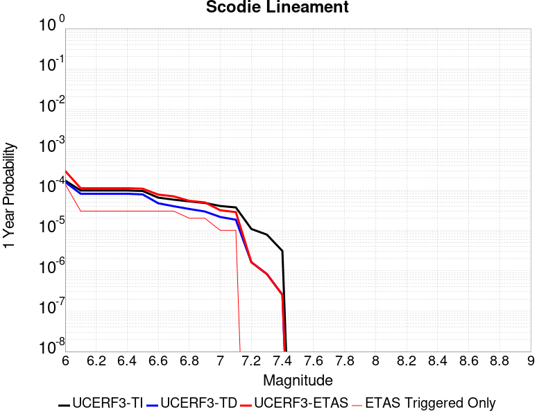 |  |

| Magnitude | 1 wk TI Prob | 1 wk TD Prob | 1 wk ETAS Prob | 1 wk ETAS/TD Gain | 1 wk ETAS Triggered Only | 1 mo TI Prob | 1 mo TD Prob | 1 mo ETAS Prob | 1 mo ETAS/TD Gain | 1 mo ETAS Triggered Only | 1 yr TI Prob | 1 yr TD Prob | 1 yr ETAS Prob | 1 yr ETAS/TD Gain | 1 yr ETAS Triggered Only | 10 yr TI Prob | 10 yr TD Prob | 10 yr ETAS Prob | 10 yr ETAS/TD Gain | 10 yr ETAS Triggered Only |
|-----|-----|-----|-----|-----|-----|-----|-----|-----|-----|-----|-----|-----|-----|-----|-----|-----|-----|-----|-----|-----|
| 6.0 | 3.2919327E-6 | 3.0133565E-6 | 2.3013296E-5 | 7.6370974 | 2.0E-5 | 1.4108206E-5 | 1.2914339E-5 | 6.291369E-5 | 4.8716154 | 5.0E-5 | 1.7175387E-4 | 1.5722391E-4 | 2.9720188E-4 | 1.8903098 | 1.4E-4 | 0.0017162118 | 0.0015714383 | 0.0017411712 | 1.1080111 | 1.7E-4 |
| 6.1 | 1.8663811E-6 | 1.5490589E-6 | 1.1549044E-5 | 7.4555225 | 1.0E-5 | 7.998751E-6 | 6.6388097E-6 | 2.6638678E-5 | 4.012568 | 2.0E-5 | 9.738045E-5 | 8.082501E-5 | 1.10822584E-4 | 1.3711423 | 3.0E-5 | 9.7337784E-4 | 8.0800493E-4 | 8.4797264E-4 | 1.0494647 | 4.0E-5 |
| 6.2 | 1.8663811E-6 | 1.5490589E-6 | 1.1549044E-5 | 7.4555225 | 1.0E-5 | 7.998751E-6 | 6.6388097E-6 | 2.6638678E-5 | 4.012568 | 2.0E-5 | 9.738045E-5 | 8.082501E-5 | 1.10822584E-4 | 1.3711423 | 3.0E-5 | 9.7337784E-4 | 8.0800493E-4 | 8.4797264E-4 | 1.0494647 | 4.0E-5 |
| 6.3 | 1.8663811E-6 | 1.5490589E-6 | 1.1549044E-5 | 7.4555225 | 1.0E-5 | 7.998751E-6 | 6.6388097E-6 | 2.6638678E-5 | 4.012568 | 2.0E-5 | 9.738045E-5 | 8.082501E-5 | 1.10822584E-4 | 1.3711423 | 3.0E-5 | 9.7337784E-4 | 8.0800493E-4 | 8.4797264E-4 | 1.0494647 | 4.0E-5 |
| 6.4 | 1.8663811E-6 | 1.5490589E-6 | 1.1549044E-5 | 7.4555225 | 1.0E-5 | 7.998751E-6 | 6.6388097E-6 | 2.6638678E-5 | 4.012568 | 2.0E-5 | 9.738045E-5 | 8.082501E-5 | 1.10822584E-4 | 1.3711423 | 3.0E-5 | 9.7337784E-4 | 8.0800493E-4 | 8.4797264E-4 | 1.0494647 | 4.0E-5 |
| 6.5 | 1.8106311E-6 | 1.4909926E-6 | 1.1490978E-5 | 7.7069316 | 1.0E-5 | 7.759824E-6 | 6.3899556E-6 | 2.6389827E-5 | 4.1298923 | 2.0E-5 | 9.447177E-5 | 7.779543E-5 | 1.07793094E-4 | 1.3855968 | 3.0E-5 | 9.4431615E-4 | 7.777306E-4 | 8.176995E-4 | 1.0513917 | 4.0E-5 |
| 6.6 | 1.2414679E-6 | 8.9976135E-7 | 1.0899752E-5 | 12.114048 | 1.0E-5 | 5.320566E-6 | 3.8561147E-6 | 2.3856037E-5 | 6.1865473 | 2.0E-5 | 6.477596E-5 | 4.6947276E-5 | 7.694587E-5 | 1.6389847 | 3.0E-5 | 6.475708E-4 | 4.6938224E-4 | 5.093635E-4 | 1.0851784 | 4.0E-5 |
| 6.7 | 1.1062215E-6 | 7.5943603E-7 | 1.0759429E-5 | 14.167656 | 1.0E-5 | 4.7409408E-6 | 3.254722E-6 | 2.3254657E-5 | 7.144898 | 2.0E-5 | 5.7719422E-5 | 3.9625593E-5 | 6.96244E-5 | 1.7570565 | 3.0E-5 | 5.770443E-4 | 3.9619225E-4 | 4.361764E-4 | 1.100921 | 4.0E-5 |
| 6.8 | 1.0006736E-6 | 6.5004406E-7 | 6.5004406E-7 | 1.0 | 0.0 | 4.288594E-6 | 2.7859005E-6 | 1.2785873E-5 | 4.5894938 | 1.0E-5 | 5.221238E-5 | 3.3917873E-5 | 5.3917192E-5 | 1.5896397 | 2.0E-5 | 5.220012E-4 | 3.3913302E-4 | 3.6912286E-4 | 1.0884309 | 3.0E-5 |
| 6.9 | 9.167364E-7 | 5.6316645E-7 | 5.6316645E-7 | 1.0 | 0.0 | 3.9288643E-6 | 2.4135686E-6 | 1.2413544E-5 | 5.1432323 | 1.0E-5 | 4.7832873E-5 | 2.9384859E-5 | 4.938427E-5 | 1.6806027 | 2.0E-5 | 4.782258E-4 | 2.9381542E-4 | 3.238066E-4 | 1.102075 | 3.0E-5 |
| 7.0 | 7.6987664E-7 | 4.113416E-7 | 4.113416E-7 | 1.0 | 0.0 | 3.2994672E-6 | 1.7628915E-6 | 1.7628915E-6 | 1.0 | 0.0 | 4.0170275E-5 | 2.1463033E-5 | 3.146282E-5 | 1.4659073 | 1.0E-5 | 4.0163012E-4 | 2.1461345E-4 | 2.3460916E-4 | 1.0931708 | 2.0E-5 |
| 7.1 | 7.1038727E-7 | 3.5211795E-7 | 3.5211795E-7 | 1.0 | 0.0 | 3.0445133E-6 | 1.5090762E-6 | 1.5090762E-6 | 1.0 | 0.0 | 3.706632E-5 | 1.8372884E-5 | 2.83727E-5 | 1.5442704 | 1.0E-5 | 3.7060137E-4 | 1.8371714E-4 | 2.0371347E-4 | 1.108843 | 2.0E-5 |
| 7.2 | 2.0799602E-7 | 3.1187685E-8 | 3.1187685E-8 | 1.0 | 0.0 | 8.914113E-7 | 1.336615E-7 | 1.336615E-7 | 1.0 | 0.0 | 1.0852878E-5 | 1.6273277E-6 | 1.6273277E-6 | 1.0 | 0.0 | 1.08523476E-4 | 1.6273165E-5 | 1.6273165E-5 | 1.0 | 0.0 |
| 7.3 | 1.5048182E-7 | 1.5946263E-8 | 1.5946263E-8 | 1.0 | 0.0 | 6.449219E-7 | 6.834112E-8 | 6.834112E-8 | 1.0 | 0.0 | 7.851896E-6 | 8.320529E-7 | 8.320529E-7 | 1.0 | 0.0 | 7.851618E-5 | 8.3205005E-6 | 8.3205005E-6 | 1.0 | 0.0 |
| 7.4 | 5.9334678E-8 | 4.8685624E-9 | 4.8685624E-9 | 1.0 | 0.0 | 2.5429145E-7 | 2.0865269E-8 | 2.0865269E-8 | 1.0 | 0.0 | 3.095994E-6 | 2.5403463E-7 | 2.5403463E-7 | 1.0 | 0.0 | 3.095951E-5 | 2.5403444E-6 | 2.5403444E-6 | 1.0 | 0.0 |

## Death Valley (Fish Lake Valley)
*[(top)](#table-of-contents)*

| 1 Week | 1 Month | 1 Year | 10 Year |
|-----|-----|-----|-----|
|  |  |  |  |

| Magnitude | 1 wk TI Prob | 1 wk TD Prob | 1 wk ETAS Prob | 1 wk ETAS/TD Gain | 1 wk ETAS Triggered Only | 1 mo TI Prob | 1 mo TD Prob | 1 mo ETAS Prob | 1 mo ETAS/TD Gain | 1 mo ETAS Triggered Only | 1 yr TI Prob | 1 yr TD Prob | 1 yr ETAS Prob | 1 yr ETAS/TD Gain | 1 yr ETAS Triggered Only | 10 yr TI Prob | 10 yr TD Prob | 10 yr ETAS Prob | 10 yr ETAS/TD Gain | 10 yr ETAS Triggered Only |
|-----|-----|-----|-----|-----|-----|-----|-----|-----|-----|-----|-----|-----|-----|-----|-----|-----|-----|-----|-----|-----|
| 6.0 | 3.872328E-5 | 4.7268895E-5 | 4.7268895E-5 | 1.0 | 0.0 | 1.6594635E-4 | 2.0256694E-4 | 2.0256694E-4 | 1.0 | 0.0 | 0.0020185246 | 0.0024636039 | 0.0025035052 | 1.0161964 | 4.0E-5 | 0.02000288 | 0.024388881 | 0.024554735 | 1.0068004 | 1.7E-4 |
| 6.1 | 3.872328E-5 | 4.7268895E-5 | 4.7268895E-5 | 1.0 | 0.0 | 1.6594635E-4 | 2.0256694E-4 | 2.0256694E-4 | 1.0 | 0.0 | 0.0020185246 | 0.0024636039 | 0.0025035052 | 1.0161964 | 4.0E-5 | 0.02000288 | 0.024388881 | 0.024554735 | 1.0068004 | 1.7E-4 |
| 6.2 | 3.872328E-5 | 4.7268895E-5 | 4.7268895E-5 | 1.0 | 0.0 | 1.6594635E-4 | 2.0256694E-4 | 2.0256694E-4 | 1.0 | 0.0 | 0.0020185246 | 0.0024636039 | 0.0025035052 | 1.0161964 | 4.0E-5 | 0.02000288 | 0.024388881 | 0.024554735 | 1.0068004 | 1.7E-4 |
| 6.3 | 2.8356371E-5 | 3.3610693E-5 | 3.3610693E-5 | 1.0 | 0.0 | 1.2152165E-4 | 1.4403832E-4 | 1.4403832E-4 | 1.0 | 0.0 | 0.0014785219 | 0.001752335 | 0.0017922649 | 1.0227867 | 4.0E-5 | 0.014687235 | 0.01739221 | 0.017559253 | 1.0096045 | 1.7E-4 |
| 6.4 | 2.8356371E-5 | 3.3610693E-5 | 3.3610693E-5 | 1.0 | 0.0 | 1.2152165E-4 | 1.4403832E-4 | 1.4403832E-4 | 1.0 | 0.0 | 0.0014785219 | 0.001752335 | 0.0017922649 | 1.0227867 | 4.0E-5 | 0.014687235 | 0.01739221 | 0.017559253 | 1.0096045 | 1.7E-4 |
| 6.5 | 2.4448687E-5 | 2.8608209E-5 | 2.8608209E-5 | 1.0 | 0.0 | 1.0477588E-4 | 1.2260114E-4 | 1.2260114E-4 | 1.0 | 0.0 | 0.0012748998 | 0.0014916973 | 0.0015316376 | 1.0267751 | 4.0E-5 | 0.012676105 | 0.014821712 | 0.014989193 | 1.0112996 | 1.7E-4 |
| 6.6 | 2.1298161E-5 | 2.4660607E-5 | 2.4660607E-5 | 1.0 | 0.0 | 9.127464E-5 | 1.0568422E-4 | 1.0568422E-4 | 1.0 | 0.0 | 0.0011107022 | 0.0012859798 | 0.0013259284 | 1.0310646 | 4.0E-5 | 0.011051672 | 0.012788794 | 0.01295662 | 1.0131229 | 1.7E-4 |
| 6.7 | 1.8959729E-5 | 2.178146E-5 | 2.178146E-5 | 1.0 | 0.0 | 8.125345E-5 | 9.3345916E-5 | 9.3345916E-5 | 1.0 | 0.0 | 9.888117E-4 | 0.0011359196 | 0.0011758741 | 1.0351738 | 4.0E-5 | 0.009844234 | 0.011303794 | 0.011471872 | 1.0148692 | 1.7E-4 |
| 6.8 | 1.6691629E-5 | 1.9018706E-5 | 1.9018706E-5 | 1.0 | 0.0 | 7.153359E-5 | 8.150629E-5 | 8.150629E-5 | 1.0 | 0.0 | 8.7057345E-4 | 9.919042E-4 | 0.0010318644 | 1.0402864 | 4.0E-5 | 0.008671708 | 0.009876527 | 0.010044848 | 1.0170425 | 1.7E-4 |
| 6.9 | 1.450505E-5 | 1.6389824E-5 | 1.6389824E-5 | 1.0 | 0.0 | 6.216302E-5 | 7.024026E-5 | 7.024026E-5 | 1.0 | 0.0 | 7.5657194E-4 | 8.548484E-4 | 8.948142E-4 | 1.046752 | 4.0E-5 | 0.007540013 | 0.008516532 | 0.008685085 | 1.0197911 | 1.7E-4 |
| 7.0 | 1.2940855E-5 | 1.453821E-5 | 1.453821E-5 | 1.0 | 0.0 | 5.545963E-5 | 6.230516E-5 | 6.230516E-5 | 1.0 | 0.0 | 6.750118E-4 | 7.583071E-4 | 7.982768E-4 | 1.0527091 | 4.0E-5 | 0.006729651 | 0.0075578135 | 0.0077265287 | 1.0223233 | 1.7E-4 |
| 7.1 | 1.2544658E-5 | 1.4078437E-5 | 1.4078437E-5 | 1.0 | 0.0 | 5.3761712E-5 | 6.033479E-5 | 6.033479E-5 | 1.0 | 0.0 | 6.5435225E-4 | 7.343341E-4 | 7.7430473E-4 | 1.0544311 | 4.0E-5 | 0.006524288 | 0.0073196692 | 0.007488425 | 1.0230551 | 1.7E-4 |
| 7.2 | 1.2489416E-5 | 1.4015902E-5 | 1.4015902E-5 | 1.0 | 0.0 | 5.3524967E-5 | 6.00668E-5 | 6.00668E-5 | 1.0 | 0.0 | 6.514716E-4 | 7.310735E-4 | 7.710443E-4 | 1.054674 | 4.0E-5 | 0.006495651 | 0.007287278 | 0.0074560386 | 1.0231583 | 1.7E-4 |
| 7.3 | 1.2368307E-5 | 1.3880038E-5 | 1.3880038E-5 | 1.0 | 0.0 | 5.3005948E-5 | 5.948455E-5 | 5.948455E-5 | 1.0 | 0.0 | 6.451563E-4 | 7.239894E-4 | 7.639604E-4 | 1.0552094 | 4.0E-5 | 0.0064328653 | 0.0072168987 | 0.0073856716 | 1.0233859 | 1.7E-4 |
| 7.4 | 1.2161707E-5 | 1.3648089E-5 | 1.3648089E-5 | 1.0 | 0.0 | 5.212056E-5 | 5.8490532E-5 | 5.8490532E-5 | 1.0 | 0.0 | 6.3438306E-4 | 7.118952E-4 | 7.5186667E-4 | 1.056148 | 4.0E-5 | 0.006325751 | 0.0070967353 | 0.007265529 | 1.0237846 | 1.7E-4 |
| 7.5 | 1.1707948E-5 | 1.314573E-5 | 1.314573E-5 | 1.0 | 0.0 | 5.0175953E-5 | 5.6337656E-5 | 5.6337656E-5 | 1.0 | 0.0 | 6.10721E-4 | 6.857007E-4 | 7.256733E-4 | 1.0582945 | 4.0E-5 | 0.0060904534 | 0.0068364325 | 0.00700527 | 1.0246968 | 1.7E-4 |
| 7.6 | 1.0319538E-5 | 1.157981E-5 | 1.157981E-5 | 1.0 | 0.0 | 4.4225842E-5 | 4.9626844E-5 | 4.9626844E-5 | 1.0 | 0.0 | 5.383166E-4 | 6.040445E-4 | 6.440203E-4 | 1.0661803 | 4.0E-5 | 0.0053701443 | 0.0060245576 | 0.0061935335 | 1.0280478 | 1.7E-4 |
| 7.7 | 8.937764E-6 | 1.0022941E-5 | 1.0022941E-5 | 1.0 | 0.0 | 3.830414E-5 | 4.295478E-5 | 4.295478E-5 | 1.0 | 0.0 | 4.6625308E-4 | 5.2285404E-4 | 5.628331E-4 | 1.0764632 | 4.0E-5 | 0.0046527605 | 0.005216748 | 0.0053759133 | 1.0305104 | 1.6E-4 |
| 7.8 | 3.108007E-7 | 3.2846788E-7 | 3.2846788E-7 | 1.0 | 0.0 | 1.3320023E-6 | 1.4077187E-6 | 1.4077187E-6 | 1.0 | 0.0 | 1.6217007E-5 | 1.7138846E-5 | 1.7138846E-5 | 1.0 | 0.0 | 1.6215823E-4 | 1.713756E-4 | 1.713756E-4 | 1.0 | 0.0 |
| 7.9 | 2.5591178E-9 | 2.6696871E-9 | 2.6696871E-9 | 1.0 | 0.0 | 1.0967647E-8 | 1.1441516E-8 | 1.1441516E-8 | 1.0 | 0.0 | 1.335311E-7 | 1.3930045E-7 | 1.3930045E-7 | 1.0 | 0.0 | 1.3353102E-6 | 1.3930046E-6 | 1.3930046E-6 | 1.0 | 0.0 |

## Elsinore (Glen Ivy) rev
*[(top)](#table-of-contents)*

| 1 Week | 1 Month | 1 Year | 10 Year |
|-----|-----|-----|-----|
|  | 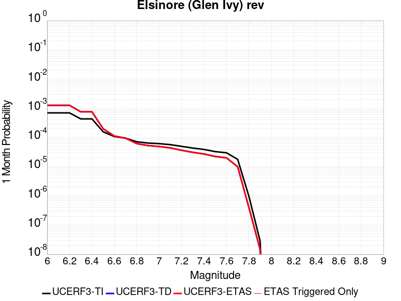 |  | 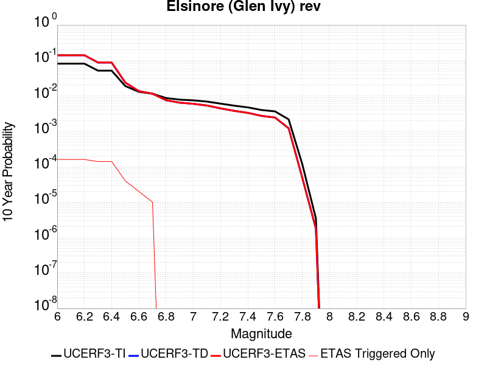 |

| Magnitude | 1 wk TI Prob | 1 wk TD Prob | 1 wk ETAS Prob | 1 wk ETAS/TD Gain | 1 wk ETAS Triggered Only | 1 mo TI Prob | 1 mo TD Prob | 1 mo ETAS Prob | 1 mo ETAS/TD Gain | 1 mo ETAS Triggered Only | 1 yr TI Prob | 1 yr TD Prob | 1 yr ETAS Prob | 1 yr ETAS/TD Gain | 1 yr ETAS Triggered Only | 10 yr TI Prob | 10 yr TD Prob | 10 yr ETAS Prob | 10 yr ETAS/TD Gain | 10 yr ETAS Triggered Only |
|-----|-----|-----|-----|-----|-----|-----|-----|-----|-----|-----|-----|-----|-----|-----|-----|-----|-----|-----|-----|-----|
| 6.0 | 1.6204086E-4 | 2.9362022E-4 | 2.9362022E-4 | 1.0 | 0.0 | 6.94276E-4 | 0.0012579202 | 0.0012579202 | 1.0 | 0.0 | 0.008420097 | 0.015235162 | 0.015294248 | 1.0038782 | 6.0E-5 | 0.081081145 | 0.13969512 | 0.13983278 | 1.0009854 | 1.6E-4 |
| 6.1 | 1.6204086E-4 | 2.9362022E-4 | 2.9362022E-4 | 1.0 | 0.0 | 6.94276E-4 | 0.0012579202 | 0.0012579202 | 1.0 | 0.0 | 0.008420097 | 0.015235162 | 0.015294248 | 1.0038782 | 6.0E-5 | 0.081081145 | 0.13969512 | 0.13983278 | 1.0009854 | 1.6E-4 |
| 6.2 | 1.6204086E-4 | 2.9362022E-4 | 2.9362022E-4 | 1.0 | 0.0 | 6.94276E-4 | 0.0012579202 | 0.0012579202 | 1.0 | 0.0 | 0.008420097 | 0.015235162 | 0.015294248 | 1.0038782 | 6.0E-5 | 0.081081145 | 0.13969512 | 0.13983278 | 1.0009854 | 1.6E-4 |
| 6.3 | 1.0111737E-4 | 1.7703768E-4 | 1.7703768E-4 | 1.0 | 0.0 | 4.332882E-4 | 7.58629E-4 | 7.58629E-4 | 1.0 | 0.0 | 0.005262531 | 0.0092178825 | 0.009267422 | 1.0053742 | 5.0E-5 | 0.0513964 | 0.08702082 | 0.087148644 | 1.0014688 | 1.4E-4 |
| 6.4 | 1.0111737E-4 | 1.7703768E-4 | 1.7703768E-4 | 1.0 | 0.0 | 4.332882E-4 | 7.58629E-4 | 7.58629E-4 | 1.0 | 0.0 | 0.005262531 | 0.0092178825 | 0.009267422 | 1.0053742 | 5.0E-5 | 0.0513964 | 0.08702082 | 0.087148644 | 1.0014688 | 1.4E-4 |
| 6.5 | 3.6624708E-5 | 4.639301E-5 | 4.639301E-5 | 1.0 | 0.0 | 1.569536E-4 | 1.9881407E-4 | 1.9881407E-4 | 1.0 | 0.0 | 0.001909235 | 0.0024182373 | 0.002438189 | 1.0082505 | 2.0E-5 | 0.01892915 | 0.023740914 | 0.023779964 | 1.0016448 | 4.0E-5 |
| 6.6 | 2.5051324E-5 | 2.614908E-5 | 2.614908E-5 | 1.0 | 0.0 | 1.073584E-4 | 1.1206293E-4 | 1.1206293E-4 | 1.0 | 0.0 | 0.0013063047 | 0.0013635567 | 0.0013635567 | 1.0 | 0.0 | 0.012986525 | 0.013565315 | 0.013585043 | 1.0014544 | 2.0E-5 |
| 6.7 | 2.2189772E-5 | 2.207403E-5 | 2.207403E-5 | 1.0 | 0.0 | 9.509556E-5 | 9.459976E-5 | 9.459976E-5 | 1.0 | 0.0 | 0.0011571734 | 0.0011511799 | 0.0011511799 | 1.0 | 0.0 | 0.011511663 | 0.011466023 | 0.011475908 | 1.0008621 | 1.0E-5 |
| 6.8 | 1.6654378E-5 | 1.4438445E-5 | 1.4438445E-5 | 1.0 | 0.0 | 7.137396E-5 | 6.187761E-5 | 6.187761E-5 | 1.0 | 0.0 | 8.686314E-4 | 7.531047E-4 | 7.531047E-4 | 1.0 | 0.0 | 0.008652439 | 0.0075108632 | 0.0075108632 | 1.0 | 0.0 |
| 6.9 | 1.5042909E-5 | 1.23326745E-5 | 1.23326745E-5 | 1.0 | 0.0 | 6.446802E-5 | 5.2853266E-5 | 5.2853266E-5 | 1.0 | 0.0 | 7.8461546E-4 | 6.433017E-4 | 6.433017E-4 | 1.0 | 0.0 | 0.007818509 | 0.006418618 | 0.006418618 | 1.0 | 0.0 |
| 7.0 | 1.4361385E-5 | 1.14519435E-5 | 1.14519435E-5 | 1.0 | 0.0 | 6.154734E-5 | 4.907885E-5 | 4.907885E-5 | 1.0 | 0.0 | 7.490812E-4 | 5.973741E-4 | 5.973741E-4 | 1.0 | 0.0 | 0.007465612 | 0.0059616743 | 0.0059616743 | 1.0 | 0.0 |
| 7.1 | 1.3265571E-5 | 1.0245398E-5 | 1.0245398E-5 | 1.0 | 0.0 | 5.6851208E-5 | 4.3908123E-5 | 4.3908123E-5 | 1.0 | 0.0 | 6.919436E-4 | 5.344528E-4 | 5.344528E-4 | 1.0 | 0.0 | 0.006897931 | 0.0053350315 | 0.0053350315 | 1.0 | 0.0 |
| 7.2 | 1.1596403E-5 | 8.50544E-6 | 8.50544E-6 | 1.0 | 0.0 | 4.9697923E-5 | 3.6451387E-5 | 3.6451387E-5 | 1.0 | 0.0 | 6.049042E-4 | 4.4370696E-4 | 4.4370696E-4 | 1.0 | 0.0 | 0.006032603 | 0.004429626 | 0.004429626 | 1.0 | 0.0 |
| 7.3 | 1.0150827E-5 | 7.23907E-6 | 7.23907E-6 | 1.0 | 0.0 | 4.3502816E-5 | 3.1024225E-5 | 3.1024225E-5 | 1.0 | 0.0 | 5.2951806E-4 | 3.776559E-4 | 3.776559E-4 | 1.0 | 0.0 | 0.005282581 | 0.0037705277 | 0.0037705277 | 1.0 | 0.0 |
| 7.4 | 9.080705E-6 | 6.352785E-6 | 6.352785E-6 | 1.0 | 0.0 | 3.8916725E-5 | 2.7225946E-5 | 2.7225946E-5 | 1.0 | 0.0 | 4.7370812E-4 | 3.3142683E-4 | 3.3142683E-4 | 1.0 | 0.0 | 0.004726996 | 0.0033094764 | 0.0033094764 | 1.0 | 0.0 |
| 7.5 | 7.671649E-6 | 5.2258497E-6 | 5.2258497E-6 | 1.0 | 0.0 | 3.287808E-5 | 2.2396314E-5 | 2.2396314E-5 | 1.0 | 0.0 | 4.0021708E-4 | 2.7264224E-4 | 2.7264224E-4 | 1.0 | 0.0 | 0.0039949706 | 0.0027232026 | 0.0027232026 | 1.0 | 0.0 |
| 7.6 | 6.990086E-6 | 4.687739E-6 | 4.687739E-6 | 1.0 | 0.0 | 2.9957167E-5 | 2.0090161E-5 | 2.0090161E-5 | 1.0 | 0.0 | 3.6466747E-4 | 2.4457145E-4 | 2.4457145E-4 | 1.0 | 0.0 | 0.0036406964 | 0.002443139 | 0.002443139 | 1.0 | 0.0 |
| 7.7 | 4.163505E-6 | 2.3296475E-6 | 2.3296475E-6 | 1.0 | 0.0 | 1.7843471E-5 | 9.984169E-6 | 9.984169E-6 | 1.0 | 0.0 | 2.172226E-4 | 1.21551224E-4 | 1.21551224E-4 | 1.0 | 0.0 | 0.0021701038 | 0.0012149204 | 0.0012149204 | 1.0 | 0.0 |
| 7.8 | 2.2692414E-7 | 9.385943E-8 | 9.385943E-8 | 1.0 | 0.0 | 9.725317E-7 | 4.0225464E-7 | 4.0225464E-7 | 1.0 | 0.0 | 1.1840509E-5 | 4.8974425E-6 | 4.8974425E-6 | 1.0 | 0.0 | 1.1839878E-4 | 4.8973674E-5 | 4.8973674E-5 | 1.0 | 0.0 |
| 7.9 | 6.676829E-9 | 3.4399772E-9 | 3.4399772E-9 | 1.0 | 0.0 | 2.861498E-8 | 1.4742759E-8 | 1.4742759E-8 | 1.0 | 0.0 | 3.4838732E-7 | 1.7949307E-7 | 1.7949307E-7 | 1.0 | 0.0 | 3.4838679E-6 | 1.7949295E-6 | 1.7949295E-6 | 1.0 | 0.0 |

## Lake Isabella (Seismicity)
*[(top)](#table-of-contents)*

| 1 Week | 1 Month | 1 Year | 10 Year |
|-----|-----|-----|-----|
|  | 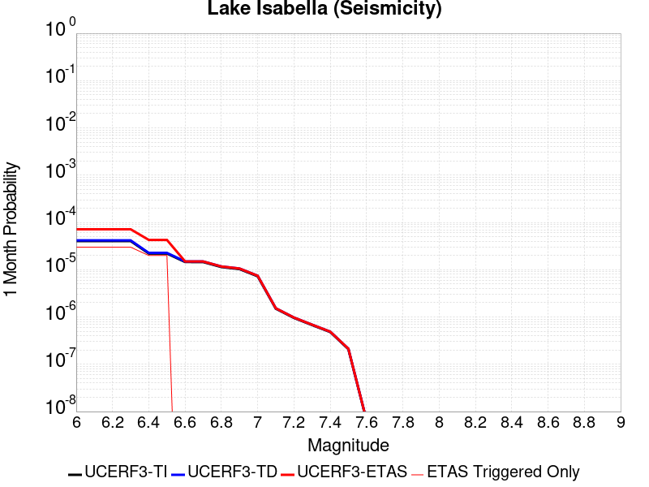 | 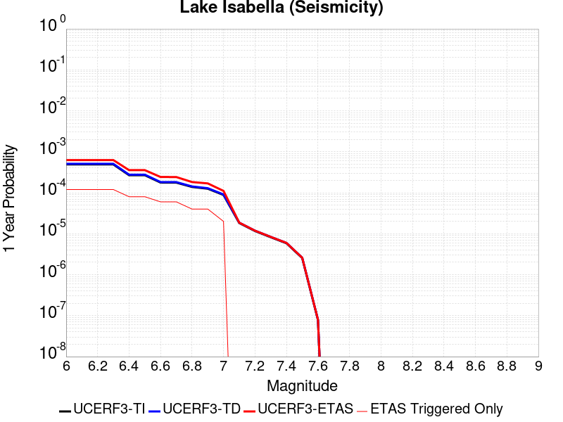 |  |

| Magnitude | 1 wk TI Prob | 1 wk TD Prob | 1 wk ETAS Prob | 1 wk ETAS/TD Gain | 1 wk ETAS Triggered Only | 1 mo TI Prob | 1 mo TD Prob | 1 mo ETAS Prob | 1 mo ETAS/TD Gain | 1 mo ETAS Triggered Only | 1 yr TI Prob | 1 yr TD Prob | 1 yr ETAS Prob | 1 yr ETAS/TD Gain | 1 yr ETAS Triggered Only | 10 yr TI Prob | 10 yr TD Prob | 10 yr ETAS Prob | 10 yr ETAS/TD Gain | 10 yr ETAS Triggered Only |
|-----|-----|-----|-----|-----|-----|-----|-----|-----|-----|-----|-----|-----|-----|-----|-----|-----|-----|-----|-----|-----|
| 6.0 | 9.431637E-6 | 9.741694E-6 | 9.741694E-6 | 1.0 | 0.0 | 4.0420677E-5 | 4.1749525E-5 | 7.174827E-5 | 1.718541 | 3.0E-5 | 4.920106E-4 | 5.0819496E-4 | 6.28134E-4 | 1.2360098 | 1.2E-4 | 0.004909227 | 0.005071621 | 0.005240759 | 1.0333499 | 1.7E-4 |
| 6.1 | 9.431637E-6 | 9.741694E-6 | 9.741694E-6 | 1.0 | 0.0 | 4.0420677E-5 | 4.1749525E-5 | 7.174827E-5 | 1.718541 | 3.0E-5 | 4.920106E-4 | 5.0819496E-4 | 6.28134E-4 | 1.2360098 | 1.2E-4 | 0.004909227 | 0.005071621 | 0.005240759 | 1.0333499 | 1.7E-4 |
| 6.2 | 9.431637E-6 | 9.741694E-6 | 9.741694E-6 | 1.0 | 0.0 | 4.0420677E-5 | 4.1749525E-5 | 7.174827E-5 | 1.718541 | 3.0E-5 | 4.920106E-4 | 5.0819496E-4 | 6.28134E-4 | 1.2360098 | 1.2E-4 | 0.004909227 | 0.005071621 | 0.005240759 | 1.0333499 | 1.7E-4 |
| 6.3 | 9.431637E-6 | 9.741694E-6 | 9.741694E-6 | 1.0 | 0.0 | 4.0420677E-5 | 4.1749525E-5 | 7.174827E-5 | 1.718541 | 3.0E-5 | 4.920106E-4 | 5.0819496E-4 | 6.28134E-4 | 1.2360098 | 1.2E-4 | 0.004909227 | 0.005071621 | 0.005240759 | 1.0333499 | 1.7E-4 |
| 6.4 | 5.144063E-6 | 5.3000977E-6 | 5.3000977E-6 | 1.0 | 0.0 | 2.2045799E-5 | 2.2714525E-5 | 4.271407E-5 | 1.8804739 | 2.0E-5 | 2.6837454E-4 | 2.765177E-4 | 3.5649558E-4 | 1.2892324 | 8.0E-5 | 0.0026805066 | 0.002762077 | 0.002871773 | 1.039715 | 1.1E-4 |
| 6.5 | 5.144063E-6 | 5.3000977E-6 | 5.3000977E-6 | 1.0 | 0.0 | 2.2045799E-5 | 2.2714525E-5 | 4.271407E-5 | 1.8804739 | 2.0E-5 | 2.6837454E-4 | 2.765177E-4 | 3.5649558E-4 | 1.2892324 | 8.0E-5 | 0.0026805066 | 0.002762077 | 0.002871773 | 1.039715 | 1.1E-4 |
| 6.6 | 3.4009804E-6 | 3.4987995E-6 | 3.4987995E-6 | 1.0 | 0.0 | 1.4575549E-5 | 1.4994778E-5 | 1.4994778E-5 | 1.0 | 0.0 | 1.7744285E-4 | 1.8254772E-4 | 2.4253677E-4 | 1.3286211 | 6.0E-5 | 0.0017730123 | 0.0018241355 | 0.0019139714 | 1.0492485 | 9.0E-5 |
| 6.7 | 3.3880428E-6 | 3.4856662E-6 | 3.4856662E-6 | 1.0 | 0.0 | 1.4520103E-5 | 1.4938492E-5 | 1.4938492E-5 | 1.0 | 0.0 | 1.767679E-4 | 1.8186258E-4 | 2.4185165E-4 | 1.3298595 | 6.0E-5 | 0.0017662736 | 0.0018172951 | 0.0019071316 | 1.0494342 | 9.0E-5 |
| 6.8 | 2.6582E-6 | 2.7337105E-6 | 2.7337105E-6 | 1.0 | 0.0 | 1.1392236E-5 | 1.1715857E-5 | 1.1715857E-5 | 1.0 | 0.0 | 1.3869164E-4 | 1.4263256E-4 | 1.8262686E-4 | 1.2804009 | 4.0E-5 | 0.0013860512 | 0.0014255423 | 0.0014854567 | 1.0420293 | 6.0E-5 |
| 6.9 | 2.406011E-6 | 2.474338E-6 | 2.474338E-6 | 1.0 | 0.0 | 1.0311434E-5 | 1.0604271E-5 | 1.0604271E-5 | 1.0 | 0.0 | 1.2553448E-4 | 1.2910066E-4 | 1.6909551E-4 | 1.3097957 | 4.0E-5 | 0.0012546359 | 0.0012903863 | 0.0013503089 | 1.0464377 | 6.0E-5 |
| 7.0 | 1.6953097E-6 | 1.7429437E-6 | 1.7429437E-6 | 1.0 | 0.0 | 7.265593E-6 | 7.469743E-6 | 7.469743E-6 | 1.0 | 0.0 | 8.8455E-5 | 9.094137E-5 | 1.1093955E-4 | 1.2199019 | 2.0E-5 | 8.84198E-4 | 9.0914435E-4 | 9.49108E-4 | 1.0439575 | 4.0E-5 |
| 7.1 | 3.5013824E-7 | 3.571492E-7 | 3.571492E-7 | 1.0 | 0.0 | 1.5005916E-6 | 1.5306384E-6 | 1.5306384E-6 | 1.0 | 0.0 | 1.826955E-5 | 1.8635366E-5 | 1.8635366E-5 | 1.0 | 0.0 | 1.8268047E-4 | 1.863383E-4 | 1.863383E-4 | 1.0 | 0.0 |
| 7.2 | 2.2321095E-7 | 2.2750632E-7 | 2.2750632E-7 | 1.0 | 0.0 | 9.56618E-7 | 9.750268E-7 | 9.750268E-7 | 1.0 | 0.0 | 1.1646762E-5 | 1.1870887E-5 | 1.1870887E-5 | 1.0 | 0.0 | 1.1646151E-4 | 1.1870263E-4 | 1.1870263E-4 | 1.0 | 0.0 |
| 7.3 | 1.5760406E-7 | 1.6060963E-7 | 1.6060963E-7 | 1.0 | 0.0 | 6.7544585E-7 | 6.883268E-7 | 6.883268E-7 | 1.0 | 0.0 | 8.223522E-6 | 8.380347E-6 | 8.380347E-6 | 1.0 | 0.0 | 8.2232174E-5 | 8.3800376E-5 | 8.3800376E-5 | 1.0 | 0.0 |
| 7.4 | 1.1216497E-7 | 1.1431735E-7 | 1.1431735E-7 | 1.0 | 0.0 | 4.8070694E-7 | 4.8993144E-7 | 4.8993144E-7 | 1.0 | 0.0 | 5.852591E-6 | 5.964899E-6 | 5.964899E-6 | 1.0 | 0.0 | 5.8524372E-5 | 5.9647435E-5 | 5.9647435E-5 | 1.0 | 0.0 |
| 7.5 | 4.885185E-8 | 4.9787864E-8 | 4.9787864E-8 | 1.0 | 0.0 | 2.0936506E-7 | 2.1337654E-7 | 2.1337654E-7 | 1.0 | 0.0 | 2.5490165E-6 | 2.5978566E-6 | 2.5978566E-6 | 1.0 | 0.0 | 2.5489873E-5 | 2.597828E-5 | 2.597828E-5 | 1.0 | 0.0 |
| 7.6 | 1.504641E-9 | 1.5317939E-9 | 1.5317939E-9 | 1.0 | 0.0 | 6.4484613E-9 | 6.5648313E-9 | 6.5648313E-9 | 1.0 | 0.0 | 7.851001E-8 | 7.992682E-8 | 7.992682E-8 | 1.0 | 0.0 | 7.8509987E-7 | 7.992682E-7 | 7.992682E-7 | 1.0 | 0.0 |

## San Jacinto (San Jacinto Valley) rev
*[(top)](#table-of-contents)*

| 1 Week | 1 Month | 1 Year | 10 Year |
|-----|-----|-----|-----|
|  |  |  |  |

| Magnitude | 1 wk TI Prob | 1 wk TD Prob | 1 wk ETAS Prob | 1 wk ETAS/TD Gain | 1 wk ETAS Triggered Only | 1 mo TI Prob | 1 mo TD Prob | 1 mo ETAS Prob | 1 mo ETAS/TD Gain | 1 mo ETAS Triggered Only | 1 yr TI Prob | 1 yr TD Prob | 1 yr ETAS Prob | 1 yr ETAS/TD Gain | 1 yr ETAS Triggered Only | 10 yr TI Prob | 10 yr TD Prob | 10 yr ETAS Prob | 10 yr ETAS/TD Gain | 10 yr ETAS Triggered Only |
|-----|-----|-----|-----|-----|-----|-----|-----|-----|-----|-----|-----|-----|-----|-----|-----|-----|-----|-----|-----|-----|
| 6.0 | 3.652694E-5 | 3.4417048E-5 | 3.4417048E-5 | 1.0 | 0.0 | 1.5653463E-4 | 1.4749331E-4 | 1.5749183E-4 | 1.0677897 | 1.0E-5 | 0.0019041431 | 0.0017942534 | 0.0018541458 | 1.0333802 | 6.0E-5 | 0.018879099 | 0.018534157 | 0.018681377 | 1.0079432 | 1.5E-4 |
| 6.1 | 3.652694E-5 | 3.4417048E-5 | 3.4417048E-5 | 1.0 | 0.0 | 1.5653463E-4 | 1.4749331E-4 | 1.5749183E-4 | 1.0677897 | 1.0E-5 | 0.0019041431 | 0.0017942534 | 0.0018541458 | 1.0333802 | 6.0E-5 | 0.018879099 | 0.018534157 | 0.018681377 | 1.0079432 | 1.5E-4 |
| 6.2 | 3.652694E-5 | 3.4417048E-5 | 3.4417048E-5 | 1.0 | 0.0 | 1.5653463E-4 | 1.4749331E-4 | 1.5749183E-4 | 1.0677897 | 1.0E-5 | 0.0019041431 | 0.0017942534 | 0.0018541458 | 1.0333802 | 6.0E-5 | 0.018879099 | 0.018534157 | 0.018681377 | 1.0079432 | 1.5E-4 |
| 6.3 | 3.652694E-5 | 3.4417048E-5 | 3.4417048E-5 | 1.0 | 0.0 | 1.5653463E-4 | 1.4749331E-4 | 1.5749183E-4 | 1.0677897 | 1.0E-5 | 0.0019041431 | 0.0017942534 | 0.0018541458 | 1.0333802 | 6.0E-5 | 0.018879099 | 0.018534157 | 0.018681377 | 1.0079432 | 1.5E-4 |
| 6.4 | 3.646941E-5 | 3.433862E-5 | 3.433862E-5 | 1.0 | 0.0 | 1.5628811E-4 | 1.4715722E-4 | 1.5715575E-4 | 1.0679445 | 1.0E-5 | 0.0019011468 | 0.0017901688 | 0.0018500615 | 1.0334564 | 6.0E-5 | 0.018849645 | 0.018494038 | 0.018641263 | 1.0079607 | 1.5E-4 |
| 6.5 | 3.646941E-5 | 3.433862E-5 | 3.433862E-5 | 1.0 | 0.0 | 1.5628811E-4 | 1.4715722E-4 | 1.5715575E-4 | 1.0679445 | 1.0E-5 | 0.0019011468 | 0.0017901688 | 0.0018500615 | 1.0334564 | 6.0E-5 | 0.018849645 | 0.018494038 | 0.018641263 | 1.0079607 | 1.5E-4 |
| 6.6 | 3.6442503E-5 | 3.4302004E-5 | 3.4302004E-5 | 1.0 | 0.0 | 1.561728E-4 | 1.4700032E-4 | 1.5699884E-4 | 1.068017 | 1.0E-5 | 0.0018997455 | 0.0017882616 | 0.0018481544 | 1.0334921 | 6.0E-5 | 0.018835869 | 0.018475305 | 0.018622534 | 1.0079689 | 1.5E-4 |
| 6.7 | 3.6432113E-5 | 3.4287576E-5 | 3.4287576E-5 | 1.0 | 0.0 | 1.5612828E-4 | 1.4693849E-4 | 1.5693702E-4 | 1.0680457 | 1.0E-5 | 0.0018992044 | 0.0017875104 | 0.0018474031 | 1.0335063 | 6.0E-5 | 0.018830549 | 0.01846793 | 0.018615158 | 1.0079722 | 1.5E-4 |
| 6.8 | 3.6409598E-5 | 3.425663E-5 | 3.425663E-5 | 1.0 | 0.0 | 1.560318E-4 | 1.4680588E-4 | 1.5680441E-4 | 1.0681071 | 1.0E-5 | 0.0018980318 | 0.0017858985 | 0.0018457914 | 1.0335366 | 6.0E-5 | 0.018819023 | 0.018452084 | 0.018599315 | 1.0079792 | 1.5E-4 |
| 6.9 | 3.638078E-5 | 3.4217053E-5 | 3.4217053E-5 | 1.0 | 0.0 | 1.5590832E-4 | 1.4663627E-4 | 1.5663481E-4 | 1.0681859 | 1.0E-5 | 0.0018965311 | 0.001783837 | 0.00184373 | 1.0335754 | 6.0E-5 | 0.018804269 | 0.018431816 | 0.01857905 | 1.0079881 | 1.5E-4 |
| 7.0 | 3.6294874E-5 | 3.4099063E-5 | 3.4099063E-5 | 1.0 | 0.0 | 1.5554018E-4 | 1.4613067E-4 | 1.561292E-4 | 1.068422 | 1.0E-5 | 0.0018920569 | 0.0017776915 | 0.0018375849 | 1.0336916 | 6.0E-5 | 0.018760284 | 0.018371396 | 0.01851864 | 1.0080149 | 1.5E-4 |
| 7.1 | 3.6260717E-5 | 3.405534E-5 | 3.405534E-5 | 1.0 | 0.0 | 1.5539382E-4 | 1.4594331E-4 | 1.5594186E-4 | 1.0685097 | 1.0E-5 | 0.001890278 | 0.0017754143 | 0.0018353078 | 1.0337349 | 6.0E-5 | 0.018742796 | 0.018348996 | 0.018496243 | 1.0080248 | 1.5E-4 |
| 7.2 | 3.6210204E-5 | 3.398956E-5 | 3.398956E-5 | 1.0 | 0.0 | 1.5517735E-4 | 1.4566141E-4 | 1.5565996E-4 | 1.0686424 | 1.0E-5 | 0.001887647 | 0.0017719879 | 0.0018318816 | 1.0338002 | 6.0E-5 | 0.01871693 | 0.018315274 | 0.018462526 | 1.0080398 | 1.5E-4 |
| 7.3 | 3.6119454E-5 | 3.3877837E-5 | 3.3877837E-5 | 1.0 | 0.0 | 1.5478847E-4 | 1.4518267E-4 | 1.5518122E-4 | 1.0688688 | 1.0E-5 | 0.0018829206 | 0.0017661685 | 0.0018260626 | 1.0339118 | 6.0E-5 | 0.018670462 | 0.018257825 | 0.018405085 | 1.0080657 | 1.5E-4 |
| 7.4 | 3.607848E-5 | 3.3825334E-5 | 3.3825334E-5 | 1.0 | 0.0 | 1.5461289E-4 | 1.4495767E-4 | 1.5495623E-4 | 1.0689757 | 1.0E-5 | 0.0018807866 | 0.0017634337 | 0.0018233279 | 1.0339645 | 6.0E-5 | 0.018649481 | 0.018230818 | 0.018378083 | 1.0080779 | 1.5E-4 |
| 7.5 | 3.5856774E-5 | 3.3635082E-5 | 3.3635082E-5 | 1.0 | 0.0 | 1.5366284E-4 | 1.4414241E-4 | 1.5414097E-4 | 1.0693659 | 1.0E-5 | 0.0018692396 | 0.0017535238 | 0.0018134186 | 1.0341568 | 6.0E-5 | 0.018535944 | 0.018131904 | 0.018279186 | 1.0081227 | 1.5E-4 |
| 7.6 | 3.286655E-5 | 3.215777E-5 | 3.215777E-5 | 1.0 | 0.0 | 1.4084904E-4 | 1.3781176E-4 | 1.4781038E-4 | 1.0725528 | 1.0E-5 | 0.001713488 | 0.0016765689 | 0.0017364683 | 1.0357274 | 6.0E-5 | 0.017003361 | 0.017351432 | 0.017498828 | 1.0084949 | 1.5E-4 |
| 7.7 | 2.8882527E-5 | 2.9250317E-5 | 2.9250317E-5 | 1.0 | 0.0 | 1.237764E-4 | 1.2535248E-4 | 1.3535123E-4 | 1.0797651 | 1.0E-5 | 0.0015059357 | 0.0015250992 | 0.0015850076 | 1.0392817 | 6.0E-5 | 0.014957713 | 0.015837716 | 0.01598534 | 1.0093211 | 1.5E-4 |
| 7.8 | 2.4950225E-5 | 2.6540692E-5 | 2.6540692E-5 | 1.0 | 0.0 | 1.0692515E-4 | 1.1374087E-4 | 1.2373972E-4 | 1.0879091 | 1.0E-5 | 0.0013010362 | 0.0013839162 | 0.0014438332 | 1.0432953 | 6.0E-5 | 0.012934455 | 0.0144187445 | 0.014566582 | 1.0102531 | 1.5E-4 |
| 7.9 | 1.9881603E-5 | 2.1519538E-5 | 2.1519538E-5 | 1.0 | 0.0 | 8.520408E-5 | 9.222333E-5 | 1.0222241E-4 | 1.1084224 | 1.0E-5 | 0.001036866 | 0.0011222415 | 0.0011821742 | 1.0534045 | 6.0E-5 | 0.010320415 | 0.011783319 | 0.011921669 | 1.0117412 | 1.4E-4 |
| 8.0 | 1.563292E-5 | 1.5947082E-5 | 1.5947082E-5 | 1.0 | 0.0 | 6.6996516E-5 | 6.834285E-5 | 7.834217E-5 | 1.146311 | 1.0E-5 | 8.153773E-4 | 8.3175726E-4 | 8.71724E-4 | 1.048051 | 4.0E-5 | 0.00812392 | 0.008815629 | 0.008924659 | 1.0123678 | 1.1E-4 |
| 8.1 | 1.0045313E-5 | 8.307514E-6 | 8.307514E-6 | 1.0 | 0.0 | 4.305063E-5 | 3.5603145E-5 | 3.5603145E-5 | 1.0 | 0.0 | 5.2401534E-4 | 4.333826E-4 | 4.4337826E-4 | 1.0230643 | 1.0E-5 | 0.0052278144 | 0.0046621817 | 0.004692042 | 1.0064048 | 3.0E-5 |
| 8.2 | 4.1554413E-6 | 1.5672123E-6 | 1.5672123E-6 | 1.0 | 0.0 | 1.7808914E-5 | 6.716607E-6 | 6.716607E-6 | 1.0 | 0.0 | 2.1680194E-4 | 8.177165E-5 | 8.177165E-5 | 1.0 | 0.0 | 0.0021659054 | 9.492334E-4 | 9.492334E-4 | 1.0 | 0.0 |
| 8.3 | 1.2758221E-6 | 3.6194777E-7 | 3.6194777E-7 | 1.0 | 0.0 | 5.4677976E-6 | 1.5512038E-6 | 1.5512038E-6 | 1.0 | 0.0 | 6.65684E-5 | 1.8885747E-5 | 1.8885747E-5 | 1.0 | 0.0 | 6.6548464E-4 | 2.2777634E-4 | 2.2777634E-4 | 1.0 | 0.0 |

## San Andreas (San Gorgonio Pass-Garnet HIll)
*[(top)](#table-of-contents)*

| 1 Week | 1 Month | 1 Year | 10 Year |
|-----|-----|-----|-----|
|  | 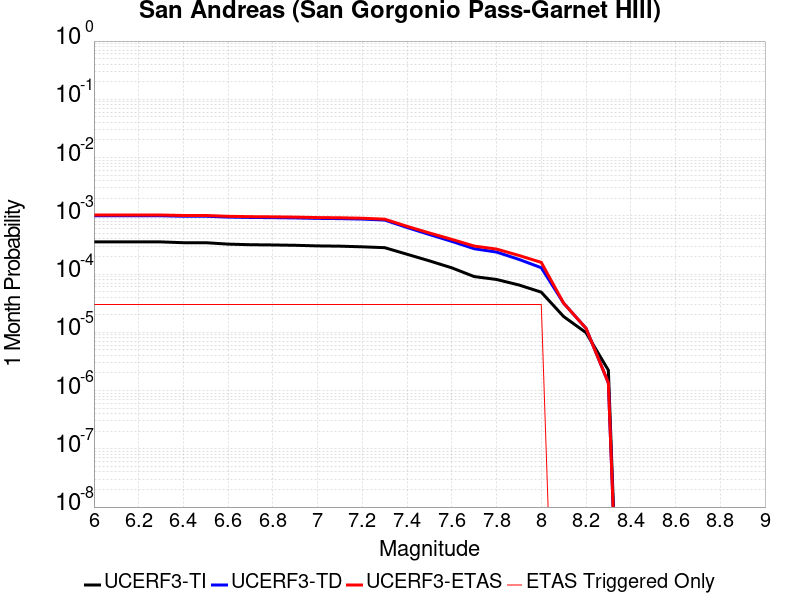 |  | 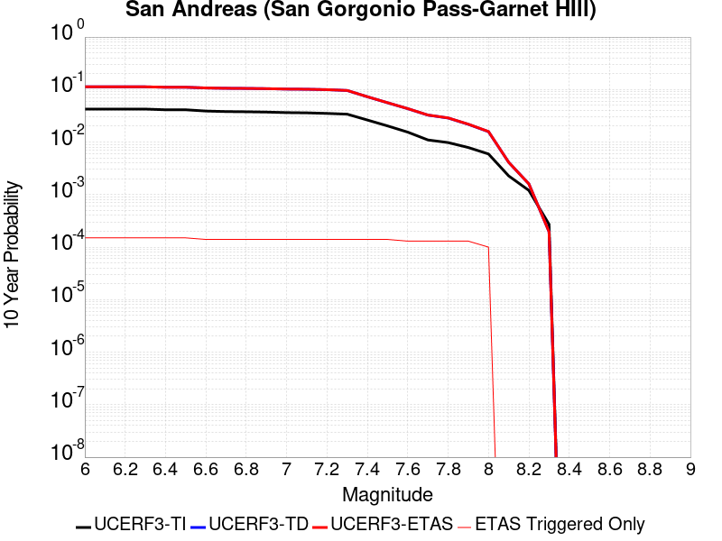 |

| Magnitude | 1 wk TI Prob | 1 wk TD Prob | 1 wk ETAS Prob | 1 wk ETAS/TD Gain | 1 wk ETAS Triggered Only | 1 mo TI Prob | 1 mo TD Prob | 1 mo ETAS Prob | 1 mo ETAS/TD Gain | 1 mo ETAS Triggered Only | 1 yr TI Prob | 1 yr TD Prob | 1 yr ETAS Prob | 1 yr ETAS/TD Gain | 1 yr ETAS Triggered Only | 10 yr TI Prob | 10 yr TD Prob | 10 yr ETAS Prob | 10 yr ETAS/TD Gain | 10 yr ETAS Triggered Only |
|-----|-----|-----|-----|-----|-----|-----|-----|-----|-----|-----|-----|-----|-----|-----|-----|-----|-----|-----|-----|-----|
| 6.0 | 8.31567E-5 | 2.3386451E-4 | 2.4386217E-4 | 1.0427498 | 1.0E-5 | 3.5633717E-4 | 0.0010018935 | 0.0010318635 | 1.0299133 | 3.0E-5 | 0.004329778 | 0.012129918 | 0.012208948 | 1.0065153 | 8.0E-5 | 0.042463828 | 0.11259502 | 0.11272813 | 1.0011822 | 1.5E-4 |
| 6.1 | 8.31567E-5 | 2.3386451E-4 | 2.4386217E-4 | 1.0427498 | 1.0E-5 | 3.5633717E-4 | 0.0010018935 | 0.0010318635 | 1.0299133 | 3.0E-5 | 0.004329778 | 0.012129918 | 0.012208948 | 1.0065153 | 8.0E-5 | 0.042463828 | 0.11259502 | 0.11272813 | 1.0011822 | 1.5E-4 |
| 6.2 | 8.31567E-5 | 2.3386451E-4 | 2.4386217E-4 | 1.0427498 | 1.0E-5 | 3.5633717E-4 | 0.0010018935 | 0.0010318635 | 1.0299133 | 3.0E-5 | 0.004329778 | 0.012129918 | 0.012208948 | 1.0065153 | 8.0E-5 | 0.042463828 | 0.11259502 | 0.11272813 | 1.0011822 | 1.5E-4 |
| 6.3 | 8.31567E-5 | 2.3386451E-4 | 2.4386217E-4 | 1.0427498 | 1.0E-5 | 3.5633717E-4 | 0.0010018935 | 0.0010318635 | 1.0299133 | 3.0E-5 | 0.004329778 | 0.012129918 | 0.012208948 | 1.0065153 | 8.0E-5 | 0.042463828 | 0.11259502 | 0.11272813 | 1.0011822 | 1.5E-4 |
| 6.4 | 8.059055E-5 | 2.2944735E-4 | 2.3944506E-4 | 1.043573 | 1.0E-5 | 3.4534236E-4 | 9.829777E-4 | 0.0010129482 | 1.0304896 | 3.0E-5 | 0.0041964394 | 0.011902156 | 0.011981204 | 1.0066415 | 8.0E-5 | 0.041180745 | 0.110576175 | 0.11070959 | 1.0012065 | 1.5E-4 |
| 6.5 | 8.059055E-5 | 2.2944735E-4 | 2.3944506E-4 | 1.043573 | 1.0E-5 | 3.4534236E-4 | 9.829777E-4 | 0.0010129482 | 1.0304896 | 3.0E-5 | 0.0041964394 | 0.011902156 | 0.011981204 | 1.0066415 | 8.0E-5 | 0.041180745 | 0.110576175 | 0.11070959 | 1.0012065 | 1.5E-4 |
| 6.6 | 7.619237E-5 | 2.2189032E-4 | 2.318881E-4 | 1.0450573 | 1.0E-5 | 3.2649786E-4 | 9.506143E-4 | 9.805857E-4 | 1.0315286 | 3.0E-5 | 0.0039678677 | 0.0115128625 | 0.011591941 | 1.0068687 | 8.0E-5 | 0.03897764 | 0.10711278 | 0.10723778 | 1.001167 | 1.4E-4 |
| 6.7 | 7.440636E-5 | 2.1864849E-4 | 2.2864631E-4 | 1.0457255 | 1.0E-5 | 3.188454E-4 | 9.367307E-4 | 9.6670265E-4 | 1.0319963 | 3.0E-5 | 0.0038750346 | 0.011345596 | 0.011424689 | 1.0069712 | 8.0E-5 | 0.038081564 | 0.10562121 | 0.105746426 | 1.0011855 | 1.4E-4 |
| 6.8 | 7.3735864E-5 | 2.1712016E-4 | 2.2711798E-4 | 1.0460474 | 1.0E-5 | 3.1597257E-4 | 9.3018543E-4 | 9.601575E-4 | 1.0322217 | 3.0E-5 | 0.0038401815 | 0.011266734 | 0.011345833 | 1.0070206 | 8.0E-5 | 0.03774495 | 0.10492276 | 0.10504806 | 1.0011944 | 1.4E-4 |
| 6.9 | 7.27575E-5 | 2.1480983E-4 | 2.2480768E-4 | 1.0465428 | 1.0E-5 | 3.117806E-4 | 9.20291E-4 | 9.502634E-4 | 1.0325683 | 3.0E-5 | 0.003789323 | 0.011147508 | 0.011226617 | 1.0070965 | 8.0E-5 | 0.037253562 | 0.10387066 | 0.10399612 | 1.0012078 | 1.4E-4 |
| 7.0 | 7.102591E-5 | 2.1065009E-4 | 2.2064798E-4 | 1.0474621 | 1.0E-5 | 3.0436125E-4 | 9.0247596E-4 | 9.324489E-4 | 1.0332118 | 3.0E-5 | 0.003699303 | 0.010932805 | 0.01101193 | 1.0072374 | 8.0E-5 | 0.03638325 | 0.101972826 | 0.10209855 | 1.0012329 | 1.4E-4 |
| 7.1 | 7.028513E-5 | 2.0900648E-4 | 2.1900439E-4 | 1.0478354 | 1.0E-5 | 3.0118722E-4 | 8.954368E-4 | 9.2540996E-4 | 1.0334733 | 3.0E-5 | 0.0036607897 | 0.01084796 | 0.010927091 | 1.0072947 | 8.0E-5 | 0.036010686 | 0.10121585 | 0.10134167 | 1.0012432 | 1.4E-4 |
| 7.2 | 6.8498244E-5 | 2.0508505E-4 | 2.15083E-4 | 1.0487503 | 1.0E-5 | 2.9353087E-4 | 8.78642E-4 | 9.086157E-4 | 1.0341136 | 3.0E-5 | 0.003567883 | 0.010645497 | 0.010724645 | 1.007435 | 8.0E-5 | 0.035111405 | 0.09940783 | 0.099533916 | 1.0012684 | 1.4E-4 |
| 7.3 | 6.622592E-5 | 1.973576E-4 | 2.0735562E-4 | 1.0506594 | 1.0E-5 | 2.8379448E-4 | 8.4554625E-4 | 8.7552087E-4 | 1.03545 | 3.0E-5 | 0.0034497243 | 0.010246415 | 0.010325595 | 1.0077276 | 8.0E-5 | 0.033966612 | 0.09590419 | 0.096030764 | 1.0013198 | 1.4E-4 |
| 7.4 | 5.1050705E-5 | 1.4692261E-4 | 1.5692115E-4 | 1.068053 | 1.0E-5 | 2.1877038E-4 | 6.295173E-4 | 6.594984E-4 | 1.0476255 | 3.0E-5 | 0.002660276 | 0.0076376316 | 0.0077170203 | 1.0103945 | 8.0E-5 | 0.02628654 | 0.07287696 | 0.07300676 | 1.001781 | 1.4E-4 |
| 7.5 | 3.9302922E-5 | 1.11326524E-4 | 1.2132541E-4 | 1.0898159 | 1.0E-5 | 1.6843023E-4 | 4.7702674E-4 | 5.070124E-4 | 1.0628595 | 3.0E-5 | 0.0020487092 | 0.005792404 | 0.005871941 | 1.0137312 | 8.0E-5 | 0.020299247 | 0.05602189 | 0.05615405 | 1.002359 | 1.4E-4 |
| 7.6 | 2.9851626E-5 | 8.49747E-5 | 9.497385E-5 | 1.1176721 | 1.0E-5 | 1.2792926E-4 | 3.6412658E-4 | 3.9411566E-4 | 1.082359 | 3.0E-5 | 0.0015564259 | 0.004424255 | 0.0044939453 | 1.0157518 | 7.0E-5 | 0.0154556995 | 0.043204896 | 0.04332928 | 1.0028789 | 1.3E-4 |
| 7.7 | 2.1135214E-5 | 6.355116E-5 | 7.3550524E-5 | 1.1573435 | 1.0E-5 | 9.0576345E-5 | 2.723337E-4 | 3.0232553E-4 | 1.110129 | 3.0E-5 | 0.0011022091 | 0.003310627 | 0.0033803955 | 1.021074 | 7.0E-5 | 0.010967582 | 0.032592565 | 0.03271833 | 1.0038587 | 1.3E-4 |
| 7.8 | 1.883379E-5 | 5.5660596E-5 | 6.566004E-5 | 1.1796503 | 1.0E-5 | 8.0713755E-5 | 2.3852361E-4 | 2.6851645E-4 | 1.1257437 | 3.0E-5 | 9.822468E-4 | 0.0029001608 | 0.002969958 | 1.0240666 | 7.0E-5 | 0.0097791655 | 0.028704397 | 0.028830666 | 1.004399 | 1.3E-4 |
| 7.9 | 1.5156185E-5 | 4.1675128E-5 | 5.1674713E-5 | 1.2399412 | 1.0E-5 | 6.495346E-5 | 1.7859548E-4 | 2.0859012E-4 | 1.1679474 | 3.0E-5 | 7.9052144E-4 | 0.0021722328 | 0.0022420809 | 1.0321549 | 7.0E-5 | 0.007877152 | 0.02176709 | 0.02189426 | 1.0058423 | 1.3E-4 |
| 8.0 | 1.1405907E-5 | 2.9986788E-5 | 3.9986488E-5 | 1.3334702 | 1.0E-5 | 4.8881542E-5 | 1.2850849E-4 | 1.5850463E-4 | 1.2334176 | 3.0E-5 | 5.9497025E-4 | 0.0015634688 | 0.0016133907 | 1.0319302 | 5.0E-5 | 0.005933798 | 0.015778678 | 0.0158771 | 1.0062376 | 1.0E-4 |
| 8.1 | 4.3511436E-6 | 7.373693E-6 | 7.373693E-6 | 1.0 | 0.0 | 1.8647626E-5 | 3.160116E-5 | 3.160116E-5 | 1.0 | 0.0 | 2.2701119E-4 | 3.8467633E-4 | 3.8467633E-4 | 1.0 | 0.0 | 0.0022677942 | 0.004118566 | 0.004118566 | 1.0 | 0.0 |
| 8.2 | 2.3042528E-6 | 2.7350309E-6 | 2.7350309E-6 | 1.0 | 0.0 | 9.875332E-6 | 1.1721509E-5 | 1.1721509E-5 | 1.0 | 0.0 | 1.2022553E-4 | 1.4270007E-4 | 1.4270007E-4 | 1.0 | 0.0 | 0.0012016051 | 0.0015990696 | 0.0015990696 | 1.0 | 0.0 |
| 8.3 | 5.202968E-7 | 3.1628537E-7 | 3.1628537E-7 | 1.0 | 0.0 | 2.2298414E-6 | 1.3555081E-6 | 1.3555081E-6 | 1.0 | 0.0 | 2.714798E-5 | 1.6503198E-5 | 1.6503198E-5 | 1.0 | 0.0 | 2.7144665E-4 | 1.9580164E-4 | 1.9580164E-4 | 1.0 | 0.0 |

## San Jacinto (Stepovers Combined)
*[(top)](#table-of-contents)*

| 1 Week | 1 Month | 1 Year | 10 Year |
|-----|-----|-----|-----|
|  |  |  | 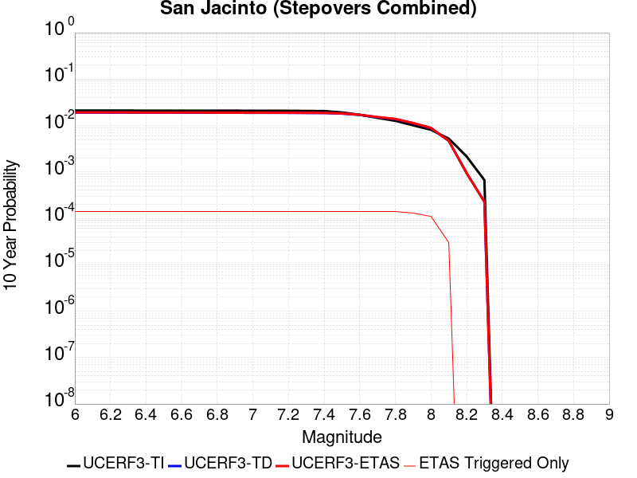 |

| Magnitude | 1 wk TI Prob | 1 wk TD Prob | 1 wk ETAS Prob | 1 wk ETAS/TD Gain | 1 wk ETAS Triggered Only | 1 mo TI Prob | 1 mo TD Prob | 1 mo ETAS Prob | 1 mo ETAS/TD Gain | 1 mo ETAS Triggered Only | 1 yr TI Prob | 1 yr TD Prob | 1 yr ETAS Prob | 1 yr ETAS/TD Gain | 1 yr ETAS Triggered Only | 10 yr TI Prob | 10 yr TD Prob | 10 yr ETAS Prob | 10 yr ETAS/TD Gain | 10 yr ETAS Triggered Only |
|-----|-----|-----|-----|-----|-----|-----|-----|-----|-----|-----|-----|-----|-----|-----|-----|-----|-----|-----|-----|-----|
| 6.0 | 4.0667746E-5 | 3.5287198E-5 | 3.5287198E-5 | 1.0 | 0.0 | 1.742787E-4 | 1.5122209E-4 | 1.6122058E-4 | 1.0661179 | 1.0E-5 | 0.0021197782 | 0.0018395748 | 0.0018994644 | 1.0325562 | 6.0E-5 | 0.020996714 | 0.018994363 | 0.019131703 | 1.0072306 | 1.4E-4 |
| 6.1 | 4.0667746E-5 | 3.5287198E-5 | 3.5287198E-5 | 1.0 | 0.0 | 1.742787E-4 | 1.5122209E-4 | 1.6122058E-4 | 1.0661179 | 1.0E-5 | 0.0021197782 | 0.0018395748 | 0.0018994644 | 1.0325562 | 6.0E-5 | 0.020996714 | 0.018994363 | 0.019131703 | 1.0072306 | 1.4E-4 |
| 6.2 | 4.0667746E-5 | 3.5287198E-5 | 3.5287198E-5 | 1.0 | 0.0 | 1.742787E-4 | 1.5122209E-4 | 1.6122058E-4 | 1.0661179 | 1.0E-5 | 0.0021197782 | 0.0018395748 | 0.0018994644 | 1.0325562 | 6.0E-5 | 0.020996714 | 0.018994363 | 0.019131703 | 1.0072306 | 1.4E-4 |
| 6.3 | 4.0667746E-5 | 3.5287198E-5 | 3.5287198E-5 | 1.0 | 0.0 | 1.742787E-4 | 1.5122209E-4 | 1.6122058E-4 | 1.0661179 | 1.0E-5 | 0.0021197782 | 0.0018395748 | 0.0018994644 | 1.0325562 | 6.0E-5 | 0.020996714 | 0.018994363 | 0.019131703 | 1.0072306 | 1.4E-4 |
| 6.4 | 4.0577226E-5 | 3.515909E-5 | 3.515909E-5 | 1.0 | 0.0 | 1.738908E-4 | 1.5067312E-4 | 1.6067161E-4 | 1.0663588 | 1.0E-5 | 0.0021150648 | 0.0018329041 | 0.0018927942 | 1.0326749 | 6.0E-5 | 0.020950472 | 0.018928928 | 0.01906628 | 1.007256 | 1.4E-4 |
| 6.5 | 4.0577226E-5 | 3.515909E-5 | 3.515909E-5 | 1.0 | 0.0 | 1.738908E-4 | 1.5067312E-4 | 1.6067161E-4 | 1.0663588 | 1.0E-5 | 0.0021150648 | 0.0018329041 | 0.0018927942 | 1.0326749 | 6.0E-5 | 0.020950472 | 0.018928928 | 0.01906628 | 1.007256 | 1.4E-4 |
| 6.6 | 4.053861E-5 | 3.5104433E-5 | 3.5104433E-5 | 1.0 | 0.0 | 1.7372532E-4 | 1.5043891E-4 | 1.604374E-4 | 1.0664622 | 1.0E-5 | 0.0021130538 | 0.0018300572 | 0.0018899475 | 1.0327258 | 6.0E-5 | 0.020930743 | 0.018901005 | 0.01903836 | 1.007267 | 1.4E-4 |
| 6.7 | 4.0516545E-5 | 3.50735E-5 | 3.50735E-5 | 1.0 | 0.0 | 1.7363077E-4 | 1.5030634E-4 | 1.6030484E-4 | 1.0665208 | 1.0E-5 | 0.002111905 | 0.0018284466 | 0.0018883368 | 1.0327548 | 6.0E-5 | 0.020919468 | 0.018885203 | 0.019022558 | 1.0072732 | 1.4E-4 |
| 6.8 | 4.049434E-5 | 3.504506E-5 | 3.504506E-5 | 1.0 | 0.0 | 1.7353562E-4 | 1.5018447E-4 | 1.6018297E-4 | 1.0665748 | 1.0E-5 | 0.0021107488 | 0.0018269654 | 0.0018868557 | 1.0327814 | 6.0E-5 | 0.020908125 | 0.018870614 | 0.019007973 | 1.0072789 | 1.4E-4 |
| 6.9 | 4.046386E-5 | 3.500762E-5 | 3.500762E-5 | 1.0 | 0.0 | 1.73405E-4 | 1.5002403E-4 | 1.6002252E-4 | 1.066646 | 1.0E-5 | 0.0021091616 | 0.0018250152 | 0.0018849057 | 1.0328164 | 6.0E-5 | 0.020892553 | 0.018851386 | 0.018988747 | 1.0072865 | 1.4E-4 |
| 7.0 | 4.036382E-5 | 3.4888177E-5 | 3.4888177E-5 | 1.0 | 0.0 | 1.7297632E-4 | 1.4951221E-4 | 1.5951072E-4 | 1.0668741 | 1.0E-5 | 0.0021039525 | 0.0018187946 | 0.0018786854 | 1.0329288 | 6.0E-5 | 0.02084144 | 0.018789997 | 0.018927367 | 1.0073107 | 1.4E-4 |
| 7.1 | 4.0343282E-5 | 3.486664E-5 | 3.486664E-5 | 1.0 | 0.0 | 1.7288832E-4 | 1.4941991E-4 | 1.5941841E-4 | 1.0669155 | 1.0E-5 | 0.002102883 | 0.0018176727 | 0.0018775637 | 1.0329492 | 6.0E-5 | 0.020830948 | 0.018778874 | 0.018916246 | 1.0073152 | 1.4E-4 |
| 7.2 | 4.0257353E-5 | 3.4771132E-5 | 3.4771132E-5 | 1.0 | 0.0 | 1.725201E-4 | 1.4901065E-4 | 1.5900916E-4 | 1.0670993 | 1.0E-5 | 0.0020984085 | 0.0018126983 | 0.0018725896 | 1.0330398 | 6.0E-5 | 0.020787042 | 0.01872961 | 0.018866988 | 1.0073348 | 1.4E-4 |
| 7.3 | 3.9940667E-5 | 3.4598754E-5 | 3.4598754E-5 | 1.0 | 0.0 | 1.7116306E-4 | 1.4827197E-4 | 1.5827049E-4 | 1.0674336 | 1.0E-5 | 0.0020819185 | 0.0018037198 | 0.0018636115 | 1.0332046 | 6.0E-5 | 0.020625217 | 0.018638225 | 0.018775616 | 1.0073714 | 1.4E-4 |
| 7.4 | 3.9721202E-5 | 3.4484117E-5 | 3.4484117E-5 | 1.0 | 0.0 | 1.7022261E-4 | 1.4778072E-4 | 1.5777924E-4 | 1.0676578 | 1.0E-5 | 0.0020704903 | 0.0017977487 | 0.0018576409 | 1.0333151 | 6.0E-5 | 0.020513052 | 0.018577335 | 0.018714733 | 1.0073961 | 1.4E-4 |
| 7.5 | 3.7036873E-5 | 3.355129E-5 | 3.355129E-5 | 1.0 | 0.0 | 1.5871979E-4 | 1.4378333E-4 | 1.5378189E-4 | 1.0695391 | 1.0E-5 | 0.0019307006 | 0.0017491594 | 0.0018090544 | 1.0342422 | 6.0E-5 | 0.019140124 | 0.018078765 | 0.018216234 | 1.0076039 | 1.4E-4 |
| 7.6 | 3.2940967E-5 | 3.133173E-5 | 3.133173E-5 | 1.0 | 0.0 | 1.4116794E-4 | 1.3427193E-4 | 1.442706E-4 | 1.0744658 | 1.0E-5 | 0.0017173645 | 0.0016335372 | 0.0016934392 | 1.0366701 | 6.0E-5 | 0.01704153 | 0.016911475 | 0.017049108 | 1.0081384 | 1.4E-4 |
| 7.7 | 2.8236149E-5 | 2.7897275E-5 | 2.7897275E-5 | 1.0 | 0.0 | 1.2100645E-4 | 1.1955428E-4 | 1.2955308E-4 | 1.083634 | 1.0E-5 | 0.0014722579 | 0.0014546025 | 0.0015145153 | 1.0411884 | 6.0E-5 | 0.014625421 | 0.015122045 | 0.015259928 | 1.009118 | 1.4E-4 |
| 7.8 | 2.4329287E-5 | 2.5220394E-5 | 2.5220394E-5 | 1.0 | 0.0 | 1.042642E-4 | 1.0808293E-4 | 1.1808185E-4 | 1.0925115 | 1.0E-5 | 0.0012686774 | 0.0013151162 | 0.0013750372 | 1.0455633 | 6.0E-5 | 0.012614589 | 0.013719083 | 0.013857162 | 1.0100647 | 1.4E-4 |
| 7.9 | 1.9370926E-5 | 2.0433014E-5 | 2.0433014E-5 | 1.0 | 0.0 | 8.301561E-5 | 8.7567125E-5 | 9.756625E-5 | 1.1141881 | 1.0E-5 | 0.0010102465 | 0.001065609 | 0.0011255451 | 1.0562458 | 6.0E-5 | 0.0100566605 | 0.011205519 | 0.011334063 | 1.0114714 | 1.3E-4 |
| 8.0 | 1.5583017E-5 | 1.5896165E-5 | 1.5896165E-5 | 1.0 | 0.0 | 6.6782646E-5 | 6.8124646E-5 | 7.8123965E-5 | 1.1467798 | 1.0E-5 | 8.127754E-4 | 8.2910265E-4 | 8.690695E-4 | 1.0482049 | 4.0E-5 | 0.008098091 | 0.008786912 | 0.008895945 | 1.0124086 | 1.1E-4 |
| 8.1 | 1.0024873E-5 | 8.298104E-6 | 8.298104E-6 | 1.0 | 0.0 | 4.2963035E-5 | 3.556282E-5 | 3.556282E-5 | 1.0 | 0.0 | 5.229494E-4 | 4.3289183E-4 | 4.428875E-4 | 1.0230905 | 1.0E-5 | 0.0052172043 | 0.0046564727 | 0.004686333 | 1.0064126 | 3.0E-5 |
| 8.2 | 4.142796E-6 | 1.5626505E-6 | 1.5626505E-6 | 1.0 | 0.0 | 1.775472E-5 | 6.697056E-6 | 6.697056E-6 | 1.0 | 0.0 | 2.1614227E-4 | 8.153364E-5 | 8.153364E-5 | 1.0 | 0.0 | 0.0021593217 | 9.464045E-4 | 9.464045E-4 | 1.0 | 0.0 |
| 8.3 | 1.2750878E-6 | 3.6166134E-7 | 3.6166134E-7 | 1.0 | 0.0 | 5.4646503E-6 | 1.5499762E-6 | 1.5499762E-6 | 1.0 | 0.0 | 6.653009E-5 | 1.8870802E-5 | 1.8870802E-5 | 1.0 | 0.0 | 6.6510175E-4 | 2.2760578E-4 | 2.2760578E-4 | 1.0 | 0.0 |

## Cady
*[(top)](#table-of-contents)*

| 1 Week | 1 Month | 1 Year | 10 Year |
|-----|-----|-----|-----|
| 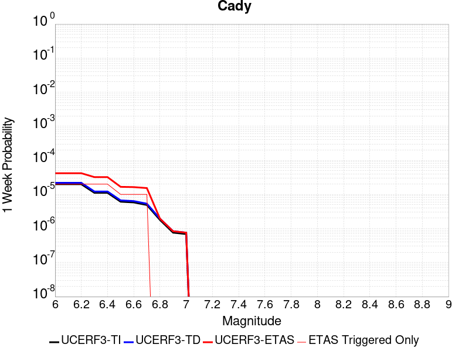 |  |  | 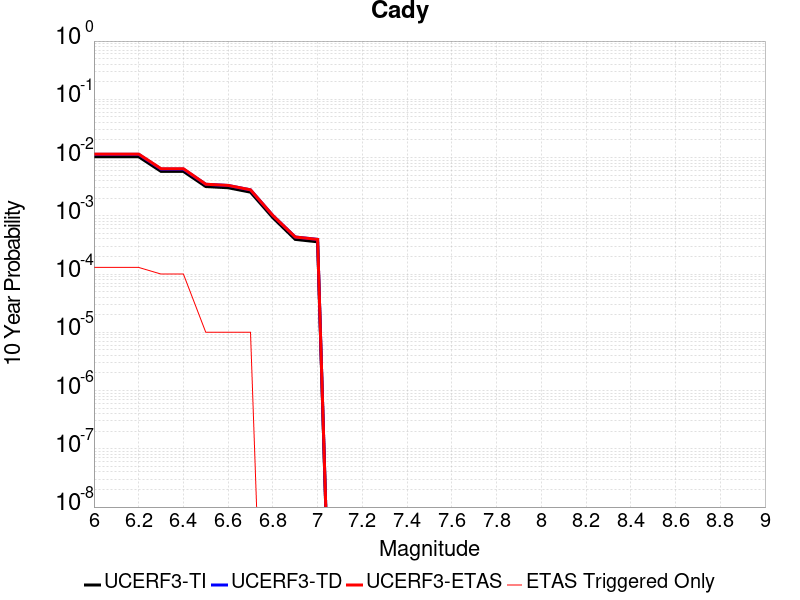 |

| Magnitude | 1 wk TI Prob | 1 wk TD Prob | 1 wk ETAS Prob | 1 wk ETAS/TD Gain | 1 wk ETAS Triggered Only | 1 mo TI Prob | 1 mo TD Prob | 1 mo ETAS Prob | 1 mo ETAS/TD Gain | 1 mo ETAS Triggered Only | 1 yr TI Prob | 1 yr TD Prob | 1 yr ETAS Prob | 1 yr ETAS/TD Gain | 1 yr ETAS Triggered Only | 10 yr TI Prob | 10 yr TD Prob | 10 yr ETAS Prob | 10 yr ETAS/TD Gain | 10 yr ETAS Triggered Only |
|-----|-----|-----|-----|-----|-----|-----|-----|-----|-----|-----|-----|-----|-----|-----|-----|-----|-----|-----|-----|-----|
| 6.0 | 1.9892565E-5 | 2.1859016E-5 | 4.1858577E-5 | 1.9149343 | 2.0E-5 | 8.525106E-5 | 9.3678645E-5 | 1.13676775E-4 | 1.2134758 | 2.0E-5 | 0.0010374374 | 0.0011400316 | 0.0011699975 | 1.026285 | 3.0E-5 | 0.010326075 | 0.011350849 | 0.011479373 | 1.0113229 | 1.3E-4 |
| 6.1 | 1.9892565E-5 | 2.1859016E-5 | 4.1858577E-5 | 1.9149343 | 2.0E-5 | 8.525106E-5 | 9.3678645E-5 | 1.13676775E-4 | 1.2134758 | 2.0E-5 | 0.0010374374 | 0.0011400316 | 0.0011699975 | 1.026285 | 3.0E-5 | 0.010326075 | 0.011350849 | 0.011479373 | 1.0113229 | 1.3E-4 |
| 6.2 | 1.9892565E-5 | 2.1859016E-5 | 4.1858577E-5 | 1.9149343 | 2.0E-5 | 8.525106E-5 | 9.3678645E-5 | 1.13676775E-4 | 1.2134758 | 2.0E-5 | 0.0010374374 | 0.0011400316 | 0.0011699975 | 1.026285 | 3.0E-5 | 0.010326075 | 0.011350849 | 0.011479373 | 1.0113229 | 1.3E-4 |
| 6.3 | 1.1117327E-5 | 1.2176738E-5 | 3.2176493E-5 | 2.642456 | 2.0E-5 | 4.764482E-5 | 5.218515E-5 | 7.2184106E-5 | 1.3832308 | 2.0E-5 | 5.7992124E-4 | 6.3520053E-4 | 6.651815E-4 | 1.0471991 | 3.0E-5 | 0.0057841022 | 0.0063369554 | 0.0064363214 | 1.0156804 | 1.0E-4 |
| 6.4 | 1.1117327E-5 | 1.2176738E-5 | 3.2176493E-5 | 2.642456 | 2.0E-5 | 4.764482E-5 | 5.218515E-5 | 7.2184106E-5 | 1.3832308 | 2.0E-5 | 5.7992124E-4 | 6.3520053E-4 | 6.651815E-4 | 1.0471991 | 3.0E-5 | 0.0057841022 | 0.0063369554 | 0.0064363214 | 1.0156804 | 1.0E-4 |
| 6.5 | 6.103093E-6 | 6.672103E-6 | 1.6672037E-5 | 2.4987679 | 1.0E-5 | 2.615585E-5 | 2.8594486E-5 | 3.85942E-5 | 1.3497077 | 1.0E-5 | 3.1840094E-4 | 3.4809482E-4 | 3.5809132E-4 | 1.0287178 | 1.0E-5 | 0.0031794512 | 0.0034767296 | 0.0034866948 | 1.0028663 | 1.0E-5 |
| 6.6 | 5.817237E-6 | 6.365738E-6 | 1.6365675E-5 | 2.5708997 | 1.0E-5 | 2.4930776E-5 | 2.728152E-5 | 3.7281246E-5 | 1.3665385 | 1.0E-5 | 3.034899E-4 | 3.3211432E-4 | 3.4211102E-4 | 1.0301001 | 1.0E-5 | 0.0030307577 | 0.003317402 | 0.0033273688 | 1.0030044 | 1.0E-5 |
| 6.7 | 4.8846314E-6 | 5.3406343E-6 | 1.5340582E-5 | 2.8724267 | 1.0E-5 | 2.0933967E-5 | 2.2888298E-5 | 3.288807E-5 | 1.4368944 | 1.0E-5 | 2.5484123E-4 | 2.7864118E-4 | 2.886384E-4 | 1.0358784 | 1.0E-5 | 0.0025454918 | 0.0027840736 | 0.0027940457 | 1.0035819 | 1.0E-5 |
| 6.8 | 1.7788773E-6 | 1.9399313E-6 | 1.9399313E-6 | 1.0 | 0.0 | 7.6237375E-6 | 8.313974E-6 | 8.313974E-6 | 1.0 | 0.0 | 9.281505E-5 | 1.01219506E-4 | 1.01219506E-4 | 1.0 | 0.0 | 9.2776294E-4 | 0.0010118886 | 0.0010118886 | 1.0 | 0.0 |
| 6.9 | 7.5455404E-7 | 8.297202E-7 | 8.297202E-7 | 1.0 | 0.0 | 3.233799E-6 | 3.5559406E-6 | 3.5559406E-6 | 1.0 | 0.0 | 3.937079E-5 | 4.3293054E-5 | 4.3293054E-5 | 1.0 | 0.0 | 3.9363815E-4 | 4.3287914E-4 | 4.3287914E-4 | 1.0 | 0.0 |
| 7.0 | 6.8578805E-7 | 7.541916E-7 | 7.541916E-7 | 1.0 | 0.0 | 2.9390883E-6 | 3.2322475E-6 | 3.2322475E-6 | 1.0 | 0.0 | 3.578281E-5 | 3.9352235E-5 | 3.9352235E-5 | 1.0 | 0.0 | 3.577705E-4 | 3.9348513E-4 | 3.9348513E-4 | 1.0 | 0.0 |

## Owens Valley
*[(top)](#table-of-contents)*

| 1 Week | 1 Month | 1 Year | 10 Year |
|-----|-----|-----|-----|
|  |  |  |  |

| Magnitude | 1 wk TI Prob | 1 wk TD Prob | 1 wk ETAS Prob | 1 wk ETAS/TD Gain | 1 wk ETAS Triggered Only | 1 mo TI Prob | 1 mo TD Prob | 1 mo ETAS Prob | 1 mo ETAS/TD Gain | 1 mo ETAS Triggered Only | 1 yr TI Prob | 1 yr TD Prob | 1 yr ETAS Prob | 1 yr ETAS/TD Gain | 1 yr ETAS Triggered Only | 10 yr TI Prob | 10 yr TD Prob | 10 yr ETAS Prob | 10 yr ETAS/TD Gain | 10 yr ETAS Triggered Only |
|-----|-----|-----|-----|-----|-----|-----|-----|-----|-----|-----|-----|-----|-----|-----|-----|-----|-----|-----|-----|-----|
| 6.0 | 4.83821E-5 | 3.627396E-6 | 3.627396E-6 | 1.0 | 0.0 | 2.0733538E-4 | 1.5545897E-5 | 3.5545585E-5 | 2.2864933 | 2.0E-5 | 0.002521386 | 1.8925584E-4 | 2.592426E-4 | 1.3697997 | 7.0E-5 | 0.024929691 | 0.0019254381 | 0.0020551877 | 1.0673871 | 1.3E-4 |
| 6.1 | 4.83821E-5 | 3.627396E-6 | 3.627396E-6 | 1.0 | 0.0 | 2.0733538E-4 | 1.5545897E-5 | 3.5545585E-5 | 2.2864933 | 2.0E-5 | 0.002521386 | 1.8925584E-4 | 2.592426E-4 | 1.3697997 | 7.0E-5 | 0.024929691 | 0.0019254381 | 0.0020551877 | 1.0673871 | 1.3E-4 |
| 6.2 | 4.83821E-5 | 3.627396E-6 | 3.627396E-6 | 1.0 | 0.0 | 2.0733538E-4 | 1.5545897E-5 | 3.5545585E-5 | 2.2864933 | 2.0E-5 | 0.002521386 | 1.8925584E-4 | 2.592426E-4 | 1.3697997 | 7.0E-5 | 0.024929691 | 0.0019254381 | 0.0020551877 | 1.0673871 | 1.3E-4 |
| 6.3 | 3.953008E-5 | 3.1558448E-6 | 3.1558448E-6 | 1.0 | 0.0 | 1.6940363E-4 | 1.3524983E-5 | 3.3524713E-5 | 2.478725 | 2.0E-5 | 0.002060538 | 1.6465495E-4 | 2.2464507E-4 | 1.3643384 | 6.0E-5 | 0.020415364 | 0.0016594394 | 0.0017592735 | 1.0601614 | 1.0E-4 |
| 6.4 | 3.953008E-5 | 3.1558448E-6 | 3.1558448E-6 | 1.0 | 0.0 | 1.6940363E-4 | 1.3524983E-5 | 3.3524713E-5 | 2.478725 | 2.0E-5 | 0.002060538 | 1.6465495E-4 | 2.2464507E-4 | 1.3643384 | 6.0E-5 | 0.020415364 | 0.0016594394 | 0.0017592735 | 1.0601614 | 1.0E-4 |
| 6.5 | 3.457342E-5 | 2.9718876E-6 | 2.9718876E-6 | 1.0 | 0.0 | 1.4816338E-4 | 1.2736603E-5 | 3.273635E-5 | 2.5702574 | 2.0E-5 | 0.0018023965 | 1.5505782E-4 | 2.1504851E-4 | 1.3868924 | 6.0E-5 | 0.017878477 | 0.0015558768 | 0.0016557212 | 1.0641724 | 1.0E-4 |
| 6.6 | 3.1127765E-5 | 2.8746979E-6 | 2.8746979E-6 | 1.0 | 0.0 | 1.3339789E-4 | 1.232008E-5 | 3.2319833E-5 | 2.623346 | 2.0E-5 | 0.0016229092 | 1.4998733E-4 | 2.0997833E-4 | 1.3999738 | 6.0E-5 | 0.016111081 | 0.001501365 | 0.0016012148 | 1.066506 | 1.0E-4 |
| 6.7 | 2.806885E-5 | 2.810566E-6 | 2.810566E-6 | 1.0 | 0.0 | 1.2028952E-4 | 1.2045231E-5 | 3.204499E-5 | 2.6603882 | 2.0E-5 | 0.001463541 | 1.4664151E-4 | 2.0663271E-4 | 1.4091011 | 6.0E-5 | 0.014539397 | 0.001465831 | 0.0015656843 | 1.0681207 | 1.0E-4 |
| 6.8 | 2.524524E-5 | 2.235501E-6 | 2.235501E-6 | 1.0 | 0.0 | 1.0818939E-4 | 9.5806845E-6 | 1.9580588E-5 | 2.0437567 | 1.0E-5 | 0.0013164099 | 1.1663889E-4 | 1.6663306E-4 | 1.4286234 | 5.0E-5 | 0.01308639 | 0.0011660501 | 0.0012559452 | 1.0770936 | 9.0E-5 |
| 6.9 | 2.2704568E-5 | 1.6082656E-6 | 1.6082656E-6 | 1.0 | 0.0 | 9.730166E-5 | 6.8925488E-6 | 1.689248E-5 | 2.4508321 | 1.0E-5 | 0.0011840039 | 8.391357E-5 | 1.3390937E-4 | 1.5958012 | 5.0E-5 | 0.011777153 | 8.390308E-4 | 9.2895527E-4 | 1.1071767 | 9.0E-5 |
| 7.0 | 2.0871712E-5 | 1.5396373E-6 | 1.5396373E-6 | 1.0 | 0.0 | 8.944713E-5 | 6.598429E-6 | 1.6598364E-5 | 2.5155022 | 1.0E-5 | 0.0010884746 | 8.033293E-5 | 1.3032892E-4 | 1.6223598 | 5.0E-5 | 0.010831586 | 8.0321095E-4 | 8.9313864E-4 | 1.1119603 | 9.0E-5 |
| 7.1 | 1.944928E-5 | 1.3864965E-6 | 1.3864965E-6 | 1.0 | 0.0 | 8.335139E-5 | 5.942114E-6 | 1.5942054E-5 | 2.6828928 | 1.0E-5 | 0.0010143308 | 7.2342846E-5 | 1.2233923E-4 | 1.6911033 | 5.0E-5 | 0.010097133 | 7.233511E-4 | 8.1328594E-4 | 1.1243309 | 9.0E-5 |
| 7.2 | 1.7876306E-5 | 1.2489834E-6 | 1.2489834E-6 | 1.0 | 0.0 | 7.6610486E-5 | 5.3527747E-6 | 1.5352722E-5 | 2.86818 | 1.0E-5 | 9.3233347E-4 | 6.516809E-5 | 1.1516483E-4 | 1.7671967 | 5.0E-5 | 0.009284316 | 6.516274E-4 | 7.4156874E-4 | 1.1380258 | 9.0E-5 |
| 7.3 | 1.2618672E-5 | 1.1115851E-6 | 1.1115851E-6 | 1.0 | 0.0 | 5.40789E-5 | 4.763928E-6 | 1.476388E-5 | 3.0990982 | 1.0E-5 | 6.582117E-4 | 5.799928E-5 | 1.07996384E-4 | 1.8620297 | 5.0E-5 | 0.0065626553 | 5.799741E-4 | 6.699219E-4 | 1.1550894 | 9.0E-5 |
| 7.4 | 7.4874442E-6 | 8.549184E-7 | 8.549184E-7 | 1.0 | 0.0 | 3.208865E-5 | 3.663931E-6 | 3.663931E-6 | 1.0 | 0.0 | 3.906093E-4 | 4.4607452E-5 | 8.4605665E-5 | 1.8966712 | 4.0E-5 | 0.003899234 | 4.4607726E-4 | 5.16046E-4 | 1.1568534 | 7.0E-5 |
| 7.5 | 2.4734156E-6 | 6.068976E-7 | 6.068976E-7 | 1.0 | 0.0 | 1.060031E-5 | 2.6009868E-6 | 2.6009868E-6 | 1.0 | 0.0 | 1.2905113E-4 | 3.1666557E-5 | 6.166561E-5 | 1.9473417 | 3.0E-5 | 0.0012897621 | 3.1662078E-4 | 3.766018E-4 | 1.1894411 | 6.0E-5 |
| 7.6 | 1.1328841E-6 | 3.1967096E-7 | 3.1967096E-7 | 1.0 | 0.0 | 4.8552088E-6 | 1.3700177E-6 | 1.3700177E-6 | 1.0 | 0.0 | 5.9110564E-5 | 1.6679838E-5 | 3.6679507E-5 | 2.1990323 | 2.0E-5 | 5.9094845E-4 | 1.6678606E-4 | 2.1677771E-4 | 1.2997353 | 5.0E-5 |
| 7.7 | 4.8613185E-7 | 8.965384E-8 | 8.965384E-8 | 1.0 | 0.0 | 2.0834207E-6 | 3.842307E-7 | 3.842307E-7 | 1.0 | 0.0 | 2.536535E-5 | 4.677999E-6 | 1.4677953E-5 | 3.137656 | 1.0E-5 | 2.5362454E-4 | 4.6779078E-5 | 5.677861E-5 | 1.2137607 | 1.0E-5 |

## San Andreas (Coachella) rev
*[(top)](#table-of-contents)*

| 1 Week | 1 Month | 1 Year | 10 Year |
|-----|-----|-----|-----|
|  |  | 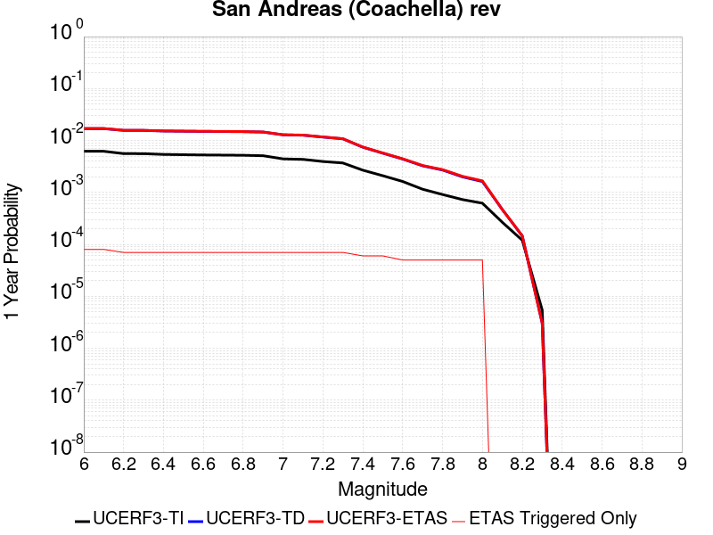 |  |

| Magnitude | 1 wk TI Prob | 1 wk TD Prob | 1 wk ETAS Prob | 1 wk ETAS/TD Gain | 1 wk ETAS Triggered Only | 1 mo TI Prob | 1 mo TD Prob | 1 mo ETAS Prob | 1 mo ETAS/TD Gain | 1 mo ETAS Triggered Only | 1 yr TI Prob | 1 yr TD Prob | 1 yr ETAS Prob | 1 yr ETAS/TD Gain | 1 yr ETAS Triggered Only | 10 yr TI Prob | 10 yr TD Prob | 10 yr ETAS Prob | 10 yr ETAS/TD Gain | 10 yr ETAS Triggered Only |
|-----|-----|-----|-----|-----|-----|-----|-----|-----|-----|-----|-----|-----|-----|-----|-----|-----|-----|-----|-----|-----|
| 6.0 | 1.1925945E-4 | 3.2733803E-4 | 3.3733476E-4 | 1.0305395 | 1.0E-5 | 5.110118E-4 | 0.0014021277 | 0.0014420716 | 1.028488 | 4.0E-5 | 0.0062038354 | 0.016938623 | 0.017017268 | 1.004643 | 8.0E-5 | 0.060334753 | 0.15267034 | 0.15278049 | 1.0007215 | 1.3E-4 |
| 6.1 | 1.1925945E-4 | 3.2733803E-4 | 3.3733476E-4 | 1.0305395 | 1.0E-5 | 5.110118E-4 | 0.0014021277 | 0.0014420716 | 1.028488 | 4.0E-5 | 0.0062038354 | 0.016938623 | 0.017017268 | 1.004643 | 8.0E-5 | 0.060334753 | 0.15267034 | 0.15278049 | 1.0007215 | 1.3E-4 |
| 6.2 | 1.07432395E-4 | 3.0234526E-4 | 3.1234222E-4 | 1.0330647 | 1.0E-5 | 4.603433E-4 | 0.0012951259 | 0.001325087 | 1.0231338 | 3.0E-5 | 0.005590286 | 0.015655253 | 0.015724158 | 1.0044013 | 7.0E-5 | 0.05451731 | 0.14184146 | 0.14193586 | 1.0006655 | 1.1E-4 |
| 6.3 | 1.0718766E-4 | 3.017983E-4 | 3.117953E-4 | 1.0331247 | 1.0E-5 | 4.592948E-4 | 0.0012927842 | 0.0013227455 | 1.0231757 | 3.0E-5 | 0.005577586 | 0.015627153 | 0.015696058 | 1.0044094 | 7.0E-5 | 0.054396555 | 0.14160971 | 0.14170414 | 1.0006667 | 1.1E-4 |
| 6.4 | 1.0355944E-4 | 2.9387916E-4 | 3.038762E-4 | 1.0340176 | 1.0E-5 | 4.4375064E-4 | 0.0012588782 | 0.0012888403 | 1.0238007 | 3.0E-5 | 0.0053892885 | 0.015220184 | 0.0152891185 | 1.0045291 | 7.0E-5 | 0.052604496 | 0.13816981 | 0.13826461 | 1.0006862 | 1.1E-4 |
| 6.5 | 1.0227914E-4 | 2.910735E-4 | 3.0107057E-4 | 1.0343456 | 1.0E-5 | 4.382655E-4 | 0.0012468654 | 0.0012768279 | 1.0240303 | 3.0E-5 | 0.0053228354 | 0.015075962 | 0.015144907 | 1.0045731 | 7.0E-5 | 0.051971316 | 0.136949 | 0.13704394 | 1.0006932 | 1.1E-4 |
| 6.6 | 1.0116757E-4 | 2.8873098E-4 | 2.987281E-4 | 1.0346243 | 1.0E-5 | 4.3350324E-4 | 0.0012368355 | 0.0012667985 | 1.0242255 | 3.0E-5 | 0.0052651367 | 0.014955532 | 0.015024485 | 1.0046105 | 7.0E-5 | 0.051421247 | 0.13592719 | 0.13602224 | 1.0006993 | 1.1E-4 |
| 6.7 | 1.0050676E-4 | 2.873166E-4 | 2.9731373E-4 | 1.0347948 | 1.0E-5 | 4.3067214E-4 | 0.0012307797 | 0.0012607428 | 1.0243448 | 3.0E-5 | 0.005230834 | 0.01488281 | 0.014951769 | 1.0046334 | 7.0E-5 | 0.051094085 | 0.13531192 | 0.13540703 | 1.000703 | 1.1E-4 |
| 6.8 | 9.976819E-5 | 2.853531E-4 | 2.9535027E-4 | 1.0350343 | 1.0E-5 | 4.2750788E-4 | 0.0012223726 | 0.001252336 | 1.0245124 | 3.0E-5 | 0.0051924936 | 0.014781849 | 0.014850815 | 1.0046655 | 7.0E-5 | 0.050728295 | 0.13446361 | 0.13455881 | 1.0007081 | 1.1E-4 |
| 6.9 | 9.77719E-5 | 2.8032195E-4 | 2.9031915E-4 | 1.0356632 | 1.0E-5 | 4.1895514E-4 | 0.0012008306 | 0.0012307946 | 1.0249527 | 3.0E-5 | 0.0050888555 | 0.014523101 | 0.014592084 | 1.0047499 | 7.0E-5 | 0.049738888 | 0.13229203 | 0.13238749 | 1.0007215 | 1.1E-4 |
| 7.0 | 8.500761E-5 | 2.4766565E-4 | 2.5766317E-4 | 1.040367 | 1.0E-5 | 3.6426744E-4 | 0.0010609957 | 0.0010909638 | 1.0282453 | 3.0E-5 | 0.0044259406 | 0.012841888 | 0.012910989 | 1.0053809 | 7.0E-5 | 0.04338823 | 0.11814933 | 0.11824634 | 1.000821 | 1.1E-4 |
| 7.1 | 8.319876E-5 | 2.4369264E-4 | 2.536902E-4 | 1.0410253 | 1.0E-5 | 3.5651738E-4 | 0.0010439822 | 0.0010739509 | 1.0287061 | 3.0E-5 | 0.004331963 | 0.012637171 | 0.012706286 | 1.0054692 | 7.0E-5 | 0.042484846 | 0.116369456 | 0.11646666 | 1.0008353 | 1.1E-4 |
| 7.2 | 7.563917E-5 | 2.2417592E-4 | 2.3417368E-4 | 1.0445979 | 1.0E-5 | 3.2412758E-4 | 9.6040324E-4 | 9.903745E-4 | 1.0312068 | 3.0E-5 | 0.0039391145 | 0.0116309095 | 0.011700096 | 1.0059484 | 7.0E-5 | 0.03870018 | 0.10777538 | 0.10787353 | 1.0009106 | 1.1E-4 |
| 7.3 | 7.082985E-5 | 2.073362E-4 | 2.1733412E-4 | 1.0482209 | 1.0E-5 | 3.0352117E-4 | 8.88284E-4 | 9.1825734E-4 | 1.033743 | 3.0E-5 | 0.0036891096 | 0.010761855 | 0.010831102 | 1.0064344 | 7.0E-5 | 0.03628465 | 0.10029767 | 0.10039663 | 1.0009867 | 1.1E-4 |
| 7.4 | 5.146215E-5 | 1.4276853E-4 | 1.527671E-4 | 1.0700334 | 1.0E-5 | 2.2053342E-4 | 6.117225E-4 | 6.417042E-4 | 1.0490118 | 3.0E-5 | 0.0026816884 | 0.007422478 | 0.0074820323 | 1.0080235 | 6.0E-5 | 0.02649557 | 0.07086292 | 0.070955835 | 1.0013112 | 1.0E-4 |
| 7.5 | 4.0285166E-5 | 1.0944253E-4 | 1.19441436E-4 | 1.0913621 | 1.0E-5 | 1.7263928E-4 | 4.689554E-4 | 4.9894134E-4 | 1.063942 | 3.0E-5 | 0.002099857 | 0.005694655 | 0.005754313 | 1.0104762 | 6.0E-5 | 0.020801254 | 0.055022955 | 0.055117454 | 1.0017174 | 1.0E-4 |
| 7.6 | 3.1168736E-5 | 8.441267E-5 | 9.441183E-5 | 1.1184556 | 1.0E-5 | 1.3357346E-4 | 3.6171856E-4 | 3.917077E-4 | 1.0829074 | 3.0E-5 | 0.0016250437 | 0.004395057 | 0.0044448376 | 1.0113264 | 5.0E-5 | 0.016132116 | 0.042820677 | 0.04290682 | 1.0020118 | 9.0E-5 |
| 7.7 | 2.2100989E-5 | 6.2408275E-5 | 7.240765E-5 | 1.1602252 | 1.0E-5 | 9.4715084E-5 | 2.6743664E-4 | 2.9742863E-4 | 1.1121461 | 3.0E-5 | 0.001152546 | 0.003251186 | 0.0033010235 | 1.015329 | 5.0E-5 | 0.011465867 | 0.03190961 | 0.03199674 | 1.0027305 | 9.0E-5 |
| 7.8 | 1.7484861E-5 | 5.1814186E-5 | 6.181367E-5 | 1.1929873 | 1.0E-5 | 7.493296E-5 | 2.2204191E-4 | 2.5203524E-4 | 1.1350796 | 3.0E-5 | 9.1192697E-4 | 0.002700012 | 0.0027498768 | 1.0184684 | 5.0E-5 | 0.009081938 | 0.026648527 | 0.02673613 | 1.0032873 | 9.0E-5 |
| 7.9 | 1.3967285E-5 | 3.8237675E-5 | 4.8237293E-5 | 1.2615122 | 1.0E-5 | 5.985842E-5 | 1.6386545E-4 | 1.9386054E-4 | 1.183047 | 3.0E-5 | 7.2853256E-4 | 0.0019932375 | 0.002043138 | 1.0250348 | 5.0E-5 | 0.0072614877 | 0.019916428 | 0.020004636 | 1.0044289 | 9.0E-5 |
| 8.0 | 1.1887396E-5 | 3.107819E-5 | 4.1077878E-5 | 1.3217591 | 1.0E-5 | 5.094499E-5 | 1.3318544E-4 | 1.6318145E-4 | 1.2252198 | 3.0E-5 | 6.200787E-4 | 0.0016203277 | 0.0016702467 | 1.030808 | 5.0E-5 | 0.006183513 | 0.016285317 | 0.016373852 | 1.0054364 | 9.0E-5 |
| 8.1 | 5.100864E-6 | 8.978668E-6 | 8.978668E-6 | 1.0 | 0.0 | 2.1860664E-5 | 3.847944E-5 | 3.847944E-5 | 1.0 | 0.0 | 2.6612106E-4 | 4.6838663E-4 | 4.6838663E-4 | 1.0 | 0.0 | 0.002658026 | 0.004920349 | 0.004920349 | 1.0 | 0.0 |
| 8.2 | 2.3004484E-6 | 2.7885583E-6 | 2.7885583E-6 | 1.0 | 0.0 | 9.859027E-6 | 1.19509095E-5 | 1.19509095E-5 | 1.0 | 0.0 | 1.2002704E-4 | 1.4549264E-4 | 1.4549264E-4 | 1.0 | 0.0 | 0.0011996223 | 0.0015984807 | 0.0015984807 | 1.0 | 0.0 |
| 8.3 | 1.0424446E-7 | 5.8219563E-8 | 5.8219563E-8 | 1.0 | 0.0 | 4.4676187E-7 | 2.495124E-7 | 2.495124E-7 | 1.0 | 0.0 | 5.439312E-6 | 3.0378094E-6 | 3.0378094E-6 | 1.0 | 0.0 | 5.4391792E-5 | 3.193819E-5 | 3.193819E-5 | 1.0 | 0.0 |

## San Andreas (North Branch Mill Creek)
*[(top)](#table-of-contents)*

| 1 Week | 1 Month | 1 Year | 10 Year |
|-----|-----|-----|-----|
|  | 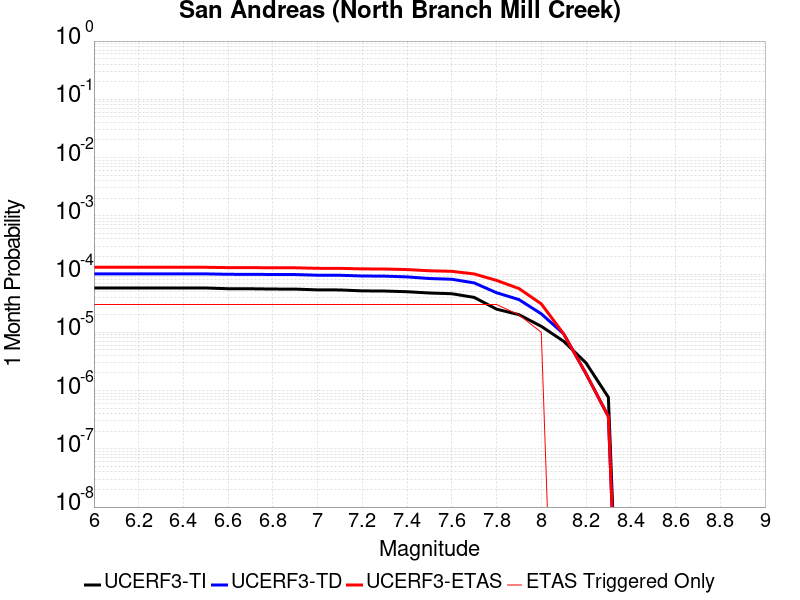 |  |  |

| Magnitude | 1 wk TI Prob | 1 wk TD Prob | 1 wk ETAS Prob | 1 wk ETAS/TD Gain | 1 wk ETAS Triggered Only | 1 mo TI Prob | 1 mo TD Prob | 1 mo ETAS Prob | 1 mo ETAS/TD Gain | 1 mo ETAS Triggered Only | 1 yr TI Prob | 1 yr TD Prob | 1 yr ETAS Prob | 1 yr ETAS/TD Gain | 1 yr ETAS Triggered Only | 10 yr TI Prob | 10 yr TD Prob | 10 yr ETAS Prob | 10 yr ETAS/TD Gain | 10 yr ETAS Triggered Only |
|-----|-----|-----|-----|-----|-----|-----|-----|-----|-----|-----|-----|-----|-----|-----|-----|-----|-----|-----|-----|-----|
| 6.0 | 1.3461156E-5 | 2.3506776E-5 | 3.350654E-5 | 1.4253993 | 1.0E-5 | 5.7689394E-5 | 1.0073945E-4 | 1.3073643E-4 | 1.2977679 | 3.0E-5 | 7.02142E-4 | 0.0012258161 | 0.0013157057 | 1.0733305 | 9.0E-5 | 0.0069992766 | 0.012233093 | 0.012361503 | 1.0104969 | 1.3E-4 |
| 6.1 | 1.3461156E-5 | 2.3506776E-5 | 3.350654E-5 | 1.4253993 | 1.0E-5 | 5.7689394E-5 | 1.0073945E-4 | 1.3073643E-4 | 1.2977679 | 3.0E-5 | 7.02142E-4 | 0.0012258161 | 0.0013157057 | 1.0733305 | 9.0E-5 | 0.0069992766 | 0.012233093 | 0.012361503 | 1.0104969 | 1.3E-4 |
| 6.2 | 1.3461156E-5 | 2.3506776E-5 | 3.350654E-5 | 1.4253993 | 1.0E-5 | 5.7689394E-5 | 1.0073945E-4 | 1.3073643E-4 | 1.2977679 | 3.0E-5 | 7.02142E-4 | 0.0012258161 | 0.0013157057 | 1.0733305 | 9.0E-5 | 0.0069992766 | 0.012233093 | 0.012361503 | 1.0104969 | 1.3E-4 |
| 6.3 | 1.3461156E-5 | 2.3506776E-5 | 3.350654E-5 | 1.4253993 | 1.0E-5 | 5.7689394E-5 | 1.0073945E-4 | 1.3073643E-4 | 1.2977679 | 3.0E-5 | 7.02142E-4 | 0.0012258161 | 0.0013157057 | 1.0733305 | 9.0E-5 | 0.0069992766 | 0.012233093 | 0.012361503 | 1.0104969 | 1.3E-4 |
| 6.4 | 1.3461156E-5 | 2.3506776E-5 | 3.350654E-5 | 1.4253993 | 1.0E-5 | 5.7689394E-5 | 1.0073945E-4 | 1.3073643E-4 | 1.2977679 | 3.0E-5 | 7.02142E-4 | 0.0012258161 | 0.0013157057 | 1.0733305 | 9.0E-5 | 0.0069992766 | 0.012233093 | 0.012361503 | 1.0104969 | 1.3E-4 |
| 6.5 | 1.3450706E-5 | 2.3495735E-5 | 3.34955E-5 | 1.4255991 | 1.0E-5 | 5.764461E-5 | 1.0069214E-4 | 1.3068912E-4 | 1.2979078 | 3.0E-5 | 7.0159714E-4 | 0.0012252406 | 0.0013151304 | 1.073365 | 9.0E-5 | 0.006993862 | 0.012227403 | 0.012355814 | 1.0105019 | 1.3E-4 |
| 6.6 | 1.3074523E-5 | 2.3110017E-5 | 3.3109784E-5 | 1.4327028 | 1.0E-5 | 5.6032466E-5 | 9.9039185E-5 | 1.2903621E-4 | 1.3028804 | 3.0E-5 | 6.8198174E-4 | 0.0012051383 | 0.0012950299 | 1.0745902 | 9.0E-5 | 0.006798926 | 0.0120285675 | 0.012157003 | 1.0106776 | 1.3E-4 |
| 6.7 | 1.3050216E-5 | 2.3085311E-5 | 3.308508E-5 | 1.4331659 | 1.0E-5 | 5.59283E-5 | 9.893332E-5 | 1.2893035E-4 | 1.3032045 | 3.0E-5 | 6.8071426E-4 | 0.0012038508 | 0.0012937424 | 1.0746701 | 9.0E-5 | 0.0067863287 | 0.012015832 | 0.012144269 | 1.010689 | 1.3E-4 |
| 6.8 | 1.29049395E-5 | 2.293372E-5 | 3.293349E-5 | 1.4360292 | 1.0E-5 | 5.530571E-5 | 9.828369E-5 | 1.2828074E-4 | 1.3052088 | 3.0E-5 | 6.73139E-4 | 0.0011959502 | 0.0012858426 | 1.075164 | 9.0E-5 | 0.0067110364 | 0.011937677 | 0.012066125 | 1.01076 | 1.3E-4 |
| 6.9 | 1.2867369E-5 | 2.2893122E-5 | 3.2892895E-5 | 1.4368024 | 1.0E-5 | 5.51447E-5 | 9.810971E-5 | 1.2810677E-4 | 1.3057501 | 3.0E-5 | 6.711799E-4 | 0.0011938344 | 0.0012837269 | 1.0752974 | 9.0E-5 | 0.006691564 | 0.011916745 | 0.012045196 | 1.010779 | 1.3E-4 |
| 7.0 | 1.2495996E-5 | 2.2293154E-5 | 3.2292934E-5 | 1.4485582 | 1.0E-5 | 5.3553173E-5 | 9.5538606E-5 | 1.2553575E-4 | 1.3139791 | 3.0E-5 | 6.518148E-4 | 0.0011625647 | 0.0012524601 | 1.077325 | 9.0E-5 | 0.0064990623 | 0.011607327 | 0.011735817 | 1.0110698 | 1.3E-4 |
| 7.1 | 1.2452067E-5 | 2.2238226E-5 | 3.2238004E-5 | 1.4496661 | 1.0E-5 | 5.3364907E-5 | 9.5303214E-5 | 1.2530036E-4 | 1.3147547 | 3.0E-5 | 6.4952404E-4 | 0.0011597018 | 0.0012495975 | 1.0775162 | 9.0E-5 | 0.0064762887 | 0.011578998 | 0.011707492 | 1.0110972 | 1.3E-4 |
| 7.2 | 1.2002777E-5 | 2.1616754E-5 | 3.161654E-5 | 1.4625942 | 1.0E-5 | 5.143946E-5 | 9.263996E-5 | 1.2263718E-4 | 1.3238044 | 3.0E-5 | 6.2609545E-4 | 0.0011273106 | 0.001217209 | 1.079746 | 9.0E-5 | 0.006243344 | 0.011258403 | 0.011386939 | 1.0114169 | 1.3E-4 |
| 7.3 | 1.1923425E-5 | 2.1486576E-5 | 3.148636E-5 | 1.4653969 | 1.0E-5 | 5.109939E-5 | 9.208209E-5 | 1.2207933E-4 | 1.3257662 | 3.0E-5 | 6.219575E-4 | 0.0011205255 | 0.0012104247 | 1.0802294 | 9.0E-5 | 0.0062021962 | 0.011191265 | 0.01131981 | 1.0114862 | 1.3E-4 |
| 7.4 | 1.16105175E-5 | 2.0860489E-5 | 3.086028E-5 | 1.4793651 | 1.0E-5 | 4.975841E-5 | 8.9399044E-5 | 1.1939636E-4 | 1.3355441 | 3.0E-5 | 6.0564023E-4 | 0.0010878925 | 0.0011777945 | 1.0826387 | 9.0E-5 | 0.006039923 | 0.01086884 | 0.010997427 | 1.0118308 | 1.3E-4 |
| 7.5 | 1.1037265E-5 | 1.956039E-5 | 2.9560193E-5 | 1.5112273 | 1.0E-5 | 4.7301706E-5 | 8.382756E-5 | 1.13825045E-4 | 1.3578476 | 3.0E-5 | 5.757461E-4 | 0.0010201249 | 0.001110033 | 1.0881345 | 9.0E-5 | 0.005742567 | 0.010198223 | 0.010326898 | 1.0126173 | 1.3E-4 |
| 7.6 | 1.0720915E-5 | 1.900222E-5 | 2.9002029E-5 | 1.5262443 | 1.0E-5 | 4.5945973E-5 | 8.143555E-5 | 1.1143311E-4 | 1.3683594 | 3.0E-5 | 5.592486E-4 | 9.910291E-4 | 0.0010809399 | 1.0907247 | 9.0E-5 | 0.005578433 | 0.009909907 | 0.010038619 | 1.0129882 | 1.3E-4 |
| 7.7 | 9.276279E-6 | 1.6447744E-5 | 2.644758E-5 | 1.6079761 | 1.0E-5 | 3.9754876E-5 | 7.048844E-5 | 1.0048632E-4 | 1.4255717 | 3.0E-5 | 4.839081E-4 | 8.578605E-4 | 9.477833E-4 | 1.1048222 | 9.0E-5 | 0.0048285574 | 0.008589173 | 0.008718056 | 1.0150054 | 1.3E-4 |
| 7.8 | 5.8346777E-6 | 1.1159965E-5 | 2.1159853E-5 | 1.8960502 | 1.0E-5 | 2.5005522E-5 | 4.7827543E-5 | 7.782611E-5 | 1.6272236 | 3.0E-5 | 3.043997E-4 | 5.821449E-4 | 6.720925E-4 | 1.1545107 | 9.0E-5 | 0.0030398308 | 0.005849473 | 0.0059787123 | 1.0220942 | 1.3E-4 |
| 7.9 | 4.690204E-6 | 8.513225E-6 | 1.851314E-5 | 2.174633 | 1.0E-5 | 2.0100719E-5 | 3.648474E-5 | 5.6484012E-5 | 1.5481544 | 2.0E-5 | 2.4469878E-4 | 4.4411127E-4 | 5.1408017E-4 | 1.1575482 | 7.0E-5 | 0.002444295 | 0.0044728746 | 0.0045823823 | 1.0244827 | 1.1E-4 |
| 8.0 | 2.9570454E-6 | 4.8494758E-6 | 4.8494758E-6 | 1.0 | 0.0 | 1.267299E-5 | 2.0783302E-5 | 3.0783092E-5 | 1.4811455 | 1.0E-5 | 1.5428272E-4 | 2.5300734E-4 | 2.8299974E-4 | 1.1185436 | 3.0E-5 | 0.0015417566 | 0.0025509594 | 0.002580883 | 1.0117303 | 3.0E-5 |
| 8.1 | 1.6376824E-6 | 2.198225E-6 | 2.198225E-6 | 1.0 | 0.0 | 7.01862E-6 | 9.420931E-6 | 9.420931E-6 | 1.0 | 0.0 | 8.544835E-5 | 1.1469381E-4 | 1.1469381E-4 | 1.0 | 0.0 | 8.54155E-4 | 0.0011613552 | 0.0011613552 | 1.0 | 0.0 |
| 8.2 | 6.9631557E-7 | 4.5401492E-7 | 4.5401492E-7 | 1.0 | 0.0 | 2.984206E-6 | 1.9457768E-6 | 1.9457768E-6 | 1.0 | 0.0 | 3.63321E-5 | 2.3689576E-5 | 2.3689576E-5 | 1.0 | 0.0 | 3.6326164E-4 | 2.453756E-4 | 2.453756E-4 | 1.0 | 0.0 |
| 8.3 | 1.7876137E-7 | 8.368747E-8 | 8.368747E-8 | 1.0 | 0.0 | 7.661199E-7 | 3.5866054E-7 | 3.5866054E-7 | 1.0 | 0.0 | 9.32747E-6 | 4.3666837E-6 | 4.3666837E-6 | 1.0 | 0.0 | 9.3270784E-5 | 4.5861943E-5 | 4.5861943E-5 | 1.0 | 0.0 |

## San Jacinto (Anza) rev
*[(top)](#table-of-contents)*

| 1 Week | 1 Month | 1 Year | 10 Year |
|-----|-----|-----|-----|
|  | 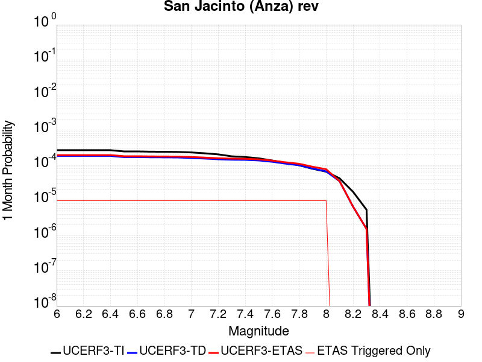 |  | 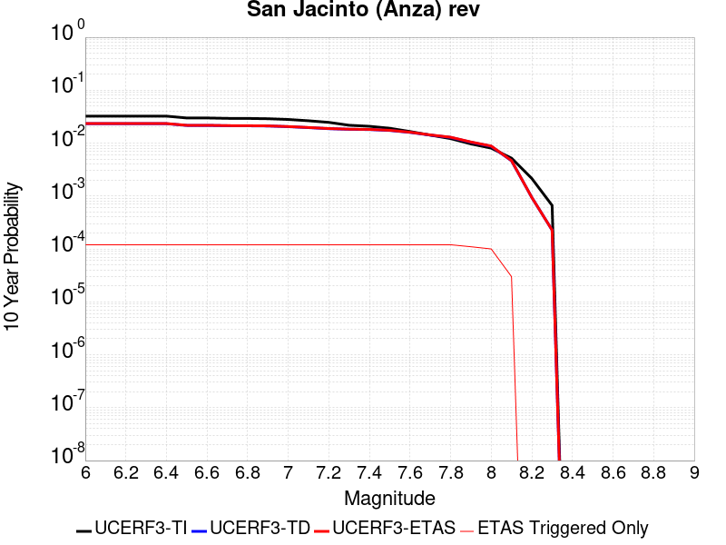 |

| Magnitude | 1 wk TI Prob | 1 wk TD Prob | 1 wk ETAS Prob | 1 wk ETAS/TD Gain | 1 wk ETAS Triggered Only | 1 mo TI Prob | 1 mo TD Prob | 1 mo ETAS Prob | 1 mo ETAS/TD Gain | 1 mo ETAS Triggered Only | 1 yr TI Prob | 1 yr TD Prob | 1 yr ETAS Prob | 1 yr ETAS/TD Gain | 1 yr ETAS Triggered Only | 10 yr TI Prob | 10 yr TD Prob | 10 yr ETAS Prob | 10 yr ETAS/TD Gain | 10 yr ETAS Triggered Only |
|-----|-----|-----|-----|-----|-----|-----|-----|-----|-----|-----|-----|-----|-----|-----|-----|-----|-----|-----|-----|-----|
| 6.0 | 6.3015636E-5 | 4.3319626E-5 | 4.3319626E-5 | 1.0 | 0.0 | 2.7003905E-4 | 1.8564239E-4 | 1.9564053E-4 | 1.053857 | 1.0E-5 | 0.0032827691 | 0.0022578652 | 0.002297775 | 1.0176759 | 4.0E-5 | 0.032346968 | 0.02330496 | 0.023422163 | 1.0050291 | 1.2E-4 |
| 6.1 | 6.3015636E-5 | 4.3319626E-5 | 4.3319626E-5 | 1.0 | 0.0 | 2.7003905E-4 | 1.8564239E-4 | 1.9564053E-4 | 1.053857 | 1.0E-5 | 0.0032827691 | 0.0022578652 | 0.002297775 | 1.0176759 | 4.0E-5 | 0.032346968 | 0.02330496 | 0.023422163 | 1.0050291 | 1.2E-4 |
| 6.2 | 6.3015636E-5 | 4.3319626E-5 | 4.3319626E-5 | 1.0 | 0.0 | 2.7003905E-4 | 1.8564239E-4 | 1.9564053E-4 | 1.053857 | 1.0E-5 | 0.0032827691 | 0.0022578652 | 0.002297775 | 1.0176759 | 4.0E-5 | 0.032346968 | 0.02330496 | 0.023422163 | 1.0050291 | 1.2E-4 |
| 6.3 | 6.3015636E-5 | 4.3319626E-5 | 4.3319626E-5 | 1.0 | 0.0 | 2.7003905E-4 | 1.8564239E-4 | 1.9564053E-4 | 1.053857 | 1.0E-5 | 0.0032827691 | 0.0022578652 | 0.002297775 | 1.0176759 | 4.0E-5 | 0.032346968 | 0.02330496 | 0.023422163 | 1.0050291 | 1.2E-4 |
| 6.4 | 6.3015636E-5 | 4.3319626E-5 | 4.3319626E-5 | 1.0 | 0.0 | 2.7003905E-4 | 1.8564239E-4 | 1.9564053E-4 | 1.053857 | 1.0E-5 | 0.0032827691 | 0.0022578652 | 0.002297775 | 1.0176759 | 4.0E-5 | 0.032346968 | 0.02330496 | 0.023422163 | 1.0050291 | 1.2E-4 |
| 6.5 | 5.811017E-5 | 4.0098632E-5 | 4.0098632E-5 | 1.0 | 0.0 | 2.4901982E-4 | 1.7184E-4 | 1.8183827E-4 | 1.0581837 | 1.0E-5 | 0.0030276014 | 0.00209015 | 0.0021300665 | 1.0190973 | 4.0E-5 | 0.02986684 | 0.021602087 | 0.021719495 | 1.005435 | 1.2E-4 |
| 6.6 | 5.811017E-5 | 4.0098632E-5 | 4.0098632E-5 | 1.0 | 0.0 | 2.4901982E-4 | 1.7184E-4 | 1.8183827E-4 | 1.0581837 | 1.0E-5 | 0.0030276014 | 0.00209015 | 0.0021300665 | 1.0190973 | 4.0E-5 | 0.02986684 | 0.021602087 | 0.021719495 | 1.005435 | 1.2E-4 |
| 6.7 | 5.712442E-5 | 3.952116E-5 | 3.952116E-5 | 1.0 | 0.0 | 2.4479596E-4 | 1.6936543E-4 | 1.7936373E-4 | 1.0590339 | 1.0E-5 | 0.0029763177 | 0.0020600795 | 0.0020999971 | 1.0193768 | 4.0E-5 | 0.029367693 | 0.021293823 | 0.021411268 | 1.0055155 | 1.2E-4 |
| 6.8 | 5.6967532E-5 | 3.9377548E-5 | 3.9377548E-5 | 1.0 | 0.0 | 2.4412372E-4 | 1.6875003E-4 | 1.7874835E-4 | 1.0592493 | 1.0E-5 | 0.0029681553 | 0.0020526012 | 0.002092519 | 1.0194474 | 4.0E-5 | 0.029288229 | 0.021218529 | 0.021335982 | 1.0055355 | 1.2E-4 |
| 6.9 | 5.6211324E-5 | 3.9082228E-5 | 3.9082228E-5 | 1.0 | 0.0 | 2.4088343E-4 | 1.6748454E-4 | 1.7748287E-4 | 1.059697 | 1.0E-5 | 0.0029288116 | 0.0020372227 | 0.0020771413 | 1.0195946 | 4.0E-5 | 0.028905109 | 0.021057902 | 0.021175375 | 1.0055785 | 1.2E-4 |
| 7.0 | 5.4383527E-5 | 3.7942387E-5 | 3.7942387E-5 | 1.0 | 0.0 | 2.3305144E-4 | 1.6260012E-4 | 1.7259849E-4 | 1.0614905 | 1.0E-5 | 0.0028337094 | 0.001977864 | 0.0020177846 | 1.0201838 | 4.0E-5 | 0.027978465 | 0.020448677 | 0.020566223 | 1.0057484 | 1.2E-4 |
| 7.1 | 5.1393665E-5 | 3.640475E-5 | 3.640475E-5 | 1.0 | 0.0 | 2.2023996E-4 | 1.5601104E-4 | 1.6600947E-4 | 1.064088 | 1.0E-5 | 0.0026781242 | 0.0018977838 | 0.0019377079 | 1.0210372 | 4.0E-5 | 0.026460782 | 0.019622007 | 0.019739652 | 1.0059956 | 1.2E-4 |
| 7.2 | 4.785222E-5 | 3.475601E-5 | 3.475601E-5 | 1.0 | 0.0 | 2.0506482E-4 | 1.4894584E-4 | 1.5894436E-4 | 1.0671285 | 1.0E-5 | 0.0024938055 | 0.0018119109 | 0.0018518383 | 1.0220362 | 4.0E-5 | 0.024660049 | 0.018736389 | 0.018854141 | 1.0062846 | 1.2E-4 |
| 7.3 | 4.2143256E-5 | 3.3850083E-5 | 3.3850083E-5 | 1.0 | 0.0 | 1.8060145E-4 | 1.4506375E-4 | 1.550623E-4 | 1.0689253 | 1.0E-5 | 0.002196605 | 0.0017647238 | 0.0018046532 | 1.0226264 | 4.0E-5 | 0.02175019 | 0.018244414 | 0.018362224 | 1.0064573 | 1.2E-4 |
| 7.4 | 4.0264713E-5 | 3.3488133E-5 | 3.3488133E-5 | 1.0 | 0.0 | 1.7255165E-4 | 1.435127E-4 | 1.5351127E-4 | 1.0696702 | 1.0E-5 | 0.002098792 | 0.0017458702 | 0.0017858004 | 1.0228713 | 4.0E-5 | 0.020790804 | 0.018048922 | 0.018166756 | 1.0065286 | 1.2E-4 |
| 7.5 | 3.694492E-5 | 3.2201835E-5 | 3.2201835E-5 | 1.0 | 0.0 | 1.5832575E-4 | 1.3800059E-4 | 1.479992E-4 | 1.0724535 | 1.0E-5 | 0.0019259118 | 0.0016788654 | 0.0017187982 | 1.0237856 | 4.0E-5 | 0.01909306 | 0.017365217 | 0.017483134 | 1.0067904 | 1.2E-4 |
| 7.6 | 3.200565E-5 | 2.9517045E-5 | 2.9517045E-5 | 1.0 | 0.0 | 1.3715986E-4 | 1.2649549E-4 | 1.3649423E-4 | 1.0790442 | 1.0E-5 | 0.001668642 | 0.0015389969 | 0.0015789353 | 1.0259509 | 4.0E-5 | 0.01656168 | 0.015953032 | 0.016071118 | 1.0074021 | 1.2E-4 |
| 7.7 | 2.731642E-5 | 2.610537E-5 | 2.610537E-5 | 1.0 | 0.0 | 1.1706512E-4 | 1.11875364E-4 | 1.2187425E-4 | 1.0893751 | 1.0E-5 | 0.001424336 | 0.0013612325 | 0.0014011781 | 1.0293452 | 4.0E-5 | 0.014152412 | 0.0141735645 | 0.014291864 | 1.0083464 | 1.2E-4 |
| 7.8 | 2.3466424E-5 | 2.3516895E-5 | 2.3516895E-5 | 1.0 | 0.0 | 1.0056651E-4 | 1.007828E-4 | 1.10781795E-4 | 1.0992132 | 1.0E-5 | 0.0012237094 | 0.0012263408 | 0.0012662917 | 1.0325774 | 4.0E-5 | 0.012169928 | 0.012815201 | 0.012933662 | 1.0092438 | 1.2E-4 |
| 7.9 | 1.8611925E-5 | 1.8918972E-5 | 1.8918972E-5 | 1.0 | 0.0 | 7.9762955E-5 | 8.107879E-5 | 9.107798E-5 | 1.1233268 | 1.0E-5 | 9.7068126E-4 | 9.86688E-4 | 0.0010266484 | 1.0404997 | 4.0E-5 | 0.0096645225 | 0.010399517 | 0.010508372 | 1.0104674 | 1.1E-4 |
| 8.0 | 1.5460775E-5 | 1.5750582E-5 | 1.5750582E-5 | 1.0 | 0.0 | 6.6258784E-5 | 6.7500754E-5 | 7.750008E-5 | 1.1481365 | 1.0E-5 | 8.0640207E-4 | 8.215125E-4 | 8.5148786E-4 | 1.036488 | 3.0E-5 | 0.008034821 | 0.008707945 | 0.008807074 | 1.0113838 | 1.0E-4 |
| 8.1 | 9.983884E-6 | 8.275629E-6 | 8.275629E-6 | 1.0 | 0.0 | 4.2787375E-5 | 3.54665E-5 | 3.54665E-5 | 1.0 | 0.0 | 5.2081177E-4 | 4.3171959E-4 | 4.4171527E-4 | 1.0231532 | 1.0E-5 | 0.0051959283 | 0.004643071 | 0.004672932 | 1.0064312 | 3.0E-5 |
| 8.2 | 4.1226E-6 | 1.5546157E-6 | 1.5546157E-6 | 1.0 | 0.0 | 1.7668166E-5 | 6.6626217E-6 | 6.6626217E-6 | 1.0 | 0.0 | 2.1508869E-4 | 8.111443E-5 | 8.111443E-5 | 1.0 | 0.0 | 0.0021488064 | 9.4143586E-4 | 9.4143586E-4 | 1.0 | 0.0 |
| 8.3 | 1.2750878E-6 | 3.6166134E-7 | 3.6166134E-7 | 1.0 | 0.0 | 5.4646503E-6 | 1.5499762E-6 | 1.5499762E-6 | 1.0 | 0.0 | 6.653009E-5 | 1.8870802E-5 | 1.8870802E-5 | 1.0 | 0.0 | 6.6510175E-4 | 2.2760578E-4 | 2.2760578E-4 | 1.0 | 0.0 |

## Cleghorn Lake
*[(top)](#table-of-contents)*

| 1 Week | 1 Month | 1 Year | 10 Year |
|-----|-----|-----|-----|
|  |  |  |  |

| Magnitude | 1 wk TI Prob | 1 wk TD Prob | 1 wk ETAS Prob | 1 wk ETAS/TD Gain | 1 wk ETAS Triggered Only | 1 mo TI Prob | 1 mo TD Prob | 1 mo ETAS Prob | 1 mo ETAS/TD Gain | 1 mo ETAS Triggered Only | 1 yr TI Prob | 1 yr TD Prob | 1 yr ETAS Prob | 1 yr ETAS/TD Gain | 1 yr ETAS Triggered Only | 10 yr TI Prob | 10 yr TD Prob | 10 yr ETAS Prob | 10 yr ETAS/TD Gain | 10 yr ETAS Triggered Only |
|-----|-----|-----|-----|-----|-----|-----|-----|-----|-----|-----|-----|-----|-----|-----|-----|-----|-----|-----|-----|-----|
| 6.0 | 1.5467183E-5 | 1.6794396E-5 | 1.6794396E-5 | 1.0 | 0.0 | 6.6286244E-5 | 7.1974304E-5 | 1.01972146E-4 | 1.4167855 | 3.0E-5 | 8.067362E-4 | 8.7598973E-4 | 9.3593716E-4 | 1.068434 | 6.0E-5 | 0.008038137 | 0.008730795 | 0.0088398345 | 1.0124891 | 1.1E-4 |
| 6.1 | 1.5467183E-5 | 1.6794396E-5 | 1.6794396E-5 | 1.0 | 0.0 | 6.6286244E-5 | 7.1974304E-5 | 1.01972146E-4 | 1.4167855 | 3.0E-5 | 8.067362E-4 | 8.7598973E-4 | 9.3593716E-4 | 1.068434 | 6.0E-5 | 0.008038137 | 0.008730795 | 0.0088398345 | 1.0124891 | 1.1E-4 |
| 6.2 | 1.2624631E-5 | 1.3681697E-5 | 1.3681697E-5 | 1.0 | 0.0 | 5.410444E-5 | 5.86348E-5 | 7.863363E-5 | 1.3410743 | 2.0E-5 | 6.585225E-4 | 7.1369356E-4 | 7.636579E-4 | 1.070008 | 5.0E-5 | 0.0065657445 | 0.007118811 | 0.007218099 | 1.0139472 | 1.0E-4 |
| 6.3 | 1.2624631E-5 | 1.3681697E-5 | 1.3681697E-5 | 1.0 | 0.0 | 5.410444E-5 | 5.86348E-5 | 7.863363E-5 | 1.3410743 | 2.0E-5 | 6.585225E-4 | 7.1369356E-4 | 7.636579E-4 | 1.070008 | 5.0E-5 | 0.0065657445 | 0.007118811 | 0.007218099 | 1.0139472 | 1.0E-4 |
| 6.4 | 9.417684E-6 | 1.0170226E-5 | 1.0170226E-5 | 1.0 | 0.0 | 4.036088E-5 | 4.3586184E-5 | 5.358575E-5 | 1.2294205 | 1.0E-5 | 4.912829E-4 | 5.305737E-4 | 5.6055776E-4 | 1.0565126 | 3.0E-5 | 0.004901982 | 0.0052971053 | 0.0053567877 | 1.011267 | 6.0E-5 |
| 6.5 | 9.368219E-6 | 1.0117652E-5 | 1.0117652E-5 | 1.0 | 0.0 | 4.014889E-5 | 4.3360877E-5 | 5.3360443E-5 | 1.2306126 | 1.0E-5 | 4.8870314E-4 | 5.278319E-4 | 5.5781606E-4 | 1.0568063 | 3.0E-5 | 0.004876298 | 0.0052698175 | 0.0053295013 | 1.0113256 | 6.0E-5 |
| 6.6 | 7.803798E-6 | 8.441923E-6 | 8.441923E-6 | 1.0 | 0.0 | 3.3444423E-5 | 3.6179394E-5 | 3.6179394E-5 | 1.0 | 0.0 | 4.0710976E-4 | 4.40435E-4 | 4.604262E-4 | 1.0453897 | 2.0E-5 | 0.0040636472 | 0.004399538 | 0.004449318 | 1.0113149 | 5.0E-5 |
| 6.7 | 2.3108669E-6 | 2.4438523E-6 | 2.4438523E-6 | 1.0 | 0.0 | 9.903678E-6 | 1.0473612E-5 | 1.0473612E-5 | 1.0 | 0.0 | 1.205706E-4 | 1.2750895E-4 | 1.3750767E-4 | 1.0784159 | 1.0E-5 | 0.001205052 | 0.0012743765 | 0.0012843638 | 1.0078369 | 1.0E-5 |
| 6.8 | 2.0882828E-6 | 2.2062986E-6 | 2.2062986E-6 | 1.0 | 0.0 | 8.949753E-6 | 9.455533E-6 | 9.455533E-6 | 1.0 | 0.0 | 1.08957785E-4 | 1.15115196E-4 | 1.2511405E-4 | 1.0868595 | 1.0E-5 | 0.0010890438 | 0.0011505726 | 0.0011605611 | 1.0086813 | 1.0E-5 |
| 6.9 | 1.876935E-6 | 1.9810657E-6 | 1.9810657E-6 | 1.0 | 0.0 | 8.043982E-6 | 8.490254E-6 | 8.490254E-6 | 1.0 | 0.0 | 9.7931086E-5 | 1.033641E-4 | 1.1336307E-4 | 1.0967354 | 1.0E-5 | 9.788794E-4 | 0.0010331762 | 0.0010431659 | 1.009669 | 1.0E-5 |
| 7.0 | 1.5357559E-6 | 1.6202926E-6 | 1.6202926E-6 | 1.0 | 0.0 | 6.5817944E-6 | 6.944093E-6 | 6.944093E-6 | 1.0 | 0.0 | 8.01304E-5 | 8.454118E-5 | 8.454118E-5 | 1.0 | 0.0 | 8.010151E-4 | 8.4510265E-4 | 8.4510265E-4 | 1.0 | 0.0 |
| 7.1 | 1.0905424E-6 | 1.1497702E-6 | 1.1497702E-6 | 1.0 | 0.0 | 4.6737446E-6 | 4.927578E-6 | 4.927578E-6 | 1.0 | 0.0 | 5.6901354E-5 | 5.999171E-5 | 5.999171E-5 | 1.0 | 0.0 | 5.6886784E-4 | 5.997649E-4 | 5.997649E-4 | 1.0 | 0.0 |
| 7.2 | 6.06668E-7 | 6.387322E-7 | 6.387322E-7 | 1.0 | 0.0 | 2.600003E-6 | 2.7374213E-6 | 2.7374213E-6 | 1.0 | 0.0 | 3.1654577E-5 | 3.3327666E-5 | 3.3327666E-5 | 1.0 | 0.0 | 3.1650066E-4 | 3.332335E-4 | 3.332335E-4 | 1.0 | 0.0 |

## Pinto Mtn
*[(top)](#table-of-contents)*

| 1 Week | 1 Month | 1 Year | 10 Year |
|-----|-----|-----|-----|
|  |  |  |  |

| Magnitude | 1 wk TI Prob | 1 wk TD Prob | 1 wk ETAS Prob | 1 wk ETAS/TD Gain | 1 wk ETAS Triggered Only | 1 mo TI Prob | 1 mo TD Prob | 1 mo ETAS Prob | 1 mo ETAS/TD Gain | 1 mo ETAS Triggered Only | 1 yr TI Prob | 1 yr TD Prob | 1 yr ETAS Prob | 1 yr ETAS/TD Gain | 1 yr ETAS Triggered Only | 10 yr TI Prob | 10 yr TD Prob | 10 yr ETAS Prob | 10 yr ETAS/TD Gain | 10 yr ETAS Triggered Only |
|-----|-----|-----|-----|-----|-----|-----|-----|-----|-----|-----|-----|-----|-----|-----|-----|-----|-----|-----|-----|-----|
| 6.0 | 4.4194956E-5 | 4.785523E-5 | 5.785475E-5 | 1.2089536 | 1.0E-5 | 1.893932E-4 | 2.0507864E-4 | 2.2507455E-4 | 1.0975035 | 2.0E-5 | 0.0023034236 | 0.002494138 | 0.0025240632 | 1.0119982 | 3.0E-5 | 0.022796938 | 0.024678964 | 0.024776496 | 1.003952 | 1.0E-4 |
| 6.1 | 4.4194956E-5 | 4.785523E-5 | 5.785475E-5 | 1.2089536 | 1.0E-5 | 1.893932E-4 | 2.0507864E-4 | 2.2507455E-4 | 1.0975035 | 2.0E-5 | 0.0023034236 | 0.002494138 | 0.0025240632 | 1.0119982 | 3.0E-5 | 0.022796938 | 0.024678964 | 0.024776496 | 1.003952 | 1.0E-4 |
| 6.2 | 4.4194956E-5 | 4.785523E-5 | 5.785475E-5 | 1.2089536 | 1.0E-5 | 1.893932E-4 | 2.0507864E-4 | 2.2507455E-4 | 1.0975035 | 2.0E-5 | 0.0023034236 | 0.002494138 | 0.0025240632 | 1.0119982 | 3.0E-5 | 0.022796938 | 0.024678964 | 0.024776496 | 1.003952 | 1.0E-4 |
| 6.3 | 4.4194956E-5 | 4.785523E-5 | 5.785475E-5 | 1.2089536 | 1.0E-5 | 1.893932E-4 | 2.0507864E-4 | 2.2507455E-4 | 1.0975035 | 2.0E-5 | 0.0023034236 | 0.002494138 | 0.0025240632 | 1.0119982 | 3.0E-5 | 0.022796938 | 0.024678964 | 0.024776496 | 1.003952 | 1.0E-4 |
| 6.4 | 3.729929E-5 | 3.960458E-5 | 4.9604183E-5 | 1.2524861 | 1.0E-5 | 1.5984432E-4 | 1.697234E-4 | 1.8972E-4 | 1.1178188 | 2.0E-5 | 0.0019443673 | 0.0020645177 | 0.0020944558 | 1.0145012 | 3.0E-5 | 0.019274427 | 0.020463403 | 0.020551562 | 1.0043081 | 9.0E-5 |
| 6.5 | 3.729929E-5 | 3.960458E-5 | 4.9604183E-5 | 1.2524861 | 1.0E-5 | 1.5984432E-4 | 1.697234E-4 | 1.8972E-4 | 1.1178188 | 2.0E-5 | 0.0019443673 | 0.0020645177 | 0.0020944558 | 1.0145012 | 3.0E-5 | 0.019274427 | 0.020463403 | 0.020551562 | 1.0043081 | 9.0E-5 |
| 6.6 | 3.0204548E-5 | 3.1206488E-5 | 4.1206175E-5 | 1.3204362 | 1.0E-5 | 1.2944164E-4 | 1.3373543E-4 | 1.5373275E-4 | 1.149529 | 2.0E-5 | 0.0015748127 | 0.0016270474 | 0.0016470149 | 1.0122722 | 2.0E-5 | 0.015636992 | 0.01615522 | 0.016233927 | 1.004872 | 8.0E-5 |
| 6.7 | 2.9857754E-5 | 3.0815863E-5 | 4.0815557E-5 | 1.3244982 | 1.0E-5 | 1.2795553E-4 | 1.320615E-4 | 1.5205886E-4 | 1.1514246 | 2.0E-5 | 0.0015567453 | 0.0016066976 | 0.0016266655 | 1.0124279 | 2.0E-5 | 0.015458848 | 0.015954657 | 0.016023539 | 1.0043174 | 7.0E-5 |
| 6.8 | 2.4819734E-5 | 2.5010428E-5 | 3.5010176E-5 | 1.3998232 | 1.0E-5 | 1.0636595E-4 | 1.0718327E-4 | 1.2718112E-4 | 1.1865762 | 2.0E-5 | 0.0012942362 | 0.0013041968 | 0.0013241706 | 1.015315 | 2.0E-5 | 0.012867244 | 0.012967796 | 0.013027018 | 1.0045668 | 6.0E-5 |
| 6.9 | 2.331124E-5 | 2.3338684E-5 | 3.333845E-5 | 1.4284632 | 1.0E-5 | 9.990149E-5 | 1.00019206E-4 | 1.20017205E-4 | 1.1999416 | 2.0E-5 | 0.001215622 | 0.001217074 | 0.0012370496 | 1.0164129 | 2.0E-5 | 0.012089936 | 0.012106278 | 0.012165551 | 1.0048962 | 6.0E-5 |
| 7.0 | 2.1818534E-5 | 2.1761793E-5 | 3.1761574E-5 | 1.4595109 | 1.0E-5 | 9.3504656E-5 | 9.32616E-5 | 1.1325974E-4 | 1.2144306 | 2.0E-5 | 0.0011378246 | 0.0011348884 | 0.0011548657 | 1.0176029 | 2.0E-5 | 0.011320163 | 0.01129303 | 0.011342466 | 1.0043775 | 5.0E-5 |
| 7.1 | 2.066081E-5 | 2.054142E-5 | 3.0541214E-5 | 1.4868113 | 1.0E-5 | 8.854332E-5 | 8.80318E-5 | 1.08030035E-4 | 1.2271707 | 2.0E-5 | 0.0010774818 | 0.0010712796 | 0.0010912583 | 1.0186492 | 2.0E-5 | 0.010722724 | 0.010663206 | 0.010712672 | 1.004639 | 5.0E-5 |
| 7.2 | 1.8990233E-5 | 1.9054683E-5 | 2.9054494E-5 | 1.5247953 | 1.0E-5 | 8.138417E-5 | 8.166048E-5 | 1.0165885E-4 | 1.2448965 | 2.0E-5 | 9.904018E-4 | 9.937823E-4 | 0.0010137623 | 1.0201051 | 2.0E-5 | 0.009859995 | 0.0098953815 | 0.009944887 | 1.0050029 | 5.0E-5 |
| 7.3 | 1.3335872E-5 | 1.4907276E-5 | 2.4907127E-5 | 1.6708034 | 1.0E-5 | 5.7152483E-5 | 6.388683E-5 | 8.3885556E-5 | 1.3130336 | 2.0E-5 | 6.956093E-4 | 7.775574E-4 | 7.975418E-4 | 1.0257015 | 2.0E-5 | 0.006934359 | 0.0077496674 | 0.00779928 | 1.0064019 | 5.0E-5 |
| 7.4 | 9.414066E-6 | 1.186147E-5 | 1.186147E-5 | 1.0 | 0.0 | 4.0345374E-5 | 5.0833933E-5 | 6.0833423E-5 | 1.196709 | 1.0E-5 | 4.910942E-4 | 6.187368E-4 | 6.2873063E-4 | 1.0161519 | 1.0E-5 | 0.0049001034 | 0.0061710896 | 0.0062009045 | 1.0048314 | 3.0E-5 |
| 7.5 | 7.2101157E-6 | 9.158733E-6 | 9.158733E-6 | 1.0 | 0.0 | 3.090013E-5 | 3.9251165E-5 | 4.925077E-5 | 1.2547596 | 1.0E-5 | 3.7614413E-4 | 4.7778594E-4 | 4.8778116E-4 | 1.0209199 | 1.0E-5 | 0.0037550807 | 0.0047683627 | 0.0047882674 | 1.0041744 | 2.0E-5 |
| 7.6 | 3.296375E-6 | 4.546122E-6 | 4.546122E-6 | 1.0 | 0.0 | 1.4127245E-5 | 1.9483241E-5 | 2.9483046E-5 | 1.5132517 | 1.0E-5 | 1.7198564E-4 | 2.3718402E-4 | 2.4718166E-4 | 1.0421513 | 1.0E-5 | 0.0017185259 | 0.0023694462 | 0.0023794225 | 1.0042104 | 1.0E-5 |
| 7.7 | 2.5741092E-6 | 3.5850085E-6 | 3.5850085E-6 | 1.0 | 0.0 | 1.103185E-5 | 1.536424E-5 | 1.536424E-5 | 1.0 | 0.0 | 1.3430449E-4 | 1.8704488E-4 | 1.8704488E-4 | 1.0 | 0.0 | 0.0013422335 | 0.0018690043 | 0.0018690043 | 1.0 | 0.0 |

## Manix-Afton Hills
*[(top)](#table-of-contents)*

| 1 Week | 1 Month | 1 Year | 10 Year |
|-----|-----|-----|-----|
|  |  |  |  |

| Magnitude | 1 wk TI Prob | 1 wk TD Prob | 1 wk ETAS Prob | 1 wk ETAS/TD Gain | 1 wk ETAS Triggered Only | 1 mo TI Prob | 1 mo TD Prob | 1 mo ETAS Prob | 1 mo ETAS/TD Gain | 1 mo ETAS Triggered Only | 1 yr TI Prob | 1 yr TD Prob | 1 yr ETAS Prob | 1 yr ETAS/TD Gain | 1 yr ETAS Triggered Only | 10 yr TI Prob | 10 yr TD Prob | 10 yr ETAS Prob | 10 yr ETAS/TD Gain | 10 yr ETAS Triggered Only |
|-----|-----|-----|-----|-----|-----|-----|-----|-----|-----|-----|-----|-----|-----|-----|-----|-----|-----|-----|-----|-----|
| 6.0 | 1.3783202E-5 | 1.4711221E-5 | 1.4711221E-5 | 1.0 | 0.0 | 5.906953E-5 | 6.304667E-5 | 6.304667E-5 | 1.0 | 0.0 | 7.189342E-4 | 7.673403E-4 | 8.0730964E-4 | 1.0520881 | 4.0E-5 | 0.0071661277 | 0.007648664 | 0.0077578225 | 1.0142716 | 1.1E-4 |
| 6.1 | 1.3783202E-5 | 1.4711221E-5 | 1.4711221E-5 | 1.0 | 0.0 | 5.906953E-5 | 6.304667E-5 | 6.304667E-5 | 1.0 | 0.0 | 7.189342E-4 | 7.673403E-4 | 8.0730964E-4 | 1.0520881 | 4.0E-5 | 0.0071661277 | 0.007648664 | 0.0077578225 | 1.0142716 | 1.1E-4 |
| 6.2 | 1.3783202E-5 | 1.4711221E-5 | 1.4711221E-5 | 1.0 | 0.0 | 5.906953E-5 | 6.304667E-5 | 6.304667E-5 | 1.0 | 0.0 | 7.189342E-4 | 7.673403E-4 | 8.0730964E-4 | 1.0520881 | 4.0E-5 | 0.0071661277 | 0.007648664 | 0.0077578225 | 1.0142716 | 1.1E-4 |
| 6.3 | 1.10494875E-5 | 1.1793241E-5 | 1.1793241E-5 | 1.0 | 0.0 | 4.7354086E-5 | 5.054154E-5 | 5.054154E-5 | 1.0 | 0.0 | 5.763835E-4 | 6.151799E-4 | 6.351676E-4 | 1.0324908 | 2.0E-5 | 0.005748908 | 0.00613581 | 0.0062153195 | 1.0129582 | 8.0E-5 |
| 6.4 | 1.10494875E-5 | 1.1793241E-5 | 1.1793241E-5 | 1.0 | 0.0 | 4.7354086E-5 | 5.054154E-5 | 5.054154E-5 | 1.0 | 0.0 | 5.763835E-4 | 6.151799E-4 | 6.351676E-4 | 1.0324908 | 2.0E-5 | 0.005748908 | 0.00613581 | 0.0062153195 | 1.0129582 | 8.0E-5 |
| 6.5 | 9.788949E-6 | 1.0454414E-5 | 1.0454414E-5 | 1.0 | 0.0 | 4.1951964E-5 | 4.4803914E-5 | 4.4803914E-5 | 1.0 | 0.0 | 5.1064545E-4 | 5.4536044E-4 | 5.6534953E-4 | 1.036653 | 2.0E-5 | 0.0050947363 | 0.005441148 | 0.005520712 | 1.0146228 | 8.0E-5 |
| 6.6 | 8.810006E-6 | 9.413714E-6 | 9.413714E-6 | 1.0 | 0.0 | 3.775662E-5 | 4.0343915E-5 | 4.0343915E-5 | 1.0 | 0.0 | 4.5958988E-4 | 4.9108535E-4 | 5.010804E-4 | 1.0203531 | 1.0E-5 | 0.0045864056 | 0.004900884 | 0.0049605896 | 1.0121827 | 6.0E-5 |
| 6.7 | 8.80128E-6 | 9.404193E-6 | 9.404193E-6 | 1.0 | 0.0 | 3.7719226E-5 | 4.0303115E-5 | 4.0303115E-5 | 1.0 | 0.0 | 4.591348E-4 | 4.9058883E-4 | 5.005839E-4 | 1.0203737 | 1.0E-5 | 0.004581874 | 0.0048959404 | 0.0049556466 | 1.0121951 | 6.0E-5 |
| 6.8 | 6.8994877E-6 | 7.3801443E-6 | 7.3801443E-6 | 1.0 | 0.0 | 2.9568899E-5 | 3.1628853E-5 | 3.1628853E-5 | 1.0 | 0.0 | 3.5994186E-4 | 3.850214E-4 | 3.9501756E-4 | 1.0259626 | 1.0E-5 | 0.003593594 | 0.0038443485 | 0.0039041177 | 1.0155473 | 6.0E-5 |
| 6.9 | 4.9328037E-6 | 5.2710093E-6 | 5.2710093E-6 | 1.0 | 0.0 | 2.1140417E-5 | 2.258988E-5 | 2.258988E-5 | 1.0 | 0.0 | 2.5735417E-4 | 2.7500323E-4 | 2.8500048E-4 | 1.0363532 | 1.0E-5 | 0.0025705635 | 0.0027472344 | 0.0028070696 | 1.0217801 | 6.0E-5 |
| 7.0 | 3.347973E-6 | 3.5900646E-6 | 3.5900646E-6 | 1.0 | 0.0 | 1.4348378E-5 | 1.5385924E-5 | 1.5385924E-5 | 1.0 | 0.0 | 1.746775E-4 | 1.8731161E-4 | 1.9730974E-4 | 1.0533769 | 1.0E-5 | 0.0017454025 | 0.00187194 | 0.0019118651 | 1.0213282 | 4.0E-5 |
| 7.1 | 1.2073567E-6 | 1.2934943E-6 | 1.2934943E-6 | 1.0 | 0.0 | 5.1743755E-6 | 5.5435444E-6 | 5.5435444E-6 | 1.0 | 0.0 | 6.29962E-5 | 6.74922E-5 | 7.7491524E-5 | 1.1481553 | 1.0E-5 | 6.297835E-4 | 6.7487714E-4 | 6.948636E-4 | 1.029615 | 2.0E-5 |

## Independence rev 2011
*[(top)](#table-of-contents)*

| 1 Week | 1 Month | 1 Year | 10 Year |
|-----|-----|-----|-----|
|  |  |  |  |

| Magnitude | 1 wk TI Prob | 1 wk TD Prob | 1 wk ETAS Prob | 1 wk ETAS/TD Gain | 1 wk ETAS Triggered Only | 1 mo TI Prob | 1 mo TD Prob | 1 mo ETAS Prob | 1 mo ETAS/TD Gain | 1 mo ETAS Triggered Only | 1 yr TI Prob | 1 yr TD Prob | 1 yr ETAS Prob | 1 yr ETAS/TD Gain | 1 yr ETAS Triggered Only | 10 yr TI Prob | 10 yr TD Prob | 10 yr ETAS Prob | 10 yr ETAS/TD Gain | 10 yr ETAS Triggered Only |
|-----|-----|-----|-----|-----|-----|-----|-----|-----|-----|-----|-----|-----|-----|-----|-----|-----|-----|-----|-----|-----|
| 6.0 | 4.422171E-6 | 4.3262453E-6 | 2.4326158E-5 | 5.622926 | 2.0E-5 | 1.8952025E-5 | 1.8540937E-5 | 5.8540194E-5 | 3.1573484 | 4.0E-5 | 2.3071647E-4 | 2.257155E-4 | 2.7570422E-4 | 1.2214679 | 5.0E-5 | 0.0023047708 | 0.0022551562 | 0.0023549306 | 1.0442429 | 1.0E-4 |
| 6.1 | 4.422171E-6 | 4.3262453E-6 | 2.4326158E-5 | 5.622926 | 2.0E-5 | 1.8952025E-5 | 1.8540937E-5 | 5.8540194E-5 | 3.1573484 | 4.0E-5 | 2.3071647E-4 | 2.257155E-4 | 2.7570422E-4 | 1.2214679 | 5.0E-5 | 0.0023047708 | 0.0022551562 | 0.0023549306 | 1.0442429 | 1.0E-4 |
| 6.2 | 4.422171E-6 | 4.3262453E-6 | 2.4326158E-5 | 5.622926 | 2.0E-5 | 1.8952025E-5 | 1.8540937E-5 | 5.8540194E-5 | 3.1573484 | 4.0E-5 | 2.3071647E-4 | 2.257155E-4 | 2.7570422E-4 | 1.2214679 | 5.0E-5 | 0.0023047708 | 0.0022551562 | 0.0023549306 | 1.0442429 | 1.0E-4 |
| 6.3 | 4.422171E-6 | 4.3262453E-6 | 2.4326158E-5 | 5.622926 | 2.0E-5 | 1.8952025E-5 | 1.8540937E-5 | 5.8540194E-5 | 3.1573484 | 4.0E-5 | 2.3071647E-4 | 2.257155E-4 | 2.7570422E-4 | 1.2214679 | 5.0E-5 | 0.0023047708 | 0.0022551562 | 0.0023549306 | 1.0442429 | 1.0E-4 |
| 6.4 | 4.422171E-6 | 4.3262453E-6 | 2.4326158E-5 | 5.622926 | 2.0E-5 | 1.8952025E-5 | 1.8540937E-5 | 5.8540194E-5 | 3.1573484 | 4.0E-5 | 2.3071647E-4 | 2.257155E-4 | 2.7570422E-4 | 1.2214679 | 5.0E-5 | 0.0023047708 | 0.0022551562 | 0.0023549306 | 1.0442429 | 1.0E-4 |
| 6.5 | 4.422171E-6 | 4.3262453E-6 | 2.4326158E-5 | 5.622926 | 2.0E-5 | 1.8952025E-5 | 1.8540937E-5 | 5.8540194E-5 | 3.1573484 | 4.0E-5 | 2.3071647E-4 | 2.257155E-4 | 2.7570422E-4 | 1.2214679 | 5.0E-5 | 0.0023047708 | 0.0022551562 | 0.0023549306 | 1.0442429 | 1.0E-4 |
| 6.6 | 2.663744E-6 | 2.5319996E-6 | 1.2531974E-5 | 4.9494376 | 1.0E-5 | 1.1415996E-5 | 1.0851385E-5 | 4.085106E-5 | 3.764594 | 3.0E-5 | 1.3898089E-4 | 1.3210809E-4 | 1.7210281E-4 | 1.3027424 | 4.0E-5 | 0.0013889399 | 0.0013203438 | 0.0014102249 | 1.0680741 | 9.0E-5 |
| 6.7 | 2.663744E-6 | 2.5319996E-6 | 1.2531974E-5 | 4.9494376 | 1.0E-5 | 1.1415996E-5 | 1.0851385E-5 | 4.085106E-5 | 3.764594 | 3.0E-5 | 1.3898089E-4 | 1.3210809E-4 | 1.7210281E-4 | 1.3027424 | 4.0E-5 | 0.0013889399 | 0.0013203438 | 0.0014102249 | 1.0680741 | 9.0E-5 |
| 6.8 | 1.9716529E-6 | 1.83227E-6 | 1.1832251E-5 | 6.457701 | 1.0E-5 | 8.449913E-6 | 7.852563E-6 | 3.7852325E-5 | 4.820379 | 3.0E-5 | 1.0287284E-4 | 9.560089E-5 | 1.3559706E-4 | 1.4183662 | 4.0E-5 | 0.0010282523 | 9.556105E-4 | 0.0010455245 | 1.0940906 | 9.0E-5 |
| 6.9 | 1.8788617E-6 | 1.7430103E-6 | 1.1742993E-5 | 6.7371907 | 1.0E-5 | 8.0522395E-6 | 7.470024E-6 | 3.74698E-5 | 5.0160217 | 3.0E-5 | 9.80316E-5 | 9.094387E-5 | 1.3094023E-4 | 1.4397918 | 4.0E-5 | 9.798837E-4 | 9.090785E-4 | 9.989967E-4 | 1.0989114 | 9.0E-5 |
| 7.0 | 1.5045488E-6 | 1.3849595E-6 | 1.13849455E-5 | 8.220418 | 1.0E-5 | 6.44805E-6 | 5.9355275E-6 | 3.593535E-5 | 6.0542808 | 3.0E-5 | 7.8502184E-5 | 7.226271E-5 | 1.1225981E-4 | 1.5534959 | 4.0E-5 | 7.8474457E-4 | 7.2239724E-4 | 8.123322E-4 | 1.1244951 | 9.0E-5 |
| 7.1 | 1.272341E-6 | 1.1625177E-6 | 1.1162506E-5 | 9.60201 | 1.0E-5 | 5.4528787E-6 | 4.9822092E-6 | 3.498206E-5 | 7.021395 | 3.0E-5 | 6.6386776E-5 | 6.065674E-5 | 1.0065432E-4 | 1.6594086 | 4.0E-5 | 6.636695E-4 | 6.06405E-4 | 6.963505E-4 | 1.1483257 | 9.0E-5 |
| 7.2 | 1.0416892E-6 | 9.4099494E-7 | 1.0940986E-5 | 11.62704 | 1.0E-5 | 4.464375E-6 | 4.032829E-6 | 3.403271E-5 | 8.438916 | 3.0E-5 | 5.4352407E-5 | 4.909861E-5 | 8.909665E-5 | 1.8146471 | 4.0E-5 | 5.4339116E-4 | 4.9087947E-4 | 5.808353E-4 | 1.1832544 | 9.0E-5 |
| 7.3 | 7.9450155E-7 | 7.235053E-7 | 1.0723498E-5 | 14.8215885 | 1.0E-5 | 3.4050022E-6 | 3.1007335E-6 | 2.310067E-5 | 7.4500666 | 2.0E-5 | 4.1455114E-5 | 3.7750786E-5 | 6.774966E-5 | 1.7946554 | 3.0E-5 | 4.144738E-4 | 3.7744487E-4 | 4.5741466E-4 | 1.2118715 | 8.0E-5 |
| 7.4 | 5.3893444E-7 | 5.0195445E-7 | 1.0501949E-5 | 20.922117 | 1.0E-5 | 2.309717E-6 | 2.1512315E-6 | 1.215121E-5 | 5.6484904 | 1.0E-5 | 2.8120441E-5 | 2.6190934E-5 | 4.619041E-5 | 1.7636031 | 2.0E-5 | 2.8116882E-4 | 2.6187891E-4 | 3.2186322E-4 | 1.2290535 | 6.0E-5 |
| 7.5 | 3.8852085E-7 | 3.6825747E-7 | 1.0368254E-5 | 28.154903 | 1.0E-5 | 1.6650882E-6 | 1.5782454E-6 | 1.15782295E-5 | 7.33614 | 1.0E-5 | 2.027226E-5 | 1.9214971E-5 | 3.9214585E-5 | 2.0408351 | 2.0E-5 | 2.0270412E-4 | 1.921333E-4 | 2.421237E-4 | 1.260186 | 5.0E-5 |
| 7.6 | 2.414929E-7 | 2.3457659E-7 | 1.0234574E-5 | 43.62999 | 1.0E-5 | 1.0349692E-6 | 1.0053279E-6 | 1.1005318E-5 | 10.946994 | 1.0E-5 | 1.2600677E-5 | 1.22398E-5 | 3.2239554E-5 | 2.6339936 | 2.0E-5 | 1.2599962E-4 | 1.2239137E-4 | 1.7238526E-4 | 1.4084755 | 5.0E-5 |
| 7.7 | 6.8298014E-8 | 6.858993E-8 | 6.858993E-8 | 1.0 | 0.0 | 2.9270575E-7 | 2.939568E-7 | 2.939568E-7 | 1.0 | 0.0 | 3.5636867E-6 | 3.5789185E-6 | 1.3578883E-5 | 3.79413 | 1.0E-5 | 3.5636294E-5 | 3.5788657E-5 | 4.57883E-5 | 1.2794081 | 1.0E-5 |

## Ortigalita (North)
*[(top)](#table-of-contents)*

| 1 Week | 1 Month | 1 Year | 10 Year |
|-----|-----|-----|-----|
|  |  |  |  |

| Magnitude | 1 wk TI Prob | 1 wk TD Prob | 1 wk ETAS Prob | 1 wk ETAS/TD Gain | 1 wk ETAS Triggered Only | 1 mo TI Prob | 1 mo TD Prob | 1 mo ETAS Prob | 1 mo ETAS/TD Gain | 1 mo ETAS Triggered Only | 1 yr TI Prob | 1 yr TD Prob | 1 yr ETAS Prob | 1 yr ETAS/TD Gain | 1 yr ETAS Triggered Only | 10 yr TI Prob | 10 yr TD Prob | 10 yr ETAS Prob | 10 yr ETAS/TD Gain | 10 yr ETAS Triggered Only |
|-----|-----|-----|-----|-----|-----|-----|-----|-----|-----|-----|-----|-----|-----|-----|-----|-----|-----|-----|-----|-----|
| 6.0 | 7.711876E-5 | 1.0507023E-4 | 1.0507023E-4 | 1.0 | 0.0 | 3.3046713E-4 | 4.5023413E-4 | 4.5023413E-4 | 1.0 | 0.0 | 0.004016016 | 0.005468329 | 0.0054882197 | 1.0036374 | 2.0E-5 | 0.039442103 | 0.053457033 | 0.05352329 | 1.0012394 | 7.0E-5 |
| 6.1 | 4.607858E-5 | 6.024174E-5 | 6.024174E-5 | 1.0 | 0.0 | 1.9746469E-4 | 2.5815613E-4 | 2.5815613E-4 | 1.0 | 0.0 | 0.0024014818 | 0.0031388826 | 0.0031588199 | 1.0063517 | 2.0E-5 | 0.023756953 | 0.030976266 | 0.031015027 | 1.0012513 | 4.0E-5 |
| 6.2 | 4.607858E-5 | 6.024174E-5 | 6.024174E-5 | 1.0 | 0.0 | 1.9746469E-4 | 2.5815613E-4 | 2.5815613E-4 | 1.0 | 0.0 | 0.0024014818 | 0.0031388826 | 0.0031588199 | 1.0063517 | 2.0E-5 | 0.023756953 | 0.030976266 | 0.031015027 | 1.0012513 | 4.0E-5 |
| 6.3 | 3.327423E-5 | 4.247674E-5 | 4.247674E-5 | 1.0 | 0.0 | 1.4259605E-4 | 1.820322E-4 | 1.820322E-4 | 1.0 | 0.0 | 0.0017347244 | 0.0022142797 | 0.0022242577 | 1.0045061 | 1.0E-5 | 0.017212452 | 0.021946438 | 0.021985559 | 1.0017827 | 4.0E-5 |
| 6.4 | 2.7732503E-5 | 3.4999855E-5 | 3.4999855E-5 | 1.0 | 0.0 | 1.1884817E-4 | 1.4999225E-4 | 1.4999225E-4 | 1.0 | 0.0 | 0.001446016 | 0.001824874 | 0.0018348558 | 1.0054698 | 1.0E-5 | 0.014366428 | 0.018121855 | 0.018151313 | 1.0016254 | 3.0E-5 |
| 6.5 | 2.7689714E-5 | 3.4949666E-5 | 3.4949666E-5 | 1.0 | 0.0 | 1.186648E-4 | 1.4977719E-4 | 1.4977719E-4 | 1.0 | 0.0 | 0.0014437864 | 0.00182226 | 0.0018322418 | 1.0054777 | 1.0E-5 | 0.014344421 | 0.018096142 | 0.0181256 | 1.0016278 | 3.0E-5 |
| 6.6 | 2.2976905E-5 | 2.8719256E-5 | 2.8719256E-5 | 1.0 | 0.0 | 9.846873E-5 | 1.2307815E-4 | 1.2307815E-4 | 1.0 | 0.0 | 0.0011981975 | 0.001497687 | 0.001507672 | 1.006667 | 1.0E-5 | 0.011917574 | 0.014899201 | 0.0149287535 | 1.0019835 | 3.0E-5 |
| 6.7 | 1.9871539E-5 | 2.490528E-5 | 2.490528E-5 | 1.0 | 0.0 | 8.516096E-5 | 1.0673395E-4 | 1.0673395E-4 | 1.0 | 0.0 | 0.0010363415 | 0.0012989598 | 0.0013089469 | 1.0076885 | 1.0E-5 | 0.010315218 | 0.012937365 | 0.0129669765 | 1.0022888 | 3.0E-5 |
| 6.8 | 6.5640475E-6 | 7.6056526E-6 | 7.6056526E-6 | 1.0 | 0.0 | 2.813133E-5 | 3.2595264E-5 | 3.2595264E-5 | 1.0 | 0.0 | 3.424451E-4 | 3.9677793E-4 | 4.0677396E-4 | 1.025193 | 1.0E-5 | 0.0034191788 | 0.0039609824 | 0.0039709425 | 1.0025146 | 1.0E-5 |
| 6.9 | 5.6219683E-6 | 6.5019726E-6 | 6.5019726E-6 | 1.0 | 0.0 | 2.4093928E-5 | 2.7865315E-5 | 2.7865315E-5 | 1.0 | 0.0 | 2.933041E-4 | 3.3920998E-4 | 3.3920998E-4 | 1.0 | 0.0 | 0.0029291727 | 0.0033871792 | 0.0033871792 | 1.0 | 0.0 |
| 7.0 | 3.875591E-6 | 4.4848484E-6 | 4.4848484E-6 | 1.0 | 0.0 | 1.6609569E-5 | 1.922065E-5 | 1.922065E-5 | 1.0 | 0.0 | 2.0220275E-4 | 2.339884E-4 | 2.339884E-4 | 1.0 | 0.0 | 0.0020201886 | 0.0023376285 | 0.0023376285 | 1.0 | 0.0 |
| 7.1 | 1.6017933E-6 | 1.8570811E-6 | 1.8570811E-6 | 1.0 | 0.0 | 6.8648105E-6 | 7.958901E-6 | 7.958901E-6 | 1.0 | 0.0 | 8.357586E-5 | 9.689637E-5 | 9.689637E-5 | 1.0 | 0.0 | 8.3544437E-4 | 9.686459E-4 | 9.686459E-4 | 1.0 | 0.0 |

## Baker
*[(top)](#table-of-contents)*

| 1 Week | 1 Month | 1 Year | 10 Year |
|-----|-----|-----|-----|
|  |  | 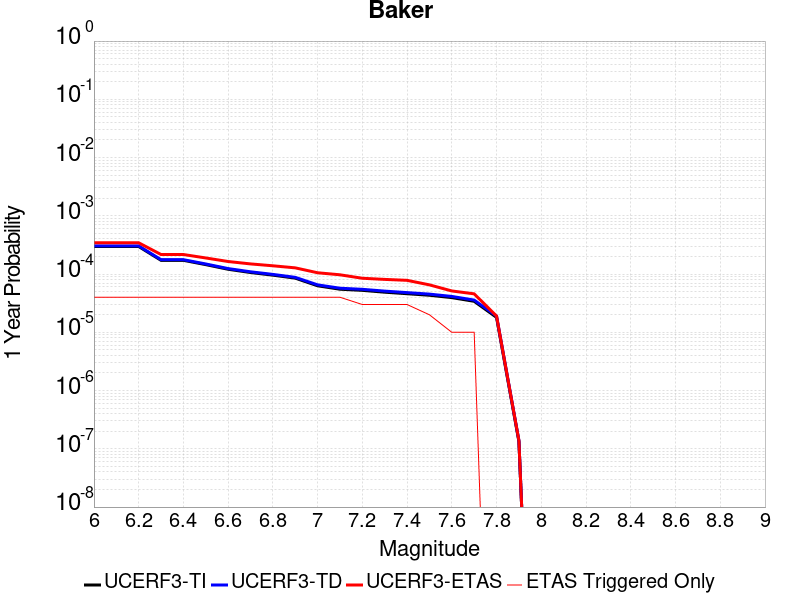 |  |

| Magnitude | 1 wk TI Prob | 1 wk TD Prob | 1 wk ETAS Prob | 1 wk ETAS/TD Gain | 1 wk ETAS Triggered Only | 1 mo TI Prob | 1 mo TD Prob | 1 mo ETAS Prob | 1 mo ETAS/TD Gain | 1 mo ETAS Triggered Only | 1 yr TI Prob | 1 yr TD Prob | 1 yr ETAS Prob | 1 yr ETAS/TD Gain | 1 yr ETAS Triggered Only | 10 yr TI Prob | 10 yr TD Prob | 10 yr ETAS Prob | 10 yr ETAS/TD Gain | 10 yr ETAS Triggered Only |
|-----|-----|-----|-----|-----|-----|-----|-----|-----|-----|-----|-----|-----|-----|-----|-----|-----|-----|-----|-----|-----|
| 6.0 | 5.695525E-6 | 5.834856E-6 | 5.834856E-6 | 1.0 | 0.0 | 2.4409164E-5 | 2.500631E-5 | 3.5006058E-5 | 1.3998891 | 1.0E-5 | 2.9714106E-4 | 3.044133E-4 | 3.444011E-4 | 1.1313603 | 4.0E-5 | 0.0029674405 | 0.0030403587 | 0.0031400546 | 1.0327909 | 1.0E-4 |
| 6.1 | 5.695525E-6 | 5.834856E-6 | 5.834856E-6 | 1.0 | 0.0 | 2.4409164E-5 | 2.500631E-5 | 3.5006058E-5 | 1.3998891 | 1.0E-5 | 2.9714106E-4 | 3.044133E-4 | 3.444011E-4 | 1.1313603 | 4.0E-5 | 0.0029674405 | 0.0030403587 | 0.0031400546 | 1.0327909 | 1.0E-4 |
| 6.2 | 5.695525E-6 | 5.834856E-6 | 5.834856E-6 | 1.0 | 0.0 | 2.4409164E-5 | 2.500631E-5 | 3.5006058E-5 | 1.3998891 | 1.0E-5 | 2.9714106E-4 | 3.044133E-4 | 3.444011E-4 | 1.1313603 | 4.0E-5 | 0.0029674405 | 0.0030403587 | 0.0031400546 | 1.0327909 | 1.0E-4 |
| 6.3 | 3.2995713E-6 | 3.3836786E-6 | 3.3836786E-6 | 1.0 | 0.0 | 1.4140943E-5 | 1.4501402E-5 | 2.4501256E-5 | 1.6895785 | 1.0E-5 | 1.7215237E-4 | 1.7654074E-4 | 2.1653368E-4 | 1.2265366 | 4.0E-5 | 0.0017201907 | 0.0017640521 | 0.0018339285 | 1.0396113 | 7.0E-5 |
| 6.4 | 3.2995713E-6 | 3.3836786E-6 | 3.3836786E-6 | 1.0 | 0.0 | 1.4140943E-5 | 1.4501402E-5 | 2.4501256E-5 | 1.6895785 | 1.0E-5 | 1.7215237E-4 | 1.7654074E-4 | 2.1653368E-4 | 1.2265366 | 4.0E-5 | 0.0017201907 | 0.0017640521 | 0.0018339285 | 1.0396113 | 7.0E-5 |
| 6.5 | 2.782202E-6 | 2.8558507E-6 | 2.8558507E-6 | 1.0 | 0.0 | 1.1923668E-5 | 1.2239304E-5 | 2.223918E-5 | 1.81703 | 1.0E-5 | 1.4516099E-4 | 1.4900367E-4 | 1.889977E-4 | 1.2684097 | 4.0E-5 | 0.001450662 | 0.0014890704 | 0.0015589661 | 1.0469393 | 7.0E-5 |
| 6.6 | 2.3163404E-6 | 2.380929E-6 | 2.380929E-6 | 1.0 | 0.0 | 9.927136E-6 | 1.0203942E-5 | 2.020384E-5 | 1.9800034 | 1.0E-5 | 1.20856166E-4 | 1.2422612E-4 | 1.6422114E-4 | 1.3219535 | 4.0E-5 | 0.0012079047 | 0.001241587 | 0.0013115001 | 1.0563095 | 7.0E-5 |
| 6.7 | 2.037056E-6 | 2.0965088E-6 | 2.0965088E-6 | 1.0 | 0.0 | 8.7302105E-6 | 8.985007E-6 | 1.8984918E-5 | 2.112955 | 1.0E-5 | 1.0628513E-4 | 1.0938713E-4 | 1.4938276E-4 | 1.3656337 | 4.0E-5 | 0.0010623431 | 0.0010933491 | 0.0011632725 | 1.0639535 | 7.0E-5 |
| 6.8 | 1.8356744E-6 | 1.8915364E-6 | 1.8915364E-6 | 1.0 | 0.0 | 7.867153E-6 | 8.10656E-6 | 1.8106479E-5 | 2.233559 | 1.0E-5 | 9.577837E-5 | 9.869304E-5 | 1.386891E-4 | 1.4052571 | 4.0E-5 | 9.57371E-4 | 9.865061E-4 | 0.001056437 | 1.0708874 | 7.0E-5 |
| 6.9 | 1.6310546E-6 | 1.6832144E-6 | 1.6832144E-6 | 1.0 | 0.0 | 6.9902153E-6 | 7.213757E-6 | 1.7213684E-5 | 2.3862302 | 1.0E-5 | 8.510255E-5 | 8.782406E-5 | 1.2782055E-4 | 1.4554161 | 4.0E-5 | 8.5069967E-4 | 8.779048E-4 | 9.3785214E-4 | 1.0682845 | 6.0E-5 |
| 7.0 | 1.2058036E-6 | 1.2508729E-6 | 1.2508729E-6 | 1.0 | 0.0 | 5.1677193E-6 | 5.3608724E-6 | 1.536082E-5 | 2.8653579 | 1.0E-5 | 6.291517E-5 | 6.526669E-5 | 1.0526408E-4 | 1.61283 | 4.0E-5 | 6.289736E-4 | 6.5247755E-4 | 7.124384E-4 | 1.0918971 | 6.0E-5 |
| 7.1 | 1.052382E-6 | 1.0951668E-6 | 1.0951668E-6 | 1.0 | 0.0 | 4.5102006E-6 | 4.693564E-6 | 1.4693516E-5 | 3.1305673 | 1.0E-5 | 5.491031E-5 | 5.7142646E-5 | 9.7140364E-5 | 1.6999626 | 4.0E-5 | 5.4896745E-4 | 5.712804E-4 | 6.3124613E-4 | 1.1049672 | 6.0E-5 |
| 7.2 | 1.0067454E-6 | 1.0487769E-6 | 1.0487769E-6 | 1.0 | 0.0 | 4.3146156E-6 | 4.4947506E-6 | 1.4494705E-5 | 3.2248075 | 1.0E-5 | 5.252918E-5 | 5.4722223E-5 | 8.472058E-5 | 1.5481933 | 3.0E-5 | 5.251676E-4 | 5.4708833E-4 | 5.97061E-4 | 1.0913429 | 5.0E-5 |
| 7.3 | 9.3596316E-7 | 9.76778E-7 | 9.76778E-7 | 1.0 | 0.0 | 4.0112645E-6 | 4.186185E-6 | 1.4186143E-5 | 3.3888 | 1.0E-5 | 4.8836053E-5 | 5.0965617E-5 | 8.0964084E-5 | 1.5886022 | 3.0E-5 | 4.8825322E-4 | 5.095401E-4 | 5.5951456E-4 | 1.0980777 | 5.0E-5 |
| 7.4 | 8.8117395E-7 | 9.2077187E-7 | 9.2077187E-7 | 1.0 | 0.0 | 3.7764542E-6 | 3.9461593E-6 | 1.394612E-5 | 3.5340996 | 1.0E-5 | 4.5977362E-5 | 4.8043436E-5 | 7.8041994E-5 | 1.6244049 | 3.0E-5 | 4.596785E-4 | 4.8033125E-4 | 5.3030724E-4 | 1.1040448 | 5.0E-5 |
| 7.5 | 8.292386E-7 | 8.674649E-7 | 8.674649E-7 | 1.0 | 0.0 | 3.5538749E-6 | 3.7177015E-6 | 3.7177015E-6 | 1.0 | 0.0 | 4.326757E-5 | 4.5262084E-5 | 6.526118E-5 | 1.441851 | 2.0E-5 | 4.3259145E-4 | 4.5252938E-4 | 4.9251126E-4 | 1.0883521 | 4.0E-5 |
| 7.6 | 7.553842E-7 | 7.9145207E-7 | 7.9145207E-7 | 1.0 | 0.0 | 3.2373566E-6 | 3.3919332E-6 | 3.3919332E-6 | 1.0 | 0.0 | 3.9414106E-5 | 4.129601E-5 | 5.12956E-5 | 1.2421441 | 1.0E-5 | 3.9407116E-4 | 4.1288408E-4 | 4.3287582E-4 | 1.0484197 | 2.0E-5 |
| 7.7 | 6.5285366E-7 | 6.852842E-7 | 6.852842E-7 | 1.0 | 0.0 | 2.797941E-6 | 2.9369291E-6 | 2.9369291E-6 | 1.0 | 0.0 | 3.40644E-5 | 3.5756533E-5 | 4.5756173E-5 | 1.2796592 | 1.0E-5 | 3.405918E-4 | 3.5750846E-4 | 3.6750486E-4 | 1.0279614 | 1.0E-5 |
| 7.8 | 3.4586725E-7 | 3.648288E-7 | 3.648288E-7 | 1.0 | 0.0 | 1.4822873E-6 | 1.5635511E-6 | 1.5635511E-6 | 1.0 | 0.0 | 1.80467E-5 | 1.9036073E-5 | 1.9036073E-5 | 1.0 | 0.0 | 1.8045233E-4 | 1.9034486E-4 | 1.9034486E-4 | 1.0 | 0.0 |
| 7.9 | 2.5591178E-9 | 2.6696871E-9 | 2.6696871E-9 | 1.0 | 0.0 | 1.0967647E-8 | 1.1441516E-8 | 1.1441516E-8 | 1.0 | 0.0 | 1.335311E-7 | 1.3930045E-7 | 1.3930045E-7 | 1.0 | 0.0 | 1.3353102E-6 | 1.3930046E-6 | 1.3930046E-6 | 1.0 | 0.0 |

## Blue Cut
*[(top)](#table-of-contents)*

| 1 Week | 1 Month | 1 Year | 10 Year |
|-----|-----|-----|-----|
|  |  |  |  |

| Magnitude | 1 wk TI Prob | 1 wk TD Prob | 1 wk ETAS Prob | 1 wk ETAS/TD Gain | 1 wk ETAS Triggered Only | 1 mo TI Prob | 1 mo TD Prob | 1 mo ETAS Prob | 1 mo ETAS/TD Gain | 1 mo ETAS Triggered Only | 1 yr TI Prob | 1 yr TD Prob | 1 yr ETAS Prob | 1 yr ETAS/TD Gain | 1 yr ETAS Triggered Only | 10 yr TI Prob | 10 yr TD Prob | 10 yr ETAS Prob | 10 yr ETAS/TD Gain | 10 yr ETAS Triggered Only |
|-----|-----|-----|-----|-----|-----|-----|-----|-----|-----|-----|-----|-----|-----|-----|-----|-----|-----|-----|-----|-----|
| 6.0 | 2.1227985E-5 | 2.2719787E-5 | 2.2719787E-5 | 1.0 | 0.0 | 9.097391E-5 | 9.736721E-5 | 1.3736331E-4 | 1.4107759 | 4.0E-5 | 0.0011070445 | 0.0011848592 | 0.001244788 | 1.050579 | 6.0E-5 | 0.011015458 | 0.011791261 | 0.0118802 | 1.0075427 | 9.0E-5 |
| 6.1 | 2.1227985E-5 | 2.2719787E-5 | 2.2719787E-5 | 1.0 | 0.0 | 9.097391E-5 | 9.736721E-5 | 1.3736331E-4 | 1.4107759 | 4.0E-5 | 0.0011070445 | 0.0011848592 | 0.001244788 | 1.050579 | 6.0E-5 | 0.011015458 | 0.011791261 | 0.0118802 | 1.0075427 | 9.0E-5 |
| 6.2 | 2.1227985E-5 | 2.2719787E-5 | 2.2719787E-5 | 1.0 | 0.0 | 9.097391E-5 | 9.736721E-5 | 1.3736331E-4 | 1.4107759 | 4.0E-5 | 0.0011070445 | 0.0011848592 | 0.001244788 | 1.050579 | 6.0E-5 | 0.011015458 | 0.011791261 | 0.0118802 | 1.0075427 | 9.0E-5 |
| 6.3 | 1.1613981E-5 | 1.23536465E-5 | 1.23536465E-5 | 1.0 | 0.0 | 4.9773254E-5 | 5.2943193E-5 | 7.294214E-5 | 1.3777434 | 2.0E-5 | 6.0582085E-4 | 6.444052E-4 | 6.643923E-4 | 1.0310163 | 2.0E-5 | 0.0060417196 | 0.0064266133 | 0.006466356 | 1.0061841 | 4.0E-5 |
| 6.4 | 1.1613981E-5 | 1.23536465E-5 | 1.23536465E-5 | 1.0 | 0.0 | 4.9773254E-5 | 5.2943193E-5 | 7.294214E-5 | 1.3777434 | 2.0E-5 | 6.0582085E-4 | 6.444052E-4 | 6.643923E-4 | 1.0310163 | 2.0E-5 | 0.0060417196 | 0.0064266133 | 0.006466356 | 1.0061841 | 4.0E-5 |
| 6.5 | 8.931326E-6 | 9.481677E-6 | 9.481677E-6 | 1.0 | 0.0 | 3.8276554E-5 | 4.063518E-5 | 6.0634364E-5 | 1.4921644 | 2.0E-5 | 4.6591737E-4 | 4.9463013E-4 | 5.146203E-4 | 1.0404142 | 2.0E-5 | 0.0046494175 | 0.0049362015 | 0.004976004 | 1.0080634 | 4.0E-5 |
| 6.6 | 7.345353E-6 | 7.790341E-6 | 7.790341E-6 | 1.0 | 0.0 | 3.1479703E-5 | 3.3386797E-5 | 4.3386462E-5 | 1.2995096 | 1.0E-5 | 3.83198E-4 | 4.0641645E-4 | 4.164124E-4 | 1.0245953 | 1.0E-5 | 0.0038253788 | 0.0040575233 | 0.0040874016 | 1.0073637 | 3.0E-5 |
| 6.7 | 6.2775666E-6 | 6.655202E-6 | 6.655202E-6 | 1.0 | 0.0 | 2.690358E-5 | 2.8522025E-5 | 3.852174E-5 | 1.3505962 | 1.0E-5 | 3.2750185E-4 | 3.4720785E-4 | 3.5720438E-4 | 1.0287912 | 1.0E-5 | 0.0032701963 | 0.0034673947 | 0.0034873253 | 1.005748 | 2.0E-5 |
| 6.8 | 5.5234095E-6 | 5.8551577E-6 | 5.8551577E-6 | 1.0 | 0.0 | 2.367154E-5 | 2.5093334E-5 | 3.5093082E-5 | 1.3985022 | 1.0E-5 | 2.8816288E-4 | 3.0547578E-4 | 3.1547272E-4 | 1.0327258 | 1.0E-5 | 0.002877895 | 0.003051275 | 0.0030712138 | 1.0065347 | 2.0E-5 |
| 6.9 | 4.7780054E-6 | 5.0654608E-6 | 5.0654608E-6 | 1.0 | 0.0 | 2.0477004E-5 | 2.1708976E-5 | 3.170876E-5 | 1.460629 | 1.0E-5 | 2.4927902E-4 | 2.6428179E-4 | 2.7427915E-4 | 1.0378284 | 1.0E-5 | 0.0024899957 | 0.0026403673 | 0.0026603143 | 1.0075547 | 2.0E-5 |
| 7.0 | 3.883171E-6 | 4.1185203E-6 | 4.1185203E-6 | 1.0 | 0.0 | 1.6642054E-5 | 1.765072E-5 | 2.7650543E-5 | 1.5665392 | 1.0E-5 | 2.0259817E-4 | 2.1488321E-4 | 2.2488106E-4 | 1.0465269 | 1.0E-5 | 0.0020241356 | 0.00214743 | 0.0021574085 | 1.0046468 | 1.0E-5 |
| 7.1 | 2.8358215E-6 | 3.0097403E-6 | 3.0097403E-6 | 1.0 | 0.0 | 1.2153464E-5 | 1.289886E-5 | 1.289886E-5 | 1.0 | 0.0 | 1.4795837E-4 | 1.5703888E-4 | 1.5703888E-4 | 1.0 | 0.0 | 0.001478599 | 0.0015699244 | 0.0015699244 | 1.0 | 0.0 |

## Kern Canyon (North Kern) 2011
*[(top)](#table-of-contents)*

| 1 Week | 1 Month | 1 Year | 10 Year |
|-----|-----|-----|-----|
| 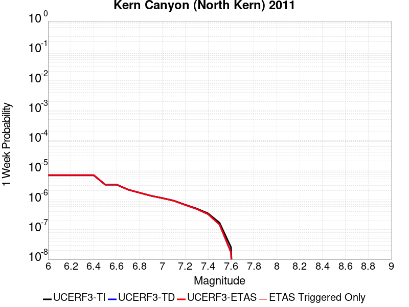 |  |  |  |

| Magnitude | 1 wk TI Prob | 1 wk TD Prob | 1 wk ETAS Prob | 1 wk ETAS/TD Gain | 1 wk ETAS Triggered Only | 1 mo TI Prob | 1 mo TD Prob | 1 mo ETAS Prob | 1 mo ETAS/TD Gain | 1 mo ETAS Triggered Only | 1 yr TI Prob | 1 yr TD Prob | 1 yr ETAS Prob | 1 yr ETAS/TD Gain | 1 yr ETAS Triggered Only | 10 yr TI Prob | 10 yr TD Prob | 10 yr ETAS Prob | 10 yr ETAS/TD Gain | 10 yr ETAS Triggered Only |
|-----|-----|-----|-----|-----|-----|-----|-----|-----|-----|-----|-----|-----|-----|-----|-----|-----|-----|-----|-----|-----|
| 6.0 | 6.6264497E-6 | 6.7573515E-6 | 6.7573515E-6 | 1.0 | 0.0 | 2.8398761E-5 | 2.8959801E-5 | 5.8958933E-5 | 2.0358887 | 3.0E-5 | 3.4570007E-4 | 3.5253653E-4 | 4.0251893E-4 | 1.1417793 | 5.0E-5 | 0.0034516277 | 0.0035205614 | 0.0036102445 | 1.0254741 | 9.0E-5 |
| 6.1 | 6.6264497E-6 | 6.7573515E-6 | 6.7573515E-6 | 1.0 | 0.0 | 2.8398761E-5 | 2.8959801E-5 | 5.8958933E-5 | 2.0358887 | 3.0E-5 | 3.4570007E-4 | 3.5253653E-4 | 4.0251893E-4 | 1.1417793 | 5.0E-5 | 0.0034516277 | 0.0035205614 | 0.0036102445 | 1.0254741 | 9.0E-5 |
| 6.2 | 6.6264497E-6 | 6.7573515E-6 | 6.7573515E-6 | 1.0 | 0.0 | 2.8398761E-5 | 2.8959801E-5 | 5.8958933E-5 | 2.0358887 | 3.0E-5 | 3.4570007E-4 | 3.5253653E-4 | 4.0251893E-4 | 1.1417793 | 5.0E-5 | 0.0034516277 | 0.0035205614 | 0.0036102445 | 1.0254741 | 9.0E-5 |
| 6.3 | 6.6264497E-6 | 6.7573515E-6 | 6.7573515E-6 | 1.0 | 0.0 | 2.8398761E-5 | 2.8959801E-5 | 5.8958933E-5 | 2.0358887 | 3.0E-5 | 3.4570007E-4 | 3.5253653E-4 | 4.0251893E-4 | 1.1417793 | 5.0E-5 | 0.0034516277 | 0.0035205614 | 0.0036102445 | 1.0254741 | 9.0E-5 |
| 6.4 | 6.6264497E-6 | 6.7573515E-6 | 6.7573515E-6 | 1.0 | 0.0 | 2.8398761E-5 | 2.8959801E-5 | 5.8958933E-5 | 2.0358887 | 3.0E-5 | 3.4570007E-4 | 3.5253653E-4 | 4.0251893E-4 | 1.1417793 | 5.0E-5 | 0.0034516277 | 0.0035205614 | 0.0036102445 | 1.0254741 | 9.0E-5 |
| 6.5 | 3.2162225E-6 | 3.2571006E-6 | 3.2571006E-6 | 1.0 | 0.0 | 1.3783738E-5 | 1.3958933E-5 | 1.3958933E-5 | 1.0 | 0.0 | 1.6780409E-4 | 1.6993756E-4 | 1.7993586E-4 | 1.0588351 | 1.0E-5 | 0.0016767744 | 0.0016981558 | 0.0017181218 | 1.0117575 | 2.0E-5 |
| 6.6 | 3.2162225E-6 | 3.2571006E-6 | 3.2571006E-6 | 1.0 | 0.0 | 1.3783738E-5 | 1.3958933E-5 | 1.3958933E-5 | 1.0 | 0.0 | 1.6780409E-4 | 1.6993756E-4 | 1.7993586E-4 | 1.0588351 | 1.0E-5 | 0.0016767744 | 0.0016981558 | 0.0017181218 | 1.0117575 | 2.0E-5 |
| 6.7 | 2.1908265E-6 | 2.2071279E-6 | 2.2071279E-6 | 1.0 | 0.0 | 9.389223E-6 | 9.459087E-6 | 9.459087E-6 | 1.0 | 0.0 | 1.1430779E-4 | 1.1515849E-4 | 1.2515734E-4 | 1.0868268 | 1.0E-5 | 0.0011424901 | 0.0011510076 | 0.0011709846 | 1.017356 | 2.0E-5 |
| 6.8 | 1.7303895E-6 | 1.7365574E-6 | 1.7365574E-6 | 1.0 | 0.0 | 7.415934E-6 | 7.442368E-6 | 7.442368E-6 | 1.0 | 0.0 | 9.028525E-5 | 9.060716E-5 | 1.0060625E-4 | 1.1103566 | 1.0E-5 | 9.024858E-4 | 9.057119E-4 | 9.256938E-4 | 1.0220621 | 2.0E-5 |
| 6.9 | 1.3700314E-6 | 1.3688657E-6 | 1.3688657E-6 | 1.0 | 0.0 | 5.87155E-6 | 5.866554E-6 | 5.866554E-6 | 1.0 | 0.0 | 7.148377E-5 | 7.1423005E-5 | 8.142229E-5 | 1.1400009 | 1.0E-5 | 7.146078E-4 | 7.1400503E-4 | 7.3399075E-4 | 1.027991 | 2.0E-5 |
| 7.0 | 1.1467797E-6 | 1.1413833E-6 | 1.1413833E-6 | 1.0 | 0.0 | 4.9147607E-6 | 4.8916336E-6 | 4.8916336E-6 | 1.0 | 0.0 | 5.983557E-5 | 5.9554044E-5 | 6.955345E-5 | 1.1679047 | 1.0E-5 | 5.981946E-4 | 5.95384E-4 | 6.153721E-4 | 1.0335717 | 2.0E-5 |
| 7.1 | 9.3952065E-7 | 9.302714E-7 | 9.302714E-7 | 1.0 | 0.0 | 4.026511E-6 | 3.9868714E-6 | 3.9868714E-6 | 1.0 | 0.0 | 4.9021666E-5 | 4.8539096E-5 | 5.853861E-5 | 1.2060095 | 1.0E-5 | 4.901085E-4 | 4.8528673E-4 | 4.952819E-4 | 1.0205964 | 1.0E-5 |
| 7.2 | 6.858055E-7 | 6.719318E-7 | 6.719318E-7 | 1.0 | 0.0 | 2.939163E-6 | 2.8797044E-6 | 2.8797044E-6 | 1.0 | 0.0 | 3.5783723E-5 | 3.5059846E-5 | 4.5059496E-5 | 1.2852166 | 1.0E-5 | 3.5777962E-4 | 3.5054405E-4 | 3.6054055E-4 | 1.0285171 | 1.0E-5 |
| 7.3 | 5.1101983E-7 | 4.939313E-7 | 4.939313E-7 | 1.0 | 0.0 | 2.1900833E-6 | 2.1168466E-6 | 2.1168466E-6 | 1.0 | 0.0 | 2.6663936E-5 | 2.5772308E-5 | 2.5772308E-5 | 1.0 | 0.0 | 2.6660739E-4 | 2.5769367E-4 | 2.5769367E-4 | 1.0 | 0.0 |
| 7.4 | 3.4999414E-7 | 3.2995996E-7 | 3.2995996E-7 | 1.0 | 0.0 | 1.499974E-6 | 1.4141134E-6 | 1.4141134E-6 | 1.0 | 0.0 | 1.8262032E-5 | 1.7216697E-5 | 1.7216697E-5 | 1.0 | 0.0 | 1.826053E-4 | 1.7215387E-4 | 1.7215387E-4 | 1.0 | 0.0 |
| 7.5 | 1.7021522E-7 | 1.4750091E-7 | 1.4750091E-7 | 1.0 | 0.0 | 7.2949354E-7 | 6.3214657E-7 | 6.3214657E-7 | 1.0 | 0.0 | 8.881548E-6 | 7.696359E-6 | 7.696359E-6 | 1.0 | 0.0 | 8.8811925E-5 | 7.6961E-5 | 7.6961E-5 | 1.0 | 0.0 |
| 7.6 | 2.572245E-8 | 1.7352637E-8 | 1.7352637E-8 | 1.0 | 0.0 | 1.10239064E-7 | 7.4368444E-8 | 7.4368444E-8 | 1.0 | 0.0 | 1.3421597E-6 | 9.0543546E-7 | 9.0543546E-7 | 1.0 | 0.0 | 1.3421517E-5 | 9.0543235E-6 | 9.0543235E-6 | 1.0 | 0.0 |

## Big Pine (East)
*[(top)](#table-of-contents)*

| 1 Week | 1 Month | 1 Year | 10 Year |
|-----|-----|-----|-----|
|  | 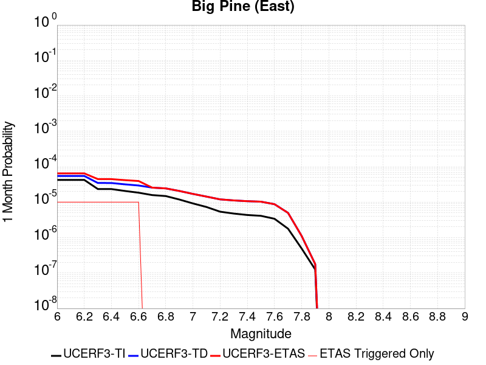 |  |  |

| Magnitude | 1 wk TI Prob | 1 wk TD Prob | 1 wk ETAS Prob | 1 wk ETAS/TD Gain | 1 wk ETAS Triggered Only | 1 mo TI Prob | 1 mo TD Prob | 1 mo ETAS Prob | 1 mo ETAS/TD Gain | 1 mo ETAS Triggered Only | 1 yr TI Prob | 1 yr TD Prob | 1 yr ETAS Prob | 1 yr ETAS/TD Gain | 1 yr ETAS Triggered Only | 10 yr TI Prob | 10 yr TD Prob | 10 yr ETAS Prob | 10 yr ETAS/TD Gain | 10 yr ETAS Triggered Only |
|-----|-----|-----|-----|-----|-----|-----|-----|-----|-----|-----|-----|-----|-----|-----|-----|-----|-----|-----|-----|-----|
| 6.0 | 9.916913E-6 | 1.2818231E-5 | 1.2818231E-5 | 1.0 | 0.0 | 4.250036E-5 | 5.4934244E-5 | 6.4933694E-5 | 1.1820258 | 1.0E-5 | 5.173191E-4 | 6.686413E-4 | 6.986212E-4 | 1.0448371 | 3.0E-5 | 0.0051611643 | 0.0066710766 | 0.006750543 | 1.0119121 | 8.0E-5 |
| 6.1 | 9.916913E-6 | 1.2818231E-5 | 1.2818231E-5 | 1.0 | 0.0 | 4.250036E-5 | 5.4934244E-5 | 6.4933694E-5 | 1.1820258 | 1.0E-5 | 5.173191E-4 | 6.686413E-4 | 6.986212E-4 | 1.0448371 | 3.0E-5 | 0.0051611643 | 0.0066710766 | 0.006750543 | 1.0119121 | 8.0E-5 |
| 6.2 | 9.916913E-6 | 1.2818231E-5 | 1.2818231E-5 | 1.0 | 0.0 | 4.250036E-5 | 5.4934244E-5 | 6.4933694E-5 | 1.1820258 | 1.0E-5 | 5.173191E-4 | 6.686413E-4 | 6.986212E-4 | 1.0448371 | 3.0E-5 | 0.0051611643 | 0.0066710766 | 0.006750543 | 1.0119121 | 8.0E-5 |
| 6.3 | 5.479711E-6 | 8.114161E-6 | 8.114161E-6 | 1.0 | 0.0 | 2.3484265E-5 | 3.4774526E-5 | 4.477418E-5 | 1.2875568 | 1.0E-5 | 2.858834E-4 | 4.233008E-4 | 4.532881E-4 | 1.0708416 | 3.0E-5 | 0.0028551589 | 0.0042278613 | 0.004297565 | 1.0164869 | 7.0E-5 |
| 6.4 | 5.465009E-6 | 8.098454E-6 | 8.098454E-6 | 1.0 | 0.0 | 2.3421257E-5 | 3.4707216E-5 | 4.4706867E-5 | 1.2881145 | 1.0E-5 | 2.851165E-4 | 4.224816E-4 | 4.5246893E-4 | 1.070979 | 3.0E-5 | 0.0028475097 | 0.0042197 | 0.004289405 | 1.0165188 | 7.0E-5 |
| 6.5 | 4.826767E-6 | 7.423505E-6 | 7.423505E-6 | 1.0 | 0.0 | 2.068598E-5 | 3.181465E-5 | 4.181433E-5 | 1.3143107 | 1.0E-5 | 2.518227E-4 | 3.8727728E-4 | 4.1726566E-4 | 1.0774338 | 3.0E-5 | 0.0025153751 | 0.003868898 | 0.003938627 | 1.018023 | 7.0E-5 |
| 6.6 | 4.3146847E-6 | 6.883437E-6 | 6.883437E-6 | 1.0 | 0.0 | 1.8491375E-5 | 2.9500125E-5 | 3.9499828E-5 | 1.3389716 | 1.0E-5 | 2.2510924E-4 | 3.5910727E-4 | 3.890965E-4 | 1.0835105 | 3.0E-5 | 0.0022488134 | 0.0035881116 | 0.0036478965 | 1.0166619 | 6.0E-5 |
| 6.7 | 3.6968106E-6 | 5.9966014E-6 | 5.9966014E-6 | 1.0 | 0.0 | 1.5843378E-5 | 2.5699477E-5 | 2.5699477E-5 | 1.0 | 0.0 | 1.9287605E-4 | 3.1284773E-4 | 3.228446E-4 | 1.0319544 | 1.0E-5 | 0.0019270873 | 0.003126825 | 0.0031367936 | 1.0031881 | 1.0E-5 |
| 6.8 | 3.4671132E-6 | 5.7032753E-6 | 5.7032753E-6 | 1.0 | 0.0 | 1.4858972E-5 | 2.4442388E-5 | 2.4442388E-5 | 1.0 | 0.0 | 1.8089297E-4 | 2.9754688E-4 | 3.075439E-4 | 1.0335982 | 1.0E-5 | 0.0018074579 | 0.002974228 | 0.0029841983 | 1.0033522 | 1.0E-5 |
| 6.9 | 2.7686972E-6 | 4.8262373E-6 | 4.8262373E-6 | 1.0 | 0.0 | 1.1865792E-5 | 2.0683714E-5 | 2.0683714E-5 | 1.0 | 0.0 | 1.4445644E-4 | 2.5179586E-4 | 2.5179586E-4 | 1.0 | 0.0 | 0.0014436257 | 0.002517781 | 0.002517781 | 1.0 | 0.0 |
| 7.0 | 2.1472624E-6 | 3.985962E-6 | 3.985962E-6 | 1.0 | 0.0 | 9.20252E-6 | 1.7082584E-5 | 1.7082584E-5 | 1.0 | 0.0 | 1.12034926E-4 | 2.0796116E-4 | 2.0796116E-4 | 1.0 | 0.0 | 0.0011197845 | 0.0020803085 | 0.0020803085 | 1.0 | 0.0 |
| 7.1 | 1.7018335E-6 | 3.3457143E-6 | 3.3457143E-6 | 1.0 | 0.0 | 7.293552E-6 | 1.4338699E-5 | 1.4338699E-5 | 1.0 | 0.0 | 8.879537E-5 | 1.7456003E-4 | 1.7456003E-4 | 1.0 | 0.0 | 8.87599E-4 | 0.0017468405 | 0.0017468405 | 1.0 | 0.0 |
| 7.2 | 1.25603E-6 | 2.795276E-6 | 2.795276E-6 | 1.0 | 0.0 | 5.3829745E-6 | 1.19797005E-5 | 1.19797005E-5 | 1.0 | 0.0 | 6.553574E-5 | 1.4584333E-4 | 1.4584333E-4 | 1.0 | 0.0 | 6.551642E-4 | 0.001460063 | 0.001460063 | 1.0 | 0.0 |
| 7.3 | 1.112297E-6 | 2.6110797E-6 | 2.6110797E-6 | 1.0 | 0.0 | 4.7669787E-6 | 1.11902955E-5 | 1.11902955E-5 | 1.0 | 0.0 | 5.803642E-5 | 1.3623355E-4 | 1.3623355E-4 | 1.0 | 0.0 | 5.802127E-4 | 0.0013639197 | 0.0013639197 | 1.0 | 0.0 |
| 7.4 | 1.0137181E-6 | 2.4842075E-6 | 2.4842075E-6 | 1.0 | 0.0 | 4.3444993E-6 | 1.0646561E-5 | 1.0646561E-5 | 1.0 | 0.0 | 5.2892992E-5 | 1.2961439E-4 | 1.2961439E-4 | 1.0 | 0.0 | 5.288041E-4 | 0.0012975911 | 0.0012975911 | 1.0 | 0.0 |
| 7.5 | 9.598608E-7 | 2.4078427E-6 | 2.4078427E-6 | 1.0 | 0.0 | 4.1136827E-6 | 1.0319286E-5 | 1.0319286E-5 | 1.0 | 0.0 | 5.0082934E-5 | 1.2563028E-4 | 1.2563028E-4 | 1.0 | 0.0 | 5.007165E-4 | 0.0012576039 | 0.0012576039 | 1.0 | 0.0 |
| 7.6 | 7.929459E-7 | 2.0454722E-6 | 2.0454722E-6 | 1.0 | 0.0 | 3.3983351E-6 | 8.766281E-6 | 8.766281E-6 | 1.0 | 0.0 | 4.1373947E-5 | 1.06724416E-4 | 1.06724416E-4 | 1.0 | 0.0 | 4.1366243E-4 | 0.0010688324 | 0.0010688324 | 1.0 | 0.0 |
| 7.7 | 4.155788E-7 | 1.1609936E-6 | 1.1609936E-6 | 1.0 | 0.0 | 1.7810507E-6 | 4.975678E-6 | 4.975678E-6 | 1.0 | 0.0 | 2.1684076E-5 | 6.0577237E-5 | 6.0577237E-5 | 1.0 | 0.0 | 2.1681961E-4 | 6.087925E-4 | 6.087925E-4 | 1.0 | 0.0 |
| 7.8 | 1.14666925E-7 | 2.5929913E-7 | 2.5929913E-7 | 1.0 | 0.0 | 4.914296E-7 | 1.1112816E-6 | 1.1112816E-6 | 1.0 | 0.0 | 5.9831386E-6 | 1.3529773E-5 | 1.3529773E-5 | 1.0 | 0.0 | 5.9829777E-5 | 1.3639126E-4 | 1.3639126E-4 | 1.0 | 0.0 |
| 7.9 | 2.9231824E-8 | 4.148024E-8 | 4.148024E-8 | 1.0 | 0.0 | 1.2527924E-7 | 1.7777246E-7 | 1.7777246E-7 | 1.0 | 0.0 | 1.5252737E-6 | 2.1643777E-6 | 2.1643777E-6 | 1.0 | 0.0 | 1.5252632E-5 | 2.1976275E-5 | 2.1976275E-5 | 1.0 | 0.0 |

## Pisgah-Bullion Mtn-Mesquite Lk
*[(top)](#table-of-contents)*

| 1 Week | 1 Month | 1 Year | 10 Year |
|-----|-----|-----|-----|
|  |  |  |  |

| Magnitude | 1 wk TI Prob | 1 wk TD Prob | 1 wk ETAS Prob | 1 wk ETAS/TD Gain | 1 wk ETAS Triggered Only | 1 mo TI Prob | 1 mo TD Prob | 1 mo ETAS Prob | 1 mo ETAS/TD Gain | 1 mo ETAS Triggered Only | 1 yr TI Prob | 1 yr TD Prob | 1 yr ETAS Prob | 1 yr ETAS/TD Gain | 1 yr ETAS Triggered Only | 10 yr TI Prob | 10 yr TD Prob | 10 yr ETAS Prob | 10 yr ETAS/TD Gain | 10 yr ETAS Triggered Only |
|-----|-----|-----|-----|-----|-----|-----|-----|-----|-----|-----|-----|-----|-----|-----|-----|-----|-----|-----|-----|-----|
| 6.0 | 3.0240792E-5 | 2.4091496E-5 | 2.4091496E-5 | 1.0 | 0.0 | 1.2959696E-4 | 1.0324575E-4 | 1.0324575E-4 | 1.0 | 0.0 | 0.0015767008 | 0.0012563926 | 0.0012563926 | 1.0 | 0.0 | 0.015655609 | 0.012502918 | 0.012581917 | 1.0063184 | 8.0E-5 |
| 6.1 | 3.0240792E-5 | 2.4091496E-5 | 2.4091496E-5 | 1.0 | 0.0 | 1.2959696E-4 | 1.0324575E-4 | 1.0324575E-4 | 1.0 | 0.0 | 0.0015767008 | 0.0012563926 | 0.0012563926 | 1.0 | 0.0 | 0.015655609 | 0.012502918 | 0.012581917 | 1.0063184 | 8.0E-5 |
| 6.2 | 3.0240792E-5 | 2.4091496E-5 | 2.4091496E-5 | 1.0 | 0.0 | 1.2959696E-4 | 1.0324575E-4 | 1.0324575E-4 | 1.0 | 0.0 | 0.0015767008 | 0.0012563926 | 0.0012563926 | 1.0 | 0.0 | 0.015655609 | 0.012502918 | 0.012581917 | 1.0063184 | 8.0E-5 |
| 6.3 | 2.0498217E-5 | 1.3638254E-5 | 1.3638254E-5 | 1.0 | 0.0 | 8.784654E-5 | 5.8448444E-5 | 5.8448444E-5 | 1.0 | 0.0 | 0.0010690069 | 7.1139366E-4 | 7.1139366E-4 | 1.0 | 0.0 | 0.01063879 | 0.00709279 | 0.0071126483 | 1.0027997 | 2.0E-5 |
| 6.4 | 2.0498217E-5 | 1.3638254E-5 | 1.3638254E-5 | 1.0 | 0.0 | 8.784654E-5 | 5.8448444E-5 | 5.8448444E-5 | 1.0 | 0.0 | 0.0010690069 | 7.1139366E-4 | 7.1139366E-4 | 1.0 | 0.0 | 0.01063879 | 0.00709279 | 0.0071126483 | 1.0027997 | 2.0E-5 |
| 6.5 | 1.7316182E-5 | 1.0477178E-5 | 1.0477178E-5 | 1.0 | 0.0 | 7.42101E-5 | 4.4901473E-5 | 4.4901473E-5 | 1.0 | 0.0 | 9.0313336E-4 | 5.465483E-4 | 5.465483E-4 | 1.0 | 0.0 | 0.008994718 | 0.005453037 | 0.005472928 | 1.0036477 | 2.0E-5 |
| 6.6 | 1.5251077E-5 | 8.414378E-6 | 8.414378E-6 | 1.0 | 0.0 | 6.536012E-5 | 3.606116E-5 | 3.606116E-5 | 1.0 | 0.0 | 7.9546886E-4 | 4.389634E-4 | 4.389634E-4 | 1.0 | 0.0 | 0.007926274 | 0.004381681 | 0.004401593 | 1.0045445 | 2.0E-5 |
| 6.7 | 1.2997425E-5 | 6.411573E-6 | 6.411573E-6 | 1.0 | 0.0 | 5.570206E-5 | 2.7477907E-5 | 2.7477907E-5 | 1.0 | 0.0 | 6.7796157E-4 | 3.344968E-4 | 3.344968E-4 | 1.0 | 0.0 | 0.0067589693 | 0.0033403935 | 0.0033503603 | 1.0029837 | 1.0E-5 |
| 6.8 | 1.035386E-5 | 4.333283E-6 | 4.333283E-6 | 1.0 | 0.0 | 4.437293E-5 | 1.8571085E-5 | 1.8571085E-5 | 1.0 | 0.0 | 5.401065E-4 | 2.2608037E-4 | 2.2608037E-4 | 1.0 | 0.0 | 0.0053879567 | 0.0022585907 | 0.002268568 | 1.0044175 | 1.0E-5 |
| 6.9 | 8.816252E-6 | 3.580692E-6 | 3.580692E-6 | 1.0 | 0.0 | 3.778339E-5 | 1.5345737E-5 | 1.5345737E-5 | 1.0 | 0.0 | 4.5991567E-4 | 1.8681891E-4 | 1.8681891E-4 | 1.0 | 0.0 | 0.00458965 | 0.0018666771 | 0.0018766584 | 1.0053471 | 1.0E-5 |
| 7.0 | 6.8232207E-6 | 2.5676256E-6 | 2.5676256E-6 | 1.0 | 0.0 | 2.9242048E-5 | 1.10040655E-5 | 1.10040655E-5 | 1.0 | 0.0 | 3.5596377E-4 | 1.3396658E-4 | 1.3396658E-4 | 1.0 | 0.0 | 0.0035539411 | 0.0013388892 | 0.0013488758 | 1.0074589 | 1.0E-5 |
| 7.1 | 5.837013E-6 | 2.2274157E-6 | 2.2274157E-6 | 1.0 | 0.0 | 2.501553E-5 | 9.546034E-6 | 9.546034E-6 | 1.0 | 0.0 | 3.045215E-4 | 1.1621706E-4 | 1.1621706E-4 | 1.0 | 0.0 | 0.0030410455 | 0.0011615918 | 0.0011715803 | 1.0085989 | 1.0E-5 |
| 7.2 | 4.278052E-6 | 1.6275965E-6 | 1.6275965E-6 | 1.0 | 0.0 | 1.833438E-5 | 6.9753964E-6 | 6.9753964E-6 | 1.0 | 0.0 | 2.231982E-4 | 8.492238E-5 | 8.492238E-5 | 1.0 | 0.0 | 0.0022297418 | 8.489225E-4 | 8.58914E-4 | 1.0117697 | 1.0E-5 |
| 7.3 | 1.8803692E-6 | 8.3450385E-7 | 8.3450385E-7 | 1.0 | 0.0 | 8.0587E-6 | 3.576441E-6 | 3.576441E-6 | 1.0 | 0.0 | 9.811026E-5 | 4.3542448E-5 | 4.3542448E-5 | 1.0 | 0.0 | 9.806695E-4 | 4.353536E-4 | 4.4534926E-4 | 1.0229598 | 1.0E-5 |

## Mission Ridge-Arroyo Parida-Santa Ana
*[(top)](#table-of-contents)*

| 1 Week | 1 Month | 1 Year | 10 Year |
|-----|-----|-----|-----|
|  |  |  |  |

| Magnitude | 1 wk TI Prob | 1 wk TD Prob | 1 wk ETAS Prob | 1 wk ETAS/TD Gain | 1 wk ETAS Triggered Only | 1 mo TI Prob | 1 mo TD Prob | 1 mo ETAS Prob | 1 mo ETAS/TD Gain | 1 mo ETAS Triggered Only | 1 yr TI Prob | 1 yr TD Prob | 1 yr ETAS Prob | 1 yr ETAS/TD Gain | 1 yr ETAS Triggered Only | 10 yr TI Prob | 10 yr TD Prob | 10 yr ETAS Prob | 10 yr ETAS/TD Gain | 10 yr ETAS Triggered Only |
|-----|-----|-----|-----|-----|-----|-----|-----|-----|-----|-----|-----|-----|-----|-----|-----|-----|-----|-----|-----|-----|
| 6.0 | 4.169034E-5 | 4.7139558E-5 | 4.7139558E-5 | 1.0 | 0.0 | 1.7866064E-4 | 2.0201589E-4 | 2.1201387E-4 | 1.049491 | 1.0E-5 | 0.0021730233 | 0.0024575135 | 0.002517366 | 1.0243549 | 6.0E-5 | 0.021518968 | 0.024385266 | 0.024463316 | 1.0032007 | 8.0E-5 |
| 6.1 | 1.73813E-5 | 1.6854512E-5 | 1.6854512E-5 | 1.0 | 0.0 | 7.4489166E-5 | 7.223168E-5 | 7.223168E-5 | 1.0 | 0.0 | 9.065282E-4 | 8.790767E-4 | 8.8906795E-4 | 1.0113655 | 1.0E-5 | 0.009028391 | 0.008757136 | 0.008776961 | 1.0022639 | 2.0E-5 |
| 6.2 | 1.4622182E-5 | 1.367351E-5 | 1.367351E-5 | 1.0 | 0.0 | 6.2664985E-5 | 5.8599464E-5 | 5.8599464E-5 | 1.0 | 0.0 | 7.6267915E-4 | 7.1321876E-4 | 7.232117E-4 | 1.0140109 | 1.0E-5 | 0.007600669 | 0.007109741 | 0.0071295993 | 1.0027931 | 2.0E-5 |
| 6.3 | 1.3552434E-5 | 1.2482403E-5 | 1.2482403E-5 | 1.0 | 0.0 | 5.8080568E-5 | 5.3494932E-5 | 5.3494932E-5 | 1.0 | 0.0 | 7.069015E-4 | 6.511093E-4 | 6.611028E-4 | 1.0153484 | 1.0E-5 | 0.00704657 | 0.0064923796 | 0.00651225 | 1.0030606 | 2.0E-5 |
| 6.4 | 1.30977305E-5 | 1.1979351E-5 | 1.1979351E-5 | 1.0 | 0.0 | 5.613192E-5 | 5.133908E-5 | 5.133908E-5 | 1.0 | 0.0 | 6.831918E-4 | 6.2487705E-4 | 6.3487084E-4 | 1.0159931 | 1.0E-5 | 0.006810953 | 0.0062315455 | 0.006251421 | 1.0031894 | 2.0E-5 |
| 6.5 | 1.225205E-5 | 1.10489855E-5 | 1.10489855E-5 | 1.0 | 0.0 | 5.2507727E-5 | 4.735195E-5 | 4.735195E-5 | 1.0 | 0.0 | 6.3909404E-4 | 5.763602E-4 | 5.8635446E-4 | 1.0173403 | 1.0E-5 | 0.006372592 | 0.005748964 | 0.0057589062 | 1.0017295 | 1.0E-5 |
| 6.6 | 1.1352241E-5 | 1.0063705E-5 | 1.0063705E-5 | 1.0 | 0.0 | 4.8651553E-5 | 4.3129465E-5 | 4.3129465E-5 | 1.0 | 0.0 | 5.921717E-4 | 5.249768E-4 | 5.3497154E-4 | 1.0190384 | 1.0E-5 | 0.0059059616 | 0.005237613 | 0.0052475603 | 1.0018992 | 1.0E-5 |
| 6.7 | 1.0864116E-5 | 9.517188E-6 | 9.517188E-6 | 1.0 | 0.0 | 4.6559664E-5 | 4.0787323E-5 | 4.0787323E-5 | 1.0 | 0.0 | 5.667165E-4 | 4.964745E-4 | 5.064696E-4 | 1.0201321 | 1.0E-5 | 0.005652734 | 0.004953888 | 0.004963838 | 1.0020086 | 1.0E-5 |
| 6.8 | 1.0666365E-5 | 9.299937E-6 | 9.299937E-6 | 1.0 | 0.0 | 4.571219E-5 | 3.9856277E-5 | 3.9856277E-5 | 1.0 | 0.0 | 5.564038E-4 | 4.8514412E-4 | 4.951393E-4 | 1.0206025 | 1.0E-5 | 0.005550127 | 0.0048410823 | 0.004851034 | 1.0020556 | 1.0E-5 |
| 6.9 | 1.0038665E-5 | 8.592192E-6 | 8.592192E-6 | 1.0 | 0.0 | 4.302214E-5 | 3.682317E-5 | 3.682317E-5 | 1.0 | 0.0 | 5.236687E-4 | 4.4823167E-4 | 4.4823167E-4 | 1.0 | 0.0 | 0.005224364 | 0.004473487 | 0.004473487 | 1.0 | 0.0 |
| 7.0 | 9.5379955E-6 | 8.025209E-6 | 8.025209E-6 | 1.0 | 0.0 | 4.0876483E-5 | 3.439331E-5 | 3.439331E-5 | 1.0 | 0.0 | 4.975576E-4 | 4.186598E-4 | 4.186598E-4 | 1.0 | 0.0 | 0.00496445 | 0.0041789105 | 0.0041789105 | 1.0 | 0.0 |
| 7.1 | 9.207389E-6 | 7.652504E-6 | 7.652504E-6 | 1.0 | 0.0 | 3.945964E-5 | 3.2796044E-5 | 3.2796044E-5 | 1.0 | 0.0 | 4.803152E-4 | 3.9922036E-4 | 3.9922036E-4 | 1.0 | 0.0 | 0.004792784 | 0.003985228 | 0.003985228 | 1.0 | 0.0 |
| 7.2 | 7.638091E-6 | 5.93121E-6 | 5.93121E-6 | 1.0 | 0.0 | 3.2734264E-5 | 2.5419227E-5 | 2.5419227E-5 | 1.0 | 0.0 | 3.984668E-4 | 3.0943545E-4 | 3.0943545E-4 | 1.0 | 0.0 | 0.0039775306 | 0.0030901027 | 0.0030901027 | 1.0 | 0.0 |
| 7.3 | 7.2500147E-6 | 5.596238E-6 | 5.596238E-6 | 1.0 | 0.0 | 3.1071122E-5 | 2.3983659E-5 | 2.3983659E-5 | 1.0 | 0.0 | 3.7822526E-4 | 2.919622E-4 | 2.919622E-4 | 1.0 | 0.0 | 0.0037758215 | 0.002915842 | 0.002915842 | 1.0 | 0.0 |
| 7.4 | 6.3899715E-6 | 4.918567E-6 | 4.918567E-6 | 1.0 | 0.0 | 2.7385306E-5 | 2.1079404E-5 | 2.1079404E-5 | 1.0 | 0.0 | 3.3336508E-4 | 2.566117E-4 | 2.566117E-4 | 1.0 | 0.0 | 0.0033286542 | 0.0025631986 | 0.0025631986 | 1.0 | 0.0 |
| 7.5 | 5.379025E-6 | 4.083909E-6 | 4.083909E-6 | 1.0 | 0.0 | 2.305276E-5 | 1.750235E-5 | 1.750235E-5 | 1.0 | 0.0 | 2.806312E-4 | 2.1307038E-4 | 2.1307038E-4 | 1.0 | 0.0 | 0.0028027708 | 0.0021286723 | 0.0021286723 | 1.0 | 0.0 |
| 7.6 | 4.1270696E-6 | 3.0883848E-6 | 3.0883848E-6 | 1.0 | 0.0 | 1.768732E-5 | 1.3235868E-5 | 1.3235868E-5 | 1.0 | 0.0 | 2.1532185E-4 | 1.6113486E-4 | 1.6113486E-4 | 1.0 | 0.0 | 0.0021511333 | 0.0016101883 | 0.0016101883 | 1.0 | 0.0 |
| 7.7 | 2.5406805E-6 | 1.8282261E-6 | 1.8282261E-6 | 1.0 | 0.0 | 1.0888585E-5 | 7.835231E-6 | 7.835231E-6 | 1.0 | 0.0 | 1.3256045E-4 | 9.538983E-5 | 9.538983E-5 | 1.0 | 0.0 | 0.0013248142 | 9.53495E-4 | 9.53495E-4 | 1.0 | 0.0 |
| 7.8 | 4.8608285E-7 | 3.5099296E-7 | 3.5099296E-7 | 1.0 | 0.0 | 2.0832106E-6 | 1.5042547E-6 | 1.5042547E-6 | 1.0 | 0.0 | 2.5362791E-5 | 1.8314147E-5 | 1.8314147E-5 | 1.0 | 0.0 | 2.5359896E-4 | 1.8312651E-4 | 1.8312651E-4 | 1.0 | 0.0 |
| 7.9 | 2.0472514E-8 | 1.2689093E-8 | 1.2689093E-8 | 1.0 | 0.0 | 8.7739345E-8 | 5.438183E-8 | 5.438183E-8 | 1.0 | 0.0 | 1.068226E-6 | 6.6209856E-7 | 6.6209856E-7 | 1.0 | 0.0 | 1.0682209E-5 | 6.620967E-6 | 6.620967E-6 | 1.0 | 0.0 |
| 8.0 | 4.443582E-9 | 2.0322608E-9 | 2.0322608E-9 | 1.0 | 0.0 | 1.9043922E-8 | 8.709689E-9 | 8.709689E-9 | 1.0 | 0.0 | 2.3185973E-7 | 1.0604046E-7 | 1.0604046E-7 | 1.0 | 0.0 | 2.3185949E-6 | 1.0604042E-6 | 1.0604042E-6 | 1.0 | 0.0 |

## San Andreas (Creeping Section) 2011 CFM
*[(top)](#table-of-contents)*

| 1 Week | 1 Month | 1 Year | 10 Year |
|-----|-----|-----|-----|
|  |  |  |  |

| Magnitude | 1 wk TI Prob | 1 wk TD Prob | 1 wk ETAS Prob | 1 wk ETAS/TD Gain | 1 wk ETAS Triggered Only | 1 mo TI Prob | 1 mo TD Prob | 1 mo ETAS Prob | 1 mo ETAS/TD Gain | 1 mo ETAS Triggered Only | 1 yr TI Prob | 1 yr TD Prob | 1 yr ETAS Prob | 1 yr ETAS/TD Gain | 1 yr ETAS Triggered Only | 10 yr TI Prob | 10 yr TD Prob | 10 yr ETAS Prob | 10 yr ETAS/TD Gain | 10 yr ETAS Triggered Only |
|-----|-----|-----|-----|-----|-----|-----|-----|-----|-----|-----|-----|-----|-----|-----|-----|-----|-----|-----|-----|-----|
| 6.0 | 5.986481E-4 | 0.0012278741 | 0.0012378617 | 1.0081341 | 1.0E-5 | 0.0025631124 | 0.0052457973 | 0.0052656927 | 1.0037925 | 2.0E-5 | 0.030762846 | 0.061208665 | 0.06123683 | 1.0004601 | 3.0E-5 | 0.26835477 | 0.4259623 | 0.42600822 | 1.0001078 | 8.0E-5 |
| 6.1 | 5.015945E-4 | 0.0010222398 | 0.0010222398 | 1.0 | 0.0 | 0.00214792 | 0.004368119 | 0.0043780752 | 1.0022793 | 1.0E-5 | 0.025839351 | 0.0512512 | 0.051270176 | 1.0003703 | 2.0E-5 | 0.23032776 | 0.37288252 | 0.37292016 | 1.0001009 | 6.0E-5 |
| 6.2 | 4.073338E-4 | 8.109135E-4 | 8.109135E-4 | 1.0 | 0.0 | 0.0017445484 | 0.0034676173 | 0.0034676173 | 1.0 | 0.0 | 0.021034058 | 0.040936444 | 0.040946033 | 1.0002342 | 1.0E-5 | 0.19150782 | 0.3130621 | 0.31309643 | 1.0001097 | 5.0E-5 |
| 6.3 | 3.464099E-4 | 6.7394925E-4 | 6.7394925E-4 | 1.0 | 0.0 | 0.0014837692 | 0.00288274 | 0.00288274 | 1.0 | 0.0 | 0.017915873 | 0.034192428 | 0.034202084 | 1.0002824 | 1.0E-5 | 0.16538359 | 0.27134693 | 0.27137607 | 1.0001074 | 4.0E-5 |
| 6.4 | 2.935057E-4 | 5.545115E-4 | 5.545115E-4 | 1.0 | 0.0 | 0.0012572751 | 0.0023718805 | 0.0023718805 | 1.0 | 0.0 | 0.015200248 | 0.028267467 | 0.028267467 | 1.0 | 0.0 | 0.14201577 | 0.2330172 | 0.23303255 | 1.0000658 | 2.0E-5 |
| 6.5 | 2.3409708E-4 | 4.2095222E-4 | 4.2095222E-4 | 1.0 | 0.0 | 0.0010028875 | 0.0018015768 | 0.0018015768 | 1.0 | 0.0 | 0.012141965 | 0.021591473 | 0.021591473 | 1.0 | 0.0 | 0.11499573 | 0.18685804 | 0.1868743 | 1.000087 | 2.0E-5 |
| 6.6 | 1.5842178E-4 | 2.5079807E-4 | 2.5079807E-4 | 1.0 | 0.0 | 6.7877385E-4 | 0.0010744074 | 0.0010744074 | 1.0 | 0.0 | 0.0082328 | 0.013001034 | 0.013001034 | 1.0 | 0.0 | 0.07934396 | 0.12318426 | 0.1232018 | 1.0001423 | 2.0E-5 |
| 6.7 | 1.5616413E-4 | 2.461632E-4 | 2.461632E-4 | 1.0 | 0.0 | 6.691031E-4 | 0.0010545597 | 0.0010545597 | 1.0 | 0.0 | 0.0081159435 | 0.012762894 | 0.012762894 | 1.0 | 0.0 | 0.0782586 | 0.12121142 | 0.12122899 | 1.000145 | 2.0E-5 |
| 6.8 | 1.5538467E-4 | 2.4440174E-4 | 2.4440174E-4 | 1.0 | 0.0 | 6.6576427E-4 | 0.0010470168 | 0.0010470168 | 1.0 | 0.0 | 0.008075596 | 0.012672268 | 0.012672268 | 1.0 | 0.0 | 0.07788358 | 0.12044227 | 0.12045986 | 1.000146 | 2.0E-5 |
| 6.9 | 1.5153569E-4 | 2.3549511E-4 | 2.3549511E-4 | 1.0 | 0.0 | 6.49277E-4 | 0.0010088764 | 0.0010088764 | 1.0 | 0.0 | 0.007876333 | 0.012214421 | 0.012214421 | 1.0 | 0.0 | 0.07602952 | 0.11651233 | 0.11653 | 1.0001516 | 2.0E-5 |
| 7.0 | 1.4588932E-4 | 2.2406683E-4 | 2.2406683E-4 | 1.0 | 0.0 | 6.250901E-4 | 9.5993496E-4 | 9.5993496E-4 | 1.0 | 0.0 | 0.0075839474 | 0.011625077 | 0.011625077 | 1.0 | 0.0 | 0.073302895 | 0.111358546 | 0.111376315 | 1.0001596 | 2.0E-5 |
| 7.1 | 1.1565079E-4 | 1.6290719E-4 | 1.6290719E-4 | 1.0 | 0.0 | 4.955521E-4 | 6.9798774E-4 | 6.9798774E-4 | 1.0 | 0.0 | 0.006016669 | 0.008465091 | 0.008465091 | 1.0 | 0.0 | 0.058563538 | 0.08370675 | 0.08372508 | 1.000219 | 2.0E-5 |
| 7.2 | 1.0393792E-4 | 1.4624344E-4 | 1.4624344E-4 | 1.0 | 0.0 | 4.4537216E-4 | 6.2660786E-4 | 6.2660786E-4 | 1.0 | 0.0 | 0.005408933 | 0.007602434 | 0.007602434 | 1.0 | 0.0 | 0.052791595 | 0.07565546 | 0.075673945 | 1.0002444 | 2.0E-5 |
| 7.3 | 9.332884E-5 | 1.2788197E-4 | 1.2788197E-4 | 1.0 | 0.0 | 3.999194E-4 | 5.479511E-4 | 5.479511E-4 | 1.0 | 0.0 | 0.0048581534 | 0.0066510327 | 0.0066510327 | 1.0 | 0.0 | 0.047533102 | 0.06651482 | 0.06653348 | 1.0002807 | 2.0E-5 |
| 7.4 | 8.670252E-5 | 1.17095995E-4 | 1.17095995E-4 | 1.0 | 0.0 | 3.715293E-4 | 5.0174404E-4 | 5.0174404E-4 | 1.0 | 0.0 | 0.004513991 | 0.006091744 | 0.006091744 | 1.0 | 0.0 | 0.044233937 | 0.061179653 | 0.06119843 | 1.000307 | 2.0E-5 |
| 7.5 | 7.3036405E-5 | 9.011144E-5 | 9.011144E-5 | 1.0 | 0.0 | 3.129756E-4 | 3.861348E-4 | 3.861348E-4 | 1.0 | 0.0 | 0.0038038217 | 0.004691079 | 0.004691079 | 1.0 | 0.0 | 0.03739367 | 0.047901772 | 0.047920812 | 1.0003976 | 2.0E-5 |
| 7.6 | 6.3935775E-5 | 8.284792E-5 | 8.284792E-5 | 1.0 | 0.0 | 2.7398168E-4 | 3.550143E-4 | 3.550143E-4 | 1.0 | 0.0 | 0.0033306254 | 0.004313751 | 0.004313751 | 1.0 | 0.0 | 0.032811474 | 0.04401211 | 0.04403123 | 1.0004344 | 2.0E-5 |
| 7.7 | 5.5050095E-5 | 6.6657536E-5 | 6.6657536E-5 | 1.0 | 0.0 | 2.3590765E-4 | 2.8564388E-4 | 2.8564388E-4 | 1.0 | 0.0 | 0.0028683927 | 0.0034721727 | 0.0034721727 | 1.0 | 0.0 | 0.0283165 | 0.035814673 | 0.035833955 | 1.0005385 | 2.0E-5 |
| 7.8 | 5.027131E-5 | 6.166444E-5 | 6.166444E-5 | 1.0 | 0.0 | 2.1543067E-4 | 2.6424942E-4 | 2.6424942E-4 | 1.0 | 0.0 | 0.0026197135 | 0.0032124936 | 0.0032124936 | 1.0 | 0.0 | 0.025890453 | 0.033143617 | 0.033162955 | 1.0005834 | 2.0E-5 |
| 7.9 | 3.7271806E-5 | 5.0253755E-5 | 5.0253755E-5 | 1.0 | 0.0 | 1.5972654E-4 | 2.1535547E-4 | 2.1535547E-4 | 1.0 | 0.0 | 0.0019429359 | 0.0026188022 | 0.0026188022 | 1.0 | 0.0 | 0.019260362 | 0.027081102 | 0.02710056 | 1.0007185 | 2.0E-5 |
| 8.0 | 2.7310243E-5 | 3.144777E-5 | 3.144777E-5 | 1.0 | 0.0 | 1.17038646E-4 | 1.3476919E-4 | 1.3476919E-4 | 1.0 | 0.0 | 0.0014240141 | 0.0016395808 | 0.0016395808 | 1.0 | 0.0 | 0.014149235 | 0.0172237 | 0.0172237 | 1.0 | 0.0 |
| 8.1 | 1.7940547E-5 | 1.7413187E-5 | 1.7413187E-5 | 1.0 | 0.0 | 7.688579E-5 | 7.4625816E-5 | 7.4625816E-5 | 1.0 | 0.0 | 9.3568244E-4 | 9.081911E-4 | 9.081911E-4 | 1.0 | 0.0 | 0.009317525 | 0.009805583 | 0.009805583 | 1.0 | 0.0 |
| 8.2 | 8.643924E-6 | 5.4798497E-6 | 5.4798497E-6 | 1.0 | 0.0 | 3.704486E-5 | 2.348486E-5 | 2.348486E-5 | 1.0 | 0.0 | 4.5092785E-4 | 2.858907E-4 | 2.858907E-4 | 1.0 | 0.0 | 0.0045001395 | 0.0032514327 | 0.0032514327 | 1.0 | 0.0 |
| 8.3 | 1.983087E-6 | 7.668296E-7 | 7.668296E-7 | 1.0 | 0.0 | 8.498917E-6 | 3.2864084E-6 | 3.2864084E-6 | 1.0 | 0.0 | 1.034694E-4 | 4.0011306E-5 | 4.0011306E-5 | 1.0 | 0.0 | 0.0010342124 | 4.724499E-4 | 4.724499E-4 | 1.0 | 0.0 |

## Pleito
*[(top)](#table-of-contents)*

| 1 Week | 1 Month | 1 Year | 10 Year |
|-----|-----|-----|-----|
|  | 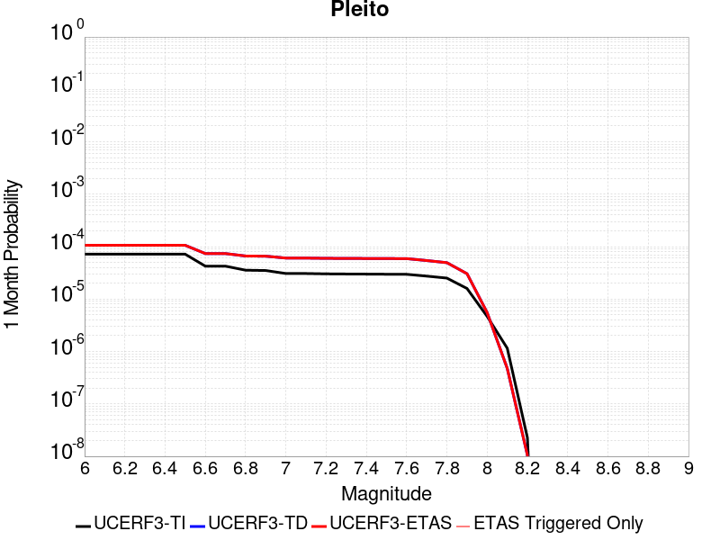 |  | 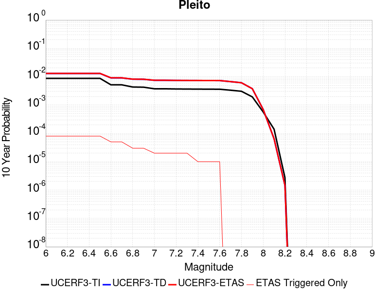 |

| Magnitude | 1 wk TI Prob | 1 wk TD Prob | 1 wk ETAS Prob | 1 wk ETAS/TD Gain | 1 wk ETAS Triggered Only | 1 mo TI Prob | 1 mo TD Prob | 1 mo ETAS Prob | 1 mo ETAS/TD Gain | 1 mo ETAS Triggered Only | 1 yr TI Prob | 1 yr TD Prob | 1 yr ETAS Prob | 1 yr ETAS/TD Gain | 1 yr ETAS Triggered Only | 10 yr TI Prob | 10 yr TD Prob | 10 yr ETAS Prob | 10 yr ETAS/TD Gain | 10 yr ETAS Triggered Only |
|-----|-----|-----|-----|-----|-----|-----|-----|-----|-----|-----|-----|-----|-----|-----|-----|-----|-----|-----|-----|-----|
| 6.0 | 1.6763008E-5 | 2.47705E-5 | 2.47705E-5 | 1.0 | 0.0 | 7.183948E-5 | 1.0615537E-4 | 1.0615537E-4 | 1.0 | 0.0 | 8.742947E-4 | 0.0012917474 | 0.0013017345 | 1.0077314 | 1.0E-5 | 0.00870863 | 0.012957253 | 0.013036216 | 1.0060941 | 8.0E-5 |
| 6.1 | 1.6763008E-5 | 2.47705E-5 | 2.47705E-5 | 1.0 | 0.0 | 7.183948E-5 | 1.0615537E-4 | 1.0615537E-4 | 1.0 | 0.0 | 8.742947E-4 | 0.0012917474 | 0.0013017345 | 1.0077314 | 1.0E-5 | 0.00870863 | 0.012957253 | 0.013036216 | 1.0060941 | 8.0E-5 |
| 6.2 | 1.6763008E-5 | 2.47705E-5 | 2.47705E-5 | 1.0 | 0.0 | 7.183948E-5 | 1.0615537E-4 | 1.0615537E-4 | 1.0 | 0.0 | 8.742947E-4 | 0.0012917474 | 0.0013017345 | 1.0077314 | 1.0E-5 | 0.00870863 | 0.012957253 | 0.013036216 | 1.0060941 | 8.0E-5 |
| 6.3 | 1.6763008E-5 | 2.47705E-5 | 2.47705E-5 | 1.0 | 0.0 | 7.183948E-5 | 1.0615537E-4 | 1.0615537E-4 | 1.0 | 0.0 | 8.742947E-4 | 0.0012917474 | 0.0013017345 | 1.0077314 | 1.0E-5 | 0.00870863 | 0.012957253 | 0.013036216 | 1.0060941 | 8.0E-5 |
| 6.4 | 1.6763008E-5 | 2.47705E-5 | 2.47705E-5 | 1.0 | 0.0 | 7.183948E-5 | 1.0615537E-4 | 1.0615537E-4 | 1.0 | 0.0 | 8.742947E-4 | 0.0012917474 | 0.0013017345 | 1.0077314 | 1.0E-5 | 0.00870863 | 0.012957253 | 0.013036216 | 1.0060941 | 8.0E-5 |
| 6.5 | 1.6763008E-5 | 2.47705E-5 | 2.47705E-5 | 1.0 | 0.0 | 7.183948E-5 | 1.0615537E-4 | 1.0615537E-4 | 1.0 | 0.0 | 8.742947E-4 | 0.0012917474 | 0.0013017345 | 1.0077314 | 1.0E-5 | 0.00870863 | 0.012957253 | 0.013036216 | 1.0060941 | 8.0E-5 |
| 6.6 | 9.910213E-6 | 1.7221182E-5 | 1.7221182E-5 | 1.0 | 0.0 | 4.247165E-5 | 7.3803E-5 | 7.3803E-5 | 1.0 | 0.0 | 5.169696E-4 | 8.9818484E-4 | 8.9818484E-4 | 1.0 | 0.0 | 0.0051576863 | 0.009054025 | 0.009103572 | 1.0054724 | 5.0E-5 |
| 6.7 | 9.910213E-6 | 1.7221182E-5 | 1.7221182E-5 | 1.0 | 0.0 | 4.247165E-5 | 7.3803E-5 | 7.3803E-5 | 1.0 | 0.0 | 5.169696E-4 | 8.9818484E-4 | 8.9818484E-4 | 1.0 | 0.0 | 0.0051576863 | 0.009054025 | 0.009103572 | 1.0054724 | 5.0E-5 |
| 6.8 | 8.300162E-6 | 1.5480773E-5 | 1.5480773E-5 | 1.0 | 0.0 | 3.557164E-5 | 6.634449E-5 | 6.634449E-5 | 1.0 | 0.0 | 4.3299864E-4 | 8.0744625E-4 | 8.0744625E-4 | 1.0 | 0.0 | 0.004321559 | 0.008153455 | 0.00818321 | 1.0036495 | 3.0E-5 |
| 6.9 | 8.183114E-6 | 1.5351985E-5 | 1.5351985E-5 | 1.0 | 0.0 | 3.5070017E-5 | 6.579257E-5 | 6.579257E-5 | 1.0 | 0.0 | 4.2689382E-4 | 8.007316E-4 | 8.007316E-4 | 1.0 | 0.0 | 0.0042607468 | 0.008086799 | 0.008116556 | 1.0036798 | 3.0E-5 |
| 7.0 | 7.1748823E-6 | 1.4138895E-5 | 1.4138895E-5 | 1.0 | 0.0 | 3.0749135E-5 | 6.059386E-5 | 6.059386E-5 | 1.0 | 0.0 | 3.743064E-4 | 7.3748105E-4 | 7.3748105E-4 | 1.0 | 0.0 | 0.0037367654 | 0.0074582137 | 0.0074780644 | 1.0026616 | 2.0E-5 |
| 7.1 | 7.1671807E-6 | 1.4129264E-5 | 1.4129264E-5 | 1.0 | 0.0 | 3.0716128E-5 | 6.0552586E-5 | 6.0552586E-5 | 1.0 | 0.0 | 3.7390468E-4 | 7.369789E-4 | 7.369789E-4 | 1.0 | 0.0 | 0.0037327618 | 0.007453226 | 0.007473077 | 1.0026634 | 2.0E-5 |
| 7.2 | 7.0649667E-6 | 1.3976534E-5 | 1.3976534E-5 | 1.0 | 0.0 | 3.0278077E-5 | 5.989806E-5 | 5.989806E-5 | 1.0 | 0.0 | 3.6857324E-4 | 7.290154E-4 | 7.290154E-4 | 1.0 | 0.0 | 0.0036796255 | 0.007373973 | 0.0073938253 | 1.0026922 | 2.0E-5 |
| 7.3 | 7.02082E-6 | 1.39199765E-5 | 1.39199765E-5 | 1.0 | 0.0 | 3.008888E-5 | 5.9655682E-5 | 5.9655682E-5 | 1.0 | 0.0 | 3.6627054E-4 | 7.260664E-4 | 7.260664E-4 | 1.0 | 0.0 | 0.0036566744 | 0.0073444657 | 0.007364319 | 1.0027032 | 2.0E-5 |
| 7.4 | 6.987146E-6 | 1.3879531E-5 | 1.3879531E-5 | 1.0 | 0.0 | 2.9944567E-5 | 5.948235E-5 | 5.948235E-5 | 1.0 | 0.0 | 3.6451413E-4 | 7.239575E-4 | 7.239575E-4 | 1.0 | 0.0 | 0.0036391679 | 0.007323398 | 0.0073333243 | 1.0013555 | 1.0E-5 |
| 7.5 | 6.9494554E-6 | 1.3836431E-5 | 1.3836431E-5 | 1.0 | 0.0 | 2.9783041E-5 | 5.9297647E-5 | 5.9297647E-5 | 1.0 | 0.0 | 3.625482E-4 | 7.217102E-4 | 7.217102E-4 | 1.0 | 0.0 | 0.0036195726 | 0.007301023 | 0.00731095 | 1.0013597 | 1.0E-5 |
| 7.6 | 6.92694E-6 | 1.3795536E-5 | 1.3795536E-5 | 1.0 | 0.0 | 2.9686547E-5 | 5.9122387E-5 | 5.9122387E-5 | 1.0 | 0.0 | 3.6137376E-4 | 7.1957783E-4 | 7.1957783E-4 | 1.0 | 0.0 | 0.0036078666 | 0.0072797714 | 0.007289699 | 1.0013636 | 1.0E-5 |
| 7.7 | 6.395867E-6 | 1.2674343E-5 | 1.2674343E-5 | 1.0 | 0.0 | 2.741057E-5 | 5.4317487E-5 | 5.4317487E-5 | 1.0 | 0.0 | 3.336726E-4 | 6.6111505E-4 | 6.6111505E-4 | 1.0 | 0.0 | 0.0033317201 | 0.006698295 | 0.006698295 | 1.0 | 0.0 |
| 7.8 | 5.8664327E-6 | 1.1541453E-5 | 1.1541453E-5 | 1.0 | 0.0 | 2.5141611E-5 | 4.9462433E-5 | 4.9462433E-5 | 1.0 | 0.0 | 3.060561E-4 | 6.020389E-4 | 6.020389E-4 | 1.0 | 0.0 | 0.0030563495 | 0.006103509 | 0.006103509 | 1.0 | 0.0 |
| 7.9 | 3.7167474E-6 | 7.1174723E-6 | 7.1174723E-6 | 1.0 | 0.0 | 1.592882E-5 | 3.0503097E-5 | 3.0503097E-5 | 1.0 | 0.0 | 1.9391612E-4 | 3.7131205E-4 | 3.7131205E-4 | 1.0 | 0.0 | 0.0019374699 | 0.0037692138 | 0.0037692138 | 1.0 | 0.0 |
| 8.0 | 1.0903841E-6 | 1.2886832E-6 | 1.2886832E-6 | 1.0 | 0.0 | 4.6730665E-6 | 5.522916E-6 | 5.522916E-6 | 1.0 | 0.0 | 5.68931E-5 | 6.723944E-5 | 6.723944E-5 | 1.0 | 0.0 | 5.6878536E-4 | 6.9458556E-4 | 6.9458556E-4 | 1.0 | 0.0 |
| 8.1 | 2.6894583E-7 | 1.1072907E-7 | 1.1072907E-7 | 1.0 | 0.0 | 1.1526245E-6 | 4.7455305E-7 | 4.7455305E-7 | 1.0 | 0.0 | 1.4033113E-5 | 5.7776683E-6 | 5.7776683E-6 | 1.0 | 0.0 | 1.4032227E-4 | 6.4639265E-5 | 6.4639265E-5 | 1.0 | 0.0 |
| 8.2 | 5.2967013E-9 | 2.4608289E-9 | 2.4608289E-9 | 1.0 | 0.0 | 2.2700148E-8 | 1.054641E-8 | 1.054641E-8 | 1.0 | 0.0 | 2.7637427E-7 | 1.2840253E-7 | 1.2840253E-7 | 1.0 | 0.0 | 2.7637393E-6 | 1.46096E-6 | 1.46096E-6 | 1.0 | 0.0 |

## Lost Hills
*[(top)](#table-of-contents)*

| 1 Week | 1 Month | 1 Year | 10 Year |
|-----|-----|-----|-----|
|  |  |  |  |

| Magnitude | 1 wk TI Prob | 1 wk TD Prob | 1 wk ETAS Prob | 1 wk ETAS/TD Gain | 1 wk ETAS Triggered Only | 1 mo TI Prob | 1 mo TD Prob | 1 mo ETAS Prob | 1 mo ETAS/TD Gain | 1 mo ETAS Triggered Only | 1 yr TI Prob | 1 yr TD Prob | 1 yr ETAS Prob | 1 yr ETAS/TD Gain | 1 yr ETAS Triggered Only | 10 yr TI Prob | 10 yr TD Prob | 10 yr ETAS Prob | 10 yr ETAS/TD Gain | 10 yr ETAS Triggered Only |
|-----|-----|-----|-----|-----|-----|-----|-----|-----|-----|-----|-----|-----|-----|-----|-----|-----|-----|-----|-----|-----|
| 6.0 | 2.233523E-5 | 2.5106996E-5 | 2.5106996E-5 | 1.0 | 0.0 | 9.571891E-5 | 1.0759792E-4 | 1.1759684E-4 | 1.0929286 | 1.0E-5 | 0.0011647546 | 0.0013093855 | 0.0013693069 | 1.045763 | 6.0E-5 | 0.011586686 | 0.013033304 | 0.013112262 | 1.0060581 | 8.0E-5 |
| 6.1 | 2.233523E-5 | 2.5106996E-5 | 2.5106996E-5 | 1.0 | 0.0 | 9.571891E-5 | 1.0759792E-4 | 1.1759684E-4 | 1.0929286 | 1.0E-5 | 0.0011647546 | 0.0013093855 | 0.0013693069 | 1.045763 | 6.0E-5 | 0.011586686 | 0.013033304 | 0.013112262 | 1.0060581 | 8.0E-5 |
| 6.2 | 2.233523E-5 | 2.5106996E-5 | 2.5106996E-5 | 1.0 | 0.0 | 9.571891E-5 | 1.0759792E-4 | 1.1759684E-4 | 1.0929286 | 1.0E-5 | 0.0011647546 | 0.0013093855 | 0.0013693069 | 1.045763 | 6.0E-5 | 0.011586686 | 0.013033304 | 0.013112262 | 1.0060581 | 8.0E-5 |
| 6.3 | 2.233523E-5 | 2.5106996E-5 | 2.5106996E-5 | 1.0 | 0.0 | 9.571891E-5 | 1.0759792E-4 | 1.1759684E-4 | 1.0929286 | 1.0E-5 | 0.0011647546 | 0.0013093855 | 0.0013693069 | 1.045763 | 6.0E-5 | 0.011586686 | 0.013033304 | 0.013112262 | 1.0060581 | 8.0E-5 |
| 6.4 | 1.2288092E-5 | 1.37813295E-5 | 1.37813295E-5 | 1.0 | 0.0 | 5.2662188E-5 | 5.9062033E-5 | 5.9062033E-5 | 1.0 | 0.0 | 6.409735E-4 | 7.189368E-4 | 7.289296E-4 | 1.0138994 | 1.0E-5 | 0.006391279 | 0.007175316 | 0.0072051007 | 1.004151 | 3.0E-5 |
| 6.5 | 1.2288092E-5 | 1.37813295E-5 | 1.37813295E-5 | 1.0 | 0.0 | 5.2662188E-5 | 5.9062033E-5 | 5.9062033E-5 | 1.0 | 0.0 | 6.409735E-4 | 7.189368E-4 | 7.289296E-4 | 1.0138994 | 1.0E-5 | 0.006391279 | 0.007175316 | 0.0072051007 | 1.004151 | 3.0E-5 |
| 6.6 | 8.58281E-6 | 9.633926E-6 | 9.633926E-6 | 1.0 | 0.0 | 3.6782953E-5 | 4.1288073E-5 | 4.1288073E-5 | 1.0 | 0.0 | 4.4774043E-4 | 5.026495E-4 | 5.1264453E-4 | 1.0198846 | 1.0E-5 | 0.0044683935 | 0.0050232867 | 0.0050431862 | 1.0039614 | 2.0E-5 |
| 6.7 | 7.205685E-6 | 8.088433E-6 | 8.088433E-6 | 1.0 | 0.0 | 3.088114E-5 | 3.4664714E-5 | 3.4664714E-5 | 1.0 | 0.0 | 3.7591302E-4 | 4.2204288E-4 | 4.3203865E-4 | 1.0236843 | 1.0E-5 | 0.0037527776 | 0.004220429 | 0.0042403443 | 1.0047189 | 2.0E-5 |

## Cucamonga
*[(top)](#table-of-contents)*

| 1 Week | 1 Month | 1 Year | 10 Year |
|-----|-----|-----|-----|
|  |  |  |  |

| Magnitude | 1 wk TI Prob | 1 wk TD Prob | 1 wk ETAS Prob | 1 wk ETAS/TD Gain | 1 wk ETAS Triggered Only | 1 mo TI Prob | 1 mo TD Prob | 1 mo ETAS Prob | 1 mo ETAS/TD Gain | 1 mo ETAS Triggered Only | 1 yr TI Prob | 1 yr TD Prob | 1 yr ETAS Prob | 1 yr ETAS/TD Gain | 1 yr ETAS Triggered Only | 10 yr TI Prob | 10 yr TD Prob | 10 yr ETAS Prob | 10 yr ETAS/TD Gain | 10 yr ETAS Triggered Only |
|-----|-----|-----|-----|-----|-----|-----|-----|-----|-----|-----|-----|-----|-----|-----|-----|-----|-----|-----|-----|-----|
| 6.0 | 1.1848348E-5 | 1.1737756E-5 | 1.1737756E-5 | 1.0 | 0.0 | 5.0777642E-5 | 5.0303715E-5 | 6.030321E-5 | 1.1987824 | 1.0E-5 | 6.180424E-4 | 6.122783E-4 | 6.3226605E-4 | 1.0326449 | 2.0E-5 | 0.0061632637 | 0.0061070886 | 0.0061866 | 1.0130196 | 8.0E-5 |
| 6.1 | 1.1848348E-5 | 1.1737756E-5 | 1.1737756E-5 | 1.0 | 0.0 | 5.0777642E-5 | 5.0303715E-5 | 6.030321E-5 | 1.1987824 | 1.0E-5 | 6.180424E-4 | 6.122783E-4 | 6.3226605E-4 | 1.0326449 | 2.0E-5 | 0.0061632637 | 0.0061070886 | 0.0061866 | 1.0130196 | 8.0E-5 |
| 6.2 | 1.1848348E-5 | 1.1737756E-5 | 1.1737756E-5 | 1.0 | 0.0 | 5.0777642E-5 | 5.0303715E-5 | 6.030321E-5 | 1.1987824 | 1.0E-5 | 6.180424E-4 | 6.122783E-4 | 6.3226605E-4 | 1.0326449 | 2.0E-5 | 0.0061632637 | 0.0061070886 | 0.0061866 | 1.0130196 | 8.0E-5 |
| 6.3 | 1.1848348E-5 | 1.1737756E-5 | 1.1737756E-5 | 1.0 | 0.0 | 5.0777642E-5 | 5.0303715E-5 | 6.030321E-5 | 1.1987824 | 1.0E-5 | 6.180424E-4 | 6.122783E-4 | 6.3226605E-4 | 1.0326449 | 2.0E-5 | 0.0061632637 | 0.0061070886 | 0.0061866 | 1.0130196 | 8.0E-5 |
| 6.4 | 1.1848348E-5 | 1.1737756E-5 | 1.1737756E-5 | 1.0 | 0.0 | 5.0777642E-5 | 5.0303715E-5 | 6.030321E-5 | 1.1987824 | 1.0E-5 | 6.180424E-4 | 6.122783E-4 | 6.3226605E-4 | 1.0326449 | 2.0E-5 | 0.0061632637 | 0.0061070886 | 0.0061866 | 1.0130196 | 8.0E-5 |
| 6.5 | 1.16988695E-5 | 1.1576785E-5 | 1.1576785E-5 | 1.0 | 0.0 | 5.013705E-5 | 4.9613864E-5 | 5.961337E-5 | 1.2015465 | 1.0E-5 | 6.102476E-4 | 6.0388405E-4 | 6.23872E-4 | 1.0330989 | 2.0E-5 | 0.006085745 | 0.006023602 | 0.00610312 | 1.0132011 | 8.0E-5 |
| 6.6 | 1.16988695E-5 | 1.1576785E-5 | 1.1576785E-5 | 1.0 | 0.0 | 5.013705E-5 | 4.9613864E-5 | 5.961337E-5 | 1.2015465 | 1.0E-5 | 6.102476E-4 | 6.0388405E-4 | 6.23872E-4 | 1.0330989 | 2.0E-5 | 0.006085745 | 0.006023602 | 0.00610312 | 1.0132011 | 8.0E-5 |
| 6.7 | 1.1397107E-5 | 1.1115677E-5 | 1.1115677E-5 | 1.0 | 0.0 | 4.884383E-5 | 4.7637757E-5 | 5.763728E-5 | 1.2099075 | 1.0E-5 | 5.9451134E-4 | 5.798378E-4 | 5.998263E-4 | 1.0344723 | 2.0E-5 | 0.005929234 | 0.0057844 | 0.0058539947 | 1.0120316 | 7.0E-5 |
| 6.8 | 1.058387E-5 | 9.785641E-6 | 9.785641E-6 | 1.0 | 0.0 | 4.5358654E-5 | 4.1937794E-5 | 4.1937794E-5 | 1.0 | 0.0 | 5.521017E-4 | 5.1047414E-4 | 5.2046904E-4 | 1.0195796 | 1.0E-5 | 0.00550732 | 0.0050940234 | 0.005153718 | 1.0117185 | 6.0E-5 |
| 6.9 | 9.690046E-6 | 8.5800775E-6 | 8.5800775E-6 | 1.0 | 0.0 | 4.1528107E-5 | 3.6771246E-5 | 3.6771246E-5 | 1.0 | 0.0 | 5.054874E-4 | 4.4759834E-4 | 4.5759388E-4 | 1.0223315 | 1.0E-5 | 0.005043391 | 0.004467903 | 0.00451768 | 1.011141 | 5.0E-5 |
| 7.0 | 9.381461E-6 | 8.187685E-6 | 8.187685E-6 | 1.0 | 0.0 | 4.020564E-5 | 3.5089608E-5 | 3.5089608E-5 | 1.0 | 0.0 | 4.893937E-4 | 4.271326E-4 | 4.3712833E-4 | 1.023402 | 1.0E-5 | 0.0048831734 | 0.0042640497 | 0.0043138363 | 1.011676 | 5.0E-5 |
| 7.1 | 8.946492E-6 | 7.78246E-6 | 7.78246E-6 | 1.0 | 0.0 | 3.8341543E-5 | 3.335297E-5 | 3.335297E-5 | 1.0 | 0.0 | 4.667083E-4 | 4.059971E-4 | 4.1599304E-4 | 1.0246208 | 1.0E-5 | 0.0046572937 | 0.0040534893 | 0.0041032867 | 1.012285 | 5.0E-5 |
| 7.2 | 8.251016E-6 | 6.9758194E-6 | 6.9758194E-6 | 1.0 | 0.0 | 3.5361016E-5 | 2.9896028E-5 | 2.9896028E-5 | 1.0 | 0.0 | 4.3043532E-4 | 3.6392358E-4 | 3.7391993E-4 | 1.0274683 | 1.0E-5 | 0.0042960253 | 0.0036342086 | 0.003684027 | 1.0137081 | 5.0E-5 |
| 7.3 | 7.717881E-6 | 6.486875E-6 | 6.486875E-6 | 1.0 | 0.0 | 3.3076216E-5 | 2.7800597E-5 | 2.7800597E-5 | 1.0 | 0.0 | 4.026285E-4 | 3.3841992E-4 | 3.4841654E-4 | 1.0295391 | 1.0E-5 | 0.004018998 | 0.0033799817 | 0.0034198465 | 1.0117943 | 4.0E-5 |
| 7.4 | 7.275623E-6 | 6.0325037E-6 | 6.0325037E-6 | 1.0 | 0.0 | 3.118087E-5 | 2.5853333E-5 | 2.5853333E-5 | 1.0 | 0.0 | 3.7956095E-4 | 3.1471907E-4 | 3.2471592E-4 | 1.0317644 | 1.0E-5 | 0.0037891332 | 0.0031436686 | 0.0031735743 | 1.009513 | 3.0E-5 |
| 7.5 | 6.5109502E-6 | 5.101059E-6 | 5.101059E-6 | 1.0 | 0.0 | 2.7903774E-5 | 2.1861499E-5 | 2.1861499E-5 | 1.0 | 0.0 | 3.3967546E-4 | 2.661314E-4 | 2.661314E-4 | 1.0 | 0.0 | 0.0033915674 | 0.00265905 | 0.0026690233 | 1.0037508 | 1.0E-5 |
| 7.6 | 5.4495326E-6 | 3.9089846E-6 | 3.9089846E-6 | 1.0 | 0.0 | 2.335493E-5 | 1.6752683E-5 | 1.6752683E-5 | 1.0 | 0.0 | 2.8430918E-4 | 2.0394489E-4 | 2.0394489E-4 | 1.0 | 0.0 | 0.0028394572 | 0.0020384968 | 0.0020484764 | 1.0048956 | 1.0E-5 |
| 7.7 | 4.7997164E-6 | 3.2006355E-6 | 3.2006355E-6 | 1.0 | 0.0 | 2.057005E-5 | 1.3716938E-5 | 1.3716938E-5 | 1.0 | 0.0 | 2.504116E-4 | 1.6699095E-4 | 1.6699095E-4 | 1.0 | 0.0 | 0.002501296 | 0.001669585 | 0.001669585 | 1.0 | 0.0 |
| 7.8 | 3.3941733E-6 | 2.0644336E-6 | 2.0644336E-6 | 1.0 | 0.0 | 1.4546376E-5 | 8.847543E-6 | 8.847543E-6 | 1.0 | 0.0 | 1.7708774E-4 | 1.07713524E-4 | 1.07713524E-4 | 1.0 | 0.0 | 0.0017694668 | 0.0010768501 | 0.0010768501 | 1.0 | 0.0 |
| 7.9 | 9.750552E-7 | 5.1567173E-7 | 5.1567173E-7 | 1.0 | 0.0 | 4.178801E-6 | 2.2100198E-6 | 2.2100198E-6 | 1.0 | 0.0 | 5.0875715E-5 | 2.6906664E-5 | 2.6906664E-5 | 1.0 | 0.0 | 5.086407E-4 | 2.6903447E-4 | 2.6903447E-4 | 1.0 | 0.0 |
| 8.0 | 1.133857E-7 | 6.0540515E-8 | 6.0540515E-8 | 1.0 | 0.0 | 4.8593864E-7 | 2.5945934E-7 | 2.5945934E-7 | 1.0 | 0.0 | 5.9162867E-6 | 3.158913E-6 | 3.158913E-6 | 1.0 | 0.0 | 5.916129E-5 | 3.1588697E-5 | 3.1588697E-5 | 1.0 | 0.0 |

## Mission Creek
*[(top)](#table-of-contents)*

| 1 Week | 1 Month | 1 Year | 10 Year |
|-----|-----|-----|-----|
|  |  |  | 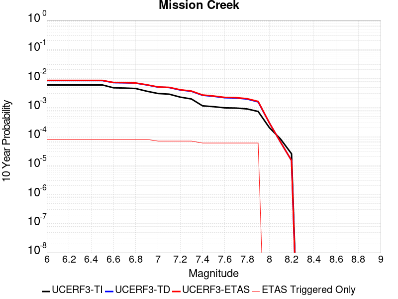 |

| Magnitude | 1 wk TI Prob | 1 wk TD Prob | 1 wk ETAS Prob | 1 wk ETAS/TD Gain | 1 wk ETAS Triggered Only | 1 mo TI Prob | 1 mo TD Prob | 1 mo ETAS Prob | 1 mo ETAS/TD Gain | 1 mo ETAS Triggered Only | 1 yr TI Prob | 1 yr TD Prob | 1 yr ETAS Prob | 1 yr ETAS/TD Gain | 1 yr ETAS Triggered Only | 10 yr TI Prob | 10 yr TD Prob | 10 yr ETAS Prob | 10 yr ETAS/TD Gain | 10 yr ETAS Triggered Only |
|-----|-----|-----|-----|-----|-----|-----|-----|-----|-----|-----|-----|-----|-----|-----|-----|-----|-----|-----|-----|-----|
| 6.0 | 1.1549387E-5 | 1.6324713E-5 | 1.6324713E-5 | 1.0 | 0.0 | 4.9496433E-5 | 6.9961265E-5 | 7.996056E-5 | 1.1429262 | 1.0E-5 | 6.0245243E-4 | 8.5146056E-4 | 8.61452E-4 | 1.0117345 | 1.0E-5 | 0.006008218 | 0.008511184 | 0.008590504 | 1.0093194 | 8.0E-5 |
| 6.1 | 1.1549387E-5 | 1.6324713E-5 | 1.6324713E-5 | 1.0 | 0.0 | 4.9496433E-5 | 6.9961265E-5 | 7.996056E-5 | 1.1429262 | 1.0E-5 | 6.0245243E-4 | 8.5146056E-4 | 8.61452E-4 | 1.0117345 | 1.0E-5 | 0.006008218 | 0.008511184 | 0.008590504 | 1.0093194 | 8.0E-5 |
| 6.2 | 1.1549387E-5 | 1.6324713E-5 | 1.6324713E-5 | 1.0 | 0.0 | 4.9496433E-5 | 6.9961265E-5 | 7.996056E-5 | 1.1429262 | 1.0E-5 | 6.0245243E-4 | 8.5146056E-4 | 8.61452E-4 | 1.0117345 | 1.0E-5 | 0.006008218 | 0.008511184 | 0.008590504 | 1.0093194 | 8.0E-5 |
| 6.3 | 1.1549387E-5 | 1.6324713E-5 | 1.6324713E-5 | 1.0 | 0.0 | 4.9496433E-5 | 6.9961265E-5 | 7.996056E-5 | 1.1429262 | 1.0E-5 | 6.0245243E-4 | 8.5146056E-4 | 8.61452E-4 | 1.0117345 | 1.0E-5 | 0.006008218 | 0.008511184 | 0.008590504 | 1.0093194 | 8.0E-5 |
| 6.4 | 1.1549387E-5 | 1.6324713E-5 | 1.6324713E-5 | 1.0 | 0.0 | 4.9496433E-5 | 6.9961265E-5 | 7.996056E-5 | 1.1429262 | 1.0E-5 | 6.0245243E-4 | 8.5146056E-4 | 8.61452E-4 | 1.0117345 | 1.0E-5 | 0.006008218 | 0.008511184 | 0.008590504 | 1.0093194 | 8.0E-5 |
| 6.5 | 1.1549387E-5 | 1.6324713E-5 | 1.6324713E-5 | 1.0 | 0.0 | 4.9496433E-5 | 6.9961265E-5 | 7.996056E-5 | 1.1429262 | 1.0E-5 | 6.0245243E-4 | 8.5146056E-4 | 8.61452E-4 | 1.0117345 | 1.0E-5 | 0.006008218 | 0.008511184 | 0.008590504 | 1.0093194 | 8.0E-5 |
| 6.6 | 9.202681E-6 | 1.3847972E-5 | 1.3847972E-5 | 1.0 | 0.0 | 3.9439463E-5 | 5.9347152E-5 | 6.9346555E-5 | 1.16849 | 1.0E-5 | 4.800697E-4 | 7.2232104E-4 | 7.3231384E-4 | 1.0138342 | 1.0E-5 | 0.004790339 | 0.0072283596 | 0.0073077814 | 1.0109875 | 8.0E-5 |
| 6.7 | 9.019164E-6 | 1.365364E-5 | 1.365364E-5 | 1.0 | 0.0 | 3.8652986E-5 | 5.8514335E-5 | 6.851375E-5 | 1.1708883 | 1.0E-5 | 4.7049852E-4 | 7.121882E-4 | 7.2218105E-4 | 1.0140313 | 1.0E-5 | 0.004695036 | 0.0071276836 | 0.0072071133 | 1.0111438 | 8.0E-5 |
| 6.8 | 8.673558E-6 | 1.3275746E-5 | 1.3275746E-5 | 1.0 | 0.0 | 3.717186E-5 | 5.6894864E-5 | 6.6894296E-5 | 1.1757528 | 1.0E-5 | 4.524734E-4 | 6.924836E-4 | 7.024767E-4 | 1.0144308 | 1.0E-5 | 0.0045155324 | 0.0069318693 | 0.007011315 | 1.0114609 | 8.0E-5 |
| 6.9 | 7.002255E-6 | 1.1479958E-5 | 1.1479958E-5 | 1.0 | 0.0 | 3.000932E-5 | 4.9198927E-5 | 5.9198435E-5 | 1.2032465 | 1.0E-5 | 3.653022E-4 | 5.988392E-4 | 6.0883316E-4 | 1.016689 | 1.0E-5 | 0.0036470229 | 0.0060006846 | 0.006080204 | 1.0132518 | 8.0E-5 |
| 7.0 | 5.84644E-6 | 9.677164E-6 | 9.677164E-6 | 1.0 | 0.0 | 2.5055931E-5 | 4.1472922E-5 | 5.1472507E-5 | 1.2411112 | 1.0E-5 | 3.0501327E-4 | 5.0482043E-4 | 5.148154E-4 | 1.019799 | 1.0E-5 | 0.0030459496 | 0.0050649596 | 0.005134605 | 1.0137504 | 7.0E-5 |
| 7.1 | 5.54703E-6 | 9.331631E-6 | 9.331631E-6 | 1.0 | 0.0 | 2.377277E-5 | 3.999212E-5 | 4.999172E-5 | 1.2500392 | 1.0E-5 | 2.8939504E-4 | 4.8679972E-4 | 4.967948E-4 | 1.0205324 | 1.0E-5 | 0.0028901845 | 0.0048855497 | 0.0049552075 | 1.014258 | 7.0E-5 |
| 7.2 | 4.384709E-6 | 7.6836495E-6 | 7.6836495E-6 | 1.0 | 0.0 | 1.8791474E-5 | 3.292953E-5 | 4.29292E-5 | 1.3036687 | 1.0E-5 | 2.2876218E-4 | 4.0084694E-4 | 4.108429E-4 | 1.0249372 | 1.0E-5 | 0.0022852682 | 0.0040294197 | 0.0040991376 | 1.0173023 | 7.0E-5 |
| 7.3 | 3.7888456E-6 | 6.9174894E-6 | 6.9174894E-6 | 1.0 | 0.0 | 1.623781E-5 | 2.9646066E-5 | 3.964577E-5 | 1.3373029 | 1.0E-5 | 1.9767738E-4 | 3.608844E-4 | 3.7088082E-4 | 1.0276997 | 1.0E-5 | 0.0019750162 | 0.0036311483 | 0.003700894 | 1.0192076 | 7.0E-5 |
| 7.4 | 2.1982462E-6 | 5.0257536E-6 | 5.0257536E-6 | 1.0 | 0.0 | 9.421021E-6 | 2.1538768E-5 | 3.153855E-5 | 1.4642692 | 1.0E-5 | 1.1469489E-4 | 2.6220313E-4 | 2.722005E-4 | 1.0381284 | 1.0E-5 | 0.0011463572 | 0.0026468872 | 0.0027067284 | 1.0226082 | 6.0E-5 |
| 7.5 | 2.051923E-6 | 4.6169393E-6 | 4.6169393E-6 | 1.0 | 0.0 | 8.793926E-6 | 1.9786734E-5 | 2.9786537E-5 | 1.5053791 | 1.0E-5 | 1.0706078E-4 | 2.40877E-4 | 2.5087458E-4 | 1.041505 | 1.0E-5 | 0.0010700922 | 0.0024345173 | 0.002494371 | 1.0245855 | 6.0E-5 |
| 7.6 | 1.8733427E-6 | 4.1252324E-6 | 4.1252324E-6 | 1.0 | 0.0 | 8.028587E-6 | 1.767945E-5 | 2.7679273E-5 | 1.5656185 | 1.0E-5 | 9.774366E-5 | 2.1522611E-4 | 2.2522395E-4 | 1.0464528 | 1.0E-5 | 9.770069E-4 | 0.0021790217 | 0.0022388909 | 1.0274752 | 6.0E-5 |
| 7.7 | 1.8411953E-6 | 4.044895E-6 | 4.044895E-6 | 1.0 | 0.0 | 7.890813E-6 | 1.733515E-5 | 2.7334976E-5 | 1.5768527 | 1.0E-5 | 9.606641E-5 | 2.1103508E-4 | 2.2103297E-4 | 1.0473754 | 1.0E-5 | 9.6024893E-4 | 0.0021373003 | 0.0021971723 | 1.0280128 | 6.0E-5 |
| 7.8 | 1.7194251E-6 | 3.7121463E-6 | 3.7121463E-6 | 1.0 | 0.0 | 7.368944E-6 | 1.5909101E-5 | 2.5908943E-5 | 1.628561 | 1.0E-5 | 8.97132E-5 | 1.9367617E-4 | 2.0367424E-4 | 1.0516226 | 1.0E-5 | 8.967699E-4 | 0.0019632233 | 0.0020231055 | 1.030502 | 6.0E-5 |
| 7.9 | 1.4035052E-6 | 2.9514722E-6 | 2.9514722E-6 | 1.0 | 0.0 | 6.0150082E-6 | 1.2649106E-5 | 2.264898E-5 | 1.7905596 | 1.0E-5 | 7.3230265E-5 | 1.5399205E-4 | 1.6399051E-4 | 1.0649284 | 1.0E-5 | 7.3206134E-4 | 0.0015638224 | 0.0016237285 | 1.0383075 | 6.0E-5 |
| 8.0 | 3.9318823E-7 | 5.5319464E-7 | 5.5319464E-7 | 1.0 | 0.0 | 1.6850913E-6 | 2.3708321E-6 | 2.3708321E-6 | 1.0 | 0.0 | 2.0515794E-5 | 2.8864504E-5 | 2.8864504E-5 | 1.0 | 0.0 | 2.0513899E-4 | 2.9916913E-4 | 2.9916913E-4 | 1.0 | 0.0 |
| 8.1 | 1.596793E-7 | 1.1391901E-7 | 1.1391901E-7 | 1.0 | 0.0 | 6.8433974E-7 | 4.8822426E-7 | 4.8822426E-7 | 1.0 | 0.0 | 8.331805E-6 | 5.944114E-6 | 5.944114E-6 | 1.0 | 0.0 | 8.331492E-5 | 6.5564316E-5 | 6.5564316E-5 | 1.0 | 0.0 |
| 8.2 | 4.9003038E-8 | 2.5475106E-8 | 2.5475106E-8 | 1.0 | 0.0 | 2.10013E-7 | 1.0917902E-7 | 1.0917902E-7 | 1.0 | 0.0 | 2.5569052E-6 | 1.3292538E-6 | 1.3292538E-6 | 1.0 | 0.0 | 2.556876E-5 | 1.4973085E-5 | 1.4973085E-5 | 1.0 | 0.0 |

## Deep Springs
*[(top)](#table-of-contents)*

| 1 Week | 1 Month | 1 Year | 10 Year |
|-----|-----|-----|-----|
|  | 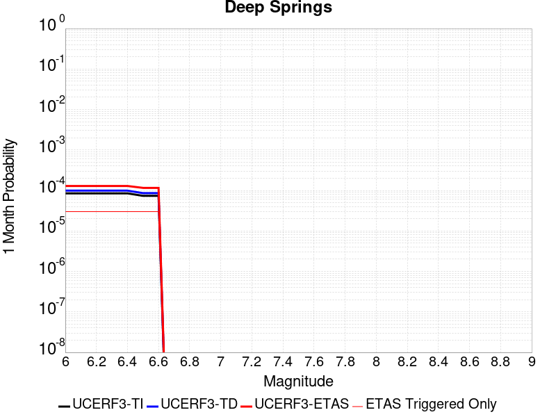 | 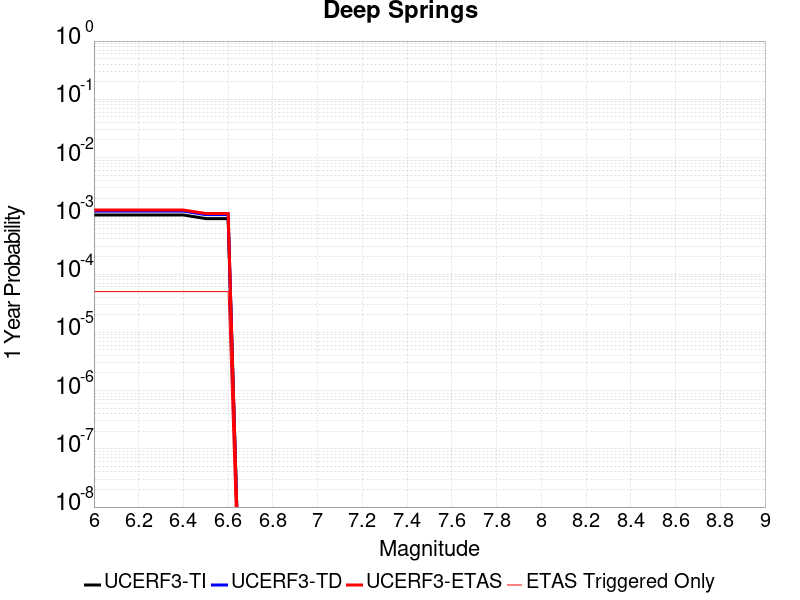 |  |

| Magnitude | 1 wk TI Prob | 1 wk TD Prob | 1 wk ETAS Prob | 1 wk ETAS/TD Gain | 1 wk ETAS Triggered Only | 1 mo TI Prob | 1 mo TD Prob | 1 mo ETAS Prob | 1 mo ETAS/TD Gain | 1 mo ETAS Triggered Only | 1 yr TI Prob | 1 yr TD Prob | 1 yr ETAS Prob | 1 yr ETAS/TD Gain | 1 yr ETAS Triggered Only | 10 yr TI Prob | 10 yr TD Prob | 10 yr ETAS Prob | 10 yr ETAS/TD Gain | 10 yr ETAS Triggered Only |
|-----|-----|-----|-----|-----|-----|-----|-----|-----|-----|-----|-----|-----|-----|-----|-----|-----|-----|-----|-----|-----|
| 6.0 | 1.9810619E-5 | 2.311303E-5 | 2.311303E-5 | 1.0 | 0.0 | 8.489989E-5 | 9.905495E-5 | 1.2905197E-4 | 1.3028322 | 3.0E-5 | 0.001033166 | 0.0012058346 | 0.0012557743 | 1.0414151 | 5.0E-5 | 0.010283757 | 0.01204269 | 0.012121727 | 1.0065631 | 8.0E-5 |
| 6.1 | 1.9810619E-5 | 2.311303E-5 | 2.311303E-5 | 1.0 | 0.0 | 8.489989E-5 | 9.905495E-5 | 1.2905197E-4 | 1.3028322 | 3.0E-5 | 0.001033166 | 0.0012058346 | 0.0012557743 | 1.0414151 | 5.0E-5 | 0.010283757 | 0.01204269 | 0.012121727 | 1.0065631 | 8.0E-5 |
| 6.2 | 1.9810619E-5 | 2.311303E-5 | 2.311303E-5 | 1.0 | 0.0 | 8.489989E-5 | 9.905495E-5 | 1.2905197E-4 | 1.3028322 | 3.0E-5 | 0.001033166 | 0.0012058346 | 0.0012557743 | 1.0414151 | 5.0E-5 | 0.010283757 | 0.01204269 | 0.012121727 | 1.0065631 | 8.0E-5 |
| 6.3 | 1.9810619E-5 | 2.311303E-5 | 2.311303E-5 | 1.0 | 0.0 | 8.489989E-5 | 9.905495E-5 | 1.2905197E-4 | 1.3028322 | 3.0E-5 | 0.001033166 | 0.0012058346 | 0.0012557743 | 1.0414151 | 5.0E-5 | 0.010283757 | 0.01204269 | 0.012121727 | 1.0065631 | 8.0E-5 |
| 6.4 | 1.9810619E-5 | 2.311303E-5 | 2.311303E-5 | 1.0 | 0.0 | 8.489989E-5 | 9.905495E-5 | 1.2905197E-4 | 1.3028322 | 3.0E-5 | 0.001033166 | 0.0012058346 | 0.0012557743 | 1.0414151 | 5.0E-5 | 0.010283757 | 0.01204269 | 0.012121727 | 1.0065631 | 8.0E-5 |
| 6.5 | 1.7190405E-5 | 2.0050999E-5 | 2.0050999E-5 | 1.0 | 0.0 | 7.367108E-5 | 8.593285E-5 | 1.1593027E-4 | 1.3490798 | 3.0E-5 | 8.9657627E-4 | 0.0010462324 | 0.0010961802 | 1.0477406 | 5.0E-5 | 0.008929676 | 0.010462287 | 0.01054145 | 1.0075666 | 8.0E-5 |
| 6.6 | 1.7190405E-5 | 2.0050999E-5 | 2.0050999E-5 | 1.0 | 0.0 | 7.367108E-5 | 8.593285E-5 | 1.1593027E-4 | 1.3490798 | 3.0E-5 | 8.9657627E-4 | 0.0010462324 | 0.0010961802 | 1.0477406 | 5.0E-5 | 0.008929676 | 0.010462287 | 0.01054145 | 1.0075666 | 8.0E-5 |

## Oceanic - West Huasna
*[(top)](#table-of-contents)*

| 1 Week | 1 Month | 1 Year | 10 Year |
|-----|-----|-----|-----|
|  |  | 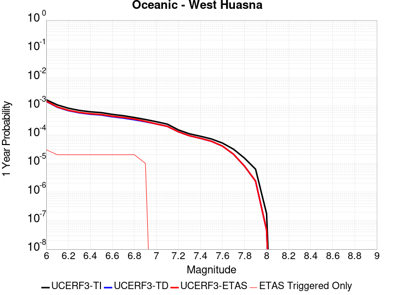 | 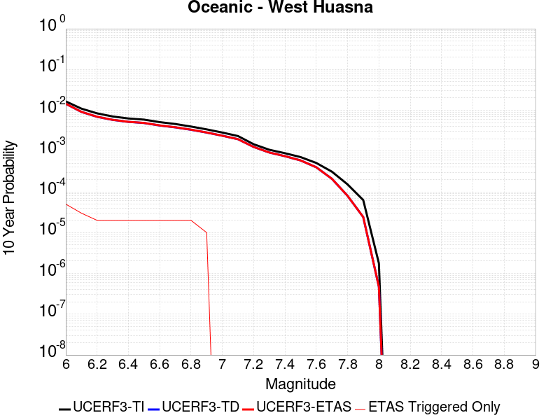 |

| Magnitude | 1 wk TI Prob | 1 wk TD Prob | 1 wk ETAS Prob | 1 wk ETAS/TD Gain | 1 wk ETAS Triggered Only | 1 mo TI Prob | 1 mo TD Prob | 1 mo ETAS Prob | 1 mo ETAS/TD Gain | 1 mo ETAS Triggered Only | 1 yr TI Prob | 1 yr TD Prob | 1 yr ETAS Prob | 1 yr ETAS/TD Gain | 1 yr ETAS Triggered Only | 10 yr TI Prob | 10 yr TD Prob | 10 yr ETAS Prob | 10 yr ETAS/TD Gain | 10 yr ETAS Triggered Only |
|-----|-----|-----|-----|-----|-----|-----|-----|-----|-----|-----|-----|-----|-----|-----|-----|-----|-----|-----|-----|-----|
| 6.0 | 3.195567E-5 | 2.7927153E-5 | 2.7927153E-5 | 1.0 | 0.0 | 1.3694567E-4 | 1.19682554E-4 | 1.19682554E-4 | 1.0 | 0.0 | 0.0016660384 | 0.0014562042 | 0.0014861606 | 1.0205715 | 3.0E-5 | 0.016536033 | 0.014471174 | 0.0145204505 | 1.0034051 | 5.0E-5 |
| 6.1 | 2.1156782E-5 | 1.7573653E-5 | 1.7573653E-5 | 1.0 | 0.0 | 9.066878E-5 | 7.531353E-5 | 7.531353E-5 | 1.0 | 0.0 | 0.0011033333 | 9.1656594E-4 | 9.365476E-4 | 1.0218006 | 2.0E-5 | 0.010978713 | 0.009128864 | 0.009158591 | 1.0032563 | 3.0E-5 |
| 6.2 | 1.6195117E-5 | 1.3327269E-5 | 1.3327269E-5 | 1.0 | 0.0 | 6.9405796E-5 | 5.711563E-5 | 5.711563E-5 | 1.0 | 0.0 | 8.44688E-4 | 6.951635E-4 | 7.151496E-4 | 1.0287502 | 2.0E-5 | 0.008414844 | 0.006930183 | 0.006950045 | 1.0028659 | 2.0E-5 |
| 6.3 | 1.3559345E-5 | 1.1179233E-5 | 1.1179233E-5 | 1.0 | 0.0 | 5.811018E-5 | 4.7910125E-5 | 4.7910125E-5 | 1.0 | 0.0 | 7.072618E-4 | 5.831506E-4 | 6.0313893E-4 | 1.0342765 | 2.0E-5 | 0.0070501505 | 0.0058163223 | 0.005836206 | 1.0034186 | 2.0E-5 |
| 6.4 | 1.2120619E-5 | 1.0001056E-5 | 1.0001056E-5 | 1.0 | 0.0 | 5.1944477E-5 | 4.2860964E-5 | 4.2860964E-5 | 1.0 | 0.0 | 6.322405E-4 | 5.217078E-4 | 5.416974E-4 | 1.0383157 | 2.0E-5 | 0.006304447 | 0.005204898 | 0.0052247937 | 1.0038226 | 2.0E-5 |
| 6.5 | 1.13511915E-5 | 9.367545E-6 | 9.367545E-6 | 1.0 | 0.0 | 4.8647056E-5 | 4.014601E-5 | 4.014601E-5 | 1.0 | 0.0 | 5.9211696E-4 | 4.8866845E-4 | 5.086587E-4 | 1.0409075 | 2.0E-5 | 0.0059054173 | 0.004875998 | 0.004895901 | 1.0040817 | 2.0E-5 |
| 6.6 | 9.850605E-6 | 8.135479E-6 | 8.135479E-6 | 1.0 | 0.0 | 4.2216197E-5 | 3.4865876E-5 | 3.4865876E-5 | 1.0 | 0.0 | 5.1386096E-4 | 4.2440955E-4 | 4.4440108E-4 | 1.0471042 | 2.0E-5 | 0.0051267436 | 0.0042360225 | 0.004255938 | 1.0047014 | 2.0E-5 |
| 6.7 | 8.8558645E-6 | 7.318487E-6 | 7.318487E-6 | 1.0 | 0.0 | 3.7953152E-5 | 3.136457E-5 | 3.136457E-5 | 1.0 | 0.0 | 4.6198163E-4 | 3.8179688E-4 | 4.0178926E-4 | 1.0523639 | 2.0E-5 | 0.004610224 | 0.003811435 | 0.0038313589 | 1.0052273 | 2.0E-5 |
| 6.8 | 7.67136E-6 | 6.3918033E-6 | 6.3918033E-6 | 1.0 | 0.0 | 3.2876844E-5 | 2.7393156E-5 | 2.7393156E-5 | 1.0 | 0.0 | 4.0020206E-4 | 3.334608E-4 | 3.5345412E-4 | 1.059957 | 2.0E-5 | 0.003994821 | 0.0033296254 | 0.0033495587 | 1.0059867 | 2.0E-5 |
| 6.9 | 6.534529E-6 | 5.45837E-6 | 5.45837E-6 | 1.0 | 0.0 | 2.8004823E-5 | 2.3392806E-5 | 2.3392806E-5 | 1.0 | 0.0 | 3.4090536E-4 | 2.8477033E-4 | 2.9476747E-4 | 1.0351061 | 1.0E-5 | 0.0034038287 | 0.002844071 | 0.0028540425 | 1.0035061 | 1.0E-5 |
| 7.0 | 5.460525E-6 | 4.5699867E-6 | 4.5699867E-6 | 1.0 | 0.0 | 2.3402039E-5 | 1.9585512E-5 | 1.9585512E-5 | 1.0 | 0.0 | 2.8488258E-4 | 2.3842762E-4 | 2.3842762E-4 | 1.0 | 0.0 | 0.0028451765 | 0.002381732 | 0.002381732 | 1.0 | 0.0 |
| 7.1 | 4.4825083E-6 | 3.7524742E-6 | 3.7524742E-6 | 1.0 | 0.0 | 1.9210609E-5 | 1.6081935E-5 | 1.6081935E-5 | 1.0 | 0.0 | 2.3386406E-4 | 1.9578006E-4 | 1.9578006E-4 | 1.0 | 0.0 | 0.002336181 | 0.0019560878 | 0.0019560878 | 1.0 | 0.0 |
| 7.2 | 2.821708E-6 | 2.4249584E-6 | 2.4249584E-6 | 1.0 | 0.0 | 1.2092979E-5 | 1.0392638E-5 | 1.0392638E-5 | 1.0 | 0.0 | 1.4722206E-4 | 1.2652302E-4 | 1.2652302E-4 | 1.0 | 0.0 | 0.0014712457 | 0.0012645123 | 0.0012645123 | 1.0 | 0.0 |
| 7.3 | 2.0644757E-6 | 1.7687632E-6 | 1.7687632E-6 | 1.0 | 0.0 | 8.847723E-6 | 7.580392E-6 | 7.580392E-6 | 1.0 | 0.0 | 1.0771569E-4 | 9.2287366E-5 | 9.2287366E-5 | 1.0 | 0.0 | 0.001076635 | 9.224921E-4 | 9.224921E-4 | 1.0 | 0.0 |
| 7.4 | 1.6980367E-6 | 1.43801E-6 | 1.43801E-6 | 1.0 | 0.0 | 7.27728E-6 | 6.1628857E-6 | 6.1628857E-6 | 1.0 | 0.0 | 8.8597284E-5 | 7.503055E-5 | 7.503055E-5 | 1.0 | 0.0 | 8.8561967E-4 | 7.500538E-4 | 7.500538E-4 | 1.0 | 0.0 |
| 7.5 | 1.3637683E-6 | 1.1302833E-6 | 1.1302833E-6 | 1.0 | 0.0 | 5.844708E-6 | 4.8440625E-6 | 4.8440625E-6 | 1.0 | 0.0 | 7.1156996E-5 | 5.8974863E-5 | 5.8974863E-5 | 1.0 | 0.0 | 7.1134215E-4 | 5.8959366E-4 | 5.8959366E-4 | 1.0 | 0.0 |
| 7.6 | 9.802994E-7 | 7.677435E-7 | 7.677435E-7 | 1.0 | 0.0 | 4.2012766E-6 | 3.290325E-6 | 3.290325E-6 | 1.0 | 0.0 | 5.1149345E-5 | 4.005897E-5 | 4.005897E-5 | 1.0 | 0.0 | 5.113757E-4 | 4.005189E-4 | 4.005189E-4 | 1.0 | 0.0 |
| 7.7 | 5.986191E-7 | 4.0052313E-7 | 4.0052313E-7 | 1.0 | 0.0 | 2.5655079E-6 | 1.7165265E-6 | 1.7165265E-6 | 1.0 | 0.0 | 3.1234613E-5 | 2.0898511E-5 | 2.0898511E-5 | 1.0 | 0.0 | 3.123022E-4 | 2.0896681E-4 | 2.0896681E-4 | 1.0 | 0.0 |
| 7.8 | 2.9189815E-7 | 1.5287357E-7 | 1.5287357E-7 | 1.0 | 0.0 | 1.2509914E-6 | 6.5517224E-7 | 6.5517224E-7 | 1.0 | 0.0 | 1.5230714E-5 | 7.976692E-6 | 7.976692E-6 | 1.0 | 0.0 | 1.522967E-4 | 7.976538E-5 | 7.976538E-5 | 1.0 | 0.0 |
| 7.9 | 1.2057845E-7 | 4.6221164E-8 | 4.6221164E-8 | 1.0 | 0.0 | 5.1676466E-7 | 1.9809069E-7 | 1.9809069E-7 | 1.0 | 0.0 | 6.2915915E-6 | 2.4117514E-6 | 2.4117514E-6 | 1.0 | 0.0 | 6.2914136E-5 | 2.4118557E-5 | 2.4118557E-5 | 1.0 | 0.0 |
| 8.0 | 3.3806387E-9 | 9.0147434E-10 | 9.0147434E-10 | 1.0 | 0.0 | 1.4488451E-8 | 3.8634624E-9 | 3.8634624E-9 | 1.0 | 0.0 | 1.7639688E-7 | 4.703766E-8 | 4.703766E-8 | 1.0 | 0.0 | 1.7639674E-6 | 4.714705E-7 | 4.714705E-7 | 1.0 | 0.0 |

## Rose Canyon
*[(top)](#table-of-contents)*

| 1 Week | 1 Month | 1 Year | 10 Year |
|-----|-----|-----|-----|
|  |  |  |  |

| Magnitude | 1 wk TI Prob | 1 wk TD Prob | 1 wk ETAS Prob | 1 wk ETAS/TD Gain | 1 wk ETAS Triggered Only | 1 mo TI Prob | 1 mo TD Prob | 1 mo ETAS Prob | 1 mo ETAS/TD Gain | 1 mo ETAS Triggered Only | 1 yr TI Prob | 1 yr TD Prob | 1 yr ETAS Prob | 1 yr ETAS/TD Gain | 1 yr ETAS Triggered Only | 10 yr TI Prob | 10 yr TD Prob | 10 yr ETAS Prob | 10 yr ETAS/TD Gain | 10 yr ETAS Triggered Only |
|-----|-----|-----|-----|-----|-----|-----|-----|-----|-----|-----|-----|-----|-----|-----|-----|-----|-----|-----|-----|-----|
| 6.0 | 4.5923203E-5 | 4.9715825E-5 | 4.9715825E-5 | 1.0 | 0.0 | 1.9679888E-4 | 2.1305127E-4 | 2.1305127E-4 | 1.0 | 0.0 | 0.0023933933 | 0.0025910123 | 0.0026408827 | 1.0192475 | 5.0E-5 | 0.023677798 | 0.025640773 | 0.025708979 | 1.00266 | 7.0E-5 |
| 6.1 | 4.5923203E-5 | 4.9715825E-5 | 4.9715825E-5 | 1.0 | 0.0 | 1.9679888E-4 | 2.1305127E-4 | 2.1305127E-4 | 1.0 | 0.0 | 0.0023933933 | 0.0025910123 | 0.0026109605 | 1.007699 | 2.0E-5 | 0.023677798 | 0.025640773 | 0.025670003 | 1.00114 | 3.0E-5 |
| 6.2 | 2.8844734E-5 | 2.9669445E-5 | 2.9669445E-5 | 1.0 | 0.0 | 1.2361443E-4 | 1.2714828E-4 | 1.2714828E-4 | 1.0 | 0.0 | 0.0015039665 | 0.0015469306 | 0.0015569152 | 1.0064545 | 1.0E-5 | 0.0149382865 | 0.01537464 | 0.015394333 | 1.0012808 | 2.0E-5 |
| 6.3 | 2.3171577E-5 | 2.3161689E-5 | 2.3161689E-5 | 1.0 | 0.0 | 9.9302975E-5 | 9.926068E-5 | 9.926068E-5 | 1.0 | 0.0 | 0.0012083431 | 0.0012078421 | 0.0012178301 | 1.0082692 | 1.0E-5 | 0.012017938 | 0.0120226685 | 0.012042427 | 1.0016435 | 2.0E-5 |
| 6.4 | 2.0066604E-5 | 1.9667403E-5 | 1.9667403E-5 | 1.0 | 0.0 | 8.599689E-5 | 8.42862E-5 | 8.42862E-5 | 1.0 | 0.0 | 0.0010465092 | 0.0010257114 | 0.0010357011 | 1.0097393 | 1.0E-5 | 0.010415946 | 0.010217753 | 0.0102375485 | 1.0019374 | 2.0E-5 |
| 6.5 | 1.776989E-5 | 1.7114124E-5 | 1.7114124E-5 | 1.0 | 0.0 | 7.615444E-5 | 7.334422E-5 | 7.334422E-5 | 1.0 | 0.0 | 9.267859E-4 | 8.92607E-4 | 9.025981E-4 | 1.0111932 | 1.0E-5 | 0.009229303 | 0.008896374 | 0.008916196 | 1.0022281 | 2.0E-5 |
| 6.6 | 1.5227364E-5 | 1.43395055E-5 | 1.43395055E-5 | 1.0 | 0.0 | 6.52585E-5 | 6.1453604E-5 | 6.1453604E-5 | 1.0 | 0.0 | 7.942326E-4 | 7.47946E-4 | 7.5793854E-4 | 1.0133599 | 1.0E-5 | 0.007914 | 0.007458486 | 0.0074783373 | 1.0026615 | 2.0E-5 |
| 6.7 | 1.2703898E-5 | 1.167345E-5 | 1.167345E-5 | 1.0 | 0.0 | 5.4444143E-5 | 5.002814E-5 | 5.002814E-5 | 1.0 | 0.0 | 6.626558E-4 | 6.089266E-4 | 6.089266E-4 | 1.0 | 0.0 | 0.006606833 | 0.006075177 | 0.006085116 | 1.001636 | 1.0E-5 |
| 6.8 | 1.1554917E-5 | 1.0609485E-5 | 1.0609485E-5 | 1.0 | 0.0 | 4.9520135E-5 | 4.5468452E-5 | 4.5468452E-5 | 1.0 | 0.0 | 6.0274085E-4 | 5.534419E-4 | 5.534419E-4 | 1.0 | 0.0 | 0.0060110865 | 0.005522644 | 0.005532589 | 1.0018008 | 1.0E-5 |
| 6.9 | 8.732078E-6 | 7.881448E-6 | 7.881448E-6 | 1.0 | 0.0 | 3.7422655E-5 | 3.3777214E-5 | 3.3777214E-5 | 1.0 | 0.0 | 4.5552556E-4 | 4.111629E-4 | 4.111629E-4 | 1.0 | 0.0 | 0.0045459294 | 0.0041048555 | 0.0041048555 | 1.0 | 0.0 |
| 7.0 | 5.9337494E-6 | 5.107531E-6 | 5.107531E-6 | 1.0 | 0.0 | 2.5430107E-5 | 2.1889235E-5 | 2.1889235E-5 | 1.0 | 0.0 | 3.0956755E-4 | 2.66469E-4 | 2.66469E-4 | 1.0 | 0.0 | 0.0030913667 | 0.0026615104 | 0.0026615104 | 1.0 | 0.0 |
| 7.1 | 5.013409E-6 | 4.177419E-6 | 4.177419E-6 | 1.0 | 0.0 | 2.1485863E-5 | 1.7903103E-5 | 1.7903103E-5 | 1.0 | 0.0 | 2.6155898E-4 | 2.1794859E-4 | 2.1794859E-4 | 1.0 | 0.0 | 0.0026125133 | 0.00217736 | 0.00217736 | 1.0 | 0.0 |
| 7.2 | 4.120763E-6 | 3.2821677E-6 | 3.2821677E-6 | 1.0 | 0.0 | 1.7660293E-5 | 1.4066358E-5 | 1.4066358E-5 | 1.0 | 0.0 | 2.1499286E-4 | 1.7124454E-4 | 1.7124454E-4 | 1.0 | 0.0 | 0.0021478499 | 0.0017111353 | 0.0017111353 | 1.0 | 0.0 |
| 7.3 | 3.2081239E-6 | 2.4405597E-6 | 2.4405597E-6 | 1.0 | 0.0 | 1.374903E-5 | 1.04595E-5 | 1.04595E-5 | 1.0 | 0.0 | 1.6738157E-4 | 1.2733703E-4 | 1.2733703E-4 | 1.0 | 0.0 | 0.0016725556 | 0.0012726476 | 0.0012726476 | 1.0 | 0.0 |
| 7.4 | 2.4194755E-6 | 1.7680803E-6 | 1.7680803E-6 | 1.0 | 0.0 | 1.0369139E-5 | 7.5774656E-6 | 7.5774656E-6 | 1.0 | 0.0 | 1.2623696E-4 | 9.2251794E-5 | 9.2251794E-5 | 1.0 | 0.0 | 0.0012616527 | 9.221403E-4 | 9.221403E-4 | 1.0 | 0.0 |
| 7.5 | 1.3842889E-6 | 9.378737E-7 | 9.378737E-7 | 1.0 | 0.0 | 5.9326535E-6 | 4.0194527E-6 | 4.0194527E-6 | 1.0 | 0.0 | 7.222766E-5 | 4.8935777E-5 | 4.8935777E-5 | 1.0 | 0.0 | 7.220419E-4 | 4.8925355E-4 | 4.8925355E-4 | 1.0 | 0.0 |
| 7.6 | 1.0021575E-6 | 6.411548E-7 | 6.411548E-7 | 1.0 | 0.0 | 4.2949537E-6 | 2.7478038E-6 | 2.7478038E-6 | 1.0 | 0.0 | 5.2289808E-5 | 3.345402E-5 | 3.345402E-5 | 1.0 | 0.0 | 5.2277505E-4 | 3.3449198E-4 | 3.3449198E-4 | 1.0 | 0.0 |
| 7.7 | 8.7620116E-8 | 6.449284E-8 | 6.449284E-8 | 1.0 | 0.0 | 3.7551473E-7 | 2.7639786E-7 | 2.7639786E-7 | 1.0 | 0.0 | 4.5718825E-6 | 3.365139E-6 | 3.365139E-6 | 1.0 | 0.0 | 4.5717883E-5 | 3.365091E-5 | 3.365091E-5 | 1.0 | 0.0 |

## Santa Ynez (East)
*[(top)](#table-of-contents)*

| 1 Week | 1 Month | 1 Year | 10 Year |
|-----|-----|-----|-----|
|  |  |  |  |

| Magnitude | 1 wk TI Prob | 1 wk TD Prob | 1 wk ETAS Prob | 1 wk ETAS/TD Gain | 1 wk ETAS Triggered Only | 1 mo TI Prob | 1 mo TD Prob | 1 mo ETAS Prob | 1 mo ETAS/TD Gain | 1 mo ETAS Triggered Only | 1 yr TI Prob | 1 yr TD Prob | 1 yr ETAS Prob | 1 yr ETAS/TD Gain | 1 yr ETAS Triggered Only | 10 yr TI Prob | 10 yr TD Prob | 10 yr ETAS Prob | 10 yr ETAS/TD Gain | 10 yr ETAS Triggered Only |
|-----|-----|-----|-----|-----|-----|-----|-----|-----|-----|-----|-----|-----|-----|-----|-----|-----|-----|-----|-----|-----|
| 6.0 | 3.2269712E-5 | 3.6751346E-5 | 3.6751346E-5 | 1.0 | 0.0 | 1.3829143E-4 | 1.5749958E-4 | 1.6749802E-4 | 1.0634823 | 1.0E-5 | 0.0016823979 | 0.0019164606 | 0.001956384 | 1.0208318 | 4.0E-5 | 0.016697178 | 0.019056875 | 0.019115731 | 1.0030885 | 6.0E-5 |
| 6.1 | 3.2269712E-5 | 3.6751346E-5 | 3.6751346E-5 | 1.0 | 0.0 | 1.3829143E-4 | 1.5749958E-4 | 1.6749802E-4 | 1.0634823 | 1.0E-5 | 0.0016823979 | 0.0019164606 | 0.001956384 | 1.0208318 | 4.0E-5 | 0.016697178 | 0.019056875 | 0.019115731 | 1.0030885 | 6.0E-5 |
| 6.2 | 3.2269712E-5 | 3.6751346E-5 | 3.6751346E-5 | 1.0 | 0.0 | 1.3829143E-4 | 1.5749958E-4 | 1.6749802E-4 | 1.0634823 | 1.0E-5 | 0.0016823979 | 0.0019164606 | 0.001956384 | 1.0208318 | 4.0E-5 | 0.016697178 | 0.019056875 | 0.019115731 | 1.0030885 | 6.0E-5 |
| 6.3 | 3.2269712E-5 | 3.6751346E-5 | 3.6751346E-5 | 1.0 | 0.0 | 1.3829143E-4 | 1.5749958E-4 | 1.6749802E-4 | 1.0634823 | 1.0E-5 | 0.0016823979 | 0.0019164606 | 0.001956384 | 1.0208318 | 4.0E-5 | 0.016697178 | 0.019056875 | 0.019115731 | 1.0030885 | 6.0E-5 |
| 6.4 | 1.4404779E-5 | 1.4849569E-5 | 1.4849569E-5 | 1.0 | 0.0 | 6.1733306E-5 | 6.363949E-5 | 6.363949E-5 | 1.0 | 0.0 | 7.513438E-4 | 7.7454036E-4 | 7.845326E-4 | 1.0129008 | 1.0E-5 | 0.0074880854 | 0.007718959 | 0.0077388044 | 1.002571 | 2.0E-5 |
| 6.5 | 1.4404779E-5 | 1.4849569E-5 | 1.4849569E-5 | 1.0 | 0.0 | 6.1733306E-5 | 6.363949E-5 | 6.363949E-5 | 1.0 | 0.0 | 7.513438E-4 | 7.7454036E-4 | 7.845326E-4 | 1.0129008 | 1.0E-5 | 0.0074880854 | 0.007718959 | 0.0077388044 | 1.002571 | 2.0E-5 |
| 6.6 | 1.280208E-5 | 1.3012098E-5 | 1.3012098E-5 | 1.0 | 0.0 | 5.4864904E-5 | 5.5764955E-5 | 5.5764955E-5 | 1.0 | 0.0 | 6.6777546E-4 | 6.7872857E-4 | 6.887218E-4 | 1.0147234 | 1.0E-5 | 0.006657724 | 0.006766767 | 0.0067866314 | 1.0029356 | 2.0E-5 |
| 6.7 | 1.2457027E-5 | 1.2628613E-5 | 1.2628613E-5 | 1.0 | 0.0 | 5.3386164E-5 | 5.4121516E-5 | 5.4121516E-5 | 1.0 | 0.0 | 6.497827E-4 | 6.587319E-4 | 6.687253E-4 | 1.0151707 | 1.0E-5 | 0.00647886 | 0.0065679904 | 0.0065878592 | 1.003025 | 2.0E-5 |
| 6.8 | 1.2095134E-5 | 1.2231055E-5 | 1.2231055E-5 | 1.0 | 0.0 | 5.1835254E-5 | 5.2417763E-5 | 5.2417763E-5 | 1.0 | 0.0 | 6.309115E-4 | 6.38001E-4 | 6.4799463E-4 | 1.015664 | 1.0E-5 | 0.0062912325 | 0.0063618817 | 0.0063817548 | 1.0031238 | 2.0E-5 |
| 6.9 | 1.1104036E-5 | 1.11574755E-5 | 1.11574755E-5 | 1.0 | 0.0 | 4.758786E-5 | 4.7816884E-5 | 4.7816884E-5 | 1.0 | 0.0 | 5.7922816E-4 | 5.820163E-4 | 5.820163E-4 | 1.0 | 0.0 | 0.005777207 | 0.005805066 | 0.0058150077 | 1.0017127 | 1.0E-5 |
| 7.0 | 1.0577444E-5 | 1.0581802E-5 | 1.0581802E-5 | 1.0 | 0.0 | 4.5331115E-5 | 4.5349796E-5 | 4.5349796E-5 | 1.0 | 0.0 | 5.5176654E-4 | 5.519951E-4 | 5.519951E-4 | 1.0 | 0.0 | 0.0055039856 | 0.0055063786 | 0.0055163233 | 1.001806 | 1.0E-5 |
| 7.1 | 1.0021775E-5 | 9.981102E-6 | 9.981102E-6 | 1.0 | 0.0 | 4.294976E-5 | 4.2775457E-5 | 4.2775457E-5 | 1.0 | 0.0 | 5.2278786E-4 | 5.2066793E-4 | 5.2066793E-4 | 1.0 | 0.0 | 0.0052155964 | 0.0051946132 | 0.005204561 | 1.0019151 | 1.0E-5 |
| 7.2 | 8.874109E-6 | 8.748894E-6 | 8.748894E-6 | 1.0 | 0.0 | 3.8031343E-5 | 3.749473E-5 | 3.749473E-5 | 1.0 | 0.0 | 4.629332E-4 | 4.564038E-4 | 4.564038E-4 | 1.0 | 0.0 | 0.0046197 | 0.0045547825 | 0.004564737 | 1.0021855 | 1.0E-5 |
| 7.3 | 7.5504267E-6 | 7.505199E-6 | 7.505199E-6 | 1.0 | 0.0 | 3.235857E-5 | 3.216475E-5 | 3.216475E-5 | 1.0 | 0.0 | 3.9389438E-4 | 3.9153645E-4 | 3.9153645E-4 | 1.0 | 0.0 | 0.0039319694 | 0.003908573 | 0.003918534 | 1.0025485 | 1.0E-5 |
| 7.4 | 6.309394E-6 | 6.1832216E-6 | 6.1832216E-6 | 1.0 | 0.0 | 2.703998E-5 | 2.6499258E-5 | 2.6499258E-5 | 1.0 | 0.0 | 3.2916202E-4 | 3.2258165E-4 | 3.2258165E-4 | 1.0 | 0.0 | 0.003286749 | 0.0032212313 | 0.003231199 | 1.0030944 | 1.0E-5 |
| 7.5 | 4.6103073E-6 | 4.440935E-6 | 4.440935E-6 | 1.0 | 0.0 | 1.975831E-5 | 1.9032443E-5 | 1.9032443E-5 | 1.0 | 0.0 | 2.4053088E-4 | 2.3169606E-4 | 2.3169606E-4 | 1.0 | 0.0 | 0.002402707 | 0.0023146144 | 0.0023245912 | 1.0043104 | 1.0E-5 |
| 7.6 | 1.2858658E-6 | 1.3008267E-6 | 1.3008267E-6 | 1.0 | 0.0 | 5.5108417E-6 | 5.5749606E-6 | 5.5749606E-6 | 1.0 | 0.0 | 6.7092435E-5 | 6.78731E-5 | 6.78731E-5 | 1.0 | 0.0 | 6.707218E-4 | 6.7853054E-4 | 6.885238E-4 | 1.0147277 | 1.0E-5 |
| 7.7 | 5.3302307E-7 | 5.612178E-7 | 5.612178E-7 | 1.0 | 0.0 | 2.2843826E-6 | 2.4052172E-6 | 2.4052172E-6 | 1.0 | 0.0 | 2.7812002E-5 | 2.9283161E-5 | 2.9283161E-5 | 1.0 | 0.0 | 2.7808524E-4 | 2.9279658E-4 | 2.9279658E-4 | 1.0 | 0.0 |
| 7.8 | 4.613933E-8 | 4.803036E-8 | 4.803036E-8 | 1.0 | 0.0 | 1.9773998E-7 | 2.0584437E-7 | 2.0584437E-7 | 1.0 | 0.0 | 2.4074816E-6 | 2.5061524E-6 | 2.5061524E-6 | 1.0 | 0.0 | 2.4074554E-5 | 2.5061252E-5 | 2.5061252E-5 | 1.0 | 0.0 |

## San Jacinto (Lytle Creek connector)
*[(top)](#table-of-contents)*

| 1 Week | 1 Month | 1 Year | 10 Year |
|-----|-----|-----|-----|
|  |  |  |  |

| Magnitude | 1 wk TI Prob | 1 wk TD Prob | 1 wk ETAS Prob | 1 wk ETAS/TD Gain | 1 wk ETAS Triggered Only | 1 mo TI Prob | 1 mo TD Prob | 1 mo ETAS Prob | 1 mo ETAS/TD Gain | 1 mo ETAS Triggered Only | 1 yr TI Prob | 1 yr TD Prob | 1 yr ETAS Prob | 1 yr ETAS/TD Gain | 1 yr ETAS Triggered Only | 10 yr TI Prob | 10 yr TD Prob | 10 yr ETAS Prob | 10 yr ETAS/TD Gain | 10 yr ETAS Triggered Only |
|-----|-----|-----|-----|-----|-----|-----|-----|-----|-----|-----|-----|-----|-----|-----|-----|-----|-----|-----|-----|-----|
| 6.0 | 6.693995E-6 | 6.662972E-6 | 6.662972E-6 | 1.0 | 0.0 | 2.8688235E-5 | 2.8555281E-5 | 3.8554997E-5 | 1.3501879 | 1.0E-5 | 3.492233E-4 | 3.4760518E-4 | 3.8759125E-4 | 1.115033 | 4.0E-5 | 0.00348675 | 0.0035508168 | 0.0036205682 | 1.0196438 | 7.0E-5 |
| 6.1 | 6.693995E-6 | 6.662972E-6 | 6.662972E-6 | 1.0 | 0.0 | 2.8688235E-5 | 2.8555281E-5 | 3.8554997E-5 | 1.3501879 | 1.0E-5 | 3.492233E-4 | 3.4760518E-4 | 3.8759125E-4 | 1.115033 | 4.0E-5 | 0.00348675 | 0.0035508168 | 0.0036205682 | 1.0196438 | 7.0E-5 |
| 6.2 | 6.693995E-6 | 6.662972E-6 | 6.662972E-6 | 1.0 | 0.0 | 2.8688235E-5 | 2.8555281E-5 | 3.8554997E-5 | 1.3501879 | 1.0E-5 | 3.492233E-4 | 3.4760518E-4 | 3.8759125E-4 | 1.115033 | 4.0E-5 | 0.00348675 | 0.0035508168 | 0.0036205682 | 1.0196438 | 7.0E-5 |
| 6.3 | 6.693995E-6 | 6.662972E-6 | 6.662972E-6 | 1.0 | 0.0 | 2.8688235E-5 | 2.8555281E-5 | 3.8554997E-5 | 1.3501879 | 1.0E-5 | 3.492233E-4 | 3.4760518E-4 | 3.8759125E-4 | 1.115033 | 4.0E-5 | 0.00348675 | 0.0035508168 | 0.0036205682 | 1.0196438 | 7.0E-5 |
| 6.4 | 6.693995E-6 | 6.662972E-6 | 6.662972E-6 | 1.0 | 0.0 | 2.8688235E-5 | 2.8555281E-5 | 3.8554997E-5 | 1.3501879 | 1.0E-5 | 3.492233E-4 | 3.4760518E-4 | 3.8759125E-4 | 1.115033 | 4.0E-5 | 0.00348675 | 0.0035508168 | 0.0036205682 | 1.0196438 | 7.0E-5 |
| 6.5 | 6.6561875E-6 | 6.6231896E-6 | 6.6231896E-6 | 1.0 | 0.0 | 2.8526205E-5 | 2.838479E-5 | 3.8384507E-5 | 1.3522913 | 1.0E-5 | 3.472512E-4 | 3.455301E-4 | 3.8551626E-4 | 1.1157242 | 4.0E-5 | 0.0034670907 | 0.0035301324 | 0.0035998852 | 1.0197593 | 7.0E-5 |
| 6.6 | 6.6561875E-6 | 6.6231896E-6 | 6.6231896E-6 | 1.0 | 0.0 | 2.8526205E-5 | 2.838479E-5 | 3.8384507E-5 | 1.3522913 | 1.0E-5 | 3.472512E-4 | 3.455301E-4 | 3.8551626E-4 | 1.1157242 | 4.0E-5 | 0.0034670907 | 0.0035301324 | 0.0035998852 | 1.0197593 | 7.0E-5 |
| 6.7 | 6.5802237E-6 | 6.5423656E-6 | 6.5423656E-6 | 1.0 | 0.0 | 2.8200653E-5 | 2.803841E-5 | 3.8038128E-5 | 1.3566436 | 1.0E-5 | 3.4328885E-4 | 3.4131424E-4 | 3.8130058E-4 | 1.117154 | 4.0E-5 | 0.0034275902 | 0.0034881064 | 0.0035578622 | 1.0199982 | 7.0E-5 |
| 6.8 | 6.575632E-6 | 6.5368554E-6 | 6.5368554E-6 | 1.0 | 0.0 | 2.8180975E-5 | 2.8014794E-5 | 3.8014514E-5 | 1.3569443 | 1.0E-5 | 3.4304935E-4 | 3.410268E-4 | 3.8101315E-4 | 1.1172528 | 4.0E-5 | 0.0034252026 | 0.0034852412 | 0.003554997 | 1.0200146 | 7.0E-5 |
| 6.9 | 6.570433E-6 | 6.528249E-6 | 6.528249E-6 | 1.0 | 0.0 | 2.8158694E-5 | 2.797791E-5 | 3.7977632E-5 | 1.3574148 | 1.0E-5 | 3.4277816E-4 | 3.4057788E-4 | 3.8056428E-4 | 1.1174074 | 4.0E-5 | 0.0034224992 | 0.003480766 | 0.0035505225 | 1.0200405 | 7.0E-5 |
| 7.0 | 6.5643826E-6 | 6.5183694E-6 | 6.5183694E-6 | 1.0 | 0.0 | 2.8132765E-5 | 2.7935572E-5 | 3.7935293E-5 | 1.3579565 | 1.0E-5 | 3.424626E-4 | 3.4006257E-4 | 3.8004896E-4 | 1.1175854 | 4.0E-5 | 0.0034193532 | 0.003475629 | 0.0035453858 | 1.0200702 | 7.0E-5 |
| 7.1 | 6.557402E-6 | 6.5070813E-6 | 6.5070813E-6 | 1.0 | 0.0 | 2.8102848E-5 | 2.7887192E-5 | 3.788691E-5 | 1.3585776 | 1.0E-5 | 3.4209844E-4 | 3.3947374E-4 | 3.7946017E-4 | 1.1177894 | 4.0E-5 | 0.0034157229 | 0.0034697603 | 0.0035395173 | 1.0201043 | 7.0E-5 |
| 7.2 | 6.546394E-6 | 6.489047E-6 | 6.489047E-6 | 1.0 | 0.0 | 2.8055672E-5 | 2.7809905E-5 | 3.7809627E-5 | 1.3595741 | 1.0E-5 | 3.4152428E-4 | 3.3853305E-4 | 3.785195E-4 | 1.1181169 | 4.0E-5 | 0.0034099987 | 0.003460387 | 0.003530145 | 1.020159 | 7.0E-5 |
| 7.3 | 6.5364216E-6 | 6.469831E-6 | 6.469831E-6 | 1.0 | 0.0 | 2.8012933E-5 | 2.7727552E-5 | 3.7727277E-5 | 1.3606421 | 1.0E-5 | 3.4100408E-4 | 3.3753074E-4 | 3.7751722E-4 | 1.1184677 | 4.0E-5 | 0.003404813 | 0.0034504079 | 0.0035201663 | 1.0202174 | 7.0E-5 |
| 7.4 | 6.5269523E-6 | 6.4509163E-6 | 6.4509163E-6 | 1.0 | 0.0 | 2.7972354E-5 | 2.764649E-5 | 3.7646216E-5 | 1.3616996 | 1.0E-5 | 3.4051016E-4 | 3.3654412E-4 | 3.7653066E-4 | 1.1188152 | 4.0E-5 | 0.0033998888 | 0.003440589 | 0.003510348 | 1.0202754 | 7.0E-5 |
| 7.5 | 6.5111835E-6 | 6.4271885E-6 | 6.4271885E-6 | 1.0 | 0.0 | 2.7904773E-5 | 2.7544802E-5 | 3.7544527E-5 | 1.3630348 | 1.0E-5 | 3.3968766E-4 | 3.3530645E-4 | 3.7529302E-4 | 1.1192539 | 4.0E-5 | 0.0033916887 | 0.003428261 | 0.003498021 | 1.0203485 | 7.0E-5 |
| 7.6 | 6.4768806E-6 | 6.3862944E-6 | 6.3862944E-6 | 1.0 | 0.0 | 2.7757764E-5 | 2.7369546E-5 | 3.736927E-5 | 1.3653595 | 1.0E-5 | 3.3789838E-4 | 3.3317335E-4 | 3.7316003E-4 | 1.1200176 | 4.0E-5 | 0.0033738504 | 0.0034069915 | 0.0034767531 | 1.020476 | 7.0E-5 |
| 7.7 | 6.1655364E-6 | 6.1787587E-6 | 6.1787587E-6 | 1.0 | 0.0 | 2.642346E-5 | 2.6480126E-5 | 3.647986E-5 | 1.3776317 | 1.0E-5 | 3.2165812E-4 | 3.2234789E-4 | 3.62335E-4 | 1.1240495 | 4.0E-5 | 0.0032119295 | 0.003298596 | 0.003368365 | 1.0211512 | 7.0E-5 |
| 7.8 | 5.5043524E-6 | 5.7397438E-6 | 5.7397438E-6 | 1.0 | 0.0 | 2.3589868E-5 | 2.459867E-5 | 3.4598426E-5 | 1.4065161 | 1.0E-5 | 2.871688E-4 | 2.994477E-4 | 3.3943573E-4 | 1.1335392 | 4.0E-5 | 0.0028679797 | 0.0030686588 | 0.003138444 | 1.0227413 | 7.0E-5 |
| 7.9 | 3.889249E-6 | 4.0789296E-6 | 4.0789296E-6 | 1.0 | 0.0 | 1.6668104E-5 | 1.748101E-5 | 2.7480835E-5 | 1.5720394 | 1.0E-5 | 2.0291525E-4 | 2.1281054E-4 | 2.4280416E-4 | 1.1409404 | 3.0E-5 | 0.0020273007 | 0.0021954647 | 0.002255333 | 1.0272691 | 6.0E-5 |
| 8.0 | 2.668535E-6 | 2.5329996E-6 | 2.5329996E-6 | 1.0 | 0.0 | 1.1436528E-5 | 1.0855668E-5 | 1.0855668E-5 | 1.0 | 0.0 | 1.3923083E-4 | 1.3215977E-4 | 1.4215845E-4 | 1.0756559 | 1.0E-5 | 0.0013914363 | 0.0013765821 | 0.0014065409 | 1.0217631 | 3.0E-5 |
| 8.1 | 1.5911459E-6 | 1.2194711E-6 | 1.2194711E-6 | 1.0 | 0.0 | 6.8191785E-6 | 5.226294E-6 | 5.226294E-6 | 1.0 | 0.0 | 8.3020335E-5 | 6.362829E-5 | 6.362829E-5 | 1.0 | 0.0 | 8.298933E-4 | 6.6975754E-4 | 6.8974413E-4 | 1.0298415 | 2.0E-5 |
| 8.2 | 6.1294963E-7 | 2.1835329E-7 | 2.1835329E-7 | 1.0 | 0.0 | 2.6269242E-6 | 9.357995E-7 | 9.357995E-7 | 1.0 | 0.0 | 3.1982334E-5 | 1.1393299E-5 | 1.1393299E-5 | 1.0 | 0.0 | 3.1977732E-4 | 1.2797497E-4 | 1.2797497E-4 | 1.0 | 0.0 |
| 8.3 | 1.762871E-7 | 4.7604622E-8 | 4.7604622E-8 | 1.0 | 0.0 | 7.5551594E-7 | 2.0401978E-7 | 2.0401978E-7 | 1.0 | 0.0 | 9.1983675E-6 | 2.4839383E-6 | 2.4839383E-6 | 1.0 | 0.0 | 9.197987E-5 | 2.8720697E-5 | 2.8720697E-5 | 1.0 | 0.0 |

## Santa Ynez (West)
*[(top)](#table-of-contents)*

| 1 Week | 1 Month | 1 Year | 10 Year |
|-----|-----|-----|-----|
|  |  |  |  |

| Magnitude | 1 wk TI Prob | 1 wk TD Prob | 1 wk ETAS Prob | 1 wk ETAS/TD Gain | 1 wk ETAS Triggered Only | 1 mo TI Prob | 1 mo TD Prob | 1 mo ETAS Prob | 1 mo ETAS/TD Gain | 1 mo ETAS Triggered Only | 1 yr TI Prob | 1 yr TD Prob | 1 yr ETAS Prob | 1 yr ETAS/TD Gain | 1 yr ETAS Triggered Only | 10 yr TI Prob | 10 yr TD Prob | 10 yr ETAS Prob | 10 yr ETAS/TD Gain | 10 yr ETAS Triggered Only |
|-----|-----|-----|-----|-----|-----|-----|-----|-----|-----|-----|-----|-----|-----|-----|-----|-----|-----|-----|-----|-----|
| 6.0 | 4.7352758E-5 | 5.497349E-5 | 5.497349E-5 | 1.0 | 0.0 | 2.0292461E-4 | 2.3558107E-4 | 2.65574E-4 | 1.1273147 | 3.0E-5 | 0.0024678076 | 0.0028645964 | 0.0029144532 | 1.0174044 | 5.0E-5 | 0.024405818 | 0.028305095 | 0.028363397 | 1.0020598 | 6.0E-5 |
| 6.1 | 4.7352758E-5 | 5.497349E-5 | 5.497349E-5 | 1.0 | 0.0 | 2.0292461E-4 | 2.3558107E-4 | 2.5557636E-4 | 1.0848764 | 2.0E-5 | 0.0024678076 | 0.0028645964 | 0.0028945105 | 1.0104427 | 3.0E-5 | 0.024405818 | 0.028305095 | 0.028343963 | 1.0013732 | 4.0E-5 |
| 6.2 | 3.0415853E-5 | 3.3925786E-5 | 3.3925786E-5 | 1.0 | 0.0 | 1.3034715E-4 | 1.4538833E-4 | 1.6538543E-4 | 1.1375426 | 2.0E-5 | 0.0015858212 | 0.0017687011 | 0.001798648 | 1.0169317 | 3.0E-5 | 0.015745522 | 0.01755015 | 0.017579624 | 1.0016794 | 3.0E-5 |
| 6.3 | 3.0415853E-5 | 3.3925786E-5 | 3.3925786E-5 | 1.0 | 0.0 | 1.3034715E-4 | 1.4538833E-4 | 1.6538543E-4 | 1.1375426 | 2.0E-5 | 0.0015858212 | 0.0017687011 | 0.001798648 | 1.0169317 | 3.0E-5 | 0.015745522 | 0.01755015 | 0.017579624 | 1.0016794 | 3.0E-5 |
| 6.4 | 2.5452082E-5 | 2.7912925E-5 | 2.7912925E-5 | 1.0 | 0.0 | 1.09075794E-4 | 1.1962145E-4 | 1.3961906E-4 | 1.1671741 | 2.0E-5 | 0.0013271887 | 0.001455435 | 0.0014853913 | 1.0205824 | 3.0E-5 | 0.013192902 | 0.014461209 | 0.014490776 | 1.0020446 | 3.0E-5 |
| 6.5 | 2.3143784E-5 | 2.5128682E-5 | 2.5128682E-5 | 1.0 | 0.0 | 9.9183875E-5 | 1.0768999E-4 | 1.2768783E-4 | 1.1856983 | 2.0E-5 | 0.0012068948 | 0.0013103489 | 0.0013403095 | 1.0228647 | 3.0E-5 | 0.012003611 | 0.013027899 | 0.0130575085 | 1.0022727 | 3.0E-5 |
| 6.6 | 1.9118515E-5 | 2.0354646E-5 | 2.0354646E-5 | 1.0 | 0.0 | 8.193392E-5 | 8.723133E-5 | 1.07229585E-4 | 1.2292554 | 2.0E-5 | 9.97089E-4 | 0.001061532 | 0.0010915002 | 1.028231 | 3.0E-5 | 0.00992627 | 0.010565523 | 0.010595206 | 1.0028094 | 3.0E-5 |
| 6.7 | 1.722807E-5 | 1.8146604E-5 | 1.8146604E-5 | 1.0 | 0.0 | 7.3832496E-5 | 7.776888E-5 | 9.776732E-5 | 1.2571523 | 2.0E-5 | 8.985399E-4 | 9.464303E-4 | 9.6641143E-4 | 1.0211121 | 2.0E-5 | 0.008949154 | 0.009424643 | 0.009444455 | 1.0021021 | 2.0E-5 |
| 6.8 | 1.5317364E-5 | 1.5926695E-5 | 1.5926695E-5 | 1.0 | 0.0 | 6.56442E-5 | 6.82555E-5 | 8.8254135E-5 | 1.2929966 | 2.0E-5 | 7.98925E-4 | 8.306982E-4 | 8.5068156E-4 | 1.0240561 | 2.0E-5 | 0.007960589 | 0.008276418 | 0.008296252 | 1.0023965 | 2.0E-5 |
| 6.9 | 1.3071226E-5 | 1.3329779E-5 | 1.3329779E-5 | 1.0 | 0.0 | 5.6018336E-5 | 5.7126388E-5 | 6.712582E-5 | 1.1750405 | 1.0E-5 | 6.8180985E-4 | 6.9529406E-4 | 7.052871E-4 | 1.0143723 | 1.0E-5 | 0.0067972173 | 0.0069314474 | 0.006941378 | 1.0014327 | 1.0E-5 |
| 7.0 | 1.1836986E-5 | 1.19329125E-5 | 1.19329125E-5 | 1.0 | 0.0 | 5.0728955E-5 | 5.1140058E-5 | 6.1139544E-5 | 1.1955314 | 1.0E-5 | 6.1745E-4 | 6.2245404E-4 | 6.324478E-4 | 1.0160555 | 1.0E-5 | 0.006157372 | 0.006207299 | 0.0062172366 | 1.001601 | 1.0E-5 |
| 7.1 | 1.0597169E-5 | 1.0542309E-5 | 1.0542309E-5 | 1.0 | 0.0 | 4.541565E-5 | 4.5180546E-5 | 5.5180095E-5 | 1.2213242 | 1.0E-5 | 5.5279525E-4 | 5.4993544E-4 | 5.5993E-4 | 1.0181739 | 1.0E-5 | 0.0055142213 | 0.005485877 | 0.005495822 | 1.0018128 | 1.0E-5 |
| 7.2 | 9.59113E-6 | 9.459241E-6 | 9.459241E-6 | 1.0 | 0.0 | 4.11042E-5 | 4.053898E-5 | 4.053898E-5 | 1.0 | 0.0 | 5.0032866E-4 | 4.9345137E-4 | 4.9345137E-4 | 1.0 | 0.0 | 0.004992037 | 0.0049236757 | 0.0049236757 | 1.0 | 0.0 |
| 7.3 | 8.586084E-6 | 8.379669E-6 | 8.379669E-6 | 1.0 | 0.0 | 3.679698E-5 | 3.591238E-5 | 3.591238E-5 | 1.0 | 0.0 | 4.4791115E-4 | 4.3714655E-4 | 4.3714655E-4 | 1.0 | 0.0 | 0.004470094 | 0.0043629776 | 0.0043629776 | 1.0 | 0.0 |
| 7.4 | 7.2622997E-6 | 6.951613E-6 | 6.951613E-6 | 1.0 | 0.0 | 3.112377E-5 | 2.9792294E-5 | 2.9792294E-5 | 1.0 | 0.0 | 3.78866E-4 | 3.6266178E-4 | 3.6266178E-4 | 1.0 | 0.0 | 0.0037822074 | 0.0036207996 | 0.0036207996 | 1.0 | 0.0 |
| 7.5 | 5.627296E-6 | 5.251639E-6 | 5.251639E-6 | 1.0 | 0.0 | 2.411676E-5 | 2.2506834E-5 | 2.2506834E-5 | 1.0 | 0.0 | 2.9358198E-4 | 2.7398695E-4 | 2.7398695E-4 | 1.0 | 0.0 | 0.0029319443 | 0.0027365636 | 0.0027365636 | 1.0 | 0.0 |
| 7.6 | 2.265244E-6 | 2.0608784E-6 | 2.0608784E-6 | 1.0 | 0.0 | 9.708152E-6 | 8.832307E-6 | 8.832307E-6 | 1.0 | 0.0 | 1.18190335E-4 | 1.0752812E-4 | 1.0752812E-4 | 1.0 | 0.0 | 0.001181275 | 0.0010747695 | 0.0010747695 | 1.0 | 0.0 |
| 7.7 | 1.3099874E-6 | 1.1016341E-6 | 1.1016341E-6 | 1.0 | 0.0 | 5.61422E-6 | 4.7212807E-6 | 4.7212807E-6 | 1.0 | 0.0 | 6.8350986E-5 | 5.74801E-5 | 5.74801E-5 | 1.0 | 0.0 | 6.832996E-4 | 5.746547E-4 | 5.746547E-4 | 1.0 | 0.0 |
| 7.8 | 7.903951E-7 | 6.071191E-7 | 6.071191E-7 | 1.0 | 0.0 | 3.3874032E-6 | 2.6019363E-6 | 2.6019363E-6 | 1.0 | 0.0 | 4.1240855E-5 | 3.1678126E-5 | 3.1678126E-5 | 1.0 | 0.0 | 4.12332E-4 | 3.1673745E-4 | 3.1673745E-4 | 1.0 | 0.0 |
| 7.9 | 7.0753297E-9 | 5.089978E-9 | 5.089978E-9 | 1.0 | 0.0 | 3.032284E-8 | 2.1814193E-8 | 2.1814193E-8 | 1.0 | 0.0 | 3.6918053E-7 | 2.6558777E-7 | 2.6558777E-7 | 1.0 | 0.0 | 3.691799E-6 | 2.6558755E-6 | 2.6558755E-6 | 1.0 | 0.0 |

## Kern Canyon (South Kern) 2011
*[(top)](#table-of-contents)*

| 1 Week | 1 Month | 1 Year | 10 Year |
|-----|-----|-----|-----|
|  |  |  |  |

| Magnitude | 1 wk TI Prob | 1 wk TD Prob | 1 wk ETAS Prob | 1 wk ETAS/TD Gain | 1 wk ETAS Triggered Only | 1 mo TI Prob | 1 mo TD Prob | 1 mo ETAS Prob | 1 mo ETAS/TD Gain | 1 mo ETAS Triggered Only | 1 yr TI Prob | 1 yr TD Prob | 1 yr ETAS Prob | 1 yr ETAS/TD Gain | 1 yr ETAS Triggered Only | 10 yr TI Prob | 10 yr TD Prob | 10 yr ETAS Prob | 10 yr ETAS/TD Gain | 10 yr ETAS Triggered Only |
|-----|-----|-----|-----|-----|-----|-----|-----|-----|-----|-----|-----|-----|-----|-----|-----|-----|-----|-----|-----|-----|
| 6.0 | 4.105075E-6 | 4.113737E-6 | 4.113737E-6 | 1.0 | 0.0 | 1.7593058E-5 | 1.7630186E-5 | 2.7630009E-5 | 1.567199 | 1.0E-5 | 2.1417443E-4 | 2.14627E-4 | 2.346227E-4 | 1.0931649 | 2.0E-5 | 0.0021396813 | 0.002144261 | 0.0022041323 | 1.0279217 | 6.0E-5 |
| 6.1 | 4.105075E-6 | 4.113737E-6 | 4.113737E-6 | 1.0 | 0.0 | 1.7593058E-5 | 1.7630186E-5 | 2.7630009E-5 | 1.567199 | 1.0E-5 | 2.1417443E-4 | 2.14627E-4 | 2.346227E-4 | 1.0931649 | 2.0E-5 | 0.0021396813 | 0.002144261 | 0.0022041323 | 1.0279217 | 6.0E-5 |
| 6.2 | 4.105075E-6 | 4.113737E-6 | 4.113737E-6 | 1.0 | 0.0 | 1.7593058E-5 | 1.7630186E-5 | 2.7630009E-5 | 1.567199 | 1.0E-5 | 2.1417443E-4 | 2.14627E-4 | 2.346227E-4 | 1.0931649 | 2.0E-5 | 0.0021396813 | 0.002144261 | 0.0022041323 | 1.0279217 | 6.0E-5 |
| 6.3 | 4.105075E-6 | 4.113737E-6 | 4.113737E-6 | 1.0 | 0.0 | 1.7593058E-5 | 1.7630186E-5 | 2.7630009E-5 | 1.567199 | 1.0E-5 | 2.1417443E-4 | 2.14627E-4 | 2.346227E-4 | 1.0931649 | 2.0E-5 | 0.0021396813 | 0.002144261 | 0.0022041323 | 1.0279217 | 6.0E-5 |
| 6.4 | 4.105075E-6 | 4.113737E-6 | 4.113737E-6 | 1.0 | 0.0 | 1.7593058E-5 | 1.7630186E-5 | 2.7630009E-5 | 1.567199 | 1.0E-5 | 2.1417443E-4 | 2.14627E-4 | 2.346227E-4 | 1.0931649 | 2.0E-5 | 0.0021396813 | 0.002144261 | 0.0022041323 | 1.0279217 | 6.0E-5 |
| 6.5 | 2.9849807E-6 | 2.9731623E-6 | 2.9731623E-6 | 1.0 | 0.0 | 1.2792712E-5 | 1.2742063E-5 | 2.2741935E-5 | 1.7847923 | 1.0E-5 | 1.5574014E-4 | 1.5512372E-4 | 1.7512061E-4 | 1.1289093 | 2.0E-5 | 0.0015563103 | 0.0015501695 | 0.0015901076 | 1.0257636 | 4.0E-5 |
| 6.6 | 2.9849807E-6 | 2.9731623E-6 | 2.9731623E-6 | 1.0 | 0.0 | 1.2792712E-5 | 1.2742063E-5 | 2.2741935E-5 | 1.7847923 | 1.0E-5 | 1.5574014E-4 | 1.5512372E-4 | 1.7512061E-4 | 1.1289093 | 2.0E-5 | 0.0015563103 | 0.0015501695 | 0.0015901076 | 1.0257636 | 4.0E-5 |
| 6.7 | 2.6756725E-6 | 2.6582275E-6 | 2.6582275E-6 | 1.0 | 0.0 | 1.1467117E-5 | 1.1392354E-5 | 2.1392241E-5 | 1.8777717 | 1.0E-5 | 1.396032E-4 | 1.386932E-4 | 1.5869043E-4 | 1.1441832 | 2.0E-5 | 0.0013951553 | 0.0013860773 | 0.0014260218 | 1.0288184 | 4.0E-5 |
| 6.8 | 2.3283721E-6 | 2.3047846E-6 | 2.3047846E-6 | 1.0 | 0.0 | 9.9787E-6 | 9.877612E-6 | 1.9877512E-5 | 2.0123804 | 1.0E-5 | 1.214839E-4 | 1.2025336E-4 | 1.4025095E-4 | 1.1662955 | 2.0E-5 | 0.001214175 | 0.0012018904 | 0.0012418423 | 1.0332409 | 4.0E-5 |
| 6.9 | 2.0972677E-6 | 2.0696464E-6 | 2.0696464E-6 | 1.0 | 0.0 | 8.988259E-6 | 8.8698835E-6 | 1.8869794E-5 | 2.1274004 | 1.0E-5 | 1.0942656E-4 | 1.0798554E-4 | 1.2798338E-4 | 1.18519 | 2.0E-5 | 0.0010937268 | 0.0010793365 | 0.0011192934 | 1.0370198 | 4.0E-5 |
| 7.0 | 1.7132242E-6 | 1.678708E-6 | 1.678708E-6 | 1.0 | 0.0 | 7.3423685E-6 | 7.1944432E-6 | 7.1944432E-6 | 1.0 | 0.0 | 8.938967E-5 | 8.7588865E-5 | 9.758799E-5 | 1.1141598 | 1.0E-5 | 8.935372E-4 | 8.7554724E-4 | 9.05521E-4 | 1.0342343 | 3.0E-5 |
| 7.1 | 1.4215541E-6 | 1.381579E-6 | 1.381579E-6 | 1.0 | 0.0 | 6.0923603E-6 | 5.9210392E-6 | 5.9210392E-6 | 1.0 | 0.0 | 7.417196E-5 | 7.2086295E-5 | 8.208557E-5 | 1.1387126 | 1.0E-5 | 7.414721E-4 | 7.206318E-4 | 7.406174E-4 | 1.0277334 | 2.0E-5 |
| 7.2 | 9.097853E-7 | 8.6038E-7 | 8.6038E-7 | 1.0 | 0.0 | 3.899074E-6 | 3.6873375E-6 | 3.6873375E-6 | 1.0 | 0.0 | 4.7470192E-5 | 4.4892422E-5 | 5.4891974E-5 | 1.2227447 | 1.0E-5 | 4.7460053E-4 | 4.4883462E-4 | 4.5883012E-4 | 1.02227 | 1.0E-5 |
| 7.3 | 6.144169E-7 | 5.628223E-7 | 5.628223E-7 | 1.0 | 0.0 | 2.6332125E-6 | 2.4120934E-6 | 2.4120934E-6 | 1.0 | 0.0 | 3.205889E-5 | 2.9366847E-5 | 2.9366847E-5 | 1.0 | 0.0 | 3.2054266E-4 | 2.9363018E-4 | 2.9363018E-4 | 1.0 | 0.0 |
| 7.4 | 4.049844E-7 | 3.5728428E-7 | 3.5728428E-7 | 1.0 | 0.0 | 1.7356463E-6 | 1.5312174E-6 | 1.5312174E-6 | 1.0 | 0.0 | 2.1131287E-5 | 1.8642415E-5 | 1.8642415E-5 | 1.0 | 0.0 | 2.1129279E-4 | 1.8640877E-4 | 1.8640877E-4 | 1.0 | 0.0 |
| 7.5 | 1.9871162E-7 | 1.58305E-7 | 1.58305E-7 | 1.0 | 0.0 | 8.5162094E-7 | 6.7844985E-7 | 6.7844985E-7 | 1.0 | 0.0 | 1.0368436E-5 | 8.260096E-6 | 8.260096E-6 | 1.0 | 0.0 | 1.0367952E-4 | 8.259798E-5 | 8.259798E-5 | 1.0 | 0.0 |
| 7.6 | 2.572245E-8 | 1.7352637E-8 | 1.7352637E-8 | 1.0 | 0.0 | 1.10239064E-7 | 7.4368444E-8 | 7.4368444E-8 | 1.0 | 0.0 | 1.3421597E-6 | 9.0543546E-7 | 9.0543546E-7 | 1.0 | 0.0 | 1.3421517E-5 | 9.0543235E-6 | 9.0543235E-6 | 1.0 | 0.0 |

## Bullion Mountains
*[(top)](#table-of-contents)*

| 1 Week | 1 Month | 1 Year | 10 Year |
|-----|-----|-----|-----|
|  |  |  |  |

| Magnitude | 1 wk TI Prob | 1 wk TD Prob | 1 wk ETAS Prob | 1 wk ETAS/TD Gain | 1 wk ETAS Triggered Only | 1 mo TI Prob | 1 mo TD Prob | 1 mo ETAS Prob | 1 mo ETAS/TD Gain | 1 mo ETAS Triggered Only | 1 yr TI Prob | 1 yr TD Prob | 1 yr ETAS Prob | 1 yr ETAS/TD Gain | 1 yr ETAS Triggered Only | 10 yr TI Prob | 10 yr TD Prob | 10 yr ETAS Prob | 10 yr ETAS/TD Gain | 10 yr ETAS Triggered Only |
|-----|-----|-----|-----|-----|-----|-----|-----|-----|-----|-----|-----|-----|-----|-----|-----|-----|-----|-----|-----|-----|
| 6.0 | 1.6420427E-5 | 1.4692306E-5 | 1.4692306E-5 | 1.0 | 0.0 | 7.037136E-5 | 6.296572E-5 | 6.296572E-5 | 1.0 | 0.0 | 8.5643446E-4 | 7.663764E-4 | 7.963534E-4 | 1.0391153 | 3.0E-5 | 0.008531413 | 0.0076411283 | 0.00770067 | 1.0077922 | 6.0E-5 |
| 6.1 | 1.6420427E-5 | 1.4692306E-5 | 1.4692306E-5 | 1.0 | 0.0 | 7.037136E-5 | 6.296572E-5 | 6.296572E-5 | 1.0 | 0.0 | 8.5643446E-4 | 7.663764E-4 | 7.963534E-4 | 1.0391153 | 3.0E-5 | 0.008531413 | 0.0076411283 | 0.00770067 | 1.0077922 | 6.0E-5 |
| 6.2 | 1.6420427E-5 | 1.4692306E-5 | 1.4692306E-5 | 1.0 | 0.0 | 7.037136E-5 | 6.296572E-5 | 6.296572E-5 | 1.0 | 0.0 | 8.5643446E-4 | 7.663764E-4 | 7.963534E-4 | 1.0391153 | 3.0E-5 | 0.008531413 | 0.0076411283 | 0.00770067 | 1.0077922 | 6.0E-5 |
| 6.3 | 1.2046778E-5 | 9.862485E-6 | 9.862485E-6 | 1.0 | 0.0 | 5.1628023E-5 | 4.226724E-5 | 4.226724E-5 | 1.0 | 0.0 | 6.283899E-4 | 5.145053E-4 | 5.444898E-4 | 1.0582784 | 3.0E-5 | 0.0062661595 | 0.0051354226 | 0.0051951148 | 1.0116235 | 6.0E-5 |
| 6.4 | 1.2046778E-5 | 9.862485E-6 | 9.862485E-6 | 1.0 | 0.0 | 5.1628023E-5 | 4.226724E-5 | 4.226724E-5 | 1.0 | 0.0 | 6.283899E-4 | 5.145053E-4 | 5.444898E-4 | 1.0582784 | 3.0E-5 | 0.0062661595 | 0.0051354226 | 0.0051951148 | 1.0116235 | 6.0E-5 |
| 6.5 | 1.0244343E-5 | 7.879582E-6 | 7.879582E-6 | 1.0 | 0.0 | 4.390359E-5 | 3.3769316E-5 | 3.3769316E-5 | 1.0 | 0.0 | 5.343951E-4 | 4.1108453E-4 | 4.310763E-4 | 1.0486318 | 2.0E-5 | 0.005331118 | 0.0041052722 | 0.004155067 | 1.0121294 | 5.0E-5 |
| 6.6 | 9.605408E-6 | 7.1776108E-6 | 7.1776108E-6 | 1.0 | 0.0 | 4.1165385E-5 | 3.076094E-5 | 3.076094E-5 | 1.0 | 0.0 | 5.010733E-4 | 3.7447043E-4 | 3.9446296E-4 | 1.0533887 | 2.0E-5 | 0.00499945 | 0.0037403915 | 0.0037902044 | 1.0133176 | 5.0E-5 |
| 6.7 | 8.60418E-6 | 6.1241044E-6 | 6.1241044E-6 | 1.0 | 0.0 | 3.687454E-5 | 2.6246007E-5 | 2.6246007E-5 | 1.0 | 0.0 | 4.48855E-4 | 3.1951777E-4 | 3.3951137E-4 | 1.0625744 | 2.0E-5 | 0.004479495 | 0.0031924958 | 0.0032423362 | 1.0156118 | 5.0E-5 |
| 6.8 | 5.187994E-6 | 2.5632194E-6 | 2.5632194E-6 | 1.0 | 0.0 | 2.223407E-5 | 1.0985203E-5 | 1.0985203E-5 | 1.0 | 0.0 | 2.7066618E-4 | 1.3374063E-4 | 1.3374063E-4 | 1.0 | 0.0 | 0.0027033675 | 0.001336993 | 0.0013469796 | 1.0074694 | 1.0E-5 |
| 6.9 | 4.5302368E-6 | 2.3443622E-6 | 2.3443622E-6 | 1.0 | 0.0 | 1.9415156E-5 | 1.0047251E-5 | 1.0047251E-5 | 1.0 | 0.0 | 2.3635388E-4 | 1.2232238E-4 | 1.2232238E-4 | 1.0 | 0.0 | 0.0023610266 | 0.0012229396 | 0.0012329273 | 1.008167 | 1.0E-5 |
| 7.0 | 3.431668E-6 | 1.6882757E-6 | 1.6882757E-6 | 1.0 | 0.0 | 1.4707065E-5 | 7.2354674E-6 | 7.2354674E-6 | 1.0 | 0.0 | 1.7904381E-4 | 8.8091816E-5 | 8.8091816E-5 | 1.0 | 0.0 | 0.0017889962 | 8.809181E-4 | 8.909093E-4 | 1.0113418 | 1.0E-5 |

## San Jacinto (Coyote Creek)
*[(top)](#table-of-contents)*

| 1 Week | 1 Month | 1 Year | 10 Year |
|-----|-----|-----|-----|
|  |  |  |  |

| Magnitude | 1 wk TI Prob | 1 wk TD Prob | 1 wk ETAS Prob | 1 wk ETAS/TD Gain | 1 wk ETAS Triggered Only | 1 mo TI Prob | 1 mo TD Prob | 1 mo ETAS Prob | 1 mo ETAS/TD Gain | 1 mo ETAS Triggered Only | 1 yr TI Prob | 1 yr TD Prob | 1 yr ETAS Prob | 1 yr ETAS/TD Gain | 1 yr ETAS Triggered Only | 10 yr TI Prob | 10 yr TD Prob | 10 yr ETAS Prob | 10 yr ETAS/TD Gain | 10 yr ETAS Triggered Only |
|-----|-----|-----|-----|-----|-----|-----|-----|-----|-----|-----|-----|-----|-----|-----|-----|-----|-----|-----|-----|-----|
| 6.0 | 2.7374346E-5 | 2.415327E-5 | 2.415327E-5 | 1.0 | 0.0 | 1.1731335E-4 | 1.0350993E-4 | 1.0350993E-4 | 1.0 | 0.0 | 0.0014273542 | 0.0012595074 | 0.0012694948 | 1.0079296 | 1.0E-5 | 0.01418221 | 0.01293251 | 0.012991734 | 1.0045794 | 6.0E-5 |
| 6.1 | 2.7374346E-5 | 2.415327E-5 | 2.415327E-5 | 1.0 | 0.0 | 1.1731335E-4 | 1.0350993E-4 | 1.0350993E-4 | 1.0 | 0.0 | 0.0014273542 | 0.0012595074 | 0.0012694948 | 1.0079296 | 1.0E-5 | 0.01418221 | 0.01293251 | 0.012991734 | 1.0045794 | 6.0E-5 |
| 6.2 | 2.7374346E-5 | 2.415327E-5 | 2.415327E-5 | 1.0 | 0.0 | 1.1731335E-4 | 1.0350993E-4 | 1.0350993E-4 | 1.0 | 0.0 | 0.0014273542 | 0.0012595074 | 0.0012694948 | 1.0079296 | 1.0E-5 | 0.01418221 | 0.01293251 | 0.012991734 | 1.0045794 | 6.0E-5 |
| 6.3 | 2.7374346E-5 | 2.415327E-5 | 2.415327E-5 | 1.0 | 0.0 | 1.1731335E-4 | 1.0350993E-4 | 1.0350993E-4 | 1.0 | 0.0 | 0.0014273542 | 0.0012595074 | 0.0012694948 | 1.0079296 | 1.0E-5 | 0.01418221 | 0.01293251 | 0.012991734 | 1.0045794 | 6.0E-5 |
| 6.4 | 2.7374346E-5 | 2.415327E-5 | 2.415327E-5 | 1.0 | 0.0 | 1.1731335E-4 | 1.0350993E-4 | 1.0350993E-4 | 1.0 | 0.0 | 0.0014273542 | 0.0012595074 | 0.0012694948 | 1.0079296 | 1.0E-5 | 0.01418221 | 0.01293251 | 0.012991734 | 1.0045794 | 6.0E-5 |
| 6.5 | 2.7282445E-5 | 2.4039346E-5 | 2.4039346E-5 | 1.0 | 0.0 | 1.16919524E-4 | 1.0302171E-4 | 1.0302171E-4 | 1.0 | 0.0 | 0.0014225657 | 0.0012535703 | 0.0012635577 | 1.0079672 | 1.0E-5 | 0.014134934 | 0.012873836 | 0.012933063 | 1.0046006 | 6.0E-5 |
| 6.6 | 2.7282445E-5 | 2.4039346E-5 | 2.4039346E-5 | 1.0 | 0.0 | 1.16919524E-4 | 1.0302171E-4 | 1.0302171E-4 | 1.0 | 0.0 | 0.0014225657 | 0.0012535703 | 0.0012635577 | 1.0079672 | 1.0E-5 | 0.014134934 | 0.012873836 | 0.012933063 | 1.0046006 | 6.0E-5 |
| 6.7 | 2.7216198E-5 | 2.3964463E-5 | 2.3964463E-5 | 1.0 | 0.0 | 1.1663563E-4 | 1.0270082E-4 | 1.0270082E-4 | 1.0 | 0.0 | 0.0014191137 | 0.0012496678 | 0.0012596553 | 1.0079921 | 1.0E-5 | 0.014100855 | 0.0128352465 | 0.012894476 | 1.0046146 | 6.0E-5 |
| 6.8 | 2.7078617E-5 | 2.3881676E-5 | 2.3881676E-5 | 1.0 | 0.0 | 1.1604605E-4 | 1.0234604E-4 | 1.0234604E-4 | 1.0 | 0.0 | 0.001411945 | 0.0012453535 | 0.001255341 | 1.0080198 | 1.0E-5 | 0.014030075 | 0.012792386 | 0.012851618 | 1.0046303 | 6.0E-5 |
| 6.9 | 2.6982952E-5 | 2.3801183E-5 | 2.3801183E-5 | 1.0 | 0.0 | 1.15636096E-4 | 1.020011E-4 | 1.020011E-4 | 1.0 | 0.0 | 0.0014069602 | 0.0012411585 | 0.0012511461 | 1.008047 | 1.0E-5 | 0.013980856 | 0.012750699 | 0.012809934 | 1.0046456 | 6.0E-5 |
| 7.0 | 2.6449972E-5 | 2.3378187E-5 | 2.3378187E-5 | 1.0 | 0.0 | 1.1335209E-4 | 1.001884E-4 | 1.001884E-4 | 1.0 | 0.0 | 0.001379188 | 0.0012191138 | 0.0012291016 | 1.0081927 | 1.0E-5 | 0.0137065975 | 0.0125320535 | 0.012591301 | 1.0047277 | 6.0E-5 |
| 7.1 | 2.6257849E-5 | 2.3204217E-5 | 2.3204217E-5 | 1.0 | 0.0 | 1.1252879E-4 | 9.944286E-5 | 9.944286E-5 | 1.0 | 0.0 | 0.0013691769 | 0.001210047 | 0.0012200349 | 1.0082542 | 1.0E-5 | 0.013607717 | 0.012441914 | 0.012501167 | 1.0047624 | 6.0E-5 |
| 7.2 | 2.5270041E-5 | 2.2398921E-5 | 2.2398921E-5 | 1.0 | 0.0 | 1.0829568E-4 | 9.5991854E-5 | 9.5991854E-5 | 1.0 | 0.0 | 0.0013177024 | 0.0011680766 | 0.001178065 | 1.0085511 | 1.0E-5 | 0.013099162 | 0.012022921 | 0.0120822 | 1.0049305 | 6.0E-5 |
| 7.3 | 2.339701E-5 | 2.1130656E-5 | 2.1130656E-5 | 1.0 | 0.0 | 1.0026905E-4 | 9.055682E-5 | 9.055682E-5 | 1.0 | 0.0 | 0.001220092 | 0.0011019738 | 0.0011119628 | 1.0090647 | 1.0E-5 | 0.012134149 | 0.011361783 | 0.011421102 | 1.0052209 | 6.0E-5 |
| 7.4 | 2.296333E-5 | 2.0860984E-5 | 2.0860984E-5 | 1.0 | 0.0 | 9.841056E-5 | 8.940117E-5 | 8.940117E-5 | 1.0 | 0.0 | 0.0011974899 | 0.0010879177 | 0.0010979068 | 1.0091819 | 1.0E-5 | 0.011910575 | 0.011220883 | 0.01128021 | 1.0052872 | 6.0E-5 |
| 7.5 | 2.2188895E-5 | 2.0383844E-5 | 2.0383844E-5 | 1.0 | 0.0 | 9.50918E-5 | 8.735642E-5 | 8.735642E-5 | 1.0 | 0.0 | 0.0011571277 | 0.0010630476 | 0.0010730369 | 1.0093969 | 1.0E-5 | 0.011511209 | 0.010970469 | 0.011029811 | 1.0054092 | 6.0E-5 |
| 7.6 | 2.0013189E-5 | 1.8969942E-5 | 1.8969942E-5 | 1.0 | 0.0 | 8.5767984E-5 | 8.1297236E-5 | 8.1297236E-5 | 1.0 | 0.0 | 0.001043725 | 9.893461E-4 | 9.993362E-4 | 1.0100977 | 1.0E-5 | 0.010388365 | 0.010228388 | 0.010287774 | 1.005806 | 6.0E-5 |
| 7.7 | 1.7230794E-5 | 1.6751088E-5 | 1.6751088E-5 | 1.0 | 0.0 | 7.384417E-5 | 7.17884E-5 | 7.17884E-5 | 1.0 | 0.0 | 8.986819E-4 | 8.736742E-4 | 8.8366546E-4 | 1.0114359 | 1.0E-5 | 0.008950562 | 0.009066812 | 0.009126267 | 1.0065576 | 6.0E-5 |
| 7.8 | 1.4478809E-5 | 1.49981E-5 | 1.49981E-5 | 1.0 | 0.0 | 6.205057E-5 | 6.427599E-5 | 6.427599E-5 | 1.0 | 0.0 | 7.552038E-4 | 7.822799E-4 | 7.9227204E-4 | 1.0127732 | 1.0E-5 | 0.0075264242 | 0.008145113 | 0.008204624 | 1.0073063 | 6.0E-5 |
| 7.9 | 1.1114467E-5 | 1.1651392E-5 | 1.1651392E-5 | 1.0 | 0.0 | 4.7632562E-5 | 4.9933584E-5 | 4.9933584E-5 | 1.0 | 0.0 | 5.797721E-4 | 6.077724E-4 | 6.1776635E-4 | 1.0164435 | 1.0E-5 | 0.0057826187 | 0.0063836263 | 0.006433307 | 1.0077826 | 5.0E-5 |
| 8.0 | 9.327402E-6 | 9.904865E-6 | 9.904865E-6 | 1.0 | 0.0 | 3.9973966E-5 | 4.2448733E-5 | 4.2448733E-5 | 1.0 | 0.0 | 4.8657437E-4 | 5.166913E-4 | 5.2668614E-4 | 1.019344 | 1.0E-5 | 0.0048551033 | 0.0054529547 | 0.0055026817 | 1.0091194 | 5.0E-5 |
| 8.1 | 7.0235833E-6 | 6.83171E-6 | 6.83171E-6 | 1.0 | 0.0 | 3.0100724E-5 | 2.9278432E-5 | 2.9278432E-5 | 1.0 | 0.0 | 3.664147E-4 | 3.5640708E-4 | 3.6640352E-4 | 1.0280478 | 1.0E-5 | 0.003658111 | 0.0037898365 | 0.0038197227 | 1.0078859 | 3.0E-5 |
| 8.2 | 2.0358202E-6 | 9.0030267E-7 | 9.0030267E-7 | 1.0 | 0.0 | 8.724915E-6 | 3.8584344E-6 | 3.8584344E-6 | 1.0 | 0.0 | 1.06220665E-4 | 4.697545E-5 | 4.697545E-5 | 1.0 | 0.0 | 0.001061699 | 5.3301745E-4 | 5.3301745E-4 | 1.0 | 0.0 |
| 8.3 | 2.0051264E-7 | 6.6244816E-8 | 6.6244816E-8 | 1.0 | 0.0 | 8.5933965E-7 | 2.8390633E-7 | 2.8390633E-7 | 1.0 | 0.0 | 1.046241E-5 | 3.4565546E-6 | 3.4565546E-6 | 1.0 | 0.0 | 1.0461917E-4 | 4.018022E-5 | 4.018022E-5 | 1.0 | 0.0 |

## Chino alt 1
*[(top)](#table-of-contents)*

| 1 Week | 1 Month | 1 Year | 10 Year |
|-----|-----|-----|-----|
|  |  |  | 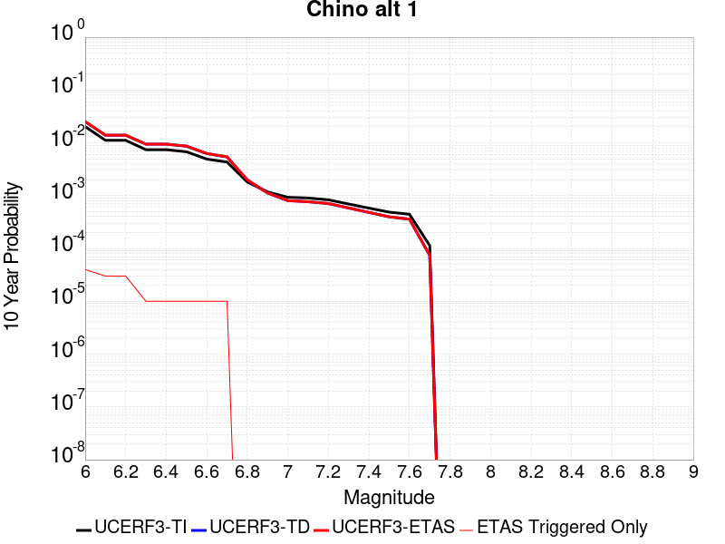 |

| Magnitude | 1 wk TI Prob | 1 wk TD Prob | 1 wk ETAS Prob | 1 wk ETAS/TD Gain | 1 wk ETAS Triggered Only | 1 mo TI Prob | 1 mo TD Prob | 1 mo ETAS Prob | 1 mo ETAS/TD Gain | 1 mo ETAS Triggered Only | 1 yr TI Prob | 1 yr TD Prob | 1 yr ETAS Prob | 1 yr ETAS/TD Gain | 1 yr ETAS Triggered Only | 10 yr TI Prob | 10 yr TD Prob | 10 yr ETAS Prob | 10 yr ETAS/TD Gain | 10 yr ETAS Triggered Only |
|-----|-----|-----|-----|-----|-----|-----|-----|-----|-----|-----|-----|-----|-----|-----|-----|-----|-----|-----|-----|-----|
| 6.0 | 3.939946E-5 | 4.895037E-5 | 4.895037E-5 | 1.0 | 0.0 | 1.6884391E-4 | 2.0977337E-4 | 2.1977127E-4 | 1.0476605 | 1.0E-5 | 0.0020537362 | 0.0025514876 | 0.0025714368 | 1.0078186 | 2.0E-5 | 0.020348595 | 0.025278764 | 0.025317753 | 1.0015423 | 4.0E-5 |
| 6.1 | 2.1505624E-5 | 2.6880154E-5 | 2.6880154E-5 | 1.0 | 0.0 | 9.2163704E-5 | 1.151962E-4 | 1.2519505E-4 | 1.0867984 | 1.0E-5 | 0.0011215154 | 0.0014017228 | 0.0014216948 | 1.0142481 | 2.0E-5 | 0.011158722 | 0.013945717 | 0.013975299 | 1.0021212 | 3.0E-5 |
| 6.2 | 2.1505624E-5 | 2.6880154E-5 | 2.6880154E-5 | 1.0 | 0.0 | 9.2163704E-5 | 1.151962E-4 | 1.2519505E-4 | 1.0867984 | 1.0E-5 | 0.0011215154 | 0.0014017228 | 0.0014216948 | 1.0142481 | 2.0E-5 | 0.011158722 | 0.013945717 | 0.013975299 | 1.0021212 | 3.0E-5 |
| 6.3 | 1.4290785E-5 | 1.8166014E-5 | 1.8166014E-5 | 1.0 | 0.0 | 6.1244784E-5 | 7.785228E-5 | 7.785228E-5 | 1.0 | 0.0 | 7.454001E-4 | 9.4748475E-4 | 9.4748475E-4 | 1.0 | 0.0 | 0.007429048 | 0.009444912 | 0.0094548175 | 1.0010488 | 1.0E-5 |
| 6.4 | 1.4290785E-5 | 1.8166014E-5 | 1.8166014E-5 | 1.0 | 0.0 | 6.1244784E-5 | 7.785228E-5 | 7.785228E-5 | 1.0 | 0.0 | 7.454001E-4 | 9.4748475E-4 | 9.4748475E-4 | 1.0 | 0.0 | 0.007429048 | 0.009444912 | 0.0094548175 | 1.0010488 | 1.0E-5 |
| 6.5 | 1.3017944E-5 | 1.6652937E-5 | 1.6652937E-5 | 1.0 | 0.0 | 5.5789995E-5 | 7.136803E-5 | 7.136803E-5 | 1.0 | 0.0 | 6.790315E-4 | 8.686031E-4 | 8.686031E-4 | 1.0 | 0.0 | 0.0067696036 | 0.008662385 | 0.008672298 | 1.0011444 | 1.0E-5 |
| 6.6 | 9.470016E-6 | 1.2040057E-5 | 1.2040057E-5 | 1.0 | 0.0 | 4.058515E-5 | 5.1599414E-5 | 5.1599414E-5 | 1.0 | 0.0 | 4.940122E-4 | 6.2807574E-4 | 6.2807574E-4 | 1.0 | 0.0 | 0.004929154 | 0.0062722242 | 0.0062821615 | 1.0015843 | 1.0E-5 |
| 6.7 | 8.314155E-6 | 1.0408293E-5 | 1.0408293E-5 | 1.0 | 0.0 | 3.5631605E-5 | 4.460639E-5 | 4.460639E-5 | 1.0 | 0.0 | 4.3372845E-4 | 5.429797E-4 | 5.429797E-4 | 1.0 | 0.0 | 0.004328829 | 0.005426062 | 0.0054360074 | 1.001833 | 1.0E-5 |
| 6.8 | 3.4856364E-6 | 3.8135372E-6 | 3.8135372E-6 | 1.0 | 0.0 | 1.4938357E-5 | 1.634364E-5 | 1.634364E-5 | 1.0 | 0.0 | 1.8185932E-4 | 1.9896773E-4 | 1.9896773E-4 | 1.0 | 0.0 | 0.0018171056 | 0.001989573 | 0.001989573 | 1.0 | 0.0 |
| 6.9 | 2.2645952E-6 | 2.152999E-6 | 2.152999E-6 | 1.0 | 0.0 | 9.705372E-6 | 9.227107E-6 | 9.227107E-6 | 1.0 | 0.0 | 1.18156495E-4 | 1.1233445E-4 | 1.1233445E-4 | 1.0 | 0.0 | 0.0011809369 | 0.0011233927 | 0.0011233927 | 1.0 | 0.0 |
| 7.0 | 1.7864003E-6 | 1.5431575E-6 | 1.5431575E-6 | 1.0 | 0.0 | 7.655979E-6 | 6.613516E-6 | 6.613516E-6 | 1.0 | 0.0 | 9.3207556E-5 | 8.0516635E-5 | 8.0516635E-5 | 1.0 | 0.0 | 9.316847E-4 | 8.0532173E-4 | 8.0532173E-4 | 1.0 | 0.0 |
| 7.1 | 1.7315456E-6 | 1.4734279E-6 | 1.4734279E-6 | 1.0 | 0.0 | 7.420889E-6 | 6.3146763E-6 | 6.3146763E-6 | 1.0 | 0.0 | 9.034557E-5 | 7.6878525E-5 | 7.6878525E-5 | 1.0 | 0.0 | 9.0308854E-4 | 7.6895714E-4 | 7.6895714E-4 | 1.0 | 0.0 |
| 7.2 | 1.6008337E-6 | 1.3574753E-6 | 1.3574753E-6 | 1.0 | 0.0 | 6.860698E-6 | 5.817739E-6 | 5.817739E-6 | 1.0 | 0.0 | 8.352579E-5 | 7.082872E-5 | 7.082872E-5 | 1.0 | 0.0 | 8.34944E-4 | 7.084856E-4 | 7.084856E-4 | 1.0 | 0.0 |
| 7.3 | 1.3320939E-6 | 1.1218251E-6 | 1.1218251E-6 | 1.0 | 0.0 | 5.7089615E-6 | 4.8078136E-6 | 4.8078136E-6 | 1.0 | 0.0 | 6.9504385E-5 | 5.8533606E-5 | 5.8533606E-5 | 1.0 | 0.0 | 6.9482654E-4 | 5.853264E-4 | 5.853264E-4 | 1.0 | 0.0 |
| 7.4 | 1.114294E-6 | 9.2374523E-7 | 9.2374523E-7 | 1.0 | 0.0 | 4.775537E-6 | 3.958902E-6 | 3.958902E-6 | 1.0 | 0.0 | 5.8140613E-5 | 4.8198606E-5 | 4.8198606E-5 | 1.0 | 0.0 | 5.81254E-4 | 4.8189834E-4 | 4.8189834E-4 | 1.0 | 0.0 |
| 7.5 | 9.354081E-7 | 7.623702E-7 | 7.623702E-7 | 1.0 | 0.0 | 4.0088858E-6 | 3.2672967E-6 | 3.2672967E-6 | 1.0 | 0.0 | 4.8807087E-5 | 3.9778646E-5 | 3.9778646E-5 | 1.0 | 0.0 | 4.879637E-4 | 3.9771866E-4 | 3.9771866E-4 | 1.0 | 0.0 |
| 7.6 | 8.521771E-7 | 6.8809493E-7 | 6.8809493E-7 | 1.0 | 0.0 | 3.6521824E-6 | 2.9489752E-6 | 2.9489752E-6 | 1.0 | 0.0 | 4.4464414E-5 | 3.5903213E-5 | 3.5903213E-5 | 1.0 | 0.0 | 4.4455516E-4 | 3.589773E-4 | 3.589773E-4 | 1.0 | 0.0 |
| 7.7 | 2.1803626E-7 | 1.4187151E-7 | 1.4187151E-7 | 1.0 | 0.0 | 9.344408E-7 | 6.080207E-7 | 6.080207E-7 | 1.0 | 0.0 | 1.1376757E-5 | 7.402636E-6 | 7.402636E-6 | 1.0 | 0.0 | 1.13761744E-4 | 7.402486E-5 | 7.402486E-5 | 1.0 | 0.0 |

## Tin Mountain
*[(top)](#table-of-contents)*

| 1 Week | 1 Month | 1 Year | 10 Year |
|-----|-----|-----|-----|
|  |  |  |  |

| Magnitude | 1 wk TI Prob | 1 wk TD Prob | 1 wk ETAS Prob | 1 wk ETAS/TD Gain | 1 wk ETAS Triggered Only | 1 mo TI Prob | 1 mo TD Prob | 1 mo ETAS Prob | 1 mo ETAS/TD Gain | 1 mo ETAS Triggered Only | 1 yr TI Prob | 1 yr TD Prob | 1 yr ETAS Prob | 1 yr ETAS/TD Gain | 1 yr ETAS Triggered Only | 10 yr TI Prob | 10 yr TD Prob | 10 yr ETAS Prob | 10 yr ETAS/TD Gain | 10 yr ETAS Triggered Only |
|-----|-----|-----|-----|-----|-----|-----|-----|-----|-----|-----|-----|-----|-----|-----|-----|-----|-----|-----|-----|-----|
| 6.0 | 4.083776E-6 | 4.18155E-6 | 4.18155E-6 | 1.0 | 0.0 | 1.750178E-5 | 1.7920827E-5 | 2.7920647E-5 | 1.558 | 1.0E-5 | 2.1306332E-4 | 2.1816794E-4 | 2.3816357E-4 | 1.0916525 | 2.0E-5 | 0.0021285915 | 0.0021799032 | 0.0022297944 | 1.0228868 | 5.0E-5 |
| 6.1 | 4.083776E-6 | 4.18155E-6 | 4.18155E-6 | 1.0 | 0.0 | 1.750178E-5 | 1.7920827E-5 | 2.7920647E-5 | 1.558 | 1.0E-5 | 2.1306332E-4 | 2.1816794E-4 | 2.3816357E-4 | 1.0916525 | 2.0E-5 | 0.0021285915 | 0.0021799032 | 0.0022297944 | 1.0228868 | 5.0E-5 |
| 6.2 | 4.083776E-6 | 4.18155E-6 | 4.18155E-6 | 1.0 | 0.0 | 1.750178E-5 | 1.7920827E-5 | 2.7920647E-5 | 1.558 | 1.0E-5 | 2.1306332E-4 | 2.1816794E-4 | 2.3816357E-4 | 1.0916525 | 2.0E-5 | 0.0021285915 | 0.0021799032 | 0.0022297944 | 1.0228868 | 5.0E-5 |
| 6.3 | 4.083776E-6 | 4.18155E-6 | 4.18155E-6 | 1.0 | 0.0 | 1.750178E-5 | 1.7920827E-5 | 2.7920647E-5 | 1.558 | 1.0E-5 | 2.1306332E-4 | 2.1816794E-4 | 2.3816357E-4 | 1.0916525 | 2.0E-5 | 0.0021285915 | 0.0021799032 | 0.0022297944 | 1.0228868 | 5.0E-5 |
| 6.4 | 4.083776E-6 | 4.18155E-6 | 4.18155E-6 | 1.0 | 0.0 | 1.750178E-5 | 1.7920827E-5 | 2.7920647E-5 | 1.558 | 1.0E-5 | 2.1306332E-4 | 2.1816794E-4 | 2.3816357E-4 | 1.0916525 | 2.0E-5 | 0.0021285915 | 0.0021799032 | 0.0022297944 | 1.0228868 | 5.0E-5 |
| 6.5 | 2.3143427E-6 | 2.3731652E-6 | 2.3731652E-6 | 1.0 | 0.0 | 9.9185745E-6 | 1.0170673E-5 | 1.0170673E-5 | 1.0 | 0.0 | 1.2075195E-4 | 1.2382168E-4 | 1.3382045E-4 | 1.0807513 | 1.0E-5 | 0.0012068636 | 0.0012376028 | 0.0012675656 | 1.0242105 | 3.0E-5 |
| 6.6 | 2.3143427E-6 | 2.3731652E-6 | 2.3731652E-6 | 1.0 | 0.0 | 9.9185745E-6 | 1.0170673E-5 | 1.0170673E-5 | 1.0 | 0.0 | 1.2075195E-4 | 1.2382168E-4 | 1.3382045E-4 | 1.0807513 | 1.0E-5 | 0.0012068636 | 0.0012376028 | 0.0012675656 | 1.0242105 | 3.0E-5 |
| 6.7 | 1.7029532E-6 | 1.7497979E-6 | 1.7497979E-6 | 1.0 | 0.0 | 7.2983503E-6 | 7.4991153E-6 | 7.4991153E-6 | 1.0 | 0.0 | 8.885379E-5 | 9.129844E-5 | 9.129844E-5 | 1.0 | 0.0 | 8.881827E-4 | 9.1266196E-4 | 9.2265283E-4 | 1.010947 | 1.0E-5 |
| 6.8 | 1.2914646E-6 | 1.3299432E-6 | 1.3299432E-6 | 1.0 | 0.0 | 5.534837E-6 | 5.6997465E-6 | 5.6997465E-6 | 1.0 | 0.0 | 6.738455E-5 | 6.939264E-5 | 6.939264E-5 | 1.0 | 0.0 | 6.736412E-4 | 6.937531E-4 | 7.0374616E-4 | 1.0144043 | 1.0E-5 |
| 6.9 | 5.8708974E-7 | 6.117028E-7 | 6.117028E-7 | 1.0 | 0.0 | 2.5160964E-6 | 2.621581E-6 | 2.621581E-6 | 1.0 | 0.0 | 3.0633044E-5 | 3.1917323E-5 | 3.1917323E-5 | 1.0 | 0.0 | 3.0628822E-4 | 3.191315E-4 | 3.191315E-4 | 1.0 | 0.0 |
| 7.0 | 4.6248786E-7 | 4.832044E-7 | 4.832044E-7 | 1.0 | 0.0 | 1.9820893E-6 | 2.0708746E-6 | 2.0708746E-6 | 1.0 | 0.0 | 2.413167E-5 | 2.5212645E-5 | 2.5212645E-5 | 1.0 | 0.0 | 2.412905E-4 | 2.5210154E-4 | 2.5210154E-4 | 1.0 | 0.0 |
| 7.1 | 3.804606E-7 | 3.9871725E-7 | 3.9871725E-7 | 1.0 | 0.0 | 1.6305444E-6 | 1.7087873E-6 | 1.7087873E-6 | 1.0 | 0.0 | 1.9851697E-5 | 2.080432E-5 | 2.080432E-5 | 1.0 | 0.0 | 1.9849923E-4 | 2.080271E-4 | 2.080271E-4 | 1.0 | 0.0 |
| 7.2 | 3.5864858E-7 | 3.7617107E-7 | 3.7617107E-7 | 1.0 | 0.0 | 1.5370645E-6 | 1.6121609E-6 | 1.6121609E-6 | 1.0 | 0.0 | 1.87136E-5 | 1.9627916E-5 | 1.9627916E-5 | 1.0 | 0.0 | 1.8712023E-4 | 1.9626514E-4 | 1.9626514E-4 | 1.0 | 0.0 |
| 7.3 | 3.342063E-7 | 3.50637E-7 | 3.50637E-7 | 1.0 | 0.0 | 1.4323119E-6 | 1.5027293E-6 | 1.5027293E-6 | 1.0 | 0.0 | 1.7438259E-5 | 1.829561E-5 | 1.829561E-5 | 1.0 | 0.0 | 1.743689E-4 | 1.8294434E-4 | 1.8294434E-4 | 1.0 | 0.0 |
| 7.4 | 2.971242E-7 | 3.116602E-7 | 3.116602E-7 | 1.0 | 0.0 | 1.2733886E-6 | 1.3356861E-6 | 1.3356861E-6 | 1.0 | 0.0 | 1.5503398E-5 | 1.626189E-5 | 1.626189E-5 | 1.0 | 0.0 | 1.5502315E-4 | 1.6261027E-4 | 1.6261027E-4 | 1.0 | 0.0 |
| 7.5 | 1.4326713E-7 | 1.501262E-7 | 1.501262E-7 | 1.0 | 0.0 | 6.140018E-7 | 6.43398E-7 | 6.43398E-7 | 1.0 | 0.0 | 7.4754466E-6 | 7.833371E-6 | 7.833371E-6 | 1.0 | 0.0 | 7.475195E-5 | 7.83337E-5 | 7.83337E-5 | 1.0 | 0.0 |

## Camp Rock 2011
*[(top)](#table-of-contents)*

| 1 Week | 1 Month | 1 Year | 10 Year |
|-----|-----|-----|-----|
|  |  |  |  |

| Magnitude | 1 wk TI Prob | 1 wk TD Prob | 1 wk ETAS Prob | 1 wk ETAS/TD Gain | 1 wk ETAS Triggered Only | 1 mo TI Prob | 1 mo TD Prob | 1 mo ETAS Prob | 1 mo ETAS/TD Gain | 1 mo ETAS Triggered Only | 1 yr TI Prob | 1 yr TD Prob | 1 yr ETAS Prob | 1 yr ETAS/TD Gain | 1 yr ETAS Triggered Only | 10 yr TI Prob | 10 yr TD Prob | 10 yr ETAS Prob | 10 yr ETAS/TD Gain | 10 yr ETAS Triggered Only |
|-----|-----|-----|-----|-----|-----|-----|-----|-----|-----|-----|-----|-----|-----|-----|-----|-----|-----|-----|-----|-----|
| 6.0 | 1.6710783E-5 | 4.2503107E-6 | 4.2503107E-6 | 1.0 | 0.0 | 7.161568E-5 | 1.8215493E-5 | 2.821531E-5 | 1.5489732 | 1.0E-5 | 8.7157206E-4 | 2.2175159E-4 | 2.4174714E-4 | 1.090171 | 2.0E-5 | 0.008681616 | 0.0022153559 | 0.0022652452 | 1.0225197 | 5.0E-5 |
| 6.1 | 1.6710783E-5 | 4.2503107E-6 | 4.2503107E-6 | 1.0 | 0.0 | 7.161568E-5 | 1.8215493E-5 | 2.821531E-5 | 1.5489732 | 1.0E-5 | 8.7157206E-4 | 2.2175159E-4 | 2.4174714E-4 | 1.090171 | 2.0E-5 | 0.008681616 | 0.0022153559 | 0.0022652452 | 1.0225197 | 5.0E-5 |
| 6.2 | 1.6710783E-5 | 4.2503107E-6 | 4.2503107E-6 | 1.0 | 0.0 | 7.161568E-5 | 1.8215493E-5 | 2.821531E-5 | 1.5489732 | 1.0E-5 | 8.7157206E-4 | 2.2175159E-4 | 2.4174714E-4 | 1.090171 | 2.0E-5 | 0.008681616 | 0.0022153559 | 0.0022652452 | 1.0225197 | 5.0E-5 |
| 6.3 | 1.6710783E-5 | 4.2503107E-6 | 4.2503107E-6 | 1.0 | 0.0 | 7.161568E-5 | 1.8215493E-5 | 2.821531E-5 | 1.5489732 | 1.0E-5 | 8.7157206E-4 | 2.2175159E-4 | 2.4174714E-4 | 1.090171 | 2.0E-5 | 0.008681616 | 0.0022153559 | 0.0022652452 | 1.0225197 | 5.0E-5 |
| 6.4 | 7.982846E-6 | 3.6821327E-6 | 3.6821327E-6 | 1.0 | 0.0 | 3.421175E-5 | 1.5780475E-5 | 2.5780319E-5 | 1.6336845 | 1.0E-5 | 4.1644843E-4 | 1.921107E-4 | 2.1210685E-4 | 1.1040866 | 2.0E-5 | 0.0041566887 | 0.0019194811 | 0.0019693852 | 1.0259987 | 5.0E-5 |
| 6.5 | 7.982846E-6 | 3.6821327E-6 | 3.6821327E-6 | 1.0 | 0.0 | 3.421175E-5 | 1.5780475E-5 | 2.5780319E-5 | 1.6336845 | 1.0E-5 | 4.1644843E-4 | 1.921107E-4 | 2.1210685E-4 | 1.1040866 | 2.0E-5 | 0.0041566887 | 0.0019194811 | 0.0019693852 | 1.0259987 | 5.0E-5 |
| 6.6 | 7.048869E-6 | 3.4243997E-6 | 3.4243997E-6 | 1.0 | 0.0 | 3.0209088E-5 | 1.4675918E-5 | 2.467577E-5 | 1.6813784 | 1.0E-5 | 3.677336E-4 | 1.7866497E-4 | 1.986614E-4 | 1.1119213 | 2.0E-5 | 0.0036712566 | 0.0017852448 | 0.0018351555 | 1.0279573 | 5.0E-5 |
| 6.7 | 6.987307E-6 | 3.3623767E-6 | 3.3623767E-6 | 1.0 | 0.0 | 2.9945259E-5 | 1.4410108E-5 | 2.4409963E-5 | 1.6939473 | 1.0E-5 | 3.6452254E-4 | 1.7542925E-4 | 1.9542575E-4 | 1.113986 | 2.0E-5 | 0.0036392517 | 0.0017529388 | 0.0018028511 | 1.0284735 | 5.0E-5 |
| 6.8 | 6.3737602E-6 | 3.117947E-6 | 3.117947E-6 | 1.0 | 0.0 | 2.731583E-5 | 1.3362564E-5 | 2.336243E-5 | 1.7483494 | 1.0E-5 | 3.3251947E-4 | 1.6267736E-4 | 1.826741E-4 | 1.1229228 | 2.0E-5 | 0.0033202237 | 0.0016256113 | 0.00167553 | 1.0307077 | 5.0E-5 |
| 6.9 | 6.112211E-6 | 2.9331534E-6 | 2.9331534E-6 | 1.0 | 0.0 | 2.6194928E-5 | 1.2570598E-5 | 2.2570473E-5 | 1.7954971 | 1.0E-5 | 3.1887658E-4 | 1.5303657E-4 | 1.730335E-4 | 1.1306677 | 2.0E-5 | 0.003184194 | 0.0015293396 | 0.0015792631 | 1.0326438 | 5.0E-5 |
| 7.0 | 5.5140117E-6 | 2.6419564E-6 | 2.6419564E-6 | 1.0 | 0.0 | 2.3631264E-5 | 1.1322622E-5 | 2.1322508E-5 | 1.8831776 | 1.0E-5 | 2.8767265E-4 | 1.3784446E-4 | 1.578417E-4 | 1.145071 | 2.0E-5 | 0.0028730053 | 0.0013776148 | 0.0014275459 | 1.0362446 | 5.0E-5 |
| 7.1 | 4.8151105E-6 | 2.1342985E-6 | 2.1342985E-6 | 1.0 | 0.0 | 2.0636026E-5 | 9.146962E-6 | 9.146962E-6 | 1.0 | 0.0 | 2.5121463E-4 | 1.1135879E-4 | 1.1135879E-4 | 1.0 | 0.0 | 0.0025093083 | 0.0011130519 | 0.0011330296 | 1.0179486 | 2.0E-5 |
| 7.2 | 3.818335E-6 | 1.293763E-6 | 1.293763E-6 | 1.0 | 0.0 | 1.6364189E-5 | 5.5446876E-6 | 5.5446876E-6 | 1.0 | 0.0 | 1.9921579E-4 | 6.750456E-5 | 6.750456E-5 | 1.0 | 0.0 | 0.0019903728 | 6.748488E-4 | 6.948353E-4 | 1.0296162 | 2.0E-5 |
| 7.3 | 2.7166698E-6 | 7.383734E-7 | 7.383734E-7 | 1.0 | 0.0 | 1.1642818E-5 | 3.1644536E-6 | 3.1644536E-6 | 1.0 | 0.0 | 1.4174209E-4 | 3.8526563E-5 | 3.8526563E-5 | 1.0 | 0.0 | 0.0014165172 | 3.8520084E-4 | 3.9519698E-4 | 1.0259504 | 1.0E-5 |
| 7.4 | 2.0893426E-6 | 5.461961E-7 | 5.461961E-7 | 1.0 | 0.0 | 8.954295E-6 | 2.3408381E-6 | 2.3408381E-6 | 1.0 | 0.0 | 1.0901308E-4 | 2.8499337E-5 | 2.8499337E-5 | 1.0 | 0.0 | 0.0010895962 | 2.8495738E-4 | 2.8495738E-4 | 1.0 | 0.0 |
| 7.5 | 1.1681728E-6 | 3.6031287E-7 | 3.6031287E-7 | 1.0 | 0.0 | 5.0064455E-6 | 1.5441972E-6 | 1.5441972E-6 | 1.0 | 0.0 | 6.0951766E-5 | 1.8800443E-5 | 1.8800443E-5 | 1.0 | 0.0 | 6.093505E-4 | 1.8798899E-4 | 1.8798899E-4 | 1.0 | 0.0 |
| 7.6 | 1.3154387E-7 | 7.1198265E-8 | 7.1198265E-8 | 1.0 | 0.0 | 5.6375933E-7 | 3.051354E-7 | 3.051354E-7 | 1.0 | 0.0 | 6.863748E-6 | 3.7150185E-6 | 3.7150185E-6 | 1.0 | 0.0 | 6.863536E-5 | 3.7149723E-5 | 3.7149723E-5 | 1.0 | 0.0 |

## Santa Rosa Island
*[(top)](#table-of-contents)*

| 1 Week | 1 Month | 1 Year | 10 Year |
|-----|-----|-----|-----|
|  |  | 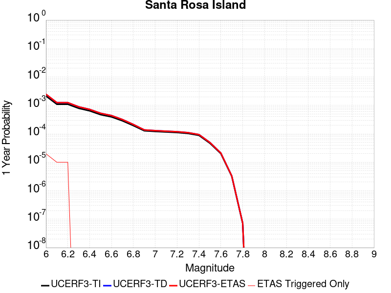 | 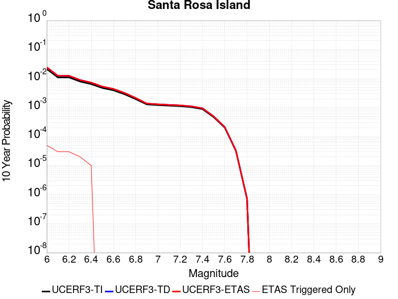 |

| Magnitude | 1 wk TI Prob | 1 wk TD Prob | 1 wk ETAS Prob | 1 wk ETAS/TD Gain | 1 wk ETAS Triggered Only | 1 mo TI Prob | 1 mo TD Prob | 1 mo ETAS Prob | 1 mo ETAS/TD Gain | 1 mo ETAS Triggered Only | 1 yr TI Prob | 1 yr TD Prob | 1 yr ETAS Prob | 1 yr ETAS/TD Gain | 1 yr ETAS Triggered Only | 10 yr TI Prob | 10 yr TD Prob | 10 yr ETAS Prob | 10 yr ETAS/TD Gain | 10 yr ETAS Triggered Only |
|-----|-----|-----|-----|-----|-----|-----|-----|-----|-----|-----|-----|-----|-----|-----|-----|-----|-----|-----|-----|-----|
| 6.0 | 4.1143165E-5 | 4.7092042E-5 | 5.709157E-5 | 1.2123401 | 1.0E-5 | 1.7631594E-4 | 2.0180854E-4 | 2.1180652E-4 | 1.049542 | 1.0E-5 | 0.002144533 | 0.0024544473 | 0.0024743981 | 1.0081285 | 2.0E-5 | 0.021239553 | 0.024294013 | 0.0243428 | 1.0020081 | 5.0E-5 |
| 6.1 | 2.1061249E-5 | 2.3865383E-5 | 3.3865144E-5 | 1.419007 | 1.0E-5 | 9.0259375E-5 | 1.0227637E-4 | 1.12275346E-4 | 1.0977643 | 1.0E-5 | 0.0010983539 | 0.0012445324 | 0.00125452 | 1.0080252 | 1.0E-5 | 0.01092941 | 0.012378667 | 0.012408296 | 1.0023935 | 3.0E-5 |
| 6.2 | 2.1061249E-5 | 2.3865383E-5 | 3.3865144E-5 | 1.419007 | 1.0E-5 | 9.0259375E-5 | 1.0227637E-4 | 1.12275346E-4 | 1.0977643 | 1.0E-5 | 0.0010983539 | 0.0012445324 | 0.00125452 | 1.0080252 | 1.0E-5 | 0.01092941 | 0.012378667 | 0.012408296 | 1.0023935 | 3.0E-5 |
| 6.3 | 1.5158236E-5 | 1.7074708E-5 | 1.7074708E-5 | 1.0 | 0.0 | 6.496225E-5 | 7.317533E-5 | 7.317533E-5 | 1.0 | 0.0 | 7.906284E-4 | 8.905574E-4 | 8.905574E-4 | 1.0 | 0.0 | 0.007878214 | 0.008871138 | 0.008890961 | 1.0022345 | 2.0E-5 |
| 6.4 | 1.2341918E-5 | 1.3853143E-5 | 1.3853143E-5 | 1.0 | 0.0 | 5.2892858E-5 | 5.9369308E-5 | 5.9369308E-5 | 1.0 | 0.0 | 6.437803E-4 | 7.225897E-4 | 7.225897E-4 | 1.0 | 0.0 | 0.006419184 | 0.0072032386 | 0.0072131664 | 1.0013783 | 1.0E-5 |
| 6.5 | 9.061158E-6 | 1.0117188E-5 | 1.0117188E-5 | 1.0 | 0.0 | 3.883296E-5 | 4.335869E-5 | 4.335869E-5 | 1.0 | 0.0 | 4.726887E-4 | 5.277695E-4 | 5.277695E-4 | 1.0 | 0.0 | 0.004716845 | 0.0052656992 | 0.0052656992 | 1.0 | 0.0 |
| 6.6 | 7.5461685E-6 | 8.400861E-6 | 8.400861E-6 | 1.0 | 0.0 | 3.2340322E-5 | 3.6003217E-5 | 3.6003217E-5 | 1.0 | 0.0 | 3.936723E-4 | 4.382553E-4 | 4.382553E-4 | 1.0 | 0.0 | 0.003929756 | 0.0043743397 | 0.0043743397 | 1.0 | 0.0 |
| 6.7 | 5.5023775E-6 | 6.0874677E-6 | 6.0874677E-6 | 1.0 | 0.0 | 2.3581404E-5 | 2.6088905E-5 | 2.6088905E-5 | 1.0 | 0.0 | 2.8706578E-4 | 3.1758935E-4 | 3.1758935E-4 | 1.0 | 0.0 | 0.0028669522 | 0.0031716768 | 0.0031716768 | 1.0 | 0.0 |
| 6.8 | 3.7351679E-6 | 4.0831915E-6 | 4.0831915E-6 | 1.0 | 0.0 | 1.6007763E-5 | 1.749929E-5 | 1.749929E-5 | 1.0 | 0.0 | 1.948771E-4 | 2.1303551E-4 | 2.1303551E-4 | 1.0 | 0.0 | 0.0019470629 | 0.002128558 | 0.002128558 | 1.0 | 0.0 |
| 6.9 | 2.456366E-6 | 2.6292953E-6 | 2.6292953E-6 | 1.0 | 0.0 | 1.0527241E-5 | 1.126836E-5 | 1.126836E-5 | 1.0 | 0.0 | 1.2816161E-4 | 1.3718367E-4 | 1.3718367E-4 | 1.0 | 0.0 | 0.0012808773 | 0.0013709929 | 0.0013709929 | 1.0 | 0.0 |
| 7.0 | 2.3245157E-6 | 2.482801E-6 | 2.482801E-6 | 1.0 | 0.0 | 9.962172E-6 | 1.0640532E-5 | 1.0640532E-5 | 1.0 | 0.0 | 1.2128269E-4 | 1.295408E-4 | 1.295408E-4 | 1.0 | 0.0 | 0.0012121652 | 0.0012946551 | 0.0012946551 | 1.0 | 0.0 |
| 7.1 | 2.2248344E-6 | 2.3732712E-6 | 2.3732712E-6 | 1.0 | 0.0 | 9.53497E-6 | 1.0171123E-5 | 1.0171123E-5 | 1.0 | 0.0 | 1.1608207E-4 | 1.238264E-4 | 1.238264E-4 | 1.0 | 0.0 | 0.0011602144 | 0.001237576 | 0.001237576 | 1.0 | 0.0 |
| 7.2 | 2.1350402E-6 | 2.2761742E-6 | 2.2761742E-6 | 1.0 | 0.0 | 9.150141E-6 | 9.7549955E-6 | 9.7549955E-6 | 1.0 | 0.0 | 1.1139726E-4 | 1.1876062E-4 | 1.1876062E-4 | 1.0 | 0.0 | 0.0011134144 | 0.0011869734 | 0.0011869734 | 1.0 | 0.0 |
| 7.3 | 1.9793572E-6 | 2.1087376E-6 | 2.1087376E-6 | 1.0 | 0.0 | 8.482932E-6 | 9.037415E-6 | 9.037415E-6 | 1.0 | 0.0 | 1.032748E-4 | 1.10024994E-4 | 1.10024994E-4 | 1.0 | 0.0 | 0.0010322682 | 0.001099707 | 0.001099707 | 1.0 | 0.0 |
| 7.4 | 1.6951194E-6 | 1.804589E-6 | 1.804589E-6 | 1.0 | 0.0 | 7.264777E-6 | 7.73393E-6 | 7.73393E-6 | 1.0 | 0.0 | 8.844508E-5 | 9.4156545E-5 | 9.4156545E-5 | 1.0 | 0.0 | 8.840988E-4 | 9.411682E-4 | 9.411682E-4 | 1.0 | 0.0 |
| 7.5 | 8.987207E-7 | 9.51229E-7 | 9.51229E-7 | 1.0 | 0.0 | 3.8516546E-6 | 4.0766895E-6 | 4.0766895E-6 | 1.0 | 0.0 | 4.6892885E-5 | 4.9632577E-5 | 4.9632577E-5 | 1.0 | 0.0 | 4.688299E-4 | 4.9621606E-4 | 4.9621606E-4 | 1.0 | 0.0 |
| 7.6 | 3.8783037E-7 | 4.052958E-7 | 4.052958E-7 | 1.0 | 0.0 | 1.6621291E-6 | 1.7369808E-6 | 1.7369808E-6 | 1.0 | 0.0 | 2.0236233E-5 | 2.1147544E-5 | 2.1147544E-5 | 1.0 | 0.0 | 2.023439E-4 | 2.1145596E-4 | 2.1145596E-4 | 1.0 | 0.0 |
| 7.7 | 6.181804E-8 | 6.3390665E-8 | 6.3390665E-8 | 1.0 | 0.0 | 2.6493444E-7 | 2.7167425E-7 | 2.7167425E-7 | 1.0 | 0.0 | 3.225572E-6 | 3.307629E-6 | 3.307629E-6 | 1.0 | 0.0 | 3.225525E-5 | 3.3075805E-5 | 3.3075805E-5 | 1.0 | 0.0 |
| 7.8 | 1.3704449E-9 | 1.3964188E-9 | 1.3964188E-9 | 1.0 | 0.0 | 5.873335E-9 | 5.984652E-9 | 5.984652E-9 | 1.0 | 0.0 | 7.1507856E-8 | 7.286314E-8 | 7.286314E-8 | 1.0 | 0.0 | 7.1507833E-7 | 7.286312E-7 | 7.286312E-7 | 1.0 | 0.0 |

## San Jacinto (Borrego)
*[(top)](#table-of-contents)*

| 1 Week | 1 Month | 1 Year | 10 Year |
|-----|-----|-----|-----|
|  |  |  |  |

| Magnitude | 1 wk TI Prob | 1 wk TD Prob | 1 wk ETAS Prob | 1 wk ETAS/TD Gain | 1 wk ETAS Triggered Only | 1 mo TI Prob | 1 mo TD Prob | 1 mo ETAS Prob | 1 mo ETAS/TD Gain | 1 mo ETAS Triggered Only | 1 yr TI Prob | 1 yr TD Prob | 1 yr ETAS Prob | 1 yr ETAS/TD Gain | 1 yr ETAS Triggered Only | 10 yr TI Prob | 10 yr TD Prob | 10 yr ETAS Prob | 10 yr ETAS/TD Gain | 10 yr ETAS Triggered Only |
|-----|-----|-----|-----|-----|-----|-----|-----|-----|-----|-----|-----|-----|-----|-----|-----|-----|-----|-----|-----|-----|
| 6.0 | 3.543992E-5 | 2.7934115E-5 | 2.7934115E-5 | 1.0 | 0.0 | 1.5187653E-4 | 1.1971221E-4 | 1.1971221E-4 | 1.0 | 0.0 | 0.0018475284 | 0.001456534 | 0.0014665194 | 1.0068556 | 1.0E-5 | 0.018322436 | 0.014873597 | 0.014922853 | 1.0033116 | 5.0E-5 |
| 6.1 | 3.542281E-5 | 2.7934115E-5 | 2.7934115E-5 | 1.0 | 0.0 | 1.5180321E-4 | 1.1971221E-4 | 1.1971221E-4 | 1.0 | 0.0 | 0.0018466372 | 0.001456534 | 0.0014665194 | 1.0068556 | 1.0E-5 | 0.018313672 | 0.014873597 | 0.014922853 | 1.0033116 | 5.0E-5 |
| 6.2 | 3.4688688E-5 | 2.7934115E-5 | 2.7934115E-5 | 1.0 | 0.0 | 1.4865733E-4 | 1.1971221E-4 | 1.1971221E-4 | 1.0 | 0.0 | 0.0018084005 | 0.0014565339 | 0.0014665194 | 1.0068556 | 1.0E-5 | 0.017937548 | 0.014873596 | 0.014922853 | 1.0033116 | 5.0E-5 |
| 6.3 | 3.2087122E-5 | 2.7779462E-5 | 2.7779462E-5 | 1.0 | 0.0 | 1.3750899E-4 | 1.1904947E-4 | 1.1904947E-4 | 1.0 | 0.0 | 0.0016728862 | 0.0014484759 | 0.0014584614 | 1.0068938 | 1.0E-5 | 0.016603488 | 0.01479463 | 0.01484389 | 1.0033296 | 5.0E-5 |
| 6.4 | 3.1828724E-5 | 2.7746448E-5 | 2.7746448E-5 | 1.0 | 0.0 | 1.364017E-4 | 1.18908E-4 | 1.18908E-4 | 1.0 | 0.0 | 0.0016594254 | 0.0014467557 | 0.0014567412 | 1.006902 | 1.0E-5 | 0.016470885 | 0.014777708 | 0.014826969 | 1.0033334 | 5.0E-5 |
| 6.5 | 3.1563577E-5 | 2.7486154E-5 | 2.7486154E-5 | 1.0 | 0.0 | 1.3526545E-4 | 1.1779256E-4 | 1.1779256E-4 | 1.0 | 0.0 | 0.0016456128 | 0.0014331931 | 0.0014431787 | 1.0069674 | 1.0E-5 | 0.0163348 | 0.014644288 | 0.014693556 | 1.0033643 | 5.0E-5 |
| 6.6 | 3.1467625E-5 | 2.7330374E-5 | 2.7330374E-5 | 1.0 | 0.0 | 1.3485427E-4 | 1.1712498E-4 | 1.1712498E-4 | 1.0 | 0.0 | 0.0016406142 | 0.001425076 | 0.0014350618 | 1.0070071 | 1.0E-5 | 0.016285548 | 0.014564533 | 0.014613804 | 1.003383 | 5.0E-5 |
| 6.7 | 3.1223695E-5 | 2.6948383E-5 | 2.6948383E-5 | 1.0 | 0.0 | 1.3380898E-4 | 1.1548802E-4 | 1.1548802E-4 | 1.0 | 0.0 | 0.0016279068 | 0.0014051719 | 0.0014151578 | 1.0071065 | 1.0E-5 | 0.01616033 | 0.014368899 | 0.014418181 | 1.0034298 | 5.0E-5 |
| 6.8 | 3.1015585E-5 | 2.6769376E-5 | 2.6769376E-5 | 1.0 | 0.0 | 1.3291716E-4 | 1.14720926E-4 | 1.14720926E-4 | 1.0 | 0.0 | 0.001617065 | 0.0013958444 | 0.0014058305 | 1.0071541 | 1.0E-5 | 0.016053487 | 0.014276173 | 0.0143254595 | 1.0034523 | 5.0E-5 |
| 6.9 | 2.6641965E-5 | 2.2191349E-5 | 2.2191349E-5 | 1.0 | 0.0 | 1.1417485E-4 | 9.510233E-5 | 9.510233E-5 | 1.0 | 0.0 | 0.0013891924 | 0.0011572598 | 0.0011672482 | 1.0086311 | 1.0E-5 | 0.0138054015 | 0.011886145 | 0.011935551 | 1.0041566 | 5.0E-5 |
| 7.0 | 2.3854353E-5 | 2.048587E-5 | 2.048587E-5 | 1.0 | 0.0 | 1.02228936E-4 | 8.779365E-5 | 8.779365E-5 | 1.0 | 0.0 | 0.0012439266 | 0.0010683661 | 0.0010783554 | 1.0093501 | 1.0E-5 | 0.012369866 | 0.010986375 | 0.011035825 | 1.0045011 | 5.0E-5 |
| 7.1 | 2.3672901E-5 | 2.032235E-5 | 2.032235E-5 | 1.0 | 0.0 | 1.0145135E-4 | 8.709289E-5 | 8.709289E-5 | 1.0 | 0.0 | 0.0012344702 | 0.0010598428 | 0.0010698321 | 1.0094254 | 1.0E-5 | 0.0122763505 | 0.010901547 | 0.010951002 | 1.0045365 | 5.0E-5 |
| 7.2 | 2.2717244E-5 | 1.9549674E-5 | 1.9549674E-5 | 1.0 | 0.0 | 9.735599E-5 | 8.378164E-5 | 8.378164E-5 | 1.0 | 0.0 | 0.0011846646 | 0.0010195666 | 0.0010295563 | 1.009798 | 1.0E-5 | 0.01178369 | 0.010498884 | 0.010548359 | 1.0047125 | 5.0E-5 |
| 7.3 | 2.1016205E-5 | 1.8391213E-5 | 1.8391213E-5 | 1.0 | 0.0 | 9.006634E-5 | 7.881711E-5 | 7.881711E-5 | 1.0 | 0.0 | 0.001096006 | 9.5917797E-4 | 9.691684E-4 | 1.0104156 | 1.0E-5 | 0.010906163 | 0.009894462 | 0.009943968 | 1.0050033 | 5.0E-5 |
| 7.4 | 2.0683625E-5 | 1.8193714E-5 | 1.8193714E-5 | 1.0 | 0.0 | 8.86411E-5 | 7.797074E-5 | 7.797074E-5 | 1.0 | 0.0 | 0.001078671 | 9.488824E-4 | 9.588729E-4 | 1.0105287 | 1.0E-5 | 0.010734501 | 0.009791178 | 0.009840688 | 1.0050566 | 5.0E-5 |
| 7.5 | 1.9993966E-5 | 1.7788683E-5 | 1.7788683E-5 | 1.0 | 0.0 | 8.568561E-5 | 7.6234996E-5 | 7.6234996E-5 | 1.0 | 0.0 | 0.001042723 | 9.2776783E-4 | 9.377586E-4 | 1.0107685 | 1.0E-5 | 0.010378438 | 0.00957807 | 0.009627591 | 1.0051702 | 5.0E-5 |
| 7.6 | 1.788966E-5 | 1.6441732E-5 | 1.6441732E-5 | 1.0 | 0.0 | 7.666772E-5 | 7.046267E-5 | 7.046267E-5 | 1.0 | 0.0 | 9.3302975E-4 | 8.575471E-4 | 8.6753856E-4 | 1.0116512 | 1.0E-5 | 0.00929122 | 0.0088698575 | 0.008919414 | 1.0055871 | 5.0E-5 |
| 7.7 | 1.5125781E-5 | 1.4243621E-5 | 1.4243621E-5 | 1.0 | 0.0 | 6.4823165E-5 | 6.1042665E-5 | 6.1042665E-5 | 1.0 | 0.0 | 7.889362E-4 | 7.4294186E-4 | 7.5293443E-4 | 1.01345 | 1.0E-5 | 0.007861412 | 0.0077174758 | 0.00776709 | 1.0064288 | 5.0E-5 |
| 7.8 | 1.250089E-5 | 1.2636515E-5 | 1.2636515E-5 | 1.0 | 0.0 | 5.3574146E-5 | 5.415537E-5 | 5.415537E-5 | 1.0 | 0.0 | 6.5207E-4 | 6.591428E-4 | 6.691362E-4 | 1.0151613 | 1.0E-5 | 0.006501599 | 0.00687092 | 0.006920576 | 1.0072271 | 5.0E-5 |
| 7.9 | 9.561E-6 | 9.759914E-6 | 9.759914E-6 | 1.0 | 0.0 | 4.0975072E-5 | 4.1827538E-5 | 4.1827538E-5 | 1.0 | 0.0 | 4.987573E-4 | 5.091318E-4 | 5.1912677E-4 | 1.0196313 | 1.0E-5 | 0.0049763937 | 0.0053551346 | 0.0053949202 | 1.0074295 | 4.0E-5 |
| 8.0 | 8.01699E-6 | 8.2982915E-6 | 8.2982915E-6 | 1.0 | 0.0 | 3.4358076E-5 | 3.5563622E-5 | 3.5563622E-5 | 1.0 | 0.0 | 4.1822926E-4 | 4.329016E-4 | 4.428973E-4 | 1.0230899 | 1.0E-5 | 0.0041744304 | 0.0045759073 | 0.004615724 | 1.0087014 | 4.0E-5 |
| 8.1 | 6.541947E-6 | 6.466171E-6 | 6.466171E-6 | 1.0 | 0.0 | 2.8036617E-5 | 2.7711869E-5 | 2.7711869E-5 | 1.0 | 0.0 | 3.4129233E-4 | 3.3734026E-4 | 3.473369E-4 | 1.0296336 | 1.0E-5 | 0.0034076865 | 0.0035827826 | 0.0036126752 | 1.0083433 | 3.0E-5 |
| 8.2 | 1.7968189E-6 | 7.978815E-7 | 7.978815E-7 | 1.0 | 0.0 | 7.70063E-6 | 3.419488E-6 | 3.419488E-6 | 1.0 | 0.0 | 9.3751136E-5 | 4.163149E-5 | 4.163149E-5 | 1.0 | 0.0 | 9.371159E-4 | 4.7162327E-4 | 4.7162327E-4 | 1.0 | 0.0 |
| 8.3 | 1.5167889E-7 | 4.9030522E-8 | 4.9030522E-8 | 1.0 | 0.0 | 6.500522E-7 | 2.1013079E-7 | 2.1013079E-7 | 1.0 | 0.0 | 7.9143565E-6 | 2.55834E-6 | 2.55834E-6 | 1.0 | 0.0 | 7.914075E-5 | 2.9725656E-5 | 2.9725656E-5 | 1.0 | 0.0 |

## San Diego Trough north alt1
*[(top)](#table-of-contents)*

| 1 Week | 1 Month | 1 Year | 10 Year |
|-----|-----|-----|-----|
| 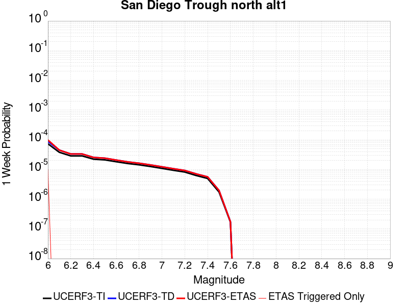 | 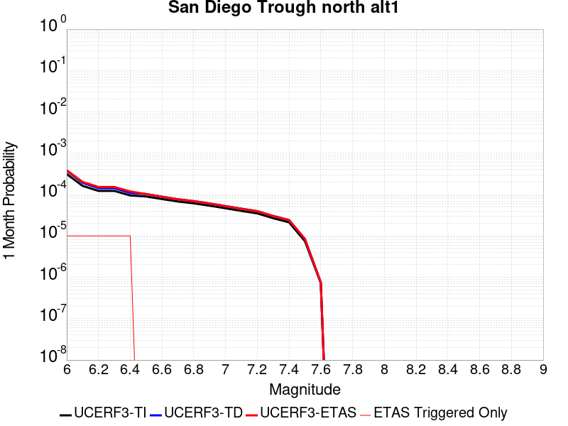 |  |  |

| Magnitude | 1 wk TI Prob | 1 wk TD Prob | 1 wk ETAS Prob | 1 wk ETAS/TD Gain | 1 wk ETAS Triggered Only | 1 mo TI Prob | 1 mo TD Prob | 1 mo ETAS Prob | 1 mo ETAS/TD Gain | 1 mo ETAS Triggered Only | 1 yr TI Prob | 1 yr TD Prob | 1 yr ETAS Prob | 1 yr ETAS/TD Gain | 1 yr ETAS Triggered Only | 10 yr TI Prob | 10 yr TD Prob | 10 yr ETAS Prob | 10 yr ETAS/TD Gain | 10 yr ETAS Triggered Only |
|-----|-----|-----|-----|-----|-----|-----|-----|-----|-----|-----|-----|-----|-----|-----|-----|-----|-----|-----|-----|-----|
| 6.0 | 7.329252E-5 | 8.821339E-5 | 9.8212506E-5 | 1.1133515 | 1.0E-5 | 3.14073E-4 | 3.7800625E-4 | 3.880025E-4 | 1.0264446 | 1.0E-5 | 0.0038171355 | 0.0045931544 | 0.0046130624 | 1.0043343 | 2.0E-5 | 0.03752231 | 0.045046188 | 0.045084387 | 1.0008479 | 4.0E-5 |
| 6.1 | 3.7940346E-5 | 4.488612E-5 | 4.488612E-5 | 1.0 | 0.0 | 1.6259136E-4 | 1.9235547E-4 | 2.0235353E-4 | 1.051977 | 1.0E-5 | 0.0019777524 | 0.002339501 | 0.0023494775 | 1.0042645 | 1.0E-5 | 0.019602431 | 0.023157248 | 0.023176786 | 1.0008436 | 2.0E-5 |
| 6.2 | 2.8645263E-5 | 3.329751E-5 | 3.329751E-5 | 1.0 | 0.0 | 1.2275964E-4 | 1.4269596E-4 | 1.5269454E-4 | 1.0700691 | 1.0E-5 | 0.0014935739 | 0.0017359565 | 0.0017459391 | 1.0057505 | 1.0E-5 | 0.0148357535 | 0.01722662 | 0.017236447 | 1.0005705 | 1.0E-5 |
| 6.3 | 2.8645263E-5 | 3.329751E-5 | 3.329751E-5 | 1.0 | 0.0 | 1.2275964E-4 | 1.4269596E-4 | 1.5269454E-4 | 1.0700691 | 1.0E-5 | 0.0014935739 | 0.0017359565 | 0.0017459391 | 1.0057505 | 1.0E-5 | 0.0148357535 | 0.01722662 | 0.017236447 | 1.0005705 | 1.0E-5 |
| 6.4 | 2.2204576E-5 | 2.5448817E-5 | 2.5448817E-5 | 1.0 | 0.0 | 9.5159E-5 | 1.0906186E-4 | 1.19060765E-4 | 1.0916811 | 1.0E-5 | 0.001157945 | 0.0013270293 | 0.0013370161 | 1.0075257 | 1.0E-5 | 0.011519298 | 0.013192211 | 0.01320208 | 1.000748 | 1.0E-5 |
| 6.5 | 2.1004838E-5 | 2.4025157E-5 | 2.4025157E-5 | 1.0 | 0.0 | 9.0017624E-5 | 1.0296095E-4 | 1.0296095E-4 | 1.0 | 0.0 | 0.0010954136 | 0.001252838 | 0.001252838 | 1.0 | 0.0 | 0.010900296 | 0.012458827 | 0.012458827 | 1.0 | 0.0 |
| 6.6 | 1.820557E-5 | 2.0705167E-5 | 2.0705167E-5 | 1.0 | 0.0 | 7.802154E-5 | 8.873344E-5 | 8.873344E-5 | 1.0 | 0.0 | 9.4949827E-4 | 0.0010797997 | 0.0010797997 | 1.0 | 0.0 | 0.009454516 | 0.010746201 | 0.010746201 | 1.0 | 0.0 |
| 6.7 | 1.5884485E-5 | 1.7983964E-5 | 1.7983964E-5 | 1.0 | 0.0 | 6.807459E-5 | 7.707187E-5 | 7.707187E-5 | 1.0 | 0.0 | 8.284929E-4 | 9.379488E-4 | 9.379488E-4 | 1.0 | 0.0 | 0.008254109 | 0.009340268 | 0.009340268 | 1.0 | 0.0 |
| 6.8 | 1.4331171E-5 | 1.6201348E-5 | 1.6201348E-5 | 1.0 | 0.0 | 6.141786E-5 | 6.9432506E-5 | 6.9432506E-5 | 1.0 | 0.0 | 7.4750587E-4 | 8.4501493E-4 | 8.4501493E-4 | 1.0 | 0.0 | 0.0074499645 | 0.008418285 | 0.008418285 | 1.0 | 0.0 |
| 6.9 | 1.2574203E-5 | 1.4206081E-5 | 1.4206081E-5 | 1.0 | 0.0 | 5.3888325E-5 | 6.088179E-5 | 6.088179E-5 | 1.0 | 0.0 | 6.558929E-4 | 7.4098515E-4 | 7.4098515E-4 | 1.0 | 0.0 | 0.0065396037 | 0.0073853307 | 0.0073853307 | 1.0 | 0.0 |
| 7.0 | 1.0883844E-5 | 1.22894735E-5 | 1.22894735E-5 | 1.0 | 0.0 | 4.664421E-5 | 5.2668114E-5 | 5.2668114E-5 | 1.0 | 0.0 | 5.677453E-4 | 6.410466E-4 | 6.410466E-4 | 1.0 | 0.0 | 0.00566297 | 0.0063921027 | 0.0063921027 | 1.0 | 0.0 |
| 7.1 | 9.393088E-6 | 1.0607203E-5 | 1.0607203E-5 | 1.0 | 0.0 | 4.025547E-5 | 4.5458655E-5 | 4.5458655E-5 | 1.0 | 0.0 | 4.900001E-4 | 5.5331935E-4 | 5.5331935E-4 | 1.0 | 0.0 | 0.0048892107 | 0.005519513 | 0.005519513 | 1.0 | 0.0 |
| 7.2 | 8.190791E-6 | 9.258787E-6 | 9.258787E-6 | 1.0 | 0.0 | 3.510292E-5 | 3.9679915E-5 | 3.9679915E-5 | 1.0 | 0.0 | 4.2729423E-4 | 4.8299658E-4 | 4.8299658E-4 | 1.0 | 0.0 | 0.0042647356 | 0.004819548 | 0.004819548 | 1.0 | 0.0 |
| 7.3 | 6.268162E-6 | 7.08984E-6 | 7.08984E-6 | 1.0 | 0.0 | 2.6863276E-5 | 3.0384675E-5 | 3.0384675E-5 | 1.0 | 0.0 | 3.2701128E-4 | 3.6987104E-4 | 3.6987104E-4 | 1.0 | 0.0 | 0.003265305 | 0.0036926004 | 0.0036926004 | 1.0 | 0.0 |
| 7.4 | 4.985186E-6 | 5.6427807E-6 | 5.6427807E-6 | 1.0 | 0.0 | 2.1364907E-5 | 2.4183124E-5 | 2.4183124E-5 | 1.0 | 0.0 | 2.600867E-4 | 2.9439016E-4 | 2.9439016E-4 | 1.0 | 0.0 | 0.002597825 | 0.002940043 | 0.002940043 | 1.0 | 0.0 |
| 7.5 | 1.7489613E-6 | 1.9697113E-6 | 1.9697113E-6 | 1.0 | 0.0 | 7.495527E-6 | 8.441594E-6 | 8.441594E-6 | 1.0 | 0.0 | 9.125422E-5 | 1.0277178E-4 | 1.0277178E-4 | 1.0 | 0.0 | 9.1216754E-4 | 0.0010272645 | 0.0010272645 | 1.0 | 0.0 |
| 7.6 | 1.6988751E-7 | 1.7533898E-7 | 1.7533898E-7 | 1.0 | 0.0 | 7.2808916E-7 | 7.5145255E-7 | 7.5145255E-7 | 1.0 | 0.0 | 8.864449E-6 | 9.148898E-6 | 9.148898E-6 | 1.0 | 0.0 | 8.8640954E-5 | 9.148542E-5 | 9.148542E-5 | 1.0 | 0.0 |

## Cleghorn
*[(top)](#table-of-contents)*

| 1 Week | 1 Month | 1 Year | 10 Year |
|-----|-----|-----|-----|
|  |  |  |  |

| Magnitude | 1 wk TI Prob | 1 wk TD Prob | 1 wk ETAS Prob | 1 wk ETAS/TD Gain | 1 wk ETAS Triggered Only | 1 mo TI Prob | 1 mo TD Prob | 1 mo ETAS Prob | 1 mo ETAS/TD Gain | 1 mo ETAS Triggered Only | 1 yr TI Prob | 1 yr TD Prob | 1 yr ETAS Prob | 1 yr ETAS/TD Gain | 1 yr ETAS Triggered Only | 10 yr TI Prob | 10 yr TD Prob | 10 yr ETAS Prob | 10 yr ETAS/TD Gain | 10 yr ETAS Triggered Only |
|-----|-----|-----|-----|-----|-----|-----|-----|-----|-----|-----|-----|-----|-----|-----|-----|-----|-----|-----|-----|-----|
| 6.0 | 7.9267165E-6 | 9.832575E-6 | 9.832575E-6 | 1.0 | 0.0 | 3.39712E-5 | 4.213899E-5 | 4.213899E-5 | 1.0 | 0.0 | 4.1352084E-4 | 5.12932E-4 | 5.229269E-4 | 1.0194857 | 1.0E-5 | 0.004127522 | 0.005132577 | 0.0051823203 | 1.0096917 | 5.0E-5 |
| 6.1 | 7.9267165E-6 | 9.832575E-6 | 9.832575E-6 | 1.0 | 0.0 | 3.39712E-5 | 4.213899E-5 | 4.213899E-5 | 1.0 | 0.0 | 4.1352084E-4 | 5.12932E-4 | 5.229269E-4 | 1.0194857 | 1.0E-5 | 0.004127522 | 0.005132577 | 0.0051823203 | 1.0096917 | 5.0E-5 |
| 6.2 | 7.9267165E-6 | 9.832575E-6 | 9.832575E-6 | 1.0 | 0.0 | 3.39712E-5 | 4.213899E-5 | 4.213899E-5 | 1.0 | 0.0 | 4.1352084E-4 | 5.12932E-4 | 5.229269E-4 | 1.0194857 | 1.0E-5 | 0.004127522 | 0.005132577 | 0.0051823203 | 1.0096917 | 5.0E-5 |
| 6.3 | 7.9267165E-6 | 9.832575E-6 | 9.832575E-6 | 1.0 | 0.0 | 3.39712E-5 | 4.213899E-5 | 4.213899E-5 | 1.0 | 0.0 | 4.1352084E-4 | 5.12932E-4 | 5.229269E-4 | 1.0194857 | 1.0E-5 | 0.004127522 | 0.005132577 | 0.0051823203 | 1.0096917 | 5.0E-5 |
| 6.4 | 4.3445207E-6 | 6.0924144E-6 | 6.0924144E-6 | 1.0 | 0.0 | 1.8619241E-5 | 2.6110092E-5 | 2.6110092E-5 | 1.0 | 0.0 | 2.2666567E-4 | 3.1784503E-4 | 3.2784184E-4 | 1.0314518 | 1.0E-5 | 0.0022643462 | 0.0031880767 | 0.003217981 | 1.0093801 | 3.0E-5 |
| 6.5 | 4.3445207E-6 | 6.0924144E-6 | 6.0924144E-6 | 1.0 | 0.0 | 1.8619241E-5 | 2.6110092E-5 | 2.6110092E-5 | 1.0 | 0.0 | 2.2666567E-4 | 3.1784503E-4 | 3.2784184E-4 | 1.0314518 | 1.0E-5 | 0.0022643462 | 0.0031880767 | 0.003217981 | 1.0093801 | 3.0E-5 |
| 6.6 | 4.040109E-6 | 5.7748202E-6 | 5.7748202E-6 | 1.0 | 0.0 | 1.7314638E-5 | 2.4749E-5 | 2.4749E-5 | 1.0 | 0.0 | 2.1078532E-4 | 3.0127834E-4 | 3.1127533E-4 | 1.0331819 | 1.0E-5 | 0.002105855 | 0.0030228654 | 0.0030527748 | 1.0098944 | 3.0E-5 |
| 6.7 | 3.3632055E-6 | 5.0683134E-6 | 5.0683134E-6 | 1.0 | 0.0 | 1.4413658E-5 | 2.1721164E-5 | 2.1721164E-5 | 1.0 | 0.0 | 1.7547216E-4 | 2.6442338E-4 | 2.7442074E-4 | 1.0378082 | 1.0E-5 | 0.0017533366 | 0.0026551976 | 0.0026751445 | 1.0075125 | 2.0E-5 |
| 6.8 | 3.2902772E-6 | 4.99022E-6 | 4.99022E-6 | 1.0 | 0.0 | 1.4101111E-5 | 2.1386484E-5 | 2.1386484E-5 | 1.0 | 0.0 | 1.716675E-4 | 2.6034965E-4 | 2.7034705E-4 | 1.0383999 | 1.0E-5 | 0.0017153495 | 0.0026145563 | 0.0026345039 | 1.0076295 | 2.0E-5 |
| 6.9 | 3.031547E-6 | 4.6919777E-6 | 4.6919777E-6 | 1.0 | 0.0 | 1.299228E-5 | 2.0108322E-5 | 2.0108322E-5 | 1.0 | 0.0 | 1.5816953E-4 | 2.447916E-4 | 2.5478913E-4 | 1.0408411 | 1.0E-5 | 0.00158057 | 0.0024593272 | 0.0024792782 | 1.0081123 | 2.0E-5 |
| 7.0 | 2.8259715E-6 | 4.371534E-6 | 4.371534E-6 | 1.0 | 0.0 | 1.211125E-5 | 1.8735012E-5 | 1.8735012E-5 | 1.0 | 0.0 | 1.4744449E-4 | 2.2807514E-4 | 2.3807285E-4 | 1.0438352 | 1.0E-5 | 0.001473467 | 0.002292517 | 0.0023124712 | 1.0087041 | 2.0E-5 |
| 7.1 | 2.5962665E-6 | 4.066747E-6 | 4.066747E-6 | 1.0 | 0.0 | 1.1126809E-5 | 1.74288E-5 | 1.74288E-5 | 1.0 | 0.0 | 1.3546048E-4 | 2.1217519E-4 | 2.2217307E-4 | 1.0471208 | 1.0E-5 | 0.0013537793 | 0.0021338374 | 0.0021537947 | 1.0093528 | 2.0E-5 |
| 7.2 | 2.3247253E-6 | 3.6772897E-6 | 3.6772897E-6 | 1.0 | 0.0 | 9.96307E-6 | 1.5759719E-5 | 1.5759719E-5 | 1.0 | 0.0 | 1.21293626E-4 | 1.9185786E-4 | 2.0185595E-4 | 1.0521119 | 1.0E-5 | 0.0012122744 | 0.0019310551 | 0.0019510165 | 1.010337 | 2.0E-5 |
| 7.3 | 2.056928E-6 | 3.2359856E-6 | 3.2359856E-6 | 1.0 | 0.0 | 8.815376E-6 | 1.3868437E-5 | 1.3868437E-5 | 1.0 | 0.0 | 1.0732192E-4 | 1.688353E-4 | 1.7883361E-4 | 1.0592194 | 1.0E-5 | 0.001072701 | 0.0017012694 | 0.0017112524 | 1.005868 | 1.0E-5 |
| 7.4 | 1.8055999E-6 | 2.8263637E-6 | 2.8263637E-6 | 1.0 | 0.0 | 7.738263E-6 | 1.21129315E-5 | 1.21129315E-5 | 1.0 | 0.0 | 9.4209274E-5 | 1.474651E-4 | 1.5746363E-4 | 1.0678027 | 1.0E-5 | 9.4169343E-4 | 0.001488009 | 0.0014979942 | 1.0067104 | 1.0E-5 |
| 7.5 | 1.4683443E-6 | 2.425593E-6 | 2.425593E-6 | 1.0 | 0.0 | 6.292889E-6 | 1.0395358E-5 | 1.0395358E-5 | 1.0 | 0.0 | 7.661323E-5 | 1.2655623E-4 | 1.2655623E-4 | 1.0 | 0.0 | 7.658682E-4 | 0.0012792206 | 0.0012792206 | 1.0 | 0.0 |
| 7.6 | 9.804088E-7 | 1.901101E-6 | 1.901101E-6 | 1.0 | 0.0 | 4.201745E-6 | 8.147551E-6 | 8.147551E-6 | 1.0 | 0.0 | 5.1155046E-5 | 9.919196E-5 | 9.919196E-5 | 1.0 | 0.0 | 5.114327E-4 | 0.0010058905 | 0.0010058905 | 1.0 | 0.0 |
| 7.7 | 7.3434086E-7 | 1.6292396E-6 | 1.6292396E-6 | 1.0 | 0.0 | 3.1471714E-6 | 6.982437E-6 | 6.982437E-6 | 1.0 | 0.0 | 3.831614E-5 | 8.500788E-5 | 8.500788E-5 | 1.0 | 0.0 | 3.8309532E-4 | 8.642013E-4 | 8.642013E-4 | 1.0 | 0.0 |
| 7.8 | 6.434184E-7 | 1.522801E-6 | 1.522801E-6 | 1.0 | 0.0 | 2.7575045E-6 | 6.5262734E-6 | 6.5262734E-6 | 1.0 | 0.0 | 3.35721E-5 | 7.9454505E-5 | 7.9454505E-5 | 1.0 | 0.0 | 3.3567028E-4 | 8.083677E-4 | 8.083677E-4 | 1.0 | 0.0 |
| 7.9 | 3.4943926E-7 | 7.5788125E-7 | 7.5788125E-7 | 1.0 | 0.0 | 1.497596E-6 | 3.2480586E-6 | 3.2480586E-6 | 1.0 | 0.0 | 1.8233079E-5 | 3.9544404E-5 | 3.9544404E-5 | 1.0 | 0.0 | 1.8231584E-4 | 4.0423044E-4 | 4.0423044E-4 | 1.0 | 0.0 |
| 8.0 | 6.717524E-8 | 5.8440865E-8 | 5.8440865E-8 | 1.0 | 0.0 | 2.8789387E-7 | 2.5046083E-7 | 2.5046083E-7 | 1.0 | 0.0 | 3.505102E-6 | 3.0493563E-6 | 3.0493563E-6 | 1.0 | 0.0 | 3.5050467E-5 | 3.276327E-5 | 3.276327E-5 | 1.0 | 0.0 |
| 8.1 | 3.1984914E-8 | 1.2973213E-8 | 1.2973213E-8 | 1.0 | 0.0 | 1.370782E-7 | 5.5599482E-8 | 5.5599482E-8 | 1.0 | 0.0 | 1.6689258E-6 | 6.769235E-7 | 6.769235E-7 | 1.0 | 0.0 | 1.6689133E-5 | 7.754204E-6 | 7.754204E-6 | 1.0 | 0.0 |
| 8.2 | 1.21887656E-8 | 3.654808E-9 | 3.654808E-9 | 1.0 | 0.0 | 5.2237567E-8 | 1.5663463E-8 | 1.5663463E-8 | 1.0 | 0.0 | 6.359922E-7 | 1.9070265E-7 | 1.9070265E-7 | 1.0 | 0.0 | 6.3599036E-6 | 2.2501451E-6 | 2.2501451E-6 | 1.0 | 0.0 |

## Great Valley 09 (Laguna Seca)
*[(top)](#table-of-contents)*

| 1 Week | 1 Month | 1 Year | 10 Year |
|-----|-----|-----|-----|
|  |  | 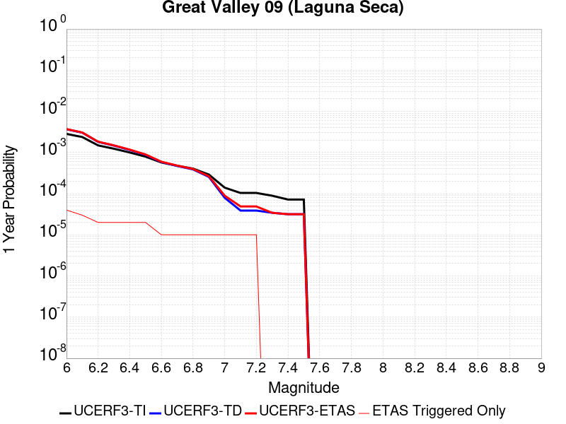 |  |

| Magnitude | 1 wk TI Prob | 1 wk TD Prob | 1 wk ETAS Prob | 1 wk ETAS/TD Gain | 1 wk ETAS Triggered Only | 1 mo TI Prob | 1 mo TD Prob | 1 mo ETAS Prob | 1 mo ETAS/TD Gain | 1 mo ETAS Triggered Only | 1 yr TI Prob | 1 yr TD Prob | 1 yr ETAS Prob | 1 yr ETAS/TD Gain | 1 yr ETAS Triggered Only | 10 yr TI Prob | 10 yr TD Prob | 10 yr ETAS Prob | 10 yr ETAS/TD Gain | 10 yr ETAS Triggered Only |
|-----|-----|-----|-----|-----|-----|-----|-----|-----|-----|-----|-----|-----|-----|-----|-----|-----|-----|-----|-----|-----|
| 6.0 | 5.4353277E-5 | 7.050538E-5 | 7.050538E-5 | 1.0 | 0.0 | 2.3292181E-4 | 3.0212724E-4 | 3.0212724E-4 | 1.0 | 0.0 | 0.0028321352 | 0.003672335 | 0.0037121882 | 1.0108522 | 4.0E-5 | 0.02796312 | 0.036116913 | 0.036165107 | 1.0013344 | 5.0E-5 |
| 6.1 | 4.5578287E-5 | 5.822371E-5 | 5.822371E-5 | 1.0 | 0.0 | 1.953209E-4 | 2.49502E-4 | 2.49502E-4 | 1.0 | 0.0 | 0.0023754383 | 0.0030335493 | 0.0030634583 | 1.0098594 | 3.0E-5 | 0.023502063 | 0.029920705 | 0.029949807 | 1.0009726 | 3.0E-5 |
| 6.2 | 2.8536782E-5 | 3.47386E-5 | 3.47386E-5 | 1.0 | 0.0 | 1.2229476E-4 | 1.488658E-4 | 1.488658E-4 | 1.0 | 0.0 | 0.0014879217 | 0.0018108767 | 0.0018308404 | 1.0110244 | 2.0E-5 | 0.014779986 | 0.017958745 | 0.017978387 | 1.0010936 | 2.0E-5 |
| 6.3 | 2.3698774E-5 | 2.8214314E-5 | 2.8214314E-5 | 1.0 | 0.0 | 1.01562226E-4 | 1.2090732E-4 | 1.2090732E-4 | 1.0 | 0.0 | 0.0012358186 | 0.0014710726 | 0.001491043 | 1.0135756 | 2.0E-5 | 0.012289686 | 0.014611831 | 0.014631539 | 1.0013487 | 2.0E-5 |
| 6.4 | 1.9191197E-5 | 2.2123912E-5 | 2.2123912E-5 | 1.0 | 0.0 | 8.2245395E-5 | 9.480767E-5 | 9.480767E-5 | 1.0 | 0.0 | 0.0010008777 | 0.0011536786 | 0.0011736555 | 1.0173159 | 2.0E-5 | 0.009963818 | 0.011477305 | 0.011497075 | 1.0017226 | 2.0E-5 |
| 6.5 | 1.5203241E-5 | 1.680269E-5 | 1.680269E-5 | 1.0 | 0.0 | 6.5155116E-5 | 7.200383E-5 | 7.200383E-5 | 1.0 | 0.0 | 7.9297484E-4 | 8.7628904E-4 | 8.962715E-4 | 1.0228035 | 2.0E-5 | 0.007901512 | 0.008729759 | 0.008749585 | 1.002271 | 2.0E-5 |
| 6.6 | 1.0984925E-5 | 1.1242844E-5 | 1.1242844E-5 | 1.0 | 0.0 | 4.70774E-5 | 4.818275E-5 | 4.818275E-5 | 1.0 | 0.0 | 5.730166E-4 | 5.864695E-4 | 5.964636E-4 | 1.0170412 | 1.0E-5 | 0.005715413 | 0.0058496143 | 0.0058595557 | 1.0016996 | 1.0E-5 |
| 6.7 | 9.134616E-6 | 9.020084E-6 | 9.020084E-6 | 1.0 | 0.0 | 3.9147766E-5 | 3.865694E-5 | 3.865694E-5 | 1.0 | 0.0 | 4.7651984E-4 | 4.7054898E-4 | 4.805443E-4 | 1.0212418 | 1.0E-5 | 0.004754993 | 0.0046957717 | 0.004705725 | 1.0021195 | 1.0E-5 |
| 6.8 | 7.785589E-6 | 7.4521E-6 | 7.4521E-6 | 1.0 | 0.0 | 3.3366385E-5 | 3.193719E-5 | 3.193719E-5 | 1.0 | 0.0 | 4.0616E-4 | 3.8876795E-4 | 3.9876407E-4 | 1.0257123 | 1.0E-5 | 0.0040541845 | 0.0038810824 | 0.0038910436 | 1.0025666 | 1.0E-5 |
| 6.9 | 5.579095E-6 | 4.8985944E-6 | 4.8985944E-6 | 1.0 | 0.0 | 2.3910188E-5 | 2.0993815E-5 | 2.0993815E-5 | 1.0 | 0.0 | 2.9106764E-4 | 2.555711E-4 | 2.6556855E-4 | 1.039118 | 1.0E-5 | 0.002906867 | 0.0025529093 | 0.0025628838 | 1.0039071 | 1.0E-5 |
| 7.0 | 2.6816688E-6 | 1.5216407E-6 | 1.5216407E-6 | 1.0 | 0.0 | 1.1492816E-5 | 6.5213017E-6 | 6.5213017E-6 | 1.0 | 0.0 | 1.3991605E-4 | 7.939404E-5 | 8.9393245E-5 | 1.125944 | 1.0E-5 | 0.0013982799 | 7.936655E-4 | 8.036576E-4 | 1.0125898 | 1.0E-5 |
| 7.1 | 1.9951021E-6 | 7.4539724E-7 | 7.4539724E-7 | 1.0 | 0.0 | 8.55041E-6 | 3.194556E-6 | 3.194556E-6 | 1.0 | 0.0 | 1.0409627E-4 | 3.8893068E-5 | 4.8892678E-5 | 1.2571052 | 1.0E-5 | 0.0010404752 | 3.8886676E-4 | 3.9886287E-4 | 1.0257057 | 1.0E-5 |
| 7.2 | 1.9951021E-6 | 7.4539724E-7 | 7.4539724E-7 | 1.0 | 0.0 | 8.55041E-6 | 3.194556E-6 | 3.194556E-6 | 1.0 | 0.0 | 1.0409627E-4 | 3.8893068E-5 | 4.8892678E-5 | 1.2571052 | 1.0E-5 | 0.0010404752 | 3.8886676E-4 | 3.9886287E-4 | 1.0257057 | 1.0E-5 |
| 7.3 | 1.7087556E-6 | 6.579003E-7 | 6.579003E-7 | 1.0 | 0.0 | 7.3232177E-6 | 2.81957E-6 | 2.81957E-6 | 1.0 | 0.0 | 8.915652E-5 | 3.4327764E-5 | 3.4327764E-5 | 1.0 | 0.0 | 8.9120766E-4 | 3.4322866E-4 | 3.4322866E-4 | 1.0 | 0.0 |
| 7.4 | 1.3804846E-6 | 6.0739524E-7 | 6.0739524E-7 | 1.0 | 0.0 | 5.916349E-6 | 2.60312E-6 | 2.60312E-6 | 1.0 | 0.0 | 7.2029165E-5 | 3.1692565E-5 | 3.1692565E-5 | 1.0 | 0.0 | 7.200583E-4 | 3.1688449E-4 | 3.1688449E-4 | 1.0 | 0.0 |
| 7.5 | 1.3804846E-6 | 6.0739524E-7 | 6.0739524E-7 | 1.0 | 0.0 | 5.916349E-6 | 2.60312E-6 | 2.60312E-6 | 1.0 | 0.0 | 7.2029165E-5 | 3.1692565E-5 | 3.1692565E-5 | 1.0 | 0.0 | 7.200583E-4 | 3.1688449E-4 | 3.1688449E-4 | 1.0 | 0.0 |

## Dry Mountain
*[(top)](#table-of-contents)*

| 1 Week | 1 Month | 1 Year | 10 Year |
|-----|-----|-----|-----|
|  |  |  | 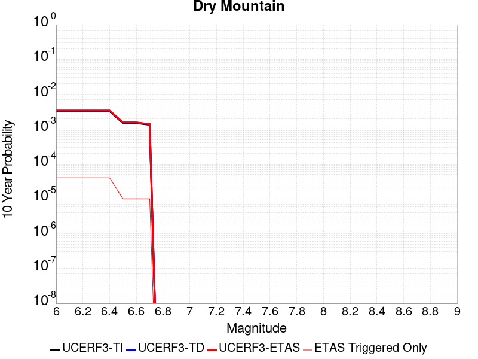 |

| Magnitude | 1 wk TI Prob | 1 wk TD Prob | 1 wk ETAS Prob | 1 wk ETAS/TD Gain | 1 wk ETAS Triggered Only | 1 mo TI Prob | 1 mo TD Prob | 1 mo ETAS Prob | 1 mo ETAS/TD Gain | 1 mo ETAS Triggered Only | 1 yr TI Prob | 1 yr TD Prob | 1 yr ETAS Prob | 1 yr ETAS/TD Gain | 1 yr ETAS Triggered Only | 10 yr TI Prob | 10 yr TD Prob | 10 yr ETAS Prob | 10 yr ETAS/TD Gain | 10 yr ETAS Triggered Only |
|-----|-----|-----|-----|-----|-----|-----|-----|-----|-----|-----|-----|-----|-----|-----|-----|-----|-----|-----|-----|-----|
| 6.0 | 6.222801E-6 | 6.439411E-6 | 6.439411E-6 | 1.0 | 0.0 | 2.6668875E-5 | 2.7597274E-5 | 4.759672E-5 | 1.7246892 | 2.0E-5 | 3.2464517E-4 | 3.359609E-4 | 3.6595084E-4 | 1.0892661 | 3.0E-5 | 0.0032417132 | 0.0033560924 | 0.003395958 | 1.0118786 | 4.0E-5 |
| 6.1 | 6.222801E-6 | 6.439411E-6 | 6.439411E-6 | 1.0 | 0.0 | 2.6668875E-5 | 2.7597274E-5 | 4.759672E-5 | 1.7246892 | 2.0E-5 | 3.2464517E-4 | 3.359609E-4 | 3.6595084E-4 | 1.0892661 | 3.0E-5 | 0.0032417132 | 0.0033560924 | 0.003395958 | 1.0118786 | 4.0E-5 |
| 6.2 | 6.222801E-6 | 6.439411E-6 | 6.439411E-6 | 1.0 | 0.0 | 2.6668875E-5 | 2.7597274E-5 | 4.759672E-5 | 1.7246892 | 2.0E-5 | 3.2464517E-4 | 3.359609E-4 | 3.6595084E-4 | 1.0892661 | 3.0E-5 | 0.0032417132 | 0.0033560924 | 0.003395958 | 1.0118786 | 4.0E-5 |
| 6.3 | 6.222801E-6 | 6.439411E-6 | 6.439411E-6 | 1.0 | 0.0 | 2.6668875E-5 | 2.7597274E-5 | 4.759672E-5 | 1.7246892 | 2.0E-5 | 3.2464517E-4 | 3.359609E-4 | 3.6595084E-4 | 1.0892661 | 3.0E-5 | 0.0032417132 | 0.0033560924 | 0.003395958 | 1.0118786 | 4.0E-5 |
| 6.4 | 6.222801E-6 | 6.439411E-6 | 6.439411E-6 | 1.0 | 0.0 | 2.6668875E-5 | 2.7597274E-5 | 4.759672E-5 | 1.7246892 | 2.0E-5 | 3.2464517E-4 | 3.359609E-4 | 3.6595084E-4 | 1.0892661 | 3.0E-5 | 0.0032417132 | 0.0033560924 | 0.003395958 | 1.0118786 | 4.0E-5 |
| 6.5 | 2.8528623E-6 | 2.952182E-6 | 2.952182E-6 | 1.0 | 0.0 | 1.22264955E-5 | 1.2652196E-5 | 2.265207E-5 | 1.7903666 | 1.0E-5 | 1.4884741E-4 | 1.5403831E-4 | 1.6403677E-4 | 1.0649089 | 1.0E-5 | 0.0014874774 | 0.0015401688 | 0.0015501534 | 1.0064828 | 1.0E-5 |
| 6.6 | 2.8528623E-6 | 2.952182E-6 | 2.952182E-6 | 1.0 | 0.0 | 1.22264955E-5 | 1.2652196E-5 | 2.265207E-5 | 1.7903666 | 1.0E-5 | 1.4884741E-4 | 1.5403831E-4 | 1.6403677E-4 | 1.0649089 | 1.0E-5 | 0.0014874774 | 0.0015401688 | 0.0015501534 | 1.0064828 | 1.0E-5 |
| 6.7 | 2.541E-6 | 2.62937E-6 | 2.62937E-6 | 1.0 | 0.0 | 1.0889954E-5 | 1.12687285E-5 | 2.1268615E-5 | 1.8874016 | 1.0E-5 | 1.3257713E-4 | 1.3719677E-4 | 1.471954E-4 | 1.072878 | 1.0E-5 | 0.0013249806 | 0.0013719677 | 0.001381954 | 1.0072788 | 1.0E-5 |

## Sierra Madre
*[(top)](#table-of-contents)*

| 1 Week | 1 Month | 1 Year | 10 Year |
|-----|-----|-----|-----|
|  |  |  |  |

| Magnitude | 1 wk TI Prob | 1 wk TD Prob | 1 wk ETAS Prob | 1 wk ETAS/TD Gain | 1 wk ETAS Triggered Only | 1 mo TI Prob | 1 mo TD Prob | 1 mo ETAS Prob | 1 mo ETAS/TD Gain | 1 mo ETAS Triggered Only | 1 yr TI Prob | 1 yr TD Prob | 1 yr ETAS Prob | 1 yr ETAS/TD Gain | 1 yr ETAS Triggered Only | 10 yr TI Prob | 10 yr TD Prob | 10 yr ETAS Prob | 10 yr ETAS/TD Gain | 10 yr ETAS Triggered Only |
|-----|-----|-----|-----|-----|-----|-----|-----|-----|-----|-----|-----|-----|-----|-----|-----|-----|-----|-----|-----|-----|
| 6.0 | 1.3379373E-5 | 1.100113E-5 | 1.100113E-5 | 1.0 | 0.0 | 5.7338908E-5 | 4.7146856E-5 | 4.7146856E-5 | 1.0 | 0.0 | 6.978776E-4 | 5.738633E-4 | 5.8385753E-4 | 1.0174158 | 1.0E-5 | 0.0069569005 | 0.005724178 | 0.0057738917 | 1.0086849 | 5.0E-5 |
| 6.1 | 1.3379373E-5 | 1.100113E-5 | 1.100113E-5 | 1.0 | 0.0 | 5.7338908E-5 | 4.7146856E-5 | 4.7146856E-5 | 1.0 | 0.0 | 6.978776E-4 | 5.738633E-4 | 5.8385753E-4 | 1.0174158 | 1.0E-5 | 0.0069569005 | 0.005724178 | 0.0057738917 | 1.0086849 | 5.0E-5 |
| 6.2 | 1.3379373E-5 | 1.100113E-5 | 1.100113E-5 | 1.0 | 0.0 | 5.7338908E-5 | 4.7146856E-5 | 4.7146856E-5 | 1.0 | 0.0 | 6.978776E-4 | 5.738633E-4 | 5.8385753E-4 | 1.0174158 | 1.0E-5 | 0.0069569005 | 0.005724178 | 0.0057738917 | 1.0086849 | 5.0E-5 |
| 6.3 | 1.3379373E-5 | 1.100113E-5 | 1.100113E-5 | 1.0 | 0.0 | 5.7338908E-5 | 4.7146856E-5 | 4.7146856E-5 | 1.0 | 0.0 | 6.978776E-4 | 5.738633E-4 | 5.8385753E-4 | 1.0174158 | 1.0E-5 | 0.0069569005 | 0.005724178 | 0.0057738917 | 1.0086849 | 5.0E-5 |
| 6.4 | 1.3379373E-5 | 1.100113E-5 | 1.100113E-5 | 1.0 | 0.0 | 5.7338908E-5 | 4.7146856E-5 | 4.7146856E-5 | 1.0 | 0.0 | 6.978776E-4 | 5.738633E-4 | 5.8385753E-4 | 1.0174158 | 1.0E-5 | 0.0069569005 | 0.005724178 | 0.0057738917 | 1.0086849 | 5.0E-5 |
| 6.5 | 1.26563245E-5 | 1.0230579E-5 | 1.0230579E-5 | 1.0 | 0.0 | 5.4240263E-5 | 4.3844608E-5 | 4.3844608E-5 | 1.0 | 0.0 | 6.601751E-4 | 5.3367845E-4 | 5.436731E-4 | 1.0187279 | 1.0E-5 | 0.006582173 | 0.00532429 | 0.005364077 | 1.0074728 | 4.0E-5 |
| 6.6 | 1.26563245E-5 | 1.0230579E-5 | 1.0230579E-5 | 1.0 | 0.0 | 5.4240263E-5 | 4.3844608E-5 | 4.3844608E-5 | 1.0 | 0.0 | 6.601751E-4 | 5.3367845E-4 | 5.436731E-4 | 1.0187279 | 1.0E-5 | 0.006582173 | 0.00532429 | 0.005364077 | 1.0074728 | 4.0E-5 |
| 6.7 | 1.2502474E-5 | 1.0066722E-5 | 1.0066722E-5 | 1.0 | 0.0 | 5.3580934E-5 | 4.3142387E-5 | 4.3142387E-5 | 1.0 | 0.0 | 6.521526E-4 | 5.2513304E-4 | 5.3512777E-4 | 1.0190328 | 1.0E-5 | 0.0065024206 | 0.0052392404 | 0.005279031 | 1.0075947 | 4.0E-5 |
| 6.8 | 1.2454966E-5 | 1.0019007E-5 | 1.0019007E-5 | 1.0 | 0.0 | 5.3377335E-5 | 4.29379E-5 | 4.29379E-5 | 1.0 | 0.0 | 6.4967526E-4 | 5.226446E-4 | 5.326394E-4 | 1.0191234 | 1.0E-5 | 0.006477792 | 0.005214473 | 0.0052542645 | 1.007631 | 4.0E-5 |
| 6.9 | 1.2225574E-5 | 9.7929815E-6 | 9.7929815E-6 | 1.0 | 0.0 | 5.2394265E-5 | 4.196925E-5 | 4.196925E-5 | 1.0 | 0.0 | 6.3771347E-4 | 5.108569E-4 | 5.2085175E-4 | 1.019565 | 1.0E-5 | 0.006358865 | 0.0050971415 | 0.005136938 | 1.0078075 | 4.0E-5 |
| 7.0 | 1.182946E-5 | 9.3995195E-6 | 9.3995195E-6 | 1.0 | 0.0 | 5.06967E-5 | 4.0283037E-5 | 4.0283037E-5 | 1.0 | 0.0 | 6.1705755E-4 | 4.903367E-4 | 5.0033175E-4 | 1.0203842 | 1.0E-5 | 0.006153469 | 0.004892859 | 0.0049326634 | 1.0081352 | 4.0E-5 |
| 7.1 | 1.14369095E-5 | 8.986527E-6 | 8.986527E-6 | 1.0 | 0.0 | 4.9014405E-5 | 3.8513124E-5 | 3.8513124E-5 | 1.0 | 0.0 | 5.9658696E-4 | 4.6879737E-4 | 4.7879267E-4 | 1.0213212 | 1.0E-5 | 0.005949879 | 0.00467839 | 0.004718203 | 1.00851 | 4.0E-5 |
| 7.2 | 1.0836419E-5 | 8.399916E-6 | 8.399916E-6 | 1.0 | 0.0 | 4.644097E-5 | 3.5999146E-5 | 3.5999146E-5 | 1.0 | 0.0 | 5.652721E-4 | 4.3820238E-4 | 4.48198E-4 | 1.0228105 | 1.0E-5 | 0.0056383642 | 0.0043736803 | 0.0044135056 | 1.0091056 | 4.0E-5 |
| 7.3 | 1.0403439E-5 | 8.021173E-6 | 8.021173E-6 | 1.0 | 0.0 | 4.4585406E-5 | 3.4376008E-5 | 3.4376008E-5 | 1.0 | 0.0 | 5.426921E-4 | 4.1844844E-4 | 4.2844424E-4 | 1.0238878 | 1.0E-5 | 0.005413687 | 0.0041769007 | 0.004206775 | 1.0071523 | 3.0E-5 |
| 7.4 | 9.768864E-6 | 7.414793E-6 | 7.414793E-6 | 1.0 | 0.0 | 4.186589E-5 | 3.17773E-5 | 3.17773E-5 | 1.0 | 0.0 | 5.09598E-4 | 3.8682084E-4 | 3.96817E-4 | 1.0258417 | 1.0E-5 | 0.0050843097 | 0.0038617672 | 0.00388169 | 1.005159 | 2.0E-5 |
| 7.5 | 8.687089E-6 | 6.4504875E-6 | 6.4504875E-6 | 1.0 | 0.0 | 3.722985E-5 | 2.7644659E-5 | 2.7644659E-5 | 1.0 | 0.0 | 4.5317915E-4 | 3.3652261E-4 | 3.4651923E-4 | 1.0297056 | 1.0E-5 | 0.004522561 | 0.0033604174 | 0.00338035 | 1.0059316 | 2.0E-5 |
| 7.6 | 6.3506063E-6 | 4.430626E-6 | 4.430626E-6 | 1.0 | 0.0 | 2.72166E-5 | 1.8988261E-5 | 1.8988261E-5 | 1.0 | 0.0 | 3.3131172E-4 | 2.3115781E-4 | 2.411555E-4 | 1.0432504 | 1.0E-5 | 0.003308182 | 0.0023093987 | 0.0023293525 | 1.0086403 | 2.0E-5 |
| 7.7 | 4.62223E-6 | 2.9332562E-6 | 2.9332562E-6 | 1.0 | 0.0 | 1.9809406E-5 | 1.2571038E-5 | 1.2571038E-5 | 1.0 | 0.0 | 2.4115283E-4 | 1.5304166E-4 | 1.6304012E-4 | 1.0653317 | 1.0E-5 | 0.0024089129 | 0.0015295637 | 0.0015395484 | 1.0065278 | 1.0E-5 |
| 7.8 | 3.2145008E-6 | 1.9496579E-6 | 1.9496579E-6 | 1.0 | 0.0 | 1.3776359E-5 | 8.35565E-6 | 8.35565E-6 | 1.0 | 0.0 | 1.6771426E-4 | 1.01725294E-4 | 1.01725294E-4 | 1.0 | 0.0 | 0.0016758774 | 0.0010169316 | 0.0010169316 | 1.0 | 0.0 |
| 7.9 | 1.0391769E-6 | 5.6034094E-7 | 5.6034094E-7 | 1.0 | 0.0 | 4.4536077E-6 | 2.401459E-6 | 2.401459E-6 | 1.0 | 0.0 | 5.4221324E-5 | 2.9237375E-5 | 2.9237375E-5 | 1.0 | 0.0 | 5.4208096E-4 | 2.9233572E-4 | 2.9233572E-4 | 1.0 | 0.0 |
| 8.0 | 1.210983E-7 | 6.6141716E-8 | 6.6141716E-8 | 1.0 | 0.0 | 5.1899264E-7 | 2.8346446E-7 | 2.8346446E-7 | 1.0 | 0.0 | 6.3187167E-6 | 3.4511747E-6 | 3.4511747E-6 | 1.0 | 0.0 | 6.318537E-5 | 3.4511228E-5 | 3.4511228E-5 | 1.0 | 0.0 |

## Elysian Park (Upper)
*[(top)](#table-of-contents)*

| 1 Week | 1 Month | 1 Year | 10 Year |
|-----|-----|-----|-----|
|  |  |  |  |

| Magnitude | 1 wk TI Prob | 1 wk TD Prob | 1 wk ETAS Prob | 1 wk ETAS/TD Gain | 1 wk ETAS Triggered Only | 1 mo TI Prob | 1 mo TD Prob | 1 mo ETAS Prob | 1 mo ETAS/TD Gain | 1 mo ETAS Triggered Only | 1 yr TI Prob | 1 yr TD Prob | 1 yr ETAS Prob | 1 yr ETAS/TD Gain | 1 yr ETAS Triggered Only | 10 yr TI Prob | 10 yr TD Prob | 10 yr ETAS Prob | 10 yr ETAS/TD Gain | 10 yr ETAS Triggered Only |
|-----|-----|-----|-----|-----|-----|-----|-----|-----|-----|-----|-----|-----|-----|-----|-----|-----|-----|-----|-----|-----|
| 6.0 | 3.1876025E-5 | 3.703652E-5 | 3.703652E-5 | 1.0 | 0.0 | 1.3660437E-4 | 1.5872101E-4 | 1.5872101E-4 | 1.0 | 0.0 | 0.0016618895 | 0.0019311584 | 0.001941139 | 1.0051682 | 1.0E-5 | 0.016495159 | 0.019190295 | 0.019229528 | 1.0020444 | 4.0E-5 |
| 6.1 | 3.1876025E-5 | 3.703652E-5 | 3.703652E-5 | 1.0 | 0.0 | 1.3660437E-4 | 1.5872101E-4 | 1.5872101E-4 | 1.0 | 0.0 | 0.0016618895 | 0.0019311584 | 0.001941139 | 1.0051682 | 1.0E-5 | 0.016495159 | 0.019190295 | 0.019229528 | 1.0020444 | 4.0E-5 |
| 6.2 | 3.1876025E-5 | 3.703652E-5 | 3.703652E-5 | 1.0 | 0.0 | 1.3660437E-4 | 1.5872101E-4 | 1.5872101E-4 | 1.0 | 0.0 | 0.0016618895 | 0.0019311584 | 0.001941139 | 1.0051682 | 1.0E-5 | 0.016495159 | 0.019190295 | 0.019229528 | 1.0020444 | 4.0E-5 |
| 6.3 | 3.1876025E-5 | 3.703652E-5 | 3.703652E-5 | 1.0 | 0.0 | 1.3660437E-4 | 1.5872101E-4 | 1.5872101E-4 | 1.0 | 0.0 | 0.0016618895 | 0.0019311584 | 0.001941139 | 1.0051682 | 1.0E-5 | 0.016495159 | 0.019190295 | 0.019229528 | 1.0020444 | 4.0E-5 |
| 6.4 | 1.9273462E-5 | 2.120273E-5 | 2.120273E-5 | 1.0 | 0.0 | 8.259794E-5 | 9.0866655E-5 | 9.0866655E-5 | 1.0 | 0.0 | 0.001005166 | 0.0011059135 | 0.0011159024 | 1.0090322 | 1.0E-5 | 0.010006315 | 0.011020964 | 0.011050633 | 1.0026921 | 3.0E-5 |
| 6.5 | 1.9273462E-5 | 2.120273E-5 | 2.120273E-5 | 1.0 | 0.0 | 8.259794E-5 | 9.0866655E-5 | 9.0866655E-5 | 1.0 | 0.0 | 0.001005166 | 0.0011059135 | 0.0011159024 | 1.0090322 | 1.0E-5 | 0.010006315 | 0.011020964 | 0.011050633 | 1.0026921 | 3.0E-5 |
| 6.6 | 9.813258E-6 | 9.665728E-6 | 9.665728E-6 | 1.0 | 0.0 | 4.205614E-5 | 4.142393E-5 | 4.142393E-5 | 1.0 | 0.0 | 5.119132E-4 | 5.042269E-4 | 5.1422184E-4 | 1.0198224 | 1.0E-5 | 0.005107356 | 0.005031552 | 0.0050514513 | 1.0039549 | 2.0E-5 |
| 6.7 | 9.801478E-6 | 9.653297E-6 | 9.653297E-6 | 1.0 | 0.0 | 4.2005657E-5 | 4.137066E-5 | 4.137066E-5 | 1.0 | 0.0 | 5.112989E-4 | 5.0357863E-4 | 5.135736E-4 | 1.0198479 | 1.0E-5 | 0.0051012407 | 0.0050250986 | 0.005044998 | 1.00396 | 2.0E-5 |
| 6.8 | 8.102489E-6 | 7.7731065E-6 | 7.7731065E-6 | 1.0 | 0.0 | 3.4724493E-5 | 3.3312917E-5 | 3.3312917E-5 | 1.0 | 0.0 | 4.2268867E-4 | 4.0551423E-4 | 4.1551018E-4 | 1.0246501 | 1.0E-5 | 0.004218856 | 0.0040482366 | 0.004068156 | 1.0049204 | 2.0E-5 |
| 6.9 | 6.08275E-6 | 5.4815127E-6 | 5.4815127E-6 | 1.0 | 0.0 | 2.6068668E-5 | 2.349199E-5 | 2.349199E-5 | 1.0 | 0.0 | 3.173398E-4 | 2.8597823E-4 | 2.9597536E-4 | 1.0349576 | 1.0E-5 | 0.0031688702 | 0.0028561796 | 0.0028761225 | 1.0069823 | 2.0E-5 |
| 7.0 | 5.5995934E-6 | 4.982836E-6 | 4.982836E-6 | 1.0 | 0.0 | 2.3998036E-5 | 2.135484E-5 | 2.135484E-5 | 1.0 | 0.0 | 2.9213692E-4 | 2.599648E-4 | 2.699622E-4 | 1.0384568 | 1.0E-5 | 0.0029175316 | 0.0025966743 | 0.0026166225 | 1.0076822 | 2.0E-5 |
| 7.1 | 4.709881E-6 | 4.0874465E-6 | 4.0874465E-6 | 1.0 | 0.0 | 2.0185047E-5 | 1.7517514E-5 | 1.7517514E-5 | 1.0 | 0.0 | 2.4572524E-4 | 2.1325526E-4 | 2.2325313E-4 | 1.0468822 | 1.0E-5 | 0.002454537 | 0.0021305475 | 0.002150505 | 1.0093672 | 2.0E-5 |
| 7.2 | 3.6063436E-6 | 2.9779865E-6 | 2.9779865E-6 | 1.0 | 0.0 | 1.5455667E-5 | 1.2762738E-5 | 1.2762738E-5 | 1.0 | 0.0 | 1.881565E-4 | 1.5537537E-4 | 1.6537381E-4 | 1.0643502 | 1.0E-5 | 0.0018799726 | 0.0015526785 | 0.0015726475 | 1.012861 | 2.0E-5 |
| 7.3 | 2.471135E-6 | 2.0954842E-6 | 2.0954842E-6 | 1.0 | 0.0 | 1.0590536E-5 | 8.980616E-6 | 8.980616E-6 | 1.0 | 0.0 | 1.2893214E-4 | 1.0933358E-4 | 1.0933358E-4 | 1.0 | 0.0 | 0.0012885736 | 0.0010928052 | 0.0011027942 | 1.0091407 | 1.0E-5 |
| 7.4 | 1.163943E-6 | 1.0275212E-6 | 1.0275212E-6 | 1.0 | 0.0 | 4.988318E-6 | 4.403655E-6 | 4.403655E-6 | 1.0 | 0.0 | 6.0731076E-5 | 5.3613214E-5 | 5.3613214E-5 | 1.0 | 0.0 | 6.071448E-4 | 5.3600577E-4 | 5.3600577E-4 | 1.0 | 0.0 |
| 7.5 | 4.99459E-7 | 4.9176606E-7 | 4.9176606E-7 | 1.0 | 0.0 | 2.140537E-6 | 2.107567E-6 | 2.107567E-6 | 1.0 | 0.0 | 2.6060725E-5 | 2.5659343E-5 | 2.5659343E-5 | 1.0 | 0.0 | 2.605767E-4 | 2.5656537E-4 | 2.5656537E-4 | 1.0 | 0.0 |
| 7.6 | 2.4667852E-7 | 2.4778674E-7 | 2.4778674E-7 | 1.0 | 0.0 | 1.0571932E-6 | 1.0619428E-6 | 1.0619428E-6 | 1.0 | 0.0 | 1.2871251E-5 | 1.2929081E-5 | 1.2929081E-5 | 1.0 | 0.0 | 1.2870505E-4 | 1.2928365E-4 | 1.2928365E-4 | 1.0 | 0.0 |
| 7.7 | 8.2312795E-8 | 7.386629E-8 | 7.386629E-8 | 1.0 | 0.0 | 3.527691E-7 | 3.1656978E-7 | 3.1656978E-7 | 1.0 | 0.0 | 4.294955E-6 | 3.8542316E-6 | 3.8542316E-6 | 1.0 | 0.0 | 4.2948723E-5 | 3.8541762E-5 | 3.8541762E-5 | 1.0 | 0.0 |
| 7.8 | 2.7819295E-8 | 1.7567322E-8 | 1.7567322E-8 | 1.0 | 0.0 | 1.1922555E-7 | 7.528852E-8 | 7.528852E-8 | 1.0 | 0.0 | 1.45157E-6 | 9.166375E-7 | 9.166375E-7 | 1.0 | 0.0 | 1.45156055E-5 | 9.166352E-6 | 9.166352E-6 | 1.0 | 0.0 |

## Imperial
*[(top)](#table-of-contents)*

| 1 Week | 1 Month | 1 Year | 10 Year |
|-----|-----|-----|-----|
|  |  |  |  |

| Magnitude | 1 wk TI Prob | 1 wk TD Prob | 1 wk ETAS Prob | 1 wk ETAS/TD Gain | 1 wk ETAS Triggered Only | 1 mo TI Prob | 1 mo TD Prob | 1 mo ETAS Prob | 1 mo ETAS/TD Gain | 1 mo ETAS Triggered Only | 1 yr TI Prob | 1 yr TD Prob | 1 yr ETAS Prob | 1 yr ETAS/TD Gain | 1 yr ETAS Triggered Only | 10 yr TI Prob | 10 yr TD Prob | 10 yr ETAS Prob | 10 yr ETAS/TD Gain | 10 yr ETAS Triggered Only |
|-----|-----|-----|-----|-----|-----|-----|-----|-----|-----|-----|-----|-----|-----|-----|-----|-----|-----|-----|-----|-----|
| 6.0 | 2.7496446E-4 | 5.0565513E-4 | 5.0565513E-4 | 1.0 | 0.0 | 0.0011778869 | 0.002165333 | 0.002165333 | 1.0 | 0.0 | 0.0142467655 | 0.026045265 | 0.026074484 | 1.0011219 | 3.0E-5 | 0.13367249 | 0.22808637 | 0.22811724 | 1.0001354 | 4.0E-5 |
| 6.1 | 2.5356023E-4 | 4.8667885E-4 | 4.8667885E-4 | 1.0 | 0.0 | 0.001086234 | 0.0020841376 | 0.0020841376 | 1.0 | 0.0 | 0.013144928 | 0.02507692 | 0.02510617 | 1.0011663 | 3.0E-5 | 0.123940155 | 0.21951756 | 0.21954878 | 1.0001422 | 4.0E-5 |
| 6.2 | 2.4820742E-4 | 4.7763108E-4 | 4.7763108E-4 | 1.0 | 0.0 | 0.0010633124 | 0.0020454223 | 0.0020454223 | 1.0 | 0.0 | 0.01286919 | 0.024616843 | 0.024646103 | 1.0011886 | 3.0E-5 | 0.12148927 | 0.2160229 | 0.21605425 | 1.0001452 | 4.0E-5 |
| 6.3 | 2.3205351E-4 | 4.590021E-4 | 4.590021E-4 | 1.0 | 0.0 | 9.94136E-4 | 0.0019657058 | 0.0019657058 | 1.0 | 0.0 | 0.012036599 | 0.023666281 | 0.023695571 | 1.0012376 | 3.0E-5 | 0.11405133 | 0.20796864 | 0.20800032 | 1.0001523 | 4.0E-5 |
| 6.4 | 2.0304754E-4 | 3.9885996E-4 | 3.9885996E-4 | 1.0 | 0.0 | 8.6991355E-4 | 0.0017082945 | 0.0017082945 | 1.0 | 0.0 | 0.010539869 | 0.020600514 | 0.020629896 | 1.0014262 | 3.0E-5 | 0.100537635 | 0.18510117 | 0.18513377 | 1.0001761 | 4.0E-5 |
| 6.5 | 1.854992E-4 | 3.6997703E-4 | 3.6997703E-4 | 1.0 | 0.0 | 7.9475436E-4 | 0.0015846646 | 0.0015846646 | 1.0 | 0.0 | 0.009633281 | 0.019123985 | 0.01915341 | 1.0015388 | 3.0E-5 | 0.0922623 | 0.17333072 | 0.17336379 | 1.0001907 | 4.0E-5 |
| 6.6 | 1.6586106E-4 | 3.4043082E-4 | 3.4043082E-4 | 1.0 | 0.0 | 7.106394E-4 | 0.0014581835 | 0.0014581835 | 1.0 | 0.0 | 0.008617763 | 0.017610526 | 0.017639998 | 1.0016736 | 3.0E-5 | 0.08291132 | 0.16080588 | 0.16083945 | 1.0002087 | 4.0E-5 |
| 6.7 | 1.4224656E-4 | 3.077392E-4 | 3.077392E-4 | 1.0 | 0.0 | 6.094856E-4 | 0.0013182238 | 0.0013182238 | 1.0 | 0.0 | 0.0073952693 | 0.015933173 | 0.015962694 | 1.0018529 | 3.0E-5 | 0.07153955 | 0.1465114 | 0.14654554 | 1.000233 | 4.0E-5 |
| 6.8 | 1.2317259E-4 | 2.779711E-4 | 2.779711E-4 | 1.0 | 0.0 | 5.2777573E-4 | 0.0011907669 | 0.0011907669 | 1.0 | 0.0 | 0.0064067547 | 0.0144026 | 0.014432168 | 1.0020529 | 3.0E-5 | 0.06225166 | 0.13296051 | 0.13299519 | 1.0002608 | 4.0E-5 |
| 6.9 | 9.859898E-5 | 2.5018715E-4 | 2.5018715E-4 | 1.0 | 0.0 | 4.2249862E-4 | 0.0010717943 | 0.0010717943 | 1.0 | 0.0 | 0.0051317946 | 0.012971984 | 0.013001595 | 1.0022826 | 3.0E-5 | 0.05014893 | 0.11942433 | 0.119459555 | 1.0002949 | 4.0E-5 |
| 7.0 | 7.3191884E-5 | 2.1270063E-4 | 2.1270063E-4 | 1.0 | 0.0 | 3.136418E-4 | 9.1125886E-4 | 9.1125886E-4 | 1.0 | 0.0 | 0.003811904 | 0.011038825 | 0.011068493 | 1.0026877 | 3.0E-5 | 0.037471764 | 0.10207849 | 0.1021144 | 1.0003519 | 4.0E-5 |
| 7.1 | 7.1760296E-5 | 2.0971385E-4 | 2.0971385E-4 | 1.0 | 0.0 | 3.0750787E-4 | 8.984672E-4 | 8.984672E-4 | 1.0 | 0.0 | 0.003737482 | 0.010884652 | 0.010914326 | 1.0027262 | 3.0E-5 | 0.03675245 | 0.100714855 | 0.10075083 | 1.0003572 | 4.0E-5 |
| 7.2 | 6.46614E-5 | 1.9139807E-4 | 1.9139807E-4 | 1.0 | 0.0 | 2.7709085E-4 | 8.2002254E-4 | 8.2002254E-4 | 1.0 | 0.0 | 0.0033683628 | 0.009938694 | 0.009968395 | 1.0029885 | 3.0E-5 | 0.033177625 | 0.09252202 | 0.09255832 | 1.0003923 | 4.0E-5 |
| 7.3 | 6.088115E-5 | 1.781138E-4 | 1.781138E-4 | 1.0 | 0.0 | 2.6089314E-4 | 7.631244E-4 | 7.631244E-4 | 1.0 | 0.0 | 0.0031717476 | 0.009252035 | 0.009281757 | 1.0032126 | 3.0E-5 | 0.031268585 | 0.08657247 | 0.086609006 | 1.000422 | 4.0E-5 |
| 7.4 | 4.199346E-5 | 1.15126604E-4 | 1.15126604E-4 | 1.0 | 0.0 | 1.7995955E-4 | 4.933073E-4 | 4.933073E-4 | 1.0 | 0.0 | 0.0021888057 | 0.005989646 | 0.006009526 | 1.0033191 | 2.0E-5 | 0.02167372 | 0.057449933 | 0.057478208 | 1.0004922 | 3.0E-5 |
| 7.5 | 3.130448E-5 | 8.335176E-5 | 8.335176E-5 | 1.0 | 0.0 | 1.3415517E-4 | 3.5717324E-4 | 3.5717324E-4 | 1.0 | 0.0 | 0.0016321153 | 0.0043399734 | 0.0043598865 | 1.0045884 | 2.0E-5 | 0.016201803 | 0.042140562 | 0.0421693 | 1.0006819 | 3.0E-5 |
| 7.6 | 2.3074248E-5 | 6.0860824E-5 | 6.0860824E-5 | 1.0 | 0.0 | 9.888588E-5 | 2.6080615E-4 | 2.6080615E-4 | 1.0 | 0.0 | 0.0012032706 | 0.0031707147 | 0.0031806831 | 1.0031439 | 1.0E-5 | 0.011967761 | 0.031033779 | 0.031053158 | 1.0006244 | 2.0E-5 |
| 7.7 | 1.45864815E-5 | 4.0138115E-5 | 4.0138115E-5 | 1.0 | 0.0 | 6.2511994E-5 | 1.7200918E-4 | 1.7200918E-4 | 1.0 | 0.0 | 7.608177E-4 | 0.0020922057 | 0.0021021848 | 1.0047697 | 1.0E-5 | 0.007582182 | 0.020633917 | 0.020653505 | 1.0009493 | 2.0E-5 |
| 7.8 | 1.0352979E-5 | 3.097231E-5 | 3.097231E-5 | 1.0 | 0.0 | 4.4369157E-5 | 1.3273173E-4 | 1.3273173E-4 | 1.0 | 0.0 | 5.400606E-4 | 0.0016148133 | 0.0016247971 | 1.0061827 | 1.0E-5 | 0.0053875 | 0.016022068 | 0.016041746 | 1.0012283 | 2.0E-5 |
| 7.9 | 8.137906E-6 | 2.2158269E-5 | 2.2158269E-5 | 1.0 | 0.0 | 3.4876273E-5 | 9.496055E-5 | 9.496055E-5 | 1.0 | 0.0 | 4.2453592E-4 | 0.0011555325 | 0.001165521 | 1.008644 | 1.0E-5 | 0.004237258 | 0.011622174 | 0.011641942 | 1.0017009 | 2.0E-5 |
| 8.0 | 6.93792E-6 | 1.801665E-5 | 1.801665E-5 | 1.0 | 0.0 | 2.9733603E-5 | 7.721193E-5 | 7.721193E-5 | 1.0 | 0.0 | 3.6194647E-4 | 9.396506E-4 | 9.496412E-4 | 1.0106323 | 1.0E-5 | 0.0036135751 | 0.00950525 | 0.00952506 | 1.0020841 | 2.0E-5 |
| 8.1 | 3.4286315E-6 | 6.3835337E-6 | 6.3835337E-6 | 1.0 | 0.0 | 1.4694053E-5 | 2.7357715E-5 | 2.7357715E-5 | 1.0 | 0.0 | 1.7888541E-4 | 3.330294E-4 | 3.330294E-4 | 1.0 | 0.0 | 0.0017874148 | 0.0034878491 | 0.0034878491 | 1.0 | 0.0 |
| 8.2 | 1.4906886E-6 | 1.9381007E-6 | 1.9381007E-6 | 1.0 | 0.0 | 6.3886496E-6 | 8.3061195E-6 | 8.3061195E-6 | 1.0 | 0.0 | 7.7779034E-5 | 1.0112235E-4 | 1.0112235E-4 | 1.0 | 0.0 | 7.775182E-4 | 0.0011082698 | 0.0011082698 | 1.0 | 0.0 |
| 8.3 | 2.5758007E-8 | 1.4514695E-8 | 1.4514695E-8 | 1.0 | 0.0 | 1.10391454E-7 | 6.2205835E-8 | 6.2205835E-8 | 1.0 | 0.0 | 1.3440151E-6 | 7.57356E-7 | 7.57356E-7 | 1.0 | 0.0 | 1.344007E-5 | 7.895551E-6 | 7.895551E-6 | 1.0 | 0.0 |

## Brawley (Seismic Zone) alt 1
*[(top)](#table-of-contents)*

| 1 Week | 1 Month | 1 Year | 10 Year |
|-----|-----|-----|-----|
|  |  |  | 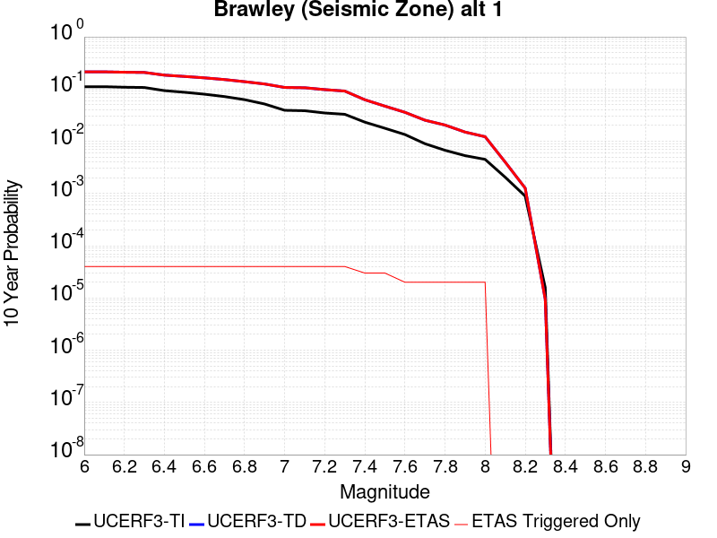 |

| Magnitude | 1 wk TI Prob | 1 wk TD Prob | 1 wk ETAS Prob | 1 wk ETAS/TD Gain | 1 wk ETAS Triggered Only | 1 mo TI Prob | 1 mo TD Prob | 1 mo ETAS Prob | 1 mo ETAS/TD Gain | 1 mo ETAS Triggered Only | 1 yr TI Prob | 1 yr TD Prob | 1 yr ETAS Prob | 1 yr ETAS/TD Gain | 1 yr ETAS Triggered Only | 10 yr TI Prob | 10 yr TD Prob | 10 yr ETAS Prob | 10 yr ETAS/TD Gain | 10 yr ETAS Triggered Only |
|-----|-----|-----|-----|-----|-----|-----|-----|-----|-----|-----|-----|-----|-----|-----|-----|-----|-----|-----|-----|-----|
| 6.0 | 2.2521618E-4 | 4.7641253E-4 | 4.7641253E-4 | 1.0 | 0.0 | 9.6485513E-4 | 0.0020402074 | 0.0020402074 | 1.0 | 0.0 | 0.011683988 | 0.02455069 | 0.024579952 | 1.001192 | 3.0E-5 | 0.11088423 | 0.21353015 | 0.21356161 | 1.0001473 | 4.0E-5 |
| 6.1 | 2.2521618E-4 | 4.7641253E-4 | 4.7641253E-4 | 1.0 | 0.0 | 9.6485513E-4 | 0.0020402074 | 0.0020402074 | 1.0 | 0.0 | 0.011683988 | 0.02455069 | 0.024579952 | 1.001192 | 3.0E-5 | 0.11088423 | 0.21353015 | 0.21356161 | 1.0001473 | 4.0E-5 |
| 6.2 | 2.198148E-4 | 4.6725658E-4 | 4.6725658E-4 | 1.0 | 0.0 | 9.417233E-4 | 0.002001028 | 0.002001028 | 1.0 | 0.0 | 0.011405343 | 0.024084855 | 0.024114134 | 1.0012156 | 3.0E-5 | 0.10837428 | 0.20996629 | 0.20999788 | 1.0001506 | 4.0E-5 |
| 6.3 | 2.1704129E-4 | 4.6161312E-4 | 4.6161312E-4 | 1.0 | 0.0 | 9.298453E-4 | 0.0019768786 | 0.0019768786 | 1.0 | 0.0 | 0.011262234 | 0.023797998 | 0.023827285 | 1.0012306 | 3.0E-5 | 0.107082725 | 0.20785725 | 0.20788893 | 1.0001525 | 4.0E-5 |
| 6.4 | 1.876142E-4 | 4.0053183E-4 | 4.0053183E-4 | 1.0 | 0.0 | 8.038131E-4 | 0.0017154501 | 0.0017154501 | 1.0 | 0.0 | 0.00974259 | 0.02068463 | 0.02071401 | 1.0014204 | 3.0E-5 | 0.093263686 | 0.184608 | 0.18464062 | 1.0001767 | 4.0E-5 |
| 6.5 | 1.7390939E-4 | 3.7485067E-4 | 3.7485067E-4 | 1.0 | 0.0 | 7.45113E-4 | 0.0016055258 | 0.0016055258 | 1.0 | 0.0 | 0.009034078 | 0.019372813 | 0.019402232 | 1.0015186 | 3.0E-5 | 0.086755216 | 0.17442966 | 0.17446269 | 1.0001893 | 4.0E-5 |
| 6.6 | 1.591791E-4 | 3.489955E-4 | 3.489955E-4 | 1.0 | 0.0 | 6.8201777E-4 | 0.0014948477 | 0.0014948477 | 1.0 | 0.0 | 0.008271996 | 0.018049458 | 0.018078918 | 1.0016321 | 3.0E-5 | 0.07970774 | 0.16383699 | 0.16387044 | 1.0002041 | 4.0E-5 |
| 6.7 | 1.4268003E-4 | 3.206533E-4 | 3.206533E-4 | 1.0 | 0.0 | 6.1134255E-4 | 0.0013735129 | 0.0013735129 | 1.0 | 0.0 | 0.007417723 | 0.016596261 | 0.016625764 | 1.0017776 | 3.0E-5 | 0.07174956 | 0.15196045 | 0.15199438 | 1.0002233 | 4.0E-5 |
| 6.8 | 1.239713E-4 | 2.9059697E-4 | 2.9059697E-4 | 1.0 | 0.0 | 5.3119735E-4 | 0.0012448273 | 0.0012448273 | 1.0 | 0.0 | 0.0064481674 | 0.015051884 | 0.015081432 | 1.0019631 | 3.0E-5 | 0.06264243 | 0.13840161 | 0.13843606 | 1.000249 | 4.0E-5 |
| 6.9 | 1.0180238E-4 | 2.625907E-4 | 2.625907E-4 | 1.0 | 0.0 | 4.3622297E-4 | 0.0011249076 | 0.0011249076 | 1.0 | 0.0 | 0.005298089 | 0.013610746 | 0.013640338 | 1.0021741 | 3.0E-5 | 0.05173543 | 0.12498065 | 0.12501565 | 1.00028 | 4.0E-5 |
| 7.0 | 7.6619996E-5 | 2.2402873E-4 | 2.2402873E-4 | 1.0 | 0.0 | 3.283301E-4 | 9.59773E-4 | 9.59773E-4 | 1.0 | 0.0 | 0.0039900932 | 0.011623339 | 0.011652989 | 1.002551 | 3.0E-5 | 0.039192066 | 0.10728151 | 0.107317224 | 1.0003328 | 4.0E-5 |
| 7.1 | 7.5127435E-5 | 2.208599E-4 | 2.208599E-4 | 1.0 | 0.0 | 3.2193496E-4 | 9.4620226E-4 | 9.4620226E-4 | 1.0 | 0.0 | 0.0039125155 | 0.011459865 | 0.011489521 | 1.0025878 | 3.0E-5 | 0.038443442 | 0.10584534 | 0.10588111 | 1.000338 | 4.0E-5 |
| 7.2 | 6.788582E-5 | 2.0213598E-4 | 2.0213598E-4 | 1.0 | 0.0 | 2.9090676E-4 | 8.660125E-4 | 8.660125E-4 | 1.0 | 0.0 | 0.0035360386 | 0.010493369 | 0.010523054 | 1.002829 | 3.0E-5 | 0.034803 | 0.09751546 | 0.097551554 | 1.0003701 | 4.0E-5 |
| 7.3 | 6.399602E-5 | 1.88444E-4 | 1.88444E-4 | 1.0 | 0.0 | 2.7423984E-4 | 8.0737006E-4 | 8.0737006E-4 | 1.0 | 0.0 | 0.0033337586 | 0.009786017 | 0.009815724 | 1.0030355 | 3.0E-5 | 0.03284188 | 0.091409855 | 0.0914462 | 1.0003976 | 4.0E-5 |
| 7.4 | 4.506759E-5 | 1.2531783E-4 | 1.2531783E-4 | 1.0 | 0.0 | 1.9313251E-4 | 5.369668E-4 | 5.369668E-4 | 1.0 | 0.0 | 0.0023488526 | 0.0065181484 | 0.006538018 | 1.0030483 | 2.0E-5 | 0.023241805 | 0.062375 | 0.06240313 | 1.000451 | 3.0E-5 |
| 7.5 | 3.43289E-5 | 9.337587E-5 | 9.337587E-5 | 1.0 | 0.0 | 1.4711556E-4 | 4.0012124E-4 | 4.0012124E-4 | 1.0 | 0.0 | 0.0017896603 | 0.004860657 | 0.0048805596 | 1.0040947 | 2.0E-5 | 0.01775316 | 0.04706493 | 0.047093518 | 1.0006074 | 3.0E-5 |
| 7.6 | 2.5980507E-5 | 7.054998E-5 | 7.054998E-5 | 1.0 | 0.0 | 1.1134028E-4 | 3.0232212E-4 | 3.0232212E-4 | 1.0 | 0.0 | 0.001354725 | 0.0036745837 | 0.003684547 | 1.0027114 | 1.0E-5 | 0.013464959 | 0.035849415 | 0.035868697 | 1.0005379 | 2.0E-5 |
| 7.7 | 1.7292105E-5 | 4.9423474E-5 | 4.9423474E-5 | 1.0 | 0.0 | 7.4106916E-5 | 2.1179771E-4 | 2.1179771E-4 | 1.0 | 0.0 | 9.018782E-4 | 0.0025755935 | 0.0025855678 | 1.0038726 | 1.0E-5 | 0.008982267 | 0.025297757 | 0.025317252 | 1.0007706 | 2.0E-5 |
| 7.8 | 1.2927471E-5 | 3.970735E-5 | 3.970735E-5 | 1.0 | 0.0 | 5.5402274E-5 | 1.7016326E-4 | 1.7016326E-4 | 1.0 | 0.0 | 6.743139E-4 | 0.0020697718 | 0.002079751 | 1.0048214 | 1.0E-5 | 0.0067227143 | 0.02043814 | 0.020457732 | 1.0009586 | 2.0E-5 |
| 7.9 | 1.0200774E-5 | 2.8757075E-5 | 2.8757075E-5 | 1.0 | 0.0 | 4.371687E-5 | 1.2323879E-4 | 1.2323879E-4 | 1.0 | 0.0 | 5.321229E-4 | 0.0014994006 | 0.0015093856 | 1.0066594 | 1.0E-5 | 0.005308505 | 0.0149969105 | 0.01501661 | 1.0013136 | 2.0E-5 |
| 8.0 | 8.650396E-6 | 2.3287128E-5 | 2.3287128E-5 | 1.0 | 0.0 | 3.70726E-5 | 9.979816E-5 | 9.979816E-5 | 1.0 | 0.0 | 4.5126543E-4 | 0.0012143662 | 0.001224354 | 1.0082247 | 1.0E-5 | 0.0045035016 | 0.012215644 | 0.0122354 | 1.0016172 | 2.0E-5 |
| 8.1 | 3.9368224E-6 | 7.3321658E-6 | 7.3321658E-6 | 1.0 | 0.0 | 1.6871985E-5 | 3.1423187E-5 | 3.1423187E-5 | 1.0 | 0.0 | 2.0539707E-4 | 3.825103E-4 | 3.825103E-4 | 1.0 | 0.0 | 0.0020520731 | 0.00400326 | 0.00400326 | 1.0 | 0.0 |
| 8.2 | 1.7101195E-6 | 2.2195122E-6 | 2.2195122E-6 | 1.0 | 0.0 | 7.329063E-6 | 9.51216E-6 | 9.51216E-6 | 1.0 | 0.0 | 8.922769E-5 | 1.15804425E-4 | 1.15804425E-4 | 1.0 | 0.0 | 8.9191867E-4 | 0.0012675166 | 0.0012675166 | 1.0 | 0.0 |
| 8.3 | 3.0346666E-8 | 1.7233086E-8 | 1.7233086E-8 | 1.0 | 0.0 | 1.3005713E-7 | 7.385608E-8 | 7.385608E-8 | 1.0 | 0.0 | 1.5834444E-6 | 8.991977E-7 | 8.991977E-7 | 1.0 | 0.0 | 1.5834332E-5 | 9.37692E-6 | 9.37692E-6 | 1.0 | 0.0 |

## San Luis Range 2011 CFM
*[(top)](#table-of-contents)*

| 1 Week | 1 Month | 1 Year | 10 Year |
|-----|-----|-----|-----|
|  |  |  | 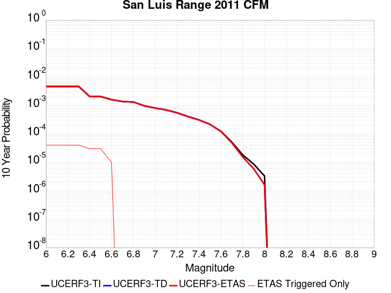 |

| Magnitude | 1 wk TI Prob | 1 wk TD Prob | 1 wk ETAS Prob | 1 wk ETAS/TD Gain | 1 wk ETAS Triggered Only | 1 mo TI Prob | 1 mo TD Prob | 1 mo ETAS Prob | 1 mo ETAS/TD Gain | 1 mo ETAS Triggered Only | 1 yr TI Prob | 1 yr TD Prob | 1 yr ETAS Prob | 1 yr ETAS/TD Gain | 1 yr ETAS Triggered Only | 10 yr TI Prob | 10 yr TD Prob | 10 yr ETAS Prob | 10 yr ETAS/TD Gain | 10 yr ETAS Triggered Only |
|-----|-----|-----|-----|-----|-----|-----|-----|-----|-----|-----|-----|-----|-----|-----|-----|-----|-----|-----|-----|-----|
| 6.0 | 8.8368415E-6 | 8.965477E-6 | 8.965477E-6 | 1.0 | 0.0 | 3.787163E-5 | 3.8422953E-5 | 3.8422953E-5 | 1.0 | 0.0 | 4.609895E-4 | 4.677069E-4 | 4.976929E-4 | 1.0641128 | 3.0E-5 | 0.0046003438 | 0.0046680085 | 0.0047078216 | 1.008529 | 4.0E-5 |
| 6.1 | 8.8368415E-6 | 8.965477E-6 | 8.965477E-6 | 1.0 | 0.0 | 3.787163E-5 | 3.8422953E-5 | 3.8422953E-5 | 1.0 | 0.0 | 4.609895E-4 | 4.677069E-4 | 4.976929E-4 | 1.0641128 | 3.0E-5 | 0.0046003438 | 0.0046680085 | 0.0047078216 | 1.008529 | 4.0E-5 |
| 6.2 | 8.8368415E-6 | 8.965477E-6 | 8.965477E-6 | 1.0 | 0.0 | 3.787163E-5 | 3.8422953E-5 | 3.8422953E-5 | 1.0 | 0.0 | 4.609895E-4 | 4.677069E-4 | 4.976929E-4 | 1.0641128 | 3.0E-5 | 0.0046003438 | 0.0046680085 | 0.0047078216 | 1.008529 | 4.0E-5 |
| 6.3 | 8.8368415E-6 | 8.965477E-6 | 8.965477E-6 | 1.0 | 0.0 | 3.787163E-5 | 3.8422953E-5 | 3.8422953E-5 | 1.0 | 0.0 | 4.609895E-4 | 4.677069E-4 | 4.976929E-4 | 1.0641128 | 3.0E-5 | 0.0046003438 | 0.0046680085 | 0.0047078216 | 1.008529 | 4.0E-5 |
| 6.4 | 3.9094193E-6 | 3.941213E-6 | 3.941213E-6 | 1.0 | 0.0 | 1.6754546E-5 | 1.6890806E-5 | 1.6890806E-5 | 1.0 | 0.0 | 2.039675E-4 | 2.0562643E-4 | 2.2562232E-4 | 1.0972438 | 2.0E-5 | 0.0020378039 | 0.0020543905 | 0.0020843288 | 1.0145729 | 3.0E-5 |
| 6.5 | 3.9094193E-6 | 3.941213E-6 | 3.941213E-6 | 1.0 | 0.0 | 1.6754546E-5 | 1.6890806E-5 | 1.6890806E-5 | 1.0 | 0.0 | 2.039675E-4 | 2.0562643E-4 | 2.2562232E-4 | 1.0972438 | 2.0E-5 | 0.0020378039 | 0.0020543905 | 0.0020843288 | 1.0145729 | 3.0E-5 |
| 6.6 | 3.0587726E-6 | 3.0753965E-6 | 3.0753965E-6 | 1.0 | 0.0 | 1.3108959E-5 | 1.3180205E-5 | 1.3180205E-5 | 1.0 | 0.0 | 1.595899E-4 | 1.604573E-4 | 1.604573E-4 | 1.0 | 0.0 | 0.0015947534 | 0.0016034264 | 0.0016134104 | 1.0062267 | 1.0E-5 |
| 6.7 | 2.6160574E-6 | 2.6251346E-6 | 2.6251346E-6 | 1.0 | 0.0 | 1.1211626E-5 | 1.1250529E-5 | 1.1250529E-5 | 1.0 | 0.0 | 1.3649299E-4 | 1.3696664E-4 | 1.3696664E-4 | 1.0 | 0.0 | 0.0013640919 | 0.0013688284 | 0.0013688284 | 1.0 | 0.0 |
| 6.8 | 2.5110312E-6 | 2.5181473E-6 | 2.5181473E-6 | 1.0 | 0.0 | 1.0761518E-5 | 1.0792015E-5 | 1.0792015E-5 | 1.0 | 0.0 | 1.310136E-4 | 1.3138492E-4 | 1.3138492E-4 | 1.0 | 0.0 | 0.0013093639 | 0.0013130783 | 0.0013130783 | 1.0 | 0.0 |
| 6.9 | 1.8564405E-6 | 1.8524926E-6 | 1.8524926E-6 | 1.0 | 0.0 | 7.95615E-6 | 7.93923E-6 | 7.93923E-6 | 1.0 | 0.0 | 9.686181E-5 | 9.665586E-5 | 9.665586E-5 | 1.0 | 0.0 | 9.68196E-4 | 9.661402E-4 | 9.661402E-4 | 1.0 | 0.0 |
| 7.0 | 1.546127E-6 | 1.5369586E-6 | 1.5369586E-6 | 1.0 | 0.0 | 6.626242E-6 | 6.586949E-6 | 6.586949E-6 | 1.0 | 0.0 | 8.06715E-5 | 8.019316E-5 | 8.019316E-5 | 1.0 | 0.0 | 8.0642226E-4 | 8.016429E-4 | 8.016429E-4 | 1.0 | 0.0 |
| 7.1 | 1.3368208E-6 | 1.3235369E-6 | 1.3235369E-6 | 1.0 | 0.0 | 5.7292195E-6 | 5.672289E-6 | 5.672289E-6 | 1.0 | 0.0 | 6.975101E-5 | 6.905793E-5 | 6.905793E-5 | 1.0 | 0.0 | 6.972912E-4 | 6.903652E-4 | 6.903652E-4 | 1.0 | 0.0 |
| 7.2 | 1.0623363E-6 | 1.0454403E-6 | 1.0454403E-6 | 1.0 | 0.0 | 4.5528623E-6 | 4.480451E-6 | 4.480451E-6 | 1.0 | 0.0 | 5.5429686E-5 | 5.4548127E-5 | 5.4548127E-5 | 1.0 | 0.0 | 5.5415864E-4 | 5.4534763E-4 | 5.4534763E-4 | 1.0 | 0.0 |
| 7.3 | 7.831679E-7 | 7.7274194E-7 | 7.7274194E-7 | 1.0 | 0.0 | 3.3564295E-6 | 3.311747E-6 | 3.311747E-6 | 1.0 | 0.0 | 4.086376E-5 | 4.0319774E-5 | 4.0319774E-5 | 1.0 | 0.0 | 4.0856248E-4 | 4.0312472E-4 | 4.0312472E-4 | 1.0 | 0.0 |
| 7.4 | 5.9558846E-7 | 5.91066E-7 | 5.91066E-7 | 1.0 | 0.0 | 2.5525194E-6 | 2.5331376E-6 | 2.5331376E-6 | 1.0 | 0.0 | 3.107648E-5 | 3.0840514E-5 | 3.0840514E-5 | 1.0 | 0.0 | 3.1072134E-4 | 3.0836245E-4 | 3.0836245E-4 | 1.0 | 0.0 |
| 7.5 | 4.1616502E-7 | 4.1196506E-7 | 4.1196506E-7 | 1.0 | 0.0 | 1.7835631E-6 | 1.7655633E-6 | 1.7655633E-6 | 1.0 | 0.0 | 2.1714664E-5 | 2.1495522E-5 | 2.1495522E-5 | 1.0 | 0.0 | 2.1712543E-4 | 2.1493447E-4 | 2.1493447E-4 | 1.0 | 0.0 |
| 7.6 | 2.3816014E-7 | 2.3376697E-7 | 2.3376697E-7 | 1.0 | 0.0 | 1.0206859E-6 | 1.001858E-6 | 1.001858E-6 | 1.0 | 0.0 | 1.242678E-5 | 1.2197554E-5 | 1.2197554E-5 | 1.0 | 0.0 | 1.2426086E-4 | 1.2196886E-4 | 1.2196886E-4 | 1.0 | 0.0 |
| 7.7 | 9.918777E-8 | 9.386869E-8 | 9.386869E-8 | 1.0 | 0.0 | 4.2509038E-7 | 4.0229432E-7 | 4.0229432E-7 | 1.0 | 0.0 | 5.1754632E-6 | 4.8979223E-6 | 4.8979223E-6 | 1.0 | 0.0 | 5.1753424E-5 | 4.897815E-5 | 4.897815E-5 | 1.0 | 0.0 |
| 7.8 | 3.4982556E-8 | 2.9687454E-8 | 2.9687454E-8 | 1.0 | 0.0 | 1.4992524E-7 | 1.2723194E-7 | 1.2723194E-7 | 1.0 | 0.0 | 1.8253382E-6 | 1.5490477E-6 | 1.5490477E-6 | 1.0 | 0.0 | 1.8253233E-5 | 1.549037E-5 | 1.549037E-5 | 1.0 | 0.0 |
| 7.9 | 1.6624908E-8 | 1.1477859E-8 | 1.1477859E-8 | 1.0 | 0.0 | 7.12496E-8 | 4.919082E-8 | 4.919082E-8 | 1.0 | 0.0 | 8.6746354E-7 | 5.9889805E-7 | 5.9889805E-7 | 1.0 | 0.0 | 8.674601E-6 | 5.988965E-6 | 5.988965E-6 | 1.0 | 0.0 |
| 8.0 | 6.3352315E-9 | 3.0893488E-9 | 3.0893488E-9 | 1.0 | 0.0 | 2.715099E-8 | 1.3240064E-8 | 1.3240064E-8 | 1.0 | 0.0 | 3.3056327E-7 | 1.6119778E-7 | 1.6119778E-7 | 1.0 | 0.0 | 3.3056278E-6 | 1.6119766E-6 | 1.6119766E-6 | 1.0 | 0.0 |

## Cleghorn Pass
*[(top)](#table-of-contents)*

| 1 Week | 1 Month | 1 Year | 10 Year |
|-----|-----|-----|-----|
|  |  | 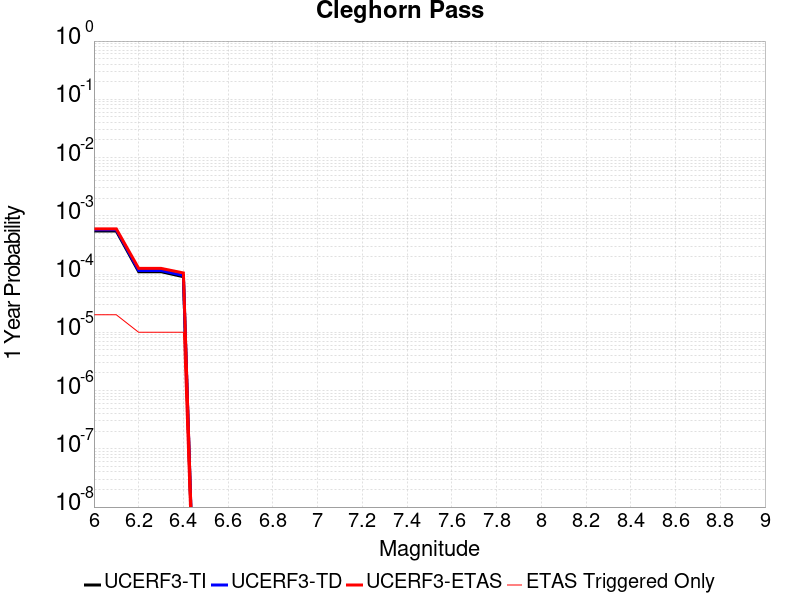 |  |

| Magnitude | 1 wk TI Prob | 1 wk TD Prob | 1 wk ETAS Prob | 1 wk ETAS/TD Gain | 1 wk ETAS Triggered Only | 1 mo TI Prob | 1 mo TD Prob | 1 mo ETAS Prob | 1 mo ETAS/TD Gain | 1 mo ETAS Triggered Only | 1 yr TI Prob | 1 yr TD Prob | 1 yr ETAS Prob | 1 yr ETAS/TD Gain | 1 yr ETAS Triggered Only | 10 yr TI Prob | 10 yr TD Prob | 10 yr ETAS Prob | 10 yr ETAS/TD Gain | 10 yr ETAS Triggered Only |
|-----|-----|-----|-----|-----|-----|-----|-----|-----|-----|-----|-----|-----|-----|-----|-----|-----|-----|-----|-----|-----|
| 6.0 | 1.0522846E-5 | 1.1040714E-5 | 1.1040714E-5 | 1.0 | 0.0 | 4.509713E-5 | 4.7316782E-5 | 4.7316782E-5 | 1.0 | 0.0 | 5.4891926E-4 | 5.759822E-4 | 5.9597066E-4 | 1.0347033 | 2.0E-5 | 0.0054756533 | 0.005750059 | 0.0057798866 | 1.0051874 | 3.0E-5 |
| 6.1 | 1.0522846E-5 | 1.1040714E-5 | 1.1040714E-5 | 1.0 | 0.0 | 4.509713E-5 | 4.7316782E-5 | 4.7316782E-5 | 1.0 | 0.0 | 5.4891926E-4 | 5.759822E-4 | 5.9597066E-4 | 1.0347033 | 2.0E-5 | 0.0054756533 | 0.005750059 | 0.0057798866 | 1.0051874 | 3.0E-5 |
| 6.2 | 2.1045846E-6 | 2.2082168E-6 | 2.2082168E-6 | 1.0 | 0.0 | 9.019617E-6 | 9.463776E-6 | 9.463776E-6 | 1.0 | 0.0 | 1.098083E-4 | 1.1521958E-4 | 1.2521842E-4 | 1.0867808 | 1.0E-5 | 0.0010975406 | 0.0011520098 | 0.0011619983 | 1.0086704 | 1.0E-5 |
| 6.3 | 2.1045846E-6 | 2.2082168E-6 | 2.2082168E-6 | 1.0 | 0.0 | 9.019617E-6 | 9.463776E-6 | 9.463776E-6 | 1.0 | 0.0 | 1.098083E-4 | 1.1521958E-4 | 1.2521842E-4 | 1.0867808 | 1.0E-5 | 0.0010975406 | 0.0011520098 | 0.0011619983 | 1.0086704 | 1.0E-5 |
| 6.4 | 1.7259927E-6 | 1.8108889E-6 | 1.8108889E-6 | 1.0 | 0.0 | 7.3970905E-6 | 7.760952E-6 | 7.760952E-6 | 1.0 | 0.0 | 9.005586E-5 | 9.4489595E-5 | 1.0448865E-4 | 1.1058217 | 1.0E-5 | 9.001937E-4 | 9.4489596E-4 | 9.548865E-4 | 1.0105731 | 1.0E-5 |

## White Mountains
*[(top)](#table-of-contents)*

| 1 Week | 1 Month | 1 Year | 10 Year |
|-----|-----|-----|-----|
|  |  | 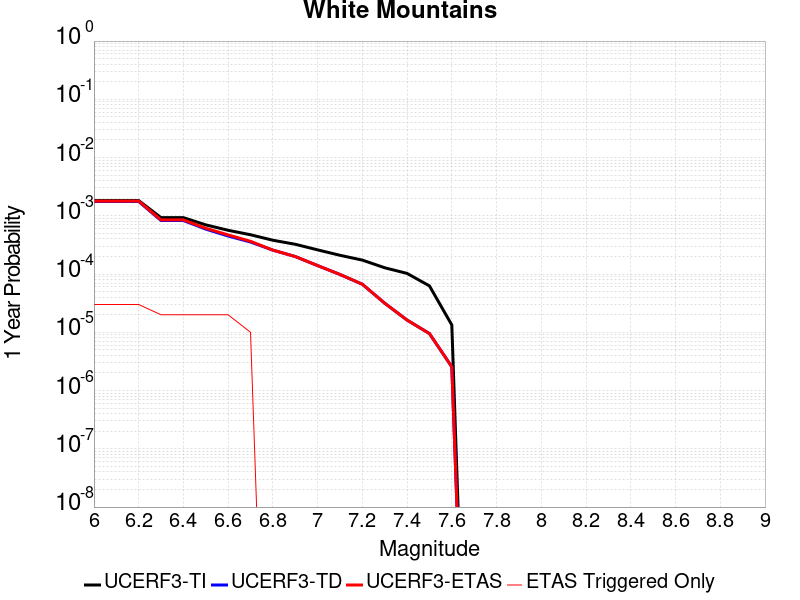 |  |

| Magnitude | 1 wk TI Prob | 1 wk TD Prob | 1 wk ETAS Prob | 1 wk ETAS/TD Gain | 1 wk ETAS Triggered Only | 1 mo TI Prob | 1 mo TD Prob | 1 mo ETAS Prob | 1 mo ETAS/TD Gain | 1 mo ETAS Triggered Only | 1 yr TI Prob | 1 yr TD Prob | 1 yr ETAS Prob | 1 yr ETAS/TD Gain | 1 yr ETAS Triggered Only | 10 yr TI Prob | 10 yr TD Prob | 10 yr ETAS Prob | 10 yr ETAS/TD Gain | 10 yr ETAS Triggered Only |
|-----|-----|-----|-----|-----|-----|-----|-----|-----|-----|-----|-----|-----|-----|-----|-----|-----|-----|-----|-----|-----|
| 6.0 | 3.503579E-5 | 3.3784425E-5 | 3.3784425E-5 | 1.0 | 0.0 | 1.5014476E-4 | 1.4478304E-4 | 1.5478159E-4 | 1.0690589 | 1.0E-5 | 0.0018264796 | 0.0017614291 | 0.0017913763 | 1.0170016 | 3.0E-5 | 0.018115403 | 0.017487012 | 0.017526312 | 1.0022475 | 4.0E-5 |
| 6.1 | 3.503579E-5 | 3.3784425E-5 | 3.3784425E-5 | 1.0 | 0.0 | 1.5014476E-4 | 1.4478304E-4 | 1.5478159E-4 | 1.0690589 | 1.0E-5 | 0.0018264796 | 0.0017614291 | 0.0017913763 | 1.0170016 | 3.0E-5 | 0.018115403 | 0.017487012 | 0.017526312 | 1.0022475 | 4.0E-5 |
| 6.2 | 3.503579E-5 | 3.3784425E-5 | 3.3784425E-5 | 1.0 | 0.0 | 1.5014476E-4 | 1.4478304E-4 | 1.5478159E-4 | 1.0690589 | 1.0E-5 | 0.0018264796 | 0.0017614291 | 0.0017913763 | 1.0170016 | 3.0E-5 | 0.018115403 | 0.017487012 | 0.017526312 | 1.0022475 | 4.0E-5 |
| 6.3 | 1.7818425E-5 | 1.5916237E-5 | 1.5916237E-5 | 1.0 | 0.0 | 7.636245E-5 | 6.821074E-5 | 7.821006E-5 | 1.1465945 | 1.0E-5 | 9.293162E-4 | 8.301636E-4 | 8.5014704E-4 | 1.0240717 | 2.0E-5 | 0.009254395 | 0.0082720835 | 0.008301835 | 1.0035967 | 3.0E-5 |
| 6.4 | 1.7818425E-5 | 1.5916237E-5 | 1.5916237E-5 | 1.0 | 0.0 | 7.636245E-5 | 6.821074E-5 | 7.821006E-5 | 1.1465945 | 1.0E-5 | 9.293162E-4 | 8.301636E-4 | 8.5014704E-4 | 1.0240717 | 2.0E-5 | 0.009254395 | 0.0082720835 | 0.008301835 | 1.0035967 | 3.0E-5 |
| 6.5 | 1.3397557E-5 | 1.1336382E-5 | 1.1336382E-5 | 1.0 | 0.0 | 5.741684E-5 | 4.8583628E-5 | 5.8583144E-5 | 1.2058207 | 1.0E-5 | 6.988258E-4 | 5.913521E-4 | 6.113403E-4 | 1.0338008 | 2.0E-5 | 0.006966323 | 0.0058984905 | 0.005918373 | 1.0033706 | 2.0E-5 |
| 6.6 | 1.0818695E-5 | 8.625452E-6 | 8.625452E-6 | 1.0 | 0.0 | 4.6365014E-5 | 3.6965725E-5 | 4.6965353E-5 | 1.2705109 | 1.0E-5 | 5.6434784E-4 | 4.499691E-4 | 4.699601E-4 | 1.0444275 | 2.0E-5 | 0.005629168 | 0.0044910167 | 0.004510927 | 1.0044334 | 2.0E-5 |
| 6.7 | 9.067908E-6 | 6.8025106E-6 | 6.8025106E-6 | 1.0 | 0.0 | 3.8861883E-5 | 2.915331E-5 | 2.915331E-5 | 1.0 | 0.0 | 4.7304068E-4 | 3.5488693E-4 | 3.6488337E-4 | 1.028168 | 1.0E-5 | 0.00472035 | 0.0035435192 | 0.0035534836 | 1.002812 | 1.0E-5 |
| 6.8 | 7.295947E-6 | 4.9364417E-6 | 4.9364417E-6 | 1.0 | 0.0 | 3.126797E-5 | 2.1156015E-5 | 2.1156015E-5 | 1.0 | 0.0 | 3.8062103E-4 | 2.5754515E-4 | 2.5754515E-4 | 1.0 | 0.0 | 0.0037996976 | 0.0025725798 | 0.0025725798 | 1.0 | 0.0 |
| 6.9 | 6.2243444E-6 | 3.832255E-6 | 3.832255E-6 | 1.0 | 0.0 | 2.6675489E-5 | 1.6423848E-5 | 1.6423848E-5 | 1.0 | 0.0 | 3.2472567E-4 | 1.9994254E-4 | 1.9994254E-4 | 1.0 | 0.0 | 0.0032425157 | 0.0019976792 | 0.0019976792 | 1.0 | 0.0 |
| 7.0 | 4.9878413E-6 | 2.6795697E-6 | 2.6795697E-6 | 1.0 | 0.0 | 2.1376287E-5 | 1.1483821E-5 | 1.1483821E-5 | 1.0 | 0.0 | 2.602252E-4 | 1.3980681E-4 | 1.3980681E-4 | 1.0 | 0.0 | 0.002599207 | 0.0013972148 | 0.0013972148 | 1.0 | 0.0 |
| 7.1 | 4.0252844E-6 | 1.88579E-6 | 1.88579E-6 | 1.0 | 0.0 | 1.7251105E-5 | 8.081933E-6 | 8.081933E-6 | 1.0 | 0.0 | 2.1001195E-4 | 9.839322E-5 | 9.839322E-5 | 1.0 | 0.0 | 0.0020981359 | 9.835094E-4 | 9.835094E-4 | 1.0 | 0.0 |
| 7.2 | 3.3284066E-6 | 1.2819944E-6 | 1.2819944E-6 | 1.0 | 0.0 | 1.4264522E-5 | 5.4942507E-6 | 5.4942507E-6 | 1.0 | 0.0 | 1.736567E-4 | 6.689055E-5 | 6.689055E-5 | 1.0 | 0.0 | 0.0017352107 | 6.6871423E-4 | 6.6871423E-4 | 1.0 | 0.0 |
| 7.3 | 2.458226E-6 | 6.057493E-7 | 6.057493E-7 | 1.0 | 0.0 | 1.0535211E-5 | 2.596066E-6 | 2.596066E-6 | 1.0 | 0.0 | 1.2825865E-4 | 3.1606683E-5 | 3.1606683E-5 | 1.0 | 0.0 | 0.0012818464 | 3.1602563E-4 | 3.1602563E-4 | 1.0 | 0.0 |
| 7.4 | 1.965953E-6 | 3.1091668E-7 | 3.1091668E-7 | 1.0 | 0.0 | 8.425486E-6 | 1.3324994E-6 | 1.3324994E-6 | 1.0 | 0.0 | 1.0257547E-4 | 1.622306E-5 | 1.622306E-5 | 1.0 | 0.0 | 0.0010252813 | 1.6221889E-4 | 1.6221889E-4 | 1.0 | 0.0 |
| 7.5 | 1.2014192E-6 | 1.824589E-7 | 1.824589E-7 | 1.0 | 0.0 | 5.148929E-6 | 7.819665E-7 | 7.819665E-7 | 1.0 | 0.0 | 6.2686406E-5 | 9.520401E-6 | 9.520401E-6 | 1.0 | 0.0 | 6.266873E-4 | 9.520002E-5 | 9.520002E-5 | 1.0 | 0.0 |
| 7.6 | 2.5612175E-7 | 4.8950795E-8 | 4.8950795E-8 | 1.0 | 0.0 | 1.0976642E-6 | 2.097891E-7 | 2.097891E-7 | 1.0 | 0.0 | 1.3363979E-5 | 2.5541797E-6 | 2.5541797E-6 | 1.0 | 0.0 | 1.3363175E-4 | 2.554154E-5 | 2.554154E-5 | 1.0 | 0.0 |

## Verdugo
*[(top)](#table-of-contents)*

| 1 Week | 1 Month | 1 Year | 10 Year |
|-----|-----|-----|-----|
|  |  |  |  |

| Magnitude | 1 wk TI Prob | 1 wk TD Prob | 1 wk ETAS Prob | 1 wk ETAS/TD Gain | 1 wk ETAS Triggered Only | 1 mo TI Prob | 1 mo TD Prob | 1 mo ETAS Prob | 1 mo ETAS/TD Gain | 1 mo ETAS Triggered Only | 1 yr TI Prob | 1 yr TD Prob | 1 yr ETAS Prob | 1 yr ETAS/TD Gain | 1 yr ETAS Triggered Only | 10 yr TI Prob | 10 yr TD Prob | 10 yr ETAS Prob | 10 yr ETAS/TD Gain | 10 yr ETAS Triggered Only |
|-----|-----|-----|-----|-----|-----|-----|-----|-----|-----|-----|-----|-----|-----|-----|-----|-----|-----|-----|-----|-----|
| 6.0 | 5.392987E-6 | 4.2165602E-6 | 4.2165602E-6 | 1.0 | 0.0 | 2.3112598E-5 | 1.8070848E-5 | 1.8070848E-5 | 1.0 | 0.0 | 2.8135953E-4 | 2.1999085E-4 | 2.1999085E-4 | 1.0 | 0.0 | 0.0028100356 | 0.0021977786 | 0.0022376906 | 1.0181602 | 4.0E-5 |
| 6.1 | 5.392987E-6 | 4.2165602E-6 | 4.2165602E-6 | 1.0 | 0.0 | 2.3112598E-5 | 1.8070848E-5 | 1.8070848E-5 | 1.0 | 0.0 | 2.8135953E-4 | 2.1999085E-4 | 2.1999085E-4 | 1.0 | 0.0 | 0.0028100356 | 0.0021977786 | 0.0022376906 | 1.0181602 | 4.0E-5 |
| 6.2 | 5.392987E-6 | 4.2165602E-6 | 4.2165602E-6 | 1.0 | 0.0 | 2.3112598E-5 | 1.8070848E-5 | 1.8070848E-5 | 1.0 | 0.0 | 2.8135953E-4 | 2.1999085E-4 | 2.1999085E-4 | 1.0 | 0.0 | 0.0028100356 | 0.0021977786 | 0.0022376906 | 1.0181602 | 4.0E-5 |
| 6.3 | 5.392987E-6 | 4.2165602E-6 | 4.2165602E-6 | 1.0 | 0.0 | 2.3112598E-5 | 1.8070848E-5 | 1.8070848E-5 | 1.0 | 0.0 | 2.8135953E-4 | 2.1999085E-4 | 2.1999085E-4 | 1.0 | 0.0 | 0.0028100356 | 0.0021977786 | 0.0022376906 | 1.0181602 | 4.0E-5 |
| 6.4 | 5.392987E-6 | 4.2165602E-6 | 4.2165602E-6 | 1.0 | 0.0 | 2.3112598E-5 | 1.8070848E-5 | 1.8070848E-5 | 1.0 | 0.0 | 2.8135953E-4 | 2.1999085E-4 | 2.1999085E-4 | 1.0 | 0.0 | 0.0028100356 | 0.0021977786 | 0.0022376906 | 1.0181602 | 4.0E-5 |
| 6.5 | 4.9154837E-6 | 3.7225057E-6 | 3.7225057E-6 | 1.0 | 0.0 | 2.1066187E-5 | 1.59535E-5 | 1.59535E-5 | 1.0 | 0.0 | 2.5645064E-4 | 1.9421674E-4 | 1.9421674E-4 | 1.0 | 0.0 | 0.002561549 | 0.001940491 | 0.0019704327 | 1.01543 | 3.0E-5 |
| 6.6 | 4.9154837E-6 | 3.7225057E-6 | 3.7225057E-6 | 1.0 | 0.0 | 2.1066187E-5 | 1.59535E-5 | 1.59535E-5 | 1.0 | 0.0 | 2.5645064E-4 | 1.9421674E-4 | 1.9421674E-4 | 1.0 | 0.0 | 0.002561549 | 0.001940491 | 0.0019704327 | 1.01543 | 3.0E-5 |
| 6.7 | 4.817006E-6 | 3.6206918E-6 | 3.6206918E-6 | 1.0 | 0.0 | 2.0644147E-5 | 1.551716E-5 | 1.551716E-5 | 1.0 | 0.0 | 2.513135E-4 | 1.8890524E-4 | 1.8890524E-4 | 1.0 | 0.0 | 0.0025102948 | 0.0018874662 | 0.0019174096 | 1.0158644 | 3.0E-5 |
| 6.8 | 4.507407E-6 | 3.3071422E-6 | 3.3071422E-6 | 1.0 | 0.0 | 1.9317316E-5 | 1.417339E-5 | 1.417339E-5 | 1.0 | 0.0 | 2.3516294E-4 | 1.725475E-4 | 1.725475E-4 | 1.0 | 0.0 | 0.0023491425 | 0.0017241496 | 0.0017540979 | 1.0173699 | 3.0E-5 |
| 6.9 | 4.3573054E-6 | 3.161048E-6 | 3.161048E-6 | 1.0 | 0.0 | 1.8674033E-5 | 1.3547278E-5 | 1.3547278E-5 | 1.0 | 0.0 | 2.2733262E-4 | 1.6492575E-4 | 1.6492575E-4 | 1.0 | 0.0 | 0.0022710022 | 0.001648046 | 0.0016779965 | 1.0181733 | 3.0E-5 |
| 7.0 | 4.171527E-6 | 2.983706E-6 | 2.983706E-6 | 1.0 | 0.0 | 1.787785E-5 | 1.278725E-5 | 1.278725E-5 | 1.0 | 0.0 | 2.1764109E-4 | 1.5567376E-4 | 1.5567376E-4 | 1.0 | 0.0 | 0.0021742806 | 0.0015556583 | 0.0015856117 | 1.0192544 | 3.0E-5 |
| 7.1 | 4.0405484E-6 | 2.882296E-6 | 2.882296E-6 | 1.0 | 0.0 | 1.731652E-5 | 1.2352639E-5 | 1.2352639E-5 | 1.0 | 0.0 | 2.1080824E-4 | 1.5038312E-4 | 1.5038312E-4 | 1.0 | 0.0 | 0.0021060838 | 0.0015028245 | 0.0015327794 | 1.0199324 | 3.0E-5 |
| 7.2 | 3.8306007E-6 | 2.7018784E-6 | 2.7018784E-6 | 1.0 | 0.0 | 1.6416758E-5 | 1.1579428E-5 | 1.1579428E-5 | 1.0 | 0.0 | 1.9985568E-4 | 1.4097053E-4 | 1.4097053E-4 | 1.0 | 0.0 | 0.0019967605 | 0.0014088218 | 0.0014387795 | 1.0212644 | 3.0E-5 |
| 7.3 | 3.5750938E-6 | 2.5122074E-6 | 2.5122074E-6 | 1.0 | 0.0 | 1.532174E-5 | 1.0766559E-5 | 1.0766559E-5 | 1.0 | 0.0 | 1.8652623E-4 | 1.3107508E-4 | 1.3107508E-4 | 1.0 | 0.0 | 0.0018636974 | 0.0013099882 | 0.001339949 | 1.022871 | 3.0E-5 |
| 7.4 | 3.3510041E-6 | 2.3408884E-6 | 2.3408884E-6 | 1.0 | 0.0 | 1.4361368E-5 | 1.0032341E-5 | 1.0032341E-5 | 1.0 | 0.0 | 1.7483562E-4 | 1.2213702E-4 | 1.2213702E-4 | 1.0 | 0.0 | 0.0017469813 | 0.0012207093 | 0.0012406849 | 1.0163639 | 2.0E-5 |
| 7.5 | 2.948287E-6 | 2.0391387E-6 | 2.0391387E-6 | 1.0 | 0.0 | 1.2635454E-5 | 8.739137E-6 | 8.739137E-6 | 1.0 | 0.0 | 1.538258E-4 | 1.06393905E-4 | 1.06393905E-4 | 1.0 | 0.0 | 0.0015371935 | 0.0010634399 | 0.0010834186 | 1.0187869 | 2.0E-5 |
| 7.6 | 2.0134323E-6 | 1.4471433E-6 | 1.4471433E-6 | 1.0 | 0.0 | 8.628967E-6 | 6.2020285E-6 | 6.2020285E-6 | 1.0 | 0.0 | 1.05052604E-4 | 7.550717E-5 | 7.550717E-5 | 1.0 | 0.0 | 0.0010500296 | 7.5482397E-4 | 7.648164E-4 | 1.0132381 | 1.0E-5 |
| 7.7 | 5.726436E-7 | 4.0453094E-7 | 4.0453094E-7 | 1.0 | 0.0 | 2.4541846E-6 | 1.733703E-6 | 1.733703E-6 | 1.0 | 0.0 | 2.9879287E-5 | 2.1107655E-5 | 2.1107655E-5 | 1.0 | 0.0 | 2.987527E-4 | 2.1105906E-4 | 2.1105906E-4 | 1.0 | 0.0 |
| 7.8 | 1.6248204E-7 | 1.068809E-7 | 1.068809E-7 | 1.0 | 0.0 | 6.963514E-7 | 4.5806092E-7 | 4.5806092E-7 | 1.0 | 0.0 | 8.478045E-6 | 5.576878E-6 | 5.576878E-6 | 1.0 | 0.0 | 8.477722E-5 | 5.576741E-5 | 5.576741E-5 | 1.0 | 0.0 |
| 7.9 | 4.4475744E-8 | 3.037577E-8 | 3.037577E-8 | 1.0 | 0.0 | 1.9061031E-7 | 1.3018186E-7 | 1.3018186E-7 | 1.0 | 0.0 | 2.320678E-6 | 1.5849631E-6 | 1.5849631E-6 | 1.0 | 0.0 | 2.3206538E-5 | 1.5849531E-5 | 1.5849531E-5 | 1.0 | 0.0 |

## Big Pine (Central)
*[(top)](#table-of-contents)*

| 1 Week | 1 Month | 1 Year | 10 Year |
|-----|-----|-----|-----|
|  |  |  |  |

| Magnitude | 1 wk TI Prob | 1 wk TD Prob | 1 wk ETAS Prob | 1 wk ETAS/TD Gain | 1 wk ETAS Triggered Only | 1 mo TI Prob | 1 mo TD Prob | 1 mo ETAS Prob | 1 mo ETAS/TD Gain | 1 mo ETAS Triggered Only | 1 yr TI Prob | 1 yr TD Prob | 1 yr ETAS Prob | 1 yr ETAS/TD Gain | 1 yr ETAS Triggered Only | 10 yr TI Prob | 10 yr TD Prob | 10 yr ETAS Prob | 10 yr ETAS/TD Gain | 10 yr ETAS Triggered Only |
|-----|-----|-----|-----|-----|-----|-----|-----|-----|-----|-----|-----|-----|-----|-----|-----|-----|-----|-----|-----|-----|
| 6.0 | 1.2706755E-5 | 1.4251012E-5 | 2.425087E-5 | 1.7016946 | 1.0E-5 | 5.4456385E-5 | 6.107454E-5 | 7.107393E-5 | 1.1637243 | 1.0E-5 | 6.628048E-4 | 7.4336544E-4 | 7.633506E-4 | 1.0268847 | 2.0E-5 | 0.006608314 | 0.0074138143 | 0.007453518 | 1.0053554 | 4.0E-5 |
| 6.1 | 8.342579E-6 | 9.511191E-6 | 9.511191E-6 | 1.0 | 0.0 | 3.5753423E-5 | 4.0761734E-5 | 4.0761734E-5 | 1.0 | 0.0 | 4.3521097E-4 | 4.961828E-4 | 4.961828E-4 | 1.0 | 0.0 | 0.0043435963 | 0.0049543027 | 0.004964253 | 1.0020084 | 1.0E-5 |
| 6.2 | 6.923899E-6 | 7.967559E-6 | 7.967559E-6 | 1.0 | 0.0 | 2.9673516E-5 | 3.4146342E-5 | 3.4146342E-5 | 1.0 | 0.0 | 3.6121515E-4 | 4.1567165E-4 | 4.1567165E-4 | 1.0 | 0.0 | 0.003606286 | 0.0041522477 | 0.0041522477 | 1.0 | 0.0 |
| 6.3 | 2.728396E-6 | 3.4246525E-6 | 3.4246525E-6 | 1.0 | 0.0 | 1.1693074E-5 | 1.4677004E-5 | 1.4677004E-5 | 1.0 | 0.0 | 1.4235388E-4 | 1.7867875E-4 | 1.7867875E-4 | 1.0 | 0.0 | 0.0014226272 | 0.0017868559 | 0.0017868559 | 1.0 | 0.0 |
| 6.4 | 2.7136944E-6 | 3.4089458E-6 | 3.4089458E-6 | 1.0 | 0.0 | 1.1630066E-5 | 1.4609691E-5 | 1.4609691E-5 | 1.0 | 0.0 | 1.4158686E-4 | 1.7785933E-4 | 1.7785933E-4 | 1.0 | 0.0 | 0.0014149669 | 0.0017786748 | 0.0017786748 | 1.0 | 0.0 |
| 6.5 | 2.6971882E-6 | 3.3912906E-6 | 3.3912906E-6 | 1.0 | 0.0 | 1.1559327E-5 | 1.4534027E-5 | 1.4534027E-5 | 1.0 | 0.0 | 1.4072572E-4 | 1.7693828E-4 | 1.7693828E-4 | 1.0 | 0.0 | 0.0014063664 | 0.0017694789 | 0.0017694789 | 1.0 | 0.0 |
| 6.6 | 2.669092E-6 | 3.361311E-6 | 3.361311E-6 | 1.0 | 0.0 | 1.1438916E-5 | 1.4405543E-5 | 1.4405543E-5 | 1.0 | 0.0 | 1.3925991E-4 | 1.7537424E-4 | 1.7537424E-4 | 1.0 | 0.0 | 0.0013917267 | 0.0017538633 | 0.0017538633 | 1.0 | 0.0 |
| 6.7 | 2.6408059E-6 | 3.3313363E-6 | 3.3313363E-6 | 1.0 | 0.0 | 1.1317691E-5 | 1.4277082E-5 | 1.4277082E-5 | 1.0 | 0.0 | 1.3778417E-4 | 1.7381048E-4 | 1.7381048E-4 | 1.0 | 0.0 | 0.0013769877 | 0.0017382503 | 0.0017382503 | 1.0 | 0.0 |
| 6.8 | 2.1786943E-6 | 2.8547915E-6 | 2.8547915E-6 | 1.0 | 0.0 | 9.337228E-6 | 1.2234768E-5 | 1.2234768E-5 | 1.0 | 0.0 | 1.1367482E-4 | 1.4894885E-4 | 1.4894885E-4 | 1.0 | 0.0 | 0.0011361669 | 0.0014899815 | 0.0014899815 | 1.0 | 0.0 |
| 6.9 | 1.4411696E-6 | 2.0688422E-6 | 2.0688422E-6 | 1.0 | 0.0 | 6.1764263E-6 | 8.866437E-6 | 8.866437E-6 | 1.0 | 0.0 | 7.51954E-5 | 1.079438E-4 | 1.079438E-4 | 1.0 | 0.0 | 7.5169955E-4 | 0.0010803605 | 0.0010803605 | 1.0 | 0.0 |
| 7.0 | 1.0073411E-6 | 1.5545673E-6 | 1.5545673E-6 | 1.0 | 0.0 | 4.317169E-6 | 6.662415E-6 | 6.662415E-6 | 1.0 | 0.0 | 5.2560266E-5 | 8.111204E-5 | 8.111204E-5 | 1.0 | 0.0 | 5.2547833E-4 | 8.1225985E-4 | 8.1225985E-4 | 1.0 | 0.0 |
| 7.1 | 8.947104E-7 | 1.4305514E-6 | 1.4305514E-6 | 1.0 | 0.0 | 3.834468E-6 | 6.130921E-6 | 6.130921E-6 | 1.0 | 0.0 | 4.6683643E-5 | 7.464155E-5 | 7.464155E-5 | 1.0 | 0.0 | 4.6673836E-4 | 7.476001E-4 | 7.476001E-4 | 1.0 | 0.0 |
| 7.2 | 5.215166E-7 | 1.0114496E-6 | 1.0114496E-6 | 1.0 | 0.0 | 2.2350691E-6 | 4.3347773E-6 | 4.3347773E-6 | 1.0 | 0.0 | 2.7211627E-5 | 5.2774678E-5 | 5.2774678E-5 | 1.0 | 0.0 | 2.7208295E-4 | 5.290466E-4 | 5.290466E-4 | 1.0 | 0.0 |
| 7.3 | 4.4024807E-7 | 9.2223235E-7 | 9.2223235E-7 | 1.0 | 0.0 | 1.8867761E-6 | 3.9524184E-6 | 3.9524184E-6 | 1.0 | 0.0 | 2.2971257E-5 | 4.8119677E-5 | 4.8119677E-5 | 1.0 | 0.0 | 2.2968883E-4 | 4.8251753E-4 | 4.8251753E-4 | 1.0 | 0.0 |
| 7.4 | 3.6130905E-7 | 8.3611724E-7 | 8.3611724E-7 | 1.0 | 0.0 | 1.5484665E-6 | 3.583355E-6 | 3.583355E-6 | 1.0 | 0.0 | 1.8852415E-5 | 4.362651E-5 | 4.362651E-5 | 1.0 | 0.0 | 1.8850817E-4 | 4.3759486E-4 | 4.3759486E-4 | 1.0 | 0.0 |
| 7.5 | 3.408184E-7 | 8.110739E-7 | 8.110739E-7 | 1.0 | 0.0 | 1.4606494E-6 | 3.4760267E-6 | 3.4760267E-6 | 1.0 | 0.0 | 1.7783263E-5 | 4.231984E-5 | 4.231984E-5 | 1.0 | 0.0 | 1.778184E-4 | 4.2451176E-4 | 4.2451176E-4 | 1.0 | 0.0 |
| 7.6 | 3.1428627E-7 | 7.7341E-7 | 7.7341E-7 | 1.0 | 0.0 | 1.3469405E-6 | 3.3146102E-6 | 3.3146102E-6 | 1.0 | 0.0 | 1.6398877E-5 | 4.0354673E-5 | 4.0354673E-5 | 1.0 | 0.0 | 1.6397667E-4 | 4.0483844E-4 | 4.0483844E-4 | 1.0 | 0.0 |
| 7.7 | 1.7972785E-7 | 5.0796626E-7 | 5.0796626E-7 | 1.0 | 0.0 | 7.70262E-7 | 2.1769965E-6 | 2.1769965E-6 | 1.0 | 0.0 | 9.377899E-6 | 2.6504622E-5 | 2.6504622E-5 | 1.0 | 0.0 | 9.377503E-5 | 2.663867E-4 | 2.663867E-4 | 1.0 | 0.0 |
| 7.8 | 4.9230927E-8 | 1.1985297E-7 | 1.1985297E-7 | 1.0 | 0.0 | 2.1098968E-7 | 5.136555E-7 | 5.136555E-7 | 1.0 | 0.0 | 2.5687964E-6 | 6.2537392E-6 | 6.2537392E-6 | 1.0 | 0.0 | 2.5687666E-5 | 6.2977226E-5 | 6.2977226E-5 | 1.0 | 0.0 |
| 7.9 | 3.6805972E-9 | 4.1070685E-9 | 4.1070685E-9 | 1.0 | 0.0 | 1.5773987E-8 | 1.7601723E-8 | 1.7601723E-8 | 1.0 | 0.0 | 1.9204828E-7 | 2.1430095E-7 | 2.1430095E-7 | 1.0 | 0.0 | 1.920481E-6 | 2.190991E-6 | 2.190991E-6 | 1.0 | 0.0 |

## Oak Ridge (Onshore)
*[(top)](#table-of-contents)*

| 1 Week | 1 Month | 1 Year | 10 Year |
|-----|-----|-----|-----|
|  |  |  |  |

| Magnitude | 1 wk TI Prob | 1 wk TD Prob | 1 wk ETAS Prob | 1 wk ETAS/TD Gain | 1 wk ETAS Triggered Only | 1 mo TI Prob | 1 mo TD Prob | 1 mo ETAS Prob | 1 mo ETAS/TD Gain | 1 mo ETAS Triggered Only | 1 yr TI Prob | 1 yr TD Prob | 1 yr ETAS Prob | 1 yr ETAS/TD Gain | 1 yr ETAS Triggered Only | 10 yr TI Prob | 10 yr TD Prob | 10 yr ETAS Prob | 10 yr ETAS/TD Gain | 10 yr ETAS Triggered Only |
|-----|-----|-----|-----|-----|-----|-----|-----|-----|-----|-----|-----|-----|-----|-----|-----|-----|-----|-----|-----|-----|
| 6.0 | 3.155064E-5 | 2.952645E-5 | 2.952645E-5 | 1.0 | 0.0 | 1.3521002E-4 | 1.26536E-4 | 1.26536E-4 | 1.0 | 0.0 | 0.001644939 | 0.0015395252 | 0.0015495098 | 1.0064855 | 1.0E-5 | 0.01632816 | 0.015293104 | 0.015322645 | 1.0019317 | 3.0E-5 |
| 6.1 | 3.155064E-5 | 2.952645E-5 | 2.952645E-5 | 1.0 | 0.0 | 1.3521002E-4 | 1.26536E-4 | 1.26536E-4 | 1.0 | 0.0 | 0.001644939 | 0.0015395252 | 0.0015495098 | 1.0064855 | 1.0E-5 | 0.01632816 | 0.015293104 | 0.015322645 | 1.0019317 | 3.0E-5 |
| 6.2 | 3.155064E-5 | 2.952645E-5 | 2.952645E-5 | 1.0 | 0.0 | 1.3521002E-4 | 1.26536E-4 | 1.26536E-4 | 1.0 | 0.0 | 0.001644939 | 0.0015395252 | 0.0015495098 | 1.0064855 | 1.0E-5 | 0.01632816 | 0.015293104 | 0.015322645 | 1.0019317 | 3.0E-5 |
| 6.3 | 3.155064E-5 | 2.952645E-5 | 2.952645E-5 | 1.0 | 0.0 | 1.3521002E-4 | 1.26536E-4 | 1.26536E-4 | 1.0 | 0.0 | 0.001644939 | 0.0015395252 | 0.0015495098 | 1.0064855 | 1.0E-5 | 0.01632816 | 0.015293104 | 0.015322645 | 1.0019317 | 3.0E-5 |
| 6.4 | 3.155064E-5 | 2.952645E-5 | 2.952645E-5 | 1.0 | 0.0 | 1.3521002E-4 | 1.26536E-4 | 1.26536E-4 | 1.0 | 0.0 | 0.001644939 | 0.0015395252 | 0.0015495098 | 1.0064855 | 1.0E-5 | 0.01632816 | 0.015293104 | 0.015322645 | 1.0019317 | 3.0E-5 |
| 6.5 | 3.155064E-5 | 2.952645E-5 | 2.952645E-5 | 1.0 | 0.0 | 1.3521002E-4 | 1.26536E-4 | 1.26536E-4 | 1.0 | 0.0 | 0.001644939 | 0.0015395252 | 0.0015495098 | 1.0064855 | 1.0E-5 | 0.01632816 | 0.015293104 | 0.015322645 | 1.0019317 | 3.0E-5 |
| 6.6 | 3.155064E-5 | 2.952645E-5 | 2.952645E-5 | 1.0 | 0.0 | 1.3521002E-4 | 1.26536E-4 | 1.26536E-4 | 1.0 | 0.0 | 0.001644939 | 0.0015395252 | 0.0015495098 | 1.0064855 | 1.0E-5 | 0.01632816 | 0.015293104 | 0.015322645 | 1.0019317 | 3.0E-5 |
| 6.7 | 3.098897E-5 | 2.8864635E-5 | 2.8864635E-5 | 1.0 | 0.0 | 1.328031E-4 | 1.2369992E-4 | 1.2369992E-4 | 1.0 | 0.0 | 0.0016156785 | 0.0015050438 | 0.0015150288 | 1.0066344 | 1.0E-5 | 0.016039822 | 0.014952951 | 0.014982502 | 1.0019763 | 3.0E-5 |
| 6.8 | 3.0449872E-5 | 2.823982E-5 | 2.823982E-5 | 1.0 | 0.0 | 1.3049292E-4 | 1.2102239E-4 | 1.2102239E-4 | 1.0 | 0.0 | 0.0015875935 | 0.001472489 | 0.0014824743 | 1.0067812 | 1.0E-5 | 0.015762992 | 0.014631692 | 0.014661253 | 1.0020204 | 3.0E-5 |
| 6.9 | 2.697928E-5 | 2.4220137E-5 | 2.4220137E-5 | 1.0 | 0.0 | 1.15620365E-4 | 1.0379658E-4 | 1.0379658E-4 | 1.0 | 0.0 | 0.0014067689 | 0.0012630123 | 0.0012729996 | 1.0079076 | 1.0E-5 | 0.0139789665 | 0.012561057 | 0.01259068 | 1.0023583 | 3.0E-5 |
| 7.0 | 2.4893961E-5 | 2.1862359E-5 | 2.1862359E-5 | 1.0 | 0.0 | 1.0668404E-4 | 9.369256E-5 | 9.369256E-5 | 1.0 | 0.0 | 0.0012981043 | 0.0011401277 | 0.0011501163 | 1.0087609 | 1.0E-5 | 0.012905477 | 0.011345069 | 0.011374729 | 1.0026144 | 3.0E-5 |
| 7.1 | 2.0945363E-5 | 1.7354718E-5 | 1.7354718E-5 | 1.0 | 0.0 | 8.976275E-5 | 7.437527E-5 | 7.437527E-5 | 1.0 | 0.0 | 0.0010923136 | 9.051474E-4 | 9.1513834E-4 | 1.011038 | 1.0E-5 | 0.0108696 | 0.009015542 | 0.009045271 | 1.0032976 | 3.0E-5 |
| 7.2 | 2.0439404E-5 | 1.6809645E-5 | 1.6809645E-5 | 1.0 | 0.0 | 8.7594504E-5 | 7.2039365E-5 | 7.2039365E-5 | 1.0 | 0.0 | 0.0010659413 | 8.7673106E-4 | 8.867223E-4 | 1.011396 | 1.0E-5 | 0.010608427 | 0.00873364 | 0.0087633785 | 1.003405 | 3.0E-5 |
| 7.3 | 1.8463334E-5 | 1.5382002E-5 | 1.5382002E-5 | 1.0 | 0.0 | 7.912617E-5 | 6.5921224E-5 | 6.5921224E-5 | 1.0 | 0.0 | 9.6293533E-4 | 8.0229976E-4 | 8.1229175E-4 | 1.0124542 | 1.0E-5 | 0.009587734 | 0.007994897 | 0.008024656 | 1.0037224 | 3.0E-5 |
| 7.4 | 1.763139E-5 | 1.4517013E-5 | 1.4517013E-5 | 1.0 | 0.0 | 7.556091E-5 | 6.221431E-5 | 6.221431E-5 | 1.0 | 0.0 | 9.1956573E-4 | 7.5719994E-4 | 7.6719234E-4 | 1.0131966 | 1.0E-5 | 0.009157699 | 0.007547003 | 0.007576777 | 1.0039451 | 3.0E-5 |
| 7.5 | 1.3594944E-5 | 1.1163477E-5 | 1.1163477E-5 | 1.0 | 0.0 | 5.8262744E-5 | 4.7842612E-5 | 4.7842612E-5 | 1.0 | 0.0 | 7.0911803E-4 | 5.823306E-4 | 5.923248E-4 | 1.0171623 | 1.0E-5 | 0.007068595 | 0.0058083185 | 0.005838144 | 1.005135 | 3.0E-5 |
| 7.6 | 6.9889534E-6 | 5.6367617E-6 | 5.6367617E-6 | 1.0 | 0.0 | 2.9952313E-5 | 2.4157329E-5 | 2.4157329E-5 | 1.0 | 0.0 | 3.646084E-4 | 2.940762E-4 | 3.0407327E-4 | 1.0339948 | 1.0E-5 | 0.0036401073 | 0.0029369146 | 0.0029568558 | 1.0067899 | 2.0E-5 |
| 7.7 | 4.0824193E-6 | 3.2832884E-6 | 3.2832884E-6 | 1.0 | 0.0 | 1.7495966E-5 | 1.4071161E-5 | 1.4071161E-5 | 1.0 | 0.0 | 2.1299256E-4 | 1.7130304E-4 | 1.8130132E-4 | 1.0583661 | 1.0E-5 | 0.0021278851 | 0.0017117234 | 0.0017217062 | 1.0058321 | 1.0E-5 |
| 7.8 | 1.7023609E-6 | 1.4370602E-6 | 1.4370602E-6 | 1.0 | 0.0 | 7.295812E-6 | 6.158815E-6 | 6.158815E-6 | 1.0 | 0.0 | 8.882289E-5 | 7.498102E-5 | 7.498102E-5 | 1.0 | 0.0 | 8.8787393E-4 | 7.4956E-4 | 7.4956E-4 | 1.0 | 0.0 |
| 7.9 | 2.721225E-7 | 2.2616715E-7 | 2.2616715E-7 | 1.0 | 0.0 | 1.1662388E-6 | 9.692874E-7 | 9.692874E-7 | 1.0 | 0.0 | 1.4198865E-5 | 1.1801013E-5 | 1.1801013E-5 | 1.0 | 0.0 | 1.4197957E-4 | 1.1800414E-4 | 1.1800414E-4 | 1.0 | 0.0 |
| 8.0 | 9.364255E-9 | 5.1209232E-9 | 5.1209232E-9 | 1.0 | 0.0 | 4.0132523E-8 | 2.1946814E-8 | 2.1946814E-8 | 1.0 | 0.0 | 4.8861335E-7 | 2.6720244E-7 | 2.6720244E-7 | 1.0 | 0.0 | 4.8861225E-6 | 2.6720215E-6 | 2.6720215E-6 | 1.0 | 0.0 |

## Santa Susana East (connector)
*[(top)](#table-of-contents)*

| 1 Week | 1 Month | 1 Year | 10 Year |
|-----|-----|-----|-----|
|  |  |  |  |

| Magnitude | 1 wk TI Prob | 1 wk TD Prob | 1 wk ETAS Prob | 1 wk ETAS/TD Gain | 1 wk ETAS Triggered Only | 1 mo TI Prob | 1 mo TD Prob | 1 mo ETAS Prob | 1 mo ETAS/TD Gain | 1 mo ETAS Triggered Only | 1 yr TI Prob | 1 yr TD Prob | 1 yr ETAS Prob | 1 yr ETAS/TD Gain | 1 yr ETAS Triggered Only | 10 yr TI Prob | 10 yr TD Prob | 10 yr ETAS Prob | 10 yr ETAS/TD Gain | 10 yr ETAS Triggered Only |
|-----|-----|-----|-----|-----|-----|-----|-----|-----|-----|-----|-----|-----|-----|-----|-----|-----|-----|-----|-----|-----|
| 6.0 | 2.858397E-5 | 3.202183E-5 | 3.202183E-5 | 1.0 | 0.0 | 1.2249697E-4 | 1.3723079E-4 | 1.3723079E-4 | 1.0 | 0.0 | 0.0014903803 | 0.0016697859 | 0.0016897526 | 1.0119575 | 2.0E-5 | 0.014804244 | 0.01659952 | 0.016638855 | 1.0023698 | 4.0E-5 |
| 6.1 | 2.858397E-5 | 3.202183E-5 | 3.202183E-5 | 1.0 | 0.0 | 1.2249697E-4 | 1.3723079E-4 | 1.3723079E-4 | 1.0 | 0.0 | 0.0014903803 | 0.0016697859 | 0.0016897526 | 1.0119575 | 2.0E-5 | 0.014804244 | 0.01659952 | 0.016638855 | 1.0023698 | 4.0E-5 |
| 6.2 | 2.858397E-5 | 3.202183E-5 | 3.202183E-5 | 1.0 | 0.0 | 1.2249697E-4 | 1.3723079E-4 | 1.3723079E-4 | 1.0 | 0.0 | 0.0014903803 | 0.0016697859 | 0.0016897526 | 1.0119575 | 2.0E-5 | 0.014804244 | 0.01659952 | 0.016638855 | 1.0023698 | 4.0E-5 |
| 6.3 | 1.943582E-5 | 2.0367674E-5 | 2.0367674E-5 | 1.0 | 0.0 | 8.329371E-5 | 8.728774E-5 | 8.728774E-5 | 1.0 | 0.0 | 0.001013629 | 0.0010623224 | 0.0010723118 | 1.0094033 | 1.0E-5 | 0.010090181 | 0.010583875 | 0.010613557 | 1.0028045 | 3.0E-5 |
| 6.4 | 1.943582E-5 | 2.0367674E-5 | 2.0367674E-5 | 1.0 | 0.0 | 8.329371E-5 | 8.728774E-5 | 8.728774E-5 | 1.0 | 0.0 | 0.001013629 | 0.0010623224 | 0.0010723118 | 1.0094033 | 1.0E-5 | 0.010090181 | 0.010583875 | 0.010613557 | 1.0028045 | 3.0E-5 |
| 6.5 | 1.943582E-5 | 2.0367674E-5 | 2.0367674E-5 | 1.0 | 0.0 | 8.329371E-5 | 8.728774E-5 | 8.728774E-5 | 1.0 | 0.0 | 0.001013629 | 0.0010623224 | 0.0010723118 | 1.0094033 | 1.0E-5 | 0.010090181 | 0.010583875 | 0.010613557 | 1.0028045 | 3.0E-5 |
| 6.6 | 1.943582E-5 | 2.0367674E-5 | 2.0367674E-5 | 1.0 | 0.0 | 8.329371E-5 | 8.728774E-5 | 8.728774E-5 | 1.0 | 0.0 | 0.001013629 | 0.0010623224 | 0.0010723118 | 1.0094033 | 1.0E-5 | 0.010090181 | 0.010583875 | 0.010613557 | 1.0028045 | 3.0E-5 |
| 6.7 | 1.9404439E-5 | 2.0355095E-5 | 2.0355095E-5 | 1.0 | 0.0 | 8.3159226E-5 | 8.7233835E-5 | 8.7233835E-5 | 1.0 | 0.0 | 0.0010119933 | 0.0010616668 | 0.0010716561 | 1.0094092 | 1.0E-5 | 0.010073971 | 0.01057738 | 0.010607063 | 1.0028062 | 3.0E-5 |
| 6.8 | 1.2217526E-5 | 1.1593199E-5 | 1.1593199E-5 | 1.0 | 0.0 | 5.2359774E-5 | 4.9684288E-5 | 4.9684288E-5 | 1.0 | 0.0 | 6.372938E-4 | 6.047551E-4 | 6.147491E-4 | 1.0165256 | 1.0E-5 | 0.0063546924 | 0.006033141 | 0.0060530207 | 1.0032951 | 2.0E-5 |
| 6.9 | 1.2217526E-5 | 1.1593199E-5 | 1.1593199E-5 | 1.0 | 0.0 | 5.2359774E-5 | 4.9684288E-5 | 4.9684288E-5 | 1.0 | 0.0 | 6.372938E-4 | 6.047551E-4 | 6.147491E-4 | 1.0165256 | 1.0E-5 | 0.0063546924 | 0.006033141 | 0.0060530207 | 1.0032951 | 2.0E-5 |
| 7.0 | 9.276017E-6 | 8.059215E-6 | 8.059215E-6 | 1.0 | 0.0 | 3.9753755E-5 | 3.4539054E-5 | 3.4539054E-5 | 1.0 | 0.0 | 4.8389446E-4 | 4.204353E-4 | 4.304311E-4 | 1.0237749 | 1.0E-5 | 0.0048284214 | 0.0041971253 | 0.004217041 | 1.0047451 | 2.0E-5 |
| 7.1 | 9.130355E-6 | 7.942386E-6 | 7.942386E-6 | 1.0 | 0.0 | 3.9129503E-5 | 3.4038374E-5 | 3.4038374E-5 | 1.0 | 0.0 | 4.7629757E-4 | 4.1434186E-4 | 4.2433772E-4 | 1.0241246 | 1.0E-5 | 0.00475278 | 0.004136419 | 0.004156336 | 1.0048151 | 2.0E-5 |
| 7.2 | 8.851015E-6 | 7.741543E-6 | 7.741543E-6 | 1.0 | 0.0 | 3.7932372E-5 | 3.317764E-5 | 3.317764E-5 | 1.0 | 0.0 | 4.6172875E-4 | 4.0386632E-4 | 4.138623E-4 | 1.0247507 | 1.0E-5 | 0.0046077054 | 0.0040320465 | 0.0040519657 | 1.0049403 | 2.0E-5 |
| 7.3 | 8.573006E-6 | 7.5502617E-6 | 7.5502617E-6 | 1.0 | 0.0 | 3.6740938E-5 | 3.2357882E-5 | 3.2357882E-5 | 1.0 | 0.0 | 4.472291E-4 | 3.9388944E-4 | 4.038855E-4 | 1.0253779 | 1.0E-5 | 0.004463301 | 0.00393263 | 0.0039525516 | 1.0050657 | 2.0E-5 |
| 7.4 | 7.852282E-6 | 6.8177665E-6 | 6.8177665E-6 | 1.0 | 0.0 | 3.36522E-5 | 2.9218689E-5 | 2.9218689E-5 | 1.0 | 0.0 | 4.096385E-4 | 3.556825E-4 | 3.6567895E-4 | 1.028105 | 1.0E-5 | 0.0040888423 | 0.0035517968 | 0.0035717257 | 1.005611 | 2.0E-5 |
| 7.5 | 4.8869324E-6 | 4.279099E-6 | 4.279099E-6 | 1.0 | 0.0 | 2.0943828E-5 | 1.8338877E-5 | 1.8338877E-5 | 1.0 | 0.0 | 2.5496128E-4 | 2.232546E-4 | 2.3325237E-4 | 1.0447819 | 1.0E-5 | 0.0025466895 | 0.0022304675 | 0.002250423 | 1.0089468 | 2.0E-5 |
| 7.6 | 1.3894544E-6 | 1.1568255E-6 | 1.1568255E-6 | 1.0 | 0.0 | 5.954791E-6 | 4.9578157E-6 | 4.9578157E-6 | 1.0 | 0.0 | 7.249717E-5 | 6.035996E-5 | 7.0359354E-5 | 1.1656628 | 1.0E-5 | 7.247352E-4 | 6.0345745E-4 | 6.134514E-4 | 1.0165612 | 1.0E-5 |
| 7.7 | 2.9924632E-7 | 2.3719628E-7 | 2.3719628E-7 | 1.0 | 0.0 | 1.2824837E-6 | 1.0165551E-6 | 1.0165551E-6 | 1.0 | 0.0 | 1.5614127E-5 | 1.2376496E-5 | 2.237637E-5 | 1.8079731 | 1.0E-5 | 1.5613029E-4 | 1.2375879E-4 | 1.3375754E-4 | 1.0807923 | 1.0E-5 |
| 7.8 | 4.8188564E-8 | 2.63245E-8 | 2.63245E-8 | 1.0 | 0.0 | 2.065224E-7 | 1.1281927E-7 | 1.1281927E-7 | 1.0 | 0.0 | 2.5144072E-6 | 1.3735739E-6 | 1.3735739E-6 | 1.0 | 0.0 | 2.5143789E-5 | 1.3735663E-5 | 1.3735663E-5 | 1.0 | 0.0 |
| 7.9 | 2.6127251E-9 | 2.768132E-9 | 2.768132E-9 | 1.0 | 0.0 | 1.1197393E-8 | 1.1863423E-8 | 1.1863423E-8 | 1.0 | 0.0 | 1.3632825E-7 | 1.4443718E-7 | 1.4443718E-7 | 1.0 | 0.0 | 1.3632817E-6 | 1.4443717E-6 | 1.4443717E-6 | 1.0 | 0.0 |

## Hunting Creek - Berryessa 2011 CFM
*[(top)](#table-of-contents)*

| 1 Week | 1 Month | 1 Year | 10 Year |
|-----|-----|-----|-----|
|  |  |  |  |

| Magnitude | 1 wk TI Prob | 1 wk TD Prob | 1 wk ETAS Prob | 1 wk ETAS/TD Gain | 1 wk ETAS Triggered Only | 1 mo TI Prob | 1 mo TD Prob | 1 mo ETAS Prob | 1 mo ETAS/TD Gain | 1 mo ETAS Triggered Only | 1 yr TI Prob | 1 yr TD Prob | 1 yr ETAS Prob | 1 yr ETAS/TD Gain | 1 yr ETAS Triggered Only | 10 yr TI Prob | 10 yr TD Prob | 10 yr ETAS Prob | 10 yr ETAS/TD Gain | 10 yr ETAS Triggered Only |
|-----|-----|-----|-----|-----|-----|-----|-----|-----|-----|-----|-----|-----|-----|-----|-----|-----|-----|-----|-----|-----|
| 6.0 | 1.1270982E-4 | 2.0014354E-4 | 2.0014354E-4 | 1.0 | 0.0 | 4.8295266E-4 | 8.574329E-4 | 8.6742436E-4 | 1.0116527 | 1.0E-5 | 0.0058641075 | 0.010387073 | 0.010406866 | 1.0019054 | 2.0E-5 | 0.057117578 | 0.09804065 | 0.09807673 | 1.000368 | 4.0E-5 |
| 6.1 | 1.1239393E-4 | 1.9962489E-4 | 1.9962489E-4 | 1.0 | 0.0 | 4.8159933E-4 | 8.552116E-4 | 8.6520304E-4 | 1.011683 | 1.0E-5 | 0.0058477195 | 0.010360309 | 0.010380102 | 1.0019104 | 2.0E-5 | 0.056962132 | 0.09779912 | 0.09783521 | 1.000369 | 4.0E-5 |
| 6.2 | 7.596265E-5 | 1.2941175E-4 | 1.2941175E-4 | 1.0 | 0.0 | 3.2551357E-4 | 5.544276E-4 | 5.544276E-4 | 1.0 | 0.0 | 0.0039559277 | 0.0067212153 | 0.006731148 | 1.0014778 | 1.0E-5 | 0.038862433 | 0.0645938 | 0.06460315 | 1.0001448 | 1.0E-5 |
| 6.3 | 6.78794E-5 | 1.145196E-4 | 1.145196E-4 | 1.0 | 0.0 | 2.9087928E-4 | 4.9066654E-4 | 4.9066654E-4 | 1.0 | 0.0 | 0.003535705 | 0.0059528556 | 0.005962796 | 1.0016699 | 1.0E-5 | 0.034799766 | 0.05746746 | 0.057476886 | 1.000164 | 1.0E-5 |
| 6.4 | 6.2165134E-5 | 1.0437306E-4 | 1.0437306E-4 | 1.0 | 0.0 | 2.6639478E-4 | 4.4723987E-4 | 4.4723987E-4 | 1.0 | 0.0 | 0.0032385332 | 0.005427739 | 0.005437685 | 1.0018324 | 1.0E-5 | 0.03191742 | 0.052552443 | 0.05256192 | 1.0001802 | 1.0E-5 |
| 6.5 | 5.4368087E-5 | 9.071981E-5 | 9.071981E-5 | 1.0 | 0.0 | 2.3298527E-4 | 3.887444E-4 | 3.887444E-4 | 1.0 | 0.0 | 0.0028329059 | 0.004720021 | 0.004720021 | 1.0 | 0.0 | 0.027970633 | 0.045881823 | 0.045881823 | 1.0 | 0.0 |
| 6.6 | 4.729947E-5 | 7.848042E-5 | 7.848042E-5 | 1.0 | 0.0 | 2.0269625E-4 | 3.363043E-4 | 3.363043E-4 | 1.0 | 0.0 | 0.002465034 | 0.0040850975 | 0.0040850975 | 1.0 | 0.0 | 0.02437869 | 0.039853033 | 0.039853033 | 1.0 | 0.0 |
| 6.7 | 3.6875328E-5 | 6.0455113E-5 | 6.0455113E-5 | 1.0 | 0.0 | 1.5802756E-4 | 2.5907016E-4 | 2.5907016E-4 | 1.0 | 0.0 | 0.0019222875 | 0.0031483201 | 0.0031483201 | 1.0 | 0.0 | 0.019057442 | 0.030893533 | 0.030893533 | 1.0 | 0.0 |
| 6.8 | 2.0292036E-5 | 2.897696E-5 | 2.897696E-5 | 1.0 | 0.0 | 8.6962966E-5 | 1.241811E-4 | 1.241811E-4 | 1.0 | 0.0 | 0.0010582599 | 0.00151084 | 0.00151084 | 1.0 | 0.0 | 0.010532344 | 0.014978847 | 0.014978847 | 1.0 | 0.0 |
| 6.9 | 1.7871042E-5 | 2.4472789E-5 | 2.4472789E-5 | 1.0 | 0.0 | 7.658793E-5 | 1.048792E-4 | 1.048792E-4 | 1.0 | 0.0 | 9.320591E-4 | 0.0012761577 | 0.0012761577 | 1.0 | 0.0 | 0.009281595 | 0.012680048 | 0.012680048 | 1.0 | 0.0 |
| 7.0 | 1.6415532E-5 | 2.1906764E-5 | 2.1906764E-5 | 1.0 | 0.0 | 7.035038E-5 | 9.388277E-5 | 9.388277E-5 | 1.0 | 0.0 | 8.561793E-4 | 0.0011424269 | 0.0011424269 | 1.0 | 0.0 | 0.008528882 | 0.011364769 | 0.011364769 | 1.0 | 0.0 |
| 7.1 | 1.5409885E-5 | 2.03468E-5 | 2.03468E-5 | 1.0 | 0.0 | 6.6040695E-5 | 8.719768E-5 | 8.719768E-5 | 1.0 | 0.0 | 8.0374884E-4 | 0.0010611176 | 0.0010611176 | 1.0 | 0.0 | 0.00800848 | 0.010560832 | 0.010560832 | 1.0 | 0.0 |
| 7.2 | 1.4497423E-5 | 1.905539E-5 | 1.905539E-5 | 1.0 | 0.0 | 6.213033E-5 | 8.166341E-5 | 8.166341E-5 | 1.0 | 0.0 | 7.5617427E-4 | 9.938016E-4 | 9.938016E-4 | 1.0 | 0.0 | 0.0075360634 | 0.009894148 | 0.009894148 | 1.0 | 0.0 |
| 7.3 | 1.3615175E-5 | 1.7826538E-5 | 1.7826538E-5 | 1.0 | 0.0 | 5.8349444E-5 | 7.639723E-5 | 7.639723E-5 | 1.0 | 0.0 | 7.101729E-4 | 9.2974224E-4 | 9.2974224E-4 | 1.0 | 0.0 | 0.0070790765 | 0.009259034 | 0.009259034 | 1.0 | 0.0 |
| 7.4 | 1.2252825E-5 | 1.6026612E-5 | 1.6026612E-5 | 1.0 | 0.0 | 5.251105E-5 | 6.868369E-5 | 6.868369E-5 | 1.0 | 0.0 | 6.391345E-4 | 8.359059E-4 | 8.359059E-4 | 1.0 | 0.0 | 0.0063729943 | 0.008328059 | 0.008328059 | 1.0 | 0.0 |
| 7.5 | 1.0913301E-5 | 1.4241439E-5 | 1.4241439E-5 | 1.0 | 0.0 | 4.6770452E-5 | 6.103333E-5 | 6.103333E-5 | 1.0 | 0.0 | 5.6928146E-4 | 7.4283016E-4 | 7.4283016E-4 | 1.0 | 0.0 | 0.0056782532 | 0.0074038464 | 0.0074038464 | 1.0 | 0.0 |
| 7.6 | 8.623192E-6 | 1.1234897E-5 | 1.1234897E-5 | 1.0 | 0.0 | 3.6956015E-5 | 4.8148686E-5 | 4.8148686E-5 | 1.0 | 0.0 | 4.4984656E-4 | 5.860551E-4 | 5.860551E-4 | 1.0 | 0.0 | 0.00448937 | 0.0058454107 | 0.0058454107 | 1.0 | 0.0 |
| 7.7 | 2.0993634E-6 | 2.6626365E-6 | 2.6626365E-6 | 1.0 | 0.0 | 8.997241E-6 | 1.141125E-5 | 1.141125E-5 | 1.0 | 0.0 | 1.09535904E-4 | 1.3892318E-4 | 1.3892318E-4 | 1.0 | 0.0 | 0.0010948193 | 0.0013883698 | 0.0013883698 | 1.0 | 0.0 |
| 7.8 | 1.8428308E-7 | 2.167475E-7 | 2.167475E-7 | 1.0 | 0.0 | 7.897844E-7 | 9.2891753E-7 | 9.2891753E-7 | 1.0 | 0.0 | 9.615583E-6 | 1.1309516E-5 | 1.1309516E-5 | 1.0 | 0.0 | 9.615166E-5 | 1.13088005E-4 | 1.13088005E-4 | 1.0 | 0.0 |

## Simi-Santa Rosa
*[(top)](#table-of-contents)*

| 1 Week | 1 Month | 1 Year | 10 Year |
|-----|-----|-----|-----|
|  |  |  |  |

| Magnitude | 1 wk TI Prob | 1 wk TD Prob | 1 wk ETAS Prob | 1 wk ETAS/TD Gain | 1 wk ETAS Triggered Only | 1 mo TI Prob | 1 mo TD Prob | 1 mo ETAS Prob | 1 mo ETAS/TD Gain | 1 mo ETAS Triggered Only | 1 yr TI Prob | 1 yr TD Prob | 1 yr ETAS Prob | 1 yr ETAS/TD Gain | 1 yr ETAS Triggered Only | 10 yr TI Prob | 10 yr TD Prob | 10 yr ETAS Prob | 10 yr ETAS/TD Gain | 10 yr ETAS Triggered Only |
|-----|-----|-----|-----|-----|-----|-----|-----|-----|-----|-----|-----|-----|-----|-----|-----|-----|-----|-----|-----|-----|
| 6.0 | 2.198912E-5 | 2.2275886E-5 | 2.2275886E-5 | 1.0 | 0.0 | 9.4235686E-5 | 9.5464835E-5 | 9.5464835E-5 | 1.0 | 0.0 | 0.0011467156 | 0.0011617085 | 0.0011716968 | 1.008598 | 1.0E-5 | 0.011408163 | 0.011560804 | 0.0115904575 | 1.002565 | 3.0E-5 |
| 6.1 | 2.198912E-5 | 2.2275886E-5 | 2.2275886E-5 | 1.0 | 0.0 | 9.4235686E-5 | 9.5464835E-5 | 9.5464835E-5 | 1.0 | 0.0 | 0.0011467156 | 0.0011617085 | 0.0011716968 | 1.008598 | 1.0E-5 | 0.011408163 | 0.011560804 | 0.0115904575 | 1.002565 | 3.0E-5 |
| 6.2 | 1.69983E-5 | 1.6668911E-5 | 1.6668911E-5 | 1.0 | 0.0 | 7.284782E-5 | 7.14364E-5 | 7.14364E-5 | 1.0 | 0.0 | 8.865613E-4 | 8.694203E-4 | 8.794116E-4 | 1.0114919 | 1.0E-5 | 0.008830327 | 0.0086631095 | 0.008692849 | 1.003433 | 3.0E-5 |
| 6.3 | 1.69983E-5 | 1.6668911E-5 | 1.6668911E-5 | 1.0 | 0.0 | 7.284782E-5 | 7.14364E-5 | 7.14364E-5 | 1.0 | 0.0 | 8.865613E-4 | 8.694203E-4 | 8.794116E-4 | 1.0114919 | 1.0E-5 | 0.008830327 | 0.0086631095 | 0.008692849 | 1.003433 | 3.0E-5 |
| 6.4 | 1.4666188E-5 | 1.4052852E-5 | 1.4052852E-5 | 1.0 | 0.0 | 6.285358E-5 | 6.022526E-5 | 6.022526E-5 | 1.0 | 0.0 | 7.6497364E-4 | 7.330208E-4 | 7.430134E-4 | 1.0136322 | 1.0E-5 | 0.0076234564 | 0.0073085045 | 0.007338285 | 1.0040748 | 3.0E-5 |
| 6.5 | 1.4666188E-5 | 1.4052852E-5 | 1.4052852E-5 | 1.0 | 0.0 | 6.285358E-5 | 6.022526E-5 | 6.022526E-5 | 1.0 | 0.0 | 7.6497364E-4 | 7.330208E-4 | 7.430134E-4 | 1.0136322 | 1.0E-5 | 0.0076234564 | 0.0073085045 | 0.007338285 | 1.0040748 | 3.0E-5 |
| 6.6 | 1.4377586E-5 | 1.3729887E-5 | 1.3729887E-5 | 1.0 | 0.0 | 6.1616774E-5 | 5.8841186E-5 | 5.8841186E-5 | 1.0 | 0.0 | 7.4992597E-4 | 7.1618083E-4 | 7.2617363E-4 | 1.013953 | 1.0E-5 | 0.007474003 | 0.007141196 | 0.0071709817 | 1.004171 | 3.0E-5 |
| 6.7 | 1.3881404E-5 | 1.3207847E-5 | 1.3207847E-5 | 1.0 | 0.0 | 5.9490372E-5 | 5.6603967E-5 | 5.6603967E-5 | 1.0 | 0.0 | 7.240546E-4 | 6.889601E-4 | 6.989532E-4 | 1.0145047 | 1.0E-5 | 0.007217 | 0.0068706917 | 0.0069004856 | 1.0043364 | 3.0E-5 |
| 6.8 | 1.0176516E-5 | 9.154378E-6 | 9.154378E-6 | 1.0 | 0.0 | 4.3612912E-5 | 3.9232553E-5 | 3.9232553E-5 | 1.0 | 0.0 | 5.308578E-4 | 4.7756822E-4 | 4.8756343E-4 | 1.0209295 | 1.0E-5 | 0.0052959146 | 0.004767053 | 0.004786957 | 1.0041754 | 2.0E-5 |
| 6.9 | 9.699797E-6 | 8.7749395E-6 | 8.7749395E-6 | 1.0 | 0.0 | 4.15699E-5 | 3.7606434E-5 | 3.7606434E-5 | 1.0 | 0.0 | 5.05996E-4 | 4.5777857E-4 | 4.67774E-4 | 1.0218346 | 1.0E-5 | 0.005048454 | 0.004569974 | 0.004589882 | 1.0043564 | 2.0E-5 |
| 7.0 | 7.4049476E-6 | 6.559509E-6 | 6.559509E-6 | 1.0 | 0.0 | 3.1735104E-5 | 2.811195E-5 | 2.811195E-5 | 1.0 | 0.0 | 3.8630638E-4 | 3.422219E-4 | 3.5221849E-4 | 1.0292108 | 1.0E-5 | 0.0038563553 | 0.0034181913 | 0.003438123 | 1.005831 | 2.0E-5 |
| 7.1 | 3.873439E-6 | 2.759614E-6 | 2.759614E-6 | 1.0 | 0.0 | 1.6600346E-5 | 1.1826865E-5 | 1.1826865E-5 | 1.0 | 0.0 | 2.0209046E-4 | 1.439828E-4 | 1.439828E-4 | 1.0 | 0.0 | 0.0020190678 | 0.0014389188 | 0.0014489044 | 1.0069396 | 1.0E-5 |
| 7.2 | 3.417706E-6 | 2.3677471E-6 | 2.3677471E-6 | 1.0 | 0.0 | 1.4647229E-5 | 1.014745E-5 | 1.014745E-5 | 1.0 | 0.0 | 1.7831543E-4 | 1.2353843E-4 | 1.2353843E-4 | 1.0 | 0.0 | 0.0017817242 | 0.0012347198 | 0.0012447074 | 1.008089 | 1.0E-5 |
| 7.3 | 1.90225E-6 | 1.4074596E-6 | 1.4074596E-6 | 1.0 | 0.0 | 8.152474E-6 | 6.0319558E-6 | 6.0319558E-6 | 1.0 | 0.0 | 9.9251854E-5 | 7.343661E-5 | 7.343661E-5 | 1.0 | 0.0 | 9.920754E-4 | 7.341257E-4 | 7.4411836E-4 | 1.0136117 | 1.0E-5 |
| 7.4 | 1.5170556E-6 | 1.1025584E-6 | 1.1025584E-6 | 1.0 | 0.0 | 6.5016507E-6 | 4.7252415E-6 | 4.7252415E-6 | 1.0 | 0.0 | 7.915472E-5 | 5.752831E-5 | 5.752831E-5 | 1.0 | 0.0 | 7.9126534E-4 | 5.751353E-4 | 5.8512954E-4 | 1.0173773 | 1.0E-5 |
| 7.5 | 1.178732E-6 | 8.5358926E-7 | 8.5358926E-7 | 1.0 | 0.0 | 5.0516987E-6 | 3.6582346E-6 | 3.6582346E-6 | 1.0 | 0.0 | 6.1502695E-5 | 4.4538105E-5 | 4.4538105E-5 | 1.0 | 0.0 | 6.148568E-4 | 4.4529274E-4 | 4.552883E-4 | 1.0224471 | 1.0E-5 |
| 7.6 | 6.8722386E-7 | 4.793958E-7 | 4.793958E-7 | 1.0 | 0.0 | 2.9452417E-6 | 2.0545517E-6 | 2.0545517E-6 | 1.0 | 0.0 | 3.5857727E-5 | 2.5013882E-5 | 2.5013882E-5 | 1.0 | 0.0 | 3.5851944E-4 | 2.5011078E-4 | 2.5011078E-4 | 1.0 | 0.0 |
| 7.7 | 5.5126515E-7 | 3.673869E-7 | 3.673869E-7 | 1.0 | 0.0 | 2.3625628E-6 | 1.5745143E-6 | 1.5745143E-6 | 1.0 | 0.0 | 2.8763823E-5 | 1.9169544E-5 | 1.9169544E-5 | 1.0 | 0.0 | 2.87601E-4 | 1.91679E-4 | 1.91679E-4 | 1.0 | 0.0 |
| 7.8 | 3.3860243E-7 | 2.0081488E-7 | 2.0081488E-7 | 1.0 | 0.0 | 1.4511525E-6 | 8.6063494E-7 | 8.6063494E-7 | 1.0 | 0.0 | 1.7667637E-5 | 1.047818E-5 | 1.047818E-5 | 1.0 | 0.0 | 1.7666233E-4 | 1.0477692E-4 | 1.0477692E-4 | 1.0 | 0.0 |
| 7.9 | 2.7955386E-7 | 1.4654502E-7 | 1.4654502E-7 | 1.0 | 0.0 | 1.1980875E-6 | 6.280499E-7 | 6.280499E-7 | 1.0 | 0.0 | 1.4586617E-5 | 7.646482E-6 | 7.646482E-6 | 1.0 | 0.0 | 1.458566E-4 | 7.646223E-5 | 7.646223E-5 | 1.0 | 0.0 |
| 8.0 | 5.6259015E-8 | 3.3357086E-8 | 3.3357086E-8 | 1.0 | 0.0 | 2.4111003E-7 | 1.4295894E-7 | 1.4295894E-7 | 1.0 | 0.0 | 2.9355108E-6 | 1.7405239E-6 | 1.7405239E-6 | 1.0 | 0.0 | 2.935472E-5 | 1.7405117E-5 | 1.7405117E-5 | 1.0 | 0.0 |

## Santa Cruz Island
*[(top)](#table-of-contents)*

| 1 Week | 1 Month | 1 Year | 10 Year |
|-----|-----|-----|-----|
|  |  |  |  |

| Magnitude | 1 wk TI Prob | 1 wk TD Prob | 1 wk ETAS Prob | 1 wk ETAS/TD Gain | 1 wk ETAS Triggered Only | 1 mo TI Prob | 1 mo TD Prob | 1 mo ETAS Prob | 1 mo ETAS/TD Gain | 1 mo ETAS Triggered Only | 1 yr TI Prob | 1 yr TD Prob | 1 yr ETAS Prob | 1 yr ETAS/TD Gain | 1 yr ETAS Triggered Only | 10 yr TI Prob | 10 yr TD Prob | 10 yr ETAS Prob | 10 yr ETAS/TD Gain | 10 yr ETAS Triggered Only |
|-----|-----|-----|-----|-----|-----|-----|-----|-----|-----|-----|-----|-----|-----|-----|-----|-----|-----|-----|-----|-----|
| 6.0 | 2.9164563E-5 | 3.1600095E-5 | 4.1599782E-5 | 1.3164448 | 1.0E-5 | 1.2498499E-4 | 1.3542273E-4 | 1.4542136E-4 | 1.0738329 | 1.0E-5 | 0.0015206301 | 0.0016476609 | 0.001667628 | 1.0121185 | 2.0E-5 | 0.015102667 | 0.01636818 | 0.01639769 | 1.0018028 | 3.0E-5 |
| 6.1 | 2.9164563E-5 | 3.1600095E-5 | 4.1599782E-5 | 1.3164448 | 1.0E-5 | 1.2498499E-4 | 1.3542273E-4 | 1.4542136E-4 | 1.0738329 | 1.0E-5 | 0.0015206301 | 0.0016476609 | 0.001667628 | 1.0121185 | 2.0E-5 | 0.015102667 | 0.01636818 | 0.01639769 | 1.0018028 | 3.0E-5 |
| 6.2 | 2.9164563E-5 | 3.1600095E-5 | 4.1599782E-5 | 1.3164448 | 1.0E-5 | 1.2498499E-4 | 1.3542273E-4 | 1.4542136E-4 | 1.0738329 | 1.0E-5 | 0.0015206301 | 0.0016476609 | 0.001667628 | 1.0121185 | 2.0E-5 | 0.015102667 | 0.01636818 | 0.01639769 | 1.0018028 | 3.0E-5 |
| 6.3 | 1.6635553E-5 | 1.7804527E-5 | 1.7804527E-5 | 1.0 | 0.0 | 7.1293274E-5 | 7.630298E-5 | 7.630298E-5 | 1.0 | 0.0 | 8.6765E-4 | 9.286111E-4 | 9.286111E-4 | 1.0 | 0.0 | 0.008642701 | 0.009249181 | 0.009249181 | 1.0 | 0.0 |
| 6.4 | 1.6635553E-5 | 1.7804527E-5 | 1.7804527E-5 | 1.0 | 0.0 | 7.1293274E-5 | 7.630298E-5 | 7.630298E-5 | 1.0 | 0.0 | 8.6765E-4 | 9.286111E-4 | 9.286111E-4 | 1.0 | 0.0 | 0.008642701 | 0.009249181 | 0.009249181 | 1.0 | 0.0 |
| 6.5 | 1.2238748E-5 | 1.3043111E-5 | 1.3043111E-5 | 1.0 | 0.0 | 5.2450723E-5 | 5.5897868E-5 | 5.5897868E-5 | 1.0 | 0.0 | 6.3840044E-4 | 6.8034773E-4 | 6.8034773E-4 | 1.0 | 0.0 | 0.0063656955 | 0.006783047 | 0.006783047 | 1.0 | 0.0 |
| 6.6 | 1.0489767E-5 | 1.11567315E-5 | 1.11567315E-5 | 1.0 | 0.0 | 4.495537E-5 | 4.7813697E-5 | 4.7813697E-5 | 1.0 | 0.0 | 5.4719415E-4 | 5.8197853E-4 | 5.8197853E-4 | 1.0 | 0.0 | 0.005458487 | 0.005804785 | 0.005804785 | 1.0 | 0.0 |
| 6.7 | 8.699222E-6 | 9.236859E-6 | 9.236859E-6 | 1.0 | 0.0 | 3.7281847E-5 | 3.958594E-5 | 3.958594E-5 | 1.0 | 0.0 | 4.5381195E-4 | 4.818528E-4 | 4.818528E-4 | 1.0 | 0.0 | 0.0045288634 | 0.004808148 | 0.004808148 | 1.0 | 0.0 |
| 6.8 | 8.307732E-6 | 8.816977E-6 | 8.816977E-6 | 1.0 | 0.0 | 3.560408E-5 | 3.77865E-5 | 3.77865E-5 | 1.0 | 0.0 | 4.3339343E-4 | 4.5995394E-4 | 4.5995394E-4 | 1.0 | 0.0 | 0.004325492 | 0.004590073 | 0.004590073 | 1.0 | 0.0 |
| 6.9 | 8.073121E-6 | 8.565009E-6 | 8.565009E-6 | 1.0 | 0.0 | 3.459863E-5 | 3.6706668E-5 | 3.6706668E-5 | 1.0 | 0.0 | 4.2115687E-4 | 4.4681245E-4 | 4.4681245E-4 | 1.0 | 0.0 | 0.004203596 | 0.0044591925 | 0.0044591925 | 1.0 | 0.0 |
| 7.0 | 7.617019E-6 | 8.0747295E-6 | 8.0747295E-6 | 1.0 | 0.0 | 3.264396E-5 | 3.4605528E-5 | 3.4605528E-5 | 1.0 | 0.0 | 3.9736772E-4 | 4.2124125E-4 | 4.2124125E-4 | 1.0 | 0.0 | 0.003966579 | 0.0042044753 | 0.0042044753 | 1.0 | 0.0 |
| 7.1 | 7.1224836E-6 | 7.5458483E-6 | 7.5458483E-6 | 1.0 | 0.0 | 3.052457E-5 | 3.233895E-5 | 3.233895E-5 | 1.0 | 0.0 | 3.715733E-4 | 3.9365597E-4 | 3.9365597E-4 | 1.0 | 0.0 | 0.003709526 | 0.0039296295 | 0.0039296295 | 1.0 | 0.0 |
| 7.2 | 6.441115E-6 | 6.8274385E-6 | 6.8274385E-6 | 1.0 | 0.0 | 2.7604487E-5 | 2.9260125E-5 | 2.9260125E-5 | 1.0 | 0.0 | 3.360328E-4 | 3.5618403E-4 | 3.5618403E-4 | 1.0 | 0.0 | 0.0033552512 | 0.0035561598 | 0.0035561598 | 1.0 | 0.0 |
| 7.3 | 5.494274E-6 | 5.820041E-6 | 5.820041E-6 | 1.0 | 0.0 | 2.3546674E-5 | 2.4942796E-5 | 2.4942796E-5 | 1.0 | 0.0 | 2.8664304E-4 | 3.0363642E-4 | 3.0363642E-4 | 1.0 | 0.0 | 0.002862736 | 0.0030322387 | 0.0030322387 | 1.0 | 0.0 |
| 7.4 | 4.0802624E-6 | 4.3122895E-6 | 4.3122895E-6 | 1.0 | 0.0 | 1.7486722E-5 | 1.848111E-5 | 1.848111E-5 | 1.0 | 0.0 | 2.1288003E-4 | 2.2498437E-4 | 2.2498437E-4 | 1.0 | 0.0 | 0.0021267622 | 0.002247575 | 0.002247575 | 1.0 | 0.0 |
| 7.5 | 2.3584746E-6 | 2.4753267E-6 | 2.4753267E-6 | 1.0 | 0.0 | 1.0107709E-5 | 1.06085E-5 | 1.06085E-5 | 1.0 | 0.0 | 1.2305441E-4 | 1.2915088E-4 | 1.2915088E-4 | 1.0 | 0.0 | 0.0012298629 | 0.0012907633 | 0.0012907633 | 1.0 | 0.0 |
| 7.6 | 9.4981914E-7 | 9.860988E-7 | 9.860988E-7 | 1.0 | 0.0 | 4.0706473E-6 | 4.226131E-6 | 4.226131E-6 | 1.0 | 0.0 | 4.9559E-5 | 5.145194E-5 | 5.145194E-5 | 1.0 | 0.0 | 4.954795E-4 | 5.144016E-4 | 5.144016E-4 | 1.0 | 0.0 |
| 7.7 | 2.6013532E-7 | 2.641672E-7 | 2.641672E-7 | 1.0 | 0.0 | 1.1148652E-6 | 1.1321447E-6 | 1.1321447E-6 | 1.0 | 0.0 | 1.3573399E-5 | 1.3783775E-5 | 1.3783775E-5 | 1.0 | 0.0 | 1.357257E-4 | 1.3782927E-4 | 1.3782927E-4 | 1.0 | 0.0 |
| 7.8 | 4.1522263E-8 | 3.9656918E-8 | 3.9656918E-8 | 1.0 | 0.0 | 1.7795254E-7 | 1.6995821E-7 | 1.6995821E-7 | 1.0 | 0.0 | 2.16657E-6 | 2.0692394E-6 | 2.0692394E-6 | 1.0 | 0.0 | 2.1665488E-5 | 2.0692223E-5 | 2.0692223E-5 | 1.0 | 0.0 |
| 7.9 | 7.7242046E-10 | 5.946851E-10 | 5.946851E-10 | 1.0 | 0.0 | 3.3103735E-9 | 2.54865E-9 | 2.54865E-9 | 1.0 | 0.0 | 4.0303796E-8 | 3.1029813E-8 | 3.1029813E-8 | 1.0 | 0.0 | 4.030379E-7 | 3.102981E-7 | 3.102981E-7 | 1.0 | 0.0 |

## Monterey Bay-Tularcitos
*[(top)](#table-of-contents)*

| 1 Week | 1 Month | 1 Year | 10 Year |
|-----|-----|-----|-----|
|  |  |  |  |

| Magnitude | 1 wk TI Prob | 1 wk TD Prob | 1 wk ETAS Prob | 1 wk ETAS/TD Gain | 1 wk ETAS Triggered Only | 1 mo TI Prob | 1 mo TD Prob | 1 mo ETAS Prob | 1 mo ETAS/TD Gain | 1 mo ETAS Triggered Only | 1 yr TI Prob | 1 yr TD Prob | 1 yr ETAS Prob | 1 yr ETAS/TD Gain | 1 yr ETAS Triggered Only | 10 yr TI Prob | 10 yr TD Prob | 10 yr ETAS Prob | 10 yr ETAS/TD Gain | 10 yr ETAS Triggered Only |
|-----|-----|-----|-----|-----|-----|-----|-----|-----|-----|-----|-----|-----|-----|-----|-----|-----|-----|-----|-----|-----|
| 6.0 | 3.0131365E-5 | 3.2799162E-5 | 3.2799162E-5 | 1.0 | 0.0 | 1.2912804E-4 | 1.4056086E-4 | 1.4056086E-4 | 1.0 | 0.0 | 0.001571 | 0.0017100906 | 0.0017100906 | 1.0 | 0.0 | 0.015599402 | 0.016980117 | 0.017009608 | 1.0017368 | 3.0E-5 |
| 6.1 | 3.0131365E-5 | 3.2799162E-5 | 3.2799162E-5 | 1.0 | 0.0 | 1.2912804E-4 | 1.4056086E-4 | 1.4056086E-4 | 1.0 | 0.0 | 0.001571 | 0.0017100906 | 0.0017100906 | 1.0 | 0.0 | 0.015599402 | 0.016980117 | 0.017009608 | 1.0017368 | 3.0E-5 |
| 6.2 | 3.0131365E-5 | 3.2799162E-5 | 3.2799162E-5 | 1.0 | 0.0 | 1.2912804E-4 | 1.4056086E-4 | 1.4056086E-4 | 1.0 | 0.0 | 0.001571 | 0.0017100906 | 0.0017100906 | 1.0 | 0.0 | 0.015599402 | 0.016980117 | 0.017009608 | 1.0017368 | 3.0E-5 |
| 6.3 | 1.6998249E-5 | 1.8330993E-5 | 1.8330993E-5 | 1.0 | 0.0 | 7.28476E-5 | 7.855914E-5 | 7.855914E-5 | 1.0 | 0.0 | 8.865586E-4 | 9.560565E-4 | 9.560565E-4 | 1.0 | 0.0 | 0.0088303005 | 0.00952136 | 0.009541169 | 1.0020806 | 2.0E-5 |
| 6.4 | 1.6998249E-5 | 1.8330993E-5 | 1.8330993E-5 | 1.0 | 0.0 | 7.28476E-5 | 7.855914E-5 | 7.855914E-5 | 1.0 | 0.0 | 8.865586E-4 | 9.560565E-4 | 9.560565E-4 | 1.0 | 0.0 | 0.0088303005 | 0.00952136 | 0.009541169 | 1.0020806 | 2.0E-5 |
| 6.5 | 1.27470785E-5 | 1.3693452E-5 | 1.3693452E-5 | 1.0 | 0.0 | 5.4629192E-5 | 5.868496E-5 | 5.868496E-5 | 1.0 | 0.0 | 6.649074E-4 | 7.142655E-4 | 7.142655E-4 | 1.0 | 0.0 | 0.0066292146 | 0.007120751 | 0.0071406085 | 1.0027887 | 2.0E-5 |
| 6.6 | 1.2739422E-5 | 1.3685539E-5 | 1.3685539E-5 | 1.0 | 0.0 | 5.4596385E-5 | 5.865105E-5 | 5.865105E-5 | 1.0 | 0.0 | 6.645082E-4 | 7.1385293E-4 | 7.1385293E-4 | 1.0 | 0.0 | 0.0066252467 | 0.007116651 | 0.007136509 | 1.0027903 | 2.0E-5 |
| 6.7 | 1.0160109E-5 | 1.0885862E-5 | 1.0885862E-5 | 1.0 | 0.0 | 4.35426E-5 | 4.66529E-5 | 4.66529E-5 | 1.0 | 0.0 | 5.300022E-4 | 5.678581E-4 | 5.678581E-4 | 1.0 | 0.0 | 0.005287399 | 0.005664782 | 0.0056747254 | 1.0017552 | 1.0E-5 |
| 6.8 | 8.349859E-6 | 8.932674E-6 | 8.932674E-6 | 1.0 | 0.0 | 3.578462E-5 | 3.828236E-5 | 3.828236E-5 | 1.0 | 0.0 | 4.3559066E-4 | 4.659937E-4 | 4.659937E-4 | 1.0 | 0.0 | 0.004347378 | 0.0046507306 | 0.004660684 | 1.0021402 | 1.0E-5 |
| 6.9 | 5.193639E-6 | 5.536483E-6 | 5.536483E-6 | 1.0 | 0.0 | 2.2258262E-5 | 2.3727587E-5 | 2.3727587E-5 | 1.0 | 0.0 | 2.7096065E-4 | 2.8884833E-4 | 2.8884833E-4 | 1.0 | 0.0 | 0.0027063051 | 0.00288505 | 0.00288505 | 1.0 | 0.0 |
| 7.0 | 4.359381E-6 | 4.6434106E-6 | 4.6434106E-6 | 1.0 | 0.0 | 1.8682927E-5 | 1.9900195E-5 | 1.9900195E-5 | 1.0 | 0.0 | 2.274409E-4 | 2.4226093E-4 | 2.4226093E-4 | 1.0 | 0.0 | 0.0022720827 | 0.0024202613 | 0.0024202613 | 1.0 | 0.0 |
| 7.1 | 3.0398533E-6 | 3.231074E-6 | 3.231074E-6 | 1.0 | 0.0 | 1.3027877E-5 | 1.38474015E-5 | 1.38474015E-5 | 1.0 | 0.0 | 1.5860285E-4 | 1.685817E-4 | 1.685817E-4 | 1.0 | 0.0 | 0.001584897 | 0.0016847957 | 0.0016847957 | 1.0 | 0.0 |
| 7.2 | 1.642335E-6 | 1.7333325E-6 | 1.7333325E-6 | 1.0 | 0.0 | 7.0385595E-6 | 7.4285585E-6 | 7.4285585E-6 | 1.0 | 0.0 | 8.569109E-5 | 9.044101E-5 | 9.044101E-5 | 1.0 | 0.0 | 8.5658056E-4 | 9.042448E-4 | 9.042448E-4 | 1.0 | 0.0 |
| 7.3 | 3.356842E-7 | 3.295272E-7 | 3.295272E-7 | 1.0 | 0.0 | 1.4386458E-6 | 1.4122586E-6 | 1.4122586E-6 | 1.0 | 0.0 | 1.7515373E-5 | 1.7194114E-5 | 1.7194114E-5 | 1.0 | 0.0 | 1.7513991E-4 | 1.7192794E-4 | 1.7192794E-4 | 1.0 | 0.0 |
| 7.4 | 2.1973483E-7 | 2.1006697E-7 | 2.1006697E-7 | 1.0 | 0.0 | 9.417204E-7 | 9.002867E-7 | 9.002867E-7 | 1.0 | 0.0 | 1.1465385E-5 | 1.09609355E-5 | 1.09609355E-5 | 1.0 | 0.0 | 1.1464794E-4 | 1.09603985E-4 | 1.09603985E-4 | 1.0 | 0.0 |
| 7.5 | 1.1944135E-7 | 1.0696283E-7 | 1.0696283E-7 | 1.0 | 0.0 | 5.118914E-7 | 4.5841205E-7 | 4.5841205E-7 | 1.0 | 0.0 | 6.23226E-6 | 5.5811524E-6 | 5.5811524E-6 | 1.0 | 0.0 | 6.2320854E-5 | 5.5810135E-5 | 5.5810135E-5 | 1.0 | 0.0 |
| 7.6 | 4.636058E-8 | 3.3366945E-8 | 3.3366945E-8 | 1.0 | 0.0 | 1.9868818E-7 | 1.4300119E-7 | 1.4300119E-7 | 1.0 | 0.0 | 2.419026E-6 | 1.7410381E-6 | 1.7410381E-6 | 1.0 | 0.0 | 2.4189996E-5 | 1.7410246E-5 | 1.7410246E-5 | 1.0 | 0.0 |
| 7.7 | 1.8588572E-8 | 8.005146E-9 | 8.005146E-9 | 1.0 | 0.0 | 7.9665305E-8 | 3.4307767E-8 | 3.4307767E-8 | 1.0 | 0.0 | 9.699246E-7 | 4.1769698E-7 | 4.1769698E-7 | 1.0 | 0.0 | 9.699204E-6 | 4.176962E-6 | 4.176962E-6 | 1.0 | 0.0 |
| 7.8 | 2.7960154E-9 | 7.612305E-10 | 7.612305E-10 | 1.0 | 0.0 | 1.1982923E-8 | 3.2624166E-9 | 3.2624166E-9 | 1.0 | 0.0 | 1.4589209E-7 | 3.971992E-8 | 3.971992E-8 | 1.0 | 0.0 | 1.4589199E-6 | 3.9719916E-7 | 3.9719916E-7 | 1.0 | 0.0 |

## Whittier alt 1
*[(top)](#table-of-contents)*

| 1 Week | 1 Month | 1 Year | 10 Year |
|-----|-----|-----|-----|
|  |  |  |  |

| Magnitude | 1 wk TI Prob | 1 wk TD Prob | 1 wk ETAS Prob | 1 wk ETAS/TD Gain | 1 wk ETAS Triggered Only | 1 mo TI Prob | 1 mo TD Prob | 1 mo ETAS Prob | 1 mo ETAS/TD Gain | 1 mo ETAS Triggered Only | 1 yr TI Prob | 1 yr TD Prob | 1 yr ETAS Prob | 1 yr ETAS/TD Gain | 1 yr ETAS Triggered Only | 10 yr TI Prob | 10 yr TD Prob | 10 yr ETAS Prob | 10 yr ETAS/TD Gain | 10 yr ETAS Triggered Only |
|-----|-----|-----|-----|-----|-----|-----|-----|-----|-----|-----|-----|-----|-----|-----|-----|-----|-----|-----|-----|-----|
| 6.0 | 4.2554693E-5 | 4.7253463E-5 | 4.7253463E-5 | 1.0 | 0.0 | 1.8236451E-4 | 2.0250095E-4 | 2.0250095E-4 | 1.0 | 0.0 | 0.002218027 | 0.0024629822 | 0.0024829328 | 1.0081003 | 2.0E-5 | 0.02196019 | 0.02439089 | 0.024420157 | 1.0012 | 3.0E-5 |
| 6.1 | 4.2554693E-5 | 4.7253463E-5 | 4.7253463E-5 | 1.0 | 0.0 | 1.8236451E-4 | 2.0250095E-4 | 2.0250095E-4 | 1.0 | 0.0 | 0.002218027 | 0.0024629822 | 0.0024829328 | 1.0081003 | 2.0E-5 | 0.02196019 | 0.02439089 | 0.024420157 | 1.0012 | 3.0E-5 |
| 6.2 | 4.2554693E-5 | 4.7253463E-5 | 4.7253463E-5 | 1.0 | 0.0 | 1.8236451E-4 | 2.0250095E-4 | 2.0250095E-4 | 1.0 | 0.0 | 0.002218027 | 0.0024629822 | 0.0024829328 | 1.0081003 | 2.0E-5 | 0.02196019 | 0.02439089 | 0.024420157 | 1.0012 | 3.0E-5 |
| 6.3 | 1.9617712E-5 | 1.8269313E-5 | 1.8269313E-5 | 1.0 | 0.0 | 8.40732E-5 | 7.829482E-5 | 7.829482E-5 | 1.0 | 0.0 | 0.0010231105 | 9.528416E-4 | 9.528416E-4 | 1.0 | 0.0 | 0.01018413 | 0.009490847 | 0.009500752 | 1.0010437 | 1.0E-5 |
| 6.4 | 1.5611336E-5 | 1.3604893E-5 | 1.3604893E-5 | 1.0 | 0.0 | 6.690401E-5 | 5.8305417E-5 | 5.8305417E-5 | 1.0 | 0.0 | 8.142519E-4 | 7.0964324E-4 | 7.0964324E-4 | 1.0 | 0.0 | 0.008112748 | 0.0070757363 | 0.0070856656 | 1.0014033 | 1.0E-5 |
| 6.5 | 1.5150166E-5 | 1.3101541E-5 | 1.3101541E-5 | 1.0 | 0.0 | 6.492767E-5 | 5.614829E-5 | 5.614829E-5 | 1.0 | 0.0 | 7.9020765E-4 | 6.833969E-4 | 6.833969E-4 | 1.0 | 0.0 | 0.007874036 | 0.0068149036 | 0.006824835 | 1.0014573 | 1.0E-5 |
| 6.6 | 1.295588E-5 | 1.0381249E-5 | 1.0381249E-5 | 1.0 | 0.0 | 5.552402E-5 | 4.449032E-5 | 4.449032E-5 | 1.0 | 0.0 | 6.7579525E-4 | 5.4153695E-4 | 5.4153695E-4 | 1.0 | 0.0 | 0.006737438 | 0.005403607 | 0.005413553 | 1.0018406 | 1.0E-5 |
| 6.7 | 1.2542085E-5 | 9.899882E-6 | 9.899882E-6 | 1.0 | 0.0 | 5.3750682E-5 | 4.2427386E-5 | 4.2427386E-5 | 1.0 | 0.0 | 6.542181E-4 | 5.1643286E-4 | 5.1643286E-4 | 1.0 | 0.0 | 0.006522954 | 0.0051537454 | 0.0051537454 | 1.0 | 0.0 |
| 6.8 | 1.2195878E-5 | 9.495912E-6 | 9.495912E-6 | 1.0 | 0.0 | 5.2267E-5 | 4.0696144E-5 | 4.0696144E-5 | 1.0 | 0.0 | 6.36165E-4 | 4.953648E-4 | 4.953648E-4 | 1.0 | 0.0 | 0.0063434686 | 0.0049439464 | 0.0049439464 | 1.0 | 0.0 |
| 6.9 | 1.1580298E-5 | 8.773408E-6 | 8.773408E-6 | 1.0 | 0.0 | 4.9628903E-5 | 3.7599788E-5 | 3.7599788E-5 | 1.0 | 0.0 | 6.040644E-4 | 4.576829E-4 | 4.576829E-4 | 1.0 | 0.0 | 0.00602425 | 0.0045686625 | 0.0045686625 | 1.0 | 0.0 |
| 7.0 | 1.0964795E-5 | 8.084448E-6 | 8.084448E-6 | 1.0 | 0.0 | 4.6991136E-5 | 3.4647182E-5 | 3.4647182E-5 | 1.0 | 0.0 | 5.7196687E-4 | 4.2174934E-4 | 4.2174934E-4 | 1.0 | 0.0 | 0.0057049696 | 0.004210698 | 0.004210698 | 1.0 | 0.0 |
| 7.1 | 1.0230601E-5 | 7.3269985E-6 | 7.3269985E-6 | 1.0 | 0.0 | 4.3844695E-5 | 3.140105E-5 | 3.140105E-5 | 1.0 | 0.0 | 5.336784E-4 | 3.8224205E-4 | 3.8224205E-4 | 1.0 | 0.0 | 0.005323986 | 0.0038170093 | 0.0038170093 | 1.0 | 0.0 |
| 7.2 | 9.40865E-6 | 6.5435725E-6 | 6.5435725E-6 | 1.0 | 0.0 | 4.032216E-5 | 2.8043587E-5 | 2.8043587E-5 | 1.0 | 0.0 | 4.908117E-4 | 3.413784E-4 | 3.413784E-4 | 1.0 | 0.0 | 0.0048972913 | 0.0034096325 | 0.0034096325 | 1.0 | 0.0 |
| 7.3 | 8.237384E-6 | 5.5979945E-6 | 5.5979945E-6 | 1.0 | 0.0 | 3.5302593E-5 | 2.399119E-5 | 2.399119E-5 | 1.0 | 0.0 | 4.2972428E-4 | 2.9205464E-4 | 2.9205464E-4 | 1.0 | 0.0 | 0.0042889426 | 0.002917029 | 0.002917029 | 1.0 | 0.0 |
| 7.4 | 7.5316966E-6 | 5.0280382E-6 | 5.0280382E-6 | 1.0 | 0.0 | 3.2278298E-5 | 2.1548563E-5 | 2.1548563E-5 | 1.0 | 0.0 | 3.9291743E-4 | 2.6232318E-4 | 2.6232318E-4 | 1.0 | 0.0 | 0.0039222343 | 0.0026202472 | 0.0026202472 | 1.0 | 0.0 |
| 7.5 | 6.149649E-6 | 3.934013E-6 | 3.934013E-6 | 1.0 | 0.0 | 2.6355372E-5 | 1.685995E-5 | 1.685995E-5 | 1.0 | 0.0 | 3.208294E-4 | 2.0525148E-4 | 2.0525148E-4 | 1.0 | 0.0 | 0.003203666 | 0.0020507083 | 0.0020507083 | 1.0 | 0.0 |
| 7.6 | 5.457711E-6 | 3.395529E-6 | 3.395529E-6 | 1.0 | 0.0 | 2.338998E-5 | 1.4552191E-5 | 1.4552191E-5 | 1.0 | 0.0 | 2.8473578E-4 | 1.7715934E-4 | 1.7715934E-4 | 1.0 | 0.0 | 0.0028437122 | 0.0017702618 | 0.0017702618 | 1.0 | 0.0 |
| 7.7 | 4.1676276E-6 | 2.3333084E-6 | 2.3333084E-6 | 1.0 | 0.0 | 1.7861139E-5 | 9.99986E-6 | 9.99986E-6 | 1.0 | 0.0 | 2.1743766E-4 | 1.2174223E-4 | 1.2174223E-4 | 1.0 | 0.0 | 0.0021722503 | 0.0012168285 | 0.0012168285 | 1.0 | 0.0 |
| 7.8 | 2.2692414E-7 | 9.385943E-8 | 9.385943E-8 | 1.0 | 0.0 | 9.725317E-7 | 4.0225464E-7 | 4.0225464E-7 | 1.0 | 0.0 | 1.1840509E-5 | 4.8974425E-6 | 4.8974425E-6 | 1.0 | 0.0 | 1.1839878E-4 | 4.8973674E-5 | 4.8973674E-5 | 1.0 | 0.0 |
| 7.9 | 6.676829E-9 | 3.4399772E-9 | 3.4399772E-9 | 1.0 | 0.0 | 2.861498E-8 | 1.4742759E-8 | 1.4742759E-8 | 1.0 | 0.0 | 3.4838732E-7 | 1.7949307E-7 | 1.7949307E-7 | 1.0 | 0.0 | 3.4838679E-6 | 1.7949295E-6 | 1.7949295E-6 | 1.0 | 0.0 |

## Sheephole
*[(top)](#table-of-contents)*

| 1 Week | 1 Month | 1 Year | 10 Year |
|-----|-----|-----|-----|
| 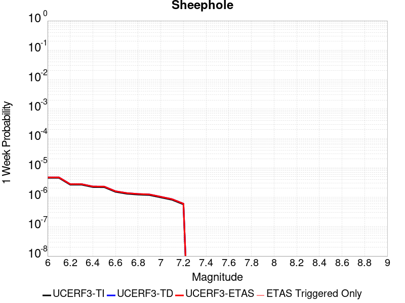 |  |  |  |

| Magnitude | 1 wk TI Prob | 1 wk TD Prob | 1 wk ETAS Prob | 1 wk ETAS/TD Gain | 1 wk ETAS Triggered Only | 1 mo TI Prob | 1 mo TD Prob | 1 mo ETAS Prob | 1 mo ETAS/TD Gain | 1 mo ETAS Triggered Only | 1 yr TI Prob | 1 yr TD Prob | 1 yr ETAS Prob | 1 yr ETAS/TD Gain | 1 yr ETAS Triggered Only | 10 yr TI Prob | 10 yr TD Prob | 10 yr ETAS Prob | 10 yr ETAS/TD Gain | 10 yr ETAS Triggered Only |
|-----|-----|-----|-----|-----|-----|-----|-----|-----|-----|-----|-----|-----|-----|-----|-----|-----|-----|-----|-----|-----|
| 6.0 | 4.5579695E-6 | 4.7412877E-6 | 4.7412877E-6 | 1.0 | 0.0 | 1.9534009E-5 | 2.0319678E-5 | 4.031927E-5 | 1.9842476 | 2.0E-5 | 2.3780059E-4 | 2.4736955E-4 | 2.7736212E-4 | 1.1212461 | 3.0E-5 | 0.0023754628 | 0.0024714863 | 0.0025014123 | 1.0121084 | 3.0E-5 |
| 6.1 | 4.5579695E-6 | 4.7412877E-6 | 4.7412877E-6 | 1.0 | 0.0 | 1.9534009E-5 | 2.0319678E-5 | 4.031927E-5 | 1.9842476 | 2.0E-5 | 2.3780059E-4 | 2.4736955E-4 | 2.7736212E-4 | 1.1212461 | 3.0E-5 | 0.0023754628 | 0.0024714863 | 0.0025014123 | 1.0121084 | 3.0E-5 |
| 6.2 | 2.6677674E-6 | 2.7874107E-6 | 2.7874107E-6 | 1.0 | 0.0 | 1.1433239E-5 | 1.1945997E-5 | 2.1945878E-5 | 1.8370905 | 1.0E-5 | 1.3919079E-4 | 1.4543389E-4 | 1.6543099E-4 | 1.1374996 | 2.0E-5 | 0.0013910364 | 0.001453493 | 0.001473464 | 1.01374 | 2.0E-5 |
| 6.3 | 2.6677674E-6 | 2.7874107E-6 | 2.7874107E-6 | 1.0 | 0.0 | 1.1433239E-5 | 1.1945997E-5 | 2.1945878E-5 | 1.8370905 | 1.0E-5 | 1.3919079E-4 | 1.4543389E-4 | 1.6543099E-4 | 1.1374996 | 2.0E-5 | 0.0013910364 | 0.001453493 | 0.001473464 | 1.01374 | 2.0E-5 |
| 6.4 | 2.2159759E-6 | 2.3228936E-6 | 2.3228936E-6 | 1.0 | 0.0 | 9.497005E-6 | 9.955224E-6 | 1.9955125E-5 | 2.0044878 | 1.0E-5 | 1.156199E-4 | 1.2119893E-4 | 1.411965E-4 | 1.1649979 | 2.0E-5 | 0.0011555976 | 0.0012114076 | 0.0012313834 | 1.0164897 | 2.0E-5 |
| 6.5 | 2.1986082E-6 | 2.3047737E-6 | 2.3047737E-6 | 1.0 | 0.0 | 9.4225725E-6 | 9.877569E-6 | 1.987747E-5 | 2.012385 | 1.0E-5 | 1.1471378E-4 | 1.2025358E-4 | 1.4025117E-4 | 1.1662952 | 2.0E-5 | 0.0011465458 | 0.0012019643 | 0.0012219403 | 1.0166194 | 2.0E-5 |
| 6.6 | 1.5232331E-6 | 1.6019028E-6 | 1.6019028E-6 | 1.0 | 0.0 | 6.5281256E-6 | 6.8652807E-6 | 6.8652807E-6 | 1.0 | 0.0 | 7.947703E-5 | 8.358178E-5 | 9.3580944E-5 | 1.1196333 | 1.0E-5 | 7.9448614E-4 | 8.3552214E-4 | 8.455138E-4 | 1.0119586 | 1.0E-5 |
| 6.7 | 1.3137362E-6 | 1.3828287E-6 | 1.3828287E-6 | 1.0 | 0.0 | 5.6302856E-6 | 5.926396E-6 | 5.926396E-6 | 1.0 | 0.0 | 6.854657E-5 | 7.2151626E-5 | 8.21509E-5 | 1.138587 | 1.0E-5 | 6.8525434E-4 | 7.212959E-4 | 7.312887E-4 | 1.0138539 | 1.0E-5 |
| 6.8 | 1.2275751E-6 | 1.2922936E-6 | 1.2922936E-6 | 1.0 | 0.0 | 5.2610258E-6 | 5.5383903E-6 | 5.5383903E-6 | 1.0 | 0.0 | 6.4051106E-5 | 6.742795E-5 | 7.742728E-5 | 1.1482965 | 1.0E-5 | 6.4032647E-4 | 6.740883E-4 | 6.840816E-4 | 1.0148249 | 1.0E-5 |
| 6.9 | 1.1837088E-6 | 1.2461107E-6 | 1.2461107E-6 | 1.0 | 0.0 | 5.0730278E-6 | 5.340464E-6 | 5.340464E-6 | 1.0 | 0.0 | 6.176237E-5 | 6.501835E-5 | 7.50177E-5 | 1.1537927 | 1.0E-5 | 6.17452E-4 | 6.500064E-4 | 6.599999E-4 | 1.0153744 | 1.0E-5 |
| 7.0 | 9.849371E-7 | 1.036636E-6 | 1.036636E-6 | 1.0 | 0.0 | 4.2211523E-6 | 4.442719E-6 | 4.442719E-6 | 1.0 | 0.0 | 5.1391315E-5 | 5.408886E-5 | 5.408886E-5 | 1.0 | 0.0 | 5.137943E-4 | 5.4076704E-4 | 5.4076704E-4 | 1.0 | 0.0 |
| 7.1 | 8.1643645E-7 | 8.5917287E-7 | 8.5917287E-7 | 1.0 | 0.0 | 3.4990085E-6 | 3.6821648E-6 | 3.6821648E-6 | 1.0 | 0.0 | 4.2599597E-5 | 4.482952E-5 | 4.482952E-5 | 1.0 | 0.0 | 4.259143E-4 | 4.482134E-4 | 4.482134E-4 | 1.0 | 0.0 |
| 7.2 | 5.7295756E-7 | 6.029544E-7 | 6.029544E-7 | 1.0 | 0.0 | 2.45553E-6 | 2.584088E-6 | 2.584088E-6 | 1.0 | 0.0 | 2.9895667E-5 | 3.1460884E-5 | 3.1460884E-5 | 1.0 | 0.0 | 2.9891645E-4 | 3.14571E-4 | 3.14571E-4 | 1.0 | 0.0 |

## San Jacinto (Clark) rev
*[(top)](#table-of-contents)*

| 1 Week | 1 Month | 1 Year | 10 Year |
|-----|-----|-----|-----|
|  |  |  |  |

| Magnitude | 1 wk TI Prob | 1 wk TD Prob | 1 wk ETAS Prob | 1 wk ETAS/TD Gain | 1 wk ETAS Triggered Only | 1 mo TI Prob | 1 mo TD Prob | 1 mo ETAS Prob | 1 mo ETAS/TD Gain | 1 mo ETAS Triggered Only | 1 yr TI Prob | 1 yr TD Prob | 1 yr ETAS Prob | 1 yr ETAS/TD Gain | 1 yr ETAS Triggered Only | 10 yr TI Prob | 10 yr TD Prob | 10 yr ETAS Prob | 10 yr ETAS/TD Gain | 10 yr ETAS Triggered Only |
|-----|-----|-----|-----|-----|-----|-----|-----|-----|-----|-----|-----|-----|-----|-----|-----|-----|-----|-----|-----|-----|
| 6.0 | 4.482615E-5 | 2.1162805E-5 | 2.1162805E-5 | 1.0 | 0.0 | 1.9209793E-4 | 9.069463E-5 | 9.069463E-5 | 1.0 | 0.0 | 0.0023362834 | 0.0011036571 | 0.0011036571 | 1.0 | 0.0 | 0.02311874 | 0.011508432 | 0.011538086 | 1.0025768 | 3.0E-5 |
| 6.1 | 4.482615E-5 | 2.1162805E-5 | 2.1162805E-5 | 1.0 | 0.0 | 1.9209793E-4 | 9.069463E-5 | 9.069463E-5 | 1.0 | 0.0 | 0.0023362834 | 0.0011036571 | 0.0011036571 | 1.0 | 0.0 | 0.02311874 | 0.011508432 | 0.011538086 | 1.0025768 | 3.0E-5 |
| 6.2 | 4.482615E-5 | 2.1162805E-5 | 2.1162805E-5 | 1.0 | 0.0 | 1.9209793E-4 | 9.069463E-5 | 9.069463E-5 | 1.0 | 0.0 | 0.0023362834 | 0.0011036571 | 0.0011036571 | 1.0 | 0.0 | 0.02311874 | 0.011508432 | 0.011538086 | 1.0025768 | 3.0E-5 |
| 6.3 | 4.482615E-5 | 2.1162805E-5 | 2.1162805E-5 | 1.0 | 0.0 | 1.9209793E-4 | 9.069463E-5 | 9.069463E-5 | 1.0 | 0.0 | 0.0023362834 | 0.0011036571 | 0.0011036571 | 1.0 | 0.0 | 0.02311874 | 0.011508432 | 0.011538086 | 1.0025768 | 3.0E-5 |
| 6.4 | 4.482615E-5 | 2.1162805E-5 | 2.1162805E-5 | 1.0 | 0.0 | 1.9209793E-4 | 9.069463E-5 | 9.069463E-5 | 1.0 | 0.0 | 0.0023362834 | 0.0011036571 | 0.0011036571 | 1.0 | 0.0 | 0.02311874 | 0.011508432 | 0.011538086 | 1.0025768 | 3.0E-5 |
| 6.5 | 3.7294863E-5 | 1.7363767E-5 | 1.7363767E-5 | 1.0 | 0.0 | 1.5982533E-4 | 7.441404E-5 | 7.441404E-5 | 1.0 | 0.0 | 0.0019441366 | 9.056189E-4 | 9.056189E-4 | 1.0 | 0.0 | 0.01927216 | 0.009498186 | 0.009527901 | 1.0031285 | 3.0E-5 |
| 6.6 | 3.7294863E-5 | 1.7363767E-5 | 1.7363767E-5 | 1.0 | 0.0 | 1.5982533E-4 | 7.441404E-5 | 7.441404E-5 | 1.0 | 0.0 | 0.0019441366 | 9.056189E-4 | 9.056189E-4 | 1.0 | 0.0 | 0.01927216 | 0.009498186 | 0.009527901 | 1.0031285 | 3.0E-5 |
| 6.7 | 3.6039248E-5 | 1.661182E-5 | 1.661182E-5 | 1.0 | 0.0 | 1.5444479E-4 | 7.11916E-5 | 7.11916E-5 | 1.0 | 0.0 | 0.0018787434 | 8.6641713E-4 | 8.6641713E-4 | 1.0 | 0.0 | 0.01862939 | 0.009100041 | 0.009129768 | 1.0032667 | 3.0E-5 |
| 6.8 | 3.5031844E-5 | 1.6240316E-5 | 1.6240316E-5 | 1.0 | 0.0 | 1.5012783E-4 | 6.959952E-5 | 6.959952E-5 | 1.0 | 0.0 | 0.0018262739 | 8.470488E-4 | 8.470488E-4 | 1.0 | 0.0 | 0.01811338 | 0.008899899 | 0.008929633 | 1.0033408 | 3.0E-5 |
| 6.9 | 3.435112E-5 | 1.6070499E-5 | 1.6070499E-5 | 1.0 | 0.0 | 1.4721078E-4 | 6.887177E-5 | 6.887177E-5 | 1.0 | 0.0 | 0.0017908178 | 8.381953E-4 | 8.381953E-4 | 1.0 | 0.0 | 0.017764548 | 0.008808068 | 0.008837804 | 1.003376 | 3.0E-5 |
| 7.0 | 2.8959772E-5 | 1.4343366E-5 | 1.4343366E-5 | 1.0 | 0.0 | 1.241074E-4 | 6.1470135E-5 | 6.1470135E-5 | 1.0 | 0.0 | 0.0015099603 | 7.481447E-4 | 7.481447E-4 | 1.0 | 0.0 | 0.014997416 | 0.0078715505 | 0.007891393 | 1.0025208 | 2.0E-5 |
| 7.1 | 2.6002877E-5 | 1.2835043E-5 | 1.2835043E-5 | 1.0 | 0.0 | 1.11436144E-4 | 5.500618E-5 | 5.500618E-5 | 1.0 | 0.0 | 0.0013558907 | 6.694966E-4 | 6.694966E-4 | 1.0 | 0.0 | 0.013476475 | 0.007049743 | 0.007069602 | 1.002817 | 2.0E-5 |
| 7.2 | 2.2544838E-5 | 1.1267972E-5 | 1.1267972E-5 | 1.0 | 0.0 | 9.661716E-5 | 4.829042E-5 | 4.829042E-5 | 1.0 | 0.0 | 0.001175679 | 5.8777875E-4 | 5.8777875E-4 | 1.0 | 0.0 | 0.011694785 | 0.0061956523 | 0.006215528 | 1.003208 | 2.0E-5 |
| 7.3 | 1.75334E-5 | 1.081679E-5 | 1.081679E-5 | 1.0 | 0.0 | 7.514098E-5 | 4.6356854E-5 | 4.6356854E-5 | 1.0 | 0.0 | 9.144575E-4 | 5.6424993E-4 | 5.6424993E-4 | 1.0 | 0.0 | 0.009107036 | 0.005936473 | 0.0059563546 | 1.003349 | 2.0E-5 |
| 7.4 | 1.5924552E-5 | 1.0616479E-5 | 1.0616479E-5 | 1.0 | 0.0 | 6.82463E-5 | 4.5498407E-5 | 4.5498407E-5 | 1.0 | 0.0 | 8.305819E-4 | 5.538037E-4 | 5.538037E-4 | 1.0 | 0.0 | 0.008274844 | 0.005823671 | 0.0058435546 | 1.0034143 | 2.0E-5 |
| 7.5 | 1.3428931E-5 | 9.856627E-6 | 9.856627E-6 | 1.0 | 0.0 | 5.7551293E-5 | 4.224201E-5 | 4.224201E-5 | 1.0 | 0.0 | 7.004617E-4 | 5.1417615E-4 | 5.1417615E-4 | 1.0 | 0.0 | 0.006982579 | 0.005409115 | 0.0054290066 | 1.0036775 | 2.0E-5 |
| 7.6 | 1.0688787E-5 | 8.61931E-6 | 8.61931E-6 | 1.0 | 0.0 | 4.5808283E-5 | 3.6939382E-5 | 3.6939382E-5 | 1.0 | 0.0 | 5.5757316E-4 | 4.4964463E-4 | 4.4964463E-4 | 1.0 | 0.0 | 0.005561762 | 0.004744031 | 0.004763936 | 1.0041958 | 2.0E-5 |
| 7.7 | 8.81236E-6 | 7.4723484E-6 | 7.4723484E-6 | 1.0 | 0.0 | 3.776671E-5 | 3.202396E-5 | 3.202396E-5 | 1.0 | 0.0 | 4.597127E-4 | 3.8982215E-4 | 3.8982215E-4 | 1.0 | 0.0 | 0.0045876284 | 0.004136955 | 0.004156872 | 1.0048145 | 2.0E-5 |
| 7.8 | 7.780431E-6 | 6.7006613E-6 | 6.7006613E-6 | 1.0 | 0.0 | 3.3344273E-5 | 2.8716804E-5 | 2.8716804E-5 | 1.0 | 0.0 | 4.0589093E-4 | 3.4957117E-4 | 3.4957117E-4 | 1.0 | 0.0 | 0.0040515037 | 0.0037249678 | 0.0037448932 | 1.0053492 | 2.0E-5 |
| 7.9 | 6.5437994E-6 | 5.784193E-6 | 5.784193E-6 | 1.0 | 0.0 | 2.8044553E-5 | 2.4789164E-5 | 2.4789164E-5 | 1.0 | 0.0 | 3.4138895E-4 | 3.0176644E-4 | 3.0176644E-4 | 1.0 | 0.0 | 0.0034086495 | 0.003236521 | 0.0032564562 | 1.0061594 | 2.0E-5 |
| 8.0 | 5.4488164E-6 | 4.8167294E-6 | 4.8167294E-6 | 1.0 | 0.0 | 2.3351862E-5 | 2.0642963E-5 | 2.0642963E-5 | 1.0 | 0.0 | 2.8427184E-4 | 2.5129924E-4 | 2.5129924E-4 | 1.0 | 0.0 | 0.0028390845 | 0.0027126544 | 0.0027326003 | 1.0073528 | 2.0E-5 |
| 8.1 | 2.8397242E-6 | 1.3684335E-6 | 1.3684335E-6 | 1.0 | 0.0 | 1.217019E-5 | 5.864702E-6 | 5.864702E-6 | 1.0 | 0.0 | 1.4816198E-4 | 7.140042E-5 | 7.140042E-5 | 1.0 | 0.0 | 0.0014806325 | 8.12321E-4 | 8.12321E-4 | 1.0 | 0.0 |
| 8.2 | 2.030244E-6 | 6.326596E-7 | 6.326596E-7 | 1.0 | 0.0 | 8.701017E-6 | 2.7113954E-6 | 2.7113954E-6 | 1.0 | 0.0 | 1.05929736E-4 | 3.3010747E-5 | 3.3010747E-5 | 1.0 | 0.0 | 0.0010587925 | 3.9531066E-4 | 3.9531066E-4 | 1.0 | 0.0 |
| 8.3 | 1.0659804E-6 | 2.9287372E-7 | 2.9287372E-7 | 1.0 | 0.0 | 4.568479E-6 | 1.2551725E-6 | 1.2551725E-6 | 1.0 | 0.0 | 5.5619817E-5 | 1.5281621E-5 | 1.5281621E-5 | 1.0 | 0.0 | 5.5605895E-4 | 1.8588232E-4 | 1.8588232E-4 | 1.0 | 0.0 |

## Red Mountain
*[(top)](#table-of-contents)*

| 1 Week | 1 Month | 1 Year | 10 Year |
|-----|-----|-----|-----|
|  |  |  |  |

| Magnitude | 1 wk TI Prob | 1 wk TD Prob | 1 wk ETAS Prob | 1 wk ETAS/TD Gain | 1 wk ETAS Triggered Only | 1 mo TI Prob | 1 mo TD Prob | 1 mo ETAS Prob | 1 mo ETAS/TD Gain | 1 mo ETAS Triggered Only | 1 yr TI Prob | 1 yr TD Prob | 1 yr ETAS Prob | 1 yr ETAS/TD Gain | 1 yr ETAS Triggered Only | 10 yr TI Prob | 10 yr TD Prob | 10 yr ETAS Prob | 10 yr ETAS/TD Gain | 10 yr ETAS Triggered Only |
|-----|-----|-----|-----|-----|-----|-----|-----|-----|-----|-----|-----|-----|-----|-----|-----|-----|-----|-----|-----|-----|
| 6.0 | 4.1810763E-5 | 4.7591006E-5 | 4.7591006E-5 | 1.0 | 0.0 | 1.7917668E-4 | 2.0394645E-4 | 2.139444E-4 | 1.0490224 | 1.0E-5 | 0.0021792934 | 0.0024803858 | 0.0025003362 | 1.0080433 | 2.0E-5 | 0.021580452 | 0.02454463 | 0.024573894 | 1.0011922 | 3.0E-5 |
| 6.1 | 4.1810763E-5 | 4.7591006E-5 | 4.7591006E-5 | 1.0 | 0.0 | 1.7917668E-4 | 2.0394645E-4 | 2.139444E-4 | 1.0490224 | 1.0E-5 | 0.0021792934 | 0.0024803858 | 0.0025003362 | 1.0080433 | 2.0E-5 | 0.021580452 | 0.02454463 | 0.024573894 | 1.0011922 | 3.0E-5 |
| 6.2 | 4.1810763E-5 | 4.7591006E-5 | 4.7591006E-5 | 1.0 | 0.0 | 1.7917668E-4 | 2.0394645E-4 | 2.139444E-4 | 1.0490224 | 1.0E-5 | 0.0021792934 | 0.0024803858 | 0.0025003362 | 1.0080433 | 2.0E-5 | 0.021580452 | 0.02454463 | 0.024573894 | 1.0011922 | 3.0E-5 |
| 6.3 | 4.1810763E-5 | 4.7591006E-5 | 4.7591006E-5 | 1.0 | 0.0 | 1.7917668E-4 | 2.0394645E-4 | 2.139444E-4 | 1.0490224 | 1.0E-5 | 0.0021792934 | 0.0024803858 | 0.0025003362 | 1.0080433 | 2.0E-5 | 0.021580452 | 0.02454463 | 0.024573894 | 1.0011922 | 3.0E-5 |
| 6.4 | 4.1810763E-5 | 4.7591006E-5 | 4.7591006E-5 | 1.0 | 0.0 | 1.7917668E-4 | 2.0394645E-4 | 2.139444E-4 | 1.0490224 | 1.0E-5 | 0.0021792934 | 0.0024803858 | 0.0025003362 | 1.0080433 | 2.0E-5 | 0.021580452 | 0.02454463 | 0.024573894 | 1.0011922 | 3.0E-5 |
| 6.5 | 3.154503E-5 | 3.5360477E-5 | 3.5360477E-5 | 1.0 | 0.0 | 1.3518598E-4 | 1.5153662E-4 | 1.5153662E-4 | 1.0 | 0.0 | 0.0016446467 | 0.0018434891 | 0.0018534707 | 1.0054145 | 1.0E-5 | 0.01632528 | 0.018291617 | 0.018311251 | 1.0010734 | 2.0E-5 |
| 6.6 | 3.1535834E-5 | 3.5349858E-5 | 3.5349858E-5 | 1.0 | 0.0 | 1.3514658E-4 | 1.5149111E-4 | 1.5149111E-4 | 1.0 | 0.0 | 0.0016441676 | 0.001842936 | 0.0018529176 | 1.0054162 | 1.0E-5 | 0.01632056 | 0.018286178 | 0.018305812 | 1.0010737 | 2.0E-5 |
| 6.7 | 2.8267326E-5 | 3.146999E-5 | 3.146999E-5 | 1.0 | 0.0 | 1.2114006E-4 | 1.348649E-4 | 1.348649E-4 | 1.0 | 0.0 | 0.0014738824 | 0.0016408286 | 0.0016508121 | 1.0060844 | 1.0E-5 | 0.014641452 | 0.016295899 | 0.016315572 | 1.0012074 | 2.0E-5 |
| 6.8 | 2.8212884E-5 | 3.1407875E-5 | 3.1407875E-5 | 1.0 | 0.0 | 1.20906756E-4 | 1.3459871E-4 | 1.3459871E-4 | 1.0 | 0.0 | 0.0014710457 | 0.0016375926 | 0.0016475762 | 1.0060965 | 1.0E-5 | 0.014613459 | 0.016264014 | 0.016283689 | 1.0012097 | 2.0E-5 |
| 6.9 | 2.4227871E-5 | 2.6707517E-5 | 2.6707517E-5 | 1.0 | 0.0 | 1.03829596E-4 | 1.1445619E-4 | 1.1445619E-4 | 1.0 | 0.0 | 0.0012633923 | 0.0013926893 | 0.0013926893 | 1.0 | 0.0 | 0.012562336 | 0.013847304 | 0.013847304 | 1.0 | 0.0 |
| 7.0 | 2.348524E-5 | 2.5836282E-5 | 2.5836282E-5 | 1.0 | 0.0 | 1.0064714E-4 | 1.1072265E-4 | 1.1072265E-4 | 1.0 | 0.0 | 0.0012246901 | 0.0013472902 | 0.0013472902 | 1.0 | 0.0 | 0.012179627 | 0.013398857 | 0.013398857 | 1.0 | 0.0 |
| 7.1 | 2.2311642E-5 | 2.4463316E-5 | 2.4463316E-5 | 1.0 | 0.0 | 9.561782E-5 | 1.04839E-4 | 1.04839E-4 | 1.0 | 0.0 | 0.0011635252 | 0.0012757422 | 0.0012757422 | 1.0 | 0.0 | 0.01157452 | 0.012691703 | 0.012691703 | 1.0 | 0.0 |
| 7.2 | 1.6533986E-5 | 1.7670676E-5 | 1.7670676E-5 | 1.0 | 0.0 | 7.085802E-5 | 7.572963E-5 | 7.572963E-5 | 1.0 | 0.0 | 8.623549E-4 | 9.2168164E-4 | 9.2168164E-4 | 1.0 | 0.0 | 0.008590161 | 0.009184869 | 0.009184869 | 1.0 | 0.0 |
| 7.3 | 1.4703092E-5 | 1.5559806E-5 | 1.5559806E-5 | 1.0 | 0.0 | 6.301173E-5 | 6.6683526E-5 | 6.6683526E-5 | 1.0 | 0.0 | 7.668978E-4 | 8.1163115E-4 | 8.1163115E-4 | 1.0 | 0.0 | 0.0076425658 | 0.008092744 | 0.008092744 | 1.0 | 0.0 |
| 7.4 | 6.1331984E-6 | 5.52893E-6 | 5.52893E-6 | 1.0 | 0.0 | 2.6284872E-5 | 2.3695204E-5 | 2.3695204E-5 | 1.0 | 0.0 | 3.199713E-4 | 2.8845144E-4 | 2.8845144E-4 | 1.0 | 0.0 | 0.0031951098 | 0.0028808247 | 0.0028808247 | 1.0 | 0.0 |
| 7.5 | 5.954766E-6 | 5.338558E-6 | 5.338558E-6 | 1.0 | 0.0 | 2.5520176E-5 | 2.2879336E-5 | 2.2879336E-5 | 1.0 | 0.0 | 3.1066386E-4 | 2.7852083E-4 | 2.7852083E-4 | 1.0 | 0.0 | 0.003102299 | 0.0027817716 | 0.0027817716 | 1.0 | 0.0 |
| 7.6 | 4.9726646E-6 | 4.315341E-6 | 4.315341E-6 | 1.0 | 0.0 | 2.1311245E-5 | 1.8494187E-5 | 1.8494187E-5 | 1.0 | 0.0 | 2.5943352E-4 | 2.2514381E-4 | 2.2514381E-4 | 1.0 | 0.0 | 0.0025913084 | 0.0022491917 | 0.0022491917 | 1.0 | 0.0 |
| 7.7 | 3.3613894E-6 | 2.8526943E-6 | 2.8526943E-6 | 1.0 | 0.0 | 1.4405875E-5 | 1.2225777E-5 | 1.2225777E-5 | 1.0 | 0.0 | 1.7537741E-4 | 1.4883894E-4 | 1.4883894E-4 | 1.0 | 0.0 | 0.0017523908 | 0.0014874188 | 0.0014874188 | 1.0 | 0.0 |
| 7.8 | 1.1828961E-6 | 1.0122844E-6 | 1.0122844E-6 | 1.0 | 0.0 | 5.069545E-6 | 4.338355E-6 | 4.338355E-6 | 1.0 | 0.0 | 6.171996E-5 | 5.281822E-5 | 5.281822E-5 | 1.0 | 0.0 | 6.170282E-4 | 5.280596E-4 | 5.280596E-4 | 1.0 | 0.0 |
| 7.9 | 2.2967266E-7 | 1.8619119E-7 | 1.8619119E-7 | 1.0 | 0.0 | 9.843111E-7 | 7.9796195E-7 | 7.9796195E-7 | 1.0 | 0.0 | 1.19839215E-5 | 9.715147E-6 | 9.715147E-6 | 1.0 | 0.0 | 1.1983275E-4 | 9.714751E-5 | 9.714751E-5 | 1.0 | 0.0 |

## Santa Susana alt 1
*[(top)](#table-of-contents)*

| 1 Week | 1 Month | 1 Year | 10 Year |
|-----|-----|-----|-----|
|  |  |  |  |

| Magnitude | 1 wk TI Prob | 1 wk TD Prob | 1 wk ETAS Prob | 1 wk ETAS/TD Gain | 1 wk ETAS Triggered Only | 1 mo TI Prob | 1 mo TD Prob | 1 mo ETAS Prob | 1 mo ETAS/TD Gain | 1 mo ETAS Triggered Only | 1 yr TI Prob | 1 yr TD Prob | 1 yr ETAS Prob | 1 yr ETAS/TD Gain | 1 yr ETAS Triggered Only | 10 yr TI Prob | 10 yr TD Prob | 10 yr ETAS Prob | 10 yr ETAS/TD Gain | 10 yr ETAS Triggered Only |
|-----|-----|-----|-----|-----|-----|-----|-----|-----|-----|-----|-----|-----|-----|-----|-----|-----|-----|-----|-----|-----|
| 6.0 | 2.674877E-5 | 2.7198636E-5 | 2.7198636E-5 | 1.0 | 0.0 | 1.1463255E-4 | 1.16561016E-4 | 1.16561016E-4 | 1.0 | 0.0 | 0.0013947578 | 0.0014183201 | 0.001428306 | 1.0070406 | 1.0E-5 | 0.013860362 | 0.014104444 | 0.014134021 | 1.002097 | 3.0E-5 |
| 6.1 | 2.674877E-5 | 2.7198636E-5 | 2.7198636E-5 | 1.0 | 0.0 | 1.1463255E-4 | 1.16561016E-4 | 1.16561016E-4 | 1.0 | 0.0 | 0.0013947578 | 0.0014183201 | 0.001428306 | 1.0070406 | 1.0E-5 | 0.013860362 | 0.014104444 | 0.014134021 | 1.002097 | 3.0E-5 |
| 6.2 | 2.674877E-5 | 2.7198636E-5 | 2.7198636E-5 | 1.0 | 0.0 | 1.1463255E-4 | 1.16561016E-4 | 1.16561016E-4 | 1.0 | 0.0 | 0.0013947578 | 0.0014183201 | 0.001428306 | 1.0070406 | 1.0E-5 | 0.013860362 | 0.014104444 | 0.014134021 | 1.002097 | 3.0E-5 |
| 6.3 | 2.674877E-5 | 2.7198636E-5 | 2.7198636E-5 | 1.0 | 0.0 | 1.1463255E-4 | 1.16561016E-4 | 1.16561016E-4 | 1.0 | 0.0 | 0.0013947578 | 0.0014183201 | 0.001428306 | 1.0070406 | 1.0E-5 | 0.013860362 | 0.014104444 | 0.014134021 | 1.002097 | 3.0E-5 |
| 6.4 | 2.674877E-5 | 2.7198636E-5 | 2.7198636E-5 | 1.0 | 0.0 | 1.1463255E-4 | 1.16561016E-4 | 1.16561016E-4 | 1.0 | 0.0 | 0.0013947578 | 0.0014183201 | 0.001428306 | 1.0070406 | 1.0E-5 | 0.013860362 | 0.014104444 | 0.014134021 | 1.002097 | 3.0E-5 |
| 6.5 | 2.674877E-5 | 2.7198636E-5 | 2.7198636E-5 | 1.0 | 0.0 | 1.1463255E-4 | 1.16561016E-4 | 1.16561016E-4 | 1.0 | 0.0 | 0.0013947578 | 0.0014183201 | 0.001428306 | 1.0070406 | 1.0E-5 | 0.013860362 | 0.014104444 | 0.014134021 | 1.002097 | 3.0E-5 |
| 6.6 | 2.6647976E-5 | 2.707497E-5 | 2.707497E-5 | 1.0 | 0.0 | 1.14200615E-4 | 1.16031064E-4 | 1.16031064E-4 | 1.0 | 0.0 | 0.0013895056 | 0.0014118766 | 0.0014218625 | 1.0070728 | 1.0E-5 | 0.013808494 | 0.014040828 | 0.014070407 | 1.0021067 | 3.0E-5 |
| 6.7 | 2.6647976E-5 | 2.707497E-5 | 2.707497E-5 | 1.0 | 0.0 | 1.14200615E-4 | 1.16031064E-4 | 1.16031064E-4 | 1.0 | 0.0 | 0.0013895056 | 0.0014118766 | 0.0014218625 | 1.0070728 | 1.0E-5 | 0.013808494 | 0.014040828 | 0.014070407 | 1.0021067 | 3.0E-5 |
| 6.8 | 1.9073179E-5 | 1.7637585E-5 | 1.7637585E-5 | 1.0 | 0.0 | 8.1739636E-5 | 7.5587566E-5 | 7.5587566E-5 | 1.0 | 0.0 | 9.947256E-4 | 9.199082E-4 | 9.29899E-4 | 1.0108607 | 1.0E-5 | 0.009902848 | 0.009163258 | 0.009183074 | 1.0021626 | 2.0E-5 |
| 6.9 | 1.9041876E-5 | 1.7619717E-5 | 1.7619717E-5 | 1.0 | 0.0 | 8.160549E-5 | 7.551099E-5 | 7.551099E-5 | 1.0 | 0.0 | 9.930939E-4 | 9.189767E-4 | 9.289675E-4 | 1.0108716 | 1.0E-5 | 0.0098866755 | 0.009154019 | 0.009173836 | 1.0021648 | 2.0E-5 |
| 7.0 | 1.5917482E-5 | 1.3864059E-5 | 1.3864059E-5 | 1.0 | 0.0 | 6.8215995E-5 | 5.941607E-5 | 5.941607E-5 | 1.0 | 0.0 | 8.302132E-4 | 7.231552E-4 | 7.3314796E-4 | 1.0138183 | 1.0E-5 | 0.008271185 | 0.007208915 | 0.0072287708 | 1.0027543 | 2.0E-5 |
| 7.1 | 1.577788E-5 | 1.3744065E-5 | 1.3744065E-5 | 1.0 | 0.0 | 6.761774E-5 | 5.890183E-5 | 5.890183E-5 | 1.0 | 0.0 | 8.2293496E-4 | 7.168985E-4 | 7.268913E-4 | 1.013939 | 1.0E-5 | 0.008198941 | 0.0071467515 | 0.0071666087 | 1.0027785 | 2.0E-5 |
| 7.2 | 1.5416446E-5 | 1.3470131E-5 | 1.3470131E-5 | 1.0 | 0.0 | 6.606882E-5 | 5.7727884E-5 | 5.7727884E-5 | 1.0 | 0.0 | 8.0409093E-4 | 7.0261495E-4 | 7.126079E-4 | 1.0142225 | 1.0E-5 | 0.008011877 | 0.0070048203 | 0.0070246803 | 1.0028352 | 2.0E-5 |
| 7.3 | 1.4534083E-5 | 1.2718048E-5 | 1.2718048E-5 | 1.0 | 0.0 | 6.228744E-5 | 5.4504806E-5 | 5.4504806E-5 | 1.0 | 0.0 | 7.580857E-4 | 6.633984E-4 | 6.733918E-4 | 1.0150639 | 1.0E-5 | 0.007555048 | 0.006615032 | 0.0066349 | 1.0030034 | 2.0E-5 |
| 7.4 | 1.2858995E-5 | 1.1229788E-5 | 1.1229788E-5 | 1.0 | 0.0 | 5.5108816E-5 | 4.8126793E-5 | 4.8126793E-5 | 1.0 | 0.0 | 6.7074323E-4 | 5.8579014E-4 | 5.957843E-4 | 1.017061 | 1.0E-5 | 0.0066872234 | 0.0058432347 | 0.005863118 | 1.0034027 | 2.0E-5 |
| 7.5 | 8.827668E-6 | 7.805538E-6 | 7.805538E-6 | 1.0 | 0.0 | 3.7832317E-5 | 3.345189E-5 | 3.345189E-5 | 1.0 | 0.0 | 4.605111E-4 | 4.0720313E-4 | 4.1719904E-4 | 1.0245478 | 1.0E-5 | 0.0045955796 | 0.004064819 | 0.0040847375 | 1.0049002 | 2.0E-5 |
| 7.6 | 3.2533426E-6 | 2.872008E-6 | 2.872008E-6 | 1.0 | 0.0 | 1.3942822E-5 | 1.230855E-5 | 1.230855E-5 | 1.0 | 0.0 | 1.6974064E-4 | 1.4984666E-4 | 1.5984516E-4 | 1.0667249 | 1.0E-5 | 0.0016961104 | 0.0014974931 | 0.0015074781 | 1.0066679 | 1.0E-5 |
| 7.7 | 1.2751709E-6 | 1.1491198E-6 | 1.1491198E-6 | 1.0 | 0.0 | 5.4650063E-6 | 4.9247906E-6 | 4.9247906E-6 | 1.0 | 0.0 | 6.653442E-5 | 5.9957765E-5 | 6.995717E-5 | 1.166774 | 1.0E-5 | 6.6514505E-4 | 5.994248E-4 | 6.094188E-4 | 1.0166726 | 1.0E-5 |
| 7.8 | 3.067544E-7 | 3.240072E-7 | 3.240072E-7 | 1.0 | 0.0 | 1.3146611E-6 | 1.3886016E-6 | 1.3886016E-6 | 1.0 | 0.0 | 1.600588E-5 | 1.6906104E-5 | 1.6906104E-5 | 1.0 | 0.0 | 1.6004729E-4 | 1.690492E-4 | 1.690492E-4 | 1.0 | 0.0 |
| 7.9 | 7.622999E-8 | 8.088032E-8 | 8.088032E-8 | 1.0 | 0.0 | 3.2669993E-7 | 3.4662992E-7 | 3.4662992E-7 | 1.0 | 0.0 | 3.977564E-6 | 4.220213E-6 | 4.220213E-6 | 1.0 | 0.0 | 3.977493E-5 | 4.2201536E-5 | 4.2201536E-5 | 1.0 | 0.0 |

## Malibu Coast (Extension) alt 1
*[(top)](#table-of-contents)*

| 1 Week | 1 Month | 1 Year | 10 Year |
|-----|-----|-----|-----|
|  |  |  |  |

| Magnitude | 1 wk TI Prob | 1 wk TD Prob | 1 wk ETAS Prob | 1 wk ETAS/TD Gain | 1 wk ETAS Triggered Only | 1 mo TI Prob | 1 mo TD Prob | 1 mo ETAS Prob | 1 mo ETAS/TD Gain | 1 mo ETAS Triggered Only | 1 yr TI Prob | 1 yr TD Prob | 1 yr ETAS Prob | 1 yr ETAS/TD Gain | 1 yr ETAS Triggered Only | 10 yr TI Prob | 10 yr TD Prob | 10 yr ETAS Prob | 10 yr ETAS/TD Gain | 10 yr ETAS Triggered Only |
|-----|-----|-----|-----|-----|-----|-----|-----|-----|-----|-----|-----|-----|-----|-----|-----|-----|-----|-----|-----|-----|
| 6.0 | 8.930738E-6 | 9.329346E-6 | 1.9329253E-5 | 2.0718765 | 1.0E-5 | 3.827403E-5 | 3.9982307E-5 | 4.9981907E-5 | 1.2501006 | 1.0E-5 | 4.6588664E-4 | 4.8667757E-4 | 5.066678E-4 | 1.041075 | 2.0E-5 | 0.0046491115 | 0.0048563 | 0.0048861546 | 1.0061475 | 3.0E-5 |
| 6.1 | 7.199952E-6 | 7.530357E-6 | 1.7530281E-5 | 2.3279483 | 1.0E-5 | 3.0856572E-5 | 3.227256E-5 | 4.227224E-5 | 1.3098507 | 1.0E-5 | 3.75614E-4 | 3.928482E-4 | 4.0284428E-4 | 1.0254451 | 1.0E-5 | 0.0037497976 | 0.003921604 | 0.0039315643 | 1.00254 | 1.0E-5 |
| 6.2 | 6.3721413E-6 | 6.6668467E-6 | 1.666678E-5 | 2.4999495 | 1.0E-5 | 2.7308892E-5 | 2.857189E-5 | 3.8571605E-5 | 1.3499843 | 1.0E-5 | 3.3243504E-4 | 3.478076E-4 | 3.5780412E-4 | 1.0287415 | 1.0E-5 | 0.0033193815 | 0.0034726725 | 0.0034826377 | 1.0028696 | 1.0E-5 |
| 6.3 | 6.016345E-6 | 6.2952113E-6 | 1.629515E-5 | 2.588499 | 1.0E-5 | 2.578408E-5 | 2.69792E-5 | 3.697893E-5 | 1.3706459 | 1.0E-5 | 3.1387596E-4 | 3.2842258E-4 | 3.3841928E-4 | 1.0304385 | 1.0E-5 | 0.00313433 | 0.0032794084 | 0.0032893755 | 1.0030394 | 1.0E-5 |
| 6.4 | 5.8104883E-6 | 6.0795965E-6 | 1.6079535E-5 | 2.644836 | 1.0E-5 | 2.4901856E-5 | 2.6055155E-5 | 3.6054895E-5 | 1.3837912 | 1.0E-5 | 3.031379E-4 | 3.1717564E-4 | 3.2717249E-4 | 1.0315182 | 1.0E-5 | 0.0030272473 | 0.0031672644 | 0.0031772326 | 1.0031472 | 1.0E-5 |
| 6.5 | 5.476925E-6 | 5.7275624E-6 | 1.5727504E-5 | 2.7459335 | 1.0E-5 | 2.3472323E-5 | 2.4546467E-5 | 3.454622E-5 | 1.4073806 | 1.0E-5 | 2.8573806E-4 | 2.9881255E-4 | 3.0880954E-4 | 1.0334558 | 1.0E-5 | 0.0028537093 | 0.0029841396 | 0.0029941096 | 1.0033411 | 1.0E-5 |
| 6.6 | 5.222387E-6 | 5.4586267E-6 | 1.5458572E-5 | 2.8319526 | 1.0E-5 | 2.2381464E-5 | 2.3393906E-5 | 3.3393673E-5 | 1.4274517 | 1.0E-5 | 2.7246025E-4 | 2.847839E-4 | 2.9478103E-4 | 1.0351044 | 1.0E-5 | 0.0027212645 | 0.00284422 | 0.0028541917 | 1.003506 | 1.0E-5 |
| 6.7 | 5.0337076E-6 | 5.2591486E-6 | 1.5259096E-5 | 2.9014385 | 1.0E-5 | 2.1572854E-5 | 2.2539016E-5 | 3.2538792E-5 | 1.4436651 | 1.0E-5 | 2.6261783E-4 | 2.7437825E-4 | 2.843755E-4 | 1.0364361 | 1.0E-5 | 0.002623077 | 0.0027404248 | 0.0027503974 | 1.0036391 | 1.0E-5 |
| 6.8 | 4.5675624E-6 | 4.7587573E-6 | 1.475871E-5 | 3.101379 | 1.0E-5 | 1.9575122E-5 | 2.0394515E-5 | 3.039431E-5 | 1.490318 | 1.0E-5 | 2.3830103E-4 | 2.4827512E-4 | 2.5827263E-4 | 1.040268 | 1.0E-5 | 0.0023804565 | 0.0024799972 | 0.0024899724 | 1.0040222 | 1.0E-5 |
| 6.9 | 4.2802412E-6 | 4.4520584E-6 | 1.44520145E-5 | 3.246142 | 1.0E-5 | 1.8343762E-5 | 1.9080113E-5 | 2.9079922E-5 | 1.5240959 | 1.0E-5 | 2.2331243E-4 | 2.3227576E-4 | 2.4227344E-4 | 1.0430423 | 1.0E-5 | 0.0022308815 | 0.0023203467 | 0.0023303234 | 1.0042998 | 1.0E-5 |
| 7.0 | 3.9794063E-6 | 4.130134E-6 | 1.41300925E-5 | 3.4212189 | 1.0E-5 | 1.7054486E-5 | 1.7700455E-5 | 2.7700278E-5 | 1.5649472 | 1.0E-5 | 2.0761859E-4 | 2.1548186E-4 | 2.254797E-4 | 1.0463976 | 1.0E-5 | 0.0020742472 | 0.0021527428 | 0.0021627212 | 1.0046352 | 1.0E-5 |
| 7.1 | 3.7730424E-6 | 3.91125E-6 | 3.91125E-6 | 1.0 | 0.0 | 1.6170083E-5 | 1.6762395E-5 | 1.6762395E-5 | 1.0 | 0.0 | 1.9685295E-4 | 2.0406317E-4 | 2.0406317E-4 | 1.0 | 0.0 | 0.0019667868 | 0.0020387706 | 0.0020387706 | 1.0 | 0.0 |
| 7.2 | 3.424985E-6 | 3.5413673E-6 | 3.5413673E-6 | 1.0 | 0.0 | 1.4678424E-5 | 1.51772E-5 | 1.51772E-5 | 1.0 | 0.0 | 1.7869516E-4 | 1.8476686E-4 | 1.8476686E-4 | 1.0 | 0.0 | 0.0017855153 | 0.0018461446 | 0.0018461446 | 1.0 | 0.0 |
| 7.3 | 2.6966375E-6 | 2.759676E-6 | 2.759676E-6 | 1.0 | 0.0 | 1.15569665E-5 | 1.1827129E-5 | 1.1827129E-5 | 1.0 | 0.0 | 1.4069698E-4 | 1.4398582E-4 | 1.4398582E-4 | 1.0 | 0.0 | 0.0014060794 | 0.0014389295 | 0.0014389295 | 1.0 | 0.0 |
| 7.4 | 2.215957E-6 | 2.2493962E-6 | 2.2493962E-6 | 1.0 | 0.0 | 9.496924E-6 | 9.640234E-6 | 9.640234E-6 | 1.0 | 0.0 | 1.1561892E-4 | 1.1736356E-4 | 1.1736356E-4 | 1.0 | 0.0 | 0.0011555878 | 0.0011730195 | 0.0011730195 | 1.0 | 0.0 |
| 7.5 | 1.2040218E-6 | 1.2219169E-6 | 1.2219169E-6 | 1.0 | 0.0 | 5.160083E-6 | 5.236777E-6 | 5.236777E-6 | 1.0 | 0.0 | 6.2822204E-5 | 6.3755906E-5 | 6.3755906E-5 | 1.0 | 0.0 | 6.280445E-4 | 6.37378E-4 | 6.37378E-4 | 1.0 | 0.0 |
| 7.6 | 6.6157446E-7 | 6.6790335E-7 | 6.6790335E-7 | 1.0 | 0.0 | 2.835316E-6 | 2.86244E-6 | 2.86244E-6 | 1.0 | 0.0 | 3.4519428E-5 | 3.4849665E-5 | 3.4849665E-5 | 1.0 | 0.0 | 3.4514067E-4 | 3.4844351E-4 | 3.4844351E-4 | 1.0 | 0.0 |
| 7.7 | 2.6012302E-7 | 2.4357794E-7 | 2.4357794E-7 | 1.0 | 0.0 | 1.1148124E-6 | 1.0439051E-6 | 1.0439051E-6 | 1.0 | 0.0 | 1.3572758E-5 | 1.2709481E-5 | 1.2709481E-5 | 1.0 | 0.0 | 1.3571928E-4 | 1.2708861E-4 | 1.2708861E-4 | 1.0 | 0.0 |
| 7.8 | 2.8323132E-8 | 2.026683E-8 | 2.026683E-8 | 1.0 | 0.0 | 1.2138484E-7 | 8.685784E-8 | 8.685784E-8 | 1.0 | 0.0 | 1.4778595E-6 | 1.0574938E-6 | 1.0574938E-6 | 1.0 | 0.0 | 1.4778497E-5 | 1.0574896E-5 | 1.0574896E-5 | 1.0 | 0.0 |

## Channel Islands Thrust
*[(top)](#table-of-contents)*

| 1 Week | 1 Month | 1 Year | 10 Year |
|-----|-----|-----|-----|
|  |  |  | 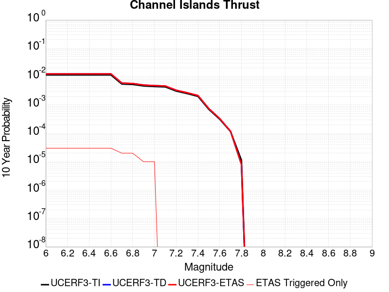 |

| Magnitude | 1 wk TI Prob | 1 wk TD Prob | 1 wk ETAS Prob | 1 wk ETAS/TD Gain | 1 wk ETAS Triggered Only | 1 mo TI Prob | 1 mo TD Prob | 1 mo ETAS Prob | 1 mo ETAS/TD Gain | 1 mo ETAS Triggered Only | 1 yr TI Prob | 1 yr TD Prob | 1 yr ETAS Prob | 1 yr ETAS/TD Gain | 1 yr ETAS Triggered Only | 10 yr TI Prob | 10 yr TD Prob | 10 yr ETAS Prob | 10 yr ETAS/TD Gain | 10 yr ETAS Triggered Only |
|-----|-----|-----|-----|-----|-----|-----|-----|-----|-----|-----|-----|-----|-----|-----|-----|-----|-----|-----|-----|-----|
| 6.0 | 2.2156251E-5 | 2.4092304E-5 | 3.4092063E-5 | 1.4150603 | 1.0E-5 | 9.495191E-5 | 1.03249244E-4 | 1.2324718E-4 | 1.193686 | 2.0E-5 | 0.0011554264 | 0.0012564411 | 0.0012864035 | 1.023847 | 3.0E-5 | 0.011494373 | 0.012503966 | 0.01253359 | 1.0023693 | 3.0E-5 |
| 6.1 | 2.2156251E-5 | 2.4092304E-5 | 3.4092063E-5 | 1.4150603 | 1.0E-5 | 9.495191E-5 | 1.03249244E-4 | 1.2324718E-4 | 1.193686 | 2.0E-5 | 0.0011554264 | 0.0012564411 | 0.0012864035 | 1.023847 | 3.0E-5 | 0.011494373 | 0.012503966 | 0.01253359 | 1.0023693 | 3.0E-5 |
| 6.2 | 2.2156251E-5 | 2.4092304E-5 | 3.4092063E-5 | 1.4150603 | 1.0E-5 | 9.495191E-5 | 1.03249244E-4 | 1.2324718E-4 | 1.193686 | 2.0E-5 | 0.0011554264 | 0.0012564411 | 0.0012864035 | 1.023847 | 3.0E-5 | 0.011494373 | 0.012503966 | 0.01253359 | 1.0023693 | 3.0E-5 |
| 6.3 | 2.2156251E-5 | 2.4092304E-5 | 3.4092063E-5 | 1.4150603 | 1.0E-5 | 9.495191E-5 | 1.03249244E-4 | 1.2324718E-4 | 1.193686 | 2.0E-5 | 0.0011554264 | 0.0012564411 | 0.0012864035 | 1.023847 | 3.0E-5 | 0.011494373 | 0.012503966 | 0.01253359 | 1.0023693 | 3.0E-5 |
| 6.4 | 2.2156251E-5 | 2.4092304E-5 | 3.4092063E-5 | 1.4150603 | 1.0E-5 | 9.495191E-5 | 1.03249244E-4 | 1.2324718E-4 | 1.193686 | 2.0E-5 | 0.0011554264 | 0.0012564411 | 0.0012864035 | 1.023847 | 3.0E-5 | 0.011494373 | 0.012503966 | 0.01253359 | 1.0023693 | 3.0E-5 |
| 6.5 | 2.2156251E-5 | 2.4092304E-5 | 3.4092063E-5 | 1.4150603 | 1.0E-5 | 9.495191E-5 | 1.03249244E-4 | 1.2324718E-4 | 1.193686 | 2.0E-5 | 0.0011554264 | 0.0012564411 | 0.0012864035 | 1.023847 | 3.0E-5 | 0.011494373 | 0.012503966 | 0.01253359 | 1.0023693 | 3.0E-5 |
| 6.6 | 2.2156251E-5 | 2.4092304E-5 | 3.4092063E-5 | 1.4150603 | 1.0E-5 | 9.495191E-5 | 1.03249244E-4 | 1.2324718E-4 | 1.193686 | 2.0E-5 | 0.0011554264 | 0.0012564411 | 0.0012864035 | 1.023847 | 3.0E-5 | 0.011494373 | 0.012503966 | 0.01253359 | 1.0023693 | 3.0E-5 |
| 6.7 | 1.0601296E-5 | 1.1379656E-5 | 2.1379543E-5 | 1.8787512 | 1.0E-5 | 4.5433335E-5 | 4.876907E-5 | 5.8768583E-5 | 1.205038 | 1.0E-5 | 5.5301044E-4 | 5.9360656E-4 | 6.1359466E-4 | 1.0336723 | 2.0E-5 | 0.005516363 | 0.0059207114 | 0.0059405933 | 1.003358 | 2.0E-5 |
| 6.8 | 1.0246747E-5 | 1.0996777E-5 | 2.0996667E-5 | 1.9093473 | 1.0E-5 | 4.391389E-5 | 4.712822E-5 | 5.712775E-5 | 1.212177 | 1.0E-5 | 5.345204E-4 | 5.736398E-4 | 5.936283E-4 | 1.0348451 | 2.0E-5 | 0.0053323656 | 0.005722081 | 0.0057419664 | 1.0034752 | 2.0E-5 |
| 6.9 | 9.049551E-6 | 9.699738E-6 | 1.969964E-5 | 2.0309458 | 1.0E-5 | 3.878322E-5 | 4.1569667E-5 | 5.156925E-5 | 1.24055 | 1.0E-5 | 4.7208337E-4 | 5.059973E-4 | 5.1599223E-4 | 1.019753 | 1.0E-5 | 0.0047108172 | 0.005048869 | 0.0050588185 | 1.0019706 | 1.0E-5 |
| 7.0 | 8.6542195E-6 | 9.274692E-6 | 1.92746E-5 | 2.078193 | 1.0E-5 | 3.7088983E-5 | 3.97481E-5 | 4.97477E-5 | 1.2515744 | 1.0E-5 | 4.5146482E-4 | 4.8382973E-4 | 4.938249E-4 | 1.0206584 | 1.0E-5 | 0.004505487 | 0.0048281755 | 0.0048381276 | 1.0020611 | 1.0E-5 |
| 7.1 | 8.391028E-6 | 8.993012E-6 | 8.993012E-6 | 1.0 | 0.0 | 3.5961057E-5 | 3.8540933E-5 | 3.8540933E-5 | 1.0 | 0.0 | 4.3773788E-4 | 4.691389E-4 | 4.691389E-4 | 1.0 | 0.0 | 0.004368766 | 0.0046818955 | 0.0046818955 | 1.0 | 0.0 |
| 7.2 | 5.965188E-6 | 6.3717544E-6 | 6.3717544E-6 | 1.0 | 0.0 | 2.556484E-5 | 2.7307235E-5 | 2.7307235E-5 | 1.0 | 0.0 | 3.1120746E-4 | 3.3241542E-4 | 3.3241542E-4 | 1.0 | 0.0 | 0.00310772 | 0.00331924 | 0.00331924 | 1.0 | 0.0 |
| 7.3 | 4.877518E-6 | 5.2060545E-6 | 5.2060545E-6 | 1.0 | 0.0 | 2.0903482E-5 | 2.2311473E-5 | 2.2311473E-5 | 1.0 | 0.0 | 2.5447016E-4 | 2.7160876E-4 | 2.7160876E-4 | 1.0 | 0.0 | 0.0025417898 | 0.0027128144 | 0.0027128144 | 1.0 | 0.0 |
| 7.4 | 3.8829853E-6 | 4.1419007E-6 | 4.1419007E-6 | 1.0 | 0.0 | 1.664126E-5 | 1.7750885E-5 | 1.7750885E-5 | 1.0 | 0.0 | 2.0258849E-4 | 2.16096E-4 | 2.16096E-4 | 1.0 | 0.0 | 0.002024039 | 0.0021589005 | 0.0021589005 | 1.0 | 0.0 |
| 7.5 | 1.3489616E-6 | 1.4278027E-6 | 1.4278027E-6 | 1.0 | 0.0 | 5.7812517E-6 | 6.1191404E-6 | 6.1191404E-6 | 1.0 | 0.0 | 7.038446E-5 | 7.449803E-5 | 7.449803E-5 | 1.0 | 0.0 | 7.036218E-4 | 7.447345E-4 | 7.447345E-4 | 1.0 | 0.0 |
| 7.6 | 6.058192E-7 | 6.353832E-7 | 6.353832E-7 | 1.0 | 0.0 | 2.5963652E-6 | 2.723068E-6 | 2.723068E-6 | 1.0 | 0.0 | 3.161029E-5 | 3.3152864E-5 | 3.3152864E-5 | 1.0 | 0.0 | 3.1605794E-4 | 3.314808E-4 | 3.314808E-4 | 1.0 | 0.0 |
| 7.7 | 2.2170494E-7 | 2.260808E-7 | 2.260808E-7 | 1.0 | 0.0 | 9.5016367E-7 | 9.689174E-7 | 9.689174E-7 | 1.0 | 0.0 | 1.1568181E-5 | 1.1796516E-5 | 1.1796516E-5 | 1.0 | 0.0 | 1.1567579E-4 | 1.17960015E-4 | 1.17960015E-4 | 1.0 | 0.0 |
| 7.8 | 2.1613102E-8 | 1.5466789E-8 | 1.5466789E-8 | 1.0 | 0.0 | 9.262757E-8 | 6.628623E-8 | 6.628623E-8 | 1.0 | 0.0 | 1.1277401E-6 | 8.0703467E-7 | 8.0703467E-7 | 1.0 | 0.0 | 1.1277344E-5 | 8.070325E-6 | 8.070325E-6 | 1.0 | 0.0 |

## Raymond
*[(top)](#table-of-contents)*

| 1 Week | 1 Month | 1 Year | 10 Year |
|-----|-----|-----|-----|
|  |  |  |  |

| Magnitude | 1 wk TI Prob | 1 wk TD Prob | 1 wk ETAS Prob | 1 wk ETAS/TD Gain | 1 wk ETAS Triggered Only | 1 mo TI Prob | 1 mo TD Prob | 1 mo ETAS Prob | 1 mo ETAS/TD Gain | 1 mo ETAS Triggered Only | 1 yr TI Prob | 1 yr TD Prob | 1 yr ETAS Prob | 1 yr ETAS/TD Gain | 1 yr ETAS Triggered Only | 10 yr TI Prob | 10 yr TD Prob | 10 yr ETAS Prob | 10 yr ETAS/TD Gain | 10 yr ETAS Triggered Only |
|-----|-----|-----|-----|-----|-----|-----|-----|-----|-----|-----|-----|-----|-----|-----|-----|-----|-----|-----|-----|-----|
| 6.0 | 1.5157413E-5 | 1.5810376E-5 | 1.5810376E-5 | 1.0 | 0.0 | 6.4958724E-5 | 6.775714E-5 | 6.775714E-5 | 1.0 | 0.0 | 7.905855E-4 | 8.24656E-4 | 8.24656E-4 | 1.0 | 0.0 | 0.007877788 | 0.008218477 | 0.00824823 | 1.0036203 | 3.0E-5 |
| 6.1 | 1.5157413E-5 | 1.5810376E-5 | 1.5810376E-5 | 1.0 | 0.0 | 6.4958724E-5 | 6.775714E-5 | 6.775714E-5 | 1.0 | 0.0 | 7.905855E-4 | 8.24656E-4 | 8.24656E-4 | 1.0 | 0.0 | 0.007877788 | 0.008218477 | 0.00824823 | 1.0036203 | 3.0E-5 |
| 6.2 | 1.5157413E-5 | 1.5810376E-5 | 1.5810376E-5 | 1.0 | 0.0 | 6.4958724E-5 | 6.775714E-5 | 6.775714E-5 | 1.0 | 0.0 | 7.905855E-4 | 8.24656E-4 | 8.24656E-4 | 1.0 | 0.0 | 0.007877788 | 0.008218477 | 0.00824823 | 1.0036203 | 3.0E-5 |
| 6.3 | 1.5157413E-5 | 1.5810376E-5 | 1.5810376E-5 | 1.0 | 0.0 | 6.4958724E-5 | 6.775714E-5 | 6.775714E-5 | 1.0 | 0.0 | 7.905855E-4 | 8.24656E-4 | 8.24656E-4 | 1.0 | 0.0 | 0.007877788 | 0.008218477 | 0.00824823 | 1.0036203 | 3.0E-5 |
| 6.4 | 1.3941944E-5 | 1.4454918E-5 | 1.4454918E-5 | 1.0 | 0.0 | 5.9749822E-5 | 6.194831E-5 | 6.194831E-5 | 1.0 | 0.0 | 7.2721124E-4 | 7.53983E-4 | 7.53983E-4 | 1.0 | 0.0 | 0.007248361 | 0.0075165825 | 0.0075463573 | 1.0039612 | 3.0E-5 |
| 6.5 | 1.3941944E-5 | 1.4454918E-5 | 1.4454918E-5 | 1.0 | 0.0 | 5.9749822E-5 | 6.194831E-5 | 6.194831E-5 | 1.0 | 0.0 | 7.2721124E-4 | 7.53983E-4 | 7.53983E-4 | 1.0 | 0.0 | 0.007248361 | 0.0075165825 | 0.0075463573 | 1.0039612 | 3.0E-5 |
| 6.6 | 1.0542609E-5 | 1.0671283E-5 | 1.0671283E-5 | 1.0 | 0.0 | 4.5181827E-5 | 4.57333E-5 | 4.57333E-5 | 1.0 | 0.0 | 5.499499E-4 | 5.566662E-4 | 5.566662E-4 | 1.0 | 0.0 | 0.005485909 | 0.0055532786 | 0.005583112 | 1.0053722 | 3.0E-5 |
| 6.7 | 1.0542609E-5 | 1.0671283E-5 | 1.0671283E-5 | 1.0 | 0.0 | 4.5181827E-5 | 4.57333E-5 | 4.57333E-5 | 1.0 | 0.0 | 5.499499E-4 | 5.566662E-4 | 5.566662E-4 | 1.0 | 0.0 | 0.005485909 | 0.0055532786 | 0.005583112 | 1.0053722 | 3.0E-5 |
| 6.8 | 1.0079132E-5 | 1.0176812E-5 | 1.0176812E-5 | 1.0 | 0.0 | 4.3195567E-5 | 4.361421E-5 | 4.361421E-5 | 1.0 | 0.0 | 5.257791E-4 | 5.30879E-4 | 5.30879E-4 | 1.0 | 0.0 | 0.0052453685 | 0.0052966573 | 0.0053264988 | 1.005634 | 3.0E-5 |
| 6.9 | 7.721598E-6 | 7.5490307E-6 | 7.5490307E-6 | 1.0 | 0.0 | 3.3092143E-5 | 3.2352593E-5 | 3.2352593E-5 | 1.0 | 0.0 | 4.0282236E-4 | 3.9382285E-4 | 3.9382285E-4 | 1.0 | 0.0 | 0.0040209293 | 0.003931383 | 0.003961265 | 1.0076009 | 3.0E-5 |
| 7.0 | 7.137566E-6 | 6.9114235E-6 | 6.9114235E-6 | 1.0 | 0.0 | 3.058921E-5 | 2.9620056E-5 | 2.9620056E-5 | 1.0 | 0.0 | 3.7236E-4 | 3.6056558E-4 | 3.6056558E-4 | 1.0 | 0.0 | 0.0037173668 | 0.003599924 | 0.003629816 | 1.0083035 | 3.0E-5 |
| 7.1 | 5.654976E-6 | 5.2996397E-6 | 5.2996397E-6 | 1.0 | 0.0 | 2.4235387E-5 | 2.2712544E-5 | 2.2712544E-5 | 1.0 | 0.0 | 2.9502588E-4 | 2.7649035E-4 | 2.7649035E-4 | 1.0 | 0.0 | 0.0029463451 | 0.0027614946 | 0.0027914117 | 1.0108337 | 3.0E-5 |
| 7.2 | 4.9358455E-6 | 4.5267484E-6 | 4.5267484E-6 | 1.0 | 0.0 | 2.1153453E-5 | 1.9400206E-5 | 1.9400206E-5 | 1.0 | 0.0 | 2.5751285E-4 | 2.3617204E-4 | 2.3617204E-4 | 1.0 | 0.0 | 0.0025721465 | 0.0023592326 | 0.0023891618 | 1.012686 | 3.0E-5 |
| 7.3 | 4.2368597E-6 | 3.8056999E-6 | 3.8056999E-6 | 1.0 | 0.0 | 1.8157843E-5 | 1.6310041E-5 | 1.6310041E-5 | 1.0 | 0.0 | 2.2104931E-4 | 1.9855677E-4 | 1.9855677E-4 | 1.0 | 0.0 | 0.0022082955 | 0.0019838123 | 0.0020137527 | 1.0150924 | 3.0E-5 |
| 7.4 | 3.4999923E-6 | 3.0438184E-6 | 3.0438184E-6 | 1.0 | 0.0 | 1.49998805E-5 | 1.3044872E-5 | 1.3044872E-5 | 1.0 | 0.0 | 1.8260824E-4 | 1.5880981E-4 | 1.5880981E-4 | 1.0 | 0.0 | 0.0018245826 | 0.001586979 | 0.0016069473 | 1.0125825 | 2.0E-5 |
| 7.5 | 2.738017E-6 | 2.3021105E-6 | 2.3021105E-6 | 1.0 | 0.0 | 1.1734306E-5 | 9.86615E-6 | 9.86615E-6 | 1.0 | 0.0 | 1.428558E-4 | 1.2011383E-4 | 1.2011383E-4 | 1.0 | 0.0 | 0.0014276401 | 0.0012005034 | 0.0012204794 | 1.0166397 | 2.0E-5 |
| 7.6 | 1.8186392E-6 | 1.4423566E-6 | 1.4423566E-6 | 1.0 | 0.0 | 7.794145E-6 | 6.181514E-6 | 6.181514E-6 | 1.0 | 0.0 | 9.488958E-5 | 7.5257376E-5 | 7.5257376E-5 | 1.0 | 0.0 | 9.4849075E-4 | 7.523304E-4 | 7.6232286E-4 | 1.0132821 | 1.0E-5 |
| 7.7 | 1.0660348E-6 | 7.644165E-7 | 7.644165E-7 | 1.0 | 0.0 | 4.5687125E-6 | 3.2760668E-6 | 3.2760668E-6 | 1.0 | 0.0 | 5.5622655E-5 | 3.98854E-5 | 3.98854E-5 | 1.0 | 0.0 | 5.5608735E-4 | 3.9879154E-4 | 3.9879154E-4 | 1.0 | 0.0 |
| 7.8 | 6.913602E-7 | 4.320714E-7 | 4.320714E-7 | 1.0 | 0.0 | 2.962969E-6 | 1.8517333E-6 | 1.8517333E-6 | 1.0 | 0.0 | 3.607355E-5 | 2.2544626E-5 | 2.2544626E-5 | 1.0 | 0.0 | 3.6067693E-4 | 2.2543124E-4 | 2.2543124E-4 | 1.0 | 0.0 |
| 7.9 | 7.425201E-8 | 5.322516E-8 | 5.322516E-8 | 1.0 | 0.0 | 3.1822285E-7 | 2.2810782E-7 | 2.2810782E-7 | 1.0 | 0.0 | 3.874356E-6 | 2.7772105E-6 | 2.7772105E-6 | 1.0 | 0.0 | 3.8742884E-5 | 2.7771888E-5 | 2.7771888E-5 | 1.0 | 0.0 |

## Coronado Bank alt1
*[(top)](#table-of-contents)*

| 1 Week | 1 Month | 1 Year | 10 Year |
|-----|-----|-----|-----|
|  |  |  | 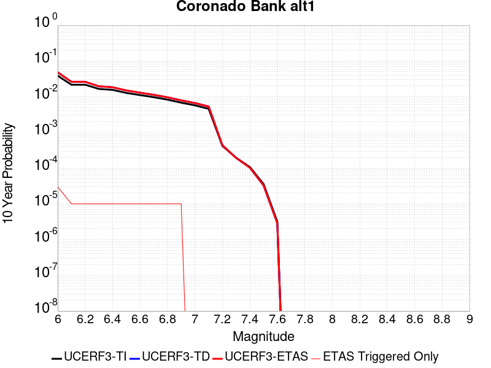 |

| Magnitude | 1 wk TI Prob | 1 wk TD Prob | 1 wk ETAS Prob | 1 wk ETAS/TD Gain | 1 wk ETAS Triggered Only | 1 mo TI Prob | 1 mo TD Prob | 1 mo ETAS Prob | 1 mo ETAS/TD Gain | 1 mo ETAS Triggered Only | 1 yr TI Prob | 1 yr TD Prob | 1 yr ETAS Prob | 1 yr ETAS/TD Gain | 1 yr ETAS Triggered Only | 10 yr TI Prob | 10 yr TD Prob | 10 yr ETAS Prob | 10 yr ETAS/TD Gain | 10 yr ETAS Triggered Only |
|-----|-----|-----|-----|-----|-----|-----|-----|-----|-----|-----|-----|-----|-----|-----|-----|-----|-----|-----|-----|-----|
| 6.0 | 7.533492E-5 | 9.3952294E-5 | 1.1395042E-4 | 1.212854 | 2.0E-5 | 3.22824E-4 | 4.0259483E-4 | 4.2258677E-4 | 1.0496577 | 2.0E-5 | 0.0039233007 | 0.004891124 | 0.004920977 | 1.0061035 | 3.0E-5 | 0.03854755 | 0.047905073 | 0.047933638 | 1.0005963 | 3.0E-5 |
| 6.1 | 4.1807285E-5 | 5.049425E-5 | 5.049425E-5 | 1.0 | 0.0 | 1.7916178E-4 | 2.1638657E-4 | 2.1638657E-4 | 1.0 | 0.0 | 0.0021791123 | 0.002631421 | 0.0026413947 | 1.0037903 | 1.0E-5 | 0.021578677 | 0.026011758 | 0.026021497 | 1.0003744 | 1.0E-5 |
| 6.2 | 4.1807285E-5 | 5.049425E-5 | 5.049425E-5 | 1.0 | 0.0 | 1.7916178E-4 | 2.1638657E-4 | 2.1638657E-4 | 1.0 | 0.0 | 0.0021791123 | 0.002631421 | 0.0026413947 | 1.0037903 | 1.0E-5 | 0.021578677 | 0.026011758 | 0.026021497 | 1.0003744 | 1.0E-5 |
| 6.3 | 3.1793104E-5 | 3.771206E-5 | 3.771206E-5 | 1.0 | 0.0 | 1.3624904E-4 | 1.6161331E-4 | 1.6161331E-4 | 1.0 | 0.0 | 0.0016575698 | 0.001965897 | 0.0019758772 | 1.0050768 | 1.0E-5 | 0.016452603 | 0.019488946 | 0.01949875 | 1.0005031 | 1.0E-5 |
| 6.4 | 2.9878007E-5 | 3.5336663E-5 | 3.5336663E-5 | 1.0 | 0.0 | 1.2804232E-4 | 1.5143424E-4 | 1.5143424E-4 | 1.0 | 0.0 | 0.0015578003 | 0.0018421836 | 0.0018521652 | 1.0054183 | 1.0E-5 | 0.015469253 | 0.018272884 | 0.018282702 | 1.0005373 | 1.0E-5 |
| 6.5 | 2.4512565E-5 | 2.8764713E-5 | 2.8764713E-5 | 1.0 | 0.0 | 1.0504962E-4 | 1.2327167E-4 | 1.2327167E-4 | 1.0 | 0.0 | 0.0012782287 | 0.001499827 | 0.0015098121 | 1.0066575 | 1.0E-5 | 0.012709012 | 0.014900027 | 0.014909878 | 1.0006611 | 1.0E-5 |
| 6.6 | 2.1317413E-5 | 2.4907233E-5 | 2.4907233E-5 | 1.0 | 0.0 | 9.135714E-5 | 1.0674105E-4 | 1.0674105E-4 | 1.0 | 0.0 | 0.0011117056 | 0.0012988199 | 0.0013088068 | 1.0076892 | 1.0E-5 | 0.011061605 | 0.012914695 | 0.012924566 | 1.0007644 | 1.0E-5 |
| 6.7 | 1.8585655E-5 | 2.1635356E-5 | 2.1635356E-5 | 1.0 | 0.0 | 7.9650374E-5 | 9.2719776E-5 | 9.2719776E-5 | 1.0 | 0.0 | 9.6931186E-4 | 0.0011282992 | 0.001138288 | 1.0088528 | 1.0E-5 | 0.0096509475 | 0.0112278685 | 0.011237756 | 1.0008806 | 1.0E-5 |
| 6.8 | 1.5862879E-5 | 1.8419874E-5 | 1.8419874E-5 | 1.0 | 0.0 | 6.798199E-5 | 7.894004E-5 | 7.894004E-5 | 1.0 | 0.0 | 8.273665E-4 | 9.606905E-4 | 9.7068085E-4 | 1.0103992 | 1.0E-5 | 0.008242928 | 0.009567357 | 0.009577261 | 1.0010352 | 1.0E-5 |
| 6.9 | 1.3021509E-5 | 1.5095589E-5 | 1.5095589E-5 | 1.0 | 0.0 | 5.5805274E-5 | 6.469388E-5 | 6.469388E-5 | 1.0 | 0.0 | 6.792174E-4 | 7.8738143E-4 | 7.973736E-4 | 1.0126903 | 1.0E-5 | 0.006771452 | 0.00784774 | 0.007857662 | 1.0012642 | 1.0E-5 |
| 7.0 | 1.0974371E-5 | 1.27203775E-5 | 1.27203775E-5 | 1.0 | 0.0 | 4.7032172E-5 | 5.4514865E-5 | 5.4514865E-5 | 1.0 | 0.0 | 5.7246623E-4 | 6.635339E-4 | 6.635339E-4 | 1.0 | 0.0 | 0.0057099373 | 0.006617277 | 0.006617277 | 1.0 | 0.0 |
| 7.1 | 8.766221E-6 | 1.0164053E-5 | 1.0164053E-5 | 1.0 | 0.0 | 3.7568978E-5 | 4.3559594E-5 | 4.3559594E-5 | 1.0 | 0.0 | 4.573063E-4 | 5.302262E-4 | 5.302262E-4 | 1.0 | 0.0 | 0.0045636636 | 0.005291311 | 0.005291311 | 1.0 | 0.0 |
| 7.2 | 8.026024E-7 | 8.331837E-7 | 8.331837E-7 | 1.0 | 0.0 | 3.43972E-6 | 3.5707824E-6 | 3.5707824E-6 | 1.0 | 0.0 | 4.1877785E-5 | 4.347342E-5 | 4.347342E-5 | 1.0 | 0.0 | 4.1869894E-4 | 4.3465025E-4 | 4.3465025E-4 | 1.0 | 0.0 |
| 7.3 | 3.7293114E-7 | 3.7001186E-7 | 3.7001186E-7 | 1.0 | 0.0 | 1.5982754E-6 | 1.5857643E-6 | 1.5857643E-6 | 1.0 | 0.0 | 1.9458828E-5 | 1.930651E-5 | 1.930651E-5 | 1.0 | 0.0 | 1.9457124E-4 | 1.9304838E-4 | 1.9304838E-4 | 1.0 | 0.0 |
| 7.4 | 2.0557036E-7 | 1.9674462E-7 | 1.9674462E-7 | 1.0 | 0.0 | 8.810155E-7 | 8.43191E-7 | 8.43191E-7 | 1.0 | 0.0 | 1.0726311E-5 | 1.0265802E-5 | 1.0265802E-5 | 1.0 | 0.0 | 1.0725793E-4 | 1.02653314E-4 | 1.02653314E-4 | 1.0 | 0.0 |
| 7.5 | 6.845446E-8 | 6.279388E-8 | 6.279388E-8 | 1.0 | 0.0 | 2.9337625E-7 | 2.6911658E-7 | 2.6911658E-7 | 1.0 | 0.0 | 3.5718497E-6 | 3.2764897E-6 | 3.2764897E-6 | 1.0 | 0.0 | 3.5717923E-5 | 3.2764423E-5 | 3.2764423E-5 | 1.0 | 0.0 |
| 7.6 | 6.0975145E-9 | 5.531861E-9 | 5.531861E-9 | 1.0 | 0.0 | 2.6132206E-8 | 2.3707976E-8 | 2.3707976E-8 | 1.0 | 0.0 | 3.1815955E-7 | 2.8864457E-7 | 2.8864457E-7 | 1.0 | 0.0 | 3.181591E-6 | 2.886443E-6 | 2.886443E-6 | 1.0 | 0.0 |

## San Clemente
*[(top)](#table-of-contents)*

| 1 Week | 1 Month | 1 Year | 10 Year |
|-----|-----|-----|-----|
|  |  |  |  |

| Magnitude | 1 wk TI Prob | 1 wk TD Prob | 1 wk ETAS Prob | 1 wk ETAS/TD Gain | 1 wk ETAS Triggered Only | 1 mo TI Prob | 1 mo TD Prob | 1 mo ETAS Prob | 1 mo ETAS/TD Gain | 1 mo ETAS Triggered Only | 1 yr TI Prob | 1 yr TD Prob | 1 yr ETAS Prob | 1 yr ETAS/TD Gain | 1 yr ETAS Triggered Only | 10 yr TI Prob | 10 yr TD Prob | 10 yr ETAS Prob | 10 yr ETAS/TD Gain | 10 yr ETAS Triggered Only |
|-----|-----|-----|-----|-----|-----|-----|-----|-----|-----|-----|-----|-----|-----|-----|-----|-----|-----|-----|-----|-----|
| 6.0 | 6.681379E-5 | 8.163669E-5 | 8.163669E-5 | 1.0 | 0.0 | 2.8631336E-4 | 3.4982787E-4 | 3.4982787E-4 | 1.0 | 0.0 | 0.003480294 | 0.004251416 | 0.004261373 | 1.0023421 | 1.0E-5 | 0.03426291 | 0.041756913 | 0.04178566 | 1.0006884 | 3.0E-5 |
| 6.1 | 6.681379E-5 | 8.163669E-5 | 8.163669E-5 | 1.0 | 0.0 | 2.8631336E-4 | 3.4982787E-4 | 3.4982787E-4 | 1.0 | 0.0 | 0.003480294 | 0.004251416 | 0.004261373 | 1.0023421 | 1.0E-5 | 0.03426291 | 0.041756913 | 0.04178566 | 1.0006884 | 3.0E-5 |
| 6.2 | 3.9400576E-5 | 4.6453104E-5 | 4.6453104E-5 | 1.0 | 0.0 | 1.6884868E-4 | 1.9906988E-4 | 1.9906988E-4 | 1.0 | 0.0 | 0.0020537945 | 0.0024210429 | 0.0024310187 | 1.0041205 | 1.0E-5 | 0.020349167 | 0.023953425 | 0.023972945 | 1.0008149 | 2.0E-5 |
| 6.3 | 3.2590255E-5 | 3.792992E-5 | 3.792992E-5 | 1.0 | 0.0 | 1.3966505E-4 | 1.6254683E-4 | 1.6254683E-4 | 1.0 | 0.0 | 0.0016990956 | 0.0019772416 | 0.001987222 | 1.0050476 | 1.0E-5 | 0.01686163 | 0.019600289 | 0.019619897 | 1.0010004 | 2.0E-5 |
| 6.4 | 2.9454652E-5 | 3.4098495E-5 | 3.4098495E-5 | 1.0 | 0.0 | 1.2622811E-4 | 1.4612835E-4 | 1.4612835E-4 | 1.0 | 0.0 | 0.0015357438 | 0.0017776854 | 0.0017776854 | 1.0 | 0.0 | 0.015251739 | 0.017637825 | 0.017647648 | 1.000557 | 1.0E-5 |
| 6.5 | 2.790836E-5 | 3.2248132E-5 | 3.2248132E-5 | 1.0 | 0.0 | 1.1960178E-4 | 1.3819907E-4 | 1.3819907E-4 | 1.0 | 0.0 | 0.001455179 | 0.0016812999 | 0.0016812999 | 1.0 | 0.0 | 0.014456868 | 0.016688818 | 0.016698651 | 1.0005893 | 1.0E-5 |
| 6.6 | 2.2492153E-5 | 2.5763205E-5 | 2.5763205E-5 | 1.0 | 0.0 | 9.639138E-5 | 1.1040914E-4 | 1.1040914E-4 | 1.0 | 0.0 | 0.0011729331 | 0.0013434167 | 0.0013434167 | 1.0 | 0.0 | 0.011667615 | 0.013354672 | 0.013364539 | 1.0007389 | 1.0E-5 |
| 6.7 | 1.9862755E-5 | 2.2666847E-5 | 2.2666847E-5 | 1.0 | 0.0 | 8.512331E-5 | 9.714008E-5 | 9.714008E-5 | 1.0 | 0.0 | 0.0010358836 | 0.0011820501 | 0.0011820501 | 1.0 | 0.0 | 0.010310682 | 0.01175892 | 0.011768802 | 1.0008404 | 1.0E-5 |
| 6.8 | 1.6697575E-5 | 1.8978053E-5 | 1.8978053E-5 | 1.0 | 0.0 | 7.155907E-5 | 8.133203E-5 | 8.133203E-5 | 1.0 | 0.0 | 8.7088346E-4 | 9.89777E-4 | 9.89777E-4 | 1.0 | 0.0 | 0.008674784 | 0.009854714 | 0.009864616 | 1.0010047 | 1.0E-5 |
| 6.9 | 1.5218415E-5 | 1.726971E-5 | 1.726971E-5 | 1.0 | 0.0 | 6.522015E-5 | 7.401099E-5 | 7.401099E-5 | 1.0 | 0.0 | 7.93766E-4 | 9.0072013E-4 | 9.0072013E-4 | 1.0 | 0.0 | 0.007909367 | 0.00897164 | 0.00898155 | 1.0011046 | 1.0E-5 |
| 7.0 | 1.2392958E-5 | 1.4033262E-5 | 1.4033262E-5 | 1.0 | 0.0 | 5.3111595E-5 | 6.0141207E-5 | 6.0141207E-5 | 1.0 | 0.0 | 6.4644177E-4 | 7.319808E-4 | 7.319808E-4 | 1.0 | 0.0 | 0.0064456454 | 0.0072964844 | 0.0072964844 | 1.0 | 0.0 |
| 7.1 | 1.0934128E-5 | 1.2375354E-5 | 1.2375354E-5 | 1.0 | 0.0 | 4.6859706E-5 | 5.3036194E-5 | 5.3036194E-5 | 1.0 | 0.0 | 5.7036756E-4 | 6.455317E-4 | 6.455317E-4 | 1.0 | 0.0 | 0.0056890585 | 0.006437312 | 0.006437312 | 1.0 | 0.0 |
| 7.2 | 9.5798805E-6 | 1.0845125E-5 | 1.0845125E-5 | 1.0 | 0.0 | 4.1055984E-5 | 4.647832E-5 | 4.647832E-5 | 1.0 | 0.0 | 4.9974193E-4 | 5.657338E-4 | 5.657338E-4 | 1.0 | 0.0 | 0.0049861963 | 0.00564366 | 0.00564366 | 1.0 | 0.0 |
| 7.3 | 8.0167365E-6 | 9.084078E-6 | 9.084078E-6 | 1.0 | 0.0 | 3.4356988E-5 | 3.8931223E-5 | 3.8931223E-5 | 1.0 | 0.0 | 4.1821605E-4 | 4.738916E-4 | 4.738916E-4 | 1.0 | 0.0 | 0.0041742986 | 0.004729513 | 0.004729513 | 1.0 | 0.0 |
| 7.4 | 2.9581017E-6 | 3.36244E-6 | 3.36244E-6 | 1.0 | 0.0 | 1.2677518E-5 | 1.4410407E-5 | 1.4410407E-5 | 1.0 | 0.0 | 1.5433785E-4 | 1.7543763E-4 | 1.7543763E-4 | 1.0 | 0.0 | 0.001542307 | 0.0017534863 | 0.0017534863 | 1.0 | 0.0 |

## San Gabriel
*[(top)](#table-of-contents)*

| 1 Week | 1 Month | 1 Year | 10 Year |
|-----|-----|-----|-----|
|  |  | 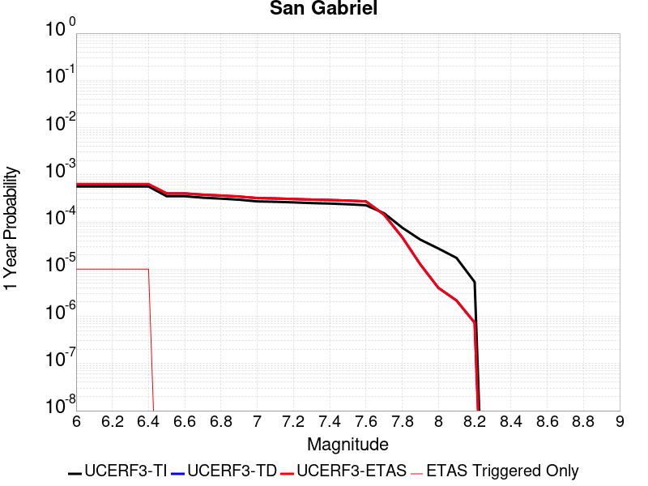 |  |

| Magnitude | 1 wk TI Prob | 1 wk TD Prob | 1 wk ETAS Prob | 1 wk ETAS/TD Gain | 1 wk ETAS Triggered Only | 1 mo TI Prob | 1 mo TD Prob | 1 mo ETAS Prob | 1 mo ETAS/TD Gain | 1 mo ETAS Triggered Only | 1 yr TI Prob | 1 yr TD Prob | 1 yr ETAS Prob | 1 yr ETAS/TD Gain | 1 yr ETAS Triggered Only | 10 yr TI Prob | 10 yr TD Prob | 10 yr ETAS Prob | 10 yr ETAS/TD Gain | 10 yr ETAS Triggered Only |
|-----|-----|-----|-----|-----|-----|-----|-----|-----|-----|-----|-----|-----|-----|-----|-----|-----|-----|-----|-----|-----|
| 6.0 | 1.083775E-5 | 1.1987322E-5 | 1.1987322E-5 | 1.0 | 0.0 | 4.6446676E-5 | 5.1373292E-5 | 5.1373292E-5 | 1.0 | 0.0 | 5.653415E-4 | 6.253016E-4 | 6.352954E-4 | 1.0159823 | 1.0E-5 | 0.0056390543 | 0.006247514 | 0.0062773265 | 1.004772 | 3.0E-5 |
| 6.1 | 1.083775E-5 | 1.1987322E-5 | 1.1987322E-5 | 1.0 | 0.0 | 4.6446676E-5 | 5.1373292E-5 | 5.1373292E-5 | 1.0 | 0.0 | 5.653415E-4 | 6.253016E-4 | 6.352954E-4 | 1.0159823 | 1.0E-5 | 0.0056390543 | 0.006247514 | 0.0062773265 | 1.004772 | 3.0E-5 |
| 6.2 | 1.083775E-5 | 1.1987322E-5 | 1.1987322E-5 | 1.0 | 0.0 | 4.6446676E-5 | 5.1373292E-5 | 5.1373292E-5 | 1.0 | 0.0 | 5.653415E-4 | 6.253016E-4 | 6.352954E-4 | 1.0159823 | 1.0E-5 | 0.0056390543 | 0.006247514 | 0.0062773265 | 1.004772 | 3.0E-5 |
| 6.3 | 1.083775E-5 | 1.1987322E-5 | 1.1987322E-5 | 1.0 | 0.0 | 4.6446676E-5 | 5.1373292E-5 | 5.1373292E-5 | 1.0 | 0.0 | 5.653415E-4 | 6.253016E-4 | 6.352954E-4 | 1.0159823 | 1.0E-5 | 0.0056390543 | 0.006247514 | 0.0062773265 | 1.004772 | 3.0E-5 |
| 6.4 | 1.083775E-5 | 1.1987322E-5 | 1.1987322E-5 | 1.0 | 0.0 | 4.6446676E-5 | 5.1373292E-5 | 5.1373292E-5 | 1.0 | 0.0 | 5.653415E-4 | 6.253016E-4 | 6.352954E-4 | 1.0159823 | 1.0E-5 | 0.0056390543 | 0.006247514 | 0.0062773265 | 1.004772 | 3.0E-5 |
| 6.5 | 6.7317824E-6 | 7.719057E-6 | 7.719057E-6 | 1.0 | 0.0 | 2.8850178E-5 | 3.308126E-5 | 3.308126E-5 | 1.0 | 0.0 | 3.511943E-4 | 4.0269096E-4 | 4.0269096E-4 | 1.0 | 0.0 | 0.003506398 | 0.0040307054 | 0.0040506246 | 1.0049419 | 2.0E-5 |
| 6.6 | 6.7317824E-6 | 7.719057E-6 | 7.719057E-6 | 1.0 | 0.0 | 2.8850178E-5 | 3.308126E-5 | 3.308126E-5 | 1.0 | 0.0 | 3.511943E-4 | 4.0269096E-4 | 4.0269096E-4 | 1.0 | 0.0 | 0.003506398 | 0.0040307054 | 0.0040506246 | 1.0049419 | 2.0E-5 |
| 6.7 | 6.274881E-6 | 7.247975E-6 | 7.247975E-6 | 1.0 | 0.0 | 2.6892068E-5 | 3.1062387E-5 | 3.1062387E-5 | 1.0 | 0.0 | 3.2736175E-4 | 3.781199E-4 | 3.781199E-4 | 1.0 | 0.0 | 0.0032687993 | 0.0037858514 | 0.0038057757 | 1.0052629 | 2.0E-5 |
| 6.8 | 5.996209E-6 | 6.9606945E-6 | 6.9606945E-6 | 1.0 | 0.0 | 2.5697784E-5 | 2.9831212E-5 | 2.9831212E-5 | 1.0 | 0.0 | 3.128256E-4 | 3.6313542E-4 | 3.6313542E-4 | 1.0 | 0.0 | 0.003123856 | 0.0036365038 | 0.003656431 | 1.0054798 | 2.0E-5 |
| 6.9 | 5.686331E-6 | 6.6257326E-6 | 6.6257326E-6 | 1.0 | 0.0 | 2.4369761E-5 | 2.8395692E-5 | 2.8395692E-5 | 1.0 | 0.0 | 2.9666146E-4 | 3.4566363E-4 | 3.4566363E-4 | 1.0 | 0.0 | 0.0029626573 | 0.0034623418 | 0.0034822726 | 1.0057564 | 2.0E-5 |
| 7.0 | 5.2329838E-6 | 6.14961E-6 | 6.14961E-6 | 1.0 | 0.0 | 2.242688E-5 | 2.6355208E-5 | 2.6355208E-5 | 1.0 | 0.0 | 2.7301308E-4 | 3.2082817E-4 | 3.2082817E-4 | 1.0 | 0.0 | 0.002726779 | 0.00321472 | 0.0032346556 | 1.0062014 | 2.0E-5 |
| 7.1 | 5.135671E-6 | 6.03973E-6 | 6.03973E-6 | 1.0 | 0.0 | 2.2009834E-5 | 2.5884305E-5 | 2.5884305E-5 | 1.0 | 0.0 | 2.6793676E-4 | 3.150966E-4 | 3.150966E-4 | 1.0 | 0.0 | 0.0026761394 | 0.0031575684 | 0.0031775052 | 1.006314 | 2.0E-5 |
| 7.2 | 4.989062E-6 | 5.873101E-6 | 5.873101E-6 | 1.0 | 0.0 | 2.1381518E-5 | 2.5170193E-5 | 2.5170193E-5 | 1.0 | 0.0 | 2.6028889E-4 | 3.0640478E-4 | 3.0640478E-4 | 1.0 | 0.0 | 0.0025998424 | 0.003070893 | 0.0030908317 | 1.0064927 | 2.0E-5 |
| 7.3 | 4.8219395E-6 | 5.7046464E-6 | 5.7046464E-6 | 1.0 | 0.0 | 2.0665291E-5 | 2.444826E-5 | 2.444826E-5 | 1.0 | 0.0 | 2.5157086E-4 | 2.9761766E-4 | 2.9761766E-4 | 1.0 | 0.0 | 0.0025128627 | 0.0029832611 | 0.0030032014 | 1.0066841 | 2.0E-5 |
| 7.4 | 4.7118383E-6 | 5.593198E-6 | 5.593198E-6 | 1.0 | 0.0 | 2.0193436E-5 | 2.3970631E-5 | 2.3970631E-5 | 1.0 | 0.0 | 2.4582737E-4 | 2.918041E-4 | 2.918041E-4 | 1.0 | 0.0 | 0.002455556 | 0.0029252786 | 0.0029352494 | 1.0034084 | 1.0E-5 |
| 7.5 | 4.5506545E-6 | 5.4385555E-6 | 5.4385555E-6 | 1.0 | 0.0 | 1.9502659E-5 | 2.330789E-5 | 2.330789E-5 | 1.0 | 0.0 | 2.37419E-4 | 2.8373738E-4 | 2.8373738E-4 | 1.0 | 0.0 | 0.002371655 | 0.0028448196 | 0.002854791 | 1.0035051 | 1.0E-5 |
| 7.6 | 4.343636E-6 | 5.2314185E-6 | 5.2314185E-6 | 1.0 | 0.0 | 1.861545E-5 | 2.2420176E-5 | 2.2420176E-5 | 1.0 | 0.0 | 2.2661954E-4 | 2.729322E-4 | 2.729322E-4 | 1.0 | 0.0 | 0.0022638857 | 0.00273703 | 0.0027470025 | 1.0036436 | 1.0E-5 |
| 7.7 | 2.936235E-6 | 2.7454162E-6 | 2.7454162E-6 | 1.0 | 0.0 | 1.2583803E-5 | 1.17660165E-5 | 1.17660165E-5 | 1.0 | 0.0 | 1.5319703E-4 | 1.4324186E-4 | 1.4324186E-4 | 1.0 | 0.0 | 0.0015309147 | 0.0014387933 | 0.0014487788 | 1.0069402 | 1.0E-5 |
| 7.8 | 1.4541639E-6 | 9.129234E-7 | 9.129234E-7 | 1.0 | 0.0 | 6.232116E-6 | 3.912523E-6 | 3.912523E-6 | 1.0 | 0.0 | 7.587337E-5 | 4.7633926E-5 | 4.7633926E-5 | 1.0 | 0.0 | 7.584747E-4 | 4.8114438E-4 | 4.8114438E-4 | 1.0 | 0.0 |
| 7.9 | 8.098958E-7 | 2.419679E-7 | 2.419679E-7 | 1.0 | 0.0 | 3.4709774E-6 | 1.0370048E-6 | 1.0370048E-6 | 1.0 | 0.0 | 4.225833E-5 | 1.2625461E-5 | 1.2625461E-5 | 1.0 | 0.0 | 4.2250296E-4 | 1.2933378E-4 | 1.2933378E-4 | 1.0 | 0.0 |
| 8.0 | 5.2473234E-7 | 7.6891794E-8 | 7.6891794E-8 | 1.0 | 0.0 | 2.248851E-6 | 3.2953622E-7 | 3.2953622E-7 | 1.0 | 0.0 | 2.7379416E-5 | 4.012096E-6 | 4.012096E-6 | 1.0 | 0.0 | 2.7376044E-4 | 4.224638E-5 | 4.224638E-5 | 1.0 | 0.0 |
| 8.1 | 3.3162388E-7 | 4.155149E-8 | 4.155149E-8 | 1.0 | 0.0 | 1.4212444E-6 | 1.7807781E-7 | 1.7807781E-7 | 1.0 | 0.0 | 1.7303513E-5 | 2.168095E-6 | 2.168095E-6 | 1.0 | 0.0 | 1.7302166E-4 | 2.2995899E-5 | 2.2995899E-5 | 1.0 | 0.0 |
| 8.2 | 1.0235345E-7 | 1.4060946E-8 | 1.4060946E-8 | 1.0 | 0.0 | 4.3865757E-7 | 6.02612E-8 | 6.02612E-8 | 1.0 | 0.0 | 5.340643E-6 | 7.336798E-7 | 7.336798E-7 | 1.0 | 0.0 | 5.3405143E-5 | 7.937039E-6 | 7.937039E-6 | 1.0 | 0.0 |

## Hollywood
*[(top)](#table-of-contents)*

| 1 Week | 1 Month | 1 Year | 10 Year |
|-----|-----|-----|-----|
|  |  |  |  |

| Magnitude | 1 wk TI Prob | 1 wk TD Prob | 1 wk ETAS Prob | 1 wk ETAS/TD Gain | 1 wk ETAS Triggered Only | 1 mo TI Prob | 1 mo TD Prob | 1 mo ETAS Prob | 1 mo ETAS/TD Gain | 1 mo ETAS Triggered Only | 1 yr TI Prob | 1 yr TD Prob | 1 yr ETAS Prob | 1 yr ETAS/TD Gain | 1 yr ETAS Triggered Only | 10 yr TI Prob | 10 yr TD Prob | 10 yr ETAS Prob | 10 yr ETAS/TD Gain | 10 yr ETAS Triggered Only |
|-----|-----|-----|-----|-----|-----|-----|-----|-----|-----|-----|-----|-----|-----|-----|-----|-----|-----|-----|-----|-----|
| 6.0 | 1.24487615E-5 | 1.2593381E-5 | 1.2593381E-5 | 1.0 | 0.0 | 5.3350745E-5 | 5.3970543E-5 | 5.3970543E-5 | 1.0 | 0.0 | 6.4935174E-4 | 6.568979E-4 | 6.6689134E-4 | 1.015213 | 1.0E-5 | 0.0064745755 | 0.0065500494 | 0.0065699187 | 1.0030334 | 2.0E-5 |
| 6.1 | 1.24487615E-5 | 1.2593381E-5 | 1.2593381E-5 | 1.0 | 0.0 | 5.3350745E-5 | 5.3970543E-5 | 5.3970543E-5 | 1.0 | 0.0 | 6.4935174E-4 | 6.568979E-4 | 6.6689134E-4 | 1.015213 | 1.0E-5 | 0.0064745755 | 0.0065500494 | 0.0065699187 | 1.0030334 | 2.0E-5 |
| 6.2 | 1.24487615E-5 | 1.2593381E-5 | 1.2593381E-5 | 1.0 | 0.0 | 5.3350745E-5 | 5.3970543E-5 | 5.3970543E-5 | 1.0 | 0.0 | 6.4935174E-4 | 6.568979E-4 | 6.6689134E-4 | 1.015213 | 1.0E-5 | 0.0064745755 | 0.0065500494 | 0.0065699187 | 1.0030334 | 2.0E-5 |
| 6.3 | 1.24487615E-5 | 1.2593381E-5 | 1.2593381E-5 | 1.0 | 0.0 | 5.3350745E-5 | 5.3970543E-5 | 5.3970543E-5 | 1.0 | 0.0 | 6.4935174E-4 | 6.568979E-4 | 6.6689134E-4 | 1.015213 | 1.0E-5 | 0.0064745755 | 0.0065500494 | 0.0065699187 | 1.0030334 | 2.0E-5 |
| 6.4 | 1.2431024E-5 | 1.2573994E-5 | 1.2573994E-5 | 1.0 | 0.0 | 5.327473E-5 | 5.3887463E-5 | 5.3887463E-5 | 1.0 | 0.0 | 6.4842677E-4 | 6.55887E-4 | 6.6588045E-4 | 1.0152365 | 1.0E-5 | 0.0064653796 | 0.00654 | 0.0065598693 | 1.003038 | 2.0E-5 |
| 6.5 | 1.1242222E-5 | 1.1317946E-5 | 1.1317946E-5 | 1.0 | 0.0 | 4.8180063E-5 | 4.8504597E-5 | 4.8504597E-5 | 1.0 | 0.0 | 5.864344E-4 | 5.9038616E-4 | 6.0038024E-4 | 1.0169281 | 1.0E-5 | 0.0058488925 | 0.0058884635 | 0.005908346 | 1.0033765 | 2.0E-5 |
| 6.6 | 1.1234066E-5 | 1.130906E-5 | 1.130906E-5 | 1.0 | 0.0 | 4.8145106E-5 | 4.8466514E-5 | 4.8466514E-5 | 1.0 | 0.0 | 5.86009E-4 | 5.899227E-4 | 5.9991685E-4 | 1.0169414 | 1.0E-5 | 0.005844661 | 0.0058838543 | 0.0059037367 | 1.0033791 | 2.0E-5 |
| 6.7 | 1.12294E-5 | 1.1303803E-5 | 1.1303803E-5 | 1.0 | 0.0 | 4.812511E-5 | 4.8443988E-5 | 4.8443988E-5 | 1.0 | 0.0 | 5.857657E-4 | 5.896486E-4 | 5.996427E-4 | 1.0169493 | 1.0E-5 | 0.0058422405 | 0.0058811274 | 0.00590101 | 1.0033807 | 2.0E-5 |
| 6.8 | 1.0252819E-5 | 1.0218574E-5 | 1.0218574E-5 | 1.0 | 0.0 | 4.3939912E-5 | 4.3793167E-5 | 4.3793167E-5 | 1.0 | 0.0 | 5.3483713E-4 | 5.330535E-4 | 5.4304814E-4 | 1.0187498 | 1.0E-5 | 0.005335517 | 0.005317975 | 0.0053378684 | 1.0037408 | 2.0E-5 |
| 6.9 | 9.252289E-6 | 9.110419E-6 | 9.110419E-6 | 1.0 | 0.0 | 3.9652066E-5 | 3.904408E-5 | 3.904408E-5 | 1.0 | 0.0 | 4.8265693E-4 | 4.7525964E-4 | 4.852549E-4 | 1.0210311 | 1.0E-5 | 0.0048161 | 0.004742606 | 0.0047625112 | 1.0041971 | 2.0E-5 |
| 7.0 | 8.474604E-6 | 8.25836E-6 | 8.25836E-6 | 1.0 | 0.0 | 3.6319227E-5 | 3.53925E-5 | 3.53925E-5 | 1.0 | 0.0 | 4.4209688E-4 | 4.308199E-4 | 4.408156E-4 | 1.0232016 | 1.0E-5 | 0.004412184 | 0.0042999974 | 0.0043199114 | 1.0046312 | 2.0E-5 |
| 7.1 | 6.643643E-6 | 6.2684458E-6 | 6.2684458E-6 | 1.0 | 0.0 | 2.8472443E-5 | 2.6864493E-5 | 2.6864493E-5 | 1.0 | 0.0 | 3.4659685E-4 | 3.2702653E-4 | 3.3702326E-4 | 1.0305686 | 1.0E-5 | 0.0034605677 | 0.003265499 | 0.0032854336 | 1.0061046 | 2.0E-5 |
| 7.2 | 5.549002E-6 | 5.108774E-6 | 5.108774E-6 | 1.0 | 0.0 | 2.378122E-5 | 2.1894564E-5 | 2.1894564E-5 | 1.0 | 0.0 | 2.8949787E-4 | 2.6653384E-4 | 2.7653118E-4 | 1.0375087 | 1.0E-5 | 0.0028912104 | 0.0026621583 | 0.002682105 | 1.0074927 | 2.0E-5 |
| 7.3 | 4.3059727E-6 | 3.959942E-6 | 3.959942E-6 | 1.0 | 0.0 | 1.8454039E-5 | 1.6971071E-5 | 1.6971071E-5 | 1.0 | 0.0 | 2.2465475E-4 | 2.0660329E-4 | 2.0660329E-4 | 1.0 | 0.0 | 0.0022442779 | 0.0020641224 | 0.0020741017 | 1.0048347 | 1.0E-5 |
| 7.4 | 2.8550733E-6 | 2.7013389E-6 | 2.7013389E-6 | 1.0 | 0.0 | 1.2235971E-5 | 1.1577115E-5 | 1.1577115E-5 | 1.0 | 0.0 | 1.4896276E-4 | 1.4094231E-4 | 1.4094231E-4 | 1.0 | 0.0 | 0.0014886294 | 0.0014085344 | 0.0014085344 | 1.0 | 0.0 |
| 7.5 | 1.9927045E-6 | 1.8976702E-6 | 1.8976702E-6 | 1.0 | 0.0 | 8.540134E-6 | 8.132847E-6 | 8.132847E-6 | 1.0 | 0.0 | 1.0397117E-4 | 9.9012956E-5 | 9.9012956E-5 | 1.0 | 0.0 | 0.0010392254 | 9.896919E-4 | 9.896919E-4 | 1.0 | 0.0 |
| 7.6 | 1.345084E-6 | 1.221624E-6 | 1.221624E-6 | 1.0 | 0.0 | 5.764633E-6 | 5.235521E-6 | 5.235521E-6 | 1.0 | 0.0 | 7.018215E-5 | 6.374063E-5 | 6.374063E-5 | 1.0 | 0.0 | 7.0159987E-4 | 6.372254E-4 | 6.372254E-4 | 1.0 | 0.0 |
| 7.7 | 7.6835164E-7 | 6.2778713E-7 | 6.2778713E-7 | 1.0 | 0.0 | 3.2929315E-6 | 2.6905136E-6 | 2.6905136E-6 | 1.0 | 0.0 | 4.00907E-5 | 3.2756525E-5 | 3.2756525E-5 | 1.0 | 0.0 | 4.0083472E-4 | 3.2751844E-4 | 3.2751844E-4 | 1.0 | 0.0 |
| 7.8 | 3.6562128E-7 | 2.453623E-7 | 2.453623E-7 | 1.0 | 0.0 | 1.5669474E-6 | 1.0515523E-6 | 1.0515523E-6 | 1.0 | 0.0 | 1.9077417E-5 | 1.2802578E-5 | 1.2802578E-5 | 1.0 | 0.0 | 1.907578E-4 | 1.2801877E-4 | 1.2801877E-4 | 1.0 | 0.0 |
| 7.9 | 7.5024424E-8 | 5.3819846E-8 | 5.3819846E-8 | 1.0 | 0.0 | 3.215332E-7 | 2.3065647E-7 | 2.3065647E-7 | 1.0 | 0.0 | 3.91466E-6 | 2.8082402E-6 | 2.8082402E-6 | 1.0 | 0.0 | 3.9145907E-5 | 2.8082177E-5 | 2.8082177E-5 | 1.0 | 0.0 |

## Elmore Ranch
*[(top)](#table-of-contents)*

| 1 Week | 1 Month | 1 Year | 10 Year |
|-----|-----|-----|-----|
|  |  |  |  |

| Magnitude | 1 wk TI Prob | 1 wk TD Prob | 1 wk ETAS Prob | 1 wk ETAS/TD Gain | 1 wk ETAS Triggered Only | 1 mo TI Prob | 1 mo TD Prob | 1 mo ETAS Prob | 1 mo ETAS/TD Gain | 1 mo ETAS Triggered Only | 1 yr TI Prob | 1 yr TD Prob | 1 yr ETAS Prob | 1 yr ETAS/TD Gain | 1 yr ETAS Triggered Only | 10 yr TI Prob | 10 yr TD Prob | 10 yr ETAS Prob | 10 yr ETAS/TD Gain | 10 yr ETAS Triggered Only |
|-----|-----|-----|-----|-----|-----|-----|-----|-----|-----|-----|-----|-----|-----|-----|-----|-----|-----|-----|-----|-----|
| 6.0 | 9.102099E-5 | 8.9526366E-5 | 9.9525474E-5 | 1.111689 | 1.0E-5 | 3.9003167E-4 | 3.8364116E-4 | 3.9363734E-4 | 1.026056 | 1.0E-5 | 0.0047383 | 0.004662308 | 0.0046822145 | 1.0042697 | 2.0E-5 | 0.046385348 | 0.045873385 | 0.04590201 | 1.000624 | 3.0E-5 |
| 6.1 | 3.8306698E-5 | 4.1500927E-5 | 4.1500927E-5 | 1.0 | 0.0 | 1.6416123E-4 | 1.7785306E-4 | 1.7785306E-4 | 1.0 | 0.0 | 0.0019968306 | 0.0021632449 | 0.0021632449 | 1.0 | 0.0 | 0.019789828 | 0.02162934 | 0.02162934 | 1.0 | 0.0 |
| 6.2 | 3.8306698E-5 | 4.1500927E-5 | 4.1500927E-5 | 1.0 | 0.0 | 1.6416123E-4 | 1.7785306E-4 | 1.7785306E-4 | 1.0 | 0.0 | 0.0019968306 | 0.0021632449 | 0.0021632449 | 1.0 | 0.0 | 0.019789828 | 0.02162934 | 0.02162934 | 1.0 | 0.0 |
| 6.3 | 3.3197924E-5 | 3.6556212E-5 | 3.6556212E-5 | 1.0 | 0.0 | 1.4226905E-4 | 1.5666404E-4 | 1.5666404E-4 | 1.0 | 0.0 | 0.0017307495 | 0.0019060043 | 0.0019060043 | 1.0 | 0.0 | 0.017173318 | 0.019090874 | 0.019090874 | 1.0 | 0.0 |
| 6.4 | 2.5148964E-5 | 2.7421656E-5 | 2.7421656E-5 | 1.0 | 0.0 | 1.0777682E-4 | 1.1751975E-4 | 1.1751975E-4 | 1.0 | 0.0 | 0.0013113929 | 0.0014305117 | 0.0014305117 | 1.0 | 0.0 | 0.01303681 | 0.014387799 | 0.014387799 | 1.0 | 0.0 |
| 6.5 | 2.5148964E-5 | 2.7421656E-5 | 2.7421656E-5 | 1.0 | 0.0 | 1.0777682E-4 | 1.1751975E-4 | 1.1751975E-4 | 1.0 | 0.0 | 0.0013113929 | 0.0014305117 | 0.0014305117 | 1.0 | 0.0 | 0.01303681 | 0.014387799 | 0.014387799 | 1.0 | 0.0 |

## Sierra Madre (San Fernando)
*[(top)](#table-of-contents)*

| 1 Week | 1 Month | 1 Year | 10 Year |
|-----|-----|-----|-----|
|  |  |  |  |

| Magnitude | 1 wk TI Prob | 1 wk TD Prob | 1 wk ETAS Prob | 1 wk ETAS/TD Gain | 1 wk ETAS Triggered Only | 1 mo TI Prob | 1 mo TD Prob | 1 mo ETAS Prob | 1 mo ETAS/TD Gain | 1 mo ETAS Triggered Only | 1 yr TI Prob | 1 yr TD Prob | 1 yr ETAS Prob | 1 yr ETAS/TD Gain | 1 yr ETAS Triggered Only | 10 yr TI Prob | 10 yr TD Prob | 10 yr ETAS Prob | 10 yr ETAS/TD Gain | 10 yr ETAS Triggered Only |
|-----|-----|-----|-----|-----|-----|-----|-----|-----|-----|-----|-----|-----|-----|-----|-----|-----|-----|-----|-----|-----|
| 6.0 | 1.0346413E-5 | 6.287434E-6 | 6.287434E-6 | 1.0 | 0.0 | 4.4341014E-5 | 2.6945874E-5 | 2.6945874E-5 | 1.0 | 0.0 | 5.3971814E-4 | 3.2801775E-4 | 3.3801448E-4 | 1.0304762 | 1.0E-5 | 0.0053840918 | 0.0032754485 | 0.0033053502 | 1.009129 | 3.0E-5 |
| 6.1 | 1.0346413E-5 | 6.287434E-6 | 6.287434E-6 | 1.0 | 0.0 | 4.4341014E-5 | 2.6945874E-5 | 2.6945874E-5 | 1.0 | 0.0 | 5.3971814E-4 | 3.2801775E-4 | 3.3801448E-4 | 1.0304762 | 1.0E-5 | 0.0053840918 | 0.0032754485 | 0.0033053502 | 1.009129 | 3.0E-5 |
| 6.2 | 1.0346413E-5 | 6.287434E-6 | 6.287434E-6 | 1.0 | 0.0 | 4.4341014E-5 | 2.6945874E-5 | 2.6945874E-5 | 1.0 | 0.0 | 5.3971814E-4 | 3.2801775E-4 | 3.3801448E-4 | 1.0304762 | 1.0E-5 | 0.0053840918 | 0.0032754485 | 0.0033053502 | 1.009129 | 3.0E-5 |
| 6.3 | 1.0346413E-5 | 6.287434E-6 | 6.287434E-6 | 1.0 | 0.0 | 4.4341014E-5 | 2.6945874E-5 | 2.6945874E-5 | 1.0 | 0.0 | 5.3971814E-4 | 3.2801775E-4 | 3.3801448E-4 | 1.0304762 | 1.0E-5 | 0.0053840918 | 0.0032754485 | 0.0033053502 | 1.009129 | 3.0E-5 |
| 6.4 | 1.0249558E-5 | 6.287434E-6 | 6.287434E-6 | 1.0 | 0.0 | 4.392594E-5 | 2.6945874E-5 | 2.6945874E-5 | 1.0 | 0.0 | 5.3466705E-4 | 3.2801775E-4 | 3.3801448E-4 | 1.0304762 | 1.0E-5 | 0.0053338245 | 0.0032754485 | 0.0033053502 | 1.009129 | 3.0E-5 |
| 6.5 | 1.0249558E-5 | 6.287434E-6 | 6.287434E-6 | 1.0 | 0.0 | 4.392594E-5 | 2.6945874E-5 | 2.6945874E-5 | 1.0 | 0.0 | 5.3466705E-4 | 3.2801775E-4 | 3.3801448E-4 | 1.0304762 | 1.0E-5 | 0.0053338245 | 0.0032754485 | 0.0033053502 | 1.009129 | 3.0E-5 |
| 6.6 | 9.9035515E-6 | 6.287434E-6 | 6.287434E-6 | 1.0 | 0.0 | 4.2443102E-5 | 2.6945874E-5 | 2.6945874E-5 | 1.0 | 0.0 | 5.166222E-4 | 3.2801775E-4 | 3.3801448E-4 | 1.0304762 | 1.0E-5 | 0.0051542283 | 0.0032754485 | 0.0033053502 | 1.009129 | 3.0E-5 |
| 6.7 | 9.87217E-6 | 6.274855E-6 | 6.274855E-6 | 1.0 | 0.0 | 4.2308613E-5 | 2.6891963E-5 | 2.6891963E-5 | 1.0 | 0.0 | 5.149856E-4 | 3.2736157E-4 | 3.373583E-4 | 1.0305372 | 1.0E-5 | 0.005137938 | 0.003268906 | 0.003298808 | 1.0091474 | 3.0E-5 |
| 6.8 | 9.4359175E-6 | 6.1788287E-6 | 6.1788287E-6 | 1.0 | 0.0 | 4.043902E-5 | 2.6480431E-5 | 2.6480431E-5 | 1.0 | 0.0 | 4.9223384E-4 | 3.2235266E-4 | 3.3234945E-4 | 1.0310119 | 1.0E-5 | 0.0049114493 | 0.0032189623 | 0.0032488657 | 1.0092897 | 3.0E-5 |
| 6.9 | 8.700447E-6 | 6.0400866E-6 | 6.0400866E-6 | 1.0 | 0.0 | 3.72871E-5 | 2.5885834E-5 | 2.5885834E-5 | 1.0 | 0.0 | 4.5387587E-4 | 3.1511553E-4 | 3.251124E-4 | 1.0317243 | 1.0E-5 | 0.0045295 | 0.0031467967 | 0.0031767022 | 1.0095035 | 3.0E-5 |
| 7.0 | 8.648878E-6 | 6.0150014E-6 | 6.0150014E-6 | 1.0 | 0.0 | 3.7066096E-5 | 2.5778329E-5 | 2.5778329E-5 | 1.0 | 0.0 | 4.5118626E-4 | 3.1380705E-4 | 3.238039E-4 | 1.0318568 | 1.0E-5 | 0.004502713 | 0.0031337484 | 0.0031636546 | 1.0095432 | 3.0E-5 |
| 7.1 | 8.505786E-6 | 5.924631E-6 | 5.924631E-6 | 1.0 | 0.0 | 3.645286E-5 | 2.5391035E-5 | 2.5391035E-5 | 1.0 | 0.0 | 4.437232E-4 | 3.0909307E-4 | 3.1908997E-4 | 1.0323427 | 1.0E-5 | 0.0044283825 | 0.0030867406 | 0.003116648 | 1.009689 | 3.0E-5 |
| 7.2 | 8.139752E-6 | 5.6989234E-6 | 5.6989234E-6 | 1.0 | 0.0 | 3.4884186E-5 | 2.4423734E-5 | 2.4423734E-5 | 1.0 | 0.0 | 4.246322E-4 | 2.9731944E-4 | 3.0731646E-4 | 1.0336238 | 1.0E-5 | 0.004238217 | 0.0029693225 | 0.0029992335 | 1.0100733 | 3.0E-5 |
| 7.3 | 7.8816E-6 | 5.552236E-6 | 5.552236E-6 | 1.0 | 0.0 | 3.3777847E-5 | 2.3795086E-5 | 2.3795086E-5 | 1.0 | 0.0 | 4.111677E-4 | 2.8966772E-4 | 2.9966483E-4 | 1.0345123 | 1.0E-5 | 0.004104078 | 0.002893007 | 0.0029229203 | 1.0103399 | 3.0E-5 |
| 7.4 | 7.5810603E-6 | 5.35647E-6 | 5.35647E-6 | 1.0 | 0.0 | 3.2489854E-5 | 2.2956105E-5 | 2.2956105E-5 | 1.0 | 0.0 | 3.9549218E-4 | 2.7945577E-4 | 2.8945296E-4 | 1.0357739 | 1.0E-5 | 0.0039478904 | 0.0027911486 | 0.0028210648 | 1.0107182 | 3.0E-5 |
| 7.5 | 6.349153E-6 | 4.4077274E-6 | 4.4077274E-6 | 1.0 | 0.0 | 2.7210372E-5 | 1.8890129E-5 | 1.8890129E-5 | 1.0 | 0.0 | 3.312359E-4 | 2.2996387E-4 | 2.3996158E-4 | 1.0434752 | 1.0E-5 | 0.0033074263 | 0.0022973411 | 0.0023272722 | 1.0130286 | 3.0E-5 |
| 7.6 | 4.430576E-6 | 2.8907298E-6 | 2.8907298E-6 | 1.0 | 0.0 | 1.8988047E-5 | 1.2388785E-5 | 1.2388785E-5 | 1.0 | 0.0 | 2.3115493E-4 | 1.5082324E-4 | 1.6082173E-4 | 1.0662928 | 1.0E-5 | 0.0023091463 | 0.0015072313 | 0.0015272012 | 1.0132494 | 2.0E-5 |
| 7.7 | 3.005066E-6 | 1.7511459E-6 | 1.7511459E-6 | 1.0 | 0.0 | 1.2878791E-5 | 7.5048893E-6 | 7.5048893E-6 | 1.0 | 0.0 | 1.56788E-4 | 9.13682E-5 | 1.0136729E-4 | 1.1094372 | 1.0E-5 | 0.0015667742 | 9.1330754E-4 | 9.232984E-4 | 1.0109392 | 1.0E-5 |
| 7.8 | 1.8459098E-6 | 1.0583101E-6 | 1.0583101E-6 | 1.0 | 0.0 | 7.911018E-6 | 4.535607E-6 | 4.535607E-6 | 1.0 | 0.0 | 9.631238E-5 | 5.5219618E-5 | 5.5219618E-5 | 1.0 | 0.0 | 9.627065E-4 | 5.5205944E-4 | 5.5205944E-4 | 1.0 | 0.0 |
| 7.9 | 9.839262E-7 | 5.234948E-7 | 5.234948E-7 | 1.0 | 0.0 | 4.2168194E-6 | 2.2435472E-6 | 2.2435472E-6 | 1.0 | 0.0 | 5.1338568E-5 | 2.7314849E-5 | 2.7314849E-5 | 1.0 | 0.0 | 5.132671E-4 | 2.731152E-4 | 2.731152E-4 | 1.0 | 0.0 |
| 8.0 | 1.210983E-7 | 6.6141716E-8 | 6.6141716E-8 | 1.0 | 0.0 | 5.1899264E-7 | 2.8346446E-7 | 2.8346446E-7 | 1.0 | 0.0 | 6.3187167E-6 | 3.4511747E-6 | 3.4511747E-6 | 1.0 | 0.0 | 6.318537E-5 | 3.4511228E-5 | 3.4511228E-5 | 1.0 | 0.0 |

## Great Valley 08 (Quinto)
*[(top)](#table-of-contents)*

| 1 Week | 1 Month | 1 Year | 10 Year |
|-----|-----|-----|-----|
|  |  |  |  |

| Magnitude | 1 wk TI Prob | 1 wk TD Prob | 1 wk ETAS Prob | 1 wk ETAS/TD Gain | 1 wk ETAS Triggered Only | 1 mo TI Prob | 1 mo TD Prob | 1 mo ETAS Prob | 1 mo ETAS/TD Gain | 1 mo ETAS Triggered Only | 1 yr TI Prob | 1 yr TD Prob | 1 yr ETAS Prob | 1 yr ETAS/TD Gain | 1 yr ETAS Triggered Only | 10 yr TI Prob | 10 yr TD Prob | 10 yr ETAS Prob | 10 yr ETAS/TD Gain | 10 yr ETAS Triggered Only |
|-----|-----|-----|-----|-----|-----|-----|-----|-----|-----|-----|-----|-----|-----|-----|-----|-----|-----|-----|-----|-----|
| 6.0 | 7.737697E-6 | 8.253111E-6 | 8.253111E-6 | 1.0 | 0.0 | 3.3161137E-5 | 3.5370103E-5 | 3.5370103E-5 | 1.0 | 0.0 | 4.0366207E-4 | 4.3056477E-4 | 4.5055617E-4 | 1.0464306 | 2.0E-5 | 0.004029296 | 0.0042991587 | 0.0043190727 | 1.0046321 | 2.0E-5 |
| 6.1 | 7.737697E-6 | 8.253111E-6 | 8.253111E-6 | 1.0 | 0.0 | 3.3161137E-5 | 3.5370103E-5 | 3.5370103E-5 | 1.0 | 0.0 | 4.0366207E-4 | 4.3056477E-4 | 4.5055617E-4 | 1.0464306 | 2.0E-5 | 0.004029296 | 0.0042991587 | 0.0043190727 | 1.0046321 | 2.0E-5 |
| 6.2 | 7.737697E-6 | 8.253111E-6 | 8.253111E-6 | 1.0 | 0.0 | 3.3161137E-5 | 3.5370103E-5 | 3.5370103E-5 | 1.0 | 0.0 | 4.0366207E-4 | 4.3056477E-4 | 4.5055617E-4 | 1.0464306 | 2.0E-5 | 0.004029296 | 0.0042991587 | 0.0043190727 | 1.0046321 | 2.0E-5 |
| 6.3 | 5.374012E-6 | 5.750627E-6 | 5.750627E-6 | 1.0 | 0.0 | 2.3031276E-5 | 2.4645375E-5 | 2.4645375E-5 | 1.0 | 0.0 | 2.803697E-4 | 3.0002726E-4 | 3.1002428E-4 | 1.0333203 | 1.0E-5 | 0.0028001624 | 0.0029973155 | 0.0030172553 | 1.0066526 | 2.0E-5 |
| 6.4 | 5.374012E-6 | 5.750627E-6 | 5.750627E-6 | 1.0 | 0.0 | 2.3031276E-5 | 2.4645375E-5 | 2.4645375E-5 | 1.0 | 0.0 | 2.803697E-4 | 3.0002726E-4 | 3.1002428E-4 | 1.0333203 | 1.0E-5 | 0.0028001624 | 0.0029973155 | 0.0030172553 | 1.0066526 | 2.0E-5 |
| 6.5 | 3.65427E-6 | 3.941365E-6 | 3.941365E-6 | 1.0 | 0.0 | 1.5661062E-5 | 1.6891494E-5 | 1.6891494E-5 | 1.0 | 0.0 | 1.9065675E-4 | 2.056416E-4 | 2.1563953E-4 | 1.0486183 | 1.0E-5 | 0.0019049325 | 0.0020552047 | 0.0020751636 | 1.0097114 | 2.0E-5 |
| 6.6 | 3.6143538E-6 | 3.8985513E-6 | 3.8985513E-6 | 1.0 | 0.0 | 1.5489995E-5 | 1.6708009E-5 | 1.6708009E-5 | 1.0 | 0.0 | 1.8857437E-4 | 2.0340808E-4 | 2.1340605E-4 | 1.0491523 | 1.0E-5 | 0.0018841444 | 0.0020329105 | 0.0020528699 | 1.0098181 | 2.0E-5 |
| 6.7 | 2.4821015E-6 | 2.685736E-6 | 2.685736E-6 | 1.0 | 0.0 | 1.0637535E-5 | 1.15102785E-5 | 1.15102785E-5 | 1.0 | 0.0 | 1.2950429E-4 | 1.4013429E-4 | 1.5013288E-4 | 1.0713501 | 1.0E-5 | 0.0012942884 | 0.0014010142 | 0.0014209861 | 1.0142554 | 2.0E-5 |
| 6.8 | 4.7110538E-7 | 5.1930914E-7 | 5.1930914E-7 | 1.0 | 0.0 | 2.0190216E-6 | 2.2256088E-6 | 2.2256088E-6 | 1.0 | 0.0 | 2.458131E-5 | 2.7096468E-5 | 3.7096197E-5 | 1.3690418 | 1.0E-5 | 2.457859E-4 | 2.7093347E-4 | 2.8093075E-4 | 1.0368994 | 1.0E-5 |
| 6.9 | 3.958685E-7 | 4.3704054E-7 | 4.3704054E-7 | 1.0 | 0.0 | 1.6965782E-6 | 1.8730296E-6 | 1.8730296E-6 | 1.0 | 0.0 | 2.0655643E-5 | 2.2803915E-5 | 2.2803915E-5 | 1.0 | 0.0 | 2.0653724E-4 | 2.2801736E-4 | 2.2801736E-4 | 1.0 | 0.0 |
| 7.0 | 2.70294E-7 | 2.9920432E-7 | 2.9920432E-7 | 1.0 | 0.0 | 1.1584025E-6 | 1.2823037E-6 | 1.2823037E-6 | 1.0 | 0.0 | 1.4103458E-5 | 1.561195E-5 | 1.561195E-5 | 1.0 | 0.0 | 1.4102564E-4 | 1.561098E-4 | 1.561098E-4 | 1.0 | 0.0 |
| 7.1 | 1.4828602E-7 | 1.6469349E-7 | 1.6469349E-7 | 1.0 | 0.0 | 6.3551136E-7 | 7.058291E-7 | 7.058291E-7 | 1.0 | 0.0 | 7.737323E-6 | 8.593443E-6 | 8.593443E-6 | 1.0 | 0.0 | 7.737054E-5 | 8.593191E-5 | 8.593191E-5 | 1.0 | 0.0 |

## Los Alamos 2011 CFM
*[(top)](#table-of-contents)*

| 1 Week | 1 Month | 1 Year | 10 Year |
|-----|-----|-----|-----|
| 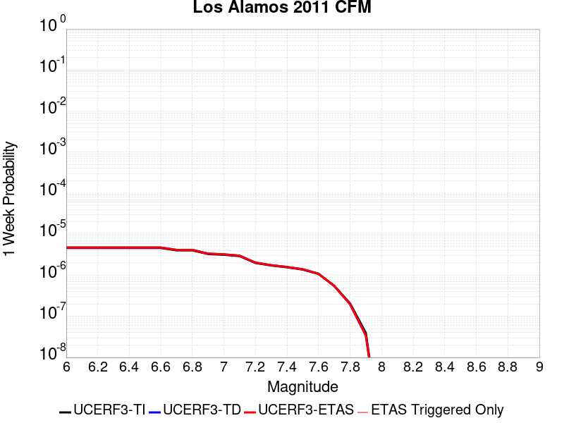 |  |  |  |

| Magnitude | 1 wk TI Prob | 1 wk TD Prob | 1 wk ETAS Prob | 1 wk ETAS/TD Gain | 1 wk ETAS Triggered Only | 1 mo TI Prob | 1 mo TD Prob | 1 mo ETAS Prob | 1 mo ETAS/TD Gain | 1 mo ETAS Triggered Only | 1 yr TI Prob | 1 yr TD Prob | 1 yr ETAS Prob | 1 yr ETAS/TD Gain | 1 yr ETAS Triggered Only | 10 yr TI Prob | 10 yr TD Prob | 10 yr ETAS Prob | 10 yr ETAS/TD Gain | 10 yr ETAS Triggered Only |
|-----|-----|-----|-----|-----|-----|-----|-----|-----|-----|-----|-----|-----|-----|-----|-----|-----|-----|-----|-----|-----|
| 6.0 | 4.6284417E-6 | 4.751753E-6 | 4.751753E-6 | 1.0 | 0.0 | 1.9836029E-5 | 2.0364507E-5 | 3.0364303E-5 | 1.4910405 | 1.0E-5 | 2.4147688E-4 | 2.4791143E-4 | 2.5790895E-4 | 1.040327 | 1.0E-5 | 0.0024121467 | 0.0024765227 | 0.0024964733 | 1.0080558 | 2.0E-5 |
| 6.1 | 4.6284417E-6 | 4.751753E-6 | 4.751753E-6 | 1.0 | 0.0 | 1.9836029E-5 | 2.0364507E-5 | 3.0364303E-5 | 1.4910405 | 1.0E-5 | 2.4147688E-4 | 2.4791143E-4 | 2.5790895E-4 | 1.040327 | 1.0E-5 | 0.0024121467 | 0.0024765227 | 0.0024964733 | 1.0080558 | 2.0E-5 |
| 6.2 | 4.6284417E-6 | 4.751753E-6 | 4.751753E-6 | 1.0 | 0.0 | 1.9836029E-5 | 2.0364507E-5 | 3.0364303E-5 | 1.4910405 | 1.0E-5 | 2.4147688E-4 | 2.4791143E-4 | 2.5790895E-4 | 1.040327 | 1.0E-5 | 0.0024121467 | 0.0024765227 | 0.0024964733 | 1.0080558 | 2.0E-5 |
| 6.3 | 4.6284417E-6 | 4.751753E-6 | 4.751753E-6 | 1.0 | 0.0 | 1.9836029E-5 | 2.0364507E-5 | 3.0364303E-5 | 1.4910405 | 1.0E-5 | 2.4147688E-4 | 2.4791143E-4 | 2.5790895E-4 | 1.040327 | 1.0E-5 | 0.0024121467 | 0.0024765227 | 0.0024964733 | 1.0080558 | 2.0E-5 |
| 6.4 | 4.6284417E-6 | 4.751753E-6 | 4.751753E-6 | 1.0 | 0.0 | 1.9836029E-5 | 2.0364507E-5 | 3.0364303E-5 | 1.4910405 | 1.0E-5 | 2.4147688E-4 | 2.4791143E-4 | 2.5790895E-4 | 1.040327 | 1.0E-5 | 0.0024121467 | 0.0024765227 | 0.0024964733 | 1.0080558 | 2.0E-5 |
| 6.5 | 4.6284417E-6 | 4.751753E-6 | 4.751753E-6 | 1.0 | 0.0 | 1.9836029E-5 | 2.0364507E-5 | 3.0364303E-5 | 1.4910405 | 1.0E-5 | 2.4147688E-4 | 2.4791143E-4 | 2.5790895E-4 | 1.040327 | 1.0E-5 | 0.0024121467 | 0.0024765227 | 0.0024964733 | 1.0080558 | 2.0E-5 |
| 6.6 | 4.6284417E-6 | 4.751753E-6 | 4.751753E-6 | 1.0 | 0.0 | 1.9836029E-5 | 2.0364507E-5 | 3.0364303E-5 | 1.4910405 | 1.0E-5 | 2.4147688E-4 | 2.4791143E-4 | 2.5790895E-4 | 1.040327 | 1.0E-5 | 0.0024121467 | 0.0024765227 | 0.0024964733 | 1.0080558 | 2.0E-5 |
| 6.7 | 4.062321E-6 | 4.166368E-6 | 4.166368E-6 | 1.0 | 0.0 | 1.7409831E-5 | 1.785575E-5 | 2.785557E-5 | 1.5600337 | 1.0E-5 | 2.1194408E-4 | 2.1737357E-4 | 2.273714E-4 | 1.0459938 | 1.0E-5 | 0.0021174205 | 0.0021717593 | 0.0021817375 | 1.0045946 | 1.0E-5 |
| 6.8 | 4.062321E-6 | 4.166368E-6 | 4.166368E-6 | 1.0 | 0.0 | 1.7409831E-5 | 1.785575E-5 | 2.785557E-5 | 1.5600337 | 1.0E-5 | 2.1194408E-4 | 2.1737357E-4 | 2.273714E-4 | 1.0459938 | 1.0E-5 | 0.0021174205 | 0.0021717593 | 0.0021817375 | 1.0045946 | 1.0E-5 |
| 6.9 | 3.2936077E-6 | 3.3729737E-6 | 3.3729737E-6 | 1.0 | 0.0 | 1.4115385E-5 | 1.4455527E-5 | 2.4455383E-5 | 1.691767 | 1.0E-5 | 1.7184127E-4 | 1.7598276E-4 | 1.85981E-4 | 1.0568137 | 1.0E-5 | 0.0017170844 | 0.0017585267 | 0.001768509 | 1.0056766 | 1.0E-5 |
| 7.0 | 3.1687898E-6 | 3.2448309E-6 | 3.2448309E-6 | 1.0 | 0.0 | 1.3580457E-5 | 1.39063495E-5 | 2.390621E-5 | 1.719086 | 1.0E-5 | 1.6532952E-4 | 1.6929758E-4 | 1.7929588E-4 | 1.0590576 | 1.0E-5 | 0.0016520657 | 0.0016917776 | 0.0017017607 | 1.005901 | 1.0E-5 |
| 7.1 | 2.9379228E-6 | 3.0073402E-6 | 3.0073402E-6 | 1.0 | 0.0 | 1.25910365E-5 | 1.2888542E-5 | 2.2888413E-5 | 1.775873 | 1.0E-5 | 1.5328509E-4 | 1.5690761E-4 | 1.6690604E-4 | 1.0637218 | 1.0E-5 | 0.001531794 | 0.0015680575 | 0.0015780417 | 1.0063673 | 1.0E-5 |
| 7.2 | 2.0020686E-6 | 2.04164E-6 | 2.04164E-6 | 1.0 | 0.0 | 8.580266E-6 | 8.749857E-6 | 8.749857E-6 | 1.0 | 0.0 | 1.0445973E-4 | 1.0652435E-4 | 1.0652435E-4 | 1.0 | 0.0 | 0.0010441064 | 0.0010647373 | 0.0010647373 | 1.0 | 0.0 |
| 7.3 | 1.7364243E-6 | 1.7678894E-6 | 1.7678894E-6 | 1.0 | 0.0 | 7.441797E-6 | 7.5766475E-6 | 7.5766475E-6 | 1.0 | 0.0 | 9.0600115E-5 | 9.224181E-5 | 9.224181E-5 | 1.0 | 0.0 | 9.0563187E-4 | 9.220384E-4 | 9.220384E-4 | 1.0 | 0.0 |
| 7.4 | 1.5718434E-6 | 1.5983262E-6 | 1.5983262E-6 | 1.0 | 0.0 | 6.7364545E-6 | 6.8499517E-6 | 6.8499517E-6 | 1.0 | 0.0 | 8.201325E-5 | 8.3395E-5 | 8.3395E-5 | 1.0 | 0.0 | 8.198299E-4 | 8.3364005E-4 | 8.3364005E-4 | 1.0 | 0.0 |
| 7.5 | 1.3841119E-6 | 1.404287E-6 | 1.404287E-6 | 1.0 | 0.0 | 5.9318945E-6 | 6.018359E-6 | 6.018359E-6 | 1.0 | 0.0 | 7.221842E-5 | 7.327108E-5 | 7.327108E-5 | 1.0 | 0.0 | 7.2194956E-4 | 7.324721E-4 | 7.324721E-4 | 1.0 | 0.0 |
| 7.6 | 1.0843726E-6 | 1.0934483E-6 | 1.0934483E-6 | 1.0 | 0.0 | 4.647303E-6 | 4.6861987E-6 | 4.6861987E-6 | 1.0 | 0.0 | 5.6579443E-5 | 5.7053E-5 | 5.7053E-5 | 1.0 | 0.0 | 5.656504E-4 | 5.703861E-4 | 5.703861E-4 | 1.0 | 0.0 |
| 7.7 | 5.544814E-7 | 5.501903E-7 | 5.501903E-7 | 1.0 | 0.0 | 2.3763469E-6 | 2.3579564E-6 | 2.3579564E-6 | 1.0 | 0.0 | 2.8931638E-5 | 2.8707742E-5 | 2.8707742E-5 | 1.0 | 0.0 | 2.8927872E-4 | 2.870405E-4 | 2.870405E-4 | 1.0 | 0.0 |
| 7.8 | 2.0707465E-7 | 1.9778587E-7 | 1.9778587E-7 | 1.0 | 0.0 | 8.874625E-7 | 8.4765344E-7 | 8.4765344E-7 | 1.0 | 0.0 | 1.08048025E-5 | 1.0320132E-5 | 1.0320132E-5 | 1.0 | 0.0 | 1.0804277E-4 | 1.0319657E-4 | 1.0319657E-4 | 1.0 | 0.0 |
| 7.9 | 3.9821284E-8 | 3.4331322E-8 | 3.4331322E-8 | 1.0 | 0.0 | 1.7066264E-7 | 1.4713423E-7 | 1.4713423E-7 | 1.0 | 0.0 | 2.0778157E-6 | 1.7913579E-6 | 1.7913579E-6 | 1.0 | 0.0 | 2.0777963E-5 | 1.791344E-5 | 1.791344E-5 | 1.0 | 0.0 |
| 8.0 | 7.880441E-11 | 8.235368E-11 | 8.235368E-11 | 1.0 | 0.0 | 3.3773329E-10 | 3.5294412E-10 | 3.5294412E-10 | 1.0 | 0.0 | 4.1119033E-9 | 4.297095E-9 | 4.297095E-9 | 1.0 | 0.0 | 4.1119034E-8 | 4.2970953E-8 | 4.2970953E-8 | 1.0 | 0.0 |

## Puente Hills
*[(top)](#table-of-contents)*

| 1 Week | 1 Month | 1 Year | 10 Year |
|-----|-----|-----|-----|
|  |  |  |  |

| Magnitude | 1 wk TI Prob | 1 wk TD Prob | 1 wk ETAS Prob | 1 wk ETAS/TD Gain | 1 wk ETAS Triggered Only | 1 mo TI Prob | 1 mo TD Prob | 1 mo ETAS Prob | 1 mo ETAS/TD Gain | 1 mo ETAS Triggered Only | 1 yr TI Prob | 1 yr TD Prob | 1 yr ETAS Prob | 1 yr ETAS/TD Gain | 1 yr ETAS Triggered Only | 10 yr TI Prob | 10 yr TD Prob | 10 yr ETAS Prob | 10 yr ETAS/TD Gain | 10 yr ETAS Triggered Only |
|-----|-----|-----|-----|-----|-----|-----|-----|-----|-----|-----|-----|-----|-----|-----|-----|-----|-----|-----|-----|-----|
| 6.0 | 1.2101656E-5 | 8.098785E-6 | 8.098785E-6 | 1.0 | 0.0 | 5.1863204E-5 | 3.4708646E-5 | 3.4708646E-5 | 1.0 | 0.0 | 6.312516E-4 | 4.2250147E-4 | 4.3249724E-4 | 1.0236585 | 1.0E-5 | 0.0062946146 | 0.0042175422 | 0.004237458 | 1.0047221 | 2.0E-5 |
| 6.1 | 1.2101656E-5 | 8.098785E-6 | 8.098785E-6 | 1.0 | 0.0 | 5.1863204E-5 | 3.4708646E-5 | 3.4708646E-5 | 1.0 | 0.0 | 6.312516E-4 | 4.2250147E-4 | 4.3249724E-4 | 1.0236585 | 1.0E-5 | 0.0062946146 | 0.0042175422 | 0.004237458 | 1.0047221 | 2.0E-5 |
| 6.2 | 1.2101656E-5 | 8.098785E-6 | 8.098785E-6 | 1.0 | 0.0 | 5.1863204E-5 | 3.4708646E-5 | 3.4708646E-5 | 1.0 | 0.0 | 6.312516E-4 | 4.2250147E-4 | 4.3249724E-4 | 1.0236585 | 1.0E-5 | 0.0062946146 | 0.0042175422 | 0.004237458 | 1.0047221 | 2.0E-5 |
| 6.3 | 1.2101656E-5 | 8.098785E-6 | 8.098785E-6 | 1.0 | 0.0 | 5.1863204E-5 | 3.4708646E-5 | 3.4708646E-5 | 1.0 | 0.0 | 6.312516E-4 | 4.2250147E-4 | 4.3249724E-4 | 1.0236585 | 1.0E-5 | 0.0062946146 | 0.0042175422 | 0.004237458 | 1.0047221 | 2.0E-5 |
| 6.4 | 1.2101656E-5 | 8.098785E-6 | 8.098785E-6 | 1.0 | 0.0 | 5.1863204E-5 | 3.4708646E-5 | 3.4708646E-5 | 1.0 | 0.0 | 6.312516E-4 | 4.2250147E-4 | 4.3249724E-4 | 1.0236585 | 1.0E-5 | 0.0062946146 | 0.0042175422 | 0.004237458 | 1.0047221 | 2.0E-5 |
| 6.5 | 1.2101656E-5 | 8.098785E-6 | 8.098785E-6 | 1.0 | 0.0 | 5.1863204E-5 | 3.4708646E-5 | 3.4708646E-5 | 1.0 | 0.0 | 6.312516E-4 | 4.2250147E-4 | 4.3249724E-4 | 1.0236585 | 1.0E-5 | 0.0062946146 | 0.0042175422 | 0.004237458 | 1.0047221 | 2.0E-5 |
| 6.6 | 1.0222488E-5 | 6.3993284E-6 | 6.3993284E-6 | 1.0 | 0.0 | 4.3809923E-5 | 2.742542E-5 | 2.742542E-5 | 1.0 | 0.0 | 5.332553E-4 | 3.3385577E-4 | 3.4385244E-4 | 1.0299431 | 1.0E-5 | 0.0053197746 | 0.0033337874 | 0.0033537208 | 1.0059792 | 2.0E-5 |
| 6.7 | 1.0222488E-5 | 6.3993284E-6 | 6.3993284E-6 | 1.0 | 0.0 | 4.3809923E-5 | 2.742542E-5 | 2.742542E-5 | 1.0 | 0.0 | 5.332553E-4 | 3.3385577E-4 | 3.4385244E-4 | 1.0299431 | 1.0E-5 | 0.0053197746 | 0.0033337874 | 0.0033537208 | 1.0059792 | 2.0E-5 |
| 6.8 | 8.6367845E-6 | 5.02838E-6 | 5.02838E-6 | 1.0 | 0.0 | 3.7014266E-5 | 2.1550026E-5 | 2.1550026E-5 | 1.0 | 0.0 | 4.505555E-4 | 2.6234053E-4 | 2.723379E-4 | 1.0381083 | 1.0E-5 | 0.004496431 | 0.0026203648 | 0.0026403123 | 1.0076125 | 2.0E-5 |
| 6.9 | 8.066481E-6 | 4.8362404E-6 | 4.8362404E-6 | 1.0 | 0.0 | 3.4570177E-5 | 2.0726584E-5 | 2.0726584E-5 | 1.0 | 0.0 | 4.2081063E-4 | 2.5231746E-4 | 2.6231495E-4 | 1.0396227 | 1.0E-5 | 0.0042001465 | 0.0025203635 | 0.0025403132 | 1.0079154 | 2.0E-5 |
| 7.0 | 7.393828E-6 | 4.417414E-6 | 4.417414E-6 | 1.0 | 0.0 | 3.168745E-5 | 1.893164E-5 | 1.893164E-5 | 1.0 | 0.0 | 3.857264E-4 | 2.3046878E-4 | 2.4046648E-4 | 1.0433798 | 1.0E-5 | 0.0038505755 | 0.0023023433 | 0.002322297 | 1.0086668 | 2.0E-5 |
| 7.1 | 6.4660953E-6 | 3.8045498E-6 | 3.8045498E-6 | 1.0 | 0.0 | 2.7711543E-5 | 1.6305114E-5 | 1.6305114E-5 | 1.0 | 0.0 | 3.373358E-4 | 1.9849703E-4 | 2.0849504E-4 | 1.0503685 | 1.0E-5 | 0.0033682417 | 0.0019832333 | 0.0020031936 | 1.0100646 | 2.0E-5 |
| 7.2 | 5.143232E-6 | 2.7866233E-6 | 2.7866233E-6 | 1.0 | 0.0 | 2.2042237E-5 | 1.1942618E-5 | 1.1942618E-5 | 1.0 | 0.0 | 2.6833118E-4 | 1.4539176E-4 | 1.5539031E-4 | 1.0687697 | 1.0E-5 | 0.002680074 | 0.0014529761 | 0.0014729471 | 1.0137448 | 2.0E-5 |
| 7.3 | 3.928255E-6 | 2.0914442E-6 | 2.0914442E-6 | 1.0 | 0.0 | 1.683527E-5 | 8.963302E-6 | 8.963302E-6 | 1.0 | 0.0 | 2.0495013E-4 | 1.091228E-4 | 1.091228E-4 | 1.0 | 0.0 | 0.002047612 | 0.0010906989 | 0.0011006879 | 1.0091585 | 1.0E-5 |
| 7.4 | 2.7894434E-6 | 1.3547324E-6 | 1.3547324E-6 | 1.0 | 0.0 | 1.1954703E-5 | 5.805983E-6 | 5.805983E-6 | 1.0 | 0.0 | 1.4553878E-4 | 7.068559E-5 | 7.068559E-5 | 1.0 | 0.0 | 0.001454435 | 7.0663553E-4 | 7.0663553E-4 | 1.0 | 0.0 |
| 7.5 | 2.041735E-6 | 8.787759E-7 | 8.787759E-7 | 1.0 | 0.0 | 8.750263E-6 | 3.766177E-6 | 3.766177E-6 | 1.0 | 0.0 | 1.06529245E-4 | 4.5852277E-5 | 4.5852277E-5 | 1.0 | 0.0 | 0.0010647819 | 4.5843152E-4 | 4.5843152E-4 | 1.0 | 0.0 |
| 7.6 | 1.6959062E-6 | 6.699006E-7 | 6.699006E-7 | 1.0 | 0.0 | 7.268149E-6 | 2.8709997E-6 | 2.8709997E-6 | 1.0 | 0.0 | 8.848612E-5 | 3.495389E-5 | 3.495389E-5 | 1.0 | 0.0 | 8.84509E-4 | 3.494868E-4 | 3.494868E-4 | 1.0 | 0.0 |
| 7.7 | 1.4767965E-6 | 5.40793E-7 | 5.40793E-7 | 1.0 | 0.0 | 6.3291122E-6 | 2.3176822E-6 | 2.3176822E-6 | 1.0 | 0.0 | 7.705422E-5 | 2.8217442E-5 | 2.8217442E-5 | 1.0 | 0.0 | 7.702751E-4 | 2.8214118E-4 | 2.8214118E-4 | 1.0 | 0.0 |
| 7.8 | 1.8432911E-7 | 7.282394E-8 | 7.282394E-8 | 1.0 | 0.0 | 7.8998164E-7 | 3.1210257E-7 | 3.1210257E-7 | 1.0 | 0.0 | 9.617985E-6 | 3.7998457E-6 | 3.7998457E-6 | 1.0 | 0.0 | 9.617568E-5 | 3.7998132E-5 | 3.7998132E-5 | 1.0 | 0.0 |

## Ortigalita (South)
*[(top)](#table-of-contents)*

| 1 Week | 1 Month | 1 Year | 10 Year |
|-----|-----|-----|-----|
|  |  | 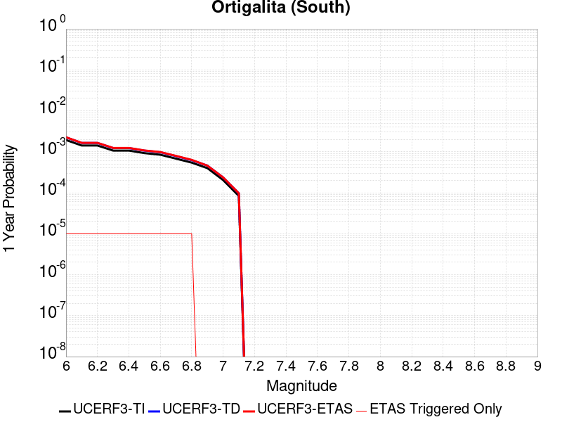 |  |

| Magnitude | 1 wk TI Prob | 1 wk TD Prob | 1 wk ETAS Prob | 1 wk ETAS/TD Gain | 1 wk ETAS Triggered Only | 1 mo TI Prob | 1 mo TD Prob | 1 mo ETAS Prob | 1 mo ETAS/TD Gain | 1 mo ETAS Triggered Only | 1 yr TI Prob | 1 yr TD Prob | 1 yr ETAS Prob | 1 yr ETAS/TD Gain | 1 yr ETAS Triggered Only | 10 yr TI Prob | 10 yr TD Prob | 10 yr ETAS Prob | 10 yr ETAS/TD Gain | 10 yr ETAS Triggered Only |
|-----|-----|-----|-----|-----|-----|-----|-----|-----|-----|-----|-----|-----|-----|-----|-----|-----|-----|-----|-----|-----|
| 6.0 | 3.72394E-5 | 4.325655E-5 | 4.325655E-5 | 1.0 | 0.0 | 1.5958765E-4 | 1.8537292E-4 | 1.8537292E-4 | 1.0 | 0.0 | 0.0019412481 | 0.002254736 | 0.0022647134 | 1.0044252 | 1.0E-5 | 0.019243775 | 0.022334972 | 0.02234475 | 1.0004377 | 1.0E-5 |
| 6.1 | 2.7299884E-5 | 3.1492684E-5 | 3.1492684E-5 | 1.0 | 0.0 | 1.16994255E-4 | 1.3496199E-4 | 1.3496199E-4 | 1.0 | 0.0 | 0.0014234743 | 0.0016419792 | 0.0016519628 | 1.0060803 | 1.0E-5 | 0.014143906 | 0.016304402 | 0.016314238 | 1.0006033 | 1.0E-5 |
| 6.2 | 2.7299884E-5 | 3.1492684E-5 | 3.1492684E-5 | 1.0 | 0.0 | 1.16994255E-4 | 1.3496199E-4 | 1.3496199E-4 | 1.0 | 0.0 | 0.0014234743 | 0.0016419792 | 0.0016519628 | 1.0060803 | 1.0E-5 | 0.014143906 | 0.016304402 | 0.016314238 | 1.0006033 | 1.0E-5 |
| 6.3 | 2.0546433E-5 | 2.3631923E-5 | 2.3631923E-5 | 1.0 | 0.0 | 8.805317E-5 | 1.01275844E-4 | 1.01275844E-4 | 1.0 | 0.0 | 0.00107152 | 0.0012323549 | 0.0012423425 | 1.0081046 | 1.0E-5 | 0.010663681 | 0.012257273 | 0.012267151 | 1.0008059 | 1.0E-5 |
| 6.4 | 2.0546433E-5 | 2.3631923E-5 | 2.3631923E-5 | 1.0 | 0.0 | 8.805317E-5 | 1.01275844E-4 | 1.01275844E-4 | 1.0 | 0.0 | 0.00107152 | 0.0012323549 | 0.0012423425 | 1.0081046 | 1.0E-5 | 0.010663681 | 0.012257273 | 0.012267151 | 1.0008059 | 1.0E-5 |
| 6.5 | 1.7779594E-5 | 2.0447382E-5 | 2.0447382E-5 | 1.0 | 0.0 | 7.619603E-5 | 8.7628774E-5 | 8.7628774E-5 | 1.0 | 0.0 | 9.272918E-4 | 0.0010663717 | 0.001076361 | 1.0093676 | 1.0E-5 | 0.009234319 | 0.010614014 | 0.010623908 | 1.0009321 | 1.0E-5 |
| 6.6 | 1.6272212E-5 | 1.8715342E-5 | 1.8715342E-5 | 1.0 | 0.0 | 6.973618E-5 | 8.0206206E-5 | 8.0206206E-5 | 1.0 | 0.0 | 8.487073E-4 | 9.760853E-4 | 9.860756E-4 | 1.010235 | 1.0E-5 | 0.008454733 | 0.009719283 | 0.009729186 | 1.0010189 | 1.0E-5 |
| 6.7 | 1.3051484E-5 | 1.5039062E-5 | 1.5039062E-5 | 1.0 | 0.0 | 5.593373E-5 | 6.445159E-5 | 6.445159E-5 | 1.0 | 0.0 | 6.807804E-4 | 7.8442506E-4 | 7.944172E-4 | 1.0127382 | 1.0E-5 | 0.006786986 | 0.007817546 | 0.007827467 | 1.0012692 | 1.0E-5 |
| 6.8 | 1.04277415E-5 | 1.1987473E-5 | 1.1987473E-5 | 1.0 | 0.0 | 4.4689557E-5 | 5.1373918E-5 | 5.1373918E-5 | 1.0 | 0.0 | 5.439595E-4 | 6.2530534E-4 | 6.3529913E-4 | 1.0159822 | 1.0E-5 | 0.0054262993 | 0.0062362133 | 0.006246151 | 1.0015936 | 1.0E-5 |
| 6.9 | 7.639968E-6 | 8.79168E-6 | 8.79168E-6 | 1.0 | 0.0 | 3.274231E-5 | 3.7678114E-5 | 3.7678114E-5 | 1.0 | 0.0 | 3.9856473E-4 | 4.5864037E-4 | 4.5864037E-4 | 1.0 | 0.0 | 0.003978506 | 0.0045775245 | 0.0045775245 | 1.0 | 0.0 |
| 7.0 | 3.919831E-6 | 4.5334955E-6 | 4.5334955E-6 | 1.0 | 0.0 | 1.679917E-5 | 1.9429133E-5 | 1.9429133E-5 | 1.0 | 0.0 | 2.045107E-4 | 2.3652615E-4 | 2.3652615E-4 | 1.0 | 0.0 | 0.0020432258 | 0.0023629526 | 0.0023629526 | 1.0 | 0.0 |
| 7.1 | 1.6017933E-6 | 1.8570811E-6 | 1.8570811E-6 | 1.0 | 0.0 | 6.8648105E-6 | 7.958901E-6 | 7.958901E-6 | 1.0 | 0.0 | 8.357586E-5 | 9.689637E-5 | 9.689637E-5 | 1.0 | 0.0 | 8.3544437E-4 | 9.686459E-4 | 9.686459E-4 | 1.0 | 0.0 |

## Hosgri (Extension)
*[(top)](#table-of-contents)*

| 1 Week | 1 Month | 1 Year | 10 Year |
|-----|-----|-----|-----|
|  |  | 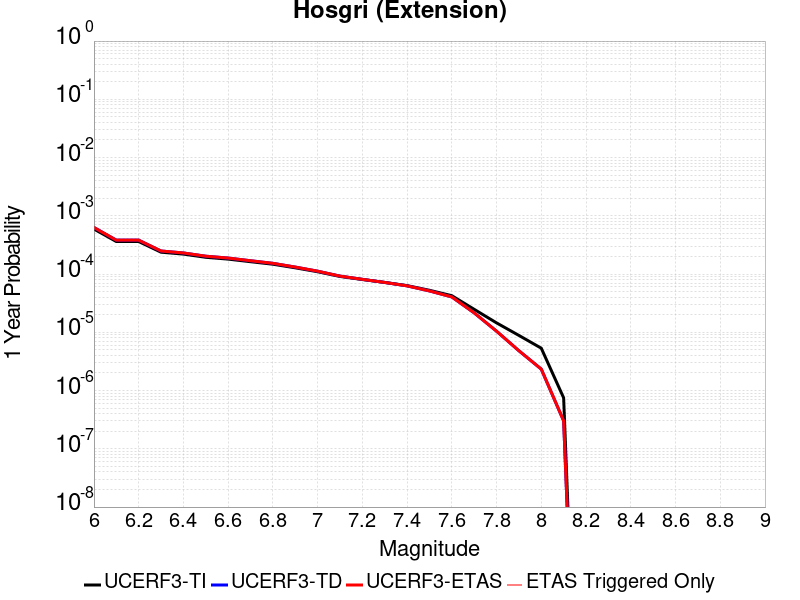 |  |

| Magnitude | 1 wk TI Prob | 1 wk TD Prob | 1 wk ETAS Prob | 1 wk ETAS/TD Gain | 1 wk ETAS Triggered Only | 1 mo TI Prob | 1 mo TD Prob | 1 mo ETAS Prob | 1 mo ETAS/TD Gain | 1 mo ETAS Triggered Only | 1 yr TI Prob | 1 yr TD Prob | 1 yr ETAS Prob | 1 yr ETAS/TD Gain | 1 yr ETAS Triggered Only | 10 yr TI Prob | 10 yr TD Prob | 10 yr ETAS Prob | 10 yr ETAS/TD Gain | 10 yr ETAS Triggered Only |
|-----|-----|-----|-----|-----|-----|-----|-----|-----|-----|-----|-----|-----|-----|-----|-----|-----|-----|-----|-----|-----|
| 6.0 | 1.1369135E-5 | 1.2083198E-5 | 1.2083198E-5 | 1.0 | 0.0 | 4.8723956E-5 | 5.1784238E-5 | 5.1784238E-5 | 1.0 | 0.0 | 5.9305265E-4 | 6.303134E-4 | 6.303134E-4 | 1.0 | 0.0 | 0.005914725 | 0.0062875054 | 0.00630738 | 1.003161 | 2.0E-5 |
| 6.1 | 6.934979E-6 | 7.3246356E-6 | 7.3246356E-6 | 1.0 | 0.0 | 2.9721E-5 | 3.139094E-5 | 3.139094E-5 | 1.0 | 0.0 | 3.617931E-4 | 3.8212183E-4 | 3.8212183E-4 | 1.0 | 0.0 | 0.0036120464 | 0.0038150605 | 0.0038150605 | 1.0 | 0.0 |
| 6.2 | 6.934979E-6 | 7.3246356E-6 | 7.3246356E-6 | 1.0 | 0.0 | 2.9721E-5 | 3.139094E-5 | 3.139094E-5 | 1.0 | 0.0 | 3.617931E-4 | 3.8212183E-4 | 3.8212183E-4 | 1.0 | 0.0 | 0.0036120464 | 0.0038150605 | 0.0038150605 | 1.0 | 0.0 |
| 6.3 | 4.5484676E-6 | 4.769387E-6 | 4.769387E-6 | 1.0 | 0.0 | 1.9493287E-5 | 2.0440071E-5 | 2.0440071E-5 | 1.0 | 0.0 | 2.3730492E-4 | 2.4882986E-4 | 2.4882986E-4 | 1.0 | 0.0 | 0.0023705168 | 0.0024855551 | 0.0024855551 | 1.0 | 0.0 |
| 6.4 | 4.218095E-6 | 4.416915E-6 | 4.416915E-6 | 1.0 | 0.0 | 1.8077424E-5 | 1.89295E-5 | 1.89295E-5 | 1.0 | 0.0 | 2.2007042E-4 | 2.3044262E-4 | 2.3044262E-4 | 1.0 | 0.0 | 0.002198526 | 0.0023020701 | 0.0023020701 | 1.0 | 0.0 |
| 6.5 | 3.717374E-6 | 3.8839266E-6 | 3.8839266E-6 | 1.0 | 0.0 | 1.5931506E-5 | 1.6645294E-5 | 1.6645294E-5 | 1.0 | 0.0 | 1.9394881E-4 | 2.0263779E-4 | 2.0263779E-4 | 1.0 | 0.0 | 0.0019377962 | 0.002024549 | 0.002024549 | 1.0 | 0.0 |
| 6.6 | 3.4605036E-6 | 3.6083522E-6 | 3.6083522E-6 | 1.0 | 0.0 | 1.4830645E-5 | 1.5464277E-5 | 1.5464277E-5 | 1.0 | 0.0 | 1.8054814E-4 | 1.8826143E-4 | 1.8826143E-4 | 1.0 | 0.0 | 0.0018040152 | 0.0018810342 | 0.0018810342 | 1.0 | 0.0 |
| 6.7 | 3.123439E-6 | 3.2466114E-6 | 3.2466114E-6 | 1.0 | 0.0 | 1.33860985E-5 | 1.3913976E-5 | 1.3913976E-5 | 1.0 | 0.0 | 1.6296357E-4 | 1.6938959E-4 | 1.6938959E-4 | 1.0 | 0.0 | 0.001628441 | 0.0016926157 | 0.0016926157 | 1.0 | 0.0 |
| 6.8 | 2.8290783E-6 | 2.93058E-6 | 2.93058E-6 | 1.0 | 0.0 | 1.2124565E-5 | 1.2559569E-5 | 1.2559569E-5 | 1.0 | 0.0 | 1.4760658E-4 | 1.529021E-4 | 1.529021E-4 | 1.0 | 0.0 | 0.0014750857 | 0.0015279776 | 0.0015279776 | 1.0 | 0.0 |
| 6.9 | 2.454112E-6 | 2.5283553E-6 | 2.5283553E-6 | 1.0 | 0.0 | 1.0517581E-5 | 1.08357635E-5 | 1.08357635E-5 | 1.0 | 0.0 | 1.2804402E-4 | 1.3191749E-4 | 1.3191749E-4 | 1.0 | 0.0 | 0.0012797028 | 0.001318398 | 0.001318398 | 1.0 | 0.0 |
| 7.0 | 2.1008145E-6 | 2.1499025E-6 | 2.1499025E-6 | 1.0 | 0.0 | 9.003459E-6 | 9.213836E-6 | 9.213836E-6 | 1.0 | 0.0 | 1.096116E-4 | 1.1217271E-4 | 1.1217271E-4 | 1.0 | 0.0 | 0.0010955755 | 0.0011211646 | 0.0011211646 | 1.0 | 0.0 |
| 7.1 | 1.744384E-6 | 1.7686639E-6 | 1.7686639E-6 | 1.0 | 0.0 | 7.47591E-6 | 7.579966E-6 | 7.579966E-6 | 1.0 | 0.0 | 9.1015405E-5 | 9.22822E-5 | 9.22822E-5 | 1.0 | 0.0 | 9.097813E-4 | 9.224405E-4 | 9.224405E-4 | 1.0 | 0.0 |
| 7.2 | 1.5456587E-6 | 1.556315E-6 | 1.556315E-6 | 1.0 | 0.0 | 6.6242346E-6 | 6.6699045E-6 | 6.6699045E-6 | 1.0 | 0.0 | 8.064707E-5 | 8.120307E-5 | 8.120307E-5 | 1.0 | 0.0 | 8.0617814E-4 | 8.117353E-4 | 8.117353E-4 | 1.0 | 0.0 |
| 7.3 | 1.3775123E-6 | 1.3766333E-6 | 1.3766333E-6 | 1.0 | 0.0 | 5.9036106E-6 | 5.899844E-6 | 5.899844E-6 | 1.0 | 0.0 | 7.187409E-5 | 7.182824E-5 | 7.182824E-5 | 1.0 | 0.0 | 7.185085E-4 | 7.180513E-4 | 7.180513E-4 | 1.0 | 0.0 |
| 7.4 | 1.214491E-6 | 1.2023696E-6 | 1.2023696E-6 | 1.0 | 0.0 | 5.2049513E-6 | 5.1530023E-6 | 5.1530023E-6 | 1.0 | 0.0 | 6.336844E-5 | 6.2736006E-5 | 6.2736006E-5 | 1.0 | 0.0 | 6.335037E-4 | 6.2718376E-4 | 6.2718376E-4 | 1.0 | 0.0 |
| 7.5 | 1.0101123E-6 | 9.842462E-7 | 9.842462E-7 | 1.0 | 0.0 | 4.3290456E-6 | 4.218191E-6 | 4.218191E-6 | 1.0 | 0.0 | 5.2704854E-5 | 5.135527E-5 | 5.135527E-5 | 1.0 | 0.0 | 5.2692357E-4 | 5.1343464E-4 | 5.1343464E-4 | 1.0 | 0.0 |
| 7.6 | 8.1558215E-7 | 7.7661633E-7 | 7.7661633E-7 | 1.0 | 0.0 | 3.4953473E-6 | 3.3283516E-6 | 3.3283516E-6 | 1.0 | 0.0 | 4.255502E-5 | 4.0521933E-5 | 4.0521933E-5 | 1.0 | 0.0 | 4.2546875E-4 | 4.0514587E-4 | 4.0514587E-4 | 1.0 | 0.0 |
| 7.7 | 4.757816E-7 | 4.1310525E-7 | 4.1310525E-7 | 1.0 | 0.0 | 2.0390623E-6 | 1.7704498E-6 | 1.7704498E-6 | 1.0 | 0.0 | 2.4825302E-5 | 2.1555015E-5 | 2.1555015E-5 | 1.0 | 0.0 | 2.482253E-4 | 2.1552936E-4 | 2.1552936E-4 | 1.0 | 0.0 |
| 7.8 | 2.782787E-7 | 2.0049143E-7 | 2.0049143E-7 | 1.0 | 0.0 | 1.1926223E-6 | 8.5924864E-7 | 8.5924864E-7 | 1.0 | 0.0 | 1.452008E-5 | 1.0461303E-5 | 1.0461303E-5 | 1.0 | 0.0 | 1.4519131E-4 | 1.0460813E-4 | 1.0460813E-4 | 1.0 | 0.0 |
| 7.9 | 1.6948086E-7 | 9.2455664E-8 | 9.2455664E-8 | 1.0 | 0.0 | 7.2634634E-7 | 3.9623848E-7 | 3.9623848E-7 | 1.0 | 0.0 | 8.843231E-6 | 4.824193E-6 | 4.824193E-6 | 1.0 | 0.0 | 8.842879E-5 | 4.824089E-5 | 4.824089E-5 | 1.0 | 0.0 |
| 8.0 | 1.0225492E-7 | 4.4748486E-8 | 4.4748486E-8 | 1.0 | 0.0 | 4.382353E-7 | 1.9177921E-7 | 1.9177921E-7 | 1.0 | 0.0 | 5.335502E-6 | 2.3349094E-6 | 2.3349094E-6 | 1.0 | 0.0 | 5.335374E-5 | 2.3348852E-5 | 2.3348852E-5 | 1.0 | 0.0 |
| 8.1 | 1.43711345E-8 | 5.789212E-9 | 5.789212E-9 | 1.0 | 0.0 | 6.1590576E-8 | 2.4810909E-8 | 2.4810909E-8 | 1.0 | 0.0 | 7.4986497E-7 | 3.0207278E-7 | 3.0207278E-7 | 1.0 | 0.0 | 7.4986247E-6 | 3.0207243E-6 | 3.0207243E-6 | 1.0 | 0.0 |

## San Pedro Basin
*[(top)](#table-of-contents)*

| 1 Week | 1 Month | 1 Year | 10 Year |
|-----|-----|-----|-----|
|  |  | 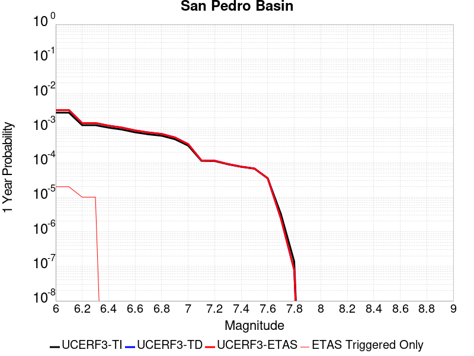 |  |

| Magnitude | 1 wk TI Prob | 1 wk TD Prob | 1 wk ETAS Prob | 1 wk ETAS/TD Gain | 1 wk ETAS Triggered Only | 1 mo TI Prob | 1 mo TD Prob | 1 mo ETAS Prob | 1 mo ETAS/TD Gain | 1 mo ETAS Triggered Only | 1 yr TI Prob | 1 yr TD Prob | 1 yr ETAS Prob | 1 yr ETAS/TD Gain | 1 yr ETAS Triggered Only | 10 yr TI Prob | 10 yr TD Prob | 10 yr ETAS Prob | 10 yr ETAS/TD Gain | 10 yr ETAS Triggered Only |
|-----|-----|-----|-----|-----|-----|-----|-----|-----|-----|-----|-----|-----|-----|-----|-----|-----|-----|-----|-----|-----|
| 6.0 | 5.3449043E-5 | 6.3371124E-5 | 7.337049E-5 | 1.1577905 | 1.0E-5 | 2.2904722E-4 | 2.7156572E-4 | 2.81563E-4 | 1.0368135 | 1.0E-5 | 0.0027850836 | 0.0033019078 | 0.0033218418 | 1.0060371 | 2.0E-5 | 0.027504366 | 0.032590248 | 0.032609597 | 1.0005937 | 2.0E-5 |
| 6.1 | 5.3449043E-5 | 6.3371124E-5 | 7.337049E-5 | 1.1577905 | 1.0E-5 | 2.2904722E-4 | 2.7156572E-4 | 2.81563E-4 | 1.0368135 | 1.0E-5 | 0.0027850836 | 0.0033019078 | 0.0033218418 | 1.0060371 | 2.0E-5 | 0.027504366 | 0.032590248 | 0.032609597 | 1.0005937 | 2.0E-5 |
| 6.2 | 2.3189454E-5 | 2.6643334E-5 | 3.664307E-5 | 1.3753184 | 1.0E-5 | 9.9379584E-5 | 1.14180984E-4 | 1.2417985E-4 | 1.0875703 | 1.0E-5 | 0.0012092749 | 0.0013893144 | 0.0013993005 | 1.0071878 | 1.0E-5 | 0.012027155 | 0.013811161 | 0.013821023 | 1.0007141 | 1.0E-5 |
| 6.3 | 2.3189454E-5 | 2.6643334E-5 | 3.664307E-5 | 1.3753184 | 1.0E-5 | 9.9379584E-5 | 1.14180984E-4 | 1.2417985E-4 | 1.0875703 | 1.0E-5 | 0.0012092749 | 0.0013893144 | 0.0013993005 | 1.0071878 | 1.0E-5 | 0.012027155 | 0.013811161 | 0.013821023 | 1.0007141 | 1.0E-5 |
| 6.4 | 1.966056E-5 | 2.2463848E-5 | 2.2463848E-5 | 1.0 | 0.0 | 8.425682E-5 | 9.627031E-5 | 9.627031E-5 | 1.0 | 0.0 | 0.001025344 | 0.001171501 | 0.001171501 | 1.0 | 0.0 | 0.010206259 | 0.011657341 | 0.011657341 | 1.0 | 0.0 |
| 6.5 | 1.7342953E-5 | 1.9745521E-5 | 1.9745521E-5 | 1.0 | 0.0 | 7.4324824E-5 | 8.4621126E-5 | 8.4621126E-5 | 1.0 | 0.0 | 9.04529E-4 | 0.0010298121 | 0.0010298121 | 1.0 | 0.0 | 0.009008561 | 0.010254124 | 0.010254124 | 1.0 | 0.0 |
| 6.6 | 1.439804E-5 | 1.6323014E-5 | 1.6323014E-5 | 1.0 | 0.0 | 6.170443E-5 | 6.995408E-5 | 6.995408E-5 | 1.0 | 0.0 | 7.509924E-4 | 8.513903E-4 | 8.513903E-4 | 1.0 | 0.0 | 0.0074845953 | 0.008484487 | 0.008484487 | 1.0 | 0.0 |
| 6.7 | 1.2634884E-5 | 1.4285554E-5 | 1.4285554E-5 | 1.0 | 0.0 | 5.414838E-5 | 6.1222534E-5 | 6.1222534E-5 | 1.0 | 0.0 | 6.590571E-4 | 7.451599E-4 | 7.451599E-4 | 1.0 | 0.0 | 0.006571059 | 0.007429634 | 0.007429634 | 1.0 | 0.0 |
| 6.8 | 1.146091E-5 | 1.2933421E-5 | 1.2933421E-5 | 1.0 | 0.0 | 4.911726E-5 | 5.542794E-5 | 5.542794E-5 | 1.0 | 0.0 | 5.9783855E-4 | 6.7465595E-4 | 6.7465595E-4 | 1.0 | 0.0 | 0.0059623276 | 0.0067290184 | 0.0067290184 | 1.0 | 0.0 |
| 6.9 | 9.109035E-6 | 1.0235189E-5 | 1.0235189E-5 | 1.0 | 0.0 | 3.9038136E-5 | 4.3864515E-5 | 4.3864515E-5 | 1.0 | 0.0 | 4.7518566E-4 | 5.339476E-4 | 5.339476E-4 | 1.0 | 0.0 | 0.0047417083 | 0.0053294008 | 0.0053294008 | 1.0 | 0.0 |
| 7.0 | 5.9351028E-6 | 6.584068E-6 | 6.584068E-6 | 1.0 | 0.0 | 2.5435906E-5 | 2.8217262E-5 | 2.8217262E-5 | 1.0 | 0.0 | 3.0963816E-4 | 3.4351464E-4 | 3.4351464E-4 | 1.0 | 0.0 | 0.0030920706 | 0.0034321535 | 0.0034321535 | 1.0 | 0.0 |
| 7.1 | 2.1557585E-6 | 2.2096608E-6 | 2.2096608E-6 | 1.0 | 0.0 | 9.238933E-6 | 9.469942E-6 | 9.469942E-6 | 1.0 | 0.0 | 1.1247819E-4 | 1.1529059E-4 | 1.1529059E-4 | 1.0 | 0.0 | 0.0011242128 | 0.0011523232 | 0.0011523232 | 1.0 | 0.0 |
| 7.2 | 2.1251979E-6 | 2.178007E-6 | 2.178007E-6 | 1.0 | 0.0 | 9.107958E-6 | 9.334282E-6 | 9.334282E-6 | 1.0 | 0.0 | 1.1088375E-4 | 1.1363912E-4 | 1.1363912E-4 | 1.0 | 0.0 | 0.0011082845 | 0.0011358254 | 0.0011358254 | 1.0 | 0.0 |
| 7.3 | 1.7145798E-6 | 1.7442967E-6 | 1.7442967E-6 | 1.0 | 0.0 | 7.3481783E-6 | 7.475536E-6 | 7.475536E-6 | 1.0 | 0.0 | 8.94604E-5 | 9.1010945E-5 | 9.1010945E-5 | 1.0 | 0.0 | 8.9424395E-4 | 9.0974587E-4 | 9.0974587E-4 | 1.0 | 0.0 |
| 7.4 | 1.4467993E-6 | 1.4641943E-6 | 1.4641943E-6 | 1.0 | 0.0 | 6.200554E-6 | 6.2751037E-6 | 6.2751037E-6 | 1.0 | 0.0 | 7.548913E-5 | 7.6396784E-5 | 7.6396784E-5 | 1.0 | 0.0 | 7.546349E-4 | 7.637125E-4 | 7.637125E-4 | 1.0 | 0.0 |
| 7.5 | 1.2803735E-6 | 1.2931564E-6 | 1.2931564E-6 | 1.0 | 0.0 | 5.487303E-6 | 5.5420874E-6 | 5.5420874E-6 | 1.0 | 0.0 | 6.680587E-5 | 6.7472894E-5 | 6.7472894E-5 | 1.0 | 0.0 | 6.678579E-4 | 6.7453115E-4 | 6.7453115E-4 | 1.0 | 0.0 |
| 7.6 | 6.755009E-7 | 6.769501E-7 | 6.769501E-7 | 1.0 | 0.0 | 2.8950008E-6 | 2.9012117E-6 | 2.9012117E-6 | 1.0 | 0.0 | 3.5246063E-5 | 3.5321737E-5 | 3.5321737E-5 | 1.0 | 0.0 | 3.5240475E-4 | 3.5316695E-4 | 3.5316695E-4 | 1.0 | 0.0 |
| 7.7 | 6.211885E-8 | 4.5699863E-8 | 4.5699863E-8 | 1.0 | 0.0 | 2.6622362E-7 | 1.9585654E-7 | 1.9585654E-7 | 1.0 | 0.0 | 3.2412677E-6 | 2.384551E-6 | 2.384551E-6 | 1.0 | 0.0 | 3.2412205E-5 | 2.3845274E-5 | 2.3845274E-5 | 1.0 | 0.0 |
| 7.8 | 2.6580573E-9 | 1.5138681E-9 | 1.5138681E-9 | 1.0 | 0.0 | 1.1391674E-8 | 6.488006E-9 | 6.488006E-9 | 1.0 | 0.0 | 1.3869362E-7 | 7.899148E-8 | 7.899148E-8 | 1.0 | 0.0 | 1.3869354E-6 | 7.8991474E-7 | 7.8991474E-7 | 1.0 | 0.0 |

## Johnson Valley (No) 2011 rev
*[(top)](#table-of-contents)*

| 1 Week | 1 Month | 1 Year | 10 Year |
|-----|-----|-----|-----|
|  |  |  |  |

| Magnitude | 1 wk TI Prob | 1 wk TD Prob | 1 wk ETAS Prob | 1 wk ETAS/TD Gain | 1 wk ETAS Triggered Only | 1 mo TI Prob | 1 mo TD Prob | 1 mo ETAS Prob | 1 mo ETAS/TD Gain | 1 mo ETAS Triggered Only | 1 yr TI Prob | 1 yr TD Prob | 1 yr ETAS Prob | 1 yr ETAS/TD Gain | 1 yr ETAS Triggered Only | 10 yr TI Prob | 10 yr TD Prob | 10 yr ETAS Prob | 10 yr ETAS/TD Gain | 10 yr ETAS Triggered Only |
|-----|-----|-----|-----|-----|-----|-----|-----|-----|-----|-----|-----|-----|-----|-----|-----|-----|-----|-----|-----|-----|
| 6.0 | 2.577707E-5 | 1.29011505E-5 | 1.29011505E-5 | 1.0 | 0.0 | 1.1046848E-4 | 5.5289696E-5 | 5.5289696E-5 | 1.0 | 0.0 | 0.0013441239 | 6.729838E-4 | 6.829771E-4 | 1.0148492 | 1.0E-5 | 0.013360229 | 0.006713367 | 0.006733233 | 1.0029591 | 2.0E-5 |
| 6.1 | 2.577707E-5 | 1.29011505E-5 | 1.29011505E-5 | 1.0 | 0.0 | 1.1046848E-4 | 5.5289696E-5 | 5.5289696E-5 | 1.0 | 0.0 | 0.0013441239 | 6.729838E-4 | 6.829771E-4 | 1.0148492 | 1.0E-5 | 0.013360229 | 0.006713367 | 0.006733233 | 1.0029591 | 2.0E-5 |
| 6.2 | 2.577707E-5 | 1.29011505E-5 | 1.29011505E-5 | 1.0 | 0.0 | 1.1046848E-4 | 5.5289696E-5 | 5.5289696E-5 | 1.0 | 0.0 | 0.0013441239 | 6.729838E-4 | 6.829771E-4 | 1.0148492 | 1.0E-5 | 0.013360229 | 0.006713367 | 0.006733233 | 1.0029591 | 2.0E-5 |
| 6.3 | 2.577707E-5 | 1.29011505E-5 | 1.29011505E-5 | 1.0 | 0.0 | 1.1046848E-4 | 5.5289696E-5 | 5.5289696E-5 | 1.0 | 0.0 | 0.0013441239 | 6.729838E-4 | 6.829771E-4 | 1.0148492 | 1.0E-5 | 0.013360229 | 0.006713367 | 0.006733233 | 1.0029591 | 2.0E-5 |
| 6.4 | 1.5296591E-5 | 7.536876E-6 | 7.536876E-6 | 1.0 | 0.0 | 6.555518E-5 | 3.2300606E-5 | 3.2300606E-5 | 1.0 | 0.0 | 7.97842E-4 | 3.9320765E-4 | 4.032037E-4 | 1.0254219 | 1.0E-5 | 0.007949836 | 0.0039269608 | 0.003946882 | 1.005073 | 2.0E-5 |
| 6.5 | 1.5296591E-5 | 7.536876E-6 | 7.536876E-6 | 1.0 | 0.0 | 6.555518E-5 | 3.2300606E-5 | 3.2300606E-5 | 1.0 | 0.0 | 7.97842E-4 | 3.9320765E-4 | 4.032037E-4 | 1.0254219 | 1.0E-5 | 0.007949836 | 0.0039269608 | 0.003946882 | 1.005073 | 2.0E-5 |
| 6.6 | 1.3289383E-5 | 5.9918434E-6 | 5.9918434E-6 | 1.0 | 0.0 | 5.6953253E-5 | 2.5679172E-5 | 2.5679172E-5 | 1.0 | 0.0 | 6.9318525E-4 | 3.1261603E-4 | 3.226129E-4 | 1.0319781 | 1.0E-5 | 0.0069102696 | 0.0031234273 | 0.0031433648 | 1.0063832 | 2.0E-5 |
| 6.7 | 1.3289383E-5 | 5.9918434E-6 | 5.9918434E-6 | 1.0 | 0.0 | 5.6953253E-5 | 2.5679172E-5 | 2.5679172E-5 | 1.0 | 0.0 | 6.9318525E-4 | 3.1261603E-4 | 3.226129E-4 | 1.0319781 | 1.0E-5 | 0.0069102696 | 0.0031234273 | 0.0031433648 | 1.0063832 | 2.0E-5 |
| 6.8 | 8.330789E-6 | 2.9212572E-6 | 2.9212572E-6 | 1.0 | 0.0 | 3.570289E-5 | 1.2519647E-5 | 1.2519647E-5 | 1.0 | 0.0 | 4.34596E-4 | 1.5242174E-4 | 1.6242021E-4 | 1.0655974 | 1.0E-5 | 0.0043374705 | 0.0015237319 | 0.0015437014 | 1.0131056 | 2.0E-5 |
| 6.9 | 7.2359003E-6 | 2.3013858E-6 | 2.3013858E-6 | 1.0 | 0.0 | 3.1010633E-5 | 9.863074E-6 | 9.863074E-6 | 1.0 | 0.0 | 3.7748902E-4 | 1.2008165E-4 | 1.3008044E-4 | 1.0832666 | 1.0E-5 | 0.0037684843 | 0.0012006905 | 0.0012206665 | 1.0166371 | 2.0E-5 |
| 7.0 | 6.5149957E-6 | 2.0885384E-6 | 2.0885384E-6 | 1.0 | 0.0 | 2.792111E-5 | 8.950878E-6 | 8.950878E-6 | 1.0 | 0.0 | 3.398865E-4 | 1.0897678E-4 | 1.18975695E-4 | 1.0917526 | 1.0E-5 | 0.003393671 | 0.0010897532 | 0.0010997424 | 1.0091664 | 1.0E-5 |
| 7.1 | 1.1662233E-6 | 2.8803857E-8 | 2.8803857E-8 | 1.0 | 0.0 | 4.9980904E-6 | 1.2344509E-7 | 1.2344509E-7 | 1.0 | 0.0 | 6.0850052E-5 | 1.5029432E-6 | 1.5029432E-6 | 1.0 | 0.0 | 6.083339E-4 | 1.5029346E-5 | 1.5029346E-5 | 1.0 | 0.0 |
| 7.2 | 5.413881E-7 | 2.8803857E-8 | 2.8803857E-8 | 1.0 | 0.0 | 2.3202326E-6 | 1.2344509E-7 | 1.2344509E-7 | 1.0 | 0.0 | 2.8248465E-5 | 1.5029432E-6 | 1.5029432E-6 | 1.0 | 0.0 | 2.8244875E-4 | 1.5029346E-5 | 1.5029346E-5 | 1.0 | 0.0 |
| 7.3 | 5.076821E-7 | 2.8803855E-8 | 2.8803855E-8 | 1.0 | 0.0 | 2.1757785E-6 | 1.2344509E-7 | 1.2344509E-7 | 1.0 | 0.0 | 2.648978E-5 | 1.5029432E-6 | 1.5029432E-6 | 1.0 | 0.0 | 2.6486625E-4 | 1.5029346E-5 | 1.5029346E-5 | 1.0 | 0.0 |
| 7.4 | 4.7568687E-7 | 2.8785777E-8 | 2.8785777E-8 | 1.0 | 0.0 | 2.0386565E-6 | 1.2336761E-7 | 1.2336761E-7 | 1.0 | 0.0 | 2.482036E-5 | 1.5019998E-6 | 1.5019998E-6 | 1.0 | 0.0 | 2.4817587E-4 | 1.5019913E-5 | 1.5019913E-5 | 1.0 | 0.0 |
| 7.5 | 3.435626E-7 | 2.535922E-8 | 2.535922E-8 | 1.0 | 0.0 | 1.4724103E-6 | 1.0868237E-7 | 1.0868237E-7 | 1.0 | 0.0 | 1.7926448E-5 | 1.3232072E-6 | 1.3232072E-6 | 1.0 | 0.0 | 1.7925001E-4 | 1.3232009E-5 | 1.3232009E-5 | 1.0 | 0.0 |

## San Cayetano
*[(top)](#table-of-contents)*

| 1 Week | 1 Month | 1 Year | 10 Year |
|-----|-----|-----|-----|
|  |  | 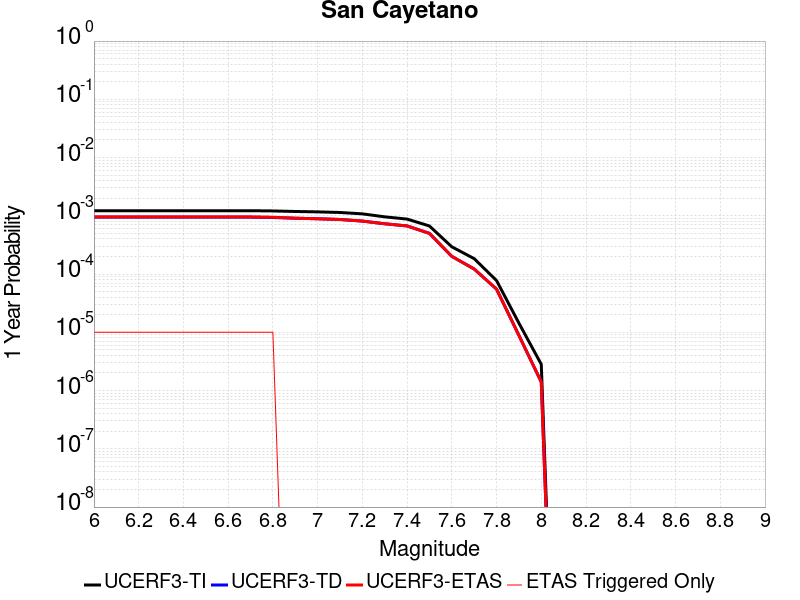 |  |

| Magnitude | 1 wk TI Prob | 1 wk TD Prob | 1 wk ETAS Prob | 1 wk ETAS/TD Gain | 1 wk ETAS Triggered Only | 1 mo TI Prob | 1 mo TD Prob | 1 mo ETAS Prob | 1 mo ETAS/TD Gain | 1 mo ETAS Triggered Only | 1 yr TI Prob | 1 yr TD Prob | 1 yr ETAS Prob | 1 yr ETAS/TD Gain | 1 yr ETAS Triggered Only | 10 yr TI Prob | 10 yr TD Prob | 10 yr ETAS Prob | 10 yr ETAS/TD Gain | 10 yr ETAS Triggered Only |
|-----|-----|-----|-----|-----|-----|-----|-----|-----|-----|-----|-----|-----|-----|-----|-----|-----|-----|-----|-----|-----|
| 6.0 | 2.3476267E-5 | 1.816963E-5 | 1.816963E-5 | 1.0 | 0.0 | 1.0060869E-4 | 7.786754E-5 | 7.786754E-5 | 1.0 | 0.0 | 0.0012242225 | 9.4762864E-4 | 9.5761917E-4 | 1.0105426 | 1.0E-5 | 0.012175002 | 0.009436766 | 0.009456577 | 1.0020994 | 2.0E-5 |
| 6.1 | 2.3476267E-5 | 1.816963E-5 | 1.816963E-5 | 1.0 | 0.0 | 1.0060869E-4 | 7.786754E-5 | 7.786754E-5 | 1.0 | 0.0 | 0.0012242225 | 9.4762864E-4 | 9.5761917E-4 | 1.0105426 | 1.0E-5 | 0.012175002 | 0.009436766 | 0.009456577 | 1.0020994 | 2.0E-5 |
| 6.2 | 2.3476267E-5 | 1.816963E-5 | 1.816963E-5 | 1.0 | 0.0 | 1.0060869E-4 | 7.786754E-5 | 7.786754E-5 | 1.0 | 0.0 | 0.0012242225 | 9.4762864E-4 | 9.5761917E-4 | 1.0105426 | 1.0E-5 | 0.012175002 | 0.009436766 | 0.009456577 | 1.0020994 | 2.0E-5 |
| 6.3 | 2.3476267E-5 | 1.816963E-5 | 1.816963E-5 | 1.0 | 0.0 | 1.0060869E-4 | 7.786754E-5 | 7.786754E-5 | 1.0 | 0.0 | 0.0012242225 | 9.4762864E-4 | 9.5761917E-4 | 1.0105426 | 1.0E-5 | 0.012175002 | 0.009436766 | 0.009456577 | 1.0020994 | 2.0E-5 |
| 6.4 | 2.3476267E-5 | 1.816963E-5 | 1.816963E-5 | 1.0 | 0.0 | 1.0060869E-4 | 7.786754E-5 | 7.786754E-5 | 1.0 | 0.0 | 0.0012242225 | 9.4762864E-4 | 9.5761917E-4 | 1.0105426 | 1.0E-5 | 0.012175002 | 0.009436766 | 0.009456577 | 1.0020994 | 2.0E-5 |
| 6.5 | 2.3476267E-5 | 1.816963E-5 | 1.816963E-5 | 1.0 | 0.0 | 1.0060869E-4 | 7.786754E-5 | 7.786754E-5 | 1.0 | 0.0 | 0.0012242225 | 9.4762864E-4 | 9.5761917E-4 | 1.0105426 | 1.0E-5 | 0.012175002 | 0.009436766 | 0.009456577 | 1.0020994 | 2.0E-5 |
| 6.6 | 2.3476267E-5 | 1.816963E-5 | 1.816963E-5 | 1.0 | 0.0 | 1.0060869E-4 | 7.786754E-5 | 7.786754E-5 | 1.0 | 0.0 | 0.0012242225 | 9.4762864E-4 | 9.5761917E-4 | 1.0105426 | 1.0E-5 | 0.012175002 | 0.009436766 | 0.009456577 | 1.0020994 | 2.0E-5 |
| 6.7 | 2.3476267E-5 | 1.816963E-5 | 1.816963E-5 | 1.0 | 0.0 | 1.0060869E-4 | 7.786754E-5 | 7.786754E-5 | 1.0 | 0.0 | 0.0012242225 | 9.4762864E-4 | 9.5761917E-4 | 1.0105426 | 1.0E-5 | 0.012175002 | 0.009436766 | 0.009456577 | 1.0020994 | 2.0E-5 |
| 6.8 | 2.3241924E-5 | 1.7937333E-5 | 1.7937333E-5 | 1.0 | 0.0 | 9.960445E-5 | 7.6872035E-5 | 7.6872035E-5 | 1.0 | 0.0 | 0.0012120095 | 9.3551876E-4 | 9.455094E-4 | 1.0106792 | 1.0E-5 | 0.012054204 | 0.00931666 | 0.009336474 | 1.0021267 | 2.0E-5 |
| 6.9 | 2.2761007E-5 | 1.7432758E-5 | 1.7432758E-5 | 1.0 | 0.0 | 9.7543525E-5 | 7.47097E-5 | 7.47097E-5 | 1.0 | 0.0 | 0.0011869454 | 9.092145E-4 | 9.092145E-4 | 1.0 | 0.0 | 0.011806256 | 0.009055776 | 0.009065686 | 1.0010942 | 1.0E-5 |
| 7.0 | 2.240283E-5 | 1.7066497E-5 | 1.7066497E-5 | 1.0 | 0.0 | 9.600859E-5 | 7.3140094E-5 | 7.3140094E-5 | 1.0 | 0.0 | 0.0011682777 | 8.901203E-4 | 8.901203E-4 | 1.0 | 0.0 | 0.011621549 | 0.008866365 | 0.008876276 | 1.0011178 | 1.0E-5 |
| 7.1 | 2.1871154E-5 | 1.6586335E-5 | 1.6586335E-5 | 1.0 | 0.0 | 9.373015E-5 | 7.108237E-5 | 7.108237E-5 | 1.0 | 0.0 | 0.0011405671 | 8.650876E-4 | 8.650876E-4 | 1.0 | 0.0 | 0.011347309 | 0.008618002 | 0.008627916 | 1.0011504 | 1.0E-5 |
| 7.2 | 2.0714133E-5 | 1.5564854E-5 | 1.5564854E-5 | 1.0 | 0.0 | 8.8771834E-5 | 6.670483E-5 | 6.670483E-5 | 1.0 | 0.0 | 0.0010802611 | 8.1183197E-4 | 8.1183197E-4 | 1.0 | 0.0 | 0.010750249 | 0.008089437 | 0.008099357 | 1.0012262 | 1.0E-5 |
| 7.3 | 1.8408395E-5 | 1.3997111E-5 | 1.3997111E-5 | 1.0 | 0.0 | 7.8890735E-5 | 5.9986254E-5 | 5.9986254E-5 | 1.0 | 0.0 | 9.600714E-4 | 7.3009095E-4 | 7.3009095E-4 | 1.0 | 0.0 | 0.009559342 | 0.007277643 | 0.0072875703 | 1.0013641 | 1.0E-5 |
| 7.4 | 1.6856795E-5 | 1.28503E-5 | 1.28503E-5 | 1.0 | 0.0 | 7.2241404E-5 | 5.5071567E-5 | 5.5071567E-5 | 1.0 | 0.0 | 8.7918417E-4 | 6.702929E-4 | 6.702929E-4 | 1.0 | 0.0 | 0.00875714 | 0.0066833915 | 0.006693325 | 1.0014863 | 1.0E-5 |
| 7.5 | 1.2822778E-5 | 9.577698E-6 | 9.577698E-6 | 1.0 | 0.0 | 5.495361E-5 | 4.104664E-5 | 4.104664E-5 | 1.0 | 0.0 | 6.688548E-4 | 4.996298E-4 | 4.996298E-4 | 1.0 | 0.0 | 0.006668452 | 0.0049852366 | 0.0049951863 | 1.0019959 | 1.0E-5 |
| 7.6 | 5.6272684E-6 | 3.8549683E-6 | 3.8549683E-6 | 1.0 | 0.0 | 2.4116642E-5 | 1.6521188E-5 | 1.6521188E-5 | 1.0 | 0.0 | 2.9358055E-4 | 2.01127E-4 | 2.01127E-4 | 1.0 | 0.0 | 0.0029319301 | 0.0020094607 | 0.0020194405 | 1.0049665 | 1.0E-5 |
| 7.7 | 3.5261346E-6 | 2.340742E-6 | 2.340742E-6 | 1.0 | 0.0 | 1.5111918E-5 | 1.0031713E-5 | 1.0031713E-5 | 1.0 | 0.0 | 1.8397206E-4 | 1.2212934E-4 | 1.2212934E-4 | 1.0 | 0.0 | 0.0018381984 | 0.0012206296 | 0.0012206296 | 1.0 | 0.0 |
| 7.8 | 1.4826929E-6 | 1.0564453E-6 | 1.0564453E-6 | 1.0 | 0.0 | 6.354383E-6 | 4.5276147E-6 | 4.5276147E-6 | 1.0 | 0.0 | 7.736187E-5 | 5.512234E-5 | 5.512234E-5 | 1.0 | 0.0 | 7.733494E-4 | 5.5108865E-4 | 5.5108865E-4 | 1.0 | 0.0 |
| 7.9 | 2.7568166E-7 | 1.6978672E-7 | 1.6978672E-7 | 1.0 | 0.0 | 1.1814923E-6 | 7.2765715E-7 | 7.2765715E-7 | 1.0 | 0.0 | 1.4384574E-5 | 8.85919E-6 | 8.85919E-6 | 1.0 | 0.0 | 1.4383643E-4 | 8.85884E-5 | 8.85884E-5 | 1.0 | 0.0 |
| 8.0 | 5.407832E-8 | 2.6889136E-8 | 2.6889136E-8 | 1.0 | 0.0 | 2.3176422E-7 | 1.15239146E-7 | 1.15239146E-7 | 1.0 | 0.0 | 2.8217257E-6 | 1.4030358E-6 | 1.4030358E-6 | 1.0 | 0.0 | 2.8216898E-5 | 1.4030274E-5 | 1.4030274E-5 | 1.0 | 0.0 |

## Malibu Coast alt 1
*[(top)](#table-of-contents)*

| 1 Week | 1 Month | 1 Year | 10 Year |
|-----|-----|-----|-----|
|  |  | 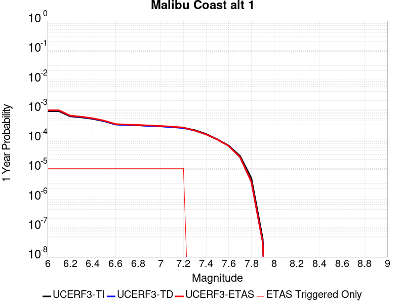 |  |

| Magnitude | 1 wk TI Prob | 1 wk TD Prob | 1 wk ETAS Prob | 1 wk ETAS/TD Gain | 1 wk ETAS Triggered Only | 1 mo TI Prob | 1 mo TD Prob | 1 mo ETAS Prob | 1 mo ETAS/TD Gain | 1 mo ETAS Triggered Only | 1 yr TI Prob | 1 yr TD Prob | 1 yr ETAS Prob | 1 yr ETAS/TD Gain | 1 yr ETAS Triggered Only | 10 yr TI Prob | 10 yr TD Prob | 10 yr ETAS Prob | 10 yr ETAS/TD Gain | 10 yr ETAS Triggered Only |
|-----|-----|-----|-----|-----|-----|-----|-----|-----|-----|-----|-----|-----|-----|-----|-----|-----|-----|-----|-----|-----|
| 6.0 | 1.6572556E-5 | 1.7598268E-5 | 1.7598268E-5 | 1.0 | 0.0 | 7.102331E-5 | 7.541908E-5 | 7.541908E-5 | 1.0 | 0.0 | 8.6436566E-4 | 9.178593E-4 | 9.2785014E-4 | 1.0108849 | 1.0E-5 | 0.0086101135 | 0.009142617 | 0.009162434 | 1.0021676 | 2.0E-5 |
| 6.1 | 1.6572556E-5 | 1.7598268E-5 | 1.7598268E-5 | 1.0 | 0.0 | 7.102331E-5 | 7.541908E-5 | 7.541908E-5 | 1.0 | 0.0 | 8.6436566E-4 | 9.178593E-4 | 9.2785014E-4 | 1.0108849 | 1.0E-5 | 0.0086101135 | 0.009142617 | 0.009162434 | 1.0021676 | 2.0E-5 |
| 6.2 | 1.1085717E-5 | 1.1557268E-5 | 1.1557268E-5 | 1.0 | 0.0 | 4.750935E-5 | 4.953023E-5 | 4.953023E-5 | 1.0 | 0.0 | 5.782728E-4 | 6.028672E-4 | 6.128612E-4 | 1.0165774 | 1.0E-5 | 0.0057677035 | 0.0060126884 | 0.0060325684 | 1.0033063 | 2.0E-5 |
| 6.3 | 1.0208568E-5 | 1.05923455E-5 | 1.05923455E-5 | 1.0 | 0.0 | 4.375027E-5 | 4.5394994E-5 | 4.5394994E-5 | 1.0 | 0.0 | 5.325294E-4 | 5.525468E-4 | 5.625413E-4 | 1.018088 | 1.0E-5 | 0.0053125503 | 0.005512038 | 0.0055319276 | 1.0036085 | 2.0E-5 |
| 6.4 | 9.0682315E-6 | 9.34273E-6 | 9.34273E-6 | 1.0 | 0.0 | 3.8863272E-5 | 4.0039668E-5 | 4.0039668E-5 | 1.0 | 0.0 | 4.730576E-4 | 4.8737595E-4 | 4.973711E-4 | 1.020508 | 1.0E-5 | 0.0047205184 | 0.004863284 | 0.004883187 | 1.0040925 | 2.0E-5 |
| 6.5 | 7.605796E-6 | 7.74866E-6 | 7.74866E-6 | 1.0 | 0.0 | 3.259586E-5 | 3.320813E-5 | 3.320813E-5 | 1.0 | 0.0 | 3.9678233E-4 | 4.042353E-4 | 4.1423127E-4 | 1.0247281 | 1.0E-5 | 0.0039607463 | 0.004035138 | 0.004055057 | 1.0049365 | 2.0E-5 |
| 6.6 | 5.889873E-6 | 5.8795895E-6 | 5.8795895E-6 | 1.0 | 0.0 | 2.5242069E-5 | 2.5197998E-5 | 2.5197998E-5 | 1.0 | 0.0 | 3.0727885E-4 | 3.0674253E-4 | 3.1673946E-4 | 1.0325906 | 1.0E-5 | 0.003068543 | 0.0030632042 | 0.003083143 | 1.0065091 | 2.0E-5 |
| 6.7 | 5.66586E-6 | 5.64169E-6 | 5.64169E-6 | 1.0 | 0.0 | 2.428203E-5 | 2.417845E-5 | 2.417845E-5 | 1.0 | 0.0 | 2.955936E-4 | 2.9433295E-4 | 3.0433E-4 | 1.0339651 | 1.0E-5 | 0.0029520073 | 0.002939443 | 0.0029593844 | 1.006784 | 2.0E-5 |
| 6.8 | 5.521556E-6 | 5.489475E-6 | 5.489475E-6 | 1.0 | 0.0 | 2.3663597E-5 | 2.3526109E-5 | 2.3526109E-5 | 1.0 | 0.0 | 2.880662E-4 | 2.8639284E-4 | 2.9638998E-4 | 1.0349071 | 1.0E-5 | 0.0028769306 | 0.002860249 | 0.002880192 | 1.0069724 | 2.0E-5 |
| 6.9 | 5.29752E-6 | 5.249977E-6 | 5.249977E-6 | 1.0 | 0.0 | 2.270346E-5 | 2.249971E-5 | 2.249971E-5 | 1.0 | 0.0 | 2.7637955E-4 | 2.738996E-4 | 2.8389686E-4 | 1.0364997 | 1.0E-5 | 0.0027603607 | 0.0027356306 | 0.0027555758 | 1.007291 | 2.0E-5 |
| 7.0 | 5.106743E-6 | 5.047723E-6 | 5.047723E-6 | 1.0 | 0.0 | 2.1885859E-5 | 2.1632919E-5 | 2.1632919E-5 | 1.0 | 0.0 | 2.6642776E-4 | 2.6334904E-4 | 2.733464E-4 | 1.0379624 | 1.0E-5 | 0.0026610855 | 0.002630379 | 0.0026503266 | 1.0075835 | 2.0E-5 |
| 7.1 | 4.8469647E-6 | 4.7704148E-6 | 4.7704148E-6 | 1.0 | 0.0 | 2.0772539E-5 | 2.0444475E-5 | 2.0444475E-5 | 1.0 | 0.0 | 2.528763E-4 | 2.488831E-4 | 2.588806E-4 | 1.0401695 | 1.0E-5 | 0.0025258875 | 0.0024860518 | 0.002506002 | 1.0080249 | 2.0E-5 |
| 7.2 | 4.545514E-6 | 4.448232E-6 | 4.448232E-6 | 1.0 | 0.0 | 1.9480629E-5 | 1.9063713E-5 | 1.9063713E-5 | 1.0 | 0.0 | 2.3715083E-4 | 2.3207605E-4 | 2.4207373E-4 | 1.0430794 | 1.0E-5 | 0.0023689792 | 0.0023183445 | 0.0023382981 | 1.0086068 | 2.0E-5 |
| 7.3 | 3.794097E-6 | 3.6519655E-6 | 3.6519655E-6 | 1.0 | 0.0 | 1.6260314E-5 | 1.5651187E-5 | 1.5651187E-5 | 1.0 | 0.0 | 1.9795135E-4 | 1.9053658E-4 | 1.9053658E-4 | 1.0 | 0.0 | 0.001977751 | 0.0019037367 | 0.0019137177 | 1.0052428 | 1.0E-5 |
| 7.4 | 2.808217E-6 | 2.7191E-6 | 2.7191E-6 | 1.0 | 0.0 | 1.203516E-5 | 1.1653234E-5 | 1.1653234E-5 | 1.0 | 0.0 | 1.4651821E-4 | 1.418689E-4 | 1.418689E-4 | 1.0 | 0.0 | 0.0014642165 | 0.0014177861 | 0.0014177861 | 1.0 | 0.0 |
| 7.5 | 1.83809E-6 | 1.8190852E-6 | 1.8190852E-6 | 1.0 | 0.0 | 7.877505E-6 | 7.796056E-6 | 7.796056E-6 | 1.0 | 0.0 | 9.59044E-5 | 9.4912866E-5 | 9.4912866E-5 | 1.0 | 0.0 | 9.5863023E-4 | 9.487253E-4 | 9.487253E-4 | 1.0 | 0.0 |
| 7.6 | 1.1292672E-6 | 1.100155E-6 | 1.100155E-6 | 1.0 | 0.0 | 4.839708E-6 | 4.7149415E-6 | 4.7149415E-6 | 1.0 | 0.0 | 5.8921847E-5 | 5.7402918E-5 | 5.7402918E-5 | 1.0 | 0.0 | 5.890623E-4 | 5.7388254E-4 | 5.7388254E-4 | 1.0 | 0.0 |
| 7.7 | 5.065272E-7 | 4.609203E-7 | 4.609203E-7 | 1.0 | 0.0 | 2.170829E-6 | 1.9753713E-6 | 1.9753713E-6 | 1.0 | 0.0 | 2.6429525E-5 | 2.404989E-5 | 2.404989E-5 | 1.0 | 0.0 | 2.642638E-4 | 2.4047401E-4 | 2.4047401E-4 | 1.0 | 0.0 |
| 7.8 | 8.952991E-8 | 6.708074E-8 | 6.708074E-8 | 1.0 | 0.0 | 3.8369956E-7 | 2.8748886E-7 | 2.8748886E-7 | 1.0 | 0.0 | 4.671532E-6 | 3.5001713E-6 | 3.5001713E-6 | 1.0 | 0.0 | 4.671434E-5 | 3.5001183E-5 | 3.5001183E-5 | 1.0 | 0.0 |
| 7.9 | 8.007447E-10 | 6.160915E-10 | 6.160915E-10 | 1.0 | 0.0 | 3.4317629E-9 | 2.6403923E-9 | 2.6403923E-9 | 1.0 | 0.0 | 4.1781714E-8 | 3.2146776E-8 | 3.2146776E-8 | 1.0 | 0.0 | 4.1781706E-7 | 3.2146772E-7 | 3.2146772E-7 | 1.0 | 0.0 |

## San Jacinto (Superstition Mtn)
*[(top)](#table-of-contents)*

| 1 Week | 1 Month | 1 Year | 10 Year |
|-----|-----|-----|-----|
|  |  |  |  |

| Magnitude | 1 wk TI Prob | 1 wk TD Prob | 1 wk ETAS Prob | 1 wk ETAS/TD Gain | 1 wk ETAS Triggered Only | 1 mo TI Prob | 1 mo TD Prob | 1 mo ETAS Prob | 1 mo ETAS/TD Gain | 1 mo ETAS Triggered Only | 1 yr TI Prob | 1 yr TD Prob | 1 yr ETAS Prob | 1 yr ETAS/TD Gain | 1 yr ETAS Triggered Only | 10 yr TI Prob | 10 yr TD Prob | 10 yr ETAS Prob | 10 yr ETAS/TD Gain | 10 yr ETAS Triggered Only |
|-----|-----|-----|-----|-----|-----|-----|-----|-----|-----|-----|-----|-----|-----|-----|-----|-----|-----|-----|-----|-----|
| 6.0 | 6.4193904E-5 | 9.600102E-5 | 9.600102E-5 | 1.0 | 0.0 | 2.7508775E-4 | 4.1137784E-4 | 4.2137373E-4 | 1.0242985 | 1.0E-5 | 0.0033440501 | 0.004998455 | 0.0050084046 | 1.0019907 | 1.0E-5 | 0.03294174 | 0.048827495 | 0.04884652 | 1.0003896 | 2.0E-5 |
| 6.1 | 6.4193904E-5 | 9.600102E-5 | 9.600102E-5 | 1.0 | 0.0 | 2.7508775E-4 | 4.1137784E-4 | 4.2137373E-4 | 1.0242985 | 1.0E-5 | 0.0033440501 | 0.004998455 | 0.0050084046 | 1.0019907 | 1.0E-5 | 0.03294174 | 0.048827495 | 0.04884652 | 1.0003896 | 2.0E-5 |
| 6.2 | 5.7023593E-5 | 8.3151084E-5 | 8.3151084E-5 | 1.0 | 0.0 | 2.4436394E-4 | 3.5632253E-4 | 3.6631897E-4 | 1.0280545 | 1.0E-5 | 0.002971072 | 0.004331238 | 0.004341195 | 1.0022988 | 1.0E-5 | 0.029316625 | 0.04250735 | 0.0425265 | 1.0004505 | 2.0E-5 |
| 6.3 | 5.6940098E-5 | 8.299644E-5 | 8.299644E-5 | 1.0 | 0.0 | 2.4400617E-4 | 3.5565995E-4 | 3.656564E-4 | 1.0281067 | 1.0E-5 | 0.002966728 | 0.004323203 | 0.00433316 | 1.0023031 | 1.0E-5 | 0.029274331 | 0.0424306 | 0.04244975 | 1.0004513 | 2.0E-5 |
| 6.4 | 5.4171585E-5 | 7.7490105E-5 | 7.7490105E-5 | 1.0 | 0.0 | 2.3214328E-4 | 3.320675E-4 | 3.4206416E-4 | 1.0301044 | 1.0E-5 | 0.0028226813 | 0.004037075 | 0.004047035 | 1.002467 | 1.0E-5 | 0.02787096 | 0.03971982 | 0.039739028 | 1.0004835 | 2.0E-5 |
| 6.5 | 4.375144E-5 | 5.6427685E-5 | 5.6427685E-5 | 1.0 | 0.0 | 1.874927E-4 | 2.4181715E-4 | 2.5181472E-4 | 1.0413436 | 1.0E-5 | 0.0022803338 | 0.0029413246 | 0.0029512953 | 1.0033898 | 1.0E-5 | 0.022570757 | 0.029240036 | 0.029259453 | 1.000664 | 2.0E-5 |
| 6.6 | 2.772192E-5 | 2.5494404E-5 | 2.5494404E-5 | 1.0 | 0.0 | 1.1880282E-4 | 1.0925727E-4 | 1.0925727E-4 | 1.0 | 0.0 | 0.0014454646 | 0.0013294149 | 0.0013294149 | 1.0 | 0.0 | 0.014360986 | 0.013543627 | 0.013543627 | 1.0 | 0.0 |
| 6.7 | 2.7124124E-5 | 2.4705407E-5 | 2.4705407E-5 | 1.0 | 0.0 | 1.1624106E-4 | 1.05876126E-4 | 1.05876126E-4 | 1.0 | 0.0 | 0.0014143161 | 0.0012882988 | 0.0012882988 | 1.0 | 0.0 | 0.014053487 | 0.013137068 | 0.013137068 | 1.0 | 0.0 |
| 6.8 | 2.5475807E-5 | 2.2170334E-5 | 2.2170334E-5 | 1.0 | 0.0 | 1.0917746E-4 | 9.501232E-5 | 9.501232E-5 | 1.0 | 0.0 | 0.001328425 | 0.0011561731 | 0.0011561731 | 1.0 | 0.0 | 0.0132051185 | 0.0118252365 | 0.0118252365 | 1.0 | 0.0 |
| 6.9 | 2.1162023E-5 | 1.7631666E-5 | 1.7631666E-5 | 1.0 | 0.0 | 9.069123E-5 | 7.5562115E-5 | 7.5562115E-5 | 1.0 | 0.0 | 0.0011036064 | 9.195843E-4 | 9.195843E-4 | 1.0 | 0.0 | 0.010981417 | 0.009449712 | 0.009449712 | 1.0 | 0.0 |
| 7.0 | 1.8754288E-5 | 1.6166736E-5 | 1.6166736E-5 | 1.0 | 0.0 | 8.037304E-5 | 6.9284186E-5 | 6.9284186E-5 | 1.0 | 0.0 | 9.781026E-4 | 8.4321096E-4 | 8.4321096E-4 | 1.0 | 0.0 | 0.009738087 | 0.008672746 | 0.008672746 | 1.0 | 0.0 |
| 7.1 | 1.8678527E-5 | 1.6091873E-5 | 1.6091873E-5 | 1.0 | 0.0 | 8.0048376E-5 | 6.896337E-5 | 6.896337E-5 | 1.0 | 0.0 | 9.7415317E-4 | 8.3930796E-4 | 8.3930796E-4 | 1.0 | 0.0 | 0.009698939 | 0.008633699 | 0.008633699 | 1.0 | 0.0 |
| 7.2 | 1.7804578E-5 | 1.5386398E-5 | 1.5386398E-5 | 1.0 | 0.0 | 7.6303106E-5 | 6.5940054E-5 | 6.5940054E-5 | 1.0 | 0.0 | 9.285943E-4 | 8.0252666E-4 | 8.0252666E-4 | 1.0 | 0.0 | 0.009247236 | 0.008264985 | 0.008264985 | 1.0 | 0.0 |
| 7.3 | 1.6583685E-5 | 1.4535444E-5 | 1.4535444E-5 | 1.0 | 0.0 | 7.1070994E-5 | 6.2293286E-5 | 6.2293286E-5 | 1.0 | 0.0 | 8.649459E-4 | 7.5815886E-4 | 7.5815886E-4 | 1.0 | 0.0 | 0.00861587 | 0.007820267 | 0.007820267 | 1.0 | 0.0 |
| 7.4 | 1.6387552E-5 | 1.4400321E-5 | 1.4400321E-5 | 1.0 | 0.0 | 7.023047E-5 | 6.171421E-5 | 6.171421E-5 | 1.0 | 0.0 | 8.5472054E-4 | 7.5111346E-4 | 7.5111346E-4 | 1.0 | 0.0 | 0.008514405 | 0.007749644 | 0.007749644 | 1.0 | 0.0 |
| 7.5 | 1.5790754E-5 | 1.4040957E-5 | 1.4040957E-5 | 1.0 | 0.0 | 6.767291E-5 | 6.017415E-5 | 6.017415E-5 | 1.0 | 0.0 | 8.236062E-4 | 7.32376E-4 | 7.32376E-4 | 1.0 | 0.0 | 0.008205604 | 0.007560181 | 0.007560181 | 1.0 | 0.0 |
| 7.6 | 1.4248672E-5 | 1.30597955E-5 | 1.30597955E-5 | 1.0 | 0.0 | 6.106431E-5 | 5.596936E-5 | 5.596936E-5 | 1.0 | 0.0 | 7.432043E-4 | 6.8121566E-4 | 6.8121566E-4 | 1.0 | 0.0 | 0.007407237 | 0.007042702 | 0.007042702 | 1.0 | 0.0 |
| 7.7 | 1.15449975E-5 | 1.09083485E-5 | 1.09083485E-5 | 1.0 | 0.0 | 4.947762E-5 | 4.6749232E-5 | 4.6749232E-5 | 1.0 | 0.0 | 6.022235E-4 | 5.69024E-4 | 5.69024E-4 | 1.0 | 0.0 | 0.006005941 | 0.005912628 | 0.005912628 | 1.0 | 0.0 |
| 7.8 | 9.1391985E-6 | 9.518787E-6 | 9.518787E-6 | 1.0 | 0.0 | 3.9167408E-5 | 4.0794166E-5 | 4.0794166E-5 | 1.0 | 0.0 | 4.767588E-4 | 4.9655634E-4 | 4.9655634E-4 | 1.0 | 0.0 | 0.0047573727 | 0.0051790397 | 0.0051790397 | 1.0 | 0.0 |
| 7.9 | 6.973017E-6 | 7.3861297E-6 | 7.3861297E-6 | 1.0 | 0.0 | 2.9884017E-5 | 3.165446E-5 | 3.165446E-5 | 1.0 | 0.0 | 3.6377716E-4 | 3.8532543E-4 | 3.8532543E-4 | 1.0 | 0.0 | 0.0036318225 | 0.004053871 | 0.004053871 | 1.0 | 0.0 |
| 8.0 | 5.7638235E-6 | 6.263572E-6 | 6.263572E-6 | 1.0 | 0.0 | 2.4701867E-5 | 2.6843605E-5 | 2.6843605E-5 | 1.0 | 0.0 | 3.0070372E-4 | 3.267724E-4 | 3.267724E-4 | 1.0 | 0.0 | 0.0030029714 | 0.0034553434 | 0.0034553434 | 1.0 | 0.0 |
| 8.1 | 5.1124434E-6 | 5.498948E-6 | 5.498948E-6 | 1.0 | 0.0 | 2.1910288E-5 | 2.3566712E-5 | 2.3566712E-5 | 1.0 | 0.0 | 2.6672508E-4 | 2.8688743E-4 | 2.8688743E-4 | 1.0 | 0.0 | 0.0026640517 | 0.0030420625 | 0.0030420625 | 1.0 | 0.0 |
| 8.2 | 1.1075938E-6 | 5.341373E-7 | 5.341373E-7 | 1.0 | 0.0 | 4.7468216E-6 | 2.289158E-6 | 2.289158E-6 | 1.0 | 0.0 | 5.779102E-5 | 2.7870163E-5 | 2.7870163E-5 | 1.0 | 0.0 | 5.777599E-4 | 3.1373248E-4 | 3.1373248E-4 | 1.0 | 0.0 |
| 8.3 | 1.3584393E-8 | 4.478424E-9 | 4.478424E-9 | 1.0 | 0.0 | 5.8218827E-8 | 1.9193244E-8 | 1.9193244E-8 | 1.0 | 0.0 | 7.0881396E-7 | 2.3367775E-7 | 2.3367775E-7 | 1.0 | 0.0 | 7.0881174E-6 | 2.6188773E-6 | 2.6188773E-6 | 1.0 | 0.0 |

## San Gabriel (Extension)
*[(top)](#table-of-contents)*

| 1 Week | 1 Month | 1 Year | 10 Year |
|-----|-----|-----|-----|
| 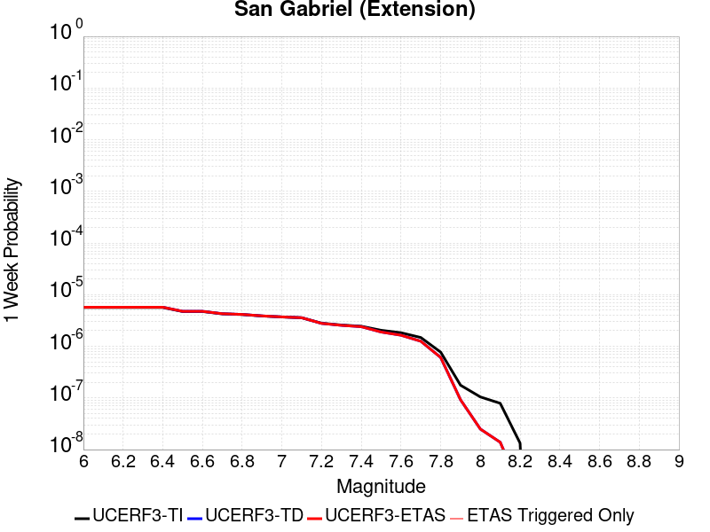 |  |  |  |

| Magnitude | 1 wk TI Prob | 1 wk TD Prob | 1 wk ETAS Prob | 1 wk ETAS/TD Gain | 1 wk ETAS Triggered Only | 1 mo TI Prob | 1 mo TD Prob | 1 mo ETAS Prob | 1 mo ETAS/TD Gain | 1 mo ETAS Triggered Only | 1 yr TI Prob | 1 yr TD Prob | 1 yr ETAS Prob | 1 yr ETAS/TD Gain | 1 yr ETAS Triggered Only | 10 yr TI Prob | 10 yr TD Prob | 10 yr ETAS Prob | 10 yr ETAS/TD Gain | 10 yr ETAS Triggered Only |
|-----|-----|-----|-----|-----|-----|-----|-----|-----|-----|-----|-----|-----|-----|-----|-----|-----|-----|-----|-----|-----|
| 6.0 | 5.6486106E-6 | 5.7171446E-6 | 5.7171446E-6 | 1.0 | 0.0 | 2.4208108E-5 | 2.4501825E-5 | 2.4501825E-5 | 1.0 | 0.0 | 2.9469383E-4 | 2.9827014E-4 | 2.9827014E-4 | 1.0 | 0.0 | 0.0029430336 | 0.0029788287 | 0.002998769 | 1.0066941 | 2.0E-5 |
| 6.1 | 5.6486106E-6 | 5.7171446E-6 | 5.7171446E-6 | 1.0 | 0.0 | 2.4208108E-5 | 2.4501825E-5 | 2.4501825E-5 | 1.0 | 0.0 | 2.9469383E-4 | 2.9827014E-4 | 2.9827014E-4 | 1.0 | 0.0 | 0.0029430336 | 0.0029788287 | 0.002998769 | 1.0066941 | 2.0E-5 |
| 6.2 | 5.6486106E-6 | 5.7171446E-6 | 5.7171446E-6 | 1.0 | 0.0 | 2.4208108E-5 | 2.4501825E-5 | 2.4501825E-5 | 1.0 | 0.0 | 2.9469383E-4 | 2.9827014E-4 | 2.9827014E-4 | 1.0 | 0.0 | 0.0029430336 | 0.0029788287 | 0.002998769 | 1.0066941 | 2.0E-5 |
| 6.3 | 5.6486106E-6 | 5.7171446E-6 | 5.7171446E-6 | 1.0 | 0.0 | 2.4208108E-5 | 2.4501825E-5 | 2.4501825E-5 | 1.0 | 0.0 | 2.9469383E-4 | 2.9827014E-4 | 2.9827014E-4 | 1.0 | 0.0 | 0.0029430336 | 0.0029788287 | 0.002998769 | 1.0066941 | 2.0E-5 |
| 6.4 | 5.6486106E-6 | 5.7171446E-6 | 5.7171446E-6 | 1.0 | 0.0 | 2.4208108E-5 | 2.4501825E-5 | 2.4501825E-5 | 1.0 | 0.0 | 2.9469383E-4 | 2.9827014E-4 | 2.9827014E-4 | 1.0 | 0.0 | 0.0029430336 | 0.0029788287 | 0.002998769 | 1.0066941 | 2.0E-5 |
| 6.5 | 4.7134554E-6 | 4.754565E-6 | 4.754565E-6 | 1.0 | 0.0 | 2.0200367E-5 | 2.0376552E-5 | 2.0376552E-5 | 1.0 | 0.0 | 2.459117E-4 | 2.4805713E-4 | 2.4805713E-4 | 1.0 | 0.0 | 0.0024563975 | 0.0024778906 | 0.0024978411 | 1.0080514 | 2.0E-5 |
| 6.6 | 4.7134554E-6 | 4.754565E-6 | 4.754565E-6 | 1.0 | 0.0 | 2.0200367E-5 | 2.0376552E-5 | 2.0376552E-5 | 1.0 | 0.0 | 2.459117E-4 | 2.4805713E-4 | 2.4805713E-4 | 1.0 | 0.0 | 0.0024563975 | 0.0024778906 | 0.0024978411 | 1.0080514 | 2.0E-5 |
| 6.7 | 4.2468837E-6 | 4.2743804E-6 | 4.2743804E-6 | 1.0 | 0.0 | 1.8200803E-5 | 1.8318648E-5 | 1.8318648E-5 | 1.0 | 0.0 | 2.2157225E-4 | 2.2300745E-4 | 2.2300745E-4 | 1.0 | 0.0 | 0.0022135144 | 0.0022279124 | 0.0022478679 | 1.008957 | 2.0E-5 |
| 6.8 | 4.1180615E-6 | 4.1417693E-6 | 4.1417693E-6 | 1.0 | 0.0 | 1.7648716E-5 | 1.7750324E-5 | 1.7750324E-5 | 1.0 | 0.0 | 2.1485193E-4 | 2.1608948E-4 | 2.1608948E-4 | 1.0 | 0.0 | 0.0021464431 | 0.0021588686 | 0.0021788254 | 1.0092441 | 2.0E-5 |
| 6.9 | 3.863861E-6 | 3.8800836E-6 | 3.8800836E-6 | 1.0 | 0.0 | 1.65593E-5 | 1.6628828E-5 | 1.6628828E-5 | 1.0 | 0.0 | 2.0159081E-4 | 2.0243786E-4 | 2.0243786E-4 | 1.0 | 0.0 | 0.0020140803 | 0.0020226059 | 0.0020425655 | 1.0098683 | 2.0E-5 |
| 7.0 | 3.6947372E-6 | 3.7059822E-6 | 3.7059822E-6 | 1.0 | 0.0 | 1.5834492E-5 | 1.5882688E-5 | 1.5882688E-5 | 1.0 | 0.0 | 1.9276788E-4 | 1.9335524E-4 | 1.9335524E-4 | 1.0 | 0.0 | 0.0019260074 | 0.0019319403 | 0.0019519017 | 1.0103323 | 2.0E-5 |
| 7.1 | 3.5686835E-6 | 3.5732016E-6 | 3.5732016E-6 | 1.0 | 0.0 | 1.5294268E-5 | 1.5313635E-5 | 1.5313635E-5 | 1.0 | 0.0 | 1.861918E-4 | 1.8642822E-4 | 1.8642822E-4 | 1.0 | 0.0 | 0.0018603588 | 0.0018627879 | 0.0018827507 | 1.0107166 | 2.0E-5 |
| 7.2 | 2.8023446E-6 | 2.7770893E-6 | 2.7770893E-6 | 1.0 | 0.0 | 1.2009994E-5 | 1.1901758E-5 | 1.1901758E-5 | 1.0 | 0.0 | 1.4621185E-4 | 1.4489438E-4 | 1.4489438E-4 | 1.0 | 0.0 | 0.001461157 | 0.0014480136 | 0.0014679846 | 1.013792 | 2.0E-5 |
| 7.3 | 2.5843012E-6 | 2.546262E-6 | 2.546262E-6 | 1.0 | 0.0 | 1.1075529E-5 | 1.0912507E-5 | 1.0912507E-5 | 1.0 | 0.0 | 1.3483623E-4 | 1.3285177E-4 | 1.3285177E-4 | 1.0 | 0.0 | 0.0013475444 | 0.001327737 | 0.0013477105 | 1.0150433 | 2.0E-5 |
| 7.4 | 2.4464468E-6 | 2.3969585E-6 | 2.3969585E-6 | 1.0 | 0.0 | 1.04847295E-5 | 1.027264E-5 | 1.027264E-5 | 1.0 | 0.0 | 1.276441E-4 | 1.250623E-4 | 1.250623E-4 | 1.0 | 0.0 | 0.0012757082 | 0.0012499326 | 0.0012699076 | 1.0159808 | 2.0E-5 |
| 7.5 | 2.0420266E-6 | 1.8913017E-6 | 1.8913017E-6 | 1.0 | 0.0 | 8.751514E-6 | 8.105554E-6 | 8.105554E-6 | 1.0 | 0.0 | 1.0654447E-4 | 9.8680684E-5 | 9.8680684E-5 | 1.0 | 0.0 | 0.001064934 | 9.863758E-4 | 9.963659E-4 | 1.0101281 | 1.0E-5 |
| 7.6 | 1.8326596E-6 | 1.640076E-6 | 1.640076E-6 | 1.0 | 0.0 | 7.854232E-6 | 7.0288784E-6 | 7.0288784E-6 | 1.0 | 0.0 | 9.562107E-5 | 8.557326E-5 | 8.557326E-5 | 1.0 | 0.0 | 9.5579936E-4 | 8.5540896E-4 | 8.6540036E-4 | 1.0116804 | 1.0E-5 |
| 7.7 | 1.4786998E-6 | 1.2526061E-6 | 1.2526061E-6 | 1.0 | 0.0 | 6.3372695E-6 | 5.368301E-6 | 5.368301E-6 | 1.0 | 0.0 | 7.715353E-5 | 6.535712E-5 | 6.535712E-5 | 1.0 | 0.0 | 7.7126746E-4 | 6.533867E-4 | 6.6338014E-4 | 1.0152949 | 1.0E-5 |
| 7.8 | 7.6975533E-7 | 6.071264E-7 | 6.071264E-7 | 1.0 | 0.0 | 3.2989474E-6 | 2.601968E-6 | 2.601968E-6 | 1.0 | 0.0 | 4.0163945E-5 | 3.16785E-5 | 3.16785E-5 | 1.0 | 0.0 | 4.0156685E-4 | 3.1674592E-4 | 3.1674592E-4 | 1.0 | 0.0 |
| 7.9 | 1.7645915E-7 | 9.218553E-8 | 9.218553E-8 | 1.0 | 0.0 | 7.562533E-7 | 3.9508078E-7 | 3.9508078E-7 | 1.0 | 0.0 | 9.207345E-6 | 4.810098E-6 | 4.810098E-6 | 1.0 | 0.0 | 9.206964E-5 | 4.810463E-5 | 4.810463E-5 | 1.0 | 0.0 |
| 8.0 | 1.0463461E-7 | 2.4971815E-8 | 2.4971815E-8 | 1.0 | 0.0 | 4.4843398E-7 | 1.0702206E-7 | 1.0702206E-7 | 1.0 | 0.0 | 5.45967E-6 | 1.3029928E-6 | 1.3029928E-6 | 1.0 | 0.0 | 5.459536E-5 | 1.3034539E-5 | 1.3034539E-5 | 1.0 | 0.0 |
| 8.1 | 7.875717E-8 | 1.38816025E-8 | 1.38816025E-8 | 1.0 | 0.0 | 3.3753068E-7 | 5.949258E-8 | 5.949258E-8 | 1.0 | 0.0 | 4.109428E-6 | 7.243219E-7 | 7.243219E-7 | 1.0 | 0.0 | 4.109352E-5 | 7.247882E-6 | 7.247882E-6 | 1.0 | 0.0 |
| 8.2 | 1.33163E-8 | 1.7755355E-9 | 1.7755355E-9 | 1.0 | 0.0 | 5.7069855E-8 | 7.609438E-9 | 7.609438E-9 | 1.0 | 0.0 | 6.9482525E-7 | 9.26449E-8 | 9.26449E-8 | 1.0 | 0.0 | 6.9482307E-6 | 9.284174E-7 | 9.284174E-7 | 1.0 | 0.0 |

## Rinconada 2011 CFM
*[(top)](#table-of-contents)*

| 1 Week | 1 Month | 1 Year | 10 Year |
|-----|-----|-----|-----|
|  |  |  | 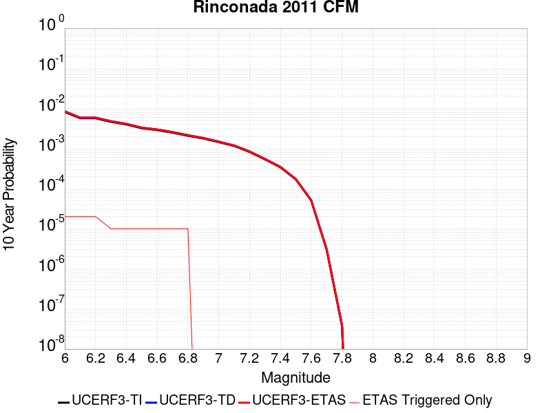 |

| Magnitude | 1 wk TI Prob | 1 wk TD Prob | 1 wk ETAS Prob | 1 wk ETAS/TD Gain | 1 wk ETAS Triggered Only | 1 mo TI Prob | 1 mo TD Prob | 1 mo ETAS Prob | 1 mo ETAS/TD Gain | 1 mo ETAS Triggered Only | 1 yr TI Prob | 1 yr TD Prob | 1 yr ETAS Prob | 1 yr ETAS/TD Gain | 1 yr ETAS Triggered Only | 10 yr TI Prob | 10 yr TD Prob | 10 yr ETAS Prob | 10 yr ETAS/TD Gain | 10 yr ETAS Triggered Only |
|-----|-----|-----|-----|-----|-----|-----|-----|-----|-----|-----|-----|-----|-----|-----|-----|-----|-----|-----|-----|-----|
| 6.0 | 1.5752368E-5 | 1.6274787E-5 | 1.6274787E-5 | 1.0 | 0.0 | 6.75084E-5 | 6.974724E-5 | 6.974724E-5 | 1.0 | 0.0 | 8.2160486E-4 | 8.48845E-4 | 8.6882804E-4 | 1.0235415 | 2.0E-5 | 0.008185739 | 0.008456407 | 0.008476238 | 1.0023451 | 2.0E-5 |
| 6.1 | 1.0966133E-5 | 1.1323078E-5 | 1.1323078E-5 | 1.0 | 0.0 | 4.6996865E-5 | 4.8526577E-5 | 4.8526577E-5 | 1.0 | 0.0 | 5.720366E-4 | 5.9065165E-4 | 6.1063987E-4 | 1.0338409 | 2.0E-5 | 0.0057056635 | 0.0058909142 | 0.0059107966 | 1.003375 | 2.0E-5 |
| 6.2 | 1.0966133E-5 | 1.1323078E-5 | 1.1323078E-5 | 1.0 | 0.0 | 4.6996865E-5 | 4.8526577E-5 | 4.8526577E-5 | 1.0 | 0.0 | 5.720366E-4 | 5.9065165E-4 | 6.1063987E-4 | 1.0338409 | 2.0E-5 | 0.0057056635 | 0.0058909142 | 0.0059107966 | 1.003375 | 2.0E-5 |
| 6.3 | 8.926149E-6 | 9.212811E-6 | 9.212811E-6 | 1.0 | 0.0 | 3.8254362E-5 | 3.9482882E-5 | 3.9482882E-5 | 1.0 | 0.0 | 4.6564735E-4 | 4.8059836E-4 | 4.9059355E-4 | 1.0207974 | 1.0E-5 | 0.0046467283 | 0.004795635 | 0.004805587 | 1.0020752 | 1.0E-5 |
| 6.4 | 7.676955E-6 | 7.920225E-6 | 7.920225E-6 | 1.0 | 0.0 | 3.290082E-5 | 3.394338E-5 | 3.394338E-5 | 1.0 | 0.0 | 4.0049385E-4 | 4.1318245E-4 | 4.231783E-4 | 1.0241923 | 1.0E-5 | 0.0039977287 | 0.004124169 | 0.0041341274 | 1.0024147 | 1.0E-5 |
| 6.5 | 6.1671026E-6 | 6.3589814E-6 | 6.3589814E-6 | 1.0 | 0.0 | 2.6430173E-5 | 2.7252492E-5 | 2.7252492E-5 | 1.0 | 0.0 | 3.2173982E-4 | 3.3174866E-4 | 3.4174536E-4 | 1.0301332 | 1.0E-5 | 0.003212744 | 0.0033125463 | 0.003322513 | 1.0030088 | 1.0E-5 |
| 6.6 | 5.553456E-6 | 5.7248362E-6 | 5.7248362E-6 | 1.0 | 0.0 | 2.3800309E-5 | 2.4534782E-5 | 2.4534782E-5 | 1.0 | 0.0 | 2.897302E-4 | 2.986701E-4 | 3.086671E-4 | 1.0334717 | 1.0E-5 | 0.0028935277 | 0.0029826954 | 0.0029926656 | 1.0033426 | 1.0E-5 |
| 6.7 | 4.787857E-6 | 4.93333E-6 | 4.93333E-6 | 1.0 | 0.0 | 2.0519226E-5 | 2.114267E-5 | 2.114267E-5 | 1.0 | 0.0 | 2.4979294E-4 | 2.5738165E-4 | 2.6737907E-4 | 1.0388428 | 1.0E-5 | 0.0024951235 | 0.0025708412 | 0.0025808155 | 1.0038798 | 1.0E-5 |
| 6.8 | 3.9955166E-6 | 4.1134927E-6 | 4.1134927E-6 | 1.0 | 0.0 | 1.7123532E-5 | 1.7629134E-5 | 1.7629134E-5 | 1.0 | 0.0 | 2.0845905E-4 | 2.146136E-4 | 2.2461145E-4 | 1.0465853 | 1.0E-5 | 0.002082636 | 0.002144067 | 0.0021540455 | 1.004654 | 1.0E-5 |
| 6.9 | 3.4250072E-6 | 3.5224598E-6 | 3.5224598E-6 | 1.0 | 0.0 | 1.46785205E-5 | 1.509617E-5 | 1.509617E-5 | 1.0 | 0.0 | 1.7869633E-4 | 1.8378037E-4 | 1.8378037E-4 | 1.0 | 0.0 | 0.001785527 | 0.0018362864 | 0.0018362864 | 1.0 | 0.0 |
| 7.0 | 2.7712713E-6 | 2.8467105E-6 | 2.8467105E-6 | 1.0 | 0.0 | 1.1876823E-5 | 1.2200131E-5 | 1.2200131E-5 | 1.0 | 0.0 | 1.4459073E-4 | 1.4852648E-4 | 1.4852648E-4 | 1.0 | 0.0 | 0.0014449668 | 0.0014842737 | 0.0014842737 | 1.0 | 0.0 |
| 7.1 | 2.227358E-6 | 2.2857066E-6 | 2.2857066E-6 | 1.0 | 0.0 | 9.545785E-6 | 9.795849E-6 | 9.795849E-6 | 1.0 | 0.0 | 1.16213734E-4 | 1.19257944E-4 | 1.19257944E-4 | 1.0 | 0.0 | 0.0011615298 | 0.0011919405 | 0.0011919405 | 1.0 | 0.0 |
| 7.2 | 1.581796E-6 | 1.6209067E-6 | 1.6209067E-6 | 1.0 | 0.0 | 6.779108E-6 | 6.9467246E-6 | 6.9467246E-6 | 1.0 | 0.0 | 8.253252E-5 | 8.457309E-5 | 8.457309E-5 | 1.0 | 0.0 | 8.250187E-4 | 8.4540964E-4 | 8.4540964E-4 | 1.0 | 0.0 |
| 7.3 | 1.0306567E-6 | 1.0546512E-6 | 1.0546512E-6 | 1.0 | 0.0 | 4.4170924E-6 | 4.519926E-6 | 4.519926E-6 | 1.0 | 0.0 | 5.3776774E-5 | 5.5028708E-5 | 5.5028708E-5 | 1.0 | 0.0 | 5.376376E-4 | 5.5015105E-4 | 5.5015105E-4 | 1.0 | 0.0 |
| 7.4 | 6.535541E-7 | 6.682764E-7 | 6.682764E-7 | 1.0 | 0.0 | 2.800943E-6 | 2.8640386E-6 | 2.8640386E-6 | 1.0 | 0.0 | 3.4100947E-5 | 3.4869114E-5 | 3.4869114E-5 | 1.0 | 0.0 | 3.4095717E-4 | 3.4863656E-4 | 3.4863656E-4 | 1.0 | 0.0 |
| 7.5 | 3.2656962E-7 | 3.33168E-7 | 3.33168E-7 | 1.0 | 0.0 | 1.3995833E-6 | 1.427862E-6 | 1.427862E-6 | 1.0 | 0.0 | 1.7039794E-5 | 1.7384082E-5 | 1.7384082E-5 | 1.0 | 0.0 | 1.7038487E-4 | 1.7382725E-4 | 1.7382725E-4 | 1.0 | 0.0 |
| 7.6 | 9.754343E-8 | 9.821022E-8 | 9.821022E-8 | 1.0 | 0.0 | 4.180432E-7 | 4.2090088E-7 | 4.2090088E-7 | 1.0 | 0.0 | 5.089664E-6 | 5.1244565E-6 | 5.1244565E-6 | 1.0 | 0.0 | 5.0895473E-5 | 5.124339E-5 | 5.124339E-5 | 1.0 | 0.0 |
| 7.7 | 6.0001453E-9 | 5.8490692E-9 | 5.8490692E-9 | 1.0 | 0.0 | 2.5714908E-8 | 2.506744E-8 | 2.506744E-8 | 1.0 | 0.0 | 3.1307894E-7 | 3.0519604E-7 | 3.0519604E-7 | 1.0 | 0.0 | 3.1307852E-6 | 3.0519564E-6 | 3.0519564E-6 | 1.0 | 0.0 |
| 7.8 | 7.400003E-11 | 7.4654505E-11 | 7.4654505E-11 | 1.0 | 0.0 | 3.171432E-10 | 3.1994807E-10 | 3.1994807E-10 | 1.0 | 0.0 | 3.861218E-9 | 3.8953676E-9 | 3.8953676E-9 | 1.0 | 0.0 | 3.861218E-8 | 3.8953676E-8 | 3.8953676E-8 | 1.0 | 0.0 |

## San Juan
*[(top)](#table-of-contents)*

| 1 Week | 1 Month | 1 Year | 10 Year |
|-----|-----|-----|-----|
|  |  |  |  |

| Magnitude | 1 wk TI Prob | 1 wk TD Prob | 1 wk ETAS Prob | 1 wk ETAS/TD Gain | 1 wk ETAS Triggered Only | 1 mo TI Prob | 1 mo TD Prob | 1 mo ETAS Prob | 1 mo ETAS/TD Gain | 1 mo ETAS Triggered Only | 1 yr TI Prob | 1 yr TD Prob | 1 yr ETAS Prob | 1 yr ETAS/TD Gain | 1 yr ETAS Triggered Only | 10 yr TI Prob | 10 yr TD Prob | 10 yr ETAS Prob | 10 yr ETAS/TD Gain | 10 yr ETAS Triggered Only |
|-----|-----|-----|-----|-----|-----|-----|-----|-----|-----|-----|-----|-----|-----|-----|-----|-----|-----|-----|-----|-----|
| 6.0 | 8.682808E-6 | 8.749559E-6 | 8.749559E-6 | 1.0 | 0.0 | 3.72115E-5 | 3.7497597E-5 | 3.7497597E-5 | 1.0 | 0.0 | 4.5295584E-4 | 4.5644245E-4 | 4.6643786E-4 | 1.0218985 | 1.0E-5 | 0.004520337 | 0.0045555905 | 0.0045754993 | 1.0043702 | 2.0E-5 |
| 6.1 | 8.682808E-6 | 8.749559E-6 | 8.749559E-6 | 1.0 | 0.0 | 3.72115E-5 | 3.7497597E-5 | 3.7497597E-5 | 1.0 | 0.0 | 4.5295584E-4 | 4.5644245E-4 | 4.6643786E-4 | 1.0218985 | 1.0E-5 | 0.004520337 | 0.0045555905 | 0.0045754993 | 1.0043702 | 2.0E-5 |
| 6.2 | 8.682808E-6 | 8.749559E-6 | 8.749559E-6 | 1.0 | 0.0 | 3.72115E-5 | 3.7497597E-5 | 3.7497597E-5 | 1.0 | 0.0 | 4.5295584E-4 | 4.5644245E-4 | 4.6643786E-4 | 1.0218985 | 1.0E-5 | 0.004520337 | 0.0045555905 | 0.0045754993 | 1.0043702 | 2.0E-5 |
| 6.3 | 6.3054235E-6 | 6.282968E-6 | 6.282968E-6 | 1.0 | 0.0 | 2.7022963E-5 | 2.6926737E-5 | 2.6926737E-5 | 1.0 | 0.0 | 3.2895492E-4 | 3.277851E-4 | 3.3778182E-4 | 1.0304978 | 1.0E-5 | 0.003284684 | 0.0032732163 | 0.0032831836 | 1.0030451 | 1.0E-5 |
| 6.4 | 6.1490473E-6 | 6.114796E-6 | 6.114796E-6 | 1.0 | 0.0 | 2.6352795E-5 | 2.6206013E-5 | 2.6206013E-5 | 1.0 | 0.0 | 3.2079802E-4 | 3.1901288E-4 | 3.290097E-4 | 1.0313367 | 1.0E-5 | 0.0032033534 | 0.0031857456 | 0.0031957137 | 1.003129 | 1.0E-5 |
| 6.5 | 5.204848E-6 | 5.137553E-6 | 5.137553E-6 | 1.0 | 0.0 | 2.23063E-5 | 2.2017904E-5 | 2.2017904E-5 | 1.0 | 0.0 | 2.7154534E-4 | 2.6803595E-4 | 2.780333E-4 | 1.0372984 | 1.0E-5 | 0.0027121378 | 0.002677281 | 0.002687254 | 1.0037252 | 1.0E-5 |
| 6.6 | 4.5179986E-6 | 4.415269E-6 | 4.415269E-6 | 1.0 | 0.0 | 1.9362706E-5 | 1.8922448E-5 | 1.8922448E-5 | 1.0 | 0.0 | 2.3571544E-4 | 2.3035725E-4 | 2.4035494E-4 | 1.0434009 | 1.0E-5 | 0.0023546559 | 0.0023013218 | 0.0023112986 | 1.0043353 | 1.0E-5 |
| 6.7 | 3.9442616E-6 | 3.8200415E-6 | 3.8200415E-6 | 1.0 | 0.0 | 1.6903869E-5 | 1.6371509E-5 | 1.6371509E-5 | 1.0 | 0.0 | 2.0578515E-4 | 1.9930555E-4 | 2.0930356E-4 | 1.0501642 | 1.0E-5 | 0.002055947 | 0.001991393 | 0.002001373 | 1.0050116 | 1.0E-5 |
| 6.8 | 3.4536245E-6 | 3.31654E-6 | 3.31654E-6 | 1.0 | 0.0 | 1.4801163E-5 | 1.4213669E-5 | 1.4213669E-5 | 1.0 | 0.0 | 1.8018926E-4 | 1.730383E-4 | 1.8303657E-4 | 1.0577806 | 1.0E-5 | 0.0018004322 | 0.0017291544 | 0.0017391371 | 1.0057732 | 1.0E-5 |
| 6.9 | 3.059865E-6 | 2.912227E-6 | 2.912227E-6 | 1.0 | 0.0 | 1.3113641E-5 | 1.2480916E-5 | 1.2480916E-5 | 1.0 | 0.0 | 1.596469E-4 | 1.5194513E-4 | 1.6194361E-4 | 1.0658033 | 1.0E-5 | 0.0015953224 | 0.001518527 | 0.0015285119 | 1.0065753 | 1.0E-5 |
| 7.0 | 2.6504351E-6 | 2.4921849E-6 | 2.4921849E-6 | 1.0 | 0.0 | 1.1358958E-5 | 1.0680751E-5 | 1.0680751E-5 | 1.0 | 0.0 | 1.3828653E-4 | 1.3003094E-4 | 1.4002963E-4 | 1.0768948 | 1.0E-5 | 0.0013820052 | 0.0012996603 | 0.0013096473 | 1.0076844 | 1.0E-5 |
| 7.1 | 2.2039317E-6 | 2.0339805E-6 | 2.0339805E-6 | 1.0 | 0.0 | 9.445387E-6 | 8.717033E-6 | 8.717033E-6 | 1.0 | 0.0 | 1.1499152E-4 | 1.0612523E-4 | 1.16124174E-4 | 1.0942183 | 1.0E-5 | 0.0011493203 | 0.0010608556 | 0.0010708449 | 1.0094163 | 1.0E-5 |
| 7.2 | 1.0786707E-6 | 8.7714847E-7 | 8.7714847E-7 | 1.0 | 0.0 | 4.622866E-6 | 3.7592022E-6 | 3.7592022E-6 | 1.0 | 0.0 | 5.628194E-5 | 4.5767338E-5 | 4.5767338E-5 | 1.0 | 0.0 | 5.6267687E-4 | 4.5763818E-4 | 4.5763818E-4 | 1.0 | 0.0 |
| 7.3 | 6.846433E-7 | 4.869622E-7 | 4.869622E-7 | 1.0 | 0.0 | 2.9341822E-6 | 2.0869793E-6 | 2.0869793E-6 | 1.0 | 0.0 | 3.5723086E-5 | 2.5408679E-5 | 2.5408679E-5 | 1.0 | 0.0 | 3.571734E-4 | 2.5409125E-4 | 2.5409125E-4 | 1.0 | 0.0 |
| 7.4 | 5.23043E-7 | 3.2634222E-7 | 3.2634222E-7 | 1.0 | 0.0 | 2.2416111E-6 | 1.3986087E-6 | 1.3986087E-6 | 1.0 | 0.0 | 2.7291273E-5 | 1.7027929E-5 | 1.7027929E-5 | 1.0 | 0.0 | 2.7287923E-4 | 1.7029818E-4 | 1.7029818E-4 | 1.0 | 0.0 |
| 7.5 | 4.648444E-7 | 2.724016E-7 | 2.724016E-7 | 1.0 | 0.0 | 1.9921886E-6 | 1.1674349E-6 | 1.1674349E-6 | 1.0 | 0.0 | 2.4254627E-5 | 1.4213428E-5 | 1.4213428E-5 | 1.0 | 0.0 | 2.425198E-4 | 1.4215481E-4 | 1.4215481E-4 | 1.0 | 0.0 |
| 7.6 | 3.9906567E-7 | 2.2087482E-7 | 2.2087482E-7 | 1.0 | 0.0 | 1.7102802E-6 | 9.4660606E-7 | 9.4660606E-7 | 1.0 | 0.0 | 2.0822463E-5 | 1.1524869E-5 | 1.1524869E-5 | 1.0 | 0.0 | 2.0820512E-4 | 1.1526732E-4 | 1.1526732E-4 | 1.0 | 0.0 |
| 7.7 | 1.8784601E-7 | 5.3682427E-8 | 5.3682427E-8 | 1.0 | 0.0 | 8.0505407E-7 | 2.3006753E-7 | 2.3006753E-7 | 1.0 | 0.0 | 9.80149E-6 | 2.8010686E-6 | 2.8010686E-6 | 1.0 | 0.0 | 9.801057E-5 | 2.801939E-5 | 2.801939E-5 | 1.0 | 0.0 |
| 7.8 | 1.00154914E-7 | 1.24208075E-8 | 1.24208075E-8 | 1.0 | 0.0 | 4.2923529E-7 | 5.323204E-8 | 5.323204E-8 | 1.0 | 0.0 | 5.225927E-6 | 6.4809996E-7 | 6.4809996E-7 | 1.0 | 0.0 | 5.225804E-5 | 6.4868796E-6 | 6.4868796E-6 | 1.0 | 0.0 |
| 7.9 | 6.171429E-8 | 4.2991957E-9 | 4.2991957E-9 | 1.0 | 0.0 | 2.6448978E-7 | 1.8425133E-8 | 1.8425133E-8 | 1.0 | 0.0 | 3.2201583E-6 | 2.2432597E-7 | 2.2432597E-7 | 1.0 | 0.0 | 3.2201115E-5 | 2.248556E-6 | 2.248556E-6 | 1.0 | 0.0 |
| 8.0 | 1.3974572E-8 | 3.3835368E-10 | 3.3835368E-10 | 1.0 | 0.0 | 5.989102E-8 | 1.450087E-9 | 1.450087E-9 | 1.0 | 0.0 | 7.2917294E-7 | 1.7654811E-8 | 1.7654811E-8 | 1.0 | 0.0 | 7.2917055E-6 | 1.8085565E-7 | 1.8085565E-7 | 1.0 | 0.0 |
| 8.1 | 1.8403477E-9 | 1.13145604E-10 | 1.13145604E-10 | 1.0 | 0.0 | 7.887204E-9 | 4.8490567E-10 | 4.8490567E-10 | 1.0 | 0.0 | 9.602671E-8 | 5.903737E-9 | 5.903737E-9 | 1.0 | 0.0 | 9.602667E-7 | 6.028191E-8 | 6.028191E-8 | 1.0 | 0.0 |

## Palos Verdes
*[(top)](#table-of-contents)*

| 1 Week | 1 Month | 1 Year | 10 Year |
|-----|-----|-----|-----|
|  |  | 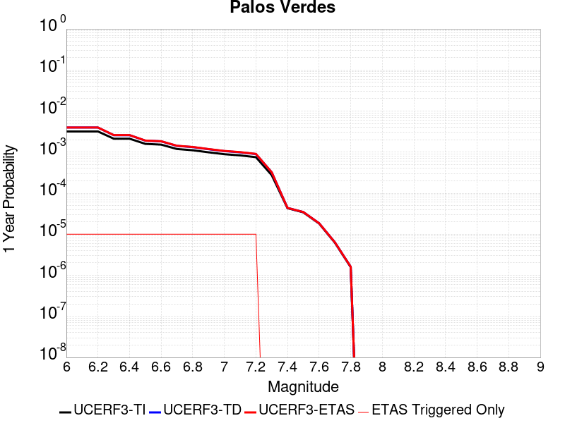 |  |

| Magnitude | 1 wk TI Prob | 1 wk TD Prob | 1 wk ETAS Prob | 1 wk ETAS/TD Gain | 1 wk ETAS Triggered Only | 1 mo TI Prob | 1 mo TD Prob | 1 mo ETAS Prob | 1 mo ETAS/TD Gain | 1 mo ETAS Triggered Only | 1 yr TI Prob | 1 yr TD Prob | 1 yr ETAS Prob | 1 yr ETAS/TD Gain | 1 yr ETAS Triggered Only | 10 yr TI Prob | 10 yr TD Prob | 10 yr ETAS Prob | 10 yr ETAS/TD Gain | 10 yr ETAS Triggered Only |
|-----|-----|-----|-----|-----|-----|-----|-----|-----|-----|-----|-----|-----|-----|-----|-----|-----|-----|-----|-----|-----|
| 6.0 | 6.126063E-5 | 7.622862E-5 | 8.622786E-5 | 1.1311743 | 1.0E-5 | 2.6251914E-4 | 3.2665656E-4 | 3.366533E-4 | 1.0306032 | 1.0E-5 | 0.0031914865 | 0.0039702994 | 0.0039802594 | 1.0025088 | 1.0E-5 | 0.031460393 | 0.039050125 | 0.039069343 | 1.0004922 | 2.0E-5 |
| 6.1 | 6.126063E-5 | 7.622862E-5 | 8.622786E-5 | 1.1311743 | 1.0E-5 | 2.6251914E-4 | 3.2665656E-4 | 3.366533E-4 | 1.0306032 | 1.0E-5 | 0.0031914865 | 0.0039702994 | 0.0039802594 | 1.0025088 | 1.0E-5 | 0.031460393 | 0.039050125 | 0.039069343 | 1.0004922 | 2.0E-5 |
| 6.2 | 6.126063E-5 | 7.622862E-5 | 8.622786E-5 | 1.1311743 | 1.0E-5 | 2.6251914E-4 | 3.2665656E-4 | 3.366533E-4 | 1.0306032 | 1.0E-5 | 0.0031914865 | 0.0039702994 | 0.0039802594 | 1.0025088 | 1.0E-5 | 0.031460393 | 0.039050125 | 0.039069343 | 1.0004922 | 2.0E-5 |
| 6.3 | 4.0838047E-5 | 4.975089E-5 | 5.9750393E-5 | 1.2009914 | 1.0E-5 | 1.7500846E-4 | 2.1320196E-4 | 2.2319982E-4 | 1.0468938 | 1.0E-5 | 0.0021286458 | 0.0025928554 | 0.0026028294 | 1.0038468 | 1.0E-5 | 0.021083709 | 0.025647415 | 0.025666902 | 1.0007598 | 2.0E-5 |
| 6.4 | 4.0838047E-5 | 4.975089E-5 | 5.9750393E-5 | 1.2009914 | 1.0E-5 | 1.7500846E-4 | 2.1320196E-4 | 2.2319982E-4 | 1.0468938 | 1.0E-5 | 0.0021286458 | 0.0025928554 | 0.0026028294 | 1.0038468 | 1.0E-5 | 0.021083709 | 0.025647415 | 0.025666902 | 1.0007598 | 2.0E-5 |
| 6.5 | 3.0512005E-5 | 3.6562593E-5 | 4.656223E-5 | 1.2734935 | 1.0E-5 | 1.3075917E-4 | 1.566881E-4 | 1.6668653E-4 | 1.0638111 | 1.0E-5 | 0.0015908304 | 0.001906127 | 0.0019161078 | 1.0052363 | 1.0E-5 | 0.015794903 | 0.01890965 | 0.01891946 | 1.0005188 | 1.0E-5 |
| 6.6 | 2.9255087E-5 | 3.5155368E-5 | 4.515502E-5 | 1.2844416 | 1.0E-5 | 1.2537291E-4 | 1.5065783E-4 | 1.6065632E-4 | 1.0663656 | 1.0E-5 | 0.0015253464 | 0.0018328319 | 0.0018428136 | 1.0054461 | 1.0E-5 | 0.015149189 | 0.01818871 | 0.018198527 | 1.0005398 | 1.0E-5 |
| 6.7 | 2.287198E-5 | 2.7248976E-5 | 3.7248705E-5 | 1.3669763 | 1.0E-5 | 9.801909E-5 | 1.1677662E-4 | 1.2677544E-4 | 1.0856236 | 1.0E-5 | 0.001192729 | 0.0014209197 | 0.0014309054 | 1.0070277 | 1.0E-5 | 0.011863477 | 0.014127577 | 0.014137435 | 1.0006979 | 1.0E-5 |
| 6.8 | 2.1325764E-5 | 2.5432531E-5 | 3.5432276E-5 | 1.3931872 | 1.0E-5 | 9.139293E-5 | 1.0899252E-4 | 1.1899143E-4 | 1.0917394 | 1.0E-5 | 0.001112141 | 0.0013262664 | 0.0013362531 | 1.00753 | 1.0E-5 | 0.011065915 | 0.013192548 | 0.013202417 | 1.000748 | 1.0E-5 |
| 6.9 | 1.9009392E-5 | 2.2614122E-5 | 3.2613894E-5 | 1.4421916 | 1.0E-5 | 8.1466285E-5 | 9.6914555E-5 | 1.0691358E-4 | 1.1031737 | 1.0E-5 | 9.914007E-4 | 0.0011793834 | 0.0011893716 | 1.008469 | 1.0E-5 | 0.009869894 | 0.011739929 | 0.0117498115 | 1.0008417 | 1.0E-5 |
| 7.0 | 1.7098473E-5 | 2.0319867E-5 | 3.0319665E-5 | 1.4921192 | 1.0E-5 | 7.3277115E-5 | 8.708272E-5 | 9.708185E-5 | 1.1148233 | 1.0E-5 | 8.917837E-4 | 0.0010598017 | 0.001069791 | 1.0094258 | 1.0E-5 | 0.008882134 | 0.010555912 | 0.010565806 | 1.0009373 | 1.0E-5 |
| 7.1 | 1.5982785E-5 | 1.8995239E-5 | 2.899505E-5 | 1.5264376 | 1.0E-5 | 6.849585E-5 | 8.1406106E-5 | 9.1405294E-5 | 1.1228309 | 1.0E-5 | 8.336179E-4 | 9.907534E-4 | 0.0010007435 | 1.0100833 | 1.0E-5 | 0.008304977 | 0.009871728 | 0.009881629 | 1.001003 | 1.0E-5 |
| 7.2 | 1.4468002E-5 | 1.719767E-5 | 2.7197499E-5 | 1.581464 | 1.0E-5 | 6.200425E-5 | 7.370269E-5 | 8.3701954E-5 | 1.1356703 | 1.0E-5 | 7.546402E-4 | 8.970449E-4 | 9.070359E-4 | 1.0111377 | 1.0E-5 | 0.007520827 | 0.008942509 | 0.008952419 | 1.0011083 | 1.0E-5 |
| 7.3 | 5.288233E-6 | 6.2038207E-6 | 6.2038207E-6 | 1.0 | 0.0 | 2.2663658E-5 | 2.658773E-5 | 2.658773E-5 | 1.0 | 0.0 | 2.7589512E-4 | 3.2369242E-4 | 3.2369242E-4 | 1.0 | 0.0 | 0.0027555283 | 0.0032356323 | 0.0032356323 | 1.0 | 0.0 |
| 7.4 | 8.279556E-7 | 8.408364E-7 | 8.408364E-7 | 1.0 | 0.0 | 3.5483763E-6 | 3.60358E-6 | 3.60358E-6 | 1.0 | 0.0 | 4.3200624E-5 | 4.3872777E-5 | 4.3872777E-5 | 1.0 | 0.0 | 4.3192226E-4 | 4.3864836E-4 | 4.3864836E-4 | 1.0 | 0.0 |
| 7.5 | 6.559831E-7 | 6.667243E-7 | 6.667243E-7 | 1.0 | 0.0 | 2.8113532E-6 | 2.8573872E-6 | 2.8573872E-6 | 1.0 | 0.0 | 3.4227687E-5 | 3.47882E-5 | 3.47882E-5 | 1.0 | 0.0 | 3.4222414E-4 | 3.478342E-4 | 3.478342E-4 | 1.0 | 0.0 |
| 7.6 | 3.5018968E-7 | 3.562011E-7 | 3.562011E-7 | 1.0 | 0.0 | 1.500812E-6 | 1.5265755E-6 | 1.5265755E-6 | 1.0 | 0.0 | 1.8272232E-5 | 1.8585944E-5 | 1.8585944E-5 | 1.0 | 0.0 | 1.8270731E-4 | 1.858485E-4 | 1.858485E-4 | 1.0 | 0.0 |
| 7.7 | 1.1986104E-7 | 1.2198406E-7 | 1.2198406E-7 | 1.0 | 0.0 | 5.1369005E-7 | 5.227887E-7 | 5.227887E-7 | 1.0 | 0.0 | 6.2541585E-6 | 6.364934E-6 | 6.364934E-6 | 1.0 | 0.0 | 6.2539824E-5 | 6.364756E-5 | 6.364756E-5 | 1.0 | 0.0 |
| 7.8 | 3.0445005E-8 | 3.1027664E-8 | 3.1027664E-8 | 1.0 | 0.0 | 1.3047858E-7 | 1.3297569E-7 | 1.3297569E-7 | 1.0 | 0.0 | 1.5885756E-6 | 1.6189781E-6 | 1.6189781E-6 | 1.0 | 0.0 | 1.5885644E-5 | 1.6189684E-5 | 1.6189684E-5 | 1.0 | 0.0 |

## Northridge
*[(top)](#table-of-contents)*

| 1 Week | 1 Month | 1 Year | 10 Year |
|-----|-----|-----|-----|
|  |  |  |  |

| Magnitude | 1 wk TI Prob | 1 wk TD Prob | 1 wk ETAS Prob | 1 wk ETAS/TD Gain | 1 wk ETAS Triggered Only | 1 mo TI Prob | 1 mo TD Prob | 1 mo ETAS Prob | 1 mo ETAS/TD Gain | 1 mo ETAS Triggered Only | 1 yr TI Prob | 1 yr TD Prob | 1 yr ETAS Prob | 1 yr ETAS/TD Gain | 1 yr ETAS Triggered Only | 10 yr TI Prob | 10 yr TD Prob | 10 yr ETAS Prob | 10 yr ETAS/TD Gain | 10 yr ETAS Triggered Only |
|-----|-----|-----|-----|-----|-----|-----|-----|-----|-----|-----|-----|-----|-----|-----|-----|-----|-----|-----|-----|-----|
| 6.0 | 1.8340852E-5 | 7.5881535E-6 | 7.5881535E-6 | 1.0 | 0.0 | 7.860128E-5 | 3.2520264E-5 | 3.2520264E-5 | 1.0 | 0.0 | 9.565505E-4 | 3.9586448E-4 | 3.9586448E-4 | 1.0 | 0.0 | 0.009524435 | 0.003951816 | 0.0039717364 | 1.005041 | 2.0E-5 |
| 6.1 | 1.8340852E-5 | 7.5881535E-6 | 7.5881535E-6 | 1.0 | 0.0 | 7.860128E-5 | 3.2520264E-5 | 3.2520264E-5 | 1.0 | 0.0 | 9.565505E-4 | 3.9586448E-4 | 3.9586448E-4 | 1.0 | 0.0 | 0.009524435 | 0.003951816 | 0.0039717364 | 1.005041 | 2.0E-5 |
| 6.2 | 1.8340852E-5 | 7.5881535E-6 | 7.5881535E-6 | 1.0 | 0.0 | 7.860128E-5 | 3.2520264E-5 | 3.2520264E-5 | 1.0 | 0.0 | 9.565505E-4 | 3.9586448E-4 | 3.9586448E-4 | 1.0 | 0.0 | 0.009524435 | 0.003951816 | 0.0039717364 | 1.005041 | 2.0E-5 |
| 6.3 | 1.8340852E-5 | 7.5881535E-6 | 7.5881535E-6 | 1.0 | 0.0 | 7.860128E-5 | 3.2520264E-5 | 3.2520264E-5 | 1.0 | 0.0 | 9.565505E-4 | 3.9586448E-4 | 3.9586448E-4 | 1.0 | 0.0 | 0.009524435 | 0.003951816 | 0.0039717364 | 1.005041 | 2.0E-5 |
| 6.4 | 1.7361892E-5 | 7.5881535E-6 | 7.5881535E-6 | 1.0 | 0.0 | 7.440598E-5 | 3.2520264E-5 | 3.2520264E-5 | 1.0 | 0.0 | 9.055163E-4 | 3.9586448E-4 | 3.9586448E-4 | 1.0 | 0.0 | 0.009018354 | 0.003951816 | 0.0039717364 | 1.005041 | 2.0E-5 |
| 6.5 | 1.7361892E-5 | 7.5881535E-6 | 7.5881535E-6 | 1.0 | 0.0 | 7.440598E-5 | 3.2520264E-5 | 3.2520264E-5 | 1.0 | 0.0 | 9.055163E-4 | 3.9586448E-4 | 3.9586448E-4 | 1.0 | 0.0 | 0.009018354 | 0.003951816 | 0.0039717364 | 1.005041 | 2.0E-5 |
| 6.6 | 1.5458201E-5 | 7.5881535E-6 | 7.5881535E-6 | 1.0 | 0.0 | 6.624775E-5 | 3.2520264E-5 | 3.2520264E-5 | 1.0 | 0.0 | 8.0626784E-4 | 3.9586448E-4 | 3.9586448E-4 | 1.0 | 0.0 | 0.008033488 | 0.003951816 | 0.0039717364 | 1.005041 | 2.0E-5 |
| 6.7 | 1.2538368E-5 | 6.381707E-6 | 6.381707E-6 | 1.0 | 0.0 | 5.3734755E-5 | 2.7349888E-5 | 2.7349888E-5 | 1.0 | 0.0 | 6.5402425E-4 | 3.3293446E-4 | 3.3293446E-4 | 1.0 | 0.0 | 0.0065210275 | 0.0033244046 | 0.0033443382 | 1.0059961 | 2.0E-5 |
| 6.8 | 1.1438097E-5 | 6.3503594E-6 | 6.3503594E-6 | 1.0 | 0.0 | 4.9019498E-5 | 2.7215545E-5 | 2.7215545E-5 | 1.0 | 0.0 | 5.9664896E-4 | 3.3129932E-4 | 3.3129932E-4 | 1.0 | 0.0 | 0.005950495 | 0.003308102 | 0.0033280358 | 1.0060258 | 2.0E-5 |
| 6.9 | 1.1204891E-5 | 6.2868094E-6 | 6.2868094E-6 | 1.0 | 0.0 | 4.8020076E-5 | 2.6943193E-5 | 2.6943193E-5 | 1.0 | 0.0 | 5.8448757E-4 | 3.2798442E-4 | 3.2798442E-4 | 1.0 | 0.0 | 0.0058295266 | 0.0032750512 | 0.0032949857 | 1.0060868 | 2.0E-5 |
| 7.0 | 1.061046E-5 | 6.1154565E-6 | 6.1154565E-6 | 1.0 | 0.0 | 4.5472607E-5 | 2.6208838E-5 | 2.6208838E-5 | 1.0 | 0.0 | 5.534883E-4 | 3.1904632E-4 | 3.1904632E-4 | 1.0 | 0.0 | 0.0055211177 | 0.003185929 | 0.0032058654 | 1.0062577 | 2.0E-5 |
| 7.1 | 1.0266979E-5 | 6.0043685E-6 | 6.0043685E-6 | 1.0 | 0.0 | 4.40006E-5 | 2.5732756E-5 | 2.5732756E-5 | 1.0 | 0.0 | 5.355756E-4 | 3.132517E-4 | 3.132517E-4 | 1.0 | 0.0 | 0.0053428668 | 0.0031281472 | 0.0031480847 | 1.0063735 | 2.0E-5 |
| 7.2 | 9.91273E-6 | 5.820076E-6 | 5.820076E-6 | 1.0 | 0.0 | 4.248244E-5 | 2.4942945E-5 | 2.4942945E-5 | 1.0 | 0.0 | 5.171009E-4 | 3.0363846E-4 | 3.0363846E-4 | 1.0 | 0.0 | 0.0051589934 | 0.003032281 | 0.0030522202 | 1.0065757 | 2.0E-5 |
| 7.3 | 8.4959265E-6 | 5.1931415E-6 | 5.1931415E-6 | 1.0 | 0.0 | 3.6410605E-5 | 2.2256132E-5 | 2.2256132E-5 | 1.0 | 0.0 | 4.4320893E-4 | 2.7093495E-4 | 2.7093495E-4 | 1.0 | 0.0 | 0.00442326 | 0.0027060728 | 0.0027260187 | 1.0073708 | 2.0E-5 |
| 7.4 | 8.0847185E-6 | 4.9820114E-6 | 4.9820114E-6 | 1.0 | 0.0 | 3.4648332E-5 | 2.1351305E-5 | 2.1351305E-5 | 1.0 | 0.0 | 4.2176177E-4 | 2.5992136E-4 | 2.5992136E-4 | 1.0 | 0.0 | 0.0042096223 | 0.0025961995 | 0.0026161475 | 1.0076835 | 2.0E-5 |
| 7.5 | 6.8220684E-6 | 4.2533693E-6 | 4.2533693E-6 | 1.0 | 0.0 | 2.9237108E-5 | 1.8228598E-5 | 1.8228598E-5 | 1.0 | 0.0 | 3.5590364E-4 | 2.2191078E-4 | 2.2191078E-4 | 1.0 | 0.0 | 0.0035533418 | 0.0022169128 | 0.0022368685 | 1.0090016 | 2.0E-5 |
| 7.6 | 4.4224143E-6 | 2.8999916E-6 | 2.8999916E-6 | 1.0 | 0.0 | 1.8953066E-5 | 1.2428477E-5 | 1.2428477E-5 | 1.0 | 0.0 | 2.3072914E-4 | 1.5130632E-4 | 1.5130632E-4 | 1.0 | 0.0 | 0.0023048974 | 0.0015120446 | 0.0015220294 | 1.0066036 | 1.0E-5 |
| 7.7 | 2.5297056E-6 | 1.6046072E-6 | 1.6046072E-6 | 1.0 | 0.0 | 1.0841551E-5 | 6.87687E-6 | 6.87687E-6 | 1.0 | 0.0 | 1.319879E-4 | 8.372273E-5 | 8.372273E-5 | 1.0 | 0.0 | 0.0013190953 | 8.3691656E-4 | 8.3691656E-4 | 1.0 | 0.0 |
| 7.8 | 1.2508156E-6 | 8.78015E-7 | 8.78015E-7 | 1.0 | 0.0 | 5.3606273E-6 | 3.7629159E-6 | 3.7629159E-6 | 1.0 | 0.0 | 6.526368E-5 | 4.581255E-5 | 4.581255E-5 | 1.0 | 0.0 | 6.524452E-4 | 4.5803236E-4 | 4.5803236E-4 | 1.0 | 0.0 |
| 7.9 | 2.262199E-7 | 1.4664893E-7 | 1.4664893E-7 | 1.0 | 0.0 | 9.695135E-7 | 6.2849523E-7 | 6.2849523E-7 | 1.0 | 0.0 | 1.1803763E-5 | 7.651904E-6 | 7.651904E-6 | 1.0 | 0.0 | 1.1803136E-4 | 7.651648E-5 | 7.651648E-5 | 1.0 | 0.0 |
| 8.0 | 2.865362E-9 | 1.2753953E-9 | 1.2753953E-9 | 1.0 | 0.0 | 1.2280123E-8 | 5.46598E-9 | 5.46598E-9 | 1.0 | 0.0 | 1.4951048E-7 | 6.654831E-8 | 6.654831E-8 | 1.0 | 0.0 | 1.4951038E-6 | 6.6548307E-7 | 6.6548307E-7 | 1.0 | 0.0 |

## Kern Canyon (Lake Isabella) 2011
*[(top)](#table-of-contents)*

| 1 Week | 1 Month | 1 Year | 10 Year |
|-----|-----|-----|-----|
|  |  |  | 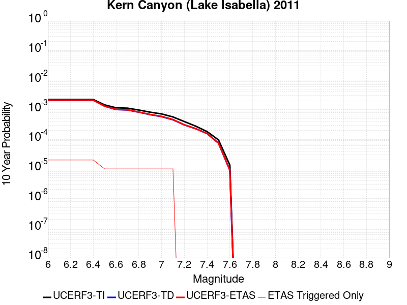 |

| Magnitude | 1 wk TI Prob | 1 wk TD Prob | 1 wk ETAS Prob | 1 wk ETAS/TD Gain | 1 wk ETAS Triggered Only | 1 mo TI Prob | 1 mo TD Prob | 1 mo ETAS Prob | 1 mo ETAS/TD Gain | 1 mo ETAS Triggered Only | 1 yr TI Prob | 1 yr TD Prob | 1 yr ETAS Prob | 1 yr ETAS/TD Gain | 1 yr ETAS Triggered Only | 10 yr TI Prob | 10 yr TD Prob | 10 yr ETAS Prob | 10 yr ETAS/TD Gain | 10 yr ETAS Triggered Only |
|-----|-----|-----|-----|-----|-----|-----|-----|-----|-----|-----|-----|-----|-----|-----|-----|-----|-----|-----|-----|-----|
| 6.0 | 4.2387383E-6 | 4.0016507E-6 | 4.0016507E-6 | 1.0 | 0.0 | 1.8165894E-5 | 1.7149829E-5 | 1.7149829E-5 | 1.0 | 0.0 | 2.2114732E-4 | 2.0878103E-4 | 2.1877895E-4 | 1.0478871 | 1.0E-5 | 0.0022092736 | 0.0020860326 | 0.0021059911 | 1.0095676 | 2.0E-5 |
| 6.1 | 4.2387383E-6 | 4.0016507E-6 | 4.0016507E-6 | 1.0 | 0.0 | 1.8165894E-5 | 1.7149829E-5 | 1.7149829E-5 | 1.0 | 0.0 | 2.2114732E-4 | 2.0878103E-4 | 2.1877895E-4 | 1.0478871 | 1.0E-5 | 0.0022092736 | 0.0020860326 | 0.0021059911 | 1.0095676 | 2.0E-5 |
| 6.2 | 4.2387383E-6 | 4.0016507E-6 | 4.0016507E-6 | 1.0 | 0.0 | 1.8165894E-5 | 1.7149829E-5 | 1.7149829E-5 | 1.0 | 0.0 | 2.2114732E-4 | 2.0878103E-4 | 2.1877895E-4 | 1.0478871 | 1.0E-5 | 0.0022092736 | 0.0020860326 | 0.0021059911 | 1.0095676 | 2.0E-5 |
| 6.3 | 4.2387383E-6 | 4.0016507E-6 | 4.0016507E-6 | 1.0 | 0.0 | 1.8165894E-5 | 1.7149829E-5 | 1.7149829E-5 | 1.0 | 0.0 | 2.2114732E-4 | 2.0878103E-4 | 2.1877895E-4 | 1.0478871 | 1.0E-5 | 0.0022092736 | 0.0020860326 | 0.0021059911 | 1.0095676 | 2.0E-5 |
| 6.4 | 4.2387383E-6 | 4.0016507E-6 | 4.0016507E-6 | 1.0 | 0.0 | 1.8165894E-5 | 1.7149829E-5 | 1.7149829E-5 | 1.0 | 0.0 | 2.2114732E-4 | 2.0878103E-4 | 2.1877895E-4 | 1.0478871 | 1.0E-5 | 0.0022092736 | 0.0020860326 | 0.0021059911 | 1.0095676 | 2.0E-5 |
| 6.5 | 2.7857532E-6 | 2.5178747E-6 | 2.5178747E-6 | 1.0 | 0.0 | 1.1938888E-5 | 1.0790849E-5 | 1.0790849E-5 | 1.0 | 0.0 | 1.4534626E-4 | 1.31371E-4 | 1.31371E-4 | 1.0 | 0.0 | 0.0014525123 | 0.0013129661 | 0.0013229529 | 1.0076064 | 1.0E-5 |
| 6.6 | 2.2233348E-6 | 1.94413E-6 | 1.94413E-6 | 1.0 | 0.0 | 9.528543E-6 | 8.331959E-6 | 8.331959E-6 | 1.0 | 0.0 | 1.1600384E-4 | 1.0143697E-4 | 1.0143697E-4 | 1.0 | 0.0 | 0.001159433 | 0.0010139153 | 0.0010239051 | 1.0098528 | 1.0E-5 |
| 6.7 | 2.1635126E-6 | 1.8835098E-6 | 1.8835098E-6 | 1.0 | 0.0 | 9.272164E-6 | 8.07216E-6 | 8.07216E-6 | 1.0 | 0.0 | 1.1288274E-4 | 9.82742E-5 | 9.82742E-5 | 1.0 | 0.0 | 0.0011282542 | 9.823156E-4 | 9.923058E-4 | 1.01017 | 1.0E-5 |
| 6.8 | 1.8685711E-6 | 1.583148E-6 | 1.583148E-6 | 1.0 | 0.0 | 8.008137E-6 | 6.784903E-6 | 6.784903E-6 | 1.0 | 0.0 | 9.74947E-5 | 8.260311E-5 | 8.260311E-5 | 1.0 | 0.0 | 9.745194E-4 | 8.25729E-4 | 8.357207E-4 | 1.0121005 | 1.0E-5 |
| 6.9 | 1.5815071E-6 | 1.3064976E-6 | 1.3064976E-6 | 1.0 | 0.0 | 6.77787E-6 | 5.599263E-6 | 5.599263E-6 | 1.0 | 0.0 | 8.251744E-5 | 6.816892E-5 | 6.816892E-5 | 1.0 | 0.0 | 8.248681E-4 | 6.814828E-4 | 6.91476E-4 | 1.0146639 | 1.0E-5 |
| 7.0 | 1.3772564E-6 | 1.1210758E-6 | 1.1210758E-6 | 1.0 | 0.0 | 5.9025137E-6 | 4.804602E-6 | 4.804602E-6 | 1.0 | 0.0 | 7.186073E-5 | 5.849448E-5 | 5.849448E-5 | 1.0 | 0.0 | 7.18375E-4 | 5.8479287E-4 | 5.94787E-4 | 1.0170901 | 1.0E-5 |
| 7.1 | 1.0916998E-6 | 8.763808E-7 | 8.763808E-7 | 1.0 | 0.0 | 4.678705E-6 | 3.7559125E-6 | 3.7559125E-6 | 1.0 | 0.0 | 5.6961744E-5 | 4.5727287E-5 | 4.5727287E-5 | 1.0 | 0.0 | 5.6947145E-4 | 4.5718014E-4 | 4.6717556E-4 | 1.0218632 | 1.0E-5 |
| 7.2 | 7.6277024E-7 | 5.901475E-7 | 5.901475E-7 | 1.0 | 0.0 | 3.2690114E-6 | 2.5292013E-6 | 2.5292013E-6 | 1.0 | 0.0 | 3.9799485E-5 | 3.0792595E-5 | 3.0792595E-5 | 1.0 | 0.0 | 3.9792358E-4 | 3.078839E-4 | 3.078839E-4 | 1.0 | 0.0 |
| 7.3 | 5.3265916E-7 | 4.3824562E-7 | 4.3824562E-7 | 1.0 | 0.0 | 2.282823E-6 | 1.8781942E-6 | 1.8781942E-6 | 1.0 | 0.0 | 2.7793016E-5 | 2.286678E-5 | 2.286678E-5 | 1.0 | 0.0 | 2.778954E-4 | 2.2864464E-4 | 2.2864464E-4 | 1.0 | 0.0 |
| 7.4 | 3.4946007E-7 | 3.006581E-7 | 3.006581E-7 | 1.0 | 0.0 | 1.497685E-6 | 1.288534E-6 | 1.288534E-6 | 1.0 | 0.0 | 1.8234163E-5 | 1.568779E-5 | 1.568779E-5 | 1.0 | 0.0 | 1.8232666E-4 | 1.5686706E-4 | 1.5686706E-4 | 1.0 | 0.0 |
| 7.5 | 1.8317026E-7 | 1.4244868E-7 | 1.4244868E-7 | 1.0 | 0.0 | 7.850152E-7 | 6.104942E-7 | 6.104942E-7 | 1.0 | 0.0 | 9.557518E-6 | 7.4327427E-6 | 7.4327427E-6 | 1.0 | 0.0 | 9.5571064E-5 | 7.432502E-5 | 7.432502E-5 | 1.0 | 0.0 |
| 7.6 | 2.572245E-8 | 1.7352637E-8 | 1.7352637E-8 | 1.0 | 0.0 | 1.10239064E-7 | 7.4368444E-8 | 7.4368444E-8 | 1.0 | 0.0 | 1.3421597E-6 | 9.0543546E-7 | 9.0543546E-7 | 1.0 | 0.0 | 1.3421517E-5 | 9.0543235E-6 | 9.0543235E-6 | 1.0 | 0.0 |

## Sisar
*[(top)](#table-of-contents)*

| 1 Week | 1 Month | 1 Year | 10 Year |
|-----|-----|-----|-----|
|  |  |  |  |

| Magnitude | 1 wk TI Prob | 1 wk TD Prob | 1 wk ETAS Prob | 1 wk ETAS/TD Gain | 1 wk ETAS Triggered Only | 1 mo TI Prob | 1 mo TD Prob | 1 mo ETAS Prob | 1 mo ETAS/TD Gain | 1 mo ETAS Triggered Only | 1 yr TI Prob | 1 yr TD Prob | 1 yr ETAS Prob | 1 yr ETAS/TD Gain | 1 yr ETAS Triggered Only | 10 yr TI Prob | 10 yr TD Prob | 10 yr ETAS Prob | 10 yr ETAS/TD Gain | 10 yr ETAS Triggered Only |
|-----|-----|-----|-----|-----|-----|-----|-----|-----|-----|-----|-----|-----|-----|-----|-----|-----|-----|-----|-----|-----|
| 6.0 | 4.544193E-6 | 3.8396215E-6 | 3.8396215E-6 | 1.0 | 0.0 | 1.9474966E-5 | 1.6455419E-5 | 1.6455419E-5 | 1.0 | 0.0 | 2.3708193E-4 | 2.0032664E-4 | 2.1032464E-4 | 1.0499085 | 1.0E-5 | 0.0023682916 | 0.0020014944 | 0.0020214545 | 1.0099726 | 2.0E-5 |
| 6.1 | 4.544193E-6 | 3.8396215E-6 | 3.8396215E-6 | 1.0 | 0.0 | 1.9474966E-5 | 1.6455419E-5 | 1.6455419E-5 | 1.0 | 0.0 | 2.3708193E-4 | 2.0032664E-4 | 2.1032464E-4 | 1.0499085 | 1.0E-5 | 0.0023682916 | 0.0020014944 | 0.0020214545 | 1.0099726 | 2.0E-5 |
| 6.2 | 4.544193E-6 | 3.8396215E-6 | 3.8396215E-6 | 1.0 | 0.0 | 1.9474966E-5 | 1.6455419E-5 | 1.6455419E-5 | 1.0 | 0.0 | 2.3708193E-4 | 2.0032664E-4 | 2.1032464E-4 | 1.0499085 | 1.0E-5 | 0.0023682916 | 0.0020014944 | 0.0020214545 | 1.0099726 | 2.0E-5 |
| 6.3 | 4.544193E-6 | 3.8396215E-6 | 3.8396215E-6 | 1.0 | 0.0 | 1.9474966E-5 | 1.6455419E-5 | 1.6455419E-5 | 1.0 | 0.0 | 2.3708193E-4 | 2.0032664E-4 | 2.1032464E-4 | 1.0499085 | 1.0E-5 | 0.0023682916 | 0.0020014944 | 0.0020214545 | 1.0099726 | 2.0E-5 |
| 6.4 | 4.544193E-6 | 3.8396215E-6 | 3.8396215E-6 | 1.0 | 0.0 | 1.9474966E-5 | 1.6455419E-5 | 1.6455419E-5 | 1.0 | 0.0 | 2.3708193E-4 | 2.0032664E-4 | 2.1032464E-4 | 1.0499085 | 1.0E-5 | 0.0023682916 | 0.0020014944 | 0.0020214545 | 1.0099726 | 2.0E-5 |
| 6.5 | 4.544193E-6 | 3.8396215E-6 | 3.8396215E-6 | 1.0 | 0.0 | 1.9474966E-5 | 1.6455419E-5 | 1.6455419E-5 | 1.0 | 0.0 | 2.3708193E-4 | 2.0032664E-4 | 2.1032464E-4 | 1.0499085 | 1.0E-5 | 0.0023682916 | 0.0020014944 | 0.0020214545 | 1.0099726 | 2.0E-5 |
| 6.6 | 4.544193E-6 | 3.8396215E-6 | 3.8396215E-6 | 1.0 | 0.0 | 1.9474966E-5 | 1.6455419E-5 | 1.6455419E-5 | 1.0 | 0.0 | 2.3708193E-4 | 2.0032664E-4 | 2.1032464E-4 | 1.0499085 | 1.0E-5 | 0.0023682916 | 0.0020014944 | 0.0020214545 | 1.0099726 | 2.0E-5 |
| 6.7 | 4.544193E-6 | 3.8396215E-6 | 3.8396215E-6 | 1.0 | 0.0 | 1.9474966E-5 | 1.6455419E-5 | 1.6455419E-5 | 1.0 | 0.0 | 2.3708193E-4 | 2.0032664E-4 | 2.1032464E-4 | 1.0499085 | 1.0E-5 | 0.0023682916 | 0.0020014944 | 0.0020214545 | 1.0099726 | 2.0E-5 |
| 6.8 | 4.544193E-6 | 3.8396215E-6 | 3.8396215E-6 | 1.0 | 0.0 | 1.9474966E-5 | 1.6455419E-5 | 1.6455419E-5 | 1.0 | 0.0 | 2.3708193E-4 | 2.0032664E-4 | 2.1032464E-4 | 1.0499085 | 1.0E-5 | 0.0023682916 | 0.0020014944 | 0.0020214545 | 1.0099726 | 2.0E-5 |
| 6.9 | 4.542225E-6 | 3.8375833E-6 | 3.8375833E-6 | 1.0 | 0.0 | 1.9466532E-5 | 1.6446686E-5 | 1.6446686E-5 | 1.0 | 0.0 | 2.3697925E-4 | 2.0022033E-4 | 2.1021832E-4 | 1.049935 | 1.0E-5 | 0.002367267 | 0.0020004332 | 0.002020393 | 1.0099778 | 2.0E-5 |
| 7.0 | 4.5278484E-6 | 3.8226476E-6 | 3.8226476E-6 | 1.0 | 0.0 | 1.940492E-5 | 1.6382673E-5 | 1.6382673E-5 | 1.0 | 0.0 | 2.3622929E-4 | 1.9944114E-4 | 2.0943914E-4 | 1.0501301 | 1.0E-5 | 0.0023597833 | 0.0019926552 | 0.0020126153 | 1.0100169 | 2.0E-5 |
| 7.1 | 4.5132488E-6 | 3.807435E-6 | 3.807435E-6 | 1.0 | 0.0 | 1.9342351E-5 | 1.6317477E-5 | 1.6317477E-5 | 1.0 | 0.0 | 2.3546767E-4 | 1.9864751E-4 | 2.0864554E-4 | 1.0503304 | 1.0E-5 | 0.0023521832 | 0.0019847332 | 0.0020046935 | 1.010057 | 2.0E-5 |
| 7.2 | 4.448859E-6 | 3.739895E-6 | 3.739895E-6 | 1.0 | 0.0 | 1.9066398E-5 | 1.6028025E-5 | 1.6028025E-5 | 1.0 | 0.0 | 2.3210866E-4 | 1.9512406E-4 | 2.0512211E-4 | 1.0512395 | 1.0E-5 | 0.0023186638 | 0.001949561 | 0.0019695219 | 1.0102388 | 2.0E-5 |
| 7.3 | 4.3424366E-6 | 3.6337285E-6 | 3.6337285E-6 | 1.0 | 0.0 | 1.861031E-5 | 1.557303E-5 | 1.557303E-5 | 1.0 | 0.0 | 2.2655698E-4 | 1.895855E-4 | 1.9958359E-4 | 1.0527366 | 1.0E-5 | 0.0022632615 | 0.001894271 | 0.0019142331 | 1.0105381 | 2.0E-5 |
| 7.4 | 4.218641E-6 | 3.533081E-6 | 3.533081E-6 | 1.0 | 0.0 | 1.8079765E-5 | 1.514169E-5 | 1.514169E-5 | 1.0 | 0.0 | 2.2009891E-4 | 1.8433481E-4 | 1.9433297E-4 | 1.0542392 | 1.0E-5 | 0.0021988105 | 0.0018418524 | 0.0018618156 | 1.0108386 | 2.0E-5 |
| 7.5 | 3.983779E-6 | 3.3478473E-6 | 3.3478473E-6 | 1.0 | 0.0 | 1.7073227E-5 | 1.434784E-5 | 1.434784E-5 | 1.0 | 0.0 | 2.0784672E-4 | 1.7467128E-4 | 1.8466954E-4 | 1.0572404 | 1.0E-5 | 0.0020765243 | 0.0017453729 | 0.001765338 | 1.0114388 | 2.0E-5 |
| 7.6 | 2.777393E-6 | 2.352279E-6 | 2.352279E-6 | 1.0 | 0.0 | 1.1903058E-5 | 1.0081157E-5 | 1.0081157E-5 | 1.0 | 0.0 | 1.449101E-4 | 1.2273125E-4 | 1.3273001E-4 | 1.0814688 | 1.0E-5 | 0.0014481564 | 0.0012266424 | 0.0012366301 | 1.0081424 | 1.0E-5 |
| 7.7 | 1.9028433E-6 | 1.5938915E-6 | 1.5938915E-6 | 1.0 | 0.0 | 8.155017E-6 | 6.830946E-6 | 6.830946E-6 | 1.0 | 0.0 | 9.928281E-5 | 8.316364E-5 | 9.316281E-5 | 1.1202348 | 1.0E-5 | 9.923846E-4 | 8.313299E-4 | 8.413216E-4 | 1.0120189 | 1.0E-5 |
| 7.8 | 4.9095956E-7 | 4.358398E-7 | 4.358398E-7 | 1.0 | 0.0 | 2.1041105E-6 | 1.8678836E-6 | 1.8678836E-6 | 1.0 | 0.0 | 2.5617246E-5 | 2.2741247E-5 | 2.2741247E-5 | 1.0 | 0.0 | 2.5614293E-4 | 2.2738938E-4 | 2.2738938E-4 | 1.0 | 0.0 |
| 7.9 | 1.16657894E-7 | 1.0335634E-7 | 1.0335634E-7 | 1.0 | 0.0 | 4.999623E-7 | 4.4295567E-7 | 4.4295567E-7 | 1.0 | 0.0 | 6.087024E-6 | 5.392972E-6 | 5.392972E-6 | 1.0 | 0.0 | 6.0868573E-5 | 5.3928445E-5 | 5.3928445E-5 | 1.0 | 0.0 |
| 8.0 | 2.5100346E-9 | 1.7068081E-9 | 1.7068081E-9 | 1.0 | 0.0 | 1.0757291E-8 | 7.3148922E-9 | 7.3148922E-9 | 1.0 | 0.0 | 1.3097001E-7 | 8.905881E-8 | 8.905881E-8 | 1.0 | 0.0 | 1.3096993E-6 | 8.905878E-7 | 8.905878E-7 | 1.0 | 0.0 |

## Clamshell-Sawpit
*[(top)](#table-of-contents)*

| 1 Week | 1 Month | 1 Year | 10 Year |
|-----|-----|-----|-----|
|  |  |  |  |

| Magnitude | 1 wk TI Prob | 1 wk TD Prob | 1 wk ETAS Prob | 1 wk ETAS/TD Gain | 1 wk ETAS Triggered Only | 1 mo TI Prob | 1 mo TD Prob | 1 mo ETAS Prob | 1 mo ETAS/TD Gain | 1 mo ETAS Triggered Only | 1 yr TI Prob | 1 yr TD Prob | 1 yr ETAS Prob | 1 yr ETAS/TD Gain | 1 yr ETAS Triggered Only | 10 yr TI Prob | 10 yr TD Prob | 10 yr ETAS Prob | 10 yr ETAS/TD Gain | 10 yr ETAS Triggered Only |
|-----|-----|-----|-----|-----|-----|-----|-----|-----|-----|-----|-----|-----|-----|-----|-----|-----|-----|-----|-----|-----|
| 6.0 | 3.202998E-6 | 3.0127826E-6 | 3.0127826E-6 | 1.0 | 0.0 | 1.3727062E-5 | 1.2911866E-5 | 1.2911866E-5 | 1.0 | 0.0 | 1.6711417E-4 | 1.5719143E-4 | 1.6718986E-4 | 1.0636067 | 1.0E-5 | 0.0016698855 | 0.0015708818 | 0.0015908504 | 1.0127116 | 2.0E-5 |
| 6.1 | 3.202998E-6 | 3.0127826E-6 | 3.0127826E-6 | 1.0 | 0.0 | 1.3727062E-5 | 1.2911866E-5 | 1.2911866E-5 | 1.0 | 0.0 | 1.6711417E-4 | 1.5719143E-4 | 1.6718986E-4 | 1.0636067 | 1.0E-5 | 0.0016698855 | 0.0015708818 | 0.0015908504 | 1.0127116 | 2.0E-5 |
| 6.2 | 3.202998E-6 | 3.0127826E-6 | 3.0127826E-6 | 1.0 | 0.0 | 1.3727062E-5 | 1.2911866E-5 | 1.2911866E-5 | 1.0 | 0.0 | 1.6711417E-4 | 1.5719143E-4 | 1.6718986E-4 | 1.0636067 | 1.0E-5 | 0.0016698855 | 0.0015708818 | 0.0015908504 | 1.0127116 | 2.0E-5 |
| 6.3 | 3.202998E-6 | 3.0127826E-6 | 3.0127826E-6 | 1.0 | 0.0 | 1.3727062E-5 | 1.2911866E-5 | 1.2911866E-5 | 1.0 | 0.0 | 1.6711417E-4 | 1.5719143E-4 | 1.6718986E-4 | 1.0636067 | 1.0E-5 | 0.0016698855 | 0.0015708818 | 0.0015908504 | 1.0127116 | 2.0E-5 |
| 6.4 | 3.202998E-6 | 3.0127826E-6 | 3.0127826E-6 | 1.0 | 0.0 | 1.3727062E-5 | 1.2911866E-5 | 1.2911866E-5 | 1.0 | 0.0 | 1.6711417E-4 | 1.5719143E-4 | 1.6718986E-4 | 1.0636067 | 1.0E-5 | 0.0016698855 | 0.0015708818 | 0.0015908504 | 1.0127116 | 2.0E-5 |
| 6.5 | 2.5862723E-6 | 2.380791E-6 | 2.380791E-6 | 1.0 | 0.0 | 1.1083977E-5 | 1.0203352E-5 | 1.0203352E-5 | 1.0 | 0.0 | 1.3493907E-4 | 1.2421903E-4 | 1.3421779E-4 | 1.080493 | 1.0E-5 | 0.0013485716 | 0.0012415263 | 0.0012615015 | 1.0160892 | 2.0E-5 |
| 6.6 | 2.5862723E-6 | 2.380791E-6 | 2.380791E-6 | 1.0 | 0.0 | 1.1083977E-5 | 1.0203352E-5 | 1.0203352E-5 | 1.0 | 0.0 | 1.3493907E-4 | 1.2421903E-4 | 1.3421779E-4 | 1.080493 | 1.0E-5 | 0.0013485716 | 0.0012415263 | 0.0012615015 | 1.0160892 | 2.0E-5 |
| 6.7 | 2.5862723E-6 | 2.380791E-6 | 2.380791E-6 | 1.0 | 0.0 | 1.1083977E-5 | 1.0203352E-5 | 1.0203352E-5 | 1.0 | 0.0 | 1.3493907E-4 | 1.2421903E-4 | 1.3421779E-4 | 1.080493 | 1.0E-5 | 0.0013485716 | 0.0012415263 | 0.0012615015 | 1.0160892 | 2.0E-5 |
| 6.8 | 2.4098806E-6 | 2.197746E-6 | 2.197746E-6 | 1.0 | 0.0 | 1.0328019E-5 | 9.418879E-6 | 9.418879E-6 | 1.0 | 0.0 | 1.2573638E-4 | 1.14669085E-4 | 1.2466795E-4 | 1.0871974 | 1.0E-5 | 0.0012566525 | 0.0011461257 | 0.0011661028 | 1.0174301 | 2.0E-5 |
| 6.9 | 2.0073985E-6 | 1.7784376E-6 | 1.7784376E-6 | 1.0 | 0.0 | 8.603109E-6 | 7.621854E-6 | 7.621854E-6 | 1.0 | 0.0 | 1.0473781E-4 | 9.2792245E-5 | 1.0279132E-4 | 1.1077577 | 1.0E-5 | 0.0010468846 | 9.275468E-4 | 9.475283E-4 | 1.0215423 | 2.0E-5 |
| 7.0 | 1.8166766E-6 | 1.5807215E-6 | 1.5807215E-6 | 1.0 | 0.0 | 7.785734E-6 | 6.7745036E-6 | 6.7745036E-6 | 1.0 | 0.0 | 9.478718E-5 | 8.247656E-5 | 9.247573E-5 | 1.1212366 | 1.0E-5 | 9.4746763E-4 | 8.2446955E-4 | 8.4445305E-4 | 1.024238 | 2.0E-5 |
| 7.1 | 1.5471421E-6 | 1.3053062E-6 | 1.3053062E-6 | 1.0 | 0.0 | 6.6305925E-6 | 5.5941578E-6 | 5.5941578E-6 | 1.0 | 0.0 | 8.072447E-5 | 6.81068E-5 | 7.810612E-5 | 1.1468182 | 1.0E-5 | 8.0695155E-4 | 6.8086473E-4 | 7.0085115E-4 | 1.0293545 | 2.0E-5 |
| 7.2 | 1.3608037E-6 | 1.1153531E-6 | 1.1153531E-6 | 1.0 | 0.0 | 5.8320024E-6 | 4.7800763E-6 | 4.7800763E-6 | 1.0 | 0.0 | 7.1002316E-5 | 5.8195925E-5 | 6.819534E-5 | 1.1718234 | 1.0E-5 | 7.097964E-4 | 5.818115E-4 | 6.017998E-4 | 1.0343554 | 2.0E-5 |
| 7.3 | 1.0749634E-6 | 8.3843213E-7 | 8.3843213E-7 | 1.0 | 0.0 | 4.6069777E-6 | 3.5932758E-6 | 3.5932758E-6 | 1.0 | 0.0 | 5.608851E-5 | 4.374728E-5 | 5.3746844E-5 | 1.2285756 | 1.0E-5 | 5.6074356E-4 | 4.3738954E-4 | 4.5738078E-4 | 1.0457058 | 2.0E-5 |
| 7.4 | 8.416856E-7 | 6.2000976E-7 | 6.2000976E-7 | 1.0 | 0.0 | 3.607219E-6 | 2.657182E-6 | 2.657182E-6 | 1.0 | 0.0 | 4.3917007E-5 | 3.235073E-5 | 4.2350406E-5 | 1.309102 | 1.0E-5 | 4.390833E-4 | 3.2346218E-4 | 3.434557E-4 | 1.0618111 | 2.0E-5 |
| 7.5 | 6.2779594E-7 | 4.4969224E-7 | 4.4969224E-7 | 1.0 | 0.0 | 2.6905511E-6 | 1.927251E-6 | 1.927251E-6 | 1.0 | 0.0 | 3.275697E-5 | 2.3464048E-5 | 3.3463813E-5 | 1.4261739 | 1.0E-5 | 3.275214E-4 | 2.3461759E-4 | 2.5461288E-4 | 1.0852251 | 2.0E-5 |
| 7.6 | 4.3822078E-7 | 3.0595675E-7 | 3.0595675E-7 | 1.0 | 0.0 | 1.8780877E-6 | 1.3112426E-6 | 1.3112426E-6 | 1.0 | 0.0 | 2.2865479E-5 | 1.5964277E-5 | 2.5964118E-5 | 1.6263885 | 1.0E-5 | 2.2863125E-4 | 1.5963285E-4 | 1.6963125E-4 | 1.0626338 | 1.0E-5 |
| 7.7 | 1.8704569E-7 | 1.1238066E-7 | 1.1238066E-7 | 1.0 | 0.0 | 8.0162414E-7 | 4.8163133E-7 | 4.8163133E-7 | 1.0 | 0.0 | 9.75973E-6 | 5.863846E-6 | 1.5863787E-5 | 2.7053554 | 1.0E-5 | 9.7593016E-5 | 5.863698E-5 | 6.863639E-5 | 1.1705308 | 1.0E-5 |
| 7.8 | 3.5378733E-8 | 2.1838439E-8 | 2.1838439E-8 | 1.0 | 0.0 | 1.5162313E-7 | 9.359331E-8 | 9.359331E-8 | 1.0 | 0.0 | 1.84601E-6 | 1.139498E-6 | 1.139498E-6 | 1.0 | 0.0 | 1.8459947E-5 | 1.1394924E-5 | 1.1394924E-5 | 1.0 | 0.0 |
| 7.9 | 7.504945E-9 | 5.1920908E-9 | 5.1920908E-9 | 1.0 | 0.0 | 3.2164053E-8 | 2.2251818E-8 | 2.2251818E-8 | 1.0 | 0.0 | 3.9159727E-7 | 2.7091585E-7 | 2.7091585E-7 | 1.0 | 0.0 | 3.915966E-6 | 2.709156E-6 | 2.709156E-6 | 1.0 | 0.0 |
| 8.0 | 1.6554036E-10 | 1.4180812E-10 | 1.4180812E-10 | 1.0 | 0.0 | 7.0945894E-10 | 6.077491E-10 | 6.077491E-10 | 1.0 | 0.0 | 8.637662E-9 | 7.3993442E-9 | 7.3993442E-9 | 1.0 | 0.0 | 8.6376616E-8 | 7.399344E-8 | 7.399344E-8 | 1.0 | 0.0 |

## White Wolf
*[(top)](#table-of-contents)*

| 1 Week | 1 Month | 1 Year | 10 Year |
|-----|-----|-----|-----|
|  |  |  |  |

| Magnitude | 1 wk TI Prob | 1 wk TD Prob | 1 wk ETAS Prob | 1 wk ETAS/TD Gain | 1 wk ETAS Triggered Only | 1 mo TI Prob | 1 mo TD Prob | 1 mo ETAS Prob | 1 mo ETAS/TD Gain | 1 mo ETAS Triggered Only | 1 yr TI Prob | 1 yr TD Prob | 1 yr ETAS Prob | 1 yr ETAS/TD Gain | 1 yr ETAS Triggered Only | 10 yr TI Prob | 10 yr TD Prob | 10 yr ETAS Prob | 10 yr ETAS/TD Gain | 10 yr ETAS Triggered Only |
|-----|-----|-----|-----|-----|-----|-----|-----|-----|-----|-----|-----|-----|-----|-----|-----|-----|-----|-----|-----|-----|
| 6.0 | 2.0037822E-5 | 1.0469304E-6 | 1.0469304E-6 | 1.0 | 0.0 | 8.587355E-5 | 4.486837E-6 | 4.486837E-6 | 1.0 | 0.0 | 0.001045009 | 5.462592E-5 | 6.4625376E-5 | 1.1830533 | 1.0E-5 | 0.010401085 | 5.4613E-4 | 5.661191E-4 | 1.0366013 | 2.0E-5 |
| 6.1 | 2.0037822E-5 | 1.0469304E-6 | 1.0469304E-6 | 1.0 | 0.0 | 8.587355E-5 | 4.486837E-6 | 4.486837E-6 | 1.0 | 0.0 | 0.001045009 | 5.462592E-5 | 6.4625376E-5 | 1.1830533 | 1.0E-5 | 0.010401085 | 5.4613E-4 | 5.661191E-4 | 1.0366013 | 2.0E-5 |
| 6.2 | 2.0037822E-5 | 1.0469304E-6 | 1.0469304E-6 | 1.0 | 0.0 | 8.587355E-5 | 4.486837E-6 | 4.486837E-6 | 1.0 | 0.0 | 0.001045009 | 5.462592E-5 | 6.4625376E-5 | 1.1830533 | 1.0E-5 | 0.010401085 | 5.4613E-4 | 5.661191E-4 | 1.0366013 | 2.0E-5 |
| 6.3 | 2.0037822E-5 | 1.0469304E-6 | 1.0469304E-6 | 1.0 | 0.0 | 8.587355E-5 | 4.486837E-6 | 4.486837E-6 | 1.0 | 0.0 | 0.001045009 | 5.462592E-5 | 6.4625376E-5 | 1.1830533 | 1.0E-5 | 0.010401085 | 5.4613E-4 | 5.661191E-4 | 1.0366013 | 2.0E-5 |
| 6.4 | 1.132487E-5 | 1.0469304E-6 | 1.0469304E-6 | 1.0 | 0.0 | 4.8534253E-5 | 4.486837E-6 | 4.486837E-6 | 1.0 | 0.0 | 5.907443E-4 | 5.462592E-5 | 6.4625376E-5 | 1.1830533 | 1.0E-5 | 0.005891764 | 5.4613E-4 | 5.661191E-4 | 1.0366013 | 2.0E-5 |
| 6.5 | 1.132487E-5 | 1.0469304E-6 | 1.0469304E-6 | 1.0 | 0.0 | 4.8534253E-5 | 4.486837E-6 | 4.486837E-6 | 1.0 | 0.0 | 5.907443E-4 | 5.462592E-5 | 6.4625376E-5 | 1.1830533 | 1.0E-5 | 0.005891764 | 5.4613E-4 | 5.661191E-4 | 1.0366013 | 2.0E-5 |
| 6.6 | 9.347473E-6 | 1.0469304E-6 | 1.0469304E-6 | 1.0 | 0.0 | 4.0059982E-5 | 4.486837E-6 | 4.486837E-6 | 1.0 | 0.0 | 4.8762115E-4 | 5.462592E-5 | 6.4625376E-5 | 1.1830533 | 1.0E-5 | 0.0048655253 | 5.4613E-4 | 5.661191E-4 | 1.0366013 | 2.0E-5 |
| 6.7 | 7.842647E-6 | 1.0048476E-6 | 1.0048476E-6 | 1.0 | 0.0 | 3.361091E-5 | 4.306483E-6 | 4.306483E-6 | 1.0 | 0.0 | 4.0913603E-4 | 5.243022E-5 | 6.2429695E-5 | 1.1907197 | 1.0E-5 | 0.004083836 | 5.2418344E-4 | 5.4417294E-4 | 1.0381346 | 2.0E-5 |
| 6.8 | 6.26597E-6 | 9.734948E-7 | 9.734948E-7 | 1.0 | 0.0 | 2.685388E-5 | 4.172114E-6 | 4.172114E-6 | 1.0 | 0.0 | 3.2689696E-4 | 5.079436E-5 | 6.079385E-5 | 1.1968622 | 1.0E-5 | 0.003264165 | 5.078324E-4 | 5.2782224E-4 | 1.039363 | 2.0E-5 |
| 6.9 | 5.258436E-6 | 9.183371E-7 | 9.183371E-7 | 1.0 | 0.0 | 2.2535958E-5 | 3.9357246E-6 | 3.9357246E-6 | 1.0 | 0.0 | 2.7434074E-4 | 4.7916445E-5 | 5.7915964E-5 | 1.2086866 | 1.0E-5 | 0.0027400232 | 4.7906593E-4 | 4.9905636E-4 | 1.0417279 | 2.0E-5 |
| 7.0 | 4.675028E-6 | 8.66129E-7 | 8.66129E-7 | 1.0 | 0.0 | 2.003568E-5 | 3.7119764E-6 | 3.7119764E-6 | 1.0 | 0.0 | 2.4390711E-4 | 4.5192424E-5 | 5.5191973E-5 | 1.221266 | 1.0E-5 | 0.0024363957 | 4.5183706E-4 | 4.71828E-4 | 1.0442437 | 2.0E-5 |
| 7.1 | 2.8270078E-6 | 6.8742594E-7 | 6.8742594E-7 | 1.0 | 0.0 | 1.2115692E-5 | 2.9461082E-6 | 2.9461082E-6 | 1.0 | 0.0 | 1.4749856E-4 | 3.5868317E-5 | 4.586796E-5 | 1.2787876 | 1.0E-5 | 0.001474007 | 3.586294E-4 | 3.786222E-4 | 1.0557479 | 2.0E-5 |
| 7.2 | 1.6881406E-6 | 2.2706854E-7 | 2.2706854E-7 | 1.0 | 0.0 | 7.2348685E-6 | 9.731506E-7 | 9.731506E-7 | 1.0 | 0.0 | 8.808096E-5 | 1.1848045E-5 | 1.1848045E-5 | 1.0 | 0.0 | 8.8046055E-4 | 1.1847429E-4 | 1.1847429E-4 | 1.0 | 0.0 |
| 7.3 | 9.086107E-7 | 1.5266669E-7 | 1.5266669E-7 | 1.0 | 0.0 | 3.8940398E-6 | 6.5428566E-7 | 6.5428566E-7 | 1.0 | 0.0 | 4.7408903E-5 | 7.965899E-6 | 7.965899E-6 | 1.0 | 0.0 | 4.739879E-4 | 7.965622E-5 | 7.965622E-5 | 1.0 | 0.0 |
| 7.4 | 1.9717383E-7 | 9.003981E-8 | 9.003981E-8 | 1.0 | 0.0 | 8.450304E-7 | 3.8588485E-7 | 3.8588485E-7 | 1.0 | 0.0 | 1.0288197E-5 | 4.698138E-6 | 4.698138E-6 | 1.0 | 0.0 | 1.028772E-4 | 4.6980418E-5 | 4.6980418E-5 | 1.0 | 0.0 |
| 7.5 | 1.086975E-7 | 6.659757E-8 | 6.659757E-8 | 1.0 | 0.0 | 4.6584634E-7 | 2.8541814E-7 | 2.8541814E-7 | 1.0 | 0.0 | 5.6716644E-6 | 3.4749605E-6 | 3.4749605E-6 | 1.0 | 0.0 | 5.6715195E-5 | 3.4749086E-5 | 3.4749086E-5 | 1.0 | 0.0 |
| 7.6 | 2.4217808E-8 | 1.5820843E-8 | 1.5820843E-8 | 1.0 | 0.0 | 1.03790605E-7 | 6.780361E-8 | 6.780361E-8 | 1.0 | 0.0 | 1.2636499E-6 | 8.255087E-7 | 8.255087E-7 | 1.0 | 0.0 | 1.2636427E-5 | 8.255061E-6 | 8.255061E-6 | 1.0 | 0.0 |

## Cedar Mtn-Mahogany Mtn
*[(top)](#table-of-contents)*

| 1 Week | 1 Month | 1 Year | 10 Year |
|-----|-----|-----|-----|
| 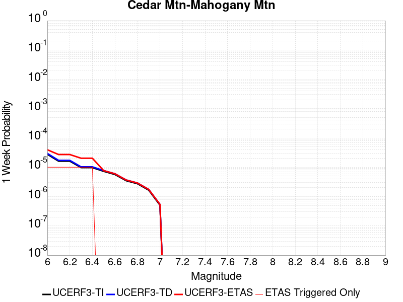 |  |  |  |

| Magnitude | 1 wk TI Prob | 1 wk TD Prob | 1 wk ETAS Prob | 1 wk ETAS/TD Gain | 1 wk ETAS Triggered Only | 1 mo TI Prob | 1 mo TD Prob | 1 mo ETAS Prob | 1 mo ETAS/TD Gain | 1 mo ETAS Triggered Only | 1 yr TI Prob | 1 yr TD Prob | 1 yr ETAS Prob | 1 yr ETAS/TD Gain | 1 yr ETAS Triggered Only | 10 yr TI Prob | 10 yr TD Prob | 10 yr ETAS Prob | 10 yr ETAS/TD Gain | 10 yr ETAS Triggered Only |
|-----|-----|-----|-----|-----|-----|-----|-----|-----|-----|-----|-----|-----|-----|-----|-----|-----|-----|-----|-----|-----|
| 6.0 | 2.7763876E-5 | 2.9589124E-5 | 3.9588827E-5 | 1.337952 | 1.0E-5 | 1.1898261E-4 | 1.2680476E-4 | 1.368035E-4 | 1.0788513 | 1.0E-5 | 0.0014476506 | 0.0015428247 | 0.0015528093 | 1.0064716 | 1.0E-5 | 0.0143825635 | 0.015328358 | 0.015338205 | 1.0006424 | 1.0E-5 |
| 6.1 | 1.6162443E-5 | 1.7143104E-5 | 2.7142933E-5 | 1.5833149 | 1.0E-5 | 6.926578E-5 | 7.346847E-5 | 8.346774E-5 | 1.1361028 | 1.0E-5 | 8.4298453E-4 | 8.9412933E-4 | 9.041204E-4 | 1.0111741 | 1.0E-5 | 0.008397939 | 0.00890713 | 0.008917041 | 1.0011127 | 1.0E-5 |
| 6.2 | 1.6162443E-5 | 1.7143104E-5 | 2.7142933E-5 | 1.5833149 | 1.0E-5 | 6.926578E-5 | 7.346847E-5 | 8.346774E-5 | 1.1361028 | 1.0E-5 | 8.4298453E-4 | 8.9412933E-4 | 9.041204E-4 | 1.0111741 | 1.0E-5 | 0.008397939 | 0.00890713 | 0.008917041 | 1.0011127 | 1.0E-5 |
| 6.3 | 9.746053E-6 | 1.030323E-5 | 2.0303127E-5 | 1.9705595 | 1.0E-5 | 4.1768133E-5 | 4.4155975E-5 | 5.4155535E-5 | 1.2264599 | 1.0E-5 | 5.0840835E-4 | 5.374705E-4 | 5.474651E-4 | 1.0185957 | 1.0E-5 | 0.0050724675 | 0.005362125 | 0.005372071 | 1.0018549 | 1.0E-5 |
| 6.4 | 9.746053E-6 | 1.030323E-5 | 2.0303127E-5 | 1.9705595 | 1.0E-5 | 4.1768133E-5 | 4.4155975E-5 | 5.4155535E-5 | 1.2264599 | 1.0E-5 | 5.0840835E-4 | 5.374705E-4 | 5.474651E-4 | 1.0185957 | 1.0E-5 | 0.0050724675 | 0.005362125 | 0.005372071 | 1.0018549 | 1.0E-5 |
| 6.5 | 7.290083E-6 | 7.695381E-6 | 7.695381E-6 | 1.0 | 0.0 | 3.124284E-5 | 3.2979802E-5 | 3.2979802E-5 | 1.0 | 0.0 | 3.8031515E-4 | 4.0145728E-4 | 4.0145728E-4 | 1.0 | 0.0 | 0.0037966494 | 0.0040075406 | 0.0040075406 | 1.0 | 0.0 |
| 6.6 | 5.67907E-6 | 5.9891963E-6 | 5.9891963E-6 | 1.0 | 0.0 | 2.4338644E-5 | 2.5667738E-5 | 2.5667738E-5 | 1.0 | 0.0 | 2.962827E-4 | 3.1246126E-4 | 3.1246126E-4 | 1.0 | 0.0 | 0.0029588798 | 0.0031203553 | 0.0031203553 | 1.0 | 0.0 |
| 6.7 | 3.4853963E-6 | 3.6726572E-6 | 3.6726572E-6 | 1.0 | 0.0 | 1.4937327E-5 | 1.5739868E-5 | 1.5739868E-5 | 1.0 | 0.0 | 1.8184677E-4 | 1.9161667E-4 | 1.9161667E-4 | 1.0 | 0.0 | 0.0018169804 | 0.0019145765 | 0.0019145765 | 1.0 | 0.0 |
| 6.8 | 2.7535168E-6 | 2.901597E-6 | 2.901597E-6 | 1.0 | 0.0 | 1.1800733E-5 | 1.2435359E-5 | 1.2435359E-5 | 1.0 | 0.0 | 1.4366445E-4 | 1.5139046E-4 | 1.5139046E-4 | 1.0 | 0.0 | 0.0014357162 | 0.0015129205 | 0.0015129205 | 1.0 | 0.0 |
| 6.9 | 1.6594106E-6 | 1.7497113E-6 | 1.7497113E-6 | 1.0 | 0.0 | 7.1117406E-6 | 7.4987424E-6 | 7.4987424E-6 | 1.0 | 0.0 | 8.6582E-5 | 9.1293674E-5 | 9.1293674E-5 | 1.0 | 0.0 | 8.654827E-4 | 9.1259216E-4 | 9.1259216E-4 | 1.0 | 0.0 |
| 7.0 | 5.10215E-7 | 5.389294E-7 | 5.389294E-7 | 1.0 | 0.0 | 2.186634E-6 | 2.3096961E-6 | 2.3096961E-6 | 1.0 | 0.0 | 2.6621943E-5 | 2.8120316E-5 | 2.8120316E-5 | 1.0 | 0.0 | 2.6618753E-4 | 2.811801E-4 | 2.811801E-4 | 1.0 | 0.0 |

## Great Valley 11
*[(top)](#table-of-contents)*

| 1 Week | 1 Month | 1 Year | 10 Year |
|-----|-----|-----|-----|
|  |  |  |  |

| Magnitude | 1 wk TI Prob | 1 wk TD Prob | 1 wk ETAS Prob | 1 wk ETAS/TD Gain | 1 wk ETAS Triggered Only | 1 mo TI Prob | 1 mo TD Prob | 1 mo ETAS Prob | 1 mo ETAS/TD Gain | 1 mo ETAS Triggered Only | 1 yr TI Prob | 1 yr TD Prob | 1 yr ETAS Prob | 1 yr ETAS/TD Gain | 1 yr ETAS Triggered Only | 10 yr TI Prob | 10 yr TD Prob | 10 yr ETAS Prob | 10 yr ETAS/TD Gain | 10 yr ETAS Triggered Only |
|-----|-----|-----|-----|-----|-----|-----|-----|-----|-----|-----|-----|-----|-----|-----|-----|-----|-----|-----|-----|-----|
| 6.0 | 2.8099583E-5 | 2.9832845E-5 | 2.9832845E-5 | 1.0 | 0.0 | 1.20421224E-4 | 1.2784921E-4 | 1.2784921E-4 | 1.0 | 0.0 | 0.0014651422 | 0.0015555277 | 0.001565512 | 1.0064187 | 1.0E-5 | 0.0145552 | 0.015453923 | 0.015473613 | 1.0012742 | 2.0E-5 |
| 6.1 | 2.483194E-5 | 2.5907739E-5 | 2.5907739E-5 | 1.0 | 0.0 | 1.0641825E-4 | 1.1102881E-4 | 1.1102881E-4 | 1.0 | 0.0 | 0.0012948721 | 0.0013510018 | 0.0013609884 | 1.0073919 | 1.0E-5 | 0.012873529 | 0.013434302 | 0.013454034 | 1.0014688 | 2.0E-5 |
| 6.2 | 2.483194E-5 | 2.5907739E-5 | 2.5907739E-5 | 1.0 | 0.0 | 1.0641825E-4 | 1.1102881E-4 | 1.1102881E-4 | 1.0 | 0.0 | 0.0012948721 | 0.0013510018 | 0.0013609884 | 1.0073919 | 1.0E-5 | 0.012873529 | 0.013434302 | 0.013454034 | 1.0014688 | 2.0E-5 |
| 6.3 | 2.0257901E-5 | 2.0399362E-5 | 2.0399362E-5 | 1.0 | 0.0 | 8.681669E-5 | 8.742315E-5 | 8.742315E-5 | 1.0 | 0.0 | 0.0010564806 | 0.001063899 | 0.0010738884 | 1.0093894 | 1.0E-5 | 0.01051472 | 0.010592245 | 0.010602138 | 1.0009341 | 1.0E-5 |
| 6.4 | 1.8054898E-5 | 1.7781249E-5 | 1.7781249E-5 | 1.0 | 0.0 | 7.737584E-5 | 7.6203345E-5 | 7.6203345E-5 | 1.0 | 0.0 | 9.416436E-4 | 9.274187E-4 | 9.374094E-4 | 1.0107726 | 1.0E-5 | 0.009376635 | 0.009239235 | 0.009249142 | 1.0010723 | 1.0E-5 |
| 6.5 | 1.34804895E-5 | 1.2321299E-5 | 1.2321299E-5 | 1.0 | 0.0 | 5.777225E-5 | 5.2804524E-5 | 5.2804524E-5 | 1.0 | 0.0 | 7.031501E-4 | 6.427096E-4 | 6.527032E-4 | 1.0155492 | 1.0E-5 | 0.007009294 | 0.0064089457 | 0.0064188815 | 1.0015503 | 1.0E-5 |
| 6.6 | 1.294883E-5 | 1.1732548E-5 | 1.1732548E-5 | 1.0 | 0.0 | 5.5493805E-5 | 5.0281404E-5 | 5.0281404E-5 | 1.0 | 0.0 | 6.754276E-4 | 6.120082E-4 | 6.220021E-4 | 1.0163296 | 1.0E-5 | 0.006733784 | 0.0061036535 | 0.0061135925 | 1.0016284 | 1.0E-5 |
| 6.7 | 1.1272237E-5 | 9.812085E-6 | 9.812085E-6 | 1.0 | 0.0 | 4.8308695E-5 | 4.205113E-5 | 4.205113E-5 | 1.0 | 0.0 | 5.879996E-4 | 5.11855E-4 | 5.218499E-4 | 1.0195268 | 1.0E-5 | 0.005864462 | 0.0051070447 | 0.0051169936 | 1.0019481 | 1.0E-5 |
| 6.8 | 9.8337505E-6 | 8.193942E-6 | 8.193942E-6 | 1.0 | 0.0 | 4.2143965E-5 | 3.5116434E-5 | 3.5116434E-5 | 1.0 | 0.0 | 5.1298196E-4 | 4.274608E-4 | 4.374565E-4 | 1.023384 | 1.0E-5 | 0.005117994 | 0.0042665955 | 0.0042765527 | 1.0023338 | 1.0E-5 |
| 6.9 | 7.4224813E-6 | 5.413251E-6 | 5.413251E-6 | 1.0 | 0.0 | 3.1810247E-5 | 2.3199449E-5 | 2.3199449E-5 | 1.0 | 0.0 | 3.872209E-4 | 2.824181E-4 | 2.9241526E-4 | 1.0353985 | 1.0E-5 | 0.0038654688 | 0.0028207325 | 0.0028307044 | 1.0035352 | 1.0E-5 |
| 7.0 | 4.4628923E-6 | 2.0111208E-6 | 2.0111208E-6 | 1.0 | 0.0 | 1.912654E-5 | 8.619061E-6 | 8.619061E-6 | 1.0 | 0.0 | 2.3284076E-4 | 1.0493213E-4 | 1.14931085E-4 | 1.0952897 | 1.0E-5 | 0.0023259693 | 0.0010488374 | 0.0010588269 | 1.0095243 | 1.0E-5 |
| 7.1 | 3.5546527E-6 | 1.1856094E-6 | 1.1856094E-6 | 1.0 | 0.0 | 1.5234136E-5 | 5.0811736E-6 | 5.0811736E-6 | 1.0 | 0.0 | 1.8545982E-4 | 6.18616E-5 | 7.186098E-5 | 1.1616411 | 1.0E-5 | 0.0018530512 | 6.1845063E-4 | 6.284444E-4 | 1.0161594 | 1.0E-5 |
| 7.2 | 3.2039936E-6 | 1.125436E-6 | 1.125436E-6 | 1.0 | 0.0 | 1.3731329E-5 | 4.823289E-6 | 4.823289E-6 | 1.0 | 0.0 | 1.671661E-4 | 5.8722027E-5 | 6.872144E-5 | 1.1702838 | 1.0E-5 | 0.0016704041 | 5.870718E-4 | 5.9706595E-4 | 1.0170237 | 1.0E-5 |
| 7.3 | 2.8120473E-6 | 1.0305815E-6 | 1.0305815E-6 | 1.0 | 0.0 | 1.2051575E-5 | 4.416771E-6 | 4.416771E-6 | 1.0 | 0.0 | 1.4671806E-4 | 5.377293E-5 | 5.377293E-5 | 1.0 | 0.0 | 0.0014662122 | 5.376058E-4 | 5.376058E-4 | 1.0 | 0.0 |
| 7.4 | 2.4837766E-6 | 9.800765E-7 | 9.800765E-7 | 1.0 | 0.0 | 1.0644713E-5 | 4.2003217E-6 | 4.2003217E-6 | 1.0 | 0.0 | 1.2959167E-4 | 5.113778E-5 | 5.113778E-5 | 1.0 | 0.0 | 0.0012951613 | 5.112667E-4 | 5.112667E-4 | 1.0 | 0.0 |
| 7.5 | 1.5002679E-6 | 6.5462535E-7 | 6.5462535E-7 | 1.0 | 0.0 | 6.4297037E-6 | 2.8055345E-6 | 2.8055345E-6 | 1.0 | 0.0 | 7.827883E-5 | 3.415689E-5 | 3.415689E-5 | 1.0 | 0.0 | 7.825126E-4 | 3.4152053E-4 | 3.4152053E-4 | 1.0 | 0.0 |

## Santa Ynez River
*[(top)](#table-of-contents)*

| 1 Week | 1 Month | 1 Year | 10 Year |
|-----|-----|-----|-----|
|  |  |  |  |

| Magnitude | 1 wk TI Prob | 1 wk TD Prob | 1 wk ETAS Prob | 1 wk ETAS/TD Gain | 1 wk ETAS Triggered Only | 1 mo TI Prob | 1 mo TD Prob | 1 mo ETAS Prob | 1 mo ETAS/TD Gain | 1 mo ETAS Triggered Only | 1 yr TI Prob | 1 yr TD Prob | 1 yr ETAS Prob | 1 yr ETAS/TD Gain | 1 yr ETAS Triggered Only | 10 yr TI Prob | 10 yr TD Prob | 10 yr ETAS Prob | 10 yr ETAS/TD Gain | 10 yr ETAS Triggered Only |
|-----|-----|-----|-----|-----|-----|-----|-----|-----|-----|-----|-----|-----|-----|-----|-----|-----|-----|-----|-----|-----|
| 6.0 | 1.6396456E-5 | 1.7209564E-5 | 1.7209564E-5 | 1.0 | 0.0 | 7.026863E-5 | 7.375339E-5 | 7.375339E-5 | 1.0 | 0.0 | 8.551848E-4 | 8.976132E-4 | 9.076042E-4 | 1.0111307 | 1.0E-5 | 0.0085190125 | 0.008943425 | 0.008963246 | 1.0022163 | 2.0E-5 |
| 6.1 | 1.6396456E-5 | 1.7209564E-5 | 1.7209564E-5 | 1.0 | 0.0 | 7.026863E-5 | 7.375339E-5 | 7.375339E-5 | 1.0 | 0.0 | 8.551848E-4 | 8.976132E-4 | 9.076042E-4 | 1.0111307 | 1.0E-5 | 0.0085190125 | 0.008943425 | 0.008963246 | 1.0022163 | 2.0E-5 |
| 6.2 | 1.6396456E-5 | 1.7209564E-5 | 1.7209564E-5 | 1.0 | 0.0 | 7.026863E-5 | 7.375339E-5 | 7.375339E-5 | 1.0 | 0.0 | 8.551848E-4 | 8.976132E-4 | 9.076042E-4 | 1.0111307 | 1.0E-5 | 0.0085190125 | 0.008943425 | 0.008963246 | 1.0022163 | 2.0E-5 |
| 6.3 | 9.736976E-6 | 1.0122399E-5 | 1.0122399E-5 | 1.0 | 0.0 | 4.172923E-5 | 4.3381016E-5 | 4.3381016E-5 | 1.0 | 0.0 | 5.0793495E-4 | 5.2804087E-4 | 5.2804087E-4 | 1.0 | 0.0 | 0.005067755 | 0.0052683675 | 0.005278315 | 1.0018882 | 1.0E-5 |
| 6.4 | 9.736976E-6 | 1.0122399E-5 | 1.0122399E-5 | 1.0 | 0.0 | 4.172923E-5 | 4.3381016E-5 | 4.3381016E-5 | 1.0 | 0.0 | 5.0793495E-4 | 5.2804087E-4 | 5.2804087E-4 | 1.0 | 0.0 | 0.005067755 | 0.0052683675 | 0.005278315 | 1.0018882 | 1.0E-5 |
| 6.5 | 7.081964E-6 | 7.3299457E-6 | 7.3299457E-6 | 1.0 | 0.0 | 3.035092E-5 | 3.1413685E-5 | 3.1413685E-5 | 1.0 | 0.0 | 3.694598E-4 | 3.8239607E-4 | 3.8239607E-4 | 1.0 | 0.0 | 0.0036884616 | 0.0038175425 | 0.0038175425 | 1.0 | 0.0 |
| 6.6 | 5.873247E-6 | 6.0597836E-6 | 6.0597836E-6 | 1.0 | 0.0 | 2.5170815E-5 | 2.5970248E-5 | 2.5970248E-5 | 1.0 | 0.0 | 3.064116E-4 | 3.1614274E-4 | 3.1614274E-4 | 1.0 | 0.0 | 0.0030598943 | 0.0031570175 | 0.0031570175 | 1.0 | 0.0 |
| 6.7 | 4.973277E-6 | 5.115936E-6 | 5.115936E-6 | 1.0 | 0.0 | 2.1313872E-5 | 2.1925258E-5 | 2.1925258E-5 | 1.0 | 0.0 | 2.5946548E-4 | 2.669078E-4 | 2.669078E-4 | 1.0 | 0.0 | 0.0025916274 | 0.002665921 | 0.002665921 | 1.0 | 0.0 |
| 6.8 | 4.396492E-6 | 4.5110087E-6 | 4.5110087E-6 | 1.0 | 0.0 | 1.884197E-5 | 1.9332752E-5 | 1.9332752E-5 | 1.0 | 0.0 | 2.2937685E-4 | 2.3535118E-4 | 2.3535118E-4 | 1.0 | 0.0 | 0.0022914023 | 0.0023510547 | 0.0023510547 | 1.0 | 0.0 |
| 6.9 | 3.5255632E-6 | 3.6013587E-6 | 3.6013587E-6 | 1.0 | 0.0 | 1.5109469E-5 | 1.5434303E-5 | 1.5434303E-5 | 1.0 | 0.0 | 1.8394225E-4 | 1.878966E-4 | 1.878966E-4 | 1.0 | 0.0 | 0.0018379007 | 0.0018773936 | 0.0018773936 | 1.0 | 0.0 |
| 7.0 | 3.211603E-6 | 3.2736775E-6 | 3.2736775E-6 | 1.0 | 0.0 | 1.376394E-5 | 1.4029972E-5 | 1.4029972E-5 | 1.0 | 0.0 | 1.6756308E-4 | 1.7080165E-4 | 1.7080165E-4 | 1.0 | 0.0 | 0.0016743679 | 0.001706718 | 0.001706718 | 1.0 | 0.0 |
| 7.1 | 2.5094619E-6 | 2.5409397E-6 | 2.5409397E-6 | 1.0 | 0.0 | 1.0754793E-5 | 1.0889697E-5 | 1.0889697E-5 | 1.0 | 0.0 | 1.3093173E-4 | 1.3257404E-4 | 1.3257404E-4 | 1.0 | 0.0 | 0.0013085462 | 0.0013249556 | 0.0013249556 | 1.0 | 0.0 |
| 7.2 | 2.0515774E-6 | 2.0619539E-6 | 2.0619539E-6 | 1.0 | 0.0 | 8.792445E-6 | 8.836915E-6 | 8.836915E-6 | 1.0 | 0.0 | 1.0704277E-4 | 1.0758417E-4 | 1.0758417E-4 | 1.0 | 0.0 | 0.0010699122 | 0.0010753252 | 0.0010753252 | 1.0 | 0.0 |
| 7.3 | 1.6845745E-6 | 1.6774045E-6 | 1.6774045E-6 | 1.0 | 0.0 | 7.219585E-6 | 7.1888567E-6 | 7.1888567E-6 | 1.0 | 0.0 | 8.78949E-5 | 8.752084E-5 | 8.752084E-5 | 1.0 | 0.0 | 8.7860145E-4 | 8.748666E-4 | 8.748666E-4 | 1.0 | 0.0 |
| 7.4 | 1.3600285E-6 | 1.3333469E-6 | 1.3333469E-6 | 1.0 | 0.0 | 5.82868E-6 | 5.714331E-6 | 5.714331E-6 | 1.0 | 0.0 | 7.096187E-5 | 6.956978E-5 | 6.956978E-5 | 1.0 | 0.0 | 7.0939213E-4 | 6.9548225E-4 | 6.9548225E-4 | 1.0 | 0.0 |
| 7.5 | 9.735342E-7 | 9.290183E-7 | 9.290183E-7 | 1.0 | 0.0 | 4.172283E-6 | 3.981501E-6 | 3.981501E-6 | 1.0 | 0.0 | 5.079636E-5 | 4.8473714E-5 | 4.8473714E-5 | 1.0 | 0.0 | 5.0784746E-4 | 4.846331E-4 | 4.846331E-4 | 1.0 | 0.0 |
| 7.6 | 5.067187E-7 | 4.778607E-7 | 4.778607E-7 | 1.0 | 0.0 | 2.1716498E-6 | 2.0479727E-6 | 2.0479727E-6 | 1.0 | 0.0 | 2.6439517E-5 | 2.493379E-5 | 2.493379E-5 | 1.0 | 0.0 | 2.643637E-4 | 2.4931066E-4 | 2.4931066E-4 | 1.0 | 0.0 |
| 7.7 | 2.769089E-7 | 2.5759311E-7 | 2.5759311E-7 | 1.0 | 0.0 | 1.1867519E-6 | 1.1039699E-6 | 1.1039699E-6 | 1.0 | 0.0 | 1.4448608E-5 | 1.3440752E-5 | 1.3440752E-5 | 1.0 | 0.0 | 1.444767E-4 | 1.3439942E-4 | 1.3439942E-4 | 1.0 | 0.0 |
| 7.8 | 1.7044663E-7 | 1.5449127E-7 | 1.5449127E-7 | 1.0 | 0.0 | 7.3048534E-7 | 6.6210526E-7 | 6.6210526E-7 | 1.0 | 0.0 | 8.893623E-6 | 8.061102E-6 | 8.061102E-6 | 1.0 | 0.0 | 8.893267E-5 | 8.0608115E-5 | 8.0608115E-5 | 1.0 | 0.0 |
| 7.9 | 4.8344287E-8 | 4.0911235E-8 | 4.0911235E-8 | 1.0 | 0.0 | 2.0718979E-7 | 1.7533385E-7 | 1.7533385E-7 | 1.0 | 0.0 | 2.5225327E-6 | 2.1346877E-6 | 2.1346877E-6 | 1.0 | 0.0 | 2.5225041E-5 | 2.1346676E-5 | 2.1346676E-5 | 1.0 | 0.0 |

## Green Valley 2011 CFM
*[(top)](#table-of-contents)*

| 1 Week | 1 Month | 1 Year | 10 Year |
|-----|-----|-----|-----|
|  |  |  |  |

| Magnitude | 1 wk TI Prob | 1 wk TD Prob | 1 wk ETAS Prob | 1 wk ETAS/TD Gain | 1 wk ETAS Triggered Only | 1 mo TI Prob | 1 mo TD Prob | 1 mo ETAS Prob | 1 mo ETAS/TD Gain | 1 mo ETAS Triggered Only | 1 yr TI Prob | 1 yr TD Prob | 1 yr ETAS Prob | 1 yr ETAS/TD Gain | 1 yr ETAS Triggered Only | 10 yr TI Prob | 10 yr TD Prob | 10 yr ETAS Prob | 10 yr ETAS/TD Gain | 10 yr ETAS Triggered Only |
|-----|-----|-----|-----|-----|-----|-----|-----|-----|-----|-----|-----|-----|-----|-----|-----|-----|-----|-----|-----|-----|
| 6.0 | 9.9629346E-5 | 1.7306181E-4 | 1.7306181E-4 | 1.0 | 0.0 | 4.2691303E-4 | 7.414477E-4 | 7.414477E-4 | 1.0 | 0.0 | 0.0051852856 | 0.00898687 | 0.00900669 | 1.0022055 | 2.0E-5 | 0.050659515 | 0.085523866 | 0.08554216 | 1.0002139 | 2.0E-5 |
| 6.1 | 9.88615E-5 | 1.7153492E-4 | 1.7153492E-4 | 1.0 | 0.0 | 4.2362334E-4 | 7.349076E-4 | 7.349076E-4 | 1.0 | 0.0 | 0.0051454236 | 0.008907897 | 0.008917808 | 1.0011126 | 1.0E-5 | 0.050279044 | 0.08481148 | 0.08482063 | 1.0001079 | 1.0E-5 |
| 6.2 | 9.696895E-5 | 1.679252E-4 | 1.679252E-4 | 1.0 | 0.0 | 4.15515E-4 | 7.1944593E-4 | 7.1944593E-4 | 1.0 | 0.0 | 0.0050471667 | 0.008721275 | 0.008731188 | 1.0011367 | 1.0E-5 | 0.04934063 | 0.08312038 | 0.083129555 | 1.0001103 | 1.0E-5 |
| 6.3 | 9.275224E-5 | 1.5971852E-4 | 1.5971852E-4 | 1.0 | 0.0 | 3.9744904E-4 | 6.842931E-4 | 6.842931E-4 | 1.0 | 0.0 | 0.0048282105 | 0.008296597 | 0.008306514 | 1.0011953 | 1.0E-5 | 0.047246475 | 0.07925882 | 0.07926803 | 1.0001161 | 1.0E-5 |
| 6.4 | 8.391499E-5 | 1.4368363E-4 | 1.4368363E-4 | 1.0 | 0.0 | 3.595861E-4 | 6.156491E-4 | 6.156491E-4 | 1.0 | 0.0 | 0.004369175 | 0.007467232 | 0.0074771573 | 1.0013292 | 1.0E-5 | 0.04284265 | 0.07163251 | 0.071641795 | 1.0001296 | 1.0E-5 |
| 6.5 | 5.9519385E-5 | 9.9345336E-5 | 9.9345336E-5 | 1.0 | 0.0 | 2.5505814E-4 | 4.257004E-4 | 4.257004E-4 | 1.0 | 0.0 | 0.0031009112 | 0.0051684165 | 0.0051684165 | 1.0 | 0.0 | 0.030579966 | 0.050147217 | 0.050147217 | 1.0 | 0.0 |
| 6.6 | 4.5361558E-5 | 7.4029726E-5 | 7.4029726E-5 | 1.0 | 0.0 | 1.9439218E-4 | 3.1723455E-4 | 3.1723455E-4 | 1.0 | 0.0 | 0.0023641558 | 0.003854048 | 0.003854048 | 1.0 | 0.0 | 0.023391623 | 0.03766713 | 0.03766713 | 1.0 | 0.0 |
| 6.7 | 3.8808106E-5 | 6.265495E-5 | 6.265495E-5 | 1.0 | 0.0 | 1.6630985E-4 | 2.684962E-4 | 2.684962E-4 | 1.0 | 0.0 | 0.0020229418 | 0.003262755 | 0.003262755 | 1.0 | 0.0 | 0.020046256 | 0.03200691 | 0.03200691 | 1.0 | 0.0 |
| 6.8 | 2.2284667E-5 | 3.1285566E-5 | 3.1285566E-5 | 1.0 | 0.0 | 9.550222E-5 | 1.340742E-4 | 1.340742E-4 | 1.0 | 0.0 | 0.0011621192 | 0.001631124 | 0.001631124 | 1.0 | 0.0 | 0.011560607 | 0.016166156 | 0.016166156 | 1.0 | 0.0 |
| 6.9 | 1.8050168E-5 | 2.4448267E-5 | 2.4448267E-5 | 1.0 | 0.0 | 7.735557E-5 | 1.0477412E-4 | 1.0477412E-4 | 1.0 | 0.0 | 9.4139716E-4 | 0.001274882 | 0.001274882 | 1.0 | 0.0 | 0.009374191 | 0.01266794 | 0.01266794 | 1.0 | 0.0 |
| 7.0 | 1.4763166E-5 | 1.958302E-5 | 1.958302E-5 | 1.0 | 0.0 | 6.326917E-5 | 8.392455E-5 | 8.392455E-5 | 1.0 | 0.0 | 7.7002996E-4 | 0.0010213053 | 0.0010213053 | 1.0 | 0.0 | 0.007673672 | 0.010165428 | 0.010165428 | 1.0 | 0.0 |
| 7.1 | 1.2399713E-5 | 1.630385E-5 | 1.630385E-5 | 1.0 | 0.0 | 5.3140546E-5 | 6.987178E-5 | 6.987178E-5 | 1.0 | 0.0 | 6.467941E-4 | 8.5035886E-4 | 8.5035886E-4 | 1.0 | 0.0 | 0.006449148 | 0.008471329 | 0.008471329 | 1.0 | 0.0 |
| 7.2 | 1.0584195E-5 | 1.3921863E-5 | 1.3921863E-5 | 1.0 | 0.0 | 4.5360044E-5 | 5.9663773E-5 | 5.9663773E-5 | 1.0 | 0.0 | 5.521186E-4 | 7.2616595E-4 | 7.2616595E-4 | 1.0 | 0.0 | 0.0055074887 | 0.0072383475 | 0.0072383475 | 1.0 | 0.0 |
| 7.3 | 7.998173E-6 | 1.054412E-5 | 1.054412E-5 | 1.0 | 0.0 | 3.4277433E-5 | 4.5188313E-5 | 4.5188313E-5 | 1.0 | 0.0 | 4.1724785E-4 | 5.500299E-4 | 5.500299E-4 | 1.0 | 0.0 | 0.004164653 | 0.0054869517 | 0.0054869517 | 1.0 | 0.0 |
| 7.4 | 6.7571127E-6 | 8.932785E-6 | 8.932785E-6 | 1.0 | 0.0 | 2.8958733E-5 | 3.8282808E-5 | 3.8282808E-5 | 1.0 | 0.0 | 3.5251552E-4 | 4.6599447E-4 | 4.6599447E-4 | 1.0 | 0.0 | 0.0035195686 | 0.0046503763 | 0.0046503763 | 1.0 | 0.0 |
| 7.5 | 5.69878E-6 | 7.5163775E-6 | 7.5163775E-6 | 1.0 | 0.0 | 2.4423114E-5 | 3.2212654E-5 | 3.2212654E-5 | 1.0 | 0.0 | 2.9731085E-4 | 3.9211934E-4 | 3.9211934E-4 | 1.0 | 0.0 | 0.002969134 | 0.0039144265 | 0.0039144265 | 1.0 | 0.0 |
| 7.6 | 4.503664E-6 | 5.9357344E-6 | 5.9357344E-6 | 1.0 | 0.0 | 1.9301275E-5 | 2.5438618E-5 | 2.5438618E-5 | 1.0 | 0.0 | 2.3496768E-4 | 3.09672E-4 | 3.09672E-4 | 1.0 | 0.0 | 0.002347194 | 0.0030925297 | 0.0030925297 | 1.0 | 0.0 |
| 7.7 | 1.0873546E-6 | 1.4107108E-6 | 1.4107108E-6 | 1.0 | 0.0 | 4.6600826E-6 | 6.0458897E-6 | 6.0458897E-6 | 1.0 | 0.0 | 5.6735033E-5 | 7.360625E-5 | 7.360625E-5 | 1.0 | 0.0 | 5.672055E-4 | 7.3582074E-4 | 7.3582074E-4 | 1.0 | 0.0 |
| 7.8 | 4.9373917E-8 | 6.177787E-8 | 6.177787E-8 | 1.0 | 0.0 | 2.1160248E-7 | 2.6476226E-7 | 2.6476226E-7 | 1.0 | 0.0 | 2.5762572E-6 | 3.223477E-6 | 3.223477E-6 | 1.0 | 0.0 | 2.5762274E-5 | 3.223268E-5 | 3.223268E-5 | 1.0 | 0.0 |

## Santa Monica alt 1
*[(top)](#table-of-contents)*

| 1 Week | 1 Month | 1 Year | 10 Year |
|-----|-----|-----|-----|
|  |  |  |  |

| Magnitude | 1 wk TI Prob | 1 wk TD Prob | 1 wk ETAS Prob | 1 wk ETAS/TD Gain | 1 wk ETAS Triggered Only | 1 mo TI Prob | 1 mo TD Prob | 1 mo ETAS Prob | 1 mo ETAS/TD Gain | 1 mo ETAS Triggered Only | 1 yr TI Prob | 1 yr TD Prob | 1 yr ETAS Prob | 1 yr ETAS/TD Gain | 1 yr ETAS Triggered Only | 10 yr TI Prob | 10 yr TD Prob | 10 yr ETAS Prob | 10 yr ETAS/TD Gain | 10 yr ETAS Triggered Only |
|-----|-----|-----|-----|-----|-----|-----|-----|-----|-----|-----|-----|-----|-----|-----|-----|-----|-----|-----|-----|-----|
| 6.0 | 1.1066008E-5 | 1.1480435E-5 | 1.1480435E-5 | 1.0 | 0.0 | 4.742488E-5 | 4.920102E-5 | 4.920102E-5 | 1.0 | 0.0 | 5.7724497E-4 | 5.988717E-4 | 6.088657E-4 | 1.0166881 | 1.0E-5 | 0.005757478 | 0.0059739654 | 0.005993846 | 1.0033278 | 2.0E-5 |
| 6.1 | 1.1066008E-5 | 1.1480435E-5 | 1.1480435E-5 | 1.0 | 0.0 | 4.742488E-5 | 4.920102E-5 | 4.920102E-5 | 1.0 | 0.0 | 5.7724497E-4 | 5.988717E-4 | 6.088657E-4 | 1.0166881 | 1.0E-5 | 0.005757478 | 0.0059739654 | 0.005993846 | 1.0033278 | 2.0E-5 |
| 6.2 | 1.1066008E-5 | 1.1480435E-5 | 1.1480435E-5 | 1.0 | 0.0 | 4.742488E-5 | 4.920102E-5 | 4.920102E-5 | 1.0 | 0.0 | 5.7724497E-4 | 5.988717E-4 | 6.088657E-4 | 1.0166881 | 1.0E-5 | 0.005757478 | 0.0059739654 | 0.005993846 | 1.0033278 | 2.0E-5 |
| 6.3 | 1.1066008E-5 | 1.1480435E-5 | 1.1480435E-5 | 1.0 | 0.0 | 4.742488E-5 | 4.920102E-5 | 4.920102E-5 | 1.0 | 0.0 | 5.7724497E-4 | 5.988717E-4 | 6.088657E-4 | 1.0166881 | 1.0E-5 | 0.005757478 | 0.0059739654 | 0.005993846 | 1.0033278 | 2.0E-5 |
| 6.4 | 1.1066008E-5 | 1.1480435E-5 | 1.1480435E-5 | 1.0 | 0.0 | 4.742488E-5 | 4.920102E-5 | 4.920102E-5 | 1.0 | 0.0 | 5.7724497E-4 | 5.988717E-4 | 6.088657E-4 | 1.0166881 | 1.0E-5 | 0.005757478 | 0.0059739654 | 0.005993846 | 1.0033278 | 2.0E-5 |
| 6.5 | 8.183544E-6 | 8.335519E-6 | 8.335519E-6 | 1.0 | 0.0 | 3.5071862E-5 | 3.5723173E-5 | 3.5723173E-5 | 1.0 | 0.0 | 4.2691626E-4 | 4.348444E-4 | 4.4484006E-4 | 1.0229868 | 1.0E-5 | 0.0042609703 | 0.004340101 | 0.004360014 | 1.0045882 | 2.0E-5 |
| 6.6 | 8.1543285E-6 | 8.303733E-6 | 8.303733E-6 | 1.0 | 0.0 | 3.4946657E-5 | 3.558695E-5 | 3.558695E-5 | 1.0 | 0.0 | 4.2539247E-4 | 4.3318656E-4 | 4.4318225E-4 | 1.0230747 | 1.0E-5 | 0.0042457907 | 0.0043235873 | 0.004343501 | 1.0046058 | 2.0E-5 |
| 6.7 | 8.110878E-6 | 8.257129E-6 | 8.257129E-6 | 1.0 | 0.0 | 3.4760444E-5 | 3.5387224E-5 | 3.5387224E-5 | 1.0 | 0.0 | 4.231262E-4 | 4.3075587E-4 | 4.4075158E-4 | 1.023205 | 1.0E-5 | 0.0042232145 | 0.0042993743 | 0.0043192883 | 1.0046319 | 2.0E-5 |
| 6.8 | 7.644036E-6 | 7.751141E-6 | 7.751141E-6 | 1.0 | 0.0 | 3.275974E-5 | 3.3218763E-5 | 3.3218763E-5 | 1.0 | 0.0 | 3.9877684E-4 | 4.0436478E-4 | 4.1436075E-4 | 1.0247202 | 1.0E-5 | 0.00398062 | 0.0040364363 | 0.004056356 | 1.0049349 | 2.0E-5 |
| 6.9 | 7.3698293E-6 | 7.455797E-6 | 7.455797E-6 | 1.0 | 0.0 | 3.15846E-5 | 3.1953034E-5 | 3.1953034E-5 | 1.0 | 0.0 | 3.8447464E-4 | 3.8896012E-4 | 3.9895624E-4 | 1.0256996 | 1.0E-5 | 0.0038381014 | 0.003882937 | 0.0039028593 | 1.0051308 | 2.0E-5 |
| 7.0 | 7.209872E-6 | 7.285702E-6 | 7.285702E-6 | 1.0 | 0.0 | 3.0899086E-5 | 3.1224074E-5 | 3.1224074E-5 | 1.0 | 0.0 | 3.7613141E-4 | 3.8008817E-4 | 3.9008434E-4 | 1.0262997 | 1.0E-5 | 0.0037549543 | 0.0037945234 | 0.0038144474 | 1.0052508 | 2.0E-5 |
| 7.1 | 5.603456E-6 | 5.523946E-6 | 5.523946E-6 | 1.0 | 0.0 | 2.4014591E-5 | 2.3673843E-5 | 2.3673843E-5 | 1.0 | 0.0 | 2.923384E-4 | 2.881913E-4 | 2.9818842E-4 | 1.0346892 | 1.0E-5 | 0.0029195412 | 0.0028782175 | 0.00289816 | 1.0069288 | 2.0E-5 |
| 7.2 | 4.7483613E-6 | 4.591175E-6 | 4.591175E-6 | 1.0 | 0.0 | 2.0349962E-5 | 1.9676318E-5 | 1.9676318E-5 | 1.0 | 0.0 | 2.4773262E-4 | 2.3953296E-4 | 2.4953057E-4 | 1.0417379 | 1.0E-5 | 0.0024745662 | 0.0023927619 | 0.002412714 | 1.0083386 | 2.0E-5 |
| 7.3 | 3.829015E-6 | 3.6342587E-6 | 3.6342587E-6 | 1.0 | 0.0 | 1.6409962E-5 | 1.5575302E-5 | 1.5575302E-5 | 1.0 | 0.0 | 1.9977297E-4 | 1.8961288E-4 | 1.8961288E-4 | 1.0 | 0.0 | 0.0019959346 | 0.0018945198 | 0.0019045009 | 1.0052683 | 1.0E-5 |
| 7.4 | 2.610755E-6 | 2.499595E-6 | 2.499595E-6 | 1.0 | 0.0 | 1.1188902E-5 | 1.0712507E-5 | 1.0712507E-5 | 1.0 | 0.0 | 1.3621636E-4 | 1.30417E-4 | 1.30417E-4 | 1.0 | 0.0 | 0.001361329 | 0.0013034091 | 0.0013034091 | 1.0 | 0.0 |
| 7.5 | 1.792146E-6 | 1.7584358E-6 | 1.7584358E-6 | 1.0 | 0.0 | 7.680603E-6 | 7.5361318E-6 | 7.5361318E-6 | 1.0 | 0.0 | 9.3507326E-5 | 9.1748574E-5 | 9.1748574E-5 | 1.0 | 0.0 | 9.3467993E-4 | 9.171101E-4 | 9.171101E-4 | 1.0 | 0.0 |
| 7.6 | 1.1473018E-6 | 1.1029267E-6 | 1.1029267E-6 | 1.0 | 0.0 | 4.9169985E-6 | 4.7268204E-6 | 4.7268204E-6 | 1.0 | 0.0 | 5.986281E-5 | 5.7547535E-5 | 5.7547535E-5 | 1.0 | 0.0 | 5.984669E-4 | 5.7532795E-4 | 5.7532795E-4 | 1.0 | 0.0 |
| 7.7 | 5.330919E-7 | 4.74532E-7 | 4.74532E-7 | 1.0 | 0.0 | 2.2846775E-6 | 2.033707E-6 | 2.033707E-6 | 1.0 | 0.0 | 2.7815593E-5 | 2.4760113E-5 | 2.4760113E-5 | 1.0 | 0.0 | 2.7812112E-4 | 2.4757467E-4 | 2.4757467E-4 | 1.0 | 0.0 |
| 7.8 | 1.1668574E-7 | 8.2969436E-8 | 8.2969436E-8 | 1.0 | 0.0 | 5.000816E-7 | 3.5558327E-7 | 3.5558327E-7 | 1.0 | 0.0 | 6.0884768E-6 | 4.329218E-6 | 4.329218E-6 | 1.0 | 0.0 | 6.08831E-5 | 4.3291366E-5 | 4.3291366E-5 | 1.0 | 0.0 |
| 7.9 | 8.007447E-10 | 6.160915E-10 | 6.160915E-10 | 1.0 | 0.0 | 3.4317629E-9 | 2.6403923E-9 | 2.6403923E-9 | 1.0 | 0.0 | 4.1781714E-8 | 3.2146776E-8 | 3.2146776E-8 | 1.0 | 0.0 | 4.1781706E-7 | 3.2146772E-7 | 3.2146772E-7 | 1.0 | 0.0 |

## San Diego Trough south
*[(top)](#table-of-contents)*

| 1 Week | 1 Month | 1 Year | 10 Year |
|-----|-----|-----|-----|
|  |  |  |  |

| Magnitude | 1 wk TI Prob | 1 wk TD Prob | 1 wk ETAS Prob | 1 wk ETAS/TD Gain | 1 wk ETAS Triggered Only | 1 mo TI Prob | 1 mo TD Prob | 1 mo ETAS Prob | 1 mo ETAS/TD Gain | 1 mo ETAS Triggered Only | 1 yr TI Prob | 1 yr TD Prob | 1 yr ETAS Prob | 1 yr ETAS/TD Gain | 1 yr ETAS Triggered Only | 10 yr TI Prob | 10 yr TD Prob | 10 yr ETAS Prob | 10 yr ETAS/TD Gain | 10 yr ETAS Triggered Only |
|-----|-----|-----|-----|-----|-----|-----|-----|-----|-----|-----|-----|-----|-----|-----|-----|-----|-----|-----|-----|-----|
| 6.0 | 8.279495E-5 | 1.0424506E-4 | 1.0424506E-4 | 1.0 | 0.0 | 3.5478722E-4 | 4.4669298E-4 | 4.5668852E-4 | 1.0223768 | 1.0E-5 | 0.004310982 | 0.005425812 | 0.0054357583 | 1.0018331 | 1.0E-5 | 0.042283054 | 0.052993916 | 0.053012855 | 1.0003574 | 2.0E-5 |
| 6.1 | 4.6961468E-5 | 5.7731268E-5 | 5.7731268E-5 | 1.0 | 0.0 | 2.0124791E-4 | 2.4739723E-4 | 2.4739723E-4 | 1.0 | 0.0 | 0.00244744 | 0.0030080716 | 0.0030080716 | 1.0 | 0.0 | 0.024206603 | 0.029680338 | 0.029680338 | 1.0 | 0.0 |
| 6.2 | 3.5079658E-5 | 4.2142692E-5 | 4.2142692E-5 | 1.0 | 0.0 | 1.5033272E-4 | 1.805993E-4 | 1.805993E-4 | 1.0 | 0.0 | 0.0018287642 | 0.002196623 | 0.002196623 | 1.0 | 0.0 | 0.018137876 | 0.021751693 | 0.021751693 | 1.0 | 0.0 |
| 6.3 | 3.5079658E-5 | 4.2142692E-5 | 4.2142692E-5 | 1.0 | 0.0 | 1.5033272E-4 | 1.805993E-4 | 1.805993E-4 | 1.0 | 0.0 | 0.0018287642 | 0.002196623 | 0.002196623 | 1.0 | 0.0 | 0.018137876 | 0.021751693 | 0.021751693 | 1.0 | 0.0 |
| 6.4 | 2.7196904E-5 | 3.2087937E-5 | 3.2087937E-5 | 1.0 | 0.0 | 1.16552954E-4 | 1.3751259E-4 | 1.3751259E-4 | 1.0 | 0.0 | 0.0014181085 | 0.0016729443 | 0.0016729443 | 1.0 | 0.0 | 0.014090929 | 0.016605038 | 0.016605038 | 1.0 | 0.0 |
| 6.5 | 2.5584688E-5 | 3.0102354E-5 | 3.0102354E-5 | 1.0 | 0.0 | 1.0964406E-4 | 1.2900379E-4 | 1.2900379E-4 | 1.0 | 0.0 | 0.0013340989 | 0.0015695024 | 0.0015695024 | 1.0 | 0.0 | 0.013261181 | 0.015585679 | 0.015585679 | 1.0 | 0.0 |
| 6.6 | 2.2034688E-5 | 2.5743318E-5 | 2.5743318E-5 | 1.0 | 0.0 | 9.443096E-5 | 1.1032389E-4 | 1.1032389E-4 | 1.0 | 0.0 | 0.0011490905 | 0.0013423724 | 0.0013423724 | 1.0 | 0.0 | 0.011431668 | 0.013343615 | 0.013343615 | 1.0 | 0.0 |
| 6.7 | 1.9394853E-5 | 2.2542248E-5 | 2.2542248E-5 | 1.0 | 0.0 | 8.311815E-5 | 9.660609E-5 | 9.660609E-5 | 1.0 | 0.0 | 0.0010114936 | 0.0011755497 | 0.0011755497 | 1.0 | 0.0 | 0.01006902 | 0.011694018 | 0.011694018 | 1.0 | 0.0 |
| 6.8 | 1.7615313E-5 | 2.0403613E-5 | 2.0403613E-5 | 1.0 | 0.0 | 7.549201E-5 | 8.744115E-5 | 8.744115E-5 | 1.0 | 0.0 | 9.1872766E-4 | 0.0010640804 | 0.0010640804 | 1.0 | 0.0 | 0.009149387 | 0.01059042 | 0.01059042 | 1.0 | 0.0 |
| 6.9 | 1.5621423E-5 | 1.8026485E-5 | 1.8026485E-5 | 1.0 | 0.0 | 6.6947236E-5 | 7.7254095E-5 | 7.7254095E-5 | 1.0 | 0.0 | 8.147778E-4 | 9.4016624E-4 | 9.4016624E-4 | 1.0 | 0.0 | 0.008117969 | 0.0093623325 | 0.0093623325 | 1.0 | 0.0 |
| 7.0 | 1.3444376E-5 | 1.5448395E-5 | 1.5448395E-5 | 1.0 | 0.0 | 5.7617483E-5 | 6.620574E-5 | 6.620574E-5 | 1.0 | 0.0 | 7.0126704E-4 | 8.057596E-4 | 8.057596E-4 | 1.0 | 0.0 | 0.006990582 | 0.008028714 | 0.008028714 | 1.0 | 0.0 |
| 7.1 | 1.2268361E-5 | 1.40733055E-5 | 1.40733055E-5 | 1.0 | 0.0 | 5.2577634E-5 | 6.031279E-5 | 6.031279E-5 | 1.0 | 0.0 | 6.399447E-4 | 7.3406345E-4 | 7.3406345E-4 | 1.0 | 0.0 | 0.0063810493 | 0.007316692 | 0.007316692 | 1.0 | 0.0 |
| 7.2 | 1.0922655E-5 | 1.2513806E-5 | 1.2513806E-5 | 1.0 | 0.0 | 4.681054E-5 | 5.362951E-5 | 5.362951E-5 | 1.0 | 0.0 | 5.697693E-4 | 6.527462E-4 | 6.527462E-4 | 1.0 | 0.0 | 0.0056831064 | 0.0065085697 | 0.0065085697 | 1.0 | 0.0 |
| 7.3 | 6.1106753E-6 | 6.9290486E-6 | 6.9290486E-6 | 1.0 | 0.0 | 2.6188345E-5 | 2.9695586E-5 | 2.9695586E-5 | 1.0 | 0.0 | 3.1879646E-4 | 3.6148418E-4 | 3.6148418E-4 | 1.0 | 0.0 | 0.0031833951 | 0.0036090072 | 0.0036090072 | 1.0 | 0.0 |
| 7.4 | 4.933187E-6 | 5.5896517E-6 | 5.5896517E-6 | 1.0 | 0.0 | 2.114206E-5 | 2.3955432E-5 | 2.3955432E-5 | 1.0 | 0.0 | 2.5737417E-4 | 2.9161875E-4 | 2.9161875E-4 | 1.0 | 0.0 | 0.002570763 | 0.002912402 | 0.002912402 | 1.0 | 0.0 |
| 7.5 | 1.7489613E-6 | 1.9697113E-6 | 1.9697113E-6 | 1.0 | 0.0 | 7.495527E-6 | 8.441594E-6 | 8.441594E-6 | 1.0 | 0.0 | 9.125422E-5 | 1.0277178E-4 | 1.0277178E-4 | 1.0 | 0.0 | 9.1216754E-4 | 0.0010272645 | 0.0010272645 | 1.0 | 0.0 |
| 7.6 | 1.6988751E-7 | 1.7533898E-7 | 1.7533898E-7 | 1.0 | 0.0 | 7.2808916E-7 | 7.5145255E-7 | 7.5145255E-7 | 1.0 | 0.0 | 8.864449E-6 | 9.148898E-6 | 9.148898E-6 | 1.0 | 0.0 | 8.8640954E-5 | 9.148542E-5 | 9.148542E-5 | 1.0 | 0.0 |

## Pine Mtn
*[(top)](#table-of-contents)*

| 1 Week | 1 Month | 1 Year | 10 Year |
|-----|-----|-----|-----|
|  |  |  |  |

| Magnitude | 1 wk TI Prob | 1 wk TD Prob | 1 wk ETAS Prob | 1 wk ETAS/TD Gain | 1 wk ETAS Triggered Only | 1 mo TI Prob | 1 mo TD Prob | 1 mo ETAS Prob | 1 mo ETAS/TD Gain | 1 mo ETAS Triggered Only | 1 yr TI Prob | 1 yr TD Prob | 1 yr ETAS Prob | 1 yr ETAS/TD Gain | 1 yr ETAS Triggered Only | 10 yr TI Prob | 10 yr TD Prob | 10 yr ETAS Prob | 10 yr ETAS/TD Gain | 10 yr ETAS Triggered Only |
|-----|-----|-----|-----|-----|-----|-----|-----|-----|-----|-----|-----|-----|-----|-----|-----|-----|-----|-----|-----|-----|
| 6.0 | 6.894797E-6 | 7.2255634E-6 | 7.2255634E-6 | 1.0 | 0.0 | 2.9548795E-5 | 3.0966352E-5 | 3.0966352E-5 | 1.0 | 0.0 | 3.596972E-4 | 3.7695307E-4 | 3.869493E-4 | 1.0265185 | 1.0E-5 | 0.0035911554 | 0.0037634342 | 0.003783359 | 1.0052943 | 2.0E-5 |
| 6.1 | 6.894797E-6 | 7.2255634E-6 | 7.2255634E-6 | 1.0 | 0.0 | 2.9548795E-5 | 3.0966352E-5 | 3.0966352E-5 | 1.0 | 0.0 | 3.596972E-4 | 3.7695307E-4 | 3.869493E-4 | 1.0265185 | 1.0E-5 | 0.0035911554 | 0.0037634342 | 0.003783359 | 1.0052943 | 2.0E-5 |
| 6.2 | 6.894797E-6 | 7.2255634E-6 | 7.2255634E-6 | 1.0 | 0.0 | 2.9548795E-5 | 3.0966352E-5 | 3.0966352E-5 | 1.0 | 0.0 | 3.596972E-4 | 3.7695307E-4 | 3.869493E-4 | 1.0265185 | 1.0E-5 | 0.0035911554 | 0.0037634342 | 0.003783359 | 1.0052943 | 2.0E-5 |
| 6.3 | 6.894797E-6 | 7.2255634E-6 | 7.2255634E-6 | 1.0 | 0.0 | 2.9548795E-5 | 3.0966352E-5 | 3.0966352E-5 | 1.0 | 0.0 | 3.596972E-4 | 3.7695307E-4 | 3.869493E-4 | 1.0265185 | 1.0E-5 | 0.0035911554 | 0.0037634342 | 0.003783359 | 1.0052943 | 2.0E-5 |
| 6.4 | 6.894797E-6 | 7.2255634E-6 | 7.2255634E-6 | 1.0 | 0.0 | 2.9548795E-5 | 3.0966352E-5 | 3.0966352E-5 | 1.0 | 0.0 | 3.596972E-4 | 3.7695307E-4 | 3.869493E-4 | 1.0265185 | 1.0E-5 | 0.0035911554 | 0.0037634342 | 0.003783359 | 1.0052943 | 2.0E-5 |
| 6.5 | 6.894797E-6 | 7.2255634E-6 | 7.2255634E-6 | 1.0 | 0.0 | 2.9548795E-5 | 3.0966352E-5 | 3.0966352E-5 | 1.0 | 0.0 | 3.596972E-4 | 3.7695307E-4 | 3.869493E-4 | 1.0265185 | 1.0E-5 | 0.0035911554 | 0.0037634342 | 0.003783359 | 1.0052943 | 2.0E-5 |
| 6.6 | 6.894797E-6 | 7.2255634E-6 | 7.2255634E-6 | 1.0 | 0.0 | 2.9548795E-5 | 3.0966352E-5 | 3.0966352E-5 | 1.0 | 0.0 | 3.596972E-4 | 3.7695307E-4 | 3.869493E-4 | 1.0265185 | 1.0E-5 | 0.0035911554 | 0.0037634342 | 0.003783359 | 1.0052943 | 2.0E-5 |
| 6.7 | 6.0867933E-6 | 6.397213E-6 | 6.397213E-6 | 1.0 | 0.0 | 2.6085996E-5 | 2.741635E-5 | 2.741635E-5 | 1.0 | 0.0 | 3.1755073E-4 | 3.3374512E-4 | 3.437418E-4 | 1.029953 | 1.0E-5 | 0.0031709734 | 0.0033326582 | 0.0033426248 | 1.0029906 | 1.0E-5 |
| 6.8 | 5.6530425E-6 | 5.9506933E-6 | 5.9506933E-6 | 1.0 | 0.0 | 2.42271E-5 | 2.5502733E-5 | 2.5502733E-5 | 1.0 | 0.0 | 2.94925E-4 | 3.104536E-4 | 3.204505E-4 | 1.0322009 | 1.0E-5 | 0.002945339 | 0.0031004036 | 0.0031103727 | 1.0032154 | 1.0E-5 |
| 6.9 | 4.6015225E-6 | 4.8639267E-6 | 4.8639267E-6 | 1.0 | 0.0 | 1.9720663E-5 | 2.0845242E-5 | 2.0845242E-5 | 1.0 | 0.0 | 2.4007261E-4 | 2.5376273E-4 | 2.637602E-4 | 1.0393969 | 1.0E-5 | 0.0023981342 | 0.0025348738 | 0.0025448485 | 1.003935 | 1.0E-5 |
| 7.0 | 4.4875965E-6 | 4.7475655E-6 | 4.7475655E-6 | 1.0 | 0.0 | 1.9232413E-5 | 2.0346559E-5 | 2.0346559E-5 | 1.0 | 0.0 | 2.3412947E-4 | 2.4769266E-4 | 2.5769018E-4 | 1.0403626 | 1.0E-5 | 0.0023388295 | 0.0024743096 | 0.0024842848 | 1.0040315 | 1.0E-5 |
| 7.1 | 3.203907E-6 | 3.4294974E-6 | 3.4294974E-6 | 1.0 | 0.0 | 1.3730958E-5 | 1.4697767E-5 | 1.4697767E-5 | 1.0 | 0.0 | 1.6716159E-4 | 1.7893128E-4 | 1.889295E-4 | 1.0558773 | 1.0E-5 | 0.0016703589 | 0.0017879383 | 0.0017979204 | 1.005583 | 1.0E-5 |
| 7.2 | 2.2060601E-6 | 2.3785535E-6 | 2.3785535E-6 | 1.0 | 0.0 | 9.4545085E-6 | 1.0193763E-5 | 1.0193763E-5 | 1.0 | 0.0 | 1.15102564E-4 | 1.2410246E-4 | 1.3410121E-4 | 1.0805686 | 1.0E-5 | 0.0011504296 | 0.0012403764 | 0.0012503639 | 1.0080521 | 1.0E-5 |
| 7.3 | 1.3765207E-6 | 1.5217128E-6 | 1.5217128E-6 | 1.0 | 0.0 | 5.899361E-6 | 6.52161E-6 | 6.52161E-6 | 1.0 | 0.0 | 7.182235E-5 | 7.93978E-5 | 7.93978E-5 | 1.0 | 0.0 | 7.1799144E-4 | 7.937035E-4 | 7.937035E-4 | 1.0 | 0.0 |
| 7.4 | 1.1245983E-6 | 1.2587657E-6 | 1.2587657E-6 | 1.0 | 0.0 | 4.819698E-6 | 5.3946997E-6 | 5.3946997E-6 | 1.0 | 0.0 | 5.8678244E-5 | 6.567857E-5 | 6.567857E-5 | 1.0 | 0.0 | 5.866275E-4 | 6.5659994E-4 | 6.5659994E-4 | 1.0 | 0.0 |
| 7.5 | 8.031682E-7 | 9.277495E-7 | 9.277495E-7 | 1.0 | 0.0 | 3.4421448E-6 | 3.9760635E-6 | 3.9760635E-6 | 1.0 | 0.0 | 4.1907308E-5 | 4.8407568E-5 | 4.8407568E-5 | 1.0 | 0.0 | 4.1899405E-4 | 4.83977E-4 | 4.83977E-4 | 1.0 | 0.0 |
| 7.6 | 4.8953444E-7 | 6.0034915E-7 | 6.0034915E-7 | 1.0 | 0.0 | 2.098003E-6 | 2.5729225E-6 | 2.5729225E-6 | 1.0 | 0.0 | 2.5542888E-5 | 3.1324933E-5 | 3.1324933E-5 | 1.0 | 0.0 | 2.5539953E-4 | 3.1321004E-4 | 3.1321004E-4 | 1.0 | 0.0 |
| 7.7 | 6.634529E-8 | 6.788847E-8 | 6.788847E-8 | 1.0 | 0.0 | 2.843369E-7 | 2.9095054E-7 | 2.9095054E-7 | 1.0 | 0.0 | 3.4617963E-6 | 3.5423177E-6 | 3.5423177E-6 | 1.0 | 0.0 | 3.4617424E-5 | 3.542266E-5 | 3.542266E-5 | 1.0 | 0.0 |
| 7.8 | 9.235578E-9 | 9.488601E-9 | 9.488601E-9 | 1.0 | 0.0 | 3.9581046E-8 | 4.0665434E-8 | 4.0665434E-8 | 1.0 | 0.0 | 4.818991E-7 | 4.951016E-7 | 4.951016E-7 | 1.0 | 0.0 | 4.8189804E-6 | 4.9510063E-6 | 4.9510063E-6 | 1.0 | 0.0 |

## San Andreas (Offshore) 2011 CFM
*[(top)](#table-of-contents)*

| 1 Week | 1 Month | 1 Year | 10 Year |
|-----|-----|-----|-----|
|  |  |  |  |

| Magnitude | 1 wk TI Prob | 1 wk TD Prob | 1 wk ETAS Prob | 1 wk ETAS/TD Gain | 1 wk ETAS Triggered Only | 1 mo TI Prob | 1 mo TD Prob | 1 mo ETAS Prob | 1 mo ETAS/TD Gain | 1 mo ETAS Triggered Only | 1 yr TI Prob | 1 yr TD Prob | 1 yr ETAS Prob | 1 yr ETAS/TD Gain | 1 yr ETAS Triggered Only | 10 yr TI Prob | 10 yr TD Prob | 10 yr ETAS Prob | 10 yr ETAS/TD Gain | 10 yr ETAS Triggered Only |
|-----|-----|-----|-----|-----|-----|-----|-----|-----|-----|-----|-----|-----|-----|-----|-----|-----|-----|-----|-----|-----|
| 6.0 | 1.7072787E-4 | 1.9230456E-4 | 1.9230456E-4 | 1.0 | 0.0 | 7.3148566E-4 | 8.2390447E-4 | 8.2390447E-4 | 1.0 | 0.0 | 0.008869528 | 0.009985414 | 0.009985414 | 1.0 | 0.0 | 0.085237645 | 0.09684723 | 0.09685626 | 1.0000932 | 1.0E-5 |
| 6.1 | 1.7072787E-4 | 1.9230456E-4 | 1.9230456E-4 | 1.0 | 0.0 | 7.3148566E-4 | 8.2390447E-4 | 8.2390447E-4 | 1.0 | 0.0 | 0.008869528 | 0.009985414 | 0.009985414 | 1.0 | 0.0 | 0.085237645 | 0.09684723 | 0.09685626 | 1.0000932 | 1.0E-5 |
| 6.2 | 1.6312556E-4 | 1.841198E-4 | 1.841198E-4 | 1.0 | 0.0 | 6.989222E-4 | 7.8884856E-4 | 7.8884856E-4 | 1.0 | 0.0 | 0.008476226 | 0.009562436 | 0.009562436 | 1.0 | 0.0 | 0.08160117 | 0.092867136 | 0.0928762 | 1.0000976 | 1.0E-5 |
| 6.3 | 1.5103363E-4 | 1.688459E-4 | 1.688459E-4 | 1.0 | 0.0 | 6.471264E-4 | 7.234268E-4 | 7.234268E-4 | 1.0 | 0.0 | 0.007850339 | 0.008772596 | 0.008772596 | 1.0 | 0.0 | 0.075787395 | 0.08550672 | 0.085515864 | 1.0001069 | 1.0E-5 |
| 6.4 | 1.5047993E-4 | 1.6770518E-4 | 1.6770518E-4 | 1.0 | 0.0 | 6.4475456E-4 | 7.185407E-4 | 7.185407E-4 | 1.0 | 0.0 | 0.007821669 | 0.008713583 | 0.008713583 | 1.0 | 0.0 | 0.0755203 | 0.08498692 | 0.08499607 | 1.0001076 | 1.0E-5 |
| 6.5 | 1.2760791E-4 | 1.3738252E-4 | 1.3738252E-4 | 1.0 | 0.0 | 5.467764E-4 | 5.886508E-4 | 5.886508E-4 | 1.0 | 0.0 | 0.0066367025 | 0.0071435464 | 0.0071435464 | 1.0 | 0.0 | 0.064419635 | 0.07026526 | 0.07026526 | 1.0 | 0.0 |
| 6.6 | 1.1063525E-4 | 1.1559396E-4 | 1.1559396E-4 | 1.0 | 0.0 | 4.740649E-4 | 4.953097E-4 | 4.953097E-4 | 1.0 | 0.0 | 0.0057564764 | 0.006013923 | 0.006013923 | 1.0 | 0.0 | 0.05609626 | 0.059502304 | 0.059502304 | 1.0 | 0.0 |
| 6.7 | 1.0391049E-4 | 1.06485095E-4 | 1.06485095E-4 | 1.0 | 0.0 | 4.4525467E-4 | 4.5628587E-4 | 4.5628587E-4 | 1.0 | 0.0 | 0.0054075094 | 0.0055413176 | 0.0055413176 | 1.0 | 0.0 | 0.052778035 | 0.055001423 | 0.055001423 | 1.0 | 0.0 |
| 6.8 | 1.0096706E-4 | 1.0160786E-4 | 1.0160786E-4 | 1.0 | 0.0 | 4.3264418E-4 | 4.3539054E-4 | 4.3539054E-4 | 1.0 | 0.0 | 0.0052547283 | 0.005288173 | 0.005288173 | 1.0 | 0.0 | 0.051321987 | 0.052699935 | 0.052699935 | 1.0 | 0.0 |
| 6.9 | 9.800265E-5 | 9.591212E-5 | 9.591212E-5 | 1.0 | 0.0 | 4.1994374E-4 | 4.1098808E-4 | 4.1098808E-4 | 1.0 | 0.0 | 0.0051008356 | 0.004992468 | 0.004992468 | 1.0 | 0.0 | 0.049853306 | 0.05002718 | 0.05002718 | 1.0 | 0.0 |
| 7.0 | 9.4642375E-5 | 9.00454E-5 | 9.00454E-5 | 1.0 | 0.0 | 4.0554712E-4 | 3.8585268E-4 | 3.8585268E-4 | 1.0 | 0.0 | 0.004926363 | 0.0046877996 | 0.0046877996 | 1.0 | 0.0 | 0.048185747 | 0.047207914 | 0.047207914 | 1.0 | 0.0 |
| 7.1 | 9.0996844E-5 | 8.356496E-5 | 8.356496E-5 | 1.0 | 0.0 | 3.8992817E-4 | 3.5808727E-4 | 3.5808727E-4 | 1.0 | 0.0 | 0.004737046 | 0.004351154 | 0.004351154 | 1.0 | 0.0 | 0.04637333 | 0.044059202 | 0.044059202 | 1.0 | 0.0 |
| 7.2 | 8.848287E-5 | 7.984079E-5 | 7.984079E-5 | 1.0 | 0.0 | 3.791572E-4 | 3.421308E-4 | 3.421308E-4 | 1.0 | 0.0 | 0.004606472 | 0.0041576405 | 0.0041576405 | 1.0 | 0.0 | 0.045121472 | 0.042202868 | 0.042202868 | 1.0 | 0.0 |
| 7.3 | 7.9280784E-5 | 6.1295636E-5 | 6.1295636E-5 | 1.0 | 0.0 | 3.3973053E-4 | 2.626697E-4 | 2.626697E-4 | 1.0 | 0.0 | 0.004128377 | 0.0031934164 | 0.0031934164 | 1.0 | 0.0 | 0.040525194 | 0.032914314 | 0.032914314 | 1.0 | 0.0 |
| 7.4 | 6.468038E-5 | 3.794719E-5 | 3.794719E-5 | 1.0 | 0.0 | 2.771722E-4 | 1.62621E-4 | 1.62621E-4 | 1.0 | 0.0 | 0.0033693502 | 0.0019781706 | 0.0019781706 | 1.0 | 0.0 | 0.0331872 | 0.02082928 | 0.02082928 | 1.0 | 0.0 |
| 7.5 | 4.930574E-5 | 1.2711595E-5 | 1.2711595E-5 | 1.0 | 0.0 | 2.1129321E-4 | 5.447714E-5 | 5.447714E-5 | 1.0 | 0.0 | 0.0025694598 | 6.6305895E-4 | 6.6305895E-4 | 1.0 | 0.0 | 0.02539953 | 0.0074862516 | 0.0074862516 | 1.0 | 0.0 |
| 7.6 | 4.612566E-5 | 1.0343632E-5 | 1.0343632E-5 | 1.0 | 0.0 | 1.9766642E-4 | 4.4329106E-5 | 4.4329106E-5 | 1.0 | 0.0 | 0.0024039324 | 5.395746E-4 | 5.395746E-4 | 1.0 | 0.0 | 0.023780935 | 0.0061765052 | 0.0061765052 | 1.0 | 0.0 |
| 7.7 | 3.9435414E-5 | 5.580712E-6 | 5.580712E-6 | 1.0 | 0.0 | 1.6899795E-4 | 2.3917117E-5 | 2.3917117E-5 | 1.0 | 0.0 | 0.0020556084 | 2.911522E-4 | 2.911522E-4 | 1.0 | 0.0 | 0.020366974 | 0.0035455872 | 0.0035455872 | 1.0 | 0.0 |
| 7.8 | 2.7787428E-5 | 3.7595619E-6 | 3.7595619E-6 | 1.0 | 0.0 | 1.1908354E-4 | 1.6112308E-5 | 1.6112308E-5 | 1.0 | 0.0 | 0.0014488777 | 1.9614973E-4 | 1.9614973E-4 | 1.0 | 0.0 | 0.014394675 | 0.0023902871 | 0.0023902871 | 1.0 | 0.0 |
| 7.9 | 1.590671E-5 | 3.0441697E-6 | 3.0441697E-6 | 1.0 | 0.0 | 6.816983E-5 | 1.3046377E-5 | 1.3046377E-5 | 1.0 | 0.0 | 8.2965166E-4 | 1.5882809E-4 | 1.5882809E-4 | 1.0 | 0.0 | 0.008265611 | 0.0019062381 | 0.0019062381 | 1.0 | 0.0 |
| 8.0 | 9.193638E-6 | 2.594852E-6 | 2.594852E-6 | 1.0 | 0.0 | 3.940071E-5 | 1.1120747E-5 | 1.1120747E-5 | 1.0 | 0.0 | 4.7959806E-4 | 1.3538671E-4 | 1.3538671E-4 | 1.0 | 0.0 | 0.0047856434 | 0.0016131136 | 0.0016131136 | 1.0 | 0.0 |
| 8.1 | 5.601576E-6 | 2.2368615E-6 | 2.2368615E-6 | 1.0 | 0.0 | 2.4006533E-5 | 9.586514E-6 | 9.586514E-6 | 1.0 | 0.0 | 2.9224035E-4 | 1.1670959E-4 | 1.1670959E-4 | 1.0 | 0.0 | 0.0029185633 | 0.0014035193 | 0.0014035193 | 1.0 | 0.0 |
| 8.2 | 4.3508785E-6 | 1.8596328E-6 | 1.8596328E-6 | 1.0 | 0.0 | 1.864649E-5 | 7.96983E-6 | 7.96983E-6 | 1.0 | 0.0 | 2.2699735E-4 | 9.7028395E-5 | 9.7028395E-5 | 1.0 | 0.0 | 0.0022676561 | 0.0011606053 | 0.0011606053 | 1.0 | 0.0 |
| 8.3 | 1.9573292E-6 | 7.523149E-7 | 7.523149E-7 | 1.0 | 0.0 | 8.388526E-6 | 3.2242028E-6 | 3.2242028E-6 | 1.0 | 0.0 | 1.0212552E-4 | 3.9253977E-5 | 3.9253977E-5 | 1.0 | 0.0 | 0.001020786 | 4.6455802E-4 | 4.6455802E-4 | 1.0 | 0.0 |

## North Frontal  (West)
*[(top)](#table-of-contents)*

| 1 Week | 1 Month | 1 Year | 10 Year |
|-----|-----|-----|-----|
|  |  |  |  |

| Magnitude | 1 wk TI Prob | 1 wk TD Prob | 1 wk ETAS Prob | 1 wk ETAS/TD Gain | 1 wk ETAS Triggered Only | 1 mo TI Prob | 1 mo TD Prob | 1 mo ETAS Prob | 1 mo ETAS/TD Gain | 1 mo ETAS Triggered Only | 1 yr TI Prob | 1 yr TD Prob | 1 yr ETAS Prob | 1 yr ETAS/TD Gain | 1 yr ETAS Triggered Only | 10 yr TI Prob | 10 yr TD Prob | 10 yr ETAS Prob | 10 yr ETAS/TD Gain | 10 yr ETAS Triggered Only |
|-----|-----|-----|-----|-----|-----|-----|-----|-----|-----|-----|-----|-----|-----|-----|-----|-----|-----|-----|-----|-----|
| 6.0 | 4.7316266E-6 | 4.8526913E-6 | 4.8526913E-6 | 1.0 | 0.0 | 2.0278241E-5 | 2.0797092E-5 | 2.0797092E-5 | 1.0 | 0.0 | 2.4685962E-4 | 2.5317664E-4 | 2.6317412E-4 | 1.0394881 | 1.0E-5 | 0.0024658558 | 0.002529028 | 0.0025390028 | 1.003944 | 1.0E-5 |
| 6.1 | 4.7316266E-6 | 4.8526913E-6 | 4.8526913E-6 | 1.0 | 0.0 | 2.0278241E-5 | 2.0797092E-5 | 2.0797092E-5 | 1.0 | 0.0 | 2.4685962E-4 | 2.5317664E-4 | 2.6317412E-4 | 1.0394881 | 1.0E-5 | 0.0024658558 | 0.002529028 | 0.0025390028 | 1.003944 | 1.0E-5 |
| 6.2 | 4.7316266E-6 | 4.8526913E-6 | 4.8526913E-6 | 1.0 | 0.0 | 2.0278241E-5 | 2.0797092E-5 | 2.0797092E-5 | 1.0 | 0.0 | 2.4685962E-4 | 2.5317664E-4 | 2.6317412E-4 | 1.0394881 | 1.0E-5 | 0.0024658558 | 0.002529028 | 0.0025390028 | 1.003944 | 1.0E-5 |
| 6.3 | 4.7316266E-6 | 4.8526913E-6 | 4.8526913E-6 | 1.0 | 0.0 | 2.0278241E-5 | 2.0797092E-5 | 2.0797092E-5 | 1.0 | 0.0 | 2.4685962E-4 | 2.5317664E-4 | 2.6317412E-4 | 1.0394881 | 1.0E-5 | 0.0024658558 | 0.002529028 | 0.0025390028 | 1.003944 | 1.0E-5 |
| 6.4 | 4.7316266E-6 | 4.8526913E-6 | 4.8526913E-6 | 1.0 | 0.0 | 2.0278241E-5 | 2.0797092E-5 | 2.0797092E-5 | 1.0 | 0.0 | 2.4685962E-4 | 2.5317664E-4 | 2.6317412E-4 | 1.0394881 | 1.0E-5 | 0.0024658558 | 0.002529028 | 0.0025390028 | 1.003944 | 1.0E-5 |
| 6.5 | 4.7316266E-6 | 4.8526913E-6 | 4.8526913E-6 | 1.0 | 0.0 | 2.0278241E-5 | 2.0797092E-5 | 2.0797092E-5 | 1.0 | 0.0 | 2.4685962E-4 | 2.5317664E-4 | 2.6317412E-4 | 1.0394881 | 1.0E-5 | 0.0024658558 | 0.002529028 | 0.0025390028 | 1.003944 | 1.0E-5 |
| 6.6 | 4.7316266E-6 | 4.8526913E-6 | 4.8526913E-6 | 1.0 | 0.0 | 2.0278241E-5 | 2.0797092E-5 | 2.0797092E-5 | 1.0 | 0.0 | 2.4685962E-4 | 2.5317664E-4 | 2.6317412E-4 | 1.0394881 | 1.0E-5 | 0.0024658558 | 0.002529028 | 0.0025390028 | 1.003944 | 1.0E-5 |
| 6.7 | 3.5382777E-6 | 3.630901E-6 | 3.630901E-6 | 1.0 | 0.0 | 1.516396E-5 | 1.5560916E-5 | 1.5560916E-5 | 1.0 | 0.0 | 1.8460557E-4 | 1.8943845E-4 | 1.9943656E-4 | 1.0527776 | 1.0E-5 | 0.0018445229 | 0.0018928467 | 0.0019028276 | 1.0052731 | 1.0E-5 |
| 6.8 | 3.5382777E-6 | 3.630901E-6 | 3.630901E-6 | 1.0 | 0.0 | 1.516396E-5 | 1.5560916E-5 | 1.5560916E-5 | 1.0 | 0.0 | 1.8460557E-4 | 1.8943845E-4 | 1.9943656E-4 | 1.0527776 | 1.0E-5 | 0.0018445229 | 0.0018928467 | 0.0019028276 | 1.0052731 | 1.0E-5 |
| 6.9 | 3.0428037E-6 | 3.1227737E-6 | 3.1227737E-6 | 1.0 | 0.0 | 1.30405215E-5 | 1.3383251E-5 | 1.3383251E-5 | 1.0 | 0.0 | 1.5875678E-4 | 1.6292959E-4 | 1.7292795E-4 | 1.0613662 | 1.0E-5 | 0.0015864341 | 0.0016281684 | 0.0016381522 | 1.0061319 | 1.0E-5 |
| 7.0 | 2.538778E-6 | 2.6061018E-6 | 2.6061018E-6 | 1.0 | 0.0 | 1.0880432E-5 | 1.1168962E-5 | 1.1168962E-5 | 1.0 | 0.0 | 1.324612E-4 | 1.3597411E-4 | 1.4597275E-4 | 1.0735334 | 1.0E-5 | 0.0013238228 | 0.0013589559 | 0.0013689423 | 1.0073485 | 1.0E-5 |
| 7.1 | 2.2418935E-6 | 2.3012176E-6 | 2.3012176E-6 | 1.0 | 0.0 | 9.60808E-6 | 9.862327E-6 | 9.862327E-6 | 1.0 | 0.0 | 1.1697209E-4 | 1.20067656E-4 | 1.3006646E-4 | 1.0832764 | 1.0E-5 | 0.0011691054 | 0.0012000718 | 0.0012100597 | 1.0083228 | 1.0E-5 |
| 7.2 | 1.6526745E-6 | 1.6924928E-6 | 1.6924928E-6 | 1.0 | 0.0 | 7.082872E-6 | 7.2535217E-6 | 7.2535217E-6 | 1.0 | 0.0 | 8.623055E-5 | 8.8308305E-5 | 9.830742E-5 | 1.1132296 | 1.0E-5 | 8.61971E-4 | 8.827572E-4 | 8.9274836E-4 | 1.0113181 | 1.0E-5 |
| 7.3 | 1.0246019E-6 | 1.044231E-6 | 1.044231E-6 | 1.0 | 0.0 | 4.391144E-6 | 4.4752687E-6 | 4.4752687E-6 | 1.0 | 0.0 | 5.3460866E-5 | 5.448515E-5 | 6.448461E-5 | 1.1835263 | 1.0E-5 | 5.344801E-4 | 5.447294E-4 | 5.5472396E-4 | 1.0183477 | 1.0E-5 |
| 7.4 | 8.9045164E-7 | 9.0566016E-7 | 9.0566016E-7 | 1.0 | 0.0 | 3.8162157E-6 | 3.8813955E-6 | 3.8813955E-6 | 1.0 | 0.0 | 4.646144E-5 | 4.725508E-5 | 5.7254605E-5 | 1.2116075 | 1.0E-5 | 4.6451724E-4 | 4.7246116E-4 | 4.8245644E-4 | 1.0211557 | 1.0E-5 |
| 7.5 | 6.3357E-7 | 6.402732E-7 | 6.402732E-7 | 1.0 | 0.0 | 2.7152971E-6 | 2.7440256E-6 | 2.7440256E-6 | 1.0 | 0.0 | 3.305824E-5 | 3.3408065E-5 | 3.3408065E-5 | 1.0 | 0.0 | 3.3053322E-4 | 3.34037E-4 | 3.34037E-4 | 1.0 | 0.0 |
| 7.6 | 2.5087024E-7 | 2.4361222E-7 | 2.4361222E-7 | 1.0 | 0.0 | 1.0751578E-6 | 1.044052E-6 | 1.044052E-6 | 1.0 | 0.0 | 1.3089967E-5 | 1.2711281E-5 | 1.2711281E-5 | 1.0 | 0.0 | 1.3089196E-4 | 1.2710759E-4 | 1.2710759E-4 | 1.0 | 0.0 |
| 7.7 | 3.282987E-8 | 2.2874342E-8 | 2.2874342E-8 | 1.0 | 0.0 | 1.4069944E-7 | 9.803289E-8 | 9.803289E-8 | 1.0 | 0.0 | 1.7130144E-6 | 1.1935499E-6 | 1.1935499E-6 | 1.0 | 0.0 | 1.7130013E-5 | 1.1935444E-5 | 1.1935444E-5 | 1.0 | 0.0 |
| 7.8 | 8.77499E-9 | 5.681659E-9 | 5.681659E-9 | 1.0 | 0.0 | 3.7607098E-8 | 2.4349967E-8 | 2.4349967E-8 | 1.0 | 0.0 | 4.578663E-7 | 2.9646083E-7 | 2.9646083E-7 | 1.0 | 0.0 | 4.5786537E-6 | 2.9646058E-6 | 2.9646058E-6 | 1.0 | 0.0 |

## Newport-Inglewood (Offshore)
*[(top)](#table-of-contents)*

| 1 Week | 1 Month | 1 Year | 10 Year |
|-----|-----|-----|-----|
|  |  |  |  |

| Magnitude | 1 wk TI Prob | 1 wk TD Prob | 1 wk ETAS Prob | 1 wk ETAS/TD Gain | 1 wk ETAS Triggered Only | 1 mo TI Prob | 1 mo TD Prob | 1 mo ETAS Prob | 1 mo ETAS/TD Gain | 1 mo ETAS Triggered Only | 1 yr TI Prob | 1 yr TD Prob | 1 yr ETAS Prob | 1 yr ETAS/TD Gain | 1 yr ETAS Triggered Only | 10 yr TI Prob | 10 yr TD Prob | 10 yr ETAS Prob | 10 yr ETAS/TD Gain | 10 yr ETAS Triggered Only |
|-----|-----|-----|-----|-----|-----|-----|-----|-----|-----|-----|-----|-----|-----|-----|-----|-----|-----|-----|-----|-----|
| 6.0 | 1.9626508E-5 | 1.896559E-5 | 1.896559E-5 | 1.0 | 0.0 | 8.411089E-5 | 8.127864E-5 | 8.127864E-5 | 1.0 | 0.0 | 0.001023569 | 9.891307E-4 | 9.991209E-4 | 1.0100999 | 1.0E-5 | 0.010188672 | 0.0098486245 | 0.009858525 | 1.0010054 | 1.0E-5 |
| 6.1 | 1.331886E-5 | 1.2218263E-5 | 1.2218263E-5 | 1.0 | 0.0 | 5.707958E-5 | 5.2362942E-5 | 5.2362942E-5 | 1.0 | 0.0 | 6.947222E-4 | 6.3733384E-4 | 6.3733384E-4 | 1.0 | 0.0 | 0.006925544 | 0.0063552377 | 0.0063552377 | 1.0 | 0.0 |
| 6.2 | 1.2250852E-5 | 1.1076189E-5 | 1.1076189E-5 | 1.0 | 0.0 | 5.2502597E-5 | 4.7468526E-5 | 4.7468526E-5 | 1.0 | 0.0 | 6.3903164E-4 | 5.7777704E-4 | 5.7777704E-4 | 1.0 | 0.0 | 0.006371971 | 0.00576287 | 0.00576287 | 1.0 | 0.0 |
| 6.3 | 1.2106258E-5 | 1.091905E-5 | 1.091905E-5 | 1.0 | 0.0 | 5.1882926E-5 | 4.6795092E-5 | 4.6795092E-5 | 1.0 | 0.0 | 6.3149154E-4 | 5.695823E-4 | 5.695823E-4 | 1.0 | 0.0 | 0.0062970007 | 0.0056813415 | 0.0056813415 | 1.0 | 0.0 |
| 6.4 | 1.1348758E-5 | 1.0109513E-5 | 1.0109513E-5 | 1.0 | 0.0 | 4.8636626E-5 | 4.332577E-5 | 4.332577E-5 | 1.0 | 0.0 | 5.919901E-4 | 5.273644E-4 | 5.273644E-4 | 1.0 | 0.0 | 0.005904155 | 0.005261225 | 0.005261225 | 1.0 | 0.0 |
| 6.5 | 1.100837E-5 | 9.743537E-6 | 9.743537E-6 | 1.0 | 0.0 | 4.7177873E-5 | 4.175735E-5 | 4.175735E-5 | 1.0 | 0.0 | 5.7423924E-4 | 5.082779E-4 | 5.082779E-4 | 1.0 | 0.0 | 0.005727576 | 0.0050712456 | 0.0050712456 | 1.0 | 0.0 |
| 6.6 | 1.0634696E-5 | 9.345687E-6 | 9.345687E-6 | 1.0 | 0.0 | 4.557647E-5 | 4.0052335E-5 | 4.0052335E-5 | 1.0 | 0.0 | 5.5475225E-4 | 4.875288E-4 | 4.875288E-4 | 1.0 | 0.0 | 0.0055336943 | 0.004864679 | 0.004864679 | 1.0 | 0.0 |
| 6.7 | 9.9780855E-6 | 8.668048E-6 | 8.668048E-6 | 1.0 | 0.0 | 4.276252E-5 | 3.7148253E-5 | 3.7148253E-5 | 1.0 | 0.0 | 5.205093E-4 | 4.521868E-4 | 4.521868E-4 | 1.0 | 0.0 | 0.0051929182 | 0.0045127464 | 0.0045127464 | 1.0 | 0.0 |
| 6.8 | 9.59546E-6 | 8.273084E-6 | 8.273084E-6 | 1.0 | 0.0 | 4.1122752E-5 | 3.5455596E-5 | 3.5455596E-5 | 1.0 | 0.0 | 5.0055445E-4 | 4.3158708E-4 | 4.3158708E-4 | 1.0 | 0.0 | 0.004994285 | 0.004307565 | 0.004307565 | 1.0 | 0.0 |
| 6.9 | 9.000614E-6 | 7.706967E-6 | 7.706967E-6 | 1.0 | 0.0 | 3.857349E-5 | 3.3029446E-5 | 3.3029446E-5 | 1.0 | 0.0 | 4.6953102E-4 | 4.0205996E-4 | 4.0205996E-4 | 1.0 | 0.0 | 0.004685402 | 0.004013397 | 0.004013397 | 1.0 | 0.0 |
| 7.0 | 7.4070194E-6 | 6.1490105E-6 | 6.1490105E-6 | 1.0 | 0.0 | 3.1743984E-5 | 2.6352638E-5 | 2.6352638E-5 | 1.0 | 0.0 | 3.8641447E-4 | 3.2079627E-4 | 3.2079627E-4 | 1.0 | 0.0 | 0.0038574322 | 0.0032033517 | 0.0032033517 | 1.0 | 0.0 |
| 7.1 | 6.299615E-6 | 5.056689E-6 | 5.056689E-6 | 1.0 | 0.0 | 2.699807E-5 | 2.1671345E-5 | 2.1671345E-5 | 1.0 | 0.0 | 3.2865192E-4 | 2.6381682E-4 | 2.6381682E-4 | 1.0 | 0.0 | 0.003281663 | 0.002635051 | 0.002635051 | 1.0 | 0.0 |
| 7.2 | 5.096653E-6 | 3.8928574E-6 | 3.8928574E-6 | 1.0 | 0.0 | 2.1842614E-5 | 1.6683567E-5 | 1.6683567E-5 | 1.0 | 0.0 | 2.6590136E-4 | 2.0310361E-4 | 2.0310361E-4 | 1.0 | 0.0 | 0.0026558342 | 0.002029191 | 0.002029191 | 1.0 | 0.0 |
| 7.3 | 3.9753018E-6 | 2.9099435E-6 | 2.9099435E-6 | 1.0 | 0.0 | 1.7036897E-5 | 1.2471127E-5 | 1.2471127E-5 | 1.0 | 0.0 | 2.0740448E-4 | 1.5182547E-4 | 1.5182547E-4 | 1.0 | 0.0 | 0.00207211 | 0.0015172255 | 0.0015172255 | 1.0 | 0.0 |
| 7.4 | 3.0568392E-6 | 2.145023E-6 | 2.145023E-6 | 1.0 | 0.0 | 1.3100675E-5 | 9.192923E-6 | 9.192923E-6 | 1.0 | 0.0 | 1.5948903E-4 | 1.11918154E-4 | 1.11918154E-4 | 1.0 | 0.0 | 0.0015937461 | 0.0011186242 | 0.0011186242 | 1.0 | 0.0 |
| 7.5 | 1.7279019E-6 | 1.1470016E-6 | 1.1470016E-6 | 1.0 | 0.0 | 7.405273E-6 | 4.9157125E-6 | 4.9157125E-6 | 1.0 | 0.0 | 9.015547E-5 | 5.9847192E-5 | 5.9847192E-5 | 1.0 | 0.0 | 9.01189E-4 | 5.983146E-4 | 5.983146E-4 | 1.0 | 0.0 |
| 7.6 | 1.1156416E-6 | 7.2231035E-7 | 7.2231035E-7 | 1.0 | 0.0 | 4.7813123E-6 | 3.0956123E-6 | 3.0956123E-6 | 1.0 | 0.0 | 5.821092E-5 | 3.7688453E-5 | 3.7688453E-5 | 1.0 | 0.0 | 5.8195676E-4 | 3.7682295E-4 | 3.7682295E-4 | 1.0 | 0.0 |
| 7.7 | 9.117973E-8 | 6.7341894E-8 | 6.7341894E-8 | 1.0 | 0.0 | 3.907702E-7 | 2.8860808E-7 | 2.8860808E-7 | 1.0 | 0.0 | 4.757617E-6 | 3.513798E-6 | 3.513798E-6 | 1.0 | 0.0 | 4.7575148E-5 | 3.5137455E-5 | 3.5137455E-5 | 1.0 | 0.0 |

## Robinson Creek
*[(top)](#table-of-contents)*

| 1 Week | 1 Month | 1 Year | 10 Year |
|-----|-----|-----|-----|
|  |  |  |  |

| Magnitude | 1 wk TI Prob | 1 wk TD Prob | 1 wk ETAS Prob | 1 wk ETAS/TD Gain | 1 wk ETAS Triggered Only | 1 mo TI Prob | 1 mo TD Prob | 1 mo ETAS Prob | 1 mo ETAS/TD Gain | 1 mo ETAS Triggered Only | 1 yr TI Prob | 1 yr TD Prob | 1 yr ETAS Prob | 1 yr ETAS/TD Gain | 1 yr ETAS Triggered Only | 10 yr TI Prob | 10 yr TD Prob | 10 yr ETAS Prob | 10 yr ETAS/TD Gain | 10 yr ETAS Triggered Only |
|-----|-----|-----|-----|-----|-----|-----|-----|-----|-----|-----|-----|-----|-----|-----|-----|-----|-----|-----|-----|-----|
| 6.0 | 1.3705327E-5 | 1.5285246E-5 | 1.5285246E-5 | 1.0 | 0.0 | 5.8735794E-5 | 6.5508204E-5 | 6.5508204E-5 | 1.0 | 0.0 | 7.1487366E-4 | 7.9756236E-4 | 8.075544E-4 | 1.0125282 | 1.0E-5 | 0.0071257832 | 0.007975623 | 0.007985543 | 1.0012438 | 1.0E-5 |
| 6.1 | 1.3705327E-5 | 1.5285246E-5 | 1.5285246E-5 | 1.0 | 0.0 | 5.8735794E-5 | 6.5508204E-5 | 6.5508204E-5 | 1.0 | 0.0 | 7.1487366E-4 | 7.9756236E-4 | 8.075544E-4 | 1.0125282 | 1.0E-5 | 0.0071257832 | 0.007975623 | 0.007985543 | 1.0012438 | 1.0E-5 |
| 6.2 | 1.3705327E-5 | 1.5285246E-5 | 1.5285246E-5 | 1.0 | 0.0 | 5.8735794E-5 | 6.5508204E-5 | 6.5508204E-5 | 1.0 | 0.0 | 7.1487366E-4 | 7.9756236E-4 | 8.075544E-4 | 1.0125282 | 1.0E-5 | 0.0071257832 | 0.007975623 | 0.007985543 | 1.0012438 | 1.0E-5 |
| 6.3 | 1.3705327E-5 | 1.5285246E-5 | 1.5285246E-5 | 1.0 | 0.0 | 5.8735794E-5 | 6.5508204E-5 | 6.5508204E-5 | 1.0 | 0.0 | 7.1487366E-4 | 7.9756236E-4 | 8.075544E-4 | 1.0125282 | 1.0E-5 | 0.0071257832 | 0.007975623 | 0.007985543 | 1.0012438 | 1.0E-5 |
| 6.4 | 1.3705327E-5 | 1.5285246E-5 | 1.5285246E-5 | 1.0 | 0.0 | 5.8735794E-5 | 6.5508204E-5 | 6.5508204E-5 | 1.0 | 0.0 | 7.1487366E-4 | 7.9756236E-4 | 8.075544E-4 | 1.0125282 | 1.0E-5 | 0.0071257832 | 0.007975623 | 0.007985543 | 1.0012438 | 1.0E-5 |

## Oceanside alt1
*[(top)](#table-of-contents)*

| 1 Week | 1 Month | 1 Year | 10 Year |
|-----|-----|-----|-----|
|  |  |  |  |

| Magnitude | 1 wk TI Prob | 1 wk TD Prob | 1 wk ETAS Prob | 1 wk ETAS/TD Gain | 1 wk ETAS Triggered Only | 1 mo TI Prob | 1 mo TD Prob | 1 mo ETAS Prob | 1 mo ETAS/TD Gain | 1 mo ETAS Triggered Only | 1 yr TI Prob | 1 yr TD Prob | 1 yr ETAS Prob | 1 yr ETAS/TD Gain | 1 yr ETAS Triggered Only | 10 yr TI Prob | 10 yr TD Prob | 10 yr ETAS Prob | 10 yr ETAS/TD Gain | 10 yr ETAS Triggered Only |
|-----|-----|-----|-----|-----|-----|-----|-----|-----|-----|-----|-----|-----|-----|-----|-----|-----|-----|-----|-----|-----|
| 6.0 | 1.1617542E-5 | 1.142357E-5 | 1.142357E-5 | 1.0 | 0.0 | 4.9788516E-5 | 4.895733E-5 | 4.895733E-5 | 1.0 | 0.0 | 6.060066E-4 | 5.9590855E-4 | 6.0590263E-4 | 1.0167711 | 1.0E-5 | 0.0060435664 | 0.0059447046 | 0.005954645 | 1.0016721 | 1.0E-5 |
| 6.1 | 1.1617542E-5 | 1.142357E-5 | 1.142357E-5 | 1.0 | 0.0 | 4.9788516E-5 | 4.895733E-5 | 4.895733E-5 | 1.0 | 0.0 | 6.060066E-4 | 5.9590855E-4 | 6.0590263E-4 | 1.0167711 | 1.0E-5 | 0.0060435664 | 0.0059447046 | 0.005954645 | 1.0016721 | 1.0E-5 |
| 6.2 | 1.1617542E-5 | 1.142357E-5 | 1.142357E-5 | 1.0 | 0.0 | 4.9788516E-5 | 4.895733E-5 | 4.895733E-5 | 1.0 | 0.0 | 6.060066E-4 | 5.9590855E-4 | 6.0590263E-4 | 1.0167711 | 1.0E-5 | 0.0060435664 | 0.0059447046 | 0.005954645 | 1.0016721 | 1.0E-5 |
| 6.3 | 1.1617542E-5 | 1.142357E-5 | 1.142357E-5 | 1.0 | 0.0 | 4.9788516E-5 | 4.895733E-5 | 4.895733E-5 | 1.0 | 0.0 | 6.060066E-4 | 5.9590855E-4 | 6.0590263E-4 | 1.0167711 | 1.0E-5 | 0.0060435664 | 0.0059447046 | 0.005954645 | 1.0016721 | 1.0E-5 |
| 6.4 | 1.1617542E-5 | 1.142357E-5 | 1.142357E-5 | 1.0 | 0.0 | 4.9788516E-5 | 4.895733E-5 | 4.895733E-5 | 1.0 | 0.0 | 6.060066E-4 | 5.9590855E-4 | 6.0590263E-4 | 1.0167711 | 1.0E-5 | 0.0060435664 | 0.0059447046 | 0.005954645 | 1.0016721 | 1.0E-5 |
| 6.5 | 1.1617542E-5 | 1.142357E-5 | 1.142357E-5 | 1.0 | 0.0 | 4.9788516E-5 | 4.895733E-5 | 4.895733E-5 | 1.0 | 0.0 | 6.060066E-4 | 5.9590855E-4 | 6.0590263E-4 | 1.0167711 | 1.0E-5 | 0.0060435664 | 0.0059447046 | 0.005954645 | 1.0016721 | 1.0E-5 |
| 6.6 | 7.561768E-6 | 7.1336603E-6 | 7.1336603E-6 | 1.0 | 0.0 | 3.2407173E-5 | 3.057248E-5 | 3.057248E-5 | 1.0 | 0.0 | 3.9448592E-4 | 3.7215743E-4 | 3.821537E-4 | 1.0268604 | 1.0E-5 | 0.0039378637 | 0.0037154534 | 0.0037254163 | 1.0026815 | 1.0E-5 |
| 6.7 | 7.1042605E-6 | 6.6557277E-6 | 6.6557277E-6 | 1.0 | 0.0 | 3.0446476E-5 | 2.852424E-5 | 2.852424E-5 | 1.0 | 0.0 | 3.706228E-4 | 3.4722808E-4 | 3.572246E-4 | 1.0287895 | 1.0E-5 | 0.0037000529 | 0.0034669389 | 0.0034769042 | 1.0028744 | 1.0E-5 |
| 6.8 | 6.285554E-6 | 5.7997427E-6 | 5.7997427E-6 | 1.0 | 0.0 | 2.693781E-5 | 2.4855806E-5 | 2.4855806E-5 | 1.0 | 0.0 | 3.2791847E-4 | 3.0257797E-4 | 3.0257797E-4 | 1.0 | 0.0 | 0.0032743502 | 0.0030217173 | 0.0030217173 | 1.0 | 0.0 |
| 6.9 | 6.148883E-6 | 5.6565805E-6 | 5.6565805E-6 | 1.0 | 0.0 | 2.635209E-5 | 2.4242265E-5 | 2.4242265E-5 | 1.0 | 0.0 | 3.2078946E-4 | 2.9511016E-4 | 2.9511016E-4 | 1.0 | 0.0 | 0.003203268 | 0.0029472397 | 0.0029472397 | 1.0 | 0.0 |
| 7.0 | 5.253857E-6 | 4.7224344E-6 | 4.7224344E-6 | 1.0 | 0.0 | 2.2516335E-5 | 2.023885E-5 | 2.023885E-5 | 1.0 | 0.0 | 2.7410188E-4 | 2.4638043E-4 | 2.4638043E-4 | 1.0 | 0.0 | 0.0027376404 | 0.0024611044 | 0.0024611044 | 1.0 | 0.0 |
| 7.1 | 4.730754E-6 | 4.1785374E-6 | 4.1785374E-6 | 1.0 | 0.0 | 2.0274503E-5 | 1.7907896E-5 | 1.7907896E-5 | 1.0 | 0.0 | 2.468141E-4 | 2.1800707E-4 | 2.1800707E-4 | 1.0 | 0.0 | 0.0024654015 | 0.0021779586 | 0.0021779586 | 1.0 | 0.0 |
| 7.2 | 3.7998386E-6 | 3.2140474E-6 | 3.2140474E-6 | 1.0 | 0.0 | 1.6284921E-5 | 1.3774416E-5 | 1.3774416E-5 | 1.0 | 0.0 | 1.9825088E-4 | 1.6769074E-4 | 1.6769074E-4 | 1.0 | 0.0 | 0.001980741 | 0.0016756542 | 0.0016756542 | 1.0 | 0.0 |
| 7.3 | 3.2656465E-6 | 2.6983946E-6 | 2.6983946E-6 | 1.0 | 0.0 | 1.3995553E-5 | 1.1564497E-5 | 1.1564497E-5 | 1.0 | 0.0 | 1.7038253E-4 | 1.4078878E-4 | 1.4078878E-4 | 1.0 | 0.0 | 0.0017025196 | 0.0014070069 | 0.0014070069 | 1.0 | 0.0 |
| 7.4 | 2.593703E-6 | 2.068043E-6 | 2.068043E-6 | 1.0 | 0.0 | 1.1115822E-5 | 8.863011E-6 | 8.863011E-6 | 1.0 | 0.0 | 1.3532673E-4 | 1.07901906E-4 | 1.07901906E-4 | 1.0 | 0.0 | 0.0013524436 | 0.001078504 | 0.001078504 | 1.0 | 0.0 |
| 7.5 | 1.8715585E-6 | 1.4137245E-6 | 1.4137245E-6 | 1.0 | 0.0 | 8.020941E-6 | 6.0588054E-6 | 6.0588054E-6 | 1.0 | 0.0 | 9.7650576E-5 | 7.376352E-5 | 7.376352E-5 | 1.0 | 0.0 | 9.7607676E-4 | 7.373964E-4 | 7.373964E-4 | 1.0 | 0.0 |
| 7.6 | 1.2246786E-6 | 8.5268715E-7 | 8.5268715E-7 | 1.0 | 0.0 | 5.248612E-6 | 3.6543686E-6 | 3.6543686E-6 | 1.0 | 0.0 | 6.389998E-5 | 4.4491073E-5 | 4.4491073E-5 | 1.0 | 0.0 | 6.3881604E-4 | 4.4482618E-4 | 4.4482618E-4 | 1.0 | 0.0 |
| 7.7 | 5.140719E-7 | 2.7347338E-7 | 2.7347338E-7 | 1.0 | 0.0 | 2.2031636E-6 | 1.1720283E-6 | 1.1720283E-6 | 1.0 | 0.0 | 2.6823185E-5 | 1.4269365E-5 | 1.4269365E-5 | 1.0 | 0.0 | 2.6819948E-4 | 1.4268584E-4 | 1.4268584E-4 | 1.0 | 0.0 |
| 7.8 | 1.16056995E-8 | 9.782392E-9 | 9.782392E-9 | 1.0 | 0.0 | 4.9738713E-8 | 4.1924537E-8 | 4.1924537E-8 | 1.0 | 0.0 | 6.0556863E-7 | 5.104312E-7 | 5.104312E-7 | 1.0 | 0.0 | 6.05567E-6 | 5.104312E-6 | 5.104312E-6 | 1.0 | 0.0 |

## Fontana (Seismicity)
*[(top)](#table-of-contents)*

| 1 Week | 1 Month | 1 Year | 10 Year |
|-----|-----|-----|-----|
|  |  |  |  |

| Magnitude | 1 wk TI Prob | 1 wk TD Prob | 1 wk ETAS Prob | 1 wk ETAS/TD Gain | 1 wk ETAS Triggered Only | 1 mo TI Prob | 1 mo TD Prob | 1 mo ETAS Prob | 1 mo ETAS/TD Gain | 1 mo ETAS Triggered Only | 1 yr TI Prob | 1 yr TD Prob | 1 yr ETAS Prob | 1 yr ETAS/TD Gain | 1 yr ETAS Triggered Only | 10 yr TI Prob | 10 yr TD Prob | 10 yr ETAS Prob | 10 yr ETAS/TD Gain | 10 yr ETAS Triggered Only |
|-----|-----|-----|-----|-----|-----|-----|-----|-----|-----|-----|-----|-----|-----|-----|-----|-----|-----|-----|-----|-----|
| 6.0 | 7.1789214E-6 | 7.552053E-6 | 7.552053E-6 | 1.0 | 0.0 | 3.076644E-5 | 3.236577E-5 | 4.2365446E-5 | 1.3089584 | 1.0E-5 | 3.7451705E-4 | 3.9402276E-4 | 4.0401882E-4 | 1.0253693 | 1.0E-5 | 0.003738865 | 0.003937241 | 0.0039472017 | 1.0025299 | 1.0E-5 |
| 6.1 | 7.1789214E-6 | 7.552053E-6 | 7.552053E-6 | 1.0 | 0.0 | 3.076644E-5 | 3.236577E-5 | 4.2365446E-5 | 1.3089584 | 1.0E-5 | 3.7451705E-4 | 3.9402276E-4 | 4.0401882E-4 | 1.0253693 | 1.0E-5 | 0.003738865 | 0.003937241 | 0.0039472017 | 1.0025299 | 1.0E-5 |
| 6.2 | 7.1789214E-6 | 7.552053E-6 | 7.552053E-6 | 1.0 | 0.0 | 3.076644E-5 | 3.236577E-5 | 4.2365446E-5 | 1.3089584 | 1.0E-5 | 3.7451705E-4 | 3.9402276E-4 | 4.0401882E-4 | 1.0253693 | 1.0E-5 | 0.003738865 | 0.003937241 | 0.0039472017 | 1.0025299 | 1.0E-5 |
| 6.3 | 7.1789214E-6 | 7.552053E-6 | 7.552053E-6 | 1.0 | 0.0 | 3.076644E-5 | 3.236577E-5 | 4.2365446E-5 | 1.3089584 | 1.0E-5 | 3.7451705E-4 | 3.9402276E-4 | 4.0401882E-4 | 1.0253693 | 1.0E-5 | 0.003738865 | 0.003937241 | 0.0039472017 | 1.0025299 | 1.0E-5 |
| 6.4 | 7.1789214E-6 | 7.552053E-6 | 7.552053E-6 | 1.0 | 0.0 | 3.076644E-5 | 3.236577E-5 | 4.2365446E-5 | 1.3089584 | 1.0E-5 | 3.7451705E-4 | 3.9402276E-4 | 4.0401882E-4 | 1.0253693 | 1.0E-5 | 0.003738865 | 0.003937241 | 0.0039472017 | 1.0025299 | 1.0E-5 |
| 6.5 | 5.2611317E-6 | 5.5327637E-6 | 5.5327637E-6 | 1.0 | 0.0 | 2.2547512E-5 | 2.3711844E-5 | 3.3711607E-5 | 1.4217201 | 1.0E-5 | 2.744814E-4 | 2.886917E-4 | 2.9868883E-4 | 1.034629 | 1.0E-5 | 0.002741426 | 0.002886917 | 0.0028968882 | 1.0034539 | 1.0E-5 |
| 6.6 | 5.2611317E-6 | 5.5327637E-6 | 5.5327637E-6 | 1.0 | 0.0 | 2.2547512E-5 | 2.3711844E-5 | 3.3711607E-5 | 1.4217201 | 1.0E-5 | 2.744814E-4 | 2.886917E-4 | 2.9868883E-4 | 1.034629 | 1.0E-5 | 0.002741426 | 0.002886917 | 0.0028968882 | 1.0034539 | 1.0E-5 |

## Joshua Tree (Seismicity)
*[(top)](#table-of-contents)*

| 1 Week | 1 Month | 1 Year | 10 Year |
|-----|-----|-----|-----|
|  |  |  | 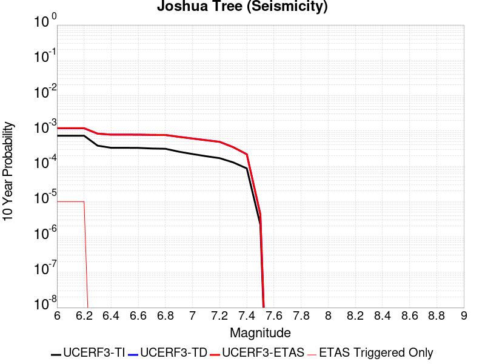 |

| Magnitude | 1 wk TI Prob | 1 wk TD Prob | 1 wk ETAS Prob | 1 wk ETAS/TD Gain | 1 wk ETAS Triggered Only | 1 mo TI Prob | 1 mo TD Prob | 1 mo ETAS Prob | 1 mo ETAS/TD Gain | 1 mo ETAS Triggered Only | 1 yr TI Prob | 1 yr TD Prob | 1 yr ETAS Prob | 1 yr ETAS/TD Gain | 1 yr ETAS Triggered Only | 10 yr TI Prob | 10 yr TD Prob | 10 yr ETAS Prob | 10 yr ETAS/TD Gain | 10 yr ETAS Triggered Only |
|-----|-----|-----|-----|-----|-----|-----|-----|-----|-----|-----|-----|-----|-----|-----|-----|-----|-----|-----|-----|-----|
| 6.0 | 1.4025588E-6 | 2.2783317E-6 | 2.2783317E-6 | 1.0 | 0.0 | 6.0109523E-6 | 9.764246E-6 | 9.764246E-6 | 1.0 | 0.0 | 7.318089E-5 | 1.1887387E-4 | 1.2887268E-4 | 1.0841128 | 1.0E-5 | 7.315679E-4 | 0.001188167 | 0.0011981551 | 1.0084063 | 1.0E-5 |
| 6.1 | 1.4025588E-6 | 2.2783317E-6 | 2.2783317E-6 | 1.0 | 0.0 | 6.0109523E-6 | 9.764246E-6 | 9.764246E-6 | 1.0 | 0.0 | 7.318089E-5 | 1.1887387E-4 | 1.2887268E-4 | 1.0841128 | 1.0E-5 | 7.315679E-4 | 0.001188167 | 0.0011981551 | 1.0084063 | 1.0E-5 |
| 6.2 | 1.4025588E-6 | 2.2783317E-6 | 2.2783317E-6 | 1.0 | 0.0 | 6.0109523E-6 | 9.764246E-6 | 9.764246E-6 | 1.0 | 0.0 | 7.318089E-5 | 1.1887387E-4 | 1.2887268E-4 | 1.0841128 | 1.0E-5 | 7.315679E-4 | 0.001188167 | 0.0011981551 | 1.0084063 | 1.0E-5 |
| 6.3 | 7.3325685E-7 | 1.6023617E-6 | 1.6023617E-6 | 1.0 | 0.0 | 3.1425257E-6 | 6.867247E-6 | 6.867247E-6 | 1.0 | 0.0 | 3.825958E-5 | 8.360561E-5 | 8.360561E-5 | 1.0 | 0.0 | 3.8252992E-4 | 8.3575014E-4 | 8.3575014E-4 | 1.0 | 0.0 |
| 6.4 | 6.38256E-7 | 1.5066106E-6 | 1.5066106E-6 | 1.0 | 0.0 | 2.7353801E-6 | 6.456887E-6 | 6.456887E-6 | 1.0 | 0.0 | 3.3302742E-5 | 7.860984E-5 | 7.860984E-5 | 1.0 | 0.0 | 3.3297754E-4 | 7.8582775E-4 | 7.8582775E-4 | 1.0 | 0.0 |
| 6.5 | 6.38256E-7 | 1.5066106E-6 | 1.5066106E-6 | 1.0 | 0.0 | 2.7353801E-6 | 6.456887E-6 | 6.456887E-6 | 1.0 | 0.0 | 3.3302742E-5 | 7.860984E-5 | 7.860984E-5 | 1.0 | 0.0 | 3.3297754E-4 | 7.8582775E-4 | 7.8582775E-4 | 1.0 | 0.0 |
| 6.6 | 6.3436806E-7 | 1.5036989E-6 | 1.5036989E-6 | 1.0 | 0.0 | 2.7187175E-6 | 6.4444084E-6 | 6.4444084E-6 | 1.0 | 0.0 | 3.3099885E-5 | 7.8457924E-5 | 7.8457924E-5 | 1.0 | 0.0 | 3.3094952E-4 | 7.8430964E-4 | 7.8430964E-4 | 1.0 | 0.0 |
| 6.7 | 6.094856E-7 | 1.4783893E-6 | 1.4783893E-6 | 1.0 | 0.0 | 2.6120786E-6 | 6.3359394E-6 | 6.3359394E-6 | 1.0 | 0.0 | 3.1801592E-5 | 7.71374E-5 | 7.71374E-5 | 1.0 | 0.0 | 3.179704E-4 | 7.711137E-4 | 7.711137E-4 | 1.0 | 0.0 |
| 6.8 | 5.984801E-7 | 1.4696668E-6 | 1.4696668E-6 | 1.0 | 0.0 | 2.564912E-6 | 6.2985573E-6 | 6.2985573E-6 | 1.0 | 0.0 | 3.1227355E-5 | 7.6682314E-5 | 7.6682314E-5 | 1.0 | 0.0 | 3.1222968E-4 | 7.6656585E-4 | 7.6656585E-4 | 1.0 | 0.0 |
| 6.9 | 4.94631E-7 | 1.3041065E-6 | 1.3041065E-6 | 1.0 | 0.0 | 2.1198455E-6 | 5.589016E-6 | 5.589016E-6 | 1.0 | 0.0 | 2.5808813E-5 | 6.80442E-5 | 6.80442E-5 | 1.0 | 0.0 | 2.5805813E-4 | 6.802397E-4 | 6.802397E-4 | 1.0 | 0.0 |
| 7.0 | 4.250375E-7 | 1.1678025E-6 | 1.1678025E-6 | 1.0 | 0.0 | 1.8215881E-6 | 5.0048584E-6 | 5.0048584E-6 | 1.0 | 0.0 | 2.2177608E-5 | 6.0932496E-5 | 6.0932496E-5 | 1.0 | 0.0 | 2.2175396E-4 | 6.0916296E-4 | 6.0916296E-4 | 1.0 | 0.0 |
| 7.1 | 3.6888565E-7 | 1.0462553E-6 | 1.0462553E-6 | 1.0 | 0.0 | 1.5809376E-6 | 4.483944E-6 | 4.483944E-6 | 1.0 | 0.0 | 1.9247746E-5 | 5.4590695E-5 | 5.4590695E-5 | 1.0 | 0.0 | 1.9246078E-4 | 5.4577726E-4 | 5.4577726E-4 | 1.0 | 0.0 |
| 7.2 | 3.2473773E-7 | 9.4108793E-7 | 9.4108793E-7 | 1.0 | 0.0 | 1.3917323E-6 | 4.033228E-6 | 4.033228E-6 | 1.0 | 0.0 | 1.694421E-5 | 4.9103484E-5 | 4.9103484E-5 | 1.0 | 0.0 | 1.6942917E-4 | 4.9093046E-4 | 4.9093046E-4 | 1.0 | 0.0 |
| 7.3 | 2.465367E-7 | 6.6451065E-7 | 6.6451065E-7 | 1.0 | 0.0 | 1.0565853E-6 | 2.8479E-6 | 2.8479E-6 | 1.0 | 0.0 | 1.2863851E-5 | 3.4672667E-5 | 3.4672667E-5 | 1.0 | 0.0 | 1.2863107E-4 | 3.46676E-4 | 3.46676E-4 | 1.0 | 0.0 |
| 7.4 | 1.6654941E-7 | 4.186258E-7 | 4.186258E-7 | 1.0 | 0.0 | 7.13783E-7 | 1.7941095E-6 | 1.7941095E-6 | 1.0 | 0.0 | 8.690274E-6 | 2.1843092E-5 | 2.1843092E-5 | 1.0 | 0.0 | 8.689934E-5 | 2.184122E-4 | 2.184122E-4 | 1.0 | 0.0 |
| 7.5 | 4.24214E-9 | 8.344335E-9 | 8.344335E-9 | 1.0 | 0.0 | 1.81806E-8 | 3.5761435E-8 | 3.5761435E-8 | 1.0 | 0.0 | 2.213488E-7 | 4.3539546E-7 | 4.3539546E-7 | 1.0 | 0.0 | 2.2134857E-6 | 4.3539526E-6 | 4.3539526E-6 | 1.0 | 0.0 |

## Great Valley 13 (Coalinga)
*[(top)](#table-of-contents)*

| 1 Week | 1 Month | 1 Year | 10 Year |
|-----|-----|-----|-----|
|  |  |  | 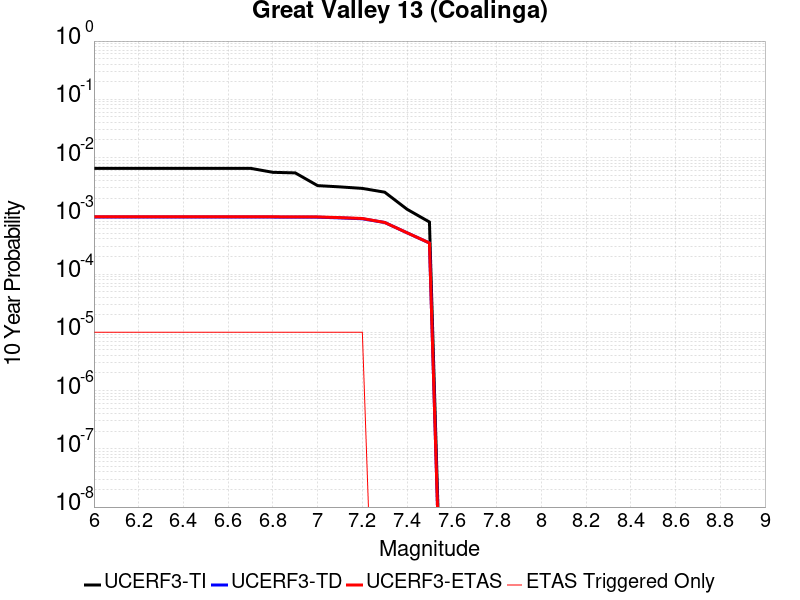 |

| Magnitude | 1 wk TI Prob | 1 wk TD Prob | 1 wk ETAS Prob | 1 wk ETAS/TD Gain | 1 wk ETAS Triggered Only | 1 mo TI Prob | 1 mo TD Prob | 1 mo ETAS Prob | 1 mo ETAS/TD Gain | 1 mo ETAS Triggered Only | 1 yr TI Prob | 1 yr TD Prob | 1 yr ETAS Prob | 1 yr ETAS/TD Gain | 1 yr ETAS Triggered Only | 10 yr TI Prob | 10 yr TD Prob | 10 yr ETAS Prob | 10 yr ETAS/TD Gain | 10 yr ETAS Triggered Only |
|-----|-----|-----|-----|-----|-----|-----|-----|-----|-----|-----|-----|-----|-----|-----|-----|-----|-----|-----|-----|-----|
| 6.0 | 1.25701345E-5 | 1.8251254E-6 | 1.8251254E-6 | 1.0 | 0.0 | 5.3870892E-5 | 7.821944E-6 | 7.821944E-6 | 1.0 | 0.0 | 6.556807E-4 | 9.52282E-5 | 1.0522725E-4 | 1.1050009 | 1.0E-5 | 0.006537495 | 9.518933E-4 | 9.6188375E-4 | 1.0104954 | 1.0E-5 |
| 6.1 | 1.25701345E-5 | 1.8251254E-6 | 1.8251254E-6 | 1.0 | 0.0 | 5.3870892E-5 | 7.821944E-6 | 7.821944E-6 | 1.0 | 0.0 | 6.556807E-4 | 9.52282E-5 | 1.0522725E-4 | 1.1050009 | 1.0E-5 | 0.006537495 | 9.518933E-4 | 9.6188375E-4 | 1.0104954 | 1.0E-5 |
| 6.2 | 1.25701345E-5 | 1.8251254E-6 | 1.8251254E-6 | 1.0 | 0.0 | 5.3870892E-5 | 7.821944E-6 | 7.821944E-6 | 1.0 | 0.0 | 6.556807E-4 | 9.52282E-5 | 1.0522725E-4 | 1.1050009 | 1.0E-5 | 0.006537495 | 9.518933E-4 | 9.6188375E-4 | 1.0104954 | 1.0E-5 |
| 6.3 | 1.25701345E-5 | 1.8251254E-6 | 1.8251254E-6 | 1.0 | 0.0 | 5.3870892E-5 | 7.821944E-6 | 7.821944E-6 | 1.0 | 0.0 | 6.556807E-4 | 9.52282E-5 | 1.0522725E-4 | 1.1050009 | 1.0E-5 | 0.006537495 | 9.518933E-4 | 9.6188375E-4 | 1.0104954 | 1.0E-5 |
| 6.4 | 1.25701345E-5 | 1.8251254E-6 | 1.8251254E-6 | 1.0 | 0.0 | 5.3870892E-5 | 7.821944E-6 | 7.821944E-6 | 1.0 | 0.0 | 6.556807E-4 | 9.52282E-5 | 1.0522725E-4 | 1.1050009 | 1.0E-5 | 0.006537495 | 9.518933E-4 | 9.6188375E-4 | 1.0104954 | 1.0E-5 |
| 6.5 | 1.25701345E-5 | 1.8251254E-6 | 1.8251254E-6 | 1.0 | 0.0 | 5.3870892E-5 | 7.821944E-6 | 7.821944E-6 | 1.0 | 0.0 | 6.556807E-4 | 9.52282E-5 | 1.0522725E-4 | 1.1050009 | 1.0E-5 | 0.006537495 | 9.518933E-4 | 9.6188375E-4 | 1.0104954 | 1.0E-5 |
| 6.6 | 1.25701345E-5 | 1.8251254E-6 | 1.8251254E-6 | 1.0 | 0.0 | 5.3870892E-5 | 7.821944E-6 | 7.821944E-6 | 1.0 | 0.0 | 6.556807E-4 | 9.52282E-5 | 1.0522725E-4 | 1.1050009 | 1.0E-5 | 0.006537495 | 9.518933E-4 | 9.6188375E-4 | 1.0104954 | 1.0E-5 |
| 6.7 | 1.25701345E-5 | 1.8251254E-6 | 1.8251254E-6 | 1.0 | 0.0 | 5.3870892E-5 | 7.821944E-6 | 7.821944E-6 | 1.0 | 0.0 | 6.556807E-4 | 9.52282E-5 | 1.0522725E-4 | 1.1050009 | 1.0E-5 | 0.006537495 | 9.518933E-4 | 9.6188375E-4 | 1.0104954 | 1.0E-5 |
| 6.8 | 1.0720415E-5 | 1.8251254E-6 | 1.8251254E-6 | 1.0 | 0.0 | 4.5943823E-5 | 7.821944E-6 | 7.821944E-6 | 1.0 | 0.0 | 5.592225E-4 | 9.52282E-5 | 1.0522725E-4 | 1.1050009 | 1.0E-5 | 0.005578173 | 9.518933E-4 | 9.6188375E-4 | 1.0104954 | 1.0E-5 |
| 6.9 | 1.0485409E-5 | 1.8210361E-6 | 1.8210361E-6 | 1.0 | 0.0 | 4.4936693E-5 | 7.804419E-6 | 7.804419E-6 | 1.0 | 0.0 | 5.469669E-4 | 9.5014846E-5 | 1.05013896E-4 | 1.1052368 | 1.0E-5 | 0.005456226 | 9.4976154E-4 | 9.59752E-4 | 1.0105189 | 1.0E-5 |
| 7.0 | 6.3302773E-6 | 1.8159075E-6 | 1.8159075E-6 | 1.0 | 0.0 | 2.7129478E-5 | 7.782439E-6 | 7.782439E-6 | 1.0 | 0.0 | 3.3025132E-4 | 9.4747265E-5 | 1.04746316E-4 | 1.105534 | 1.0E-5 | 0.0032976097 | 9.47088E-4 | 9.5707853E-4 | 1.0105487 | 1.0E-5 |
| 7.1 | 6.022003E-6 | 1.7662087E-6 | 1.7662087E-6 | 1.0 | 0.0 | 2.5808331E-5 | 7.5694447E-6 | 7.5694447E-6 | 1.0 | 0.0 | 3.141711E-4 | 9.215429E-5 | 1.0215337E-4 | 1.1085037 | 1.0E-5 | 0.0031372732 | 9.211799E-4 | 9.311707E-4 | 1.0108457 | 1.0E-5 |
| 7.2 | 5.671345E-6 | 1.7060354E-6 | 1.7060354E-6 | 1.0 | 0.0 | 2.4305538E-5 | 7.3115607E-6 | 7.3115607E-6 | 1.0 | 0.0 | 2.9587973E-4 | 8.901481E-5 | 9.901392E-5 | 1.1123309 | 1.0E-5 | 0.002954861 | 8.898106E-4 | 8.9980173E-4 | 1.0112283 | 1.0E-5 |
| 7.3 | 4.8831785E-6 | 1.4731849E-6 | 1.4731849E-6 | 1.0 | 0.0 | 2.092774E-5 | 6.313635E-6 | 6.313635E-6 | 1.0 | 0.0 | 2.5476544E-4 | 7.686597E-5 | 7.686597E-5 | 1.0 | 0.0 | 0.0025447358 | 7.684104E-4 | 7.684104E-4 | 1.0 | 0.0 |
| 7.4 | 2.4837766E-6 | 9.800765E-7 | 9.800765E-7 | 1.0 | 0.0 | 1.0644713E-5 | 4.2003217E-6 | 4.2003217E-6 | 1.0 | 0.0 | 1.2959167E-4 | 5.113778E-5 | 5.113778E-5 | 1.0 | 0.0 | 0.0012951613 | 5.112667E-4 | 5.112667E-4 | 1.0 | 0.0 |
| 7.5 | 1.5002679E-6 | 6.5462535E-7 | 6.5462535E-7 | 1.0 | 0.0 | 6.4297037E-6 | 2.8055345E-6 | 2.8055345E-6 | 1.0 | 0.0 | 7.827883E-5 | 3.415689E-5 | 3.415689E-5 | 1.0 | 0.0 | 7.825126E-4 | 3.4152053E-4 | 3.4152053E-4 | 1.0 | 0.0 |

## Hat Creek-McArthur-Mayfield
*[(top)](#table-of-contents)*

| 1 Week | 1 Month | 1 Year | 10 Year |
|-----|-----|-----|-----|
|  |  |  |  |

| Magnitude | 1 wk TI Prob | 1 wk TD Prob | 1 wk ETAS Prob | 1 wk ETAS/TD Gain | 1 wk ETAS Triggered Only | 1 mo TI Prob | 1 mo TD Prob | 1 mo ETAS Prob | 1 mo ETAS/TD Gain | 1 mo ETAS Triggered Only | 1 yr TI Prob | 1 yr TD Prob | 1 yr ETAS Prob | 1 yr ETAS/TD Gain | 1 yr ETAS Triggered Only | 10 yr TI Prob | 10 yr TD Prob | 10 yr ETAS Prob | 10 yr ETAS/TD Gain | 10 yr ETAS Triggered Only |
|-----|-----|-----|-----|-----|-----|-----|-----|-----|-----|-----|-----|-----|-----|-----|-----|-----|-----|-----|-----|-----|
| 6.0 | 3.967457E-5 | 4.3158816E-5 | 4.3158816E-5 | 1.0 | 0.0 | 1.7002279E-4 | 1.8495388E-4 | 1.8495388E-4 | 1.0 | 0.0 | 0.002068062 | 0.0022496022 | 0.0022496022 | 1.0 | 0.0 | 0.02048922 | 0.022280656 | 0.022290433 | 1.0004388 | 1.0E-5 |
| 6.1 | 2.5044013E-5 | 2.7071455E-5 | 2.7071455E-5 | 1.0 | 0.0 | 1.0732707E-4 | 1.16015544E-4 | 1.16015544E-4 | 1.0 | 0.0 | 0.0013059238 | 0.0014116059 | 0.0014116059 | 1.0 | 0.0 | 0.01298276 | 0.014029811 | 0.014029811 | 1.0 | 0.0 |
| 6.2 | 2.5044013E-5 | 2.7071455E-5 | 2.7071455E-5 | 1.0 | 0.0 | 1.0732707E-4 | 1.16015544E-4 | 1.16015544E-4 | 1.0 | 0.0 | 0.0013059238 | 0.0014116059 | 0.0014116059 | 1.0 | 0.0 | 0.01298276 | 0.014029811 | 0.014029811 | 1.0 | 0.0 |
| 6.3 | 1.6624012E-5 | 1.7891252E-5 | 1.7891252E-5 | 1.0 | 0.0 | 7.124382E-5 | 7.6674594E-5 | 7.6674594E-5 | 1.0 | 0.0 | 8.670483E-4 | 9.3312195E-4 | 9.3312195E-4 | 1.0 | 0.0 | 0.008636732 | 0.009292973 | 0.009292973 | 1.0 | 0.0 |
| 6.4 | 1.6624012E-5 | 1.7891252E-5 | 1.7891252E-5 | 1.0 | 0.0 | 7.124382E-5 | 7.6674594E-5 | 7.6674594E-5 | 1.0 | 0.0 | 8.670483E-4 | 9.3312195E-4 | 9.3312195E-4 | 1.0 | 0.0 | 0.008636732 | 0.009292973 | 0.009292973 | 1.0 | 0.0 |
| 6.5 | 1.3394842E-5 | 1.4392279E-5 | 1.4392279E-5 | 1.0 | 0.0 | 5.7405203E-5 | 6.167977E-5 | 6.167977E-5 | 1.0 | 0.0 | 6.986842E-4 | 7.5069803E-4 | 7.5069803E-4 | 1.0 | 0.0 | 0.006964916 | 0.0074822144 | 0.0074822144 | 1.0 | 0.0 |
| 6.6 | 1.1137514E-5 | 1.1954662E-5 | 1.1954662E-5 | 1.0 | 0.0 | 4.7731326E-5 | 5.1233284E-5 | 5.1233284E-5 | 1.0 | 0.0 | 5.809739E-4 | 6.235907E-4 | 6.235907E-4 | 1.0 | 0.0 | 0.005794574 | 0.0062188306 | 0.0062188306 | 1.0 | 0.0 |
| 6.7 | 7.0200663E-6 | 7.5243615E-6 | 7.5243615E-6 | 1.0 | 0.0 | 3.008565E-5 | 3.2246873E-5 | 3.2246873E-5 | 1.0 | 0.0 | 3.6623122E-4 | 3.9253655E-4 | 3.9253655E-4 | 1.0 | 0.0 | 0.0036562826 | 0.0039185947 | 0.0039185947 | 1.0 | 0.0 |
| 6.8 | 5.940172E-6 | 6.365537E-6 | 6.365537E-6 | 1.0 | 0.0 | 2.545763E-5 | 2.7280596E-5 | 2.7280596E-5 | 1.0 | 0.0 | 3.0990256E-4 | 3.320919E-4 | 3.320919E-4 | 1.0 | 0.0 | 0.0030947074 | 0.0033160849 | 0.0033160849 | 1.0 | 0.0 |
| 6.9 | 4.129831E-6 | 4.423589E-6 | 4.423589E-6 | 1.0 | 0.0 | 1.7699154E-5 | 1.8958104E-5 | 1.8958104E-5 | 1.0 | 0.0 | 2.154659E-4 | 2.3079127E-4 | 2.3079127E-4 | 1.0 | 0.0 | 0.002152571 | 0.002305594 | 0.002305594 | 1.0 | 0.0 |
| 7.0 | 2.6512955E-6 | 2.8374266E-6 | 2.8374266E-6 | 1.0 | 0.0 | 1.1362646E-5 | 1.2160345E-5 | 1.2160345E-5 | 1.0 | 0.0 | 1.3833142E-4 | 1.4804257E-4 | 1.4804257E-4 | 1.0 | 0.0 | 0.0013824535 | 0.001479482 | 0.001479482 | 1.0 | 0.0 |
| 7.1 | 1.2992575E-6 | 1.3909448E-6 | 1.3909448E-6 | 1.0 | 0.0 | 5.568235E-6 | 5.96118E-6 | 5.96118E-6 | 1.0 | 0.0 | 6.779115E-5 | 7.257517E-5 | 7.257517E-5 | 1.0 | 0.0 | 6.7770475E-4 | 7.2553626E-4 | 7.2553626E-4 | 1.0 | 0.0 |
| 7.2 | 4.968191E-7 | 5.3271987E-7 | 5.3271987E-7 | 1.0 | 0.0 | 2.1292228E-6 | 2.2830839E-6 | 2.2830839E-6 | 1.0 | 0.0 | 2.592298E-5 | 2.7796319E-5 | 2.7796319E-5 | 1.0 | 0.0 | 2.5919956E-4 | 2.7794077E-4 | 2.7794077E-4 | 1.0 | 0.0 |

## Ventura-Pitas Point
*[(top)](#table-of-contents)*

| 1 Week | 1 Month | 1 Year | 10 Year |
|-----|-----|-----|-----|
|  |  |  |  |

| Magnitude | 1 wk TI Prob | 1 wk TD Prob | 1 wk ETAS Prob | 1 wk ETAS/TD Gain | 1 wk ETAS Triggered Only | 1 mo TI Prob | 1 mo TD Prob | 1 mo ETAS Prob | 1 mo ETAS/TD Gain | 1 mo ETAS Triggered Only | 1 yr TI Prob | 1 yr TD Prob | 1 yr ETAS Prob | 1 yr ETAS/TD Gain | 1 yr ETAS Triggered Only | 10 yr TI Prob | 10 yr TD Prob | 10 yr ETAS Prob | 10 yr ETAS/TD Gain | 10 yr ETAS Triggered Only |
|-----|-----|-----|-----|-----|-----|-----|-----|-----|-----|-----|-----|-----|-----|-----|-----|-----|-----|-----|-----|-----|
| 6.0 | 3.3179622E-5 | 3.3735807E-5 | 3.3735807E-5 | 1.0 | 0.0 | 1.4219063E-4 | 1.4457546E-4 | 1.4457546E-4 | 1.0 | 0.0 | 0.0017297962 | 0.001759042 | 0.001759042 | 1.0 | 0.0 | 0.017163932 | 0.01747672 | 0.017486546 | 1.0005622 | 1.0E-5 |
| 6.1 | 3.3179622E-5 | 3.3735807E-5 | 3.3735807E-5 | 1.0 | 0.0 | 1.4219063E-4 | 1.4457546E-4 | 1.4457546E-4 | 1.0 | 0.0 | 0.0017297962 | 0.001759042 | 0.001759042 | 1.0 | 0.0 | 0.017163932 | 0.01747672 | 0.017486546 | 1.0005622 | 1.0E-5 |
| 6.2 | 3.3179622E-5 | 3.3735807E-5 | 3.3735807E-5 | 1.0 | 0.0 | 1.4219063E-4 | 1.4457546E-4 | 1.4457546E-4 | 1.0 | 0.0 | 0.0017297962 | 0.001759042 | 0.001759042 | 1.0 | 0.0 | 0.017163932 | 0.01747672 | 0.017486546 | 1.0005622 | 1.0E-5 |
| 6.3 | 3.3179622E-5 | 3.3735807E-5 | 3.3735807E-5 | 1.0 | 0.0 | 1.4219063E-4 | 1.4457546E-4 | 1.4457546E-4 | 1.0 | 0.0 | 0.0017297962 | 0.001759042 | 0.001759042 | 1.0 | 0.0 | 0.017163932 | 0.01747672 | 0.017486546 | 1.0005622 | 1.0E-5 |
| 6.4 | 1.8754668E-5 | 1.701988E-5 | 1.701988E-5 | 1.0 | 0.0 | 8.037467E-5 | 7.2940435E-5 | 7.2940435E-5 | 1.0 | 0.0 | 9.781223E-4 | 8.87711E-4 | 8.87711E-4 | 1.0 | 0.0 | 0.009738282 | 0.008843987 | 0.008843987 | 1.0 | 0.0 |
| 6.5 | 1.8754668E-5 | 1.701988E-5 | 1.701988E-5 | 1.0 | 0.0 | 8.037467E-5 | 7.2940435E-5 | 7.2940435E-5 | 1.0 | 0.0 | 9.781223E-4 | 8.87711E-4 | 8.87711E-4 | 1.0 | 0.0 | 0.009738282 | 0.008843987 | 0.008843987 | 1.0 | 0.0 |
| 6.6 | 1.4361558E-5 | 1.2122469E-5 | 1.2122469E-5 | 1.0 | 0.0 | 6.154808E-5 | 5.195242E-5 | 5.195242E-5 | 1.0 | 0.0 | 7.490902E-4 | 6.323394E-4 | 6.323394E-4 | 1.0 | 0.0 | 0.0074657016 | 0.0063056583 | 0.0063056583 | 1.0 | 0.0 |
| 6.7 | 1.4361558E-5 | 1.2122469E-5 | 1.2122469E-5 | 1.0 | 0.0 | 6.154808E-5 | 5.195242E-5 | 5.195242E-5 | 1.0 | 0.0 | 7.490902E-4 | 6.323394E-4 | 6.323394E-4 | 1.0 | 0.0 | 0.0074657016 | 0.0063056583 | 0.0063056583 | 1.0 | 0.0 |
| 6.8 | 1.3663846E-5 | 1.13446E-5 | 1.13446E-5 | 1.0 | 0.0 | 5.8558027E-5 | 4.8618822E-5 | 4.8618822E-5 | 1.0 | 0.0 | 7.127108E-4 | 5.917753E-4 | 5.917753E-4 | 1.0 | 0.0 | 0.007104293 | 0.0059022107 | 0.0059022107 | 1.0 | 0.0 |
| 6.9 | 1.3644157E-5 | 1.1322701E-5 | 1.1322701E-5 | 1.0 | 0.0 | 5.8473648E-5 | 4.852497E-5 | 4.852497E-5 | 1.0 | 0.0 | 7.116841E-4 | 5.9063325E-4 | 5.9063325E-4 | 1.0 | 0.0 | 0.007094092 | 0.005890851 | 0.005890851 | 1.0 | 0.0 |
| 7.0 | 1.3568845E-5 | 1.1242266E-5 | 1.1242266E-5 | 1.0 | 0.0 | 5.8150898E-5 | 4.818026E-5 | 4.818026E-5 | 1.0 | 0.0 | 7.077572E-4 | 5.8643875E-4 | 5.8643875E-4 | 1.0 | 0.0 | 0.007055073 | 0.005849127 | 0.005849127 | 1.0 | 0.0 |
| 7.1 | 1.306572E-5 | 1.0720711E-5 | 1.0720711E-5 | 1.0 | 0.0 | 5.599474E-5 | 4.5945108E-5 | 4.5945108E-5 | 1.0 | 0.0 | 6.815227E-4 | 5.5923994E-4 | 5.5923994E-4 | 1.0 | 0.0 | 0.0067943637 | 0.0055785314 | 0.0055785314 | 1.0 | 0.0 |
| 7.2 | 1.232604E-5 | 9.995298E-6 | 9.995298E-6 | 1.0 | 0.0 | 5.2824813E-5 | 4.28363E-5 | 4.28363E-5 | 1.0 | 0.0 | 6.429523E-4 | 5.2140886E-4 | 5.2140886E-4 | 1.0 | 0.0 | 0.0064109527 | 0.005202047 | 0.005202047 | 1.0 | 0.0 |
| 7.3 | 1.0917261E-5 | 8.843967E-6 | 8.843967E-6 | 1.0 | 0.0 | 4.678742E-5 | 3.7902173E-5 | 3.7902173E-5 | 1.0 | 0.0 | 5.69488E-4 | 4.6136283E-4 | 4.6136283E-4 | 1.0 | 0.0 | 0.0056803077 | 0.0046042157 | 0.0046042157 | 1.0 | 0.0 |
| 7.4 | 1.039959E-5 | 8.423679E-6 | 8.423679E-6 | 1.0 | 0.0 | 4.456891E-5 | 3.610099E-5 | 3.610099E-5 | 1.0 | 0.0 | 5.424914E-4 | 4.3944246E-4 | 4.3944246E-4 | 1.0 | 0.0 | 0.0054116896 | 0.004385897 | 0.004385897 | 1.0 | 0.0 |
| 7.5 | 9.015877E-6 | 7.297639E-6 | 7.297639E-6 | 1.0 | 0.0 | 3.86389E-5 | 3.1275227E-5 | 3.1275227E-5 | 1.0 | 0.0 | 4.7032707E-4 | 3.807108E-4 | 3.807108E-4 | 1.0 | 0.0 | 0.004693329 | 0.003800731 | 0.003800731 | 1.0 | 0.0 |
| 7.6 | 4.900162E-6 | 3.8741514E-6 | 3.8741514E-6 | 1.0 | 0.0 | 2.1000526E-5 | 1.66034E-5 | 1.66034E-5 | 1.0 | 0.0 | 2.556514E-4 | 2.0212779E-4 | 2.0212779E-4 | 1.0 | 0.0 | 0.0025535747 | 0.002019453 | 0.002019453 | 1.0 | 0.0 |
| 7.7 | 3.8850626E-6 | 3.126758E-6 | 3.126758E-6 | 1.0 | 0.0 | 1.6650163E-5 | 1.3400323E-5 | 1.3400323E-5 | 1.0 | 0.0 | 2.0269687E-4 | 1.631368E-4 | 1.631368E-4 | 1.0 | 0.0 | 0.002025121 | 0.0016301798 | 0.0016301798 | 1.0 | 0.0 |
| 7.8 | 2.4654719E-6 | 2.029892E-6 | 2.029892E-6 | 1.0 | 0.0 | 1.0566265E-5 | 8.699508E-6 | 8.699508E-6 | 1.0 | 0.0 | 1.2863669E-4 | 1.0591141E-4 | 1.0591141E-4 | 1.0 | 0.0 | 0.0012856225 | 0.001058614 | 0.001058614 | 1.0 | 0.0 |
| 7.9 | 4.095894E-7 | 3.2765047E-7 | 3.2765047E-7 | 1.0 | 0.0 | 1.7553821E-6 | 1.4042156E-6 | 1.4042156E-6 | 1.0 | 0.0 | 2.1371567E-5 | 1.7096194E-5 | 1.7096194E-5 | 1.0 | 0.0 | 2.1369511E-4 | 1.7094909E-4 | 1.7094909E-4 | 1.0 | 0.0 |
| 8.0 | 7.791402E-9 | 5.683553E-9 | 5.683553E-9 | 1.0 | 0.0 | 3.3391725E-8 | 2.4358085E-8 | 2.4358085E-8 | 1.0 | 0.0 | 4.0654416E-7 | 2.9655968E-7 | 2.9655968E-7 | 1.0 | 0.0 | 4.065434E-6 | 2.9655946E-6 | 2.9655946E-6 | 1.0 | 0.0 |

## Del Valle
*[(top)](#table-of-contents)*

| 1 Week | 1 Month | 1 Year | 10 Year |
|-----|-----|-----|-----|
|  | 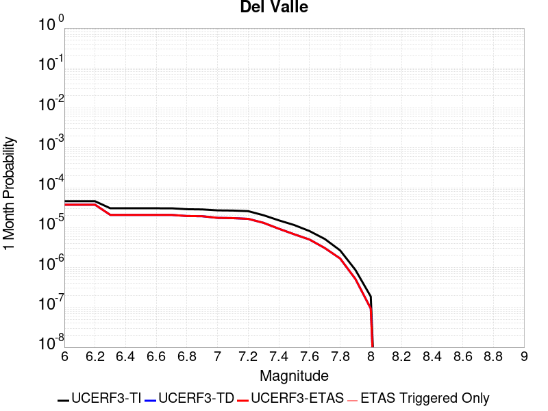 |  |  |

| Magnitude | 1 wk TI Prob | 1 wk TD Prob | 1 wk ETAS Prob | 1 wk ETAS/TD Gain | 1 wk ETAS Triggered Only | 1 mo TI Prob | 1 mo TD Prob | 1 mo ETAS Prob | 1 mo ETAS/TD Gain | 1 mo ETAS Triggered Only | 1 yr TI Prob | 1 yr TD Prob | 1 yr ETAS Prob | 1 yr ETAS/TD Gain | 1 yr ETAS Triggered Only | 10 yr TI Prob | 10 yr TD Prob | 10 yr ETAS Prob | 10 yr ETAS/TD Gain | 10 yr ETAS Triggered Only |
|-----|-----|-----|-----|-----|-----|-----|-----|-----|-----|-----|-----|-----|-----|-----|-----|-----|-----|-----|-----|-----|
| 6.0 | 1.0716125E-5 | 8.768052E-6 | 8.768052E-6 | 1.0 | 0.0 | 4.592544E-5 | 3.7576934E-5 | 3.7576934E-5 | 1.0 | 0.0 | 5.589988E-4 | 4.574229E-4 | 4.574229E-4 | 1.0 | 0.0 | 0.0055759475 | 0.0045667686 | 0.004576723 | 1.0021797 | 1.0E-5 |
| 6.1 | 1.0716125E-5 | 8.768052E-6 | 8.768052E-6 | 1.0 | 0.0 | 4.592544E-5 | 3.7576934E-5 | 3.7576934E-5 | 1.0 | 0.0 | 5.589988E-4 | 4.574229E-4 | 4.574229E-4 | 1.0 | 0.0 | 0.0055759475 | 0.0045667686 | 0.004576723 | 1.0021797 | 1.0E-5 |
| 6.2 | 1.0716125E-5 | 8.768052E-6 | 8.768052E-6 | 1.0 | 0.0 | 4.592544E-5 | 3.7576934E-5 | 3.7576934E-5 | 1.0 | 0.0 | 5.589988E-4 | 4.574229E-4 | 4.574229E-4 | 1.0 | 0.0 | 0.0055759475 | 0.0045667686 | 0.004576723 | 1.0021797 | 1.0E-5 |
| 6.3 | 7.1293784E-6 | 4.865947E-6 | 4.865947E-6 | 1.0 | 0.0 | 3.055412E-5 | 2.0853897E-5 | 2.0853897E-5 | 1.0 | 0.0 | 3.7193293E-4 | 2.5386736E-4 | 2.5386736E-4 | 1.0 | 0.0 | 0.0037131102 | 0.0025358594 | 0.002545834 | 1.0039334 | 1.0E-5 |
| 6.4 | 7.1293784E-6 | 4.865947E-6 | 4.865947E-6 | 1.0 | 0.0 | 3.055412E-5 | 2.0853897E-5 | 2.0853897E-5 | 1.0 | 0.0 | 3.7193293E-4 | 2.5386736E-4 | 2.5386736E-4 | 1.0 | 0.0 | 0.0037131102 | 0.0025358594 | 0.002545834 | 1.0039334 | 1.0E-5 |
| 6.5 | 7.1293784E-6 | 4.865947E-6 | 4.865947E-6 | 1.0 | 0.0 | 3.055412E-5 | 2.0853897E-5 | 2.0853897E-5 | 1.0 | 0.0 | 3.7193293E-4 | 2.5386736E-4 | 2.5386736E-4 | 1.0 | 0.0 | 0.0037131102 | 0.0025358594 | 0.002545834 | 1.0039334 | 1.0E-5 |
| 6.6 | 7.1293784E-6 | 4.865947E-6 | 4.865947E-6 | 1.0 | 0.0 | 3.055412E-5 | 2.0853897E-5 | 2.0853897E-5 | 1.0 | 0.0 | 3.7193293E-4 | 2.5386736E-4 | 2.5386736E-4 | 1.0 | 0.0 | 0.0037131102 | 0.0025358594 | 0.002545834 | 1.0039334 | 1.0E-5 |
| 6.7 | 7.12272E-6 | 4.863323E-6 | 4.863323E-6 | 1.0 | 0.0 | 3.0525585E-5 | 2.084265E-5 | 2.084265E-5 | 1.0 | 0.0 | 3.7158563E-4 | 2.5373045E-4 | 2.5373045E-4 | 1.0 | 0.0 | 0.003709649 | 0.0025344936 | 0.002544468 | 1.0039356 | 1.0E-5 |
| 6.8 | 6.7558703E-6 | 4.5595193E-6 | 4.5595193E-6 | 1.0 | 0.0 | 2.895341E-5 | 1.9540656E-5 | 1.9540656E-5 | 1.0 | 0.0 | 3.5245073E-4 | 2.3788214E-4 | 2.3788214E-4 | 1.0 | 0.0 | 0.0035189227 | 0.0023763503 | 0.0023863264 | 1.0041981 | 1.0E-5 |
| 6.9 | 6.6700386E-6 | 4.5026545E-6 | 4.5026545E-6 | 1.0 | 0.0 | 2.8585566E-5 | 1.9296951E-5 | 1.9296951E-5 | 1.0 | 0.0 | 3.479737E-4 | 2.3491567E-4 | 2.3491567E-4 | 1.0 | 0.0 | 0.003474293 | 0.0023467485 | 0.002356725 | 1.0042512 | 1.0E-5 |
| 7.0 | 6.3181424E-6 | 4.09881E-6 | 4.09881E-6 | 1.0 | 0.0 | 2.7077473E-5 | 1.7566214E-5 | 1.7566214E-5 | 1.0 | 0.0 | 3.2961834E-4 | 2.1384809E-4 | 2.1384809E-4 | 1.0 | 0.0 | 0.0032912986 | 0.002136478 | 0.0021464564 | 1.0046706 | 1.0E-5 |
| 7.1 | 6.248759E-6 | 4.034E-6 | 4.034E-6 | 1.0 | 0.0 | 2.678012E-5 | 1.728846E-5 | 1.728846E-5 | 1.0 | 0.0 | 3.2599916E-4 | 2.1046709E-4 | 2.1046709E-4 | 1.0 | 0.0 | 0.0032552136 | 0.002102732 | 0.002112711 | 1.0047457 | 1.0E-5 |
| 7.2 | 6.0411944E-6 | 3.869988E-6 | 3.869988E-6 | 1.0 | 0.0 | 2.5890577E-5 | 1.6585562E-5 | 1.6585562E-5 | 1.0 | 0.0 | 3.1517216E-4 | 2.0191091E-4 | 2.0191091E-4 | 1.0 | 0.0 | 0.0031472554 | 0.002017328 | 0.0020273079 | 1.0049471 | 1.0E-5 |
| 7.3 | 4.7691183E-6 | 3.078193E-6 | 3.078193E-6 | 1.0 | 0.0 | 2.0438918E-5 | 1.319219E-5 | 1.319219E-5 | 1.0 | 0.0 | 2.488154E-4 | 1.6060329E-4 | 1.6060329E-4 | 1.0 | 0.0 | 0.00248537 | 0.0016048981 | 0.001614882 | 1.0062209 | 1.0E-5 |
| 7.4 | 3.5524722E-6 | 2.1893868E-6 | 2.1893868E-6 | 1.0 | 0.0 | 1.5224792E-5 | 9.383053E-6 | 9.383053E-6 | 1.0 | 0.0 | 1.8534607E-4 | 1.1423277E-4 | 1.1423277E-4 | 1.0 | 0.0 | 0.0018519156 | 0.0011417487 | 0.0011517373 | 1.0087485 | 1.0E-5 |
| 7.5 | 2.7133442E-6 | 1.591647E-6 | 1.591647E-6 | 1.0 | 0.0 | 1.1628566E-5 | 6.8213267E-6 | 6.8213267E-6 | 1.0 | 0.0 | 1.415686E-4 | 8.304651E-5 | 8.304651E-5 | 1.0 | 0.0 | 0.0014147845 | 8.3015667E-4 | 8.4014836E-4 | 1.012036 | 1.0E-5 |
| 7.6 | 1.915338E-6 | 1.1739402E-6 | 1.1739402E-6 | 1.0 | 0.0 | 8.208566E-6 | 5.031163E-6 | 5.031163E-6 | 1.0 | 0.0 | 9.993471E-5 | 6.125269E-5 | 6.125269E-5 | 1.0 | 0.0 | 9.988978E-4 | 6.12359E-4 | 6.2235293E-4 | 1.0163203 | 1.0E-5 |
| 7.7 | 1.2120448E-6 | 7.1804885E-7 | 7.1804885E-7 | 1.0 | 0.0 | 5.194467E-6 | 3.0773488E-6 | 3.0773488E-6 | 1.0 | 0.0 | 6.3240805E-5 | 3.746608E-5 | 3.746608E-5 | 1.0 | 0.0 | 6.322281E-4 | 3.7459802E-4 | 3.7459802E-4 | 1.0 | 0.0 |
| 7.8 | 6.272381E-7 | 3.9326522E-7 | 3.9326522E-7 | 1.0 | 0.0 | 2.6881603E-6 | 1.6854212E-6 | 1.6854212E-6 | 1.0 | 0.0 | 3.272786E-5 | 2.0519812E-5 | 2.0519812E-5 | 1.0 | 0.0 | 3.272304E-4 | 2.0517933E-4 | 2.0517933E-4 | 1.0 | 0.0 |
| 7.9 | 2.0292627E-7 | 1.2005012E-7 | 1.2005012E-7 | 1.0 | 0.0 | 8.6968373E-7 | 5.145004E-7 | 5.145004E-7 | 1.0 | 0.0 | 1.0588348E-5 | 6.2640247E-6 | 6.2640247E-6 | 1.0 | 0.0 | 1.0587843E-4 | 6.26385E-5 | 6.26385E-5 | 1.0 | 0.0 |
| 8.0 | 4.374492E-8 | 2.1900798E-8 | 2.1900798E-8 | 1.0 | 0.0 | 1.8747821E-7 | 9.386056E-8 | 9.386056E-8 | 1.0 | 0.0 | 2.2825448E-6 | 1.1427518E-6 | 1.1427518E-6 | 1.0 | 0.0 | 2.2825214E-5 | 1.1427463E-5 | 1.1427463E-5 | 1.0 | 0.0 |

## Great Valley 10 (Panoche)
*[(top)](#table-of-contents)*

| 1 Week | 1 Month | 1 Year | 10 Year |
|-----|-----|-----|-----|
|  |  |  |  |

| Magnitude | 1 wk TI Prob | 1 wk TD Prob | 1 wk ETAS Prob | 1 wk ETAS/TD Gain | 1 wk ETAS Triggered Only | 1 mo TI Prob | 1 mo TD Prob | 1 mo ETAS Prob | 1 mo ETAS/TD Gain | 1 mo ETAS Triggered Only | 1 yr TI Prob | 1 yr TD Prob | 1 yr ETAS Prob | 1 yr ETAS/TD Gain | 1 yr ETAS Triggered Only | 10 yr TI Prob | 10 yr TD Prob | 10 yr ETAS Prob | 10 yr ETAS/TD Gain | 10 yr ETAS Triggered Only |
|-----|-----|-----|-----|-----|-----|-----|-----|-----|-----|-----|-----|-----|-----|-----|-----|-----|-----|-----|-----|-----|
| 6.0 | 1.6014626E-5 | 1.6575756E-5 | 1.6575756E-5 | 1.0 | 0.0 | 6.863231E-5 | 7.103705E-5 | 7.103705E-5 | 1.0 | 0.0 | 8.35278E-4 | 8.645371E-4 | 8.745284E-4 | 1.0115569 | 1.0E-5 | 0.008321454 | 0.008612356 | 0.00862227 | 1.0011511 | 1.0E-5 |
| 6.1 | 1.6014626E-5 | 1.6575756E-5 | 1.6575756E-5 | 1.0 | 0.0 | 6.863231E-5 | 7.103705E-5 | 7.103705E-5 | 1.0 | 0.0 | 8.35278E-4 | 8.645371E-4 | 8.745284E-4 | 1.0115569 | 1.0E-5 | 0.008321454 | 0.008612356 | 0.00862227 | 1.0011511 | 1.0E-5 |
| 6.2 | 1.56782E-5 | 1.6198797E-5 | 1.6198797E-5 | 1.0 | 0.0 | 6.719056E-5 | 6.94216E-5 | 6.94216E-5 | 1.0 | 0.0 | 8.17738E-4 | 8.448843E-4 | 8.5487583E-4 | 1.0118259 | 1.0E-5 | 0.008147354 | 0.008417329 | 0.008427245 | 1.001178 | 1.0E-5 |
| 6.3 | 1.5263338E-5 | 1.5723856E-5 | 1.5723856E-5 | 1.0 | 0.0 | 6.541267E-5 | 6.7386245E-5 | 6.7386245E-5 | 1.0 | 0.0 | 7.961082E-4 | 8.201227E-4 | 8.301145E-4 | 1.0121833 | 1.0E-5 | 0.007932622 | 0.008171554 | 0.008181471 | 1.0012138 | 1.0E-5 |
| 6.4 | 1.4720723E-5 | 1.5099705E-5 | 1.5099705E-5 | 1.0 | 0.0 | 6.308728E-5 | 6.471144E-5 | 6.471144E-5 | 1.0 | 0.0 | 7.67817E-4 | 7.8758097E-4 | 7.9757307E-4 | 1.0126871 | 1.0E-5 | 0.007651695 | 0.007848473 | 0.007858395 | 1.0012641 | 1.0E-5 |
| 6.5 | 1.408264E-5 | 1.4356282E-5 | 1.4356282E-5 | 1.0 | 0.0 | 6.0352773E-5 | 6.1525505E-5 | 6.1525505E-5 | 1.0 | 0.0 | 7.3454727E-4 | 7.488194E-4 | 7.588119E-4 | 1.0133444 | 1.0E-5 | 0.0073212404 | 0.0074635176 | 0.007473443 | 1.0013299 | 1.0E-5 |
| 6.6 | 1.3197086E-5 | 1.3322179E-5 | 1.3322179E-5 | 1.0 | 0.0 | 5.6557717E-5 | 5.7093832E-5 | 5.7093832E-5 | 1.0 | 0.0 | 6.8837265E-4 | 6.948994E-4 | 7.0489245E-4 | 1.0143806 | 1.0E-5 | 0.006862442 | 0.0069278036 | 0.0069377343 | 1.0014335 | 1.0E-5 |
| 6.7 | 1.017583E-5 | 9.745584E-6 | 9.745584E-6 | 1.0 | 0.0 | 4.360997E-5 | 4.1766136E-5 | 4.1766136E-5 | 1.0 | 0.0 | 5.30822E-4 | 5.0838647E-4 | 5.183814E-4 | 1.0196601 | 1.0E-5 | 0.0052955584 | 0.005072487 | 0.0050824364 | 1.0019615 | 1.0E-5 |
| 6.8 | 8.557912E-6 | 7.872871E-6 | 7.872871E-6 | 1.0 | 0.0 | 3.667625E-5 | 3.374045E-5 | 3.374045E-5 | 1.0 | 0.0 | 4.4644187E-4 | 4.1071457E-4 | 4.2071045E-4 | 1.0243378 | 1.0E-5 | 0.0044554602 | 0.004099762 | 0.0041097207 | 1.0024291 | 1.0E-5 |
| 6.9 | 6.14664E-6 | 5.092178E-6 | 5.092178E-6 | 1.0 | 0.0 | 2.6342475E-5 | 2.1823445E-5 | 2.1823445E-5 | 1.0 | 0.0 | 3.2067244E-4 | 2.6566943E-4 | 2.756668E-4 | 1.0376308 | 1.0E-5 | 0.003202101 | 0.0026536568 | 0.00266363 | 1.0037584 | 1.0E-5 |
| 7.0 | 3.2310581E-6 | 1.695154E-6 | 1.695154E-6 | 1.0 | 0.0 | 1.3847319E-5 | 7.264926E-6 | 7.264926E-6 | 1.0 | 0.0 | 1.6857806E-4 | 8.844698E-5 | 9.844609E-5 | 1.1130521 | 1.0E-5 | 0.0016845023 | 8.841271E-4 | 8.941183E-4 | 1.0113006 | 1.0E-5 |
| 7.1 | 2.544492E-6 | 9.1891064E-7 | 9.1891064E-7 | 1.0 | 0.0 | 1.090492E-5 | 3.9381825E-6 | 3.9381825E-6 | 1.0 | 0.0 | 1.327593E-4 | 4.7946367E-5 | 5.794589E-5 | 1.2085564 | 1.0E-5 | 0.0013268003 | 4.79365E-4 | 4.8936025E-4 | 1.0208509 | 1.0E-5 |
| 7.2 | 2.4479045E-6 | 8.84148E-7 | 8.84148E-7 | 1.0 | 0.0 | 1.0490977E-5 | 3.7892005E-6 | 3.7892005E-6 | 1.0 | 0.0 | 1.2772017E-4 | 4.6132587E-5 | 5.6132125E-5 | 1.2167565 | 1.0E-5 | 0.0012764678 | 4.6123486E-4 | 4.7123022E-4 | 1.0216709 | 1.0E-5 |
| 7.3 | 2.0559578E-6 | 7.8929344E-7 | 7.8929344E-7 | 1.0 | 0.0 | 8.811218E-6 | 3.382682E-6 | 3.382682E-6 | 1.0 | 0.0 | 1.072713E-4 | 4.1183423E-5 | 4.1183423E-5 | 1.0 | 0.0 | 0.0010721954 | 4.1176256E-4 | 4.1176256E-4 | 1.0 | 0.0 |
| 7.4 | 1.727687E-6 | 7.387884E-7 | 7.387884E-7 | 1.0 | 0.0 | 7.404352E-6 | 3.1662323E-6 | 3.1662323E-6 | 1.0 | 0.0 | 9.0144255E-5 | 3.8548245E-5 | 3.8548245E-5 | 1.0 | 0.0 | 9.0107694E-4 | 3.854202E-4 | 3.854202E-4 | 1.0 | 0.0 |
| 7.5 | 1.5002679E-6 | 6.5462535E-7 | 6.5462535E-7 | 1.0 | 0.0 | 6.4297037E-6 | 2.8055345E-6 | 2.8055345E-6 | 1.0 | 0.0 | 7.827883E-5 | 3.415689E-5 | 3.415689E-5 | 1.0 | 0.0 | 7.825126E-4 | 3.4152053E-4 | 3.4152053E-4 | 1.0 | 0.0 |

## Goose Lake 2011 CFM
*[(top)](#table-of-contents)*

| 1 Week | 1 Month | 1 Year | 10 Year |
|-----|-----|-----|-----|
|  |  |  |  |

| Magnitude | 1 wk TI Prob | 1 wk TD Prob | 1 wk ETAS Prob | 1 wk ETAS/TD Gain | 1 wk ETAS Triggered Only | 1 mo TI Prob | 1 mo TD Prob | 1 mo ETAS Prob | 1 mo ETAS/TD Gain | 1 mo ETAS Triggered Only | 1 yr TI Prob | 1 yr TD Prob | 1 yr ETAS Prob | 1 yr ETAS/TD Gain | 1 yr ETAS Triggered Only | 10 yr TI Prob | 10 yr TD Prob | 10 yr ETAS Prob | 10 yr ETAS/TD Gain | 10 yr ETAS Triggered Only |
|-----|-----|-----|-----|-----|-----|-----|-----|-----|-----|-----|-----|-----|-----|-----|-----|-----|-----|-----|-----|-----|
| 6.0 | 3.780968E-6 | 3.823028E-6 | 3.823028E-6 | 1.0 | 0.0 | 1.6204049E-5 | 1.6384309E-5 | 1.6384309E-5 | 1.0 | 0.0 | 1.9726643E-4 | 1.9946179E-4 | 1.9946179E-4 | 1.0 | 0.0 | 0.001970914 | 0.001992936 | 0.002002916 | 1.0050077 | 1.0E-5 |
| 6.1 | 2.2035124E-6 | 2.2298047E-6 | 2.2298047E-6 | 1.0 | 0.0 | 9.443591E-6 | 9.556272E-6 | 9.556272E-6 | 1.0 | 0.0 | 1.1496965E-4 | 1.1634159E-4 | 1.1634159E-4 | 1.0 | 0.0 | 0.0011491019 | 0.001162825 | 0.001162825 | 1.0 | 0.0 |
| 6.2 | 1.5624689E-6 | 1.5826951E-6 | 1.5826951E-6 | 1.0 | 0.0 | 6.6962784E-6 | 6.7829615E-6 | 6.7829615E-6 | 1.0 | 0.0 | 8.152414E-5 | 8.257947E-5 | 8.257947E-5 | 1.0 | 0.0 | 8.1494235E-4 | 8.2549226E-4 | 8.2549226E-4 | 1.0 | 0.0 |
| 6.3 | 1.5624689E-6 | 1.5826951E-6 | 1.5826951E-6 | 1.0 | 0.0 | 6.6962784E-6 | 6.7829615E-6 | 6.7829615E-6 | 1.0 | 0.0 | 8.152414E-5 | 8.257947E-5 | 8.257947E-5 | 1.0 | 0.0 | 8.1494235E-4 | 8.2549226E-4 | 8.2549226E-4 | 1.0 | 0.0 |
| 6.4 | 1.256464E-6 | 1.2738719E-6 | 1.2738719E-6 | 1.0 | 0.0 | 5.3848344E-6 | 5.4594398E-6 | 5.4594398E-6 | 1.0 | 0.0 | 6.5558386E-5 | 6.6466666E-5 | 6.6466666E-5 | 1.0 | 0.0 | 6.553905E-4 | 6.644699E-4 | 6.644699E-4 | 1.0 | 0.0 |
| 6.5 | 1.0910911E-6 | 1.1069426E-6 | 1.1069426E-6 | 1.0 | 0.0 | 4.6760965E-6 | 4.744031E-6 | 4.744031E-6 | 1.0 | 0.0 | 5.692999E-5 | 5.7757057E-5 | 5.7757057E-5 | 1.0 | 0.0 | 5.6915404E-4 | 5.7742174E-4 | 5.7742174E-4 | 1.0 | 0.0 |
| 6.6 | 9.546601E-7 | 9.691265E-7 | 9.691265E-7 | 1.0 | 0.0 | 4.091394E-6 | 4.1533926E-6 | 4.1533926E-6 | 1.0 | 0.0 | 4.9811584E-5 | 5.0566392E-5 | 5.0566392E-5 | 1.0 | 0.0 | 4.980042E-4 | 5.055498E-4 | 5.055498E-4 | 1.0 | 0.0 |
| 6.7 | 7.790316E-7 | 7.9159804E-7 | 7.9159804E-7 | 1.0 | 0.0 | 3.3387028E-6 | 3.3925587E-6 | 3.3925587E-6 | 1.0 | 0.0 | 4.0647945E-5 | 4.1303625E-5 | 4.1303625E-5 | 1.0 | 0.0 | 4.0640513E-4 | 4.1296007E-4 | 4.1296007E-4 | 1.0 | 0.0 |
| 6.8 | 6.3714384E-7 | 6.478754E-7 | 6.478754E-7 | 1.0 | 0.0 | 2.7306137E-6 | 2.776606E-6 | 2.776606E-6 | 1.0 | 0.0 | 3.3244716E-5 | 3.380466E-5 | 3.380466E-5 | 1.0 | 0.0 | 3.323974E-4 | 3.3799565E-4 | 3.3799565E-4 | 1.0 | 0.0 |
| 6.9 | 4.92586E-7 | 5.0139266E-7 | 5.0139266E-7 | 1.0 | 0.0 | 2.1110811E-6 | 2.148824E-6 | 2.148824E-6 | 1.0 | 0.0 | 2.5702111E-5 | 2.6161622E-5 | 2.6161622E-5 | 1.0 | 0.0 | 2.569914E-4 | 2.6158578E-4 | 2.6158578E-4 | 1.0 | 0.0 |
| 7.0 | 3.130245E-7 | 3.1903622E-7 | 3.1903622E-7 | 1.0 | 0.0 | 1.3415328E-6 | 1.3672974E-6 | 1.3672974E-6 | 1.0 | 0.0 | 1.6333039E-5 | 1.664672E-5 | 1.664672E-5 | 1.0 | 0.0 | 1.6331839E-4 | 1.6645493E-4 | 1.6645493E-4 | 1.0 | 0.0 |
| 7.1 | 1.7680084E-7 | 1.8023968E-7 | 1.8023968E-7 | 1.0 | 0.0 | 7.5771766E-7 | 7.7245556E-7 | 7.7245556E-7 | 1.0 | 0.0 | 9.225173E-6 | 9.404607E-6 | 9.404607E-6 | 1.0 | 0.0 | 9.22479E-5 | 9.4042196E-5 | 9.4042196E-5 | 1.0 | 0.0 |
| 7.2 | 4.8641045E-8 | 4.9402168E-8 | 4.9402168E-8 | 1.0 | 0.0 | 2.084616E-7 | 2.1172356E-7 | 2.1172356E-7 | 1.0 | 0.0 | 2.538017E-6 | 2.5777315E-6 | 2.5777315E-6 | 1.0 | 0.0 | 2.537988E-5 | 2.5777028E-5 | 2.5777028E-5 | 1.0 | 0.0 |
| 7.3 | 5.3911844E-9 | 5.4758256E-9 | 5.4758256E-9 | 1.0 | 0.0 | 2.3105075E-8 | 2.3467823E-8 | 2.3467823E-8 | 1.0 | 0.0 | 2.8130427E-7 | 2.8572074E-7 | 2.8572074E-7 | 1.0 | 0.0 | 2.8130391E-6 | 2.8572053E-6 | 2.8572053E-6 | 1.0 | 0.0 |

## San Gregorio (North) 2011 CFM
*[(top)](#table-of-contents)*

| 1 Week | 1 Month | 1 Year | 10 Year |
|-----|-----|-----|-----|
|  |  |  |  |

| Magnitude | 1 wk TI Prob | 1 wk TD Prob | 1 wk ETAS Prob | 1 wk ETAS/TD Gain | 1 wk ETAS Triggered Only | 1 mo TI Prob | 1 mo TD Prob | 1 mo ETAS Prob | 1 mo ETAS/TD Gain | 1 mo ETAS Triggered Only | 1 yr TI Prob | 1 yr TD Prob | 1 yr ETAS Prob | 1 yr ETAS/TD Gain | 1 yr ETAS Triggered Only | 10 yr TI Prob | 10 yr TD Prob | 10 yr ETAS Prob | 10 yr ETAS/TD Gain | 10 yr ETAS Triggered Only |
|-----|-----|-----|-----|-----|-----|-----|-----|-----|-----|-----|-----|-----|-----|-----|-----|-----|-----|-----|-----|-----|
| 6.0 | 5.0283932E-5 | 4.3060794E-5 | 4.3060794E-5 | 1.0 | 0.0 | 2.1548476E-4 | 1.8453323E-4 | 1.9453139E-4 | 1.0541807 | 1.0E-5 | 0.0026203706 | 0.002244392 | 0.0022543694 | 1.0044456 | 1.0E-5 | 0.02589687 | 0.022294713 | 0.02230449 | 1.0004386 | 1.0E-5 |
| 6.1 | 5.0283932E-5 | 4.3060794E-5 | 4.3060794E-5 | 1.0 | 0.0 | 2.1548476E-4 | 1.8453323E-4 | 1.9453139E-4 | 1.0541807 | 1.0E-5 | 0.0026203706 | 0.002244392 | 0.0022543694 | 1.0044456 | 1.0E-5 | 0.02589687 | 0.022294713 | 0.02230449 | 1.0004386 | 1.0E-5 |
| 6.2 | 4.2998647E-5 | 3.4444227E-5 | 3.4444227E-5 | 1.0 | 0.0 | 1.842669E-4 | 1.4760974E-4 | 1.5760826E-4 | 1.0677361 | 1.0E-5 | 0.0022411412 | 0.0017956786 | 0.0018056607 | 1.005559 | 1.0E-5 | 0.022186736 | 0.017887903 | 0.017897725 | 1.0005491 | 1.0E-5 |
| 6.3 | 4.2998647E-5 | 3.4444227E-5 | 3.4444227E-5 | 1.0 | 0.0 | 1.842669E-4 | 1.4760974E-4 | 1.5760826E-4 | 1.0677361 | 1.0E-5 | 0.0022411412 | 0.0017956786 | 0.0018056607 | 1.005559 | 1.0E-5 | 0.022186736 | 0.017887903 | 0.017897725 | 1.0005491 | 1.0E-5 |
| 6.4 | 4.1101295E-5 | 3.232945E-5 | 3.232945E-5 | 1.0 | 0.0 | 1.7613651E-4 | 1.385474E-4 | 1.4854602E-4 | 1.0721675 | 1.0E-5 | 0.0021423528 | 0.0016855211 | 0.0016955043 | 1.0059229 | 1.0E-5 | 0.02121817 | 0.01680324 | 0.016813073 | 1.0005851 | 1.0E-5 |
| 6.5 | 4.1032585E-5 | 3.2247484E-5 | 3.2247484E-5 | 1.0 | 0.0 | 1.7584208E-4 | 1.3819615E-4 | 1.4819477E-4 | 1.0723509 | 1.0E-5 | 0.0021387753 | 0.0016812512 | 0.0016912344 | 1.0059379 | 1.0E-5 | 0.021183075 | 0.016761193 | 0.016771026 | 1.0005866 | 1.0E-5 |
| 6.6 | 4.011629E-5 | 3.1269094E-5 | 3.1269094E-5 | 1.0 | 0.0 | 1.7191563E-4 | 1.340035E-4 | 1.4400216E-4 | 1.0746149 | 1.0E-5 | 0.0020910634 | 0.0016302838 | 0.0016402674 | 1.0061239 | 1.0E-5 | 0.020714961 | 0.016258746 | 0.016268583 | 1.0006051 | 1.0E-5 |
| 6.7 | 3.8583938E-5 | 2.9456065E-5 | 2.9456065E-5 | 1.0 | 0.0 | 1.6534925E-4 | 1.2623426E-4 | 1.36233E-4 | 1.0792078 | 1.0E-5 | 0.0020112682 | 0.0015358328 | 0.0015458174 | 1.0065011 | 1.0E-5 | 0.019931622 | 0.015327258 | 0.015337104 | 1.0006424 | 1.0E-5 |
| 6.8 | 3.44341E-5 | 2.4453162E-5 | 2.4453162E-5 | 1.0 | 0.0 | 1.4756636E-4 | 1.04795115E-4 | 1.14794064E-4 | 1.0954143 | 1.0E-5 | 0.0017951399 | 0.001275144 | 0.0012851313 | 1.0078323 | 1.0E-5 | 0.017807078 | 0.012752353 | 0.012762225 | 1.0007741 | 1.0E-5 |
| 6.9 | 3.221199E-5 | 2.1780248E-5 | 2.1780248E-5 | 1.0 | 0.0 | 1.3804408E-4 | 9.3340626E-5 | 1.033397E-4 | 1.1071244 | 1.0E-5 | 0.0016793909 | 0.001135838 | 0.0011458267 | 1.0087941 | 1.0E-5 | 0.01666756 | 0.01137376 | 0.011383647 | 1.0008693 | 1.0E-5 |
| 7.0 | 2.9186718E-5 | 1.8148972E-5 | 1.8148972E-5 | 1.0 | 0.0 | 1.2507994E-4 | 7.777901E-5 | 7.777901E-5 | 1.0 | 0.0 | 0.0015217843 | 9.4655243E-4 | 9.4655243E-4 | 1.0 | 0.0 | 0.015114053 | 0.009497915 | 0.009497915 | 1.0 | 0.0 |
| 7.1 | 2.6840138E-5 | 1.528651E-5 | 1.528651E-5 | 1.0 | 0.0 | 1.1502409E-4 | 6.551198E-5 | 6.551198E-5 | 1.0 | 0.0 | 0.0013995186 | 7.973184E-4 | 7.973184E-4 | 1.0 | 0.0 | 0.013907375 | 0.008016792 | 0.008016792 | 1.0 | 0.0 |
| 7.2 | 2.453002E-5 | 1.260862E-5 | 1.260862E-5 | 1.0 | 0.0 | 1.05124425E-4 | 5.4035827E-5 | 5.4035827E-5 | 1.0 | 0.0 | 0.0012791384 | 6.576882E-4 | 6.576882E-4 | 1.0 | 0.0 | 0.012718005 | 0.0066286726 | 0.0066286726 | 1.0 | 0.0 |
| 7.3 | 2.3330727E-5 | 1.1490594E-5 | 1.1490594E-5 | 1.0 | 0.0 | 9.9985E-5 | 4.9244478E-5 | 4.9244478E-5 | 1.0 | 0.0 | 0.0012166376 | 5.9938704E-4 | 5.9938704E-4 | 1.0 | 0.0 | 0.012099981 | 0.0060475916 | 0.0060475916 | 1.0 | 0.0 |
| 7.4 | 2.2136466E-5 | 1.03708635E-5 | 1.03708635E-5 | 1.0 | 0.0 | 9.486712E-5 | 4.4445802E-5 | 4.4445802E-5 | 1.0 | 0.0 | 0.0011543952 | 5.409935E-4 | 5.409935E-4 | 1.0 | 0.0 | 0.011484168 | 0.005465259 | 0.005465259 | 1.0 | 0.0 |
| 7.5 | 2.0994974E-5 | 9.429039E-6 | 9.429039E-6 | 1.0 | 0.0 | 8.997535E-5 | 4.0409544E-5 | 4.0409544E-5 | 1.0 | 0.0 | 0.0010948994 | 4.9187534E-4 | 4.9187534E-4 | 1.0 | 0.0 | 0.010895205 | 0.0049743364 | 0.0049743364 | 1.0 | 0.0 |
| 7.6 | 1.7091823E-5 | 6.895248E-6 | 6.895248E-6 | 1.0 | 0.0 | 7.3248615E-5 | 2.9550729E-5 | 2.9550729E-5 | 1.0 | 0.0 | 8.9143694E-4 | 3.5972084E-4 | 3.5972084E-4 | 1.0 | 0.0 | 0.008878695 | 0.0036490853 | 0.0036490853 | 1.0 | 0.0 |
| 7.7 | 1.2772179E-5 | 4.0219356E-6 | 4.0219356E-6 | 1.0 | 0.0 | 5.473676E-5 | 1.7236755E-5 | 1.7236755E-5 | 1.0 | 0.0 | 6.6621625E-4 | 2.098373E-4 | 2.098373E-4 | 1.0 | 0.0 | 0.006642225 | 0.002137503 | 0.002137503 | 1.0 | 0.0 |
| 7.8 | 7.041923E-6 | 1.9413242E-6 | 1.9413242E-6 | 1.0 | 0.0 | 3.017932E-5 | 8.319934E-6 | 8.319934E-6 | 1.0 | 0.0 | 3.6737128E-4 | 1.0129049E-4 | 1.0129049E-4 | 1.0 | 0.0 | 0.0036676454 | 0.0010382815 | 0.0010382815 | 1.0 | 0.0 |
| 7.9 | 2.946768E-6 | 1.0037718E-6 | 1.0037718E-6 | 1.0 | 0.0 | 1.2628945E-5 | 4.3018717E-6 | 4.3018717E-6 | 1.0 | 0.0 | 1.5374656E-4 | 5.237403E-5 | 5.237403E-5 | 1.0 | 0.0 | 0.0015364023 | 5.3422514E-4 | 5.3422514E-4 | 1.0 | 0.0 |
| 8.0 | 1.1433375E-6 | 5.1838697E-7 | 5.1838697E-7 | 1.0 | 0.0 | 4.9000087E-6 | 2.2216566E-6 | 2.2216566E-6 | 1.0 | 0.0 | 5.965597E-5 | 2.7048332E-5 | 2.7048332E-5 | 1.0 | 0.0 | 5.963996E-4 | 2.741109E-4 | 2.741109E-4 | 1.0 | 0.0 |
| 8.1 | 2.6675295E-7 | 1.6298877E-7 | 1.6298877E-7 | 1.0 | 0.0 | 1.1432264E-6 | 6.9852314E-7 | 6.9852314E-7 | 1.0 | 0.0 | 1.3918692E-5 | 8.504486E-6 | 8.504486E-6 | 1.0 | 0.0 | 1.391782E-4 | 8.6426866E-5 | 8.6426866E-5 | 1.0 | 0.0 |
| 8.2 | 1.2704569E-8 | 9.439506E-9 | 9.439506E-9 | 1.0 | 0.0 | 5.444815E-8 | 4.0455028E-8 | 4.0455028E-8 | 1.0 | 0.0 | 6.629061E-7 | 4.9253987E-7 | 4.9253987E-7 | 1.0 | 0.0 | 6.629041E-6 | 5.11646E-6 | 5.11646E-6 | 1.0 | 0.0 |

## Great Valley 05 Pittsburg - Kirby Hills alt1
*[(top)](#table-of-contents)*

| 1 Week | 1 Month | 1 Year | 10 Year |
|-----|-----|-----|-----|
|  |  |  | 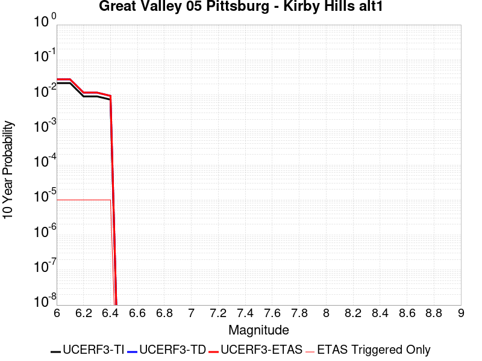 |

| Magnitude | 1 wk TI Prob | 1 wk TD Prob | 1 wk ETAS Prob | 1 wk ETAS/TD Gain | 1 wk ETAS Triggered Only | 1 mo TI Prob | 1 mo TD Prob | 1 mo ETAS Prob | 1 mo ETAS/TD Gain | 1 mo ETAS Triggered Only | 1 yr TI Prob | 1 yr TD Prob | 1 yr ETAS Prob | 1 yr ETAS/TD Gain | 1 yr ETAS Triggered Only | 10 yr TI Prob | 10 yr TD Prob | 10 yr ETAS Prob | 10 yr ETAS/TD Gain | 10 yr ETAS Triggered Only |
|-----|-----|-----|-----|-----|-----|-----|-----|-----|-----|-----|-----|-----|-----|-----|-----|-----|-----|-----|-----|-----|
| 6.0 | 4.187212E-5 | 5.3444037E-5 | 5.3444037E-5 | 1.0 | 0.0 | 1.794396E-4 | 2.2903152E-4 | 2.2903152E-4 | 1.0 | 0.0 | 0.002182488 | 0.0027858876 | 0.0027858876 | 1.0 | 0.0 | 0.021611776 | 0.027604017 | 0.027613742 | 1.0003523 | 1.0E-5 |
| 6.1 | 4.187212E-5 | 5.3444037E-5 | 5.3444037E-5 | 1.0 | 0.0 | 1.794396E-4 | 2.2903152E-4 | 2.2903152E-4 | 1.0 | 0.0 | 0.002182488 | 0.0027858876 | 0.0027858876 | 1.0 | 0.0 | 0.021611776 | 0.027604017 | 0.027613742 | 1.0003523 | 1.0E-5 |
| 6.2 | 1.7353306E-5 | 2.2155189E-5 | 2.2155189E-5 | 1.0 | 0.0 | 7.436919E-5 | 9.4949675E-5 | 9.4949675E-5 | 1.0 | 0.0 | 9.050688E-4 | 0.0011557965 | 0.0011557965 | 1.0 | 0.0 | 0.009013915 | 0.011535524 | 0.011545409 | 1.0008569 | 1.0E-5 |
| 6.3 | 1.7353306E-5 | 2.2155189E-5 | 2.2155189E-5 | 1.0 | 0.0 | 7.436919E-5 | 9.4949675E-5 | 9.4949675E-5 | 1.0 | 0.0 | 9.050688E-4 | 0.0011557965 | 0.0011557965 | 1.0 | 0.0 | 0.009013915 | 0.011535524 | 0.011545409 | 1.0008569 | 1.0E-5 |
| 6.4 | 1.4028824E-5 | 1.7901253E-5 | 1.7901253E-5 | 1.0 | 0.0 | 6.0122147E-5 | 7.6719654E-5 | 7.6719654E-5 | 1.0 | 0.0 | 7.3174125E-4 | 9.3406177E-4 | 9.3406177E-4 | 1.0 | 0.0 | 0.0072933645 | 0.00933847 | 0.009348377 | 1.0010608 | 1.0E-5 |

## Point Reyes 2011 CFM
*[(top)](#table-of-contents)*

| 1 Week | 1 Month | 1 Year | 10 Year |
|-----|-----|-----|-----|
|  | 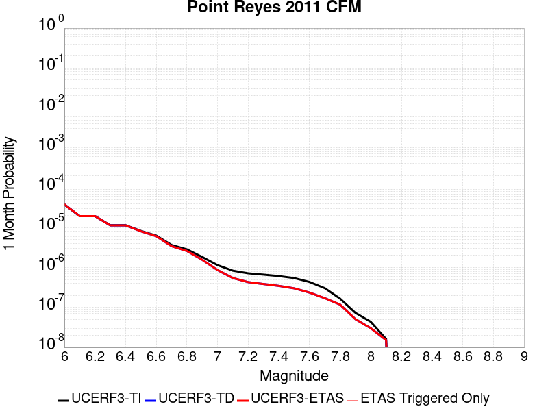 |  |  |

| Magnitude | 1 wk TI Prob | 1 wk TD Prob | 1 wk ETAS Prob | 1 wk ETAS/TD Gain | 1 wk ETAS Triggered Only | 1 mo TI Prob | 1 mo TD Prob | 1 mo ETAS Prob | 1 mo ETAS/TD Gain | 1 mo ETAS Triggered Only | 1 yr TI Prob | 1 yr TD Prob | 1 yr ETAS Prob | 1 yr ETAS/TD Gain | 1 yr ETAS Triggered Only | 10 yr TI Prob | 10 yr TD Prob | 10 yr ETAS Prob | 10 yr ETAS/TD Gain | 10 yr ETAS Triggered Only |
|-----|-----|-----|-----|-----|-----|-----|-----|-----|-----|-----|-----|-----|-----|-----|-----|-----|-----|-----|-----|-----|
| 6.0 | 8.8644965E-6 | 8.967201E-6 | 8.967201E-6 | 1.0 | 0.0 | 3.7990147E-5 | 3.843033E-5 | 3.843033E-5 | 1.0 | 0.0 | 4.624319E-4 | 4.6779512E-4 | 4.6779512E-4 | 1.0 | 0.0 | 0.0046147075 | 0.0046687326 | 0.004678686 | 1.0021319 | 1.0E-5 |
| 6.1 | 4.526405E-6 | 4.5392444E-6 | 4.5392444E-6 | 1.0 | 0.0 | 1.9398734E-5 | 1.9453766E-5 | 1.9453766E-5 | 1.0 | 0.0 | 2.36154E-4 | 2.368249E-4 | 2.368249E-4 | 1.0 | 0.0 | 0.002359032 | 0.0023658313 | 0.0023658313 | 1.0 | 0.0 |
| 6.2 | 4.526405E-6 | 4.5392444E-6 | 4.5392444E-6 | 1.0 | 0.0 | 1.9398734E-5 | 1.9453766E-5 | 1.9453766E-5 | 1.0 | 0.0 | 2.36154E-4 | 2.368249E-4 | 2.368249E-4 | 1.0 | 0.0 | 0.002359032 | 0.0023658313 | 0.0023658313 | 1.0 | 0.0 |
| 6.3 | 2.6842322E-6 | 2.6606972E-6 | 2.6606972E-6 | 1.0 | 0.0 | 1.1503801E-5 | 1.1402939E-5 | 1.1402939E-5 | 1.0 | 0.0 | 1.4004979E-4 | 1.3882213E-4 | 1.3882213E-4 | 1.0 | 0.0 | 0.0013996155 | 0.0013873759 | 0.0013873759 | 1.0 | 0.0 |
| 6.4 | 2.6842322E-6 | 2.6606972E-6 | 2.6606972E-6 | 1.0 | 0.0 | 1.1503801E-5 | 1.1402939E-5 | 1.1402939E-5 | 1.0 | 0.0 | 1.4004979E-4 | 1.3882213E-4 | 1.3882213E-4 | 1.0 | 0.0 | 0.0013996155 | 0.0013873759 | 0.0013873759 | 1.0 | 0.0 |
| 6.5 | 1.9281833E-6 | 1.8906454E-6 | 1.8906454E-6 | 1.0 | 0.0 | 8.263617E-6 | 8.102741E-6 | 8.102741E-6 | 1.0 | 0.0 | 1.0060489E-4 | 9.8646495E-5 | 9.8646495E-5 | 1.0 | 0.0 | 0.0010055936 | 9.860379E-4 | 9.860379E-4 | 1.0 | 0.0 |
| 6.6 | 1.4726726E-6 | 1.4269757E-6 | 1.4269757E-6 | 1.0 | 0.0 | 6.3114385E-6 | 6.115596E-6 | 6.115596E-6 | 1.0 | 0.0 | 7.683905E-5 | 7.445489E-5 | 7.445489E-5 | 1.0 | 0.0 | 7.6812494E-4 | 7.443066E-4 | 7.443066E-4 | 1.0 | 0.0 |
| 6.7 | 8.572307E-7 | 8.007378E-7 | 8.007378E-7 | 1.0 | 0.0 | 3.6738406E-6 | 3.4317288E-6 | 3.4317288E-6 | 1.0 | 0.0 | 4.472809E-5 | 4.1780513E-5 | 4.1780513E-5 | 1.0 | 0.0 | 4.471909E-4 | 4.177305E-4 | 4.177305E-4 | 1.0 | 0.0 |
| 6.8 | 6.6745434E-7 | 6.0774613E-7 | 6.0774613E-7 | 1.0 | 0.0 | 2.8605155E-6 | 2.6046237E-6 | 2.6046237E-6 | 1.0 | 0.0 | 3.482622E-5 | 3.1710842E-5 | 3.1710842E-5 | 1.0 | 0.0 | 3.4820763E-4 | 3.1706647E-4 | 3.1706647E-4 | 1.0 | 0.0 |
| 6.9 | 4.291521E-7 | 3.65375E-7 | 3.65375E-7 | 1.0 | 0.0 | 1.839222E-6 | 1.5658918E-6 | 1.5658918E-6 | 1.0 | 0.0 | 2.2392298E-5 | 1.906457E-5 | 1.906457E-5 | 1.0 | 0.0 | 2.2390042E-4 | 1.90632E-4 | 1.90632E-4 | 1.0 | 0.0 |
| 7.0 | 2.6812808E-7 | 2.0188939E-7 | 2.0188939E-7 | 1.0 | 0.0 | 1.1491198E-6 | 8.6523994E-7 | 8.6523994E-7 | 1.0 | 0.0 | 1.3990444E-5 | 1.0534246E-5 | 1.0534246E-5 | 1.0 | 0.0 | 1.3989564E-4 | 1.05339815E-4 | 1.05339815E-4 | 1.0 | 0.0 |
| 7.1 | 1.9451231E-7 | 1.2727004E-7 | 1.2727004E-7 | 1.0 | 0.0 | 8.336239E-7 | 5.454429E-7 | 5.454429E-7 | 1.0 | 0.0 | 1.0149324E-5 | 6.640747E-6 | 6.640747E-6 | 1.0 | 0.0 | 1.014886E-4 | 6.640777E-5 | 6.640777E-5 | 1.0 | 0.0 |
| 7.2 | 1.6715143E-7 | 1.0044323E-7 | 1.0044323E-7 | 1.0 | 0.0 | 7.1636305E-7 | 4.304709E-7 | 4.304709E-7 | 1.0 | 0.0 | 8.721685E-6 | 5.2409705E-6 | 5.2409705E-6 | 1.0 | 0.0 | 8.721343E-5 | 5.2410738E-5 | 5.2410738E-5 | 1.0 | 0.0 |
| 7.3 | 1.5503173E-7 | 9.014564E-8 | 9.014564E-8 | 1.0 | 0.0 | 6.644215E-7 | 3.8633837E-7 | 3.8633837E-7 | 1.0 | 0.0 | 8.089301E-6 | 4.703659E-6 | 4.703659E-6 | 1.0 | 0.0 | 8.089007E-5 | 4.703787E-5 | 4.703787E-5 | 1.0 | 0.0 |
| 7.4 | 1.4251614E-7 | 8.099046E-8 | 8.099046E-8 | 1.0 | 0.0 | 6.1078333E-7 | 3.4710192E-7 | 3.4710192E-7 | 1.0 | 0.0 | 7.4362615E-6 | 4.2259576E-6 | 4.2259576E-6 | 1.0 | 0.0 | 7.436013E-5 | 4.2261043E-5 | 4.2261043E-5 | 1.0 | 0.0 |
| 7.5 | 1.2710186E-7 | 7.031006E-8 | 7.031006E-8 | 1.0 | 0.0 | 5.447221E-7 | 3.0132875E-7 | 3.0132875E-7 | 1.0 | 0.0 | 6.6319717E-6 | 3.6686715E-6 | 3.6686715E-6 | 1.0 | 0.0 | 6.6317734E-5 | 3.668838E-5 | 3.668838E-5 | 1.0 | 0.0 |
| 7.6 | 1.0144708E-7 | 5.496477E-8 | 5.496477E-8 | 1.0 | 0.0 | 4.347731E-7 | 2.3556325E-7 | 2.3556325E-7 | 1.0 | 0.0 | 5.2933497E-6 | 2.8679788E-6 | 2.8679788E-6 | 1.0 | 0.0 | 5.293224E-5 | 2.8681687E-5 | 2.8681687E-5 | 1.0 | 0.0 |
| 7.7 | 7.090527E-8 | 3.9833534E-8 | 3.9833534E-8 | 1.0 | 0.0 | 3.038797E-7 | 1.7071513E-7 | 1.7071513E-7 | 1.0 | 0.0 | 3.699729E-6 | 2.0784546E-6 | 2.0784546E-6 | 1.0 | 0.0 | 3.6996673E-5 | 2.0786621E-5 | 2.0786621E-5 | 1.0 | 0.0 |
| 7.8 | 3.8712045E-8 | 2.7448936E-8 | 2.7448936E-8 | 1.0 | 0.0 | 1.6590876E-7 | 1.17638294E-7 | 1.17638294E-7 | 1.0 | 0.0 | 2.0199373E-6 | 1.4322452E-6 | 1.4322452E-6 | 1.0 | 0.0 | 2.0199188E-5 | 1.432463E-5 | 1.432463E-5 | 1.0 | 0.0 |
| 7.9 | 1.7068782E-8 | 1.18407035E-8 | 1.18407035E-8 | 1.0 | 0.0 | 7.315192E-8 | 5.0745875E-8 | 5.0745875E-8 | 1.0 | 0.0 | 8.906242E-7 | 6.1783084E-7 | 6.1783084E-7 | 1.0 | 0.0 | 8.906207E-6 | 6.1805604E-6 | 6.1805604E-6 | 1.0 | 0.0 |
| 8.0 | 1.0172592E-8 | 7.0342603E-9 | 7.0342603E-9 | 1.0 | 0.0 | 4.359682E-8 | 3.0146833E-8 | 3.0146833E-8 | 1.0 | 0.0 | 5.3079117E-7 | 3.6703761E-7 | 3.6703761E-7 | 1.0 | 0.0 | 5.307899E-6 | 3.6726397E-6 | 3.6726397E-6 | 1.0 | 0.0 |
| 8.1 | 3.7861243E-9 | 3.5482264E-9 | 3.5482264E-9 | 1.0 | 0.0 | 1.6226247E-8 | 1.5206684E-8 | 1.5206684E-8 | 1.0 | 0.0 | 1.9755454E-7 | 1.8514133E-7 | 1.8514133E-7 | 1.0 | 0.0 | 1.9755437E-6 | 1.8534101E-6 | 1.8534101E-6 | 1.0 | 0.0 |

## Round Valley
*[(top)](#table-of-contents)*

| 1 Week | 1 Month | 1 Year | 10 Year |
|-----|-----|-----|-----|
|  |  |  |  |

| Magnitude | 1 wk TI Prob | 1 wk TD Prob | 1 wk ETAS Prob | 1 wk ETAS/TD Gain | 1 wk ETAS Triggered Only | 1 mo TI Prob | 1 mo TD Prob | 1 mo ETAS Prob | 1 mo ETAS/TD Gain | 1 mo ETAS Triggered Only | 1 yr TI Prob | 1 yr TD Prob | 1 yr ETAS Prob | 1 yr ETAS/TD Gain | 1 yr ETAS Triggered Only | 10 yr TI Prob | 10 yr TD Prob | 10 yr ETAS Prob | 10 yr ETAS/TD Gain | 10 yr ETAS Triggered Only |
|-----|-----|-----|-----|-----|-----|-----|-----|-----|-----|-----|-----|-----|-----|-----|-----|-----|-----|-----|-----|-----|
| 6.0 | 1.588152E-5 | 1.367093E-5 | 1.367093E-5 | 1.0 | 0.0 | 6.806188E-5 | 5.8588605E-5 | 5.8588605E-5 | 1.0 | 0.0 | 8.283384E-4 | 7.131222E-4 | 7.131222E-4 | 1.0 | 0.0 | 0.008252576 | 0.007112226 | 0.007122155 | 1.0013961 | 1.0E-5 |
| 6.1 | 1.588152E-5 | 1.367093E-5 | 1.367093E-5 | 1.0 | 0.0 | 6.806188E-5 | 5.8588605E-5 | 5.8588605E-5 | 1.0 | 0.0 | 8.283384E-4 | 7.131222E-4 | 7.131222E-4 | 1.0 | 0.0 | 0.008252576 | 0.007112226 | 0.007122155 | 1.0013961 | 1.0E-5 |
| 6.2 | 1.588152E-5 | 1.367093E-5 | 1.367093E-5 | 1.0 | 0.0 | 6.806188E-5 | 5.8588605E-5 | 5.8588605E-5 | 1.0 | 0.0 | 8.283384E-4 | 7.131222E-4 | 7.131222E-4 | 1.0 | 0.0 | 0.008252576 | 0.007112226 | 0.007122155 | 1.0013961 | 1.0E-5 |
| 6.3 | 1.588152E-5 | 1.367093E-5 | 1.367093E-5 | 1.0 | 0.0 | 6.806188E-5 | 5.8588605E-5 | 5.8588605E-5 | 1.0 | 0.0 | 8.283384E-4 | 7.131222E-4 | 7.131222E-4 | 1.0 | 0.0 | 0.008252576 | 0.007112226 | 0.007122155 | 1.0013961 | 1.0E-5 |
| 6.4 | 1.588152E-5 | 1.367093E-5 | 1.367093E-5 | 1.0 | 0.0 | 6.806188E-5 | 5.8588605E-5 | 5.8588605E-5 | 1.0 | 0.0 | 8.283384E-4 | 7.131222E-4 | 7.131222E-4 | 1.0 | 0.0 | 0.008252576 | 0.007112226 | 0.007122155 | 1.0013961 | 1.0E-5 |
| 6.5 | 1.0646776E-5 | 7.953182E-6 | 7.953182E-6 | 1.0 | 0.0 | 4.5628243E-5 | 3.4084667E-5 | 3.4084667E-5 | 1.0 | 0.0 | 5.553823E-4 | 4.1491017E-4 | 4.1491017E-4 | 1.0 | 0.0 | 0.005539963 | 0.0041421843 | 0.0041421843 | 1.0 | 0.0 |
| 6.6 | 8.632956E-6 | 5.7688617E-6 | 5.7688617E-6 | 1.0 | 0.0 | 3.6997862E-5 | 2.472348E-5 | 2.472348E-5 | 1.0 | 0.0 | 4.5035584E-4 | 3.0097063E-4 | 3.0097063E-4 | 1.0 | 0.0 | 0.0044944426 | 0.0030060082 | 0.0030060082 | 1.0 | 0.0 |
| 6.7 | 8.632956E-6 | 5.7688617E-6 | 5.7688617E-6 | 1.0 | 0.0 | 3.6997862E-5 | 2.472348E-5 | 2.472348E-5 | 1.0 | 0.0 | 4.5035584E-4 | 3.0097063E-4 | 3.0097063E-4 | 1.0 | 0.0 | 0.0044944426 | 0.0030060082 | 0.0030060082 | 1.0 | 0.0 |
| 6.8 | 7.143895E-6 | 4.201937E-6 | 4.201937E-6 | 1.0 | 0.0 | 3.0616335E-5 | 1.8008186E-5 | 1.8008186E-5 | 1.0 | 0.0 | 3.726901E-4 | 2.1922929E-4 | 2.1922929E-4 | 1.0 | 0.0 | 0.0037206567 | 0.002190295 | 0.002190295 | 1.0 | 0.0 |
| 6.9 | 6.5120694E-6 | 3.664563E-6 | 3.664563E-6 | 1.0 | 0.0 | 2.790857E-5 | 1.5705184E-5 | 1.5705184E-5 | 1.0 | 0.0 | 3.3973387E-4 | 1.9119536E-4 | 1.9119536E-4 | 1.0 | 0.0 | 0.0033921495 | 0.0019104576 | 0.0019104576 | 1.0 | 0.0 |
| 7.0 | 5.0614435E-6 | 2.6837417E-6 | 2.6837417E-6 | 1.0 | 0.0 | 2.169172E-5 | 1.1501705E-5 | 1.1501705E-5 | 1.0 | 0.0 | 2.6406467E-4 | 1.400253E-4 | 1.400253E-4 | 1.0 | 0.0 | 0.0026375111 | 0.001399472 | 0.001399472 | 1.0 | 0.0 |
| 7.1 | 4.41728E-6 | 2.3575708E-6 | 2.3575708E-6 | 1.0 | 0.0 | 1.8931061E-5 | 1.0103841E-5 | 1.0103841E-5 | 1.0 | 0.0 | 2.304613E-4 | 1.2300831E-4 | 1.2300831E-4 | 1.0 | 0.0 | 0.0023022245 | 0.0012294988 | 0.0012294988 | 1.0 | 0.0 |
| 7.2 | 2.535495E-6 | 1.1208772E-6 | 1.1208772E-6 | 1.0 | 0.0 | 1.0866362E-5 | 4.803753E-6 | 4.803753E-6 | 1.0 | 0.0 | 1.3228992E-4 | 5.848465E-5 | 5.848465E-5 | 1.0 | 0.0 | 0.0013221119 | 5.847438E-4 | 5.847438E-4 | 1.0 | 0.0 |
| 7.3 | 7.900015E-7 | 4.089063E-7 | 4.089063E-7 | 1.0 | 0.0 | 3.3857161E-6 | 1.7524555E-6 | 1.7524555E-6 | 1.0 | 0.0 | 4.1220315E-5 | 2.1336145E-5 | 2.1336145E-5 | 1.0 | 0.0 | 4.121267E-4 | 2.1336146E-4 | 2.1336146E-4 | 1.0 | 0.0 |

## San Jose
*[(top)](#table-of-contents)*

| 1 Week | 1 Month | 1 Year | 10 Year |
|-----|-----|-----|-----|
|  |  |  |  |

| Magnitude | 1 wk TI Prob | 1 wk TD Prob | 1 wk ETAS Prob | 1 wk ETAS/TD Gain | 1 wk ETAS Triggered Only | 1 mo TI Prob | 1 mo TD Prob | 1 mo ETAS Prob | 1 mo ETAS/TD Gain | 1 mo ETAS Triggered Only | 1 yr TI Prob | 1 yr TD Prob | 1 yr ETAS Prob | 1 yr ETAS/TD Gain | 1 yr ETAS Triggered Only | 10 yr TI Prob | 10 yr TD Prob | 10 yr ETAS Prob | 10 yr ETAS/TD Gain | 10 yr ETAS Triggered Only |
|-----|-----|-----|-----|-----|-----|-----|-----|-----|-----|-----|-----|-----|-----|-----|-----|-----|-----|-----|-----|-----|
| 6.0 | 5.0851277E-6 | 4.125751E-6 | 4.125751E-6 | 1.0 | 0.0 | 2.1793223E-5 | 1.7681685E-5 | 1.7681685E-5 | 1.0 | 0.0 | 2.653002E-4 | 2.1525587E-4 | 2.1525587E-4 | 1.0 | 0.0 | 0.0026498367 | 0.002150765 | 0.0021607433 | 1.0046395 | 1.0E-5 |
| 6.1 | 5.0851277E-6 | 4.125751E-6 | 4.125751E-6 | 1.0 | 0.0 | 2.1793223E-5 | 1.7681685E-5 | 1.7681685E-5 | 1.0 | 0.0 | 2.653002E-4 | 2.1525587E-4 | 2.1525587E-4 | 1.0 | 0.0 | 0.0026498367 | 0.002150765 | 0.0021607433 | 1.0046395 | 1.0E-5 |
| 6.2 | 5.0851277E-6 | 4.125751E-6 | 4.125751E-6 | 1.0 | 0.0 | 2.1793223E-5 | 1.7681685E-5 | 1.7681685E-5 | 1.0 | 0.0 | 2.653002E-4 | 2.1525587E-4 | 2.1525587E-4 | 1.0 | 0.0 | 0.0026498367 | 0.002150765 | 0.0021607433 | 1.0046395 | 1.0E-5 |
| 6.3 | 5.0851277E-6 | 4.125751E-6 | 4.125751E-6 | 1.0 | 0.0 | 2.1793223E-5 | 1.7681685E-5 | 1.7681685E-5 | 1.0 | 0.0 | 2.653002E-4 | 2.1525587E-4 | 2.1525587E-4 | 1.0 | 0.0 | 0.0026498367 | 0.002150765 | 0.0021607433 | 1.0046395 | 1.0E-5 |
| 6.4 | 4.3115124E-6 | 3.3238575E-6 | 3.3238575E-6 | 1.0 | 0.0 | 1.8477778E-5 | 1.4245038E-5 | 1.4245038E-5 | 1.0 | 0.0 | 2.2494372E-4 | 1.7342175E-4 | 1.7342175E-4 | 1.0 | 0.0 | 0.0022471617 | 0.0017331139 | 0.0017430965 | 1.00576 | 1.0E-5 |
| 6.5 | 4.3115124E-6 | 3.3238575E-6 | 3.3238575E-6 | 1.0 | 0.0 | 1.8477778E-5 | 1.4245038E-5 | 1.4245038E-5 | 1.0 | 0.0 | 2.2494372E-4 | 1.7342175E-4 | 1.7342175E-4 | 1.0 | 0.0 | 0.0022471617 | 0.0017331139 | 0.0017430965 | 1.00576 | 1.0E-5 |
| 6.6 | 3.110396E-6 | 2.080055E-6 | 2.080055E-6 | 1.0 | 0.0 | 1.33302E-5 | 8.914493E-6 | 8.914493E-6 | 1.0 | 0.0 | 1.622831E-4 | 1.0852883E-4 | 1.0852883E-4 | 1.0 | 0.0 | 0.0016216465 | 0.0010848183 | 0.0010948074 | 1.0092081 | 1.0E-5 |
| 6.7 | 3.110396E-6 | 2.080055E-6 | 2.080055E-6 | 1.0 | 0.0 | 1.33302E-5 | 8.914493E-6 | 8.914493E-6 | 1.0 | 0.0 | 1.622831E-4 | 1.0852883E-4 | 1.0852883E-4 | 1.0 | 0.0 | 0.0016216465 | 0.0010848183 | 0.0010948074 | 1.0092081 | 1.0E-5 |
| 6.8 | 2.856651E-6 | 1.9025018E-6 | 1.9025018E-6 | 1.0 | 0.0 | 1.2242733E-5 | 8.153555E-6 | 8.153555E-6 | 1.0 | 0.0 | 1.4904508E-4 | 9.926526E-5 | 9.926526E-5 | 1.0 | 0.0 | 0.0014894515 | 9.922662E-4 | 0.0010022563 | 1.0100679 | 1.0E-5 |
| 6.9 | 2.1618725E-6 | 1.4187265E-6 | 1.4187265E-6 | 1.0 | 0.0 | 9.265135E-6 | 6.080242E-6 | 6.080242E-6 | 1.0 | 0.0 | 1.12797185E-4 | 7.402452E-5 | 7.402452E-5 | 1.0 | 0.0 | 0.0011273995 | 7.4003986E-4 | 7.4003986E-4 | 1.0 | 0.0 |
| 7.0 | 1.9684312E-6 | 1.3256941E-6 | 1.3256941E-6 | 1.0 | 0.0 | 8.436106E-6 | 5.6815347E-6 | 5.6815347E-6 | 1.0 | 0.0 | 1.02704755E-4 | 6.917057E-5 | 6.917057E-5 | 1.0 | 0.0 | 0.001026573 | 6.9153105E-4 | 6.9153105E-4 | 1.0 | 0.0 |
| 7.1 | 1.6070337E-6 | 1.1155666E-6 | 1.1155666E-6 | 1.0 | 0.0 | 6.887269E-6 | 4.7809913E-6 | 4.7809913E-6 | 1.0 | 0.0 | 8.384928E-5 | 5.820708E-5 | 5.820708E-5 | 1.0 | 0.0 | 8.3817646E-4 | 5.81957E-4 | 5.81957E-4 | 1.0 | 0.0 |
| 7.2 | 1.0631658E-6 | 6.4041933E-7 | 6.4041933E-7 | 1.0 | 0.0 | 4.556417E-6 | 2.7446513E-6 | 2.7446513E-6 | 1.0 | 0.0 | 5.5472963E-5 | 3.3415632E-5 | 3.3415632E-5 | 1.0 | 0.0 | 5.545912E-4 | 3.3413994E-4 | 3.3413994E-4 | 1.0 | 0.0 |
| 7.3 | 7.060711E-7 | 4.582818E-7 | 4.582818E-7 | 1.0 | 0.0 | 3.0260155E-6 | 1.9640634E-6 | 1.9640634E-6 | 1.0 | 0.0 | 3.6841117E-5 | 2.3912218E-5 | 2.3912218E-5 | 1.0 | 0.0 | 3.6835007E-4 | 2.3912982E-4 | 2.3912982E-4 | 1.0 | 0.0 |
| 7.4 | 3.3677085E-7 | 2.3235627E-7 | 2.3235627E-7 | 1.0 | 0.0 | 1.4433028E-6 | 9.958122E-7 | 9.958122E-7 | 1.0 | 0.0 | 1.757207E-5 | 1.2123949E-5 | 1.2123949E-5 | 1.0 | 0.0 | 1.7570681E-4 | 1.2126564E-4 | 1.2126564E-4 | 1.0 | 0.0 |
| 7.5 | 3.129161E-7 | 1.9532963E-7 | 1.9532963E-7 | 1.0 | 0.0 | 1.3410682E-6 | 8.371268E-7 | 8.371268E-7 | 1.0 | 0.0 | 1.6327383E-5 | 1.0191973E-5 | 1.0191973E-5 | 1.0 | 0.0 | 1.6326184E-4 | 1.0194778E-4 | 1.0194778E-4 | 1.0 | 0.0 |
| 7.6 | 2.8008668E-7 | 1.4243734E-7 | 1.4243734E-7 | 1.0 | 0.0 | 1.2003709E-6 | 6.104456E-7 | 6.104456E-7 | 1.0 | 0.0 | 1.46144175E-5 | 7.4321515E-6 | 7.4321515E-6 | 1.0 | 0.0 | 1.4613457E-4 | 7.4351636E-5 | 7.4351636E-5 | 1.0 | 0.0 |
| 7.7 | 2.7852005E-7 | 1.4018305E-7 | 1.4018305E-7 | 1.0 | 0.0 | 1.1936568E-6 | 6.007844E-7 | 6.007844E-7 | 1.0 | 0.0 | 1.4532674E-5 | 7.314527E-6 | 7.314527E-6 | 1.0 | 0.0 | 1.4531724E-4 | 7.317547E-5 | 7.317547E-5 | 1.0 | 0.0 |
| 7.8 | 1.1810797E-7 | 7.5195864E-8 | 7.5195864E-8 | 1.0 | 0.0 | 5.0617695E-7 | 3.2226794E-7 | 3.2226794E-7 | 1.0 | 0.0 | 6.1626865E-6 | 3.9236056E-6 | 3.9236056E-6 | 1.0 | 0.0 | 6.162516E-5 | 3.9253733E-5 | 3.9253733E-5 | 1.0 | 0.0 |

## Channel Islands Western Deep Ramp
*[(top)](#table-of-contents)*

| 1 Week | 1 Month | 1 Year | 10 Year |
|-----|-----|-----|-----|
|  |  |  | 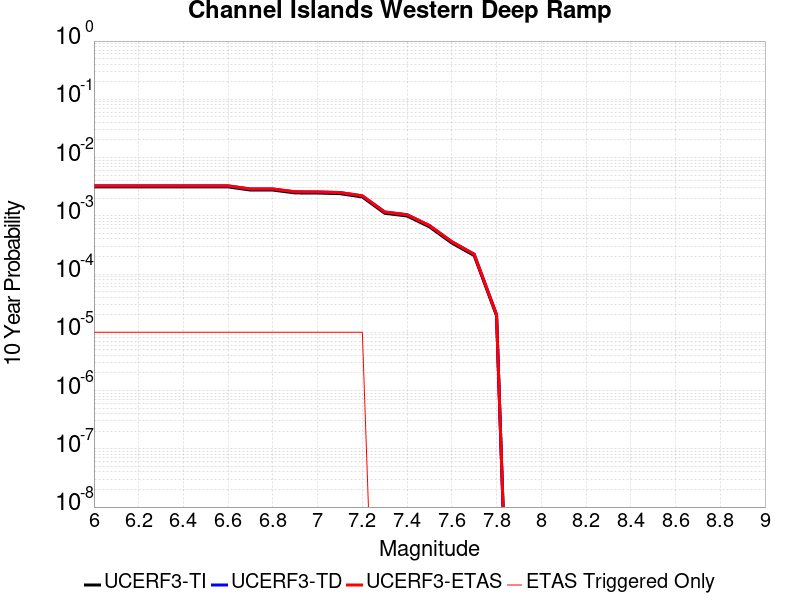 |

| Magnitude | 1 wk TI Prob | 1 wk TD Prob | 1 wk ETAS Prob | 1 wk ETAS/TD Gain | 1 wk ETAS Triggered Only | 1 mo TI Prob | 1 mo TD Prob | 1 mo ETAS Prob | 1 mo ETAS/TD Gain | 1 mo ETAS Triggered Only | 1 yr TI Prob | 1 yr TD Prob | 1 yr ETAS Prob | 1 yr ETAS/TD Gain | 1 yr ETAS Triggered Only | 10 yr TI Prob | 10 yr TD Prob | 10 yr ETAS Prob | 10 yr ETAS/TD Gain | 10 yr ETAS Triggered Only |
|-----|-----|-----|-----|-----|-----|-----|-----|-----|-----|-----|-----|-----|-----|-----|-----|-----|-----|-----|-----|-----|
| 6.0 | 6.0213506E-6 | 6.2549007E-6 | 6.2549007E-6 | 1.0 | 0.0 | 2.5805533E-5 | 2.6806467E-5 | 2.6806467E-5 | 1.0 | 0.0 | 3.1413708E-4 | 3.263243E-4 | 3.3632107E-4 | 1.0306344 | 1.0E-5 | 0.0031369338 | 0.003258893 | 0.0032688605 | 1.0030586 | 1.0E-5 |
| 6.1 | 6.0213506E-6 | 6.2549007E-6 | 6.2549007E-6 | 1.0 | 0.0 | 2.5805533E-5 | 2.6806467E-5 | 2.6806467E-5 | 1.0 | 0.0 | 3.1413708E-4 | 3.263243E-4 | 3.3632107E-4 | 1.0306344 | 1.0E-5 | 0.0031369338 | 0.003258893 | 0.0032688605 | 1.0030586 | 1.0E-5 |
| 6.2 | 6.0213506E-6 | 6.2549007E-6 | 6.2549007E-6 | 1.0 | 0.0 | 2.5805533E-5 | 2.6806467E-5 | 2.6806467E-5 | 1.0 | 0.0 | 3.1413708E-4 | 3.263243E-4 | 3.3632107E-4 | 1.0306344 | 1.0E-5 | 0.0031369338 | 0.003258893 | 0.0032688605 | 1.0030586 | 1.0E-5 |
| 6.3 | 6.0213506E-6 | 6.2549007E-6 | 6.2549007E-6 | 1.0 | 0.0 | 2.5805533E-5 | 2.6806467E-5 | 2.6806467E-5 | 1.0 | 0.0 | 3.1413708E-4 | 3.263243E-4 | 3.3632107E-4 | 1.0306344 | 1.0E-5 | 0.0031369338 | 0.003258893 | 0.0032688605 | 1.0030586 | 1.0E-5 |
| 6.4 | 6.0213506E-6 | 6.2549007E-6 | 6.2549007E-6 | 1.0 | 0.0 | 2.5805533E-5 | 2.6806467E-5 | 2.6806467E-5 | 1.0 | 0.0 | 3.1413708E-4 | 3.263243E-4 | 3.3632107E-4 | 1.0306344 | 1.0E-5 | 0.0031369338 | 0.003258893 | 0.0032688605 | 1.0030586 | 1.0E-5 |
| 6.5 | 6.0213506E-6 | 6.2549007E-6 | 6.2549007E-6 | 1.0 | 0.0 | 2.5805533E-5 | 2.6806467E-5 | 2.6806467E-5 | 1.0 | 0.0 | 3.1413708E-4 | 3.263243E-4 | 3.3632107E-4 | 1.0306344 | 1.0E-5 | 0.0031369338 | 0.003258893 | 0.0032688605 | 1.0030586 | 1.0E-5 |
| 6.6 | 6.0213506E-6 | 6.2549007E-6 | 6.2549007E-6 | 1.0 | 0.0 | 2.5805533E-5 | 2.6806467E-5 | 2.6806467E-5 | 1.0 | 0.0 | 3.1413708E-4 | 3.263243E-4 | 3.3632107E-4 | 1.0306344 | 1.0E-5 | 0.0031369338 | 0.003258893 | 0.0032688605 | 1.0030586 | 1.0E-5 |
| 6.7 | 5.313309E-6 | 5.52527E-6 | 5.52527E-6 | 1.0 | 0.0 | 2.2771126E-5 | 2.3679535E-5 | 2.3679535E-5 | 1.0 | 0.0 | 2.772032E-4 | 2.882643E-4 | 2.982614E-4 | 1.0346804 | 1.0E-5 | 0.0027685766 | 0.002879307 | 0.002889278 | 1.003463 | 1.0E-5 |
| 6.8 | 5.313309E-6 | 5.52527E-6 | 5.52527E-6 | 1.0 | 0.0 | 2.2771126E-5 | 2.3679535E-5 | 2.3679535E-5 | 1.0 | 0.0 | 2.772032E-4 | 2.882643E-4 | 2.982614E-4 | 1.0346804 | 1.0E-5 | 0.0027685766 | 0.002879307 | 0.002889278 | 1.003463 | 1.0E-5 |
| 6.9 | 4.744377E-6 | 4.9394575E-6 | 4.9394575E-6 | 1.0 | 0.0 | 2.0332885E-5 | 2.1168953E-5 | 2.1168953E-5 | 1.0 | 0.0 | 2.4752476E-4 | 2.5770525E-4 | 2.6770268E-4 | 1.038794 | 1.0E-5 | 0.0024724922 | 0.0025744315 | 0.0025844057 | 1.0038743 | 1.0E-5 |
| 7.0 | 4.722209E-6 | 4.9165E-6 | 4.9165E-6 | 1.0 | 0.0 | 2.0237881E-5 | 2.1070566E-5 | 2.1070566E-5 | 1.0 | 0.0 | 2.4636835E-4 | 2.5650766E-4 | 2.665051E-4 | 1.0389752 | 1.0E-5 | 0.002460954 | 0.0025624833 | 0.0025724578 | 1.0038924 | 1.0E-5 |
| 7.1 | 4.611174E-6 | 4.8014354E-6 | 4.8014354E-6 | 1.0 | 0.0 | 1.9762025E-5 | 2.057744E-5 | 2.057744E-5 | 1.0 | 0.0 | 2.4057609E-4 | 2.5050525E-4 | 2.6050274E-4 | 1.0399094 | 1.0E-5 | 0.002403158 | 0.0025025955 | 0.0025125707 | 1.0039859 | 1.0E-5 |
| 7.2 | 4.043994E-6 | 4.21205E-6 | 4.21205E-6 | 1.0 | 0.0 | 1.7331287E-5 | 1.8051538E-5 | 1.8051538E-5 | 1.0 | 0.0 | 2.10988E-4 | 2.1975888E-4 | 2.2975667E-4 | 1.0454944 | 1.0E-5 | 0.002107878 | 0.0021957664 | 0.0022057444 | 1.0045443 | 1.0E-5 |
| 7.3 | 2.1233036E-6 | 2.2298022E-6 | 2.2298022E-6 | 1.0 | 0.0 | 9.099841E-6 | 9.556261E-6 | 9.556261E-6 | 1.0 | 0.0 | 1.1078493E-4 | 1.1634132E-4 | 1.1634132E-4 | 1.0 | 0.0 | 0.0011072971 | 0.0011628097 | 0.0011628097 | 1.0 | 0.0 |
| 7.4 | 1.9051884E-6 | 2.0015107E-6 | 2.0015107E-6 | 1.0 | 0.0 | 8.165067E-6 | 8.577875E-6 | 8.577875E-6 | 1.0 | 0.0 | 9.940516E-5 | 1.0443068E-4 | 1.0443068E-4 | 1.0 | 0.0 | 9.93607E-4 | 0.0010438213 | 0.0010438213 | 1.0 | 0.0 |
| 7.5 | 1.2408497E-6 | 1.3038928E-6 | 1.3038928E-6 | 1.0 | 0.0 | 5.317916E-6 | 5.5880996E-6 | 5.5880996E-6 | 1.0 | 0.0 | 6.4743705E-5 | 6.803301E-5 | 6.803301E-5 | 1.0 | 0.0 | 6.4724847E-4 | 6.8012404E-4 | 6.8012404E-4 | 1.0 | 0.0 |
| 7.6 | 6.5440025E-7 | 6.886766E-7 | 6.886766E-7 | 1.0 | 0.0 | 2.8045695E-6 | 2.9514679E-6 | 2.9514679E-6 | 1.0 | 0.0 | 3.4145098E-5 | 3.5933543E-5 | 3.5933543E-5 | 1.0 | 0.0 | 3.4139853E-4 | 3.5927873E-4 | 3.5927873E-4 | 1.0 | 0.0 |
| 7.7 | 3.985963E-7 | 4.1931077E-7 | 4.1931077E-7 | 1.0 | 0.0 | 1.7082689E-6 | 1.797045E-6 | 1.797045E-6 | 1.0 | 0.0 | 2.0797976E-5 | 2.1878815E-5 | 2.1878815E-5 | 1.0 | 0.0 | 2.0796029E-4 | 2.1876777E-4 | 2.1876777E-4 | 1.0 | 0.0 |
| 7.8 | 3.706329E-8 | 3.8592006E-8 | 3.8592006E-8 | 1.0 | 0.0 | 1.5884267E-7 | 1.653943E-7 | 1.653943E-7 | 1.0 | 0.0 | 1.9339077E-6 | 2.0136738E-6 | 2.0136738E-6 | 1.0 | 0.0 | 1.933891E-5 | 2.0136567E-5 | 2.0136567E-5 | 1.0 | 0.0 |

## Northridge Hills
*[(top)](#table-of-contents)*

| 1 Week | 1 Month | 1 Year | 10 Year |
|-----|-----|-----|-----|
|  |  |  |  |

| Magnitude | 1 wk TI Prob | 1 wk TD Prob | 1 wk ETAS Prob | 1 wk ETAS/TD Gain | 1 wk ETAS Triggered Only | 1 mo TI Prob | 1 mo TD Prob | 1 mo ETAS Prob | 1 mo ETAS/TD Gain | 1 mo ETAS Triggered Only | 1 yr TI Prob | 1 yr TD Prob | 1 yr ETAS Prob | 1 yr ETAS/TD Gain | 1 yr ETAS Triggered Only | 10 yr TI Prob | 10 yr TD Prob | 10 yr ETAS Prob | 10 yr ETAS/TD Gain | 10 yr ETAS Triggered Only |
|-----|-----|-----|-----|-----|-----|-----|-----|-----|-----|-----|-----|-----|-----|-----|-----|-----|-----|-----|-----|-----|
| 6.0 | 5.095982E-6 | 3.6153342E-6 | 3.6153342E-6 | 1.0 | 0.0 | 2.183974E-5 | 1.5494197E-5 | 1.5494197E-5 | 1.0 | 0.0 | 2.658664E-4 | 1.8862565E-4 | 1.8862565E-4 | 1.0 | 0.0 | 0.0026554854 | 0.0018846678 | 0.001894649 | 1.005296 | 1.0E-5 |
| 6.1 | 5.095982E-6 | 3.6153342E-6 | 3.6153342E-6 | 1.0 | 0.0 | 2.183974E-5 | 1.5494197E-5 | 1.5494197E-5 | 1.0 | 0.0 | 2.658664E-4 | 1.8862565E-4 | 1.8862565E-4 | 1.0 | 0.0 | 0.0026554854 | 0.0018846678 | 0.001894649 | 1.005296 | 1.0E-5 |
| 6.2 | 5.095982E-6 | 3.6153342E-6 | 3.6153342E-6 | 1.0 | 0.0 | 2.183974E-5 | 1.5494197E-5 | 1.5494197E-5 | 1.0 | 0.0 | 2.658664E-4 | 1.8862565E-4 | 1.8862565E-4 | 1.0 | 0.0 | 0.0026554854 | 0.0018846678 | 0.001894649 | 1.005296 | 1.0E-5 |
| 6.3 | 5.095982E-6 | 3.6153342E-6 | 3.6153342E-6 | 1.0 | 0.0 | 2.183974E-5 | 1.5494197E-5 | 1.5494197E-5 | 1.0 | 0.0 | 2.658664E-4 | 1.8862565E-4 | 1.8862565E-4 | 1.0 | 0.0 | 0.0026554854 | 0.0018846678 | 0.001894649 | 1.005296 | 1.0E-5 |
| 6.4 | 5.095982E-6 | 3.6153342E-6 | 3.6153342E-6 | 1.0 | 0.0 | 2.183974E-5 | 1.5494197E-5 | 1.5494197E-5 | 1.0 | 0.0 | 2.658664E-4 | 1.8862565E-4 | 1.8862565E-4 | 1.0 | 0.0 | 0.0026554854 | 0.0018846678 | 0.001894649 | 1.005296 | 1.0E-5 |
| 6.5 | 5.095982E-6 | 3.6153342E-6 | 3.6153342E-6 | 1.0 | 0.0 | 2.183974E-5 | 1.5494197E-5 | 1.5494197E-5 | 1.0 | 0.0 | 2.658664E-4 | 1.8862565E-4 | 1.8862565E-4 | 1.0 | 0.0 | 0.0026554854 | 0.0018846678 | 0.001894649 | 1.005296 | 1.0E-5 |
| 6.6 | 5.095982E-6 | 3.6153342E-6 | 3.6153342E-6 | 1.0 | 0.0 | 2.183974E-5 | 1.5494197E-5 | 1.5494197E-5 | 1.0 | 0.0 | 2.658664E-4 | 1.8862565E-4 | 1.8862565E-4 | 1.0 | 0.0 | 0.0026554854 | 0.0018846678 | 0.001894649 | 1.005296 | 1.0E-5 |
| 6.7 | 5.095982E-6 | 3.6153342E-6 | 3.6153342E-6 | 1.0 | 0.0 | 2.183974E-5 | 1.5494197E-5 | 1.5494197E-5 | 1.0 | 0.0 | 2.658664E-4 | 1.8862565E-4 | 1.8862565E-4 | 1.0 | 0.0 | 0.0026554854 | 0.0018846678 | 0.001894649 | 1.005296 | 1.0E-5 |
| 6.8 | 5.095982E-6 | 3.6153342E-6 | 3.6153342E-6 | 1.0 | 0.0 | 2.183974E-5 | 1.5494197E-5 | 1.5494197E-5 | 1.0 | 0.0 | 2.658664E-4 | 1.8862565E-4 | 1.8862565E-4 | 1.0 | 0.0 | 0.0026554854 | 0.0018846678 | 0.001894649 | 1.005296 | 1.0E-5 |
| 6.9 | 5.0942654E-6 | 3.613549E-6 | 3.613549E-6 | 1.0 | 0.0 | 2.1832384E-5 | 1.5486547E-5 | 1.5486547E-5 | 1.0 | 0.0 | 2.6577685E-4 | 1.8853252E-4 | 1.8853252E-4 | 1.0 | 0.0 | 0.002654592 | 0.0018837382 | 0.0018937193 | 1.0052986 | 1.0E-5 |
| 7.0 | 4.851143E-6 | 3.3588624E-6 | 3.3588624E-6 | 1.0 | 0.0 | 2.0790447E-5 | 1.4395046E-5 | 1.4395046E-5 | 1.0 | 0.0 | 2.5309427E-4 | 1.7524562E-4 | 1.7524562E-4 | 1.0 | 0.0 | 0.0025280623 | 0.0017510786 | 0.0017610611 | 1.0057007 | 1.0E-5 |
| 7.1 | 4.7910607E-6 | 3.2971432E-6 | 3.2971432E-6 | 1.0 | 0.0 | 2.0532956E-5 | 1.4130537E-5 | 1.4130537E-5 | 1.0 | 0.0 | 2.4996005E-4 | 1.7202574E-4 | 1.7202574E-4 | 1.0 | 0.0 | 0.0024967908 | 0.00171893 | 0.0017289127 | 1.0058075 | 1.0E-5 |
| 7.2 | 4.580079E-6 | 3.1069198E-6 | 3.1069198E-6 | 1.0 | 0.0 | 1.9628762E-5 | 1.3315303E-5 | 1.3315303E-5 | 1.0 | 0.0 | 2.3895396E-4 | 1.6210177E-4 | 1.6210177E-4 | 1.0 | 0.0 | 0.0023869718 | 0.0016198389 | 0.0016298227 | 1.0061635 | 1.0E-5 |
| 7.3 | 4.290062E-6 | 2.8683467E-6 | 2.8683467E-6 | 1.0 | 0.0 | 1.838585E-5 | 1.2292857E-5 | 1.2292857E-5 | 1.0 | 0.0 | 2.2382473E-4 | 1.4965527E-4 | 1.4965527E-4 | 1.0 | 0.0 | 0.0022359942 | 0.001495548 | 0.001505533 | 1.0066766 | 1.0E-5 |
| 7.4 | 4.0259683E-6 | 2.6740217E-6 | 2.6740217E-6 | 1.0 | 0.0 | 1.7254037E-5 | 1.1460043E-5 | 1.1460043E-5 | 1.0 | 0.0 | 2.1004764E-4 | 1.3951711E-4 | 1.3951711E-4 | 1.0 | 0.0 | 0.002098492 | 0.001394298 | 0.0014042842 | 1.0071621 | 1.0E-5 |
| 7.5 | 3.5477108E-6 | 2.285331E-6 | 2.285331E-6 | 1.0 | 0.0 | 1.5204386E-5 | 9.794238E-6 | 9.794238E-6 | 1.0 | 0.0 | 1.8509767E-4 | 1.1923834E-4 | 1.1923834E-4 | 1.0 | 0.0 | 0.0018494357 | 0.0011917452 | 0.0012017332 | 1.008381 | 1.0E-5 |
| 7.6 | 2.9990608E-6 | 1.8529445E-6 | 1.8529445E-6 | 1.0 | 0.0 | 1.2853055E-5 | 7.941167E-6 | 7.941167E-6 | 1.0 | 0.0 | 1.564747E-4 | 9.667942E-5 | 9.667942E-5 | 1.0 | 0.0 | 0.0015636457 | 9.663744E-4 | 9.763647E-4 | 1.010338 | 1.0E-5 |
| 7.7 | 2.4542855E-6 | 1.446239E-6 | 1.446239E-6 | 1.0 | 0.0 | 1.05183235E-5 | 6.1981527E-6 | 6.1981527E-6 | 1.0 | 0.0 | 1.2805307E-4 | 7.54599E-5 | 7.54599E-5 | 1.0 | 0.0 | 0.001279793 | 7.5434335E-4 | 7.5434335E-4 | 1.0 | 0.0 |
| 7.8 | 1.3623128E-6 | 8.0169184E-7 | 8.0169184E-7 | 1.0 | 0.0 | 5.8384703E-6 | 3.4358175E-6 | 3.4358175E-6 | 1.0 | 0.0 | 7.108106E-5 | 4.1830277E-5 | 4.1830277E-5 | 1.0 | 0.0 | 7.1058323E-4 | 4.1822426E-4 | 4.1822426E-4 | 1.0 | 0.0 |
| 7.9 | 7.716622E-7 | 4.2194137E-7 | 4.2194137E-7 | 1.0 | 0.0 | 3.3071194E-6 | 1.808319E-6 | 1.808319E-6 | 1.0 | 0.0 | 4.0263436E-5 | 2.2016062E-5 | 2.2016062E-5 | 1.0 | 0.0 | 4.0256142E-4 | 2.2013891E-4 | 2.2013891E-4 | 1.0 | 0.0 |
| 8.0 | 1.2117711E-7 | 6.622407E-8 | 6.622407E-8 | 1.0 | 0.0 | 5.1933034E-7 | 2.8381743E-7 | 2.8381743E-7 | 1.0 | 0.0 | 6.3228285E-6 | 3.4554716E-6 | 3.4554716E-6 | 1.0 | 0.0 | 6.3226486E-5 | 3.45542E-5 | 3.45542E-5 | 1.0 | 0.0 |

## Hunting Creek - Bartlett Springs connector 2011
*[(top)](#table-of-contents)*

| 1 Week | 1 Month | 1 Year | 10 Year |
|-----|-----|-----|-----|
|  |  |  |  |

| Magnitude | 1 wk TI Prob | 1 wk TD Prob | 1 wk ETAS Prob | 1 wk ETAS/TD Gain | 1 wk ETAS Triggered Only | 1 mo TI Prob | 1 mo TD Prob | 1 mo ETAS Prob | 1 mo ETAS/TD Gain | 1 mo ETAS Triggered Only | 1 yr TI Prob | 1 yr TD Prob | 1 yr ETAS Prob | 1 yr ETAS/TD Gain | 1 yr ETAS Triggered Only | 10 yr TI Prob | 10 yr TD Prob | 10 yr ETAS Prob | 10 yr ETAS/TD Gain | 10 yr ETAS Triggered Only |
|-----|-----|-----|-----|-----|-----|-----|-----|-----|-----|-----|-----|-----|-----|-----|-----|-----|-----|-----|-----|-----|
| 6.0 | 4.940016E-5 | 6.787113E-5 | 6.787113E-5 | 1.0 | 0.0 | 2.1169778E-4 | 2.9084473E-4 | 3.0084184E-4 | 1.0343726 | 1.0E-5 | 0.002574374 | 0.0035353133 | 0.003545278 | 1.0028186 | 1.0E-5 | 0.025447546 | 0.034775153 | 0.034784805 | 1.0002775 | 1.0E-5 |
| 6.1 | 4.940016E-5 | 6.787113E-5 | 6.787113E-5 | 1.0 | 0.0 | 2.1169778E-4 | 2.9084473E-4 | 3.0084184E-4 | 1.0343726 | 1.0E-5 | 0.002574374 | 0.0035353133 | 0.003545278 | 1.0028186 | 1.0E-5 | 0.025447546 | 0.034775153 | 0.034784805 | 1.0002775 | 1.0E-5 |
| 6.2 | 4.472471E-5 | 6.1005278E-5 | 6.1005278E-5 | 1.0 | 0.0 | 1.9166325E-4 | 2.6142562E-4 | 2.7142302E-4 | 1.0382417 | 1.0E-5 | 0.0023310026 | 0.0031782303 | 0.0031881984 | 1.0031364 | 1.0E-5 | 0.02306703 | 0.03131807 | 0.031327754 | 1.0003093 | 1.0E-5 |
| 6.3 | 4.472471E-5 | 6.1005278E-5 | 6.1005278E-5 | 1.0 | 0.0 | 1.9166325E-4 | 2.6142562E-4 | 2.7142302E-4 | 1.0382417 | 1.0E-5 | 0.0023310026 | 0.0031782303 | 0.0031881984 | 1.0031364 | 1.0E-5 | 0.02306703 | 0.03131807 | 0.031327754 | 1.0003093 | 1.0E-5 |
| 6.4 | 4.0001003E-5 | 5.4105796E-5 | 5.4105796E-5 | 1.0 | 0.0 | 1.714216E-4 | 2.318617E-4 | 2.318617E-4 | 1.0 | 0.0 | 0.0020850603 | 0.0028192252 | 0.0028192252 | 1.0 | 0.0 | 0.02065605 | 0.027829293 | 0.027829293 | 1.0 | 0.0 |
| 6.5 | 3.8033053E-5 | 5.1268413E-5 | 5.1268413E-5 | 1.0 | 0.0 | 1.6298861E-4 | 2.1970355E-4 | 2.1970355E-4 | 1.0 | 0.0 | 0.0019825802 | 0.0026715663 | 0.0026715663 | 1.0 | 0.0 | 0.019649856 | 0.026391363 | 0.026391363 | 1.0 | 0.0 |
| 6.6 | 3.653754E-5 | 4.913191E-5 | 4.913191E-5 | 1.0 | 0.0 | 1.5658008E-4 | 2.1054859E-4 | 2.1054859E-4 | 1.0 | 0.0 | 0.0019046954 | 0.0025603706 | 0.0025603706 | 1.0 | 0.0 | 0.018884527 | 0.02530727 | 0.02530727 | 1.0 | 0.0 |
| 6.7 | 3.372024E-5 | 4.514163E-5 | 4.514163E-5 | 1.0 | 0.0 | 1.4450731E-4 | 1.9345005E-4 | 1.9345005E-4 | 1.0 | 0.0 | 0.0017579567 | 0.0023527164 | 0.0023527164 | 1.0 | 0.0 | 0.017441148 | 0.023278859 | 0.023278859 | 1.0 | 0.0 |
| 6.8 | 2.9650024E-5 | 3.9412585E-5 | 3.9412585E-5 | 1.0 | 0.0 | 1.2706534E-4 | 1.6890021E-4 | 1.6890021E-4 | 1.0 | 0.0 | 0.0015459227 | 0.0020544082 | 0.0020544082 | 1.0 | 0.0 | 0.015352124 | 0.020351823 | 0.020351823 | 1.0 | 0.0 |
| 6.9 | 2.860775E-5 | 3.7813646E-5 | 3.7813646E-5 | 1.0 | 0.0 | 1.2259888E-4 | 1.620485E-4 | 1.620485E-4 | 1.0 | 0.0 | 0.0014916194 | 0.0019711645 | 0.0019711645 | 1.0 | 0.0 | 0.014816469 | 0.0195364 | 0.0195364 | 1.0 | 0.0 |
| 7.0 | 2.6696067E-5 | 3.5068253E-5 | 3.5068253E-5 | 1.0 | 0.0 | 1.144067E-4 | 1.5028391E-4 | 1.5028391E-4 | 1.0 | 0.0 | 0.0013920115 | 0.0018281818 | 0.0018281818 | 1.0 | 0.0 | 0.013833242 | 0.01813187 | 0.01813187 | 1.0 | 0.0 |
| 7.1 | 2.456087E-5 | 3.2013988E-5 | 3.2013988E-5 | 1.0 | 0.0 | 1.0525662E-4 | 1.3719565E-4 | 1.3719565E-4 | 1.0 | 0.0 | 0.001280746 | 0.0016690863 | 0.0016690863 | 1.0 | 0.0 | 0.012733897 | 0.016566826 | 0.016566826 | 1.0 | 0.0 |
| 7.2 | 2.295761E-5 | 2.9823757E-5 | 2.9823757E-5 | 1.0 | 0.0 | 9.8386045E-5 | 1.278099E-4 | 1.278099E-4 | 1.0 | 0.0 | 0.0011971919 | 0.001554984 | 0.001554984 | 1.0 | 0.0 | 0.011907627 | 0.015442514 | 0.015442514 | 1.0 | 0.0 |
| 7.3 | 2.1256936E-5 | 2.7542677E-5 | 2.7542677E-5 | 1.0 | 0.0 | 9.109797E-5 | 1.1803475E-4 | 1.1803475E-4 | 1.0 | 0.0 | 0.0011085535 | 0.0014361347 | 0.0014361347 | 1.0 | 0.0 | 0.011030397 | 0.014269866 | 0.014269866 | 1.0 | 0.0 |
| 7.4 | 1.8784336E-5 | 2.430742E-5 | 2.430742E-5 | 1.0 | 0.0 | 8.050181E-5 | 1.0417054E-4 | 1.0417054E-4 | 1.0 | 0.0 | 9.796688E-4 | 0.001267546 | 0.001267546 | 1.0 | 0.0 | 0.009753612 | 0.012604239 | 0.012604239 | 1.0 | 0.0 |
| 7.5 | 1.7248298E-5 | 2.2269496E-5 | 2.2269496E-5 | 1.0 | 0.0 | 7.391918E-5 | 9.5437244E-5 | 9.5437244E-5 | 1.0 | 0.0 | 8.9959445E-4 | 0.0011613365 | 0.0011613365 | 1.0 | 0.0 | 0.008959615 | 0.011553653 | 0.011553653 | 1.0 | 0.0 |
| 7.6 | 1.0653709E-5 | 1.3722448E-5 | 1.3722448E-5 | 1.0 | 0.0 | 4.5657955E-5 | 5.8809183E-5 | 5.8809183E-5 | 1.0 | 0.0 | 5.557438E-4 | 7.1576925E-4 | 7.1576925E-4 | 1.0 | 0.0 | 0.0055435603 | 0.0071349875 | 0.0071349875 | 1.0 | 0.0 |
| 7.7 | 3.286316E-6 | 4.090435E-6 | 4.090435E-6 | 1.0 | 0.0 | 1.4084137E-5 | 1.753032E-5 | 1.753032E-5 | 1.0 | 0.0 | 1.7146087E-4 | 2.1341088E-4 | 2.1341088E-4 | 1.0 | 0.0 | 0.0017132863 | 0.0021320751 | 0.0021320751 | 1.0 | 0.0 |
| 7.8 | 5.1855085E-7 | 5.972177E-7 | 5.972177E-7 | 1.0 | 0.0 | 2.222359E-6 | 2.559502E-6 | 2.559502E-6 | 1.0 | 0.0 | 2.7056883E-5 | 3.1161504E-5 | 3.1161504E-5 | 1.0 | 0.0 | 2.705359E-4 | 3.1157056E-4 | 3.1157056E-4 | 1.0 | 0.0 |

## Emerson-Copper Mtn 2011
*[(top)](#table-of-contents)*

| 1 Week | 1 Month | 1 Year | 10 Year |
|-----|-----|-----|-----|
|  |  |  |  |

| Magnitude | 1 wk TI Prob | 1 wk TD Prob | 1 wk ETAS Prob | 1 wk ETAS/TD Gain | 1 wk ETAS Triggered Only | 1 mo TI Prob | 1 mo TD Prob | 1 mo ETAS Prob | 1 mo ETAS/TD Gain | 1 mo ETAS Triggered Only | 1 yr TI Prob | 1 yr TD Prob | 1 yr ETAS Prob | 1 yr ETAS/TD Gain | 1 yr ETAS Triggered Only | 10 yr TI Prob | 10 yr TD Prob | 10 yr ETAS Prob | 10 yr ETAS/TD Gain | 10 yr ETAS Triggered Only |
|-----|-----|-----|-----|-----|-----|-----|-----|-----|-----|-----|-----|-----|-----|-----|-----|-----|-----|-----|-----|-----|
| 6.0 | 2.1364202E-5 | 9.968277E-6 | 9.968277E-6 | 1.0 | 0.0 | 9.1557646E-5 | 4.2720538E-5 | 4.2720538E-5 | 1.0 | 0.0 | 0.0011141442 | 5.200071E-4 | 5.200071E-4 | 1.0 | 0.0 | 0.011085749 | 0.005188773 | 0.005198721 | 1.0019172 | 1.0E-5 |
| 6.1 | 2.1364202E-5 | 9.968277E-6 | 9.968277E-6 | 1.0 | 0.0 | 9.1557646E-5 | 4.2720538E-5 | 4.2720538E-5 | 1.0 | 0.0 | 0.0011141442 | 5.200071E-4 | 5.200071E-4 | 1.0 | 0.0 | 0.011085749 | 0.005188773 | 0.005198721 | 1.0019172 | 1.0E-5 |
| 6.2 | 2.1364202E-5 | 9.968277E-6 | 9.968277E-6 | 1.0 | 0.0 | 9.1557646E-5 | 4.2720538E-5 | 4.2720538E-5 | 1.0 | 0.0 | 0.0011141442 | 5.200071E-4 | 5.200071E-4 | 1.0 | 0.0 | 0.011085749 | 0.005188773 | 0.005198721 | 1.0019172 | 1.0E-5 |
| 6.3 | 1.7751237E-5 | 8.089365E-6 | 8.089365E-6 | 1.0 | 0.0 | 7.607452E-5 | 3.4668283E-5 | 3.4668283E-5 | 1.0 | 0.0 | 9.258136E-4 | 4.2201087E-4 | 4.2201087E-4 | 1.0 | 0.0 | 0.00921966 | 0.0042127175 | 0.0042127175 | 1.0 | 0.0 |
| 6.4 | 1.7751237E-5 | 8.089365E-6 | 8.089365E-6 | 1.0 | 0.0 | 7.607452E-5 | 3.4668283E-5 | 3.4668283E-5 | 1.0 | 0.0 | 9.258136E-4 | 4.2201087E-4 | 4.2201087E-4 | 1.0 | 0.0 | 0.00921966 | 0.0042127175 | 0.0042127175 | 1.0 | 0.0 |
| 6.5 | 1.5886664E-5 | 6.6039356E-6 | 6.6039356E-6 | 1.0 | 0.0 | 6.808392E-5 | 2.83023E-5 | 2.83023E-5 | 1.0 | 0.0 | 8.286065E-4 | 3.445307E-4 | 3.445307E-4 | 1.0 | 0.0 | 0.008255237 | 0.00344043 | 0.00344043 | 1.0 | 0.0 |
| 6.6 | 1.5886664E-5 | 6.6039356E-6 | 6.6039356E-6 | 1.0 | 0.0 | 6.808392E-5 | 2.83023E-5 | 2.83023E-5 | 1.0 | 0.0 | 8.286065E-4 | 3.445307E-4 | 3.445307E-4 | 1.0 | 0.0 | 0.008255237 | 0.00344043 | 0.00344043 | 1.0 | 0.0 |
| 6.7 | 1.428471E-5 | 5.470503E-6 | 5.470503E-6 | 1.0 | 0.0 | 6.121875E-5 | 2.3444823E-5 | 2.3444823E-5 | 1.0 | 0.0 | 7.450834E-4 | 2.8540727E-4 | 2.8540727E-4 | 1.0 | 0.0 | 0.007425902 | 0.0028507954 | 0.0028507954 | 1.0 | 0.0 |
| 6.8 | 1.3490684E-5 | 5.073793E-6 | 5.073793E-6 | 1.0 | 0.0 | 5.7815934E-5 | 2.1744667E-5 | 2.1744667E-5 | 1.0 | 0.0 | 7.0368167E-4 | 2.6471302E-4 | 2.6471302E-4 | 1.0 | 0.0 | 0.007014576 | 0.002644358 | 0.002644358 | 1.0 | 0.0 |
| 6.9 | 1.2235421E-5 | 4.2897627E-6 | 4.2897627E-6 | 1.0 | 0.0 | 5.2436466E-5 | 1.8384588E-5 | 1.8384588E-5 | 1.0 | 0.0 | 6.38227E-4 | 2.2381297E-4 | 2.2381297E-4 | 1.0 | 0.0 | 0.0063639707 | 0.00223623 | 0.00223623 | 1.0 | 0.0 |
| 7.0 | 1.1009851E-5 | 3.7190669E-6 | 3.7190669E-6 | 1.0 | 0.0 | 4.7184225E-5 | 1.593878E-5 | 1.593878E-5 | 1.0 | 0.0 | 5.743165E-4 | 1.9404081E-4 | 1.9404081E-4 | 1.0 | 0.0 | 0.005728345 | 0.0019390517 | 0.0019390517 | 1.0 | 0.0 |
| 7.1 | 9.726373E-6 | 3.2118642E-6 | 3.2118642E-6 | 1.0 | 0.0 | 4.168379E-5 | 1.3765079E-5 | 1.3765079E-5 | 1.0 | 0.0 | 5.07382E-4 | 1.6758032E-4 | 1.6758032E-4 | 1.0 | 0.0 | 0.0050622504 | 0.0016748707 | 0.0016748707 | 1.0 | 0.0 |
| 7.2 | 3.9335127E-6 | 1.1525033E-6 | 1.1525033E-6 | 1.0 | 0.0 | 1.6857803E-5 | 4.9392906E-6 | 4.9392906E-6 | 1.0 | 0.0 | 2.0522442E-4 | 6.0134265E-5 | 6.0134265E-5 | 1.0 | 0.0 | 0.00205035 | 6.011859E-4 | 6.011859E-4 | 1.0 | 0.0 |
| 7.3 | 2.661632E-6 | 6.9116606E-7 | 6.9116606E-7 | 1.0 | 0.0 | 1.14069435E-5 | 2.962137E-6 | 2.962137E-6 | 1.0 | 0.0 | 1.3887069E-4 | 3.6063433E-5 | 3.6063433E-5 | 1.0 | 0.0 | 0.0013878393 | 3.6057684E-4 | 3.6057684E-4 | 1.0 | 0.0 |
| 7.4 | 2.0893426E-6 | 5.461961E-7 | 5.461961E-7 | 1.0 | 0.0 | 8.954295E-6 | 2.3408381E-6 | 2.3408381E-6 | 1.0 | 0.0 | 1.0901308E-4 | 2.8499337E-5 | 2.8499337E-5 | 1.0 | 0.0 | 0.0010895962 | 2.8495738E-4 | 2.8495738E-4 | 1.0 | 0.0 |
| 7.5 | 1.1681728E-6 | 3.6031287E-7 | 3.6031287E-7 | 1.0 | 0.0 | 5.0064455E-6 | 1.5441972E-6 | 1.5441972E-6 | 1.0 | 0.0 | 6.0951766E-5 | 1.8800443E-5 | 1.8800443E-5 | 1.0 | 0.0 | 6.093505E-4 | 1.8798899E-4 | 1.8798899E-4 | 1.0 | 0.0 |
| 7.6 | 1.3154387E-7 | 7.1198265E-8 | 7.1198265E-8 | 1.0 | 0.0 | 5.6375933E-7 | 3.051354E-7 | 3.051354E-7 | 1.0 | 0.0 | 6.863748E-6 | 3.7150185E-6 | 3.7150185E-6 | 1.0 | 0.0 | 6.863536E-5 | 3.7149723E-5 | 3.7149723E-5 | 1.0 | 0.0 |

## Keddie Ridge 2011 CFM
*[(top)](#table-of-contents)*

| 1 Week | 1 Month | 1 Year | 10 Year |
|-----|-----|-----|-----|
|  |  |  | 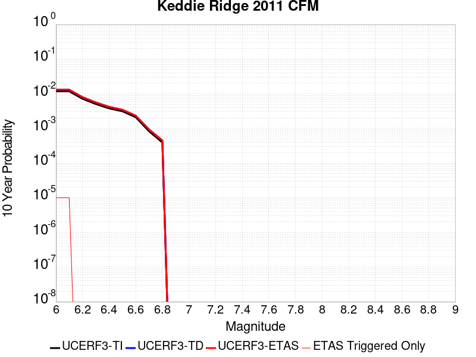 |

| Magnitude | 1 wk TI Prob | 1 wk TD Prob | 1 wk ETAS Prob | 1 wk ETAS/TD Gain | 1 wk ETAS Triggered Only | 1 mo TI Prob | 1 mo TD Prob | 1 mo ETAS Prob | 1 mo ETAS/TD Gain | 1 mo ETAS Triggered Only | 1 yr TI Prob | 1 yr TD Prob | 1 yr ETAS Prob | 1 yr ETAS/TD Gain | 1 yr ETAS Triggered Only | 10 yr TI Prob | 10 yr TD Prob | 10 yr ETAS Prob | 10 yr ETAS/TD Gain | 10 yr ETAS Triggered Only |
|-----|-----|-----|-----|-----|-----|-----|-----|-----|-----|-----|-----|-----|-----|-----|-----|-----|-----|-----|-----|-----|
| 6.0 | 2.2591947E-5 | 2.5189574E-5 | 2.5189574E-5 | 1.0 | 0.0 | 9.6819036E-5 | 1.07951295E-4 | 1.07951295E-4 | 1.0 | 0.0 | 0.0011781343 | 0.0013135937 | 0.0013135937 | 1.0 | 0.0 | 0.011719079 | 0.013066235 | 0.013076105 | 1.0007553 | 1.0E-5 |
| 6.1 | 2.2591947E-5 | 2.5189574E-5 | 2.5189574E-5 | 1.0 | 0.0 | 9.6819036E-5 | 1.07951295E-4 | 1.07951295E-4 | 1.0 | 0.0 | 0.0011781343 | 0.0013135937 | 0.0013135937 | 1.0 | 0.0 | 0.011719079 | 0.013066235 | 0.013076105 | 1.0007553 | 1.0E-5 |
| 6.2 | 1.3775145E-5 | 1.5323049E-5 | 1.5323049E-5 | 1.0 | 0.0 | 5.9035E-5 | 6.566869E-5 | 6.566869E-5 | 1.0 | 0.0 | 7.185141E-4 | 7.9924724E-4 | 7.9924724E-4 | 1.0 | 0.0 | 0.0071619535 | 0.007966147 | 0.007966147 | 1.0 | 0.0 |
| 6.3 | 9.705435E-6 | 1.0768509E-5 | 1.0768509E-5 | 1.0 | 0.0 | 4.1594063E-5 | 4.6150006E-5 | 4.6150006E-5 | 1.0 | 0.0 | 5.0629E-4 | 5.6174386E-4 | 5.6174386E-4 | 1.0 | 0.0 | 0.005051381 | 0.0056044697 | 0.0056044697 | 1.0 | 0.0 |
| 6.4 | 7.2549733E-6 | 8.027384E-6 | 8.027384E-6 | 1.0 | 0.0 | 3.109237E-5 | 3.4402667E-5 | 3.4402667E-5 | 1.0 | 0.0 | 3.7848388E-4 | 4.187799E-4 | 4.187799E-4 | 1.0 | 0.0 | 0.003778399 | 0.004180694 | 0.004180694 | 1.0 | 0.0 |
| 6.5 | 5.983293E-6 | 6.6131183E-6 | 6.6131183E-6 | 1.0 | 0.0 | 2.5642432E-5 | 2.8341665E-5 | 2.8341665E-5 | 1.0 | 0.0 | 3.1215188E-4 | 3.4501185E-4 | 3.4501185E-4 | 1.0 | 0.0 | 0.0031171376 | 0.0034454244 | 0.0034454244 | 1.0 | 0.0 |
| 6.6 | 4.0336154E-6 | 4.457868E-6 | 4.457868E-6 | 1.0 | 0.0 | 1.728681E-5 | 1.9105031E-5 | 1.9105031E-5 | 1.0 | 0.0 | 2.1044657E-4 | 2.3258296E-4 | 2.3258296E-4 | 1.0 | 0.0 | 0.002102474 | 0.002323791 | 0.002323791 | 1.0 | 0.0 |
| 6.7 | 1.5832104E-6 | 1.781639E-6 | 1.781639E-6 | 1.0 | 0.0 | 6.7851697E-6 | 7.635575E-6 | 7.635575E-6 | 1.0 | 0.0 | 8.260631E-5 | 9.295943E-5 | 9.295943E-5 | 1.0 | 0.0 | 8.2575605E-4 | 9.292321E-4 | 9.292321E-4 | 1.0 | 0.0 |
| 6.8 | 7.5177275E-7 | 8.5904594E-7 | 8.5904594E-7 | 1.0 | 0.0 | 3.221879E-6 | 3.6816214E-6 | 3.6816214E-6 | 1.0 | 0.0 | 3.9225673E-5 | 4.4822984E-5 | 4.4822984E-5 | 1.0 | 0.0 | 3.921875E-4 | 4.48156E-4 | 4.48156E-4 | 1.0 | 0.0 |

## Calaveras (So) 2011 CFM
*[(top)](#table-of-contents)*

| 1 Week | 1 Month | 1 Year | 10 Year |
|-----|-----|-----|-----|
|  |  |  |  |

| Magnitude | 1 wk TI Prob | 1 wk TD Prob | 1 wk ETAS Prob | 1 wk ETAS/TD Gain | 1 wk ETAS Triggered Only | 1 mo TI Prob | 1 mo TD Prob | 1 mo ETAS Prob | 1 mo ETAS/TD Gain | 1 mo ETAS Triggered Only | 1 yr TI Prob | 1 yr TD Prob | 1 yr ETAS Prob | 1 yr ETAS/TD Gain | 1 yr ETAS Triggered Only | 10 yr TI Prob | 10 yr TD Prob | 10 yr ETAS Prob | 10 yr ETAS/TD Gain | 10 yr ETAS Triggered Only |
|-----|-----|-----|-----|-----|-----|-----|-----|-----|-----|-----|-----|-----|-----|-----|-----|-----|-----|-----|-----|-----|
| 6.0 | 1.5950744E-4 | 3.0719102E-4 | 3.1718795E-4 | 1.0325431 | 1.0E-5 | 6.834242E-4 | 0.0013158836 | 0.0013258704 | 1.0075895 | 1.0E-5 | 0.00828899 | 0.015860915 | 0.015870756 | 1.0006205 | 1.0E-5 | 0.079865426 | 0.14441721 | 0.14442576 | 1.0000592 | 1.0E-5 |
| 6.1 | 1.3584697E-4 | 2.604323E-4 | 2.704297E-4 | 1.0383877 | 1.0E-5 | 5.8207137E-4 | 0.0011156795 | 0.0011256683 | 1.0089531 | 1.0E-5 | 0.007063716 | 0.013463869 | 0.013473734 | 1.0007328 | 1.0E-5 | 0.06843361 | 0.124044694 | 0.124053456 | 1.0000706 | 1.0E-5 |
| 6.2 | 1.14676266E-4 | 2.1731424E-4 | 2.2731206E-4 | 1.0460063 | 1.0E-5 | 4.9137714E-4 | 9.310301E-4 | 9.410207E-4 | 1.0107307 | 1.0E-5 | 0.0059661185 | 0.01124721 | 0.011257097 | 1.0008792 | 1.0E-5 | 0.058084648 | 0.10503508 | 0.10504404 | 1.0000852 | 1.0E-5 |
| 6.3 | 8.691518E-5 | 1.5990793E-4 | 1.5990793E-4 | 1.0 | 0.0 | 3.7244044E-4 | 6.851358E-4 | 6.851358E-4 | 1.0 | 0.0 | 0.004525038 | 0.008302716 | 0.008302716 | 1.0 | 0.0 | 0.044339992 | 0.079350494 | 0.079350494 | 1.0 | 0.0 |
| 6.4 | 8.50982E-5 | 1.5697183E-4 | 1.5697183E-4 | 1.0 | 0.0 | 3.646556E-4 | 6.725591E-4 | 6.725591E-4 | 1.0 | 0.0 | 0.0044306475 | 0.008150746 | 0.008150746 | 1.0 | 0.0 | 0.04343345 | 0.0779566 | 0.0779566 | 1.0 | 0.0 |
| 6.5 | 8.4062965E-5 | 1.5521735E-4 | 1.5521735E-4 | 1.0 | 0.0 | 3.602201E-4 | 6.650437E-4 | 6.650437E-4 | 1.0 | 0.0 | 0.004376863 | 0.008059946 | 0.008059946 | 1.0 | 0.0 | 0.042916555 | 0.07712786 | 0.07712786 | 1.0 | 0.0 |
| 6.6 | 8.194716E-5 | 1.5157646E-4 | 1.5157646E-4 | 1.0 | 0.0 | 3.5115483E-4 | 6.494477E-4 | 6.494477E-4 | 1.0 | 0.0 | 0.0042669317 | 0.007871782 | 0.007871782 | 1.0 | 0.0 | 0.04185927 | 0.075413086 | 0.075413086 | 1.0 | 0.0 |
| 6.7 | 8.012326E-5 | 1.4825336E-4 | 1.4825336E-4 | 1.0 | 0.0 | 3.433402E-4 | 6.3521386E-4 | 6.3521386E-4 | 1.0 | 0.0 | 0.004172157 | 0.0077002714 | 0.0077002714 | 1.0 | 0.0 | 0.040946912 | 0.073855184 | 0.073855184 | 1.0 | 0.0 |
| 6.8 | 7.119773E-5 | 1.2883788E-4 | 1.2883788E-4 | 1.0 | 0.0 | 3.0509746E-4 | 5.5204553E-4 | 5.5204553E-4 | 1.0 | 0.0 | 0.0037082357 | 0.0066975304 | 0.0066975304 | 1.0 | 0.0 | 0.036469642 | 0.064698465 | 0.064698465 | 1.0 | 0.0 |
| 6.9 | 5.7343088E-5 | 9.921204E-5 | 9.921204E-5 | 1.0 | 0.0 | 2.4573295E-4 | 4.2512562E-4 | 4.2512562E-4 | 1.0 | 0.0 | 0.0029876942 | 0.005163703 | 0.005163703 | 1.0 | 0.0 | 0.02947844 | 0.050519872 | 0.050519872 | 1.0 | 0.0 |
| 7.0 | 4.8746577E-5 | 8.286983E-5 | 8.286983E-5 | 1.0 | 0.0 | 2.0889717E-4 | 3.5510844E-4 | 3.5510844E-4 | 1.0 | 0.0 | 0.0025403565 | 0.004314941 | 0.004314941 | 1.0 | 0.0 | 0.025115121 | 0.042495564 | 0.042495564 | 1.0 | 0.0 |
| 7.1 | 4.2998014E-5 | 7.266396E-5 | 7.266396E-5 | 1.0 | 0.0 | 1.8426418E-4 | 3.1138014E-4 | 3.1138014E-4 | 1.0 | 0.0 | 0.002241108 | 0.0037845233 | 0.0037845233 | 1.0 | 0.0 | 0.022186412 | 0.03743038 | 0.03743038 | 1.0 | 0.0 |
| 7.2 | 3.221292E-5 | 5.3919634E-5 | 5.3919634E-5 | 1.0 | 0.0 | 1.3804805E-4 | 2.3106382E-4 | 2.3106382E-4 | 1.0 | 0.0 | 0.0016794393 | 0.002809601 | 0.002809601 | 1.0 | 0.0 | 0.016668037 | 0.0280428 | 0.0280428 | 1.0 | 0.0 |
| 7.3 | 2.3756531E-5 | 3.9484363E-5 | 3.9484363E-5 | 1.0 | 0.0 | 1.0180973E-4 | 1.6920782E-4 | 1.6920782E-4 | 1.0 | 0.0 | 0.0012388286 | 0.0020581756 | 0.0020581756 | 1.0 | 0.0 | 0.012319452 | 0.020649675 | 0.020649675 | 1.0 | 0.0 |
| 7.4 | 1.5997684E-5 | 2.7347376E-5 | 2.7347376E-5 | 1.0 | 0.0 | 6.8559704E-5 | 1.17197786E-4 | 1.17197786E-4 | 1.0 | 0.0 | 8.343947E-4 | 0.0014259516 | 0.0014259516 | 1.0 | 0.0 | 0.008312687 | 0.014379721 | 0.014379721 | 1.0 | 0.0 |
| 7.5 | 1.3814293E-5 | 2.4788933E-5 | 2.4788933E-5 | 1.0 | 0.0 | 5.9202768E-5 | 1.0623397E-4 | 1.0623397E-4 | 1.0 | 0.0 | 7.205553E-4 | 0.0012926336 | 0.0012926336 | 1.0 | 0.0 | 0.007182234 | 0.013058846 | 0.013058846 | 1.0 | 0.0 |
| 7.6 | 8.817309E-6 | 1.643521E-5 | 1.643521E-5 | 1.0 | 0.0 | 3.7787922E-5 | 7.043472E-5 | 7.043472E-5 | 1.0 | 0.0 | 4.5997082E-4 | 8.572067E-4 | 8.572067E-4 | 1.0 | 0.0 | 0.004590199 | 0.008722494 | 0.008722494 | 1.0 | 0.0 |
| 7.7 | 4.0352206E-6 | 7.711002E-6 | 7.711002E-6 | 1.0 | 0.0 | 1.7293689E-5 | 3.304673E-5 | 3.304673E-5 | 1.0 | 0.0 | 2.1053031E-4 | 4.0226974E-4 | 4.0226974E-4 | 1.0 | 0.0 | 0.0021033096 | 0.00416701 | 0.00416701 | 1.0 | 0.0 |
| 7.8 | 3.413169E-6 | 6.7905053E-6 | 6.7905053E-6 | 1.0 | 0.0 | 1.4627784E-5 | 2.910184E-5 | 2.910184E-5 | 1.0 | 0.0 | 1.7807873E-4 | 3.5425735E-4 | 3.5425735E-4 | 1.0 | 0.0 | 0.0017793609 | 0.0036680899 | 0.0036680899 | 1.0 | 0.0 |
| 7.9 | 2.4740732E-6 | 5.2815635E-6 | 5.2815635E-6 | 1.0 | 0.0 | 1.06031275E-5 | 2.2635075E-5 | 2.2635075E-5 | 1.0 | 0.0 | 1.2908543E-4 | 2.7554724E-4 | 2.7554724E-4 | 1.0 | 0.0 | 0.0012901047 | 0.0028359778 | 0.0028359778 | 1.0 | 0.0 |
| 8.0 | 1.5231818E-6 | 3.2903374E-6 | 3.2903374E-6 | 1.0 | 0.0 | 6.527906E-6 | 1.410137E-5 | 1.410137E-5 | 1.0 | 0.0 | 7.9474354E-5 | 1.7167069E-4 | 1.7167069E-4 | 1.0 | 0.0 | 7.944594E-4 | 0.0017571712 | 0.0017571712 | 1.0 | 0.0 |
| 8.1 | 1.0104524E-6 | 2.0467116E-6 | 2.0467116E-6 | 1.0 | 0.0 | 4.330503E-6 | 8.771593E-6 | 8.771593E-6 | 1.0 | 0.0 | 5.2722597E-5 | 1.0678893E-4 | 1.0678893E-4 | 1.0 | 0.0 | 5.271009E-4 | 0.0010934469 | 0.0010934469 | 1.0 | 0.0 |

## Owens Valley Keough Hot Springs
*[(top)](#table-of-contents)*

| 1 Week | 1 Month | 1 Year | 10 Year |
|-----|-----|-----|-----|
|  | 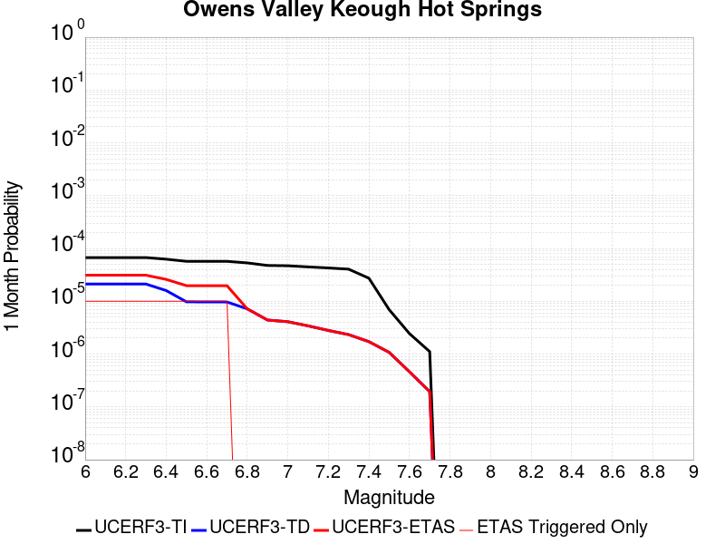 |  |  |

| Magnitude | 1 wk TI Prob | 1 wk TD Prob | 1 wk ETAS Prob | 1 wk ETAS/TD Gain | 1 wk ETAS Triggered Only | 1 mo TI Prob | 1 mo TD Prob | 1 mo ETAS Prob | 1 mo ETAS/TD Gain | 1 mo ETAS Triggered Only | 1 yr TI Prob | 1 yr TD Prob | 1 yr ETAS Prob | 1 yr ETAS/TD Gain | 1 yr ETAS Triggered Only | 10 yr TI Prob | 10 yr TD Prob | 10 yr ETAS Prob | 10 yr ETAS/TD Gain | 10 yr ETAS Triggered Only |
|-----|-----|-----|-----|-----|-----|-----|-----|-----|-----|-----|-----|-----|-----|-----|-----|-----|-----|-----|-----|-----|
| 6.0 | 1.5708529E-5 | 4.9508244E-6 | 4.9508244E-6 | 1.0 | 0.0 | 6.7320536E-5 | 2.1217675E-5 | 3.1217463E-5 | 1.4712951 | 1.0E-5 | 8.193192E-4 | 2.582997E-4 | 2.6829712E-4 | 1.0387048 | 1.0E-5 | 0.008163051 | 0.0025806532 | 0.0025906272 | 1.003865 | 1.0E-5 |
| 6.1 | 1.5708529E-5 | 4.9508244E-6 | 4.9508244E-6 | 1.0 | 0.0 | 6.7320536E-5 | 2.1217675E-5 | 3.1217463E-5 | 1.4712951 | 1.0E-5 | 8.193192E-4 | 2.582997E-4 | 2.6829712E-4 | 1.0387048 | 1.0E-5 | 0.008163051 | 0.0025806532 | 0.0025906272 | 1.003865 | 1.0E-5 |
| 6.2 | 1.5708529E-5 | 4.9508244E-6 | 4.9508244E-6 | 1.0 | 0.0 | 6.7320536E-5 | 2.1217675E-5 | 3.1217463E-5 | 1.4712951 | 1.0E-5 | 8.193192E-4 | 2.582997E-4 | 2.6829712E-4 | 1.0387048 | 1.0E-5 | 0.008163051 | 0.0025806532 | 0.0025906272 | 1.003865 | 1.0E-5 |
| 6.3 | 1.5708529E-5 | 4.9508244E-6 | 4.9508244E-6 | 1.0 | 0.0 | 6.7320536E-5 | 2.1217675E-5 | 3.1217463E-5 | 1.4712951 | 1.0E-5 | 8.193192E-4 | 2.582997E-4 | 2.6829712E-4 | 1.0387048 | 1.0E-5 | 0.008163051 | 0.0025806532 | 0.0025906272 | 1.003865 | 1.0E-5 |
| 6.4 | 1.4622509E-5 | 3.7266684E-6 | 3.7266684E-6 | 1.0 | 0.0 | 6.266639E-5 | 1.5971356E-5 | 2.5971198E-5 | 1.6261109 | 1.0E-5 | 7.626962E-4 | 1.9443722E-4 | 2.0443527E-4 | 1.0514205 | 1.0E-5 | 0.007600839 | 0.0019431504 | 0.001953131 | 1.0051363 | 1.0E-5 |
| 6.5 | 1.3335527E-5 | 2.2778408E-6 | 2.2778408E-6 | 1.0 | 0.0 | 5.7151006E-5 | 9.762142E-6 | 1.9762045E-5 | 2.0243554 | 1.0E-5 | 6.955913E-4 | 1.18848286E-4 | 1.288471E-4 | 1.0841309 | 1.0E-5 | 0.0069341804 | 0.0011880693 | 0.0011980574 | 1.008407 | 1.0E-5 |
| 6.6 | 1.3332855E-5 | 2.27499E-6 | 2.27499E-6 | 1.0 | 0.0 | 5.7139558E-5 | 9.749924E-6 | 1.9749827E-5 | 2.025639 | 1.0E-5 | 6.9545204E-4 | 1.1869955E-4 | 1.2869836E-4 | 1.0842363 | 1.0E-5 | 0.0069327964 | 0.0011865837 | 0.0011965717 | 1.0084176 | 1.0E-5 |
| 6.7 | 1.3318214E-5 | 2.26422E-6 | 2.26422E-6 | 1.0 | 0.0 | 5.707681E-5 | 9.703767E-6 | 1.970367E-5 | 2.0305176 | 1.0E-5 | 6.946886E-4 | 1.1813765E-4 | 1.2813647E-4 | 1.084637 | 1.0E-5 | 0.0069252094 | 0.0011809706 | 0.0011909588 | 1.0084577 | 1.0E-5 |
| 6.8 | 1.2441338E-5 | 1.6778914E-6 | 1.6778914E-6 | 1.0 | 0.0 | 5.331893E-5 | 7.190945E-6 | 7.190945E-6 | 1.0 | 0.0 | 6.489646E-4 | 8.7546534E-5 | 8.7546534E-5 | 1.0 | 0.0 | 0.0064707273 | 8.75305E-4 | 8.75305E-4 | 1.0 | 0.0 |
| 6.9 | 1.1130476E-5 | 1.0304584E-6 | 1.0304584E-6 | 1.0 | 0.0 | 4.7701167E-5 | 4.416243E-6 | 4.416243E-6 | 1.0 | 0.0 | 5.806069E-4 | 5.3766445E-5 | 5.3766445E-5 | 1.0 | 0.0 | 0.0057909233 | 5.376886E-4 | 5.376886E-4 | 1.0 | 0.0 |
| 7.0 | 1.0986073E-5 | 9.580101E-7 | 9.580101E-7 | 1.0 | 0.0 | 4.7082318E-5 | 4.105751E-6 | 4.105751E-6 | 1.0 | 0.0 | 5.730765E-4 | 4.9986385E-5 | 4.9986385E-5 | 1.0 | 0.0 | 0.0057160086 | 4.999046E-4 | 4.999046E-4 | 1.0 | 0.0 |
| 7.1 | 1.0451338E-5 | 8.000831E-7 | 8.000831E-7 | 1.0 | 0.0 | 4.4790682E-5 | 3.428923E-6 | 3.428923E-6 | 1.0 | 0.0 | 5.451901E-4 | 4.1746345E-5 | 4.1746345E-5 | 1.0 | 0.0 | 0.005438545 | 4.1753432E-4 | 4.1753432E-4 | 1.0 | 0.0 |
| 7.2 | 9.989061E-6 | 6.545439E-7 | 6.545439E-7 | 1.0 | 0.0 | 4.280956E-5 | 2.805185E-6 | 2.805185E-6 | 1.0 | 0.0 | 5.2108173E-4 | 3.4152596E-5 | 3.4152596E-5 | 1.0 | 0.0 | 0.0051986156 | 3.4161055E-4 | 3.4161055E-4 | 1.0 | 0.0 |
| 7.3 | 9.465365E-6 | 5.4604976E-7 | 5.4604976E-7 | 1.0 | 0.0 | 4.056522E-5 | 2.340211E-6 | 2.340211E-6 | 1.0 | 0.0 | 4.937696E-4 | 2.84917E-5 | 2.84917E-5 | 1.0 | 0.0 | 0.0049267393 | 2.8501268E-4 | 2.8501268E-4 | 1.0 | 0.0 |
| 7.4 | 6.3824805E-6 | 4.016707E-7 | 4.016707E-7 | 1.0 | 0.0 | 2.73532E-5 | 1.7214446E-6 | 1.7214446E-6 | 1.0 | 0.0 | 3.3297433E-4 | 2.0958389E-5 | 2.0958389E-5 | 1.0 | 0.0 | 0.0033247585 | 2.0965615E-4 | 2.0965615E-4 | 1.0 | 0.0 |
| 7.5 | 1.6192645E-6 | 2.5163493E-7 | 2.5163493E-7 | 1.0 | 0.0 | 6.9396865E-6 | 1.0784349E-6 | 1.0784349E-6 | 1.0 | 0.0 | 8.448741E-5 | 1.31298675E-5 | 1.31298675E-5 | 1.0 | 0.0 | 8.4455294E-4 | 1.3129105E-4 | 1.3129105E-4 | 1.0 | 0.0 |
| 7.6 | 5.7062545E-7 | 1.079331E-7 | 1.079331E-7 | 1.0 | 0.0 | 2.4455355E-6 | 4.6257034E-7 | 4.6257034E-7 | 1.0 | 0.0 | 2.9773988E-5 | 5.63178E-6 | 5.63178E-6 | 1.0 | 0.0 | 2.977E-4 | 5.6316454E-5 | 5.6316454E-5 | 1.0 | 0.0 |
| 7.7 | 2.5988817E-7 | 4.5461668E-8 | 4.5461668E-8 | 1.0 | 0.0 | 1.113806E-6 | 1.948357E-7 | 1.948357E-7 | 1.0 | 0.0 | 1.3560503E-5 | 2.3721225E-6 | 2.3721225E-6 | 1.0 | 0.0 | 1.3559677E-4 | 2.3721017E-5 | 2.3721017E-5 | 1.0 | 0.0 |

## Gillem - Big Crack 2011 CFM
*[(top)](#table-of-contents)*

| 1 Week | 1 Month | 1 Year | 10 Year |
|-----|-----|-----|-----|
| 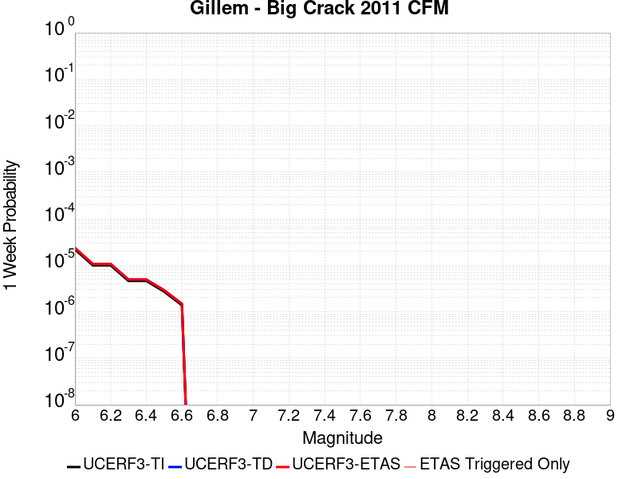 |  |  |  |

| Magnitude | 1 wk TI Prob | 1 wk TD Prob | 1 wk ETAS Prob | 1 wk ETAS/TD Gain | 1 wk ETAS Triggered Only | 1 mo TI Prob | 1 mo TD Prob | 1 mo ETAS Prob | 1 mo ETAS/TD Gain | 1 mo ETAS Triggered Only | 1 yr TI Prob | 1 yr TD Prob | 1 yr ETAS Prob | 1 yr ETAS/TD Gain | 1 yr ETAS Triggered Only | 10 yr TI Prob | 10 yr TD Prob | 10 yr ETAS Prob | 10 yr ETAS/TD Gain | 10 yr ETAS Triggered Only |
|-----|-----|-----|-----|-----|-----|-----|-----|-----|-----|-----|-----|-----|-----|-----|-----|-----|-----|-----|-----|-----|
| 6.0 | 2.196852E-5 | 2.360472E-5 | 2.360472E-5 | 1.0 | 0.0 | 9.4147406E-5 | 1.0115966E-4 | 1.0115966E-4 | 1.0 | 0.0 | 0.0011456419 | 0.0012310119 | 0.0012310119 | 1.0 | 0.0 | 0.011397537 | 0.01225079 | 0.012260667 | 1.0008063 | 1.0E-5 |
| 6.1 | 9.992795E-6 | 1.0711992E-5 | 1.0711992E-5 | 1.0 | 0.0 | 4.2825563E-5 | 4.5907833E-5 | 4.5907833E-5 | 1.0 | 0.0 | 5.2127644E-4 | 5.5880286E-4 | 5.5880286E-4 | 1.0 | 0.0 | 0.0052005537 | 0.0055757877 | 0.005585732 | 1.0017835 | 1.0E-5 |
| 6.2 | 9.992795E-6 | 1.0711992E-5 | 1.0711992E-5 | 1.0 | 0.0 | 4.2825563E-5 | 4.5907833E-5 | 4.5907833E-5 | 1.0 | 0.0 | 5.2127644E-4 | 5.5880286E-4 | 5.5880286E-4 | 1.0 | 0.0 | 0.0052005537 | 0.0055757877 | 0.005585732 | 1.0017835 | 1.0E-5 |
| 6.3 | 4.6127884E-6 | 4.942704E-6 | 4.942704E-6 | 1.0 | 0.0 | 1.9768944E-5 | 2.118287E-5 | 2.118287E-5 | 1.0 | 0.0 | 2.406603E-4 | 2.5787536E-4 | 2.5787536E-4 | 1.0 | 0.0 | 0.0024039985 | 0.0025761996 | 0.0025861738 | 1.0038717 | 1.0E-5 |
| 6.4 | 4.6127884E-6 | 4.942704E-6 | 4.942704E-6 | 1.0 | 0.0 | 1.9768944E-5 | 2.118287E-5 | 2.118287E-5 | 1.0 | 0.0 | 2.406603E-4 | 2.5787536E-4 | 2.5787536E-4 | 1.0 | 0.0 | 0.0024039985 | 0.0025761996 | 0.0025861738 | 1.0038717 | 1.0E-5 |
| 6.5 | 2.716712E-6 | 2.911139E-6 | 2.911139E-6 | 1.0 | 0.0 | 1.1643E-5 | 1.2476264E-5 | 1.2476264E-5 | 1.0 | 0.0 | 1.417443E-4 | 1.5189036E-4 | 1.5189036E-4 | 1.0 | 0.0 | 0.0014165393 | 0.0015181034 | 0.0015181034 | 1.0 | 0.0 |
| 6.6 | 1.3818255E-6 | 1.4820831E-6 | 1.4820831E-6 | 1.0 | 0.0 | 5.922096E-6 | 6.3517764E-6 | 6.3517764E-6 | 1.0 | 0.0 | 7.209913E-5 | 7.7331366E-5 | 7.7331366E-5 | 1.0 | 0.0 | 7.2075747E-4 | 7.731655E-4 | 7.731655E-4 | 1.0 | 0.0 |

## Los Osos 2011
*[(top)](#table-of-contents)*

| 1 Week | 1 Month | 1 Year | 10 Year |
|-----|-----|-----|-----|
|  |  | 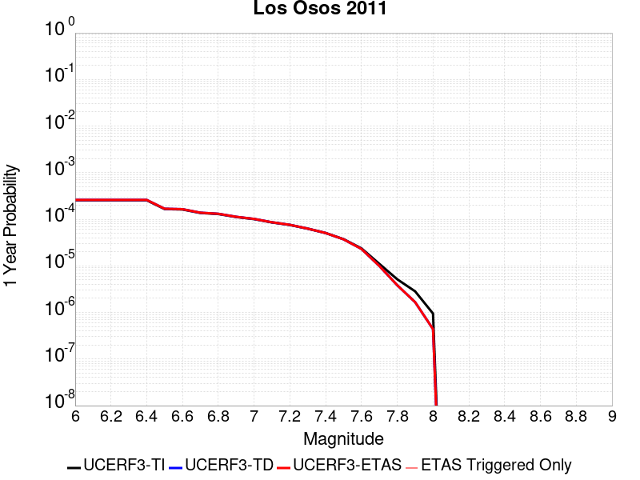 |  |

| Magnitude | 1 wk TI Prob | 1 wk TD Prob | 1 wk ETAS Prob | 1 wk ETAS/TD Gain | 1 wk ETAS Triggered Only | 1 mo TI Prob | 1 mo TD Prob | 1 mo ETAS Prob | 1 mo ETAS/TD Gain | 1 mo ETAS Triggered Only | 1 yr TI Prob | 1 yr TD Prob | 1 yr ETAS Prob | 1 yr ETAS/TD Gain | 1 yr ETAS Triggered Only | 10 yr TI Prob | 10 yr TD Prob | 10 yr ETAS Prob | 10 yr ETAS/TD Gain | 10 yr ETAS Triggered Only |
|-----|-----|-----|-----|-----|-----|-----|-----|-----|-----|-----|-----|-----|-----|-----|-----|-----|-----|-----|-----|-----|
| 6.0 | 4.8871775E-6 | 4.9815035E-6 | 4.9815035E-6 | 1.0 | 0.0 | 2.0944879E-5 | 2.1349142E-5 | 2.1349142E-5 | 1.0 | 0.0 | 2.5497406E-4 | 2.5989758E-4 | 2.5989758E-4 | 1.0 | 0.0 | 0.002546817 | 0.002596211 | 0.002606185 | 1.0038418 | 1.0E-5 |
| 6.1 | 4.8871775E-6 | 4.9815035E-6 | 4.9815035E-6 | 1.0 | 0.0 | 2.0944879E-5 | 2.1349142E-5 | 2.1349142E-5 | 1.0 | 0.0 | 2.5497406E-4 | 2.5989758E-4 | 2.5989758E-4 | 1.0 | 0.0 | 0.002546817 | 0.002596211 | 0.002606185 | 1.0038418 | 1.0E-5 |
| 6.2 | 4.8871775E-6 | 4.9815035E-6 | 4.9815035E-6 | 1.0 | 0.0 | 2.0944879E-5 | 2.1349142E-5 | 2.1349142E-5 | 1.0 | 0.0 | 2.5497406E-4 | 2.5989758E-4 | 2.5989758E-4 | 1.0 | 0.0 | 0.002546817 | 0.002596211 | 0.002606185 | 1.0038418 | 1.0E-5 |
| 6.3 | 4.8871775E-6 | 4.9815035E-6 | 4.9815035E-6 | 1.0 | 0.0 | 2.0944879E-5 | 2.1349142E-5 | 2.1349142E-5 | 1.0 | 0.0 | 2.5497406E-4 | 2.5989758E-4 | 2.5989758E-4 | 1.0 | 0.0 | 0.002546817 | 0.002596211 | 0.002606185 | 1.0038418 | 1.0E-5 |
| 6.4 | 4.8871775E-6 | 4.9815035E-6 | 4.9815035E-6 | 1.0 | 0.0 | 2.0944879E-5 | 2.1349142E-5 | 2.1349142E-5 | 1.0 | 0.0 | 2.5497406E-4 | 2.5989758E-4 | 2.5989758E-4 | 1.0 | 0.0 | 0.002546817 | 0.002596211 | 0.002606185 | 1.0038418 | 1.0E-5 |
| 6.5 | 3.1724062E-6 | 3.2234093E-6 | 3.2234093E-6 | 1.0 | 0.0 | 1.3595956E-5 | 1.3814539E-5 | 1.3814539E-5 | 1.0 | 0.0 | 1.6551818E-4 | 1.6817916E-4 | 1.6817916E-4 | 1.0 | 0.0 | 0.0016539496 | 0.0016805324 | 0.0016805324 | 1.0 | 0.0 |
| 6.6 | 3.1022591E-6 | 3.1511186E-6 | 3.1511186E-6 | 1.0 | 0.0 | 1.3295328E-5 | 1.3504725E-5 | 1.3504725E-5 | 1.0 | 0.0 | 1.618586E-4 | 1.6440774E-4 | 1.6440774E-4 | 1.0 | 0.0 | 0.0016174077 | 0.001642874 | 0.001642874 | 1.0 | 0.0 |
| 6.7 | 2.611518E-6 | 2.649196E-6 | 2.649196E-6 | 1.0 | 0.0 | 1.1192172E-5 | 1.1353647E-5 | 1.1353647E-5 | 1.0 | 0.0 | 1.3625617E-4 | 1.3822193E-4 | 1.3822193E-4 | 1.0 | 0.0 | 0.0013617266 | 0.0013813641 | 0.0013813641 | 1.0 | 0.0 |
| 6.8 | 2.4780884E-6 | 2.5121715E-6 | 2.5121715E-6 | 1.0 | 0.0 | 1.0620336E-5 | 1.0766405E-5 | 1.0766405E-5 | 1.0 | 0.0 | 1.2929492E-4 | 1.3107313E-4 | 1.3107313E-4 | 1.0 | 0.0 | 0.0012921972 | 0.0013099624 | 0.0013099624 | 1.0 | 0.0 |
| 6.9 | 2.1376322E-6 | 2.1635167E-6 | 2.1635167E-6 | 1.0 | 0.0 | 9.161248E-6 | 9.272181E-6 | 9.272181E-6 | 1.0 | 0.0 | 1.1153249E-4 | 1.12882975E-4 | 1.12882975E-4 | 1.0 | 0.0 | 0.0011147653 | 0.0011282583 | 0.0011282583 | 1.0 | 0.0 |
| 7.0 | 1.9282882E-6 | 1.949469E-6 | 1.949469E-6 | 1.0 | 0.0 | 8.264066E-6 | 8.35484E-6 | 8.35484E-6 | 1.0 | 0.0 | 1.0061036E-4 | 1.0171544E-4 | 1.0171544E-4 | 1.0 | 0.0 | 0.0010056482 | 0.0010166903 | 0.0010166903 | 1.0 | 0.0 |
| 7.1 | 1.6353226E-6 | 1.6501212E-6 | 1.6501212E-6 | 1.0 | 0.0 | 7.0085066E-6 | 7.0719293E-6 | 7.0719293E-6 | 1.0 | 0.0 | 8.532523E-5 | 8.6097345E-5 | 8.6097345E-5 | 1.0 | 0.0 | 8.529247E-4 | 8.6064066E-4 | 8.6064066E-4 | 1.0 | 0.0 |
| 7.2 | 1.4446276E-6 | 1.4553431E-6 | 1.4553431E-6 | 1.0 | 0.0 | 6.191247E-6 | 6.2371696E-6 | 6.2371696E-6 | 1.0 | 0.0 | 7.537582E-5 | 7.59349E-5 | 7.59349E-5 | 1.0 | 0.0 | 7.535026E-4 | 7.590901E-4 | 7.590901E-4 | 1.0 | 0.0 |
| 7.3 | 1.2014582E-6 | 1.2069155E-6 | 1.2069155E-6 | 1.0 | 0.0 | 5.149096E-6 | 5.1724846E-6 | 5.1724846E-6 | 1.0 | 0.0 | 6.268844E-5 | 6.297319E-5 | 6.297319E-5 | 1.0 | 0.0 | 6.267076E-4 | 6.295538E-4 | 6.295538E-4 | 1.0 | 0.0 |
| 7.4 | 9.707733E-7 | 9.709848E-7 | 9.709848E-7 | 1.0 | 0.0 | 4.16045E-6 | 4.161357E-6 | 4.161357E-6 | 1.0 | 0.0 | 5.0652303E-5 | 5.0663344E-5 | 5.0663344E-5 | 1.0 | 0.0 | 5.064076E-4 | 5.0651823E-4 | 5.0651823E-4 | 1.0 | 0.0 |
| 7.5 | 7.174908E-7 | 7.1149805E-7 | 7.1149805E-7 | 1.0 | 0.0 | 3.074957E-6 | 3.0492738E-6 | 3.0492738E-6 | 1.0 | 0.0 | 3.743696E-5 | 3.712428E-5 | 3.712428E-5 | 1.0 | 0.0 | 3.7430652E-4 | 3.7118094E-4 | 3.7118094E-4 | 1.0 | 0.0 |
| 7.6 | 4.5535776E-7 | 4.420849E-7 | 4.420849E-7 | 1.0 | 0.0 | 1.9515319E-6 | 1.8946482E-6 | 1.8946482E-6 | 1.0 | 0.0 | 2.3759641E-5 | 2.30671E-5 | 2.30671E-5 | 1.0 | 0.0 | 2.37571E-4 | 2.3064714E-4 | 2.3064714E-4 | 1.0 | 0.0 |
| 7.7 | 2.1173553E-7 | 1.9061258E-7 | 1.9061258E-7 | 1.0 | 0.0 | 9.0743765E-7 | 8.169108E-7 | 8.169108E-7 | 1.0 | 0.0 | 1.1047998E-5 | 9.945844E-6 | 9.945844E-6 | 1.0 | 0.0 | 1.1047449E-4 | 9.945402E-5 | 9.945402E-5 | 1.0 | 0.0 |
| 7.8 | 9.873608E-8 | 7.3679686E-8 | 7.3679686E-8 | 1.0 | 0.0 | 4.2315455E-7 | 3.1577002E-7 | 3.1577002E-7 | 1.0 | 0.0 | 5.1518946E-6 | 3.844493E-6 | 3.844493E-6 | 1.0 | 0.0 | 5.1517753E-5 | 3.8444276E-5 | 3.8444276E-5 | 1.0 | 0.0 |
| 7.9 | 5.4399106E-8 | 3.1883726E-8 | 3.1883726E-8 | 1.0 | 0.0 | 2.33139E-7 | 1.3664453E-7 | 1.3664453E-7 | 1.0 | 0.0 | 2.8384638E-6 | 1.6636459E-6 | 1.6636459E-6 | 1.0 | 0.0 | 2.8384275E-5 | 1.6636335E-5 | 1.6636335E-5 | 1.0 | 0.0 |
| 8.0 | 1.817203E-8 | 8.422238E-9 | 8.422238E-9 | 1.0 | 0.0 | 7.7880124E-8 | 3.6095305E-8 | 3.6095305E-8 | 1.0 | 0.0 | 9.481901E-7 | 4.3946025E-7 | 4.3946025E-7 | 1.0 | 0.0 | 9.481861E-6 | 4.3945943E-6 | 4.3945943E-6 | 1.0 | 0.0 |

## La Panza 2011
*[(top)](#table-of-contents)*

| 1 Week | 1 Month | 1 Year | 10 Year |
|-----|-----|-----|-----|
|  |  |  |  |

| Magnitude | 1 wk TI Prob | 1 wk TD Prob | 1 wk ETAS Prob | 1 wk ETAS/TD Gain | 1 wk ETAS Triggered Only | 1 mo TI Prob | 1 mo TD Prob | 1 mo ETAS Prob | 1 mo ETAS/TD Gain | 1 mo ETAS Triggered Only | 1 yr TI Prob | 1 yr TD Prob | 1 yr ETAS Prob | 1 yr ETAS/TD Gain | 1 yr ETAS Triggered Only | 10 yr TI Prob | 10 yr TD Prob | 10 yr ETAS Prob | 10 yr ETAS/TD Gain | 10 yr ETAS Triggered Only |
|-----|-----|-----|-----|-----|-----|-----|-----|-----|-----|-----|-----|-----|-----|-----|-----|-----|-----|-----|-----|-----|
| 6.0 | 4.6754544E-6 | 4.717608E-6 | 4.717608E-6 | 1.0 | 0.0 | 2.0037509E-5 | 2.0218175E-5 | 2.0218175E-5 | 1.0 | 0.0 | 2.4392935E-4 | 2.4613045E-4 | 2.4613045E-4 | 1.0 | 0.0 | 0.0024366176 | 0.0024587729 | 0.0024687483 | 1.004057 | 1.0E-5 |
| 6.1 | 4.6754544E-6 | 4.717608E-6 | 4.717608E-6 | 1.0 | 0.0 | 2.0037509E-5 | 2.0218175E-5 | 2.0218175E-5 | 1.0 | 0.0 | 2.4392935E-4 | 2.4613045E-4 | 2.4613045E-4 | 1.0 | 0.0 | 0.0024366176 | 0.0024587729 | 0.0024687483 | 1.004057 | 1.0E-5 |
| 6.2 | 4.6754544E-6 | 4.717608E-6 | 4.717608E-6 | 1.0 | 0.0 | 2.0037509E-5 | 2.0218175E-5 | 2.0218175E-5 | 1.0 | 0.0 | 2.4392935E-4 | 2.4613045E-4 | 2.4613045E-4 | 1.0 | 0.0 | 0.0024366176 | 0.0024587729 | 0.0024687483 | 1.004057 | 1.0E-5 |
| 6.3 | 4.6754544E-6 | 4.717608E-6 | 4.717608E-6 | 1.0 | 0.0 | 2.0037509E-5 | 2.0218175E-5 | 2.0218175E-5 | 1.0 | 0.0 | 2.4392935E-4 | 2.4613045E-4 | 2.4613045E-4 | 1.0 | 0.0 | 0.0024366176 | 0.0024587729 | 0.0024687483 | 1.004057 | 1.0E-5 |
| 6.4 | 4.6754544E-6 | 4.717608E-6 | 4.717608E-6 | 1.0 | 0.0 | 2.0037509E-5 | 2.0218175E-5 | 2.0218175E-5 | 1.0 | 0.0 | 2.4392935E-4 | 2.4613045E-4 | 2.4613045E-4 | 1.0 | 0.0 | 0.0024366176 | 0.0024587729 | 0.0024687483 | 1.004057 | 1.0E-5 |
| 6.5 | 2.485343E-6 | 2.5006163E-6 | 2.5006163E-6 | 1.0 | 0.0 | 1.0651426E-5 | 1.0716885E-5 | 1.0716885E-5 | 1.0 | 0.0 | 1.296734E-4 | 1.3047065E-4 | 1.3047065E-4 | 1.0 | 0.0 | 0.0012959775 | 0.001303979 | 0.001303979 | 1.0 | 0.0 |
| 6.6 | 2.485343E-6 | 2.5006163E-6 | 2.5006163E-6 | 1.0 | 0.0 | 1.0651426E-5 | 1.0716885E-5 | 1.0716885E-5 | 1.0 | 0.0 | 1.296734E-4 | 1.3047065E-4 | 1.3047065E-4 | 1.0 | 0.0 | 0.0012959775 | 0.001303979 | 0.001303979 | 1.0 | 0.0 |
| 6.7 | 1.5108508E-6 | 1.5146534E-6 | 1.5146534E-6 | 1.0 | 0.0 | 6.4750584E-6 | 6.491356E-6 | 6.491356E-6 | 1.0 | 0.0 | 7.8830984E-5 | 7.90295E-5 | 7.90295E-5 | 1.0 | 0.0 | 7.880303E-4 | 7.900248E-4 | 7.900248E-4 | 1.0 | 0.0 |
| 6.8 | 1.3865837E-6 | 1.3885259E-6 | 1.3885259E-6 | 1.0 | 0.0 | 5.942488E-6 | 5.950812E-6 | 5.950812E-6 | 1.0 | 0.0 | 7.234739E-5 | 7.244883E-5 | 7.244883E-5 | 1.0 | 0.0 | 7.232384E-4 | 7.242619E-4 | 7.242619E-4 | 1.0 | 0.0 |
| 6.9 | 9.826583E-7 | 9.796437E-7 | 9.796437E-7 | 1.0 | 0.0 | 4.2113857E-6 | 4.1984663E-6 | 4.1984663E-6 | 1.0 | 0.0 | 5.1272415E-5 | 5.1115185E-5 | 5.1115185E-5 | 1.0 | 0.0 | 5.126059E-4 | 5.1103963E-4 | 5.1103963E-4 | 1.0 | 0.0 |
| 7.0 | 6.7797646E-7 | 6.71036E-7 | 6.71036E-7 | 1.0 | 0.0 | 2.9056102E-6 | 2.8758654E-6 | 2.8758654E-6 | 1.0 | 0.0 | 3.537523E-5 | 3.501313E-5 | 3.501313E-5 | 1.0 | 0.0 | 3.5369597E-4 | 3.5007924E-4 | 3.5007924E-4 | 1.0 | 0.0 |
| 7.1 | 3.4979826E-7 | 3.3875276E-7 | 3.3875276E-7 | 1.0 | 0.0 | 1.4991346E-6 | 1.4517968E-6 | 1.4517968E-6 | 1.0 | 0.0 | 1.825181E-5 | 1.7675495E-5 | 1.7675495E-5 | 1.0 | 0.0 | 1.825031E-4 | 1.7674206E-4 | 1.7674206E-4 | 1.0 | 0.0 |
| 7.2 | 2.5088332E-7 | 2.3833275E-7 | 2.3833275E-7 | 1.0 | 0.0 | 1.0752137E-6 | 1.0214256E-6 | 1.0214256E-6 | 1.0 | 0.0 | 1.3090649E-5 | 1.2435796E-5 | 1.2435796E-5 | 1.0 | 0.0 | 1.3089878E-4 | 1.2435185E-4 | 1.2435185E-4 | 1.0 | 0.0 |
| 7.3 | 1.0159086E-7 | 8.645961E-8 | 8.645961E-8 | 1.0 | 0.0 | 4.3538932E-7 | 3.7054113E-7 | 3.7054113E-7 | 1.0 | 0.0 | 5.300852E-6 | 4.5113293E-6 | 4.5113293E-6 | 1.0 | 0.0 | 5.3007258E-5 | 4.5112418E-5 | 4.5112418E-5 | 1.0 | 0.0 |
| 7.4 | 3.5006252E-8 | 1.940863E-8 | 1.940863E-8 | 1.0 | 0.0 | 1.5002678E-7 | 8.3179835E-8 | 8.3179835E-8 | 1.0 | 0.0 | 1.8265745E-6 | 1.012714E-6 | 1.012714E-6 | 1.0 | 0.0 | 1.8265595E-5 | 1.0127096E-5 | 1.0127096E-5 | 1.0 | 0.0 |
| 7.5 | 2.592274E-8 | 1.0242307E-8 | 1.0242307E-8 | 1.0 | 0.0 | 1.1109746E-7 | 4.3895596E-8 | 4.3895596E-8 | 1.0 | 0.0 | 1.3526106E-6 | 5.3442875E-7 | 5.3442875E-7 | 1.0 | 0.0 | 1.3526024E-5 | 5.3442755E-6 | 5.3442755E-6 | 1.0 | 0.0 |
| 7.6 | 1.9016717E-8 | 5.2468647E-9 | 5.2468647E-9 | 1.0 | 0.0 | 8.150022E-8 | 2.2486562E-8 | 2.2486562E-8 | 1.0 | 0.0 | 9.922647E-7 | 2.7377385E-7 | 2.7377385E-7 | 1.0 | 0.0 | 9.922603E-6 | 2.7377353E-6 | 2.7377353E-6 | 1.0 | 0.0 |
| 7.7 | 1.17738495E-8 | 1.2407027E-9 | 1.2407027E-9 | 1.0 | 0.0 | 5.0459356E-8 | 5.317297E-9 | 5.317297E-9 | 1.0 | 0.0 | 6.1434247E-7 | 6.473808E-8 | 6.473808E-8 | 1.0 | 0.0 | 6.143408E-6 | 6.4738066E-7 | 6.4738066E-7 | 1.0 | 0.0 |
| 7.8 | 5.489079E-9 | 2.0135205E-10 | 2.0135205E-10 | 1.0 | 0.0 | 2.3524624E-8 | 8.6293683E-10 | 8.6293683E-10 | 1.0 | 0.0 | 2.8641225E-7 | 1.0506253E-8 | 1.0506253E-8 | 1.0 | 0.0 | 2.8641189E-6 | 1.0506252E-7 | 1.0506252E-7 | 1.0 | 0.0 |
| 7.9 | 2.5081048E-9 | 6.6927686E-11 | 6.6927686E-11 | 1.0 | 0.0 | 1.0749021E-8 | 2.868329E-10 | 2.868329E-10 | 1.0 | 0.0 | 1.3086932E-7 | 3.492187E-9 | 3.492187E-9 | 1.0 | 0.0 | 1.3086925E-6 | 3.4921865E-8 | 3.4921865E-8 | 1.0 | 0.0 |

## Almanor 2011 CFM
*[(top)](#table-of-contents)*

| 1 Week | 1 Month | 1 Year | 10 Year |
|-----|-----|-----|-----|
|  |  |  |  |

| Magnitude | 1 wk TI Prob | 1 wk TD Prob | 1 wk ETAS Prob | 1 wk ETAS/TD Gain | 1 wk ETAS Triggered Only | 1 mo TI Prob | 1 mo TD Prob | 1 mo ETAS Prob | 1 mo ETAS/TD Gain | 1 mo ETAS Triggered Only | 1 yr TI Prob | 1 yr TD Prob | 1 yr ETAS Prob | 1 yr ETAS/TD Gain | 1 yr ETAS Triggered Only | 10 yr TI Prob | 10 yr TD Prob | 10 yr ETAS Prob | 10 yr ETAS/TD Gain | 10 yr ETAS Triggered Only |
|-----|-----|-----|-----|-----|-----|-----|-----|-----|-----|-----|-----|-----|-----|-----|-----|-----|-----|-----|-----|-----|
| 6.0 | 6.1479834E-5 | 8.328266E-5 | 8.328266E-5 | 1.0 | 0.0 | 2.6345838E-4 | 3.5688275E-4 | 3.5688275E-4 | 1.0 | 0.0 | 0.0032028882 | 0.0043367865 | 0.0043367865 | 1.0 | 0.0 | 0.031571172 | 0.042587567 | 0.04259714 | 1.0002248 | 1.0E-5 |
| 6.1 | 4.4387216E-5 | 5.9773225E-5 | 5.9773225E-5 | 1.0 | 0.0 | 1.9021705E-4 | 2.5614997E-4 | 2.5614997E-4 | 1.0 | 0.0 | 0.0023134327 | 0.0031145536 | 0.0031145536 | 1.0 | 0.0 | 0.022894967 | 0.03075632 | 0.03075632 | 1.0 | 0.0 |
| 6.2 | 4.4387216E-5 | 5.9773225E-5 | 5.9773225E-5 | 1.0 | 0.0 | 1.9021705E-4 | 2.5614997E-4 | 2.5614997E-4 | 1.0 | 0.0 | 0.0023134327 | 0.0031145536 | 0.0031145536 | 1.0 | 0.0 | 0.022894967 | 0.03075632 | 0.03075632 | 1.0 | 0.0 |
| 6.3 | 2.9523822E-5 | 3.9548995E-5 | 3.9548995E-5 | 1.0 | 0.0 | 1.2652454E-4 | 1.6948754E-4 | 1.6948754E-4 | 1.0 | 0.0 | 0.0015393476 | 0.002061955 | 0.002061955 | 1.0 | 0.0 | 0.015287281 | 0.020461641 | 0.020461641 | 1.0 | 0.0 |
| 6.4 | 2.0512744E-5 | 2.7432861E-5 | 2.7432861E-5 | 1.0 | 0.0 | 8.79088E-5 | 1.1756653E-4 | 1.1756653E-4 | 1.0 | 0.0 | 0.001069764 | 0.0014307967 | 0.0014307967 | 1.0 | 0.0 | 0.010646289 | 0.014245 | 0.014245 | 1.0 | 0.0 |
| 6.5 | 1.6750226E-5 | 2.2392314E-5 | 2.2392314E-5 | 1.0 | 0.0 | 7.178471E-5 | 9.596587E-5 | 9.596587E-5 | 1.0 | 0.0 | 8.7362836E-4 | 0.0011681073 | 0.0011681073 | 1.0 | 0.0 | 0.008702018 | 0.011649518 | 0.011649518 | 1.0 | 0.0 |
| 6.6 | 1.4745303E-5 | 1.9708845E-5 | 1.9708845E-5 | 1.0 | 0.0 | 6.319262E-5 | 8.446605E-5 | 8.446605E-5 | 1.0 | 0.0 | 7.690986E-4 | 0.001028234 | 0.001028234 | 1.0 | 0.0 | 0.0076644225 | 0.010265394 | 0.010265394 | 1.0 | 0.0 |
| 6.7 | 9.951145E-7 | 1.1616605E-6 | 1.1616605E-6 | 1.0 | 0.0 | 4.26477E-6 | 4.9785363E-6 | 4.9785363E-6 | 1.0 | 0.0 | 5.1922336E-5 | 6.0612172E-5 | 6.0612172E-5 | 1.0 | 0.0 | 5.1910203E-4 | 6.0597365E-4 | 6.0597365E-4 | 1.0 | 0.0 |
| 6.8 | 5.866312E-7 | 6.8495365E-7 | 6.8495365E-7 | 1.0 | 0.0 | 2.5141312E-6 | 2.935513E-6 | 2.935513E-6 | 1.0 | 0.0 | 3.0609117E-5 | 3.5739416E-5 | 3.5739416E-5 | 1.0 | 0.0 | 3.06049E-4 | 3.5734952E-4 | 3.5734952E-4 | 1.0 | 0.0 |

## Elysian Park (Lower CFM)
*[(top)](#table-of-contents)*

| 1 Week | 1 Month | 1 Year | 10 Year |
|-----|-----|-----|-----|
|  |  | 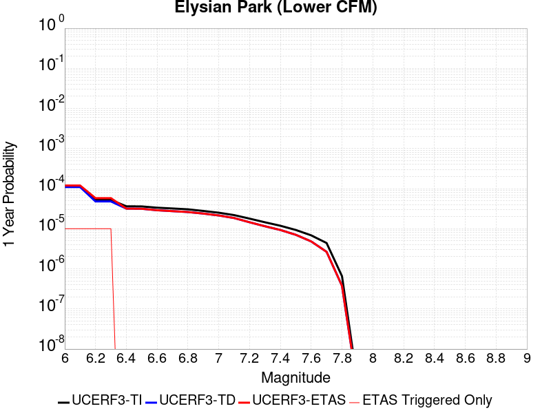 |  |

| Magnitude | 1 wk TI Prob | 1 wk TD Prob | 1 wk ETAS Prob | 1 wk ETAS/TD Gain | 1 wk ETAS Triggered Only | 1 mo TI Prob | 1 mo TD Prob | 1 mo ETAS Prob | 1 mo ETAS/TD Gain | 1 mo ETAS Triggered Only | 1 yr TI Prob | 1 yr TD Prob | 1 yr ETAS Prob | 1 yr ETAS/TD Gain | 1 yr ETAS Triggered Only | 10 yr TI Prob | 10 yr TD Prob | 10 yr ETAS Prob | 10 yr ETAS/TD Gain | 10 yr ETAS Triggered Only |
|-----|-----|-----|-----|-----|-----|-----|-----|-----|-----|-----|-----|-----|-----|-----|-----|-----|-----|-----|-----|-----|
| 6.0 | 2.1766498E-6 | 2.1037984E-6 | 2.1037984E-6 | 1.0 | 0.0 | 9.328466E-6 | 9.016256E-6 | 1.9016165E-5 | 2.109098 | 1.0E-5 | 1.1356815E-4 | 1.0976882E-4 | 1.1976773E-4 | 1.0910906 | 1.0E-5 | 0.0011351013 | 0.001097288 | 0.001107277 | 1.0091034 | 1.0E-5 |
| 6.1 | 2.1766498E-6 | 2.1037984E-6 | 2.1037984E-6 | 1.0 | 0.0 | 9.328466E-6 | 9.016256E-6 | 1.9016165E-5 | 2.109098 | 1.0E-5 | 1.1356815E-4 | 1.0976882E-4 | 1.1976773E-4 | 1.0910906 | 1.0E-5 | 0.0011351013 | 0.001097288 | 0.001107277 | 1.0091034 | 1.0E-5 |
| 6.2 | 1.0031182E-6 | 9.1862864E-7 | 9.1862864E-7 | 1.0 | 0.0 | 4.299071E-6 | 3.9369743E-6 | 1.3936935E-5 | 3.5400116 | 1.0E-5 | 5.2339932E-5 | 4.793171E-5 | 5.793123E-5 | 1.2086202 | 1.0E-5 | 5.2327604E-4 | 4.792235E-4 | 4.8921874E-4 | 1.0208571 | 1.0E-5 |
| 6.3 | 1.0031182E-6 | 9.1862864E-7 | 9.1862864E-7 | 1.0 | 0.0 | 4.299071E-6 | 3.9369743E-6 | 1.3936935E-5 | 3.5400116 | 1.0E-5 | 5.2339932E-5 | 4.793171E-5 | 5.793123E-5 | 1.2086202 | 1.0E-5 | 5.2327604E-4 | 4.792235E-4 | 4.8921874E-4 | 1.0208571 | 1.0E-5 |
| 6.4 | 6.9606244E-7 | 6.092012E-7 | 6.092012E-7 | 1.0 | 0.0 | 2.9831212E-6 | 2.6108596E-6 | 2.6108596E-6 | 1.0 | 0.0 | 3.6318896E-5 | 3.1786756E-5 | 3.1786756E-5 | 1.0 | 0.0 | 3.6312963E-4 | 3.1782233E-4 | 3.1782233E-4 | 1.0 | 0.0 |
| 6.5 | 6.901879E-7 | 6.0326954E-7 | 6.0326954E-7 | 1.0 | 0.0 | 2.9579448E-6 | 2.5854383E-6 | 2.5854383E-6 | 1.0 | 0.0 | 3.6012385E-5 | 3.147726E-5 | 3.147726E-5 | 1.0 | 0.0 | 3.600655E-4 | 3.1472824E-4 | 3.1472824E-4 | 1.0 | 0.0 |
| 6.6 | 6.4198554E-7 | 5.546678E-7 | 5.546678E-7 | 1.0 | 0.0 | 2.7513638E-6 | 2.3771454E-6 | 2.3771454E-6 | 1.0 | 0.0 | 3.3497337E-5 | 2.8941362E-5 | 2.8941362E-5 | 1.0 | 0.0 | 3.349229E-4 | 2.8937607E-4 | 2.8937607E-4 | 1.0 | 0.0 |
| 6.7 | 6.138733E-7 | 5.2634846E-7 | 5.2634846E-7 | 1.0 | 0.0 | 2.6308828E-6 | 2.2557772E-6 | 2.2557772E-6 | 1.0 | 0.0 | 3.203053E-5 | 2.7463742E-5 | 2.7463742E-5 | 1.0 | 0.0 | 3.2025913E-4 | 2.746036E-4 | 2.746036E-4 | 1.0 | 0.0 |
| 6.8 | 5.84778E-7 | 5.003004E-7 | 5.003004E-7 | 1.0 | 0.0 | 2.506189E-6 | 2.1441429E-6 | 2.1441429E-6 | 1.0 | 0.0 | 3.0512423E-5 | 2.6104626E-5 | 2.6104626E-5 | 1.0 | 0.0 | 3.0508233E-4 | 2.6101572E-4 | 2.6101572E-4 | 1.0 | 0.0 |
| 6.9 | 5.322785E-7 | 4.5801403E-7 | 4.5801403E-7 | 1.0 | 0.0 | 2.2811914E-6 | 1.9629158E-6 | 1.9629158E-6 | 1.0 | 0.0 | 2.7773152E-5 | 2.3898237E-5 | 2.3898237E-5 | 1.0 | 0.0 | 2.7769682E-4 | 2.3895678E-4 | 2.3895678E-4 | 1.0 | 0.0 |
| 7.0 | 4.8147206E-7 | 4.1124733E-7 | 4.1124733E-7 | 1.0 | 0.0 | 2.06345E-6 | 1.7624873E-6 | 1.7624873E-6 | 1.0 | 0.0 | 2.5122214E-5 | 2.1458072E-5 | 2.1458072E-5 | 1.0 | 0.0 | 2.5119373E-4 | 2.1456009E-4 | 2.1456009E-4 | 1.0 | 0.0 |
| 7.1 | 4.1932955E-7 | 3.5456276E-7 | 3.5456276E-7 | 1.0 | 0.0 | 1.7971255E-6 | 1.5195537E-6 | 1.5195537E-6 | 1.0 | 0.0 | 2.1879783E-5 | 1.850041E-5 | 1.850041E-5 | 1.0 | 0.0 | 2.1877629E-4 | 1.8498875E-4 | 1.8498875E-4 | 1.0 | 0.0 |
| 7.2 | 3.426051E-7 | 2.7810796E-7 | 2.7810796E-7 | 1.0 | 0.0 | 1.4683067E-6 | 1.1918906E-6 | 1.1918906E-6 | 1.0 | 0.0 | 1.7876488E-5 | 1.4511173E-5 | 1.4511173E-5 | 1.0 | 0.0 | 1.787505E-4 | 1.4510227E-4 | 1.4510227E-4 | 1.0 | 0.0 |
| 7.3 | 2.7771645E-7 | 2.2096945E-7 | 2.2096945E-7 | 1.0 | 0.0 | 1.1902127E-6 | 9.470116E-7 | 9.470116E-7 | 1.0 | 0.0 | 1.4490744E-5 | 1.1529804E-5 | 1.1529804E-5 | 1.0 | 0.0 | 1.4489799E-4 | 1.1529209E-4 | 1.1529209E-4 | 1.0 | 0.0 |
| 7.4 | 2.2756493E-7 | 1.784018E-7 | 1.784018E-7 | 1.0 | 0.0 | 9.752779E-7 | 7.6457894E-7 | 7.6457894E-7 | 1.0 | 0.0 | 1.1873944E-5 | 9.308708E-6 | 9.308708E-6 | 1.0 | 0.0 | 1.18733085E-4 | 9.30832E-5 | 9.30832E-5 | 1.0 | 0.0 |
| 7.5 | 1.7874558E-7 | 1.354304E-7 | 1.354304E-7 | 1.0 | 0.0 | 7.660522E-7 | 5.804159E-7 | 5.804159E-7 | 1.0 | 0.0 | 9.326646E-6 | 7.06654E-6 | 7.06654E-6 | 1.0 | 0.0 | 9.326255E-5 | 7.066317E-5 | 7.066317E-5 | 1.0 | 0.0 |
| 7.6 | 1.3124549E-7 | 9.251099E-8 | 9.251099E-8 | 1.0 | 0.0 | 5.624805E-7 | 3.964756E-7 | 3.964756E-7 | 1.0 | 0.0 | 6.8481786E-6 | 4.82708E-6 | 4.82708E-6 | 1.0 | 0.0 | 6.8479676E-5 | 4.8269765E-5 | 4.8269765E-5 | 1.0 | 0.0 |
| 7.7 | 8.439993E-8 | 5.0902187E-8 | 5.0902187E-8 | 1.0 | 0.0 | 3.6171392E-7 | 2.1815221E-7 | 2.1815221E-7 | 1.0 | 0.0 | 4.403858E-6 | 2.656E-6 | 2.656E-6 | 1.0 | 0.0 | 4.4037708E-5 | 2.6559695E-5 | 2.6559695E-5 | 1.0 | 0.0 |
| 7.8 | 1.2591407E-8 | 7.2279613E-9 | 7.2279613E-9 | 1.0 | 0.0 | 5.3963173E-8 | 3.0976977E-8 | 3.0976977E-8 | 1.0 | 0.0 | 6.570014E-7 | 3.7714463E-7 | 3.7714463E-7 | 1.0 | 0.0 | 6.5699946E-6 | 3.77144E-6 | 3.77144E-6 | 1.0 | 0.0 |
| 7.9 | 2.8324232E-11 | 2.1406432E-11 | 2.1406432E-11 | 1.0 | 0.0 | 1.2138957E-10 | 9.17425E-11 | 9.17425E-11 | 1.0 | 0.0 | 1.4779177E-9 | 1.1169644E-9 | 1.1169644E-9 | 1.0 | 0.0 | 1.4779177E-8 | 1.1169644E-8 | 1.1169644E-8 | 1.0 | 0.0 |

## Ozena
*[(top)](#table-of-contents)*

| 1 Week | 1 Month | 1 Year | 10 Year |
|-----|-----|-----|-----|
|  |  |  |  |

| Magnitude | 1 wk TI Prob | 1 wk TD Prob | 1 wk ETAS Prob | 1 wk ETAS/TD Gain | 1 wk ETAS Triggered Only | 1 mo TI Prob | 1 mo TD Prob | 1 mo ETAS Prob | 1 mo ETAS/TD Gain | 1 mo ETAS Triggered Only | 1 yr TI Prob | 1 yr TD Prob | 1 yr ETAS Prob | 1 yr ETAS/TD Gain | 1 yr ETAS Triggered Only | 10 yr TI Prob | 10 yr TD Prob | 10 yr ETAS Prob | 10 yr ETAS/TD Gain | 10 yr ETAS Triggered Only |
|-----|-----|-----|-----|-----|-----|-----|-----|-----|-----|-----|-----|-----|-----|-----|-----|-----|-----|-----|-----|-----|
| 6.0 | 1.4377547E-6 | 1.4513802E-6 | 1.4513802E-6 | 1.0 | 0.0 | 6.161791E-6 | 6.220187E-6 | 6.220187E-6 | 1.0 | 0.0 | 7.5017226E-5 | 7.572842E-5 | 7.572842E-5 | 1.0 | 0.0 | 7.4991904E-4 | 7.5705274E-4 | 7.670452E-4 | 1.0131991 | 1.0E-5 |
| 6.1 | 1.4377547E-6 | 1.4513802E-6 | 1.4513802E-6 | 1.0 | 0.0 | 6.161791E-6 | 6.220187E-6 | 6.220187E-6 | 1.0 | 0.0 | 7.5017226E-5 | 7.572842E-5 | 7.572842E-5 | 1.0 | 0.0 | 7.4991904E-4 | 7.5705274E-4 | 7.670452E-4 | 1.0131991 | 1.0E-5 |
| 6.2 | 1.4377547E-6 | 1.4513802E-6 | 1.4513802E-6 | 1.0 | 0.0 | 6.161791E-6 | 6.220187E-6 | 6.220187E-6 | 1.0 | 0.0 | 7.5017226E-5 | 7.572842E-5 | 7.572842E-5 | 1.0 | 0.0 | 7.4991904E-4 | 7.5705274E-4 | 7.670452E-4 | 1.0131991 | 1.0E-5 |
| 6.3 | 1.4377547E-6 | 1.4513802E-6 | 1.4513802E-6 | 1.0 | 0.0 | 6.161791E-6 | 6.220187E-6 | 6.220187E-6 | 1.0 | 0.0 | 7.5017226E-5 | 7.572842E-5 | 7.572842E-5 | 1.0 | 0.0 | 7.4991904E-4 | 7.5705274E-4 | 7.670452E-4 | 1.0131991 | 1.0E-5 |
| 6.4 | 1.4377547E-6 | 1.4513802E-6 | 1.4513802E-6 | 1.0 | 0.0 | 6.161791E-6 | 6.220187E-6 | 6.220187E-6 | 1.0 | 0.0 | 7.5017226E-5 | 7.572842E-5 | 7.572842E-5 | 1.0 | 0.0 | 7.4991904E-4 | 7.5705274E-4 | 7.670452E-4 | 1.0131991 | 1.0E-5 |
| 6.5 | 1.4377547E-6 | 1.4513802E-6 | 1.4513802E-6 | 1.0 | 0.0 | 6.161791E-6 | 6.220187E-6 | 6.220187E-6 | 1.0 | 0.0 | 7.5017226E-5 | 7.572842E-5 | 7.572842E-5 | 1.0 | 0.0 | 7.4991904E-4 | 7.5705274E-4 | 7.670452E-4 | 1.0131991 | 1.0E-5 |
| 6.6 | 1.4377547E-6 | 1.4513802E-6 | 1.4513802E-6 | 1.0 | 0.0 | 6.161791E-6 | 6.220187E-6 | 6.220187E-6 | 1.0 | 0.0 | 7.5017226E-5 | 7.572842E-5 | 7.572842E-5 | 1.0 | 0.0 | 7.4991904E-4 | 7.5705274E-4 | 7.670452E-4 | 1.0131991 | 1.0E-5 |
| 6.7 | 1.4377547E-6 | 1.4513802E-6 | 1.4513802E-6 | 1.0 | 0.0 | 6.161791E-6 | 6.220187E-6 | 6.220187E-6 | 1.0 | 0.0 | 7.5017226E-5 | 7.572842E-5 | 7.572842E-5 | 1.0 | 0.0 | 7.4991904E-4 | 7.5705274E-4 | 7.670452E-4 | 1.0131991 | 1.0E-5 |
| 6.8 | 9.223257E-7 | 9.317636E-7 | 9.317636E-7 | 1.0 | 0.0 | 3.9528186E-6 | 3.9932665E-6 | 3.9932665E-6 | 1.0 | 0.0 | 4.81245E-5 | 4.8616977E-5 | 4.8616977E-5 | 1.0 | 0.0 | 4.811408E-4 | 4.8606747E-4 | 4.8606747E-4 | 1.0 | 0.0 |
| 6.9 | 9.141515E-7 | 9.235383E-7 | 9.235383E-7 | 1.0 | 0.0 | 3.917786E-6 | 3.958016E-6 | 3.958016E-6 | 1.0 | 0.0 | 4.7698002E-5 | 4.8187816E-5 | 4.8187816E-5 | 1.0 | 0.0 | 4.7687767E-4 | 4.817777E-4 | 4.817777E-4 | 1.0 | 0.0 |
| 7.0 | 8.767648E-7 | 8.858589E-7 | 8.858589E-7 | 1.0 | 0.0 | 3.757558E-6 | 3.7965328E-6 | 3.7965328E-6 | 1.0 | 0.0 | 4.5747307E-5 | 4.622185E-5 | 4.622185E-5 | 1.0 | 0.0 | 4.5737892E-4 | 4.6212628E-4 | 4.6212628E-4 | 1.0 | 0.0 |
| 7.1 | 8.199402E-7 | 8.2854103E-7 | 8.2854103E-7 | 1.0 | 0.0 | 3.5140247E-6 | 3.5508854E-6 | 3.5508854E-6 | 1.0 | 0.0 | 4.2782412E-5 | 4.323121E-5 | 4.323121E-5 | 1.0 | 0.0 | 4.2774176E-4 | 4.3223173E-4 | 4.3223173E-4 | 1.0 | 0.0 |
| 7.2 | 7.38705E-7 | 7.4642725E-7 | 7.4642725E-7 | 1.0 | 0.0 | 3.1658747E-6 | 3.1989703E-6 | 3.1989703E-6 | 1.0 | 0.0 | 3.8543843E-5 | 3.8946804E-5 | 3.8946804E-5 | 1.0 | 0.0 | 3.853716E-4 | 3.8940329E-4 | 3.8940329E-4 | 1.0 | 0.0 |
| 7.3 | 6.490017E-7 | 6.557811E-7 | 6.557811E-7 | 1.0 | 0.0 | 2.7814328E-6 | 2.8104876E-6 | 2.8104876E-6 | 1.0 | 0.0 | 3.386342E-5 | 3.421718E-5 | 3.421718E-5 | 1.0 | 0.0 | 3.3858258E-4 | 3.421225E-4 | 3.421225E-4 | 1.0 | 0.0 |
| 7.4 | 5.346736E-7 | 5.4022684E-7 | 5.4022684E-7 | 1.0 | 0.0 | 2.291456E-6 | 2.3152559E-6 | 2.3152559E-6 | 1.0 | 0.0 | 2.789812E-5 | 2.8187907E-5 | 2.8187907E-5 | 1.0 | 0.0 | 2.789462E-4 | 2.8184635E-4 | 2.8184635E-4 | 1.0 | 0.0 |
| 7.5 | 2.939325E-7 | 2.9666094E-7 | 2.9666094E-7 | 1.0 | 0.0 | 1.25971E-6 | 1.2714034E-6 | 1.2714034E-6 | 1.0 | 0.0 | 1.5336862E-5 | 1.5479243E-5 | 1.5479243E-5 | 1.0 | 0.0 | 1.5335804E-4 | 1.5478328E-4 | 1.5478328E-4 | 1.0 | 0.0 |
| 7.6 | 1.4151905E-7 | 1.4253278E-7 | 1.4253278E-7 | 1.0 | 0.0 | 6.065101E-7 | 6.1085467E-7 | 6.1085467E-7 | 1.0 | 0.0 | 7.3842357E-6 | 7.437131E-6 | 7.437131E-6 | 1.0 | 0.0 | 7.38399E-5 | 7.4368894E-5 | 7.4368894E-5 | 1.0 | 0.0 |
| 7.7 | 4.4957577E-8 | 4.5252282E-8 | 4.5252282E-8 | 1.0 | 0.0 | 1.9267533E-7 | 1.9393833E-7 | 1.9393833E-7 | 1.0 | 0.0 | 2.3458194E-6 | 2.3611967E-6 | 2.3611967E-6 | 1.0 | 0.0 | 2.3457947E-5 | 2.3611727E-5 | 2.3611727E-5 | 1.0 | 0.0 |
| 7.8 | 5.9993255E-9 | 6.041303E-9 | 6.041303E-9 | 1.0 | 0.0 | 2.5711394E-8 | 2.5891298E-8 | 2.5891298E-8 | 1.0 | 0.0 | 3.1303617E-7 | 3.1522652E-7 | 3.1522652E-7 | 1.0 | 0.0 | 3.1303573E-6 | 3.1522618E-6 | 3.1522618E-6 | 1.0 | 0.0 |

## Los Alamos extension
*[(top)](#table-of-contents)*

| 1 Week | 1 Month | 1 Year | 10 Year |
|-----|-----|-----|-----|
|  |  |  | 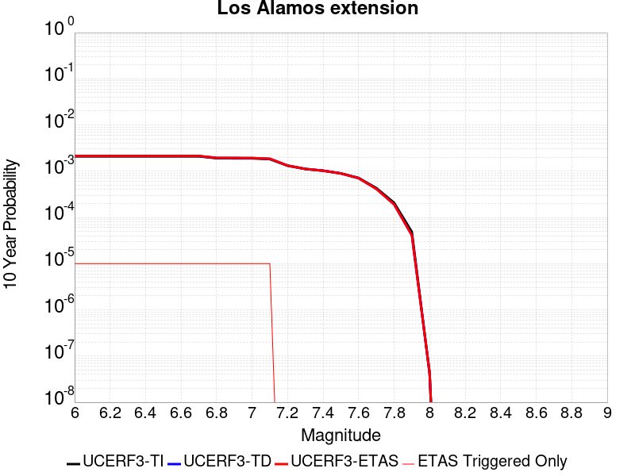 |

| Magnitude | 1 wk TI Prob | 1 wk TD Prob | 1 wk ETAS Prob | 1 wk ETAS/TD Gain | 1 wk ETAS Triggered Only | 1 mo TI Prob | 1 mo TD Prob | 1 mo ETAS Prob | 1 mo ETAS/TD Gain | 1 mo ETAS Triggered Only | 1 yr TI Prob | 1 yr TD Prob | 1 yr ETAS Prob | 1 yr ETAS/TD Gain | 1 yr ETAS Triggered Only | 10 yr TI Prob | 10 yr TD Prob | 10 yr ETAS Prob | 10 yr ETAS/TD Gain | 10 yr ETAS Triggered Only |
|-----|-----|-----|-----|-----|-----|-----|-----|-----|-----|-----|-----|-----|-----|-----|-----|-----|-----|-----|-----|-----|
| 6.0 | 4.0146506E-6 | 4.0861805E-6 | 4.0861805E-6 | 1.0 | 0.0 | 1.7205533E-5 | 1.751209E-5 | 2.7511915E-5 | 1.5710241 | 1.0E-5 | 2.0945723E-4 | 2.1318994E-4 | 2.2318782E-4 | 1.0468966 | 1.0E-5 | 0.0020925992 | 0.0021299634 | 0.002139942 | 1.0046849 | 1.0E-5 |
| 6.1 | 4.0146506E-6 | 4.0861805E-6 | 4.0861805E-6 | 1.0 | 0.0 | 1.7205533E-5 | 1.751209E-5 | 2.7511915E-5 | 1.5710241 | 1.0E-5 | 2.0945723E-4 | 2.1318994E-4 | 2.2318782E-4 | 1.0468966 | 1.0E-5 | 0.0020925992 | 0.0021299634 | 0.002139942 | 1.0046849 | 1.0E-5 |
| 6.2 | 4.0146506E-6 | 4.0861805E-6 | 4.0861805E-6 | 1.0 | 0.0 | 1.7205533E-5 | 1.751209E-5 | 2.7511915E-5 | 1.5710241 | 1.0E-5 | 2.0945723E-4 | 2.1318994E-4 | 2.2318782E-4 | 1.0468966 | 1.0E-5 | 0.0020925992 | 0.0021299634 | 0.002139942 | 1.0046849 | 1.0E-5 |
| 6.3 | 4.0146506E-6 | 4.0861805E-6 | 4.0861805E-6 | 1.0 | 0.0 | 1.7205533E-5 | 1.751209E-5 | 2.7511915E-5 | 1.5710241 | 1.0E-5 | 2.0945723E-4 | 2.1318994E-4 | 2.2318782E-4 | 1.0468966 | 1.0E-5 | 0.0020925992 | 0.0021299634 | 0.002139942 | 1.0046849 | 1.0E-5 |
| 6.4 | 4.0146506E-6 | 4.0861805E-6 | 4.0861805E-6 | 1.0 | 0.0 | 1.7205533E-5 | 1.751209E-5 | 2.7511915E-5 | 1.5710241 | 1.0E-5 | 2.0945723E-4 | 2.1318994E-4 | 2.2318782E-4 | 1.0468966 | 1.0E-5 | 0.0020925992 | 0.0021299634 | 0.002139942 | 1.0046849 | 1.0E-5 |
| 6.5 | 4.0146506E-6 | 4.0861805E-6 | 4.0861805E-6 | 1.0 | 0.0 | 1.7205533E-5 | 1.751209E-5 | 2.7511915E-5 | 1.5710241 | 1.0E-5 | 2.0945723E-4 | 2.1318994E-4 | 2.2318782E-4 | 1.0468966 | 1.0E-5 | 0.0020925992 | 0.0021299634 | 0.002139942 | 1.0046849 | 1.0E-5 |
| 6.6 | 4.0146506E-6 | 4.0861805E-6 | 4.0861805E-6 | 1.0 | 0.0 | 1.7205533E-5 | 1.751209E-5 | 2.7511915E-5 | 1.5710241 | 1.0E-5 | 2.0945723E-4 | 2.1318994E-4 | 2.2318782E-4 | 1.0468966 | 1.0E-5 | 0.0020925992 | 0.0021299634 | 0.002139942 | 1.0046849 | 1.0E-5 |
| 6.7 | 4.0146506E-6 | 4.0861805E-6 | 4.0861805E-6 | 1.0 | 0.0 | 1.7205533E-5 | 1.751209E-5 | 2.7511915E-5 | 1.5710241 | 1.0E-5 | 2.0945723E-4 | 2.1318994E-4 | 2.2318782E-4 | 1.0468966 | 1.0E-5 | 0.0020925992 | 0.0021299634 | 0.002139942 | 1.0046849 | 1.0E-5 |
| 6.8 | 3.6584688E-6 | 3.7188781E-6 | 3.7188781E-6 | 1.0 | 0.0 | 1.5679057E-5 | 1.5937956E-5 | 2.5937798E-5 | 1.627423 | 1.0E-5 | 1.9087581E-4 | 1.9402828E-4 | 2.0402634E-4 | 1.0515289 | 1.0E-5 | 0.0019071194 | 0.0019386812 | 0.0019486618 | 1.0051482 | 1.0E-5 |
| 6.9 | 3.644631E-6 | 3.704588E-6 | 3.704588E-6 | 1.0 | 0.0 | 1.5619753E-5 | 1.5876714E-5 | 2.5876556E-5 | 1.6298432 | 1.0E-5 | 1.901539E-4 | 1.9328279E-4 | 2.0328086E-4 | 1.0517277 | 1.0E-5 | 0.0018999127 | 0.0019312392 | 0.0019412199 | 1.0051681 | 1.0E-5 |
| 7.0 | 3.6318522E-6 | 3.6913484E-6 | 3.6913484E-6 | 1.0 | 0.0 | 1.5564989E-5 | 1.5819975E-5 | 2.5819816E-5 | 1.6321023 | 1.0E-5 | 1.8948725E-4 | 1.925921E-4 | 2.0259018E-4 | 1.0519133 | 1.0E-5 | 0.0018932576 | 0.0019243443 | 0.0019343251 | 1.0051866 | 1.0E-5 |
| 7.1 | 3.5001724E-6 | 3.5554185E-6 | 3.5554185E-6 | 1.0 | 0.0 | 1.5000653E-5 | 1.5237424E-5 | 2.5237272E-5 | 1.656269 | 1.0E-5 | 1.8261763E-4 | 1.8550076E-4 | 1.9549891E-4 | 1.0538981 | 1.0E-5 | 0.0018246764 | 0.0018535499 | 0.0018635313 | 1.005385 | 1.0E-5 |
| 7.2 | 2.5204702E-6 | 2.5437084E-6 | 2.5437084E-6 | 1.0 | 0.0 | 1.080197E-5 | 1.0901562E-5 | 1.0901562E-5 | 1.0 | 0.0 | 1.3150605E-4 | 1.3271849E-4 | 1.3271849E-4 | 1.0 | 0.0 | 0.0013142825 | 0.0013263979 | 0.0013263979 | 1.0 | 0.0 |
| 7.3 | 2.1399692E-6 | 2.150144E-6 | 2.150144E-6 | 1.0 | 0.0 | 9.1712645E-6 | 9.21487E-6 | 9.21487E-6 | 1.0 | 0.0 | 1.1165442E-4 | 1.121853E-4 | 1.121853E-4 | 1.0 | 0.0 | 0.0011159834 | 0.0011212899 | 0.0011212899 | 1.0 | 0.0 |
| 7.4 | 1.9660122E-6 | 1.970248E-6 | 1.970248E-6 | 1.0 | 0.0 | 8.42574E-6 | 8.4438925E-6 | 8.4438925E-6 | 1.0 | 0.0 | 1.0257855E-4 | 1.0279957E-4 | 1.0279957E-4 | 1.0 | 0.0 | 0.0010253121 | 0.0010275233 | 0.0010275233 | 1.0 | 0.0 |
| 7.5 | 1.7204633E-6 | 1.7151085E-6 | 1.7151085E-6 | 1.0 | 0.0 | 7.373393E-6 | 7.3504443E-6 | 7.3504443E-6 | 1.0 | 0.0 | 8.976737E-5 | 8.9488014E-5 | 8.9488014E-5 | 1.0 | 0.0 | 8.9731114E-4 | 8.9452276E-4 | 8.9452276E-4 | 1.0 | 0.0 |
| 7.6 | 1.3717638E-6 | 1.3535908E-6 | 1.3535908E-6 | 1.0 | 0.0 | 5.878974E-6 | 5.8010905E-6 | 5.8010905E-6 | 1.0 | 0.0 | 7.157416E-5 | 7.062602E-5 | 7.062602E-5 | 1.0 | 0.0 | 7.1551115E-4 | 7.060383E-4 | 7.060383E-4 | 1.0 | 0.0 |
| 7.7 | 8.272564E-7 | 7.957687E-7 | 7.957687E-7 | 1.0 | 0.0 | 3.5453797E-6 | 3.410433E-6 | 3.410433E-6 | 1.0 | 0.0 | 4.3164142E-5 | 4.152123E-5 | 4.152123E-5 | 1.0 | 0.0 | 4.315576E-4 | 4.151349E-4 | 4.151349E-4 | 1.0 | 0.0 |
| 7.8 | 3.9708277E-7 | 3.671928E-7 | 3.671928E-7 | 1.0 | 0.0 | 1.7017821E-6 | 1.5736824E-6 | 1.5736824E-6 | 1.0 | 0.0 | 2.0719E-5 | 1.9159415E-5 | 1.9159415E-5 | 1.0 | 0.0 | 2.071707E-4 | 1.9157771E-4 | 1.9157771E-4 | 1.0 | 0.0 |
| 7.9 | 9.292528E-8 | 7.8891446E-8 | 7.8891446E-8 | 1.0 | 0.0 | 3.9825116E-7 | 3.3810616E-7 | 3.3810616E-7 | 1.0 | 0.0 | 4.848697E-6 | 4.116435E-6 | 4.116435E-6 | 1.0 | 0.0 | 4.8485912E-5 | 4.1163596E-5 | 4.1163596E-5 | 1.0 | 0.0 |
| 8.0 | 7.880441E-11 | 8.235368E-11 | 8.235368E-11 | 1.0 | 0.0 | 3.3773329E-10 | 3.5294412E-10 | 3.5294412E-10 | 1.0 | 0.0 | 4.1119033E-9 | 4.297095E-9 | 4.297095E-9 | 1.0 | 0.0 | 4.1119034E-8 | 4.2970953E-8 | 4.2970953E-8 | 1.0 | 0.0 |

## Newport-Inglewood alt 1
*[(top)](#table-of-contents)*

| 1 Week | 1 Month | 1 Year | 10 Year |
|-----|-----|-----|-----|
|  |  |  | 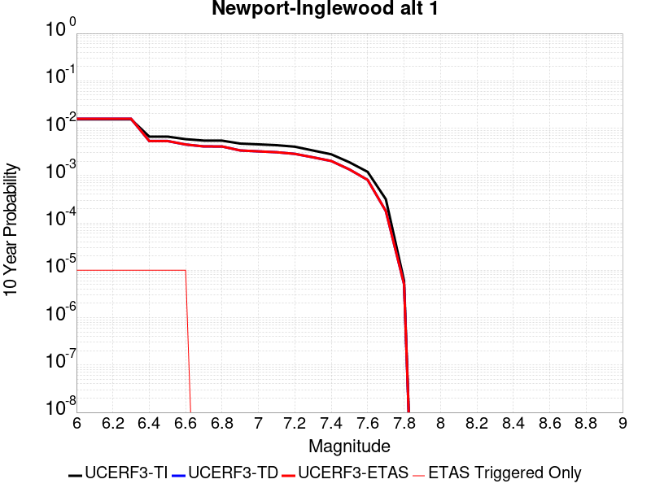 |

| Magnitude | 1 wk TI Prob | 1 wk TD Prob | 1 wk ETAS Prob | 1 wk ETAS/TD Gain | 1 wk ETAS Triggered Only | 1 mo TI Prob | 1 mo TD Prob | 1 mo ETAS Prob | 1 mo ETAS/TD Gain | 1 mo ETAS Triggered Only | 1 yr TI Prob | 1 yr TD Prob | 1 yr ETAS Prob | 1 yr ETAS/TD Gain | 1 yr ETAS Triggered Only | 10 yr TI Prob | 10 yr TD Prob | 10 yr ETAS Prob | 10 yr ETAS/TD Gain | 10 yr ETAS Triggered Only |
|-----|-----|-----|-----|-----|-----|-----|-----|-----|-----|-----|-----|-----|-----|-----|-----|-----|-----|-----|-----|-----|
| 6.0 | 2.9668912E-5 | 3.0405516E-5 | 3.0405516E-5 | 1.0 | 0.0 | 1.2714628E-4 | 1.3030559E-4 | 1.3030559E-4 | 1.0 | 0.0 | 0.0015469068 | 0.0015857986 | 0.0015857986 | 1.0 | 0.0 | 0.015361829 | 0.015792403 | 0.015802246 | 1.0006232 | 1.0E-5 |
| 6.1 | 2.9668912E-5 | 3.0405516E-5 | 3.0405516E-5 | 1.0 | 0.0 | 1.2714628E-4 | 1.3030559E-4 | 1.3030559E-4 | 1.0 | 0.0 | 0.0015469068 | 0.0015857986 | 0.0015857986 | 1.0 | 0.0 | 0.015361829 | 0.015792403 | 0.015802246 | 1.0006232 | 1.0E-5 |
| 6.2 | 2.9668912E-5 | 3.0405516E-5 | 3.0405516E-5 | 1.0 | 0.0 | 1.2714628E-4 | 1.3030559E-4 | 1.3030559E-4 | 1.0 | 0.0 | 0.0015469068 | 0.0015857986 | 0.0015857986 | 1.0 | 0.0 | 0.015361829 | 0.015792403 | 0.015802246 | 1.0006232 | 1.0E-5 |
| 6.3 | 2.9668912E-5 | 3.0405516E-5 | 3.0405516E-5 | 1.0 | 0.0 | 1.2714628E-4 | 1.3030559E-4 | 1.3030559E-4 | 1.0 | 0.0 | 0.0015469068 | 0.0015857986 | 0.0015857986 | 1.0 | 0.0 | 0.015361829 | 0.015792403 | 0.015802246 | 1.0006232 | 1.0E-5 |
| 6.4 | 1.275942E-5 | 1.0272664E-5 | 1.0272664E-5 | 1.0 | 0.0 | 5.4682085E-5 | 4.4024986E-5 | 4.4024986E-5 | 1.0 | 0.0 | 6.65551E-4 | 5.3587655E-4 | 5.3587655E-4 | 1.0 | 0.0 | 0.0066356123 | 0.0053462684 | 0.005356215 | 1.0018605 | 1.0E-5 |
| 6.5 | 1.275942E-5 | 1.0272664E-5 | 1.0272664E-5 | 1.0 | 0.0 | 5.4682085E-5 | 4.4024986E-5 | 4.4024986E-5 | 1.0 | 0.0 | 6.65551E-4 | 5.3587655E-4 | 5.3587655E-4 | 1.0 | 0.0 | 0.0066356123 | 0.0053462684 | 0.005356215 | 1.0018605 | 1.0E-5 |
| 6.6 | 1.1255358E-5 | 8.662018E-6 | 8.662018E-6 | 1.0 | 0.0 | 4.8236358E-5 | 3.7122416E-5 | 3.7122416E-5 | 1.0 | 0.0 | 5.871194E-4 | 4.5187338E-4 | 4.5187338E-4 | 1.0 | 0.0 | 0.005855706 | 0.004509723 | 0.0045196777 | 1.0022074 | 1.0E-5 |
| 6.7 | 1.0504745E-5 | 7.899919E-6 | 7.899919E-6 | 1.0 | 0.0 | 4.5019555E-5 | 3.3856366E-5 | 3.3856366E-5 | 1.0 | 0.0 | 5.4797524E-4 | 4.1212453E-4 | 4.1212453E-4 | 1.0 | 0.0 | 0.0054662596 | 0.0041137324 | 0.0041137324 | 1.0 | 0.0 |
| 6.8 | 1.0476007E-5 | 7.881301E-6 | 7.881301E-6 | 1.0 | 0.0 | 4.4896402E-5 | 3.377657E-5 | 3.377657E-5 | 1.0 | 0.0 | 5.464766E-4 | 4.1115342E-4 | 4.1115342E-4 | 1.0 | 0.0 | 0.005451347 | 0.0041040573 | 0.0041040573 | 1.0 | 0.0 |
| 6.9 | 9.076797E-6 | 6.489738E-6 | 6.489738E-6 | 1.0 | 0.0 | 3.889998E-5 | 2.7812868E-5 | 2.7812868E-5 | 1.0 | 0.0 | 4.7350433E-4 | 3.385694E-4 | 3.385694E-4 | 1.0 | 0.0 | 0.004724967 | 0.0033805731 | 0.0033805731 | 1.0 | 0.0 |
| 7.0 | 8.73795E-6 | 6.212118E-6 | 6.212118E-6 | 1.0 | 0.0 | 3.7447822E-5 | 2.6623095E-5 | 2.6623095E-5 | 1.0 | 0.0 | 4.5583185E-4 | 3.2408824E-4 | 3.2408824E-4 | 1.0 | 0.0 | 0.0045489795 | 0.0032361876 | 0.0032361876 | 1.0 | 0.0 |
| 7.1 | 8.391299E-6 | 5.955894E-6 | 5.955894E-6 | 1.0 | 0.0 | 3.5962214E-5 | 2.552501E-5 | 2.552501E-5 | 1.0 | 0.0 | 4.37752E-4 | 3.1072294E-4 | 3.1072294E-4 | 1.0 | 0.0 | 0.004368907 | 0.0031029144 | 0.0031029144 | 1.0 | 0.0 |
| 7.2 | 7.796882E-6 | 5.496635E-6 | 5.496635E-6 | 1.0 | 0.0 | 3.341478E-5 | 2.3556795E-5 | 2.3556795E-5 | 1.0 | 0.0 | 4.06749E-4 | 2.8676644E-4 | 2.8676644E-4 | 1.0 | 0.0 | 0.0040600533 | 0.002863988 | 0.002863988 | 1.0 | 0.0 |
| 7.3 | 6.4738833E-6 | 4.647859E-6 | 4.647859E-6 | 1.0 | 0.0 | 2.774492E-5 | 1.9919245E-5 | 1.9919245E-5 | 1.0 | 0.0 | 3.3774204E-4 | 2.4248997E-4 | 2.4248997E-4 | 1.0 | 0.0 | 0.0033722918 | 0.0024222704 | 0.0024222704 | 1.0 | 0.0 |
| 7.4 | 5.382145E-6 | 3.8857956E-6 | 3.8857956E-6 | 1.0 | 0.0 | 2.3066134E-5 | 1.6653305E-5 | 1.6653305E-5 | 1.0 | 0.0 | 2.8079396E-4 | 2.0273525E-4 | 2.0273525E-4 | 1.0 | 0.0 | 0.0028043943 | 0.0020255174 | 0.0020255174 | 1.0 | 0.0 |
| 7.5 | 3.648244E-6 | 2.573805E-6 | 2.573805E-6 | 1.0 | 0.0 | 1.5635238E-5 | 1.1030546E-5 | 1.1030546E-5 | 1.0 | 0.0 | 1.9034238E-4 | 1.3428873E-4 | 1.3428873E-4 | 1.0 | 0.0 | 0.0019017943 | 0.0013420862 | 0.0013420862 | 1.0 | 0.0 |
| 7.6 | 2.2906888E-6 | 1.5479983E-6 | 1.5479983E-6 | 1.0 | 0.0 | 9.817201E-6 | 6.6342623E-6 | 6.6342623E-6 | 1.0 | 0.0 | 1.1951787E-4 | 8.076921E-5 | 8.076921E-5 | 1.0 | 0.0 | 0.0011945361 | 8.0740533E-4 | 8.0740533E-4 | 1.0 | 0.0 |
| 7.7 | 6.0479874E-7 | 3.3975476E-7 | 3.3975476E-7 | 1.0 | 0.0 | 2.5919921E-6 | 1.456091E-6 | 1.456091E-6 | 1.0 | 0.0 | 3.1557047E-5 | 1.7727778E-5 | 1.7727778E-5 | 1.0 | 0.0 | 3.1552566E-4 | 1.7726503E-4 | 1.7726503E-4 | 1.0 | 0.0 |
| 7.8 | 1.16056995E-8 | 9.782392E-9 | 9.782392E-9 | 1.0 | 0.0 | 4.9738713E-8 | 4.1924537E-8 | 4.1924537E-8 | 1.0 | 0.0 | 6.0556863E-7 | 5.104312E-7 | 5.104312E-7 | 1.0 | 0.0 | 6.05567E-6 | 5.104312E-6 | 5.104312E-6 | 1.0 | 0.0 |

## Great Valley 12
*[(top)](#table-of-contents)*

| 1 Week | 1 Month | 1 Year | 10 Year |
|-----|-----|-----|-----|
| 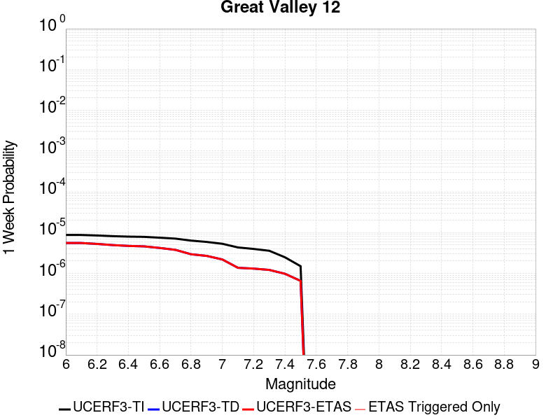 |  |  |  |

| Magnitude | 1 wk TI Prob | 1 wk TD Prob | 1 wk ETAS Prob | 1 wk ETAS/TD Gain | 1 wk ETAS Triggered Only | 1 mo TI Prob | 1 mo TD Prob | 1 mo ETAS Prob | 1 mo ETAS/TD Gain | 1 mo ETAS Triggered Only | 1 yr TI Prob | 1 yr TD Prob | 1 yr ETAS Prob | 1 yr ETAS/TD Gain | 1 yr ETAS Triggered Only | 10 yr TI Prob | 10 yr TD Prob | 10 yr ETAS Prob | 10 yr ETAS/TD Gain | 10 yr ETAS Triggered Only |
|-----|-----|-----|-----|-----|-----|-----|-----|-----|-----|-----|-----|-----|-----|-----|-----|-----|-----|-----|-----|-----|
| 6.0 | 8.757157E-6 | 5.555152E-6 | 5.555152E-6 | 1.0 | 0.0 | 3.7530135E-5 | 2.3807583E-5 | 2.3807583E-5 | 1.0 | 0.0 | 4.5683357E-4 | 2.8982E-4 | 2.9981707E-4 | 1.0344942 | 1.0E-5 | 0.004558956 | 0.002894541 | 0.0029045122 | 1.0034448 | 1.0E-5 |
| 6.1 | 8.757157E-6 | 5.555152E-6 | 5.555152E-6 | 1.0 | 0.0 | 3.7530135E-5 | 2.3807583E-5 | 2.3807583E-5 | 1.0 | 0.0 | 4.5683357E-4 | 2.8982E-4 | 2.9981707E-4 | 1.0344942 | 1.0E-5 | 0.004558956 | 0.002894541 | 0.0029045122 | 1.0034448 | 1.0E-5 |
| 6.2 | 8.499136E-6 | 5.2808177E-6 | 5.2808177E-6 | 1.0 | 0.0 | 3.642436E-5 | 2.2631886E-5 | 2.2631886E-5 | 1.0 | 0.0 | 4.4337637E-4 | 2.7550952E-4 | 2.8550677E-4 | 1.0362864 | 1.0E-5 | 0.0044249278 | 0.0027517942 | 0.0027617668 | 1.003624 | 1.0E-5 |
| 6.3 | 8.186883E-6 | 4.9489604E-6 | 4.9489604E-6 | 1.0 | 0.0 | 3.508617E-5 | 2.1209664E-5 | 2.1209664E-5 | 1.0 | 0.0 | 4.270904E-4 | 2.5819807E-4 | 2.6819546E-4 | 1.03872 | 1.0E-5 | 0.004262705 | 0.0025790813 | 0.0025890556 | 1.0038674 | 1.0E-5 |
| 6.4 | 7.979878E-6 | 4.7209605E-6 | 4.7209605E-6 | 1.0 | 0.0 | 3.419903E-5 | 2.0232537E-5 | 2.0232537E-5 | 1.0 | 0.0 | 4.1629362E-4 | 2.4630423E-4 | 2.5630178E-4 | 1.0405902 | 1.0E-5 | 0.0041551464 | 0.0024604066 | 0.002470382 | 1.0040544 | 1.0E-5 |
| 6.5 | 7.871003E-6 | 4.600934E-6 | 4.600934E-6 | 1.0 | 0.0 | 3.373243E-5 | 1.9718143E-5 | 1.9718143E-5 | 1.0 | 0.0 | 4.1061494E-4 | 2.400429E-4 | 2.500405E-4 | 1.0416492 | 1.0E-5 | 0.0040985704 | 0.002397929 | 0.0024079052 | 1.0041603 | 1.0E-5 |
| 6.6 | 7.508221E-6 | 4.2043134E-6 | 4.2043134E-6 | 1.0 | 0.0 | 3.2177693E-5 | 1.8018367E-5 | 1.8018367E-5 | 1.0 | 0.0 | 3.91693E-4 | 2.193524E-4 | 2.293502E-4 | 1.0455787 | 1.0E-5 | 0.003910033 | 0.0021914453 | 0.0022014233 | 1.0045532 | 1.0E-5 |
| 6.7 | 7.1297914E-6 | 3.7820291E-6 | 3.7820291E-6 | 1.0 | 0.0 | 3.055589E-5 | 1.62086E-5 | 1.62086E-5 | 1.0 | 0.0 | 3.7195446E-4 | 1.9732263E-4 | 2.0732066E-4 | 1.0506685 | 1.0E-5 | 0.0037133251 | 0.001971553 | 0.0019815334 | 1.0050621 | 1.0E-5 |
| 6.8 | 6.376581E-6 | 2.9485907E-6 | 2.9485907E-6 | 1.0 | 0.0 | 2.7327918E-5 | 1.2636758E-5 | 1.2636758E-5 | 1.0 | 0.0 | 3.326666E-4 | 1.5384183E-4 | 1.6384029E-4 | 1.0649918 | 1.0E-5 | 0.0033216903 | 0.0015373699 | 0.0015473545 | 1.0064946 | 1.0E-5 |
| 6.9 | 5.9095E-6 | 2.6866526E-6 | 2.6866526E-6 | 1.0 | 0.0 | 2.5326184E-5 | 1.1514175E-5 | 1.1514175E-5 | 1.0 | 0.0 | 3.0830267E-4 | 1.4017621E-4 | 1.5017482E-4 | 1.0713288 | 1.0E-5 | 0.003078753 | 0.0014008934 | 0.0014108794 | 1.0071284 | 1.0E-5 |
| 7.0 | 5.3239864E-6 | 2.1967758E-6 | 2.1967758E-6 | 1.0 | 0.0 | 2.2816885E-5 | 9.41472E-6 | 9.41472E-6 | 1.0 | 0.0 | 2.7776015E-4 | 1.1461832E-4 | 1.2461717E-4 | 1.087236 | 1.0E-5 | 0.0027741324 | 0.0011456055 | 0.001155594 | 1.008719 | 1.0E-5 |
| 7.1 | 4.329147E-6 | 1.370834E-6 | 1.370834E-6 | 1.0 | 0.0 | 1.8553355E-5 | 5.87499E-6 | 5.87499E-6 | 1.0 | 0.0 | 2.2586368E-4 | 7.152574E-5 | 8.152503E-5 | 1.1397998 | 1.0E-5 | 0.0022563424 | 7.1503595E-4 | 7.2502875E-4 | 1.0139753 | 1.0E-5 |
| 7.2 | 3.978488E-6 | 1.3106607E-6 | 1.3106607E-6 | 1.0 | 0.0 | 1.7050552E-5 | 5.6171057E-6 | 5.6171057E-6 | 1.0 | 0.0 | 2.075707E-4 | 6.83862E-5 | 7.8385514E-5 | 1.1462183 | 1.0E-5 | 0.0020737692 | 6.8366015E-4 | 6.936533E-4 | 1.0146172 | 1.0E-5 |
| 7.3 | 3.586542E-6 | 1.2158062E-6 | 1.2158062E-6 | 1.0 | 0.0 | 1.5370804E-5 | 5.210588E-6 | 5.210588E-6 | 1.0 | 0.0 | 1.8712347E-4 | 6.3437146E-5 | 6.3437146E-5 | 1.0 | 0.0 | 0.0018696598 | 6.341989E-4 | 6.341989E-4 | 1.0 | 0.0 |
| 7.4 | 2.4837766E-6 | 9.800765E-7 | 9.800765E-7 | 1.0 | 0.0 | 1.0644713E-5 | 4.2003217E-6 | 4.2003217E-6 | 1.0 | 0.0 | 1.2959167E-4 | 5.113778E-5 | 5.113778E-5 | 1.0 | 0.0 | 0.0012951613 | 5.112667E-4 | 5.112667E-4 | 1.0 | 0.0 |
| 7.5 | 1.5002679E-6 | 6.5462535E-7 | 6.5462535E-7 | 1.0 | 0.0 | 6.4297037E-6 | 2.8055345E-6 | 2.8055345E-6 | 1.0 | 0.0 | 7.827883E-5 | 3.415689E-5 | 3.415689E-5 | 1.0 | 0.0 | 7.825126E-4 | 3.4152053E-4 | 3.4152053E-4 | 1.0 | 0.0 |

## Great Valley 04b Gordon Valley
*[(top)](#table-of-contents)*

| 1 Week | 1 Month | 1 Year | 10 Year |
|-----|-----|-----|-----|
|  |  |  | 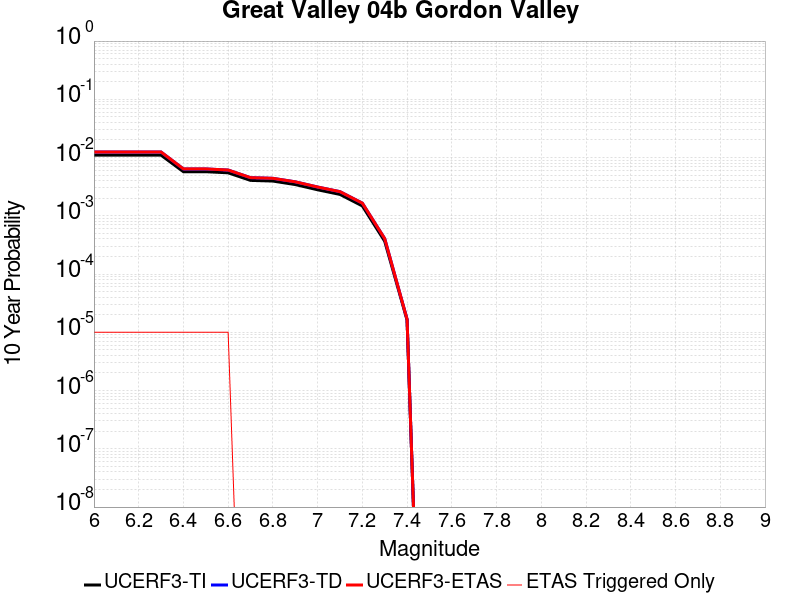 |

| Magnitude | 1 wk TI Prob | 1 wk TD Prob | 1 wk ETAS Prob | 1 wk ETAS/TD Gain | 1 wk ETAS Triggered Only | 1 mo TI Prob | 1 mo TD Prob | 1 mo ETAS Prob | 1 mo ETAS/TD Gain | 1 mo ETAS Triggered Only | 1 yr TI Prob | 1 yr TD Prob | 1 yr ETAS Prob | 1 yr ETAS/TD Gain | 1 yr ETAS Triggered Only | 10 yr TI Prob | 10 yr TD Prob | 10 yr ETAS Prob | 10 yr ETAS/TD Gain | 10 yr ETAS Triggered Only |
|-----|-----|-----|-----|-----|-----|-----|-----|-----|-----|-----|-----|-----|-----|-----|-----|-----|-----|-----|-----|-----|
| 6.0 | 2.1181217E-5 | 2.3982375E-5 | 2.3982375E-5 | 1.0 | 0.0 | 9.077348E-5 | 1.027785E-4 | 1.027785E-4 | 1.0 | 0.0 | 0.0011046068 | 0.0012507766 | 0.0012507766 | 1.0 | 0.0 | 0.010991322 | 0.012453817 | 0.012463693 | 1.000793 | 1.0E-5 |
| 6.1 | 2.1181217E-5 | 2.3982375E-5 | 2.3982375E-5 | 1.0 | 0.0 | 9.077348E-5 | 1.027785E-4 | 1.027785E-4 | 1.0 | 0.0 | 0.0011046068 | 0.0012507766 | 0.0012507766 | 1.0 | 0.0 | 0.010991322 | 0.012453817 | 0.012463693 | 1.000793 | 1.0E-5 |
| 6.2 | 2.1181217E-5 | 2.3982375E-5 | 2.3982375E-5 | 1.0 | 0.0 | 9.077348E-5 | 1.027785E-4 | 1.027785E-4 | 1.0 | 0.0 | 0.0011046068 | 0.0012507766 | 0.0012507766 | 1.0 | 0.0 | 0.010991322 | 0.012453817 | 0.012463693 | 1.000793 | 1.0E-5 |
| 6.3 | 2.1181217E-5 | 2.3982375E-5 | 2.3982375E-5 | 1.0 | 0.0 | 9.077348E-5 | 1.027785E-4 | 1.027785E-4 | 1.0 | 0.0 | 0.0011046068 | 0.0012507766 | 0.0012507766 | 1.0 | 0.0 | 0.010991322 | 0.012453817 | 0.012463693 | 1.000793 | 1.0E-5 |
| 6.4 | 1.0988268E-5 | 1.2254686E-5 | 1.2254686E-5 | 1.0 | 0.0 | 4.7091726E-5 | 5.2519114E-5 | 5.2519114E-5 | 1.0 | 0.0 | 5.731909E-4 | 6.392486E-4 | 6.392486E-4 | 1.0 | 0.0 | 0.005717147 | 0.006375685 | 0.0063856207 | 1.0015584 | 1.0E-5 |
| 6.5 | 1.0988268E-5 | 1.2254686E-5 | 1.2254686E-5 | 1.0 | 0.0 | 4.7091726E-5 | 5.2519114E-5 | 5.2519114E-5 | 1.0 | 0.0 | 5.731909E-4 | 6.392486E-4 | 6.392486E-4 | 1.0 | 0.0 | 0.005717147 | 0.006375685 | 0.0063856207 | 1.0015584 | 1.0E-5 |
| 6.6 | 1.0517822E-5 | 1.172424E-5 | 1.172424E-5 | 1.0 | 0.0 | 4.5075605E-5 | 5.0245864E-5 | 5.0245864E-5 | 1.0 | 0.0 | 5.4865726E-4 | 6.115873E-4 | 6.115873E-4 | 1.0 | 0.0 | 0.0054730466 | 0.006100596 | 0.0061105345 | 1.0016292 | 1.0E-5 |
| 6.7 | 7.789219E-6 | 8.677775E-6 | 8.677775E-6 | 1.0 | 0.0 | 3.3381937E-5 | 3.7189966E-5 | 3.7189966E-5 | 1.0 | 0.0 | 4.063493E-4 | 4.5269894E-4 | 4.5269894E-4 | 1.0 | 0.0 | 0.004056071 | 0.004518285 | 0.004518285 | 1.0 | 0.0 |
| 6.8 | 7.5850853E-6 | 8.452517E-6 | 8.452517E-6 | 1.0 | 0.0 | 3.2507105E-5 | 3.62246E-5 | 3.62246E-5 | 1.0 | 0.0 | 3.957021E-4 | 4.409504E-4 | 4.409504E-4 | 1.0 | 0.0 | 0.0039499826 | 0.004401267 | 0.004401267 | 1.0 | 0.0 |
| 6.9 | 6.604105E-6 | 7.3586607E-6 | 7.3586607E-6 | 1.0 | 0.0 | 2.8303E-5 | 3.1536758E-5 | 3.1536758E-5 | 1.0 | 0.0 | 3.4453452E-4 | 3.8389626E-4 | 3.8389626E-4 | 1.0 | 0.0 | 0.0034400085 | 0.0038327174 | 0.0038327174 | 1.0 | 0.0 |
| 7.0 | 5.3701115E-6 | 5.9885097E-6 | 5.9885097E-6 | 1.0 | 0.0 | 2.301456E-5 | 2.5664805E-5 | 2.5664805E-5 | 1.0 | 0.0 | 2.8016625E-4 | 3.1242712E-4 | 3.1242712E-4 | 1.0 | 0.0 | 0.0027981328 | 0.0031201674 | 0.0031201674 | 1.0 | 0.0 |
| 7.1 | 4.4685607E-6 | 4.986555E-6 | 4.986555E-6 | 1.0 | 0.0 | 1.9150835E-5 | 2.1370788E-5 | 2.1370788E-5 | 1.0 | 0.0 | 2.3313647E-4 | 2.6016077E-4 | 2.6016077E-4 | 1.0 | 0.0 | 0.0023289204 | 0.0025988068 | 0.0025988068 | 1.0 | 0.0 |
| 7.2 | 2.833378E-6 | 3.1644681E-6 | 3.1644681E-6 | 1.0 | 0.0 | 1.2142991E-5 | 1.3561946E-5 | 1.3561946E-5 | 1.0 | 0.0 | 1.4783088E-4 | 1.6510593E-4 | 1.6510593E-4 | 1.0 | 0.0 | 0.0014773258 | 0.0016500045 | 0.0016500045 | 1.0 | 0.0 |
| 7.3 | 7.0087293E-7 | 7.772929E-7 | 7.772929E-7 | 1.0 | 0.0 | 3.0037377E-6 | 3.3312535E-6 | 3.3312535E-6 | 1.0 | 0.0 | 3.656989E-5 | 4.0557716E-5 | 4.0557716E-5 | 1.0 | 0.0 | 3.6563876E-4 | 4.055481E-4 | 4.055481E-4 | 1.0 | 0.0 |
| 7.4 | 3.112171E-8 | 3.2068495E-8 | 3.2068495E-8 | 1.0 | 0.0 | 1.3337875E-7 | 1.374364E-7 | 1.374364E-7 | 1.0 | 0.0 | 1.6238852E-6 | 1.673287E-6 | 1.673287E-6 | 1.0 | 0.0 | 1.6238733E-5 | 1.6732753E-5 | 1.6732753E-5 | 1.0 | 0.0 |

## Hector Mine
*[(top)](#table-of-contents)*

| 1 Week | 1 Month | 1 Year | 10 Year |
|-----|-----|-----|-----|
|  |  |  |  |

| Magnitude | 1 wk TI Prob | 1 wk TD Prob | 1 wk ETAS Prob | 1 wk ETAS/TD Gain | 1 wk ETAS Triggered Only | 1 mo TI Prob | 1 mo TD Prob | 1 mo ETAS Prob | 1 mo ETAS/TD Gain | 1 mo ETAS Triggered Only | 1 yr TI Prob | 1 yr TD Prob | 1 yr ETAS Prob | 1 yr ETAS/TD Gain | 1 yr ETAS Triggered Only | 10 yr TI Prob | 10 yr TD Prob | 10 yr ETAS Prob | 10 yr ETAS/TD Gain | 10 yr ETAS Triggered Only |
|-----|-----|-----|-----|-----|-----|-----|-----|-----|-----|-----|-----|-----|-----|-----|-----|-----|-----|-----|-----|-----|
| 6.0 | 1.8760093E-5 | 2.796445E-6 | 2.796445E-6 | 1.0 | 0.0 | 8.039792E-5 | 1.1984732E-5 | 1.1984732E-5 | 1.0 | 0.0 | 9.78405E-4 | 1.4590833E-4 | 1.4590833E-4 | 1.0 | 0.0 | 0.009741086 | 0.0014585176 | 0.001468503 | 1.0068463 | 1.0E-5 |
| 6.1 | 1.8760093E-5 | 2.796445E-6 | 2.796445E-6 | 1.0 | 0.0 | 8.039792E-5 | 1.1984732E-5 | 1.1984732E-5 | 1.0 | 0.0 | 9.78405E-4 | 1.4590833E-4 | 1.4590833E-4 | 1.0 | 0.0 | 0.009741086 | 0.0014585176 | 0.001468503 | 1.0068463 | 1.0E-5 |
| 6.2 | 1.8760093E-5 | 2.796445E-6 | 2.796445E-6 | 1.0 | 0.0 | 8.039792E-5 | 1.1984732E-5 | 1.1984732E-5 | 1.0 | 0.0 | 9.78405E-4 | 1.4590833E-4 | 1.4590833E-4 | 1.0 | 0.0 | 0.009741086 | 0.0014585176 | 0.001468503 | 1.0068463 | 1.0E-5 |
| 6.3 | 1.8760093E-5 | 2.796445E-6 | 2.796445E-6 | 1.0 | 0.0 | 8.039792E-5 | 1.1984732E-5 | 1.1984732E-5 | 1.0 | 0.0 | 9.78405E-4 | 1.4590833E-4 | 1.4590833E-4 | 1.0 | 0.0 | 0.009741086 | 0.0014585176 | 0.001468503 | 1.0068463 | 1.0E-5 |
| 6.4 | 1.0888055E-5 | 2.796445E-6 | 2.796445E-6 | 1.0 | 0.0 | 4.666226E-5 | 1.1984732E-5 | 1.1984732E-5 | 1.0 | 0.0 | 5.679649E-4 | 1.4590833E-4 | 1.4590833E-4 | 1.0 | 0.0 | 0.0056651547 | 0.0014585176 | 0.001468503 | 1.0068463 | 1.0E-5 |
| 6.5 | 1.0888055E-5 | 2.796445E-6 | 2.796445E-6 | 1.0 | 0.0 | 4.666226E-5 | 1.1984732E-5 | 1.1984732E-5 | 1.0 | 0.0 | 5.679649E-4 | 1.4590833E-4 | 1.4590833E-4 | 1.0 | 0.0 | 0.0056651547 | 0.0014585176 | 0.001468503 | 1.0068463 | 1.0E-5 |
| 6.6 | 1.0730738E-5 | 2.796445E-6 | 2.796445E-6 | 1.0 | 0.0 | 4.5988065E-5 | 1.1984732E-5 | 1.1984732E-5 | 1.0 | 0.0 | 5.5976084E-4 | 1.4590833E-4 | 1.4590833E-4 | 1.0 | 0.0 | 0.0055835294 | 0.0014585176 | 0.001468503 | 1.0068463 | 1.0E-5 |
| 6.7 | 7.881326E-6 | 2.7711246E-6 | 2.7711246E-6 | 1.0 | 0.0 | 3.3776672E-5 | 1.1876217E-5 | 1.1876217E-5 | 1.0 | 0.0 | 4.111534E-4 | 1.4458735E-4 | 1.4458735E-4 | 1.0 | 0.0 | 0.0041039353 | 0.0014453249 | 0.0014553105 | 1.0069089 | 1.0E-5 |
| 6.8 | 7.5683483E-6 | 2.7328742E-6 | 2.7328742E-6 | 1.0 | 0.0 | 3.2435375E-5 | 1.1712288E-5 | 1.1712288E-5 | 1.0 | 0.0 | 3.9482914E-4 | 1.4259177E-4 | 1.4259177E-4 | 1.0 | 0.0 | 0.0039412836 | 0.0014253948 | 0.0014353805 | 1.0070056 | 1.0E-5 |
| 6.9 | 6.473048E-6 | 2.513948E-6 | 2.513948E-6 | 1.0 | 0.0 | 2.7741338E-5 | 1.0774041E-5 | 1.0774041E-5 | 1.0 | 0.0 | 3.3769844E-4 | 1.3117002E-4 | 1.3117002E-4 | 1.0 | 0.0 | 0.0033718573 | 0.0013113155 | 0.0013213024 | 1.0076159 | 1.0E-5 |
| 7.0 | 4.9959954E-6 | 1.8565554E-6 | 1.8565554E-6 | 1.0 | 0.0 | 2.1411232E-5 | 7.956662E-6 | 7.956662E-6 | 1.0 | 0.0 | 2.6065056E-4 | 9.687162E-5 | 9.687162E-5 | 1.0 | 0.0 | 0.0026034506 | 9.686435E-4 | 9.786338E-4 | 1.0103137 | 1.0E-5 |
| 7.1 | 1.2997541E-6 | 1.5602835E-7 | 1.5602835E-7 | 1.0 | 0.0 | 5.5703626E-6 | 6.686928E-7 | 6.686928E-7 | 1.0 | 0.0 | 6.7817055E-5 | 8.141308E-6 | 8.141308E-6 | 1.0 | 0.0 | 6.779636E-4 | 8.141049E-5 | 8.141049E-5 | 1.0 | 0.0 |
| 7.2 | 8.392699E-7 | 9.728028E-8 | 9.728028E-8 | 1.0 | 0.0 | 3.596866E-6 | 4.1691544E-7 | 4.1691544E-7 | 1.0 | 0.0 | 4.3790962E-5 | 5.0759354E-6 | 5.0759354E-6 | 1.0 | 0.0 | 4.3782333E-4 | 5.075839E-5 | 5.075839E-5 | 1.0 | 0.0 |
| 7.3 | 3.13015E-7 | 4.8294503E-8 | 4.8294503E-8 | 1.0 | 0.0 | 1.3414921E-6 | 2.0697642E-7 | 2.0697642E-7 | 1.0 | 0.0 | 1.6332544E-5 | 2.5199358E-6 | 2.5199358E-6 | 1.0 | 0.0 | 1.6331344E-4 | 2.5199157E-5 | 2.5199157E-5 | 1.0 | 0.0 |

## Santa Cruz Catalina Ridge alt1
*[(top)](#table-of-contents)*

| 1 Week | 1 Month | 1 Year | 10 Year |
|-----|-----|-----|-----|
|  |  |  | 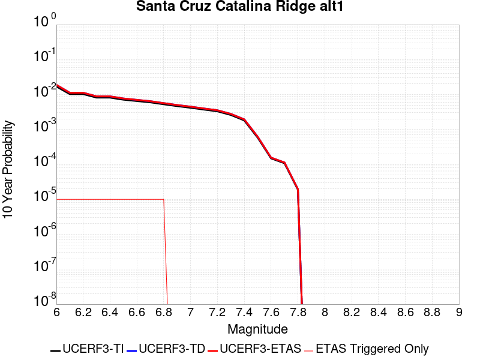 |

| Magnitude | 1 wk TI Prob | 1 wk TD Prob | 1 wk ETAS Prob | 1 wk ETAS/TD Gain | 1 wk ETAS Triggered Only | 1 mo TI Prob | 1 mo TD Prob | 1 mo ETAS Prob | 1 mo ETAS/TD Gain | 1 mo ETAS Triggered Only | 1 yr TI Prob | 1 yr TD Prob | 1 yr ETAS Prob | 1 yr ETAS/TD Gain | 1 yr ETAS Triggered Only | 10 yr TI Prob | 10 yr TD Prob | 10 yr ETAS Prob | 10 yr ETAS/TD Gain | 10 yr ETAS Triggered Only |
|-----|-----|-----|-----|-----|-----|-----|-----|-----|-----|-----|-----|-----|-----|-----|-----|-----|-----|-----|-----|-----|
| 6.0 | 3.2833184E-5 | 3.655896E-5 | 3.655896E-5 | 1.0 | 0.0 | 1.4070606E-4 | 1.5667277E-4 | 1.5667277E-4 | 1.0 | 0.0 | 0.00171175 | 0.0019059887 | 0.0019059887 | 1.0 | 0.0 | 0.016986247 | 0.018913316 | 0.018923126 | 1.0005187 | 1.0E-5 |
| 6.1 | 1.9835548E-5 | 2.1659771E-5 | 2.1659771E-5 | 1.0 | 0.0 | 8.500672E-5 | 9.2824404E-5 | 9.2824404E-5 | 1.0 | 0.0 | 0.0010344655 | 0.0011295713 | 0.0011295713 | 1.0 | 0.0 | 0.010296632 | 0.011240433 | 0.011250321 | 1.0008796 | 1.0E-5 |
| 6.2 | 1.9835548E-5 | 2.1659771E-5 | 2.1659771E-5 | 1.0 | 0.0 | 8.500672E-5 | 9.2824404E-5 | 9.2824404E-5 | 1.0 | 0.0 | 0.0010344655 | 0.0011295713 | 0.0011295713 | 1.0 | 0.0 | 0.010296632 | 0.011240433 | 0.011250321 | 1.0008796 | 1.0E-5 |
| 6.3 | 1.5728183E-5 | 1.7034137E-5 | 1.7034137E-5 | 1.0 | 0.0 | 6.7404755E-5 | 7.3001436E-5 | 7.3001436E-5 | 1.0 | 0.0 | 8.2034385E-4 | 8.884362E-4 | 8.884362E-4 | 1.0 | 0.0 | 0.008173222 | 0.008849524 | 0.008859436 | 1.00112 | 1.0E-5 |
| 6.4 | 1.5728183E-5 | 1.7034137E-5 | 1.7034137E-5 | 1.0 | 0.0 | 6.7404755E-5 | 7.3001436E-5 | 7.3001436E-5 | 1.0 | 0.0 | 8.2034385E-4 | 8.884362E-4 | 8.884362E-4 | 1.0 | 0.0 | 0.008173222 | 0.008849524 | 0.008859436 | 1.00112 | 1.0E-5 |
| 6.5 | 1.3707734E-5 | 1.4794678E-5 | 1.4794678E-5 | 1.0 | 0.0 | 5.8746107E-5 | 6.3404244E-5 | 6.3404244E-5 | 1.0 | 0.0 | 7.1499916E-4 | 7.716768E-4 | 7.716768E-4 | 1.0 | 0.0 | 0.0071270303 | 0.0076903705 | 0.007700294 | 1.0012903 | 1.0E-5 |
| 6.6 | 1.2539813E-5 | 1.3510358E-5 | 1.3510358E-5 | 1.0 | 0.0 | 5.3740947E-5 | 5.7900266E-5 | 5.7900266E-5 | 1.0 | 0.0 | 6.540996E-4 | 7.0471043E-4 | 7.0471043E-4 | 1.0 | 0.0 | 0.0065217763 | 0.0070250607 | 0.0070349905 | 1.0014135 | 1.0E-5 |
| 6.7 | 1.1504083E-5 | 1.23775E-5 | 1.23775E-5 | 1.0 | 0.0 | 4.930228E-5 | 5.304536E-5 | 5.304536E-5 | 1.0 | 0.0 | 6.0008996E-4 | 6.456379E-4 | 6.456379E-4 | 1.0 | 0.0 | 0.005984721 | 0.0064378507 | 0.0064477865 | 1.0015433 | 1.0E-5 |
| 6.8 | 1.012739E-5 | 1.0877178E-5 | 1.0877178E-5 | 1.0 | 0.0 | 4.340238E-5 | 4.6615653E-5 | 4.6615653E-5 | 1.0 | 0.0 | 5.282958E-4 | 5.673993E-4 | 5.673993E-4 | 1.0 | 0.0 | 0.0052704164 | 0.005659675 | 0.0056696185 | 1.0017569 | 1.0E-5 |
| 6.9 | 8.9607865E-6 | 9.60921E-6 | 9.60921E-6 | 1.0 | 0.0 | 3.8402806E-5 | 4.1181684E-5 | 4.1181684E-5 | 1.0 | 0.0 | 4.6745385E-4 | 5.0127273E-4 | 5.0127273E-4 | 1.0 | 0.0 | 0.0046647177 | 0.00500154 | 0.00500154 | 1.0 | 0.0 |
| 7.0 | 8.046829E-6 | 8.619827E-6 | 8.619827E-6 | 1.0 | 0.0 | 3.4485955E-5 | 3.6941598E-5 | 3.6941598E-5 | 1.0 | 0.0 | 4.1978562E-4 | 4.4967196E-4 | 4.4967196E-4 | 1.0 | 0.0 | 0.004189935 | 0.004487711 | 0.004487711 | 1.0 | 0.0 |
| 7.1 | 7.136131E-6 | 7.637727E-6 | 7.637727E-6 | 1.0 | 0.0 | 3.0583058E-5 | 3.273271E-5 | 3.273271E-5 | 1.0 | 0.0 | 3.7228514E-4 | 3.9844858E-4 | 3.9844858E-4 | 1.0 | 0.0 | 0.0037166206 | 0.0039774184 | 0.0039774184 | 1.0 | 0.0 |
| 7.2 | 6.362014E-6 | 6.8050217E-6 | 6.8050217E-6 | 1.0 | 0.0 | 2.726549E-5 | 2.9164055E-5 | 2.9164055E-5 | 1.0 | 0.0 | 3.3190678E-4 | 3.5501516E-4 | 3.5501516E-4 | 1.0 | 0.0 | 0.0033141149 | 0.0035445488 | 0.0035445488 | 1.0 | 0.0 |
| 7.3 | 5.004101E-6 | 5.3517642E-6 | 5.3517642E-6 | 1.0 | 0.0 | 2.1445969E-5 | 2.2935934E-5 | 2.2935934E-5 | 1.0 | 0.0 | 2.6107338E-4 | 2.7920975E-4 | 2.7920975E-4 | 1.0 | 0.0 | 0.002607669 | 0.0027886443 | 0.0027886443 | 1.0 | 0.0 |
| 7.4 | 3.4901443E-6 | 3.732087E-6 | 3.732087E-6 | 1.0 | 0.0 | 1.4957676E-5 | 1.5994563E-5 | 1.5994563E-5 | 1.0 | 0.0 | 1.8209449E-4 | 1.9471678E-4 | 1.9471678E-4 | 1.0 | 0.0 | 0.0018194534 | 0.0019455003 | 0.0019455003 | 1.0 | 0.0 |
| 7.5 | 1.1215045E-6 | 1.1893966E-6 | 1.1893966E-6 | 1.0 | 0.0 | 4.806439E-6 | 5.0974045E-6 | 5.0974045E-6 | 1.0 | 0.0 | 5.851682E-5 | 6.205916E-5 | 6.205916E-5 | 1.0 | 0.0 | 5.850142E-4 | 6.204214E-4 | 6.204214E-4 | 1.0 | 0.0 |
| 7.6 | 2.8599047E-7 | 2.9952182E-7 | 2.9952182E-7 | 1.0 | 0.0 | 1.2256729E-6 | 1.2836642E-6 | 1.2836642E-6 | 1.0 | 0.0 | 1.4922465E-5 | 1.5628502E-5 | 1.5628502E-5 | 1.0 | 0.0 | 1.4921463E-4 | 1.5627417E-4 | 1.5627417E-4 | 1.0 | 0.0 |
| 7.7 | 2.0781519E-7 | 2.1744457E-7 | 2.1744457E-7 | 1.0 | 0.0 | 8.906362E-7 | 9.3190494E-7 | 9.3190494E-7 | 1.0 | 0.0 | 1.08434415E-5 | 1.1345885E-5 | 1.1345885E-5 | 1.0 | 0.0 | 1.0842913E-4 | 1.1345315E-4 | 1.1345315E-4 | 1.0 | 0.0 |
| 7.8 | 3.614776E-8 | 3.7641225E-8 | 3.7641225E-8 | 1.0 | 0.0 | 1.5491896E-7 | 1.6131952E-7 | 1.6131952E-7 | 1.0 | 0.0 | 1.8861368E-6 | 1.9640636E-6 | 1.9640636E-6 | 1.0 | 0.0 | 1.8861208E-5 | 1.9640474E-5 | 1.9640474E-5 | 1.0 | 0.0 |

## Reliz 2011 CFM
*[(top)](#table-of-contents)*

| 1 Week | 1 Month | 1 Year | 10 Year |
|-----|-----|-----|-----|
|  |  |  |  |

| Magnitude | 1 wk TI Prob | 1 wk TD Prob | 1 wk ETAS Prob | 1 wk ETAS/TD Gain | 1 wk ETAS Triggered Only | 1 mo TI Prob | 1 mo TD Prob | 1 mo ETAS Prob | 1 mo ETAS/TD Gain | 1 mo ETAS Triggered Only | 1 yr TI Prob | 1 yr TD Prob | 1 yr ETAS Prob | 1 yr ETAS/TD Gain | 1 yr ETAS Triggered Only | 10 yr TI Prob | 10 yr TD Prob | 10 yr ETAS Prob | 10 yr ETAS/TD Gain | 10 yr ETAS Triggered Only |
|-----|-----|-----|-----|-----|-----|-----|-----|-----|-----|-----|-----|-----|-----|-----|-----|-----|-----|-----|-----|-----|
| 6.0 | 1.6002472E-5 | 1.6282896E-5 | 1.6282896E-5 | 1.0 | 0.0 | 6.8580215E-5 | 6.978209E-5 | 6.978209E-5 | 1.0 | 0.0 | 8.3464425E-4 | 8.492855E-4 | 8.5927703E-4 | 1.0117646 | 1.0E-5 | 0.008315164 | 0.008462595 | 0.008472511 | 1.0011717 | 1.0E-5 |
| 6.1 | 1.6002472E-5 | 1.6282896E-5 | 1.6282896E-5 | 1.0 | 0.0 | 6.8580215E-5 | 6.978209E-5 | 6.978209E-5 | 1.0 | 0.0 | 8.3464425E-4 | 8.492855E-4 | 8.5927703E-4 | 1.0117646 | 1.0E-5 | 0.008315164 | 0.008462595 | 0.008472511 | 1.0011717 | 1.0E-5 |
| 6.2 | 1.6002472E-5 | 1.6282896E-5 | 1.6282896E-5 | 1.0 | 0.0 | 6.8580215E-5 | 6.978209E-5 | 6.978209E-5 | 1.0 | 0.0 | 8.3464425E-4 | 8.492855E-4 | 8.5927703E-4 | 1.0117646 | 1.0E-5 | 0.008315164 | 0.008462595 | 0.008472511 | 1.0011717 | 1.0E-5 |
| 6.3 | 7.792404E-6 | 7.8038565E-6 | 7.8038565E-6 | 1.0 | 0.0 | 3.339559E-5 | 3.3444678E-5 | 3.3444678E-5 | 1.0 | 0.0 | 4.0651546E-4 | 4.0711364E-4 | 4.1710955E-4 | 1.0245532 | 1.0E-5 | 0.0040577264 | 0.004063955 | 0.004073914 | 1.0024507 | 1.0E-5 |
| 6.4 | 7.792404E-6 | 7.8038565E-6 | 7.8038565E-6 | 1.0 | 0.0 | 3.339559E-5 | 3.3444678E-5 | 3.3444678E-5 | 1.0 | 0.0 | 4.0651546E-4 | 4.0711364E-4 | 4.1710955E-4 | 1.0245532 | 1.0E-5 | 0.0040577264 | 0.004063955 | 0.004073914 | 1.0024507 | 1.0E-5 |
| 6.5 | 5.9659374E-6 | 5.9287863E-6 | 5.9287863E-6 | 1.0 | 0.0 | 2.5568053E-5 | 2.5408837E-5 | 2.5408837E-5 | 1.0 | 0.0 | 3.1124658E-4 | 3.093089E-4 | 3.193058E-4 | 1.0323201 | 1.0E-5 | 0.00310811 | 0.0030890019 | 0.003098971 | 1.0032272 | 1.0E-5 |
| 6.6 | 5.2350692E-6 | 5.1790316E-6 | 5.1790316E-6 | 1.0 | 0.0 | 2.2435817E-5 | 2.2195662E-5 | 2.2195662E-5 | 1.0 | 0.0 | 2.7312184E-4 | 2.701988E-4 | 2.701988E-4 | 1.0 | 0.0 | 0.002727864 | 0.002698913 | 0.002698913 | 1.0 | 0.0 |
| 6.7 | 4.580206E-6 | 4.5061634E-6 | 4.5061634E-6 | 1.0 | 0.0 | 1.9629308E-5 | 1.9311987E-5 | 1.9311987E-5 | 1.0 | 0.0 | 2.389606E-4 | 2.3509814E-4 | 2.3509814E-4 | 1.0 | 0.0 | 0.002387038 | 0.002348696 | 0.002348696 | 1.0 | 0.0 |
| 6.8 | 4.0765017E-6 | 3.9882793E-6 | 3.9882793E-6 | 1.0 | 0.0 | 1.7470604E-5 | 1.7092514E-5 | 1.7092514E-5 | 1.0 | 0.0 | 2.1268385E-4 | 2.0808152E-4 | 2.0808152E-4 | 1.0 | 0.0 | 0.002124804 | 0.002079065 | 0.002079065 | 1.0 | 0.0 |
| 6.9 | 3.5752896E-6 | 3.4725567E-6 | 3.4725567E-6 | 1.0 | 0.0 | 1.532258E-5 | 1.4882301E-5 | 1.4882301E-5 | 1.0 | 0.0 | 1.8653645E-4 | 1.8117698E-4 | 1.8117698E-4 | 1.0 | 0.0 | 0.0018637994 | 0.0018104891 | 0.0018104891 | 1.0 | 0.0 |
| 7.0 | 3.0259848E-6 | 2.9079788E-6 | 2.9079788E-6 | 1.0 | 0.0 | 1.2968442E-5 | 1.2462707E-5 | 1.2462707E-5 | 1.0 | 0.0 | 1.5787935E-4 | 1.517229E-4 | 1.517229E-4 | 1.0 | 0.0 | 0.0015776722 | 0.0015163884 | 0.0015163884 | 1.0 | 0.0 |
| 7.1 | 2.5861116E-6 | 2.4552023E-6 | 2.4552023E-6 | 1.0 | 0.0 | 1.1083288E-5 | 1.0522253E-5 | 1.0522253E-5 | 1.0 | 0.0 | 1.3493067E-4 | 1.2810092E-4 | 1.2810092E-4 | 1.0 | 0.0 | 0.0013484878 | 0.0012804654 | 0.0012804654 | 1.0 | 0.0 |
| 7.2 | 2.1482588E-6 | 2.00327E-6 | 2.00327E-6 | 1.0 | 0.0 | 9.20679E-6 | 8.585415E-6 | 8.585415E-6 | 1.0 | 0.0 | 1.12086906E-4 | 1.0452242E-4 | 1.0452242E-4 | 1.0 | 0.0 | 0.0011203039 | 0.0010449268 | 0.0010449268 | 1.0 | 0.0 |
| 7.3 | 1.7194744E-6 | 1.5611555E-6 | 1.5611555E-6 | 1.0 | 0.0 | 7.3691554E-6 | 6.6906496E-6 | 6.6906496E-6 | 1.0 | 0.0 | 8.971577E-5 | 8.145561E-5 | 8.145561E-5 | 1.0 | 0.0 | 8.967956E-4 | 8.144516E-4 | 8.144516E-4 | 1.0 | 0.0 |
| 7.4 | 1.2755178E-6 | 1.1056595E-6 | 1.1056595E-6 | 1.0 | 0.0 | 5.4664933E-6 | 4.738532E-6 | 4.738532E-6 | 1.0 | 0.0 | 6.655252E-5 | 5.7690104E-5 | 5.7690104E-5 | 1.0 | 0.0 | 6.6532596E-4 | 5.7694514E-4 | 5.7694514E-4 | 1.0 | 0.0 |
| 7.5 | 8.8463224E-7 | 7.0583064E-7 | 7.0583064E-7 | 1.0 | 0.0 | 3.7912755E-6 | 3.0249848E-6 | 3.0249848E-6 | 1.0 | 0.0 | 4.6157802E-5 | 3.682857E-5 | 3.682857E-5 | 1.0 | 0.0 | 4.6148215E-4 | 3.6841843E-4 | 3.6841843E-4 | 1.0 | 0.0 |
| 7.6 | 5.291355E-7 | 3.5010314E-7 | 3.5010314E-7 | 1.0 | 0.0 | 2.2677216E-6 | 1.5004412E-6 | 1.5004412E-6 | 1.0 | 0.0 | 2.760916E-5 | 1.8267718E-5 | 1.8267718E-5 | 1.0 | 0.0 | 2.760573E-4 | 1.82855E-4 | 1.82855E-4 | 1.0 | 0.0 |
| 7.7 | 2.9663357E-7 | 1.3513149E-7 | 1.3513149E-7 | 1.0 | 0.0 | 1.2712861E-6 | 5.791348E-7 | 5.791348E-7 | 1.0 | 0.0 | 1.5477797E-5 | 7.0509436E-6 | 7.0509436E-6 | 1.0 | 0.0 | 1.547672E-4 | 7.069193E-5 | 7.069193E-5 | 1.0 | 0.0 |
| 7.8 | 1.2509386E-7 | 2.7168449E-8 | 2.7168449E-8 | 1.0 | 0.0 | 5.3611643E-7 | 1.1643621E-7 | 1.1643621E-7 | 1.0 | 0.0 | 6.527198E-6 | 1.41761E-6 | 1.41761E-6 | 1.0 | 0.0 | 6.527006E-5 | 1.4332477E-5 | 1.4332477E-5 | 1.0 | 0.0 |
| 7.9 | 6.213493E-8 | 1.1488184E-8 | 1.1488184E-8 | 1.0 | 0.0 | 2.6629255E-7 | 4.9235076E-8 | 4.9235076E-8 | 1.0 | 0.0 | 3.242107E-6 | 5.994369E-7 | 5.994369E-7 | 1.0 | 0.0 | 3.2420594E-5 | 6.1256383E-6 | 6.1256383E-6 | 1.0 | 0.0 |
| 8.0 | 5.92383E-9 | 1.6785642E-9 | 1.6785642E-9 | 1.0 | 0.0 | 2.5387841E-8 | 7.1938473E-9 | 7.1938473E-9 | 1.0 | 0.0 | 3.0909692E-7 | 8.7585086E-8 | 8.7585086E-8 | 1.0 | 0.0 | 3.090965E-6 | 9.0066555E-7 | 9.0066555E-7 | 1.0 | 0.0 |

## Great Valley 07 (Orestimba)
*[(top)](#table-of-contents)*

| 1 Week | 1 Month | 1 Year | 10 Year |
|-----|-----|-----|-----|
|  |  |  |  |

| Magnitude | 1 wk TI Prob | 1 wk TD Prob | 1 wk ETAS Prob | 1 wk ETAS/TD Gain | 1 wk ETAS Triggered Only | 1 mo TI Prob | 1 mo TD Prob | 1 mo ETAS Prob | 1 mo ETAS/TD Gain | 1 mo ETAS Triggered Only | 1 yr TI Prob | 1 yr TD Prob | 1 yr ETAS Prob | 1 yr ETAS/TD Gain | 1 yr ETAS Triggered Only | 10 yr TI Prob | 10 yr TD Prob | 10 yr ETAS Prob | 10 yr ETAS/TD Gain | 10 yr ETAS Triggered Only |
|-----|-----|-----|-----|-----|-----|-----|-----|-----|-----|-----|-----|-----|-----|-----|-----|-----|-----|-----|-----|-----|
| 6.0 | 2.9687902E-5 | 3.2757947E-5 | 3.2757947E-5 | 1.0 | 0.0 | 1.2722766E-4 | 1.4038406E-4 | 1.4038406E-4 | 1.0 | 0.0 | 0.0015478961 | 0.0017079079 | 0.0017079079 | 1.0 | 0.0 | 0.015371585 | 0.016955366 | 0.016965197 | 1.0005798 | 1.0E-5 |
| 6.1 | 2.9687902E-5 | 3.2757947E-5 | 3.2757947E-5 | 1.0 | 0.0 | 1.2722766E-4 | 1.4038406E-4 | 1.4038406E-4 | 1.0 | 0.0 | 0.0015478961 | 0.0017079079 | 0.0017079079 | 1.0 | 0.0 | 0.015371585 | 0.016955366 | 0.016965197 | 1.0005798 | 1.0E-5 |
| 6.2 | 1.9231524E-5 | 2.1159447E-5 | 2.1159447E-5 | 1.0 | 0.0 | 8.2418206E-5 | 9.0680325E-5 | 9.0680325E-5 | 1.0 | 0.0 | 0.0010029797 | 0.0011034969 | 0.0011034969 | 1.0 | 0.0 | 0.00998465 | 0.010982586 | 0.010992476 | 1.0009005 | 1.0E-5 |
| 6.3 | 1.324766E-5 | 1.4548723E-5 | 1.4548723E-5 | 1.0 | 0.0 | 5.6774446E-5 | 6.235023E-5 | 6.235023E-5 | 1.0 | 0.0 | 6.910097E-4 | 7.5885886E-4 | 7.5885886E-4 | 1.0 | 0.0 | 0.006888649 | 0.0075636217 | 0.0075735464 | 1.0013121 | 1.0E-5 |
| 6.4 | 7.818645E-6 | 8.57295E-6 | 8.57295E-6 | 1.0 | 0.0 | 3.3508048E-5 | 3.6740716E-5 | 3.6740716E-5 | 1.0 | 0.0 | 4.078841E-4 | 4.4722974E-4 | 4.4722974E-4 | 1.0 | 0.0 | 0.004071363 | 0.0044636377 | 0.0044636377 | 1.0 | 0.0 |
| 6.5 | 5.3076565E-6 | 5.817875E-6 | 5.817875E-6 | 1.0 | 0.0 | 2.27469E-5 | 2.4933523E-5 | 2.4933523E-5 | 1.0 | 0.0 | 2.7690834E-4 | 3.0352548E-4 | 3.0352548E-4 | 1.0 | 0.0 | 0.0027656353 | 0.0030313185 | 0.0030313185 | 1.0 | 0.0 |
| 6.6 | 3.6003578E-6 | 3.9485462E-6 | 3.9485462E-6 | 1.0 | 0.0 | 1.5430012E-5 | 1.6922239E-5 | 1.6922239E-5 | 1.0 | 0.0 | 1.8784421E-4 | 2.0601034E-4 | 2.0601034E-4 | 1.0 | 0.0 | 0.0018768552 | 0.0020583477 | 0.0020583477 | 1.0 | 0.0 |
| 6.7 | 2.5361826E-6 | 2.783504E-6 | 2.783504E-6 | 1.0 | 0.0 | 1.0869308E-5 | 1.1929255E-5 | 1.1929255E-5 | 1.0 | 0.0 | 1.3232579E-4 | 1.4523033E-4 | 1.4523033E-4 | 1.0 | 0.0 | 0.0013224703 | 0.001451484 | 0.001451484 | 1.0 | 0.0 |
| 6.8 | 1.2115831E-6 | 1.3313972E-6 | 1.3313972E-6 | 1.0 | 0.0 | 5.1924885E-6 | 5.705981E-6 | 5.705981E-6 | 1.0 | 0.0 | 6.3216714E-5 | 6.9469075E-5 | 6.9469075E-5 | 1.0 | 0.0 | 6.3198735E-4 | 6.9456873E-4 | 6.9456873E-4 | 1.0 | 0.0 |

