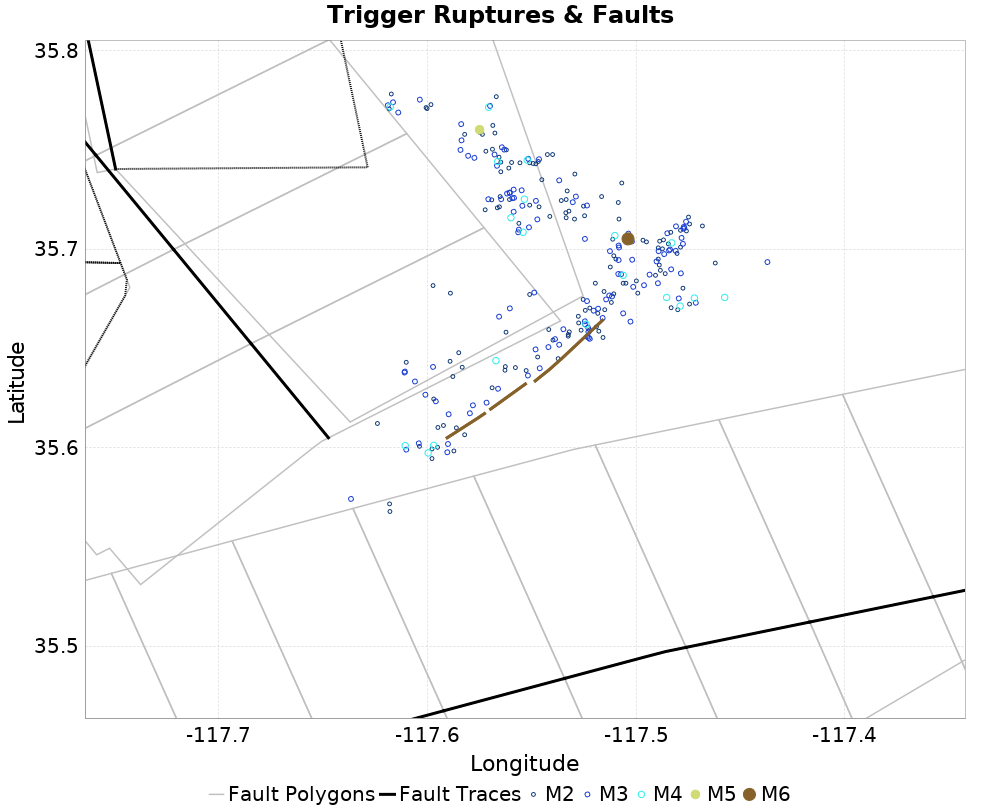
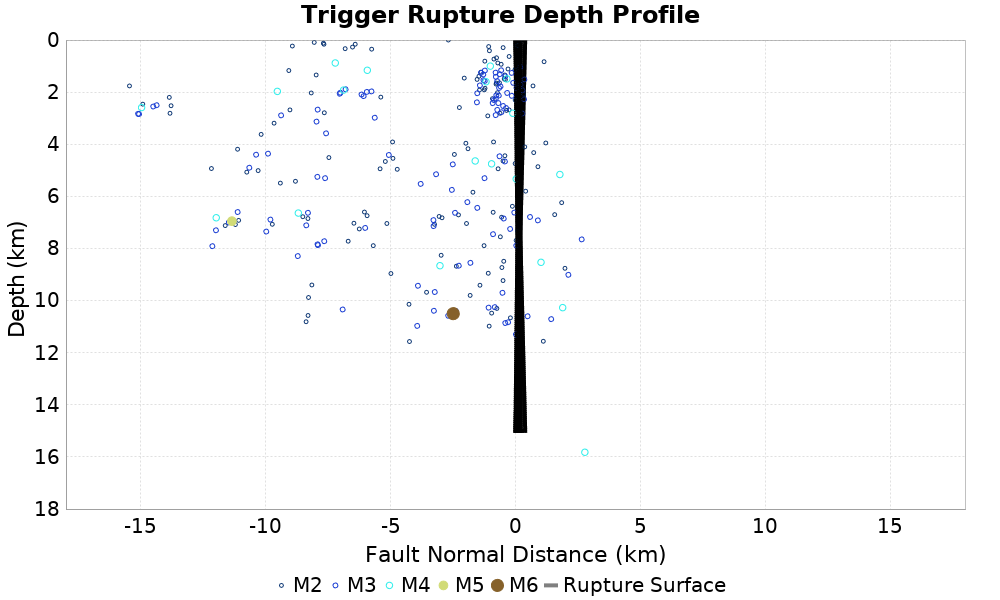
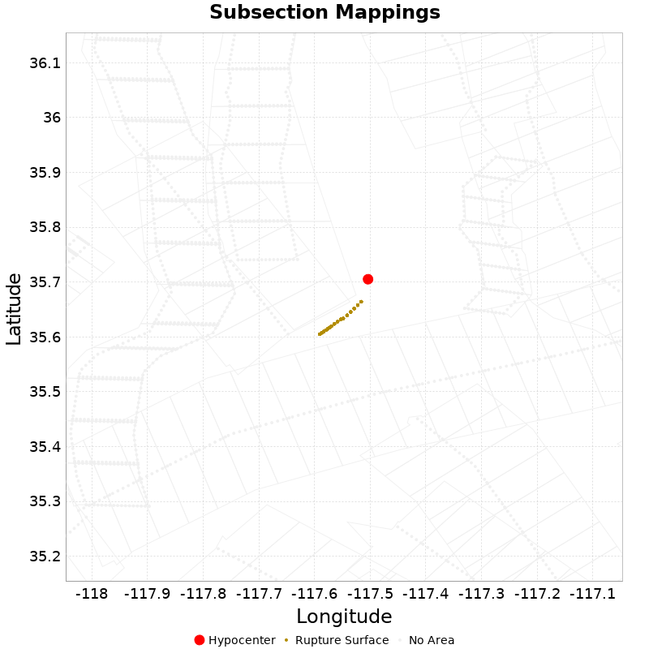

# ETAS Configuration for ComCat M6.4 (ci38443183), 1.4 Days After, ShakeMap Surface

|   | ComCat M6.4 (ci38443183), 1.4 Days After, ShakeMap Surface |
|-----|-----|
| Num Simulations | 100000 |
| Start Time | 2019/07/06 03:18:50 UTC |
| Start Time Epoch Milliseconds | 1562383130000 |
| Duration | 10 Years |
| Includes Spontaneous? | false |
| Trigger Ruptures | 266 Trigger Ruptures |
|   | First: M3.98 at 2019/07/04 17:02:55 UTC |
|   | Last: M4.97 at 2019/07/06 03:16:32 UTC |
|   | Largest: M6.4 at 2019/07/04 17:33:49 UTC |
| Historical Ruptures | *(none)* |
| Config Generated With | u3etas_comcat_event_config_builder.sh --event-id ci38443183 --num-simulations 100000 --days-before 7 --hours-after 33.75 --mag-complete 3.5 --finite-surf-shakemap --finite-surf-shakemap-min-mag 5 --hpc-site USC_HPC --nodes 36 --hours 24 --queue scec_hiprio |

## Table Of Contents

* [Trigger Rupture Fault Map](#trigger-rupture-fault-map)
* [Trigger Rupture Depth Map](#trigger-rupture-depth-map)
* [Fault Distances To Triggers](#fault-distances-to-triggers)
* [Possible Finite Rupture Subsection Mappings](#possible-finite-rupture-subsection-mappings)
* [JSON Input File](#json-input-file)

## Trigger Rupture Fault Map
*[(top)](#table-of-contents)*


## Trigger Rupture Depth Map
*[(top)](#table-of-contents)*


## Fault Distances To Triggers
*[(top)](#table-of-contents)*

| Section Name | Strike, Dip, Rake | # Hypos In Poly | Max Mag w/ Hypo In Poly | # Surfs In Poly | Max Mag w/ Surf In Poly | Min Dist To Any (km) | Min Poly Dist To Any (km) | Min Dist To Largest (km) | Min Poly Dist To Largest (km) | Min Hypo Dist To Largest (km) | Min Hypo Poly Dist To Largest (km) |
|-----|-----|-----|-----|-----|-----|-----|-----|-----|-----|-----|-----|
| Airport Lake | 358, 50, -90 | 87 | 5.36 | 87 | 5.36 | 6.631 | 0.000 | 13.299 | 1.599 | 12.221 | 2.716 |
| Little Lake | 327, 90, 180 | 15 | 3.75 | 15 | 3.75 | 2.268 | 0.000 | 5.149 | 1.410 | 16.936 | 4.928 |
| Garlock (Central) | 69, 90, 0 | 2 | 2.76 | 2 | 2.76 | 11.323 | 0.000 | 14.413 | 2.407 | 22.766 | 10.797 |
| Tank Canyon | 189, 50, -90 | 0 |  | 0 |  | 10.848 | 10.827 | 16.989 | 16.985 | 17.039 | 16.895 |
| So Sierra Nevada | 3, 50, -90 | 0 |  | 0 |  | 13.109 | 12.687 | 15.988 | 15.982 | 22.039 | 21.742 |
| Blackwater | 325, 90, 180 | 0 |  | 0 |  | 22.766 | 21.223 | 23.586 | 22.224 | 29.622 | 27.613 |

## Possible Finite Rupture Subsection Mappings
*[(top)](#table-of-contents)*

This gives any possible finite rupture surface subsection mappings. In the plot below, potentially suggested subsections are outlined in green, and all subsections for which any of this rupture is within the fault polygon are in gray. Suggested sections are those for which the area of the input rupture within the polygon is at least 50.0 % of the sub section area

Overlapping polygons are removed according to the mean distance of the actual subsection surface, with the polygons of closer sections masking out the polygons of further sections



| Section Index | Section Name | Suggested Match? | Section Area | Rup Area in Raw Poly | Rup Area in No-Overlap Poly | Area Fraction | Sect Distance To Rup | Hypocenter in Polygon? |
|-----|-----|-----|-----|-----|-----|-----|-----|-----|

## JSON Input File
*[(top)](#table-of-contents)*

```
{
  "numSimulations": 100000,
  "duration": 10.0,
  "startTimeMillis": 1562383130000,
  "includeSpontaneous": false,
  "randomSeed": 1568917183860,
  "binaryOutput": true,
  "binaryOutputFilters": [
    {
      "prefix": "results_complete",
      "descendantsOnly": false
    },
    {
      "prefix": "results_m5_preserve_chain",
      "minMag": 5.0,
      "preserveChainBelowMag": true,
      "descendantsOnly": false
    }
  ],
  "forceRecalc": false,
  "simulationName": "ComCat M6.4 (ci38443183), 1.4 Days After, ShakeMap Surface",
  "numRetries": 3,
  "outputDir": "${ETAS_SIM_DIR}/2019_09_19-ComCatM6p4_ci38443183_1p4DaysAfter_ShakeMapSurface",
  "triggerRuptures": [
    "omitted due to length, see original input file"
  ],
  "cacheDir": "${ETAS_LAUNCHER}/inputs/cache_fm3p1_ba",
  "fssFile": "${ETAS_LAUNCHER}/inputs/2013_05_10-ucerf3p3-production-10runs_COMPOUND_SOL_FM3_1_SpatSeisU3_MEAN_BRANCH_AVG_SOL.zip",
  "probModel": "FULL_TD",
  "applySubSeisForSupraNucl": true,
  "totRateScaleFactor": 1.14,
  "gridSeisCorr": true,
  "timeIndependentERF": false,
  "griddedOnly": false,
  "imposeGR": false,
  "includeIndirectTriggering": true,
  "gridSeisDiscr": 0.1,
  "catalogCompletenessModel": "RELAXED",
  "configCommand": "u3etas_comcat_event_config_builder.sh --event-id ci38443183 --num-simulations 100000 --days-before 7 --hours-after 33.75 --mag-complete 3.5 --finite-surf-shakemap --finite-surf-shakemap-min-mag 5 --hpc-site USC_HPC --nodes 36 --hours 24 --queue scec_hiprio",
  "configTime": 1568917183860,
  "comcatMetadata": {
    "region": {
      "border": [
        {
          "latitude": 35.46606927860588,
          "longitude": -117.62064836613342
        },
        {
          "latitude": 35.47242991448156,
          "longitude": -117.6498484716345
        },
        {
          "latitude": 35.482817097748814,
          "longitude": -117.67725529634286
        },
        {
          "latitude": 35.49691670426917,
          "longitude": -117.70203917688171
        },
        {
          "latitude": 35.514302148883885,
          "longitude": -117.72344871893849
        },
        {
          "latitude": 35.53444712853589,
          "longitude": -117.740833427602
        },
        {
          "latitude": 35.55674138030309,
          "longitude": -117.75366346613521
        },
        {
          "latitude": 35.58050900338554,
          "longitude": -117.76154594446818
        },
        {
          "latitude": 35.60502881482475,
          "longitude": -117.76423722085674
        },
        {
          "latitude": 35.62955614241808,
          "longitude": -117.76165080029024
        },
        {
          "latitude": 35.653345407425206,
          "longitude": -117.7538605308302
        },
        {
          "latitude": 35.67567281660627,
          "longitude": -117.74109893258196
        },
        {
          "latitude": 35.69585846994947,
          "longitude": -117.72375064066809
        },
        {
          "latitude": 35.70566333145525,
          "longitude": -117.71170629761008
        },
        {
          "latitude": 35.70566333145525,
          "longitude": -117.71170629761014
        },
        {
          "latitude": 35.70604238815803,
          "longitude": -117.71216240932166
        },
        {
          "latitude": 35.76524712489848,
          "longitude": -117.63773705073073
        },
        {
          "latitude": 35.76486865082265,
          "longitude": -117.63728199248203
        },
        {
          "latitude": 35.772417151467366,
          "longitude": -117.62800253779777
        },
        {
          "latitude": 35.78655747637844,
          "longitude": -117.60316383309643
        },
        {
          "latitude": 35.79697785368919,
          "longitude": -117.57566815989048
        },
        {
          "latitude": 35.80336015548857,
          "longitude": -117.54635406555744
        },
        {
          "latitude": 35.805509472304436,
          "longitude": -117.51611643970001
        },
        {
          "latitude": 35.80336015548857,
          "longitude": -117.48587881384258
        },
        {
          "latitude": 35.79697785368919,
          "longitude": -117.45656471950953
        },
        {
          "latitude": 35.78655747637844,
          "longitude": -117.4290690463036
        },
        {
          "latitude": 35.772417151467366,
          "longitude": -117.40423034160224
        },
        {
          "latitude": 35.75498837541371,
          "longitude": -117.38280495592575
        },
        {
          "latitude": 35.73480267770123,
          "longitude": -117.36544386521685
        },
        {
          "latitude": 35.7124752324186,
          "longitude": -117.35267289760742
        },
        {
          "latitude": 35.68868594393053,
          "longitude": -117.34487696375908
        },
        {
          "latitude": 35.66415860829961,
          "longitude": -117.34228874363933
        },
        {
          "latitude": 35.639638805221665,
          "longitude": -117.34498212612748
        },
        {
          "latitude": 35.61587120587691,
          "longitude": -117.35287053842218
        },
        {
          "latitude": 35.593576990351565,
          "longitude": -117.3657101464031
        },
        {
          "latitude": 35.57343205507307,
          "longitude": -117.3831077603277
        },
        {
          "latitude": 35.563574498740074,
          "longitude": -117.39525599871091
        },
        {
          "latitude": 35.563197920827314,
          "longitude": -117.39480322031359
        },
        {
          "latitude": 35.50414260374059,
          "longitude": -117.46922024379369
        },
        {
          "latitude": 35.50451976618846,
          "longitude": -117.46967407618439
        },
        {
          "latitude": 35.49691670426917,
          "longitude": -117.47903697011829
        },
        {
          "latitude": 35.482817097748814,
          "longitude": -117.50382085065715
        },
        {
          "latitude": 35.47242991448156,
          "longitude": -117.5312276753655
        },
        {
          "latitude": 35.46606927860588,
          "longitude": -117.56042778086658
        },
        {
          "latitude": 35.46392748629558,
          "longitude": -117.5905380735
        }
      ]
    },
    "eventID": "ci38443183",
    "minDepth": -10.0,
    "maxDepth": 24.0,
    "minMag": 2.5,
    "startTime": 1561656829000,
    "endTime": 1562383129000,
    "magComplete": 3.5
  }
}
```

