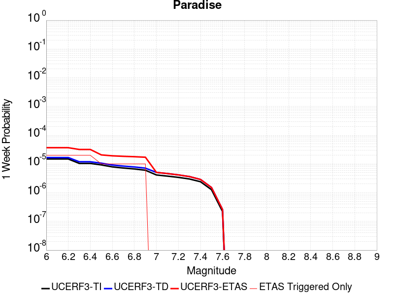
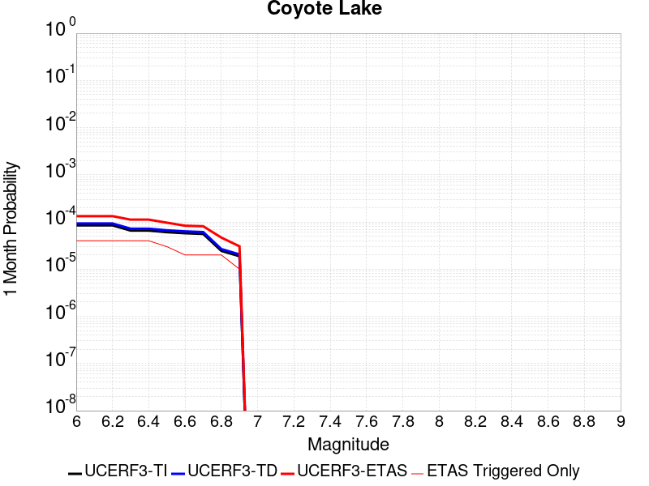
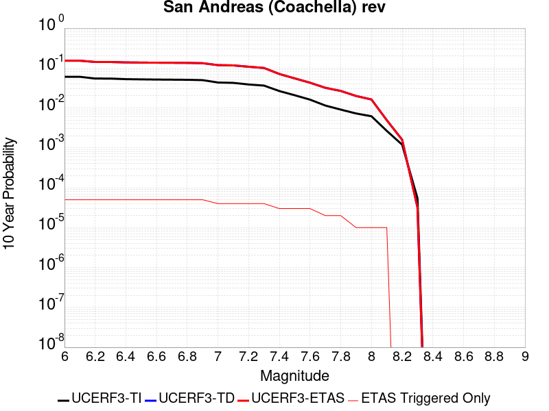
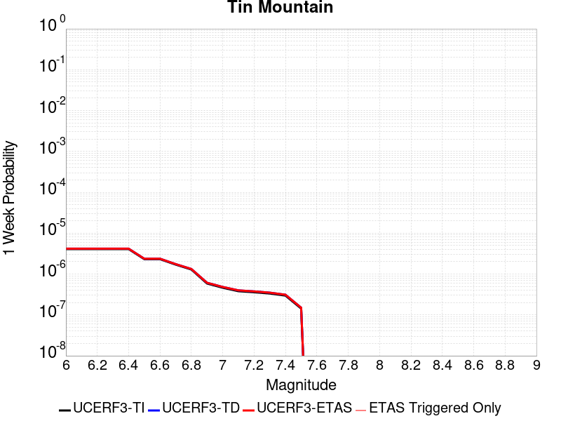
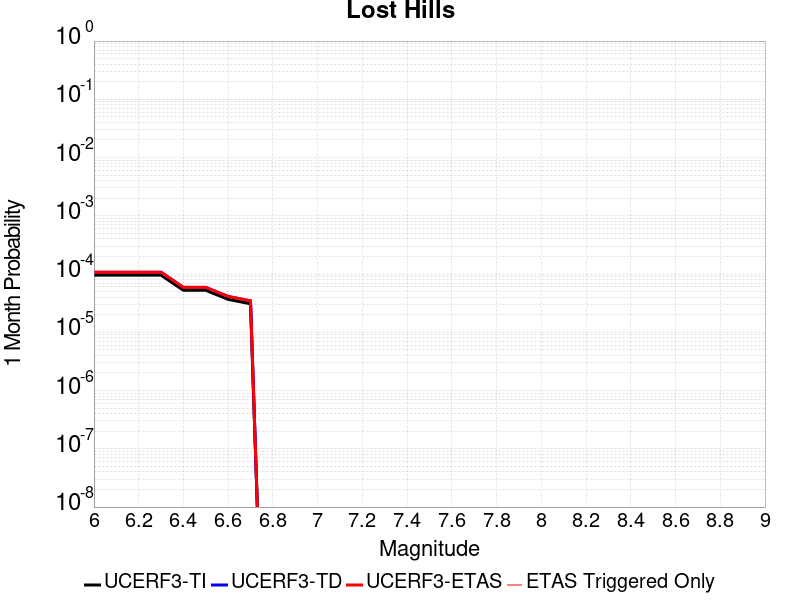

# Parent Section Magnitude-Probability Distributions

Only fault sections with at least one triggered aftershock are plotted. Sections are sorted by total supraseismogenic trigger rate (decreasing)

## Table Of Contents

* [Tank Canyon](#tank-canyon)
* [Garlock (Central)](#garlock-central)
* [Owl Lake](#owl-lake)
* [Little Lake](#little-lake)
* [Panamint Valley](#panamint-valley)
* [Garlock (East)](#garlock-east)
* [Airport Lake](#airport-lake)
* [Blackwater](#blackwater)
* [Gravel Hills-Harper Lk](#gravel-hills-harper-lk)
* [Hunter Mountain-Saline Valley](#hunter-mountain-saline-valley)
* [Ash Hill](#ash-hill)
* [Garlock (West)](#garlock-west)
* [McLean Lake](#mclean-lake)
* [Goldstone Lake](#goldstone-lake)
* [Coyote Canyon](#coyote-canyon)
* [So Sierra Nevada](#so-sierra-nevada)
* [San Andreas (Mojave S)](#san-andreas-mojave-s)
* [Lenwood-Lockhart-Old Woman Springs](#lenwood-lockhart-old-woman-springs)
* [Death Valley (So)](#death-valley-so)
* [San Andreas (Mojave N)](#san-andreas-mojave-n)
* [Towne Pass](#towne-pass)
* [Nelson Lake](#nelson-lake)
* [Bicycle Lake](#bicycle-lake)
* [Paradise](#paradise)
* [San Andreas (San Bernardino N)](#san-andreas-san-bernardino-n)
* [Garlic Springs](#garlic-springs)
* [Helendale-So Lockhart](#helendale-so-lockhart)
* [Coyote Lake](#coyote-lake)
* [San Andreas (San Bernardino S)](#san-andreas-san-bernardino-s)
* [Death Valley (Black Mtns Frontal)](#death-valley-black-mtns-frontal)
* [San Andreas (San Gorgonio Pass-Garnet HIll)](#san-andreas-san-gorgonio-pass-garnet-hill)
* [Baker](#baker)
* [San Andreas (Big Bend)](#san-andreas-big-bend)
* [Elsinore (Glen Ivy) rev](#elsinore-glen-ivy-rev)
* [Santa Ynez (East)](#santa-ynez-east)
* [Manix-Afton Hills](#manix-afton-hills)
* [San Andreas (North Branch Mill Creek)](#san-andreas-north-branch-mill-creek)
* [San Andreas (Coachella) rev](#san-andreas-coachella-rev)
* [Calico-Hidalgo](#calico-hidalgo)
* [Ludlow](#ludlow)
* [Cady](#cady)
* [Rose Canyon](#rose-canyon)
* [Pinto Mtn](#pinto-mtn)
* [Mission Ridge-Arroyo Parida-Santa Ana](#mission-ridge-arroyo-parida-santa-ana)
* [Scodie Lineament](#scodie-lineament)
* [San Diego Trough north alt1](#san-diego-trough-north-alt1)
* [White Wolf (Extension)](#white-wolf-extension)
* [San Andreas (Cholame) rev](#san-andreas-cholame-rev)
* [Death Valley (No)](#death-valley-no)
* [Tin Mountain](#tin-mountain)
* [San Cayetano](#san-cayetano)
* [Channel Islands Thrust](#channel-islands-thrust)
* [Brawley (Seismic Zone) alt 1](#brawley-seismic-zone-alt-1)
* [Santa Cruz Island](#santa-cruz-island)
* [Cleghorn Lake](#cleghorn-lake)
* [Lake Isabella (Seismicity)](#lake-isabella-seismicity)
* [San Andreas (Carrizo) rev](#san-andreas-carrizo-rev)
* [San Clemente](#san-clemente)
* [San Jacinto (San Bernardino)](#san-jacinto-san-bernardino)
* [Mono Lake 2011 CFM](#mono-lake-2011-cfm)
* [Elysian Park (Upper)](#elysian-park-upper)
* [Hosgri (Extension)](#hosgri-extension)
* [Dry Mountain](#dry-mountain)
* [San Andreas (Parkfield)](#san-andreas-parkfield)
* [Imperial](#imperial)
* [Lost Hills](#lost-hills)
* [Camp Rock 2011](#camp-rock-2011)
* [Pine Mtn](#pine-mtn)
* [Robinson Creek](#robinson-creek)
* [Earthquake Valley (No  Extension)](#earthquake-valley-no--extension)
* [Newport-Inglewood (Offshore)](#newport-inglewood-offshore)
* [Oceanic - West Huasna](#oceanic---west-huasna)
* [San Gorgonio Pass](#san-gorgonio-pass)
* [San Andreas (Creeping Section) 2011 CFM](#san-andreas-creeping-section-2011-cfm)
* [Ventura-Pitas Point](#ventura-pitas-point)
* [Cleghorn Pass](#cleghorn-pass)
* [Santa Ynez (West)](#santa-ynez-west)
* [Sheephole](#sheephole)
* [Red Pass](#red-pass)
* [North Frontal  (East)](#north-frontal--east)
* [Rinconada 2011 CFM](#rinconada-2011-cfm)
* [Surprise Valley 2011 CFM](#surprise-valley-2011-cfm)
* [San Jacinto (Stepovers Combined)](#san-jacinto-stepovers-combined)
* [Los Osos 2011](#los-osos-2011)
* [Davis Creek](#davis-creek)
* [Great Valley 09 (Laguna Seca)](#great-valley-09-laguna-seca)
* [Chino alt 1](#chino-alt-1)
* [San Luis Range 2011 CFM](#san-luis-range-2011-cfm)
* [Whittier alt 1](#whittier-alt-1)
* [San Luis Range - Pecho 2011 CFM](#san-luis-range---pecho-2011-cfm)
* [Elmore Ranch](#elmore-ranch)
* [San Jacinto (Lytle Creek connector)](#san-jacinto-lytle-creek-connector)
* [Oak Ridge (Onshore)](#oak-ridge-onshore)
* [Bartlett Springs 2011 CFM](#bartlett-springs-2011-cfm)
* [La Panza 2011](#la-panza-2011)
* [Del Valle](#del-valle)
* [White Mountains](#white-mountains)
* [Newport-Inglewood alt 1](#newport-inglewood-alt-1)
* [Elsinore (Stepovers Combined)](#elsinore-stepovers-combined)
* [Gillem - Big Crack 2011 CFM](#gillem---big-crack-2011-cfm)
* [Malibu Coast (Extension) alt 1](#malibu-coast-extension-alt-1)
* [Emerson-Copper Mtn 2011](#emerson-copper-mtn-2011)
* [Kern Canyon (Lake Isabella) 2011](#kern-canyon-lake-isabella-2011)
* [Palos Verdes](#palos-verdes)
* [Santa Cruz Catalina Ridge alt1](#santa-cruz-catalina-ridge-alt1)
* [White Wolf](#white-wolf)
* [Cucamonga](#cucamonga)
* [Kern Canyon (North Kern) 2011](#kern-canyon-north-kern-2011)
* [Big Pine (Central)](#big-pine-central)
* [Eaton Roughs 2011 CFM](#eaton-roughs-2011-cfm)
* [Santa Susana alt 1](#santa-susana-alt-1)
* [Elsinore (Temecula) rev](#elsinore-temecula-rev)
* [Burnt Mtn](#burnt-mtn)
* [Santa Rosa Island](#santa-rosa-island)
* [Mission Creek](#mission-creek)
* [Death Valley (Fish Lake Valley)](#death-valley-fish-lake-valley)
* [San Jacinto (Superstition Mtn)](#san-jacinto-superstition-mtn)
* [Hosgri](#hosgri)
* [San Jacinto (San Jacinto Valley) rev](#san-jacinto-san-jacinto-valley-rev)
* [Sierra Madre](#sierra-madre)
* [Raymond](#raymond)
* [Compton](#compton)

## Tank Canyon
*[(top)](#table-of-contents)*

| 1 Week | 1 Month | 1 Year | 10 Year |
|-----|-----|-----|-----|
|  |  |  |  |

| Magnitude | 1 wk TI Prob | 1 wk TD Prob | 1 wk ETAS Prob | 1 wk ETAS/TD Gain | 1 wk ETAS Triggered Only | 1 mo TI Prob | 1 mo TD Prob | 1 mo ETAS Prob | 1 mo ETAS/TD Gain | 1 mo ETAS Triggered Only | 1 yr TI Prob | 1 yr TD Prob | 1 yr ETAS Prob | 1 yr ETAS/TD Gain | 1 yr ETAS Triggered Only | 10 yr TI Prob | 10 yr TD Prob | 10 yr ETAS Prob | 10 yr ETAS/TD Gain | 10 yr ETAS Triggered Only |
|-----|-----|-----|-----|-----|-----|-----|-----|-----|-----|-----|-----|-----|-----|-----|-----|-----|-----|-----|-----|-----|
| 6.0 | 4.8284557E-5 | 5.7964822E-5 | 0.0020178512 | 34.81165 | 0.00196 | 2.0691741E-4 | 2.4840087E-4 | 0.003937484 | 15.851331 | 0.00369 | 0.0025163088 | 0.0030207601 | 0.010727409 | 3.5512285 | 0.00773 | 0.02488006 | 0.029863637 | 0.041854523 | 1.4015213 | 0.01236 |
| 6.1 | 1.7796336E-5 | 2.0873314E-5 | 7.4085826E-4 | 35.493084 | 7.2E-4 | 7.626778E-5 | 8.945422E-5 | 0.00158932 | 17.766853 | 0.0015 | 9.281647E-4 | 0.0010885983 | 0.0041153 | 3.780366 | 0.00303 | 0.009242975 | 0.010836744 | 0.015525377 | 1.4326608 | 0.00474 |
| 6.2 | 1.7796336E-5 | 2.0873314E-5 | 7.4085826E-4 | 35.493084 | 7.2E-4 | 7.626778E-5 | 8.945422E-5 | 0.00158932 | 17.766853 | 0.0015 | 9.281647E-4 | 0.0010885983 | 0.0041153 | 3.780366 | 0.00303 | 0.009242975 | 0.010836744 | 0.015525377 | 1.4326608 | 0.00474 |
| 6.3 | 1.3515912E-5 | 1.5759564E-5 | 5.1575166E-4 | 32.726265 | 5.0E-4 | 5.792405E-5 | 6.753938E-5 | 0.0011874638 | 17.581799 | 0.00112 | 7.049971E-4 | 8.2200574E-4 | 0.0031001316 | 3.771423 | 0.00228 | 0.007027647 | 0.0081922645 | 0.0116635915 | 1.4237323 | 0.0035 |
| 6.4 | 1.0870146E-5 | 1.2618021E-5 | 3.5261374E-4 | 27.94525 | 3.4E-4 | 4.658551E-5 | 5.4076212E-5 | 8.7403186E-4 | 16.162964 | 8.2E-4 | 5.67031E-4 | 6.581969E-4 | 0.0022771307 | 3.4596496 | 0.00162 | 0.005655863 | 0.0065644905 | 0.009087817 | 1.3843902 | 0.00254 |
| 6.5 | 7.964826E-6 | 9.196094E-6 | 1.5919471E-4 | 17.311123 | 1.5E-4 | 3.4134522E-5 | 3.9411298E-5 | 4.8939354E-4 | 12.417596 | 4.5E-4 | 4.1550855E-4 | 4.7973756E-4 | 0.0014092914 | 2.93763 | 9.3E-4 | 0.0041473247 | 0.004788321 | 0.006261234 | 1.3076054 | 0.00148 |
| 6.6 | 6.6317E-6 | 7.6122988E-6 | 1.2761139E-4 | 16.763844 | 1.2E-4 | 2.8421264E-5 | 3.2623782E-5 | 3.9261204E-4 | 12.034535 | 3.6E-4 | 3.4597394E-4 | 3.9713128E-4 | 0.0010868573 | 2.7367706 | 6.9E-4 | 0.0034543579 | 0.003965368 | 0.005070966 | 1.2788136 | 0.00111 |
| 6.7 | 4.793663E-6 | 5.4307857E-6 | 6.543046E-5 | 12.048065 | 6.0E-5 | 2.0544108E-5 | 2.3274613E-5 | 2.5326925E-4 | 10.881782 | 2.3E-4 | 2.500958E-4 | 2.8333595E-4 | 7.0321694E-4 | 2.4819193 | 4.2E-4 | 0.0024981452 | 0.0028304397 | 0.0034885716 | 1.2325193 | 6.6E-4 |
| 6.8 | 4.382823E-6 | 4.9692567E-6 | 6.496896E-5 | 13.07418 | 6.0E-5 | 1.8783392E-5 | 2.1296666E-5 | 2.5129176E-4 | 11.7995825 | 2.3E-4 | 2.286638E-4 | 2.5926033E-4 | 6.491592E-4 | 2.5038896 | 3.9E-4 | 0.0022842865 | 0.002590253 | 0.0031986728 | 1.2348882 | 6.1E-4 |
| 6.9 | 2.729601E-6 | 3.0735416E-6 | 1.3073511E-5 | 4.2535653 | 1.0E-5 | 1.1698237E-5 | 1.3172262E-5 | 1.0317108E-4 | 7.8324494 | 9.0E-5 | 1.4241673E-4 | 1.6036171E-4 | 3.4033286E-4 | 2.1222825 | 1.8E-4 | 0.001423255 | 0.0016026258 | 0.0018422413 | 1.1495142 | 2.4E-4 |
| 7.0 | 1.8987357E-6 | 2.126939E-6 | 1.2126918E-5 | 5.7015824 | 1.0E-5 | 8.137413E-6 | 9.115425E-6 | 4.911506E-5 | 5.3881264 | 4.0E-5 | 9.90685E-5 | 1.1097535E-4 | 1.9096647E-4 | 1.7208009 | 8.0E-5 | 9.902435E-4 | 0.0011092679 | 0.001219146 | 1.0990545 | 1.1E-4 |
| 7.1 | 1.4928986E-6 | 1.6641272E-6 | 1.6641272E-6 | 1.0 | 0.0 | 6.398121E-6 | 7.1319573E-6 | 2.7131815E-5 | 3.8042593 | 2.0E-5 | 7.789434E-5 | 8.682871E-5 | 1.3682437E-4 | 1.5757964 | 5.0E-5 | 7.786704E-4 | 8.6800574E-4 | 9.479363E-4 | 1.0920852 | 8.0E-5 |
| 7.2 | 1.069082E-6 | 1.1828573E-6 | 1.1828573E-6 | 1.0 | 0.0 | 4.581772E-6 | 5.0693816E-6 | 5.0693816E-6 | 1.0 | 0.0 | 5.5781646E-5 | 6.171851E-5 | 7.1717885E-5 | 1.1620159 | 1.0E-5 | 5.576765E-4 | 6.170659E-4 | 6.4704736E-4 | 1.0485872 | 3.0E-5 |
| 7.3 | 8.776551E-7 | 9.770005E-7 | 9.770005E-7 | 1.0 | 0.0 | 3.7613736E-6 | 4.1871413E-6 | 4.1871413E-6 | 1.0 | 0.0 | 4.579376E-5 | 5.097777E-5 | 5.097777E-5 | 1.0 | 0.0 | 4.5784327E-4 | 5.097118E-4 | 5.097118E-4 | 1.0 | 0.0 |
| 7.4 | 7.55721E-7 | 8.510244E-7 | 8.510244E-7 | 1.0 | 0.0 | 3.2388E-6 | 3.6472454E-6 | 3.6472454E-6 | 1.0 | 0.0 | 3.9431678E-5 | 4.4404827E-5 | 4.4404827E-5 | 1.0 | 0.0 | 3.942468E-4 | 4.440104E-4 | 4.440104E-4 | 1.0 | 0.0 |
| 7.5 | 5.587665E-7 | 6.305619E-7 | 6.305619E-7 | 1.0 | 0.0 | 2.3947114E-6 | 2.702408E-6 | 2.702408E-6 | 1.0 | 0.0 | 2.915522E-5 | 3.290182E-5 | 3.290182E-5 | 1.0 | 0.0 | 2.9151395E-4 | 3.290182E-4 | 3.290182E-4 | 1.0 | 0.0 |

## Garlock (Central)
*[(top)](#table-of-contents)*

| 1 Week | 1 Month | 1 Year | 10 Year |
|-----|-----|-----|-----|
|  |  |  |  |

| Magnitude | 1 wk TI Prob | 1 wk TD Prob | 1 wk ETAS Prob | 1 wk ETAS/TD Gain | 1 wk ETAS Triggered Only | 1 mo TI Prob | 1 mo TD Prob | 1 mo ETAS Prob | 1 mo ETAS/TD Gain | 1 mo ETAS Triggered Only | 1 yr TI Prob | 1 yr TD Prob | 1 yr ETAS Prob | 1 yr ETAS/TD Gain | 1 yr ETAS Triggered Only | 10 yr TI Prob | 10 yr TD Prob | 10 yr ETAS Prob | 10 yr ETAS/TD Gain | 10 yr ETAS Triggered Only |
|-----|-----|-----|-----|-----|-----|-----|-----|-----|-----|-----|-----|-----|-----|-----|-----|-----|-----|-----|-----|-----|
| 6.0 | 5.5131142E-5 | 7.024681E-5 | 0.0019101176 | 27.19152 | 0.00184 | 2.3625491E-4 | 3.010234E-4 | 0.003570039 | 11.8596735 | 0.00327 | 0.0028726095 | 0.0036588663 | 0.010314425 | 2.8190222 | 0.00668 | 0.028357591 | 0.036079824 | 0.046451606 | 1.2874676 | 0.01076 |
| 6.1 | 5.5131142E-5 | 7.024681E-5 | 0.0019101176 | 27.19152 | 0.00184 | 2.3625491E-4 | 3.010234E-4 | 0.003570039 | 11.8596735 | 0.00327 | 0.0028726095 | 0.0036588663 | 0.010314425 | 2.8190222 | 0.00668 | 0.028357591 | 0.036079824 | 0.046451606 | 1.2874676 | 0.01076 |
| 6.2 | 4.216245E-5 | 5.1661493E-5 | 0.0014515892 | 28.098087 | 0.0014 | 1.806837E-4 | 2.2138779E-4 | 0.0025808653 | 11.657668 | 0.00236 | 0.0021976046 | 0.0026920962 | 0.0074293087 | 2.7596743 | 0.00475 | 0.021759989 | 0.026689773 | 0.03408693 | 1.2771533 | 0.0076 |
| 6.3 | 4.216245E-5 | 5.1661493E-5 | 0.0014515892 | 28.098087 | 0.0014 | 1.806837E-4 | 2.2138779E-4 | 0.0025808653 | 11.657668 | 0.00236 | 0.0021976046 | 0.0026920962 | 0.0074293087 | 2.7596743 | 0.00475 | 0.021759989 | 0.026689773 | 0.03408693 | 1.2771533 | 0.0076 |
| 6.4 | 3.6858168E-5 | 4.411054E-5 | 0.0012240584 | 27.749796 | 0.00118 | 1.5795401E-4 | 1.8903162E-4 | 0.002148661 | 11.366675 | 0.00196 | 0.0019213937 | 0.002299056 | 0.006239975 | 2.7141466 | 0.00395 | 0.019048655 | 0.02284894 | 0.029132022 | 1.2749835 | 0.00643 |
| 6.5 | 3.39199E-5 | 4.0018083E-5 | 0.0011299745 | 28.236597 | 0.00109 | 1.453629E-4 | 1.7149492E-4 | 0.001961188 | 11.435837 | 0.00179 | 0.0017683565 | 0.002085973 | 0.0056784633 | 2.7222133 | 0.0036 | 0.017543508 | 0.020759864 | 0.026459042 | 1.2745286 | 0.00582 |
| 6.6 | 3.3571985E-5 | 3.947227E-5 | 0.0011294292 | 28.613232 | 0.00109 | 1.4387199E-4 | 1.6915603E-4 | 0.0019588533 | 11.580156 | 0.00179 | 0.0017502342 | 0.0020575512 | 0.0056401645 | 2.7412026 | 0.00359 | 0.017365133 | 0.020481179 | 0.026172183 | 1.277865 | 0.00581 |
| 6.7 | 3.2580007E-5 | 3.80887E-5 | 0.0010680495 | 28.041111 | 0.00103 | 1.3962112E-4 | 1.632272E-4 | 0.001872948 | 11.474485 | 0.00171 | 0.0016985617 | 0.0019855013 | 0.0053987107 | 2.7190669 | 0.00342 | 0.016856372 | 0.019773813 | 0.025233673 | 1.2761157 | 0.00557 |
| 6.8 | 3.2185937E-5 | 3.7515918E-5 | 0.001047478 | 27.920895 | 0.00101 | 1.3793244E-4 | 1.6077272E-4 | 0.001850501 | 11.510043 | 0.00169 | 0.0016780337 | 0.001955672 | 0.0053091007 | 2.7147195 | 0.00336 | 0.016654192 | 0.019480614 | 0.024824444 | 1.2743154 | 0.00545 |
| 6.9 | 3.165394E-5 | 3.6720503E-5 | 0.0010366838 | 28.231743 | 0.001 | 1.3565269E-4 | 1.5736421E-4 | 0.0018271015 | 11.610654 | 0.00167 | 0.0016503202 | 0.001914247 | 0.0051879683 | 2.7101874 | 0.00328 | 0.01638118 | 0.019073246 | 0.024301587 | 1.274119 | 0.00533 |
| 7.0 | 3.0903822E-5 | 3.5625766E-5 | 0.0010055912 | 28.226515 | 9.7E-4 | 1.3243823E-4 | 1.5267303E-4 | 0.0017724257 | 11.609291 | 0.00162 | 0.0016112428 | 0.0018572307 | 0.005011362 | 2.698298 | 0.00316 | 0.015996104 | 0.018512413 | 0.023547444 | 1.2719814 | 0.00513 |
| 7.1 | 3.0069863E-5 | 3.439207E-5 | 9.94359E-4 | 28.91245 | 9.6E-4 | 1.2886449E-4 | 1.4738638E-4 | 0.001737152 | 11.786381 | 0.00159 | 0.0015677959 | 0.0017929734 | 0.004847487 | 2.7036023 | 0.00306 | 0.01556781 | 0.017880075 | 0.02275139 | 1.2724438 | 0.00496 |
| 7.2 | 2.7957109E-5 | 3.128145E-5 | 8.712552E-4 | 27.852133 | 8.4E-4 | 1.1981068E-4 | 1.340566E-4 | 0.001533869 | 11.441951 | 0.0014 | 0.0014577188 | 0.0016309366 | 0.004326533 | 2.6527905 | 0.0027 | 0.014481937 | 0.016283695 | 0.020592371 | 1.2646008 | 0.00438 |
| 7.3 | 2.4519275E-5 | 2.6714793E-5 | 6.1669905E-4 | 23.08455 | 5.9E-4 | 1.0507837E-4 | 1.1448703E-4 | 0.0011343702 | 9.908286 | 0.00102 | 0.0012785783 | 0.001393003 | 0.0032903564 | 2.3620596 | 0.0019 | 0.012712469 | 0.013928053 | 0.016846826 | 1.2095608 | 0.00296 |
| 7.4 | 2.3225532E-5 | 2.5199399E-5 | 4.9518753E-4 | 19.650768 | 4.7E-4 | 9.95342E-5 | 1.0799304E-4 | 9.6790015E-4 | 8.962616 | 8.6E-4 | 0.0012111551 | 0.0013140367 | 0.0029618684 | 2.2540228 | 0.00165 | 0.012045753 | 0.013145725 | 0.015751021 | 1.1981857 | 0.00264 |
| 7.5 | 2.097765E-5 | 2.2483688E-5 | 4.224747E-4 | 18.790276 | 4.0E-4 | 8.9901114E-5 | 9.635517E-5 | 8.0628676E-4 | 8.367862 | 7.1E-4 | 0.0010939965 | 0.0011725046 | 0.0025009452 | 2.132994 | 0.00133 | 0.010886264 | 0.011740365 | 0.013776179 | 1.173403 | 0.00206 |
| 7.6 | 1.511254E-5 | 1.5991332E-5 | 2.8598701E-4 | 17.883877 | 2.7E-4 | 6.476642E-5 | 6.853253E-5 | 4.9850304E-4 | 7.273963 | 4.3E-4 | 7.882459E-4 | 8.340719E-4 | 0.0016433963 | 1.9703293 | 8.1E-4 | 0.007854558 | 0.008383558 | 0.00959333 | 1.144303 | 0.00122 |
| 7.7 | 9.934069E-6 | 1.0678793E-5 | 7.067815E-5 | 6.6185527 | 6.0E-5 | 4.2573887E-5 | 4.5765457E-5 | 1.3576134E-4 | 2.9664588 | 9.0E-5 | 5.182138E-4 | 5.570524E-4 | 7.569409E-4 | 1.3588327 | 2.0E-4 | 0.00517007 | 0.0056276834 | 0.0059558265 | 1.0583087 | 3.3E-4 |
| 7.8 | 6.7562896E-6 | 8.428448E-6 | 3.8428196E-5 | 4.559344 | 3.0E-5 | 2.8955206E-5 | 3.6121422E-5 | 9.6119256E-5 | 2.661004 | 6.0E-5 | 3.5247262E-4 | 4.3968976E-4 | 5.396458E-4 | 1.2273331 | 1.0E-4 | 0.0035191406 | 0.004446654 | 0.0046358095 | 1.0425388 | 1.9E-4 |
| 7.9 | 3.975453E-6 | 5.37103E-6 | 2.5370922E-5 | 4.7236605 | 2.0E-5 | 1.7037546E-5 | 2.3018498E-5 | 6.301758E-5 | 2.7376928 | 4.0E-5 | 2.0741238E-4 | 2.8021427E-4 | 3.3020024E-4 | 1.1783849 | 5.0E-5 | 0.002072189 | 0.002833628 | 0.0029233731 | 1.0316714 | 9.0E-5 |
| 8.0 | 1.6729537E-6 | 2.0775144E-6 | 2.2077473E-5 | 10.626869 | 2.0E-5 | 7.169782E-6 | 8.903603E-6 | 2.8903425E-5 | 3.2462618 | 2.0E-5 | 8.7288594E-5 | 1.08396E-4 | 1.2839383E-4 | 1.1844887 | 2.0E-5 | 8.7254314E-4 | 0.0010969337 | 0.0011269009 | 1.027319 | 3.0E-5 |
| 8.1 | 3.6733252E-7 | 3.1489964E-7 | 3.1489964E-7 | 1.0 | 0.0 | 1.5742813E-6 | 1.3495693E-6 | 1.3495693E-6 | 1.0 | 0.0 | 1.9166706E-5 | 1.6430899E-5 | 1.6430899E-5 | 1.0 | 0.0 | 1.9165053E-4 | 1.6638759E-4 | 1.7638592E-4 | 1.0600907 | 1.0E-5 |

## Owl Lake
*[(top)](#table-of-contents)*

| 1 Week | 1 Month | 1 Year | 10 Year |
|-----|-----|-----|-----|
|  |  |  |  |

| Magnitude | 1 wk TI Prob | 1 wk TD Prob | 1 wk ETAS Prob | 1 wk ETAS/TD Gain | 1 wk ETAS Triggered Only | 1 mo TI Prob | 1 mo TD Prob | 1 mo ETAS Prob | 1 mo ETAS/TD Gain | 1 mo ETAS Triggered Only | 1 yr TI Prob | 1 yr TD Prob | 1 yr ETAS Prob | 1 yr ETAS/TD Gain | 1 yr ETAS Triggered Only | 10 yr TI Prob | 10 yr TD Prob | 10 yr ETAS Prob | 10 yr ETAS/TD Gain | 10 yr ETAS Triggered Only |
|-----|-----|-----|-----|-----|-----|-----|-----|-----|-----|-----|-----|-----|-----|-----|-----|-----|-----|-----|-----|-----|
| 6.0 | 5.0320643E-5 | 6.635815E-5 | 7.363137E-4 | 11.096054 | 6.7E-4 | 2.1564208E-4 | 2.843674E-4 | 0.0014440375 | 5.07807 | 0.00116 | 0.0026222812 | 0.0034577388 | 0.005869371 | 1.6974593 | 0.00242 | 0.02591553 | 0.034140717 | 0.038178008 | 1.1182544 | 0.00418 |
| 6.1 | 5.0320643E-5 | 6.635815E-5 | 7.363137E-4 | 11.096054 | 6.7E-4 | 2.1564208E-4 | 2.843674E-4 | 0.0014440375 | 5.07807 | 0.00116 | 0.0026222812 | 0.0034577388 | 0.005869371 | 1.6974593 | 0.00242 | 0.02591553 | 0.034140717 | 0.038178008 | 1.1182544 | 0.00418 |
| 6.2 | 2.4125871E-5 | 3.0981035E-5 | 5.4096524E-4 | 17.461174 | 5.1E-4 | 1.0339249E-4 | 1.3277028E-4 | 9.926561E-4 | 7.4764934 | 8.6E-4 | 0.0012580766 | 0.001615439 | 0.0033825797 | 2.0939074 | 0.00177 | 0.012509781 | 0.016070465 | 0.01905177 | 1.1855147 | 0.00303 |
| 6.3 | 1.7433485E-5 | 2.2355514E-5 | 4.7234545E-4 | 21.128813 | 4.5E-4 | 7.471279E-5 | 9.580672E-5 | 8.357358E-4 | 8.723145 | 7.4E-4 | 9.0924866E-4 | 0.0011659743 | 0.0026742136 | 2.2935443 | 0.00151 | 0.009055373 | 0.011628896 | 0.014099823 | 1.2124817 | 0.0025 |
| 6.4 | 1.7433485E-5 | 2.2355514E-5 | 4.7234545E-4 | 21.128813 | 4.5E-4 | 7.471279E-5 | 9.580672E-5 | 8.357358E-4 | 8.723145 | 7.4E-4 | 9.0924866E-4 | 0.0011659743 | 0.0026742136 | 2.2935443 | 0.00151 | 0.009055373 | 0.011628896 | 0.014099823 | 1.2124817 | 0.0025 |
| 6.5 | 1.5182742E-5 | 1.9429144E-5 | 4.3942098E-4 | 22.616589 | 4.2E-4 | 6.506727E-5 | 8.326596E-5 | 7.8320765E-4 | 9.406096 | 7.0E-4 | 7.919061E-4 | 0.0010134429 | 0.0024419937 | 2.4096017 | 0.00143 | 0.0078909 | 0.010118429 | 0.012474347 | 1.2328343 | 0.00238 |
| 6.6 | 6.7271576E-6 | 8.547361E-6 | 3.0854478E-4 | 36.09825 | 3.0E-4 | 2.8830356E-5 | 3.6631063E-5 | 5.266131E-4 | 14.376135 | 4.9E-4 | 3.5095305E-4 | 4.458976E-4 | 0.0014954294 | 3.3537507 | 0.00105 | 0.0035039932 | 0.004467813 | 0.0062099937 | 1.3899405 | 0.00175 |
| 6.7 | 6.682835E-6 | 8.479807E-6 | 3.0847726E-4 | 36.377865 | 3.0E-4 | 2.8640408E-5 | 3.6341557E-5 | 5.2632374E-4 | 14.4826975 | 4.9E-4 | 3.4864116E-4 | 4.4237426E-4 | 0.0014919097 | 3.3725057 | 0.00105 | 0.003480947 | 0.0044327388 | 0.0061749816 | 1.3930398 | 0.00175 |
| 6.8 | 6.5774975E-6 | 8.32628E-6 | 3.083238E-4 | 37.030193 | 3.0E-4 | 2.8188972E-5 | 3.5683603E-5 | 5.256661E-4 | 14.731307 | 4.9E-4 | 3.4314668E-4 | 4.343669E-4 | 0.0014739152 | 3.3932493 | 0.00104 | 0.0034261728 | 0.004352885 | 0.0060753543 | 1.3957076 | 0.00173 |
| 6.9 | 6.363419E-6 | 7.999454E-6 | 2.9799715E-4 | 37.252182 | 2.9E-4 | 2.727151E-5 | 3.428296E-5 | 5.142665E-4 | 15.000646 | 4.8E-4 | 3.3198006E-4 | 4.1732067E-4 | 0.001436895 | 3.4431436 | 0.00102 | 0.0033148455 | 0.0041828766 | 0.005885724 | 1.4070996 | 0.00171 |
| 7.0 | 6.1342453E-6 | 7.6316555E-6 | 2.8762952E-4 | 37.689007 | 2.8E-4 | 2.6289357E-5 | 3.2706717E-5 | 5.026914E-4 | 15.369667 | 4.7E-4 | 3.2002592E-4 | 3.98137E-4 | 0.0013977388 | 3.510698 | 0.001 | 0.0031956544 | 0.003991571 | 0.005664865 | 1.419207 | 0.00168 |
| 7.1 | 5.842926E-6 | 7.142211E-6 | 2.8714022E-4 | 40.203266 | 2.8E-4 | 2.504087E-5 | 3.0609146E-5 | 5.005948E-4 | 16.354418 | 4.7E-4 | 3.0482994E-4 | 3.7260805E-4 | 0.0013522429 | 3.6291294 | 9.8E-4 | 0.0030441214 | 0.0037370329 | 0.0053908294 | 1.4425427 | 0.00166 |
| 7.2 | 4.77173E-6 | 5.358483E-6 | 2.453572E-4 | 45.788555 | 2.4E-4 | 2.045011E-5 | 2.2964748E-5 | 3.9295625E-4 | 17.11128 | 3.7E-4 | 2.4895166E-4 | 2.79564E-4 | 0.0010793403 | 3.8607988 | 8.0E-4 | 0.0024867293 | 0.002808645 | 0.0041349092 | 1.4722079 | 0.00133 |
| 7.3 | 3.0494948E-6 | 2.710463E-6 | 5.2710326E-5 | 19.446983 | 5.0E-5 | 1.3069198E-5 | 1.1616219E-5 | 8.1615406E-5 | 7.025987 | 7.0E-5 | 1.5910587E-4 | 1.4141845E-4 | 3.7138592E-4 | 2.626149 | 2.3E-4 | 0.0015899199 | 0.0014232413 | 0.0017427859 | 1.2245189 | 3.2E-4 |
| 7.4 | 2.7263884E-6 | 2.3056762E-6 | 2.230563E-5 | 9.674225 | 2.0E-5 | 1.1684469E-5 | 9.881433E-6 | 2.9881236E-5 | 3.023978 | 2.0E-5 | 1.4224913E-4 | 1.20299905E-4 | 2.5028427E-4 | 2.0805025 | 1.3E-4 | 0.0014215811 | 0.0012112238 | 0.0014209694 | 1.1731684 | 2.1E-4 |
| 7.5 | 2.6090431E-6 | 2.1656133E-6 | 2.216557E-5 | 10.23524 | 2.0E-5 | 1.1181565E-5 | 9.281167E-6 | 2.9280982E-5 | 3.1548815 | 2.0E-5 | 1.3612706E-4 | 1.1299244E-4 | 2.2298002E-4 | 1.9734064 | 1.1E-4 | 0.001360437 | 0.0011379806 | 0.0012878099 | 1.1316625 | 1.5E-4 |
| 7.6 | 2.3008756E-6 | 1.8727933E-6 | 1.8727933E-6 | 1.0 | 0.0 | 9.860858E-6 | 8.0262325E-6 | 8.0262325E-6 | 1.0 | 0.0 | 1.20049335E-4 | 9.7715085E-5 | 1.7770726E-4 | 1.8186268 | 8.0E-5 | 0.001199845 | 9.849932E-4 | 0.0010948848 | 1.111566 | 1.1E-4 |
| 7.7 | 1.7184348E-6 | 1.341917E-6 | 1.341917E-6 | 1.0 | 0.0 | 7.3646997E-6 | 5.7510606E-6 | 5.7510606E-6 | 1.0 | 0.0 | 8.966153E-5 | 7.0016955E-5 | 1.2001345E-4 | 1.7140628 | 5.0E-5 | 8.962536E-4 | 7.078345E-4 | 7.777849E-4 | 1.0988232 | 7.0E-5 |
| 7.8 | 8.4612907E-7 | 8.4058576E-7 | 8.4058576E-7 | 1.0 | 0.0 | 3.6262625E-6 | 3.6025053E-6 | 3.6025053E-6 | 1.0 | 0.0 | 4.4148852E-5 | 4.3859643E-5 | 5.3859203E-5 | 1.22799 | 1.0E-5 | 4.414008E-4 | 4.4398362E-4 | 4.6397475E-4 | 1.0450267 | 2.0E-5 |
| 7.9 | 2.716738E-7 | 3.7681056E-7 | 3.7681056E-7 | 1.0 | 0.0 | 1.1643157E-6 | 1.6149015E-6 | 1.6149015E-6 | 1.0 | 0.0 | 1.4175452E-5 | 1.9661258E-5 | 2.9661061E-5 | 1.5086044 | 1.0E-5 | 1.4174548E-4 | 1.9836678E-4 | 2.083648E-4 | 1.0504017 | 1.0E-5 |
| 8.0 | 2.1995428E-8 | 3.384878E-8 | 3.384878E-8 | 1.0 | 0.0 | 9.426611E-8 | 1.450662E-7 | 1.450662E-7 | 1.0 | 0.0 | 1.1476893E-6 | 1.7661803E-6 | 1.7661803E-6 | 1.0 | 0.0 | 1.14768345E-5 | 1.7963057E-5 | 1.7963057E-5 | 1.0 | 0.0 |

## Little Lake
*[(top)](#table-of-contents)*

| 1 Week | 1 Month | 1 Year | 10 Year |
|-----|-----|-----|-----|
|  |  |  |  |

| Magnitude | 1 wk TI Prob | 1 wk TD Prob | 1 wk ETAS Prob | 1 wk ETAS/TD Gain | 1 wk ETAS Triggered Only | 1 mo TI Prob | 1 mo TD Prob | 1 mo ETAS Prob | 1 mo ETAS/TD Gain | 1 mo ETAS Triggered Only | 1 yr TI Prob | 1 yr TD Prob | 1 yr ETAS Prob | 1 yr ETAS/TD Gain | 1 yr ETAS Triggered Only | 10 yr TI Prob | 10 yr TD Prob | 10 yr ETAS Prob | 10 yr ETAS/TD Gain | 10 yr ETAS Triggered Only |
|-----|-----|-----|-----|-----|-----|-----|-----|-----|-----|-----|-----|-----|-----|-----|-----|-----|-----|-----|-----|-----|
| 6.0 | 2.8424427E-5 | 3.120572E-5 | 9.81176E-4 | 31.442186 | 9.5E-4 | 1.2181328E-4 | 1.337327E-4 | 0.001753516 | 13.112097 | 0.00162 | 0.0014820677 | 0.0016271127 | 0.004702101 | 2.8898435 | 0.00308 | 0.014722223 | 0.0161654 | 0.02063201 | 1.2763067 | 0.00454 |
| 6.1 | 2.8424427E-5 | 3.120572E-5 | 9.81176E-4 | 31.442186 | 9.5E-4 | 1.2181328E-4 | 1.337327E-4 | 0.001753516 | 13.112097 | 0.00162 | 0.0014820677 | 0.0016271127 | 0.004702101 | 2.8898435 | 0.00308 | 0.014722223 | 0.0161654 | 0.02063201 | 1.2763067 | 0.00454 |
| 6.2 | 2.8424427E-5 | 3.120572E-5 | 9.81176E-4 | 31.442186 | 9.5E-4 | 1.2181328E-4 | 1.337327E-4 | 0.001753516 | 13.112097 | 0.00162 | 0.0014820677 | 0.0016271127 | 0.004702101 | 2.8898435 | 0.00308 | 0.014722223 | 0.0161654 | 0.02063201 | 1.2763067 | 0.00454 |
| 6.3 | 1.48860645E-5 | 1.6081389E-5 | 4.76074E-4 | 29.604034 | 4.6E-4 | 6.379586E-5 | 6.8918576E-5 | 8.588641E-4 | 12.462011 | 7.9E-4 | 7.7643775E-4 | 8.3878887E-4 | 0.0023075559 | 2.751057 | 0.00147 | 0.007737305 | 0.008359048 | 0.010510908 | 1.257429 | 0.00217 |
| 6.4 | 1.48860645E-5 | 1.6081389E-5 | 4.76074E-4 | 29.604034 | 4.6E-4 | 6.379586E-5 | 6.8918576E-5 | 8.588641E-4 | 12.462011 | 7.9E-4 | 7.7643775E-4 | 8.3878887E-4 | 0.0023075559 | 2.751057 | 0.00147 | 0.007737305 | 0.008359048 | 0.010510908 | 1.257429 | 0.00217 |
| 6.5 | 1.2797581E-5 | 1.3765565E-5 | 4.2375992E-4 | 30.784056 | 4.1E-4 | 5.4845623E-5 | 5.899409E-5 | 7.789516E-4 | 13.203893 | 7.2E-4 | 6.675408E-4 | 7.18042E-4 | 0.0020670728 | 2.8787627 | 0.00135 | 0.006655392 | 0.00715977 | 0.009125594 | 1.2745652 | 0.00198 |
| 6.6 | 9.661896E-6 | 1.0289038E-5 | 4.0028503E-4 | 38.90403 | 3.9E-4 | 4.1407468E-5 | 4.409522E-5 | 6.940666E-4 | 15.740176 | 6.5E-4 | 5.040193E-4 | 5.367433E-4 | 0.0017760778 | 3.308989 | 0.00124 | 0.005028777 | 0.0053560743 | 0.0071663265 | 1.3379811 | 0.00182 |
| 6.7 | 7.767871E-6 | 8.199687E-6 | 3.7819665E-4 | 46.123306 | 3.7E-4 | 3.329045E-5 | 3.5141118E-5 | 6.1512075E-4 | 17.504301 | 5.8E-4 | 4.0523586E-4 | 4.2777284E-4 | 0.0015073109 | 3.5236244 | 0.00108 | 0.004044977 | 0.004270846 | 0.0058640125 | 1.373033 | 0.0016 |
| 6.8 | 6.4235196E-6 | 6.7357446E-6 | 3.267336E-4 | 48.50742 | 3.2E-4 | 2.752908E-5 | 2.8867229E-5 | 5.3885253E-4 | 18.666582 | 5.1E-4 | 3.35115E-4 | 3.5141467E-4 | 0.0012810879 | 3.6455162 | 9.3E-4 | 0.003346101 | 0.00350985 | 0.004815252 | 1.3719254 | 0.00131 |
| 6.9 | 3.1283696E-6 | 3.1121804E-6 | 1.5311172E-4 | 49.19757 | 1.5E-4 | 1.3407229E-5 | 1.3337856E-5 | 2.5333464E-4 | 18.993656 | 2.4E-4 | 1.6322079E-4 | 1.6237781E-4 | 6.522983E-4 | 4.0171638 | 4.9E-4 | 0.0016310095 | 0.00162274 | 0.0022716853 | 1.3999071 | 6.5E-4 |
| 7.0 | 2.290603E-6 | 2.2286815E-6 | 1.02228456E-4 | 45.869476 | 1.0E-4 | 9.816834E-6 | 9.551463E-6 | 1.3955022E-4 | 14.61035 | 1.3E-4 | 1.19513395E-4 | 1.162839E-4 | 3.862525E-4 | 3.3216336 | 2.7E-4 | 0.0011944914 | 0.0011623327 | 0.0015219143 | 1.3093619 | 3.6E-4 |
| 7.1 | 1.293693E-6 | 1.1776827E-6 | 3.1177646E-5 | 26.473722 | 3.0E-5 | 5.5443866E-6 | 5.0472063E-6 | 6.50469E-5 | 12.887705 | 6.0E-5 | 6.750081E-5 | 6.14487E-5 | 2.1143949E-4 | 3.4409106 | 1.5E-4 | 6.7480316E-4 | 6.143856E-4 | 8.342504E-4 | 1.3578613 | 2.2E-4 |
| 7.2 | 4.715842E-7 | 3.0917857E-7 | 3.0917857E-7 | 1.0 | 0.0 | 2.0210737E-6 | 1.3250503E-6 | 1.3250503E-6 | 1.0 | 0.0 | 2.4606294E-5 | 1.6132375E-5 | 2.6132213E-5 | 1.6198616 | 1.0E-5 | 2.460357E-4 | 1.6131258E-4 | 1.7131097E-4 | 1.0619814 | 1.0E-5 |
| 7.3 | 3.9430947E-7 | 2.3097488E-7 | 2.3097488E-7 | 1.0 | 0.0 | 1.6898966E-6 | 9.89892E-7 | 9.89892E-7 | 1.0 | 0.0 | 2.0574296E-5 | 1.2051869E-5 | 1.2051869E-5 | 1.0 | 0.0 | 2.0572392E-4 | 1.20512224E-4 | 1.20512224E-4 | 1.0 | 0.0 |
| 7.4 | 3.547123E-7 | 1.9679135E-7 | 1.9679135E-7 | 1.0 | 0.0 | 1.5201948E-6 | 8.4339126E-7 | 8.4339126E-7 | 1.0 | 0.0 | 1.8508214E-5 | 1.0268241E-5 | 1.0268241E-5 | 1.0 | 0.0 | 1.8506673E-4 | 1.02677724E-4 | 1.02677724E-4 | 1.0 | 0.0 |
| 7.5 | 2.6354266E-7 | 1.4423138E-7 | 1.4423138E-7 | 1.0 | 0.0 | 1.129468E-6 | 6.181344E-7 | 6.181344E-7 | 1.0 | 0.0 | 1.3751187E-5 | 7.5257603E-6 | 7.5257603E-6 | 1.0 | 0.0 | 1.3750336E-4 | 7.5255106E-5 | 7.5255106E-5 | 1.0 | 0.0 |
| 7.6 | 1.269913E-7 | 7.572556E-8 | 7.572556E-8 | 1.0 | 0.0 | 5.4424834E-7 | 3.245381E-7 | 3.245381E-7 | 1.0 | 0.0 | 6.6262032E-6 | 3.9512443E-6 | 3.9512443E-6 | 1.0 | 0.0 | 6.626006E-5 | 3.9511775E-5 | 3.9511775E-5 | 1.0 | 0.0 |

## Panamint Valley
*[(top)](#table-of-contents)*

| 1 Week | 1 Month | 1 Year | 10 Year |
|-----|-----|-----|-----|
|  |  |  |  |

| Magnitude | 1 wk TI Prob | 1 wk TD Prob | 1 wk ETAS Prob | 1 wk ETAS/TD Gain | 1 wk ETAS Triggered Only | 1 mo TI Prob | 1 mo TD Prob | 1 mo ETAS Prob | 1 mo ETAS/TD Gain | 1 mo ETAS Triggered Only | 1 yr TI Prob | 1 yr TD Prob | 1 yr ETAS Prob | 1 yr ETAS/TD Gain | 1 yr ETAS Triggered Only | 10 yr TI Prob | 10 yr TD Prob | 10 yr ETAS Prob | 10 yr ETAS/TD Gain | 10 yr ETAS Triggered Only |
|-----|-----|-----|-----|-----|-----|-----|-----|-----|-----|-----|-----|-----|-----|-----|-----|-----|-----|-----|-----|-----|
| 6.0 | 3.0211835E-5 | 3.3984514E-5 | 4.639699E-4 | 13.652392 | 4.3E-4 | 1.2947287E-4 | 1.4563995E-4 | 0.0010755045 | 7.3846807 | 9.3E-4 | 0.0015751923 | 0.0017717537 | 0.003828104 | 2.1606297 | 0.00206 | 0.015640736 | 0.017583137 | 0.020893883 | 1.188291 | 0.00337 |
| 6.1 | 3.0211835E-5 | 3.3984514E-5 | 4.639699E-4 | 13.652392 | 4.3E-4 | 1.2947287E-4 | 1.4563995E-4 | 0.0010755045 | 7.3846807 | 9.3E-4 | 0.0015751923 | 0.0017717537 | 0.003828104 | 2.1606297 | 0.00206 | 0.015640736 | 0.017583137 | 0.020893883 | 1.188291 | 0.00337 |
| 6.2 | 3.0211835E-5 | 3.3984514E-5 | 4.639699E-4 | 13.652392 | 4.3E-4 | 1.2947287E-4 | 1.4563995E-4 | 0.0010755045 | 7.3846807 | 9.3E-4 | 0.0015751923 | 0.0017717537 | 0.003828104 | 2.1606297 | 0.00206 | 0.015640736 | 0.017583137 | 0.020893883 | 1.188291 | 0.00337 |
| 6.3 | 2.8573924E-5 | 3.210268E-5 | 4.6208888E-4 | 14.394091 | 4.3E-4 | 1.2245393E-4 | 1.3757581E-4 | 0.0010574493 | 7.6863017 | 9.2E-4 | 0.001489857 | 0.0016737265 | 0.0036404291 | 2.1750443 | 0.00197 | 0.01479908 | 0.016617801 | 0.019813793 | 1.1923234 | 0.00325 |
| 6.4 | 2.8573924E-5 | 3.210268E-5 | 4.6208888E-4 | 14.394091 | 4.3E-4 | 1.2245393E-4 | 1.3757581E-4 | 0.0010574493 | 7.6863017 | 9.2E-4 | 0.001489857 | 0.0016737265 | 0.0036404291 | 2.1750443 | 0.00197 | 0.01479908 | 0.016617801 | 0.019813793 | 1.1923234 | 0.00325 |
| 6.5 | 2.7468774E-5 | 3.0828433E-5 | 4.6081518E-4 | 14.947733 | 4.3E-4 | 1.1771801E-4 | 1.3211532E-4 | 0.0010319964 | 7.8113303 | 9.0E-4 | 0.0014322745 | 0.0016073446 | 0.0035242585 | 2.1925967 | 0.00192 | 0.014230782 | 0.015963677 | 0.019073231 | 1.1947894 | 0.00316 |
| 6.6 | 2.6135967E-5 | 2.925248E-5 | 4.492402E-4 | 15.357337 | 4.2E-4 | 1.1200648E-4 | 1.253619E-4 | 9.852541E-4 | 7.8592787 | 8.6E-4 | 0.0013628257 | 0.0015252391 | 0.0033424632 | 2.1914356 | 0.00182 | 0.013544982 | 0.015154043 | 0.01811843 | 1.1956168 | 0.00301 |
| 6.7 | 2.4498746E-5 | 2.7341335E-5 | 4.273304E-4 | 15.629463 | 4.0E-4 | 1.04990395E-4 | 1.1717203E-4 | 9.570736E-4 | 8.168106 | 8.4E-4 | 0.0012775084 | 0.0014256609 | 0.0031232373 | 2.1907294 | 0.0017 | 0.012701893 | 0.014171274 | 0.016990745 | 1.1989567 | 0.00286 |
| 6.8 | 2.2244329E-5 | 2.4935423E-5 | 3.949262E-4 | 15.837958 | 3.7E-4 | 9.532935E-5 | 1.0686185E-4 | 8.867785E-4 | 8.298364 | 7.8E-4 | 0.0011600169 | 0.0013002882 | 0.0028682468 | 2.2058544 | 0.00157 | 0.011539802 | 0.0129325185 | 0.015508765 | 1.1992068 | 0.00261 |
| 6.9 | 1.9902658E-5 | 2.2290267E-5 | 3.4228314E-4 | 15.355721 | 3.2E-4 | 8.529431E-5 | 9.552632E-5 | 7.254661E-4 | 7.594411 | 6.3E-4 | 0.0010379635 | 0.0011624309 | 0.0024709082 | 2.1256387 | 0.00131 | 0.010331288 | 0.011568608 | 0.013693735 | 1.1836978 | 0.00215 |
| 7.0 | 1.8353881E-5 | 2.0566185E-5 | 3.3055982E-4 | 16.072975 | 3.1E-4 | 7.865712E-5 | 8.813792E-5 | 6.5808767E-4 | 7.466567 | 5.7E-4 | 9.5722964E-4 | 0.0010725686 | 0.0022612922 | 2.1082962 | 0.00119 | 0.009531168 | 0.010678849 | 0.012637705 | 1.1834333 | 0.00198 |
| 7.1 | 1.7667631E-5 | 1.9772611E-5 | 3.1976667E-4 | 16.172203 | 3.0E-4 | 7.571623E-5 | 8.473711E-5 | 6.2469137E-4 | 7.3721104 | 5.4E-4 | 9.2145515E-4 | 0.0010312037 | 0.0021800178 | 2.1140516 | 0.00115 | 0.009176437 | 0.010269073 | 0.012159458 | 1.1840854 | 0.00191 |
| 7.2 | 1.6381597E-5 | 1.8158249E-5 | 2.681537E-4 | 14.767596 | 2.5E-4 | 7.020495E-5 | 7.781885E-5 | 5.477823E-4 | 7.039198 | 4.7E-4 | 8.544101E-4 | 9.4704994E-4 | 0.0019261219 | 2.0338123 | 9.8E-4 | 0.008511325 | 0.009434792 | 0.011098942 | 1.1763843 | 0.00168 |
| 7.3 | 1.4520491E-5 | 1.5966476E-5 | 2.3596296E-4 | 14.77865 | 2.2E-4 | 6.222919E-5 | 6.842605E-5 | 4.9839664E-4 | 7.283726 | 4.3E-4 | 7.57377E-4 | 8.327849E-4 | 0.0016321187 | 1.9598322 | 8.0E-4 | 0.0075480095 | 0.00829975 | 0.009628629 | 1.1601106 | 0.00134 |
| 7.4 | 1.2852287E-5 | 1.4145411E-5 | 2.2414244E-4 | 15.845594 | 2.1E-4 | 5.5080065E-5 | 6.062187E-5 | 4.805964E-4 | 7.927773 | 4.2E-4 | 6.7039346E-4 | 7.378371E-4 | 0.0015172616 | 2.0563638 | 7.8E-4 | 0.0066837464 | 0.0073567946 | 0.00864723 | 1.1754074 | 0.0013 |
| 7.5 | 1.1637851E-5 | 1.2836797E-5 | 2.228341E-4 | 17.35901 | 2.1E-4 | 4.987555E-5 | 5.5013774E-5 | 4.7499067E-4 | 8.634031 | 4.2E-4 | 6.070656E-4 | 6.6960254E-4 | 0.001439087 | 2.1491659 | 7.7E-4 | 0.006054099 | 0.0066787465 | 0.007930331 | 1.1873982 | 0.00126 |
| 7.6 | 3.0068115E-6 | 3.3330316E-6 | 1.2333263E-4 | 37.00314 | 1.2E-4 | 1.2886271E-5 | 1.4284384E-5 | 2.442811E-4 | 17.101269 | 2.3E-4 | 1.5687906E-4 | 1.7390578E-4 | 6.0383097E-4 | 3.4721735 | 4.3E-4 | 0.0015676835 | 0.0017391363 | 0.0023880058 | 1.3730987 | 6.5E-4 |

## Garlock (East)
*[(top)](#table-of-contents)*

| 1 Week | 1 Month | 1 Year | 10 Year |
|-----|-----|-----|-----|
|  |  |  |  |

| Magnitude | 1 wk TI Prob | 1 wk TD Prob | 1 wk ETAS Prob | 1 wk ETAS/TD Gain | 1 wk ETAS Triggered Only | 1 mo TI Prob | 1 mo TD Prob | 1 mo ETAS Prob | 1 mo ETAS/TD Gain | 1 mo ETAS Triggered Only | 1 yr TI Prob | 1 yr TD Prob | 1 yr ETAS Prob | 1 yr ETAS/TD Gain | 1 yr ETAS Triggered Only | 10 yr TI Prob | 10 yr TD Prob | 10 yr ETAS Prob | 10 yr ETAS/TD Gain | 10 yr ETAS Triggered Only |
|-----|-----|-----|-----|-----|-----|-----|-----|-----|-----|-----|-----|-----|-----|-----|-----|-----|-----|-----|-----|-----|
| 6.0 | 4.5092507E-5 | 6.290325E-5 | 5.028756E-4 | 7.994429 | 4.4E-4 | 1.9323928E-4 | 2.6956003E-4 | 0.0010393525 | 3.8557367 | 7.7E-4 | 0.0023501497 | 0.0032774 | 0.0047924183 | 1.4622623 | 0.00152 | 0.023254504 | 0.032351844 | 0.03486773 | 1.0777664 | 0.0026 |
| 6.1 | 4.5092507E-5 | 6.290325E-5 | 5.028756E-4 | 7.994429 | 4.4E-4 | 1.9323928E-4 | 2.6956003E-4 | 0.0010393525 | 3.8557367 | 7.7E-4 | 0.0023501497 | 0.0032774 | 0.0047924183 | 1.4622623 | 0.00152 | 0.023254504 | 0.032351844 | 0.03486773 | 1.0777664 | 0.0026 |
| 6.2 | 2.6674514E-5 | 3.4509674E-5 | 4.044969E-4 | 11.721261 | 3.7E-4 | 1.1431433E-4 | 1.4789042E-4 | 7.8779575E-4 | 5.3268886 | 6.4E-4 | 0.0013908884 | 0.0017991117 | 0.0029670068 | 1.649151 | 0.00117 | 0.01382215 | 0.017890299 | 0.019844698 | 1.1092435 | 0.00199 |
| 6.3 | 2.6674514E-5 | 3.4509674E-5 | 4.044969E-4 | 11.721261 | 3.7E-4 | 1.1431433E-4 | 1.4789042E-4 | 7.8779575E-4 | 5.3268886 | 6.4E-4 | 0.0013908884 | 0.0017991117 | 0.0029670068 | 1.649151 | 0.00117 | 0.01382215 | 0.017890299 | 0.019844698 | 1.1092435 | 0.00199 |
| 6.4 | 2.5312667E-5 | 3.233893E-5 | 4.0232696E-4 | 12.4409485 | 3.7E-4 | 1.0847834E-4 | 1.3858822E-4 | 7.784995E-4 | 5.6173573 | 6.4E-4 | 0.0013199237 | 0.0016860351 | 0.002834096 | 1.6809236 | 0.00115 | 0.013121112 | 0.016778335 | 0.018715283 | 1.1154433 | 0.00197 |
| 6.5 | 2.5312667E-5 | 3.233893E-5 | 4.0232696E-4 | 12.4409485 | 3.7E-4 | 1.0847834E-4 | 1.3858822E-4 | 7.784995E-4 | 5.6173573 | 6.4E-4 | 0.0013199237 | 0.0016860351 | 0.002834096 | 1.6809236 | 0.00115 | 0.013121112 | 0.016778335 | 0.018715283 | 1.1154433 | 0.00197 |
| 6.6 | 2.246556E-5 | 2.8133776E-5 | 3.7812392E-4 | 13.440212 | 3.5E-4 | 9.627742E-5 | 1.20567885E-4 | 7.304943E-4 | 6.05878 | 6.1E-4 | 0.0011715472 | 0.0014669491 | 0.002515409 | 1.7147212 | 0.00105 | 0.011653901 | 0.01461866 | 0.016421909 | 1.1233525 | 0.00183 |
| 6.7 | 2.2241198E-5 | 2.7803519E-5 | 3.777938E-4 | 13.587985 | 3.5E-4 | 9.531594E-5 | 1.19152624E-4 | 7.2907994E-4 | 6.118874 | 6.1E-4 | 0.0011598538 | 0.0014497414 | 0.0024982193 | 1.7232171 | 0.00105 | 0.011538187 | 0.014448853 | 0.016252412 | 1.1248237 | 0.00183 |
| 6.8 | 1.9528685E-5 | 2.389819E-5 | 3.538903E-4 | 14.808247 | 3.3E-4 | 8.369167E-5 | 1.0241691E-4 | 6.7235855E-4 | 6.564917 | 5.7E-4 | 0.0010184698 | 0.0012462322 | 0.0022349984 | 1.7934045 | 9.9E-4 | 0.010138147 | 0.012436427 | 0.014115285 | 1.1349952 | 0.0017 |
| 6.9 | 1.3318621E-5 | 1.5198884E-5 | 3.3519402E-4 | 22.053856 | 3.2E-4 | 5.7078556E-5 | 6.513648E-5 | 5.751033E-4 | 8.829204 | 5.1E-4 | 6.9470983E-4 | 7.927538E-4 | 0.0017020324 | 2.1469872 | 9.1E-4 | 0.0069254204 | 0.007939888 | 0.009487501 | 1.1949164 | 0.00156 |
| 7.0 | 1.1760853E-5 | 1.3107789E-5 | 3.3310358E-4 | 25.412645 | 3.2E-4 | 5.0402683E-5 | 5.6175057E-5 | 5.661464E-4 | 10.078253 | 5.1E-4 | 6.134799E-4 | 6.8372174E-4 | 0.0015930996 | 2.330041 | 9.1E-4 | 0.0061178906 | 0.00685652 | 0.008395893 | 1.2245122 | 0.00155 |
| 7.1 | 1.0064758E-5 | 1.0902931E-5 | 3.1089966E-4 | 28.51524 | 3.0E-4 | 4.3133965E-5 | 4.6726025E-5 | 5.267036E-4 | 11.272167 | 4.8E-4 | 5.2502943E-4 | 5.687444E-4 | 0.001418261 | 2.4936702 | 8.5E-4 | 0.005237907 | 0.0057129986 | 0.0071050003 | 1.2436552 | 0.0014 |
| 7.2 | 9.768808E-6 | 1.0498807E-5 | 3.1049567E-4 | 29.574375 | 3.0E-4 | 4.186565E-5 | 4.499413E-5 | 5.1497295E-4 | 11.445337 | 4.7E-4 | 5.095951E-4 | 5.476693E-4 | 0.0013772148 | 2.514683 | 8.3E-4 | 0.0050842804 | 0.0055032647 | 0.006865725 | 1.2475731 | 0.00137 |
| 7.3 | 9.344516E-6 | 9.944467E-6 | 2.7994177E-4 | 28.150505 | 2.7E-4 | 4.004731E-5 | 4.2618467E-5 | 4.8259972E-4 | 11.323723 | 4.4E-4 | 4.8746695E-4 | 5.1875977E-4 | 0.0012983552 | 2.5028062 | 7.8E-4 | 0.0048639905 | 0.0052149445 | 0.006488269 | 1.2441684 | 0.00128 |
| 7.4 | 9.023491E-6 | 9.490661E-6 | 2.0948876E-4 | 22.073149 | 2.0E-4 | 3.867153E-5 | 4.0673647E-5 | 3.906594E-4 | 9.604731 | 3.5E-4 | 4.7072413E-4 | 4.950925E-4 | 0.0011647608 | 2.3526125 | 6.7E-4 | 0.004697283 | 0.0049783974 | 0.0060828715 | 1.2218534 | 0.00111 |
| 7.5 | 7.081253E-6 | 7.0876717E-6 | 1.3708675E-4 | 19.341578 | 1.3E-4 | 3.0347876E-5 | 3.0375388E-5 | 2.3036932E-4 | 7.5840783 | 2.0E-4 | 3.6942272E-4 | 3.6975832E-4 | 7.2962523E-4 | 1.973249 | 3.6E-4 | 0.003688092 | 0.003724314 | 0.004302154 | 1.1551534 | 5.8E-4 |
| 7.6 | 6.116396E-6 | 5.9592444E-6 | 1.1595859E-4 | 19.458607 | 1.1E-4 | 2.6212863E-5 | 2.553937E-5 | 1.6553579E-4 | 6.4815927 | 1.4E-4 | 3.1909486E-4 | 3.1089774E-4 | 5.308293E-4 | 1.7074082 | 2.2E-4 | 0.0031863707 | 0.003135755 | 0.0034647202 | 1.1049079 | 3.3E-4 |
| 7.7 | 4.797145E-6 | 4.7572807E-6 | 4.475709E-5 | 9.408125 | 4.0E-5 | 2.055903E-5 | 2.0388188E-5 | 7.038717E-5 | 3.4523504 | 5.0E-5 | 2.5027743E-4 | 2.4819805E-4 | 3.381757E-4 | 1.3625237 | 9.0E-5 | 0.0024999576 | 0.0025093472 | 0.0026689458 | 1.0636016 | 1.6E-4 |
| 7.8 | 3.4028885E-6 | 3.978462E-6 | 2.3978382E-5 | 6.0270486 | 2.0E-5 | 1.4583726E-5 | 1.7050439E-5 | 4.7049925E-5 | 2.7594554 | 3.0E-5 | 1.775424E-4 | 2.0756939E-4 | 2.4756108E-4 | 1.1926666 | 4.0E-5 | 0.0017740062 | 0.002101223 | 0.002181055 | 1.0379931 | 8.0E-5 |
| 7.9 | 2.5928412E-6 | 3.3724486E-6 | 2.3372382E-5 | 6.930389 | 2.0E-5 | 1.1112129E-5 | 1.4453272E-5 | 4.4452838E-5 | 3.0756245 | 3.0E-5 | 1.3528178E-4 | 1.7595444E-4 | 2.0594917E-4 | 1.1704687 | 3.0E-5 | 0.0013519945 | 0.0017812408 | 0.0018311517 | 1.0280203 | 5.0E-5 |
| 8.0 | 1.3743648E-6 | 1.6734746E-6 | 2.167344E-5 | 12.951162 | 2.0E-5 | 5.8901214E-6 | 7.1720146E-6 | 2.717187E-5 | 3.7885969 | 2.0E-5 | 7.1709874E-5 | 8.7315806E-5 | 1.0731406E-4 | 1.2290336 | 2.0E-5 | 7.1686733E-4 | 8.837233E-4 | 9.1369683E-4 | 1.0339173 | 3.0E-5 |
| 8.1 | 3.6733252E-7 | 3.1489964E-7 | 3.1489964E-7 | 1.0 | 0.0 | 1.5742813E-6 | 1.3495693E-6 | 1.3495693E-6 | 1.0 | 0.0 | 1.9166706E-5 | 1.6430899E-5 | 1.6430899E-5 | 1.0 | 0.0 | 1.9165053E-4 | 1.6638759E-4 | 1.7638592E-4 | 1.0600907 | 1.0E-5 |

## Airport Lake
*[(top)](#table-of-contents)*

| 1 Week | 1 Month | 1 Year | 10 Year |
|-----|-----|-----|-----|
|  |  |  |  |

| Magnitude | 1 wk TI Prob | 1 wk TD Prob | 1 wk ETAS Prob | 1 wk ETAS/TD Gain | 1 wk ETAS Triggered Only | 1 mo TI Prob | 1 mo TD Prob | 1 mo ETAS Prob | 1 mo ETAS/TD Gain | 1 mo ETAS Triggered Only | 1 yr TI Prob | 1 yr TD Prob | 1 yr ETAS Prob | 1 yr ETAS/TD Gain | 1 yr ETAS Triggered Only | 10 yr TI Prob | 10 yr TD Prob | 10 yr ETAS Prob | 10 yr ETAS/TD Gain | 10 yr ETAS Triggered Only |
|-----|-----|-----|-----|-----|-----|-----|-----|-----|-----|-----|-----|-----|-----|-----|-----|-----|-----|-----|-----|-----|
| 6.0 | 1.2387061E-5 | 1.3103157E-5 | 5.830957E-4 | 44.500397 | 5.7E-4 | 5.3086325E-5 | 5.615534E-5 | 9.561048E-4 | 17.026072 | 9.0E-4 | 6.461343E-4 | 6.8350515E-4 | 0.0022324456 | 3.2661724 | 0.00155 | 0.0064425888 | 0.0068168393 | 0.008942251 | 1.3117884 | 0.00214 |
| 6.1 | 1.2387061E-5 | 1.3103157E-5 | 5.830957E-4 | 44.500397 | 5.7E-4 | 5.3086325E-5 | 5.615534E-5 | 9.561048E-4 | 17.026072 | 9.0E-4 | 6.461343E-4 | 6.8350515E-4 | 0.0022324456 | 3.2661724 | 0.00155 | 0.0064425888 | 0.0068168393 | 0.008942251 | 1.3117884 | 0.00214 |
| 6.2 | 1.2387061E-5 | 1.3103157E-5 | 5.830957E-4 | 44.500397 | 5.7E-4 | 5.3086325E-5 | 5.615534E-5 | 9.561048E-4 | 17.026072 | 9.0E-4 | 6.461343E-4 | 6.8350515E-4 | 0.0022324456 | 3.2661724 | 0.00155 | 0.0064425888 | 0.0068168393 | 0.008942251 | 1.3117884 | 0.00214 |
| 6.3 | 1.2387061E-5 | 1.3103157E-5 | 5.830957E-4 | 44.500397 | 5.7E-4 | 5.3086325E-5 | 5.615534E-5 | 9.561048E-4 | 17.026072 | 9.0E-4 | 6.461343E-4 | 6.8350515E-4 | 0.0022324456 | 3.2661724 | 0.00155 | 0.0064425888 | 0.0068168393 | 0.008942251 | 1.3117884 | 0.00214 |
| 6.4 | 1.2387061E-5 | 1.3103157E-5 | 5.830957E-4 | 44.500397 | 5.7E-4 | 5.3086325E-5 | 5.615534E-5 | 9.561048E-4 | 17.026072 | 9.0E-4 | 6.461343E-4 | 6.8350515E-4 | 0.0022324456 | 3.2661724 | 0.00155 | 0.0064425888 | 0.0068168393 | 0.008942251 | 1.3117884 | 0.00214 |
| 6.5 | 6.9922594E-6 | 7.384925E-6 | 4.0738197E-4 | 55.163994 | 4.0E-4 | 2.996648E-5 | 3.1649324E-5 | 6.3163036E-4 | 19.95715 | 6.0E-4 | 3.6478083E-4 | 3.8526783E-4 | 0.0014448594 | 3.7502728 | 0.00106 | 0.003641826 | 0.0038465366 | 0.005320844 | 1.3832817 | 0.00148 |
| 6.6 | 6.9922594E-6 | 7.384925E-6 | 4.0738197E-4 | 55.163994 | 4.0E-4 | 2.996648E-5 | 3.1649324E-5 | 6.3163036E-4 | 19.95715 | 6.0E-4 | 3.6478083E-4 | 3.8526783E-4 | 0.0014448594 | 3.7502728 | 0.00106 | 0.003641826 | 0.0038465366 | 0.005320844 | 1.3832817 | 0.00148 |
| 6.7 | 5.477277E-6 | 5.7860684E-6 | 3.257842E-4 | 56.304935 | 3.2E-4 | 2.3473833E-5 | 2.4797222E-5 | 5.0478533E-4 | 20.356527 | 4.8E-4 | 2.8575645E-4 | 3.0186825E-4 | 0.0011915995 | 3.947416 | 8.9E-4 | 0.0028538927 | 0.003014966 | 0.004271167 | 1.4166552 | 0.00126 |
| 6.8 | 3.9950432E-6 | 4.2190873E-6 | 2.5421803E-4 | 60.254276 | 2.5E-4 | 1.7121502E-5 | 1.8081691E-5 | 4.0807464E-4 | 22.568388 | 3.9E-4 | 2.0843433E-4 | 2.2012512E-4 | 9.599622E-4 | 4.3609843 | 7.4E-4 | 0.0020823893 | 0.0021993418 | 0.0031871644 | 1.4491447 | 9.9E-4 |
| 6.9 | 2.95695E-6 | 3.1230243E-6 | 1.8312247E-4 | 58.636257 | 1.8E-4 | 1.2672582E-5 | 1.3384334E-5 | 2.9338058E-4 | 21.9197 | 2.8E-4 | 1.5427776E-4 | 1.6294434E-4 | 7.228531E-4 | 4.4361963 | 5.6E-4 | 0.001541707 | 0.0016284712 | 0.0023772498 | 1.4598047 | 7.5E-4 |
| 7.0 | 1.456072E-6 | 1.540812E-6 | 1.0154066E-4 | 65.90074 | 1.0E-4 | 6.2402937E-6 | 6.603469E-6 | 1.3660261E-4 | 20.686493 | 1.3E-4 | 7.597293E-5 | 8.039528E-5 | 3.303752E-4 | 4.1093855 | 2.5E-4 | 7.594696E-4 | 8.0376083E-4 | 0.0011334956 | 1.4102399 | 3.3E-4 |
| 7.1 | 6.995192E-7 | 7.4089746E-7 | 3.0740874E-5 | 41.491405 | 3.0E-5 | 2.997936E-6 | 3.1752747E-6 | 6.317508E-5 | 19.895943 | 6.0E-5 | 3.649926E-5 | 3.865897E-5 | 1.7865356E-4 | 4.6212707 | 1.4E-4 | 3.6493264E-4 | 3.865897E-4 | 5.865124E-4 | 1.5171443 | 2.0E-4 |

## Blackwater
*[(top)](#table-of-contents)*

| 1 Week | 1 Month | 1 Year | 10 Year |
|-----|-----|-----|-----|
|  |  |  |  |

| Magnitude | 1 wk TI Prob | 1 wk TD Prob | 1 wk ETAS Prob | 1 wk ETAS/TD Gain | 1 wk ETAS Triggered Only | 1 mo TI Prob | 1 mo TD Prob | 1 mo ETAS Prob | 1 mo ETAS/TD Gain | 1 mo ETAS Triggered Only | 1 yr TI Prob | 1 yr TD Prob | 1 yr ETAS Prob | 1 yr ETAS/TD Gain | 1 yr ETAS Triggered Only | 10 yr TI Prob | 10 yr TD Prob | 10 yr ETAS Prob | 10 yr ETAS/TD Gain | 10 yr ETAS Triggered Only |
|-----|-----|-----|-----|-----|-----|-----|-----|-----|-----|-----|-----|-----|-----|-----|-----|-----|-----|-----|-----|-----|
| 6.0 | 3.0708583E-5 | 3.3095846E-5 | 3.030869E-4 | 9.157853 | 2.7E-4 | 1.3160157E-4 | 1.4183241E-4 | 6.517601E-4 | 4.595283 | 5.1E-4 | 0.0016010714 | 0.0017255784 | 0.002793732 | 1.6190119 | 0.00107 | 0.015895851 | 0.017135633 | 0.018875303 | 1.1015235 | 0.00177 |
| 6.1 | 3.0708583E-5 | 3.3095846E-5 | 3.030869E-4 | 9.157853 | 2.7E-4 | 1.3160157E-4 | 1.4183241E-4 | 6.517601E-4 | 4.595283 | 5.1E-4 | 0.0016010714 | 0.0017255784 | 0.002793732 | 1.6190119 | 0.00107 | 0.015895851 | 0.017135633 | 0.018875303 | 1.1015235 | 0.00177 |
| 6.2 | 1.1707779E-5 | 1.2545122E-5 | 1.5254336E-4 | 12.159575 | 1.4E-4 | 5.017523E-5 | 5.3763757E-5 | 2.53753E-4 | 4.719778 | 2.0E-4 | 6.107122E-4 | 6.5438676E-4 | 0.0011240792 | 1.7177597 | 4.7E-4 | 0.006090366 | 0.0065255696 | 0.007240871 | 1.1096152 | 7.2E-4 |
| 6.3 | 1.1707779E-5 | 1.2545122E-5 | 1.5254336E-4 | 12.159575 | 1.4E-4 | 5.017523E-5 | 5.3763757E-5 | 2.53753E-4 | 4.719778 | 2.0E-4 | 6.107122E-4 | 6.5438676E-4 | 0.0011240792 | 1.7177597 | 4.7E-4 | 0.006090366 | 0.0065255696 | 0.007240871 | 1.1096152 | 7.2E-4 |
| 6.4 | 7.929244E-6 | 8.480098E-6 | 9.847934E-5 | 11.612995 | 9.0E-5 | 3.3982033E-5 | 3.6342793E-5 | 1.6633807E-4 | 4.57692 | 1.3E-4 | 4.136527E-4 | 4.423877E-4 | 7.322594E-4 | 1.6552435 | 2.9E-4 | 0.0041288356 | 0.0044154758 | 0.004853533 | 1.0992095 | 4.4E-4 |
| 6.5 | 5.8832115E-6 | 6.285991E-6 | 8.628549E-5 | 13.726633 | 8.0E-5 | 2.521352E-5 | 2.6939697E-5 | 1.3693674E-4 | 5.0830836 | 1.1E-4 | 3.0693135E-4 | 3.27944E-4 | 5.378751E-4 | 1.6401433 | 2.1E-4 | 0.0030650778 | 0.0032748538 | 0.0035938057 | 1.0973942 | 3.2E-4 |
| 6.6 | 5.8832115E-6 | 6.285991E-6 | 8.628549E-5 | 13.726633 | 8.0E-5 | 2.521352E-5 | 2.6939697E-5 | 1.3693674E-4 | 5.0830836 | 1.1E-4 | 3.0693135E-4 | 3.27944E-4 | 5.378751E-4 | 1.6401433 | 2.1E-4 | 0.0030650778 | 0.0032748538 | 0.0035938057 | 1.0973942 | 3.2E-4 |
| 6.7 | 3.0715053E-6 | 3.2814662E-6 | 2.32814E-5 | 7.0948167 | 2.0E-5 | 1.3163528E-5 | 1.4063357E-5 | 5.4062795E-5 | 3.8442311 | 4.0E-5 | 1.6025416E-4 | 1.7120909E-4 | 2.7119197E-4 | 1.5839812 | 1.0E-4 | 0.0016013865 | 0.0017108864 | 0.0018506469 | 1.0816889 | 1.4E-4 |
| 6.8 | 2.2722281E-6 | 2.4287538E-6 | 2.4287538E-6 | 1.0 | 0.0 | 9.738084E-6 | 1.0408908E-5 | 3.0408699E-5 | 2.9214113 | 2.0E-5 | 1.1855473E-4 | 1.26722E-4 | 1.7671566E-4 | 1.3945144 | 5.0E-5 | 0.001184915 | 0.0012665875 | 0.0013464863 | 1.0630819 | 8.0E-5 |
| 6.9 | 9.952399E-7 | 1.0653489E-6 | 1.0653489E-6 | 1.0 | 0.0 | 4.265307E-6 | 4.5657757E-6 | 4.5657757E-6 | 1.0 | 0.0 | 5.1928873E-5 | 5.5587418E-5 | 5.5587418E-5 | 1.0 | 0.0 | 5.191674E-4 | 5.557858E-4 | 5.657802E-4 | 1.0179826 | 1.0E-5 |
| 7.0 | 4.7385504E-7 | 5.0755597E-7 | 5.0755597E-7 | 1.0 | 0.0 | 2.0308057E-6 | 2.1752398E-6 | 2.1752398E-6 | 1.0 | 0.0 | 2.4724779E-5 | 2.6483543E-5 | 2.6483543E-5 | 1.0 | 0.0 | 2.4722028E-4 | 2.6483543E-4 | 2.6483543E-4 | 1.0 | 0.0 |

## Gravel Hills-Harper Lk
*[(top)](#table-of-contents)*

| 1 Week | 1 Month | 1 Year | 10 Year |
|-----|-----|-----|-----|
|  |  |  |  |

| Magnitude | 1 wk TI Prob | 1 wk TD Prob | 1 wk ETAS Prob | 1 wk ETAS/TD Gain | 1 wk ETAS Triggered Only | 1 mo TI Prob | 1 mo TD Prob | 1 mo ETAS Prob | 1 mo ETAS/TD Gain | 1 mo ETAS Triggered Only | 1 yr TI Prob | 1 yr TD Prob | 1 yr ETAS Prob | 1 yr ETAS/TD Gain | 1 yr ETAS Triggered Only | 10 yr TI Prob | 10 yr TD Prob | 10 yr ETAS Prob | 10 yr ETAS/TD Gain | 10 yr ETAS Triggered Only |
|-----|-----|-----|-----|-----|-----|-----|-----|-----|-----|-----|-----|-----|-----|-----|-----|-----|-----|-----|-----|-----|
| 6.0 | 3.0679566E-5 | 3.1464646E-5 | 2.614574E-4 | 8.309562 | 2.3E-4 | 1.3147724E-4 | 1.3484273E-4 | 5.0479284E-4 | 3.7435672 | 3.7E-4 | 0.0015995599 | 0.0016406906 | 0.0023495257 | 1.4320346 | 7.1E-4 | 0.015880952 | 0.01630734 | 0.017635323 | 1.0814348 | 0.00135 |
| 6.1 | 3.0679566E-5 | 3.1464646E-5 | 2.614574E-4 | 8.309562 | 2.3E-4 | 1.3147724E-4 | 1.3484273E-4 | 5.0479284E-4 | 3.7435672 | 3.7E-4 | 0.0015995599 | 0.0016406906 | 0.0023495257 | 1.4320346 | 7.1E-4 | 0.015880952 | 0.01630734 | 0.017635323 | 1.0814348 | 0.00135 |
| 6.2 | 1.514536E-5 | 1.3635206E-5 | 7.3634386E-5 | 5.4003134 | 6.0E-5 | 6.490707E-5 | 5.843536E-5 | 1.9842718E-4 | 3.3956697 | 1.4E-4 | 7.8995706E-4 | 7.1123015E-4 | 9.710452E-4 | 1.3653038 | 2.6E-4 | 0.007871548 | 0.0070907404 | 0.0076269116 | 1.0756156 | 5.4E-4 |
| 6.3 | 1.514536E-5 | 1.3635206E-5 | 7.3634386E-5 | 5.4003134 | 6.0E-5 | 6.490707E-5 | 5.843536E-5 | 1.9842718E-4 | 3.3956697 | 1.4E-4 | 7.8995706E-4 | 7.1123015E-4 | 9.710452E-4 | 1.3653038 | 2.6E-4 | 0.007871548 | 0.0070907404 | 0.0076269116 | 1.0756156 | 5.4E-4 |
| 6.4 | 1.2532521E-5 | 1.06896905E-5 | 7.068905E-5 | 6.6128244 | 6.0E-5 | 5.37097E-5 | 4.581219E-5 | 1.6580669E-4 | 3.6192703 | 1.2E-4 | 6.537194E-4 | 5.576265E-4 | 7.675094E-4 | 1.3763862 | 2.1E-4 | 0.0065179965 | 0.005562863 | 0.0058810827 | 1.0572044 | 3.2E-4 |
| 6.5 | 1.1094058E-5 | 9.083664E-6 | 5.908321E-5 | 6.5043373 | 5.0E-5 | 4.7545094E-5 | 3.892943E-5 | 1.2892592E-4 | 3.3117857 | 9.0E-5 | 5.787078E-4 | 4.7386673E-4 | 6.138004E-4 | 1.2953017 | 1.4E-4 | 0.0057720304 | 0.0047289706 | 0.0049379775 | 1.0441971 | 2.1E-4 |
| 6.6 | 9.688328E-6 | 7.5316952E-6 | 5.7531317E-5 | 7.6385617 | 5.0E-5 | 4.1520743E-5 | 3.227831E-5 | 1.0227605E-4 | 3.168569 | 7.0E-5 | 5.053978E-4 | 3.9292008E-4 | 4.928808E-4 | 1.2544047 | 1.0E-4 | 0.0050424994 | 0.0039225104 | 0.0040918435 | 1.0431696 | 1.7E-4 |
| 6.7 | 8.974824E-6 | 6.749413E-6 | 2.6749278E-5 | 3.9632006 | 2.0E-5 | 3.8462964E-5 | 2.8925748E-5 | 6.892459E-5 | 2.382811 | 4.0E-5 | 4.6818596E-4 | 3.5211627E-4 | 4.1209513E-4 | 1.1703383 | 6.0E-5 | 0.004672008 | 0.0035158044 | 0.0036353825 | 1.0340116 | 1.2E-4 |
| 6.8 | 7.4780046E-6 | 5.1161933E-6 | 1.5116142E-5 | 2.9545681 | 1.0E-5 | 3.20482E-5 | 2.1926366E-5 | 3.1926145E-5 | 1.456062 | 1.0E-5 | 3.9011694E-4 | 2.669222E-4 | 2.769195E-4 | 1.0374541 | 1.0E-5 | 0.0038943281 | 0.0026661542 | 0.002716021 | 1.0187036 | 5.0E-5 |
| 6.9 | 6.3409307E-6 | 3.9074966E-6 | 3.9074966E-6 | 1.0 | 0.0 | 2.7175134E-5 | 1.6746313E-5 | 1.6746313E-5 | 1.0 | 0.0 | 3.3080703E-4 | 2.0386827E-4 | 2.0386827E-4 | 1.0 | 0.0 | 0.0033031502 | 0.0020369107 | 0.00205687 | 1.0097988 | 2.0E-5 |
| 7.0 | 5.1239335E-6 | 2.6058565E-6 | 2.6058565E-6 | 1.0 | 0.0 | 2.195953E-5 | 1.116791E-5 | 1.116791E-5 | 1.0 | 0.0 | 2.6732447E-4 | 1.3596108E-4 | 1.3596108E-4 | 1.0 | 0.0 | 0.0026700313 | 0.0013588042 | 0.001378777 | 1.0146989 | 2.0E-5 |
| 7.1 | 4.438899E-6 | 2.0984728E-6 | 2.0984728E-6 | 1.0 | 0.0 | 1.9023713E-5 | 8.993425E-6 | 8.993425E-6 | 1.0 | 0.0 | 2.315891E-4 | 1.0948967E-4 | 1.0948967E-4 | 1.0 | 0.0 | 0.002313479 | 0.0010943791 | 0.0011143573 | 1.0182552 | 2.0E-5 |
| 7.2 | 3.50367E-6 | 1.2615716E-6 | 1.2615716E-6 | 1.0 | 0.0 | 1.5015643E-5 | 5.4067245E-6 | 5.4067245E-6 | 1.0 | 0.0 | 1.8280011E-4 | 6.582497E-5 | 6.582497E-5 | 1.0 | 0.0 | 0.0018264982 | 6.580629E-4 | 6.7804975E-4 | 1.0303723 | 2.0E-5 |
| 7.3 | 2.561638E-6 | 7.1191585E-7 | 7.1191585E-7 | 1.0 | 0.0 | 1.0978401E-5 | 3.0510646E-6 | 3.0510646E-6 | 1.0 | 0.0 | 1.3365384E-4 | 3.7146096E-5 | 3.7146096E-5 | 1.0 | 0.0 | 0.0013357349 | 3.7140088E-4 | 3.8139717E-4 | 1.0269151 | 1.0E-5 |
| 7.4 | 2.0368864E-6 | 5.304837E-7 | 5.304837E-7 | 1.0 | 0.0 | 8.729483E-6 | 2.2734996E-6 | 2.2734996E-6 | 1.0 | 0.0 | 1.06276275E-4 | 2.7679513E-5 | 2.7679513E-5 | 1.0 | 0.0 | 0.0010622547 | 2.767612E-4 | 2.867584E-4 | 1.0361222 | 1.0E-5 |
| 7.5 | 1.1681728E-6 | 3.6030585E-7 | 3.6030585E-7 | 1.0 | 0.0 | 5.0064455E-6 | 1.544167E-6 | 1.544167E-6 | 1.0 | 0.0 | 6.0951766E-5 | 1.8800076E-5 | 1.8800076E-5 | 1.0 | 0.0 | 6.093505E-4 | 1.8798532E-4 | 1.8798532E-4 | 1.0 | 0.0 |
| 7.6 | 1.3154387E-7 | 7.1197384E-8 | 7.1197384E-8 | 1.0 | 0.0 | 5.6375933E-7 | 3.051316E-7 | 3.051316E-7 | 1.0 | 0.0 | 6.863748E-6 | 3.7149728E-6 | 3.7149728E-6 | 1.0 | 0.0 | 6.863536E-5 | 3.7149264E-5 | 3.7149264E-5 | 1.0 | 0.0 |

## Hunter Mountain-Saline Valley
*[(top)](#table-of-contents)*

| 1 Week | 1 Month | 1 Year | 10 Year |
|-----|-----|-----|-----|
|  |  |  |  |

| Magnitude | 1 wk TI Prob | 1 wk TD Prob | 1 wk ETAS Prob | 1 wk ETAS/TD Gain | 1 wk ETAS Triggered Only | 1 mo TI Prob | 1 mo TD Prob | 1 mo ETAS Prob | 1 mo ETAS/TD Gain | 1 mo ETAS Triggered Only | 1 yr TI Prob | 1 yr TD Prob | 1 yr ETAS Prob | 1 yr ETAS/TD Gain | 1 yr ETAS Triggered Only | 10 yr TI Prob | 10 yr TD Prob | 10 yr ETAS Prob | 10 yr ETAS/TD Gain | 10 yr ETAS Triggered Only |
|-----|-----|-----|-----|-----|-----|-----|-----|-----|-----|-----|-----|-----|-----|-----|-----|-----|-----|-----|-----|-----|
| 6.0 | 4.5103672E-5 | 5.4570177E-5 | 2.8455764E-4 | 5.214526 | 2.3E-4 | 1.9328714E-4 | 2.3385242E-4 | 6.7374954E-4 | 2.8810885 | 4.4E-4 | 0.002350731 | 0.0028435152 | 0.003671155 | 1.2910622 | 8.3E-4 | 0.023260195 | 0.028091887 | 0.02943312 | 1.0477445 | 0.00138 |
| 6.1 | 4.5103672E-5 | 5.4570177E-5 | 2.8455764E-4 | 5.214526 | 2.3E-4 | 1.9328714E-4 | 2.3385242E-4 | 6.7374954E-4 | 2.8810885 | 4.4E-4 | 0.002350731 | 0.0028435152 | 0.003671155 | 1.2910622 | 8.3E-4 | 0.023260195 | 0.028091887 | 0.02943312 | 1.0477445 | 0.00138 |
| 6.2 | 3.9363465E-5 | 4.706337E-5 | 2.6705302E-4 | 5.6743283 | 2.2E-4 | 1.6868966E-4 | 2.0168544E-4 | 6.315987E-4 | 3.131603 | 4.3E-4 | 0.002051862 | 0.0024528175 | 0.003270806 | 1.3334894 | 8.2E-4 | 0.020330196 | 0.024273481 | 0.025610227 | 1.0550702 | 0.00137 |
| 6.3 | 3.9363465E-5 | 4.706337E-5 | 2.6705302E-4 | 5.6743283 | 2.2E-4 | 1.6868966E-4 | 2.0168544E-4 | 6.315987E-4 | 3.131603 | 4.3E-4 | 0.002051862 | 0.0024528175 | 0.003270806 | 1.3334894 | 8.2E-4 | 0.020330196 | 0.024273481 | 0.025610227 | 1.0550702 | 0.00137 |
| 6.4 | 3.2311684E-5 | 3.795099E-5 | 2.5794265E-4 | 6.7967305 | 2.2E-4 | 1.384713E-4 | 1.6263737E-4 | 5.9256743E-4 | 3.643489 | 4.3E-4 | 0.0016845843 | 0.0019783843 | 0.0027967622 | 1.4136596 | 8.2E-4 | 0.016718714 | 0.019616475 | 0.0209596 | 1.0684693 | 0.00137 |
| 6.5 | 3.2311684E-5 | 3.795099E-5 | 2.5794265E-4 | 6.7967305 | 2.2E-4 | 1.384713E-4 | 1.6263737E-4 | 5.9256743E-4 | 3.643489 | 4.3E-4 | 0.0016845843 | 0.0019783843 | 0.0027967622 | 1.4136596 | 8.2E-4 | 0.016718714 | 0.019616475 | 0.0209596 | 1.0684693 | 0.00137 |
| 6.6 | 2.9305844E-5 | 3.418183E-5 | 2.5417432E-4 | 7.435948 | 2.2E-4 | 1.2559042E-4 | 1.4648569E-4 | 5.764227E-4 | 3.9350102 | 4.3E-4 | 0.0015279909 | 0.001782067 | 0.0026006058 | 1.4593198 | 8.2E-4 | 0.015175272 | 0.01768569 | 0.019031461 | 1.0760938 | 0.00137 |
| 6.7 | 2.7826512E-5 | 3.2344276E-5 | 2.5233717E-4 | 7.801602 | 2.2E-4 | 1.19251024E-4 | 1.386113E-4 | 5.685517E-4 | 4.1017704 | 4.3E-4 | 0.0014509142 | 0.0016863465 | 0.0024949806 | 1.4795183 | 8.1E-4 | 0.014414776 | 0.016743187 | 0.018080415 | 1.0798671 | 0.00136 |
| 6.8 | 2.3389874E-5 | 2.6866714E-5 | 2.468608E-4 | 9.188352 | 2.2E-4 | 1.0023846E-4 | 1.15138246E-4 | 5.450887E-4 | 4.734211 | 4.3E-4 | 0.00121972 | 0.001400954 | 0.0022098192 | 1.5773674 | 8.1E-4 | 0.01213047 | 0.013927434 | 0.015258632 | 1.0955809 | 0.00135 |
| 6.9 | 2.069209E-5 | 2.3570032E-5 | 2.4356485E-4 | 10.333667 | 2.2E-4 | 8.867737E-5 | 1.01010715E-4 | 5.3096726E-4 | 5.256544 | 4.3E-4 | 0.0010791123 | 0.0012291478 | 0.0020381522 | 1.6581832 | 8.1E-4 | 0.010738871 | 0.012228523 | 0.013562015 | 1.1090477 | 0.00135 |
| 7.0 | 1.7462342E-5 | 1.9633546E-5 | 2.2962943E-4 | 11.695769 | 2.1E-4 | 7.483646E-5 | 8.414118E-5 | 5.041058E-4 | 5.9911904 | 4.2E-4 | 9.1075303E-4 | 0.0010239601 | 0.0018031613 | 1.7609684 | 7.8E-4 | 0.009070295 | 0.0101960525 | 0.011502594 | 1.1281419 | 0.00132 |
| 7.1 | 1.4807709E-5 | 1.6441749E-5 | 2.264383E-4 | 13.772154 | 2.1E-4 | 6.3460066E-5 | 7.046283E-5 | 4.9043325E-4 | 6.9601693 | 4.2E-4 | 7.723524E-4 | 8.575638E-4 | 0.0016368949 | 1.9087733 | 7.8E-4 | 0.007696735 | 0.008545532 | 0.009844337 | 1.1519865 | 0.00131 |
| 7.2 | 1.4180048E-5 | 1.5698337E-5 | 2.2569504E-4 | 14.377004 | 2.1E-4 | 6.077022E-5 | 6.727694E-5 | 4.8724868E-4 | 7.242432 | 4.2E-4 | 7.396263E-4 | 8.188051E-4 | 0.0015981665 | 1.9518276 | 7.8E-4 | 0.0073716943 | 0.008160833 | 0.009460143 | 1.1592128 | 0.00131 |
| 7.3 | 1.3730402E-5 | 1.5172075E-5 | 2.2516889E-4 | 14.841008 | 2.1E-4 | 5.8843252E-5 | 6.502165E-5 | 4.8499435E-4 | 7.4589667 | 4.2E-4 | 7.161811E-4 | 7.9136714E-4 | 0.0015707499 | 1.984856 | 7.8E-4 | 0.007138774 | 0.007888422 | 0.009188089 | 1.1647562 | 0.00131 |
| 7.4 | 1.2810095E-5 | 1.4109277E-5 | 2.2410632E-4 | 15.883615 | 2.1E-4 | 5.489925E-5 | 6.0467017E-5 | 4.804416E-4 | 7.9455156 | 4.2E-4 | 6.681934E-4 | 7.359531E-4 | 0.0015153791 | 2.05907 | 7.8E-4 | 0.006661878 | 0.007338053 | 0.008628514 | 1.1758587 | 0.0013 |
| 7.5 | 1.1595659E-5 | 1.2800664E-5 | 2.2279797E-4 | 17.40519 | 2.1E-4 | 4.9694736E-5 | 5.4858923E-5 | 4.748359E-4 | 8.655581 | 4.2E-4 | 6.0486543E-4 | 6.6771836E-4 | 0.0014372042 | 2.1524107 | 7.7E-4 | 0.006032217 | 0.0066599925 | 0.007911601 | 1.1879294 | 0.00126 |
| 7.6 | 2.997694E-6 | 3.3251579E-6 | 1.2332476E-4 | 37.08839 | 1.2E-4 | 1.28471975E-5 | 1.425064E-5 | 2.4424735E-4 | 17.139397 | 2.3E-4 | 1.564034E-4 | 1.73495E-4 | 6.034204E-4 | 3.4780276 | 4.3E-4 | 0.0015629337 | 0.001735031 | 0.0023839031 | 1.373983 | 6.5E-4 |

## Ash Hill
*[(top)](#table-of-contents)*

| 1 Week | 1 Month | 1 Year | 10 Year |
|-----|-----|-----|-----|
|  |  |  |  |

| Magnitude | 1 wk TI Prob | 1 wk TD Prob | 1 wk ETAS Prob | 1 wk ETAS/TD Gain | 1 wk ETAS Triggered Only | 1 mo TI Prob | 1 mo TD Prob | 1 mo ETAS Prob | 1 mo ETAS/TD Gain | 1 mo ETAS Triggered Only | 1 yr TI Prob | 1 yr TD Prob | 1 yr ETAS Prob | 1 yr ETAS/TD Gain | 1 yr ETAS Triggered Only | 10 yr TI Prob | 10 yr TD Prob | 10 yr ETAS Prob | 10 yr ETAS/TD Gain | 10 yr ETAS Triggered Only |
|-----|-----|-----|-----|-----|-----|-----|-----|-----|-----|-----|-----|-----|-----|-----|-----|-----|-----|-----|-----|-----|
| 6.0 | 2.1545662E-5 | 2.3194447E-5 | 1.931905E-4 | 8.32917 | 1.7E-4 | 9.2335285E-5 | 9.940143E-5 | 3.993716E-4 | 4.017765 | 3.0E-4 | 0.0011236023 | 0.0012096206 | 0.0019387376 | 1.6027651 | 7.3E-4 | 0.011179381 | 0.012038348 | 0.013204143 | 1.0968401 | 0.00118 |
| 6.1 | 2.1545662E-5 | 2.3194447E-5 | 1.931905E-4 | 8.32917 | 1.7E-4 | 9.2335285E-5 | 9.940143E-5 | 3.993716E-4 | 4.017765 | 3.0E-4 | 0.0011236023 | 0.0012096206 | 0.0019387376 | 1.6027651 | 7.3E-4 | 0.011179381 | 0.012038348 | 0.013204143 | 1.0968401 | 0.00118 |
| 6.2 | 2.1545662E-5 | 2.3194447E-5 | 1.931905E-4 | 8.32917 | 1.7E-4 | 9.2335285E-5 | 9.940143E-5 | 3.993716E-4 | 4.017765 | 3.0E-4 | 0.0011236023 | 0.0012096206 | 0.0019387376 | 1.6027651 | 7.3E-4 | 0.011179381 | 0.012038348 | 0.013204143 | 1.0968401 | 0.00118 |
| 6.3 | 1.0025529E-5 | 1.0746934E-5 | 6.0746395E-5 | 5.6524396 | 5.0E-5 | 4.2965847E-5 | 4.605755E-5 | 1.860511E-4 | 4.039535 | 1.4E-4 | 5.229836E-4 | 5.6061964E-4 | 8.3046826E-4 | 1.4813399 | 2.7E-4 | 0.005217545 | 0.0055933665 | 0.0060706814 | 1.085336 | 4.8E-4 |
| 6.4 | 1.0025529E-5 | 1.0746934E-5 | 6.0746395E-5 | 5.6524396 | 5.0E-5 | 4.2965847E-5 | 4.605755E-5 | 1.860511E-4 | 4.039535 | 1.4E-4 | 5.229836E-4 | 5.6061964E-4 | 8.3046826E-4 | 1.4813399 | 2.7E-4 | 0.005217545 | 0.0055933665 | 0.0060706814 | 1.085336 | 4.8E-4 |
| 6.5 | 6.9617327E-6 | 7.456634E-6 | 3.745641E-5 | 5.023233 | 3.0E-5 | 2.9835655E-5 | 3.195666E-5 | 1.11954105E-4 | 3.5033104 | 8.0E-5 | 3.6318856E-4 | 3.8901155E-4 | 5.589454E-4 | 1.436835 | 1.7E-4 | 0.0036259557 | 0.0038841602 | 0.0042128786 | 1.0846305 | 3.3E-4 |
| 6.6 | 4.9919777E-6 | 5.3466883E-6 | 3.534653E-5 | 6.61092 | 3.0E-5 | 2.1394015E-5 | 2.2914215E-5 | 7.291307E-5 | 3.1820016 | 5.0E-5 | 2.60441E-4 | 2.7895154E-4 | 3.8892086E-4 | 1.3942237 | 1.1E-4 | 0.0026013597 | 0.0027866727 | 0.0030160316 | 1.0823057 | 2.3E-4 |
| 6.7 | 3.6630722E-6 | 3.924624E-6 | 2.3924546E-5 | 6.09601 | 2.0E-5 | 1.5698786E-5 | 1.681974E-5 | 4.6819234E-5 | 2.7835886 | 3.0E-5 | 1.9111596E-4 | 2.0476682E-4 | 2.547566E-4 | 1.2441301 | 5.0E-5 | 0.0019095168 | 0.0020463446 | 0.002186058 | 1.0682747 | 1.4E-4 |
| 6.8 | 2.5599613E-6 | 2.744925E-6 | 1.27448975E-5 | 4.6430764 | 1.0E-5 | 1.0971216E-5 | 1.1763939E-5 | 2.1763823E-5 | 1.8500453 | 1.0E-5 | 1.3356637E-4 | 1.4322149E-4 | 1.6321863E-4 | 1.1396239 | 2.0E-5 | 0.0013348613 | 0.0014317769 | 0.0015116624 | 1.0557946 | 8.0E-5 |
| 6.9 | 1.7684905E-6 | 1.8968707E-6 | 1.8968707E-6 | 1.0 | 0.0 | 7.579223E-6 | 8.129446E-6 | 8.129446E-6 | 1.0 | 0.0 | 9.2273134E-5 | 9.8976E-5 | 1.08975015E-4 | 1.1010246 | 1.0E-5 | 9.223483E-4 | 9.8976E-4 | 0.0010397106 | 1.0504673 | 5.0E-5 |

## Garlock (West)
*[(top)](#table-of-contents)*

| 1 Week | 1 Month | 1 Year | 10 Year |
|-----|-----|-----|-----|
|  |  |  |  |

| Magnitude | 1 wk TI Prob | 1 wk TD Prob | 1 wk ETAS Prob | 1 wk ETAS/TD Gain | 1 wk ETAS Triggered Only | 1 mo TI Prob | 1 mo TD Prob | 1 mo ETAS Prob | 1 mo ETAS/TD Gain | 1 mo ETAS Triggered Only | 1 yr TI Prob | 1 yr TD Prob | 1 yr ETAS Prob | 1 yr ETAS/TD Gain | 1 yr ETAS Triggered Only | 10 yr TI Prob | 10 yr TD Prob | 10 yr ETAS Prob | 10 yr ETAS/TD Gain | 10 yr ETAS Triggered Only |
|-----|-----|-----|-----|-----|-----|-----|-----|-----|-----|-----|-----|-----|-----|-----|-----|-----|-----|-----|-----|-----|
| 6.0 | 2.5181727E-5 | 2.51973E-5 | 2.3519201E-4 | 9.334017 | 2.1E-4 | 1.0791722E-4 | 1.0798398E-4 | 4.4794727E-4 | 4.1482754 | 3.4E-4 | 0.0013131002 | 0.0013139155 | 0.001993022 | 1.5168571 | 6.8E-4 | 0.013053683 | 0.013141976 | 0.014247257 | 1.0841031 | 0.00112 |
| 6.1 | 2.5077732E-5 | 2.5098372E-5 | 2.350931E-4 | 9.366867 | 2.1E-4 | 1.0747157E-4 | 1.0756004E-4 | 4.4752346E-4 | 4.1606855 | 3.4E-4 | 0.001307681 | 0.0013087601 | 0.0019878703 | 1.5188957 | 6.8E-4 | 0.013000126 | 0.013091032 | 0.01419637 | 1.0844347 | 0.00112 |
| 6.2 | 2.494612E-5 | 2.498005E-5 | 2.3497481E-4 | 9.406499 | 2.1E-4 | 1.0690756E-4 | 1.0705298E-4 | 4.470166E-4 | 4.1756573 | 3.4E-4 | 0.0013008224 | 0.0013025942 | 0.0019817085 | 1.5213552 | 6.8E-4 | 0.012932341 | 0.013030097 | 0.014135503 | 1.0848348 | 0.00112 |
| 6.3 | 2.4733758E-5 | 2.479942E-5 | 2.347942E-4 | 9.4677305 | 2.1E-4 | 1.0599751E-4 | 1.06278916E-4 | 4.4624278E-4 | 4.1987896 | 3.4E-4 | 0.0012897556 | 0.0012931811 | 0.0019723019 | 1.5251551 | 6.8E-4 | 0.012822957 | 0.012937066 | 0.014042577 | 1.0854529 | 0.00112 |
| 6.4 | 2.3237335E-5 | 2.317873E-5 | 2.3317387E-4 | 10.05982 | 2.1E-4 | 9.958477E-5 | 9.933365E-5 | 4.3929988E-4 | 4.422468 | 3.4E-4 | 0.0012117702 | 0.001208719 | 0.001887897 | 1.5618991 | 6.8E-4 | 0.012051838 | 0.012101916 | 0.013208361 | 1.0914273 | 0.00112 |
| 6.5 | 2.2732203E-5 | 2.2993298E-5 | 2.3298847E-4 | 10.132886 | 2.1E-4 | 9.742009E-5 | 9.8539E-5 | 4.385055E-4 | 4.4500704 | 3.4E-4 | 0.0011854442 | 0.0011990548 | 0.0018782394 | 1.5664333 | 6.8E-4 | 0.011791403 | 0.012006322 | 0.013112875 | 1.0921642 | 0.00112 |
| 6.6 | 2.1319436E-5 | 2.1773498E-5 | 2.3176892E-4 | 10.644543 | 2.1E-4 | 9.136581E-5 | 9.331167E-5 | 4.3327993E-4 | 4.643363 | 3.4E-4 | 0.001111811 | 0.0011354798 | 0.0018147076 | 1.5981858 | 6.8E-4 | 0.011062649 | 0.011377226 | 0.012484483 | 1.0973222 | 0.00112 |
| 6.7 | 1.970802E-5 | 2.0393396E-5 | 2.3038911E-4 | 11.297241 | 2.1E-4 | 8.446021E-5 | 8.739735E-5 | 4.2736763E-4 | 4.8899384 | 3.4E-4 | 0.001027818 | 0.001063545 | 0.0017428218 | 1.6386912 | 6.8E-4 | 0.010230771 | 0.010664964 | 0.011773019 | 1.1038967 | 0.00112 |
| 6.8 | 1.8744462E-5 | 1.9901045E-5 | 2.2989686E-4 | 11.552 | 2.1E-4 | 8.033094E-5 | 8.528741E-5 | 4.2525842E-4 | 4.9861803 | 3.4E-4 | 9.775903E-4 | 0.0010378812 | 0.0017171755 | 1.654501 | 6.8E-4 | 0.009733009 | 0.01041075 | 0.011509194 | 1.1055106 | 0.00111 |
| 6.9 | 1.7559682E-5 | 1.8953415E-5 | 2.2894943E-4 | 12.079588 | 2.1E-4 | 7.5253614E-5 | 8.12264E-5 | 4.2119878E-4 | 5.1854916 | 3.4E-4 | 9.158276E-4 | 9.884841E-4 | 0.001667812 | 1.687242 | 6.8E-4 | 0.0091206245 | 0.009921231 | 0.011010318 | 1.1097733 | 0.0011 |
| 7.0 | 1.6794445E-5 | 1.8216237E-5 | 2.282124E-4 | 12.5279665 | 2.1E-4 | 7.197421E-5 | 7.8067256E-5 | 4.080415E-4 | 5.2267942 | 3.3E-4 | 8.759337E-4 | 9.500558E-4 | 0.0016094288 | 1.694036 | 6.6E-4 | 0.008724891 | 0.009540141 | 0.010609837 | 1.1121259 | 0.00108 |
| 7.1 | 1.6337795E-5 | 1.7717044E-5 | 2.2771332E-4 | 12.852782 | 2.1E-4 | 7.0017246E-5 | 7.592799E-5 | 4.0590295E-4 | 5.3458934 | 3.3E-4 | 8.521265E-4 | 9.2403253E-4 | 0.0015834227 | 1.7136005 | 6.6E-4 | 0.008488664 | 0.009281996 | 0.010342064 | 1.1142069 | 0.00107 |
| 7.2 | 1.5780008E-5 | 1.7165687E-5 | 2.2716208E-4 | 13.233499 | 2.1E-4 | 6.762685E-5 | 7.3565156E-5 | 4.0354088E-4 | 5.4854894 | 3.3E-4 | 8.2304585E-4 | 8.9528906E-4 | 0.0015546982 | 1.7365321 | 6.6E-4 | 0.008200042 | 0.008996838 | 0.010047301 | 1.1167592 | 0.00106 |
| 7.3 | 1.5058865E-5 | 1.6618762E-5 | 2.2661527E-4 | 13.63611 | 2.1E-4 | 6.45364E-5 | 7.122132E-5 | 3.9119853E-4 | 5.4927163 | 3.2E-4 | 7.854473E-4 | 8.6677587E-4 | 0.0015162125 | 1.7492555 | 6.5E-4 | 0.00782677 | 0.008713538 | 0.0097345635 | 1.1171769 | 0.00103 |
| 7.4 | 1.4887923E-5 | 1.6454731E-5 | 2.064516E-4 | 12.546641 | 1.9E-4 | 6.380382E-5 | 7.051838E-5 | 3.7049723E-4 | 5.25391 | 3.0E-4 | 7.7653467E-4 | 8.5822423E-4 | 0.0014776922 | 1.7218019 | 6.2E-4 | 0.0077382675 | 0.008628399 | 0.009609857 | 1.1137474 | 9.9E-4 |
| 7.5 | 1.4509299E-5 | 1.6046748E-5 | 2.060437E-4 | 12.840216 | 1.9E-4 | 6.218123E-5 | 6.876997E-5 | 3.6874934E-4 | 5.362069 | 3.0E-4 | 7.567935E-4 | 8.369539E-4 | 0.0014164685 | 1.6924092 | 5.8E-4 | 0.0075422134 | 0.008416704 | 0.009299213 | 1.1048521 | 8.9E-4 |
| 7.6 | 1.2756717E-5 | 1.4050848E-5 | 1.6404875E-4 | 11.675363 | 1.5E-4 | 5.4670498E-5 | 6.0216535E-5 | 2.6020448E-4 | 4.321147 | 2.0E-4 | 6.6541E-4 | 7.3289033E-4 | 0.0011126118 | 1.518115 | 3.8E-4 | 0.006634211 | 0.0073816874 | 0.007947479 | 1.0766481 | 5.7E-4 |
| 7.7 | 1.0328985E-5 | 1.1460556E-5 | 7.145987E-5 | 6.2352877 | 6.0E-5 | 4.4266326E-5 | 4.9115748E-5 | 1.3911133E-4 | 2.8323162 | 9.0E-5 | 5.388092E-4 | 5.9782056E-4 | 7.97701E-4 | 1.3343486 | 2.0E-4 | 0.0053750467 | 0.006038511 | 0.0063665183 | 1.0543193 | 3.3E-4 |
| 7.8 | 7.0306583E-6 | 8.8996E-6 | 3.8899332E-5 | 4.370908 | 3.0E-5 | 3.0131043E-5 | 3.8140588E-5 | 9.81383E-5 | 2.5730672 | 6.0E-5 | 3.667837E-4 | 4.642629E-4 | 5.6421646E-4 | 1.2152952 | 1.0E-4 | 0.003661789 | 0.004695272 | 0.0048843804 | 1.0402763 | 1.9E-4 |
| 7.9 | 4.060633E-6 | 5.4653938E-6 | 2.5465284E-5 | 4.6593685 | 2.0E-5 | 1.7402595E-5 | 2.3422906E-5 | 6.342197E-5 | 2.70769 | 4.0E-5 | 2.11856E-4 | 2.8513666E-4 | 3.351224E-4 | 1.1753045 | 5.0E-5 | 0.0021165414 | 0.002884201 | 0.0029739414 | 1.0311145 | 9.0E-5 |
| 8.0 | 1.6729537E-6 | 2.0775144E-6 | 2.2077473E-5 | 10.626869 | 2.0E-5 | 7.169782E-6 | 8.903603E-6 | 2.8903425E-5 | 3.2462618 | 2.0E-5 | 8.7288594E-5 | 1.08396E-4 | 1.2839383E-4 | 1.1844887 | 2.0E-5 | 8.7254314E-4 | 0.0010969337 | 0.0011269009 | 1.027319 | 3.0E-5 |
| 8.1 | 3.6733252E-7 | 3.1489964E-7 | 3.1489964E-7 | 1.0 | 0.0 | 1.5742813E-6 | 1.3495693E-6 | 1.3495693E-6 | 1.0 | 0.0 | 1.9166706E-5 | 1.6430899E-5 | 1.6430899E-5 | 1.0 | 0.0 | 1.9165053E-4 | 1.6638759E-4 | 1.7638592E-4 | 1.0600907 | 1.0E-5 |

## McLean Lake
*[(top)](#table-of-contents)*

| 1 Week | 1 Month | 1 Year | 10 Year |
|-----|-----|-----|-----|
|  |  |  |  |

| Magnitude | 1 wk TI Prob | 1 wk TD Prob | 1 wk ETAS Prob | 1 wk ETAS/TD Gain | 1 wk ETAS Triggered Only | 1 mo TI Prob | 1 mo TD Prob | 1 mo ETAS Prob | 1 mo ETAS/TD Gain | 1 mo ETAS Triggered Only | 1 yr TI Prob | 1 yr TD Prob | 1 yr ETAS Prob | 1 yr ETAS/TD Gain | 1 yr ETAS Triggered Only | 10 yr TI Prob | 10 yr TD Prob | 10 yr ETAS Prob | 10 yr ETAS/TD Gain | 10 yr ETAS Triggered Only |
|-----|-----|-----|-----|-----|-----|-----|-----|-----|-----|-----|-----|-----|-----|-----|-----|-----|-----|-----|-----|-----|
| 6.0 | 1.7360222E-5 | 1.8501627E-5 | 1.0849996E-4 | 5.864347 | 9.0E-5 | 7.439883E-5 | 7.9290556E-5 | 2.3927787E-4 | 3.0177348 | 1.6E-4 | 9.0542925E-4 | 9.6498354E-4 | 0.001404559 | 1.4555264 | 4.4E-4 | 0.009017491 | 0.0096127745 | 0.010405084 | 1.0824226 | 8.0E-4 |
| 6.1 | 9.062689E-6 | 9.592193E-6 | 5.9591715E-5 | 6.212522 | 5.0E-5 | 3.8839516E-5 | 4.1108804E-5 | 1.311051E-4 | 3.189222 | 9.0E-5 | 4.727685E-4 | 5.003936E-4 | 7.102885E-4 | 1.4194596 | 2.1E-4 | 0.0047176396 | 0.004993552 | 0.005351754 | 1.071733 | 3.6E-4 |
| 6.2 | 9.062689E-6 | 9.592193E-6 | 5.9591715E-5 | 6.212522 | 5.0E-5 | 3.8839516E-5 | 4.1108804E-5 | 1.311051E-4 | 3.189222 | 9.0E-5 | 4.727685E-4 | 5.003936E-4 | 7.102885E-4 | 1.4194596 | 2.1E-4 | 0.0047176396 | 0.004993552 | 0.005351754 | 1.071733 | 3.6E-4 |
| 6.3 | 7.2575485E-6 | 7.66771E-6 | 5.7667326E-5 | 7.5208025 | 5.0E-5 | 3.110341E-5 | 3.2861237E-5 | 1.2285828E-4 | 3.7386992 | 9.0E-5 | 3.786182E-4 | 4.0001926E-4 | 6.0993526E-4 | 1.5247648 | 2.1E-4 | 0.0037797375 | 0.0039936965 | 0.004342299 | 1.0872881 | 3.5E-4 |
| 6.4 | 7.2575485E-6 | 7.66771E-6 | 5.7667326E-5 | 7.5208025 | 5.0E-5 | 3.110341E-5 | 3.2861237E-5 | 1.2285828E-4 | 3.7386992 | 9.0E-5 | 3.786182E-4 | 4.0001926E-4 | 6.0993526E-4 | 1.5247648 | 2.1E-4 | 0.0037797375 | 0.0039936965 | 0.004342299 | 1.0872881 | 3.5E-4 |
| 6.5 | 6.06582E-6 | 6.4038773E-6 | 4.640362E-5 | 7.2461762 | 4.0E-5 | 2.5996113E-5 | 2.7444936E-5 | 8.744329E-5 | 3.1861358 | 6.0E-5 | 3.164567E-4 | 3.3409733E-4 | 4.7405055E-4 | 1.4188995 | 1.4E-4 | 0.0031600643 | 0.0033365893 | 0.0036056882 | 1.0806509 | 2.7E-4 |
| 6.6 | 5.598744E-6 | 5.910262E-6 | 3.5910085E-5 | 6.0758867 | 3.0E-5 | 2.3994397E-5 | 2.5329486E-5 | 7.532822E-5 | 2.973934 | 5.0E-5 | 2.9209262E-4 | 3.0834923E-4 | 4.3830916E-4 | 1.4214699 | 1.3E-4 | 0.0029170897 | 0.003079843 | 0.003319104 | 1.0776861 | 2.4E-4 |
| 6.7 | 5.246996E-6 | 5.539162E-6 | 3.5538997E-5 | 6.4159517 | 3.0E-5 | 2.2486933E-5 | 2.3739085E-5 | 7.37379E-5 | 3.1061811 | 5.0E-5 | 2.73744E-4 | 2.8899137E-4 | 3.989596E-4 | 1.3805242 | 1.1E-4 | 0.0027340704 | 0.0028867796 | 0.0030961733 | 1.0725354 | 2.1E-4 |
| 6.8 | 4.02324E-6 | 4.2469046E-6 | 2.424682E-5 | 5.7092924 | 2.0E-5 | 1.7242342E-5 | 1.8200926E-5 | 4.8200378E-5 | 2.6482377 | 3.0E-5 | 2.099053E-4 | 2.2157968E-4 | 2.9156418E-4 | 1.3158435 | 7.0E-5 | 0.0020970714 | 0.002214172 | 0.002353862 | 1.063089 | 1.4E-4 |
| 6.9 | 6.835972E-7 | 7.1399285E-7 | 7.1399285E-7 | 1.0 | 0.0 | 2.9296991E-6 | 3.0599674E-6 | 3.0599674E-6 | 1.0 | 0.0 | 3.56685E-5 | 3.7254784E-5 | 3.7254784E-5 | 1.0 | 0.0 | 3.5662777E-4 | 3.7251666E-4 | 3.8251292E-4 | 1.0268345 | 1.0E-5 |

## Goldstone Lake
*[(top)](#table-of-contents)*

| 1 Week | 1 Month | 1 Year | 10 Year |
|-----|-----|-----|-----|
|  |  |  |  |

| Magnitude | 1 wk TI Prob | 1 wk TD Prob | 1 wk ETAS Prob | 1 wk ETAS/TD Gain | 1 wk ETAS Triggered Only | 1 mo TI Prob | 1 mo TD Prob | 1 mo ETAS Prob | 1 mo ETAS/TD Gain | 1 mo ETAS Triggered Only | 1 yr TI Prob | 1 yr TD Prob | 1 yr ETAS Prob | 1 yr ETAS/TD Gain | 1 yr ETAS Triggered Only | 10 yr TI Prob | 10 yr TD Prob | 10 yr ETAS Prob | 10 yr ETAS/TD Gain | 10 yr ETAS Triggered Only |
|-----|-----|-----|-----|-----|-----|-----|-----|-----|-----|-----|-----|-----|-----|-----|-----|-----|-----|-----|-----|-----|
| 6.0 | 2.671352E-5 | 3.037609E-5 | 1.20373355E-4 | 3.9627666 | 9.0E-5 | 1.1448149E-4 | 1.3017785E-4 | 3.4015052E-4 | 2.6129677 | 2.1E-4 | 0.001392921 | 0.0015839594 | 0.0020332467 | 1.2836481 | 4.5E-4 | 0.013842222 | 0.015746197 | 0.016445016 | 1.0443803 | 7.1E-4 |
| 6.1 | 2.671352E-5 | 3.037609E-5 | 1.20373355E-4 | 3.9627666 | 9.0E-5 | 1.1448149E-4 | 1.3017785E-4 | 3.4015052E-4 | 2.6129677 | 2.1E-4 | 0.001392921 | 0.0015839594 | 0.0020332467 | 1.2836481 | 4.5E-4 | 0.013842222 | 0.015746197 | 0.016445016 | 1.0443803 | 7.1E-4 |
| 6.2 | 1.4197047E-5 | 1.6096245E-5 | 6.609544E-5 | 4.1062646 | 5.0E-5 | 6.0843064E-5 | 6.8982634E-5 | 1.6897573E-4 | 2.4495401 | 1.0E-4 | 7.4051257E-4 | 8.3963864E-4 | 0.0010494622 | 1.2498976 | 2.1E-4 | 0.007380498 | 0.0083743585 | 0.008731344 | 1.0426284 | 3.6E-4 |
| 6.3 | 1.4197047E-5 | 1.6096245E-5 | 6.609544E-5 | 4.1062646 | 5.0E-5 | 6.0843064E-5 | 6.8982634E-5 | 1.6897573E-4 | 2.4495401 | 1.0E-4 | 7.4051257E-4 | 8.3963864E-4 | 0.0010494622 | 1.2498976 | 2.1E-4 | 0.007380498 | 0.0083743585 | 0.008731344 | 1.0426284 | 3.6E-4 |
| 6.4 | 1.3238931E-5 | 1.500846E-5 | 6.5007705E-5 | 4.3314047 | 5.0E-5 | 5.6737044E-5 | 6.4320935E-5 | 1.6431451E-4 | 2.5546038 | 1.0E-4 | 6.9055456E-4 | 7.82924E-4 | 9.927596E-4 | 1.2680153 | 2.1E-4 | 0.006884126 | 0.0078112837 | 0.008148627 | 1.0431868 | 3.4E-4 |
| 6.5 | 1.3238931E-5 | 1.500846E-5 | 6.5007705E-5 | 4.3314047 | 5.0E-5 | 5.6737044E-5 | 6.4320935E-5 | 1.6431451E-4 | 2.5546038 | 1.0E-4 | 6.9055456E-4 | 7.82924E-4 | 9.927596E-4 | 1.2680153 | 2.1E-4 | 0.006884126 | 0.0078112837 | 0.008148627 | 1.0431868 | 3.4E-4 |
| 6.6 | 1.1328278E-5 | 1.2855166E-5 | 5.285465E-5 | 4.11155 | 4.0E-5 | 4.8548856E-5 | 5.5092944E-5 | 1.250891E-4 | 2.2705102 | 7.0E-5 | 5.90922E-4 | 6.7064585E-4 | 8.105519E-4 | 1.208614 | 1.4E-4 | 0.0058935313 | 0.0066956086 | 0.0069538676 | 1.0385715 | 2.6E-4 |
| 6.7 | 8.651175E-6 | 9.824565E-6 | 3.982427E-5 | 4.0535407 | 3.0E-5 | 3.707594E-5 | 4.2105108E-5 | 8.210342E-5 | 1.9499636 | 4.0E-5 | 4.5130608E-4 | 5.1259965E-4 | 6.125484E-4 | 1.1949841 | 1.0E-4 | 0.0045039062 | 0.005123051 | 0.0053220266 | 1.0388392 | 2.0E-4 |
| 6.8 | 1.0215377E-6 | 1.1754702E-6 | 1.1754702E-6 | 1.0 | 0.0 | 4.378012E-6 | 5.0377203E-6 | 5.0377203E-6 | 1.0 | 0.0 | 5.3300988E-5 | 6.1332634E-5 | 6.1332634E-5 | 1.0 | 0.0 | 5.3288206E-4 | 6.1316835E-4 | 6.1316835E-4 | 1.0 | 0.0 |
| 6.9 | 7.9360774E-7 | 9.2833966E-7 | 9.2833966E-7 | 1.0 | 0.0 | 3.4011714E-6 | 3.9785928E-6 | 3.9785928E-6 | 1.0 | 0.0 | 4.1408475E-5 | 4.843836E-5 | 4.843836E-5 | 1.0 | 0.0 | 4.140076E-4 | 4.8428503E-4 | 4.8428503E-4 | 1.0 | 0.0 |
| 7.0 | 7.4382757E-7 | 8.7473285E-7 | 8.7473285E-7 | 1.0 | 0.0 | 3.1878285E-6 | 3.74885E-6 | 3.74885E-6 | 1.0 | 0.0 | 3.8811122E-5 | 4.564136E-5 | 4.564136E-5 | 1.0 | 0.0 | 3.8804344E-4 | 4.5632652E-4 | 4.5632652E-4 | 1.0 | 0.0 |
| 7.1 | 6.4709513E-7 | 7.7113E-7 | 7.7113E-7 | 1.0 | 0.0 | 2.773262E-6 | 3.3048389E-6 | 3.3048389E-6 | 1.0 | 0.0 | 3.376394E-5 | 4.0235733E-5 | 4.0235733E-5 | 1.0 | 0.0 | 3.375881E-4 | 4.0229043E-4 | 4.0229043E-4 | 1.0 | 0.0 |
| 7.2 | 6.356704E-7 | 7.5883594E-7 | 7.5883594E-7 | 1.0 | 0.0 | 2.7242988E-6 | 3.2521505E-6 | 3.2521505E-6 | 1.0 | 0.0 | 3.3167835E-5 | 3.959427E-5 | 3.959427E-5 | 1.0 | 0.0 | 3.3162883E-4 | 3.958781E-4 | 3.958781E-4 | 1.0 | 0.0 |
| 7.3 | 5.7695723E-7 | 6.8965653E-7 | 6.8965653E-7 | 1.0 | 0.0 | 2.4726714E-6 | 2.9556677E-6 | 2.9556677E-6 | 1.0 | 0.0 | 3.0104358E-5 | 3.5984718E-5 | 3.5984718E-5 | 1.0 | 0.0 | 3.0100282E-4 | 3.5979465E-4 | 3.5979465E-4 | 1.0 | 0.0 |
| 7.4 | 5.209647E-7 | 6.193514E-7 | 6.193514E-7 | 1.0 | 0.0 | 2.232704E-6 | 2.6543607E-6 | 2.6543607E-6 | 1.0 | 0.0 | 2.718283E-5 | 3.2316417E-5 | 3.2316417E-5 | 1.0 | 0.0 | 2.7179506E-4 | 3.2312275E-4 | 3.2312275E-4 | 1.0 | 0.0 |
| 7.5 | 4.512955E-7 | 5.348885E-7 | 5.348885E-7 | 1.0 | 0.0 | 1.934122E-6 | 2.2923775E-6 | 2.2923775E-6 | 1.0 | 0.0 | 2.3547682E-5 | 2.7909393E-5 | 2.7909393E-5 | 1.0 | 0.0 | 2.3545188E-4 | 2.7906417E-4 | 2.7906417E-4 | 1.0 | 0.0 |
| 7.6 | 2.21172E-7 | 2.603961E-7 | 2.603961E-7 | 1.0 | 0.0 | 9.478797E-7 | 1.1159829E-6 | 1.1159829E-6 | 1.0 | 0.0 | 1.1540374E-5 | 1.3587036E-5 | 1.3587036E-5 | 1.0 | 0.0 | 1.1539775E-4 | 1.3586486E-4 | 1.3586486E-4 | 1.0 | 0.0 |

## Coyote Canyon
*[(top)](#table-of-contents)*

| 1 Week | 1 Month | 1 Year | 10 Year |
|-----|-----|-----|-----|
|  |  |  |  |

| Magnitude | 1 wk TI Prob | 1 wk TD Prob | 1 wk ETAS Prob | 1 wk ETAS/TD Gain | 1 wk ETAS Triggered Only | 1 mo TI Prob | 1 mo TD Prob | 1 mo ETAS Prob | 1 mo ETAS/TD Gain | 1 mo ETAS Triggered Only | 1 yr TI Prob | 1 yr TD Prob | 1 yr ETAS Prob | 1 yr ETAS/TD Gain | 1 yr ETAS Triggered Only | 10 yr TI Prob | 10 yr TD Prob | 10 yr ETAS Prob | 10 yr ETAS/TD Gain | 10 yr ETAS Triggered Only |
|-----|-----|-----|-----|-----|-----|-----|-----|-----|-----|-----|-----|-----|-----|-----|-----|-----|-----|-----|-----|-----|
| 6.0 | 3.5090034E-5 | 4.0364324E-5 | 1.003619E-4 | 2.486401 | 6.0E-5 | 1.503772E-4 | 1.7297994E-4 | 3.22954E-4 | 1.8670026 | 1.5E-4 | 0.0018293047 | 0.0021042528 | 0.0023537267 | 1.118557 | 2.5E-4 | 0.018143194 | 0.020869201 | 0.021397932 | 1.0253354 | 5.4E-4 |
| 6.1 | 3.5090034E-5 | 4.0364324E-5 | 1.003619E-4 | 2.486401 | 6.0E-5 | 1.503772E-4 | 1.7297994E-4 | 3.22954E-4 | 1.8670026 | 1.5E-4 | 0.0018293047 | 0.0021042528 | 0.0023537267 | 1.118557 | 2.5E-4 | 0.018143194 | 0.020869201 | 0.021397932 | 1.0253354 | 5.4E-4 |
| 6.2 | 1.841879E-5 | 2.1059794E-5 | 4.105937E-5 | 1.949657 | 2.0E-5 | 7.8935285E-5 | 9.025371E-5 | 1.702465E-4 | 1.8863101 | 8.0E-5 | 9.606133E-4 | 0.001098387 | 0.0012382332 | 1.1273196 | 1.4E-4 | 0.0095647145 | 0.010939667 | 0.011236385 | 1.0271231 | 3.0E-4 |
| 6.3 | 1.841879E-5 | 2.1059794E-5 | 4.105937E-5 | 1.949657 | 2.0E-5 | 7.8935285E-5 | 9.025371E-5 | 1.702465E-4 | 1.8863101 | 8.0E-5 | 9.606133E-4 | 0.001098387 | 0.0012382332 | 1.1273196 | 1.4E-4 | 0.0095647145 | 0.010939667 | 0.011236385 | 1.0271231 | 3.0E-4 |
| 6.4 | 1.712201E-5 | 1.9565212E-5 | 3.956482E-5 | 2.0222025 | 2.0E-5 | 7.337798E-5 | 8.3848776E-5 | 1.6384207E-4 | 1.9540186 | 8.0E-5 | 8.930107E-4 | 0.0010204813 | 0.0011603384 | 1.1370502 | 1.4E-4 | 0.008894307 | 0.010167871 | 0.01046482 | 1.0292047 | 3.0E-4 |
| 6.5 | 1.4744935E-5 | 1.6836972E-5 | 3.6836635E-5 | 2.1878421 | 2.0E-5 | 6.3191044E-5 | 7.215698E-5 | 1.521512E-4 | 2.1086137 | 8.0E-5 | 7.6907943E-4 | 8.7825063E-4 | 0.0010181277 | 1.1592678 | 1.4E-4 | 0.007664232 | 0.008756994 | 0.009044454 | 1.0328264 | 2.9E-4 |
| 6.6 | 1.2017839E-5 | 1.37240895E-5 | 2.3723953E-5 | 1.7286358 | 1.0E-5 | 5.150401E-5 | 5.88167E-5 | 1.1881317E-4 | 2.0200584 | 6.0E-5 | 6.268809E-4 | 7.159466E-4 | 8.258678E-4 | 1.1535327 | 1.1E-4 | 0.0062511545 | 0.0071450938 | 0.0073734503 | 1.0319599 | 2.3E-4 |
| 6.7 | 1.00956095E-5 | 1.1533517E-5 | 1.1533517E-5 | 1.0 | 0.0 | 4.326618E-5 | 4.942891E-5 | 9.942644E-5 | 2.0115037 | 5.0E-5 | 5.266384E-4 | 6.017178E-4 | 6.9166365E-4 | 1.1494818 | 9.0E-5 | 0.005253921 | 0.0060094125 | 0.0061982707 | 1.031427 | 1.9E-4 |

## So Sierra Nevada
*[(top)](#table-of-contents)*

| 1 Week | 1 Month | 1 Year | 10 Year |
|-----|-----|-----|-----|
|  |  |  |  |

| Magnitude | 1 wk TI Prob | 1 wk TD Prob | 1 wk ETAS Prob | 1 wk ETAS/TD Gain | 1 wk ETAS Triggered Only | 1 mo TI Prob | 1 mo TD Prob | 1 mo ETAS Prob | 1 mo ETAS/TD Gain | 1 mo ETAS Triggered Only | 1 yr TI Prob | 1 yr TD Prob | 1 yr ETAS Prob | 1 yr ETAS/TD Gain | 1 yr ETAS Triggered Only | 10 yr TI Prob | 10 yr TD Prob | 10 yr ETAS Prob | 10 yr ETAS/TD Gain | 10 yr ETAS Triggered Only |
|-----|-----|-----|-----|-----|-----|-----|-----|-----|-----|-----|-----|-----|-----|-----|-----|-----|-----|-----|-----|-----|
| 6.0 | 1.15488665E-5 | 1.1079643E-5 | 1.01078644E-4 | 9.122916 | 9.0E-5 | 4.9494203E-5 | 4.748339E-5 | 1.9747627E-4 | 4.1588492 | 1.5E-4 | 6.024253E-4 | 5.7796965E-4 | 8.7779626E-4 | 1.5187584 | 3.0E-4 | 0.006007948 | 0.005765934 | 0.006312763 | 1.0948378 | 5.5E-4 |
| 6.1 | 1.15488665E-5 | 1.1079643E-5 | 1.01078644E-4 | 9.122916 | 9.0E-5 | 4.9494203E-5 | 4.748339E-5 | 1.9747627E-4 | 4.1588492 | 1.5E-4 | 6.024253E-4 | 5.7796965E-4 | 8.7779626E-4 | 1.5187584 | 3.0E-4 | 0.006007948 | 0.005765934 | 0.006312763 | 1.0948378 | 5.5E-4 |
| 6.2 | 1.15488665E-5 | 1.1079643E-5 | 1.01078644E-4 | 9.122916 | 9.0E-5 | 4.9494203E-5 | 4.748339E-5 | 1.9747627E-4 | 4.1588492 | 1.5E-4 | 6.024253E-4 | 5.7796965E-4 | 8.7779626E-4 | 1.5187584 | 3.0E-4 | 0.006007948 | 0.005765934 | 0.006312763 | 1.0948378 | 5.5E-4 |
| 6.3 | 1.15488665E-5 | 1.1079643E-5 | 1.01078644E-4 | 9.122916 | 9.0E-5 | 4.9494203E-5 | 4.748339E-5 | 1.9747627E-4 | 4.1588492 | 1.5E-4 | 6.024253E-4 | 5.7796965E-4 | 8.7779626E-4 | 1.5187584 | 3.0E-4 | 0.006007948 | 0.005765934 | 0.006312763 | 1.0948378 | 5.5E-4 |
| 6.4 | 1.15488665E-5 | 1.1079643E-5 | 1.01078644E-4 | 9.122916 | 9.0E-5 | 4.9494203E-5 | 4.748339E-5 | 1.9747627E-4 | 4.1588492 | 1.5E-4 | 6.024253E-4 | 5.7796965E-4 | 8.7779626E-4 | 1.5187584 | 3.0E-4 | 0.006007948 | 0.005765934 | 0.006312763 | 1.0948378 | 5.5E-4 |
| 6.5 | 1.15488665E-5 | 1.1079643E-5 | 1.01078644E-4 | 9.122916 | 9.0E-5 | 4.9494203E-5 | 4.748339E-5 | 1.9747627E-4 | 4.1588492 | 1.5E-4 | 6.024253E-4 | 5.7796965E-4 | 8.7779626E-4 | 1.5187584 | 3.0E-4 | 0.006007948 | 0.005765934 | 0.006312763 | 1.0948378 | 5.5E-4 |
| 6.6 | 7.587044E-6 | 6.935635E-6 | 7.6935146E-5 | 11.092733 | 7.0E-5 | 3.2515498E-5 | 2.9723828E-5 | 1.2972085E-4 | 4.3642044 | 1.0E-4 | 3.9580427E-4 | 3.6183043E-4 | 5.6175806E-4 | 1.5525451 | 2.0E-4 | 0.003951 | 0.0036127048 | 0.0039016572 | 1.0799823 | 2.9E-4 |
| 6.7 | 7.587044E-6 | 6.935635E-6 | 7.6935146E-5 | 11.092733 | 7.0E-5 | 3.2515498E-5 | 2.9723828E-5 | 1.2972085E-4 | 4.3642044 | 1.0E-4 | 3.9580427E-4 | 3.6183043E-4 | 5.6175806E-4 | 1.5525451 | 2.0E-4 | 0.003951 | 0.0036127048 | 0.0039016572 | 1.0799823 | 2.9E-4 |
| 6.8 | 5.9026956E-6 | 5.1793927E-6 | 4.5179186E-5 | 8.722873 | 4.0E-5 | 2.5297022E-5 | 2.2197215E-5 | 8.219588E-5 | 3.7029817 | 6.0E-5 | 3.0794772E-4 | 2.7021873E-4 | 3.9018632E-4 | 1.4439647 | 1.2E-4 | 0.0030752132 | 0.002699018 | 0.0028585861 | 1.0591208 | 1.6E-4 |
| 6.9 | 5.0118915E-6 | 4.2524252E-6 | 2.425234E-5 | 5.7031784 | 2.0E-5 | 2.1479358E-5 | 1.8224557E-5 | 5.8223828E-5 | 3.1948009 | 4.0E-5 | 2.614798E-4 | 2.2186211E-4 | 3.0184435E-4 | 1.3605043 | 8.0E-5 | 0.0026117235 | 0.0022164788 | 0.002326235 | 1.0495182 | 1.1E-4 |
| 7.0 | 4.4924795E-6 | 3.7139177E-6 | 1.371388E-5 | 3.6925645 | 1.0E-5 | 1.925334E-5 | 1.5916696E-5 | 4.591622E-5 | 2.8847833 | 3.0E-5 | 2.3438422E-4 | 1.9376918E-4 | 2.5375755E-4 | 1.3095868 | 6.0E-5 | 0.0023413717 | 0.0019360651 | 0.0020159103 | 1.0412409 | 8.0E-5 |
| 7.1 | 3.9118436E-6 | 3.1119775E-6 | 1.3111947E-5 | 4.213381 | 1.0E-5 | 1.6764936E-5 | 1.3336982E-5 | 3.3336713E-5 | 2.4995697 | 2.0E-5 | 2.0409399E-4 | 1.6236622E-4 | 2.0235973E-4 | 1.2463167 | 4.0E-5 | 0.0020390663 | 0.001622532 | 0.0016824347 | 1.0369192 | 6.0E-5 |
| 7.2 | 3.4200818E-6 | 2.6054543E-6 | 1.2605428E-5 | 4.8380923 | 1.0E-5 | 1.4657411E-5 | 1.11661875E-5 | 2.1166075E-5 | 1.8955508 | 1.0E-5 | 1.7843937E-4 | 1.3594035E-4 | 1.6593628E-4 | 1.220655 | 3.0E-5 | 0.0017829615 | 0.0013586218 | 0.0013985675 | 1.0294017 | 4.0E-5 |
| 7.3 | 2.6593618E-6 | 1.8284203E-6 | 1.1828402E-5 | 6.469192 | 1.0E-5 | 1.13972155E-5 | 7.836065E-6 | 1.7835986E-5 | 2.2761407 | 1.0E-5 | 1.3875226E-4 | 9.540021E-5 | 1.0539925E-4 | 1.1048115 | 1.0E-5 | 0.0013866565 | 9.5362146E-4 | 9.6361194E-4 | 1.0104764 | 1.0E-5 |
| 7.4 | 2.2577992E-6 | 1.436438E-6 | 1.1436424E-5 | 7.9616547 | 1.0E-5 | 9.676246E-6 | 6.15615E-6 | 1.6156087E-5 | 2.624382 | 1.0E-5 | 1.1780193E-4 | 7.49488E-5 | 8.494805E-5 | 1.1334144 | 1.0E-5 | 0.001177395 | 7.492603E-4 | 7.592528E-4 | 1.0133365 | 1.0E-5 |
| 7.5 | 1.489319E-6 | 7.353936E-7 | 7.353936E-7 | 1.0 | 0.0 | 6.3827797E-6 | 3.1516831E-6 | 3.1516831E-6 | 1.0 | 0.0 | 7.770758E-5 | 3.8371072E-5 | 3.8371072E-5 | 1.0 | 0.0 | 7.7680405E-4 | 3.836449E-4 | 3.836449E-4 | 1.0 | 0.0 |
| 7.6 | 1.0680322E-6 | 4.6596554E-7 | 4.6596554E-7 | 1.0 | 0.0 | 4.577273E-6 | 1.9969937E-6 | 1.9969937E-6 | 1.0 | 0.0 | 5.5726876E-5 | 2.4313129E-5 | 2.4313129E-5 | 1.0 | 0.0 | 5.5712904E-4 | 2.4310495E-4 | 2.4310495E-4 | 1.0 | 0.0 |
| 7.7 | 5.509146E-7 | 1.5580486E-7 | 1.5580486E-7 | 1.0 | 0.0 | 2.3610605E-6 | 6.677349E-7 | 6.677349E-7 | 1.0 | 0.0 | 2.8745531E-5 | 8.129644E-6 | 8.129644E-6 | 1.0 | 0.0 | 2.8741814E-4 | 8.1293576E-5 | 8.1293576E-5 | 1.0 | 0.0 |

## San Andreas (Mojave S)
*[(top)](#table-of-contents)*

| 1 Week | 1 Month | 1 Year | 10 Year |
|-----|-----|-----|-----|
|  |  |  |  |

| Magnitude | 1 wk TI Prob | 1 wk TD Prob | 1 wk ETAS Prob | 1 wk ETAS/TD Gain | 1 wk ETAS Triggered Only | 1 mo TI Prob | 1 mo TD Prob | 1 mo ETAS Prob | 1 mo ETAS/TD Gain | 1 mo ETAS Triggered Only | 1 yr TI Prob | 1 yr TD Prob | 1 yr ETAS Prob | 1 yr ETAS/TD Gain | 1 yr ETAS Triggered Only | 10 yr TI Prob | 10 yr TD Prob | 10 yr ETAS Prob | 10 yr ETAS/TD Gain | 10 yr ETAS Triggered Only |
|-----|-----|-----|-----|-----|-----|-----|-----|-----|-----|-----|-----|-----|-----|-----|-----|-----|-----|-----|-----|-----|
| 6.0 | 3.1064058E-4 | 6.746083E-4 | 7.445611E-4 | 1.103694 | 7.0E-5 | 0.0013306376 | 0.0028881032 | 0.0029977856 | 1.0379773 | 1.1E-4 | 0.016080605 | 0.03462235 | 0.03486369 | 1.0069708 | 2.5E-4 | 0.1496549 | 0.28660452 | 0.28691128 | 1.0010704 | 4.3E-4 |
| 6.1 | 3.1064058E-4 | 6.746083E-4 | 7.445611E-4 | 1.103694 | 7.0E-5 | 0.0013306376 | 0.0028881032 | 0.0029977856 | 1.0379773 | 1.1E-4 | 0.016080605 | 0.03462235 | 0.03486369 | 1.0069708 | 2.5E-4 | 0.1496549 | 0.28660452 | 0.28691128 | 1.0010704 | 4.3E-4 |
| 6.2 | 3.1064058E-4 | 6.746083E-4 | 7.445611E-4 | 1.103694 | 7.0E-5 | 0.0013306376 | 0.0028881032 | 0.0029977856 | 1.0379773 | 1.1E-4 | 0.016080605 | 0.03462235 | 0.03486369 | 1.0069708 | 2.5E-4 | 0.1496549 | 0.28660452 | 0.28691128 | 1.0010704 | 4.3E-4 |
| 6.3 | 3.1064058E-4 | 6.746083E-4 | 7.445611E-4 | 1.103694 | 7.0E-5 | 0.0013306376 | 0.0028881032 | 0.0029977856 | 1.0379773 | 1.1E-4 | 0.016080605 | 0.03462235 | 0.03486369 | 1.0069708 | 2.5E-4 | 0.1496549 | 0.28660452 | 0.28691128 | 1.0010704 | 4.3E-4 |
| 6.4 | 1.9872203E-4 | 4.3179354E-4 | 4.8177195E-4 | 1.115746 | 5.0E-5 | 8.5138786E-4 | 0.0018492596 | 0.0019390931 | 1.0485781 | 9.0E-5 | 0.010316478 | 0.02228844 | 0.02248398 | 1.0087732 | 2.0E-4 | 0.098504856 | 0.19699748 | 0.19729458 | 1.0015082 | 3.7E-4 |
| 6.5 | 1.291105E-4 | 2.875267E-4 | 3.3751232E-4 | 1.173847 | 5.0E-5 | 5.5321335E-4 | 0.0012316781 | 0.0013215672 | 1.072981 | 9.0E-5 | 0.006714592 | 0.0148934 | 0.015060867 | 1.0112444 | 1.7E-4 | 0.065152965 | 0.13803436 | 0.13831018 | 1.0019983 | 3.2E-4 |
| 6.6 | 1.291105E-4 | 2.875267E-4 | 3.3751232E-4 | 1.173847 | 5.0E-5 | 5.5321335E-4 | 0.0012316781 | 0.0013215672 | 1.072981 | 9.0E-5 | 0.006714592 | 0.0148934 | 0.015060867 | 1.0112444 | 1.7E-4 | 0.065152965 | 0.13803436 | 0.13831018 | 1.0019983 | 3.2E-4 |
| 6.7 | 1.08001186E-4 | 2.4333887E-4 | 2.933267E-4 | 1.2054248 | 5.0E-5 | 4.6278012E-4 | 0.0010424646 | 0.0011223813 | 1.0766612 | 8.0E-5 | 0.0056198016 | 0.012618446 | 0.012776427 | 1.0125198 | 1.6E-4 | 0.054797906 | 0.11917677 | 0.11943221 | 1.0021434 | 2.9E-4 |
| 6.8 | 1.0624356E-4 | 2.3851554E-4 | 2.8850362E-4 | 1.20958 | 5.0E-5 | 4.5525006E-4 | 0.0010218095 | 0.0011017278 | 1.0782125 | 8.0E-5 | 0.0055285925 | 0.012369843 | 0.0125278635 | 1.0127747 | 1.6E-4 | 0.053930566 | 0.11712591 | 0.117381945 | 1.002186 | 2.9E-4 |
| 6.9 | 1.0393785E-4 | 2.3221898E-4 | 2.8220736E-4 | 1.215264 | 5.0E-5 | 4.4537184E-4 | 9.948451E-4 | 0.0010747655 | 1.0803345 | 8.0E-5 | 0.0054089287 | 0.0120452205 | 0.012203294 | 1.0131233 | 1.6E-4 | 0.05279156 | 0.11442335 | 0.11468016 | 1.0022445 | 2.9E-4 |
| 7.0 | 1.0155622E-4 | 2.2591474E-4 | 2.7590344E-4 | 1.2212725 | 5.0E-5 | 4.3516833E-4 | 9.678472E-4 | 0.0010477698 | 1.0825777 | 8.0E-5 | 0.005285311 | 0.0117200995 | 0.011878224 | 1.0134917 | 1.6E-4 | 0.05161361 | 0.11168375 | 0.11194136 | 1.0023066 | 2.9E-4 |
| 7.1 | 9.885595E-5 | 2.1879884E-4 | 2.687879E-4 | 1.2284704 | 5.0E-5 | 4.2359953E-4 | 9.373727E-4 | 0.0010172977 | 1.0852649 | 8.0E-5 | 0.0051451353 | 0.011352993 | 0.011511176 | 1.0139332 | 1.6E-4 | 0.05027629 | 0.1085682 | 0.10882671 | 1.0023811 | 2.9E-4 |
| 7.2 | 9.6411415E-5 | 2.124288E-4 | 2.6241818E-4 | 1.235323 | 5.0E-5 | 4.1312634E-4 | 9.100918E-4 | 9.90019E-4 | 1.0878233 | 8.0E-5 | 0.005018219 | 0.011024255 | 0.011182492 | 1.0143534 | 1.6E-4 | 0.049064007 | 0.105758 | 0.10601733 | 1.0024521 | 2.9E-4 |
| 7.3 | 9.1180635E-5 | 1.9471257E-4 | 2.4470282E-4 | 1.2567388 | 5.0E-5 | 3.907156E-4 | 8.3421567E-4 | 9.141489E-4 | 1.0958185 | 8.0E-5 | 0.004746591 | 0.010109389 | 0.010267772 | 1.0156668 | 1.6E-4 | 0.046464786 | 0.09795115 | 0.09821274 | 1.0026706 | 2.9E-4 |
| 7.4 | 8.887388E-5 | 1.8719878E-4 | 2.3718941E-4 | 1.2670457 | 5.0E-5 | 3.8083247E-4 | 8.020339E-4 | 8.819697E-4 | 1.0996664 | 8.0E-5 | 0.0046267817 | 0.009721139 | 0.009879584 | 1.016299 | 1.6E-4 | 0.045316286 | 0.09458614 | 0.094848715 | 1.002776 | 2.9E-4 |
| 7.5 | 8.6750515E-5 | 1.8051456E-4 | 2.3050554E-4 | 1.2769359 | 5.0E-5 | 3.7173493E-4 | 7.7340455E-4 | 8.5334264E-4 | 1.1033587 | 8.0E-5 | 0.004516484 | 0.009375632 | 0.009534132 | 1.0169055 | 1.6E-4 | 0.04425787 | 0.09154989 | 0.09181334 | 1.0028777 | 2.9E-4 |
| 7.6 | 8.453092E-5 | 1.7439072E-4 | 2.2438199E-4 | 1.2866625 | 5.0E-5 | 3.6222505E-4 | 7.471747E-4 | 8.2711497E-4 | 1.10699 | 8.0E-5 | 0.0044011753 | 0.009058984 | 0.009217534 | 1.0175021 | 1.6E-4 | 0.04315024 | 0.08870898 | 0.088973254 | 1.0029792 | 2.9E-4 |
| 7.7 | 8.259102E-5 | 1.6961215E-4 | 2.1960367E-4 | 1.2947402 | 5.0E-5 | 3.539135E-4 | 7.2670676E-4 | 8.066486E-4 | 1.1100056 | 8.0E-5 | 0.004300386 | 0.00881183 | 0.00897042 | 1.0179974 | 1.6E-4 | 0.042181134 | 0.08645982 | 0.08672475 | 1.0030642 | 2.9E-4 |
| 7.8 | 7.444844E-5 | 1.5283503E-4 | 1.8283044E-4 | 1.1962601 | 3.0E-5 | 3.1902574E-4 | 6.548428E-4 | 7.148035E-4 | 1.091565 | 6.0E-5 | 0.0038772223 | 0.007943615 | 0.008052742 | 1.0137376 | 1.1E-4 | 0.03810269 | 0.078290746 | 0.07849352 | 1.0025901 | 2.2E-4 |
| 7.9 | 5.2586525E-5 | 1.0006418E-4 | 1.2006218E-4 | 1.1998518 | 2.0E-5 | 2.2535135E-4 | 4.2877602E-4 | 4.6875887E-4 | 1.0932488 | 4.0E-5 | 0.0027402006 | 0.0052078636 | 0.0052576032 | 1.0095508 | 5.0E-5 | 0.027066574 | 0.05220003 | 0.052294813 | 1.0018157 | 1.0E-4 |
| 8.0 | 3.379877E-5 | 5.4074164E-5 | 7.407308E-5 | 1.3698424 | 2.0E-5 | 1.4484383E-4 | 2.3172583E-4 | 2.517212E-4 | 1.0862889 | 2.0E-5 | 0.0017620471 | 0.002817614 | 0.0028375576 | 1.0070782 | 2.0E-5 | 0.017481409 | 0.028834902 | 0.028864035 | 1.0010104 | 3.0E-5 |
| 8.1 | 1.8668277E-5 | 1.9309395E-5 | 1.9309395E-5 | 1.0 | 0.0 | 8.000444E-5 | 8.275193E-5 | 8.275193E-5 | 1.0 | 0.0 | 9.736188E-4 | 0.0010070397 | 0.0010070397 | 1.0 | 0.0 | 0.009693642 | 0.010798887 | 0.01080878 | 1.000916 | 1.0E-5 |
| 8.2 | 8.541571E-6 | 5.4608186E-6 | 5.4608186E-6 | 1.0 | 0.0 | 3.660622E-5 | 2.3403298E-5 | 2.3403298E-5 | 1.0 | 0.0 | 4.455896E-4 | 2.8489798E-4 | 2.8489798E-4 | 1.0 | 0.0 | 0.0044469717 | 0.0032408054 | 0.0032408054 | 1.0 | 0.0 |
| 8.3 | 1.983087E-6 | 7.6599054E-7 | 7.6599054E-7 | 1.0 | 0.0 | 8.498917E-6 | 3.2828127E-6 | 3.2828127E-6 | 1.0 | 0.0 | 1.034694E-4 | 3.9967526E-5 | 3.9967526E-5 | 1.0 | 0.0 | 0.0010342124 | 4.7196864E-4 | 4.7196864E-4 | 1.0 | 0.0 |

## Lenwood-Lockhart-Old Woman Springs
*[(top)](#table-of-contents)*

| 1 Week | 1 Month | 1 Year | 10 Year |
|-----|-----|-----|-----|
|  |  |  |  |

| Magnitude | 1 wk TI Prob | 1 wk TD Prob | 1 wk ETAS Prob | 1 wk ETAS/TD Gain | 1 wk ETAS Triggered Only | 1 mo TI Prob | 1 mo TD Prob | 1 mo ETAS Prob | 1 mo ETAS/TD Gain | 1 mo ETAS Triggered Only | 1 yr TI Prob | 1 yr TD Prob | 1 yr ETAS Prob | 1 yr ETAS/TD Gain | 1 yr ETAS Triggered Only | 10 yr TI Prob | 10 yr TD Prob | 10 yr ETAS Prob | 10 yr ETAS/TD Gain | 10 yr ETAS Triggered Only |
|-----|-----|-----|-----|-----|-----|-----|-----|-----|-----|-----|-----|-----|-----|-----|-----|-----|-----|-----|-----|-----|
| 6.0 | 3.744542E-5 | 4.396252E-5 | 9.396032E-5 | 2.1372824 | 5.0E-5 | 1.604705E-4 | 1.8839816E-4 | 2.8837932E-4 | 1.5306908 | 1.0E-4 | 0.0019519776 | 0.0022915069 | 0.0025708652 | 1.1219103 | 2.8E-4 | 0.019349206 | 0.022696787 | 0.023136575 | 1.0193766 | 4.5E-4 |
| 6.1 | 3.744542E-5 | 4.396252E-5 | 9.396032E-5 | 2.1372824 | 5.0E-5 | 1.604705E-4 | 1.8839816E-4 | 2.8837932E-4 | 1.5306908 | 1.0E-4 | 0.0019519776 | 0.0022915069 | 0.0025708652 | 1.1219103 | 2.8E-4 | 0.019349206 | 0.022696787 | 0.023136575 | 1.0193766 | 4.5E-4 |
| 6.2 | 3.744542E-5 | 4.396252E-5 | 9.396032E-5 | 2.1372824 | 5.0E-5 | 1.604705E-4 | 1.8839816E-4 | 2.8837932E-4 | 1.5306908 | 1.0E-4 | 0.0019519776 | 0.0022915069 | 0.0025708652 | 1.1219103 | 2.8E-4 | 0.019349206 | 0.022696787 | 0.023136575 | 1.0193766 | 4.5E-4 |
| 6.3 | 2.1079984E-5 | 2.5353434E-5 | 5.5352673E-5 | 2.1832416 | 3.0E-5 | 9.0339665E-5 | 1.0865316E-4 | 1.7864555E-4 | 1.6441818 | 7.0E-5 | 0.0010993304 | 0.0013220694 | 0.0014618844 | 1.1057546 | 1.4E-4 | 0.010939079 | 0.0131442575 | 0.01333176 | 1.014265 | 1.9E-4 |
| 6.4 | 2.1079984E-5 | 2.5353434E-5 | 5.5352673E-5 | 2.1832416 | 3.0E-5 | 9.0339665E-5 | 1.0865316E-4 | 1.7864555E-4 | 1.6441818 | 7.0E-5 | 0.0010993304 | 0.0013220694 | 0.0014618844 | 1.1057546 | 1.4E-4 | 0.010939079 | 0.0131442575 | 0.01333176 | 1.014265 | 1.9E-4 |
| 6.5 | 1.7397282E-5 | 2.066241E-5 | 5.066179E-5 | 2.451882 | 3.0E-5 | 7.455765E-5 | 8.8550245E-5 | 1.5854405E-4 | 1.7904416 | 7.0E-5 | 9.073613E-4 | 0.0010775778 | 0.0012074377 | 1.1205109 | 1.3E-4 | 0.009036654 | 0.010724821 | 0.010902891 | 1.0166035 | 1.8E-4 |
| 6.6 | 1.52050325E-5 | 1.7679693E-5 | 4.7679165E-5 | 2.696832 | 3.0E-5 | 6.51628E-5 | 7.576796E-5 | 1.4576265E-4 | 1.9238033 | 7.0E-5 | 7.9306826E-4 | 9.220924E-4 | 0.0010419817 | 1.1300188 | 1.2E-4 | 0.007902439 | 0.009183526 | 0.009342057 | 1.0172625 | 1.6E-4 |
| 6.7 | 1.332523E-5 | 1.5264002E-5 | 4.5263543E-5 | 2.9653785 | 3.0E-5 | 5.7106878E-5 | 6.5415545E-5 | 1.2541162E-4 | 1.9171531 | 6.0E-5 | 6.950544E-4 | 7.961491E-4 | 8.960695E-4 | 1.1255046 | 1.0E-4 | 0.006928845 | 0.007933599 | 0.008072488 | 1.0175065 | 1.4E-4 |
| 6.8 | 1.1525329E-5 | 1.3030979E-5 | 3.303072E-5 | 2.534784 | 2.0E-5 | 4.9393333E-5 | 5.584588E-5 | 9.584365E-5 | 1.7162169 | 4.0E-5 | 6.011979E-4 | 6.797157E-4 | 7.596614E-4 | 1.1176163 | 8.0E-5 | 0.00599574 | 0.006776819 | 0.006886074 | 1.0161217 | 1.1E-4 |
| 6.9 | 1.0253909E-5 | 1.15144385E-5 | 3.151421E-5 | 2.7369297 | 2.0E-5 | 4.3944583E-5 | 4.9346683E-5 | 8.934471E-5 | 1.8105515 | 4.0E-5 | 5.3489394E-4 | 6.0063385E-4 | 6.7059183E-4 | 1.1164736 | 7.0E-5 | 0.0053360825 | 0.0059904843 | 0.0060898853 | 1.0165931 | 1.0E-4 |
| 7.0 | 8.104563E-6 | 8.991279E-6 | 2.8991099E-5 | 3.2243576 | 2.0E-5 | 3.4733377E-5 | 3.8533497E-5 | 5.8532725E-5 | 1.519009 | 2.0E-5 | 4.2279682E-4 | 4.6904673E-4 | 4.9903267E-4 | 1.0639296 | 3.0E-5 | 0.0042199334 | 0.0046808156 | 0.004740535 | 1.0127583 | 6.0E-5 |
| 7.1 | 6.7986157E-6 | 7.515816E-6 | 2.7515665E-5 | 3.661035 | 2.0E-5 | 2.91366E-5 | 3.2210253E-5 | 5.220961E-5 | 1.6209003 | 2.0E-5 | 3.5468035E-4 | 3.920914E-4 | 4.2207964E-4 | 1.0764828 | 3.0E-5 | 0.003541148 | 0.003914213 | 0.003964017 | 1.0127239 | 5.0E-5 |
| 7.2 | 5.6893327E-6 | 6.2800136E-6 | 2.6279888E-5 | 4.184686 | 2.0E-5 | 2.4382627E-5 | 2.6914078E-5 | 4.691354E-5 | 1.7430855 | 2.0E-5 | 2.9681803E-4 | 3.2763163E-4 | 3.576218E-4 | 1.0915363 | 3.0E-5 | 0.002964219 | 0.0032716845 | 0.003321521 | 1.0152327 | 5.0E-5 |
| 7.3 | 4.253348E-6 | 4.7069107E-6 | 2.4706816E-5 | 5.2490516 | 2.0E-5 | 1.8228506E-5 | 2.0172329E-5 | 4.0171926E-5 | 1.9914372 | 2.0E-5 | 2.2190946E-4 | 2.4557224E-4 | 2.7556487E-4 | 1.1221336 | 3.0E-5 | 0.00221688 | 0.0024531898 | 0.002503067 | 1.0203316 | 5.0E-5 |
| 7.4 | 2.5448119E-6 | 2.852045E-6 | 1.2852017E-5 | 4.506246 | 1.0E-5 | 1.0906291E-5 | 1.2223002E-5 | 2.222288E-5 | 1.8181196 | 1.0E-5 | 1.3277601E-4 | 1.4880655E-4 | 1.6880357E-4 | 1.1343827 | 2.0E-5 | 0.001326967 | 0.0014872311 | 0.0015171865 | 1.0201417 | 3.0E-5 |
| 7.5 | 4.3706837E-8 | 4.562909E-8 | 4.562909E-8 | 1.0 | 0.0 | 1.8731501E-7 | 1.9555324E-7 | 1.9555324E-7 | 1.0 | 0.0 | 2.2805577E-6 | 2.3808586E-6 | 2.3808586E-6 | 1.0 | 0.0 | 2.2805343E-5 | 2.3808387E-5 | 3.3808148E-5 | 1.4200101 | 1.0E-5 |

## Death Valley (So)
*[(top)](#table-of-contents)*

| 1 Week | 1 Month | 1 Year | 10 Year |
|-----|-----|-----|-----|
|  |  |  |  |

| Magnitude | 1 wk TI Prob | 1 wk TD Prob | 1 wk ETAS Prob | 1 wk ETAS/TD Gain | 1 wk ETAS Triggered Only | 1 mo TI Prob | 1 mo TD Prob | 1 mo ETAS Prob | 1 mo ETAS/TD Gain | 1 mo ETAS Triggered Only | 1 yr TI Prob | 1 yr TD Prob | 1 yr ETAS Prob | 1 yr ETAS/TD Gain | 1 yr ETAS Triggered Only | 10 yr TI Prob | 10 yr TD Prob | 10 yr ETAS Prob | 10 yr ETAS/TD Gain | 10 yr ETAS Triggered Only |
|-----|-----|-----|-----|-----|-----|-----|-----|-----|-----|-----|-----|-----|-----|-----|-----|-----|-----|-----|-----|-----|
| 6.0 | 2.0684236E-5 | 2.5617775E-5 | 8.561624E-5 | 3.3420637 | 6.0E-5 | 8.864371E-5 | 1.0978594E-4 | 2.2977276E-4 | 2.092916 | 1.2E-4 | 0.0010787029 | 0.0013358411 | 0.0015655339 | 1.1719462 | 2.3E-4 | 0.010734817 | 0.013281397 | 0.013745154 | 1.0349178 | 4.7E-4 |
| 6.1 | 2.0684236E-5 | 2.5617775E-5 | 8.561624E-5 | 3.3420637 | 6.0E-5 | 8.864371E-5 | 1.0978594E-4 | 2.2977276E-4 | 2.092916 | 1.2E-4 | 0.0010787029 | 0.0013358411 | 0.0015655339 | 1.1719462 | 2.3E-4 | 0.010734817 | 0.013281397 | 0.013745154 | 1.0349178 | 4.7E-4 |
| 6.2 | 2.0684236E-5 | 2.5617775E-5 | 8.561624E-5 | 3.3420637 | 6.0E-5 | 8.864371E-5 | 1.0978594E-4 | 2.2977276E-4 | 2.092916 | 1.2E-4 | 0.0010787029 | 0.0013358411 | 0.0015655339 | 1.1719462 | 2.3E-4 | 0.010734817 | 0.013281397 | 0.013745154 | 1.0349178 | 4.7E-4 |
| 6.3 | 2.0240292E-5 | 2.511786E-5 | 7.511661E-5 | 2.9905653 | 5.0E-5 | 8.6741224E-5 | 1.07643624E-4 | 2.1763178E-4 | 2.0217805 | 1.1E-4 | 0.0010555626 | 0.00130979 | 0.0015295019 | 1.1677458 | 2.2E-4 | 0.010505628 | 0.013023956 | 0.013477965 | 1.0348595 | 4.6E-4 |
| 6.4 | 2.0240292E-5 | 2.511786E-5 | 7.511661E-5 | 2.9905653 | 5.0E-5 | 8.6741224E-5 | 1.07643624E-4 | 2.1763178E-4 | 2.0217805 | 1.1E-4 | 0.0010555626 | 0.00130979 | 0.0015295019 | 1.1677458 | 2.2E-4 | 0.010505628 | 0.013023956 | 0.013477965 | 1.0348595 | 4.6E-4 |
| 6.5 | 1.9962767E-5 | 2.4807114E-5 | 6.480612E-5 | 2.6124008 | 4.0E-5 | 8.55519E-5 | 1.0631196E-4 | 2.0630134E-4 | 1.9405279 | 1.0E-4 | 0.0010410968 | 0.0012935963 | 0.0014933376 | 1.1544077 | 2.0E-4 | 0.010362327 | 0.012863902 | 0.013298242 | 1.0337642 | 4.4E-4 |
| 6.6 | 1.8937297E-5 | 2.3310964E-5 | 5.3310265E-5 | 2.286918 | 3.0E-5 | 8.115732E-5 | 9.990039E-5 | 1.798924E-4 | 1.8007177 | 8.0E-5 | 9.876423E-4 | 0.0012156231 | 0.0013754286 | 1.1314597 | 1.6E-4 | 0.009832645 | 0.012092789 | 0.012448435 | 1.0294098 | 3.6E-4 |
| 6.7 | 1.8621096E-5 | 2.2911607E-5 | 5.291092E-5 | 2.30935 | 3.0E-5 | 7.980225E-5 | 9.818898E-5 | 1.7818113E-4 | 1.8146753 | 8.0E-5 | 9.711593E-4 | 0.0011948098 | 0.0013446306 | 1.125393 | 1.5E-4 | 0.009669261 | 0.011886904 | 0.012232743 | 1.0290942 | 3.5E-4 |
| 6.8 | 1.7830353E-5 | 2.1805688E-5 | 5.1805033E-5 | 2.375758 | 3.0E-5 | 7.641356E-5 | 9.344968E-5 | 1.734422E-4 | 1.8559957 | 8.0E-5 | 9.29938E-4 | 0.00113717 | 0.0012869994 | 1.1317564 | 1.5E-4 | 0.009260561 | 0.011316354 | 0.011662394 | 1.0305787 | 3.5E-4 |
| 6.9 | 1.3135183E-5 | 1.5303925E-5 | 4.5303466E-5 | 2.9602516 | 3.0E-5 | 5.6292425E-5 | 6.558664E-5 | 1.1558336E-4 | 1.7623004 | 5.0E-5 | 6.8514474E-4 | 7.982312E-4 | 8.981514E-4 | 1.125177 | 1.0E-4 | 0.006830362 | 0.007954649 | 0.008192739 | 1.0299311 | 2.4E-4 |
| 7.0 | 1.1507512E-5 | 1.3154199E-5 | 4.3153806E-5 | 3.2806106 | 3.0E-5 | 4.9316975E-5 | 5.6373956E-5 | 1.0637114E-4 | 1.8868845 | 5.0E-5 | 6.002687E-4 | 6.8614254E-4 | 7.860739E-4 | 1.1456423 | 1.0E-4 | 0.0059864987 | 0.0068409415 | 0.0070594363 | 1.0319393 | 2.2E-4 |
| 7.1 | 9.715903E-6 | 1.0865278E-5 | 2.0865169E-5 | 1.920353 | 1.0E-5 | 4.1638916E-5 | 4.656467E-5 | 6.656374E-5 | 1.4294902 | 2.0E-5 | 5.068359E-4 | 5.667817E-4 | 6.267477E-4 | 1.1058009 | 6.0E-5 | 0.0050568148 | 0.0056538144 | 0.0057631927 | 1.0193459 | 1.1E-4 |
| 7.2 | 9.233269E-6 | 1.02863105E-5 | 1.02863105E-5 | 1.0 | 0.0 | 3.9570554E-5 | 4.4083466E-5 | 4.4083466E-5 | 1.0 | 0.0 | 4.81665E-4 | 5.3658825E-4 | 5.565775E-4 | 1.0372525 | 2.0E-5 | 0.0048062233 | 0.0053533576 | 0.0054130363 | 1.011148 | 6.0E-5 |
| 7.3 | 8.8041315E-6 | 9.808164E-6 | 9.808164E-6 | 1.0 | 0.0 | 3.7731446E-5 | 4.2034335E-5 | 4.2034335E-5 | 1.0 | 0.0 | 4.592835E-4 | 5.1165203E-4 | 5.216469E-4 | 1.0195346 | 1.0E-5 | 0.0045833546 | 0.005105167 | 0.005144963 | 1.0077952 | 4.0E-5 |
| 7.4 | 8.708749E-6 | 9.707175E-6 | 9.707175E-6 | 1.0 | 0.0 | 3.7322676E-5 | 4.160154E-5 | 4.160154E-5 | 1.0 | 0.0 | 4.5430884E-4 | 5.0638523E-4 | 5.163802E-4 | 1.0197378 | 1.0E-5 | 0.004533812 | 0.0050527398 | 0.0050925375 | 1.0078765 | 4.0E-5 |
| 7.5 | 8.612678E-6 | 9.604817E-6 | 9.604817E-6 | 1.0 | 0.0 | 3.6910955E-5 | 4.1162875E-5 | 4.1162875E-5 | 1.0 | 0.0 | 4.492982E-4 | 5.01047E-4 | 5.1104196E-4 | 1.0199482 | 1.0E-5 | 0.004483909 | 0.0049995985 | 0.0050393986 | 1.0079607 | 4.0E-5 |
| 7.6 | 8.319024E-6 | 9.283916E-6 | 9.283916E-6 | 1.0 | 0.0 | 3.5652476E-5 | 3.978763E-5 | 3.978763E-5 | 1.0 | 0.0 | 4.3398244E-4 | 4.8431093E-4 | 4.8431093E-4 | 1.0 | 0.0 | 0.0043313587 | 0.0048329784 | 0.0048628333 | 1.0061773 | 3.0E-5 |
| 7.7 | 7.4718328E-6 | 8.34517E-6 | 8.34517E-6 | 1.0 | 0.0 | 3.2021748E-5 | 3.5764548E-5 | 3.5764548E-5 | 1.0 | 0.0 | 3.8979502E-4 | 4.353504E-4 | 4.353504E-4 | 1.0 | 0.0 | 0.00389112 | 0.0043453807 | 0.004365294 | 1.0045826 | 2.0E-5 |
| 7.8 | 3.4586725E-7 | 3.6482615E-7 | 3.6482615E-7 | 1.0 | 0.0 | 1.4822873E-6 | 1.5635396E-6 | 1.5635396E-6 | 1.0 | 0.0 | 1.80467E-5 | 1.9035933E-5 | 1.9035933E-5 | 1.0 | 0.0 | 1.8045233E-4 | 1.9034347E-4 | 1.9034347E-4 | 1.0 | 0.0 |
| 7.9 | 2.5591178E-9 | 2.6696718E-9 | 2.6696718E-9 | 1.0 | 0.0 | 1.0967647E-8 | 1.14414505E-8 | 1.14414505E-8 | 1.0 | 0.0 | 1.335311E-7 | 1.3929966E-7 | 1.3929966E-7 | 1.0 | 0.0 | 1.3353102E-6 | 1.3929966E-6 | 1.3929966E-6 | 1.0 | 0.0 |

## San Andreas (Mojave N)
*[(top)](#table-of-contents)*

| 1 Week | 1 Month | 1 Year | 10 Year |
|-----|-----|-----|-----|
|  |  |  |  |

| Magnitude | 1 wk TI Prob | 1 wk TD Prob | 1 wk ETAS Prob | 1 wk ETAS/TD Gain | 1 wk ETAS Triggered Only | 1 mo TI Prob | 1 mo TD Prob | 1 mo ETAS Prob | 1 mo ETAS/TD Gain | 1 mo ETAS Triggered Only | 1 yr TI Prob | 1 yr TD Prob | 1 yr ETAS Prob | 1 yr ETAS/TD Gain | 1 yr ETAS Triggered Only | 10 yr TI Prob | 10 yr TD Prob | 10 yr ETAS Prob | 10 yr ETAS/TD Gain | 10 yr ETAS Triggered Only |
|-----|-----|-----|-----|-----|-----|-----|-----|-----|-----|-----|-----|-----|-----|-----|-----|-----|-----|-----|-----|-----|
| 6.0 | 9.877682E-5 | 1.94007E-4 | 2.739915E-4 | 1.4122763 | 8.0E-5 | 4.2326056E-4 | 8.311939E-4 | 9.4110245E-4 | 1.1322298 | 1.1E-4 | 0.0051410277 | 0.010072956 | 0.010310538 | 1.0235862 | 2.4E-4 | 0.05023708 | 0.09831427 | 0.098692976 | 1.003852 | 4.2E-4 |
| 6.1 | 9.877682E-5 | 1.94007E-4 | 2.739915E-4 | 1.4122763 | 8.0E-5 | 4.2326056E-4 | 8.311939E-4 | 9.4110245E-4 | 1.1322298 | 1.1E-4 | 0.0051410277 | 0.010072956 | 0.010310538 | 1.0235862 | 2.4E-4 | 0.05023708 | 0.09831427 | 0.098692976 | 1.003852 | 4.2E-4 |
| 6.2 | 9.877682E-5 | 1.94007E-4 | 2.739915E-4 | 1.4122763 | 8.0E-5 | 4.2326056E-4 | 8.311939E-4 | 9.4110245E-4 | 1.1322298 | 1.1E-4 | 0.0051410277 | 0.010072956 | 0.010310538 | 1.0235862 | 2.4E-4 | 0.05023708 | 0.09831427 | 0.098692976 | 1.003852 | 4.2E-4 |
| 6.3 | 9.877682E-5 | 1.94007E-4 | 2.739915E-4 | 1.4122763 | 8.0E-5 | 4.2326056E-4 | 8.311939E-4 | 9.4110245E-4 | 1.1322298 | 1.1E-4 | 0.0051410277 | 0.010072956 | 0.010310538 | 1.0235862 | 2.4E-4 | 0.05023708 | 0.09831427 | 0.098692976 | 1.003852 | 4.2E-4 |
| 6.4 | 9.877682E-5 | 1.94007E-4 | 2.739915E-4 | 1.4122763 | 8.0E-5 | 4.2326056E-4 | 8.311939E-4 | 9.4110245E-4 | 1.1322298 | 1.1E-4 | 0.0051410277 | 0.010072956 | 0.010310538 | 1.0235862 | 2.4E-4 | 0.05023708 | 0.09831427 | 0.098692976 | 1.003852 | 4.2E-4 |
| 6.5 | 9.861474E-5 | 1.9374468E-4 | 2.7372918E-4 | 1.4128345 | 8.0E-5 | 4.2256617E-4 | 8.300703E-4 | 9.39979E-4 | 1.1324089 | 1.1E-4 | 0.0051326132 | 0.010059402 | 0.010296988 | 1.0236182 | 2.4E-4 | 0.050156746 | 0.098192066 | 0.09857082 | 1.0038574 | 4.2E-4 |
| 6.6 | 9.861474E-5 | 1.9374468E-4 | 2.7372918E-4 | 1.4128345 | 8.0E-5 | 4.2256617E-4 | 8.300703E-4 | 9.39979E-4 | 1.1324089 | 1.1E-4 | 0.0051326132 | 0.010059402 | 0.010296988 | 1.0236182 | 2.4E-4 | 0.050156746 | 0.098192066 | 0.09857082 | 1.0038574 | 4.2E-4 |
| 6.7 | 9.8552715E-5 | 1.936442E-4 | 2.736287E-4 | 1.4130489 | 8.0E-5 | 4.223004E-4 | 8.2963996E-4 | 9.395487E-4 | 1.1324776 | 1.1E-4 | 0.0051293927 | 0.010054212 | 0.010291799 | 1.0236306 | 2.4E-4 | 0.050125998 | 0.098145254 | 0.098524034 | 1.0038594 | 4.2E-4 |
| 6.8 | 9.8464974E-5 | 1.9349583E-4 | 2.7348034E-4 | 1.4133656 | 8.0E-5 | 4.219245E-4 | 8.290045E-4 | 9.389133E-4 | 1.1325793 | 1.1E-4 | 0.0051248376 | 0.010046546 | 0.010284135 | 1.0236489 | 2.4E-4 | 0.05008251 | 0.09807528 | 0.09845409 | 1.0038624 | 4.2E-4 |
| 6.9 | 9.825824E-5 | 1.9317593E-4 | 2.731605E-4 | 1.4140502 | 8.0E-5 | 4.2103877E-4 | 8.2763436E-4 | 9.3754334E-4 | 1.1327989 | 1.1E-4 | 0.0051141046 | 0.010030018 | 0.010267612 | 1.0236882 | 2.4E-4 | 0.049980022 | 0.097924374 | 0.09830325 | 1.003869 | 4.2E-4 |
| 7.0 | 9.781462E-5 | 1.9248959E-4 | 2.724742E-4 | 1.4155269 | 8.0E-5 | 4.1913814E-4 | 8.2469475E-4 | 9.3460403E-4 | 1.1332726 | 1.1E-4 | 0.005091073 | 0.009994558 | 0.010232159 | 1.0237731 | 2.4E-4 | 0.04976007 | 0.097600766 | 0.09797978 | 1.0038832 | 4.2E-4 |
| 7.1 | 9.7121134E-5 | 1.9150671E-4 | 2.714914E-4 | 1.4176599 | 8.0E-5 | 4.1616702E-4 | 8.2048506E-4 | 9.303948E-4 | 1.133957 | 1.1E-4 | 0.005055068 | 0.009943774 | 0.010181387 | 1.0238957 | 2.4E-4 | 0.04941613 | 0.09713728 | 0.097507454 | 1.0038109 | 4.1E-4 |
| 7.2 | 9.663819E-5 | 1.9081456E-4 | 2.707993E-4 | 1.4191753 | 8.0E-5 | 4.1409794E-4 | 8.175206E-4 | 9.2743064E-4 | 1.1344432 | 1.1E-4 | 0.0050299936 | 0.00990801 | 0.010145633 | 1.0239829 | 2.4E-4 | 0.049176537 | 0.09681054 | 0.09718085 | 1.0038251 | 4.1E-4 |
| 7.3 | 9.6277574E-5 | 1.9033969E-4 | 2.7032447E-4 | 1.4202212 | 8.0E-5 | 4.125529E-4 | 8.154867E-4 | 9.25397E-4 | 1.1347787 | 1.1E-4 | 0.0050112694 | 0.009883473 | 0.010121101 | 1.024043 | 2.4E-4 | 0.04899759 | 0.096584 | 0.096954405 | 1.003835 | 4.1E-4 |
| 7.4 | 9.593308E-5 | 1.8973749E-4 | 2.697223E-4 | 1.4215552 | 8.0E-5 | 4.1107697E-4 | 8.1290747E-4 | 9.22818E-4 | 1.1352067 | 1.1E-4 | 0.0049933824 | 0.009852355 | 0.010089991 | 1.0241196 | 2.4E-4 | 0.04882661 | 0.09630218 | 0.0966727 | 1.0038475 | 4.1E-4 |
| 7.5 | 9.561707E-5 | 1.8919831E-4 | 2.6918316E-4 | 1.4227568 | 8.0E-5 | 4.0972308E-4 | 8.105981E-4 | 9.2050893E-4 | 1.1355922 | 1.1E-4 | 0.0049769743 | 0.009824492 | 0.010062135 | 1.0241888 | 2.4E-4 | 0.048669744 | 0.09604836 | 0.09641898 | 1.0038587 | 4.1E-4 |
| 7.6 | 9.418194E-5 | 1.8572104E-4 | 2.6570619E-4 | 1.4306736 | 8.0E-5 | 4.0357444E-4 | 7.9570466E-4 | 9.0561714E-4 | 1.1381322 | 1.1E-4 | 0.004902454 | 0.009644784 | 0.009882469 | 1.0246439 | 2.4E-4 | 0.047957025 | 0.094430685 | 0.09480196 | 1.0039318 | 4.1E-4 |
| 7.7 | 8.202141E-5 | 1.6021314E-4 | 2.2020352E-4 | 1.3744411 | 6.0E-5 | 3.51473E-4 | 6.8644714E-4 | 7.7638536E-4 | 1.1310198 | 9.0E-5 | 0.00427079 | 0.008325525 | 0.008533776 | 1.0250137 | 2.1E-4 | 0.04189639 | 0.08223219 | 0.08256259 | 1.0040178 | 3.6E-4 |
| 7.8 | 7.2859846E-5 | 1.4516471E-4 | 1.7516036E-4 | 1.2066318 | 3.0E-5 | 3.1221908E-4 | 6.2198617E-4 | 6.8194885E-4 | 1.0964051 | 6.0E-5 | 0.003794643 | 0.0075464295 | 0.007655599 | 1.0144664 | 1.1E-4 | 0.037304975 | 0.07472468 | 0.07492824 | 1.0027242 | 2.2E-4 |
| 7.9 | 5.3874453E-5 | 1.0045675E-4 | 1.20454744E-4 | 1.1990707 | 2.0E-5 | 2.3087008E-4 | 4.3045793E-4 | 4.7044072E-4 | 1.0928843 | 4.0E-5 | 0.0028072202 | 0.005228243 | 0.0052779815 | 1.0095135 | 5.0E-5 | 0.02772022 | 0.052424427 | 0.052519184 | 1.0018075 | 1.0E-4 |
| 8.0 | 3.468538E-5 | 5.426027E-5 | 7.425918E-5 | 1.3685738 | 2.0E-5 | 1.4864317E-4 | 2.3252329E-4 | 2.5251863E-4 | 1.0859929 | 2.0E-5 | 0.0018082283 | 0.0028272977 | 0.0028472412 | 1.0070539 | 2.0E-5 | 0.017935853 | 0.02894751 | 0.028976642 | 1.0010064 | 3.0E-5 |
| 8.1 | 1.9152367E-5 | 1.9402629E-5 | 1.9402629E-5 | 1.0 | 0.0 | 8.207899E-5 | 8.315148E-5 | 8.315148E-5 | 1.0 | 0.0 | 9.988535E-4 | 0.0010118997 | 0.0010118997 | 1.0 | 0.0 | 0.009943757 | 0.010856249 | 0.010866141 | 1.0009111 | 1.0E-5 |
| 8.2 | 8.643924E-6 | 5.474862E-6 | 5.474862E-6 | 1.0 | 0.0 | 3.704486E-5 | 2.3463483E-5 | 2.3463483E-5 | 1.0 | 0.0 | 4.5092785E-4 | 2.8563055E-4 | 2.8563055E-4 | 1.0 | 0.0 | 0.0045001395 | 0.003248707 | 0.003248707 | 1.0 | 0.0 |
| 8.3 | 1.983087E-6 | 7.6599054E-7 | 7.6599054E-7 | 1.0 | 0.0 | 8.498917E-6 | 3.2828127E-6 | 3.2828127E-6 | 1.0 | 0.0 | 1.034694E-4 | 3.9967526E-5 | 3.9967526E-5 | 1.0 | 0.0 | 0.0010342124 | 4.7196864E-4 | 4.7196864E-4 | 1.0 | 0.0 |

## Towne Pass
*[(top)](#table-of-contents)*

| 1 Week | 1 Month | 1 Year | 10 Year |
|-----|-----|-----|-----|
|  |  |  |  |

| Magnitude | 1 wk TI Prob | 1 wk TD Prob | 1 wk ETAS Prob | 1 wk ETAS/TD Gain | 1 wk ETAS Triggered Only | 1 mo TI Prob | 1 mo TD Prob | 1 mo ETAS Prob | 1 mo ETAS/TD Gain | 1 mo ETAS Triggered Only | 1 yr TI Prob | 1 yr TD Prob | 1 yr ETAS Prob | 1 yr ETAS/TD Gain | 1 yr ETAS Triggered Only | 10 yr TI Prob | 10 yr TD Prob | 10 yr ETAS Prob | 10 yr ETAS/TD Gain | 10 yr ETAS Triggered Only |
|-----|-----|-----|-----|-----|-----|-----|-----|-----|-----|-----|-----|-----|-----|-----|-----|-----|-----|-----|-----|-----|
| 6.0 | 3.849728E-6 | 3.8945414E-6 | 4.3894386E-5 | 11.270745 | 4.0E-5 | 1.649873E-5 | 1.669081E-5 | 1.0668931E-4 | 6.392099 | 9.0E-5 | 2.0085352E-4 | 2.0319603E-4 | 3.8315947E-4 | 1.8856641 | 1.8E-4 | 0.0020067208 | 0.0020305314 | 0.00239978 | 1.1818483 | 3.7E-4 |
| 6.1 | 3.849728E-6 | 3.8945414E-6 | 4.3894386E-5 | 11.270745 | 4.0E-5 | 1.649873E-5 | 1.669081E-5 | 1.0668931E-4 | 6.392099 | 9.0E-5 | 2.0085352E-4 | 2.0319603E-4 | 3.8315947E-4 | 1.8856641 | 1.8E-4 | 0.0020067208 | 0.0020305314 | 0.00239978 | 1.1818483 | 3.7E-4 |
| 6.2 | 3.849728E-6 | 3.8945414E-6 | 4.3894386E-5 | 11.270745 | 4.0E-5 | 1.649873E-5 | 1.669081E-5 | 1.0668931E-4 | 6.392099 | 9.0E-5 | 2.0085352E-4 | 2.0319603E-4 | 3.8315947E-4 | 1.8856641 | 1.8E-4 | 0.0020067208 | 0.0020305314 | 0.00239978 | 1.1818483 | 3.7E-4 |
| 6.3 | 3.849728E-6 | 3.8945414E-6 | 4.3894386E-5 | 11.270745 | 4.0E-5 | 1.649873E-5 | 1.669081E-5 | 1.0668931E-4 | 6.392099 | 9.0E-5 | 2.0085352E-4 | 2.0319603E-4 | 3.8315947E-4 | 1.8856641 | 1.8E-4 | 0.0020067208 | 0.0020305314 | 0.00239978 | 1.1818483 | 3.7E-4 |
| 6.4 | 3.849728E-6 | 3.8945414E-6 | 4.3894386E-5 | 11.270745 | 4.0E-5 | 1.649873E-5 | 1.669081E-5 | 1.0668931E-4 | 6.392099 | 9.0E-5 | 2.0085352E-4 | 2.0319603E-4 | 3.8315947E-4 | 1.8856641 | 1.8E-4 | 0.0020067208 | 0.0020305314 | 0.00239978 | 1.1818483 | 3.7E-4 |
| 6.5 | 1.1953545E-6 | 1.203052E-6 | 1.203052E-6 | 1.0 | 0.0 | 5.1229376E-6 | 5.1559277E-6 | 2.5155825E-5 | 4.87901 | 2.0E-5 | 6.236998E-5 | 6.277173E-5 | 1.2276796E-4 | 1.9557843 | 6.0E-5 | 6.235248E-4 | 6.275517E-4 | 7.0750155E-4 | 1.1273996 | 8.0E-5 |
| 6.6 | 1.1953545E-6 | 1.203052E-6 | 1.203052E-6 | 1.0 | 0.0 | 5.1229376E-6 | 5.1559277E-6 | 2.5155825E-5 | 4.87901 | 2.0E-5 | 6.236998E-5 | 6.277173E-5 | 1.2276796E-4 | 1.9557843 | 6.0E-5 | 6.235248E-4 | 6.275517E-4 | 7.0750155E-4 | 1.1273996 | 8.0E-5 |
| 6.7 | 8.375951E-7 | 8.4106705E-7 | 8.4106705E-7 | 1.0 | 0.0 | 3.5896885E-6 | 3.6045683E-6 | 3.6045683E-6 | 1.0 | 0.0 | 4.370358E-5 | 4.3884793E-5 | 5.3884356E-5 | 1.2278594 | 1.0E-5 | 4.3694986E-4 | 4.38767E-4 | 4.6875383E-4 | 1.0683434 | 3.0E-5 |
| 6.8 | 6.38041E-7 | 6.392156E-7 | 6.392156E-7 | 1.0 | 0.0 | 2.7344586E-6 | 2.7394929E-6 | 2.7394929E-6 | 1.0 | 0.0 | 3.3291526E-5 | 3.3352855E-5 | 3.3352855E-5 | 1.0 | 0.0 | 3.3286537E-4 | 3.334823E-4 | 3.5347563E-4 | 1.0599532 | 2.0E-5 |
| 6.9 | 5.3460053E-7 | 5.345333E-7 | 5.345333E-7 | 1.0 | 0.0 | 2.2911431E-6 | 2.2908553E-6 | 2.2908553E-6 | 1.0 | 0.0 | 2.789431E-5 | 2.789084E-5 | 2.789084E-5 | 1.0 | 0.0 | 2.789081E-4 | 2.7887672E-4 | 2.888739E-4 | 1.0358481 | 1.0E-5 |
| 7.0 | 3.557783E-7 | 3.5324226E-7 | 3.5324226E-7 | 1.0 | 0.0 | 1.5247632E-6 | 1.5138945E-6 | 1.5138945E-6 | 1.0 | 0.0 | 1.8563835E-5 | 1.843152E-5 | 1.843152E-5 | 1.0 | 0.0 | 1.8562283E-4 | 1.8430075E-4 | 1.8430075E-4 | 1.0 | 0.0 |
| 7.1 | 3.037942E-7 | 3.0002218E-7 | 3.0002218E-7 | 1.0 | 0.0 | 1.3019744E-6 | 1.2858087E-6 | 1.2858087E-6 | 1.0 | 0.0 | 1.5851423E-5 | 1.5654618E-5 | 1.5654618E-5 | 1.0 | 0.0 | 1.5850292E-4 | 1.5653588E-4 | 1.5653588E-4 | 1.0 | 0.0 |
| 7.2 | 2.0808248E-7 | 2.0217689E-7 | 2.0217689E-7 | 1.0 | 0.0 | 8.917818E-7 | 8.6647213E-7 | 8.6647213E-7 | 1.0 | 0.0 | 1.0857389E-5 | 1.0549252E-5 | 1.0549252E-5 | 1.0 | 0.0 | 1.0856859E-4 | 1.0548797E-4 | 1.0548797E-4 | 1.0 | 0.0 |
| 7.3 | 1.1162073E-7 | 1.0636894E-7 | 1.0636894E-7 | 1.0 | 0.0 | 4.7837443E-7 | 4.558668E-7 | 4.558668E-7 | 1.0 | 0.0 | 5.8241935E-6 | 5.550166E-6 | 5.550166E-6 | 1.0 | 0.0 | 5.8240406E-5 | 5.5500474E-5 | 5.5500474E-5 | 1.0 | 0.0 |

## Nelson Lake
*[(top)](#table-of-contents)*

| 1 Week | 1 Month | 1 Year | 10 Year |
|-----|-----|-----|-----|
|  |  |  |  |

| Magnitude | 1 wk TI Prob | 1 wk TD Prob | 1 wk ETAS Prob | 1 wk ETAS/TD Gain | 1 wk ETAS Triggered Only | 1 mo TI Prob | 1 mo TD Prob | 1 mo ETAS Prob | 1 mo ETAS/TD Gain | 1 mo ETAS Triggered Only | 1 yr TI Prob | 1 yr TD Prob | 1 yr ETAS Prob | 1 yr ETAS/TD Gain | 1 yr ETAS Triggered Only | 10 yr TI Prob | 10 yr TD Prob | 10 yr ETAS Prob | 10 yr ETAS/TD Gain | 10 yr ETAS Triggered Only |
|-----|-----|-----|-----|-----|-----|-----|-----|-----|-----|-----|-----|-----|-----|-----|-----|-----|-----|-----|-----|-----|
| 6.0 | 9.913453E-6 | 1.0192255E-5 | 5.0191848E-5 | 4.9245086 | 4.0E-5 | 4.2485535E-5 | 4.3680422E-5 | 8.367867E-5 | 1.9157021 | 4.0E-5 | 5.1713863E-4 | 5.316897E-4 | 7.215887E-4 | 1.3571613 | 1.9E-4 | 0.0051593683 | 0.005305204 | 0.0056434004 | 1.063748 | 3.4E-4 |
| 6.1 | 9.913453E-6 | 1.0192255E-5 | 5.0191848E-5 | 4.9245086 | 4.0E-5 | 4.2485535E-5 | 4.3680422E-5 | 8.367867E-5 | 1.9157021 | 4.0E-5 | 5.1713863E-4 | 5.316897E-4 | 7.215887E-4 | 1.3571613 | 1.9E-4 | 0.0051593683 | 0.005305204 | 0.0056434004 | 1.063748 | 3.4E-4 |
| 6.2 | 4.5596407E-6 | 4.696313E-6 | 1.4696266E-5 | 3.12932 | 1.0E-5 | 1.954117E-5 | 2.0126909E-5 | 3.0126706E-5 | 1.4968373 | 1.0E-5 | 2.3788778E-4 | 2.4501883E-4 | 3.2499922E-4 | 1.3264256 | 8.0E-5 | 0.0023763329 | 0.0024476128 | 0.0025972456 | 1.0611342 | 1.5E-4 |
| 6.3 | 4.5596407E-6 | 4.696313E-6 | 1.4696266E-5 | 3.12932 | 1.0E-5 | 1.954117E-5 | 2.0126909E-5 | 3.0126706E-5 | 1.4968373 | 1.0E-5 | 2.3788778E-4 | 2.4501883E-4 | 3.2499922E-4 | 1.3264256 | 8.0E-5 | 0.0023763329 | 0.0024476128 | 0.0025972456 | 1.0611342 | 1.5E-4 |
| 6.4 | 3.4025713E-6 | 3.5098972E-6 | 1.3509863E-5 | 3.8490763 | 1.0E-5 | 1.4582367E-5 | 1.5042335E-5 | 2.5042184E-5 | 1.6647804 | 1.0E-5 | 1.7752586E-4 | 1.8312587E-4 | 2.4311489E-4 | 1.3275834 | 6.0E-5 | 0.001773841 | 0.0018298327 | 0.0019595947 | 1.0709147 | 1.3E-4 |
| 6.5 | 2.8352947E-6 | 2.927856E-6 | 1.2927827E-5 | 4.415458 | 1.0E-5 | 1.2151207E-5 | 1.2547898E-5 | 2.2547772E-5 | 1.7969362 | 1.0E-5 | 1.479309E-4 | 1.5276071E-4 | 2.0275307E-4 | 1.3272593 | 5.0E-5 | 0.0014783246 | 0.0015266308 | 0.0016464477 | 1.0784844 | 1.2E-4 |
| 6.6 | 2.251518E-6 | 2.3290677E-6 | 1.2329045E-5 | 5.293554 | 1.0E-5 | 9.649328E-6 | 9.981683E-6 | 1.9981584E-5 | 2.001825 | 1.0E-5 | 1.1747423E-4 | 1.2152085E-4 | 1.7151477E-4 | 1.411402 | 5.0E-5 | 0.0011741214 | 0.0012146058 | 0.0013244721 | 1.0904543 | 1.1E-4 |
| 6.7 | 1.8911853E-6 | 1.9591396E-6 | 1.19591205E-5 | 6.1042714 | 1.0E-5 | 8.105055E-6 | 8.39629E-6 | 1.8396206E-5 | 2.1909924 | 1.0E-5 | 9.867457E-5 | 1.0222061E-4 | 1.4221652E-4 | 1.3912705 | 4.0E-5 | 9.863076E-4 | 0.0010217935 | 0.0011216912 | 1.0977671 | 1.0E-4 |
| 6.8 | 1.4874814E-6 | 1.5438305E-6 | 1.5438305E-6 | 1.0 | 0.0 | 6.374905E-6 | 6.6164025E-6 | 6.6164025E-6 | 1.0 | 0.0 | 7.76117E-5 | 8.055224E-5 | 1.1054983E-4 | 1.3723991 | 3.0E-5 | 7.75846E-4 | 8.0528157E-4 | 8.752252E-4 | 1.0868561 | 7.0E-5 |
| 6.9 | 6.835972E-7 | 7.1399285E-7 | 7.1399285E-7 | 1.0 | 0.0 | 2.9296991E-6 | 3.0599674E-6 | 3.0599674E-6 | 1.0 | 0.0 | 3.56685E-5 | 3.7254784E-5 | 3.7254784E-5 | 1.0 | 0.0 | 3.5662777E-4 | 3.7251666E-4 | 3.8251292E-4 | 1.0268345 | 1.0E-5 |

## Bicycle Lake
*[(top)](#table-of-contents)*

| 1 Week | 1 Month | 1 Year | 10 Year |
|-----|-----|-----|-----|
|  |  |  |  |

| Magnitude | 1 wk TI Prob | 1 wk TD Prob | 1 wk ETAS Prob | 1 wk ETAS/TD Gain | 1 wk ETAS Triggered Only | 1 mo TI Prob | 1 mo TD Prob | 1 mo ETAS Prob | 1 mo ETAS/TD Gain | 1 mo ETAS Triggered Only | 1 yr TI Prob | 1 yr TD Prob | 1 yr ETAS Prob | 1 yr ETAS/TD Gain | 1 yr ETAS Triggered Only | 10 yr TI Prob | 10 yr TD Prob | 10 yr ETAS Prob | 10 yr ETAS/TD Gain | 10 yr ETAS Triggered Only |
|-----|-----|-----|-----|-----|-----|-----|-----|-----|-----|-----|-----|-----|-----|-----|-----|-----|-----|-----|-----|-----|
| 6.0 | 1.9621975E-5 | 2.2097078E-5 | 3.2096857E-5 | 1.4525385 | 1.0E-5 | 8.4091465E-5 | 9.4699084E-5 | 1.3469529E-4 | 1.4223505 | 4.0E-5 | 0.0010233327 | 0.0011524865 | 0.0012323944 | 1.0693351 | 8.0E-5 | 0.01018633 | 0.011478408 | 0.011705768 | 1.0198076 | 2.3E-4 |
| 6.1 | 1.9621975E-5 | 2.2097078E-5 | 3.2096857E-5 | 1.4525385 | 1.0E-5 | 8.4091465E-5 | 9.4699084E-5 | 1.3469529E-4 | 1.4223505 | 4.0E-5 | 0.0010233327 | 0.0011524865 | 0.0012323944 | 1.0693351 | 8.0E-5 | 0.01018633 | 0.011478408 | 0.011705768 | 1.0198076 | 2.3E-4 |
| 6.2 | 9.9971285E-6 | 1.1255639E-5 | 1.1255639E-5 | 1.0 | 0.0 | 4.2844134E-5 | 4.8237856E-5 | 7.823641E-5 | 1.6218882 | 3.0E-5 | 5.2150246E-4 | 5.871896E-4 | 6.271662E-4 | 1.0680811 | 4.0E-5 | 0.0052028033 | 0.005861487 | 0.0060205488 | 1.0271368 | 1.6E-4 |
| 6.3 | 9.589428E-6 | 1.0798346E-5 | 1.0798346E-5 | 1.0 | 0.0 | 4.10969E-5 | 4.6278095E-5 | 7.627671E-5 | 1.6482248 | 3.0E-5 | 5.002399E-4 | 5.6334207E-4 | 6.033195E-4 | 1.0709648 | 4.0E-5 | 0.0049911533 | 0.0056242296 | 0.0057833297 | 1.0282884 | 1.6E-4 |
| 6.4 | 9.589428E-6 | 1.0798346E-5 | 1.0798346E-5 | 1.0 | 0.0 | 4.10969E-5 | 4.6278095E-5 | 7.627671E-5 | 1.6482248 | 3.0E-5 | 5.002399E-4 | 5.6334207E-4 | 6.033195E-4 | 1.0709648 | 4.0E-5 | 0.0049911533 | 0.0056242296 | 0.0057833297 | 1.0282884 | 1.6E-4 |
| 6.5 | 5.557707E-6 | 6.2856016E-6 | 6.2856016E-6 | 1.0 | 0.0 | 2.3818526E-5 | 2.6938165E-5 | 4.693763E-5 | 1.742421 | 2.0E-5 | 2.8995197E-4 | 3.2794967E-4 | 3.5793986E-4 | 1.0914475 | 3.0E-5 | 0.0028957394 | 0.0032772934 | 0.0034068674 | 1.0395368 | 1.3E-4 |
| 6.6 | 4.8742945E-6 | 5.5132896E-6 | 5.5132896E-6 | 1.0 | 0.0 | 2.0889667E-5 | 2.3628318E-5 | 4.3627846E-5 | 1.846422 | 2.0E-5 | 2.54302E-4 | 2.87663E-4 | 3.0765723E-4 | 1.0695058 | 2.0E-5 | 0.002540112 | 0.0028754752 | 0.0029652163 | 1.0312092 | 9.0E-5 |
| 6.7 | 3.991108E-6 | 4.5159104E-6 | 4.5159104E-6 | 1.0 | 0.0 | 1.7104636E-5 | 1.9353902E-5 | 3.9353516E-5 | 2.0333633 | 2.0E-5 | 2.0822904E-4 | 2.3563375E-4 | 2.5562904E-4 | 1.0848575 | 2.0E-5 | 0.0020803404 | 0.0023563374 | 0.002436149 | 1.0338709 | 8.0E-5 |

## Paradise
*[(top)](#table-of-contents)*

| 1 Week | 1 Month | 1 Year | 10 Year |
|-----|-----|-----|-----|
|  |  |  |  |

| Magnitude | 1 wk TI Prob | 1 wk TD Prob | 1 wk ETAS Prob | 1 wk ETAS/TD Gain | 1 wk ETAS Triggered Only | 1 mo TI Prob | 1 mo TD Prob | 1 mo ETAS Prob | 1 mo ETAS/TD Gain | 1 mo ETAS Triggered Only | 1 yr TI Prob | 1 yr TD Prob | 1 yr ETAS Prob | 1 yr ETAS/TD Gain | 1 yr ETAS Triggered Only | 10 yr TI Prob | 10 yr TD Prob | 10 yr ETAS Prob | 10 yr ETAS/TD Gain | 10 yr ETAS Triggered Only |
|-----|-----|-----|-----|-----|-----|-----|-----|-----|-----|-----|-----|-----|-----|-----|-----|-----|-----|-----|-----|-----|
| 6.0 | 1.4851273E-5 | 1.6694692E-5 | 3.6694357E-5 | 2.1979656 | 2.0E-5 | 6.364676E-5 | 7.154685E-5 | 1.01544705E-4 | 1.4192756 | 3.0E-5 | 7.7462377E-4 | 8.707584E-4 | 0.0010006452 | 1.1491652 | 1.3E-4 | 0.0077192914 | 0.008675844 | 0.008913762 | 1.027423 | 2.4E-4 |
| 6.1 | 1.4851273E-5 | 1.6694692E-5 | 3.6694357E-5 | 2.1979656 | 2.0E-5 | 6.364676E-5 | 7.154685E-5 | 1.01544705E-4 | 1.4192756 | 3.0E-5 | 7.7462377E-4 | 8.707584E-4 | 0.0010006452 | 1.1491652 | 1.3E-4 | 0.0077192914 | 0.008675844 | 0.008913762 | 1.027423 | 2.4E-4 |
| 6.2 | 1.4851273E-5 | 1.6694692E-5 | 3.6694357E-5 | 2.1979656 | 2.0E-5 | 6.364676E-5 | 7.154685E-5 | 1.01544705E-4 | 1.4192756 | 3.0E-5 | 7.7462377E-4 | 8.707584E-4 | 0.0010006452 | 1.1491652 | 1.3E-4 | 0.0077192914 | 0.008675844 | 0.008913762 | 1.027423 | 2.4E-4 |
| 6.3 | 1.0426831E-5 | 1.188862E-5 | 3.1888383E-5 | 2.682261 | 2.0E-5 | 4.4685654E-5 | 5.0950268E-5 | 8.094874E-5 | 1.5887794 | 3.0E-5 | 5.43912E-4 | 6.201489E-4 | 6.701179E-4 | 1.0805758 | 5.0E-5 | 0.0054258266 | 0.0061847917 | 0.006274235 | 1.0144619 | 9.0E-5 |
| 6.4 | 1.0426831E-5 | 1.188862E-5 | 3.1888383E-5 | 2.682261 | 2.0E-5 | 4.4685654E-5 | 5.0950268E-5 | 8.094874E-5 | 1.5887794 | 3.0E-5 | 5.43912E-4 | 6.201489E-4 | 6.701179E-4 | 1.0805758 | 5.0E-5 | 0.0054258266 | 0.0061847917 | 0.006274235 | 1.0144619 | 9.0E-5 |
| 6.5 | 9.25027E-6 | 1.06199595E-5 | 2.0619853E-5 | 1.9416132 | 1.0E-5 | 3.964341E-5 | 4.551335E-5 | 6.551244E-5 | 1.4394115 | 2.0E-5 | 4.8255164E-4 | 5.53989E-4 | 5.839724E-4 | 1.0541227 | 3.0E-5 | 0.0048150513 | 0.0055265795 | 0.0055961926 | 1.012596 | 7.0E-5 |
| 6.6 | 7.904275E-6 | 9.159525E-6 | 1.9159434E-5 | 2.0917497 | 1.0E-5 | 3.3875025E-5 | 3.9254537E-5 | 5.9253754E-5 | 1.5094752 | 2.0E-5 | 4.1235037E-4 | 4.7782314E-4 | 4.9781357E-4 | 1.0418365 | 2.0E-5 | 0.0041158604 | 0.0047683544 | 0.004798211 | 1.0062615 | 3.0E-5 |
| 6.7 | 7.2061953E-6 | 8.407248E-6 | 1.8407165E-5 | 2.1894398 | 1.0E-5 | 3.088333E-5 | 3.6030586E-5 | 4.603023E-5 | 1.277532 | 1.0E-5 | 3.7593965E-4 | 4.3858777E-4 | 4.485834E-4 | 1.0227904 | 1.0E-5 | 0.003753043 | 0.004377591 | 0.0043975036 | 1.0045487 | 2.0E-5 |
| 6.8 | 6.6948724E-6 | 7.842166E-6 | 1.7842087E-5 | 2.275148 | 1.0E-5 | 2.8691995E-5 | 3.360887E-5 | 4.3608532E-5 | 1.2975305 | 1.0E-5 | 3.4926904E-4 | 4.0911473E-4 | 4.1911064E-4 | 1.024433 | 1.0E-5 | 0.003487206 | 0.0040839734 | 0.0041038916 | 1.0048772 | 2.0E-5 |
| 6.9 | 6.0421025E-6 | 7.130621E-6 | 1.713055E-5 | 2.4023924 | 1.0E-5 | 2.5894467E-5 | 3.0559466E-5 | 4.055916E-5 | 1.3272209 | 1.0E-5 | 3.1521954E-4 | 3.7200135E-4 | 3.8199764E-4 | 1.0268717 | 1.0E-5 | 0.0031477278 | 0.0037141247 | 0.0037340503 | 1.0053649 | 2.0E-5 |
| 7.0 | 4.134091E-6 | 5.0803087E-6 | 5.0803087E-6 | 1.0 | 0.0 | 1.7717413E-5 | 2.177258E-5 | 2.177258E-5 | 1.0 | 0.0 | 2.1568815E-4 | 2.6505045E-4 | 2.6505045E-4 | 1.0 | 0.0 | 0.0021547892 | 0.0026474963 | 0.0026474963 | 1.0 | 0.0 |
| 7.1 | 3.7674888E-6 | 4.6318696E-6 | 4.6318696E-6 | 1.0 | 0.0 | 1.6146281E-5 | 1.9850726E-5 | 1.9850726E-5 | 1.0 | 0.0 | 1.9656324E-4 | 2.4165731E-4 | 2.4165731E-4 | 1.0 | 0.0 | 0.0019638946 | 0.002414096 | 0.002414096 | 1.0 | 0.0 |
| 7.2 | 3.4065345E-6 | 4.156723E-6 | 4.156723E-6 | 1.0 | 0.0 | 1.4599351E-5 | 1.7814415E-5 | 1.7814415E-5 | 1.0 | 0.0 | 1.777326E-4 | 2.1687041E-4 | 2.1687041E-4 | 1.0 | 0.0 | 0.0017759053 | 0.002166736 | 0.002166736 | 1.0 | 0.0 |
| 7.3 | 2.9934936E-6 | 3.6293168E-6 | 3.6293168E-6 | 1.0 | 0.0 | 1.2829195E-5 | 1.555413E-5 | 1.555413E-5 | 1.0 | 0.0 | 1.5618425E-4 | 1.8935655E-4 | 1.8935655E-4 | 1.0 | 0.0 | 0.0015607453 | 0.0018920974 | 0.0018920974 | 1.0 | 0.0 |
| 7.4 | 2.4049796E-6 | 2.8889842E-6 | 2.8889842E-6 | 1.0 | 0.0 | 1.0307015E-5 | 1.238131E-5 | 1.238131E-5 | 1.0 | 0.0 | 1.2548068E-4 | 1.5073347E-4 | 1.5073347E-4 | 1.0 | 0.0 | 0.0012540985 | 0.0015064536 | 0.0015064536 | 1.0 | 0.0 |
| 7.5 | 1.2710091E-6 | 1.5134682E-6 | 1.5134682E-6 | 1.0 | 0.0 | 5.44717E-6 | 6.4862834E-6 | 6.4862834E-6 | 1.0 | 0.0 | 6.631728E-5 | 7.8968886E-5 | 7.8968886E-5 | 1.0 | 0.0 | 6.6297496E-4 | 7.8953087E-4 | 7.8953087E-4 | 1.0 | 0.0 |
| 7.6 | 2.21172E-7 | 2.603961E-7 | 2.603961E-7 | 1.0 | 0.0 | 9.478797E-7 | 1.1159829E-6 | 1.1159829E-6 | 1.0 | 0.0 | 1.1540374E-5 | 1.3587036E-5 | 1.3587036E-5 | 1.0 | 0.0 | 1.1539775E-4 | 1.3586486E-4 | 1.3586486E-4 | 1.0 | 0.0 |

## San Andreas (San Bernardino N)
*[(top)](#table-of-contents)*

| 1 Week | 1 Month | 1 Year | 10 Year |
|-----|-----|-----|-----|
|  |  |  |  |

| Magnitude | 1 wk TI Prob | 1 wk TD Prob | 1 wk ETAS Prob | 1 wk ETAS/TD Gain | 1 wk ETAS Triggered Only | 1 mo TI Prob | 1 mo TD Prob | 1 mo ETAS Prob | 1 mo ETAS/TD Gain | 1 mo ETAS Triggered Only | 1 yr TI Prob | 1 yr TD Prob | 1 yr ETAS Prob | 1 yr ETAS/TD Gain | 1 yr ETAS Triggered Only | 10 yr TI Prob | 10 yr TD Prob | 10 yr ETAS Prob | 10 yr ETAS/TD Gain | 10 yr ETAS Triggered Only |
|-----|-----|-----|-----|-----|-----|-----|-----|-----|-----|-----|-----|-----|-----|-----|-----|-----|-----|-----|-----|-----|
| 6.0 | 1.4273766E-4 | 3.1606483E-4 | 3.4605534E-4 | 1.0948873 | 3.0E-5 | 6.115894E-4 | 0.0013538663 | 0.0014137852 | 1.0442575 | 6.0E-5 | 0.0074207084 | 0.016360242 | 0.016438933 | 1.0048099 | 8.0E-5 | 0.07177748 | 0.15026689 | 0.15040284 | 1.0009048 | 1.6E-4 |
| 6.1 | 1.4273766E-4 | 3.1606483E-4 | 3.4605534E-4 | 1.0948873 | 3.0E-5 | 6.115894E-4 | 0.0013538663 | 0.0014137852 | 1.0442575 | 6.0E-5 | 0.0074207084 | 0.016360242 | 0.016438933 | 1.0048099 | 8.0E-5 | 0.07177748 | 0.15026689 | 0.15040284 | 1.0009048 | 1.6E-4 |
| 6.2 | 1.4273766E-4 | 3.1606483E-4 | 3.4605534E-4 | 1.0948873 | 3.0E-5 | 6.115894E-4 | 0.0013538663 | 0.0014137852 | 1.0442575 | 6.0E-5 | 0.0074207084 | 0.016360242 | 0.016438933 | 1.0048099 | 8.0E-5 | 0.07177748 | 0.15026689 | 0.15040284 | 1.0009048 | 1.6E-4 |
| 6.3 | 1.3730655E-4 | 3.0511338E-4 | 3.351042E-4 | 1.0982941 | 3.0E-5 | 5.883239E-4 | 0.0013069791 | 0.0013669007 | 1.0458474 | 6.0E-5 | 0.0071393442 | 0.015797772 | 0.015876507 | 1.004984 | 8.0E-5 | 0.06914291 | 0.14556676 | 0.14570348 | 1.0009391 | 1.6E-4 |
| 6.4 | 1.3730655E-4 | 3.0511338E-4 | 3.351042E-4 | 1.0982941 | 3.0E-5 | 5.883239E-4 | 0.0013069791 | 0.0013669007 | 1.0458474 | 6.0E-5 | 0.0071393442 | 0.015797772 | 0.015876507 | 1.004984 | 8.0E-5 | 0.06914291 | 0.14556676 | 0.14570348 | 1.0009391 | 1.6E-4 |
| 6.5 | 1.2942807E-4 | 2.8925805E-4 | 3.1924938E-4 | 1.1036836 | 3.0E-5 | 5.545738E-4 | 0.0012390936 | 0.0012990193 | 1.0483625 | 6.0E-5 | 0.0067310524 | 0.01498286 | 0.015061661 | 1.0052594 | 8.0E-5 | 0.06530788 | 0.13870941 | 0.13884722 | 1.0009935 | 1.6E-4 |
| 6.6 | 1.1125901E-4 | 2.536472E-4 | 2.836396E-4 | 1.1182445 | 3.0E-5 | 4.767372E-4 | 0.0010866089 | 0.0011365545 | 1.0459647 | 5.0E-5 | 0.005788839 | 0.013149846 | 0.013218926 | 1.0052533 | 7.0E-5 | 0.056403454 | 0.12299929 | 0.12313084 | 1.0010695 | 1.5E-4 |
| 6.7 | 1.02209575E-4 | 2.34997E-4 | 2.6498997E-4 | 1.1276312 | 3.0E-5 | 4.3796748E-4 | 0.0010067427 | 0.0010566923 | 1.0496151 | 5.0E-5 | 0.0053192247 | 0.012188629 | 0.012257776 | 1.005673 | 7.0E-5 | 0.051936906 | 0.11479092 | 0.1149237 | 1.0011567 | 1.5E-4 |
| 6.8 | 9.610582E-5 | 2.202552E-4 | 2.502486E-4 | 1.1361756 | 3.0E-5 | 4.1181705E-4 | 9.436101E-4 | 9.935629E-4 | 1.052938 | 5.0E-5 | 0.0050023515 | 0.011428201 | 0.011497401 | 1.0060552 | 7.0E-5 | 0.048912346 | 0.1081929 | 0.108326666 | 1.0012364 | 1.5E-4 |
| 6.9 | 9.3877505E-5 | 2.1481077E-4 | 2.448043E-4 | 1.1396278 | 3.0E-5 | 4.0227012E-4 | 9.202934E-4 | 9.702474E-4 | 1.0542805 | 5.0E-5 | 0.0048866454 | 0.011147255 | 0.011216475 | 1.0062096 | 7.0E-5 | 0.04780577 | 0.105783224 | 0.10591736 | 1.001268 | 1.5E-4 |
| 7.0 | 9.1019785E-5 | 2.0808022E-4 | 2.3807398E-4 | 1.1441451 | 3.0E-5 | 3.900265E-4 | 8.914682E-4 | 9.4142364E-4 | 1.0560373 | 5.0E-5 | 0.0047382377 | 0.010799836 | 0.01086908 | 1.0064116 | 7.0E-5 | 0.046384744 | 0.102753714 | 0.1028883 | 1.0013098 | 1.5E-4 |
| 7.1 | 8.771155E-5 | 1.9982594E-4 | 2.2981994E-4 | 1.1501007 | 3.0E-5 | 3.758525E-4 | 8.5611636E-4 | 9.0607355E-4 | 1.0583533 | 5.0E-5 | 0.0045664064 | 0.010373599 | 0.0104428725 | 1.0066779 | 7.0E-5 | 0.044737056 | 0.09906526 | 0.0992004 | 1.0013641 | 1.5E-4 |
| 7.2 | 8.0830236E-5 | 1.8388197E-4 | 2.1387645E-4 | 1.1631181 | 3.0E-5 | 3.4636928E-4 | 7.878277E-4 | 8.3778834E-4 | 1.0634156 | 5.0E-5 | 0.0042088944 | 0.009549724 | 0.009619055 | 1.0072601 | 7.0E-5 | 0.041300658 | 0.091796145 | 0.09193238 | 1.001484 | 1.5E-4 |
| 7.3 | 7.7668235E-5 | 1.7331762E-4 | 2.0331242E-4 | 1.1730626 | 3.0E-5 | 3.328214E-4 | 7.425784E-4 | 7.9254125E-4 | 1.0672829 | 5.0E-5 | 0.0040445733 | 0.009003494 | 0.0090728635 | 1.0077047 | 7.0E-5 | 0.03971748 | 0.08706326 | 0.0872002 | 1.0015728 | 1.5E-4 |
| 7.4 | 7.520177E-5 | 1.6551897E-4 | 1.95514E-4 | 1.1812181 | 3.0E-5 | 3.2225347E-4 | 7.0917426E-4 | 7.591388E-4 | 1.0704545 | 5.0E-5 | 0.0039163795 | 0.008600081 | 0.008669479 | 1.0080695 | 7.0E-5 | 0.038480744 | 0.08351955 | 0.08365702 | 1.001646 | 1.5E-4 |
| 7.5 | 7.274697E-5 | 1.5839565E-4 | 1.883909E-4 | 1.1893691 | 3.0E-5 | 3.1173544E-4 | 6.78662E-4 | 7.28628E-4 | 1.0736244 | 5.0E-5 | 0.003788775 | 0.008231462 | 0.0083008865 | 1.0084339 | 7.0E-5 | 0.03724827 | 0.08023631 | 0.08037427 | 1.0017195 | 1.5E-4 |
| 7.6 | 7.1185845E-5 | 1.5409429E-4 | 1.8408967E-4 | 1.194656 | 3.0E-5 | 3.0504653E-4 | 6.6023704E-4 | 7.10204E-4 | 1.0756804 | 5.0E-5 | 0.0037076178 | 0.008008811 | 0.00807825 | 1.0086703 | 7.0E-5 | 0.036463667 | 0.07822598 | 0.07836424 | 1.0017675 | 1.5E-4 |
| 7.7 | 6.709961E-5 | 1.4318313E-4 | 1.7317884E-4 | 1.2094918 | 3.0E-5 | 2.8753807E-4 | 6.134977E-4 | 6.6346704E-4 | 1.0814499 | 5.0E-5 | 0.003495157 | 0.007443792 | 0.007513271 | 1.0093338 | 7.0E-5 | 0.034406938 | 0.07305469 | 0.07319374 | 1.0019033 | 1.5E-4 |
| 7.8 | 6.300812E-5 | 1.3202413E-4 | 1.6202017E-4 | 1.2272012 | 3.0E-5 | 2.7000686E-4 | 5.65695E-4 | 6.1566674E-4 | 1.0883368 | 5.0E-5 | 0.0032823787 | 0.0068656155 | 0.006935135 | 1.0101258 | 7.0E-5 | 0.032343175 | 0.06771354 | 0.067853376 | 1.0020652 | 1.5E-4 |
| 7.9 | 4.983037E-5 | 9.723487E-5 | 1.1723293E-4 | 1.2056675 | 2.0E-5 | 2.1354125E-4 | 4.1665437E-4 | 4.5663767E-4 | 1.0959629 | 4.0E-5 | 0.0025967648 | 0.005060978 | 0.005110725 | 1.0098295 | 5.0E-5 | 0.025666296 | 0.050648857 | 0.050743792 | 1.0018743 | 1.0E-4 |
| 8.0 | 3.2211527E-5 | 5.3304582E-5 | 7.330352E-5 | 1.3751823 | 2.0E-5 | 1.380421E-4 | 2.2842822E-4 | 2.4842366E-4 | 1.0875349 | 2.0E-5 | 0.0016793669 | 0.0027775685 | 0.002797513 | 1.0071806 | 2.0E-5 | 0.016667323 | 0.028361378 | 0.028390527 | 1.0010278 | 3.0E-5 |
| 8.1 | 1.743376E-5 | 1.8824425E-5 | 1.8824425E-5 | 1.0 | 0.0 | 7.471398E-5 | 8.067361E-5 | 8.067361E-5 | 1.0 | 0.0 | 9.0926304E-4 | 9.817593E-4 | 9.817593E-4 | 1.0 | 0.0 | 0.009055517 | 0.010484104 | 0.010493999 | 1.0009438 | 1.0E-5 |
| 8.2 | 7.831616E-6 | 5.155106E-6 | 5.155106E-6 | 1.0 | 0.0 | 3.3563636E-5 | 2.2093125E-5 | 2.2093125E-5 | 1.0 | 0.0 | 4.0856065E-4 | 2.6895068E-4 | 2.6895068E-4 | 1.0 | 0.0 | 0.004078103 | 0.0030418143 | 0.0030418143 | 1.0 | 0.0 |
| 8.3 | 1.983087E-6 | 7.6599054E-7 | 7.6599054E-7 | 1.0 | 0.0 | 8.498917E-6 | 3.2828127E-6 | 3.2828127E-6 | 1.0 | 0.0 | 1.034694E-4 | 3.9967526E-5 | 3.9967526E-5 | 1.0 | 0.0 | 0.0010342124 | 4.7196864E-4 | 4.7196864E-4 | 1.0 | 0.0 |

## Garlic Springs
*[(top)](#table-of-contents)*

| 1 Week | 1 Month | 1 Year | 10 Year |
|-----|-----|-----|-----|
|  |  |  |  |

| Magnitude | 1 wk TI Prob | 1 wk TD Prob | 1 wk ETAS Prob | 1 wk ETAS/TD Gain | 1 wk ETAS Triggered Only | 1 mo TI Prob | 1 mo TD Prob | 1 mo ETAS Prob | 1 mo ETAS/TD Gain | 1 mo ETAS Triggered Only | 1 yr TI Prob | 1 yr TD Prob | 1 yr ETAS Prob | 1 yr ETAS/TD Gain | 1 yr ETAS Triggered Only | 10 yr TI Prob | 10 yr TD Prob | 10 yr ETAS Prob | 10 yr ETAS/TD Gain | 10 yr ETAS Triggered Only |
|-----|-----|-----|-----|-----|-----|-----|-----|-----|-----|-----|-----|-----|-----|-----|-----|-----|-----|-----|-----|-----|
| 6.0 | 1.6760017E-5 | 1.8776833E-5 | 1.8776833E-5 | 1.0 | 0.0 | 7.182667E-5 | 8.0470316E-5 | 1.104679E-4 | 1.3727783 | 3.0E-5 | 8.7413884E-4 | 9.794032E-4 | 0.0010293542 | 1.0510015 | 5.0E-5 | 0.008707083 | 0.009762413 | 0.009930753 | 1.0172437 | 1.7E-4 |
| 6.1 | 9.852767E-6 | 1.09735865E-5 | 1.09735865E-5 | 1.0 | 0.0 | 4.222546E-5 | 4.702921E-5 | 6.702827E-5 | 1.4252477 | 2.0E-5 | 5.139737E-4 | 5.7250116E-4 | 6.124783E-4 | 1.0698289 | 4.0E-5 | 0.005127866 | 0.005717221 | 0.0058365352 | 1.0208693 | 1.2E-4 |
| 6.2 | 9.852767E-6 | 1.09735865E-5 | 1.09735865E-5 | 1.0 | 0.0 | 4.222546E-5 | 4.702921E-5 | 6.702827E-5 | 1.4252477 | 2.0E-5 | 5.139737E-4 | 5.7250116E-4 | 6.124783E-4 | 1.0698289 | 4.0E-5 | 0.005127866 | 0.005717221 | 0.0058365352 | 1.0208693 | 1.2E-4 |
| 6.3 | 4.3167724E-6 | 4.7780286E-6 | 4.7780286E-6 | 1.0 | 0.0 | 1.8500323E-5 | 2.0477235E-5 | 2.0477235E-5 | 1.0 | 0.0 | 2.2521814E-4 | 2.4930484E-4 | 2.5930235E-4 | 1.0401015 | 1.0E-5 | 0.0022499003 | 0.00249251 | 0.0025423854 | 1.0200101 | 5.0E-5 |
| 6.4 | 4.3167724E-6 | 4.7780286E-6 | 4.7780286E-6 | 1.0 | 0.0 | 1.8500323E-5 | 2.0477235E-5 | 2.0477235E-5 | 1.0 | 0.0 | 2.2521814E-4 | 2.4930484E-4 | 2.5930235E-4 | 1.0401015 | 1.0E-5 | 0.0022499003 | 0.00249251 | 0.0025423854 | 1.0200101 | 5.0E-5 |
| 6.5 | 4.3167724E-6 | 4.7780286E-6 | 4.7780286E-6 | 1.0 | 0.0 | 1.8500323E-5 | 2.0477235E-5 | 2.0477235E-5 | 1.0 | 0.0 | 2.2521814E-4 | 2.4930484E-4 | 2.5930235E-4 | 1.0401015 | 1.0E-5 | 0.0022499003 | 0.00249251 | 0.0025423854 | 1.0200101 | 5.0E-5 |
| 6.6 | 4.301311E-6 | 4.760897E-6 | 4.760897E-6 | 1.0 | 0.0 | 1.8434059E-5 | 2.0403815E-5 | 2.0403815E-5 | 1.0 | 0.0 | 2.2441156E-4 | 2.4841115E-4 | 2.5840866E-4 | 1.0402459 | 1.0E-5 | 0.0022418506 | 0.002483593 | 0.0025334689 | 1.0200821 | 5.0E-5 |
| 6.7 | 3.8599724E-6 | 4.27106E-6 | 4.27106E-6 | 1.0 | 0.0 | 1.6542634E-5 | 1.8304541E-5 | 1.8304541E-5 | 1.0 | 0.0 | 2.0138794E-4 | 2.228578E-4 | 2.228578E-4 | 1.0 | 0.0 | 0.0020120554 | 0.002228578 | 0.0022684888 | 1.0179087 | 4.0E-5 |

## Helendale-So Lockhart
*[(top)](#table-of-contents)*

| 1 Week | 1 Month | 1 Year | 10 Year |
|-----|-----|-----|-----|
|  |  |  |  |

| Magnitude | 1 wk TI Prob | 1 wk TD Prob | 1 wk ETAS Prob | 1 wk ETAS/TD Gain | 1 wk ETAS Triggered Only | 1 mo TI Prob | 1 mo TD Prob | 1 mo ETAS Prob | 1 mo ETAS/TD Gain | 1 mo ETAS Triggered Only | 1 yr TI Prob | 1 yr TD Prob | 1 yr ETAS Prob | 1 yr ETAS/TD Gain | 1 yr ETAS Triggered Only | 10 yr TI Prob | 10 yr TD Prob | 10 yr ETAS Prob | 10 yr ETAS/TD Gain | 10 yr ETAS Triggered Only |
|-----|-----|-----|-----|-----|-----|-----|-----|-----|-----|-----|-----|-----|-----|-----|-----|-----|-----|-----|-----|-----|
| 6.0 | 1.7296055E-5 | 1.8103729E-5 | 2.8103548E-5 | 1.5523623 | 1.0E-5 | 7.412385E-5 | 7.7585224E-5 | 1.0758289E-4 | 1.3866416 | 3.0E-5 | 9.0208417E-4 | 9.4421144E-4 | 0.0010141453 | 1.0740659 | 7.0E-5 | 0.008984311 | 0.009404116 | 0.0095428 | 1.0147471 | 1.4E-4 |
| 6.1 | 1.7296055E-5 | 1.8103729E-5 | 2.8103548E-5 | 1.5523623 | 1.0E-5 | 7.412385E-5 | 7.7585224E-5 | 1.0758289E-4 | 1.3866416 | 3.0E-5 | 9.0208417E-4 | 9.4421144E-4 | 0.0010141453 | 1.0740659 | 7.0E-5 | 0.008984311 | 0.009404116 | 0.0095428 | 1.0147471 | 1.4E-4 |
| 6.2 | 1.7296055E-5 | 1.8103729E-5 | 2.8103548E-5 | 1.5523623 | 1.0E-5 | 7.412385E-5 | 7.7585224E-5 | 1.0758289E-4 | 1.3866416 | 3.0E-5 | 9.0208417E-4 | 9.4421144E-4 | 0.0010141453 | 1.0740659 | 7.0E-5 | 0.008984311 | 0.009404116 | 0.0095428 | 1.0147471 | 1.4E-4 |
| 6.3 | 1.0669118E-5 | 1.1135425E-5 | 2.1135313E-5 | 1.8980249 | 1.0E-5 | 4.5723988E-5 | 4.772239E-5 | 6.7721434E-5 | 1.4190705 | 2.0E-5 | 5.5654737E-4 | 5.80868E-4 | 6.208448E-4 | 1.0688225 | 4.0E-5 | 0.0055515557 | 0.0057937936 | 0.00587333 | 1.0137279 | 8.0E-5 |
| 6.4 | 1.0669118E-5 | 1.1135425E-5 | 2.1135313E-5 | 1.8980249 | 1.0E-5 | 4.5723988E-5 | 4.772239E-5 | 6.7721434E-5 | 1.4190705 | 2.0E-5 | 5.5654737E-4 | 5.80868E-4 | 6.208448E-4 | 1.0688225 | 4.0E-5 | 0.0055515557 | 0.0057937936 | 0.00587333 | 1.0137279 | 8.0E-5 |
| 6.5 | 8.790038E-6 | 9.170197E-6 | 1.9170106E-5 | 2.0904791 | 1.0E-5 | 3.767105E-5 | 3.930026E-5 | 5.9299473E-5 | 1.5088825 | 2.0E-5 | 4.585485E-4 | 4.7837716E-4 | 5.18358E-4 | 1.0835761 | 4.0E-5 | 0.0045760344 | 0.004773638 | 0.0048532565 | 1.0166787 | 8.0E-5 |
| 6.6 | 7.396949E-6 | 7.715537E-6 | 7.715537E-6 | 1.0 | 0.0 | 3.1700827E-5 | 3.3066175E-5 | 4.3065844E-5 | 1.3024138 | 1.0E-5 | 3.858892E-4 | 4.025073E-4 | 4.3249523E-4 | 1.0745028 | 3.0E-5 | 0.003852198 | 0.00401789 | 0.0040876083 | 1.0173521 | 7.0E-5 |
| 6.7 | 6.4600285E-6 | 6.738031E-6 | 6.738031E-6 | 1.0 | 0.0 | 2.7685543E-5 | 2.887696E-5 | 3.887667E-5 | 1.3462869 | 1.0E-5 | 3.3701936E-4 | 3.5152107E-4 | 3.815105E-4 | 1.0853134 | 3.0E-5 | 0.0033650869 | 0.003509732 | 0.0035794862 | 1.0198746 | 7.0E-5 |
| 6.8 | 5.600104E-6 | 5.836009E-6 | 5.836009E-6 | 1.0 | 0.0 | 2.4000226E-5 | 2.5011232E-5 | 3.5010984E-5 | 1.3998103 | 1.0E-5 | 2.9216358E-4 | 3.044698E-4 | 3.3446067E-4 | 1.0985019 | 3.0E-5 | 0.0029177975 | 0.003040588 | 0.0031103753 | 1.0229518 | 7.0E-5 |
| 6.9 | 4.839122E-6 | 5.0395092E-6 | 5.0395092E-6 | 1.0 | 0.0 | 2.0738931E-5 | 2.159772E-5 | 3.1597505E-5 | 1.4630018 | 1.0E-5 | 2.5246723E-4 | 2.6292098E-4 | 2.8291572E-4 | 1.0760485 | 2.0E-5 | 0.002521806 | 0.002626147 | 0.0026859893 | 1.0227872 | 6.0E-5 |
| 7.0 | 3.6937633E-6 | 3.845208E-6 | 3.845208E-6 | 1.0 | 0.0 | 1.5830317E-5 | 1.647936E-5 | 1.647936E-5 | 1.0 | 0.0 | 1.9271708E-4 | 2.0061806E-4 | 2.0061806E-4 | 1.0 | 0.0 | 0.0019255003 | 0.002004401 | 0.0020443208 | 1.019916 | 4.0E-5 |
| 7.1 | 2.7858857E-6 | 2.8978538E-6 | 2.8978538E-6 | 1.0 | 0.0 | 1.1939455E-5 | 1.2419316E-5 | 1.2419316E-5 | 1.0 | 0.0 | 1.4535317E-4 | 1.511949E-4 | 1.511949E-4 | 1.0 | 0.0 | 0.0014525814 | 0.0015109418 | 0.0015408965 | 1.0198252 | 3.0E-5 |
| 7.2 | 2.1672065E-6 | 2.2540128E-6 | 2.2540128E-6 | 1.0 | 0.0 | 9.2879945E-6 | 9.66002E-6 | 9.66002E-6 | 1.0 | 0.0 | 1.1307546E-4 | 1.1760458E-4 | 1.1760458E-4 | 1.0 | 0.0 | 0.0011301794 | 0.0011754417 | 0.0012054064 | 1.0254923 | 3.0E-5 |
| 7.3 | 1.4823496E-6 | 1.5422102E-6 | 1.5422102E-6 | 1.0 | 0.0 | 6.3529114E-6 | 6.6094562E-6 | 6.6094562E-6 | 1.0 | 0.0 | 7.734395E-5 | 8.046731E-5 | 8.046731E-5 | 1.0 | 0.0 | 7.731704E-4 | 8.0439687E-4 | 8.3437277E-4 | 1.0372651 | 3.0E-5 |
| 7.4 | 4.2321457E-7 | 4.4108765E-7 | 4.4108765E-7 | 1.0 | 0.0 | 1.8137755E-6 | 1.8903745E-6 | 1.8903745E-6 | 1.0 | 0.0 | 2.2082493E-5 | 2.3015113E-5 | 2.3015113E-5 | 1.0 | 0.0 | 2.2080299E-4 | 2.3013182E-4 | 2.4012952E-4 | 1.0434433 | 1.0E-5 |
| 7.5 | 5.6942316E-8 | 5.9415648E-8 | 5.9415648E-8 | 1.0 | 0.0 | 2.440385E-7 | 2.5463845E-7 | 2.5463845E-7 | 1.0 | 0.0 | 2.9711643E-6 | 3.1002196E-6 | 3.1002196E-6 | 1.0 | 0.0 | 2.9711247E-5 | 3.1001844E-5 | 4.100153E-5 | 1.3225515 | 1.0E-5 |

## Coyote Lake
*[(top)](#table-of-contents)*

| 1 Week | 1 Month | 1 Year | 10 Year |
|-----|-----|-----|-----|
|  |  |  |  |

| Magnitude | 1 wk TI Prob | 1 wk TD Prob | 1 wk ETAS Prob | 1 wk ETAS/TD Gain | 1 wk ETAS Triggered Only | 1 mo TI Prob | 1 mo TD Prob | 1 mo ETAS Prob | 1 mo ETAS/TD Gain | 1 mo ETAS Triggered Only | 1 yr TI Prob | 1 yr TD Prob | 1 yr ETAS Prob | 1 yr ETAS/TD Gain | 1 yr ETAS Triggered Only | 10 yr TI Prob | 10 yr TD Prob | 10 yr ETAS Prob | 10 yr ETAS/TD Gain | 10 yr ETAS Triggered Only |
|-----|-----|-----|-----|-----|-----|-----|-----|-----|-----|-----|-----|-----|-----|-----|-----|-----|-----|-----|-----|-----|
| 6.0 | 1.980352E-5 | 2.1706745E-5 | 6.1705876E-5 | 2.8427052 | 4.0E-5 | 8.486947E-5 | 9.302599E-5 | 1.3302227E-4 | 1.4299474 | 4.0E-5 | 0.0010327959 | 0.0011320751 | 0.0012019958 | 1.0617634 | 7.0E-5 | 0.010280091 | 0.011270258 | 0.011398793 | 1.0114048 | 1.3E-4 |
| 6.1 | 1.980352E-5 | 2.1706745E-5 | 6.1705876E-5 | 2.8427052 | 4.0E-5 | 8.486947E-5 | 9.302599E-5 | 1.3302227E-4 | 1.4299474 | 4.0E-5 | 0.0010327959 | 0.0011320751 | 0.0012019958 | 1.0617634 | 7.0E-5 | 0.010280091 | 0.011270258 | 0.011398793 | 1.0114048 | 1.3E-4 |
| 6.2 | 1.980352E-5 | 2.1706745E-5 | 6.1705876E-5 | 2.8427052 | 4.0E-5 | 8.486947E-5 | 9.302599E-5 | 1.3302227E-4 | 1.4299474 | 4.0E-5 | 0.0010327959 | 0.0011320751 | 0.0012019958 | 1.0617634 | 7.0E-5 | 0.010280091 | 0.011270258 | 0.011398793 | 1.0114048 | 1.3E-4 |
| 6.3 | 1.5344787E-5 | 1.682067E-5 | 5.6819998E-5 | 3.3779867 | 4.0E-5 | 6.576172E-5 | 7.2086936E-5 | 1.1208405E-4 | 1.5548456 | 4.0E-5 | 8.003548E-4 | 8.773662E-4 | 9.373136E-4 | 1.0683265 | 6.0E-5 | 0.007974784 | 0.00874507 | 0.008844195 | 1.011335 | 1.0E-4 |
| 6.4 | 1.5344787E-5 | 1.682067E-5 | 5.6819998E-5 | 3.3779867 | 4.0E-5 | 6.576172E-5 | 7.2086936E-5 | 1.1208405E-4 | 1.5548456 | 4.0E-5 | 8.003548E-4 | 8.773662E-4 | 9.373136E-4 | 1.0683265 | 6.0E-5 | 0.007974784 | 0.00874507 | 0.008844195 | 1.011335 | 1.0E-4 |
| 6.5 | 1.4189697E-5 | 1.5557987E-5 | 4.555752E-5 | 2.92824 | 3.0E-5 | 6.081157E-5 | 6.667572E-5 | 9.667372E-5 | 1.4499089 | 3.0E-5 | 7.401293E-4 | 8.115349E-4 | 8.614943E-4 | 1.0615617 | 5.0E-5 | 0.0073766913 | 0.008091656 | 0.0081809275 | 1.0110326 | 9.0E-5 |
| 6.6 | 1.3469301E-5 | 1.4771577E-5 | 3.477128E-5 | 2.3539317 | 2.0E-5 | 5.7724297E-5 | 6.330556E-5 | 8.3304294E-5 | 1.315908 | 2.0E-5 | 7.025667E-4 | 7.7053264E-4 | 8.105018E-4 | 1.0518721 | 4.0E-5 | 0.0070034964 | 0.0076845144 | 0.0077638994 | 1.0103306 | 8.0E-5 |
| 6.7 | 1.3027966E-5 | 1.4281745E-5 | 3.428146E-5 | 2.4003692 | 2.0E-5 | 5.5832945E-5 | 6.120638E-5 | 8.120516E-5 | 1.3267434 | 2.0E-5 | 6.7955407E-4 | 7.4499263E-4 | 7.749703E-4 | 1.0402389 | 3.0E-5 | 0.006774798 | 0.0074308286 | 0.0075003086 | 1.0093502 | 7.0E-5 |
| 6.8 | 5.695434E-6 | 6.2244176E-6 | 2.6224294E-5 | 4.213132 | 2.0E-5 | 2.4408775E-5 | 2.6675973E-5 | 4.667544E-5 | 1.7497183 | 2.0E-5 | 2.971363E-4 | 3.2476155E-4 | 3.4475507E-4 | 1.0615636 | 2.0E-5 | 0.0029673933 | 0.0032458105 | 0.0032657455 | 1.0061418 | 2.0E-5 |
| 6.9 | 4.385688E-6 | 4.7930553E-6 | 1.4793008E-5 | 3.0863419 | 1.0E-5 | 1.879567E-5 | 2.0541665E-5 | 3.054146E-5 | 1.4868054 | 1.0E-5 | 2.2881327E-4 | 2.5009477E-4 | 2.600923E-4 | 1.0399748 | 1.0E-5 | 0.002285778 | 0.0025009478 | 0.0025109227 | 1.0039885 | 1.0E-5 |

## San Andreas (San Bernardino S)
*[(top)](#table-of-contents)*

| 1 Week | 1 Month | 1 Year | 10 Year |
|-----|-----|-----|-----|
|  |  |  |  |

| Magnitude | 1 wk TI Prob | 1 wk TD Prob | 1 wk ETAS Prob | 1 wk ETAS/TD Gain | 1 wk ETAS Triggered Only | 1 mo TI Prob | 1 mo TD Prob | 1 mo ETAS Prob | 1 mo ETAS/TD Gain | 1 mo ETAS Triggered Only | 1 yr TI Prob | 1 yr TD Prob | 1 yr ETAS Prob | 1 yr ETAS/TD Gain | 1 yr ETAS Triggered Only | 10 yr TI Prob | 10 yr TD Prob | 10 yr ETAS Prob | 10 yr ETAS/TD Gain | 10 yr ETAS Triggered Only |
|-----|-----|-----|-----|-----|-----|-----|-----|-----|-----|-----|-----|-----|-----|-----|-----|-----|-----|-----|-----|-----|
| 6.0 | 1.2336002E-4 | 3.0004102E-4 | 3.3003202E-4 | 1.0999563 | 3.0E-5 | 5.2857865E-4 | 0.0012852824 | 0.001325231 | 1.0310816 | 4.0E-5 | 0.006416472 | 0.015540994 | 0.015600061 | 1.0038007 | 6.0E-5 | 0.06234337 | 0.14283717 | 0.14293146 | 1.0006601 | 1.1E-4 |
| 6.1 | 1.2336002E-4 | 3.0004102E-4 | 3.3003202E-4 | 1.0999563 | 3.0E-5 | 5.2857865E-4 | 0.0012852824 | 0.001325231 | 1.0310816 | 4.0E-5 | 0.006416472 | 0.015540994 | 0.015600061 | 1.0038007 | 6.0E-5 | 0.06234337 | 0.14283717 | 0.14293146 | 1.0006601 | 1.1E-4 |
| 6.2 | 1.2336002E-4 | 3.0004102E-4 | 3.3003202E-4 | 1.0999563 | 3.0E-5 | 5.2857865E-4 | 0.0012852824 | 0.001325231 | 1.0310816 | 4.0E-5 | 0.006416472 | 0.015540994 | 0.015600061 | 1.0038007 | 6.0E-5 | 0.06234337 | 0.14283717 | 0.14293146 | 1.0006601 | 1.1E-4 |
| 6.3 | 1.1712257E-4 | 2.8792414E-4 | 3.179155E-4 | 1.1041641 | 3.0E-5 | 5.018573E-4 | 0.0012334028 | 0.0012733534 | 1.0323906 | 4.0E-5 | 0.006093008 | 0.014918125 | 0.01497723 | 1.0039619 | 6.0E-5 | 0.059286322 | 0.13754563 | 0.13764049 | 1.0006897 | 1.1E-4 |
| 6.4 | 1.1712257E-4 | 2.8792414E-4 | 3.179155E-4 | 1.1041641 | 3.0E-5 | 5.018573E-4 | 0.0012334028 | 0.0012733534 | 1.0323906 | 4.0E-5 | 0.006093008 | 0.014918125 | 0.01497723 | 1.0039619 | 6.0E-5 | 0.059286322 | 0.13754563 | 0.13764049 | 1.0006897 | 1.1E-4 |
| 6.5 | 1.0689076E-4 | 2.680528E-4 | 2.9804476E-4 | 1.1118883 | 3.0E-5 | 4.5802278E-4 | 0.0011483167 | 0.0011882707 | 1.0347936 | 4.0E-5 | 0.0055621783 | 0.01389575 | 0.013945055 | 1.0035483 | 5.0E-5 | 0.05425003 | 0.12879294 | 0.12888007 | 1.0006764 | 1.0E-4 |
| 6.6 | 9.7648895E-5 | 2.50501E-4 | 2.804935E-4 | 1.11973 | 3.0E-5 | 4.1842813E-4 | 0.0010731576 | 0.0011131148 | 1.0372332 | 4.0E-5 | 0.005082469 | 0.012991785 | 0.013041136 | 1.0037986 | 5.0E-5 | 0.049677886 | 0.12095291 | 0.12104082 | 1.0007268 | 1.0E-4 |
| 6.7 | 8.757013E-5 | 2.3120902E-4 | 2.6120208E-4 | 1.1297227 | 3.0E-5 | 3.7524657E-4 | 9.905418E-4 | 0.0010305021 | 1.040342 | 4.0E-5 | 0.00455906 | 0.011997245 | 0.012036765 | 1.0032941 | 4.0E-5 | 0.04466656 | 0.11226123 | 0.11234112 | 1.0007117 | 9.0E-5 |
| 6.8 | 8.562978E-5 | 2.2680782E-4 | 2.5680102E-4 | 1.1322405 | 3.0E-5 | 3.6693315E-4 | 9.7169366E-4 | 0.0010116547 | 1.0411253 | 4.0E-5 | 0.004458263 | 0.011770263 | 0.011809792 | 1.0033584 | 4.0E-5 | 0.043698758 | 0.11027153 | 0.11035161 | 1.0007262 | 9.0E-5 |
| 6.9 | 6.124075E-5 | 1.7065751E-4 | 2.006524E-4 | 1.1757606 | 3.0E-5 | 2.6243398E-4 | 7.311852E-4 | 7.7115593E-4 | 1.0546657 | 4.0E-5 | 0.0031904527 | 0.00886605 | 0.008905696 | 1.0044715 | 4.0E-5 | 0.031450346 | 0.08418263 | 0.0842559 | 1.0008703 | 8.0E-5 |
| 7.0 | 5.8598747E-5 | 1.649477E-4 | 1.9494275E-4 | 1.1818458 | 3.0E-5 | 2.5111332E-4 | 7.06728E-4 | 7.4669975E-4 | 1.0565588 | 4.0E-5 | 0.0030530186 | 0.008570663 | 0.00861032 | 1.0046271 | 4.0E-5 | 0.03011414 | 0.08150037 | 0.081564665 | 1.0007889 | 7.0E-5 |
| 7.1 | 5.613814E-5 | 1.5913323E-4 | 1.8912845E-4 | 1.1884912 | 3.0E-5 | 2.4056983E-4 | 6.81822E-4 | 7.217948E-4 | 1.0586263 | 4.0E-5 | 0.0029250039 | 0.008269768 | 0.008309438 | 1.0047969 | 4.0E-5 | 0.028868021 | 0.07879931 | 0.07886379 | 1.0008184 | 7.0E-5 |
| 7.2 | 4.991222E-5 | 1.4519795E-4 | 1.7519359E-4 | 1.2065845 | 3.0E-5 | 2.1389198E-4 | 6.221289E-4 | 6.6210405E-4 | 1.0642554 | 4.0E-5 | 0.002601025 | 0.0075482167 | 0.007587915 | 1.0052593 | 4.0E-5 | 0.025707912 | 0.072253205 | 0.07231815 | 1.0008988 | 7.0E-5 |
| 7.3 | 4.7410045E-5 | 1.3714003E-4 | 1.6713592E-4 | 1.2187245 | 3.0E-5 | 2.0317009E-4 | 5.8761094E-4 | 6.2758743E-4 | 1.0680323 | 4.0E-5 | 0.0024707897 | 0.007130781 | 0.007170496 | 1.0055695 | 4.0E-5 | 0.024434982 | 0.06853558 | 0.06860078 | 1.0009514 | 7.0E-5 |
| 7.4 | 4.5556746E-5 | 1.3121912E-4 | 1.6121518E-4 | 1.2285953 | 3.0E-5 | 1.952286E-4 | 5.622467E-4 | 6.0222426E-4 | 1.0711031 | 4.0E-5 | 0.002374317 | 0.0068239477 | 0.0068636746 | 1.0058217 | 4.0E-5 | 0.023491086 | 0.065788016 | 0.06585341 | 1.000994 | 7.0E-5 |
| 7.5 | 4.3084514E-5 | 1.2357246E-4 | 1.5356876E-4 | 1.2427425 | 3.0E-5 | 1.8463485E-4 | 5.294891E-4 | 5.694679E-4 | 1.0755045 | 4.0E-5 | 0.0022456115 | 0.0064275465 | 0.0064672893 | 1.0061833 | 4.0E-5 | 0.022230545 | 0.062188786 | 0.062254433 | 1.0010556 | 7.0E-5 |
| 7.6 | 3.408608E-5 | 9.8355194E-5 | 1.2835224E-4 | 1.304987 | 3.0E-5 | 1.4607502E-4 | 4.2145426E-4 | 4.6143742E-4 | 1.0948695 | 4.0E-5 | 0.0017770125 | 0.005119159 | 0.0051589543 | 1.0077738 | 4.0E-5 | 0.017628696 | 0.050020292 | 0.05008679 | 1.0013294 | 7.0E-5 |
| 7.7 | 2.8315713E-5 | 8.248679E-5 | 1.1248432E-4 | 1.3636646 | 3.0E-5 | 1.2134742E-4 | 3.5346695E-4 | 3.934528E-4 | 1.1131247 | 4.0E-5 | 0.0014764034 | 0.0042949775 | 0.0043348055 | 1.0092732 | 4.0E-5 | 0.01466633 | 0.0422714 | 0.042338442 | 1.001586 | 7.0E-5 |
| 7.8 | 2.6222975E-5 | 7.463088E-5 | 1.04628634E-4 | 1.4019485 | 3.0E-5 | 1.1237934E-4 | 3.198074E-4 | 3.5979462E-4 | 1.1250353 | 4.0E-5 | 0.0013673597 | 0.00388671 | 0.0039265547 | 1.0102515 | 4.0E-5 | 0.013589768 | 0.03843674 | 0.03850405 | 1.0017512 | 7.0E-5 |
| 7.9 | 2.1469694E-5 | 5.787864E-5 | 7.787748E-5 | 1.3455306 | 2.0E-5 | 9.200973E-5 | 2.4802773E-4 | 2.780203E-4 | 1.1209242 | 3.0E-5 | 0.0011196428 | 0.0030155592 | 0.0030454688 | 1.0099185 | 3.0E-5 | 0.011140184 | 0.030152109 | 0.0302103 | 1.0019299 | 6.0E-5 |
| 8.0 | 1.2420249E-5 | 3.1318956E-5 | 5.131833E-5 | 1.6385709 | 2.0E-5 | 5.322855E-5 | 1.342172E-4 | 1.5421452E-4 | 1.1489922 | 2.0E-5 | 6.478649E-4 | 0.0016328706 | 0.001652838 | 1.0122284 | 2.0E-5 | 0.0064597935 | 0.016522503 | 0.016542172 | 1.0011904 | 2.0E-5 |
| 8.1 | 4.9197724E-6 | 7.822348E-6 | 7.822348E-6 | 1.0 | 0.0 | 2.1084568E-5 | 3.352392E-5 | 3.352392E-5 | 1.0 | 0.0 | 2.566744E-4 | 4.080774E-4 | 4.080774E-4 | 1.0 | 0.0 | 0.002563781 | 0.00438437 | 0.00438437 | 1.0 | 0.0 |
| 8.2 | 2.5634774E-6 | 2.9067194E-6 | 2.9067194E-6 | 1.0 | 0.0 | 1.0986286E-5 | 1.2457309E-5 | 1.2457309E-5 | 1.0 | 0.0 | 1.3374983E-4 | 1.5165724E-4 | 1.5165724E-4 | 1.0 | 0.0 | 0.0013366934 | 0.001704974 | 0.001704974 | 1.0 | 0.0 |
| 8.3 | 5.2850464E-7 | 3.208876E-7 | 3.208876E-7 | 1.0 | 0.0 | 2.2650179E-6 | 1.3752319E-6 | 1.3752319E-6 | 1.0 | 0.0 | 2.7576245E-5 | 1.6743332E-5 | 1.6743332E-5 | 1.0 | 0.0 | 2.7572823E-4 | 1.9870345E-4 | 1.9870345E-4 | 1.0 | 0.0 |

## Death Valley (Black Mtns Frontal)
*[(top)](#table-of-contents)*

| 1 Week | 1 Month | 1 Year | 10 Year |
|-----|-----|-----|-----|
|  |  |  |  |

| Magnitude | 1 wk TI Prob | 1 wk TD Prob | 1 wk ETAS Prob | 1 wk ETAS/TD Gain | 1 wk ETAS Triggered Only | 1 mo TI Prob | 1 mo TD Prob | 1 mo ETAS Prob | 1 mo ETAS/TD Gain | 1 mo ETAS Triggered Only | 1 yr TI Prob | 1 yr TD Prob | 1 yr ETAS Prob | 1 yr ETAS/TD Gain | 1 yr ETAS Triggered Only | 10 yr TI Prob | 10 yr TD Prob | 10 yr ETAS Prob | 10 yr ETAS/TD Gain | 10 yr ETAS Triggered Only |
|-----|-----|-----|-----|-----|-----|-----|-----|-----|-----|-----|-----|-----|-----|-----|-----|-----|-----|-----|-----|-----|
| 6.0 | 1.6707214E-5 | 1.867027E-5 | 2.8670082E-5 | 1.5356009 | 1.0E-5 | 7.160038E-5 | 8.001302E-5 | 1.0001143E-4 | 1.2499393 | 2.0E-5 | 8.71386E-4 | 9.737308E-4 | 0.0010136919 | 1.0410391 | 4.0E-5 | 0.00867977 | 0.009695496 | 0.009784624 | 1.0091927 | 9.0E-5 |
| 6.1 | 1.6707214E-5 | 1.867027E-5 | 2.8670082E-5 | 1.5356009 | 1.0E-5 | 7.160038E-5 | 8.001302E-5 | 1.0001143E-4 | 1.2499393 | 2.0E-5 | 8.71386E-4 | 9.737308E-4 | 0.0010136919 | 1.0410391 | 4.0E-5 | 0.00867977 | 0.009695496 | 0.009784624 | 1.0091927 | 9.0E-5 |
| 6.2 | 1.6707214E-5 | 1.867027E-5 | 2.8670082E-5 | 1.5356009 | 1.0E-5 | 7.160038E-5 | 8.001302E-5 | 1.0001143E-4 | 1.2499393 | 2.0E-5 | 8.71386E-4 | 9.737308E-4 | 0.0010136919 | 1.0410391 | 4.0E-5 | 0.00867977 | 0.009695496 | 0.009784624 | 1.0091927 | 9.0E-5 |
| 6.3 | 1.6707214E-5 | 1.867027E-5 | 2.8670082E-5 | 1.5356009 | 1.0E-5 | 7.160038E-5 | 8.001302E-5 | 1.0001143E-4 | 1.2499393 | 2.0E-5 | 8.71386E-4 | 9.737308E-4 | 0.0010136919 | 1.0410391 | 4.0E-5 | 0.00867977 | 0.009695496 | 0.009784624 | 1.0091927 | 9.0E-5 |
| 6.4 | 1.5515609E-5 | 1.7338214E-5 | 2.733804E-5 | 1.5767508 | 1.0E-5 | 6.649377E-5 | 7.4304546E-5 | 8.43038E-5 | 1.1345713 | 1.0E-5 | 8.0926094E-4 | 9.042885E-4 | 9.3426136E-4 | 1.0331453 | 3.0E-5 | 0.008063202 | 0.009006773 | 0.009076143 | 1.0077019 | 7.0E-5 |
| 6.5 | 1.5515609E-5 | 1.7338214E-5 | 2.733804E-5 | 1.5767508 | 1.0E-5 | 6.649377E-5 | 7.4304546E-5 | 8.43038E-5 | 1.1345713 | 1.0E-5 | 8.0926094E-4 | 9.042885E-4 | 9.3426136E-4 | 1.0331453 | 3.0E-5 | 0.008063202 | 0.009006773 | 0.009076143 | 1.0077019 | 7.0E-5 |
| 6.6 | 1.5041828E-5 | 1.6809145E-5 | 1.6809145E-5 | 1.0 | 0.0 | 6.4463384E-5 | 7.203723E-5 | 7.203723E-5 | 1.0 | 0.0 | 7.8455906E-4 | 8.767063E-4 | 8.966888E-4 | 1.0227927 | 2.0E-5 | 0.00781795 | 0.008733132 | 0.008792608 | 1.0068104 | 6.0E-5 |
| 6.7 | 1.4634985E-5 | 1.6356016E-5 | 1.6356016E-5 | 1.0 | 0.0 | 6.271985E-5 | 7.009536E-5 | 7.009536E-5 | 1.0 | 0.0 | 7.6334673E-4 | 8.5308263E-4 | 8.730656E-4 | 1.0234244 | 2.0E-5 | 0.007607299 | 0.008498715 | 0.008558205 | 1.0069999 | 6.0E-5 |
| 6.8 | 1.4209158E-5 | 1.5882048E-5 | 1.5882048E-5 | 1.0 | 0.0 | 6.089497E-5 | 6.8064175E-5 | 6.8064175E-5 | 1.0 | 0.0 | 7.4114406E-4 | 8.2837185E-4 | 8.483553E-4 | 1.0241238 | 2.0E-5 | 0.007386771 | 0.008253456 | 0.008312961 | 1.0072097 | 6.0E-5 |
| 6.9 | 1.3780098E-5 | 1.5404594E-5 | 1.5404594E-5 | 1.0 | 0.0 | 5.9056227E-5 | 6.6018045E-5 | 6.6018045E-5 | 1.0 | 0.0 | 7.1877235E-4 | 8.0347876E-4 | 8.234627E-4 | 1.0248717 | 2.0E-5 | 0.0071645193 | 0.008006332 | 0.008065852 | 1.007434 | 6.0E-5 |
| 7.0 | 1.3585064E-5 | 1.5188155E-5 | 1.5188155E-5 | 1.0 | 0.0 | 5.8220405E-5 | 6.50905E-5 | 6.50905E-5 | 1.0 | 0.0 | 7.086029E-4 | 7.9219416E-4 | 8.121783E-4 | 1.0252264 | 2.0E-5 | 0.007063476 | 0.007894293 | 0.00795382 | 1.0075405 | 6.0E-5 |
| 7.1 | 1.3398601E-5 | 1.49813395E-5 | 1.49813395E-5 | 1.0 | 0.0 | 5.742131E-5 | 6.420419E-5 | 6.420419E-5 | 1.0 | 0.0 | 6.9888023E-4 | 7.8141113E-4 | 8.013955E-4 | 1.0255747 | 2.0E-5 | 0.0069668638 | 0.007787224 | 0.007846757 | 1.0076449 | 6.0E-5 |
| 7.2 | 1.3126312E-5 | 1.4679561E-5 | 1.4679561E-5 | 1.0 | 0.0 | 5.6254412E-5 | 6.291092E-5 | 6.291092E-5 | 1.0 | 0.0 | 6.846822E-4 | 7.6567667E-4 | 7.75669E-4 | 1.0130503 | 1.0E-5 | 0.006825765 | 0.00763097 | 0.0076805884 | 1.0065023 | 5.0E-5 |
| 7.3 | 1.2922429E-5 | 1.4453788E-5 | 1.4453788E-5 | 1.0 | 0.0 | 5.5380664E-5 | 6.194336E-5 | 6.194336E-5 | 1.0 | 0.0 | 6.74051E-4 | 7.539049E-4 | 7.6389743E-4 | 1.0132543 | 1.0E-5 | 0.006720101 | 0.007514055 | 0.0075537544 | 1.0052834 | 4.0E-5 |
| 7.4 | 1.2768878E-5 | 1.4283772E-5 | 1.4283772E-5 | 1.0 | 0.0 | 5.4722615E-5 | 6.1214756E-5 | 6.1214756E-5 | 1.0 | 0.0 | 6.660441E-4 | 7.4504025E-4 | 7.550328E-4 | 1.0134121 | 1.0E-5 | 0.0066405144 | 0.0074260035 | 0.0074657067 | 1.0053465 | 4.0E-5 |
| 7.5 | 1.2521929E-5 | 1.4012015E-5 | 1.4012015E-5 | 1.0 | 0.0 | 5.366431E-5 | 6.005014E-5 | 6.005014E-5 | 1.0 | 0.0 | 6.531671E-4 | 7.3087064E-4 | 7.408633E-4 | 1.0136724 | 1.0E-5 | 0.006512506 | 0.0072852457 | 0.0073249545 | 1.0054506 | 4.0E-5 |
| 7.6 | 1.1301089E-5 | 1.2648149E-5 | 1.2648149E-5 | 1.0 | 0.0 | 4.8432343E-5 | 5.4205255E-5 | 5.4205255E-5 | 1.0 | 0.0 | 5.895042E-4 | 6.5975444E-4 | 6.5975444E-4 | 1.0 | 0.0 | 0.0058794282 | 0.00657851 | 0.006608313 | 1.0045303 | 3.0E-5 |
| 7.7 | 9.189108E-6 | 1.0283358E-5 | 1.0283358E-5 | 1.0 | 0.0 | 3.93813E-5 | 4.407082E-5 | 4.407082E-5 | 1.0 | 0.0 | 4.7936183E-4 | 5.3643517E-4 | 5.3643517E-4 | 1.0 | 0.0 | 0.004783291 | 0.005351914 | 0.0053718067 | 1.003717 | 2.0E-5 |
| 7.8 | 3.4586725E-7 | 3.6482615E-7 | 3.6482615E-7 | 1.0 | 0.0 | 1.4822873E-6 | 1.5635396E-6 | 1.5635396E-6 | 1.0 | 0.0 | 1.80467E-5 | 1.9035933E-5 | 1.9035933E-5 | 1.0 | 0.0 | 1.8045233E-4 | 1.9034347E-4 | 1.9034347E-4 | 1.0 | 0.0 |
| 7.9 | 2.5591178E-9 | 2.6696718E-9 | 2.6696718E-9 | 1.0 | 0.0 | 1.0967647E-8 | 1.14414505E-8 | 1.14414505E-8 | 1.0 | 0.0 | 1.335311E-7 | 1.3929966E-7 | 1.3929966E-7 | 1.0 | 0.0 | 1.3353102E-6 | 1.3929966E-6 | 1.3929966E-6 | 1.0 | 0.0 |

## San Andreas (San Gorgonio Pass-Garnet HIll)
*[(top)](#table-of-contents)*

| 1 Week | 1 Month | 1 Year | 10 Year |
|-----|-----|-----|-----|
|  |  |  |  |

| Magnitude | 1 wk TI Prob | 1 wk TD Prob | 1 wk ETAS Prob | 1 wk ETAS/TD Gain | 1 wk ETAS Triggered Only | 1 mo TI Prob | 1 mo TD Prob | 1 mo ETAS Prob | 1 mo ETAS/TD Gain | 1 mo ETAS Triggered Only | 1 yr TI Prob | 1 yr TD Prob | 1 yr ETAS Prob | 1 yr ETAS/TD Gain | 1 yr ETAS Triggered Only | 10 yr TI Prob | 10 yr TD Prob | 10 yr ETAS Prob | 10 yr ETAS/TD Gain | 10 yr ETAS Triggered Only |
|-----|-----|-----|-----|-----|-----|-----|-----|-----|-----|-----|-----|-----|-----|-----|-----|-----|-----|-----|-----|-----|
| 6.0 | 8.31567E-5 | 2.3382473E-4 | 2.8381305E-4 | 1.2137854 | 5.0E-5 | 3.5633717E-4 | 0.0010017233 | 0.0010616633 | 1.0598367 | 6.0E-5 | 0.004329778 | 0.012127888 | 0.012197039 | 1.0057018 | 7.0E-5 | 0.042463828 | 0.11257891 | 0.11264991 | 1.0006306 | 8.0E-5 |
| 6.1 | 8.31567E-5 | 2.3382473E-4 | 2.8381305E-4 | 1.2137854 | 5.0E-5 | 3.5633717E-4 | 0.0010017233 | 0.0010616633 | 1.0598367 | 6.0E-5 | 0.004329778 | 0.012127888 | 0.012197039 | 1.0057018 | 7.0E-5 | 0.042463828 | 0.11257891 | 0.11264991 | 1.0006306 | 8.0E-5 |
| 6.2 | 8.31567E-5 | 2.3382473E-4 | 2.8381305E-4 | 1.2137854 | 5.0E-5 | 3.5633717E-4 | 0.0010017233 | 0.0010616633 | 1.0598367 | 6.0E-5 | 0.004329778 | 0.012127888 | 0.012197039 | 1.0057018 | 7.0E-5 | 0.042463828 | 0.11257891 | 0.11264991 | 1.0006306 | 8.0E-5 |
| 6.3 | 8.31567E-5 | 2.3382473E-4 | 2.8381305E-4 | 1.2137854 | 5.0E-5 | 3.5633717E-4 | 0.0010017233 | 0.0010616633 | 1.0598367 | 6.0E-5 | 0.004329778 | 0.012127888 | 0.012197039 | 1.0057018 | 7.0E-5 | 0.042463828 | 0.11257891 | 0.11264991 | 1.0006306 | 8.0E-5 |
| 6.4 | 8.059055E-5 | 2.2940808E-4 | 2.793966E-4 | 1.2179022 | 5.0E-5 | 3.4534236E-4 | 9.828095E-4 | 0.0010427505 | 1.0609895 | 6.0E-5 | 0.0041964394 | 0.011900151 | 0.011969319 | 1.0058123 | 7.0E-5 | 0.041180745 | 0.11056014 | 0.1106313 | 1.0006436 | 8.0E-5 |
| 6.5 | 8.059055E-5 | 2.2940808E-4 | 2.793966E-4 | 1.2179022 | 5.0E-5 | 3.4534236E-4 | 9.828095E-4 | 0.0010427505 | 1.0609895 | 6.0E-5 | 0.0041964394 | 0.011900151 | 0.011969319 | 1.0058123 | 7.0E-5 | 0.041180745 | 0.11056014 | 0.1106313 | 1.0006436 | 8.0E-5 |
| 6.6 | 7.619237E-5 | 2.218517E-4 | 2.718406E-4 | 1.2253258 | 5.0E-5 | 3.2649786E-4 | 9.5044886E-4 | 0.0010103919 | 1.063068 | 6.0E-5 | 0.0039678677 | 0.01151087 | 0.011580064 | 1.0060112 | 7.0E-5 | 0.03897764 | 0.10709683 | 0.10716826 | 1.000667 | 8.0E-5 |
| 6.7 | 7.440636E-5 | 2.1860996E-4 | 2.6859902E-4 | 1.2286679 | 5.0E-5 | 3.188454E-4 | 9.365657E-4 | 9.965096E-4 | 1.0640038 | 6.0E-5 | 0.0038750346 | 0.011343608 | 0.011412814 | 1.0061009 | 7.0E-5 | 0.038081564 | 0.105605274 | 0.10567682 | 1.0006776 | 8.0E-5 |
| 6.8 | 7.3735864E-5 | 2.1708169E-4 | 2.6707083E-4 | 1.230278 | 5.0E-5 | 3.1597257E-4 | 9.300206E-4 | 9.899648E-4 | 1.0644547 | 6.0E-5 | 0.0038401815 | 0.011264749 | 0.01133396 | 1.006144 | 7.0E-5 | 0.03774495 | 0.10490683 | 0.104978435 | 1.0006826 | 8.0E-5 |
| 6.9 | 7.27575E-5 | 2.1477141E-4 | 2.6476066E-4 | 1.2327557 | 5.0E-5 | 3.117806E-4 | 9.201265E-4 | 9.800713E-4 | 1.0651485 | 6.0E-5 | 0.003789323 | 0.011145526 | 0.011214745 | 1.0062106 | 7.0E-5 | 0.037253562 | 0.10385474 | 0.103926435 | 1.0006903 | 8.0E-5 |
| 7.0 | 7.102591E-5 | 2.1061185E-4 | 2.5060342E-4 | 1.1898829 | 4.0E-5 | 3.0436125E-4 | 9.0231217E-4 | 9.522671E-4 | 1.0553632 | 5.0E-5 | 0.003699303 | 0.010930831 | 0.0109901745 | 1.005429 | 6.0E-5 | 0.03638325 | 0.10195695 | 0.10201083 | 1.0005285 | 6.0E-5 |
| 7.1 | 7.028513E-5 | 2.0896831E-4 | 2.4895996E-4 | 1.1913766 | 4.0E-5 | 3.0118722E-4 | 8.952733E-4 | 9.4522856E-4 | 1.0557989 | 5.0E-5 | 0.0036607897 | 0.010845989 | 0.010905338 | 1.005472 | 6.0E-5 | 0.036010686 | 0.101199985 | 0.10125391 | 1.0005329 | 6.0E-5 |
| 7.2 | 6.8498244E-5 | 2.0504706E-4 | 2.4503886E-4 | 1.1950371 | 4.0E-5 | 2.9353087E-4 | 8.784794E-4 | 9.284355E-4 | 1.0568665 | 5.0E-5 | 0.003567883 | 0.010643536 | 0.010702897 | 1.0055772 | 6.0E-5 | 0.035111405 | 0.09939202 | 0.09944605 | 1.0005437 | 6.0E-5 |
| 7.3 | 6.622592E-5 | 1.9732013E-4 | 2.3731223E-4 | 1.2026763 | 4.0E-5 | 2.8379448E-4 | 8.453858E-4 | 8.953435E-4 | 1.0590945 | 5.0E-5 | 0.0034497243 | 0.0102444785 | 0.010303864 | 1.0057968 | 6.0E-5 | 0.033966612 | 0.095888525 | 0.09594277 | 1.0005658 | 6.0E-5 |
| 7.4 | 5.1050705E-5 | 1.4689032E-4 | 1.7688592E-4 | 1.204204 | 3.0E-5 | 2.1877038E-4 | 6.29379E-4 | 6.693538E-4 | 1.0635147 | 4.0E-5 | 0.002660276 | 0.0076359594 | 0.0076855775 | 1.006498 | 5.0E-5 | 0.02628654 | 0.07286301 | 0.07290937 | 1.0006362 | 5.0E-5 |
| 7.5 | 3.9302922E-5 | 1.1129847E-4 | 1.4129512E-4 | 1.2695155 | 3.0E-5 | 1.6843023E-4 | 4.7690654E-4 | 5.1688746E-4 | 1.0838339 | 4.0E-5 | 0.0020487092 | 0.0057909484 | 0.005840659 | 1.0085841 | 5.0E-5 | 0.020299247 | 0.05600951 | 0.056056708 | 1.0008427 | 5.0E-5 |
| 7.6 | 2.9851626E-5 | 8.494974E-5 | 1.14947194E-4 | 1.35312 | 3.0E-5 | 1.2792926E-4 | 3.6401965E-4 | 4.0400508E-4 | 1.1098442 | 4.0E-5 | 0.0015564259 | 0.0044229585 | 0.004472737 | 1.0112547 | 5.0E-5 | 0.0154556995 | 0.043193735 | 0.043241575 | 1.0011076 | 5.0E-5 |
| 7.7 | 2.1135214E-5 | 6.3529E-5 | 8.352773E-5 | 1.3147968 | 2.0E-5 | 9.0576345E-5 | 2.7223874E-4 | 3.022306E-4 | 1.1101674 | 3.0E-5 | 0.0011022091 | 0.0033094748 | 0.0033493424 | 1.0120465 | 4.0E-5 | 0.010967582 | 0.032582592 | 0.03262129 | 1.0011877 | 4.0E-5 |
| 7.8 | 1.883379E-5 | 5.5640277E-5 | 7.563917E-5 | 1.3594319 | 2.0E-5 | 8.0713755E-5 | 2.3843655E-4 | 2.684294E-4 | 1.1257896 | 3.0E-5 | 9.822468E-4 | 0.0028991038 | 0.0029389877 | 1.0137573 | 4.0E-5 | 0.0097791655 | 0.028695205 | 0.028734058 | 1.001354 | 4.0E-5 |
| 7.9 | 1.5156185E-5 | 4.1658423E-5 | 6.165759E-5 | 1.480075 | 2.0E-5 | 6.495346E-5 | 1.7852389E-4 | 2.0851854E-4 | 1.1680148 | 3.0E-5 | 7.9052144E-4 | 0.0021713632 | 0.002201298 | 1.0137862 | 3.0E-5 | 0.007877152 | 0.021759422 | 0.02178877 | 1.0013487 | 3.0E-5 |
| 8.0 | 1.1405907E-5 | 2.997423E-5 | 4.997363E-5 | 1.6672199 | 2.0E-5 | 4.8881542E-5 | 1.2845466E-4 | 1.4845209E-4 | 1.155677 | 2.0E-5 | 5.9497025E-4 | 0.0015628146 | 0.0015827833 | 1.0127774 | 2.0E-5 | 0.005933798 | 0.01577285 | 0.015792534 | 1.001248 | 2.0E-5 |
| 8.1 | 4.3511436E-6 | 7.3692186E-6 | 7.3692186E-6 | 1.0 | 0.0 | 1.8647626E-5 | 3.158198E-5 | 3.158198E-5 | 1.0 | 0.0 | 2.2701119E-4 | 3.8444294E-4 | 3.8444294E-4 | 1.0 | 0.0 | 0.0022677942 | 0.0041163345 | 0.0041163345 | 1.0 | 0.0 |
| 8.2 | 2.3042528E-6 | 2.7329413E-6 | 2.7329413E-6 | 1.0 | 0.0 | 9.875332E-6 | 1.1712553E-5 | 1.1712553E-5 | 1.0 | 0.0 | 1.2022553E-4 | 1.4259105E-4 | 1.4259105E-4 | 1.0 | 0.0 | 0.0012016051 | 0.0015979785 | 0.0015979785 | 1.0 | 0.0 |
| 8.3 | 5.202968E-7 | 3.159834E-7 | 3.159834E-7 | 1.0 | 0.0 | 2.2298414E-6 | 1.354214E-6 | 1.354214E-6 | 1.0 | 0.0 | 2.714798E-5 | 1.6487444E-5 | 1.6487444E-5 | 1.0 | 0.0 | 2.7144665E-4 | 1.9563141E-4 | 1.9563141E-4 | 1.0 | 0.0 |

## Baker
*[(top)](#table-of-contents)*

| 1 Week | 1 Month | 1 Year | 10 Year |
|-----|-----|-----|-----|
|  |  |  |  |

| Magnitude | 1 wk TI Prob | 1 wk TD Prob | 1 wk ETAS Prob | 1 wk ETAS/TD Gain | 1 wk ETAS Triggered Only | 1 mo TI Prob | 1 mo TD Prob | 1 mo ETAS Prob | 1 mo ETAS/TD Gain | 1 mo ETAS Triggered Only | 1 yr TI Prob | 1 yr TD Prob | 1 yr ETAS Prob | 1 yr ETAS/TD Gain | 1 yr ETAS Triggered Only | 10 yr TI Prob | 10 yr TD Prob | 10 yr ETAS Prob | 10 yr ETAS/TD Gain | 10 yr ETAS Triggered Only |
|-----|-----|-----|-----|-----|-----|-----|-----|-----|-----|-----|-----|-----|-----|-----|-----|-----|-----|-----|-----|-----|
| 6.0 | 5.695525E-6 | 5.8348373E-6 | 1.583478E-5 | 2.7138338 | 1.0E-5 | 2.4409164E-5 | 2.5006228E-5 | 4.5005727E-5 | 1.7997807 | 2.0E-5 | 2.9714106E-4 | 3.044123E-4 | 3.5439708E-4 | 1.1642009 | 5.0E-5 | 0.0029674405 | 0.0030403486 | 0.003110136 | 1.0229536 | 7.0E-5 |
| 6.1 | 5.695525E-6 | 5.8348373E-6 | 1.583478E-5 | 2.7138338 | 1.0E-5 | 2.4409164E-5 | 2.5006228E-5 | 4.5005727E-5 | 1.7997807 | 2.0E-5 | 2.9714106E-4 | 3.044123E-4 | 3.5439708E-4 | 1.1642009 | 5.0E-5 | 0.0029674405 | 0.0030403486 | 0.003110136 | 1.0229536 | 7.0E-5 |
| 6.2 | 5.695525E-6 | 5.8348373E-6 | 1.583478E-5 | 2.7138338 | 1.0E-5 | 2.4409164E-5 | 2.5006228E-5 | 4.5005727E-5 | 1.7997807 | 2.0E-5 | 2.9714106E-4 | 3.044123E-4 | 3.5439708E-4 | 1.1642009 | 5.0E-5 | 0.0029674405 | 0.0030403486 | 0.003110136 | 1.0229536 | 7.0E-5 |
| 6.3 | 3.2995713E-6 | 3.383667E-6 | 1.3383633E-5 | 3.9553635 | 1.0E-5 | 1.4140943E-5 | 1.4501353E-5 | 2.4501207E-5 | 1.6895808 | 1.0E-5 | 1.7215237E-4 | 1.7654014E-4 | 1.9653661E-4 | 1.1132687 | 2.0E-5 | 0.0017201907 | 0.001764046 | 0.001793993 | 1.0169764 | 3.0E-5 |
| 6.4 | 3.2995713E-6 | 3.383667E-6 | 1.3383633E-5 | 3.9553635 | 1.0E-5 | 1.4140943E-5 | 1.4501353E-5 | 2.4501207E-5 | 1.6895808 | 1.0E-5 | 1.7215237E-4 | 1.7654014E-4 | 1.9653661E-4 | 1.1132687 | 2.0E-5 | 0.0017201907 | 0.001764046 | 0.001793993 | 1.0169764 | 3.0E-5 |
| 6.5 | 2.782202E-6 | 2.8558404E-6 | 1.2855812E-5 | 4.5015864 | 1.0E-5 | 1.1923668E-5 | 1.223926E-5 | 2.2239137E-5 | 1.8170328 | 1.0E-5 | 1.4516099E-4 | 1.4900314E-4 | 1.6900015E-4 | 1.1342053 | 2.0E-5 | 0.001450662 | 0.0014890651 | 0.0015190204 | 1.0201169 | 3.0E-5 |
| 6.6 | 2.3163404E-6 | 2.38092E-6 | 1.2380896E-5 | 5.200047 | 1.0E-5 | 9.927136E-6 | 1.0203904E-5 | 2.0203803E-5 | 1.980007 | 1.0E-5 | 1.20856166E-4 | 1.2422565E-4 | 1.4422317E-4 | 1.1609774 | 2.0E-5 | 0.0012079047 | 0.0012415823 | 0.0012715451 | 1.0241327 | 3.0E-5 |
| 6.7 | 2.037056E-6 | 2.0965003E-6 | 1.209648E-5 | 5.7698436 | 1.0E-5 | 8.7302105E-6 | 8.984972E-6 | 1.8984882E-5 | 2.1129596 | 1.0E-5 | 1.0628513E-4 | 1.093867E-4 | 1.2938451E-4 | 1.1828176 | 2.0E-5 | 0.0010623431 | 0.0010933448 | 0.0011233119 | 1.0274087 | 3.0E-5 |
| 6.8 | 1.8356744E-6 | 1.8915287E-6 | 1.18915095E-5 | 6.2867193 | 1.0E-5 | 7.867153E-6 | 8.106527E-6 | 1.8106446E-5 | 2.233564 | 1.0E-5 | 9.577837E-5 | 9.869264E-5 | 1.1869067E-4 | 1.2026293 | 2.0E-5 | 9.57371E-4 | 9.86502E-4 | 0.0010164725 | 1.0303805 | 3.0E-5 |
| 6.9 | 1.6310546E-6 | 1.6832072E-6 | 1.1683191E-5 | 6.941029 | 1.0E-5 | 6.9902153E-6 | 7.213726E-6 | 1.7213653E-5 | 2.3862362 | 1.0E-5 | 8.510255E-5 | 8.782368E-5 | 1.0782193E-4 | 1.227709 | 2.0E-5 | 8.5069967E-4 | 8.7790104E-4 | 9.078747E-4 | 1.0341424 | 3.0E-5 |
| 7.0 | 1.2058036E-6 | 1.2508665E-6 | 1.1250854E-5 | 8.994448 | 1.0E-5 | 5.1677193E-6 | 5.3608455E-6 | 1.5360793E-5 | 2.8653674 | 1.0E-5 | 6.291517E-5 | 6.5266366E-5 | 8.526506E-5 | 1.3064165 | 2.0E-5 | 6.289736E-4 | 6.524743E-4 | 6.8245473E-4 | 1.0459489 | 3.0E-5 |
| 7.1 | 1.052382E-6 | 1.0951609E-6 | 1.109515E-5 | 10.131069 | 1.0E-5 | 4.5102006E-6 | 4.693538E-6 | 1.4693491E-5 | 3.1305788 | 1.0E-5 | 5.491031E-5 | 5.7142337E-5 | 7.7141194E-5 | 1.3499832 | 2.0E-5 | 5.4896745E-4 | 5.7127734E-4 | 6.0126017E-4 | 1.0524839 | 3.0E-5 |
| 7.2 | 1.0067454E-6 | 1.0487711E-6 | 1.0487711E-6 | 1.0 | 0.0 | 4.3146156E-6 | 4.4947255E-6 | 4.4947255E-6 | 1.0 | 0.0 | 5.252918E-5 | 5.4721917E-5 | 6.472137E-5 | 1.1827321 | 1.0E-5 | 5.251676E-4 | 5.470853E-4 | 5.6707434E-4 | 1.0365374 | 2.0E-5 |
| 7.3 | 9.3596316E-7 | 9.767723E-7 | 9.767723E-7 | 1.0 | 0.0 | 4.0112645E-6 | 4.1861604E-6 | 4.1861604E-6 | 1.0 | 0.0 | 4.8836053E-5 | 5.096532E-5 | 6.096481E-5 | 1.1962018 | 1.0E-5 | 4.8825322E-4 | 5.095371E-4 | 5.295269E-4 | 1.0392313 | 2.0E-5 |
| 7.4 | 8.8117395E-7 | 9.2076635E-7 | 9.2076635E-7 | 1.0 | 0.0 | 3.7764542E-6 | 3.9461356E-6 | 3.9461356E-6 | 1.0 | 0.0 | 4.5977362E-5 | 4.8043148E-5 | 5.8042668E-5 | 1.2081362 | 1.0E-5 | 4.596785E-4 | 4.8032837E-4 | 5.0031877E-4 | 1.0416182 | 2.0E-5 |
| 7.5 | 8.292386E-7 | 8.6745956E-7 | 8.6745956E-7 | 1.0 | 0.0 | 3.5538749E-6 | 3.7176785E-6 | 3.7176785E-6 | 1.0 | 0.0 | 4.326757E-5 | 4.5261804E-5 | 5.5261353E-5 | 1.2209269 | 1.0E-5 | 4.3259145E-4 | 4.5252658E-4 | 4.7251754E-4 | 1.0441763 | 2.0E-5 |
| 7.6 | 7.553842E-7 | 7.9144706E-7 | 7.9144706E-7 | 1.0 | 0.0 | 3.2373566E-6 | 3.3919116E-6 | 3.3919116E-6 | 1.0 | 0.0 | 3.9414106E-5 | 4.129575E-5 | 4.129575E-5 | 1.0 | 0.0 | 3.9407116E-4 | 4.1288143E-4 | 4.2287732E-4 | 1.02421 | 1.0E-5 |
| 7.7 | 6.5285366E-7 | 6.852797E-7 | 6.852797E-7 | 1.0 | 0.0 | 2.797941E-6 | 2.9369096E-6 | 2.9369096E-6 | 1.0 | 0.0 | 3.40644E-5 | 3.5756293E-5 | 3.5756293E-5 | 1.0 | 0.0 | 3.405918E-4 | 3.5750607E-4 | 3.675025E-4 | 1.0279616 | 1.0E-5 |
| 7.8 | 3.4586725E-7 | 3.6482615E-7 | 3.6482615E-7 | 1.0 | 0.0 | 1.4822873E-6 | 1.5635396E-6 | 1.5635396E-6 | 1.0 | 0.0 | 1.80467E-5 | 1.9035933E-5 | 1.9035933E-5 | 1.0 | 0.0 | 1.8045233E-4 | 1.9034347E-4 | 1.9034347E-4 | 1.0 | 0.0 |
| 7.9 | 2.5591178E-9 | 2.6696718E-9 | 2.6696718E-9 | 1.0 | 0.0 | 1.0967647E-8 | 1.14414505E-8 | 1.14414505E-8 | 1.0 | 0.0 | 1.335311E-7 | 1.3929966E-7 | 1.3929966E-7 | 1.0 | 0.0 | 1.3353102E-6 | 1.3929966E-6 | 1.3929966E-6 | 1.0 | 0.0 |

## San Andreas (Big Bend)
*[(top)](#table-of-contents)*

| 1 Week | 1 Month | 1 Year | 10 Year |
|-----|-----|-----|-----|
|  |  |  |  |

| Magnitude | 1 wk TI Prob | 1 wk TD Prob | 1 wk ETAS Prob | 1 wk ETAS/TD Gain | 1 wk ETAS Triggered Only | 1 mo TI Prob | 1 mo TD Prob | 1 mo ETAS Prob | 1 mo ETAS/TD Gain | 1 mo ETAS Triggered Only | 1 yr TI Prob | 1 yr TD Prob | 1 yr ETAS Prob | 1 yr ETAS/TD Gain | 1 yr ETAS Triggered Only | 10 yr TI Prob | 10 yr TD Prob | 10 yr ETAS Prob | 10 yr ETAS/TD Gain | 10 yr ETAS Triggered Only |
|-----|-----|-----|-----|-----|-----|-----|-----|-----|-----|-----|-----|-----|-----|-----|-----|-----|-----|-----|-----|-----|
| 6.0 | 1.0179969E-4 | 2.0072258E-4 | 2.0072258E-4 | 1.0 | 0.0 | 4.362114E-4 | 8.599571E-4 | 8.599571E-4 | 1.0 | 0.0 | 0.0052979486 | 0.010419998 | 0.010459581 | 1.0037987 | 4.0E-5 | 0.051734097 | 0.10144902 | 0.10150293 | 1.0005314 | 6.0E-5 |
| 6.1 | 1.0179969E-4 | 2.0072258E-4 | 2.0072258E-4 | 1.0 | 0.0 | 4.362114E-4 | 8.599571E-4 | 8.599571E-4 | 1.0 | 0.0 | 0.0052979486 | 0.010419998 | 0.010459581 | 1.0037987 | 4.0E-5 | 0.051734097 | 0.10144902 | 0.10150293 | 1.0005314 | 6.0E-5 |
| 6.2 | 1.0179969E-4 | 2.0072258E-4 | 2.0072258E-4 | 1.0 | 0.0 | 4.362114E-4 | 8.599571E-4 | 8.599571E-4 | 1.0 | 0.0 | 0.0052979486 | 0.010419998 | 0.010459581 | 1.0037987 | 4.0E-5 | 0.051734097 | 0.10144902 | 0.10150293 | 1.0005314 | 6.0E-5 |
| 6.3 | 1.0179969E-4 | 2.0072258E-4 | 2.0072258E-4 | 1.0 | 0.0 | 4.362114E-4 | 8.599571E-4 | 8.599571E-4 | 1.0 | 0.0 | 0.0052979486 | 0.010419998 | 0.010459581 | 1.0037987 | 4.0E-5 | 0.051734097 | 0.10144902 | 0.10150293 | 1.0005314 | 6.0E-5 |
| 6.4 | 9.1639464E-5 | 1.842953E-4 | 1.842953E-4 | 1.0 | 0.0 | 3.9268145E-4 | 7.895982E-4 | 7.895982E-4 | 1.0 | 0.0 | 0.0047704205 | 0.0095711015 | 0.009581006 | 1.0010349 | 1.0E-5 | 0.046693064 | 0.093775265 | 0.09380245 | 1.0002899 | 3.0E-5 |
| 6.5 | 9.1639464E-5 | 1.842953E-4 | 1.842953E-4 | 1.0 | 0.0 | 3.9268145E-4 | 7.895982E-4 | 7.895982E-4 | 1.0 | 0.0 | 0.0047704205 | 0.0095711015 | 0.009581006 | 1.0010349 | 1.0E-5 | 0.046693064 | 0.093775265 | 0.09380245 | 1.0002899 | 3.0E-5 |
| 6.6 | 9.042622E-5 | 1.823659E-4 | 1.823659E-4 | 1.0 | 0.0 | 3.8748336E-4 | 7.8133424E-4 | 7.8133424E-4 | 1.0 | 0.0 | 0.0047074095 | 0.009471364 | 0.00948127 | 1.0010458 | 1.0E-5 | 0.046089325 | 0.092869274 | 0.092896484 | 1.000293 | 3.0E-5 |
| 6.7 | 8.9836685E-5 | 1.8150925E-4 | 1.8150925E-4 | 1.0 | 0.0 | 3.8495753E-4 | 7.776651E-4 | 7.776651E-4 | 1.0 | 0.0 | 0.00467679 | 0.00942708 | 0.0094369855 | 1.0010508 | 1.0E-5 | 0.045795817 | 0.092463546 | 0.09249077 | 1.0002944 | 3.0E-5 |
| 6.8 | 8.9471854E-5 | 1.8097708E-4 | 1.8097708E-4 | 1.0 | 0.0 | 3.8339442E-4 | 7.753857E-4 | 7.753857E-4 | 1.0 | 0.0 | 0.004657841 | 0.009399568 | 0.009409474 | 1.0010539 | 1.0E-5 | 0.04561414 | 0.092210755 | 0.09223799 | 1.0002954 | 3.0E-5 |
| 6.9 | 8.858234E-5 | 1.7979681E-4 | 1.7979681E-4 | 1.0 | 0.0 | 3.7958333E-4 | 7.7033037E-4 | 7.7033037E-4 | 1.0 | 0.0 | 0.004611638 | 0.009338548 | 0.009348455 | 1.0010608 | 1.0E-5 | 0.04517103 | 0.091650866 | 0.09167812 | 1.0002973 | 3.0E-5 |
| 7.0 | 8.7433385E-5 | 1.7818481E-4 | 1.7818481E-4 | 1.0 | 0.0 | 3.746607E-4 | 7.634259E-4 | 7.634259E-4 | 1.0 | 0.0 | 0.004551957 | 0.0092552025 | 0.00926511 | 1.0010705 | 1.0E-5 | 0.044598386 | 0.09088531 | 0.09091259 | 1.0003 | 3.0E-5 |
| 7.1 | 8.684964E-5 | 1.7730435E-4 | 1.7730435E-4 | 1.0 | 0.0 | 3.7215967E-4 | 7.596547E-4 | 7.596547E-4 | 1.0 | 0.0 | 0.0045216335 | 0.009209678 | 0.009219585 | 1.0010759 | 1.0E-5 | 0.04430731 | 0.09046686 | 0.09049414 | 1.0003016 | 3.0E-5 |
| 7.2 | 8.606521E-5 | 1.762105E-4 | 1.762105E-4 | 1.0 | 0.0 | 3.6879873E-4 | 7.549694E-4 | 7.549694E-4 | 1.0 | 0.0 | 0.0044808835 | 0.009153116 | 0.009163024 | 1.0010825 | 1.0E-5 | 0.043916024 | 0.089947365 | 0.089974664 | 1.0003035 | 3.0E-5 |
| 7.3 | 8.568266E-5 | 1.7563056E-4 | 1.7563056E-4 | 1.0 | 0.0 | 3.6715972E-4 | 7.524855E-4 | 7.524855E-4 | 1.0 | 0.0 | 0.0044610105 | 0.009123127 | 0.009133035 | 1.0010861 | 1.0E-5 | 0.043725148 | 0.08966852 | 0.08969583 | 1.0003046 | 3.0E-5 |
| 7.4 | 8.5432206E-5 | 1.7525643E-4 | 1.7525643E-4 | 1.0 | 0.0 | 3.6608664E-4 | 7.50883E-4 | 7.50883E-4 | 1.0 | 0.0 | 0.004447999 | 0.00910378 | 0.009113689 | 1.0010885 | 1.0E-5 | 0.043600157 | 0.08948871 | 0.08951602 | 1.0003053 | 3.0E-5 |
| 7.5 | 8.4791965E-5 | 1.7394972E-4 | 1.7394972E-4 | 1.0 | 0.0 | 3.633435E-4 | 7.45286E-4 | 7.45286E-4 | 1.0 | 0.0 | 0.0044147377 | 0.009036204 | 0.009046113 | 1.0010966 | 1.0E-5 | 0.043280575 | 0.08886634 | 0.088893674 | 1.0003076 | 3.0E-5 |
| 7.6 | 8.241105E-5 | 1.6840403E-4 | 1.6840403E-4 | 1.0 | 0.0 | 3.531424E-4 | 7.215321E-4 | 7.215321E-4 | 1.0 | 0.0 | 0.0042910352 | 0.008749358 | 0.00875927 | 1.001133 | 1.0E-5 | 0.042091176 | 0.08624329 | 0.086270705 | 1.0003178 | 3.0E-5 |
| 7.7 | 7.00432E-5 | 1.42045E-4 | 1.42045E-4 | 1.0 | 0.0 | 3.001506E-4 | 6.086223E-4 | 6.086223E-4 | 1.0 | 0.0 | 0.0036482112 | 0.00738484 | 0.007394766 | 1.0013441 | 1.0E-5 | 0.035888977 | 0.07351732 | 0.07354512 | 1.000378 | 3.0E-5 |
| 7.8 | 6.415362E-5 | 1.2968933E-4 | 1.2968933E-4 | 1.0 | 0.0 | 2.749151E-4 | 5.5569306E-4 | 5.5569306E-4 | 1.0 | 0.0 | 0.0033419547 | 0.0067446055 | 0.006754538 | 1.0014727 | 1.0E-5 | 0.03292141 | 0.0672523 | 0.067280285 | 1.000416 | 3.0E-5 |
| 7.9 | 4.939911E-5 | 9.341154E-5 | 9.341154E-5 | 1.0 | 0.0 | 2.116933E-4 | 4.0027374E-4 | 4.0027374E-4 | 1.0 | 0.0 | 0.0025743195 | 0.0048624524 | 0.0048624524 | 1.0 | 0.0 | 0.025447013 | 0.048914436 | 0.048923947 | 1.0001944 | 1.0E-5 |
| 8.0 | 3.344983E-5 | 5.222685E-5 | 5.222685E-5 | 1.0 | 0.0 | 1.4334853E-4 | 2.2381016E-4 | 2.2381016E-4 | 1.0 | 0.0 | 0.0017438711 | 0.0027214854 | 0.0027214854 | 1.0 | 0.0 | 0.017302496 | 0.027922187 | 0.027922187 | 1.0 | 0.0 |
| 8.1 | 1.9104898E-5 | 1.9173063E-5 | 1.9173063E-5 | 1.0 | 0.0 | 8.1875565E-5 | 8.216768E-5 | 8.216768E-5 | 1.0 | 0.0 | 9.963791E-4 | 9.999331E-4 | 9.999331E-4 | 1.0 | 0.0 | 0.009919235 | 0.0107498 | 0.0107498 | 1.0 | 0.0 |
| 8.2 | 8.643924E-6 | 5.474862E-6 | 5.474862E-6 | 1.0 | 0.0 | 3.704486E-5 | 2.3463483E-5 | 2.3463483E-5 | 1.0 | 0.0 | 4.5092785E-4 | 2.8563055E-4 | 2.8563055E-4 | 1.0 | 0.0 | 0.0045001395 | 0.003248707 | 0.003248707 | 1.0 | 0.0 |
| 8.3 | 1.983087E-6 | 7.6599054E-7 | 7.6599054E-7 | 1.0 | 0.0 | 8.498917E-6 | 3.2828127E-6 | 3.2828127E-6 | 1.0 | 0.0 | 1.034694E-4 | 3.9967526E-5 | 3.9967526E-5 | 1.0 | 0.0 | 0.0010342124 | 4.7196864E-4 | 4.7196864E-4 | 1.0 | 0.0 |

## Elsinore (Glen Ivy) rev
*[(top)](#table-of-contents)*

| 1 Week | 1 Month | 1 Year | 10 Year |
|-----|-----|-----|-----|
|  |  |  |  |

| Magnitude | 1 wk TI Prob | 1 wk TD Prob | 1 wk ETAS Prob | 1 wk ETAS/TD Gain | 1 wk ETAS Triggered Only | 1 mo TI Prob | 1 mo TD Prob | 1 mo ETAS Prob | 1 mo ETAS/TD Gain | 1 mo ETAS Triggered Only | 1 yr TI Prob | 1 yr TD Prob | 1 yr ETAS Prob | 1 yr ETAS/TD Gain | 1 yr ETAS Triggered Only | 10 yr TI Prob | 10 yr TD Prob | 10 yr ETAS Prob | 10 yr ETAS/TD Gain | 10 yr ETAS Triggered Only |
|-----|-----|-----|-----|-----|-----|-----|-----|-----|-----|-----|-----|-----|-----|-----|-----|-----|-----|-----|-----|-----|
| 6.0 | 1.6204086E-4 | 2.9360707E-4 | 3.0360412E-4 | 1.0340492 | 1.0E-5 | 6.94276E-4 | 0.0012578638 | 0.0012778387 | 1.01588 | 2.0E-5 | 0.008420097 | 0.015234485 | 0.015283723 | 1.003232 | 5.0E-5 | 0.081081145 | 0.13969168 | 0.1397433 | 1.0003695 | 6.0E-5 |
| 6.1 | 1.6204086E-4 | 2.9360707E-4 | 3.0360412E-4 | 1.0340492 | 1.0E-5 | 6.94276E-4 | 0.0012578638 | 0.0012778387 | 1.01588 | 2.0E-5 | 0.008420097 | 0.015234485 | 0.015283723 | 1.003232 | 5.0E-5 | 0.081081145 | 0.13969168 | 0.1397433 | 1.0003695 | 6.0E-5 |
| 6.2 | 1.6204086E-4 | 2.9360707E-4 | 3.0360412E-4 | 1.0340492 | 1.0E-5 | 6.94276E-4 | 0.0012578638 | 0.0012778387 | 1.01588 | 2.0E-5 | 0.008420097 | 0.015234485 | 0.015283723 | 1.003232 | 5.0E-5 | 0.081081145 | 0.13969168 | 0.1397433 | 1.0003695 | 6.0E-5 |
| 6.3 | 1.0111737E-4 | 1.7703383E-4 | 1.8703206E-4 | 1.0564764 | 1.0E-5 | 4.332882E-4 | 7.5861247E-4 | 7.6860486E-4 | 1.0131719 | 1.0E-5 | 0.005262531 | 0.009217682 | 0.009247405 | 1.0032246 | 3.0E-5 | 0.0513964 | 0.0870191 | 0.08704649 | 1.0003147 | 3.0E-5 |
| 6.4 | 1.0111737E-4 | 1.7703383E-4 | 1.8703206E-4 | 1.0564764 | 1.0E-5 | 4.332882E-4 | 7.5861247E-4 | 7.6860486E-4 | 1.0131719 | 1.0E-5 | 0.005262531 | 0.009217682 | 0.009247405 | 1.0032246 | 3.0E-5 | 0.0513964 | 0.0870191 | 0.08704649 | 1.0003147 | 3.0E-5 |
| 6.5 | 3.6624708E-5 | 4.6391084E-5 | 4.6391084E-5 | 1.0 | 0.0 | 1.569536E-4 | 1.9880582E-4 | 1.9880582E-4 | 1.0 | 0.0 | 0.001909235 | 0.0024181372 | 0.0024380886 | 1.0082508 | 2.0E-5 | 0.01892915 | 0.023739954 | 0.02375948 | 1.0008224 | 2.0E-5 |
| 6.6 | 2.5051324E-5 | 2.614772E-5 | 2.614772E-5 | 1.0 | 0.0 | 1.073584E-4 | 1.12057096E-4 | 1.12057096E-4 | 1.0 | 0.0 | 0.0013063047 | 0.0013634858 | 0.0013734722 | 1.0073241 | 1.0E-5 | 0.012986525 | 0.013564618 | 0.013574483 | 1.0007272 | 1.0E-5 |
| 6.7 | 2.2189772E-5 | 2.2072849E-5 | 2.2072849E-5 | 1.0 | 0.0 | 9.509556E-5 | 9.4594696E-5 | 9.4594696E-5 | 1.0 | 0.0 | 0.0011571734 | 0.0011511183 | 0.0011611069 | 1.0086772 | 1.0E-5 | 0.011511663 | 0.011465415 | 0.0114753 | 1.0008622 | 1.0E-5 |
| 6.8 | 1.6654378E-5 | 1.4437705E-5 | 1.4437705E-5 | 1.0 | 0.0 | 7.137396E-5 | 6.187444E-5 | 6.187444E-5 | 1.0 | 0.0 | 8.686314E-4 | 7.530661E-4 | 7.6305855E-4 | 1.0132691 | 1.0E-5 | 0.008652439 | 0.00751048 | 0.007520405 | 1.0013214 | 1.0E-5 |
| 6.9 | 1.5042909E-5 | 1.2332022E-5 | 1.2332022E-5 | 1.0 | 0.0 | 6.446802E-5 | 5.285047E-5 | 5.285047E-5 | 1.0 | 0.0 | 7.8461546E-4 | 6.4326765E-4 | 6.532612E-4 | 1.0155356 | 1.0E-5 | 0.007818509 | 0.00641828 | 0.0064282157 | 1.001548 | 1.0E-5 |
| 7.0 | 1.4361385E-5 | 1.1451324E-5 | 1.1451324E-5 | 1.0 | 0.0 | 6.154734E-5 | 4.9076196E-5 | 4.9076196E-5 | 1.0 | 0.0 | 7.490812E-4 | 5.973418E-4 | 6.073358E-4 | 1.0167308 | 1.0E-5 | 0.007465612 | 0.0059613534 | 0.005971294 | 1.0016675 | 1.0E-5 |
| 7.1 | 1.3265571E-5 | 1.0244926E-5 | 1.0244926E-5 | 1.0 | 0.0 | 5.6851208E-5 | 4.39061E-5 | 4.39061E-5 | 1.0 | 0.0 | 6.919436E-4 | 5.3442817E-4 | 5.4442283E-4 | 1.0187016 | 1.0E-5 | 0.006897931 | 0.0053347866 | 0.005344733 | 1.0018644 | 1.0E-5 |
| 7.2 | 1.1596403E-5 | 8.505067E-6 | 8.505067E-6 | 1.0 | 0.0 | 4.9697923E-5 | 3.6449786E-5 | 3.6449786E-5 | 1.0 | 0.0 | 6.049042E-4 | 4.436875E-4 | 4.436875E-4 | 1.0 | 0.0 | 0.006032603 | 0.0044294316 | 0.0044294316 | 1.0 | 0.0 |
| 7.3 | 1.0150827E-5 | 7.2387597E-6 | 7.2387597E-6 | 1.0 | 0.0 | 4.3502816E-5 | 3.1022897E-5 | 3.1022897E-5 | 1.0 | 0.0 | 5.2951806E-4 | 3.7763975E-4 | 3.7763975E-4 | 1.0 | 0.0 | 0.005282581 | 0.0037703665 | 0.0037703665 | 1.0 | 0.0 |
| 7.4 | 9.080705E-6 | 6.352519E-6 | 6.352519E-6 | 1.0 | 0.0 | 3.8916725E-5 | 2.7224805E-5 | 2.7224805E-5 | 1.0 | 0.0 | 4.7370812E-4 | 3.3141294E-4 | 3.3141294E-4 | 1.0 | 0.0 | 0.004726996 | 0.0033093381 | 0.0033093381 | 1.0 | 0.0 |
| 7.5 | 7.671649E-6 | 5.2256332E-6 | 5.2256332E-6 | 1.0 | 0.0 | 3.287808E-5 | 2.2395385E-5 | 2.2395385E-5 | 1.0 | 0.0 | 4.0021708E-4 | 2.7263095E-4 | 2.7263095E-4 | 1.0 | 0.0 | 0.0039949706 | 0.00272309 | 0.00272309 | 1.0 | 0.0 |
| 7.6 | 6.990086E-6 | 4.687545E-6 | 4.687545E-6 | 1.0 | 0.0 | 2.9957167E-5 | 2.008933E-5 | 2.008933E-5 | 1.0 | 0.0 | 3.6466747E-4 | 2.445613E-4 | 2.445613E-4 | 1.0 | 0.0 | 0.0036406964 | 0.002443038 | 0.002443038 | 1.0 | 0.0 |
| 7.7 | 4.163505E-6 | 2.3295343E-6 | 2.3295343E-6 | 1.0 | 0.0 | 1.7843471E-5 | 9.983683E-6 | 9.983683E-6 | 1.0 | 0.0 | 2.172226E-4 | 1.21545316E-4 | 1.21545316E-4 | 1.0 | 0.0 | 0.0021701038 | 0.0012148614 | 0.0012148614 | 1.0 | 0.0 |
| 7.8 | 2.2692414E-7 | 9.3854695E-8 | 9.3854695E-8 | 1.0 | 0.0 | 9.725317E-7 | 4.0223435E-7 | 4.0223435E-7 | 1.0 | 0.0 | 1.1840509E-5 | 4.8971956E-6 | 4.8971956E-6 | 1.0 | 0.0 | 1.1839878E-4 | 4.8971204E-5 | 4.8971204E-5 | 1.0 | 0.0 |
| 7.9 | 6.676829E-9 | 3.4398528E-9 | 3.4398528E-9 | 1.0 | 0.0 | 2.861498E-8 | 1.4742226E-8 | 1.4742226E-8 | 1.0 | 0.0 | 3.4838732E-7 | 1.7948659E-7 | 1.7948659E-7 | 1.0 | 0.0 | 3.4838679E-6 | 1.7948646E-6 | 1.7948646E-6 | 1.0 | 0.0 |

## Santa Ynez (East)
*[(top)](#table-of-contents)*

| 1 Week | 1 Month | 1 Year | 10 Year |
|-----|-----|-----|-----|
|  |  |  |  |

| Magnitude | 1 wk TI Prob | 1 wk TD Prob | 1 wk ETAS Prob | 1 wk ETAS/TD Gain | 1 wk ETAS Triggered Only | 1 mo TI Prob | 1 mo TD Prob | 1 mo ETAS Prob | 1 mo ETAS/TD Gain | 1 mo ETAS Triggered Only | 1 yr TI Prob | 1 yr TD Prob | 1 yr ETAS Prob | 1 yr ETAS/TD Gain | 1 yr ETAS Triggered Only | 10 yr TI Prob | 10 yr TD Prob | 10 yr ETAS Prob | 10 yr ETAS/TD Gain | 10 yr ETAS Triggered Only |
|-----|-----|-----|-----|-----|-----|-----|-----|-----|-----|-----|-----|-----|-----|-----|-----|-----|-----|-----|-----|-----|
| 6.0 | 3.2269712E-5 | 3.67505E-5 | 3.67505E-5 | 1.0 | 0.0 | 1.3829143E-4 | 1.5749598E-4 | 1.5749598E-4 | 1.0 | 0.0 | 0.0016823979 | 0.0019164166 | 0.00195634 | 1.0208323 | 4.0E-5 | 0.016697178 | 0.019056441 | 0.019115297 | 1.0030886 | 6.0E-5 |
| 6.1 | 3.2269712E-5 | 3.67505E-5 | 3.67505E-5 | 1.0 | 0.0 | 1.3829143E-4 | 1.5749598E-4 | 1.5749598E-4 | 1.0 | 0.0 | 0.0016823979 | 0.0019164166 | 0.00195634 | 1.0208323 | 4.0E-5 | 0.016697178 | 0.019056441 | 0.019115297 | 1.0030886 | 6.0E-5 |
| 6.2 | 3.2269712E-5 | 3.67505E-5 | 3.67505E-5 | 1.0 | 0.0 | 1.3829143E-4 | 1.5749598E-4 | 1.5749598E-4 | 1.0 | 0.0 | 0.0016823979 | 0.0019164166 | 0.00195634 | 1.0208323 | 4.0E-5 | 0.016697178 | 0.019056441 | 0.019115297 | 1.0030886 | 6.0E-5 |
| 6.3 | 3.2269712E-5 | 3.67505E-5 | 3.67505E-5 | 1.0 | 0.0 | 1.3829143E-4 | 1.5749598E-4 | 1.5749598E-4 | 1.0 | 0.0 | 0.0016823979 | 0.0019164166 | 0.00195634 | 1.0208323 | 4.0E-5 | 0.016697178 | 0.019056441 | 0.019115297 | 1.0030886 | 6.0E-5 |
| 6.4 | 1.4404779E-5 | 1.4849382E-5 | 1.4849382E-5 | 1.0 | 0.0 | 6.1733306E-5 | 6.363868E-5 | 6.363868E-5 | 1.0 | 0.0 | 7.513438E-4 | 7.745306E-4 | 7.8452285E-4 | 1.0129011 | 1.0E-5 | 0.0074880854 | 0.007718862 | 0.0077387076 | 1.0025711 | 2.0E-5 |
| 6.5 | 1.4404779E-5 | 1.4849382E-5 | 1.4849382E-5 | 1.0 | 0.0 | 6.1733306E-5 | 6.363868E-5 | 6.363868E-5 | 1.0 | 0.0 | 7.513438E-4 | 7.745306E-4 | 7.8452285E-4 | 1.0129011 | 1.0E-5 | 0.0074880854 | 0.007718862 | 0.0077387076 | 1.0025711 | 2.0E-5 |
| 6.6 | 1.280208E-5 | 1.3011947E-5 | 1.3011947E-5 | 1.0 | 0.0 | 5.4864904E-5 | 5.5764307E-5 | 5.5764307E-5 | 1.0 | 0.0 | 6.6777546E-4 | 6.787207E-4 | 6.887139E-4 | 1.0147237 | 1.0E-5 | 0.006657724 | 0.0067666885 | 0.006786553 | 1.0029356 | 2.0E-5 |
| 6.7 | 1.2457027E-5 | 1.2628468E-5 | 1.2628468E-5 | 1.0 | 0.0 | 5.3386164E-5 | 5.412089E-5 | 5.412089E-5 | 1.0 | 0.0 | 6.497827E-4 | 6.587243E-4 | 6.687177E-4 | 1.0151708 | 1.0E-5 | 0.00647886 | 0.006567915 | 0.0065877833 | 1.003025 | 2.0E-5 |
| 6.8 | 1.2095134E-5 | 1.2230915E-5 | 1.2230915E-5 | 1.0 | 0.0 | 5.1835254E-5 | 5.241716E-5 | 5.241716E-5 | 1.0 | 0.0 | 6.309115E-4 | 6.379937E-4 | 6.479873E-4 | 1.0156641 | 1.0E-5 | 0.0062912325 | 0.006361809 | 0.0063816817 | 1.0031238 | 2.0E-5 |
| 6.9 | 1.1104036E-5 | 1.1157347E-5 | 1.1157347E-5 | 1.0 | 0.0 | 4.758786E-5 | 4.781633E-5 | 4.781633E-5 | 1.0 | 0.0 | 5.7922816E-4 | 5.820096E-4 | 5.820096E-4 | 1.0 | 0.0 | 0.005777207 | 0.0058049993 | 0.0058049993 | 1.0 | 0.0 |
| 7.0 | 1.0577444E-5 | 1.058168E-5 | 1.058168E-5 | 1.0 | 0.0 | 4.5331115E-5 | 4.5349276E-5 | 4.5349276E-5 | 1.0 | 0.0 | 5.5176654E-4 | 5.519888E-4 | 5.519888E-4 | 1.0 | 0.0 | 0.0055039856 | 0.0055063153 | 0.0055063153 | 1.0 | 0.0 |
| 7.1 | 1.0021775E-5 | 9.980988E-6 | 9.980988E-6 | 1.0 | 0.0 | 4.294976E-5 | 4.2774966E-5 | 4.2774966E-5 | 1.0 | 0.0 | 5.2278786E-4 | 5.2066194E-4 | 5.2066194E-4 | 1.0 | 0.0 | 0.0052155964 | 0.0051945536 | 0.0051945536 | 1.0 | 0.0 |
| 7.2 | 8.874109E-6 | 8.748793E-6 | 8.748793E-6 | 1.0 | 0.0 | 3.8031343E-5 | 3.7494297E-5 | 3.7494297E-5 | 1.0 | 0.0 | 4.629332E-4 | 4.5639853E-4 | 4.5639853E-4 | 1.0 | 0.0 | 0.0046197 | 0.0045547304 | 0.0045547304 | 1.0 | 0.0 |
| 7.3 | 7.5504267E-6 | 7.5051175E-6 | 7.5051175E-6 | 1.0 | 0.0 | 3.235857E-5 | 3.21644E-5 | 3.21644E-5 | 1.0 | 0.0 | 3.9389438E-4 | 3.915322E-4 | 3.915322E-4 | 1.0 | 0.0 | 0.0039319694 | 0.003908531 | 0.003908531 | 1.0 | 0.0 |
| 7.4 | 6.309394E-6 | 6.1831556E-6 | 6.1831556E-6 | 1.0 | 0.0 | 2.703998E-5 | 2.6498974E-5 | 2.6498974E-5 | 1.0 | 0.0 | 3.2916202E-4 | 3.225782E-4 | 3.225782E-4 | 1.0 | 0.0 | 0.003286749 | 0.003221197 | 0.003221197 | 1.0 | 0.0 |
| 7.5 | 4.6103073E-6 | 4.4408903E-6 | 4.4408903E-6 | 1.0 | 0.0 | 1.975831E-5 | 1.9032252E-5 | 1.9032252E-5 | 1.0 | 0.0 | 2.4053088E-4 | 2.3169373E-4 | 2.3169373E-4 | 1.0 | 0.0 | 0.002402707 | 0.002314591 | 0.002314591 | 1.0 | 0.0 |
| 7.6 | 1.2858658E-6 | 1.3008173E-6 | 1.3008173E-6 | 1.0 | 0.0 | 5.5108417E-6 | 5.5749197E-6 | 5.5749197E-6 | 1.0 | 0.0 | 6.7092435E-5 | 6.78726E-5 | 6.78726E-5 | 1.0 | 0.0 | 6.707218E-4 | 6.785256E-4 | 6.785256E-4 | 1.0 | 0.0 |
| 7.7 | 5.3302307E-7 | 5.612138E-7 | 5.612138E-7 | 1.0 | 0.0 | 2.2843826E-6 | 2.4052001E-6 | 2.4052001E-6 | 1.0 | 0.0 | 2.7812002E-5 | 2.9282954E-5 | 2.9282954E-5 | 1.0 | 0.0 | 2.7808524E-4 | 2.9279452E-4 | 2.9279452E-4 | 1.0 | 0.0 |
| 7.8 | 4.613933E-8 | 4.80301E-8 | 4.80301E-8 | 1.0 | 0.0 | 1.9773998E-7 | 2.0584326E-7 | 2.0584326E-7 | 1.0 | 0.0 | 2.4074816E-6 | 2.5061388E-6 | 2.5061388E-6 | 1.0 | 0.0 | 2.4074554E-5 | 2.5061116E-5 | 2.5061116E-5 | 1.0 | 0.0 |

## Manix-Afton Hills
*[(top)](#table-of-contents)*

| 1 Week | 1 Month | 1 Year | 10 Year |
|-----|-----|-----|-----|
|  |  |  |  |

| Magnitude | 1 wk TI Prob | 1 wk TD Prob | 1 wk ETAS Prob | 1 wk ETAS/TD Gain | 1 wk ETAS Triggered Only | 1 mo TI Prob | 1 mo TD Prob | 1 mo ETAS Prob | 1 mo ETAS/TD Gain | 1 mo ETAS Triggered Only | 1 yr TI Prob | 1 yr TD Prob | 1 yr ETAS Prob | 1 yr ETAS/TD Gain | 1 yr ETAS Triggered Only | 10 yr TI Prob | 10 yr TD Prob | 10 yr ETAS Prob | 10 yr ETAS/TD Gain | 10 yr ETAS Triggered Only |
|-----|-----|-----|-----|-----|-----|-----|-----|-----|-----|-----|-----|-----|-----|-----|-----|-----|-----|-----|-----|-----|
| 6.0 | 1.3783202E-5 | 1.47110895E-5 | 2.4710942E-5 | 1.6797493 | 1.0E-5 | 5.906953E-5 | 6.30461E-5 | 7.304547E-5 | 1.1586041 | 1.0E-5 | 7.189342E-4 | 7.6733343E-4 | 7.873181E-4 | 1.0260442 | 2.0E-5 | 0.0071661277 | 0.007648596 | 0.0076982137 | 1.0064871 | 5.0E-5 |
| 6.1 | 1.3783202E-5 | 1.47110895E-5 | 2.4710942E-5 | 1.6797493 | 1.0E-5 | 5.906953E-5 | 6.30461E-5 | 7.304547E-5 | 1.1586041 | 1.0E-5 | 7.189342E-4 | 7.6733343E-4 | 7.873181E-4 | 1.0260442 | 2.0E-5 | 0.0071661277 | 0.007648596 | 0.0076982137 | 1.0064871 | 5.0E-5 |
| 6.2 | 1.3783202E-5 | 1.47110895E-5 | 2.4710942E-5 | 1.6797493 | 1.0E-5 | 5.906953E-5 | 6.30461E-5 | 7.304547E-5 | 1.1586041 | 1.0E-5 | 7.189342E-4 | 7.6733343E-4 | 7.873181E-4 | 1.0260442 | 2.0E-5 | 0.0071661277 | 0.007648596 | 0.0076982137 | 1.0064871 | 5.0E-5 |
| 6.3 | 1.10494875E-5 | 1.1793136E-5 | 2.1793017E-5 | 1.8479409 | 1.0E-5 | 4.7354086E-5 | 5.054109E-5 | 6.0540584E-5 | 1.1978488 | 1.0E-5 | 5.763835E-4 | 6.151744E-4 | 6.2516826E-4 | 1.0162456 | 1.0E-5 | 0.005748908 | 0.0061357557 | 0.00617551 | 1.0064791 | 4.0E-5 |
| 6.4 | 1.10494875E-5 | 1.1793136E-5 | 2.1793017E-5 | 1.8479409 | 1.0E-5 | 4.7354086E-5 | 5.054109E-5 | 6.0540584E-5 | 1.1978488 | 1.0E-5 | 5.763835E-4 | 6.151744E-4 | 6.2516826E-4 | 1.0162456 | 1.0E-5 | 0.005748908 | 0.0061357557 | 0.00617551 | 1.0064791 | 4.0E-5 |
| 6.5 | 9.788949E-6 | 1.045432E-5 | 2.0454216E-5 | 1.9565324 | 1.0E-5 | 4.1951964E-5 | 4.480351E-5 | 5.4803062E-5 | 1.2231869 | 1.0E-5 | 5.1064545E-4 | 5.453555E-4 | 5.5535004E-4 | 1.0183266 | 1.0E-5 | 0.0050947363 | 0.0054410985 | 0.005480881 | 1.0073115 | 4.0E-5 |
| 6.6 | 8.810006E-6 | 9.4136285E-6 | 1.9413534E-5 | 2.0622797 | 1.0E-5 | 3.775662E-5 | 4.0343548E-5 | 5.0343144E-5 | 1.2478611 | 1.0E-5 | 4.5958988E-4 | 4.9108086E-4 | 5.0107593E-4 | 1.0203532 | 1.0E-5 | 0.0045864056 | 0.004900839 | 0.004940643 | 1.0081218 | 4.0E-5 |
| 6.7 | 8.80128E-6 | 9.404108E-6 | 1.9404013E-5 | 2.063355 | 1.0E-5 | 3.7719226E-5 | 4.0302748E-5 | 5.0302344E-5 | 1.2481121 | 1.0E-5 | 4.591348E-4 | 4.9058435E-4 | 5.005794E-4 | 1.0203738 | 1.0E-5 | 0.004581874 | 0.0048958957 | 0.0049357 | 1.0081301 | 4.0E-5 |
| 6.8 | 6.8994877E-6 | 7.380076E-6 | 1.7380002E-5 | 2.3549895 | 1.0E-5 | 2.9568899E-5 | 3.162856E-5 | 4.1628242E-5 | 1.31616 | 1.0E-5 | 3.5994186E-4 | 3.8501783E-4 | 3.9501398E-4 | 1.0259628 | 1.0E-5 | 0.003593594 | 0.0038443129 | 0.003884159 | 1.010365 | 4.0E-5 |
| 6.9 | 4.9328037E-6 | 5.2709615E-6 | 1.5270909E-5 | 2.897177 | 1.0E-5 | 2.1140417E-5 | 2.2589675E-5 | 3.2589447E-5 | 1.4426701 | 1.0E-5 | 2.5735417E-4 | 2.7500073E-4 | 2.8499798E-4 | 1.0363536 | 1.0E-5 | 0.0025705635 | 0.0027472095 | 0.002777127 | 1.0108901 | 3.0E-5 |
| 7.0 | 3.347973E-6 | 3.59003E-6 | 1.35899945E-5 | 3.7854822 | 1.0E-5 | 1.4348378E-5 | 1.5385775E-5 | 2.5385621E-5 | 1.649941 | 1.0E-5 | 1.746775E-4 | 1.8730981E-4 | 1.9730793E-4 | 1.0533775 | 1.0E-5 | 0.0017454025 | 0.0018719219 | 0.0018918845 | 1.0106642 | 2.0E-5 |
| 7.1 | 1.2073567E-6 | 1.293482E-6 | 1.293482E-6 | 1.0 | 0.0 | 5.1743755E-6 | 5.543492E-6 | 5.543492E-6 | 1.0 | 0.0 | 6.29962E-5 | 6.749156E-5 | 6.749156E-5 | 1.0 | 0.0 | 6.297835E-4 | 6.7487074E-4 | 6.7487074E-4 | 1.0 | 0.0 |

## San Andreas (North Branch Mill Creek)
*[(top)](#table-of-contents)*

| 1 Week | 1 Month | 1 Year | 10 Year |
|-----|-----|-----|-----|
|  |  |  |  |

| Magnitude | 1 wk TI Prob | 1 wk TD Prob | 1 wk ETAS Prob | 1 wk ETAS/TD Gain | 1 wk ETAS Triggered Only | 1 mo TI Prob | 1 mo TD Prob | 1 mo ETAS Prob | 1 mo ETAS/TD Gain | 1 mo ETAS Triggered Only | 1 yr TI Prob | 1 yr TD Prob | 1 yr ETAS Prob | 1 yr ETAS/TD Gain | 1 yr ETAS Triggered Only | 10 yr TI Prob | 10 yr TD Prob | 10 yr ETAS Prob | 10 yr ETAS/TD Gain | 10 yr ETAS Triggered Only |
|-----|-----|-----|-----|-----|-----|-----|-----|-----|-----|-----|-----|-----|-----|-----|-----|-----|-----|-----|-----|-----|
| 6.0 | 1.3461156E-5 | 2.3499892E-5 | 3.349966E-5 | 1.4255239 | 1.0E-5 | 5.7689394E-5 | 1.00709956E-4 | 1.2070794E-4 | 1.1985701 | 2.0E-5 | 7.02142E-4 | 0.0012254573 | 0.0012654084 | 1.0326009 | 4.0E-5 | 0.0069992766 | 0.012229569 | 0.012278958 | 1.0040385 | 5.0E-5 |
| 6.1 | 1.3461156E-5 | 2.3499892E-5 | 3.349966E-5 | 1.4255239 | 1.0E-5 | 5.7689394E-5 | 1.00709956E-4 | 1.2070794E-4 | 1.1985701 | 2.0E-5 | 7.02142E-4 | 0.0012254573 | 0.0012654084 | 1.0326009 | 4.0E-5 | 0.0069992766 | 0.012229569 | 0.012278958 | 1.0040385 | 5.0E-5 |
| 6.2 | 1.3461156E-5 | 2.3499892E-5 | 3.349966E-5 | 1.4255239 | 1.0E-5 | 5.7689394E-5 | 1.00709956E-4 | 1.2070794E-4 | 1.1985701 | 2.0E-5 | 7.02142E-4 | 0.0012254573 | 0.0012654084 | 1.0326009 | 4.0E-5 | 0.0069992766 | 0.012229569 | 0.012278958 | 1.0040385 | 5.0E-5 |
| 6.3 | 1.3461156E-5 | 2.3499892E-5 | 3.349966E-5 | 1.4255239 | 1.0E-5 | 5.7689394E-5 | 1.00709956E-4 | 1.2070794E-4 | 1.1985701 | 2.0E-5 | 7.02142E-4 | 0.0012254573 | 0.0012654084 | 1.0326009 | 4.0E-5 | 0.0069992766 | 0.012229569 | 0.012278958 | 1.0040385 | 5.0E-5 |
| 6.4 | 1.3461156E-5 | 2.3499892E-5 | 3.349966E-5 | 1.4255239 | 1.0E-5 | 5.7689394E-5 | 1.00709956E-4 | 1.2070794E-4 | 1.1985701 | 2.0E-5 | 7.02142E-4 | 0.0012254573 | 0.0012654084 | 1.0326009 | 4.0E-5 | 0.0069992766 | 0.012229569 | 0.012278958 | 1.0040385 | 5.0E-5 |
| 6.5 | 1.3450706E-5 | 2.3488852E-5 | 3.3488617E-5 | 1.4257239 | 1.0E-5 | 5.764461E-5 | 1.0066264E-4 | 1.2066063E-4 | 1.1986635 | 2.0E-5 | 7.0159714E-4 | 0.001224882 | 0.0012648329 | 1.0326163 | 4.0E-5 | 0.006993862 | 0.012223879 | 0.012273268 | 1.0040404 | 5.0E-5 |
| 6.6 | 1.3074523E-5 | 2.3103135E-5 | 3.3102904E-5 | 1.4328316 | 1.0E-5 | 5.6032466E-5 | 9.9009696E-5 | 1.1900772E-4 | 1.2019805 | 2.0E-5 | 6.8198174E-4 | 0.0012047797 | 0.0012447315 | 1.033161 | 4.0E-5 | 0.006798926 | 0.012025044 | 0.012074443 | 1.004108 | 5.0E-5 |
| 6.7 | 1.3050216E-5 | 2.3078432E-5 | 3.3078202E-5 | 1.433295 | 1.0E-5 | 5.59283E-5 | 9.890383E-5 | 1.1890185E-4 | 1.2021966 | 2.0E-5 | 6.8071426E-4 | 0.0012034922 | 0.001243444 | 1.0331966 | 4.0E-5 | 0.0067863287 | 0.012012308 | 0.012061709 | 1.0041124 | 5.0E-5 |
| 6.8 | 1.29049395E-5 | 2.292684E-5 | 3.292661E-5 | 1.43616 | 1.0E-5 | 5.530571E-5 | 9.8254204E-5 | 1.1825224E-4 | 1.2035336 | 2.0E-5 | 6.73139E-4 | 0.0011955918 | 0.0012355439 | 1.0334163 | 4.0E-5 | 0.0067110364 | 0.011934154 | 0.011983557 | 1.0041397 | 5.0E-5 |
| 6.9 | 1.2867369E-5 | 2.2886245E-5 | 3.2886015E-5 | 1.4369336 | 1.0E-5 | 5.51447E-5 | 9.8080236E-5 | 1.1807827E-4 | 1.2038947 | 2.0E-5 | 6.711799E-4 | 0.0011934759 | 0.0012334281 | 1.0334755 | 4.0E-5 | 0.006691564 | 0.011913223 | 0.011962627 | 1.004147 | 5.0E-5 |
| 7.0 | 1.2495996E-5 | 2.2286325E-5 | 3.22861E-5 | 1.4486957 | 1.0E-5 | 5.3553173E-5 | 9.550934E-5 | 1.1550743E-4 | 1.2093836 | 2.0E-5 | 6.518148E-4 | 0.0011622087 | 0.0012021622 | 1.0343772 | 4.0E-5 | 0.0064990623 | 0.0116038285 | 0.011653248 | 1.0042589 | 5.0E-5 |
| 7.1 | 1.2452067E-5 | 2.2231397E-5 | 3.2231175E-5 | 1.4498043 | 1.0E-5 | 5.3364907E-5 | 9.527396E-5 | 1.1527205E-4 | 1.209901 | 2.0E-5 | 6.4952404E-4 | 0.001159346 | 0.0011992996 | 1.0344622 | 4.0E-5 | 0.0064762887 | 0.0115755 | 0.011624921 | 1.0042695 | 5.0E-5 |
| 7.2 | 1.2002777E-5 | 2.1609963E-5 | 3.1609747E-5 | 1.4627395 | 1.0E-5 | 5.143946E-5 | 9.2610855E-5 | 1.12609E-4 | 1.2159374 | 2.0E-5 | 6.2609545E-4 | 0.0011269565 | 0.0011669114 | 1.0354538 | 4.0E-5 | 0.006243344 | 0.0112549225 | 0.01130436 | 1.0043925 | 5.0E-5 |
| 7.3 | 1.1923425E-5 | 2.1479793E-5 | 3.1479576E-5 | 1.4655439 | 1.0E-5 | 5.109939E-5 | 9.205302E-5 | 1.1205118E-4 | 1.217246 | 2.0E-5 | 6.219575E-4 | 0.001120172 | 0.0011601271 | 1.0356688 | 4.0E-5 | 0.0062021962 | 0.011187788 | 0.011237229 | 1.0044192 | 5.0E-5 |
| 7.4 | 1.16105175E-5 | 2.0853771E-5 | 3.0853564E-5 | 1.4795196 | 1.0E-5 | 4.975841E-5 | 8.937026E-5 | 1.0936847E-4 | 1.2237681 | 2.0E-5 | 6.0564023E-4 | 0.0010875424 | 0.0011274988 | 1.0367402 | 4.0E-5 | 0.006039923 | 0.010865396 | 0.010914853 | 1.0045518 | 5.0E-5 |
| 7.5 | 1.1037265E-5 | 1.9553907E-5 | 2.955371E-5 | 1.5113968 | 1.0E-5 | 4.7301706E-5 | 8.379978E-5 | 1.037981E-4 | 1.2386441 | 2.0E-5 | 5.757461E-4 | 0.0010197869 | 0.0010597461 | 1.0391839 | 4.0E-5 | 0.005742567 | 0.010194898 | 0.010244387 | 1.0048544 | 5.0E-5 |
| 7.6 | 1.0720915E-5 | 1.8995817E-5 | 2.8995628E-5 | 1.5264217 | 1.0E-5 | 4.5945973E-5 | 8.140812E-5 | 1.0140649E-4 | 1.2456558 | 2.0E-5 | 5.592486E-4 | 9.906953E-4 | 0.0010306557 | 1.0403357 | 4.0E-5 | 0.005578433 | 0.009906622 | 0.009956126 | 1.0049971 | 5.0E-5 |
| 7.7 | 9.276279E-6 | 1.6441649E-5 | 1.6441649E-5 | 1.0 | 0.0 | 3.9754876E-5 | 7.046231E-5 | 8.046161E-5 | 1.1419098 | 1.0E-5 | 4.839081E-4 | 8.575427E-4 | 8.8751694E-4 | 1.0349537 | 3.0E-5 | 0.0048285574 | 0.008586041 | 0.008625697 | 1.0046188 | 4.0E-5 |
| 7.8 | 5.8346777E-6 | 1.11550125E-5 | 1.11550125E-5 | 1.0 | 0.0 | 2.5005522E-5 | 4.7806323E-5 | 5.7805846E-5 | 1.2091674 | 1.0E-5 | 3.043997E-4 | 5.818867E-4 | 6.118692E-4 | 1.0515264 | 3.0E-5 | 0.0030398308 | 0.005846926 | 0.005886692 | 1.0068012 | 4.0E-5 |
| 7.9 | 4.690204E-6 | 8.509093E-6 | 8.509093E-6 | 1.0 | 0.0 | 2.0100719E-5 | 3.646703E-5 | 4.6466666E-5 | 1.2742103 | 1.0E-5 | 2.4469878E-4 | 4.4389575E-4 | 4.6388688E-4 | 1.0450356 | 2.0E-5 | 0.002444295 | 0.004470747 | 0.004500613 | 1.0066803 | 3.0E-5 |
| 8.0 | 2.9570454E-6 | 4.8469465E-6 | 4.8469465E-6 | 1.0 | 0.0 | 1.267299E-5 | 2.0772462E-5 | 2.0772462E-5 | 1.0 | 0.0 | 1.5428272E-4 | 2.528754E-4 | 2.528754E-4 | 1.0 | 0.0 | 0.0015417566 | 0.002549644 | 0.0025596186 | 1.0039121 | 1.0E-5 |
| 8.1 | 1.6376824E-6 | 2.1968926E-6 | 2.1968926E-6 | 1.0 | 0.0 | 7.01862E-6 | 9.41522E-6 | 9.41522E-6 | 1.0 | 0.0 | 8.544835E-5 | 1.1462429E-4 | 1.1462429E-4 | 1.0 | 0.0 | 8.54155E-4 | 0.0011606581 | 0.0011706465 | 1.0086058 | 1.0E-5 |
| 8.2 | 6.9631557E-7 | 4.5360207E-7 | 4.5360207E-7 | 1.0 | 0.0 | 2.984206E-6 | 1.9440074E-6 | 1.9440074E-6 | 1.0 | 0.0 | 3.63321E-5 | 2.3668035E-5 | 2.3668035E-5 | 1.0 | 0.0 | 3.6326164E-4 | 2.4515638E-4 | 2.4515638E-4 | 1.0 | 0.0 |
| 8.3 | 1.7876137E-7 | 8.3603744E-8 | 8.3603744E-8 | 1.0 | 0.0 | 7.661199E-7 | 3.5830172E-7 | 3.5830172E-7 | 1.0 | 0.0 | 9.32747E-6 | 4.362315E-6 | 4.362315E-6 | 1.0 | 0.0 | 9.3270784E-5 | 4.5817007E-5 | 4.5817007E-5 | 1.0 | 0.0 |

## San Andreas (Coachella) rev
*[(top)](#table-of-contents)*

| 1 Week | 1 Month | 1 Year | 10 Year |
|-----|-----|-----|-----|
|  |  |  |  |

| Magnitude | 1 wk TI Prob | 1 wk TD Prob | 1 wk ETAS Prob | 1 wk ETAS/TD Gain | 1 wk ETAS Triggered Only | 1 mo TI Prob | 1 mo TD Prob | 1 mo ETAS Prob | 1 mo ETAS/TD Gain | 1 mo ETAS Triggered Only | 1 yr TI Prob | 1 yr TD Prob | 1 yr ETAS Prob | 1 yr ETAS/TD Gain | 1 yr ETAS Triggered Only | 10 yr TI Prob | 10 yr TD Prob | 10 yr ETAS Prob | 10 yr ETAS/TD Gain | 10 yr ETAS Triggered Only |
|-----|-----|-----|-----|-----|-----|-----|-----|-----|-----|-----|-----|-----|-----|-----|-----|-----|-----|-----|-----|-----|
| 6.0 | 1.1925945E-4 | 3.27294E-4 | 3.5728418E-4 | 1.0916307 | 3.0E-5 | 5.110118E-4 | 0.0014019393 | 0.0014318972 | 1.021369 | 3.0E-5 | 0.0062038354 | 0.016936364 | 0.016975686 | 1.0023218 | 4.0E-5 | 0.060334753 | 0.15265316 | 0.15269552 | 1.0002775 | 5.0E-5 |
| 6.1 | 1.1925945E-4 | 3.27294E-4 | 3.5728418E-4 | 1.0916307 | 3.0E-5 | 5.110118E-4 | 0.0014019393 | 0.0014318972 | 1.021369 | 3.0E-5 | 0.0062038354 | 0.016936364 | 0.016975686 | 1.0023218 | 4.0E-5 | 0.060334753 | 0.15265316 | 0.15269552 | 1.0002775 | 5.0E-5 |
| 6.2 | 1.07432395E-4 | 3.0230155E-4 | 3.322925E-4 | 1.0992087 | 3.0E-5 | 4.603433E-4 | 0.0012949388 | 0.0013249 | 1.0231371 | 3.0E-5 | 0.005590286 | 0.015653009 | 0.015692381 | 1.0025154 | 4.0E-5 | 0.05451731 | 0.14182423 | 0.14186715 | 1.0003026 | 5.0E-5 |
| 6.3 | 1.0718766E-4 | 3.0175463E-4 | 3.3174557E-4 | 1.0993885 | 3.0E-5 | 4.592948E-4 | 0.0012925972 | 0.0013225584 | 1.023179 | 3.0E-5 | 0.005577586 | 0.015624907 | 0.015664281 | 1.00252 | 4.0E-5 | 0.054396555 | 0.14159249 | 0.14163542 | 1.0003031 | 5.0E-5 |
| 6.4 | 1.0355944E-4 | 2.9383553E-4 | 3.238267E-4 | 1.102068 | 3.0E-5 | 4.4375064E-4 | 0.0012586913 | 0.0012886536 | 1.0238043 | 3.0E-5 | 0.0053892885 | 0.015217941 | 0.0152573325 | 1.0025885 | 4.0E-5 | 0.052604496 | 0.13815255 | 0.13819565 | 1.000312 | 5.0E-5 |
| 6.5 | 1.0227914E-4 | 2.9102986E-4 | 3.2102113E-4 | 1.1030523 | 3.0E-5 | 4.382655E-4 | 0.0012466786 | 0.0012766412 | 1.0240339 | 3.0E-5 | 0.0053228354 | 0.01507372 | 0.015113117 | 1.0026137 | 4.0E-5 | 0.051971316 | 0.13693172 | 0.13697487 | 1.0003152 | 5.0E-5 |
| 6.6 | 1.0116757E-4 | 2.8868738E-4 | 3.186787E-4 | 1.1038886 | 3.0E-5 | 4.3350324E-4 | 0.0012366489 | 0.0012666119 | 1.024229 | 3.0E-5 | 0.0052651367 | 0.01495329 | 0.0149926925 | 1.002635 | 4.0E-5 | 0.051421247 | 0.1359099 | 0.1359531 | 1.0003179 | 5.0E-5 |
| 6.7 | 1.0050676E-4 | 2.87273E-4 | 3.1726438E-4 | 1.1044003 | 3.0E-5 | 4.3067214E-4 | 0.0012305931 | 0.0012605562 | 1.0243485 | 3.0E-5 | 0.005230834 | 0.01488057 | 0.014919975 | 1.0026481 | 4.0E-5 | 0.051094085 | 0.13529462 | 0.13533786 | 1.0003196 | 5.0E-5 |
| 6.8 | 9.976819E-5 | 2.853096E-4 | 3.1530103E-4 | 1.105119 | 3.0E-5 | 4.2750788E-4 | 0.0012221863 | 0.0012521496 | 1.0245162 | 3.0E-5 | 0.0051924936 | 0.0147796115 | 0.0148190195 | 1.0026665 | 4.0E-5 | 0.050728295 | 0.13444631 | 0.13448958 | 1.0003219 | 5.0E-5 |
| 6.9 | 9.77719E-5 | 2.8027873E-4 | 3.1027032E-4 | 1.1070063 | 3.0E-5 | 4.1895514E-4 | 0.0012006455 | 0.0012306095 | 1.0249566 | 3.0E-5 | 0.0050888555 | 0.014520877 | 0.014560296 | 1.0027146 | 4.0E-5 | 0.049738888 | 0.1322748 | 0.1323182 | 1.000328 | 5.0E-5 |
| 7.0 | 8.500761E-5 | 2.4762485E-4 | 2.676199E-4 | 1.0807474 | 2.0E-5 | 3.6426744E-4 | 0.001060821 | 0.0010807997 | 1.0188333 | 2.0E-5 | 0.0044259406 | 0.012839786 | 0.0128694 | 1.0023065 | 3.0E-5 | 0.04338823 | 0.11813272 | 0.118168 | 1.0002986 | 4.0E-5 |
| 7.1 | 8.319876E-5 | 2.4365232E-4 | 2.6364744E-4 | 1.0820642 | 2.0E-5 | 3.5651738E-4 | 0.0010438096 | 0.0010637887 | 1.0191406 | 2.0E-5 | 0.004331963 | 0.012635092 | 0.012664713 | 1.0023444 | 3.0E-5 | 0.042484846 | 0.116353 | 0.11638834 | 1.0003037 | 4.0E-5 |
| 7.2 | 7.563917E-5 | 2.2413683E-4 | 2.4413234E-4 | 1.0892112 | 2.0E-5 | 3.2412758E-4 | 9.602359E-4 | 9.802167E-4 | 1.0208082 | 2.0E-5 | 0.0039391145 | 0.011628893 | 0.011658545 | 1.0025498 | 3.0E-5 | 0.03870018 | 0.107759245 | 0.10779494 | 1.0003312 | 4.0E-5 |
| 7.3 | 7.082985E-5 | 2.0729867E-4 | 2.2729451E-4 | 1.0964592 | 2.0E-5 | 3.0352117E-4 | 8.8812324E-4 | 9.081055E-4 | 1.0224994 | 2.0E-5 | 0.0036891096 | 0.010759917 | 0.010789594 | 1.0027581 | 3.0E-5 | 0.03628465 | 0.100282 | 0.100317985 | 1.0003588 | 4.0E-5 |
| 7.4 | 5.146215E-5 | 1.4273793E-4 | 1.5273651E-4 | 1.0700485 | 1.0E-5 | 2.2053342E-4 | 6.115915E-4 | 6.2158535E-4 | 1.0163407 | 1.0E-5 | 0.0026816884 | 0.0074208933 | 0.007440745 | 1.002675 | 2.0E-5 | 0.02649557 | 0.070849575 | 0.07087745 | 1.0003934 | 3.0E-5 |
| 7.5 | 4.0285166E-5 | 1.09415996E-4 | 1.194149E-4 | 1.0913843 | 1.0E-5 | 1.7263928E-4 | 4.6884175E-4 | 4.7883706E-4 | 1.0213192 | 1.0E-5 | 0.002099857 | 0.005693278 | 0.0057131643 | 1.003493 | 2.0E-5 | 0.020801254 | 0.055011146 | 0.055039495 | 1.0005153 | 3.0E-5 |
| 7.6 | 3.1168736E-5 | 8.4389096E-5 | 9.438825E-5 | 1.1184887 | 1.0E-5 | 1.3357346E-4 | 3.6161754E-4 | 3.7161392E-4 | 1.0276436 | 1.0E-5 | 0.0016250437 | 0.0043938323 | 0.0044137444 | 1.0045319 | 2.0E-5 | 0.016132116 | 0.04281005 | 0.042838763 | 1.0006708 | 3.0E-5 |
| 7.7 | 2.2100989E-5 | 6.238755E-5 | 6.238755E-5 | 1.0 | 0.0 | 9.4715084E-5 | 2.6734784E-4 | 2.6734784E-4 | 1.0 | 0.0 | 0.001152546 | 0.0032501083 | 0.0032600758 | 1.0030668 | 1.0E-5 | 0.011465867 | 0.031900197 | 0.03191956 | 1.000607 | 2.0E-5 |
| 7.8 | 1.7484861E-5 | 5.1795716E-5 | 5.1795716E-5 | 1.0 | 0.0 | 7.493296E-5 | 2.2196276E-4 | 2.2196276E-4 | 1.0 | 0.0 | 9.1192697E-4 | 0.0026990506 | 0.0027090237 | 1.003695 | 1.0E-5 | 0.009081938 | 0.026640115 | 0.026659582 | 1.0007308 | 2.0E-5 |
| 7.9 | 1.3967285E-5 | 3.822255E-5 | 3.822255E-5 | 1.0 | 0.0 | 5.985842E-5 | 1.6380065E-4 | 1.6380065E-4 | 1.0 | 0.0 | 7.2853256E-4 | 0.00199245 | 0.00199245 | 1.0 | 0.0 | 0.0072614877 | 0.019909436 | 0.019919237 | 1.0004922 | 1.0E-5 |
| 8.0 | 1.1887396E-5 | 3.106521E-5 | 3.106521E-5 | 1.0 | 0.0 | 5.094499E-5 | 1.3312983E-4 | 1.3312983E-4 | 1.0 | 0.0 | 6.200787E-4 | 0.0016196514 | 0.0016196514 | 1.0 | 0.0 | 0.006183513 | 0.016279267 | 0.016289104 | 1.0006043 | 1.0E-5 |
| 8.1 | 5.100864E-6 | 8.973417E-6 | 8.973417E-6 | 1.0 | 0.0 | 2.1860664E-5 | 3.8456936E-5 | 3.8456936E-5 | 1.0 | 0.0 | 2.6612106E-4 | 4.681127E-4 | 4.681127E-4 | 1.0 | 0.0 | 0.002658026 | 0.0049177306 | 0.0049276813 | 1.0020235 | 1.0E-5 |
| 8.2 | 2.3004484E-6 | 2.7864485E-6 | 2.7864485E-6 | 1.0 | 0.0 | 9.859027E-6 | 1.1941867E-5 | 1.1941867E-5 | 1.0 | 0.0 | 1.2002704E-4 | 1.4538257E-4 | 1.4538257E-4 | 1.0 | 0.0 | 0.0011996223 | 0.0015973911 | 0.0015973911 | 1.0 | 0.0 |
| 8.3 | 1.0424446E-7 | 5.81615E-8 | 5.81615E-8 | 1.0 | 0.0 | 4.4676187E-7 | 2.4926354E-7 | 2.4926354E-7 | 1.0 | 0.0 | 5.439312E-6 | 3.0347796E-6 | 3.0347796E-6 | 1.0 | 0.0 | 5.4391792E-5 | 3.1907155E-5 | 3.1907155E-5 | 1.0 | 0.0 |

## Calico-Hidalgo
*[(top)](#table-of-contents)*

| 1 Week | 1 Month | 1 Year | 10 Year |
|-----|-----|-----|-----|
|  |  |  |  |

| Magnitude | 1 wk TI Prob | 1 wk TD Prob | 1 wk ETAS Prob | 1 wk ETAS/TD Gain | 1 wk ETAS Triggered Only | 1 mo TI Prob | 1 mo TD Prob | 1 mo ETAS Prob | 1 mo ETAS/TD Gain | 1 mo ETAS Triggered Only | 1 yr TI Prob | 1 yr TD Prob | 1 yr ETAS Prob | 1 yr ETAS/TD Gain | 1 yr ETAS Triggered Only | 10 yr TI Prob | 10 yr TD Prob | 10 yr ETAS Prob | 10 yr ETAS/TD Gain | 10 yr ETAS Triggered Only |
|-----|-----|-----|-----|-----|-----|-----|-----|-----|-----|-----|-----|-----|-----|-----|-----|-----|-----|-----|-----|-----|
| 6.0 | 4.0906612E-5 | 5.0703686E-5 | 5.0703686E-5 | 1.0 | 0.0 | 1.7530227E-4 | 2.172857E-4 | 2.172857E-4 | 1.0 | 0.0 | 0.0021322158 | 0.002642648 | 0.002642648 | 1.0 | 0.0 | 0.02111873 | 0.026152607 | 0.02619156 | 1.0014895 | 4.0E-5 |
| 6.1 | 4.0906612E-5 | 5.0703686E-5 | 5.0703686E-5 | 1.0 | 0.0 | 1.7530227E-4 | 2.172857E-4 | 2.172857E-4 | 1.0 | 0.0 | 0.0021322158 | 0.002642648 | 0.002642648 | 1.0 | 0.0 | 0.02111873 | 0.026152607 | 0.02619156 | 1.0014895 | 4.0E-5 |
| 6.2 | 4.0906612E-5 | 5.0703686E-5 | 5.0703686E-5 | 1.0 | 0.0 | 1.7530227E-4 | 2.172857E-4 | 2.172857E-4 | 1.0 | 0.0 | 0.0021322158 | 0.002642648 | 0.002642648 | 1.0 | 0.0 | 0.02111873 | 0.026152607 | 0.02619156 | 1.0014895 | 4.0E-5 |
| 6.3 | 2.4242801E-5 | 3.0090669E-5 | 3.0090669E-5 | 1.0 | 0.0 | 1.0389358E-4 | 1.2895382E-4 | 1.2895382E-4 | 1.0 | 0.0 | 0.0012641704 | 0.0015689151 | 0.0015689151 | 1.0 | 0.0 | 0.01257003 | 0.01558206 | 0.015611593 | 1.0018953 | 3.0E-5 |
| 6.4 | 2.4242801E-5 | 3.0090669E-5 | 3.0090669E-5 | 1.0 | 0.0 | 1.0389358E-4 | 1.2895382E-4 | 1.2895382E-4 | 1.0 | 0.0 | 0.0012641704 | 0.0015689151 | 0.0015689151 | 1.0 | 0.0 | 0.01257003 | 0.01558206 | 0.015611593 | 1.0018953 | 3.0E-5 |
| 6.5 | 2.0286952E-5 | 2.5315738E-5 | 2.5315738E-5 | 1.0 | 0.0 | 8.694118E-5 | 1.0849161E-4 | 1.0849161E-4 | 1.0 | 0.0 | 0.0010579949 | 0.001320102 | 0.001320102 | 1.0 | 0.0 | 0.010529719 | 0.013124538 | 0.013144275 | 1.0015038 | 2.0E-5 |
| 6.6 | 2.0269223E-5 | 2.5296687E-5 | 2.5296687E-5 | 1.0 | 0.0 | 8.6865206E-5 | 1.08409964E-4 | 1.08409964E-4 | 1.0 | 0.0 | 0.0010570707 | 0.0013191093 | 0.0013191093 | 1.0 | 0.0 | 0.010520565 | 0.013114728 | 0.013134466 | 1.001505 | 2.0E-5 |
| 6.7 | 1.799852E-5 | 2.25406E-5 | 2.25406E-5 | 1.0 | 0.0 | 7.713423E-5 | 9.659908E-5 | 9.659908E-5 | 1.0 | 0.0 | 9.3870464E-4 | 0.0011754738 | 0.0011754738 | 1.0 | 0.0 | 0.009347493 | 0.011694173 | 0.01171394 | 1.0016903 | 2.0E-5 |
| 6.8 | 1.7458793E-5 | 2.184212E-5 | 2.184212E-5 | 1.0 | 0.0 | 7.4821255E-5 | 9.3605806E-5 | 9.3605806E-5 | 1.0 | 0.0 | 9.10568E-4 | 0.0011390693 | 0.0011390693 | 1.0 | 0.0 | 0.009068459 | 0.011333893 | 0.011353667 | 1.0017446 | 2.0E-5 |
| 6.9 | 1.542884E-5 | 1.9025927E-5 | 1.9025927E-5 | 1.0 | 0.0 | 6.612192E-5 | 8.153721E-5 | 8.153721E-5 | 1.0 | 0.0 | 8.04737E-4 | 9.922766E-4 | 9.922766E-4 | 1.0 | 0.0 | 0.008018291 | 0.009879857 | 0.009889759 | 1.0010022 | 1.0E-5 |
| 7.0 | 1.468253E-5 | 1.8030598E-5 | 1.8030598E-5 | 1.0 | 0.0 | 6.292361E-5 | 7.7271776E-5 | 7.7271776E-5 | 1.0 | 0.0 | 7.658257E-4 | 9.4039086E-4 | 9.4039086E-4 | 1.0 | 0.0 | 0.0076319184 | 0.009365481 | 0.009375388 | 1.0010577 | 1.0E-5 |
| 7.1 | 1.3139281E-5 | 1.6200942E-5 | 1.6200942E-5 | 1.0 | 0.0 | 5.6309986E-5 | 6.943083E-5 | 6.943083E-5 | 1.0 | 0.0 | 6.853584E-4 | 8.4500515E-4 | 8.4500515E-4 | 1.0 | 0.0 | 0.0068324856 | 0.0084192185 | 0.0084192185 | 1.0 | 0.0 |
| 7.2 | 1.1127404E-5 | 1.3866597E-5 | 1.3866597E-5 | 1.0 | 0.0 | 4.7688E-5 | 5.942698E-5 | 5.942698E-5 | 1.0 | 0.0 | 5.8044674E-4 | 7.232942E-4 | 7.232942E-4 | 1.0 | 0.0 | 0.0057893298 | 0.0072105085 | 0.0072105085 | 1.0 | 0.0 |
| 7.3 | 9.808154E-6 | 1.2176215E-5 | 1.2176215E-5 | 1.0 | 0.0 | 4.2034266E-5 | 5.2182797E-5 | 5.2182797E-5 | 1.0 | 0.0 | 5.11647E-4 | 6.3515105E-4 | 6.3515105E-4 | 1.0 | 0.0 | 0.0051047057 | 0.006334433 | 0.006334433 | 1.0 | 0.0 |
| 7.4 | 7.942452E-6 | 9.792144E-6 | 9.792144E-6 | 1.0 | 0.0 | 3.4038632E-5 | 4.1965708E-5 | 4.1965708E-5 | 1.0 | 0.0 | 4.1434157E-4 | 5.1082217E-4 | 5.1082217E-4 | 1.0 | 0.0 | 0.0041356985 | 0.005097421 | 0.005097421 | 1.0 | 0.0 |
| 7.5 | 4.7121216E-6 | 5.772836E-6 | 5.772836E-6 | 1.0 | 0.0 | 2.019465E-5 | 2.4740535E-5 | 2.4740535E-5 | 1.0 | 0.0 | 2.4584212E-4 | 3.0118204E-4 | 3.0118204E-4 | 1.0 | 0.0 | 0.0024557032 | 0.0030084911 | 0.0030084911 | 1.0 | 0.0 |
| 7.6 | 2.21172E-7 | 2.603961E-7 | 2.603961E-7 | 1.0 | 0.0 | 9.478797E-7 | 1.1159829E-6 | 1.1159829E-6 | 1.0 | 0.0 | 1.1540374E-5 | 1.3587036E-5 | 1.3587036E-5 | 1.0 | 0.0 | 1.1539775E-4 | 1.3586486E-4 | 1.3586486E-4 | 1.0 | 0.0 |

## Ludlow
*[(top)](#table-of-contents)*

| 1 Week | 1 Month | 1 Year | 10 Year |
|-----|-----|-----|-----|
|  |  |  |  |

| Magnitude | 1 wk TI Prob | 1 wk TD Prob | 1 wk ETAS Prob | 1 wk ETAS/TD Gain | 1 wk ETAS Triggered Only | 1 mo TI Prob | 1 mo TD Prob | 1 mo ETAS Prob | 1 mo ETAS/TD Gain | 1 mo ETAS Triggered Only | 1 yr TI Prob | 1 yr TD Prob | 1 yr ETAS Prob | 1 yr ETAS/TD Gain | 1 yr ETAS Triggered Only | 10 yr TI Prob | 10 yr TD Prob | 10 yr ETAS Prob | 10 yr ETAS/TD Gain | 10 yr ETAS Triggered Only |
|-----|-----|-----|-----|-----|-----|-----|-----|-----|-----|-----|-----|-----|-----|-----|-----|-----|-----|-----|-----|-----|
| 6.0 | 2.2407607E-5 | 2.3657254E-5 | 2.3657254E-5 | 1.0 | 0.0 | 9.602906E-5 | 1.0138454E-4 | 1.0138454E-4 | 1.0 | 0.0 | 0.0011685267 | 0.001233702 | 0.0012536773 | 1.0161914 | 2.0E-5 | 0.011624013 | 0.012273042 | 0.012312551 | 1.0032191 | 4.0E-5 |
| 6.1 | 2.2407607E-5 | 2.3657254E-5 | 2.3657254E-5 | 1.0 | 0.0 | 9.602906E-5 | 1.0138454E-4 | 1.0138454E-4 | 1.0 | 0.0 | 0.0011685267 | 0.001233702 | 0.0012536773 | 1.0161914 | 2.0E-5 | 0.011624013 | 0.012273042 | 0.012312551 | 1.0032191 | 4.0E-5 |
| 6.2 | 1.0781252E-5 | 1.1365663E-5 | 1.1365663E-5 | 1.0 | 0.0 | 4.620455E-5 | 4.8709102E-5 | 4.8709102E-5 | 1.0 | 0.0 | 5.623952E-4 | 5.9287593E-4 | 6.0287E-4 | 1.0168569 | 1.0E-5 | 0.00560974 | 0.0059133614 | 0.005923302 | 1.0016811 | 1.0E-5 |
| 6.3 | 1.0781252E-5 | 1.1365663E-5 | 1.1365663E-5 | 1.0 | 0.0 | 4.620455E-5 | 4.8709102E-5 | 4.8709102E-5 | 1.0 | 0.0 | 5.623952E-4 | 5.9287593E-4 | 6.0287E-4 | 1.0168569 | 1.0E-5 | 0.00560974 | 0.0059133614 | 0.005923302 | 1.0016811 | 1.0E-5 |
| 6.4 | 7.814439E-6 | 8.237729E-6 | 8.237729E-6 | 1.0 | 0.0 | 3.3490025E-5 | 3.530408E-5 | 3.530408E-5 | 1.0 | 0.0 | 4.0766477E-4 | 4.297438E-4 | 4.297438E-4 | 1.0 | 0.0 | 0.0040691774 | 0.0042892746 | 0.0042892746 | 1.0 | 0.0 |
| 6.5 | 6.4986366E-6 | 6.85092E-6 | 6.85092E-6 | 1.0 | 0.0 | 2.7851002E-5 | 2.9360759E-5 | 2.9360759E-5 | 1.0 | 0.0 | 3.390332E-4 | 3.5740953E-4 | 3.5740953E-4 | 1.0 | 0.0 | 0.003385164 | 0.0035684432 | 0.0035684432 | 1.0 | 0.0 |
| 6.6 | 5.582177E-6 | 5.8860055E-6 | 5.8860055E-6 | 1.0 | 0.0 | 2.3923398E-5 | 2.5225498E-5 | 2.5225498E-5 | 1.0 | 0.0 | 2.9122844E-4 | 3.0707786E-4 | 3.0707786E-4 | 1.0 | 0.0 | 0.0029084706 | 0.003066609 | 0.003066609 | 1.0 | 0.0 |
| 6.7 | 4.6858763E-6 | 4.940427E-6 | 4.940427E-6 | 1.0 | 0.0 | 2.0082172E-5 | 2.1173091E-5 | 2.1173091E-5 | 1.0 | 0.0 | 2.4447302E-4 | 2.5775246E-4 | 2.5775246E-4 | 1.0 | 0.0 | 0.0024420423 | 0.0025745912 | 0.0025745912 | 1.0 | 0.0 |
| 6.8 | 3.5584908E-6 | 3.7520183E-6 | 3.7520183E-6 | 1.0 | 0.0 | 1.5250586E-5 | 1.6079981E-5 | 1.6079981E-5 | 1.0 | 0.0 | 1.8566006E-4 | 1.957566E-4 | 1.957566E-4 | 1.0 | 0.0 | 0.0018550502 | 0.0019558826 | 0.0019558826 | 1.0 | 0.0 |
| 6.9 | 2.532834E-6 | 2.6710034E-6 | 2.6710034E-6 | 1.0 | 0.0 | 1.0854958E-5 | 1.1447109E-5 | 1.1447109E-5 | 1.0 | 0.0 | 1.3215111E-4 | 1.3935992E-4 | 1.3935992E-4 | 1.0 | 0.0 | 0.0013207254 | 0.0013927529 | 0.0013927529 | 1.0 | 0.0 |
| 7.0 | 1.7083285E-6 | 1.8019439E-6 | 1.8019439E-6 | 1.0 | 0.0 | 7.3213873E-6 | 7.722595E-6 | 7.722595E-6 | 1.0 | 0.0 | 8.913424E-5 | 9.40187E-5 | 9.40187E-5 | 1.0 | 0.0 | 8.9098496E-4 | 9.3980576E-4 | 9.3980576E-4 | 1.0 | 0.0 |
| 7.1 | 1.0905424E-6 | 1.1497619E-6 | 1.1497619E-6 | 1.0 | 0.0 | 4.6737446E-6 | 4.9275427E-6 | 4.9275427E-6 | 1.0 | 0.0 | 5.6901354E-5 | 5.999128E-5 | 5.999128E-5 | 1.0 | 0.0 | 5.6886784E-4 | 5.997606E-4 | 5.997606E-4 | 1.0 | 0.0 |
| 7.2 | 6.06668E-7 | 6.387277E-7 | 6.387277E-7 | 1.0 | 0.0 | 2.600003E-6 | 2.7374022E-6 | 2.7374022E-6 | 1.0 | 0.0 | 3.1654577E-5 | 3.3327433E-5 | 3.3327433E-5 | 1.0 | 0.0 | 3.1650066E-4 | 3.3323118E-4 | 3.3323118E-4 | 1.0 | 0.0 |

## Cady
*[(top)](#table-of-contents)*

| 1 Week | 1 Month | 1 Year | 10 Year |
|-----|-----|-----|-----|
|  |  |  |  |

| Magnitude | 1 wk TI Prob | 1 wk TD Prob | 1 wk ETAS Prob | 1 wk ETAS/TD Gain | 1 wk ETAS Triggered Only | 1 mo TI Prob | 1 mo TD Prob | 1 mo ETAS Prob | 1 mo ETAS/TD Gain | 1 mo ETAS Triggered Only | 1 yr TI Prob | 1 yr TD Prob | 1 yr ETAS Prob | 1 yr ETAS/TD Gain | 1 yr ETAS Triggered Only | 10 yr TI Prob | 10 yr TD Prob | 10 yr ETAS Prob | 10 yr ETAS/TD Gain | 10 yr ETAS Triggered Only |
|-----|-----|-----|-----|-----|-----|-----|-----|-----|-----|-----|-----|-----|-----|-----|-----|-----|-----|-----|-----|-----|
| 6.0 | 1.9892565E-5 | 2.1858728E-5 | 2.1858728E-5 | 1.0 | 0.0 | 8.525106E-5 | 9.3677416E-5 | 1.13675545E-4 | 1.2134787 | 2.0E-5 | 0.0010374374 | 0.0011400167 | 0.0011699825 | 1.0262854 | 3.0E-5 | 0.010326075 | 0.011350701 | 0.011390246 | 1.003484 | 4.0E-5 |
| 6.1 | 1.9892565E-5 | 2.1858728E-5 | 2.1858728E-5 | 1.0 | 0.0 | 8.525106E-5 | 9.3677416E-5 | 1.13675545E-4 | 1.2134787 | 2.0E-5 | 0.0010374374 | 0.0011400167 | 0.0011699825 | 1.0262854 | 3.0E-5 | 0.010326075 | 0.011350701 | 0.011390246 | 1.003484 | 4.0E-5 |
| 6.2 | 1.9892565E-5 | 2.1858728E-5 | 2.1858728E-5 | 1.0 | 0.0 | 8.525106E-5 | 9.3677416E-5 | 1.13675545E-4 | 1.2134787 | 2.0E-5 | 0.0010374374 | 0.0011400167 | 0.0011699825 | 1.0262854 | 3.0E-5 | 0.010326075 | 0.011350701 | 0.011390246 | 1.003484 | 4.0E-5 |
| 6.3 | 1.1117327E-5 | 1.2176583E-5 | 1.2176583E-5 | 1.0 | 0.0 | 4.764482E-5 | 5.2184492E-5 | 7.218345E-5 | 1.3832356 | 2.0E-5 | 5.7992124E-4 | 6.351925E-4 | 6.6517346E-4 | 1.0471997 | 3.0E-5 | 0.0057841022 | 0.0063368753 | 0.0063666855 | 1.0047042 | 3.0E-5 |
| 6.4 | 1.1117327E-5 | 1.2176583E-5 | 1.2176583E-5 | 1.0 | 0.0 | 4.764482E-5 | 5.2184492E-5 | 7.218345E-5 | 1.3832356 | 2.0E-5 | 5.7992124E-4 | 6.351925E-4 | 6.6517346E-4 | 1.0471997 | 3.0E-5 | 0.0057841022 | 0.0063368753 | 0.0063666855 | 1.0047042 | 3.0E-5 |
| 6.5 | 6.103093E-6 | 6.672021E-6 | 6.672021E-6 | 1.0 | 0.0 | 2.615585E-5 | 2.8594131E-5 | 3.8593847E-5 | 1.3497121 | 1.0E-5 | 3.1840094E-4 | 3.480905E-4 | 3.6808354E-4 | 1.0574363 | 2.0E-5 | 0.0031794512 | 0.0034766865 | 0.003496617 | 1.0057327 | 2.0E-5 |
| 6.6 | 5.817237E-6 | 6.3656585E-6 | 6.3656585E-6 | 1.0 | 0.0 | 2.4930776E-5 | 2.728118E-5 | 3.7280905E-5 | 1.366543 | 1.0E-5 | 3.034899E-4 | 3.3211018E-4 | 3.5210353E-4 | 1.0602009 | 2.0E-5 | 0.0030307577 | 0.0033173605 | 0.0033372943 | 1.0060089 | 2.0E-5 |
| 6.7 | 4.8846314E-6 | 5.3405684E-6 | 5.3405684E-6 | 1.0 | 0.0 | 2.0933967E-5 | 2.2888014E-5 | 3.2887787E-5 | 1.4368999 | 1.0E-5 | 2.5484123E-4 | 2.7863772E-4 | 2.9863216E-4 | 1.0717578 | 2.0E-5 | 0.0025454918 | 0.0027840391 | 0.0028039834 | 1.0071638 | 2.0E-5 |
| 6.8 | 1.7788773E-6 | 1.9399079E-6 | 1.9399079E-6 | 1.0 | 0.0 | 7.6237375E-6 | 8.313874E-6 | 8.313874E-6 | 1.0 | 0.0 | 9.281505E-5 | 1.01218284E-4 | 1.01218284E-4 | 1.0 | 0.0 | 9.2776294E-4 | 0.0010118765 | 0.0010118765 | 1.0 | 0.0 |
| 6.9 | 7.5455404E-7 | 8.297092E-7 | 8.297092E-7 | 1.0 | 0.0 | 3.233799E-6 | 3.5558937E-6 | 3.5558937E-6 | 1.0 | 0.0 | 3.937079E-5 | 4.3292483E-5 | 4.3292483E-5 | 1.0 | 0.0 | 3.9363815E-4 | 4.3287344E-4 | 4.3287344E-4 | 1.0 | 0.0 |
| 7.0 | 6.8578805E-7 | 7.541816E-7 | 7.541816E-7 | 1.0 | 0.0 | 2.9390883E-6 | 3.2322048E-6 | 3.2322048E-6 | 1.0 | 0.0 | 3.578281E-5 | 3.9351715E-5 | 3.9351715E-5 | 1.0 | 0.0 | 3.577705E-4 | 3.9347992E-4 | 3.9347992E-4 | 1.0 | 0.0 |

## Rose Canyon
*[(top)](#table-of-contents)*

| 1 Week | 1 Month | 1 Year | 10 Year |
|-----|-----|-----|-----|
|  |  |  |  |

| Magnitude | 1 wk TI Prob | 1 wk TD Prob | 1 wk ETAS Prob | 1 wk ETAS/TD Gain | 1 wk ETAS Triggered Only | 1 mo TI Prob | 1 mo TD Prob | 1 mo ETAS Prob | 1 mo ETAS/TD Gain | 1 mo ETAS Triggered Only | 1 yr TI Prob | 1 yr TD Prob | 1 yr ETAS Prob | 1 yr ETAS/TD Gain | 1 yr ETAS Triggered Only | 10 yr TI Prob | 10 yr TD Prob | 10 yr ETAS Prob | 10 yr ETAS/TD Gain | 10 yr ETAS Triggered Only |
|-----|-----|-----|-----|-----|-----|-----|-----|-----|-----|-----|-----|-----|-----|-----|-----|-----|-----|-----|-----|-----|
| 6.0 | 4.5923203E-5 | 4.9714225E-5 | 5.971373E-5 | 1.2011397 | 1.0E-5 | 1.9679888E-4 | 2.1304491E-4 | 2.2304278E-4 | 1.0469284 | 1.0E-5 | 0.0023933933 | 0.0025909345 | 0.0026208567 | 1.0115489 | 3.0E-5 | 0.023677798 | 0.02563999 | 0.025678964 | 1.00152 | 4.0E-5 |
| 6.1 | 4.5923203E-5 | 4.9714225E-5 | 5.971373E-5 | 1.2011397 | 1.0E-5 | 1.9679888E-4 | 2.1304491E-4 | 2.2304278E-4 | 1.0469284 | 1.0E-5 | 0.0023933933 | 0.0025909345 | 0.0026208567 | 1.0115489 | 3.0E-5 | 0.023677798 | 0.02563999 | 0.025678964 | 1.00152 | 4.0E-5 |
| 6.2 | 2.8844734E-5 | 2.9668723E-5 | 3.9668426E-5 | 1.3370453 | 1.0E-5 | 1.2361443E-4 | 1.2714567E-4 | 1.371444E-4 | 1.07864 | 1.0E-5 | 0.0015039665 | 0.0015468939 | 0.0015668629 | 1.0129092 | 2.0E-5 | 0.0149382865 | 0.015374276 | 0.015393969 | 1.0012809 | 2.0E-5 |
| 6.3 | 2.3171577E-5 | 2.3161238E-5 | 3.3161006E-5 | 1.4317459 | 1.0E-5 | 9.9302975E-5 | 9.9258745E-5 | 1.0925776E-4 | 1.1007367 | 1.0E-5 | 0.0012083431 | 0.0012078186 | 0.0012277944 | 1.0165387 | 2.0E-5 | 0.012017938 | 0.012022437 | 0.0120421965 | 1.0016435 | 2.0E-5 |
| 6.4 | 2.0066604E-5 | 1.9667024E-5 | 2.9666828E-5 | 1.5084553 | 1.0E-5 | 8.599689E-5 | 8.4284584E-5 | 9.4283736E-5 | 1.1186357 | 1.0E-5 | 0.0010465092 | 0.0010256917 | 0.0010456712 | 1.019479 | 2.0E-5 | 0.010415946 | 0.010217559 | 0.010237354 | 1.0019374 | 2.0E-5 |
| 6.5 | 1.776989E-5 | 1.7113807E-5 | 2.7113636E-5 | 1.5843135 | 1.0E-5 | 7.615444E-5 | 7.334287E-5 | 8.334213E-5 | 1.136336 | 1.0E-5 | 9.267859E-4 | 8.925905E-4 | 9.1257266E-4 | 1.0223867 | 2.0E-5 | 0.009229303 | 0.008896211 | 0.0089160325 | 1.0022281 | 2.0E-5 |
| 6.6 | 1.5227364E-5 | 1.433926E-5 | 2.4339117E-5 | 1.697376 | 1.0E-5 | 6.52585E-5 | 6.1452556E-5 | 7.145194E-5 | 1.1627172 | 1.0E-5 | 7.942326E-4 | 7.479332E-4 | 7.6791825E-4 | 1.0267204 | 2.0E-5 | 0.007914 | 0.007458359 | 0.00747821 | 1.0026616 | 2.0E-5 |
| 6.7 | 1.2703898E-5 | 1.1673274E-5 | 2.1673157E-5 | 1.8566477 | 1.0E-5 | 5.4444143E-5 | 5.0027378E-5 | 6.002688E-5 | 1.1998806 | 1.0E-5 | 6.626558E-4 | 6.089174E-4 | 6.289052E-4 | 1.0328252 | 2.0E-5 | 0.006606833 | 0.0060750856 | 0.006094964 | 1.0032722 | 2.0E-5 |
| 6.8 | 1.1554917E-5 | 1.0609337E-5 | 2.0609232E-5 | 1.942556 | 1.0E-5 | 4.9520135E-5 | 4.546782E-5 | 5.5467364E-5 | 1.2199258 | 1.0E-5 | 6.0274085E-4 | 5.5343413E-4 | 5.7342305E-4 | 1.036118 | 2.0E-5 | 0.0060110865 | 0.0055225673 | 0.005542457 | 1.0036016 | 2.0E-5 |
| 6.9 | 8.732078E-6 | 7.881357E-6 | 1.7881279E-5 | 2.268807 | 1.0E-5 | 3.7422655E-5 | 3.3776825E-5 | 4.3776487E-5 | 1.296051 | 1.0E-5 | 4.5552556E-4 | 4.111582E-4 | 4.3114997E-4 | 1.0486231 | 2.0E-5 | 0.0045459294 | 0.0041048084 | 0.004124726 | 1.0048523 | 2.0E-5 |
| 7.0 | 5.9337494E-6 | 5.1074853E-6 | 5.1074853E-6 | 1.0 | 0.0 | 2.5430107E-5 | 2.188904E-5 | 2.188904E-5 | 1.0 | 0.0 | 3.0956755E-4 | 2.664666E-4 | 2.7646395E-4 | 1.0375181 | 1.0E-5 | 0.0030913667 | 0.0026614866 | 0.00267146 | 1.0037473 | 1.0E-5 |
| 7.1 | 5.013409E-6 | 4.1773833E-6 | 4.1773833E-6 | 1.0 | 0.0 | 2.1485863E-5 | 1.7902948E-5 | 1.7902948E-5 | 1.0 | 0.0 | 2.6155898E-4 | 2.179467E-4 | 2.2794452E-4 | 1.0458728 | 1.0E-5 | 0.0026125133 | 0.0021773411 | 0.0021873193 | 1.0045828 | 1.0E-5 |
| 7.2 | 4.120763E-6 | 3.2821383E-6 | 3.2821383E-6 | 1.0 | 0.0 | 1.7660293E-5 | 1.4066231E-5 | 1.4066231E-5 | 1.0 | 0.0 | 2.1499286E-4 | 1.7124301E-4 | 1.812413E-4 | 1.0583866 | 1.0E-5 | 0.0021478499 | 0.00171112 | 0.0017211029 | 1.0058341 | 1.0E-5 |
| 7.3 | 3.2081239E-6 | 2.4405372E-6 | 2.4405372E-6 | 1.0 | 0.0 | 1.374903E-5 | 1.0459404E-5 | 1.0459404E-5 | 1.0 | 0.0 | 1.6738157E-4 | 1.2733586E-4 | 1.373346E-4 | 1.0785224 | 1.0E-5 | 0.0016725556 | 0.001272636 | 0.0012826233 | 1.0078477 | 1.0E-5 |
| 7.4 | 2.4194755E-6 | 1.7680634E-6 | 1.7680634E-6 | 1.0 | 0.0 | 1.0369139E-5 | 7.577393E-6 | 7.577393E-6 | 1.0 | 0.0 | 1.2623696E-4 | 9.2250906E-5 | 1.02249986E-4 | 1.10839 | 1.0E-5 | 0.0012616527 | 9.2213147E-4 | 9.3212223E-4 | 1.0108345 | 1.0E-5 |
| 7.5 | 1.3842889E-6 | 9.3786275E-7 | 9.3786275E-7 | 1.0 | 0.0 | 5.9326535E-6 | 4.019406E-6 | 4.019406E-6 | 1.0 | 0.0 | 7.222766E-5 | 4.8935202E-5 | 5.893471E-5 | 1.2043419 | 1.0E-5 | 7.220419E-4 | 4.892478E-4 | 4.992429E-4 | 1.0204295 | 1.0E-5 |
| 7.6 | 1.0021575E-6 | 6.411463E-7 | 6.411463E-7 | 1.0 | 0.0 | 4.2949537E-6 | 2.7477672E-6 | 2.7477672E-6 | 1.0 | 0.0 | 5.2289808E-5 | 3.3453573E-5 | 4.3453238E-5 | 1.2989117 | 1.0E-5 | 5.2277505E-4 | 3.344875E-4 | 3.4448417E-4 | 1.0298865 | 1.0E-5 |
| 7.7 | 8.7620116E-8 | 6.4492404E-8 | 6.4492404E-8 | 1.0 | 0.0 | 3.7551473E-7 | 2.76396E-7 | 2.76396E-7 | 1.0 | 0.0 | 4.5718825E-6 | 3.3651165E-6 | 3.3651165E-6 | 1.0 | 0.0 | 4.5717883E-5 | 3.3650686E-5 | 3.3650686E-5 | 1.0 | 0.0 |

## Pinto Mtn
*[(top)](#table-of-contents)*

| 1 Week | 1 Month | 1 Year | 10 Year |
|-----|-----|-----|-----|
|  |  |  |  |

| Magnitude | 1 wk TI Prob | 1 wk TD Prob | 1 wk ETAS Prob | 1 wk ETAS/TD Gain | 1 wk ETAS Triggered Only | 1 mo TI Prob | 1 mo TD Prob | 1 mo ETAS Prob | 1 mo ETAS/TD Gain | 1 mo ETAS Triggered Only | 1 yr TI Prob | 1 yr TD Prob | 1 yr ETAS Prob | 1 yr ETAS/TD Gain | 1 yr ETAS Triggered Only | 10 yr TI Prob | 10 yr TD Prob | 10 yr ETAS Prob | 10 yr ETAS/TD Gain | 10 yr ETAS Triggered Only |
|-----|-----|-----|-----|-----|-----|-----|-----|-----|-----|-----|-----|-----|-----|-----|-----|-----|-----|-----|-----|-----|
| 6.0 | 4.4194956E-5 | 4.785362E-5 | 5.785314E-5 | 1.2089607 | 1.0E-5 | 1.893932E-4 | 2.0507174E-4 | 2.2506765E-4 | 1.0975069 | 2.0E-5 | 0.0023034236 | 0.0024940541 | 0.0025239794 | 1.0119987 | 3.0E-5 | 0.022796938 | 0.024678145 | 0.024717158 | 1.0015808 | 4.0E-5 |
| 6.1 | 4.4194956E-5 | 4.785362E-5 | 5.785314E-5 | 1.2089607 | 1.0E-5 | 1.893932E-4 | 2.0507174E-4 | 2.2506765E-4 | 1.0975069 | 2.0E-5 | 0.0023034236 | 0.0024940541 | 0.0025239794 | 1.0119987 | 3.0E-5 | 0.022796938 | 0.024678145 | 0.024717158 | 1.0015808 | 4.0E-5 |
| 6.2 | 4.4194956E-5 | 4.785362E-5 | 5.785314E-5 | 1.2089607 | 1.0E-5 | 1.893932E-4 | 2.0507174E-4 | 2.2506765E-4 | 1.0975069 | 2.0E-5 | 0.0023034236 | 0.0024940541 | 0.0025239794 | 1.0119987 | 3.0E-5 | 0.022796938 | 0.024678145 | 0.024717158 | 1.0015808 | 4.0E-5 |
| 6.3 | 4.4194956E-5 | 4.785362E-5 | 5.785314E-5 | 1.2089607 | 1.0E-5 | 1.893932E-4 | 2.0507174E-4 | 2.2506765E-4 | 1.0975069 | 2.0E-5 | 0.0023034236 | 0.0024940541 | 0.0025239794 | 1.0119987 | 3.0E-5 | 0.022796938 | 0.024678145 | 0.024717158 | 1.0015808 | 4.0E-5 |
| 6.4 | 3.729929E-5 | 3.9603186E-5 | 4.960279E-5 | 1.2524949 | 1.0E-5 | 1.5984432E-4 | 1.6971743E-4 | 1.8971403E-4 | 1.1178229 | 2.0E-5 | 0.0019443673 | 0.002064445 | 0.0020844038 | 1.0096679 | 2.0E-5 | 0.019274427 | 0.02046269 | 0.020492077 | 1.0014361 | 3.0E-5 |
| 6.5 | 3.729929E-5 | 3.9603186E-5 | 4.960279E-5 | 1.2524949 | 1.0E-5 | 1.5984432E-4 | 1.6971743E-4 | 1.8971403E-4 | 1.1178229 | 2.0E-5 | 0.0019443673 | 0.002064445 | 0.0020844038 | 1.0096679 | 2.0E-5 | 0.019274427 | 0.02046269 | 0.020492077 | 1.0014361 | 3.0E-5 |
| 6.6 | 3.0204548E-5 | 3.1205298E-5 | 4.1204985E-5 | 1.3204484 | 1.0E-5 | 1.2944164E-4 | 1.3373033E-4 | 1.5372765E-4 | 1.1495347 | 2.0E-5 | 0.0015748127 | 0.0016269855 | 0.0016469529 | 1.0122727 | 2.0E-5 | 0.015636992 | 0.01615461 | 0.016184125 | 1.001827 | 3.0E-5 |
| 6.7 | 2.9857754E-5 | 3.081468E-5 | 4.0814375E-5 | 1.3245106 | 1.0E-5 | 1.2795553E-4 | 1.3205643E-4 | 1.5205379E-4 | 1.1514304 | 2.0E-5 | 0.0015567453 | 0.001606636 | 0.0016266038 | 1.0124284 | 2.0E-5 | 0.015458848 | 0.01595405 | 0.01598357 | 1.0018504 | 3.0E-5 |
| 6.8 | 2.4819734E-5 | 2.5009364E-5 | 2.5009364E-5 | 1.0 | 0.0 | 1.0636595E-4 | 1.07178705E-4 | 1.07178705E-4 | 1.0 | 0.0 | 0.0012942362 | 0.0013041412 | 0.0013041412 | 1.0 | 0.0 | 0.012867244 | 0.0129672475 | 0.012977118 | 1.0007612 | 1.0E-5 |
| 6.9 | 2.331124E-5 | 2.3337643E-5 | 2.3337643E-5 | 1.0 | 0.0 | 9.990149E-5 | 1.00014746E-4 | 1.00014746E-4 | 1.0 | 0.0 | 0.001215622 | 0.0012170197 | 0.0012170197 | 1.0 | 0.0 | 0.012089936 | 0.012105741 | 0.012105741 | 1.0 | 0.0 |
| 7.0 | 2.1818534E-5 | 2.1760772E-5 | 2.1760772E-5 | 1.0 | 0.0 | 9.3504656E-5 | 9.325723E-5 | 9.325723E-5 | 1.0 | 0.0 | 0.0011378246 | 0.0011348352 | 0.0011348352 | 1.0 | 0.0 | 0.011320163 | 0.011292503 | 0.011292503 | 1.0 | 0.0 |
| 7.1 | 2.066081E-5 | 2.0540418E-5 | 2.0540418E-5 | 1.0 | 0.0 | 8.854332E-5 | 8.8027504E-5 | 8.8027504E-5 | 1.0 | 0.0 | 0.0010774818 | 0.0010712275 | 0.0010712275 | 1.0 | 0.0 | 0.010722724 | 0.010662688 | 0.010662688 | 1.0 | 0.0 |
| 7.2 | 1.8990233E-5 | 1.9053701E-5 | 1.9053701E-5 | 1.0 | 0.0 | 8.138417E-5 | 8.1656275E-5 | 8.1656275E-5 | 1.0 | 0.0 | 9.904018E-4 | 9.937311E-4 | 9.937311E-4 | 1.0 | 0.0 | 0.009859995 | 0.009894874 | 0.009894874 | 1.0 | 0.0 |
| 7.3 | 1.3335872E-5 | 1.4906372E-5 | 1.4906372E-5 | 1.0 | 0.0 | 5.7152483E-5 | 6.388296E-5 | 6.388296E-5 | 1.0 | 0.0 | 6.956093E-4 | 7.775102E-4 | 7.775102E-4 | 1.0 | 0.0 | 0.006934359 | 0.0077491994 | 0.0077491994 | 1.0 | 0.0 |
| 7.4 | 9.414066E-6 | 1.186061E-5 | 1.186061E-5 | 1.0 | 0.0 | 4.0345374E-5 | 5.0830247E-5 | 5.0830247E-5 | 1.0 | 0.0 | 4.910942E-4 | 6.1869196E-4 | 6.1869196E-4 | 1.0 | 0.0 | 0.0049001034 | 0.006170644 | 0.006170644 | 1.0 | 0.0 |
| 7.5 | 7.2101157E-6 | 9.157893E-6 | 9.157893E-6 | 1.0 | 0.0 | 3.090013E-5 | 3.9247567E-5 | 3.9247567E-5 | 1.0 | 0.0 | 3.7614413E-4 | 4.7774217E-4 | 4.7774217E-4 | 1.0 | 0.0 | 0.0037550807 | 0.004767927 | 0.004767927 | 1.0 | 0.0 |
| 7.6 | 3.296375E-6 | 4.5453176E-6 | 4.5453176E-6 | 1.0 | 0.0 | 1.4127245E-5 | 1.9479796E-5 | 1.9479796E-5 | 1.0 | 0.0 | 1.7198564E-4 | 2.3714209E-4 | 2.3714209E-4 | 1.0 | 0.0 | 0.0017185259 | 0.0023690276 | 0.0023690276 | 1.0 | 0.0 |
| 7.7 | 2.5741092E-6 | 3.584251E-6 | 3.584251E-6 | 1.0 | 0.0 | 1.103185E-5 | 1.5360993E-5 | 1.5360993E-5 | 1.0 | 0.0 | 1.3430449E-4 | 1.8700535E-4 | 1.8700535E-4 | 1.0 | 0.0 | 0.0013422335 | 0.0018686098 | 0.0018686098 | 1.0 | 0.0 |

## Mission Ridge-Arroyo Parida-Santa Ana
*[(top)](#table-of-contents)*

| 1 Week | 1 Month | 1 Year | 10 Year |
|-----|-----|-----|-----|
|  |  |  |  |

| Magnitude | 1 wk TI Prob | 1 wk TD Prob | 1 wk ETAS Prob | 1 wk ETAS/TD Gain | 1 wk ETAS Triggered Only | 1 mo TI Prob | 1 mo TD Prob | 1 mo ETAS Prob | 1 mo ETAS/TD Gain | 1 mo ETAS Triggered Only | 1 yr TI Prob | 1 yr TD Prob | 1 yr ETAS Prob | 1 yr ETAS/TD Gain | 1 yr ETAS Triggered Only | 10 yr TI Prob | 10 yr TD Prob | 10 yr ETAS Prob | 10 yr ETAS/TD Gain | 10 yr ETAS Triggered Only |
|-----|-----|-----|-----|-----|-----|-----|-----|-----|-----|-----|-----|-----|-----|-----|-----|-----|-----|-----|-----|-----|
| 6.0 | 4.169034E-5 | 4.7138263E-5 | 4.7138263E-5 | 1.0 | 0.0 | 1.7866064E-4 | 2.0201034E-4 | 2.0201034E-4 | 1.0 | 0.0 | 0.0021730233 | 0.00245745 | 0.002477401 | 1.0081185 | 2.0E-5 | 0.021518968 | 0.024384614 | 0.024413884 | 1.0012003 | 3.0E-5 |
| 6.1 | 1.73813E-5 | 1.6854226E-5 | 1.6854226E-5 | 1.0 | 0.0 | 7.4489166E-5 | 7.223046E-5 | 7.223046E-5 | 1.0 | 0.0 | 9.065282E-4 | 8.790618E-4 | 8.990442E-4 | 1.0227315 | 2.0E-5 | 0.009028391 | 0.008756988 | 0.008786725 | 1.0033958 | 3.0E-5 |
| 6.2 | 1.4622182E-5 | 1.367329E-5 | 1.367329E-5 | 1.0 | 0.0 | 6.2664985E-5 | 5.8598518E-5 | 5.8598518E-5 | 1.0 | 0.0 | 7.6267915E-4 | 7.132073E-4 | 7.33193E-4 | 1.0280223 | 2.0E-5 | 0.007600669 | 0.007109627 | 0.0071294853 | 1.0027931 | 2.0E-5 |
| 6.3 | 1.3552434E-5 | 1.2482201E-5 | 1.2482201E-5 | 1.0 | 0.0 | 5.8080568E-5 | 5.3494066E-5 | 5.3494066E-5 | 1.0 | 0.0 | 7.069015E-4 | 6.510988E-4 | 6.710858E-4 | 1.0306973 | 2.0E-5 | 0.00704657 | 0.006492275 | 0.006512145 | 1.0030606 | 2.0E-5 |
| 6.4 | 1.30977305E-5 | 1.1979156E-5 | 1.1979156E-5 | 1.0 | 0.0 | 5.613192E-5 | 5.1338247E-5 | 5.1338247E-5 | 1.0 | 0.0 | 6.831918E-4 | 6.248669E-4 | 6.448544E-4 | 1.0319868 | 2.0E-5 | 0.006810953 | 0.0062314444 | 0.00625132 | 1.0031896 | 2.0E-5 |
| 6.5 | 1.225205E-5 | 1.1048803E-5 | 1.1048803E-5 | 1.0 | 0.0 | 5.2507727E-5 | 4.7351168E-5 | 4.7351168E-5 | 1.0 | 0.0 | 6.3909404E-4 | 5.7635066E-4 | 5.963392E-4 | 1.0346811 | 2.0E-5 | 0.006372592 | 0.005748869 | 0.005768754 | 1.003459 | 2.0E-5 |
| 6.6 | 1.1352241E-5 | 1.0063535E-5 | 1.0063535E-5 | 1.0 | 0.0 | 4.8651553E-5 | 4.3128734E-5 | 4.3128734E-5 | 1.0 | 0.0 | 5.921717E-4 | 5.249679E-4 | 5.449574E-4 | 1.0380776 | 2.0E-5 | 0.0059059616 | 0.0052375244 | 0.00525742 | 1.0037986 | 2.0E-5 |
| 6.7 | 1.0864116E-5 | 9.517027E-6 | 9.517027E-6 | 1.0 | 0.0 | 4.6559664E-5 | 4.0786632E-5 | 4.0786632E-5 | 1.0 | 0.0 | 5.667165E-4 | 4.964661E-4 | 5.0646113E-4 | 1.0201323 | 1.0E-5 | 0.005652734 | 0.004953804 | 0.004963754 | 1.0020087 | 1.0E-5 |
| 6.8 | 1.0666365E-5 | 9.299779E-6 | 9.299779E-6 | 1.0 | 0.0 | 4.571219E-5 | 3.9855597E-5 | 3.9855597E-5 | 1.0 | 0.0 | 5.564038E-4 | 4.8513585E-4 | 4.95131E-4 | 1.0206028 | 1.0E-5 | 0.005550127 | 0.0048410003 | 0.0048509515 | 1.0020556 | 1.0E-5 |
| 6.9 | 1.0038665E-5 | 8.592046E-6 | 8.592046E-6 | 1.0 | 0.0 | 4.302214E-5 | 3.682254E-5 | 3.682254E-5 | 1.0 | 0.0 | 5.236687E-4 | 4.4822405E-4 | 4.4822405E-4 | 1.0 | 0.0 | 0.005224364 | 0.004473411 | 0.004473411 | 1.0 | 0.0 |
| 7.0 | 9.5379955E-6 | 8.025073E-6 | 8.025073E-6 | 1.0 | 0.0 | 4.0876483E-5 | 3.4392728E-5 | 3.4392728E-5 | 1.0 | 0.0 | 4.975576E-4 | 4.1865272E-4 | 4.1865272E-4 | 1.0 | 0.0 | 0.00496445 | 0.0041788397 | 0.0041788397 | 1.0 | 0.0 |
| 7.1 | 9.207389E-6 | 7.652375E-6 | 7.652375E-6 | 1.0 | 0.0 | 3.945964E-5 | 3.279549E-5 | 3.279549E-5 | 1.0 | 0.0 | 4.803152E-4 | 3.9921363E-4 | 3.9921363E-4 | 1.0 | 0.0 | 0.004792784 | 0.003985161 | 0.003985161 | 1.0 | 0.0 |
| 7.2 | 7.638091E-6 | 5.9311183E-6 | 5.9311183E-6 | 1.0 | 0.0 | 3.2734264E-5 | 2.541883E-5 | 2.541883E-5 | 1.0 | 0.0 | 3.984668E-4 | 3.0943064E-4 | 3.0943064E-4 | 1.0 | 0.0 | 0.0039775306 | 0.0030900547 | 0.0030900547 | 1.0 | 0.0 |
| 7.3 | 7.2500147E-6 | 5.5961527E-6 | 5.5961527E-6 | 1.0 | 0.0 | 3.1071122E-5 | 2.3983293E-5 | 2.3983293E-5 | 1.0 | 0.0 | 3.7822526E-4 | 2.9195778E-4 | 2.9195778E-4 | 1.0 | 0.0 | 0.0037758215 | 0.0029157975 | 0.0029157975 | 1.0 | 0.0 |
| 7.4 | 6.3899715E-6 | 4.9184964E-6 | 4.9184964E-6 | 1.0 | 0.0 | 2.7385306E-5 | 2.10791E-5 | 2.10791E-5 | 1.0 | 0.0 | 3.3336508E-4 | 2.5660804E-4 | 2.5660804E-4 | 1.0 | 0.0 | 0.0033286542 | 0.0025631618 | 0.0025631618 | 1.0 | 0.0 |
| 7.5 | 5.379025E-6 | 4.0838527E-6 | 4.0838527E-6 | 1.0 | 0.0 | 2.305276E-5 | 1.7502109E-5 | 1.7502109E-5 | 1.0 | 0.0 | 2.806312E-4 | 2.1306744E-4 | 2.1306744E-4 | 1.0 | 0.0 | 0.0028027708 | 0.002128643 | 0.002128643 | 1.0 | 0.0 |
| 7.6 | 4.1270696E-6 | 3.0883439E-6 | 3.0883439E-6 | 1.0 | 0.0 | 1.768732E-5 | 1.3235693E-5 | 1.3235693E-5 | 1.0 | 0.0 | 2.1532185E-4 | 1.6113272E-4 | 1.6113272E-4 | 1.0 | 0.0 | 0.0021511333 | 0.001610167 | 0.001610167 | 1.0 | 0.0 |
| 7.7 | 2.5406805E-6 | 1.8282013E-6 | 1.8282013E-6 | 1.0 | 0.0 | 1.0888585E-5 | 7.835125E-6 | 7.835125E-6 | 1.0 | 0.0 | 1.3256045E-4 | 9.538854E-5 | 9.538854E-5 | 1.0 | 0.0 | 0.0013248142 | 9.534821E-4 | 9.534821E-4 | 1.0 | 0.0 |
| 7.8 | 4.8608285E-7 | 3.5098864E-7 | 3.5098864E-7 | 1.0 | 0.0 | 2.0832106E-6 | 1.5042363E-6 | 1.5042363E-6 | 1.0 | 0.0 | 2.5362791E-5 | 1.8313924E-5 | 1.8313924E-5 | 1.0 | 0.0 | 2.5359896E-4 | 1.8312426E-4 | 1.8312426E-4 | 1.0 | 0.0 |
| 7.9 | 2.0472514E-8 | 1.2688783E-8 | 1.2688783E-8 | 1.0 | 0.0 | 8.7739345E-8 | 5.43805E-8 | 5.43805E-8 | 1.0 | 0.0 | 1.068226E-6 | 6.6208236E-7 | 6.6208236E-7 | 1.0 | 0.0 | 1.0682209E-5 | 6.620805E-6 | 6.620805E-6 | 1.0 | 0.0 |
| 8.0 | 4.443582E-9 | 2.0321211E-9 | 2.0321211E-9 | 1.0 | 0.0 | 1.9043922E-8 | 8.70909E-9 | 8.70909E-9 | 1.0 | 0.0 | 2.3185973E-7 | 1.0603316E-7 | 1.0603316E-7 | 1.0 | 0.0 | 2.3185949E-6 | 1.0603312E-6 | 1.0603312E-6 | 1.0 | 0.0 |

## Scodie Lineament
*[(top)](#table-of-contents)*

| 1 Week | 1 Month | 1 Year | 10 Year |
|-----|-----|-----|-----|
|  |  |  |  |

| Magnitude | 1 wk TI Prob | 1 wk TD Prob | 1 wk ETAS Prob | 1 wk ETAS/TD Gain | 1 wk ETAS Triggered Only | 1 mo TI Prob | 1 mo TD Prob | 1 mo ETAS Prob | 1 mo ETAS/TD Gain | 1 mo ETAS Triggered Only | 1 yr TI Prob | 1 yr TD Prob | 1 yr ETAS Prob | 1 yr ETAS/TD Gain | 1 yr ETAS Triggered Only | 10 yr TI Prob | 10 yr TD Prob | 10 yr ETAS Prob | 10 yr ETAS/TD Gain | 10 yr ETAS Triggered Only |
|-----|-----|-----|-----|-----|-----|-----|-----|-----|-----|-----|-----|-----|-----|-----|-----|-----|-----|-----|-----|-----|
| 6.0 | 3.2919327E-6 | 3.0133422E-6 | 1.3013312E-5 | 4.3185644 | 1.0E-5 | 1.4108206E-5 | 1.2914278E-5 | 2.2914148E-5 | 1.7743268 | 1.0E-5 | 1.7175387E-4 | 1.5722317E-4 | 1.6722159E-4 | 1.0635939 | 1.0E-5 | 0.0017162118 | 0.0015714309 | 0.0016013838 | 1.0190609 | 3.0E-5 |
| 6.1 | 1.8663811E-6 | 1.5490499E-6 | 1.5490499E-6 | 1.0 | 0.0 | 7.998751E-6 | 6.6387715E-6 | 6.6387715E-6 | 1.0 | 0.0 | 9.738045E-5 | 8.082454E-5 | 8.082454E-5 | 1.0 | 0.0 | 9.7337784E-4 | 8.080003E-4 | 8.179922E-4 | 1.0123662 | 1.0E-5 |
| 6.2 | 1.8663811E-6 | 1.5490499E-6 | 1.5490499E-6 | 1.0 | 0.0 | 7.998751E-6 | 6.6387715E-6 | 6.6387715E-6 | 1.0 | 0.0 | 9.738045E-5 | 8.082454E-5 | 8.082454E-5 | 1.0 | 0.0 | 9.7337784E-4 | 8.080003E-4 | 8.179922E-4 | 1.0123662 | 1.0E-5 |
| 6.3 | 1.8663811E-6 | 1.5490499E-6 | 1.5490499E-6 | 1.0 | 0.0 | 7.998751E-6 | 6.6387715E-6 | 6.6387715E-6 | 1.0 | 0.0 | 9.738045E-5 | 8.082454E-5 | 8.082454E-5 | 1.0 | 0.0 | 9.7337784E-4 | 8.080003E-4 | 8.179922E-4 | 1.0123662 | 1.0E-5 |
| 6.4 | 1.8663811E-6 | 1.5490499E-6 | 1.5490499E-6 | 1.0 | 0.0 | 7.998751E-6 | 6.6387715E-6 | 6.6387715E-6 | 1.0 | 0.0 | 9.738045E-5 | 8.082454E-5 | 8.082454E-5 | 1.0 | 0.0 | 9.7337784E-4 | 8.080003E-4 | 8.179922E-4 | 1.0123662 | 1.0E-5 |
| 6.5 | 1.8106311E-6 | 1.4909839E-6 | 1.4909839E-6 | 1.0 | 0.0 | 7.759824E-6 | 6.3899183E-6 | 6.3899183E-6 | 1.0 | 0.0 | 9.447177E-5 | 7.7794975E-5 | 7.7794975E-5 | 1.0 | 0.0 | 9.4431615E-4 | 7.7772606E-4 | 7.877183E-4 | 1.012848 | 1.0E-5 |
| 6.6 | 1.2414679E-6 | 8.997558E-7 | 8.997558E-7 | 1.0 | 0.0 | 5.320566E-6 | 3.856091E-6 | 3.856091E-6 | 1.0 | 0.0 | 6.477596E-5 | 4.6946985E-5 | 4.6946985E-5 | 1.0 | 0.0 | 6.475708E-4 | 4.693793E-4 | 4.793746E-4 | 1.0212947 | 1.0E-5 |
| 6.7 | 1.1062215E-6 | 7.594311E-7 | 7.594311E-7 | 1.0 | 0.0 | 4.7409408E-6 | 3.2547011E-6 | 3.2547011E-6 | 1.0 | 0.0 | 5.7719422E-5 | 3.9625334E-5 | 3.9625334E-5 | 1.0 | 0.0 | 5.770443E-4 | 3.961897E-4 | 4.0618572E-4 | 1.0252304 | 1.0E-5 |
| 6.8 | 1.0006736E-6 | 6.500397E-7 | 6.500397E-7 | 1.0 | 0.0 | 4.288594E-6 | 2.7858816E-6 | 2.7858816E-6 | 1.0 | 0.0 | 5.221238E-5 | 3.3917644E-5 | 3.3917644E-5 | 1.0 | 0.0 | 5.220012E-4 | 3.3913075E-4 | 3.4912734E-4 | 1.0294771 | 1.0E-5 |
| 6.9 | 9.167364E-7 | 5.631625E-7 | 5.631625E-7 | 1.0 | 0.0 | 3.9288643E-6 | 2.4135516E-6 | 2.4135516E-6 | 1.0 | 0.0 | 4.7832873E-5 | 2.9384651E-5 | 2.9384651E-5 | 1.0 | 0.0 | 4.782258E-4 | 2.9381333E-4 | 3.038104E-4 | 1.0340252 | 1.0E-5 |
| 7.0 | 7.6987664E-7 | 4.113383E-7 | 4.113383E-7 | 1.0 | 0.0 | 3.2994672E-6 | 1.7628774E-6 | 1.7628774E-6 | 1.0 | 0.0 | 4.0170275E-5 | 2.1462862E-5 | 2.1462862E-5 | 1.0 | 0.0 | 4.0163012E-4 | 2.1461173E-4 | 2.2460958E-4 | 1.0465858 | 1.0E-5 |
| 7.1 | 7.1038727E-7 | 3.5211494E-7 | 3.5211494E-7 | 1.0 | 0.0 | 3.0445133E-6 | 1.5090633E-6 | 1.5090633E-6 | 1.0 | 0.0 | 3.706632E-5 | 1.8372726E-5 | 1.8372726E-5 | 1.0 | 0.0 | 3.7060137E-4 | 1.8371557E-4 | 1.9371373E-4 | 1.054422 | 1.0E-5 |
| 7.2 | 2.0799602E-7 | 3.1186854E-8 | 3.1186854E-8 | 1.0 | 0.0 | 8.914113E-7 | 1.3365793E-7 | 1.3365793E-7 | 1.0 | 0.0 | 1.0852878E-5 | 1.6272842E-6 | 1.6272842E-6 | 1.0 | 0.0 | 1.08523476E-4 | 1.627273E-5 | 1.627273E-5 | 1.0 | 0.0 |
| 7.3 | 1.5048182E-7 | 1.5945696E-8 | 1.5945696E-8 | 1.0 | 0.0 | 6.449219E-7 | 6.83387E-8 | 6.83387E-8 | 1.0 | 0.0 | 7.851896E-6 | 8.320234E-7 | 8.320234E-7 | 1.0 | 0.0 | 7.851618E-5 | 8.320205E-6 | 8.320205E-6 | 1.0 | 0.0 |
| 7.4 | 5.9334678E-8 | 4.8683537E-9 | 4.8683537E-9 | 1.0 | 0.0 | 2.5429145E-7 | 2.0864372E-8 | 2.0864372E-8 | 1.0 | 0.0 | 3.095994E-6 | 2.5402372E-7 | 2.5402372E-7 | 1.0 | 0.0 | 3.095951E-5 | 2.5402353E-6 | 2.5402353E-6 | 1.0 | 0.0 |

## San Diego Trough north alt1
*[(top)](#table-of-contents)*

| 1 Week | 1 Month | 1 Year | 10 Year |
|-----|-----|-----|-----|
|  |  |  |  |

| Magnitude | 1 wk TI Prob | 1 wk TD Prob | 1 wk ETAS Prob | 1 wk ETAS/TD Gain | 1 wk ETAS Triggered Only | 1 mo TI Prob | 1 mo TD Prob | 1 mo ETAS Prob | 1 mo ETAS/TD Gain | 1 mo ETAS Triggered Only | 1 yr TI Prob | 1 yr TD Prob | 1 yr ETAS Prob | 1 yr ETAS/TD Gain | 1 yr ETAS Triggered Only | 10 yr TI Prob | 10 yr TD Prob | 10 yr ETAS Prob | 10 yr ETAS/TD Gain | 10 yr ETAS Triggered Only |
|-----|-----|-----|-----|-----|-----|-----|-----|-----|-----|-----|-----|-----|-----|-----|-----|-----|-----|-----|-----|-----|
| 6.0 | 7.329252E-5 | 8.821093E-5 | 8.821093E-5 | 1.0 | 0.0 | 3.14073E-4 | 3.7799572E-4 | 3.9798816E-4 | 1.0528907 | 2.0E-5 | 0.0038171355 | 0.004593027 | 0.0046129352 | 1.0043344 | 2.0E-5 | 0.03752231 | 0.045044992 | 0.04507364 | 1.000636 | 3.0E-5 |
| 6.1 | 3.7940346E-5 | 4.4885E-5 | 4.4885E-5 | 1.0 | 0.0 | 1.6259136E-4 | 1.9235066E-4 | 2.0234875E-4 | 1.0519783 | 1.0E-5 | 0.0019777524 | 0.0023394432 | 0.0023494198 | 1.0042645 | 1.0E-5 | 0.019602431 | 0.023156688 | 0.023176223 | 1.0008436 | 2.0E-5 |
| 6.2 | 2.8645263E-5 | 3.329678E-5 | 3.329678E-5 | 1.0 | 0.0 | 1.2275964E-4 | 1.4269284E-4 | 1.5269141E-4 | 1.0700706 | 1.0E-5 | 0.0014935739 | 0.0017359189 | 0.0017459015 | 1.0057507 | 1.0E-5 | 0.0148357535 | 0.017226247 | 0.017245904 | 1.0011411 | 2.0E-5 |
| 6.3 | 2.8645263E-5 | 3.329678E-5 | 3.329678E-5 | 1.0 | 0.0 | 1.2275964E-4 | 1.4269284E-4 | 1.5269141E-4 | 1.0700706 | 1.0E-5 | 0.0014935739 | 0.0017359189 | 0.0017459015 | 1.0057507 | 1.0E-5 | 0.0148357535 | 0.017226247 | 0.017245904 | 1.0011411 | 2.0E-5 |
| 6.4 | 2.2204576E-5 | 2.5448318E-5 | 2.5448318E-5 | 1.0 | 0.0 | 9.5159E-5 | 1.0905972E-4 | 1.19058626E-4 | 1.0916829 | 1.0E-5 | 0.001157945 | 0.0013270034 | 0.00133699 | 1.0075258 | 1.0E-5 | 0.011519298 | 0.013191955 | 0.013211691 | 1.0014961 | 2.0E-5 |
| 6.5 | 2.1004838E-5 | 2.4024694E-5 | 2.4024694E-5 | 1.0 | 0.0 | 9.0017624E-5 | 1.0295896E-4 | 1.0295896E-4 | 1.0 | 0.0 | 0.0010954136 | 0.0012528138 | 0.0012528138 | 1.0 | 0.0 | 0.010900296 | 0.012458589 | 0.012468464 | 1.0007926 | 1.0E-5 |
| 6.6 | 1.820557E-5 | 2.0704787E-5 | 2.0704787E-5 | 1.0 | 0.0 | 7.802154E-5 | 8.873181E-5 | 8.873181E-5 | 1.0 | 0.0 | 9.4949827E-4 | 0.0010797799 | 0.0010797799 | 1.0 | 0.0 | 0.009454516 | 0.010746004 | 0.010755897 | 1.0009205 | 1.0E-5 |
| 6.7 | 1.5884485E-5 | 1.7983646E-5 | 1.7983646E-5 | 1.0 | 0.0 | 6.807459E-5 | 7.707051E-5 | 7.707051E-5 | 1.0 | 0.0 | 8.284929E-4 | 9.3793223E-4 | 9.3793223E-4 | 1.0 | 0.0 | 0.008254109 | 0.009340104 | 0.00935001 | 1.0010606 | 1.0E-5 |
| 6.8 | 1.4331171E-5 | 1.6201066E-5 | 1.6201066E-5 | 1.0 | 0.0 | 6.141786E-5 | 6.94313E-5 | 6.94313E-5 | 1.0 | 0.0 | 7.4750587E-4 | 8.450002E-4 | 8.450002E-4 | 1.0 | 0.0 | 0.0074499645 | 0.008418139 | 0.008428055 | 1.0011779 | 1.0E-5 |
| 6.9 | 1.2574203E-5 | 1.4205835E-5 | 1.4205835E-5 | 1.0 | 0.0 | 5.3888325E-5 | 6.0880735E-5 | 6.0880735E-5 | 1.0 | 0.0 | 6.558929E-4 | 7.409723E-4 | 7.409723E-4 | 1.0 | 0.0 | 0.0065396037 | 0.007385203 | 0.0073951297 | 1.0013441 | 1.0E-5 |
| 7.0 | 1.0883844E-5 | 1.2289262E-5 | 1.2289262E-5 | 1.0 | 0.0 | 4.664421E-5 | 5.2667205E-5 | 5.2667205E-5 | 1.0 | 0.0 | 5.677453E-4 | 6.4103556E-4 | 6.4103556E-4 | 1.0 | 0.0 | 0.00566297 | 0.006391993 | 0.0064019286 | 1.0015545 | 1.0E-5 |
| 7.1 | 9.393088E-6 | 1.060702E-5 | 1.060702E-5 | 1.0 | 0.0 | 4.025547E-5 | 4.545787E-5 | 4.545787E-5 | 1.0 | 0.0 | 4.900001E-4 | 5.533098E-4 | 5.533098E-4 | 1.0 | 0.0 | 0.0048892107 | 0.005519418 | 0.0055293627 | 1.0018017 | 1.0E-5 |
| 7.2 | 8.190791E-6 | 9.258625E-6 | 9.258625E-6 | 1.0 | 0.0 | 3.510292E-5 | 3.9679224E-5 | 3.9679224E-5 | 1.0 | 0.0 | 4.2729423E-4 | 4.8298817E-4 | 4.8298817E-4 | 1.0 | 0.0 | 0.0042647356 | 0.0048194644 | 0.0048194644 | 1.0 | 0.0 |
| 7.3 | 6.268162E-6 | 7.089716E-6 | 7.089716E-6 | 1.0 | 0.0 | 2.6863276E-5 | 3.0384144E-5 | 3.0384144E-5 | 1.0 | 0.0 | 3.2701128E-4 | 3.6986457E-4 | 3.6986457E-4 | 1.0 | 0.0 | 0.003265305 | 0.003692536 | 0.003692536 | 1.0 | 0.0 |
| 7.4 | 4.985186E-6 | 5.6426816E-6 | 5.6426816E-6 | 1.0 | 0.0 | 2.1364907E-5 | 2.4182698E-5 | 2.4182698E-5 | 1.0 | 0.0 | 2.600867E-4 | 2.9438498E-4 | 2.9438498E-4 | 1.0 | 0.0 | 0.002597825 | 0.0029399914 | 0.0029399914 | 1.0 | 0.0 |
| 7.5 | 1.7489613E-6 | 1.969678E-6 | 1.969678E-6 | 1.0 | 0.0 | 7.495527E-6 | 8.4414505E-6 | 8.4414505E-6 | 1.0 | 0.0 | 9.125422E-5 | 1.02770035E-4 | 1.02770035E-4 | 1.0 | 0.0 | 9.1216754E-4 | 0.0010272472 | 0.0010272472 | 1.0 | 0.0 |
| 7.6 | 1.6988751E-7 | 1.7533823E-7 | 1.7533823E-7 | 1.0 | 0.0 | 7.2808916E-7 | 7.5144936E-7 | 7.5144936E-7 | 1.0 | 0.0 | 8.864449E-6 | 9.14886E-6 | 9.14886E-6 | 1.0 | 0.0 | 8.8640954E-5 | 9.1485024E-5 | 9.1485024E-5 | 1.0 | 0.0 |

## White Wolf (Extension)
*[(top)](#table-of-contents)*

| 1 Week | 1 Month | 1 Year | 10 Year |
|-----|-----|-----|-----|
|  |  |  |  |

| Magnitude | 1 wk TI Prob | 1 wk TD Prob | 1 wk ETAS Prob | 1 wk ETAS/TD Gain | 1 wk ETAS Triggered Only | 1 mo TI Prob | 1 mo TD Prob | 1 mo ETAS Prob | 1 mo ETAS/TD Gain | 1 mo ETAS Triggered Only | 1 yr TI Prob | 1 yr TD Prob | 1 yr ETAS Prob | 1 yr ETAS/TD Gain | 1 yr ETAS Triggered Only | 10 yr TI Prob | 10 yr TD Prob | 10 yr ETAS Prob | 10 yr ETAS/TD Gain | 10 yr ETAS Triggered Only |
|-----|-----|-----|-----|-----|-----|-----|-----|-----|-----|-----|-----|-----|-----|-----|-----|-----|-----|-----|-----|-----|
| 6.0 | 8.222555E-6 | 6.0666657E-6 | 1.6066606E-5 | 2.648342 | 1.0E-5 | 3.5239045E-5 | 2.5999774E-5 | 3.5999514E-5 | 1.3846087 | 1.0E-5 | 4.289509E-4 | 3.1650788E-4 | 3.3650157E-4 | 1.0631696 | 2.0E-5 | 0.0042812387 | 0.003161223 | 0.0031911281 | 1.00946 | 3.0E-5 |
| 6.1 | 8.222555E-6 | 6.0666657E-6 | 1.6066606E-5 | 2.648342 | 1.0E-5 | 3.5239045E-5 | 2.5999774E-5 | 3.5999514E-5 | 1.3846087 | 1.0E-5 | 4.289509E-4 | 3.1650788E-4 | 3.3650157E-4 | 1.0631696 | 2.0E-5 | 0.0042812387 | 0.003161223 | 0.0031911281 | 1.00946 | 3.0E-5 |
| 6.2 | 8.222555E-6 | 6.0666657E-6 | 1.6066606E-5 | 2.648342 | 1.0E-5 | 3.5239045E-5 | 2.5999774E-5 | 3.5999514E-5 | 1.3846087 | 1.0E-5 | 4.289509E-4 | 3.1650788E-4 | 3.3650157E-4 | 1.0631696 | 2.0E-5 | 0.0042812387 | 0.003161223 | 0.0031911281 | 1.00946 | 3.0E-5 |
| 6.3 | 8.222555E-6 | 6.0666657E-6 | 1.6066606E-5 | 2.648342 | 1.0E-5 | 3.5239045E-5 | 2.5999774E-5 | 3.5999514E-5 | 1.3846087 | 1.0E-5 | 4.289509E-4 | 3.1650788E-4 | 3.3650157E-4 | 1.0631696 | 2.0E-5 | 0.0042812387 | 0.003161223 | 0.0031911281 | 1.00946 | 3.0E-5 |
| 6.4 | 5.821773E-6 | 3.5571766E-6 | 3.5571766E-6 | 1.0 | 0.0 | 2.4950215E-5 | 1.5244959E-5 | 1.5244959E-5 | 1.0 | 0.0 | 3.0372653E-4 | 1.8559267E-4 | 1.9559081E-4 | 1.0538714 | 1.0E-5 | 0.0030331176 | 0.001854485 | 0.001874448 | 1.0107647 | 2.0E-5 |
| 6.5 | 5.766023E-6 | 3.4991106E-6 | 3.4991106E-6 | 1.0 | 0.0 | 2.4711293E-5 | 1.4996108E-5 | 1.4996108E-5 | 1.0 | 0.0 | 3.0081844E-4 | 1.8256342E-4 | 1.925616E-4 | 1.0547655 | 1.0E-5 | 0.0030041158 | 0.0018242426 | 0.0018442061 | 1.0109434 | 2.0E-5 |
| 6.6 | 4.643576E-6 | 2.332624E-6 | 2.332624E-6 | 1.0 | 0.0 | 1.9900888E-5 | 9.996925E-6 | 9.996925E-6 | 1.0 | 0.0 | 2.4226638E-4 | 1.2170619E-4 | 1.2170619E-4 | 1.0 | 0.0 | 0.0024200242 | 0.0012164378 | 0.0012264256 | 1.0082108 | 1.0E-5 |
| 6.7 | 3.9529173E-6 | 1.6483477E-6 | 1.6483477E-6 | 1.0 | 0.0 | 1.6940963E-5 | 7.0643296E-6 | 7.0643296E-6 | 1.0 | 0.0 | 2.0623671E-4 | 8.6005006E-5 | 8.6005006E-5 | 1.0 | 0.0 | 0.002060454 | 8.597357E-4 | 8.697271E-4 | 1.0116215 | 1.0E-5 |
| 6.8 | 3.4377522E-6 | 1.2245237E-6 | 1.2245237E-6 | 1.0 | 0.0 | 1.473314E-5 | 5.2479486E-6 | 5.2479486E-6 | 1.0 | 0.0 | 1.7936122E-4 | 6.3891996E-5 | 6.3891996E-5 | 1.0 | 0.0 | 0.0017921652 | 6.387454E-4 | 6.48739E-4 | 1.0156457 | 1.0E-5 |
| 6.9 | 3.1367306E-6 | 1.0033783E-6 | 1.0033783E-6 | 1.0 | 0.0 | 1.3443062E-5 | 4.3001864E-6 | 4.3001864E-6 | 1.0 | 0.0 | 1.63657E-4 | 5.235359E-5 | 5.235359E-5 | 1.0 | 0.0 | 0.0016353652 | 5.2342017E-4 | 5.3341495E-4 | 1.0190951 | 1.0E-5 |
| 7.0 | 2.8298145E-6 | 7.4286646E-7 | 7.4286646E-7 | 1.0 | 0.0 | 1.2127721E-5 | 3.1837099E-6 | 3.1837099E-6 | 1.0 | 0.0 | 1.47645E-4 | 3.8761027E-5 | 3.8761027E-5 | 1.0 | 0.0 | 0.0014754693 | 3.8754768E-4 | 3.975438E-4 | 1.0257933 | 1.0E-5 |
| 7.1 | 2.4091064E-6 | 5.4227525E-7 | 5.4227525E-7 | 1.0 | 0.0 | 1.03247E-5 | 2.3240348E-6 | 2.3240348E-6 | 1.0 | 0.0 | 1.2569598E-4 | 2.8294799E-5 | 2.8294799E-5 | 1.0 | 0.0 | 0.001256249 | 2.8291598E-4 | 2.9291317E-4 | 1.0353361 | 1.0E-5 |
| 7.2 | 1.3875518E-6 | 1.0743062E-7 | 1.0743062E-7 | 1.0 | 0.0 | 5.9466374E-6 | 4.6041689E-7 | 4.6041689E-7 | 1.0 | 0.0 | 7.23979E-5 | 5.6055624E-6 | 5.6055624E-6 | 1.0 | 0.0 | 7.2374323E-4 | 5.6054323E-5 | 5.6054323E-5 | 1.0 | 0.0 |
| 7.3 | 7.056077E-7 | 5.002034E-8 | 5.002034E-8 | 1.0 | 0.0 | 3.0240296E-6 | 2.1437286E-7 | 2.1437286E-7 | 1.0 | 0.0 | 3.681694E-5 | 2.609987E-6 | 2.609987E-6 | 1.0 | 0.0 | 3.681084E-4 | 2.609961E-5 | 2.609961E-5 | 1.0 | 0.0 |
| 7.4 | 5.9334678E-8 | 4.8683537E-9 | 4.8683537E-9 | 1.0 | 0.0 | 2.5429145E-7 | 2.0864372E-8 | 2.0864372E-8 | 1.0 | 0.0 | 3.095994E-6 | 2.5402372E-7 | 2.5402372E-7 | 1.0 | 0.0 | 3.095951E-5 | 2.5402353E-6 | 2.5402353E-6 | 1.0 | 0.0 |

## San Andreas (Cholame) rev
*[(top)](#table-of-contents)*

| 1 Week | 1 Month | 1 Year | 10 Year |
|-----|-----|-----|-----|
|  |  |  |  |

| Magnitude | 1 wk TI Prob | 1 wk TD Prob | 1 wk ETAS Prob | 1 wk ETAS/TD Gain | 1 wk ETAS Triggered Only | 1 mo TI Prob | 1 mo TD Prob | 1 mo ETAS Prob | 1 mo ETAS/TD Gain | 1 mo ETAS Triggered Only | 1 yr TI Prob | 1 yr TD Prob | 1 yr ETAS Prob | 1 yr ETAS/TD Gain | 1 yr ETAS Triggered Only | 10 yr TI Prob | 10 yr TD Prob | 10 yr ETAS Prob | 10 yr ETAS/TD Gain | 10 yr ETAS Triggered Only |
|-----|-----|-----|-----|-----|-----|-----|-----|-----|-----|-----|-----|-----|-----|-----|-----|-----|-----|-----|-----|-----|
| 6.0 | 1.2302514E-4 | 2.5204287E-4 | 2.6204035E-4 | 1.0396658 | 1.0E-5 | 5.27144E-4 | 0.0010797381 | 0.0010897274 | 1.0092515 | 1.0E-5 | 0.0063991086 | 0.0130670825 | 0.013076952 | 1.0007553 | 1.0E-5 | 0.06217949 | 0.12439072 | 0.12441699 | 1.0002111 | 3.0E-5 |
| 6.1 | 1.2302514E-4 | 2.5204287E-4 | 2.6204035E-4 | 1.0396658 | 1.0E-5 | 5.27144E-4 | 0.0010797381 | 0.0010897274 | 1.0092515 | 1.0E-5 | 0.0063991086 | 0.0130670825 | 0.013076952 | 1.0007553 | 1.0E-5 | 0.06217949 | 0.12439072 | 0.12441699 | 1.0002111 | 3.0E-5 |
| 6.2 | 1.2203569E-4 | 2.5021084E-4 | 2.6020833E-4 | 1.0399563 | 1.0E-5 | 5.2290526E-4 | 0.001071893 | 0.0010818823 | 1.0093193 | 1.0E-5 | 0.006347804 | 0.012972709 | 0.01298258 | 1.0007608 | 1.0E-5 | 0.061695136 | 0.1235769 | 0.123603195 | 1.0002128 | 3.0E-5 |
| 6.3 | 1.2142645E-4 | 2.4907055E-4 | 2.5906807E-4 | 1.0401393 | 1.0E-5 | 5.202953E-4 | 0.0010670101 | 0.0010769995 | 1.009362 | 1.0E-5 | 0.006316212 | 0.012913967 | 0.012923837 | 1.0007644 | 1.0E-5 | 0.06139677 | 0.12307103 | 0.12309734 | 1.0002137 | 3.0E-5 |
| 6.4 | 1.1865206E-4 | 2.44126E-4 | 2.5412356E-4 | 1.0409524 | 1.0E-5 | 5.0840975E-4 | 0.0010458364 | 0.0010558259 | 1.0095518 | 1.0E-5 | 0.006172335 | 0.012659196 | 0.012669069 | 1.00078 | 1.0E-5 | 0.060036868 | 0.1208638 | 0.12089018 | 1.0002183 | 3.0E-5 |
| 6.5 | 1.17443946E-4 | 2.4205918E-4 | 2.5205675E-4 | 1.0413022 | 1.0E-5 | 5.032341E-4 | 0.0010369857 | 0.0010469753 | 1.0096333 | 1.0E-5 | 0.006109677 | 0.012552682 | 0.012562556 | 1.0007867 | 1.0E-5 | 0.059444077 | 0.11993805 | 0.11996445 | 1.0002202 | 3.0E-5 |
| 6.6 | 1.13579066E-4 | 2.3514954E-4 | 2.4514718E-4 | 1.0425161 | 1.0E-5 | 4.866766E-4 | 0.001007396 | 0.0010173859 | 1.0099165 | 1.0E-5 | 0.0059092017 | 0.012196514 | 0.012206392 | 1.0008099 | 1.0E-5 | 0.057545185 | 0.11685214 | 0.116878636 | 1.0002267 | 3.0E-5 |
| 6.7 | 1.1271412E-4 | 2.3359267E-4 | 2.4359034E-4 | 1.0427996 | 1.0E-5 | 4.829711E-4 | 0.0010007289 | 0.0010107189 | 1.0099827 | 1.0E-5 | 0.005864331 | 0.012116248 | 0.012126127 | 1.0008154 | 1.0E-5 | 0.057119697 | 0.11615571 | 0.11618222 | 1.0002283 | 3.0E-5 |
| 6.8 | 1.1217975E-4 | 2.3247694E-4 | 2.4247462E-4 | 1.043005 | 1.0E-5 | 4.8068175E-4 | 9.959508E-4 | 0.0010059408 | 1.0100306 | 1.0E-5 | 0.005836608 | 0.012058721 | 0.0120686 | 1.0008193 | 1.0E-5 | 0.056856725 | 0.11565396 | 0.11568049 | 1.0002294 | 3.0E-5 |
| 6.9 | 1.1146753E-4 | 2.3096443E-4 | 2.4096214E-4 | 1.0432867 | 1.0E-5 | 4.7763053E-4 | 9.894737E-4 | 9.994637E-4 | 1.0100964 | 1.0E-5 | 0.0057996577 | 0.011980731 | 0.011990611 | 1.0008247 | 1.0E-5 | 0.056506127 | 0.11497439 | 0.11500093 | 1.0002309 | 3.0E-5 |
| 7.0 | 1.0965793E-4 | 2.2719787E-4 | 2.371956E-4 | 1.0440044 | 1.0E-5 | 4.698779E-4 | 9.733433E-4 | 9.833336E-4 | 1.0102639 | 1.0E-5 | 0.005705768 | 0.011786486 | 0.011796368 | 1.0008384 | 1.0E-5 | 0.055614736 | 0.11327596 | 0.113302566 | 1.0002348 | 3.0E-5 |
| 7.1 | 9.927982E-5 | 2.0538922E-4 | 2.1538718E-4 | 1.048678 | 1.0E-5 | 4.2541555E-4 | 8.799436E-4 | 8.8993483E-4 | 1.0113543 | 1.0E-5 | 0.0051671406 | 0.010660981 | 0.010670874 | 1.000928 | 1.0E-5 | 0.05048634 | 0.10337059 | 0.103397496 | 1.0002602 | 3.0E-5 |
| 7.2 | 9.696786E-5 | 2.0043184E-4 | 2.1042983E-4 | 1.0498823 | 1.0E-5 | 4.1551032E-4 | 8.587118E-4 | 8.687032E-4 | 1.0116353 | 1.0E-5 | 0.00504711 | 0.01040498 | 0.010414876 | 1.000951 | 1.0E-5 | 0.04934009 | 0.101108596 | 0.10113557 | 1.0002667 | 3.0E-5 |
| 7.3 | 9.4727984E-5 | 1.9472468E-4 | 2.0472273E-4 | 1.0513445 | 1.0E-5 | 4.0591392E-4 | 8.342684E-4 | 8.4426004E-4 | 1.0119766 | 1.0E-5 | 0.0049308087 | 0.010110182 | 0.010120081 | 1.0009791 | 1.0E-5 | 0.048228268 | 0.09847951 | 0.098506555 | 1.0002747 | 3.0E-5 |
| 7.4 | 9.220358E-5 | 1.8843074E-4 | 1.9842887E-4 | 1.0530599 | 1.0E-5 | 3.9509835E-4 | 8.073113E-4 | 8.1730325E-4 | 1.0123768 | 1.0E-5 | 0.004799717 | 0.009784966 | 0.0097948685 | 1.001012 | 1.0E-5 | 0.046973653 | 0.095557496 | 0.09558463 | 1.000284 | 3.0E-5 |
| 7.5 | 7.71631E-5 | 1.5177965E-4 | 1.5177965E-4 | 1.0 | 0.0 | 3.306571E-4 | 6.5032224E-4 | 6.5032224E-4 | 1.0 | 0.0 | 0.0040183207 | 0.007889001 | 0.007889001 | 1.0 | 0.0 | 0.03946433 | 0.0782853 | 0.07830374 | 1.0002354 | 2.0E-5 |
| 7.6 | 7.5634416E-5 | 1.4837438E-4 | 1.4837438E-4 | 1.0 | 0.0 | 3.241072E-4 | 6.3573546E-4 | 6.3573546E-4 | 1.0 | 0.0 | 0.0039388672 | 0.007712677 | 0.007712677 | 1.0 | 0.0 | 0.038697794 | 0.07664872 | 0.07666718 | 1.0002409 | 2.0E-5 |
| 7.7 | 6.3783E-5 | 1.235872E-4 | 1.235872E-4 | 1.0 | 0.0 | 2.7332708E-4 | 5.2955194E-4 | 5.2955194E-4 | 1.0 | 0.0 | 0.0033226798 | 0.006428262 | 0.006428262 | 1.0 | 0.0 | 0.032734364 | 0.06454029 | 0.064559 | 1.0002899 | 2.0E-5 |
| 7.8 | 5.863422E-5 | 1.1416107E-4 | 1.1416107E-4 | 1.0 | 0.0 | 2.512653E-4 | 4.8917E-4 | 4.8917E-4 | 1.0 | 0.0 | 0.003054864 | 0.005939402 | 0.005939402 | 1.0 | 0.0 | 0.030132094 | 0.059659183 | 0.05967799 | 1.0003152 | 2.0E-5 |
| 7.9 | 4.595283E-5 | 8.426331E-5 | 8.426331E-5 | 1.0 | 0.0 | 1.9692584E-4 | 3.6107848E-4 | 3.6107848E-4 | 1.0 | 0.0 | 0.0023949358 | 0.004387276 | 0.004387276 | 1.0 | 0.0 | 0.023692891 | 0.044362005 | 0.04437156 | 1.0002154 | 1.0E-5 |
| 8.0 | 3.2950178E-5 | 5.077294E-5 | 5.077294E-5 | 1.0 | 0.0 | 1.412074E-4 | 2.1758018E-4 | 2.1758018E-4 | 1.0 | 0.0 | 0.0017178444 | 0.0026458222 | 0.0026458222 | 1.0 | 0.0 | 0.017046256 | 0.027180135 | 0.027180135 | 1.0 | 0.0 |
| 8.1 | 1.9177472E-5 | 1.9185145E-5 | 1.9185145E-5 | 1.0 | 0.0 | 8.218658E-5 | 8.2219456E-5 | 8.2219456E-5 | 1.0 | 0.0 | 0.0010001622 | 0.0010005628 | 0.0010005628 | 1.0 | 0.0 | 0.009956728 | 0.010758142 | 0.010758142 | 1.0 | 0.0 |
| 8.2 | 8.643924E-6 | 5.474862E-6 | 5.474862E-6 | 1.0 | 0.0 | 3.704486E-5 | 2.3463483E-5 | 2.3463483E-5 | 1.0 | 0.0 | 4.5092785E-4 | 2.8563055E-4 | 2.8563055E-4 | 1.0 | 0.0 | 0.0045001395 | 0.003248707 | 0.003248707 | 1.0 | 0.0 |
| 8.3 | 1.983087E-6 | 7.6599054E-7 | 7.6599054E-7 | 1.0 | 0.0 | 8.498917E-6 | 3.2828127E-6 | 3.2828127E-6 | 1.0 | 0.0 | 1.034694E-4 | 3.9967526E-5 | 3.9967526E-5 | 1.0 | 0.0 | 0.0010342124 | 4.7196864E-4 | 4.7196864E-4 | 1.0 | 0.0 |

## Death Valley (No)
*[(top)](#table-of-contents)*

| 1 Week | 1 Month | 1 Year | 10 Year |
|-----|-----|-----|-----|
|  |  |  |  |

| Magnitude | 1 wk TI Prob | 1 wk TD Prob | 1 wk ETAS Prob | 1 wk ETAS/TD Gain | 1 wk ETAS Triggered Only | 1 mo TI Prob | 1 mo TD Prob | 1 mo ETAS Prob | 1 mo ETAS/TD Gain | 1 mo ETAS Triggered Only | 1 yr TI Prob | 1 yr TD Prob | 1 yr ETAS Prob | 1 yr ETAS/TD Gain | 1 yr ETAS Triggered Only | 10 yr TI Prob | 10 yr TD Prob | 10 yr ETAS Prob | 10 yr ETAS/TD Gain | 10 yr ETAS Triggered Only |
|-----|-----|-----|-----|-----|-----|-----|-----|-----|-----|-----|-----|-----|-----|-----|-----|-----|-----|-----|-----|-----|
| 6.0 | 2.0074807E-5 | 2.2500084E-5 | 2.2500084E-5 | 1.0 | 0.0 | 8.603206E-5 | 9.642541E-5 | 9.642541E-5 | 1.0 | 0.0 | 0.001046937 | 0.0011733545 | 0.0011733545 | 1.0 | 0.0 | 0.010420183 | 0.011672506 | 0.011702157 | 1.0025401 | 3.0E-5 |
| 6.1 | 2.0074807E-5 | 2.2500084E-5 | 2.2500084E-5 | 1.0 | 0.0 | 8.603206E-5 | 9.642541E-5 | 9.642541E-5 | 1.0 | 0.0 | 0.001046937 | 0.0011733545 | 0.0011733545 | 1.0 | 0.0 | 0.010420183 | 0.011672506 | 0.011702157 | 1.0025401 | 3.0E-5 |
| 6.2 | 2.0074807E-5 | 2.2500084E-5 | 2.2500084E-5 | 1.0 | 0.0 | 8.603206E-5 | 9.642541E-5 | 9.642541E-5 | 1.0 | 0.0 | 0.001046937 | 0.0011733545 | 0.0011733545 | 1.0 | 0.0 | 0.010420183 | 0.011672506 | 0.011702157 | 1.0025401 | 3.0E-5 |
| 6.3 | 1.9050609E-5 | 2.1336948E-5 | 2.1336948E-5 | 1.0 | 0.0 | 8.164292E-5 | 9.1440896E-5 | 9.1440896E-5 | 1.0 | 0.0 | 9.935491E-4 | 0.001112731 | 0.001112731 | 1.0 | 0.0 | 0.009891188 | 0.011072419 | 0.011102087 | 1.0026795 | 3.0E-5 |
| 6.4 | 1.9050609E-5 | 2.1336948E-5 | 2.1336948E-5 | 1.0 | 0.0 | 8.164292E-5 | 9.1440896E-5 | 9.1440896E-5 | 1.0 | 0.0 | 9.935491E-4 | 0.001112731 | 0.001112731 | 1.0 | 0.0 | 0.009891188 | 0.011072419 | 0.011102087 | 1.0026795 | 3.0E-5 |
| 6.5 | 1.8367004E-5 | 2.0561009E-5 | 2.0561009E-5 | 1.0 | 0.0 | 7.8713354E-5 | 8.811567E-5 | 8.811567E-5 | 1.0 | 0.0 | 9.5791375E-4 | 0.0010722869 | 0.0010722869 | 1.0 | 0.0 | 0.009537951 | 0.0106719155 | 0.010701595 | 1.0027812 | 3.0E-5 |
| 6.6 | 1.779439E-5 | 1.9910927E-5 | 1.9910927E-5 | 1.0 | 0.0 | 7.625944E-5 | 8.532979E-5 | 8.532979E-5 | 1.0 | 0.0 | 9.280632E-4 | 0.0010384015 | 0.0010384015 | 1.0 | 0.0 | 0.009241969 | 0.010336253 | 0.0103659425 | 1.0028723 | 3.0E-5 |
| 6.7 | 1.7025437E-5 | 1.9043426E-5 | 1.9043426E-5 | 1.0 | 0.0 | 7.296412E-5 | 8.161216E-5 | 8.161216E-5 | 1.0 | 0.0 | 8.87976E-4 | 9.931813E-4 | 9.931813E-4 | 1.0 | 0.0 | 0.008844362 | 0.009888145 | 0.009917849 | 1.003004 | 3.0E-5 |
| 6.8 | 1.6545107E-5 | 1.8512545E-5 | 1.8512545E-5 | 1.0 | 0.0 | 7.090568E-5 | 7.93371E-5 | 7.93371E-5 | 1.0 | 0.0 | 8.629347E-4 | 9.655073E-4 | 9.655073E-4 | 1.0 | 0.0 | 0.008595915 | 0.009613829 | 0.009643541 | 1.0030905 | 3.0E-5 |
| 6.9 | 1.615478E-5 | 1.8087594E-5 | 1.8087594E-5 | 1.0 | 0.0 | 6.9232934E-5 | 7.751599E-5 | 7.751599E-5 | 1.0 | 0.0 | 8.4258494E-4 | 9.433546E-4 | 9.433546E-4 | 1.0 | 0.0 | 0.008393973 | 0.009394196 | 0.009423913 | 1.0031635 | 3.0E-5 |
| 7.0 | 1.5894311E-5 | 1.780555E-5 | 1.780555E-5 | 1.0 | 0.0 | 6.81167E-5 | 7.6307304E-5 | 7.6307304E-5 | 1.0 | 0.0 | 8.2900526E-4 | 9.286515E-4 | 9.286515E-4 | 1.0 | 0.0 | 0.008259195 | 0.009248397 | 0.0092781205 | 1.0032138 | 3.0E-5 |
| 7.1 | 1.5602263E-5 | 1.7483504E-5 | 1.7483504E-5 | 1.0 | 0.0 | 6.6865134E-5 | 7.492718E-5 | 7.492718E-5 | 1.0 | 0.0 | 8.137789E-4 | 9.118627E-4 | 9.118627E-4 | 1.0 | 0.0 | 0.008108052 | 0.009081894 | 0.009111621 | 1.0032732 | 3.0E-5 |
| 7.2 | 1.5323829E-5 | 1.717063E-5 | 1.717063E-5 | 1.0 | 0.0 | 6.56719E-5 | 7.358637E-5 | 7.358637E-5 | 1.0 | 0.0 | 7.99262E-4 | 8.9555193E-4 | 8.9555193E-4 | 1.0 | 0.0 | 0.007963934 | 0.008920107 | 0.008949839 | 1.0033332 | 3.0E-5 |
| 7.3 | 1.4556212E-5 | 1.6302456E-5 | 1.6302456E-5 | 1.0 | 0.0 | 6.238227E-5 | 6.9865826E-5 | 6.9865826E-5 | 1.0 | 0.0 | 7.592395E-4 | 8.5029035E-4 | 8.5029035E-4 | 1.0 | 0.0 | 0.0075665074 | 0.008471014 | 0.00850076 | 1.0035115 | 3.0E-5 |
| 7.4 | 1.411725E-5 | 1.580796E-5 | 1.580796E-5 | 1.0 | 0.0 | 6.0501097E-5 | 6.7746674E-5 | 6.7746674E-5 | 1.0 | 0.0 | 7.363519E-4 | 8.245094E-4 | 8.245094E-4 | 1.0 | 0.0 | 0.0073391674 | 0.008215138 | 0.008244892 | 1.0036218 | 3.0E-5 |
| 7.5 | 1.3503312E-5 | 1.5126289E-5 | 1.5126289E-5 | 1.0 | 0.0 | 5.7870053E-5 | 6.482538E-5 | 6.482538E-5 | 1.0 | 0.0 | 7.043401E-4 | 7.8896893E-4 | 7.8896893E-4 | 1.0 | 0.0 | 0.007021119 | 0.007862304 | 0.0078920685 | 1.0037857 | 3.0E-5 |
| 7.6 | 1.1279839E-5 | 1.2626327E-5 | 1.2626327E-5 | 1.0 | 0.0 | 4.834127E-5 | 5.4111737E-5 | 5.4111737E-5 | 1.0 | 0.0 | 5.88396E-4 | 6.5861654E-4 | 6.5861654E-4 | 1.0 | 0.0 | 0.005868405 | 0.0065671983 | 0.0065970016 | 1.0045382 | 3.0E-5 |
| 7.7 | 9.189108E-6 | 1.0283358E-5 | 1.0283358E-5 | 1.0 | 0.0 | 3.93813E-5 | 4.407082E-5 | 4.407082E-5 | 1.0 | 0.0 | 4.7936183E-4 | 5.3643517E-4 | 5.3643517E-4 | 1.0 | 0.0 | 0.004783291 | 0.005351914 | 0.0053718067 | 1.003717 | 2.0E-5 |
| 7.8 | 3.4586725E-7 | 3.6482615E-7 | 3.6482615E-7 | 1.0 | 0.0 | 1.4822873E-6 | 1.5635396E-6 | 1.5635396E-6 | 1.0 | 0.0 | 1.80467E-5 | 1.9035933E-5 | 1.9035933E-5 | 1.0 | 0.0 | 1.8045233E-4 | 1.9034347E-4 | 1.9034347E-4 | 1.0 | 0.0 |
| 7.9 | 2.5591178E-9 | 2.6696718E-9 | 2.6696718E-9 | 1.0 | 0.0 | 1.0967647E-8 | 1.14414505E-8 | 1.14414505E-8 | 1.0 | 0.0 | 1.335311E-7 | 1.3929966E-7 | 1.3929966E-7 | 1.0 | 0.0 | 1.3353102E-6 | 1.3929966E-6 | 1.3929966E-6 | 1.0 | 0.0 |

## Tin Mountain
*[(top)](#table-of-contents)*

| 1 Week | 1 Month | 1 Year | 10 Year |
|-----|-----|-----|-----|
|  |  |  |  |

| Magnitude | 1 wk TI Prob | 1 wk TD Prob | 1 wk ETAS Prob | 1 wk ETAS/TD Gain | 1 wk ETAS Triggered Only | 1 mo TI Prob | 1 mo TD Prob | 1 mo ETAS Prob | 1 mo ETAS/TD Gain | 1 mo ETAS Triggered Only | 1 yr TI Prob | 1 yr TD Prob | 1 yr ETAS Prob | 1 yr ETAS/TD Gain | 1 yr ETAS Triggered Only | 10 yr TI Prob | 10 yr TD Prob | 10 yr ETAS Prob | 10 yr ETAS/TD Gain | 10 yr ETAS Triggered Only |
|-----|-----|-----|-----|-----|-----|-----|-----|-----|-----|-----|-----|-----|-----|-----|-----|-----|-----|-----|-----|-----|
| 6.0 | 4.083776E-6 | 4.1815365E-6 | 4.1815365E-6 | 1.0 | 0.0 | 1.750178E-5 | 1.792077E-5 | 2.792059E-5 | 1.5580018 | 1.0E-5 | 2.1306332E-4 | 2.1816725E-4 | 2.2816507E-4 | 1.0458264 | 1.0E-5 | 0.0021285915 | 0.0021798965 | 0.002209831 | 1.0137321 | 3.0E-5 |
| 6.1 | 4.083776E-6 | 4.1815365E-6 | 4.1815365E-6 | 1.0 | 0.0 | 1.750178E-5 | 1.792077E-5 | 2.792059E-5 | 1.5580018 | 1.0E-5 | 2.1306332E-4 | 2.1816725E-4 | 2.2816507E-4 | 1.0458264 | 1.0E-5 | 0.0021285915 | 0.0021798965 | 0.002209831 | 1.0137321 | 3.0E-5 |
| 6.2 | 4.083776E-6 | 4.1815365E-6 | 4.1815365E-6 | 1.0 | 0.0 | 1.750178E-5 | 1.792077E-5 | 2.792059E-5 | 1.5580018 | 1.0E-5 | 2.1306332E-4 | 2.1816725E-4 | 2.2816507E-4 | 1.0458264 | 1.0E-5 | 0.0021285915 | 0.0021798965 | 0.002209831 | 1.0137321 | 3.0E-5 |
| 6.3 | 4.083776E-6 | 4.1815365E-6 | 4.1815365E-6 | 1.0 | 0.0 | 1.750178E-5 | 1.792077E-5 | 2.792059E-5 | 1.5580018 | 1.0E-5 | 2.1306332E-4 | 2.1816725E-4 | 2.2816507E-4 | 1.0458264 | 1.0E-5 | 0.0021285915 | 0.0021798965 | 0.002209831 | 1.0137321 | 3.0E-5 |
| 6.4 | 4.083776E-6 | 4.1815365E-6 | 4.1815365E-6 | 1.0 | 0.0 | 1.750178E-5 | 1.792077E-5 | 2.792059E-5 | 1.5580018 | 1.0E-5 | 2.1306332E-4 | 2.1816725E-4 | 2.2816507E-4 | 1.0458264 | 1.0E-5 | 0.0021285915 | 0.0021798965 | 0.002209831 | 1.0137321 | 3.0E-5 |
| 6.5 | 2.3143427E-6 | 2.3731573E-6 | 2.3731573E-6 | 1.0 | 0.0 | 9.9185745E-6 | 1.0170638E-5 | 2.0170537E-5 | 1.9832125 | 1.0E-5 | 1.2075195E-4 | 1.2382126E-4 | 1.3382002E-4 | 1.0807515 | 1.0E-5 | 0.0012068636 | 0.0012375986 | 0.0012575738 | 1.0161403 | 2.0E-5 |
| 6.6 | 2.3143427E-6 | 2.3731573E-6 | 2.3731573E-6 | 1.0 | 0.0 | 9.9185745E-6 | 1.0170638E-5 | 2.0170537E-5 | 1.9832125 | 1.0E-5 | 1.2075195E-4 | 1.2382126E-4 | 1.3382002E-4 | 1.0807515 | 1.0E-5 | 0.0012068636 | 0.0012375986 | 0.0012575738 | 1.0161403 | 2.0E-5 |
| 6.7 | 1.7029532E-6 | 1.7497915E-6 | 1.7497915E-6 | 1.0 | 0.0 | 7.2983503E-6 | 7.499088E-6 | 7.499088E-6 | 1.0 | 0.0 | 8.885379E-5 | 9.1298105E-5 | 9.1298105E-5 | 1.0 | 0.0 | 8.881827E-4 | 9.1265864E-4 | 9.226495E-4 | 1.010947 | 1.0E-5 |
| 6.8 | 1.2914646E-6 | 1.3299378E-6 | 1.3299378E-6 | 1.0 | 0.0 | 5.534837E-6 | 5.6997237E-6 | 5.6997237E-6 | 1.0 | 0.0 | 6.738455E-5 | 6.939237E-5 | 6.939237E-5 | 1.0 | 0.0 | 6.736412E-4 | 6.9375033E-4 | 7.037434E-4 | 1.0144044 | 1.0E-5 |
| 6.9 | 5.8708974E-7 | 6.1169936E-7 | 6.1169936E-7 | 1.0 | 0.0 | 2.5160964E-6 | 2.6215664E-6 | 2.6215664E-6 | 1.0 | 0.0 | 3.0633044E-5 | 3.1917145E-5 | 3.1917145E-5 | 1.0 | 0.0 | 3.0628822E-4 | 3.191297E-4 | 3.191297E-4 | 1.0 | 0.0 |
| 7.0 | 4.6248786E-7 | 4.832015E-7 | 4.832015E-7 | 1.0 | 0.0 | 1.9820893E-6 | 2.0708624E-6 | 2.0708624E-6 | 1.0 | 0.0 | 2.413167E-5 | 2.5212494E-5 | 2.5212494E-5 | 1.0 | 0.0 | 2.412905E-4 | 2.5210003E-4 | 2.5210003E-4 | 1.0 | 0.0 |
| 7.1 | 3.804606E-7 | 3.987147E-7 | 3.987147E-7 | 1.0 | 0.0 | 1.6305444E-6 | 1.7087764E-6 | 1.7087764E-6 | 1.0 | 0.0 | 1.9851697E-5 | 2.0804187E-5 | 2.0804187E-5 | 1.0 | 0.0 | 1.9849923E-4 | 2.0802575E-4 | 2.0802575E-4 | 1.0 | 0.0 |
| 7.2 | 3.5864858E-7 | 3.7616863E-7 | 3.7616863E-7 | 1.0 | 0.0 | 1.5370645E-6 | 1.6121504E-6 | 1.6121504E-6 | 1.0 | 0.0 | 1.87136E-5 | 1.9627789E-5 | 1.9627789E-5 | 1.0 | 0.0 | 1.8712023E-4 | 1.9626386E-4 | 1.9626386E-4 | 1.0 | 0.0 |
| 7.3 | 3.342063E-7 | 3.506347E-7 | 3.506347E-7 | 1.0 | 0.0 | 1.4323119E-6 | 1.5027196E-6 | 1.5027196E-6 | 1.0 | 0.0 | 1.7438259E-5 | 1.829549E-5 | 1.829549E-5 | 1.0 | 0.0 | 1.743689E-4 | 1.8294314E-4 | 1.8294314E-4 | 1.0 | 0.0 |
| 7.4 | 2.971242E-7 | 3.1165817E-7 | 3.1165817E-7 | 1.0 | 0.0 | 1.2733886E-6 | 1.3356774E-6 | 1.3356774E-6 | 1.0 | 0.0 | 1.5503398E-5 | 1.6261785E-5 | 1.6261785E-5 | 1.0 | 0.0 | 1.5502315E-4 | 1.6260923E-4 | 1.6260923E-4 | 1.0 | 0.0 |
| 7.5 | 1.4326713E-7 | 1.5012525E-7 | 1.5012525E-7 | 1.0 | 0.0 | 6.140018E-7 | 6.433939E-7 | 6.433939E-7 | 1.0 | 0.0 | 7.4754466E-6 | 7.8333205E-6 | 7.8333205E-6 | 1.0 | 0.0 | 7.475195E-5 | 7.833321E-5 | 7.833321E-5 | 1.0 | 0.0 |

## San Cayetano
*[(top)](#table-of-contents)*

| 1 Week | 1 Month | 1 Year | 10 Year |
|-----|-----|-----|-----|
|  |  |  |  |

| Magnitude | 1 wk TI Prob | 1 wk TD Prob | 1 wk ETAS Prob | 1 wk ETAS/TD Gain | 1 wk ETAS Triggered Only | 1 mo TI Prob | 1 mo TD Prob | 1 mo ETAS Prob | 1 mo ETAS/TD Gain | 1 mo ETAS Triggered Only | 1 yr TI Prob | 1 yr TD Prob | 1 yr ETAS Prob | 1 yr ETAS/TD Gain | 1 yr ETAS Triggered Only | 10 yr TI Prob | 10 yr TD Prob | 10 yr ETAS Prob | 10 yr ETAS/TD Gain | 10 yr ETAS Triggered Only |
|-----|-----|-----|-----|-----|-----|-----|-----|-----|-----|-----|-----|-----|-----|-----|-----|-----|-----|-----|-----|-----|
| 6.0 | 2.3476267E-5 | 1.816928E-5 | 1.816928E-5 | 1.0 | 0.0 | 1.0060869E-4 | 7.786603E-5 | 8.786526E-5 | 1.1284157 | 1.0E-5 | 0.0012242225 | 9.476103E-4 | 9.775818E-4 | 1.0316286 | 3.0E-5 | 0.012175002 | 0.009436584 | 0.009466301 | 1.0031492 | 3.0E-5 |
| 6.1 | 2.3476267E-5 | 1.816928E-5 | 1.816928E-5 | 1.0 | 0.0 | 1.0060869E-4 | 7.786603E-5 | 8.786526E-5 | 1.1284157 | 1.0E-5 | 0.0012242225 | 9.476103E-4 | 9.775818E-4 | 1.0316286 | 3.0E-5 | 0.012175002 | 0.009436584 | 0.009466301 | 1.0031492 | 3.0E-5 |
| 6.2 | 2.3476267E-5 | 1.816928E-5 | 1.816928E-5 | 1.0 | 0.0 | 1.0060869E-4 | 7.786603E-5 | 8.786526E-5 | 1.1284157 | 1.0E-5 | 0.0012242225 | 9.476103E-4 | 9.775818E-4 | 1.0316286 | 3.0E-5 | 0.012175002 | 0.009436584 | 0.009466301 | 1.0031492 | 3.0E-5 |
| 6.3 | 2.3476267E-5 | 1.816928E-5 | 1.816928E-5 | 1.0 | 0.0 | 1.0060869E-4 | 7.786603E-5 | 8.786526E-5 | 1.1284157 | 1.0E-5 | 0.0012242225 | 9.476103E-4 | 9.775818E-4 | 1.0316286 | 3.0E-5 | 0.012175002 | 0.009436584 | 0.009466301 | 1.0031492 | 3.0E-5 |
| 6.4 | 2.3476267E-5 | 1.816928E-5 | 1.816928E-5 | 1.0 | 0.0 | 1.0060869E-4 | 7.786603E-5 | 8.786526E-5 | 1.1284157 | 1.0E-5 | 0.0012242225 | 9.476103E-4 | 9.775818E-4 | 1.0316286 | 3.0E-5 | 0.012175002 | 0.009436584 | 0.009466301 | 1.0031492 | 3.0E-5 |
| 6.5 | 2.3476267E-5 | 1.816928E-5 | 1.816928E-5 | 1.0 | 0.0 | 1.0060869E-4 | 7.786603E-5 | 8.786526E-5 | 1.1284157 | 1.0E-5 | 0.0012242225 | 9.476103E-4 | 9.775818E-4 | 1.0316286 | 3.0E-5 | 0.012175002 | 0.009436584 | 0.009466301 | 1.0031492 | 3.0E-5 |
| 6.6 | 2.3476267E-5 | 1.816928E-5 | 1.816928E-5 | 1.0 | 0.0 | 1.0060869E-4 | 7.786603E-5 | 8.786526E-5 | 1.1284157 | 1.0E-5 | 0.0012242225 | 9.476103E-4 | 9.775818E-4 | 1.0316286 | 3.0E-5 | 0.012175002 | 0.009436584 | 0.009466301 | 1.0031492 | 3.0E-5 |
| 6.7 | 2.3476267E-5 | 1.816928E-5 | 1.816928E-5 | 1.0 | 0.0 | 1.0060869E-4 | 7.786603E-5 | 8.786526E-5 | 1.1284157 | 1.0E-5 | 0.0012242225 | 9.476103E-4 | 9.775818E-4 | 1.0316286 | 3.0E-5 | 0.012175002 | 0.009436584 | 0.009466301 | 1.0031492 | 3.0E-5 |
| 6.8 | 2.3241924E-5 | 1.7936987E-5 | 1.7936987E-5 | 1.0 | 0.0 | 9.960445E-5 | 7.687056E-5 | 8.686979E-5 | 1.1300788 | 1.0E-5 | 0.0012120095 | 9.3550084E-4 | 9.654727E-4 | 1.0320383 | 3.0E-5 | 0.012054204 | 0.009316482 | 0.009346203 | 1.00319 | 3.0E-5 |
| 6.9 | 2.2761007E-5 | 1.7432423E-5 | 1.7432423E-5 | 1.0 | 0.0 | 9.7543525E-5 | 7.470827E-5 | 8.470752E-5 | 1.133844 | 1.0E-5 | 0.0011869454 | 9.09197E-4 | 9.2917884E-4 | 1.0219774 | 2.0E-5 | 0.011806256 | 0.009055603 | 0.009075422 | 1.0021886 | 2.0E-5 |
| 7.0 | 2.240283E-5 | 1.7066168E-5 | 1.7066168E-5 | 1.0 | 0.0 | 9.600859E-5 | 7.313869E-5 | 8.313796E-5 | 1.1367165 | 1.0E-5 | 0.0011682777 | 8.9010317E-4 | 9.100854E-4 | 1.0224493 | 2.0E-5 | 0.011621549 | 0.008866196 | 0.008886018 | 1.0022358 | 2.0E-5 |
| 7.1 | 2.1871154E-5 | 1.6586018E-5 | 1.6586018E-5 | 1.0 | 0.0 | 9.373015E-5 | 7.108101E-5 | 8.10803E-5 | 1.1406746 | 1.0E-5 | 0.0011405671 | 8.6507114E-4 | 8.850538E-4 | 1.0230995 | 2.0E-5 | 0.011347309 | 0.008617838 | 0.008637666 | 1.0023007 | 2.0E-5 |
| 7.2 | 2.0714133E-5 | 1.5564561E-5 | 1.5564561E-5 | 1.0 | 0.0 | 8.8771834E-5 | 6.670357E-5 | 7.6702905E-5 | 1.149907 | 1.0E-5 | 0.0010802611 | 8.1181666E-4 | 8.3180045E-4 | 1.0246161 | 2.0E-5 | 0.010750249 | 0.008089285 | 0.008109123 | 1.0024524 | 2.0E-5 |
| 7.3 | 1.8408395E-5 | 1.3996864E-5 | 1.3996864E-5 | 1.0 | 0.0 | 7.8890735E-5 | 5.99852E-5 | 5.99852E-5 | 1.0 | 0.0 | 9.600714E-4 | 7.300781E-4 | 7.4007077E-4 | 1.0136871 | 1.0E-5 | 0.009559342 | 0.0072775153 | 0.0072874427 | 1.0013641 | 1.0E-5 |
| 7.4 | 1.6856795E-5 | 1.2850081E-5 | 1.2850081E-5 | 1.0 | 0.0 | 7.2241404E-5 | 5.5070628E-5 | 5.5070628E-5 | 1.0 | 0.0 | 8.7918417E-4 | 6.702815E-4 | 6.802748E-4 | 1.0149091 | 1.0E-5 | 0.00875714 | 0.0066832784 | 0.0066932114 | 1.0014863 | 1.0E-5 |
| 7.5 | 1.2822778E-5 | 9.577542E-6 | 9.577542E-6 | 1.0 | 0.0 | 5.495361E-5 | 4.1045972E-5 | 4.1045972E-5 | 1.0 | 0.0 | 6.688548E-4 | 4.996217E-4 | 5.096167E-4 | 1.0200051 | 1.0E-5 | 0.006668452 | 0.0049851555 | 0.004995106 | 1.0019959 | 1.0E-5 |
| 7.6 | 5.6272684E-6 | 3.854903E-6 | 3.854903E-6 | 1.0 | 0.0 | 2.4116642E-5 | 1.652091E-5 | 1.652091E-5 | 1.0 | 0.0 | 2.9358055E-4 | 2.0112359E-4 | 2.0112359E-4 | 1.0 | 0.0 | 0.0029319301 | 0.0020094267 | 0.0020094267 | 1.0 | 0.0 |
| 7.7 | 3.5261346E-6 | 2.3407013E-6 | 2.3407013E-6 | 1.0 | 0.0 | 1.5111918E-5 | 1.0031539E-5 | 1.0031539E-5 | 1.0 | 0.0 | 1.8397206E-4 | 1.2212721E-4 | 1.2212721E-4 | 1.0 | 0.0 | 0.0018381984 | 0.0012206084 | 0.0012206084 | 1.0 | 0.0 |
| 7.8 | 1.4826929E-6 | 1.056428E-6 | 1.056428E-6 | 1.0 | 0.0 | 6.354383E-6 | 4.5275406E-6 | 4.5275406E-6 | 1.0 | 0.0 | 7.736187E-5 | 5.5121433E-5 | 5.5121433E-5 | 1.0 | 0.0 | 7.733494E-4 | 5.5107963E-4 | 5.5107963E-4 | 1.0 | 0.0 |
| 7.9 | 2.7568166E-7 | 1.6978244E-7 | 1.6978244E-7 | 1.0 | 0.0 | 1.1814923E-6 | 7.2763885E-7 | 7.2763885E-7 | 1.0 | 0.0 | 1.4384574E-5 | 8.858967E-6 | 8.858967E-6 | 1.0 | 0.0 | 1.4383643E-4 | 8.8586174E-5 | 8.8586174E-5 | 1.0 | 0.0 |
| 8.0 | 5.407832E-8 | 2.6887697E-8 | 2.6887697E-8 | 1.0 | 0.0 | 2.3176422E-7 | 1.15232986E-7 | 1.15232986E-7 | 1.0 | 0.0 | 2.8217257E-6 | 1.4029607E-6 | 1.4029607E-6 | 1.0 | 0.0 | 2.8216898E-5 | 1.4029522E-5 | 1.4029522E-5 | 1.0 | 0.0 |

## Channel Islands Thrust
*[(top)](#table-of-contents)*

| 1 Week | 1 Month | 1 Year | 10 Year |
|-----|-----|-----|-----|
|  |  |  |  |

| Magnitude | 1 wk TI Prob | 1 wk TD Prob | 1 wk ETAS Prob | 1 wk ETAS/TD Gain | 1 wk ETAS Triggered Only | 1 mo TI Prob | 1 mo TD Prob | 1 mo ETAS Prob | 1 mo ETAS/TD Gain | 1 mo ETAS Triggered Only | 1 yr TI Prob | 1 yr TD Prob | 1 yr ETAS Prob | 1 yr ETAS/TD Gain | 1 yr ETAS Triggered Only | 10 yr TI Prob | 10 yr TD Prob | 10 yr ETAS Prob | 10 yr ETAS/TD Gain | 10 yr ETAS Triggered Only |
|-----|-----|-----|-----|-----|-----|-----|-----|-----|-----|-----|-----|-----|-----|-----|-----|-----|-----|-----|-----|-----|
| 6.0 | 2.2156251E-5 | 2.4092022E-5 | 2.4092022E-5 | 1.0 | 0.0 | 9.495191E-5 | 1.03248036E-4 | 1.13247006E-4 | 1.0968442 | 1.0E-5 | 0.0011554264 | 0.0012564264 | 0.0012764013 | 1.0158981 | 2.0E-5 | 0.011494373 | 0.0125038205 | 0.012533446 | 1.0023693 | 3.0E-5 |
| 6.1 | 2.2156251E-5 | 2.4092022E-5 | 2.4092022E-5 | 1.0 | 0.0 | 9.495191E-5 | 1.03248036E-4 | 1.13247006E-4 | 1.0968442 | 1.0E-5 | 0.0011554264 | 0.0012564264 | 0.0012764013 | 1.0158981 | 2.0E-5 | 0.011494373 | 0.0125038205 | 0.012533446 | 1.0023693 | 3.0E-5 |
| 6.2 | 2.2156251E-5 | 2.4092022E-5 | 2.4092022E-5 | 1.0 | 0.0 | 9.495191E-5 | 1.03248036E-4 | 1.13247006E-4 | 1.0968442 | 1.0E-5 | 0.0011554264 | 0.0012564264 | 0.0012764013 | 1.0158981 | 2.0E-5 | 0.011494373 | 0.0125038205 | 0.012533446 | 1.0023693 | 3.0E-5 |
| 6.3 | 2.2156251E-5 | 2.4092022E-5 | 2.4092022E-5 | 1.0 | 0.0 | 9.495191E-5 | 1.03248036E-4 | 1.13247006E-4 | 1.0968442 | 1.0E-5 | 0.0011554264 | 0.0012564264 | 0.0012764013 | 1.0158981 | 2.0E-5 | 0.011494373 | 0.0125038205 | 0.012533446 | 1.0023693 | 3.0E-5 |
| 6.4 | 2.2156251E-5 | 2.4092022E-5 | 2.4092022E-5 | 1.0 | 0.0 | 9.495191E-5 | 1.03248036E-4 | 1.13247006E-4 | 1.0968442 | 1.0E-5 | 0.0011554264 | 0.0012564264 | 0.0012764013 | 1.0158981 | 2.0E-5 | 0.011494373 | 0.0125038205 | 0.012533446 | 1.0023693 | 3.0E-5 |
| 6.5 | 2.2156251E-5 | 2.4092022E-5 | 2.4092022E-5 | 1.0 | 0.0 | 9.495191E-5 | 1.03248036E-4 | 1.13247006E-4 | 1.0968442 | 1.0E-5 | 0.0011554264 | 0.0012564264 | 0.0012764013 | 1.0158981 | 2.0E-5 | 0.011494373 | 0.0125038205 | 0.012533446 | 1.0023693 | 3.0E-5 |
| 6.6 | 2.2156251E-5 | 2.4092022E-5 | 2.4092022E-5 | 1.0 | 0.0 | 9.495191E-5 | 1.03248036E-4 | 1.13247006E-4 | 1.0968442 | 1.0E-5 | 0.0011554264 | 0.0012564264 | 0.0012764013 | 1.0158981 | 2.0E-5 | 0.011494373 | 0.0125038205 | 0.012533446 | 1.0023693 | 3.0E-5 |
| 6.7 | 1.0601296E-5 | 1.1379544E-5 | 1.1379544E-5 | 1.0 | 0.0 | 4.5433335E-5 | 4.876859E-5 | 5.8768102E-5 | 1.20504 | 1.0E-5 | 5.5301044E-4 | 5.936007E-4 | 6.0359476E-4 | 1.0168363 | 1.0E-5 | 0.005516363 | 0.005920653 | 0.005930594 | 1.001679 | 1.0E-5 |
| 6.8 | 1.0246747E-5 | 1.0996669E-5 | 1.0996669E-5 | 1.0 | 0.0 | 4.391389E-5 | 4.7127756E-5 | 4.7127756E-5 | 1.0 | 0.0 | 5.345204E-4 | 5.7363417E-4 | 5.7363417E-4 | 1.0 | 0.0 | 0.0053323656 | 0.005722025 | 0.005722025 | 1.0 | 0.0 |
| 6.9 | 9.049551E-6 | 9.699645E-6 | 9.699645E-6 | 1.0 | 0.0 | 3.878322E-5 | 4.1569263E-5 | 4.1569263E-5 | 1.0 | 0.0 | 4.7208337E-4 | 5.059924E-4 | 5.059924E-4 | 1.0 | 0.0 | 0.0047108172 | 0.0050488203 | 0.0050488203 | 1.0 | 0.0 |
| 7.0 | 8.6542195E-6 | 9.274603E-6 | 9.274603E-6 | 1.0 | 0.0 | 3.7088983E-5 | 3.9747716E-5 | 3.9747716E-5 | 1.0 | 0.0 | 4.5146482E-4 | 4.8382508E-4 | 4.8382508E-4 | 1.0 | 0.0 | 0.004505487 | 0.004828129 | 0.004828129 | 1.0 | 0.0 |
| 7.1 | 8.391028E-6 | 8.992924E-6 | 8.992924E-6 | 1.0 | 0.0 | 3.5961057E-5 | 3.854056E-5 | 3.854056E-5 | 1.0 | 0.0 | 4.3773788E-4 | 4.6913436E-4 | 4.6913436E-4 | 1.0 | 0.0 | 0.004368766 | 0.0046818503 | 0.0046818503 | 1.0 | 0.0 |
| 7.2 | 5.965188E-6 | 6.3716952E-6 | 6.3716952E-6 | 1.0 | 0.0 | 2.556484E-5 | 2.7306982E-5 | 2.7306982E-5 | 1.0 | 0.0 | 3.1120746E-4 | 3.3241234E-4 | 3.3241234E-4 | 1.0 | 0.0 | 0.00310772 | 0.0033192092 | 0.0033192092 | 1.0 | 0.0 |
| 7.3 | 4.877518E-6 | 5.2060063E-6 | 5.2060063E-6 | 1.0 | 0.0 | 2.0903482E-5 | 2.2311267E-5 | 2.2311267E-5 | 1.0 | 0.0 | 2.5447016E-4 | 2.716063E-4 | 2.716063E-4 | 1.0 | 0.0 | 0.0025417898 | 0.0027127895 | 0.0027127895 | 1.0 | 0.0 |
| 7.4 | 3.8829853E-6 | 4.141863E-6 | 4.141863E-6 | 1.0 | 0.0 | 1.664126E-5 | 1.7750723E-5 | 1.7750723E-5 | 1.0 | 0.0 | 2.0258849E-4 | 2.1609402E-4 | 2.1609402E-4 | 1.0 | 0.0 | 0.002024039 | 0.0021588807 | 0.0021588807 | 1.0 | 0.0 |
| 7.5 | 1.3489616E-6 | 1.4277903E-6 | 1.4277903E-6 | 1.0 | 0.0 | 5.7812517E-6 | 6.119087E-6 | 6.119087E-6 | 1.0 | 0.0 | 7.038446E-5 | 7.449738E-5 | 7.449738E-5 | 1.0 | 0.0 | 7.036218E-4 | 7.44728E-4 | 7.44728E-4 | 1.0 | 0.0 |
| 7.6 | 6.058192E-7 | 6.353778E-7 | 6.353778E-7 | 1.0 | 0.0 | 2.5963652E-6 | 2.7230449E-6 | 2.7230449E-6 | 1.0 | 0.0 | 3.161029E-5 | 3.3152584E-5 | 3.3152584E-5 | 1.0 | 0.0 | 3.1605794E-4 | 3.31478E-4 | 3.31478E-4 | 1.0 | 0.0 |
| 7.7 | 2.2170494E-7 | 2.2607902E-7 | 2.2607902E-7 | 1.0 | 0.0 | 9.5016367E-7 | 9.689098E-7 | 9.689098E-7 | 1.0 | 0.0 | 1.1568181E-5 | 1.1796425E-5 | 1.1796425E-5 | 1.0 | 0.0 | 1.1567579E-4 | 1.1795909E-4 | 1.1795909E-4 | 1.0 | 0.0 |
| 7.8 | 2.1613102E-8 | 1.5466682E-8 | 1.5466682E-8 | 1.0 | 0.0 | 9.262757E-8 | 6.628578E-8 | 6.628578E-8 | 1.0 | 0.0 | 1.1277401E-6 | 8.070291E-7 | 8.070291E-7 | 1.0 | 0.0 | 1.1277344E-5 | 8.070269E-6 | 8.070269E-6 | 1.0 | 0.0 |

## Brawley (Seismic Zone) alt 1
*[(top)](#table-of-contents)*

| 1 Week | 1 Month | 1 Year | 10 Year |
|-----|-----|-----|-----|
|  |  |  |  |

| Magnitude | 1 wk TI Prob | 1 wk TD Prob | 1 wk ETAS Prob | 1 wk ETAS/TD Gain | 1 wk ETAS Triggered Only | 1 mo TI Prob | 1 mo TD Prob | 1 mo ETAS Prob | 1 mo ETAS/TD Gain | 1 mo ETAS Triggered Only | 1 yr TI Prob | 1 yr TD Prob | 1 yr ETAS Prob | 1 yr ETAS/TD Gain | 1 yr ETAS Triggered Only | 10 yr TI Prob | 10 yr TD Prob | 10 yr ETAS Prob | 10 yr ETAS/TD Gain | 10 yr ETAS Triggered Only |
|-----|-----|-----|-----|-----|-----|-----|-----|-----|-----|-----|-----|-----|-----|-----|-----|-----|-----|-----|-----|-----|
| 6.0 | 2.2521618E-4 | 4.7632484E-4 | 4.963153E-4 | 1.0419681 | 2.0E-5 | 9.6485513E-4 | 0.0020398323 | 0.0020597915 | 1.0097847 | 2.0E-5 | 0.011683988 | 0.024546236 | 0.024565745 | 1.0007948 | 2.0E-5 | 0.11088423 | 0.21350002 | 0.21351574 | 1.0000737 | 2.0E-5 |
| 6.1 | 2.2521618E-4 | 4.7632484E-4 | 4.963153E-4 | 1.0419681 | 2.0E-5 | 9.6485513E-4 | 0.0020398323 | 0.0020597915 | 1.0097847 | 2.0E-5 | 0.011683988 | 0.024546236 | 0.024565745 | 1.0007948 | 2.0E-5 | 0.11088423 | 0.21350002 | 0.21351574 | 1.0000737 | 2.0E-5 |
| 6.2 | 2.198148E-4 | 4.6717093E-4 | 4.8716157E-4 | 1.0427909 | 2.0E-5 | 9.417233E-4 | 0.0020006616 | 0.0020206214 | 1.0099767 | 2.0E-5 | 0.011405343 | 0.024080502 | 0.02410002 | 1.0008105 | 2.0E-5 | 0.10837428 | 0.20993657 | 0.20995237 | 1.0000752 | 2.0E-5 |
| 6.3 | 2.1704129E-4 | 4.6152776E-4 | 4.8151854E-4 | 1.0433143 | 2.0E-5 | 9.298453E-4 | 0.0019765133 | 0.0019964739 | 1.0100988 | 2.0E-5 | 0.011262234 | 0.02379366 | 0.023813184 | 1.0008205 | 2.0E-5 | 0.107082725 | 0.20782754 | 0.2078434 | 1.0000762 | 2.0E-5 |
| 6.4 | 1.876142E-4 | 4.00449E-4 | 4.20441E-4 | 1.0499239 | 2.0E-5 | 8.038131E-4 | 0.0017150956 | 0.0017350613 | 1.0116411 | 2.0E-5 | 0.00974259 | 0.020680401 | 0.020699987 | 1.0009471 | 2.0E-5 | 0.093263686 | 0.18457815 | 0.18459445 | 1.0000883 | 2.0E-5 |
| 6.5 | 1.7390939E-4 | 3.7477075E-4 | 3.9476325E-4 | 1.0533459 | 2.0E-5 | 7.45113E-4 | 0.0016051838 | 0.0016251517 | 1.0124396 | 2.0E-5 | 0.009034078 | 0.019368723 | 0.019388335 | 1.0010126 | 2.0E-5 | 0.086755216 | 0.17440031 | 0.17441683 | 1.0000947 | 2.0E-5 |
| 6.6 | 1.591791E-4 | 3.4891962E-4 | 3.6891265E-4 | 1.0572999 | 2.0E-5 | 6.8201777E-4 | 0.0014945229 | 0.0015144929 | 1.0133622 | 2.0E-5 | 0.008271996 | 0.018045569 | 0.018065209 | 1.0010883 | 2.0E-5 | 0.07970774 | 0.16380852 | 0.16382524 | 1.000102 | 2.0E-5 |
| 6.7 | 1.4268003E-4 | 3.20582E-4 | 3.4057559E-4 | 1.0623665 | 2.0E-5 | 6.1134255E-4 | 0.0013732077 | 0.0013931801 | 1.0145445 | 2.0E-5 | 0.007417723 | 0.016592601 | 0.016612269 | 1.0011853 | 2.0E-5 | 0.07174956 | 0.15193306 | 0.15195002 | 1.0001116 | 2.0E-5 |
| 6.8 | 1.239713E-4 | 2.9053655E-4 | 3.1053074E-4 | 1.0688182 | 2.0E-5 | 5.3119735E-4 | 0.0012445686 | 0.0012645437 | 1.0160499 | 2.0E-5 | 0.0064481674 | 0.015048777 | 0.015068476 | 1.001309 | 2.0E-5 | 0.06264243 | 0.13837762 | 0.13839486 | 1.0001246 | 2.0E-5 |
| 6.9 | 1.0180238E-4 | 2.625439E-4 | 2.8253865E-4 | 1.0761577 | 2.0E-5 | 4.3622297E-4 | 0.0011247072 | 0.0011446847 | 1.0177624 | 2.0E-5 | 0.005298089 | 0.0136083355 | 0.013628064 | 1.0014497 | 2.0E-5 | 0.05173543 | 0.12496167 | 0.12497917 | 1.0001401 | 2.0E-5 |
| 7.0 | 7.6619996E-5 | 2.23993E-4 | 2.4398851E-4 | 1.0892684 | 2.0E-5 | 3.283301E-4 | 9.5962E-4 | 9.796008E-4 | 1.0208216 | 2.0E-5 | 0.0039900932 | 0.011621496 | 0.011641263 | 1.001701 | 2.0E-5 | 0.039192066 | 0.107266866 | 0.10728472 | 1.0001664 | 2.0E-5 |
| 7.1 | 7.5127435E-5 | 2.2082464E-4 | 2.4082023E-4 | 1.0905496 | 2.0E-5 | 3.2193496E-4 | 9.460512E-4 | 9.660323E-4 | 1.0211205 | 2.0E-5 | 0.0039125155 | 0.011458045 | 0.011477815 | 1.0017256 | 2.0E-5 | 0.038443442 | 0.10583085 | 0.10584873 | 1.000169 | 2.0E-5 |
| 7.2 | 6.788582E-5 | 2.0210193E-4 | 2.220979E-4 | 1.09894 | 2.0E-5 | 2.9090676E-4 | 8.6586666E-4 | 8.8584935E-4 | 1.0230782 | 2.0E-5 | 0.0035360386 | 0.0104916105 | 0.0105114 | 1.0018862 | 2.0E-5 | 0.034803 | 0.09750131 | 0.09751936 | 1.0001851 | 2.0E-5 |
| 7.3 | 6.399602E-5 | 1.8841137E-4 | 2.084076E-4 | 1.1061307 | 2.0E-5 | 2.7423984E-4 | 8.072303E-4 | 8.2721416E-4 | 1.0247561 | 2.0E-5 | 0.0033337586 | 0.009784331 | 0.009804135 | 1.002024 | 2.0E-5 | 0.03284188 | 0.09139616 | 0.09141433 | 1.0001988 | 2.0E-5 |
| 7.4 | 4.506759E-5 | 1.2529209E-4 | 1.3529083E-4 | 1.0798035 | 1.0E-5 | 1.9313251E-4 | 5.368565E-4 | 5.468511E-4 | 1.0186169 | 1.0E-5 | 0.0023488526 | 0.0065168133 | 0.006526748 | 1.0015244 | 1.0E-5 | 0.023241805 | 0.062363703 | 0.06237308 | 1.0001503 | 1.0E-5 |
| 7.5 | 3.43289E-5 | 9.33541E-5 | 1.03353166E-4 | 1.1071091 | 1.0E-5 | 1.4711556E-4 | 4.0002796E-4 | 4.1002396E-4 | 1.0249883 | 1.0E-5 | 0.0017896603 | 0.0048595266 | 0.004869478 | 1.0020478 | 1.0E-5 | 0.01775316 | 0.04705519 | 0.047064718 | 1.0002025 | 1.0E-5 |
| 7.6 | 2.5980507E-5 | 7.053101E-5 | 8.0530306E-5 | 1.1417716 | 1.0E-5 | 1.1134028E-4 | 3.0224086E-4 | 3.1223783E-4 | 1.0330762 | 1.0E-5 | 0.001354725 | 0.0036735977 | 0.003683561 | 1.0027121 | 1.0E-5 | 0.013464959 | 0.03584083 | 0.035850476 | 1.000269 | 1.0E-5 |
| 7.7 | 1.7292105E-5 | 4.9407296E-5 | 4.9407296E-5 | 1.0 | 0.0 | 7.4106916E-5 | 2.117284E-4 | 2.117284E-4 | 1.0 | 0.0 | 9.018782E-4 | 0.0025747516 | 0.0025747516 | 1.0 | 0.0 | 0.008982267 | 0.025290396 | 0.025290396 | 1.0 | 0.0 |
| 7.8 | 1.2927471E-5 | 3.9693266E-5 | 3.9693266E-5 | 1.0 | 0.0 | 5.5402274E-5 | 1.7010293E-4 | 1.7010293E-4 | 1.0 | 0.0 | 6.743139E-4 | 0.0020690386 | 0.0020690386 | 1.0 | 0.0 | 0.0067227143 | 0.020431727 | 0.020431727 | 1.0 | 0.0 |
| 7.9 | 1.0200774E-5 | 2.874569E-5 | 2.874569E-5 | 1.0 | 0.0 | 4.371687E-5 | 1.2319E-4 | 1.2319E-4 | 1.0 | 0.0 | 5.321229E-4 | 0.0014988075 | 0.0014988075 | 1.0 | 0.0 | 0.005308505 | 0.014991643 | 0.014991643 | 1.0 | 0.0 |
| 8.0 | 8.650396E-6 | 2.3277367E-5 | 2.3277367E-5 | 1.0 | 0.0 | 3.70726E-5 | 9.975633E-5 | 9.975633E-5 | 1.0 | 0.0 | 4.5126543E-4 | 0.0012138576 | 0.0012138576 | 1.0 | 0.0 | 0.0045035016 | 0.0122110965 | 0.0122110965 | 1.0 | 0.0 |
| 8.1 | 3.9368224E-6 | 7.327982E-6 | 7.327982E-6 | 1.0 | 0.0 | 1.6871985E-5 | 3.140526E-5 | 3.140526E-5 | 1.0 | 0.0 | 2.0539707E-4 | 3.8229208E-4 | 3.8229208E-4 | 1.0 | 0.0 | 0.0020520731 | 0.0040011844 | 0.0040011844 | 1.0 | 0.0 |
| 8.2 | 1.7101195E-6 | 2.217876E-6 | 2.217876E-6 | 1.0 | 0.0 | 7.329063E-6 | 9.505148E-6 | 9.505148E-6 | 1.0 | 0.0 | 8.922769E-5 | 1.1571906E-4 | 1.1571906E-4 | 1.0 | 0.0 | 8.9191867E-4 | 0.0012666773 | 0.0012666773 | 1.0 | 0.0 |
| 8.3 | 3.0346666E-8 | 1.7215859E-8 | 1.7215859E-8 | 1.0 | 0.0 | 1.3005713E-7 | 7.378225E-8 | 7.378225E-8 | 1.0 | 0.0 | 1.5834444E-6 | 8.982988E-7 | 8.982988E-7 | 1.0 | 0.0 | 1.5834332E-5 | 9.367728E-6 | 9.367728E-6 | 1.0 | 0.0 |

## Santa Cruz Island
*[(top)](#table-of-contents)*

| 1 Week | 1 Month | 1 Year | 10 Year |
|-----|-----|-----|-----|
|  |  |  |  |

| Magnitude | 1 wk TI Prob | 1 wk TD Prob | 1 wk ETAS Prob | 1 wk ETAS/TD Gain | 1 wk ETAS Triggered Only | 1 mo TI Prob | 1 mo TD Prob | 1 mo ETAS Prob | 1 mo ETAS/TD Gain | 1 mo ETAS Triggered Only | 1 yr TI Prob | 1 yr TD Prob | 1 yr ETAS Prob | 1 yr ETAS/TD Gain | 1 yr ETAS Triggered Only | 10 yr TI Prob | 10 yr TD Prob | 10 yr ETAS Prob | 10 yr ETAS/TD Gain | 10 yr ETAS Triggered Only |
|-----|-----|-----|-----|-----|-----|-----|-----|-----|-----|-----|-----|-----|-----|-----|-----|-----|-----|-----|-----|-----|
| 6.0 | 2.9164563E-5 | 3.1599742E-5 | 4.159943E-5 | 1.3164482 | 1.0E-5 | 1.2498499E-4 | 1.3542121E-4 | 1.4541985E-4 | 1.0738337 | 1.0E-5 | 0.0015206301 | 0.0016476426 | 0.001657626 | 1.0060593 | 1.0E-5 | 0.015102667 | 0.016368 | 0.016387671 | 1.0012019 | 2.0E-5 |
| 6.1 | 2.9164563E-5 | 3.1599742E-5 | 4.159943E-5 | 1.3164482 | 1.0E-5 | 1.2498499E-4 | 1.3542121E-4 | 1.4541985E-4 | 1.0738337 | 1.0E-5 | 0.0015206301 | 0.0016476426 | 0.001657626 | 1.0060593 | 1.0E-5 | 0.015102667 | 0.016368 | 0.016387671 | 1.0012019 | 2.0E-5 |
| 6.2 | 2.9164563E-5 | 3.1599742E-5 | 4.159943E-5 | 1.3164482 | 1.0E-5 | 1.2498499E-4 | 1.3542121E-4 | 1.4541985E-4 | 1.0738337 | 1.0E-5 | 0.0015206301 | 0.0016476426 | 0.001657626 | 1.0060593 | 1.0E-5 | 0.015102667 | 0.016368 | 0.016387671 | 1.0012019 | 2.0E-5 |
| 6.3 | 1.6635553E-5 | 1.780436E-5 | 2.780418E-5 | 1.5616503 | 1.0E-5 | 7.1293274E-5 | 7.630226E-5 | 8.63015E-5 | 1.1310477 | 1.0E-5 | 8.6765E-4 | 9.2860236E-4 | 9.385931E-4 | 1.0107589 | 1.0E-5 | 0.008642701 | 0.009249094 | 0.009268909 | 1.0021424 | 2.0E-5 |
| 6.4 | 1.6635553E-5 | 1.780436E-5 | 2.780418E-5 | 1.5616503 | 1.0E-5 | 7.1293274E-5 | 7.630226E-5 | 8.63015E-5 | 1.1310477 | 1.0E-5 | 8.6765E-4 | 9.2860236E-4 | 9.385931E-4 | 1.0107589 | 1.0E-5 | 0.008642701 | 0.009249094 | 0.009268909 | 1.0021424 | 2.0E-5 |
| 6.5 | 1.2238748E-5 | 1.3042995E-5 | 1.3042995E-5 | 1.0 | 0.0 | 5.2450723E-5 | 5.5897377E-5 | 5.5897377E-5 | 1.0 | 0.0 | 6.3840044E-4 | 6.8034173E-4 | 6.9033494E-4 | 1.0146885 | 1.0E-5 | 0.0063656955 | 0.0067829876 | 0.0068028523 | 1.0029285 | 2.0E-5 |
| 6.6 | 1.0489767E-5 | 1.1156636E-5 | 1.1156636E-5 | 1.0 | 0.0 | 4.495537E-5 | 4.781329E-5 | 4.781329E-5 | 1.0 | 0.0 | 5.4719415E-4 | 5.819735E-4 | 5.819735E-4 | 1.0 | 0.0 | 0.005458487 | 0.0058047357 | 0.0058047357 | 1.0 | 0.0 |
| 6.7 | 8.699222E-6 | 9.236782E-6 | 9.236782E-6 | 1.0 | 0.0 | 3.7281847E-5 | 3.958561E-5 | 3.958561E-5 | 1.0 | 0.0 | 4.5381195E-4 | 4.8184878E-4 | 4.8184878E-4 | 1.0 | 0.0 | 0.0045288634 | 0.004808108 | 0.004808108 | 1.0 | 0.0 |
| 6.8 | 8.307732E-6 | 8.8169045E-6 | 8.8169045E-6 | 1.0 | 0.0 | 3.560408E-5 | 3.7786187E-5 | 3.7786187E-5 | 1.0 | 0.0 | 4.3339343E-4 | 4.5995013E-4 | 4.5995013E-4 | 1.0 | 0.0 | 0.004325492 | 0.0045900354 | 0.0045900354 | 1.0 | 0.0 |
| 6.9 | 8.073121E-6 | 8.564939E-6 | 8.564939E-6 | 1.0 | 0.0 | 3.459863E-5 | 3.6706366E-5 | 3.6706366E-5 | 1.0 | 0.0 | 4.2115687E-4 | 4.468088E-4 | 4.468088E-4 | 1.0 | 0.0 | 0.004203596 | 0.004459156 | 0.004459156 | 1.0 | 0.0 |
| 7.0 | 7.617019E-6 | 8.074664E-6 | 8.074664E-6 | 1.0 | 0.0 | 3.264396E-5 | 3.4605247E-5 | 3.4605247E-5 | 1.0 | 0.0 | 3.9736772E-4 | 4.212378E-4 | 4.212378E-4 | 1.0 | 0.0 | 0.003966579 | 0.0042044413 | 0.0042044413 | 1.0 | 0.0 |
| 7.1 | 7.1224836E-6 | 7.545788E-6 | 7.545788E-6 | 1.0 | 0.0 | 3.052457E-5 | 3.2338692E-5 | 3.2338692E-5 | 1.0 | 0.0 | 3.715733E-4 | 3.936528E-4 | 3.936528E-4 | 1.0 | 0.0 | 0.003709526 | 0.003929598 | 0.003929598 | 1.0 | 0.0 |
| 7.2 | 6.441115E-6 | 6.8273835E-6 | 6.8273835E-6 | 1.0 | 0.0 | 2.7604487E-5 | 2.9259887E-5 | 2.9259887E-5 | 1.0 | 0.0 | 3.360328E-4 | 3.5618112E-4 | 3.5618112E-4 | 1.0 | 0.0 | 0.0033552512 | 0.003556131 | 0.003556131 | 1.0 | 0.0 |
| 7.3 | 5.494274E-6 | 5.8199944E-6 | 5.8199944E-6 | 1.0 | 0.0 | 2.3546674E-5 | 2.4942596E-5 | 2.4942596E-5 | 1.0 | 0.0 | 2.8664304E-4 | 3.0363398E-4 | 3.0363398E-4 | 1.0 | 0.0 | 0.002862736 | 0.0030322142 | 0.0030322142 | 1.0 | 0.0 |
| 7.4 | 4.0802624E-6 | 4.312256E-6 | 4.312256E-6 | 1.0 | 0.0 | 1.7486722E-5 | 1.8480967E-5 | 1.8480967E-5 | 1.0 | 0.0 | 2.1288003E-4 | 2.2498262E-4 | 2.2498262E-4 | 1.0 | 0.0 | 0.0021267622 | 0.0022475575 | 0.0022475575 | 1.0 | 0.0 |
| 7.5 | 2.3584746E-6 | 2.4753094E-6 | 2.4753094E-6 | 1.0 | 0.0 | 1.0107709E-5 | 1.0608426E-5 | 1.0608426E-5 | 1.0 | 0.0 | 1.2305441E-4 | 1.2915E-4 | 1.2915E-4 | 1.0 | 0.0 | 0.0012298629 | 0.0012907543 | 0.0012907543 | 1.0 | 0.0 |
| 7.6 | 9.4981914E-7 | 9.86093E-7 | 9.86093E-7 | 1.0 | 0.0 | 4.0706473E-6 | 4.2261063E-6 | 4.2261063E-6 | 1.0 | 0.0 | 4.9559E-5 | 5.145164E-5 | 5.145164E-5 | 1.0 | 0.0 | 4.954795E-4 | 5.1439856E-4 | 5.1439856E-4 | 1.0 | 0.0 |
| 7.7 | 2.6013532E-7 | 2.6416603E-7 | 2.6416603E-7 | 1.0 | 0.0 | 1.1148652E-6 | 1.1321397E-6 | 1.1321397E-6 | 1.0 | 0.0 | 1.3573399E-5 | 1.3783714E-5 | 1.3783714E-5 | 1.0 | 0.0 | 1.357257E-4 | 1.3782867E-4 | 1.3782867E-4 | 1.0 | 0.0 |
| 7.8 | 4.1522263E-8 | 3.965679E-8 | 3.965679E-8 | 1.0 | 0.0 | 1.7795254E-7 | 1.6995766E-7 | 1.6995766E-7 | 1.0 | 0.0 | 2.16657E-6 | 2.0692328E-6 | 2.0692328E-6 | 1.0 | 0.0 | 2.1665488E-5 | 2.0692156E-5 | 2.0692156E-5 | 1.0 | 0.0 |
| 7.9 | 7.7242046E-10 | 5.9468175E-10 | 5.9468175E-10 | 1.0 | 0.0 | 3.3103735E-9 | 2.5486364E-9 | 2.5486364E-9 | 1.0 | 0.0 | 4.0303796E-8 | 3.1029646E-8 | 3.1029646E-8 | 1.0 | 0.0 | 4.030379E-7 | 3.1029643E-7 | 3.1029643E-7 | 1.0 | 0.0 |

## Cleghorn Lake
*[(top)](#table-of-contents)*

| 1 Week | 1 Month | 1 Year | 10 Year |
|-----|-----|-----|-----|
|  |  |  |  |

| Magnitude | 1 wk TI Prob | 1 wk TD Prob | 1 wk ETAS Prob | 1 wk ETAS/TD Gain | 1 wk ETAS Triggered Only | 1 mo TI Prob | 1 mo TD Prob | 1 mo ETAS Prob | 1 mo ETAS/TD Gain | 1 mo ETAS Triggered Only | 1 yr TI Prob | 1 yr TD Prob | 1 yr ETAS Prob | 1 yr ETAS/TD Gain | 1 yr ETAS Triggered Only | 10 yr TI Prob | 10 yr TD Prob | 10 yr ETAS Prob | 10 yr ETAS/TD Gain | 10 yr ETAS Triggered Only |
|-----|-----|-----|-----|-----|-----|-----|-----|-----|-----|-----|-----|-----|-----|-----|-----|-----|-----|-----|-----|-----|
| 6.0 | 1.5467183E-5 | 1.6794203E-5 | 3.6793866E-5 | 2.190867 | 2.0E-5 | 6.6286244E-5 | 7.197348E-5 | 9.197204E-5 | 1.2778602 | 2.0E-5 | 8.067362E-4 | 8.759797E-4 | 9.0595346E-4 | 1.0342174 | 3.0E-5 | 0.008038137 | 0.008730696 | 0.008760434 | 1.0034062 | 3.0E-5 |
| 6.1 | 1.5467183E-5 | 1.6794203E-5 | 3.6793866E-5 | 2.190867 | 2.0E-5 | 6.6286244E-5 | 7.197348E-5 | 9.197204E-5 | 1.2778602 | 2.0E-5 | 8.067362E-4 | 8.759797E-4 | 9.0595346E-4 | 1.0342174 | 3.0E-5 | 0.008038137 | 0.008730696 | 0.008760434 | 1.0034062 | 3.0E-5 |
| 6.2 | 1.2624631E-5 | 1.3681544E-5 | 2.3681408E-5 | 1.7309016 | 1.0E-5 | 5.410444E-5 | 5.863415E-5 | 6.863356E-5 | 1.1705391 | 1.0E-5 | 6.585225E-4 | 7.1368564E-4 | 7.3367136E-4 | 1.0280036 | 2.0E-5 | 0.0065657445 | 0.0071187317 | 0.0071385894 | 1.0027895 | 2.0E-5 |
| 6.3 | 1.2624631E-5 | 1.3681544E-5 | 2.3681408E-5 | 1.7309016 | 1.0E-5 | 5.410444E-5 | 5.863415E-5 | 6.863356E-5 | 1.1705391 | 1.0E-5 | 6.585225E-4 | 7.1368564E-4 | 7.3367136E-4 | 1.0280036 | 2.0E-5 | 0.0065657445 | 0.0071187317 | 0.0071385894 | 1.0027895 | 2.0E-5 |
| 6.4 | 9.417684E-6 | 1.0170118E-5 | 2.0170015E-5 | 1.9832628 | 1.0E-5 | 4.036088E-5 | 4.3585722E-5 | 5.3585285E-5 | 1.2294229 | 1.0E-5 | 4.912829E-4 | 5.3056807E-4 | 5.5055745E-4 | 1.0376755 | 2.0E-5 | 0.004901982 | 0.005297049 | 0.005316943 | 1.0037557 | 2.0E-5 |
| 6.5 | 9.368219E-6 | 1.0117545E-5 | 2.0117443E-5 | 1.9883721 | 1.0E-5 | 4.014889E-5 | 4.3360415E-5 | 5.335998E-5 | 1.2306151 | 1.0E-5 | 4.8870314E-4 | 5.2782625E-4 | 5.478157E-4 | 1.0378712 | 2.0E-5 | 0.004876298 | 0.0052697617 | 0.005289656 | 1.0037752 | 2.0E-5 |
| 6.6 | 7.803798E-6 | 8.441831E-6 | 1.8441746E-5 | 2.1845672 | 1.0E-5 | 3.3444423E-5 | 3.6179E-5 | 4.6178637E-5 | 1.2763934 | 1.0E-5 | 4.0710976E-4 | 4.4043022E-4 | 4.604214E-4 | 1.0453901 | 2.0E-5 | 0.0040636472 | 0.0043994905 | 0.004419402 | 1.004526 | 2.0E-5 |
| 6.7 | 2.3108669E-6 | 2.4438336E-6 | 2.4438336E-6 | 1.0 | 0.0 | 9.903678E-6 | 1.0473532E-5 | 1.0473532E-5 | 1.0 | 0.0 | 1.205706E-4 | 1.2750797E-4 | 1.2750797E-4 | 1.0 | 0.0 | 0.001205052 | 0.0012743667 | 0.0012743667 | 1.0 | 0.0 |
| 6.8 | 2.0882828E-6 | 2.2062823E-6 | 2.2062823E-6 | 1.0 | 0.0 | 8.949753E-6 | 9.455462E-6 | 9.455462E-6 | 1.0 | 0.0 | 1.08957785E-4 | 1.1511434E-4 | 1.1511434E-4 | 1.0 | 0.0 | 0.0010890438 | 0.0011505639 | 0.0011505639 | 1.0 | 0.0 |
| 6.9 | 1.876935E-6 | 1.981051E-6 | 1.981051E-6 | 1.0 | 0.0 | 8.043982E-6 | 8.490192E-6 | 8.490192E-6 | 1.0 | 0.0 | 9.7931086E-5 | 1.03363345E-4 | 1.03363345E-4 | 1.0 | 0.0 | 9.788794E-4 | 0.0010331686 | 0.0010331686 | 1.0 | 0.0 |
| 7.0 | 1.5357559E-6 | 1.6202807E-6 | 1.6202807E-6 | 1.0 | 0.0 | 6.5817944E-6 | 6.9440425E-6 | 6.9440425E-6 | 1.0 | 0.0 | 8.01304E-5 | 8.454057E-5 | 8.454057E-5 | 1.0 | 0.0 | 8.010151E-4 | 8.450965E-4 | 8.450965E-4 | 1.0 | 0.0 |
| 7.1 | 1.0905424E-6 | 1.1497619E-6 | 1.1497619E-6 | 1.0 | 0.0 | 4.6737446E-6 | 4.9275427E-6 | 4.9275427E-6 | 1.0 | 0.0 | 5.6901354E-5 | 5.999128E-5 | 5.999128E-5 | 1.0 | 0.0 | 5.6886784E-4 | 5.997606E-4 | 5.997606E-4 | 1.0 | 0.0 |
| 7.2 | 6.06668E-7 | 6.387277E-7 | 6.387277E-7 | 1.0 | 0.0 | 2.600003E-6 | 2.7374022E-6 | 2.7374022E-6 | 1.0 | 0.0 | 3.1654577E-5 | 3.3327433E-5 | 3.3327433E-5 | 1.0 | 0.0 | 3.1650066E-4 | 3.3323118E-4 | 3.3323118E-4 | 1.0 | 0.0 |

## Lake Isabella (Seismicity)
*[(top)](#table-of-contents)*

| 1 Week | 1 Month | 1 Year | 10 Year |
|-----|-----|-----|-----|
|  |  |  |  |

| Magnitude | 1 wk TI Prob | 1 wk TD Prob | 1 wk ETAS Prob | 1 wk ETAS/TD Gain | 1 wk ETAS Triggered Only | 1 mo TI Prob | 1 mo TD Prob | 1 mo ETAS Prob | 1 mo ETAS/TD Gain | 1 mo ETAS Triggered Only | 1 yr TI Prob | 1 yr TD Prob | 1 yr ETAS Prob | 1 yr ETAS/TD Gain | 1 yr ETAS Triggered Only | 10 yr TI Prob | 10 yr TD Prob | 10 yr ETAS Prob | 10 yr ETAS/TD Gain | 10 yr ETAS Triggered Only |
|-----|-----|-----|-----|-----|-----|-----|-----|-----|-----|-----|-----|-----|-----|-----|-----|-----|-----|-----|-----|-----|
| 6.0 | 9.431637E-6 | 9.741651E-6 | 9.741651E-6 | 1.0 | 0.0 | 4.0420677E-5 | 4.1749343E-5 | 4.1749343E-5 | 1.0 | 0.0 | 4.920106E-4 | 5.0819275E-4 | 5.1818765E-4 | 1.0196676 | 1.0E-5 | 0.004909227 | 0.005071599 | 0.0051014465 | 1.0058852 | 3.0E-5 |
| 6.1 | 9.431637E-6 | 9.741651E-6 | 9.741651E-6 | 1.0 | 0.0 | 4.0420677E-5 | 4.1749343E-5 | 4.1749343E-5 | 1.0 | 0.0 | 4.920106E-4 | 5.0819275E-4 | 5.1818765E-4 | 1.0196676 | 1.0E-5 | 0.004909227 | 0.005071599 | 0.0051014465 | 1.0058852 | 3.0E-5 |
| 6.2 | 9.431637E-6 | 9.741651E-6 | 9.741651E-6 | 1.0 | 0.0 | 4.0420677E-5 | 4.1749343E-5 | 4.1749343E-5 | 1.0 | 0.0 | 4.920106E-4 | 5.0819275E-4 | 5.1818765E-4 | 1.0196676 | 1.0E-5 | 0.004909227 | 0.005071599 | 0.0051014465 | 1.0058852 | 3.0E-5 |
| 6.3 | 9.431637E-6 | 9.741651E-6 | 9.741651E-6 | 1.0 | 0.0 | 4.0420677E-5 | 4.1749343E-5 | 4.1749343E-5 | 1.0 | 0.0 | 4.920106E-4 | 5.0819275E-4 | 5.1818765E-4 | 1.0196676 | 1.0E-5 | 0.004909227 | 0.005071599 | 0.0051014465 | 1.0058852 | 3.0E-5 |
| 6.4 | 5.144063E-6 | 5.3000763E-6 | 5.3000763E-6 | 1.0 | 0.0 | 2.2045799E-5 | 2.2714434E-5 | 2.2714434E-5 | 1.0 | 0.0 | 2.6837454E-4 | 2.765166E-4 | 2.765166E-4 | 1.0 | 0.0 | 0.0026805066 | 0.0027620657 | 0.002772038 | 1.0036105 | 1.0E-5 |
| 6.5 | 5.144063E-6 | 5.3000763E-6 | 5.3000763E-6 | 1.0 | 0.0 | 2.2045799E-5 | 2.2714434E-5 | 2.2714434E-5 | 1.0 | 0.0 | 2.6837454E-4 | 2.765166E-4 | 2.765166E-4 | 1.0 | 0.0 | 0.0026805066 | 0.0027620657 | 0.002772038 | 1.0036105 | 1.0E-5 |
| 6.6 | 3.4009804E-6 | 3.498786E-6 | 3.498786E-6 | 1.0 | 0.0 | 1.4575549E-5 | 1.4994721E-5 | 1.4994721E-5 | 1.0 | 0.0 | 1.7744285E-4 | 1.8254704E-4 | 1.8254704E-4 | 1.0 | 0.0 | 0.0017730123 | 0.0018241286 | 0.0018341104 | 1.0054721 | 1.0E-5 |
| 6.7 | 3.3880428E-6 | 3.4856528E-6 | 3.4856528E-6 | 1.0 | 0.0 | 1.4520103E-5 | 1.4938435E-5 | 1.4938435E-5 | 1.0 | 0.0 | 1.767679E-4 | 1.8186188E-4 | 1.8186188E-4 | 1.0 | 0.0 | 0.0017662736 | 0.0018172882 | 0.00182727 | 1.0054927 | 1.0E-5 |
| 6.8 | 2.6582E-6 | 2.7337003E-6 | 2.7337003E-6 | 1.0 | 0.0 | 1.1392236E-5 | 1.1715813E-5 | 1.1715813E-5 | 1.0 | 0.0 | 1.3869164E-4 | 1.4263202E-4 | 1.4263202E-4 | 1.0 | 0.0 | 0.0013860512 | 0.0014255369 | 0.0014355227 | 1.0070049 | 1.0E-5 |
| 6.9 | 2.406011E-6 | 2.4743288E-6 | 2.4743288E-6 | 1.0 | 0.0 | 1.0311434E-5 | 1.0604231E-5 | 1.0604231E-5 | 1.0 | 0.0 | 1.2553448E-4 | 1.2910018E-4 | 1.2910018E-4 | 1.0 | 0.0 | 0.0012546359 | 0.0012903814 | 0.0013003686 | 1.0077397 | 1.0E-5 |
| 7.0 | 1.6953097E-6 | 1.7429371E-6 | 1.7429371E-6 | 1.0 | 0.0 | 7.265593E-6 | 7.469715E-6 | 7.469715E-6 | 1.0 | 0.0 | 8.8455E-5 | 9.094104E-5 | 9.094104E-5 | 1.0 | 0.0 | 8.84198E-4 | 9.09141E-4 | 9.1913185E-4 | 1.0109894 | 1.0E-5 |
| 7.1 | 3.5013824E-7 | 3.5714822E-7 | 3.5714822E-7 | 1.0 | 0.0 | 1.5005916E-6 | 1.5306343E-6 | 1.5306343E-6 | 1.0 | 0.0 | 1.826955E-5 | 1.8635317E-5 | 1.8635317E-5 | 1.0 | 0.0 | 1.8268047E-4 | 1.863378E-4 | 1.863378E-4 | 1.0 | 0.0 |
| 7.2 | 2.2321095E-7 | 2.2750574E-7 | 2.2750574E-7 | 1.0 | 0.0 | 9.56618E-7 | 9.750242E-7 | 9.750242E-7 | 1.0 | 0.0 | 1.1646762E-5 | 1.1870856E-5 | 1.1870856E-5 | 1.0 | 0.0 | 1.1646151E-4 | 1.1870232E-4 | 1.1870232E-4 | 1.0 | 0.0 |
| 7.3 | 1.5760406E-7 | 1.6060922E-7 | 1.6060922E-7 | 1.0 | 0.0 | 6.7544585E-7 | 6.8832503E-7 | 6.8832503E-7 | 1.0 | 0.0 | 8.223522E-6 | 8.380326E-6 | 8.380326E-6 | 1.0 | 0.0 | 8.2232174E-5 | 8.3800165E-5 | 8.3800165E-5 | 1.0 | 0.0 |
| 7.4 | 1.1216497E-7 | 1.1431706E-7 | 1.1431706E-7 | 1.0 | 0.0 | 4.8070694E-7 | 4.899302E-7 | 4.899302E-7 | 1.0 | 0.0 | 5.852591E-6 | 5.964884E-6 | 5.964884E-6 | 1.0 | 0.0 | 5.8524372E-5 | 5.9647282E-5 | 5.9647282E-5 | 1.0 | 0.0 |
| 7.5 | 4.885185E-8 | 4.9787737E-8 | 4.9787737E-8 | 1.0 | 0.0 | 2.0936506E-7 | 2.13376E-7 | 2.13376E-7 | 1.0 | 0.0 | 2.5490165E-6 | 2.59785E-6 | 2.59785E-6 | 1.0 | 0.0 | 2.5489873E-5 | 2.5978214E-5 | 2.5978214E-5 | 1.0 | 0.0 |
| 7.6 | 1.504641E-9 | 1.5317903E-9 | 1.5317903E-9 | 1.0 | 0.0 | 6.4484613E-9 | 6.5648154E-9 | 6.5648154E-9 | 1.0 | 0.0 | 7.851001E-8 | 7.992663E-8 | 7.992663E-8 | 1.0 | 0.0 | 7.8509987E-7 | 7.992663E-7 | 7.992663E-7 | 1.0 | 0.0 |

## San Andreas (Carrizo) rev
*[(top)](#table-of-contents)*

| 1 Week | 1 Month | 1 Year | 10 Year |
|-----|-----|-----|-----|
|  |  |  |  |

| Magnitude | 1 wk TI Prob | 1 wk TD Prob | 1 wk ETAS Prob | 1 wk ETAS/TD Gain | 1 wk ETAS Triggered Only | 1 mo TI Prob | 1 mo TD Prob | 1 mo ETAS Prob | 1 mo ETAS/TD Gain | 1 mo ETAS Triggered Only | 1 yr TI Prob | 1 yr TD Prob | 1 yr ETAS Prob | 1 yr ETAS/TD Gain | 1 yr ETAS Triggered Only | 10 yr TI Prob | 10 yr TD Prob | 10 yr ETAS Prob | 10 yr ETAS/TD Gain | 10 yr ETAS Triggered Only |
|-----|-----|-----|-----|-----|-----|-----|-----|-----|-----|-----|-----|-----|-----|-----|-----|-----|-----|-----|-----|-----|
| 6.0 | 1.1674632E-4 | 2.432302E-4 | 2.5322777E-4 | 1.0411034 | 1.0E-5 | 5.002454E-4 | 0.0010420003 | 0.0010519898 | 1.0095869 | 1.0E-5 | 0.006073493 | 0.012613042 | 0.012622916 | 1.0007828 | 1.0E-5 | 0.0591016 | 0.12061417 | 0.12064055 | 1.0002187 | 3.0E-5 |
| 6.1 | 1.1674632E-4 | 2.432302E-4 | 2.5322777E-4 | 1.0411034 | 1.0E-5 | 5.002454E-4 | 0.0010420003 | 0.0010519898 | 1.0095869 | 1.0E-5 | 0.006073493 | 0.012613042 | 0.012622916 | 1.0007828 | 1.0E-5 | 0.0591016 | 0.12061417 | 0.12064055 | 1.0002187 | 3.0E-5 |
| 6.2 | 1.1674632E-4 | 2.432302E-4 | 2.5322777E-4 | 1.0411034 | 1.0E-5 | 5.002454E-4 | 0.0010420003 | 0.0010519898 | 1.0095869 | 1.0E-5 | 0.006073493 | 0.012613042 | 0.012622916 | 1.0007828 | 1.0E-5 | 0.0591016 | 0.12061417 | 0.12064055 | 1.0002187 | 3.0E-5 |
| 6.3 | 1.1674632E-4 | 2.432302E-4 | 2.5322777E-4 | 1.0411034 | 1.0E-5 | 5.002454E-4 | 0.0010420003 | 0.0010519898 | 1.0095869 | 1.0E-5 | 0.006073493 | 0.012613042 | 0.012622916 | 1.0007828 | 1.0E-5 | 0.0591016 | 0.12061417 | 0.12064055 | 1.0002187 | 3.0E-5 |
| 6.4 | 1.1674632E-4 | 2.432302E-4 | 2.5322777E-4 | 1.0411034 | 1.0E-5 | 5.002454E-4 | 0.0010420003 | 0.0010519898 | 1.0095869 | 1.0E-5 | 0.006073493 | 0.012613042 | 0.012622916 | 1.0007828 | 1.0E-5 | 0.0591016 | 0.12061417 | 0.12064055 | 1.0002187 | 3.0E-5 |
| 6.5 | 1.13136164E-4 | 2.364303E-4 | 2.4642795E-4 | 1.0422858 | 1.0E-5 | 4.847792E-4 | 0.0010128808 | 0.0010228707 | 1.0098628 | 1.0E-5 | 0.0058862255 | 0.012262544 | 0.012272421 | 1.0008055 | 1.0E-5 | 0.057327334 | 0.11758555 | 0.11761202 | 1.0002252 | 3.0E-5 |
| 6.6 | 1.13136164E-4 | 2.364303E-4 | 2.4642795E-4 | 1.0422858 | 1.0E-5 | 4.847792E-4 | 0.0010128808 | 0.0010228707 | 1.0098628 | 1.0E-5 | 0.0058862255 | 0.012262544 | 0.012272421 | 1.0008055 | 1.0E-5 | 0.057327334 | 0.11758555 | 0.11761202 | 1.0002252 | 3.0E-5 |
| 6.7 | 1.1149675E-4 | 2.3334254E-4 | 2.433402E-4 | 1.0428455 | 1.0E-5 | 4.777557E-4 | 9.996577E-4 | 0.0010096476 | 1.0099934 | 1.0E-5 | 0.0058011734 | 0.012103349 | 0.0121132275 | 1.0008162 | 1.0E-5 | 0.05652051 | 0.11620709 | 0.11623361 | 1.0002282 | 3.0E-5 |
| 6.8 | 1.1103589E-4 | 2.3236411E-4 | 2.423618E-4 | 1.0430259 | 1.0E-5 | 4.7578133E-4 | 9.954676E-4 | 0.0010054577 | 1.0100355 | 1.0E-5 | 0.005777263 | 0.012052901 | 0.012062781 | 1.0008197 | 1.0E-5 | 0.056293584 | 0.1157674 | 0.11579392 | 1.0002291 | 3.0E-5 |
| 6.9 | 1.1053259E-4 | 2.3128794E-4 | 2.4128563E-4 | 1.0432261 | 1.0E-5 | 4.7362508E-4 | 9.90859E-4 | 0.0010008491 | 1.0100822 | 1.0E-5 | 0.0057511497 | 0.01199741 | 0.01200729 | 1.0008235 | 1.0E-5 | 0.05604569 | 0.11528359 | 0.11531013 | 1.0002302 | 3.0E-5 |
| 7.0 | 1.1005377E-4 | 2.3029637E-4 | 2.4029406E-4 | 1.0434123 | 1.0E-5 | 4.7157376E-4 | 9.866126E-4 | 9.966027E-4 | 1.0101256 | 1.0E-5 | 0.0057263062 | 0.011946279 | 0.011956159 | 1.0008271 | 1.0E-5 | 0.055809796 | 0.1148359 | 0.114862464 | 1.0002313 | 3.0E-5 |
| 7.1 | 1.0308142E-4 | 2.1539343E-4 | 2.2539128E-4 | 1.0464166 | 1.0E-5 | 4.417027E-4 | 9.2278916E-4 | 9.327799E-4 | 1.0108267 | 1.0E-5 | 0.0053644776 | 0.011177397 | 0.011187285 | 1.0008847 | 1.0E-5 | 0.052368138 | 0.108092256 | 0.10811901 | 1.0002476 | 3.0E-5 |
| 7.2 | 1.0027479E-4 | 2.094724E-4 | 2.1947031E-4 | 1.047729 | 1.0E-5 | 4.296783E-4 | 8.97431E-4 | 9.0742204E-4 | 1.011133 | 1.0E-5 | 0.0052187922 | 0.010871782 | 0.010881673 | 1.0009098 | 1.0E-5 | 0.050979212 | 0.10539624 | 0.10542308 | 1.0002546 | 3.0E-5 |
| 7.3 | 9.816942E-5 | 2.0422463E-4 | 2.1422259E-4 | 1.0489557 | 1.0E-5 | 4.2065824E-4 | 8.749558E-4 | 8.849471E-4 | 1.0114192 | 1.0E-5 | 0.005109493 | 0.010600842 | 0.010610735 | 1.0009333 | 1.0E-5 | 0.049935985 | 0.102979995 | 0.10300691 | 1.0002613 | 3.0E-5 |
| 7.4 | 9.5634205E-5 | 1.9791996E-4 | 2.0791798E-4 | 1.0505155 | 1.0E-5 | 4.0979648E-4 | 8.4795355E-4 | 8.579451E-4 | 1.0117831 | 1.0E-5 | 0.0049778637 | 0.010275228 | 0.010285126 | 1.0009632 | 1.0E-5 | 0.048678253 | 0.10006631 | 0.10009331 | 1.0002698 | 3.0E-5 |
| 7.5 | 8.052417E-5 | 1.611261E-4 | 1.611261E-4 | 1.0 | 0.0 | 3.4505792E-4 | 6.903578E-4 | 6.903578E-4 | 1.0 | 0.0 | 0.0041929903 | 0.008372796 | 0.008372796 | 1.0 | 0.0 | 0.04114753 | 0.08281049 | 0.082828835 | 1.0002215 | 2.0E-5 |
| 7.6 | 7.897024E-5 | 1.5765852E-4 | 1.5765852E-4 | 1.0 | 0.0 | 3.384E-4 | 6.755046E-4 | 6.755046E-4 | 1.0 | 0.0 | 0.0041122385 | 0.008193332 | 0.008193332 | 1.0 | 0.0 | 0.040369697 | 0.0811517 | 0.08117008 | 1.0002265 | 2.0E-5 |
| 7.7 | 6.707427E-5 | 1.3276102E-4 | 1.3276102E-4 | 1.0 | 0.0 | 2.8742946E-4 | 5.6885177E-4 | 5.6885177E-4 | 1.0 | 0.0 | 0.003493839 | 0.0069038095 | 0.0069038095 | 1.0 | 0.0 | 0.034394164 | 0.069048055 | 0.06906667 | 1.0002697 | 2.0E-5 |
| 7.8 | 6.147705E-5 | 1.2197486E-4 | 1.2197486E-4 | 1.0 | 0.0 | 2.6344648E-4 | 5.2264467E-4 | 5.2264467E-4 | 1.0 | 0.0 | 0.0032027436 | 0.006344659 | 0.006344659 | 1.0 | 0.0 | 0.031569764 | 0.06351456 | 0.06353329 | 1.0002949 | 2.0E-5 |
| 7.9 | 4.7636717E-5 | 8.879769E-5 | 8.879769E-5 | 1.0 | 0.0 | 2.0414138E-4 | 3.8050607E-4 | 3.8050607E-4 | 1.0 | 0.0 | 0.0024825884 | 0.0046228287 | 0.0046228287 | 1.0 | 0.0 | 0.024550365 | 0.04662809 | 0.046637625 | 1.0002044 | 1.0E-5 |
| 8.0 | 3.3554235E-5 | 5.2136907E-5 | 5.2136907E-5 | 1.0 | 0.0 | 1.4379594E-4 | 2.2342475E-4 | 2.2342475E-4 | 1.0 | 0.0 | 0.0017493097 | 0.0027168049 | 0.0027168049 | 1.0 | 0.0 | 0.017356034 | 0.027880952 | 0.027880952 | 1.0 | 0.0 |
| 8.1 | 1.9175432E-5 | 1.9184974E-5 | 1.9184974E-5 | 1.0 | 0.0 | 8.217783E-5 | 8.221873E-5 | 8.221873E-5 | 1.0 | 0.0 | 0.0010000558 | 0.001000554 | 0.001000554 | 1.0 | 0.0 | 0.009955673 | 0.010758026 | 0.010758026 | 1.0 | 0.0 |
| 8.2 | 8.643924E-6 | 5.474862E-6 | 5.474862E-6 | 1.0 | 0.0 | 3.704486E-5 | 2.3463483E-5 | 2.3463483E-5 | 1.0 | 0.0 | 4.5092785E-4 | 2.8563055E-4 | 2.8563055E-4 | 1.0 | 0.0 | 0.0045001395 | 0.003248707 | 0.003248707 | 1.0 | 0.0 |
| 8.3 | 1.983087E-6 | 7.6599054E-7 | 7.6599054E-7 | 1.0 | 0.0 | 8.498917E-6 | 3.2828127E-6 | 3.2828127E-6 | 1.0 | 0.0 | 1.034694E-4 | 3.9967526E-5 | 3.9967526E-5 | 1.0 | 0.0 | 0.0010342124 | 4.7196864E-4 | 4.7196864E-4 | 1.0 | 0.0 |

## San Clemente
*[(top)](#table-of-contents)*

| 1 Week | 1 Month | 1 Year | 10 Year |
|-----|-----|-----|-----|
|  |  |  |  |

| Magnitude | 1 wk TI Prob | 1 wk TD Prob | 1 wk ETAS Prob | 1 wk ETAS/TD Gain | 1 wk ETAS Triggered Only | 1 mo TI Prob | 1 mo TD Prob | 1 mo ETAS Prob | 1 mo ETAS/TD Gain | 1 mo ETAS Triggered Only | 1 yr TI Prob | 1 yr TD Prob | 1 yr ETAS Prob | 1 yr ETAS/TD Gain | 1 yr ETAS Triggered Only | 10 yr TI Prob | 10 yr TD Prob | 10 yr ETAS Prob | 10 yr ETAS/TD Gain | 10 yr ETAS Triggered Only |
|-----|-----|-----|-----|-----|-----|-----|-----|-----|-----|-----|-----|-----|-----|-----|-----|-----|-----|-----|-----|-----|
| 6.0 | 6.681379E-5 | 8.163422E-5 | 9.163341E-5 | 1.1224877 | 1.0E-5 | 2.8631336E-4 | 3.498173E-4 | 3.598138E-4 | 1.0285764 | 1.0E-5 | 0.003480294 | 0.0042512873 | 0.0042712027 | 1.0046844 | 2.0E-5 | 0.03426291 | 0.041755714 | 0.041774876 | 1.000459 | 2.0E-5 |
| 6.1 | 6.681379E-5 | 8.163422E-5 | 9.163341E-5 | 1.1224877 | 1.0E-5 | 2.8631336E-4 | 3.498173E-4 | 3.598138E-4 | 1.0285764 | 1.0E-5 | 0.003480294 | 0.0042512873 | 0.0042712027 | 1.0046844 | 2.0E-5 | 0.03426291 | 0.041755714 | 0.041774876 | 1.000459 | 2.0E-5 |
| 6.2 | 3.9400576E-5 | 4.6451984E-5 | 4.6451984E-5 | 1.0 | 0.0 | 1.6884868E-4 | 1.9906509E-4 | 1.9906509E-4 | 1.0 | 0.0 | 0.0020537945 | 0.0024209847 | 0.0024309605 | 1.0041206 | 1.0E-5 | 0.020349167 | 0.02395286 | 0.02396262 | 1.0004075 | 1.0E-5 |
| 6.3 | 3.2590255E-5 | 3.7929087E-5 | 3.7929087E-5 | 1.0 | 0.0 | 1.3966505E-4 | 1.6254328E-4 | 1.6254328E-4 | 1.0 | 0.0 | 0.0016990956 | 0.0019771983 | 0.0019871786 | 1.0050477 | 1.0E-5 | 0.01686163 | 0.019599866 | 0.01960967 | 1.0005002 | 1.0E-5 |
| 6.4 | 2.9454652E-5 | 3.4097775E-5 | 3.4097775E-5 | 1.0 | 0.0 | 1.2622811E-4 | 1.4612528E-4 | 1.4612528E-4 | 1.0 | 0.0 | 0.0015357438 | 0.0017776482 | 0.0017876304 | 1.0056154 | 1.0E-5 | 0.015251739 | 0.017637458 | 0.017647281 | 1.000557 | 1.0E-5 |
| 6.5 | 2.790836E-5 | 3.2247463E-5 | 3.2247463E-5 | 1.0 | 0.0 | 1.1960178E-4 | 1.3819622E-4 | 1.3819622E-4 | 1.0 | 0.0 | 0.001455179 | 0.0016812651 | 0.0016912483 | 1.0059379 | 1.0E-5 | 0.014456868 | 0.016688475 | 0.016698308 | 1.0005893 | 1.0E-5 |
| 6.6 | 2.2492153E-5 | 2.5762707E-5 | 2.5762707E-5 | 1.0 | 0.0 | 9.639138E-5 | 1.1040701E-4 | 1.1040701E-4 | 1.0 | 0.0 | 0.0011729331 | 0.0013433908 | 0.0013533774 | 1.0074339 | 1.0E-5 | 0.011667615 | 0.013354415 | 0.0133642815 | 1.0007389 | 1.0E-5 |
| 6.7 | 1.9862755E-5 | 2.2666423E-5 | 2.2666423E-5 | 1.0 | 0.0 | 8.512331E-5 | 9.7138254E-5 | 9.7138254E-5 | 1.0 | 0.0 | 0.0010358836 | 0.0011820279 | 0.0011920161 | 1.00845 | 1.0E-5 | 0.010310682 | 0.011758701 | 0.011768583 | 1.0008404 | 1.0E-5 |
| 6.8 | 1.6697575E-5 | 1.897771E-5 | 1.897771E-5 | 1.0 | 0.0 | 7.155907E-5 | 8.133056E-5 | 8.133056E-5 | 1.0 | 0.0 | 8.7088346E-4 | 9.897591E-4 | 9.997492E-4 | 1.0100935 | 1.0E-5 | 0.008674784 | 0.0098545365 | 0.009864438 | 1.0010048 | 1.0E-5 |
| 6.9 | 1.5218415E-5 | 1.72694E-5 | 1.72694E-5 | 1.0 | 0.0 | 6.522015E-5 | 7.4009666E-5 | 7.4009666E-5 | 1.0 | 0.0 | 7.93766E-4 | 9.00704E-4 | 9.10695E-4 | 1.0110924 | 1.0E-5 | 0.007909367 | 0.008971481 | 0.008981391 | 1.0011046 | 1.0E-5 |
| 7.0 | 1.2392958E-5 | 1.4033016E-5 | 1.4033016E-5 | 1.0 | 0.0 | 5.3111595E-5 | 6.014015E-5 | 6.014015E-5 | 1.0 | 0.0 | 6.4644177E-4 | 7.319679E-4 | 7.419606E-4 | 1.0136518 | 1.0E-5 | 0.0064456454 | 0.0072963564 | 0.007306284 | 1.0013605 | 1.0E-5 |
| 7.1 | 1.0934128E-5 | 1.2375138E-5 | 1.2375138E-5 | 1.0 | 0.0 | 4.6859706E-5 | 5.303527E-5 | 5.303527E-5 | 1.0 | 0.0 | 5.7036756E-4 | 6.455204E-4 | 6.5551396E-4 | 1.0154814 | 1.0E-5 | 0.0056890585 | 0.0064371997 | 0.0064471355 | 1.0015435 | 1.0E-5 |
| 7.2 | 9.5798805E-6 | 1.0844935E-5 | 1.0844935E-5 | 1.0 | 0.0 | 4.1055984E-5 | 4.6477508E-5 | 4.6477508E-5 | 1.0 | 0.0 | 4.9974193E-4 | 5.657239E-4 | 5.7571824E-4 | 1.0176665 | 1.0E-5 | 0.0049861963 | 0.0056435615 | 0.005653505 | 1.0017619 | 1.0E-5 |
| 7.3 | 8.0167365E-6 | 9.083918E-6 | 9.083918E-6 | 1.0 | 0.0 | 3.4356988E-5 | 3.8930535E-5 | 3.8930535E-5 | 1.0 | 0.0 | 4.1821605E-4 | 4.7388324E-4 | 4.8387848E-4 | 1.0210923 | 1.0E-5 | 0.0041742986 | 0.0047294297 | 0.004739383 | 1.0021044 | 1.0E-5 |
| 7.4 | 2.9581017E-6 | 3.3623792E-6 | 3.3623792E-6 | 1.0 | 0.0 | 1.2677518E-5 | 1.4410145E-5 | 1.4410145E-5 | 1.0 | 0.0 | 1.5433785E-4 | 1.7543444E-4 | 1.8543268E-4 | 1.0569913 | 1.0E-5 | 0.001542307 | 0.0017534546 | 0.0017634371 | 1.0056931 | 1.0E-5 |

## San Jacinto (San Bernardino)
*[(top)](#table-of-contents)*

| 1 Week | 1 Month | 1 Year | 10 Year |
|-----|-----|-----|-----|
|  |  |  |  |

| Magnitude | 1 wk TI Prob | 1 wk TD Prob | 1 wk ETAS Prob | 1 wk ETAS/TD Gain | 1 wk ETAS Triggered Only | 1 mo TI Prob | 1 mo TD Prob | 1 mo ETAS Prob | 1 mo ETAS/TD Gain | 1 mo ETAS Triggered Only | 1 yr TI Prob | 1 yr TD Prob | 1 yr ETAS Prob | 1 yr ETAS/TD Gain | 1 yr ETAS Triggered Only | 10 yr TI Prob | 10 yr TD Prob | 10 yr ETAS Prob | 10 yr ETAS/TD Gain | 10 yr ETAS Triggered Only |
|-----|-----|-----|-----|-----|-----|-----|-----|-----|-----|-----|-----|-----|-----|-----|-----|-----|-----|-----|-----|-----|
| 6.0 | 3.409352E-5 | 3.5986508E-5 | 3.5986508E-5 | 1.0 | 0.0 | 1.461069E-4 | 1.5421878E-4 | 1.5421878E-4 | 1.0 | 0.0 | 0.0017774 | 0.0018759987 | 0.0018759987 | 1.0 | 0.0 | 0.01763251 | 0.019349935 | 0.019369546 | 1.0010136 | 2.0E-5 |
| 6.1 | 3.409352E-5 | 3.5986508E-5 | 3.5986508E-5 | 1.0 | 0.0 | 1.461069E-4 | 1.5421878E-4 | 1.5421878E-4 | 1.0 | 0.0 | 0.0017774 | 0.0018759987 | 0.0018759987 | 1.0 | 0.0 | 0.01763251 | 0.019349935 | 0.019369546 | 1.0010136 | 2.0E-5 |
| 6.2 | 3.409352E-5 | 3.5986508E-5 | 3.5986508E-5 | 1.0 | 0.0 | 1.461069E-4 | 1.5421878E-4 | 1.5421878E-4 | 1.0 | 0.0 | 0.0017774 | 0.0018759987 | 0.0018759987 | 1.0 | 0.0 | 0.01763251 | 0.019349935 | 0.019369546 | 1.0010136 | 2.0E-5 |
| 6.3 | 3.409352E-5 | 3.5986508E-5 | 3.5986508E-5 | 1.0 | 0.0 | 1.461069E-4 | 1.5421878E-4 | 1.5421878E-4 | 1.0 | 0.0 | 0.0017774 | 0.0018759987 | 0.0018759987 | 1.0 | 0.0 | 0.01763251 | 0.019349935 | 0.019369546 | 1.0010136 | 2.0E-5 |
| 6.4 | 3.400795E-5 | 3.587917E-5 | 3.587917E-5 | 1.0 | 0.0 | 1.4574021E-4 | 1.5375883E-4 | 1.5375883E-4 | 1.0 | 0.0 | 0.0017729428 | 0.0018704083 | 0.0018704083 | 1.0 | 0.0 | 0.017588645 | 0.019295016 | 0.01931463 | 1.0010165 | 2.0E-5 |
| 6.5 | 3.341482E-5 | 3.513981E-5 | 3.513981E-5 | 1.0 | 0.0 | 1.4319851E-4 | 1.505905E-4 | 1.505905E-4 | 1.0 | 0.0 | 0.0017420477 | 0.0018318989 | 0.0018318989 | 1.0 | 0.0 | 0.017284546 | 0.018916558 | 0.01893618 | 1.0010372 | 2.0E-5 |
| 6.6 | 3.3364955E-5 | 3.5077028E-5 | 3.5077028E-5 | 1.0 | 0.0 | 1.4298483E-4 | 1.5032146E-4 | 1.5032146E-4 | 1.0 | 0.0 | 0.0017394501 | 0.0018286289 | 0.0018286289 | 1.0 | 0.0 | 0.017258976 | 0.018884422 | 0.018904045 | 1.001039 | 2.0E-5 |
| 6.7 | 3.335922E-5 | 3.50668E-5 | 3.50668E-5 | 1.0 | 0.0 | 1.4296026E-4 | 1.5027764E-4 | 1.5027764E-4 | 1.0 | 0.0 | 0.0017391514 | 0.0018280963 | 0.0018280963 | 1.0 | 0.0 | 0.017256035 | 0.018879214 | 0.018898837 | 1.0010394 | 2.0E-5 |
| 6.8 | 3.327683E-5 | 3.4960867E-5 | 3.4960867E-5 | 1.0 | 0.0 | 1.4260718E-4 | 1.498237E-4 | 1.498237E-4 | 1.0 | 0.0 | 0.0017348597 | 0.0018225787 | 0.0018225787 | 1.0 | 0.0 | 0.017213784 | 0.018824985 | 0.01884461 | 1.0010424 | 2.0E-5 |
| 6.9 | 3.3235785E-5 | 3.4901823E-5 | 3.4901823E-5 | 1.0 | 0.0 | 1.4243131E-4 | 1.4957067E-4 | 1.4957067E-4 | 1.0 | 0.0 | 0.0017327217 | 0.0018195034 | 0.0018195034 | 1.0 | 0.0 | 0.017192734 | 0.018794855 | 0.018814478 | 1.0010442 | 2.0E-5 |
| 7.0 | 3.3197095E-5 | 3.4841752E-5 | 3.4841752E-5 | 1.0 | 0.0 | 1.422655E-4 | 1.4931326E-4 | 1.4931326E-4 | 1.0 | 0.0 | 0.0017307063 | 0.0018163746 | 0.0018163746 | 1.0 | 0.0 | 0.017172894 | 0.018764231 | 0.018783856 | 1.0010458 | 2.0E-5 |
| 7.1 | 3.3129716E-5 | 3.4721965E-5 | 3.4721965E-5 | 1.0 | 0.0 | 1.4197677E-4 | 1.4879994E-4 | 1.4879994E-4 | 1.0 | 0.0 | 0.0017271966 | 0.0018101353 | 0.0018101353 | 1.0 | 0.0 | 0.017138338 | 0.018703312 | 0.018722937 | 1.0010493 | 2.0E-5 |
| 7.2 | 3.3034008E-5 | 3.458941E-5 | 3.458941E-5 | 1.0 | 0.0 | 1.4156665E-4 | 1.4823192E-4 | 1.4823192E-4 | 1.0 | 0.0 | 0.0017222111 | 0.0018032311 | 0.0018032311 | 1.0 | 0.0 | 0.017089253 | 0.018635703 | 0.018655332 | 1.0010532 | 2.0E-5 |
| 7.3 | 3.2956614E-5 | 3.4457167E-5 | 3.4457167E-5 | 1.0 | 0.0 | 1.4123498E-4 | 1.4766523E-4 | 1.4766523E-4 | 1.0 | 0.0 | 0.0017181796 | 0.001796343 | 0.001796343 | 1.0 | 0.0 | 0.017049557 | 0.018568452 | 0.018588081 | 1.0010571 | 2.0E-5 |
| 7.4 | 3.2915937E-5 | 3.4378863E-5 | 3.4378863E-5 | 1.0 | 0.0 | 1.4106068E-4 | 1.4732967E-4 | 1.4732967E-4 | 1.0 | 0.0 | 0.0017160608 | 0.0017922644 | 0.0017922644 | 1.0 | 0.0 | 0.017028693 | 0.018528719 | 0.018548347 | 1.0010594 | 2.0E-5 |
| 7.5 | 3.281791E-5 | 3.4243778E-5 | 3.4243778E-5 | 1.0 | 0.0 | 1.406406E-4 | 1.467508E-4 | 1.467508E-4 | 1.0 | 0.0 | 0.0017109542 | 0.0017852283 | 0.0017852283 | 1.0 | 0.0 | 0.016978411 | 0.018459605 | 0.018479235 | 1.0010635 | 2.0E-5 |
| 7.6 | 3.2521442E-5 | 3.396873E-5 | 3.396873E-5 | 1.0 | 0.0 | 1.3937015E-4 | 1.4557215E-4 | 1.4557215E-4 | 1.0 | 0.0 | 0.0016955109 | 0.0017709015 | 0.0017709015 | 1.0 | 0.0 | 0.016826328 | 0.018317232 | 0.018336866 | 1.0010718 | 2.0E-5 |
| 7.7 | 3.0287873E-5 | 3.245276E-5 | 3.245276E-5 | 1.0 | 0.0 | 1.297987E-4 | 1.3907586E-4 | 1.3907586E-4 | 1.0 | 0.0 | 0.0015791537 | 0.0016919345 | 0.0016919345 | 1.0 | 0.0 | 0.01567979 | 0.017528089 | 0.01754774 | 1.001121 | 2.0E-5 |
| 7.8 | 2.6316151E-5 | 2.966359E-5 | 2.966359E-5 | 1.0 | 0.0 | 1.1277862E-4 | 1.2712348E-4 | 1.2712348E-4 | 1.0 | 0.0 | 0.0013722149 | 0.0015466305 | 0.0015466305 | 1.0 | 0.0 | 0.013637724 | 0.016069634 | 0.01608931 | 1.0012246 | 2.0E-5 |
| 7.9 | 2.0761147E-5 | 2.34181E-5 | 2.34181E-5 | 1.0 | 0.0 | 8.897331E-5 | 1.0035943E-4 | 1.0035943E-4 | 1.0 | 0.0 | 0.0010827117 | 0.001221192 | 0.001221192 | 1.0 | 0.0 | 0.010774517 | 0.012793173 | 0.012803045 | 1.0007716 | 1.0E-5 |
| 8.0 | 1.5738568E-5 | 1.6033575E-5 | 1.6033575E-5 | 1.0 | 0.0 | 6.744926E-5 | 6.871351E-5 | 6.871351E-5 | 1.0 | 0.0 | 8.2088535E-4 | 8.362666E-4 | 8.362666E-4 | 1.0 | 0.0 | 0.008178596 | 0.00886592 | 0.00886592 | 1.0 | 0.0 |
| 8.1 | 1.0105832E-5 | 8.330498E-6 | 8.330498E-6 | 1.0 | 0.0 | 4.3309992E-5 | 3.5701647E-5 | 3.5701647E-5 | 1.0 | 0.0 | 5.2717153E-4 | 4.3458136E-4 | 4.3458136E-4 | 1.0 | 0.0 | 0.005259227 | 0.0046772314 | 0.0046772314 | 1.0 | 0.0 |
| 8.2 | 4.189207E-6 | 1.5784354E-6 | 1.5784354E-6 | 1.0 | 0.0 | 1.7953622E-5 | 6.764706E-6 | 6.764706E-6 | 1.0 | 0.0 | 2.1856341E-4 | 8.235721E-5 | 8.235721E-5 | 1.0 | 0.0 | 0.0021834858 | 9.565866E-4 | 9.565866E-4 | 1.0 | 0.0 |
| 8.3 | 1.2758221E-6 | 3.614994E-7 | 3.614994E-7 | 1.0 | 0.0 | 5.4677976E-6 | 1.5492822E-6 | 1.5492822E-6 | 1.0 | 0.0 | 6.65684E-5 | 1.886235E-5 | 1.886235E-5 | 1.0 | 0.0 | 6.6548464E-4 | 2.2751292E-4 | 2.2751292E-4 | 1.0 | 0.0 |

## Mono Lake 2011 CFM
*[(top)](#table-of-contents)*

| 1 Week | 1 Month | 1 Year | 10 Year |
|-----|-----|-----|-----|
|  |  |  |  |

| Magnitude | 1 wk TI Prob | 1 wk TD Prob | 1 wk ETAS Prob | 1 wk ETAS/TD Gain | 1 wk ETAS Triggered Only | 1 mo TI Prob | 1 mo TD Prob | 1 mo ETAS Prob | 1 mo ETAS/TD Gain | 1 mo ETAS Triggered Only | 1 yr TI Prob | 1 yr TD Prob | 1 yr ETAS Prob | 1 yr ETAS/TD Gain | 1 yr ETAS Triggered Only | 10 yr TI Prob | 10 yr TD Prob | 10 yr ETAS Prob | 10 yr ETAS/TD Gain | 10 yr ETAS Triggered Only |
|-----|-----|-----|-----|-----|-----|-----|-----|-----|-----|-----|-----|-----|-----|-----|-----|-----|-----|-----|-----|-----|
| 6.0 | 2.0341662E-5 | 2.3828166E-5 | 3.3827928E-5 | 1.4196614 | 1.0E-5 | 8.717564E-5 | 1.0211971E-4 | 1.12118694E-4 | 1.0979143 | 1.0E-5 | 0.0010608466 | 0.0012431298 | 0.0012531173 | 1.0080342 | 1.0E-5 | 0.010557966 | 0.012413835 | 0.012433587 | 1.0015911 | 2.0E-5 |
| 6.1 | 2.0341662E-5 | 2.3828166E-5 | 3.3827928E-5 | 1.4196614 | 1.0E-5 | 8.717564E-5 | 1.0211971E-4 | 1.12118694E-4 | 1.0979143 | 1.0E-5 | 0.0010608466 | 0.0012431298 | 0.0012531173 | 1.0080342 | 1.0E-5 | 0.010557966 | 0.012413835 | 0.012433587 | 1.0015911 | 2.0E-5 |
| 6.2 | 2.0341662E-5 | 2.3828166E-5 | 3.3827928E-5 | 1.4196614 | 1.0E-5 | 8.717564E-5 | 1.0211971E-4 | 1.12118694E-4 | 1.0979143 | 1.0E-5 | 0.0010608466 | 0.0012431298 | 0.0012531173 | 1.0080342 | 1.0E-5 | 0.010557966 | 0.012413835 | 0.012433587 | 1.0015911 | 2.0E-5 |
| 6.3 | 2.0341662E-5 | 2.3828166E-5 | 3.3827928E-5 | 1.4196614 | 1.0E-5 | 8.717564E-5 | 1.0211971E-4 | 1.12118694E-4 | 1.0979143 | 1.0E-5 | 0.0010608466 | 0.0012431298 | 0.0012531173 | 1.0080342 | 1.0E-5 | 0.010557966 | 0.012413835 | 0.012433587 | 1.0015911 | 2.0E-5 |
| 6.4 | 1.749821E-5 | 2.0490985E-5 | 3.049078E-5 | 1.4880095 | 1.0E-5 | 7.499018E-5 | 8.781851E-5 | 9.781763E-5 | 1.1138612 | 1.0E-5 | 9.1262296E-4 | 0.0010691903 | 0.0010791797 | 1.0093429 | 1.0E-5 | 0.009088841 | 0.010691865 | 0.010711651 | 1.0018506 | 2.0E-5 |
| 6.5 | 1.749821E-5 | 2.0490985E-5 | 3.049078E-5 | 1.4880095 | 1.0E-5 | 7.499018E-5 | 8.781851E-5 | 9.781763E-5 | 1.1138612 | 1.0E-5 | 9.1262296E-4 | 0.0010691903 | 0.0010791797 | 1.0093429 | 1.0E-5 | 0.009088841 | 0.010691865 | 0.010711651 | 1.0018506 | 2.0E-5 |

## Elysian Park (Upper)
*[(top)](#table-of-contents)*

| 1 Week | 1 Month | 1 Year | 10 Year |
|-----|-----|-----|-----|
|  |  |  |  |

| Magnitude | 1 wk TI Prob | 1 wk TD Prob | 1 wk ETAS Prob | 1 wk ETAS/TD Gain | 1 wk ETAS Triggered Only | 1 mo TI Prob | 1 mo TD Prob | 1 mo ETAS Prob | 1 mo ETAS/TD Gain | 1 mo ETAS Triggered Only | 1 yr TI Prob | 1 yr TD Prob | 1 yr ETAS Prob | 1 yr ETAS/TD Gain | 1 yr ETAS Triggered Only | 10 yr TI Prob | 10 yr TD Prob | 10 yr ETAS Prob | 10 yr ETAS/TD Gain | 10 yr ETAS Triggered Only |
|-----|-----|-----|-----|-----|-----|-----|-----|-----|-----|-----|-----|-----|-----|-----|-----|-----|-----|-----|-----|-----|
| 6.0 | 3.1876025E-5 | 3.7035512E-5 | 3.7035512E-5 | 1.0 | 0.0 | 1.3660437E-4 | 1.587167E-4 | 1.587167E-4 | 1.0 | 0.0 | 0.0016618895 | 0.0019311075 | 0.0019311075 | 1.0 | 0.0 | 0.016495159 | 0.019189782 | 0.0192094 | 1.0010222 | 2.0E-5 |
| 6.1 | 3.1876025E-5 | 3.7035512E-5 | 3.7035512E-5 | 1.0 | 0.0 | 1.3660437E-4 | 1.587167E-4 | 1.587167E-4 | 1.0 | 0.0 | 0.0016618895 | 0.0019311075 | 0.0019311075 | 1.0 | 0.0 | 0.016495159 | 0.019189782 | 0.0192094 | 1.0010222 | 2.0E-5 |
| 6.2 | 3.1876025E-5 | 3.7035512E-5 | 3.7035512E-5 | 1.0 | 0.0 | 1.3660437E-4 | 1.587167E-4 | 1.587167E-4 | 1.0 | 0.0 | 0.0016618895 | 0.0019311075 | 0.0019311075 | 1.0 | 0.0 | 0.016495159 | 0.019189782 | 0.0192094 | 1.0010222 | 2.0E-5 |
| 6.3 | 3.1876025E-5 | 3.7035512E-5 | 3.7035512E-5 | 1.0 | 0.0 | 1.3660437E-4 | 1.587167E-4 | 1.587167E-4 | 1.0 | 0.0 | 0.0016618895 | 0.0019311075 | 0.0019311075 | 1.0 | 0.0 | 0.016495159 | 0.019189782 | 0.0192094 | 1.0010222 | 2.0E-5 |
| 6.4 | 1.9273462E-5 | 2.1202266E-5 | 2.1202266E-5 | 1.0 | 0.0 | 8.259794E-5 | 9.086466E-5 | 9.086466E-5 | 1.0 | 0.0 | 0.001005166 | 0.0011058892 | 0.0011058892 | 1.0 | 0.0 | 0.010006315 | 0.011020724 | 0.011040503 | 1.0017948 | 2.0E-5 |
| 6.5 | 1.9273462E-5 | 2.1202266E-5 | 2.1202266E-5 | 1.0 | 0.0 | 8.259794E-5 | 9.086466E-5 | 9.086466E-5 | 1.0 | 0.0 | 0.001005166 | 0.0011058892 | 0.0011058892 | 1.0 | 0.0 | 0.010006315 | 0.011020724 | 0.011040503 | 1.0017948 | 2.0E-5 |
| 6.6 | 9.813258E-6 | 9.665599E-6 | 9.665599E-6 | 1.0 | 0.0 | 4.205614E-5 | 4.1423376E-5 | 4.1423376E-5 | 1.0 | 0.0 | 5.119132E-4 | 5.0422014E-4 | 5.0422014E-4 | 1.0 | 0.0 | 0.005107356 | 0.0050314846 | 0.0050414344 | 1.0019774 | 1.0E-5 |
| 6.7 | 9.801478E-6 | 9.653168E-6 | 9.653168E-6 | 1.0 | 0.0 | 4.2005657E-5 | 4.1370105E-5 | 4.1370105E-5 | 1.0 | 0.0 | 5.112989E-4 | 5.035719E-4 | 5.035719E-4 | 1.0 | 0.0 | 0.0051012407 | 0.0050250315 | 0.005034981 | 1.0019801 | 1.0E-5 |
| 6.8 | 8.102489E-6 | 7.773004E-6 | 7.773004E-6 | 1.0 | 0.0 | 3.4724493E-5 | 3.3312477E-5 | 3.3312477E-5 | 1.0 | 0.0 | 4.2268867E-4 | 4.055089E-4 | 4.055089E-4 | 1.0 | 0.0 | 0.004218856 | 0.0040481836 | 0.004058143 | 1.0024602 | 1.0E-5 |
| 6.9 | 6.08275E-6 | 5.4814514E-6 | 5.4814514E-6 | 1.0 | 0.0 | 2.6068668E-5 | 2.3491726E-5 | 2.3491726E-5 | 1.0 | 0.0 | 3.173398E-4 | 2.85975E-4 | 2.85975E-4 | 1.0 | 0.0 | 0.0031688702 | 0.0028561477 | 0.0028661191 | 1.0034912 | 1.0E-5 |
| 7.0 | 5.5995934E-6 | 4.98278E-6 | 4.98278E-6 | 1.0 | 0.0 | 2.3998036E-5 | 2.13546E-5 | 2.13546E-5 | 1.0 | 0.0 | 2.9213692E-4 | 2.599619E-4 | 2.599619E-4 | 1.0 | 0.0 | 0.0029175316 | 0.0025966454 | 0.0026066194 | 1.0038412 | 1.0E-5 |
| 7.1 | 4.709881E-6 | 4.0874015E-6 | 4.0874015E-6 | 1.0 | 0.0 | 2.0185047E-5 | 1.7517319E-5 | 1.7517319E-5 | 1.0 | 0.0 | 2.4572524E-4 | 2.132529E-4 | 2.132529E-4 | 1.0 | 0.0 | 0.002454537 | 0.002130524 | 0.002130524 | 1.0 | 0.0 |
| 7.2 | 3.6063436E-6 | 2.9779544E-6 | 2.9779544E-6 | 1.0 | 0.0 | 1.5455667E-5 | 1.27626E-5 | 1.27626E-5 | 1.0 | 0.0 | 1.881565E-4 | 1.5537368E-4 | 1.5537368E-4 | 1.0 | 0.0 | 0.0018799726 | 0.0015526618 | 0.0015526618 | 1.0 | 0.0 |
| 7.3 | 2.471135E-6 | 2.0954615E-6 | 2.0954615E-6 | 1.0 | 0.0 | 1.0590536E-5 | 8.980519E-6 | 8.980519E-6 | 1.0 | 0.0 | 1.2893214E-4 | 1.093324E-4 | 1.093324E-4 | 1.0 | 0.0 | 0.0012885736 | 0.0010927934 | 0.0010927934 | 1.0 | 0.0 |
| 7.4 | 1.163943E-6 | 1.0275091E-6 | 1.0275091E-6 | 1.0 | 0.0 | 4.988318E-6 | 4.4036033E-6 | 4.4036033E-6 | 1.0 | 0.0 | 6.0731076E-5 | 5.361258E-5 | 5.361258E-5 | 1.0 | 0.0 | 6.071448E-4 | 5.359995E-4 | 5.359995E-4 | 1.0 | 0.0 |
| 7.5 | 4.99459E-7 | 4.917604E-7 | 4.917604E-7 | 1.0 | 0.0 | 2.140537E-6 | 2.1075427E-6 | 2.1075427E-6 | 1.0 | 0.0 | 2.6060725E-5 | 2.5659048E-5 | 2.5659048E-5 | 1.0 | 0.0 | 2.605767E-4 | 2.5656243E-4 | 2.5656243E-4 | 1.0 | 0.0 |
| 7.6 | 2.4667852E-7 | 2.4778336E-7 | 2.4778336E-7 | 1.0 | 0.0 | 1.0571932E-6 | 1.0619283E-6 | 1.0619283E-6 | 1.0 | 0.0 | 1.2871251E-5 | 1.2928905E-5 | 1.2928905E-5 | 1.0 | 0.0 | 1.2870505E-4 | 1.2928189E-4 | 1.2928189E-4 | 1.0 | 0.0 |
| 7.7 | 8.2312795E-8 | 7.3864456E-8 | 7.3864456E-8 | 1.0 | 0.0 | 3.527691E-7 | 3.165619E-7 | 3.165619E-7 | 1.0 | 0.0 | 4.294955E-6 | 3.8541357E-6 | 3.8541357E-6 | 1.0 | 0.0 | 4.2948723E-5 | 3.8540802E-5 | 3.8540802E-5 | 1.0 | 0.0 |
| 7.8 | 2.7819295E-8 | 1.7566023E-8 | 1.7566023E-8 | 1.0 | 0.0 | 1.1922555E-7 | 7.5282955E-8 | 7.5282955E-8 | 1.0 | 0.0 | 1.45157E-6 | 9.165697E-7 | 9.165697E-7 | 1.0 | 0.0 | 1.45156055E-5 | 9.165675E-6 | 9.165675E-6 | 1.0 | 0.0 |

## Hosgri (Extension)
*[(top)](#table-of-contents)*

| 1 Week | 1 Month | 1 Year | 10 Year |
|-----|-----|-----|-----|
|  |  |  |  |

| Magnitude | 1 wk TI Prob | 1 wk TD Prob | 1 wk ETAS Prob | 1 wk ETAS/TD Gain | 1 wk ETAS Triggered Only | 1 mo TI Prob | 1 mo TD Prob | 1 mo ETAS Prob | 1 mo ETAS/TD Gain | 1 mo ETAS Triggered Only | 1 yr TI Prob | 1 yr TD Prob | 1 yr ETAS Prob | 1 yr ETAS/TD Gain | 1 yr ETAS Triggered Only | 10 yr TI Prob | 10 yr TD Prob | 10 yr ETAS Prob | 10 yr ETAS/TD Gain | 10 yr ETAS Triggered Only |
|-----|-----|-----|-----|-----|-----|-----|-----|-----|-----|-----|-----|-----|-----|-----|-----|-----|-----|-----|-----|-----|
| 6.0 | 1.1369135E-5 | 1.2083072E-5 | 1.2083072E-5 | 1.0 | 0.0 | 4.8723956E-5 | 5.1783692E-5 | 5.1783692E-5 | 1.0 | 0.0 | 5.9305265E-4 | 6.3030684E-4 | 6.403005E-4 | 1.0158553 | 1.0E-5 | 0.005914725 | 0.0062874397 | 0.006307314 | 1.003161 | 2.0E-5 |
| 6.1 | 6.934979E-6 | 7.324555E-6 | 7.324555E-6 | 1.0 | 0.0 | 2.9721E-5 | 3.1390595E-5 | 3.1390595E-5 | 1.0 | 0.0 | 3.617931E-4 | 3.8211764E-4 | 3.921138E-4 | 1.02616 | 1.0E-5 | 0.0036120464 | 0.0038150186 | 0.0038349421 | 1.0052224 | 2.0E-5 |
| 6.2 | 6.934979E-6 | 7.324555E-6 | 7.324555E-6 | 1.0 | 0.0 | 2.9721E-5 | 3.1390595E-5 | 3.1390595E-5 | 1.0 | 0.0 | 3.617931E-4 | 3.8211764E-4 | 3.921138E-4 | 1.02616 | 1.0E-5 | 0.0036120464 | 0.0038150186 | 0.0038349421 | 1.0052224 | 2.0E-5 |
| 6.3 | 4.5484676E-6 | 4.76933E-6 | 4.76933E-6 | 1.0 | 0.0 | 1.9493287E-5 | 2.043983E-5 | 2.043983E-5 | 1.0 | 0.0 | 2.3730492E-4 | 2.4882692E-4 | 2.5882444E-4 | 1.0401785 | 1.0E-5 | 0.0023705168 | 0.0024855258 | 0.002495501 | 1.0040133 | 1.0E-5 |
| 6.4 | 4.218095E-6 | 4.4168614E-6 | 4.4168614E-6 | 1.0 | 0.0 | 1.8077424E-5 | 1.8929271E-5 | 1.8929271E-5 | 1.0 | 0.0 | 2.2007042E-4 | 2.3043984E-4 | 2.4043753E-4 | 1.0433853 | 1.0E-5 | 0.002198526 | 0.0023020422 | 0.0023120192 | 1.004334 | 1.0E-5 |
| 6.5 | 3.717374E-6 | 3.8838775E-6 | 3.8838775E-6 | 1.0 | 0.0 | 1.5931506E-5 | 1.6645085E-5 | 1.6645085E-5 | 1.0 | 0.0 | 1.9394881E-4 | 2.0263524E-4 | 2.1263321E-4 | 1.0493398 | 1.0E-5 | 0.0019377962 | 0.0020245234 | 0.0020345033 | 1.0049294 | 1.0E-5 |
| 6.6 | 3.4605036E-6 | 3.608306E-6 | 3.608306E-6 | 1.0 | 0.0 | 1.4830645E-5 | 1.5464078E-5 | 1.5464078E-5 | 1.0 | 0.0 | 1.8054814E-4 | 1.8825903E-4 | 1.9825714E-4 | 1.0531083 | 1.0E-5 | 0.0018040152 | 0.0018810101 | 0.0018909913 | 1.0053062 | 1.0E-5 |
| 6.7 | 3.123439E-6 | 3.2465687E-6 | 3.2465687E-6 | 1.0 | 0.0 | 1.33860985E-5 | 1.3913792E-5 | 1.3913792E-5 | 1.0 | 0.0 | 1.6296357E-4 | 1.6938736E-4 | 1.7938566E-4 | 1.0590262 | 1.0E-5 | 0.001628441 | 0.0016925934 | 0.0017025765 | 1.0058981 | 1.0E-5 |
| 6.8 | 2.8290783E-6 | 2.9305404E-6 | 2.9305404E-6 | 1.0 | 0.0 | 1.2124565E-5 | 1.2559399E-5 | 1.2559399E-5 | 1.0 | 0.0 | 1.4760658E-4 | 1.5290003E-4 | 1.628985E-4 | 1.0653923 | 1.0E-5 | 0.0014750857 | 0.001527957 | 0.0015379417 | 1.0065347 | 1.0E-5 |
| 6.9 | 2.454112E-6 | 2.5283196E-6 | 2.5283196E-6 | 1.0 | 0.0 | 1.0517581E-5 | 1.0835611E-5 | 1.0835611E-5 | 1.0 | 0.0 | 1.2804402E-4 | 1.3191563E-4 | 1.4191431E-4 | 1.075796 | 1.0E-5 | 0.0012797028 | 0.0013183793 | 0.0013283662 | 1.007575 | 1.0E-5 |
| 7.0 | 2.1008145E-6 | 2.1498704E-6 | 2.1498704E-6 | 1.0 | 0.0 | 9.003459E-6 | 9.213698E-6 | 9.213698E-6 | 1.0 | 0.0 | 1.096116E-4 | 1.1217103E-4 | 1.221699E-4 | 1.0891396 | 1.0E-5 | 0.0010955755 | 0.0011211479 | 0.0011311367 | 1.0089095 | 1.0E-5 |
| 7.1 | 1.744384E-6 | 1.7686352E-6 | 1.7686352E-6 | 1.0 | 0.0 | 7.47591E-6 | 7.5798434E-6 | 7.5798434E-6 | 1.0 | 0.0 | 9.1015405E-5 | 9.22807E-5 | 1.0227978E-4 | 1.108355 | 1.0E-5 | 9.097813E-4 | 9.2242553E-4 | 9.3241635E-4 | 1.010831 | 1.0E-5 |
| 7.2 | 1.5456587E-6 | 1.5562882E-6 | 1.5562882E-6 | 1.0 | 0.0 | 6.6242346E-6 | 6.66979E-6 | 6.66979E-6 | 1.0 | 0.0 | 8.064707E-5 | 8.120168E-5 | 9.120086E-5 | 1.1231402 | 1.0E-5 | 8.0617814E-4 | 8.117213E-4 | 8.217132E-4 | 1.0123096 | 1.0E-5 |
| 7.3 | 1.3775123E-6 | 1.3766082E-6 | 1.3766082E-6 | 1.0 | 0.0 | 5.9036106E-6 | 5.899736E-6 | 5.899736E-6 | 1.0 | 0.0 | 7.187409E-5 | 7.182693E-5 | 7.182693E-5 | 1.0 | 0.0 | 7.185085E-4 | 7.180382E-4 | 7.180382E-4 | 1.0 | 0.0 |
| 7.4 | 1.214491E-6 | 1.2023461E-6 | 1.2023461E-6 | 1.0 | 0.0 | 5.2049513E-6 | 5.1529014E-6 | 5.1529014E-6 | 1.0 | 0.0 | 6.336844E-5 | 6.2734776E-5 | 6.2734776E-5 | 1.0 | 0.0 | 6.335037E-4 | 6.271715E-4 | 6.271715E-4 | 1.0 | 0.0 |
| 7.5 | 1.0101123E-6 | 9.842246E-7 | 9.842246E-7 | 1.0 | 0.0 | 4.3290456E-6 | 4.2180986E-6 | 4.2180986E-6 | 1.0 | 0.0 | 5.2704854E-5 | 5.1354145E-5 | 5.1354145E-5 | 1.0 | 0.0 | 5.2692357E-4 | 5.1342335E-4 | 5.1342335E-4 | 1.0 | 0.0 |
| 7.6 | 8.1558215E-7 | 7.765966E-7 | 7.765966E-7 | 1.0 | 0.0 | 3.4953473E-6 | 3.328267E-6 | 3.328267E-6 | 1.0 | 0.0 | 4.255502E-5 | 4.0520903E-5 | 4.0520903E-5 | 1.0 | 0.0 | 4.2546875E-4 | 4.0513556E-4 | 4.0513556E-4 | 1.0 | 0.0 |
| 7.7 | 4.757816E-7 | 4.1308888E-7 | 4.1308888E-7 | 1.0 | 0.0 | 2.0390623E-6 | 1.7703798E-6 | 1.7703798E-6 | 1.0 | 0.0 | 2.4825302E-5 | 2.155416E-5 | 2.155416E-5 | 1.0 | 0.0 | 2.482253E-4 | 2.1552083E-4 | 2.1552083E-4 | 1.0 | 0.0 |
| 7.8 | 2.782787E-7 | 2.0047722E-7 | 2.0047722E-7 | 1.0 | 0.0 | 1.1926223E-6 | 8.5918776E-7 | 8.5918776E-7 | 1.0 | 0.0 | 1.452008E-5 | 1.04605615E-5 | 1.04605615E-5 | 1.0 | 0.0 | 1.4519131E-4 | 1.04600724E-4 | 1.04600724E-4 | 1.0 | 0.0 |
| 7.9 | 1.6948086E-7 | 9.244227E-8 | 9.244227E-8 | 1.0 | 0.0 | 7.2634634E-7 | 3.961811E-7 | 3.961811E-7 | 1.0 | 0.0 | 8.843231E-6 | 4.8234942E-6 | 4.8234942E-6 | 1.0 | 0.0 | 8.842879E-5 | 4.8233902E-5 | 4.8233902E-5 | 1.0 | 0.0 |
| 8.0 | 1.0225492E-7 | 4.4738776E-8 | 4.4738776E-8 | 1.0 | 0.0 | 4.382353E-7 | 1.917376E-7 | 1.917376E-7 | 1.0 | 0.0 | 5.335502E-6 | 2.3344028E-6 | 2.3344028E-6 | 1.0 | 0.0 | 5.335374E-5 | 2.3343784E-5 | 2.3343784E-5 | 1.0 | 0.0 |
| 8.1 | 1.43711345E-8 | 5.787707E-9 | 5.787707E-9 | 1.0 | 0.0 | 6.1590576E-8 | 2.4804459E-8 | 2.4804459E-8 | 1.0 | 0.0 | 7.4986497E-7 | 3.0199425E-7 | 3.0199425E-7 | 1.0 | 0.0 | 7.4986247E-6 | 3.019939E-6 | 3.019939E-6 | 1.0 | 0.0 |

## Dry Mountain
*[(top)](#table-of-contents)*

| 1 Week | 1 Month | 1 Year | 10 Year |
|-----|-----|-----|-----|
|  |  |  |  |

| Magnitude | 1 wk TI Prob | 1 wk TD Prob | 1 wk ETAS Prob | 1 wk ETAS/TD Gain | 1 wk ETAS Triggered Only | 1 mo TI Prob | 1 mo TD Prob | 1 mo ETAS Prob | 1 mo ETAS/TD Gain | 1 mo ETAS Triggered Only | 1 yr TI Prob | 1 yr TD Prob | 1 yr ETAS Prob | 1 yr ETAS/TD Gain | 1 yr ETAS Triggered Only | 10 yr TI Prob | 10 yr TD Prob | 10 yr ETAS Prob | 10 yr ETAS/TD Gain | 10 yr ETAS Triggered Only |
|-----|-----|-----|-----|-----|-----|-----|-----|-----|-----|-----|-----|-----|-----|-----|-----|-----|-----|-----|-----|-----|
| 6.0 | 6.222801E-6 | 6.439381E-6 | 1.6439317E-5 | 2.5529342 | 1.0E-5 | 2.6668875E-5 | 2.7597147E-5 | 3.759687E-5 | 1.3623463 | 1.0E-5 | 3.2464517E-4 | 3.3595937E-4 | 3.45956E-4 | 1.0297555 | 1.0E-5 | 0.0032417132 | 0.0033560768 | 0.0033760096 | 1.0059394 | 2.0E-5 |
| 6.1 | 6.222801E-6 | 6.439381E-6 | 1.6439317E-5 | 2.5529342 | 1.0E-5 | 2.6668875E-5 | 2.7597147E-5 | 3.759687E-5 | 1.3623463 | 1.0E-5 | 3.2464517E-4 | 3.3595937E-4 | 3.45956E-4 | 1.0297555 | 1.0E-5 | 0.0032417132 | 0.0033560768 | 0.0033760096 | 1.0059394 | 2.0E-5 |
| 6.2 | 6.222801E-6 | 6.439381E-6 | 1.6439317E-5 | 2.5529342 | 1.0E-5 | 2.6668875E-5 | 2.7597147E-5 | 3.759687E-5 | 1.3623463 | 1.0E-5 | 3.2464517E-4 | 3.3595937E-4 | 3.45956E-4 | 1.0297555 | 1.0E-5 | 0.0032417132 | 0.0033560768 | 0.0033760096 | 1.0059394 | 2.0E-5 |
| 6.3 | 6.222801E-6 | 6.439381E-6 | 1.6439317E-5 | 2.5529342 | 1.0E-5 | 2.6668875E-5 | 2.7597147E-5 | 3.759687E-5 | 1.3623463 | 1.0E-5 | 3.2464517E-4 | 3.3595937E-4 | 3.45956E-4 | 1.0297555 | 1.0E-5 | 0.0032417132 | 0.0033560768 | 0.0033760096 | 1.0059394 | 2.0E-5 |
| 6.4 | 6.222801E-6 | 6.439381E-6 | 1.6439317E-5 | 2.5529342 | 1.0E-5 | 2.6668875E-5 | 2.7597147E-5 | 3.759687E-5 | 1.3623463 | 1.0E-5 | 3.2464517E-4 | 3.3595937E-4 | 3.45956E-4 | 1.0297555 | 1.0E-5 | 0.0032417132 | 0.0033560768 | 0.0033760096 | 1.0059394 | 2.0E-5 |
| 6.5 | 2.8528623E-6 | 2.9521684E-6 | 2.9521684E-6 | 1.0 | 0.0 | 1.22264955E-5 | 1.2652138E-5 | 1.2652138E-5 | 1.0 | 0.0 | 1.4884741E-4 | 1.540376E-4 | 1.540376E-4 | 1.0 | 0.0 | 0.0014874774 | 0.0015401616 | 0.0015401616 | 1.0 | 0.0 |
| 6.6 | 2.8528623E-6 | 2.9521684E-6 | 2.9521684E-6 | 1.0 | 0.0 | 1.22264955E-5 | 1.2652138E-5 | 1.2652138E-5 | 1.0 | 0.0 | 1.4884741E-4 | 1.540376E-4 | 1.540376E-4 | 1.0 | 0.0 | 0.0014874774 | 0.0015401616 | 0.0015401616 | 1.0 | 0.0 |
| 6.7 | 2.541E-6 | 2.6293578E-6 | 2.6293578E-6 | 1.0 | 0.0 | 1.0889954E-5 | 1.1268677E-5 | 1.1268677E-5 | 1.0 | 0.0 | 1.3257713E-4 | 1.3719614E-4 | 1.3719614E-4 | 1.0 | 0.0 | 0.0013249806 | 0.0013719613 | 0.0013719613 | 1.0 | 0.0 |

## San Andreas (Parkfield)
*[(top)](#table-of-contents)*

| 1 Week | 1 Month | 1 Year | 10 Year |
|-----|-----|-----|-----|
|  |  |  |  |

| Magnitude | 1 wk TI Prob | 1 wk TD Prob | 1 wk ETAS Prob | 1 wk ETAS/TD Gain | 1 wk ETAS Triggered Only | 1 mo TI Prob | 1 mo TD Prob | 1 mo ETAS Prob | 1 mo ETAS/TD Gain | 1 mo ETAS Triggered Only | 1 yr TI Prob | 1 yr TD Prob | 1 yr ETAS Prob | 1 yr ETAS/TD Gain | 1 yr ETAS Triggered Only | 10 yr TI Prob | 10 yr TD Prob | 10 yr ETAS Prob | 10 yr ETAS/TD Gain | 10 yr ETAS Triggered Only |
|-----|-----|-----|-----|-----|-----|-----|-----|-----|-----|-----|-----|-----|-----|-----|-----|-----|-----|-----|-----|-----|
| 6.0 | 5.556969E-4 | 7.7782414E-4 | 7.8781636E-4 | 1.0128464 | 1.0E-5 | 0.0023793848 | 0.003329821 | 0.0033397877 | 1.0029931 | 1.0E-5 | 0.028586963 | 0.040191226 | 0.040210422 | 1.0004777 | 2.0E-5 | 0.25176284 | 0.33716413 | 0.3371774 | 1.0000393 | 2.0E-5 |
| 6.1 | 1.925858E-4 | 3.027645E-4 | 3.1276146E-4 | 1.033019 | 1.0E-5 | 8.2510663E-4 | 0.0012970107 | 0.0013069977 | 1.0077001 | 1.0E-5 | 0.0099994885 | 0.015778081 | 0.015787924 | 1.0006238 | 1.0E-5 | 0.095613256 | 0.14972368 | 0.14973219 | 1.0000567 | 1.0E-5 |
| 6.2 | 9.4306815E-5 | 1.8242796E-4 | 1.9242613E-4 | 1.0548061 | 1.0E-5 | 4.0410945E-4 | 7.8160106E-4 | 7.915932E-4 | 1.0127842 | 1.0E-5 | 0.0049089384 | 0.00947468 | 0.009484585 | 1.0010455 | 1.0E-5 | 0.048019063 | 0.09185409 | 0.09186316 | 1.0000988 | 1.0E-5 |
| 6.3 | 9.283051E-5 | 1.793932E-4 | 1.8939142E-4 | 1.0557334 | 1.0E-5 | 3.9778434E-4 | 7.686027E-4 | 7.78595E-4 | 1.0130006 | 1.0E-5 | 0.0048322747 | 0.009317788 | 0.009327696 | 1.0010632 | 1.0E-5 | 0.047285385 | 0.09050703 | 0.09051613 | 1.0001005 | 1.0E-5 |
| 6.4 | 9.138826E-5 | 1.770153E-4 | 1.8701353E-4 | 1.0564823 | 1.0E-5 | 3.916052E-4 | 7.5841765E-4 | 7.6841004E-4 | 1.0131754 | 1.0E-5 | 0.0047573745 | 0.00919484 | 0.009204747 | 1.0010775 | 1.0E-5 | 0.046568092 | 0.08940927 | 0.089418374 | 1.0001018 | 1.0E-5 |
| 6.5 | 9.000255E-5 | 1.7459576E-4 | 1.8459401E-4 | 1.0572652 | 1.0E-5 | 3.8566816E-4 | 7.480541E-4 | 7.5804663E-4 | 1.013358 | 1.0E-5 | 0.0046854047 | 0.009069731 | 0.009079641 | 1.0010926 | 1.0E-5 | 0.045878403 | 0.088295065 | 0.08830418 | 1.0001032 | 1.0E-5 |
| 6.6 | 8.8109264E-5 | 1.7140752E-4 | 1.814058E-4 | 1.0583305 | 1.0E-5 | 3.7755648E-4 | 7.3439797E-4 | 7.443906E-4 | 1.0136065 | 1.0E-5 | 0.0045870654 | 0.008904854 | 0.008914764 | 1.0011129 | 1.0E-5 | 0.04493529 | 0.08682669 | 0.086835824 | 1.0001051 | 1.0E-5 |
| 6.7 | 8.738073E-5 | 1.7007832E-4 | 1.8007662E-4 | 1.0587864 | 1.0E-5 | 3.7443507E-4 | 7.287046E-4 | 7.386973E-4 | 1.013713 | 1.0E-5 | 0.0045492216 | 0.008836143 | 0.008846054 | 1.0011218 | 1.0E-5 | 0.04457213 | 0.08622706 | 0.0862362 | 1.000106 | 1.0E-5 |
| 6.8 | 8.710195E-5 | 1.6953333E-4 | 1.7953163E-4 | 1.0589755 | 1.0E-5 | 3.7324068E-4 | 7.2637026E-4 | 7.36363E-4 | 1.0137571 | 1.0E-5 | 0.0045347405 | 0.008807961 | 0.008817872 | 1.0011253 | 1.0E-5 | 0.04443313 | 0.08597466 | 0.085983805 | 1.0001063 | 1.0E-5 |
| 6.9 | 8.6801556E-5 | 1.6894289E-4 | 1.789412E-4 | 1.0591816 | 1.0E-5 | 3.7195362E-4 | 7.238412E-4 | 7.33834E-4 | 1.0138052 | 1.0E-5 | 0.0045191357 | 0.008777418 | 0.00878733 | 1.0011293 | 1.0E-5 | 0.044283327 | 0.08570073 | 0.08570987 | 1.0001067 | 1.0E-5 |
| 7.0 | 8.5571606E-5 | 1.6647128E-4 | 1.764696E-4 | 1.0600604 | 1.0E-5 | 3.6668387E-4 | 7.132544E-4 | 7.2324724E-4 | 1.0140102 | 1.0E-5 | 0.004455241 | 0.008649553 | 0.008659466 | 1.0011461 | 1.0E-5 | 0.043669727 | 0.08454914 | 0.08455829 | 1.0001082 | 1.0E-5 |
| 7.1 | 7.82589E-5 | 1.5128135E-4 | 1.6127984E-4 | 1.066092 | 1.0E-5 | 3.3535215E-4 | 6.4818823E-4 | 6.581818E-4 | 1.0154176 | 1.0E-5 | 0.0040752706 | 0.007863306 | 0.007873228 | 1.0012617 | 1.0E-5 | 0.040013418 | 0.07746111 | 0.07747033 | 1.0001191 | 1.0E-5 |
| 7.2 | 7.690929E-5 | 1.486539E-4 | 1.5865242E-4 | 1.0672604 | 1.0E-5 | 3.2956956E-4 | 6.369333E-4 | 6.46927E-4 | 1.0156902 | 1.0E-5 | 0.004005129 | 0.0077272574 | 0.00773718 | 1.0012841 | 1.0E-5 | 0.0393371 | 0.076234266 | 0.076243505 | 1.0001211 | 1.0E-5 |
| 7.3 | 7.5543794E-5 | 1.4561978E-4 | 1.5561831E-4 | 1.068662 | 1.0E-5 | 3.2371894E-4 | 6.239362E-4 | 6.3393E-4 | 1.0160173 | 1.0E-5 | 0.003934157 | 0.007570127 | 0.007580051 | 1.001311 | 1.0E-5 | 0.038652334 | 0.07479735 | 0.0748066 | 1.0001237 | 1.0E-5 |
| 7.4 | 7.4214564E-5 | 1.4262961E-4 | 1.5262818E-4 | 1.0701016 | 1.0E-5 | 3.1802364E-4 | 6.1112724E-4 | 6.2112114E-4 | 1.0163532 | 1.0E-5 | 0.003865065 | 0.0074152495 | 0.0074251755 | 1.0013386 | 1.0E-5 | 0.03798529 | 0.07337123 | 0.07338049 | 1.0001262 | 1.0E-5 |
| 7.5 | 6.149578E-5 | 1.1190722E-4 | 1.1190722E-4 | 1.0 | 0.0 | 2.6352672E-4 | 4.7951433E-4 | 4.7951433E-4 | 1.0 | 0.0 | 0.0032037178 | 0.005822491 | 0.005822491 | 1.0 | 0.0 | 0.03157923 | 0.058557563 | 0.058557563 | 1.0 | 0.0 |
| 7.6 | 6.0643448E-5 | 1.10193796E-4 | 1.10193796E-4 | 1.0 | 0.0 | 2.598746E-4 | 4.7217374E-4 | 4.7217374E-4 | 1.0 | 0.0 | 0.0031593828 | 0.0057335934 | 0.0057335934 | 1.0 | 0.0 | 0.031148417 | 0.05771858 | 0.05771858 | 1.0 | 0.0 |
| 7.7 | 5.1652263E-5 | 9.174697E-5 | 9.174697E-5 | 1.0 | 0.0 | 2.2134806E-4 | 3.9314208E-4 | 3.9314208E-4 | 1.0 | 0.0 | 0.002691582 | 0.00477601 | 0.00477601 | 1.0 | 0.0 | 0.026592141 | 0.048536226 | 0.048536226 | 1.0 | 0.0 |
| 7.8 | 4.8090482E-5 | 8.559635E-5 | 8.559635E-5 | 1.0 | 0.0 | 2.060858E-4 | 3.6678993E-4 | 3.6678993E-4 | 1.0 | 0.0 | 0.0025062072 | 0.0044565317 | 0.0044565317 | 1.0 | 0.0 | 0.024781305 | 0.045302447 | 0.045302447 | 1.0 | 0.0 |
| 7.9 | 3.970278E-5 | 6.7504254E-5 | 6.7504254E-5 | 1.0 | 0.0 | 1.7014367E-4 | 2.8927188E-4 | 2.8927188E-4 | 1.0 | 0.0 | 0.002069531 | 0.0035162014 | 0.0035162014 | 1.0 | 0.0 | 0.020503636 | 0.03588136 | 0.03588136 | 1.0 | 0.0 |
| 8.0 | 2.8982335E-5 | 4.0697956E-5 | 4.0697956E-5 | 1.0 | 0.0 | 1.2420409E-4 | 1.7440817E-4 | 1.7440817E-4 | 1.0 | 0.0 | 0.0015111357 | 0.0021213526 | 0.0021213526 | 1.0 | 0.0 | 0.015009012 | 0.022010695 | 0.022010695 | 1.0 | 0.0 |
| 8.1 | 1.8836186E-5 | 1.8681134E-5 | 1.8681134E-5 | 1.0 | 0.0 | 8.0724014E-5 | 8.0059544E-5 | 8.0059544E-5 | 1.0 | 0.0 | 9.823717E-4 | 9.742897E-4 | 9.742897E-4 | 1.0 | 0.0 | 0.009780403 | 0.010488115 | 0.010488115 | 1.0 | 0.0 |
| 8.2 | 8.643924E-6 | 5.474862E-6 | 5.474862E-6 | 1.0 | 0.0 | 3.704486E-5 | 2.3463483E-5 | 2.3463483E-5 | 1.0 | 0.0 | 4.5092785E-4 | 2.8563055E-4 | 2.8563055E-4 | 1.0 | 0.0 | 0.0045001395 | 0.003248707 | 0.003248707 | 1.0 | 0.0 |
| 8.3 | 1.983087E-6 | 7.6599054E-7 | 7.6599054E-7 | 1.0 | 0.0 | 8.498917E-6 | 3.2828127E-6 | 3.2828127E-6 | 1.0 | 0.0 | 1.034694E-4 | 3.9967526E-5 | 3.9967526E-5 | 1.0 | 0.0 | 0.0010342124 | 4.7196864E-4 | 4.7196864E-4 | 1.0 | 0.0 |

## Imperial
*[(top)](#table-of-contents)*

| 1 Week | 1 Month | 1 Year | 10 Year |
|-----|-----|-----|-----|
|  |  |  |  |

| Magnitude | 1 wk TI Prob | 1 wk TD Prob | 1 wk ETAS Prob | 1 wk ETAS/TD Gain | 1 wk ETAS Triggered Only | 1 mo TI Prob | 1 mo TD Prob | 1 mo ETAS Prob | 1 mo ETAS/TD Gain | 1 mo ETAS Triggered Only | 1 yr TI Prob | 1 yr TD Prob | 1 yr ETAS Prob | 1 yr ETAS/TD Gain | 1 yr ETAS Triggered Only | 10 yr TI Prob | 10 yr TD Prob | 10 yr ETAS Prob | 10 yr ETAS/TD Gain | 10 yr ETAS Triggered Only |
|-----|-----|-----|-----|-----|-----|-----|-----|-----|-----|-----|-----|-----|-----|-----|-----|-----|-----|-----|-----|-----|
| 6.0 | 2.7496446E-4 | 5.0552754E-4 | 5.255174E-4 | 1.0395427 | 2.0E-5 | 0.0011778869 | 0.002164787 | 0.0021847435 | 1.0092188 | 2.0E-5 | 0.0142467655 | 0.026038697 | 0.026058177 | 1.000748 | 2.0E-5 | 0.13367249 | 0.22804378 | 0.22805922 | 1.0000677 | 2.0E-5 |
| 6.1 | 2.5356023E-4 | 4.8656776E-4 | 5.0655805E-4 | 1.0410843 | 2.0E-5 | 0.001086234 | 0.0020836622 | 0.0021036204 | 1.0095785 | 2.0E-5 | 0.013144928 | 0.025071215 | 0.025090713 | 1.0007777 | 2.0E-5 | 0.123940155 | 0.21947981 | 0.21949542 | 1.0000712 | 2.0E-5 |
| 6.2 | 2.4820742E-4 | 4.77522E-4 | 4.9751246E-4 | 1.0418628 | 2.0E-5 | 0.0010633124 | 0.0020449557 | 0.0020649147 | 1.0097601 | 2.0E-5 | 0.01286919 | 0.024611235 | 0.024630742 | 1.0007926 | 2.0E-5 | 0.12148927 | 0.21598552 | 0.2160012 | 1.0000726 | 2.0E-5 |
| 6.3 | 2.3205351E-4 | 4.589048E-4 | 4.7889564E-4 | 1.043562 | 2.0E-5 | 9.94136E-4 | 0.0019652895 | 0.00198525 | 1.0101566 | 2.0E-5 | 0.012036599 | 0.02366133 | 0.023680856 | 1.0008253 | 2.0E-5 | 0.11405133 | 0.20793462 | 0.20795046 | 1.0000762 | 2.0E-5 |
| 6.4 | 2.0304754E-4 | 3.9876517E-4 | 4.187572E-4 | 1.0501348 | 2.0E-5 | 8.6991355E-4 | 0.0017078889 | 0.0017278547 | 1.0116904 | 2.0E-5 | 0.010539869 | 0.02059567 | 0.02061526 | 1.000951 | 2.0E-5 | 0.100537635 | 0.1850669 | 0.1850832 | 1.0000881 | 2.0E-5 |
| 6.5 | 1.854992E-4 | 3.6988858E-4 | 3.8988117E-4 | 1.0540503 | 2.0E-5 | 7.9475436E-4 | 0.001584286 | 0.0016042544 | 1.012604 | 2.0E-5 | 0.009633281 | 0.01911948 | 0.019139098 | 1.001026 | 2.0E-5 | 0.0922623 | 0.173298 | 0.17331453 | 1.0000954 | 2.0E-5 |
| 6.6 | 1.6586106E-4 | 3.403506E-4 | 3.603438E-4 | 1.0587429 | 2.0E-5 | 7.106394E-4 | 0.0014578402 | 0.001477811 | 1.0136989 | 2.0E-5 | 0.008617763 | 0.017606419 | 0.017626068 | 1.0011159 | 2.0E-5 | 0.08291132 | 0.16077544 | 0.16079223 | 1.0001044 | 2.0E-5 |
| 6.7 | 1.4224656E-4 | 3.0766916E-4 | 3.2766303E-4 | 1.0649849 | 2.0E-5 | 6.094856E-4 | 0.001317924 | 0.0013378976 | 1.0151554 | 2.0E-5 | 0.0073952693 | 0.015929576 | 0.015949259 | 1.0012355 | 2.0E-5 | 0.07153955 | 0.14648417 | 0.14650123 | 1.0001166 | 2.0E-5 |
| 6.8 | 1.2317259E-4 | 2.779122E-4 | 2.9790663E-4 | 1.0719452 | 2.0E-5 | 5.2777573E-4 | 0.0011905147 | 0.0012104909 | 1.0167794 | 2.0E-5 | 0.0064067547 | 0.0143995695 | 0.014419281 | 1.0013689 | 2.0E-5 | 0.06225166 | 0.13293682 | 0.13295417 | 1.0001304 | 2.0E-5 |
| 6.9 | 9.859898E-5 | 2.5014306E-4 | 2.7013806E-4 | 1.0799342 | 2.0E-5 | 4.2249862E-4 | 0.0010716055 | 0.001091584 | 1.0186436 | 2.0E-5 | 0.0051317946 | 0.012969712 | 0.012989452 | 1.0015221 | 2.0E-5 | 0.05014893 | 0.11940631 | 0.119423926 | 1.0001475 | 2.0E-5 |
| 7.0 | 7.3191884E-5 | 2.1266776E-4 | 2.326635E-4 | 1.0940233 | 2.0E-5 | 3.136418E-4 | 9.1111806E-4 | 9.310999E-4 | 1.021931 | 2.0E-5 | 0.003811904 | 0.011037127 | 0.011056907 | 1.0017921 | 2.0E-5 | 0.037471764 | 0.10206492 | 0.102082886 | 1.000176 | 2.0E-5 |
| 7.1 | 7.1760296E-5 | 2.0968141E-4 | 2.2967723E-4 | 1.0953628 | 2.0E-5 | 3.0750787E-4 | 8.983283E-4 | 9.1831037E-4 | 1.0222436 | 2.0E-5 | 0.003737482 | 0.010882978 | 0.010902761 | 1.0018177 | 2.0E-5 | 0.03675245 | 0.10070145 | 0.100719444 | 1.0001786 | 2.0E-5 |
| 7.2 | 6.46614E-5 | 1.9136685E-4 | 2.1136303E-4 | 1.1044914 | 2.0E-5 | 2.7709085E-4 | 8.198889E-4 | 8.398725E-4 | 1.0243735 | 2.0E-5 | 0.0033683628 | 0.0099370815 | 0.009956882 | 1.0019927 | 2.0E-5 | 0.033177625 | 0.09250898 | 0.09252713 | 1.0001962 | 2.0E-5 |
| 7.3 | 6.088115E-5 | 1.7808398E-4 | 1.9808042E-4 | 1.1122866 | 2.0E-5 | 2.6089314E-4 | 7.6299673E-4 | 7.8298146E-4 | 1.0261924 | 2.0E-5 | 0.0031717476 | 0.009250494 | 0.009270309 | 1.0021421 | 2.0E-5 | 0.031268585 | 0.08655989 | 0.08657816 | 1.000211 | 2.0E-5 |
| 7.4 | 4.199346E-5 | 1.1510366E-4 | 1.2510251E-4 | 1.0868682 | 1.0E-5 | 1.7995955E-4 | 4.9320905E-4 | 5.0320406E-4 | 1.0202653 | 1.0E-5 | 0.0021888057 | 0.0059884563 | 0.0059983963 | 1.0016599 | 1.0E-5 | 0.02167372 | 0.057439793 | 0.057449218 | 1.0001642 | 1.0E-5 |
| 7.5 | 3.130448E-5 | 8.33328E-5 | 9.333197E-5 | 1.1199908 | 1.0E-5 | 1.3415517E-4 | 3.57092E-4 | 3.6708842E-4 | 1.027994 | 1.0E-5 | 0.0016321153 | 0.004338988 | 0.0043489444 | 1.0022947 | 1.0E-5 | 0.016201803 | 0.04213201 | 0.042141587 | 1.0002273 | 1.0E-5 |
| 7.6 | 2.3074248E-5 | 6.0844646E-5 | 7.0844035E-5 | 1.164343 | 1.0E-5 | 9.888588E-5 | 2.6073682E-4 | 2.7073422E-4 | 1.0383428 | 1.0E-5 | 0.0012032706 | 0.0031698733 | 0.0031798417 | 1.0031447 | 1.0E-5 | 0.011967761 | 0.031026393 | 0.031036085 | 1.0003123 | 1.0E-5 |
| 7.7 | 1.45864815E-5 | 4.0124698E-5 | 4.0124698E-5 | 1.0 | 0.0 | 6.2511994E-5 | 1.7195169E-4 | 1.7195169E-4 | 1.0 | 0.0 | 7.608177E-4 | 0.002091507 | 0.002091507 | 1.0 | 0.0 | 0.007582182 | 0.020627763 | 0.020627763 | 1.0 | 0.0 |
| 7.8 | 1.0352979E-5 | 3.09609E-5 | 3.09609E-5 | 1.0 | 0.0 | 4.4369157E-5 | 1.3268284E-4 | 1.3268284E-4 | 1.0 | 0.0 | 5.400606E-4 | 0.0016142189 | 0.0016142189 | 1.0 | 0.0 | 0.0053875 | 0.016016832 | 0.016016832 | 1.0 | 0.0 |
| 7.9 | 8.137906E-6 | 2.2149101E-5 | 2.2149101E-5 | 1.0 | 0.0 | 3.4876273E-5 | 9.492127E-5 | 9.492127E-5 | 1.0 | 0.0 | 4.2453592E-4 | 0.0011550548 | 0.0011550548 | 1.0 | 0.0 | 0.004237258 | 0.011617902 | 0.011617902 | 1.0 | 0.0 |
| 8.0 | 6.93792E-6 | 1.8008765E-5 | 1.8008765E-5 | 1.0 | 0.0 | 2.9733603E-5 | 7.717814E-5 | 7.717814E-5 | 1.0 | 0.0 | 3.6194647E-4 | 9.392396E-4 | 9.392396E-4 | 1.0 | 0.0 | 0.0036135751 | 0.00950155 | 0.00950155 | 1.0 | 0.0 |
| 8.1 | 3.4286315E-6 | 6.3798716E-6 | 6.3798716E-6 | 1.0 | 0.0 | 1.4694053E-5 | 2.7342021E-5 | 2.7342021E-5 | 1.0 | 0.0 | 1.7888541E-4 | 3.328384E-4 | 3.328384E-4 | 1.0 | 0.0 | 0.0017874148 | 0.0034860307 | 0.0034860307 | 1.0 | 0.0 |
| 8.2 | 1.4906886E-6 | 1.9366646E-6 | 1.9366646E-6 | 1.0 | 0.0 | 6.3886496E-6 | 8.299965E-6 | 8.299965E-6 | 1.0 | 0.0 | 7.7779034E-5 | 1.01047415E-4 | 1.01047415E-4 | 1.0 | 0.0 | 7.775182E-4 | 0.001107533 | 0.001107533 | 1.0 | 0.0 |
| 8.3 | 2.5758007E-8 | 1.4500101E-8 | 1.4500101E-8 | 1.0 | 0.0 | 1.10391454E-7 | 6.2143286E-8 | 6.2143286E-8 | 1.0 | 0.0 | 1.3440151E-6 | 7.5659455E-7 | 7.5659455E-7 | 1.0 | 0.0 | 1.344007E-5 | 7.887763E-6 | 7.887763E-6 | 1.0 | 0.0 |

## Lost Hills
*[(top)](#table-of-contents)*

| 1 Week | 1 Month | 1 Year | 10 Year |
|-----|-----|-----|-----|
|  |  |  |  |

| Magnitude | 1 wk TI Prob | 1 wk TD Prob | 1 wk ETAS Prob | 1 wk ETAS/TD Gain | 1 wk ETAS Triggered Only | 1 mo TI Prob | 1 mo TD Prob | 1 mo ETAS Prob | 1 mo ETAS/TD Gain | 1 mo ETAS Triggered Only | 1 yr TI Prob | 1 yr TD Prob | 1 yr ETAS Prob | 1 yr ETAS/TD Gain | 1 yr ETAS Triggered Only | 10 yr TI Prob | 10 yr TD Prob | 10 yr ETAS Prob | 10 yr ETAS/TD Gain | 10 yr ETAS Triggered Only |
|-----|-----|-----|-----|-----|-----|-----|-----|-----|-----|-----|-----|-----|-----|-----|-----|-----|-----|-----|-----|-----|
| 6.0 | 2.233523E-5 | 2.5106583E-5 | 2.5106583E-5 | 1.0 | 0.0 | 9.571891E-5 | 1.0759615E-4 | 1.0759615E-4 | 1.0 | 0.0 | 0.0011647546 | 0.001309364 | 0.001309364 | 1.0 | 0.0 | 0.011586686 | 0.013033091 | 0.0130528305 | 1.0015146 | 2.0E-5 |
| 6.1 | 2.233523E-5 | 2.5106583E-5 | 2.5106583E-5 | 1.0 | 0.0 | 9.571891E-5 | 1.0759615E-4 | 1.0759615E-4 | 1.0 | 0.0 | 0.0011647546 | 0.001309364 | 0.001309364 | 1.0 | 0.0 | 0.011586686 | 0.013033091 | 0.0130528305 | 1.0015146 | 2.0E-5 |
| 6.2 | 2.233523E-5 | 2.5106583E-5 | 2.5106583E-5 | 1.0 | 0.0 | 9.571891E-5 | 1.0759615E-4 | 1.0759615E-4 | 1.0 | 0.0 | 0.0011647546 | 0.001309364 | 0.001309364 | 1.0 | 0.0 | 0.011586686 | 0.013033091 | 0.0130528305 | 1.0015146 | 2.0E-5 |
| 6.3 | 2.233523E-5 | 2.5106583E-5 | 2.5106583E-5 | 1.0 | 0.0 | 9.571891E-5 | 1.0759615E-4 | 1.0759615E-4 | 1.0 | 0.0 | 0.0011647546 | 0.001309364 | 0.001309364 | 1.0 | 0.0 | 0.011586686 | 0.013033091 | 0.0130528305 | 1.0015146 | 2.0E-5 |
| 6.4 | 1.2288092E-5 | 1.3781108E-5 | 1.3781108E-5 | 1.0 | 0.0 | 5.2662188E-5 | 5.906108E-5 | 5.906108E-5 | 1.0 | 0.0 | 6.409735E-4 | 7.189252E-4 | 7.189252E-4 | 1.0 | 0.0 | 0.006391279 | 0.0071752006 | 0.0071950573 | 1.0027673 | 2.0E-5 |
| 6.5 | 1.2288092E-5 | 1.3781108E-5 | 1.3781108E-5 | 1.0 | 0.0 | 5.2662188E-5 | 5.906108E-5 | 5.906108E-5 | 1.0 | 0.0 | 6.409735E-4 | 7.189252E-4 | 7.189252E-4 | 1.0 | 0.0 | 0.006391279 | 0.0071752006 | 0.0071950573 | 1.0027673 | 2.0E-5 |
| 6.6 | 8.58281E-6 | 9.63377E-6 | 9.63377E-6 | 1.0 | 0.0 | 3.6782953E-5 | 4.12874E-5 | 4.12874E-5 | 1.0 | 0.0 | 4.4774043E-4 | 5.026414E-4 | 5.026414E-4 | 1.0 | 0.0 | 0.0044683935 | 0.005023205 | 0.0050431048 | 1.0039616 | 2.0E-5 |
| 6.7 | 7.205685E-6 | 8.088302E-6 | 8.088302E-6 | 1.0 | 0.0 | 3.088114E-5 | 3.466415E-5 | 3.466415E-5 | 1.0 | 0.0 | 3.7591302E-4 | 4.2203604E-4 | 4.2203604E-4 | 1.0 | 0.0 | 0.0037527776 | 0.0042203604 | 0.004240276 | 1.0047189 | 2.0E-5 |

## Camp Rock 2011
*[(top)](#table-of-contents)*

| 1 Week | 1 Month | 1 Year | 10 Year |
|-----|-----|-----|-----|
|  |  |  |  |

| Magnitude | 1 wk TI Prob | 1 wk TD Prob | 1 wk ETAS Prob | 1 wk ETAS/TD Gain | 1 wk ETAS Triggered Only | 1 mo TI Prob | 1 mo TD Prob | 1 mo ETAS Prob | 1 mo ETAS/TD Gain | 1 mo ETAS Triggered Only | 1 yr TI Prob | 1 yr TD Prob | 1 yr ETAS Prob | 1 yr ETAS/TD Gain | 1 yr ETAS Triggered Only | 10 yr TI Prob | 10 yr TD Prob | 10 yr ETAS Prob | 10 yr ETAS/TD Gain | 10 yr ETAS Triggered Only |
|-----|-----|-----|-----|-----|-----|-----|-----|-----|-----|-----|-----|-----|-----|-----|-----|-----|-----|-----|-----|-----|
| 6.0 | 1.6710783E-5 | 4.25026E-6 | 4.25026E-6 | 1.0 | 0.0 | 7.161568E-5 | 1.8215276E-5 | 1.8215276E-5 | 1.0 | 0.0 | 8.7157206E-4 | 2.2174895E-4 | 2.2174895E-4 | 1.0 | 0.0 | 0.008681616 | 0.0022153298 | 0.0022352855 | 1.009008 | 2.0E-5 |
| 6.1 | 1.6710783E-5 | 4.25026E-6 | 4.25026E-6 | 1.0 | 0.0 | 7.161568E-5 | 1.8215276E-5 | 1.8215276E-5 | 1.0 | 0.0 | 8.7157206E-4 | 2.2174895E-4 | 2.2174895E-4 | 1.0 | 0.0 | 0.008681616 | 0.0022153298 | 0.0022352855 | 1.009008 | 2.0E-5 |
| 6.2 | 1.6710783E-5 | 4.25026E-6 | 4.25026E-6 | 1.0 | 0.0 | 7.161568E-5 | 1.8215276E-5 | 1.8215276E-5 | 1.0 | 0.0 | 8.7157206E-4 | 2.2174895E-4 | 2.2174895E-4 | 1.0 | 0.0 | 0.008681616 | 0.0022153298 | 0.0022352855 | 1.009008 | 2.0E-5 |
| 6.3 | 1.6710783E-5 | 4.25026E-6 | 4.25026E-6 | 1.0 | 0.0 | 7.161568E-5 | 1.8215276E-5 | 1.8215276E-5 | 1.0 | 0.0 | 8.7157206E-4 | 2.2174895E-4 | 2.2174895E-4 | 1.0 | 0.0 | 0.008681616 | 0.0022153298 | 0.0022352855 | 1.009008 | 2.0E-5 |
| 6.4 | 7.982846E-6 | 3.6820884E-6 | 3.6820884E-6 | 1.0 | 0.0 | 3.421175E-5 | 1.5780286E-5 | 1.5780286E-5 | 1.0 | 0.0 | 4.1644843E-4 | 1.9210839E-4 | 1.9210839E-4 | 1.0 | 0.0 | 0.0041566887 | 0.001919458 | 0.0019394197 | 1.0103996 | 2.0E-5 |
| 6.5 | 7.982846E-6 | 3.6820884E-6 | 3.6820884E-6 | 1.0 | 0.0 | 3.421175E-5 | 1.5780286E-5 | 1.5780286E-5 | 1.0 | 0.0 | 4.1644843E-4 | 1.9210839E-4 | 1.9210839E-4 | 1.0 | 0.0 | 0.0041566887 | 0.001919458 | 0.0019394197 | 1.0103996 | 2.0E-5 |
| 6.6 | 7.048869E-6 | 3.4243571E-6 | 3.4243571E-6 | 1.0 | 0.0 | 3.0209088E-5 | 1.4675736E-5 | 1.4675736E-5 | 1.0 | 0.0 | 3.677336E-4 | 1.7866275E-4 | 1.7866275E-4 | 1.0 | 0.0 | 0.0036712566 | 0.0017852228 | 0.0018051871 | 1.0111831 | 2.0E-5 |
| 6.7 | 6.987307E-6 | 3.3623348E-6 | 3.3623348E-6 | 1.0 | 0.0 | 2.9945259E-5 | 1.4409929E-5 | 1.4409929E-5 | 1.0 | 0.0 | 3.6452254E-4 | 1.7542706E-4 | 1.7542706E-4 | 1.0 | 0.0 | 0.0036392517 | 0.001752917 | 0.001772882 | 1.0113896 | 2.0E-5 |
| 6.8 | 6.3737602E-6 | 3.1179077E-6 | 3.1179077E-6 | 1.0 | 0.0 | 2.731583E-5 | 1.3362394E-5 | 1.3362394E-5 | 1.0 | 0.0 | 3.3251947E-4 | 1.626753E-4 | 1.626753E-4 | 1.0 | 0.0 | 0.0033202237 | 0.0016255907 | 0.0016455583 | 1.0122832 | 2.0E-5 |
| 6.9 | 6.112211E-6 | 2.9331156E-6 | 2.9331156E-6 | 1.0 | 0.0 | 2.6194928E-5 | 1.2570436E-5 | 1.2570436E-5 | 1.0 | 0.0 | 3.1887658E-4 | 1.5303459E-4 | 1.5303459E-4 | 1.0 | 0.0 | 0.003184194 | 0.0015293199 | 0.0015492892 | 1.0130577 | 2.0E-5 |
| 7.0 | 5.5140117E-6 | 2.641923E-6 | 2.641923E-6 | 1.0 | 0.0 | 2.3631264E-5 | 1.132248E-5 | 1.132248E-5 | 1.0 | 0.0 | 2.8767265E-4 | 1.3784273E-4 | 1.3784273E-4 | 1.0 | 0.0 | 0.0028730053 | 0.0013775975 | 0.0013975699 | 1.014498 | 2.0E-5 |
| 7.1 | 4.8151105E-6 | 2.1342705E-6 | 2.1342705E-6 | 1.0 | 0.0 | 2.0636026E-5 | 9.146843E-6 | 9.146843E-6 | 1.0 | 0.0 | 2.5121463E-4 | 1.1135734E-4 | 1.1135734E-4 | 1.0 | 0.0 | 0.0025093083 | 0.0011130372 | 0.001133015 | 1.0179489 | 2.0E-5 |
| 7.2 | 3.818335E-6 | 1.2937425E-6 | 1.2937425E-6 | 1.0 | 0.0 | 1.6364189E-5 | 5.5445994E-6 | 5.5445994E-6 | 1.0 | 0.0 | 1.9921579E-4 | 6.750349E-5 | 6.750349E-5 | 1.0 | 0.0 | 0.0019903728 | 6.748381E-4 | 6.9482456E-4 | 1.0296167 | 2.0E-5 |
| 7.3 | 2.7166698E-6 | 7.3835776E-7 | 7.3835776E-7 | 1.0 | 0.0 | 1.1642818E-5 | 3.1643867E-6 | 3.1643867E-6 | 1.0 | 0.0 | 1.4174209E-4 | 3.8525748E-5 | 3.8525748E-5 | 1.0 | 0.0 | 0.0014165172 | 3.851927E-4 | 3.9518884E-4 | 1.025951 | 1.0E-5 |
| 7.4 | 2.0893426E-6 | 5.4618386E-7 | 5.4618386E-7 | 1.0 | 0.0 | 8.954295E-6 | 2.3407858E-6 | 2.3407858E-6 | 1.0 | 0.0 | 1.0901308E-4 | 2.84987E-5 | 2.84987E-5 | 1.0 | 0.0 | 0.0010895962 | 2.84951E-4 | 2.9494814E-4 | 1.0350838 | 1.0E-5 |
| 7.5 | 1.1681728E-6 | 3.6030585E-7 | 3.6030585E-7 | 1.0 | 0.0 | 5.0064455E-6 | 1.544167E-6 | 1.544167E-6 | 1.0 | 0.0 | 6.0951766E-5 | 1.8800076E-5 | 1.8800076E-5 | 1.0 | 0.0 | 6.093505E-4 | 1.8798532E-4 | 1.8798532E-4 | 1.0 | 0.0 |
| 7.6 | 1.3154387E-7 | 7.1197384E-8 | 7.1197384E-8 | 1.0 | 0.0 | 5.6375933E-7 | 3.051316E-7 | 3.051316E-7 | 1.0 | 0.0 | 6.863748E-6 | 3.7149728E-6 | 3.7149728E-6 | 1.0 | 0.0 | 6.863536E-5 | 3.7149264E-5 | 3.7149264E-5 | 1.0 | 0.0 |

## Pine Mtn
*[(top)](#table-of-contents)*

| 1 Week | 1 Month | 1 Year | 10 Year |
|-----|-----|-----|-----|
|  |  |  |  |

| Magnitude | 1 wk TI Prob | 1 wk TD Prob | 1 wk ETAS Prob | 1 wk ETAS/TD Gain | 1 wk ETAS Triggered Only | 1 mo TI Prob | 1 mo TD Prob | 1 mo ETAS Prob | 1 mo ETAS/TD Gain | 1 mo ETAS Triggered Only | 1 yr TI Prob | 1 yr TD Prob | 1 yr ETAS Prob | 1 yr ETAS/TD Gain | 1 yr ETAS Triggered Only | 10 yr TI Prob | 10 yr TD Prob | 10 yr ETAS Prob | 10 yr ETAS/TD Gain | 10 yr ETAS Triggered Only |
|-----|-----|-----|-----|-----|-----|-----|-----|-----|-----|-----|-----|-----|-----|-----|-----|-----|-----|-----|-----|-----|
| 6.0 | 6.894797E-6 | 7.225461E-6 | 7.225461E-6 | 1.0 | 0.0 | 2.9548795E-5 | 3.096591E-5 | 3.096591E-5 | 1.0 | 0.0 | 3.596972E-4 | 3.7694772E-4 | 3.7694772E-4 | 1.0 | 0.0 | 0.0035911554 | 0.003763381 | 0.0037833056 | 1.0052943 | 2.0E-5 |
| 6.1 | 6.894797E-6 | 7.225461E-6 | 7.225461E-6 | 1.0 | 0.0 | 2.9548795E-5 | 3.096591E-5 | 3.096591E-5 | 1.0 | 0.0 | 3.596972E-4 | 3.7694772E-4 | 3.7694772E-4 | 1.0 | 0.0 | 0.0035911554 | 0.003763381 | 0.0037833056 | 1.0052943 | 2.0E-5 |
| 6.2 | 6.894797E-6 | 7.225461E-6 | 7.225461E-6 | 1.0 | 0.0 | 2.9548795E-5 | 3.096591E-5 | 3.096591E-5 | 1.0 | 0.0 | 3.596972E-4 | 3.7694772E-4 | 3.7694772E-4 | 1.0 | 0.0 | 0.0035911554 | 0.003763381 | 0.0037833056 | 1.0052943 | 2.0E-5 |
| 6.3 | 6.894797E-6 | 7.225461E-6 | 7.225461E-6 | 1.0 | 0.0 | 2.9548795E-5 | 3.096591E-5 | 3.096591E-5 | 1.0 | 0.0 | 3.596972E-4 | 3.7694772E-4 | 3.7694772E-4 | 1.0 | 0.0 | 0.0035911554 | 0.003763381 | 0.0037833056 | 1.0052943 | 2.0E-5 |
| 6.4 | 6.894797E-6 | 7.225461E-6 | 7.225461E-6 | 1.0 | 0.0 | 2.9548795E-5 | 3.096591E-5 | 3.096591E-5 | 1.0 | 0.0 | 3.596972E-4 | 3.7694772E-4 | 3.7694772E-4 | 1.0 | 0.0 | 0.0035911554 | 0.003763381 | 0.0037833056 | 1.0052943 | 2.0E-5 |
| 6.5 | 6.894797E-6 | 7.225461E-6 | 7.225461E-6 | 1.0 | 0.0 | 2.9548795E-5 | 3.096591E-5 | 3.096591E-5 | 1.0 | 0.0 | 3.596972E-4 | 3.7694772E-4 | 3.7694772E-4 | 1.0 | 0.0 | 0.0035911554 | 0.003763381 | 0.0037833056 | 1.0052943 | 2.0E-5 |
| 6.6 | 6.894797E-6 | 7.225461E-6 | 7.225461E-6 | 1.0 | 0.0 | 2.9548795E-5 | 3.096591E-5 | 3.096591E-5 | 1.0 | 0.0 | 3.596972E-4 | 3.7694772E-4 | 3.7694772E-4 | 1.0 | 0.0 | 0.0035911554 | 0.003763381 | 0.0037833056 | 1.0052943 | 2.0E-5 |
| 6.7 | 6.0867933E-6 | 6.3971133E-6 | 6.3971133E-6 | 1.0 | 0.0 | 2.6085996E-5 | 2.7415923E-5 | 2.7415923E-5 | 1.0 | 0.0 | 3.1755073E-4 | 3.3373994E-4 | 3.3373994E-4 | 1.0 | 0.0 | 0.0031709734 | 0.0033326065 | 0.0033525398 | 1.0059813 | 2.0E-5 |
| 6.8 | 5.6530425E-6 | 5.9505956E-6 | 5.9505956E-6 | 1.0 | 0.0 | 2.42271E-5 | 2.5502315E-5 | 2.5502315E-5 | 1.0 | 0.0 | 2.94925E-4 | 3.104485E-4 | 3.104485E-4 | 1.0 | 0.0 | 0.002945339 | 0.0031003528 | 0.003110322 | 1.0032154 | 1.0E-5 |
| 6.9 | 4.6015225E-6 | 4.863834E-6 | 4.863834E-6 | 1.0 | 0.0 | 1.9720663E-5 | 2.0844844E-5 | 2.0844844E-5 | 1.0 | 0.0 | 2.4007261E-4 | 2.5375787E-4 | 2.5375787E-4 | 1.0 | 0.0 | 0.0023981342 | 0.0025348254 | 0.0025348254 | 1.0 | 0.0 |
| 7.0 | 4.4875965E-6 | 4.747473E-6 | 4.747473E-6 | 1.0 | 0.0 | 1.9232413E-5 | 2.0346162E-5 | 2.0346162E-5 | 1.0 | 0.0 | 2.3412947E-4 | 2.4768783E-4 | 2.4768783E-4 | 1.0 | 0.0 | 0.0023388295 | 0.0024742614 | 0.0024742614 | 1.0 | 0.0 |
| 7.1 | 3.203907E-6 | 3.4294096E-6 | 3.4294096E-6 | 1.0 | 0.0 | 1.3730958E-5 | 1.4697391E-5 | 1.4697391E-5 | 1.0 | 0.0 | 1.6716159E-4 | 1.789267E-4 | 1.789267E-4 | 1.0 | 0.0 | 0.0016703589 | 0.0017878925 | 0.0017878925 | 1.0 | 0.0 |
| 7.2 | 2.2060601E-6 | 2.3784814E-6 | 2.3784814E-6 | 1.0 | 0.0 | 9.4545085E-6 | 1.0193455E-5 | 1.0193455E-5 | 1.0 | 0.0 | 1.15102564E-4 | 1.240987E-4 | 1.240987E-4 | 1.0 | 0.0 | 0.0011504296 | 0.0012403389 | 0.0012403389 | 1.0 | 0.0 |
| 7.3 | 1.3765207E-6 | 1.5216481E-6 | 1.5216481E-6 | 1.0 | 0.0 | 5.899361E-6 | 6.521333E-6 | 6.521333E-6 | 1.0 | 0.0 | 7.182235E-5 | 7.939443E-5 | 7.939443E-5 | 1.0 | 0.0 | 7.1799144E-4 | 7.936697E-4 | 7.936697E-4 | 1.0 | 0.0 |
| 7.4 | 1.1245983E-6 | 1.2587075E-6 | 1.2587075E-6 | 1.0 | 0.0 | 4.819698E-6 | 5.39445E-6 | 5.39445E-6 | 1.0 | 0.0 | 5.8678244E-5 | 6.567554E-5 | 6.567554E-5 | 1.0 | 0.0 | 5.866275E-4 | 6.5656955E-4 | 6.5656955E-4 | 1.0 | 0.0 |
| 7.5 | 8.031682E-7 | 9.276951E-7 | 9.276951E-7 | 1.0 | 0.0 | 3.4421448E-6 | 3.9758306E-6 | 3.9758306E-6 | 1.0 | 0.0 | 4.1907308E-5 | 4.840473E-5 | 4.840473E-5 | 1.0 | 0.0 | 4.1899405E-4 | 4.8394862E-4 | 4.8394862E-4 | 1.0 | 0.0 |
| 7.6 | 4.8953444E-7 | 6.003009E-7 | 6.003009E-7 | 1.0 | 0.0 | 2.098003E-6 | 2.5727159E-6 | 2.5727159E-6 | 1.0 | 0.0 | 2.5542888E-5 | 3.1322415E-5 | 3.1322415E-5 | 1.0 | 0.0 | 2.5539953E-4 | 3.1318486E-4 | 3.1318486E-4 | 1.0 | 0.0 |
| 7.7 | 6.634529E-8 | 6.788826E-8 | 6.788826E-8 | 1.0 | 0.0 | 2.843369E-7 | 2.9094966E-7 | 2.9094966E-7 | 1.0 | 0.0 | 3.4617963E-6 | 3.5423066E-6 | 3.5423066E-6 | 1.0 | 0.0 | 3.4617424E-5 | 3.542255E-5 | 3.542255E-5 | 1.0 | 0.0 |
| 7.8 | 9.235578E-9 | 9.488566E-9 | 9.488566E-9 | 1.0 | 0.0 | 3.9581046E-8 | 4.0665284E-8 | 4.0665284E-8 | 1.0 | 0.0 | 4.818991E-7 | 4.950997E-7 | 4.950997E-7 | 1.0 | 0.0 | 4.8189804E-6 | 4.950988E-6 | 4.950988E-6 | 1.0 | 0.0 |

## Robinson Creek
*[(top)](#table-of-contents)*

| 1 Week | 1 Month | 1 Year | 10 Year |
|-----|-----|-----|-----|
|  |  |  |  |

| Magnitude | 1 wk TI Prob | 1 wk TD Prob | 1 wk ETAS Prob | 1 wk ETAS/TD Gain | 1 wk ETAS Triggered Only | 1 mo TI Prob | 1 mo TD Prob | 1 mo ETAS Prob | 1 mo ETAS/TD Gain | 1 mo ETAS Triggered Only | 1 yr TI Prob | 1 yr TD Prob | 1 yr ETAS Prob | 1 yr ETAS/TD Gain | 1 yr ETAS Triggered Only | 10 yr TI Prob | 10 yr TD Prob | 10 yr ETAS Prob | 10 yr ETAS/TD Gain | 10 yr ETAS Triggered Only |
|-----|-----|-----|-----|-----|-----|-----|-----|-----|-----|-----|-----|-----|-----|-----|-----|-----|-----|-----|-----|-----|
| 6.0 | 1.3705327E-5 | 1.5285013E-5 | 1.5285013E-5 | 1.0 | 0.0 | 5.8735794E-5 | 6.55072E-5 | 6.55072E-5 | 1.0 | 0.0 | 7.1487366E-4 | 7.9755014E-4 | 8.075422E-4 | 1.0125284 | 1.0E-5 | 0.0071257832 | 0.007975501 | 0.007995342 | 1.0024877 | 2.0E-5 |
| 6.1 | 1.3705327E-5 | 1.5285013E-5 | 1.5285013E-5 | 1.0 | 0.0 | 5.8735794E-5 | 6.55072E-5 | 6.55072E-5 | 1.0 | 0.0 | 7.1487366E-4 | 7.9755014E-4 | 8.075422E-4 | 1.0125284 | 1.0E-5 | 0.0071257832 | 0.007975501 | 0.007995342 | 1.0024877 | 2.0E-5 |
| 6.2 | 1.3705327E-5 | 1.5285013E-5 | 1.5285013E-5 | 1.0 | 0.0 | 5.8735794E-5 | 6.55072E-5 | 6.55072E-5 | 1.0 | 0.0 | 7.1487366E-4 | 7.9755014E-4 | 8.075422E-4 | 1.0125284 | 1.0E-5 | 0.0071257832 | 0.007975501 | 0.007995342 | 1.0024877 | 2.0E-5 |
| 6.3 | 1.3705327E-5 | 1.5285013E-5 | 1.5285013E-5 | 1.0 | 0.0 | 5.8735794E-5 | 6.55072E-5 | 6.55072E-5 | 1.0 | 0.0 | 7.1487366E-4 | 7.9755014E-4 | 8.075422E-4 | 1.0125284 | 1.0E-5 | 0.0071257832 | 0.007975501 | 0.007995342 | 1.0024877 | 2.0E-5 |
| 6.4 | 1.3705327E-5 | 1.5285013E-5 | 1.5285013E-5 | 1.0 | 0.0 | 5.8735794E-5 | 6.55072E-5 | 6.55072E-5 | 1.0 | 0.0 | 7.1487366E-4 | 7.9755014E-4 | 8.075422E-4 | 1.0125284 | 1.0E-5 | 0.0071257832 | 0.007975501 | 0.007995342 | 1.0024877 | 2.0E-5 |

## Earthquake Valley (No  Extension)
*[(top)](#table-of-contents)*

| 1 Week | 1 Month | 1 Year | 10 Year |
|-----|-----|-----|-----|
|  |  |  |  |

| Magnitude | 1 wk TI Prob | 1 wk TD Prob | 1 wk ETAS Prob | 1 wk ETAS/TD Gain | 1 wk ETAS Triggered Only | 1 mo TI Prob | 1 mo TD Prob | 1 mo ETAS Prob | 1 mo ETAS/TD Gain | 1 mo ETAS Triggered Only | 1 yr TI Prob | 1 yr TD Prob | 1 yr ETAS Prob | 1 yr ETAS/TD Gain | 1 yr ETAS Triggered Only | 10 yr TI Prob | 10 yr TD Prob | 10 yr ETAS Prob | 10 yr ETAS/TD Gain | 10 yr ETAS Triggered Only |
|-----|-----|-----|-----|-----|-----|-----|-----|-----|-----|-----|-----|-----|-----|-----|-----|-----|-----|-----|-----|-----|
| 6.0 | 2.1859703E-5 | 2.5198362E-5 | 3.519811E-5 | 1.3968412 | 1.0E-5 | 9.3681076E-5 | 1.07989326E-4 | 1.2798716E-4 | 1.1851835 | 2.0E-5 | 0.0011399703 | 0.001314122 | 0.0013340957 | 1.0151993 | 2.0E-5 | 0.011341401 | 0.013077871 | 0.013097609 | 1.0015093 | 2.0E-5 |
| 6.1 | 2.1859703E-5 | 2.5198362E-5 | 3.519811E-5 | 1.3968412 | 1.0E-5 | 9.3681076E-5 | 1.07989326E-4 | 1.2798716E-4 | 1.1851835 | 2.0E-5 | 0.0011399703 | 0.001314122 | 0.0013340957 | 1.0151993 | 2.0E-5 | 0.011341401 | 0.013077871 | 0.013097609 | 1.0015093 | 2.0E-5 |
| 6.2 | 2.1859703E-5 | 2.5198362E-5 | 3.519811E-5 | 1.3968412 | 1.0E-5 | 9.3681076E-5 | 1.07989326E-4 | 1.2798716E-4 | 1.1851835 | 2.0E-5 | 0.0011399703 | 0.001314122 | 0.0013340957 | 1.0151993 | 2.0E-5 | 0.011341401 | 0.013077871 | 0.013097609 | 1.0015093 | 2.0E-5 |
| 6.3 | 2.1859703E-5 | 2.5198362E-5 | 3.519811E-5 | 1.3968412 | 1.0E-5 | 9.3681076E-5 | 1.07989326E-4 | 1.2798716E-4 | 1.1851835 | 2.0E-5 | 0.0011399703 | 0.001314122 | 0.0013340957 | 1.0151993 | 2.0E-5 | 0.011341401 | 0.013077871 | 0.013097609 | 1.0015093 | 2.0E-5 |
| 6.4 | 2.1859703E-5 | 2.5198362E-5 | 3.519811E-5 | 1.3968412 | 1.0E-5 | 9.3681076E-5 | 1.07989326E-4 | 1.2798716E-4 | 1.1851835 | 2.0E-5 | 0.0011399703 | 0.001314122 | 0.0013340957 | 1.0151993 | 2.0E-5 | 0.011341401 | 0.013077871 | 0.013097609 | 1.0015093 | 2.0E-5 |
| 6.5 | 2.1859703E-5 | 2.5198362E-5 | 3.519811E-5 | 1.3968412 | 1.0E-5 | 9.3681076E-5 | 1.07989326E-4 | 1.2798716E-4 | 1.1851835 | 2.0E-5 | 0.0011399703 | 0.001314122 | 0.0013340957 | 1.0151993 | 2.0E-5 | 0.011341401 | 0.013077871 | 0.013097609 | 1.0015093 | 2.0E-5 |
| 6.6 | 1.597E-5 | 1.8356275E-5 | 1.8356275E-5 | 1.0 | 0.0 | 6.8441055E-5 | 7.866787E-5 | 7.866787E-5 | 1.0 | 0.0 | 8.329513E-4 | 9.574478E-4 | 9.574478E-4 | 1.0 | 0.0 | 0.008298361 | 0.009541836 | 0.009541836 | 1.0 | 0.0 |
| 6.7 | 1.597E-5 | 1.8356275E-5 | 1.8356275E-5 | 1.0 | 0.0 | 6.8441055E-5 | 7.866787E-5 | 7.866787E-5 | 1.0 | 0.0 | 8.329513E-4 | 9.574478E-4 | 9.574478E-4 | 1.0 | 0.0 | 0.008298361 | 0.009541836 | 0.009541836 | 1.0 | 0.0 |
| 6.8 | 1.5315149E-5 | 1.7602091E-5 | 1.7602091E-5 | 1.0 | 0.0 | 6.5634704E-5 | 7.543584E-5 | 7.543584E-5 | 1.0 | 0.0 | 7.988095E-4 | 9.181311E-4 | 9.181311E-4 | 1.0 | 0.0 | 0.007959441 | 0.009151919 | 0.009151919 | 1.0 | 0.0 |
| 6.9 | 1.3634728E-5 | 1.5675821E-5 | 1.5675821E-5 | 1.0 | 0.0 | 5.8433237E-5 | 6.718082E-5 | 6.718082E-5 | 1.0 | 0.0 | 7.1119244E-4 | 8.177017E-4 | 8.177017E-4 | 1.0 | 0.0 | 0.007089207 | 0.008155 | 0.008155 | 1.0 | 0.0 |
| 7.0 | 1.3496271E-5 | 1.5517853E-5 | 1.5517853E-5 | 1.0 | 0.0 | 5.783988E-5 | 6.650385E-5 | 6.650385E-5 | 1.0 | 0.0 | 7.03973E-4 | 8.094657E-4 | 8.094657E-4 | 1.0 | 0.0 | 0.007017471 | 0.0080732405 | 0.0080732405 | 1.0 | 0.0 |
| 7.1 | 8.242798E-6 | 9.4726E-6 | 9.4726E-6 | 1.0 | 0.0 | 3.53258E-5 | 4.0596606E-5 | 4.0596606E-5 | 1.0 | 0.0 | 4.300067E-4 | 4.942186E-4 | 4.942186E-4 | 1.0 | 0.0 | 0.004291756 | 0.0049377717 | 0.0049377717 | 1.0 | 0.0 |
| 7.2 | 2.6506527E-7 | 2.2560312E-7 | 2.2560312E-7 | 1.0 | 0.0 | 1.1359936E-6 | 9.668702E-7 | 9.668702E-7 | 1.0 | 0.0 | 1.3830633E-5 | 1.17715845E-5 | 1.17715845E-5 | 1.0 | 0.0 | 1.3829772E-4 | 1.1771003E-4 | 1.1771003E-4 | 1.0 | 0.0 |
| 7.3 | 2.5810488E-7 | 2.1955442E-7 | 2.1955442E-7 | 1.0 | 0.0 | 1.1061633E-6 | 9.409472E-7 | 9.409472E-7 | 1.0 | 0.0 | 1.3467455E-5 | 1.1455976E-5 | 1.1455976E-5 | 1.0 | 0.0 | 1.3466639E-4 | 1.1455427E-4 | 1.1455427E-4 | 1.0 | 0.0 |
| 7.4 | 2.2676066E-7 | 1.91106E-7 | 1.91106E-7 | 1.0 | 0.0 | 9.71831E-7 | 8.190255E-7 | 8.190255E-7 | 1.0 | 0.0 | 1.1831979E-5 | 9.9715935E-6 | 9.9715935E-6 | 1.0 | 0.0 | 1.1831349E-4 | 9.9711855E-5 | 9.9711855E-5 | 1.0 | 0.0 |
| 7.5 | 1.5553917E-7 | 1.3112096E-7 | 1.3112096E-7 | 1.0 | 0.0 | 6.6659624E-7 | 5.619468E-7 | 5.619468E-7 | 1.0 | 0.0 | 8.115779E-6 | 6.8416834E-6 | 6.8416834E-6 | 1.0 | 0.0 | 8.115482E-5 | 6.841495E-5 | 6.841495E-5 | 1.0 | 0.0 |
| 7.6 | 1.3448629E-7 | 1.1288419E-7 | 1.1288419E-7 | 1.0 | 0.0 | 5.7636964E-7 | 4.837893E-7 | 4.837893E-7 | 1.0 | 0.0 | 7.017278E-6 | 5.890121E-6 | 5.890121E-6 | 1.0 | 0.0 | 7.0170565E-5 | 5.889986E-5 | 5.889986E-5 | 1.0 | 0.0 |
| 7.7 | 2.9719402E-8 | 1.458206E-8 | 1.458206E-8 | 1.0 | 0.0 | 1.2736886E-7 | 6.249454E-8 | 6.249454E-8 | 1.0 | 0.0 | 1.5507147E-6 | 7.608708E-7 | 7.608708E-7 | 1.0 | 0.0 | 1.550704E-5 | 7.6086876E-6 | 7.6086876E-6 | 1.0 | 0.0 |
| 7.8 | 7.4390196E-9 | 3.250215E-9 | 3.250215E-9 | 1.0 | 0.0 | 3.1881513E-8 | 1.3929492E-8 | 1.3929492E-8 | 1.0 | 0.0 | 3.8815733E-7 | 1.6959156E-7 | 1.6959156E-7 | 1.0 | 0.0 | 3.8815665E-6 | 1.6959145E-6 | 1.6959145E-6 | 1.0 | 0.0 |
| 7.9 | 1.5373532E-9 | 8.440161E-10 | 8.440161E-10 | 1.0 | 0.0 | 6.5886567E-9 | 3.6172119E-9 | 3.6172119E-9 | 1.0 | 0.0 | 8.021689E-8 | 4.4039556E-8 | 4.4039556E-8 | 1.0 | 0.0 | 8.0216864E-7 | 4.4039552E-7 | 4.4039552E-7 | 1.0 | 0.0 |

## Newport-Inglewood (Offshore)
*[(top)](#table-of-contents)*

| 1 Week | 1 Month | 1 Year | 10 Year |
|-----|-----|-----|-----|
|  |  |  |  |

| Magnitude | 1 wk TI Prob | 1 wk TD Prob | 1 wk ETAS Prob | 1 wk ETAS/TD Gain | 1 wk ETAS Triggered Only | 1 mo TI Prob | 1 mo TD Prob | 1 mo ETAS Prob | 1 mo ETAS/TD Gain | 1 mo ETAS Triggered Only | 1 yr TI Prob | 1 yr TD Prob | 1 yr ETAS Prob | 1 yr ETAS/TD Gain | 1 yr ETAS Triggered Only | 10 yr TI Prob | 10 yr TD Prob | 10 yr ETAS Prob | 10 yr ETAS/TD Gain | 10 yr ETAS Triggered Only |
|-----|-----|-----|-----|-----|-----|-----|-----|-----|-----|-----|-----|-----|-----|-----|-----|-----|-----|-----|-----|-----|
| 6.0 | 1.9626508E-5 | 1.8965357E-5 | 2.8965167E-5 | 1.5272672 | 1.0E-5 | 8.411089E-5 | 8.1277634E-5 | 9.127682E-5 | 1.1230251 | 1.0E-5 | 0.001023569 | 9.891186E-4 | 0.0010090988 | 1.0202 | 2.0E-5 | 0.010188672 | 0.009848503 | 0.009868307 | 1.0020108 | 2.0E-5 |
| 6.1 | 1.331886E-5 | 1.2218092E-5 | 2.221797E-5 | 1.8184484 | 1.0E-5 | 5.707958E-5 | 5.2362207E-5 | 6.236169E-5 | 1.1909674 | 1.0E-5 | 6.947222E-4 | 6.3732493E-4 | 6.5731216E-4 | 1.0313612 | 2.0E-5 | 0.006925544 | 0.006355149 | 0.0063750218 | 1.0031271 | 2.0E-5 |
| 6.2 | 1.2250852E-5 | 1.1076029E-5 | 2.1075919E-5 | 1.9028406 | 1.0E-5 | 5.2502597E-5 | 4.7467838E-5 | 5.7467365E-5 | 1.2106589 | 1.0E-5 | 6.3903164E-4 | 5.777687E-4 | 5.977571E-4 | 1.034596 | 2.0E-5 | 0.006371971 | 0.0057627866 | 0.0057826713 | 1.0034505 | 2.0E-5 |
| 6.3 | 1.2106258E-5 | 1.0918891E-5 | 2.0918782E-5 | 1.915834 | 1.0E-5 | 5.1882926E-5 | 4.6794412E-5 | 5.6793946E-5 | 1.2136908 | 1.0E-5 | 6.3149154E-4 | 5.69574E-4 | 5.8956264E-4 | 1.0350939 | 2.0E-5 | 0.0062970007 | 0.005681259 | 0.0057011456 | 1.0035003 | 2.0E-5 |
| 6.4 | 1.1348758E-5 | 1.0109362E-5 | 2.010926E-5 | 1.9891721 | 1.0E-5 | 4.8636626E-5 | 4.3325123E-5 | 5.332469E-5 | 1.230803 | 1.0E-5 | 5.919901E-4 | 5.273565E-4 | 5.4734596E-4 | 1.037905 | 2.0E-5 | 0.005904155 | 0.0052611465 | 0.0052810414 | 1.0037814 | 2.0E-5 |
| 6.5 | 1.100837E-5 | 9.7433895E-6 | 1.9743291E-5 | 2.026327 | 1.0E-5 | 4.7177873E-5 | 4.1756717E-5 | 5.17563E-5 | 1.2394724 | 1.0E-5 | 5.7423924E-4 | 5.082702E-4 | 5.282601E-4 | 1.0393292 | 2.0E-5 | 0.005727576 | 0.0050711688 | 0.0050910674 | 1.0039239 | 2.0E-5 |
| 6.6 | 1.0634696E-5 | 9.345544E-6 | 1.934545E-5 | 2.0700188 | 1.0E-5 | 4.557647E-5 | 4.0051716E-5 | 5.0051316E-5 | 1.2496672 | 1.0E-5 | 5.5475225E-4 | 4.8752132E-4 | 5.0751155E-4 | 1.0410038 | 2.0E-5 | 0.0055336943 | 0.0048646047 | 0.0048845075 | 1.0040914 | 2.0E-5 |
| 6.7 | 9.9780855E-6 | 8.667911E-6 | 1.8667824E-5 | 2.1536705 | 1.0E-5 | 4.276252E-5 | 3.7147664E-5 | 4.7147292E-5 | 1.2691859 | 1.0E-5 | 5.205093E-4 | 4.5217964E-4 | 4.721706E-4 | 1.0442102 | 2.0E-5 | 0.0051929182 | 0.004512675 | 0.0045325845 | 1.0044119 | 2.0E-5 |
| 6.8 | 9.59546E-6 | 8.27295E-6 | 1.8272867E-5 | 2.2087486 | 1.0E-5 | 4.1122752E-5 | 3.5455025E-5 | 4.5454668E-5 | 1.2820375 | 1.0E-5 | 5.0055445E-4 | 4.315801E-4 | 4.5157145E-4 | 1.0463214 | 2.0E-5 | 0.004994285 | 0.004307495 | 0.004327409 | 1.004623 | 2.0E-5 |
| 6.9 | 9.000614E-6 | 7.70684E-6 | 1.7706763E-5 | 2.2975388 | 1.0E-5 | 3.857349E-5 | 3.30289E-5 | 4.302857E-5 | 1.3027551 | 1.0E-5 | 4.6953102E-4 | 4.0205332E-4 | 4.2204527E-4 | 1.0497247 | 2.0E-5 | 0.004685402 | 0.0040133307 | 0.0040332507 | 1.0049634 | 2.0E-5 |
| 7.0 | 7.4070194E-6 | 6.148904E-6 | 6.148904E-6 | 1.0 | 0.0 | 3.1743984E-5 | 2.635218E-5 | 2.635218E-5 | 1.0 | 0.0 | 3.8641447E-4 | 3.207907E-4 | 3.307875E-4 | 1.031163 | 1.0E-5 | 0.0038574322 | 0.0032032963 | 0.0032132643 | 1.0031118 | 1.0E-5 |
| 7.1 | 6.299615E-6 | 5.0565927E-6 | 5.0565927E-6 | 1.0 | 0.0 | 2.699807E-5 | 2.1670932E-5 | 2.1670932E-5 | 1.0 | 0.0 | 3.2865192E-4 | 2.638118E-4 | 2.7380916E-4 | 1.0378958 | 1.0E-5 | 0.003281663 | 0.002635001 | 0.0026449745 | 1.003785 | 1.0E-5 |
| 7.2 | 5.096653E-6 | 3.892769E-6 | 3.892769E-6 | 1.0 | 0.0 | 2.1842614E-5 | 1.668319E-5 | 1.668319E-5 | 1.0 | 0.0 | 2.6590136E-4 | 2.0309901E-4 | 2.1309698E-4 | 1.0492271 | 1.0E-5 | 0.0026558342 | 0.0020291451 | 0.0020391247 | 1.0049182 | 1.0E-5 |
| 7.3 | 3.9753018E-6 | 2.9099103E-6 | 2.9099103E-6 | 1.0 | 0.0 | 1.7036897E-5 | 1.2470985E-5 | 1.2470985E-5 | 1.0 | 0.0 | 2.0740448E-4 | 1.5182374E-4 | 1.6182222E-4 | 1.0658559 | 1.0E-5 | 0.00207211 | 0.0015172083 | 0.0015271931 | 1.0065811 | 1.0E-5 |
| 7.4 | 3.0568392E-6 | 2.1449955E-6 | 2.1449955E-6 | 1.0 | 0.0 | 1.3100675E-5 | 9.192806E-6 | 9.192806E-6 | 1.0 | 0.0 | 1.5948903E-4 | 1.1191672E-4 | 1.21915604E-4 | 1.0893421 | 1.0E-5 | 0.0015937461 | 0.0011186098 | 0.0011285987 | 1.0089296 | 1.0E-5 |
| 7.5 | 1.7279019E-6 | 1.1469883E-6 | 1.1469883E-6 | 1.0 | 0.0 | 7.405273E-6 | 4.915655E-6 | 4.915655E-6 | 1.0 | 0.0 | 9.015547E-5 | 5.9846494E-5 | 6.98459E-5 | 1.1670842 | 1.0E-5 | 9.01189E-4 | 5.9830764E-4 | 6.0830166E-4 | 1.0167038 | 1.0E-5 |
| 7.6 | 1.1156416E-6 | 7.223012E-7 | 7.223012E-7 | 1.0 | 0.0 | 4.7813123E-6 | 3.095573E-6 | 3.095573E-6 | 1.0 | 0.0 | 5.821092E-5 | 3.7687973E-5 | 4.7687598E-5 | 1.2653266 | 1.0E-5 | 5.8195676E-4 | 3.7681818E-4 | 3.8681438E-4 | 1.026528 | 1.0E-5 |
| 7.7 | 9.117973E-8 | 6.734145E-8 | 6.734145E-8 | 1.0 | 0.0 | 3.907702E-7 | 2.886062E-7 | 2.886062E-7 | 1.0 | 0.0 | 4.757617E-6 | 3.513775E-6 | 3.513775E-6 | 1.0 | 0.0 | 4.7575148E-5 | 3.5137225E-5 | 3.5137225E-5 | 1.0 | 0.0 |

## Oceanic - West Huasna
*[(top)](#table-of-contents)*

| 1 Week | 1 Month | 1 Year | 10 Year |
|-----|-----|-----|-----|
|  |  |  |  |

| Magnitude | 1 wk TI Prob | 1 wk TD Prob | 1 wk ETAS Prob | 1 wk ETAS/TD Gain | 1 wk ETAS Triggered Only | 1 mo TI Prob | 1 mo TD Prob | 1 mo ETAS Prob | 1 mo ETAS/TD Gain | 1 mo ETAS Triggered Only | 1 yr TI Prob | 1 yr TD Prob | 1 yr ETAS Prob | 1 yr ETAS/TD Gain | 1 yr ETAS Triggered Only | 10 yr TI Prob | 10 yr TD Prob | 10 yr ETAS Prob | 10 yr ETAS/TD Gain | 10 yr ETAS Triggered Only |
|-----|-----|-----|-----|-----|-----|-----|-----|-----|-----|-----|-----|-----|-----|-----|-----|-----|-----|-----|-----|-----|
| 6.0 | 3.195567E-5 | 2.7926868E-5 | 2.7926868E-5 | 1.0 | 0.0 | 1.3694567E-4 | 1.1968133E-4 | 1.1968133E-4 | 1.0 | 0.0 | 0.0016660384 | 0.0014561893 | 0.0014561893 | 1.0 | 0.0 | 0.016536033 | 0.014471028 | 0.0144907385 | 1.0013621 | 2.0E-5 |
| 6.1 | 2.1156782E-5 | 1.7573486E-5 | 1.7573486E-5 | 1.0 | 0.0 | 9.066878E-5 | 7.531282E-5 | 7.531282E-5 | 1.0 | 0.0 | 0.0011033333 | 9.165572E-4 | 9.165572E-4 | 1.0 | 0.0 | 0.010978713 | 0.009128777 | 0.009138687 | 1.0010854 | 1.0E-5 |
| 6.2 | 1.6195117E-5 | 1.3327152E-5 | 1.3327152E-5 | 1.0 | 0.0 | 6.9405796E-5 | 5.7115132E-5 | 5.7115132E-5 | 1.0 | 0.0 | 8.44688E-4 | 6.9515745E-4 | 6.9515745E-4 | 1.0 | 0.0 | 0.008414844 | 0.006930123 | 0.006940054 | 1.001433 | 1.0E-5 |
| 6.3 | 1.3559345E-5 | 1.1179142E-5 | 1.1179142E-5 | 1.0 | 0.0 | 5.811018E-5 | 4.7909736E-5 | 4.7909736E-5 | 1.0 | 0.0 | 7.072618E-4 | 5.831459E-4 | 5.831459E-4 | 1.0 | 0.0 | 0.0070501505 | 0.0058162753 | 0.005826217 | 1.0017093 | 1.0E-5 |
| 6.4 | 1.2120619E-5 | 1.0000977E-5 | 1.0000977E-5 | 1.0 | 0.0 | 5.1944477E-5 | 4.2860633E-5 | 4.2860633E-5 | 1.0 | 0.0 | 6.322405E-4 | 5.2170374E-4 | 5.2170374E-4 | 1.0 | 0.0 | 0.006304447 | 0.0052048573 | 0.0052148052 | 1.0019113 | 1.0E-5 |
| 6.5 | 1.13511915E-5 | 9.3674735E-6 | 9.3674735E-6 | 1.0 | 0.0 | 4.8647056E-5 | 4.01457E-5 | 4.01457E-5 | 1.0 | 0.0 | 5.9211696E-4 | 4.886647E-4 | 4.886647E-4 | 1.0 | 0.0 | 0.0059054173 | 0.0048759608 | 0.004885912 | 1.0020409 | 1.0E-5 |
| 6.6 | 9.850605E-6 | 8.135418E-6 | 8.135418E-6 | 1.0 | 0.0 | 4.2216197E-5 | 3.4865614E-5 | 3.4865614E-5 | 1.0 | 0.0 | 5.1386096E-4 | 4.2440637E-4 | 4.2440637E-4 | 1.0 | 0.0 | 0.0051267436 | 0.004235991 | 0.0042459485 | 1.0023507 | 1.0E-5 |
| 6.7 | 8.8558645E-6 | 7.318433E-6 | 7.318433E-6 | 1.0 | 0.0 | 3.7953152E-5 | 3.1364336E-5 | 3.1364336E-5 | 1.0 | 0.0 | 4.6198163E-4 | 3.8179406E-4 | 3.8179406E-4 | 1.0 | 0.0 | 0.004610224 | 0.0038114067 | 0.0038213686 | 1.0026137 | 1.0E-5 |
| 6.8 | 7.67136E-6 | 6.391756E-6 | 6.391756E-6 | 1.0 | 0.0 | 3.2876844E-5 | 2.7392953E-5 | 2.7392953E-5 | 1.0 | 0.0 | 4.0020206E-4 | 3.3345833E-4 | 3.3345833E-4 | 1.0 | 0.0 | 0.003994821 | 0.0033296007 | 0.0033395675 | 1.0029933 | 1.0E-5 |
| 6.9 | 6.534529E-6 | 5.4583297E-6 | 5.4583297E-6 | 1.0 | 0.0 | 2.8004823E-5 | 2.3392633E-5 | 2.3392633E-5 | 1.0 | 0.0 | 3.4090536E-4 | 2.847682E-4 | 2.847682E-4 | 1.0 | 0.0 | 0.0034038287 | 0.0028440498 | 0.0028440498 | 1.0 | 0.0 |
| 7.0 | 5.460525E-6 | 4.5699517E-6 | 4.5699517E-6 | 1.0 | 0.0 | 2.3402039E-5 | 1.958536E-5 | 1.958536E-5 | 1.0 | 0.0 | 2.8488258E-4 | 2.3842578E-4 | 2.3842578E-4 | 1.0 | 0.0 | 0.0028451765 | 0.0023817138 | 0.0023817138 | 1.0 | 0.0 |
| 7.1 | 4.4825083E-6 | 3.7524428E-6 | 3.7524428E-6 | 1.0 | 0.0 | 1.9210609E-5 | 1.60818E-5 | 1.60818E-5 | 1.0 | 0.0 | 2.3386406E-4 | 1.9577841E-4 | 1.9577841E-4 | 1.0 | 0.0 | 0.002336181 | 0.0019560715 | 0.0019560715 | 1.0 | 0.0 |
| 7.2 | 2.821708E-6 | 2.4249334E-6 | 2.4249334E-6 | 1.0 | 0.0 | 1.2092979E-5 | 1.039253E-5 | 1.039253E-5 | 1.0 | 0.0 | 1.4722206E-4 | 1.2652173E-4 | 1.2652173E-4 | 1.0 | 0.0 | 0.0014712457 | 0.0012644994 | 0.0012644994 | 1.0 | 0.0 |
| 7.3 | 2.0644757E-6 | 1.7687412E-6 | 1.7687412E-6 | 1.0 | 0.0 | 8.847723E-6 | 7.5802973E-6 | 7.5802973E-6 | 1.0 | 0.0 | 1.0771569E-4 | 9.228622E-5 | 9.228622E-5 | 1.0 | 0.0 | 0.001076635 | 9.2248066E-4 | 9.2248066E-4 | 1.0 | 0.0 |
| 7.4 | 1.6980367E-6 | 1.4379891E-6 | 1.4379891E-6 | 1.0 | 0.0 | 7.27728E-6 | 6.162796E-6 | 6.162796E-6 | 1.0 | 0.0 | 8.8597284E-5 | 7.5029464E-5 | 7.5029464E-5 | 1.0 | 0.0 | 8.8561967E-4 | 7.500429E-4 | 7.500429E-4 | 1.0 | 0.0 |
| 7.5 | 1.3637683E-6 | 1.1302635E-6 | 1.1302635E-6 | 1.0 | 0.0 | 5.844708E-6 | 4.8439774E-6 | 4.8439774E-6 | 1.0 | 0.0 | 7.1156996E-5 | 5.897383E-5 | 5.897383E-5 | 1.0 | 0.0 | 7.1134215E-4 | 5.895833E-4 | 5.895833E-4 | 1.0 | 0.0 |
| 7.6 | 9.802994E-7 | 7.677247E-7 | 7.677247E-7 | 1.0 | 0.0 | 4.2012766E-6 | 3.2902446E-6 | 3.2902446E-6 | 1.0 | 0.0 | 5.1149345E-5 | 4.0057992E-5 | 4.0057992E-5 | 1.0 | 0.0 | 5.113757E-4 | 4.0050913E-4 | 4.0050913E-4 | 1.0 | 0.0 |
| 7.7 | 5.986191E-7 | 4.0050548E-7 | 4.0050548E-7 | 1.0 | 0.0 | 2.5655079E-6 | 1.7164509E-6 | 1.7164509E-6 | 1.0 | 0.0 | 3.1234613E-5 | 2.089759E-5 | 2.089759E-5 | 1.0 | 0.0 | 3.123022E-4 | 2.089576E-4 | 2.089576E-4 | 1.0 | 0.0 |
| 7.8 | 2.9189815E-7 | 1.5285792E-7 | 1.5285792E-7 | 1.0 | 0.0 | 1.2509914E-6 | 6.5510517E-7 | 6.5510517E-7 | 1.0 | 0.0 | 1.5230714E-5 | 7.9758765E-6 | 7.9758765E-6 | 1.0 | 0.0 | 1.522967E-4 | 7.9757214E-5 | 7.9757214E-5 | 1.0 | 0.0 |
| 7.9 | 1.2057845E-7 | 4.6212477E-8 | 4.6212477E-8 | 1.0 | 0.0 | 5.1676466E-7 | 1.9805347E-7 | 1.9805347E-7 | 1.0 | 0.0 | 6.2915915E-6 | 2.4112983E-6 | 2.4112983E-6 | 1.0 | 0.0 | 6.2914136E-5 | 2.4114026E-5 | 2.4114026E-5 | 1.0 | 0.0 |
| 8.0 | 3.3806387E-9 | 9.011393E-10 | 9.011393E-10 | 1.0 | 0.0 | 1.4488451E-8 | 3.8620254E-9 | 3.8620254E-9 | 1.0 | 0.0 | 1.7639688E-7 | 4.702016E-8 | 4.702016E-8 | 1.0 | 0.0 | 1.7639674E-6 | 4.7129524E-7 | 4.7129524E-7 | 1.0 | 0.0 |

## San Gorgonio Pass
*[(top)](#table-of-contents)*

| 1 Week | 1 Month | 1 Year | 10 Year |
|-----|-----|-----|-----|
|  |  |  |  |

| Magnitude | 1 wk TI Prob | 1 wk TD Prob | 1 wk ETAS Prob | 1 wk ETAS/TD Gain | 1 wk ETAS Triggered Only | 1 mo TI Prob | 1 mo TD Prob | 1 mo ETAS Prob | 1 mo ETAS/TD Gain | 1 mo ETAS Triggered Only | 1 yr TI Prob | 1 yr TD Prob | 1 yr ETAS Prob | 1 yr ETAS/TD Gain | 1 yr ETAS Triggered Only | 10 yr TI Prob | 10 yr TD Prob | 10 yr ETAS Prob | 10 yr ETAS/TD Gain | 10 yr ETAS Triggered Only |
|-----|-----|-----|-----|-----|-----|-----|-----|-----|-----|-----|-----|-----|-----|-----|-----|-----|-----|-----|-----|-----|
| 6.0 | 7.644328E-6 | 1.3314231E-5 | 2.3314098E-5 | 1.7510661 | 1.0E-5 | 3.2760996E-5 | 5.705979E-5 | 6.705922E-5 | 1.1752448 | 1.0E-5 | 3.987921E-4 | 6.944901E-4 | 7.144762E-4 | 1.0287781 | 2.0E-5 | 0.003980772 | 0.0069299806 | 0.006949842 | 1.002866 | 2.0E-5 |
| 6.1 | 7.644328E-6 | 1.3314231E-5 | 2.3314098E-5 | 1.7510661 | 1.0E-5 | 3.2760996E-5 | 5.705979E-5 | 6.705922E-5 | 1.1752448 | 1.0E-5 | 3.987921E-4 | 6.944901E-4 | 7.144762E-4 | 1.0287781 | 2.0E-5 | 0.003980772 | 0.0069299806 | 0.006949842 | 1.002866 | 2.0E-5 |
| 6.2 | 7.644328E-6 | 1.3314231E-5 | 2.3314098E-5 | 1.7510661 | 1.0E-5 | 3.2760996E-5 | 5.705979E-5 | 6.705922E-5 | 1.1752448 | 1.0E-5 | 3.987921E-4 | 6.944901E-4 | 7.144762E-4 | 1.0287781 | 2.0E-5 | 0.003980772 | 0.0069299806 | 0.006949842 | 1.002866 | 2.0E-5 |
| 6.3 | 7.644328E-6 | 1.3314231E-5 | 2.3314098E-5 | 1.7510661 | 1.0E-5 | 3.2760996E-5 | 5.705979E-5 | 6.705922E-5 | 1.1752448 | 1.0E-5 | 3.987921E-4 | 6.944901E-4 | 7.144762E-4 | 1.0287781 | 2.0E-5 | 0.003980772 | 0.0069299806 | 0.006949842 | 1.002866 | 2.0E-5 |
| 6.4 | 7.644328E-6 | 1.3314231E-5 | 2.3314098E-5 | 1.7510661 | 1.0E-5 | 3.2760996E-5 | 5.705979E-5 | 6.705922E-5 | 1.1752448 | 1.0E-5 | 3.987921E-4 | 6.944901E-4 | 7.144762E-4 | 1.0287781 | 2.0E-5 | 0.003980772 | 0.0069299806 | 0.006949842 | 1.002866 | 2.0E-5 |
| 6.5 | 7.644328E-6 | 1.3314231E-5 | 2.3314098E-5 | 1.7510661 | 1.0E-5 | 3.2760996E-5 | 5.705979E-5 | 6.705922E-5 | 1.1752448 | 1.0E-5 | 3.987921E-4 | 6.944901E-4 | 7.144762E-4 | 1.0287781 | 2.0E-5 | 0.003980772 | 0.0069299806 | 0.006949842 | 1.002866 | 2.0E-5 |
| 6.6 | 7.644328E-6 | 1.3314231E-5 | 2.3314098E-5 | 1.7510661 | 1.0E-5 | 3.2760996E-5 | 5.705979E-5 | 6.705922E-5 | 1.1752448 | 1.0E-5 | 3.987921E-4 | 6.944901E-4 | 7.144762E-4 | 1.0287781 | 2.0E-5 | 0.003980772 | 0.0069299806 | 0.006949842 | 1.002866 | 2.0E-5 |
| 6.7 | 6.987586E-6 | 1.2618505E-5 | 2.2618378E-5 | 1.7924769 | 1.0E-5 | 2.9946454E-5 | 5.407823E-5 | 6.407769E-5 | 1.1849073 | 1.0E-5 | 3.645371E-4 | 6.582117E-4 | 6.781985E-4 | 1.0303653 | 2.0E-5 | 0.0036393967 | 0.0065693567 | 0.006589225 | 1.0030245 | 2.0E-5 |
| 6.8 | 6.987586E-6 | 1.2618505E-5 | 2.2618378E-5 | 1.7924769 | 1.0E-5 | 2.9946454E-5 | 5.407823E-5 | 6.407769E-5 | 1.1849073 | 1.0E-5 | 3.645371E-4 | 6.582117E-4 | 6.781985E-4 | 1.0303653 | 2.0E-5 | 0.0036393967 | 0.0065693567 | 0.006589225 | 1.0030245 | 2.0E-5 |
| 6.9 | 5.504702E-6 | 1.1049368E-5 | 2.1049258E-5 | 1.905019 | 1.0E-5 | 2.3591367E-5 | 4.7353606E-5 | 5.7353132E-5 | 1.2111672 | 1.0E-5 | 2.8718702E-4 | 5.763827E-4 | 5.963712E-4 | 1.0346792 | 2.0E-5 | 0.0028681618 | 0.005755309 | 0.005775194 | 1.003455 | 2.0E-5 |
| 7.0 | 5.4825764E-6 | 1.102571E-5 | 2.1025598E-5 | 1.9069611 | 1.0E-5 | 2.3496545E-5 | 4.725221E-5 | 5.7251742E-5 | 1.2116203 | 1.0E-5 | 2.8603288E-4 | 5.751489E-4 | 5.951374E-4 | 1.0347536 | 2.0E-5 | 0.00285665 | 0.0057430346 | 0.00576292 | 1.0034624 | 2.0E-5 |
| 7.1 | 5.4692787E-6 | 1.101142E-5 | 2.1011308E-5 | 1.9081382 | 1.0E-5 | 2.3439556E-5 | 4.7190973E-5 | 5.71905E-5 | 1.211895 | 1.0E-5 | 2.8533922E-4 | 5.744037E-4 | 5.943922E-4 | 1.0347987 | 2.0E-5 | 0.0028497311 | 0.0057356213 | 0.0057555065 | 1.003467 | 2.0E-5 |
| 7.2 | 5.453661E-6 | 1.0994446E-5 | 2.0994336E-5 | 1.9095402 | 1.0E-5 | 2.3372622E-5 | 4.7118232E-5 | 5.711776E-5 | 1.2122221 | 1.0E-5 | 2.8452452E-4 | 5.735185E-4 | 5.935071E-4 | 1.0348525 | 2.0E-5 | 0.002841605 | 0.005726815 | 0.005746701 | 1.0034723 | 2.0E-5 |
| 7.3 | 5.4422303E-6 | 1.0981369E-5 | 2.0981259E-5 | 1.9106233 | 1.0E-5 | 2.3323635E-5 | 4.706219E-5 | 5.706172E-5 | 1.2124748 | 1.0E-5 | 2.8392827E-4 | 5.728366E-4 | 5.928251E-4 | 1.034894 | 2.0E-5 | 0.0028356577 | 0.005720031 | 0.0057399166 | 1.0034765 | 2.0E-5 |
| 7.4 | 5.398595E-6 | 1.0928734E-5 | 2.0928625E-5 | 1.915009 | 1.0E-5 | 2.313663E-5 | 4.683662E-5 | 5.683615E-5 | 1.2134981 | 1.0E-5 | 2.8165206E-4 | 5.700917E-4 | 5.900803E-4 | 1.0350621 | 2.0E-5 | 0.0028129534 | 0.005692723 | 0.0057126093 | 1.0034933 | 2.0E-5 |
| 7.5 | 5.3578788E-6 | 1.0855281E-5 | 2.0855172E-5 | 1.9212006 | 1.0E-5 | 2.2962136E-5 | 4.6521833E-5 | 5.6521367E-5 | 1.2149428 | 1.0E-5 | 2.7952815E-4 | 5.662612E-4 | 5.862498E-4 | 1.0352994 | 2.0E-5 | 0.002791768 | 0.0056546377 | 0.0056745247 | 1.0035169 | 2.0E-5 |
| 7.6 | 4.8091474E-6 | 9.60368E-6 | 1.9603583E-5 | 2.0412576 | 1.0E-5 | 2.0610469E-5 | 4.1158004E-5 | 5.1157593E-5 | 1.242956 | 1.0E-5 | 2.5090357E-4 | 5.0098833E-4 | 5.209783E-4 | 1.0399011 | 2.0E-5 | 0.0025062046 | 0.0050053033 | 0.005025203 | 1.0039757 | 2.0E-5 |
| 7.7 | 1.5991155E-6 | 3.352866E-6 | 3.352866E-6 | 1.0 | 0.0 | 6.853334E-6 | 1.4369348E-5 | 1.4369348E-5 | 1.0 | 0.0 | 8.343615E-5 | 1.7493303E-4 | 1.8493127E-4 | 1.0571548 | 1.0E-5 | 8.340483E-4 | 0.0017534072 | 0.0017633896 | 1.0056932 | 1.0E-5 |
| 7.8 | 9.258398E-7 | 2.0579948E-6 | 2.0579948E-6 | 1.0 | 0.0 | 3.967879E-6 | 8.819948E-6 | 8.819948E-6 | 1.0 | 0.0 | 4.8307855E-5 | 1.0737759E-4 | 1.1737652E-4 | 1.0931193 | 1.0E-5 | 4.8297356E-4 | 0.0010786869 | 0.0010886762 | 1.0092605 | 1.0E-5 |
| 7.9 | 5.975575E-7 | 1.2291792E-6 | 1.2291792E-6 | 1.0 | 0.0 | 2.5609581E-6 | 5.2679006E-6 | 5.2679006E-6 | 1.0 | 0.0 | 3.117922E-5 | 6.413481E-5 | 6.413481E-5 | 1.0 | 0.0 | 3.1174847E-4 | 6.4630917E-4 | 6.4630917E-4 | 1.0 | 0.0 |
| 8.0 | 3.4413725E-7 | 6.7148494E-7 | 6.7148494E-7 | 1.0 | 0.0 | 1.4748731E-6 | 2.8777895E-6 | 2.8777895E-6 | 1.0 | 0.0 | 1.7956432E-5 | 3.503653E-5 | 3.503653E-5 | 1.0 | 0.0 | 1.7954981E-4 | 3.5373893E-4 | 3.5373893E-4 | 1.0 | 0.0 |
| 8.1 | 1.1787731E-8 | 9.634384E-9 | 9.634384E-9 | 1.0 | 0.0 | 5.0518846E-8 | 4.1290217E-8 | 4.1290217E-8 | 1.0 | 0.0 | 6.1506677E-7 | 5.027083E-7 | 5.027083E-7 | 1.0 | 0.0 | 6.1506507E-6 | 5.2424934E-6 | 5.2424934E-6 | 1.0 | 0.0 |

## San Andreas (Creeping Section) 2011 CFM
*[(top)](#table-of-contents)*

| 1 Week | 1 Month | 1 Year | 10 Year |
|-----|-----|-----|-----|
|  |  |  |  |

| Magnitude | 1 wk TI Prob | 1 wk TD Prob | 1 wk ETAS Prob | 1 wk ETAS/TD Gain | 1 wk ETAS Triggered Only | 1 mo TI Prob | 1 mo TD Prob | 1 mo ETAS Prob | 1 mo ETAS/TD Gain | 1 mo ETAS Triggered Only | 1 yr TI Prob | 1 yr TD Prob | 1 yr ETAS Prob | 1 yr ETAS/TD Gain | 1 yr ETAS Triggered Only | 10 yr TI Prob | 10 yr TD Prob | 10 yr ETAS Prob | 10 yr ETAS/TD Gain | 10 yr ETAS Triggered Only |
|-----|-----|-----|-----|-----|-----|-----|-----|-----|-----|-----|-----|-----|-----|-----|-----|-----|-----|-----|-----|-----|
| 6.0 | 5.986481E-4 | 0.0012286911 | 0.0012386787 | 1.0081288 | 1.0E-5 | 0.0025631124 | 0.0052467952 | 0.0052567427 | 1.0018959 | 1.0E-5 | 0.030762846 | 0.061203245 | 0.061212633 | 1.0001534 | 1.0E-5 | 0.26835477 | 0.425928 | 0.42593947 | 1.000027 | 2.0E-5 |
| 6.1 | 5.015945E-4 | 0.0010230356 | 0.0010330253 | 1.0097648 | 1.0E-5 | 0.00214792 | 0.004369436 | 0.004379392 | 1.0022786 | 1.0E-5 | 0.025839351 | 0.051246606 | 0.051256094 | 1.0001851 | 1.0E-5 | 0.23032776 | 0.37284943 | 0.37285572 | 1.0000168 | 1.0E-5 |
| 6.2 | 4.073338E-4 | 8.1157376E-4 | 8.215656E-4 | 1.0123117 | 1.0E-5 | 0.0017445484 | 0.0034683137 | 0.0034782789 | 1.0028733 | 1.0E-5 | 0.021034058 | 0.04093177 | 0.040941358 | 1.0002344 | 1.0E-5 | 0.19150782 | 0.31302592 | 0.31303278 | 1.0000219 | 1.0E-5 |
| 6.3 | 3.464099E-4 | 6.745584E-4 | 6.845516E-4 | 1.0148145 | 1.0E-5 | 0.0014837692 | 0.0028832308 | 0.002893202 | 1.0034584 | 1.0E-5 | 0.017915873 | 0.034187846 | 0.034197506 | 1.0002825 | 1.0E-5 | 0.16538359 | 0.27130842 | 0.2713157 | 1.0000268 | 1.0E-5 |
| 6.4 | 2.935057E-4 | 5.551697E-4 | 5.6516414E-4 | 1.0180025 | 1.0E-5 | 0.0012572751 | 0.002372731 | 0.0023827073 | 1.0042045 | 1.0E-5 | 0.015200248 | 0.02826279 | 0.028272508 | 1.0003438 | 1.0E-5 | 0.14201577 | 0.23297668 | 0.23298433 | 1.0000329 | 1.0E-5 |
| 6.5 | 2.3409708E-4 | 4.213229E-4 | 4.3131868E-4 | 1.0237248 | 1.0E-5 | 0.0010028875 | 0.0018017793 | 0.0018117612 | 1.00554 | 1.0E-5 | 0.012141965 | 0.021586355 | 0.021596137 | 1.0004532 | 1.0E-5 | 0.11499573 | 0.1868149 | 0.18682304 | 1.0000435 | 1.0E-5 |
| 6.6 | 1.5842178E-4 | 2.5068692E-4 | 2.606844E-4 | 1.0398804 | 1.0E-5 | 6.7877385E-4 | 0.0010739255 | 0.0010839149 | 1.0093017 | 1.0E-5 | 0.0082328 | 0.012995283 | 0.013005152 | 1.0007595 | 1.0E-5 | 0.07934396 | 0.12313759 | 0.12314636 | 1.0000712 | 1.0E-5 |
| 6.7 | 1.5616413E-4 | 2.4605254E-4 | 2.560501E-4 | 1.0406318 | 1.0E-5 | 6.691031E-4 | 0.0010540807 | 0.00106407 | 1.0094769 | 1.0E-5 | 0.0081159435 | 0.012757153 | 0.012767026 | 1.0007739 | 1.0E-5 | 0.0782586 | 0.12116472 | 0.1211735 | 1.0000725 | 1.0E-5 |
| 6.8 | 1.5538467E-4 | 2.442914E-4 | 2.5428896E-4 | 1.0409247 | 1.0E-5 | 6.6576427E-4 | 0.001046539 | 0.0010565285 | 1.0095453 | 1.0E-5 | 0.008075596 | 0.012666537 | 0.012676411 | 1.0007795 | 1.0E-5 | 0.07788358 | 0.1203956 | 0.1204044 | 1.0000731 | 1.0E-5 |
| 6.9 | 1.5153569E-4 | 2.3538462E-4 | 2.4538228E-4 | 1.0424737 | 1.0E-5 | 6.49277E-4 | 0.0010084033 | 0.0010183932 | 1.0099066 | 1.0E-5 | 0.007876333 | 0.012208726 | 0.012218604 | 1.0008091 | 1.0E-5 | 0.07602952 | 0.11646574 | 0.11647458 | 1.0000758 | 1.0E-5 |
| 7.0 | 1.4588932E-4 | 2.2395731E-4 | 2.3395507E-4 | 1.0446414 | 1.0E-5 | 6.250901E-4 | 9.59466E-4 | 9.694564E-4 | 1.0104125 | 1.0E-5 | 0.0075839474 | 0.011619427 | 0.011629311 | 1.0008507 | 1.0E-5 | 0.073302895 | 0.11131206 | 0.11132095 | 1.0000799 | 1.0E-5 |
| 7.1 | 1.1565079E-4 | 1.6281322E-4 | 1.7281159E-4 | 1.0614101 | 1.0E-5 | 4.955521E-4 | 6.975852E-4 | 7.075782E-4 | 1.0143251 | 1.0E-5 | 0.006016669 | 0.008460227 | 0.008470143 | 1.001172 | 1.0E-5 | 0.058563538 | 0.08366478 | 0.08367395 | 1.0001096 | 1.0E-5 |
| 7.2 | 1.0393792E-4 | 1.461539E-4 | 1.5615246E-4 | 1.068411 | 1.0E-5 | 4.4537216E-4 | 6.262243E-4 | 6.3621806E-4 | 1.0159587 | 1.0E-5 | 0.005408933 | 0.007597797 | 0.0076077213 | 1.0013062 | 1.0E-5 | 0.052791595 | 0.07561503 | 0.07562428 | 1.0001222 | 1.0E-5 |
| 7.3 | 9.332884E-5 | 1.27806E-4 | 1.3780472E-4 | 1.0782336 | 1.0E-5 | 3.999194E-4 | 5.4762565E-4 | 5.5762014E-4 | 1.0182507 | 1.0E-5 | 0.0048581534 | 0.006647094 | 0.0066570276 | 1.0014944 | 1.0E-5 | 0.047533102 | 0.06647954 | 0.06648888 | 1.0001404 | 1.0E-5 |
| 7.4 | 8.670252E-5 | 1.1702971E-4 | 1.2702854E-4 | 1.0854384 | 1.0E-5 | 3.715293E-4 | 5.014601E-4 | 5.1145506E-4 | 1.0199318 | 1.0E-5 | 0.004513991 | 0.006088306 | 0.0060982453 | 1.0016325 | 1.0E-5 | 0.044233937 | 0.06114868 | 0.06115807 | 1.0001535 | 1.0E-5 |
| 7.5 | 7.3036405E-5 | 9.005698E-5 | 9.005698E-5 | 1.0 | 0.0 | 3.129756E-4 | 3.8590148E-4 | 3.8590148E-4 | 1.0 | 0.0 | 0.0038038217 | 0.0046882504 | 0.0046882504 | 1.0 | 0.0 | 0.03739367 | 0.047875606 | 0.047875606 | 1.0 | 0.0 |
| 7.6 | 6.3935775E-5 | 8.2802086E-5 | 8.2802086E-5 | 1.0 | 0.0 | 2.7398168E-4 | 3.548179E-4 | 3.548179E-4 | 1.0 | 0.0 | 0.0033306254 | 0.0043113697 | 0.0043113697 | 1.0 | 0.0 | 0.032811474 | 0.04399013 | 0.04399013 | 1.0 | 0.0 |
| 7.7 | 5.5050095E-5 | 6.661729E-5 | 6.661729E-5 | 1.0 | 0.0 | 2.3590765E-4 | 2.8547144E-4 | 2.8547144E-4 | 1.0 | 0.0 | 0.0028683927 | 0.00347008 | 0.00347008 | 1.0 | 0.0 | 0.0283165 | 0.035795085 | 0.035795085 | 1.0 | 0.0 |
| 7.8 | 5.027131E-5 | 6.162772E-5 | 6.162772E-5 | 1.0 | 0.0 | 2.1543067E-4 | 2.640921E-4 | 2.640921E-4 | 1.0 | 0.0 | 0.0026197135 | 0.0032105837 | 0.0032105837 | 1.0 | 0.0 | 0.025890453 | 0.033125717 | 0.033125717 | 1.0 | 0.0 |
| 7.9 | 3.7271806E-5 | 5.0224382E-5 | 5.0224382E-5 | 1.0 | 0.0 | 1.5972654E-4 | 2.1522961E-4 | 2.1522961E-4 | 1.0 | 0.0 | 0.0019429359 | 0.0026172735 | 0.0026172735 | 1.0 | 0.0 | 0.019260362 | 0.027066685 | 0.027066685 | 1.0 | 0.0 |
| 8.0 | 2.7310243E-5 | 3.1428404E-5 | 3.1428404E-5 | 1.0 | 0.0 | 1.17038646E-4 | 1.346862E-4 | 1.346862E-4 | 1.0 | 0.0 | 0.0014240141 | 0.001638572 | 0.001638572 | 1.0 | 0.0 | 0.014149235 | 0.017213868 | 0.017213868 | 1.0 | 0.0 |
| 8.1 | 1.7940547E-5 | 1.7400795E-5 | 1.7400795E-5 | 1.0 | 0.0 | 7.688579E-5 | 7.457271E-5 | 7.457271E-5 | 1.0 | 0.0 | 9.3568244E-4 | 9.0754504E-4 | 9.0754504E-4 | 1.0 | 0.0 | 0.009317525 | 0.0097990725 | 0.0097990725 | 1.0 | 0.0 |
| 8.2 | 8.643924E-6 | 5.474862E-6 | 5.474862E-6 | 1.0 | 0.0 | 3.704486E-5 | 2.3463483E-5 | 2.3463483E-5 | 1.0 | 0.0 | 4.5092785E-4 | 2.8563055E-4 | 2.8563055E-4 | 1.0 | 0.0 | 0.0045001395 | 0.003248707 | 0.003248707 | 1.0 | 0.0 |
| 8.3 | 1.983087E-6 | 7.6599054E-7 | 7.6599054E-7 | 1.0 | 0.0 | 8.498917E-6 | 3.2828127E-6 | 3.2828127E-6 | 1.0 | 0.0 | 1.034694E-4 | 3.9967526E-5 | 3.9967526E-5 | 1.0 | 0.0 | 0.0010342124 | 4.7196864E-4 | 4.7196864E-4 | 1.0 | 0.0 |

## Ventura-Pitas Point
*[(top)](#table-of-contents)*

| 1 Week | 1 Month | 1 Year | 10 Year |
|-----|-----|-----|-----|
|  |  |  |  |

| Magnitude | 1 wk TI Prob | 1 wk TD Prob | 1 wk ETAS Prob | 1 wk ETAS/TD Gain | 1 wk ETAS Triggered Only | 1 mo TI Prob | 1 mo TD Prob | 1 mo ETAS Prob | 1 mo ETAS/TD Gain | 1 mo ETAS Triggered Only | 1 yr TI Prob | 1 yr TD Prob | 1 yr ETAS Prob | 1 yr ETAS/TD Gain | 1 yr ETAS Triggered Only | 10 yr TI Prob | 10 yr TD Prob | 10 yr ETAS Prob | 10 yr ETAS/TD Gain | 10 yr ETAS Triggered Only |
|-----|-----|-----|-----|-----|-----|-----|-----|-----|-----|-----|-----|-----|-----|-----|-----|-----|-----|-----|-----|-----|
| 6.0 | 3.3179622E-5 | 3.3735185E-5 | 3.3735185E-5 | 1.0 | 0.0 | 1.4219063E-4 | 1.445728E-4 | 1.5457135E-4 | 1.0691593 | 1.0E-5 | 0.0017297962 | 0.0017590096 | 0.0017789744 | 1.01135 | 2.0E-5 | 0.017163932 | 0.0174764 | 0.017496051 | 1.0011244 | 2.0E-5 |
| 6.1 | 3.3179622E-5 | 3.3735185E-5 | 3.3735185E-5 | 1.0 | 0.0 | 1.4219063E-4 | 1.445728E-4 | 1.5457135E-4 | 1.0691593 | 1.0E-5 | 0.0017297962 | 0.0017590096 | 0.0017789744 | 1.01135 | 2.0E-5 | 0.017163932 | 0.0174764 | 0.017496051 | 1.0011244 | 2.0E-5 |
| 6.2 | 3.3179622E-5 | 3.3735185E-5 | 3.3735185E-5 | 1.0 | 0.0 | 1.4219063E-4 | 1.445728E-4 | 1.5457135E-4 | 1.0691593 | 1.0E-5 | 0.0017297962 | 0.0017590096 | 0.0017789744 | 1.01135 | 2.0E-5 | 0.017163932 | 0.0174764 | 0.017496051 | 1.0011244 | 2.0E-5 |
| 6.3 | 3.3179622E-5 | 3.3735185E-5 | 3.3735185E-5 | 1.0 | 0.0 | 1.4219063E-4 | 1.445728E-4 | 1.5457135E-4 | 1.0691593 | 1.0E-5 | 0.0017297962 | 0.0017590096 | 0.0017789744 | 1.01135 | 2.0E-5 | 0.017163932 | 0.0174764 | 0.017496051 | 1.0011244 | 2.0E-5 |
| 6.4 | 1.8754668E-5 | 1.701961E-5 | 1.701961E-5 | 1.0 | 0.0 | 8.037467E-5 | 7.293928E-5 | 8.2938546E-5 | 1.1370903 | 1.0E-5 | 9.781223E-4 | 8.8769704E-4 | 9.0767926E-4 | 1.0225102 | 2.0E-5 | 0.009738282 | 0.008843848 | 0.008863671 | 1.0022415 | 2.0E-5 |
| 6.5 | 1.8754668E-5 | 1.701961E-5 | 1.701961E-5 | 1.0 | 0.0 | 8.037467E-5 | 7.293928E-5 | 8.2938546E-5 | 1.1370903 | 1.0E-5 | 9.781223E-4 | 8.8769704E-4 | 9.0767926E-4 | 1.0225102 | 2.0E-5 | 0.009738282 | 0.008843848 | 0.008863671 | 1.0022415 | 2.0E-5 |
| 6.6 | 1.4361558E-5 | 1.2122275E-5 | 1.2122275E-5 | 1.0 | 0.0 | 6.154808E-5 | 5.1951585E-5 | 6.195107E-5 | 1.1924769 | 1.0E-5 | 7.490902E-4 | 6.3232926E-4 | 6.523166E-4 | 1.031609 | 2.0E-5 | 0.0074657016 | 0.0063055577 | 0.006325431 | 1.0031518 | 2.0E-5 |
| 6.7 | 1.4361558E-5 | 1.2122275E-5 | 1.2122275E-5 | 1.0 | 0.0 | 6.154808E-5 | 5.1951585E-5 | 6.195107E-5 | 1.1924769 | 1.0E-5 | 7.490902E-4 | 6.3232926E-4 | 6.523166E-4 | 1.031609 | 2.0E-5 | 0.0074657016 | 0.0063055577 | 0.006325431 | 1.0031518 | 2.0E-5 |
| 6.8 | 1.3663846E-5 | 1.13444175E-5 | 1.13444175E-5 | 1.0 | 0.0 | 5.8558027E-5 | 4.861804E-5 | 5.8617552E-5 | 1.205675 | 1.0E-5 | 7.127108E-4 | 5.917658E-4 | 6.1175396E-4 | 1.0337771 | 2.0E-5 | 0.007104293 | 0.005902116 | 0.005921998 | 1.0033686 | 2.0E-5 |
| 6.9 | 1.3644157E-5 | 1.1322519E-5 | 1.1322519E-5 | 1.0 | 0.0 | 5.8473648E-5 | 4.8524187E-5 | 5.8523703E-5 | 1.2060728 | 1.0E-5 | 7.116841E-4 | 5.9062376E-4 | 6.10612E-4 | 1.0338424 | 2.0E-5 | 0.007094092 | 0.0058907564 | 0.0059106387 | 1.0033752 | 2.0E-5 |
| 7.0 | 1.3568845E-5 | 1.1242086E-5 | 1.1242086E-5 | 1.0 | 0.0 | 5.8150898E-5 | 4.817949E-5 | 5.8179005E-5 | 1.2075472 | 1.0E-5 | 7.077572E-4 | 5.864293E-4 | 6.064176E-4 | 1.0340847 | 2.0E-5 | 0.007055073 | 0.0058490336 | 0.0058689164 | 1.0033994 | 2.0E-5 |
| 7.1 | 1.306572E-5 | 1.072054E-5 | 1.072054E-5 | 1.0 | 0.0 | 5.599474E-5 | 4.5944373E-5 | 5.594391E-5 | 1.2176446 | 1.0E-5 | 6.815227E-4 | 5.5923103E-4 | 5.7921984E-4 | 1.0357434 | 2.0E-5 | 0.0067943637 | 0.0055784425 | 0.005598331 | 1.0035652 | 2.0E-5 |
| 7.2 | 1.232604E-5 | 9.995143E-6 | 9.995143E-6 | 1.0 | 0.0 | 5.2824813E-5 | 4.2835632E-5 | 5.2835207E-5 | 1.2334405 | 1.0E-5 | 6.429523E-4 | 5.214008E-4 | 5.413904E-4 | 1.0383382 | 2.0E-5 | 0.0064109527 | 0.005201967 | 0.005221863 | 1.0038247 | 2.0E-5 |
| 7.3 | 1.0917261E-5 | 8.84384E-6 | 8.84384E-6 | 1.0 | 0.0 | 4.678742E-5 | 3.790163E-5 | 3.790163E-5 | 1.0 | 0.0 | 5.69488E-4 | 4.6135622E-4 | 4.713516E-4 | 1.0216652 | 1.0E-5 | 0.0056803077 | 0.00460415 | 0.004614104 | 1.002162 | 1.0E-5 |
| 7.4 | 1.039959E-5 | 8.423562E-6 | 8.423562E-6 | 1.0 | 0.0 | 4.456891E-5 | 3.610049E-5 | 3.610049E-5 | 1.0 | 0.0 | 5.424914E-4 | 4.3943635E-4 | 4.4943194E-4 | 1.0227464 | 1.0E-5 | 0.0054116896 | 0.004385836 | 0.004395792 | 1.0022701 | 1.0E-5 |
| 7.5 | 9.015877E-6 | 7.2975445E-6 | 7.2975445E-6 | 1.0 | 0.0 | 3.86389E-5 | 3.1274823E-5 | 3.1274823E-5 | 1.0 | 0.0 | 4.7032707E-4 | 3.8070587E-4 | 3.9070204E-4 | 1.026257 | 1.0E-5 | 0.004693329 | 0.0038006818 | 0.0038106437 | 1.002621 | 1.0E-5 |
| 7.6 | 4.900162E-6 | 3.8741155E-6 | 3.8741155E-6 | 1.0 | 0.0 | 2.1000526E-5 | 1.6603248E-5 | 1.6603248E-5 | 1.0 | 0.0 | 2.556514E-4 | 2.0212591E-4 | 2.0212591E-4 | 1.0 | 0.0 | 0.0025535747 | 0.0020194345 | 0.0020194345 | 1.0 | 0.0 |
| 7.7 | 3.8850626E-6 | 3.1267302E-6 | 3.1267302E-6 | 1.0 | 0.0 | 1.6650163E-5 | 1.3400205E-5 | 1.3400205E-5 | 1.0 | 0.0 | 2.0269687E-4 | 1.6313537E-4 | 1.6313537E-4 | 1.0 | 0.0 | 0.002025121 | 0.0016301654 | 0.0016301654 | 1.0 | 0.0 |
| 7.8 | 2.4654719E-6 | 2.029875E-6 | 2.029875E-6 | 1.0 | 0.0 | 1.0566265E-5 | 8.699436E-6 | 8.699436E-6 | 1.0 | 0.0 | 1.2863669E-4 | 1.0591053E-4 | 1.0591053E-4 | 1.0 | 0.0 | 0.0012856225 | 0.0010586053 | 0.0010586053 | 1.0 | 0.0 |
| 7.9 | 4.095894E-7 | 3.2764765E-7 | 3.2764765E-7 | 1.0 | 0.0 | 1.7553821E-6 | 1.4042034E-6 | 1.4042034E-6 | 1.0 | 0.0 | 2.1371567E-5 | 1.7096047E-5 | 1.7096047E-5 | 1.0 | 0.0 | 2.1369511E-4 | 1.7094762E-4 | 1.7094762E-4 | 1.0 | 0.0 |
| 8.0 | 7.791402E-9 | 5.683497E-9 | 5.683497E-9 | 1.0 | 0.0 | 3.3391725E-8 | 2.4357844E-8 | 2.4357844E-8 | 1.0 | 0.0 | 4.0654416E-7 | 2.9655675E-7 | 2.9655675E-7 | 1.0 | 0.0 | 4.065434E-6 | 2.9655655E-6 | 2.9655655E-6 | 1.0 | 0.0 |

## Cleghorn Pass
*[(top)](#table-of-contents)*

| 1 Week | 1 Month | 1 Year | 10 Year |
|-----|-----|-----|-----|
|  |  |  |  |

| Magnitude | 1 wk TI Prob | 1 wk TD Prob | 1 wk ETAS Prob | 1 wk ETAS/TD Gain | 1 wk ETAS Triggered Only | 1 mo TI Prob | 1 mo TD Prob | 1 mo ETAS Prob | 1 mo ETAS/TD Gain | 1 mo ETAS Triggered Only | 1 yr TI Prob | 1 yr TD Prob | 1 yr ETAS Prob | 1 yr ETAS/TD Gain | 1 yr ETAS Triggered Only | 10 yr TI Prob | 10 yr TD Prob | 10 yr ETAS Prob | 10 yr ETAS/TD Gain | 10 yr ETAS Triggered Only |
|-----|-----|-----|-----|-----|-----|-----|-----|-----|-----|-----|-----|-----|-----|-----|-----|-----|-----|-----|-----|-----|
| 6.0 | 1.0522846E-5 | 1.1040642E-5 | 1.1040642E-5 | 1.0 | 0.0 | 4.509713E-5 | 4.7316473E-5 | 4.7316473E-5 | 1.0 | 0.0 | 5.4891926E-4 | 5.759784E-4 | 5.9596694E-4 | 1.0347035 | 2.0E-5 | 0.0054756533 | 0.005750022 | 0.005769907 | 1.0034583 | 2.0E-5 |
| 6.1 | 1.0522846E-5 | 1.1040642E-5 | 1.1040642E-5 | 1.0 | 0.0 | 4.509713E-5 | 4.7316473E-5 | 4.7316473E-5 | 1.0 | 0.0 | 5.4891926E-4 | 5.759784E-4 | 5.9596694E-4 | 1.0347035 | 2.0E-5 | 0.0054756533 | 0.005750022 | 0.005769907 | 1.0034583 | 2.0E-5 |
| 6.2 | 2.1045846E-6 | 2.2082024E-6 | 2.2082024E-6 | 1.0 | 0.0 | 9.019617E-6 | 9.463714E-6 | 9.463714E-6 | 1.0 | 0.0 | 1.098083E-4 | 1.1521882E-4 | 1.1521882E-4 | 1.0 | 0.0 | 0.0010975406 | 0.0011520023 | 0.0011520023 | 1.0 | 0.0 |
| 6.3 | 2.1045846E-6 | 2.2082024E-6 | 2.2082024E-6 | 1.0 | 0.0 | 9.019617E-6 | 9.463714E-6 | 9.463714E-6 | 1.0 | 0.0 | 1.098083E-4 | 1.1521882E-4 | 1.1521882E-4 | 1.0 | 0.0 | 0.0010975406 | 0.0011520023 | 0.0011520023 | 1.0 | 0.0 |
| 6.4 | 1.7259927E-6 | 1.810877E-6 | 1.810877E-6 | 1.0 | 0.0 | 7.3970905E-6 | 7.760902E-6 | 7.760902E-6 | 1.0 | 0.0 | 9.005586E-5 | 9.4488976E-5 | 9.4488976E-5 | 1.0 | 0.0 | 9.001937E-4 | 9.448898E-4 | 9.448898E-4 | 1.0 | 0.0 |

## Santa Ynez (West)
*[(top)](#table-of-contents)*

| 1 Week | 1 Month | 1 Year | 10 Year |
|-----|-----|-----|-----|
|  |  |  |  |

| Magnitude | 1 wk TI Prob | 1 wk TD Prob | 1 wk ETAS Prob | 1 wk ETAS/TD Gain | 1 wk ETAS Triggered Only | 1 mo TI Prob | 1 mo TD Prob | 1 mo ETAS Prob | 1 mo ETAS/TD Gain | 1 mo ETAS Triggered Only | 1 yr TI Prob | 1 yr TD Prob | 1 yr ETAS Prob | 1 yr ETAS/TD Gain | 1 yr ETAS Triggered Only | 10 yr TI Prob | 10 yr TD Prob | 10 yr ETAS Prob | 10 yr ETAS/TD Gain | 10 yr ETAS Triggered Only |
|-----|-----|-----|-----|-----|-----|-----|-----|-----|-----|-----|-----|-----|-----|-----|-----|-----|-----|-----|-----|-----|
| 6.0 | 4.7352758E-5 | 5.4972126E-5 | 5.4972126E-5 | 1.0 | 0.0 | 2.0292461E-4 | 2.3557521E-4 | 2.3557521E-4 | 1.0 | 0.0 | 0.0024678076 | 0.0028645284 | 0.0028645284 | 1.0 | 0.0 | 0.024405818 | 0.028304417 | 0.028323852 | 1.0006866 | 2.0E-5 |
| 6.1 | 4.7352758E-5 | 5.4972126E-5 | 5.4972126E-5 | 1.0 | 0.0 | 2.0292461E-4 | 2.3557521E-4 | 2.3557521E-4 | 1.0 | 0.0 | 0.0024678076 | 0.0028645284 | 0.0028645284 | 1.0 | 0.0 | 0.024405818 | 0.028304417 | 0.028323852 | 1.0006866 | 2.0E-5 |
| 6.2 | 3.0415853E-5 | 3.392511E-5 | 3.392511E-5 | 1.0 | 0.0 | 1.3034715E-4 | 1.4538545E-4 | 1.4538545E-4 | 1.0 | 0.0 | 0.0015858212 | 0.0017686661 | 0.0017686661 | 1.0 | 0.0 | 0.015745522 | 0.017549807 | 0.01755963 | 1.0005598 | 1.0E-5 |
| 6.3 | 3.0415853E-5 | 3.392511E-5 | 3.392511E-5 | 1.0 | 0.0 | 1.3034715E-4 | 1.4538545E-4 | 1.4538545E-4 | 1.0 | 0.0 | 0.0015858212 | 0.0017686661 | 0.0017686661 | 1.0 | 0.0 | 0.015745522 | 0.017549807 | 0.01755963 | 1.0005598 | 1.0E-5 |
| 6.4 | 2.5452082E-5 | 2.7912422E-5 | 2.7912422E-5 | 1.0 | 0.0 | 1.09075794E-4 | 1.196193E-4 | 1.196193E-4 | 1.0 | 0.0 | 0.0013271887 | 0.0014554088 | 0.0014554088 | 1.0 | 0.0 | 0.013192902 | 0.014460951 | 0.014470806 | 1.0006815 | 1.0E-5 |
| 6.5 | 2.3143784E-5 | 2.5128256E-5 | 2.5128256E-5 | 1.0 | 0.0 | 9.9183875E-5 | 1.0768817E-4 | 1.0768817E-4 | 1.0 | 0.0 | 0.0012068948 | 0.0013103267 | 0.0013103267 | 1.0 | 0.0 | 0.012003611 | 0.01302768 | 0.013037549 | 1.0007576 | 1.0E-5 |
| 6.6 | 1.9118515E-5 | 2.035434E-5 | 2.035434E-5 | 1.0 | 0.0 | 8.193392E-5 | 8.7230015E-5 | 8.7230015E-5 | 1.0 | 0.0 | 9.97089E-4 | 0.001061516 | 0.001061516 | 1.0 | 0.0 | 0.00992627 | 0.010565365 | 0.010575259 | 1.0009365 | 1.0E-5 |
| 6.7 | 1.722807E-5 | 1.8146347E-5 | 1.8146347E-5 | 1.0 | 0.0 | 7.3832496E-5 | 7.776777E-5 | 7.776777E-5 | 1.0 | 0.0 | 8.985399E-4 | 9.464169E-4 | 9.464169E-4 | 1.0 | 0.0 | 0.008949154 | 0.0094245095 | 0.009434416 | 1.0010511 | 1.0E-5 |
| 6.8 | 1.5317364E-5 | 1.5926486E-5 | 1.5926486E-5 | 1.0 | 0.0 | 6.56442E-5 | 6.82546E-5 | 6.82546E-5 | 1.0 | 0.0 | 7.98925E-4 | 8.3068723E-4 | 8.3068723E-4 | 1.0 | 0.0 | 0.007960589 | 0.00827631 | 0.008286227 | 1.0011983 | 1.0E-5 |
| 6.9 | 1.3071226E-5 | 1.3329624E-5 | 1.3329624E-5 | 1.0 | 0.0 | 5.6018336E-5 | 5.7125722E-5 | 5.7125722E-5 | 1.0 | 0.0 | 6.8180985E-4 | 6.9528597E-4 | 6.9528597E-4 | 1.0 | 0.0 | 0.0067972173 | 0.006931367 | 0.006931367 | 1.0 | 0.0 |
| 7.0 | 1.1836986E-5 | 1.19327815E-5 | 1.19327815E-5 | 1.0 | 0.0 | 5.0728955E-5 | 5.11395E-5 | 5.11395E-5 | 1.0 | 0.0 | 6.1745E-4 | 6.2244723E-4 | 6.2244723E-4 | 1.0 | 0.0 | 0.006157372 | 0.006207231 | 0.006207231 | 1.0 | 0.0 |
| 7.1 | 1.0597169E-5 | 1.0542201E-5 | 1.0542201E-5 | 1.0 | 0.0 | 4.541565E-5 | 4.5180084E-5 | 4.5180084E-5 | 1.0 | 0.0 | 5.5279525E-4 | 5.4992986E-4 | 5.4992986E-4 | 1.0 | 0.0 | 0.0055142213 | 0.005485821 | 0.005485821 | 1.0 | 0.0 |
| 7.2 | 9.59113E-6 | 9.459144E-6 | 9.459144E-6 | 1.0 | 0.0 | 4.11042E-5 | 4.0538565E-5 | 4.0538565E-5 | 1.0 | 0.0 | 5.0032866E-4 | 4.934463E-4 | 4.934463E-4 | 1.0 | 0.0 | 0.004992037 | 0.0049236254 | 0.0049236254 | 1.0 | 0.0 |
| 7.3 | 8.586084E-6 | 8.379583E-6 | 8.379583E-6 | 1.0 | 0.0 | 3.679698E-5 | 3.591201E-5 | 3.591201E-5 | 1.0 | 0.0 | 4.4791115E-4 | 4.3714207E-4 | 4.3714207E-4 | 1.0 | 0.0 | 0.004470094 | 0.004362933 | 0.004362933 | 1.0 | 0.0 |
| 7.4 | 7.2622997E-6 | 6.9515427E-6 | 6.9515427E-6 | 1.0 | 0.0 | 3.112377E-5 | 2.979199E-5 | 2.979199E-5 | 1.0 | 0.0 | 3.78866E-4 | 3.626581E-4 | 3.626581E-4 | 1.0 | 0.0 | 0.0037822074 | 0.0036207628 | 0.0036207628 | 1.0 | 0.0 |
| 7.5 | 5.627296E-6 | 5.251588E-6 | 5.251588E-6 | 1.0 | 0.0 | 2.411676E-5 | 2.2506614E-5 | 2.2506614E-5 | 1.0 | 0.0 | 2.9358198E-4 | 2.739843E-4 | 2.739843E-4 | 1.0 | 0.0 | 0.0029319443 | 0.002736537 | 0.002736537 | 1.0 | 0.0 |
| 7.6 | 2.265244E-6 | 2.0608625E-6 | 2.0608625E-6 | 1.0 | 0.0 | 9.708152E-6 | 8.832238E-6 | 8.832238E-6 | 1.0 | 0.0 | 1.18190335E-4 | 1.0752728E-4 | 1.0752728E-4 | 1.0 | 0.0 | 0.001181275 | 0.0010747612 | 0.0010747612 | 1.0 | 0.0 |
| 7.7 | 1.3099874E-6 | 1.1016252E-6 | 1.1016252E-6 | 1.0 | 0.0 | 5.61422E-6 | 4.7212425E-6 | 4.7212425E-6 | 1.0 | 0.0 | 6.8350986E-5 | 5.7479636E-5 | 5.7479636E-5 | 1.0 | 0.0 | 6.832996E-4 | 5.7465007E-4 | 5.7465007E-4 | 1.0 | 0.0 |
| 7.8 | 7.903951E-7 | 6.0711415E-7 | 6.0711415E-7 | 1.0 | 0.0 | 3.3874032E-6 | 2.6019152E-6 | 2.6019152E-6 | 1.0 | 0.0 | 4.1240855E-5 | 3.167787E-5 | 3.167787E-5 | 1.0 | 0.0 | 4.12332E-4 | 3.167349E-4 | 3.167349E-4 | 1.0 | 0.0 |
| 7.9 | 7.0753297E-9 | 5.0899476E-9 | 5.0899476E-9 | 1.0 | 0.0 | 3.032284E-8 | 2.181406E-8 | 2.181406E-8 | 1.0 | 0.0 | 3.6918053E-7 | 2.6558615E-7 | 2.6558615E-7 | 1.0 | 0.0 | 3.691799E-6 | 2.6558594E-6 | 2.6558594E-6 | 1.0 | 0.0 |

## Sheephole
*[(top)](#table-of-contents)*

| 1 Week | 1 Month | 1 Year | 10 Year |
|-----|-----|-----|-----|
|  |  |  |  |

| Magnitude | 1 wk TI Prob | 1 wk TD Prob | 1 wk ETAS Prob | 1 wk ETAS/TD Gain | 1 wk ETAS Triggered Only | 1 mo TI Prob | 1 mo TD Prob | 1 mo ETAS Prob | 1 mo ETAS/TD Gain | 1 mo ETAS Triggered Only | 1 yr TI Prob | 1 yr TD Prob | 1 yr ETAS Prob | 1 yr ETAS/TD Gain | 1 yr ETAS Triggered Only | 10 yr TI Prob | 10 yr TD Prob | 10 yr ETAS Prob | 10 yr ETAS/TD Gain | 10 yr ETAS Triggered Only |
|-----|-----|-----|-----|-----|-----|-----|-----|-----|-----|-----|-----|-----|-----|-----|-----|-----|-----|-----|-----|-----|
| 6.0 | 4.5579695E-6 | 4.7412627E-6 | 4.7412627E-6 | 1.0 | 0.0 | 1.9534009E-5 | 2.031957E-5 | 2.031957E-5 | 1.0 | 0.0 | 2.3780059E-4 | 2.473682E-4 | 2.473682E-4 | 1.0 | 0.0 | 0.0023754628 | 0.002471473 | 0.0024814485 | 1.0040362 | 1.0E-5 |
| 6.1 | 4.5579695E-6 | 4.7412627E-6 | 4.7412627E-6 | 1.0 | 0.0 | 1.9534009E-5 | 2.031957E-5 | 2.031957E-5 | 1.0 | 0.0 | 2.3780059E-4 | 2.473682E-4 | 2.473682E-4 | 1.0 | 0.0 | 0.0023754628 | 0.002471473 | 0.0024814485 | 1.0040362 | 1.0E-5 |
| 6.2 | 2.6677674E-6 | 2.7873941E-6 | 2.7873941E-6 | 1.0 | 0.0 | 1.1433239E-5 | 1.1945926E-5 | 1.1945926E-5 | 1.0 | 0.0 | 1.3919079E-4 | 1.4543302E-4 | 1.4543302E-4 | 1.0 | 0.0 | 0.0013910364 | 0.0014534844 | 0.0014534844 | 1.0 | 0.0 |
| 6.3 | 2.6677674E-6 | 2.7873941E-6 | 2.7873941E-6 | 1.0 | 0.0 | 1.1433239E-5 | 1.1945926E-5 | 1.1945926E-5 | 1.0 | 0.0 | 1.3919079E-4 | 1.4543302E-4 | 1.4543302E-4 | 1.0 | 0.0 | 0.0013910364 | 0.0014534844 | 0.0014534844 | 1.0 | 0.0 |
| 6.4 | 2.2159759E-6 | 2.3228788E-6 | 2.3228788E-6 | 1.0 | 0.0 | 9.497005E-6 | 9.955161E-6 | 9.955161E-6 | 1.0 | 0.0 | 1.156199E-4 | 1.2119815E-4 | 1.2119815E-4 | 1.0 | 0.0 | 0.0011555976 | 0.0012113999 | 0.0012113999 | 1.0 | 0.0 |
| 6.5 | 2.1986082E-6 | 2.304759E-6 | 2.304759E-6 | 1.0 | 0.0 | 9.4225725E-6 | 9.877506E-6 | 9.877506E-6 | 1.0 | 0.0 | 1.1471378E-4 | 1.2025281E-4 | 1.2025281E-4 | 1.0 | 0.0 | 0.0011465458 | 0.0012019566 | 0.0012019566 | 1.0 | 0.0 |
| 6.6 | 1.5232331E-6 | 1.6018919E-6 | 1.6018919E-6 | 1.0 | 0.0 | 6.5281256E-6 | 6.865234E-6 | 6.865234E-6 | 1.0 | 0.0 | 7.947703E-5 | 8.35812E-5 | 8.35812E-5 | 1.0 | 0.0 | 7.9448614E-4 | 8.3551643E-4 | 8.3551643E-4 | 1.0 | 0.0 |
| 6.7 | 1.3137362E-6 | 1.382819E-6 | 1.382819E-6 | 1.0 | 0.0 | 5.6302856E-6 | 5.926355E-6 | 5.926355E-6 | 1.0 | 0.0 | 6.854657E-5 | 7.215112E-5 | 7.215112E-5 | 1.0 | 0.0 | 6.8525434E-4 | 7.212908E-4 | 7.212908E-4 | 1.0 | 0.0 |
| 6.8 | 1.2275751E-6 | 1.2922847E-6 | 1.2922847E-6 | 1.0 | 0.0 | 5.2610258E-6 | 5.5383516E-6 | 5.5383516E-6 | 1.0 | 0.0 | 6.4051106E-5 | 6.7427485E-5 | 6.7427485E-5 | 1.0 | 0.0 | 6.4032647E-4 | 6.740836E-4 | 6.740836E-4 | 1.0 | 0.0 |
| 6.9 | 1.1837088E-6 | 1.246102E-6 | 1.246102E-6 | 1.0 | 0.0 | 5.0730278E-6 | 5.340427E-6 | 5.340427E-6 | 1.0 | 0.0 | 6.176237E-5 | 6.501789E-5 | 6.501789E-5 | 1.0 | 0.0 | 6.17452E-4 | 6.5000186E-4 | 6.5000186E-4 | 1.0 | 0.0 |
| 7.0 | 9.849371E-7 | 1.0366288E-6 | 1.0366288E-6 | 1.0 | 0.0 | 4.2211523E-6 | 4.442688E-6 | 4.442688E-6 | 1.0 | 0.0 | 5.1391315E-5 | 5.4088487E-5 | 5.4088487E-5 | 1.0 | 0.0 | 5.137943E-4 | 5.407633E-4 | 5.407633E-4 | 1.0 | 0.0 |
| 7.1 | 8.1643645E-7 | 8.591669E-7 | 8.591669E-7 | 1.0 | 0.0 | 3.4990085E-6 | 3.682139E-6 | 3.682139E-6 | 1.0 | 0.0 | 4.2599597E-5 | 4.482921E-5 | 4.482921E-5 | 1.0 | 0.0 | 4.259143E-4 | 4.4821028E-4 | 4.4821028E-4 | 1.0 | 0.0 |
| 7.2 | 5.7295756E-7 | 6.029502E-7 | 6.029502E-7 | 1.0 | 0.0 | 2.45553E-6 | 2.58407E-6 | 2.58407E-6 | 1.0 | 0.0 | 2.9895667E-5 | 3.1460666E-5 | 3.1460666E-5 | 1.0 | 0.0 | 2.9891645E-4 | 3.145688E-4 | 3.145688E-4 | 1.0 | 0.0 |

## Red Pass
*[(top)](#table-of-contents)*

| 1 Week | 1 Month | 1 Year | 10 Year |
|-----|-----|-----|-----|
|  |  |  |  |

| Magnitude | 1 wk TI Prob | 1 wk TD Prob | 1 wk ETAS Prob | 1 wk ETAS/TD Gain | 1 wk ETAS Triggered Only | 1 mo TI Prob | 1 mo TD Prob | 1 mo ETAS Prob | 1 mo ETAS/TD Gain | 1 mo ETAS Triggered Only | 1 yr TI Prob | 1 yr TD Prob | 1 yr ETAS Prob | 1 yr ETAS/TD Gain | 1 yr ETAS Triggered Only | 10 yr TI Prob | 10 yr TD Prob | 10 yr ETAS Prob | 10 yr ETAS/TD Gain | 10 yr ETAS Triggered Only |
|-----|-----|-----|-----|-----|-----|-----|-----|-----|-----|-----|-----|-----|-----|-----|-----|-----|-----|-----|-----|-----|
| 6.0 | 8.258278E-6 | 8.551265E-6 | 8.551265E-6 | 1.0 | 0.0 | 3.539214E-5 | 3.6647863E-5 | 3.6647863E-5 | 1.0 | 0.0 | 4.308141E-4 | 4.4611428E-4 | 4.4611428E-4 | 1.0 | 0.0 | 0.0042997985 | 0.004453945 | 0.0044639003 | 1.0022352 | 1.0E-5 |
| 6.1 | 3.649988E-6 | 3.7753161E-6 | 3.7753161E-6 | 1.0 | 0.0 | 1.5642712E-5 | 1.6179853E-5 | 1.6179853E-5 | 1.0 | 0.0 | 1.9043336E-4 | 1.9697666E-4 | 1.9697666E-4 | 1.0 | 0.0 | 0.0019027026 | 0.001968488 | 0.001968488 | 1.0 | 0.0 |
| 6.2 | 3.649988E-6 | 3.7753161E-6 | 3.7753161E-6 | 1.0 | 0.0 | 1.5642712E-5 | 1.6179853E-5 | 1.6179853E-5 | 1.0 | 0.0 | 1.9043336E-4 | 1.9697666E-4 | 1.9697666E-4 | 1.0 | 0.0 | 0.0019027026 | 0.001968488 | 0.001968488 | 1.0 | 0.0 |
| 6.3 | 1.3924937E-6 | 1.4411166E-6 | 1.4411166E-6 | 1.0 | 0.0 | 5.9678164E-6 | 6.1762075E-6 | 6.1762075E-6 | 1.0 | 0.0 | 7.265574E-5 | 7.519415E-5 | 7.519415E-5 | 1.0 | 0.0 | 7.263199E-4 | 7.518258E-4 | 7.518258E-4 | 1.0 | 0.0 |
| 6.4 | 1.3924937E-6 | 1.4411166E-6 | 1.4411166E-6 | 1.0 | 0.0 | 5.9678164E-6 | 6.1762075E-6 | 6.1762075E-6 | 1.0 | 0.0 | 7.265574E-5 | 7.519415E-5 | 7.519415E-5 | 1.0 | 0.0 | 7.263199E-4 | 7.518258E-4 | 7.518258E-4 | 1.0 | 0.0 |
| 6.5 | 9.876812E-7 | 1.0221912E-6 | 1.0221912E-6 | 1.0 | 0.0 | 4.2329125E-6 | 4.3808195E-6 | 4.3808195E-6 | 1.0 | 0.0 | 5.153449E-5 | 5.3336476E-5 | 5.3336476E-5 | 1.0 | 0.0 | 5.1522546E-4 | 5.333648E-4 | 5.333648E-4 | 1.0 | 0.0 |

## North Frontal  (East)
*[(top)](#table-of-contents)*

| 1 Week | 1 Month | 1 Year | 10 Year |
|-----|-----|-----|-----|
|  |  |  |  |

| Magnitude | 1 wk TI Prob | 1 wk TD Prob | 1 wk ETAS Prob | 1 wk ETAS/TD Gain | 1 wk ETAS Triggered Only | 1 mo TI Prob | 1 mo TD Prob | 1 mo ETAS Prob | 1 mo ETAS/TD Gain | 1 mo ETAS Triggered Only | 1 yr TI Prob | 1 yr TD Prob | 1 yr ETAS Prob | 1 yr ETAS/TD Gain | 1 yr ETAS Triggered Only | 10 yr TI Prob | 10 yr TD Prob | 10 yr ETAS Prob | 10 yr ETAS/TD Gain | 10 yr ETAS Triggered Only |
|-----|-----|-----|-----|-----|-----|-----|-----|-----|-----|-----|-----|-----|-----|-----|-----|-----|-----|-----|-----|-----|
| 6.0 | 7.135738E-6 | 7.4771765E-6 | 7.4771765E-6 | 1.0 | 0.0 | 3.0581377E-5 | 3.204476E-5 | 3.204476E-5 | 1.0 | 0.0 | 3.7226462E-4 | 3.9009505E-4 | 3.9009505E-4 | 1.0 | 0.0 | 0.0037164164 | 0.0038960609 | 0.0039060218 | 1.0025567 | 1.0E-5 |
| 6.1 | 7.135738E-6 | 7.4771765E-6 | 7.4771765E-6 | 1.0 | 0.0 | 3.0581377E-5 | 3.204476E-5 | 3.204476E-5 | 1.0 | 0.0 | 3.7226462E-4 | 3.9009505E-4 | 3.9009505E-4 | 1.0 | 0.0 | 0.0037164164 | 0.0038960609 | 0.0039060218 | 1.0025567 | 1.0E-5 |
| 6.2 | 7.135738E-6 | 7.4771765E-6 | 7.4771765E-6 | 1.0 | 0.0 | 3.0581377E-5 | 3.204476E-5 | 3.204476E-5 | 1.0 | 0.0 | 3.7226462E-4 | 3.9009505E-4 | 3.9009505E-4 | 1.0 | 0.0 | 0.0037164164 | 0.0038960609 | 0.0039060218 | 1.0025567 | 1.0E-5 |
| 6.3 | 7.135738E-6 | 7.4771765E-6 | 7.4771765E-6 | 1.0 | 0.0 | 3.0581377E-5 | 3.204476E-5 | 3.204476E-5 | 1.0 | 0.0 | 3.7226462E-4 | 3.9009505E-4 | 3.9009505E-4 | 1.0 | 0.0 | 0.0037164164 | 0.0038960609 | 0.0039060218 | 1.0025567 | 1.0E-5 |
| 6.4 | 7.135738E-6 | 7.4771765E-6 | 7.4771765E-6 | 1.0 | 0.0 | 3.0581377E-5 | 3.204476E-5 | 3.204476E-5 | 1.0 | 0.0 | 3.7226462E-4 | 3.9009505E-4 | 3.9009505E-4 | 1.0 | 0.0 | 0.0037164164 | 0.0038960609 | 0.0039060218 | 1.0025567 | 1.0E-5 |
| 6.5 | 7.135738E-6 | 7.4771765E-6 | 7.4771765E-6 | 1.0 | 0.0 | 3.0581377E-5 | 3.204476E-5 | 3.204476E-5 | 1.0 | 0.0 | 3.7226462E-4 | 3.9009505E-4 | 3.9009505E-4 | 1.0 | 0.0 | 0.0037164164 | 0.0038960609 | 0.0039060218 | 1.0025567 | 1.0E-5 |
| 6.6 | 7.135738E-6 | 7.4771765E-6 | 7.4771765E-6 | 1.0 | 0.0 | 3.0581377E-5 | 3.204476E-5 | 3.204476E-5 | 1.0 | 0.0 | 3.7226462E-4 | 3.9009505E-4 | 3.9009505E-4 | 1.0 | 0.0 | 0.0037164164 | 0.0038960609 | 0.0039060218 | 1.0025567 | 1.0E-5 |
| 6.7 | 7.135738E-6 | 7.4771765E-6 | 7.4771765E-6 | 1.0 | 0.0 | 3.0581377E-5 | 3.204476E-5 | 3.204476E-5 | 1.0 | 0.0 | 3.7226462E-4 | 3.9009505E-4 | 3.9009505E-4 | 1.0 | 0.0 | 0.0037164164 | 0.0038960609 | 0.0039060218 | 1.0025567 | 1.0E-5 |
| 6.8 | 5.959142E-6 | 6.236683E-6 | 6.236683E-6 | 1.0 | 0.0 | 2.553893E-5 | 2.6728469E-5 | 2.6728469E-5 | 1.0 | 0.0 | 3.108921E-4 | 3.253886E-4 | 3.253886E-4 | 1.0 | 0.0 | 0.0031045752 | 0.0032508948 | 0.0032608623 | 1.0030661 | 1.0E-5 |
| 6.9 | 2.2946929E-6 | 2.3824605E-6 | 2.3824605E-6 | 1.0 | 0.0 | 9.834361E-6 | 1.0210508E-5 | 1.0210508E-5 | 1.0 | 0.0 | 1.1972676E-4 | 1.2430632E-4 | 1.2430632E-4 | 1.0 | 0.0 | 0.0011966228 | 0.0012424142 | 0.0012524019 | 1.0080389 | 1.0E-5 |
| 7.0 | 2.2468673E-6 | 2.3321538E-6 | 2.3321538E-6 | 1.0 | 0.0 | 9.629396E-6 | 9.994909E-6 | 9.994909E-6 | 1.0 | 0.0 | 1.1723159E-4 | 1.2168169E-4 | 1.2168169E-4 | 1.0 | 0.0 | 0.0011716976 | 0.0012161969 | 0.0012261848 | 1.0082123 | 1.0E-5 |
| 7.1 | 1.9921076E-6 | 2.0646032E-6 | 2.0646032E-6 | 1.0 | 0.0 | 8.537577E-6 | 8.848272E-6 | 8.848272E-6 | 1.0 | 0.0 | 1.0394004E-4 | 1.0772282E-4 | 1.0772282E-4 | 1.0 | 0.0 | 0.0010389143 | 0.0010767487 | 0.001086738 | 1.0092772 | 1.0E-5 |
| 7.2 | 1.4524545E-6 | 1.5045148E-6 | 1.5045148E-6 | 1.0 | 0.0 | 6.2247905E-6 | 6.447906E-6 | 6.447906E-6 | 1.0 | 0.0 | 7.5784184E-5 | 7.850068E-5 | 7.850068E-5 | 1.0 | 0.0 | 7.575835E-4 | 7.8475394E-4 | 7.947461E-4 | 1.0127329 | 1.0E-5 |
| 7.3 | 8.9802575E-7 | 9.3087283E-7 | 9.3087283E-7 | 1.0 | 0.0 | 3.848676E-6 | 3.9894494E-6 | 3.9894494E-6 | 1.0 | 0.0 | 4.685662E-5 | 4.857058E-5 | 4.857058E-5 | 1.0 | 0.0 | 4.6846745E-4 | 4.8561094E-4 | 4.956061E-4 | 1.0205827 | 1.0E-5 |
| 7.4 | 7.776139E-7 | 8.0604747E-7 | 8.0604747E-7 | 1.0 | 0.0 | 3.3326266E-6 | 3.4544853E-6 | 3.4544853E-6 | 1.0 | 0.0 | 4.0573974E-5 | 4.2057654E-5 | 4.2057654E-5 | 1.0 | 0.0 | 4.0566566E-4 | 4.205077E-4 | 4.305035E-4 | 1.0237708 | 1.0E-5 |
| 7.5 | 5.244417E-7 | 5.441219E-7 | 5.441219E-7 | 1.0 | 0.0 | 2.2476054E-6 | 2.3319494E-6 | 2.3319494E-6 | 1.0 | 0.0 | 2.7364253E-5 | 2.839118E-5 | 2.839118E-5 | 1.0 | 0.0 | 2.7360884E-4 | 2.8388205E-4 | 2.9387922E-4 | 1.0352159 | 1.0E-5 |
| 7.6 | 1.5489647E-7 | 1.6089504E-7 | 1.6089504E-7 | 1.0 | 0.0 | 6.6384183E-7 | 6.895501E-7 | 6.895501E-7 | 1.0 | 0.0 | 8.082245E-6 | 8.395261E-6 | 8.395261E-6 | 1.0 | 0.0 | 8.08195E-5 | 8.395143E-5 | 8.395143E-5 | 1.0 | 0.0 |

## Rinconada 2011 CFM
*[(top)](#table-of-contents)*

| 1 Week | 1 Month | 1 Year | 10 Year |
|-----|-----|-----|-----|
|  |  |  |  |

| Magnitude | 1 wk TI Prob | 1 wk TD Prob | 1 wk ETAS Prob | 1 wk ETAS/TD Gain | 1 wk ETAS Triggered Only | 1 mo TI Prob | 1 mo TD Prob | 1 mo ETAS Prob | 1 mo ETAS/TD Gain | 1 mo ETAS Triggered Only | 1 yr TI Prob | 1 yr TD Prob | 1 yr ETAS Prob | 1 yr ETAS/TD Gain | 1 yr ETAS Triggered Only | 10 yr TI Prob | 10 yr TD Prob | 10 yr ETAS Prob | 10 yr ETAS/TD Gain | 10 yr ETAS Triggered Only |
|-----|-----|-----|-----|-----|-----|-----|-----|-----|-----|-----|-----|-----|-----|-----|-----|-----|-----|-----|-----|-----|
| 6.0 | 1.5752368E-5 | 1.6274715E-5 | 1.6274715E-5 | 1.0 | 0.0 | 6.75084E-5 | 6.974694E-5 | 6.974694E-5 | 1.0 | 0.0 | 8.2160486E-4 | 8.488412E-4 | 8.488412E-4 | 1.0 | 0.0 | 0.008185739 | 0.00845637 | 0.008466286 | 1.0011725 | 1.0E-5 |
| 6.1 | 1.0966133E-5 | 1.1323029E-5 | 1.1323029E-5 | 1.0 | 0.0 | 4.6996865E-5 | 4.852637E-5 | 4.852637E-5 | 1.0 | 0.0 | 5.720366E-4 | 5.906491E-4 | 5.906491E-4 | 1.0 | 0.0 | 0.0057056635 | 0.0058908886 | 0.00590083 | 1.0016875 | 1.0E-5 |
| 6.2 | 1.0966133E-5 | 1.1323029E-5 | 1.1323029E-5 | 1.0 | 0.0 | 4.6996865E-5 | 4.852637E-5 | 4.852637E-5 | 1.0 | 0.0 | 5.720366E-4 | 5.906491E-4 | 5.906491E-4 | 1.0 | 0.0 | 0.0057056635 | 0.0058908886 | 0.00590083 | 1.0016875 | 1.0E-5 |
| 6.3 | 8.926149E-6 | 9.212771E-6 | 9.212771E-6 | 1.0 | 0.0 | 3.8254362E-5 | 3.948271E-5 | 3.948271E-5 | 1.0 | 0.0 | 4.6564735E-4 | 4.805963E-4 | 4.805963E-4 | 1.0 | 0.0 | 0.0046467283 | 0.0047956146 | 0.0048055663 | 1.0020752 | 1.0E-5 |
| 6.4 | 7.676955E-6 | 7.920191E-6 | 7.920191E-6 | 1.0 | 0.0 | 3.290082E-5 | 3.3943234E-5 | 3.3943234E-5 | 1.0 | 0.0 | 4.0049385E-4 | 4.1318068E-4 | 4.1318068E-4 | 1.0 | 0.0 | 0.0039977287 | 0.004124151 | 0.0041341097 | 1.0024147 | 1.0E-5 |
| 6.5 | 6.1671026E-6 | 6.3589546E-6 | 6.3589546E-6 | 1.0 | 0.0 | 2.6430173E-5 | 2.725238E-5 | 2.725238E-5 | 1.0 | 0.0 | 3.2173982E-4 | 3.317473E-4 | 3.317473E-4 | 1.0 | 0.0 | 0.003212744 | 0.0033125326 | 0.0033224993 | 1.0030088 | 1.0E-5 |
| 6.6 | 5.553456E-6 | 5.7248126E-6 | 5.7248126E-6 | 1.0 | 0.0 | 2.3800309E-5 | 2.453468E-5 | 2.453468E-5 | 1.0 | 0.0 | 2.897302E-4 | 2.9866883E-4 | 2.9866883E-4 | 1.0 | 0.0 | 0.0028935277 | 0.002982683 | 0.002982683 | 1.0 | 0.0 |
| 6.7 | 4.787857E-6 | 4.9333094E-6 | 4.9333094E-6 | 1.0 | 0.0 | 2.0519226E-5 | 2.1142583E-5 | 2.1142583E-5 | 1.0 | 0.0 | 2.4979294E-4 | 2.573806E-4 | 2.573806E-4 | 1.0 | 0.0 | 0.0024951235 | 0.0025708308 | 0.0025708308 | 1.0 | 0.0 |
| 6.8 | 3.9955166E-6 | 4.1134763E-6 | 4.1134763E-6 | 1.0 | 0.0 | 1.7123532E-5 | 1.7629065E-5 | 1.7629065E-5 | 1.0 | 0.0 | 2.0845905E-4 | 2.1461274E-4 | 2.1461274E-4 | 1.0 | 0.0 | 0.002082636 | 0.0021440585 | 0.0021440585 | 1.0 | 0.0 |
| 6.9 | 3.4250072E-6 | 3.5224464E-6 | 3.5224464E-6 | 1.0 | 0.0 | 1.46785205E-5 | 1.5096111E-5 | 1.5096111E-5 | 1.0 | 0.0 | 1.7869633E-4 | 1.8377967E-4 | 1.8377967E-4 | 1.0 | 0.0 | 0.001785527 | 0.0018362794 | 0.0018362794 | 1.0 | 0.0 |
| 7.0 | 2.7712713E-6 | 2.8467E-6 | 2.8467E-6 | 1.0 | 0.0 | 1.1876823E-5 | 1.2200086E-5 | 1.2200086E-5 | 1.0 | 0.0 | 1.4459073E-4 | 1.4852593E-4 | 1.4852593E-4 | 1.0 | 0.0 | 0.0014449668 | 0.0014842682 | 0.0014842682 | 1.0 | 0.0 |
| 7.1 | 2.227358E-6 | 2.2856984E-6 | 2.2856984E-6 | 1.0 | 0.0 | 9.545785E-6 | 9.795814E-6 | 9.795814E-6 | 1.0 | 0.0 | 1.16213734E-4 | 1.19257515E-4 | 1.19257515E-4 | 1.0 | 0.0 | 0.0011615298 | 0.0011919362 | 0.0011919362 | 1.0 | 0.0 |
| 7.2 | 1.581796E-6 | 1.6209011E-6 | 1.6209011E-6 | 1.0 | 0.0 | 6.779108E-6 | 6.9467005E-6 | 6.9467005E-6 | 1.0 | 0.0 | 8.253252E-5 | 8.457281E-5 | 8.457281E-5 | 1.0 | 0.0 | 8.250187E-4 | 8.454067E-4 | 8.454067E-4 | 1.0 | 0.0 |
| 7.3 | 1.0306567E-6 | 1.0546477E-6 | 1.0546477E-6 | 1.0 | 0.0 | 4.4170924E-6 | 4.519911E-6 | 4.519911E-6 | 1.0 | 0.0 | 5.3776774E-5 | 5.5028526E-5 | 5.5028526E-5 | 1.0 | 0.0 | 5.376376E-4 | 5.5014924E-4 | 5.5014924E-4 | 1.0 | 0.0 |
| 7.4 | 6.535541E-7 | 6.682742E-7 | 6.682742E-7 | 1.0 | 0.0 | 2.800943E-6 | 2.864029E-6 | 2.864029E-6 | 1.0 | 0.0 | 3.4100947E-5 | 3.4868997E-5 | 3.4868997E-5 | 1.0 | 0.0 | 3.4095717E-4 | 3.4863537E-4 | 3.4863537E-4 | 1.0 | 0.0 |
| 7.5 | 3.2656962E-7 | 3.3316687E-7 | 3.3316687E-7 | 1.0 | 0.0 | 1.3995833E-6 | 1.4278572E-6 | 1.4278572E-6 | 1.0 | 0.0 | 1.7039794E-5 | 1.7384024E-5 | 1.7384024E-5 | 1.0 | 0.0 | 1.7038487E-4 | 1.7382667E-4 | 1.7382667E-4 | 1.0 | 0.0 |
| 7.6 | 9.754343E-8 | 9.82099E-8 | 9.82099E-8 | 1.0 | 0.0 | 4.180432E-7 | 4.208995E-7 | 4.208995E-7 | 1.0 | 0.0 | 5.089664E-6 | 5.1244397E-6 | 5.1244397E-6 | 1.0 | 0.0 | 5.0895473E-5 | 5.1243223E-5 | 5.1243223E-5 | 1.0 | 0.0 |
| 7.7 | 6.0001453E-9 | 5.8490435E-9 | 5.8490435E-9 | 1.0 | 0.0 | 2.5714908E-8 | 2.506733E-8 | 2.506733E-8 | 1.0 | 0.0 | 3.1307894E-7 | 3.051947E-7 | 3.051947E-7 | 1.0 | 0.0 | 3.1307852E-6 | 3.051943E-6 | 3.051943E-6 | 1.0 | 0.0 |
| 7.8 | 7.400003E-11 | 7.4654505E-11 | 7.4654505E-11 | 1.0 | 0.0 | 3.171432E-10 | 3.1994773E-10 | 3.1994773E-10 | 1.0 | 0.0 | 3.861218E-9 | 3.895363E-9 | 3.895363E-9 | 1.0 | 0.0 | 3.861218E-8 | 3.895363E-8 | 3.895363E-8 | 1.0 | 0.0 |

## Surprise Valley 2011 CFM
*[(top)](#table-of-contents)*

| 1 Week | 1 Month | 1 Year | 10 Year |
|-----|-----|-----|-----|
|  |  |  |  |

| Magnitude | 1 wk TI Prob | 1 wk TD Prob | 1 wk ETAS Prob | 1 wk ETAS/TD Gain | 1 wk ETAS Triggered Only | 1 mo TI Prob | 1 mo TD Prob | 1 mo ETAS Prob | 1 mo ETAS/TD Gain | 1 mo ETAS Triggered Only | 1 yr TI Prob | 1 yr TD Prob | 1 yr ETAS Prob | 1 yr ETAS/TD Gain | 1 yr ETAS Triggered Only | 10 yr TI Prob | 10 yr TD Prob | 10 yr ETAS Prob | 10 yr ETAS/TD Gain | 10 yr ETAS Triggered Only |
|-----|-----|-----|-----|-----|-----|-----|-----|-----|-----|-----|-----|-----|-----|-----|-----|-----|-----|-----|-----|-----|
| 6.0 | 4.0396248E-5 | 4.485131E-5 | 5.485086E-5 | 1.2229489 | 1.0E-5 | 1.7311527E-4 | 1.9220692E-4 | 2.02205E-4 | 1.0520172 | 1.0E-5 | 0.002105641 | 0.0023378176 | 0.0023477944 | 1.0042675 | 1.0E-5 | 0.020858008 | 0.023153966 | 0.023163734 | 1.0004219 | 1.0E-5 |
| 6.1 | 4.0396248E-5 | 4.485131E-5 | 5.485086E-5 | 1.2229489 | 1.0E-5 | 1.7311527E-4 | 1.9220692E-4 | 2.02205E-4 | 1.0520172 | 1.0E-5 | 0.002105641 | 0.0023378176 | 0.0023477944 | 1.0042675 | 1.0E-5 | 0.020858008 | 0.023153966 | 0.023163734 | 1.0004219 | 1.0E-5 |
| 6.2 | 2.2295266E-5 | 2.440125E-5 | 2.440125E-5 | 1.0 | 0.0 | 9.554764E-5 | 1.0457276E-4 | 1.0457276E-4 | 1.0 | 0.0 | 0.0011626717 | 0.0012724606 | 0.0012724606 | 1.0 | 0.0 | 0.011566074 | 0.012654981 | 0.012654981 | 1.0 | 0.0 |
| 6.3 | 1.572643E-5 | 1.7096807E-5 | 1.7096807E-5 | 1.0 | 0.0 | 6.7397246E-5 | 7.327003E-5 | 7.327003E-5 | 1.0 | 0.0 | 8.202525E-4 | 8.91708E-4 | 8.91708E-4 | 1.0 | 0.0 | 0.008172315 | 0.008882407 | 0.008882407 | 1.0 | 0.0 |
| 6.4 | 1.5714395E-5 | 1.7084629E-5 | 1.7084629E-5 | 1.0 | 0.0 | 6.734567E-5 | 7.3217845E-5 | 7.3217845E-5 | 1.0 | 0.0 | 8.1962504E-4 | 8.9107314E-4 | 8.9107314E-4 | 1.0 | 0.0 | 0.008166086 | 0.008876109 | 0.008876109 | 1.0 | 0.0 |
| 6.5 | 1.2733495E-5 | 1.38016E-5 | 1.38016E-5 | 1.0 | 0.0 | 5.457098E-5 | 5.9148413E-5 | 5.9148413E-5 | 1.0 | 0.0 | 6.641992E-4 | 7.1990065E-4 | 7.1990065E-4 | 1.0 | 0.0 | 0.0066221743 | 0.0071763797 | 0.0071763797 | 1.0 | 0.0 |
| 6.6 | 1.0983784E-5 | 1.1886554E-5 | 1.1886554E-5 | 1.0 | 0.0 | 4.7072506E-5 | 5.094141E-5 | 5.094141E-5 | 1.0 | 0.0 | 5.7295704E-4 | 6.200405E-4 | 6.200405E-4 | 1.0 | 0.0 | 0.0057148207 | 0.0061836545 | 0.0061836545 | 1.0 | 0.0 |
| 6.7 | 9.104806E-6 | 9.839491E-6 | 9.839491E-6 | 1.0 | 0.0 | 3.902001E-5 | 4.2168587E-5 | 4.2168587E-5 | 1.0 | 0.0 | 4.7496508E-4 | 5.132855E-4 | 5.132855E-4 | 1.0 | 0.0 | 0.004739512 | 0.005121397 | 0.005121397 | 1.0 | 0.0 |
| 6.8 | 6.2162403E-6 | 6.7041337E-6 | 6.7041337E-6 | 1.0 | 0.0 | 2.6640759E-5 | 2.8731698E-5 | 2.8731698E-5 | 1.0 | 0.0 | 3.2430296E-4 | 3.497545E-4 | 3.497545E-4 | 1.0 | 0.0 | 0.003238301 | 0.0034922638 | 0.0034922638 | 1.0 | 0.0 |
| 6.9 | 4.1792696E-6 | 4.50323E-6 | 4.50323E-6 | 1.0 | 0.0 | 1.7911032E-5 | 1.9299423E-5 | 1.9299423E-5 | 1.0 | 0.0 | 2.1804498E-4 | 2.3494668E-4 | 2.3494668E-4 | 1.0 | 0.0 | 0.0021783116 | 0.0023471361 | 0.0023471361 | 1.0 | 0.0 |
| 7.0 | 2.7478413E-6 | 2.9622424E-6 | 2.9622424E-6 | 1.0 | 0.0 | 1.177641E-5 | 1.269527E-5 | 1.269527E-5 | 1.0 | 0.0 | 1.4336836E-4 | 1.545552E-4 | 1.545552E-4 | 1.0 | 0.0 | 0.001432759 | 0.0015445995 | 0.0015445995 | 1.0 | 0.0 |
| 7.1 | 8.128648E-7 | 8.724922E-7 | 8.724922E-7 | 1.0 | 0.0 | 3.4837017E-6 | 3.7392501E-6 | 3.7392501E-6 | 1.0 | 0.0 | 4.2413245E-5 | 4.552502E-5 | 4.552502E-5 | 1.0 | 0.0 | 4.2405148E-4 | 4.5521575E-4 | 4.5521575E-4 | 1.0 | 0.0 |
| 7.2 | 4.8641045E-8 | 4.9402068E-8 | 4.9402068E-8 | 1.0 | 0.0 | 2.084616E-7 | 2.1172312E-7 | 2.1172312E-7 | 1.0 | 0.0 | 2.538017E-6 | 2.577726E-6 | 2.577726E-6 | 1.0 | 0.0 | 2.537988E-5 | 2.5776973E-5 | 2.5776973E-5 | 1.0 | 0.0 |
| 7.3 | 5.3911844E-9 | 5.4758145E-9 | 5.4758145E-9 | 1.0 | 0.0 | 2.3105075E-8 | 2.3467775E-8 | 2.3467775E-8 | 1.0 | 0.0 | 2.8130427E-7 | 2.8572015E-7 | 2.8572015E-7 | 1.0 | 0.0 | 2.8130391E-6 | 2.8571992E-6 | 2.8571992E-6 | 1.0 | 0.0 |

## San Jacinto (Stepovers Combined)
*[(top)](#table-of-contents)*

| 1 Week | 1 Month | 1 Year | 10 Year |
|-----|-----|-----|-----|
|  |  |  |  |

| Magnitude | 1 wk TI Prob | 1 wk TD Prob | 1 wk ETAS Prob | 1 wk ETAS/TD Gain | 1 wk ETAS Triggered Only | 1 mo TI Prob | 1 mo TD Prob | 1 mo ETAS Prob | 1 mo ETAS/TD Gain | 1 mo ETAS Triggered Only | 1 yr TI Prob | 1 yr TD Prob | 1 yr ETAS Prob | 1 yr ETAS/TD Gain | 1 yr ETAS Triggered Only | 10 yr TI Prob | 10 yr TD Prob | 10 yr ETAS Prob | 10 yr ETAS/TD Gain | 10 yr ETAS Triggered Only |
|-----|-----|-----|-----|-----|-----|-----|-----|-----|-----|-----|-----|-----|-----|-----|-----|-----|-----|-----|-----|-----|
| 6.0 | 4.0667746E-5 | 3.5272755E-5 | 3.5272755E-5 | 1.0 | 0.0 | 1.742787E-4 | 1.511602E-4 | 1.511602E-4 | 1.0 | 0.0 | 0.0021197782 | 0.0018388225 | 0.0018388225 | 1.0 | 0.0 | 0.020996714 | 0.01898689 | 0.0189967 | 1.0005167 | 1.0E-5 |
| 6.1 | 4.0667746E-5 | 3.5272755E-5 | 3.5272755E-5 | 1.0 | 0.0 | 1.742787E-4 | 1.511602E-4 | 1.511602E-4 | 1.0 | 0.0 | 0.0021197782 | 0.0018388225 | 0.0018388225 | 1.0 | 0.0 | 0.020996714 | 0.01898689 | 0.0189967 | 1.0005167 | 1.0E-5 |
| 6.2 | 4.0667746E-5 | 3.5272755E-5 | 3.5272755E-5 | 1.0 | 0.0 | 1.742787E-4 | 1.511602E-4 | 1.511602E-4 | 1.0 | 0.0 | 0.0021197782 | 0.0018388225 | 0.0018388225 | 1.0 | 0.0 | 0.020996714 | 0.01898689 | 0.0189967 | 1.0005167 | 1.0E-5 |
| 6.3 | 4.0667746E-5 | 3.5272755E-5 | 3.5272755E-5 | 1.0 | 0.0 | 1.742787E-4 | 1.511602E-4 | 1.511602E-4 | 1.0 | 0.0 | 0.0021197782 | 0.0018388225 | 0.0018388225 | 1.0 | 0.0 | 0.020996714 | 0.01898689 | 0.0189967 | 1.0005167 | 1.0E-5 |
| 6.4 | 4.0577226E-5 | 3.5144654E-5 | 3.5144654E-5 | 1.0 | 0.0 | 1.738908E-4 | 1.5061126E-4 | 1.5061126E-4 | 1.0 | 0.0 | 0.0021150648 | 0.0018321523 | 0.0018321523 | 1.0 | 0.0 | 0.020950472 | 0.01892146 | 0.01893127 | 1.0005184 | 1.0E-5 |
| 6.5 | 4.0577226E-5 | 3.5144654E-5 | 3.5144654E-5 | 1.0 | 0.0 | 1.738908E-4 | 1.5061126E-4 | 1.5061126E-4 | 1.0 | 0.0 | 0.0021150648 | 0.0018321523 | 0.0018321523 | 1.0 | 0.0 | 0.020950472 | 0.01892146 | 0.01893127 | 1.0005184 | 1.0E-5 |
| 6.6 | 4.053861E-5 | 3.509E-5 | 3.509E-5 | 1.0 | 0.0 | 1.7372532E-4 | 1.5037706E-4 | 1.5037706E-4 | 1.0 | 0.0 | 0.0021130538 | 0.0018293055 | 0.0018293055 | 1.0 | 0.0 | 0.020930743 | 0.018893538 | 0.018903349 | 1.0005193 | 1.0E-5 |
| 6.7 | 4.0516545E-5 | 3.5059067E-5 | 3.5059067E-5 | 1.0 | 0.0 | 1.7363077E-4 | 1.5024451E-4 | 1.5024451E-4 | 1.0 | 0.0 | 0.002111905 | 0.0018276949 | 0.0018276949 | 1.0 | 0.0 | 0.020919468 | 0.018877733 | 0.018887546 | 1.0005198 | 1.0E-5 |
| 6.8 | 4.049434E-5 | 3.503063E-5 | 3.503063E-5 | 1.0 | 0.0 | 1.7353562E-4 | 1.5012265E-4 | 1.5012265E-4 | 1.0 | 0.0 | 0.0021107488 | 0.0018262138 | 0.0018262138 | 1.0 | 0.0 | 0.020908125 | 0.018863147 | 0.01887296 | 1.0005201 | 1.0E-5 |
| 6.9 | 4.046386E-5 | 3.499319E-5 | 3.499319E-5 | 1.0 | 0.0 | 1.73405E-4 | 1.4996222E-4 | 1.4996222E-4 | 1.0 | 0.0 | 0.0021091616 | 0.0018242637 | 0.0018242637 | 1.0 | 0.0 | 0.020892553 | 0.01884392 | 0.018853731 | 1.0005207 | 1.0E-5 |
| 7.0 | 4.036382E-5 | 3.4873756E-5 | 3.4873756E-5 | 1.0 | 0.0 | 1.7297632E-4 | 1.4945041E-4 | 1.4945041E-4 | 1.0 | 0.0 | 0.0021039525 | 0.0018180435 | 0.0018180435 | 1.0 | 0.0 | 0.02084144 | 0.018782536 | 0.018792348 | 1.0005224 | 1.0E-5 |
| 7.1 | 4.0343282E-5 | 3.485222E-5 | 3.485222E-5 | 1.0 | 0.0 | 1.7288832E-4 | 1.4935812E-4 | 1.4935812E-4 | 1.0 | 0.0 | 0.002102883 | 0.0018169218 | 0.0018169218 | 1.0 | 0.0 | 0.020830948 | 0.018771412 | 0.018781224 | 1.0005227 | 1.0E-5 |
| 7.2 | 4.0257353E-5 | 3.4756722E-5 | 3.4756722E-5 | 1.0 | 0.0 | 1.725201E-4 | 1.489489E-4 | 1.489489E-4 | 1.0 | 0.0 | 0.0020984085 | 0.0018119476 | 0.0018119476 | 1.0 | 0.0 | 0.020787042 | 0.01872215 | 0.018731965 | 1.0005242 | 1.0E-5 |
| 7.3 | 3.9940667E-5 | 3.4584376E-5 | 3.4584376E-5 | 1.0 | 0.0 | 1.7116306E-4 | 1.4821035E-4 | 1.4821035E-4 | 1.0 | 0.0 | 0.0020819185 | 0.0018029708 | 0.0018029708 | 1.0 | 0.0 | 0.020625217 | 0.018630784 | 0.018640596 | 1.0005268 | 1.0E-5 |
| 7.4 | 3.9721202E-5 | 3.4469766E-5 | 3.4469766E-5 | 1.0 | 0.0 | 1.7022261E-4 | 1.4771921E-4 | 1.4771921E-4 | 1.0 | 0.0 | 0.0020704903 | 0.0017970011 | 0.0017970011 | 1.0 | 0.0 | 0.020513052 | 0.018569905 | 0.01857972 | 1.0005285 | 1.0E-5 |
| 7.5 | 3.7036873E-5 | 3.3537184E-5 | 3.3537184E-5 | 1.0 | 0.0 | 1.5871979E-4 | 1.437229E-4 | 1.437229E-4 | 1.0 | 0.0 | 0.0019307006 | 0.0017484247 | 0.0017484247 | 1.0 | 0.0 | 0.019140124 | 0.018071463 | 0.018081283 | 1.0005434 | 1.0E-5 |
| 7.6 | 3.2940967E-5 | 3.1317984E-5 | 3.1317984E-5 | 1.0 | 0.0 | 1.4116794E-4 | 1.3421304E-4 | 1.3421304E-4 | 1.0 | 0.0 | 0.0017173645 | 0.0016328213 | 0.0016328213 | 1.0 | 0.0 | 0.01704153 | 0.016904352 | 0.016914183 | 1.0005816 | 1.0E-5 |
| 7.7 | 2.8236149E-5 | 2.7883889E-5 | 2.7883889E-5 | 1.0 | 0.0 | 1.2100645E-4 | 1.1949691E-4 | 1.1949691E-4 | 1.0 | 0.0 | 0.0014722579 | 0.001453905 | 0.001453905 | 1.0 | 0.0 | 0.014625421 | 0.015115094 | 0.015124943 | 1.0006516 | 1.0E-5 |
| 7.8 | 2.4329287E-5 | 2.5207535E-5 | 2.5207535E-5 | 1.0 | 0.0 | 1.042642E-4 | 1.0802782E-4 | 1.0802782E-4 | 1.0 | 0.0 | 0.0012686774 | 0.0013144461 | 0.0013144461 | 1.0 | 0.0 | 0.012614589 | 0.013712395 | 0.013722258 | 1.0007193 | 1.0E-5 |
| 7.9 | 1.9370926E-5 | 2.042145E-5 | 2.042145E-5 | 1.0 | 0.0 | 8.301561E-5 | 8.751757E-5 | 8.751757E-5 | 1.0 | 0.0 | 0.0010102465 | 0.0010650064 | 0.0010650064 | 1.0 | 0.0 | 0.0100566605 | 0.011199482 | 0.01120937 | 1.0008829 | 1.0E-5 |
| 8.0 | 1.5583017E-5 | 1.5886468E-5 | 1.5886468E-5 | 1.0 | 0.0 | 6.6782646E-5 | 6.8083085E-5 | 6.8083085E-5 | 1.0 | 0.0 | 8.127754E-4 | 8.2859705E-4 | 8.2859705E-4 | 1.0 | 0.0 | 0.008098091 | 0.008781809 | 0.008781809 | 1.0 | 0.0 |
| 8.1 | 1.0024873E-5 | 8.292403E-6 | 8.292403E-6 | 1.0 | 0.0 | 4.2963035E-5 | 3.5538393E-5 | 3.5538393E-5 | 1.0 | 0.0 | 5.229494E-4 | 4.3259453E-4 | 4.3259453E-4 | 1.0 | 0.0 | 0.0052172043 | 0.00465341 | 0.00465341 | 1.0 | 0.0 |
| 8.2 | 4.142796E-6 | 1.5610038E-6 | 1.5610038E-6 | 1.0 | 0.0 | 1.775472E-5 | 6.6899993E-6 | 6.6899993E-6 | 1.0 | 0.0 | 2.1614227E-4 | 8.1447724E-5 | 8.1447724E-5 | 1.0 | 0.0 | 0.0021593217 | 9.4546477E-4 | 9.4546477E-4 | 1.0 | 0.0 |
| 8.3 | 1.2750878E-6 | 3.6121324E-7 | 3.6121324E-7 | 1.0 | 0.0 | 5.4646503E-6 | 1.5480558E-6 | 1.5480558E-6 | 1.0 | 0.0 | 6.653009E-5 | 1.884742E-5 | 1.884742E-5 | 1.0 | 0.0 | 6.6510175E-4 | 2.2734252E-4 | 2.2734252E-4 | 1.0 | 0.0 |

## Los Osos 2011
*[(top)](#table-of-contents)*

| 1 Week | 1 Month | 1 Year | 10 Year |
|-----|-----|-----|-----|
|  |  |  |  |

| Magnitude | 1 wk TI Prob | 1 wk TD Prob | 1 wk ETAS Prob | 1 wk ETAS/TD Gain | 1 wk ETAS Triggered Only | 1 mo TI Prob | 1 mo TD Prob | 1 mo ETAS Prob | 1 mo ETAS/TD Gain | 1 mo ETAS Triggered Only | 1 yr TI Prob | 1 yr TD Prob | 1 yr ETAS Prob | 1 yr ETAS/TD Gain | 1 yr ETAS Triggered Only | 10 yr TI Prob | 10 yr TD Prob | 10 yr ETAS Prob | 10 yr ETAS/TD Gain | 10 yr ETAS Triggered Only |
|-----|-----|-----|-----|-----|-----|-----|-----|-----|-----|-----|-----|-----|-----|-----|-----|-----|-----|-----|-----|-----|
| 6.0 | 4.8871775E-6 | 4.9814835E-6 | 4.9814835E-6 | 1.0 | 0.0 | 2.0944879E-5 | 2.1349055E-5 | 2.1349055E-5 | 1.0 | 0.0 | 2.5497406E-4 | 2.5989654E-4 | 2.5989654E-4 | 1.0 | 0.0 | 0.002546817 | 0.0025962002 | 0.0026061744 | 1.0038418 | 1.0E-5 |
| 6.1 | 4.8871775E-6 | 4.9814835E-6 | 4.9814835E-6 | 1.0 | 0.0 | 2.0944879E-5 | 2.1349055E-5 | 2.1349055E-5 | 1.0 | 0.0 | 2.5497406E-4 | 2.5989654E-4 | 2.5989654E-4 | 1.0 | 0.0 | 0.002546817 | 0.0025962002 | 0.0026061744 | 1.0038418 | 1.0E-5 |
| 6.2 | 4.8871775E-6 | 4.9814835E-6 | 4.9814835E-6 | 1.0 | 0.0 | 2.0944879E-5 | 2.1349055E-5 | 2.1349055E-5 | 1.0 | 0.0 | 2.5497406E-4 | 2.5989654E-4 | 2.5989654E-4 | 1.0 | 0.0 | 0.002546817 | 0.0025962002 | 0.0026061744 | 1.0038418 | 1.0E-5 |
| 6.3 | 4.8871775E-6 | 4.9814835E-6 | 4.9814835E-6 | 1.0 | 0.0 | 2.0944879E-5 | 2.1349055E-5 | 2.1349055E-5 | 1.0 | 0.0 | 2.5497406E-4 | 2.5989654E-4 | 2.5989654E-4 | 1.0 | 0.0 | 0.002546817 | 0.0025962002 | 0.0026061744 | 1.0038418 | 1.0E-5 |
| 6.4 | 4.8871775E-6 | 4.9814835E-6 | 4.9814835E-6 | 1.0 | 0.0 | 2.0944879E-5 | 2.1349055E-5 | 2.1349055E-5 | 1.0 | 0.0 | 2.5497406E-4 | 2.5989654E-4 | 2.5989654E-4 | 1.0 | 0.0 | 0.002546817 | 0.0025962002 | 0.0026061744 | 1.0038418 | 1.0E-5 |
| 6.5 | 3.1724062E-6 | 3.223395E-6 | 3.223395E-6 | 1.0 | 0.0 | 1.3595956E-5 | 1.3814477E-5 | 1.3814477E-5 | 1.0 | 0.0 | 1.6551818E-4 | 1.681784E-4 | 1.681784E-4 | 1.0 | 0.0 | 0.0016539496 | 0.0016805249 | 0.0016905081 | 1.0059406 | 1.0E-5 |
| 6.6 | 3.1022591E-6 | 3.1511045E-6 | 3.1511045E-6 | 1.0 | 0.0 | 1.3295328E-5 | 1.3504664E-5 | 1.3504664E-5 | 1.0 | 0.0 | 1.618586E-4 | 1.64407E-4 | 1.64407E-4 | 1.0 | 0.0 | 0.0016174077 | 0.0016428665 | 0.0016528501 | 1.0060769 | 1.0E-5 |
| 6.7 | 2.611518E-6 | 2.6491832E-6 | 2.6491832E-6 | 1.0 | 0.0 | 1.1192172E-5 | 1.1353593E-5 | 1.1353593E-5 | 1.0 | 0.0 | 1.3625617E-4 | 1.3822126E-4 | 1.3822126E-4 | 1.0 | 0.0 | 0.0013617266 | 0.0013813575 | 0.0013913437 | 1.0072292 | 1.0E-5 |
| 6.8 | 2.4780884E-6 | 2.5121592E-6 | 2.5121592E-6 | 1.0 | 0.0 | 1.0620336E-5 | 1.0766353E-5 | 1.0766353E-5 | 1.0 | 0.0 | 1.2929492E-4 | 1.3107249E-4 | 1.3107249E-4 | 1.0 | 0.0 | 0.0012921972 | 0.001309956 | 0.0013199429 | 1.0076238 | 1.0E-5 |
| 6.9 | 2.1376322E-6 | 2.1635055E-6 | 2.1635055E-6 | 1.0 | 0.0 | 9.161248E-6 | 9.272134E-6 | 9.272134E-6 | 1.0 | 0.0 | 1.1153249E-4 | 1.128824E-4 | 1.128824E-4 | 1.0 | 0.0 | 0.0011147653 | 0.0011282525 | 0.0011282525 | 1.0 | 0.0 |
| 7.0 | 1.9282882E-6 | 1.9494585E-6 | 1.9494585E-6 | 1.0 | 0.0 | 8.264066E-6 | 8.354796E-6 | 8.354796E-6 | 1.0 | 0.0 | 1.0061036E-4 | 1.017149E-4 | 1.017149E-4 | 1.0 | 0.0 | 0.0010056482 | 0.0010166848 | 0.0010166848 | 1.0 | 0.0 |
| 7.1 | 1.6353226E-6 | 1.6501118E-6 | 1.6501118E-6 | 1.0 | 0.0 | 7.0085066E-6 | 7.0718884E-6 | 7.0718884E-6 | 1.0 | 0.0 | 8.532523E-5 | 8.609685E-5 | 8.609685E-5 | 1.0 | 0.0 | 8.529247E-4 | 8.6063566E-4 | 8.6063566E-4 | 1.0 | 0.0 |
| 7.2 | 1.4446276E-6 | 1.4553341E-6 | 1.4553341E-6 | 1.0 | 0.0 | 6.191247E-6 | 6.237131E-6 | 6.237131E-6 | 1.0 | 0.0 | 7.537582E-5 | 7.593443E-5 | 7.593443E-5 | 1.0 | 0.0 | 7.535026E-4 | 7.590854E-4 | 7.590854E-4 | 1.0 | 0.0 |
| 7.3 | 1.2014582E-6 | 1.2069073E-6 | 1.2069073E-6 | 1.0 | 0.0 | 5.149096E-6 | 5.1724496E-6 | 5.1724496E-6 | 1.0 | 0.0 | 6.268844E-5 | 6.297276E-5 | 6.297276E-5 | 1.0 | 0.0 | 6.267076E-4 | 6.295495E-4 | 6.295495E-4 | 1.0 | 0.0 |
| 7.4 | 9.707733E-7 | 9.709773E-7 | 9.709773E-7 | 1.0 | 0.0 | 4.16045E-6 | 4.161325E-6 | 4.161325E-6 | 1.0 | 0.0 | 5.0652303E-5 | 5.066295E-5 | 5.066295E-5 | 1.0 | 0.0 | 5.064076E-4 | 5.065143E-4 | 5.065143E-4 | 1.0 | 0.0 |
| 7.5 | 7.174908E-7 | 7.1149134E-7 | 7.1149134E-7 | 1.0 | 0.0 | 3.074957E-6 | 3.0492452E-6 | 3.0492452E-6 | 1.0 | 0.0 | 3.743696E-5 | 3.712393E-5 | 3.712393E-5 | 1.0 | 0.0 | 3.7430652E-4 | 3.7117745E-4 | 3.7117745E-4 | 1.0 | 0.0 |
| 7.6 | 4.5535776E-7 | 4.420792E-7 | 4.420792E-7 | 1.0 | 0.0 | 1.9515319E-6 | 1.8946238E-6 | 1.8946238E-6 | 1.0 | 0.0 | 2.3759641E-5 | 2.3066801E-5 | 2.3066801E-5 | 1.0 | 0.0 | 2.37571E-4 | 2.3064416E-4 | 2.3064416E-4 | 1.0 | 0.0 |
| 7.7 | 2.1173553E-7 | 1.9060796E-7 | 1.9060796E-7 | 1.0 | 0.0 | 9.0743765E-7 | 8.1689103E-7 | 8.1689103E-7 | 1.0 | 0.0 | 1.1047998E-5 | 9.945603E-6 | 9.945603E-6 | 1.0 | 0.0 | 1.1047449E-4 | 9.945161E-5 | 9.945161E-5 | 1.0 | 0.0 |
| 7.8 | 9.873608E-8 | 7.3675665E-8 | 7.3675665E-8 | 1.0 | 0.0 | 4.2315455E-7 | 3.157528E-7 | 3.157528E-7 | 1.0 | 0.0 | 5.1518946E-6 | 3.8442836E-6 | 3.8442836E-6 | 1.0 | 0.0 | 5.1517753E-5 | 3.8442176E-5 | 3.8442176E-5 | 1.0 | 0.0 |
| 7.9 | 5.4399106E-8 | 3.1880155E-8 | 3.1880155E-8 | 1.0 | 0.0 | 2.33139E-7 | 1.3662923E-7 | 1.3662923E-7 | 1.0 | 0.0 | 2.8384638E-6 | 1.6634596E-6 | 1.6634596E-6 | 1.0 | 0.0 | 2.8384275E-5 | 1.6634473E-5 | 1.6634473E-5 | 1.0 | 0.0 |
| 8.0 | 1.817203E-8 | 8.420727E-9 | 8.420727E-9 | 1.0 | 0.0 | 7.7880124E-8 | 3.6088828E-8 | 3.6088828E-8 | 1.0 | 0.0 | 9.481901E-7 | 4.393814E-7 | 4.393814E-7 | 1.0 | 0.0 | 9.481861E-6 | 4.3938057E-6 | 4.3938057E-6 | 1.0 | 0.0 |

## Davis Creek
*[(top)](#table-of-contents)*

| 1 Week | 1 Month | 1 Year | 10 Year |
|-----|-----|-----|-----|
|  |  |  |  |

| Magnitude | 1 wk TI Prob | 1 wk TD Prob | 1 wk ETAS Prob | 1 wk ETAS/TD Gain | 1 wk ETAS Triggered Only | 1 mo TI Prob | 1 mo TD Prob | 1 mo ETAS Prob | 1 mo ETAS/TD Gain | 1 mo ETAS Triggered Only | 1 yr TI Prob | 1 yr TD Prob | 1 yr ETAS Prob | 1 yr ETAS/TD Gain | 1 yr ETAS Triggered Only | 10 yr TI Prob | 10 yr TD Prob | 10 yr ETAS Prob | 10 yr ETAS/TD Gain | 10 yr ETAS Triggered Only |
|-----|-----|-----|-----|-----|-----|-----|-----|-----|-----|-----|-----|-----|-----|-----|-----|-----|-----|-----|-----|-----|
| 6.0 | 2.331472E-5 | 2.5417214E-5 | 2.5417214E-5 | 1.0 | 0.0 | 9.99164E-5 | 1.0892704E-4 | 1.0892704E-4 | 1.0 | 0.0 | 0.0012158032 | 0.0013254983 | 0.0013354851 | 1.0075344 | 1.0E-5 | 0.01209173 | 0.013187704 | 0.013197572 | 1.0007483 | 1.0E-5 |
| 6.1 | 1.0407654E-5 | 1.1316986E-5 | 1.1316986E-5 | 1.0 | 0.0 | 4.4603472E-5 | 4.8500624E-5 | 4.8500624E-5 | 1.0 | 0.0 | 5.4291193E-4 | 5.9036224E-4 | 6.003563E-4 | 1.0169288 | 1.0E-5 | 0.0054158745 | 0.005890611 | 0.005900552 | 1.0016876 | 1.0E-5 |
| 6.2 | 1.0407654E-5 | 1.1316986E-5 | 1.1316986E-5 | 1.0 | 0.0 | 4.4603472E-5 | 4.8500624E-5 | 4.8500624E-5 | 1.0 | 0.0 | 5.4291193E-4 | 5.9036224E-4 | 6.003563E-4 | 1.0169288 | 1.0E-5 | 0.0054158745 | 0.005890611 | 0.005900552 | 1.0016876 | 1.0E-5 |
| 6.3 | 5.1323277E-6 | 5.568556E-6 | 5.568556E-6 | 1.0 | 0.0 | 2.1995505E-5 | 2.386507E-5 | 2.386507E-5 | 1.0 | 0.0 | 2.6776237E-4 | 2.905271E-4 | 3.005242E-4 | 1.0344102 | 1.0E-5 | 0.0026743996 | 0.0029023192 | 0.0029122902 | 1.0034355 | 1.0E-5 |
| 6.4 | 2.4985154E-6 | 2.704538E-6 | 2.704538E-6 | 1.0 | 0.0 | 1.07078795E-5 | 1.1590847E-5 | 1.1590847E-5 | 1.0 | 0.0 | 1.3036063E-4 | 1.4111304E-4 | 1.4111304E-4 | 1.0 | 0.0 | 0.0013028418 | 0.001410589 | 0.001410589 | 1.0 | 0.0 |
| 6.5 | 2.4846438E-6 | 2.6904722E-6 | 2.6904722E-6 | 1.0 | 0.0 | 1.064843E-5 | 1.1530565E-5 | 1.1530565E-5 | 1.0 | 0.0 | 1.2963692E-4 | 1.403792E-4 | 1.403792E-4 | 1.0 | 0.0 | 0.0012956132 | 0.0014032599 | 0.0014032599 | 1.0 | 0.0 |
| 6.6 | 2.072566E-7 | 2.1018087E-7 | 2.1018087E-7 | 1.0 | 0.0 | 8.882423E-7 | 9.0077486E-7 | 9.0077486E-7 | 1.0 | 0.0 | 1.0814296E-5 | 1.0966881E-5 | 1.0966881E-5 | 1.0 | 0.0 | 1.081377E-4 | 1.09663575E-4 | 1.09663575E-4 | 1.0 | 0.0 |
| 6.7 | 1.7544528E-7 | 1.7790826E-7 | 1.7790826E-7 | 1.0 | 0.0 | 7.5190815E-7 | 7.6246374E-7 | 7.6246374E-7 | 1.0 | 0.0 | 9.154443E-6 | 9.282958E-6 | 9.282958E-6 | 1.0 | 0.0 | 9.1540656E-5 | 9.282586E-5 | 9.282586E-5 | 1.0 | 0.0 |
| 6.8 | 1.2320395E-7 | 1.2481138E-7 | 1.2481138E-7 | 1.0 | 0.0 | 5.280168E-7 | 5.349058E-7 | 5.349058E-7 | 1.0 | 0.0 | 6.428586E-6 | 6.5124595E-6 | 6.5124595E-6 | 1.0 | 0.0 | 6.4284E-5 | 6.5122804E-5 | 6.5122804E-5 | 1.0 | 0.0 |
| 6.9 | 6.399997E-8 | 6.486058E-8 | 6.486058E-8 | 1.0 | 0.0 | 2.7428555E-7 | 2.7797387E-7 | 2.7797387E-7 | 1.0 | 0.0 | 3.3394215E-6 | 3.3843273E-6 | 3.3843273E-6 | 1.0 | 0.0 | 3.3393713E-5 | 3.384282E-5 | 3.384282E-5 | 1.0 | 0.0 |
| 7.0 | 6.4455685E-9 | 6.535264E-9 | 6.535264E-9 | 1.0 | 0.0 | 2.7623864E-8 | 2.8008275E-8 | 2.8008275E-8 | 1.0 | 0.0 | 3.3632048E-7 | 3.4100074E-7 | 3.4100074E-7 | 1.0 | 0.0 | 3.3631998E-6 | 3.4100074E-6 | 3.4100074E-6 | 1.0 | 0.0 |

## Great Valley 09 (Laguna Seca)
*[(top)](#table-of-contents)*

| 1 Week | 1 Month | 1 Year | 10 Year |
|-----|-----|-----|-----|
|  |  |  |  |

| Magnitude | 1 wk TI Prob | 1 wk TD Prob | 1 wk ETAS Prob | 1 wk ETAS/TD Gain | 1 wk ETAS Triggered Only | 1 mo TI Prob | 1 mo TD Prob | 1 mo ETAS Prob | 1 mo ETAS/TD Gain | 1 mo ETAS Triggered Only | 1 yr TI Prob | 1 yr TD Prob | 1 yr ETAS Prob | 1 yr ETAS/TD Gain | 1 yr ETAS Triggered Only | 10 yr TI Prob | 10 yr TD Prob | 10 yr ETAS Prob | 10 yr ETAS/TD Gain | 10 yr ETAS Triggered Only |
|-----|-----|-----|-----|-----|-----|-----|-----|-----|-----|-----|-----|-----|-----|-----|-----|-----|-----|-----|-----|-----|
| 6.0 | 5.4353277E-5 | 7.05022E-5 | 7.05022E-5 | 1.0 | 0.0 | 2.3292181E-4 | 3.0211566E-4 | 3.0211566E-4 | 1.0 | 0.0 | 0.0028321352 | 0.0036721937 | 0.0036721937 | 1.0 | 0.0 | 0.02796312 | 0.03611547 | 0.03612511 | 1.0002669 | 1.0E-5 |
| 6.1 | 4.5578287E-5 | 5.822118E-5 | 5.822118E-5 | 1.0 | 0.0 | 1.953209E-4 | 2.4949326E-4 | 2.4949326E-4 | 1.0 | 0.0 | 0.0023754383 | 0.003033432 | 0.003033432 | 1.0 | 0.0 | 0.023502063 | 0.029919546 | 0.029929249 | 1.0003242 | 1.0E-5 |
| 6.2 | 2.8536782E-5 | 3.4737273E-5 | 3.4737273E-5 | 1.0 | 0.0 | 1.2229476E-4 | 1.4886224E-4 | 1.4886224E-4 | 1.0 | 0.0 | 0.0014879217 | 0.001810813 | 0.001810813 | 1.0 | 0.0 | 0.014779986 | 0.017958116 | 0.017967938 | 1.0005468 | 1.0E-5 |
| 6.3 | 2.3698774E-5 | 2.8213295E-5 | 2.8213295E-5 | 1.0 | 0.0 | 1.01562226E-4 | 1.20905075E-4 | 1.20905075E-4 | 1.0 | 0.0 | 0.0012358186 | 0.0014710218 | 0.0014710218 | 1.0 | 0.0 | 0.012289686 | 0.014611342 | 0.014611342 | 1.0 | 0.0 |
| 6.4 | 1.9191197E-5 | 2.2123184E-5 | 2.2123184E-5 | 1.0 | 0.0 | 8.2245395E-5 | 9.4806666E-5 | 9.4806666E-5 | 1.0 | 0.0 | 0.0010008777 | 0.0011536429 | 0.0011536429 | 1.0 | 0.0 | 0.009963818 | 0.011476948 | 0.011476948 | 1.0 | 0.0 |
| 6.5 | 1.5203241E-5 | 1.6802203E-5 | 1.6802203E-5 | 1.0 | 0.0 | 6.5155116E-5 | 7.200386E-5 | 7.200386E-5 | 1.0 | 0.0 | 7.9297484E-4 | 8.7626575E-4 | 8.7626575E-4 | 1.0 | 0.0 | 0.007901512 | 0.0087295165 | 0.0087295165 | 1.0 | 0.0 |
| 6.6 | 1.0984925E-5 | 1.1242595E-5 | 1.1242595E-5 | 1.0 | 0.0 | 4.70774E-5 | 4.8181686E-5 | 4.8181686E-5 | 1.0 | 0.0 | 5.730166E-4 | 5.8645656E-4 | 5.8645656E-4 | 1.0 | 0.0 | 0.005715413 | 0.0058494853 | 0.0058494853 | 1.0 | 0.0 |
| 6.7 | 9.134616E-6 | 9.019894E-6 | 9.019894E-6 | 1.0 | 0.0 | 3.9147766E-5 | 3.865613E-5 | 3.865613E-5 | 1.0 | 0.0 | 4.7651984E-4 | 4.7053912E-4 | 4.7053912E-4 | 1.0 | 0.0 | 0.004754993 | 0.0046956735 | 0.0046956735 | 1.0 | 0.0 |
| 6.8 | 7.785589E-6 | 7.4519444E-6 | 7.4519444E-6 | 1.0 | 0.0 | 3.3366385E-5 | 3.1936524E-5 | 3.1936524E-5 | 1.0 | 0.0 | 4.0616E-4 | 3.8875983E-4 | 3.8875983E-4 | 1.0 | 0.0 | 0.0040541845 | 0.0038810014 | 0.0038810014 | 1.0 | 0.0 |
| 6.9 | 5.579095E-6 | 4.898492E-6 | 4.898492E-6 | 1.0 | 0.0 | 2.3910188E-5 | 2.0993377E-5 | 2.0993377E-5 | 1.0 | 0.0 | 2.9106764E-4 | 2.5556577E-4 | 2.5556577E-4 | 1.0 | 0.0 | 0.002906867 | 0.002552856 | 0.002552856 | 1.0 | 0.0 |
| 7.0 | 2.6816688E-6 | 1.5216126E-6 | 1.5216126E-6 | 1.0 | 0.0 | 1.1492816E-5 | 6.521181E-6 | 6.521181E-6 | 1.0 | 0.0 | 1.3991605E-4 | 7.939258E-5 | 7.939258E-5 | 1.0 | 0.0 | 0.0013982799 | 7.9365086E-4 | 7.9365086E-4 | 1.0 | 0.0 |
| 7.1 | 1.9951021E-6 | 7.453827E-7 | 7.453827E-7 | 1.0 | 0.0 | 8.55041E-6 | 3.1944935E-6 | 3.1944935E-6 | 1.0 | 0.0 | 1.0409627E-4 | 3.8892307E-5 | 3.8892307E-5 | 1.0 | 0.0 | 0.0010404752 | 3.8885913E-4 | 3.8885913E-4 | 1.0 | 0.0 |
| 7.2 | 1.9951021E-6 | 7.453827E-7 | 7.453827E-7 | 1.0 | 0.0 | 8.55041E-6 | 3.1944935E-6 | 3.1944935E-6 | 1.0 | 0.0 | 1.0409627E-4 | 3.8892307E-5 | 3.8892307E-5 | 1.0 | 0.0 | 0.0010404752 | 3.8885913E-4 | 3.8885913E-4 | 1.0 | 0.0 |
| 7.3 | 1.7087556E-6 | 6.578881E-7 | 6.578881E-7 | 1.0 | 0.0 | 7.3232177E-6 | 2.8195177E-6 | 2.8195177E-6 | 1.0 | 0.0 | 8.915652E-5 | 3.4327128E-5 | 3.4327128E-5 | 1.0 | 0.0 | 8.9120766E-4 | 3.432223E-4 | 3.432223E-4 | 1.0 | 0.0 |
| 7.4 | 1.3804846E-6 | 6.073852E-7 | 6.073852E-7 | 1.0 | 0.0 | 5.916349E-6 | 2.6030768E-6 | 2.6030768E-6 | 1.0 | 0.0 | 7.2029165E-5 | 3.169204E-5 | 3.169204E-5 | 1.0 | 0.0 | 7.200583E-4 | 3.1687922E-4 | 3.1687922E-4 | 1.0 | 0.0 |
| 7.5 | 1.3804846E-6 | 6.073852E-7 | 6.073852E-7 | 1.0 | 0.0 | 5.916349E-6 | 2.6030768E-6 | 2.6030768E-6 | 1.0 | 0.0 | 7.2029165E-5 | 3.169204E-5 | 3.169204E-5 | 1.0 | 0.0 | 7.200583E-4 | 3.1687922E-4 | 3.1687922E-4 | 1.0 | 0.0 |

## Chino alt 1
*[(top)](#table-of-contents)*

| 1 Week | 1 Month | 1 Year | 10 Year |
|-----|-----|-----|-----|
|  |  |  |  |

| Magnitude | 1 wk TI Prob | 1 wk TD Prob | 1 wk ETAS Prob | 1 wk ETAS/TD Gain | 1 wk ETAS Triggered Only | 1 mo TI Prob | 1 mo TD Prob | 1 mo ETAS Prob | 1 mo ETAS/TD Gain | 1 mo ETAS Triggered Only | 1 yr TI Prob | 1 yr TD Prob | 1 yr ETAS Prob | 1 yr ETAS/TD Gain | 1 yr ETAS Triggered Only | 10 yr TI Prob | 10 yr TD Prob | 10 yr ETAS Prob | 10 yr ETAS/TD Gain | 10 yr ETAS Triggered Only |
|-----|-----|-----|-----|-----|-----|-----|-----|-----|-----|-----|-----|-----|-----|-----|-----|-----|-----|-----|-----|-----|
| 6.0 | 3.939946E-5 | 4.8948554E-5 | 4.8948554E-5 | 1.0 | 0.0 | 1.6884391E-4 | 2.097656E-4 | 2.097656E-4 | 1.0 | 0.0 | 0.0020537362 | 0.0025513945 | 0.0025513945 | 1.0 | 0.0 | 0.020348595 | 0.025277847 | 0.025287595 | 1.0003856 | 1.0E-5 |
| 6.1 | 2.1505624E-5 | 2.6879025E-5 | 2.6879025E-5 | 1.0 | 0.0 | 9.2163704E-5 | 1.1519137E-4 | 1.1519137E-4 | 1.0 | 0.0 | 0.0011215154 | 0.001401664 | 0.001401664 | 1.0 | 0.0 | 0.011158722 | 0.013945141 | 0.013955002 | 1.0007071 | 1.0E-5 |
| 6.2 | 2.1505624E-5 | 2.6879025E-5 | 2.6879025E-5 | 1.0 | 0.0 | 9.2163704E-5 | 1.1519137E-4 | 1.1519137E-4 | 1.0 | 0.0 | 0.0011215154 | 0.001401664 | 0.001401664 | 1.0 | 0.0 | 0.011158722 | 0.013945141 | 0.013955002 | 1.0007071 | 1.0E-5 |
| 6.3 | 1.4290785E-5 | 1.8165128E-5 | 1.8165128E-5 | 1.0 | 0.0 | 6.1244784E-5 | 7.784848E-5 | 7.784848E-5 | 1.0 | 0.0 | 7.454001E-4 | 9.474385E-4 | 9.474385E-4 | 1.0 | 0.0 | 0.007429048 | 0.0094444575 | 0.0094444575 | 1.0 | 0.0 |
| 6.4 | 1.4290785E-5 | 1.8165128E-5 | 1.8165128E-5 | 1.0 | 0.0 | 6.1244784E-5 | 7.784848E-5 | 7.784848E-5 | 1.0 | 0.0 | 7.454001E-4 | 9.474385E-4 | 9.474385E-4 | 1.0 | 0.0 | 0.007429048 | 0.0094444575 | 0.0094444575 | 1.0 | 0.0 |
| 6.5 | 1.3017944E-5 | 1.6652088E-5 | 1.6652088E-5 | 1.0 | 0.0 | 5.5789995E-5 | 7.136439E-5 | 7.136439E-5 | 1.0 | 0.0 | 6.790315E-4 | 8.685589E-4 | 8.685589E-4 | 1.0 | 0.0 | 0.0067696036 | 0.008661949 | 0.008661949 | 1.0 | 0.0 |
| 6.6 | 9.470016E-6 | 1.2039424E-5 | 1.2039424E-5 | 1.0 | 0.0 | 4.058515E-5 | 5.1596704E-5 | 5.1596704E-5 | 1.0 | 0.0 | 4.940122E-4 | 6.2804273E-4 | 6.2804273E-4 | 1.0 | 0.0 | 0.004929154 | 0.0062718987 | 0.0062718987 | 1.0 | 0.0 |
| 6.7 | 8.314155E-6 | 1.0407736E-5 | 1.0407736E-5 | 1.0 | 0.0 | 3.5631605E-5 | 4.4604003E-5 | 4.4604003E-5 | 1.0 | 0.0 | 4.3372845E-4 | 5.429507E-4 | 5.429507E-4 | 1.0 | 0.0 | 0.004328829 | 0.005425775 | 0.005425775 | 1.0 | 0.0 |
| 6.8 | 3.4856364E-6 | 3.8133708E-6 | 3.8133708E-6 | 1.0 | 0.0 | 1.4938357E-5 | 1.6342927E-5 | 1.6342927E-5 | 1.0 | 0.0 | 1.8185932E-4 | 1.9895904E-4 | 1.9895904E-4 | 1.0 | 0.0 | 0.0018171056 | 0.0019894864 | 0.0019894864 | 1.0 | 0.0 |
| 6.9 | 2.2645952E-6 | 2.1529022E-6 | 2.1529022E-6 | 1.0 | 0.0 | 9.705372E-6 | 9.226692E-6 | 9.226692E-6 | 1.0 | 0.0 | 1.18156495E-4 | 1.123294E-4 | 1.123294E-4 | 1.0 | 0.0 | 0.0011809369 | 0.0011233423 | 0.0011233423 | 1.0 | 0.0 |
| 7.0 | 1.7864003E-6 | 1.5430785E-6 | 1.5430785E-6 | 1.0 | 0.0 | 7.655979E-6 | 6.613177E-6 | 6.613177E-6 | 1.0 | 0.0 | 9.3207556E-5 | 8.051251E-5 | 8.051251E-5 | 1.0 | 0.0 | 9.316847E-4 | 8.0528046E-4 | 8.0528046E-4 | 1.0 | 0.0 |
| 7.1 | 1.7315456E-6 | 1.4733511E-6 | 1.4733511E-6 | 1.0 | 0.0 | 7.420889E-6 | 6.3143466E-6 | 6.3143466E-6 | 1.0 | 0.0 | 9.034557E-5 | 7.6874516E-5 | 7.6874516E-5 | 1.0 | 0.0 | 9.0308854E-4 | 7.6891703E-4 | 7.6891703E-4 | 1.0 | 0.0 |
| 7.2 | 1.6008337E-6 | 1.3574215E-6 | 1.3574215E-6 | 1.0 | 0.0 | 6.860698E-6 | 5.817508E-6 | 5.817508E-6 | 1.0 | 0.0 | 8.352579E-5 | 7.082591E-5 | 7.082591E-5 | 1.0 | 0.0 | 8.34944E-4 | 7.0845755E-4 | 7.0845755E-4 | 1.0 | 0.0 |
| 7.3 | 1.3320939E-6 | 1.121782E-6 | 1.121782E-6 | 1.0 | 0.0 | 5.7089615E-6 | 4.807629E-6 | 4.807629E-6 | 1.0 | 0.0 | 6.9504385E-5 | 5.8531357E-5 | 5.8531357E-5 | 1.0 | 0.0 | 6.9482654E-4 | 5.8530393E-4 | 5.8530393E-4 | 1.0 | 0.0 |
| 7.4 | 1.114294E-6 | 9.2371107E-7 | 9.2371107E-7 | 1.0 | 0.0 | 4.775537E-6 | 3.958756E-6 | 3.958756E-6 | 1.0 | 0.0 | 5.8140613E-5 | 4.8196827E-5 | 4.8196827E-5 | 1.0 | 0.0 | 5.81254E-4 | 4.8188053E-4 | 4.8188053E-4 | 1.0 | 0.0 |
| 7.5 | 9.354081E-7 | 7.6234323E-7 | 7.6234323E-7 | 1.0 | 0.0 | 4.0088858E-6 | 3.2671812E-6 | 3.2671812E-6 | 1.0 | 0.0 | 4.8807087E-5 | 3.9777242E-5 | 3.9777242E-5 | 1.0 | 0.0 | 4.879637E-4 | 3.977046E-4 | 3.977046E-4 | 1.0 | 0.0 |
| 7.6 | 8.521771E-7 | 6.88071E-7 | 6.88071E-7 | 1.0 | 0.0 | 3.6521824E-6 | 2.9488726E-6 | 2.9488726E-6 | 1.0 | 0.0 | 4.4464414E-5 | 3.5901965E-5 | 3.5901965E-5 | 1.0 | 0.0 | 4.4455516E-4 | 3.589648E-4 | 3.589648E-4 | 1.0 | 0.0 |
| 7.7 | 2.1803626E-7 | 1.418649E-7 | 1.418649E-7 | 1.0 | 0.0 | 9.344408E-7 | 6.079923E-7 | 6.079923E-7 | 1.0 | 0.0 | 1.1376757E-5 | 7.4022914E-6 | 7.4022914E-6 | 1.0 | 0.0 | 1.13761744E-4 | 7.402141E-5 | 7.402141E-5 | 1.0 | 0.0 |

## San Luis Range 2011 CFM
*[(top)](#table-of-contents)*

| 1 Week | 1 Month | 1 Year | 10 Year |
|-----|-----|-----|-----|
|  |  |  |  |

| Magnitude | 1 wk TI Prob | 1 wk TD Prob | 1 wk ETAS Prob | 1 wk ETAS/TD Gain | 1 wk ETAS Triggered Only | 1 mo TI Prob | 1 mo TD Prob | 1 mo ETAS Prob | 1 mo ETAS/TD Gain | 1 mo ETAS Triggered Only | 1 yr TI Prob | 1 yr TD Prob | 1 yr ETAS Prob | 1 yr ETAS/TD Gain | 1 yr ETAS Triggered Only | 10 yr TI Prob | 10 yr TD Prob | 10 yr ETAS Prob | 10 yr ETAS/TD Gain | 10 yr ETAS Triggered Only |
|-----|-----|-----|-----|-----|-----|-----|-----|-----|-----|-----|-----|-----|-----|-----|-----|-----|-----|-----|-----|-----|
| 6.0 | 8.8368415E-6 | 8.965454E-6 | 8.965454E-6 | 1.0 | 0.0 | 3.787163E-5 | 3.842285E-5 | 3.842285E-5 | 1.0 | 0.0 | 4.609895E-4 | 4.677057E-4 | 4.677057E-4 | 1.0 | 0.0 | 0.0046003438 | 0.0046679964 | 0.0046779495 | 1.0021323 | 1.0E-5 |
| 6.1 | 8.8368415E-6 | 8.965454E-6 | 8.965454E-6 | 1.0 | 0.0 | 3.787163E-5 | 3.842285E-5 | 3.842285E-5 | 1.0 | 0.0 | 4.609895E-4 | 4.677057E-4 | 4.677057E-4 | 1.0 | 0.0 | 0.0046003438 | 0.0046679964 | 0.0046779495 | 1.0021323 | 1.0E-5 |
| 6.2 | 8.8368415E-6 | 8.965454E-6 | 8.965454E-6 | 1.0 | 0.0 | 3.787163E-5 | 3.842285E-5 | 3.842285E-5 | 1.0 | 0.0 | 4.609895E-4 | 4.677057E-4 | 4.677057E-4 | 1.0 | 0.0 | 0.0046003438 | 0.0046679964 | 0.0046779495 | 1.0021323 | 1.0E-5 |
| 6.3 | 8.8368415E-6 | 8.965454E-6 | 8.965454E-6 | 1.0 | 0.0 | 3.787163E-5 | 3.842285E-5 | 3.842285E-5 | 1.0 | 0.0 | 4.609895E-4 | 4.677057E-4 | 4.677057E-4 | 1.0 | 0.0 | 0.0046003438 | 0.0046679964 | 0.0046779495 | 1.0021323 | 1.0E-5 |
| 6.4 | 3.9094193E-6 | 3.9412025E-6 | 3.9412025E-6 | 1.0 | 0.0 | 1.6754546E-5 | 1.689076E-5 | 1.689076E-5 | 1.0 | 0.0 | 2.039675E-4 | 2.056259E-4 | 2.056259E-4 | 1.0 | 0.0 | 0.0020378039 | 0.0020543851 | 0.0020643645 | 1.0048577 | 1.0E-5 |
| 6.5 | 3.9094193E-6 | 3.9412025E-6 | 3.9412025E-6 | 1.0 | 0.0 | 1.6754546E-5 | 1.689076E-5 | 1.689076E-5 | 1.0 | 0.0 | 2.039675E-4 | 2.056259E-4 | 2.056259E-4 | 1.0 | 0.0 | 0.0020378039 | 0.0020543851 | 0.0020643645 | 1.0048577 | 1.0E-5 |
| 6.6 | 3.0587726E-6 | 3.0753883E-6 | 3.0753883E-6 | 1.0 | 0.0 | 1.3108959E-5 | 1.318017E-5 | 1.318017E-5 | 1.0 | 0.0 | 1.595899E-4 | 1.6045687E-4 | 1.6045687E-4 | 1.0 | 0.0 | 0.0015947534 | 0.0016034221 | 0.001613406 | 1.0062267 | 1.0E-5 |
| 6.7 | 2.6160574E-6 | 2.6251273E-6 | 2.6251273E-6 | 1.0 | 0.0 | 1.1211626E-5 | 1.1250498E-5 | 1.1250498E-5 | 1.0 | 0.0 | 1.3649299E-4 | 1.3696625E-4 | 1.3696625E-4 | 1.0 | 0.0 | 0.0013640919 | 0.0013688246 | 0.0013688246 | 1.0 | 0.0 |
| 6.8 | 2.5110312E-6 | 2.51814E-6 | 2.51814E-6 | 1.0 | 0.0 | 1.0761518E-5 | 1.0791985E-5 | 1.0791985E-5 | 1.0 | 0.0 | 1.310136E-4 | 1.3138456E-4 | 1.3138456E-4 | 1.0 | 0.0 | 0.0013093639 | 0.0013130746 | 0.0013130746 | 1.0 | 0.0 |
| 6.9 | 1.8564405E-6 | 1.852487E-6 | 1.852487E-6 | 1.0 | 0.0 | 7.95615E-6 | 7.939206E-6 | 7.939206E-6 | 1.0 | 0.0 | 9.686181E-5 | 9.665557E-5 | 9.665557E-5 | 1.0 | 0.0 | 9.68196E-4 | 9.661373E-4 | 9.661373E-4 | 1.0 | 0.0 |
| 7.0 | 1.546127E-6 | 1.5369537E-6 | 1.5369537E-6 | 1.0 | 0.0 | 6.626242E-6 | 6.586928E-6 | 6.586928E-6 | 1.0 | 0.0 | 8.06715E-5 | 8.0192905E-5 | 8.0192905E-5 | 1.0 | 0.0 | 8.0642226E-4 | 8.016404E-4 | 8.016404E-4 | 1.0 | 0.0 |
| 7.1 | 1.3368208E-6 | 1.3235326E-6 | 1.3235326E-6 | 1.0 | 0.0 | 5.7292195E-6 | 5.67227E-6 | 5.67227E-6 | 1.0 | 0.0 | 6.975101E-5 | 6.905771E-5 | 6.905771E-5 | 1.0 | 0.0 | 6.972912E-4 | 6.9036294E-4 | 6.9036294E-4 | 1.0 | 0.0 |
| 7.2 | 1.0623363E-6 | 1.0454368E-6 | 1.0454368E-6 | 1.0 | 0.0 | 4.5528623E-6 | 4.4804356E-6 | 4.4804356E-6 | 1.0 | 0.0 | 5.5429686E-5 | 5.4547938E-5 | 5.4547938E-5 | 1.0 | 0.0 | 5.5415864E-4 | 5.4534577E-4 | 5.4534577E-4 | 1.0 | 0.0 |
| 7.3 | 7.831679E-7 | 7.7273904E-7 | 7.7273904E-7 | 1.0 | 0.0 | 3.3564295E-6 | 3.3117344E-6 | 3.3117344E-6 | 1.0 | 0.0 | 4.086376E-5 | 4.0319625E-5 | 4.0319625E-5 | 1.0 | 0.0 | 4.0856248E-4 | 4.031232E-4 | 4.031232E-4 | 1.0 | 0.0 |
| 7.4 | 5.9558846E-7 | 5.910636E-7 | 5.910636E-7 | 1.0 | 0.0 | 2.5525194E-6 | 2.5331274E-6 | 2.5331274E-6 | 1.0 | 0.0 | 3.107648E-5 | 3.084039E-5 | 3.084039E-5 | 1.0 | 0.0 | 3.1072134E-4 | 3.083612E-4 | 3.083612E-4 | 1.0 | 0.0 |
| 7.5 | 4.1616502E-7 | 4.119631E-7 | 4.119631E-7 | 1.0 | 0.0 | 1.7835631E-6 | 1.7655549E-6 | 1.7655549E-6 | 1.0 | 0.0 | 2.1714664E-5 | 2.149542E-5 | 2.149542E-5 | 1.0 | 0.0 | 2.1712543E-4 | 2.1493346E-4 | 2.1493346E-4 | 1.0 | 0.0 |
| 7.6 | 2.3816014E-7 | 2.3376548E-7 | 2.3376548E-7 | 1.0 | 0.0 | 1.0206859E-6 | 1.0018516E-6 | 1.0018516E-6 | 1.0 | 0.0 | 1.242678E-5 | 1.2197475E-5 | 1.2197475E-5 | 1.0 | 0.0 | 1.2426086E-4 | 1.2196808E-4 | 1.2196808E-4 | 1.0 | 0.0 |
| 7.7 | 9.918777E-8 | 9.3867584E-8 | 9.3867584E-8 | 1.0 | 0.0 | 4.2509038E-7 | 4.0228957E-7 | 4.0228957E-7 | 1.0 | 0.0 | 5.1754632E-6 | 4.8978645E-6 | 4.8978645E-6 | 1.0 | 0.0 | 5.1753424E-5 | 4.897757E-5 | 4.897757E-5 | 1.0 | 0.0 |
| 7.8 | 3.4982556E-8 | 2.968655E-8 | 2.968655E-8 | 1.0 | 0.0 | 1.4992524E-7 | 1.2722806E-7 | 1.2722806E-7 | 1.0 | 0.0 | 1.8253382E-6 | 1.5490006E-6 | 1.5490006E-6 | 1.0 | 0.0 | 1.8253233E-5 | 1.5489897E-5 | 1.5489897E-5 | 1.0 | 0.0 |
| 7.9 | 1.6624908E-8 | 1.1477036E-8 | 1.1477036E-8 | 1.0 | 0.0 | 7.12496E-8 | 4.9187296E-8 | 4.9187296E-8 | 1.0 | 0.0 | 8.6746354E-7 | 5.988552E-7 | 5.988552E-7 | 1.0 | 0.0 | 8.674601E-6 | 5.9885356E-6 | 5.9885356E-6 | 1.0 | 0.0 |
| 8.0 | 6.3352315E-9 | 3.0888412E-9 | 3.0888412E-9 | 1.0 | 0.0 | 2.715099E-8 | 1.3237892E-8 | 1.3237892E-8 | 1.0 | 0.0 | 3.3056327E-7 | 1.6117131E-7 | 1.6117131E-7 | 1.0 | 0.0 | 3.3056278E-6 | 1.6117119E-6 | 1.6117119E-6 | 1.0 | 0.0 |

## Whittier alt 1
*[(top)](#table-of-contents)*

| 1 Week | 1 Month | 1 Year | 10 Year |
|-----|-----|-----|-----|
|  |  |  |  |

| Magnitude | 1 wk TI Prob | 1 wk TD Prob | 1 wk ETAS Prob | 1 wk ETAS/TD Gain | 1 wk ETAS Triggered Only | 1 mo TI Prob | 1 mo TD Prob | 1 mo ETAS Prob | 1 mo ETAS/TD Gain | 1 mo ETAS Triggered Only | 1 yr TI Prob | 1 yr TD Prob | 1 yr ETAS Prob | 1 yr ETAS/TD Gain | 1 yr ETAS Triggered Only | 10 yr TI Prob | 10 yr TD Prob | 10 yr ETAS Prob | 10 yr ETAS/TD Gain | 10 yr ETAS Triggered Only |
|-----|-----|-----|-----|-----|-----|-----|-----|-----|-----|-----|-----|-----|-----|-----|-----|-----|-----|-----|-----|-----|
| 6.0 | 4.2554693E-5 | 4.725218E-5 | 5.7251706E-5 | 1.2116205 | 1.0E-5 | 1.8236451E-4 | 2.0249543E-4 | 2.1249341E-4 | 1.0493739 | 1.0E-5 | 0.002218027 | 0.0024629154 | 0.0024728908 | 1.0040503 | 1.0E-5 | 0.02196019 | 0.024390234 | 0.02439999 | 1.0004 | 1.0E-5 |
| 6.1 | 4.2554693E-5 | 4.725218E-5 | 5.7251706E-5 | 1.2116205 | 1.0E-5 | 1.8236451E-4 | 2.0249543E-4 | 2.1249341E-4 | 1.0493739 | 1.0E-5 | 0.002218027 | 0.0024629154 | 0.0024728908 | 1.0040503 | 1.0E-5 | 0.02196019 | 0.024390234 | 0.02439999 | 1.0004 | 1.0E-5 |
| 6.2 | 4.2554693E-5 | 4.725218E-5 | 5.7251706E-5 | 1.2116205 | 1.0E-5 | 1.8236451E-4 | 2.0249543E-4 | 2.1249341E-4 | 1.0493739 | 1.0E-5 | 0.002218027 | 0.0024629154 | 0.0024728908 | 1.0040503 | 1.0E-5 | 0.02196019 | 0.024390234 | 0.02439999 | 1.0004 | 1.0E-5 |
| 6.3 | 1.9617712E-5 | 1.8268593E-5 | 2.8268409E-5 | 1.5473776 | 1.0E-5 | 8.40732E-5 | 7.829172E-5 | 8.829094E-5 | 1.1277174 | 1.0E-5 | 0.0010231105 | 9.5280394E-4 | 9.627944E-4 | 1.0104853 | 1.0E-5 | 0.01018413 | 0.009490474 | 0.00950038 | 1.0010437 | 1.0E-5 |
| 6.4 | 1.5611336E-5 | 1.3604271E-5 | 1.3604271E-5 | 1.0 | 0.0 | 6.690401E-5 | 5.8302747E-5 | 5.8302747E-5 | 1.0 | 0.0 | 8.142519E-4 | 7.0961076E-4 | 7.0961076E-4 | 1.0 | 0.0 | 0.008112748 | 0.0070754145 | 0.0070754145 | 1.0 | 0.0 |
| 6.5 | 1.5150166E-5 | 1.3100925E-5 | 1.3100925E-5 | 1.0 | 0.0 | 6.492767E-5 | 5.6145647E-5 | 5.6145647E-5 | 1.0 | 0.0 | 7.9020765E-4 | 6.8336475E-4 | 6.8336475E-4 | 1.0 | 0.0 | 0.007874036 | 0.0068145846 | 0.0068145846 | 1.0 | 0.0 |
| 6.6 | 1.295588E-5 | 1.0380725E-5 | 1.0380725E-5 | 1.0 | 0.0 | 5.552402E-5 | 4.4488075E-5 | 4.4488075E-5 | 1.0 | 0.0 | 6.7579525E-4 | 5.4150965E-4 | 5.4150965E-4 | 1.0 | 0.0 | 0.006737438 | 0.0054033357 | 0.0054033357 | 1.0 | 0.0 |
| 6.7 | 1.2542085E-5 | 9.899369E-6 | 9.899369E-6 | 1.0 | 0.0 | 5.3750682E-5 | 4.2425185E-5 | 4.2425185E-5 | 1.0 | 0.0 | 6.542181E-4 | 5.164061E-4 | 5.164061E-4 | 1.0 | 0.0 | 0.006522954 | 0.0051534795 | 0.0051534795 | 1.0 | 0.0 |
| 6.8 | 1.2195878E-5 | 9.495414E-6 | 9.495414E-6 | 1.0 | 0.0 | 5.2267E-5 | 4.069401E-5 | 4.069401E-5 | 1.0 | 0.0 | 6.36165E-4 | 4.9533875E-4 | 4.9533875E-4 | 1.0 | 0.0 | 0.0063434686 | 0.004943688 | 0.004943688 | 1.0 | 0.0 |
| 6.9 | 1.1580298E-5 | 8.772933E-6 | 8.772933E-6 | 1.0 | 0.0 | 4.9628903E-5 | 3.7597754E-5 | 3.7597754E-5 | 1.0 | 0.0 | 6.040644E-4 | 4.5765814E-4 | 4.5765814E-4 | 1.0 | 0.0 | 0.00602425 | 0.0045684157 | 0.0045684157 | 1.0 | 0.0 |
| 7.0 | 1.0964795E-5 | 8.083994E-6 | 8.083994E-6 | 1.0 | 0.0 | 4.6991136E-5 | 3.4645236E-5 | 3.4645236E-5 | 1.0 | 0.0 | 5.7196687E-4 | 4.2172565E-4 | 4.2172565E-4 | 1.0 | 0.0 | 0.0057049696 | 0.004210462 | 0.004210462 | 1.0 | 0.0 |
| 7.1 | 1.0230601E-5 | 7.3266697E-6 | 7.3266697E-6 | 1.0 | 0.0 | 4.3844695E-5 | 3.1399642E-5 | 3.1399642E-5 | 1.0 | 0.0 | 5.336784E-4 | 3.8222488E-4 | 3.8222488E-4 | 1.0 | 0.0 | 0.005323986 | 0.0038168381 | 0.0038168381 | 1.0 | 0.0 |
| 7.2 | 9.40865E-6 | 6.543289E-6 | 6.543289E-6 | 1.0 | 0.0 | 4.032216E-5 | 2.8042374E-5 | 2.8042374E-5 | 1.0 | 0.0 | 4.908117E-4 | 3.4136363E-4 | 3.4136363E-4 | 1.0 | 0.0 | 0.0048972913 | 0.003409485 | 0.003409485 | 1.0 | 0.0 |
| 7.3 | 8.237384E-6 | 5.5977525E-6 | 5.5977525E-6 | 1.0 | 0.0 | 3.5302593E-5 | 2.3990153E-5 | 2.3990153E-5 | 1.0 | 0.0 | 4.2972428E-4 | 2.92042E-4 | 2.92042E-4 | 1.0 | 0.0 | 0.0042889426 | 0.002916903 | 0.002916903 | 1.0 | 0.0 |
| 7.4 | 7.5316966E-6 | 5.027819E-6 | 5.027819E-6 | 1.0 | 0.0 | 3.2278298E-5 | 2.1547625E-5 | 2.1547625E-5 | 1.0 | 0.0 | 3.9291743E-4 | 2.6231175E-4 | 2.6231175E-4 | 1.0 | 0.0 | 0.0039222343 | 0.0026201333 | 0.0026201333 | 1.0 | 0.0 |
| 7.5 | 6.149649E-6 | 3.933841E-6 | 3.933841E-6 | 1.0 | 0.0 | 2.6355372E-5 | 1.6859214E-5 | 1.6859214E-5 | 1.0 | 0.0 | 3.208294E-4 | 2.052425E-4 | 2.052425E-4 | 1.0 | 0.0 | 0.003203666 | 0.0020506186 | 0.0020506186 | 1.0 | 0.0 |
| 7.6 | 5.457711E-6 | 3.3953788E-6 | 3.3953788E-6 | 1.0 | 0.0 | 2.338998E-5 | 1.4551547E-5 | 1.4551547E-5 | 1.0 | 0.0 | 2.8473578E-4 | 1.771515E-4 | 1.771515E-4 | 1.0 | 0.0 | 0.0028437122 | 0.0017701836 | 0.0017701836 | 1.0 | 0.0 |
| 7.7 | 4.1676276E-6 | 2.3331952E-6 | 2.3331952E-6 | 1.0 | 0.0 | 1.7861139E-5 | 9.999374E-6 | 9.999374E-6 | 1.0 | 0.0 | 2.1743766E-4 | 1.2173632E-4 | 1.2173632E-4 | 1.0 | 0.0 | 0.0021722503 | 0.0012167693 | 0.0012167693 | 1.0 | 0.0 |
| 7.8 | 2.2692414E-7 | 9.3854695E-8 | 9.3854695E-8 | 1.0 | 0.0 | 9.725317E-7 | 4.0223435E-7 | 4.0223435E-7 | 1.0 | 0.0 | 1.1840509E-5 | 4.8971956E-6 | 4.8971956E-6 | 1.0 | 0.0 | 1.1839878E-4 | 4.8971204E-5 | 4.8971204E-5 | 1.0 | 0.0 |
| 7.9 | 6.676829E-9 | 3.4398528E-9 | 3.4398528E-9 | 1.0 | 0.0 | 2.861498E-8 | 1.4742226E-8 | 1.4742226E-8 | 1.0 | 0.0 | 3.4838732E-7 | 1.7948659E-7 | 1.7948659E-7 | 1.0 | 0.0 | 3.4838679E-6 | 1.7948646E-6 | 1.7948646E-6 | 1.0 | 0.0 |

## San Luis Range - Pecho 2011 CFM
*[(top)](#table-of-contents)*

| 1 Week | 1 Month | 1 Year | 10 Year |
|-----|-----|-----|-----|
|  |  |  |  |

| Magnitude | 1 wk TI Prob | 1 wk TD Prob | 1 wk ETAS Prob | 1 wk ETAS/TD Gain | 1 wk ETAS Triggered Only | 1 mo TI Prob | 1 mo TD Prob | 1 mo ETAS Prob | 1 mo ETAS/TD Gain | 1 mo ETAS Triggered Only | 1 yr TI Prob | 1 yr TD Prob | 1 yr ETAS Prob | 1 yr ETAS/TD Gain | 1 yr ETAS Triggered Only | 10 yr TI Prob | 10 yr TD Prob | 10 yr ETAS Prob | 10 yr ETAS/TD Gain | 10 yr ETAS Triggered Only |
|-----|-----|-----|-----|-----|-----|-----|-----|-----|-----|-----|-----|-----|-----|-----|-----|-----|-----|-----|-----|-----|
| 6.0 | 1.687423E-6 | 1.6921945E-6 | 1.6921945E-6 | 1.0 | 0.0 | 7.231793E-6 | 7.252243E-6 | 7.252243E-6 | 1.0 | 0.0 | 8.804352E-5 | 8.829273E-5 | 8.829273E-5 | 1.0 | 0.0 | 8.8008645E-4 | 8.826004E-4 | 8.9259155E-4 | 1.0113201 | 1.0E-5 |
| 6.1 | 1.687423E-6 | 1.6921945E-6 | 1.6921945E-6 | 1.0 | 0.0 | 7.231793E-6 | 7.252243E-6 | 7.252243E-6 | 1.0 | 0.0 | 8.804352E-5 | 8.829273E-5 | 8.829273E-5 | 1.0 | 0.0 | 8.8008645E-4 | 8.826004E-4 | 8.9259155E-4 | 1.0113201 | 1.0E-5 |
| 6.2 | 1.0765672E-6 | 1.0770541E-6 | 1.0770541E-6 | 1.0 | 0.0 | 4.613851E-6 | 4.6159385E-6 | 4.6159385E-6 | 1.0 | 0.0 | 5.617219E-5 | 5.6197663E-5 | 5.6197663E-5 | 1.0 | 0.0 | 5.6157995E-4 | 5.618408E-4 | 5.7183515E-4 | 1.0177886 | 1.0E-5 |
| 6.3 | 8.523104E-7 | 8.513022E-7 | 8.513022E-7 | 1.0 | 0.0 | 3.6527538E-6 | 3.6484332E-6 | 3.6484332E-6 | 1.0 | 0.0 | 4.447137E-5 | 4.44188E-5 | 4.44188E-5 | 1.0 | 0.0 | 4.4462472E-4 | 4.4410242E-4 | 4.4410242E-4 | 1.0 | 0.0 |
| 6.4 | 8.523104E-7 | 8.513022E-7 | 8.513022E-7 | 1.0 | 0.0 | 3.6527538E-6 | 3.6484332E-6 | 3.6484332E-6 | 1.0 | 0.0 | 4.447137E-5 | 4.44188E-5 | 4.44188E-5 | 1.0 | 0.0 | 4.4462472E-4 | 4.4410242E-4 | 4.4410242E-4 | 1.0 | 0.0 |
| 6.5 | 7.0029404E-7 | 6.976439E-7 | 6.976439E-7 | 1.0 | 0.0 | 3.0012568E-6 | 2.989899E-6 | 2.989899E-6 | 1.0 | 0.0 | 3.6539688E-5 | 3.640143E-5 | 3.640143E-5 | 1.0 | 0.0 | 3.653368E-4 | 3.6395635E-4 | 3.6395635E-4 | 1.0 | 0.0 |
| 6.6 | 5.583906E-7 | 5.54283E-7 | 5.54283E-7 | 1.0 | 0.0 | 2.3931002E-6 | 2.3754965E-6 | 2.3754965E-6 | 1.0 | 0.0 | 2.9135606E-5 | 2.8921293E-5 | 2.8921293E-5 | 1.0 | 0.0 | 2.9131788E-4 | 2.8917604E-4 | 2.8917604E-4 | 1.0 | 0.0 |
| 6.7 | 4.73441E-7 | 4.6830664E-7 | 4.6830664E-7 | 1.0 | 0.0 | 2.0290313E-6 | 2.007027E-6 | 2.007027E-6 | 1.0 | 0.0 | 2.4703175E-5 | 2.4435283E-5 | 2.4435283E-5 | 1.0 | 0.0 | 2.470043E-4 | 2.4432642E-4 | 2.4432642E-4 | 1.0 | 0.0 |
| 6.8 | 4.1466086E-7 | 4.0877956E-7 | 4.0877956E-7 | 1.0 | 0.0 | 1.7771167E-6 | 1.7519112E-6 | 1.7519112E-6 | 1.0 | 0.0 | 2.1636182E-5 | 2.1329313E-5 | 2.1329313E-5 | 1.0 | 0.0 | 2.1634075E-4 | 2.13273E-4 | 2.13273E-4 | 1.0 | 0.0 |
| 6.9 | 3.2056641E-7 | 3.1329304E-7 | 3.1329304E-7 | 1.0 | 0.0 | 1.3738553E-6 | 1.3426838E-6 | 1.3426838E-6 | 1.0 | 0.0 | 1.6726559E-5 | 1.6347054E-5 | 1.6347054E-5 | 1.0 | 0.0 | 1.67253E-4 | 1.6345867E-4 | 1.6345867E-4 | 1.0 | 0.0 |
| 7.0 | 2.6315942E-7 | 2.548968E-7 | 2.548968E-7 | 1.0 | 0.0 | 1.1278256E-6 | 1.0924143E-6 | 1.0924143E-6 | 1.0 | 0.0 | 1.3731191E-5 | 1.3300064E-5 | 1.3300064E-5 | 1.0 | 0.0 | 1.3730342E-4 | 1.3299276E-4 | 1.3299276E-4 | 1.0 | 0.0 |
| 7.1 | 2.1832436E-7 | 2.0917318E-7 | 2.0917318E-7 | 1.0 | 0.0 | 9.356755E-7 | 8.964562E-7 | 8.964562E-7 | 1.0 | 0.0 | 1.13917895E-5 | 1.0914299E-5 | 1.0914299E-5 | 1.0 | 0.0 | 1.1391206E-4 | 1.0913769E-4 | 1.0913769E-4 | 1.0 | 0.0 |
| 7.2 | 1.7393015E-7 | 1.6376598E-7 | 1.6376598E-7 | 1.0 | 0.0 | 7.454147E-7 | 7.0185393E-7 | 7.0185393E-7 | 1.0 | 0.0 | 9.075386E-6 | 8.545038E-6 | 8.545038E-6 | 1.0 | 0.0 | 9.075015E-5 | 8.544713E-5 | 8.544713E-5 | 1.0 | 0.0 |
| 7.3 | 1.3744894E-7 | 1.2638625E-7 | 1.2638625E-7 | 1.0 | 0.0 | 5.890667E-7 | 5.4165525E-7 | 5.4165525E-7 | 1.0 | 0.0 | 7.1718637E-6 | 6.5946324E-6 | 6.5946324E-6 | 1.0 | 0.0 | 7.171632E-5 | 6.594438E-5 | 6.594438E-5 | 1.0 | 0.0 |
| 7.4 | 1.0915278E-7 | 9.72754E-8 | 9.72754E-8 | 1.0 | 0.0 | 4.6779755E-7 | 4.1689447E-7 | 4.1689447E-7 | 1.0 | 0.0 | 5.6954204E-6 | 5.0756785E-6 | 5.0756785E-6 | 1.0 | 0.0 | 5.6952744E-5 | 5.0755632E-5 | 5.0755632E-5 | 1.0 | 0.0 |
| 7.5 | 9.490291E-8 | 8.257137E-8 | 8.257137E-8 | 1.0 | 0.0 | 4.0672668E-7 | 3.5387725E-7 | 3.5387725E-7 | 1.0 | 0.0 | 4.9518862E-6 | 4.308447E-6 | 4.308447E-6 | 1.0 | 0.0 | 4.951776E-5 | 4.308364E-5 | 4.308364E-5 | 1.0 | 0.0 |
| 7.6 | 7.256678E-8 | 5.9425346E-8 | 5.9425346E-8 | 1.0 | 0.0 | 3.1100043E-7 | 2.5468003E-7 | 2.5468003E-7 | 1.0 | 0.0 | 3.7864236E-6 | 3.1007248E-6 | 3.1007248E-6 | 1.0 | 0.0 | 3.7863592E-5 | 3.1006817E-5 | 3.1006817E-5 | 1.0 | 0.0 |
| 7.7 | 5.446273E-8 | 4.0579426E-8 | 4.0579426E-8 | 1.0 | 0.0 | 2.3341168E-7 | 1.739118E-7 | 1.739118E-7 | 1.0 | 0.0 | 2.8417835E-6 | 2.1173742E-6 | 2.1173742E-6 | 1.0 | 0.0 | 2.8417471E-5 | 2.117354E-5 | 2.117354E-5 | 1.0 | 0.0 |
| 7.8 | 3.5850867E-8 | 2.1520547E-8 | 2.1520547E-8 | 1.0 | 0.0 | 1.5364655E-7 | 9.2230906E-8 | 9.2230906E-8 | 1.0 | 0.0 | 1.8706452E-6 | 1.1229107E-6 | 1.1229107E-6 | 1.0 | 0.0 | 1.8706294E-5 | 1.1229051E-5 | 1.1229051E-5 | 1.0 | 0.0 |
| 7.9 | 2.45879E-8 | 1.1394764E-8 | 1.1394764E-8 | 1.0 | 0.0 | 1.0537671E-7 | 4.88347E-8 | 4.88347E-8 | 1.0 | 0.0 | 1.2829606E-6 | 5.945623E-7 | 5.945623E-7 | 1.0 | 0.0 | 1.2829532E-5 | 5.9456074E-6 | 5.9456074E-6 | 1.0 | 0.0 |
| 8.0 | 1.8151761E-8 | 7.4411712E-9 | 7.4411712E-9 | 1.0 | 0.0 | 7.779326E-8 | 3.1890732E-8 | 3.1890732E-8 | 1.0 | 0.0 | 9.4713255E-7 | 3.8826957E-7 | 3.8826957E-7 | 1.0 | 0.0 | 9.471285E-6 | 3.8826893E-6 | 3.8826893E-6 | 1.0 | 0.0 |
| 8.1 | 9.559205E-9 | 4.1004897E-9 | 4.1004897E-9 | 1.0 | 0.0 | 4.096802E-8 | 1.7573525E-8 | 1.7573525E-8 | 1.0 | 0.0 | 4.9878554E-7 | 2.1395765E-7 | 2.1395765E-7 | 1.0 | 0.0 | 4.987844E-6 | 2.1395745E-6 | 2.1395745E-6 | 1.0 | 0.0 |

## Elmore Ranch
*[(top)](#table-of-contents)*

| 1 Week | 1 Month | 1 Year | 10 Year |
|-----|-----|-----|-----|
|  |  |  |  |

| Magnitude | 1 wk TI Prob | 1 wk TD Prob | 1 wk ETAS Prob | 1 wk ETAS/TD Gain | 1 wk ETAS Triggered Only | 1 mo TI Prob | 1 mo TD Prob | 1 mo ETAS Prob | 1 mo ETAS/TD Gain | 1 mo ETAS Triggered Only | 1 yr TI Prob | 1 yr TD Prob | 1 yr ETAS Prob | 1 yr ETAS/TD Gain | 1 yr ETAS Triggered Only | 10 yr TI Prob | 10 yr TD Prob | 10 yr ETAS Prob | 10 yr ETAS/TD Gain | 10 yr ETAS Triggered Only |
|-----|-----|-----|-----|-----|-----|-----|-----|-----|-----|-----|-----|-----|-----|-----|-----|-----|-----|-----|-----|-----|
| 6.0 | 9.102099E-5 | 8.9520145E-5 | 8.9520145E-5 | 1.0 | 0.0 | 3.9003167E-4 | 3.8361453E-4 | 3.8361453E-4 | 1.0 | 0.0 | 0.0047383 | 0.004662009 | 0.004662009 | 1.0 | 0.0 | 0.046385348 | 0.045870975 | 0.045880515 | 1.000208 | 1.0E-5 |
| 6.1 | 3.8306698E-5 | 4.1498504E-5 | 4.1498504E-5 | 1.0 | 0.0 | 1.6416123E-4 | 1.7784268E-4 | 1.7784268E-4 | 1.0 | 0.0 | 0.0019968306 | 0.0021631396 | 0.0021631396 | 1.0 | 0.0 | 0.019789828 | 0.021628205 | 0.021637987 | 1.0004524 | 1.0E-5 |
| 6.2 | 3.8306698E-5 | 4.1498504E-5 | 4.1498504E-5 | 1.0 | 0.0 | 1.6416123E-4 | 1.7784268E-4 | 1.7784268E-4 | 1.0 | 0.0 | 0.0019968306 | 0.0021631396 | 0.0021631396 | 1.0 | 0.0 | 0.019789828 | 0.021628205 | 0.021637987 | 1.0004524 | 1.0E-5 |
| 6.3 | 3.3197924E-5 | 3.6554302E-5 | 3.6554302E-5 | 1.0 | 0.0 | 1.4226905E-4 | 1.5665586E-4 | 1.5665586E-4 | 1.0 | 0.0 | 0.0017307495 | 0.001905917 | 0.001905917 | 1.0 | 0.0 | 0.017173318 | 0.01908996 | 0.019099768 | 1.0005138 | 1.0E-5 |
| 6.4 | 2.5148964E-5 | 2.7420487E-5 | 2.7420487E-5 | 1.0 | 0.0 | 1.0777682E-4 | 1.17514726E-4 | 1.17514726E-4 | 1.0 | 0.0 | 0.0013113929 | 0.0014304507 | 0.0014304507 | 1.0 | 0.0 | 0.01303681 | 0.014387194 | 0.01439705 | 1.0006851 | 1.0E-5 |
| 6.5 | 2.5148964E-5 | 2.7420487E-5 | 2.7420487E-5 | 1.0 | 0.0 | 1.0777682E-4 | 1.17514726E-4 | 1.17514726E-4 | 1.0 | 0.0 | 0.0013113929 | 0.0014304507 | 0.0014304507 | 1.0 | 0.0 | 0.01303681 | 0.014387194 | 0.01439705 | 1.0006851 | 1.0E-5 |

## San Jacinto (Lytle Creek connector)
*[(top)](#table-of-contents)*

| 1 Week | 1 Month | 1 Year | 10 Year |
|-----|-----|-----|-----|
|  |  |  |  |

| Magnitude | 1 wk TI Prob | 1 wk TD Prob | 1 wk ETAS Prob | 1 wk ETAS/TD Gain | 1 wk ETAS Triggered Only | 1 mo TI Prob | 1 mo TD Prob | 1 mo ETAS Prob | 1 mo ETAS/TD Gain | 1 mo ETAS Triggered Only | 1 yr TI Prob | 1 yr TD Prob | 1 yr ETAS Prob | 1 yr ETAS/TD Gain | 1 yr ETAS Triggered Only | 10 yr TI Prob | 10 yr TD Prob | 10 yr ETAS Prob | 10 yr ETAS/TD Gain | 10 yr ETAS Triggered Only |
|-----|-----|-----|-----|-----|-----|-----|-----|-----|-----|-----|-----|-----|-----|-----|-----|-----|-----|-----|-----|-----|
| 6.0 | 6.693995E-6 | 6.660216E-6 | 6.660216E-6 | 1.0 | 0.0 | 2.8688235E-5 | 2.854347E-5 | 2.854347E-5 | 1.0 | 0.0 | 3.492233E-4 | 3.474614E-4 | 3.474614E-4 | 1.0 | 0.0 | 0.00348675 | 0.0035493851 | 0.0035593496 | 1.0028074 | 1.0E-5 |
| 6.1 | 6.693995E-6 | 6.660216E-6 | 6.660216E-6 | 1.0 | 0.0 | 2.8688235E-5 | 2.854347E-5 | 2.854347E-5 | 1.0 | 0.0 | 3.492233E-4 | 3.474614E-4 | 3.474614E-4 | 1.0 | 0.0 | 0.00348675 | 0.0035493851 | 0.0035593496 | 1.0028074 | 1.0E-5 |
| 6.2 | 6.693995E-6 | 6.660216E-6 | 6.660216E-6 | 1.0 | 0.0 | 2.8688235E-5 | 2.854347E-5 | 2.854347E-5 | 1.0 | 0.0 | 3.492233E-4 | 3.474614E-4 | 3.474614E-4 | 1.0 | 0.0 | 0.00348675 | 0.0035493851 | 0.0035593496 | 1.0028074 | 1.0E-5 |
| 6.3 | 6.693995E-6 | 6.660216E-6 | 6.660216E-6 | 1.0 | 0.0 | 2.8688235E-5 | 2.854347E-5 | 2.854347E-5 | 1.0 | 0.0 | 3.492233E-4 | 3.474614E-4 | 3.474614E-4 | 1.0 | 0.0 | 0.00348675 | 0.0035493851 | 0.0035593496 | 1.0028074 | 1.0E-5 |
| 6.4 | 6.693995E-6 | 6.660216E-6 | 6.660216E-6 | 1.0 | 0.0 | 2.8688235E-5 | 2.854347E-5 | 2.854347E-5 | 1.0 | 0.0 | 3.492233E-4 | 3.474614E-4 | 3.474614E-4 | 1.0 | 0.0 | 0.00348675 | 0.0035493851 | 0.0035593496 | 1.0028074 | 1.0E-5 |
| 6.5 | 6.6561875E-6 | 6.620434E-6 | 6.620434E-6 | 1.0 | 0.0 | 2.8526205E-5 | 2.837298E-5 | 2.837298E-5 | 1.0 | 0.0 | 3.472512E-4 | 3.4538636E-4 | 3.4538636E-4 | 1.0 | 0.0 | 0.0034670907 | 0.0035287007 | 0.0035386654 | 1.002824 | 1.0E-5 |
| 6.6 | 6.6561875E-6 | 6.620434E-6 | 6.620434E-6 | 1.0 | 0.0 | 2.8526205E-5 | 2.837298E-5 | 2.837298E-5 | 1.0 | 0.0 | 3.472512E-4 | 3.4538636E-4 | 3.4538636E-4 | 1.0 | 0.0 | 0.0034670907 | 0.0035287007 | 0.0035386654 | 1.002824 | 1.0E-5 |
| 6.7 | 6.5802237E-6 | 6.5396107E-6 | 6.5396107E-6 | 1.0 | 0.0 | 2.8200653E-5 | 2.8026603E-5 | 2.8026603E-5 | 1.0 | 0.0 | 3.4328885E-4 | 3.4117053E-4 | 3.4117053E-4 | 1.0 | 0.0 | 0.0034275902 | 0.0034866752 | 0.0034966401 | 1.002858 | 1.0E-5 |
| 6.8 | 6.575632E-6 | 6.5341005E-6 | 6.5341005E-6 | 1.0 | 0.0 | 2.8180975E-5 | 2.8002987E-5 | 2.8002987E-5 | 1.0 | 0.0 | 3.4304935E-4 | 3.408831E-4 | 3.408831E-4 | 1.0 | 0.0 | 0.0034252026 | 0.00348381 | 0.0034937751 | 1.0028604 | 1.0E-5 |
| 6.9 | 6.570433E-6 | 6.5254944E-6 | 6.5254944E-6 | 1.0 | 0.0 | 2.8158694E-5 | 2.7966105E-5 | 2.7966105E-5 | 1.0 | 0.0 | 3.4277816E-4 | 3.404342E-4 | 3.404342E-4 | 1.0 | 0.0 | 0.0034224992 | 0.003479335 | 0.0034893004 | 1.0028641 | 1.0E-5 |
| 7.0 | 6.5643826E-6 | 6.5156155E-6 | 6.5156155E-6 | 1.0 | 0.0 | 2.8132765E-5 | 2.7923768E-5 | 2.7923768E-5 | 1.0 | 0.0 | 3.424626E-4 | 3.3991892E-4 | 3.3991892E-4 | 1.0 | 0.0 | 0.0034193532 | 0.0034741983 | 0.0034841634 | 1.0028684 | 1.0E-5 |
| 7.1 | 6.557402E-6 | 6.5043273E-6 | 6.5043273E-6 | 1.0 | 0.0 | 2.8102848E-5 | 2.7875392E-5 | 2.7875392E-5 | 1.0 | 0.0 | 3.4209844E-4 | 3.3933012E-4 | 3.3933012E-4 | 1.0 | 0.0 | 0.0034157229 | 0.0034683298 | 0.003478295 | 1.0028732 | 1.0E-5 |
| 7.2 | 6.546394E-6 | 6.4862943E-6 | 6.4862943E-6 | 1.0 | 0.0 | 2.8055672E-5 | 2.7798107E-5 | 2.7798107E-5 | 1.0 | 0.0 | 3.4152428E-4 | 3.3838948E-4 | 3.3838948E-4 | 1.0 | 0.0 | 0.0034099987 | 0.003458957 | 0.0034689223 | 1.002881 | 1.0E-5 |
| 7.3 | 6.5364216E-6 | 6.4670803E-6 | 6.4670803E-6 | 1.0 | 0.0 | 2.8012933E-5 | 2.7715763E-5 | 2.7715763E-5 | 1.0 | 0.0 | 3.4100408E-4 | 3.3738723E-4 | 3.3738723E-4 | 1.0 | 0.0 | 0.003404813 | 0.0034489785 | 0.0034589441 | 1.0028894 | 1.0E-5 |
| 7.4 | 6.5269523E-6 | 6.4481674E-6 | 6.4481674E-6 | 1.0 | 0.0 | 2.7972354E-5 | 2.7634711E-5 | 2.7634711E-5 | 1.0 | 0.0 | 3.4051016E-4 | 3.3640073E-4 | 3.3640073E-4 | 1.0 | 0.0 | 0.0033998888 | 0.0034391608 | 0.0034491264 | 1.0028977 | 1.0E-5 |
| 7.5 | 6.5111835E-6 | 6.4244414E-6 | 6.4244414E-6 | 1.0 | 0.0 | 2.7904773E-5 | 2.7533031E-5 | 2.7533031E-5 | 1.0 | 0.0 | 3.3968766E-4 | 3.3516317E-4 | 3.3516317E-4 | 1.0 | 0.0 | 0.0033916887 | 0.003426834 | 0.0034367996 | 1.0029081 | 1.0E-5 |
| 7.6 | 6.4768806E-6 | 6.383551E-6 | 6.383551E-6 | 1.0 | 0.0 | 2.7757764E-5 | 2.7357788E-5 | 2.7357788E-5 | 1.0 | 0.0 | 3.3789838E-4 | 3.3303024E-4 | 3.3303024E-4 | 1.0 | 0.0 | 0.0033738504 | 0.003405566 | 0.003415532 | 1.0029263 | 1.0E-5 |
| 7.7 | 6.1655364E-6 | 6.176036E-6 | 6.176036E-6 | 1.0 | 0.0 | 2.642346E-5 | 2.6468459E-5 | 2.6468459E-5 | 1.0 | 0.0 | 3.2165812E-4 | 3.222059E-4 | 3.222059E-4 | 1.0 | 0.0 | 0.0032119295 | 0.0032971816 | 0.0033071486 | 1.0030229 | 1.0E-5 |
| 7.8 | 5.5043524E-6 | 5.7370967E-6 | 5.7370967E-6 | 1.0 | 0.0 | 2.3589868E-5 | 2.4587325E-5 | 2.4587325E-5 | 1.0 | 0.0 | 2.871688E-4 | 2.993096E-4 | 2.993096E-4 | 1.0 | 0.0 | 0.0028679797 | 0.0030672832 | 0.0030772525 | 1.0032502 | 1.0E-5 |
| 7.9 | 3.889249E-6 | 4.076761E-6 | 4.076761E-6 | 1.0 | 0.0 | 1.6668104E-5 | 1.7471715E-5 | 1.7471715E-5 | 1.0 | 0.0 | 2.0291525E-4 | 2.126974E-4 | 2.126974E-4 | 1.0 | 0.0 | 0.0020273007 | 0.0021943313 | 0.0022043095 | 1.0045472 | 1.0E-5 |
| 8.0 | 2.668535E-6 | 2.5315153E-6 | 2.5315153E-6 | 1.0 | 0.0 | 1.1436528E-5 | 1.0849306E-5 | 1.0849306E-5 | 1.0 | 0.0 | 1.3923083E-4 | 1.3208232E-4 | 1.3208232E-4 | 1.0 | 0.0 | 0.0013914363 | 0.0013757963 | 0.0013757963 | 1.0 | 0.0 |
| 8.1 | 1.5911459E-6 | 1.2186609E-6 | 1.2186609E-6 | 1.0 | 0.0 | 6.8191785E-6 | 5.222822E-6 | 5.222822E-6 | 1.0 | 0.0 | 8.3020335E-5 | 6.358603E-5 | 6.358603E-5 | 1.0 | 0.0 | 8.298933E-4 | 6.693224E-4 | 6.693224E-4 | 1.0 | 0.0 |
| 8.2 | 6.1294963E-7 | 2.1812274E-7 | 2.1812274E-7 | 1.0 | 0.0 | 2.6269242E-6 | 9.3481134E-7 | 9.3481134E-7 | 1.0 | 0.0 | 3.1982334E-5 | 1.1381268E-5 | 1.1381268E-5 | 1.0 | 0.0 | 3.1977732E-4 | 1.2784544E-4 | 1.2784544E-4 | 1.0 | 0.0 |
| 8.3 | 1.762871E-7 | 4.754683E-8 | 4.754683E-8 | 1.0 | 0.0 | 7.5551594E-7 | 2.0377212E-7 | 2.0377212E-7 | 1.0 | 0.0 | 9.1983675E-6 | 2.4809228E-6 | 2.4809228E-6 | 1.0 | 0.0 | 9.197987E-5 | 2.8687526E-5 | 2.8687526E-5 | 1.0 | 0.0 |

## Oak Ridge (Onshore)
*[(top)](#table-of-contents)*

| 1 Week | 1 Month | 1 Year | 10 Year |
|-----|-----|-----|-----|
|  |  |  |  |

| Magnitude | 1 wk TI Prob | 1 wk TD Prob | 1 wk ETAS Prob | 1 wk ETAS/TD Gain | 1 wk ETAS Triggered Only | 1 mo TI Prob | 1 mo TD Prob | 1 mo ETAS Prob | 1 mo ETAS/TD Gain | 1 mo ETAS Triggered Only | 1 yr TI Prob | 1 yr TD Prob | 1 yr ETAS Prob | 1 yr ETAS/TD Gain | 1 yr ETAS Triggered Only | 10 yr TI Prob | 10 yr TD Prob | 10 yr ETAS Prob | 10 yr ETAS/TD Gain | 10 yr ETAS Triggered Only |
|-----|-----|-----|-----|-----|-----|-----|-----|-----|-----|-----|-----|-----|-----|-----|-----|-----|-----|-----|-----|-----|
| 6.0 | 3.155064E-5 | 2.9525974E-5 | 2.9525974E-5 | 1.0 | 0.0 | 1.3521002E-4 | 1.2653397E-4 | 1.2653397E-4 | 1.0 | 0.0 | 0.001644939 | 0.0015395004 | 0.001549485 | 1.0064856 | 1.0E-5 | 0.01632816 | 0.015292859 | 0.015302706 | 1.0006438 | 1.0E-5 |
| 6.1 | 3.155064E-5 | 2.9525974E-5 | 2.9525974E-5 | 1.0 | 0.0 | 1.3521002E-4 | 1.2653397E-4 | 1.2653397E-4 | 1.0 | 0.0 | 0.001644939 | 0.0015395004 | 0.001549485 | 1.0064856 | 1.0E-5 | 0.01632816 | 0.015292859 | 0.015302706 | 1.0006438 | 1.0E-5 |
| 6.2 | 3.155064E-5 | 2.9525974E-5 | 2.9525974E-5 | 1.0 | 0.0 | 1.3521002E-4 | 1.2653397E-4 | 1.2653397E-4 | 1.0 | 0.0 | 0.001644939 | 0.0015395004 | 0.001549485 | 1.0064856 | 1.0E-5 | 0.01632816 | 0.015292859 | 0.015302706 | 1.0006438 | 1.0E-5 |
| 6.3 | 3.155064E-5 | 2.9525974E-5 | 2.9525974E-5 | 1.0 | 0.0 | 1.3521002E-4 | 1.2653397E-4 | 1.2653397E-4 | 1.0 | 0.0 | 0.001644939 | 0.0015395004 | 0.001549485 | 1.0064856 | 1.0E-5 | 0.01632816 | 0.015292859 | 0.015302706 | 1.0006438 | 1.0E-5 |
| 6.4 | 3.155064E-5 | 2.9525974E-5 | 2.9525974E-5 | 1.0 | 0.0 | 1.3521002E-4 | 1.2653397E-4 | 1.2653397E-4 | 1.0 | 0.0 | 0.001644939 | 0.0015395004 | 0.001549485 | 1.0064856 | 1.0E-5 | 0.01632816 | 0.015292859 | 0.015302706 | 1.0006438 | 1.0E-5 |
| 6.5 | 3.155064E-5 | 2.9525974E-5 | 2.9525974E-5 | 1.0 | 0.0 | 1.3521002E-4 | 1.2653397E-4 | 1.2653397E-4 | 1.0 | 0.0 | 0.001644939 | 0.0015395004 | 0.001549485 | 1.0064856 | 1.0E-5 | 0.01632816 | 0.015292859 | 0.015302706 | 1.0006438 | 1.0E-5 |
| 6.6 | 3.155064E-5 | 2.9525974E-5 | 2.9525974E-5 | 1.0 | 0.0 | 1.3521002E-4 | 1.2653397E-4 | 1.2653397E-4 | 1.0 | 0.0 | 0.001644939 | 0.0015395004 | 0.001549485 | 1.0064856 | 1.0E-5 | 0.01632816 | 0.015292859 | 0.015302706 | 1.0006438 | 1.0E-5 |
| 6.7 | 3.098897E-5 | 2.8864175E-5 | 2.8864175E-5 | 1.0 | 0.0 | 1.328031E-4 | 1.2369796E-4 | 1.2369796E-4 | 1.0 | 0.0 | 0.0016156785 | 0.0015050198 | 0.0015150048 | 1.0066345 | 1.0E-5 | 0.016039822 | 0.014952714 | 0.014962564 | 1.0006588 | 1.0E-5 |
| 6.8 | 3.0449872E-5 | 2.8239372E-5 | 2.8239372E-5 | 1.0 | 0.0 | 1.3049292E-4 | 1.2102048E-4 | 1.2102048E-4 | 1.0 | 0.0 | 0.0015875935 | 0.0014724657 | 0.0014824509 | 1.0067813 | 1.0E-5 | 0.015762992 | 0.014631461 | 0.014641316 | 1.0006734 | 1.0E-5 |
| 6.9 | 2.697928E-5 | 2.4219773E-5 | 2.4219773E-5 | 1.0 | 0.0 | 1.15620365E-4 | 1.0379502E-4 | 1.0379502E-4 | 1.0 | 0.0 | 0.0014067689 | 0.0012629933 | 0.0012729807 | 1.0079077 | 1.0E-5 | 0.0139789665 | 0.01256087 | 0.012570744 | 1.0007861 | 1.0E-5 |
| 7.0 | 2.4893961E-5 | 2.1862043E-5 | 2.1862043E-5 | 1.0 | 0.0 | 1.0668404E-4 | 9.3691204E-5 | 9.3691204E-5 | 1.0 | 0.0 | 0.0012981043 | 0.0011401111 | 0.0011500998 | 1.008761 | 1.0E-5 | 0.012905477 | 0.011344905 | 0.011354792 | 1.0008714 | 1.0E-5 |
| 7.1 | 2.0945363E-5 | 1.7354487E-5 | 1.7354487E-5 | 1.0 | 0.0 | 8.976275E-5 | 7.437428E-5 | 7.437428E-5 | 1.0 | 0.0 | 0.0010923136 | 9.051354E-4 | 9.1512635E-4 | 1.0110381 | 1.0E-5 | 0.0108696 | 0.009015423 | 0.0090253325 | 1.0010992 | 1.0E-5 |
| 7.2 | 2.0439404E-5 | 1.6809423E-5 | 1.6809423E-5 | 1.0 | 0.0 | 8.7594504E-5 | 7.203843E-5 | 7.203843E-5 | 1.0 | 0.0 | 0.0010659413 | 8.767196E-4 | 8.867108E-4 | 1.0113962 | 1.0E-5 | 0.010608427 | 0.008733526 | 0.008743439 | 1.001135 | 1.0E-5 |
| 7.3 | 1.8463334E-5 | 1.5381811E-5 | 1.5381811E-5 | 1.0 | 0.0 | 7.912617E-5 | 6.59204E-5 | 6.59204E-5 | 1.0 | 0.0 | 9.6293533E-4 | 8.0228975E-4 | 8.1228174E-4 | 1.0124543 | 1.0E-5 | 0.009587734 | 0.007994797 | 0.008004717 | 1.0012408 | 1.0E-5 |
| 7.4 | 1.763139E-5 | 1.451684E-5 | 1.451684E-5 | 1.0 | 0.0 | 7.556091E-5 | 6.221356E-5 | 6.221356E-5 | 1.0 | 0.0 | 9.1956573E-4 | 7.571909E-4 | 7.671833E-4 | 1.0131967 | 1.0E-5 | 0.009157699 | 0.007546914 | 0.007556838 | 1.001315 | 1.0E-5 |
| 7.5 | 1.3594944E-5 | 1.1163356E-5 | 1.1163356E-5 | 1.0 | 0.0 | 5.8262744E-5 | 4.784209E-5 | 4.784209E-5 | 1.0 | 0.0 | 7.0911803E-4 | 5.8232434E-4 | 5.923185E-4 | 1.0171626 | 1.0E-5 | 0.007068595 | 0.0058082556 | 0.0058181975 | 1.0017117 | 1.0E-5 |
| 7.6 | 6.9889534E-6 | 5.6367144E-6 | 5.6367144E-6 | 1.0 | 0.0 | 2.9952313E-5 | 2.4157125E-5 | 2.4157125E-5 | 1.0 | 0.0 | 3.646084E-4 | 2.9407372E-4 | 2.9407372E-4 | 1.0 | 0.0 | 0.0036401073 | 0.0029368899 | 0.0029368899 | 1.0 | 0.0 |
| 7.7 | 4.0824193E-6 | 3.2832586E-6 | 3.2832586E-6 | 1.0 | 0.0 | 1.7495966E-5 | 1.4071033E-5 | 1.4071033E-5 | 1.0 | 0.0 | 2.1299256E-4 | 1.713015E-4 | 1.713015E-4 | 1.0 | 0.0 | 0.0021278851 | 0.0017117079 | 0.0017117079 | 1.0 | 0.0 |
| 7.8 | 1.7023609E-6 | 1.4370495E-6 | 1.4370495E-6 | 1.0 | 0.0 | 7.295812E-6 | 6.1587693E-6 | 6.1587693E-6 | 1.0 | 0.0 | 8.882289E-5 | 7.498047E-5 | 7.498047E-5 | 1.0 | 0.0 | 8.8787393E-4 | 7.495545E-4 | 7.495545E-4 | 1.0 | 0.0 |
| 7.9 | 2.721225E-7 | 2.2616497E-7 | 2.2616497E-7 | 1.0 | 0.0 | 1.1662388E-6 | 9.692781E-7 | 9.692781E-7 | 1.0 | 0.0 | 1.4198865E-5 | 1.1800899E-5 | 1.1800899E-5 | 1.0 | 0.0 | 1.4197957E-4 | 1.1800301E-4 | 1.1800301E-4 | 1.0 | 0.0 |
| 8.0 | 9.364255E-9 | 5.1206666E-9 | 5.1206666E-9 | 1.0 | 0.0 | 4.0132523E-8 | 2.1945715E-8 | 2.1945715E-8 | 1.0 | 0.0 | 4.8861335E-7 | 2.6718905E-7 | 2.6718905E-7 | 1.0 | 0.0 | 4.8861225E-6 | 2.6718876E-6 | 2.6718876E-6 | 1.0 | 0.0 |

## Bartlett Springs 2011 CFM
*[(top)](#table-of-contents)*

| 1 Week | 1 Month | 1 Year | 10 Year |
|-----|-----|-----|-----|
|  |  |  |  |

| Magnitude | 1 wk TI Prob | 1 wk TD Prob | 1 wk ETAS Prob | 1 wk ETAS/TD Gain | 1 wk ETAS Triggered Only | 1 mo TI Prob | 1 mo TD Prob | 1 mo ETAS Prob | 1 mo ETAS/TD Gain | 1 mo ETAS Triggered Only | 1 yr TI Prob | 1 yr TD Prob | 1 yr ETAS Prob | 1 yr ETAS/TD Gain | 1 yr ETAS Triggered Only | 10 yr TI Prob | 10 yr TD Prob | 10 yr ETAS Prob | 10 yr ETAS/TD Gain | 10 yr ETAS Triggered Only |
|-----|-----|-----|-----|-----|-----|-----|-----|-----|-----|-----|-----|-----|-----|-----|-----|-----|-----|-----|-----|-----|
| 6.0 | 6.2326144E-5 | 8.060613E-5 | 8.060613E-5 | 1.0 | 0.0 | 2.6708472E-4 | 3.454099E-4 | 3.5540646E-4 | 1.0289412 | 1.0E-5 | 0.003246908 | 0.0041973945 | 0.0042073526 | 1.0023724 | 1.0E-5 | 0.031998757 | 0.04119771 | 0.0412073 | 1.0002327 | 1.0E-5 |
| 6.1 | 6.227657E-5 | 8.054363E-5 | 8.054363E-5 | 1.0 | 0.0 | 2.668723E-4 | 3.4514212E-4 | 3.5513868E-4 | 1.0289636 | 1.0E-5 | 0.0032443295 | 0.004194147 | 0.004204105 | 1.0023743 | 1.0E-5 | 0.031973712 | 0.041166443 | 0.041176032 | 1.0002329 | 1.0E-5 |
| 6.2 | 6.22452E-5 | 8.050423E-5 | 8.050423E-5 | 1.0 | 0.0 | 2.6673786E-4 | 3.4497332E-4 | 3.5496987E-4 | 1.0289778 | 1.0E-5 | 0.0032426978 | 0.0041921 | 0.004202058 | 1.0023755 | 1.0E-5 | 0.03195787 | 0.041146737 | 0.041156325 | 1.000233 | 1.0E-5 |
| 6.3 | 6.219006E-5 | 8.043407E-5 | 8.043407E-5 | 1.0 | 0.0 | 2.6650162E-4 | 3.4467268E-4 | 3.5466923E-4 | 1.029003 | 1.0E-5 | 0.00323983 | 0.0041884542 | 0.0041984124 | 1.0023775 | 1.0E-5 | 0.031930014 | 0.041111637 | 0.041121226 | 1.0002333 | 1.0E-5 |
| 6.4 | 5.2175856E-5 | 6.725342E-5 | 6.725342E-5 | 1.0 | 0.0 | 2.2359163E-4 | 2.8819745E-4 | 2.8819745E-4 | 1.0 | 0.0 | 0.0027188298 | 0.0035032115 | 0.0035032115 | 1.0 | 0.0 | 0.026858058 | 0.034489222 | 0.034489222 | 1.0 | 0.0 |
| 6.5 | 5.205166E-5 | 6.7096094E-5 | 6.7096094E-5 | 1.0 | 0.0 | 2.2305945E-4 | 2.8752335E-4 | 2.8752335E-4 | 1.0 | 0.0 | 0.0027123666 | 0.0034950306 | 0.0034950306 | 1.0 | 0.0 | 0.026794989 | 0.034409966 | 0.034409966 | 1.0 | 0.0 |
| 6.6 | 5.0085426E-5 | 6.449277E-5 | 6.449277E-5 | 1.0 | 0.0 | 2.1463417E-4 | 2.763686E-4 | 2.763686E-4 | 1.0 | 0.0 | 0.0026100394 | 0.0033596456 | 0.0033596456 | 1.0 | 0.0 | 0.025795965 | 0.033097573 | 0.033097573 | 1.0 | 0.0 |
| 6.7 | 4.8930866E-5 | 6.301739E-5 | 6.301739E-5 | 1.0 | 0.0 | 2.0968684E-4 | 2.7004688E-4 | 2.7004688E-4 | 1.0 | 0.0 | 0.0025499484 | 0.0032829174 | 0.0032829174 | 1.0 | 0.0 | 0.025208864 | 0.03235294 | 0.03235294 | 1.0 | 0.0 |
| 6.8 | 4.5679535E-5 | 5.8741858E-5 | 5.8741858E-5 | 1.0 | 0.0 | 1.9575475E-4 | 2.5172674E-4 | 2.5172674E-4 | 1.0 | 0.0 | 0.002380709 | 0.0030605064 | 0.0030605064 | 1.0 | 0.0 | 0.023553653 | 0.03019042 | 0.03019042 | 1.0 | 0.0 |
| 6.9 | 4.1439176E-5 | 5.3220094E-5 | 5.3220094E-5 | 1.0 | 0.0 | 1.7758438E-4 | 2.2806633E-4 | 2.2806633E-4 | 1.0 | 0.0 | 0.002159946 | 0.0027731992 | 0.0027731992 | 1.0 | 0.0 | 0.021390721 | 0.027390772 | 0.027390772 | 1.0 | 0.0 |
| 7.0 | 3.5920104E-5 | 4.600871E-5 | 4.600871E-5 | 1.0 | 0.0 | 1.5393422E-4 | 1.9716538E-4 | 1.9716538E-4 | 1.0 | 0.0 | 0.001872538 | 0.0023978627 | 0.0023978627 | 1.0 | 0.0 | 0.018568378 | 0.023723004 | 0.023723004 | 1.0 | 0.0 |
| 7.1 | 3.338812E-5 | 4.2689582E-5 | 4.2689582E-5 | 1.0 | 0.0 | 1.430841E-4 | 1.829426E-4 | 1.829426E-4 | 1.0 | 0.0 | 0.0017406568 | 0.0022250658 | 0.0022250658 | 1.0 | 0.0 | 0.017270854 | 0.02203054 | 0.02203054 | 1.0 | 0.0 |
| 7.2 | 2.8619615E-5 | 3.6401652E-5 | 3.6401652E-5 | 1.0 | 0.0 | 1.2264973E-4 | 1.5599781E-4 | 1.5599781E-4 | 1.0 | 0.0 | 0.0014922376 | 0.0018976285 | 0.0018976285 | 1.0 | 0.0 | 0.014822568 | 0.01881613 | 0.01881613 | 1.0 | 0.0 |
| 7.3 | 2.6376783E-5 | 3.342276E-5 | 3.342276E-5 | 1.0 | 0.0 | 1.13038455E-4 | 1.4323258E-4 | 1.4323258E-4 | 1.0 | 0.0 | 0.0013753743 | 0.001742471 | 0.001742471 | 1.0 | 0.0 | 0.01366893 | 0.01728972 | 0.01728972 | 1.0 | 0.0 |
| 7.4 | 2.3738676E-5 | 2.9978975E-5 | 2.9978975E-5 | 1.0 | 0.0 | 1.0173322E-4 | 1.2847505E-4 | 1.2847505E-4 | 1.0 | 0.0 | 0.0012378981 | 0.0015630693 | 0.0015630693 | 1.0 | 0.0 | 0.012310251 | 0.015522073 | 0.015522073 | 1.0 | 0.0 |
| 7.5 | 2.1789481E-5 | 2.7439388E-5 | 2.7439388E-5 | 1.0 | 0.0 | 9.338015E-5 | 1.1759212E-4 | 1.1759212E-4 | 1.0 | 0.0 | 0.0011363103 | 0.0014307518 | 0.0014307518 | 1.0 | 0.0 | 0.011305175 | 0.014216576 | 0.014216576 | 1.0 | 0.0 |
| 7.6 | 1.3895281E-5 | 1.7368426E-5 | 1.7368426E-5 | 1.0 | 0.0 | 5.9549846E-5 | 7.4434E-5 | 7.4434E-5 | 1.0 | 0.0 | 7.2477816E-4 | 9.0586004E-4 | 9.0586004E-4 | 1.0 | 0.0 | 0.0072241887 | 0.009022084 | 0.009022084 | 1.0 | 0.0 |
| 7.7 | 4.245981E-6 | 5.1624675E-6 | 5.1624675E-6 | 1.0 | 0.0 | 1.8196934E-5 | 2.2124674E-5 | 2.2124674E-5 | 1.0 | 0.0 | 2.2152514E-4 | 2.693348E-4 | 2.693348E-4 | 1.0 | 0.0 | 0.0022130446 | 0.0026901034 | 0.0026901034 | 1.0 | 0.0 |
| 7.8 | 6.145192E-7 | 7.047006E-7 | 7.047006E-7 | 1.0 | 0.0 | 2.633651E-6 | 3.020142E-6 | 3.020142E-6 | 1.0 | 0.0 | 3.206423E-5 | 3.676962E-5 | 3.676962E-5 | 1.0 | 0.0 | 3.2059604E-4 | 3.6763478E-4 | 3.6763478E-4 | 1.0 | 0.0 |

## La Panza 2011
*[(top)](#table-of-contents)*

| 1 Week | 1 Month | 1 Year | 10 Year |
|-----|-----|-----|-----|
|  |  |  |  |

| Magnitude | 1 wk TI Prob | 1 wk TD Prob | 1 wk ETAS Prob | 1 wk ETAS/TD Gain | 1 wk ETAS Triggered Only | 1 mo TI Prob | 1 mo TD Prob | 1 mo ETAS Prob | 1 mo ETAS/TD Gain | 1 mo ETAS Triggered Only | 1 yr TI Prob | 1 yr TD Prob | 1 yr ETAS Prob | 1 yr ETAS/TD Gain | 1 yr ETAS Triggered Only | 10 yr TI Prob | 10 yr TD Prob | 10 yr ETAS Prob | 10 yr ETAS/TD Gain | 10 yr ETAS Triggered Only |
|-----|-----|-----|-----|-----|-----|-----|-----|-----|-----|-----|-----|-----|-----|-----|-----|-----|-----|-----|-----|-----|
| 6.0 | 4.6754544E-6 | 4.717587E-6 | 4.717587E-6 | 1.0 | 0.0 | 2.0037509E-5 | 2.0218084E-5 | 2.0218084E-5 | 1.0 | 0.0 | 2.4392935E-4 | 2.4612935E-4 | 2.4612935E-4 | 1.0 | 0.0 | 0.0024366176 | 0.002458762 | 0.0024687373 | 1.004057 | 1.0E-5 |
| 6.1 | 4.6754544E-6 | 4.717587E-6 | 4.717587E-6 | 1.0 | 0.0 | 2.0037509E-5 | 2.0218084E-5 | 2.0218084E-5 | 1.0 | 0.0 | 2.4392935E-4 | 2.4612935E-4 | 2.4612935E-4 | 1.0 | 0.0 | 0.0024366176 | 0.002458762 | 0.0024687373 | 1.004057 | 1.0E-5 |
| 6.2 | 4.6754544E-6 | 4.717587E-6 | 4.717587E-6 | 1.0 | 0.0 | 2.0037509E-5 | 2.0218084E-5 | 2.0218084E-5 | 1.0 | 0.0 | 2.4392935E-4 | 2.4612935E-4 | 2.4612935E-4 | 1.0 | 0.0 | 0.0024366176 | 0.002458762 | 0.0024687373 | 1.004057 | 1.0E-5 |
| 6.3 | 4.6754544E-6 | 4.717587E-6 | 4.717587E-6 | 1.0 | 0.0 | 2.0037509E-5 | 2.0218084E-5 | 2.0218084E-5 | 1.0 | 0.0 | 2.4392935E-4 | 2.4612935E-4 | 2.4612935E-4 | 1.0 | 0.0 | 0.0024366176 | 0.002458762 | 0.0024687373 | 1.004057 | 1.0E-5 |
| 6.4 | 4.6754544E-6 | 4.717587E-6 | 4.717587E-6 | 1.0 | 0.0 | 2.0037509E-5 | 2.0218084E-5 | 2.0218084E-5 | 1.0 | 0.0 | 2.4392935E-4 | 2.4612935E-4 | 2.4612935E-4 | 1.0 | 0.0 | 0.0024366176 | 0.002458762 | 0.0024687373 | 1.004057 | 1.0E-5 |
| 6.5 | 2.485343E-6 | 2.5005988E-6 | 2.5005988E-6 | 1.0 | 0.0 | 1.0651426E-5 | 1.0716811E-5 | 1.0716811E-5 | 1.0 | 0.0 | 1.296734E-4 | 1.3046975E-4 | 1.3046975E-4 | 1.0 | 0.0 | 0.0012959775 | 0.0013039699 | 0.0013039699 | 1.0 | 0.0 |
| 6.6 | 2.485343E-6 | 2.5005988E-6 | 2.5005988E-6 | 1.0 | 0.0 | 1.0651426E-5 | 1.0716811E-5 | 1.0716811E-5 | 1.0 | 0.0 | 1.296734E-4 | 1.3046975E-4 | 1.3046975E-4 | 1.0 | 0.0 | 0.0012959775 | 0.0013039699 | 0.0013039699 | 1.0 | 0.0 |
| 6.7 | 1.5108508E-6 | 1.5146375E-6 | 1.5146375E-6 | 1.0 | 0.0 | 6.4750584E-6 | 6.491288E-6 | 6.491288E-6 | 1.0 | 0.0 | 7.8830984E-5 | 7.902867E-5 | 7.902867E-5 | 1.0 | 0.0 | 7.880303E-4 | 7.900165E-4 | 7.900165E-4 | 1.0 | 0.0 |
| 6.8 | 1.3865837E-6 | 1.3885101E-6 | 1.3885101E-6 | 1.0 | 0.0 | 5.942488E-6 | 5.9507447E-6 | 5.9507447E-6 | 1.0 | 0.0 | 7.234739E-5 | 7.244801E-5 | 7.244801E-5 | 1.0 | 0.0 | 7.232384E-4 | 7.242537E-4 | 7.242537E-4 | 1.0 | 0.0 |
| 6.9 | 9.826583E-7 | 9.796287E-7 | 9.796287E-7 | 1.0 | 0.0 | 4.2113857E-6 | 4.198402E-6 | 4.198402E-6 | 1.0 | 0.0 | 5.1272415E-5 | 5.11144E-5 | 5.11144E-5 | 1.0 | 0.0 | 5.126059E-4 | 5.110318E-4 | 5.110318E-4 | 1.0 | 0.0 |
| 7.0 | 6.7797646E-7 | 6.7102144E-7 | 6.7102144E-7 | 1.0 | 0.0 | 2.9056102E-6 | 2.8758034E-6 | 2.8758034E-6 | 1.0 | 0.0 | 3.537523E-5 | 3.5012374E-5 | 3.5012374E-5 | 1.0 | 0.0 | 3.5369597E-4 | 3.5007167E-4 | 3.5007167E-4 | 1.0 | 0.0 |
| 7.1 | 3.4979826E-7 | 3.387388E-7 | 3.387388E-7 | 1.0 | 0.0 | 1.4991346E-6 | 1.4517369E-6 | 1.4517369E-6 | 1.0 | 0.0 | 1.825181E-5 | 1.7674765E-5 | 1.7674765E-5 | 1.0 | 0.0 | 1.825031E-4 | 1.7673477E-4 | 1.7673477E-4 | 1.0 | 0.0 |
| 7.2 | 2.5088332E-7 | 2.3831899E-7 | 2.3831899E-7 | 1.0 | 0.0 | 1.0752137E-6 | 1.0213668E-6 | 1.0213668E-6 | 1.0 | 0.0 | 1.3090649E-5 | 1.2435077E-5 | 1.2435077E-5 | 1.0 | 0.0 | 1.3089878E-4 | 1.2434467E-4 | 1.2434467E-4 | 1.0 | 0.0 |
| 7.3 | 1.0159086E-7 | 8.64462E-8 | 8.64462E-8 | 1.0 | 0.0 | 4.3538932E-7 | 3.7048366E-7 | 3.7048366E-7 | 1.0 | 0.0 | 5.300852E-6 | 4.5106294E-6 | 4.5106294E-6 | 1.0 | 0.0 | 5.3007258E-5 | 4.510542E-5 | 4.510542E-5 | 1.0 | 0.0 |
| 7.4 | 3.5006252E-8 | 1.9404325E-8 | 1.9404325E-8 | 1.0 | 0.0 | 1.5002678E-7 | 8.3161396E-8 | 8.3161396E-8 | 1.0 | 0.0 | 1.8265745E-6 | 1.0124895E-6 | 1.0124895E-6 | 1.0 | 0.0 | 1.8265595E-5 | 1.01248515E-5 | 1.01248515E-5 | 1.0 | 0.0 |
| 7.5 | 2.592274E-8 | 1.0239094E-8 | 1.0239094E-8 | 1.0 | 0.0 | 1.1109746E-7 | 4.388183E-8 | 4.388183E-8 | 1.0 | 0.0 | 1.3526106E-6 | 5.342611E-7 | 5.342611E-7 | 1.0 | 0.0 | 1.3526024E-5 | 5.3425993E-6 | 5.3425993E-6 | 1.0 | 0.0 |
| 7.6 | 1.9016717E-8 | 5.244801E-9 | 5.244801E-9 | 1.0 | 0.0 | 8.150022E-8 | 2.247772E-8 | 2.247772E-8 | 1.0 | 0.0 | 9.922647E-7 | 2.736662E-7 | 2.736662E-7 | 1.0 | 0.0 | 9.922603E-6 | 2.7366586E-6 | 2.7366586E-6 | 1.0 | 0.0 |
| 7.7 | 1.17738495E-8 | 1.2398074E-9 | 1.2398074E-9 | 1.0 | 0.0 | 5.0459356E-8 | 5.31346E-9 | 5.31346E-9 | 1.0 | 0.0 | 6.1434247E-7 | 6.469137E-8 | 6.469137E-8 | 1.0 | 0.0 | 6.143408E-6 | 6.469136E-7 | 6.469136E-7 | 1.0 | 0.0 |
| 7.8 | 5.489079E-9 | 2.0111757E-10 | 2.0111757E-10 | 1.0 | 0.0 | 2.3524624E-8 | 8.6193275E-10 | 8.6193275E-10 | 1.0 | 0.0 | 2.8641225E-7 | 1.049403E-8 | 1.049403E-8 | 1.0 | 0.0 | 2.8641189E-6 | 1.0494029E-7 | 1.0494029E-7 | 1.0 | 0.0 |
| 7.9 | 2.5081048E-9 | 6.683876E-11 | 6.683876E-11 | 1.0 | 0.0 | 1.0749021E-8 | 2.8645197E-10 | 2.8645197E-10 | 1.0 | 0.0 | 1.3086932E-7 | 3.4875518E-9 | 3.4875518E-9 | 1.0 | 0.0 | 1.3086925E-6 | 3.4875516E-8 | 3.4875516E-8 | 1.0 | 0.0 |

## Del Valle
*[(top)](#table-of-contents)*

| 1 Week | 1 Month | 1 Year | 10 Year |
|-----|-----|-----|-----|
|  |  |  |  |

| Magnitude | 1 wk TI Prob | 1 wk TD Prob | 1 wk ETAS Prob | 1 wk ETAS/TD Gain | 1 wk ETAS Triggered Only | 1 mo TI Prob | 1 mo TD Prob | 1 mo ETAS Prob | 1 mo ETAS/TD Gain | 1 mo ETAS Triggered Only | 1 yr TI Prob | 1 yr TD Prob | 1 yr ETAS Prob | 1 yr ETAS/TD Gain | 1 yr ETAS Triggered Only | 10 yr TI Prob | 10 yr TD Prob | 10 yr ETAS Prob | 10 yr ETAS/TD Gain | 10 yr ETAS Triggered Only |
|-----|-----|-----|-----|-----|-----|-----|-----|-----|-----|-----|-----|-----|-----|-----|-----|-----|-----|-----|-----|-----|
| 6.0 | 1.0716125E-5 | 8.767882E-6 | 8.767882E-6 | 1.0 | 0.0 | 4.592544E-5 | 3.7576207E-5 | 4.757583E-5 | 1.2661159 | 1.0E-5 | 5.589988E-4 | 4.5741405E-4 | 4.6740947E-4 | 1.021852 | 1.0E-5 | 0.0055759475 | 0.00456668 | 0.0045766346 | 1.0021797 | 1.0E-5 |
| 6.1 | 1.0716125E-5 | 8.767882E-6 | 8.767882E-6 | 1.0 | 0.0 | 4.592544E-5 | 3.7576207E-5 | 4.757583E-5 | 1.2661159 | 1.0E-5 | 5.589988E-4 | 4.5741405E-4 | 4.6740947E-4 | 1.021852 | 1.0E-5 | 0.0055759475 | 0.00456668 | 0.0045766346 | 1.0021797 | 1.0E-5 |
| 6.2 | 1.0716125E-5 | 8.767882E-6 | 8.767882E-6 | 1.0 | 0.0 | 4.592544E-5 | 3.7576207E-5 | 4.757583E-5 | 1.2661159 | 1.0E-5 | 5.589988E-4 | 4.5741405E-4 | 4.6740947E-4 | 1.021852 | 1.0E-5 | 0.0055759475 | 0.00456668 | 0.0045766346 | 1.0021797 | 1.0E-5 |
| 6.3 | 7.1293784E-6 | 4.865823E-6 | 4.865823E-6 | 1.0 | 0.0 | 3.055412E-5 | 2.0853364E-5 | 3.0853156E-5 | 1.4795289 | 1.0E-5 | 3.7193293E-4 | 2.5386087E-4 | 2.6385832E-4 | 1.0393816 | 1.0E-5 | 0.0037131102 | 0.0025357946 | 0.0025457693 | 1.0039335 | 1.0E-5 |
| 6.4 | 7.1293784E-6 | 4.865823E-6 | 4.865823E-6 | 1.0 | 0.0 | 3.055412E-5 | 2.0853364E-5 | 3.0853156E-5 | 1.4795289 | 1.0E-5 | 3.7193293E-4 | 2.5386087E-4 | 2.6385832E-4 | 1.0393816 | 1.0E-5 | 0.0037131102 | 0.0025357946 | 0.0025457693 | 1.0039335 | 1.0E-5 |
| 6.5 | 7.1293784E-6 | 4.865823E-6 | 4.865823E-6 | 1.0 | 0.0 | 3.055412E-5 | 2.0853364E-5 | 3.0853156E-5 | 1.4795289 | 1.0E-5 | 3.7193293E-4 | 2.5386087E-4 | 2.6385832E-4 | 1.0393816 | 1.0E-5 | 0.0037131102 | 0.0025357946 | 0.0025457693 | 1.0039335 | 1.0E-5 |
| 6.6 | 7.1293784E-6 | 4.865823E-6 | 4.865823E-6 | 1.0 | 0.0 | 3.055412E-5 | 2.0853364E-5 | 3.0853156E-5 | 1.4795289 | 1.0E-5 | 3.7193293E-4 | 2.5386087E-4 | 2.6385832E-4 | 1.0393816 | 1.0E-5 | 0.0037131102 | 0.0025357946 | 0.0025457693 | 1.0039335 | 1.0E-5 |
| 6.7 | 7.12272E-6 | 4.8631987E-6 | 4.8631987E-6 | 1.0 | 0.0 | 3.0525585E-5 | 2.0842117E-5 | 3.0841908E-5 | 1.4797877 | 1.0E-5 | 3.7158563E-4 | 2.5372396E-4 | 2.6372142E-4 | 1.039403 | 1.0E-5 | 0.003709649 | 0.0025344288 | 0.0025444035 | 1.0039357 | 1.0E-5 |
| 6.8 | 6.7558703E-6 | 4.5594015E-6 | 4.5594015E-6 | 1.0 | 0.0 | 2.895341E-5 | 1.9540148E-5 | 2.9539953E-5 | 1.5117568 | 1.0E-5 | 3.5245073E-4 | 2.3787597E-4 | 2.478736E-4 | 1.0420287 | 1.0E-5 | 0.0035189227 | 0.0023762886 | 0.002386265 | 1.0041982 | 1.0E-5 |
| 6.9 | 6.6700386E-6 | 4.502539E-6 | 4.502539E-6 | 1.0 | 0.0 | 2.8585566E-5 | 1.9296456E-5 | 2.9296263E-5 | 1.5182198 | 1.0E-5 | 3.479737E-4 | 2.3490966E-4 | 2.449073E-4 | 1.0425595 | 1.0E-5 | 0.003474293 | 0.0023466884 | 0.002356665 | 1.0042514 | 1.0E-5 |
| 7.0 | 6.3181424E-6 | 4.0987034E-6 | 4.0987034E-6 | 1.0 | 0.0 | 2.7077473E-5 | 1.7565755E-5 | 2.756558E-5 | 1.5692794 | 1.0E-5 | 3.2961834E-4 | 2.138425E-4 | 2.2384037E-4 | 1.0467534 | 1.0E-5 | 0.0032912986 | 0.002136422 | 0.0021464007 | 1.0046707 | 1.0E-5 |
| 7.1 | 6.248759E-6 | 4.033895E-6 | 4.033895E-6 | 1.0 | 0.0 | 2.678012E-5 | 1.7288008E-5 | 2.7287835E-5 | 1.5784256 | 1.0E-5 | 3.2599916E-4 | 2.104616E-4 | 2.204595E-4 | 1.0475047 | 1.0E-5 | 0.0032552136 | 0.0021026772 | 0.0021126561 | 1.0047458 | 1.0E-5 |
| 7.2 | 6.0411944E-6 | 3.869888E-6 | 3.869888E-6 | 1.0 | 0.0 | 2.5890577E-5 | 1.658513E-5 | 2.6584965E-5 | 1.6029397 | 1.0E-5 | 3.1517216E-4 | 2.0190567E-4 | 2.1190365E-4 | 1.0495181 | 1.0E-5 | 0.0031472554 | 0.0020172757 | 0.0020272555 | 1.0049472 | 1.0E-5 |
| 7.3 | 4.7691183E-6 | 3.0781202E-6 | 3.0781202E-6 | 1.0 | 0.0 | 2.0438918E-5 | 1.3191879E-5 | 1.3191879E-5 | 1.0 | 0.0 | 2.488154E-4 | 1.605995E-4 | 1.605995E-4 | 1.0 | 0.0 | 0.00248537 | 0.0016048603 | 0.0016048603 | 1.0 | 0.0 |
| 7.4 | 3.5524722E-6 | 2.1893363E-6 | 2.1893363E-6 | 1.0 | 0.0 | 1.5224792E-5 | 9.382837E-6 | 9.382837E-6 | 1.0 | 0.0 | 1.8534607E-4 | 1.1423013E-4 | 1.1423013E-4 | 1.0 | 0.0 | 0.0018519156 | 0.0011417224 | 0.0011417224 | 1.0 | 0.0 |
| 7.5 | 2.7133442E-6 | 1.5916097E-6 | 1.5916097E-6 | 1.0 | 0.0 | 1.1628566E-5 | 6.821167E-6 | 6.821167E-6 | 1.0 | 0.0 | 1.415686E-4 | 8.304456E-5 | 8.304456E-5 | 1.0 | 0.0 | 0.0014147845 | 8.301372E-4 | 8.301372E-4 | 1.0 | 0.0 |
| 7.6 | 1.915338E-6 | 1.173914E-6 | 1.173914E-6 | 1.0 | 0.0 | 8.208566E-6 | 5.0310505E-6 | 5.0310505E-6 | 1.0 | 0.0 | 9.993471E-5 | 6.125133E-5 | 6.125133E-5 | 1.0 | 0.0 | 9.988978E-4 | 6.123454E-4 | 6.123454E-4 | 1.0 | 0.0 |
| 7.7 | 1.2120448E-6 | 7.180313E-7 | 7.180313E-7 | 1.0 | 0.0 | 5.194467E-6 | 3.0772733E-6 | 3.0772733E-6 | 1.0 | 0.0 | 6.3240805E-5 | 3.746516E-5 | 3.746516E-5 | 1.0 | 0.0 | 6.322281E-4 | 3.7458882E-4 | 3.7458882E-4 | 1.0 | 0.0 |
| 7.8 | 6.272381E-7 | 3.932549E-7 | 3.932549E-7 | 1.0 | 0.0 | 2.6881603E-6 | 1.6853771E-6 | 1.6853771E-6 | 1.0 | 0.0 | 3.272786E-5 | 2.0519275E-5 | 2.0519275E-5 | 1.0 | 0.0 | 3.272304E-4 | 2.0517396E-4 | 2.0517396E-4 | 1.0 | 0.0 |
| 7.9 | 2.0292627E-7 | 1.2004622E-7 | 1.2004622E-7 | 1.0 | 0.0 | 8.6968373E-7 | 5.1448376E-7 | 5.1448376E-7 | 1.0 | 0.0 | 1.0588348E-5 | 6.2638214E-6 | 6.2638214E-6 | 1.0 | 0.0 | 1.0587843E-4 | 6.263647E-5 | 6.263647E-5 | 1.0 | 0.0 |
| 8.0 | 4.374492E-8 | 2.189964E-8 | 2.189964E-8 | 1.0 | 0.0 | 1.8747821E-7 | 9.385559E-8 | 9.385559E-8 | 1.0 | 0.0 | 2.2825448E-6 | 1.1426913E-6 | 1.1426913E-6 | 1.0 | 0.0 | 2.2825214E-5 | 1.1426858E-5 | 1.1426858E-5 | 1.0 | 0.0 |

## White Mountains
*[(top)](#table-of-contents)*

| 1 Week | 1 Month | 1 Year | 10 Year |
|-----|-----|-----|-----|
|  |  |  |  |

| Magnitude | 1 wk TI Prob | 1 wk TD Prob | 1 wk ETAS Prob | 1 wk ETAS/TD Gain | 1 wk ETAS Triggered Only | 1 mo TI Prob | 1 mo TD Prob | 1 mo ETAS Prob | 1 mo ETAS/TD Gain | 1 mo ETAS Triggered Only | 1 yr TI Prob | 1 yr TD Prob | 1 yr ETAS Prob | 1 yr ETAS/TD Gain | 1 yr ETAS Triggered Only | 10 yr TI Prob | 10 yr TD Prob | 10 yr ETAS Prob | 10 yr ETAS/TD Gain | 10 yr ETAS Triggered Only |
|-----|-----|-----|-----|-----|-----|-----|-----|-----|-----|-----|-----|-----|-----|-----|-----|-----|-----|-----|-----|-----|
| 6.0 | 3.503579E-5 | 3.378405E-5 | 3.378405E-5 | 1.0 | 0.0 | 1.5014476E-4 | 1.4478143E-4 | 1.4478143E-4 | 1.0 | 0.0 | 0.0018264796 | 0.0017614096 | 0.001771392 | 1.0056673 | 1.0E-5 | 0.018115403 | 0.017486818 | 0.017496644 | 1.0005618 | 1.0E-5 |
| 6.1 | 3.503579E-5 | 3.378405E-5 | 3.378405E-5 | 1.0 | 0.0 | 1.5014476E-4 | 1.4478143E-4 | 1.4478143E-4 | 1.0 | 0.0 | 0.0018264796 | 0.0017614096 | 0.001771392 | 1.0056673 | 1.0E-5 | 0.018115403 | 0.017486818 | 0.017496644 | 1.0005618 | 1.0E-5 |
| 6.2 | 3.503579E-5 | 3.378405E-5 | 3.378405E-5 | 1.0 | 0.0 | 1.5014476E-4 | 1.4478143E-4 | 1.4478143E-4 | 1.0 | 0.0 | 0.0018264796 | 0.0017614096 | 0.001771392 | 1.0056673 | 1.0E-5 | 0.018115403 | 0.017486818 | 0.017496644 | 1.0005618 | 1.0E-5 |
| 6.3 | 1.7818425E-5 | 1.5916074E-5 | 1.5916074E-5 | 1.0 | 0.0 | 7.636245E-5 | 6.821004E-5 | 6.821004E-5 | 1.0 | 0.0 | 9.293162E-4 | 8.301551E-4 | 8.301551E-4 | 1.0 | 0.0 | 0.009254395 | 0.008271999 | 0.008271999 | 1.0 | 0.0 |
| 6.4 | 1.7818425E-5 | 1.5916074E-5 | 1.5916074E-5 | 1.0 | 0.0 | 7.636245E-5 | 6.821004E-5 | 6.821004E-5 | 1.0 | 0.0 | 9.293162E-4 | 8.301551E-4 | 8.301551E-4 | 1.0 | 0.0 | 0.009254395 | 0.008271999 | 0.008271999 | 1.0 | 0.0 |
| 6.5 | 1.3397557E-5 | 1.13362685E-5 | 1.13362685E-5 | 1.0 | 0.0 | 5.741684E-5 | 4.858314E-5 | 4.858314E-5 | 1.0 | 0.0 | 6.988258E-4 | 5.913462E-4 | 5.913462E-4 | 1.0 | 0.0 | 0.006966323 | 0.005898432 | 0.005898432 | 1.0 | 0.0 |
| 6.6 | 1.0818695E-5 | 8.625366E-6 | 8.625366E-6 | 1.0 | 0.0 | 4.6365014E-5 | 3.6965357E-5 | 3.6965357E-5 | 1.0 | 0.0 | 5.6434784E-4 | 4.4996463E-4 | 4.4996463E-4 | 1.0 | 0.0 | 0.005629168 | 0.004490972 | 0.004490972 | 1.0 | 0.0 |
| 6.7 | 9.067908E-6 | 6.802442E-6 | 6.802442E-6 | 1.0 | 0.0 | 3.8861883E-5 | 2.9153016E-5 | 2.9153016E-5 | 1.0 | 0.0 | 4.7304068E-4 | 3.5488335E-4 | 3.5488335E-4 | 1.0 | 0.0 | 0.00472035 | 0.0035434833 | 0.0035434833 | 1.0 | 0.0 |
| 6.8 | 7.295947E-6 | 4.936391E-6 | 4.936391E-6 | 1.0 | 0.0 | 3.126797E-5 | 2.1155796E-5 | 2.1155796E-5 | 1.0 | 0.0 | 3.8062103E-4 | 2.575425E-4 | 2.575425E-4 | 1.0 | 0.0 | 0.0037996976 | 0.0025725532 | 0.0025725532 | 1.0 | 0.0 |
| 6.9 | 6.2243444E-6 | 3.832213E-6 | 3.832213E-6 | 1.0 | 0.0 | 2.6675489E-5 | 1.642367E-5 | 1.642367E-5 | 1.0 | 0.0 | 3.2472567E-4 | 1.9994036E-4 | 1.9994036E-4 | 1.0 | 0.0 | 0.0032425157 | 0.0019976576 | 0.0019976576 | 1.0 | 0.0 |
| 7.0 | 4.9878413E-6 | 2.6795342E-6 | 2.6795342E-6 | 1.0 | 0.0 | 2.1376287E-5 | 1.14836685E-5 | 1.14836685E-5 | 1.0 | 0.0 | 2.602252E-4 | 1.3980496E-4 | 1.3980496E-4 | 1.0 | 0.0 | 0.002599207 | 0.0013971963 | 0.0013971963 | 1.0 | 0.0 |
| 7.1 | 4.0252844E-6 | 1.8857575E-6 | 1.8857575E-6 | 1.0 | 0.0 | 1.7251105E-5 | 8.081794E-6 | 8.081794E-6 | 1.0 | 0.0 | 2.1001195E-4 | 9.8391516E-5 | 9.8391516E-5 | 1.0 | 0.0 | 0.0020981359 | 9.834924E-4 | 9.834924E-4 | 1.0 | 0.0 |
| 7.2 | 3.3284066E-6 | 1.281964E-6 | 1.281964E-6 | 1.0 | 0.0 | 1.4264522E-5 | 5.494121E-6 | 5.494121E-6 | 1.0 | 0.0 | 1.736567E-4 | 6.688897E-5 | 6.688897E-5 | 1.0 | 0.0 | 0.0017352107 | 6.6869846E-4 | 6.6869846E-4 | 1.0 | 0.0 |
| 7.3 | 2.458226E-6 | 6.05722E-7 | 6.05722E-7 | 1.0 | 0.0 | 1.0535211E-5 | 2.5959491E-6 | 2.5959491E-6 | 1.0 | 0.0 | 1.2825865E-4 | 3.1605257E-5 | 3.1605257E-5 | 1.0 | 0.0 | 0.0012818464 | 3.160114E-4 | 3.160114E-4 | 1.0 | 0.0 |
| 7.4 | 1.965953E-6 | 3.1089303E-7 | 3.1089303E-7 | 1.0 | 0.0 | 8.425486E-6 | 1.332398E-6 | 1.332398E-6 | 1.0 | 0.0 | 1.0257547E-4 | 1.6221828E-5 | 1.6221828E-5 | 1.0 | 0.0 | 0.0010252813 | 1.6220656E-4 | 1.6220656E-4 | 1.0 | 0.0 |
| 7.5 | 1.2014192E-6 | 1.8244253E-7 | 1.8244253E-7 | 1.0 | 0.0 | 5.148929E-6 | 7.8189635E-7 | 7.8189635E-7 | 1.0 | 0.0 | 6.2686406E-5 | 9.519547E-6 | 9.519547E-6 | 1.0 | 0.0 | 6.266873E-4 | 9.519148E-5 | 9.519148E-5 | 1.0 | 0.0 |
| 7.6 | 2.5612175E-7 | 4.8946475E-8 | 4.8946475E-8 | 1.0 | 0.0 | 1.0976642E-6 | 2.0977059E-7 | 2.0977059E-7 | 1.0 | 0.0 | 1.3363979E-5 | 2.5539543E-6 | 2.5539543E-6 | 1.0 | 0.0 | 1.3363175E-4 | 2.5539286E-5 | 2.5539286E-5 | 1.0 | 0.0 |

## Newport-Inglewood alt 1
*[(top)](#table-of-contents)*

| 1 Week | 1 Month | 1 Year | 10 Year |
|-----|-----|-----|-----|
|  |  |  |  |

| Magnitude | 1 wk TI Prob | 1 wk TD Prob | 1 wk ETAS Prob | 1 wk ETAS/TD Gain | 1 wk ETAS Triggered Only | 1 mo TI Prob | 1 mo TD Prob | 1 mo ETAS Prob | 1 mo ETAS/TD Gain | 1 mo ETAS Triggered Only | 1 yr TI Prob | 1 yr TD Prob | 1 yr ETAS Prob | 1 yr ETAS/TD Gain | 1 yr ETAS Triggered Only | 10 yr TI Prob | 10 yr TD Prob | 10 yr ETAS Prob | 10 yr ETAS/TD Gain | 10 yr ETAS Triggered Only |
|-----|-----|-----|-----|-----|-----|-----|-----|-----|-----|-----|-----|-----|-----|-----|-----|-----|-----|-----|-----|-----|
| 6.0 | 2.9668912E-5 | 3.0404817E-5 | 3.0404817E-5 | 1.0 | 0.0 | 1.2714628E-4 | 1.303026E-4 | 1.303026E-4 | 1.0 | 0.0 | 0.0015469068 | 0.0015857625 | 0.0015957466 | 1.0062962 | 1.0E-5 | 0.015361829 | 0.015792042 | 0.015801884 | 1.0006232 | 1.0E-5 |
| 6.1 | 2.9668912E-5 | 3.0404817E-5 | 3.0404817E-5 | 1.0 | 0.0 | 1.2714628E-4 | 1.303026E-4 | 1.303026E-4 | 1.0 | 0.0 | 0.0015469068 | 0.0015857625 | 0.0015957466 | 1.0062962 | 1.0E-5 | 0.015361829 | 0.015792042 | 0.015801884 | 1.0006232 | 1.0E-5 |
| 6.2 | 2.9668912E-5 | 3.0404817E-5 | 3.0404817E-5 | 1.0 | 0.0 | 1.2714628E-4 | 1.303026E-4 | 1.303026E-4 | 1.0 | 0.0 | 0.0015469068 | 0.0015857625 | 0.0015957466 | 1.0062962 | 1.0E-5 | 0.015361829 | 0.015792042 | 0.015801884 | 1.0006232 | 1.0E-5 |
| 6.3 | 2.9668912E-5 | 3.0404817E-5 | 3.0404817E-5 | 1.0 | 0.0 | 1.2714628E-4 | 1.303026E-4 | 1.303026E-4 | 1.0 | 0.0 | 0.0015469068 | 0.0015857625 | 0.0015957466 | 1.0062962 | 1.0E-5 | 0.015361829 | 0.015792042 | 0.015801884 | 1.0006232 | 1.0E-5 |
| 6.4 | 1.275942E-5 | 1.0272503E-5 | 1.0272503E-5 | 1.0 | 0.0 | 5.4682085E-5 | 4.402429E-5 | 4.402429E-5 | 1.0 | 0.0 | 6.65551E-4 | 5.358681E-4 | 5.458627E-4 | 1.0186514 | 1.0E-5 | 0.0066356123 | 0.005346184 | 0.0053561307 | 1.0018605 | 1.0E-5 |
| 6.5 | 1.275942E-5 | 1.0272503E-5 | 1.0272503E-5 | 1.0 | 0.0 | 5.4682085E-5 | 4.402429E-5 | 4.402429E-5 | 1.0 | 0.0 | 6.65551E-4 | 5.358681E-4 | 5.458627E-4 | 1.0186514 | 1.0E-5 | 0.0066356123 | 0.005346184 | 0.0053561307 | 1.0018605 | 1.0E-5 |
| 6.6 | 1.1255358E-5 | 8.661884E-6 | 8.661884E-6 | 1.0 | 0.0 | 4.8236358E-5 | 3.712184E-5 | 3.712184E-5 | 1.0 | 0.0 | 5.871194E-4 | 4.518664E-4 | 4.6186187E-4 | 1.0221205 | 1.0E-5 | 0.005855706 | 0.004509653 | 0.004519608 | 1.0022075 | 1.0E-5 |
| 6.7 | 1.0504745E-5 | 7.8997955E-6 | 7.8997955E-6 | 1.0 | 0.0 | 4.5019555E-5 | 3.3855835E-5 | 3.3855835E-5 | 1.0 | 0.0 | 5.4797524E-4 | 4.1211807E-4 | 4.2211395E-4 | 1.0242549 | 1.0E-5 | 0.0054662596 | 0.004113668 | 0.0041236267 | 1.0024209 | 1.0E-5 |
| 6.8 | 1.0476007E-5 | 7.881176E-6 | 7.881176E-6 | 1.0 | 0.0 | 4.4896402E-5 | 3.3776043E-5 | 3.3776043E-5 | 1.0 | 0.0 | 5.464766E-4 | 4.1114696E-4 | 4.2114285E-4 | 1.0243123 | 1.0E-5 | 0.005451347 | 0.0041039926 | 0.0041139517 | 1.0024266 | 1.0E-5 |
| 6.9 | 9.076797E-6 | 6.4896312E-6 | 6.4896312E-6 | 1.0 | 0.0 | 3.889998E-5 | 2.781241E-5 | 2.781241E-5 | 1.0 | 0.0 | 4.7350433E-4 | 3.385638E-4 | 3.4856042E-4 | 1.0295265 | 1.0E-5 | 0.004724967 | 0.0033805177 | 0.0033904838 | 1.0029482 | 1.0E-5 |
| 7.0 | 8.73795E-6 | 6.2120125E-6 | 6.2120125E-6 | 1.0 | 0.0 | 3.7447822E-5 | 2.662264E-5 | 2.662264E-5 | 1.0 | 0.0 | 4.5583185E-4 | 3.2408274E-4 | 3.340795E-4 | 1.0308464 | 1.0E-5 | 0.0045489795 | 0.0032361327 | 0.0032461004 | 1.0030801 | 1.0E-5 |
| 7.1 | 8.391299E-6 | 5.9557897E-6 | 5.9557897E-6 | 1.0 | 0.0 | 3.5962214E-5 | 2.5524565E-5 | 2.5524565E-5 | 1.0 | 0.0 | 4.37752E-4 | 3.1071753E-4 | 3.2071443E-4 | 1.0321735 | 1.0E-5 | 0.004368907 | 0.0031028606 | 0.0031128295 | 1.0032128 | 1.0E-5 |
| 7.2 | 7.796882E-6 | 5.4965344E-6 | 5.4965344E-6 | 1.0 | 0.0 | 3.341478E-5 | 2.3556364E-5 | 2.3556364E-5 | 1.0 | 0.0 | 4.06749E-4 | 2.867612E-4 | 2.9675834E-4 | 1.0348623 | 1.0E-5 | 0.0040600533 | 0.0028639357 | 0.002873907 | 1.0034817 | 1.0E-5 |
| 7.3 | 6.4738833E-6 | 4.6478162E-6 | 4.6478162E-6 | 1.0 | 0.0 | 2.774492E-5 | 1.9919062E-5 | 1.9919062E-5 | 1.0 | 0.0 | 3.3774204E-4 | 2.4248775E-4 | 2.524853E-4 | 1.0412292 | 1.0E-5 | 0.0033722918 | 0.0024222482 | 0.0024322239 | 1.0041184 | 1.0E-5 |
| 7.4 | 5.382145E-6 | 3.8857597E-6 | 3.8857597E-6 | 1.0 | 0.0 | 2.3066134E-5 | 1.665315E-5 | 1.665315E-5 | 1.0 | 0.0 | 2.8079396E-4 | 2.0273338E-4 | 2.1273135E-4 | 1.0493158 | 1.0E-5 | 0.0028043943 | 0.0020254988 | 0.0020354786 | 1.004927 | 1.0E-5 |
| 7.5 | 3.648244E-6 | 2.5737843E-6 | 2.5737843E-6 | 1.0 | 0.0 | 1.5635238E-5 | 1.1030458E-5 | 1.1030458E-5 | 1.0 | 0.0 | 1.9034238E-4 | 1.3428765E-4 | 1.4428631E-4 | 1.074457 | 1.0E-5 | 0.0019017943 | 0.0013420755 | 0.0013520621 | 1.0074412 | 1.0E-5 |
| 7.6 | 2.2906888E-6 | 1.5479842E-6 | 1.5479842E-6 | 1.0 | 0.0 | 9.817201E-6 | 6.634202E-6 | 6.634202E-6 | 1.0 | 0.0 | 1.1951787E-4 | 8.076848E-5 | 9.076767E-5 | 1.1238006 | 1.0E-5 | 0.0011945361 | 8.07398E-4 | 8.173899E-4 | 1.0123755 | 1.0E-5 |
| 7.7 | 6.0479874E-7 | 3.397512E-7 | 3.397512E-7 | 1.0 | 0.0 | 2.5919921E-6 | 1.4560758E-6 | 1.4560758E-6 | 1.0 | 0.0 | 3.1557047E-5 | 1.7727592E-5 | 1.7727592E-5 | 1.0 | 0.0 | 3.1552566E-4 | 1.7726317E-4 | 1.7726317E-4 | 1.0 | 0.0 |
| 7.8 | 1.16056995E-8 | 9.782373E-9 | 9.782373E-9 | 1.0 | 0.0 | 4.9738713E-8 | 4.1924455E-8 | 4.1924455E-8 | 1.0 | 0.0 | 6.0556863E-7 | 5.1043025E-7 | 5.1043025E-7 | 1.0 | 0.0 | 6.05567E-6 | 5.1043025E-6 | 5.1043025E-6 | 1.0 | 0.0 |

## Elsinore (Stepovers Combined)
*[(top)](#table-of-contents)*

| 1 Week | 1 Month | 1 Year | 10 Year |
|-----|-----|-----|-----|
|  |  |  |  |

| Magnitude | 1 wk TI Prob | 1 wk TD Prob | 1 wk ETAS Prob | 1 wk ETAS/TD Gain | 1 wk ETAS Triggered Only | 1 mo TI Prob | 1 mo TD Prob | 1 mo ETAS Prob | 1 mo ETAS/TD Gain | 1 mo ETAS Triggered Only | 1 yr TI Prob | 1 yr TD Prob | 1 yr ETAS Prob | 1 yr ETAS/TD Gain | 1 yr ETAS Triggered Only | 10 yr TI Prob | 10 yr TD Prob | 10 yr ETAS Prob | 10 yr ETAS/TD Gain | 10 yr ETAS Triggered Only |
|-----|-----|-----|-----|-----|-----|-----|-----|-----|-----|-----|-----|-----|-----|-----|-----|-----|-----|-----|-----|-----|
| 6.0 | 2.144392E-5 | 1.9760193E-5 | 1.9760193E-5 | 1.0 | 0.0 | 9.189928E-5 | 8.468392E-5 | 8.468392E-5 | 1.0 | 0.0 | 0.0011182994 | 0.0010305607 | 0.0010405504 | 1.0096935 | 1.0E-5 | 0.011126885 | 0.010264917 | 0.010274814 | 1.0009642 | 1.0E-5 |
| 6.1 | 2.144392E-5 | 1.9760193E-5 | 1.9760193E-5 | 1.0 | 0.0 | 9.189928E-5 | 8.468392E-5 | 8.468392E-5 | 1.0 | 0.0 | 0.0011182994 | 0.0010305607 | 0.0010405504 | 1.0096935 | 1.0E-5 | 0.011126885 | 0.010264917 | 0.010274814 | 1.0009642 | 1.0E-5 |
| 6.2 | 2.144392E-5 | 1.9760193E-5 | 1.9760193E-5 | 1.0 | 0.0 | 9.189928E-5 | 8.468392E-5 | 8.468392E-5 | 1.0 | 0.0 | 0.0011182994 | 0.0010305607 | 0.0010405504 | 1.0096935 | 1.0E-5 | 0.011126885 | 0.010264917 | 0.010274814 | 1.0009642 | 1.0E-5 |
| 6.3 | 1.9751555E-5 | 1.7741453E-5 | 1.7741453E-5 | 1.0 | 0.0 | 8.4646774E-5 | 7.603267E-5 | 7.603267E-5 | 1.0 | 0.0 | 0.0010300872 | 9.253213E-4 | 9.35312E-4 | 1.010797 | 1.0E-5 | 0.010253254 | 0.009221276 | 0.009231185 | 1.0010744 | 1.0E-5 |
| 6.4 | 1.9751555E-5 | 1.7741453E-5 | 1.7741453E-5 | 1.0 | 0.0 | 8.4646774E-5 | 7.603267E-5 | 7.603267E-5 | 1.0 | 0.0 | 0.0010300872 | 9.253213E-4 | 9.35312E-4 | 1.010797 | 1.0E-5 | 0.010253254 | 0.009221276 | 0.009231185 | 1.0010744 | 1.0E-5 |
| 6.5 | 1.9751555E-5 | 1.7741453E-5 | 1.7741453E-5 | 1.0 | 0.0 | 8.4646774E-5 | 7.603267E-5 | 7.603267E-5 | 1.0 | 0.0 | 0.0010300872 | 9.253213E-4 | 9.35312E-4 | 1.010797 | 1.0E-5 | 0.010253254 | 0.009221276 | 0.009231185 | 1.0010744 | 1.0E-5 |
| 6.6 | 1.9188685E-5 | 1.7003393E-5 | 1.7003393E-5 | 1.0 | 0.0 | 8.2234634E-5 | 7.286974E-5 | 7.286974E-5 | 1.0 | 0.0 | 0.0010007467 | 8.868441E-4 | 8.968353E-4 | 1.011266 | 1.0E-5 | 0.00996252 | 0.0088398475 | 0.008849759 | 1.0011213 | 1.0E-5 |
| 6.7 | 1.7608272E-5 | 1.4732616E-5 | 1.4732616E-5 | 1.0 | 0.0 | 7.546184E-5 | 6.3138315E-5 | 6.3138315E-5 | 1.0 | 0.0 | 9.183606E-4 | 7.684476E-4 | 7.784399E-4 | 1.0130032 | 1.0E-5 | 0.009145746 | 0.00766491 | 0.0076748333 | 1.0012946 | 1.0E-5 |
| 6.8 | 1.697165E-5 | 1.3783365E-5 | 1.3783365E-5 | 1.0 | 0.0 | 7.273361E-5 | 5.9070277E-5 | 5.9070277E-5 | 1.0 | 0.0 | 8.8517193E-4 | 7.18952E-4 | 7.289448E-4 | 1.0138991 | 1.0E-5 | 0.008816543 | 0.007172675 | 0.0071826032 | 1.0013841 | 1.0E-5 |
| 6.9 | 1.600365E-5 | 1.2846671E-5 | 1.2846671E-5 | 1.0 | 0.0 | 6.858527E-5 | 5.5056043E-5 | 5.5056043E-5 | 1.0 | 0.0 | 8.347058E-4 | 6.7010894E-4 | 6.8010227E-4 | 1.014913 | 1.0E-5 | 0.008315775 | 0.0066867657 | 0.006696699 | 1.0014855 | 1.0E-5 |
| 7.0 | 1.3314581E-5 | 1.0447548E-5 | 1.0447548E-5 | 1.0 | 0.0 | 5.7061243E-5 | 4.4774453E-5 | 4.4774453E-5 | 1.0 | 0.0 | 6.944992E-4 | 5.449953E-4 | 5.5498985E-4 | 1.0183388 | 1.0E-5 | 0.006923327 | 0.005440515 | 0.0054504606 | 1.0018281 | 1.0E-5 |
| 7.1 | 1.2865345E-5 | 9.937536E-6 | 9.937536E-6 | 1.0 | 0.0 | 5.5136024E-5 | 4.258876E-5 | 4.258876E-5 | 1.0 | 0.0 | 6.710743E-4 | 5.183973E-4 | 5.2839215E-4 | 1.0192802 | 1.0E-5 | 0.0066905143 | 0.0051752133 | 0.0051851617 | 1.0019222 | 1.0E-5 |
| 7.2 | 1.1650051E-5 | 8.633809E-6 | 8.633809E-6 | 1.0 | 0.0 | 4.9927836E-5 | 3.7001522E-5 | 3.7001522E-5 | 1.0 | 0.0 | 6.0770183E-4 | 4.504022E-4 | 4.504022E-4 | 1.0 | 0.0 | 0.0060604266 | 0.004496317 | 0.004496317 | 1.0 | 0.0 |
| 7.3 | 1.0008533E-5 | 7.2010425E-6 | 7.2010425E-6 | 1.0 | 0.0 | 4.2893007E-5 | 3.0861254E-5 | 3.0861254E-5 | 1.0 | 0.0 | 5.220972E-4 | 3.7567242E-4 | 3.7567242E-4 | 1.0 | 0.0 | 0.005208723 | 0.0037507608 | 0.0037507608 | 1.0 | 0.0 |
| 7.4 | 9.116759E-6 | 6.410068E-6 | 6.410068E-6 | 1.0 | 0.0 | 3.907124E-5 | 2.747144E-5 | 2.747144E-5 | 1.0 | 0.0 | 4.7558855E-4 | 3.3441483E-4 | 3.3441483E-4 | 1.0 | 0.0 | 0.00474572 | 0.0033392678 | 0.0033392678 | 1.0 | 0.0 |
| 7.5 | 7.870524E-6 | 5.3825365E-6 | 5.3825365E-6 | 1.0 | 0.0 | 3.3730383E-5 | 2.3067816E-5 | 2.3067816E-5 | 1.0 | 0.0 | 4.1059E-4 | 2.8081573E-4 | 2.8081573E-4 | 1.0 | 0.0 | 0.0040983222 | 0.0028047354 | 0.0028047354 | 1.0 | 0.0 |
| 7.6 | 6.9774537E-6 | 4.6776067E-6 | 4.6776067E-6 | 1.0 | 0.0 | 2.990303E-5 | 2.0046738E-5 | 2.0046738E-5 | 1.0 | 0.0 | 3.640086E-4 | 2.4404288E-4 | 2.4404288E-4 | 1.0 | 0.0 | 0.003634129 | 0.0024378651 | 0.0024378651 | 1.0 | 0.0 |
| 7.7 | 4.1616954E-6 | 2.32834E-6 | 2.32834E-6 | 1.0 | 0.0 | 1.7835715E-5 | 9.978567E-6 | 9.978567E-6 | 1.0 | 0.0 | 2.171282E-4 | 1.2148302E-4 | 1.2148302E-4 | 1.0 | 0.0 | 0.0021691616 | 0.0012142392 | 0.0012142392 | 1.0 | 0.0 |
| 7.8 | 2.2692414E-7 | 9.3854695E-8 | 9.3854695E-8 | 1.0 | 0.0 | 9.725317E-7 | 4.0223435E-7 | 4.0223435E-7 | 1.0 | 0.0 | 1.1840509E-5 | 4.8971956E-6 | 4.8971956E-6 | 1.0 | 0.0 | 1.1839878E-4 | 4.8971204E-5 | 4.8971204E-5 | 1.0 | 0.0 |
| 7.9 | 6.676829E-9 | 3.4398528E-9 | 3.4398528E-9 | 1.0 | 0.0 | 2.861498E-8 | 1.4742226E-8 | 1.4742226E-8 | 1.0 | 0.0 | 3.4838732E-7 | 1.7948659E-7 | 1.7948659E-7 | 1.0 | 0.0 | 3.4838679E-6 | 1.7948646E-6 | 1.7948646E-6 | 1.0 | 0.0 |

## Gillem - Big Crack 2011 CFM
*[(top)](#table-of-contents)*

| 1 Week | 1 Month | 1 Year | 10 Year |
|-----|-----|-----|-----|
|  |  |  |  |

| Magnitude | 1 wk TI Prob | 1 wk TD Prob | 1 wk ETAS Prob | 1 wk ETAS/TD Gain | 1 wk ETAS Triggered Only | 1 mo TI Prob | 1 mo TD Prob | 1 mo ETAS Prob | 1 mo ETAS/TD Gain | 1 mo ETAS Triggered Only | 1 yr TI Prob | 1 yr TD Prob | 1 yr ETAS Prob | 1 yr ETAS/TD Gain | 1 yr ETAS Triggered Only | 10 yr TI Prob | 10 yr TD Prob | 10 yr ETAS Prob | 10 yr ETAS/TD Gain | 10 yr ETAS Triggered Only |
|-----|-----|-----|-----|-----|-----|-----|-----|-----|-----|-----|-----|-----|-----|-----|-----|-----|-----|-----|-----|-----|
| 6.0 | 2.196852E-5 | 2.3604485E-5 | 3.360425E-5 | 1.4236383 | 1.0E-5 | 9.4147406E-5 | 1.01158665E-4 | 1.1115765E-4 | 1.0988446 | 1.0E-5 | 0.0011456419 | 0.0012309998 | 0.0012409874 | 1.0081135 | 1.0E-5 | 0.011397537 | 0.012250669 | 0.012260547 | 1.0008063 | 1.0E-5 |
| 6.1 | 9.992795E-6 | 1.071189E-5 | 1.071189E-5 | 1.0 | 0.0 | 4.2825563E-5 | 4.5907396E-5 | 4.5907396E-5 | 1.0 | 0.0 | 5.2127644E-4 | 5.587975E-4 | 5.587975E-4 | 1.0 | 0.0 | 0.0052005537 | 0.0055757347 | 0.0055757347 | 1.0 | 0.0 |
| 6.2 | 9.992795E-6 | 1.071189E-5 | 1.071189E-5 | 1.0 | 0.0 | 4.2825563E-5 | 4.5907396E-5 | 4.5907396E-5 | 1.0 | 0.0 | 5.2127644E-4 | 5.587975E-4 | 5.587975E-4 | 1.0 | 0.0 | 0.0052005537 | 0.0055757347 | 0.0055757347 | 1.0 | 0.0 |
| 6.3 | 4.6127884E-6 | 4.942657E-6 | 4.942657E-6 | 1.0 | 0.0 | 1.9768944E-5 | 2.1182668E-5 | 2.1182668E-5 | 1.0 | 0.0 | 2.406603E-4 | 2.5787292E-4 | 2.5787292E-4 | 1.0 | 0.0 | 0.0024039985 | 0.0025761751 | 0.0025761751 | 1.0 | 0.0 |
| 6.4 | 4.6127884E-6 | 4.942657E-6 | 4.942657E-6 | 1.0 | 0.0 | 1.9768944E-5 | 2.1182668E-5 | 2.1182668E-5 | 1.0 | 0.0 | 2.406603E-4 | 2.5787292E-4 | 2.5787292E-4 | 1.0 | 0.0 | 0.0024039985 | 0.0025761751 | 0.0025761751 | 1.0 | 0.0 |
| 6.5 | 2.716712E-6 | 2.9111113E-6 | 2.9111113E-6 | 1.0 | 0.0 | 1.1643E-5 | 1.24761455E-5 | 1.24761455E-5 | 1.0 | 0.0 | 1.417443E-4 | 1.518889E-4 | 1.518889E-4 | 1.0 | 0.0 | 0.0014165393 | 0.001518089 | 0.001518089 | 1.0 | 0.0 |
| 6.6 | 1.3818255E-6 | 1.4820689E-6 | 1.4820689E-6 | 1.0 | 0.0 | 5.922096E-6 | 6.3517155E-6 | 6.3517155E-6 | 1.0 | 0.0 | 7.209913E-5 | 7.7330624E-5 | 7.7330624E-5 | 1.0 | 0.0 | 7.2075747E-4 | 7.7315804E-4 | 7.7315804E-4 | 1.0 | 0.0 |

## Malibu Coast (Extension) alt 1
*[(top)](#table-of-contents)*

| 1 Week | 1 Month | 1 Year | 10 Year |
|-----|-----|-----|-----|
|  |  |  |  |

| Magnitude | 1 wk TI Prob | 1 wk TD Prob | 1 wk ETAS Prob | 1 wk ETAS/TD Gain | 1 wk ETAS Triggered Only | 1 mo TI Prob | 1 mo TD Prob | 1 mo ETAS Prob | 1 mo ETAS/TD Gain | 1 mo ETAS Triggered Only | 1 yr TI Prob | 1 yr TD Prob | 1 yr ETAS Prob | 1 yr ETAS/TD Gain | 1 yr ETAS Triggered Only | 10 yr TI Prob | 10 yr TD Prob | 10 yr ETAS Prob | 10 yr ETAS/TD Gain | 10 yr ETAS Triggered Only |
|-----|-----|-----|-----|-----|-----|-----|-----|-----|-----|-----|-----|-----|-----|-----|-----|-----|-----|-----|-----|-----|
| 6.0 | 8.930738E-6 | 9.329276E-6 | 9.329276E-6 | 1.0 | 0.0 | 3.827403E-5 | 3.9982006E-5 | 4.998161E-5 | 1.2501025 | 1.0E-5 | 4.6588664E-4 | 4.8667393E-4 | 4.966691E-4 | 1.0205376 | 1.0E-5 | 0.0046491115 | 0.004856264 | 0.0048662154 | 1.0020492 | 1.0E-5 |
| 6.1 | 7.199952E-6 | 7.5302964E-6 | 7.5302964E-6 | 1.0 | 0.0 | 3.0856572E-5 | 3.2272303E-5 | 4.2271982E-5 | 1.3098532 | 1.0E-5 | 3.75614E-4 | 3.9284505E-4 | 4.0284113E-4 | 1.0254453 | 1.0E-5 | 0.0037497976 | 0.003921572 | 0.003931533 | 1.00254 | 1.0E-5 |
| 6.2 | 6.3721413E-6 | 6.6667917E-6 | 6.6667917E-6 | 1.0 | 0.0 | 2.7308892E-5 | 2.8571652E-5 | 3.857137E-5 | 1.3499873 | 1.0E-5 | 3.3243504E-4 | 3.4780471E-4 | 3.5780124E-4 | 1.0287417 | 1.0E-5 | 0.0033193815 | 0.0034726437 | 0.003482609 | 1.0028696 | 1.0E-5 |
| 6.3 | 6.016345E-6 | 6.295158E-6 | 6.295158E-6 | 1.0 | 0.0 | 2.578408E-5 | 2.6978973E-5 | 3.69787E-5 | 1.3706491 | 1.0E-5 | 3.1387596E-4 | 3.2841982E-4 | 3.3841652E-4 | 1.0304388 | 1.0E-5 | 0.00313433 | 0.0032793807 | 0.003289348 | 1.0030394 | 1.0E-5 |
| 6.4 | 5.8104883E-6 | 6.0795446E-6 | 6.0795446E-6 | 1.0 | 0.0 | 2.4901856E-5 | 2.6054933E-5 | 3.6054673E-5 | 1.3837944 | 1.0E-5 | 3.031379E-4 | 3.1717293E-4 | 3.2716978E-4 | 1.0315186 | 1.0E-5 | 0.0030272473 | 0.0031672374 | 0.0031772056 | 1.0031474 | 1.0E-5 |
| 6.5 | 5.476925E-6 | 5.7275133E-6 | 5.7275133E-6 | 1.0 | 0.0 | 2.3472323E-5 | 2.4546256E-5 | 3.454601E-5 | 1.4073842 | 1.0E-5 | 2.8573806E-4 | 2.9880996E-4 | 3.0880698E-4 | 1.0334561 | 1.0E-5 | 0.0028537093 | 0.002984114 | 0.002994084 | 1.0033411 | 1.0E-5 |
| 6.6 | 5.222387E-6 | 5.45858E-6 | 5.45858E-6 | 1.0 | 0.0 | 2.2381464E-5 | 2.3393704E-5 | 3.339347E-5 | 1.4274554 | 1.0E-5 | 2.7246025E-4 | 2.8478142E-4 | 2.9477855E-4 | 1.0351046 | 1.0E-5 | 0.0027212645 | 0.0028441956 | 0.002854167 | 1.003506 | 1.0E-5 |
| 6.7 | 5.0337076E-6 | 5.259103E-6 | 5.259103E-6 | 1.0 | 0.0 | 2.1572854E-5 | 2.253882E-5 | 3.2538595E-5 | 1.443669 | 1.0E-5 | 2.6261783E-4 | 2.7437587E-4 | 2.8437312E-4 | 1.0364363 | 1.0E-5 | 0.002623077 | 0.002740401 | 0.0027503737 | 1.0036391 | 1.0E-5 |
| 6.8 | 4.5675624E-6 | 4.7587164E-6 | 4.7587164E-6 | 1.0 | 0.0 | 1.9575122E-5 | 2.039434E-5 | 2.039434E-5 | 1.0 | 0.0 | 2.3830103E-4 | 2.48273E-4 | 2.48273E-4 | 1.0 | 0.0 | 0.0023804565 | 0.002479976 | 0.002479976 | 1.0 | 0.0 |
| 6.9 | 4.2802412E-6 | 4.4520207E-6 | 4.4520207E-6 | 1.0 | 0.0 | 1.8343762E-5 | 1.907995E-5 | 1.907995E-5 | 1.0 | 0.0 | 2.2331243E-4 | 2.3227377E-4 | 2.3227377E-4 | 1.0 | 0.0 | 0.0022308815 | 0.0023203269 | 0.0023203269 | 1.0 | 0.0 |
| 7.0 | 3.9794063E-6 | 4.130099E-6 | 4.130099E-6 | 1.0 | 0.0 | 1.7054486E-5 | 1.7700306E-5 | 1.7700306E-5 | 1.0 | 0.0 | 2.0761859E-4 | 2.1548003E-4 | 2.1548003E-4 | 1.0 | 0.0 | 0.0020742472 | 0.0021527244 | 0.0021527244 | 1.0 | 0.0 |
| 7.1 | 3.7730424E-6 | 3.911217E-6 | 3.911217E-6 | 1.0 | 0.0 | 1.6170083E-5 | 1.6762251E-5 | 1.6762251E-5 | 1.0 | 0.0 | 1.9685295E-4 | 2.0406142E-4 | 2.0406142E-4 | 1.0 | 0.0 | 0.0019667868 | 0.0020387534 | 0.0020387534 | 1.0 | 0.0 |
| 7.2 | 3.424985E-6 | 3.541337E-6 | 3.541337E-6 | 1.0 | 0.0 | 1.4678424E-5 | 1.5177071E-5 | 1.5177071E-5 | 1.0 | 0.0 | 1.7869516E-4 | 1.8476529E-4 | 1.8476529E-4 | 1.0 | 0.0 | 0.0017855153 | 0.0018461287 | 0.0018461287 | 1.0 | 0.0 |
| 7.3 | 2.6966375E-6 | 2.7596534E-6 | 2.7596534E-6 | 1.0 | 0.0 | 1.15569665E-5 | 1.1827032E-5 | 1.1827032E-5 | 1.0 | 0.0 | 1.4069698E-4 | 1.4398464E-4 | 1.4398464E-4 | 1.0 | 0.0 | 0.0014060794 | 0.0014389176 | 0.0014389176 | 1.0 | 0.0 |
| 7.4 | 2.215957E-6 | 2.249378E-6 | 2.249378E-6 | 1.0 | 0.0 | 9.496924E-6 | 9.640156E-6 | 9.640156E-6 | 1.0 | 0.0 | 1.1561892E-4 | 1.17362615E-4 | 1.17362615E-4 | 1.0 | 0.0 | 0.0011555878 | 0.0011730101 | 0.0011730101 | 1.0 | 0.0 |
| 7.5 | 1.2040218E-6 | 1.2219067E-6 | 1.2219067E-6 | 1.0 | 0.0 | 5.160083E-6 | 5.2367322E-6 | 5.2367322E-6 | 1.0 | 0.0 | 6.2822204E-5 | 6.375537E-5 | 6.375537E-5 | 1.0 | 0.0 | 6.280445E-4 | 6.3737266E-4 | 6.3737266E-4 | 1.0 | 0.0 |
| 7.6 | 6.6157446E-7 | 6.678975E-7 | 6.678975E-7 | 1.0 | 0.0 | 2.835316E-6 | 2.8624147E-6 | 2.8624147E-6 | 1.0 | 0.0 | 3.4519428E-5 | 3.484936E-5 | 3.484936E-5 | 1.0 | 0.0 | 3.4514067E-4 | 3.4844046E-4 | 3.4844046E-4 | 1.0 | 0.0 |
| 7.7 | 2.6012302E-7 | 2.4357593E-7 | 2.4357593E-7 | 1.0 | 0.0 | 1.1148124E-6 | 1.0438964E-6 | 1.0438964E-6 | 1.0 | 0.0 | 1.3572758E-5 | 1.2709375E-5 | 1.2709375E-5 | 1.0 | 0.0 | 1.3571928E-4 | 1.2708755E-4 | 1.2708755E-4 | 1.0 | 0.0 |
| 7.8 | 2.8323132E-8 | 2.0266649E-8 | 2.0266649E-8 | 1.0 | 0.0 | 1.2138484E-7 | 8.685707E-8 | 8.685707E-8 | 1.0 | 0.0 | 1.4778595E-6 | 1.0574844E-6 | 1.0574844E-6 | 1.0 | 0.0 | 1.4778497E-5 | 1.0574801E-5 | 1.0574801E-5 | 1.0 | 0.0 |

## Emerson-Copper Mtn 2011
*[(top)](#table-of-contents)*

| 1 Week | 1 Month | 1 Year | 10 Year |
|-----|-----|-----|-----|
|  |  |  |  |

| Magnitude | 1 wk TI Prob | 1 wk TD Prob | 1 wk ETAS Prob | 1 wk ETAS/TD Gain | 1 wk ETAS Triggered Only | 1 mo TI Prob | 1 mo TD Prob | 1 mo ETAS Prob | 1 mo ETAS/TD Gain | 1 mo ETAS Triggered Only | 1 yr TI Prob | 1 yr TD Prob | 1 yr ETAS Prob | 1 yr ETAS/TD Gain | 1 yr ETAS Triggered Only | 10 yr TI Prob | 10 yr TD Prob | 10 yr ETAS Prob | 10 yr ETAS/TD Gain | 10 yr ETAS Triggered Only |
|-----|-----|-----|-----|-----|-----|-----|-----|-----|-----|-----|-----|-----|-----|-----|-----|-----|-----|-----|-----|-----|
| 6.0 | 2.1364202E-5 | 9.968113E-6 | 9.968113E-6 | 1.0 | 0.0 | 9.1557646E-5 | 4.2719836E-5 | 4.2719836E-5 | 1.0 | 0.0 | 0.0011141442 | 5.199986E-4 | 5.199986E-4 | 1.0 | 0.0 | 0.011085749 | 0.005188688 | 0.005198636 | 1.0019172 | 1.0E-5 |
| 6.1 | 2.1364202E-5 | 9.968113E-6 | 9.968113E-6 | 1.0 | 0.0 | 9.1557646E-5 | 4.2719836E-5 | 4.2719836E-5 | 1.0 | 0.0 | 0.0011141442 | 5.199986E-4 | 5.199986E-4 | 1.0 | 0.0 | 0.011085749 | 0.005188688 | 0.005198636 | 1.0019172 | 1.0E-5 |
| 6.2 | 2.1364202E-5 | 9.968113E-6 | 9.968113E-6 | 1.0 | 0.0 | 9.1557646E-5 | 4.2719836E-5 | 4.2719836E-5 | 1.0 | 0.0 | 0.0011141442 | 5.199986E-4 | 5.199986E-4 | 1.0 | 0.0 | 0.011085749 | 0.005188688 | 0.005198636 | 1.0019172 | 1.0E-5 |
| 6.3 | 1.7751237E-5 | 8.089227E-6 | 8.089227E-6 | 1.0 | 0.0 | 7.607452E-5 | 3.466769E-5 | 3.466769E-5 | 1.0 | 0.0 | 9.258136E-4 | 4.2200365E-4 | 4.2200365E-4 | 1.0 | 0.0 | 0.00921966 | 0.0042126453 | 0.004222603 | 1.0023638 | 1.0E-5 |
| 6.4 | 1.7751237E-5 | 8.089227E-6 | 8.089227E-6 | 1.0 | 0.0 | 7.607452E-5 | 3.466769E-5 | 3.466769E-5 | 1.0 | 0.0 | 9.258136E-4 | 4.2200365E-4 | 4.2200365E-4 | 1.0 | 0.0 | 0.00921966 | 0.0042126453 | 0.004222603 | 1.0023638 | 1.0E-5 |
| 6.5 | 1.5886664E-5 | 6.603819E-6 | 6.603819E-6 | 1.0 | 0.0 | 6.808392E-5 | 2.8301802E-5 | 2.8301802E-5 | 1.0 | 0.0 | 8.286065E-4 | 3.4452465E-4 | 3.4452465E-4 | 1.0 | 0.0 | 0.008255237 | 0.0034403696 | 0.003450335 | 1.0028967 | 1.0E-5 |
| 6.6 | 1.5886664E-5 | 6.603819E-6 | 6.603819E-6 | 1.0 | 0.0 | 6.808392E-5 | 2.8301802E-5 | 2.8301802E-5 | 1.0 | 0.0 | 8.286065E-4 | 3.4452465E-4 | 3.4452465E-4 | 1.0 | 0.0 | 0.008255237 | 0.0034403696 | 0.003450335 | 1.0028967 | 1.0E-5 |
| 6.7 | 1.428471E-5 | 5.470403E-6 | 5.470403E-6 | 1.0 | 0.0 | 6.121875E-5 | 2.3444394E-5 | 2.3444394E-5 | 1.0 | 0.0 | 7.450834E-4 | 2.8540206E-4 | 2.8540206E-4 | 1.0 | 0.0 | 0.007425902 | 0.0028507432 | 0.0028607147 | 1.0034978 | 1.0E-5 |
| 6.8 | 1.3490684E-5 | 5.073699E-6 | 5.073699E-6 | 1.0 | 0.0 | 5.7815934E-5 | 2.1744265E-5 | 2.1744265E-5 | 1.0 | 0.0 | 7.0368167E-4 | 2.6470813E-4 | 2.6470813E-4 | 1.0 | 0.0 | 0.007014576 | 0.002644309 | 0.0026542826 | 1.0037717 | 1.0E-5 |
| 6.9 | 1.2235421E-5 | 4.289677E-6 | 4.289677E-6 | 1.0 | 0.0 | 5.2436466E-5 | 1.838422E-5 | 1.838422E-5 | 1.0 | 0.0 | 6.38227E-4 | 2.238085E-4 | 2.238085E-4 | 1.0 | 0.0 | 0.0063639707 | 0.0022361854 | 0.002246163 | 1.0044619 | 1.0E-5 |
| 7.0 | 1.1009851E-5 | 3.7189886E-6 | 3.7189886E-6 | 1.0 | 0.0 | 4.7184225E-5 | 1.5938444E-5 | 1.5938444E-5 | 1.0 | 0.0 | 5.743165E-4 | 1.9403672E-4 | 1.9403672E-4 | 1.0 | 0.0 | 0.005728345 | 0.0019390108 | 0.0019489914 | 1.0051472 | 1.0E-5 |
| 7.1 | 9.726373E-6 | 3.2117953E-6 | 3.2117953E-6 | 1.0 | 0.0 | 4.168379E-5 | 1.3764783E-5 | 1.3764783E-5 | 1.0 | 0.0 | 5.07382E-4 | 1.6757673E-4 | 1.6757673E-4 | 1.0 | 0.0 | 0.0050622504 | 0.0016748349 | 0.0016848181 | 1.0059607 | 1.0E-5 |
| 7.2 | 3.9335127E-6 | 1.1524792E-6 | 1.1524792E-6 | 1.0 | 0.0 | 1.6857803E-5 | 4.9391874E-6 | 4.9391874E-6 | 1.0 | 0.0 | 2.0522442E-4 | 6.0133007E-5 | 6.0133007E-5 | 1.0 | 0.0 | 0.00205035 | 6.011733E-4 | 6.111673E-4 | 1.0166241 | 1.0E-5 |
| 7.3 | 2.661632E-6 | 6.911505E-7 | 6.911505E-7 | 1.0 | 0.0 | 1.14069435E-5 | 2.9620703E-6 | 2.9620703E-6 | 1.0 | 0.0 | 1.3887069E-4 | 3.6062618E-5 | 3.6062618E-5 | 1.0 | 0.0 | 0.0013878393 | 3.605687E-4 | 3.705651E-4 | 1.0277239 | 1.0E-5 |
| 7.4 | 2.0893426E-6 | 5.4618386E-7 | 5.4618386E-7 | 1.0 | 0.0 | 8.954295E-6 | 2.3407858E-6 | 2.3407858E-6 | 1.0 | 0.0 | 1.0901308E-4 | 2.84987E-5 | 2.84987E-5 | 1.0 | 0.0 | 0.0010895962 | 2.84951E-4 | 2.9494814E-4 | 1.0350838 | 1.0E-5 |
| 7.5 | 1.1681728E-6 | 3.6030585E-7 | 3.6030585E-7 | 1.0 | 0.0 | 5.0064455E-6 | 1.544167E-6 | 1.544167E-6 | 1.0 | 0.0 | 6.0951766E-5 | 1.8800076E-5 | 1.8800076E-5 | 1.0 | 0.0 | 6.093505E-4 | 1.8798532E-4 | 1.8798532E-4 | 1.0 | 0.0 |
| 7.6 | 1.3154387E-7 | 7.1197384E-8 | 7.1197384E-8 | 1.0 | 0.0 | 5.6375933E-7 | 3.051316E-7 | 3.051316E-7 | 1.0 | 0.0 | 6.863748E-6 | 3.7149728E-6 | 3.7149728E-6 | 1.0 | 0.0 | 6.863536E-5 | 3.7149264E-5 | 3.7149264E-5 | 1.0 | 0.0 |

## Kern Canyon (Lake Isabella) 2011
*[(top)](#table-of-contents)*

| 1 Week | 1 Month | 1 Year | 10 Year |
|-----|-----|-----|-----|
|  |  |  |  |

| Magnitude | 1 wk TI Prob | 1 wk TD Prob | 1 wk ETAS Prob | 1 wk ETAS/TD Gain | 1 wk ETAS Triggered Only | 1 mo TI Prob | 1 mo TD Prob | 1 mo ETAS Prob | 1 mo ETAS/TD Gain | 1 mo ETAS Triggered Only | 1 yr TI Prob | 1 yr TD Prob | 1 yr ETAS Prob | 1 yr ETAS/TD Gain | 1 yr ETAS Triggered Only | 10 yr TI Prob | 10 yr TD Prob | 10 yr ETAS Prob | 10 yr ETAS/TD Gain | 10 yr ETAS Triggered Only |
|-----|-----|-----|-----|-----|-----|-----|-----|-----|-----|-----|-----|-----|-----|-----|-----|-----|-----|-----|-----|-----|
| 6.0 | 4.2387383E-6 | 4.001639E-6 | 4.001639E-6 | 1.0 | 0.0 | 1.8165894E-5 | 1.7149778E-5 | 1.7149778E-5 | 1.0 | 0.0 | 2.2114732E-4 | 2.087804E-4 | 2.087804E-4 | 1.0 | 0.0 | 0.0022092736 | 0.0020860266 | 0.0020960057 | 1.0047837 | 1.0E-5 |
| 6.1 | 4.2387383E-6 | 4.001639E-6 | 4.001639E-6 | 1.0 | 0.0 | 1.8165894E-5 | 1.7149778E-5 | 1.7149778E-5 | 1.0 | 0.0 | 2.2114732E-4 | 2.087804E-4 | 2.087804E-4 | 1.0 | 0.0 | 0.0022092736 | 0.0020860266 | 0.0020960057 | 1.0047837 | 1.0E-5 |
| 6.2 | 4.2387383E-6 | 4.001639E-6 | 4.001639E-6 | 1.0 | 0.0 | 1.8165894E-5 | 1.7149778E-5 | 1.7149778E-5 | 1.0 | 0.0 | 2.2114732E-4 | 2.087804E-4 | 2.087804E-4 | 1.0 | 0.0 | 0.0022092736 | 0.0020860266 | 0.0020960057 | 1.0047837 | 1.0E-5 |
| 6.3 | 4.2387383E-6 | 4.001639E-6 | 4.001639E-6 | 1.0 | 0.0 | 1.8165894E-5 | 1.7149778E-5 | 1.7149778E-5 | 1.0 | 0.0 | 2.2114732E-4 | 2.087804E-4 | 2.087804E-4 | 1.0 | 0.0 | 0.0022092736 | 0.0020860266 | 0.0020960057 | 1.0047837 | 1.0E-5 |
| 6.4 | 4.2387383E-6 | 4.001639E-6 | 4.001639E-6 | 1.0 | 0.0 | 1.8165894E-5 | 1.7149778E-5 | 1.7149778E-5 | 1.0 | 0.0 | 2.2114732E-4 | 2.087804E-4 | 2.087804E-4 | 1.0 | 0.0 | 0.0022092736 | 0.0020860266 | 0.0020960057 | 1.0047837 | 1.0E-5 |
| 6.5 | 2.7857532E-6 | 2.517867E-6 | 2.517867E-6 | 1.0 | 0.0 | 1.1938888E-5 | 1.0790815E-5 | 1.0790815E-5 | 1.0 | 0.0 | 1.4534626E-4 | 1.3137059E-4 | 1.3137059E-4 | 1.0 | 0.0 | 0.0014525123 | 0.001312962 | 0.001312962 | 1.0 | 0.0 |
| 6.6 | 2.2233348E-6 | 1.9441236E-6 | 1.9441236E-6 | 1.0 | 0.0 | 9.528543E-6 | 8.331932E-6 | 8.331932E-6 | 1.0 | 0.0 | 1.1600384E-4 | 1.01436635E-4 | 1.01436635E-4 | 1.0 | 0.0 | 0.001159433 | 0.001013912 | 0.001013912 | 1.0 | 0.0 |
| 6.7 | 2.1635126E-6 | 1.8835036E-6 | 1.8835036E-6 | 1.0 | 0.0 | 9.272164E-6 | 8.072134E-6 | 8.072134E-6 | 1.0 | 0.0 | 1.1288274E-4 | 9.827388E-5 | 9.827388E-5 | 1.0 | 0.0 | 0.0011282542 | 9.823124E-4 | 9.823124E-4 | 1.0 | 0.0 |
| 6.8 | 1.8685711E-6 | 1.5831425E-6 | 1.5831425E-6 | 1.0 | 0.0 | 8.008137E-6 | 6.784879E-6 | 6.784879E-6 | 1.0 | 0.0 | 9.74947E-5 | 8.260282E-5 | 8.260282E-5 | 1.0 | 0.0 | 9.745194E-4 | 8.2572614E-4 | 8.2572614E-4 | 1.0 | 0.0 |
| 6.9 | 1.5815071E-6 | 1.3064928E-6 | 1.3064928E-6 | 1.0 | 0.0 | 6.77787E-6 | 5.599243E-6 | 5.599243E-6 | 1.0 | 0.0 | 8.251744E-5 | 6.816868E-5 | 6.816868E-5 | 1.0 | 0.0 | 8.248681E-4 | 6.8148033E-4 | 6.8148033E-4 | 1.0 | 0.0 |
| 7.0 | 1.3772564E-6 | 1.1210718E-6 | 1.1210718E-6 | 1.0 | 0.0 | 5.9025137E-6 | 4.8045845E-6 | 4.8045845E-6 | 1.0 | 0.0 | 7.186073E-5 | 5.8494268E-5 | 5.8494268E-5 | 1.0 | 0.0 | 7.18375E-4 | 5.847908E-4 | 5.847908E-4 | 1.0 | 0.0 |
| 7.1 | 1.0916998E-6 | 8.763777E-7 | 8.763777E-7 | 1.0 | 0.0 | 4.678705E-6 | 3.7558991E-6 | 3.7558991E-6 | 1.0 | 0.0 | 5.6961744E-5 | 4.5727127E-5 | 4.5727127E-5 | 1.0 | 0.0 | 5.6947145E-4 | 4.571785E-4 | 4.571785E-4 | 1.0 | 0.0 |
| 7.2 | 7.6277024E-7 | 5.901454E-7 | 5.901454E-7 | 1.0 | 0.0 | 3.2690114E-6 | 2.5291922E-6 | 2.5291922E-6 | 1.0 | 0.0 | 3.9799485E-5 | 3.0792486E-5 | 3.0792486E-5 | 1.0 | 0.0 | 3.9792358E-4 | 3.0788282E-4 | 3.0788282E-4 | 1.0 | 0.0 |
| 7.3 | 5.3265916E-7 | 4.3824414E-7 | 4.3824414E-7 | 1.0 | 0.0 | 2.282823E-6 | 1.878188E-6 | 1.878188E-6 | 1.0 | 0.0 | 2.7793016E-5 | 2.2866701E-5 | 2.2866701E-5 | 1.0 | 0.0 | 2.778954E-4 | 2.2864387E-4 | 2.2864387E-4 | 1.0 | 0.0 |
| 7.4 | 3.4946007E-7 | 3.006571E-7 | 3.006571E-7 | 1.0 | 0.0 | 1.497685E-6 | 1.2885298E-6 | 1.2885298E-6 | 1.0 | 0.0 | 1.8234163E-5 | 1.568774E-5 | 1.568774E-5 | 1.0 | 0.0 | 1.8232666E-4 | 1.5686655E-4 | 1.5686655E-4 | 1.0 | 0.0 |
| 7.5 | 1.8317026E-7 | 1.4244812E-7 | 1.4244812E-7 | 1.0 | 0.0 | 7.850152E-7 | 6.104918E-7 | 6.104918E-7 | 1.0 | 0.0 | 9.557518E-6 | 7.432713E-6 | 7.432713E-6 | 1.0 | 0.0 | 9.5571064E-5 | 7.432472E-5 | 7.432472E-5 | 1.0 | 0.0 |
| 7.6 | 2.572245E-8 | 1.7352555E-8 | 1.7352555E-8 | 1.0 | 0.0 | 1.10239064E-7 | 7.436809E-8 | 7.436809E-8 | 1.0 | 0.0 | 1.3421597E-6 | 9.054312E-7 | 9.054312E-7 | 1.0 | 0.0 | 1.3421517E-5 | 9.05428E-6 | 9.05428E-6 | 1.0 | 0.0 |

## Palos Verdes
*[(top)](#table-of-contents)*

| 1 Week | 1 Month | 1 Year | 10 Year |
|-----|-----|-----|-----|
|  |  |  |  |

| Magnitude | 1 wk TI Prob | 1 wk TD Prob | 1 wk ETAS Prob | 1 wk ETAS/TD Gain | 1 wk ETAS Triggered Only | 1 mo TI Prob | 1 mo TD Prob | 1 mo ETAS Prob | 1 mo ETAS/TD Gain | 1 mo ETAS Triggered Only | 1 yr TI Prob | 1 yr TD Prob | 1 yr ETAS Prob | 1 yr ETAS/TD Gain | 1 yr ETAS Triggered Only | 10 yr TI Prob | 10 yr TD Prob | 10 yr ETAS Prob | 10 yr ETAS/TD Gain | 10 yr ETAS Triggered Only |
|-----|-----|-----|-----|-----|-----|-----|-----|-----|-----|-----|-----|-----|-----|-----|-----|-----|-----|-----|-----|-----|
| 6.0 | 6.126063E-5 | 7.622612E-5 | 7.622612E-5 | 1.0 | 0.0 | 2.6251914E-4 | 3.2664582E-4 | 3.2664582E-4 | 1.0 | 0.0 | 0.0031914865 | 0.003970174 | 0.003970174 | 1.0 | 0.0 | 0.031460393 | 0.039048895 | 0.039058506 | 1.000246 | 1.0E-5 |
| 6.1 | 6.126063E-5 | 7.622612E-5 | 7.622612E-5 | 1.0 | 0.0 | 2.6251914E-4 | 3.2664582E-4 | 3.2664582E-4 | 1.0 | 0.0 | 0.0031914865 | 0.003970174 | 0.003970174 | 1.0 | 0.0 | 0.031460393 | 0.039048895 | 0.039058506 | 1.000246 | 1.0E-5 |
| 6.2 | 6.126063E-5 | 7.622612E-5 | 7.622612E-5 | 1.0 | 0.0 | 2.6251914E-4 | 3.2664582E-4 | 3.2664582E-4 | 1.0 | 0.0 | 0.0031914865 | 0.003970174 | 0.003970174 | 1.0 | 0.0 | 0.031460393 | 0.039048895 | 0.039058506 | 1.000246 | 1.0E-5 |
| 6.3 | 4.0838047E-5 | 4.9749437E-5 | 4.9749437E-5 | 1.0 | 0.0 | 1.7500846E-4 | 2.1319572E-4 | 2.1319572E-4 | 1.0 | 0.0 | 0.0021286458 | 0.0025927818 | 0.0025927818 | 1.0 | 0.0 | 0.021083709 | 0.025646681 | 0.025656424 | 1.0003799 | 1.0E-5 |
| 6.4 | 4.0838047E-5 | 4.9749437E-5 | 4.9749437E-5 | 1.0 | 0.0 | 1.7500846E-4 | 2.1319572E-4 | 2.1319572E-4 | 1.0 | 0.0 | 0.0021286458 | 0.0025927818 | 0.0025927818 | 1.0 | 0.0 | 0.021083709 | 0.025646681 | 0.025656424 | 1.0003799 | 1.0E-5 |
| 6.5 | 3.0512005E-5 | 3.656162E-5 | 3.656162E-5 | 1.0 | 0.0 | 1.3075917E-4 | 1.5668393E-4 | 1.5668393E-4 | 1.0 | 0.0 | 0.0015908304 | 0.0019060766 | 0.0019060766 | 1.0 | 0.0 | 0.015794903 | 0.018909154 | 0.018918965 | 1.0005188 | 1.0E-5 |
| 6.6 | 2.9255087E-5 | 3.515442E-5 | 3.515442E-5 | 1.0 | 0.0 | 1.2537291E-4 | 1.5065377E-4 | 1.5065377E-4 | 1.0 | 0.0 | 0.0015253464 | 0.0018327828 | 0.0018327828 | 1.0 | 0.0 | 0.015149189 | 0.018188225 | 0.018198043 | 1.0005398 | 1.0E-5 |
| 6.7 | 2.287198E-5 | 2.7248278E-5 | 2.7248278E-5 | 1.0 | 0.0 | 9.801909E-5 | 1.16773626E-4 | 1.16773626E-4 | 1.0 | 0.0 | 0.001192729 | 0.0014208833 | 0.0014208833 | 1.0 | 0.0 | 0.011863477 | 0.014127217 | 0.014137076 | 1.0006979 | 1.0E-5 |
| 6.8 | 2.1325764E-5 | 2.5431877E-5 | 2.5431877E-5 | 1.0 | 0.0 | 9.139293E-5 | 1.0898971E-4 | 1.0898971E-4 | 1.0 | 0.0 | 0.001112141 | 0.0013262323 | 0.0013262323 | 1.0 | 0.0 | 0.011065915 | 0.013192211 | 0.01320208 | 1.000748 | 1.0E-5 |
| 6.9 | 1.9009392E-5 | 2.2613547E-5 | 2.2613547E-5 | 1.0 | 0.0 | 8.1466285E-5 | 9.6912096E-5 | 9.6912096E-5 | 1.0 | 0.0 | 9.914007E-4 | 0.0011793535 | 0.0011793535 | 1.0 | 0.0 | 0.009869894 | 0.011739632 | 0.011749515 | 1.0008419 | 1.0E-5 |
| 7.0 | 1.7098473E-5 | 2.0319356E-5 | 2.0319356E-5 | 1.0 | 0.0 | 7.3277115E-5 | 8.708052E-5 | 8.708052E-5 | 1.0 | 0.0 | 8.917837E-4 | 0.001059775 | 0.001059775 | 1.0 | 0.0 | 0.008882134 | 0.010555646 | 0.010565541 | 1.0009373 | 1.0E-5 |
| 7.1 | 1.5982785E-5 | 1.899476E-5 | 1.899476E-5 | 1.0 | 0.0 | 6.849585E-5 | 8.1404054E-5 | 8.1404054E-5 | 1.0 | 0.0 | 8.336179E-4 | 9.907284E-4 | 9.907284E-4 | 1.0 | 0.0 | 0.008304977 | 0.009871479 | 0.009881381 | 1.001003 | 1.0E-5 |
| 7.2 | 1.4468002E-5 | 1.7197237E-5 | 1.7197237E-5 | 1.0 | 0.0 | 6.200425E-5 | 7.370083E-5 | 7.370083E-5 | 1.0 | 0.0 | 7.546402E-4 | 8.970222E-4 | 8.970222E-4 | 1.0 | 0.0 | 0.007520827 | 0.008942284 | 0.008942284 | 1.0 | 0.0 |
| 7.3 | 5.288233E-6 | 6.2036747E-6 | 6.2036747E-6 | 1.0 | 0.0 | 2.2663658E-5 | 2.6587102E-5 | 2.6587102E-5 | 1.0 | 0.0 | 2.7589512E-4 | 3.236848E-4 | 3.236848E-4 | 1.0 | 0.0 | 0.0027555283 | 0.0032355562 | 0.0032355562 | 1.0 | 0.0 |
| 7.4 | 8.279556E-7 | 8.408347E-7 | 8.408347E-7 | 1.0 | 0.0 | 3.5483763E-6 | 3.6035726E-6 | 3.6035726E-6 | 1.0 | 0.0 | 4.3200624E-5 | 4.3872686E-5 | 4.3872686E-5 | 1.0 | 0.0 | 4.3192226E-4 | 4.3864746E-4 | 4.3864746E-4 | 1.0 | 0.0 |
| 7.5 | 6.559831E-7 | 6.667229E-7 | 6.667229E-7 | 1.0 | 0.0 | 2.8113532E-6 | 2.857381E-6 | 2.857381E-6 | 1.0 | 0.0 | 3.4227687E-5 | 3.4788125E-5 | 3.4788125E-5 | 1.0 | 0.0 | 3.4222414E-4 | 3.4783344E-4 | 3.4783344E-4 | 1.0 | 0.0 |
| 7.6 | 3.5018968E-7 | 3.5620027E-7 | 3.5620027E-7 | 1.0 | 0.0 | 1.500812E-6 | 1.526572E-6 | 1.526572E-6 | 1.0 | 0.0 | 1.8272232E-5 | 1.8585903E-5 | 1.8585903E-5 | 1.0 | 0.0 | 1.8270731E-4 | 1.8584808E-4 | 1.8584808E-4 | 1.0 | 0.0 |
| 7.7 | 1.1986104E-7 | 1.2198376E-7 | 1.2198376E-7 | 1.0 | 0.0 | 5.1369005E-7 | 5.2278745E-7 | 5.2278745E-7 | 1.0 | 0.0 | 6.2541585E-6 | 6.364919E-6 | 6.364919E-6 | 1.0 | 0.0 | 6.2539824E-5 | 6.364741E-5 | 6.364741E-5 | 1.0 | 0.0 |
| 7.8 | 3.0445005E-8 | 3.1027582E-8 | 3.1027582E-8 | 1.0 | 0.0 | 1.3047858E-7 | 1.3297536E-7 | 1.3297536E-7 | 1.0 | 0.0 | 1.5885756E-6 | 1.6189739E-6 | 1.6189739E-6 | 1.0 | 0.0 | 1.5885644E-5 | 1.6189642E-5 | 1.6189642E-5 | 1.0 | 0.0 |

## Santa Cruz Catalina Ridge alt1
*[(top)](#table-of-contents)*

| 1 Week | 1 Month | 1 Year | 10 Year |
|-----|-----|-----|-----|
|  |  |  |  |

| Magnitude | 1 wk TI Prob | 1 wk TD Prob | 1 wk ETAS Prob | 1 wk ETAS/TD Gain | 1 wk ETAS Triggered Only | 1 mo TI Prob | 1 mo TD Prob | 1 mo ETAS Prob | 1 mo ETAS/TD Gain | 1 mo ETAS Triggered Only | 1 yr TI Prob | 1 yr TD Prob | 1 yr ETAS Prob | 1 yr ETAS/TD Gain | 1 yr ETAS Triggered Only | 10 yr TI Prob | 10 yr TD Prob | 10 yr ETAS Prob | 10 yr ETAS/TD Gain | 10 yr ETAS Triggered Only |
|-----|-----|-----|-----|-----|-----|-----|-----|-----|-----|-----|-----|-----|-----|-----|-----|-----|-----|-----|-----|-----|
| 6.0 | 3.2833184E-5 | 3.65584E-5 | 3.65584E-5 | 1.0 | 0.0 | 1.4070606E-4 | 1.5667039E-4 | 1.6666882E-4 | 1.0638182 | 1.0E-5 | 0.00171175 | 0.0019059596 | 0.0019159405 | 1.0052367 | 1.0E-5 | 0.016986247 | 0.018913029 | 0.018922841 | 1.0005187 | 1.0E-5 |
| 6.1 | 1.9835548E-5 | 2.1659505E-5 | 2.1659505E-5 | 1.0 | 0.0 | 8.500672E-5 | 9.282326E-5 | 9.282326E-5 | 1.0 | 0.0 | 0.0010344655 | 0.0011295575 | 0.0011295575 | 1.0 | 0.0 | 0.010296632 | 0.011240295 | 0.011240295 | 1.0 | 0.0 |
| 6.2 | 1.9835548E-5 | 2.1659505E-5 | 2.1659505E-5 | 1.0 | 0.0 | 8.500672E-5 | 9.282326E-5 | 9.282326E-5 | 1.0 | 0.0 | 0.0010344655 | 0.0011295575 | 0.0011295575 | 1.0 | 0.0 | 0.010296632 | 0.011240295 | 0.011240295 | 1.0 | 0.0 |
| 6.3 | 1.5728183E-5 | 1.703395E-5 | 1.703395E-5 | 1.0 | 0.0 | 6.7404755E-5 | 7.300063E-5 | 7.300063E-5 | 1.0 | 0.0 | 8.2034385E-4 | 8.884264E-4 | 8.884264E-4 | 1.0 | 0.0 | 0.008173222 | 0.008849427 | 0.008849427 | 1.0 | 0.0 |
| 6.4 | 1.5728183E-5 | 1.703395E-5 | 1.703395E-5 | 1.0 | 0.0 | 6.7404755E-5 | 7.300063E-5 | 7.300063E-5 | 1.0 | 0.0 | 8.2034385E-4 | 8.884264E-4 | 8.884264E-4 | 1.0 | 0.0 | 0.008173222 | 0.008849427 | 0.008849427 | 1.0 | 0.0 |
| 6.5 | 1.3707734E-5 | 1.4794522E-5 | 1.4794522E-5 | 1.0 | 0.0 | 5.8746107E-5 | 6.3403575E-5 | 6.3403575E-5 | 1.0 | 0.0 | 7.1499916E-4 | 7.716686E-4 | 7.716686E-4 | 1.0 | 0.0 | 0.0071270303 | 0.0076902895 | 0.0076902895 | 1.0 | 0.0 |
| 6.6 | 1.2539813E-5 | 1.3510219E-5 | 1.3510219E-5 | 1.0 | 0.0 | 5.3740947E-5 | 5.789967E-5 | 5.789967E-5 | 1.0 | 0.0 | 6.540996E-4 | 7.0470315E-4 | 7.0470315E-4 | 1.0 | 0.0 | 0.0065217763 | 0.0070249885 | 0.0070249885 | 1.0 | 0.0 |
| 6.7 | 1.1504083E-5 | 1.2377375E-5 | 1.2377375E-5 | 1.0 | 0.0 | 4.930228E-5 | 5.3044823E-5 | 5.3044823E-5 | 1.0 | 0.0 | 6.0008996E-4 | 6.456314E-4 | 6.456314E-4 | 1.0 | 0.0 | 0.005984721 | 0.006437786 | 0.006437786 | 1.0 | 0.0 |
| 6.8 | 1.012739E-5 | 1.0877071E-5 | 1.0877071E-5 | 1.0 | 0.0 | 4.340238E-5 | 4.6615194E-5 | 4.6615194E-5 | 1.0 | 0.0 | 5.282958E-4 | 5.673937E-4 | 5.673937E-4 | 1.0 | 0.0 | 0.0052704164 | 0.0056596193 | 0.0056596193 | 1.0 | 0.0 |
| 6.9 | 8.9607865E-6 | 9.609117E-6 | 9.609117E-6 | 1.0 | 0.0 | 3.8402806E-5 | 4.1181287E-5 | 4.1181287E-5 | 1.0 | 0.0 | 4.6745385E-4 | 5.012679E-4 | 5.012679E-4 | 1.0 | 0.0 | 0.0046647177 | 0.005001492 | 0.005001492 | 1.0 | 0.0 |
| 7.0 | 8.046829E-6 | 8.619746E-6 | 8.619746E-6 | 1.0 | 0.0 | 3.4485955E-5 | 3.694125E-5 | 3.694125E-5 | 1.0 | 0.0 | 4.1978562E-4 | 4.496677E-4 | 4.496677E-4 | 1.0 | 0.0 | 0.004189935 | 0.0044876686 | 0.0044876686 | 1.0 | 0.0 |
| 7.1 | 7.136131E-6 | 7.637656E-6 | 7.637656E-6 | 1.0 | 0.0 | 3.0583058E-5 | 3.2732405E-5 | 3.2732405E-5 | 1.0 | 0.0 | 3.7228514E-4 | 3.9844486E-4 | 3.9844486E-4 | 1.0 | 0.0 | 0.0037166206 | 0.003977381 | 0.003977381 | 1.0 | 0.0 |
| 7.2 | 6.362014E-6 | 6.8049585E-6 | 6.8049585E-6 | 1.0 | 0.0 | 2.726549E-5 | 2.9163786E-5 | 2.9163786E-5 | 1.0 | 0.0 | 3.3190678E-4 | 3.550119E-4 | 3.550119E-4 | 1.0 | 0.0 | 0.0033141149 | 0.003544516 | 0.003544516 | 1.0 | 0.0 |
| 7.3 | 5.004101E-6 | 5.351715E-6 | 5.351715E-6 | 1.0 | 0.0 | 2.1445969E-5 | 2.2935723E-5 | 2.2935723E-5 | 1.0 | 0.0 | 2.6107338E-4 | 2.792072E-4 | 2.792072E-4 | 1.0 | 0.0 | 0.002607669 | 0.0027886187 | 0.0027886187 | 1.0 | 0.0 |
| 7.4 | 3.4901443E-6 | 3.7320526E-6 | 3.7320526E-6 | 1.0 | 0.0 | 1.4957676E-5 | 1.5994416E-5 | 1.5994416E-5 | 1.0 | 0.0 | 1.8209449E-4 | 1.9471499E-4 | 1.9471499E-4 | 1.0 | 0.0 | 0.0018194534 | 0.0019454823 | 0.0019454823 | 1.0 | 0.0 |
| 7.5 | 1.1215045E-6 | 1.189387E-6 | 1.189387E-6 | 1.0 | 0.0 | 4.806439E-6 | 5.097363E-6 | 5.097363E-6 | 1.0 | 0.0 | 5.851682E-5 | 6.205866E-5 | 6.205866E-5 | 1.0 | 0.0 | 5.850142E-4 | 6.2041637E-4 | 6.2041637E-4 | 1.0 | 0.0 |
| 7.6 | 2.8599047E-7 | 2.9951994E-7 | 2.9951994E-7 | 1.0 | 0.0 | 1.2256729E-6 | 1.2836562E-6 | 1.2836562E-6 | 1.0 | 0.0 | 1.4922465E-5 | 1.5628404E-5 | 1.5628404E-5 | 1.0 | 0.0 | 1.4921463E-4 | 1.5627318E-4 | 1.5627318E-4 | 1.0 | 0.0 |
| 7.7 | 2.0781519E-7 | 2.1744323E-7 | 2.1744323E-7 | 1.0 | 0.0 | 8.906362E-7 | 9.3189925E-7 | 9.3189925E-7 | 1.0 | 0.0 | 1.08434415E-5 | 1.13458145E-5 | 1.13458145E-5 | 1.0 | 0.0 | 1.0842913E-4 | 1.1345245E-4 | 1.1345245E-4 | 1.0 | 0.0 |
| 7.8 | 3.614776E-8 | 3.764102E-8 | 3.764102E-8 | 1.0 | 0.0 | 1.5491896E-7 | 1.6131864E-7 | 1.6131864E-7 | 1.0 | 0.0 | 1.8861368E-6 | 1.9640527E-6 | 1.9640527E-6 | 1.0 | 0.0 | 1.8861208E-5 | 1.9640367E-5 | 1.9640367E-5 | 1.0 | 0.0 |

## White Wolf
*[(top)](#table-of-contents)*

| 1 Week | 1 Month | 1 Year | 10 Year |
|-----|-----|-----|-----|
|  |  |  |  |

| Magnitude | 1 wk TI Prob | 1 wk TD Prob | 1 wk ETAS Prob | 1 wk ETAS/TD Gain | 1 wk ETAS Triggered Only | 1 mo TI Prob | 1 mo TD Prob | 1 mo ETAS Prob | 1 mo ETAS/TD Gain | 1 mo ETAS Triggered Only | 1 yr TI Prob | 1 yr TD Prob | 1 yr ETAS Prob | 1 yr ETAS/TD Gain | 1 yr ETAS Triggered Only | 10 yr TI Prob | 10 yr TD Prob | 10 yr ETAS Prob | 10 yr ETAS/TD Gain | 10 yr ETAS Triggered Only |
|-----|-----|-----|-----|-----|-----|-----|-----|-----|-----|-----|-----|-----|-----|-----|-----|-----|-----|-----|-----|-----|
| 6.0 | 2.0037822E-5 | 1.0469162E-6 | 1.0469162E-6 | 1.0 | 0.0 | 8.587355E-5 | 4.486776E-6 | 4.486776E-6 | 1.0 | 0.0 | 0.001045009 | 5.4625183E-5 | 5.4625183E-5 | 1.0 | 0.0 | 0.010401085 | 5.461226E-4 | 5.5611716E-4 | 1.0183009 | 1.0E-5 |
| 6.1 | 2.0037822E-5 | 1.0469162E-6 | 1.0469162E-6 | 1.0 | 0.0 | 8.587355E-5 | 4.486776E-6 | 4.486776E-6 | 1.0 | 0.0 | 0.001045009 | 5.4625183E-5 | 5.4625183E-5 | 1.0 | 0.0 | 0.010401085 | 5.461226E-4 | 5.5611716E-4 | 1.0183009 | 1.0E-5 |
| 6.2 | 2.0037822E-5 | 1.0469162E-6 | 1.0469162E-6 | 1.0 | 0.0 | 8.587355E-5 | 4.486776E-6 | 4.486776E-6 | 1.0 | 0.0 | 0.001045009 | 5.4625183E-5 | 5.4625183E-5 | 1.0 | 0.0 | 0.010401085 | 5.461226E-4 | 5.5611716E-4 | 1.0183009 | 1.0E-5 |
| 6.3 | 2.0037822E-5 | 1.0469162E-6 | 1.0469162E-6 | 1.0 | 0.0 | 8.587355E-5 | 4.486776E-6 | 4.486776E-6 | 1.0 | 0.0 | 0.001045009 | 5.4625183E-5 | 5.4625183E-5 | 1.0 | 0.0 | 0.010401085 | 5.461226E-4 | 5.5611716E-4 | 1.0183009 | 1.0E-5 |
| 6.4 | 1.132487E-5 | 1.0469162E-6 | 1.0469162E-6 | 1.0 | 0.0 | 4.8534253E-5 | 4.486776E-6 | 4.486776E-6 | 1.0 | 0.0 | 5.907443E-4 | 5.4625183E-5 | 5.4625183E-5 | 1.0 | 0.0 | 0.005891764 | 5.461226E-4 | 5.5611716E-4 | 1.0183009 | 1.0E-5 |
| 6.5 | 1.132487E-5 | 1.0469162E-6 | 1.0469162E-6 | 1.0 | 0.0 | 4.8534253E-5 | 4.486776E-6 | 4.486776E-6 | 1.0 | 0.0 | 5.907443E-4 | 5.4625183E-5 | 5.4625183E-5 | 1.0 | 0.0 | 0.005891764 | 5.461226E-4 | 5.5611716E-4 | 1.0183009 | 1.0E-5 |
| 6.6 | 9.347473E-6 | 1.0469162E-6 | 1.0469162E-6 | 1.0 | 0.0 | 4.0059982E-5 | 4.486776E-6 | 4.486776E-6 | 1.0 | 0.0 | 4.8762115E-4 | 5.4625183E-5 | 5.4625183E-5 | 1.0 | 0.0 | 0.0048655253 | 5.461226E-4 | 5.5611716E-4 | 1.0183009 | 1.0E-5 |
| 6.7 | 7.842647E-6 | 1.0048342E-6 | 1.0048342E-6 | 1.0 | 0.0 | 3.361091E-5 | 4.3064256E-6 | 4.3064256E-6 | 1.0 | 0.0 | 4.0913603E-4 | 5.2429517E-5 | 5.2429517E-5 | 1.0 | 0.0 | 0.004083836 | 5.2417646E-4 | 5.341712E-4 | 1.0190675 | 1.0E-5 |
| 6.8 | 6.26597E-6 | 9.734822E-7 | 9.734822E-7 | 1.0 | 0.0 | 2.685388E-5 | 4.17206E-6 | 4.17206E-6 | 1.0 | 0.0 | 3.2689696E-4 | 5.0793697E-5 | 5.0793697E-5 | 1.0 | 0.0 | 0.003264165 | 5.078258E-4 | 5.178207E-4 | 1.0196818 | 1.0E-5 |
| 6.9 | 5.258436E-6 | 9.183254E-7 | 9.183254E-7 | 1.0 | 0.0 | 2.2535958E-5 | 3.9356746E-6 | 3.9356746E-6 | 1.0 | 0.0 | 2.7434074E-4 | 4.7915833E-5 | 4.7915833E-5 | 1.0 | 0.0 | 0.0027400232 | 4.790598E-4 | 4.89055E-4 | 1.0208642 | 1.0E-5 |
| 7.0 | 4.675028E-6 | 8.6611794E-7 | 8.6611794E-7 | 1.0 | 0.0 | 2.003568E-5 | 3.7119291E-6 | 3.7119291E-6 | 1.0 | 0.0 | 2.4390711E-4 | 4.5191846E-5 | 4.5191846E-5 | 1.0 | 0.0 | 0.0024363957 | 4.518313E-4 | 4.6182677E-4 | 1.0221221 | 1.0E-5 |
| 7.1 | 2.8270078E-6 | 6.8741696E-7 | 6.8741696E-7 | 1.0 | 0.0 | 1.2115692E-5 | 2.9460696E-6 | 2.9460696E-6 | 1.0 | 0.0 | 1.4749856E-4 | 3.5867848E-5 | 3.5867848E-5 | 1.0 | 0.0 | 0.001474007 | 3.5862467E-4 | 3.686211E-4 | 1.0278744 | 1.0E-5 |
| 7.2 | 1.6881406E-6 | 2.2706382E-7 | 2.2706382E-7 | 1.0 | 0.0 | 7.2348685E-6 | 9.731303E-7 | 9.731303E-7 | 1.0 | 0.0 | 8.808096E-5 | 1.1847799E-5 | 1.1847799E-5 | 1.0 | 0.0 | 8.8046055E-4 | 1.1847183E-4 | 1.1847183E-4 | 1.0 | 0.0 |
| 7.3 | 9.086107E-7 | 1.5266386E-7 | 1.5266386E-7 | 1.0 | 0.0 | 3.8940398E-6 | 6.5427355E-7 | 6.5427355E-7 | 1.0 | 0.0 | 4.7408903E-5 | 7.965752E-6 | 7.965752E-6 | 1.0 | 0.0 | 4.739879E-4 | 7.965475E-5 | 7.965475E-5 | 1.0 | 0.0 |
| 7.4 | 1.9717383E-7 | 9.003913E-8 | 9.003913E-8 | 1.0 | 0.0 | 8.450304E-7 | 3.8588192E-7 | 3.8588192E-7 | 1.0 | 0.0 | 1.0288197E-5 | 4.6981027E-6 | 4.6981027E-6 | 1.0 | 0.0 | 1.028772E-4 | 4.6980065E-5 | 4.6980065E-5 | 1.0 | 0.0 |
| 7.5 | 1.086975E-7 | 6.6597195E-8 | 6.6597195E-8 | 1.0 | 0.0 | 4.6584634E-7 | 2.8541652E-7 | 2.8541652E-7 | 1.0 | 0.0 | 5.6716644E-6 | 3.474941E-6 | 3.474941E-6 | 1.0 | 0.0 | 5.6715195E-5 | 3.474889E-5 | 3.474889E-5 | 1.0 | 0.0 |
| 7.6 | 2.4217808E-8 | 1.5820765E-8 | 1.5820765E-8 | 1.0 | 0.0 | 1.03790605E-7 | 6.780328E-8 | 6.780328E-8 | 1.0 | 0.0 | 1.2636499E-6 | 8.255046E-7 | 8.255046E-7 | 1.0 | 0.0 | 1.2636427E-5 | 8.2550205E-6 | 8.2550205E-6 | 1.0 | 0.0 |

## Cucamonga
*[(top)](#table-of-contents)*

| 1 Week | 1 Month | 1 Year | 10 Year |
|-----|-----|-----|-----|
|  |  |  |  |

| Magnitude | 1 wk TI Prob | 1 wk TD Prob | 1 wk ETAS Prob | 1 wk ETAS/TD Gain | 1 wk ETAS Triggered Only | 1 mo TI Prob | 1 mo TD Prob | 1 mo ETAS Prob | 1 mo ETAS/TD Gain | 1 mo ETAS Triggered Only | 1 yr TI Prob | 1 yr TD Prob | 1 yr ETAS Prob | 1 yr ETAS/TD Gain | 1 yr ETAS Triggered Only | 10 yr TI Prob | 10 yr TD Prob | 10 yr ETAS Prob | 10 yr ETAS/TD Gain | 10 yr ETAS Triggered Only |
|-----|-----|-----|-----|-----|-----|-----|-----|-----|-----|-----|-----|-----|-----|-----|-----|-----|-----|-----|-----|-----|
| 6.0 | 1.1848348E-5 | 1.1737008E-5 | 1.1737008E-5 | 1.0 | 0.0 | 5.0777642E-5 | 5.030051E-5 | 5.030051E-5 | 1.0 | 0.0 | 6.180424E-4 | 6.122393E-4 | 6.122393E-4 | 1.0 | 0.0 | 0.0061632637 | 0.0061067017 | 0.0061166408 | 1.0016276 | 1.0E-5 |
| 6.1 | 1.1848348E-5 | 1.1737008E-5 | 1.1737008E-5 | 1.0 | 0.0 | 5.0777642E-5 | 5.030051E-5 | 5.030051E-5 | 1.0 | 0.0 | 6.180424E-4 | 6.122393E-4 | 6.122393E-4 | 1.0 | 0.0 | 0.0061632637 | 0.0061067017 | 0.0061166408 | 1.0016276 | 1.0E-5 |
| 6.2 | 1.1848348E-5 | 1.1737008E-5 | 1.1737008E-5 | 1.0 | 0.0 | 5.0777642E-5 | 5.030051E-5 | 5.030051E-5 | 1.0 | 0.0 | 6.180424E-4 | 6.122393E-4 | 6.122393E-4 | 1.0 | 0.0 | 0.0061632637 | 0.0061067017 | 0.0061166408 | 1.0016276 | 1.0E-5 |
| 6.3 | 1.1848348E-5 | 1.1737008E-5 | 1.1737008E-5 | 1.0 | 0.0 | 5.0777642E-5 | 5.030051E-5 | 5.030051E-5 | 1.0 | 0.0 | 6.180424E-4 | 6.122393E-4 | 6.122393E-4 | 1.0 | 0.0 | 0.0061632637 | 0.0061067017 | 0.0061166408 | 1.0016276 | 1.0E-5 |
| 6.4 | 1.1848348E-5 | 1.1737008E-5 | 1.1737008E-5 | 1.0 | 0.0 | 5.0777642E-5 | 5.030051E-5 | 5.030051E-5 | 1.0 | 0.0 | 6.180424E-4 | 6.122393E-4 | 6.122393E-4 | 1.0 | 0.0 | 0.0061632637 | 0.0061067017 | 0.0061166408 | 1.0016276 | 1.0E-5 |
| 6.5 | 1.16988695E-5 | 1.1576039E-5 | 1.1576039E-5 | 1.0 | 0.0 | 5.013705E-5 | 4.9610666E-5 | 4.9610666E-5 | 1.0 | 0.0 | 6.102476E-4 | 6.0384517E-4 | 6.0384517E-4 | 1.0 | 0.0 | 0.006085745 | 0.006023216 | 0.006033156 | 1.0016502 | 1.0E-5 |
| 6.6 | 1.16988695E-5 | 1.1576039E-5 | 1.1576039E-5 | 1.0 | 0.0 | 5.013705E-5 | 4.9610666E-5 | 4.9610666E-5 | 1.0 | 0.0 | 6.102476E-4 | 6.0384517E-4 | 6.0384517E-4 | 1.0 | 0.0 | 0.006085745 | 0.006023216 | 0.006033156 | 1.0016502 | 1.0E-5 |
| 6.7 | 1.1397107E-5 | 1.11149475E-5 | 1.11149475E-5 | 1.0 | 0.0 | 4.884383E-5 | 4.7634632E-5 | 4.7634632E-5 | 1.0 | 0.0 | 5.9451134E-4 | 5.797998E-4 | 5.797998E-4 | 1.0 | 0.0 | 0.005929234 | 0.0057840226 | 0.005793965 | 1.0017189 | 1.0E-5 |
| 6.8 | 1.058387E-5 | 9.784992E-6 | 9.784992E-6 | 1.0 | 0.0 | 4.5358654E-5 | 4.193501E-5 | 4.193501E-5 | 1.0 | 0.0 | 5.521017E-4 | 5.1044027E-4 | 5.1044027E-4 | 1.0 | 0.0 | 0.00550732 | 0.0050936877 | 0.0050936877 | 1.0 | 0.0 |
| 6.9 | 9.690046E-6 | 8.57948E-6 | 8.57948E-6 | 1.0 | 0.0 | 4.1528107E-5 | 3.6768684E-5 | 3.6768684E-5 | 1.0 | 0.0 | 5.054874E-4 | 4.4756717E-4 | 4.4756717E-4 | 1.0 | 0.0 | 0.005043391 | 0.004467594 | 0.004467594 | 1.0 | 0.0 |
| 7.0 | 9.381461E-6 | 8.187101E-6 | 8.187101E-6 | 1.0 | 0.0 | 4.020564E-5 | 3.5087105E-5 | 3.5087105E-5 | 1.0 | 0.0 | 4.893937E-4 | 4.2710215E-4 | 4.2710215E-4 | 1.0 | 0.0 | 0.0048831734 | 0.0042637475 | 0.0042637475 | 1.0 | 0.0 |
| 7.1 | 8.946492E-6 | 7.781886E-6 | 7.781886E-6 | 1.0 | 0.0 | 3.8341543E-5 | 3.3350516E-5 | 3.3350516E-5 | 1.0 | 0.0 | 4.667083E-4 | 4.0596718E-4 | 4.0596718E-4 | 1.0 | 0.0 | 0.0046572937 | 0.004053192 | 0.004053192 | 1.0 | 0.0 |
| 7.2 | 8.251016E-6 | 6.9752796E-6 | 6.9752796E-6 | 1.0 | 0.0 | 3.5361016E-5 | 2.9893714E-5 | 2.9893714E-5 | 1.0 | 0.0 | 4.3043532E-4 | 3.6389544E-4 | 3.6389544E-4 | 1.0 | 0.0 | 0.0042960253 | 0.0036339292 | 0.0036339292 | 1.0 | 0.0 |
| 7.3 | 7.717881E-6 | 6.4863502E-6 | 6.4863502E-6 | 1.0 | 0.0 | 3.3076216E-5 | 2.7798349E-5 | 2.7798349E-5 | 1.0 | 0.0 | 4.026285E-4 | 3.3839257E-4 | 3.3839257E-4 | 1.0 | 0.0 | 0.004018998 | 0.00337971 | 0.00337971 | 1.0 | 0.0 |
| 7.4 | 7.275623E-6 | 6.031997E-6 | 6.031997E-6 | 1.0 | 0.0 | 3.118087E-5 | 2.585116E-5 | 2.585116E-5 | 1.0 | 0.0 | 3.7956095E-4 | 3.1469265E-4 | 3.1469265E-4 | 1.0 | 0.0 | 0.0037891332 | 0.0031434062 | 0.0031434062 | 1.0 | 0.0 |
| 7.5 | 6.5109502E-6 | 5.1006014E-6 | 5.1006014E-6 | 1.0 | 0.0 | 2.7903774E-5 | 2.1859538E-5 | 2.1859538E-5 | 1.0 | 0.0 | 3.3967546E-4 | 2.661075E-4 | 2.661075E-4 | 1.0 | 0.0 | 0.0033915674 | 0.002658813 | 0.002658813 | 1.0 | 0.0 |
| 7.6 | 5.4495326E-6 | 3.90857E-6 | 3.90857E-6 | 1.0 | 0.0 | 2.335493E-5 | 1.6750908E-5 | 1.6750908E-5 | 1.0 | 0.0 | 2.8430918E-4 | 2.0392328E-4 | 2.0392328E-4 | 1.0 | 0.0 | 0.0028394572 | 0.002038282 | 0.002038282 | 1.0 | 0.0 |
| 7.7 | 4.7997164E-6 | 3.2002547E-6 | 3.2002547E-6 | 1.0 | 0.0 | 2.057005E-5 | 1.3715305E-5 | 1.3715305E-5 | 1.0 | 0.0 | 2.504116E-4 | 1.6697108E-4 | 1.6697108E-4 | 1.0 | 0.0 | 0.002501296 | 0.0016693877 | 0.0016693877 | 1.0 | 0.0 |
| 7.8 | 3.3941733E-6 | 2.0641899E-6 | 2.0641899E-6 | 1.0 | 0.0 | 1.4546376E-5 | 8.846498E-6 | 8.846498E-6 | 1.0 | 0.0 | 1.7708774E-4 | 1.077008E-4 | 1.077008E-4 | 1.0 | 0.0 | 0.0017694668 | 0.001076723 | 0.001076723 | 1.0 | 0.0 |
| 7.9 | 9.750552E-7 | 5.155946E-7 | 5.155946E-7 | 1.0 | 0.0 | 4.178801E-6 | 2.2096892E-6 | 2.2096892E-6 | 1.0 | 0.0 | 5.0875715E-5 | 2.6902639E-5 | 2.6902639E-5 | 1.0 | 0.0 | 5.086407E-4 | 2.6899425E-4 | 2.6899425E-4 | 1.0 | 0.0 |
| 8.0 | 1.133857E-7 | 6.053707E-8 | 6.053707E-8 | 1.0 | 0.0 | 4.8593864E-7 | 2.5944456E-7 | 2.5944456E-7 | 1.0 | 0.0 | 5.9162867E-6 | 3.1587329E-6 | 3.1587329E-6 | 1.0 | 0.0 | 5.916129E-5 | 3.1586897E-5 | 3.1586897E-5 | 1.0 | 0.0 |

## Kern Canyon (North Kern) 2011
*[(top)](#table-of-contents)*

| 1 Week | 1 Month | 1 Year | 10 Year |
|-----|-----|-----|-----|
|  |  |  |  |

| Magnitude | 1 wk TI Prob | 1 wk TD Prob | 1 wk ETAS Prob | 1 wk ETAS/TD Gain | 1 wk ETAS Triggered Only | 1 mo TI Prob | 1 mo TD Prob | 1 mo ETAS Prob | 1 mo ETAS/TD Gain | 1 mo ETAS Triggered Only | 1 yr TI Prob | 1 yr TD Prob | 1 yr ETAS Prob | 1 yr ETAS/TD Gain | 1 yr ETAS Triggered Only | 10 yr TI Prob | 10 yr TD Prob | 10 yr ETAS Prob | 10 yr ETAS/TD Gain | 10 yr ETAS Triggered Only |
|-----|-----|-----|-----|-----|-----|-----|-----|-----|-----|-----|-----|-----|-----|-----|-----|-----|-----|-----|-----|-----|
| 6.0 | 6.6264497E-6 | 6.75733E-6 | 6.75733E-6 | 1.0 | 0.0 | 2.8398761E-5 | 2.895971E-5 | 2.895971E-5 | 1.0 | 0.0 | 3.4570007E-4 | 3.5253543E-4 | 3.625319E-4 | 1.028356 | 1.0E-5 | 0.0034516277 | 0.0035205502 | 0.0035305151 | 1.0028305 | 1.0E-5 |
| 6.1 | 6.6264497E-6 | 6.75733E-6 | 6.75733E-6 | 1.0 | 0.0 | 2.8398761E-5 | 2.895971E-5 | 2.895971E-5 | 1.0 | 0.0 | 3.4570007E-4 | 3.5253543E-4 | 3.625319E-4 | 1.028356 | 1.0E-5 | 0.0034516277 | 0.0035205502 | 0.0035305151 | 1.0028305 | 1.0E-5 |
| 6.2 | 6.6264497E-6 | 6.75733E-6 | 6.75733E-6 | 1.0 | 0.0 | 2.8398761E-5 | 2.895971E-5 | 2.895971E-5 | 1.0 | 0.0 | 3.4570007E-4 | 3.5253543E-4 | 3.625319E-4 | 1.028356 | 1.0E-5 | 0.0034516277 | 0.0035205502 | 0.0035305151 | 1.0028305 | 1.0E-5 |
| 6.3 | 6.6264497E-6 | 6.75733E-6 | 6.75733E-6 | 1.0 | 0.0 | 2.8398761E-5 | 2.895971E-5 | 2.895971E-5 | 1.0 | 0.0 | 3.4570007E-4 | 3.5253543E-4 | 3.625319E-4 | 1.028356 | 1.0E-5 | 0.0034516277 | 0.0035205502 | 0.0035305151 | 1.0028305 | 1.0E-5 |
| 6.4 | 6.6264497E-6 | 6.75733E-6 | 6.75733E-6 | 1.0 | 0.0 | 2.8398761E-5 | 2.895971E-5 | 2.895971E-5 | 1.0 | 0.0 | 3.4570007E-4 | 3.5253543E-4 | 3.625319E-4 | 1.028356 | 1.0E-5 | 0.0034516277 | 0.0035205502 | 0.0035305151 | 1.0028305 | 1.0E-5 |
| 6.5 | 3.2162225E-6 | 3.2570915E-6 | 3.2570915E-6 | 1.0 | 0.0 | 1.3783738E-5 | 1.3958893E-5 | 1.3958893E-5 | 1.0 | 0.0 | 1.6780409E-4 | 1.6993708E-4 | 1.6993708E-4 | 1.0 | 0.0 | 0.0016767744 | 0.001698151 | 0.001698151 | 1.0 | 0.0 |
| 6.6 | 3.2162225E-6 | 3.2570915E-6 | 3.2570915E-6 | 1.0 | 0.0 | 1.3783738E-5 | 1.3958893E-5 | 1.3958893E-5 | 1.0 | 0.0 | 1.6780409E-4 | 1.6993708E-4 | 1.6993708E-4 | 1.0 | 0.0 | 0.0016767744 | 0.001698151 | 0.001698151 | 1.0 | 0.0 |
| 6.7 | 2.1908265E-6 | 2.2071222E-6 | 2.2071222E-6 | 1.0 | 0.0 | 9.389223E-6 | 9.459061E-6 | 9.459061E-6 | 1.0 | 0.0 | 1.1430779E-4 | 1.1515819E-4 | 1.1515819E-4 | 1.0 | 0.0 | 0.0011424901 | 0.0011510046 | 0.0011510046 | 1.0 | 0.0 |
| 6.8 | 1.7303895E-6 | 1.7365529E-6 | 1.7365529E-6 | 1.0 | 0.0 | 7.415934E-6 | 7.4423488E-6 | 7.4423488E-6 | 1.0 | 0.0 | 9.028525E-5 | 9.0606925E-5 | 9.0606925E-5 | 1.0 | 0.0 | 9.024858E-4 | 9.057096E-4 | 9.057096E-4 | 1.0 | 0.0 |
| 6.9 | 1.3700314E-6 | 1.3688622E-6 | 1.3688622E-6 | 1.0 | 0.0 | 5.87155E-6 | 5.8665396E-6 | 5.8665396E-6 | 1.0 | 0.0 | 7.148377E-5 | 7.142282E-5 | 7.142282E-5 | 1.0 | 0.0 | 7.146078E-4 | 7.140032E-4 | 7.140032E-4 | 1.0 | 0.0 |
| 7.0 | 1.1467797E-6 | 1.1413804E-6 | 1.1413804E-6 | 1.0 | 0.0 | 4.9147607E-6 | 4.8916213E-6 | 4.8916213E-6 | 1.0 | 0.0 | 5.983557E-5 | 5.9553895E-5 | 5.9553895E-5 | 1.0 | 0.0 | 5.981946E-4 | 5.953825E-4 | 5.953825E-4 | 1.0 | 0.0 |
| 7.1 | 9.3952065E-7 | 9.3026904E-7 | 9.3026904E-7 | 1.0 | 0.0 | 4.026511E-6 | 3.9868614E-6 | 3.9868614E-6 | 1.0 | 0.0 | 4.9021666E-5 | 4.8538972E-5 | 4.8538972E-5 | 1.0 | 0.0 | 4.901085E-4 | 4.8528548E-4 | 4.8528548E-4 | 1.0 | 0.0 |
| 7.2 | 6.858055E-7 | 6.7193E-7 | 6.7193E-7 | 1.0 | 0.0 | 2.939163E-6 | 2.879697E-6 | 2.879697E-6 | 1.0 | 0.0 | 3.5783723E-5 | 3.5059755E-5 | 3.5059755E-5 | 1.0 | 0.0 | 3.5777962E-4 | 3.5054312E-4 | 3.5054312E-4 | 1.0 | 0.0 |
| 7.3 | 5.1101983E-7 | 4.9393E-7 | 4.9393E-7 | 1.0 | 0.0 | 2.1900833E-6 | 2.116841E-6 | 2.116841E-6 | 1.0 | 0.0 | 2.6663936E-5 | 2.5772239E-5 | 2.5772239E-5 | 1.0 | 0.0 | 2.6660739E-4 | 2.57693E-4 | 2.57693E-4 | 1.0 | 0.0 |
| 7.4 | 3.4999414E-7 | 3.2995905E-7 | 3.2995905E-7 | 1.0 | 0.0 | 1.499974E-6 | 1.4141094E-6 | 1.4141094E-6 | 1.0 | 0.0 | 1.8262032E-5 | 1.721665E-5 | 1.721665E-5 | 1.0 | 0.0 | 1.826053E-4 | 1.7215339E-4 | 1.7215339E-4 | 1.0 | 0.0 |
| 7.5 | 1.7021522E-7 | 1.4750044E-7 | 1.4750044E-7 | 1.0 | 0.0 | 7.2949354E-7 | 6.321446E-7 | 6.321446E-7 | 1.0 | 0.0 | 8.881548E-6 | 7.696334E-6 | 7.696334E-6 | 1.0 | 0.0 | 8.8811925E-5 | 7.696076E-5 | 7.696076E-5 | 1.0 | 0.0 |
| 7.6 | 2.572245E-8 | 1.7352555E-8 | 1.7352555E-8 | 1.0 | 0.0 | 1.10239064E-7 | 7.436809E-8 | 7.436809E-8 | 1.0 | 0.0 | 1.3421597E-6 | 9.054312E-7 | 9.054312E-7 | 1.0 | 0.0 | 1.3421517E-5 | 9.05428E-6 | 9.05428E-6 | 1.0 | 0.0 |

## Big Pine (Central)
*[(top)](#table-of-contents)*

| 1 Week | 1 Month | 1 Year | 10 Year |
|-----|-----|-----|-----|
|  |  |  |  |

| Magnitude | 1 wk TI Prob | 1 wk TD Prob | 1 wk ETAS Prob | 1 wk ETAS/TD Gain | 1 wk ETAS Triggered Only | 1 mo TI Prob | 1 mo TD Prob | 1 mo ETAS Prob | 1 mo ETAS/TD Gain | 1 mo ETAS Triggered Only | 1 yr TI Prob | 1 yr TD Prob | 1 yr ETAS Prob | 1 yr ETAS/TD Gain | 1 yr ETAS Triggered Only | 10 yr TI Prob | 10 yr TD Prob | 10 yr ETAS Prob | 10 yr ETAS/TD Gain | 10 yr ETAS Triggered Only |
|-----|-----|-----|-----|-----|-----|-----|-----|-----|-----|-----|-----|-----|-----|-----|-----|-----|-----|-----|-----|-----|
| 6.0 | 1.2706755E-5 | 1.4250528E-5 | 1.4250528E-5 | 1.0 | 0.0 | 5.4456385E-5 | 6.107247E-5 | 6.107247E-5 | 1.0 | 0.0 | 6.628048E-4 | 7.433402E-4 | 7.433402E-4 | 1.0 | 0.0 | 0.006608314 | 0.0074135666 | 0.0074234926 | 1.0013388 | 1.0E-5 |
| 6.1 | 8.342579E-6 | 9.510762E-6 | 9.510762E-6 | 1.0 | 0.0 | 3.5753423E-5 | 4.0759893E-5 | 4.0759893E-5 | 1.0 | 0.0 | 4.3521097E-4 | 4.961604E-4 | 4.961604E-4 | 1.0 | 0.0 | 0.0043435963 | 0.0049540824 | 0.0049640327 | 1.0020086 | 1.0E-5 |
| 6.2 | 6.923899E-6 | 7.967147E-6 | 7.967147E-6 | 1.0 | 0.0 | 2.9673516E-5 | 3.4144578E-5 | 3.4144578E-5 | 1.0 | 0.0 | 3.6121515E-4 | 4.156502E-4 | 4.156502E-4 | 1.0 | 0.0 | 0.003606286 | 0.0041520367 | 0.0041619954 | 1.0023985 | 1.0E-5 |
| 6.3 | 2.728396E-6 | 3.4242908E-6 | 3.4242908E-6 | 1.0 | 0.0 | 1.1693074E-5 | 1.4675454E-5 | 1.4675454E-5 | 1.0 | 0.0 | 1.4235388E-4 | 1.7865987E-4 | 1.7865987E-4 | 1.0 | 0.0 | 0.0014226272 | 0.0017866704 | 0.0017966526 | 1.005587 | 1.0E-5 |
| 6.4 | 2.7136944E-6 | 3.408584E-6 | 3.408584E-6 | 1.0 | 0.0 | 1.1630066E-5 | 1.460814E-5 | 1.460814E-5 | 1.0 | 0.0 | 1.4158686E-4 | 1.7784047E-4 | 1.7784047E-4 | 1.0 | 0.0 | 0.0014149669 | 0.0017784894 | 0.0017884717 | 1.0056127 | 1.0E-5 |
| 6.5 | 2.6971882E-6 | 3.3909291E-6 | 3.3909291E-6 | 1.0 | 0.0 | 1.1559327E-5 | 1.45324775E-5 | 1.45324775E-5 | 1.0 | 0.0 | 1.4072572E-4 | 1.7691942E-4 | 1.7691942E-4 | 1.0 | 0.0 | 0.0014063664 | 0.0017692937 | 0.001779276 | 1.0056419 | 1.0E-5 |
| 6.6 | 2.669092E-6 | 3.3609497E-6 | 3.3609497E-6 | 1.0 | 0.0 | 1.1438916E-5 | 1.4403995E-5 | 1.4403995E-5 | 1.0 | 0.0 | 1.3925991E-4 | 1.753554E-4 | 1.753554E-4 | 1.0 | 0.0 | 0.0013917267 | 0.0017536782 | 0.0017636607 | 1.0056922 | 1.0E-5 |
| 6.7 | 2.6408059E-6 | 3.3309752E-6 | 3.3309752E-6 | 1.0 | 0.0 | 1.1317691E-5 | 1.4275535E-5 | 1.4275535E-5 | 1.0 | 0.0 | 1.3778417E-4 | 1.7379165E-4 | 1.7379165E-4 | 1.0 | 0.0 | 0.0013769877 | 0.0017380653 | 0.0017480479 | 1.0057435 | 1.0E-5 |
| 6.8 | 2.1786943E-6 | 2.8544325E-6 | 2.8544325E-6 | 1.0 | 0.0 | 9.337228E-6 | 1.2233229E-5 | 1.2233229E-5 | 1.0 | 0.0 | 1.1367482E-4 | 1.4893012E-4 | 1.4893012E-4 | 1.0 | 0.0 | 0.0011361669 | 0.0014897975 | 0.0014897975 | 1.0 | 0.0 |
| 6.9 | 1.4411696E-6 | 2.068499E-6 | 2.068499E-6 | 1.0 | 0.0 | 6.1764263E-6 | 8.864968E-6 | 8.864968E-6 | 1.0 | 0.0 | 7.51954E-5 | 1.079259E-4 | 1.079259E-4 | 1.0 | 0.0 | 7.5169955E-4 | 0.0010801847 | 0.0010801847 | 1.0 | 0.0 |
| 7.0 | 1.0073411E-6 | 1.554261E-6 | 1.554261E-6 | 1.0 | 0.0 | 4.317169E-6 | 6.6611024E-6 | 6.6611024E-6 | 1.0 | 0.0 | 5.2560266E-5 | 8.1096056E-5 | 8.1096056E-5 | 1.0 | 0.0 | 5.2547833E-4 | 8.1210316E-4 | 8.1210316E-4 | 1.0 | 0.0 |
| 7.1 | 8.947104E-7 | 1.4302493E-6 | 1.4302493E-6 | 1.0 | 0.0 | 3.834468E-6 | 6.1296264E-6 | 6.1296264E-6 | 1.0 | 0.0 | 4.6683643E-5 | 7.4625794E-5 | 7.4625794E-5 | 1.0 | 0.0 | 4.6673836E-4 | 7.474457E-4 | 7.474457E-4 | 1.0 | 0.0 |
| 7.2 | 5.215166E-7 | 1.0111678E-6 | 1.0111678E-6 | 1.0 | 0.0 | 2.2350691E-6 | 4.3335694E-6 | 4.3335694E-6 | 1.0 | 0.0 | 2.7211627E-5 | 5.2759973E-5 | 5.2759973E-5 | 1.0 | 0.0 | 2.7208295E-4 | 5.2890263E-4 | 5.2890263E-4 | 1.0 | 0.0 |
| 7.3 | 4.4024807E-7 | 9.219589E-7 | 9.219589E-7 | 1.0 | 0.0 | 1.8867761E-6 | 3.9512465E-6 | 3.9512465E-6 | 1.0 | 0.0 | 2.2971257E-5 | 4.8105405E-5 | 4.8105405E-5 | 1.0 | 0.0 | 2.2968883E-4 | 4.8237792E-4 | 4.8237792E-4 | 1.0 | 0.0 |
| 7.4 | 3.6130905E-7 | 8.3585223E-7 | 8.3585223E-7 | 1.0 | 0.0 | 1.5484665E-6 | 3.5822193E-6 | 3.5822193E-6 | 1.0 | 0.0 | 1.8852415E-5 | 4.3612687E-5 | 4.3612687E-5 | 1.0 | 0.0 | 1.8850817E-4 | 4.374597E-4 | 4.374597E-4 | 1.0 | 0.0 |
| 7.5 | 3.408184E-7 | 8.108147E-7 | 8.108147E-7 | 1.0 | 0.0 | 1.4606494E-6 | 3.4749157E-6 | 3.4749157E-6 | 1.0 | 0.0 | 1.7783263E-5 | 4.2306317E-5 | 4.2306317E-5 | 1.0 | 0.0 | 1.778184E-4 | 4.243796E-4 | 4.243796E-4 | 1.0 | 0.0 |
| 7.6 | 3.1428627E-7 | 7.7315997E-7 | 7.7315997E-7 | 1.0 | 0.0 | 1.3469405E-6 | 3.3135389E-6 | 3.3135389E-6 | 1.0 | 0.0 | 1.6398877E-5 | 4.0341627E-5 | 4.0341627E-5 | 1.0 | 0.0 | 1.6397667E-4 | 4.0471103E-4 | 4.0471103E-4 | 1.0 | 0.0 |
| 7.7 | 1.7972785E-7 | 5.077752E-7 | 5.077752E-7 | 1.0 | 0.0 | 7.70262E-7 | 2.1761778E-6 | 2.1761778E-6 | 1.0 | 0.0 | 9.377899E-6 | 2.6494652E-5 | 2.6494652E-5 | 1.0 | 0.0 | 9.377503E-5 | 2.6628986E-4 | 2.6628986E-4 | 1.0 | 0.0 |
| 7.8 | 4.9230927E-8 | 1.1980788E-7 | 1.1980788E-7 | 1.0 | 0.0 | 2.1098968E-7 | 5.134623E-7 | 5.134623E-7 | 1.0 | 0.0 | 2.5687964E-6 | 6.251387E-6 | 6.251387E-6 | 1.0 | 0.0 | 2.5687666E-5 | 6.295414E-5 | 6.295414E-5 | 1.0 | 0.0 |
| 7.9 | 3.6805972E-9 | 4.105293E-9 | 4.105293E-9 | 1.0 | 0.0 | 1.5773987E-8 | 1.7594113E-8 | 1.7594113E-8 | 1.0 | 0.0 | 1.9204828E-7 | 2.142083E-7 | 2.142083E-7 | 1.0 | 0.0 | 1.920481E-6 | 2.1900612E-6 | 2.1900612E-6 | 1.0 | 0.0 |

## Eaton Roughs 2011 CFM
*[(top)](#table-of-contents)*

| 1 Week | 1 Month | 1 Year | 10 Year |
|-----|-----|-----|-----|
|  |  |  |  |

| Magnitude | 1 wk TI Prob | 1 wk TD Prob | 1 wk ETAS Prob | 1 wk ETAS/TD Gain | 1 wk ETAS Triggered Only | 1 mo TI Prob | 1 mo TD Prob | 1 mo ETAS Prob | 1 mo ETAS/TD Gain | 1 mo ETAS Triggered Only | 1 yr TI Prob | 1 yr TD Prob | 1 yr ETAS Prob | 1 yr ETAS/TD Gain | 1 yr ETAS Triggered Only | 10 yr TI Prob | 10 yr TD Prob | 10 yr ETAS Prob | 10 yr ETAS/TD Gain | 10 yr ETAS Triggered Only |
|-----|-----|-----|-----|-----|-----|-----|-----|-----|-----|-----|-----|-----|-----|-----|-----|-----|-----|-----|-----|-----|
| 6.0 | 6.8044945E-5 | 8.843646E-5 | 8.843646E-5 | 1.0 | 0.0 | 2.9158857E-4 | 3.7896493E-4 | 3.8896114E-4 | 1.0263777 | 1.0E-5 | 0.0035443127 | 0.0046050907 | 0.0046150447 | 1.0021615 | 1.0E-5 | 0.03488314 | 0.04516335 | 0.045172896 | 1.0002115 | 1.0E-5 |
| 6.1 | 6.8044945E-5 | 8.843646E-5 | 8.843646E-5 | 1.0 | 0.0 | 2.9158857E-4 | 3.7896493E-4 | 3.8896114E-4 | 1.0263777 | 1.0E-5 | 0.0035443127 | 0.0046050907 | 0.0046150447 | 1.0021615 | 1.0E-5 | 0.03488314 | 0.04516335 | 0.045172896 | 1.0002115 | 1.0E-5 |
| 6.2 | 6.8044945E-5 | 8.843646E-5 | 8.843646E-5 | 1.0 | 0.0 | 2.9158857E-4 | 3.7896493E-4 | 3.8896114E-4 | 1.0263777 | 1.0E-5 | 0.0035443127 | 0.0046050907 | 0.0046150447 | 1.0021615 | 1.0E-5 | 0.03488314 | 0.04516335 | 0.045172896 | 1.0002115 | 1.0E-5 |
| 6.3 | 6.8044945E-5 | 8.843646E-5 | 8.843646E-5 | 1.0 | 0.0 | 2.9158857E-4 | 3.7896493E-4 | 3.8896114E-4 | 1.0263777 | 1.0E-5 | 0.0035443127 | 0.0046050907 | 0.0046150447 | 1.0021615 | 1.0E-5 | 0.03488314 | 0.04516335 | 0.045172896 | 1.0002115 | 1.0E-5 |
| 6.4 | 4.5830013E-5 | 5.715427E-5 | 5.715427E-5 | 1.0 | 0.0 | 1.9639956E-4 | 2.4492692E-4 | 2.5492447E-4 | 1.0408185 | 1.0E-5 | 0.0023885423 | 0.0029784471 | 0.0029884172 | 1.0033474 | 1.0E-5 | 0.023630321 | 0.029421588 | 0.029431295 | 1.0003299 | 1.0E-5 |
| 6.5 | 4.5830013E-5 | 5.715427E-5 | 5.715427E-5 | 1.0 | 0.0 | 1.9639956E-4 | 2.4492692E-4 | 2.5492447E-4 | 1.0408185 | 1.0E-5 | 0.0023885423 | 0.0029784471 | 0.0029884172 | 1.0033474 | 1.0E-5 | 0.023630321 | 0.029421588 | 0.029431295 | 1.0003299 | 1.0E-5 |
| 6.6 | 3.222194E-5 | 3.8261504E-5 | 3.8261504E-5 | 1.0 | 0.0 | 1.3808672E-4 | 1.639682E-4 | 1.7396656E-4 | 1.0609775 | 1.0E-5 | 0.0016799092 | 0.001994599 | 0.002004579 | 1.0050036 | 1.0E-5 | 0.016672665 | 0.019776601 | 0.019786404 | 1.0004957 | 1.0E-5 |
| 6.7 | 2.4155654E-5 | 2.7786238E-5 | 2.7786238E-5 | 1.0 | 0.0 | 1.0352012E-4 | 1.1907848E-4 | 1.1907848E-4 | 1.0 | 0.0 | 0.0012596287 | 0.0014488247 | 0.0014488247 | 1.0 | 0.0 | 0.012525126 | 0.014394943 | 0.014394943 | 1.0 | 0.0 |
| 6.8 | 2.1814667E-5 | 2.4940868E-5 | 2.4940868E-5 | 1.0 | 0.0 | 9.348808E-5 | 1.06885076E-4 | 1.06885076E-4 | 1.0 | 0.0 | 0.001137623 | 0.0013005526 | 0.0013005526 | 1.0 | 0.0 | 0.011318169 | 0.012930038 | 0.012930038 | 1.0 | 0.0 |
| 6.9 | 2.0700467E-5 | 2.3628932E-5 | 2.3628932E-5 | 1.0 | 0.0 | 8.871327E-5 | 1.01262944E-4 | 1.01262944E-4 | 1.0 | 0.0 | 0.0010795488 | 0.0012321823 | 0.0012321823 | 1.0 | 0.0 | 0.010743194 | 0.012254035 | 0.012254035 | 1.0 | 0.0 |
| 7.0 | 2.0104066E-5 | 2.29365E-5 | 2.29365E-5 | 1.0 | 0.0 | 8.615744E-5 | 9.82956E-5 | 9.82956E-5 | 1.0 | 0.0 | 0.0010484619 | 0.0011960949 | 0.0011960949 | 1.0 | 0.0 | 0.010435291 | 0.011897073 | 0.011897073 | 1.0 | 0.0 |
| 7.1 | 1.8225232E-5 | 2.0773046E-5 | 2.0773046E-5 | 1.0 | 0.0 | 7.81058E-5 | 8.902431E-5 | 8.902431E-5 | 1.0 | 0.0 | 9.5052324E-4 | 0.0010833336 | 0.0010833336 | 1.0 | 0.0 | 0.009464677 | 0.010780825 | 0.010780825 | 1.0 | 0.0 |
| 7.2 | 1.7526572E-5 | 1.9993488E-5 | 1.9993488E-5 | 1.0 | 0.0 | 7.511172E-5 | 8.5683576E-5 | 8.5683576E-5 | 1.0 | 0.0 | 9.141015E-4 | 0.0010426997 | 0.0010426997 | 1.0 | 0.0 | 0.009103506 | 0.010378351 | 0.010378351 | 1.0 | 0.0 |
| 7.3 | 1.5727232E-5 | 1.8021507E-5 | 1.8021507E-5 | 1.0 | 0.0 | 6.740067E-5 | 7.723275E-5 | 7.723275E-5 | 1.0 | 0.0 | 8.2029426E-4 | 9.399043E-4 | 9.399043E-4 | 1.0 | 0.0 | 0.008172729 | 0.009359511 | 0.009359511 | 1.0 | 0.0 |
| 7.4 | 1.4457361E-5 | 1.6598358E-5 | 1.6598358E-5 | 1.0 | 0.0 | 6.195865E-5 | 7.113389E-5 | 7.113389E-5 | 1.0 | 0.0 | 7.540854E-4 | 8.657119E-4 | 8.657119E-4 | 1.0 | 0.0 | 0.007515317 | 0.008623555 | 0.008623555 | 1.0 | 0.0 |
| 7.5 | 1.33280955E-5 | 1.5345435E-5 | 1.5345435E-5 | 1.0 | 0.0 | 5.711916E-5 | 6.57645E-5 | 6.57645E-5 | 1.0 | 0.0 | 6.9520384E-4 | 8.0038945E-4 | 8.0038945E-4 | 1.0 | 0.0 | 0.00693033 | 0.007975209 | 0.007975209 | 1.0 | 0.0 |
| 7.6 | 1.0699478E-5 | 1.2387815E-5 | 1.2387815E-5 | 1.0 | 0.0 | 4.5854096E-5 | 5.308956E-5 | 5.308956E-5 | 1.0 | 0.0 | 5.581306E-4 | 6.4617425E-4 | 6.4617425E-4 | 1.0 | 0.0 | 0.005567309 | 0.0064430353 | 0.0064430353 | 1.0 | 0.0 |
| 7.7 | 5.9390236E-6 | 6.852951E-6 | 6.852951E-6 | 1.0 | 0.0 | 2.545271E-5 | 2.9369461E-5 | 2.9369461E-5 | 1.0 | 0.0 | 3.0984267E-4 | 3.5751477E-4 | 3.5751477E-4 | 1.0 | 0.0 | 0.0030941102 | 0.0035694204 | 0.0035694204 | 1.0 | 0.0 |
| 7.8 | 2.1622036E-6 | 2.3296996E-6 | 2.3296996E-6 | 1.0 | 0.0 | 9.266554E-6 | 9.984388E-6 | 9.984388E-6 | 1.0 | 0.0 | 1.1281446E-4 | 1.21553225E-4 | 1.21553225E-4 | 1.0 | 0.0 | 0.001127572 | 0.001214873 | 0.001214873 | 1.0 | 0.0 |
| 7.9 | 4.9586197E-7 | 5.2189216E-7 | 5.2189216E-7 | 1.0 | 0.0 | 2.125121E-6 | 2.2366787E-6 | 2.2366787E-6 | 1.0 | 0.0 | 2.5873042E-5 | 2.7231245E-5 | 2.7231245E-5 | 1.0 | 0.0 | 2.5870028E-4 | 2.7228118E-4 | 2.7228118E-4 | 1.0 | 0.0 |

## Santa Susana alt 1
*[(top)](#table-of-contents)*

| 1 Week | 1 Month | 1 Year | 10 Year |
|-----|-----|-----|-----|
|  |  |  |  |

| Magnitude | 1 wk TI Prob | 1 wk TD Prob | 1 wk ETAS Prob | 1 wk ETAS/TD Gain | 1 wk ETAS Triggered Only | 1 mo TI Prob | 1 mo TD Prob | 1 mo ETAS Prob | 1 mo ETAS/TD Gain | 1 mo ETAS Triggered Only | 1 yr TI Prob | 1 yr TD Prob | 1 yr ETAS Prob | 1 yr ETAS/TD Gain | 1 yr ETAS Triggered Only | 10 yr TI Prob | 10 yr TD Prob | 10 yr ETAS Prob | 10 yr ETAS/TD Gain | 10 yr ETAS Triggered Only |
|-----|-----|-----|-----|-----|-----|-----|-----|-----|-----|-----|-----|-----|-----|-----|-----|-----|-----|-----|-----|-----|
| 6.0 | 2.674877E-5 | 2.7198023E-5 | 2.7198023E-5 | 1.0 | 0.0 | 1.1463255E-4 | 1.1655839E-4 | 1.1655839E-4 | 1.0 | 0.0 | 0.0013947578 | 0.0014182882 | 0.001428274 | 1.0070407 | 1.0E-5 | 0.013860362 | 0.014104128 | 0.014113987 | 1.000699 | 1.0E-5 |
| 6.1 | 2.674877E-5 | 2.7198023E-5 | 2.7198023E-5 | 1.0 | 0.0 | 1.1463255E-4 | 1.1655839E-4 | 1.1655839E-4 | 1.0 | 0.0 | 0.0013947578 | 0.0014182882 | 0.001428274 | 1.0070407 | 1.0E-5 | 0.013860362 | 0.014104128 | 0.014113987 | 1.000699 | 1.0E-5 |
| 6.2 | 2.674877E-5 | 2.7198023E-5 | 2.7198023E-5 | 1.0 | 0.0 | 1.1463255E-4 | 1.1655839E-4 | 1.1655839E-4 | 1.0 | 0.0 | 0.0013947578 | 0.0014182882 | 0.001428274 | 1.0070407 | 1.0E-5 | 0.013860362 | 0.014104128 | 0.014113987 | 1.000699 | 1.0E-5 |
| 6.3 | 2.674877E-5 | 2.7198023E-5 | 2.7198023E-5 | 1.0 | 0.0 | 1.1463255E-4 | 1.1655839E-4 | 1.1655839E-4 | 1.0 | 0.0 | 0.0013947578 | 0.0014182882 | 0.001428274 | 1.0070407 | 1.0E-5 | 0.013860362 | 0.014104128 | 0.014113987 | 1.000699 | 1.0E-5 |
| 6.4 | 2.674877E-5 | 2.7198023E-5 | 2.7198023E-5 | 1.0 | 0.0 | 1.1463255E-4 | 1.1655839E-4 | 1.1655839E-4 | 1.0 | 0.0 | 0.0013947578 | 0.0014182882 | 0.001428274 | 1.0070407 | 1.0E-5 | 0.013860362 | 0.014104128 | 0.014113987 | 1.000699 | 1.0E-5 |
| 6.5 | 2.674877E-5 | 2.7198023E-5 | 2.7198023E-5 | 1.0 | 0.0 | 1.1463255E-4 | 1.1655839E-4 | 1.1655839E-4 | 1.0 | 0.0 | 0.0013947578 | 0.0014182882 | 0.001428274 | 1.0070407 | 1.0E-5 | 0.013860362 | 0.014104128 | 0.014113987 | 1.000699 | 1.0E-5 |
| 6.6 | 2.6647976E-5 | 2.7074359E-5 | 2.7074359E-5 | 1.0 | 0.0 | 1.14200615E-4 | 1.1602845E-4 | 1.1602845E-4 | 1.0 | 0.0 | 0.0013895056 | 0.0014118447 | 0.0014218306 | 1.0070729 | 1.0E-5 | 0.013808494 | 0.014040513 | 0.014050373 | 1.0007023 | 1.0E-5 |
| 6.7 | 2.6647976E-5 | 2.7074359E-5 | 2.7074359E-5 | 1.0 | 0.0 | 1.14200615E-4 | 1.1602845E-4 | 1.1602845E-4 | 1.0 | 0.0 | 0.0013895056 | 0.0014118447 | 0.0014218306 | 1.0070729 | 1.0E-5 | 0.013808494 | 0.014040513 | 0.014050373 | 1.0007023 | 1.0E-5 |
| 6.8 | 1.9073179E-5 | 1.7637283E-5 | 1.7637283E-5 | 1.0 | 0.0 | 8.1739636E-5 | 7.558627E-5 | 7.558627E-5 | 1.0 | 0.0 | 9.947256E-4 | 9.198925E-4 | 9.298833E-4 | 1.0108608 | 1.0E-5 | 0.009902848 | 0.009163101 | 0.00917301 | 1.0010813 | 1.0E-5 |
| 6.9 | 1.9041876E-5 | 1.7619415E-5 | 1.7619415E-5 | 1.0 | 0.0 | 8.160549E-5 | 7.55097E-5 | 7.55097E-5 | 1.0 | 0.0 | 9.930939E-4 | 9.1896096E-4 | 9.289518E-4 | 1.0108719 | 1.0E-5 | 0.0098866755 | 0.0091538625 | 0.009163771 | 1.0010824 | 1.0E-5 |
| 7.0 | 1.5917482E-5 | 1.3863864E-5 | 1.3863864E-5 | 1.0 | 0.0 | 6.8215995E-5 | 5.9415237E-5 | 5.9415237E-5 | 1.0 | 0.0 | 8.302132E-4 | 7.231451E-4 | 7.3313783E-4 | 1.0138185 | 1.0E-5 | 0.008271185 | 0.0072088144 | 0.0072187423 | 1.0013772 | 1.0E-5 |
| 7.1 | 1.577788E-5 | 1.3743872E-5 | 1.3743872E-5 | 1.0 | 0.0 | 6.761774E-5 | 5.8901005E-5 | 5.8901005E-5 | 1.0 | 0.0 | 8.2293496E-4 | 7.1688846E-4 | 7.2688126E-4 | 1.0139391 | 1.0E-5 | 0.008198941 | 0.007146652 | 0.0071565807 | 1.0013893 | 1.0E-5 |
| 7.2 | 1.5416446E-5 | 1.3469944E-5 | 1.3469944E-5 | 1.0 | 0.0 | 6.606882E-5 | 5.772708E-5 | 5.772708E-5 | 1.0 | 0.0 | 8.0409093E-4 | 7.026052E-4 | 7.1259815E-4 | 1.0142227 | 1.0E-5 | 0.008011877 | 0.0070047234 | 0.007014653 | 1.0014176 | 1.0E-5 |
| 7.3 | 1.4534083E-5 | 1.2717879E-5 | 1.2717879E-5 | 1.0 | 0.0 | 6.228744E-5 | 5.4504082E-5 | 5.4504082E-5 | 1.0 | 0.0 | 7.580857E-4 | 6.633896E-4 | 6.7338295E-4 | 1.0150641 | 1.0E-5 | 0.007555048 | 0.0066149444 | 0.0066248784 | 1.0015017 | 1.0E-5 |
| 7.4 | 1.2858995E-5 | 1.1229652E-5 | 1.1229652E-5 | 1.0 | 0.0 | 5.5108816E-5 | 4.8126214E-5 | 4.8126214E-5 | 1.0 | 0.0 | 6.7074323E-4 | 5.857831E-4 | 5.9577724E-4 | 1.0170611 | 1.0E-5 | 0.0066872234 | 0.005843165 | 0.0058531063 | 1.0017014 | 1.0E-5 |
| 7.5 | 8.827668E-6 | 7.805457E-6 | 7.805457E-6 | 1.0 | 0.0 | 3.7832317E-5 | 3.3451546E-5 | 3.3451546E-5 | 1.0 | 0.0 | 4.605111E-4 | 4.071989E-4 | 4.1719482E-4 | 1.024548 | 1.0E-5 | 0.0045955796 | 0.0040647765 | 0.004074736 | 1.0024501 | 1.0E-5 |
| 7.6 | 3.2533426E-6 | 2.871988E-6 | 2.871988E-6 | 1.0 | 0.0 | 1.3942822E-5 | 1.2308465E-5 | 1.2308465E-5 | 1.0 | 0.0 | 1.6974064E-4 | 1.4984563E-4 | 1.4984563E-4 | 1.0 | 0.0 | 0.0016961104 | 0.0014974826 | 0.0014974826 | 1.0 | 0.0 |
| 7.7 | 1.2751709E-6 | 1.1491089E-6 | 1.1491089E-6 | 1.0 | 0.0 | 5.4650063E-6 | 4.9247437E-6 | 4.9247437E-6 | 1.0 | 0.0 | 6.653442E-5 | 5.9957198E-5 | 5.9957198E-5 | 1.0 | 0.0 | 6.6514505E-4 | 5.994191E-4 | 5.994191E-4 | 1.0 | 0.0 |
| 7.8 | 3.067544E-7 | 3.2400436E-7 | 3.2400436E-7 | 1.0 | 0.0 | 1.3146611E-6 | 1.3885895E-6 | 1.3885895E-6 | 1.0 | 0.0 | 1.600588E-5 | 1.6905957E-5 | 1.6905957E-5 | 1.0 | 0.0 | 1.6004729E-4 | 1.6904772E-4 | 1.6904772E-4 | 1.0 | 0.0 |
| 7.9 | 7.622999E-8 | 8.087964E-8 | 8.087964E-8 | 1.0 | 0.0 | 3.2669993E-7 | 3.4662696E-7 | 3.4662696E-7 | 1.0 | 0.0 | 3.977564E-6 | 4.2201773E-6 | 4.2201773E-6 | 1.0 | 0.0 | 3.977493E-5 | 4.220118E-5 | 4.220118E-5 | 1.0 | 0.0 |

## Elsinore (Temecula) rev
*[(top)](#table-of-contents)*

| 1 Week | 1 Month | 1 Year | 10 Year |
|-----|-----|-----|-----|
|  |  |  |  |

| Magnitude | 1 wk TI Prob | 1 wk TD Prob | 1 wk ETAS Prob | 1 wk ETAS/TD Gain | 1 wk ETAS Triggered Only | 1 mo TI Prob | 1 mo TD Prob | 1 mo ETAS Prob | 1 mo ETAS/TD Gain | 1 mo ETAS Triggered Only | 1 yr TI Prob | 1 yr TD Prob | 1 yr ETAS Prob | 1 yr ETAS/TD Gain | 1 yr ETAS Triggered Only | 10 yr TI Prob | 10 yr TD Prob | 10 yr ETAS Prob | 10 yr ETAS/TD Gain | 10 yr ETAS Triggered Only |
|-----|-----|-----|-----|-----|-----|-----|-----|-----|-----|-----|-----|-----|-----|-----|-----|-----|-----|-----|-----|-----|
| 6.0 | 2.9514995E-5 | 2.2517117E-5 | 2.2517117E-5 | 1.0 | 0.0 | 1.264867E-4 | 9.649849E-5 | 9.649849E-5 | 1.0 | 0.0 | 0.0015388876 | 0.0011742581 | 0.0011842463 | 1.0085061 | 1.0E-5 | 0.015282745 | 0.011696897 | 0.011706781 | 1.000845 | 1.0E-5 |
| 6.1 | 2.9514995E-5 | 2.2517117E-5 | 2.2517117E-5 | 1.0 | 0.0 | 1.264867E-4 | 9.649849E-5 | 9.649849E-5 | 1.0 | 0.0 | 0.0015388876 | 0.0011742581 | 0.0011842463 | 1.0085061 | 1.0E-5 | 0.015282745 | 0.011696897 | 0.011706781 | 1.000845 | 1.0E-5 |
| 6.2 | 2.9514995E-5 | 2.2517117E-5 | 2.2517117E-5 | 1.0 | 0.0 | 1.264867E-4 | 9.649849E-5 | 9.649849E-5 | 1.0 | 0.0 | 0.0015388876 | 0.0011742581 | 0.0011842463 | 1.0085061 | 1.0E-5 | 0.015282745 | 0.011696897 | 0.011706781 | 1.000845 | 1.0E-5 |
| 6.3 | 2.3223649E-5 | 1.8406454E-5 | 1.8406454E-5 | 1.0 | 0.0 | 9.952613E-5 | 7.888251E-5 | 7.888251E-5 | 1.0 | 0.0 | 0.001211057 | 9.599888E-4 | 9.6997916E-4 | 1.0104067 | 1.0E-5 | 0.012044783 | 0.009569948 | 0.009579852 | 1.001035 | 1.0E-5 |
| 6.4 | 2.3223649E-5 | 1.8406454E-5 | 1.8406454E-5 | 1.0 | 0.0 | 9.952613E-5 | 7.888251E-5 | 7.888251E-5 | 1.0 | 0.0 | 0.001211057 | 9.599888E-4 | 9.6997916E-4 | 1.0104067 | 1.0E-5 | 0.012044783 | 0.009569948 | 0.009579852 | 1.001035 | 1.0E-5 |
| 6.5 | 1.8338875E-5 | 1.4750118E-5 | 1.4750118E-5 | 1.0 | 0.0 | 7.8592806E-5 | 6.321331E-5 | 6.321331E-5 | 1.0 | 0.0 | 9.5644733E-4 | 7.69359E-4 | 7.7935134E-4 | 1.0129879 | 1.0E-5 | 0.009523412 | 0.0076739118 | 0.007683835 | 1.0012931 | 1.0E-5 |
| 6.6 | 1.8223333E-5 | 1.4612673E-5 | 1.4612673E-5 | 1.0 | 0.0 | 7.809766E-5 | 6.262429E-5 | 6.262429E-5 | 1.0 | 0.0 | 9.504242E-4 | 7.6219277E-4 | 7.7218516E-4 | 1.01311 | 1.0E-5 | 0.009463696 | 0.0076027405 | 0.0076126647 | 1.0013053 | 1.0E-5 |
| 6.7 | 1.7512752E-5 | 1.402721E-5 | 1.402721E-5 | 1.0 | 0.0 | 7.505249E-5 | 6.011528E-5 | 6.011528E-5 | 1.0 | 0.0 | 9.13381E-4 | 7.3166634E-4 | 7.41659E-4 | 1.0136575 | 1.0E-5 | 0.00909636 | 0.00729892 | 0.007308847 | 1.00136 | 1.0E-5 |
| 6.8 | 1.7417142E-5 | 1.3951195E-5 | 1.3951195E-5 | 1.0 | 0.0 | 7.4642754E-5 | 5.9789512E-5 | 5.9789512E-5 | 1.0 | 0.0 | 9.083966E-4 | 7.277028E-4 | 7.376955E-4 | 1.0137318 | 1.0E-5 | 0.009046922 | 0.0072594886 | 0.007269416 | 1.0013674 | 1.0E-5 |
| 6.9 | 1.6402591E-5 | 1.2988613E-5 | 1.2988613E-5 | 1.0 | 0.0 | 7.0294926E-5 | 5.5664343E-5 | 5.5664343E-5 | 1.0 | 0.0 | 8.5550465E-4 | 6.775103E-4 | 6.8750355E-4 | 1.0147499 | 1.0E-5 | 0.008522186 | 0.006760169 | 0.006770101 | 1.0014693 | 1.0E-5 |
| 7.0 | 1.3912486E-5 | 1.0878233E-5 | 1.0878233E-5 | 1.0 | 0.0 | 5.9623577E-5 | 4.6620182E-5 | 4.6620182E-5 | 1.0 | 0.0 | 7.2567526E-4 | 5.674556E-4 | 5.7745E-4 | 1.0176126 | 1.0E-5 | 0.0072331014 | 0.005663986 | 0.005673929 | 1.0017556 | 1.0E-5 |
| 7.1 | 1.3405147E-5 | 1.0327421E-5 | 1.0327421E-5 | 1.0 | 0.0 | 5.7449364E-5 | 4.425964E-5 | 4.425964E-5 | 1.0 | 0.0 | 6.9922156E-4 | 5.3873047E-4 | 5.487251E-4 | 1.0185522 | 1.0E-5 | 0.0069702556 | 0.0053775767 | 0.005387523 | 1.0018495 | 1.0E-5 |
| 7.2 | 1.21402E-5 | 8.996737E-6 | 8.996737E-6 | 1.0 | 0.0 | 5.202839E-5 | 3.8556886E-5 | 3.8556886E-5 | 1.0 | 0.0 | 6.332616E-4 | 4.6933073E-4 | 4.6933073E-4 | 1.0 | 0.0 | 0.0063146 | 0.004684821 | 0.004684821 | 1.0 | 0.0 |
| 7.3 | 1.05047775E-5 | 7.5717708E-6 | 7.5717708E-6 | 1.0 | 0.0 | 4.5019697E-5 | 3.245005E-5 | 3.245005E-5 | 1.0 | 0.0 | 5.4797693E-4 | 3.950092E-4 | 3.950092E-4 | 1.0 | 0.0 | 0.005466277 | 0.00394346 | 0.00394346 | 1.0 | 0.0 |
| 7.4 | 9.624483E-6 | 6.786869E-6 | 6.786869E-6 | 1.0 | 0.0 | 4.124713E-5 | 2.9086266E-5 | 2.9086266E-5 | 1.0 | 0.0 | 5.0206814E-4 | 3.5406914E-4 | 3.5406914E-4 | 1.0 | 0.0 | 0.005009353 | 0.003535204 | 0.003535204 | 1.0 | 0.0 |
| 7.5 | 8.215151E-6 | 5.635538E-6 | 5.635538E-6 | 1.0 | 0.0 | 3.5207315E-5 | 2.4152088E-5 | 2.4152088E-5 | 1.0 | 0.0 | 4.2856473E-4 | 2.9401327E-4 | 2.9401327E-4 | 1.0 | 0.0 | 0.004277392 | 0.002936371 | 0.002936371 | 1.0 | 0.0 |
| 7.6 | 6.975058E-6 | 4.676045E-6 | 4.676045E-6 | 1.0 | 0.0 | 2.9892764E-5 | 2.0040046E-5 | 2.0040046E-5 | 1.0 | 0.0 | 3.6388362E-4 | 2.439614E-4 | 2.439614E-4 | 1.0 | 0.0 | 0.0036328835 | 0.002437052 | 0.002437052 | 1.0 | 0.0 |
| 7.7 | 4.159604E-6 | 2.3269924E-6 | 2.3269924E-6 | 1.0 | 0.0 | 1.7826753E-5 | 9.97279E-6 | 9.97279E-6 | 1.0 | 0.0 | 2.1701909E-4 | 1.21412704E-4 | 1.21412704E-4 | 1.0 | 0.0 | 0.0021680726 | 0.0012135367 | 0.0012135367 | 1.0 | 0.0 |
| 7.8 | 2.2692414E-7 | 9.3854695E-8 | 9.3854695E-8 | 1.0 | 0.0 | 9.725317E-7 | 4.0223435E-7 | 4.0223435E-7 | 1.0 | 0.0 | 1.1840509E-5 | 4.8971956E-6 | 4.8971956E-6 | 1.0 | 0.0 | 1.1839878E-4 | 4.8971204E-5 | 4.8971204E-5 | 1.0 | 0.0 |
| 7.9 | 6.676829E-9 | 3.4398528E-9 | 3.4398528E-9 | 1.0 | 0.0 | 2.861498E-8 | 1.4742226E-8 | 1.4742226E-8 | 1.0 | 0.0 | 3.4838732E-7 | 1.7948659E-7 | 1.7948659E-7 | 1.0 | 0.0 | 3.4838679E-6 | 1.7948646E-6 | 1.7948646E-6 | 1.0 | 0.0 |

## Burnt Mtn
*[(top)](#table-of-contents)*

| 1 Week | 1 Month | 1 Year | 10 Year |
|-----|-----|-----|-----|
|  |  |  |  |

| Magnitude | 1 wk TI Prob | 1 wk TD Prob | 1 wk ETAS Prob | 1 wk ETAS/TD Gain | 1 wk ETAS Triggered Only | 1 mo TI Prob | 1 mo TD Prob | 1 mo ETAS Prob | 1 mo ETAS/TD Gain | 1 mo ETAS Triggered Only | 1 yr TI Prob | 1 yr TD Prob | 1 yr ETAS Prob | 1 yr ETAS/TD Gain | 1 yr ETAS Triggered Only | 10 yr TI Prob | 10 yr TD Prob | 10 yr ETAS Prob | 10 yr ETAS/TD Gain | 10 yr ETAS Triggered Only |
|-----|-----|-----|-----|-----|-----|-----|-----|-----|-----|-----|-----|-----|-----|-----|-----|-----|-----|-----|-----|-----|
| 6.0 | 1.5673151E-5 | 1.1749407E-5 | 1.1749407E-5 | 1.0 | 0.0 | 6.716892E-5 | 5.0354356E-5 | 5.0354356E-5 | 1.0 | 0.0 | 8.1747473E-4 | 6.1302073E-4 | 6.2301464E-4 | 1.0163027 | 1.0E-5 | 0.008144741 | 0.006125938 | 0.0061358768 | 1.0016224 | 1.0E-5 |
| 6.1 | 1.5673151E-5 | 1.1749407E-5 | 1.1749407E-5 | 1.0 | 0.0 | 6.716892E-5 | 5.0354356E-5 | 5.0354356E-5 | 1.0 | 0.0 | 8.1747473E-4 | 6.1302073E-4 | 6.2301464E-4 | 1.0163027 | 1.0E-5 | 0.008144741 | 0.006125938 | 0.0061358768 | 1.0016224 | 1.0E-5 |
| 6.2 | 1.5673151E-5 | 1.1749407E-5 | 1.1749407E-5 | 1.0 | 0.0 | 6.716892E-5 | 5.0354356E-5 | 5.0354356E-5 | 1.0 | 0.0 | 8.1747473E-4 | 6.1302073E-4 | 6.2301464E-4 | 1.0163027 | 1.0E-5 | 0.008144741 | 0.006125938 | 0.0061358768 | 1.0016224 | 1.0E-5 |
| 6.3 | 1.5673151E-5 | 1.1749407E-5 | 1.1749407E-5 | 1.0 | 0.0 | 6.716892E-5 | 5.0354356E-5 | 5.0354356E-5 | 1.0 | 0.0 | 8.1747473E-4 | 6.1302073E-4 | 6.2301464E-4 | 1.0163027 | 1.0E-5 | 0.008144741 | 0.006125938 | 0.0061358768 | 1.0016224 | 1.0E-5 |
| 6.4 | 1.5673151E-5 | 1.1749407E-5 | 1.1749407E-5 | 1.0 | 0.0 | 6.716892E-5 | 5.0354356E-5 | 5.0354356E-5 | 1.0 | 0.0 | 8.1747473E-4 | 6.1302073E-4 | 6.2301464E-4 | 1.0163027 | 1.0E-5 | 0.008144741 | 0.006125938 | 0.0061358768 | 1.0016224 | 1.0E-5 |
| 6.5 | 1.36191375E-5 | 1.0078299E-5 | 1.0078299E-5 | 1.0 | 0.0 | 5.8366426E-5 | 4.3192707E-5 | 4.3192707E-5 | 1.0 | 0.0 | 7.103795E-4 | 5.2587123E-4 | 5.3586595E-4 | 1.019006 | 1.0E-5 | 0.0070811296 | 0.0052587125 | 0.0052686594 | 1.0018916 | 1.0E-5 |

## Santa Rosa Island
*[(top)](#table-of-contents)*

| 1 Week | 1 Month | 1 Year | 10 Year |
|-----|-----|-----|-----|
|  |  |  |  |

| Magnitude | 1 wk TI Prob | 1 wk TD Prob | 1 wk ETAS Prob | 1 wk ETAS/TD Gain | 1 wk ETAS Triggered Only | 1 mo TI Prob | 1 mo TD Prob | 1 mo ETAS Prob | 1 mo ETAS/TD Gain | 1 mo ETAS Triggered Only | 1 yr TI Prob | 1 yr TD Prob | 1 yr ETAS Prob | 1 yr ETAS/TD Gain | 1 yr ETAS Triggered Only | 10 yr TI Prob | 10 yr TD Prob | 10 yr ETAS Prob | 10 yr ETAS/TD Gain | 10 yr ETAS Triggered Only |
|-----|-----|-----|-----|-----|-----|-----|-----|-----|-----|-----|-----|-----|-----|-----|-----|-----|-----|-----|-----|-----|
| 6.0 | 4.1143165E-5 | 4.7091133E-5 | 5.7090663E-5 | 1.2123442 | 1.0E-5 | 1.7631594E-4 | 2.0180465E-4 | 2.1180263E-4 | 1.0495429 | 1.0E-5 | 0.002144533 | 0.0024544 | 0.0024643755 | 1.0040643 | 1.0E-5 | 0.021239553 | 0.024293551 | 0.024303308 | 1.0004016 | 1.0E-5 |
| 6.1 | 2.1061249E-5 | 2.3864959E-5 | 2.3864959E-5 | 1.0 | 0.0 | 9.0259375E-5 | 1.0227455E-4 | 1.0227455E-4 | 1.0 | 0.0 | 0.0010983539 | 0.0012445104 | 0.0012445104 | 1.0 | 0.0 | 0.01092941 | 0.012378449 | 0.012378449 | 1.0 | 0.0 |
| 6.2 | 2.1061249E-5 | 2.3864959E-5 | 2.3864959E-5 | 1.0 | 0.0 | 9.0259375E-5 | 1.0227455E-4 | 1.0227455E-4 | 1.0 | 0.0 | 0.0010983539 | 0.0012445104 | 0.0012445104 | 1.0 | 0.0 | 0.01092941 | 0.012378449 | 0.012378449 | 1.0 | 0.0 |
| 6.3 | 1.5158236E-5 | 1.7074419E-5 | 1.7074419E-5 | 1.0 | 0.0 | 6.496225E-5 | 7.3174095E-5 | 7.3174095E-5 | 1.0 | 0.0 | 7.906284E-4 | 8.905424E-4 | 8.905424E-4 | 1.0 | 0.0 | 0.007878214 | 0.008870989 | 0.008870989 | 1.0 | 0.0 |
| 6.4 | 1.2341918E-5 | 1.3852917E-5 | 1.3852917E-5 | 1.0 | 0.0 | 5.2892858E-5 | 5.9368336E-5 | 5.9368336E-5 | 1.0 | 0.0 | 6.437803E-4 | 7.225779E-4 | 7.225779E-4 | 1.0 | 0.0 | 0.006419184 | 0.007203121 | 0.007203121 | 1.0 | 0.0 |
| 6.5 | 9.061158E-6 | 1.0117031E-5 | 1.0117031E-5 | 1.0 | 0.0 | 3.883296E-5 | 4.3358013E-5 | 4.3358013E-5 | 1.0 | 0.0 | 4.726887E-4 | 5.277613E-4 | 5.277613E-4 | 1.0 | 0.0 | 0.004716845 | 0.0052656173 | 0.0052656173 | 1.0 | 0.0 |
| 6.6 | 7.5461685E-6 | 8.400733E-6 | 8.400733E-6 | 1.0 | 0.0 | 3.2340322E-5 | 3.600267E-5 | 3.600267E-5 | 1.0 | 0.0 | 3.936723E-4 | 4.3824865E-4 | 4.3824865E-4 | 1.0 | 0.0 | 0.003929756 | 0.0043742736 | 0.0043742736 | 1.0 | 0.0 |
| 6.7 | 5.5023775E-6 | 6.087381E-6 | 6.087381E-6 | 1.0 | 0.0 | 2.3581404E-5 | 2.6088532E-5 | 2.6088532E-5 | 1.0 | 0.0 | 2.8706578E-4 | 3.1758484E-4 | 3.1758484E-4 | 1.0 | 0.0 | 0.0028669522 | 0.0031716314 | 0.0031716314 | 1.0 | 0.0 |
| 6.8 | 3.7351679E-6 | 4.0831405E-6 | 4.0831405E-6 | 1.0 | 0.0 | 1.6007763E-5 | 1.749907E-5 | 1.749907E-5 | 1.0 | 0.0 | 1.948771E-4 | 2.1303284E-4 | 2.1303284E-4 | 1.0 | 0.0 | 0.0019470629 | 0.0021285315 | 0.0021285315 | 1.0 | 0.0 |
| 6.9 | 2.456366E-6 | 2.6292705E-6 | 2.6292705E-6 | 1.0 | 0.0 | 1.0527241E-5 | 1.1268254E-5 | 1.1268254E-5 | 1.0 | 0.0 | 1.2816161E-4 | 1.3718237E-4 | 1.3718237E-4 | 1.0 | 0.0 | 0.0012808773 | 0.0013709799 | 0.0013709799 | 1.0 | 0.0 |
| 7.0 | 2.3245157E-6 | 2.4827782E-6 | 2.4827782E-6 | 1.0 | 0.0 | 9.962172E-6 | 1.0640435E-5 | 1.0640435E-5 | 1.0 | 0.0 | 1.2128269E-4 | 1.2953962E-4 | 1.2953962E-4 | 1.0 | 0.0 | 0.0012121652 | 0.0012946434 | 0.0012946434 | 1.0 | 0.0 |
| 7.1 | 2.2248344E-6 | 2.37325E-6 | 2.37325E-6 | 1.0 | 0.0 | 9.53497E-6 | 1.0171032E-5 | 1.0171032E-5 | 1.0 | 0.0 | 1.1608207E-4 | 1.2382529E-4 | 1.2382529E-4 | 1.0 | 0.0 | 0.0011602144 | 0.001237565 | 0.001237565 | 1.0 | 0.0 |
| 7.2 | 2.1350402E-6 | 2.276154E-6 | 2.276154E-6 | 1.0 | 0.0 | 9.150141E-6 | 9.754909E-6 | 9.754909E-6 | 1.0 | 0.0 | 1.1139726E-4 | 1.1875956E-4 | 1.1875956E-4 | 1.0 | 0.0 | 0.0011134144 | 0.0011869629 | 0.0011869629 | 1.0 | 0.0 |
| 7.3 | 1.9793572E-6 | 2.108719E-6 | 2.108719E-6 | 1.0 | 0.0 | 8.482932E-6 | 9.037336E-6 | 9.037336E-6 | 1.0 | 0.0 | 1.032748E-4 | 1.10024026E-4 | 1.10024026E-4 | 1.0 | 0.0 | 0.0010322682 | 0.0010996973 | 0.0010996973 | 1.0 | 0.0 |
| 7.4 | 1.6951194E-6 | 1.8045733E-6 | 1.8045733E-6 | 1.0 | 0.0 | 7.264777E-6 | 7.733863E-6 | 7.733863E-6 | 1.0 | 0.0 | 8.844508E-5 | 9.415573E-5 | 9.415573E-5 | 1.0 | 0.0 | 8.840988E-4 | 9.4116E-4 | 9.4116E-4 | 1.0 | 0.0 |
| 7.5 | 8.987207E-7 | 9.5122147E-7 | 9.5122147E-7 | 1.0 | 0.0 | 3.8516546E-6 | 4.076657E-6 | 4.076657E-6 | 1.0 | 0.0 | 4.6892885E-5 | 4.963218E-5 | 4.963218E-5 | 1.0 | 0.0 | 4.688299E-4 | 4.9621216E-4 | 4.9621216E-4 | 1.0 | 0.0 |
| 7.6 | 3.8783037E-7 | 4.052932E-7 | 4.052932E-7 | 1.0 | 0.0 | 1.6621291E-6 | 1.7369698E-6 | 1.7369698E-6 | 1.0 | 0.0 | 2.0236233E-5 | 2.1147409E-5 | 2.1147409E-5 | 1.0 | 0.0 | 2.023439E-4 | 2.1145462E-4 | 2.1145462E-4 | 1.0 | 0.0 |
| 7.7 | 6.181804E-8 | 6.339035E-8 | 6.339035E-8 | 1.0 | 0.0 | 2.6493444E-7 | 2.7167292E-7 | 2.7167292E-7 | 1.0 | 0.0 | 3.225572E-6 | 3.3076128E-6 | 3.3076128E-6 | 1.0 | 0.0 | 3.225525E-5 | 3.307564E-5 | 3.307564E-5 | 1.0 | 0.0 |
| 7.8 | 1.3704449E-9 | 1.3964153E-9 | 1.3964153E-9 | 1.0 | 0.0 | 5.873335E-9 | 5.984637E-9 | 5.984637E-9 | 1.0 | 0.0 | 7.1507856E-8 | 7.286295E-8 | 7.286295E-8 | 1.0 | 0.0 | 7.1507833E-7 | 7.286294E-7 | 7.286294E-7 | 1.0 | 0.0 |

## Mission Creek
*[(top)](#table-of-contents)*

| 1 Week | 1 Month | 1 Year | 10 Year |
|-----|-----|-----|-----|
|  |  |  |  |

| Magnitude | 1 wk TI Prob | 1 wk TD Prob | 1 wk ETAS Prob | 1 wk ETAS/TD Gain | 1 wk ETAS Triggered Only | 1 mo TI Prob | 1 mo TD Prob | 1 mo ETAS Prob | 1 mo ETAS/TD Gain | 1 mo ETAS Triggered Only | 1 yr TI Prob | 1 yr TD Prob | 1 yr ETAS Prob | 1 yr ETAS/TD Gain | 1 yr ETAS Triggered Only | 10 yr TI Prob | 10 yr TD Prob | 10 yr ETAS Prob | 10 yr ETAS/TD Gain | 10 yr ETAS Triggered Only |
|-----|-----|-----|-----|-----|-----|-----|-----|-----|-----|-----|-----|-----|-----|-----|-----|-----|-----|-----|-----|-----|
| 6.0 | 1.1549387E-5 | 1.632237E-5 | 1.632237E-5 | 1.0 | 0.0 | 4.9496433E-5 | 6.9951224E-5 | 6.9951224E-5 | 1.0 | 0.0 | 6.0245243E-4 | 8.513384E-4 | 8.513384E-4 | 1.0 | 0.0 | 0.006008218 | 0.008509998 | 0.008519913 | 1.001165 | 1.0E-5 |
| 6.1 | 1.1549387E-5 | 1.632237E-5 | 1.632237E-5 | 1.0 | 0.0 | 4.9496433E-5 | 6.9951224E-5 | 6.9951224E-5 | 1.0 | 0.0 | 6.0245243E-4 | 8.513384E-4 | 8.513384E-4 | 1.0 | 0.0 | 0.006008218 | 0.008509998 | 0.008519913 | 1.001165 | 1.0E-5 |
| 6.2 | 1.1549387E-5 | 1.632237E-5 | 1.632237E-5 | 1.0 | 0.0 | 4.9496433E-5 | 6.9951224E-5 | 6.9951224E-5 | 1.0 | 0.0 | 6.0245243E-4 | 8.513384E-4 | 8.513384E-4 | 1.0 | 0.0 | 0.006008218 | 0.008509998 | 0.008519913 | 1.001165 | 1.0E-5 |
| 6.3 | 1.1549387E-5 | 1.632237E-5 | 1.632237E-5 | 1.0 | 0.0 | 4.9496433E-5 | 6.9951224E-5 | 6.9951224E-5 | 1.0 | 0.0 | 6.0245243E-4 | 8.513384E-4 | 8.513384E-4 | 1.0 | 0.0 | 0.006008218 | 0.008509998 | 0.008519913 | 1.001165 | 1.0E-5 |
| 6.4 | 1.1549387E-5 | 1.632237E-5 | 1.632237E-5 | 1.0 | 0.0 | 4.9496433E-5 | 6.9951224E-5 | 6.9951224E-5 | 1.0 | 0.0 | 6.0245243E-4 | 8.513384E-4 | 8.513384E-4 | 1.0 | 0.0 | 0.006008218 | 0.008509998 | 0.008519913 | 1.001165 | 1.0E-5 |
| 6.5 | 1.1549387E-5 | 1.632237E-5 | 1.632237E-5 | 1.0 | 0.0 | 4.9496433E-5 | 6.9951224E-5 | 6.9951224E-5 | 1.0 | 0.0 | 6.0245243E-4 | 8.513384E-4 | 8.513384E-4 | 1.0 | 0.0 | 0.006008218 | 0.008509998 | 0.008519913 | 1.001165 | 1.0E-5 |
| 6.6 | 9.202681E-6 | 1.3845646E-5 | 1.3845646E-5 | 1.0 | 0.0 | 3.9439463E-5 | 5.9337184E-5 | 5.9337184E-5 | 1.0 | 0.0 | 4.800697E-4 | 7.221998E-4 | 7.221998E-4 | 1.0 | 0.0 | 0.004790339 | 0.0072271815 | 0.007237109 | 1.0013736 | 1.0E-5 |
| 6.7 | 9.019164E-6 | 1.3651315E-5 | 1.3651315E-5 | 1.0 | 0.0 | 3.8652986E-5 | 5.8504378E-5 | 5.8504378E-5 | 1.0 | 0.0 | 4.7049852E-4 | 7.12067E-4 | 7.12067E-4 | 1.0 | 0.0 | 0.004695036 | 0.0071265055 | 0.0071364343 | 1.0013932 | 1.0E-5 |
| 6.8 | 8.673558E-6 | 1.3273427E-5 | 1.3273427E-5 | 1.0 | 0.0 | 3.717186E-5 | 5.6884925E-5 | 5.6884925E-5 | 1.0 | 0.0 | 4.524734E-4 | 6.923627E-4 | 6.923627E-4 | 1.0 | 0.0 | 0.0045155324 | 0.006930694 | 0.0069406247 | 1.0014329 | 1.0E-5 |
| 6.9 | 7.002255E-6 | 1.1477657E-5 | 1.1477657E-5 | 1.0 | 0.0 | 3.000932E-5 | 4.9189068E-5 | 4.9189068E-5 | 1.0 | 0.0 | 3.653022E-4 | 5.9871917E-4 | 5.9871917E-4 | 1.0 | 0.0 | 0.0036470229 | 0.005999517 | 0.005999517 | 1.0 | 0.0 |
| 7.0 | 5.84644E-6 | 9.67498E-6 | 9.67498E-6 | 1.0 | 0.0 | 2.5055931E-5 | 4.1463565E-5 | 4.1463565E-5 | 1.0 | 0.0 | 3.0501327E-4 | 5.047065E-4 | 5.047065E-4 | 1.0 | 0.0 | 0.0030459496 | 0.0050638523 | 0.0050638523 | 1.0 | 0.0 |
| 7.1 | 5.54703E-6 | 9.329456E-6 | 9.329456E-6 | 1.0 | 0.0 | 2.377277E-5 | 3.9982795E-5 | 3.9982795E-5 | 1.0 | 0.0 | 2.8939504E-4 | 4.8668624E-4 | 4.8668624E-4 | 1.0 | 0.0 | 0.0028901845 | 0.004884446 | 0.004884446 | 1.0 | 0.0 |
| 7.2 | 4.384709E-6 | 7.68157E-6 | 7.68157E-6 | 1.0 | 0.0 | 1.8791474E-5 | 3.292062E-5 | 3.292062E-5 | 1.0 | 0.0 | 2.2876218E-4 | 4.007385E-4 | 4.007385E-4 | 1.0 | 0.0 | 0.0022852682 | 0.0040283655 | 0.0040283655 | 1.0 | 0.0 |
| 7.3 | 3.7888456E-6 | 6.9154516E-6 | 6.9154516E-6 | 1.0 | 0.0 | 1.623781E-5 | 2.9637333E-5 | 2.9637333E-5 | 1.0 | 0.0 | 1.9767738E-4 | 3.6077813E-4 | 3.6077813E-4 | 1.0 | 0.0 | 0.0019750162 | 0.003630115 | 0.003630115 | 1.0 | 0.0 |
| 7.4 | 2.1982462E-6 | 5.0237763E-6 | 5.0237763E-6 | 1.0 | 0.0 | 9.421021E-6 | 2.1530293E-5 | 2.1530293E-5 | 1.0 | 0.0 | 1.1469489E-4 | 2.621E-4 | 2.621E-4 | 1.0 | 0.0 | 0.0011463572 | 0.0026458844 | 0.0026458844 | 1.0 | 0.0 |
| 7.5 | 2.051923E-6 | 4.6150158E-6 | 4.6150158E-6 | 1.0 | 0.0 | 8.793926E-6 | 1.977849E-5 | 1.977849E-5 | 1.0 | 0.0 | 1.0706078E-4 | 2.4077666E-4 | 2.4077666E-4 | 1.0 | 0.0 | 0.0010700922 | 0.002433542 | 0.002433542 | 1.0 | 0.0 |
| 7.6 | 1.8733427E-6 | 4.1233748E-6 | 4.1233748E-6 | 1.0 | 0.0 | 8.028587E-6 | 1.7671488E-5 | 1.7671488E-5 | 1.0 | 0.0 | 9.774366E-5 | 2.151292E-4 | 2.151292E-4 | 1.0 | 0.0 | 9.770069E-4 | 0.0021780801 | 0.0021780801 | 1.0 | 0.0 |
| 7.7 | 1.8411953E-6 | 4.0430496E-6 | 4.0430496E-6 | 1.0 | 0.0 | 7.890813E-6 | 1.732724E-5 | 1.732724E-5 | 1.0 | 0.0 | 9.606641E-5 | 2.1093882E-4 | 2.1093882E-4 | 1.0 | 0.0 | 9.6024893E-4 | 0.0021363653 | 0.0021363653 | 1.0 | 0.0 |
| 7.8 | 1.7194251E-6 | 3.7104273E-6 | 3.7104273E-6 | 1.0 | 0.0 | 7.368944E-6 | 1.5901735E-5 | 1.5901735E-5 | 1.0 | 0.0 | 8.97132E-5 | 1.935865E-4 | 1.935865E-4 | 1.0 | 0.0 | 8.967699E-4 | 0.0019623523 | 0.0019623523 | 1.0 | 0.0 |
| 7.9 | 1.4035052E-6 | 2.950063E-6 | 2.950063E-6 | 1.0 | 0.0 | 6.0150082E-6 | 1.2643066E-5 | 1.2643066E-5 | 1.0 | 0.0 | 7.3230265E-5 | 1.5391852E-4 | 1.5391852E-4 | 1.0 | 0.0 | 7.3206134E-4 | 0.0015631086 | 0.0015631086 | 1.0 | 0.0 |
| 8.0 | 3.9318823E-7 | 5.528522E-7 | 5.528522E-7 | 1.0 | 0.0 | 1.6850913E-6 | 2.3693644E-6 | 2.3693644E-6 | 1.0 | 0.0 | 2.0515794E-5 | 2.8846636E-5 | 2.8846636E-5 | 1.0 | 0.0 | 2.0513899E-4 | 2.9898997E-4 | 2.9898997E-4 | 1.0 | 0.0 |
| 8.1 | 1.596793E-7 | 1.1380001E-7 | 1.1380001E-7 | 1.0 | 0.0 | 6.8433974E-7 | 4.8771426E-7 | 4.8771426E-7 | 1.0 | 0.0 | 8.331805E-6 | 5.937905E-6 | 5.937905E-6 | 1.0 | 0.0 | 8.331492E-5 | 6.5499655E-5 | 6.5499655E-5 | 1.0 | 0.0 |
| 8.2 | 4.9003038E-8 | 2.544492E-8 | 2.544492E-8 | 1.0 | 0.0 | 2.10013E-7 | 1.0904966E-7 | 1.0904966E-7 | 1.0 | 0.0 | 2.5569052E-6 | 1.3276788E-6 | 1.3276788E-6 | 1.0 | 0.0 | 2.556876E-5 | 1.4956348E-5 | 1.4956348E-5 | 1.0 | 0.0 |

## Death Valley (Fish Lake Valley)
*[(top)](#table-of-contents)*

| 1 Week | 1 Month | 1 Year | 10 Year |
|-----|-----|-----|-----|
|  |  |  |  |

| Magnitude | 1 wk TI Prob | 1 wk TD Prob | 1 wk ETAS Prob | 1 wk ETAS/TD Gain | 1 wk ETAS Triggered Only | 1 mo TI Prob | 1 mo TD Prob | 1 mo ETAS Prob | 1 mo ETAS/TD Gain | 1 mo ETAS Triggered Only | 1 yr TI Prob | 1 yr TD Prob | 1 yr ETAS Prob | 1 yr ETAS/TD Gain | 1 yr ETAS Triggered Only | 10 yr TI Prob | 10 yr TD Prob | 10 yr ETAS Prob | 10 yr ETAS/TD Gain | 10 yr ETAS Triggered Only |
|-----|-----|-----|-----|-----|-----|-----|-----|-----|-----|-----|-----|-----|-----|-----|-----|-----|-----|-----|-----|-----|
| 6.0 | 3.872328E-5 | 4.7267473E-5 | 4.7267473E-5 | 1.0 | 0.0 | 1.6594635E-4 | 2.0256084E-4 | 2.0256084E-4 | 1.0 | 0.0 | 0.0020185246 | 0.002463534 | 0.002463534 | 1.0 | 0.0 | 0.02000288 | 0.024388181 | 0.024397938 | 1.0004001 | 1.0E-5 |
| 6.1 | 3.872328E-5 | 4.7267473E-5 | 4.7267473E-5 | 1.0 | 0.0 | 1.6594635E-4 | 2.0256084E-4 | 2.0256084E-4 | 1.0 | 0.0 | 0.0020185246 | 0.002463534 | 0.002463534 | 1.0 | 0.0 | 0.02000288 | 0.024388181 | 0.024397938 | 1.0004001 | 1.0E-5 |
| 6.2 | 3.872328E-5 | 4.7267473E-5 | 4.7267473E-5 | 1.0 | 0.0 | 1.6594635E-4 | 2.0256084E-4 | 2.0256084E-4 | 1.0 | 0.0 | 0.0020185246 | 0.002463534 | 0.002463534 | 1.0 | 0.0 | 0.02000288 | 0.024388181 | 0.024397938 | 1.0004001 | 1.0E-5 |
| 6.3 | 2.8356371E-5 | 3.3609853E-5 | 3.3609853E-5 | 1.0 | 0.0 | 1.2152165E-4 | 1.4403471E-4 | 1.4403471E-4 | 1.0 | 0.0 | 0.0014785219 | 0.0017522911 | 0.0017522911 | 1.0 | 0.0 | 0.014687235 | 0.017391782 | 0.017401608 | 1.0005649 | 1.0E-5 |
| 6.4 | 2.8356371E-5 | 3.3609853E-5 | 3.3609853E-5 | 1.0 | 0.0 | 1.2152165E-4 | 1.4403471E-4 | 1.4403471E-4 | 1.0 | 0.0 | 0.0014785219 | 0.0017522911 | 0.0017522911 | 1.0 | 0.0 | 0.014687235 | 0.017391782 | 0.017401608 | 1.0005649 | 1.0E-5 |
| 6.5 | 2.4448687E-5 | 2.8607552E-5 | 2.8607552E-5 | 1.0 | 0.0 | 1.0477588E-4 | 1.2259831E-4 | 1.2259831E-4 | 1.0 | 0.0 | 0.0012748998 | 0.0014916632 | 0.0014916632 | 1.0 | 0.0 | 0.012676105 | 0.014821377 | 0.014831228 | 1.0006647 | 1.0E-5 |
| 6.6 | 2.1298161E-5 | 2.4660083E-5 | 2.4660083E-5 | 1.0 | 0.0 | 9.127464E-5 | 1.0568198E-4 | 1.0568198E-4 | 1.0 | 0.0 | 0.0011107022 | 0.0012859525 | 0.0012859525 | 1.0 | 0.0 | 0.011051672 | 0.012788526 | 0.012798398 | 1.000772 | 1.0E-5 |
| 6.7 | 1.8959729E-5 | 2.1781025E-5 | 2.1781025E-5 | 1.0 | 0.0 | 8.125345E-5 | 9.334405E-5 | 9.334405E-5 | 1.0 | 0.0 | 9.888117E-4 | 0.0011358969 | 0.0011358969 | 1.0 | 0.0 | 0.009844234 | 0.01130357 | 0.011313457 | 1.0008746 | 1.0E-5 |
| 6.8 | 1.6691629E-5 | 1.9018353E-5 | 1.9018353E-5 | 1.0 | 0.0 | 7.153359E-5 | 8.150477E-5 | 8.150477E-5 | 1.0 | 0.0 | 8.7057345E-4 | 9.918857E-4 | 9.918857E-4 | 1.0 | 0.0 | 0.008671708 | 0.009876343 | 0.009886244 | 1.0010026 | 1.0E-5 |
| 6.9 | 1.450505E-5 | 1.638954E-5 | 1.638954E-5 | 1.0 | 0.0 | 6.216302E-5 | 7.0239046E-5 | 7.0239046E-5 | 1.0 | 0.0 | 7.5657194E-4 | 8.5483363E-4 | 8.5483363E-4 | 1.0 | 0.0 | 0.007540013 | 0.008516385 | 0.0085263 | 1.0011642 | 1.0E-5 |
| 7.0 | 1.2940855E-5 | 1.4537972E-5 | 1.4537972E-5 | 1.0 | 0.0 | 5.545963E-5 | 6.230414E-5 | 6.230414E-5 | 1.0 | 0.0 | 6.750118E-4 | 7.5829466E-4 | 7.5829466E-4 | 1.0 | 0.0 | 0.006729651 | 0.0075576897 | 0.0075676143 | 1.0013132 | 1.0E-5 |
| 7.1 | 1.2544658E-5 | 1.4078208E-5 | 1.4078208E-5 | 1.0 | 0.0 | 5.3761712E-5 | 6.0333812E-5 | 6.0333812E-5 | 1.0 | 0.0 | 6.5435225E-4 | 7.343222E-4 | 7.343222E-4 | 1.0 | 0.0 | 0.006524288 | 0.007319551 | 0.0073294775 | 1.0013562 | 1.0E-5 |
| 7.2 | 1.2489416E-5 | 1.4015674E-5 | 1.4015674E-5 | 1.0 | 0.0 | 5.3524967E-5 | 6.0065824E-5 | 6.0065824E-5 | 1.0 | 0.0 | 6.514716E-4 | 7.310616E-4 | 7.310616E-4 | 1.0 | 0.0 | 0.006495651 | 0.0072871596 | 0.007297087 | 1.0013623 | 1.0E-5 |
| 7.3 | 1.2368307E-5 | 1.3879812E-5 | 1.3879812E-5 | 1.0 | 0.0 | 5.3005948E-5 | 5.9483587E-5 | 5.9483587E-5 | 1.0 | 0.0 | 6.451563E-4 | 7.2397763E-4 | 7.2397763E-4 | 1.0 | 0.0 | 0.0064328653 | 0.007216782 | 0.0072267097 | 1.0013757 | 1.0E-5 |
| 7.4 | 1.2161707E-5 | 1.36478675E-5 | 1.36478675E-5 | 1.0 | 0.0 | 5.212056E-5 | 5.8489582E-5 | 5.8489582E-5 | 1.0 | 0.0 | 6.3438306E-4 | 7.118836E-4 | 7.118836E-4 | 1.0 | 0.0 | 0.006325751 | 0.0070966207 | 0.0071065496 | 1.0013992 | 1.0E-5 |
| 7.5 | 1.1707948E-5 | 1.3145515E-5 | 1.3145515E-5 | 1.0 | 0.0 | 5.0175953E-5 | 5.6336736E-5 | 5.6336736E-5 | 1.0 | 0.0 | 6.10721E-4 | 6.856895E-4 | 6.856895E-4 | 1.0 | 0.0 | 0.0060904534 | 0.006836321 | 0.006846253 | 1.0014528 | 1.0E-5 |
| 7.6 | 1.0319538E-5 | 1.1579622E-5 | 1.1579622E-5 | 1.0 | 0.0 | 4.4225842E-5 | 4.9626036E-5 | 4.9626036E-5 | 1.0 | 0.0 | 5.383166E-4 | 6.040347E-4 | 6.040347E-4 | 1.0 | 0.0 | 0.0053701443 | 0.0060244603 | 0.0060344003 | 1.0016499 | 1.0E-5 |
| 7.7 | 8.937764E-6 | 1.0022779E-5 | 1.0022779E-5 | 1.0 | 0.0 | 3.830414E-5 | 4.295409E-5 | 4.295409E-5 | 1.0 | 0.0 | 4.6625308E-4 | 5.228456E-4 | 5.228456E-4 | 1.0 | 0.0 | 0.0046527605 | 0.005216664 | 0.005226612 | 1.001907 | 1.0E-5 |
| 7.8 | 3.108007E-7 | 3.284654E-7 | 3.284654E-7 | 1.0 | 0.0 | 1.3320023E-6 | 1.407708E-6 | 1.407708E-6 | 1.0 | 0.0 | 1.6217007E-5 | 1.7138715E-5 | 1.7138715E-5 | 1.0 | 0.0 | 1.6215823E-4 | 1.7137431E-4 | 1.7137431E-4 | 1.0 | 0.0 |
| 7.9 | 2.5591178E-9 | 2.6696718E-9 | 2.6696718E-9 | 1.0 | 0.0 | 1.0967647E-8 | 1.14414505E-8 | 1.14414505E-8 | 1.0 | 0.0 | 1.335311E-7 | 1.3929966E-7 | 1.3929966E-7 | 1.0 | 0.0 | 1.3353102E-6 | 1.3929966E-6 | 1.3929966E-6 | 1.0 | 0.0 |

## San Jacinto (Superstition Mtn)
*[(top)](#table-of-contents)*

| 1 Week | 1 Month | 1 Year | 10 Year |
|-----|-----|-----|-----|
|  |  |  |  |

| Magnitude | 1 wk TI Prob | 1 wk TD Prob | 1 wk ETAS Prob | 1 wk ETAS/TD Gain | 1 wk ETAS Triggered Only | 1 mo TI Prob | 1 mo TD Prob | 1 mo ETAS Prob | 1 mo ETAS/TD Gain | 1 mo ETAS Triggered Only | 1 yr TI Prob | 1 yr TD Prob | 1 yr ETAS Prob | 1 yr ETAS/TD Gain | 1 yr ETAS Triggered Only | 10 yr TI Prob | 10 yr TD Prob | 10 yr ETAS Prob | 10 yr ETAS/TD Gain | 10 yr ETAS Triggered Only |
|-----|-----|-----|-----|-----|-----|-----|-----|-----|-----|-----|-----|-----|-----|-----|-----|-----|-----|-----|-----|-----|
| 6.0 | 6.4193904E-5 | 9.5993666E-5 | 9.5993666E-5 | 1.0 | 0.0 | 2.7508775E-4 | 4.1134635E-4 | 4.1134635E-4 | 1.0 | 0.0 | 0.0033440501 | 0.0049980893 | 0.0050080395 | 1.0019908 | 1.0E-5 | 0.03294174 | 0.048823982 | 0.048833497 | 1.0001948 | 1.0E-5 |
| 6.1 | 6.4193904E-5 | 9.5993666E-5 | 9.5993666E-5 | 1.0 | 0.0 | 2.7508775E-4 | 4.1134635E-4 | 4.1134635E-4 | 1.0 | 0.0 | 0.0033440501 | 0.0049980893 | 0.0050080395 | 1.0019908 | 1.0E-5 | 0.03294174 | 0.048823982 | 0.048833497 | 1.0001948 | 1.0E-5 |
| 6.2 | 5.7023593E-5 | 8.314443E-5 | 8.314443E-5 | 1.0 | 0.0 | 2.4436394E-4 | 3.56294E-4 | 3.56294E-4 | 1.0 | 0.0 | 0.002971072 | 0.0043308944 | 0.0043308944 | 1.0 | 0.0 | 0.029316625 | 0.04250403 | 0.04250403 | 1.0 | 0.0 |
| 6.3 | 5.6940098E-5 | 8.298979E-5 | 8.298979E-5 | 1.0 | 0.0 | 2.4400617E-4 | 3.5563146E-4 | 3.5563146E-4 | 1.0 | 0.0 | 0.002966728 | 0.00432286 | 0.00432286 | 1.0 | 0.0 | 0.029274331 | 0.042427283 | 0.042427283 | 1.0 | 0.0 |
| 6.4 | 5.4171585E-5 | 7.748356E-5 | 7.748356E-5 | 1.0 | 0.0 | 2.3214328E-4 | 3.3203943E-4 | 3.3203943E-4 | 1.0 | 0.0 | 0.0028226813 | 0.004036735 | 0.004036735 | 1.0 | 0.0 | 0.02787096 | 0.03971653 | 0.03971653 | 1.0 | 0.0 |
| 6.5 | 4.375144E-5 | 5.642133E-5 | 5.642133E-5 | 1.0 | 0.0 | 1.874927E-4 | 2.4178991E-4 | 2.4178991E-4 | 1.0 | 0.0 | 0.0022803338 | 0.002940994 | 0.002940994 | 1.0 | 0.0 | 0.022570757 | 0.029236801 | 0.029236801 | 1.0 | 0.0 |
| 6.6 | 2.772192E-5 | 2.5488356E-5 | 2.5488356E-5 | 1.0 | 0.0 | 1.1880282E-4 | 1.0923135E-4 | 1.0923135E-4 | 1.0 | 0.0 | 0.0014454646 | 0.0013290998 | 0.0013290998 | 1.0 | 0.0 | 0.014360986 | 0.01354049 | 0.01354049 | 1.0 | 0.0 |
| 6.7 | 2.7124124E-5 | 2.4699386E-5 | 2.4699386E-5 | 1.0 | 0.0 | 1.1624106E-4 | 1.05850326E-4 | 1.05850326E-4 | 1.0 | 0.0 | 0.0014143161 | 0.001287985 | 0.001287985 | 1.0 | 0.0 | 0.014053487 | 0.013133943 | 0.013133943 | 1.0 | 0.0 |
| 6.8 | 2.5475807E-5 | 2.2164459E-5 | 2.2164459E-5 | 1.0 | 0.0 | 1.0917746E-4 | 9.498715E-5 | 9.498715E-5 | 1.0 | 0.0 | 0.001328425 | 0.001155867 | 0.001155867 | 1.0 | 0.0 | 0.0132051185 | 0.011822182 | 0.011822182 | 1.0 | 0.0 |
| 6.9 | 2.1162023E-5 | 1.7626244E-5 | 1.7626244E-5 | 1.0 | 0.0 | 9.069123E-5 | 7.5538876E-5 | 7.5538876E-5 | 1.0 | 0.0 | 0.0011036064 | 9.193015E-4 | 9.193015E-4 | 1.0 | 0.0 | 0.010981417 | 0.00944688 | 0.00944688 | 1.0 | 0.0 |
| 7.0 | 1.8754288E-5 | 1.6161557E-5 | 1.6161557E-5 | 1.0 | 0.0 | 8.037304E-5 | 6.9261994E-5 | 6.9261994E-5 | 1.0 | 0.0 | 9.781026E-4 | 8.42941E-4 | 8.42941E-4 | 1.0 | 0.0 | 0.009738087 | 0.008670042 | 0.008670042 | 1.0 | 0.0 |
| 7.1 | 1.8678527E-5 | 1.60867E-5 | 1.60867E-5 | 1.0 | 0.0 | 8.0048376E-5 | 6.89412E-5 | 6.89412E-5 | 1.0 | 0.0 | 9.7415317E-4 | 8.390383E-4 | 8.390383E-4 | 1.0 | 0.0 | 0.009698939 | 0.0086309975 | 0.0086309975 | 1.0 | 0.0 |
| 7.2 | 1.7804578E-5 | 1.538128E-5 | 1.538128E-5 | 1.0 | 0.0 | 7.6303106E-5 | 6.591812E-5 | 6.591812E-5 | 1.0 | 0.0 | 9.285943E-4 | 8.0225983E-4 | 8.0225983E-4 | 1.0 | 0.0 | 0.009247236 | 0.008262311 | 0.008262311 | 1.0 | 0.0 |
| 7.3 | 1.6583685E-5 | 1.45303875E-5 | 1.45303875E-5 | 1.0 | 0.0 | 7.1070994E-5 | 6.227162E-5 | 6.227162E-5 | 1.0 | 0.0 | 8.649459E-4 | 7.5789524E-4 | 7.5789524E-4 | 1.0 | 0.0 | 0.00861587 | 0.007817623 | 0.007817623 | 1.0 | 0.0 |
| 7.4 | 1.6387552E-5 | 1.4395273E-5 | 1.4395273E-5 | 1.0 | 0.0 | 7.023047E-5 | 6.169258E-5 | 6.169258E-5 | 1.0 | 0.0 | 8.5472054E-4 | 7.508503E-4 | 7.508503E-4 | 1.0 | 0.0 | 0.008514405 | 0.0077470057 | 0.0077470057 | 1.0 | 0.0 |
| 7.5 | 1.5790754E-5 | 1.4035962E-5 | 1.4035962E-5 | 1.0 | 0.0 | 6.767291E-5 | 6.0152743E-5 | 6.0152743E-5 | 1.0 | 0.0 | 8.236062E-4 | 7.321155E-4 | 7.321155E-4 | 1.0 | 0.0 | 0.008205604 | 0.0075575686 | 0.0075575686 | 1.0 | 0.0 |
| 7.6 | 1.4248672E-5 | 1.30549315E-5 | 1.30549315E-5 | 1.0 | 0.0 | 6.106431E-5 | 5.594852E-5 | 5.594852E-5 | 1.0 | 0.0 | 7.432043E-4 | 6.8096205E-4 | 6.8096205E-4 | 1.0 | 0.0 | 0.007407237 | 0.007040157 | 0.007040157 | 1.0 | 0.0 |
| 7.7 | 1.15449975E-5 | 1.0903679E-5 | 1.0903679E-5 | 1.0 | 0.0 | 4.947762E-5 | 4.672922E-5 | 4.672922E-5 | 1.0 | 0.0 | 6.022235E-4 | 5.687805E-4 | 5.687805E-4 | 1.0 | 0.0 | 0.006005941 | 0.005910182 | 0.005910182 | 1.0 | 0.0 |
| 7.8 | 9.1391985E-6 | 9.514299E-6 | 9.514299E-6 | 1.0 | 0.0 | 3.9167408E-5 | 4.077493E-5 | 4.077493E-5 | 1.0 | 0.0 | 4.767588E-4 | 4.963223E-4 | 4.963223E-4 | 1.0 | 0.0 | 0.0047573727 | 0.005176686 | 0.005176686 | 1.0 | 0.0 |
| 7.9 | 6.973017E-6 | 7.382178E-6 | 7.382178E-6 | 1.0 | 0.0 | 2.9884017E-5 | 3.1637526E-5 | 3.1637526E-5 | 1.0 | 0.0 | 3.6377716E-4 | 3.8511932E-4 | 3.8511932E-4 | 1.0 | 0.0 | 0.0036318225 | 0.0040517943 | 0.0040517943 | 1.0 | 0.0 |
| 8.0 | 5.7638235E-6 | 6.2599715E-6 | 6.2599715E-6 | 1.0 | 0.0 | 2.4701867E-5 | 2.6828176E-5 | 2.6828176E-5 | 1.0 | 0.0 | 3.0070372E-4 | 3.265846E-4 | 3.265846E-4 | 1.0 | 0.0 | 0.0030029714 | 0.0034534493 | 0.0034534493 | 1.0 | 0.0 |
| 8.1 | 5.1124434E-6 | 5.4956713E-6 | 5.4956713E-6 | 1.0 | 0.0 | 2.1910288E-5 | 2.3552668E-5 | 2.3552668E-5 | 1.0 | 0.0 | 2.6672508E-4 | 2.8671647E-4 | 2.8671647E-4 | 1.0 | 0.0 | 0.0026640517 | 0.003040336 | 0.003040336 | 1.0 | 0.0 |
| 8.2 | 1.1075938E-6 | 5.3365676E-7 | 5.3365676E-7 | 1.0 | 0.0 | 4.7468216E-6 | 2.2870986E-6 | 2.2870986E-6 | 1.0 | 0.0 | 5.779102E-5 | 2.7845092E-5 | 2.7845092E-5 | 1.0 | 0.0 | 5.777599E-4 | 3.1346592E-4 | 3.1346592E-4 | 1.0 | 0.0 |
| 8.3 | 1.3584393E-8 | 4.4738355E-9 | 4.4738355E-9 | 1.0 | 0.0 | 5.8218827E-8 | 1.917358E-8 | 1.917358E-8 | 1.0 | 0.0 | 7.0881396E-7 | 2.3343834E-7 | 2.3343834E-7 | 1.0 | 0.0 | 7.0881174E-6 | 2.6163034E-6 | 2.6163034E-6 | 1.0 | 0.0 |

## Hosgri
*[(top)](#table-of-contents)*

| 1 Week | 1 Month | 1 Year | 10 Year |
|-----|-----|-----|-----|
|  |  |  |  |

| Magnitude | 1 wk TI Prob | 1 wk TD Prob | 1 wk ETAS Prob | 1 wk ETAS/TD Gain | 1 wk ETAS Triggered Only | 1 mo TI Prob | 1 mo TD Prob | 1 mo ETAS Prob | 1 mo ETAS/TD Gain | 1 mo ETAS Triggered Only | 1 yr TI Prob | 1 yr TD Prob | 1 yr ETAS Prob | 1 yr ETAS/TD Gain | 1 yr ETAS Triggered Only | 10 yr TI Prob | 10 yr TD Prob | 10 yr ETAS Prob | 10 yr ETAS/TD Gain | 10 yr ETAS Triggered Only |
|-----|-----|-----|-----|-----|-----|-----|-----|-----|-----|-----|-----|-----|-----|-----|-----|-----|-----|-----|-----|-----|
| 6.0 | 2.883978E-5 | 2.9128416E-5 | 2.9128416E-5 | 1.0 | 0.0 | 1.235932E-4 | 1.2483024E-4 | 1.2483024E-4 | 1.0 | 0.0 | 0.0015037085 | 0.001518776 | 0.0015287608 | 1.0065743 | 1.0E-5 | 0.01493574 | 0.01508774 | 0.015097588 | 1.0006528 | 1.0E-5 |
| 6.1 | 2.883978E-5 | 2.9128416E-5 | 2.9128416E-5 | 1.0 | 0.0 | 1.235932E-4 | 1.2483024E-4 | 1.2483024E-4 | 1.0 | 0.0 | 0.0015037085 | 0.001518776 | 0.0015287608 | 1.0065743 | 1.0E-5 | 0.01493574 | 0.01508774 | 0.015097588 | 1.0006528 | 1.0E-5 |
| 6.2 | 2.883978E-5 | 2.9128416E-5 | 2.9128416E-5 | 1.0 | 0.0 | 1.235932E-4 | 1.2483024E-4 | 1.2483024E-4 | 1.0 | 0.0 | 0.0015037085 | 0.001518776 | 0.0015287608 | 1.0065743 | 1.0E-5 | 0.01493574 | 0.01508774 | 0.015097588 | 1.0006528 | 1.0E-5 |
| 6.3 | 2.2914428E-5 | 2.2641969E-5 | 2.2641969E-5 | 1.0 | 0.0 | 9.8200995E-5 | 9.703343E-5 | 9.703343E-5 | 1.0 | 0.0 | 0.0011949413 | 0.0011807467 | 0.0011907349 | 1.0084592 | 1.0E-5 | 0.011885363 | 0.011746133 | 0.011756015 | 1.0008414 | 1.0E-5 |
| 6.4 | 2.0195741E-5 | 1.969656E-5 | 1.969656E-5 | 1.0 | 0.0 | 8.65503E-5 | 8.4411105E-5 | 8.4411105E-5 | 1.0 | 0.0 | 0.0010532405 | 0.0010272227 | 0.0010372124 | 1.009725 | 1.0E-5 | 0.010482626 | 0.010225792 | 0.0102356905 | 1.0009679 | 1.0E-5 |
| 6.5 | 1.9924333E-5 | 1.940898E-5 | 1.940898E-5 | 1.0 | 0.0 | 8.53872E-5 | 8.3178704E-5 | 8.3178704E-5 | 1.0 | 0.0 | 0.0010390934 | 0.0010122322 | 0.0010222221 | 1.0098691 | 1.0E-5 | 0.010342481 | 0.010077253 | 0.010087152 | 1.0009823 | 1.0E-5 |
| 6.6 | 1.809694E-5 | 1.74583E-5 | 1.74583E-5 | 1.0 | 0.0 | 7.7556004E-5 | 7.4819145E-5 | 7.4819145E-5 | 1.0 | 0.0 | 9.438353E-4 | 9.105437E-4 | 9.2053466E-4 | 1.0109725 | 1.0E-5 | 0.009398366 | 0.009069073 | 0.009078982 | 1.0010927 | 1.0E-5 |
| 6.7 | 1.675989E-5 | 1.6042764E-5 | 1.6042764E-5 | 1.0 | 0.0 | 7.182612E-5 | 6.87529E-5 | 6.87529E-5 | 1.0 | 0.0 | 8.7413215E-4 | 8.3674624E-4 | 8.467379E-4 | 1.0119411 | 1.0E-5 | 0.008707017 | 0.0083368635 | 0.00834678 | 1.0011895 | 1.0E-5 |
| 6.8 | 1.5401129E-5 | 1.4614082E-5 | 1.4614082E-5 | 1.0 | 0.0 | 6.6003166E-5 | 6.2630286E-5 | 6.2630286E-5 | 1.0 | 0.0 | 8.032922E-4 | 7.622578E-4 | 7.722502E-4 | 1.013109 | 1.0E-5 | 0.008003947 | 0.007597296 | 0.00760722 | 1.0013063 | 1.0E-5 |
| 6.9 | 1.356559E-5 | 1.2689968E-5 | 1.2689968E-5 | 1.0 | 0.0 | 5.8136946E-5 | 5.4384444E-5 | 5.4384444E-5 | 1.0 | 0.0 | 7.0758746E-4 | 6.619299E-4 | 6.719233E-4 | 1.0150974 | 1.0E-5 | 0.007053386 | 0.006600388 | 0.006610322 | 1.001505 | 1.0E-5 |
| 7.0 | 1.2030819E-5 | 1.1095961E-5 | 1.1095961E-5 | 1.0 | 0.0 | 5.155963E-5 | 4.7553254E-5 | 4.7553254E-5 | 1.0 | 0.0 | 6.275577E-4 | 5.7880714E-4 | 5.888014E-4 | 1.0172669 | 1.0E-5 | 0.006257884 | 0.005773757 | 0.0057836995 | 1.001722 | 1.0E-5 |
| 7.1 | 1.0972698E-5 | 1.0022179E-5 | 1.0022179E-5 | 1.0 | 0.0 | 4.7025E-5 | 4.2951488E-5 | 4.2951488E-5 | 1.0 | 0.0 | 5.72379E-4 | 5.22809E-4 | 5.3280377E-4 | 1.0191175 | 1.0E-5 | 0.0057090693 | 0.005216542 | 0.00522649 | 1.001907 | 1.0E-5 |
| 7.2 | 9.961926E-6 | 9.034746E-6 | 9.034746E-6 | 1.0 | 0.0 | 4.2693267E-5 | 3.8719765E-5 | 3.8719765E-5 | 1.0 | 0.0 | 5.1966653E-4 | 4.713112E-4 | 4.813065E-4 | 1.0212075 | 1.0E-5 | 0.00518453 | 0.0047038626 | 0.0047138156 | 1.002116 | 1.0E-5 |
| 7.3 | 8.700929E-6 | 7.8281E-6 | 7.8281E-6 | 1.0 | 0.0 | 3.7289166E-5 | 3.354857E-5 | 3.354857E-5 | 1.0 | 0.0 | 4.53901E-4 | 4.0837732E-4 | 4.0837732E-4 | 1.0 | 0.0 | 0.00452975 | 0.004077008 | 0.004077008 | 1.0 | 0.0 |
| 7.4 | 7.866285E-6 | 6.998739E-6 | 6.998739E-6 | 1.0 | 0.0 | 3.3712215E-5 | 2.9994251E-5 | 2.9994251E-5 | 1.0 | 0.0 | 4.103689E-4 | 3.6511885E-4 | 3.6511885E-4 | 1.0 | 0.0 | 0.004096119 | 0.0036459267 | 0.0036459267 | 1.0 | 0.0 |
| 7.5 | 6.8381305E-6 | 5.9596955E-6 | 5.9596955E-6 | 1.0 | 0.0 | 2.9305946E-5 | 2.5541302E-5 | 2.5541302E-5 | 1.0 | 0.0 | 3.5674145E-4 | 3.10921E-4 | 3.10921E-4 | 1.0 | 0.0 | 0.0035616932 | 0.0031055948 | 0.0031055948 | 1.0 | 0.0 |
| 7.6 | 5.503376E-6 | 4.5952443E-6 | 4.5952443E-6 | 1.0 | 0.0 | 2.3585684E-5 | 1.9693754E-5 | 1.9693754E-5 | 1.0 | 0.0 | 2.8711787E-4 | 2.397451E-4 | 2.397451E-4 | 1.0 | 0.0 | 0.002867472 | 0.0023955975 | 0.0023955975 | 1.0 | 0.0 |
| 7.7 | 3.6144982E-6 | 2.6522112E-6 | 2.6522112E-6 | 1.0 | 0.0 | 1.5490614E-5 | 1.1366569E-5 | 1.1366569E-5 | 1.0 | 0.0 | 1.8858191E-4 | 1.383792E-4 | 1.383792E-4 | 1.0 | 0.0 | 0.0018842196 | 0.0013836613 | 0.0013836613 | 1.0 | 0.0 |
| 7.8 | 1.9853494E-6 | 1.1361129E-6 | 1.1361129E-6 | 1.0 | 0.0 | 8.508612E-6 | 4.8690463E-6 | 4.8690463E-6 | 1.0 | 0.0 | 1.0358743E-4 | 5.9279027E-5 | 5.9279027E-5 | 1.0 | 0.0 | 0.0010353916 | 5.9336185E-4 | 5.9336185E-4 | 1.0 | 0.0 |
| 7.9 | 1.1818757E-6 | 5.2951856E-7 | 5.2951856E-7 | 1.0 | 0.0 | 5.0651715E-6 | 2.2693632E-6 | 2.2693632E-6 | 1.0 | 0.0 | 6.1666724E-5 | 2.7629147E-5 | 2.7629147E-5 | 1.0 | 0.0 | 6.1649614E-4 | 2.7694512E-4 | 2.7694512E-4 | 1.0 | 0.0 |
| 8.0 | 6.962958E-7 | 2.7139782E-7 | 2.7139782E-7 | 1.0 | 0.0 | 2.9841215E-6 | 1.163133E-6 | 1.163133E-6 | 1.0 | 0.0 | 3.6331072E-5 | 1.4161052E-5 | 1.4161052E-5 | 1.0 | 0.0 | 3.6325134E-4 | 1.4217178E-4 | 1.4217178E-4 | 1.0 | 0.0 |
| 8.1 | 1.5033264E-7 | 6.527623E-8 | 6.527623E-8 | 1.0 | 0.0 | 6.442826E-7 | 2.7975526E-7 | 2.7975526E-7 | 1.0 | 0.0 | 7.844113E-6 | 3.4060151E-6 | 3.4060151E-6 | 1.0 | 0.0 | 7.843835E-5 | 3.407693E-5 | 3.407693E-5 | 1.0 | 0.0 |

## San Jacinto (San Jacinto Valley) rev
*[(top)](#table-of-contents)*

| 1 Week | 1 Month | 1 Year | 10 Year |
|-----|-----|-----|-----|
|  |  |  |  |

| Magnitude | 1 wk TI Prob | 1 wk TD Prob | 1 wk ETAS Prob | 1 wk ETAS/TD Gain | 1 wk ETAS Triggered Only | 1 mo TI Prob | 1 mo TD Prob | 1 mo ETAS Prob | 1 mo ETAS/TD Gain | 1 mo ETAS Triggered Only | 1 yr TI Prob | 1 yr TD Prob | 1 yr ETAS Prob | 1 yr ETAS/TD Gain | 1 yr ETAS Triggered Only | 10 yr TI Prob | 10 yr TD Prob | 10 yr ETAS Prob | 10 yr ETAS/TD Gain | 10 yr ETAS Triggered Only |
|-----|-----|-----|-----|-----|-----|-----|-----|-----|-----|-----|-----|-----|-----|-----|-----|-----|-----|-----|-----|-----|
| 6.0 | 3.652694E-5 | 3.440239E-5 | 3.440239E-5 | 1.0 | 0.0 | 1.5653463E-4 | 1.474305E-4 | 1.474305E-4 | 1.0 | 0.0 | 0.0019041431 | 0.0017934899 | 0.0017934899 | 1.0 | 0.0 | 0.018879099 | 0.018526593 | 0.01853641 | 1.0005298 | 1.0E-5 |
| 6.1 | 3.652694E-5 | 3.440239E-5 | 3.440239E-5 | 1.0 | 0.0 | 1.5653463E-4 | 1.474305E-4 | 1.474305E-4 | 1.0 | 0.0 | 0.0019041431 | 0.0017934899 | 0.0017934899 | 1.0 | 0.0 | 0.018879099 | 0.018526593 | 0.01853641 | 1.0005298 | 1.0E-5 |
| 6.2 | 3.652694E-5 | 3.440239E-5 | 3.440239E-5 | 1.0 | 0.0 | 1.5653463E-4 | 1.474305E-4 | 1.474305E-4 | 1.0 | 0.0 | 0.0019041431 | 0.0017934899 | 0.0017934899 | 1.0 | 0.0 | 0.018879099 | 0.018526593 | 0.01853641 | 1.0005298 | 1.0E-5 |
| 6.3 | 3.652694E-5 | 3.440239E-5 | 3.440239E-5 | 1.0 | 0.0 | 1.5653463E-4 | 1.474305E-4 | 1.474305E-4 | 1.0 | 0.0 | 0.0019041431 | 0.0017934899 | 0.0017934899 | 1.0 | 0.0 | 0.018879099 | 0.018526593 | 0.01853641 | 1.0005298 | 1.0E-5 |
| 6.4 | 3.646941E-5 | 3.4323966E-5 | 3.4323966E-5 | 1.0 | 0.0 | 1.5628811E-4 | 1.4709444E-4 | 1.4709444E-4 | 1.0 | 0.0 | 0.0019011468 | 0.0017894056 | 0.0017894056 | 1.0 | 0.0 | 0.018849645 | 0.018486476 | 0.01849629 | 1.000531 | 1.0E-5 |
| 6.5 | 3.646941E-5 | 3.4323966E-5 | 3.4323966E-5 | 1.0 | 0.0 | 1.5628811E-4 | 1.4709444E-4 | 1.4709444E-4 | 1.0 | 0.0 | 0.0019011468 | 0.0017894056 | 0.0017894056 | 1.0 | 0.0 | 0.018849645 | 0.018486476 | 0.01849629 | 1.000531 | 1.0E-5 |
| 6.6 | 3.6442503E-5 | 3.4287354E-5 | 3.4287354E-5 | 1.0 | 0.0 | 1.561728E-4 | 1.4693753E-4 | 1.4693753E-4 | 1.0 | 0.0 | 0.0018997455 | 0.0017874984 | 0.0017874984 | 1.0 | 0.0 | 0.018835869 | 0.018467745 | 0.01847756 | 1.0005314 | 1.0E-5 |
| 6.7 | 3.6432113E-5 | 3.4272925E-5 | 3.4272925E-5 | 1.0 | 0.0 | 1.5612828E-4 | 1.4687571E-4 | 1.4687571E-4 | 1.0 | 0.0 | 0.0018992044 | 0.0017867471 | 0.0017867471 | 1.0 | 0.0 | 0.018830549 | 0.018460369 | 0.018470183 | 1.0005317 | 1.0E-5 |
| 6.8 | 3.6409598E-5 | 3.424198E-5 | 3.424198E-5 | 1.0 | 0.0 | 1.560318E-4 | 1.467431E-4 | 1.467431E-4 | 1.0 | 0.0 | 0.0018980318 | 0.0017851354 | 0.0017851354 | 1.0 | 0.0 | 0.018819023 | 0.018444523 | 0.018454337 | 1.0005322 | 1.0E-5 |
| 6.9 | 3.638078E-5 | 3.4202403E-5 | 3.4202403E-5 | 1.0 | 0.0 | 1.5590832E-4 | 1.4657351E-4 | 1.4657351E-4 | 1.0 | 0.0 | 0.0018965311 | 0.001783074 | 0.001783074 | 1.0 | 0.0 | 0.018804269 | 0.018424256 | 0.018434072 | 1.0005327 | 1.0E-5 |
| 7.0 | 3.6294874E-5 | 3.408442E-5 | 3.408442E-5 | 1.0 | 0.0 | 1.5554018E-4 | 1.4606792E-4 | 1.4606792E-4 | 1.0 | 0.0 | 0.0018920569 | 0.0017769289 | 0.0017769289 | 1.0 | 0.0 | 0.018760284 | 0.018363839 | 0.018373655 | 1.0005345 | 1.0E-5 |
| 7.1 | 3.6260717E-5 | 3.4040702E-5 | 3.4040702E-5 | 1.0 | 0.0 | 1.5539382E-4 | 1.4588058E-4 | 1.4588058E-4 | 1.0 | 0.0 | 0.001890278 | 0.0017746517 | 0.0017746517 | 1.0 | 0.0 | 0.018742796 | 0.018341439 | 0.018351255 | 1.0005352 | 1.0E-5 |
| 7.2 | 3.6210204E-5 | 3.397492E-5 | 3.397492E-5 | 1.0 | 0.0 | 1.5517735E-4 | 1.455987E-4 | 1.455987E-4 | 1.0 | 0.0 | 0.001887647 | 0.0017712254 | 0.0017712254 | 1.0 | 0.0 | 0.01871693 | 0.018307718 | 0.018317536 | 1.0005362 | 1.0E-5 |
| 7.3 | 3.6119454E-5 | 3.3863205E-5 | 3.3863205E-5 | 1.0 | 0.0 | 1.5478847E-4 | 1.4511996E-4 | 1.4511996E-4 | 1.0 | 0.0 | 0.0018829206 | 0.0017654065 | 0.0017654065 | 1.0 | 0.0 | 0.018670462 | 0.018250272 | 0.01826009 | 1.000538 | 1.0E-5 |
| 7.4 | 3.607848E-5 | 3.3810706E-5 | 3.3810706E-5 | 1.0 | 0.0 | 1.5461289E-4 | 1.4489499E-4 | 1.4489499E-4 | 1.0 | 0.0 | 0.0018807866 | 0.0017626719 | 0.0017626719 | 1.0 | 0.0 | 0.018649481 | 0.018223267 | 0.018233085 | 1.0005387 | 1.0E-5 |
| 7.5 | 3.5856774E-5 | 3.362048E-5 | 3.362048E-5 | 1.0 | 0.0 | 1.5366284E-4 | 1.4407982E-4 | 1.4407982E-4 | 1.0 | 0.0 | 0.0018692396 | 0.0017527632 | 0.0017527632 | 1.0 | 0.0 | 0.018535944 | 0.018124366 | 0.018134184 | 1.0005417 | 1.0E-5 |
| 7.6 | 3.286655E-5 | 3.2143445E-5 | 3.2143445E-5 | 1.0 | 0.0 | 1.4084904E-4 | 1.3775036E-4 | 1.3775036E-4 | 1.0 | 0.0 | 0.001713488 | 0.0016758225 | 0.0016758225 | 1.0 | 0.0 | 0.017003361 | 0.01734403 | 0.017353857 | 1.0005666 | 1.0E-5 |
| 7.7 | 2.8882527E-5 | 2.9236293E-5 | 2.9236293E-5 | 1.0 | 0.0 | 1.237764E-4 | 1.2529238E-4 | 1.2529238E-4 | 1.0 | 0.0 | 0.0015059357 | 0.0015243684 | 0.0015243684 | 1.0 | 0.0 | 0.014957713 | 0.01583046 | 0.015840301 | 1.0006217 | 1.0E-5 |
| 7.8 | 2.4950225E-5 | 2.6527203E-5 | 2.6527203E-5 | 1.0 | 0.0 | 1.0692515E-4 | 1.1368306E-4 | 1.1368306E-4 | 1.0 | 0.0 | 0.0013010362 | 0.0013832133 | 0.0013832133 | 1.0 | 0.0 | 0.012934455 | 0.014411754 | 0.01442161 | 1.0006839 | 1.0E-5 |
| 7.9 | 1.9881603E-5 | 2.1507443E-5 | 2.1507443E-5 | 1.0 | 0.0 | 8.520408E-5 | 9.217151E-5 | 9.217151E-5 | 1.0 | 0.0 | 0.001036866 | 0.0011216112 | 0.0011216112 | 1.0 | 0.0 | 0.010320415 | 0.011777026 | 0.011786908 | 1.0008391 | 1.0E-5 |
| 8.0 | 1.563292E-5 | 1.5937345E-5 | 1.5937345E-5 | 1.0 | 0.0 | 6.6996516E-5 | 6.8301124E-5 | 6.8301124E-5 | 1.0 | 0.0 | 8.153773E-4 | 8.312496E-4 | 8.312496E-4 | 1.0 | 0.0 | 0.00812392 | 0.008810505 | 0.008810505 | 1.0 | 0.0 |
| 8.1 | 1.0045313E-5 | 8.301802E-6 | 8.301802E-6 | 1.0 | 0.0 | 4.305063E-5 | 3.557867E-5 | 3.557867E-5 | 1.0 | 0.0 | 5.2401534E-4 | 4.330847E-4 | 4.330847E-4 | 1.0 | 0.0 | 0.0052278144 | 0.0046591135 | 0.0046591135 | 1.0 | 0.0 |
| 8.2 | 4.1554413E-6 | 1.5655597E-6 | 1.5655597E-6 | 1.0 | 0.0 | 1.7808914E-5 | 6.7095243E-6 | 6.7095243E-6 | 1.0 | 0.0 | 2.1680194E-4 | 8.168543E-5 | 8.168543E-5 | 1.0 | 0.0 | 0.0021659054 | 9.4829017E-4 | 9.4829017E-4 | 1.0 | 0.0 |
| 8.3 | 1.2758221E-6 | 3.614994E-7 | 3.614994E-7 | 1.0 | 0.0 | 5.4677976E-6 | 1.5492822E-6 | 1.5492822E-6 | 1.0 | 0.0 | 6.65684E-5 | 1.886235E-5 | 1.886235E-5 | 1.0 | 0.0 | 6.6548464E-4 | 2.2751292E-4 | 2.2751292E-4 | 1.0 | 0.0 |

## Sierra Madre
*[(top)](#table-of-contents)*

| 1 Week | 1 Month | 1 Year | 10 Year |
|-----|-----|-----|-----|
|  |  |  |  |

| Magnitude | 1 wk TI Prob | 1 wk TD Prob | 1 wk ETAS Prob | 1 wk ETAS/TD Gain | 1 wk ETAS Triggered Only | 1 mo TI Prob | 1 mo TD Prob | 1 mo ETAS Prob | 1 mo ETAS/TD Gain | 1 mo ETAS Triggered Only | 1 yr TI Prob | 1 yr TD Prob | 1 yr ETAS Prob | 1 yr ETAS/TD Gain | 1 yr ETAS Triggered Only | 10 yr TI Prob | 10 yr TD Prob | 10 yr ETAS Prob | 10 yr ETAS/TD Gain | 10 yr ETAS Triggered Only |
|-----|-----|-----|-----|-----|-----|-----|-----|-----|-----|-----|-----|-----|-----|-----|-----|-----|-----|-----|-----|-----|
| 6.0 | 1.3379373E-5 | 1.10007395E-5 | 1.10007395E-5 | 1.0 | 0.0 | 5.7338908E-5 | 4.7145186E-5 | 4.7145186E-5 | 1.0 | 0.0 | 6.978776E-4 | 5.738429E-4 | 5.738429E-4 | 1.0 | 0.0 | 0.0069569005 | 0.0057239756 | 0.0057339184 | 1.001737 | 1.0E-5 |
| 6.1 | 1.3379373E-5 | 1.10007395E-5 | 1.10007395E-5 | 1.0 | 0.0 | 5.7338908E-5 | 4.7145186E-5 | 4.7145186E-5 | 1.0 | 0.0 | 6.978776E-4 | 5.738429E-4 | 5.738429E-4 | 1.0 | 0.0 | 0.0069569005 | 0.0057239756 | 0.0057339184 | 1.001737 | 1.0E-5 |
| 6.2 | 1.3379373E-5 | 1.10007395E-5 | 1.10007395E-5 | 1.0 | 0.0 | 5.7338908E-5 | 4.7145186E-5 | 4.7145186E-5 | 1.0 | 0.0 | 6.978776E-4 | 5.738429E-4 | 5.738429E-4 | 1.0 | 0.0 | 0.0069569005 | 0.0057239756 | 0.0057339184 | 1.001737 | 1.0E-5 |
| 6.3 | 1.3379373E-5 | 1.10007395E-5 | 1.10007395E-5 | 1.0 | 0.0 | 5.7338908E-5 | 4.7145186E-5 | 4.7145186E-5 | 1.0 | 0.0 | 6.978776E-4 | 5.738429E-4 | 5.738429E-4 | 1.0 | 0.0 | 0.0069569005 | 0.0057239756 | 0.0057339184 | 1.001737 | 1.0E-5 |
| 6.4 | 1.3379373E-5 | 1.10007395E-5 | 1.10007395E-5 | 1.0 | 0.0 | 5.7338908E-5 | 4.7145186E-5 | 4.7145186E-5 | 1.0 | 0.0 | 6.978776E-4 | 5.738429E-4 | 5.738429E-4 | 1.0 | 0.0 | 0.0069569005 | 0.0057239756 | 0.0057339184 | 1.001737 | 1.0E-5 |
| 6.5 | 1.26563245E-5 | 1.0230196E-5 | 1.0230196E-5 | 1.0 | 0.0 | 5.4240263E-5 | 4.3842967E-5 | 4.3842967E-5 | 1.0 | 0.0 | 6.601751E-4 | 5.336584E-4 | 5.336584E-4 | 1.0 | 0.0 | 0.006582173 | 0.0053240913 | 0.005334038 | 1.0018682 | 1.0E-5 |
| 6.6 | 1.26563245E-5 | 1.0230196E-5 | 1.0230196E-5 | 1.0 | 0.0 | 5.4240263E-5 | 4.3842967E-5 | 4.3842967E-5 | 1.0 | 0.0 | 6.601751E-4 | 5.336584E-4 | 5.336584E-4 | 1.0 | 0.0 | 0.006582173 | 0.0053240913 | 0.005334038 | 1.0018682 | 1.0E-5 |
| 6.7 | 1.2502474E-5 | 1.006634E-5 | 1.006634E-5 | 1.0 | 0.0 | 5.3580934E-5 | 4.314075E-5 | 4.314075E-5 | 1.0 | 0.0 | 6.521526E-4 | 5.251131E-4 | 5.251131E-4 | 1.0 | 0.0 | 0.0065024206 | 0.0052390425 | 0.00524899 | 1.0018988 | 1.0E-5 |
| 6.8 | 1.2454966E-5 | 1.0018625E-5 | 1.0018625E-5 | 1.0 | 0.0 | 5.3377335E-5 | 4.2936266E-5 | 4.2936266E-5 | 1.0 | 0.0 | 6.4967526E-4 | 5.226247E-4 | 5.226247E-4 | 1.0 | 0.0 | 0.006477792 | 0.0052142753 | 0.0052242232 | 1.0019078 | 1.0E-5 |
| 6.9 | 1.2225574E-5 | 9.792602E-6 | 9.792602E-6 | 1.0 | 0.0 | 5.2394265E-5 | 4.1967625E-5 | 4.1967625E-5 | 1.0 | 0.0 | 6.3771347E-4 | 5.108371E-4 | 5.108371E-4 | 1.0 | 0.0 | 0.006358865 | 0.0050969445 | 0.005106894 | 1.0019519 | 1.0E-5 |
| 7.0 | 1.182946E-5 | 9.399144E-6 | 9.399144E-6 | 1.0 | 0.0 | 5.06967E-5 | 4.0281426E-5 | 4.0281426E-5 | 1.0 | 0.0 | 6.1705755E-4 | 4.9031706E-4 | 4.9031706E-4 | 1.0 | 0.0 | 0.006153469 | 0.004892664 | 0.004902615 | 1.0020338 | 1.0E-5 |
| 7.1 | 1.14369095E-5 | 8.986159E-6 | 8.986159E-6 | 1.0 | 0.0 | 4.9014405E-5 | 3.8511545E-5 | 3.8511545E-5 | 1.0 | 0.0 | 5.9658696E-4 | 4.687782E-4 | 4.687782E-4 | 1.0 | 0.0 | 0.005949879 | 0.004678199 | 0.004678199 | 1.0 | 0.0 |
| 7.2 | 1.0836419E-5 | 8.3995565E-6 | 8.3995565E-6 | 1.0 | 0.0 | 4.644097E-5 | 3.5997607E-5 | 3.5997607E-5 | 1.0 | 0.0 | 5.652721E-4 | 4.3818366E-4 | 4.3818366E-4 | 1.0 | 0.0 | 0.0056383642 | 0.004373494 | 0.004373494 | 1.0 | 0.0 |
| 7.3 | 1.0403439E-5 | 8.02082E-6 | 8.02082E-6 | 1.0 | 0.0 | 4.4585406E-5 | 3.4374494E-5 | 3.4374494E-5 | 1.0 | 0.0 | 5.426921E-4 | 4.1843E-4 | 4.1843E-4 | 1.0 | 0.0 | 0.005413687 | 0.004176717 | 0.004176717 | 1.0 | 0.0 |
| 7.4 | 9.768864E-6 | 7.414448E-6 | 7.414448E-6 | 1.0 | 0.0 | 4.186589E-5 | 3.1775824E-5 | 3.1775824E-5 | 1.0 | 0.0 | 5.09598E-4 | 3.868029E-4 | 3.868029E-4 | 1.0 | 0.0 | 0.0050843097 | 0.0038615882 | 0.0038615882 | 1.0 | 0.0 |
| 7.5 | 8.687089E-6 | 6.4501564E-6 | 6.4501564E-6 | 1.0 | 0.0 | 3.722985E-5 | 2.764324E-5 | 2.764324E-5 | 1.0 | 0.0 | 4.5317915E-4 | 3.3650533E-4 | 3.3650533E-4 | 1.0 | 0.0 | 0.004522561 | 0.0033602451 | 0.0033602451 | 1.0 | 0.0 |
| 7.6 | 6.3506063E-6 | 4.4303215E-6 | 4.4303215E-6 | 1.0 | 0.0 | 2.72166E-5 | 1.8986955E-5 | 1.8986955E-5 | 1.0 | 0.0 | 3.3131172E-4 | 2.3114192E-4 | 2.3114192E-4 | 1.0 | 0.0 | 0.003308182 | 0.0023092402 | 0.0023092402 | 1.0 | 0.0 |
| 7.7 | 4.62223E-6 | 2.932967E-6 | 2.932967E-6 | 1.0 | 0.0 | 1.9809406E-5 | 1.2569798E-5 | 1.2569798E-5 | 1.0 | 0.0 | 2.4115283E-4 | 1.5302657E-4 | 1.5302657E-4 | 1.0 | 0.0 | 0.0024089129 | 0.001529413 | 0.001529413 | 1.0 | 0.0 |
| 7.8 | 3.2145008E-6 | 1.9494332E-6 | 1.9494332E-6 | 1.0 | 0.0 | 1.3776359E-5 | 8.3546865E-6 | 8.3546865E-6 | 1.0 | 0.0 | 1.6771426E-4 | 1.0171358E-4 | 1.0171358E-4 | 1.0 | 0.0 | 0.0016758774 | 0.0010168145 | 0.0010168145 | 1.0 | 0.0 |
| 7.9 | 1.0391769E-6 | 5.6026335E-7 | 5.6026335E-7 | 1.0 | 0.0 | 4.4536077E-6 | 2.4011265E-6 | 2.4011265E-6 | 1.0 | 0.0 | 5.4221324E-5 | 2.9233326E-5 | 2.9233326E-5 | 1.0 | 0.0 | 5.4208096E-4 | 2.9229524E-4 | 2.9229524E-4 | 1.0 | 0.0 |
| 8.0 | 1.210983E-7 | 6.613821E-8 | 6.613821E-8 | 1.0 | 0.0 | 5.1899264E-7 | 2.8344945E-7 | 2.8344945E-7 | 1.0 | 0.0 | 6.3187167E-6 | 3.4509917E-6 | 3.4509917E-6 | 1.0 | 0.0 | 6.318537E-5 | 3.4509398E-5 | 3.4509398E-5 | 1.0 | 0.0 |

## Raymond
*[(top)](#table-of-contents)*

| 1 Week | 1 Month | 1 Year | 10 Year |
|-----|-----|-----|-----|
|  |  |  |  |

| Magnitude | 1 wk TI Prob | 1 wk TD Prob | 1 wk ETAS Prob | 1 wk ETAS/TD Gain | 1 wk ETAS Triggered Only | 1 mo TI Prob | 1 mo TD Prob | 1 mo ETAS Prob | 1 mo ETAS/TD Gain | 1 mo ETAS Triggered Only | 1 yr TI Prob | 1 yr TD Prob | 1 yr ETAS Prob | 1 yr ETAS/TD Gain | 1 yr ETAS Triggered Only | 10 yr TI Prob | 10 yr TD Prob | 10 yr ETAS Prob | 10 yr ETAS/TD Gain | 10 yr ETAS Triggered Only |
|-----|-----|-----|-----|-----|-----|-----|-----|-----|-----|-----|-----|-----|-----|-----|-----|-----|-----|-----|-----|-----|
| 6.0 | 1.5157413E-5 | 1.5810128E-5 | 1.5810128E-5 | 1.0 | 0.0 | 6.4958724E-5 | 6.7756075E-5 | 6.7756075E-5 | 1.0 | 0.0 | 7.905855E-4 | 8.2464307E-4 | 8.2464307E-4 | 1.0 | 0.0 | 0.007877788 | 0.008218348 | 0.008228266 | 1.0012068 | 1.0E-5 |
| 6.1 | 1.5157413E-5 | 1.5810128E-5 | 1.5810128E-5 | 1.0 | 0.0 | 6.4958724E-5 | 6.7756075E-5 | 6.7756075E-5 | 1.0 | 0.0 | 7.905855E-4 | 8.2464307E-4 | 8.2464307E-4 | 1.0 | 0.0 | 0.007877788 | 0.008218348 | 0.008228266 | 1.0012068 | 1.0E-5 |
| 6.2 | 1.5157413E-5 | 1.5810128E-5 | 1.5810128E-5 | 1.0 | 0.0 | 6.4958724E-5 | 6.7756075E-5 | 6.7756075E-5 | 1.0 | 0.0 | 7.905855E-4 | 8.2464307E-4 | 8.2464307E-4 | 1.0 | 0.0 | 0.007877788 | 0.008218348 | 0.008228266 | 1.0012068 | 1.0E-5 |
| 6.3 | 1.5157413E-5 | 1.5810128E-5 | 1.5810128E-5 | 1.0 | 0.0 | 6.4958724E-5 | 6.7756075E-5 | 6.7756075E-5 | 1.0 | 0.0 | 7.905855E-4 | 8.2464307E-4 | 8.2464307E-4 | 1.0 | 0.0 | 0.007877788 | 0.008218348 | 0.008228266 | 1.0012068 | 1.0E-5 |
| 6.4 | 1.3941944E-5 | 1.445469E-5 | 1.445469E-5 | 1.0 | 0.0 | 5.9749822E-5 | 6.1947336E-5 | 6.1947336E-5 | 1.0 | 0.0 | 7.2721124E-4 | 7.5397117E-4 | 7.5397117E-4 | 1.0 | 0.0 | 0.007248361 | 0.0075164647 | 0.00752639 | 1.0013204 | 1.0E-5 |
| 6.5 | 1.3941944E-5 | 1.445469E-5 | 1.445469E-5 | 1.0 | 0.0 | 5.9749822E-5 | 6.1947336E-5 | 6.1947336E-5 | 1.0 | 0.0 | 7.2721124E-4 | 7.5397117E-4 | 7.5397117E-4 | 1.0 | 0.0 | 0.007248361 | 0.0075164647 | 0.00752639 | 1.0013204 | 1.0E-5 |
| 6.6 | 1.0542609E-5 | 1.0671113E-5 | 1.0671113E-5 | 1.0 | 0.0 | 4.5181827E-5 | 4.573257E-5 | 4.573257E-5 | 1.0 | 0.0 | 5.499499E-4 | 5.5665727E-4 | 5.5665727E-4 | 1.0 | 0.0 | 0.005485909 | 0.00555319 | 0.005563135 | 1.0017908 | 1.0E-5 |
| 6.7 | 1.0542609E-5 | 1.0671113E-5 | 1.0671113E-5 | 1.0 | 0.0 | 4.5181827E-5 | 4.573257E-5 | 4.573257E-5 | 1.0 | 0.0 | 5.499499E-4 | 5.5665727E-4 | 5.5665727E-4 | 1.0 | 0.0 | 0.005485909 | 0.00555319 | 0.005563135 | 1.0017908 | 1.0E-5 |
| 6.8 | 1.0079132E-5 | 1.0176646E-5 | 1.0176646E-5 | 1.0 | 0.0 | 4.3195567E-5 | 4.3613498E-5 | 4.3613498E-5 | 1.0 | 0.0 | 5.257791E-4 | 5.3087034E-4 | 5.3087034E-4 | 1.0 | 0.0 | 0.0052453685 | 0.005296571 | 0.005306518 | 1.001878 | 1.0E-5 |
| 6.9 | 7.721598E-6 | 7.5489047E-6 | 7.5489047E-6 | 1.0 | 0.0 | 3.3092143E-5 | 3.2352054E-5 | 3.2352054E-5 | 1.0 | 0.0 | 4.0282236E-4 | 3.9381627E-4 | 3.9381627E-4 | 1.0 | 0.0 | 0.0040209293 | 0.0039313175 | 0.0039412784 | 1.0025337 | 1.0E-5 |
| 7.0 | 7.137566E-6 | 6.9113057E-6 | 6.9113057E-6 | 1.0 | 0.0 | 3.058921E-5 | 2.961955E-5 | 2.961955E-5 | 1.0 | 0.0 | 3.7236E-4 | 3.6055944E-4 | 3.6055944E-4 | 1.0 | 0.0 | 0.0037173668 | 0.0035998628 | 0.0036098268 | 1.0027679 | 1.0E-5 |
| 7.1 | 5.654976E-6 | 5.29954E-6 | 5.29954E-6 | 1.0 | 0.0 | 2.4235387E-5 | 2.2712118E-5 | 2.2712118E-5 | 1.0 | 0.0 | 2.9502588E-4 | 2.7648517E-4 | 2.7648517E-4 | 1.0 | 0.0 | 0.0029463451 | 0.002761443 | 0.002761443 | 1.0 | 0.0 |
| 7.2 | 4.9358455E-6 | 4.5266574E-6 | 4.5266574E-6 | 1.0 | 0.0 | 2.1153453E-5 | 1.9399817E-5 | 1.9399817E-5 | 1.0 | 0.0 | 2.5751285E-4 | 2.3616731E-4 | 2.3616731E-4 | 1.0 | 0.0 | 0.0025721465 | 0.0023591854 | 0.0023591854 | 1.0 | 0.0 |
| 7.3 | 4.2368597E-6 | 3.8056164E-6 | 3.8056164E-6 | 1.0 | 0.0 | 1.8157843E-5 | 1.6309683E-5 | 1.6309683E-5 | 1.0 | 0.0 | 2.2104931E-4 | 1.9855241E-4 | 1.9855241E-4 | 1.0 | 0.0 | 0.0022082955 | 0.0019837688 | 0.0019837688 | 1.0 | 0.0 |
| 7.4 | 3.4999923E-6 | 3.043744E-6 | 3.043744E-6 | 1.0 | 0.0 | 1.49998805E-5 | 1.3044552E-5 | 1.3044552E-5 | 1.0 | 0.0 | 1.8260824E-4 | 1.5880594E-4 | 1.5880594E-4 | 1.0 | 0.0 | 0.0018245826 | 0.0015869403 | 0.0015869403 | 1.0 | 0.0 |
| 7.5 | 2.738017E-6 | 2.3020468E-6 | 2.3020468E-6 | 1.0 | 0.0 | 1.1734306E-5 | 9.865878E-6 | 9.865878E-6 | 1.0 | 0.0 | 1.428558E-4 | 1.2011051E-4 | 1.2011051E-4 | 1.0 | 0.0 | 0.0014276401 | 0.0012004703 | 0.0012004703 | 1.0 | 0.0 |
| 7.6 | 1.8186392E-6 | 1.442312E-6 | 1.442312E-6 | 1.0 | 0.0 | 7.794145E-6 | 6.181323E-6 | 6.181323E-6 | 1.0 | 0.0 | 9.488958E-5 | 7.5255055E-5 | 7.5255055E-5 | 1.0 | 0.0 | 9.4849075E-4 | 7.523072E-4 | 7.523072E-4 | 1.0 | 0.0 |
| 7.7 | 1.0660348E-6 | 7.6438056E-7 | 7.6438056E-7 | 1.0 | 0.0 | 4.5687125E-6 | 3.2759126E-6 | 3.2759126E-6 | 1.0 | 0.0 | 5.5622655E-5 | 3.9883522E-5 | 3.9883522E-5 | 1.0 | 0.0 | 5.5608735E-4 | 3.9877277E-4 | 3.9877277E-4 | 1.0 | 0.0 |
| 7.8 | 6.913602E-7 | 4.3204133E-7 | 4.3204133E-7 | 1.0 | 0.0 | 2.962969E-6 | 1.8516045E-6 | 1.8516045E-6 | 1.0 | 0.0 | 3.607355E-5 | 2.2543056E-5 | 2.2543056E-5 | 1.0 | 0.0 | 3.6067693E-4 | 2.2541556E-4 | 2.2541556E-4 | 1.0 | 0.0 |
| 7.9 | 7.425201E-8 | 5.3222113E-8 | 5.3222113E-8 | 1.0 | 0.0 | 3.1822285E-7 | 2.2809476E-7 | 2.2809476E-7 | 1.0 | 0.0 | 3.874356E-6 | 2.7770516E-6 | 2.7770516E-6 | 1.0 | 0.0 | 3.8742884E-5 | 2.7770298E-5 | 2.7770298E-5 | 1.0 | 0.0 |

## Compton
*[(top)](#table-of-contents)*

| 1 Week | 1 Month | 1 Year | 10 Year |
|-----|-----|-----|-----|
|  |  |  |  |

| Magnitude | 1 wk TI Prob | 1 wk TD Prob | 1 wk ETAS Prob | 1 wk ETAS/TD Gain | 1 wk ETAS Triggered Only | 1 mo TI Prob | 1 mo TD Prob | 1 mo ETAS Prob | 1 mo ETAS/TD Gain | 1 mo ETAS Triggered Only | 1 yr TI Prob | 1 yr TD Prob | 1 yr ETAS Prob | 1 yr ETAS/TD Gain | 1 yr ETAS Triggered Only | 10 yr TI Prob | 10 yr TD Prob | 10 yr ETAS Prob | 10 yr ETAS/TD Gain | 10 yr ETAS Triggered Only |
|-----|-----|-----|-----|-----|-----|-----|-----|-----|-----|-----|-----|-----|-----|-----|-----|-----|-----|-----|-----|-----|
| 6.0 | 1.06050875E-5 | 6.358671E-6 | 6.358671E-6 | 1.0 | 0.0 | 4.5449582E-5 | 2.7251177E-5 | 2.7251177E-5 | 1.0 | 0.0 | 5.5320817E-4 | 3.317354E-4 | 3.417321E-4 | 1.0301346 | 1.0E-5 | 0.0055183303 | 0.0033126862 | 0.003322653 | 1.0030087 | 1.0E-5 |
| 6.1 | 1.06050875E-5 | 6.358671E-6 | 6.358671E-6 | 1.0 | 0.0 | 4.5449582E-5 | 2.7251177E-5 | 2.7251177E-5 | 1.0 | 0.0 | 5.5320817E-4 | 3.317354E-4 | 3.417321E-4 | 1.0301346 | 1.0E-5 | 0.0055183303 | 0.0033126862 | 0.003322653 | 1.0030087 | 1.0E-5 |
| 6.2 | 1.06050875E-5 | 6.358671E-6 | 6.358671E-6 | 1.0 | 0.0 | 4.5449582E-5 | 2.7251177E-5 | 2.7251177E-5 | 1.0 | 0.0 | 5.5320817E-4 | 3.317354E-4 | 3.417321E-4 | 1.0301346 | 1.0E-5 | 0.0055183303 | 0.0033126862 | 0.003322653 | 1.0030087 | 1.0E-5 |
| 6.3 | 1.06050875E-5 | 6.358671E-6 | 6.358671E-6 | 1.0 | 0.0 | 4.5449582E-5 | 2.7251177E-5 | 2.7251177E-5 | 1.0 | 0.0 | 5.5320817E-4 | 3.317354E-4 | 3.417321E-4 | 1.0301346 | 1.0E-5 | 0.0055183303 | 0.0033126862 | 0.003322653 | 1.0030087 | 1.0E-5 |
| 6.4 | 1.06050875E-5 | 6.358671E-6 | 6.358671E-6 | 1.0 | 0.0 | 4.5449582E-5 | 2.7251177E-5 | 2.7251177E-5 | 1.0 | 0.0 | 5.5320817E-4 | 3.317354E-4 | 3.417321E-4 | 1.0301346 | 1.0E-5 | 0.0055183303 | 0.0033126862 | 0.003322653 | 1.0030087 | 1.0E-5 |
| 6.5 | 1.06050875E-5 | 6.358671E-6 | 6.358671E-6 | 1.0 | 0.0 | 4.5449582E-5 | 2.7251177E-5 | 2.7251177E-5 | 1.0 | 0.0 | 5.5320817E-4 | 3.317354E-4 | 3.417321E-4 | 1.0301346 | 1.0E-5 | 0.0055183303 | 0.0033126862 | 0.003322653 | 1.0030087 | 1.0E-5 |
| 6.6 | 1.06050875E-5 | 6.358671E-6 | 6.358671E-6 | 1.0 | 0.0 | 4.5449582E-5 | 2.7251177E-5 | 2.7251177E-5 | 1.0 | 0.0 | 5.5320817E-4 | 3.317354E-4 | 3.417321E-4 | 1.0301346 | 1.0E-5 | 0.0055183303 | 0.0033126862 | 0.003322653 | 1.0030087 | 1.0E-5 |
| 6.7 | 1.06050875E-5 | 6.358671E-6 | 6.358671E-6 | 1.0 | 0.0 | 4.5449582E-5 | 2.7251177E-5 | 2.7251177E-5 | 1.0 | 0.0 | 5.5320817E-4 | 3.317354E-4 | 3.417321E-4 | 1.0301346 | 1.0E-5 | 0.0055183303 | 0.0033126862 | 0.003322653 | 1.0030087 | 1.0E-5 |
| 6.8 | 1.06050875E-5 | 6.358671E-6 | 6.358671E-6 | 1.0 | 0.0 | 4.5449582E-5 | 2.7251177E-5 | 2.7251177E-5 | 1.0 | 0.0 | 5.5320817E-4 | 3.317354E-4 | 3.417321E-4 | 1.0301346 | 1.0E-5 | 0.0055183303 | 0.0033126862 | 0.003322653 | 1.0030087 | 1.0E-5 |
| 6.9 | 1.06050875E-5 | 6.358671E-6 | 6.358671E-6 | 1.0 | 0.0 | 4.5449582E-5 | 2.7251177E-5 | 2.7251177E-5 | 1.0 | 0.0 | 5.5320817E-4 | 3.317354E-4 | 3.417321E-4 | 1.0301346 | 1.0E-5 | 0.0055183303 | 0.0033126862 | 0.003322653 | 1.0030087 | 1.0E-5 |
| 7.0 | 7.672486E-6 | 4.2720512E-6 | 4.2720512E-6 | 1.0 | 0.0 | 3.288167E-5 | 1.8308665E-5 | 1.8308665E-5 | 1.0 | 0.0 | 4.0026082E-4 | 2.2288582E-4 | 2.328836E-4 | 1.0448561 | 1.0E-5 | 0.0039954064 | 0.002226685 | 0.0022366627 | 1.004481 | 1.0E-5 |
| 7.1 | 7.163992E-6 | 3.883762E-6 | 3.883762E-6 | 1.0 | 0.0 | 3.0702464E-5 | 1.6644592E-5 | 1.6644592E-5 | 1.0 | 0.0 | 3.7373835E-4 | 2.0262963E-4 | 2.126276E-4 | 1.0493411 | 1.0E-5 | 0.0037311043 | 0.0020245055 | 0.0020344853 | 1.0049294 | 1.0E-5 |
| 7.2 | 6.3689185E-6 | 3.3102428E-6 | 3.3102428E-6 | 1.0 | 0.0 | 2.729508E-5 | 1.418668E-5 | 1.418668E-5 | 1.0 | 0.0 | 3.322669E-4 | 1.7270957E-4 | 1.8270784E-4 | 1.0578907 | 1.0E-5 | 0.0033177056 | 0.0017257951 | 0.0017357778 | 1.0057844 | 1.0E-5 |
| 7.3 | 4.4987873E-6 | 2.4480942E-6 | 2.4480942E-6 | 1.0 | 0.0 | 1.9280375E-5 | 1.0491792E-5 | 1.0491792E-5 | 1.0 | 0.0 | 2.3471327E-4 | 1.2773038E-4 | 1.377291E-4 | 1.0782799 | 1.0E-5 | 0.002344655 | 0.0012765999 | 0.0012865871 | 1.0078233 | 1.0E-5 |
| 7.4 | 2.987296E-6 | 1.7394335E-6 | 1.7394335E-6 | 1.0 | 0.0 | 1.2802635E-5 | 7.454694E-6 | 7.454694E-6 | 1.0 | 0.0 | 1.5586092E-4 | 9.0757174E-5 | 1.0075627E-4 | 1.1101742 | 1.0E-5 | 0.0015575165 | 9.072069E-4 | 9.1719785E-4 | 1.0110128 | 1.0E-5 |
| 7.5 | 2.4111696E-6 | 1.4472155E-6 | 1.4472155E-6 | 1.0 | 0.0 | 1.0333543E-5 | 6.2023378E-6 | 6.2023378E-6 | 1.0 | 0.0 | 1.2580362E-4 | 7.551089E-5 | 8.551014E-5 | 1.1324213 | 1.0E-5 | 0.0012573242 | 7.54857E-4 | 7.648495E-4 | 1.0132376 | 1.0E-5 |
| 7.6 | 1.8783096E-6 | 1.1360459E-6 | 1.1360459E-6 | 1.0 | 0.0 | 8.049874E-6 | 4.8687593E-6 | 4.8687593E-6 | 1.0 | 0.0 | 9.8002805E-5 | 5.927557E-5 | 6.9274975E-5 | 1.1686935 | 1.0E-5 | 9.795959E-4 | 5.926016E-4 | 6.025956E-4 | 1.0168648 | 1.0E-5 |
| 7.7 | 6.6646817E-7 | 3.560237E-7 | 3.560237E-7 | 1.0 | 0.0 | 2.856289E-6 | 1.525815E-6 | 1.525815E-6 | 1.0 | 0.0 | 3.4774763E-5 | 1.8576653E-5 | 1.8576653E-5 | 1.0 | 0.0 | 3.4769322E-4 | 1.8575235E-4 | 1.8575235E-4 | 1.0 | 0.0 |
| 7.8 | 7.054689E-8 | 4.1342968E-8 | 4.1342968E-8 | 1.0 | 0.0 | 3.0234378E-7 | 1.7718413E-7 | 1.7718413E-7 | 1.0 | 0.0 | 3.6810293E-6 | 2.1572148E-6 | 2.1572148E-6 | 1.0 | 0.0 | 3.6809684E-5 | 2.1571948E-5 | 2.1571948E-5 | 1.0 | 0.0 |
| 7.9 | 7.420925E-9 | 4.0131285E-9 | 4.0131285E-9 | 1.0 | 0.0 | 3.1803964E-8 | 1.7199122E-8 | 1.7199122E-8 | 1.0 | 0.0 | 3.872132E-7 | 2.093993E-7 | 2.093993E-7 | 1.0 | 0.0 | 3.872125E-6 | 2.0939913E-6 | 2.0939913E-6 | 1.0 | 0.0 |

