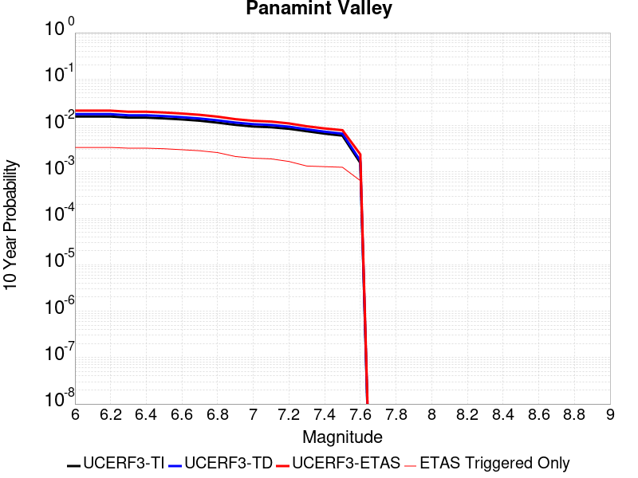
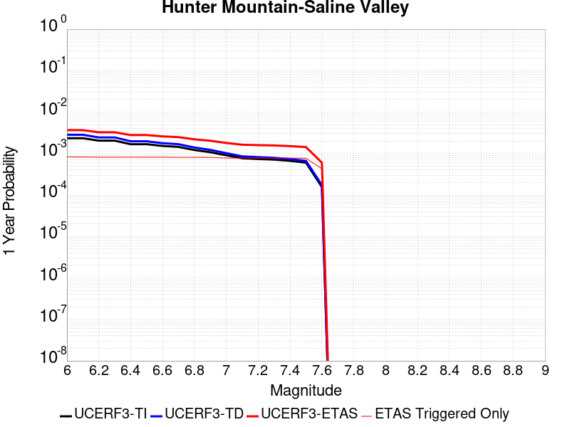
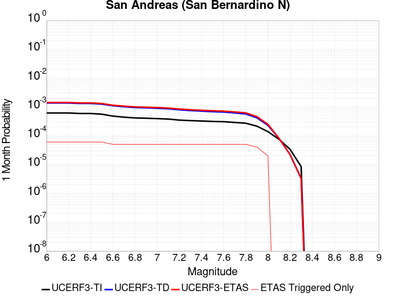
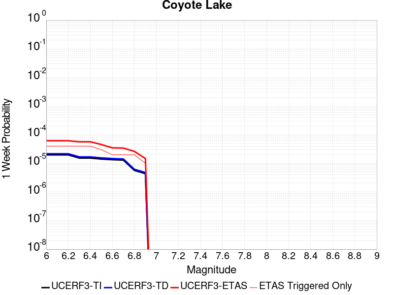
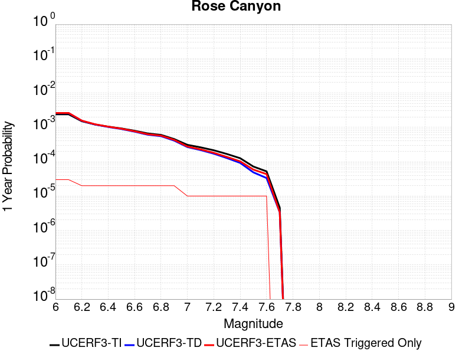
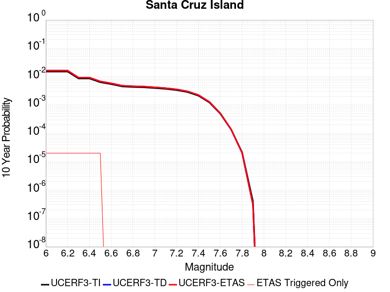
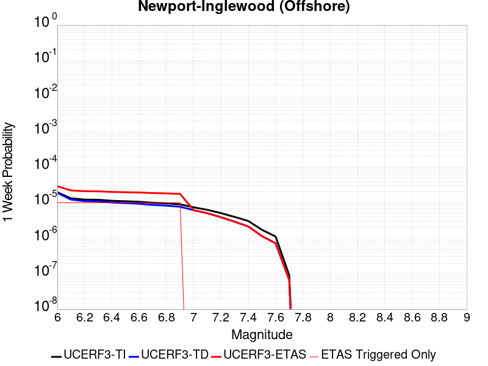
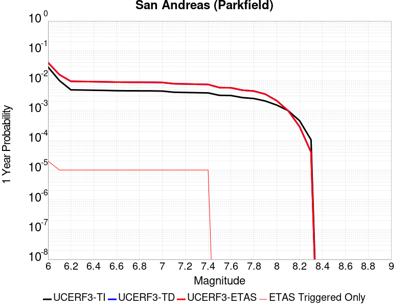
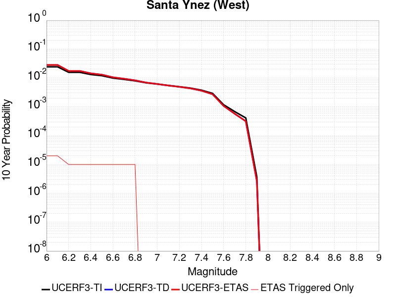

# Parent Section Magnitude-Probability Distributions

Only fault sections with at least one triggered aftershock are plotted. Sections are sorted by total supraseismogenic trigger rate (decreasing)

## Table Of Contents

* [Tank Canyon](#tank-canyon)
* [Garlock (Central)](#garlock-central)
* [Owl Lake](#owl-lake)
* [Little Lake](#little-lake)
* [Panamint Valley](#panamint-valley)
* [Garlock (East)](#garlock-east)
* [Airport Lake](#airport-lake)
* [Blackwater](#blackwater)
* [Gravel Hills-Harper Lk](#gravel-hills-harper-lk)
* [Hunter Mountain-Saline Valley](#hunter-mountain-saline-valley)
* [Ash Hill](#ash-hill)
* [Garlock (West)](#garlock-west)
* [McLean Lake](#mclean-lake)
* [Goldstone Lake](#goldstone-lake)
* [Coyote Canyon](#coyote-canyon)
* [So Sierra Nevada](#so-sierra-nevada)
* [San Andreas (Mojave S)](#san-andreas-mojave-s)
* [Lenwood-Lockhart-Old Woman Springs](#lenwood-lockhart-old-woman-springs)
* [Death Valley (So)](#death-valley-so)
* [San Andreas (Mojave N)](#san-andreas-mojave-n)
* [Towne Pass](#towne-pass)
* [Nelson Lake](#nelson-lake)
* [Bicycle Lake](#bicycle-lake)
* [Paradise](#paradise)
* [Garlic Springs](#garlic-springs)
* [San Andreas (San Bernardino N)](#san-andreas-san-bernardino-n)
* [Helendale-So Lockhart](#helendale-so-lockhart)
* [Coyote Lake](#coyote-lake)
* [San Andreas (San Bernardino S)](#san-andreas-san-bernardino-s)
* [San Andreas (San Gorgonio Pass-Garnet HIll)](#san-andreas-san-gorgonio-pass-garnet-hill)
* [Death Valley (Black Mtns Frontal)](#death-valley-black-mtns-frontal)
* [Baker](#baker)
* [Santa Ynez (East)](#santa-ynez-east)
* [Elsinore (Glen Ivy) rev](#elsinore-glen-ivy-rev)
* [San Andreas (Big Bend)](#san-andreas-big-bend)
* [San Andreas (North Branch Mill Creek)](#san-andreas-north-branch-mill-creek)
* [San Andreas (Coachella) rev](#san-andreas-coachella-rev)
* [Manix-Afton Hills](#manix-afton-hills)
* [Cady](#cady)
* [Calico-Hidalgo](#calico-hidalgo)
* [Ludlow](#ludlow)
* [Pinto Mtn](#pinto-mtn)
* [Rose Canyon](#rose-canyon)
* [Mission Ridge-Arroyo Parida-Santa Ana](#mission-ridge-arroyo-parida-santa-ana)
* [San Cayetano](#san-cayetano)
* [San Clemente](#san-clemente)
* [Channel Islands Thrust](#channel-islands-thrust)
* [Santa Cruz Island](#santa-cruz-island)
* [Brawley (Seismic Zone) alt 1](#brawley-seismic-zone-alt-1)
* [Death Valley (No)](#death-valley-no)
* [Cleghorn Lake](#cleghorn-lake)
* [San Andreas (Cholame) rev](#san-andreas-cholame-rev)
* [Tin Mountain](#tin-mountain)
* [San Andreas (Carrizo) rev](#san-andreas-carrizo-rev)
* [San Diego Trough north alt1](#san-diego-trough-north-alt1)
* [Lake Isabella (Seismicity)](#lake-isabella-seismicity)
* [Scodie Lineament](#scodie-lineament)
* [White Wolf (Extension)](#white-wolf-extension)
* [Lost Hills](#lost-hills)
* [Mono Lake 2011 CFM](#mono-lake-2011-cfm)
* [Oceanic - West Huasna](#oceanic---west-huasna)
* [Camp Rock 2011](#camp-rock-2011)
* [Robinson Creek](#robinson-creek)
* [Newport-Inglewood (Offshore)](#newport-inglewood-offshore)
* [Hosgri (Extension)](#hosgri-extension)
* [San Gorgonio Pass](#san-gorgonio-pass)
* [Earthquake Valley (No  Extension)](#earthquake-valley-no--extension)
* [San Andreas (Creeping Section) 2011 CFM](#san-andreas-creeping-section-2011-cfm)
* [Ventura-Pitas Point](#ventura-pitas-point)
* [Imperial](#imperial)
* [San Jacinto (San Bernardino)](#san-jacinto-san-bernardino)
* [Dry Mountain](#dry-mountain)
* [Cleghorn Pass](#cleghorn-pass)
* [San Andreas (Parkfield)](#san-andreas-parkfield)
* [Elysian Park (Upper)](#elysian-park-upper)
* [Santa Ynez (West)](#santa-ynez-west)
* [Pine Mtn](#pine-mtn)
* [White Wolf](#white-wolf)
* [Raymond](#raymond)
* [Los Osos 2011](#los-osos-2011)
* [Big Pine (Central)](#big-pine-central)
* [Santa Susana alt 1](#santa-susana-alt-1)
* [Davis Creek](#davis-creek)
* [Elsinore (Stepovers Combined)](#elsinore-stepovers-combined)
* [Malibu Coast (Extension) alt 1](#malibu-coast-extension-alt-1)
* [Death Valley (Fish Lake Valley)](#death-valley-fish-lake-valley)
* [Hosgri](#hosgri)
* [San Jacinto (Lytle Creek connector)](#san-jacinto-lytle-creek-connector)
* [Newport-Inglewood alt 1](#newport-inglewood-alt-1)
* [Eaton Roughs 2011 CFM](#eaton-roughs-2011-cfm)
* [Kern Canyon (Lake Isabella) 2011](#kern-canyon-lake-isabella-2011)
* [Whittier alt 1](#whittier-alt-1)
* [Cucamonga](#cucamonga)
* [Sierra Madre](#sierra-madre)
* [White Mountains](#white-mountains)
* [Del Valle](#del-valle)
* [Sheephole](#sheephole)
* [San Luis Range 2011 CFM](#san-luis-range-2011-cfm)
* [Kern Canyon (North Kern) 2011](#kern-canyon-north-kern-2011)
* [Burnt Mtn](#burnt-mtn)
* [Santa Cruz Catalina Ridge alt1](#santa-cruz-catalina-ridge-alt1)
* [Oak Ridge (Onshore)](#oak-ridge-onshore)
* [Elsinore (Temecula) rev](#elsinore-temecula-rev)
* [Chino alt 1](#chino-alt-1)
* [La Panza 2011](#la-panza-2011)
* [Compton](#compton)
* [Gillem - Big Crack 2011 CFM](#gillem---big-crack-2011-cfm)
* [Santa Rosa Island](#santa-rosa-island)
* [Emerson-Copper Mtn 2011](#emerson-copper-mtn-2011)
* [San Jacinto (San Jacinto Valley) rev](#san-jacinto-san-jacinto-valley-rev)
* [Red Pass](#red-pass)
* [North Frontal  (East)](#north-frontal--east)
* [Palos Verdes](#palos-verdes)
* [Bartlett Springs 2011 CFM](#bartlett-springs-2011-cfm)
* [Surprise Valley 2011 CFM](#surprise-valley-2011-cfm)
* [Great Valley 09 (Laguna Seca)](#great-valley-09-laguna-seca)
* [Rinconada 2011 CFM](#rinconada-2011-cfm)
* [San Jacinto (Superstition Mtn)](#san-jacinto-superstition-mtn)
* [Elmore Ranch](#elmore-ranch)
* [San Jacinto (Stepovers Combined)](#san-jacinto-stepovers-combined)
* [Mission Creek](#mission-creek)
* [San Luis Range - Pecho 2011 CFM](#san-luis-range---pecho-2011-cfm)

## Tank Canyon
*[(top)](#table-of-contents)*

| 1 Week | 1 Month | 1 Year | 10 Year |
|-----|-----|-----|-----|
|  |  |  |  |

| Magnitude | 1 wk TI Prob | 1 wk TD Prob | 1 wk ETAS Prob | 1 wk ETAS/TD Gain | 1 wk ETAS Triggered Only | 1 mo TI Prob | 1 mo TD Prob | 1 mo ETAS Prob | 1 mo ETAS/TD Gain | 1 mo ETAS Triggered Only | 1 yr TI Prob | 1 yr TD Prob | 1 yr ETAS Prob | 1 yr ETAS/TD Gain | 1 yr ETAS Triggered Only | 10 yr TI Prob | 10 yr TD Prob | 10 yr ETAS Prob | 10 yr ETAS/TD Gain | 10 yr ETAS Triggered Only |
|-----|-----|-----|-----|-----|-----|-----|-----|-----|-----|-----|-----|-----|-----|-----|-----|-----|-----|-----|-----|-----|
| 6.0 | 4.8284557E-5 | 5.796445E-5 | 0.0020178508 | 34.81187 | 0.00196 | 2.0691741E-4 | 2.4839924E-4 | 0.003937483 | 15.851427 | 0.00369 | 0.0025163088 | 0.0030207336 | 0.010727383 | 3.551251 | 0.00773 | 0.02488006 | 0.029863615 | 0.0418545 | 1.4015216 | 0.01236 |
| 6.1 | 1.7796336E-5 | 2.0873378E-5 | 7.408584E-4 | 35.49298 | 7.2E-4 | 7.626778E-5 | 8.945448E-5 | 0.0015893203 | 17.766806 | 0.0015 | 9.281647E-4 | 0.0010886024 | 0.004115304 | 3.7803557 | 0.00303 | 0.009242975 | 0.010836642 | 0.015525277 | 1.4326649 | 0.00474 |
| 6.2 | 1.7796336E-5 | 2.0873378E-5 | 7.408584E-4 | 35.49298 | 7.2E-4 | 7.626778E-5 | 8.945448E-5 | 0.0015893203 | 17.766806 | 0.0015 | 9.281647E-4 | 0.0010886024 | 0.004115304 | 3.7803557 | 0.00303 | 0.009242975 | 0.010836642 | 0.015525277 | 1.4326649 | 0.00474 |
| 6.3 | 1.3515912E-5 | 1.5759651E-5 | 5.157518E-4 | 32.72609 | 5.0E-4 | 5.792405E-5 | 6.7539746E-5 | 0.0011874641 | 17.581707 | 0.00112 | 7.049971E-4 | 8.2200987E-4 | 0.0031001356 | 3.7714093 | 0.00228 | 0.007027647 | 0.008192157 | 0.011663484 | 1.4237379 | 0.0035 |
| 6.4 | 1.0870146E-5 | 1.2618114E-5 | 3.5261383E-4 | 27.94505 | 3.4E-4 | 4.658551E-5 | 5.4076605E-5 | 8.7403227E-4 | 16.162853 | 8.2E-4 | 5.67031E-4 | 6.582015E-4 | 0.0022771352 | 3.4596324 | 0.00162 | 0.005655863 | 0.006564382 | 0.009087709 | 1.3843967 | 0.00254 |
| 6.5 | 7.964826E-6 | 9.196184E-6 | 1.5919481E-4 | 17.310965 | 1.5E-4 | 3.4134522E-5 | 3.941168E-5 | 4.8939395E-4 | 12.417485 | 4.5E-4 | 4.1550855E-4 | 4.797421E-4 | 0.001409296 | 2.9376116 | 9.3E-4 | 0.0041473247 | 0.004788209 | 0.006261123 | 1.3076125 | 0.00148 |
| 6.6 | 6.6317E-6 | 7.612378E-6 | 1.2761146E-4 | 16.76368 | 1.2E-4 | 2.8421264E-5 | 3.262412E-5 | 3.926124E-4 | 12.03442 | 3.6E-4 | 3.4597394E-4 | 3.9713533E-4 | 0.0010868614 | 2.736753 | 6.9E-4 | 0.0034543579 | 0.0039652516 | 0.00507085 | 1.2788218 | 0.00111 |
| 6.7 | 4.793663E-6 | 5.4308593E-6 | 6.543053E-5 | 12.047915 | 6.0E-5 | 2.0544108E-5 | 2.3274928E-5 | 2.5326957E-4 | 10.881648 | 2.3E-4 | 2.500958E-4 | 2.833398E-4 | 7.032208E-4 | 2.4818993 | 4.2E-4 | 0.0024981452 | 0.0028303189 | 0.003488451 | 1.2325293 | 6.6E-4 |
| 6.8 | 4.382823E-6 | 4.969325E-6 | 6.496903E-5 | 13.074015 | 6.0E-5 | 1.8783392E-5 | 2.1296957E-5 | 2.5129205E-4 | 11.799435 | 2.3E-4 | 2.286638E-4 | 2.5926388E-4 | 6.4916274E-4 | 2.503869 | 3.9E-4 | 0.0022842865 | 0.0025901233 | 0.0031985433 | 1.2349 | 6.1E-4 |
| 6.9 | 2.729601E-6 | 3.0735862E-6 | 1.3073555E-5 | 4.2535186 | 1.0E-5 | 1.1698237E-5 | 1.3172453E-5 | 1.0317127E-4 | 7.8323507 | 9.0E-5 | 1.4241673E-4 | 1.6036403E-4 | 3.4033516E-4 | 2.1222663 | 1.8E-4 | 0.001423255 | 0.0016024808 | 0.0018420962 | 1.1495278 | 2.4E-4 |
| 7.0 | 1.8987357E-6 | 2.126971E-6 | 1.21269495E-5 | 5.701512 | 1.0E-5 | 8.137413E-6 | 9.115562E-6 | 4.91152E-5 | 5.38806 | 4.0E-5 | 9.90685E-5 | 1.1097702E-4 | 1.9096813E-4 | 1.72079 | 8.0E-5 | 9.902435E-4 | 0.0011092846 | 0.0012191626 | 1.099053 | 1.1E-4 |
| 7.1 | 1.4928986E-6 | 1.6641525E-6 | 1.6641525E-6 | 1.0 | 0.0 | 6.398121E-6 | 7.132066E-6 | 2.7131924E-5 | 3.8042166 | 2.0E-5 | 7.789434E-5 | 8.6830034E-5 | 1.3682569E-4 | 1.5757877 | 5.0E-5 | 7.786704E-4 | 8.6801895E-4 | 9.4794953E-4 | 1.0920839 | 8.0E-5 |
| 7.2 | 1.069082E-6 | 1.1828765E-6 | 1.1828765E-6 | 1.0 | 0.0 | 4.581772E-6 | 5.0694644E-6 | 5.0694644E-6 | 1.0 | 0.0 | 5.5781646E-5 | 6.171951E-5 | 7.1718896E-5 | 1.1620133 | 1.0E-5 | 5.576765E-4 | 6.1707594E-4 | 6.4705743E-4 | 1.0485864 | 3.0E-5 |
| 7.3 | 8.776551E-7 | 9.770151E-7 | 9.770151E-7 | 1.0 | 0.0 | 3.7613736E-6 | 4.187204E-6 | 4.187204E-6 | 1.0 | 0.0 | 4.579376E-5 | 5.0978535E-5 | 5.0978535E-5 | 1.0 | 0.0 | 4.5784327E-4 | 5.097194E-4 | 5.097194E-4 | 1.0 | 0.0 |
| 7.4 | 7.55721E-7 | 8.5103835E-7 | 8.5103835E-7 | 1.0 | 0.0 | 3.2388E-6 | 3.6473052E-6 | 3.6473052E-6 | 1.0 | 0.0 | 3.9431678E-5 | 4.4405555E-5 | 4.4405555E-5 | 1.0 | 0.0 | 3.942468E-4 | 4.4401767E-4 | 4.4401767E-4 | 1.0 | 0.0 |
| 7.5 | 5.587665E-7 | 6.305732E-7 | 6.305732E-7 | 1.0 | 0.0 | 2.3947114E-6 | 2.7024564E-6 | 2.7024564E-6 | 1.0 | 0.0 | 2.915522E-5 | 3.2902408E-5 | 3.2902408E-5 | 1.0 | 0.0 | 2.9151395E-4 | 3.2902407E-4 | 3.2902407E-4 | 1.0 | 0.0 |

## Garlock (Central)
*[(top)](#table-of-contents)*

| 1 Week | 1 Month | 1 Year | 10 Year |
|-----|-----|-----|-----|
|  |  |  |  |

| Magnitude | 1 wk TI Prob | 1 wk TD Prob | 1 wk ETAS Prob | 1 wk ETAS/TD Gain | 1 wk ETAS Triggered Only | 1 mo TI Prob | 1 mo TD Prob | 1 mo ETAS Prob | 1 mo ETAS/TD Gain | 1 mo ETAS Triggered Only | 1 yr TI Prob | 1 yr TD Prob | 1 yr ETAS Prob | 1 yr ETAS/TD Gain | 1 yr ETAS Triggered Only | 10 yr TI Prob | 10 yr TD Prob | 10 yr ETAS Prob | 10 yr ETAS/TD Gain | 10 yr ETAS Triggered Only |
|-----|-----|-----|-----|-----|-----|-----|-----|-----|-----|-----|-----|-----|-----|-----|-----|-----|-----|-----|-----|-----|
| 6.0 | 5.5131142E-5 | 7.02476E-5 | 0.0019101184 | 27.191225 | 0.00184 | 2.3625491E-4 | 3.0102677E-4 | 0.0035700423 | 11.859551 | 0.00327 | 0.0028726095 | 0.0036589059 | 0.010314465 | 2.8190024 | 0.00668 | 0.028357591 | 0.036136657 | 0.046507828 | 1.2869986 | 0.01076 |
| 6.1 | 5.5131142E-5 | 7.02476E-5 | 0.0019101184 | 27.191225 | 0.00184 | 2.3625491E-4 | 3.0102677E-4 | 0.0035700423 | 11.859551 | 0.00327 | 0.0028726095 | 0.0036589059 | 0.010314465 | 2.8190024 | 0.00668 | 0.028357591 | 0.036136657 | 0.046507828 | 1.2869986 | 0.01076 |
| 6.2 | 4.216245E-5 | 5.16618E-5 | 0.0014515895 | 28.097927 | 0.0014 | 1.806837E-4 | 2.213891E-4 | 0.0025808667 | 11.657605 | 0.00236 | 0.0021976046 | 0.002692112 | 0.0074293246 | 2.759664 | 0.00475 | 0.021759989 | 0.02670132 | 0.03409839 | 1.2770301 | 0.0076 |
| 6.3 | 4.216245E-5 | 5.16618E-5 | 0.0014515895 | 28.097927 | 0.0014 | 1.806837E-4 | 2.213891E-4 | 0.0025808667 | 11.657605 | 0.00236 | 0.0021976046 | 0.002692112 | 0.0074293246 | 2.759664 | 0.00475 | 0.021759989 | 0.02670132 | 0.03409839 | 1.2770301 | 0.0076 |
| 6.4 | 3.6858168E-5 | 4.411026E-5 | 0.0012240582 | 27.749966 | 0.00118 | 1.5795401E-4 | 1.8903041E-4 | 0.00214866 | 11.366742 | 0.00196 | 0.0019213937 | 0.0022990413 | 0.00623996 | 2.7141576 | 0.00395 | 0.019048655 | 0.0228661 | 0.029149072 | 1.2747723 | 0.00643 |
| 6.5 | 3.39199E-5 | 4.0018425E-5 | 0.0011299748 | 28.236364 | 0.00109 | 1.453629E-4 | 1.7149639E-4 | 0.0019611893 | 11.435748 | 0.00179 | 0.0017683565 | 0.0020859907 | 0.005678481 | 2.7221987 | 0.0036 | 0.017543508 | 0.020758785 | 0.02645797 | 1.2745433 | 0.00582 |
| 6.6 | 3.3571985E-5 | 3.947258E-5 | 0.0011294296 | 28.613016 | 0.00109 | 1.4387199E-4 | 1.6915736E-4 | 0.0019588545 | 11.580073 | 0.00179 | 0.0017502342 | 0.002057567 | 0.0056401803 | 2.741189 | 0.00359 | 0.017365133 | 0.020480042 | 0.026171055 | 1.2778808 | 0.00581 |
| 6.7 | 3.2580007E-5 | 3.808902E-5 | 0.0010680498 | 28.040884 | 0.00103 | 1.3962112E-4 | 1.6322856E-4 | 0.0018729494 | 11.474398 | 0.00171 | 0.0016985617 | 0.0019855178 | 0.0053987275 | 2.7190526 | 0.00342 | 0.016856372 | 0.019770874 | 0.02523075 | 1.2761575 | 0.00557 |
| 6.8 | 3.2185937E-5 | 3.7516213E-5 | 0.0010474783 | 27.920683 | 0.00101 | 1.3793244E-4 | 1.6077398E-4 | 0.0018505023 | 11.509961 | 0.00169 | 0.0016780337 | 0.0019556873 | 0.005309116 | 2.714706 | 0.00336 | 0.016654192 | 0.01947788 | 0.024821725 | 1.2743546 | 0.00545 |
| 6.9 | 3.165394E-5 | 3.672075E-5 | 0.001036684 | 28.23156 | 0.001 | 1.3565269E-4 | 1.5736527E-4 | 0.0018271025 | 11.610582 | 0.00167 | 0.0016503202 | 0.0019142599 | 0.0051879813 | 2.710176 | 0.00328 | 0.01638118 | 0.01907152 | 0.02429987 | 1.2741443 | 0.00533 |
| 7.0 | 3.0903822E-5 | 3.5625908E-5 | 0.0010055914 | 28.226406 | 9.7E-4 | 1.3243823E-4 | 1.5267365E-4 | 0.0017724263 | 11.609248 | 0.00162 | 0.0016112428 | 0.0018572381 | 0.0050113695 | 2.698291 | 0.00316 | 0.015996104 | 0.018513493 | 0.02354852 | 1.2719651 | 0.00513 |
| 7.1 | 3.0069863E-5 | 3.4392175E-5 | 9.943591E-4 | 28.912367 | 9.6E-4 | 1.2886449E-4 | 1.4738682E-4 | 0.0017371525 | 11.786348 | 0.00159 | 0.0015677959 | 0.0017929787 | 0.004847492 | 2.7035973 | 0.00306 | 0.01556781 | 0.017880991 | 0.022752302 | 1.2724296 | 0.00496 |
| 7.2 | 2.7957109E-5 | 3.128141E-5 | 8.712551E-4 | 27.852167 | 8.4E-4 | 1.1981068E-4 | 1.3405642E-4 | 0.0015338687 | 11.441964 | 0.0014 | 0.0014577188 | 0.0016309345 | 0.0043265307 | 2.6527927 | 0.0027 | 0.014481937 | 0.016284354 | 0.020593029 | 1.2645898 | 0.00438 |
| 7.3 | 2.4519275E-5 | 2.67146E-5 | 6.166988E-4 | 23.084711 | 5.9E-4 | 1.0507837E-4 | 1.144862E-4 | 0.0011343694 | 9.90835 | 0.00102 | 0.0012785783 | 0.001392993 | 0.0032903464 | 2.3620696 | 0.0019 | 0.012712469 | 0.013928613 | 0.016847383 | 1.2095522 | 0.00296 |
| 7.4 | 2.3225532E-5 | 2.5199166E-5 | 4.951873E-4 | 19.650942 | 4.7E-4 | 9.95342E-5 | 1.0799203E-4 | 9.6789916E-4 | 8.96269 | 8.6E-4 | 0.0012111551 | 0.0013140244 | 0.0029618563 | 2.2540345 | 0.00165 | 0.012045753 | 0.013146198 | 0.015751492 | 1.1981785 | 0.00264 |
| 7.5 | 2.097765E-5 | 2.2483406E-5 | 4.224744E-4 | 18.790499 | 4.0E-4 | 8.9901114E-5 | 9.635396E-5 | 8.0628553E-4 | 8.367954 | 7.1E-4 | 0.0010939965 | 0.00117249 | 0.0025009306 | 2.133008 | 0.00133 | 0.010886264 | 0.01174066 | 0.013776475 | 1.1733986 | 0.00206 |
| 7.6 | 1.511254E-5 | 1.5990967E-5 | 2.8598664E-4 | 17.884262 | 2.7E-4 | 6.476642E-5 | 6.8530964E-5 | 4.9850147E-4 | 7.274106 | 4.3E-4 | 7.882459E-4 | 8.340529E-4 | 0.0016433774 | 1.9703515 | 8.1E-4 | 0.007854558 | 0.00838387 | 0.009593641 | 1.1442975 | 0.00122 |
| 7.7 | 9.934069E-6 | 1.0678522E-5 | 7.067788E-5 | 6.6186953 | 6.0E-5 | 4.2573887E-5 | 4.5764293E-5 | 1.3576017E-4 | 2.9665086 | 9.0E-5 | 5.182138E-4 | 5.5703823E-4 | 7.5692683E-4 | 1.3588418 | 2.0E-4 | 0.00517007 | 0.0056274217 | 0.005955565 | 1.0583115 | 3.3E-4 |
| 7.8 | 6.7562896E-6 | 8.428369E-6 | 3.8428116E-5 | 4.5593777 | 3.0E-5 | 2.8955206E-5 | 3.612108E-5 | 9.6118914E-5 | 2.6610198 | 6.0E-5 | 3.5247262E-4 | 4.396856E-4 | 5.396416E-4 | 1.2273352 | 1.0E-4 | 0.0035191406 | 0.004446419 | 0.004635574 | 1.042541 | 1.9E-4 |
| 7.9 | 3.975453E-6 | 5.371052E-6 | 2.5370944E-5 | 4.723645 | 2.0E-5 | 1.7037546E-5 | 2.3018592E-5 | 6.301767E-5 | 2.7376857 | 4.0E-5 | 2.0741238E-4 | 2.802154E-4 | 3.302014E-4 | 1.1783842 | 5.0E-5 | 0.002072189 | 0.0028335704 | 0.0029233154 | 1.031672 | 9.0E-5 |
| 8.0 | 1.6729537E-6 | 2.0775192E-6 | 2.2077478E-5 | 10.626847 | 2.0E-5 | 7.169782E-6 | 8.903623E-6 | 2.8903445E-5 | 3.2462566 | 2.0E-5 | 8.7288594E-5 | 1.08396256E-4 | 1.2839408E-4 | 1.1844882 | 2.0E-5 | 8.7254314E-4 | 0.0010968536 | 0.0011268207 | 1.027321 | 3.0E-5 |
| 8.1 | 3.6733252E-7 | 3.1489736E-7 | 3.1489736E-7 | 1.0 | 0.0 | 1.5742813E-6 | 1.3495595E-6 | 1.3495595E-6 | 1.0 | 0.0 | 1.9166706E-5 | 1.643078E-5 | 1.643078E-5 | 1.0 | 0.0 | 1.9165053E-4 | 1.662928E-4 | 1.7629113E-4 | 1.0601249 | 1.0E-5 |

## Owl Lake
*[(top)](#table-of-contents)*

| 1 Week | 1 Month | 1 Year | 10 Year |
|-----|-----|-----|-----|
|  |  |  |  |

| Magnitude | 1 wk TI Prob | 1 wk TD Prob | 1 wk ETAS Prob | 1 wk ETAS/TD Gain | 1 wk ETAS Triggered Only | 1 mo TI Prob | 1 mo TD Prob | 1 mo ETAS Prob | 1 mo ETAS/TD Gain | 1 mo ETAS Triggered Only | 1 yr TI Prob | 1 yr TD Prob | 1 yr ETAS Prob | 1 yr ETAS/TD Gain | 1 yr ETAS Triggered Only | 10 yr TI Prob | 10 yr TD Prob | 10 yr ETAS Prob | 10 yr ETAS/TD Gain | 10 yr ETAS Triggered Only |
|-----|-----|-----|-----|-----|-----|-----|-----|-----|-----|-----|-----|-----|-----|-----|-----|-----|-----|-----|-----|-----|
| 6.0 | 5.0320643E-5 | 6.6358676E-5 | 7.363142E-4 | 11.095975 | 6.7E-4 | 2.1564208E-4 | 2.843643E-4 | 0.0014440344 | 5.078114 | 0.00116 | 0.0026222812 | 0.003457547 | 0.00586918 | 1.6974982 | 0.00242 | 0.02591553 | 0.034141295 | 0.03817858 | 1.1182524 | 0.00418 |
| 6.1 | 5.0320643E-5 | 6.6358676E-5 | 7.363142E-4 | 11.095975 | 6.7E-4 | 2.1564208E-4 | 2.843643E-4 | 0.0014440344 | 5.078114 | 0.00116 | 0.0026222812 | 0.003457547 | 0.00586918 | 1.6974982 | 0.00242 | 0.02591553 | 0.034141295 | 0.03817858 | 1.1182524 | 0.00418 |
| 6.2 | 2.4125871E-5 | 3.0980515E-5 | 5.409647E-4 | 17.46145 | 5.1E-4 | 1.0339249E-4 | 1.3276804E-4 | 9.926539E-4 | 7.4766026 | 8.6E-4 | 0.0012580766 | 0.0016154252 | 0.003382566 | 2.0939167 | 0.00177 | 0.012509781 | 0.016070753 | 0.01905206 | 1.1855112 | 0.00303 |
| 6.3 | 1.7433485E-5 | 2.2355545E-5 | 4.7234548E-4 | 21.128784 | 4.5E-4 | 7.471279E-5 | 9.580685E-5 | 8.3573593E-4 | 8.723134 | 7.4E-4 | 9.0924866E-4 | 0.001165962 | 0.0026742013 | 2.2935581 | 0.00151 | 0.009055373 | 0.011629146 | 0.014100072 | 1.2124771 | 0.0025 |
| 6.4 | 1.7433485E-5 | 2.2355545E-5 | 4.7234548E-4 | 21.128784 | 4.5E-4 | 7.471279E-5 | 9.580685E-5 | 8.3573593E-4 | 8.723134 | 7.4E-4 | 9.0924866E-4 | 0.001165962 | 0.0026742013 | 2.2935581 | 0.00151 | 0.009055373 | 0.011629146 | 0.014100072 | 1.2124771 | 0.0025 |
| 6.5 | 1.5182742E-5 | 1.9429277E-5 | 4.3942113E-4 | 22.616442 | 4.2E-4 | 6.506727E-5 | 8.3266525E-5 | 7.8320823E-4 | 9.40604 | 7.0E-4 | 7.919061E-4 | 0.0010134344 | 0.002441985 | 2.4096136 | 0.00143 | 0.0078909 | 0.010118676 | 0.012474595 | 1.2328286 | 0.00238 |
| 6.6 | 6.7271576E-6 | 8.547518E-6 | 3.0854496E-4 | 36.09761 | 3.0E-4 | 2.8830356E-5 | 3.6631736E-5 | 5.266138E-4 | 14.375889 | 4.9E-4 | 3.5095305E-4 | 4.4590578E-4 | 0.0014954376 | 3.3537076 | 0.00105 | 0.0035039932 | 0.0044680177 | 0.0062101986 | 1.3899226 | 0.00175 |
| 6.7 | 6.682835E-6 | 8.479961E-6 | 3.084774E-4 | 36.37722 | 3.0E-4 | 2.8640408E-5 | 3.6342215E-5 | 5.263244E-4 | 14.482452 | 4.9E-4 | 3.4864116E-4 | 4.423823E-4 | 0.0014919178 | 3.3724627 | 0.00105 | 0.003480947 | 0.004432931 | 0.0061751734 | 1.3930227 | 0.00175 |
| 6.8 | 6.5774975E-6 | 8.326427E-6 | 3.0832394E-4 | 37.02956 | 3.0E-4 | 2.8188972E-5 | 3.5684232E-5 | 5.2566675E-4 | 14.731066 | 4.9E-4 | 3.4314668E-4 | 4.3437455E-4 | 0.0014739227 | 3.393207 | 0.00104 | 0.0034261728 | 0.0043531046 | 0.0060755736 | 1.3956876 | 0.00173 |
| 6.9 | 6.363419E-6 | 7.999591E-6 | 2.9799726E-4 | 37.251568 | 2.9E-4 | 2.727151E-5 | 3.428354E-5 | 5.1426707E-4 | 15.000408 | 4.8E-4 | 3.3198006E-4 | 4.1732774E-4 | 0.0014369021 | 3.4431021 | 0.00102 | 0.0033148455 | 0.0041830637 | 0.0058859107 | 1.4070812 | 0.00171 |
| 7.0 | 6.1342453E-6 | 7.631779E-6 | 2.8762963E-4 | 37.68841 | 2.8E-4 | 2.6289357E-5 | 3.2707245E-5 | 5.026919E-4 | 15.369434 | 4.7E-4 | 3.2002592E-4 | 3.9814346E-4 | 0.0013977453 | 3.5106575 | 0.001 | 0.0031956544 | 0.003991738 | 0.0056650317 | 1.4191893 | 0.00168 |
| 7.1 | 5.842926E-6 | 7.142312E-6 | 2.871403E-4 | 40.202713 | 2.8E-4 | 2.504087E-5 | 3.060958E-5 | 5.005952E-4 | 16.3542 | 4.7E-4 | 3.0482994E-4 | 3.7261334E-4 | 0.0013522481 | 3.6290922 | 9.8E-4 | 0.0030441214 | 0.0037371584 | 0.0053909547 | 1.4425278 | 0.00166 |
| 7.2 | 4.77173E-6 | 5.358478E-6 | 2.453572E-4 | 45.788597 | 2.4E-4 | 2.045011E-5 | 2.2964727E-5 | 3.9295622E-4 | 17.111296 | 3.7E-4 | 2.4895166E-4 | 2.7956374E-4 | 0.0010793401 | 3.8608015 | 8.0E-4 | 0.0024867293 | 0.0028086214 | 0.004134886 | 1.472212 | 0.00133 |
| 7.3 | 3.0494948E-6 | 2.710356E-6 | 5.271022E-5 | 19.44771 | 5.0E-5 | 1.3069198E-5 | 1.1615762E-5 | 8.161495E-5 | 7.0262246 | 7.0E-5 | 1.5910587E-4 | 1.4141288E-4 | 3.7138036E-4 | 2.626213 | 2.3E-4 | 0.0015899199 | 0.001423109 | 0.0017426535 | 1.2245398 | 3.2E-4 |
| 7.4 | 2.7263884E-6 | 2.3055634E-6 | 2.2305518E-5 | 9.674649 | 2.0E-5 | 1.1684469E-5 | 9.880949E-6 | 2.9880752E-5 | 3.0240772 | 2.0E-5 | 1.4224913E-4 | 1.2029401E-4 | 2.5027836E-4 | 2.0805554 | 1.3E-4 | 0.0014215811 | 0.0012110578 | 0.0014208034 | 1.1731921 | 2.1E-4 |
| 7.5 | 2.6090431E-6 | 2.1655019E-6 | 2.2165459E-5 | 10.235715 | 2.0E-5 | 1.1181565E-5 | 9.2806895E-6 | 2.9280503E-5 | 3.1549923 | 2.0E-5 | 1.3612706E-4 | 1.1298663E-4 | 2.2297421E-4 | 1.9734565 | 1.1E-4 | 0.001360437 | 0.0011378126 | 0.0012876419 | 1.1316819 | 1.5E-4 |
| 7.6 | 2.3008756E-6 | 1.8726826E-6 | 1.8726826E-6 | 1.0 | 0.0 | 9.860858E-6 | 8.025758E-6 | 8.025758E-6 | 1.0 | 0.0 | 1.20049335E-4 | 9.770931E-5 | 1.7770148E-4 | 1.8186752 | 8.0E-5 | 0.001199845 | 9.848307E-4 | 0.0010947223 | 1.1115843 | 1.1E-4 |
| 7.7 | 1.7184348E-6 | 1.341808E-6 | 1.341808E-6 | 1.0 | 0.0 | 7.3646997E-6 | 5.750593E-6 | 5.750593E-6 | 1.0 | 0.0 | 8.966153E-5 | 7.0011265E-5 | 1.2000777E-4 | 1.7141207 | 5.0E-5 | 8.962536E-4 | 7.0769014E-4 | 7.776406E-4 | 1.0988433 | 7.0E-5 |
| 7.8 | 8.4612907E-7 | 8.4054994E-7 | 8.4054994E-7 | 1.0 | 0.0 | 3.6262625E-6 | 3.602352E-6 | 3.602352E-6 | 1.0 | 0.0 | 4.4148852E-5 | 4.3857777E-5 | 5.3857337E-5 | 1.2279997 | 1.0E-5 | 4.414008E-4 | 4.4386165E-4 | 4.6385278E-4 | 1.045039 | 2.0E-5 |
| 7.9 | 2.716738E-7 | 3.7681625E-7 | 3.7681625E-7 | 1.0 | 0.0 | 1.1643157E-6 | 1.6149258E-6 | 1.6149258E-6 | 1.0 | 0.0 | 1.4175452E-5 | 1.9661555E-5 | 2.9661358E-5 | 1.5085968 | 1.0E-5 | 1.4174548E-4 | 1.9829652E-4 | 2.0829453E-4 | 1.0504196 | 1.0E-5 |
| 8.0 | 2.1995428E-8 | 3.3853325E-8 | 3.3853325E-8 | 1.0 | 0.0 | 9.426611E-8 | 1.4508568E-7 | 1.4508568E-7 | 1.0 | 0.0 | 1.1476893E-6 | 1.7664173E-6 | 1.7664173E-6 | 1.0 | 0.0 | 1.14768345E-5 | 1.7869768E-5 | 1.7869768E-5 | 1.0 | 0.0 |

## Little Lake
*[(top)](#table-of-contents)*

| 1 Week | 1 Month | 1 Year | 10 Year |
|-----|-----|-----|-----|
|  |  |  |  |

| Magnitude | 1 wk TI Prob | 1 wk TD Prob | 1 wk ETAS Prob | 1 wk ETAS/TD Gain | 1 wk ETAS Triggered Only | 1 mo TI Prob | 1 mo TD Prob | 1 mo ETAS Prob | 1 mo ETAS/TD Gain | 1 mo ETAS Triggered Only | 1 yr TI Prob | 1 yr TD Prob | 1 yr ETAS Prob | 1 yr ETAS/TD Gain | 1 yr ETAS Triggered Only | 10 yr TI Prob | 10 yr TD Prob | 10 yr ETAS Prob | 10 yr ETAS/TD Gain | 10 yr ETAS Triggered Only |
|-----|-----|-----|-----|-----|-----|-----|-----|-----|-----|-----|-----|-----|-----|-----|-----|-----|-----|-----|-----|-----|
| 6.0 | 2.8424427E-5 | 3.1205716E-5 | 9.81176E-4 | 31.44219 | 9.5E-4 | 1.2181328E-4 | 1.3373268E-4 | 0.001753516 | 13.112099 | 0.00162 | 0.0014820677 | 0.0016271125 | 0.004702101 | 2.889844 | 0.00308 | 0.014722223 | 0.016165398 | 0.020632008 | 1.2763067 | 0.00454 |
| 6.1 | 2.8424427E-5 | 3.1205716E-5 | 9.81176E-4 | 31.44219 | 9.5E-4 | 1.2181328E-4 | 1.3373268E-4 | 0.001753516 | 13.112099 | 0.00162 | 0.0014820677 | 0.0016271125 | 0.004702101 | 2.889844 | 0.00308 | 0.014722223 | 0.016165398 | 0.020632008 | 1.2763067 | 0.00454 |
| 6.2 | 2.8424427E-5 | 3.1205716E-5 | 9.81176E-4 | 31.44219 | 9.5E-4 | 1.2181328E-4 | 1.3373268E-4 | 0.001753516 | 13.112099 | 0.00162 | 0.0014820677 | 0.0016271125 | 0.004702101 | 2.889844 | 0.00308 | 0.014722223 | 0.016165398 | 0.020632008 | 1.2763067 | 0.00454 |
| 6.3 | 1.48860645E-5 | 1.6081383E-5 | 4.76074E-4 | 29.604044 | 4.6E-4 | 6.379586E-5 | 6.8918554E-5 | 8.588641E-4 | 12.462015 | 7.9E-4 | 7.7643775E-4 | 8.387886E-4 | 0.0023075556 | 2.7510574 | 0.00147 | 0.007737305 | 0.008359045 | 0.010510906 | 1.257429 | 0.00217 |
| 6.4 | 1.48860645E-5 | 1.6081383E-5 | 4.76074E-4 | 29.604044 | 4.6E-4 | 6.379586E-5 | 6.8918554E-5 | 8.588641E-4 | 12.462015 | 7.9E-4 | 7.7643775E-4 | 8.387886E-4 | 0.0023075556 | 2.7510574 | 0.00147 | 0.007737305 | 0.008359045 | 0.010510906 | 1.257429 | 0.00217 |
| 6.5 | 1.2797581E-5 | 1.376556E-5 | 4.2375992E-4 | 30.784067 | 4.1E-4 | 5.4845623E-5 | 5.8994065E-5 | 7.7895157E-4 | 13.203897 | 7.2E-4 | 6.675408E-4 | 7.1804173E-4 | 0.0020670723 | 2.8787634 | 0.00135 | 0.006655392 | 0.007159767 | 0.009125591 | 1.2745653 | 0.00198 |
| 6.6 | 9.661896E-6 | 1.0289033E-5 | 4.0028503E-4 | 38.90405 | 3.9E-4 | 4.1407468E-5 | 4.40952E-5 | 6.940665E-4 | 15.740184 | 6.5E-4 | 5.040193E-4 | 5.36743E-4 | 0.0017760774 | 3.3089902 | 0.00124 | 0.005028777 | 0.0053560715 | 0.0071663237 | 1.3379812 | 0.00182 |
| 6.7 | 7.767871E-6 | 8.199681E-6 | 3.7819665E-4 | 46.123337 | 3.7E-4 | 3.329045E-5 | 3.5141096E-5 | 6.151207E-4 | 17.504313 | 5.8E-4 | 4.0523586E-4 | 4.2777258E-4 | 0.0015073105 | 3.523626 | 0.00108 | 0.004044977 | 0.004270843 | 0.0058640097 | 1.3730333 | 0.0016 |
| 6.8 | 6.4235196E-6 | 6.735739E-6 | 3.2673357E-4 | 48.507458 | 3.2E-4 | 2.752908E-5 | 2.8867207E-5 | 5.388525E-4 | 18.666595 | 5.1E-4 | 3.35115E-4 | 3.5141438E-4 | 0.0012810875 | 3.6455183 | 9.3E-4 | 0.003346101 | 0.0035098472 | 0.0048152492 | 1.3719256 | 0.00131 |
| 6.9 | 3.1283696E-6 | 3.1121751E-6 | 1.531117E-4 | 49.19765 | 1.5E-4 | 1.3407229E-5 | 1.33378335E-5 | 2.5333464E-4 | 18.993687 | 2.4E-4 | 1.6322079E-4 | 1.6237753E-4 | 6.52298E-4 | 4.017169 | 4.9E-4 | 0.0016310095 | 0.0016227372 | 0.0022716825 | 1.3999078 | 6.5E-4 |
| 7.0 | 2.290603E-6 | 2.2286763E-6 | 1.02228456E-4 | 45.869587 | 1.0E-4 | 9.816834E-6 | 9.551441E-6 | 1.395502E-4 | 14.610383 | 1.3E-4 | 1.19513395E-4 | 1.1628362E-4 | 3.862522E-4 | 3.321639 | 2.7E-4 | 0.0011944914 | 0.0011623299 | 0.0015219115 | 1.3093628 | 3.6E-4 |
| 7.1 | 1.293693E-6 | 1.1776774E-6 | 3.1177642E-5 | 26.473839 | 3.0E-5 | 5.5443866E-6 | 5.047183E-6 | 6.504688E-5 | 12.887759 | 6.0E-5 | 6.750081E-5 | 6.1448416E-5 | 2.114392E-4 | 3.4409218 | 1.5E-4 | 6.7480316E-4 | 6.1438273E-4 | 8.342476E-4 | 1.357863 | 2.2E-4 |
| 7.2 | 4.715842E-7 | 3.091732E-7 | 3.091732E-7 | 1.0 | 0.0 | 2.0210737E-6 | 1.3250274E-6 | 1.3250274E-6 | 1.0 | 0.0 | 2.4606294E-5 | 1.6132095E-5 | 2.6131933E-5 | 1.6198723 | 1.0E-5 | 2.460357E-4 | 1.6130977E-4 | 1.7130816E-4 | 1.0619825 | 1.0E-5 |
| 7.3 | 3.9430947E-7 | 2.3096938E-7 | 2.3096938E-7 | 1.0 | 0.0 | 1.6898966E-6 | 9.898685E-7 | 9.898685E-7 | 1.0 | 0.0 | 2.0574296E-5 | 1.2051582E-5 | 1.2051582E-5 | 1.0 | 0.0 | 2.0572392E-4 | 1.2050936E-4 | 1.2050936E-4 | 1.0 | 0.0 |
| 7.4 | 3.547123E-7 | 1.9678579E-7 | 1.9678579E-7 | 1.0 | 0.0 | 1.5201948E-6 | 8.433674E-7 | 8.433674E-7 | 1.0 | 0.0 | 1.8508214E-5 | 1.02679505E-5 | 1.02679505E-5 | 1.0 | 0.0 | 1.8506673E-4 | 1.0267482E-4 | 1.0267482E-4 | 1.0 | 0.0 |
| 7.5 | 2.6354266E-7 | 1.4422719E-7 | 1.4422719E-7 | 1.0 | 0.0 | 1.129468E-6 | 6.1811636E-7 | 6.1811636E-7 | 1.0 | 0.0 | 1.3751187E-5 | 7.525541E-6 | 7.525541E-6 | 1.0 | 0.0 | 1.3750336E-4 | 7.5252916E-5 | 7.5252916E-5 | 1.0 | 0.0 |
| 7.6 | 1.269913E-7 | 7.572344E-8 | 7.572344E-8 | 1.0 | 0.0 | 5.4424834E-7 | 3.24529E-7 | 3.24529E-7 | 1.0 | 0.0 | 6.6262032E-6 | 3.9511337E-6 | 3.9511337E-6 | 1.0 | 0.0 | 6.626006E-5 | 3.9510673E-5 | 3.9510673E-5 | 1.0 | 0.0 |

## Panamint Valley
*[(top)](#table-of-contents)*

| 1 Week | 1 Month | 1 Year | 10 Year |
|-----|-----|-----|-----|
|  |  |  |  |

| Magnitude | 1 wk TI Prob | 1 wk TD Prob | 1 wk ETAS Prob | 1 wk ETAS/TD Gain | 1 wk ETAS Triggered Only | 1 mo TI Prob | 1 mo TD Prob | 1 mo ETAS Prob | 1 mo ETAS/TD Gain | 1 mo ETAS Triggered Only | 1 yr TI Prob | 1 yr TD Prob | 1 yr ETAS Prob | 1 yr ETAS/TD Gain | 1 yr ETAS Triggered Only | 10 yr TI Prob | 10 yr TD Prob | 10 yr ETAS Prob | 10 yr ETAS/TD Gain | 10 yr ETAS Triggered Only |
|-----|-----|-----|-----|-----|-----|-----|-----|-----|-----|-----|-----|-----|-----|-----|-----|-----|-----|-----|-----|-----|
| 6.0 | 3.0211835E-5 | 3.3984263E-5 | 4.6396966E-4 | 13.652486 | 4.3E-4 | 1.2947287E-4 | 1.4563887E-4 | 0.0010755034 | 7.384728 | 9.3E-4 | 0.0015751923 | 0.0017717406 | 0.0038280908 | 2.1606383 | 0.00206 | 0.015640736 | 0.017583003 | 0.020893749 | 1.1882924 | 0.00337 |
| 6.1 | 3.0211835E-5 | 3.3984263E-5 | 4.6396966E-4 | 13.652486 | 4.3E-4 | 1.2947287E-4 | 1.4563887E-4 | 0.0010755034 | 7.384728 | 9.3E-4 | 0.0015751923 | 0.0017717406 | 0.0038280908 | 2.1606383 | 0.00206 | 0.015640736 | 0.017583003 | 0.020893749 | 1.1882924 | 0.00337 |
| 6.2 | 3.0211835E-5 | 3.3984263E-5 | 4.6396966E-4 | 13.652486 | 4.3E-4 | 1.2947287E-4 | 1.4563887E-4 | 0.0010755034 | 7.384728 | 9.3E-4 | 0.0015751923 | 0.0017717406 | 0.0038280908 | 2.1606383 | 0.00206 | 0.015640736 | 0.017583003 | 0.020893749 | 1.1882924 | 0.00337 |
| 6.3 | 2.8573924E-5 | 3.2102445E-5 | 4.6208865E-4 | 14.394189 | 4.3E-4 | 1.2245393E-4 | 1.375748E-4 | 0.0010574482 | 7.686351 | 9.2E-4 | 0.001489857 | 0.0016737141 | 0.003640417 | 2.175053 | 0.00197 | 0.01479908 | 0.016618038 | 0.01981403 | 1.1923206 | 0.00325 |
| 6.4 | 2.8573924E-5 | 3.2102445E-5 | 4.6208865E-4 | 14.394189 | 4.3E-4 | 1.2245393E-4 | 1.375748E-4 | 0.0010574482 | 7.686351 | 9.2E-4 | 0.001489857 | 0.0016737141 | 0.003640417 | 2.175053 | 0.00197 | 0.01479908 | 0.016618038 | 0.01981403 | 1.1923206 | 0.00325 |
| 6.5 | 2.7468774E-5 | 3.0828138E-5 | 4.608149E-4 | 14.9478655 | 4.3E-4 | 1.1771801E-4 | 1.3211406E-4 | 0.0010319952 | 7.811395 | 9.0E-4 | 0.0014322745 | 0.0016073292 | 0.0035242431 | 2.192608 | 0.00192 | 0.014230782 | 0.015963882 | 0.019073436 | 1.1947868 | 0.00316 |
| 6.6 | 2.6135967E-5 | 2.9252153E-5 | 4.4923986E-4 | 15.357498 | 4.2E-4 | 1.1200648E-4 | 1.2536049E-4 | 9.852527E-4 | 7.8593554 | 8.6E-4 | 0.0013628257 | 0.0015252219 | 0.003342446 | 2.191449 | 0.00182 | 0.013544982 | 0.015154343 | 0.018118728 | 1.1956129 | 0.00301 |
| 6.7 | 2.4498746E-5 | 2.7341044E-5 | 4.2733012E-4 | 15.629619 | 4.0E-4 | 1.04990395E-4 | 1.17170785E-4 | 9.5707236E-4 | 8.168182 | 8.4E-4 | 0.0012775084 | 0.0014256459 | 0.0031232222 | 2.190742 | 0.0017 | 0.012701893 | 0.014171593 | 0.016991062 | 1.1989522 | 0.00286 |
| 6.8 | 2.2244329E-5 | 2.4935374E-5 | 3.9492614E-4 | 15.837988 | 3.7E-4 | 9.532935E-5 | 1.0686163E-4 | 8.867783E-4 | 8.298378 | 7.8E-4 | 0.0011600169 | 0.0013002857 | 0.0028682442 | 2.205857 | 0.00157 | 0.011539802 | 0.012932955 | 0.0155092 | 1.1992 | 0.00261 |
| 6.9 | 1.9902658E-5 | 2.2290182E-5 | 3.4228305E-4 | 15.355776 | 3.2E-4 | 8.529431E-5 | 9.552596E-5 | 7.2546577E-4 | 7.594436 | 6.3E-4 | 0.0010379635 | 0.0011624265 | 0.0024709038 | 2.125643 | 0.00131 | 0.010331288 | 0.011569021 | 0.013694148 | 1.1836911 | 0.00215 |
| 7.0 | 1.8353881E-5 | 2.056605E-5 | 3.3055968E-4 | 16.073074 | 3.1E-4 | 7.865712E-5 | 8.813734E-5 | 6.580871E-4 | 7.4666095 | 5.7E-4 | 9.5722964E-4 | 0.0010725616 | 0.0022612852 | 2.1083033 | 0.00119 | 0.009531168 | 0.01067939 | 0.012638245 | 1.1834239 | 0.00198 |
| 7.1 | 1.7667631E-5 | 1.9772435E-5 | 3.197665E-4 | 16.172338 | 3.0E-4 | 7.571623E-5 | 8.4736355E-5 | 6.246906E-4 | 7.3721676 | 5.4E-4 | 9.2145515E-4 | 0.0010311945 | 0.0021800085 | 2.1140616 | 0.00115 | 0.009176437 | 0.0102695925 | 0.012159978 | 1.184076 | 0.00191 |
| 7.2 | 1.6381597E-5 | 1.8158042E-5 | 2.681535E-4 | 14.767755 | 2.5E-4 | 7.020495E-5 | 7.781795E-5 | 5.4778135E-4 | 7.039267 | 4.7E-4 | 8.544101E-4 | 9.470391E-4 | 0.0019261109 | 2.0338242 | 9.8E-4 | 0.008511325 | 0.009435269 | 0.011099418 | 1.1763754 | 0.00168 |
| 7.3 | 1.4520491E-5 | 1.596657E-5 | 2.3596306E-4 | 14.778568 | 2.2E-4 | 6.222919E-5 | 6.842646E-5 | 4.9839704E-4 | 7.283689 | 4.3E-4 | 7.57377E-4 | 8.327899E-4 | 0.0016321237 | 1.9598265 | 8.0E-4 | 0.0075480095 | 0.008300399 | 0.0096292775 | 1.160098 | 0.00134 |
| 7.4 | 1.2852287E-5 | 1.41454875E-5 | 2.2414251E-4 | 15.845513 | 2.1E-4 | 5.5080065E-5 | 6.06222E-5 | 4.8059673E-4 | 7.9277353 | 4.2E-4 | 6.7039346E-4 | 7.378411E-4 | 0.0015172656 | 2.056358 | 7.8E-4 | 0.0066837464 | 0.007357429 | 0.008647865 | 1.1753922 | 0.0013 |
| 7.5 | 1.1637851E-5 | 1.2836868E-5 | 2.2283418E-4 | 17.358921 | 2.1E-4 | 4.987555E-5 | 5.5014076E-5 | 4.7499096E-4 | 8.633989 | 4.2E-4 | 6.070656E-4 | 6.696062E-4 | 0.0014390906 | 2.1491597 | 7.7E-4 | 0.006054099 | 0.0066793845 | 0.007930968 | 1.1873802 | 0.00126 |
| 7.6 | 3.0068115E-6 | 3.3330623E-6 | 1.2333266E-4 | 37.002808 | 1.2E-4 | 1.2886271E-5 | 1.4284516E-5 | 2.4428123E-4 | 17.101122 | 2.3E-4 | 1.5687906E-4 | 1.7390738E-4 | 6.038326E-4 | 3.4721506 | 4.3E-4 | 0.0015676835 | 0.0017397973 | 0.0023886664 | 1.3729568 | 6.5E-4 |

## Garlock (East)
*[(top)](#table-of-contents)*

| 1 Week | 1 Month | 1 Year | 10 Year |
|-----|-----|-----|-----|
|  |  |  |  |

| Magnitude | 1 wk TI Prob | 1 wk TD Prob | 1 wk ETAS Prob | 1 wk ETAS/TD Gain | 1 wk ETAS Triggered Only | 1 mo TI Prob | 1 mo TD Prob | 1 mo ETAS Prob | 1 mo ETAS/TD Gain | 1 mo ETAS Triggered Only | 1 yr TI Prob | 1 yr TD Prob | 1 yr ETAS Prob | 1 yr ETAS/TD Gain | 1 yr ETAS Triggered Only | 10 yr TI Prob | 10 yr TD Prob | 10 yr ETAS Prob | 10 yr ETAS/TD Gain | 10 yr ETAS Triggered Only |
|-----|-----|-----|-----|-----|-----|-----|-----|-----|-----|-----|-----|-----|-----|-----|-----|-----|-----|-----|-----|-----|
| 6.0 | 4.5092507E-5 | 6.2904815E-5 | 5.028771E-4 | 7.994255 | 4.4E-4 | 1.9323928E-4 | 2.6956672E-4 | 0.0010393591 | 3.8556657 | 7.7E-4 | 0.0023501497 | 0.0032774818 | 0.0047925003 | 1.4622507 | 0.00152 | 0.023254504 | 0.032353774 | 0.034869656 | 1.0777615 | 0.0026 |
| 6.1 | 4.5092507E-5 | 6.2904815E-5 | 5.028771E-4 | 7.994255 | 4.4E-4 | 1.9323928E-4 | 2.6956672E-4 | 0.0010393591 | 3.8556657 | 7.7E-4 | 0.0023501497 | 0.0032774818 | 0.0047925003 | 1.4622507 | 0.00152 | 0.023254504 | 0.032353774 | 0.034869656 | 1.0777615 | 0.0026 |
| 6.2 | 2.6674514E-5 | 3.4511588E-5 | 4.0449883E-4 | 11.720667 | 3.7E-4 | 1.1431433E-4 | 1.478986E-4 | 7.8780396E-4 | 5.326649 | 6.4E-4 | 0.0013908884 | 0.0017992113 | 0.0029671062 | 1.649115 | 0.00117 | 0.01382215 | 0.017872792 | 0.019827224 | 1.1093525 | 0.00199 |
| 6.3 | 2.6674514E-5 | 3.4511588E-5 | 4.0449883E-4 | 11.720667 | 3.7E-4 | 1.1431433E-4 | 1.478986E-4 | 7.8780396E-4 | 5.326649 | 6.4E-4 | 0.0013908884 | 0.0017992113 | 0.0029671062 | 1.649115 | 0.00117 | 0.01382215 | 0.017872792 | 0.019827224 | 1.1093525 | 0.00199 |
| 6.4 | 2.5312667E-5 | 3.2340467E-5 | 4.023285E-4 | 12.440405 | 3.7E-4 | 1.0847834E-4 | 1.3859481E-4 | 7.785061E-4 | 5.6171374 | 6.4E-4 | 0.0013199237 | 0.0016861152 | 0.0028341762 | 1.6808912 | 0.00115 | 0.013121112 | 0.016772289 | 0.018709248 | 1.1154857 | 0.00197 |
| 6.5 | 2.5312667E-5 | 3.2340467E-5 | 4.023285E-4 | 12.440405 | 3.7E-4 | 1.0847834E-4 | 1.3859481E-4 | 7.785061E-4 | 5.6171374 | 6.4E-4 | 0.0013199237 | 0.0016861152 | 0.0028341762 | 1.6808912 | 0.00115 | 0.013121112 | 0.016772289 | 0.018709248 | 1.1154857 | 0.00197 |
| 6.6 | 2.246556E-5 | 2.8134691E-5 | 3.7812485E-4 | 13.439808 | 3.5E-4 | 9.627742E-5 | 1.2057181E-4 | 7.304982E-4 | 6.058616 | 6.1E-4 | 0.0011715472 | 0.0014669967 | 0.0025154564 | 1.714698 | 0.00105 | 0.011653901 | 0.014613173 | 0.01641643 | 1.1233995 | 0.00183 |
| 6.7 | 2.2241198E-5 | 2.780443E-5 | 3.777947E-4 | 13.587572 | 3.5E-4 | 9.531594E-5 | 1.1915653E-4 | 7.2908384E-4 | 6.118706 | 6.1E-4 | 0.0011598538 | 0.0014497889 | 0.0024982665 | 1.7231934 | 0.00105 | 0.011538187 | 0.014442833 | 0.016246403 | 1.1248765 | 0.00183 |
| 6.8 | 1.9528685E-5 | 2.3898967E-5 | 3.5389108E-4 | 14.807798 | 3.3E-4 | 8.369167E-5 | 1.02420236E-4 | 6.723619E-4 | 6.5647364 | 5.7E-4 | 0.0010184698 | 0.0012462727 | 0.002235039 | 1.7933787 | 9.9E-4 | 0.010138147 | 0.012436727 | 0.014115585 | 1.1349919 | 0.0017 |
| 6.9 | 1.3318621E-5 | 1.5198817E-5 | 3.3519397E-4 | 22.05395 | 3.2E-4 | 5.7078556E-5 | 6.513619E-5 | 5.75103E-4 | 8.829238 | 5.1E-4 | 6.9470983E-4 | 7.9275033E-4 | 0.0017020289 | 2.1469924 | 9.1E-4 | 0.0069254204 | 0.0079407245 | 0.009488337 | 1.1948956 | 0.00156 |
| 7.0 | 1.1760853E-5 | 1.3107651E-5 | 3.3310347E-4 | 25.4129 | 3.2E-4 | 5.0402683E-5 | 5.6174467E-5 | 5.661458E-4 | 10.078347 | 5.1E-4 | 6.134799E-4 | 6.837146E-4 | 0.0015930923 | 2.3300548 | 9.1E-4 | 0.0061178906 | 0.006857405 | 0.008396775 | 1.224483 | 0.00155 |
| 7.1 | 1.0064758E-5 | 1.090276E-5 | 3.108995E-4 | 28.515669 | 3.0E-4 | 4.3133965E-5 | 4.6725294E-5 | 5.2670285E-4 | 11.272328 | 4.8E-4 | 5.2502943E-4 | 5.687355E-4 | 0.001418252 | 2.4936936 | 8.5E-4 | 0.005237907 | 0.005713351 | 0.0071053524 | 1.2436401 | 0.0014 |
| 7.2 | 9.768808E-6 | 1.04986275E-5 | 3.1049547E-4 | 29.574863 | 3.0E-4 | 4.186565E-5 | 4.499336E-5 | 5.149722E-4 | 11.445515 | 4.7E-4 | 5.095951E-4 | 5.4766E-4 | 0.0013772055 | 2.5147088 | 8.3E-4 | 0.0050842804 | 0.0055035874 | 0.0068660476 | 1.2475586 | 0.00137 |
| 7.3 | 9.344516E-6 | 9.94427E-6 | 2.799416E-4 | 28.151045 | 2.7E-4 | 4.004731E-5 | 4.2617623E-5 | 4.8259887E-4 | 11.323928 | 4.4E-4 | 4.8746695E-4 | 5.1874947E-4 | 0.0012983448 | 2.502836 | 7.8E-4 | 0.0048639905 | 0.005215273 | 0.006488597 | 1.244153 | 0.00128 |
| 7.4 | 9.023491E-6 | 9.49044E-6 | 2.0948854E-4 | 22.073639 | 2.0E-4 | 3.867153E-5 | 4.06727E-5 | 3.9065848E-4 | 9.604931 | 3.5E-4 | 4.7072413E-4 | 4.9508095E-4 | 0.0011647493 | 2.352644 | 6.7E-4 | 0.004697283 | 0.0049787303 | 0.006083204 | 1.2218385 | 0.00111 |
| 7.5 | 7.081253E-6 | 7.0873984E-6 | 1.3708648E-4 | 19.342285 | 1.3E-4 | 3.0347876E-5 | 3.0374214E-5 | 2.3036814E-4 | 7.5843325 | 2.0E-4 | 3.6942272E-4 | 3.6974406E-4 | 7.296109E-4 | 1.9732865 | 3.6E-4 | 0.003688092 | 0.0037244782 | 0.0043023177 | 1.1551465 | 5.8E-4 |
| 7.6 | 6.116396E-6 | 5.9589415E-6 | 1.1595828E-4 | 19.459545 | 1.1E-4 | 2.6212863E-5 | 2.5538071E-5 | 1.655345E-4 | 6.481871 | 1.4E-4 | 3.1909486E-4 | 3.1088194E-4 | 5.3081353E-4 | 1.7074442 | 2.2E-4 | 0.0031863707 | 0.003135916 | 0.0034648813 | 1.1049024 | 3.3E-4 |
| 7.7 | 4.797145E-6 | 4.7571143E-6 | 4.4756925E-5 | 9.408419 | 4.0E-5 | 2.055903E-5 | 2.0387475E-5 | 7.038646E-5 | 3.4524362 | 5.0E-5 | 2.5027743E-4 | 2.4818938E-4 | 3.3816704E-4 | 1.3625363 | 9.0E-5 | 0.0024999576 | 0.0025094103 | 0.0026690087 | 1.0636 | 1.6E-4 |
| 7.8 | 3.4028885E-6 | 3.9783736E-6 | 2.3978295E-5 | 6.0271597 | 2.0E-5 | 1.4583726E-5 | 1.7050063E-5 | 4.704955E-5 | 2.7594943 | 3.0E-5 | 1.775424E-4 | 2.0756481E-4 | 2.475565E-4 | 1.192671 | 4.0E-5 | 0.0017740062 | 0.0021012176 | 0.0021810494 | 1.0379932 | 8.0E-5 |
| 7.9 | 2.5928412E-6 | 3.3724348E-6 | 2.3372368E-5 | 6.9304132 | 2.0E-5 | 1.1112129E-5 | 1.4453212E-5 | 4.445278E-5 | 3.075633 | 3.0E-5 | 1.3528178E-4 | 1.7595371E-4 | 2.0594844E-4 | 1.1704694 | 3.0E-5 | 0.0013519945 | 0.0017812462 | 0.0018311571 | 1.0280203 | 5.0E-5 |
| 8.0 | 1.3743648E-6 | 1.6734739E-6 | 2.167344E-5 | 12.951167 | 2.0E-5 | 5.8901214E-6 | 7.1720115E-6 | 2.7171869E-5 | 3.7885978 | 2.0E-5 | 7.1709874E-5 | 8.731577E-5 | 1.0731402E-4 | 1.2290337 | 2.0E-5 | 7.1686733E-4 | 8.8373735E-4 | 9.137108E-4 | 1.0339167 | 3.0E-5 |
| 8.1 | 3.6733252E-7 | 3.1489736E-7 | 3.1489736E-7 | 1.0 | 0.0 | 1.5742813E-6 | 1.3495595E-6 | 1.3495595E-6 | 1.0 | 0.0 | 1.9166706E-5 | 1.643078E-5 | 1.643078E-5 | 1.0 | 0.0 | 1.9165053E-4 | 1.662928E-4 | 1.7629113E-4 | 1.0601249 | 1.0E-5 |

## Airport Lake
*[(top)](#table-of-contents)*

| 1 Week | 1 Month | 1 Year | 10 Year |
|-----|-----|-----|-----|
|  |  |  |  |

| Magnitude | 1 wk TI Prob | 1 wk TD Prob | 1 wk ETAS Prob | 1 wk ETAS/TD Gain | 1 wk ETAS Triggered Only | 1 mo TI Prob | 1 mo TD Prob | 1 mo ETAS Prob | 1 mo ETAS/TD Gain | 1 mo ETAS Triggered Only | 1 yr TI Prob | 1 yr TD Prob | 1 yr ETAS Prob | 1 yr ETAS/TD Gain | 1 yr ETAS Triggered Only | 10 yr TI Prob | 10 yr TD Prob | 10 yr ETAS Prob | 10 yr ETAS/TD Gain | 10 yr ETAS Triggered Only |
|-----|-----|-----|-----|-----|-----|-----|-----|-----|-----|-----|-----|-----|-----|-----|-----|-----|-----|-----|-----|-----|
| 6.0 | 1.2387061E-5 | 1.3103157E-5 | 5.830957E-4 | 44.500397 | 5.7E-4 | 5.3086325E-5 | 5.615534E-5 | 9.561048E-4 | 17.026072 | 9.0E-4 | 6.461343E-4 | 6.8350515E-4 | 0.0022324456 | 3.2661724 | 0.00155 | 0.0064425888 | 0.0068168393 | 0.008942251 | 1.3117884 | 0.00214 |
| 6.1 | 1.2387061E-5 | 1.3103157E-5 | 5.830957E-4 | 44.500397 | 5.7E-4 | 5.3086325E-5 | 5.615534E-5 | 9.561048E-4 | 17.026072 | 9.0E-4 | 6.461343E-4 | 6.8350515E-4 | 0.0022324456 | 3.2661724 | 0.00155 | 0.0064425888 | 0.0068168393 | 0.008942251 | 1.3117884 | 0.00214 |
| 6.2 | 1.2387061E-5 | 1.3103157E-5 | 5.830957E-4 | 44.500397 | 5.7E-4 | 5.3086325E-5 | 5.615534E-5 | 9.561048E-4 | 17.026072 | 9.0E-4 | 6.461343E-4 | 6.8350515E-4 | 0.0022324456 | 3.2661724 | 0.00155 | 0.0064425888 | 0.0068168393 | 0.008942251 | 1.3117884 | 0.00214 |
| 6.3 | 1.2387061E-5 | 1.3103157E-5 | 5.830957E-4 | 44.500397 | 5.7E-4 | 5.3086325E-5 | 5.615534E-5 | 9.561048E-4 | 17.026072 | 9.0E-4 | 6.461343E-4 | 6.8350515E-4 | 0.0022324456 | 3.2661724 | 0.00155 | 0.0064425888 | 0.0068168393 | 0.008942251 | 1.3117884 | 0.00214 |
| 6.4 | 1.2387061E-5 | 1.3103157E-5 | 5.830957E-4 | 44.500397 | 5.7E-4 | 5.3086325E-5 | 5.615534E-5 | 9.561048E-4 | 17.026072 | 9.0E-4 | 6.461343E-4 | 6.8350515E-4 | 0.0022324456 | 3.2661724 | 0.00155 | 0.0064425888 | 0.0068168393 | 0.008942251 | 1.3117884 | 0.00214 |
| 6.5 | 6.9922594E-6 | 7.384925E-6 | 4.0738197E-4 | 55.163994 | 4.0E-4 | 2.996648E-5 | 3.1649324E-5 | 6.3163036E-4 | 19.95715 | 6.0E-4 | 3.6478083E-4 | 3.8526783E-4 | 0.0014448594 | 3.7502728 | 0.00106 | 0.003641826 | 0.0038465366 | 0.005320844 | 1.3832817 | 0.00148 |
| 6.6 | 6.9922594E-6 | 7.384925E-6 | 4.0738197E-4 | 55.163994 | 4.0E-4 | 2.996648E-5 | 3.1649324E-5 | 6.3163036E-4 | 19.95715 | 6.0E-4 | 3.6478083E-4 | 3.8526783E-4 | 0.0014448594 | 3.7502728 | 0.00106 | 0.003641826 | 0.0038465366 | 0.005320844 | 1.3832817 | 0.00148 |
| 6.7 | 5.477277E-6 | 5.7860684E-6 | 3.257842E-4 | 56.304935 | 3.2E-4 | 2.3473833E-5 | 2.4797222E-5 | 5.0478533E-4 | 20.356527 | 4.8E-4 | 2.8575645E-4 | 3.0186825E-4 | 0.0011915995 | 3.947416 | 8.9E-4 | 0.0028538927 | 0.003014966 | 0.004271167 | 1.4166552 | 0.00126 |
| 6.8 | 3.9950432E-6 | 4.2190873E-6 | 2.5421803E-4 | 60.254276 | 2.5E-4 | 1.7121502E-5 | 1.8081691E-5 | 4.0807464E-4 | 22.568388 | 3.9E-4 | 2.0843433E-4 | 2.2012512E-4 | 9.599622E-4 | 4.3609843 | 7.4E-4 | 0.0020823893 | 0.0021993418 | 0.0031871644 | 1.4491447 | 9.9E-4 |
| 6.9 | 2.95695E-6 | 3.1230243E-6 | 1.8312247E-4 | 58.636257 | 1.8E-4 | 1.2672582E-5 | 1.3384334E-5 | 2.9338058E-4 | 21.9197 | 2.8E-4 | 1.5427776E-4 | 1.6294434E-4 | 7.228531E-4 | 4.4361963 | 5.6E-4 | 0.001541707 | 0.0016284712 | 0.0023772498 | 1.4598047 | 7.5E-4 |
| 7.0 | 1.456072E-6 | 1.540812E-6 | 1.0154066E-4 | 65.90074 | 1.0E-4 | 6.2402937E-6 | 6.603469E-6 | 1.3660261E-4 | 20.686493 | 1.3E-4 | 7.597293E-5 | 8.039528E-5 | 3.303752E-4 | 4.1093855 | 2.5E-4 | 7.594696E-4 | 8.0376083E-4 | 0.0011334956 | 1.4102399 | 3.3E-4 |
| 7.1 | 6.995192E-7 | 7.4089746E-7 | 3.0740874E-5 | 41.491405 | 3.0E-5 | 2.997936E-6 | 3.1752747E-6 | 6.317508E-5 | 19.895943 | 6.0E-5 | 3.649926E-5 | 3.865897E-5 | 1.7865356E-4 | 4.6212707 | 1.4E-4 | 3.6493264E-4 | 3.865897E-4 | 5.865124E-4 | 1.5171443 | 2.0E-4 |

## Blackwater
*[(top)](#table-of-contents)*

| 1 Week | 1 Month | 1 Year | 10 Year |
|-----|-----|-----|-----|
|  |  |  |  |

| Magnitude | 1 wk TI Prob | 1 wk TD Prob | 1 wk ETAS Prob | 1 wk ETAS/TD Gain | 1 wk ETAS Triggered Only | 1 mo TI Prob | 1 mo TD Prob | 1 mo ETAS Prob | 1 mo ETAS/TD Gain | 1 mo ETAS Triggered Only | 1 yr TI Prob | 1 yr TD Prob | 1 yr ETAS Prob | 1 yr ETAS/TD Gain | 1 yr ETAS Triggered Only | 10 yr TI Prob | 10 yr TD Prob | 10 yr ETAS Prob | 10 yr ETAS/TD Gain | 10 yr ETAS Triggered Only |
|-----|-----|-----|-----|-----|-----|-----|-----|-----|-----|-----|-----|-----|-----|-----|-----|-----|-----|-----|-----|-----|
| 6.0 | 3.0708583E-5 | 3.3095846E-5 | 3.030869E-4 | 9.157853 | 2.7E-4 | 1.3160157E-4 | 1.4183241E-4 | 6.517601E-4 | 4.595283 | 5.1E-4 | 0.0016010714 | 0.0017255784 | 0.002793732 | 1.6190119 | 0.00107 | 0.015895851 | 0.017135633 | 0.018875303 | 1.1015235 | 0.00177 |
| 6.1 | 3.0708583E-5 | 3.3095846E-5 | 3.030869E-4 | 9.157853 | 2.7E-4 | 1.3160157E-4 | 1.4183241E-4 | 6.517601E-4 | 4.595283 | 5.1E-4 | 0.0016010714 | 0.0017255784 | 0.002793732 | 1.6190119 | 0.00107 | 0.015895851 | 0.017135633 | 0.018875303 | 1.1015235 | 0.00177 |
| 6.2 | 1.1707779E-5 | 1.2545122E-5 | 1.5254336E-4 | 12.159575 | 1.4E-4 | 5.017523E-5 | 5.3763757E-5 | 2.53753E-4 | 4.719778 | 2.0E-4 | 6.107122E-4 | 6.5438676E-4 | 0.0011240792 | 1.7177597 | 4.7E-4 | 0.006090366 | 0.0065255696 | 0.007240871 | 1.1096152 | 7.2E-4 |
| 6.3 | 1.1707779E-5 | 1.2545122E-5 | 1.5254336E-4 | 12.159575 | 1.4E-4 | 5.017523E-5 | 5.3763757E-5 | 2.53753E-4 | 4.719778 | 2.0E-4 | 6.107122E-4 | 6.5438676E-4 | 0.0011240792 | 1.7177597 | 4.7E-4 | 0.006090366 | 0.0065255696 | 0.007240871 | 1.1096152 | 7.2E-4 |
| 6.4 | 7.929244E-6 | 8.480098E-6 | 9.847934E-5 | 11.612995 | 9.0E-5 | 3.3982033E-5 | 3.6342793E-5 | 1.6633807E-4 | 4.57692 | 1.3E-4 | 4.136527E-4 | 4.423877E-4 | 7.322594E-4 | 1.6552435 | 2.9E-4 | 0.0041288356 | 0.0044154758 | 0.004853533 | 1.0992095 | 4.4E-4 |
| 6.5 | 5.8832115E-6 | 6.285991E-6 | 8.628549E-5 | 13.726633 | 8.0E-5 | 2.521352E-5 | 2.6939697E-5 | 1.3693674E-4 | 5.0830836 | 1.1E-4 | 3.0693135E-4 | 3.27944E-4 | 5.378751E-4 | 1.6401433 | 2.1E-4 | 0.0030650778 | 0.0032748538 | 0.0035938057 | 1.0973942 | 3.2E-4 |
| 6.6 | 5.8832115E-6 | 6.285991E-6 | 8.628549E-5 | 13.726633 | 8.0E-5 | 2.521352E-5 | 2.6939697E-5 | 1.3693674E-4 | 5.0830836 | 1.1E-4 | 3.0693135E-4 | 3.27944E-4 | 5.378751E-4 | 1.6401433 | 2.1E-4 | 0.0030650778 | 0.0032748538 | 0.0035938057 | 1.0973942 | 3.2E-4 |
| 6.7 | 3.0715053E-6 | 3.2814662E-6 | 2.32814E-5 | 7.0948167 | 2.0E-5 | 1.3163528E-5 | 1.4063357E-5 | 5.4062795E-5 | 3.8442311 | 4.0E-5 | 1.6025416E-4 | 1.7120909E-4 | 2.7119197E-4 | 1.5839812 | 1.0E-4 | 0.0016013865 | 0.0017108864 | 0.0018506469 | 1.0816889 | 1.4E-4 |
| 6.8 | 2.2722281E-6 | 2.4287538E-6 | 2.4287538E-6 | 1.0 | 0.0 | 9.738084E-6 | 1.0408908E-5 | 3.0408699E-5 | 2.9214113 | 2.0E-5 | 1.1855473E-4 | 1.26722E-4 | 1.7671566E-4 | 1.3945144 | 5.0E-5 | 0.001184915 | 0.0012665875 | 0.0013464863 | 1.0630819 | 8.0E-5 |
| 6.9 | 9.952399E-7 | 1.0653489E-6 | 1.0653489E-6 | 1.0 | 0.0 | 4.265307E-6 | 4.5657757E-6 | 4.5657757E-6 | 1.0 | 0.0 | 5.1928873E-5 | 5.5587418E-5 | 5.5587418E-5 | 1.0 | 0.0 | 5.191674E-4 | 5.557858E-4 | 5.657802E-4 | 1.0179826 | 1.0E-5 |
| 7.0 | 4.7385504E-7 | 5.0755597E-7 | 5.0755597E-7 | 1.0 | 0.0 | 2.0308057E-6 | 2.1752398E-6 | 2.1752398E-6 | 1.0 | 0.0 | 2.4724779E-5 | 2.6483543E-5 | 2.6483543E-5 | 1.0 | 0.0 | 2.4722028E-4 | 2.6483543E-4 | 2.6483543E-4 | 1.0 | 0.0 |

## Gravel Hills-Harper Lk
*[(top)](#table-of-contents)*

| 1 Week | 1 Month | 1 Year | 10 Year |
|-----|-----|-----|-----|
|  |  |  |  |

| Magnitude | 1 wk TI Prob | 1 wk TD Prob | 1 wk ETAS Prob | 1 wk ETAS/TD Gain | 1 wk ETAS Triggered Only | 1 mo TI Prob | 1 mo TD Prob | 1 mo ETAS Prob | 1 mo ETAS/TD Gain | 1 mo ETAS Triggered Only | 1 yr TI Prob | 1 yr TD Prob | 1 yr ETAS Prob | 1 yr ETAS/TD Gain | 1 yr ETAS Triggered Only | 10 yr TI Prob | 10 yr TD Prob | 10 yr ETAS Prob | 10 yr ETAS/TD Gain | 10 yr ETAS Triggered Only |
|-----|-----|-----|-----|-----|-----|-----|-----|-----|-----|-----|-----|-----|-----|-----|-----|-----|-----|-----|-----|-----|
| 6.0 | 3.0679566E-5 | 3.1464628E-5 | 2.6145738E-4 | 8.3095665 | 2.3E-4 | 1.3147724E-4 | 1.3484264E-4 | 5.047928E-4 | 3.743569 | 3.7E-4 | 0.0015995599 | 0.00164069 | 0.002349525 | 1.4320347 | 7.1E-4 | 0.015880952 | 0.016307337 | 0.017635323 | 1.0814348 | 0.00135 |
| 6.1 | 3.0679566E-5 | 3.1464628E-5 | 2.6145738E-4 | 8.3095665 | 2.3E-4 | 1.3147724E-4 | 1.3484264E-4 | 5.047928E-4 | 3.743569 | 3.7E-4 | 0.0015995599 | 0.00164069 | 0.002349525 | 1.4320347 | 7.1E-4 | 0.015880952 | 0.016307337 | 0.017635323 | 1.0814348 | 0.00135 |
| 6.2 | 1.514536E-5 | 1.36352E-5 | 7.363438E-5 | 5.4003153 | 6.0E-5 | 6.490707E-5 | 5.843533E-5 | 1.9842715E-4 | 3.395671 | 1.4E-4 | 7.8995706E-4 | 7.112298E-4 | 9.710449E-4 | 1.365304 | 2.6E-4 | 0.007871548 | 0.007090737 | 0.007626908 | 1.0756156 | 5.4E-4 |
| 6.3 | 1.514536E-5 | 1.36352E-5 | 7.363438E-5 | 5.4003153 | 6.0E-5 | 6.490707E-5 | 5.843533E-5 | 1.9842715E-4 | 3.395671 | 1.4E-4 | 7.8995706E-4 | 7.112298E-4 | 9.710449E-4 | 1.365304 | 2.6E-4 | 0.007871548 | 0.007090737 | 0.007626908 | 1.0756156 | 5.4E-4 |
| 6.4 | 1.2532521E-5 | 1.0689684E-5 | 7.068904E-5 | 6.6128283 | 6.0E-5 | 5.37097E-5 | 4.581216E-5 | 1.6580666E-4 | 3.619272 | 1.2E-4 | 6.537194E-4 | 5.5762613E-4 | 7.6750905E-4 | 1.3763864 | 2.1E-4 | 0.0065179965 | 0.005562859 | 0.005881079 | 1.0572044 | 3.2E-4 |
| 6.5 | 1.1094058E-5 | 9.083657E-6 | 5.9083202E-5 | 6.504341 | 5.0E-5 | 4.7545094E-5 | 3.89294E-5 | 1.289259E-4 | 3.3117876 | 9.0E-5 | 5.787078E-4 | 4.7386638E-4 | 6.138E-4 | 1.2953019 | 1.4E-4 | 0.0057720304 | 0.004728967 | 0.004937974 | 1.0441972 | 2.1E-4 |
| 6.6 | 9.688328E-6 | 7.531688E-6 | 5.7531313E-5 | 7.638568 | 5.0E-5 | 4.1520743E-5 | 3.227828E-5 | 1.0227602E-4 | 3.168571 | 7.0E-5 | 5.053978E-4 | 3.9291973E-4 | 4.928804E-4 | 1.2544049 | 1.0E-4 | 0.0050424994 | 0.0039225067 | 0.0040918402 | 1.0431696 | 1.7E-4 |
| 6.7 | 8.974824E-6 | 6.749406E-6 | 2.674927E-5 | 3.9632037 | 2.0E-5 | 3.8462964E-5 | 2.8925719E-5 | 6.892456E-5 | 2.3828125 | 4.0E-5 | 4.6818596E-4 | 3.5211592E-4 | 4.1209479E-4 | 1.1703384 | 6.0E-5 | 0.004672008 | 0.003515801 | 0.003635379 | 1.0340116 | 1.2E-4 |
| 6.8 | 7.4780046E-6 | 5.1161865E-6 | 1.5116135E-5 | 2.9545708 | 1.0E-5 | 3.20482E-5 | 2.1926337E-5 | 3.1926116E-5 | 1.4560626 | 1.0E-5 | 3.9011694E-4 | 2.6692182E-4 | 2.7691916E-4 | 1.0374541 | 1.0E-5 | 0.0038943281 | 0.0026661505 | 0.0027160172 | 1.0187036 | 5.0E-5 |
| 6.9 | 6.3409307E-6 | 3.907489E-6 | 3.907489E-6 | 1.0 | 0.0 | 2.7175134E-5 | 1.674628E-5 | 1.674628E-5 | 1.0 | 0.0 | 3.3080703E-4 | 2.0386786E-4 | 2.0386786E-4 | 1.0 | 0.0 | 0.0033031502 | 0.0020369065 | 0.002056866 | 1.0097988 | 2.0E-5 |
| 7.0 | 5.1239335E-6 | 2.6058492E-6 | 2.6058492E-6 | 1.0 | 0.0 | 2.195953E-5 | 1.1167879E-5 | 1.1167879E-5 | 1.0 | 0.0 | 2.6732447E-4 | 1.359607E-4 | 1.359607E-4 | 1.0 | 0.0 | 0.0026700313 | 0.0013588005 | 0.0013787732 | 1.0146989 | 2.0E-5 |
| 7.1 | 4.438899E-6 | 2.0984692E-6 | 2.0984692E-6 | 1.0 | 0.0 | 1.9023713E-5 | 8.99341E-6 | 8.99341E-6 | 1.0 | 0.0 | 2.315891E-4 | 1.0948948E-4 | 1.0948948E-4 | 1.0 | 0.0 | 0.002313479 | 0.0010943774 | 0.0011143554 | 1.0182552 | 2.0E-5 |
| 7.2 | 3.50367E-6 | 1.2615715E-6 | 1.2615715E-6 | 1.0 | 0.0 | 1.5015643E-5 | 5.406724E-6 | 5.406724E-6 | 1.0 | 0.0 | 1.8280011E-4 | 6.5824956E-5 | 6.5824956E-5 | 1.0 | 0.0 | 0.0018264982 | 6.580628E-4 | 6.780497E-4 | 1.0303723 | 2.0E-5 |
| 7.3 | 2.561638E-6 | 7.118686E-7 | 7.118686E-7 | 1.0 | 0.0 | 1.0978401E-5 | 3.050862E-6 | 3.050862E-6 | 1.0 | 0.0 | 1.3365384E-4 | 3.7143633E-5 | 3.7143633E-5 | 1.0 | 0.0 | 0.0013357349 | 3.7137623E-4 | 3.8137252E-4 | 1.0269169 | 1.0E-5 |
| 7.4 | 2.0368864E-6 | 5.304471E-7 | 5.304471E-7 | 1.0 | 0.0 | 8.729483E-6 | 2.2733427E-6 | 2.2733427E-6 | 1.0 | 0.0 | 1.06276275E-4 | 2.76776E-5 | 2.76776E-5 | 1.0 | 0.0 | 0.0010622547 | 2.767421E-4 | 2.8673932E-4 | 1.0361247 | 1.0E-5 |
| 7.5 | 1.1681728E-6 | 3.6028484E-7 | 3.6028484E-7 | 1.0 | 0.0 | 5.0064455E-6 | 1.544077E-6 | 1.544077E-6 | 1.0 | 0.0 | 6.0951766E-5 | 1.879898E-5 | 1.879898E-5 | 1.0 | 0.0 | 6.093505E-4 | 1.8797436E-4 | 1.8797436E-4 | 1.0 | 0.0 |
| 7.6 | 1.3154387E-7 | 7.1196716E-8 | 7.1196716E-8 | 1.0 | 0.0 | 5.6375933E-7 | 3.0512876E-7 | 3.0512876E-7 | 1.0 | 0.0 | 6.863748E-6 | 3.714938E-6 | 3.714938E-6 | 1.0 | 0.0 | 6.863536E-5 | 3.7148915E-5 | 3.7148915E-5 | 1.0 | 0.0 |

## Hunter Mountain-Saline Valley
*[(top)](#table-of-contents)*

| 1 Week | 1 Month | 1 Year | 10 Year |
|-----|-----|-----|-----|
|  |  |  |  |

| Magnitude | 1 wk TI Prob | 1 wk TD Prob | 1 wk ETAS Prob | 1 wk ETAS/TD Gain | 1 wk ETAS Triggered Only | 1 mo TI Prob | 1 mo TD Prob | 1 mo ETAS Prob | 1 mo ETAS/TD Gain | 1 mo ETAS Triggered Only | 1 yr TI Prob | 1 yr TD Prob | 1 yr ETAS Prob | 1 yr ETAS/TD Gain | 1 yr ETAS Triggered Only | 10 yr TI Prob | 10 yr TD Prob | 10 yr ETAS Prob | 10 yr ETAS/TD Gain | 10 yr ETAS Triggered Only |
|-----|-----|-----|-----|-----|-----|-----|-----|-----|-----|-----|-----|-----|-----|-----|-----|-----|-----|-----|-----|-----|
| 6.0 | 4.5103672E-5 | 5.456906E-5 | 2.845565E-4 | 5.2146125 | 2.3E-4 | 1.9328714E-4 | 2.3384714E-4 | 6.7374425E-4 | 2.881131 | 4.4E-4 | 0.002350731 | 0.0028435462 | 0.003671186 | 1.291059 | 8.3E-4 | 0.023260195 | 0.028092625 | 0.029433856 | 1.0477432 | 0.00138 |
| 6.1 | 4.5103672E-5 | 5.456906E-5 | 2.845565E-4 | 5.2146125 | 2.3E-4 | 1.9328714E-4 | 2.3384714E-4 | 6.7374425E-4 | 2.881131 | 4.4E-4 | 0.002350731 | 0.0028435462 | 0.003671186 | 1.291059 | 8.3E-4 | 0.023260195 | 0.028092625 | 0.029433856 | 1.0477432 | 0.00138 |
| 6.2 | 3.9363465E-5 | 4.706271E-5 | 2.6705235E-4 | 5.674394 | 2.2E-4 | 1.6868966E-4 | 2.016826E-4 | 6.315959E-4 | 3.1316328 | 4.3E-4 | 0.002051862 | 0.0024528534 | 0.003270842 | 1.3334845 | 8.2E-4 | 0.020330196 | 0.024274187 | 0.025610931 | 1.0550686 | 0.00137 |
| 6.3 | 3.9363465E-5 | 4.706271E-5 | 2.6705235E-4 | 5.674394 | 2.2E-4 | 1.6868966E-4 | 2.016826E-4 | 6.315959E-4 | 3.1316328 | 4.3E-4 | 0.002051862 | 0.0024528534 | 0.003270842 | 1.3334845 | 8.2E-4 | 0.020330196 | 0.024274187 | 0.025610931 | 1.0550686 | 0.00137 |
| 6.4 | 3.2311684E-5 | 3.795112E-5 | 2.5794277E-4 | 6.7967105 | 2.2E-4 | 1.384713E-4 | 1.6263791E-4 | 5.9256796E-4 | 3.64348 | 4.3E-4 | 0.0016845843 | 0.001978387 | 0.0027967647 | 1.4136591 | 8.2E-4 | 0.016718714 | 0.019617118 | 0.020960243 | 1.068467 | 0.00137 |
| 6.5 | 3.2311684E-5 | 3.795112E-5 | 2.5794277E-4 | 6.7967105 | 2.2E-4 | 1.384713E-4 | 1.6263791E-4 | 5.9256796E-4 | 3.64348 | 4.3E-4 | 0.0016845843 | 0.001978387 | 0.0027967647 | 1.4136591 | 8.2E-4 | 0.016718714 | 0.019617118 | 0.020960243 | 1.068467 | 0.00137 |
| 6.6 | 2.9305844E-5 | 3.418196E-5 | 2.5417443E-4 | 7.435923 | 2.2E-4 | 1.2559042E-4 | 1.4648624E-4 | 5.7642325E-4 | 3.9349992 | 4.3E-4 | 0.0015279909 | 0.0017820727 | 0.0026006114 | 1.4593184 | 8.2E-4 | 0.015175272 | 0.017686324 | 0.019032095 | 1.0760909 | 0.00137 |
| 6.7 | 2.7826512E-5 | 3.2344353E-5 | 2.5233722E-4 | 7.801585 | 2.2E-4 | 1.19251024E-4 | 1.3861163E-4 | 5.68552E-4 | 4.101763 | 4.3E-4 | 0.0014509142 | 0.0016863506 | 0.0024949845 | 1.4795172 | 8.1E-4 | 0.014414776 | 0.016743818 | 0.018081047 | 1.079864 | 0.00136 |
| 6.8 | 2.3389874E-5 | 2.6866792E-5 | 2.4686087E-4 | 9.188328 | 2.2E-4 | 1.0023846E-4 | 1.1513857E-4 | 5.450891E-4 | 4.7342 | 4.3E-4 | 0.00121972 | 0.001400958 | 0.0022098233 | 1.5773658 | 8.1E-4 | 0.01213047 | 0.013928067 | 0.015259264 | 1.0955766 | 0.00135 |
| 6.9 | 2.069209E-5 | 2.357011E-5 | 2.4356492E-4 | 10.333635 | 2.2E-4 | 8.867737E-5 | 1.0101105E-4 | 5.309676E-4 | 5.2565303 | 4.3E-4 | 0.0010791123 | 0.0012291519 | 0.0020381561 | 1.6581811 | 8.1E-4 | 0.010738871 | 0.012229158 | 0.013562648 | 1.1090419 | 0.00135 |
| 7.0 | 1.7462342E-5 | 1.9633622E-5 | 2.296295E-4 | 11.695727 | 2.1E-4 | 7.483646E-5 | 8.414151E-5 | 5.0410617E-4 | 5.991171 | 4.2E-4 | 9.1075303E-4 | 0.0010239641 | 0.0018031654 | 1.7609655 | 7.8E-4 | 0.009070295 | 0.010196688 | 0.011503228 | 1.1281338 | 0.00132 |
| 7.1 | 1.4807709E-5 | 1.6441827E-5 | 2.2643838E-4 | 13.772094 | 2.1E-4 | 6.3460066E-5 | 7.046316E-5 | 4.904336E-4 | 6.9601417 | 4.2E-4 | 7.723524E-4 | 8.575678E-4 | 0.001636899 | 1.908769 | 7.8E-4 | 0.007696735 | 0.008546168 | 0.009844972 | 1.151975 | 0.00131 |
| 7.2 | 1.4180048E-5 | 1.5698413E-5 | 2.2569511E-4 | 14.376938 | 2.1E-4 | 6.077022E-5 | 6.727727E-5 | 4.8724902E-4 | 7.2424016 | 4.2E-4 | 7.396263E-4 | 8.1880915E-4 | 0.0015981705 | 1.9518229 | 7.8E-4 | 0.0073716943 | 0.008161469 | 0.009460778 | 1.1592003 | 0.00131 |
| 7.3 | 1.3730402E-5 | 1.5172151E-5 | 2.2516896E-4 | 14.8409395 | 2.1E-4 | 5.8843252E-5 | 6.502197E-5 | 4.8499467E-4 | 7.458935 | 4.2E-4 | 7.161811E-4 | 7.9137104E-4 | 0.0015707538 | 1.9848511 | 7.8E-4 | 0.007138774 | 0.007889058 | 0.009188724 | 1.1647428 | 0.00131 |
| 7.4 | 1.2810095E-5 | 1.4109353E-5 | 2.2410639E-4 | 15.8835335 | 2.1E-4 | 5.489925E-5 | 6.0467344E-5 | 4.8044196E-4 | 7.945478 | 4.2E-4 | 6.681934E-4 | 7.3595706E-4 | 0.001515383 | 2.0590644 | 7.8E-4 | 0.006661878 | 0.0073386896 | 0.008629149 | 1.1758434 | 0.0013 |
| 7.5 | 1.1595659E-5 | 1.2800734E-5 | 2.2279804E-4 | 17.4051 | 2.1E-4 | 4.9694736E-5 | 5.485922E-5 | 4.7483618E-4 | 8.6555395 | 4.2E-4 | 6.0486543E-4 | 6.67722E-4 | 0.0014372079 | 2.1524045 | 7.7E-4 | 0.006032217 | 0.006660632 | 0.00791224 | 1.1879113 | 0.00126 |
| 7.6 | 2.997694E-6 | 3.3251877E-6 | 1.2332479E-4 | 37.08807 | 1.2E-4 | 1.28471975E-5 | 1.4250767E-5 | 2.442475E-4 | 17.139252 | 2.3E-4 | 1.564034E-4 | 1.7349655E-4 | 6.0342194E-4 | 3.4780054 | 4.3E-4 | 0.0015629337 | 0.0017356955 | 0.0023845674 | 1.3738396 | 6.5E-4 |

## Ash Hill
*[(top)](#table-of-contents)*

| 1 Week | 1 Month | 1 Year | 10 Year |
|-----|-----|-----|-----|
|  |  |  |  |

| Magnitude | 1 wk TI Prob | 1 wk TD Prob | 1 wk ETAS Prob | 1 wk ETAS/TD Gain | 1 wk ETAS Triggered Only | 1 mo TI Prob | 1 mo TD Prob | 1 mo ETAS Prob | 1 mo ETAS/TD Gain | 1 mo ETAS Triggered Only | 1 yr TI Prob | 1 yr TD Prob | 1 yr ETAS Prob | 1 yr ETAS/TD Gain | 1 yr ETAS Triggered Only | 10 yr TI Prob | 10 yr TD Prob | 10 yr ETAS Prob | 10 yr ETAS/TD Gain | 10 yr ETAS Triggered Only |
|-----|-----|-----|-----|-----|-----|-----|-----|-----|-----|-----|-----|-----|-----|-----|-----|-----|-----|-----|-----|-----|
| 6.0 | 2.1545662E-5 | 2.3194447E-5 | 1.931905E-4 | 8.32917 | 1.7E-4 | 9.2335285E-5 | 9.940143E-5 | 3.993716E-4 | 4.017765 | 3.0E-4 | 0.0011236023 | 0.0012096206 | 0.0019387376 | 1.6027651 | 7.3E-4 | 0.011179381 | 0.012038348 | 0.013204143 | 1.0968401 | 0.00118 |
| 6.1 | 2.1545662E-5 | 2.3194447E-5 | 1.931905E-4 | 8.32917 | 1.7E-4 | 9.2335285E-5 | 9.940143E-5 | 3.993716E-4 | 4.017765 | 3.0E-4 | 0.0011236023 | 0.0012096206 | 0.0019387376 | 1.6027651 | 7.3E-4 | 0.011179381 | 0.012038348 | 0.013204143 | 1.0968401 | 0.00118 |
| 6.2 | 2.1545662E-5 | 2.3194447E-5 | 1.931905E-4 | 8.32917 | 1.7E-4 | 9.2335285E-5 | 9.940143E-5 | 3.993716E-4 | 4.017765 | 3.0E-4 | 0.0011236023 | 0.0012096206 | 0.0019387376 | 1.6027651 | 7.3E-4 | 0.011179381 | 0.012038348 | 0.013204143 | 1.0968401 | 0.00118 |
| 6.3 | 1.0025529E-5 | 1.0746934E-5 | 6.0746395E-5 | 5.6524396 | 5.0E-5 | 4.2965847E-5 | 4.605755E-5 | 1.860511E-4 | 4.039535 | 1.4E-4 | 5.229836E-4 | 5.6061964E-4 | 8.3046826E-4 | 1.4813399 | 2.7E-4 | 0.005217545 | 0.0055933665 | 0.0060706814 | 1.085336 | 4.8E-4 |
| 6.4 | 1.0025529E-5 | 1.0746934E-5 | 6.0746395E-5 | 5.6524396 | 5.0E-5 | 4.2965847E-5 | 4.605755E-5 | 1.860511E-4 | 4.039535 | 1.4E-4 | 5.229836E-4 | 5.6061964E-4 | 8.3046826E-4 | 1.4813399 | 2.7E-4 | 0.005217545 | 0.0055933665 | 0.0060706814 | 1.085336 | 4.8E-4 |
| 6.5 | 6.9617327E-6 | 7.456634E-6 | 3.745641E-5 | 5.023233 | 3.0E-5 | 2.9835655E-5 | 3.195666E-5 | 1.11954105E-4 | 3.5033104 | 8.0E-5 | 3.6318856E-4 | 3.8901155E-4 | 5.589454E-4 | 1.436835 | 1.7E-4 | 0.0036259557 | 0.0038841602 | 0.0042128786 | 1.0846305 | 3.3E-4 |
| 6.6 | 4.9919777E-6 | 5.3466883E-6 | 3.534653E-5 | 6.61092 | 3.0E-5 | 2.1394015E-5 | 2.2914215E-5 | 7.291307E-5 | 3.1820016 | 5.0E-5 | 2.60441E-4 | 2.7895154E-4 | 3.8892086E-4 | 1.3942237 | 1.1E-4 | 0.0026013597 | 0.0027866727 | 0.0030160316 | 1.0823057 | 2.3E-4 |
| 6.7 | 3.6630722E-6 | 3.924624E-6 | 2.3924546E-5 | 6.09601 | 2.0E-5 | 1.5698786E-5 | 1.681974E-5 | 4.6819234E-5 | 2.7835886 | 3.0E-5 | 1.9111596E-4 | 2.0476682E-4 | 2.547566E-4 | 1.2441301 | 5.0E-5 | 0.0019095168 | 0.0020463446 | 0.002186058 | 1.0682747 | 1.4E-4 |
| 6.8 | 2.5599613E-6 | 2.744925E-6 | 1.27448975E-5 | 4.6430764 | 1.0E-5 | 1.0971216E-5 | 1.1763939E-5 | 2.1763823E-5 | 1.8500453 | 1.0E-5 | 1.3356637E-4 | 1.4322149E-4 | 1.6321863E-4 | 1.1396239 | 2.0E-5 | 0.0013348613 | 0.0014317769 | 0.0015116624 | 1.0557946 | 8.0E-5 |
| 6.9 | 1.7684905E-6 | 1.8968707E-6 | 1.8968707E-6 | 1.0 | 0.0 | 7.579223E-6 | 8.129446E-6 | 8.129446E-6 | 1.0 | 0.0 | 9.2273134E-5 | 9.8976E-5 | 1.08975015E-4 | 1.1010246 | 1.0E-5 | 9.223483E-4 | 9.8976E-4 | 0.0010397106 | 1.0504673 | 5.0E-5 |

## Garlock (West)
*[(top)](#table-of-contents)*

| 1 Week | 1 Month | 1 Year | 10 Year |
|-----|-----|-----|-----|
|  |  |  |  |

| Magnitude | 1 wk TI Prob | 1 wk TD Prob | 1 wk ETAS Prob | 1 wk ETAS/TD Gain | 1 wk ETAS Triggered Only | 1 mo TI Prob | 1 mo TD Prob | 1 mo ETAS Prob | 1 mo ETAS/TD Gain | 1 mo ETAS Triggered Only | 1 yr TI Prob | 1 yr TD Prob | 1 yr ETAS Prob | 1 yr ETAS/TD Gain | 1 yr ETAS Triggered Only | 10 yr TI Prob | 10 yr TD Prob | 10 yr ETAS Prob | 10 yr ETAS/TD Gain | 10 yr ETAS Triggered Only |
|-----|-----|-----|-----|-----|-----|-----|-----|-----|-----|-----|-----|-----|-----|-----|-----|-----|-----|-----|-----|-----|
| 6.0 | 2.5181727E-5 | 2.519718E-5 | 2.351919E-4 | 9.334056 | 2.1E-4 | 1.0791722E-4 | 1.0798347E-4 | 4.4794675E-4 | 4.14829 | 3.4E-4 | 0.0013131002 | 0.0013139092 | 0.0019930159 | 1.5168595 | 6.8E-4 | 0.013053683 | 0.013141797 | 0.014247078 | 1.0841043 | 0.00112 |
| 6.1 | 2.5077732E-5 | 2.5098223E-5 | 2.3509296E-4 | 9.366917 | 2.1E-4 | 1.0747157E-4 | 1.075594E-4 | 4.4752282E-4 | 4.160704 | 3.4E-4 | 0.001307681 | 0.0013087525 | 0.0019878624 | 1.5188988 | 6.8E-4 | 0.013000126 | 0.013090838 | 0.014196176 | 1.084436 | 0.00112 |
| 6.2 | 2.494612E-5 | 2.4979914E-5 | 2.3497466E-4 | 9.406545 | 2.1E-4 | 1.0690756E-4 | 1.070524E-4 | 4.47016E-4 | 4.175675 | 3.4E-4 | 0.0013008224 | 0.0013025871 | 0.0019817012 | 1.521358 | 6.8E-4 | 0.012932341 | 0.013029909 | 0.014135315 | 1.0848361 | 0.00112 |
| 6.3 | 2.4733758E-5 | 2.4799276E-5 | 2.3479406E-4 | 9.467779 | 2.1E-4 | 1.0599751E-4 | 1.062783E-4 | 4.4624216E-4 | 4.1988077 | 3.4E-4 | 0.0012897556 | 0.0012931736 | 0.0019722942 | 1.5251582 | 6.8E-4 | 0.012822957 | 0.012936874 | 0.014042385 | 1.0854542 | 0.00112 |
| 6.4 | 2.3237335E-5 | 2.3178607E-5 | 2.3317373E-4 | 10.059869 | 2.1E-4 | 9.958477E-5 | 9.933312E-5 | 4.3929936E-4 | 4.4224863 | 3.4E-4 | 0.0012117702 | 0.0012087126 | 0.0018878906 | 1.561902 | 6.8E-4 | 0.012051838 | 0.012101734 | 0.01320818 | 1.0914288 | 0.00112 |
| 6.5 | 2.2732203E-5 | 2.2992976E-5 | 2.3298815E-4 | 10.133015 | 2.1E-4 | 9.742009E-5 | 9.853762E-5 | 4.3850412E-4 | 4.450119 | 3.4E-4 | 0.0011854442 | 0.001199038 | 0.0018782227 | 1.5664413 | 6.8E-4 | 0.011791403 | 0.012006038 | 0.013112592 | 1.0921664 | 0.00112 |
| 6.6 | 2.1319436E-5 | 2.1773201E-5 | 2.3176863E-4 | 10.644674 | 2.1E-4 | 9.136581E-5 | 9.3310395E-5 | 4.3327868E-4 | 4.6434126 | 3.4E-4 | 0.001111811 | 0.0011354643 | 0.0018146922 | 1.598194 | 6.8E-4 | 0.011062649 | 0.011376955 | 0.012484212 | 1.0973246 | 0.00112 |
| 6.7 | 1.970802E-5 | 2.0393094E-5 | 2.3038882E-4 | 11.297394 | 2.1E-4 | 8.446021E-5 | 8.739605E-5 | 4.2736635E-4 | 4.8899956 | 3.4E-4 | 0.001027818 | 0.0010635293 | 0.001742806 | 1.6387006 | 6.8E-4 | 0.010230771 | 0.01066469 | 0.011772746 | 1.1038995 | 0.00112 |
| 6.8 | 1.8744462E-5 | 1.9900774E-5 | 2.298966E-4 | 11.552143 | 2.1E-4 | 8.033094E-5 | 8.528625E-5 | 4.2525725E-4 | 4.9862347 | 3.4E-4 | 9.775903E-4 | 0.0010378672 | 0.0017171614 | 1.6545098 | 6.8E-4 | 0.009733009 | 0.010410498 | 0.011508942 | 1.1055131 | 0.00111 |
| 6.9 | 1.7559682E-5 | 1.895315E-5 | 2.2894917E-4 | 12.079742 | 2.1E-4 | 7.5253614E-5 | 8.122526E-5 | 4.2119765E-4 | 5.1855497 | 3.4E-4 | 9.158276E-4 | 9.884704E-4 | 0.0016677983 | 1.6872516 | 6.8E-4 | 0.0091206245 | 0.009921076 | 0.0110101625 | 1.1097751 | 0.0011 |
| 7.0 | 1.6794445E-5 | 1.8215967E-5 | 2.2821214E-4 | 12.528138 | 2.1E-4 | 7.197421E-5 | 7.80661E-5 | 4.0804033E-4 | 5.2268567 | 3.3E-4 | 8.759337E-4 | 9.500417E-4 | 0.0016094147 | 1.6940464 | 6.6E-4 | 0.008724891 | 0.009539961 | 0.0106096575 | 1.112128 | 0.00108 |
| 7.1 | 1.6337795E-5 | 1.7716768E-5 | 2.2771304E-4 | 12.852968 | 2.1E-4 | 7.0017246E-5 | 7.59268E-5 | 4.0590175E-4 | 5.345961 | 3.3E-4 | 8.521265E-4 | 9.240181E-4 | 0.0015834082 | 1.7136117 | 6.6E-4 | 0.008488664 | 0.009281724 | 0.010341792 | 1.1142104 | 0.00107 |
| 7.2 | 1.5780008E-5 | 1.7165397E-5 | 2.271618E-4 | 13.233705 | 2.1E-4 | 6.762685E-5 | 7.3563926E-5 | 4.0353966E-4 | 5.4855647 | 3.3E-4 | 8.2304585E-4 | 8.9527405E-4 | 0.0015546832 | 1.7365445 | 6.6E-4 | 0.008200042 | 0.008996562 | 0.010047026 | 1.1167628 | 0.00106 |
| 7.3 | 1.5058865E-5 | 1.6618482E-5 | 2.26615E-4 | 13.636324 | 2.1E-4 | 6.45364E-5 | 7.122013E-5 | 3.9119733E-4 | 5.492792 | 3.2E-4 | 7.854473E-4 | 8.667613E-4 | 0.0015161979 | 1.7492682 | 6.5E-4 | 0.00782677 | 0.008713266 | 0.009734292 | 1.1171806 | 0.00103 |
| 7.4 | 1.4887923E-5 | 1.645445E-5 | 2.0645132E-4 | 12.546837 | 1.9E-4 | 6.380382E-5 | 7.051718E-5 | 3.70496E-4 | 5.2539825 | 3.0E-4 | 7.7653467E-4 | 8.582097E-4 | 0.0014776776 | 1.7218142 | 6.2E-4 | 0.0077382675 | 0.008628104 | 0.009609562 | 1.1137513 | 9.9E-4 |
| 7.5 | 1.4509299E-5 | 1.6046468E-5 | 2.0604342E-4 | 12.840423 | 1.9E-4 | 6.218123E-5 | 6.876877E-5 | 3.6874815E-4 | 5.3621454 | 3.0E-4 | 7.567935E-4 | 8.369393E-4 | 0.0014164539 | 1.6924212 | 5.8E-4 | 0.0075422134 | 0.008416413 | 0.0092989225 | 1.1048558 | 8.9E-4 |
| 7.6 | 1.2756717E-5 | 1.4050527E-5 | 1.6404843E-4 | 11.675606 | 1.5E-4 | 5.4670498E-5 | 6.021516E-5 | 2.6020312E-4 | 4.321223 | 2.0E-4 | 6.6541E-4 | 7.328736E-4 | 0.0011125952 | 1.5181268 | 3.8E-4 | 0.006634211 | 0.007381377 | 0.007947169 | 1.0766513 | 5.7E-4 |
| 7.7 | 1.0328985E-5 | 1.1460329E-5 | 7.145964E-5 | 6.2353916 | 6.0E-5 | 4.4266326E-5 | 4.9114773E-5 | 1.3911036E-4 | 2.8323526 | 9.0E-5 | 5.388092E-4 | 5.978087E-4 | 7.9768914E-4 | 1.3343552 | 2.0E-4 | 0.0053750467 | 0.006038288 | 0.0063662957 | 1.0543213 | 3.3E-4 |
| 7.8 | 7.0306583E-6 | 8.899536E-6 | 3.889927E-5 | 4.3709326 | 3.0E-5 | 3.0131043E-5 | 3.814031E-5 | 9.813802E-5 | 2.5730789 | 6.0E-5 | 3.667837E-4 | 4.642595E-4 | 5.642131E-4 | 1.2152967 | 1.0E-4 | 0.003661789 | 0.004695069 | 0.004884177 | 1.040278 | 1.9E-4 |
| 7.9 | 4.060633E-6 | 5.465411E-6 | 2.5465302E-5 | 4.659357 | 2.0E-5 | 1.7402595E-5 | 2.3422981E-5 | 6.342204E-5 | 2.7076845 | 4.0E-5 | 2.11856E-4 | 2.8513756E-4 | 3.351233E-4 | 1.1753039 | 5.0E-5 | 0.0021165414 | 0.0028841465 | 0.002973887 | 1.031115 | 9.0E-5 |
| 8.0 | 1.6729537E-6 | 2.0775192E-6 | 2.2077478E-5 | 10.626847 | 2.0E-5 | 7.169782E-6 | 8.903623E-6 | 2.8903445E-5 | 3.2462566 | 2.0E-5 | 8.7288594E-5 | 1.08396256E-4 | 1.2839408E-4 | 1.1844882 | 2.0E-5 | 8.7254314E-4 | 0.0010968536 | 0.0011268207 | 1.027321 | 3.0E-5 |
| 8.1 | 3.6733252E-7 | 3.1489736E-7 | 3.1489736E-7 | 1.0 | 0.0 | 1.5742813E-6 | 1.3495595E-6 | 1.3495595E-6 | 1.0 | 0.0 | 1.9166706E-5 | 1.643078E-5 | 1.643078E-5 | 1.0 | 0.0 | 1.9165053E-4 | 1.662928E-4 | 1.7629113E-4 | 1.0601249 | 1.0E-5 |

## McLean Lake
*[(top)](#table-of-contents)*

| 1 Week | 1 Month | 1 Year | 10 Year |
|-----|-----|-----|-----|
|  |  |  |  |

| Magnitude | 1 wk TI Prob | 1 wk TD Prob | 1 wk ETAS Prob | 1 wk ETAS/TD Gain | 1 wk ETAS Triggered Only | 1 mo TI Prob | 1 mo TD Prob | 1 mo ETAS Prob | 1 mo ETAS/TD Gain | 1 mo ETAS Triggered Only | 1 yr TI Prob | 1 yr TD Prob | 1 yr ETAS Prob | 1 yr ETAS/TD Gain | 1 yr ETAS Triggered Only | 10 yr TI Prob | 10 yr TD Prob | 10 yr ETAS Prob | 10 yr ETAS/TD Gain | 10 yr ETAS Triggered Only |
|-----|-----|-----|-----|-----|-----|-----|-----|-----|-----|-----|-----|-----|-----|-----|-----|-----|-----|-----|-----|-----|
| 6.0 | 1.7360222E-5 | 1.8501627E-5 | 1.0849996E-4 | 5.864347 | 9.0E-5 | 7.439883E-5 | 7.9290556E-5 | 2.3927787E-4 | 3.0177348 | 1.6E-4 | 9.0542925E-4 | 9.6498354E-4 | 0.001404559 | 1.4555264 | 4.4E-4 | 0.009017491 | 0.0096127745 | 0.010405084 | 1.0824226 | 8.0E-4 |
| 6.1 | 9.062689E-6 | 9.592193E-6 | 5.9591715E-5 | 6.212522 | 5.0E-5 | 3.8839516E-5 | 4.1108804E-5 | 1.311051E-4 | 3.189222 | 9.0E-5 | 4.727685E-4 | 5.003936E-4 | 7.102885E-4 | 1.4194596 | 2.1E-4 | 0.0047176396 | 0.004993552 | 0.005351754 | 1.071733 | 3.6E-4 |
| 6.2 | 9.062689E-6 | 9.592193E-6 | 5.9591715E-5 | 6.212522 | 5.0E-5 | 3.8839516E-5 | 4.1108804E-5 | 1.311051E-4 | 3.189222 | 9.0E-5 | 4.727685E-4 | 5.003936E-4 | 7.102885E-4 | 1.4194596 | 2.1E-4 | 0.0047176396 | 0.004993552 | 0.005351754 | 1.071733 | 3.6E-4 |
| 6.3 | 7.2575485E-6 | 7.66771E-6 | 5.7667326E-5 | 7.5208025 | 5.0E-5 | 3.110341E-5 | 3.2861237E-5 | 1.2285828E-4 | 3.7386992 | 9.0E-5 | 3.786182E-4 | 4.0001926E-4 | 6.0993526E-4 | 1.5247648 | 2.1E-4 | 0.0037797375 | 0.0039936965 | 0.004342299 | 1.0872881 | 3.5E-4 |
| 6.4 | 7.2575485E-6 | 7.66771E-6 | 5.7667326E-5 | 7.5208025 | 5.0E-5 | 3.110341E-5 | 3.2861237E-5 | 1.2285828E-4 | 3.7386992 | 9.0E-5 | 3.786182E-4 | 4.0001926E-4 | 6.0993526E-4 | 1.5247648 | 2.1E-4 | 0.0037797375 | 0.0039936965 | 0.004342299 | 1.0872881 | 3.5E-4 |
| 6.5 | 6.06582E-6 | 6.4038773E-6 | 4.640362E-5 | 7.2461762 | 4.0E-5 | 2.5996113E-5 | 2.7444936E-5 | 8.744329E-5 | 3.1861358 | 6.0E-5 | 3.164567E-4 | 3.3409733E-4 | 4.7405055E-4 | 1.4188995 | 1.4E-4 | 0.0031600643 | 0.0033365893 | 0.0036056882 | 1.0806509 | 2.7E-4 |
| 6.6 | 5.598744E-6 | 5.910262E-6 | 3.5910085E-5 | 6.0758867 | 3.0E-5 | 2.3994397E-5 | 2.5329486E-5 | 7.532822E-5 | 2.973934 | 5.0E-5 | 2.9209262E-4 | 3.0834923E-4 | 4.3830916E-4 | 1.4214699 | 1.3E-4 | 0.0029170897 | 0.003079843 | 0.003319104 | 1.0776861 | 2.4E-4 |
| 6.7 | 5.246996E-6 | 5.539162E-6 | 3.5538997E-5 | 6.4159517 | 3.0E-5 | 2.2486933E-5 | 2.3739085E-5 | 7.37379E-5 | 3.1061811 | 5.0E-5 | 2.73744E-4 | 2.8899137E-4 | 3.989596E-4 | 1.3805242 | 1.1E-4 | 0.0027340704 | 0.0028867796 | 0.0030961733 | 1.0725354 | 2.1E-4 |
| 6.8 | 4.02324E-6 | 4.2469046E-6 | 2.424682E-5 | 5.7092924 | 2.0E-5 | 1.7242342E-5 | 1.8200926E-5 | 4.8200378E-5 | 2.6482377 | 3.0E-5 | 2.099053E-4 | 2.2157968E-4 | 2.9156418E-4 | 1.3158435 | 7.0E-5 | 0.0020970714 | 0.002214172 | 0.002353862 | 1.063089 | 1.4E-4 |
| 6.9 | 6.835972E-7 | 7.1399285E-7 | 7.1399285E-7 | 1.0 | 0.0 | 2.9296991E-6 | 3.0599674E-6 | 3.0599674E-6 | 1.0 | 0.0 | 3.56685E-5 | 3.7254784E-5 | 3.7254784E-5 | 1.0 | 0.0 | 3.5662777E-4 | 3.7251666E-4 | 3.8251292E-4 | 1.0268345 | 1.0E-5 |

## Goldstone Lake
*[(top)](#table-of-contents)*

| 1 Week | 1 Month | 1 Year | 10 Year |
|-----|-----|-----|-----|
|  |  |  |  |

| Magnitude | 1 wk TI Prob | 1 wk TD Prob | 1 wk ETAS Prob | 1 wk ETAS/TD Gain | 1 wk ETAS Triggered Only | 1 mo TI Prob | 1 mo TD Prob | 1 mo ETAS Prob | 1 mo ETAS/TD Gain | 1 mo ETAS Triggered Only | 1 yr TI Prob | 1 yr TD Prob | 1 yr ETAS Prob | 1 yr ETAS/TD Gain | 1 yr ETAS Triggered Only | 10 yr TI Prob | 10 yr TD Prob | 10 yr ETAS Prob | 10 yr ETAS/TD Gain | 10 yr ETAS Triggered Only |
|-----|-----|-----|-----|-----|-----|-----|-----|-----|-----|-----|-----|-----|-----|-----|-----|-----|-----|-----|-----|-----|
| 6.0 | 2.671352E-5 | 3.0376103E-5 | 1.2037337E-4 | 3.9627655 | 9.0E-5 | 1.1448149E-4 | 1.3017791E-4 | 3.4015058E-4 | 2.612967 | 2.1E-4 | 0.001392921 | 0.0015839601 | 0.0020332474 | 1.283648 | 4.5E-4 | 0.013842222 | 0.015746202 | 0.016445022 | 1.0443802 | 7.1E-4 |
| 6.1 | 2.671352E-5 | 3.0376103E-5 | 1.2037337E-4 | 3.9627655 | 9.0E-5 | 1.1448149E-4 | 1.3017791E-4 | 3.4015058E-4 | 2.612967 | 2.1E-4 | 0.001392921 | 0.0015839601 | 0.0020332474 | 1.283648 | 4.5E-4 | 0.013842222 | 0.015746202 | 0.016445022 | 1.0443802 | 7.1E-4 |
| 6.2 | 1.4197047E-5 | 1.6096254E-5 | 6.609545E-5 | 4.1062627 | 5.0E-5 | 6.0843064E-5 | 6.898268E-5 | 1.6897578E-4 | 2.4495392 | 1.0E-4 | 7.4051257E-4 | 8.3963916E-4 | 0.0010494628 | 1.2498975 | 2.1E-4 | 0.007380498 | 0.008374364 | 0.008731349 | 1.0426283 | 3.6E-4 |
| 6.3 | 1.4197047E-5 | 1.6096254E-5 | 6.609545E-5 | 4.1062627 | 5.0E-5 | 6.0843064E-5 | 6.898268E-5 | 1.6897578E-4 | 2.4495392 | 1.0E-4 | 7.4051257E-4 | 8.3963916E-4 | 0.0010494628 | 1.2498975 | 2.1E-4 | 0.007380498 | 0.008374364 | 0.008731349 | 1.0426283 | 3.6E-4 |
| 6.4 | 1.3238931E-5 | 1.500847E-5 | 6.500772E-5 | 4.3314023 | 5.0E-5 | 5.6737044E-5 | 6.432098E-5 | 1.6431455E-4 | 2.5546026 | 1.0E-4 | 6.9055456E-4 | 7.8292453E-4 | 9.927602E-4 | 1.268015 | 2.1E-4 | 0.006884126 | 0.007811289 | 0.008148633 | 1.0431868 | 3.4E-4 |
| 6.5 | 1.3238931E-5 | 1.500847E-5 | 6.500772E-5 | 4.3314023 | 5.0E-5 | 5.6737044E-5 | 6.432098E-5 | 1.6431455E-4 | 2.5546026 | 1.0E-4 | 6.9055456E-4 | 7.8292453E-4 | 9.927602E-4 | 1.268015 | 2.1E-4 | 0.006884126 | 0.007811289 | 0.008148633 | 1.0431868 | 3.4E-4 |
| 6.6 | 1.1328278E-5 | 1.2855176E-5 | 5.2854662E-5 | 4.1115475 | 4.0E-5 | 4.8548856E-5 | 5.5092984E-5 | 1.2508912E-4 | 2.2705092 | 7.0E-5 | 5.90922E-4 | 6.706464E-4 | 8.1055245E-4 | 1.2086139 | 1.4E-4 | 0.0058935313 | 0.0066956137 | 0.0069538727 | 1.0385714 | 2.6E-4 |
| 6.7 | 8.651175E-6 | 9.824575E-6 | 3.982428E-5 | 4.0535374 | 3.0E-5 | 3.707594E-5 | 4.2105148E-5 | 8.210346E-5 | 1.9499626 | 4.0E-5 | 4.5130608E-4 | 5.126002E-4 | 6.125489E-4 | 1.1949838 | 1.0E-4 | 0.0045039062 | 0.0051230565 | 0.0053220317 | 1.0388392 | 2.0E-4 |
| 6.8 | 1.0215377E-6 | 1.1754802E-6 | 1.1754802E-6 | 1.0 | 0.0 | 4.378012E-6 | 5.037763E-6 | 5.037763E-6 | 1.0 | 0.0 | 5.3300988E-5 | 6.133315E-5 | 6.133315E-5 | 1.0 | 0.0 | 5.3288206E-4 | 6.131735E-4 | 6.131735E-4 | 1.0 | 0.0 |
| 6.9 | 7.9360774E-7 | 9.283496E-7 | 9.283496E-7 | 1.0 | 0.0 | 3.4011714E-6 | 3.9786355E-6 | 3.9786355E-6 | 1.0 | 0.0 | 4.1408475E-5 | 4.843888E-5 | 4.843888E-5 | 1.0 | 0.0 | 4.140076E-4 | 4.842902E-4 | 4.842902E-4 | 1.0 | 0.0 |
| 7.0 | 7.4382757E-7 | 8.747428E-7 | 8.747428E-7 | 1.0 | 0.0 | 3.1878285E-6 | 3.7488926E-6 | 3.7488926E-6 | 1.0 | 0.0 | 3.8811122E-5 | 4.564188E-5 | 4.564188E-5 | 1.0 | 0.0 | 3.8804344E-4 | 4.563317E-4 | 4.563317E-4 | 1.0 | 0.0 |
| 7.1 | 6.4709513E-7 | 7.711399E-7 | 7.711399E-7 | 1.0 | 0.0 | 2.773262E-6 | 3.3048816E-6 | 3.3048816E-6 | 1.0 | 0.0 | 3.376394E-5 | 4.023625E-5 | 4.023625E-5 | 1.0 | 0.0 | 3.375881E-4 | 4.022956E-4 | 4.022956E-4 | 1.0 | 0.0 |
| 7.2 | 6.356704E-7 | 7.588459E-7 | 7.588459E-7 | 1.0 | 0.0 | 2.7242988E-6 | 3.252193E-6 | 3.252193E-6 | 1.0 | 0.0 | 3.3167835E-5 | 3.959479E-5 | 3.959479E-5 | 1.0 | 0.0 | 3.3162883E-4 | 3.9588328E-4 | 3.9588328E-4 | 1.0 | 0.0 |
| 7.3 | 5.7695723E-7 | 6.896648E-7 | 6.896648E-7 | 1.0 | 0.0 | 2.4726714E-6 | 2.9557032E-6 | 2.9557032E-6 | 1.0 | 0.0 | 3.0104358E-5 | 3.598515E-5 | 3.598515E-5 | 1.0 | 0.0 | 3.0100282E-4 | 3.5979896E-4 | 3.5979896E-4 | 1.0 | 0.0 |
| 7.4 | 5.209647E-7 | 6.193583E-7 | 6.193583E-7 | 1.0 | 0.0 | 2.232704E-6 | 2.6543903E-6 | 2.6543903E-6 | 1.0 | 0.0 | 2.718283E-5 | 3.2316777E-5 | 3.2316777E-5 | 1.0 | 0.0 | 2.7179506E-4 | 3.2312635E-4 | 3.2312635E-4 | 1.0 | 0.0 |
| 7.5 | 4.512955E-7 | 5.3489487E-7 | 5.3489487E-7 | 1.0 | 0.0 | 1.934122E-6 | 2.2924048E-6 | 2.2924048E-6 | 1.0 | 0.0 | 2.3547682E-5 | 2.7909726E-5 | 2.7909726E-5 | 1.0 | 0.0 | 2.3545188E-4 | 2.7906752E-4 | 2.7906752E-4 | 1.0 | 0.0 |
| 7.6 | 2.21172E-7 | 2.6040198E-7 | 2.6040198E-7 | 1.0 | 0.0 | 9.478797E-7 | 1.1160082E-6 | 1.1160082E-6 | 1.0 | 0.0 | 1.1540374E-5 | 1.3587343E-5 | 1.3587343E-5 | 1.0 | 0.0 | 1.1539775E-4 | 1.3586794E-4 | 1.3586794E-4 | 1.0 | 0.0 |

## Coyote Canyon
*[(top)](#table-of-contents)*

| 1 Week | 1 Month | 1 Year | 10 Year |
|-----|-----|-----|-----|
|  |  |  |  |

| Magnitude | 1 wk TI Prob | 1 wk TD Prob | 1 wk ETAS Prob | 1 wk ETAS/TD Gain | 1 wk ETAS Triggered Only | 1 mo TI Prob | 1 mo TD Prob | 1 mo ETAS Prob | 1 mo ETAS/TD Gain | 1 mo ETAS Triggered Only | 1 yr TI Prob | 1 yr TD Prob | 1 yr ETAS Prob | 1 yr ETAS/TD Gain | 1 yr ETAS Triggered Only | 10 yr TI Prob | 10 yr TD Prob | 10 yr ETAS Prob | 10 yr ETAS/TD Gain | 10 yr ETAS Triggered Only |
|-----|-----|-----|-----|-----|-----|-----|-----|-----|-----|-----|-----|-----|-----|-----|-----|-----|-----|-----|-----|-----|
| 6.0 | 3.5090034E-5 | 4.0364317E-5 | 1.00361896E-4 | 2.4864016 | 6.0E-5 | 1.503772E-4 | 1.7297991E-4 | 3.2295397E-4 | 1.8670027 | 1.5E-4 | 0.0018293047 | 0.0021042533 | 0.0023537274 | 1.118557 | 2.5E-4 | 0.018143194 | 0.020869205 | 0.021397935 | 1.0253354 | 5.4E-4 |
| 6.1 | 3.5090034E-5 | 4.0364317E-5 | 1.00361896E-4 | 2.4864016 | 6.0E-5 | 1.503772E-4 | 1.7297991E-4 | 3.2295397E-4 | 1.8670027 | 1.5E-4 | 0.0018293047 | 0.0021042533 | 0.0023537274 | 1.118557 | 2.5E-4 | 0.018143194 | 0.020869205 | 0.021397935 | 1.0253354 | 5.4E-4 |
| 6.2 | 1.841879E-5 | 2.1059794E-5 | 4.105937E-5 | 1.949657 | 2.0E-5 | 7.8935285E-5 | 9.025371E-5 | 1.702465E-4 | 1.8863102 | 8.0E-5 | 9.606133E-4 | 0.0010983871 | 0.0012382333 | 1.1273196 | 1.4E-4 | 0.0095647145 | 0.010939668 | 0.011236385 | 1.0271231 | 3.0E-4 |
| 6.3 | 1.841879E-5 | 2.1059794E-5 | 4.105937E-5 | 1.949657 | 2.0E-5 | 7.8935285E-5 | 9.025371E-5 | 1.702465E-4 | 1.8863102 | 8.0E-5 | 9.606133E-4 | 0.0010983871 | 0.0012382333 | 1.1273196 | 1.4E-4 | 0.0095647145 | 0.010939668 | 0.011236385 | 1.0271231 | 3.0E-4 |
| 6.4 | 1.712201E-5 | 1.9565212E-5 | 3.956482E-5 | 2.0222025 | 2.0E-5 | 7.337798E-5 | 8.3848776E-5 | 1.6384207E-4 | 1.9540186 | 8.0E-5 | 8.930107E-4 | 0.0010204813 | 0.0011603385 | 1.1370502 | 1.4E-4 | 0.008894307 | 0.010167871 | 0.010464821 | 1.0292047 | 3.0E-4 |
| 6.5 | 1.4744935E-5 | 1.6836972E-5 | 3.6836635E-5 | 2.1878421 | 2.0E-5 | 6.3191044E-5 | 7.215698E-5 | 1.521512E-4 | 2.1086137 | 8.0E-5 | 7.6907943E-4 | 8.782507E-4 | 0.0010181277 | 1.1592678 | 1.4E-4 | 0.007664232 | 0.008756994 | 0.009044455 | 1.0328264 | 2.9E-4 |
| 6.6 | 1.2017839E-5 | 1.3724089E-5 | 2.3723951E-5 | 1.7286358 | 1.0E-5 | 5.150401E-5 | 5.88167E-5 | 1.1881317E-4 | 2.0200584 | 6.0E-5 | 6.268809E-4 | 7.159466E-4 | 8.258679E-4 | 1.1535327 | 1.1E-4 | 0.0062511545 | 0.0071450938 | 0.0073734503 | 1.0319599 | 2.3E-4 |
| 6.7 | 1.00956095E-5 | 1.1533517E-5 | 1.1533517E-5 | 1.0 | 0.0 | 4.326618E-5 | 4.942891E-5 | 9.942644E-5 | 2.0115037 | 5.0E-5 | 5.266384E-4 | 6.017178E-4 | 6.9166365E-4 | 1.1494818 | 9.0E-5 | 0.005253921 | 0.0060094125 | 0.0061982707 | 1.031427 | 1.9E-4 |

## So Sierra Nevada
*[(top)](#table-of-contents)*

| 1 Week | 1 Month | 1 Year | 10 Year |
|-----|-----|-----|-----|
|  |  |  |  |

| Magnitude | 1 wk TI Prob | 1 wk TD Prob | 1 wk ETAS Prob | 1 wk ETAS/TD Gain | 1 wk ETAS Triggered Only | 1 mo TI Prob | 1 mo TD Prob | 1 mo ETAS Prob | 1 mo ETAS/TD Gain | 1 mo ETAS Triggered Only | 1 yr TI Prob | 1 yr TD Prob | 1 yr ETAS Prob | 1 yr ETAS/TD Gain | 1 yr ETAS Triggered Only | 10 yr TI Prob | 10 yr TD Prob | 10 yr ETAS Prob | 10 yr ETAS/TD Gain | 10 yr ETAS Triggered Only |
|-----|-----|-----|-----|-----|-----|-----|-----|-----|-----|-----|-----|-----|-----|-----|-----|-----|-----|-----|-----|-----|
| 6.0 | 1.15488665E-5 | 1.1079612E-5 | 1.01078615E-4 | 9.122938 | 9.0E-5 | 4.9494203E-5 | 4.7483256E-5 | 1.9747614E-4 | 4.1588583 | 1.5E-4 | 6.024253E-4 | 5.779681E-4 | 8.777947E-4 | 1.5187598 | 3.0E-4 | 0.006007948 | 0.005765918 | 0.006312747 | 1.0948381 | 5.5E-4 |
| 6.1 | 1.15488665E-5 | 1.1079612E-5 | 1.01078615E-4 | 9.122938 | 9.0E-5 | 4.9494203E-5 | 4.7483256E-5 | 1.9747614E-4 | 4.1588583 | 1.5E-4 | 6.024253E-4 | 5.779681E-4 | 8.777947E-4 | 1.5187598 | 3.0E-4 | 0.006007948 | 0.005765918 | 0.006312747 | 1.0948381 | 5.5E-4 |
| 6.2 | 1.15488665E-5 | 1.1079612E-5 | 1.01078615E-4 | 9.122938 | 9.0E-5 | 4.9494203E-5 | 4.7483256E-5 | 1.9747614E-4 | 4.1588583 | 1.5E-4 | 6.024253E-4 | 5.779681E-4 | 8.777947E-4 | 1.5187598 | 3.0E-4 | 0.006007948 | 0.005765918 | 0.006312747 | 1.0948381 | 5.5E-4 |
| 6.3 | 1.15488665E-5 | 1.1079612E-5 | 1.01078615E-4 | 9.122938 | 9.0E-5 | 4.9494203E-5 | 4.7483256E-5 | 1.9747614E-4 | 4.1588583 | 1.5E-4 | 6.024253E-4 | 5.779681E-4 | 8.777947E-4 | 1.5187598 | 3.0E-4 | 0.006007948 | 0.005765918 | 0.006312747 | 1.0948381 | 5.5E-4 |
| 6.4 | 1.15488665E-5 | 1.1079612E-5 | 1.01078615E-4 | 9.122938 | 9.0E-5 | 4.9494203E-5 | 4.7483256E-5 | 1.9747614E-4 | 4.1588583 | 1.5E-4 | 6.024253E-4 | 5.779681E-4 | 8.777947E-4 | 1.5187598 | 3.0E-4 | 0.006007948 | 0.005765918 | 0.006312747 | 1.0948381 | 5.5E-4 |
| 6.5 | 1.15488665E-5 | 1.1079612E-5 | 1.01078615E-4 | 9.122938 | 9.0E-5 | 4.9494203E-5 | 4.7483256E-5 | 1.9747614E-4 | 4.1588583 | 1.5E-4 | 6.024253E-4 | 5.779681E-4 | 8.777947E-4 | 1.5187598 | 3.0E-4 | 0.006007948 | 0.005765918 | 0.006312747 | 1.0948381 | 5.5E-4 |
| 6.6 | 7.587044E-6 | 6.9356042E-6 | 7.693512E-5 | 11.092778 | 7.0E-5 | 3.2515498E-5 | 2.9723697E-5 | 1.2972072E-4 | 4.364219 | 1.0E-4 | 3.9580427E-4 | 3.6182883E-4 | 5.617565E-4 | 1.5525476 | 2.0E-4 | 0.003951 | 0.0036126887 | 0.0039016411 | 1.0799826 | 2.9E-4 |
| 6.7 | 7.587044E-6 | 6.9356042E-6 | 7.693512E-5 | 11.092778 | 7.0E-5 | 3.2515498E-5 | 2.9723697E-5 | 1.2972072E-4 | 4.364219 | 1.0E-4 | 3.9580427E-4 | 3.6182883E-4 | 5.617565E-4 | 1.5525476 | 2.0E-4 | 0.003951 | 0.0036126887 | 0.0039016411 | 1.0799826 | 2.9E-4 |
| 6.8 | 5.9026956E-6 | 5.179362E-6 | 4.5179153E-5 | 8.722919 | 4.0E-5 | 2.5297022E-5 | 2.2197082E-5 | 8.219575E-5 | 3.702998 | 6.0E-5 | 3.0794772E-4 | 2.7021713E-4 | 3.901847E-4 | 1.4439673 | 1.2E-4 | 0.0030752132 | 0.002699002 | 0.00285857 | 1.0591211 | 1.6E-4 |
| 6.9 | 5.0118915E-6 | 4.2523943E-6 | 2.425231E-5 | 5.7032127 | 2.0E-5 | 2.1479358E-5 | 1.8224424E-5 | 5.8223697E-5 | 3.1948166 | 4.0E-5 | 2.614798E-4 | 2.2186051E-4 | 3.0184275E-4 | 1.3605069 | 8.0E-5 | 0.0026117235 | 0.0022164627 | 0.0023262189 | 1.0495186 | 1.1E-4 |
| 7.0 | 4.4924795E-6 | 3.7138868E-6 | 1.37138495E-5 | 3.692587 | 1.0E-5 | 1.925334E-5 | 1.5916565E-5 | 4.5916087E-5 | 2.884799 | 3.0E-5 | 2.3438422E-4 | 1.9376757E-4 | 2.5375595E-4 | 1.3095894 | 6.0E-5 | 0.0023413717 | 0.0019360491 | 0.0020158943 | 1.0412413 | 8.0E-5 |
| 7.1 | 3.9118436E-6 | 3.1119469E-6 | 1.3111916E-5 | 4.2134123 | 1.0E-5 | 1.6764936E-5 | 1.333685E-5 | 3.3336582E-5 | 2.4995844 | 2.0E-5 | 2.0409399E-4 | 1.6236462E-4 | 2.0235813E-4 | 1.246319 | 4.0E-5 | 0.0020390663 | 0.0016225161 | 0.0016824187 | 1.0369196 | 6.0E-5 |
| 7.2 | 3.4200818E-6 | 2.6054236E-6 | 1.2605397E-5 | 4.8381376 | 1.0E-5 | 1.4657411E-5 | 1.11660565E-5 | 2.1165944E-5 | 1.8955613 | 1.0E-5 | 1.7843937E-4 | 1.3593875E-4 | 1.6593469E-4 | 1.2206576 | 3.0E-5 | 0.0017829615 | 0.0013586058 | 0.0013985514 | 1.0294019 | 4.0E-5 |
| 7.3 | 2.6593618E-6 | 1.8283897E-6 | 1.18283715E-5 | 6.4692836 | 1.0E-5 | 1.13972155E-5 | 7.8359335E-6 | 1.7835855E-5 | 2.2761621 | 1.0E-5 | 1.3875226E-4 | 9.539862E-5 | 1.0539766E-4 | 1.1048133 | 1.0E-5 | 0.0013866565 | 9.536055E-4 | 9.63596E-4 | 1.0104765 | 1.0E-5 |
| 7.4 | 2.2577992E-6 | 1.4364078E-6 | 1.1436394E-5 | 7.9618015 | 1.0E-5 | 9.676246E-6 | 6.1560204E-6 | 1.6155958E-5 | 2.624416 | 1.0E-5 | 1.1780193E-4 | 7.4947224E-5 | 8.494648E-5 | 1.1334172 | 1.0E-5 | 0.001177395 | 7.4924453E-4 | 7.5923704E-4 | 1.0133368 | 1.0E-5 |
| 7.5 | 1.489319E-6 | 7.353661E-7 | 7.353661E-7 | 1.0 | 0.0 | 6.3827797E-6 | 3.1515651E-6 | 3.1515651E-6 | 1.0 | 0.0 | 7.770758E-5 | 3.8369635E-5 | 3.8369635E-5 | 1.0 | 0.0 | 7.7680405E-4 | 3.8363054E-4 | 3.8363054E-4 | 1.0 | 0.0 |
| 7.6 | 1.0680322E-6 | 4.65941E-7 | 4.65941E-7 | 1.0 | 0.0 | 4.577273E-6 | 1.9968884E-6 | 1.9968884E-6 | 1.0 | 0.0 | 5.5726876E-5 | 2.4311848E-5 | 2.4311848E-5 | 1.0 | 0.0 | 5.5712904E-4 | 2.4309216E-4 | 2.4309216E-4 | 1.0 | 0.0 |
| 7.7 | 5.509146E-7 | 1.5578539E-7 | 1.5578539E-7 | 1.0 | 0.0 | 2.3610605E-6 | 6.676515E-7 | 6.676515E-7 | 1.0 | 0.0 | 2.8745531E-5 | 8.128628E-6 | 8.128628E-6 | 1.0 | 0.0 | 2.8741814E-4 | 8.128342E-5 | 8.128342E-5 | 1.0 | 0.0 |

## San Andreas (Mojave S)
*[(top)](#table-of-contents)*

| 1 Week | 1 Month | 1 Year | 10 Year |
|-----|-----|-----|-----|
|  |  |  |  |

| Magnitude | 1 wk TI Prob | 1 wk TD Prob | 1 wk ETAS Prob | 1 wk ETAS/TD Gain | 1 wk ETAS Triggered Only | 1 mo TI Prob | 1 mo TD Prob | 1 mo ETAS Prob | 1 mo ETAS/TD Gain | 1 mo ETAS Triggered Only | 1 yr TI Prob | 1 yr TD Prob | 1 yr ETAS Prob | 1 yr ETAS/TD Gain | 1 yr ETAS Triggered Only | 10 yr TI Prob | 10 yr TD Prob | 10 yr ETAS Prob | 10 yr ETAS/TD Gain | 10 yr ETAS Triggered Only |
|-----|-----|-----|-----|-----|-----|-----|-----|-----|-----|-----|-----|-----|-----|-----|-----|-----|-----|-----|-----|-----|
| 6.0 | 3.1064058E-4 | 6.7462435E-4 | 7.4457715E-4 | 1.1036915 | 7.0E-5 | 0.0013306376 | 0.002888172 | 0.0029978543 | 1.0379764 | 1.1E-4 | 0.016080605 | 0.034565594 | 0.034806956 | 1.0069827 | 2.5E-4 | 0.1496549 | 0.28654557 | 0.28685236 | 1.0010706 | 4.3E-4 |
| 6.1 | 3.1064058E-4 | 6.7462435E-4 | 7.4457715E-4 | 1.1036915 | 7.0E-5 | 0.0013306376 | 0.002888172 | 0.0029978543 | 1.0379764 | 1.1E-4 | 0.016080605 | 0.034565594 | 0.034806956 | 1.0069827 | 2.5E-4 | 0.1496549 | 0.28654557 | 0.28685236 | 1.0010706 | 4.3E-4 |
| 6.2 | 3.1064058E-4 | 6.7462435E-4 | 7.4457715E-4 | 1.1036915 | 7.0E-5 | 0.0013306376 | 0.002888172 | 0.0029978543 | 1.0379764 | 1.1E-4 | 0.016080605 | 0.034565594 | 0.034806956 | 1.0069827 | 2.5E-4 | 0.1496549 | 0.28654557 | 0.28685236 | 1.0010706 | 4.3E-4 |
| 6.3 | 3.1064058E-4 | 6.7462435E-4 | 7.4457715E-4 | 1.1036915 | 7.0E-5 | 0.0013306376 | 0.002888172 | 0.0029978543 | 1.0379764 | 1.1E-4 | 0.016080605 | 0.034565594 | 0.034806956 | 1.0069827 | 2.5E-4 | 0.1496549 | 0.28654557 | 0.28685236 | 1.0010706 | 4.3E-4 |
| 6.4 | 1.9872203E-4 | 4.3181062E-4 | 4.8178903E-4 | 1.1157415 | 5.0E-5 | 8.5138786E-4 | 0.0018493326 | 0.0019391662 | 1.0485762 | 9.0E-5 | 0.010316478 | 0.02228931 | 0.022484852 | 1.008773 | 2.0E-4 | 0.098504856 | 0.19686837 | 0.19716553 | 1.0015094 | 3.7E-4 |
| 6.5 | 1.291105E-4 | 2.8754136E-4 | 3.37527E-4 | 1.173838 | 5.0E-5 | 5.5321335E-4 | 0.0012317409 | 0.0013216301 | 1.0729773 | 9.0E-5 | 0.006714592 | 0.014894155 | 0.0150616225 | 1.0112438 | 1.7E-4 | 0.065152965 | 0.13800791 | 0.13828374 | 1.0019987 | 3.2E-4 |
| 6.6 | 1.291105E-4 | 2.8754136E-4 | 3.37527E-4 | 1.173838 | 5.0E-5 | 5.5321335E-4 | 0.0012317409 | 0.0013216301 | 1.0729773 | 9.0E-5 | 0.006714592 | 0.014894155 | 0.0150616225 | 1.0112438 | 1.7E-4 | 0.065152965 | 0.13800791 | 0.13828374 | 1.0019987 | 3.2E-4 |
| 6.7 | 1.08001186E-4 | 2.4335351E-4 | 2.9334135E-4 | 1.2054124 | 5.0E-5 | 4.6278012E-4 | 0.0010425274 | 0.0011224439 | 1.0766566 | 8.0E-5 | 0.0056198016 | 0.012619199 | 0.01277718 | 1.0125191 | 1.6E-4 | 0.054797906 | 0.119184285 | 0.11943972 | 1.0021433 | 2.9E-4 |
| 6.8 | 1.0624356E-4 | 2.3853009E-4 | 2.8851815E-4 | 1.2095672 | 5.0E-5 | 4.5525006E-4 | 0.0010218718 | 0.00110179 | 1.0782077 | 8.0E-5 | 0.0055285925 | 0.012370593 | 0.012528613 | 1.0127739 | 1.6E-4 | 0.053930566 | 0.11713306 | 0.11738909 | 1.0021858 | 2.9E-4 |
| 6.9 | 1.0393785E-4 | 2.3223337E-4 | 2.8222176E-4 | 1.2152506 | 5.0E-5 | 4.4537184E-4 | 9.949066E-4 | 0.0010748272 | 1.0803295 | 8.0E-5 | 0.0054089287 | 0.012045963 | 0.012204035 | 1.0131224 | 1.6E-4 | 0.05279156 | 0.11443343 | 0.114690244 | 1.0022442 | 2.9E-4 |
| 7.0 | 1.0155622E-4 | 2.2592906E-4 | 2.7591776E-4 | 1.2212584 | 5.0E-5 | 4.3516833E-4 | 9.6790853E-4 | 0.0010478311 | 1.0825725 | 8.0E-5 | 0.005285311 | 0.011720838 | 0.011878963 | 1.0134909 | 1.6E-4 | 0.05161361 | 0.111697435 | 0.11195504 | 1.0023063 | 2.9E-4 |
| 7.1 | 9.885595E-5 | 2.188132E-4 | 2.6880225E-4 | 1.2284554 | 5.0E-5 | 4.2359953E-4 | 9.374342E-4 | 0.0010173592 | 1.0852593 | 8.0E-5 | 0.0051451353 | 0.011353733 | 0.011511916 | 1.0139322 | 1.6E-4 | 0.05027629 | 0.108576044 | 0.10883456 | 1.002381 | 2.9E-4 |
| 7.2 | 9.6411415E-5 | 2.1244297E-4 | 2.6243235E-4 | 1.2353073 | 5.0E-5 | 4.1312634E-4 | 9.101525E-4 | 9.900797E-4 | 1.0878173 | 8.0E-5 | 0.005018219 | 0.011024986 | 0.011183223 | 1.0143524 | 1.6E-4 | 0.049064007 | 0.10576969 | 0.10602901 | 1.0024518 | 2.9E-4 |
| 7.3 | 9.1180635E-5 | 1.9472656E-4 | 2.4471682E-4 | 1.2567203 | 5.0E-5 | 3.907156E-4 | 8.3427556E-4 | 9.142088E-4 | 1.0958116 | 8.0E-5 | 0.004746591 | 0.010110112 | 0.0102684945 | 1.0156658 | 1.6E-4 | 0.046464786 | 0.09796174 | 0.09822333 | 1.0026703 | 2.9E-4 |
| 7.4 | 8.887388E-5 | 1.872126E-4 | 2.3720325E-4 | 1.2670261 | 5.0E-5 | 3.8083247E-4 | 8.020931E-4 | 8.8202895E-4 | 1.0996591 | 8.0E-5 | 0.0046267817 | 0.009721855 | 0.009880299 | 1.0162978 | 1.6E-4 | 0.045316286 | 0.09459382 | 0.0948564 | 1.0027758 | 2.9E-4 |
| 7.5 | 8.6750515E-5 | 1.80528E-4 | 2.3051897E-4 | 1.2769153 | 5.0E-5 | 3.7173493E-4 | 7.7346206E-4 | 8.534002E-4 | 1.1033511 | 8.0E-5 | 0.004516484 | 0.009376327 | 0.009534826 | 1.0169042 | 1.6E-4 | 0.04425787 | 0.091556035 | 0.09181949 | 1.0028775 | 2.9E-4 |
| 7.6 | 8.453092E-5 | 1.7440386E-4 | 2.2439515E-4 | 1.2866409 | 5.0E-5 | 3.6222505E-4 | 7.4723107E-4 | 8.2717126E-4 | 1.1069819 | 8.0E-5 | 0.0044011753 | 0.009059664 | 0.009218214 | 1.0175008 | 1.6E-4 | 0.04315024 | 0.08871445 | 0.08897872 | 1.0029789 | 2.9E-4 |
| 7.7 | 8.259102E-5 | 1.696251E-4 | 2.1961662E-4 | 1.2947177 | 5.0E-5 | 3.539135E-4 | 7.267622E-4 | 8.067041E-4 | 1.1099973 | 8.0E-5 | 0.004300386 | 0.0088125 | 0.00897109 | 1.0179961 | 1.6E-4 | 0.042181134 | 0.0864654 | 0.08673033 | 1.0030639 | 2.9E-4 |
| 7.8 | 7.444844E-5 | 1.528469E-4 | 1.8284231E-4 | 1.1962448 | 3.0E-5 | 3.1902574E-4 | 6.5489375E-4 | 7.1485445E-4 | 1.0915579 | 6.0E-5 | 0.0038772223 | 0.007944231 | 0.008053357 | 1.0137365 | 1.1E-4 | 0.03810269 | 0.07829385 | 0.07849663 | 1.00259 | 2.2E-4 |
| 7.9 | 5.2586525E-5 | 1.0007023E-4 | 1.2006823E-4 | 1.1998396 | 2.0E-5 | 2.2535135E-4 | 4.2880193E-4 | 4.687848E-4 | 1.0932431 | 4.0E-5 | 0.0027402006 | 0.0052081775 | 0.005257917 | 1.0095503 | 5.0E-5 | 0.027066574 | 0.052201573 | 0.052296355 | 1.0018157 | 1.0E-4 |
| 8.0 | 3.379877E-5 | 5.407556E-5 | 7.407448E-5 | 1.3698329 | 2.0E-5 | 1.4484383E-4 | 2.3173183E-4 | 2.517272E-4 | 1.0862867 | 2.0E-5 | 0.0017620471 | 0.0028176866 | 0.0028376302 | 1.007078 | 2.0E-5 | 0.017481409 | 0.028835911 | 0.028865047 | 1.0010104 | 3.0E-5 |
| 8.1 | 1.8668277E-5 | 1.9308143E-5 | 1.9308143E-5 | 1.0 | 0.0 | 8.000444E-5 | 8.274656E-5 | 8.274656E-5 | 1.0 | 0.0 | 9.736188E-4 | 0.0010069745 | 0.0010069745 | 1.0 | 0.0 | 0.009693642 | 0.010798621 | 0.010808513 | 1.000916 | 1.0E-5 |
| 8.2 | 8.541571E-6 | 5.4596353E-6 | 5.4596353E-6 | 1.0 | 0.0 | 3.660622E-5 | 2.3398228E-5 | 2.3398228E-5 | 1.0 | 0.0 | 4.455896E-4 | 2.8483628E-4 | 2.8483628E-4 | 1.0 | 0.0 | 0.0044469717 | 0.003240282 | 0.003240282 | 1.0 | 0.0 |
| 8.3 | 1.983087E-6 | 7.656459E-7 | 7.656459E-7 | 1.0 | 0.0 | 8.498917E-6 | 3.2813357E-6 | 3.2813357E-6 | 1.0 | 0.0 | 1.034694E-4 | 3.9949544E-5 | 3.9949544E-5 | 1.0 | 0.0 | 0.0010342124 | 4.7179786E-4 | 4.7179786E-4 | 1.0 | 0.0 |

## Lenwood-Lockhart-Old Woman Springs
*[(top)](#table-of-contents)*

| 1 Week | 1 Month | 1 Year | 10 Year |
|-----|-----|-----|-----|
|  |  |  |  |

| Magnitude | 1 wk TI Prob | 1 wk TD Prob | 1 wk ETAS Prob | 1 wk ETAS/TD Gain | 1 wk ETAS Triggered Only | 1 mo TI Prob | 1 mo TD Prob | 1 mo ETAS Prob | 1 mo ETAS/TD Gain | 1 mo ETAS Triggered Only | 1 yr TI Prob | 1 yr TD Prob | 1 yr ETAS Prob | 1 yr ETAS/TD Gain | 1 yr ETAS Triggered Only | 10 yr TI Prob | 10 yr TD Prob | 10 yr ETAS Prob | 10 yr ETAS/TD Gain | 10 yr ETAS Triggered Only |
|-----|-----|-----|-----|-----|-----|-----|-----|-----|-----|-----|-----|-----|-----|-----|-----|-----|-----|-----|-----|-----|
| 6.0 | 3.744542E-5 | 4.396349E-5 | 9.396129E-5 | 2.1372573 | 5.0E-5 | 1.604705E-4 | 1.8840231E-4 | 2.8838348E-4 | 1.5306791 | 1.0E-4 | 0.0019519776 | 0.0022915571 | 0.0025709155 | 1.1219077 | 2.8E-4 | 0.019349206 | 0.022697281 | 0.023137068 | 1.0193762 | 4.5E-4 |
| 6.1 | 3.744542E-5 | 4.396349E-5 | 9.396129E-5 | 2.1372573 | 5.0E-5 | 1.604705E-4 | 1.8840231E-4 | 2.8838348E-4 | 1.5306791 | 1.0E-4 | 0.0019519776 | 0.0022915571 | 0.0025709155 | 1.1219077 | 2.8E-4 | 0.019349206 | 0.022697281 | 0.023137068 | 1.0193762 | 4.5E-4 |
| 6.2 | 3.744542E-5 | 4.396349E-5 | 9.396129E-5 | 2.1372573 | 5.0E-5 | 1.604705E-4 | 1.8840231E-4 | 2.8838348E-4 | 1.5306791 | 1.0E-4 | 0.0019519776 | 0.0022915571 | 0.0025709155 | 1.1219077 | 2.8E-4 | 0.019349206 | 0.022697281 | 0.023137068 | 1.0193762 | 4.5E-4 |
| 6.3 | 2.1079984E-5 | 2.5354384E-5 | 5.5353623E-5 | 2.1831973 | 3.0E-5 | 9.0339665E-5 | 1.0865723E-4 | 1.7864963E-4 | 1.6441576 | 7.0E-5 | 0.0010993304 | 0.0013221189 | 0.0014619338 | 1.1057507 | 1.4E-4 | 0.010939079 | 0.013144747 | 0.01333225 | 1.0142645 | 1.9E-4 |
| 6.4 | 2.1079984E-5 | 2.5354384E-5 | 5.5353623E-5 | 2.1831973 | 3.0E-5 | 9.0339665E-5 | 1.0865723E-4 | 1.7864963E-4 | 1.6441576 | 7.0E-5 | 0.0010993304 | 0.0013221189 | 0.0014619338 | 1.1057507 | 1.4E-4 | 0.010939079 | 0.013144747 | 0.01333225 | 1.0142645 | 1.9E-4 |
| 6.5 | 1.7397282E-5 | 2.0663285E-5 | 5.0662664E-5 | 2.4518204 | 3.0E-5 | 7.455765E-5 | 8.8554E-5 | 1.585478E-4 | 1.7904081 | 7.0E-5 | 9.073613E-4 | 0.0010776235 | 0.0012074834 | 1.1205058 | 1.3E-4 | 0.009036654 | 0.010725273 | 0.010903343 | 1.0166028 | 1.8E-4 |
| 6.6 | 1.52050325E-5 | 1.7680086E-5 | 4.7679554E-5 | 2.6967945 | 3.0E-5 | 6.51628E-5 | 7.576964E-5 | 1.4576434E-4 | 1.923783 | 7.0E-5 | 7.9306826E-4 | 9.221128E-4 | 0.0010420021 | 1.130016 | 1.2E-4 | 0.007902439 | 0.009183729 | 0.00934226 | 1.0172621 | 1.6E-4 |
| 6.7 | 1.332523E-5 | 1.5264379E-5 | 4.526392E-5 | 2.96533 | 3.0E-5 | 5.7106878E-5 | 6.541716E-5 | 1.2541324E-4 | 1.9171305 | 6.0E-5 | 6.950544E-4 | 7.9616875E-4 | 8.960891E-4 | 1.1255015 | 1.0E-4 | 0.006928845 | 0.0079337945 | 0.008072684 | 1.017506 | 1.4E-4 |
| 6.8 | 1.1525329E-5 | 1.3031365E-5 | 3.3031105E-5 | 2.5347385 | 2.0E-5 | 4.9393333E-5 | 5.5847537E-5 | 9.58453E-5 | 1.7161957 | 4.0E-5 | 6.011979E-4 | 6.7973585E-4 | 7.5968145E-4 | 1.1176127 | 8.0E-5 | 0.00599574 | 0.0067770192 | 0.0068862736 | 1.0161213 | 1.1E-4 |
| 6.9 | 1.0253909E-5 | 1.1514835E-5 | 3.1514603E-5 | 2.7368698 | 2.0E-5 | 4.3944583E-5 | 4.934838E-5 | 8.93464E-5 | 1.8105236 | 4.0E-5 | 5.3489394E-4 | 6.006545E-4 | 6.7061244E-4 | 1.1164695 | 7.0E-5 | 0.0053360825 | 0.0059906896 | 0.0060900906 | 1.0165926 | 1.0E-4 |
| 7.0 | 8.104563E-6 | 8.99143E-6 | 2.8991251E-5 | 3.2243202 | 2.0E-5 | 3.4733377E-5 | 3.853415E-5 | 5.8533376E-5 | 1.5190002 | 2.0E-5 | 4.2279682E-4 | 4.6905465E-4 | 4.990406E-4 | 1.0639285 | 3.0E-5 | 0.0042199334 | 0.0046808943 | 0.0047406135 | 1.012758 | 6.0E-5 |
| 7.1 | 6.7986157E-6 | 7.5159796E-6 | 2.7515829E-5 | 3.6609771 | 2.0E-5 | 2.91366E-5 | 3.2210955E-5 | 5.221031E-5 | 1.6208868 | 2.0E-5 | 3.5468035E-4 | 3.9209996E-4 | 4.220882E-4 | 1.0764811 | 3.0E-5 | 0.003541148 | 0.003914298 | 0.003964102 | 1.0127237 | 5.0E-5 |
| 7.2 | 5.6893327E-6 | 6.280132E-6 | 2.6280006E-5 | 4.1846266 | 2.0E-5 | 2.4382627E-5 | 2.6914584E-5 | 4.6914047E-5 | 1.7430716 | 2.0E-5 | 2.9681803E-4 | 3.276378E-4 | 3.5762796E-4 | 1.0915345 | 3.0E-5 | 0.002964219 | 0.003271746 | 0.0033215825 | 1.0152323 | 5.0E-5 |
| 7.3 | 4.253348E-6 | 4.707075E-6 | 2.470698E-5 | 5.2489033 | 2.0E-5 | 1.8228506E-5 | 2.017303E-5 | 4.017263E-5 | 1.9914026 | 2.0E-5 | 2.2190946E-4 | 2.455808E-4 | 2.7557343E-4 | 1.1221294 | 3.0E-5 | 0.00221688 | 0.0024532753 | 0.0025031525 | 1.0203309 | 5.0E-5 |
| 7.4 | 2.5448119E-6 | 2.8520594E-6 | 1.28520305E-5 | 4.5062284 | 1.0E-5 | 1.0906291E-5 | 1.2223064E-5 | 2.2222941E-5 | 1.8181155 | 1.0E-5 | 1.3277601E-4 | 1.4880729E-4 | 1.6880431E-4 | 1.134382 | 2.0E-5 | 0.001326967 | 0.0014872387 | 0.0015171941 | 1.0201416 | 3.0E-5 |
| 7.5 | 4.3706837E-8 | 4.562909E-8 | 4.562909E-8 | 1.0 | 0.0 | 1.8731501E-7 | 1.9555324E-7 | 1.9555324E-7 | 1.0 | 0.0 | 2.2805577E-6 | 2.3808586E-6 | 2.3808586E-6 | 1.0 | 0.0 | 2.2805343E-5 | 2.3808387E-5 | 3.3808148E-5 | 1.4200101 | 1.0E-5 |

## Death Valley (So)
*[(top)](#table-of-contents)*

| 1 Week | 1 Month | 1 Year | 10 Year |
|-----|-----|-----|-----|
|  |  |  |  |

| Magnitude | 1 wk TI Prob | 1 wk TD Prob | 1 wk ETAS Prob | 1 wk ETAS/TD Gain | 1 wk ETAS Triggered Only | 1 mo TI Prob | 1 mo TD Prob | 1 mo ETAS Prob | 1 mo ETAS/TD Gain | 1 mo ETAS Triggered Only | 1 yr TI Prob | 1 yr TD Prob | 1 yr ETAS Prob | 1 yr ETAS/TD Gain | 1 yr ETAS Triggered Only | 10 yr TI Prob | 10 yr TD Prob | 10 yr ETAS Prob | 10 yr ETAS/TD Gain | 10 yr ETAS Triggered Only |
|-----|-----|-----|-----|-----|-----|-----|-----|-----|-----|-----|-----|-----|-----|-----|-----|-----|-----|-----|-----|-----|
| 6.0 | 2.0684236E-5 | 2.5618314E-5 | 8.5616775E-5 | 3.3420146 | 6.0E-5 | 8.864371E-5 | 1.0978825E-4 | 2.2977508E-4 | 2.0928931 | 1.2E-4 | 0.0010787029 | 0.0013358692 | 0.001565562 | 1.1719426 | 2.3E-4 | 0.010734817 | 0.013279985 | 0.013743742 | 1.0349216 | 4.7E-4 |
| 6.1 | 2.0684236E-5 | 2.5618314E-5 | 8.5616775E-5 | 3.3420146 | 6.0E-5 | 8.864371E-5 | 1.0978825E-4 | 2.2977508E-4 | 2.0928931 | 1.2E-4 | 0.0010787029 | 0.0013358692 | 0.001565562 | 1.1719426 | 2.3E-4 | 0.010734817 | 0.013279985 | 0.013743742 | 1.0349216 | 4.7E-4 |
| 6.2 | 2.0684236E-5 | 2.5618314E-5 | 8.5616775E-5 | 3.3420146 | 6.0E-5 | 8.864371E-5 | 1.0978825E-4 | 2.2977508E-4 | 2.0928931 | 1.2E-4 | 0.0010787029 | 0.0013358692 | 0.001565562 | 1.1719426 | 2.3E-4 | 0.010734817 | 0.013279985 | 0.013743742 | 1.0349216 | 4.7E-4 |
| 6.3 | 2.0240292E-5 | 2.51184E-5 | 7.511714E-5 | 2.9905229 | 5.0E-5 | 8.6741224E-5 | 1.0764593E-4 | 2.176341E-4 | 2.0217586 | 1.1E-4 | 0.0010555626 | 0.001309818 | 0.0015295298 | 1.1677423 | 2.2E-4 | 0.010505628 | 0.013022543 | 0.013476553 | 1.0348634 | 4.6E-4 |
| 6.4 | 2.0240292E-5 | 2.51184E-5 | 7.511714E-5 | 2.9905229 | 5.0E-5 | 8.6741224E-5 | 1.0764593E-4 | 2.176341E-4 | 2.0217586 | 1.1E-4 | 0.0010555626 | 0.001309818 | 0.0015295298 | 1.1677423 | 2.2E-4 | 0.010505628 | 0.013022543 | 0.013476553 | 1.0348634 | 4.6E-4 |
| 6.5 | 1.9962767E-5 | 2.4807652E-5 | 6.4806656E-5 | 2.6123657 | 4.0E-5 | 8.55519E-5 | 1.0631427E-4 | 2.0630364E-4 | 1.9405075 | 1.0E-4 | 0.0010410968 | 0.0012936244 | 0.0014933656 | 1.1544044 | 2.0E-4 | 0.010362327 | 0.01286249 | 0.0132968305 | 1.0337679 | 4.4E-4 |
| 6.6 | 1.8937297E-5 | 2.3311462E-5 | 5.3310763E-5 | 2.2868905 | 3.0E-5 | 8.115732E-5 | 9.990252E-5 | 1.7989453E-4 | 1.8007005 | 8.0E-5 | 9.876423E-4 | 0.0012156491 | 0.0013754546 | 1.131457 | 1.6E-4 | 0.009832645 | 0.0120915035 | 0.01244715 | 1.029413 | 3.6E-4 |
| 6.7 | 1.8621096E-5 | 2.2912098E-5 | 5.291141E-5 | 2.3093219 | 3.0E-5 | 7.980225E-5 | 9.8191085E-5 | 1.7818324E-4 | 1.8146579 | 8.0E-5 | 9.711593E-4 | 0.0011948354 | 0.0013446561 | 1.1253903 | 1.5E-4 | 0.009669261 | 0.011885625 | 0.012231465 | 1.0290973 | 3.5E-4 |
| 6.8 | 1.7830353E-5 | 2.1806083E-5 | 5.180543E-5 | 2.375733 | 3.0E-5 | 7.641356E-5 | 9.3451374E-5 | 1.734439E-4 | 1.8559802 | 8.0E-5 | 9.29938E-4 | 0.0011371907 | 0.00128702 | 1.131754 | 1.5E-4 | 0.009260561 | 0.01131609 | 0.011662129 | 1.0305794 | 3.5E-4 |
| 6.9 | 1.3135183E-5 | 1.530403E-5 | 4.5303572E-5 | 2.960238 | 3.0E-5 | 5.6292425E-5 | 6.558709E-5 | 1.1558381E-4 | 1.7622951 | 5.0E-5 | 6.8514474E-4 | 7.982367E-4 | 8.981569E-4 | 1.1251761 | 1.0E-4 | 0.006830362 | 0.007955158 | 0.008193249 | 1.0299292 | 2.4E-4 |
| 7.0 | 1.1507512E-5 | 1.3154237E-5 | 4.3153843E-5 | 3.280604 | 3.0E-5 | 4.9316975E-5 | 5.637412E-5 | 1.063713E-4 | 1.8868818 | 5.0E-5 | 6.002687E-4 | 6.861445E-4 | 7.860759E-4 | 1.1456419 | 1.0E-4 | 0.0059864987 | 0.0068414924 | 0.007059987 | 1.0319368 | 2.2E-4 |
| 7.1 | 9.715903E-6 | 1.0865287E-5 | 2.0865178E-5 | 1.9203523 | 1.0E-5 | 4.1638916E-5 | 4.6564706E-5 | 6.656378E-5 | 1.4294899 | 2.0E-5 | 5.068359E-4 | 5.667821E-4 | 6.267481E-4 | 1.1058007 | 6.0E-5 | 0.0050568148 | 0.005653834 | 0.0057632118 | 1.0193459 | 1.1E-4 |
| 7.2 | 9.233269E-6 | 1.0286314E-5 | 1.0286314E-5 | 1.0 | 0.0 | 3.9570554E-5 | 4.408348E-5 | 4.408348E-5 | 1.0 | 0.0 | 4.81665E-4 | 5.365884E-4 | 5.565777E-4 | 1.0372525 | 2.0E-5 | 0.0048062233 | 0.0053533595 | 0.005413038 | 1.0111479 | 6.0E-5 |
| 7.3 | 8.8041315E-6 | 9.808164E-6 | 9.808164E-6 | 1.0 | 0.0 | 3.7731446E-5 | 4.2034335E-5 | 4.2034335E-5 | 1.0 | 0.0 | 4.592835E-4 | 5.1165203E-4 | 5.216469E-4 | 1.0195346 | 1.0E-5 | 0.0045833546 | 0.005105167 | 0.005144963 | 1.0077952 | 4.0E-5 |
| 7.4 | 8.708749E-6 | 9.707175E-6 | 9.707175E-6 | 1.0 | 0.0 | 3.7322676E-5 | 4.160154E-5 | 4.160154E-5 | 1.0 | 0.0 | 4.5430884E-4 | 5.0638523E-4 | 5.163802E-4 | 1.0197378 | 1.0E-5 | 0.004533812 | 0.0050527398 | 0.0050925375 | 1.0078765 | 4.0E-5 |
| 7.5 | 8.612678E-6 | 9.604817E-6 | 9.604817E-6 | 1.0 | 0.0 | 3.6910955E-5 | 4.1162875E-5 | 4.1162875E-5 | 1.0 | 0.0 | 4.492982E-4 | 5.01047E-4 | 5.1104196E-4 | 1.0199482 | 1.0E-5 | 0.004483909 | 0.0049995985 | 0.0050393986 | 1.0079607 | 4.0E-5 |
| 7.6 | 8.319024E-6 | 9.283916E-6 | 9.283916E-6 | 1.0 | 0.0 | 3.5652476E-5 | 3.978763E-5 | 3.978763E-5 | 1.0 | 0.0 | 4.3398244E-4 | 4.8431093E-4 | 4.8431093E-4 | 1.0 | 0.0 | 0.0043313587 | 0.0048329784 | 0.0048628333 | 1.0061773 | 3.0E-5 |
| 7.7 | 7.4718328E-6 | 8.34517E-6 | 8.34517E-6 | 1.0 | 0.0 | 3.2021748E-5 | 3.5764548E-5 | 3.5764548E-5 | 1.0 | 0.0 | 3.8979502E-4 | 4.353504E-4 | 4.353504E-4 | 1.0 | 0.0 | 0.00389112 | 0.0043453807 | 0.004365294 | 1.0045826 | 2.0E-5 |
| 7.8 | 3.4586725E-7 | 3.6482615E-7 | 3.6482615E-7 | 1.0 | 0.0 | 1.4822873E-6 | 1.5635396E-6 | 1.5635396E-6 | 1.0 | 0.0 | 1.80467E-5 | 1.9035933E-5 | 1.9035933E-5 | 1.0 | 0.0 | 1.8045233E-4 | 1.9034347E-4 | 1.9034347E-4 | 1.0 | 0.0 |
| 7.9 | 2.5591178E-9 | 2.6696718E-9 | 2.6696718E-9 | 1.0 | 0.0 | 1.0967647E-8 | 1.14414505E-8 | 1.14414505E-8 | 1.0 | 0.0 | 1.335311E-7 | 1.3929966E-7 | 1.3929966E-7 | 1.0 | 0.0 | 1.3353102E-6 | 1.3929966E-6 | 1.3929966E-6 | 1.0 | 0.0 |

## San Andreas (Mojave N)
*[(top)](#table-of-contents)*

| 1 Week | 1 Month | 1 Year | 10 Year |
|-----|-----|-----|-----|
|  |  |  |  |

| Magnitude | 1 wk TI Prob | 1 wk TD Prob | 1 wk ETAS Prob | 1 wk ETAS/TD Gain | 1 wk ETAS Triggered Only | 1 mo TI Prob | 1 mo TD Prob | 1 mo ETAS Prob | 1 mo ETAS/TD Gain | 1 mo ETAS Triggered Only | 1 yr TI Prob | 1 yr TD Prob | 1 yr ETAS Prob | 1 yr ETAS/TD Gain | 1 yr ETAS Triggered Only | 10 yr TI Prob | 10 yr TD Prob | 10 yr ETAS Prob | 10 yr ETAS/TD Gain | 10 yr ETAS Triggered Only |
|-----|-----|-----|-----|-----|-----|-----|-----|-----|-----|-----|-----|-----|-----|-----|-----|-----|-----|-----|-----|-----|
| 6.0 | 9.877682E-5 | 1.9402111E-4 | 2.7400558E-4 | 1.4122462 | 8.0E-5 | 4.2326056E-4 | 8.3125423E-4 | 9.411628E-4 | 1.1322201 | 1.1E-4 | 0.0051410277 | 0.010073684 | 0.010311266 | 1.0235845 | 2.4E-4 | 0.05023708 | 0.098322436 | 0.09870114 | 1.0038517 | 4.2E-4 |
| 6.1 | 9.877682E-5 | 1.9402111E-4 | 2.7400558E-4 | 1.4122462 | 8.0E-5 | 4.2326056E-4 | 8.3125423E-4 | 9.411628E-4 | 1.1322201 | 1.1E-4 | 0.0051410277 | 0.010073684 | 0.010311266 | 1.0235845 | 2.4E-4 | 0.05023708 | 0.098322436 | 0.09870114 | 1.0038517 | 4.2E-4 |
| 6.2 | 9.877682E-5 | 1.9402111E-4 | 2.7400558E-4 | 1.4122462 | 8.0E-5 | 4.2326056E-4 | 8.3125423E-4 | 9.411628E-4 | 1.1322201 | 1.1E-4 | 0.0051410277 | 0.010073684 | 0.010311266 | 1.0235845 | 2.4E-4 | 0.05023708 | 0.098322436 | 0.09870114 | 1.0038517 | 4.2E-4 |
| 6.3 | 9.877682E-5 | 1.9402111E-4 | 2.7400558E-4 | 1.4122462 | 8.0E-5 | 4.2326056E-4 | 8.3125423E-4 | 9.411628E-4 | 1.1322201 | 1.1E-4 | 0.0051410277 | 0.010073684 | 0.010311266 | 1.0235845 | 2.4E-4 | 0.05023708 | 0.098322436 | 0.09870114 | 1.0038517 | 4.2E-4 |
| 6.4 | 9.877682E-5 | 1.9402111E-4 | 2.7400558E-4 | 1.4122462 | 8.0E-5 | 4.2326056E-4 | 8.3125423E-4 | 9.411628E-4 | 1.1322201 | 1.1E-4 | 0.0051410277 | 0.010073684 | 0.010311266 | 1.0235845 | 2.4E-4 | 0.05023708 | 0.098322436 | 0.09870114 | 1.0038517 | 4.2E-4 |
| 6.5 | 9.861474E-5 | 1.937588E-4 | 2.737433E-4 | 1.4128045 | 8.0E-5 | 4.2256617E-4 | 8.3013077E-4 | 9.4003946E-4 | 1.1323992 | 1.1E-4 | 0.0051326132 | 0.0100601325 | 0.0102977175 | 1.0236166 | 2.4E-4 | 0.050156746 | 0.09820033 | 0.09857909 | 1.003857 | 4.2E-4 |
| 6.6 | 9.861474E-5 | 1.937588E-4 | 2.737433E-4 | 1.4128045 | 8.0E-5 | 4.2256617E-4 | 8.3013077E-4 | 9.4003946E-4 | 1.1323992 | 1.1E-4 | 0.0051326132 | 0.0100601325 | 0.0102977175 | 1.0236166 | 2.4E-4 | 0.050156746 | 0.09820033 | 0.09857909 | 1.003857 | 4.2E-4 |
| 6.7 | 9.8552715E-5 | 1.9365833E-4 | 2.7364283E-4 | 1.4130187 | 8.0E-5 | 4.223004E-4 | 8.2970044E-4 | 9.396092E-4 | 1.132468 | 1.1E-4 | 0.0051293927 | 0.010054941 | 0.010292528 | 1.0236288 | 2.4E-4 | 0.050125998 | 0.09815354 | 0.09853231 | 1.003859 | 4.2E-4 |
| 6.8 | 9.8464974E-5 | 1.9350994E-4 | 2.7349446E-4 | 1.4133354 | 8.0E-5 | 4.219245E-4 | 8.290649E-4 | 9.389737E-4 | 1.1325696 | 1.1E-4 | 0.0051248376 | 0.010047275 | 0.010284863 | 1.0236471 | 2.4E-4 | 0.05008251 | 0.09808376 | 0.09846257 | 1.003862 | 4.2E-4 |
| 6.9 | 9.825824E-5 | 1.9319002E-4 | 2.7317455E-4 | 1.4140201 | 8.0E-5 | 4.2103877E-4 | 8.2769466E-4 | 9.3760365E-4 | 1.1327893 | 1.1E-4 | 0.0051141046 | 0.010030746 | 0.010268339 | 1.0236864 | 2.4E-4 | 0.049980022 | 0.09793294 | 0.09831181 | 1.0038687 | 4.2E-4 |
| 7.0 | 9.781462E-5 | 1.9250368E-4 | 2.7248828E-4 | 1.4154965 | 8.0E-5 | 4.1913814E-4 | 8.2475506E-4 | 9.3466433E-4 | 1.1332629 | 1.1E-4 | 0.005091073 | 0.009995285 | 0.010232886 | 1.0237713 | 2.4E-4 | 0.04976007 | 0.0976091 | 0.09798811 | 1.0038829 | 4.2E-4 |
| 7.1 | 9.7121134E-5 | 1.9152074E-4 | 2.715054E-4 | 1.4176294 | 8.0E-5 | 4.1616702E-4 | 8.205452E-4 | 9.3045493E-4 | 1.1339473 | 1.1E-4 | 0.005055068 | 0.0099444995 | 0.010182112 | 1.023894 | 2.4E-4 | 0.04941613 | 0.097145684 | 0.09751586 | 1.0038104 | 4.1E-4 |
| 7.2 | 9.663819E-5 | 1.9082859E-4 | 2.7081333E-4 | 1.4191444 | 8.0E-5 | 4.1409794E-4 | 8.175807E-4 | 9.274907E-4 | 1.1344333 | 1.1E-4 | 0.0050299936 | 0.009908735 | 0.010146357 | 1.0239811 | 2.4E-4 | 0.049176537 | 0.096818805 | 0.09718911 | 1.0038247 | 4.1E-4 |
| 7.3 | 9.6277574E-5 | 1.9035368E-4 | 2.7033847E-4 | 1.4201903 | 8.0E-5 | 4.125529E-4 | 8.155466E-4 | 9.2545693E-4 | 1.1347688 | 1.1E-4 | 0.0050112694 | 0.009884195 | 0.010121823 | 1.0240412 | 2.4E-4 | 0.04899759 | 0.096592255 | 0.09696265 | 1.0038346 | 4.1E-4 |
| 7.4 | 9.593308E-5 | 1.8975153E-4 | 2.6973634E-4 | 1.4215239 | 8.0E-5 | 4.1107697E-4 | 8.129676E-4 | 9.2287816E-4 | 1.1351968 | 1.1E-4 | 0.0049933824 | 0.00985308 | 0.010090715 | 1.0241178 | 2.4E-4 | 0.04882661 | 0.09630984 | 0.09668035 | 1.0038471 | 4.1E-4 |
| 7.5 | 9.561707E-5 | 1.8921227E-4 | 2.6919713E-4 | 1.4227256 | 8.0E-5 | 4.0972308E-4 | 8.106579E-4 | 9.2056877E-4 | 1.1355822 | 1.1E-4 | 0.0049769743 | 0.009825214 | 0.010062856 | 1.024187 | 2.4E-4 | 0.048669744 | 0.09605622 | 0.096426845 | 1.0038583 | 4.1E-4 |
| 7.6 | 9.418194E-5 | 1.8573487E-4 | 2.6572E-4 | 1.4306415 | 8.0E-5 | 4.0357444E-4 | 7.957639E-4 | 9.056764E-4 | 1.138122 | 1.1E-4 | 0.004902454 | 0.009645499 | 0.009883184 | 1.0246421 | 2.4E-4 | 0.047957025 | 0.09443744 | 0.09480872 | 1.0039315 | 4.1E-4 |
| 7.7 | 8.202141E-5 | 1.6022481E-4 | 2.202152E-4 | 1.3744138 | 6.0E-5 | 3.51473E-4 | 6.8649714E-4 | 7.764353E-4 | 1.1310103 | 9.0E-5 | 0.00427079 | 0.008326128 | 0.00853438 | 1.0250118 | 2.1E-4 | 0.04189639 | 0.08223789 | 0.08256829 | 1.0040176 | 3.6E-4 |
| 7.8 | 7.2859846E-5 | 1.451757E-4 | 1.7517134E-4 | 1.2066162 | 3.0E-5 | 3.1221908E-4 | 6.2203326E-4 | 6.8199594E-4 | 1.0963979 | 6.0E-5 | 0.003794643 | 0.0075469986 | 0.0076561687 | 1.0144653 | 1.1E-4 | 0.037304975 | 0.07472764 | 0.0749312 | 1.002724 | 2.2E-4 |
| 7.9 | 5.3874453E-5 | 1.00462625E-4 | 1.20460616E-4 | 1.199059 | 2.0E-5 | 2.3087008E-4 | 4.3048308E-4 | 4.7046586E-4 | 1.0928788 | 4.0E-5 | 0.0028072202 | 0.0052285474 | 0.005278286 | 1.0095129 | 5.0E-5 | 0.02772022 | 0.05242587 | 0.052520625 | 1.0018075 | 1.0E-4 |
| 8.0 | 3.468538E-5 | 5.4261534E-5 | 7.4260446E-5 | 1.3685652 | 2.0E-5 | 1.4864317E-4 | 2.3252872E-4 | 2.5252407E-4 | 1.0859909 | 2.0E-5 | 0.0018082283 | 0.0028273636 | 0.0028473071 | 1.0070537 | 2.0E-5 | 0.017935853 | 0.028948456 | 0.028977588 | 1.0010064 | 3.0E-5 |
| 8.1 | 1.9152367E-5 | 1.9401301E-5 | 1.9401301E-5 | 1.0 | 0.0 | 8.207899E-5 | 8.314579E-5 | 8.314579E-5 | 1.0 | 0.0 | 9.988535E-4 | 0.0010118305 | 0.0010118305 | 1.0 | 0.0 | 0.009943757 | 0.010855949 | 0.01086584 | 1.0009111 | 1.0E-5 |
| 8.2 | 8.643924E-6 | 5.4736674E-6 | 5.4736674E-6 | 1.0 | 0.0 | 3.704486E-5 | 2.3458364E-5 | 2.3458364E-5 | 1.0 | 0.0 | 4.5092785E-4 | 2.8556824E-4 | 2.8556824E-4 | 1.0 | 0.0 | 0.0045001395 | 0.0032481782 | 0.0032481782 | 1.0 | 0.0 |
| 8.3 | 1.983087E-6 | 7.656459E-7 | 7.656459E-7 | 1.0 | 0.0 | 8.498917E-6 | 3.2813357E-6 | 3.2813357E-6 | 1.0 | 0.0 | 1.034694E-4 | 3.9949544E-5 | 3.9949544E-5 | 1.0 | 0.0 | 0.0010342124 | 4.7179786E-4 | 4.7179786E-4 | 1.0 | 0.0 |

## Towne Pass
*[(top)](#table-of-contents)*

| 1 Week | 1 Month | 1 Year | 10 Year |
|-----|-----|-----|-----|
|  |  |  |  |

| Magnitude | 1 wk TI Prob | 1 wk TD Prob | 1 wk ETAS Prob | 1 wk ETAS/TD Gain | 1 wk ETAS Triggered Only | 1 mo TI Prob | 1 mo TD Prob | 1 mo ETAS Prob | 1 mo ETAS/TD Gain | 1 mo ETAS Triggered Only | 1 yr TI Prob | 1 yr TD Prob | 1 yr ETAS Prob | 1 yr ETAS/TD Gain | 1 yr ETAS Triggered Only | 10 yr TI Prob | 10 yr TD Prob | 10 yr ETAS Prob | 10 yr ETAS/TD Gain | 10 yr ETAS Triggered Only |
|-----|-----|-----|-----|-----|-----|-----|-----|-----|-----|-----|-----|-----|-----|-----|-----|-----|-----|-----|-----|-----|
| 6.0 | 3.849728E-6 | 3.894542E-6 | 4.3894386E-5 | 11.270744 | 4.0E-5 | 1.649873E-5 | 1.6690812E-5 | 1.0668931E-4 | 6.3920984 | 9.0E-5 | 2.0085352E-4 | 2.0319606E-4 | 3.831595E-4 | 1.885664 | 1.8E-4 | 0.0020067208 | 0.0020305319 | 0.0023997806 | 1.1818483 | 3.7E-4 |
| 6.1 | 3.849728E-6 | 3.894542E-6 | 4.3894386E-5 | 11.270744 | 4.0E-5 | 1.649873E-5 | 1.6690812E-5 | 1.0668931E-4 | 6.3920984 | 9.0E-5 | 2.0085352E-4 | 2.0319606E-4 | 3.831595E-4 | 1.885664 | 1.8E-4 | 0.0020067208 | 0.0020305319 | 0.0023997806 | 1.1818483 | 3.7E-4 |
| 6.2 | 3.849728E-6 | 3.894542E-6 | 4.3894386E-5 | 11.270744 | 4.0E-5 | 1.649873E-5 | 1.6690812E-5 | 1.0668931E-4 | 6.3920984 | 9.0E-5 | 2.0085352E-4 | 2.0319606E-4 | 3.831595E-4 | 1.885664 | 1.8E-4 | 0.0020067208 | 0.0020305319 | 0.0023997806 | 1.1818483 | 3.7E-4 |
| 6.3 | 3.849728E-6 | 3.894542E-6 | 4.3894386E-5 | 11.270744 | 4.0E-5 | 1.649873E-5 | 1.6690812E-5 | 1.0668931E-4 | 6.3920984 | 9.0E-5 | 2.0085352E-4 | 2.0319606E-4 | 3.831595E-4 | 1.885664 | 1.8E-4 | 0.0020067208 | 0.0020305319 | 0.0023997806 | 1.1818483 | 3.7E-4 |
| 6.4 | 3.849728E-6 | 3.894542E-6 | 4.3894386E-5 | 11.270744 | 4.0E-5 | 1.649873E-5 | 1.6690812E-5 | 1.0668931E-4 | 6.3920984 | 9.0E-5 | 2.0085352E-4 | 2.0319606E-4 | 3.831595E-4 | 1.885664 | 1.8E-4 | 0.0020067208 | 0.0020305319 | 0.0023997806 | 1.1818483 | 3.7E-4 |
| 6.5 | 1.1953545E-6 | 1.2030526E-6 | 1.2030526E-6 | 1.0 | 0.0 | 5.1229376E-6 | 5.15593E-6 | 2.5155827E-5 | 4.8790083 | 2.0E-5 | 6.236998E-5 | 6.277176E-5 | 1.2276799E-4 | 1.9557838 | 6.0E-5 | 6.235248E-4 | 6.2755204E-4 | 7.0750184E-4 | 1.1273994 | 8.0E-5 |
| 6.6 | 1.1953545E-6 | 1.2030526E-6 | 1.2030526E-6 | 1.0 | 0.0 | 5.1229376E-6 | 5.15593E-6 | 2.5155827E-5 | 4.8790083 | 2.0E-5 | 6.236998E-5 | 6.277176E-5 | 1.2276799E-4 | 1.9557838 | 6.0E-5 | 6.235248E-4 | 6.2755204E-4 | 7.0750184E-4 | 1.1273994 | 8.0E-5 |
| 6.7 | 8.375951E-7 | 8.410676E-7 | 8.410676E-7 | 1.0 | 0.0 | 3.5896885E-6 | 3.6045708E-6 | 3.6045708E-6 | 1.0 | 0.0 | 4.370358E-5 | 4.3884826E-5 | 5.3884385E-5 | 1.2278593 | 1.0E-5 | 4.3694986E-4 | 4.3876728E-4 | 4.6875412E-4 | 1.0683434 | 3.0E-5 |
| 6.8 | 6.38041E-7 | 6.3921624E-7 | 6.3921624E-7 | 1.0 | 0.0 | 2.7344586E-6 | 2.7394954E-6 | 2.7394954E-6 | 1.0 | 0.0 | 3.3291526E-5 | 3.3352884E-5 | 3.3352884E-5 | 1.0 | 0.0 | 3.3286537E-4 | 3.334826E-4 | 3.5347595E-4 | 1.0599531 | 2.0E-5 |
| 6.9 | 5.3460053E-7 | 5.345339E-7 | 5.345339E-7 | 1.0 | 0.0 | 2.2911431E-6 | 2.2908578E-6 | 2.2908578E-6 | 1.0 | 0.0 | 2.789431E-5 | 2.7890868E-5 | 2.7890868E-5 | 1.0 | 0.0 | 2.789081E-4 | 2.78877E-4 | 2.8887423E-4 | 1.0358481 | 1.0E-5 |
| 7.0 | 3.557783E-7 | 3.5324283E-7 | 3.5324283E-7 | 1.0 | 0.0 | 1.5247632E-6 | 1.513897E-6 | 1.513897E-6 | 1.0 | 0.0 | 1.8563835E-5 | 1.8431549E-5 | 1.8431549E-5 | 1.0 | 0.0 | 1.8562283E-4 | 1.8430105E-4 | 1.8430105E-4 | 1.0 | 0.0 |
| 7.1 | 3.037942E-7 | 3.0002275E-7 | 3.0002275E-7 | 1.0 | 0.0 | 1.3019744E-6 | 1.2858112E-6 | 1.2858112E-6 | 1.0 | 0.0 | 1.5851423E-5 | 1.5654647E-5 | 1.5654647E-5 | 1.0 | 0.0 | 1.5850292E-4 | 1.5653619E-4 | 1.5653619E-4 | 1.0 | 0.0 |
| 7.2 | 2.0808248E-7 | 2.0217735E-7 | 2.0217735E-7 | 1.0 | 0.0 | 8.917818E-7 | 8.6647407E-7 | 8.6647407E-7 | 1.0 | 0.0 | 1.0857389E-5 | 1.0549275E-5 | 1.0549275E-5 | 1.0 | 0.0 | 1.0856859E-4 | 1.0548821E-4 | 1.0548821E-4 | 1.0 | 0.0 |
| 7.3 | 1.1162073E-7 | 1.0636902E-7 | 1.0636902E-7 | 1.0 | 0.0 | 4.7837443E-7 | 4.5586717E-7 | 4.5586717E-7 | 1.0 | 0.0 | 5.8241935E-6 | 5.5501705E-6 | 5.5501705E-6 | 1.0 | 0.0 | 5.8240406E-5 | 5.550052E-5 | 5.550052E-5 | 1.0 | 0.0 |

## Nelson Lake
*[(top)](#table-of-contents)*

| 1 Week | 1 Month | 1 Year | 10 Year |
|-----|-----|-----|-----|
|  |  |  |  |

| Magnitude | 1 wk TI Prob | 1 wk TD Prob | 1 wk ETAS Prob | 1 wk ETAS/TD Gain | 1 wk ETAS Triggered Only | 1 mo TI Prob | 1 mo TD Prob | 1 mo ETAS Prob | 1 mo ETAS/TD Gain | 1 mo ETAS Triggered Only | 1 yr TI Prob | 1 yr TD Prob | 1 yr ETAS Prob | 1 yr ETAS/TD Gain | 1 yr ETAS Triggered Only | 10 yr TI Prob | 10 yr TD Prob | 10 yr ETAS Prob | 10 yr ETAS/TD Gain | 10 yr ETAS Triggered Only |
|-----|-----|-----|-----|-----|-----|-----|-----|-----|-----|-----|-----|-----|-----|-----|-----|-----|-----|-----|-----|-----|
| 6.0 | 9.913453E-6 | 1.0192255E-5 | 5.0191848E-5 | 4.9245086 | 4.0E-5 | 4.2485535E-5 | 4.3680422E-5 | 8.367867E-5 | 1.9157021 | 4.0E-5 | 5.1713863E-4 | 5.316897E-4 | 7.215887E-4 | 1.3571613 | 1.9E-4 | 0.0051593683 | 0.005305204 | 0.0056434004 | 1.063748 | 3.4E-4 |
| 6.1 | 9.913453E-6 | 1.0192255E-5 | 5.0191848E-5 | 4.9245086 | 4.0E-5 | 4.2485535E-5 | 4.3680422E-5 | 8.367867E-5 | 1.9157021 | 4.0E-5 | 5.1713863E-4 | 5.316897E-4 | 7.215887E-4 | 1.3571613 | 1.9E-4 | 0.0051593683 | 0.005305204 | 0.0056434004 | 1.063748 | 3.4E-4 |
| 6.2 | 4.5596407E-6 | 4.696313E-6 | 1.4696266E-5 | 3.12932 | 1.0E-5 | 1.954117E-5 | 2.0126909E-5 | 3.0126706E-5 | 1.4968373 | 1.0E-5 | 2.3788778E-4 | 2.4501883E-4 | 3.2499922E-4 | 1.3264256 | 8.0E-5 | 0.0023763329 | 0.0024476128 | 0.0025972456 | 1.0611342 | 1.5E-4 |
| 6.3 | 4.5596407E-6 | 4.696313E-6 | 1.4696266E-5 | 3.12932 | 1.0E-5 | 1.954117E-5 | 2.0126909E-5 | 3.0126706E-5 | 1.4968373 | 1.0E-5 | 2.3788778E-4 | 2.4501883E-4 | 3.2499922E-4 | 1.3264256 | 8.0E-5 | 0.0023763329 | 0.0024476128 | 0.0025972456 | 1.0611342 | 1.5E-4 |
| 6.4 | 3.4025713E-6 | 3.5098972E-6 | 1.3509863E-5 | 3.8490763 | 1.0E-5 | 1.4582367E-5 | 1.5042335E-5 | 2.5042184E-5 | 1.6647804 | 1.0E-5 | 1.7752586E-4 | 1.8312587E-4 | 2.4311489E-4 | 1.3275834 | 6.0E-5 | 0.001773841 | 0.0018298327 | 0.0019595947 | 1.0709147 | 1.3E-4 |
| 6.5 | 2.8352947E-6 | 2.927856E-6 | 1.2927827E-5 | 4.415458 | 1.0E-5 | 1.2151207E-5 | 1.2547898E-5 | 2.2547772E-5 | 1.7969362 | 1.0E-5 | 1.479309E-4 | 1.5276071E-4 | 2.0275307E-4 | 1.3272593 | 5.0E-5 | 0.0014783246 | 0.0015266308 | 0.0016464477 | 1.0784844 | 1.2E-4 |
| 6.6 | 2.251518E-6 | 2.3290677E-6 | 1.2329045E-5 | 5.293554 | 1.0E-5 | 9.649328E-6 | 9.981683E-6 | 1.9981584E-5 | 2.001825 | 1.0E-5 | 1.1747423E-4 | 1.2152085E-4 | 1.7151477E-4 | 1.411402 | 5.0E-5 | 0.0011741214 | 0.0012146058 | 0.0013244721 | 1.0904543 | 1.1E-4 |
| 6.7 | 1.8911853E-6 | 1.9591396E-6 | 1.19591205E-5 | 6.1042714 | 1.0E-5 | 8.105055E-6 | 8.39629E-6 | 1.8396206E-5 | 2.1909924 | 1.0E-5 | 9.867457E-5 | 1.0222061E-4 | 1.4221652E-4 | 1.3912705 | 4.0E-5 | 9.863076E-4 | 0.0010217935 | 0.0011216912 | 1.0977671 | 1.0E-4 |
| 6.8 | 1.4874814E-6 | 1.5438305E-6 | 1.5438305E-6 | 1.0 | 0.0 | 6.374905E-6 | 6.6164025E-6 | 6.6164025E-6 | 1.0 | 0.0 | 7.76117E-5 | 8.055224E-5 | 1.1054983E-4 | 1.3723991 | 3.0E-5 | 7.75846E-4 | 8.0528157E-4 | 8.752252E-4 | 1.0868561 | 7.0E-5 |
| 6.9 | 6.835972E-7 | 7.1399285E-7 | 7.1399285E-7 | 1.0 | 0.0 | 2.9296991E-6 | 3.0599674E-6 | 3.0599674E-6 | 1.0 | 0.0 | 3.56685E-5 | 3.7254784E-5 | 3.7254784E-5 | 1.0 | 0.0 | 3.5662777E-4 | 3.7251666E-4 | 3.8251292E-4 | 1.0268345 | 1.0E-5 |

## Bicycle Lake
*[(top)](#table-of-contents)*

| 1 Week | 1 Month | 1 Year | 10 Year |
|-----|-----|-----|-----|
|  |  |  |  |

| Magnitude | 1 wk TI Prob | 1 wk TD Prob | 1 wk ETAS Prob | 1 wk ETAS/TD Gain | 1 wk ETAS Triggered Only | 1 mo TI Prob | 1 mo TD Prob | 1 mo ETAS Prob | 1 mo ETAS/TD Gain | 1 mo ETAS Triggered Only | 1 yr TI Prob | 1 yr TD Prob | 1 yr ETAS Prob | 1 yr ETAS/TD Gain | 1 yr ETAS Triggered Only | 10 yr TI Prob | 10 yr TD Prob | 10 yr ETAS Prob | 10 yr ETAS/TD Gain | 10 yr ETAS Triggered Only |
|-----|-----|-----|-----|-----|-----|-----|-----|-----|-----|-----|-----|-----|-----|-----|-----|-----|-----|-----|-----|-----|
| 6.0 | 1.9621975E-5 | 2.2097078E-5 | 3.2096857E-5 | 1.4525385 | 1.0E-5 | 8.4091465E-5 | 9.4699084E-5 | 1.3469529E-4 | 1.4223505 | 4.0E-5 | 0.0010233327 | 0.0011524865 | 0.0012323944 | 1.0693351 | 8.0E-5 | 0.01018633 | 0.011478408 | 0.011705768 | 1.0198076 | 2.3E-4 |
| 6.1 | 1.9621975E-5 | 2.2097078E-5 | 3.2096857E-5 | 1.4525385 | 1.0E-5 | 8.4091465E-5 | 9.4699084E-5 | 1.3469529E-4 | 1.4223505 | 4.0E-5 | 0.0010233327 | 0.0011524865 | 0.0012323944 | 1.0693351 | 8.0E-5 | 0.01018633 | 0.011478408 | 0.011705768 | 1.0198076 | 2.3E-4 |
| 6.2 | 9.9971285E-6 | 1.125564E-5 | 1.125564E-5 | 1.0 | 0.0 | 4.2844134E-5 | 4.8237856E-5 | 7.823641E-5 | 1.6218882 | 3.0E-5 | 5.2150246E-4 | 5.871897E-4 | 6.271662E-4 | 1.0680811 | 4.0E-5 | 0.0052028033 | 0.005861487 | 0.0060205488 | 1.0271368 | 1.6E-4 |
| 6.3 | 9.589428E-6 | 1.0798346E-5 | 1.0798346E-5 | 1.0 | 0.0 | 4.10969E-5 | 4.62781E-5 | 7.627671E-5 | 1.6482248 | 3.0E-5 | 5.002399E-4 | 5.6334207E-4 | 6.033195E-4 | 1.0709648 | 4.0E-5 | 0.0049911533 | 0.0056242296 | 0.0057833297 | 1.0282884 | 1.6E-4 |
| 6.4 | 9.589428E-6 | 1.0798346E-5 | 1.0798346E-5 | 1.0 | 0.0 | 4.10969E-5 | 4.62781E-5 | 7.627671E-5 | 1.6482248 | 3.0E-5 | 5.002399E-4 | 5.6334207E-4 | 6.033195E-4 | 1.0709648 | 4.0E-5 | 0.0049911533 | 0.0056242296 | 0.0057833297 | 1.0282884 | 1.6E-4 |
| 6.5 | 5.557707E-6 | 6.2856016E-6 | 6.2856016E-6 | 1.0 | 0.0 | 2.3818526E-5 | 2.6938165E-5 | 4.693763E-5 | 1.742421 | 2.0E-5 | 2.8995197E-4 | 3.279497E-4 | 3.5793986E-4 | 1.0914475 | 3.0E-5 | 0.0028957394 | 0.0032772934 | 0.0034068674 | 1.0395368 | 1.3E-4 |
| 6.6 | 4.8742945E-6 | 5.5132896E-6 | 5.5132896E-6 | 1.0 | 0.0 | 2.0889667E-5 | 2.3628318E-5 | 4.3627846E-5 | 1.846422 | 2.0E-5 | 2.54302E-4 | 2.87663E-4 | 3.0765723E-4 | 1.0695058 | 2.0E-5 | 0.002540112 | 0.0028754752 | 0.0029652165 | 1.0312092 | 9.0E-5 |
| 6.7 | 3.991108E-6 | 4.5159104E-6 | 4.5159104E-6 | 1.0 | 0.0 | 1.7104636E-5 | 1.9353902E-5 | 3.9353516E-5 | 2.0333633 | 2.0E-5 | 2.0822904E-4 | 2.3563375E-4 | 2.5562904E-4 | 1.0848575 | 2.0E-5 | 0.0020803404 | 0.0023563374 | 0.002436149 | 1.0338709 | 8.0E-5 |

## Paradise
*[(top)](#table-of-contents)*

| 1 Week | 1 Month | 1 Year | 10 Year |
|-----|-----|-----|-----|
|  |  |  |  |

| Magnitude | 1 wk TI Prob | 1 wk TD Prob | 1 wk ETAS Prob | 1 wk ETAS/TD Gain | 1 wk ETAS Triggered Only | 1 mo TI Prob | 1 mo TD Prob | 1 mo ETAS Prob | 1 mo ETAS/TD Gain | 1 mo ETAS Triggered Only | 1 yr TI Prob | 1 yr TD Prob | 1 yr ETAS Prob | 1 yr ETAS/TD Gain | 1 yr ETAS Triggered Only | 10 yr TI Prob | 10 yr TD Prob | 10 yr ETAS Prob | 10 yr ETAS/TD Gain | 10 yr ETAS Triggered Only |
|-----|-----|-----|-----|-----|-----|-----|-----|-----|-----|-----|-----|-----|-----|-----|-----|-----|-----|-----|-----|-----|
| 6.0 | 1.4851273E-5 | 1.6694768E-5 | 3.6694433E-5 | 2.1979601 | 2.0E-5 | 6.364676E-5 | 7.154718E-5 | 1.0154503E-4 | 1.4192737 | 3.0E-5 | 7.7462377E-4 | 8.707624E-4 | 0.0010006492 | 1.1491644 | 1.3E-4 | 0.0077192914 | 0.008675884 | 0.008913802 | 1.0274229 | 2.4E-4 |
| 6.1 | 1.4851273E-5 | 1.6694768E-5 | 3.6694433E-5 | 2.1979601 | 2.0E-5 | 6.364676E-5 | 7.154718E-5 | 1.0154503E-4 | 1.4192737 | 3.0E-5 | 7.7462377E-4 | 8.707624E-4 | 0.0010006492 | 1.1491644 | 1.3E-4 | 0.0077192914 | 0.008675884 | 0.008913802 | 1.0274229 | 2.4E-4 |
| 6.2 | 1.4851273E-5 | 1.6694768E-5 | 3.6694433E-5 | 2.1979601 | 2.0E-5 | 6.364676E-5 | 7.154718E-5 | 1.0154503E-4 | 1.4192737 | 3.0E-5 | 7.7462377E-4 | 8.707624E-4 | 0.0010006492 | 1.1491644 | 1.3E-4 | 0.0077192914 | 0.008675884 | 0.008913802 | 1.0274229 | 2.4E-4 |
| 6.3 | 1.0426831E-5 | 1.1888697E-5 | 3.188846E-5 | 2.68225 | 2.0E-5 | 4.4685654E-5 | 5.09506E-5 | 8.0949074E-5 | 1.5887756 | 3.0E-5 | 5.43912E-4 | 6.201529E-4 | 6.701219E-4 | 1.0805752 | 5.0E-5 | 0.0054258266 | 0.0061848317 | 0.006274275 | 1.0144618 | 9.0E-5 |
| 6.4 | 1.0426831E-5 | 1.1888697E-5 | 3.188846E-5 | 2.68225 | 2.0E-5 | 4.4685654E-5 | 5.09506E-5 | 8.0949074E-5 | 1.5887756 | 3.0E-5 | 5.43912E-4 | 6.201529E-4 | 6.701219E-4 | 1.0805752 | 5.0E-5 | 0.0054258266 | 0.0061848317 | 0.006274275 | 1.0144618 | 9.0E-5 |
| 6.5 | 9.25027E-6 | 1.0620037E-5 | 2.0619931E-5 | 1.9416063 | 1.0E-5 | 3.964341E-5 | 4.551368E-5 | 6.5512766E-5 | 1.4394083 | 2.0E-5 | 4.8255164E-4 | 5.5399304E-4 | 5.8397645E-4 | 1.0541223 | 3.0E-5 | 0.0048150513 | 0.0055266195 | 0.0055962326 | 1.012596 | 7.0E-5 |
| 6.6 | 7.904275E-6 | 9.159602E-6 | 1.9159512E-5 | 2.0917404 | 1.0E-5 | 3.3875025E-5 | 3.925487E-5 | 5.9254085E-5 | 1.5094709 | 2.0E-5 | 4.1235037E-4 | 4.7782718E-4 | 4.9781764E-4 | 1.0418361 | 2.0E-5 | 0.0041158604 | 0.004768395 | 0.0047982517 | 1.0062615 | 3.0E-5 |
| 6.7 | 7.2061953E-6 | 8.407326E-6 | 1.8407241E-5 | 2.1894288 | 1.0E-5 | 3.088333E-5 | 3.603092E-5 | 4.603056E-5 | 1.2775294 | 1.0E-5 | 3.7593965E-4 | 4.3859181E-4 | 4.4858744E-4 | 1.0227902 | 1.0E-5 | 0.003753043 | 0.004377631 | 0.0043975436 | 1.0045487 | 2.0E-5 |
| 6.8 | 6.6948724E-6 | 7.842242E-6 | 1.7842163E-5 | 2.2751355 | 1.0E-5 | 2.8691995E-5 | 3.3609194E-5 | 4.360886E-5 | 1.2975277 | 1.0E-5 | 3.4926904E-4 | 4.091187E-4 | 4.191146E-4 | 1.0244328 | 1.0E-5 | 0.003487206 | 0.0040840125 | 0.004103931 | 1.0048771 | 2.0E-5 |
| 6.9 | 6.0421025E-6 | 7.1306963E-6 | 1.7130626E-5 | 2.4023776 | 1.0E-5 | 2.5894467E-5 | 3.0559786E-5 | 4.0559484E-5 | 1.3272175 | 1.0E-5 | 3.1521954E-4 | 3.7200528E-4 | 3.8200157E-4 | 1.0268713 | 1.0E-5 | 0.0031477278 | 0.0037141638 | 0.0037340897 | 1.0053648 | 2.0E-5 |
| 7.0 | 4.134091E-6 | 5.0803824E-6 | 5.0803824E-6 | 1.0 | 0.0 | 1.7717413E-5 | 2.1772896E-5 | 2.1772896E-5 | 1.0 | 0.0 | 2.1568815E-4 | 2.650543E-4 | 2.650543E-4 | 1.0 | 0.0 | 0.0021547892 | 0.0026475347 | 0.0026475347 | 1.0 | 0.0 |
| 7.1 | 3.7674888E-6 | 4.631936E-6 | 4.631936E-6 | 1.0 | 0.0 | 1.6146281E-5 | 1.9851012E-5 | 1.9851012E-5 | 1.0 | 0.0 | 1.9656324E-4 | 2.4166079E-4 | 2.4166079E-4 | 1.0 | 0.0 | 0.0019638946 | 0.0024141306 | 0.0024141306 | 1.0 | 0.0 |
| 7.2 | 3.4065345E-6 | 4.156782E-6 | 4.156782E-6 | 1.0 | 0.0 | 1.4599351E-5 | 1.7814667E-5 | 1.7814667E-5 | 1.0 | 0.0 | 1.777326E-4 | 2.168735E-4 | 2.168735E-4 | 1.0 | 0.0 | 0.0017759053 | 0.0021667667 | 0.0021667667 | 1.0 | 0.0 |
| 7.3 | 2.9934936E-6 | 3.6293673E-6 | 3.6293673E-6 | 1.0 | 0.0 | 1.2829195E-5 | 1.5554348E-5 | 1.5554348E-5 | 1.0 | 0.0 | 1.5618425E-4 | 1.8935918E-4 | 1.8935918E-4 | 1.0 | 0.0 | 0.0015607453 | 0.0018921237 | 0.0018921237 | 1.0 | 0.0 |
| 7.4 | 2.4049796E-6 | 2.8890186E-6 | 2.8890186E-6 | 1.0 | 0.0 | 1.0307015E-5 | 1.2381457E-5 | 1.2381457E-5 | 1.0 | 0.0 | 1.2548068E-4 | 1.5073526E-4 | 1.5073526E-4 | 1.0 | 0.0 | 0.0012540985 | 0.0015064715 | 0.0015064715 | 1.0 | 0.0 |
| 7.5 | 1.2710091E-6 | 1.5134859E-6 | 1.5134859E-6 | 1.0 | 0.0 | 5.44717E-6 | 6.4863593E-6 | 6.4863593E-6 | 1.0 | 0.0 | 6.631728E-5 | 7.896981E-5 | 7.896981E-5 | 1.0 | 0.0 | 6.6297496E-4 | 7.895401E-4 | 7.895401E-4 | 1.0 | 0.0 |
| 7.6 | 2.21172E-7 | 2.6040198E-7 | 2.6040198E-7 | 1.0 | 0.0 | 9.478797E-7 | 1.1160082E-6 | 1.1160082E-6 | 1.0 | 0.0 | 1.1540374E-5 | 1.3587343E-5 | 1.3587343E-5 | 1.0 | 0.0 | 1.1539775E-4 | 1.3586794E-4 | 1.3586794E-4 | 1.0 | 0.0 |

## Garlic Springs
*[(top)](#table-of-contents)*

| 1 Week | 1 Month | 1 Year | 10 Year |
|-----|-----|-----|-----|
|  |  |  |  |

| Magnitude | 1 wk TI Prob | 1 wk TD Prob | 1 wk ETAS Prob | 1 wk ETAS/TD Gain | 1 wk ETAS Triggered Only | 1 mo TI Prob | 1 mo TD Prob | 1 mo ETAS Prob | 1 mo ETAS/TD Gain | 1 mo ETAS Triggered Only | 1 yr TI Prob | 1 yr TD Prob | 1 yr ETAS Prob | 1 yr ETAS/TD Gain | 1 yr ETAS Triggered Only | 10 yr TI Prob | 10 yr TD Prob | 10 yr ETAS Prob | 10 yr ETAS/TD Gain | 10 yr ETAS Triggered Only |
|-----|-----|-----|-----|-----|-----|-----|-----|-----|-----|-----|-----|-----|-----|-----|-----|-----|-----|-----|-----|-----|
| 6.0 | 1.6760017E-5 | 1.8776833E-5 | 1.8776833E-5 | 1.0 | 0.0 | 7.182667E-5 | 8.0470316E-5 | 1.104679E-4 | 1.3727783 | 3.0E-5 | 8.7413884E-4 | 9.794032E-4 | 0.0010293542 | 1.0510015 | 5.0E-5 | 0.008707083 | 0.009762413 | 0.009930753 | 1.0172437 | 1.7E-4 |
| 6.1 | 9.852767E-6 | 1.09735865E-5 | 1.09735865E-5 | 1.0 | 0.0 | 4.222546E-5 | 4.702921E-5 | 6.702827E-5 | 1.4252476 | 2.0E-5 | 5.139737E-4 | 5.7250116E-4 | 6.124783E-4 | 1.0698289 | 4.0E-5 | 0.005127866 | 0.005717221 | 0.0058365352 | 1.0208693 | 1.2E-4 |
| 6.2 | 9.852767E-6 | 1.09735865E-5 | 1.09735865E-5 | 1.0 | 0.0 | 4.222546E-5 | 4.702921E-5 | 6.702827E-5 | 1.4252476 | 2.0E-5 | 5.139737E-4 | 5.7250116E-4 | 6.124783E-4 | 1.0698289 | 4.0E-5 | 0.005127866 | 0.005717221 | 0.0058365352 | 1.0208693 | 1.2E-4 |
| 6.3 | 4.3167724E-6 | 4.7780286E-6 | 4.7780286E-6 | 1.0 | 0.0 | 1.8500323E-5 | 2.0477235E-5 | 2.0477235E-5 | 1.0 | 0.0 | 2.2521814E-4 | 2.4930484E-4 | 2.5930235E-4 | 1.0401015 | 1.0E-5 | 0.0022499003 | 0.00249251 | 0.0025423854 | 1.0200101 | 5.0E-5 |
| 6.4 | 4.3167724E-6 | 4.7780286E-6 | 4.7780286E-6 | 1.0 | 0.0 | 1.8500323E-5 | 2.0477235E-5 | 2.0477235E-5 | 1.0 | 0.0 | 2.2521814E-4 | 2.4930484E-4 | 2.5930235E-4 | 1.0401015 | 1.0E-5 | 0.0022499003 | 0.00249251 | 0.0025423854 | 1.0200101 | 5.0E-5 |
| 6.5 | 4.3167724E-6 | 4.7780286E-6 | 4.7780286E-6 | 1.0 | 0.0 | 1.8500323E-5 | 2.0477235E-5 | 2.0477235E-5 | 1.0 | 0.0 | 2.2521814E-4 | 2.4930484E-4 | 2.5930235E-4 | 1.0401015 | 1.0E-5 | 0.0022499003 | 0.00249251 | 0.0025423854 | 1.0200101 | 5.0E-5 |
| 6.6 | 4.301311E-6 | 4.760897E-6 | 4.760897E-6 | 1.0 | 0.0 | 1.8434059E-5 | 2.0403815E-5 | 2.0403815E-5 | 1.0 | 0.0 | 2.2441156E-4 | 2.4841115E-4 | 2.5840866E-4 | 1.0402459 | 1.0E-5 | 0.0022418506 | 0.002483593 | 0.0025334689 | 1.0200821 | 5.0E-5 |
| 6.7 | 3.8599724E-6 | 4.27106E-6 | 4.27106E-6 | 1.0 | 0.0 | 1.6542634E-5 | 1.8304541E-5 | 1.8304541E-5 | 1.0 | 0.0 | 2.0138794E-4 | 2.228578E-4 | 2.228578E-4 | 1.0 | 0.0 | 0.0020120554 | 0.002228578 | 0.0022684888 | 1.0179087 | 4.0E-5 |

## San Andreas (San Bernardino N)
*[(top)](#table-of-contents)*

| 1 Week | 1 Month | 1 Year | 10 Year |
|-----|-----|-----|-----|
|  |  |  |  |

| Magnitude | 1 wk TI Prob | 1 wk TD Prob | 1 wk ETAS Prob | 1 wk ETAS/TD Gain | 1 wk ETAS Triggered Only | 1 mo TI Prob | 1 mo TD Prob | 1 mo ETAS Prob | 1 mo ETAS/TD Gain | 1 mo ETAS Triggered Only | 1 yr TI Prob | 1 yr TD Prob | 1 yr ETAS Prob | 1 yr ETAS/TD Gain | 1 yr ETAS Triggered Only | 10 yr TI Prob | 10 yr TD Prob | 10 yr ETAS Prob | 10 yr ETAS/TD Gain | 10 yr ETAS Triggered Only |
|-----|-----|-----|-----|-----|-----|-----|-----|-----|-----|-----|-----|-----|-----|-----|-----|-----|-----|-----|-----|-----|
| 6.0 | 1.4273766E-4 | 3.160784E-4 | 3.4606893E-4 | 1.0948832 | 3.0E-5 | 6.115894E-4 | 0.0013539244 | 0.0014138432 | 1.0442556 | 6.0E-5 | 0.0074207084 | 0.016360939 | 0.01643963 | 1.0048097 | 8.0E-5 | 0.07177748 | 0.1502116 | 0.15034758 | 1.0009052 | 1.6E-4 |
| 6.1 | 1.4273766E-4 | 3.160784E-4 | 3.4606893E-4 | 1.0948832 | 3.0E-5 | 6.115894E-4 | 0.0013539244 | 0.0014138432 | 1.0442556 | 6.0E-5 | 0.0074207084 | 0.016360939 | 0.01643963 | 1.0048097 | 8.0E-5 | 0.07177748 | 0.1502116 | 0.15034758 | 1.0009052 | 1.6E-4 |
| 6.2 | 1.4273766E-4 | 3.160784E-4 | 3.4606893E-4 | 1.0948832 | 3.0E-5 | 6.115894E-4 | 0.0013539244 | 0.0014138432 | 1.0442556 | 6.0E-5 | 0.0074207084 | 0.016360939 | 0.01643963 | 1.0048097 | 8.0E-5 | 0.07177748 | 0.1502116 | 0.15034758 | 1.0009052 | 1.6E-4 |
| 6.3 | 1.3730655E-4 | 3.0512668E-4 | 3.351175E-4 | 1.0982898 | 3.0E-5 | 5.883239E-4 | 0.001307036 | 0.0013669577 | 1.0458454 | 6.0E-5 | 0.0071393442 | 0.015798455 | 0.015877191 | 1.0049838 | 8.0E-5 | 0.06914291 | 0.14551349 | 0.14565021 | 1.0009396 | 1.6E-4 |
| 6.4 | 1.3730655E-4 | 3.0512668E-4 | 3.351175E-4 | 1.0982898 | 3.0E-5 | 5.883239E-4 | 0.001307036 | 0.0013669577 | 1.0458454 | 6.0E-5 | 0.0071393442 | 0.015798455 | 0.015877191 | 1.0049838 | 8.0E-5 | 0.06914291 | 0.14551349 | 0.14565021 | 1.0009396 | 1.6E-4 |
| 6.5 | 1.2942807E-4 | 2.8927144E-4 | 3.1926276E-4 | 1.1036788 | 3.0E-5 | 5.545738E-4 | 0.0012391509 | 0.0012990765 | 1.0483602 | 6.0E-5 | 0.0067310524 | 0.014983547 | 0.015062349 | 1.0052592 | 8.0E-5 | 0.06530788 | 0.13865085 | 0.13878867 | 1.000994 | 1.6E-4 |
| 6.6 | 1.1125901E-4 | 2.5365927E-4 | 2.8365164E-4 | 1.1182389 | 3.0E-5 | 4.767372E-4 | 0.0010866604 | 0.0011366061 | 1.0459626 | 5.0E-5 | 0.005788839 | 0.0131504685 | 0.013219547 | 1.005253 | 7.0E-5 | 0.056403454 | 0.123004936 | 0.12313648 | 1.0010694 | 1.5E-4 |
| 6.7 | 1.02209575E-4 | 2.3500937E-4 | 2.650023E-4 | 1.1276245 | 3.0E-5 | 4.3796748E-4 | 0.0010067957 | 0.0010567453 | 1.0496125 | 5.0E-5 | 0.0053192247 | 0.012189267 | 0.012258413 | 1.0056728 | 7.0E-5 | 0.051936906 | 0.11479274 | 0.114925526 | 1.0011567 | 1.5E-4 |
| 6.8 | 9.610582E-5 | 2.2026796E-4 | 2.5026134E-4 | 1.1361678 | 3.0E-5 | 4.1181705E-4 | 9.436647E-4 | 9.936175E-4 | 1.0529349 | 5.0E-5 | 0.0050023515 | 0.011428859 | 0.011498059 | 1.0060549 | 7.0E-5 | 0.048912346 | 0.10820466 | 0.10833844 | 1.0012363 | 1.5E-4 |
| 6.9 | 9.3877505E-5 | 2.1482339E-4 | 2.4481694E-4 | 1.1396196 | 3.0E-5 | 4.0227012E-4 | 9.203475E-4 | 9.7030145E-4 | 1.0542773 | 5.0E-5 | 0.0048866454 | 0.011147907 | 0.011217127 | 1.0062093 | 7.0E-5 | 0.04780577 | 0.105798244 | 0.10593238 | 1.0012678 | 1.5E-4 |
| 7.0 | 9.1019785E-5 | 2.0809306E-4 | 2.3808681E-4 | 1.1441363 | 3.0E-5 | 3.900265E-4 | 8.915232E-4 | 9.414786E-4 | 1.0560338 | 5.0E-5 | 0.0047382377 | 0.0108004995 | 0.010869743 | 1.0064112 | 7.0E-5 | 0.046384744 | 0.10276813 | 0.10290272 | 1.0013096 | 1.5E-4 |
| 7.1 | 8.771155E-5 | 1.9983841E-4 | 2.2983241E-4 | 1.1500913 | 3.0E-5 | 3.758525E-4 | 8.5616973E-4 | 9.061269E-4 | 1.0583496 | 5.0E-5 | 0.0045664064 | 0.010374242 | 0.010443517 | 1.0066775 | 7.0E-5 | 0.044737056 | 0.09907642 | 0.09921156 | 1.001364 | 1.5E-4 |
| 7.2 | 8.0830236E-5 | 1.8389443E-4 | 2.1388891E-4 | 1.163107 | 3.0E-5 | 3.4636928E-4 | 7.8788114E-4 | 8.378417E-4 | 1.0634114 | 5.0E-5 | 0.0042088944 | 0.009550368 | 0.0096197 | 1.0072596 | 7.0E-5 | 0.041300658 | 0.09180516 | 0.091941394 | 1.0014839 | 1.5E-4 |
| 7.3 | 7.7668235E-5 | 1.7333007E-4 | 2.0332487E-4 | 1.1730502 | 3.0E-5 | 3.328214E-4 | 7.426318E-4 | 7.925946E-4 | 1.0672781 | 5.0E-5 | 0.0040445733 | 0.009004138 | 0.009073508 | 1.0077043 | 7.0E-5 | 0.03971748 | 0.08706759 | 0.08720453 | 1.0015728 | 1.5E-4 |
| 7.4 | 7.520177E-5 | 1.6553118E-4 | 1.9552621E-4 | 1.1812047 | 3.0E-5 | 3.2225347E-4 | 7.0922653E-4 | 7.591911E-4 | 1.0704494 | 5.0E-5 | 0.0039163795 | 0.008600713 | 0.008670111 | 1.0080689 | 7.0E-5 | 0.038480744 | 0.08352154 | 0.083659016 | 1.0016459 | 1.5E-4 |
| 7.5 | 7.274697E-5 | 1.584075E-4 | 1.8840274E-4 | 1.189355 | 3.0E-5 | 3.1173544E-4 | 6.7871273E-4 | 7.286788E-4 | 1.0736189 | 5.0E-5 | 0.003788775 | 0.008232076 | 0.008301499 | 1.0084333 | 7.0E-5 | 0.03724827 | 0.08023652 | 0.08037448 | 1.0017195 | 1.5E-4 |
| 7.6 | 7.1185845E-5 | 1.5410586E-4 | 1.8410123E-4 | 1.1946414 | 3.0E-5 | 3.0504653E-4 | 6.602865E-4 | 7.1025355E-4 | 1.0756747 | 5.0E-5 | 0.0037076178 | 0.0080094095 | 0.008078849 | 1.0086697 | 7.0E-5 | 0.036463667 | 0.07822659 | 0.07836486 | 1.0017675 | 1.5E-4 |
| 7.7 | 6.709961E-5 | 1.4319421E-4 | 1.7318991E-4 | 1.2094756 | 3.0E-5 | 2.8753807E-4 | 6.135452E-4 | 6.635145E-4 | 1.0814435 | 5.0E-5 | 0.003495157 | 0.0074443663 | 0.007513845 | 1.0093331 | 7.0E-5 | 0.034406938 | 0.07305556 | 0.0731946 | 1.0019032 | 1.5E-4 |
| 7.8 | 6.300812E-5 | 1.320343E-4 | 1.6203034E-4 | 1.2271837 | 3.0E-5 | 2.7000686E-4 | 5.657386E-4 | 6.1571033E-4 | 1.08833 | 5.0E-5 | 0.0032823787 | 0.006866143 | 0.0069356626 | 1.0101249 | 7.0E-5 | 0.032343175 | 0.06771382 | 0.06785367 | 1.0020652 | 1.5E-4 |
| 7.9 | 4.983037E-5 | 9.724108E-5 | 1.17239135E-4 | 1.2056544 | 2.0E-5 | 2.1354125E-4 | 4.1668094E-4 | 4.5666427E-4 | 1.0959567 | 4.0E-5 | 0.0025967648 | 0.0050613 | 0.005111047 | 1.0098289 | 5.0E-5 | 0.025666296 | 0.050650492 | 0.050745428 | 1.0018743 | 1.0E-4 |
| 8.0 | 3.2211527E-5 | 5.330623E-5 | 7.3305164E-5 | 1.3751707 | 2.0E-5 | 1.380421E-4 | 2.2843528E-4 | 2.484307E-4 | 1.0875322 | 2.0E-5 | 0.0016793669 | 0.0027776542 | 0.0027975987 | 1.0071803 | 2.0E-5 | 0.016667323 | 0.028362563 | 0.028391713 | 1.0010277 | 3.0E-5 |
| 8.1 | 1.743376E-5 | 1.88234E-5 | 1.88234E-5 | 1.0 | 0.0 | 7.471398E-5 | 8.0669226E-5 | 8.0669226E-5 | 1.0 | 0.0 | 9.0926304E-4 | 9.81706E-4 | 9.81706E-4 | 1.0 | 0.0 | 0.009055517 | 0.010483977 | 0.010493872 | 1.0009438 | 1.0E-5 |
| 8.2 | 7.831616E-6 | 5.1540524E-6 | 5.1540524E-6 | 1.0 | 0.0 | 3.3563636E-5 | 2.208861E-5 | 2.208861E-5 | 1.0 | 0.0 | 4.0856065E-4 | 2.688957E-4 | 2.688957E-4 | 1.0 | 0.0 | 0.004078103 | 0.0030413656 | 0.0030413656 | 1.0 | 0.0 |
| 8.3 | 1.983087E-6 | 7.656459E-7 | 7.656459E-7 | 1.0 | 0.0 | 8.498917E-6 | 3.2813357E-6 | 3.2813357E-6 | 1.0 | 0.0 | 1.034694E-4 | 3.9949544E-5 | 3.9949544E-5 | 1.0 | 0.0 | 0.0010342124 | 4.7179786E-4 | 4.7179786E-4 | 1.0 | 0.0 |

## Helendale-So Lockhart
*[(top)](#table-of-contents)*

| 1 Week | 1 Month | 1 Year | 10 Year |
|-----|-----|-----|-----|
|  |  |  |  |

| Magnitude | 1 wk TI Prob | 1 wk TD Prob | 1 wk ETAS Prob | 1 wk ETAS/TD Gain | 1 wk ETAS Triggered Only | 1 mo TI Prob | 1 mo TD Prob | 1 mo ETAS Prob | 1 mo ETAS/TD Gain | 1 mo ETAS Triggered Only | 1 yr TI Prob | 1 yr TD Prob | 1 yr ETAS Prob | 1 yr ETAS/TD Gain | 1 yr ETAS Triggered Only | 10 yr TI Prob | 10 yr TD Prob | 10 yr ETAS Prob | 10 yr ETAS/TD Gain | 10 yr ETAS Triggered Only |
|-----|-----|-----|-----|-----|-----|-----|-----|-----|-----|-----|-----|-----|-----|-----|-----|-----|-----|-----|-----|-----|
| 6.0 | 1.7296055E-5 | 1.8103729E-5 | 2.8103548E-5 | 1.5523623 | 1.0E-5 | 7.412385E-5 | 7.7585224E-5 | 1.0758289E-4 | 1.3866416 | 3.0E-5 | 9.0208417E-4 | 9.4421144E-4 | 0.0010141453 | 1.0740659 | 7.0E-5 | 0.008984311 | 0.009404116 | 0.0095428 | 1.0147471 | 1.4E-4 |
| 6.1 | 1.7296055E-5 | 1.8103729E-5 | 2.8103548E-5 | 1.5523623 | 1.0E-5 | 7.412385E-5 | 7.7585224E-5 | 1.0758289E-4 | 1.3866416 | 3.0E-5 | 9.0208417E-4 | 9.4421144E-4 | 0.0010141453 | 1.0740659 | 7.0E-5 | 0.008984311 | 0.009404116 | 0.0095428 | 1.0147471 | 1.4E-4 |
| 6.2 | 1.7296055E-5 | 1.8103729E-5 | 2.8103548E-5 | 1.5523623 | 1.0E-5 | 7.412385E-5 | 7.7585224E-5 | 1.0758289E-4 | 1.3866416 | 3.0E-5 | 9.0208417E-4 | 9.4421144E-4 | 0.0010141453 | 1.0740659 | 7.0E-5 | 0.008984311 | 0.009404116 | 0.0095428 | 1.0147471 | 1.4E-4 |
| 6.3 | 1.0669118E-5 | 1.1135425E-5 | 2.1135313E-5 | 1.8980249 | 1.0E-5 | 4.5723988E-5 | 4.772239E-5 | 6.7721434E-5 | 1.4190705 | 2.0E-5 | 5.5654737E-4 | 5.80868E-4 | 6.208448E-4 | 1.0688225 | 4.0E-5 | 0.0055515557 | 0.0057937936 | 0.00587333 | 1.0137279 | 8.0E-5 |
| 6.4 | 1.0669118E-5 | 1.1135425E-5 | 2.1135313E-5 | 1.8980249 | 1.0E-5 | 4.5723988E-5 | 4.772239E-5 | 6.7721434E-5 | 1.4190705 | 2.0E-5 | 5.5654737E-4 | 5.80868E-4 | 6.208448E-4 | 1.0688225 | 4.0E-5 | 0.0055515557 | 0.0057937936 | 0.00587333 | 1.0137279 | 8.0E-5 |
| 6.5 | 8.790038E-6 | 9.170197E-6 | 1.9170106E-5 | 2.0904791 | 1.0E-5 | 3.767105E-5 | 3.930026E-5 | 5.9299473E-5 | 1.5088825 | 2.0E-5 | 4.585485E-4 | 4.7837716E-4 | 5.18358E-4 | 1.0835761 | 4.0E-5 | 0.0045760344 | 0.004773638 | 0.0048532565 | 1.0166787 | 8.0E-5 |
| 6.6 | 7.396949E-6 | 7.715537E-6 | 7.715537E-6 | 1.0 | 0.0 | 3.1700827E-5 | 3.3066175E-5 | 4.3065844E-5 | 1.3024138 | 1.0E-5 | 3.858892E-4 | 4.025073E-4 | 4.3249523E-4 | 1.0745028 | 3.0E-5 | 0.003852198 | 0.00401789 | 0.0040876083 | 1.0173521 | 7.0E-5 |
| 6.7 | 6.4600285E-6 | 6.738031E-6 | 6.738031E-6 | 1.0 | 0.0 | 2.7685543E-5 | 2.887696E-5 | 3.887667E-5 | 1.3462869 | 1.0E-5 | 3.3701936E-4 | 3.5152107E-4 | 3.815105E-4 | 1.0853134 | 3.0E-5 | 0.0033650869 | 0.003509732 | 0.0035794862 | 1.0198746 | 7.0E-5 |
| 6.8 | 5.600104E-6 | 5.836009E-6 | 5.836009E-6 | 1.0 | 0.0 | 2.4000226E-5 | 2.5011232E-5 | 3.5010984E-5 | 1.3998103 | 1.0E-5 | 2.9216358E-4 | 3.044698E-4 | 3.3446067E-4 | 1.0985019 | 3.0E-5 | 0.0029177975 | 0.003040588 | 0.0031103753 | 1.0229518 | 7.0E-5 |
| 6.9 | 4.839122E-6 | 5.0395092E-6 | 5.0395092E-6 | 1.0 | 0.0 | 2.0738931E-5 | 2.159772E-5 | 3.1597505E-5 | 1.4630018 | 1.0E-5 | 2.5246723E-4 | 2.6292098E-4 | 2.8291572E-4 | 1.0760485 | 2.0E-5 | 0.002521806 | 0.002626147 | 0.0026859893 | 1.0227872 | 6.0E-5 |
| 7.0 | 3.6937633E-6 | 3.845208E-6 | 3.845208E-6 | 1.0 | 0.0 | 1.5830317E-5 | 1.647936E-5 | 1.647936E-5 | 1.0 | 0.0 | 1.9271708E-4 | 2.0061806E-4 | 2.0061806E-4 | 1.0 | 0.0 | 0.0019255003 | 0.002004401 | 0.0020443208 | 1.019916 | 4.0E-5 |
| 7.1 | 2.7858857E-6 | 2.8978538E-6 | 2.8978538E-6 | 1.0 | 0.0 | 1.1939455E-5 | 1.2419316E-5 | 1.2419316E-5 | 1.0 | 0.0 | 1.4535317E-4 | 1.511949E-4 | 1.511949E-4 | 1.0 | 0.0 | 0.0014525814 | 0.0015109418 | 0.0015408965 | 1.0198252 | 3.0E-5 |
| 7.2 | 2.1672065E-6 | 2.2540128E-6 | 2.2540128E-6 | 1.0 | 0.0 | 9.2879945E-6 | 9.66002E-6 | 9.66002E-6 | 1.0 | 0.0 | 1.1307546E-4 | 1.1760458E-4 | 1.1760458E-4 | 1.0 | 0.0 | 0.0011301794 | 0.0011754417 | 0.0012054064 | 1.0254923 | 3.0E-5 |
| 7.3 | 1.4823496E-6 | 1.5422102E-6 | 1.5422102E-6 | 1.0 | 0.0 | 6.3529114E-6 | 6.6094562E-6 | 6.6094562E-6 | 1.0 | 0.0 | 7.734395E-5 | 8.046731E-5 | 8.046731E-5 | 1.0 | 0.0 | 7.731704E-4 | 8.0439687E-4 | 8.3437277E-4 | 1.0372651 | 3.0E-5 |
| 7.4 | 4.2321457E-7 | 4.4108765E-7 | 4.4108765E-7 | 1.0 | 0.0 | 1.8137755E-6 | 1.8903745E-6 | 1.8903745E-6 | 1.0 | 0.0 | 2.2082493E-5 | 2.3015113E-5 | 2.3015113E-5 | 1.0 | 0.0 | 2.2080299E-4 | 2.3013182E-4 | 2.4012952E-4 | 1.0434433 | 1.0E-5 |
| 7.5 | 5.6942316E-8 | 5.9415648E-8 | 5.9415648E-8 | 1.0 | 0.0 | 2.440385E-7 | 2.5463845E-7 | 2.5463845E-7 | 1.0 | 0.0 | 2.9711643E-6 | 3.1002196E-6 | 3.1002196E-6 | 1.0 | 0.0 | 2.9711247E-5 | 3.1001844E-5 | 4.100153E-5 | 1.3225515 | 1.0E-5 |

## Coyote Lake
*[(top)](#table-of-contents)*

| 1 Week | 1 Month | 1 Year | 10 Year |
|-----|-----|-----|-----|
|  |  |  |  |

| Magnitude | 1 wk TI Prob | 1 wk TD Prob | 1 wk ETAS Prob | 1 wk ETAS/TD Gain | 1 wk ETAS Triggered Only | 1 mo TI Prob | 1 mo TD Prob | 1 mo ETAS Prob | 1 mo ETAS/TD Gain | 1 mo ETAS Triggered Only | 1 yr TI Prob | 1 yr TD Prob | 1 yr ETAS Prob | 1 yr ETAS/TD Gain | 1 yr ETAS Triggered Only | 10 yr TI Prob | 10 yr TD Prob | 10 yr ETAS Prob | 10 yr ETAS/TD Gain | 10 yr ETAS Triggered Only |
|-----|-----|-----|-----|-----|-----|-----|-----|-----|-----|-----|-----|-----|-----|-----|-----|-----|-----|-----|-----|-----|
| 6.0 | 1.980352E-5 | 2.1706745E-5 | 6.1705876E-5 | 2.8427052 | 4.0E-5 | 8.486947E-5 | 9.302599E-5 | 1.3302227E-4 | 1.4299474 | 4.0E-5 | 0.0010327959 | 0.0011320751 | 0.0012019958 | 1.0617634 | 7.0E-5 | 0.010280091 | 0.011270258 | 0.011398793 | 1.0114048 | 1.3E-4 |
| 6.1 | 1.980352E-5 | 2.1706745E-5 | 6.1705876E-5 | 2.8427052 | 4.0E-5 | 8.486947E-5 | 9.302599E-5 | 1.3302227E-4 | 1.4299474 | 4.0E-5 | 0.0010327959 | 0.0011320751 | 0.0012019958 | 1.0617634 | 7.0E-5 | 0.010280091 | 0.011270258 | 0.011398793 | 1.0114048 | 1.3E-4 |
| 6.2 | 1.980352E-5 | 2.1706745E-5 | 6.1705876E-5 | 2.8427052 | 4.0E-5 | 8.486947E-5 | 9.302599E-5 | 1.3302227E-4 | 1.4299474 | 4.0E-5 | 0.0010327959 | 0.0011320751 | 0.0012019958 | 1.0617634 | 7.0E-5 | 0.010280091 | 0.011270258 | 0.011398793 | 1.0114048 | 1.3E-4 |
| 6.3 | 1.5344787E-5 | 1.682067E-5 | 5.6819998E-5 | 3.3779867 | 4.0E-5 | 6.576172E-5 | 7.2086936E-5 | 1.1208405E-4 | 1.5548456 | 4.0E-5 | 8.003548E-4 | 8.773662E-4 | 9.373136E-4 | 1.0683265 | 6.0E-5 | 0.007974784 | 0.00874507 | 0.008844195 | 1.011335 | 1.0E-4 |
| 6.4 | 1.5344787E-5 | 1.682067E-5 | 5.6819998E-5 | 3.3779867 | 4.0E-5 | 6.576172E-5 | 7.2086936E-5 | 1.1208405E-4 | 1.5548456 | 4.0E-5 | 8.003548E-4 | 8.773662E-4 | 9.373136E-4 | 1.0683265 | 6.0E-5 | 0.007974784 | 0.00874507 | 0.008844195 | 1.011335 | 1.0E-4 |
| 6.5 | 1.4189697E-5 | 1.5557987E-5 | 4.555752E-5 | 2.92824 | 3.0E-5 | 6.081157E-5 | 6.667572E-5 | 9.667372E-5 | 1.4499089 | 3.0E-5 | 7.401293E-4 | 8.115349E-4 | 8.614943E-4 | 1.0615617 | 5.0E-5 | 0.0073766913 | 0.008091656 | 0.0081809275 | 1.0110326 | 9.0E-5 |
| 6.6 | 1.3469301E-5 | 1.4771577E-5 | 3.477128E-5 | 2.3539317 | 2.0E-5 | 5.7724297E-5 | 6.330556E-5 | 8.3304294E-5 | 1.315908 | 2.0E-5 | 7.025667E-4 | 7.7053264E-4 | 8.105018E-4 | 1.0518721 | 4.0E-5 | 0.0070034964 | 0.0076845144 | 0.0077638994 | 1.0103306 | 8.0E-5 |
| 6.7 | 1.3027966E-5 | 1.4281745E-5 | 3.428146E-5 | 2.4003692 | 2.0E-5 | 5.5832945E-5 | 6.120638E-5 | 8.120516E-5 | 1.3267434 | 2.0E-5 | 6.7955407E-4 | 7.4499263E-4 | 7.749703E-4 | 1.0402389 | 3.0E-5 | 0.006774798 | 0.0074308286 | 0.0075003086 | 1.0093502 | 7.0E-5 |
| 6.8 | 5.695434E-6 | 6.2244176E-6 | 2.6224294E-5 | 4.213132 | 2.0E-5 | 2.4408775E-5 | 2.6675973E-5 | 4.667544E-5 | 1.7497183 | 2.0E-5 | 2.971363E-4 | 3.2476155E-4 | 3.4475507E-4 | 1.0615636 | 2.0E-5 | 0.0029673933 | 0.0032458105 | 0.0032657455 | 1.0061418 | 2.0E-5 |
| 6.9 | 4.385688E-6 | 4.7930553E-6 | 1.4793008E-5 | 3.0863419 | 1.0E-5 | 1.879567E-5 | 2.0541665E-5 | 3.054146E-5 | 1.4868054 | 1.0E-5 | 2.2881327E-4 | 2.5009477E-4 | 2.600923E-4 | 1.0399748 | 1.0E-5 | 0.002285778 | 0.0025009478 | 0.0025109227 | 1.0039885 | 1.0E-5 |

## San Andreas (San Bernardino S)
*[(top)](#table-of-contents)*

| 1 Week | 1 Month | 1 Year | 10 Year |
|-----|-----|-----|-----|
|  |  |  |  |

| Magnitude | 1 wk TI Prob | 1 wk TD Prob | 1 wk ETAS Prob | 1 wk ETAS/TD Gain | 1 wk ETAS Triggered Only | 1 mo TI Prob | 1 mo TD Prob | 1 mo ETAS Prob | 1 mo ETAS/TD Gain | 1 mo ETAS Triggered Only | 1 yr TI Prob | 1 yr TD Prob | 1 yr ETAS Prob | 1 yr ETAS/TD Gain | 1 yr ETAS Triggered Only | 10 yr TI Prob | 10 yr TD Prob | 10 yr ETAS Prob | 10 yr ETAS/TD Gain | 10 yr ETAS Triggered Only |
|-----|-----|-----|-----|-----|-----|-----|-----|-----|-----|-----|-----|-----|-----|-----|-----|-----|-----|-----|-----|-----|
| 6.0 | 1.2336002E-4 | 3.0005194E-4 | 3.3004294E-4 | 1.0999527 | 3.0E-5 | 5.2857865E-4 | 0.0012853291 | 0.0013252777 | 1.0310805 | 4.0E-5 | 0.006416472 | 0.015541554 | 0.015600622 | 1.0038006 | 6.0E-5 | 0.06234337 | 0.14294699 | 0.14304127 | 1.0006595 | 1.1E-4 |
| 6.1 | 1.2336002E-4 | 3.0005194E-4 | 3.3004294E-4 | 1.0999527 | 3.0E-5 | 5.2857865E-4 | 0.0012853291 | 0.0013252777 | 1.0310805 | 4.0E-5 | 0.006416472 | 0.015541554 | 0.015600622 | 1.0038006 | 6.0E-5 | 0.06234337 | 0.14294699 | 0.14304127 | 1.0006595 | 1.1E-4 |
| 6.2 | 1.2336002E-4 | 3.0005194E-4 | 3.3004294E-4 | 1.0999527 | 3.0E-5 | 5.2857865E-4 | 0.0012853291 | 0.0013252777 | 1.0310805 | 4.0E-5 | 0.006416472 | 0.015541554 | 0.015600622 | 1.0038006 | 6.0E-5 | 0.06234337 | 0.14294699 | 0.14304127 | 1.0006595 | 1.1E-4 |
| 6.3 | 1.1712257E-4 | 2.8793464E-4 | 3.1792602E-4 | 1.1041603 | 3.0E-5 | 5.018573E-4 | 0.0012334478 | 0.0012733984 | 1.0323894 | 4.0E-5 | 0.006093008 | 0.014918665 | 0.014977771 | 1.0039618 | 6.0E-5 | 0.059286322 | 0.13765778 | 0.13775264 | 1.000689 | 1.1E-4 |
| 6.4 | 1.1712257E-4 | 2.8793464E-4 | 3.1792602E-4 | 1.1041603 | 3.0E-5 | 5.018573E-4 | 0.0012334478 | 0.0012733984 | 1.0323894 | 4.0E-5 | 0.006093008 | 0.014918665 | 0.014977771 | 1.0039618 | 6.0E-5 | 0.059286322 | 0.13765778 | 0.13775264 | 1.000689 | 1.1E-4 |
| 6.5 | 1.0689076E-4 | 2.6806415E-4 | 2.980561E-4 | 1.1118835 | 3.0E-5 | 4.5802278E-4 | 0.0011483653 | 0.0011883194 | 1.0347921 | 4.0E-5 | 0.0055621783 | 0.013896335 | 0.01394564 | 1.003548 | 5.0E-5 | 0.05425003 | 0.12889889 | 0.128986 | 1.0006758 | 1.0E-4 |
| 6.6 | 9.7648895E-5 | 2.505129E-4 | 2.805054E-4 | 1.1197243 | 3.0E-5 | 4.1842813E-4 | 0.0010732086 | 0.0011131658 | 1.0372314 | 4.0E-5 | 0.005082469 | 0.012992399 | 0.013041749 | 1.0037984 | 5.0E-5 | 0.049677886 | 0.12107774 | 0.12116563 | 1.0007259 | 1.0E-4 |
| 6.7 | 8.757013E-5 | 2.3122175E-4 | 2.6121482E-4 | 1.1297156 | 3.0E-5 | 3.7524657E-4 | 9.905964E-4 | 0.0010305567 | 1.0403397 | 4.0E-5 | 0.00455906 | 0.011997902 | 0.012037422 | 1.0032939 | 4.0E-5 | 0.04466656 | 0.11237302 | 0.1124529 | 1.0007108 | 9.0E-5 |
| 6.8 | 8.562978E-5 | 2.2682057E-4 | 2.5681377E-4 | 1.1322331 | 3.0E-5 | 3.6693315E-4 | 9.7174826E-4 | 0.0010117093 | 1.0411229 | 4.0E-5 | 0.004458263 | 0.011770921 | 0.01181045 | 1.0033582 | 4.0E-5 | 0.043698758 | 0.11037862 | 0.11045869 | 1.0007254 | 9.0E-5 |
| 6.9 | 6.124075E-5 | 1.7066885E-4 | 2.0066372E-4 | 1.1757491 | 3.0E-5 | 2.6243398E-4 | 7.312337E-4 | 7.712045E-4 | 1.0546621 | 4.0E-5 | 0.0031904527 | 0.008866636 | 0.008906282 | 1.0044713 | 4.0E-5 | 0.031450346 | 0.08420261 | 0.08427587 | 1.0008701 | 8.0E-5 |
| 7.0 | 5.8598747E-5 | 1.6495935E-4 | 1.9495441E-4 | 1.181833 | 3.0E-5 | 2.5111332E-4 | 7.067779E-4 | 7.4674963E-4 | 1.0565549 | 4.0E-5 | 0.0030530186 | 0.008571265 | 0.008610923 | 1.0046268 | 4.0E-5 | 0.03011414 | 0.0815156 | 0.0815799 | 1.0007887 | 7.0E-5 |
| 7.1 | 5.613814E-5 | 1.5914452E-4 | 1.8913974E-4 | 1.1884779 | 3.0E-5 | 2.4056983E-4 | 6.818704E-4 | 7.218431E-4 | 1.0586221 | 4.0E-5 | 0.0029250039 | 0.008270353 | 0.008310022 | 1.0047965 | 4.0E-5 | 0.028868021 | 0.07881267 | 0.07887716 | 1.0008181 | 7.0E-5 |
| 7.2 | 4.991222E-5 | 1.4520933E-4 | 1.7520497E-4 | 1.2065684 | 3.0E-5 | 2.1389198E-4 | 6.221776E-4 | 6.621528E-4 | 1.0642503 | 4.0E-5 | 0.002601025 | 0.007548806 | 0.007588504 | 1.0052588 | 4.0E-5 | 0.025707912 | 0.07226189 | 0.07232684 | 1.0008987 | 7.0E-5 |
| 7.3 | 4.7410045E-5 | 1.371513E-4 | 1.671472E-4 | 1.2187065 | 3.0E-5 | 2.0317009E-4 | 5.8765925E-4 | 6.2763575E-4 | 1.0680267 | 4.0E-5 | 0.0024707897 | 0.0071313656 | 0.00717108 | 1.005569 | 4.0E-5 | 0.024434982 | 0.06854194 | 0.06860714 | 1.0009513 | 7.0E-5 |
| 7.4 | 4.5556746E-5 | 1.3123034E-4 | 1.612264E-4 | 1.2285757 | 3.0E-5 | 1.952286E-4 | 5.6229485E-4 | 6.0227234E-4 | 1.071097 | 4.0E-5 | 0.002374317 | 0.0068245293 | 0.006864256 | 1.0058212 | 4.0E-5 | 0.023491086 | 0.06579142 | 0.065856814 | 1.000994 | 7.0E-5 |
| 7.5 | 4.3084514E-5 | 1.2358342E-4 | 1.535797E-4 | 1.242721 | 3.0E-5 | 1.8463485E-4 | 5.29536E-4 | 5.695148E-4 | 1.0754979 | 4.0E-5 | 0.0022456115 | 0.0064281146 | 0.0064678574 | 1.0061827 | 4.0E-5 | 0.022230545 | 0.062190276 | 0.062255923 | 1.0010556 | 7.0E-5 |
| 7.6 | 3.408608E-5 | 9.836476E-5 | 1.2836182E-4 | 1.3049573 | 3.0E-5 | 1.4607502E-4 | 4.2149526E-4 | 4.6147843E-4 | 1.0948602 | 4.0E-5 | 0.0017770125 | 0.0051196557 | 0.005159451 | 1.007773 | 4.0E-5 | 0.017628696 | 0.050022427 | 0.050088927 | 1.0013294 | 7.0E-5 |
| 7.7 | 2.8315713E-5 | 8.2495724E-5 | 1.12493246E-4 | 1.3636252 | 3.0E-5 | 1.2134742E-4 | 3.5350522E-4 | 3.934911E-4 | 1.1131124 | 4.0E-5 | 0.0014764034 | 0.0042954413 | 0.00433527 | 1.0092722 | 4.0E-5 | 0.01466633 | 0.042272408 | 0.042339448 | 1.001586 | 7.0E-5 |
| 7.8 | 2.6222975E-5 | 7.463898E-5 | 1.0463674E-4 | 1.4019048 | 3.0E-5 | 1.1237934E-4 | 3.1984213E-4 | 3.5982934E-4 | 1.1250217 | 4.0E-5 | 0.0013673597 | 0.0038871309 | 0.0039269757 | 1.0102503 | 4.0E-5 | 0.013589768 | 0.038437463 | 0.038504776 | 1.0017512 | 7.0E-5 |
| 7.9 | 2.1469694E-5 | 5.78848E-5 | 7.788365E-5 | 1.3454938 | 2.0E-5 | 9.200973E-5 | 2.4805416E-4 | 2.780467E-4 | 1.1209114 | 3.0E-5 | 0.0011196428 | 0.00301588 | 0.0030457894 | 1.0099174 | 3.0E-5 | 0.011140184 | 0.030153256 | 0.030211447 | 1.0019299 | 6.0E-5 |
| 8.0 | 1.2420249E-5 | 3.1321662E-5 | 5.1321036E-5 | 1.6385157 | 2.0E-5 | 5.322855E-5 | 1.3422879E-4 | 1.5422612E-4 | 1.1489793 | 2.0E-5 | 6.478649E-4 | 0.0016330115 | 0.0016529788 | 1.0122273 | 2.0E-5 | 0.0064597935 | 0.01652369 | 0.01654336 | 1.0011904 | 2.0E-5 |
| 8.1 | 4.9197724E-6 | 7.822524E-6 | 7.822524E-6 | 1.0 | 0.0 | 2.1084568E-5 | 3.3524673E-5 | 3.3524673E-5 | 1.0 | 0.0 | 2.566744E-4 | 4.0808658E-4 | 4.0808658E-4 | 1.0 | 0.0 | 0.002563781 | 0.004384557 | 0.004384557 | 1.0 | 0.0 |
| 8.2 | 2.5634774E-6 | 2.9065754E-6 | 2.9065754E-6 | 1.0 | 0.0 | 1.0986286E-5 | 1.2456692E-5 | 1.2456692E-5 | 1.0 | 0.0 | 1.3374983E-4 | 1.5164971E-4 | 1.5164971E-4 | 1.0 | 0.0 | 0.0013366934 | 0.0017049409 | 0.0017049409 | 1.0 | 0.0 |
| 8.3 | 5.2850464E-7 | 3.208047E-7 | 3.208047E-7 | 1.0 | 0.0 | 2.2650179E-6 | 1.3748767E-6 | 1.3748767E-6 | 1.0 | 0.0 | 2.7576245E-5 | 1.6739006E-5 | 1.6739006E-5 | 1.0 | 0.0 | 2.7572823E-4 | 1.9866714E-4 | 1.9866714E-4 | 1.0 | 0.0 |

## San Andreas (San Gorgonio Pass-Garnet HIll)
*[(top)](#table-of-contents)*

| 1 Week | 1 Month | 1 Year | 10 Year |
|-----|-----|-----|-----|
|  |  |  |  |

| Magnitude | 1 wk TI Prob | 1 wk TD Prob | 1 wk ETAS Prob | 1 wk ETAS/TD Gain | 1 wk ETAS Triggered Only | 1 mo TI Prob | 1 mo TD Prob | 1 mo ETAS Prob | 1 mo ETAS/TD Gain | 1 mo ETAS Triggered Only | 1 yr TI Prob | 1 yr TD Prob | 1 yr ETAS Prob | 1 yr ETAS/TD Gain | 1 yr ETAS Triggered Only | 10 yr TI Prob | 10 yr TD Prob | 10 yr ETAS Prob | 10 yr ETAS/TD Gain | 10 yr ETAS Triggered Only |
|-----|-----|-----|-----|-----|-----|-----|-----|-----|-----|-----|-----|-----|-----|-----|-----|-----|-----|-----|-----|-----|
| 6.0 | 8.31567E-5 | 2.3384392E-4 | 2.8383223E-4 | 1.2137679 | 5.0E-5 | 3.5633717E-4 | 0.0010018024 | 0.0010617423 | 1.0598321 | 6.0E-5 | 0.004329778 | 0.01212862 | 0.012197771 | 1.0057014 | 7.0E-5 | 0.042463828 | 0.11258209 | 0.11265308 | 1.0006306 | 8.0E-5 |
| 6.1 | 8.31567E-5 | 2.3384392E-4 | 2.8383223E-4 | 1.2137679 | 5.0E-5 | 3.5633717E-4 | 0.0010018024 | 0.0010617423 | 1.0598321 | 6.0E-5 | 0.004329778 | 0.01212862 | 0.012197771 | 1.0057014 | 7.0E-5 | 0.042463828 | 0.11258209 | 0.11265308 | 1.0006306 | 8.0E-5 |
| 6.2 | 8.31567E-5 | 2.3384392E-4 | 2.8383223E-4 | 1.2137679 | 5.0E-5 | 3.5633717E-4 | 0.0010018024 | 0.0010617423 | 1.0598321 | 6.0E-5 | 0.004329778 | 0.01212862 | 0.012197771 | 1.0057014 | 7.0E-5 | 0.042463828 | 0.11258209 | 0.11265308 | 1.0006306 | 8.0E-5 |
| 6.3 | 8.31567E-5 | 2.3384392E-4 | 2.8383223E-4 | 1.2137679 | 5.0E-5 | 3.5633717E-4 | 0.0010018024 | 0.0010617423 | 1.0598321 | 6.0E-5 | 0.004329778 | 0.01212862 | 0.012197771 | 1.0057014 | 7.0E-5 | 0.042463828 | 0.11258209 | 0.11265308 | 1.0006306 | 8.0E-5 |
| 6.4 | 8.059055E-5 | 2.2941889E-4 | 2.7940742E-4 | 1.2178919 | 5.0E-5 | 3.4534236E-4 | 9.828558E-4 | 0.0010427969 | 1.0609866 | 6.0E-5 | 0.0041964394 | 0.011900817 | 0.0119699845 | 1.0058119 | 7.0E-5 | 0.041180745 | 0.110563174 | 0.110634334 | 1.0006436 | 8.0E-5 |
| 6.5 | 8.059055E-5 | 2.2941889E-4 | 2.7940742E-4 | 1.2178919 | 5.0E-5 | 3.4534236E-4 | 9.828558E-4 | 0.0010427969 | 1.0609866 | 6.0E-5 | 0.0041964394 | 0.011900817 | 0.0119699845 | 1.0058119 | 7.0E-5 | 0.041180745 | 0.110563174 | 0.110634334 | 1.0006436 | 8.0E-5 |
| 6.6 | 7.619237E-5 | 2.2186464E-4 | 2.7185355E-4 | 1.2253126 | 5.0E-5 | 3.2649786E-4 | 9.5050427E-4 | 0.0010104473 | 1.0630643 | 6.0E-5 | 0.0039678677 | 0.011511532 | 0.011580726 | 1.0060109 | 7.0E-5 | 0.03897764 | 0.10709976 | 0.107171185 | 1.000667 | 8.0E-5 |
| 6.7 | 7.440636E-5 | 2.1862278E-4 | 2.6861185E-4 | 1.2286544 | 5.0E-5 | 3.188454E-4 | 9.366206E-4 | 9.965644E-4 | 1.0640001 | 6.0E-5 | 0.0038750346 | 0.011344266 | 0.011413472 | 1.0061005 | 7.0E-5 | 0.038081564 | 0.105608314 | 0.10567987 | 1.0006775 | 8.0E-5 |
| 6.8 | 7.3735864E-5 | 2.1709442E-4 | 2.6708355E-4 | 1.2302645 | 5.0E-5 | 3.1597257E-4 | 9.300751E-4 | 9.900193E-4 | 1.0644509 | 6.0E-5 | 0.0038401815 | 0.0112654045 | 0.011334616 | 1.0061437 | 7.0E-5 | 0.03774495 | 0.10490991 | 0.10498151 | 1.0006826 | 8.0E-5 |
| 6.9 | 7.27575E-5 | 2.147841E-4 | 2.6477335E-4 | 1.232742 | 5.0E-5 | 3.117806E-4 | 9.201808E-4 | 9.801256E-4 | 1.0651445 | 6.0E-5 | 0.003789323 | 0.01114618 | 0.0112154 | 1.0062102 | 7.0E-5 | 0.037253562 | 0.10385775 | 0.10392944 | 1.0006903 | 8.0E-5 |
| 7.0 | 7.102591E-5 | 2.1062448E-4 | 2.5061605E-4 | 1.1898714 | 4.0E-5 | 3.0436125E-4 | 9.023663E-4 | 9.5232116E-4 | 1.0553598 | 5.0E-5 | 0.003699303 | 0.010931483 | 0.010990826 | 1.0054288 | 6.0E-5 | 0.03638325 | 0.10195975 | 0.10201363 | 1.0005285 | 6.0E-5 |
| 7.1 | 7.028513E-5 | 2.089809E-4 | 2.4897253E-4 | 1.191365 | 4.0E-5 | 3.0118722E-4 | 8.9532725E-4 | 9.4528246E-4 | 1.0557956 | 5.0E-5 | 0.0036607897 | 0.010846639 | 0.0109059885 | 1.0054717 | 6.0E-5 | 0.036010686 | 0.101202644 | 0.10125657 | 1.0005329 | 6.0E-5 |
| 7.2 | 6.8498244E-5 | 2.0505956E-4 | 2.4505137E-4 | 1.1950253 | 4.0E-5 | 2.9353087E-4 | 8.7853294E-4 | 9.2848897E-4 | 1.0568631 | 5.0E-5 | 0.003567883 | 0.010644182 | 0.010703543 | 1.0055768 | 6.0E-5 | 0.035111405 | 0.09939471 | 0.09944874 | 1.0005436 | 6.0E-5 |
| 7.3 | 6.622592E-5 | 1.9733232E-4 | 2.3732442E-4 | 1.2026638 | 4.0E-5 | 2.8379448E-4 | 8.45438E-4 | 8.9539576E-4 | 1.059091 | 5.0E-5 | 0.0034497243 | 0.010245109 | 0.010304494 | 1.0057964 | 6.0E-5 | 0.033966612 | 0.09589146 | 0.09594571 | 1.0005656 | 6.0E-5 |
| 7.4 | 5.1050705E-5 | 1.4690042E-4 | 1.76896E-4 | 1.20419 | 3.0E-5 | 2.1877038E-4 | 6.294222E-4 | 6.69397E-4 | 1.0635103 | 4.0E-5 | 0.002660276 | 0.007636482 | 0.0076861 | 1.0064975 | 5.0E-5 | 0.02628654 | 0.07286553 | 0.07291189 | 1.0006362 | 5.0E-5 |
| 7.5 | 3.9302922E-5 | 1.11307076E-4 | 1.4130374E-4 | 1.2694947 | 3.0E-5 | 1.6843023E-4 | 4.7694342E-4 | 5.1692437E-4 | 1.0838274 | 4.0E-5 | 0.0020487092 | 0.005791395 | 0.0058411057 | 1.0085835 | 5.0E-5 | 0.020299247 | 0.0560115 | 0.0560587 | 1.0008427 | 5.0E-5 |
| 7.6 | 2.9851626E-5 | 8.4956984E-5 | 1.1495444E-4 | 1.3530899 | 3.0E-5 | 1.2792926E-4 | 3.6405068E-4 | 4.040361E-4 | 1.1098348 | 4.0E-5 | 0.0015564259 | 0.0044233347 | 0.0044731135 | 1.0112537 | 5.0E-5 | 0.0154556995 | 0.043196138 | 0.04324398 | 1.0011075 | 5.0E-5 |
| 7.7 | 2.1135214E-5 | 6.353527E-5 | 8.3533996E-5 | 1.3147658 | 2.0E-5 | 9.0576345E-5 | 2.722656E-4 | 3.0225745E-4 | 1.1101565 | 3.0E-5 | 0.0011022091 | 0.0033098008 | 0.0033496683 | 1.0120453 | 4.0E-5 | 0.010967582 | 0.03258455 | 0.03262325 | 1.0011876 | 4.0E-5 |
| 7.8 | 1.883379E-5 | 5.564576E-5 | 7.5644646E-5 | 1.3593965 | 2.0E-5 | 8.0713755E-5 | 2.3846004E-4 | 2.684529E-4 | 1.1257772 | 3.0E-5 | 9.822468E-4 | 0.002899389 | 0.002939273 | 1.013756 | 4.0E-5 | 0.0097791655 | 0.02869697 | 0.028735822 | 1.0013539 | 4.0E-5 |
| 7.9 | 1.5156185E-5 | 4.1662403E-5 | 6.166157E-5 | 1.4800291 | 2.0E-5 | 6.495346E-5 | 1.7854094E-4 | 2.0853558E-4 | 1.1679987 | 3.0E-5 | 7.9052144E-4 | 0.0021715702 | 0.0022015052 | 1.0137849 | 3.0E-5 | 0.007877152 | 0.021760937 | 0.021790285 | 1.0013486 | 3.0E-5 |
| 8.0 | 1.1405907E-5 | 2.9976925E-5 | 4.9976326E-5 | 1.6671598 | 2.0E-5 | 4.8881542E-5 | 1.2846621E-4 | 1.4846365E-4 | 1.155663 | 2.0E-5 | 5.9497025E-4 | 0.001562955 | 0.0015829237 | 1.0127763 | 2.0E-5 | 0.005933798 | 0.015774013 | 0.015793698 | 1.0012479 | 2.0E-5 |
| 8.1 | 4.3511436E-6 | 7.3694646E-6 | 7.3694646E-6 | 1.0 | 0.0 | 1.8647626E-5 | 3.1583037E-5 | 3.1583037E-5 | 1.0 | 0.0 | 2.2701119E-4 | 3.8445578E-4 | 3.8445578E-4 | 1.0 | 0.0 | 0.0022677942 | 0.0041165445 | 0.0041165445 | 1.0 | 0.0 |
| 8.2 | 2.3042528E-6 | 2.7328297E-6 | 2.7328297E-6 | 1.0 | 0.0 | 9.875332E-6 | 1.1712074E-5 | 1.1712074E-5 | 1.0 | 0.0 | 1.2022553E-4 | 1.4258522E-4 | 1.4258522E-4 | 1.0 | 0.0 | 0.0012016051 | 0.0015979637 | 0.0015979637 | 1.0 | 0.0 |
| 8.3 | 5.202968E-7 | 3.1590287E-7 | 3.1590287E-7 | 1.0 | 0.0 | 2.2298414E-6 | 1.3538688E-6 | 1.3538688E-6 | 1.0 | 0.0 | 2.714798E-5 | 1.648324E-5 | 1.648324E-5 | 1.0 | 0.0 | 2.7144665E-4 | 1.9559012E-4 | 1.9559012E-4 | 1.0 | 0.0 |

## Death Valley (Black Mtns Frontal)
*[(top)](#table-of-contents)*

| 1 Week | 1 Month | 1 Year | 10 Year |
|-----|-----|-----|-----|
|  |  |  |  |

| Magnitude | 1 wk TI Prob | 1 wk TD Prob | 1 wk ETAS Prob | 1 wk ETAS/TD Gain | 1 wk ETAS Triggered Only | 1 mo TI Prob | 1 mo TD Prob | 1 mo ETAS Prob | 1 mo ETAS/TD Gain | 1 mo ETAS Triggered Only | 1 yr TI Prob | 1 yr TD Prob | 1 yr ETAS Prob | 1 yr ETAS/TD Gain | 1 yr ETAS Triggered Only | 10 yr TI Prob | 10 yr TD Prob | 10 yr ETAS Prob | 10 yr ETAS/TD Gain | 10 yr ETAS Triggered Only |
|-----|-----|-----|-----|-----|-----|-----|-----|-----|-----|-----|-----|-----|-----|-----|-----|-----|-----|-----|-----|-----|
| 6.0 | 1.6707214E-5 | 1.867027E-5 | 2.8670082E-5 | 1.5356009 | 1.0E-5 | 7.160038E-5 | 8.001302E-5 | 1.0001143E-4 | 1.2499393 | 2.0E-5 | 8.71386E-4 | 9.737309E-4 | 0.0010136919 | 1.0410391 | 4.0E-5 | 0.00867977 | 0.009695496 | 0.009784624 | 1.0091927 | 9.0E-5 |
| 6.1 | 1.6707214E-5 | 1.867027E-5 | 2.8670082E-5 | 1.5356009 | 1.0E-5 | 7.160038E-5 | 8.001302E-5 | 1.0001143E-4 | 1.2499393 | 2.0E-5 | 8.71386E-4 | 9.737309E-4 | 0.0010136919 | 1.0410391 | 4.0E-5 | 0.00867977 | 0.009695496 | 0.009784624 | 1.0091927 | 9.0E-5 |
| 6.2 | 1.6707214E-5 | 1.867027E-5 | 2.8670082E-5 | 1.5356009 | 1.0E-5 | 7.160038E-5 | 8.001302E-5 | 1.0001143E-4 | 1.2499393 | 2.0E-5 | 8.71386E-4 | 9.737309E-4 | 0.0010136919 | 1.0410391 | 4.0E-5 | 0.00867977 | 0.009695496 | 0.009784624 | 1.0091927 | 9.0E-5 |
| 6.3 | 1.6707214E-5 | 1.867027E-5 | 2.8670082E-5 | 1.5356009 | 1.0E-5 | 7.160038E-5 | 8.001302E-5 | 1.0001143E-4 | 1.2499393 | 2.0E-5 | 8.71386E-4 | 9.737309E-4 | 0.0010136919 | 1.0410391 | 4.0E-5 | 0.00867977 | 0.009695496 | 0.009784624 | 1.0091927 | 9.0E-5 |
| 6.4 | 1.5515609E-5 | 1.7338214E-5 | 2.733804E-5 | 1.5767508 | 1.0E-5 | 6.649377E-5 | 7.4304546E-5 | 8.43038E-5 | 1.1345713 | 1.0E-5 | 8.0926094E-4 | 9.042885E-4 | 9.3426136E-4 | 1.0331453 | 3.0E-5 | 0.008063202 | 0.009006773 | 0.009076143 | 1.0077019 | 7.0E-5 |
| 6.5 | 1.5515609E-5 | 1.7338214E-5 | 2.733804E-5 | 1.5767508 | 1.0E-5 | 6.649377E-5 | 7.4304546E-5 | 8.43038E-5 | 1.1345713 | 1.0E-5 | 8.0926094E-4 | 9.042885E-4 | 9.3426136E-4 | 1.0331453 | 3.0E-5 | 0.008063202 | 0.009006773 | 0.009076143 | 1.0077019 | 7.0E-5 |
| 6.6 | 1.5041828E-5 | 1.6809145E-5 | 1.6809145E-5 | 1.0 | 0.0 | 6.4463384E-5 | 7.203723E-5 | 7.203723E-5 | 1.0 | 0.0 | 7.8455906E-4 | 8.767063E-4 | 8.966888E-4 | 1.0227927 | 2.0E-5 | 0.00781795 | 0.008733132 | 0.008792608 | 1.0068104 | 6.0E-5 |
| 6.7 | 1.4634985E-5 | 1.6356016E-5 | 1.6356016E-5 | 1.0 | 0.0 | 6.271985E-5 | 7.009536E-5 | 7.009536E-5 | 1.0 | 0.0 | 7.6334673E-4 | 8.5308263E-4 | 8.730656E-4 | 1.0234244 | 2.0E-5 | 0.007607299 | 0.008498715 | 0.008558205 | 1.0069999 | 6.0E-5 |
| 6.8 | 1.4209158E-5 | 1.5882048E-5 | 1.5882048E-5 | 1.0 | 0.0 | 6.089497E-5 | 6.8064175E-5 | 6.8064175E-5 | 1.0 | 0.0 | 7.4114406E-4 | 8.2837185E-4 | 8.483553E-4 | 1.0241238 | 2.0E-5 | 0.007386771 | 0.008253456 | 0.008312961 | 1.0072097 | 6.0E-5 |
| 6.9 | 1.3780098E-5 | 1.5404594E-5 | 1.5404594E-5 | 1.0 | 0.0 | 5.9056227E-5 | 6.6018045E-5 | 6.6018045E-5 | 1.0 | 0.0 | 7.1877235E-4 | 8.0347876E-4 | 8.234627E-4 | 1.0248717 | 2.0E-5 | 0.0071645193 | 0.008006332 | 0.008065852 | 1.007434 | 6.0E-5 |
| 7.0 | 1.3585064E-5 | 1.5188155E-5 | 1.5188155E-5 | 1.0 | 0.0 | 5.8220405E-5 | 6.50905E-5 | 6.50905E-5 | 1.0 | 0.0 | 7.086029E-4 | 7.9219416E-4 | 8.121783E-4 | 1.0252264 | 2.0E-5 | 0.007063476 | 0.007894293 | 0.00795382 | 1.0075405 | 6.0E-5 |
| 7.1 | 1.3398601E-5 | 1.49813395E-5 | 1.49813395E-5 | 1.0 | 0.0 | 5.742131E-5 | 6.420419E-5 | 6.420419E-5 | 1.0 | 0.0 | 6.9888023E-4 | 7.8141113E-4 | 8.013955E-4 | 1.0255747 | 2.0E-5 | 0.0069668638 | 0.007787224 | 0.007846757 | 1.0076449 | 6.0E-5 |
| 7.2 | 1.3126312E-5 | 1.4679561E-5 | 1.4679561E-5 | 1.0 | 0.0 | 5.6254412E-5 | 6.291092E-5 | 6.291092E-5 | 1.0 | 0.0 | 6.846822E-4 | 7.6567667E-4 | 7.75669E-4 | 1.0130503 | 1.0E-5 | 0.006825765 | 0.00763097 | 0.0076805884 | 1.0065023 | 5.0E-5 |
| 7.3 | 1.2922429E-5 | 1.4453788E-5 | 1.4453788E-5 | 1.0 | 0.0 | 5.5380664E-5 | 6.194336E-5 | 6.194336E-5 | 1.0 | 0.0 | 6.74051E-4 | 7.539049E-4 | 7.6389743E-4 | 1.0132543 | 1.0E-5 | 0.006720101 | 0.007514055 | 0.0075537544 | 1.0052834 | 4.0E-5 |
| 7.4 | 1.2768878E-5 | 1.4283772E-5 | 1.4283772E-5 | 1.0 | 0.0 | 5.4722615E-5 | 6.1214756E-5 | 6.1214756E-5 | 1.0 | 0.0 | 6.660441E-4 | 7.4504025E-4 | 7.550328E-4 | 1.0134121 | 1.0E-5 | 0.0066405144 | 0.0074260035 | 0.0074657067 | 1.0053465 | 4.0E-5 |
| 7.5 | 1.2521929E-5 | 1.4012015E-5 | 1.4012015E-5 | 1.0 | 0.0 | 5.366431E-5 | 6.005014E-5 | 6.005014E-5 | 1.0 | 0.0 | 6.531671E-4 | 7.3087064E-4 | 7.408633E-4 | 1.0136724 | 1.0E-5 | 0.006512506 | 0.0072852457 | 0.0073249545 | 1.0054506 | 4.0E-5 |
| 7.6 | 1.1301089E-5 | 1.2648149E-5 | 1.2648149E-5 | 1.0 | 0.0 | 4.8432343E-5 | 5.4205255E-5 | 5.4205255E-5 | 1.0 | 0.0 | 5.895042E-4 | 6.5975444E-4 | 6.5975444E-4 | 1.0 | 0.0 | 0.0058794282 | 0.00657851 | 0.006608313 | 1.0045303 | 3.0E-5 |
| 7.7 | 9.189108E-6 | 1.0283358E-5 | 1.0283358E-5 | 1.0 | 0.0 | 3.93813E-5 | 4.407082E-5 | 4.407082E-5 | 1.0 | 0.0 | 4.7936183E-4 | 5.3643517E-4 | 5.3643517E-4 | 1.0 | 0.0 | 0.004783291 | 0.005351914 | 0.0053718067 | 1.003717 | 2.0E-5 |
| 7.8 | 3.4586725E-7 | 3.6482615E-7 | 3.6482615E-7 | 1.0 | 0.0 | 1.4822873E-6 | 1.5635396E-6 | 1.5635396E-6 | 1.0 | 0.0 | 1.80467E-5 | 1.9035933E-5 | 1.9035933E-5 | 1.0 | 0.0 | 1.8045233E-4 | 1.9034347E-4 | 1.9034347E-4 | 1.0 | 0.0 |
| 7.9 | 2.5591178E-9 | 2.6696718E-9 | 2.6696718E-9 | 1.0 | 0.0 | 1.0967647E-8 | 1.14414505E-8 | 1.14414505E-8 | 1.0 | 0.0 | 1.335311E-7 | 1.3929966E-7 | 1.3929966E-7 | 1.0 | 0.0 | 1.3353102E-6 | 1.3929966E-6 | 1.3929966E-6 | 1.0 | 0.0 |

## Baker
*[(top)](#table-of-contents)*

| 1 Week | 1 Month | 1 Year | 10 Year |
|-----|-----|-----|-----|
|  |  |  |  |

| Magnitude | 1 wk TI Prob | 1 wk TD Prob | 1 wk ETAS Prob | 1 wk ETAS/TD Gain | 1 wk ETAS Triggered Only | 1 mo TI Prob | 1 mo TD Prob | 1 mo ETAS Prob | 1 mo ETAS/TD Gain | 1 mo ETAS Triggered Only | 1 yr TI Prob | 1 yr TD Prob | 1 yr ETAS Prob | 1 yr ETAS/TD Gain | 1 yr ETAS Triggered Only | 10 yr TI Prob | 10 yr TD Prob | 10 yr ETAS Prob | 10 yr ETAS/TD Gain | 10 yr ETAS Triggered Only |
|-----|-----|-----|-----|-----|-----|-----|-----|-----|-----|-----|-----|-----|-----|-----|-----|-----|-----|-----|-----|-----|
| 6.0 | 5.695525E-6 | 5.8348373E-6 | 1.583478E-5 | 2.7138338 | 1.0E-5 | 2.4409164E-5 | 2.5006228E-5 | 4.5005727E-5 | 1.7997807 | 2.0E-5 | 2.9714106E-4 | 3.044123E-4 | 3.5439708E-4 | 1.1642009 | 5.0E-5 | 0.0029674405 | 0.0030403486 | 0.003110136 | 1.0229536 | 7.0E-5 |
| 6.1 | 5.695525E-6 | 5.8348373E-6 | 1.583478E-5 | 2.7138338 | 1.0E-5 | 2.4409164E-5 | 2.5006228E-5 | 4.5005727E-5 | 1.7997807 | 2.0E-5 | 2.9714106E-4 | 3.044123E-4 | 3.5439708E-4 | 1.1642009 | 5.0E-5 | 0.0029674405 | 0.0030403486 | 0.003110136 | 1.0229536 | 7.0E-5 |
| 6.2 | 5.695525E-6 | 5.8348373E-6 | 1.583478E-5 | 2.7138338 | 1.0E-5 | 2.4409164E-5 | 2.5006228E-5 | 4.5005727E-5 | 1.7997807 | 2.0E-5 | 2.9714106E-4 | 3.044123E-4 | 3.5439708E-4 | 1.1642009 | 5.0E-5 | 0.0029674405 | 0.0030403486 | 0.003110136 | 1.0229536 | 7.0E-5 |
| 6.3 | 3.2995713E-6 | 3.383667E-6 | 1.3383633E-5 | 3.9553635 | 1.0E-5 | 1.4140943E-5 | 1.4501353E-5 | 2.4501207E-5 | 1.6895808 | 1.0E-5 | 1.7215237E-4 | 1.7654014E-4 | 1.9653661E-4 | 1.1132687 | 2.0E-5 | 0.0017201907 | 0.001764046 | 0.001793993 | 1.0169764 | 3.0E-5 |
| 6.4 | 3.2995713E-6 | 3.383667E-6 | 1.3383633E-5 | 3.9553635 | 1.0E-5 | 1.4140943E-5 | 1.4501353E-5 | 2.4501207E-5 | 1.6895808 | 1.0E-5 | 1.7215237E-4 | 1.7654014E-4 | 1.9653661E-4 | 1.1132687 | 2.0E-5 | 0.0017201907 | 0.001764046 | 0.001793993 | 1.0169764 | 3.0E-5 |
| 6.5 | 2.782202E-6 | 2.8558404E-6 | 1.2855812E-5 | 4.5015864 | 1.0E-5 | 1.1923668E-5 | 1.223926E-5 | 2.2239137E-5 | 1.8170328 | 1.0E-5 | 1.4516099E-4 | 1.4900314E-4 | 1.6900015E-4 | 1.1342053 | 2.0E-5 | 0.001450662 | 0.0014890651 | 0.0015190204 | 1.0201169 | 3.0E-5 |
| 6.6 | 2.3163404E-6 | 2.38092E-6 | 1.2380896E-5 | 5.200047 | 1.0E-5 | 9.927136E-6 | 1.0203904E-5 | 2.0203803E-5 | 1.980007 | 1.0E-5 | 1.20856166E-4 | 1.2422565E-4 | 1.4422317E-4 | 1.1609774 | 2.0E-5 | 0.0012079047 | 0.0012415823 | 0.0012715451 | 1.0241327 | 3.0E-5 |
| 6.7 | 2.037056E-6 | 2.0965003E-6 | 1.209648E-5 | 5.7698436 | 1.0E-5 | 8.7302105E-6 | 8.984972E-6 | 1.8984882E-5 | 2.1129596 | 1.0E-5 | 1.0628513E-4 | 1.093867E-4 | 1.2938451E-4 | 1.1828176 | 2.0E-5 | 0.0010623431 | 0.0010933448 | 0.0011233119 | 1.0274087 | 3.0E-5 |
| 6.8 | 1.8356744E-6 | 1.8915287E-6 | 1.18915095E-5 | 6.2867193 | 1.0E-5 | 7.867153E-6 | 8.106527E-6 | 1.8106446E-5 | 2.233564 | 1.0E-5 | 9.577837E-5 | 9.869264E-5 | 1.1869067E-4 | 1.2026293 | 2.0E-5 | 9.57371E-4 | 9.86502E-4 | 0.0010164725 | 1.0303805 | 3.0E-5 |
| 6.9 | 1.6310546E-6 | 1.6832072E-6 | 1.1683191E-5 | 6.941029 | 1.0E-5 | 6.9902153E-6 | 7.213726E-6 | 1.7213653E-5 | 2.3862362 | 1.0E-5 | 8.510255E-5 | 8.782368E-5 | 1.0782193E-4 | 1.227709 | 2.0E-5 | 8.5069967E-4 | 8.7790104E-4 | 9.078747E-4 | 1.0341424 | 3.0E-5 |
| 7.0 | 1.2058036E-6 | 1.2508665E-6 | 1.1250854E-5 | 8.994448 | 1.0E-5 | 5.1677193E-6 | 5.3608455E-6 | 1.5360793E-5 | 2.8653674 | 1.0E-5 | 6.291517E-5 | 6.5266366E-5 | 8.526506E-5 | 1.3064165 | 2.0E-5 | 6.289736E-4 | 6.524743E-4 | 6.8245473E-4 | 1.0459489 | 3.0E-5 |
| 7.1 | 1.052382E-6 | 1.0951609E-6 | 1.109515E-5 | 10.131069 | 1.0E-5 | 4.5102006E-6 | 4.693538E-6 | 1.4693491E-5 | 3.1305788 | 1.0E-5 | 5.491031E-5 | 5.7142337E-5 | 7.7141194E-5 | 1.3499832 | 2.0E-5 | 5.4896745E-4 | 5.7127734E-4 | 6.0126017E-4 | 1.0524839 | 3.0E-5 |
| 7.2 | 1.0067454E-6 | 1.0487711E-6 | 1.0487711E-6 | 1.0 | 0.0 | 4.3146156E-6 | 4.4947255E-6 | 4.4947255E-6 | 1.0 | 0.0 | 5.252918E-5 | 5.4721917E-5 | 6.472137E-5 | 1.1827321 | 1.0E-5 | 5.251676E-4 | 5.470853E-4 | 5.6707434E-4 | 1.0365374 | 2.0E-5 |
| 7.3 | 9.3596316E-7 | 9.767723E-7 | 9.767723E-7 | 1.0 | 0.0 | 4.0112645E-6 | 4.1861604E-6 | 4.1861604E-6 | 1.0 | 0.0 | 4.8836053E-5 | 5.096532E-5 | 6.096481E-5 | 1.1962018 | 1.0E-5 | 4.8825322E-4 | 5.095371E-4 | 5.295269E-4 | 1.0392313 | 2.0E-5 |
| 7.4 | 8.8117395E-7 | 9.2076635E-7 | 9.2076635E-7 | 1.0 | 0.0 | 3.7764542E-6 | 3.9461356E-6 | 3.9461356E-6 | 1.0 | 0.0 | 4.5977362E-5 | 4.8043148E-5 | 5.8042668E-5 | 1.2081362 | 1.0E-5 | 4.596785E-4 | 4.8032837E-4 | 5.0031877E-4 | 1.0416182 | 2.0E-5 |
| 7.5 | 8.292386E-7 | 8.6745956E-7 | 8.6745956E-7 | 1.0 | 0.0 | 3.5538749E-6 | 3.7176785E-6 | 3.7176785E-6 | 1.0 | 0.0 | 4.326757E-5 | 4.5261804E-5 | 5.5261353E-5 | 1.2209269 | 1.0E-5 | 4.3259145E-4 | 4.5252658E-4 | 4.7251754E-4 | 1.0441763 | 2.0E-5 |
| 7.6 | 7.553842E-7 | 7.9144706E-7 | 7.9144706E-7 | 1.0 | 0.0 | 3.2373566E-6 | 3.3919116E-6 | 3.3919116E-6 | 1.0 | 0.0 | 3.9414106E-5 | 4.129575E-5 | 4.129575E-5 | 1.0 | 0.0 | 3.9407116E-4 | 4.1288143E-4 | 4.2287732E-4 | 1.02421 | 1.0E-5 |
| 7.7 | 6.5285366E-7 | 6.852797E-7 | 6.852797E-7 | 1.0 | 0.0 | 2.797941E-6 | 2.9369096E-6 | 2.9369096E-6 | 1.0 | 0.0 | 3.40644E-5 | 3.5756293E-5 | 3.5756293E-5 | 1.0 | 0.0 | 3.405918E-4 | 3.5750607E-4 | 3.675025E-4 | 1.0279616 | 1.0E-5 |
| 7.8 | 3.4586725E-7 | 3.6482615E-7 | 3.6482615E-7 | 1.0 | 0.0 | 1.4822873E-6 | 1.5635396E-6 | 1.5635396E-6 | 1.0 | 0.0 | 1.80467E-5 | 1.9035933E-5 | 1.9035933E-5 | 1.0 | 0.0 | 1.8045233E-4 | 1.9034347E-4 | 1.9034347E-4 | 1.0 | 0.0 |
| 7.9 | 2.5591178E-9 | 2.6696718E-9 | 2.6696718E-9 | 1.0 | 0.0 | 1.0967647E-8 | 1.14414505E-8 | 1.14414505E-8 | 1.0 | 0.0 | 1.335311E-7 | 1.3929966E-7 | 1.3929966E-7 | 1.0 | 0.0 | 1.3353102E-6 | 1.3929966E-6 | 1.3929966E-6 | 1.0 | 0.0 |

## Santa Ynez (East)
*[(top)](#table-of-contents)*

| 1 Week | 1 Month | 1 Year | 10 Year |
|-----|-----|-----|-----|
|  |  |  |  |

| Magnitude | 1 wk TI Prob | 1 wk TD Prob | 1 wk ETAS Prob | 1 wk ETAS/TD Gain | 1 wk ETAS Triggered Only | 1 mo TI Prob | 1 mo TD Prob | 1 mo ETAS Prob | 1 mo ETAS/TD Gain | 1 mo ETAS Triggered Only | 1 yr TI Prob | 1 yr TD Prob | 1 yr ETAS Prob | 1 yr ETAS/TD Gain | 1 yr ETAS Triggered Only | 10 yr TI Prob | 10 yr TD Prob | 10 yr ETAS Prob | 10 yr ETAS/TD Gain | 10 yr ETAS Triggered Only |
|-----|-----|-----|-----|-----|-----|-----|-----|-----|-----|-----|-----|-----|-----|-----|-----|-----|-----|-----|-----|-----|
| 6.0 | 3.2269712E-5 | 3.6750775E-5 | 3.6750775E-5 | 1.0 | 0.0 | 1.3829143E-4 | 1.5749714E-4 | 1.5749714E-4 | 1.0 | 0.0 | 0.0016823979 | 0.0019164253 | 0.0019563485 | 1.0208322 | 4.0E-5 | 0.016697178 | 0.019056438 | 0.019115295 | 1.0030886 | 6.0E-5 |
| 6.1 | 3.2269712E-5 | 3.6750775E-5 | 3.6750775E-5 | 1.0 | 0.0 | 1.3829143E-4 | 1.5749714E-4 | 1.5749714E-4 | 1.0 | 0.0 | 0.0016823979 | 0.0019164253 | 0.0019563485 | 1.0208322 | 4.0E-5 | 0.016697178 | 0.019056438 | 0.019115295 | 1.0030886 | 6.0E-5 |
| 6.2 | 3.2269712E-5 | 3.6750775E-5 | 3.6750775E-5 | 1.0 | 0.0 | 1.3829143E-4 | 1.5749714E-4 | 1.5749714E-4 | 1.0 | 0.0 | 0.0016823979 | 0.0019164253 | 0.0019563485 | 1.0208322 | 4.0E-5 | 0.016697178 | 0.019056438 | 0.019115295 | 1.0030886 | 6.0E-5 |
| 6.3 | 3.2269712E-5 | 3.6750775E-5 | 3.6750775E-5 | 1.0 | 0.0 | 1.3829143E-4 | 1.5749714E-4 | 1.5749714E-4 | 1.0 | 0.0 | 0.0016823979 | 0.0019164253 | 0.0019563485 | 1.0208322 | 4.0E-5 | 0.016697178 | 0.019056438 | 0.019115295 | 1.0030886 | 6.0E-5 |
| 6.4 | 1.4404779E-5 | 1.48492945E-5 | 1.48492945E-5 | 1.0 | 0.0 | 6.1733306E-5 | 6.363831E-5 | 6.363831E-5 | 1.0 | 0.0 | 7.513438E-4 | 7.7452604E-4 | 7.845183E-4 | 1.0129011 | 1.0E-5 | 0.0074880854 | 0.007718817 | 0.0077386624 | 1.0025711 | 2.0E-5 |
| 6.5 | 1.4404779E-5 | 1.48492945E-5 | 1.48492945E-5 | 1.0 | 0.0 | 6.1733306E-5 | 6.363831E-5 | 6.363831E-5 | 1.0 | 0.0 | 7.513438E-4 | 7.7452604E-4 | 7.845183E-4 | 1.0129011 | 1.0E-5 | 0.0074880854 | 0.007718817 | 0.0077386624 | 1.0025711 | 2.0E-5 |
| 6.6 | 1.280208E-5 | 1.301186E-5 | 1.301186E-5 | 1.0 | 0.0 | 5.4864904E-5 | 5.5763932E-5 | 5.5763932E-5 | 1.0 | 0.0 | 6.6777546E-4 | 6.7871617E-4 | 6.887094E-4 | 1.0147237 | 1.0E-5 | 0.006657724 | 0.0067666434 | 0.006786508 | 1.0029356 | 2.0E-5 |
| 6.7 | 1.2457027E-5 | 1.262838E-5 | 1.262838E-5 | 1.0 | 0.0 | 5.3386164E-5 | 5.4120515E-5 | 5.4120515E-5 | 1.0 | 0.0 | 6.497827E-4 | 6.5871974E-4 | 6.687132E-4 | 1.0151709 | 1.0E-5 | 0.00647886 | 0.00656787 | 0.006587738 | 1.0030252 | 2.0E-5 |
| 6.8 | 1.2095134E-5 | 1.2230827E-5 | 1.2230827E-5 | 1.0 | 0.0 | 5.1835254E-5 | 5.2416784E-5 | 5.2416784E-5 | 1.0 | 0.0 | 6.309115E-4 | 6.3798914E-4 | 6.4798276E-4 | 1.0156642 | 1.0E-5 | 0.0062912325 | 0.006361764 | 0.0063816365 | 1.0031238 | 2.0E-5 |
| 6.9 | 1.1104036E-5 | 1.115726E-5 | 1.115726E-5 | 1.0 | 0.0 | 4.758786E-5 | 4.781596E-5 | 4.781596E-5 | 1.0 | 0.0 | 5.7922816E-4 | 5.82005E-4 | 5.82005E-4 | 1.0 | 0.0 | 0.005777207 | 0.0058049536 | 0.0058049536 | 1.0 | 0.0 |
| 7.0 | 1.0577444E-5 | 1.05815925E-5 | 1.05815925E-5 | 1.0 | 0.0 | 4.5331115E-5 | 4.53489E-5 | 4.53489E-5 | 1.0 | 0.0 | 5.5176654E-4 | 5.5198424E-4 | 5.5198424E-4 | 1.0 | 0.0 | 0.0055039856 | 0.00550627 | 0.00550627 | 1.0 | 0.0 |
| 7.1 | 1.0021775E-5 | 9.9809E-6 | 9.9809E-6 | 1.0 | 0.0 | 4.294976E-5 | 4.277459E-5 | 4.277459E-5 | 1.0 | 0.0 | 5.2278786E-4 | 5.206574E-4 | 5.206574E-4 | 1.0 | 0.0 | 0.0052155964 | 0.005194508 | 0.005194508 | 1.0 | 0.0 |
| 7.2 | 8.874109E-6 | 8.748706E-6 | 8.748706E-6 | 1.0 | 0.0 | 3.8031343E-5 | 3.7493923E-5 | 3.7493923E-5 | 1.0 | 0.0 | 4.629332E-4 | 4.56394E-4 | 4.56394E-4 | 1.0 | 0.0 | 0.0046197 | 0.0045546847 | 0.0045546847 | 1.0 | 0.0 |
| 7.3 | 7.5504267E-6 | 7.5050243E-6 | 7.5050243E-6 | 1.0 | 0.0 | 3.235857E-5 | 3.2164E-5 | 3.2164E-5 | 1.0 | 0.0 | 3.9389438E-4 | 3.9152734E-4 | 3.9152734E-4 | 1.0 | 0.0 | 0.0039319694 | 0.0039084824 | 0.0039084824 | 1.0 | 0.0 |
| 7.4 | 6.309394E-6 | 6.183062E-6 | 6.183062E-6 | 1.0 | 0.0 | 2.703998E-5 | 2.6498574E-5 | 2.6498574E-5 | 1.0 | 0.0 | 3.2916202E-4 | 3.2257332E-4 | 3.2257332E-4 | 1.0 | 0.0 | 0.003286749 | 0.0032211484 | 0.0032211484 | 1.0 | 0.0 |
| 7.5 | 4.6103073E-6 | 4.4408016E-6 | 4.4408016E-6 | 1.0 | 0.0 | 1.975831E-5 | 1.9031871E-5 | 1.9031871E-5 | 1.0 | 0.0 | 2.4053088E-4 | 2.316891E-4 | 2.316891E-4 | 1.0 | 0.0 | 0.002402707 | 0.002314545 | 0.002314545 | 1.0 | 0.0 |
| 7.6 | 1.2858658E-6 | 1.3008195E-6 | 1.3008195E-6 | 1.0 | 0.0 | 5.5108417E-6 | 5.574929E-6 | 5.574929E-6 | 1.0 | 0.0 | 6.7092435E-5 | 6.787272E-5 | 6.787272E-5 | 1.0 | 0.0 | 6.707218E-4 | 6.7852676E-4 | 6.7852676E-4 | 1.0 | 0.0 |
| 7.7 | 5.3302307E-7 | 5.612138E-7 | 5.612138E-7 | 1.0 | 0.0 | 2.2843826E-6 | 2.4052001E-6 | 2.4052001E-6 | 1.0 | 0.0 | 2.7812002E-5 | 2.9282955E-5 | 2.9282955E-5 | 1.0 | 0.0 | 2.7808524E-4 | 2.9279455E-4 | 2.9279455E-4 | 1.0 | 0.0 |
| 7.8 | 4.613933E-8 | 4.80301E-8 | 4.80301E-8 | 1.0 | 0.0 | 1.9773998E-7 | 2.0584326E-7 | 2.0584326E-7 | 1.0 | 0.0 | 2.4074816E-6 | 2.5061388E-6 | 2.5061388E-6 | 1.0 | 0.0 | 2.4074554E-5 | 2.5061116E-5 | 2.5061116E-5 | 1.0 | 0.0 |

## Elsinore (Glen Ivy) rev
*[(top)](#table-of-contents)*

| 1 Week | 1 Month | 1 Year | 10 Year |
|-----|-----|-----|-----|
|  |  |  |  |

| Magnitude | 1 wk TI Prob | 1 wk TD Prob | 1 wk ETAS Prob | 1 wk ETAS/TD Gain | 1 wk ETAS Triggered Only | 1 mo TI Prob | 1 mo TD Prob | 1 mo ETAS Prob | 1 mo ETAS/TD Gain | 1 mo ETAS Triggered Only | 1 yr TI Prob | 1 yr TD Prob | 1 yr ETAS Prob | 1 yr ETAS/TD Gain | 1 yr ETAS Triggered Only | 10 yr TI Prob | 10 yr TD Prob | 10 yr ETAS Prob | 10 yr ETAS/TD Gain | 10 yr ETAS Triggered Only |
|-----|-----|-----|-----|-----|-----|-----|-----|-----|-----|-----|-----|-----|-----|-----|-----|-----|-----|-----|-----|-----|
| 6.0 | 1.6204086E-4 | 2.937271E-4 | 3.0372414E-4 | 1.0340352 | 1.0E-5 | 6.94276E-4 | 0.0012583778 | 0.0012783527 | 1.0158734 | 2.0E-5 | 0.008420097 | 0.0152346175 | 0.015283857 | 1.003232 | 5.0E-5 | 0.081081145 | 0.13962454 | 0.13967617 | 1.0003697 | 6.0E-5 |
| 6.1 | 1.6204086E-4 | 2.937271E-4 | 3.0372414E-4 | 1.0340352 | 1.0E-5 | 6.94276E-4 | 0.0012583778 | 0.0012783527 | 1.0158734 | 2.0E-5 | 0.008420097 | 0.0152346175 | 0.015283857 | 1.003232 | 5.0E-5 | 0.081081145 | 0.13962454 | 0.13967617 | 1.0003697 | 6.0E-5 |
| 6.2 | 1.6204086E-4 | 2.937271E-4 | 3.0372414E-4 | 1.0340352 | 1.0E-5 | 6.94276E-4 | 0.0012583778 | 0.0012783527 | 1.0158734 | 2.0E-5 | 0.008420097 | 0.0152346175 | 0.015283857 | 1.003232 | 5.0E-5 | 0.081081145 | 0.13962454 | 0.13967617 | 1.0003697 | 6.0E-5 |
| 6.3 | 1.0111737E-4 | 1.7703463E-4 | 1.8703286E-4 | 1.0564761 | 1.0E-5 | 4.332882E-4 | 7.5861585E-4 | 7.686083E-4 | 1.0131719 | 1.0E-5 | 0.005262531 | 0.0092177205 | 0.009247445 | 1.0032246 | 3.0E-5 | 0.0513964 | 0.08707393 | 0.08710132 | 1.0003146 | 3.0E-5 |
| 6.4 | 1.0111737E-4 | 1.7703463E-4 | 1.8703286E-4 | 1.0564761 | 1.0E-5 | 4.332882E-4 | 7.5861585E-4 | 7.686083E-4 | 1.0131719 | 1.0E-5 | 0.005262531 | 0.0092177205 | 0.009247445 | 1.0032246 | 3.0E-5 | 0.0513964 | 0.08707393 | 0.08710132 | 1.0003146 | 3.0E-5 |
| 6.5 | 3.6624708E-5 | 4.6391986E-5 | 4.6391986E-5 | 1.0 | 0.0 | 1.569536E-4 | 1.9880968E-4 | 1.9880968E-4 | 1.0 | 0.0 | 0.001909235 | 0.0024181814 | 0.002438133 | 1.0082507 | 2.0E-5 | 0.01892915 | 0.023697061 | 0.023716588 | 1.000824 | 2.0E-5 |
| 6.6 | 2.5051324E-5 | 2.6147465E-5 | 2.6147465E-5 | 1.0 | 0.0 | 1.073584E-4 | 1.12056E-4 | 1.12056E-4 | 1.0 | 0.0 | 0.0013063047 | 0.0013634725 | 0.0013734589 | 1.0073242 | 1.0E-5 | 0.012986525 | 0.013565759 | 0.013575624 | 1.0007272 | 1.0E-5 |
| 6.7 | 2.2189772E-5 | 2.2072489E-5 | 2.2072489E-5 | 1.0 | 0.0 | 9.509556E-5 | 9.459316E-5 | 9.459316E-5 | 1.0 | 0.0 | 0.0011571734 | 0.0011510996 | 0.0011610881 | 1.0086774 | 1.0E-5 | 0.011511663 | 0.0114663225 | 0.011476208 | 1.0008621 | 1.0E-5 |
| 6.8 | 1.6654378E-5 | 1.44376E-5 | 1.44376E-5 | 1.0 | 0.0 | 7.137396E-5 | 6.187399E-5 | 6.187399E-5 | 1.0 | 0.0 | 8.686314E-4 | 7.5306057E-4 | 7.630531E-4 | 1.0132692 | 1.0E-5 | 0.008652439 | 0.0075100763 | 0.0075200014 | 1.0013216 | 1.0E-5 |
| 6.9 | 1.5042909E-5 | 1.2331886E-5 | 1.2331886E-5 | 1.0 | 0.0 | 6.446802E-5 | 5.2849886E-5 | 5.2849886E-5 | 1.0 | 0.0 | 7.8461546E-4 | 6.4326054E-4 | 6.532541E-4 | 1.0155358 | 1.0E-5 | 0.007818509 | 0.006417925 | 0.006427861 | 1.0015482 | 1.0E-5 |
| 7.0 | 1.4361385E-5 | 1.1451172E-5 | 1.1451172E-5 | 1.0 | 0.0 | 6.154734E-5 | 4.9075545E-5 | 4.9075545E-5 | 1.0 | 0.0 | 7.490812E-4 | 5.973339E-4 | 6.073279E-4 | 1.016731 | 1.0E-5 | 0.007465612 | 0.005960982 | 0.0059709223 | 1.0016676 | 1.0E-5 |
| 7.1 | 1.3265571E-5 | 1.0244736E-5 | 1.0244736E-5 | 1.0 | 0.0 | 5.6851208E-5 | 4.3905282E-5 | 4.3905282E-5 | 1.0 | 0.0 | 6.919436E-4 | 5.344183E-4 | 5.4441293E-4 | 1.0187019 | 1.0E-5 | 0.006897931 | 0.0053346003 | 0.005344547 | 1.0018646 | 1.0E-5 |
| 7.2 | 1.1596403E-5 | 8.504847E-6 | 8.504847E-6 | 1.0 | 0.0 | 4.9697923E-5 | 3.6448844E-5 | 3.6448844E-5 | 1.0 | 0.0 | 6.049042E-4 | 4.4367602E-4 | 4.4367602E-4 | 1.0 | 0.0 | 0.006032603 | 0.004429357 | 0.004429357 | 1.0 | 0.0 |
| 7.3 | 1.0150827E-5 | 7.238537E-6 | 7.238537E-6 | 1.0 | 0.0 | 4.3502816E-5 | 3.102194E-5 | 3.102194E-5 | 1.0 | 0.0 | 5.2951806E-4 | 3.776281E-4 | 3.776281E-4 | 1.0 | 0.0 | 0.005282581 | 0.003770271 | 0.003770271 | 1.0 | 0.0 |
| 7.4 | 9.080705E-6 | 6.352307E-6 | 6.352307E-6 | 1.0 | 0.0 | 3.8916725E-5 | 2.7223898E-5 | 2.7223898E-5 | 1.0 | 0.0 | 4.7370812E-4 | 3.314019E-4 | 3.314019E-4 | 1.0 | 0.0 | 0.004726996 | 0.0033092257 | 0.0033092257 | 1.0 | 0.0 |
| 7.5 | 7.671649E-6 | 5.225419E-6 | 5.225419E-6 | 1.0 | 0.0 | 3.287808E-5 | 2.2394468E-5 | 2.2394468E-5 | 1.0 | 0.0 | 4.0021708E-4 | 2.7261977E-4 | 2.7261977E-4 | 1.0 | 0.0 | 0.0039949706 | 0.0027229784 | 0.0027229784 | 1.0 | 0.0 |
| 7.6 | 6.990086E-6 | 4.687336E-6 | 4.687336E-6 | 1.0 | 0.0 | 2.9957167E-5 | 2.0088435E-5 | 2.0088435E-5 | 1.0 | 0.0 | 3.6466747E-4 | 2.445504E-4 | 2.445504E-4 | 1.0 | 0.0 | 0.0036406964 | 0.0024429292 | 0.0024429292 | 1.0 | 0.0 |
| 7.7 | 4.163505E-6 | 2.329331E-6 | 2.329331E-6 | 1.0 | 0.0 | 1.7843471E-5 | 9.982813E-6 | 9.982813E-6 | 1.0 | 0.0 | 2.172226E-4 | 1.2153471E-4 | 1.2153471E-4 | 1.0 | 0.0 | 0.0021701038 | 0.0012147555 | 0.0012147555 | 1.0 | 0.0 |
| 7.8 | 2.2692414E-7 | 9.384417E-8 | 9.384417E-8 | 1.0 | 0.0 | 9.725317E-7 | 4.0218927E-7 | 4.0218927E-7 | 1.0 | 0.0 | 1.1840509E-5 | 4.8966467E-6 | 4.8966467E-6 | 1.0 | 0.0 | 1.1839878E-4 | 4.8965718E-5 | 4.8965718E-5 | 1.0 | 0.0 |
| 7.9 | 6.676829E-9 | 3.4397174E-9 | 3.4397174E-9 | 1.0 | 0.0 | 2.861498E-8 | 1.4741646E-8 | 1.4741646E-8 | 1.0 | 0.0 | 3.4838732E-7 | 1.7947953E-7 | 1.7947953E-7 | 1.0 | 0.0 | 3.4838679E-6 | 1.794794E-6 | 1.794794E-6 | 1.0 | 0.0 |

## San Andreas (Big Bend)
*[(top)](#table-of-contents)*

| 1 Week | 1 Month | 1 Year | 10 Year |
|-----|-----|-----|-----|
|  |  |  |  |

| Magnitude | 1 wk TI Prob | 1 wk TD Prob | 1 wk ETAS Prob | 1 wk ETAS/TD Gain | 1 wk ETAS Triggered Only | 1 mo TI Prob | 1 mo TD Prob | 1 mo ETAS Prob | 1 mo ETAS/TD Gain | 1 mo ETAS Triggered Only | 1 yr TI Prob | 1 yr TD Prob | 1 yr ETAS Prob | 1 yr ETAS/TD Gain | 1 yr ETAS Triggered Only | 10 yr TI Prob | 10 yr TD Prob | 10 yr ETAS Prob | 10 yr ETAS/TD Gain | 10 yr ETAS Triggered Only |
|-----|-----|-----|-----|-----|-----|-----|-----|-----|-----|-----|-----|-----|-----|-----|-----|-----|-----|-----|-----|-----|
| 6.0 | 1.0179969E-4 | 2.0073925E-4 | 2.0073925E-4 | 1.0 | 0.0 | 4.362114E-4 | 8.6002843E-4 | 8.6002843E-4 | 1.0 | 0.0 | 0.0052979486 | 0.010420859 | 0.010460442 | 1.0037985 | 4.0E-5 | 0.051734097 | 0.10145589 | 0.1015098 | 1.0005314 | 6.0E-5 |
| 6.1 | 1.0179969E-4 | 2.0073925E-4 | 2.0073925E-4 | 1.0 | 0.0 | 4.362114E-4 | 8.6002843E-4 | 8.6002843E-4 | 1.0 | 0.0 | 0.0052979486 | 0.010420859 | 0.010460442 | 1.0037985 | 4.0E-5 | 0.051734097 | 0.10145589 | 0.1015098 | 1.0005314 | 6.0E-5 |
| 6.2 | 1.0179969E-4 | 2.0073925E-4 | 2.0073925E-4 | 1.0 | 0.0 | 4.362114E-4 | 8.6002843E-4 | 8.6002843E-4 | 1.0 | 0.0 | 0.0052979486 | 0.010420859 | 0.010460442 | 1.0037985 | 4.0E-5 | 0.051734097 | 0.10145589 | 0.1015098 | 1.0005314 | 6.0E-5 |
| 6.3 | 1.0179969E-4 | 2.0073925E-4 | 2.0073925E-4 | 1.0 | 0.0 | 4.362114E-4 | 8.6002843E-4 | 8.6002843E-4 | 1.0 | 0.0 | 0.0052979486 | 0.010420859 | 0.010460442 | 1.0037985 | 4.0E-5 | 0.051734097 | 0.10145589 | 0.1015098 | 1.0005314 | 6.0E-5 |
| 6.4 | 9.1639464E-5 | 1.8430917E-4 | 1.8430917E-4 | 1.0 | 0.0 | 3.9268145E-4 | 7.896575E-4 | 7.896575E-4 | 1.0 | 0.0 | 0.0047704205 | 0.009571818 | 0.009581722 | 1.0010347 | 1.0E-5 | 0.046693064 | 0.09378693 | 0.09381412 | 1.0002899 | 3.0E-5 |
| 6.5 | 9.1639464E-5 | 1.8430917E-4 | 1.8430917E-4 | 1.0 | 0.0 | 3.9268145E-4 | 7.896575E-4 | 7.896575E-4 | 1.0 | 0.0 | 0.0047704205 | 0.009571818 | 0.009581722 | 1.0010347 | 1.0E-5 | 0.046693064 | 0.09378693 | 0.09381412 | 1.0002899 | 3.0E-5 |
| 6.6 | 9.042622E-5 | 1.8238011E-4 | 1.8238011E-4 | 1.0 | 0.0 | 3.8748336E-4 | 7.813951E-4 | 7.813951E-4 | 1.0 | 0.0 | 0.0047074095 | 0.0094721 | 0.009482005 | 1.0010457 | 1.0E-5 | 0.046089325 | 0.092877194 | 0.092904404 | 1.000293 | 3.0E-5 |
| 6.7 | 8.9836685E-5 | 1.8152346E-4 | 1.8152346E-4 | 1.0 | 0.0 | 3.8495753E-4 | 7.7772595E-4 | 7.7772595E-4 | 1.0 | 0.0 | 0.00467679 | 0.009427815 | 0.00943772 | 1.0010507 | 1.0E-5 | 0.045795817 | 0.092471465 | 0.09249869 | 1.0002944 | 3.0E-5 |
| 6.8 | 8.9471854E-5 | 1.8099119E-4 | 1.8099119E-4 | 1.0 | 0.0 | 3.8339442E-4 | 7.754462E-4 | 7.754462E-4 | 1.0 | 0.0 | 0.004657841 | 0.009400298 | 0.009410203 | 1.0010538 | 1.0E-5 | 0.04561414 | 0.09221919 | 0.09224642 | 1.0002953 | 3.0E-5 |
| 6.9 | 8.858234E-5 | 1.7981092E-4 | 1.7981092E-4 | 1.0 | 0.0 | 3.7958333E-4 | 7.7039085E-4 | 7.7039085E-4 | 1.0 | 0.0 | 0.004611638 | 0.009339278 | 0.009349184 | 1.0010607 | 1.0E-5 | 0.04517103 | 0.091659084 | 0.09168634 | 1.0002973 | 3.0E-5 |
| 7.0 | 8.7433385E-5 | 1.781989E-4 | 1.781989E-4 | 1.0 | 0.0 | 3.746607E-4 | 7.6348626E-4 | 7.6348626E-4 | 1.0 | 0.0 | 0.004551957 | 0.009255932 | 0.009265839 | 1.0010704 | 1.0E-5 | 0.044598386 | 0.09089321 | 0.090920486 | 1.0003 | 3.0E-5 |
| 7.1 | 8.684964E-5 | 1.7731842E-4 | 1.7731842E-4 | 1.0 | 0.0 | 3.7215967E-4 | 7.597149E-4 | 7.597149E-4 | 1.0 | 0.0 | 0.0045216335 | 0.009210405 | 0.009220312 | 1.0010757 | 1.0E-5 | 0.04430731 | 0.09047473 | 0.090502016 | 1.0003016 | 3.0E-5 |
| 7.2 | 8.606521E-5 | 1.7622452E-4 | 1.7622452E-4 | 1.0 | 0.0 | 3.6879873E-4 | 7.5502956E-4 | 7.5502956E-4 | 1.0 | 0.0 | 0.0044808835 | 0.009153841 | 0.00916375 | 1.0010824 | 1.0E-5 | 0.043916024 | 0.08995516 | 0.089982465 | 1.0003035 | 3.0E-5 |
| 7.3 | 8.568266E-5 | 1.7564454E-4 | 1.7564454E-4 | 1.0 | 0.0 | 3.6715972E-4 | 7.5254537E-4 | 7.5254537E-4 | 1.0 | 0.0 | 0.0044610105 | 0.00912385 | 0.009133759 | 1.001086 | 1.0E-5 | 0.043725148 | 0.089676216 | 0.08970352 | 1.0003046 | 3.0E-5 |
| 7.4 | 8.5432206E-5 | 1.7527038E-4 | 1.7527038E-4 | 1.0 | 0.0 | 3.6608664E-4 | 7.5094274E-4 | 7.5094274E-4 | 1.0 | 0.0 | 0.004447999 | 0.009104501 | 0.009114411 | 1.0010884 | 1.0E-5 | 0.043600157 | 0.089496404 | 0.08952372 | 1.0003052 | 3.0E-5 |
| 7.5 | 8.4791965E-5 | 1.7396381E-4 | 1.7396381E-4 | 1.0 | 0.0 | 3.633435E-4 | 7.4534636E-4 | 7.4534636E-4 | 1.0 | 0.0 | 0.0044147377 | 0.009036932 | 0.009046842 | 1.0010966 | 1.0E-5 | 0.043280575 | 0.08887207 | 0.088899404 | 1.0003076 | 3.0E-5 |
| 7.6 | 8.241105E-5 | 1.6841733E-4 | 1.6841733E-4 | 1.0 | 0.0 | 3.531424E-4 | 7.215891E-4 | 7.215891E-4 | 1.0 | 0.0 | 0.0042910352 | 0.008750047 | 0.00875996 | 1.0011328 | 1.0E-5 | 0.042091176 | 0.0862503 | 0.086277716 | 1.0003178 | 3.0E-5 |
| 7.7 | 7.00432E-5 | 1.4205615E-4 | 1.4205615E-4 | 1.0 | 0.0 | 3.001506E-4 | 6.0867006E-4 | 6.0867006E-4 | 1.0 | 0.0 | 0.0036482112 | 0.0073854174 | 0.0073953434 | 1.001344 | 1.0E-5 | 0.035888977 | 0.07352297 | 0.07355076 | 1.000378 | 3.0E-5 |
| 7.8 | 6.415362E-5 | 1.2969968E-4 | 1.2969968E-4 | 1.0 | 0.0 | 2.749151E-4 | 5.5573735E-4 | 5.5573735E-4 | 1.0 | 0.0 | 0.0033419547 | 0.0067451415 | 0.006755074 | 1.0014726 | 1.0E-5 | 0.03292141 | 0.06725512 | 0.0672831 | 1.000416 | 3.0E-5 |
| 7.9 | 4.939911E-5 | 9.341721E-5 | 9.341721E-5 | 1.0 | 0.0 | 2.116933E-4 | 4.0029807E-4 | 4.0029807E-4 | 1.0 | 0.0 | 0.0025743195 | 0.004862747 | 0.004862747 | 1.0 | 0.0 | 0.025447013 | 0.04891579 | 0.0489253 | 1.0001944 | 1.0E-5 |
| 8.0 | 3.344983E-5 | 5.2228E-5 | 5.2228E-5 | 1.0 | 0.0 | 1.4334853E-4 | 2.2381508E-4 | 2.2381508E-4 | 1.0 | 0.0 | 0.0017438711 | 0.0027215453 | 0.0027215453 | 1.0 | 0.0 | 0.017302496 | 0.027923157 | 0.027923157 | 1.0 | 0.0 |
| 8.1 | 1.9104898E-5 | 1.917166E-5 | 1.917166E-5 | 1.0 | 0.0 | 8.1875565E-5 | 8.216168E-5 | 8.216168E-5 | 1.0 | 0.0 | 9.963791E-4 | 9.9986E-4 | 9.9986E-4 | 1.0 | 0.0 | 0.009919235 | 0.01074955 | 0.01074955 | 1.0 | 0.0 |
| 8.2 | 8.643924E-6 | 5.4736674E-6 | 5.4736674E-6 | 1.0 | 0.0 | 3.704486E-5 | 2.3458364E-5 | 2.3458364E-5 | 1.0 | 0.0 | 4.5092785E-4 | 2.8556824E-4 | 2.8556824E-4 | 1.0 | 0.0 | 0.0045001395 | 0.0032481782 | 0.0032481782 | 1.0 | 0.0 |
| 8.3 | 1.983087E-6 | 7.656459E-7 | 7.656459E-7 | 1.0 | 0.0 | 8.498917E-6 | 3.2813357E-6 | 3.2813357E-6 | 1.0 | 0.0 | 1.034694E-4 | 3.9949544E-5 | 3.9949544E-5 | 1.0 | 0.0 | 0.0010342124 | 4.7179786E-4 | 4.7179786E-4 | 1.0 | 0.0 |

## San Andreas (North Branch Mill Creek)
*[(top)](#table-of-contents)*

| 1 Week | 1 Month | 1 Year | 10 Year |
|-----|-----|-----|-----|
|  |  |  |  |

| Magnitude | 1 wk TI Prob | 1 wk TD Prob | 1 wk ETAS Prob | 1 wk ETAS/TD Gain | 1 wk ETAS Triggered Only | 1 mo TI Prob | 1 mo TD Prob | 1 mo ETAS Prob | 1 mo ETAS/TD Gain | 1 mo ETAS Triggered Only | 1 yr TI Prob | 1 yr TD Prob | 1 yr ETAS Prob | 1 yr ETAS/TD Gain | 1 yr ETAS Triggered Only | 10 yr TI Prob | 10 yr TD Prob | 10 yr ETAS Prob | 10 yr ETAS/TD Gain | 10 yr ETAS Triggered Only |
|-----|-----|-----|-----|-----|-----|-----|-----|-----|-----|-----|-----|-----|-----|-----|-----|-----|-----|-----|-----|-----|
| 6.0 | 1.3461156E-5 | 2.3500992E-5 | 3.3500757E-5 | 1.425504 | 1.0E-5 | 5.7689394E-5 | 1.00714664E-4 | 1.2071265E-4 | 1.1985608 | 2.0E-5 | 7.02142E-4 | 0.0012255146 | 0.0012654656 | 1.0325993 | 4.0E-5 | 0.0069992766 | 0.012228741 | 0.012278129 | 1.0040387 | 5.0E-5 |
| 6.1 | 1.3461156E-5 | 2.3500992E-5 | 3.3500757E-5 | 1.425504 | 1.0E-5 | 5.7689394E-5 | 1.00714664E-4 | 1.2071265E-4 | 1.1985608 | 2.0E-5 | 7.02142E-4 | 0.0012255146 | 0.0012654656 | 1.0325993 | 4.0E-5 | 0.0069992766 | 0.012228741 | 0.012278129 | 1.0040387 | 5.0E-5 |
| 6.2 | 1.3461156E-5 | 2.3500992E-5 | 3.3500757E-5 | 1.425504 | 1.0E-5 | 5.7689394E-5 | 1.00714664E-4 | 1.2071265E-4 | 1.1985608 | 2.0E-5 | 7.02142E-4 | 0.0012255146 | 0.0012654656 | 1.0325993 | 4.0E-5 | 0.0069992766 | 0.012228741 | 0.012278129 | 1.0040387 | 5.0E-5 |
| 6.3 | 1.3461156E-5 | 2.3500992E-5 | 3.3500757E-5 | 1.425504 | 1.0E-5 | 5.7689394E-5 | 1.00714664E-4 | 1.2071265E-4 | 1.1985608 | 2.0E-5 | 7.02142E-4 | 0.0012255146 | 0.0012654656 | 1.0325993 | 4.0E-5 | 0.0069992766 | 0.012228741 | 0.012278129 | 1.0040387 | 5.0E-5 |
| 6.4 | 1.3461156E-5 | 2.3500992E-5 | 3.3500757E-5 | 1.425504 | 1.0E-5 | 5.7689394E-5 | 1.00714664E-4 | 1.2071265E-4 | 1.1985608 | 2.0E-5 | 7.02142E-4 | 0.0012255146 | 0.0012654656 | 1.0325993 | 4.0E-5 | 0.0069992766 | 0.012228741 | 0.012278129 | 1.0040387 | 5.0E-5 |
| 6.5 | 1.3450706E-5 | 2.348995E-5 | 3.3489716E-5 | 1.425704 | 1.0E-5 | 5.764461E-5 | 1.00667356E-4 | 1.2066534E-4 | 1.1986542 | 2.0E-5 | 7.0159714E-4 | 0.0012249392 | 0.0012648902 | 1.0326147 | 4.0E-5 | 0.006993862 | 0.012223051 | 0.01227244 | 1.0040406 | 5.0E-5 |
| 6.6 | 1.3074523E-5 | 2.3104236E-5 | 3.3104003E-5 | 1.432811 | 1.0E-5 | 5.6032466E-5 | 9.901441E-5 | 1.1901243E-4 | 1.2019708 | 2.0E-5 | 6.8198174E-4 | 0.001204837 | 0.0012447889 | 1.0331595 | 4.0E-5 | 0.006798926 | 0.012024216 | 0.012073615 | 1.0041083 | 5.0E-5 |
| 6.7 | 1.3050216E-5 | 2.3079532E-5 | 3.30793E-5 | 1.4332744 | 1.0E-5 | 5.59283E-5 | 9.890855E-5 | 1.1890657E-4 | 1.202187 | 2.0E-5 | 6.8071426E-4 | 0.0012035496 | 0.0012435014 | 1.033195 | 4.0E-5 | 0.0067863287 | 0.012011481 | 0.012060881 | 1.0041127 | 5.0E-5 |
| 6.8 | 1.29049395E-5 | 2.292794E-5 | 3.292771E-5 | 1.4361391 | 1.0E-5 | 5.530571E-5 | 9.825892E-5 | 1.18256954E-4 | 1.2035239 | 2.0E-5 | 6.73139E-4 | 0.001195649 | 0.0012356011 | 1.0334146 | 4.0E-5 | 0.0067110364 | 0.011933326 | 0.011982729 | 1.0041399 | 5.0E-5 |
| 6.9 | 1.2867369E-5 | 2.2887343E-5 | 3.2887114E-5 | 1.4369127 | 1.0E-5 | 5.51447E-5 | 9.808494E-5 | 1.1808298E-4 | 1.2038848 | 2.0E-5 | 6.711799E-4 | 0.0011935332 | 0.0012334854 | 1.033474 | 4.0E-5 | 0.006691564 | 0.011912394 | 0.011961799 | 1.0041473 | 5.0E-5 |
| 7.0 | 1.2495996E-5 | 2.2287419E-5 | 3.2287197E-5 | 1.4486736 | 1.0E-5 | 5.3553173E-5 | 9.551403E-5 | 1.1551212E-4 | 1.2093734 | 2.0E-5 | 6.518148E-4 | 0.0011622658 | 0.0012022193 | 1.0343755 | 4.0E-5 | 0.0064990623 | 0.011602997 | 0.011652417 | 1.0042592 | 5.0E-5 |
| 7.1 | 1.2452067E-5 | 2.223249E-5 | 3.223227E-5 | 1.4497821 | 1.0E-5 | 5.3364907E-5 | 9.527864E-5 | 1.15276736E-4 | 1.2098906 | 2.0E-5 | 6.4952404E-4 | 0.001159403 | 0.0011993566 | 1.0344605 | 4.0E-5 | 0.0064762887 | 0.011574668 | 0.0116240885 | 1.0042697 | 5.0E-5 |
| 7.2 | 1.2002777E-5 | 2.1611015E-5 | 3.1610798E-5 | 1.462717 | 1.0E-5 | 5.143946E-5 | 9.261536E-5 | 1.1261351E-4 | 1.2159269 | 2.0E-5 | 6.2609545E-4 | 0.0011270114 | 0.0011669663 | 1.0354521 | 4.0E-5 | 0.006243344 | 0.0112540545 | 0.011303492 | 1.0043929 | 5.0E-5 |
| 7.3 | 1.1923425E-5 | 2.1480853E-5 | 3.148064E-5 | 1.4655209 | 1.0E-5 | 5.109939E-5 | 9.205757E-5 | 1.1205573E-4 | 1.2172353 | 2.0E-5 | 6.219575E-4 | 0.0011202273 | 0.0011601825 | 1.0356671 | 4.0E-5 | 0.0062021962 | 0.0111869415 | 0.011236383 | 1.0044194 | 5.0E-5 |
| 7.4 | 1.16105175E-5 | 2.0854808E-5 | 3.08546E-5 | 1.4794958 | 1.0E-5 | 4.975841E-5 | 8.93747E-5 | 1.0937291E-4 | 1.223757 | 2.0E-5 | 6.0564023E-4 | 0.0010875963 | 0.0011275528 | 1.0367384 | 4.0E-5 | 0.006039923 | 0.010864406 | 0.010913863 | 1.0045521 | 5.0E-5 |
| 7.5 | 1.1037265E-5 | 1.9554842E-5 | 2.9554647E-5 | 1.5113723 | 1.0E-5 | 4.7301706E-5 | 8.380379E-5 | 1.0380211E-4 | 1.2386327 | 2.0E-5 | 5.757461E-4 | 0.0010198357 | 0.0010597949 | 1.039182 | 4.0E-5 | 0.005742567 | 0.010195524 | 0.010245015 | 1.0048541 | 5.0E-5 |
| 7.6 | 1.0720915E-5 | 1.8996727E-5 | 2.8996537E-5 | 1.5263965 | 1.0E-5 | 4.5945973E-5 | 8.141202E-5 | 1.0141039E-4 | 1.245644 | 2.0E-5 | 5.592486E-4 | 9.907428E-4 | 0.0010307032 | 1.0403337 | 4.0E-5 | 0.005578433 | 0.009907235 | 0.00995674 | 1.0049968 | 5.0E-5 |
| 7.7 | 9.276279E-6 | 1.6442464E-5 | 1.6442464E-5 | 1.0 | 0.0 | 3.9754876E-5 | 7.046581E-5 | 8.0465106E-5 | 1.1419028 | 1.0E-5 | 4.839081E-4 | 8.5758517E-4 | 8.8755944E-4 | 1.0349519 | 3.0E-5 | 0.0048285574 | 0.0085865725 | 0.008626229 | 1.0046184 | 4.0E-5 |
| 7.8 | 5.8346777E-6 | 1.11555855E-5 | 1.11555855E-5 | 1.0 | 0.0 | 2.5005522E-5 | 4.7808775E-5 | 5.7808298E-5 | 1.2091566 | 1.0E-5 | 3.043997E-4 | 5.819165E-4 | 6.11899E-4 | 1.0515238 | 3.0E-5 | 0.0030398308 | 0.00584733 | 0.0058870963 | 1.0068008 | 4.0E-5 |
| 7.9 | 4.690204E-6 | 8.509473E-6 | 8.509473E-6 | 1.0 | 0.0 | 2.0100719E-5 | 3.6468664E-5 | 4.64683E-5 | 1.274198 | 1.0E-5 | 2.4469878E-4 | 4.439156E-4 | 4.6390673E-4 | 1.0450336 | 2.0E-5 | 0.002444295 | 0.0044711623 | 0.0045010285 | 1.0066797 | 3.0E-5 |
| 8.0 | 2.9570454E-6 | 4.8470656E-6 | 4.8470656E-6 | 1.0 | 0.0 | 1.267299E-5 | 2.0772974E-5 | 2.0772974E-5 | 1.0 | 0.0 | 1.5428272E-4 | 2.528816E-4 | 2.528816E-4 | 1.0 | 0.0 | 0.0015417566 | 0.0025499295 | 0.0025599042 | 1.0039117 | 1.0E-5 |
| 8.1 | 1.6376824E-6 | 2.1968672E-6 | 2.1968672E-6 | 1.0 | 0.0 | 7.01862E-6 | 9.415111E-6 | 9.415111E-6 | 1.0 | 0.0 | 8.544835E-5 | 1.1462296E-4 | 1.1462296E-4 | 1.0 | 0.0 | 8.54155E-4 | 0.0011607426 | 0.001170731 | 1.0086051 | 1.0E-5 |
| 8.2 | 6.9631557E-7 | 4.535001E-7 | 4.535001E-7 | 1.0 | 0.0 | 2.984206E-6 | 1.9435704E-6 | 1.9435704E-6 | 1.0 | 0.0 | 3.63321E-5 | 2.3662713E-5 | 2.3662713E-5 | 1.0 | 0.0 | 3.6326164E-4 | 2.4510184E-4 | 2.4510184E-4 | 1.0 | 0.0 |
| 8.3 | 1.7876137E-7 | 8.357368E-8 | 8.357368E-8 | 1.0 | 0.0 | 7.661199E-7 | 3.5817288E-7 | 3.5817288E-7 | 1.0 | 0.0 | 9.32747E-6 | 4.3607465E-6 | 4.3607465E-6 | 1.0 | 0.0 | 9.3270784E-5 | 4.5800018E-5 | 4.5800018E-5 | 1.0 | 0.0 |

## San Andreas (Coachella) rev
*[(top)](#table-of-contents)*

| 1 Week | 1 Month | 1 Year | 10 Year |
|-----|-----|-----|-----|
|  |  |  |  |

| Magnitude | 1 wk TI Prob | 1 wk TD Prob | 1 wk ETAS Prob | 1 wk ETAS/TD Gain | 1 wk ETAS Triggered Only | 1 mo TI Prob | 1 mo TD Prob | 1 mo ETAS Prob | 1 mo ETAS/TD Gain | 1 mo ETAS Triggered Only | 1 yr TI Prob | 1 yr TD Prob | 1 yr ETAS Prob | 1 yr ETAS/TD Gain | 1 yr ETAS Triggered Only | 10 yr TI Prob | 10 yr TD Prob | 10 yr ETAS Prob | 10 yr ETAS/TD Gain | 10 yr ETAS Triggered Only |
|-----|-----|-----|-----|-----|-----|-----|-----|-----|-----|-----|-----|-----|-----|-----|-----|-----|-----|-----|-----|-----|
| 6.0 | 1.1925945E-4 | 3.2730767E-4 | 3.5729786E-4 | 1.0916269 | 3.0E-5 | 5.110118E-4 | 0.0014019978 | 0.0014319557 | 1.021368 | 3.0E-5 | 0.0062038354 | 0.016937066 | 0.016976388 | 1.0023217 | 4.0E-5 | 0.060334753 | 0.15267691 | 0.15271927 | 1.0002775 | 5.0E-5 |
| 6.1 | 1.1925945E-4 | 3.2730767E-4 | 3.5729786E-4 | 1.0916269 | 3.0E-5 | 5.110118E-4 | 0.0014019978 | 0.0014319557 | 1.021368 | 3.0E-5 | 0.0062038354 | 0.016937066 | 0.016976388 | 1.0023217 | 4.0E-5 | 0.060334753 | 0.15267691 | 0.15271927 | 1.0002775 | 5.0E-5 |
| 6.2 | 1.07432395E-4 | 3.0231557E-4 | 3.3230652E-4 | 1.0992041 | 3.0E-5 | 4.603433E-4 | 0.0012949989 | 0.00132496 | 1.023136 | 3.0E-5 | 0.005590286 | 0.01565373 | 0.015693104 | 1.0025153 | 4.0E-5 | 0.05451731 | 0.14182803 | 0.14187095 | 1.0003026 | 5.0E-5 |
| 6.3 | 1.0718766E-4 | 3.0176865E-4 | 3.317596E-4 | 1.099384 | 3.0E-5 | 4.592948E-4 | 0.0012926572 | 0.0013226185 | 1.023178 | 3.0E-5 | 0.005577586 | 0.015625628 | 0.015665004 | 1.0025198 | 4.0E-5 | 0.054396555 | 0.14159626 | 0.14163917 | 1.0003031 | 5.0E-5 |
| 6.4 | 1.0355944E-4 | 2.938495E-4 | 3.238407E-4 | 1.1020631 | 3.0E-5 | 4.4375064E-4 | 0.0012587511 | 0.0012887134 | 1.0238031 | 3.0E-5 | 0.0053892885 | 0.01521866 | 0.015258051 | 1.0025884 | 4.0E-5 | 0.052604496 | 0.13815816 | 0.13820125 | 1.0003119 | 5.0E-5 |
| 6.5 | 1.0227914E-4 | 2.910438E-4 | 3.2103507E-4 | 1.1030473 | 3.0E-5 | 4.382655E-4 | 0.0012467384 | 0.0012767009 | 1.0240328 | 3.0E-5 | 0.0053228354 | 0.0150744375 | 0.015113834 | 1.0026135 | 4.0E-5 | 0.051971316 | 0.13694258 | 0.13698573 | 1.0003151 | 5.0E-5 |
| 6.6 | 1.0116757E-4 | 2.8870133E-4 | 3.1869265E-4 | 1.1038836 | 3.0E-5 | 4.3350324E-4 | 0.0012367086 | 0.0012666715 | 1.024228 | 3.0E-5 | 0.0052651367 | 0.014954006 | 0.014993409 | 1.0026349 | 4.0E-5 | 0.051421247 | 0.13591994 | 0.13596316 | 1.0003178 | 5.0E-5 |
| 6.7 | 1.0050676E-4 | 2.8728694E-4 | 3.1727832E-4 | 1.1043953 | 3.0E-5 | 4.3067214E-4 | 0.0012306527 | 0.0012606158 | 1.0243473 | 3.0E-5 | 0.005230834 | 0.014881286 | 0.014920691 | 1.002648 | 4.0E-5 | 0.051094085 | 0.13530485 | 0.1353481 | 1.0003195 | 5.0E-5 |
| 6.8 | 9.976819E-5 | 2.8532348E-4 | 3.1531494E-4 | 1.1051139 | 3.0E-5 | 4.2750788E-4 | 0.0012222459 | 0.0012522092 | 1.024515 | 3.0E-5 | 0.0051924936 | 0.014780326 | 0.014819735 | 1.0026664 | 4.0E-5 | 0.050728295 | 0.13445649 | 0.13449976 | 1.0003219 | 5.0E-5 |
| 6.9 | 9.77719E-5 | 2.8029256E-4 | 3.1028414E-4 | 1.1070011 | 3.0E-5 | 4.1895514E-4 | 0.0012007047 | 0.0012306686 | 1.0249553 | 3.0E-5 | 0.0050888555 | 0.014521588 | 0.014561007 | 1.0027145 | 4.0E-5 | 0.049738888 | 0.13228497 | 0.13232835 | 1.000328 | 5.0E-5 |
| 7.0 | 8.500761E-5 | 2.4763812E-4 | 2.6763315E-4 | 1.080743 | 2.0E-5 | 3.6426744E-4 | 0.0010608777 | 0.0010808565 | 1.0188323 | 2.0E-5 | 0.0044259406 | 0.012840468 | 0.012870084 | 1.0023063 | 3.0E-5 | 0.04338823 | 0.11813637 | 0.11817164 | 1.0002986 | 4.0E-5 |
| 7.1 | 8.319876E-5 | 2.4366549E-4 | 2.6366062E-4 | 1.0820597 | 2.0E-5 | 3.5651738E-4 | 0.0010438659 | 0.0010638451 | 1.0191395 | 2.0E-5 | 0.004331963 | 0.012635771 | 0.012665392 | 1.0023443 | 3.0E-5 | 0.042484846 | 0.11635653 | 0.116391875 | 1.0003037 | 4.0E-5 |
| 7.2 | 7.563917E-5 | 2.2414971E-4 | 2.4414522E-4 | 1.0892061 | 2.0E-5 | 3.2412758E-4 | 9.60291E-4 | 9.802718E-4 | 1.020807 | 2.0E-5 | 0.0039391145 | 0.011629557 | 0.011659209 | 1.0025496 | 3.0E-5 | 0.03870018 | 0.107762225 | 0.10779791 | 1.0003312 | 4.0E-5 |
| 7.3 | 7.082985E-5 | 2.0731096E-4 | 2.2730681E-4 | 1.0964534 | 2.0E-5 | 3.0352117E-4 | 8.881759E-4 | 9.0815814E-4 | 1.022498 | 2.0E-5 | 0.0036891096 | 0.010760552 | 0.010790229 | 1.0027579 | 3.0E-5 | 0.03628465 | 0.10028425 | 0.100320235 | 1.0003588 | 4.0E-5 |
| 7.4 | 5.146215E-5 | 1.4274761E-4 | 1.5274619E-4 | 1.0700437 | 1.0E-5 | 2.2053342E-4 | 6.1163295E-4 | 6.216268E-4 | 1.0163397 | 1.0E-5 | 0.0026816884 | 0.0074213943 | 0.0074412455 | 1.0026749 | 2.0E-5 | 0.02649557 | 0.07085048 | 0.07087836 | 1.0003934 | 3.0E-5 |
| 7.5 | 4.0285166E-5 | 1.0942422E-4 | 1.1942312E-4 | 1.0913775 | 1.0E-5 | 1.7263928E-4 | 4.6887697E-4 | 4.7887227E-4 | 1.0213176 | 1.0E-5 | 0.002099857 | 0.0056937044 | 0.0057135904 | 1.0034926 | 2.0E-5 | 0.020801254 | 0.05501307 | 0.05504142 | 1.0005153 | 3.0E-5 |
| 7.6 | 3.1168736E-5 | 8.439599E-5 | 9.439515E-5 | 1.118479 | 1.0E-5 | 1.3357346E-4 | 3.616471E-4 | 3.716435E-4 | 1.0276413 | 1.0E-5 | 0.0016250437 | 0.004394191 | 0.004414103 | 1.0045315 | 2.0E-5 | 0.016132116 | 0.042812467 | 0.04284118 | 1.0006707 | 3.0E-5 |
| 7.7 | 2.2100989E-5 | 6.239345E-5 | 6.239345E-5 | 1.0 | 0.0 | 9.4715084E-5 | 2.6737314E-4 | 2.6737314E-4 | 1.0 | 0.0 | 0.001152546 | 0.003250415 | 0.0032603825 | 1.0030665 | 1.0E-5 | 0.011465867 | 0.03190216 | 0.03192152 | 1.0006069 | 2.0E-5 |
| 7.8 | 1.7484861E-5 | 5.180078E-5 | 5.180078E-5 | 1.0 | 0.0 | 7.493296E-5 | 2.2198448E-4 | 2.2198448E-4 | 1.0 | 0.0 | 9.1192697E-4 | 0.0026993142 | 0.0027092872 | 1.0036947 | 1.0E-5 | 0.009081938 | 0.026641777 | 0.026661243 | 1.0007308 | 2.0E-5 |
| 7.9 | 1.3967285E-5 | 3.8226146E-5 | 3.8226146E-5 | 1.0 | 0.0 | 5.985842E-5 | 1.6381606E-4 | 1.6381606E-4 | 1.0 | 0.0 | 7.2853256E-4 | 0.0019926373 | 0.0019926373 | 1.0 | 0.0 | 0.0072614877 | 0.019910991 | 0.019920792 | 1.0004922 | 1.0E-5 |
| 8.0 | 1.1887396E-5 | 3.106798E-5 | 3.106798E-5 | 1.0 | 0.0 | 5.094499E-5 | 1.3314169E-4 | 1.3314169E-4 | 1.0 | 0.0 | 6.200787E-4 | 0.0016197958 | 0.0016197958 | 1.0 | 0.0 | 0.006183513 | 0.016280565 | 0.016290402 | 1.0006043 | 1.0E-5 |
| 8.1 | 5.100864E-6 | 8.973765E-6 | 8.973765E-6 | 1.0 | 0.0 | 2.1860664E-5 | 3.8458427E-5 | 3.8458427E-5 | 1.0 | 0.0 | 2.6612106E-4 | 4.681309E-4 | 4.681309E-4 | 1.0 | 0.0 | 0.002658026 | 0.0049180905 | 0.0049280412 | 1.0020233 | 1.0E-5 |
| 8.2 | 2.3004484E-6 | 2.7863468E-6 | 2.7863468E-6 | 1.0 | 0.0 | 9.859027E-6 | 1.1941432E-5 | 1.1941432E-5 | 1.0 | 0.0 | 1.2002704E-4 | 1.4537727E-4 | 1.4537727E-4 | 1.0 | 0.0 | 0.0011996223 | 0.001597378 | 0.001597378 | 1.0 | 0.0 |
| 8.3 | 1.0424446E-7 | 5.814421E-8 | 5.814421E-8 | 1.0 | 0.0 | 4.4676187E-7 | 2.4918944E-7 | 2.4918944E-7 | 1.0 | 0.0 | 5.439312E-6 | 3.0338776E-6 | 3.0338776E-6 | 1.0 | 0.0 | 5.4391792E-5 | 3.189592E-5 | 3.189592E-5 | 1.0 | 0.0 |

## Manix-Afton Hills
*[(top)](#table-of-contents)*

| 1 Week | 1 Month | 1 Year | 10 Year |
|-----|-----|-----|-----|
|  |  |  |  |

| Magnitude | 1 wk TI Prob | 1 wk TD Prob | 1 wk ETAS Prob | 1 wk ETAS/TD Gain | 1 wk ETAS Triggered Only | 1 mo TI Prob | 1 mo TD Prob | 1 mo ETAS Prob | 1 mo ETAS/TD Gain | 1 mo ETAS Triggered Only | 1 yr TI Prob | 1 yr TD Prob | 1 yr ETAS Prob | 1 yr ETAS/TD Gain | 1 yr ETAS Triggered Only | 10 yr TI Prob | 10 yr TD Prob | 10 yr ETAS Prob | 10 yr ETAS/TD Gain | 10 yr ETAS Triggered Only |
|-----|-----|-----|-----|-----|-----|-----|-----|-----|-----|-----|-----|-----|-----|-----|-----|-----|-----|-----|-----|-----|
| 6.0 | 1.3783202E-5 | 1.47110895E-5 | 2.4710942E-5 | 1.6797493 | 1.0E-5 | 5.906953E-5 | 6.30461E-5 | 7.304547E-5 | 1.1586041 | 1.0E-5 | 7.189342E-4 | 7.6733343E-4 | 7.873181E-4 | 1.0260442 | 2.0E-5 | 0.0071661277 | 0.007648596 | 0.0076982137 | 1.0064871 | 5.0E-5 |
| 6.1 | 1.3783202E-5 | 1.47110895E-5 | 2.4710942E-5 | 1.6797493 | 1.0E-5 | 5.906953E-5 | 6.30461E-5 | 7.304547E-5 | 1.1586041 | 1.0E-5 | 7.189342E-4 | 7.6733343E-4 | 7.873181E-4 | 1.0260442 | 2.0E-5 | 0.0071661277 | 0.007648596 | 0.0076982137 | 1.0064871 | 5.0E-5 |
| 6.2 | 1.3783202E-5 | 1.47110895E-5 | 2.4710942E-5 | 1.6797493 | 1.0E-5 | 5.906953E-5 | 6.30461E-5 | 7.304547E-5 | 1.1586041 | 1.0E-5 | 7.189342E-4 | 7.6733343E-4 | 7.873181E-4 | 1.0260442 | 2.0E-5 | 0.0071661277 | 0.007648596 | 0.0076982137 | 1.0064871 | 5.0E-5 |
| 6.3 | 1.10494875E-5 | 1.1793136E-5 | 2.1793017E-5 | 1.8479409 | 1.0E-5 | 4.7354086E-5 | 5.054109E-5 | 6.0540584E-5 | 1.1978488 | 1.0E-5 | 5.763835E-4 | 6.151744E-4 | 6.2516826E-4 | 1.0162456 | 1.0E-5 | 0.005748908 | 0.0061357557 | 0.00617551 | 1.0064791 | 4.0E-5 |
| 6.4 | 1.10494875E-5 | 1.1793136E-5 | 2.1793017E-5 | 1.8479409 | 1.0E-5 | 4.7354086E-5 | 5.054109E-5 | 6.0540584E-5 | 1.1978488 | 1.0E-5 | 5.763835E-4 | 6.151744E-4 | 6.2516826E-4 | 1.0162456 | 1.0E-5 | 0.005748908 | 0.0061357557 | 0.00617551 | 1.0064791 | 4.0E-5 |
| 6.5 | 9.788949E-6 | 1.045432E-5 | 2.0454216E-5 | 1.9565324 | 1.0E-5 | 4.1951964E-5 | 4.480351E-5 | 5.4803062E-5 | 1.2231869 | 1.0E-5 | 5.1064545E-4 | 5.453555E-4 | 5.5535004E-4 | 1.0183266 | 1.0E-5 | 0.0050947363 | 0.0054410985 | 0.005480881 | 1.0073115 | 4.0E-5 |
| 6.6 | 8.810006E-6 | 9.4136285E-6 | 1.9413534E-5 | 2.0622797 | 1.0E-5 | 3.775662E-5 | 4.0343548E-5 | 5.0343144E-5 | 1.2478611 | 1.0E-5 | 4.5958988E-4 | 4.9108086E-4 | 5.0107593E-4 | 1.0203532 | 1.0E-5 | 0.0045864056 | 0.004900839 | 0.004940643 | 1.0081218 | 4.0E-5 |
| 6.7 | 8.80128E-6 | 9.404108E-6 | 1.9404013E-5 | 2.063355 | 1.0E-5 | 3.7719226E-5 | 4.0302748E-5 | 5.0302344E-5 | 1.2481121 | 1.0E-5 | 4.591348E-4 | 4.9058435E-4 | 5.005794E-4 | 1.0203738 | 1.0E-5 | 0.004581874 | 0.0048958957 | 0.0049357 | 1.0081301 | 4.0E-5 |
| 6.8 | 6.8994877E-6 | 7.380076E-6 | 1.7380002E-5 | 2.3549895 | 1.0E-5 | 2.9568899E-5 | 3.162856E-5 | 4.1628242E-5 | 1.31616 | 1.0E-5 | 3.5994186E-4 | 3.8501783E-4 | 3.9501398E-4 | 1.0259628 | 1.0E-5 | 0.003593594 | 0.0038443129 | 0.003884159 | 1.010365 | 4.0E-5 |
| 6.9 | 4.9328037E-6 | 5.2709615E-6 | 1.5270909E-5 | 2.897177 | 1.0E-5 | 2.1140417E-5 | 2.2589675E-5 | 3.2589447E-5 | 1.4426701 | 1.0E-5 | 2.5735417E-4 | 2.7500073E-4 | 2.8499798E-4 | 1.0363536 | 1.0E-5 | 0.0025705635 | 0.0027472095 | 0.002777127 | 1.0108901 | 3.0E-5 |
| 7.0 | 3.347973E-6 | 3.59003E-6 | 1.35899945E-5 | 3.7854822 | 1.0E-5 | 1.4348378E-5 | 1.5385775E-5 | 2.5385621E-5 | 1.649941 | 1.0E-5 | 1.746775E-4 | 1.8730981E-4 | 1.9730793E-4 | 1.0533775 | 1.0E-5 | 0.0017454025 | 0.0018719219 | 0.0018918845 | 1.0106642 | 2.0E-5 |
| 7.1 | 1.2073567E-6 | 1.293482E-6 | 1.293482E-6 | 1.0 | 0.0 | 5.1743755E-6 | 5.543492E-6 | 5.543492E-6 | 1.0 | 0.0 | 6.29962E-5 | 6.749156E-5 | 6.749156E-5 | 1.0 | 0.0 | 6.297835E-4 | 6.7487074E-4 | 6.7487074E-4 | 1.0 | 0.0 |

## Cady
*[(top)](#table-of-contents)*

| 1 Week | 1 Month | 1 Year | 10 Year |
|-----|-----|-----|-----|
|  |  |  |  |

| Magnitude | 1 wk TI Prob | 1 wk TD Prob | 1 wk ETAS Prob | 1 wk ETAS/TD Gain | 1 wk ETAS Triggered Only | 1 mo TI Prob | 1 mo TD Prob | 1 mo ETAS Prob | 1 mo ETAS/TD Gain | 1 mo ETAS Triggered Only | 1 yr TI Prob | 1 yr TD Prob | 1 yr ETAS Prob | 1 yr ETAS/TD Gain | 1 yr ETAS Triggered Only | 10 yr TI Prob | 10 yr TD Prob | 10 yr ETAS Prob | 10 yr ETAS/TD Gain | 10 yr ETAS Triggered Only |
|-----|-----|-----|-----|-----|-----|-----|-----|-----|-----|-----|-----|-----|-----|-----|-----|-----|-----|-----|-----|-----|
| 6.0 | 1.9892565E-5 | 2.1858728E-5 | 2.1858728E-5 | 1.0 | 0.0 | 8.525106E-5 | 9.3677416E-5 | 1.13675545E-4 | 1.2134787 | 2.0E-5 | 0.0010374374 | 0.0011400167 | 0.0011699825 | 1.0262854 | 3.0E-5 | 0.010326075 | 0.011350701 | 0.011390246 | 1.003484 | 4.0E-5 |
| 6.1 | 1.9892565E-5 | 2.1858728E-5 | 2.1858728E-5 | 1.0 | 0.0 | 8.525106E-5 | 9.3677416E-5 | 1.13675545E-4 | 1.2134787 | 2.0E-5 | 0.0010374374 | 0.0011400167 | 0.0011699825 | 1.0262854 | 3.0E-5 | 0.010326075 | 0.011350701 | 0.011390246 | 1.003484 | 4.0E-5 |
| 6.2 | 1.9892565E-5 | 2.1858728E-5 | 2.1858728E-5 | 1.0 | 0.0 | 8.525106E-5 | 9.3677416E-5 | 1.13675545E-4 | 1.2134787 | 2.0E-5 | 0.0010374374 | 0.0011400167 | 0.0011699825 | 1.0262854 | 3.0E-5 | 0.010326075 | 0.011350701 | 0.011390246 | 1.003484 | 4.0E-5 |
| 6.3 | 1.1117327E-5 | 1.2176583E-5 | 1.2176583E-5 | 1.0 | 0.0 | 4.764482E-5 | 5.2184492E-5 | 7.218345E-5 | 1.3832356 | 2.0E-5 | 5.7992124E-4 | 6.351925E-4 | 6.6517346E-4 | 1.0471997 | 3.0E-5 | 0.0057841022 | 0.0063368753 | 0.0063666855 | 1.0047042 | 3.0E-5 |
| 6.4 | 1.1117327E-5 | 1.2176583E-5 | 1.2176583E-5 | 1.0 | 0.0 | 4.764482E-5 | 5.2184492E-5 | 7.218345E-5 | 1.3832356 | 2.0E-5 | 5.7992124E-4 | 6.351925E-4 | 6.6517346E-4 | 1.0471997 | 3.0E-5 | 0.0057841022 | 0.0063368753 | 0.0063666855 | 1.0047042 | 3.0E-5 |
| 6.5 | 6.103093E-6 | 6.672021E-6 | 6.672021E-6 | 1.0 | 0.0 | 2.615585E-5 | 2.8594131E-5 | 3.8593847E-5 | 1.3497121 | 1.0E-5 | 3.1840094E-4 | 3.480905E-4 | 3.6808354E-4 | 1.0574363 | 2.0E-5 | 0.0031794512 | 0.0034766865 | 0.003496617 | 1.0057327 | 2.0E-5 |
| 6.6 | 5.817237E-6 | 6.3656585E-6 | 6.3656585E-6 | 1.0 | 0.0 | 2.4930776E-5 | 2.728118E-5 | 3.7280905E-5 | 1.366543 | 1.0E-5 | 3.034899E-4 | 3.3211018E-4 | 3.5210353E-4 | 1.0602009 | 2.0E-5 | 0.0030307577 | 0.0033173605 | 0.0033372943 | 1.0060089 | 2.0E-5 |
| 6.7 | 4.8846314E-6 | 5.3405684E-6 | 5.3405684E-6 | 1.0 | 0.0 | 2.0933967E-5 | 2.2888014E-5 | 3.2887787E-5 | 1.4368999 | 1.0E-5 | 2.5484123E-4 | 2.7863772E-4 | 2.9863216E-4 | 1.0717578 | 2.0E-5 | 0.0025454918 | 0.0027840391 | 0.0028039834 | 1.0071638 | 2.0E-5 |
| 6.8 | 1.7788773E-6 | 1.9399079E-6 | 1.9399079E-6 | 1.0 | 0.0 | 7.6237375E-6 | 8.313874E-6 | 8.313874E-6 | 1.0 | 0.0 | 9.281505E-5 | 1.01218284E-4 | 1.01218284E-4 | 1.0 | 0.0 | 9.2776294E-4 | 0.0010118765 | 0.0010118765 | 1.0 | 0.0 |
| 6.9 | 7.5455404E-7 | 8.297092E-7 | 8.297092E-7 | 1.0 | 0.0 | 3.233799E-6 | 3.5558937E-6 | 3.5558937E-6 | 1.0 | 0.0 | 3.937079E-5 | 4.3292483E-5 | 4.3292483E-5 | 1.0 | 0.0 | 3.9363815E-4 | 4.3287344E-4 | 4.3287344E-4 | 1.0 | 0.0 |
| 7.0 | 6.8578805E-7 | 7.541816E-7 | 7.541816E-7 | 1.0 | 0.0 | 2.9390883E-6 | 3.2322048E-6 | 3.2322048E-6 | 1.0 | 0.0 | 3.578281E-5 | 3.9351715E-5 | 3.9351715E-5 | 1.0 | 0.0 | 3.577705E-4 | 3.9347992E-4 | 3.9347992E-4 | 1.0 | 0.0 |

## Calico-Hidalgo
*[(top)](#table-of-contents)*

| 1 Week | 1 Month | 1 Year | 10 Year |
|-----|-----|-----|-----|
|  |  |  |  |

| Magnitude | 1 wk TI Prob | 1 wk TD Prob | 1 wk ETAS Prob | 1 wk ETAS/TD Gain | 1 wk ETAS Triggered Only | 1 mo TI Prob | 1 mo TD Prob | 1 mo ETAS Prob | 1 mo ETAS/TD Gain | 1 mo ETAS Triggered Only | 1 yr TI Prob | 1 yr TD Prob | 1 yr ETAS Prob | 1 yr ETAS/TD Gain | 1 yr ETAS Triggered Only | 10 yr TI Prob | 10 yr TD Prob | 10 yr ETAS Prob | 10 yr ETAS/TD Gain | 10 yr ETAS Triggered Only |
|-----|-----|-----|-----|-----|-----|-----|-----|-----|-----|-----|-----|-----|-----|-----|-----|-----|-----|-----|-----|-----|
| 6.0 | 4.0906612E-5 | 5.0704355E-5 | 5.0704355E-5 | 1.0 | 0.0 | 1.7530227E-4 | 2.1728857E-4 | 2.1728857E-4 | 1.0 | 0.0 | 0.0021322158 | 0.002642678 | 0.002642678 | 1.0 | 0.0 | 0.02111873 | 0.026152814 | 0.026191767 | 1.0014895 | 4.0E-5 |
| 6.1 | 4.0906612E-5 | 5.0704355E-5 | 5.0704355E-5 | 1.0 | 0.0 | 1.7530227E-4 | 2.1728857E-4 | 2.1728857E-4 | 1.0 | 0.0 | 0.0021322158 | 0.002642678 | 0.002642678 | 1.0 | 0.0 | 0.02111873 | 0.026152814 | 0.026191767 | 1.0014895 | 4.0E-5 |
| 6.2 | 4.0906612E-5 | 5.0704355E-5 | 5.0704355E-5 | 1.0 | 0.0 | 1.7530227E-4 | 2.1728857E-4 | 2.1728857E-4 | 1.0 | 0.0 | 0.0021322158 | 0.002642678 | 0.002642678 | 1.0 | 0.0 | 0.02111873 | 0.026152814 | 0.026191767 | 1.0014895 | 4.0E-5 |
| 6.3 | 2.4242801E-5 | 3.0090967E-5 | 3.0090967E-5 | 1.0 | 0.0 | 1.0389358E-4 | 1.289551E-4 | 1.289551E-4 | 1.0 | 0.0 | 0.0012641704 | 0.0015689312 | 0.0015689312 | 1.0 | 0.0 | 0.01257003 | 0.015582229 | 0.015611761 | 1.0018953 | 3.0E-5 |
| 6.4 | 2.4242801E-5 | 3.0090967E-5 | 3.0090967E-5 | 1.0 | 0.0 | 1.0389358E-4 | 1.289551E-4 | 1.289551E-4 | 1.0 | 0.0 | 0.0012641704 | 0.0015689312 | 0.0015689312 | 1.0 | 0.0 | 0.01257003 | 0.015582229 | 0.015611761 | 1.0018953 | 3.0E-5 |
| 6.5 | 2.0286952E-5 | 2.5316054E-5 | 2.5316054E-5 | 1.0 | 0.0 | 8.694118E-5 | 1.0849296E-4 | 1.0849296E-4 | 1.0 | 0.0 | 0.0010579949 | 0.0013201186 | 0.0013201186 | 1.0 | 0.0 | 0.010529719 | 0.013124701 | 0.013144438 | 1.0015038 | 2.0E-5 |
| 6.6 | 2.0269223E-5 | 2.5297004E-5 | 2.5297004E-5 | 1.0 | 0.0 | 8.6865206E-5 | 1.08411325E-4 | 1.08411325E-4 | 1.0 | 0.0 | 0.0010570707 | 0.0013191258 | 0.0013191258 | 1.0 | 0.0 | 0.010520565 | 0.01311489 | 0.013134628 | 1.001505 | 2.0E-5 |
| 6.7 | 1.799852E-5 | 2.2540933E-5 | 2.2540933E-5 | 1.0 | 0.0 | 7.713423E-5 | 9.660051E-5 | 9.660051E-5 | 1.0 | 0.0 | 9.3870464E-4 | 0.0011754911 | 0.0011754911 | 1.0 | 0.0 | 0.009347493 | 0.011694346 | 0.011714112 | 1.0016903 | 2.0E-5 |
| 6.8 | 1.7458793E-5 | 2.184258E-5 | 2.184258E-5 | 1.0 | 0.0 | 7.4821255E-5 | 9.360778E-5 | 9.360778E-5 | 1.0 | 0.0 | 9.10568E-4 | 0.0011390933 | 0.0011390933 | 1.0 | 0.0 | 0.009068459 | 0.011334131 | 0.011353903 | 1.0017446 | 2.0E-5 |
| 6.9 | 1.542884E-5 | 1.9026285E-5 | 1.9026285E-5 | 1.0 | 0.0 | 6.612192E-5 | 8.153875E-5 | 8.153875E-5 | 1.0 | 0.0 | 8.04737E-4 | 9.922953E-4 | 9.922953E-4 | 1.0 | 0.0 | 0.008018291 | 0.009880043 | 0.009889944 | 1.0010022 | 1.0E-5 |
| 7.0 | 1.468253E-5 | 1.803109E-5 | 1.803109E-5 | 1.0 | 0.0 | 6.292361E-5 | 7.727389E-5 | 7.727389E-5 | 1.0 | 0.0 | 7.658257E-4 | 9.4041653E-4 | 9.4041653E-4 | 1.0 | 0.0 | 0.0076319184 | 0.009365736 | 0.009375642 | 1.0010577 | 1.0E-5 |
| 7.1 | 1.3139281E-5 | 1.620139E-5 | 1.620139E-5 | 1.0 | 0.0 | 5.6309986E-5 | 6.943275E-5 | 6.943275E-5 | 1.0 | 0.0 | 6.853584E-4 | 8.4502844E-4 | 8.4502844E-4 | 1.0 | 0.0 | 0.0068324856 | 0.008419449 | 0.008419449 | 1.0 | 0.0 |
| 7.2 | 1.1127404E-5 | 1.3867038E-5 | 1.3867038E-5 | 1.0 | 0.0 | 4.7688E-5 | 5.9428872E-5 | 5.9428872E-5 | 1.0 | 0.0 | 5.8044674E-4 | 7.233172E-4 | 7.233172E-4 | 1.0 | 0.0 | 0.0057893298 | 0.007210737 | 0.007210737 | 1.0 | 0.0 |
| 7.3 | 9.808154E-6 | 1.2176586E-5 | 1.2176586E-5 | 1.0 | 0.0 | 4.2034266E-5 | 5.2184383E-5 | 5.2184383E-5 | 1.0 | 0.0 | 5.11647E-4 | 6.351704E-4 | 6.351704E-4 | 1.0 | 0.0 | 0.0051047057 | 0.006334625 | 0.006334625 | 1.0 | 0.0 |
| 7.4 | 7.942452E-6 | 9.792348E-6 | 9.792348E-6 | 1.0 | 0.0 | 3.4038632E-5 | 4.1966585E-5 | 4.1966585E-5 | 1.0 | 0.0 | 4.1434157E-4 | 5.108328E-4 | 5.108328E-4 | 1.0 | 0.0 | 0.0041356985 | 0.005097527 | 0.005097527 | 1.0 | 0.0 |
| 7.5 | 4.7121216E-6 | 5.7729717E-6 | 5.7729717E-6 | 1.0 | 0.0 | 2.019465E-5 | 2.4741115E-5 | 2.4741115E-5 | 1.0 | 0.0 | 2.4584212E-4 | 3.011891E-4 | 3.011891E-4 | 1.0 | 0.0 | 0.0024557032 | 0.0030085614 | 0.0030085614 | 1.0 | 0.0 |
| 7.6 | 2.21172E-7 | 2.6040198E-7 | 2.6040198E-7 | 1.0 | 0.0 | 9.478797E-7 | 1.1160082E-6 | 1.1160082E-6 | 1.0 | 0.0 | 1.1540374E-5 | 1.3587343E-5 | 1.3587343E-5 | 1.0 | 0.0 | 1.1539775E-4 | 1.3586794E-4 | 1.3586794E-4 | 1.0 | 0.0 |

## Ludlow
*[(top)](#table-of-contents)*

| 1 Week | 1 Month | 1 Year | 10 Year |
|-----|-----|-----|-----|
|  |  |  |  |

| Magnitude | 1 wk TI Prob | 1 wk TD Prob | 1 wk ETAS Prob | 1 wk ETAS/TD Gain | 1 wk ETAS Triggered Only | 1 mo TI Prob | 1 mo TD Prob | 1 mo ETAS Prob | 1 mo ETAS/TD Gain | 1 mo ETAS Triggered Only | 1 yr TI Prob | 1 yr TD Prob | 1 yr ETAS Prob | 1 yr ETAS/TD Gain | 1 yr ETAS Triggered Only | 10 yr TI Prob | 10 yr TD Prob | 10 yr ETAS Prob | 10 yr ETAS/TD Gain | 10 yr ETAS Triggered Only |
|-----|-----|-----|-----|-----|-----|-----|-----|-----|-----|-----|-----|-----|-----|-----|-----|-----|-----|-----|-----|-----|
| 6.0 | 2.2407607E-5 | 2.3657254E-5 | 2.3657254E-5 | 1.0 | 0.0 | 9.602906E-5 | 1.0138454E-4 | 1.0138454E-4 | 1.0 | 0.0 | 0.0011685267 | 0.001233702 | 0.0012536773 | 1.0161914 | 2.0E-5 | 0.011624013 | 0.012273042 | 0.012312551 | 1.0032191 | 4.0E-5 |
| 6.1 | 2.2407607E-5 | 2.3657254E-5 | 2.3657254E-5 | 1.0 | 0.0 | 9.602906E-5 | 1.0138454E-4 | 1.0138454E-4 | 1.0 | 0.0 | 0.0011685267 | 0.001233702 | 0.0012536773 | 1.0161914 | 2.0E-5 | 0.011624013 | 0.012273042 | 0.012312551 | 1.0032191 | 4.0E-5 |
| 6.2 | 1.0781252E-5 | 1.1365663E-5 | 1.1365663E-5 | 1.0 | 0.0 | 4.620455E-5 | 4.8709102E-5 | 4.8709102E-5 | 1.0 | 0.0 | 5.623952E-4 | 5.9287593E-4 | 6.0287E-4 | 1.0168569 | 1.0E-5 | 0.00560974 | 0.0059133614 | 0.005923302 | 1.0016811 | 1.0E-5 |
| 6.3 | 1.0781252E-5 | 1.1365663E-5 | 1.1365663E-5 | 1.0 | 0.0 | 4.620455E-5 | 4.8709102E-5 | 4.8709102E-5 | 1.0 | 0.0 | 5.623952E-4 | 5.9287593E-4 | 6.0287E-4 | 1.0168569 | 1.0E-5 | 0.00560974 | 0.0059133614 | 0.005923302 | 1.0016811 | 1.0E-5 |
| 6.4 | 7.814439E-6 | 8.237729E-6 | 8.237729E-6 | 1.0 | 0.0 | 3.3490025E-5 | 3.530408E-5 | 3.530408E-5 | 1.0 | 0.0 | 4.0766477E-4 | 4.297438E-4 | 4.297438E-4 | 1.0 | 0.0 | 0.0040691774 | 0.0042892746 | 0.0042892746 | 1.0 | 0.0 |
| 6.5 | 6.4986366E-6 | 6.85092E-6 | 6.85092E-6 | 1.0 | 0.0 | 2.7851002E-5 | 2.9360759E-5 | 2.9360759E-5 | 1.0 | 0.0 | 3.390332E-4 | 3.5740953E-4 | 3.5740953E-4 | 1.0 | 0.0 | 0.003385164 | 0.0035684432 | 0.0035684432 | 1.0 | 0.0 |
| 6.6 | 5.582177E-6 | 5.8860055E-6 | 5.8860055E-6 | 1.0 | 0.0 | 2.3923398E-5 | 2.5225498E-5 | 2.5225498E-5 | 1.0 | 0.0 | 2.9122844E-4 | 3.0707786E-4 | 3.0707786E-4 | 1.0 | 0.0 | 0.0029084706 | 0.003066609 | 0.003066609 | 1.0 | 0.0 |
| 6.7 | 4.6858763E-6 | 4.940427E-6 | 4.940427E-6 | 1.0 | 0.0 | 2.0082172E-5 | 2.1173091E-5 | 2.1173091E-5 | 1.0 | 0.0 | 2.4447302E-4 | 2.5775246E-4 | 2.5775246E-4 | 1.0 | 0.0 | 0.0024420423 | 0.0025745912 | 0.0025745912 | 1.0 | 0.0 |
| 6.8 | 3.5584908E-6 | 3.7520183E-6 | 3.7520183E-6 | 1.0 | 0.0 | 1.5250586E-5 | 1.6079981E-5 | 1.6079981E-5 | 1.0 | 0.0 | 1.8566006E-4 | 1.957566E-4 | 1.957566E-4 | 1.0 | 0.0 | 0.0018550502 | 0.0019558826 | 0.0019558826 | 1.0 | 0.0 |
| 6.9 | 2.532834E-6 | 2.6710034E-6 | 2.6710034E-6 | 1.0 | 0.0 | 1.0854958E-5 | 1.1447109E-5 | 1.1447109E-5 | 1.0 | 0.0 | 1.3215111E-4 | 1.3935992E-4 | 1.3935992E-4 | 1.0 | 0.0 | 0.0013207254 | 0.0013927529 | 0.0013927529 | 1.0 | 0.0 |
| 7.0 | 1.7083285E-6 | 1.8019439E-6 | 1.8019439E-6 | 1.0 | 0.0 | 7.3213873E-6 | 7.722595E-6 | 7.722595E-6 | 1.0 | 0.0 | 8.913424E-5 | 9.40187E-5 | 9.40187E-5 | 1.0 | 0.0 | 8.9098496E-4 | 9.3980576E-4 | 9.3980576E-4 | 1.0 | 0.0 |
| 7.1 | 1.0905424E-6 | 1.1497619E-6 | 1.1497619E-6 | 1.0 | 0.0 | 4.6737446E-6 | 4.9275427E-6 | 4.9275427E-6 | 1.0 | 0.0 | 5.6901354E-5 | 5.999128E-5 | 5.999128E-5 | 1.0 | 0.0 | 5.6886784E-4 | 5.997606E-4 | 5.997606E-4 | 1.0 | 0.0 |
| 7.2 | 6.06668E-7 | 6.387277E-7 | 6.387277E-7 | 1.0 | 0.0 | 2.600003E-6 | 2.7374022E-6 | 2.7374022E-6 | 1.0 | 0.0 | 3.1654577E-5 | 3.3327433E-5 | 3.3327433E-5 | 1.0 | 0.0 | 3.1650066E-4 | 3.3323118E-4 | 3.3323118E-4 | 1.0 | 0.0 |

## Pinto Mtn
*[(top)](#table-of-contents)*

| 1 Week | 1 Month | 1 Year | 10 Year |
|-----|-----|-----|-----|
|  |  |  |  |

| Magnitude | 1 wk TI Prob | 1 wk TD Prob | 1 wk ETAS Prob | 1 wk ETAS/TD Gain | 1 wk ETAS Triggered Only | 1 mo TI Prob | 1 mo TD Prob | 1 mo ETAS Prob | 1 mo ETAS/TD Gain | 1 mo ETAS Triggered Only | 1 yr TI Prob | 1 yr TD Prob | 1 yr ETAS Prob | 1 yr ETAS/TD Gain | 1 yr ETAS Triggered Only | 10 yr TI Prob | 10 yr TD Prob | 10 yr ETAS Prob | 10 yr ETAS/TD Gain | 10 yr ETAS Triggered Only |
|-----|-----|-----|-----|-----|-----|-----|-----|-----|-----|-----|-----|-----|-----|-----|-----|-----|-----|-----|-----|-----|
| 6.0 | 4.4194956E-5 | 4.7853926E-5 | 5.7853445E-5 | 1.2089592 | 1.0E-5 | 1.893932E-4 | 2.0507304E-4 | 2.2506894E-4 | 1.0975063 | 2.0E-5 | 0.0023034236 | 0.0024940688 | 0.0025239938 | 1.0119985 | 3.0E-5 | 0.022796938 | 0.024678305 | 0.024717318 | 1.0015808 | 4.0E-5 |
| 6.1 | 4.4194956E-5 | 4.7853926E-5 | 5.7853445E-5 | 1.2089592 | 1.0E-5 | 1.893932E-4 | 2.0507304E-4 | 2.2506894E-4 | 1.0975063 | 2.0E-5 | 0.0023034236 | 0.0024940688 | 0.0025239938 | 1.0119985 | 3.0E-5 | 0.022796938 | 0.024678305 | 0.024717318 | 1.0015808 | 4.0E-5 |
| 6.2 | 4.4194956E-5 | 4.7853926E-5 | 5.7853445E-5 | 1.2089592 | 1.0E-5 | 1.893932E-4 | 2.0507304E-4 | 2.2506894E-4 | 1.0975063 | 2.0E-5 | 0.0023034236 | 0.0024940688 | 0.0025239938 | 1.0119985 | 3.0E-5 | 0.022796938 | 0.024678305 | 0.024717318 | 1.0015808 | 4.0E-5 |
| 6.3 | 4.4194956E-5 | 4.7853926E-5 | 5.7853445E-5 | 1.2089592 | 1.0E-5 | 1.893932E-4 | 2.0507304E-4 | 2.2506894E-4 | 1.0975063 | 2.0E-5 | 0.0023034236 | 0.0024940688 | 0.0025239938 | 1.0119985 | 3.0E-5 | 0.022796938 | 0.024678305 | 0.024717318 | 1.0015808 | 4.0E-5 |
| 6.4 | 3.729929E-5 | 3.960349E-5 | 4.9603095E-5 | 1.252493 | 1.0E-5 | 1.5984432E-4 | 1.6971873E-4 | 1.8971533E-4 | 1.117822 | 2.0E-5 | 0.0019443673 | 0.0020644604 | 0.0020844191 | 1.0096678 | 2.0E-5 | 0.019274427 | 0.020462848 | 0.020492235 | 1.0014361 | 3.0E-5 |
| 6.5 | 3.729929E-5 | 3.960349E-5 | 4.9603095E-5 | 1.252493 | 1.0E-5 | 1.5984432E-4 | 1.6971873E-4 | 1.8971533E-4 | 1.117822 | 2.0E-5 | 0.0019443673 | 0.0020644604 | 0.0020844191 | 1.0096678 | 2.0E-5 | 0.019274427 | 0.020462848 | 0.020492235 | 1.0014361 | 3.0E-5 |
| 6.6 | 3.0204548E-5 | 3.12056E-5 | 4.1205287E-5 | 1.3204453 | 1.0E-5 | 1.2944164E-4 | 1.3373162E-4 | 1.5372895E-4 | 1.1495333 | 2.0E-5 | 0.0015748127 | 0.0016270012 | 0.0016469687 | 1.0122726 | 2.0E-5 | 0.015636992 | 0.016154764 | 0.01618428 | 1.001827 | 3.0E-5 |
| 6.7 | 2.9857754E-5 | 3.0814987E-5 | 4.0814677E-5 | 1.3245075 | 1.0E-5 | 1.2795553E-4 | 1.3205773E-4 | 1.5205509E-4 | 1.1514289 | 2.0E-5 | 0.0015567453 | 0.0016066517 | 0.0016266196 | 1.0124283 | 2.0E-5 | 0.015458848 | 0.015954204 | 0.015983725 | 1.0018504 | 3.0E-5 |
| 6.8 | 2.4819734E-5 | 2.5009665E-5 | 2.5009665E-5 | 1.0 | 0.0 | 1.0636595E-4 | 1.0718E-4 | 1.0718E-4 | 1.0 | 0.0 | 0.0012942362 | 0.001304157 | 0.001304157 | 1.0 | 0.0 | 0.012867244 | 0.012967403 | 0.012977273 | 1.0007612 | 1.0E-5 |
| 6.9 | 2.331124E-5 | 2.3337945E-5 | 2.3337945E-5 | 1.0 | 0.0 | 9.990149E-5 | 1.0001605E-4 | 1.0001605E-4 | 1.0 | 0.0 | 0.001215622 | 0.0012170355 | 0.0012170355 | 1.0 | 0.0 | 0.012089936 | 0.012105897 | 0.012105897 | 1.0 | 0.0 |
| 7.0 | 2.1818534E-5 | 2.1761074E-5 | 2.1761074E-5 | 1.0 | 0.0 | 9.3504656E-5 | 9.3258524E-5 | 9.3258524E-5 | 1.0 | 0.0 | 0.0011378246 | 0.0011348509 | 0.0011348509 | 1.0 | 0.0 | 0.011320163 | 0.01129266 | 0.01129266 | 1.0 | 0.0 |
| 7.1 | 2.066081E-5 | 2.0540718E-5 | 2.0540718E-5 | 1.0 | 0.0 | 8.854332E-5 | 8.8028784E-5 | 8.8028784E-5 | 1.0 | 0.0 | 0.0010774818 | 0.0010712431 | 0.0010712431 | 1.0 | 0.0 | 0.010722724 | 0.0106628435 | 0.0106628435 | 1.0 | 0.0 |
| 7.2 | 1.8990233E-5 | 1.9054001E-5 | 1.9054001E-5 | 1.0 | 0.0 | 8.138417E-5 | 8.165756E-5 | 8.165756E-5 | 1.0 | 0.0 | 9.904018E-4 | 9.937467E-4 | 9.937467E-4 | 1.0 | 0.0 | 0.009859995 | 0.009895029 | 0.009895029 | 1.0 | 0.0 |
| 7.3 | 1.3335872E-5 | 1.4906713E-5 | 1.4906713E-5 | 1.0 | 0.0 | 5.7152483E-5 | 6.388442E-5 | 6.388442E-5 | 1.0 | 0.0 | 6.956093E-4 | 7.77528E-4 | 7.77528E-4 | 1.0 | 0.0 | 0.006934359 | 0.007749376 | 0.007749376 | 1.0 | 0.0 |
| 7.4 | 9.414066E-6 | 1.186096E-5 | 1.186096E-5 | 1.0 | 0.0 | 4.0345374E-5 | 5.083175E-5 | 5.083175E-5 | 1.0 | 0.0 | 4.910942E-4 | 6.1871024E-4 | 6.1871024E-4 | 1.0 | 0.0 | 0.0049001034 | 0.0061708256 | 0.0061708256 | 1.0 | 0.0 |
| 7.5 | 7.2101157E-6 | 9.158192E-6 | 9.158192E-6 | 1.0 | 0.0 | 3.090013E-5 | 3.9248847E-5 | 3.9248847E-5 | 1.0 | 0.0 | 3.7614413E-4 | 4.7775774E-4 | 4.7775774E-4 | 1.0 | 0.0 | 0.0037550807 | 0.004768082 | 0.004768082 | 1.0 | 0.0 |
| 7.6 | 3.296375E-6 | 4.5455017E-6 | 4.5455017E-6 | 1.0 | 0.0 | 1.4127245E-5 | 1.9480583E-5 | 1.9480583E-5 | 1.0 | 0.0 | 1.7198564E-4 | 2.3715167E-4 | 2.3715167E-4 | 1.0 | 0.0 | 0.0017185259 | 0.0023691233 | 0.0023691233 | 1.0 | 0.0 |
| 7.7 | 2.5741092E-6 | 3.5844084E-6 | 3.5844084E-6 | 1.0 | 0.0 | 1.103185E-5 | 1.5361667E-5 | 1.5361667E-5 | 1.0 | 0.0 | 1.3430449E-4 | 1.8701357E-4 | 1.8701357E-4 | 1.0 | 0.0 | 0.0013422335 | 0.0018686918 | 0.0018686918 | 1.0 | 0.0 |

## Rose Canyon
*[(top)](#table-of-contents)*

| 1 Week | 1 Month | 1 Year | 10 Year |
|-----|-----|-----|-----|
|  |  |  |  |

| Magnitude | 1 wk TI Prob | 1 wk TD Prob | 1 wk ETAS Prob | 1 wk ETAS/TD Gain | 1 wk ETAS Triggered Only | 1 mo TI Prob | 1 mo TD Prob | 1 mo ETAS Prob | 1 mo ETAS/TD Gain | 1 mo ETAS Triggered Only | 1 yr TI Prob | 1 yr TD Prob | 1 yr ETAS Prob | 1 yr ETAS/TD Gain | 1 yr ETAS Triggered Only | 10 yr TI Prob | 10 yr TD Prob | 10 yr ETAS Prob | 10 yr ETAS/TD Gain | 10 yr ETAS Triggered Only |
|-----|-----|-----|-----|-----|-----|-----|-----|-----|-----|-----|-----|-----|-----|-----|-----|-----|-----|-----|-----|-----|
| 6.0 | 4.5923203E-5 | 4.9714607E-5 | 5.9714108E-5 | 1.2011381 | 1.0E-5 | 1.9679888E-4 | 2.1304654E-4 | 2.2304442E-4 | 1.046928 | 1.0E-5 | 0.0023933933 | 0.0025909478 | 0.00262087 | 1.0115488 | 3.0E-5 | 0.023677798 | 0.025618518 | 0.025657494 | 1.0015213 | 4.0E-5 |
| 6.1 | 4.5923203E-5 | 4.9714607E-5 | 5.9714108E-5 | 1.2011381 | 1.0E-5 | 1.9679888E-4 | 2.1304654E-4 | 2.2304442E-4 | 1.046928 | 1.0E-5 | 0.0023933933 | 0.0025909478 | 0.00262087 | 1.0115488 | 3.0E-5 | 0.023677798 | 0.025618518 | 0.025657494 | 1.0015213 | 4.0E-5 |
| 6.2 | 2.8844734E-5 | 2.9669678E-5 | 3.9669383E-5 | 1.3370345 | 1.0E-5 | 1.2361443E-4 | 1.2714976E-4 | 1.371485E-4 | 1.0786374 | 1.0E-5 | 0.0015039665 | 0.001546976 | 0.0015669451 | 1.0129085 | 2.0E-5 | 0.0149382865 | 0.015364873 | 0.015384566 | 1.0012816 | 2.0E-5 |
| 6.3 | 2.3171577E-5 | 2.3162425E-5 | 3.3162192E-5 | 1.4317237 | 1.0E-5 | 9.9302975E-5 | 9.926383E-5 | 1.0926284E-4 | 1.1007316 | 1.0E-5 | 0.0012083431 | 0.0012078804 | 0.0012278563 | 1.0165379 | 2.0E-5 | 0.012017938 | 0.012012152 | 0.012031912 | 1.001645 | 2.0E-5 |
| 6.4 | 2.0066604E-5 | 1.9668067E-5 | 2.966787E-5 | 1.5084283 | 1.0E-5 | 8.599689E-5 | 8.428905E-5 | 9.42882E-5 | 1.1186293 | 1.0E-5 | 0.0010465092 | 0.001025746 | 0.0010457255 | 1.019478 | 2.0E-5 | 0.010415946 | 0.010211479 | 0.010231274 | 1.0019386 | 2.0E-5 |
| 6.5 | 1.776989E-5 | 1.7115402E-5 | 2.7115231E-5 | 1.584259 | 1.0E-5 | 7.615444E-5 | 7.33497E-5 | 8.334896E-5 | 1.1363232 | 1.0E-5 | 9.267859E-4 | 8.926737E-4 | 9.126558E-4 | 1.0223846 | 2.0E-5 | 0.009229303 | 0.008874663 | 0.008894485 | 1.0022336 | 2.0E-5 |
| 6.6 | 1.5227364E-5 | 1.4340872E-5 | 2.4340728E-5 | 1.6972976 | 1.0E-5 | 6.52585E-5 | 6.145947E-5 | 7.145885E-5 | 1.1626989 | 1.0E-5 | 7.942326E-4 | 7.480173E-4 | 7.6800236E-4 | 1.0267173 | 2.0E-5 | 0.007914 | 0.0074410336 | 0.0074608847 | 1.0026678 | 2.0E-5 |
| 6.7 | 1.2703898E-5 | 1.1674277E-5 | 2.1674161E-5 | 1.856574 | 1.0E-5 | 5.4444143E-5 | 5.0031682E-5 | 6.003118E-5 | 1.1998633 | 1.0E-5 | 6.626558E-4 | 6.089697E-4 | 6.289575E-4 | 1.0328224 | 2.0E-5 | 0.006606833 | 0.0060623093 | 0.006082188 | 1.0032791 | 2.0E-5 |
| 6.8 | 1.1554917E-5 | 1.0610384E-5 | 2.0610278E-5 | 1.9424629 | 1.0E-5 | 4.9520135E-5 | 4.547231E-5 | 5.5471854E-5 | 1.2199041 | 1.0E-5 | 6.0274085E-4 | 5.5348873E-4 | 5.734777E-4 | 1.0361145 | 2.0E-5 | 0.0060110865 | 0.005504414 | 0.0055243038 | 1.0036135 | 2.0E-5 |
| 6.9 | 8.732078E-6 | 7.882285E-6 | 1.7882207E-5 | 2.2686577 | 1.0E-5 | 3.7422655E-5 | 3.37808E-5 | 4.3780463E-5 | 1.2960161 | 1.0E-5 | 4.5552556E-4 | 4.112066E-4 | 4.3119836E-4 | 1.0486174 | 2.0E-5 | 0.0045459294 | 0.004089515 | 0.0041094334 | 1.0048705 | 2.0E-5 |
| 7.0 | 5.9337494E-6 | 5.107436E-6 | 5.107436E-6 | 1.0 | 0.0 | 2.5430107E-5 | 2.1888829E-5 | 2.1888829E-5 | 1.0 | 0.0 | 3.0956755E-4 | 2.6646405E-4 | 2.764614E-4 | 1.0375185 | 1.0E-5 | 0.0030913667 | 0.002661461 | 0.0026714345 | 1.0037473 | 1.0E-5 |
| 7.1 | 5.013409E-6 | 4.17734E-6 | 4.17734E-6 | 1.0 | 0.0 | 2.1485863E-5 | 1.7902763E-5 | 1.7902763E-5 | 1.0 | 0.0 | 2.6155898E-4 | 2.1794444E-4 | 2.2794226E-4 | 1.0458733 | 1.0E-5 | 0.0026125133 | 0.0021773188 | 0.002187297 | 1.0045828 | 1.0E-5 |
| 7.2 | 4.120763E-6 | 3.2820917E-6 | 3.2820917E-6 | 1.0 | 0.0 | 1.7660293E-5 | 1.4066032E-5 | 1.4066032E-5 | 1.0 | 0.0 | 2.1499286E-4 | 1.7124058E-4 | 1.8123887E-4 | 1.0583874 | 1.0E-5 | 0.0021478499 | 0.0017110958 | 0.0017210786 | 1.0058342 | 1.0E-5 |
| 7.3 | 3.2081239E-6 | 2.4404965E-6 | 2.4404965E-6 | 1.0 | 0.0 | 1.374903E-5 | 1.0459229E-5 | 1.0459229E-5 | 1.0 | 0.0 | 1.6738157E-4 | 1.2733374E-4 | 1.3733246E-4 | 1.0785238 | 1.0E-5 | 0.0016725556 | 0.0012726148 | 0.0012826021 | 1.0078478 | 1.0E-5 |
| 7.4 | 2.4194755E-6 | 1.7680321E-6 | 1.7680321E-6 | 1.0 | 0.0 | 1.0369139E-5 | 7.5772587E-6 | 7.5772587E-6 | 1.0 | 0.0 | 1.2623696E-4 | 9.224927E-5 | 1.0224835E-4 | 1.1083919 | 1.0E-5 | 0.0012616527 | 9.221151E-4 | 9.3210593E-4 | 1.0108346 | 1.0E-5 |
| 7.5 | 1.3842889E-6 | 9.3782967E-7 | 9.3782967E-7 | 1.0 | 0.0 | 5.9326535E-6 | 4.019264E-6 | 4.019264E-6 | 1.0 | 0.0 | 7.222766E-5 | 4.8933474E-5 | 5.8932987E-5 | 1.204349 | 1.0E-5 | 7.220419E-4 | 4.8923056E-4 | 4.992256E-4 | 1.0204302 | 1.0E-5 |
| 7.6 | 1.0021575E-6 | 6.4113493E-7 | 6.4113493E-7 | 1.0 | 0.0 | 4.2949537E-6 | 2.7477186E-6 | 2.7477186E-6 | 1.0 | 0.0 | 5.2289808E-5 | 3.345298E-5 | 4.3452645E-5 | 1.298917 | 1.0E-5 | 5.2277505E-4 | 3.344816E-4 | 3.4447823E-4 | 1.029887 | 1.0E-5 |
| 7.7 | 8.7620116E-8 | 6.449304E-8 | 6.449304E-8 | 1.0 | 0.0 | 3.7551473E-7 | 2.763987E-7 | 2.763987E-7 | 1.0 | 0.0 | 4.5718825E-6 | 3.3651493E-6 | 3.3651493E-6 | 1.0 | 0.0 | 4.5717883E-5 | 3.3651013E-5 | 3.3651013E-5 | 1.0 | 0.0 |

## Mission Ridge-Arroyo Parida-Santa Ana
*[(top)](#table-of-contents)*

| 1 Week | 1 Month | 1 Year | 10 Year |
|-----|-----|-----|-----|
|  |  |  |  |

| Magnitude | 1 wk TI Prob | 1 wk TD Prob | 1 wk ETAS Prob | 1 wk ETAS/TD Gain | 1 wk ETAS Triggered Only | 1 mo TI Prob | 1 mo TD Prob | 1 mo ETAS Prob | 1 mo ETAS/TD Gain | 1 mo ETAS Triggered Only | 1 yr TI Prob | 1 yr TD Prob | 1 yr ETAS Prob | 1 yr ETAS/TD Gain | 1 yr ETAS Triggered Only | 10 yr TI Prob | 10 yr TD Prob | 10 yr ETAS Prob | 10 yr ETAS/TD Gain | 10 yr ETAS Triggered Only |
|-----|-----|-----|-----|-----|-----|-----|-----|-----|-----|-----|-----|-----|-----|-----|-----|-----|-----|-----|-----|-----|
| 6.0 | 4.169034E-5 | 4.7137048E-5 | 4.7137048E-5 | 1.0 | 0.0 | 1.7866064E-4 | 2.0200513E-4 | 2.0200513E-4 | 1.0 | 0.0 | 0.0021730233 | 0.0024574657 | 0.0024774165 | 1.0081185 | 2.0E-5 | 0.021518968 | 0.02438483 | 0.024414098 | 1.0012003 | 3.0E-5 |
| 6.1 | 1.73813E-5 | 1.6854203E-5 | 1.6854203E-5 | 1.0 | 0.0 | 7.4489166E-5 | 7.223036E-5 | 7.223036E-5 | 1.0 | 0.0 | 9.065282E-4 | 8.790605E-4 | 8.9904293E-4 | 1.0227315 | 2.0E-5 | 0.009028391 | 0.008757128 | 0.008786866 | 1.0033958 | 3.0E-5 |
| 6.2 | 1.4622182E-5 | 1.3673262E-5 | 1.3673262E-5 | 1.0 | 0.0 | 6.2664985E-5 | 5.85984E-5 | 5.85984E-5 | 1.0 | 0.0 | 7.6267915E-4 | 7.132059E-4 | 7.331916E-4 | 1.0280224 | 2.0E-5 | 0.007600669 | 0.007109767 | 0.007129625 | 1.0027931 | 2.0E-5 |
| 6.3 | 1.3552434E-5 | 1.2482174E-5 | 1.2482174E-5 | 1.0 | 0.0 | 5.8080568E-5 | 5.349395E-5 | 5.349395E-5 | 1.0 | 0.0 | 7.069015E-4 | 6.510974E-4 | 6.7108433E-4 | 1.0306973 | 2.0E-5 | 0.00704657 | 0.006492415 | 0.0065122847 | 1.0030605 | 2.0E-5 |
| 6.4 | 1.30977305E-5 | 1.1979128E-5 | 1.1979128E-5 | 1.0 | 0.0 | 5.613192E-5 | 5.133813E-5 | 5.133813E-5 | 1.0 | 0.0 | 6.831918E-4 | 6.2486547E-4 | 6.44853E-4 | 1.0319868 | 2.0E-5 | 0.006810953 | 0.006231584 | 0.0062514595 | 1.0031894 | 2.0E-5 |
| 6.5 | 1.225205E-5 | 1.1048775E-5 | 1.1048775E-5 | 1.0 | 0.0 | 5.2507727E-5 | 4.735105E-5 | 4.735105E-5 | 1.0 | 0.0 | 6.3909404E-4 | 5.7634927E-4 | 5.963377E-4 | 1.0346812 | 2.0E-5 | 0.006372592 | 0.005749009 | 0.0057688938 | 1.0034589 | 2.0E-5 |
| 6.6 | 1.1352241E-5 | 1.0063508E-5 | 1.0063508E-5 | 1.0 | 0.0 | 4.8651553E-5 | 4.3128617E-5 | 4.3128617E-5 | 1.0 | 0.0 | 5.921717E-4 | 5.249665E-4 | 5.44956E-4 | 1.0380777 | 2.0E-5 | 0.0059059616 | 0.0052376646 | 0.0052575595 | 1.0037985 | 2.0E-5 |
| 6.7 | 1.0864116E-5 | 9.517E-6 | 9.517E-6 | 1.0 | 0.0 | 4.6559664E-5 | 4.0786515E-5 | 4.0786515E-5 | 1.0 | 0.0 | 5.667165E-4 | 4.964647E-4 | 5.0645974E-4 | 1.0201324 | 1.0E-5 | 0.005652734 | 0.0049539437 | 0.0049638944 | 1.0020086 | 1.0E-5 |
| 6.8 | 1.0666365E-5 | 9.299752E-6 | 9.299752E-6 | 1.0 | 0.0 | 4.571219E-5 | 3.985548E-5 | 3.985548E-5 | 1.0 | 0.0 | 5.564038E-4 | 4.8513446E-4 | 4.951296E-4 | 1.0206028 | 1.0E-5 | 0.005550127 | 0.00484114 | 0.0048510917 | 1.0020556 | 1.0E-5 |
| 6.9 | 1.0038665E-5 | 8.592018E-6 | 8.592018E-6 | 1.0 | 0.0 | 4.302214E-5 | 3.682243E-5 | 3.682243E-5 | 1.0 | 0.0 | 5.236687E-4 | 4.4822262E-4 | 4.4822262E-4 | 1.0 | 0.0 | 0.005224364 | 0.0044735507 | 0.0044735507 | 1.0 | 0.0 |
| 7.0 | 9.5379955E-6 | 8.025047E-6 | 8.025047E-6 | 1.0 | 0.0 | 4.0876483E-5 | 3.439261E-5 | 3.439261E-5 | 1.0 | 0.0 | 4.975576E-4 | 4.1865133E-4 | 4.1865133E-4 | 1.0 | 0.0 | 0.00496445 | 0.00417898 | 0.00417898 | 1.0 | 0.0 |
| 7.1 | 9.207389E-6 | 7.652347E-6 | 7.652347E-6 | 1.0 | 0.0 | 3.945964E-5 | 3.2795375E-5 | 3.2795375E-5 | 1.0 | 0.0 | 4.803152E-4 | 3.992122E-4 | 3.992122E-4 | 1.0 | 0.0 | 0.004792784 | 0.003985301 | 0.003985301 | 1.0 | 0.0 |
| 7.2 | 7.638091E-6 | 5.9310923E-6 | 5.9310923E-6 | 1.0 | 0.0 | 3.2734264E-5 | 2.5418722E-5 | 2.5418722E-5 | 1.0 | 0.0 | 3.984668E-4 | 3.094293E-4 | 3.094293E-4 | 1.0 | 0.0 | 0.0039775306 | 0.0030901956 | 0.0030901956 | 1.0 | 0.0 |
| 7.3 | 7.2500147E-6 | 5.596131E-6 | 5.596131E-6 | 1.0 | 0.0 | 3.1071122E-5 | 2.3983199E-5 | 2.3983199E-5 | 1.0 | 0.0 | 3.7822526E-4 | 2.9195662E-4 | 2.9195662E-4 | 1.0 | 0.0 | 0.0037758215 | 0.0029159402 | 0.0029159402 | 1.0 | 0.0 |
| 7.4 | 6.3899715E-6 | 4.9184864E-6 | 4.9184864E-6 | 1.0 | 0.0 | 2.7385306E-5 | 2.1079059E-5 | 2.1079059E-5 | 1.0 | 0.0 | 3.3336508E-4 | 2.566075E-4 | 2.566075E-4 | 1.0 | 0.0 | 0.0033286542 | 0.002563311 | 0.002563311 | 1.0 | 0.0 |
| 7.5 | 5.379025E-6 | 4.0838477E-6 | 4.0838477E-6 | 1.0 | 0.0 | 2.305276E-5 | 1.7502087E-5 | 1.7502087E-5 | 1.0 | 0.0 | 2.806312E-4 | 2.1306718E-4 | 2.1306718E-4 | 1.0 | 0.0 | 0.0028027708 | 0.0021286402 | 0.0021286402 | 1.0 | 0.0 |
| 7.6 | 4.1270696E-6 | 3.0883373E-6 | 3.0883373E-6 | 1.0 | 0.0 | 1.768732E-5 | 1.32356645E-5 | 1.32356645E-5 | 1.0 | 0.0 | 2.1532185E-4 | 1.6113237E-4 | 1.6113237E-4 | 1.0 | 0.0 | 0.0021511333 | 0.0016101635 | 0.0016101635 | 1.0 | 0.0 |
| 7.7 | 2.5406805E-6 | 1.8282044E-6 | 1.8282044E-6 | 1.0 | 0.0 | 1.0888585E-5 | 7.835139E-6 | 7.835139E-6 | 1.0 | 0.0 | 1.3256045E-4 | 9.53887E-5 | 9.53887E-5 | 1.0 | 0.0 | 0.0013248142 | 9.534837E-4 | 9.534837E-4 | 1.0 | 0.0 |
| 7.8 | 4.8608285E-7 | 3.509864E-7 | 3.509864E-7 | 1.0 | 0.0 | 2.0832106E-6 | 1.5042266E-6 | 1.5042266E-6 | 1.0 | 0.0 | 2.5362791E-5 | 1.8313805E-5 | 1.8313805E-5 | 1.0 | 0.0 | 2.5359896E-4 | 1.8312308E-4 | 1.8312308E-4 | 1.0 | 0.0 |
| 7.9 | 2.0472514E-8 | 1.2688718E-8 | 1.2688718E-8 | 1.0 | 0.0 | 8.7739345E-8 | 5.438022E-8 | 5.438022E-8 | 1.0 | 0.0 | 1.068226E-6 | 6.6207895E-7 | 6.6207895E-7 | 1.0 | 0.0 | 1.0682209E-5 | 6.620771E-6 | 6.620771E-6 | 1.0 | 0.0 |
| 8.0 | 4.443582E-9 | 2.032067E-9 | 2.032067E-9 | 1.0 | 0.0 | 1.9043922E-8 | 8.7088585E-9 | 8.7088585E-9 | 1.0 | 0.0 | 2.3185973E-7 | 1.0603035E-7 | 1.0603035E-7 | 1.0 | 0.0 | 2.3185949E-6 | 1.0603031E-6 | 1.0603031E-6 | 1.0 | 0.0 |

## San Cayetano
*[(top)](#table-of-contents)*

| 1 Week | 1 Month | 1 Year | 10 Year |
|-----|-----|-----|-----|
|  |  |  |  |

| Magnitude | 1 wk TI Prob | 1 wk TD Prob | 1 wk ETAS Prob | 1 wk ETAS/TD Gain | 1 wk ETAS Triggered Only | 1 mo TI Prob | 1 mo TD Prob | 1 mo ETAS Prob | 1 mo ETAS/TD Gain | 1 mo ETAS Triggered Only | 1 yr TI Prob | 1 yr TD Prob | 1 yr ETAS Prob | 1 yr ETAS/TD Gain | 1 yr ETAS Triggered Only | 10 yr TI Prob | 10 yr TD Prob | 10 yr ETAS Prob | 10 yr ETAS/TD Gain | 10 yr ETAS Triggered Only |
|-----|-----|-----|-----|-----|-----|-----|-----|-----|-----|-----|-----|-----|-----|-----|-----|-----|-----|-----|-----|-----|
| 6.0 | 2.3476267E-5 | 1.8169216E-5 | 1.8169216E-5 | 1.0 | 0.0 | 1.0060869E-4 | 7.786576E-5 | 8.786499E-5 | 1.1284162 | 1.0E-5 | 0.0012242225 | 9.4760704E-4 | 9.775786E-4 | 1.0316287 | 3.0E-5 | 0.012175002 | 0.00943675 | 0.0094664665 | 1.003149 | 3.0E-5 |
| 6.1 | 2.3476267E-5 | 1.8169216E-5 | 1.8169216E-5 | 1.0 | 0.0 | 1.0060869E-4 | 7.786576E-5 | 8.786499E-5 | 1.1284162 | 1.0E-5 | 0.0012242225 | 9.4760704E-4 | 9.775786E-4 | 1.0316287 | 3.0E-5 | 0.012175002 | 0.00943675 | 0.0094664665 | 1.003149 | 3.0E-5 |
| 6.2 | 2.3476267E-5 | 1.8169216E-5 | 1.8169216E-5 | 1.0 | 0.0 | 1.0060869E-4 | 7.786576E-5 | 8.786499E-5 | 1.1284162 | 1.0E-5 | 0.0012242225 | 9.4760704E-4 | 9.775786E-4 | 1.0316287 | 3.0E-5 | 0.012175002 | 0.00943675 | 0.0094664665 | 1.003149 | 3.0E-5 |
| 6.3 | 2.3476267E-5 | 1.8169216E-5 | 1.8169216E-5 | 1.0 | 0.0 | 1.0060869E-4 | 7.786576E-5 | 8.786499E-5 | 1.1284162 | 1.0E-5 | 0.0012242225 | 9.4760704E-4 | 9.775786E-4 | 1.0316287 | 3.0E-5 | 0.012175002 | 0.00943675 | 0.0094664665 | 1.003149 | 3.0E-5 |
| 6.4 | 2.3476267E-5 | 1.8169216E-5 | 1.8169216E-5 | 1.0 | 0.0 | 1.0060869E-4 | 7.786576E-5 | 8.786499E-5 | 1.1284162 | 1.0E-5 | 0.0012242225 | 9.4760704E-4 | 9.775786E-4 | 1.0316287 | 3.0E-5 | 0.012175002 | 0.00943675 | 0.0094664665 | 1.003149 | 3.0E-5 |
| 6.5 | 2.3476267E-5 | 1.8169216E-5 | 1.8169216E-5 | 1.0 | 0.0 | 1.0060869E-4 | 7.786576E-5 | 8.786499E-5 | 1.1284162 | 1.0E-5 | 0.0012242225 | 9.4760704E-4 | 9.775786E-4 | 1.0316287 | 3.0E-5 | 0.012175002 | 0.00943675 | 0.0094664665 | 1.003149 | 3.0E-5 |
| 6.6 | 2.3476267E-5 | 1.8169216E-5 | 1.8169216E-5 | 1.0 | 0.0 | 1.0060869E-4 | 7.786576E-5 | 8.786499E-5 | 1.1284162 | 1.0E-5 | 0.0012242225 | 9.4760704E-4 | 9.775786E-4 | 1.0316287 | 3.0E-5 | 0.012175002 | 0.00943675 | 0.0094664665 | 1.003149 | 3.0E-5 |
| 6.7 | 2.3476267E-5 | 1.8169216E-5 | 1.8169216E-5 | 1.0 | 0.0 | 1.0060869E-4 | 7.786576E-5 | 8.786499E-5 | 1.1284162 | 1.0E-5 | 0.0012242225 | 9.4760704E-4 | 9.775786E-4 | 1.0316287 | 3.0E-5 | 0.012175002 | 0.00943675 | 0.0094664665 | 1.003149 | 3.0E-5 |
| 6.8 | 2.3241924E-5 | 1.7936945E-5 | 1.7936945E-5 | 1.0 | 0.0 | 9.960445E-5 | 7.687038E-5 | 8.6869615E-5 | 1.1300792 | 1.0E-5 | 0.0012120095 | 9.354987E-4 | 9.654706E-4 | 1.0320385 | 3.0E-5 | 0.012054204 | 0.0093166195 | 0.00934634 | 1.00319 | 3.0E-5 |
| 6.9 | 2.2761007E-5 | 1.7432383E-5 | 1.7432383E-5 | 1.0 | 0.0 | 9.7543525E-5 | 7.47081E-5 | 8.470735E-5 | 1.1338443 | 1.0E-5 | 0.0011869454 | 9.09195E-4 | 9.291768E-4 | 1.0219774 | 2.0E-5 | 0.011806256 | 0.009055741 | 0.00907556 | 1.0021886 | 2.0E-5 |
| 7.0 | 2.240283E-5 | 1.7066137E-5 | 1.7066137E-5 | 1.0 | 0.0 | 9.600859E-5 | 7.313856E-5 | 8.313783E-5 | 1.1367168 | 1.0E-5 | 0.0011682777 | 8.9010154E-4 | 9.1008376E-4 | 1.0224494 | 2.0E-5 | 0.011621549 | 0.008866336 | 0.008886159 | 1.0022358 | 2.0E-5 |
| 7.1 | 2.1871154E-5 | 1.658602E-5 | 1.658602E-5 | 1.0 | 0.0 | 9.373015E-5 | 7.108103E-5 | 8.108031E-5 | 1.1406745 | 1.0E-5 | 0.0011405671 | 8.6507126E-4 | 8.8505395E-4 | 1.0230995 | 2.0E-5 | 0.011347309 | 0.008617996 | 0.008637824 | 1.0023007 | 2.0E-5 |
| 7.2 | 2.0714133E-5 | 1.5564563E-5 | 1.5564563E-5 | 1.0 | 0.0 | 8.8771834E-5 | 6.670358E-5 | 7.670291E-5 | 1.149907 | 1.0E-5 | 0.0010802611 | 8.118168E-4 | 8.318005E-4 | 1.0246161 | 2.0E-5 | 0.010750249 | 0.008089443 | 0.008109281 | 1.0024524 | 2.0E-5 |
| 7.3 | 1.8408395E-5 | 1.3996829E-5 | 1.3996829E-5 | 1.0 | 0.0 | 7.8890735E-5 | 5.9985046E-5 | 5.9985046E-5 | 1.0 | 0.0 | 9.600714E-4 | 7.300762E-4 | 7.400689E-4 | 1.0136873 | 1.0E-5 | 0.009559342 | 0.0072776447 | 0.0072875717 | 1.0013641 | 1.0E-5 |
| 7.4 | 1.6856795E-5 | 1.285006E-5 | 1.285006E-5 | 1.0 | 0.0 | 7.2241404E-5 | 5.5070537E-5 | 5.5070537E-5 | 1.0 | 0.0 | 8.7918417E-4 | 6.7028037E-4 | 6.802737E-4 | 1.0149091 | 1.0E-5 | 0.00875714 | 0.0066834087 | 0.006693342 | 1.0014863 | 1.0E-5 |
| 7.5 | 1.2822778E-5 | 9.577415E-6 | 9.577415E-6 | 1.0 | 0.0 | 5.495361E-5 | 4.1045427E-5 | 4.1045427E-5 | 1.0 | 0.0 | 6.688548E-4 | 4.9961504E-4 | 5.0961005E-4 | 1.0200055 | 1.0E-5 | 0.006668452 | 0.0049851923 | 0.004995142 | 1.0019959 | 1.0E-5 |
| 7.6 | 5.6272684E-6 | 3.854899E-6 | 3.854899E-6 | 1.0 | 0.0 | 2.4116642E-5 | 1.6520893E-5 | 1.6520893E-5 | 1.0 | 0.0 | 2.9358055E-4 | 2.0112342E-4 | 2.0112342E-4 | 1.0 | 0.0 | 0.0029319301 | 0.0020094248 | 0.0020094248 | 1.0 | 0.0 |
| 7.7 | 3.5261346E-6 | 2.3407094E-6 | 2.3407094E-6 | 1.0 | 0.0 | 1.5111918E-5 | 1.0031574E-5 | 1.0031574E-5 | 1.0 | 0.0 | 1.8397206E-4 | 1.2212765E-4 | 1.2212765E-4 | 1.0 | 0.0 | 0.0018381984 | 0.0012206127 | 0.0012206127 | 1.0 | 0.0 |
| 7.8 | 1.4826929E-6 | 1.0564395E-6 | 1.0564395E-6 | 1.0 | 0.0 | 6.354383E-6 | 4.52759E-6 | 4.52759E-6 | 1.0 | 0.0 | 7.736187E-5 | 5.5122033E-5 | 5.5122033E-5 | 1.0 | 0.0 | 7.733494E-4 | 5.510856E-4 | 5.510856E-4 | 1.0 | 0.0 |
| 7.9 | 2.7568166E-7 | 1.6977887E-7 | 1.6977887E-7 | 1.0 | 0.0 | 1.1814923E-6 | 7.276235E-7 | 7.276235E-7 | 1.0 | 0.0 | 1.4384574E-5 | 8.85878E-6 | 8.85878E-6 | 1.0 | 0.0 | 1.4383643E-4 | 8.858431E-5 | 8.858431E-5 | 1.0 | 0.0 |
| 8.0 | 5.407832E-8 | 2.688677E-8 | 2.688677E-8 | 1.0 | 0.0 | 2.3176422E-7 | 1.15229014E-7 | 1.15229014E-7 | 1.0 | 0.0 | 2.8217257E-6 | 1.4029123E-6 | 1.4029123E-6 | 1.0 | 0.0 | 2.8216898E-5 | 1.40290385E-5 | 1.40290385E-5 | 1.0 | 0.0 |

## San Clemente
*[(top)](#table-of-contents)*

| 1 Week | 1 Month | 1 Year | 10 Year |
|-----|-----|-----|-----|
|  |  |  |  |

| Magnitude | 1 wk TI Prob | 1 wk TD Prob | 1 wk ETAS Prob | 1 wk ETAS/TD Gain | 1 wk ETAS Triggered Only | 1 mo TI Prob | 1 mo TD Prob | 1 mo ETAS Prob | 1 mo ETAS/TD Gain | 1 mo ETAS Triggered Only | 1 yr TI Prob | 1 yr TD Prob | 1 yr ETAS Prob | 1 yr ETAS/TD Gain | 1 yr ETAS Triggered Only | 10 yr TI Prob | 10 yr TD Prob | 10 yr ETAS Prob | 10 yr ETAS/TD Gain | 10 yr ETAS Triggered Only |
|-----|-----|-----|-----|-----|-----|-----|-----|-----|-----|-----|-----|-----|-----|-----|-----|-----|-----|-----|-----|-----|
| 6.0 | 6.681379E-5 | 8.163834E-5 | 9.163752E-5 | 1.1224815 | 1.0E-5 | 2.8631336E-4 | 3.4983488E-4 | 3.598314E-4 | 1.028575 | 1.0E-5 | 0.003480294 | 0.00425141 | 0.0042713247 | 1.0046843 | 2.0E-5 | 0.03426291 | 0.04175603 | 0.041775193 | 1.000459 | 2.0E-5 |
| 6.1 | 6.681379E-5 | 8.163834E-5 | 9.163752E-5 | 1.1224815 | 1.0E-5 | 2.8631336E-4 | 3.4983488E-4 | 3.598314E-4 | 1.028575 | 1.0E-5 | 0.003480294 | 0.00425141 | 0.0042713247 | 1.0046843 | 2.0E-5 | 0.03426291 | 0.04175603 | 0.041775193 | 1.000459 | 2.0E-5 |
| 6.2 | 3.9400576E-5 | 4.6452373E-5 | 4.6452373E-5 | 1.0 | 0.0 | 1.6884868E-4 | 1.9906677E-4 | 1.9906677E-4 | 1.0 | 0.0 | 0.0020537945 | 0.0024209984 | 0.0024309743 | 1.0041205 | 1.0E-5 | 0.020349167 | 0.023952903 | 0.023962663 | 1.0004075 | 1.0E-5 |
| 6.3 | 3.2590255E-5 | 3.792912E-5 | 3.792912E-5 | 1.0 | 0.0 | 1.3966505E-4 | 1.6254342E-4 | 1.6254342E-4 | 1.0 | 0.0 | 0.0016990956 | 0.0019772002 | 0.0019871802 | 1.0050477 | 1.0E-5 | 0.01686163 | 0.019599883 | 0.019609686 | 1.0005002 | 1.0E-5 |
| 6.4 | 2.9454652E-5 | 3.4097764E-5 | 3.4097764E-5 | 1.0 | 0.0 | 1.2622811E-4 | 1.4612524E-4 | 1.4612524E-4 | 1.0 | 0.0 | 0.0015357438 | 0.0017776493 | 0.0017876315 | 1.0056154 | 1.0E-5 | 0.015251739 | 0.01763747 | 0.017647294 | 1.000557 | 1.0E-5 |
| 6.5 | 2.790836E-5 | 3.2247463E-5 | 3.2247463E-5 | 1.0 | 0.0 | 1.1960178E-4 | 1.3819624E-4 | 1.3819624E-4 | 1.0 | 0.0 | 0.001455179 | 0.0016812662 | 0.0016912494 | 1.0059379 | 1.0E-5 | 0.014456868 | 0.016688485 | 0.016698318 | 1.0005893 | 1.0E-5 |
| 6.6 | 2.2492153E-5 | 2.5762702E-5 | 2.5762702E-5 | 1.0 | 0.0 | 9.639138E-5 | 1.1040699E-4 | 1.1040699E-4 | 1.0 | 0.0 | 0.0011729331 | 0.0013433909 | 0.0013533775 | 1.0074339 | 1.0E-5 | 0.011667615 | 0.013354417 | 0.013364283 | 1.0007389 | 1.0E-5 |
| 6.7 | 1.9862755E-5 | 2.2666423E-5 | 2.2666423E-5 | 1.0 | 0.0 | 8.512331E-5 | 9.7138254E-5 | 9.7138254E-5 | 1.0 | 0.0 | 0.0010358836 | 0.0011820279 | 0.0011920161 | 1.00845 | 1.0E-5 | 0.010310682 | 0.011758701 | 0.011768583 | 1.0008404 | 1.0E-5 |
| 6.8 | 1.6697575E-5 | 1.897771E-5 | 1.897771E-5 | 1.0 | 0.0 | 7.155907E-5 | 8.133056E-5 | 8.133056E-5 | 1.0 | 0.0 | 8.7088346E-4 | 9.897591E-4 | 9.997492E-4 | 1.0100935 | 1.0E-5 | 0.008674784 | 0.0098545365 | 0.009864438 | 1.0010048 | 1.0E-5 |
| 6.9 | 1.5218415E-5 | 1.72694E-5 | 1.72694E-5 | 1.0 | 0.0 | 6.522015E-5 | 7.4009666E-5 | 7.4009666E-5 | 1.0 | 0.0 | 7.93766E-4 | 9.00704E-4 | 9.10695E-4 | 1.0110924 | 1.0E-5 | 0.007909367 | 0.008971481 | 0.008981391 | 1.0011046 | 1.0E-5 |
| 7.0 | 1.2392958E-5 | 1.4033016E-5 | 1.4033016E-5 | 1.0 | 0.0 | 5.3111595E-5 | 6.014015E-5 | 6.014015E-5 | 1.0 | 0.0 | 6.4644177E-4 | 7.319679E-4 | 7.419606E-4 | 1.0136518 | 1.0E-5 | 0.0064456454 | 0.0072963564 | 0.007306284 | 1.0013605 | 1.0E-5 |
| 7.1 | 1.0934128E-5 | 1.2375138E-5 | 1.2375138E-5 | 1.0 | 0.0 | 4.6859706E-5 | 5.303527E-5 | 5.303527E-5 | 1.0 | 0.0 | 5.7036756E-4 | 6.455204E-4 | 6.5551396E-4 | 1.0154814 | 1.0E-5 | 0.0056890585 | 0.0064371997 | 0.0064471355 | 1.0015435 | 1.0E-5 |
| 7.2 | 9.5798805E-6 | 1.0844935E-5 | 1.0844935E-5 | 1.0 | 0.0 | 4.1055984E-5 | 4.6477508E-5 | 4.6477508E-5 | 1.0 | 0.0 | 4.9974193E-4 | 5.657239E-4 | 5.7571824E-4 | 1.0176665 | 1.0E-5 | 0.0049861963 | 0.0056435615 | 0.005653505 | 1.0017619 | 1.0E-5 |
| 7.3 | 8.0167365E-6 | 9.083918E-6 | 9.083918E-6 | 1.0 | 0.0 | 3.4356988E-5 | 3.8930535E-5 | 3.8930535E-5 | 1.0 | 0.0 | 4.1821605E-4 | 4.7388324E-4 | 4.8387848E-4 | 1.0210923 | 1.0E-5 | 0.0041742986 | 0.0047294297 | 0.004739383 | 1.0021044 | 1.0E-5 |
| 7.4 | 2.9581017E-6 | 3.3623792E-6 | 3.3623792E-6 | 1.0 | 0.0 | 1.2677518E-5 | 1.4410145E-5 | 1.4410145E-5 | 1.0 | 0.0 | 1.5433785E-4 | 1.7543444E-4 | 1.8543268E-4 | 1.0569913 | 1.0E-5 | 0.001542307 | 0.0017534546 | 0.0017634371 | 1.0056931 | 1.0E-5 |

## Channel Islands Thrust
*[(top)](#table-of-contents)*

| 1 Week | 1 Month | 1 Year | 10 Year |
|-----|-----|-----|-----|
|  |  |  |  |

| Magnitude | 1 wk TI Prob | 1 wk TD Prob | 1 wk ETAS Prob | 1 wk ETAS/TD Gain | 1 wk ETAS Triggered Only | 1 mo TI Prob | 1 mo TD Prob | 1 mo ETAS Prob | 1 mo ETAS/TD Gain | 1 mo ETAS Triggered Only | 1 yr TI Prob | 1 yr TD Prob | 1 yr ETAS Prob | 1 yr ETAS/TD Gain | 1 yr ETAS Triggered Only | 10 yr TI Prob | 10 yr TD Prob | 10 yr ETAS Prob | 10 yr ETAS/TD Gain | 10 yr ETAS Triggered Only |
|-----|-----|-----|-----|-----|-----|-----|-----|-----|-----|-----|-----|-----|-----|-----|-----|-----|-----|-----|-----|-----|
| 6.0 | 2.2156251E-5 | 2.4092022E-5 | 2.4092022E-5 | 1.0 | 0.0 | 9.495191E-5 | 1.03248036E-4 | 1.13247006E-4 | 1.0968442 | 1.0E-5 | 0.0011554264 | 0.0012564266 | 0.0012764013 | 1.0158981 | 2.0E-5 | 0.011494373 | 0.0125038205 | 0.012533446 | 1.0023693 | 3.0E-5 |
| 6.1 | 2.2156251E-5 | 2.4092022E-5 | 2.4092022E-5 | 1.0 | 0.0 | 9.495191E-5 | 1.03248036E-4 | 1.13247006E-4 | 1.0968442 | 1.0E-5 | 0.0011554264 | 0.0012564266 | 0.0012764013 | 1.0158981 | 2.0E-5 | 0.011494373 | 0.0125038205 | 0.012533446 | 1.0023693 | 3.0E-5 |
| 6.2 | 2.2156251E-5 | 2.4092022E-5 | 2.4092022E-5 | 1.0 | 0.0 | 9.495191E-5 | 1.03248036E-4 | 1.13247006E-4 | 1.0968442 | 1.0E-5 | 0.0011554264 | 0.0012564266 | 0.0012764013 | 1.0158981 | 2.0E-5 | 0.011494373 | 0.0125038205 | 0.012533446 | 1.0023693 | 3.0E-5 |
| 6.3 | 2.2156251E-5 | 2.4092022E-5 | 2.4092022E-5 | 1.0 | 0.0 | 9.495191E-5 | 1.03248036E-4 | 1.13247006E-4 | 1.0968442 | 1.0E-5 | 0.0011554264 | 0.0012564266 | 0.0012764013 | 1.0158981 | 2.0E-5 | 0.011494373 | 0.0125038205 | 0.012533446 | 1.0023693 | 3.0E-5 |
| 6.4 | 2.2156251E-5 | 2.4092022E-5 | 2.4092022E-5 | 1.0 | 0.0 | 9.495191E-5 | 1.03248036E-4 | 1.13247006E-4 | 1.0968442 | 1.0E-5 | 0.0011554264 | 0.0012564266 | 0.0012764013 | 1.0158981 | 2.0E-5 | 0.011494373 | 0.0125038205 | 0.012533446 | 1.0023693 | 3.0E-5 |
| 6.5 | 2.2156251E-5 | 2.4092022E-5 | 2.4092022E-5 | 1.0 | 0.0 | 9.495191E-5 | 1.03248036E-4 | 1.13247006E-4 | 1.0968442 | 1.0E-5 | 0.0011554264 | 0.0012564266 | 0.0012764013 | 1.0158981 | 2.0E-5 | 0.011494373 | 0.0125038205 | 0.012533446 | 1.0023693 | 3.0E-5 |
| 6.6 | 2.2156251E-5 | 2.4092022E-5 | 2.4092022E-5 | 1.0 | 0.0 | 9.495191E-5 | 1.03248036E-4 | 1.13247006E-4 | 1.0968442 | 1.0E-5 | 0.0011554264 | 0.0012564266 | 0.0012764013 | 1.0158981 | 2.0E-5 | 0.011494373 | 0.0125038205 | 0.012533446 | 1.0023693 | 3.0E-5 |
| 6.7 | 1.0601296E-5 | 1.1379544E-5 | 1.1379544E-5 | 1.0 | 0.0 | 4.5433335E-5 | 4.876859E-5 | 5.8768102E-5 | 1.20504 | 1.0E-5 | 5.5301044E-4 | 5.936007E-4 | 6.0359476E-4 | 1.0168363 | 1.0E-5 | 0.005516363 | 0.005920653 | 0.005930594 | 1.001679 | 1.0E-5 |
| 6.8 | 1.0246747E-5 | 1.0996669E-5 | 1.0996669E-5 | 1.0 | 0.0 | 4.391389E-5 | 4.7127756E-5 | 4.7127756E-5 | 1.0 | 0.0 | 5.345204E-4 | 5.7363417E-4 | 5.7363417E-4 | 1.0 | 0.0 | 0.0053323656 | 0.005722025 | 0.005722025 | 1.0 | 0.0 |
| 6.9 | 9.049551E-6 | 9.699645E-6 | 9.699645E-6 | 1.0 | 0.0 | 3.878322E-5 | 4.1569267E-5 | 4.1569267E-5 | 1.0 | 0.0 | 4.7208337E-4 | 5.059924E-4 | 5.059924E-4 | 1.0 | 0.0 | 0.0047108172 | 0.0050488203 | 0.0050488203 | 1.0 | 0.0 |
| 7.0 | 8.6542195E-6 | 9.274603E-6 | 9.274603E-6 | 1.0 | 0.0 | 3.7088983E-5 | 3.9747716E-5 | 3.9747716E-5 | 1.0 | 0.0 | 4.5146482E-4 | 4.8382508E-4 | 4.8382508E-4 | 1.0 | 0.0 | 0.004505487 | 0.0048281294 | 0.0048281294 | 1.0 | 0.0 |
| 7.1 | 8.391028E-6 | 8.992925E-6 | 8.992925E-6 | 1.0 | 0.0 | 3.5961057E-5 | 3.8540562E-5 | 3.8540562E-5 | 1.0 | 0.0 | 4.3773788E-4 | 4.6913436E-4 | 4.6913436E-4 | 1.0 | 0.0 | 0.004368766 | 0.0046818503 | 0.0046818503 | 1.0 | 0.0 |
| 7.2 | 5.965188E-6 | 6.3716957E-6 | 6.3716957E-6 | 1.0 | 0.0 | 2.556484E-5 | 2.7306984E-5 | 2.7306984E-5 | 1.0 | 0.0 | 3.1120746E-4 | 3.3241237E-4 | 3.3241237E-4 | 1.0 | 0.0 | 0.00310772 | 0.0033192094 | 0.0033192094 | 1.0 | 0.0 |
| 7.3 | 4.877518E-6 | 5.206007E-6 | 5.206007E-6 | 1.0 | 0.0 | 2.0903482E-5 | 2.231127E-5 | 2.231127E-5 | 1.0 | 0.0 | 2.5447016E-4 | 2.716063E-4 | 2.716063E-4 | 1.0 | 0.0 | 0.0025417898 | 0.0027127897 | 0.0027127897 | 1.0 | 0.0 |
| 7.4 | 3.8829853E-6 | 4.141863E-6 | 4.141863E-6 | 1.0 | 0.0 | 1.664126E-5 | 1.7750723E-5 | 1.7750723E-5 | 1.0 | 0.0 | 2.0258849E-4 | 2.1609403E-4 | 2.1609403E-4 | 1.0 | 0.0 | 0.002024039 | 0.002158881 | 0.002158881 | 1.0 | 0.0 |
| 7.5 | 1.3489616E-6 | 1.4277905E-6 | 1.4277905E-6 | 1.0 | 0.0 | 5.7812517E-6 | 6.119088E-6 | 6.119088E-6 | 1.0 | 0.0 | 7.038446E-5 | 7.449739E-5 | 7.449739E-5 | 1.0 | 0.0 | 7.036218E-4 | 7.4472814E-4 | 7.4472814E-4 | 1.0 | 0.0 |
| 7.6 | 6.058192E-7 | 6.35378E-7 | 6.35378E-7 | 1.0 | 0.0 | 2.5963652E-6 | 2.7230458E-6 | 2.7230458E-6 | 1.0 | 0.0 | 3.161029E-5 | 3.3152595E-5 | 3.3152595E-5 | 1.0 | 0.0 | 3.1605794E-4 | 3.314781E-4 | 3.314781E-4 | 1.0 | 0.0 |
| 7.7 | 2.2170494E-7 | 2.2607924E-7 | 2.2607924E-7 | 1.0 | 0.0 | 9.5016367E-7 | 9.689107E-7 | 9.689107E-7 | 1.0 | 0.0 | 1.1568181E-5 | 1.17964355E-5 | 1.17964355E-5 | 1.0 | 0.0 | 1.1567579E-4 | 1.179592E-4 | 1.179592E-4 | 1.0 | 0.0 |
| 7.8 | 2.1613102E-8 | 1.5466837E-8 | 1.5466837E-8 | 1.0 | 0.0 | 9.262757E-8 | 6.628645E-8 | 6.628645E-8 | 1.0 | 0.0 | 1.1277401E-6 | 8.070372E-7 | 8.070372E-7 | 1.0 | 0.0 | 1.1277344E-5 | 8.07035E-6 | 8.07035E-6 | 1.0 | 0.0 |

## Santa Cruz Island
*[(top)](#table-of-contents)*

| 1 Week | 1 Month | 1 Year | 10 Year |
|-----|-----|-----|-----|
|  |  |  |  |

| Magnitude | 1 wk TI Prob | 1 wk TD Prob | 1 wk ETAS Prob | 1 wk ETAS/TD Gain | 1 wk ETAS Triggered Only | 1 mo TI Prob | 1 mo TD Prob | 1 mo ETAS Prob | 1 mo ETAS/TD Gain | 1 mo ETAS Triggered Only | 1 yr TI Prob | 1 yr TD Prob | 1 yr ETAS Prob | 1 yr ETAS/TD Gain | 1 yr ETAS Triggered Only | 10 yr TI Prob | 10 yr TD Prob | 10 yr ETAS Prob | 10 yr ETAS/TD Gain | 10 yr ETAS Triggered Only |
|-----|-----|-----|-----|-----|-----|-----|-----|-----|-----|-----|-----|-----|-----|-----|-----|-----|-----|-----|-----|-----|
| 6.0 | 2.9164563E-5 | 3.1599742E-5 | 4.159943E-5 | 1.3164482 | 1.0E-5 | 1.2498499E-4 | 1.3542121E-4 | 1.4541986E-4 | 1.0738337 | 1.0E-5 | 0.0015206301 | 0.0016476426 | 0.0016576261 | 1.0060593 | 1.0E-5 | 0.015102667 | 0.016368 | 0.016387671 | 1.0012019 | 2.0E-5 |
| 6.1 | 2.9164563E-5 | 3.1599742E-5 | 4.159943E-5 | 1.3164482 | 1.0E-5 | 1.2498499E-4 | 1.3542121E-4 | 1.4541986E-4 | 1.0738337 | 1.0E-5 | 0.0015206301 | 0.0016476426 | 0.0016576261 | 1.0060593 | 1.0E-5 | 0.015102667 | 0.016368 | 0.016387671 | 1.0012019 | 2.0E-5 |
| 6.2 | 2.9164563E-5 | 3.1599742E-5 | 4.159943E-5 | 1.3164482 | 1.0E-5 | 1.2498499E-4 | 1.3542121E-4 | 1.4541986E-4 | 1.0738337 | 1.0E-5 | 0.0015206301 | 0.0016476426 | 0.0016576261 | 1.0060593 | 1.0E-5 | 0.015102667 | 0.016368 | 0.016387671 | 1.0012019 | 2.0E-5 |
| 6.3 | 1.6635553E-5 | 1.780436E-5 | 2.780418E-5 | 1.5616502 | 1.0E-5 | 7.1293274E-5 | 7.630227E-5 | 8.63015E-5 | 1.1310477 | 1.0E-5 | 8.6765E-4 | 9.286024E-4 | 9.385931E-4 | 1.0107589 | 1.0E-5 | 0.008642701 | 0.009249094 | 0.009268909 | 1.0021424 | 2.0E-5 |
| 6.4 | 1.6635553E-5 | 1.780436E-5 | 2.780418E-5 | 1.5616502 | 1.0E-5 | 7.1293274E-5 | 7.630227E-5 | 8.63015E-5 | 1.1310477 | 1.0E-5 | 8.6765E-4 | 9.286024E-4 | 9.385931E-4 | 1.0107589 | 1.0E-5 | 0.008642701 | 0.009249094 | 0.009268909 | 1.0021424 | 2.0E-5 |
| 6.5 | 1.2238748E-5 | 1.3042996E-5 | 1.3042996E-5 | 1.0 | 0.0 | 5.2450723E-5 | 5.5897377E-5 | 5.5897377E-5 | 1.0 | 0.0 | 6.3840044E-4 | 6.8034173E-4 | 6.9033494E-4 | 1.0146885 | 1.0E-5 | 0.0063656955 | 0.006782988 | 0.0068028523 | 1.0029285 | 2.0E-5 |
| 6.6 | 1.0489767E-5 | 1.1156636E-5 | 1.1156636E-5 | 1.0 | 0.0 | 4.495537E-5 | 4.781329E-5 | 4.781329E-5 | 1.0 | 0.0 | 5.4719415E-4 | 5.819736E-4 | 5.819736E-4 | 1.0 | 0.0 | 0.005458487 | 0.005804736 | 0.005804736 | 1.0 | 0.0 |
| 6.7 | 8.699222E-6 | 9.236783E-6 | 9.236783E-6 | 1.0 | 0.0 | 3.7281847E-5 | 3.958561E-5 | 3.958561E-5 | 1.0 | 0.0 | 4.5381195E-4 | 4.818488E-4 | 4.818488E-4 | 1.0 | 0.0 | 0.0045288634 | 0.004808108 | 0.004808108 | 1.0 | 0.0 |
| 6.8 | 8.307732E-6 | 8.8169045E-6 | 8.8169045E-6 | 1.0 | 0.0 | 3.560408E-5 | 3.7786187E-5 | 3.7786187E-5 | 1.0 | 0.0 | 4.3339343E-4 | 4.5995016E-4 | 4.5995016E-4 | 1.0 | 0.0 | 0.004325492 | 0.0045900354 | 0.0045900354 | 1.0 | 0.0 |
| 6.9 | 8.073121E-6 | 8.564939E-6 | 8.564939E-6 | 1.0 | 0.0 | 3.459863E-5 | 3.670637E-5 | 3.670637E-5 | 1.0 | 0.0 | 4.2115687E-4 | 4.4680882E-4 | 4.4680882E-4 | 1.0 | 0.0 | 0.004203596 | 0.004459156 | 0.004459156 | 1.0 | 0.0 |
| 7.0 | 7.617019E-6 | 8.074665E-6 | 8.074665E-6 | 1.0 | 0.0 | 3.264396E-5 | 3.4605247E-5 | 3.4605247E-5 | 1.0 | 0.0 | 3.9736772E-4 | 4.2123784E-4 | 4.2123784E-4 | 1.0 | 0.0 | 0.003966579 | 0.0042044413 | 0.0042044413 | 1.0 | 0.0 |
| 7.1 | 7.1224836E-6 | 7.545788E-6 | 7.545788E-6 | 1.0 | 0.0 | 3.052457E-5 | 3.2338692E-5 | 3.2338692E-5 | 1.0 | 0.0 | 3.715733E-4 | 3.9365282E-4 | 3.9365282E-4 | 1.0 | 0.0 | 0.003709526 | 0.0039295983 | 0.0039295983 | 1.0 | 0.0 |
| 7.2 | 6.441115E-6 | 6.8273835E-6 | 6.8273835E-6 | 1.0 | 0.0 | 2.7604487E-5 | 2.9259889E-5 | 2.9259889E-5 | 1.0 | 0.0 | 3.360328E-4 | 3.5618115E-4 | 3.5618115E-4 | 1.0 | 0.0 | 0.0033552512 | 0.0035561312 | 0.0035561312 | 1.0 | 0.0 |
| 7.3 | 5.494274E-6 | 5.8199944E-6 | 5.8199944E-6 | 1.0 | 0.0 | 2.3546674E-5 | 2.4942596E-5 | 2.4942596E-5 | 1.0 | 0.0 | 2.8664304E-4 | 3.03634E-4 | 3.03634E-4 | 1.0 | 0.0 | 0.002862736 | 0.0030322145 | 0.0030322145 | 1.0 | 0.0 |
| 7.4 | 4.0802624E-6 | 4.3122564E-6 | 4.3122564E-6 | 1.0 | 0.0 | 1.7486722E-5 | 1.8480969E-5 | 1.8480969E-5 | 1.0 | 0.0 | 2.1288003E-4 | 2.2498264E-4 | 2.2498264E-4 | 1.0 | 0.0 | 0.0021267622 | 0.0022475577 | 0.0022475577 | 1.0 | 0.0 |
| 7.5 | 2.3584746E-6 | 2.4753099E-6 | 2.4753099E-6 | 1.0 | 0.0 | 1.0107709E-5 | 1.0608428E-5 | 1.0608428E-5 | 1.0 | 0.0 | 1.2305441E-4 | 1.2915001E-4 | 1.2915001E-4 | 1.0 | 0.0 | 0.0012298629 | 0.0012907545 | 0.0012907545 | 1.0 | 0.0 |
| 7.6 | 9.4981914E-7 | 9.860934E-7 | 9.860934E-7 | 1.0 | 0.0 | 4.0706473E-6 | 4.2261076E-6 | 4.2261076E-6 | 1.0 | 0.0 | 4.9559E-5 | 5.1451658E-5 | 5.1451658E-5 | 1.0 | 0.0 | 4.954795E-4 | 5.1439874E-4 | 5.1439874E-4 | 1.0 | 0.0 |
| 7.7 | 2.6013532E-7 | 2.6416632E-7 | 2.6416632E-7 | 1.0 | 0.0 | 1.1148652E-6 | 1.1321408E-6 | 1.1321408E-6 | 1.0 | 0.0 | 1.3573399E-5 | 1.3783729E-5 | 1.3783729E-5 | 1.0 | 0.0 | 1.357257E-4 | 1.378288E-4 | 1.378288E-4 | 1.0 | 0.0 |
| 7.8 | 4.1522263E-8 | 3.965698E-8 | 3.965698E-8 | 1.0 | 0.0 | 1.7795254E-7 | 1.6995848E-7 | 1.6995848E-7 | 1.0 | 0.0 | 2.16657E-6 | 2.0692428E-6 | 2.0692428E-6 | 1.0 | 0.0 | 2.1665488E-5 | 2.0692256E-5 | 2.0692256E-5 | 1.0 | 0.0 |
| 7.9 | 7.7242046E-10 | 5.9475225E-10 | 5.9475225E-10 | 1.0 | 0.0 | 3.3103735E-9 | 2.5489382E-9 | 2.5489382E-9 | 1.0 | 0.0 | 4.0303796E-8 | 3.1033323E-8 | 3.1033323E-8 | 1.0 | 0.0 | 4.030379E-7 | 3.103332E-7 | 3.103332E-7 | 1.0 | 0.0 |

## Brawley (Seismic Zone) alt 1
*[(top)](#table-of-contents)*

| 1 Week | 1 Month | 1 Year | 10 Year |
|-----|-----|-----|-----|
|  |  |  |  |

| Magnitude | 1 wk TI Prob | 1 wk TD Prob | 1 wk ETAS Prob | 1 wk ETAS/TD Gain | 1 wk ETAS Triggered Only | 1 mo TI Prob | 1 mo TD Prob | 1 mo ETAS Prob | 1 mo ETAS/TD Gain | 1 mo ETAS Triggered Only | 1 yr TI Prob | 1 yr TD Prob | 1 yr ETAS Prob | 1 yr ETAS/TD Gain | 1 yr ETAS Triggered Only | 10 yr TI Prob | 10 yr TD Prob | 10 yr ETAS Prob | 10 yr ETAS/TD Gain | 10 yr ETAS Triggered Only |
|-----|-----|-----|-----|-----|-----|-----|-----|-----|-----|-----|-----|-----|-----|-----|-----|-----|-----|-----|-----|-----|
| 6.0 | 2.2521618E-4 | 4.7634283E-4 | 4.963333E-4 | 1.0419666 | 2.0E-5 | 9.6485513E-4 | 0.0020399091 | 0.0020598683 | 1.0097843 | 2.0E-5 | 0.011683988 | 0.024544567 | 0.024564076 | 1.0007949 | 2.0E-5 | 0.11088423 | 0.21349944 | 0.21351516 | 1.0000737 | 2.0E-5 |
| 6.1 | 2.2521618E-4 | 4.7634283E-4 | 4.963333E-4 | 1.0419666 | 2.0E-5 | 9.6485513E-4 | 0.0020399091 | 0.0020598683 | 1.0097843 | 2.0E-5 | 0.011683988 | 0.024544567 | 0.024564076 | 1.0007949 | 2.0E-5 | 0.11088423 | 0.21349944 | 0.21351516 | 1.0000737 | 2.0E-5 |
| 6.2 | 2.198148E-4 | 4.6718869E-4 | 4.8717935E-4 | 1.0427892 | 2.0E-5 | 9.417233E-4 | 0.0020007375 | 0.0020206976 | 1.0099763 | 2.0E-5 | 0.011405343 | 0.024078548 | 0.024098067 | 1.0008106 | 2.0E-5 | 0.10837428 | 0.20993593 | 0.20995174 | 1.0000752 | 2.0E-5 |
| 6.3 | 2.1704129E-4 | 4.6154545E-4 | 4.8153623E-4 | 1.0433127 | 2.0E-5 | 9.298453E-4 | 0.001976589 | 0.0019965495 | 1.0100985 | 2.0E-5 | 0.011262234 | 0.023792068 | 0.023811592 | 1.0008206 | 2.0E-5 | 0.107082725 | 0.20782705 | 0.20784289 | 1.0000762 | 2.0E-5 |
| 6.4 | 1.876142E-4 | 4.0046626E-4 | 4.2045824E-4 | 1.0499218 | 2.0E-5 | 8.038131E-4 | 0.0017151694 | 0.0017351351 | 1.0116407 | 2.0E-5 | 0.00974259 | 0.020678695 | 0.020698283 | 1.0009472 | 2.0E-5 | 0.093263686 | 0.18457809 | 0.1845944 | 1.0000883 | 2.0E-5 |
| 6.5 | 1.7390939E-4 | 3.747876E-4 | 3.947801E-4 | 1.0533435 | 2.0E-5 | 7.45113E-4 | 0.001605256 | 0.0016252238 | 1.0124391 | 2.0E-5 | 0.009034078 | 0.019367328 | 0.01938694 | 1.0010127 | 2.0E-5 | 0.086755216 | 0.17440037 | 0.17441688 | 1.0000947 | 2.0E-5 |
| 6.6 | 1.591791E-4 | 3.4893586E-4 | 3.689289E-4 | 1.0572971 | 2.0E-5 | 6.8201777E-4 | 0.0014945924 | 0.0015145625 | 1.0133616 | 2.0E-5 | 0.008271996 | 0.018045045 | 0.018064683 | 1.0010884 | 2.0E-5 | 0.07970774 | 0.16380809 | 0.16382481 | 1.000102 | 2.0E-5 |
| 6.7 | 1.4268003E-4 | 3.2059714E-4 | 3.4059072E-4 | 1.0623636 | 2.0E-5 | 6.1134255E-4 | 0.0013732725 | 0.001393245 | 1.0145438 | 2.0E-5 | 0.007417723 | 0.016591746 | 0.016611414 | 1.0011854 | 2.0E-5 | 0.07174956 | 0.15193616 | 0.15195312 | 1.0001116 | 2.0E-5 |
| 6.8 | 1.239713E-4 | 2.9055023E-4 | 3.1054442E-4 | 1.0688149 | 2.0E-5 | 5.3119735E-4 | 0.0012446272 | 0.0012646023 | 1.016049 | 2.0E-5 | 0.0064481674 | 0.01504948 | 0.015069179 | 1.0013089 | 2.0E-5 | 0.06264243 | 0.1383807 | 0.13839795 | 1.0001246 | 2.0E-5 |
| 6.9 | 1.0180238E-4 | 2.625567E-4 | 2.8255148E-4 | 1.076154 | 2.0E-5 | 4.3622297E-4 | 0.0011247621 | 0.0011447396 | 1.0177616 | 2.0E-5 | 0.005298089 | 0.013608996 | 0.013628723 | 1.0014496 | 2.0E-5 | 0.05173543 | 0.12496493 | 0.12498243 | 1.0001401 | 2.0E-5 |
| 7.0 | 7.6619996E-5 | 2.2400473E-4 | 2.4400026E-4 | 1.0892638 | 2.0E-5 | 3.283301E-4 | 9.596703E-4 | 9.796511E-4 | 1.0208205 | 2.0E-5 | 0.0039900932 | 0.011622101 | 0.011641868 | 1.0017009 | 2.0E-5 | 0.039192066 | 0.10727004 | 0.10728789 | 1.0001664 | 2.0E-5 |
| 7.1 | 7.5127435E-5 | 2.208363E-4 | 2.4083188E-4 | 1.0905448 | 2.0E-5 | 3.2193496E-4 | 9.4610115E-4 | 9.6608227E-4 | 1.0211194 | 2.0E-5 | 0.0039125155 | 0.0114586465 | 0.011478417 | 1.0017254 | 2.0E-5 | 0.038443442 | 0.10583399 | 0.105851874 | 1.0001689 | 2.0E-5 |
| 7.2 | 6.788582E-5 | 2.0211331E-4 | 2.2210927E-4 | 1.0989344 | 2.0E-5 | 2.9090676E-4 | 8.659154E-4 | 8.858981E-4 | 1.0230769 | 2.0E-5 | 0.0035360386 | 0.010492198 | 0.010511988 | 1.0018861 | 2.0E-5 | 0.034803 | 0.0975039 | 0.097521946 | 1.0001851 | 2.0E-5 |
| 7.3 | 6.399602E-5 | 1.8842227E-4 | 2.0841851E-4 | 1.1061245 | 2.0E-5 | 2.7423984E-4 | 8.07277E-4 | 8.2726084E-4 | 1.0247546 | 2.0E-5 | 0.0033337586 | 0.009784895 | 0.009804699 | 1.0020239 | 2.0E-5 | 0.03284188 | 0.0913982 | 0.091416374 | 1.0001988 | 2.0E-5 |
| 7.4 | 4.506759E-5 | 1.2530042E-4 | 1.3529917E-4 | 1.0797982 | 1.0E-5 | 1.9313251E-4 | 5.3689216E-4 | 5.4688676E-4 | 1.0186157 | 1.0E-5 | 0.0023488526 | 0.006517245 | 0.00652718 | 1.0015244 | 1.0E-5 | 0.023241805 | 0.06236451 | 0.062373888 | 1.0001503 | 1.0E-5 |
| 7.5 | 3.43289E-5 | 9.336103E-5 | 1.0336009E-4 | 1.1071011 | 1.0E-5 | 1.4711556E-4 | 4.0005764E-4 | 4.1005365E-4 | 1.0249864 | 1.0E-5 | 0.0017896603 | 0.004859886 | 0.004869838 | 1.0020477 | 1.0E-5 | 0.01775316 | 0.047057055 | 0.047066584 | 1.0002025 | 1.0E-5 |
| 7.6 | 2.5980507E-5 | 7.053672E-5 | 8.053602E-5 | 1.1417601 | 1.0E-5 | 1.1134028E-4 | 3.0226534E-4 | 3.1226233E-4 | 1.0330735 | 1.0E-5 | 0.001354725 | 0.0036738948 | 0.003683858 | 1.0027119 | 1.0E-5 | 0.013464959 | 0.03584297 | 0.03585261 | 1.0002689 | 1.0E-5 |
| 7.7 | 1.7292105E-5 | 4.9412036E-5 | 4.9412036E-5 | 1.0 | 0.0 | 7.4106916E-5 | 2.1174872E-4 | 2.1174872E-4 | 1.0 | 0.0 | 9.018782E-4 | 0.0025749984 | 0.0025749984 | 1.0 | 0.0 | 0.008982267 | 0.025292085 | 0.025292085 | 1.0 | 0.0 |
| 7.8 | 1.2927471E-5 | 3.9697254E-5 | 3.9697254E-5 | 1.0 | 0.0 | 5.5402274E-5 | 1.7012001E-4 | 1.7012001E-4 | 1.0 | 0.0 | 6.743139E-4 | 0.0020692463 | 0.0020692463 | 1.0 | 0.0 | 0.0067227143 | 0.020433133 | 0.020433133 | 1.0 | 0.0 |
| 7.9 | 1.0200774E-5 | 2.8748475E-5 | 2.8748475E-5 | 1.0 | 0.0 | 4.371687E-5 | 1.2320194E-4 | 1.2320194E-4 | 1.0 | 0.0 | 5.321229E-4 | 0.0014989526 | 0.0014989526 | 1.0 | 0.0 | 0.005308505 | 0.014992883 | 0.014992883 | 1.0 | 0.0 |
| 8.0 | 8.650396E-6 | 2.327951E-5 | 2.327951E-5 | 1.0 | 0.0 | 3.70726E-5 | 9.976552E-5 | 9.976552E-5 | 1.0 | 0.0 | 4.5126543E-4 | 0.0012139692 | 0.0012139692 | 1.0 | 0.0 | 0.0045035016 | 0.012212161 | 0.012212161 | 1.0 | 0.0 |
| 8.1 | 3.9368224E-6 | 7.328334E-6 | 7.328334E-6 | 1.0 | 0.0 | 1.6871985E-5 | 3.140677E-5 | 3.140677E-5 | 1.0 | 0.0 | 2.0539707E-4 | 3.8231045E-4 | 3.8231045E-4 | 1.0 | 0.0 | 0.0020520731 | 0.00400153 | 0.00400153 | 1.0 | 0.0 |
| 8.2 | 1.7101195E-6 | 2.217837E-6 | 2.217837E-6 | 1.0 | 0.0 | 7.329063E-6 | 9.504982E-6 | 9.504982E-6 | 1.0 | 0.0 | 8.922769E-5 | 1.1571703E-4 | 1.1571703E-4 | 1.0 | 0.0 | 8.9191867E-4 | 0.0012666899 | 0.0012666899 | 1.0 | 0.0 |
| 8.3 | 3.0346666E-8 | 1.721086E-8 | 1.721086E-8 | 1.0 | 0.0 | 1.3005713E-7 | 7.376083E-8 | 7.376083E-8 | 1.0 | 0.0 | 1.5834444E-6 | 8.98038E-7 | 8.98038E-7 | 1.0 | 0.0 | 1.5834332E-5 | 9.36379E-6 | 9.36379E-6 | 1.0 | 0.0 |

## Death Valley (No)
*[(top)](#table-of-contents)*

| 1 Week | 1 Month | 1 Year | 10 Year |
|-----|-----|-----|-----|
|  |  |  |  |

| Magnitude | 1 wk TI Prob | 1 wk TD Prob | 1 wk ETAS Prob | 1 wk ETAS/TD Gain | 1 wk ETAS Triggered Only | 1 mo TI Prob | 1 mo TD Prob | 1 mo ETAS Prob | 1 mo ETAS/TD Gain | 1 mo ETAS Triggered Only | 1 yr TI Prob | 1 yr TD Prob | 1 yr ETAS Prob | 1 yr ETAS/TD Gain | 1 yr ETAS Triggered Only | 10 yr TI Prob | 10 yr TD Prob | 10 yr ETAS Prob | 10 yr ETAS/TD Gain | 10 yr ETAS Triggered Only |
|-----|-----|-----|-----|-----|-----|-----|-----|-----|-----|-----|-----|-----|-----|-----|-----|-----|-----|-----|-----|-----|
| 6.0 | 2.0074807E-5 | 2.2500084E-5 | 2.2500084E-5 | 1.0 | 0.0 | 8.603206E-5 | 9.642541E-5 | 9.642541E-5 | 1.0 | 0.0 | 0.001046937 | 0.0011733545 | 0.0011733545 | 1.0 | 0.0 | 0.010420183 | 0.011672506 | 0.011702157 | 1.0025401 | 3.0E-5 |
| 6.1 | 2.0074807E-5 | 2.2500084E-5 | 2.2500084E-5 | 1.0 | 0.0 | 8.603206E-5 | 9.642541E-5 | 9.642541E-5 | 1.0 | 0.0 | 0.001046937 | 0.0011733545 | 0.0011733545 | 1.0 | 0.0 | 0.010420183 | 0.011672506 | 0.011702157 | 1.0025401 | 3.0E-5 |
| 6.2 | 2.0074807E-5 | 2.2500084E-5 | 2.2500084E-5 | 1.0 | 0.0 | 8.603206E-5 | 9.642541E-5 | 9.642541E-5 | 1.0 | 0.0 | 0.001046937 | 0.0011733545 | 0.0011733545 | 1.0 | 0.0 | 0.010420183 | 0.011672506 | 0.011702157 | 1.0025401 | 3.0E-5 |
| 6.3 | 1.9050609E-5 | 2.1336948E-5 | 2.1336948E-5 | 1.0 | 0.0 | 8.164292E-5 | 9.1440896E-5 | 9.1440896E-5 | 1.0 | 0.0 | 9.935491E-4 | 0.001112731 | 0.001112731 | 1.0 | 0.0 | 0.009891188 | 0.011072419 | 0.011102087 | 1.0026795 | 3.0E-5 |
| 6.4 | 1.9050609E-5 | 2.1336948E-5 | 2.1336948E-5 | 1.0 | 0.0 | 8.164292E-5 | 9.1440896E-5 | 9.1440896E-5 | 1.0 | 0.0 | 9.935491E-4 | 0.001112731 | 0.001112731 | 1.0 | 0.0 | 0.009891188 | 0.011072419 | 0.011102087 | 1.0026795 | 3.0E-5 |
| 6.5 | 1.8367004E-5 | 2.0561009E-5 | 2.0561009E-5 | 1.0 | 0.0 | 7.8713354E-5 | 8.811567E-5 | 8.811567E-5 | 1.0 | 0.0 | 9.5791375E-4 | 0.0010722869 | 0.0010722869 | 1.0 | 0.0 | 0.009537951 | 0.0106719155 | 0.010701595 | 1.0027812 | 3.0E-5 |
| 6.6 | 1.779439E-5 | 1.9910927E-5 | 1.9910927E-5 | 1.0 | 0.0 | 7.625944E-5 | 8.532979E-5 | 8.532979E-5 | 1.0 | 0.0 | 9.280632E-4 | 0.0010384015 | 0.0010384015 | 1.0 | 0.0 | 0.009241969 | 0.010336253 | 0.0103659425 | 1.0028723 | 3.0E-5 |
| 6.7 | 1.7025437E-5 | 1.9043426E-5 | 1.9043426E-5 | 1.0 | 0.0 | 7.296412E-5 | 8.161216E-5 | 8.161216E-5 | 1.0 | 0.0 | 8.87976E-4 | 9.931813E-4 | 9.931813E-4 | 1.0 | 0.0 | 0.008844362 | 0.009888145 | 0.009917849 | 1.003004 | 3.0E-5 |
| 6.8 | 1.6545107E-5 | 1.8512545E-5 | 1.8512545E-5 | 1.0 | 0.0 | 7.090568E-5 | 7.93371E-5 | 7.93371E-5 | 1.0 | 0.0 | 8.629347E-4 | 9.655073E-4 | 9.655073E-4 | 1.0 | 0.0 | 0.008595915 | 0.009613829 | 0.009643541 | 1.0030905 | 3.0E-5 |
| 6.9 | 1.615478E-5 | 1.8087594E-5 | 1.8087594E-5 | 1.0 | 0.0 | 6.9232934E-5 | 7.751599E-5 | 7.751599E-5 | 1.0 | 0.0 | 8.4258494E-4 | 9.433546E-4 | 9.433546E-4 | 1.0 | 0.0 | 0.008393973 | 0.009394196 | 0.009423913 | 1.0031635 | 3.0E-5 |
| 7.0 | 1.5894311E-5 | 1.780555E-5 | 1.780555E-5 | 1.0 | 0.0 | 6.81167E-5 | 7.6307304E-5 | 7.6307304E-5 | 1.0 | 0.0 | 8.2900526E-4 | 9.286515E-4 | 9.286515E-4 | 1.0 | 0.0 | 0.008259195 | 0.009248397 | 0.0092781205 | 1.0032138 | 3.0E-5 |
| 7.1 | 1.5602263E-5 | 1.7483504E-5 | 1.7483504E-5 | 1.0 | 0.0 | 6.6865134E-5 | 7.492718E-5 | 7.492718E-5 | 1.0 | 0.0 | 8.137789E-4 | 9.118627E-4 | 9.118627E-4 | 1.0 | 0.0 | 0.008108052 | 0.009081894 | 0.009111621 | 1.0032732 | 3.0E-5 |
| 7.2 | 1.5323829E-5 | 1.717063E-5 | 1.717063E-5 | 1.0 | 0.0 | 6.56719E-5 | 7.358637E-5 | 7.358637E-5 | 1.0 | 0.0 | 7.99262E-4 | 8.9555193E-4 | 8.9555193E-4 | 1.0 | 0.0 | 0.007963934 | 0.008920107 | 0.008949839 | 1.0033332 | 3.0E-5 |
| 7.3 | 1.4556212E-5 | 1.6302456E-5 | 1.6302456E-5 | 1.0 | 0.0 | 6.238227E-5 | 6.9865826E-5 | 6.9865826E-5 | 1.0 | 0.0 | 7.592395E-4 | 8.5029035E-4 | 8.5029035E-4 | 1.0 | 0.0 | 0.0075665074 | 0.008471014 | 0.00850076 | 1.0035115 | 3.0E-5 |
| 7.4 | 1.411725E-5 | 1.580796E-5 | 1.580796E-5 | 1.0 | 0.0 | 6.0501097E-5 | 6.7746674E-5 | 6.7746674E-5 | 1.0 | 0.0 | 7.363519E-4 | 8.245094E-4 | 8.245094E-4 | 1.0 | 0.0 | 0.0073391674 | 0.008215138 | 0.008244892 | 1.0036218 | 3.0E-5 |
| 7.5 | 1.3503312E-5 | 1.5126289E-5 | 1.5126289E-5 | 1.0 | 0.0 | 5.7870053E-5 | 6.482538E-5 | 6.482538E-5 | 1.0 | 0.0 | 7.043401E-4 | 7.8896893E-4 | 7.8896893E-4 | 1.0 | 0.0 | 0.007021119 | 0.007862304 | 0.0078920685 | 1.0037857 | 3.0E-5 |
| 7.6 | 1.1279839E-5 | 1.2626327E-5 | 1.2626327E-5 | 1.0 | 0.0 | 4.834127E-5 | 5.4111737E-5 | 5.4111737E-5 | 1.0 | 0.0 | 5.88396E-4 | 6.5861654E-4 | 6.5861654E-4 | 1.0 | 0.0 | 0.005868405 | 0.0065671983 | 0.0065970016 | 1.0045382 | 3.0E-5 |
| 7.7 | 9.189108E-6 | 1.0283358E-5 | 1.0283358E-5 | 1.0 | 0.0 | 3.93813E-5 | 4.407082E-5 | 4.407082E-5 | 1.0 | 0.0 | 4.7936183E-4 | 5.3643517E-4 | 5.3643517E-4 | 1.0 | 0.0 | 0.004783291 | 0.005351914 | 0.0053718067 | 1.003717 | 2.0E-5 |
| 7.8 | 3.4586725E-7 | 3.6482615E-7 | 3.6482615E-7 | 1.0 | 0.0 | 1.4822873E-6 | 1.5635396E-6 | 1.5635396E-6 | 1.0 | 0.0 | 1.80467E-5 | 1.9035933E-5 | 1.9035933E-5 | 1.0 | 0.0 | 1.8045233E-4 | 1.9034347E-4 | 1.9034347E-4 | 1.0 | 0.0 |
| 7.9 | 2.5591178E-9 | 2.6696718E-9 | 2.6696718E-9 | 1.0 | 0.0 | 1.0967647E-8 | 1.14414505E-8 | 1.14414505E-8 | 1.0 | 0.0 | 1.335311E-7 | 1.3929966E-7 | 1.3929966E-7 | 1.0 | 0.0 | 1.3353102E-6 | 1.3929966E-6 | 1.3929966E-6 | 1.0 | 0.0 |

## Cleghorn Lake
*[(top)](#table-of-contents)*

| 1 Week | 1 Month | 1 Year | 10 Year |
|-----|-----|-----|-----|
|  |  |  |  |

| Magnitude | 1 wk TI Prob | 1 wk TD Prob | 1 wk ETAS Prob | 1 wk ETAS/TD Gain | 1 wk ETAS Triggered Only | 1 mo TI Prob | 1 mo TD Prob | 1 mo ETAS Prob | 1 mo ETAS/TD Gain | 1 mo ETAS Triggered Only | 1 yr TI Prob | 1 yr TD Prob | 1 yr ETAS Prob | 1 yr ETAS/TD Gain | 1 yr ETAS Triggered Only | 10 yr TI Prob | 10 yr TD Prob | 10 yr ETAS Prob | 10 yr ETAS/TD Gain | 10 yr ETAS Triggered Only |
|-----|-----|-----|-----|-----|-----|-----|-----|-----|-----|-----|-----|-----|-----|-----|-----|-----|-----|-----|-----|-----|
| 6.0 | 1.5467183E-5 | 1.6794203E-5 | 3.6793866E-5 | 2.190867 | 2.0E-5 | 6.6286244E-5 | 7.197348E-5 | 9.197204E-5 | 1.2778602 | 2.0E-5 | 8.067362E-4 | 8.759797E-4 | 9.0595346E-4 | 1.0342174 | 3.0E-5 | 0.008038137 | 0.008730696 | 0.008760434 | 1.0034062 | 3.0E-5 |
| 6.1 | 1.5467183E-5 | 1.6794203E-5 | 3.6793866E-5 | 2.190867 | 2.0E-5 | 6.6286244E-5 | 7.197348E-5 | 9.197204E-5 | 1.2778602 | 2.0E-5 | 8.067362E-4 | 8.759797E-4 | 9.0595346E-4 | 1.0342174 | 3.0E-5 | 0.008038137 | 0.008730696 | 0.008760434 | 1.0034062 | 3.0E-5 |
| 6.2 | 1.2624631E-5 | 1.3681544E-5 | 2.3681408E-5 | 1.7309016 | 1.0E-5 | 5.410444E-5 | 5.863415E-5 | 6.863356E-5 | 1.1705391 | 1.0E-5 | 6.585225E-4 | 7.1368564E-4 | 7.3367136E-4 | 1.0280036 | 2.0E-5 | 0.0065657445 | 0.0071187317 | 0.0071385894 | 1.0027895 | 2.0E-5 |
| 6.3 | 1.2624631E-5 | 1.3681544E-5 | 2.3681408E-5 | 1.7309016 | 1.0E-5 | 5.410444E-5 | 5.863415E-5 | 6.863356E-5 | 1.1705391 | 1.0E-5 | 6.585225E-4 | 7.1368564E-4 | 7.3367136E-4 | 1.0280036 | 2.0E-5 | 0.0065657445 | 0.0071187317 | 0.0071385894 | 1.0027895 | 2.0E-5 |
| 6.4 | 9.417684E-6 | 1.0170118E-5 | 2.0170015E-5 | 1.9832628 | 1.0E-5 | 4.036088E-5 | 4.3585722E-5 | 5.3585285E-5 | 1.2294229 | 1.0E-5 | 4.912829E-4 | 5.3056807E-4 | 5.5055745E-4 | 1.0376755 | 2.0E-5 | 0.004901982 | 0.005297049 | 0.005316943 | 1.0037557 | 2.0E-5 |
| 6.5 | 9.368219E-6 | 1.0117545E-5 | 2.0117443E-5 | 1.9883721 | 1.0E-5 | 4.014889E-5 | 4.3360415E-5 | 5.335998E-5 | 1.2306151 | 1.0E-5 | 4.8870314E-4 | 5.2782625E-4 | 5.478157E-4 | 1.0378712 | 2.0E-5 | 0.004876298 | 0.0052697617 | 0.005289656 | 1.0037752 | 2.0E-5 |
| 6.6 | 7.803798E-6 | 8.441831E-6 | 1.8441746E-5 | 2.1845672 | 1.0E-5 | 3.3444423E-5 | 3.6179E-5 | 4.6178637E-5 | 1.2763934 | 1.0E-5 | 4.0710976E-4 | 4.4043022E-4 | 4.604214E-4 | 1.0453901 | 2.0E-5 | 0.0040636472 | 0.0043994905 | 0.004419402 | 1.004526 | 2.0E-5 |
| 6.7 | 2.3108669E-6 | 2.4438336E-6 | 2.4438336E-6 | 1.0 | 0.0 | 9.903678E-6 | 1.0473532E-5 | 1.0473532E-5 | 1.0 | 0.0 | 1.205706E-4 | 1.2750797E-4 | 1.2750797E-4 | 1.0 | 0.0 | 0.001205052 | 0.0012743667 | 0.0012743667 | 1.0 | 0.0 |
| 6.8 | 2.0882828E-6 | 2.2062823E-6 | 2.2062823E-6 | 1.0 | 0.0 | 8.949753E-6 | 9.455462E-6 | 9.455462E-6 | 1.0 | 0.0 | 1.08957785E-4 | 1.1511434E-4 | 1.1511434E-4 | 1.0 | 0.0 | 0.0010890438 | 0.0011505639 | 0.0011505639 | 1.0 | 0.0 |
| 6.9 | 1.876935E-6 | 1.981051E-6 | 1.981051E-6 | 1.0 | 0.0 | 8.043982E-6 | 8.490192E-6 | 8.490192E-6 | 1.0 | 0.0 | 9.7931086E-5 | 1.03363345E-4 | 1.03363345E-4 | 1.0 | 0.0 | 9.788794E-4 | 0.0010331686 | 0.0010331686 | 1.0 | 0.0 |
| 7.0 | 1.5357559E-6 | 1.6202807E-6 | 1.6202807E-6 | 1.0 | 0.0 | 6.5817944E-6 | 6.9440425E-6 | 6.9440425E-6 | 1.0 | 0.0 | 8.01304E-5 | 8.454057E-5 | 8.454057E-5 | 1.0 | 0.0 | 8.010151E-4 | 8.450965E-4 | 8.450965E-4 | 1.0 | 0.0 |
| 7.1 | 1.0905424E-6 | 1.1497619E-6 | 1.1497619E-6 | 1.0 | 0.0 | 4.6737446E-6 | 4.9275427E-6 | 4.9275427E-6 | 1.0 | 0.0 | 5.6901354E-5 | 5.999128E-5 | 5.999128E-5 | 1.0 | 0.0 | 5.6886784E-4 | 5.997606E-4 | 5.997606E-4 | 1.0 | 0.0 |
| 7.2 | 6.06668E-7 | 6.387277E-7 | 6.387277E-7 | 1.0 | 0.0 | 2.600003E-6 | 2.7374022E-6 | 2.7374022E-6 | 1.0 | 0.0 | 3.1654577E-5 | 3.3327433E-5 | 3.3327433E-5 | 1.0 | 0.0 | 3.1650066E-4 | 3.3323118E-4 | 3.3323118E-4 | 1.0 | 0.0 |

## San Andreas (Cholame) rev
*[(top)](#table-of-contents)*

| 1 Week | 1 Month | 1 Year | 10 Year |
|-----|-----|-----|-----|
|  |  |  |  |

| Magnitude | 1 wk TI Prob | 1 wk TD Prob | 1 wk ETAS Prob | 1 wk ETAS/TD Gain | 1 wk ETAS Triggered Only | 1 mo TI Prob | 1 mo TD Prob | 1 mo ETAS Prob | 1 mo ETAS/TD Gain | 1 mo ETAS Triggered Only | 1 yr TI Prob | 1 yr TD Prob | 1 yr ETAS Prob | 1 yr ETAS/TD Gain | 1 yr ETAS Triggered Only | 10 yr TI Prob | 10 yr TD Prob | 10 yr ETAS Prob | 10 yr ETAS/TD Gain | 10 yr ETAS Triggered Only |
|-----|-----|-----|-----|-----|-----|-----|-----|-----|-----|-----|-----|-----|-----|-----|-----|-----|-----|-----|-----|-----|
| 6.0 | 1.2302514E-4 | 2.5205986E-4 | 2.6205735E-4 | 1.0396631 | 1.0E-5 | 5.27144E-4 | 0.0010798109 | 0.0010898001 | 1.0092509 | 1.0E-5 | 0.0063991086 | 0.013067958 | 0.013077827 | 1.0007552 | 1.0E-5 | 0.06217949 | 0.124384105 | 0.124410376 | 1.0002112 | 3.0E-5 |
| 6.1 | 1.2302514E-4 | 2.5205986E-4 | 2.6205735E-4 | 1.0396631 | 1.0E-5 | 5.27144E-4 | 0.0010798109 | 0.0010898001 | 1.0092509 | 1.0E-5 | 0.0063991086 | 0.013067958 | 0.013077827 | 1.0007552 | 1.0E-5 | 0.06217949 | 0.124384105 | 0.124410376 | 1.0002112 | 3.0E-5 |
| 6.2 | 1.2203569E-4 | 2.502277E-4 | 2.6022518E-4 | 1.0399536 | 1.0E-5 | 5.2290526E-4 | 0.0010719653 | 0.0010819546 | 1.0093187 | 1.0E-5 | 0.006347804 | 0.012973578 | 0.012983448 | 1.0007608 | 1.0E-5 | 0.061695136 | 0.1235713 | 0.12359759 | 1.0002128 | 3.0E-5 |
| 6.3 | 1.2142645E-4 | 2.4908737E-4 | 2.590849E-4 | 1.0401366 | 1.0E-5 | 5.202953E-4 | 0.0010670822 | 0.0010770715 | 1.0093614 | 1.0E-5 | 0.006316212 | 0.012914834 | 0.012924704 | 1.0007643 | 1.0E-5 | 0.06139677 | 0.12306531 | 0.123091616 | 1.0002137 | 3.0E-5 |
| 6.4 | 1.1865206E-4 | 2.4414246E-4 | 2.5414E-4 | 1.0409497 | 1.0E-5 | 5.0840975E-4 | 0.0010459068 | 0.0010558964 | 1.009551 | 1.0E-5 | 0.006172335 | 0.012660044 | 0.012669917 | 1.0007799 | 1.0E-5 | 0.060036868 | 0.12085903 | 0.1208854 | 1.0002183 | 3.0E-5 |
| 6.5 | 1.17443946E-4 | 2.4207575E-4 | 2.5207334E-4 | 1.0412993 | 1.0E-5 | 5.032341E-4 | 0.0010370566 | 0.0010470462 | 1.0096327 | 1.0E-5 | 0.006109677 | 0.012553535 | 0.01256341 | 1.0007865 | 1.0E-5 | 0.059444077 | 0.119930066 | 0.11995647 | 1.0002202 | 3.0E-5 |
| 6.6 | 1.13579066E-4 | 2.3516563E-4 | 2.4516328E-4 | 1.0425133 | 1.0E-5 | 4.866766E-4 | 0.001007465 | 0.0010174549 | 1.009916 | 1.0E-5 | 0.0059092017 | 0.012197345 | 0.012207222 | 1.0008099 | 1.0E-5 | 0.057545185 | 0.116849184 | 0.11687568 | 1.0002267 | 3.0E-5 |
| 6.7 | 1.1271412E-4 | 2.336088E-4 | 2.4360645E-4 | 1.0427966 | 1.0E-5 | 4.829711E-4 | 0.001000798 | 0.0010107879 | 1.009982 | 1.0E-5 | 0.005864331 | 0.012117079 | 0.012126958 | 1.0008153 | 1.0E-5 | 0.057119697 | 0.11615274 | 0.11617925 | 1.0002283 | 3.0E-5 |
| 6.8 | 1.1217975E-4 | 2.3249311E-4 | 2.4249079E-4 | 1.043002 | 1.0E-5 | 4.8068175E-4 | 9.960202E-4 | 0.0010060101 | 1.0100299 | 1.0E-5 | 0.005836608 | 0.012059555 | 0.012069434 | 1.0008192 | 1.0E-5 | 0.056856725 | 0.115650594 | 0.115677126 | 1.0002294 | 3.0E-5 |
| 6.9 | 1.1146753E-4 | 2.3098059E-4 | 2.4097828E-4 | 1.0432837 | 1.0E-5 | 4.7763053E-4 | 9.895427E-4 | 9.995329E-4 | 1.0100957 | 1.0E-5 | 0.0057996577 | 0.011981564 | 0.011991443 | 1.0008246 | 1.0E-5 | 0.056506127 | 0.11497025 | 0.1149968 | 1.0002309 | 3.0E-5 |
| 7.0 | 1.0965793E-4 | 2.2721411E-4 | 2.3721185E-4 | 1.0440013 | 1.0E-5 | 4.698779E-4 | 9.734129E-4 | 9.834032E-4 | 1.0102631 | 1.0E-5 | 0.005705768 | 0.011787324 | 0.0117972065 | 1.0008384 | 1.0E-5 | 0.055614736 | 0.1132701 | 0.1132967 | 1.0002348 | 3.0E-5 |
| 7.1 | 9.927982E-5 | 2.0540332E-4 | 2.1540126E-4 | 1.0486747 | 1.0E-5 | 4.2541555E-4 | 8.8000396E-4 | 8.899952E-4 | 1.0113536 | 1.0E-5 | 0.0051671406 | 0.010661708 | 0.010671602 | 1.0009279 | 1.0E-5 | 0.05048634 | 0.10336571 | 0.103392616 | 1.0002602 | 3.0E-5 |
| 7.2 | 9.696786E-5 | 2.0044584E-4 | 2.1044383E-4 | 1.0498788 | 1.0E-5 | 4.1551032E-4 | 8.5877173E-4 | 8.687632E-4 | 1.0116346 | 1.0E-5 | 0.00504711 | 0.010405703 | 0.0104156 | 1.000951 | 1.0E-5 | 0.04934009 | 0.101102315 | 0.101129286 | 1.0002667 | 3.0E-5 |
| 7.3 | 9.4727984E-5 | 1.9473761E-4 | 2.0473567E-4 | 1.0513412 | 1.0E-5 | 4.0591392E-4 | 8.343239E-4 | 8.443155E-4 | 1.0119758 | 1.0E-5 | 0.0049308087 | 0.01011085 | 0.0101207495 | 1.0009791 | 1.0E-5 | 0.048228268 | 0.09847411 | 0.09850115 | 1.0002747 | 3.0E-5 |
| 7.4 | 9.220358E-5 | 1.8844257E-4 | 1.984407E-4 | 1.0530566 | 1.0E-5 | 3.9509835E-4 | 8.07362E-4 | 8.1735395E-4 | 1.0123761 | 1.0E-5 | 0.004799717 | 0.009785578 | 0.0097954795 | 1.001012 | 1.0E-5 | 0.046973653 | 0.09555829 | 0.09558543 | 1.000284 | 3.0E-5 |
| 7.5 | 7.71631E-5 | 1.5179155E-4 | 1.5179155E-4 | 1.0 | 0.0 | 3.306571E-4 | 6.503732E-4 | 6.503732E-4 | 1.0 | 0.0 | 0.0040183207 | 0.007889616 | 0.007889616 | 1.0 | 0.0 | 0.03946433 | 0.07828918 | 0.078307614 | 1.0002354 | 2.0E-5 |
| 7.6 | 7.5634416E-5 | 1.4838556E-4 | 1.4838556E-4 | 1.0 | 0.0 | 3.241072E-4 | 6.357833E-4 | 6.357833E-4 | 1.0 | 0.0 | 0.0039388672 | 0.0077132555 | 0.0077132555 | 1.0 | 0.0 | 0.038697794 | 0.07665487 | 0.07667333 | 1.0002409 | 2.0E-5 |
| 7.7 | 6.3783E-5 | 1.2359623E-4 | 1.2359623E-4 | 1.0 | 0.0 | 2.7332708E-4 | 5.2959064E-4 | 5.2959064E-4 | 1.0 | 0.0 | 0.0033226798 | 0.00642873 | 0.00642873 | 1.0 | 0.0 | 0.032734364 | 0.064544864 | 0.06456357 | 1.0002899 | 2.0E-5 |
| 7.8 | 5.863422E-5 | 1.14169685E-4 | 1.14169685E-4 | 1.0 | 0.0 | 2.512653E-4 | 4.892069E-4 | 4.892069E-4 | 1.0 | 0.0 | 0.003054864 | 0.005939849 | 0.005939849 | 1.0 | 0.0 | 0.030132094 | 0.059661604 | 0.059680413 | 1.0003152 | 2.0E-5 |
| 7.9 | 4.595283E-5 | 8.426815E-5 | 8.426815E-5 | 1.0 | 0.0 | 1.9692584E-4 | 3.6109923E-4 | 3.6109923E-4 | 1.0 | 0.0 | 0.0023949358 | 0.0043875277 | 0.0043875277 | 1.0 | 0.0 | 0.023692891 | 0.04436313 | 0.04437269 | 1.0002154 | 1.0E-5 |
| 8.0 | 3.2950178E-5 | 5.077396E-5 | 5.077396E-5 | 1.0 | 0.0 | 1.412074E-4 | 2.1758454E-4 | 2.1758454E-4 | 1.0 | 0.0 | 0.0017178444 | 0.0026458753 | 0.0026458753 | 1.0 | 0.0 | 0.017046256 | 0.027181068 | 0.027181068 | 1.0 | 0.0 |
| 8.1 | 1.9177472E-5 | 1.9183733E-5 | 1.9183733E-5 | 1.0 | 0.0 | 8.218658E-5 | 8.221341E-5 | 8.221341E-5 | 1.0 | 0.0 | 0.0010001622 | 0.0010004893 | 0.0010004893 | 1.0 | 0.0 | 0.009956728 | 0.010757884 | 0.010757884 | 1.0 | 0.0 |
| 8.2 | 8.643924E-6 | 5.4736674E-6 | 5.4736674E-6 | 1.0 | 0.0 | 3.704486E-5 | 2.3458364E-5 | 2.3458364E-5 | 1.0 | 0.0 | 4.5092785E-4 | 2.8556824E-4 | 2.8556824E-4 | 1.0 | 0.0 | 0.0045001395 | 0.0032481782 | 0.0032481782 | 1.0 | 0.0 |
| 8.3 | 1.983087E-6 | 7.656459E-7 | 7.656459E-7 | 1.0 | 0.0 | 8.498917E-6 | 3.2813357E-6 | 3.2813357E-6 | 1.0 | 0.0 | 1.034694E-4 | 3.9949544E-5 | 3.9949544E-5 | 1.0 | 0.0 | 0.0010342124 | 4.7179786E-4 | 4.7179786E-4 | 1.0 | 0.0 |

## Tin Mountain
*[(top)](#table-of-contents)*

| 1 Week | 1 Month | 1 Year | 10 Year |
|-----|-----|-----|-----|
|  |  |  |  |

| Magnitude | 1 wk TI Prob | 1 wk TD Prob | 1 wk ETAS Prob | 1 wk ETAS/TD Gain | 1 wk ETAS Triggered Only | 1 mo TI Prob | 1 mo TD Prob | 1 mo ETAS Prob | 1 mo ETAS/TD Gain | 1 mo ETAS Triggered Only | 1 yr TI Prob | 1 yr TD Prob | 1 yr ETAS Prob | 1 yr ETAS/TD Gain | 1 yr ETAS Triggered Only | 10 yr TI Prob | 10 yr TD Prob | 10 yr ETAS Prob | 10 yr ETAS/TD Gain | 10 yr ETAS Triggered Only |
|-----|-----|-----|-----|-----|-----|-----|-----|-----|-----|-----|-----|-----|-----|-----|-----|-----|-----|-----|-----|-----|
| 6.0 | 4.083776E-6 | 4.1815365E-6 | 4.1815365E-6 | 1.0 | 0.0 | 1.750178E-5 | 1.792077E-5 | 2.792059E-5 | 1.5580018 | 1.0E-5 | 2.1306332E-4 | 2.1816725E-4 | 2.2816507E-4 | 1.0458264 | 1.0E-5 | 0.0021285915 | 0.0021798965 | 0.002209831 | 1.0137321 | 3.0E-5 |
| 6.1 | 4.083776E-6 | 4.1815365E-6 | 4.1815365E-6 | 1.0 | 0.0 | 1.750178E-5 | 1.792077E-5 | 2.792059E-5 | 1.5580018 | 1.0E-5 | 2.1306332E-4 | 2.1816725E-4 | 2.2816507E-4 | 1.0458264 | 1.0E-5 | 0.0021285915 | 0.0021798965 | 0.002209831 | 1.0137321 | 3.0E-5 |
| 6.2 | 4.083776E-6 | 4.1815365E-6 | 4.1815365E-6 | 1.0 | 0.0 | 1.750178E-5 | 1.792077E-5 | 2.792059E-5 | 1.5580018 | 1.0E-5 | 2.1306332E-4 | 2.1816725E-4 | 2.2816507E-4 | 1.0458264 | 1.0E-5 | 0.0021285915 | 0.0021798965 | 0.002209831 | 1.0137321 | 3.0E-5 |
| 6.3 | 4.083776E-6 | 4.1815365E-6 | 4.1815365E-6 | 1.0 | 0.0 | 1.750178E-5 | 1.792077E-5 | 2.792059E-5 | 1.5580018 | 1.0E-5 | 2.1306332E-4 | 2.1816725E-4 | 2.2816507E-4 | 1.0458264 | 1.0E-5 | 0.0021285915 | 0.0021798965 | 0.002209831 | 1.0137321 | 3.0E-5 |
| 6.4 | 4.083776E-6 | 4.1815365E-6 | 4.1815365E-6 | 1.0 | 0.0 | 1.750178E-5 | 1.792077E-5 | 2.792059E-5 | 1.5580018 | 1.0E-5 | 2.1306332E-4 | 2.1816725E-4 | 2.2816507E-4 | 1.0458264 | 1.0E-5 | 0.0021285915 | 0.0021798965 | 0.002209831 | 1.0137321 | 3.0E-5 |
| 6.5 | 2.3143427E-6 | 2.3731573E-6 | 2.3731573E-6 | 1.0 | 0.0 | 9.9185745E-6 | 1.0170638E-5 | 2.0170537E-5 | 1.9832125 | 1.0E-5 | 1.2075195E-4 | 1.2382126E-4 | 1.3382002E-4 | 1.0807515 | 1.0E-5 | 0.0012068636 | 0.0012375986 | 0.0012575738 | 1.0161403 | 2.0E-5 |
| 6.6 | 2.3143427E-6 | 2.3731573E-6 | 2.3731573E-6 | 1.0 | 0.0 | 9.9185745E-6 | 1.0170638E-5 | 2.0170537E-5 | 1.9832125 | 1.0E-5 | 1.2075195E-4 | 1.2382126E-4 | 1.3382002E-4 | 1.0807515 | 1.0E-5 | 0.0012068636 | 0.0012375986 | 0.0012575738 | 1.0161403 | 2.0E-5 |
| 6.7 | 1.7029532E-6 | 1.7497915E-6 | 1.7497915E-6 | 1.0 | 0.0 | 7.2983503E-6 | 7.499088E-6 | 7.499088E-6 | 1.0 | 0.0 | 8.885379E-5 | 9.1298105E-5 | 9.1298105E-5 | 1.0 | 0.0 | 8.881827E-4 | 9.1265864E-4 | 9.226495E-4 | 1.010947 | 1.0E-5 |
| 6.8 | 1.2914646E-6 | 1.3299378E-6 | 1.3299378E-6 | 1.0 | 0.0 | 5.534837E-6 | 5.6997237E-6 | 5.6997237E-6 | 1.0 | 0.0 | 6.738455E-5 | 6.939237E-5 | 6.939237E-5 | 1.0 | 0.0 | 6.736412E-4 | 6.9375033E-4 | 7.037434E-4 | 1.0144044 | 1.0E-5 |
| 6.9 | 5.8708974E-7 | 6.1169936E-7 | 6.1169936E-7 | 1.0 | 0.0 | 2.5160964E-6 | 2.6215664E-6 | 2.6215664E-6 | 1.0 | 0.0 | 3.0633044E-5 | 3.1917145E-5 | 3.1917145E-5 | 1.0 | 0.0 | 3.0628822E-4 | 3.191297E-4 | 3.191297E-4 | 1.0 | 0.0 |
| 7.0 | 4.6248786E-7 | 4.832015E-7 | 4.832015E-7 | 1.0 | 0.0 | 1.9820893E-6 | 2.0708624E-6 | 2.0708624E-6 | 1.0 | 0.0 | 2.413167E-5 | 2.5212494E-5 | 2.5212494E-5 | 1.0 | 0.0 | 2.412905E-4 | 2.5210003E-4 | 2.5210003E-4 | 1.0 | 0.0 |
| 7.1 | 3.804606E-7 | 3.987147E-7 | 3.987147E-7 | 1.0 | 0.0 | 1.6305444E-6 | 1.7087764E-6 | 1.7087764E-6 | 1.0 | 0.0 | 1.9851697E-5 | 2.0804187E-5 | 2.0804187E-5 | 1.0 | 0.0 | 1.9849923E-4 | 2.0802575E-4 | 2.0802575E-4 | 1.0 | 0.0 |
| 7.2 | 3.5864858E-7 | 3.7616863E-7 | 3.7616863E-7 | 1.0 | 0.0 | 1.5370645E-6 | 1.6121504E-6 | 1.6121504E-6 | 1.0 | 0.0 | 1.87136E-5 | 1.9627789E-5 | 1.9627789E-5 | 1.0 | 0.0 | 1.8712023E-4 | 1.9626386E-4 | 1.9626386E-4 | 1.0 | 0.0 |
| 7.3 | 3.342063E-7 | 3.506347E-7 | 3.506347E-7 | 1.0 | 0.0 | 1.4323119E-6 | 1.5027196E-6 | 1.5027196E-6 | 1.0 | 0.0 | 1.7438259E-5 | 1.829549E-5 | 1.829549E-5 | 1.0 | 0.0 | 1.743689E-4 | 1.8294314E-4 | 1.8294314E-4 | 1.0 | 0.0 |
| 7.4 | 2.971242E-7 | 3.1165817E-7 | 3.1165817E-7 | 1.0 | 0.0 | 1.2733886E-6 | 1.3356774E-6 | 1.3356774E-6 | 1.0 | 0.0 | 1.5503398E-5 | 1.6261785E-5 | 1.6261785E-5 | 1.0 | 0.0 | 1.5502315E-4 | 1.6260923E-4 | 1.6260923E-4 | 1.0 | 0.0 |
| 7.5 | 1.4326713E-7 | 1.5012525E-7 | 1.5012525E-7 | 1.0 | 0.0 | 6.140018E-7 | 6.433939E-7 | 6.433939E-7 | 1.0 | 0.0 | 7.4754466E-6 | 7.8333205E-6 | 7.8333205E-6 | 1.0 | 0.0 | 7.475195E-5 | 7.833321E-5 | 7.833321E-5 | 1.0 | 0.0 |

## San Andreas (Carrizo) rev
*[(top)](#table-of-contents)*

| 1 Week | 1 Month | 1 Year | 10 Year |
|-----|-----|-----|-----|
|  |  |  |  |

| Magnitude | 1 wk TI Prob | 1 wk TD Prob | 1 wk ETAS Prob | 1 wk ETAS/TD Gain | 1 wk ETAS Triggered Only | 1 mo TI Prob | 1 mo TD Prob | 1 mo ETAS Prob | 1 mo ETAS/TD Gain | 1 mo ETAS Triggered Only | 1 yr TI Prob | 1 yr TD Prob | 1 yr ETAS Prob | 1 yr ETAS/TD Gain | 1 yr ETAS Triggered Only | 10 yr TI Prob | 10 yr TD Prob | 10 yr ETAS Prob | 10 yr ETAS/TD Gain | 10 yr ETAS Triggered Only |
|-----|-----|-----|-----|-----|-----|-----|-----|-----|-----|-----|-----|-----|-----|-----|-----|-----|-----|-----|-----|-----|
| 6.0 | 1.1674632E-4 | 2.4324407E-4 | 2.5324163E-4 | 1.041101 | 1.0E-5 | 5.002454E-4 | 0.0010420597 | 0.0010520492 | 1.0095863 | 1.0E-5 | 0.006073493 | 0.012613757 | 0.01262363 | 1.0007827 | 1.0E-5 | 0.0591016 | 0.12064021 | 0.12066659 | 1.0002186 | 3.0E-5 |
| 6.1 | 1.1674632E-4 | 2.4324407E-4 | 2.5324163E-4 | 1.041101 | 1.0E-5 | 5.002454E-4 | 0.0010420597 | 0.0010520492 | 1.0095863 | 1.0E-5 | 0.006073493 | 0.012613757 | 0.01262363 | 1.0007827 | 1.0E-5 | 0.0591016 | 0.12064021 | 0.12066659 | 1.0002186 | 3.0E-5 |
| 6.2 | 1.1674632E-4 | 2.4324407E-4 | 2.5324163E-4 | 1.041101 | 1.0E-5 | 5.002454E-4 | 0.0010420597 | 0.0010520492 | 1.0095863 | 1.0E-5 | 0.006073493 | 0.012613757 | 0.01262363 | 1.0007827 | 1.0E-5 | 0.0591016 | 0.12064021 | 0.12066659 | 1.0002186 | 3.0E-5 |
| 6.3 | 1.1674632E-4 | 2.4324407E-4 | 2.5324163E-4 | 1.041101 | 1.0E-5 | 5.002454E-4 | 0.0010420597 | 0.0010520492 | 1.0095863 | 1.0E-5 | 0.006073493 | 0.012613757 | 0.01262363 | 1.0007827 | 1.0E-5 | 0.0591016 | 0.12064021 | 0.12066659 | 1.0002186 | 3.0E-5 |
| 6.4 | 1.1674632E-4 | 2.4324407E-4 | 2.5324163E-4 | 1.041101 | 1.0E-5 | 5.002454E-4 | 0.0010420597 | 0.0010520492 | 1.0095863 | 1.0E-5 | 0.006073493 | 0.012613757 | 0.01262363 | 1.0007827 | 1.0E-5 | 0.0591016 | 0.12064021 | 0.12066659 | 1.0002186 | 3.0E-5 |
| 6.5 | 1.13136164E-4 | 2.3644441E-4 | 2.4644204E-4 | 1.0422833 | 1.0E-5 | 4.847792E-4 | 0.0010129412 | 0.0010229311 | 1.0098622 | 1.0E-5 | 0.0058862255 | 0.012263271 | 0.012273148 | 1.0008055 | 1.0E-5 | 0.057327334 | 0.11761007 | 0.11763654 | 1.0002251 | 3.0E-5 |
| 6.6 | 1.13136164E-4 | 2.3644441E-4 | 2.4644204E-4 | 1.0422833 | 1.0E-5 | 4.847792E-4 | 0.0010129412 | 0.0010229311 | 1.0098622 | 1.0E-5 | 0.0058862255 | 0.012263271 | 0.012273148 | 1.0008055 | 1.0E-5 | 0.057327334 | 0.11761007 | 0.11763654 | 1.0002251 | 3.0E-5 |
| 6.7 | 1.1149675E-4 | 2.3335687E-4 | 2.4335455E-4 | 1.0428429 | 1.0E-5 | 4.777557E-4 | 9.99719E-4 | 0.0010097091 | 1.0099928 | 1.0E-5 | 0.0058011734 | 0.012104088 | 0.012113967 | 1.0008162 | 1.0E-5 | 0.05652051 | 0.11622909 | 0.116255604 | 1.0002282 | 3.0E-5 |
| 6.8 | 1.1103589E-4 | 2.323785E-4 | 2.4237618E-4 | 1.0430232 | 1.0E-5 | 4.7578133E-4 | 9.955292E-4 | 0.0010055193 | 1.0100349 | 1.0E-5 | 0.005777263 | 0.012053643 | 0.012063523 | 1.0008197 | 1.0E-5 | 0.056293584 | 0.11578892 | 0.11581545 | 1.0002291 | 3.0E-5 |
| 6.9 | 1.1053259E-4 | 2.3130233E-4 | 2.4130002E-4 | 1.0432235 | 1.0E-5 | 4.7362508E-4 | 9.909206E-4 | 0.0010009106 | 1.0100816 | 1.0E-5 | 0.0057511497 | 0.011998151 | 0.012008032 | 1.0008235 | 1.0E-5 | 0.05604569 | 0.11530443 | 0.11533097 | 1.0002302 | 3.0E-5 |
| 7.0 | 1.1005377E-4 | 2.3031076E-4 | 2.4030847E-4 | 1.0434096 | 1.0E-5 | 4.7157376E-4 | 9.866742E-4 | 9.966644E-4 | 1.010125 | 1.0E-5 | 0.0057263062 | 0.011947021 | 0.011956901 | 1.0008271 | 1.0E-5 | 0.055809796 | 0.11485656 | 0.11488312 | 1.0002311 | 3.0E-5 |
| 7.1 | 1.0308142E-4 | 2.1540876E-4 | 2.254066E-4 | 1.0464134 | 1.0E-5 | 4.417027E-4 | 9.228548E-4 | 9.328456E-4 | 1.010826 | 1.0E-5 | 0.0053644776 | 0.011178188 | 0.011188077 | 1.0008847 | 1.0E-5 | 0.052368138 | 0.10809041 | 0.10811717 | 1.0002476 | 3.0E-5 |
| 7.2 | 1.0027479E-4 | 2.094876E-4 | 2.194855E-4 | 1.0477256 | 1.0E-5 | 4.296783E-4 | 8.9749607E-4 | 9.074871E-4 | 1.0111321 | 1.0E-5 | 0.0052187922 | 0.010872566 | 0.010882458 | 1.0009098 | 1.0E-5 | 0.050979212 | 0.10539085 | 0.10541768 | 1.0002546 | 3.0E-5 |
| 7.3 | 9.816942E-5 | 2.0423878E-4 | 2.1423673E-4 | 1.0489523 | 1.0E-5 | 4.2065824E-4 | 8.750164E-4 | 8.8500767E-4 | 1.0114183 | 1.0E-5 | 0.005109493 | 0.010601572 | 0.010611465 | 1.0009333 | 1.0E-5 | 0.049935985 | 0.10297544 | 0.103002355 | 1.0002613 | 3.0E-5 |
| 7.4 | 9.5634205E-5 | 1.9793298E-4 | 2.07931E-4 | 1.0505122 | 1.0E-5 | 4.0979648E-4 | 8.4800937E-4 | 8.580009E-4 | 1.0117823 | 1.0E-5 | 0.0049778637 | 0.010275901 | 0.010285798 | 1.0009631 | 1.0E-5 | 0.048678253 | 0.10006787 | 0.10009487 | 1.0002698 | 3.0E-5 |
| 7.5 | 8.052417E-5 | 1.6113915E-4 | 1.6113915E-4 | 1.0 | 0.0 | 3.4505792E-4 | 6.9041376E-4 | 6.9041376E-4 | 1.0 | 0.0 | 0.0041929903 | 0.008373471 | 0.008373471 | 1.0 | 0.0 | 0.04114753 | 0.08281523 | 0.08283357 | 1.0002215 | 2.0E-5 |
| 7.6 | 7.897024E-5 | 1.5767086E-4 | 1.5767086E-4 | 1.0 | 0.0 | 3.384E-4 | 6.755574E-4 | 6.755574E-4 | 1.0 | 0.0 | 0.0041122385 | 0.00819397 | 0.00819397 | 1.0 | 0.0 | 0.040369697 | 0.081158645 | 0.081177026 | 1.0002264 | 2.0E-5 |
| 7.7 | 6.707427E-5 | 1.3277122E-4 | 1.3277122E-4 | 1.0 | 0.0 | 2.8742946E-4 | 5.688955E-4 | 5.688955E-4 | 1.0 | 0.0 | 0.003493839 | 0.0069043385 | 0.0069043385 | 1.0 | 0.0 | 0.034394164 | 0.069053374 | 0.06907199 | 1.0002697 | 2.0E-5 |
| 7.8 | 6.147705E-5 | 1.2198445E-4 | 1.2198445E-4 | 1.0 | 0.0 | 2.6344648E-4 | 5.2268576E-4 | 5.2268576E-4 | 1.0 | 0.0 | 0.0032027436 | 0.006345156 | 0.006345156 | 1.0 | 0.0 | 0.031569764 | 0.06351718 | 0.063535914 | 1.0002949 | 2.0E-5 |
| 7.9 | 4.7636717E-5 | 8.8802946E-5 | 8.8802946E-5 | 1.0 | 0.0 | 2.0414138E-4 | 3.8052857E-4 | 3.8052857E-4 | 1.0 | 0.0 | 0.0024825884 | 0.004623101 | 0.004623101 | 1.0 | 0.0 | 0.024550365 | 0.046629358 | 0.04663889 | 1.0002044 | 1.0E-5 |
| 8.0 | 3.3554235E-5 | 5.2138024E-5 | 5.2138024E-5 | 1.0 | 0.0 | 1.4379594E-4 | 2.2342954E-4 | 2.2342954E-4 | 1.0 | 0.0 | 0.0017493097 | 0.002716863 | 0.002716863 | 1.0 | 0.0 | 0.017356034 | 0.027881902 | 0.027881902 | 1.0 | 0.0 |
| 8.1 | 1.9175432E-5 | 1.9183564E-5 | 1.9183564E-5 | 1.0 | 0.0 | 8.217783E-5 | 8.221268E-5 | 8.221268E-5 | 1.0 | 0.0 | 0.0010000558 | 0.0010004804 | 0.0010004804 | 1.0 | 0.0 | 0.009955673 | 0.0107577685 | 0.0107577685 | 1.0 | 0.0 |
| 8.2 | 8.643924E-6 | 5.4736674E-6 | 5.4736674E-6 | 1.0 | 0.0 | 3.704486E-5 | 2.3458364E-5 | 2.3458364E-5 | 1.0 | 0.0 | 4.5092785E-4 | 2.8556824E-4 | 2.8556824E-4 | 1.0 | 0.0 | 0.0045001395 | 0.0032481782 | 0.0032481782 | 1.0 | 0.0 |
| 8.3 | 1.983087E-6 | 7.656459E-7 | 7.656459E-7 | 1.0 | 0.0 | 8.498917E-6 | 3.2813357E-6 | 3.2813357E-6 | 1.0 | 0.0 | 1.034694E-4 | 3.9949544E-5 | 3.9949544E-5 | 1.0 | 0.0 | 0.0010342124 | 4.7179786E-4 | 4.7179786E-4 | 1.0 | 0.0 |

## San Diego Trough north alt1
*[(top)](#table-of-contents)*

| 1 Week | 1 Month | 1 Year | 10 Year |
|-----|-----|-----|-----|
|  |  |  |  |

| Magnitude | 1 wk TI Prob | 1 wk TD Prob | 1 wk ETAS Prob | 1 wk ETAS/TD Gain | 1 wk ETAS Triggered Only | 1 mo TI Prob | 1 mo TD Prob | 1 mo ETAS Prob | 1 mo ETAS/TD Gain | 1 mo ETAS Triggered Only | 1 yr TI Prob | 1 yr TD Prob | 1 yr ETAS Prob | 1 yr ETAS/TD Gain | 1 yr ETAS Triggered Only | 10 yr TI Prob | 10 yr TD Prob | 10 yr ETAS Prob | 10 yr ETAS/TD Gain | 10 yr ETAS Triggered Only |
|-----|-----|-----|-----|-----|-----|-----|-----|-----|-----|-----|-----|-----|-----|-----|-----|-----|-----|-----|-----|-----|
| 6.0 | 7.329252E-5 | 8.821269E-5 | 8.821269E-5 | 1.0 | 0.0 | 3.14073E-4 | 3.7800326E-4 | 3.979957E-4 | 1.0528896 | 2.0E-5 | 0.0038171355 | 0.0045930487 | 0.0046129567 | 1.0043344 | 2.0E-5 | 0.03752231 | 0.045045137 | 0.045073785 | 1.000636 | 3.0E-5 |
| 6.1 | 3.7940346E-5 | 4.4884906E-5 | 4.4884906E-5 | 1.0 | 0.0 | 1.6259136E-4 | 1.9235026E-4 | 2.0234832E-4 | 1.0519785 | 1.0E-5 | 0.0019777524 | 0.0023394309 | 0.0023494076 | 1.0042646 | 1.0E-5 | 0.019602431 | 0.023156732 | 0.02317627 | 1.0008436 | 2.0E-5 |
| 6.2 | 2.8645263E-5 | 3.329672E-5 | 3.329672E-5 | 1.0 | 0.0 | 1.2275964E-4 | 1.4269259E-4 | 1.5269115E-4 | 1.0700707 | 1.0E-5 | 0.0014935739 | 0.0017359206 | 0.0017459032 | 1.0057507 | 1.0E-5 | 0.0148357535 | 0.017226268 | 0.017245922 | 1.0011411 | 2.0E-5 |
| 6.3 | 2.8645263E-5 | 3.329672E-5 | 3.329672E-5 | 1.0 | 0.0 | 1.2275964E-4 | 1.4269259E-4 | 1.5269115E-4 | 1.0700707 | 1.0E-5 | 0.0014935739 | 0.0017359206 | 0.0017459032 | 1.0057507 | 1.0E-5 | 0.0148357535 | 0.017226268 | 0.017245922 | 1.0011411 | 2.0E-5 |
| 6.4 | 2.2204576E-5 | 2.544832E-5 | 2.544832E-5 | 1.0 | 0.0 | 9.5159E-5 | 1.0905972E-4 | 1.1905863E-4 | 1.0916829 | 1.0E-5 | 0.001157945 | 0.0013270028 | 0.0013369895 | 1.0075258 | 1.0E-5 | 0.011519298 | 0.013191959 | 0.013211695 | 1.0014961 | 2.0E-5 |
| 6.5 | 2.1004838E-5 | 2.4024695E-5 | 2.4024695E-5 | 1.0 | 0.0 | 9.0017624E-5 | 1.0295897E-4 | 1.0295897E-4 | 1.0 | 0.0 | 0.0010954136 | 0.0012528135 | 0.0012528135 | 1.0 | 0.0 | 0.010900296 | 0.012458592 | 0.012468467 | 1.0007926 | 1.0E-5 |
| 6.6 | 1.820557E-5 | 2.070479E-5 | 2.070479E-5 | 1.0 | 0.0 | 7.802154E-5 | 8.8731824E-5 | 8.8731824E-5 | 1.0 | 0.0 | 9.4949827E-4 | 0.0010797799 | 0.0010797799 | 1.0 | 0.0 | 0.009454516 | 0.010746005 | 0.0107558975 | 1.0009205 | 1.0E-5 |
| 6.7 | 1.5884485E-5 | 1.7983646E-5 | 1.7983646E-5 | 1.0 | 0.0 | 6.807459E-5 | 7.707051E-5 | 7.707051E-5 | 1.0 | 0.0 | 8.284929E-4 | 9.3793223E-4 | 9.3793223E-4 | 1.0 | 0.0 | 0.008254109 | 0.009340104 | 0.00935001 | 1.0010606 | 1.0E-5 |
| 6.8 | 1.4331171E-5 | 1.6201066E-5 | 1.6201066E-5 | 1.0 | 0.0 | 6.141786E-5 | 6.94313E-5 | 6.94313E-5 | 1.0 | 0.0 | 7.4750587E-4 | 8.450002E-4 | 8.450002E-4 | 1.0 | 0.0 | 0.0074499645 | 0.008418139 | 0.008428055 | 1.0011779 | 1.0E-5 |
| 6.9 | 1.2574203E-5 | 1.4205835E-5 | 1.4205835E-5 | 1.0 | 0.0 | 5.3888325E-5 | 6.0880735E-5 | 6.0880735E-5 | 1.0 | 0.0 | 6.558929E-4 | 7.409723E-4 | 7.409723E-4 | 1.0 | 0.0 | 0.0065396037 | 0.007385203 | 0.0073951297 | 1.0013441 | 1.0E-5 |
| 7.0 | 1.0883844E-5 | 1.2289262E-5 | 1.2289262E-5 | 1.0 | 0.0 | 4.664421E-5 | 5.2667205E-5 | 5.2667205E-5 | 1.0 | 0.0 | 5.677453E-4 | 6.4103556E-4 | 6.4103556E-4 | 1.0 | 0.0 | 0.00566297 | 0.006391993 | 0.0064019286 | 1.0015545 | 1.0E-5 |
| 7.1 | 9.393088E-6 | 1.060702E-5 | 1.060702E-5 | 1.0 | 0.0 | 4.025547E-5 | 4.545787E-5 | 4.545787E-5 | 1.0 | 0.0 | 4.900001E-4 | 5.533098E-4 | 5.533098E-4 | 1.0 | 0.0 | 0.0048892107 | 0.005519418 | 0.0055293627 | 1.0018017 | 1.0E-5 |
| 7.2 | 8.190791E-6 | 9.258625E-6 | 9.258625E-6 | 1.0 | 0.0 | 3.510292E-5 | 3.9679224E-5 | 3.9679224E-5 | 1.0 | 0.0 | 4.2729423E-4 | 4.8298817E-4 | 4.8298817E-4 | 1.0 | 0.0 | 0.0042647356 | 0.0048194644 | 0.0048194644 | 1.0 | 0.0 |
| 7.3 | 6.268162E-6 | 7.089716E-6 | 7.089716E-6 | 1.0 | 0.0 | 2.6863276E-5 | 3.0384144E-5 | 3.0384144E-5 | 1.0 | 0.0 | 3.2701128E-4 | 3.6986457E-4 | 3.6986457E-4 | 1.0 | 0.0 | 0.003265305 | 0.003692536 | 0.003692536 | 1.0 | 0.0 |
| 7.4 | 4.985186E-6 | 5.6426816E-6 | 5.6426816E-6 | 1.0 | 0.0 | 2.1364907E-5 | 2.4182698E-5 | 2.4182698E-5 | 1.0 | 0.0 | 2.600867E-4 | 2.9438498E-4 | 2.9438498E-4 | 1.0 | 0.0 | 0.002597825 | 0.0029399914 | 0.0029399914 | 1.0 | 0.0 |
| 7.5 | 1.7489613E-6 | 1.969678E-6 | 1.969678E-6 | 1.0 | 0.0 | 7.495527E-6 | 8.4414505E-6 | 8.4414505E-6 | 1.0 | 0.0 | 9.125422E-5 | 1.02770035E-4 | 1.02770035E-4 | 1.0 | 0.0 | 9.1216754E-4 | 0.0010272472 | 0.0010272472 | 1.0 | 0.0 |
| 7.6 | 1.6988751E-7 | 1.7533823E-7 | 1.7533823E-7 | 1.0 | 0.0 | 7.2808916E-7 | 7.5144936E-7 | 7.5144936E-7 | 1.0 | 0.0 | 8.864449E-6 | 9.14886E-6 | 9.14886E-6 | 1.0 | 0.0 | 8.8640954E-5 | 9.1485024E-5 | 9.1485024E-5 | 1.0 | 0.0 |

## Lake Isabella (Seismicity)
*[(top)](#table-of-contents)*

| 1 Week | 1 Month | 1 Year | 10 Year |
|-----|-----|-----|-----|
|  |  |  |  |

| Magnitude | 1 wk TI Prob | 1 wk TD Prob | 1 wk ETAS Prob | 1 wk ETAS/TD Gain | 1 wk ETAS Triggered Only | 1 mo TI Prob | 1 mo TD Prob | 1 mo ETAS Prob | 1 mo ETAS/TD Gain | 1 mo ETAS Triggered Only | 1 yr TI Prob | 1 yr TD Prob | 1 yr ETAS Prob | 1 yr ETAS/TD Gain | 1 yr ETAS Triggered Only | 10 yr TI Prob | 10 yr TD Prob | 10 yr ETAS Prob | 10 yr ETAS/TD Gain | 10 yr ETAS Triggered Only |
|-----|-----|-----|-----|-----|-----|-----|-----|-----|-----|-----|-----|-----|-----|-----|-----|-----|-----|-----|-----|-----|
| 6.0 | 9.431637E-6 | 9.741651E-6 | 9.741651E-6 | 1.0 | 0.0 | 4.0420677E-5 | 4.1749343E-5 | 4.1749343E-5 | 1.0 | 0.0 | 4.920106E-4 | 5.0819275E-4 | 5.1818765E-4 | 1.0196676 | 1.0E-5 | 0.004909227 | 0.005071599 | 0.0051014465 | 1.0058852 | 3.0E-5 |
| 6.1 | 9.431637E-6 | 9.741651E-6 | 9.741651E-6 | 1.0 | 0.0 | 4.0420677E-5 | 4.1749343E-5 | 4.1749343E-5 | 1.0 | 0.0 | 4.920106E-4 | 5.0819275E-4 | 5.1818765E-4 | 1.0196676 | 1.0E-5 | 0.004909227 | 0.005071599 | 0.0051014465 | 1.0058852 | 3.0E-5 |
| 6.2 | 9.431637E-6 | 9.741651E-6 | 9.741651E-6 | 1.0 | 0.0 | 4.0420677E-5 | 4.1749343E-5 | 4.1749343E-5 | 1.0 | 0.0 | 4.920106E-4 | 5.0819275E-4 | 5.1818765E-4 | 1.0196676 | 1.0E-5 | 0.004909227 | 0.005071599 | 0.0051014465 | 1.0058852 | 3.0E-5 |
| 6.3 | 9.431637E-6 | 9.741651E-6 | 9.741651E-6 | 1.0 | 0.0 | 4.0420677E-5 | 4.1749343E-5 | 4.1749343E-5 | 1.0 | 0.0 | 4.920106E-4 | 5.0819275E-4 | 5.1818765E-4 | 1.0196676 | 1.0E-5 | 0.004909227 | 0.005071599 | 0.0051014465 | 1.0058852 | 3.0E-5 |
| 6.4 | 5.144063E-6 | 5.3000763E-6 | 5.3000763E-6 | 1.0 | 0.0 | 2.2045799E-5 | 2.2714434E-5 | 2.2714434E-5 | 1.0 | 0.0 | 2.6837454E-4 | 2.765166E-4 | 2.765166E-4 | 1.0 | 0.0 | 0.0026805066 | 0.0027620657 | 0.002772038 | 1.0036105 | 1.0E-5 |
| 6.5 | 5.144063E-6 | 5.3000763E-6 | 5.3000763E-6 | 1.0 | 0.0 | 2.2045799E-5 | 2.2714434E-5 | 2.2714434E-5 | 1.0 | 0.0 | 2.6837454E-4 | 2.765166E-4 | 2.765166E-4 | 1.0 | 0.0 | 0.0026805066 | 0.0027620657 | 0.002772038 | 1.0036105 | 1.0E-5 |
| 6.6 | 3.4009804E-6 | 3.498786E-6 | 3.498786E-6 | 1.0 | 0.0 | 1.4575549E-5 | 1.4994721E-5 | 1.4994721E-5 | 1.0 | 0.0 | 1.7744285E-4 | 1.8254704E-4 | 1.8254704E-4 | 1.0 | 0.0 | 0.0017730123 | 0.0018241286 | 0.0018341104 | 1.0054721 | 1.0E-5 |
| 6.7 | 3.3880428E-6 | 3.4856528E-6 | 3.4856528E-6 | 1.0 | 0.0 | 1.4520103E-5 | 1.4938435E-5 | 1.4938435E-5 | 1.0 | 0.0 | 1.767679E-4 | 1.8186188E-4 | 1.8186188E-4 | 1.0 | 0.0 | 0.0017662736 | 0.0018172882 | 0.00182727 | 1.0054927 | 1.0E-5 |
| 6.8 | 2.6582E-6 | 2.7337003E-6 | 2.7337003E-6 | 1.0 | 0.0 | 1.1392236E-5 | 1.1715813E-5 | 1.1715813E-5 | 1.0 | 0.0 | 1.3869164E-4 | 1.4263202E-4 | 1.4263202E-4 | 1.0 | 0.0 | 0.0013860512 | 0.0014255369 | 0.0014355227 | 1.0070049 | 1.0E-5 |
| 6.9 | 2.406011E-6 | 2.4743288E-6 | 2.4743288E-6 | 1.0 | 0.0 | 1.0311434E-5 | 1.0604231E-5 | 1.0604231E-5 | 1.0 | 0.0 | 1.2553448E-4 | 1.2910018E-4 | 1.2910018E-4 | 1.0 | 0.0 | 0.0012546359 | 0.0012903814 | 0.0013003686 | 1.0077397 | 1.0E-5 |
| 7.0 | 1.6953097E-6 | 1.7429371E-6 | 1.7429371E-6 | 1.0 | 0.0 | 7.265593E-6 | 7.469715E-6 | 7.469715E-6 | 1.0 | 0.0 | 8.8455E-5 | 9.094104E-5 | 9.094104E-5 | 1.0 | 0.0 | 8.84198E-4 | 9.09141E-4 | 9.1913185E-4 | 1.0109894 | 1.0E-5 |
| 7.1 | 3.5013824E-7 | 3.5714822E-7 | 3.5714822E-7 | 1.0 | 0.0 | 1.5005916E-6 | 1.5306343E-6 | 1.5306343E-6 | 1.0 | 0.0 | 1.826955E-5 | 1.8635317E-5 | 1.8635317E-5 | 1.0 | 0.0 | 1.8268047E-4 | 1.863378E-4 | 1.863378E-4 | 1.0 | 0.0 |
| 7.2 | 2.2321095E-7 | 2.2750574E-7 | 2.2750574E-7 | 1.0 | 0.0 | 9.56618E-7 | 9.750242E-7 | 9.750242E-7 | 1.0 | 0.0 | 1.1646762E-5 | 1.1870856E-5 | 1.1870856E-5 | 1.0 | 0.0 | 1.1646151E-4 | 1.1870232E-4 | 1.1870232E-4 | 1.0 | 0.0 |
| 7.3 | 1.5760406E-7 | 1.6060922E-7 | 1.6060922E-7 | 1.0 | 0.0 | 6.7544585E-7 | 6.8832503E-7 | 6.8832503E-7 | 1.0 | 0.0 | 8.223522E-6 | 8.380326E-6 | 8.380326E-6 | 1.0 | 0.0 | 8.2232174E-5 | 8.3800165E-5 | 8.3800165E-5 | 1.0 | 0.0 |
| 7.4 | 1.1216497E-7 | 1.1431706E-7 | 1.1431706E-7 | 1.0 | 0.0 | 4.8070694E-7 | 4.899302E-7 | 4.899302E-7 | 1.0 | 0.0 | 5.852591E-6 | 5.964884E-6 | 5.964884E-6 | 1.0 | 0.0 | 5.8524372E-5 | 5.9647282E-5 | 5.9647282E-5 | 1.0 | 0.0 |
| 7.5 | 4.885185E-8 | 4.9787737E-8 | 4.9787737E-8 | 1.0 | 0.0 | 2.0936506E-7 | 2.13376E-7 | 2.13376E-7 | 1.0 | 0.0 | 2.5490165E-6 | 2.59785E-6 | 2.59785E-6 | 1.0 | 0.0 | 2.5489873E-5 | 2.5978214E-5 | 2.5978214E-5 | 1.0 | 0.0 |
| 7.6 | 1.504641E-9 | 1.5317903E-9 | 1.5317903E-9 | 1.0 | 0.0 | 6.4484613E-9 | 6.5648154E-9 | 6.5648154E-9 | 1.0 | 0.0 | 7.851001E-8 | 7.992663E-8 | 7.992663E-8 | 1.0 | 0.0 | 7.8509987E-7 | 7.992663E-7 | 7.992663E-7 | 1.0 | 0.0 |

## Scodie Lineament
*[(top)](#table-of-contents)*

| 1 Week | 1 Month | 1 Year | 10 Year |
|-----|-----|-----|-----|
|  |  |  |  |

| Magnitude | 1 wk TI Prob | 1 wk TD Prob | 1 wk ETAS Prob | 1 wk ETAS/TD Gain | 1 wk ETAS Triggered Only | 1 mo TI Prob | 1 mo TD Prob | 1 mo ETAS Prob | 1 mo ETAS/TD Gain | 1 mo ETAS Triggered Only | 1 yr TI Prob | 1 yr TD Prob | 1 yr ETAS Prob | 1 yr ETAS/TD Gain | 1 yr ETAS Triggered Only | 10 yr TI Prob | 10 yr TD Prob | 10 yr ETAS Prob | 10 yr ETAS/TD Gain | 10 yr ETAS Triggered Only |
|-----|-----|-----|-----|-----|-----|-----|-----|-----|-----|-----|-----|-----|-----|-----|-----|-----|-----|-----|-----|-----|
| 6.0 | 3.2919327E-6 | 3.0133303E-6 | 1.30133E-5 | 4.3185773 | 1.0E-5 | 1.4108206E-5 | 1.2914227E-5 | 2.2914099E-5 | 1.7743298 | 1.0E-5 | 1.7175387E-4 | 1.5722254E-4 | 1.6722098E-4 | 1.0635941 | 1.0E-5 | 0.0017162118 | 0.0015714248 | 0.0016013776 | 1.019061 | 3.0E-5 |
| 6.1 | 1.8663811E-6 | 1.5490382E-6 | 1.5490382E-6 | 1.0 | 0.0 | 7.998751E-6 | 6.6387206E-6 | 6.6387206E-6 | 1.0 | 0.0 | 9.738045E-5 | 8.082393E-5 | 8.082393E-5 | 1.0 | 0.0 | 9.7337784E-4 | 8.079941E-4 | 8.1798603E-4 | 1.0123663 | 1.0E-5 |
| 6.2 | 1.8663811E-6 | 1.5490382E-6 | 1.5490382E-6 | 1.0 | 0.0 | 7.998751E-6 | 6.6387206E-6 | 6.6387206E-6 | 1.0 | 0.0 | 9.738045E-5 | 8.082393E-5 | 8.082393E-5 | 1.0 | 0.0 | 9.7337784E-4 | 8.079941E-4 | 8.1798603E-4 | 1.0123663 | 1.0E-5 |
| 6.3 | 1.8663811E-6 | 1.5490382E-6 | 1.5490382E-6 | 1.0 | 0.0 | 7.998751E-6 | 6.6387206E-6 | 6.6387206E-6 | 1.0 | 0.0 | 9.738045E-5 | 8.082393E-5 | 8.082393E-5 | 1.0 | 0.0 | 9.7337784E-4 | 8.079941E-4 | 8.1798603E-4 | 1.0123663 | 1.0E-5 |
| 6.4 | 1.8663811E-6 | 1.5490382E-6 | 1.5490382E-6 | 1.0 | 0.0 | 7.998751E-6 | 6.6387206E-6 | 6.6387206E-6 | 1.0 | 0.0 | 9.738045E-5 | 8.082393E-5 | 8.082393E-5 | 1.0 | 0.0 | 9.7337784E-4 | 8.079941E-4 | 8.1798603E-4 | 1.0123663 | 1.0E-5 |
| 6.5 | 1.8106311E-6 | 1.4909722E-6 | 1.4909722E-6 | 1.0 | 0.0 | 7.759824E-6 | 6.389868E-6 | 6.389868E-6 | 1.0 | 0.0 | 9.447177E-5 | 7.779436E-5 | 7.779436E-5 | 1.0 | 0.0 | 9.4431615E-4 | 7.7771995E-4 | 7.8771217E-4 | 1.0128481 | 1.0E-5 |
| 6.6 | 1.2414679E-6 | 8.9974395E-7 | 8.9974395E-7 | 1.0 | 0.0 | 5.320566E-6 | 3.85604E-6 | 3.85604E-6 | 1.0 | 0.0 | 6.477596E-5 | 4.6946367E-5 | 4.6946367E-5 | 1.0 | 0.0 | 6.475708E-4 | 4.6937316E-4 | 4.7936846E-4 | 1.021295 | 1.0E-5 |
| 6.7 | 1.1062215E-6 | 7.594193E-7 | 7.594193E-7 | 1.0 | 0.0 | 4.7409408E-6 | 3.2546504E-6 | 3.2546504E-6 | 1.0 | 0.0 | 5.7719422E-5 | 3.962472E-5 | 3.962472E-5 | 1.0 | 0.0 | 5.770443E-4 | 3.9618355E-4 | 4.0617958E-4 | 1.0252309 | 1.0E-5 |
| 6.8 | 1.0006736E-6 | 6.5002786E-7 | 6.5002786E-7 | 1.0 | 0.0 | 4.288594E-6 | 2.7858312E-6 | 2.7858312E-6 | 1.0 | 0.0 | 5.221238E-5 | 3.391703E-5 | 3.391703E-5 | 1.0 | 0.0 | 5.220012E-4 | 3.3912458E-4 | 3.491212E-4 | 1.0294777 | 1.0E-5 |
| 6.9 | 9.167364E-7 | 5.6315065E-7 | 5.6315065E-7 | 1.0 | 0.0 | 3.9288643E-6 | 2.413501E-6 | 2.413501E-6 | 1.0 | 0.0 | 4.7832873E-5 | 2.9384037E-5 | 2.9384037E-5 | 1.0 | 0.0 | 4.782258E-4 | 2.9380718E-4 | 3.0380423E-4 | 1.0340259 | 1.0E-5 |
| 7.0 | 7.6987664E-7 | 4.113265E-7 | 4.113265E-7 | 1.0 | 0.0 | 3.2994672E-6 | 1.7628269E-6 | 1.7628269E-6 | 1.0 | 0.0 | 4.0170275E-5 | 2.1462245E-5 | 2.1462245E-5 | 1.0 | 0.0 | 4.0163012E-4 | 2.1460558E-4 | 2.2460344E-4 | 1.0465871 | 1.0E-5 |
| 7.1 | 7.1038727E-7 | 3.5210306E-7 | 3.5210306E-7 | 1.0 | 0.0 | 3.0445133E-6 | 1.5090123E-6 | 1.5090123E-6 | 1.0 | 0.0 | 3.706632E-5 | 1.8372106E-5 | 1.8372106E-5 | 1.0 | 0.0 | 3.7060137E-4 | 1.8370937E-4 | 1.9370753E-4 | 1.0544238 | 1.0E-5 |
| 7.2 | 2.0799602E-7 | 3.1178534E-8 | 3.1178534E-8 | 1.0 | 0.0 | 8.914113E-7 | 1.3362228E-7 | 1.3362228E-7 | 1.0 | 0.0 | 1.0852878E-5 | 1.6268501E-6 | 1.6268501E-6 | 1.0 | 0.0 | 1.08523476E-4 | 1.626839E-5 | 1.626839E-5 | 1.0 | 0.0 |
| 7.3 | 1.5048182E-7 | 1.5939106E-8 | 1.5939106E-8 | 1.0 | 0.0 | 6.449219E-7 | 6.8310456E-8 | 6.8310456E-8 | 1.0 | 0.0 | 7.851896E-6 | 8.316795E-7 | 8.316795E-7 | 1.0 | 0.0 | 7.851618E-5 | 8.316767E-6 | 8.316767E-6 | 1.0 | 0.0 |
| 7.4 | 5.9334678E-8 | 4.8638475E-9 | 4.8638475E-9 | 1.0 | 0.0 | 2.5429145E-7 | 2.084506E-8 | 2.084506E-8 | 1.0 | 0.0 | 3.095994E-6 | 2.5378858E-7 | 2.5378858E-7 | 1.0 | 0.0 | 3.095951E-5 | 2.5378843E-6 | 2.5378843E-6 | 1.0 | 0.0 |

## White Wolf (Extension)
*[(top)](#table-of-contents)*

| 1 Week | 1 Month | 1 Year | 10 Year |
|-----|-----|-----|-----|
|  |  |  |  |

| Magnitude | 1 wk TI Prob | 1 wk TD Prob | 1 wk ETAS Prob | 1 wk ETAS/TD Gain | 1 wk ETAS Triggered Only | 1 mo TI Prob | 1 mo TD Prob | 1 mo ETAS Prob | 1 mo ETAS/TD Gain | 1 mo ETAS Triggered Only | 1 yr TI Prob | 1 yr TD Prob | 1 yr ETAS Prob | 1 yr ETAS/TD Gain | 1 yr ETAS Triggered Only | 10 yr TI Prob | 10 yr TD Prob | 10 yr ETAS Prob | 10 yr ETAS/TD Gain | 10 yr ETAS Triggered Only |
|-----|-----|-----|-----|-----|-----|-----|-----|-----|-----|-----|-----|-----|-----|-----|-----|-----|-----|-----|-----|-----|
| 6.0 | 8.222555E-6 | 6.066615E-6 | 1.6066555E-5 | 2.6483557 | 1.0E-5 | 3.5239045E-5 | 2.5999556E-5 | 3.5999296E-5 | 1.384612 | 1.0E-5 | 4.289509E-4 | 3.1650523E-4 | 3.3649892E-4 | 1.0631701 | 2.0E-5 | 0.0042812387 | 0.0031611966 | 0.0031911018 | 1.0094601 | 3.0E-5 |
| 6.1 | 8.222555E-6 | 6.066615E-6 | 1.6066555E-5 | 2.6483557 | 1.0E-5 | 3.5239045E-5 | 2.5999556E-5 | 3.5999296E-5 | 1.384612 | 1.0E-5 | 4.289509E-4 | 3.1650523E-4 | 3.3649892E-4 | 1.0631701 | 2.0E-5 | 0.0042812387 | 0.0031611966 | 0.0031911018 | 1.0094601 | 3.0E-5 |
| 6.2 | 8.222555E-6 | 6.066615E-6 | 1.6066555E-5 | 2.6483557 | 1.0E-5 | 3.5239045E-5 | 2.5999556E-5 | 3.5999296E-5 | 1.384612 | 1.0E-5 | 4.289509E-4 | 3.1650523E-4 | 3.3649892E-4 | 1.0631701 | 2.0E-5 | 0.0042812387 | 0.0031611966 | 0.0031911018 | 1.0094601 | 3.0E-5 |
| 6.3 | 8.222555E-6 | 6.066615E-6 | 1.6066555E-5 | 2.6483557 | 1.0E-5 | 3.5239045E-5 | 2.5999556E-5 | 3.5999296E-5 | 1.384612 | 1.0E-5 | 4.289509E-4 | 3.1650523E-4 | 3.3649892E-4 | 1.0631701 | 2.0E-5 | 0.0042812387 | 0.0031611966 | 0.0031911018 | 1.0094601 | 3.0E-5 |
| 6.4 | 5.821773E-6 | 3.5571256E-6 | 3.5571256E-6 | 1.0 | 0.0 | 2.4950215E-5 | 1.5244741E-5 | 1.5244741E-5 | 1.0 | 0.0 | 3.0372653E-4 | 1.8559002E-4 | 1.9558816E-4 | 1.0538722 | 1.0E-5 | 0.0030331176 | 0.0018544586 | 0.0018744215 | 1.0107648 | 2.0E-5 |
| 6.5 | 5.766023E-6 | 3.4990599E-6 | 3.4990599E-6 | 1.0 | 0.0 | 2.4711293E-5 | 1.49958905E-5 | 1.49958905E-5 | 1.0 | 0.0 | 3.0081844E-4 | 1.8256076E-4 | 1.9255895E-4 | 1.0547663 | 1.0E-5 | 0.0030041158 | 0.0018242161 | 0.0018441796 | 1.0109437 | 2.0E-5 |
| 6.6 | 4.643576E-6 | 2.3325733E-6 | 2.3325733E-6 | 1.0 | 0.0 | 1.9900888E-5 | 9.9967065E-6 | 9.9967065E-6 | 1.0 | 0.0 | 2.4226638E-4 | 1.2170354E-4 | 1.2170354E-4 | 1.0 | 0.0 | 0.0024200242 | 0.0012164112 | 0.0012263991 | 1.0082109 | 1.0E-5 |
| 6.7 | 3.9529173E-6 | 1.6482975E-6 | 1.6482975E-6 | 1.0 | 0.0 | 1.6940963E-5 | 7.064114E-6 | 7.064114E-6 | 1.0 | 0.0 | 2.0623671E-4 | 8.600239E-5 | 8.600239E-5 | 1.0 | 0.0 | 0.002060454 | 8.597095E-4 | 8.697009E-4 | 1.0116218 | 1.0E-5 |
| 6.8 | 3.4377522E-6 | 1.2244764E-6 | 1.2244764E-6 | 1.0 | 0.0 | 1.473314E-5 | 5.247746E-6 | 5.247746E-6 | 1.0 | 0.0 | 1.7936122E-4 | 6.388952E-5 | 6.388952E-5 | 1.0 | 0.0 | 0.0017921652 | 6.3872064E-4 | 6.4871425E-4 | 1.0156463 | 1.0E-5 |
| 6.9 | 3.1367306E-6 | 1.0033316E-6 | 1.0033316E-6 | 1.0 | 0.0 | 1.3443062E-5 | 4.299986E-6 | 4.299986E-6 | 1.0 | 0.0 | 1.63657E-4 | 5.2351144E-5 | 5.2351144E-5 | 1.0 | 0.0 | 0.0016353652 | 5.233958E-4 | 5.3339056E-4 | 1.019096 | 1.0E-5 |
| 7.0 | 2.8298145E-6 | 7.4282326E-7 | 7.4282326E-7 | 1.0 | 0.0 | 1.2127721E-5 | 3.1835248E-6 | 3.1835248E-6 | 1.0 | 0.0 | 1.47645E-4 | 3.8758775E-5 | 3.8758775E-5 | 1.0 | 0.0 | 0.0014754693 | 3.8752513E-4 | 3.9752127E-4 | 1.0257947 | 1.0E-5 |
| 7.1 | 2.4091064E-6 | 5.4223835E-7 | 5.4223835E-7 | 1.0 | 0.0 | 1.03247E-5 | 2.3238767E-6 | 2.3238767E-6 | 1.0 | 0.0 | 1.2569598E-4 | 2.8292874E-5 | 2.8292874E-5 | 1.0 | 0.0 | 0.001256249 | 2.8289677E-4 | 2.9289394E-4 | 1.0353386 | 1.0E-5 |
| 7.2 | 1.3875518E-6 | 1.0740268E-7 | 1.0740268E-7 | 1.0 | 0.0 | 5.9466374E-6 | 4.6029712E-7 | 4.6029712E-7 | 1.0 | 0.0 | 7.23979E-5 | 5.604104E-6 | 5.604104E-6 | 1.0 | 0.0 | 7.2374323E-4 | 5.6039742E-5 | 5.6039742E-5 | 1.0 | 0.0 |
| 7.3 | 7.056077E-7 | 5.0002956E-8 | 5.0002956E-8 | 1.0 | 0.0 | 3.0240296E-6 | 2.1429837E-7 | 2.1429837E-7 | 1.0 | 0.0 | 3.681694E-5 | 2.60908E-6 | 2.60908E-6 | 1.0 | 0.0 | 3.681084E-4 | 2.609054E-5 | 2.609054E-5 | 1.0 | 0.0 |
| 7.4 | 5.9334678E-8 | 4.8638475E-9 | 4.8638475E-9 | 1.0 | 0.0 | 2.5429145E-7 | 2.084506E-8 | 2.084506E-8 | 1.0 | 0.0 | 3.095994E-6 | 2.5378858E-7 | 2.5378858E-7 | 1.0 | 0.0 | 3.095951E-5 | 2.5378843E-6 | 2.5378843E-6 | 1.0 | 0.0 |

## Lost Hills
*[(top)](#table-of-contents)*

| 1 Week | 1 Month | 1 Year | 10 Year |
|-----|-----|-----|-----|
|  |  |  |  |

| Magnitude | 1 wk TI Prob | 1 wk TD Prob | 1 wk ETAS Prob | 1 wk ETAS/TD Gain | 1 wk ETAS Triggered Only | 1 mo TI Prob | 1 mo TD Prob | 1 mo ETAS Prob | 1 mo ETAS/TD Gain | 1 mo ETAS Triggered Only | 1 yr TI Prob | 1 yr TD Prob | 1 yr ETAS Prob | 1 yr ETAS/TD Gain | 1 yr ETAS Triggered Only | 10 yr TI Prob | 10 yr TD Prob | 10 yr ETAS Prob | 10 yr ETAS/TD Gain | 10 yr ETAS Triggered Only |
|-----|-----|-----|-----|-----|-----|-----|-----|-----|-----|-----|-----|-----|-----|-----|-----|-----|-----|-----|-----|-----|
| 6.0 | 2.233523E-5 | 2.5106583E-5 | 2.5106583E-5 | 1.0 | 0.0 | 9.571891E-5 | 1.0759615E-4 | 1.0759615E-4 | 1.0 | 0.0 | 0.0011647546 | 0.001309364 | 0.001309364 | 1.0 | 0.0 | 0.011586686 | 0.013033091 | 0.0130528305 | 1.0015146 | 2.0E-5 |
| 6.1 | 2.233523E-5 | 2.5106583E-5 | 2.5106583E-5 | 1.0 | 0.0 | 9.571891E-5 | 1.0759615E-4 | 1.0759615E-4 | 1.0 | 0.0 | 0.0011647546 | 0.001309364 | 0.001309364 | 1.0 | 0.0 | 0.011586686 | 0.013033091 | 0.0130528305 | 1.0015146 | 2.0E-5 |
| 6.2 | 2.233523E-5 | 2.5106583E-5 | 2.5106583E-5 | 1.0 | 0.0 | 9.571891E-5 | 1.0759615E-4 | 1.0759615E-4 | 1.0 | 0.0 | 0.0011647546 | 0.001309364 | 0.001309364 | 1.0 | 0.0 | 0.011586686 | 0.013033091 | 0.0130528305 | 1.0015146 | 2.0E-5 |
| 6.3 | 2.233523E-5 | 2.5106583E-5 | 2.5106583E-5 | 1.0 | 0.0 | 9.571891E-5 | 1.0759615E-4 | 1.0759615E-4 | 1.0 | 0.0 | 0.0011647546 | 0.001309364 | 0.001309364 | 1.0 | 0.0 | 0.011586686 | 0.013033091 | 0.0130528305 | 1.0015146 | 2.0E-5 |
| 6.4 | 1.2288092E-5 | 1.3781108E-5 | 1.3781108E-5 | 1.0 | 0.0 | 5.2662188E-5 | 5.906108E-5 | 5.906108E-5 | 1.0 | 0.0 | 6.409735E-4 | 7.189252E-4 | 7.189252E-4 | 1.0 | 0.0 | 0.006391279 | 0.0071752006 | 0.0071950573 | 1.0027673 | 2.0E-5 |
| 6.5 | 1.2288092E-5 | 1.3781108E-5 | 1.3781108E-5 | 1.0 | 0.0 | 5.2662188E-5 | 5.906108E-5 | 5.906108E-5 | 1.0 | 0.0 | 6.409735E-4 | 7.189252E-4 | 7.189252E-4 | 1.0 | 0.0 | 0.006391279 | 0.0071752006 | 0.0071950573 | 1.0027673 | 2.0E-5 |
| 6.6 | 8.58281E-6 | 9.63377E-6 | 9.63377E-6 | 1.0 | 0.0 | 3.6782953E-5 | 4.12874E-5 | 4.12874E-5 | 1.0 | 0.0 | 4.4774043E-4 | 5.026414E-4 | 5.026414E-4 | 1.0 | 0.0 | 0.0044683935 | 0.005023205 | 0.0050431048 | 1.0039616 | 2.0E-5 |
| 6.7 | 7.205685E-6 | 8.088302E-6 | 8.088302E-6 | 1.0 | 0.0 | 3.088114E-5 | 3.466415E-5 | 3.466415E-5 | 1.0 | 0.0 | 3.7591302E-4 | 4.2203604E-4 | 4.2203604E-4 | 1.0 | 0.0 | 0.0037527776 | 0.0042203604 | 0.004240276 | 1.0047189 | 2.0E-5 |

## Mono Lake 2011 CFM
*[(top)](#table-of-contents)*

| 1 Week | 1 Month | 1 Year | 10 Year |
|-----|-----|-----|-----|
|  |  |  |  |

| Magnitude | 1 wk TI Prob | 1 wk TD Prob | 1 wk ETAS Prob | 1 wk ETAS/TD Gain | 1 wk ETAS Triggered Only | 1 mo TI Prob | 1 mo TD Prob | 1 mo ETAS Prob | 1 mo ETAS/TD Gain | 1 mo ETAS Triggered Only | 1 yr TI Prob | 1 yr TD Prob | 1 yr ETAS Prob | 1 yr ETAS/TD Gain | 1 yr ETAS Triggered Only | 10 yr TI Prob | 10 yr TD Prob | 10 yr ETAS Prob | 10 yr ETAS/TD Gain | 10 yr ETAS Triggered Only |
|-----|-----|-----|-----|-----|-----|-----|-----|-----|-----|-----|-----|-----|-----|-----|-----|-----|-----|-----|-----|-----|
| 6.0 | 2.0341662E-5 | 2.382819E-5 | 3.3827953E-5 | 1.4196609 | 1.0E-5 | 8.717564E-5 | 1.0211982E-4 | 1.12118796E-4 | 1.0979142 | 1.0E-5 | 0.0010608466 | 0.0012431308 | 0.0012531184 | 1.0080342 | 1.0E-5 | 0.010557966 | 0.012413842 | 0.012433593 | 1.0015911 | 2.0E-5 |
| 6.1 | 2.0341662E-5 | 2.382819E-5 | 3.3827953E-5 | 1.4196609 | 1.0E-5 | 8.717564E-5 | 1.0211982E-4 | 1.12118796E-4 | 1.0979142 | 1.0E-5 | 0.0010608466 | 0.0012431308 | 0.0012531184 | 1.0080342 | 1.0E-5 | 0.010557966 | 0.012413842 | 0.012433593 | 1.0015911 | 2.0E-5 |
| 6.2 | 2.0341662E-5 | 2.382819E-5 | 3.3827953E-5 | 1.4196609 | 1.0E-5 | 8.717564E-5 | 1.0211982E-4 | 1.12118796E-4 | 1.0979142 | 1.0E-5 | 0.0010608466 | 0.0012431308 | 0.0012531184 | 1.0080342 | 1.0E-5 | 0.010557966 | 0.012413842 | 0.012433593 | 1.0015911 | 2.0E-5 |
| 6.3 | 2.0341662E-5 | 2.382819E-5 | 3.3827953E-5 | 1.4196609 | 1.0E-5 | 8.717564E-5 | 1.0211982E-4 | 1.12118796E-4 | 1.0979142 | 1.0E-5 | 0.0010608466 | 0.0012431308 | 0.0012531184 | 1.0080342 | 1.0E-5 | 0.010557966 | 0.012413842 | 0.012433593 | 1.0015911 | 2.0E-5 |
| 6.4 | 1.749821E-5 | 2.049101E-5 | 3.0490804E-5 | 1.4880089 | 1.0E-5 | 7.499018E-5 | 8.781861E-5 | 9.7817734E-5 | 1.1138611 | 1.0E-5 | 9.1262296E-4 | 0.0010691914 | 0.0010791807 | 1.0093429 | 1.0E-5 | 0.009088841 | 0.01069187 | 0.010711657 | 1.0018506 | 2.0E-5 |
| 6.5 | 1.749821E-5 | 2.049101E-5 | 3.0490804E-5 | 1.4880089 | 1.0E-5 | 7.499018E-5 | 8.781861E-5 | 9.7817734E-5 | 1.1138611 | 1.0E-5 | 9.1262296E-4 | 0.0010691914 | 0.0010791807 | 1.0093429 | 1.0E-5 | 0.009088841 | 0.01069187 | 0.010711657 | 1.0018506 | 2.0E-5 |

## Oceanic - West Huasna
*[(top)](#table-of-contents)*

| 1 Week | 1 Month | 1 Year | 10 Year |
|-----|-----|-----|-----|
|  |  |  |  |

| Magnitude | 1 wk TI Prob | 1 wk TD Prob | 1 wk ETAS Prob | 1 wk ETAS/TD Gain | 1 wk ETAS Triggered Only | 1 mo TI Prob | 1 mo TD Prob | 1 mo ETAS Prob | 1 mo ETAS/TD Gain | 1 mo ETAS Triggered Only | 1 yr TI Prob | 1 yr TD Prob | 1 yr ETAS Prob | 1 yr ETAS/TD Gain | 1 yr ETAS Triggered Only | 10 yr TI Prob | 10 yr TD Prob | 10 yr ETAS Prob | 10 yr ETAS/TD Gain | 10 yr ETAS Triggered Only |
|-----|-----|-----|-----|-----|-----|-----|-----|-----|-----|-----|-----|-----|-----|-----|-----|-----|-----|-----|-----|-----|
| 6.0 | 3.195567E-5 | 2.7926368E-5 | 2.7926368E-5 | 1.0 | 0.0 | 1.3694567E-4 | 1.19679185E-4 | 1.19679185E-4 | 1.0 | 0.0 | 0.0016660384 | 0.0014561634 | 0.0014561634 | 1.0 | 0.0 | 0.016536033 | 0.01447077 | 0.014490481 | 1.0013621 | 2.0E-5 |
| 6.1 | 2.1156782E-5 | 1.7573117E-5 | 1.7573117E-5 | 1.0 | 0.0 | 9.066878E-5 | 7.531123E-5 | 7.531123E-5 | 1.0 | 0.0 | 0.0011033333 | 9.1653795E-4 | 9.1653795E-4 | 1.0 | 0.0 | 0.010978713 | 0.009128587 | 0.009138496 | 1.0010854 | 1.0E-5 |
| 6.2 | 1.6195117E-5 | 1.3327227E-5 | 1.3327227E-5 | 1.0 | 0.0 | 6.9405796E-5 | 5.7115452E-5 | 5.7115452E-5 | 1.0 | 0.0 | 8.44688E-4 | 6.9516135E-4 | 6.9516135E-4 | 1.0 | 0.0 | 0.008414844 | 0.0069301617 | 0.0069400924 | 1.001433 | 1.0E-5 |
| 6.3 | 1.3559345E-5 | 1.1179013E-5 | 1.1179013E-5 | 1.0 | 0.0 | 5.811018E-5 | 4.7909183E-5 | 4.7909183E-5 | 1.0 | 0.0 | 7.072618E-4 | 5.8313913E-4 | 5.8313913E-4 | 1.0 | 0.0 | 0.0070501505 | 0.005816208 | 0.0058261496 | 1.0017093 | 1.0E-5 |
| 6.4 | 1.2120619E-5 | 1.0000874E-5 | 1.0000874E-5 | 1.0 | 0.0 | 5.1944477E-5 | 4.2860185E-5 | 4.2860185E-5 | 1.0 | 0.0 | 6.322405E-4 | 5.216983E-4 | 5.216983E-4 | 1.0 | 0.0 | 0.006304447 | 0.005204804 | 0.0052147517 | 1.0019113 | 1.0E-5 |
| 6.5 | 1.13511915E-5 | 9.367378E-6 | 9.367378E-6 | 1.0 | 0.0 | 4.8647056E-5 | 4.0145293E-5 | 4.0145293E-5 | 1.0 | 0.0 | 5.9211696E-4 | 4.886598E-4 | 4.886598E-4 | 1.0 | 0.0 | 0.0059054173 | 0.0048759114 | 0.0048858626 | 1.0020409 | 1.0E-5 |
| 6.6 | 9.850605E-6 | 8.1353155E-6 | 8.1353155E-6 | 1.0 | 0.0 | 4.2216197E-5 | 3.4865174E-5 | 3.4865174E-5 | 1.0 | 0.0 | 5.1386096E-4 | 4.2440102E-4 | 4.2440102E-4 | 1.0 | 0.0 | 0.0051267436 | 0.0042359377 | 0.0042458954 | 1.0023508 | 1.0E-5 |
| 6.7 | 8.8558645E-6 | 7.318341E-6 | 7.318341E-6 | 1.0 | 0.0 | 3.7953152E-5 | 3.1363943E-5 | 3.1363943E-5 | 1.0 | 0.0 | 4.6198163E-4 | 3.8178926E-4 | 3.8178926E-4 | 1.0 | 0.0 | 0.004610224 | 0.0038113592 | 0.003821321 | 1.0026138 | 1.0E-5 |
| 6.8 | 7.67136E-6 | 6.39169E-6 | 6.39169E-6 | 1.0 | 0.0 | 3.2876844E-5 | 2.739267E-5 | 2.739267E-5 | 1.0 | 0.0 | 4.0020206E-4 | 3.3345487E-4 | 3.3345487E-4 | 1.0 | 0.0 | 0.003994821 | 0.0033295664 | 0.003339533 | 1.0029933 | 1.0E-5 |
| 6.9 | 6.534529E-6 | 5.458261E-6 | 5.458261E-6 | 1.0 | 0.0 | 2.8004823E-5 | 2.3392338E-5 | 2.3392338E-5 | 1.0 | 0.0 | 3.4090536E-4 | 2.8476462E-4 | 2.8476462E-4 | 1.0 | 0.0 | 0.0034038287 | 0.002844014 | 0.002844014 | 1.0 | 0.0 |
| 7.0 | 5.460525E-6 | 4.5699203E-6 | 4.5699203E-6 | 1.0 | 0.0 | 2.3402039E-5 | 1.9585226E-5 | 1.9585226E-5 | 1.0 | 0.0 | 2.8488258E-4 | 2.3842414E-4 | 2.3842414E-4 | 1.0 | 0.0 | 0.0028451765 | 0.0023816973 | 0.0023816973 | 1.0 | 0.0 |
| 7.1 | 4.4825083E-6 | 3.7524153E-6 | 3.7524153E-6 | 1.0 | 0.0 | 1.9210609E-5 | 1.6081682E-5 | 1.6081682E-5 | 1.0 | 0.0 | 2.3386406E-4 | 1.9577699E-4 | 1.9577699E-4 | 1.0 | 0.0 | 0.002336181 | 0.001956057 | 0.001956057 | 1.0 | 0.0 |
| 7.2 | 2.821708E-6 | 2.424941E-6 | 2.424941E-6 | 1.0 | 0.0 | 1.2092979E-5 | 1.0392562E-5 | 1.0392562E-5 | 1.0 | 0.0 | 1.4722206E-4 | 1.265221E-4 | 1.265221E-4 | 1.0 | 0.0 | 0.0014712457 | 0.0012645032 | 0.0012645032 | 1.0 | 0.0 |
| 7.3 | 2.0644757E-6 | 1.7687502E-6 | 1.7687502E-6 | 1.0 | 0.0 | 8.847723E-6 | 7.580336E-6 | 7.580336E-6 | 1.0 | 0.0 | 1.0771569E-4 | 9.228668E-5 | 9.228668E-5 | 1.0 | 0.0 | 0.001076635 | 9.224854E-4 | 9.224854E-4 | 1.0 | 0.0 |
| 7.4 | 1.6980367E-6 | 1.4379966E-6 | 1.4379966E-6 | 1.0 | 0.0 | 7.27728E-6 | 6.1628284E-6 | 6.1628284E-6 | 1.0 | 0.0 | 8.8597284E-5 | 7.502986E-5 | 7.502986E-5 | 1.0 | 0.0 | 8.8561967E-4 | 7.5004686E-4 | 7.5004686E-4 | 1.0 | 0.0 |
| 7.5 | 1.3637683E-6 | 1.1302697E-6 | 1.1302697E-6 | 1.0 | 0.0 | 5.844708E-6 | 4.844004E-6 | 4.844004E-6 | 1.0 | 0.0 | 7.1156996E-5 | 5.897415E-5 | 5.897415E-5 | 1.0 | 0.0 | 7.1134215E-4 | 5.8958656E-4 | 5.8958656E-4 | 1.0 | 0.0 |
| 7.6 | 9.802994E-7 | 7.6772847E-7 | 7.6772847E-7 | 1.0 | 0.0 | 4.2012766E-6 | 3.2902608E-6 | 3.2902608E-6 | 1.0 | 0.0 | 5.1149345E-5 | 4.005819E-5 | 4.005819E-5 | 1.0 | 0.0 | 5.113757E-4 | 4.0051117E-4 | 4.0051117E-4 | 1.0 | 0.0 |
| 7.7 | 5.986191E-7 | 4.0050708E-7 | 4.0050708E-7 | 1.0 | 0.0 | 2.5655079E-6 | 1.7164577E-6 | 1.7164577E-6 | 1.0 | 0.0 | 3.1234613E-5 | 2.0897673E-5 | 2.0897673E-5 | 1.0 | 0.0 | 3.123022E-4 | 2.0895849E-4 | 2.0895849E-4 | 1.0 | 0.0 |
| 7.8 | 2.9189815E-7 | 1.5285202E-7 | 1.5285202E-7 | 1.0 | 0.0 | 1.2509914E-6 | 6.5507993E-7 | 6.5507993E-7 | 1.0 | 0.0 | 1.5230714E-5 | 7.975569E-6 | 7.975569E-6 | 1.0 | 0.0 | 1.522967E-4 | 7.97542E-5 | 7.97542E-5 | 1.0 | 0.0 |
| 7.9 | 1.2057845E-7 | 4.6208047E-8 | 4.6208047E-8 | 1.0 | 0.0 | 5.1676466E-7 | 1.9803447E-7 | 1.9803447E-7 | 1.0 | 0.0 | 6.2915915E-6 | 2.411067E-6 | 2.411067E-6 | 1.0 | 0.0 | 6.2914136E-5 | 2.4111772E-5 | 2.4111772E-5 | 1.0 | 0.0 |
| 8.0 | 3.3806387E-9 | 9.0093144E-10 | 9.0093144E-10 | 1.0 | 0.0 | 1.4488451E-8 | 3.8611354E-9 | 3.8611354E-9 | 1.0 | 0.0 | 1.7639688E-7 | 4.7009323E-8 | 4.7009323E-8 | 1.0 | 0.0 | 1.7639674E-6 | 4.712806E-7 | 4.712806E-7 | 1.0 | 0.0 |

## Camp Rock 2011
*[(top)](#table-of-contents)*

| 1 Week | 1 Month | 1 Year | 10 Year |
|-----|-----|-----|-----|
|  |  |  |  |

| Magnitude | 1 wk TI Prob | 1 wk TD Prob | 1 wk ETAS Prob | 1 wk ETAS/TD Gain | 1 wk ETAS Triggered Only | 1 mo TI Prob | 1 mo TD Prob | 1 mo ETAS Prob | 1 mo ETAS/TD Gain | 1 mo ETAS Triggered Only | 1 yr TI Prob | 1 yr TD Prob | 1 yr ETAS Prob | 1 yr ETAS/TD Gain | 1 yr ETAS Triggered Only | 10 yr TI Prob | 10 yr TD Prob | 10 yr ETAS Prob | 10 yr ETAS/TD Gain | 10 yr ETAS Triggered Only |
|-----|-----|-----|-----|-----|-----|-----|-----|-----|-----|-----|-----|-----|-----|-----|-----|-----|-----|-----|-----|-----|
| 6.0 | 1.6710783E-5 | 4.249999E-6 | 4.249999E-6 | 1.0 | 0.0 | 7.161568E-5 | 1.8214158E-5 | 1.8214158E-5 | 1.0 | 0.0 | 8.7157206E-4 | 2.2173533E-4 | 2.2173533E-4 | 1.0 | 0.0 | 0.008681616 | 0.0022151938 | 0.0022351495 | 1.0090085 | 2.0E-5 |
| 6.1 | 1.6710783E-5 | 4.249999E-6 | 4.249999E-6 | 1.0 | 0.0 | 7.161568E-5 | 1.8214158E-5 | 1.8214158E-5 | 1.0 | 0.0 | 8.7157206E-4 | 2.2173533E-4 | 2.2173533E-4 | 1.0 | 0.0 | 0.008681616 | 0.0022151938 | 0.0022351495 | 1.0090085 | 2.0E-5 |
| 6.2 | 1.6710783E-5 | 4.249999E-6 | 4.249999E-6 | 1.0 | 0.0 | 7.161568E-5 | 1.8214158E-5 | 1.8214158E-5 | 1.0 | 0.0 | 8.7157206E-4 | 2.2173533E-4 | 2.2173533E-4 | 1.0 | 0.0 | 0.008681616 | 0.0022151938 | 0.0022351495 | 1.0090085 | 2.0E-5 |
| 6.3 | 1.6710783E-5 | 4.249999E-6 | 4.249999E-6 | 1.0 | 0.0 | 7.161568E-5 | 1.8214158E-5 | 1.8214158E-5 | 1.0 | 0.0 | 8.7157206E-4 | 2.2173533E-4 | 2.2173533E-4 | 1.0 | 0.0 | 0.008681616 | 0.0022151938 | 0.0022351495 | 1.0090085 | 2.0E-5 |
| 6.4 | 7.982846E-6 | 3.6820359E-6 | 3.6820359E-6 | 1.0 | 0.0 | 3.421175E-5 | 1.578006E-5 | 1.578006E-5 | 1.0 | 0.0 | 4.1644843E-4 | 1.9210564E-4 | 1.9210564E-4 | 1.0 | 0.0 | 0.0041566887 | 0.0019194306 | 0.0019393922 | 1.0103997 | 2.0E-5 |
| 6.5 | 7.982846E-6 | 3.6820359E-6 | 3.6820359E-6 | 1.0 | 0.0 | 3.421175E-5 | 1.578006E-5 | 1.578006E-5 | 1.0 | 0.0 | 4.1644843E-4 | 1.9210564E-4 | 1.9210564E-4 | 1.0 | 0.0 | 0.0041566887 | 0.0019194306 | 0.0019393922 | 1.0103997 | 2.0E-5 |
| 6.6 | 7.048869E-6 | 3.4242998E-6 | 3.4242998E-6 | 1.0 | 0.0 | 3.0209088E-5 | 1.467549E-5 | 1.467549E-5 | 1.0 | 0.0 | 3.677336E-4 | 1.7865976E-4 | 1.7865976E-4 | 1.0 | 0.0 | 0.0036712566 | 0.0017851929 | 0.0018051572 | 1.0111833 | 2.0E-5 |
| 6.7 | 6.987307E-6 | 3.3622775E-6 | 3.3622775E-6 | 1.0 | 0.0 | 2.9945259E-5 | 1.4409683E-5 | 1.4409683E-5 | 1.0 | 0.0 | 3.6452254E-4 | 1.7542407E-4 | 1.7542407E-4 | 1.0 | 0.0 | 0.0036392517 | 0.0017528872 | 0.001772852 | 1.0113897 | 2.0E-5 |
| 6.8 | 6.3737602E-6 | 3.1178672E-6 | 3.1178672E-6 | 1.0 | 0.0 | 2.731583E-5 | 1.3362222E-5 | 1.3362222E-5 | 1.0 | 0.0 | 3.3251947E-4 | 1.6267318E-4 | 1.6267318E-4 | 1.0 | 0.0 | 0.0033202237 | 0.0016255698 | 0.0016455372 | 1.0122833 | 2.0E-5 |
| 6.9 | 6.112211E-6 | 2.933078E-6 | 2.933078E-6 | 1.0 | 0.0 | 2.6194928E-5 | 1.2570275E-5 | 1.2570275E-5 | 1.0 | 0.0 | 3.1887658E-4 | 1.5303263E-4 | 1.5303263E-4 | 1.0 | 0.0 | 0.003184194 | 0.0015293002 | 0.0015492697 | 1.0130578 | 2.0E-5 |
| 7.0 | 5.5140117E-6 | 2.64191E-6 | 2.64191E-6 | 1.0 | 0.0 | 2.3631264E-5 | 1.1322423E-5 | 1.1322423E-5 | 1.0 | 0.0 | 2.8767265E-4 | 1.3784204E-4 | 1.3784204E-4 | 1.0 | 0.0 | 0.0028730053 | 0.0013775907 | 0.0013975631 | 1.0144981 | 2.0E-5 |
| 7.1 | 4.8151105E-6 | 2.1342612E-6 | 2.1342612E-6 | 1.0 | 0.0 | 2.0636026E-5 | 9.146803E-6 | 9.146803E-6 | 1.0 | 0.0 | 2.5121463E-4 | 1.1135685E-4 | 1.1135685E-4 | 1.0 | 0.0 | 0.0025093083 | 0.0011130325 | 0.0011330101 | 1.017949 | 2.0E-5 |
| 7.2 | 3.818335E-6 | 1.2937372E-6 | 1.2937372E-6 | 1.0 | 0.0 | 1.6364189E-5 | 5.5445767E-6 | 5.5445767E-6 | 1.0 | 0.0 | 1.9921579E-4 | 6.750321E-5 | 6.750321E-5 | 1.0 | 0.0 | 0.0019903728 | 6.7483535E-4 | 6.948218E-4 | 1.0296168 | 2.0E-5 |
| 7.3 | 2.7166698E-6 | 7.383078E-7 | 7.383078E-7 | 1.0 | 0.0 | 1.1642818E-5 | 3.1641725E-6 | 3.1641725E-6 | 1.0 | 0.0 | 1.4174209E-4 | 3.852314E-5 | 3.852314E-5 | 1.0 | 0.0 | 0.0014165172 | 3.8516664E-4 | 3.951628E-4 | 1.0259528 | 1.0E-5 |
| 7.4 | 2.0893426E-6 | 5.4614605E-7 | 5.4614605E-7 | 1.0 | 0.0 | 8.954295E-6 | 2.340624E-6 | 2.340624E-6 | 1.0 | 0.0 | 1.0901308E-4 | 2.8496728E-5 | 2.8496728E-5 | 1.0 | 0.0 | 0.0010895962 | 2.849313E-4 | 2.9492844E-4 | 1.0350862 | 1.0E-5 |
| 7.5 | 1.1681728E-6 | 3.6028484E-7 | 3.6028484E-7 | 1.0 | 0.0 | 5.0064455E-6 | 1.544077E-6 | 1.544077E-6 | 1.0 | 0.0 | 6.0951766E-5 | 1.879898E-5 | 1.879898E-5 | 1.0 | 0.0 | 6.093505E-4 | 1.8797436E-4 | 1.8797436E-4 | 1.0 | 0.0 |
| 7.6 | 1.3154387E-7 | 7.1196716E-8 | 7.1196716E-8 | 1.0 | 0.0 | 5.6375933E-7 | 3.0512876E-7 | 3.0512876E-7 | 1.0 | 0.0 | 6.863748E-6 | 3.714938E-6 | 3.714938E-6 | 1.0 | 0.0 | 6.863536E-5 | 3.7148915E-5 | 3.7148915E-5 | 1.0 | 0.0 |

## Robinson Creek
*[(top)](#table-of-contents)*

| 1 Week | 1 Month | 1 Year | 10 Year |
|-----|-----|-----|-----|
|  |  |  |  |

| Magnitude | 1 wk TI Prob | 1 wk TD Prob | 1 wk ETAS Prob | 1 wk ETAS/TD Gain | 1 wk ETAS Triggered Only | 1 mo TI Prob | 1 mo TD Prob | 1 mo ETAS Prob | 1 mo ETAS/TD Gain | 1 mo ETAS Triggered Only | 1 yr TI Prob | 1 yr TD Prob | 1 yr ETAS Prob | 1 yr ETAS/TD Gain | 1 yr ETAS Triggered Only | 10 yr TI Prob | 10 yr TD Prob | 10 yr ETAS Prob | 10 yr ETAS/TD Gain | 10 yr ETAS Triggered Only |
|-----|-----|-----|-----|-----|-----|-----|-----|-----|-----|-----|-----|-----|-----|-----|-----|-----|-----|-----|-----|-----|
| 6.0 | 1.3705327E-5 | 1.5285013E-5 | 1.5285013E-5 | 1.0 | 0.0 | 5.8735794E-5 | 6.55072E-5 | 6.55072E-5 | 1.0 | 0.0 | 7.1487366E-4 | 7.9755014E-4 | 8.075422E-4 | 1.0125284 | 1.0E-5 | 0.0071257832 | 0.007975501 | 0.007995342 | 1.0024877 | 2.0E-5 |
| 6.1 | 1.3705327E-5 | 1.5285013E-5 | 1.5285013E-5 | 1.0 | 0.0 | 5.8735794E-5 | 6.55072E-5 | 6.55072E-5 | 1.0 | 0.0 | 7.1487366E-4 | 7.9755014E-4 | 8.075422E-4 | 1.0125284 | 1.0E-5 | 0.0071257832 | 0.007975501 | 0.007995342 | 1.0024877 | 2.0E-5 |
| 6.2 | 1.3705327E-5 | 1.5285013E-5 | 1.5285013E-5 | 1.0 | 0.0 | 5.8735794E-5 | 6.55072E-5 | 6.55072E-5 | 1.0 | 0.0 | 7.1487366E-4 | 7.9755014E-4 | 8.075422E-4 | 1.0125284 | 1.0E-5 | 0.0071257832 | 0.007975501 | 0.007995342 | 1.0024877 | 2.0E-5 |
| 6.3 | 1.3705327E-5 | 1.5285013E-5 | 1.5285013E-5 | 1.0 | 0.0 | 5.8735794E-5 | 6.55072E-5 | 6.55072E-5 | 1.0 | 0.0 | 7.1487366E-4 | 7.9755014E-4 | 8.075422E-4 | 1.0125284 | 1.0E-5 | 0.0071257832 | 0.007975501 | 0.007995342 | 1.0024877 | 2.0E-5 |
| 6.4 | 1.3705327E-5 | 1.5285013E-5 | 1.5285013E-5 | 1.0 | 0.0 | 5.8735794E-5 | 6.55072E-5 | 6.55072E-5 | 1.0 | 0.0 | 7.1487366E-4 | 7.9755014E-4 | 8.075422E-4 | 1.0125284 | 1.0E-5 | 0.0071257832 | 0.007975501 | 0.007995342 | 1.0024877 | 2.0E-5 |

## Newport-Inglewood (Offshore)
*[(top)](#table-of-contents)*

| 1 Week | 1 Month | 1 Year | 10 Year |
|-----|-----|-----|-----|
|  |  |  |  |

| Magnitude | 1 wk TI Prob | 1 wk TD Prob | 1 wk ETAS Prob | 1 wk ETAS/TD Gain | 1 wk ETAS Triggered Only | 1 mo TI Prob | 1 mo TD Prob | 1 mo ETAS Prob | 1 mo ETAS/TD Gain | 1 mo ETAS Triggered Only | 1 yr TI Prob | 1 yr TD Prob | 1 yr ETAS Prob | 1 yr ETAS/TD Gain | 1 yr ETAS Triggered Only | 10 yr TI Prob | 10 yr TD Prob | 10 yr ETAS Prob | 10 yr ETAS/TD Gain | 10 yr ETAS Triggered Only |
|-----|-----|-----|-----|-----|-----|-----|-----|-----|-----|-----|-----|-----|-----|-----|-----|-----|-----|-----|-----|-----|
| 6.0 | 1.9626508E-5 | 1.8965342E-5 | 2.8965153E-5 | 1.5272676 | 1.0E-5 | 8.411089E-5 | 8.1277576E-5 | 9.1276765E-5 | 1.1230252 | 1.0E-5 | 0.001023569 | 9.891179E-4 | 0.0010090981 | 1.0202 | 2.0E-5 | 0.010188672 | 0.009848497 | 0.0098683 | 1.0020108 | 2.0E-5 |
| 6.1 | 1.331886E-5 | 1.2218078E-5 | 2.2217957E-5 | 1.8184493 | 1.0E-5 | 5.707958E-5 | 5.2362153E-5 | 6.236163E-5 | 1.1909677 | 1.0E-5 | 6.947222E-4 | 6.3732424E-4 | 6.5731147E-4 | 1.0313612 | 2.0E-5 | 0.006925544 | 0.006355142 | 0.006375015 | 1.0031271 | 2.0E-5 |
| 6.2 | 1.2250852E-5 | 1.1076016E-5 | 2.1075904E-5 | 1.9028417 | 1.0E-5 | 5.2502597E-5 | 4.746778E-5 | 5.7467307E-5 | 1.2106593 | 1.0E-5 | 6.3903164E-4 | 5.7776796E-4 | 5.977564E-4 | 1.034596 | 2.0E-5 | 0.006371971 | 0.0057627796 | 0.0057826643 | 1.0034505 | 2.0E-5 |
| 6.3 | 1.2106258E-5 | 1.0918878E-5 | 2.091877E-5 | 1.915835 | 1.0E-5 | 5.1882926E-5 | 4.6794354E-5 | 5.6793888E-5 | 1.213691 | 1.0E-5 | 6.3149154E-4 | 5.695733E-4 | 5.8956194E-4 | 1.035094 | 2.0E-5 | 0.0062970007 | 0.005681252 | 0.0057011386 | 1.0035003 | 2.0E-5 |
| 6.4 | 1.1348758E-5 | 1.0109348E-5 | 2.0109248E-5 | 1.9891734 | 1.0E-5 | 4.8636626E-5 | 4.3325064E-5 | 5.332463E-5 | 1.2308033 | 1.0E-5 | 5.919901E-4 | 5.2735576E-4 | 5.4734526E-4 | 1.0379051 | 2.0E-5 | 0.005904155 | 0.0052611395 | 0.0052810344 | 1.0037814 | 2.0E-5 |
| 6.5 | 1.100837E-5 | 9.743376E-6 | 1.9743278E-5 | 2.0263283 | 1.0E-5 | 4.7177873E-5 | 4.175666E-5 | 5.1756244E-5 | 1.2394727 | 1.0E-5 | 5.7423924E-4 | 5.082695E-4 | 5.282594E-4 | 1.0393292 | 2.0E-5 | 0.005727576 | 0.005071162 | 0.0050910604 | 1.0039239 | 2.0E-5 |
| 6.6 | 1.0634696E-5 | 9.34553E-6 | 1.9345436E-5 | 2.0700202 | 1.0E-5 | 4.557647E-5 | 4.0051662E-5 | 5.005126E-5 | 1.2496675 | 1.0E-5 | 5.5475225E-4 | 4.875206E-4 | 5.0751085E-4 | 1.041004 | 2.0E-5 | 0.0055336943 | 0.0048645977 | 0.0048845005 | 1.0040914 | 2.0E-5 |
| 6.7 | 9.9780855E-6 | 8.667898E-6 | 1.8667812E-5 | 2.1536722 | 1.0E-5 | 4.276252E-5 | 3.7147613E-5 | 4.714724E-5 | 1.2691863 | 1.0E-5 | 5.205093E-4 | 4.5217903E-4 | 4.7216998E-4 | 1.0442103 | 2.0E-5 | 0.0051929182 | 0.0045126686 | 0.0045325784 | 1.0044119 | 2.0E-5 |
| 6.8 | 9.59546E-6 | 8.272933E-6 | 1.827285E-5 | 2.2087512 | 1.0E-5 | 4.1122752E-5 | 3.545495E-5 | 4.545459E-5 | 1.2820381 | 1.0E-5 | 5.0055445E-4 | 4.3157916E-4 | 4.5157052E-4 | 1.0463214 | 2.0E-5 | 0.004994285 | 0.004307486 | 0.0043273997 | 1.004623 | 2.0E-5 |
| 6.9 | 9.000614E-6 | 7.706823E-6 | 1.7706747E-5 | 2.2975414 | 1.0E-5 | 3.857349E-5 | 3.3028828E-5 | 4.30285E-5 | 1.3027558 | 1.0E-5 | 4.6953102E-4 | 4.0205245E-4 | 4.220444E-4 | 1.0497247 | 2.0E-5 | 0.004685402 | 0.0040133223 | 0.004033242 | 1.0049634 | 2.0E-5 |
| 7.0 | 7.4070194E-6 | 6.148865E-6 | 6.148865E-6 | 1.0 | 0.0 | 3.1743984E-5 | 2.6352012E-5 | 2.6352012E-5 | 1.0 | 0.0 | 3.8641447E-4 | 3.2078868E-4 | 3.3078546E-4 | 1.0311632 | 1.0E-5 | 0.0038574322 | 0.0032032758 | 0.0032132438 | 1.0031118 | 1.0E-5 |
| 7.1 | 6.299615E-6 | 5.0565613E-6 | 5.0565613E-6 | 1.0 | 0.0 | 2.699807E-5 | 2.1670798E-5 | 2.1670798E-5 | 1.0 | 0.0 | 3.2865192E-4 | 2.6381016E-4 | 2.7380753E-4 | 1.037896 | 1.0E-5 | 0.003281663 | 0.0026349847 | 0.0026449582 | 1.0037851 | 1.0E-5 |
| 7.2 | 5.096653E-6 | 3.892733E-6 | 3.892733E-6 | 1.0 | 0.0 | 2.1842614E-5 | 1.6683034E-5 | 1.6683034E-5 | 1.0 | 0.0 | 2.6590136E-4 | 2.0309711E-4 | 2.1309509E-4 | 1.0492275 | 1.0E-5 | 0.0026558342 | 0.0020291263 | 0.0020391059 | 1.0049182 | 1.0E-5 |
| 7.3 | 3.9753018E-6 | 2.9098787E-6 | 2.9098787E-6 | 1.0 | 0.0 | 1.7036897E-5 | 1.24708495E-5 | 1.24708495E-5 | 1.0 | 0.0 | 2.0740448E-4 | 1.518221E-4 | 1.6182057E-4 | 1.0658566 | 1.0E-5 | 0.00207211 | 0.0015171919 | 0.0015271767 | 1.0065811 | 1.0E-5 |
| 7.4 | 3.0568392E-6 | 2.1449732E-6 | 2.1449732E-6 | 1.0 | 0.0 | 1.3100675E-5 | 9.19271E-6 | 9.19271E-6 | 1.0 | 0.0 | 1.5948903E-4 | 1.11915564E-4 | 1.2191445E-4 | 1.0893431 | 1.0E-5 | 0.0015937461 | 0.0011185983 | 0.0011285872 | 1.0089297 | 1.0E-5 |
| 7.5 | 1.7279019E-6 | 1.1469651E-6 | 1.1469651E-6 | 1.0 | 0.0 | 7.405273E-6 | 4.9155556E-6 | 4.9155556E-6 | 1.0 | 0.0 | 9.015547E-5 | 5.9845286E-5 | 6.984469E-5 | 1.1670876 | 1.0E-5 | 9.01189E-4 | 5.982956E-4 | 6.082896E-4 | 1.0167042 | 1.0E-5 |
| 7.6 | 1.1156416E-6 | 7.222962E-7 | 7.222962E-7 | 1.0 | 0.0 | 4.7813123E-6 | 3.0955514E-6 | 3.0955514E-6 | 1.0 | 0.0 | 5.821092E-5 | 3.768771E-5 | 4.7687336E-5 | 1.2653285 | 1.0E-5 | 5.8195676E-4 | 3.7681553E-4 | 3.8681176E-4 | 1.0265282 | 1.0E-5 |
| 7.7 | 9.117973E-8 | 6.7342256E-8 | 6.7342256E-8 | 1.0 | 0.0 | 3.907702E-7 | 2.8860964E-7 | 2.8860964E-7 | 1.0 | 0.0 | 4.757617E-6 | 3.5138169E-6 | 3.5138169E-6 | 1.0 | 0.0 | 4.7575148E-5 | 3.5137644E-5 | 3.5137644E-5 | 1.0 | 0.0 |

## Hosgri (Extension)
*[(top)](#table-of-contents)*

| 1 Week | 1 Month | 1 Year | 10 Year |
|-----|-----|-----|-----|
|  |  |  |  |

| Magnitude | 1 wk TI Prob | 1 wk TD Prob | 1 wk ETAS Prob | 1 wk ETAS/TD Gain | 1 wk ETAS Triggered Only | 1 mo TI Prob | 1 mo TD Prob | 1 mo ETAS Prob | 1 mo ETAS/TD Gain | 1 mo ETAS Triggered Only | 1 yr TI Prob | 1 yr TD Prob | 1 yr ETAS Prob | 1 yr ETAS/TD Gain | 1 yr ETAS Triggered Only | 10 yr TI Prob | 10 yr TD Prob | 10 yr ETAS Prob | 10 yr ETAS/TD Gain | 10 yr ETAS Triggered Only |
|-----|-----|-----|-----|-----|-----|-----|-----|-----|-----|-----|-----|-----|-----|-----|-----|-----|-----|-----|-----|-----|
| 6.0 | 1.1369135E-5 | 1.2083073E-5 | 1.2083073E-5 | 1.0 | 0.0 | 4.8723956E-5 | 5.17837E-5 | 5.17837E-5 | 1.0 | 0.0 | 5.9305265E-4 | 6.303069E-4 | 6.4030057E-4 | 1.0158553 | 1.0E-5 | 0.005914725 | 0.00628744 | 0.0063073146 | 1.003161 | 2.0E-5 |
| 6.1 | 6.934979E-6 | 7.324556E-6 | 7.324556E-6 | 1.0 | 0.0 | 2.9721E-5 | 3.13906E-5 | 3.13906E-5 | 1.0 | 0.0 | 3.617931E-4 | 3.821177E-4 | 3.9211387E-4 | 1.02616 | 1.0E-5 | 0.0036120464 | 0.003815019 | 0.0038349428 | 1.0052224 | 2.0E-5 |
| 6.2 | 6.934979E-6 | 7.324556E-6 | 7.324556E-6 | 1.0 | 0.0 | 2.9721E-5 | 3.13906E-5 | 3.13906E-5 | 1.0 | 0.0 | 3.617931E-4 | 3.821177E-4 | 3.9211387E-4 | 1.02616 | 1.0E-5 | 0.0036120464 | 0.003815019 | 0.0038349428 | 1.0052224 | 2.0E-5 |
| 6.3 | 4.5484676E-6 | 4.769331E-6 | 4.769331E-6 | 1.0 | 0.0 | 1.9493287E-5 | 2.0439833E-5 | 2.0439833E-5 | 1.0 | 0.0 | 2.3730492E-4 | 2.4882698E-4 | 2.588245E-4 | 1.0401785 | 1.0E-5 | 0.0023705168 | 0.0024855263 | 0.0024955014 | 1.0040133 | 1.0E-5 |
| 6.4 | 4.218095E-6 | 4.416863E-6 | 4.416863E-6 | 1.0 | 0.0 | 1.8077424E-5 | 1.8929275E-5 | 1.8929275E-5 | 1.0 | 0.0 | 2.2007042E-4 | 2.3043988E-4 | 2.4043758E-4 | 1.0433853 | 1.0E-5 | 0.002198526 | 0.002302043 | 0.00231202 | 1.004334 | 1.0E-5 |
| 6.5 | 3.717374E-6 | 3.883879E-6 | 3.883879E-6 | 1.0 | 0.0 | 1.5931506E-5 | 1.664509E-5 | 1.664509E-5 | 1.0 | 0.0 | 1.9394881E-4 | 2.026353E-4 | 2.1263327E-4 | 1.0493398 | 1.0E-5 | 0.0019377962 | 0.0020245241 | 0.002034504 | 1.0049294 | 1.0E-5 |
| 6.6 | 3.4605036E-6 | 3.6083072E-6 | 3.6083072E-6 | 1.0 | 0.0 | 1.4830645E-5 | 1.5464082E-5 | 1.5464082E-5 | 1.0 | 0.0 | 1.8054814E-4 | 1.8825909E-4 | 1.982572E-4 | 1.0531083 | 1.0E-5 | 0.0018040152 | 0.0018810107 | 0.0018909919 | 1.0053062 | 1.0E-5 |
| 6.7 | 3.123439E-6 | 3.2465698E-6 | 3.2465698E-6 | 1.0 | 0.0 | 1.33860985E-5 | 1.39137965E-5 | 1.39137965E-5 | 1.0 | 0.0 | 1.6296357E-4 | 1.6938741E-4 | 1.7938572E-4 | 1.0590262 | 1.0E-5 | 0.001628441 | 0.001692594 | 0.0017025771 | 1.0058981 | 1.0E-5 |
| 6.8 | 2.8290783E-6 | 2.9305413E-6 | 2.9305413E-6 | 1.0 | 0.0 | 1.2124565E-5 | 1.2559403E-5 | 1.2559403E-5 | 1.0 | 0.0 | 1.4760658E-4 | 1.5290009E-4 | 1.6289856E-4 | 1.0653921 | 1.0E-5 | 0.0014750857 | 0.0015279576 | 0.0015379423 | 1.0065347 | 1.0E-5 |
| 6.9 | 2.454112E-6 | 2.5283207E-6 | 2.5283207E-6 | 1.0 | 0.0 | 1.0517581E-5 | 1.0835615E-5 | 1.0835615E-5 | 1.0 | 0.0 | 1.2804402E-4 | 1.3191569E-4 | 1.4191437E-4 | 1.075796 | 1.0E-5 | 0.0012797028 | 0.0013183799 | 0.0013283667 | 1.007575 | 1.0E-5 |
| 7.0 | 2.1008145E-6 | 2.1498715E-6 | 2.1498715E-6 | 1.0 | 0.0 | 9.003459E-6 | 9.2137025E-6 | 9.2137025E-6 | 1.0 | 0.0 | 1.096116E-4 | 1.1217109E-4 | 1.2216996E-4 | 1.0891396 | 1.0E-5 | 0.0010955755 | 0.0011211485 | 0.0011311373 | 1.0089095 | 1.0E-5 |
| 7.1 | 1.744384E-6 | 1.7686364E-6 | 1.7686364E-6 | 1.0 | 0.0 | 7.47591E-6 | 7.579848E-6 | 7.579848E-6 | 1.0 | 0.0 | 9.1015405E-5 | 9.228076E-5 | 1.0227984E-4 | 1.1083549 | 1.0E-5 | 9.097813E-4 | 9.224261E-4 | 9.324169E-4 | 1.010831 | 1.0E-5 |
| 7.2 | 1.5456587E-6 | 1.5562894E-6 | 1.5562894E-6 | 1.0 | 0.0 | 6.6242346E-6 | 6.6697944E-6 | 6.6697944E-6 | 1.0 | 0.0 | 8.064707E-5 | 8.120173E-5 | 9.120092E-5 | 1.1231401 | 1.0E-5 | 8.0617814E-4 | 8.117219E-4 | 8.2171377E-4 | 1.0123094 | 1.0E-5 |
| 7.3 | 1.3775123E-6 | 1.3766092E-6 | 1.3766092E-6 | 1.0 | 0.0 | 5.9036106E-6 | 5.8997407E-6 | 5.8997407E-6 | 1.0 | 0.0 | 7.187409E-5 | 7.182699E-5 | 7.182699E-5 | 1.0 | 0.0 | 7.185085E-4 | 7.180387E-4 | 7.180387E-4 | 1.0 | 0.0 |
| 7.4 | 1.214491E-6 | 1.2023471E-6 | 1.2023471E-6 | 1.0 | 0.0 | 5.2049513E-6 | 5.152906E-6 | 5.152906E-6 | 1.0 | 0.0 | 6.336844E-5 | 6.2734835E-5 | 6.2734835E-5 | 1.0 | 0.0 | 6.335037E-4 | 6.2717206E-4 | 6.2717206E-4 | 1.0 | 0.0 |
| 7.5 | 1.0101123E-6 | 9.842256E-7 | 9.842256E-7 | 1.0 | 0.0 | 4.3290456E-6 | 4.218103E-6 | 4.218103E-6 | 1.0 | 0.0 | 5.2704854E-5 | 5.13542E-5 | 5.13542E-5 | 1.0 | 0.0 | 5.2692357E-4 | 5.1342393E-4 | 5.1342393E-4 | 1.0 | 0.0 |
| 7.6 | 8.1558215E-7 | 7.765977E-7 | 7.765977E-7 | 1.0 | 0.0 | 3.4953473E-6 | 3.3282718E-6 | 3.3282718E-6 | 1.0 | 0.0 | 4.255502E-5 | 4.0520958E-5 | 4.0520958E-5 | 1.0 | 0.0 | 4.2546875E-4 | 4.0513615E-4 | 4.0513615E-4 | 1.0 | 0.0 |
| 7.7 | 4.757816E-7 | 4.1308996E-7 | 4.1308996E-7 | 1.0 | 0.0 | 2.0390623E-6 | 1.7703843E-6 | 1.7703843E-6 | 1.0 | 0.0 | 2.4825302E-5 | 2.1554217E-5 | 2.1554217E-5 | 1.0 | 0.0 | 2.482253E-4 | 2.1552139E-4 | 2.1552139E-4 | 1.0 | 0.0 |
| 7.8 | 2.782787E-7 | 2.004783E-7 | 2.004783E-7 | 1.0 | 0.0 | 1.1926223E-6 | 8.591924E-7 | 8.591924E-7 | 1.0 | 0.0 | 1.452008E-5 | 1.0460618E-5 | 1.0460618E-5 | 1.0 | 0.0 | 1.4519131E-4 | 1.04601284E-4 | 1.04601284E-4 | 1.0 | 0.0 |
| 7.9 | 1.6948086E-7 | 9.243938E-8 | 9.243938E-8 | 1.0 | 0.0 | 7.2634634E-7 | 3.961687E-7 | 3.961687E-7 | 1.0 | 0.0 | 8.843231E-6 | 4.8233433E-6 | 4.8233433E-6 | 1.0 | 0.0 | 8.842879E-5 | 4.8232392E-5 | 4.8232392E-5 | 1.0 | 0.0 |
| 8.0 | 1.0225492E-7 | 4.473497E-8 | 4.473497E-8 | 1.0 | 0.0 | 4.382353E-7 | 1.917213E-7 | 1.917213E-7 | 1.0 | 0.0 | 5.335502E-6 | 2.3342043E-6 | 2.3342043E-6 | 1.0 | 0.0 | 5.335374E-5 | 2.33418E-5 | 2.33418E-5 | 1.0 | 0.0 |
| 8.1 | 1.43711345E-8 | 5.78716E-9 | 5.78716E-9 | 1.0 | 0.0 | 6.1590576E-8 | 2.4802116E-8 | 2.4802116E-8 | 1.0 | 0.0 | 7.4986497E-7 | 3.019657E-7 | 3.019657E-7 | 1.0 | 0.0 | 7.4986247E-6 | 3.0196536E-6 | 3.0196536E-6 | 1.0 | 0.0 |

## San Gorgonio Pass
*[(top)](#table-of-contents)*

| 1 Week | 1 Month | 1 Year | 10 Year |
|-----|-----|-----|-----|
|  |  |  |  |

| Magnitude | 1 wk TI Prob | 1 wk TD Prob | 1 wk ETAS Prob | 1 wk ETAS/TD Gain | 1 wk ETAS Triggered Only | 1 mo TI Prob | 1 mo TD Prob | 1 mo ETAS Prob | 1 mo ETAS/TD Gain | 1 mo ETAS Triggered Only | 1 yr TI Prob | 1 yr TD Prob | 1 yr ETAS Prob | 1 yr ETAS/TD Gain | 1 yr ETAS Triggered Only | 10 yr TI Prob | 10 yr TD Prob | 10 yr ETAS Prob | 10 yr ETAS/TD Gain | 10 yr ETAS Triggered Only |
|-----|-----|-----|-----|-----|-----|-----|-----|-----|-----|-----|-----|-----|-----|-----|-----|-----|-----|-----|-----|-----|
| 6.0 | 7.644328E-6 | 1.331474E-5 | 2.3314606E-5 | 1.7510374 | 1.0E-5 | 3.2760996E-5 | 5.706197E-5 | 6.7061395E-5 | 1.175238 | 1.0E-5 | 3.987921E-4 | 6.945166E-4 | 7.145027E-4 | 1.028777 | 2.0E-5 | 0.003980772 | 0.006930023 | 0.0069498844 | 1.002866 | 2.0E-5 |
| 6.1 | 7.644328E-6 | 1.331474E-5 | 2.3314606E-5 | 1.7510374 | 1.0E-5 | 3.2760996E-5 | 5.706197E-5 | 6.7061395E-5 | 1.175238 | 1.0E-5 | 3.987921E-4 | 6.945166E-4 | 7.145027E-4 | 1.028777 | 2.0E-5 | 0.003980772 | 0.006930023 | 0.0069498844 | 1.002866 | 2.0E-5 |
| 6.2 | 7.644328E-6 | 1.331474E-5 | 2.3314606E-5 | 1.7510374 | 1.0E-5 | 3.2760996E-5 | 5.706197E-5 | 6.7061395E-5 | 1.175238 | 1.0E-5 | 3.987921E-4 | 6.945166E-4 | 7.145027E-4 | 1.028777 | 2.0E-5 | 0.003980772 | 0.006930023 | 0.0069498844 | 1.002866 | 2.0E-5 |
| 6.3 | 7.644328E-6 | 1.331474E-5 | 2.3314606E-5 | 1.7510374 | 1.0E-5 | 3.2760996E-5 | 5.706197E-5 | 6.7061395E-5 | 1.175238 | 1.0E-5 | 3.987921E-4 | 6.945166E-4 | 7.145027E-4 | 1.028777 | 2.0E-5 | 0.003980772 | 0.006930023 | 0.0069498844 | 1.002866 | 2.0E-5 |
| 6.4 | 7.644328E-6 | 1.331474E-5 | 2.3314606E-5 | 1.7510374 | 1.0E-5 | 3.2760996E-5 | 5.706197E-5 | 6.7061395E-5 | 1.175238 | 1.0E-5 | 3.987921E-4 | 6.945166E-4 | 7.145027E-4 | 1.028777 | 2.0E-5 | 0.003980772 | 0.006930023 | 0.0069498844 | 1.002866 | 2.0E-5 |
| 6.5 | 7.644328E-6 | 1.331474E-5 | 2.3314606E-5 | 1.7510374 | 1.0E-5 | 3.2760996E-5 | 5.706197E-5 | 6.7061395E-5 | 1.175238 | 1.0E-5 | 3.987921E-4 | 6.945166E-4 | 7.145027E-4 | 1.028777 | 2.0E-5 | 0.003980772 | 0.006930023 | 0.0069498844 | 1.002866 | 2.0E-5 |
| 6.6 | 7.644328E-6 | 1.331474E-5 | 2.3314606E-5 | 1.7510374 | 1.0E-5 | 3.2760996E-5 | 5.706197E-5 | 6.7061395E-5 | 1.175238 | 1.0E-5 | 3.987921E-4 | 6.945166E-4 | 7.145027E-4 | 1.028777 | 2.0E-5 | 0.003980772 | 0.006930023 | 0.0069498844 | 1.002866 | 2.0E-5 |
| 6.7 | 6.987586E-6 | 1.2619013E-5 | 2.2618888E-5 | 1.792445 | 1.0E-5 | 2.9946454E-5 | 5.408041E-5 | 6.407987E-5 | 1.1848998 | 1.0E-5 | 3.645371E-4 | 6.582382E-4 | 6.78225E-4 | 1.0303642 | 2.0E-5 | 0.0036393967 | 0.006569399 | 0.006589268 | 1.0030245 | 2.0E-5 |
| 6.8 | 6.987586E-6 | 1.2619013E-5 | 2.2618888E-5 | 1.792445 | 1.0E-5 | 2.9946454E-5 | 5.408041E-5 | 6.407987E-5 | 1.1848998 | 1.0E-5 | 3.645371E-4 | 6.582382E-4 | 6.78225E-4 | 1.0303642 | 2.0E-5 | 0.0036393967 | 0.006569399 | 0.006589268 | 1.0030245 | 2.0E-5 |
| 6.9 | 5.504702E-6 | 1.1049877E-5 | 2.1049766E-5 | 1.9049774 | 1.0E-5 | 2.3591367E-5 | 4.7355785E-5 | 5.735531E-5 | 1.2111574 | 1.0E-5 | 2.8718702E-4 | 5.764092E-4 | 5.963977E-4 | 1.0346776 | 2.0E-5 | 0.0028681618 | 0.005755352 | 0.0057752365 | 1.003455 | 2.0E-5 |
| 7.0 | 5.4825764E-6 | 1.1026217E-5 | 2.1026108E-5 | 1.9069194 | 1.0E-5 | 2.3496545E-5 | 4.725439E-5 | 5.7253917E-5 | 1.2116106 | 1.0E-5 | 2.8603288E-4 | 5.751754E-4 | 5.951639E-4 | 1.034752 | 2.0E-5 | 0.00285665 | 0.0057430775 | 0.0057629626 | 1.0034624 | 2.0E-5 |
| 7.1 | 5.4692787E-6 | 1.1011927E-5 | 2.1011818E-5 | 1.9080962 | 1.0E-5 | 2.3439556E-5 | 4.719315E-5 | 5.719268E-5 | 1.2118852 | 1.0E-5 | 2.8533922E-4 | 5.744302E-4 | 5.944187E-4 | 1.0347971 | 2.0E-5 | 0.0028497311 | 0.0057356637 | 0.0057555493 | 1.003467 | 2.0E-5 |
| 7.2 | 5.453661E-6 | 1.0994954E-5 | 2.0994845E-5 | 1.9094981 | 1.0E-5 | 2.3372622E-5 | 4.712041E-5 | 5.7119938E-5 | 1.2122122 | 1.0E-5 | 2.8452452E-4 | 5.7354505E-4 | 5.9353356E-4 | 1.0348508 | 2.0E-5 | 0.002841605 | 0.005726858 | 0.0057467436 | 1.0034723 | 2.0E-5 |
| 7.3 | 5.4422303E-6 | 1.09818775E-5 | 2.0981768E-5 | 1.9105811 | 1.0E-5 | 2.3323635E-5 | 4.7064368E-5 | 5.7063895E-5 | 1.2124649 | 1.0E-5 | 2.8392827E-4 | 5.728631E-4 | 5.928516E-4 | 1.0348923 | 2.0E-5 | 0.0028356577 | 0.005720074 | 0.0057399594 | 1.0034765 | 2.0E-5 |
| 7.4 | 5.398595E-6 | 1.0929241E-5 | 2.0929132E-5 | 1.9149666 | 1.0E-5 | 2.313663E-5 | 4.6838795E-5 | 5.6838326E-5 | 1.2134882 | 1.0E-5 | 2.8165206E-4 | 5.701182E-4 | 5.9010676E-4 | 1.0350604 | 2.0E-5 | 0.0028129534 | 0.0056927656 | 0.0057126516 | 1.0034932 | 2.0E-5 |
| 7.5 | 5.3578788E-6 | 1.0855785E-5 | 2.0855678E-5 | 1.9211578 | 1.0E-5 | 2.2962136E-5 | 4.6523994E-5 | 5.6523528E-5 | 1.2149328 | 1.0E-5 | 2.7952815E-4 | 5.662875E-4 | 5.862761E-4 | 1.0352978 | 2.0E-5 | 0.002791768 | 0.005654691 | 0.0056745773 | 1.0035169 | 2.0E-5 |
| 7.6 | 4.8091474E-6 | 9.604131E-6 | 1.9604035E-5 | 2.0412085 | 1.0E-5 | 2.0610469E-5 | 4.1159943E-5 | 5.1159528E-5 | 1.2429447 | 1.0E-5 | 2.5090357E-4 | 5.010119E-4 | 5.210019E-4 | 1.0398992 | 2.0E-5 | 0.0025062046 | 0.0050054574 | 0.0050253575 | 1.0039756 | 2.0E-5 |
| 7.7 | 1.5991155E-6 | 3.353035E-6 | 3.353035E-6 | 1.0 | 0.0 | 6.853334E-6 | 1.4370073E-5 | 1.4370073E-5 | 1.0 | 0.0 | 8.343615E-5 | 1.7494184E-4 | 1.8494009E-4 | 1.0571519 | 1.0E-5 | 8.340483E-4 | 0.0017535844 | 0.0017635669 | 1.0056926 | 1.0E-5 |
| 7.8 | 9.258398E-7 | 2.0581049E-6 | 2.0581049E-6 | 1.0 | 0.0 | 3.967879E-6 | 8.82042E-6 | 8.82042E-6 | 1.0 | 0.0 | 4.8307855E-5 | 1.0738334E-4 | 1.1738227E-4 | 1.0931144 | 1.0E-5 | 4.8297356E-4 | 0.0010788095 | 0.0010887987 | 1.0092595 | 1.0E-5 |
| 7.9 | 5.975575E-7 | 1.2292294E-6 | 1.2292294E-6 | 1.0 | 0.0 | 2.5609581E-6 | 5.2681157E-6 | 5.2681157E-6 | 1.0 | 0.0 | 3.117922E-5 | 6.413743E-5 | 6.413743E-5 | 1.0 | 0.0 | 3.1174847E-4 | 6.4647786E-4 | 6.4647786E-4 | 1.0 | 0.0 |
| 8.0 | 3.4413725E-7 | 6.714992E-7 | 6.714992E-7 | 1.0 | 0.0 | 1.4748731E-6 | 2.8778504E-6 | 2.8778504E-6 | 1.0 | 0.0 | 1.7956432E-5 | 3.5037272E-5 | 3.5037272E-5 | 1.0 | 0.0 | 1.7954981E-4 | 3.5392304E-4 | 3.5392304E-4 | 1.0 | 0.0 |
| 8.1 | 1.1787731E-8 | 9.6332045E-9 | 9.6332045E-9 | 1.0 | 0.0 | 5.0518846E-8 | 4.1285162E-8 | 4.1285162E-8 | 1.0 | 0.0 | 6.1506677E-7 | 5.0264674E-7 | 5.0264674E-7 | 1.0 | 0.0 | 6.1506507E-6 | 5.2417963E-6 | 5.2417963E-6 | 1.0 | 0.0 |

## Earthquake Valley (No  Extension)
*[(top)](#table-of-contents)*

| 1 Week | 1 Month | 1 Year | 10 Year |
|-----|-----|-----|-----|
|  |  |  |  |

| Magnitude | 1 wk TI Prob | 1 wk TD Prob | 1 wk ETAS Prob | 1 wk ETAS/TD Gain | 1 wk ETAS Triggered Only | 1 mo TI Prob | 1 mo TD Prob | 1 mo ETAS Prob | 1 mo ETAS/TD Gain | 1 mo ETAS Triggered Only | 1 yr TI Prob | 1 yr TD Prob | 1 yr ETAS Prob | 1 yr ETAS/TD Gain | 1 yr ETAS Triggered Only | 10 yr TI Prob | 10 yr TD Prob | 10 yr ETAS Prob | 10 yr ETAS/TD Gain | 10 yr ETAS Triggered Only |
|-----|-----|-----|-----|-----|-----|-----|-----|-----|-----|-----|-----|-----|-----|-----|-----|-----|-----|-----|-----|-----|
| 6.0 | 2.1859703E-5 | 2.5198351E-5 | 3.51981E-5 | 1.3968414 | 1.0E-5 | 9.3681076E-5 | 1.0798928E-4 | 1.2798712E-4 | 1.1851835 | 2.0E-5 | 0.0011399703 | 0.0013141216 | 0.0013340954 | 1.0151993 | 2.0E-5 | 0.011341401 | 0.013077869 | 0.0130976075 | 1.0015093 | 2.0E-5 |
| 6.1 | 2.1859703E-5 | 2.5198351E-5 | 3.51981E-5 | 1.3968414 | 1.0E-5 | 9.3681076E-5 | 1.0798928E-4 | 1.2798712E-4 | 1.1851835 | 2.0E-5 | 0.0011399703 | 0.0013141216 | 0.0013340954 | 1.0151993 | 2.0E-5 | 0.011341401 | 0.013077869 | 0.0130976075 | 1.0015093 | 2.0E-5 |
| 6.2 | 2.1859703E-5 | 2.5198351E-5 | 3.51981E-5 | 1.3968414 | 1.0E-5 | 9.3681076E-5 | 1.0798928E-4 | 1.2798712E-4 | 1.1851835 | 2.0E-5 | 0.0011399703 | 0.0013141216 | 0.0013340954 | 1.0151993 | 2.0E-5 | 0.011341401 | 0.013077869 | 0.0130976075 | 1.0015093 | 2.0E-5 |
| 6.3 | 2.1859703E-5 | 2.5198351E-5 | 3.51981E-5 | 1.3968414 | 1.0E-5 | 9.3681076E-5 | 1.0798928E-4 | 1.2798712E-4 | 1.1851835 | 2.0E-5 | 0.0011399703 | 0.0013141216 | 0.0013340954 | 1.0151993 | 2.0E-5 | 0.011341401 | 0.013077869 | 0.0130976075 | 1.0015093 | 2.0E-5 |
| 6.4 | 2.1859703E-5 | 2.5198351E-5 | 3.51981E-5 | 1.3968414 | 1.0E-5 | 9.3681076E-5 | 1.0798928E-4 | 1.2798712E-4 | 1.1851835 | 2.0E-5 | 0.0011399703 | 0.0013141216 | 0.0013340954 | 1.0151993 | 2.0E-5 | 0.011341401 | 0.013077869 | 0.0130976075 | 1.0015093 | 2.0E-5 |
| 6.5 | 2.1859703E-5 | 2.5198351E-5 | 3.51981E-5 | 1.3968414 | 1.0E-5 | 9.3681076E-5 | 1.0798928E-4 | 1.2798712E-4 | 1.1851835 | 2.0E-5 | 0.0011399703 | 0.0013141216 | 0.0013340954 | 1.0151993 | 2.0E-5 | 0.011341401 | 0.013077869 | 0.0130976075 | 1.0015093 | 2.0E-5 |
| 6.6 | 1.597E-5 | 1.835627E-5 | 1.835627E-5 | 1.0 | 0.0 | 6.8441055E-5 | 7.866784E-5 | 7.866784E-5 | 1.0 | 0.0 | 8.329513E-4 | 9.5744745E-4 | 9.5744745E-4 | 1.0 | 0.0 | 0.008298361 | 0.009541833 | 0.009541833 | 1.0 | 0.0 |
| 6.7 | 1.597E-5 | 1.835627E-5 | 1.835627E-5 | 1.0 | 0.0 | 6.8441055E-5 | 7.866784E-5 | 7.866784E-5 | 1.0 | 0.0 | 8.329513E-4 | 9.5744745E-4 | 9.5744745E-4 | 1.0 | 0.0 | 0.008298361 | 0.009541833 | 0.009541833 | 1.0 | 0.0 |
| 6.8 | 1.5315149E-5 | 1.7602086E-5 | 1.7602086E-5 | 1.0 | 0.0 | 6.5634704E-5 | 7.543582E-5 | 7.543582E-5 | 1.0 | 0.0 | 7.988095E-4 | 9.1813074E-4 | 9.1813074E-4 | 1.0 | 0.0 | 0.007959441 | 0.009151915 | 0.009151915 | 1.0 | 0.0 |
| 6.9 | 1.3634728E-5 | 1.5675814E-5 | 1.5675814E-5 | 1.0 | 0.0 | 5.8433237E-5 | 6.7180794E-5 | 6.7180794E-5 | 1.0 | 0.0 | 7.1119244E-4 | 8.1770134E-4 | 8.1770134E-4 | 1.0 | 0.0 | 0.007089207 | 0.008154998 | 0.008154998 | 1.0 | 0.0 |
| 7.0 | 1.3496271E-5 | 1.5517848E-5 | 1.5517848E-5 | 1.0 | 0.0 | 5.783988E-5 | 6.6503824E-5 | 6.6503824E-5 | 1.0 | 0.0 | 7.03973E-4 | 8.0946536E-4 | 8.0946536E-4 | 1.0 | 0.0 | 0.007017471 | 0.008073238 | 0.008073238 | 1.0 | 0.0 |
| 7.1 | 8.242798E-6 | 9.472594E-6 | 9.472594E-6 | 1.0 | 0.0 | 3.53258E-5 | 4.0596577E-5 | 4.0596577E-5 | 1.0 | 0.0 | 4.300067E-4 | 4.9421826E-4 | 4.9421826E-4 | 1.0 | 0.0 | 0.004291756 | 0.0049377684 | 0.0049377684 | 1.0 | 0.0 |
| 7.2 | 2.6506527E-7 | 2.2559628E-7 | 2.2559628E-7 | 1.0 | 0.0 | 1.1359936E-6 | 9.668408E-7 | 9.668408E-7 | 1.0 | 0.0 | 1.3830633E-5 | 1.1771229E-5 | 1.1771229E-5 | 1.0 | 0.0 | 1.3829772E-4 | 1.1770646E-4 | 1.1770646E-4 | 1.0 | 0.0 |
| 7.3 | 2.5810488E-7 | 2.1954757E-7 | 2.1954757E-7 | 1.0 | 0.0 | 1.1061633E-6 | 9.4091786E-7 | 9.4091786E-7 | 1.0 | 0.0 | 1.3467455E-5 | 1.1455619E-5 | 1.1455619E-5 | 1.0 | 0.0 | 1.3466639E-4 | 1.145507E-4 | 1.145507E-4 | 1.0 | 0.0 |
| 7.4 | 2.2676066E-7 | 1.9109943E-7 | 1.9109943E-7 | 1.0 | 0.0 | 9.71831E-7 | 8.189973E-7 | 8.189973E-7 | 1.0 | 0.0 | 1.1831979E-5 | 9.971251E-6 | 9.971251E-6 | 1.0 | 0.0 | 1.1831349E-4 | 9.970842E-5 | 9.970842E-5 | 1.0 | 0.0 |
| 7.5 | 1.5553917E-7 | 1.311138E-7 | 1.311138E-7 | 1.0 | 0.0 | 6.6659624E-7 | 5.619162E-7 | 5.619162E-7 | 1.0 | 0.0 | 8.115779E-6 | 6.84131E-6 | 6.84131E-6 | 1.0 | 0.0 | 8.115482E-5 | 6.841121E-5 | 6.841121E-5 | 1.0 | 0.0 |
| 7.6 | 1.3448629E-7 | 1.1287708E-7 | 1.1287708E-7 | 1.0 | 0.0 | 5.7636964E-7 | 4.8375887E-7 | 4.8375887E-7 | 1.0 | 0.0 | 7.017278E-6 | 5.8897504E-6 | 5.8897504E-6 | 1.0 | 0.0 | 7.0170565E-5 | 5.8896156E-5 | 5.8896156E-5 | 1.0 | 0.0 |
| 7.7 | 2.9719402E-8 | 1.4581234E-8 | 1.4581234E-8 | 1.0 | 0.0 | 1.2736886E-7 | 6.2491004E-8 | 6.2491004E-8 | 1.0 | 0.0 | 1.5507147E-6 | 7.6082773E-7 | 7.6082773E-7 | 1.0 | 0.0 | 1.550704E-5 | 7.608257E-6 | 7.608257E-6 | 1.0 | 0.0 |
| 7.8 | 7.4390196E-9 | 3.249962E-9 | 3.249962E-9 | 1.0 | 0.0 | 3.1881513E-8 | 1.39284095E-8 | 1.39284095E-8 | 1.0 | 0.0 | 3.8815733E-7 | 1.6957837E-7 | 1.6957837E-7 | 1.0 | 0.0 | 3.8815665E-6 | 1.6957828E-6 | 1.6957828E-6 | 1.0 | 0.0 |
| 7.9 | 1.5373532E-9 | 8.4400953E-10 | 8.4400953E-10 | 1.0 | 0.0 | 6.5886567E-9 | 3.6171839E-9 | 3.6171839E-9 | 1.0 | 0.0 | 8.021689E-8 | 4.403921E-8 | 4.403921E-8 | 1.0 | 0.0 | 8.0216864E-7 | 4.403921E-7 | 4.403921E-7 | 1.0 | 0.0 |

## San Andreas (Creeping Section) 2011 CFM
*[(top)](#table-of-contents)*

| 1 Week | 1 Month | 1 Year | 10 Year |
|-----|-----|-----|-----|
|  |  |  |  |

| Magnitude | 1 wk TI Prob | 1 wk TD Prob | 1 wk ETAS Prob | 1 wk ETAS/TD Gain | 1 wk ETAS Triggered Only | 1 mo TI Prob | 1 mo TD Prob | 1 mo ETAS Prob | 1 mo ETAS/TD Gain | 1 mo ETAS Triggered Only | 1 yr TI Prob | 1 yr TD Prob | 1 yr ETAS Prob | 1 yr ETAS/TD Gain | 1 yr ETAS Triggered Only | 10 yr TI Prob | 10 yr TD Prob | 10 yr ETAS Prob | 10 yr ETAS/TD Gain | 10 yr ETAS Triggered Only |
|-----|-----|-----|-----|-----|-----|-----|-----|-----|-----|-----|-----|-----|-----|-----|-----|-----|-----|-----|-----|-----|
| 6.0 | 5.986481E-4 | 0.0012275929 | 0.0012375807 | 1.008136 | 1.0E-5 | 0.0025631124 | 0.005245547 | 0.0052554943 | 1.0018964 | 1.0E-5 | 0.030762846 | 0.061204907 | 0.061214294 | 1.0001534 | 1.0E-5 | 0.26835477 | 0.42593494 | 0.4259464 | 1.000027 | 2.0E-5 |
| 6.1 | 5.015945E-4 | 0.0010217986 | 0.0010317883 | 1.0097767 | 1.0E-5 | 0.00214792 | 0.0043678596 | 0.004377816 | 1.0022794 | 1.0E-5 | 0.025839351 | 0.05124837 | 0.051257856 | 1.0001851 | 1.0E-5 | 0.23032776 | 0.37285668 | 0.37286294 | 1.0000168 | 1.0E-5 |
| 6.2 | 4.073338E-4 | 8.107375E-4 | 8.207294E-4 | 1.0123245 | 1.0E-5 | 0.0017445484 | 0.0034671477 | 0.0034771129 | 1.0028743 | 1.0E-5 | 0.021034058 | 0.04093317 | 0.04094276 | 1.0002342 | 1.0E-5 | 0.19150782 | 0.31303346 | 0.31304032 | 1.0000219 | 1.0E-5 |
| 6.3 | 3.464099E-4 | 6.7391695E-4 | 6.839102E-4 | 1.0148287 | 1.0E-5 | 0.0014837692 | 0.0028829593 | 0.0028929305 | 1.0034586 | 1.0E-5 | 0.017915873 | 0.034189582 | 0.034199238 | 1.0002825 | 1.0E-5 | 0.16538359 | 0.27131656 | 0.27132386 | 1.0000268 | 1.0E-5 |
| 6.4 | 2.935057E-4 | 5.5442745E-4 | 5.644219E-4 | 1.0180266 | 1.0E-5 | 0.0012572751 | 0.0023725363 | 0.0023825127 | 1.0042049 | 1.0E-5 | 0.015200248 | 0.02826451 | 0.028274227 | 1.0003438 | 1.0E-5 | 0.14201577 | 0.23298527 | 0.23299295 | 1.0000329 | 1.0E-5 |
| 6.5 | 2.3409708E-4 | 4.2093755E-4 | 4.3093335E-4 | 1.0237465 | 1.0E-5 | 0.0010028875 | 0.0018019684 | 0.0018119505 | 1.0055395 | 1.0E-5 | 0.012141965 | 0.021587461 | 0.021597246 | 1.0004532 | 1.0E-5 | 0.11499573 | 0.18682367 | 0.1868318 | 1.0000435 | 1.0E-5 |
| 6.6 | 1.5842178E-4 | 2.506933E-4 | 2.6069078E-4 | 1.0398793 | 1.0E-5 | 6.7877385E-4 | 0.0010739497 | 0.001083939 | 1.0093014 | 1.0E-5 | 0.0082328 | 0.012995575 | 0.013005445 | 1.0007595 | 1.0E-5 | 0.07934396 | 0.12314637 | 0.12315514 | 1.0000712 | 1.0E-5 |
| 6.7 | 1.5616413E-4 | 2.4605883E-4 | 2.5605634E-4 | 1.0406307 | 1.0E-5 | 6.691031E-4 | 0.0010541069 | 0.0010640962 | 1.0094767 | 1.0E-5 | 0.0081159435 | 0.01275744 | 0.012767312 | 1.0007739 | 1.0E-5 | 0.0782586 | 0.1211735 | 0.12118229 | 1.0000725 | 1.0E-5 |
| 6.8 | 1.5538467E-4 | 2.4429744E-4 | 2.54295E-4 | 1.0409237 | 1.0E-5 | 6.6576427E-4 | 0.0010465645 | 0.001056554 | 1.0095451 | 1.0E-5 | 0.008075596 | 0.012666838 | 0.012676712 | 1.0007795 | 1.0E-5 | 0.07788358 | 0.12040435 | 0.12041314 | 1.0000731 | 1.0E-5 |
| 6.9 | 1.5153569E-4 | 2.3539033E-4 | 2.45388E-4 | 1.0424726 | 1.0E-5 | 6.49277E-4 | 0.0010084276 | 0.0010184175 | 1.0099064 | 1.0E-5 | 0.007876333 | 0.01220901 | 0.012218888 | 1.0008091 | 1.0E-5 | 0.07602952 | 0.116474435 | 0.11648327 | 1.0000758 | 1.0E-5 |
| 7.0 | 1.4588932E-4 | 2.2396253E-4 | 2.339603E-4 | 1.0446403 | 1.0E-5 | 6.250901E-4 | 9.5948833E-4 | 9.6947874E-4 | 1.0104122 | 1.0E-5 | 0.0075839474 | 0.011619696 | 0.0116295805 | 1.0008506 | 1.0E-5 | 0.073302895 | 0.11132044 | 0.11132933 | 1.0000799 | 1.0E-5 |
| 7.1 | 1.1565079E-4 | 1.6281738E-4 | 1.7281575E-4 | 1.0614085 | 1.0E-5 | 4.955521E-4 | 6.97603E-4 | 7.07596E-4 | 1.0143248 | 1.0E-5 | 0.006016669 | 0.008460443 | 0.008470358 | 1.001172 | 1.0E-5 | 0.058563538 | 0.083670445 | 0.08367961 | 1.0001096 | 1.0E-5 |
| 7.2 | 1.0393792E-4 | 1.4615768E-4 | 1.5615622E-4 | 1.0684092 | 1.0E-5 | 4.4537216E-4 | 6.2624045E-4 | 6.362342E-4 | 1.0159583 | 1.0E-5 | 0.005408933 | 0.0075979927 | 0.0076079164 | 1.0013062 | 1.0E-5 | 0.052791595 | 0.07561969 | 0.07562893 | 1.0001222 | 1.0E-5 |
| 7.3 | 9.332884E-5 | 1.2780898E-4 | 1.378077E-4 | 1.0782318 | 1.0E-5 | 3.999194E-4 | 5.476384E-4 | 5.5763294E-4 | 1.0182502 | 1.0E-5 | 0.0048581534 | 0.0066472488 | 0.0066571822 | 1.0014944 | 1.0E-5 | 0.047533102 | 0.06648325 | 0.06649259 | 1.0001404 | 1.0E-5 |
| 7.4 | 8.670252E-5 | 1.1703234E-4 | 1.2703118E-4 | 1.0854365 | 1.0E-5 | 3.715293E-4 | 5.0147134E-4 | 5.1146635E-4 | 1.0199313 | 1.0E-5 | 0.004513991 | 0.0060884426 | 0.0060983817 | 1.0016325 | 1.0E-5 | 0.044233937 | 0.06115164 | 0.06116103 | 1.0001535 | 1.0E-5 |
| 7.5 | 7.3036405E-5 | 9.005856E-5 | 9.005856E-5 | 1.0 | 0.0 | 3.129756E-4 | 3.8590824E-4 | 3.8590824E-4 | 1.0 | 0.0 | 0.0038038217 | 0.0046883323 | 0.0046883323 | 1.0 | 0.0 | 0.03739367 | 0.04787779 | 0.04787779 | 1.0 | 0.0 |
| 7.6 | 6.3935775E-5 | 8.280384E-5 | 8.280384E-5 | 1.0 | 0.0 | 2.7398168E-4 | 3.5482543E-4 | 3.5482543E-4 | 1.0 | 0.0 | 0.0033306254 | 0.004311461 | 0.004311461 | 1.0 | 0.0 | 0.032811474 | 0.043992005 | 0.043992005 | 1.0 | 0.0 |
| 7.7 | 5.5050095E-5 | 6.6618326E-5 | 6.6618326E-5 | 1.0 | 0.0 | 2.3590765E-4 | 2.854759E-4 | 2.854759E-4 | 1.0 | 0.0 | 0.0028683927 | 0.0034701338 | 0.0034701338 | 1.0 | 0.0 | 0.0283165 | 0.03579621 | 0.03579621 | 1.0 | 0.0 |
| 7.8 | 5.027131E-5 | 6.16287E-5 | 6.16287E-5 | 1.0 | 0.0 | 2.1543067E-4 | 2.6409628E-4 | 2.6409628E-4 | 1.0 | 0.0 | 0.0026197135 | 0.003210635 | 0.003210635 | 1.0 | 0.0 | 0.025890453 | 0.033126656 | 0.033126656 | 1.0 | 0.0 |
| 7.9 | 3.7271806E-5 | 5.0225066E-5 | 5.0225066E-5 | 1.0 | 0.0 | 1.5972654E-4 | 2.1523253E-4 | 2.1523253E-4 | 1.0 | 0.0 | 0.0019429359 | 0.002617309 | 0.002617309 | 1.0 | 0.0 | 0.019260362 | 0.027067462 | 0.027067462 | 1.0 | 0.0 |
| 8.0 | 2.7310243E-5 | 3.1427757E-5 | 3.1427757E-5 | 1.0 | 0.0 | 1.17038646E-4 | 1.3468343E-4 | 1.3468343E-4 | 1.0 | 0.0 | 0.0014240141 | 0.0016385383 | 0.0016385383 | 1.0 | 0.0 | 0.014149235 | 0.017213859 | 0.017213859 | 1.0 | 0.0 |
| 8.1 | 1.7940547E-5 | 1.7399376E-5 | 1.7399376E-5 | 1.0 | 0.0 | 7.688579E-5 | 7.4566626E-5 | 7.4566626E-5 | 1.0 | 0.0 | 9.3568244E-4 | 9.074711E-4 | 9.074711E-4 | 1.0 | 0.0 | 0.009317525 | 0.009798635 | 0.009798635 | 1.0 | 0.0 |
| 8.2 | 8.643924E-6 | 5.4736674E-6 | 5.4736674E-6 | 1.0 | 0.0 | 3.704486E-5 | 2.3458364E-5 | 2.3458364E-5 | 1.0 | 0.0 | 4.5092785E-4 | 2.8556824E-4 | 2.8556824E-4 | 1.0 | 0.0 | 0.0045001395 | 0.0032481782 | 0.0032481782 | 1.0 | 0.0 |
| 8.3 | 1.983087E-6 | 7.656459E-7 | 7.656459E-7 | 1.0 | 0.0 | 8.498917E-6 | 3.2813357E-6 | 3.2813357E-6 | 1.0 | 0.0 | 1.034694E-4 | 3.9949544E-5 | 3.9949544E-5 | 1.0 | 0.0 | 0.0010342124 | 4.7179786E-4 | 4.7179786E-4 | 1.0 | 0.0 |

## Ventura-Pitas Point
*[(top)](#table-of-contents)*

| 1 Week | 1 Month | 1 Year | 10 Year |
|-----|-----|-----|-----|
|  |  |  |  |

| Magnitude | 1 wk TI Prob | 1 wk TD Prob | 1 wk ETAS Prob | 1 wk ETAS/TD Gain | 1 wk ETAS Triggered Only | 1 mo TI Prob | 1 mo TD Prob | 1 mo ETAS Prob | 1 mo ETAS/TD Gain | 1 mo ETAS Triggered Only | 1 yr TI Prob | 1 yr TD Prob | 1 yr ETAS Prob | 1 yr ETAS/TD Gain | 1 yr ETAS Triggered Only | 10 yr TI Prob | 10 yr TD Prob | 10 yr ETAS Prob | 10 yr ETAS/TD Gain | 10 yr ETAS Triggered Only |
|-----|-----|-----|-----|-----|-----|-----|-----|-----|-----|-----|-----|-----|-----|-----|-----|-----|-----|-----|-----|-----|
| 6.0 | 3.3179622E-5 | 3.373519E-5 | 3.373519E-5 | 1.0 | 0.0 | 1.4219063E-4 | 1.4457281E-4 | 1.5457136E-4 | 1.0691593 | 1.0E-5 | 0.0017297962 | 0.0017590097 | 0.0017789745 | 1.01135 | 2.0E-5 | 0.017163932 | 0.017476497 | 0.017496148 | 1.0011244 | 2.0E-5 |
| 6.1 | 3.3179622E-5 | 3.373519E-5 | 3.373519E-5 | 1.0 | 0.0 | 1.4219063E-4 | 1.4457281E-4 | 1.5457136E-4 | 1.0691593 | 1.0E-5 | 0.0017297962 | 0.0017590097 | 0.0017789745 | 1.01135 | 2.0E-5 | 0.017163932 | 0.017476497 | 0.017496148 | 1.0011244 | 2.0E-5 |
| 6.2 | 3.3179622E-5 | 3.373519E-5 | 3.373519E-5 | 1.0 | 0.0 | 1.4219063E-4 | 1.4457281E-4 | 1.5457136E-4 | 1.0691593 | 1.0E-5 | 0.0017297962 | 0.0017590097 | 0.0017789745 | 1.01135 | 2.0E-5 | 0.017163932 | 0.017476497 | 0.017496148 | 1.0011244 | 2.0E-5 |
| 6.3 | 3.3179622E-5 | 3.373519E-5 | 3.373519E-5 | 1.0 | 0.0 | 1.4219063E-4 | 1.4457281E-4 | 1.5457136E-4 | 1.0691593 | 1.0E-5 | 0.0017297962 | 0.0017590097 | 0.0017789745 | 1.01135 | 2.0E-5 | 0.017163932 | 0.017476497 | 0.017496148 | 1.0011244 | 2.0E-5 |
| 6.4 | 1.8754668E-5 | 1.7019594E-5 | 1.7019594E-5 | 1.0 | 0.0 | 8.037467E-5 | 7.2939205E-5 | 8.293848E-5 | 1.1370904 | 1.0E-5 | 9.781223E-4 | 8.8769617E-4 | 9.076784E-4 | 1.0225103 | 2.0E-5 | 0.009738282 | 0.008843943 | 0.008863766 | 1.0022415 | 2.0E-5 |
| 6.5 | 1.8754668E-5 | 1.7019594E-5 | 1.7019594E-5 | 1.0 | 0.0 | 8.037467E-5 | 7.2939205E-5 | 8.293848E-5 | 1.1370904 | 1.0E-5 | 9.781223E-4 | 8.8769617E-4 | 9.076784E-4 | 1.0225103 | 2.0E-5 | 0.009738282 | 0.008843943 | 0.008863766 | 1.0022415 | 2.0E-5 |
| 6.6 | 1.4361558E-5 | 1.2122258E-5 | 1.2122258E-5 | 1.0 | 0.0 | 6.154808E-5 | 5.1951512E-5 | 6.1950996E-5 | 1.1924772 | 1.0E-5 | 7.490902E-4 | 6.323284E-4 | 6.5231574E-4 | 1.0316092 | 2.0E-5 | 0.0074657016 | 0.006305652 | 0.006325526 | 1.0031518 | 2.0E-5 |
| 6.7 | 1.4361558E-5 | 1.2122258E-5 | 1.2122258E-5 | 1.0 | 0.0 | 6.154808E-5 | 5.1951512E-5 | 6.1950996E-5 | 1.1924772 | 1.0E-5 | 7.490902E-4 | 6.323284E-4 | 6.5231574E-4 | 1.0316092 | 2.0E-5 | 0.0074657016 | 0.006305652 | 0.006325526 | 1.0031518 | 2.0E-5 |
| 6.8 | 1.3663846E-5 | 1.1344401E-5 | 1.1344401E-5 | 1.0 | 0.0 | 5.8558027E-5 | 4.8617967E-5 | 5.861748E-5 | 1.2056752 | 1.0E-5 | 7.127108E-4 | 5.917649E-4 | 6.117531E-4 | 1.0337772 | 2.0E-5 | 0.007104293 | 0.0059022107 | 0.0059220926 | 1.0033686 | 2.0E-5 |
| 6.9 | 1.3644157E-5 | 1.1322501E-5 | 1.1322501E-5 | 1.0 | 0.0 | 5.8473648E-5 | 4.8524114E-5 | 5.852363E-5 | 1.206073 | 1.0E-5 | 7.116841E-4 | 5.906229E-4 | 6.106111E-4 | 1.0338426 | 2.0E-5 | 0.007094092 | 0.0058908514 | 0.0059107337 | 1.003375 | 2.0E-5 |
| 7.0 | 1.3568845E-5 | 1.12420685E-5 | 1.12420685E-5 | 1.0 | 0.0 | 5.8150898E-5 | 4.8179416E-5 | 5.817893E-5 | 1.2075475 | 1.0E-5 | 7.077572E-4 | 5.8642845E-4 | 6.064167E-4 | 1.0340848 | 2.0E-5 | 0.007055073 | 0.005849128 | 0.005869011 | 1.0033994 | 2.0E-5 |
| 7.1 | 1.306572E-5 | 1.0720521E-5 | 1.0720521E-5 | 1.0 | 0.0 | 5.599474E-5 | 4.594429E-5 | 5.594383E-5 | 1.2176449 | 1.0E-5 | 6.815227E-4 | 5.5923004E-4 | 5.7921885E-4 | 1.0357435 | 2.0E-5 | 0.0067943637 | 0.005578536 | 0.0055984245 | 1.0035652 | 2.0E-5 |
| 7.2 | 1.232604E-5 | 9.995121E-6 | 9.995121E-6 | 1.0 | 0.0 | 5.2824813E-5 | 4.283554E-5 | 5.2835112E-5 | 1.233441 | 1.0E-5 | 6.429523E-4 | 5.2139966E-4 | 5.413893E-4 | 1.0383383 | 2.0E-5 | 0.0064109527 | 0.005202059 | 0.005221955 | 1.0038246 | 2.0E-5 |
| 7.3 | 1.0917261E-5 | 8.843812E-6 | 8.843812E-6 | 1.0 | 0.0 | 4.678742E-5 | 3.7901507E-5 | 3.7901507E-5 | 1.0 | 0.0 | 5.69488E-4 | 4.613547E-4 | 4.713501E-4 | 1.0216653 | 1.0E-5 | 0.0056803077 | 0.004604239 | 0.004614193 | 1.0021619 | 1.0E-5 |
| 7.4 | 1.039959E-5 | 8.42354E-6 | 8.42354E-6 | 1.0 | 0.0 | 4.456891E-5 | 3.6100395E-5 | 3.6100395E-5 | 1.0 | 0.0 | 5.424914E-4 | 4.394352E-4 | 4.494308E-4 | 1.0227464 | 1.0E-5 | 0.0054116896 | 0.0043859277 | 0.004395884 | 1.00227 | 1.0E-5 |
| 7.5 | 9.015877E-6 | 7.29752E-6 | 7.29752E-6 | 1.0 | 0.0 | 3.86389E-5 | 3.1274718E-5 | 3.1274718E-5 | 1.0 | 0.0 | 4.7032707E-4 | 3.8070456E-4 | 3.9070076E-4 | 1.026257 | 1.0E-5 | 0.004693329 | 0.003800772 | 0.003810734 | 1.002621 | 1.0E-5 |
| 7.6 | 4.900162E-6 | 3.874119E-6 | 3.874119E-6 | 1.0 | 0.0 | 2.1000526E-5 | 1.6603262E-5 | 1.6603262E-5 | 1.0 | 0.0 | 2.556514E-4 | 2.0212609E-4 | 2.0212609E-4 | 1.0 | 0.0 | 0.0025535747 | 0.002019436 | 0.002019436 | 1.0 | 0.0 |
| 7.7 | 3.8850626E-6 | 3.12676E-6 | 3.12676E-6 | 1.0 | 0.0 | 1.6650163E-5 | 1.3400331E-5 | 1.3400331E-5 | 1.0 | 0.0 | 2.0269687E-4 | 1.6313691E-4 | 1.6313691E-4 | 1.0 | 0.0 | 0.002025121 | 0.0016301809 | 0.0016301809 | 1.0 | 0.0 |
| 7.8 | 2.4654719E-6 | 2.029902E-6 | 2.029902E-6 | 1.0 | 0.0 | 1.0566265E-5 | 8.699551E-6 | 8.699551E-6 | 1.0 | 0.0 | 1.2863669E-4 | 1.0591193E-4 | 1.0591193E-4 | 1.0 | 0.0 | 0.0012856225 | 0.0010586192 | 0.0010586192 | 1.0 | 0.0 |
| 7.9 | 4.095894E-7 | 3.2765078E-7 | 3.2765078E-7 | 1.0 | 0.0 | 1.7553821E-6 | 1.4042168E-6 | 1.4042168E-6 | 1.0 | 0.0 | 2.1371567E-5 | 1.709621E-5 | 1.709621E-5 | 1.0 | 0.0 | 2.1369511E-4 | 1.7094925E-4 | 1.7094925E-4 | 1.0 | 0.0 |
| 8.0 | 7.791402E-9 | 5.6836056E-9 | 5.6836056E-9 | 1.0 | 0.0 | 3.3391725E-8 | 2.4358311E-8 | 2.4358311E-8 | 1.0 | 0.0 | 4.0654416E-7 | 2.965624E-7 | 2.965624E-7 | 1.0 | 0.0 | 4.065434E-6 | 2.9656223E-6 | 2.9656223E-6 | 1.0 | 0.0 |

## Imperial
*[(top)](#table-of-contents)*

| 1 Week | 1 Month | 1 Year | 10 Year |
|-----|-----|-----|-----|
|  |  |  |  |

| Magnitude | 1 wk TI Prob | 1 wk TD Prob | 1 wk ETAS Prob | 1 wk ETAS/TD Gain | 1 wk ETAS Triggered Only | 1 mo TI Prob | 1 mo TD Prob | 1 mo ETAS Prob | 1 mo ETAS/TD Gain | 1 mo ETAS Triggered Only | 1 yr TI Prob | 1 yr TD Prob | 1 yr ETAS Prob | 1 yr ETAS/TD Gain | 1 yr ETAS Triggered Only | 10 yr TI Prob | 10 yr TD Prob | 10 yr ETAS Prob | 10 yr ETAS/TD Gain | 10 yr ETAS Triggered Only |
|-----|-----|-----|-----|-----|-----|-----|-----|-----|-----|-----|-----|-----|-----|-----|-----|-----|-----|-----|-----|-----|
| 6.0 | 2.7496446E-4 | 5.055345E-4 | 5.255244E-4 | 1.0395421 | 2.0E-5 | 0.0011778869 | 0.0021648167 | 0.0021847736 | 1.0092187 | 2.0E-5 | 0.0142467655 | 0.026048444 | 0.026067924 | 1.0007478 | 2.0E-5 | 0.13367249 | 0.2280705 | 0.22808594 | 1.0000677 | 2.0E-5 |
| 6.1 | 2.5356023E-4 | 4.8657702E-4 | 5.065673E-4 | 1.0410835 | 2.0E-5 | 0.001086234 | 0.0020837018 | 0.0021036603 | 1.0095783 | 2.0E-5 | 0.013144928 | 0.025070973 | 0.025090473 | 1.0007777 | 2.0E-5 | 0.123940155 | 0.21949582 | 0.21951143 | 1.0000712 | 2.0E-5 |
| 6.2 | 2.4820742E-4 | 4.7753108E-4 | 4.9752154E-4 | 1.0418621 | 2.0E-5 | 0.0010633124 | 0.0020449944 | 0.0020649536 | 1.00976 | 2.0E-5 | 0.01286919 | 0.02461071 | 0.024630219 | 1.0007926 | 2.0E-5 | 0.12148927 | 0.21600157 | 0.21601726 | 1.0000726 | 2.0E-5 |
| 6.3 | 2.3205351E-4 | 4.589202E-4 | 4.78911E-4 | 1.0435605 | 2.0E-5 | 9.94136E-4 | 0.0019653551 | 0.001985316 | 1.0101563 | 2.0E-5 | 0.012036599 | 0.02366122 | 0.023680748 | 1.0008253 | 2.0E-5 | 0.11405133 | 0.20793848 | 0.20795432 | 1.0000762 | 2.0E-5 |
| 6.4 | 2.0304754E-4 | 3.987801E-4 | 4.1877214E-4 | 1.050133 | 2.0E-5 | 8.6991355E-4 | 0.0017079528 | 0.0017279186 | 1.0116899 | 2.0E-5 | 0.010539869 | 0.020595454 | 0.020615041 | 1.000951 | 2.0E-5 | 0.100537635 | 0.18507133 | 0.18508764 | 1.0000881 | 2.0E-5 |
| 6.5 | 1.854992E-4 | 3.699046E-4 | 3.898972E-4 | 1.054048 | 2.0E-5 | 7.9475436E-4 | 0.0015843546 | 0.0016043229 | 1.0126034 | 2.0E-5 | 0.009633281 | 0.019114463 | 0.019134082 | 1.0010263 | 2.0E-5 | 0.0922623 | 0.17330411 | 0.17332065 | 1.0000954 | 2.0E-5 |
| 6.6 | 1.6586106E-4 | 3.403617E-4 | 3.603549E-4 | 1.058741 | 2.0E-5 | 7.106394E-4 | 0.0014578877 | 0.0014778585 | 1.0136985 | 2.0E-5 | 0.008617763 | 0.017607661 | 0.017627308 | 1.0011159 | 2.0E-5 | 0.08291132 | 0.16078077 | 0.16079755 | 1.0001044 | 2.0E-5 |
| 6.7 | 1.4224656E-4 | 3.0768116E-4 | 3.27675E-4 | 1.0649824 | 2.0E-5 | 6.094856E-4 | 0.0013179753 | 0.001337949 | 1.0151548 | 2.0E-5 | 0.0073952693 | 0.015928557 | 0.01594824 | 1.0012356 | 2.0E-5 | 0.07153955 | 0.1464882 | 0.14650528 | 1.0001166 | 2.0E-5 |
| 6.8 | 1.2317259E-4 | 2.7792307E-4 | 2.979175E-4 | 1.0719423 | 2.0E-5 | 5.2777573E-4 | 0.0011905613 | 0.0012105375 | 1.0167788 | 2.0E-5 | 0.0064067547 | 0.014400129 | 0.014419842 | 1.0013689 | 2.0E-5 | 0.06225166 | 0.13294108 | 0.13295843 | 1.0001304 | 2.0E-5 |
| 6.9 | 9.859898E-5 | 2.501548E-4 | 2.701498E-4 | 1.0799305 | 2.0E-5 | 4.2249862E-4 | 0.0010716558 | 0.0010916343 | 1.0186427 | 2.0E-5 | 0.0051317946 | 0.012970317 | 0.0129900575 | 1.001522 | 2.0E-5 | 0.05014893 | 0.119409084 | 0.11942669 | 1.0001475 | 2.0E-5 |
| 7.0 | 7.3191884E-5 | 2.1267845E-4 | 2.326742E-4 | 1.0940187 | 2.0E-5 | 3.136418E-4 | 9.1116386E-4 | 9.311456E-4 | 1.02193 | 2.0E-5 | 0.003811904 | 0.011037679 | 0.011057459 | 1.001792 | 2.0E-5 | 0.037471764 | 0.102067776 | 0.10208573 | 1.000176 | 2.0E-5 |
| 7.1 | 7.1760296E-5 | 2.0969204E-4 | 2.2968784E-4 | 1.095358 | 2.0E-5 | 3.0750787E-4 | 8.9837384E-4 | 9.183558E-4 | 1.0222424 | 2.0E-5 | 0.003737482 | 0.010883526 | 0.010903308 | 1.0018176 | 2.0E-5 | 0.03675245 | 0.100704275 | 0.10072226 | 1.0001786 | 2.0E-5 |
| 7.2 | 6.46614E-5 | 1.913772E-4 | 2.1137336E-4 | 1.1044856 | 2.0E-5 | 2.7709085E-4 | 8.199332E-4 | 8.399168E-4 | 1.0243722 | 2.0E-5 | 0.0033683628 | 0.009937615 | 0.009957417 | 1.0019926 | 2.0E-5 | 0.033177625 | 0.09251122 | 0.09252937 | 1.0001962 | 2.0E-5 |
| 7.3 | 6.088115E-5 | 1.7809386E-4 | 1.980903E-4 | 1.1122804 | 2.0E-5 | 2.6089314E-4 | 7.6303905E-4 | 7.830238E-4 | 1.026191 | 2.0E-5 | 0.0031717476 | 0.009251004 | 0.009270819 | 1.002142 | 2.0E-5 | 0.031268585 | 0.08656157 | 0.08657984 | 1.000211 | 2.0E-5 |
| 7.4 | 4.199346E-5 | 1.1511097E-4 | 1.2510981E-4 | 1.0868627 | 1.0E-5 | 1.7995955E-4 | 4.932403E-4 | 5.032354E-4 | 1.0202641 | 1.0E-5 | 0.0021888057 | 0.005988835 | 0.0059987754 | 1.0016598 | 1.0E-5 | 0.02167372 | 0.05744023 | 0.057449654 | 1.0001642 | 1.0E-5 |
| 7.5 | 3.130448E-5 | 8.333871E-5 | 9.3337876E-5 | 1.1199822 | 1.0E-5 | 1.3415517E-4 | 3.5711733E-4 | 3.6711377E-4 | 1.027992 | 1.0E-5 | 0.0016321153 | 0.004339295 | 0.0043492517 | 1.0022945 | 1.0E-5 | 0.016201803 | 0.042133495 | 0.042143073 | 1.0002273 | 1.0E-5 |
| 7.6 | 2.3074248E-5 | 6.0849357E-5 | 7.084875E-5 | 1.1643302 | 1.0E-5 | 9.888588E-5 | 2.6075702E-4 | 2.7075442E-4 | 1.0383399 | 1.0E-5 | 0.0012032706 | 0.0031701182 | 0.0031800866 | 1.0031445 | 1.0E-5 | 0.011967761 | 0.03102815 | 0.03103784 | 1.0003123 | 1.0E-5 |
| 7.7 | 1.45864815E-5 | 4.0128452E-5 | 4.0128452E-5 | 1.0 | 0.0 | 6.2511994E-5 | 1.7196777E-4 | 1.7196777E-4 | 1.0 | 0.0 | 7.608177E-4 | 0.0020917025 | 0.0020917025 | 1.0 | 0.0 | 0.007582182 | 0.020629078 | 0.020629078 | 1.0 | 0.0 |
| 7.8 | 1.0352979E-5 | 3.0963947E-5 | 3.0963947E-5 | 1.0 | 0.0 | 4.4369157E-5 | 1.326959E-4 | 1.326959E-4 | 1.0 | 0.0 | 5.400606E-4 | 0.0016143777 | 0.0016143777 | 1.0 | 0.0 | 0.0053875 | 0.016017882 | 0.016017882 | 1.0 | 0.0 |
| 7.9 | 8.137906E-6 | 2.2151205E-5 | 2.2151205E-5 | 1.0 | 0.0 | 3.4876273E-5 | 9.4930285E-5 | 9.4930285E-5 | 1.0 | 0.0 | 4.2453592E-4 | 0.0011551644 | 0.0011551644 | 1.0 | 0.0 | 0.004237258 | 0.011618831 | 0.011618831 | 1.0 | 0.0 |
| 8.0 | 6.93792E-6 | 1.8010365E-5 | 1.8010365E-5 | 1.0 | 0.0 | 2.9733603E-5 | 7.7185E-5 | 7.7185E-5 | 1.0 | 0.0 | 3.6194647E-4 | 9.39323E-4 | 9.39323E-4 | 1.0 | 0.0 | 0.0036135751 | 0.009502412 | 0.009502412 | 1.0 | 0.0 |
| 8.1 | 3.4286315E-6 | 6.3801785E-6 | 6.3801785E-6 | 1.0 | 0.0 | 1.4694053E-5 | 2.7343336E-5 | 2.7343336E-5 | 1.0 | 0.0 | 1.7888541E-4 | 3.328544E-4 | 3.328544E-4 | 1.0 | 0.0 | 0.0017874148 | 0.0034863658 | 0.0034863658 | 1.0 | 0.0 |
| 8.2 | 1.4906886E-6 | 1.9366325E-6 | 1.9366325E-6 | 1.0 | 0.0 | 6.3886496E-6 | 8.299828E-6 | 8.299828E-6 | 1.0 | 0.0 | 7.7779034E-5 | 1.0104575E-4 | 1.0104575E-4 | 1.0 | 0.0 | 7.775182E-4 | 0.0011075422 | 0.0011075422 | 1.0 | 0.0 |
| 8.3 | 2.5758007E-8 | 1.4495866E-8 | 1.4495866E-8 | 1.0 | 0.0 | 1.10391454E-7 | 6.212514E-8 | 6.212514E-8 | 1.0 | 0.0 | 1.3440151E-6 | 7.563736E-7 | 7.563736E-7 | 1.0 | 0.0 | 1.344007E-5 | 7.884359E-6 | 7.884359E-6 | 1.0 | 0.0 |

## San Jacinto (San Bernardino)
*[(top)](#table-of-contents)*

| 1 Week | 1 Month | 1 Year | 10 Year |
|-----|-----|-----|-----|
|  |  |  |  |

| Magnitude | 1 wk TI Prob | 1 wk TD Prob | 1 wk ETAS Prob | 1 wk ETAS/TD Gain | 1 wk ETAS Triggered Only | 1 mo TI Prob | 1 mo TD Prob | 1 mo ETAS Prob | 1 mo ETAS/TD Gain | 1 mo ETAS Triggered Only | 1 yr TI Prob | 1 yr TD Prob | 1 yr ETAS Prob | 1 yr ETAS/TD Gain | 1 yr ETAS Triggered Only | 10 yr TI Prob | 10 yr TD Prob | 10 yr ETAS Prob | 10 yr ETAS/TD Gain | 10 yr ETAS Triggered Only |
|-----|-----|-----|-----|-----|-----|-----|-----|-----|-----|-----|-----|-----|-----|-----|-----|-----|-----|-----|-----|-----|
| 6.0 | 3.409352E-5 | 3.598562E-5 | 3.598562E-5 | 1.0 | 0.0 | 1.461069E-4 | 1.5421497E-4 | 1.5421497E-4 | 1.0 | 0.0 | 0.0017774 | 0.001875952 | 0.001875952 | 1.0 | 0.0 | 0.01763251 | 0.019349985 | 0.019369598 | 1.0010136 | 2.0E-5 |
| 6.1 | 3.409352E-5 | 3.598562E-5 | 3.598562E-5 | 1.0 | 0.0 | 1.461069E-4 | 1.5421497E-4 | 1.5421497E-4 | 1.0 | 0.0 | 0.0017774 | 0.001875952 | 0.001875952 | 1.0 | 0.0 | 0.01763251 | 0.019349985 | 0.019369598 | 1.0010136 | 2.0E-5 |
| 6.2 | 3.409352E-5 | 3.598562E-5 | 3.598562E-5 | 1.0 | 0.0 | 1.461069E-4 | 1.5421497E-4 | 1.5421497E-4 | 1.0 | 0.0 | 0.0017774 | 0.001875952 | 0.001875952 | 1.0 | 0.0 | 0.01763251 | 0.019349985 | 0.019369598 | 1.0010136 | 2.0E-5 |
| 6.3 | 3.409352E-5 | 3.598562E-5 | 3.598562E-5 | 1.0 | 0.0 | 1.461069E-4 | 1.5421497E-4 | 1.5421497E-4 | 1.0 | 0.0 | 0.0017774 | 0.001875952 | 0.001875952 | 1.0 | 0.0 | 0.01763251 | 0.019349985 | 0.019369598 | 1.0010136 | 2.0E-5 |
| 6.4 | 3.400795E-5 | 3.5878285E-5 | 3.5878285E-5 | 1.0 | 0.0 | 1.4574021E-4 | 1.5375503E-4 | 1.5375503E-4 | 1.0 | 0.0 | 0.0017729428 | 0.0018703619 | 0.0018703619 | 1.0 | 0.0 | 0.017588645 | 0.019295067 | 0.01931468 | 1.0010165 | 2.0E-5 |
| 6.5 | 3.341482E-5 | 3.5138914E-5 | 3.5138914E-5 | 1.0 | 0.0 | 1.4319851E-4 | 1.5058667E-4 | 1.5058667E-4 | 1.0 | 0.0 | 0.0017420477 | 0.0018318522 | 0.0018318522 | 1.0 | 0.0 | 0.017284546 | 0.018916609 | 0.01893623 | 1.0010372 | 2.0E-5 |
| 6.6 | 3.3364955E-5 | 3.5076133E-5 | 3.5076133E-5 | 1.0 | 0.0 | 1.4298483E-4 | 1.5031763E-4 | 1.5031763E-4 | 1.0 | 0.0 | 0.0017394501 | 0.0018285823 | 0.0018285823 | 1.0 | 0.0 | 0.017258976 | 0.018884473 | 0.018904096 | 1.001039 | 2.0E-5 |
| 6.7 | 3.335922E-5 | 3.5065907E-5 | 3.5065907E-5 | 1.0 | 0.0 | 1.4296026E-4 | 1.502738E-4 | 1.502738E-4 | 1.0 | 0.0 | 0.0017391514 | 0.0018280497 | 0.0018280497 | 1.0 | 0.0 | 0.017256035 | 0.018879265 | 0.018898886 | 1.0010394 | 2.0E-5 |
| 6.8 | 3.327683E-5 | 3.4959972E-5 | 3.4959972E-5 | 1.0 | 0.0 | 1.4260718E-4 | 1.4981985E-4 | 1.4981985E-4 | 1.0 | 0.0 | 0.0017348597 | 0.001822532 | 0.001822532 | 1.0 | 0.0 | 0.017213784 | 0.018825036 | 0.01884466 | 1.0010424 | 2.0E-5 |
| 6.9 | 3.3235785E-5 | 3.4900924E-5 | 3.4900924E-5 | 1.0 | 0.0 | 1.4243131E-4 | 1.4956683E-4 | 1.4956683E-4 | 1.0 | 0.0 | 0.0017327217 | 0.0018194566 | 0.0018194566 | 1.0 | 0.0 | 0.017192734 | 0.018794904 | 0.018814526 | 1.0010442 | 2.0E-5 |
| 7.0 | 3.3197095E-5 | 3.4840854E-5 | 3.4840854E-5 | 1.0 | 0.0 | 1.422655E-4 | 1.4930942E-4 | 1.4930942E-4 | 1.0 | 0.0 | 0.0017307063 | 0.0018163278 | 0.0018163278 | 1.0 | 0.0 | 0.017172894 | 0.018764282 | 0.018783906 | 1.0010458 | 2.0E-5 |
| 7.1 | 3.3129716E-5 | 3.4721063E-5 | 3.4721063E-5 | 1.0 | 0.0 | 1.4197677E-4 | 1.4879608E-4 | 1.4879608E-4 | 1.0 | 0.0 | 0.0017271966 | 0.0018100884 | 0.0018100884 | 1.0 | 0.0 | 0.017138338 | 0.018703358 | 0.018722983 | 1.0010493 | 2.0E-5 |
| 7.2 | 3.3034008E-5 | 3.458851E-5 | 3.458851E-5 | 1.0 | 0.0 | 1.4156665E-4 | 1.4822806E-4 | 1.4822806E-4 | 1.0 | 0.0 | 0.0017222111 | 0.0018031843 | 0.0018031843 | 1.0 | 0.0 | 0.017089253 | 0.018635742 | 0.018655369 | 1.0010532 | 2.0E-5 |
| 7.3 | 3.2956614E-5 | 3.4456265E-5 | 3.4456265E-5 | 1.0 | 0.0 | 1.4123498E-4 | 1.4766135E-4 | 1.4766135E-4 | 1.0 | 0.0 | 0.0017181796 | 0.0017962961 | 0.0017962961 | 1.0 | 0.0 | 0.017049557 | 0.018568488 | 0.018588116 | 1.0010571 | 2.0E-5 |
| 7.4 | 3.2915937E-5 | 3.4377957E-5 | 3.4377957E-5 | 1.0 | 0.0 | 1.4106068E-4 | 1.4732579E-4 | 1.4732579E-4 | 1.0 | 0.0 | 0.0017160608 | 0.0017922173 | 0.0017922173 | 1.0 | 0.0 | 0.017028693 | 0.018528761 | 0.01854839 | 1.0010594 | 2.0E-5 |
| 7.5 | 3.281791E-5 | 3.424287E-5 | 3.424287E-5 | 1.0 | 0.0 | 1.406406E-4 | 1.4674691E-4 | 1.4674691E-4 | 1.0 | 0.0 | 0.0017109542 | 0.0017851809 | 0.0017851809 | 1.0 | 0.0 | 0.016978411 | 0.018459644 | 0.018479275 | 1.0010635 | 2.0E-5 |
| 7.6 | 3.2521442E-5 | 3.396782E-5 | 3.396782E-5 | 1.0 | 0.0 | 1.3937015E-4 | 1.4556825E-4 | 1.4556825E-4 | 1.0 | 0.0 | 0.0016955109 | 0.0017708541 | 0.0017708541 | 1.0 | 0.0 | 0.016826328 | 0.018317288 | 0.01833692 | 1.0010718 | 2.0E-5 |
| 7.7 | 3.0287873E-5 | 3.245191E-5 | 3.245191E-5 | 1.0 | 0.0 | 1.297987E-4 | 1.390722E-4 | 1.390722E-4 | 1.0 | 0.0 | 0.0015791537 | 0.0016918903 | 0.0016918903 | 1.0 | 0.0 | 0.01567979 | 0.017528191 | 0.01754784 | 1.001121 | 2.0E-5 |
| 7.8 | 2.6316151E-5 | 2.9662835E-5 | 2.9662835E-5 | 1.0 | 0.0 | 1.1277862E-4 | 1.2712025E-4 | 1.2712025E-4 | 1.0 | 0.0 | 0.0013722149 | 0.0015465913 | 0.0015465913 | 1.0 | 0.0 | 0.013637724 | 0.01606987 | 0.01608955 | 1.0012245 | 2.0E-5 |
| 7.9 | 2.0761147E-5 | 2.3417291E-5 | 2.3417291E-5 | 1.0 | 0.0 | 8.897331E-5 | 1.0035596E-4 | 1.0035596E-4 | 1.0 | 0.0 | 0.0010827117 | 0.0012211498 | 0.0012211498 | 1.0 | 0.0 | 0.010774517 | 0.012793268 | 0.01280314 | 1.0007716 | 1.0E-5 |
| 8.0 | 1.5738568E-5 | 1.6032505E-5 | 1.6032505E-5 | 1.0 | 0.0 | 6.744926E-5 | 6.8708934E-5 | 6.8708934E-5 | 1.0 | 0.0 | 8.2088535E-4 | 8.3621085E-4 | 8.3621085E-4 | 1.0 | 0.0 | 0.008178596 | 0.008865739 | 0.008865739 | 1.0 | 0.0 |
| 8.1 | 1.0105832E-5 | 8.329478E-6 | 8.329478E-6 | 1.0 | 0.0 | 4.3309992E-5 | 3.5697278E-5 | 3.5697278E-5 | 1.0 | 0.0 | 5.2717153E-4 | 4.3452822E-4 | 4.3452822E-4 | 1.0 | 0.0 | 0.005259227 | 0.004676878 | 0.004676878 | 1.0 | 0.0 |
| 8.2 | 4.189207E-6 | 1.5776989E-6 | 1.5776989E-6 | 1.0 | 0.0 | 1.7953622E-5 | 6.7615492E-6 | 6.7615492E-6 | 1.0 | 0.0 | 2.1856341E-4 | 8.231878E-5 | 8.231878E-5 | 1.0 | 0.0 | 0.0021834858 | 9.5626165E-4 | 9.5626165E-4 | 1.0 | 0.0 |
| 8.3 | 1.2758221E-6 | 3.612677E-7 | 3.612677E-7 | 1.0 | 0.0 | 5.4677976E-6 | 1.5482892E-6 | 1.5482892E-6 | 1.0 | 0.0 | 6.65684E-5 | 1.8850264E-5 | 1.8850264E-5 | 1.0 | 0.0 | 6.6548464E-4 | 2.2739539E-4 | 2.2739539E-4 | 1.0 | 0.0 |

## Dry Mountain
*[(top)](#table-of-contents)*

| 1 Week | 1 Month | 1 Year | 10 Year |
|-----|-----|-----|-----|
|  |  |  |  |

| Magnitude | 1 wk TI Prob | 1 wk TD Prob | 1 wk ETAS Prob | 1 wk ETAS/TD Gain | 1 wk ETAS Triggered Only | 1 mo TI Prob | 1 mo TD Prob | 1 mo ETAS Prob | 1 mo ETAS/TD Gain | 1 mo ETAS Triggered Only | 1 yr TI Prob | 1 yr TD Prob | 1 yr ETAS Prob | 1 yr ETAS/TD Gain | 1 yr ETAS Triggered Only | 10 yr TI Prob | 10 yr TD Prob | 10 yr ETAS Prob | 10 yr ETAS/TD Gain | 10 yr ETAS Triggered Only |
|-----|-----|-----|-----|-----|-----|-----|-----|-----|-----|-----|-----|-----|-----|-----|-----|-----|-----|-----|-----|-----|
| 6.0 | 6.222801E-6 | 6.439381E-6 | 1.6439317E-5 | 2.5529342 | 1.0E-5 | 2.6668875E-5 | 2.7597147E-5 | 3.759687E-5 | 1.3623463 | 1.0E-5 | 3.2464517E-4 | 3.3595937E-4 | 3.45956E-4 | 1.0297555 | 1.0E-5 | 0.0032417132 | 0.0033560768 | 0.0033760096 | 1.0059394 | 2.0E-5 |
| 6.1 | 6.222801E-6 | 6.439381E-6 | 1.6439317E-5 | 2.5529342 | 1.0E-5 | 2.6668875E-5 | 2.7597147E-5 | 3.759687E-5 | 1.3623463 | 1.0E-5 | 3.2464517E-4 | 3.3595937E-4 | 3.45956E-4 | 1.0297555 | 1.0E-5 | 0.0032417132 | 0.0033560768 | 0.0033760096 | 1.0059394 | 2.0E-5 |
| 6.2 | 6.222801E-6 | 6.439381E-6 | 1.6439317E-5 | 2.5529342 | 1.0E-5 | 2.6668875E-5 | 2.7597147E-5 | 3.759687E-5 | 1.3623463 | 1.0E-5 | 3.2464517E-4 | 3.3595937E-4 | 3.45956E-4 | 1.0297555 | 1.0E-5 | 0.0032417132 | 0.0033560768 | 0.0033760096 | 1.0059394 | 2.0E-5 |
| 6.3 | 6.222801E-6 | 6.439381E-6 | 1.6439317E-5 | 2.5529342 | 1.0E-5 | 2.6668875E-5 | 2.7597147E-5 | 3.759687E-5 | 1.3623463 | 1.0E-5 | 3.2464517E-4 | 3.3595937E-4 | 3.45956E-4 | 1.0297555 | 1.0E-5 | 0.0032417132 | 0.0033560768 | 0.0033760096 | 1.0059394 | 2.0E-5 |
| 6.4 | 6.222801E-6 | 6.439381E-6 | 1.6439317E-5 | 2.5529342 | 1.0E-5 | 2.6668875E-5 | 2.7597147E-5 | 3.759687E-5 | 1.3623463 | 1.0E-5 | 3.2464517E-4 | 3.3595937E-4 | 3.45956E-4 | 1.0297555 | 1.0E-5 | 0.0032417132 | 0.0033560768 | 0.0033760096 | 1.0059394 | 2.0E-5 |
| 6.5 | 2.8528623E-6 | 2.9521684E-6 | 2.9521684E-6 | 1.0 | 0.0 | 1.22264955E-5 | 1.2652138E-5 | 1.2652138E-5 | 1.0 | 0.0 | 1.4884741E-4 | 1.540376E-4 | 1.540376E-4 | 1.0 | 0.0 | 0.0014874774 | 0.0015401616 | 0.0015401616 | 1.0 | 0.0 |
| 6.6 | 2.8528623E-6 | 2.9521684E-6 | 2.9521684E-6 | 1.0 | 0.0 | 1.22264955E-5 | 1.2652138E-5 | 1.2652138E-5 | 1.0 | 0.0 | 1.4884741E-4 | 1.540376E-4 | 1.540376E-4 | 1.0 | 0.0 | 0.0014874774 | 0.0015401616 | 0.0015401616 | 1.0 | 0.0 |
| 6.7 | 2.541E-6 | 2.6293578E-6 | 2.6293578E-6 | 1.0 | 0.0 | 1.0889954E-5 | 1.1268677E-5 | 1.1268677E-5 | 1.0 | 0.0 | 1.3257713E-4 | 1.3719614E-4 | 1.3719614E-4 | 1.0 | 0.0 | 0.0013249806 | 0.0013719613 | 0.0013719613 | 1.0 | 0.0 |

## Cleghorn Pass
*[(top)](#table-of-contents)*

| 1 Week | 1 Month | 1 Year | 10 Year |
|-----|-----|-----|-----|
|  |  |  |  |

| Magnitude | 1 wk TI Prob | 1 wk TD Prob | 1 wk ETAS Prob | 1 wk ETAS/TD Gain | 1 wk ETAS Triggered Only | 1 mo TI Prob | 1 mo TD Prob | 1 mo ETAS Prob | 1 mo ETAS/TD Gain | 1 mo ETAS Triggered Only | 1 yr TI Prob | 1 yr TD Prob | 1 yr ETAS Prob | 1 yr ETAS/TD Gain | 1 yr ETAS Triggered Only | 10 yr TI Prob | 10 yr TD Prob | 10 yr ETAS Prob | 10 yr ETAS/TD Gain | 10 yr ETAS Triggered Only |
|-----|-----|-----|-----|-----|-----|-----|-----|-----|-----|-----|-----|-----|-----|-----|-----|-----|-----|-----|-----|-----|
| 6.0 | 1.0522846E-5 | 1.1040642E-5 | 1.1040642E-5 | 1.0 | 0.0 | 4.509713E-5 | 4.7316473E-5 | 4.7316473E-5 | 1.0 | 0.0 | 5.4891926E-4 | 5.759784E-4 | 5.9596694E-4 | 1.0347035 | 2.0E-5 | 0.0054756533 | 0.005750022 | 0.005769907 | 1.0034583 | 2.0E-5 |
| 6.1 | 1.0522846E-5 | 1.1040642E-5 | 1.1040642E-5 | 1.0 | 0.0 | 4.509713E-5 | 4.7316473E-5 | 4.7316473E-5 | 1.0 | 0.0 | 5.4891926E-4 | 5.759784E-4 | 5.9596694E-4 | 1.0347035 | 2.0E-5 | 0.0054756533 | 0.005750022 | 0.005769907 | 1.0034583 | 2.0E-5 |
| 6.2 | 2.1045846E-6 | 2.2082024E-6 | 2.2082024E-6 | 1.0 | 0.0 | 9.019617E-6 | 9.463714E-6 | 9.463714E-6 | 1.0 | 0.0 | 1.098083E-4 | 1.1521882E-4 | 1.1521882E-4 | 1.0 | 0.0 | 0.0010975406 | 0.0011520023 | 0.0011520023 | 1.0 | 0.0 |
| 6.3 | 2.1045846E-6 | 2.2082024E-6 | 2.2082024E-6 | 1.0 | 0.0 | 9.019617E-6 | 9.463714E-6 | 9.463714E-6 | 1.0 | 0.0 | 1.098083E-4 | 1.1521882E-4 | 1.1521882E-4 | 1.0 | 0.0 | 0.0010975406 | 0.0011520023 | 0.0011520023 | 1.0 | 0.0 |
| 6.4 | 1.7259927E-6 | 1.810877E-6 | 1.810877E-6 | 1.0 | 0.0 | 7.3970905E-6 | 7.760902E-6 | 7.760902E-6 | 1.0 | 0.0 | 9.005586E-5 | 9.4488976E-5 | 9.4488976E-5 | 1.0 | 0.0 | 9.001937E-4 | 9.448898E-4 | 9.448898E-4 | 1.0 | 0.0 |

## San Andreas (Parkfield)
*[(top)](#table-of-contents)*

| 1 Week | 1 Month | 1 Year | 10 Year |
|-----|-----|-----|-----|
|  |  |  |  |

| Magnitude | 1 wk TI Prob | 1 wk TD Prob | 1 wk ETAS Prob | 1 wk ETAS/TD Gain | 1 wk ETAS Triggered Only | 1 mo TI Prob | 1 mo TD Prob | 1 mo ETAS Prob | 1 mo ETAS/TD Gain | 1 mo ETAS Triggered Only | 1 yr TI Prob | 1 yr TD Prob | 1 yr ETAS Prob | 1 yr ETAS/TD Gain | 1 yr ETAS Triggered Only | 10 yr TI Prob | 10 yr TD Prob | 10 yr ETAS Prob | 10 yr ETAS/TD Gain | 10 yr ETAS Triggered Only |
|-----|-----|-----|-----|-----|-----|-----|-----|-----|-----|-----|-----|-----|-----|-----|-----|-----|-----|-----|-----|-----|
| 6.0 | 5.556969E-4 | 7.778562E-4 | 7.8784843E-4 | 1.0128459 | 1.0E-5 | 0.0023793848 | 0.0033299583 | 0.0033399248 | 1.002993 | 1.0E-5 | 0.028586963 | 0.04023504 | 0.040254235 | 1.0004771 | 2.0E-5 | 0.25176284 | 0.33719727 | 0.33721054 | 1.0000393 | 2.0E-5 |
| 6.1 | 1.925858E-4 | 3.0278185E-4 | 3.127788E-4 | 1.033017 | 1.0E-5 | 8.2510663E-4 | 0.001297085 | 0.001307072 | 1.0076996 | 1.0E-5 | 0.0099994885 | 0.01577393 | 0.015783772 | 1.000624 | 1.0E-5 | 0.095613256 | 0.14975823 | 0.14976674 | 1.0000567 | 1.0E-5 |
| 6.2 | 9.4306815E-5 | 1.8243887E-4 | 1.9243704E-4 | 1.0548029 | 1.0E-5 | 4.0410945E-4 | 7.816478E-4 | 7.9164E-4 | 1.0127835 | 1.0E-5 | 0.0049089384 | 0.009475246 | 0.009485152 | 1.0010453 | 1.0E-5 | 0.048019063 | 0.091856495 | 0.09186558 | 1.0000988 | 1.0E-5 |
| 6.3 | 9.283051E-5 | 1.794041E-4 | 1.894023E-4 | 1.0557301 | 1.0E-5 | 3.9778434E-4 | 7.6864933E-4 | 7.7864167E-4 | 1.0129999 | 1.0E-5 | 0.0048322747 | 0.009318354 | 0.009328261 | 1.0010631 | 1.0E-5 | 0.047285385 | 0.09050946 | 0.09051856 | 1.0001005 | 1.0E-5 |
| 6.4 | 9.138826E-5 | 1.7702582E-4 | 1.8702405E-4 | 1.056479 | 1.0E-5 | 3.916052E-4 | 7.584627E-4 | 7.6845515E-4 | 1.0131745 | 1.0E-5 | 0.0047573745 | 0.009195387 | 0.009205296 | 1.0010775 | 1.0E-5 | 0.046568092 | 0.08941359 | 0.089422695 | 1.0001018 | 1.0E-5 |
| 6.5 | 9.000255E-5 | 1.746064E-4 | 1.8460464E-4 | 1.0572617 | 1.0E-5 | 3.8566816E-4 | 7.4809964E-4 | 7.5809215E-4 | 1.0133572 | 1.0E-5 | 0.0046854047 | 0.009070284 | 0.009080193 | 1.0010926 | 1.0E-5 | 0.045878403 | 0.08829607 | 0.08830518 | 1.0001032 | 1.0E-5 |
| 6.6 | 8.8109264E-5 | 1.7141816E-4 | 1.8141644E-4 | 1.0583268 | 1.0E-5 | 3.7755648E-4 | 7.3444354E-4 | 7.4443617E-4 | 1.0136057 | 1.0E-5 | 0.0045870654 | 0.008905404 | 0.008915315 | 1.0011129 | 1.0E-5 | 0.04493529 | 0.08682706 | 0.0868362 | 1.0001051 | 1.0E-5 |
| 6.7 | 8.738073E-5 | 1.7008898E-4 | 1.8008729E-4 | 1.0587827 | 1.0E-5 | 3.7443507E-4 | 7.287503E-4 | 7.38743E-4 | 1.0137122 | 1.0E-5 | 0.0045492216 | 0.008836695 | 0.008846606 | 1.0011216 | 1.0E-5 | 0.04457213 | 0.08622679 | 0.086235926 | 1.000106 | 1.0E-5 |
| 6.8 | 8.710195E-5 | 1.6954402E-4 | 1.7954232E-4 | 1.0589718 | 1.0E-5 | 3.7324068E-4 | 7.26416E-4 | 7.3640875E-4 | 1.0137563 | 1.0E-5 | 0.0045347405 | 0.008808513 | 0.008818424 | 1.0011252 | 1.0E-5 | 0.04443313 | 0.08597435 | 0.08598349 | 1.0001063 | 1.0E-5 |
| 6.9 | 8.6801556E-5 | 1.6895356E-4 | 1.7895186E-4 | 1.0591779 | 1.0E-5 | 3.7195362E-4 | 7.238869E-4 | 7.338796E-4 | 1.0138043 | 1.0E-5 | 0.0045191357 | 0.0087779695 | 0.008787882 | 1.0011293 | 1.0E-5 | 0.044283327 | 0.085700415 | 0.08570956 | 1.0001067 | 1.0E-5 |
| 7.0 | 8.5571606E-5 | 1.664819E-4 | 1.7648023E-4 | 1.0600566 | 1.0E-5 | 3.6668387E-4 | 7.132999E-4 | 7.2329276E-4 | 1.0140094 | 1.0E-5 | 0.004455241 | 0.008650103 | 0.008660017 | 1.0011461 | 1.0E-5 | 0.043669727 | 0.084548354 | 0.08455751 | 1.0001082 | 1.0E-5 |
| 7.1 | 7.82589E-5 | 1.5128967E-4 | 1.6128816E-4 | 1.0660883 | 1.0E-5 | 3.3535215E-4 | 6.4822397E-4 | 6.5821747E-4 | 1.0154167 | 1.0E-5 | 0.0040752706 | 0.007863738 | 0.007873659 | 1.0012617 | 1.0E-5 | 0.040013418 | 0.07746044 | 0.07746966 | 1.0001191 | 1.0E-5 |
| 7.2 | 7.690929E-5 | 1.486621E-4 | 1.5866062E-4 | 1.0672567 | 1.0E-5 | 3.2956956E-4 | 6.3696847E-4 | 6.4696214E-4 | 1.0156894 | 1.0E-5 | 0.004005129 | 0.0077276826 | 0.0077376054 | 1.001284 | 1.0E-5 | 0.0393371 | 0.0762334 | 0.07624264 | 1.0001211 | 1.0E-5 |
| 7.3 | 7.5543794E-5 | 1.4562748E-4 | 1.5562601E-4 | 1.0686584 | 1.0E-5 | 3.2371894E-4 | 6.239692E-4 | 6.339629E-4 | 1.0160165 | 1.0E-5 | 0.003934157 | 0.0075705256 | 0.00758045 | 1.001311 | 1.0E-5 | 0.038652334 | 0.074797764 | 0.07480702 | 1.0001237 | 1.0E-5 |
| 7.4 | 7.4214564E-5 | 1.4263717E-4 | 1.5263574E-4 | 1.0700979 | 1.0E-5 | 3.1802364E-4 | 6.1115966E-4 | 6.2115357E-4 | 1.0163523 | 1.0E-5 | 0.003865065 | 0.007415641 | 0.007425567 | 1.0013385 | 1.0E-5 | 0.03798529 | 0.073371515 | 0.07338078 | 1.0001262 | 1.0E-5 |
| 7.5 | 6.149578E-5 | 1.1191443E-4 | 1.1191443E-4 | 1.0 | 0.0 | 2.6352672E-4 | 4.795452E-4 | 4.795452E-4 | 1.0 | 0.0 | 0.0032037178 | 0.005822865 | 0.005822865 | 1.0 | 0.0 | 0.03157923 | 0.058559455 | 0.058559455 | 1.0 | 0.0 |
| 7.6 | 6.0643448E-5 | 1.102009E-4 | 1.102009E-4 | 1.0 | 0.0 | 2.598746E-4 | 4.7220418E-4 | 4.7220418E-4 | 1.0 | 0.0 | 0.0031593828 | 0.0057339617 | 0.0057339617 | 1.0 | 0.0 | 0.031148417 | 0.05772041 | 0.05772041 | 1.0 | 0.0 |
| 7.7 | 5.1652263E-5 | 9.175264E-5 | 9.175264E-5 | 1.0 | 0.0 | 2.2134806E-4 | 3.9316638E-4 | 3.9316638E-4 | 1.0 | 0.0 | 0.002691582 | 0.0047763046 | 0.0047763046 | 1.0 | 0.0 | 0.026592141 | 0.0485364 | 0.0485364 | 1.0 | 0.0 |
| 7.8 | 4.8090482E-5 | 8.560165E-5 | 8.560165E-5 | 1.0 | 0.0 | 2.060858E-4 | 3.6681266E-4 | 3.6681266E-4 | 1.0 | 0.0 | 0.0025062072 | 0.004456807 | 0.004456807 | 1.0 | 0.0 | 0.024781305 | 0.045302257 | 0.045302257 | 1.0 | 0.0 |
| 7.9 | 3.970278E-5 | 6.7507375E-5 | 6.7507375E-5 | 1.0 | 0.0 | 1.7014367E-4 | 2.8928524E-4 | 2.8928524E-4 | 1.0 | 0.0 | 0.002069531 | 0.0035163634 | 0.0035163634 | 1.0 | 0.0 | 0.020503636 | 0.035881754 | 0.035881754 | 1.0 | 0.0 |
| 8.0 | 2.8982335E-5 | 4.0698153E-5 | 4.0698153E-5 | 1.0 | 0.0 | 1.2420409E-4 | 1.74409E-4 | 1.74409E-4 | 1.0 | 0.0 | 0.0015111357 | 0.0021213628 | 0.0021213628 | 1.0 | 0.0 | 0.015009012 | 0.022011176 | 0.022011176 | 1.0 | 0.0 |
| 8.1 | 1.8836186E-5 | 1.8679739E-5 | 1.8679739E-5 | 1.0 | 0.0 | 8.0724014E-5 | 8.005357E-5 | 8.005357E-5 | 1.0 | 0.0 | 9.823717E-4 | 9.74217E-4 | 9.74217E-4 | 1.0 | 0.0 | 0.009780403 | 0.010487708 | 0.010487708 | 1.0 | 0.0 |
| 8.2 | 8.643924E-6 | 5.4736674E-6 | 5.4736674E-6 | 1.0 | 0.0 | 3.704486E-5 | 2.3458364E-5 | 2.3458364E-5 | 1.0 | 0.0 | 4.5092785E-4 | 2.8556824E-4 | 2.8556824E-4 | 1.0 | 0.0 | 0.0045001395 | 0.0032481782 | 0.0032481782 | 1.0 | 0.0 |
| 8.3 | 1.983087E-6 | 7.656459E-7 | 7.656459E-7 | 1.0 | 0.0 | 8.498917E-6 | 3.2813357E-6 | 3.2813357E-6 | 1.0 | 0.0 | 1.034694E-4 | 3.9949544E-5 | 3.9949544E-5 | 1.0 | 0.0 | 0.0010342124 | 4.7179786E-4 | 4.7179786E-4 | 1.0 | 0.0 |

## Elysian Park (Upper)
*[(top)](#table-of-contents)*

| 1 Week | 1 Month | 1 Year | 10 Year |
|-----|-----|-----|-----|
|  |  |  |  |

| Magnitude | 1 wk TI Prob | 1 wk TD Prob | 1 wk ETAS Prob | 1 wk ETAS/TD Gain | 1 wk ETAS Triggered Only | 1 mo TI Prob | 1 mo TD Prob | 1 mo ETAS Prob | 1 mo ETAS/TD Gain | 1 mo ETAS Triggered Only | 1 yr TI Prob | 1 yr TD Prob | 1 yr ETAS Prob | 1 yr ETAS/TD Gain | 1 yr ETAS Triggered Only | 10 yr TI Prob | 10 yr TD Prob | 10 yr ETAS Prob | 10 yr ETAS/TD Gain | 10 yr ETAS Triggered Only |
|-----|-----|-----|-----|-----|-----|-----|-----|-----|-----|-----|-----|-----|-----|-----|-----|-----|-----|-----|-----|-----|
| 6.0 | 3.1876025E-5 | 3.7035275E-5 | 3.7035275E-5 | 1.0 | 0.0 | 1.3660437E-4 | 1.5871569E-4 | 1.5871569E-4 | 1.0 | 0.0 | 0.0016618895 | 0.001931122 | 0.001931122 | 1.0 | 0.0 | 0.016495159 | 0.019189863 | 0.019209478 | 1.0010222 | 2.0E-5 |
| 6.1 | 3.1876025E-5 | 3.7035275E-5 | 3.7035275E-5 | 1.0 | 0.0 | 1.3660437E-4 | 1.5871569E-4 | 1.5871569E-4 | 1.0 | 0.0 | 0.0016618895 | 0.001931122 | 0.001931122 | 1.0 | 0.0 | 0.016495159 | 0.019189863 | 0.019209478 | 1.0010222 | 2.0E-5 |
| 6.2 | 3.1876025E-5 | 3.7035275E-5 | 3.7035275E-5 | 1.0 | 0.0 | 1.3660437E-4 | 1.5871569E-4 | 1.5871569E-4 | 1.0 | 0.0 | 0.0016618895 | 0.001931122 | 0.001931122 | 1.0 | 0.0 | 0.016495159 | 0.019189863 | 0.019209478 | 1.0010222 | 2.0E-5 |
| 6.3 | 3.1876025E-5 | 3.7035275E-5 | 3.7035275E-5 | 1.0 | 0.0 | 1.3660437E-4 | 1.5871569E-4 | 1.5871569E-4 | 1.0 | 0.0 | 0.0016618895 | 0.001931122 | 0.001931122 | 1.0 | 0.0 | 0.016495159 | 0.019189863 | 0.019209478 | 1.0010222 | 2.0E-5 |
| 6.4 | 1.9273462E-5 | 2.120244E-5 | 2.120244E-5 | 1.0 | 0.0 | 8.259794E-5 | 9.086542E-5 | 9.086542E-5 | 1.0 | 0.0 | 0.001005166 | 0.0011058967 | 0.0011058967 | 1.0 | 0.0 | 0.010006315 | 0.011020744 | 0.011040524 | 1.0017948 | 2.0E-5 |
| 6.5 | 1.9273462E-5 | 2.120244E-5 | 2.120244E-5 | 1.0 | 0.0 | 8.259794E-5 | 9.086542E-5 | 9.086542E-5 | 1.0 | 0.0 | 0.001005166 | 0.0011058967 | 0.0011058967 | 1.0 | 0.0 | 0.010006315 | 0.011020744 | 0.011040524 | 1.0017948 | 2.0E-5 |
| 6.6 | 9.813258E-6 | 9.665589E-6 | 9.665589E-6 | 1.0 | 0.0 | 4.205614E-5 | 4.1423333E-5 | 4.1423333E-5 | 1.0 | 0.0 | 5.119132E-4 | 5.042196E-4 | 5.042196E-4 | 1.0 | 0.0 | 0.005107356 | 0.0050314795 | 0.0050414293 | 1.0019774 | 1.0E-5 |
| 6.7 | 9.801478E-6 | 9.653158E-6 | 9.653158E-6 | 1.0 | 0.0 | 4.2005657E-5 | 4.137006E-5 | 4.137006E-5 | 1.0 | 0.0 | 5.112989E-4 | 5.0357135E-4 | 5.0357135E-4 | 1.0 | 0.0 | 0.0051012407 | 0.005025026 | 0.0050349757 | 1.0019801 | 1.0E-5 |
| 6.8 | 8.102489E-6 | 7.772994E-6 | 7.772994E-6 | 1.0 | 0.0 | 3.4724493E-5 | 3.3312434E-5 | 3.3312434E-5 | 1.0 | 0.0 | 4.2268867E-4 | 4.0550836E-4 | 4.0550836E-4 | 1.0 | 0.0 | 0.004218856 | 0.0040481784 | 0.0040581375 | 1.0024602 | 1.0E-5 |
| 6.9 | 6.08275E-6 | 5.481441E-6 | 5.481441E-6 | 1.0 | 0.0 | 2.6068668E-5 | 2.3491682E-5 | 2.3491682E-5 | 1.0 | 0.0 | 3.173398E-4 | 2.8597447E-4 | 2.8597447E-4 | 1.0 | 0.0 | 0.0031688702 | 0.0028561424 | 0.0028661138 | 1.0034913 | 1.0E-5 |
| 7.0 | 5.5995934E-6 | 4.9827686E-6 | 4.9827686E-6 | 1.0 | 0.0 | 2.3998036E-5 | 2.1354552E-5 | 2.1354552E-5 | 1.0 | 0.0 | 2.9213692E-4 | 2.5996132E-4 | 2.5996132E-4 | 1.0 | 0.0 | 0.0029175316 | 0.0025966396 | 0.0026066136 | 1.0038412 | 1.0E-5 |
| 7.1 | 4.709881E-6 | 4.0873906E-6 | 4.0873906E-6 | 1.0 | 0.0 | 2.0185047E-5 | 1.7517272E-5 | 1.7517272E-5 | 1.0 | 0.0 | 2.4572524E-4 | 2.1325232E-4 | 2.1325232E-4 | 1.0 | 0.0 | 0.002454537 | 0.0021305184 | 0.0021305184 | 1.0 | 0.0 |
| 7.2 | 3.6063436E-6 | 2.9779412E-6 | 2.9779412E-6 | 1.0 | 0.0 | 1.5455667E-5 | 1.27625435E-5 | 1.27625435E-5 | 1.0 | 0.0 | 1.881565E-4 | 1.55373E-4 | 1.55373E-4 | 1.0 | 0.0 | 0.0018799726 | 0.0015526549 | 0.0015526549 | 1.0 | 0.0 |
| 7.3 | 2.471135E-6 | 2.0954562E-6 | 2.0954562E-6 | 1.0 | 0.0 | 1.0590536E-5 | 8.980496E-6 | 8.980496E-6 | 1.0 | 0.0 | 1.2893214E-4 | 1.0933213E-4 | 1.0933213E-4 | 1.0 | 0.0 | 0.0012885736 | 0.0010927906 | 0.0010927906 | 1.0 | 0.0 |
| 7.4 | 1.163943E-6 | 1.0275061E-6 | 1.0275061E-6 | 1.0 | 0.0 | 4.988318E-6 | 4.40359E-6 | 4.40359E-6 | 1.0 | 0.0 | 6.0731076E-5 | 5.361242E-5 | 5.361242E-5 | 1.0 | 0.0 | 6.071448E-4 | 5.3599785E-4 | 5.3599785E-4 | 1.0 | 0.0 |
| 7.5 | 4.99459E-7 | 4.917601E-7 | 4.917601E-7 | 1.0 | 0.0 | 2.140537E-6 | 2.1075416E-6 | 2.1075416E-6 | 1.0 | 0.0 | 2.6060725E-5 | 2.5659032E-5 | 2.5659032E-5 | 1.0 | 0.0 | 2.605767E-4 | 2.5656226E-4 | 2.5656226E-4 | 1.0 | 0.0 |
| 7.6 | 2.4667852E-7 | 2.4778313E-7 | 2.4778313E-7 | 1.0 | 0.0 | 1.0571932E-6 | 1.0619274E-6 | 1.0619274E-6 | 1.0 | 0.0 | 1.2871251E-5 | 1.2928893E-5 | 1.2928893E-5 | 1.0 | 0.0 | 1.2870505E-4 | 1.2928178E-4 | 1.2928178E-4 | 1.0 | 0.0 |
| 7.7 | 8.2312795E-8 | 7.3864214E-8 | 7.3864214E-8 | 1.0 | 0.0 | 3.527691E-7 | 3.165609E-7 | 3.165609E-7 | 1.0 | 0.0 | 4.294955E-6 | 3.854123E-6 | 3.854123E-6 | 1.0 | 0.0 | 4.2948723E-5 | 3.854068E-5 | 3.854068E-5 | 1.0 | 0.0 |
| 7.8 | 2.7819295E-8 | 1.7565618E-8 | 1.7565618E-8 | 1.0 | 0.0 | 1.1922555E-7 | 7.528122E-8 | 7.528122E-8 | 1.0 | 0.0 | 1.45157E-6 | 9.1654863E-7 | 9.1654863E-7 | 1.0 | 0.0 | 1.45156055E-5 | 9.165463E-6 | 9.165463E-6 | 1.0 | 0.0 |

## Santa Ynez (West)
*[(top)](#table-of-contents)*

| 1 Week | 1 Month | 1 Year | 10 Year |
|-----|-----|-----|-----|
|  |  |  |  |

| Magnitude | 1 wk TI Prob | 1 wk TD Prob | 1 wk ETAS Prob | 1 wk ETAS/TD Gain | 1 wk ETAS Triggered Only | 1 mo TI Prob | 1 mo TD Prob | 1 mo ETAS Prob | 1 mo ETAS/TD Gain | 1 mo ETAS Triggered Only | 1 yr TI Prob | 1 yr TD Prob | 1 yr ETAS Prob | 1 yr ETAS/TD Gain | 1 yr ETAS Triggered Only | 10 yr TI Prob | 10 yr TD Prob | 10 yr ETAS Prob | 10 yr ETAS/TD Gain | 10 yr ETAS Triggered Only |
|-----|-----|-----|-----|-----|-----|-----|-----|-----|-----|-----|-----|-----|-----|-----|-----|-----|-----|-----|-----|-----|
| 6.0 | 4.7352758E-5 | 5.497084E-5 | 5.497084E-5 | 1.0 | 0.0 | 2.0292461E-4 | 2.3556968E-4 | 2.3556968E-4 | 1.0 | 0.0 | 0.0024678076 | 0.002864558 | 0.002864558 | 1.0 | 0.0 | 0.024405818 | 0.028304456 | 0.028323889 | 1.0006866 | 2.0E-5 |
| 6.1 | 4.7352758E-5 | 5.497084E-5 | 5.497084E-5 | 1.0 | 0.0 | 2.0292461E-4 | 2.3556968E-4 | 2.3556968E-4 | 1.0 | 0.0 | 0.0024678076 | 0.002864558 | 0.002864558 | 1.0 | 0.0 | 0.024405818 | 0.028304456 | 0.028323889 | 1.0006866 | 2.0E-5 |
| 6.2 | 3.0415853E-5 | 3.3925004E-5 | 3.3925004E-5 | 1.0 | 0.0 | 1.3034715E-4 | 1.4538495E-4 | 1.4538495E-4 | 1.0 | 0.0 | 0.0015858212 | 0.0017686592 | 0.0017686592 | 1.0 | 0.0 | 0.015745522 | 0.01754978 | 0.017559603 | 1.0005598 | 1.0E-5 |
| 6.3 | 3.0415853E-5 | 3.3925004E-5 | 3.3925004E-5 | 1.0 | 0.0 | 1.3034715E-4 | 1.4538495E-4 | 1.4538495E-4 | 1.0 | 0.0 | 0.0015858212 | 0.0017686592 | 0.0017686592 | 1.0 | 0.0 | 0.015745522 | 0.01754978 | 0.017559603 | 1.0005598 | 1.0E-5 |
| 6.4 | 2.5452082E-5 | 2.7912318E-5 | 2.7912318E-5 | 1.0 | 0.0 | 1.09075794E-4 | 1.1961885E-4 | 1.1961885E-4 | 1.0 | 0.0 | 0.0013271887 | 0.0014554056 | 0.0014554056 | 1.0 | 0.0 | 0.013192902 | 0.01446091 | 0.014470765 | 1.0006815 | 1.0E-5 |
| 6.5 | 2.3143784E-5 | 2.5128133E-5 | 2.5128133E-5 | 1.0 | 0.0 | 9.9183875E-5 | 1.07687636E-4 | 1.07687636E-4 | 1.0 | 0.0 | 0.0012068948 | 0.001310323 | 0.001310323 | 1.0 | 0.0 | 0.012003611 | 0.013027638 | 0.013037507 | 1.0007576 | 1.0E-5 |
| 6.6 | 1.9118515E-5 | 2.0354244E-5 | 2.0354244E-5 | 1.0 | 0.0 | 8.193392E-5 | 8.722961E-5 | 8.722961E-5 | 1.0 | 0.0 | 9.97089E-4 | 0.001061511 | 0.001061511 | 1.0 | 0.0 | 0.00992627 | 0.010565317 | 0.010575212 | 1.0009365 | 1.0E-5 |
| 6.7 | 1.722807E-5 | 1.8146253E-5 | 1.8146253E-5 | 1.0 | 0.0 | 7.3832496E-5 | 7.776737E-5 | 7.776737E-5 | 1.0 | 0.0 | 8.985399E-4 | 9.4641204E-4 | 9.4641204E-4 | 1.0 | 0.0 | 0.008949154 | 0.009424461 | 0.009434367 | 1.0010511 | 1.0E-5 |
| 6.8 | 1.5317364E-5 | 1.5926391E-5 | 1.5926391E-5 | 1.0 | 0.0 | 6.56442E-5 | 6.82542E-5 | 6.82542E-5 | 1.0 | 0.0 | 7.98925E-4 | 8.3068234E-4 | 8.3068234E-4 | 1.0 | 0.0 | 0.007960589 | 0.008276261 | 0.008286178 | 1.0011983 | 1.0E-5 |
| 6.9 | 1.3071226E-5 | 1.332953E-5 | 1.332953E-5 | 1.0 | 0.0 | 5.6018336E-5 | 5.712532E-5 | 5.712532E-5 | 1.0 | 0.0 | 6.8180985E-4 | 6.952811E-4 | 6.952811E-4 | 1.0 | 0.0 | 0.0067972173 | 0.0069313184 | 0.0069313184 | 1.0 | 0.0 |
| 7.0 | 1.1836986E-5 | 1.1932688E-5 | 1.1932688E-5 | 1.0 | 0.0 | 5.0728955E-5 | 5.1139097E-5 | 5.1139097E-5 | 1.0 | 0.0 | 6.1745E-4 | 6.2244234E-4 | 6.2244234E-4 | 1.0 | 0.0 | 0.006157372 | 0.0062071825 | 0.0062071825 | 1.0 | 0.0 |
| 7.1 | 1.0597169E-5 | 1.0542107E-5 | 1.0542107E-5 | 1.0 | 0.0 | 4.541565E-5 | 4.5179684E-5 | 4.5179684E-5 | 1.0 | 0.0 | 5.5279525E-4 | 5.4992497E-4 | 5.4992497E-4 | 1.0 | 0.0 | 0.0055142213 | 0.005485772 | 0.005485772 | 1.0 | 0.0 |
| 7.2 | 9.59113E-6 | 9.45905E-6 | 9.45905E-6 | 1.0 | 0.0 | 4.11042E-5 | 4.053816E-5 | 4.053816E-5 | 1.0 | 0.0 | 5.0032866E-4 | 4.934414E-4 | 4.934414E-4 | 1.0 | 0.0 | 0.004992037 | 0.0049235765 | 0.0049235765 | 1.0 | 0.0 |
| 7.3 | 8.586084E-6 | 8.379489E-6 | 8.379489E-6 | 1.0 | 0.0 | 3.679698E-5 | 3.591161E-5 | 3.591161E-5 | 1.0 | 0.0 | 4.4791115E-4 | 4.3713715E-4 | 4.3713715E-4 | 1.0 | 0.0 | 0.004470094 | 0.004362884 | 0.004362884 | 1.0 | 0.0 |
| 7.4 | 7.2622997E-6 | 6.9514485E-6 | 6.9514485E-6 | 1.0 | 0.0 | 3.112377E-5 | 2.9791589E-5 | 2.9791589E-5 | 1.0 | 0.0 | 3.78866E-4 | 3.6265317E-4 | 3.6265317E-4 | 1.0 | 0.0 | 0.0037822074 | 0.003620714 | 0.003620714 | 1.0 | 0.0 |
| 7.5 | 5.627296E-6 | 5.2514984E-6 | 5.2514984E-6 | 1.0 | 0.0 | 2.411676E-5 | 2.2506232E-5 | 2.2506232E-5 | 1.0 | 0.0 | 2.9358198E-4 | 2.7397962E-4 | 2.7397962E-4 | 1.0 | 0.0 | 0.0029319443 | 0.0027364905 | 0.0027364905 | 1.0 | 0.0 |
| 7.6 | 2.265244E-6 | 2.0608632E-6 | 2.0608632E-6 | 1.0 | 0.0 | 9.708152E-6 | 8.832241E-6 | 8.832241E-6 | 1.0 | 0.0 | 1.18190335E-4 | 1.0752732E-4 | 1.0752732E-4 | 1.0 | 0.0 | 0.001181275 | 0.0010747615 | 0.0010747615 | 1.0 | 0.0 |
| 7.7 | 1.3099874E-6 | 1.1016228E-6 | 1.1016228E-6 | 1.0 | 0.0 | 5.61422E-6 | 4.7212325E-6 | 4.7212325E-6 | 1.0 | 0.0 | 6.8350986E-5 | 5.7479516E-5 | 5.7479516E-5 | 1.0 | 0.0 | 6.832996E-4 | 5.7464885E-4 | 5.7464885E-4 | 1.0 | 0.0 |
| 7.8 | 7.903951E-7 | 6.0710704E-7 | 6.0710704E-7 | 1.0 | 0.0 | 3.3874032E-6 | 2.601885E-6 | 2.601885E-6 | 1.0 | 0.0 | 4.1240855E-5 | 3.16775E-5 | 3.16775E-5 | 1.0 | 0.0 | 4.12332E-4 | 3.167312E-4 | 3.167312E-4 | 1.0 | 0.0 |
| 7.9 | 7.0753297E-9 | 5.090092E-9 | 5.090092E-9 | 1.0 | 0.0 | 3.032284E-8 | 2.181468E-8 | 2.181468E-8 | 1.0 | 0.0 | 3.6918053E-7 | 2.655937E-7 | 2.655937E-7 | 1.0 | 0.0 | 3.691799E-6 | 2.6559348E-6 | 2.6559348E-6 | 1.0 | 0.0 |

## Pine Mtn
*[(top)](#table-of-contents)*

| 1 Week | 1 Month | 1 Year | 10 Year |
|-----|-----|-----|-----|
|  |  |  |  |

| Magnitude | 1 wk TI Prob | 1 wk TD Prob | 1 wk ETAS Prob | 1 wk ETAS/TD Gain | 1 wk ETAS Triggered Only | 1 mo TI Prob | 1 mo TD Prob | 1 mo ETAS Prob | 1 mo ETAS/TD Gain | 1 mo ETAS Triggered Only | 1 yr TI Prob | 1 yr TD Prob | 1 yr ETAS Prob | 1 yr ETAS/TD Gain | 1 yr ETAS Triggered Only | 10 yr TI Prob | 10 yr TD Prob | 10 yr ETAS Prob | 10 yr ETAS/TD Gain | 10 yr ETAS Triggered Only |
|-----|-----|-----|-----|-----|-----|-----|-----|-----|-----|-----|-----|-----|-----|-----|-----|-----|-----|-----|-----|-----|
| 6.0 | 6.894797E-6 | 7.2254716E-6 | 7.2254716E-6 | 1.0 | 0.0 | 2.9548795E-5 | 3.0965955E-5 | 3.0965955E-5 | 1.0 | 0.0 | 3.596972E-4 | 3.7694827E-4 | 3.7694827E-4 | 1.0 | 0.0 | 0.0035911554 | 0.0037633865 | 0.0037833112 | 1.0052943 | 2.0E-5 |
| 6.1 | 6.894797E-6 | 7.2254716E-6 | 7.2254716E-6 | 1.0 | 0.0 | 2.9548795E-5 | 3.0965955E-5 | 3.0965955E-5 | 1.0 | 0.0 | 3.596972E-4 | 3.7694827E-4 | 3.7694827E-4 | 1.0 | 0.0 | 0.0035911554 | 0.0037633865 | 0.0037833112 | 1.0052943 | 2.0E-5 |
| 6.2 | 6.894797E-6 | 7.2254716E-6 | 7.2254716E-6 | 1.0 | 0.0 | 2.9548795E-5 | 3.0965955E-5 | 3.0965955E-5 | 1.0 | 0.0 | 3.596972E-4 | 3.7694827E-4 | 3.7694827E-4 | 1.0 | 0.0 | 0.0035911554 | 0.0037633865 | 0.0037833112 | 1.0052943 | 2.0E-5 |
| 6.3 | 6.894797E-6 | 7.2254716E-6 | 7.2254716E-6 | 1.0 | 0.0 | 2.9548795E-5 | 3.0965955E-5 | 3.0965955E-5 | 1.0 | 0.0 | 3.596972E-4 | 3.7694827E-4 | 3.7694827E-4 | 1.0 | 0.0 | 0.0035911554 | 0.0037633865 | 0.0037833112 | 1.0052943 | 2.0E-5 |
| 6.4 | 6.894797E-6 | 7.2254716E-6 | 7.2254716E-6 | 1.0 | 0.0 | 2.9548795E-5 | 3.0965955E-5 | 3.0965955E-5 | 1.0 | 0.0 | 3.596972E-4 | 3.7694827E-4 | 3.7694827E-4 | 1.0 | 0.0 | 0.0035911554 | 0.0037633865 | 0.0037833112 | 1.0052943 | 2.0E-5 |
| 6.5 | 6.894797E-6 | 7.2254716E-6 | 7.2254716E-6 | 1.0 | 0.0 | 2.9548795E-5 | 3.0965955E-5 | 3.0965955E-5 | 1.0 | 0.0 | 3.596972E-4 | 3.7694827E-4 | 3.7694827E-4 | 1.0 | 0.0 | 0.0035911554 | 0.0037633865 | 0.0037833112 | 1.0052943 | 2.0E-5 |
| 6.6 | 6.894797E-6 | 7.2254716E-6 | 7.2254716E-6 | 1.0 | 0.0 | 2.9548795E-5 | 3.0965955E-5 | 3.0965955E-5 | 1.0 | 0.0 | 3.596972E-4 | 3.7694827E-4 | 3.7694827E-4 | 1.0 | 0.0 | 0.0035911554 | 0.0037633865 | 0.0037833112 | 1.0052943 | 2.0E-5 |
| 6.7 | 6.0867933E-6 | 6.397124E-6 | 6.397124E-6 | 1.0 | 0.0 | 2.6085996E-5 | 2.7415968E-5 | 2.7415968E-5 | 1.0 | 0.0 | 3.1755073E-4 | 3.337405E-4 | 3.337405E-4 | 1.0 | 0.0 | 0.0031709734 | 0.0033326119 | 0.0033525452 | 1.0059813 | 2.0E-5 |
| 6.8 | 5.6530425E-6 | 5.950606E-6 | 5.950606E-6 | 1.0 | 0.0 | 2.42271E-5 | 2.5502359E-5 | 2.5502359E-5 | 1.0 | 0.0 | 2.94925E-4 | 3.1044905E-4 | 3.1044905E-4 | 1.0 | 0.0 | 0.002945339 | 0.0031003582 | 0.0031103273 | 1.0032154 | 1.0E-5 |
| 6.9 | 4.6015225E-6 | 4.8638444E-6 | 4.8638444E-6 | 1.0 | 0.0 | 1.9720663E-5 | 2.084489E-5 | 2.084489E-5 | 1.0 | 0.0 | 2.4007261E-4 | 2.5375842E-4 | 2.5375842E-4 | 1.0 | 0.0 | 0.0023981342 | 0.002534831 | 0.002534831 | 1.0 | 0.0 |
| 7.0 | 4.4875965E-6 | 4.7474837E-6 | 4.7474837E-6 | 1.0 | 0.0 | 1.9232413E-5 | 2.0346208E-5 | 2.0346208E-5 | 1.0 | 0.0 | 2.3412947E-4 | 2.4768838E-4 | 2.4768838E-4 | 1.0 | 0.0 | 0.0023388295 | 0.0024742668 | 0.0024742668 | 1.0 | 0.0 |
| 7.1 | 3.203907E-6 | 3.42942E-6 | 3.42942E-6 | 1.0 | 0.0 | 1.3730958E-5 | 1.4697435E-5 | 1.4697435E-5 | 1.0 | 0.0 | 1.6716159E-4 | 1.7892725E-4 | 1.7892725E-4 | 1.0 | 0.0 | 0.0016703589 | 0.001787898 | 0.001787898 | 1.0 | 0.0 |
| 7.2 | 2.2060601E-6 | 2.3784874E-6 | 2.3784874E-6 | 1.0 | 0.0 | 9.4545085E-6 | 1.019348E-5 | 1.019348E-5 | 1.0 | 0.0 | 1.15102564E-4 | 1.2409901E-4 | 1.2409901E-4 | 1.0 | 0.0 | 0.0011504296 | 0.0012403419 | 0.0012403419 | 1.0 | 0.0 |
| 7.3 | 1.3765207E-6 | 1.5216535E-6 | 1.5216535E-6 | 1.0 | 0.0 | 5.899361E-6 | 6.5213567E-6 | 6.5213567E-6 | 1.0 | 0.0 | 7.182235E-5 | 7.939472E-5 | 7.939472E-5 | 1.0 | 0.0 | 7.1799144E-4 | 7.9367263E-4 | 7.9367263E-4 | 1.0 | 0.0 |
| 7.4 | 1.1245983E-6 | 1.2587126E-6 | 1.2587126E-6 | 1.0 | 0.0 | 4.819698E-6 | 5.394472E-6 | 5.394472E-6 | 1.0 | 0.0 | 5.8678244E-5 | 6.56758E-5 | 6.56758E-5 | 1.0 | 0.0 | 5.866275E-4 | 6.565722E-4 | 6.565722E-4 | 1.0 | 0.0 |
| 7.5 | 8.031682E-7 | 9.276999E-7 | 9.276999E-7 | 1.0 | 0.0 | 3.4421448E-6 | 3.975851E-6 | 3.975851E-6 | 1.0 | 0.0 | 4.1907308E-5 | 4.840498E-5 | 4.840498E-5 | 1.0 | 0.0 | 4.1899405E-4 | 4.8395112E-4 | 4.8395112E-4 | 1.0 | 0.0 |
| 7.6 | 4.8953444E-7 | 6.0030544E-7 | 6.0030544E-7 | 1.0 | 0.0 | 2.098003E-6 | 2.5727354E-6 | 2.5727354E-6 | 1.0 | 0.0 | 2.5542888E-5 | 3.1322652E-5 | 3.1322652E-5 | 1.0 | 0.0 | 2.5539953E-4 | 3.1318725E-4 | 3.1318725E-4 | 1.0 | 0.0 |
| 7.7 | 6.634529E-8 | 6.788826E-8 | 6.788826E-8 | 1.0 | 0.0 | 2.843369E-7 | 2.9094966E-7 | 2.9094966E-7 | 1.0 | 0.0 | 3.4617963E-6 | 3.5423066E-6 | 3.5423066E-6 | 1.0 | 0.0 | 3.4617424E-5 | 3.542255E-5 | 3.542255E-5 | 1.0 | 0.0 |
| 7.8 | 9.235578E-9 | 9.488566E-9 | 9.488566E-9 | 1.0 | 0.0 | 3.9581046E-8 | 4.0665284E-8 | 4.0665284E-8 | 1.0 | 0.0 | 4.818991E-7 | 4.950997E-7 | 4.950997E-7 | 1.0 | 0.0 | 4.8189804E-6 | 4.950988E-6 | 4.950988E-6 | 1.0 | 0.0 |

## White Wolf
*[(top)](#table-of-contents)*

| 1 Week | 1 Month | 1 Year | 10 Year |
|-----|-----|-----|-----|
|  |  |  |  |

| Magnitude | 1 wk TI Prob | 1 wk TD Prob | 1 wk ETAS Prob | 1 wk ETAS/TD Gain | 1 wk ETAS Triggered Only | 1 mo TI Prob | 1 mo TD Prob | 1 mo ETAS Prob | 1 mo ETAS/TD Gain | 1 mo ETAS Triggered Only | 1 yr TI Prob | 1 yr TD Prob | 1 yr ETAS Prob | 1 yr ETAS/TD Gain | 1 yr ETAS Triggered Only | 10 yr TI Prob | 10 yr TD Prob | 10 yr ETAS Prob | 10 yr ETAS/TD Gain | 10 yr ETAS Triggered Only |
|-----|-----|-----|-----|-----|-----|-----|-----|-----|-----|-----|-----|-----|-----|-----|-----|-----|-----|-----|-----|-----|
| 6.0 | 2.0037822E-5 | 1.0468583E-6 | 1.0468583E-6 | 1.0 | 0.0 | 8.587355E-5 | 4.4865283E-6 | 4.4865283E-6 | 1.0 | 0.0 | 0.001045009 | 5.4622164E-5 | 5.4622164E-5 | 1.0 | 0.0 | 0.010401085 | 5.4609246E-4 | 5.56087E-4 | 1.018302 | 1.0E-5 |
| 6.1 | 2.0037822E-5 | 1.0468583E-6 | 1.0468583E-6 | 1.0 | 0.0 | 8.587355E-5 | 4.4865283E-6 | 4.4865283E-6 | 1.0 | 0.0 | 0.001045009 | 5.4622164E-5 | 5.4622164E-5 | 1.0 | 0.0 | 0.010401085 | 5.4609246E-4 | 5.56087E-4 | 1.018302 | 1.0E-5 |
| 6.2 | 2.0037822E-5 | 1.0468583E-6 | 1.0468583E-6 | 1.0 | 0.0 | 8.587355E-5 | 4.4865283E-6 | 4.4865283E-6 | 1.0 | 0.0 | 0.001045009 | 5.4622164E-5 | 5.4622164E-5 | 1.0 | 0.0 | 0.010401085 | 5.4609246E-4 | 5.56087E-4 | 1.018302 | 1.0E-5 |
| 6.3 | 2.0037822E-5 | 1.0468583E-6 | 1.0468583E-6 | 1.0 | 0.0 | 8.587355E-5 | 4.4865283E-6 | 4.4865283E-6 | 1.0 | 0.0 | 0.001045009 | 5.4622164E-5 | 5.4622164E-5 | 1.0 | 0.0 | 0.010401085 | 5.4609246E-4 | 5.56087E-4 | 1.018302 | 1.0E-5 |
| 6.4 | 1.132487E-5 | 1.0468583E-6 | 1.0468583E-6 | 1.0 | 0.0 | 4.8534253E-5 | 4.4865283E-6 | 4.4865283E-6 | 1.0 | 0.0 | 5.907443E-4 | 5.4622164E-5 | 5.4622164E-5 | 1.0 | 0.0 | 0.005891764 | 5.4609246E-4 | 5.56087E-4 | 1.018302 | 1.0E-5 |
| 6.5 | 1.132487E-5 | 1.0468583E-6 | 1.0468583E-6 | 1.0 | 0.0 | 4.8534253E-5 | 4.4865283E-6 | 4.4865283E-6 | 1.0 | 0.0 | 5.907443E-4 | 5.4622164E-5 | 5.4622164E-5 | 1.0 | 0.0 | 0.005891764 | 5.4609246E-4 | 5.56087E-4 | 1.018302 | 1.0E-5 |
| 6.6 | 9.347473E-6 | 1.0468583E-6 | 1.0468583E-6 | 1.0 | 0.0 | 4.0059982E-5 | 4.4865283E-6 | 4.4865283E-6 | 1.0 | 0.0 | 4.8762115E-4 | 5.4622164E-5 | 5.4622164E-5 | 1.0 | 0.0 | 0.0048655253 | 5.4609246E-4 | 5.56087E-4 | 1.018302 | 1.0E-5 |
| 6.7 | 7.842647E-6 | 1.0047773E-6 | 1.0047773E-6 | 1.0 | 0.0 | 3.361091E-5 | 4.306182E-6 | 4.306182E-6 | 1.0 | 0.0 | 4.0913603E-4 | 5.2426552E-5 | 5.2426552E-5 | 1.0 | 0.0 | 0.004083836 | 5.241468E-4 | 5.3414155E-4 | 1.0190686 | 1.0E-5 |
| 6.8 | 6.26597E-6 | 9.734289E-7 | 9.734289E-7 | 1.0 | 0.0 | 2.685388E-5 | 4.1718313E-6 | 4.1718313E-6 | 1.0 | 0.0 | 3.2689696E-4 | 5.0790914E-5 | 5.0790914E-5 | 1.0 | 0.0 | 0.003264165 | 5.07798E-4 | 5.177929E-4 | 1.0196829 | 1.0E-5 |
| 6.9 | 5.258436E-6 | 9.1827343E-7 | 9.1827343E-7 | 1.0 | 0.0 | 2.2535958E-5 | 3.935452E-6 | 3.935452E-6 | 1.0 | 0.0 | 2.7434074E-4 | 4.7913123E-5 | 4.7913123E-5 | 1.0 | 0.0 | 0.0027400232 | 4.7903272E-4 | 4.8902794E-4 | 1.0208654 | 1.0E-5 |
| 7.0 | 4.675028E-6 | 8.660704E-7 | 8.660704E-7 | 1.0 | 0.0 | 2.003568E-5 | 3.7117254E-6 | 3.7117254E-6 | 1.0 | 0.0 | 2.4390711E-4 | 4.518937E-5 | 4.518937E-5 | 1.0 | 0.0 | 0.0024363957 | 4.518065E-4 | 4.6180197E-4 | 1.0221233 | 1.0E-5 |
| 7.1 | 2.8270078E-6 | 6.8737717E-7 | 6.8737717E-7 | 1.0 | 0.0 | 1.2115692E-5 | 2.945899E-6 | 2.945899E-6 | 1.0 | 0.0 | 1.4749856E-4 | 3.586577E-5 | 3.586577E-5 | 1.0 | 0.0 | 0.001474007 | 3.5860392E-4 | 3.6860033E-4 | 1.0278759 | 1.0E-5 |
| 7.2 | 1.6881406E-6 | 2.2703432E-7 | 2.2703432E-7 | 1.0 | 0.0 | 7.2348685E-6 | 9.730038E-7 | 9.730038E-7 | 1.0 | 0.0 | 8.808096E-5 | 1.1846259E-5 | 1.1846259E-5 | 1.0 | 0.0 | 8.8046055E-4 | 1.1845643E-4 | 1.1845643E-4 | 1.0 | 0.0 |
| 7.3 | 9.086107E-7 | 1.5264496E-7 | 1.5264496E-7 | 1.0 | 0.0 | 3.8940398E-6 | 6.5419255E-7 | 6.5419255E-7 | 1.0 | 0.0 | 4.7408903E-5 | 7.964766E-6 | 7.964766E-6 | 1.0 | 0.0 | 4.739879E-4 | 7.964489E-5 | 7.964489E-5 | 1.0 | 0.0 |
| 7.4 | 1.9717383E-7 | 9.003399E-8 | 9.003399E-8 | 1.0 | 0.0 | 8.450304E-7 | 3.8585992E-7 | 3.8585992E-7 | 1.0 | 0.0 | 1.0288197E-5 | 4.697835E-6 | 4.697835E-6 | 1.0 | 0.0 | 1.028772E-4 | 4.6977384E-5 | 4.6977384E-5 | 1.0 | 0.0 |
| 7.5 | 1.086975E-7 | 6.659662E-8 | 6.659662E-8 | 1.0 | 0.0 | 4.6584634E-7 | 2.8541407E-7 | 2.8541407E-7 | 1.0 | 0.0 | 5.6716644E-6 | 3.474911E-6 | 3.474911E-6 | 1.0 | 0.0 | 5.6715195E-5 | 3.474859E-5 | 3.474859E-5 | 1.0 | 0.0 |
| 7.6 | 2.4217808E-8 | 1.5820849E-8 | 1.5820849E-8 | 1.0 | 0.0 | 1.03790605E-7 | 6.780364E-8 | 6.780364E-8 | 1.0 | 0.0 | 1.2636499E-6 | 8.25509E-7 | 8.25509E-7 | 1.0 | 0.0 | 1.2636427E-5 | 8.255064E-6 | 8.255064E-6 | 1.0 | 0.0 |

## Raymond
*[(top)](#table-of-contents)*

| 1 Week | 1 Month | 1 Year | 10 Year |
|-----|-----|-----|-----|
|  |  |  |  |

| Magnitude | 1 wk TI Prob | 1 wk TD Prob | 1 wk ETAS Prob | 1 wk ETAS/TD Gain | 1 wk ETAS Triggered Only | 1 mo TI Prob | 1 mo TD Prob | 1 mo ETAS Prob | 1 mo ETAS/TD Gain | 1 mo ETAS Triggered Only | 1 yr TI Prob | 1 yr TD Prob | 1 yr ETAS Prob | 1 yr ETAS/TD Gain | 1 yr ETAS Triggered Only | 10 yr TI Prob | 10 yr TD Prob | 10 yr ETAS Prob | 10 yr ETAS/TD Gain | 10 yr ETAS Triggered Only |
|-----|-----|-----|-----|-----|-----|-----|-----|-----|-----|-----|-----|-----|-----|-----|-----|-----|-----|-----|-----|-----|
| 6.0 | 1.5157413E-5 | 1.5810125E-5 | 1.5810125E-5 | 1.0 | 0.0 | 6.4958724E-5 | 6.775606E-5 | 6.775606E-5 | 1.0 | 0.0 | 7.905855E-4 | 8.246429E-4 | 8.246429E-4 | 1.0 | 0.0 | 0.007877788 | 0.008218355 | 0.008228272 | 1.0012068 | 1.0E-5 |
| 6.1 | 1.5157413E-5 | 1.5810125E-5 | 1.5810125E-5 | 1.0 | 0.0 | 6.4958724E-5 | 6.775606E-5 | 6.775606E-5 | 1.0 | 0.0 | 7.905855E-4 | 8.246429E-4 | 8.246429E-4 | 1.0 | 0.0 | 0.007877788 | 0.008218355 | 0.008228272 | 1.0012068 | 1.0E-5 |
| 6.2 | 1.5157413E-5 | 1.5810125E-5 | 1.5810125E-5 | 1.0 | 0.0 | 6.4958724E-5 | 6.775606E-5 | 6.775606E-5 | 1.0 | 0.0 | 7.905855E-4 | 8.246429E-4 | 8.246429E-4 | 1.0 | 0.0 | 0.007877788 | 0.008218355 | 0.008228272 | 1.0012068 | 1.0E-5 |
| 6.3 | 1.5157413E-5 | 1.5810125E-5 | 1.5810125E-5 | 1.0 | 0.0 | 6.4958724E-5 | 6.775606E-5 | 6.775606E-5 | 1.0 | 0.0 | 7.905855E-4 | 8.246429E-4 | 8.246429E-4 | 1.0 | 0.0 | 0.007877788 | 0.008218355 | 0.008228272 | 1.0012068 | 1.0E-5 |
| 6.4 | 1.3941944E-5 | 1.4454688E-5 | 1.4454688E-5 | 1.0 | 0.0 | 5.9749822E-5 | 6.194732E-5 | 6.194732E-5 | 1.0 | 0.0 | 7.2721124E-4 | 7.53971E-4 | 7.53971E-4 | 1.0 | 0.0 | 0.007248361 | 0.007516471 | 0.007526396 | 1.0013204 | 1.0E-5 |
| 6.5 | 1.3941944E-5 | 1.4454688E-5 | 1.4454688E-5 | 1.0 | 0.0 | 5.9749822E-5 | 6.194732E-5 | 6.194732E-5 | 1.0 | 0.0 | 7.2721124E-4 | 7.53971E-4 | 7.53971E-4 | 1.0 | 0.0 | 0.007248361 | 0.007516471 | 0.007526396 | 1.0013204 | 1.0E-5 |
| 6.6 | 1.0542609E-5 | 1.067111E-5 | 1.067111E-5 | 1.0 | 0.0 | 4.5181827E-5 | 4.573256E-5 | 4.573256E-5 | 1.0 | 0.0 | 5.499499E-4 | 5.566571E-4 | 5.566571E-4 | 1.0 | 0.0 | 0.005485909 | 0.0055531966 | 0.005563141 | 1.0017908 | 1.0E-5 |
| 6.7 | 1.0542609E-5 | 1.067111E-5 | 1.067111E-5 | 1.0 | 0.0 | 4.5181827E-5 | 4.573256E-5 | 4.573256E-5 | 1.0 | 0.0 | 5.499499E-4 | 5.566571E-4 | 5.566571E-4 | 1.0 | 0.0 | 0.005485909 | 0.0055531966 | 0.005563141 | 1.0017908 | 1.0E-5 |
| 6.8 | 1.0079132E-5 | 1.0176644E-5 | 1.0176644E-5 | 1.0 | 0.0 | 4.3195567E-5 | 4.3613487E-5 | 4.3613487E-5 | 1.0 | 0.0 | 5.257791E-4 | 5.308702E-4 | 5.308702E-4 | 1.0 | 0.0 | 0.0052453685 | 0.0052965777 | 0.0053065247 | 1.001878 | 1.0E-5 |
| 6.9 | 7.721598E-6 | 7.548902E-6 | 7.548902E-6 | 1.0 | 0.0 | 3.3092143E-5 | 3.2352043E-5 | 3.2352043E-5 | 1.0 | 0.0 | 4.0282236E-4 | 3.9381615E-4 | 3.9381615E-4 | 1.0 | 0.0 | 0.0040209293 | 0.003931324 | 0.0039412845 | 1.0025337 | 1.0E-5 |
| 7.0 | 7.137566E-6 | 6.911303E-6 | 6.911303E-6 | 1.0 | 0.0 | 3.058921E-5 | 2.961954E-5 | 2.961954E-5 | 1.0 | 0.0 | 3.7236E-4 | 3.605593E-4 | 3.605593E-4 | 1.0 | 0.0 | 0.0037173668 | 0.003599869 | 0.003609833 | 1.0027679 | 1.0E-5 |
| 7.1 | 5.654976E-6 | 5.299538E-6 | 5.299538E-6 | 1.0 | 0.0 | 2.4235387E-5 | 2.2712107E-5 | 2.2712107E-5 | 1.0 | 0.0 | 2.9502588E-4 | 2.7648505E-4 | 2.7648505E-4 | 1.0 | 0.0 | 0.0029463451 | 0.0027614492 | 0.0027614492 | 1.0 | 0.0 |
| 7.2 | 4.9358455E-6 | 4.526655E-6 | 4.526655E-6 | 1.0 | 0.0 | 2.1153453E-5 | 1.9399806E-5 | 1.9399806E-5 | 1.0 | 0.0 | 2.5751285E-4 | 2.3616718E-4 | 2.3616718E-4 | 1.0 | 0.0 | 0.0025721465 | 0.002359192 | 0.002359192 | 1.0 | 0.0 |
| 7.3 | 4.2368597E-6 | 3.8056128E-6 | 3.8056128E-6 | 1.0 | 0.0 | 1.8157843E-5 | 1.6309668E-5 | 1.6309668E-5 | 1.0 | 0.0 | 2.2104931E-4 | 1.9855222E-4 | 1.9855222E-4 | 1.0 | 0.0 | 0.0022082955 | 0.0019837746 | 0.0019837746 | 1.0 | 0.0 |
| 7.4 | 3.4999923E-6 | 3.0437407E-6 | 3.0437407E-6 | 1.0 | 0.0 | 1.49998805E-5 | 1.3044538E-5 | 1.3044538E-5 | 1.0 | 0.0 | 1.8260824E-4 | 1.5880575E-4 | 1.5880575E-4 | 1.0 | 0.0 | 0.0018245826 | 0.0015869461 | 0.0015869461 | 1.0 | 0.0 |
| 7.5 | 2.738017E-6 | 2.3020405E-6 | 2.3020405E-6 | 1.0 | 0.0 | 1.1734306E-5 | 9.865851E-6 | 9.865851E-6 | 1.0 | 0.0 | 1.428558E-4 | 1.20110184E-4 | 1.20110184E-4 | 1.0 | 0.0 | 0.0014276401 | 0.0012004747 | 0.0012004747 | 1.0 | 0.0 |
| 7.6 | 1.8186392E-6 | 1.442302E-6 | 1.442302E-6 | 1.0 | 0.0 | 7.794145E-6 | 6.1812802E-6 | 6.1812802E-6 | 1.0 | 0.0 | 9.488958E-5 | 7.5254524E-5 | 7.5254524E-5 | 1.0 | 0.0 | 9.4849075E-4 | 7.5230957E-4 | 7.5230957E-4 | 1.0 | 0.0 |
| 7.7 | 1.0660348E-6 | 7.6437E-7 | 7.6437E-7 | 1.0 | 0.0 | 4.5687125E-6 | 3.2758674E-6 | 3.2758674E-6 | 1.0 | 0.0 | 5.5622655E-5 | 3.988297E-5 | 3.988297E-5 | 1.0 | 0.0 | 5.5608735E-4 | 3.9877492E-4 | 3.9877492E-4 | 1.0 | 0.0 |
| 7.8 | 6.913602E-7 | 4.3202903E-7 | 4.3202903E-7 | 1.0 | 0.0 | 2.962969E-6 | 1.8515517E-6 | 1.8515517E-6 | 1.0 | 0.0 | 3.607355E-5 | 2.2542416E-5 | 2.2542416E-5 | 1.0 | 0.0 | 3.6067693E-4 | 2.2541684E-4 | 2.2541684E-4 | 1.0 | 0.0 |
| 7.9 | 7.425201E-8 | 5.322267E-8 | 5.322267E-8 | 1.0 | 0.0 | 3.1822285E-7 | 2.2809714E-7 | 2.2809714E-7 | 1.0 | 0.0 | 3.874356E-6 | 2.7770805E-6 | 2.7770805E-6 | 1.0 | 0.0 | 3.8742884E-5 | 2.7770588E-5 | 2.7770588E-5 | 1.0 | 0.0 |

## Los Osos 2011
*[(top)](#table-of-contents)*

| 1 Week | 1 Month | 1 Year | 10 Year |
|-----|-----|-----|-----|
|  |  |  |  |

| Magnitude | 1 wk TI Prob | 1 wk TD Prob | 1 wk ETAS Prob | 1 wk ETAS/TD Gain | 1 wk ETAS Triggered Only | 1 mo TI Prob | 1 mo TD Prob | 1 mo ETAS Prob | 1 mo ETAS/TD Gain | 1 mo ETAS Triggered Only | 1 yr TI Prob | 1 yr TD Prob | 1 yr ETAS Prob | 1 yr ETAS/TD Gain | 1 yr ETAS Triggered Only | 10 yr TI Prob | 10 yr TD Prob | 10 yr ETAS Prob | 10 yr ETAS/TD Gain | 10 yr ETAS Triggered Only |
|-----|-----|-----|-----|-----|-----|-----|-----|-----|-----|-----|-----|-----|-----|-----|-----|-----|-----|-----|-----|-----|
| 6.0 | 4.8871775E-6 | 4.9814826E-6 | 4.9814826E-6 | 1.0 | 0.0 | 2.0944879E-5 | 2.1349053E-5 | 2.1349053E-5 | 1.0 | 0.0 | 2.5497406E-4 | 2.598965E-4 | 2.598965E-4 | 1.0 | 0.0 | 0.002546817 | 0.0025962 | 0.002606174 | 1.0038418 | 1.0E-5 |
| 6.1 | 4.8871775E-6 | 4.9814826E-6 | 4.9814826E-6 | 1.0 | 0.0 | 2.0944879E-5 | 2.1349053E-5 | 2.1349053E-5 | 1.0 | 0.0 | 2.5497406E-4 | 2.598965E-4 | 2.598965E-4 | 1.0 | 0.0 | 0.002546817 | 0.0025962 | 0.002606174 | 1.0038418 | 1.0E-5 |
| 6.2 | 4.8871775E-6 | 4.9814826E-6 | 4.9814826E-6 | 1.0 | 0.0 | 2.0944879E-5 | 2.1349053E-5 | 2.1349053E-5 | 1.0 | 0.0 | 2.5497406E-4 | 2.598965E-4 | 2.598965E-4 | 1.0 | 0.0 | 0.002546817 | 0.0025962 | 0.002606174 | 1.0038418 | 1.0E-5 |
| 6.3 | 4.8871775E-6 | 4.9814826E-6 | 4.9814826E-6 | 1.0 | 0.0 | 2.0944879E-5 | 2.1349053E-5 | 2.1349053E-5 | 1.0 | 0.0 | 2.5497406E-4 | 2.598965E-4 | 2.598965E-4 | 1.0 | 0.0 | 0.002546817 | 0.0025962 | 0.002606174 | 1.0038418 | 1.0E-5 |
| 6.4 | 4.8871775E-6 | 4.9814826E-6 | 4.9814826E-6 | 1.0 | 0.0 | 2.0944879E-5 | 2.1349053E-5 | 2.1349053E-5 | 1.0 | 0.0 | 2.5497406E-4 | 2.598965E-4 | 2.598965E-4 | 1.0 | 0.0 | 0.002546817 | 0.0025962 | 0.002606174 | 1.0038418 | 1.0E-5 |
| 6.5 | 3.1724062E-6 | 3.2233943E-6 | 3.2233943E-6 | 1.0 | 0.0 | 1.3595956E-5 | 1.3814474E-5 | 1.3814474E-5 | 1.0 | 0.0 | 1.6551818E-4 | 1.6817838E-4 | 1.6817838E-4 | 1.0 | 0.0 | 0.0016539496 | 0.0016805246 | 0.0016905078 | 1.0059406 | 1.0E-5 |
| 6.6 | 3.1022591E-6 | 3.1511038E-6 | 3.1511038E-6 | 1.0 | 0.0 | 1.3295328E-5 | 1.3504661E-5 | 1.3504661E-5 | 1.0 | 0.0 | 1.618586E-4 | 1.6440697E-4 | 1.6440697E-4 | 1.0 | 0.0 | 0.0016174077 | 0.0016428662 | 0.0016528498 | 1.0060769 | 1.0E-5 |
| 6.7 | 2.611518E-6 | 2.6491825E-6 | 2.6491825E-6 | 1.0 | 0.0 | 1.1192172E-5 | 1.1353591E-5 | 1.1353591E-5 | 1.0 | 0.0 | 1.3625617E-4 | 1.3822124E-4 | 1.3822124E-4 | 1.0 | 0.0 | 0.0013617266 | 0.0013813572 | 0.0013913434 | 1.0072292 | 1.0E-5 |
| 6.8 | 2.4780884E-6 | 2.5121587E-6 | 2.5121587E-6 | 1.0 | 0.0 | 1.0620336E-5 | 1.076635E-5 | 1.076635E-5 | 1.0 | 0.0 | 1.2929492E-4 | 1.3107246E-4 | 1.3107246E-4 | 1.0 | 0.0 | 0.0012921972 | 0.0013099556 | 0.0013199425 | 1.0076238 | 1.0E-5 |
| 6.9 | 2.1376322E-6 | 2.1635049E-6 | 2.1635049E-6 | 1.0 | 0.0 | 9.161248E-6 | 9.272131E-6 | 9.272131E-6 | 1.0 | 0.0 | 1.1153249E-4 | 1.1288237E-4 | 1.1288237E-4 | 1.0 | 0.0 | 0.0011147653 | 0.0011282521 | 0.0011282521 | 1.0 | 0.0 |
| 7.0 | 1.9282882E-6 | 1.949458E-6 | 1.949458E-6 | 1.0 | 0.0 | 8.264066E-6 | 8.354793E-6 | 8.354793E-6 | 1.0 | 0.0 | 1.0061036E-4 | 1.0171487E-4 | 1.0171487E-4 | 1.0 | 0.0 | 0.0010056482 | 0.0010166845 | 0.0010166845 | 1.0 | 0.0 |
| 7.1 | 1.6353226E-6 | 1.6501111E-6 | 1.6501111E-6 | 1.0 | 0.0 | 7.0085066E-6 | 7.0718856E-6 | 7.0718856E-6 | 1.0 | 0.0 | 8.532523E-5 | 8.6096814E-5 | 8.6096814E-5 | 1.0 | 0.0 | 8.529247E-4 | 8.6063537E-4 | 8.6063537E-4 | 1.0 | 0.0 |
| 7.2 | 1.4446276E-6 | 1.4553334E-6 | 1.4553334E-6 | 1.0 | 0.0 | 6.191247E-6 | 6.2371287E-6 | 6.2371287E-6 | 1.0 | 0.0 | 7.537582E-5 | 7.59344E-5 | 7.59344E-5 | 1.0 | 0.0 | 7.535026E-4 | 7.590851E-4 | 7.590851E-4 | 1.0 | 0.0 |
| 7.3 | 1.2014582E-6 | 1.2069066E-6 | 1.2069066E-6 | 1.0 | 0.0 | 5.149096E-6 | 5.172447E-6 | 5.172447E-6 | 1.0 | 0.0 | 6.268844E-5 | 6.297272E-5 | 6.297272E-5 | 1.0 | 0.0 | 6.267076E-4 | 6.295492E-4 | 6.295492E-4 | 1.0 | 0.0 |
| 7.4 | 9.707733E-7 | 9.709767E-7 | 9.709767E-7 | 1.0 | 0.0 | 4.16045E-6 | 4.161322E-6 | 4.161322E-6 | 1.0 | 0.0 | 5.0652303E-5 | 5.066292E-5 | 5.066292E-5 | 1.0 | 0.0 | 5.064076E-4 | 5.065139E-4 | 5.065139E-4 | 1.0 | 0.0 |
| 7.5 | 7.174908E-7 | 7.114907E-7 | 7.114907E-7 | 1.0 | 0.0 | 3.074957E-6 | 3.0492424E-6 | 3.0492424E-6 | 1.0 | 0.0 | 3.743696E-5 | 3.7123897E-5 | 3.7123897E-5 | 1.0 | 0.0 | 3.7430652E-4 | 3.7117713E-4 | 3.7117713E-4 | 1.0 | 0.0 |
| 7.6 | 4.5535776E-7 | 4.4207857E-7 | 4.4207857E-7 | 1.0 | 0.0 | 1.9515319E-6 | 1.8946212E-6 | 1.8946212E-6 | 1.0 | 0.0 | 2.3759641E-5 | 2.3066768E-5 | 2.3066768E-5 | 1.0 | 0.0 | 2.37571E-4 | 2.3064384E-4 | 2.3064384E-4 | 1.0 | 0.0 |
| 7.7 | 2.1173553E-7 | 1.9060734E-7 | 1.9060734E-7 | 1.0 | 0.0 | 9.0743765E-7 | 8.1688836E-7 | 8.1688836E-7 | 1.0 | 0.0 | 1.1047998E-5 | 9.94557E-6 | 9.94557E-6 | 1.0 | 0.0 | 1.1047449E-4 | 9.945128E-5 | 9.945128E-5 | 1.0 | 0.0 |
| 7.8 | 9.873608E-8 | 7.367457E-8 | 7.367457E-8 | 1.0 | 0.0 | 4.2315455E-7 | 3.1574814E-7 | 3.1574814E-7 | 1.0 | 0.0 | 5.1518946E-6 | 3.8442267E-6 | 3.8442267E-6 | 1.0 | 0.0 | 5.1517753E-5 | 3.844161E-5 | 3.844161E-5 | 1.0 | 0.0 |
| 7.9 | 5.4399106E-8 | 3.187941E-8 | 3.187941E-8 | 1.0 | 0.0 | 2.33139E-7 | 1.3662603E-7 | 1.3662603E-7 | 1.0 | 0.0 | 2.8384638E-6 | 1.6634207E-6 | 1.6634207E-6 | 1.0 | 0.0 | 2.8384275E-5 | 1.6634083E-5 | 1.6634083E-5 | 1.0 | 0.0 |
| 8.0 | 1.817203E-8 | 8.420079E-9 | 8.420079E-9 | 1.0 | 0.0 | 7.7880124E-8 | 3.6086053E-8 | 3.6086053E-8 | 1.0 | 0.0 | 9.481901E-7 | 4.393476E-7 | 4.393476E-7 | 1.0 | 0.0 | 9.481861E-6 | 4.393468E-6 | 4.393468E-6 | 1.0 | 0.0 |

## Big Pine (Central)
*[(top)](#table-of-contents)*

| 1 Week | 1 Month | 1 Year | 10 Year |
|-----|-----|-----|-----|
|  |  |  |  |

| Magnitude | 1 wk TI Prob | 1 wk TD Prob | 1 wk ETAS Prob | 1 wk ETAS/TD Gain | 1 wk ETAS Triggered Only | 1 mo TI Prob | 1 mo TD Prob | 1 mo ETAS Prob | 1 mo ETAS/TD Gain | 1 mo ETAS Triggered Only | 1 yr TI Prob | 1 yr TD Prob | 1 yr ETAS Prob | 1 yr ETAS/TD Gain | 1 yr ETAS Triggered Only | 10 yr TI Prob | 10 yr TD Prob | 10 yr ETAS Prob | 10 yr ETAS/TD Gain | 10 yr ETAS Triggered Only |
|-----|-----|-----|-----|-----|-----|-----|-----|-----|-----|-----|-----|-----|-----|-----|-----|-----|-----|-----|-----|-----|
| 6.0 | 1.2706755E-5 | 1.4250602E-5 | 1.4250602E-5 | 1.0 | 0.0 | 5.4456385E-5 | 6.107279E-5 | 6.107279E-5 | 1.0 | 0.0 | 6.628048E-4 | 7.433441E-4 | 7.433441E-4 | 1.0 | 0.0 | 0.006608314 | 0.007413639 | 0.0074235653 | 1.0013388 | 1.0E-5 |
| 6.1 | 8.342579E-6 | 9.510835E-6 | 9.510835E-6 | 1.0 | 0.0 | 3.5753423E-5 | 4.076021E-5 | 4.076021E-5 | 1.0 | 0.0 | 4.3521097E-4 | 4.9616426E-4 | 4.9616426E-4 | 1.0 | 0.0 | 0.0043435963 | 0.004954155 | 0.0049641053 | 1.0020086 | 1.0E-5 |
| 6.2 | 6.923899E-6 | 7.967221E-6 | 7.967221E-6 | 1.0 | 0.0 | 2.9673516E-5 | 3.4144894E-5 | 3.4144894E-5 | 1.0 | 0.0 | 3.6121515E-4 | 4.1565404E-4 | 4.1565404E-4 | 1.0 | 0.0 | 0.003606286 | 0.0041521094 | 0.004162068 | 1.0023984 | 1.0E-5 |
| 6.3 | 2.728396E-6 | 3.4243646E-6 | 3.4243646E-6 | 1.0 | 0.0 | 1.1693074E-5 | 1.4675771E-5 | 1.4675771E-5 | 1.0 | 0.0 | 1.4235388E-4 | 1.7866373E-4 | 1.7866373E-4 | 1.0 | 0.0 | 0.0014226272 | 0.0017867434 | 0.0017967254 | 1.0055867 | 1.0E-5 |
| 6.4 | 2.7136944E-6 | 3.4086581E-6 | 3.4086581E-6 | 1.0 | 0.0 | 1.1630066E-5 | 1.4608458E-5 | 1.4608458E-5 | 1.0 | 0.0 | 1.4158686E-4 | 1.7784433E-4 | 1.7784433E-4 | 1.0 | 0.0 | 0.0014149669 | 0.0017785624 | 0.0017885446 | 1.0056125 | 1.0E-5 |
| 6.5 | 2.6971882E-6 | 3.3910032E-6 | 3.3910032E-6 | 1.0 | 0.0 | 1.1559327E-5 | 1.4532795E-5 | 1.4532795E-5 | 1.0 | 0.0 | 1.4072572E-4 | 1.7692328E-4 | 1.7692328E-4 | 1.0 | 0.0 | 0.0014063664 | 0.0017693667 | 0.0017793489 | 1.0056417 | 1.0E-5 |
| 6.6 | 2.669092E-6 | 3.3610236E-6 | 3.3610236E-6 | 1.0 | 0.0 | 1.1438916E-5 | 1.4404312E-5 | 1.4404312E-5 | 1.0 | 0.0 | 1.3925991E-4 | 1.7535927E-4 | 1.7535927E-4 | 1.0 | 0.0 | 0.0013917267 | 0.0017537512 | 0.0017637337 | 1.005692 | 1.0E-5 |
| 6.7 | 2.6408059E-6 | 3.3310494E-6 | 3.3310494E-6 | 1.0 | 0.0 | 1.1317691E-5 | 1.4275853E-5 | 1.4275853E-5 | 1.0 | 0.0 | 1.3778417E-4 | 1.737955E-4 | 1.737955E-4 | 1.0 | 0.0 | 0.0013769877 | 0.0017381381 | 0.0017481208 | 1.0057433 | 1.0E-5 |
| 6.8 | 2.1786943E-6 | 2.8545066E-6 | 2.8545066E-6 | 1.0 | 0.0 | 9.337228E-6 | 1.2233547E-5 | 1.2233547E-5 | 1.0 | 0.0 | 1.1367482E-4 | 1.4893398E-4 | 1.4893398E-4 | 1.0 | 0.0 | 0.0011361669 | 0.0014898705 | 0.0014898705 | 1.0 | 0.0 |
| 6.9 | 1.4411696E-6 | 2.0685677E-6 | 2.0685677E-6 | 1.0 | 0.0 | 6.1764263E-6 | 8.865261E-6 | 8.865261E-6 | 1.0 | 0.0 | 7.51954E-5 | 1.0792949E-4 | 1.0792949E-4 | 1.0 | 0.0 | 7.5169955E-4 | 0.0010802549 | 0.0010802549 | 1.0 | 0.0 |
| 7.0 | 1.0073411E-6 | 1.5543274E-6 | 1.5543274E-6 | 1.0 | 0.0 | 4.317169E-6 | 6.661387E-6 | 6.661387E-6 | 1.0 | 0.0 | 5.2560266E-5 | 8.109952E-5 | 8.109952E-5 | 1.0 | 0.0 | 5.2547833E-4 | 8.1217225E-4 | 8.1217225E-4 | 1.0 | 0.0 |
| 7.1 | 8.947104E-7 | 1.430316E-6 | 1.430316E-6 | 1.0 | 0.0 | 3.834468E-6 | 6.1299124E-6 | 6.1299124E-6 | 1.0 | 0.0 | 4.6683643E-5 | 7.462927E-5 | 7.462927E-5 | 1.0 | 0.0 | 4.6673836E-4 | 7.475149E-4 | 7.475149E-4 | 1.0 | 0.0 |
| 7.2 | 5.215166E-7 | 1.0112277E-6 | 1.0112277E-6 | 1.0 | 0.0 | 2.2350691E-6 | 4.333826E-6 | 4.333826E-6 | 1.0 | 0.0 | 2.7211627E-5 | 5.27631E-5 | 5.27631E-5 | 1.0 | 0.0 | 2.7208295E-4 | 5.2896835E-4 | 5.2896835E-4 | 1.0 | 0.0 |
| 7.3 | 4.4024807E-7 | 9.220182E-7 | 9.220182E-7 | 1.0 | 0.0 | 1.8867761E-6 | 3.951501E-6 | 3.951501E-6 | 1.0 | 0.0 | 2.2971257E-5 | 4.8108504E-5 | 4.8108504E-5 | 1.0 | 0.0 | 2.2968883E-4 | 4.8244337E-4 | 4.8244337E-4 | 1.0 | 0.0 |
| 7.4 | 3.6130905E-7 | 8.359109E-7 | 8.359109E-7 | 1.0 | 0.0 | 1.5484665E-6 | 3.5824705E-6 | 3.5824705E-6 | 1.0 | 0.0 | 1.8852415E-5 | 4.3615746E-5 | 4.3615746E-5 | 1.0 | 0.0 | 1.8850817E-4 | 4.37525E-4 | 4.37525E-4 | 1.0 | 0.0 |
| 7.5 | 3.408184E-7 | 8.1087245E-7 | 8.1087245E-7 | 1.0 | 0.0 | 1.4606494E-6 | 3.475163E-6 | 3.475163E-6 | 1.0 | 0.0 | 1.7783263E-5 | 4.230933E-5 | 4.230933E-5 | 1.0 | 0.0 | 1.778184E-4 | 4.2444663E-4 | 4.2444663E-4 | 1.0 | 0.0 |
| 7.6 | 3.1428627E-7 | 7.732167E-7 | 7.732167E-7 | 1.0 | 0.0 | 1.3469405E-6 | 3.3137817E-6 | 3.3137817E-6 | 1.0 | 0.0 | 1.6398877E-5 | 4.0344585E-5 | 4.0344585E-5 | 1.0 | 0.0 | 1.6397667E-4 | 4.0477712E-4 | 4.0477712E-4 | 1.0 | 0.0 |
| 7.7 | 1.7972785E-7 | 5.0782415E-7 | 5.0782415E-7 | 1.0 | 0.0 | 7.70262E-7 | 2.1763874E-6 | 2.1763874E-6 | 1.0 | 0.0 | 9.377899E-6 | 2.6497206E-5 | 2.6497206E-5 | 1.0 | 0.0 | 9.377503E-5 | 2.663331E-4 | 2.663331E-4 | 1.0 | 0.0 |
| 7.8 | 4.9230927E-8 | 1.1981747E-7 | 1.1981747E-7 | 1.0 | 0.0 | 2.1098968E-7 | 5.135033E-7 | 5.135033E-7 | 1.0 | 0.0 | 2.5687964E-6 | 6.2518866E-6 | 6.2518866E-6 | 1.0 | 0.0 | 2.5687666E-5 | 6.2971965E-5 | 6.2971965E-5 | 1.0 | 0.0 |
| 7.9 | 3.6805972E-9 | 4.1051638E-9 | 4.1051638E-9 | 1.0 | 0.0 | 1.5773987E-8 | 1.7593557E-8 | 1.7593557E-8 | 1.0 | 0.0 | 1.9204828E-7 | 2.1420155E-7 | 2.1420155E-7 | 1.0 | 0.0 | 1.920481E-6 | 2.1898923E-6 | 2.1898923E-6 | 1.0 | 0.0 |

## Santa Susana alt 1
*[(top)](#table-of-contents)*

| 1 Week | 1 Month | 1 Year | 10 Year |
|-----|-----|-----|-----|
|  |  |  |  |

| Magnitude | 1 wk TI Prob | 1 wk TD Prob | 1 wk ETAS Prob | 1 wk ETAS/TD Gain | 1 wk ETAS Triggered Only | 1 mo TI Prob | 1 mo TD Prob | 1 mo ETAS Prob | 1 mo ETAS/TD Gain | 1 mo ETAS Triggered Only | 1 yr TI Prob | 1 yr TD Prob | 1 yr ETAS Prob | 1 yr ETAS/TD Gain | 1 yr ETAS Triggered Only | 10 yr TI Prob | 10 yr TD Prob | 10 yr ETAS Prob | 10 yr ETAS/TD Gain | 10 yr ETAS Triggered Only |
|-----|-----|-----|-----|-----|-----|-----|-----|-----|-----|-----|-----|-----|-----|-----|-----|-----|-----|-----|-----|-----|
| 6.0 | 2.674877E-5 | 2.7198214E-5 | 2.7198214E-5 | 1.0 | 0.0 | 1.1463255E-4 | 1.16559204E-4 | 1.16559204E-4 | 1.0 | 0.0 | 0.0013947578 | 0.0014182981 | 0.001428284 | 1.0070407 | 1.0E-5 | 0.013860362 | 0.014104388 | 0.014114247 | 1.000699 | 1.0E-5 |
| 6.1 | 2.674877E-5 | 2.7198214E-5 | 2.7198214E-5 | 1.0 | 0.0 | 1.1463255E-4 | 1.16559204E-4 | 1.16559204E-4 | 1.0 | 0.0 | 0.0013947578 | 0.0014182981 | 0.001428284 | 1.0070407 | 1.0E-5 | 0.013860362 | 0.014104388 | 0.014114247 | 1.000699 | 1.0E-5 |
| 6.2 | 2.674877E-5 | 2.7198214E-5 | 2.7198214E-5 | 1.0 | 0.0 | 1.1463255E-4 | 1.16559204E-4 | 1.16559204E-4 | 1.0 | 0.0 | 0.0013947578 | 0.0014182981 | 0.001428284 | 1.0070407 | 1.0E-5 | 0.013860362 | 0.014104388 | 0.014114247 | 1.000699 | 1.0E-5 |
| 6.3 | 2.674877E-5 | 2.7198214E-5 | 2.7198214E-5 | 1.0 | 0.0 | 1.1463255E-4 | 1.16559204E-4 | 1.16559204E-4 | 1.0 | 0.0 | 0.0013947578 | 0.0014182981 | 0.001428284 | 1.0070407 | 1.0E-5 | 0.013860362 | 0.014104388 | 0.014114247 | 1.000699 | 1.0E-5 |
| 6.4 | 2.674877E-5 | 2.7198214E-5 | 2.7198214E-5 | 1.0 | 0.0 | 1.1463255E-4 | 1.16559204E-4 | 1.16559204E-4 | 1.0 | 0.0 | 0.0013947578 | 0.0014182981 | 0.001428284 | 1.0070407 | 1.0E-5 | 0.013860362 | 0.014104388 | 0.014114247 | 1.000699 | 1.0E-5 |
| 6.5 | 2.674877E-5 | 2.7198214E-5 | 2.7198214E-5 | 1.0 | 0.0 | 1.1463255E-4 | 1.16559204E-4 | 1.16559204E-4 | 1.0 | 0.0 | 0.0013947578 | 0.0014182981 | 0.001428284 | 1.0070407 | 1.0E-5 | 0.013860362 | 0.014104388 | 0.014114247 | 1.000699 | 1.0E-5 |
| 6.6 | 2.6647976E-5 | 2.7074553E-5 | 2.7074553E-5 | 1.0 | 0.0 | 1.14200615E-4 | 1.16029274E-4 | 1.16029274E-4 | 1.0 | 0.0 | 0.0013895056 | 0.0014118546 | 0.0014218405 | 1.0070729 | 1.0E-5 | 0.013808494 | 0.014040773 | 0.014050633 | 1.0007023 | 1.0E-5 |
| 6.7 | 2.6647976E-5 | 2.7074553E-5 | 2.7074553E-5 | 1.0 | 0.0 | 1.14200615E-4 | 1.16029274E-4 | 1.16029274E-4 | 1.0 | 0.0 | 0.0013895056 | 0.0014118546 | 0.0014218405 | 1.0070729 | 1.0E-5 | 0.013808494 | 0.014040773 | 0.014050633 | 1.0007023 | 1.0E-5 |
| 6.8 | 1.9073179E-5 | 1.7637467E-5 | 1.7637467E-5 | 1.0 | 0.0 | 8.1739636E-5 | 7.558706E-5 | 7.558706E-5 | 1.0 | 0.0 | 9.947256E-4 | 9.19902E-4 | 9.2989276E-4 | 1.0108607 | 1.0E-5 | 0.009902848 | 0.009163361 | 0.009173269 | 1.0010813 | 1.0E-5 |
| 6.9 | 1.9041876E-5 | 1.7619597E-5 | 1.7619597E-5 | 1.0 | 0.0 | 8.160549E-5 | 7.551048E-5 | 7.551048E-5 | 1.0 | 0.0 | 9.930939E-4 | 9.189705E-4 | 9.2896126E-4 | 1.0108718 | 1.0E-5 | 0.0098866755 | 0.009154123 | 0.009164032 | 1.0010824 | 1.0E-5 |
| 7.0 | 1.5917482E-5 | 1.3864049E-5 | 1.3864049E-5 | 1.0 | 0.0 | 6.8215995E-5 | 5.9416023E-5 | 5.9416023E-5 | 1.0 | 0.0 | 8.302132E-4 | 7.2315463E-4 | 7.3314743E-4 | 1.0138183 | 1.0E-5 | 0.008271185 | 0.0072090672 | 0.007218995 | 1.0013771 | 1.0E-5 |
| 7.1 | 1.577788E-5 | 1.3744056E-5 | 1.3744056E-5 | 1.0 | 0.0 | 6.761774E-5 | 5.890179E-5 | 5.890179E-5 | 1.0 | 0.0 | 8.2293496E-4 | 7.16898E-4 | 7.2689087E-4 | 1.013939 | 1.0E-5 | 0.008198941 | 0.0071469042 | 0.007156833 | 1.0013893 | 1.0E-5 |
| 7.2 | 1.5416446E-5 | 1.34701295E-5 | 1.34701295E-5 | 1.0 | 0.0 | 6.606882E-5 | 5.7727877E-5 | 5.7727877E-5 | 1.0 | 0.0 | 8.0409093E-4 | 7.026149E-4 | 7.1260787E-4 | 1.0142225 | 1.0E-5 | 0.008011877 | 0.0070049763 | 0.0070149065 | 1.0014175 | 1.0E-5 |
| 7.3 | 1.4534083E-5 | 1.2718032E-5 | 1.2718032E-5 | 1.0 | 0.0 | 6.228744E-5 | 5.4504737E-5 | 5.4504737E-5 | 1.0 | 0.0 | 7.580857E-4 | 6.633976E-4 | 6.733909E-4 | 1.0150639 | 1.0E-5 | 0.007555048 | 0.0066151717 | 0.0066251056 | 1.0015017 | 1.0E-5 |
| 7.4 | 1.2858995E-5 | 1.1229814E-5 | 1.1229814E-5 | 1.0 | 0.0 | 5.5108816E-5 | 4.812691E-5 | 4.812691E-5 | 1.0 | 0.0 | 6.7074323E-4 | 5.8579154E-4 | 5.957857E-4 | 1.0170609 | 1.0E-5 | 0.0066872234 | 0.0058433902 | 0.005853332 | 1.0017014 | 1.0E-5 |
| 7.5 | 8.827668E-6 | 7.805494E-6 | 7.805494E-6 | 1.0 | 0.0 | 3.7832317E-5 | 3.3451703E-5 | 3.3451703E-5 | 1.0 | 0.0 | 4.605111E-4 | 4.072008E-4 | 4.1719674E-4 | 1.0245479 | 1.0E-5 | 0.0045955796 | 0.0040648985 | 0.004074858 | 1.0024501 | 1.0E-5 |
| 7.6 | 3.2533426E-6 | 2.8720106E-6 | 2.8720106E-6 | 1.0 | 0.0 | 1.3942822E-5 | 1.230856E-5 | 1.230856E-5 | 1.0 | 0.0 | 1.6974064E-4 | 1.4984679E-4 | 1.4984679E-4 | 1.0 | 0.0 | 0.0016961104 | 0.0014974943 | 0.0014974943 | 1.0 | 0.0 |
| 7.7 | 1.2751709E-6 | 1.1491339E-6 | 1.1491339E-6 | 1.0 | 0.0 | 5.4650063E-6 | 4.9248506E-6 | 4.9248506E-6 | 1.0 | 0.0 | 6.653442E-5 | 5.99585E-5 | 5.99585E-5 | 1.0 | 0.0 | 6.6514505E-4 | 5.9943215E-4 | 5.9943215E-4 | 1.0 | 0.0 |
| 7.8 | 3.067544E-7 | 3.240052E-7 | 3.240052E-7 | 1.0 | 0.0 | 1.3146611E-6 | 1.3885931E-6 | 1.3885931E-6 | 1.0 | 0.0 | 1.600588E-5 | 1.6906E-5 | 1.6906E-5 | 1.0 | 0.0 | 1.6004729E-4 | 1.6904817E-4 | 1.6904817E-4 | 1.0 | 0.0 |
| 7.9 | 7.622999E-8 | 8.0879715E-8 | 8.0879715E-8 | 1.0 | 0.0 | 3.2669993E-7 | 3.4662733E-7 | 3.4662733E-7 | 1.0 | 0.0 | 3.977564E-6 | 4.220182E-6 | 4.220182E-6 | 1.0 | 0.0 | 3.977493E-5 | 4.2201224E-5 | 4.2201224E-5 | 1.0 | 0.0 |

## Davis Creek
*[(top)](#table-of-contents)*

| 1 Week | 1 Month | 1 Year | 10 Year |
|-----|-----|-----|-----|
|  |  |  |  |

| Magnitude | 1 wk TI Prob | 1 wk TD Prob | 1 wk ETAS Prob | 1 wk ETAS/TD Gain | 1 wk ETAS Triggered Only | 1 mo TI Prob | 1 mo TD Prob | 1 mo ETAS Prob | 1 mo ETAS/TD Gain | 1 mo ETAS Triggered Only | 1 yr TI Prob | 1 yr TD Prob | 1 yr ETAS Prob | 1 yr ETAS/TD Gain | 1 yr ETAS Triggered Only | 10 yr TI Prob | 10 yr TD Prob | 10 yr ETAS Prob | 10 yr ETAS/TD Gain | 10 yr ETAS Triggered Only |
|-----|-----|-----|-----|-----|-----|-----|-----|-----|-----|-----|-----|-----|-----|-----|-----|-----|-----|-----|-----|-----|
| 6.0 | 2.331472E-5 | 2.5417214E-5 | 2.5417214E-5 | 1.0 | 0.0 | 9.99164E-5 | 1.0892704E-4 | 1.0892704E-4 | 1.0 | 0.0 | 0.0012158032 | 0.0013254983 | 0.0013354851 | 1.0075344 | 1.0E-5 | 0.01209173 | 0.013187704 | 0.013197572 | 1.0007483 | 1.0E-5 |
| 6.1 | 1.0407654E-5 | 1.1316986E-5 | 1.1316986E-5 | 1.0 | 0.0 | 4.4603472E-5 | 4.8500624E-5 | 4.8500624E-5 | 1.0 | 0.0 | 5.4291193E-4 | 5.9036224E-4 | 6.003563E-4 | 1.0169288 | 1.0E-5 | 0.0054158745 | 0.005890611 | 0.005900552 | 1.0016876 | 1.0E-5 |
| 6.2 | 1.0407654E-5 | 1.1316986E-5 | 1.1316986E-5 | 1.0 | 0.0 | 4.4603472E-5 | 4.8500624E-5 | 4.8500624E-5 | 1.0 | 0.0 | 5.4291193E-4 | 5.9036224E-4 | 6.003563E-4 | 1.0169288 | 1.0E-5 | 0.0054158745 | 0.005890611 | 0.005900552 | 1.0016876 | 1.0E-5 |
| 6.3 | 5.1323277E-6 | 5.568556E-6 | 5.568556E-6 | 1.0 | 0.0 | 2.1995505E-5 | 2.386507E-5 | 2.386507E-5 | 1.0 | 0.0 | 2.6776237E-4 | 2.905271E-4 | 3.005242E-4 | 1.0344102 | 1.0E-5 | 0.0026743996 | 0.0029023192 | 0.0029122902 | 1.0034355 | 1.0E-5 |
| 6.4 | 2.4985154E-6 | 2.704538E-6 | 2.704538E-6 | 1.0 | 0.0 | 1.07078795E-5 | 1.1590847E-5 | 1.1590847E-5 | 1.0 | 0.0 | 1.3036063E-4 | 1.4111304E-4 | 1.4111304E-4 | 1.0 | 0.0 | 0.0013028418 | 0.001410589 | 0.001410589 | 1.0 | 0.0 |
| 6.5 | 2.4846438E-6 | 2.6904722E-6 | 2.6904722E-6 | 1.0 | 0.0 | 1.064843E-5 | 1.1530565E-5 | 1.1530565E-5 | 1.0 | 0.0 | 1.2963692E-4 | 1.403792E-4 | 1.403792E-4 | 1.0 | 0.0 | 0.0012956132 | 0.0014032599 | 0.0014032599 | 1.0 | 0.0 |
| 6.6 | 2.072566E-7 | 2.1018087E-7 | 2.1018087E-7 | 1.0 | 0.0 | 8.882423E-7 | 9.0077486E-7 | 9.0077486E-7 | 1.0 | 0.0 | 1.0814296E-5 | 1.0966881E-5 | 1.0966881E-5 | 1.0 | 0.0 | 1.081377E-4 | 1.09663575E-4 | 1.09663575E-4 | 1.0 | 0.0 |
| 6.7 | 1.7544528E-7 | 1.7790826E-7 | 1.7790826E-7 | 1.0 | 0.0 | 7.5190815E-7 | 7.6246374E-7 | 7.6246374E-7 | 1.0 | 0.0 | 9.154443E-6 | 9.282958E-6 | 9.282958E-6 | 1.0 | 0.0 | 9.1540656E-5 | 9.282586E-5 | 9.282586E-5 | 1.0 | 0.0 |
| 6.8 | 1.2320395E-7 | 1.2481138E-7 | 1.2481138E-7 | 1.0 | 0.0 | 5.280168E-7 | 5.349058E-7 | 5.349058E-7 | 1.0 | 0.0 | 6.428586E-6 | 6.5124595E-6 | 6.5124595E-6 | 1.0 | 0.0 | 6.4284E-5 | 6.5122804E-5 | 6.5122804E-5 | 1.0 | 0.0 |
| 6.9 | 6.399997E-8 | 6.486058E-8 | 6.486058E-8 | 1.0 | 0.0 | 2.7428555E-7 | 2.7797387E-7 | 2.7797387E-7 | 1.0 | 0.0 | 3.3394215E-6 | 3.3843273E-6 | 3.3843273E-6 | 1.0 | 0.0 | 3.3393713E-5 | 3.384282E-5 | 3.384282E-5 | 1.0 | 0.0 |
| 7.0 | 6.4455685E-9 | 6.535264E-9 | 6.535264E-9 | 1.0 | 0.0 | 2.7623864E-8 | 2.8008275E-8 | 2.8008275E-8 | 1.0 | 0.0 | 3.3632048E-7 | 3.4100074E-7 | 3.4100074E-7 | 1.0 | 0.0 | 3.3631998E-6 | 3.4100074E-6 | 3.4100074E-6 | 1.0 | 0.0 |

## Elsinore (Stepovers Combined)
*[(top)](#table-of-contents)*

| 1 Week | 1 Month | 1 Year | 10 Year |
|-----|-----|-----|-----|
|  |  |  |  |

| Magnitude | 1 wk TI Prob | 1 wk TD Prob | 1 wk ETAS Prob | 1 wk ETAS/TD Gain | 1 wk ETAS Triggered Only | 1 mo TI Prob | 1 mo TD Prob | 1 mo ETAS Prob | 1 mo ETAS/TD Gain | 1 mo ETAS Triggered Only | 1 yr TI Prob | 1 yr TD Prob | 1 yr ETAS Prob | 1 yr ETAS/TD Gain | 1 yr ETAS Triggered Only | 10 yr TI Prob | 10 yr TD Prob | 10 yr ETAS Prob | 10 yr ETAS/TD Gain | 10 yr ETAS Triggered Only |
|-----|-----|-----|-----|-----|-----|-----|-----|-----|-----|-----|-----|-----|-----|-----|-----|-----|-----|-----|-----|-----|
| 6.0 | 2.144392E-5 | 1.976007E-5 | 1.976007E-5 | 1.0 | 0.0 | 9.189928E-5 | 8.468338E-5 | 8.468338E-5 | 1.0 | 0.0 | 0.0011182994 | 0.0010305515 | 0.0010405412 | 1.0096935 | 1.0E-5 | 0.011126885 | 0.010264617 | 0.010274515 | 1.0009642 | 1.0E-5 |
| 6.1 | 2.144392E-5 | 1.976007E-5 | 1.976007E-5 | 1.0 | 0.0 | 9.189928E-5 | 8.468338E-5 | 8.468338E-5 | 1.0 | 0.0 | 0.0011182994 | 0.0010305515 | 0.0010405412 | 1.0096935 | 1.0E-5 | 0.011126885 | 0.010264617 | 0.010274515 | 1.0009642 | 1.0E-5 |
| 6.2 | 2.144392E-5 | 1.976007E-5 | 1.976007E-5 | 1.0 | 0.0 | 9.189928E-5 | 8.468338E-5 | 8.468338E-5 | 1.0 | 0.0 | 0.0011182994 | 0.0010305515 | 0.0010405412 | 1.0096935 | 1.0E-5 | 0.011126885 | 0.010264617 | 0.010274515 | 1.0009642 | 1.0E-5 |
| 6.3 | 1.9751555E-5 | 1.7741326E-5 | 1.7741326E-5 | 1.0 | 0.0 | 8.4646774E-5 | 7.603211E-5 | 7.603211E-5 | 1.0 | 0.0 | 0.0010300872 | 9.25312E-4 | 9.353027E-4 | 1.0107971 | 1.0E-5 | 0.010253254 | 0.0092209745 | 0.009230883 | 1.0010744 | 1.0E-5 |
| 6.4 | 1.9751555E-5 | 1.7741326E-5 | 1.7741326E-5 | 1.0 | 0.0 | 8.4646774E-5 | 7.603211E-5 | 7.603211E-5 | 1.0 | 0.0 | 0.0010300872 | 9.25312E-4 | 9.353027E-4 | 1.0107971 | 1.0E-5 | 0.010253254 | 0.0092209745 | 0.009230883 | 1.0010744 | 1.0E-5 |
| 6.5 | 1.9751555E-5 | 1.7741326E-5 | 1.7741326E-5 | 1.0 | 0.0 | 8.4646774E-5 | 7.603211E-5 | 7.603211E-5 | 1.0 | 0.0 | 0.0010300872 | 9.25312E-4 | 9.353027E-4 | 1.0107971 | 1.0E-5 | 0.010253254 | 0.0092209745 | 0.009230883 | 1.0010744 | 1.0E-5 |
| 6.6 | 1.9188685E-5 | 1.7003247E-5 | 1.7003247E-5 | 1.0 | 0.0 | 8.2234634E-5 | 7.2869116E-5 | 7.2869116E-5 | 1.0 | 0.0 | 0.0010007467 | 8.8683655E-4 | 8.9682767E-4 | 1.011266 | 1.0E-5 | 0.00996252 | 0.008839546 | 0.008849458 | 1.0011213 | 1.0E-5 |
| 6.7 | 1.7608272E-5 | 1.4732402E-5 | 1.4732402E-5 | 1.0 | 0.0 | 7.546184E-5 | 6.313739E-5 | 6.313739E-5 | 1.0 | 0.0 | 9.183606E-4 | 7.684364E-4 | 7.7842874E-4 | 1.0130035 | 1.0E-5 | 0.009145746 | 0.007664441 | 0.0076743644 | 1.0012947 | 1.0E-5 |
| 6.8 | 1.697165E-5 | 1.3783126E-5 | 1.3783126E-5 | 1.0 | 0.0 | 7.273361E-5 | 5.906925E-5 | 5.906925E-5 | 1.0 | 0.0 | 8.8517193E-4 | 7.189395E-4 | 7.289323E-4 | 1.0138993 | 1.0E-5 | 0.008816543 | 0.0071722106 | 0.007182139 | 1.0013843 | 1.0E-5 |
| 6.9 | 1.600365E-5 | 1.2846429E-5 | 1.2846429E-5 | 1.0 | 0.0 | 6.858527E-5 | 5.5055007E-5 | 5.5055007E-5 | 1.0 | 0.0 | 8.347058E-4 | 6.700963E-4 | 6.8008964E-4 | 1.0149132 | 1.0E-5 | 0.008315775 | 0.006686422 | 0.006696355 | 1.0014856 | 1.0E-5 |
| 7.0 | 1.3314581E-5 | 1.044738E-5 | 1.044738E-5 | 1.0 | 0.0 | 5.7061243E-5 | 4.4773733E-5 | 4.4773733E-5 | 1.0 | 0.0 | 6.944992E-4 | 5.449866E-4 | 5.549811E-4 | 1.018339 | 1.0E-5 | 0.006923327 | 0.005440055 | 0.005450001 | 1.0018282 | 1.0E-5 |
| 7.1 | 1.2865345E-5 | 9.937339E-6 | 9.937339E-6 | 1.0 | 0.0 | 5.5136024E-5 | 4.258792E-5 | 4.258792E-5 | 1.0 | 0.0 | 6.710743E-4 | 5.1838707E-4 | 5.283819E-4 | 1.0192806 | 1.0E-5 | 0.0066905143 | 0.005175021 | 0.0051849694 | 1.0019224 | 1.0E-5 |
| 7.2 | 1.1650051E-5 | 8.633585E-6 | 8.633585E-6 | 1.0 | 0.0 | 4.9927836E-5 | 3.7000562E-5 | 3.7000562E-5 | 1.0 | 0.0 | 6.0770183E-4 | 4.503905E-4 | 4.503905E-4 | 1.0 | 0.0 | 0.0060604266 | 0.00449624 | 0.00449624 | 1.0 | 0.0 |
| 7.3 | 1.0008533E-5 | 7.2008215E-6 | 7.2008215E-6 | 1.0 | 0.0 | 4.2893007E-5 | 3.0860305E-5 | 3.0860305E-5 | 1.0 | 0.0 | 5.220972E-4 | 3.756609E-4 | 3.756609E-4 | 1.0 | 0.0 | 0.005208723 | 0.0037506663 | 0.0037506663 | 1.0 | 0.0 |
| 7.4 | 9.116759E-6 | 6.409854E-6 | 6.409854E-6 | 1.0 | 0.0 | 3.907124E-5 | 2.7470522E-5 | 2.7470522E-5 | 1.0 | 0.0 | 4.7558855E-4 | 3.3440365E-4 | 3.3440365E-4 | 1.0 | 0.0 | 0.00474572 | 0.0033391542 | 0.0033391542 | 1.0 | 0.0 |
| 7.5 | 7.870524E-6 | 5.382316E-6 | 5.382316E-6 | 1.0 | 0.0 | 3.3730383E-5 | 2.306687E-5 | 2.306687E-5 | 1.0 | 0.0 | 4.1059E-4 | 2.8080423E-4 | 2.8080423E-4 | 1.0 | 0.0 | 0.0040983222 | 0.0028046207 | 0.0028046207 | 1.0 | 0.0 |
| 7.6 | 6.9774537E-6 | 4.677398E-6 | 4.677398E-6 | 1.0 | 0.0 | 2.990303E-5 | 2.0045845E-5 | 2.0045845E-5 | 1.0 | 0.0 | 3.640086E-4 | 2.44032E-4 | 2.44032E-4 | 1.0 | 0.0 | 0.003634129 | 0.0024377564 | 0.0024377564 | 1.0 | 0.0 |
| 7.7 | 4.1616954E-6 | 2.3281368E-6 | 2.3281368E-6 | 1.0 | 0.0 | 1.7835715E-5 | 9.977695E-6 | 9.977695E-6 | 1.0 | 0.0 | 2.171282E-4 | 1.2147242E-4 | 1.2147242E-4 | 1.0 | 0.0 | 0.0021691616 | 0.0012141332 | 0.0012141332 | 1.0 | 0.0 |
| 7.8 | 2.2692414E-7 | 9.384417E-8 | 9.384417E-8 | 1.0 | 0.0 | 9.725317E-7 | 4.0218927E-7 | 4.0218927E-7 | 1.0 | 0.0 | 1.1840509E-5 | 4.8966467E-6 | 4.8966467E-6 | 1.0 | 0.0 | 1.1839878E-4 | 4.8965718E-5 | 4.8965718E-5 | 1.0 | 0.0 |
| 7.9 | 6.676829E-9 | 3.4397174E-9 | 3.4397174E-9 | 1.0 | 0.0 | 2.861498E-8 | 1.4741646E-8 | 1.4741646E-8 | 1.0 | 0.0 | 3.4838732E-7 | 1.7947953E-7 | 1.7947953E-7 | 1.0 | 0.0 | 3.4838679E-6 | 1.794794E-6 | 1.794794E-6 | 1.0 | 0.0 |

## Malibu Coast (Extension) alt 1
*[(top)](#table-of-contents)*

| 1 Week | 1 Month | 1 Year | 10 Year |
|-----|-----|-----|-----|
|  |  |  |  |

| Magnitude | 1 wk TI Prob | 1 wk TD Prob | 1 wk ETAS Prob | 1 wk ETAS/TD Gain | 1 wk ETAS Triggered Only | 1 mo TI Prob | 1 mo TD Prob | 1 mo ETAS Prob | 1 mo ETAS/TD Gain | 1 mo ETAS Triggered Only | 1 yr TI Prob | 1 yr TD Prob | 1 yr ETAS Prob | 1 yr ETAS/TD Gain | 1 yr ETAS Triggered Only | 10 yr TI Prob | 10 yr TD Prob | 10 yr ETAS Prob | 10 yr ETAS/TD Gain | 10 yr ETAS Triggered Only |
|-----|-----|-----|-----|-----|-----|-----|-----|-----|-----|-----|-----|-----|-----|-----|-----|-----|-----|-----|-----|-----|
| 6.0 | 8.930738E-6 | 9.3292765E-6 | 9.3292765E-6 | 1.0 | 0.0 | 3.827403E-5 | 3.998201E-5 | 4.9981612E-5 | 1.2501025 | 1.0E-5 | 4.6588664E-4 | 4.86674E-4 | 4.966691E-4 | 1.0205376 | 1.0E-5 | 0.0046491115 | 0.004856264 | 0.004866216 | 1.0020492 | 1.0E-5 |
| 6.1 | 7.199952E-6 | 7.5302974E-6 | 7.5302974E-6 | 1.0 | 0.0 | 3.0856572E-5 | 3.2272306E-5 | 4.2271986E-5 | 1.3098532 | 1.0E-5 | 3.75614E-4 | 3.928451E-4 | 4.0284116E-4 | 1.0254453 | 1.0E-5 | 0.0037497976 | 0.0039215726 | 0.0039315335 | 1.00254 | 1.0E-5 |
| 6.2 | 6.3721413E-6 | 6.666792E-6 | 6.666792E-6 | 1.0 | 0.0 | 2.7308892E-5 | 2.8571656E-5 | 3.8571372E-5 | 1.3499873 | 1.0E-5 | 3.3243504E-4 | 3.4780474E-4 | 3.5780127E-4 | 1.0287417 | 1.0E-5 | 0.0033193815 | 0.0034726441 | 0.0034826095 | 1.0028696 | 1.0E-5 |
| 6.3 | 6.016345E-6 | 6.295159E-6 | 6.295159E-6 | 1.0 | 0.0 | 2.578408E-5 | 2.6978976E-5 | 3.6978705E-5 | 1.370649 | 1.0E-5 | 3.1387596E-4 | 3.2841985E-4 | 3.3841658E-4 | 1.0304388 | 1.0E-5 | 0.00313433 | 0.0032793812 | 0.0032893484 | 1.0030394 | 1.0E-5 |
| 6.4 | 5.8104883E-6 | 6.0795455E-6 | 6.0795455E-6 | 1.0 | 0.0 | 2.4901856E-5 | 2.6054937E-5 | 3.6054676E-5 | 1.3837944 | 1.0E-5 | 3.031379E-4 | 3.17173E-4 | 3.271698E-4 | 1.0315186 | 1.0E-5 | 0.0030272473 | 0.0031672379 | 0.003177206 | 1.0031474 | 1.0E-5 |
| 6.5 | 5.476925E-6 | 5.727514E-6 | 5.727514E-6 | 1.0 | 0.0 | 2.3472323E-5 | 2.454626E-5 | 3.4546014E-5 | 1.407384 | 1.0E-5 | 2.8573806E-4 | 2.9881002E-4 | 3.0880704E-4 | 1.0334561 | 1.0E-5 | 0.0028537093 | 0.0029841142 | 0.0029940845 | 1.0033411 | 1.0E-5 |
| 6.6 | 5.222387E-6 | 5.4585807E-6 | 5.4585807E-6 | 1.0 | 0.0 | 2.2381464E-5 | 2.3393708E-5 | 3.3393473E-5 | 1.4274553 | 1.0E-5 | 2.7246025E-4 | 2.8478145E-4 | 2.947786E-4 | 1.0351046 | 1.0E-5 | 0.0027212645 | 0.0028441958 | 0.0028541675 | 1.003506 | 1.0E-5 |
| 6.7 | 5.0337076E-6 | 5.259104E-6 | 5.259104E-6 | 1.0 | 0.0 | 2.1572854E-5 | 2.2538823E-5 | 3.25386E-5 | 1.4436688 | 1.0E-5 | 2.6261783E-4 | 2.743759E-4 | 2.8437315E-4 | 1.0364363 | 1.0E-5 | 0.002623077 | 0.0027404015 | 0.0027503741 | 1.0036391 | 1.0E-5 |
| 6.8 | 4.5675624E-6 | 4.7587173E-6 | 4.7587173E-6 | 1.0 | 0.0 | 1.9575122E-5 | 2.0394344E-5 | 2.0394344E-5 | 1.0 | 0.0 | 2.3830103E-4 | 2.4827302E-4 | 2.4827302E-4 | 1.0 | 0.0 | 0.0023804565 | 0.0024799763 | 0.0024799763 | 1.0 | 0.0 |
| 6.9 | 4.2802412E-6 | 4.4520216E-6 | 4.4520216E-6 | 1.0 | 0.0 | 1.8343762E-5 | 1.9079953E-5 | 1.9079953E-5 | 1.0 | 0.0 | 2.2331243E-4 | 2.3227383E-4 | 2.3227383E-4 | 1.0 | 0.0 | 0.0022308815 | 0.0023203273 | 0.0023203273 | 1.0 | 0.0 |
| 7.0 | 3.9794063E-6 | 4.1301E-6 | 4.1301E-6 | 1.0 | 0.0 | 1.7054486E-5 | 1.770031E-5 | 1.770031E-5 | 1.0 | 0.0 | 2.0761859E-4 | 2.1548007E-4 | 2.1548007E-4 | 1.0 | 0.0 | 0.0020742472 | 0.002152725 | 0.002152725 | 1.0 | 0.0 |
| 7.1 | 3.7730424E-6 | 3.911218E-6 | 3.911218E-6 | 1.0 | 0.0 | 1.6170083E-5 | 1.6762255E-5 | 1.6762255E-5 | 1.0 | 0.0 | 1.9685295E-4 | 2.0406146E-4 | 2.0406146E-4 | 1.0 | 0.0 | 0.0019667868 | 0.0020387538 | 0.0020387538 | 1.0 | 0.0 |
| 7.2 | 3.424985E-6 | 3.541338E-6 | 3.541338E-6 | 1.0 | 0.0 | 1.4678424E-5 | 1.5177075E-5 | 1.5177075E-5 | 1.0 | 0.0 | 1.7869516E-4 | 1.8476533E-4 | 1.8476533E-4 | 1.0 | 0.0 | 0.0017855153 | 0.0018461292 | 0.0018461292 | 1.0 | 0.0 |
| 7.3 | 2.6966375E-6 | 2.759654E-6 | 2.759654E-6 | 1.0 | 0.0 | 1.15569665E-5 | 1.1827035E-5 | 1.1827035E-5 | 1.0 | 0.0 | 1.4069698E-4 | 1.4398468E-4 | 1.4398468E-4 | 1.0 | 0.0 | 0.0014060794 | 0.001438918 | 0.001438918 | 1.0 | 0.0 |
| 7.4 | 2.215957E-6 | 2.249379E-6 | 2.249379E-6 | 1.0 | 0.0 | 9.496924E-6 | 9.64016E-6 | 9.64016E-6 | 1.0 | 0.0 | 1.1561892E-4 | 1.1736266E-4 | 1.1736266E-4 | 1.0 | 0.0 | 0.0011555878 | 0.0011730106 | 0.0011730106 | 1.0 | 0.0 |
| 7.5 | 1.2040218E-6 | 1.2219067E-6 | 1.2219067E-6 | 1.0 | 0.0 | 5.160083E-6 | 5.2367327E-6 | 5.2367327E-6 | 1.0 | 0.0 | 6.2822204E-5 | 6.3755375E-5 | 6.3755375E-5 | 1.0 | 0.0 | 6.280445E-4 | 6.3737266E-4 | 6.3737266E-4 | 1.0 | 0.0 |
| 7.6 | 6.6157446E-7 | 6.6789755E-7 | 6.6789755E-7 | 1.0 | 0.0 | 2.835316E-6 | 2.8624152E-6 | 2.8624152E-6 | 1.0 | 0.0 | 3.4519428E-5 | 3.4849363E-5 | 3.4849363E-5 | 1.0 | 0.0 | 3.4514067E-4 | 3.484405E-4 | 3.484405E-4 | 1.0 | 0.0 |
| 7.7 | 2.6012302E-7 | 2.4357584E-7 | 2.4357584E-7 | 1.0 | 0.0 | 1.1148124E-6 | 1.0438962E-6 | 1.0438962E-6 | 1.0 | 0.0 | 1.3572758E-5 | 1.2709373E-5 | 1.2709373E-5 | 1.0 | 0.0 | 1.3571928E-4 | 1.2708752E-4 | 1.2708752E-4 | 1.0 | 0.0 |
| 7.8 | 2.8323132E-8 | 2.0266642E-8 | 2.0266642E-8 | 1.0 | 0.0 | 1.2138484E-7 | 8.685703E-8 | 8.685703E-8 | 1.0 | 0.0 | 1.4778595E-6 | 1.0574839E-6 | 1.0574839E-6 | 1.0 | 0.0 | 1.4778497E-5 | 1.0574797E-5 | 1.0574797E-5 | 1.0 | 0.0 |

## Death Valley (Fish Lake Valley)
*[(top)](#table-of-contents)*

| 1 Week | 1 Month | 1 Year | 10 Year |
|-----|-----|-----|-----|
|  |  |  |  |

| Magnitude | 1 wk TI Prob | 1 wk TD Prob | 1 wk ETAS Prob | 1 wk ETAS/TD Gain | 1 wk ETAS Triggered Only | 1 mo TI Prob | 1 mo TD Prob | 1 mo ETAS Prob | 1 mo ETAS/TD Gain | 1 mo ETAS Triggered Only | 1 yr TI Prob | 1 yr TD Prob | 1 yr ETAS Prob | 1 yr ETAS/TD Gain | 1 yr ETAS Triggered Only | 10 yr TI Prob | 10 yr TD Prob | 10 yr ETAS Prob | 10 yr ETAS/TD Gain | 10 yr ETAS Triggered Only |
|-----|-----|-----|-----|-----|-----|-----|-----|-----|-----|-----|-----|-----|-----|-----|-----|-----|-----|-----|-----|-----|
| 6.0 | 3.872328E-5 | 4.7265705E-5 | 4.7265705E-5 | 1.0 | 0.0 | 1.6594635E-4 | 2.0255324E-4 | 2.0255324E-4 | 1.0 | 0.0 | 0.0020185246 | 0.0024635606 | 0.0024635606 | 1.0 | 0.0 | 0.02000288 | 0.024388338 | 0.024398092 | 1.0004001 | 1.0E-5 |
| 6.1 | 3.872328E-5 | 4.7265705E-5 | 4.7265705E-5 | 1.0 | 0.0 | 1.6594635E-4 | 2.0255324E-4 | 2.0255324E-4 | 1.0 | 0.0 | 0.0020185246 | 0.0024635606 | 0.0024635606 | 1.0 | 0.0 | 0.02000288 | 0.024388338 | 0.024398092 | 1.0004001 | 1.0E-5 |
| 6.2 | 3.872328E-5 | 4.7265705E-5 | 4.7265705E-5 | 1.0 | 0.0 | 1.6594635E-4 | 2.0255324E-4 | 2.0255324E-4 | 1.0 | 0.0 | 0.0020185246 | 0.0024635606 | 0.0024635606 | 1.0 | 0.0 | 0.02000288 | 0.024388338 | 0.024398092 | 1.0004001 | 1.0E-5 |
| 6.3 | 2.8356371E-5 | 3.360979E-5 | 3.360979E-5 | 1.0 | 0.0 | 1.2152165E-4 | 1.4403443E-4 | 1.4403443E-4 | 1.0 | 0.0 | 0.0014785219 | 0.0017522788 | 0.0017522788 | 1.0 | 0.0 | 0.014687235 | 0.017391816 | 0.017401641 | 1.0005649 | 1.0E-5 |
| 6.4 | 2.8356371E-5 | 3.360979E-5 | 3.360979E-5 | 1.0 | 0.0 | 1.2152165E-4 | 1.4403443E-4 | 1.4403443E-4 | 1.0 | 0.0 | 0.0014785219 | 0.0017522788 | 0.0017522788 | 1.0 | 0.0 | 0.014687235 | 0.017391816 | 0.017401641 | 1.0005649 | 1.0E-5 |
| 6.5 | 2.4448687E-5 | 2.8607585E-5 | 2.8607585E-5 | 1.0 | 0.0 | 1.0477588E-4 | 1.2259845E-4 | 1.2259845E-4 | 1.0 | 0.0 | 0.0012748998 | 0.0014916616 | 0.0014916616 | 1.0 | 0.0 | 0.012676105 | 0.014821392 | 0.014831243 | 1.0006647 | 1.0E-5 |
| 6.6 | 2.1298161E-5 | 2.4660083E-5 | 2.4660083E-5 | 1.0 | 0.0 | 9.127464E-5 | 1.0568197E-4 | 1.0568197E-4 | 1.0 | 0.0 | 0.0011107022 | 0.0012859512 | 0.0012859512 | 1.0 | 0.0 | 0.011051672 | 0.01278853 | 0.012798402 | 1.000772 | 1.0E-5 |
| 6.7 | 1.8959729E-5 | 2.1781027E-5 | 2.1781027E-5 | 1.0 | 0.0 | 8.125345E-5 | 9.334406E-5 | 9.334406E-5 | 1.0 | 0.0 | 9.888117E-4 | 0.001135897 | 0.001135897 | 1.0 | 0.0 | 0.009844234 | 0.01130357 | 0.011313457 | 1.0008746 | 1.0E-5 |
| 6.8 | 1.6691629E-5 | 1.9018351E-5 | 1.9018351E-5 | 1.0 | 0.0 | 7.153359E-5 | 8.150477E-5 | 8.150477E-5 | 1.0 | 0.0 | 8.7057345E-4 | 9.918857E-4 | 9.918857E-4 | 1.0 | 0.0 | 0.008671708 | 0.009876343 | 0.009886245 | 1.0010026 | 1.0E-5 |
| 6.9 | 1.450505E-5 | 1.638954E-5 | 1.638954E-5 | 1.0 | 0.0 | 6.216302E-5 | 7.0239046E-5 | 7.0239046E-5 | 1.0 | 0.0 | 7.5657194E-4 | 8.5483363E-4 | 8.5483363E-4 | 1.0 | 0.0 | 0.007540013 | 0.008516385 | 0.0085263 | 1.0011642 | 1.0E-5 |
| 7.0 | 1.2940855E-5 | 1.4537972E-5 | 1.4537972E-5 | 1.0 | 0.0 | 5.545963E-5 | 6.230414E-5 | 6.230414E-5 | 1.0 | 0.0 | 6.750118E-4 | 7.5829466E-4 | 7.5829466E-4 | 1.0 | 0.0 | 0.006729651 | 0.0075576897 | 0.0075676143 | 1.0013132 | 1.0E-5 |
| 7.1 | 1.2544658E-5 | 1.4078208E-5 | 1.4078208E-5 | 1.0 | 0.0 | 5.3761712E-5 | 6.0333812E-5 | 6.0333812E-5 | 1.0 | 0.0 | 6.5435225E-4 | 7.343222E-4 | 7.343222E-4 | 1.0 | 0.0 | 0.006524288 | 0.007319551 | 0.0073294775 | 1.0013562 | 1.0E-5 |
| 7.2 | 1.2489416E-5 | 1.4015674E-5 | 1.4015674E-5 | 1.0 | 0.0 | 5.3524967E-5 | 6.0065824E-5 | 6.0065824E-5 | 1.0 | 0.0 | 6.514716E-4 | 7.310616E-4 | 7.310616E-4 | 1.0 | 0.0 | 0.006495651 | 0.0072871596 | 0.007297087 | 1.0013623 | 1.0E-5 |
| 7.3 | 1.2368307E-5 | 1.3879812E-5 | 1.3879812E-5 | 1.0 | 0.0 | 5.3005948E-5 | 5.9483587E-5 | 5.9483587E-5 | 1.0 | 0.0 | 6.451563E-4 | 7.2397763E-4 | 7.2397763E-4 | 1.0 | 0.0 | 0.0064328653 | 0.007216782 | 0.0072267097 | 1.0013757 | 1.0E-5 |
| 7.4 | 1.2161707E-5 | 1.36478675E-5 | 1.36478675E-5 | 1.0 | 0.0 | 5.212056E-5 | 5.8489582E-5 | 5.8489582E-5 | 1.0 | 0.0 | 6.3438306E-4 | 7.118836E-4 | 7.118836E-4 | 1.0 | 0.0 | 0.006325751 | 0.0070966207 | 0.0071065496 | 1.0013992 | 1.0E-5 |
| 7.5 | 1.1707948E-5 | 1.3145515E-5 | 1.3145515E-5 | 1.0 | 0.0 | 5.0175953E-5 | 5.6336736E-5 | 5.6336736E-5 | 1.0 | 0.0 | 6.10721E-4 | 6.856895E-4 | 6.856895E-4 | 1.0 | 0.0 | 0.0060904534 | 0.006836321 | 0.006846253 | 1.0014528 | 1.0E-5 |
| 7.6 | 1.0319538E-5 | 1.1579622E-5 | 1.1579622E-5 | 1.0 | 0.0 | 4.4225842E-5 | 4.9626036E-5 | 4.9626036E-5 | 1.0 | 0.0 | 5.383166E-4 | 6.040347E-4 | 6.040347E-4 | 1.0 | 0.0 | 0.0053701443 | 0.0060244603 | 0.0060344003 | 1.0016499 | 1.0E-5 |
| 7.7 | 8.937764E-6 | 1.0022779E-5 | 1.0022779E-5 | 1.0 | 0.0 | 3.830414E-5 | 4.295409E-5 | 4.295409E-5 | 1.0 | 0.0 | 4.6625308E-4 | 5.228456E-4 | 5.228456E-4 | 1.0 | 0.0 | 0.0046527605 | 0.005216664 | 0.005226612 | 1.001907 | 1.0E-5 |
| 7.8 | 3.108007E-7 | 3.284654E-7 | 3.284654E-7 | 1.0 | 0.0 | 1.3320023E-6 | 1.407708E-6 | 1.407708E-6 | 1.0 | 0.0 | 1.6217007E-5 | 1.7138715E-5 | 1.7138715E-5 | 1.0 | 0.0 | 1.6215823E-4 | 1.7137431E-4 | 1.7137431E-4 | 1.0 | 0.0 |
| 7.9 | 2.5591178E-9 | 2.6696718E-9 | 2.6696718E-9 | 1.0 | 0.0 | 1.0967647E-8 | 1.14414505E-8 | 1.14414505E-8 | 1.0 | 0.0 | 1.335311E-7 | 1.3929966E-7 | 1.3929966E-7 | 1.0 | 0.0 | 1.3353102E-6 | 1.3929966E-6 | 1.3929966E-6 | 1.0 | 0.0 |

## Hosgri
*[(top)](#table-of-contents)*

| 1 Week | 1 Month | 1 Year | 10 Year |
|-----|-----|-----|-----|
|  |  |  |  |

| Magnitude | 1 wk TI Prob | 1 wk TD Prob | 1 wk ETAS Prob | 1 wk ETAS/TD Gain | 1 wk ETAS Triggered Only | 1 mo TI Prob | 1 mo TD Prob | 1 mo ETAS Prob | 1 mo ETAS/TD Gain | 1 mo ETAS Triggered Only | 1 yr TI Prob | 1 yr TD Prob | 1 yr ETAS Prob | 1 yr ETAS/TD Gain | 1 yr ETAS Triggered Only | 10 yr TI Prob | 10 yr TD Prob | 10 yr ETAS Prob | 10 yr ETAS/TD Gain | 10 yr ETAS Triggered Only |
|-----|-----|-----|-----|-----|-----|-----|-----|-----|-----|-----|-----|-----|-----|-----|-----|-----|-----|-----|-----|-----|
| 6.0 | 2.883978E-5 | 2.9128403E-5 | 2.9128403E-5 | 1.0 | 0.0 | 1.235932E-4 | 1.248302E-4 | 1.248302E-4 | 1.0 | 0.0 | 0.0015037085 | 0.0015187752 | 0.0015287601 | 1.0065743 | 1.0E-5 | 0.01493574 | 0.01508773 | 0.015097579 | 1.0006528 | 1.0E-5 |
| 6.1 | 2.883978E-5 | 2.9128403E-5 | 2.9128403E-5 | 1.0 | 0.0 | 1.235932E-4 | 1.248302E-4 | 1.248302E-4 | 1.0 | 0.0 | 0.0015037085 | 0.0015187752 | 0.0015287601 | 1.0065743 | 1.0E-5 | 0.01493574 | 0.01508773 | 0.015097579 | 1.0006528 | 1.0E-5 |
| 6.2 | 2.883978E-5 | 2.9128403E-5 | 2.9128403E-5 | 1.0 | 0.0 | 1.235932E-4 | 1.248302E-4 | 1.248302E-4 | 1.0 | 0.0 | 0.0015037085 | 0.0015187752 | 0.0015287601 | 1.0065743 | 1.0E-5 | 0.01493574 | 0.01508773 | 0.015097579 | 1.0006528 | 1.0E-5 |
| 6.3 | 2.2914428E-5 | 2.2641956E-5 | 2.2641956E-5 | 1.0 | 0.0 | 9.8200995E-5 | 9.703337E-5 | 9.703337E-5 | 1.0 | 0.0 | 0.0011949413 | 0.001180746 | 0.0011907342 | 1.0084592 | 1.0E-5 | 0.011885363 | 0.011746123 | 0.011756006 | 1.0008414 | 1.0E-5 |
| 6.4 | 2.0195741E-5 | 1.9696547E-5 | 1.9696547E-5 | 1.0 | 0.0 | 8.65503E-5 | 8.4411055E-5 | 8.4411055E-5 | 1.0 | 0.0 | 0.0010532405 | 0.001027222 | 0.0010372117 | 1.009725 | 1.0E-5 | 0.010482626 | 0.010225783 | 0.01023568 | 1.000968 | 1.0E-5 |
| 6.5 | 1.9924333E-5 | 1.9408968E-5 | 1.9408968E-5 | 1.0 | 0.0 | 8.53872E-5 | 8.317865E-5 | 8.317865E-5 | 1.0 | 0.0 | 0.0010390934 | 0.0010122315 | 0.0010222214 | 1.0098692 | 1.0E-5 | 0.010342481 | 0.010077244 | 0.010087143 | 1.0009823 | 1.0E-5 |
| 6.6 | 1.809694E-5 | 1.7458287E-5 | 1.7458287E-5 | 1.0 | 0.0 | 7.7556004E-5 | 7.4819094E-5 | 7.4819094E-5 | 1.0 | 0.0 | 9.438353E-4 | 9.105431E-4 | 9.2053396E-4 | 1.0109725 | 1.0E-5 | 0.009398366 | 0.009069063 | 0.009078972 | 1.0010927 | 1.0E-5 |
| 6.7 | 1.675989E-5 | 1.6042752E-5 | 1.6042752E-5 | 1.0 | 0.0 | 7.182612E-5 | 6.8752845E-5 | 6.8752845E-5 | 1.0 | 0.0 | 8.7413215E-4 | 8.3674554E-4 | 8.467372E-4 | 1.0119411 | 1.0E-5 | 0.008707017 | 0.008336853 | 0.00834677 | 1.0011895 | 1.0E-5 |
| 6.8 | 1.5401129E-5 | 1.4614069E-5 | 1.4614069E-5 | 1.0 | 0.0 | 6.6003166E-5 | 6.263023E-5 | 6.263023E-5 | 1.0 | 0.0 | 8.032922E-4 | 7.6225714E-4 | 7.722495E-4 | 1.013109 | 1.0E-5 | 0.008003947 | 0.0075972863 | 0.0076072104 | 1.0013063 | 1.0E-5 |
| 6.9 | 1.356559E-5 | 1.2689955E-5 | 1.2689955E-5 | 1.0 | 0.0 | 5.8136946E-5 | 5.438439E-5 | 5.438439E-5 | 1.0 | 0.0 | 7.0758746E-4 | 6.6192925E-4 | 6.7192264E-4 | 1.0150974 | 1.0E-5 | 0.007053386 | 0.006600378 | 0.006610312 | 1.001505 | 1.0E-5 |
| 7.0 | 1.2030819E-5 | 1.1095949E-5 | 1.1095949E-5 | 1.0 | 0.0 | 5.155963E-5 | 4.75532E-5 | 4.75532E-5 | 1.0 | 0.0 | 6.275577E-4 | 5.788065E-4 | 5.8880076E-4 | 1.017267 | 1.0E-5 | 0.006257884 | 0.0057737473 | 0.0057836897 | 1.001722 | 1.0E-5 |
| 7.1 | 1.0972698E-5 | 1.0022167E-5 | 1.0022167E-5 | 1.0 | 0.0 | 4.7025E-5 | 4.2951437E-5 | 4.2951437E-5 | 1.0 | 0.0 | 5.72379E-4 | 5.2280835E-4 | 5.328031E-4 | 1.0191175 | 1.0E-5 | 0.0057090693 | 0.005216533 | 0.005226481 | 1.001907 | 1.0E-5 |
| 7.2 | 9.961926E-6 | 9.034732E-6 | 9.034732E-6 | 1.0 | 0.0 | 4.2693267E-5 | 3.8719707E-5 | 3.8719707E-5 | 1.0 | 0.0 | 5.1966653E-4 | 4.7131052E-4 | 4.8130582E-4 | 1.0212075 | 1.0E-5 | 0.00518453 | 0.0047038523 | 0.0047138054 | 1.002116 | 1.0E-5 |
| 7.3 | 8.700929E-6 | 7.828089E-6 | 7.828089E-6 | 1.0 | 0.0 | 3.7289166E-5 | 3.354852E-5 | 3.354852E-5 | 1.0 | 0.0 | 4.53901E-4 | 4.083767E-4 | 4.083767E-4 | 1.0 | 0.0 | 0.00452975 | 0.004076999 | 0.004076999 | 1.0 | 0.0 |
| 7.4 | 7.866285E-6 | 6.9987263E-6 | 6.9987263E-6 | 1.0 | 0.0 | 3.3712215E-5 | 2.9994197E-5 | 2.9994197E-5 | 1.0 | 0.0 | 4.103689E-4 | 3.6511818E-4 | 3.6511818E-4 | 1.0 | 0.0 | 0.004096119 | 0.0036459167 | 0.0036459167 | 1.0 | 0.0 |
| 7.5 | 6.8381305E-6 | 5.9596814E-6 | 5.9596814E-6 | 1.0 | 0.0 | 2.9305946E-5 | 2.5541241E-5 | 2.5541241E-5 | 1.0 | 0.0 | 3.5674145E-4 | 3.1092027E-4 | 3.1092027E-4 | 1.0 | 0.0 | 0.0035616932 | 0.003105584 | 0.003105584 | 1.0 | 0.0 |
| 7.6 | 5.503376E-6 | 4.595227E-6 | 4.595227E-6 | 1.0 | 0.0 | 2.3585684E-5 | 1.9693682E-5 | 1.9693682E-5 | 1.0 | 0.0 | 2.8711787E-4 | 2.397442E-4 | 2.397442E-4 | 1.0 | 0.0 | 0.002867472 | 0.0023955852 | 0.0023955852 | 1.0 | 0.0 |
| 7.7 | 3.6144982E-6 | 2.6521896E-6 | 2.6521896E-6 | 1.0 | 0.0 | 1.5490614E-5 | 1.1366477E-5 | 1.1366477E-5 | 1.0 | 0.0 | 1.8858191E-4 | 1.3837808E-4 | 1.3837808E-4 | 1.0 | 0.0 | 0.0018842196 | 0.0013836469 | 0.0013836469 | 1.0 | 0.0 |
| 7.8 | 1.9853494E-6 | 1.1360784E-6 | 1.1360784E-6 | 1.0 | 0.0 | 8.508612E-6 | 4.868898E-6 | 4.868898E-6 | 1.0 | 0.0 | 1.0358743E-4 | 5.9277223E-5 | 5.9277223E-5 | 1.0 | 0.0 | 0.0010353916 | 5.933389E-4 | 5.933389E-4 | 1.0 | 0.0 |
| 7.9 | 1.1818757E-6 | 5.29477E-7 | 5.29477E-7 | 1.0 | 0.0 | 5.0651715E-6 | 2.269185E-6 | 2.269185E-6 | 1.0 | 0.0 | 6.1666724E-5 | 2.7626977E-5 | 2.7626977E-5 | 1.0 | 0.0 | 6.1649614E-4 | 2.7691363E-4 | 2.7691363E-4 | 1.0 | 0.0 |
| 8.0 | 6.962958E-7 | 2.71365E-7 | 2.71365E-7 | 1.0 | 0.0 | 2.9841215E-6 | 1.1629924E-6 | 1.1629924E-6 | 1.0 | 0.0 | 3.6331072E-5 | 1.415934E-5 | 1.415934E-5 | 1.0 | 0.0 | 3.6325134E-4 | 1.4215276E-4 | 1.4215276E-4 | 1.0 | 0.0 |
| 8.1 | 1.5033264E-7 | 6.52693E-8 | 6.52693E-8 | 1.0 | 0.0 | 6.442826E-7 | 2.7972553E-7 | 2.7972553E-7 | 1.0 | 0.0 | 7.844113E-6 | 3.4056532E-6 | 3.4056532E-6 | 1.0 | 0.0 | 7.843835E-5 | 3.4072833E-5 | 3.4072833E-5 | 1.0 | 0.0 |

## San Jacinto (Lytle Creek connector)
*[(top)](#table-of-contents)*

| 1 Week | 1 Month | 1 Year | 10 Year |
|-----|-----|-----|-----|
|  |  |  |  |

| Magnitude | 1 wk TI Prob | 1 wk TD Prob | 1 wk ETAS Prob | 1 wk ETAS/TD Gain | 1 wk ETAS Triggered Only | 1 mo TI Prob | 1 mo TD Prob | 1 mo ETAS Prob | 1 mo ETAS/TD Gain | 1 mo ETAS Triggered Only | 1 yr TI Prob | 1 yr TD Prob | 1 yr ETAS Prob | 1 yr ETAS/TD Gain | 1 yr ETAS Triggered Only | 10 yr TI Prob | 10 yr TD Prob | 10 yr ETAS Prob | 10 yr ETAS/TD Gain | 10 yr ETAS Triggered Only |
|-----|-----|-----|-----|-----|-----|-----|-----|-----|-----|-----|-----|-----|-----|-----|-----|-----|-----|-----|-----|-----|
| 6.0 | 6.693995E-6 | 6.660123E-6 | 6.660123E-6 | 1.0 | 0.0 | 2.8688235E-5 | 2.8543072E-5 | 2.8543072E-5 | 1.0 | 0.0 | 3.492233E-4 | 3.4745657E-4 | 3.4745657E-4 | 1.0 | 0.0 | 0.00348675 | 0.0035491162 | 0.003559081 | 1.0028076 | 1.0E-5 |
| 6.1 | 6.693995E-6 | 6.660123E-6 | 6.660123E-6 | 1.0 | 0.0 | 2.8688235E-5 | 2.8543072E-5 | 2.8543072E-5 | 1.0 | 0.0 | 3.492233E-4 | 3.4745657E-4 | 3.4745657E-4 | 1.0 | 0.0 | 0.00348675 | 0.0035491162 | 0.003559081 | 1.0028076 | 1.0E-5 |
| 6.2 | 6.693995E-6 | 6.660123E-6 | 6.660123E-6 | 1.0 | 0.0 | 2.8688235E-5 | 2.8543072E-5 | 2.8543072E-5 | 1.0 | 0.0 | 3.492233E-4 | 3.4745657E-4 | 3.4745657E-4 | 1.0 | 0.0 | 0.00348675 | 0.0035491162 | 0.003559081 | 1.0028076 | 1.0E-5 |
| 6.3 | 6.693995E-6 | 6.660123E-6 | 6.660123E-6 | 1.0 | 0.0 | 2.8688235E-5 | 2.8543072E-5 | 2.8543072E-5 | 1.0 | 0.0 | 3.492233E-4 | 3.4745657E-4 | 3.4745657E-4 | 1.0 | 0.0 | 0.00348675 | 0.0035491162 | 0.003559081 | 1.0028076 | 1.0E-5 |
| 6.4 | 6.693995E-6 | 6.660123E-6 | 6.660123E-6 | 1.0 | 0.0 | 2.8688235E-5 | 2.8543072E-5 | 2.8543072E-5 | 1.0 | 0.0 | 3.492233E-4 | 3.4745657E-4 | 3.4745657E-4 | 1.0 | 0.0 | 0.00348675 | 0.0035491162 | 0.003559081 | 1.0028076 | 1.0E-5 |
| 6.5 | 6.6561875E-6 | 6.620341E-6 | 6.620341E-6 | 1.0 | 0.0 | 2.8526205E-5 | 2.8372582E-5 | 2.8372582E-5 | 1.0 | 0.0 | 3.472512E-4 | 3.453815E-4 | 3.453815E-4 | 1.0 | 0.0 | 0.0034670907 | 0.0035284318 | 0.0035383964 | 1.0028241 | 1.0E-5 |
| 6.6 | 6.6561875E-6 | 6.620341E-6 | 6.620341E-6 | 1.0 | 0.0 | 2.8526205E-5 | 2.8372582E-5 | 2.8372582E-5 | 1.0 | 0.0 | 3.472512E-4 | 3.453815E-4 | 3.453815E-4 | 1.0 | 0.0 | 0.0034670907 | 0.0035284318 | 0.0035383964 | 1.0028241 | 1.0E-5 |
| 6.7 | 6.5802237E-6 | 6.539518E-6 | 6.539518E-6 | 1.0 | 0.0 | 2.8200653E-5 | 2.8026203E-5 | 2.8026203E-5 | 1.0 | 0.0 | 3.4328885E-4 | 3.4116567E-4 | 3.4116567E-4 | 1.0 | 0.0 | 0.0034275902 | 0.0034864063 | 0.0034963712 | 1.0028583 | 1.0E-5 |
| 6.8 | 6.575632E-6 | 6.5340073E-6 | 6.5340073E-6 | 1.0 | 0.0 | 2.8180975E-5 | 2.8002589E-5 | 2.8002589E-5 | 1.0 | 0.0 | 3.4304935E-4 | 3.4087824E-4 | 3.4087824E-4 | 1.0 | 0.0 | 0.0034252026 | 0.0034835408 | 0.003493506 | 1.0028607 | 1.0E-5 |
| 6.9 | 6.570433E-6 | 6.525401E-6 | 6.525401E-6 | 1.0 | 0.0 | 2.8158694E-5 | 2.7965707E-5 | 2.7965707E-5 | 1.0 | 0.0 | 3.4277816E-4 | 3.4042934E-4 | 3.4042934E-4 | 1.0 | 0.0 | 0.0034224992 | 0.003479066 | 0.0034890312 | 1.0028644 | 1.0E-5 |
| 7.0 | 6.5643826E-6 | 6.5155223E-6 | 6.5155223E-6 | 1.0 | 0.0 | 2.8132765E-5 | 2.7923368E-5 | 2.7923368E-5 | 1.0 | 0.0 | 3.424626E-4 | 3.3991406E-4 | 3.3991406E-4 | 1.0 | 0.0 | 0.0034193532 | 0.0034739291 | 0.0034838945 | 1.0028685 | 1.0E-5 |
| 7.1 | 6.557402E-6 | 6.504234E-6 | 6.504234E-6 | 1.0 | 0.0 | 2.8102848E-5 | 2.787499E-5 | 2.787499E-5 | 1.0 | 0.0 | 3.4209844E-4 | 3.3932523E-4 | 3.3932523E-4 | 1.0 | 0.0 | 0.0034157229 | 0.0034680602 | 0.0034780256 | 1.0028734 | 1.0E-5 |
| 7.2 | 6.546394E-6 | 6.4862006E-6 | 6.4862006E-6 | 1.0 | 0.0 | 2.8055672E-5 | 2.7797707E-5 | 2.7797707E-5 | 1.0 | 0.0 | 3.4152428E-4 | 3.383846E-4 | 3.383846E-4 | 1.0 | 0.0 | 0.0034099987 | 0.0034586878 | 0.0034686532 | 1.0028813 | 1.0E-5 |
| 7.3 | 6.5364216E-6 | 6.4669857E-6 | 6.4669857E-6 | 1.0 | 0.0 | 2.8012933E-5 | 2.771536E-5 | 2.771536E-5 | 1.0 | 0.0 | 3.4100408E-4 | 3.373823E-4 | 3.373823E-4 | 1.0 | 0.0 | 0.003404813 | 0.0034487098 | 0.0034586755 | 1.0028896 | 1.0E-5 |
| 7.4 | 6.5269523E-6 | 6.4480723E-6 | 6.4480723E-6 | 1.0 | 0.0 | 2.7972354E-5 | 2.7634303E-5 | 2.7634303E-5 | 1.0 | 0.0 | 3.4051016E-4 | 3.3639578E-4 | 3.3639578E-4 | 1.0 | 0.0 | 0.0033998888 | 0.0034388918 | 0.0034488575 | 1.0028979 | 1.0E-5 |
| 7.5 | 6.5111835E-6 | 6.424346E-6 | 6.424346E-6 | 1.0 | 0.0 | 2.7904773E-5 | 2.753262E-5 | 2.753262E-5 | 1.0 | 0.0 | 3.3968766E-4 | 3.3515817E-4 | 3.3515817E-4 | 1.0 | 0.0 | 0.0033916887 | 0.003426564 | 0.0034365295 | 1.0029083 | 1.0E-5 |
| 7.6 | 6.4768806E-6 | 6.383454E-6 | 6.383454E-6 | 1.0 | 0.0 | 2.7757764E-5 | 2.7357375E-5 | 2.7357375E-5 | 1.0 | 0.0 | 3.3789838E-4 | 3.330252E-4 | 3.330252E-4 | 1.0 | 0.0 | 0.0033738504 | 0.0034052967 | 0.0034152626 | 1.0029266 | 1.0E-5 |
| 7.7 | 6.1655364E-6 | 6.1759456E-6 | 6.1759456E-6 | 1.0 | 0.0 | 2.642346E-5 | 2.646807E-5 | 2.646807E-5 | 1.0 | 0.0 | 3.2165812E-4 | 3.2220117E-4 | 3.2220117E-4 | 1.0 | 0.0 | 0.0032119295 | 0.003296936 | 0.003306903 | 1.0030231 | 1.0E-5 |
| 7.8 | 5.5043524E-6 | 5.7370175E-6 | 5.7370175E-6 | 1.0 | 0.0 | 2.3589868E-5 | 2.4586987E-5 | 2.4586987E-5 | 1.0 | 0.0 | 2.871688E-4 | 2.993055E-4 | 2.993055E-4 | 1.0 | 0.0 | 0.0028679797 | 0.003067058 | 0.0030770274 | 1.0032505 | 1.0E-5 |
| 7.9 | 3.889249E-6 | 4.0766436E-6 | 4.0766436E-6 | 1.0 | 0.0 | 1.6668104E-5 | 1.7471213E-5 | 1.7471213E-5 | 1.0 | 0.0 | 2.0291525E-4 | 2.126913E-4 | 2.126913E-4 | 1.0 | 0.0 | 0.0020273007 | 0.0021941068 | 0.002204085 | 1.0045477 | 1.0E-5 |
| 8.0 | 2.668535E-6 | 2.5313452E-6 | 2.5313452E-6 | 1.0 | 0.0 | 1.1436528E-5 | 1.0848577E-5 | 1.0848577E-5 | 1.0 | 0.0 | 1.3923083E-4 | 1.3207346E-4 | 1.3207346E-4 | 1.0 | 0.0 | 0.0013914363 | 0.0013755662 | 0.0013755662 | 1.0 | 0.0 |
| 8.1 | 1.5911459E-6 | 1.2185133E-6 | 1.2185133E-6 | 1.0 | 0.0 | 6.8191785E-6 | 5.2221894E-6 | 5.2221894E-6 | 1.0 | 0.0 | 8.3020335E-5 | 6.357832E-5 | 6.357832E-5 | 1.0 | 0.0 | 8.298933E-4 | 6.691114E-4 | 6.691114E-4 | 1.0 | 0.0 |
| 8.2 | 6.1294963E-7 | 2.1802066E-7 | 2.1802066E-7 | 1.0 | 0.0 | 2.6269242E-6 | 9.3437393E-7 | 9.3437393E-7 | 1.0 | 0.0 | 3.1982334E-5 | 1.1375943E-5 | 1.1375943E-5 | 1.0 | 0.0 | 3.1977732E-4 | 1.2778935E-4 | 1.2778935E-4 | 1.0 | 0.0 |
| 8.3 | 1.762871E-7 | 4.7516316E-8 | 4.7516316E-8 | 1.0 | 0.0 | 7.5551594E-7 | 2.0364133E-7 | 2.0364133E-7 | 1.0 | 0.0 | 9.1983675E-6 | 2.4793305E-6 | 2.4793305E-6 | 1.0 | 0.0 | 9.197987E-5 | 2.8671828E-5 | 2.8671828E-5 | 1.0 | 0.0 |

## Newport-Inglewood alt 1
*[(top)](#table-of-contents)*

| 1 Week | 1 Month | 1 Year | 10 Year |
|-----|-----|-----|-----|
|  |  |  |  |

| Magnitude | 1 wk TI Prob | 1 wk TD Prob | 1 wk ETAS Prob | 1 wk ETAS/TD Gain | 1 wk ETAS Triggered Only | 1 mo TI Prob | 1 mo TD Prob | 1 mo ETAS Prob | 1 mo ETAS/TD Gain | 1 mo ETAS Triggered Only | 1 yr TI Prob | 1 yr TD Prob | 1 yr ETAS Prob | 1 yr ETAS/TD Gain | 1 yr ETAS Triggered Only | 10 yr TI Prob | 10 yr TD Prob | 10 yr ETAS Prob | 10 yr ETAS/TD Gain | 10 yr ETAS Triggered Only |
|-----|-----|-----|-----|-----|-----|-----|-----|-----|-----|-----|-----|-----|-----|-----|-----|-----|-----|-----|-----|-----|
| 6.0 | 2.9668912E-5 | 3.0404828E-5 | 3.0404828E-5 | 1.0 | 0.0 | 1.2714628E-4 | 1.3030265E-4 | 1.3030265E-4 | 1.0 | 0.0 | 0.0015469068 | 0.0015857654 | 0.0015957495 | 1.0062962 | 1.0E-5 | 0.015361829 | 0.01579211 | 0.015801951 | 1.0006232 | 1.0E-5 |
| 6.1 | 2.9668912E-5 | 3.0404828E-5 | 3.0404828E-5 | 1.0 | 0.0 | 1.2714628E-4 | 1.3030265E-4 | 1.3030265E-4 | 1.0 | 0.0 | 0.0015469068 | 0.0015857654 | 0.0015957495 | 1.0062962 | 1.0E-5 | 0.015361829 | 0.01579211 | 0.015801951 | 1.0006232 | 1.0E-5 |
| 6.2 | 2.9668912E-5 | 3.0404828E-5 | 3.0404828E-5 | 1.0 | 0.0 | 1.2714628E-4 | 1.3030265E-4 | 1.3030265E-4 | 1.0 | 0.0 | 0.0015469068 | 0.0015857654 | 0.0015957495 | 1.0062962 | 1.0E-5 | 0.015361829 | 0.01579211 | 0.015801951 | 1.0006232 | 1.0E-5 |
| 6.3 | 2.9668912E-5 | 3.0404828E-5 | 3.0404828E-5 | 1.0 | 0.0 | 1.2714628E-4 | 1.3030265E-4 | 1.3030265E-4 | 1.0 | 0.0 | 0.0015469068 | 0.0015857654 | 0.0015957495 | 1.0062962 | 1.0E-5 | 0.015361829 | 0.01579211 | 0.015801951 | 1.0006232 | 1.0E-5 |
| 6.4 | 1.275942E-5 | 1.02725335E-5 | 1.02725335E-5 | 1.0 | 0.0 | 5.4682085E-5 | 4.4024422E-5 | 4.4024422E-5 | 1.0 | 0.0 | 6.65551E-4 | 5.358697E-4 | 5.4586434E-4 | 1.0186512 | 1.0E-5 | 0.0066356123 | 0.0053462 | 0.0053561465 | 1.0018605 | 1.0E-5 |
| 6.5 | 1.275942E-5 | 1.02725335E-5 | 1.02725335E-5 | 1.0 | 0.0 | 5.4682085E-5 | 4.4024422E-5 | 4.4024422E-5 | 1.0 | 0.0 | 6.65551E-4 | 5.358697E-4 | 5.4586434E-4 | 1.0186512 | 1.0E-5 | 0.0066356123 | 0.0053462 | 0.0053561465 | 1.0018605 | 1.0E-5 |
| 6.6 | 1.1255358E-5 | 8.661911E-6 | 8.661911E-6 | 1.0 | 0.0 | 4.8236358E-5 | 3.7121958E-5 | 3.7121958E-5 | 1.0 | 0.0 | 5.871194E-4 | 4.5186782E-4 | 4.618633E-4 | 1.0221204 | 1.0E-5 | 0.005855706 | 0.0045096674 | 0.0045196223 | 1.0022075 | 1.0E-5 |
| 6.7 | 1.0504745E-5 | 7.8998455E-6 | 7.8998455E-6 | 1.0 | 0.0 | 4.5019555E-5 | 3.385605E-5 | 3.385605E-5 | 1.0 | 0.0 | 5.4797524E-4 | 4.121207E-4 | 4.2211654E-4 | 1.0242547 | 1.0E-5 | 0.0054662596 | 0.004113694 | 0.004123653 | 1.0024209 | 1.0E-5 |
| 6.8 | 1.0476007E-5 | 7.881227E-6 | 7.881227E-6 | 1.0 | 0.0 | 4.4896402E-5 | 3.3776258E-5 | 3.3776258E-5 | 1.0 | 0.0 | 5.464766E-4 | 4.1114958E-4 | 4.2114547E-4 | 1.024312 | 1.0E-5 | 0.005451347 | 0.004104019 | 0.004113978 | 1.0024266 | 1.0E-5 |
| 6.9 | 9.076797E-6 | 6.4896567E-6 | 6.4896567E-6 | 1.0 | 0.0 | 3.889998E-5 | 2.7812519E-5 | 2.7812519E-5 | 1.0 | 0.0 | 4.7350433E-4 | 3.3856515E-4 | 3.4856176E-4 | 1.0295265 | 1.0E-5 | 0.004724967 | 0.003380531 | 0.003390497 | 1.0029482 | 1.0E-5 |
| 7.0 | 8.73795E-6 | 6.2120503E-6 | 6.2120503E-6 | 1.0 | 0.0 | 3.7447822E-5 | 2.6622802E-5 | 2.6622802E-5 | 1.0 | 0.0 | 4.5583185E-4 | 3.2408469E-4 | 3.3408144E-4 | 1.0308461 | 1.0E-5 | 0.0045489795 | 0.0032361522 | 0.00324612 | 1.0030801 | 1.0E-5 |
| 7.1 | 8.391299E-6 | 5.9557533E-6 | 5.9557533E-6 | 1.0 | 0.0 | 3.5962214E-5 | 2.5524409E-5 | 2.5524409E-5 | 1.0 | 0.0 | 4.37752E-4 | 3.1071564E-4 | 3.207125E-4 | 1.0321738 | 1.0E-5 | 0.004368907 | 0.0031028416 | 0.0031128104 | 1.0032128 | 1.0E-5 |
| 7.2 | 7.796882E-6 | 5.4964826E-6 | 5.4964826E-6 | 1.0 | 0.0 | 3.341478E-5 | 2.3556144E-5 | 2.3556144E-5 | 1.0 | 0.0 | 4.06749E-4 | 2.867585E-4 | 2.9675564E-4 | 1.0348625 | 1.0E-5 | 0.0040600533 | 0.002863909 | 0.0028738803 | 1.0034817 | 1.0E-5 |
| 7.3 | 6.4738833E-6 | 4.6477753E-6 | 4.6477753E-6 | 1.0 | 0.0 | 2.774492E-5 | 1.9918885E-5 | 1.9918885E-5 | 1.0 | 0.0 | 3.3774204E-4 | 2.424856E-4 | 2.5248318E-4 | 1.0412296 | 1.0E-5 | 0.0033722918 | 0.0024222268 | 0.0024322027 | 1.0041184 | 1.0E-5 |
| 7.4 | 5.382145E-6 | 3.8857215E-6 | 3.8857215E-6 | 1.0 | 0.0 | 2.3066134E-5 | 1.6652988E-5 | 1.6652988E-5 | 1.0 | 0.0 | 2.8079396E-4 | 2.0273139E-4 | 2.1272937E-4 | 1.0493164 | 1.0E-5 | 0.0028043943 | 0.002025479 | 0.0020354588 | 1.0049272 | 1.0E-5 |
| 7.5 | 3.648244E-6 | 2.5737634E-6 | 2.5737634E-6 | 1.0 | 0.0 | 1.5635238E-5 | 1.1030369E-5 | 1.1030369E-5 | 1.0 | 0.0 | 1.9034238E-4 | 1.3428657E-4 | 1.4428522E-4 | 1.0744576 | 1.0E-5 | 0.0019017943 | 0.0013420646 | 0.0013520513 | 1.0074412 | 1.0E-5 |
| 7.6 | 2.2906888E-6 | 1.547986E-6 | 1.547986E-6 | 1.0 | 0.0 | 9.817201E-6 | 6.634209E-6 | 6.634209E-6 | 1.0 | 0.0 | 1.1951787E-4 | 8.076857E-5 | 9.076776E-5 | 1.1238005 | 1.0E-5 | 0.0011945361 | 8.073989E-4 | 8.173908E-4 | 1.0123755 | 1.0E-5 |
| 7.7 | 6.0479874E-7 | 3.397468E-7 | 3.397468E-7 | 1.0 | 0.0 | 2.5919921E-6 | 1.456057E-6 | 1.456057E-6 | 1.0 | 0.0 | 3.1557047E-5 | 1.7727363E-5 | 1.7727363E-5 | 1.0 | 0.0 | 3.1552566E-4 | 1.7726087E-4 | 1.7726087E-4 | 1.0 | 0.0 |
| 7.8 | 1.16056995E-8 | 9.782997E-9 | 9.782997E-9 | 1.0 | 0.0 | 4.9738713E-8 | 4.1927127E-8 | 4.1927127E-8 | 1.0 | 0.0 | 6.0556863E-7 | 5.1046277E-7 | 5.1046277E-7 | 1.0 | 0.0 | 6.05567E-6 | 5.1046277E-6 | 5.1046277E-6 | 1.0 | 0.0 |

## Eaton Roughs 2011 CFM
*[(top)](#table-of-contents)*

| 1 Week | 1 Month | 1 Year | 10 Year |
|-----|-----|-----|-----|
|  |  |  |  |

| Magnitude | 1 wk TI Prob | 1 wk TD Prob | 1 wk ETAS Prob | 1 wk ETAS/TD Gain | 1 wk ETAS Triggered Only | 1 mo TI Prob | 1 mo TD Prob | 1 mo ETAS Prob | 1 mo ETAS/TD Gain | 1 mo ETAS Triggered Only | 1 yr TI Prob | 1 yr TD Prob | 1 yr ETAS Prob | 1 yr ETAS/TD Gain | 1 yr ETAS Triggered Only | 10 yr TI Prob | 10 yr TD Prob | 10 yr ETAS Prob | 10 yr ETAS/TD Gain | 10 yr ETAS Triggered Only |
|-----|-----|-----|-----|-----|-----|-----|-----|-----|-----|-----|-----|-----|-----|-----|-----|-----|-----|-----|-----|-----|
| 6.0 | 6.8044945E-5 | 8.8434645E-5 | 8.8434645E-5 | 1.0 | 0.0 | 2.9158857E-4 | 3.7895713E-4 | 3.8895334E-4 | 1.0263782 | 1.0E-5 | 0.0035443127 | 0.0046046837 | 0.0046146377 | 1.0021617 | 1.0E-5 | 0.03488314 | 0.04516368 | 0.045173228 | 1.0002114 | 1.0E-5 |
| 6.1 | 6.8044945E-5 | 8.8434645E-5 | 8.8434645E-5 | 1.0 | 0.0 | 2.9158857E-4 | 3.7895713E-4 | 3.8895334E-4 | 1.0263782 | 1.0E-5 | 0.0035443127 | 0.0046046837 | 0.0046146377 | 1.0021617 | 1.0E-5 | 0.03488314 | 0.04516368 | 0.045173228 | 1.0002114 | 1.0E-5 |
| 6.2 | 6.8044945E-5 | 8.8434645E-5 | 8.8434645E-5 | 1.0 | 0.0 | 2.9158857E-4 | 3.7895713E-4 | 3.8895334E-4 | 1.0263782 | 1.0E-5 | 0.0035443127 | 0.0046046837 | 0.0046146377 | 1.0021617 | 1.0E-5 | 0.03488314 | 0.04516368 | 0.045173228 | 1.0002114 | 1.0E-5 |
| 6.3 | 6.8044945E-5 | 8.8434645E-5 | 8.8434645E-5 | 1.0 | 0.0 | 2.9158857E-4 | 3.7895713E-4 | 3.8895334E-4 | 1.0263782 | 1.0E-5 | 0.0035443127 | 0.0046046837 | 0.0046146377 | 1.0021617 | 1.0E-5 | 0.03488314 | 0.04516368 | 0.045173228 | 1.0002114 | 1.0E-5 |
| 6.4 | 4.5830013E-5 | 5.71553E-5 | 5.71553E-5 | 1.0 | 0.0 | 1.9639956E-4 | 2.4493135E-4 | 2.549289E-4 | 1.0408177 | 1.0E-5 | 0.0023885423 | 0.002978342 | 0.0029883122 | 1.0033475 | 1.0E-5 | 0.023630321 | 0.029421948 | 0.029431652 | 1.0003299 | 1.0E-5 |
| 6.5 | 4.5830013E-5 | 5.71553E-5 | 5.71553E-5 | 1.0 | 0.0 | 1.9639956E-4 | 2.4493135E-4 | 2.549289E-4 | 1.0408177 | 1.0E-5 | 0.0023885423 | 0.002978342 | 0.0029883122 | 1.0033475 | 1.0E-5 | 0.023630321 | 0.029421948 | 0.029431652 | 1.0003299 | 1.0E-5 |
| 6.6 | 3.222194E-5 | 3.8262962E-5 | 3.8262962E-5 | 1.0 | 0.0 | 1.3808672E-4 | 1.6397446E-4 | 1.7397282E-4 | 1.0609751 | 1.0E-5 | 0.0016799092 | 0.0019946485 | 0.0020046285 | 1.0050035 | 1.0E-5 | 0.016672665 | 0.019776754 | 0.019786557 | 1.0004957 | 1.0E-5 |
| 6.7 | 2.4155654E-5 | 2.7786275E-5 | 2.7786275E-5 | 1.0 | 0.0 | 1.0352012E-4 | 1.1907864E-4 | 1.1907864E-4 | 1.0 | 0.0 | 0.0012596287 | 0.0014488265 | 0.0014488265 | 1.0 | 0.0 | 0.012525126 | 0.01439499 | 0.01439499 | 1.0 | 0.0 |
| 6.8 | 2.1814667E-5 | 2.4940904E-5 | 2.4940904E-5 | 1.0 | 0.0 | 9.348808E-5 | 1.0688523E-4 | 1.0688523E-4 | 1.0 | 0.0 | 0.001137623 | 0.0013005546 | 0.0013005546 | 1.0 | 0.0 | 0.011318169 | 0.012930086 | 0.012930086 | 1.0 | 0.0 |
| 6.9 | 2.0700467E-5 | 2.362897E-5 | 2.362897E-5 | 1.0 | 0.0 | 8.871327E-5 | 1.01263104E-4 | 1.01263104E-4 | 1.0 | 0.0 | 0.0010795488 | 0.0012321841 | 0.0012321841 | 1.0 | 0.0 | 0.010743194 | 0.012254083 | 0.012254083 | 1.0 | 0.0 |
| 7.0 | 2.0104066E-5 | 2.2936536E-5 | 2.2936536E-5 | 1.0 | 0.0 | 8.615744E-5 | 9.829576E-5 | 9.829576E-5 | 1.0 | 0.0 | 0.0010484619 | 0.0011960969 | 0.0011960969 | 1.0 | 0.0 | 0.010435291 | 0.01189712 | 0.01189712 | 1.0 | 0.0 |
| 7.1 | 1.8225232E-5 | 2.0773083E-5 | 2.0773083E-5 | 1.0 | 0.0 | 7.81058E-5 | 8.902447E-5 | 8.902447E-5 | 1.0 | 0.0 | 9.5052324E-4 | 0.0010833355 | 0.0010833355 | 1.0 | 0.0 | 0.009464677 | 0.010780873 | 0.010780873 | 1.0 | 0.0 |
| 7.2 | 1.7526572E-5 | 1.9993524E-5 | 1.9993524E-5 | 1.0 | 0.0 | 7.511172E-5 | 8.568373E-5 | 8.568373E-5 | 1.0 | 0.0 | 9.141015E-4 | 0.0010427017 | 0.0010427017 | 1.0 | 0.0 | 0.009103506 | 0.010378398 | 0.010378398 | 1.0 | 0.0 |
| 7.3 | 1.5727232E-5 | 1.8021543E-5 | 1.8021543E-5 | 1.0 | 0.0 | 6.740067E-5 | 7.72329E-5 | 7.72329E-5 | 1.0 | 0.0 | 8.2029426E-4 | 9.399062E-4 | 9.399062E-4 | 1.0 | 0.0 | 0.008172729 | 0.009359558 | 0.009359558 | 1.0 | 0.0 |
| 7.4 | 1.4457361E-5 | 1.6598395E-5 | 1.6598395E-5 | 1.0 | 0.0 | 6.195865E-5 | 7.113405E-5 | 7.113405E-5 | 1.0 | 0.0 | 7.540854E-4 | 8.657138E-4 | 8.657138E-4 | 1.0 | 0.0 | 0.007515317 | 0.008623603 | 0.008623603 | 1.0 | 0.0 |
| 7.5 | 1.33280955E-5 | 1.5345471E-5 | 1.5345471E-5 | 1.0 | 0.0 | 5.711916E-5 | 6.576465E-5 | 6.576465E-5 | 1.0 | 0.0 | 6.9520384E-4 | 8.0039137E-4 | 8.0039137E-4 | 1.0 | 0.0 | 0.00693033 | 0.007975256 | 0.007975256 | 1.0 | 0.0 |
| 7.6 | 1.0699478E-5 | 1.2387852E-5 | 1.2387852E-5 | 1.0 | 0.0 | 4.5854096E-5 | 5.3089716E-5 | 5.3089716E-5 | 1.0 | 0.0 | 5.581306E-4 | 6.461761E-4 | 6.461761E-4 | 1.0 | 0.0 | 0.005567309 | 0.0064430824 | 0.0064430824 | 1.0 | 0.0 |
| 7.7 | 5.9390236E-6 | 6.8529853E-6 | 6.8529853E-6 | 1.0 | 0.0 | 2.545271E-5 | 2.9369607E-5 | 2.9369607E-5 | 1.0 | 0.0 | 3.0984267E-4 | 3.5751655E-4 | 3.5751655E-4 | 1.0 | 0.0 | 0.0030941102 | 0.0035694393 | 0.0035694393 | 1.0 | 0.0 |
| 7.8 | 2.1622036E-6 | 2.329702E-6 | 2.329702E-6 | 1.0 | 0.0 | 9.266554E-6 | 9.984399E-6 | 9.984399E-6 | 1.0 | 0.0 | 1.1281446E-4 | 1.21553356E-4 | 1.21553356E-4 | 1.0 | 0.0 | 0.001127572 | 0.0012148687 | 0.0012148687 | 1.0 | 0.0 |
| 7.9 | 4.9586197E-7 | 5.2189216E-7 | 5.2189216E-7 | 1.0 | 0.0 | 2.125121E-6 | 2.2366787E-6 | 2.2366787E-6 | 1.0 | 0.0 | 2.5873042E-5 | 2.7231245E-5 | 2.7231245E-5 | 1.0 | 0.0 | 2.5870028E-4 | 2.7228118E-4 | 2.7228118E-4 | 1.0 | 0.0 |

## Kern Canyon (Lake Isabella) 2011
*[(top)](#table-of-contents)*

| 1 Week | 1 Month | 1 Year | 10 Year |
|-----|-----|-----|-----|
|  |  |  |  |

| Magnitude | 1 wk TI Prob | 1 wk TD Prob | 1 wk ETAS Prob | 1 wk ETAS/TD Gain | 1 wk ETAS Triggered Only | 1 mo TI Prob | 1 mo TD Prob | 1 mo ETAS Prob | 1 mo ETAS/TD Gain | 1 mo ETAS Triggered Only | 1 yr TI Prob | 1 yr TD Prob | 1 yr ETAS Prob | 1 yr ETAS/TD Gain | 1 yr ETAS Triggered Only | 10 yr TI Prob | 10 yr TD Prob | 10 yr ETAS Prob | 10 yr ETAS/TD Gain | 10 yr ETAS Triggered Only |
|-----|-----|-----|-----|-----|-----|-----|-----|-----|-----|-----|-----|-----|-----|-----|-----|-----|-----|-----|-----|-----|
| 6.0 | 4.2387383E-6 | 4.0016344E-6 | 4.0016344E-6 | 1.0 | 0.0 | 1.8165894E-5 | 1.7149758E-5 | 1.7149758E-5 | 1.0 | 0.0 | 2.2114732E-4 | 2.0878017E-4 | 2.0878017E-4 | 1.0 | 0.0 | 0.0022092736 | 0.002086024 | 0.0020960034 | 1.0047837 | 1.0E-5 |
| 6.1 | 4.2387383E-6 | 4.0016344E-6 | 4.0016344E-6 | 1.0 | 0.0 | 1.8165894E-5 | 1.7149758E-5 | 1.7149758E-5 | 1.0 | 0.0 | 2.2114732E-4 | 2.0878017E-4 | 2.0878017E-4 | 1.0 | 0.0 | 0.0022092736 | 0.002086024 | 0.0020960034 | 1.0047837 | 1.0E-5 |
| 6.2 | 4.2387383E-6 | 4.0016344E-6 | 4.0016344E-6 | 1.0 | 0.0 | 1.8165894E-5 | 1.7149758E-5 | 1.7149758E-5 | 1.0 | 0.0 | 2.2114732E-4 | 2.0878017E-4 | 2.0878017E-4 | 1.0 | 0.0 | 0.0022092736 | 0.002086024 | 0.0020960034 | 1.0047837 | 1.0E-5 |
| 6.3 | 4.2387383E-6 | 4.0016344E-6 | 4.0016344E-6 | 1.0 | 0.0 | 1.8165894E-5 | 1.7149758E-5 | 1.7149758E-5 | 1.0 | 0.0 | 2.2114732E-4 | 2.0878017E-4 | 2.0878017E-4 | 1.0 | 0.0 | 0.0022092736 | 0.002086024 | 0.0020960034 | 1.0047837 | 1.0E-5 |
| 6.4 | 4.2387383E-6 | 4.0016344E-6 | 4.0016344E-6 | 1.0 | 0.0 | 1.8165894E-5 | 1.7149758E-5 | 1.7149758E-5 | 1.0 | 0.0 | 2.2114732E-4 | 2.0878017E-4 | 2.0878017E-4 | 1.0 | 0.0 | 0.0022092736 | 0.002086024 | 0.0020960034 | 1.0047837 | 1.0E-5 |
| 6.5 | 2.7857532E-6 | 2.5178624E-6 | 2.5178624E-6 | 1.0 | 0.0 | 1.1938888E-5 | 1.0790796E-5 | 1.0790796E-5 | 1.0 | 0.0 | 1.4534626E-4 | 1.3137035E-4 | 1.3137035E-4 | 1.0 | 0.0 | 0.0014525123 | 0.0013129596 | 0.0013129596 | 1.0 | 0.0 |
| 6.6 | 2.2233348E-6 | 1.944119E-6 | 1.944119E-6 | 1.0 | 0.0 | 9.528543E-6 | 8.331913E-6 | 8.331913E-6 | 1.0 | 0.0 | 1.1600384E-4 | 1.014364E-4 | 1.014364E-4 | 1.0 | 0.0 | 0.001159433 | 0.0010139096 | 0.0010139096 | 1.0 | 0.0 |
| 6.7 | 2.1635126E-6 | 1.8834991E-6 | 1.8834991E-6 | 1.0 | 0.0 | 9.272164E-6 | 8.072114E-6 | 8.072114E-6 | 1.0 | 0.0 | 1.1288274E-4 | 9.827364E-5 | 9.827364E-5 | 1.0 | 0.0 | 0.0011282542 | 9.8231E-4 | 9.8231E-4 | 1.0 | 0.0 |
| 6.8 | 1.8685711E-6 | 1.583138E-6 | 1.583138E-6 | 1.0 | 0.0 | 8.008137E-6 | 6.7848596E-6 | 6.7848596E-6 | 1.0 | 0.0 | 9.74947E-5 | 8.2602586E-5 | 8.2602586E-5 | 1.0 | 0.0 | 9.745194E-4 | 8.2572375E-4 | 8.2572375E-4 | 1.0 | 0.0 |
| 6.9 | 1.5815071E-6 | 1.3064887E-6 | 1.3064887E-6 | 1.0 | 0.0 | 6.77787E-6 | 5.5992255E-6 | 5.5992255E-6 | 1.0 | 0.0 | 8.251744E-5 | 6.816846E-5 | 6.816846E-5 | 1.0 | 0.0 | 8.248681E-4 | 6.8147824E-4 | 6.8147824E-4 | 1.0 | 0.0 |
| 7.0 | 1.3772564E-6 | 1.1210681E-6 | 1.1210681E-6 | 1.0 | 0.0 | 5.9025137E-6 | 4.8045686E-6 | 4.8045686E-6 | 1.0 | 0.0 | 7.186073E-5 | 5.8494075E-5 | 5.8494075E-5 | 1.0 | 0.0 | 7.18375E-4 | 5.8478885E-4 | 5.8478885E-4 | 1.0 | 0.0 |
| 7.1 | 1.0916998E-6 | 8.7637505E-7 | 8.7637505E-7 | 1.0 | 0.0 | 4.678705E-6 | 3.7558877E-6 | 3.7558877E-6 | 1.0 | 0.0 | 5.6961744E-5 | 4.5726985E-5 | 4.5726985E-5 | 1.0 | 0.0 | 5.6947145E-4 | 4.571771E-4 | 4.571771E-4 | 1.0 | 0.0 |
| 7.2 | 7.6277024E-7 | 5.901439E-7 | 5.901439E-7 | 1.0 | 0.0 | 3.2690114E-6 | 2.5291856E-6 | 2.5291856E-6 | 1.0 | 0.0 | 3.9799485E-5 | 3.0792406E-5 | 3.0792406E-5 | 1.0 | 0.0 | 3.9792358E-4 | 3.07882E-4 | 3.07882E-4 | 1.0 | 0.0 |
| 7.3 | 5.3265916E-7 | 4.3824264E-7 | 4.3824264E-7 | 1.0 | 0.0 | 2.282823E-6 | 1.8781814E-6 | 1.8781814E-6 | 1.0 | 0.0 | 2.7793016E-5 | 2.2866623E-5 | 2.2866623E-5 | 1.0 | 0.0 | 2.778954E-4 | 2.2864307E-4 | 2.2864307E-4 | 1.0 | 0.0 |
| 7.4 | 3.4946007E-7 | 3.0065647E-7 | 3.0065647E-7 | 1.0 | 0.0 | 1.497685E-6 | 1.2885271E-6 | 1.2885271E-6 | 1.0 | 0.0 | 1.8234163E-5 | 1.5687707E-5 | 1.5687707E-5 | 1.0 | 0.0 | 1.8232666E-4 | 1.5686621E-4 | 1.5686621E-4 | 1.0 | 0.0 |
| 7.5 | 1.8317026E-7 | 1.4244755E-7 | 1.4244755E-7 | 1.0 | 0.0 | 7.850152E-7 | 6.1048934E-7 | 6.1048934E-7 | 1.0 | 0.0 | 9.557518E-6 | 7.432683E-6 | 7.432683E-6 | 1.0 | 0.0 | 9.5571064E-5 | 7.432442E-5 | 7.432442E-5 | 1.0 | 0.0 |
| 7.6 | 2.572245E-8 | 1.735264E-8 | 1.735264E-8 | 1.0 | 0.0 | 1.10239064E-7 | 7.436845E-8 | 7.436845E-8 | 1.0 | 0.0 | 1.3421597E-6 | 9.0543557E-7 | 9.0543557E-7 | 1.0 | 0.0 | 1.3421517E-5 | 9.054324E-6 | 9.054324E-6 | 1.0 | 0.0 |

## Whittier alt 1
*[(top)](#table-of-contents)*

| 1 Week | 1 Month | 1 Year | 10 Year |
|-----|-----|-----|-----|
|  |  |  |  |

| Magnitude | 1 wk TI Prob | 1 wk TD Prob | 1 wk ETAS Prob | 1 wk ETAS/TD Gain | 1 wk ETAS Triggered Only | 1 mo TI Prob | 1 mo TD Prob | 1 mo ETAS Prob | 1 mo ETAS/TD Gain | 1 mo ETAS Triggered Only | 1 yr TI Prob | 1 yr TD Prob | 1 yr ETAS Prob | 1 yr ETAS/TD Gain | 1 yr ETAS Triggered Only | 10 yr TI Prob | 10 yr TD Prob | 10 yr ETAS Prob | 10 yr ETAS/TD Gain | 10 yr ETAS Triggered Only |
|-----|-----|-----|-----|-----|-----|-----|-----|-----|-----|-----|-----|-----|-----|-----|-----|-----|-----|-----|-----|-----|
| 6.0 | 4.2554693E-5 | 4.7252182E-5 | 5.725171E-5 | 1.2116205 | 1.0E-5 | 1.8236451E-4 | 2.0249544E-4 | 2.1249343E-4 | 1.0493739 | 1.0E-5 | 0.002218027 | 0.0024629163 | 0.0024728917 | 1.0040503 | 1.0E-5 | 0.02196019 | 0.024390263 | 0.02440002 | 1.0004 | 1.0E-5 |
| 6.1 | 4.2554693E-5 | 4.7252182E-5 | 5.725171E-5 | 1.2116205 | 1.0E-5 | 1.8236451E-4 | 2.0249544E-4 | 2.1249343E-4 | 1.0493739 | 1.0E-5 | 0.002218027 | 0.0024629163 | 0.0024728917 | 1.0040503 | 1.0E-5 | 0.02196019 | 0.024390263 | 0.02440002 | 1.0004 | 1.0E-5 |
| 6.2 | 4.2554693E-5 | 4.7252182E-5 | 5.725171E-5 | 1.2116205 | 1.0E-5 | 1.8236451E-4 | 2.0249544E-4 | 2.1249343E-4 | 1.0493739 | 1.0E-5 | 0.002218027 | 0.0024629163 | 0.0024728917 | 1.0040503 | 1.0E-5 | 0.02196019 | 0.024390263 | 0.02440002 | 1.0004 | 1.0E-5 |
| 6.3 | 1.9617712E-5 | 1.826841E-5 | 2.8268229E-5 | 1.547383 | 1.0E-5 | 8.40732E-5 | 7.829095E-5 | 8.829016E-5 | 1.1277187 | 1.0E-5 | 0.0010231105 | 9.527944E-4 | 9.6278486E-4 | 1.0104854 | 1.0E-5 | 0.01018413 | 0.0094904 | 0.009500304 | 1.0010437 | 1.0E-5 |
| 6.4 | 1.5611336E-5 | 1.3604089E-5 | 1.3604089E-5 | 1.0 | 0.0 | 6.690401E-5 | 5.8301972E-5 | 5.8301972E-5 | 1.0 | 0.0 | 8.142519E-4 | 7.096013E-4 | 7.096013E-4 | 1.0 | 0.0 | 0.008112748 | 0.0070753377 | 0.0070753377 | 1.0 | 0.0 |
| 6.5 | 1.5150166E-5 | 1.3100744E-5 | 1.3100744E-5 | 1.0 | 0.0 | 6.492767E-5 | 5.614487E-5 | 5.614487E-5 | 1.0 | 0.0 | 7.9020765E-4 | 6.8335526E-4 | 6.8335526E-4 | 1.0 | 0.0 | 0.007874036 | 0.006814508 | 0.006814508 | 1.0 | 0.0 |
| 6.6 | 1.295588E-5 | 1.0380544E-5 | 1.0380544E-5 | 1.0 | 0.0 | 5.552402E-5 | 4.44873E-5 | 4.44873E-5 | 1.0 | 0.0 | 6.7579525E-4 | 5.415002E-4 | 5.415002E-4 | 1.0 | 0.0 | 0.006737438 | 0.005403343 | 0.005403343 | 1.0 | 0.0 |
| 6.7 | 1.2542085E-5 | 9.899189E-6 | 9.899189E-6 | 1.0 | 0.0 | 5.3750682E-5 | 4.2424414E-5 | 4.2424414E-5 | 1.0 | 0.0 | 6.542181E-4 | 5.163967E-4 | 5.163967E-4 | 1.0 | 0.0 | 0.006522954 | 0.005153464 | 0.005153464 | 1.0 | 0.0 |
| 6.8 | 1.2195878E-5 | 9.49523E-6 | 9.49523E-6 | 1.0 | 0.0 | 5.2267E-5 | 4.069322E-5 | 4.069322E-5 | 1.0 | 0.0 | 6.36165E-4 | 4.9532915E-4 | 4.9532915E-4 | 1.0 | 0.0 | 0.0063434686 | 0.0049436963 | 0.0049436963 | 1.0 | 0.0 |
| 6.9 | 1.1580298E-5 | 8.772739E-6 | 8.772739E-6 | 1.0 | 0.0 | 4.9628903E-5 | 3.759692E-5 | 3.759692E-5 | 1.0 | 0.0 | 6.040644E-4 | 4.5764804E-4 | 4.5764804E-4 | 1.0 | 0.0 | 0.00602425 | 0.0045684646 | 0.0045684646 | 1.0 | 0.0 |
| 7.0 | 1.0964795E-5 | 8.083794E-6 | 8.083794E-6 | 1.0 | 0.0 | 4.6991136E-5 | 3.4644378E-5 | 3.4644378E-5 | 1.0 | 0.0 | 5.7196687E-4 | 4.217152E-4 | 4.217152E-4 | 1.0 | 0.0 | 0.0057049696 | 0.004210459 | 0.004210459 | 1.0 | 0.0 |
| 7.1 | 1.0230601E-5 | 7.32646E-6 | 7.32646E-6 | 1.0 | 0.0 | 4.3844695E-5 | 3.1398744E-5 | 3.1398744E-5 | 1.0 | 0.0 | 5.336784E-4 | 3.8221394E-4 | 3.8221394E-4 | 1.0 | 0.0 | 0.005323986 | 0.0038167592 | 0.0038167592 | 1.0 | 0.0 |
| 7.2 | 9.40865E-6 | 6.5430822E-6 | 6.5430822E-6 | 1.0 | 0.0 | 4.032216E-5 | 2.8041486E-5 | 2.8041486E-5 | 1.0 | 0.0 | 4.908117E-4 | 3.4135283E-4 | 3.4135283E-4 | 1.0 | 0.0 | 0.0048972913 | 0.0034094024 | 0.0034094024 | 1.0 | 0.0 |
| 7.3 | 8.237384E-6 | 5.5975433E-6 | 5.5975433E-6 | 1.0 | 0.0 | 3.5302593E-5 | 2.3989258E-5 | 2.3989258E-5 | 1.0 | 0.0 | 4.2972428E-4 | 2.920311E-4 | 2.920311E-4 | 1.0 | 0.0 | 0.0042889426 | 0.0029167992 | 0.0029167992 | 1.0 | 0.0 |
| 7.4 | 7.5316966E-6 | 5.0276153E-6 | 5.0276153E-6 | 1.0 | 0.0 | 3.2278298E-5 | 2.154675E-5 | 2.154675E-5 | 1.0 | 0.0 | 3.9291743E-4 | 2.623011E-4 | 2.623011E-4 | 1.0 | 0.0 | 0.0039222343 | 0.0026200267 | 0.0026200267 | 1.0 | 0.0 |
| 7.5 | 6.149649E-6 | 3.9336355E-6 | 3.9336355E-6 | 1.0 | 0.0 | 2.6355372E-5 | 1.6858336E-5 | 1.6858336E-5 | 1.0 | 0.0 | 3.208294E-4 | 2.052318E-4 | 2.052318E-4 | 1.0 | 0.0 | 0.003203666 | 0.0020505118 | 0.0020505118 | 1.0 | 0.0 |
| 7.6 | 5.457711E-6 | 3.3951796E-6 | 3.3951796E-6 | 1.0 | 0.0 | 2.338998E-5 | 1.4550694E-5 | 1.4550694E-5 | 1.0 | 0.0 | 2.8473578E-4 | 1.771411E-4 | 1.771411E-4 | 1.0 | 0.0 | 0.0028437122 | 0.0017700798 | 0.0017700798 | 1.0 | 0.0 |
| 7.7 | 4.1676276E-6 | 2.3329922E-6 | 2.3329922E-6 | 1.0 | 0.0 | 1.7861139E-5 | 9.998504E-6 | 9.998504E-6 | 1.0 | 0.0 | 2.1743766E-4 | 1.2172572E-4 | 1.2172572E-4 | 1.0 | 0.0 | 0.0021722503 | 0.0012166635 | 0.0012166635 | 1.0 | 0.0 |
| 7.8 | 2.2692414E-7 | 9.384417E-8 | 9.384417E-8 | 1.0 | 0.0 | 9.725317E-7 | 4.0218927E-7 | 4.0218927E-7 | 1.0 | 0.0 | 1.1840509E-5 | 4.8966467E-6 | 4.8966467E-6 | 1.0 | 0.0 | 1.1839878E-4 | 4.8965718E-5 | 4.8965718E-5 | 1.0 | 0.0 |
| 7.9 | 6.676829E-9 | 3.4397174E-9 | 3.4397174E-9 | 1.0 | 0.0 | 2.861498E-8 | 1.4741646E-8 | 1.4741646E-8 | 1.0 | 0.0 | 3.4838732E-7 | 1.7947953E-7 | 1.7947953E-7 | 1.0 | 0.0 | 3.4838679E-6 | 1.794794E-6 | 1.794794E-6 | 1.0 | 0.0 |

## Cucamonga
*[(top)](#table-of-contents)*

| 1 Week | 1 Month | 1 Year | 10 Year |
|-----|-----|-----|-----|
|  |  |  |  |

| Magnitude | 1 wk TI Prob | 1 wk TD Prob | 1 wk ETAS Prob | 1 wk ETAS/TD Gain | 1 wk ETAS Triggered Only | 1 mo TI Prob | 1 mo TD Prob | 1 mo ETAS Prob | 1 mo ETAS/TD Gain | 1 mo ETAS Triggered Only | 1 yr TI Prob | 1 yr TD Prob | 1 yr ETAS Prob | 1 yr ETAS/TD Gain | 1 yr ETAS Triggered Only | 10 yr TI Prob | 10 yr TD Prob | 10 yr ETAS Prob | 10 yr ETAS/TD Gain | 10 yr ETAS Triggered Only |
|-----|-----|-----|-----|-----|-----|-----|-----|-----|-----|-----|-----|-----|-----|-----|-----|-----|-----|-----|-----|-----|
| 6.0 | 1.1848348E-5 | 1.1737109E-5 | 1.1737109E-5 | 1.0 | 0.0 | 5.0777642E-5 | 5.0300943E-5 | 5.0300943E-5 | 1.0 | 0.0 | 6.180424E-4 | 6.122446E-4 | 6.122446E-4 | 1.0 | 0.0 | 0.0061632637 | 0.006106745 | 0.006116684 | 1.0016276 | 1.0E-5 |
| 6.1 | 1.1848348E-5 | 1.1737109E-5 | 1.1737109E-5 | 1.0 | 0.0 | 5.0777642E-5 | 5.0300943E-5 | 5.0300943E-5 | 1.0 | 0.0 | 6.180424E-4 | 6.122446E-4 | 6.122446E-4 | 1.0 | 0.0 | 0.0061632637 | 0.006106745 | 0.006116684 | 1.0016276 | 1.0E-5 |
| 6.2 | 1.1848348E-5 | 1.1737109E-5 | 1.1737109E-5 | 1.0 | 0.0 | 5.0777642E-5 | 5.0300943E-5 | 5.0300943E-5 | 1.0 | 0.0 | 6.180424E-4 | 6.122446E-4 | 6.122446E-4 | 1.0 | 0.0 | 0.0061632637 | 0.006106745 | 0.006116684 | 1.0016276 | 1.0E-5 |
| 6.3 | 1.1848348E-5 | 1.1737109E-5 | 1.1737109E-5 | 1.0 | 0.0 | 5.0777642E-5 | 5.0300943E-5 | 5.0300943E-5 | 1.0 | 0.0 | 6.180424E-4 | 6.122446E-4 | 6.122446E-4 | 1.0 | 0.0 | 0.0061632637 | 0.006106745 | 0.006116684 | 1.0016276 | 1.0E-5 |
| 6.4 | 1.1848348E-5 | 1.1737109E-5 | 1.1737109E-5 | 1.0 | 0.0 | 5.0777642E-5 | 5.0300943E-5 | 5.0300943E-5 | 1.0 | 0.0 | 6.180424E-4 | 6.122446E-4 | 6.122446E-4 | 1.0 | 0.0 | 0.0061632637 | 0.006106745 | 0.006116684 | 1.0016276 | 1.0E-5 |
| 6.5 | 1.16988695E-5 | 1.157614E-5 | 1.157614E-5 | 1.0 | 0.0 | 5.013705E-5 | 4.96111E-5 | 4.96111E-5 | 1.0 | 0.0 | 6.102476E-4 | 6.038504E-4 | 6.038504E-4 | 1.0 | 0.0 | 0.006085745 | 0.0060232594 | 0.0060331994 | 1.0016502 | 1.0E-5 |
| 6.6 | 1.16988695E-5 | 1.157614E-5 | 1.157614E-5 | 1.0 | 0.0 | 5.013705E-5 | 4.96111E-5 | 4.96111E-5 | 1.0 | 0.0 | 6.102476E-4 | 6.038504E-4 | 6.038504E-4 | 1.0 | 0.0 | 0.006085745 | 0.0060232594 | 0.0060331994 | 1.0016502 | 1.0E-5 |
| 6.7 | 1.1397107E-5 | 1.1115038E-5 | 1.1115038E-5 | 1.0 | 0.0 | 4.884383E-5 | 4.7635025E-5 | 4.7635025E-5 | 1.0 | 0.0 | 5.9451134E-4 | 5.798046E-4 | 5.798046E-4 | 1.0 | 0.0 | 0.005929234 | 0.005784061 | 0.005794003 | 1.0017189 | 1.0E-5 |
| 6.8 | 1.058387E-5 | 9.785037E-6 | 9.785037E-6 | 1.0 | 0.0 | 4.5358654E-5 | 4.1935204E-5 | 4.1935204E-5 | 1.0 | 0.0 | 5.521017E-4 | 5.1044265E-4 | 5.1044265E-4 | 1.0 | 0.0 | 0.00550732 | 0.005093702 | 0.005093702 | 1.0 | 0.0 |
| 6.9 | 9.690046E-6 | 8.579503E-6 | 8.579503E-6 | 1.0 | 0.0 | 4.1528107E-5 | 3.6768783E-5 | 3.6768783E-5 | 1.0 | 0.0 | 5.054874E-4 | 4.475684E-4 | 4.475684E-4 | 1.0 | 0.0 | 0.005043391 | 0.0044675954 | 0.0044675954 | 1.0 | 0.0 |
| 7.0 | 9.381461E-6 | 8.187119E-6 | 8.187119E-6 | 1.0 | 0.0 | 4.020564E-5 | 3.5087185E-5 | 3.5087185E-5 | 1.0 | 0.0 | 4.893937E-4 | 4.2710314E-4 | 4.2710314E-4 | 1.0 | 0.0 | 0.0048831734 | 0.0042637475 | 0.0042637475 | 1.0 | 0.0 |
| 7.1 | 8.946492E-6 | 7.781904E-6 | 7.781904E-6 | 1.0 | 0.0 | 3.8341543E-5 | 3.3350592E-5 | 3.3350592E-5 | 1.0 | 0.0 | 4.667083E-4 | 4.0596814E-4 | 4.0596814E-4 | 1.0 | 0.0 | 0.0046572937 | 0.0040531927 | 0.0040531927 | 1.0 | 0.0 |
| 7.2 | 8.251016E-6 | 6.9752873E-6 | 6.9752873E-6 | 1.0 | 0.0 | 3.5361016E-5 | 2.9893748E-5 | 2.9893748E-5 | 1.0 | 0.0 | 4.3043532E-4 | 3.6389584E-4 | 3.6389584E-4 | 1.0 | 0.0 | 0.0042960253 | 0.0036339252 | 0.0036339252 | 1.0 | 0.0 |
| 7.3 | 7.717881E-6 | 6.4863584E-6 | 6.4863584E-6 | 1.0 | 0.0 | 3.3076216E-5 | 2.7798384E-5 | 2.7798384E-5 | 1.0 | 0.0 | 4.026285E-4 | 3.3839297E-4 | 3.3839297E-4 | 1.0 | 0.0 | 0.004018998 | 0.0033797105 | 0.0033797105 | 1.0 | 0.0 |
| 7.4 | 7.275623E-6 | 6.032004E-6 | 6.032004E-6 | 1.0 | 0.0 | 3.118087E-5 | 2.585119E-5 | 2.585119E-5 | 1.0 | 0.0 | 3.7956095E-4 | 3.14693E-4 | 3.14693E-4 | 1.0 | 0.0 | 0.0037891332 | 0.0031434046 | 0.0031434046 | 1.0 | 0.0 |
| 7.5 | 6.5109502E-6 | 5.100593E-6 | 5.100593E-6 | 1.0 | 0.0 | 2.7903774E-5 | 2.1859501E-5 | 2.1859501E-5 | 1.0 | 0.0 | 3.3967546E-4 | 2.661071E-4 | 2.661071E-4 | 1.0 | 0.0 | 0.0033915674 | 0.0026588016 | 0.0026588016 | 1.0 | 0.0 |
| 7.6 | 5.4495326E-6 | 3.9085467E-6 | 3.9085467E-6 | 1.0 | 0.0 | 2.335493E-5 | 1.6750808E-5 | 1.6750808E-5 | 1.0 | 0.0 | 2.8430918E-4 | 2.0392207E-4 | 2.0392207E-4 | 1.0 | 0.0 | 0.0028394572 | 0.0020382616 | 0.0020382616 | 1.0 | 0.0 |
| 7.7 | 4.7997164E-6 | 3.2002263E-6 | 3.2002263E-6 | 1.0 | 0.0 | 2.057005E-5 | 1.3715183E-5 | 1.3715183E-5 | 1.0 | 0.0 | 2.504116E-4 | 1.6696959E-4 | 1.6696959E-4 | 1.0 | 0.0 | 0.002501296 | 0.00166937 | 0.00166937 | 1.0 | 0.0 |
| 7.8 | 3.3941733E-6 | 2.0641676E-6 | 2.0641676E-6 | 1.0 | 0.0 | 1.4546376E-5 | 8.846403E-6 | 8.846403E-6 | 1.0 | 0.0 | 1.7708774E-4 | 1.0769965E-4 | 1.0769965E-4 | 1.0 | 0.0 | 0.0017694668 | 0.0010766031 | 0.0010766031 | 1.0 | 0.0 |
| 7.9 | 9.750552E-7 | 5.155798E-7 | 5.155798E-7 | 1.0 | 0.0 | 4.178801E-6 | 2.2096258E-6 | 2.2096258E-6 | 1.0 | 0.0 | 5.0875715E-5 | 2.6901867E-5 | 2.6901867E-5 | 1.0 | 0.0 | 5.086407E-4 | 2.689865E-4 | 2.689865E-4 | 1.0 | 0.0 |
| 8.0 | 1.133857E-7 | 6.053372E-8 | 6.053372E-8 | 1.0 | 0.0 | 4.8593864E-7 | 2.594302E-7 | 2.594302E-7 | 1.0 | 0.0 | 5.9162867E-6 | 3.1585582E-6 | 3.1585582E-6 | 1.0 | 0.0 | 5.916129E-5 | 3.158515E-5 | 3.158515E-5 | 1.0 | 0.0 |

## Sierra Madre
*[(top)](#table-of-contents)*

| 1 Week | 1 Month | 1 Year | 10 Year |
|-----|-----|-----|-----|
|  |  |  |  |

| Magnitude | 1 wk TI Prob | 1 wk TD Prob | 1 wk ETAS Prob | 1 wk ETAS/TD Gain | 1 wk ETAS Triggered Only | 1 mo TI Prob | 1 mo TD Prob | 1 mo ETAS Prob | 1 mo ETAS/TD Gain | 1 mo ETAS Triggered Only | 1 yr TI Prob | 1 yr TD Prob | 1 yr ETAS Prob | 1 yr ETAS/TD Gain | 1 yr ETAS Triggered Only | 10 yr TI Prob | 10 yr TD Prob | 10 yr ETAS Prob | 10 yr ETAS/TD Gain | 10 yr ETAS Triggered Only |
|-----|-----|-----|-----|-----|-----|-----|-----|-----|-----|-----|-----|-----|-----|-----|-----|-----|-----|-----|-----|-----|
| 6.0 | 1.3379373E-5 | 1.1000776E-5 | 1.1000776E-5 | 1.0 | 0.0 | 5.7338908E-5 | 4.714534E-5 | 4.714534E-5 | 1.0 | 0.0 | 6.978776E-4 | 5.738448E-4 | 5.738448E-4 | 1.0 | 0.0 | 0.0069569005 | 0.0057238447 | 0.0057337875 | 1.0017371 | 1.0E-5 |
| 6.1 | 1.3379373E-5 | 1.1000776E-5 | 1.1000776E-5 | 1.0 | 0.0 | 5.7338908E-5 | 4.714534E-5 | 4.714534E-5 | 1.0 | 0.0 | 6.978776E-4 | 5.738448E-4 | 5.738448E-4 | 1.0 | 0.0 | 0.0069569005 | 0.0057238447 | 0.0057337875 | 1.0017371 | 1.0E-5 |
| 6.2 | 1.3379373E-5 | 1.1000776E-5 | 1.1000776E-5 | 1.0 | 0.0 | 5.7338908E-5 | 4.714534E-5 | 4.714534E-5 | 1.0 | 0.0 | 6.978776E-4 | 5.738448E-4 | 5.738448E-4 | 1.0 | 0.0 | 0.0069569005 | 0.0057238447 | 0.0057337875 | 1.0017371 | 1.0E-5 |
| 6.3 | 1.3379373E-5 | 1.1000776E-5 | 1.1000776E-5 | 1.0 | 0.0 | 5.7338908E-5 | 4.714534E-5 | 4.714534E-5 | 1.0 | 0.0 | 6.978776E-4 | 5.738448E-4 | 5.738448E-4 | 1.0 | 0.0 | 0.0069569005 | 0.0057238447 | 0.0057337875 | 1.0017371 | 1.0E-5 |
| 6.4 | 1.3379373E-5 | 1.1000776E-5 | 1.1000776E-5 | 1.0 | 0.0 | 5.7338908E-5 | 4.714534E-5 | 4.714534E-5 | 1.0 | 0.0 | 6.978776E-4 | 5.738448E-4 | 5.738448E-4 | 1.0 | 0.0 | 0.0069569005 | 0.0057238447 | 0.0057337875 | 1.0017371 | 1.0E-5 |
| 6.5 | 1.26563245E-5 | 1.0230232E-5 | 1.0230232E-5 | 1.0 | 0.0 | 5.4240263E-5 | 4.384312E-5 | 4.384312E-5 | 1.0 | 0.0 | 6.601751E-4 | 5.3366035E-4 | 5.3366035E-4 | 1.0 | 0.0 | 0.006582173 | 0.0053239604 | 0.005333907 | 1.0018682 | 1.0E-5 |
| 6.6 | 1.26563245E-5 | 1.0230232E-5 | 1.0230232E-5 | 1.0 | 0.0 | 5.4240263E-5 | 4.384312E-5 | 4.384312E-5 | 1.0 | 0.0 | 6.601751E-4 | 5.3366035E-4 | 5.3366035E-4 | 1.0 | 0.0 | 0.006582173 | 0.0053239604 | 0.005333907 | 1.0018682 | 1.0E-5 |
| 6.7 | 1.2502474E-5 | 1.0066376E-5 | 1.0066376E-5 | 1.0 | 0.0 | 5.3580934E-5 | 4.3140903E-5 | 4.3140903E-5 | 1.0 | 0.0 | 6.521526E-4 | 5.25115E-4 | 5.25115E-4 | 1.0 | 0.0 | 0.0065024206 | 0.0052389116 | 0.005248859 | 1.0018988 | 1.0E-5 |
| 6.8 | 1.2454966E-5 | 1.0018662E-5 | 1.0018662E-5 | 1.0 | 0.0 | 5.3377335E-5 | 4.293642E-5 | 4.293642E-5 | 1.0 | 0.0 | 6.4967526E-4 | 5.2262656E-4 | 5.2262656E-4 | 1.0 | 0.0 | 0.006477792 | 0.005214144 | 0.005224092 | 1.0019078 | 1.0E-5 |
| 6.9 | 1.2225574E-5 | 9.792639E-6 | 9.792639E-6 | 1.0 | 0.0 | 5.2394265E-5 | 4.196778E-5 | 4.196778E-5 | 1.0 | 0.0 | 6.3771347E-4 | 5.10839E-4 | 5.10839E-4 | 1.0 | 0.0 | 0.006358865 | 0.0050968137 | 0.005106763 | 1.001952 | 1.0E-5 |
| 7.0 | 1.182946E-5 | 9.399179E-6 | 9.399179E-6 | 1.0 | 0.0 | 5.06967E-5 | 4.0281582E-5 | 4.0281582E-5 | 1.0 | 0.0 | 6.1705755E-4 | 4.903189E-4 | 4.903189E-4 | 1.0 | 0.0 | 0.006153469 | 0.004892533 | 0.004902484 | 1.002034 | 1.0E-5 |
| 7.1 | 1.14369095E-5 | 8.986194E-6 | 8.986194E-6 | 1.0 | 0.0 | 4.9014405E-5 | 3.85117E-5 | 3.85117E-5 | 1.0 | 0.0 | 5.9658696E-4 | 4.6878002E-4 | 4.6878002E-4 | 1.0 | 0.0 | 0.005949879 | 0.0046780678 | 0.0046780678 | 1.0 | 0.0 |
| 7.2 | 1.0836419E-5 | 8.399589E-6 | 8.399589E-6 | 1.0 | 0.0 | 4.644097E-5 | 3.599775E-5 | 3.599775E-5 | 1.0 | 0.0 | 5.652721E-4 | 4.3818538E-4 | 4.3818538E-4 | 1.0 | 0.0 | 0.0056383642 | 0.0043733614 | 0.0043733614 | 1.0 | 0.0 |
| 7.3 | 1.0403439E-5 | 8.020854E-6 | 8.020854E-6 | 1.0 | 0.0 | 4.4585406E-5 | 3.437464E-5 | 3.437464E-5 | 1.0 | 0.0 | 5.426921E-4 | 4.1843177E-4 | 4.1843177E-4 | 1.0 | 0.0 | 0.005413687 | 0.004176585 | 0.004176585 | 1.0 | 0.0 |
| 7.4 | 9.768864E-6 | 7.4144855E-6 | 7.4144855E-6 | 1.0 | 0.0 | 4.186589E-5 | 3.1775984E-5 | 3.1775984E-5 | 1.0 | 0.0 | 5.09598E-4 | 3.868048E-4 | 3.868048E-4 | 1.0 | 0.0 | 0.0050843097 | 0.0038614576 | 0.0038614576 | 1.0 | 0.0 |
| 7.5 | 8.687089E-6 | 6.450183E-6 | 6.450183E-6 | 1.0 | 0.0 | 3.722985E-5 | 2.7643353E-5 | 2.7643353E-5 | 1.0 | 0.0 | 4.5317915E-4 | 3.365067E-4 | 3.365067E-4 | 1.0 | 0.0 | 0.004522561 | 0.003360109 | 0.003360109 | 1.0 | 0.0 |
| 7.6 | 6.3506063E-6 | 4.430329E-6 | 4.430329E-6 | 1.0 | 0.0 | 2.72166E-5 | 1.8986988E-5 | 1.8986988E-5 | 1.0 | 0.0 | 3.3131172E-4 | 2.3114232E-4 | 2.3114232E-4 | 1.0 | 0.0 | 0.003308182 | 0.0023090935 | 0.0023090935 | 1.0 | 0.0 |
| 7.7 | 4.62223E-6 | 2.932954E-6 | 2.932954E-6 | 1.0 | 0.0 | 1.9809406E-5 | 1.25697425E-5 | 1.25697425E-5 | 1.0 | 0.0 | 2.4115283E-4 | 1.5302589E-4 | 1.5302589E-4 | 1.0 | 0.0 | 0.0024089129 | 0.0015292577 | 0.0015292577 | 1.0 | 0.0 |
| 7.8 | 3.2145008E-6 | 1.9494107E-6 | 1.9494107E-6 | 1.0 | 0.0 | 1.3776359E-5 | 8.354591E-6 | 8.354591E-6 | 1.0 | 0.0 | 1.6771426E-4 | 1.0171241E-4 | 1.0171241E-4 | 1.0 | 0.0 | 0.0016758774 | 0.0010166785 | 0.0010166785 | 1.0 | 0.0 |
| 7.9 | 1.0391769E-6 | 5.602482E-7 | 5.602482E-7 | 1.0 | 0.0 | 4.4536077E-6 | 2.4010617E-6 | 2.4010617E-6 | 1.0 | 0.0 | 5.4221324E-5 | 2.9232539E-5 | 2.9232539E-5 | 1.0 | 0.0 | 5.4208096E-4 | 2.9228735E-4 | 2.9228735E-4 | 1.0 | 0.0 |
| 8.0 | 1.210983E-7 | 6.613497E-8 | 6.613497E-8 | 1.0 | 0.0 | 5.1899264E-7 | 2.8343558E-7 | 2.8343558E-7 | 1.0 | 0.0 | 6.3187167E-6 | 3.4508228E-6 | 3.4508228E-6 | 1.0 | 0.0 | 6.318537E-5 | 3.450771E-5 | 3.450771E-5 | 1.0 | 0.0 |

## White Mountains
*[(top)](#table-of-contents)*

| 1 Week | 1 Month | 1 Year | 10 Year |
|-----|-----|-----|-----|
|  |  |  |  |

| Magnitude | 1 wk TI Prob | 1 wk TD Prob | 1 wk ETAS Prob | 1 wk ETAS/TD Gain | 1 wk ETAS Triggered Only | 1 mo TI Prob | 1 mo TD Prob | 1 mo ETAS Prob | 1 mo ETAS/TD Gain | 1 mo ETAS Triggered Only | 1 yr TI Prob | 1 yr TD Prob | 1 yr ETAS Prob | 1 yr ETAS/TD Gain | 1 yr ETAS Triggered Only | 10 yr TI Prob | 10 yr TD Prob | 10 yr ETAS Prob | 10 yr ETAS/TD Gain | 10 yr ETAS Triggered Only |
|-----|-----|-----|-----|-----|-----|-----|-----|-----|-----|-----|-----|-----|-----|-----|-----|-----|-----|-----|-----|-----|
| 6.0 | 3.503579E-5 | 3.3784127E-5 | 3.3784127E-5 | 1.0 | 0.0 | 1.5014476E-4 | 1.4478175E-4 | 1.4478175E-4 | 1.0 | 0.0 | 0.0018264796 | 0.0017614134 | 0.0017713958 | 1.0056672 | 1.0E-5 | 0.018115403 | 0.017486857 | 0.01749668 | 1.0005618 | 1.0E-5 |
| 6.1 | 3.503579E-5 | 3.3784127E-5 | 3.3784127E-5 | 1.0 | 0.0 | 1.5014476E-4 | 1.4478175E-4 | 1.4478175E-4 | 1.0 | 0.0 | 0.0018264796 | 0.0017614134 | 0.0017713958 | 1.0056672 | 1.0E-5 | 0.018115403 | 0.017486857 | 0.01749668 | 1.0005618 | 1.0E-5 |
| 6.2 | 3.503579E-5 | 3.3784127E-5 | 3.3784127E-5 | 1.0 | 0.0 | 1.5014476E-4 | 1.4478175E-4 | 1.4478175E-4 | 1.0 | 0.0 | 0.0018264796 | 0.0017614134 | 0.0017713958 | 1.0056672 | 1.0E-5 | 0.018115403 | 0.017486857 | 0.01749668 | 1.0005618 | 1.0E-5 |
| 6.3 | 1.7818425E-5 | 1.591616E-5 | 1.591616E-5 | 1.0 | 0.0 | 7.636245E-5 | 6.821041E-5 | 6.821041E-5 | 1.0 | 0.0 | 9.293162E-4 | 8.301596E-4 | 8.301596E-4 | 1.0 | 0.0 | 0.009254395 | 0.0082720425 | 0.0082720425 | 1.0 | 0.0 |
| 6.4 | 1.7818425E-5 | 1.591616E-5 | 1.591616E-5 | 1.0 | 0.0 | 7.636245E-5 | 6.821041E-5 | 6.821041E-5 | 1.0 | 0.0 | 9.293162E-4 | 8.301596E-4 | 8.301596E-4 | 1.0 | 0.0 | 0.009254395 | 0.0082720425 | 0.0082720425 | 1.0 | 0.0 |
| 6.5 | 1.3397557E-5 | 1.1336374E-5 | 1.1336374E-5 | 1.0 | 0.0 | 5.741684E-5 | 4.8583595E-5 | 4.8583595E-5 | 1.0 | 0.0 | 6.988258E-4 | 5.913517E-4 | 5.913517E-4 | 1.0 | 0.0 | 0.006966323 | 0.005898487 | 0.005898487 | 1.0 | 0.0 |
| 6.6 | 1.0818695E-5 | 8.625434E-6 | 8.625434E-6 | 1.0 | 0.0 | 4.6365014E-5 | 3.6965648E-5 | 3.6965648E-5 | 1.0 | 0.0 | 5.6434784E-4 | 4.4996818E-4 | 4.4996818E-4 | 1.0 | 0.0 | 0.005629168 | 0.0044910074 | 0.0044910074 | 1.0 | 0.0 |
| 6.7 | 9.067908E-6 | 6.802476E-6 | 6.802476E-6 | 1.0 | 0.0 | 3.8861883E-5 | 2.915316E-5 | 2.915316E-5 | 1.0 | 0.0 | 4.7304068E-4 | 3.548851E-4 | 3.548851E-4 | 1.0 | 0.0 | 0.00472035 | 0.003543501 | 0.003543501 | 1.0 | 0.0 |
| 6.8 | 7.295947E-6 | 4.9364285E-6 | 4.9364285E-6 | 1.0 | 0.0 | 3.126797E-5 | 2.1155956E-5 | 2.1155956E-5 | 1.0 | 0.0 | 3.8062103E-4 | 2.5754445E-4 | 2.5754445E-4 | 1.0 | 0.0 | 0.0037996976 | 0.0025725728 | 0.0025725728 | 1.0 | 0.0 |
| 6.9 | 6.2243444E-6 | 3.8322546E-6 | 3.8322546E-6 | 1.0 | 0.0 | 2.6675489E-5 | 1.6423846E-5 | 1.6423846E-5 | 1.0 | 0.0 | 3.2472567E-4 | 1.9994251E-4 | 1.9994251E-4 | 1.0 | 0.0 | 0.0032425157 | 0.001997679 | 0.001997679 | 1.0 | 0.0 |
| 7.0 | 4.9878413E-6 | 2.679564E-6 | 2.679564E-6 | 1.0 | 0.0 | 2.1376287E-5 | 1.1483797E-5 | 1.1483797E-5 | 1.0 | 0.0 | 2.602252E-4 | 1.3980652E-4 | 1.3980652E-4 | 1.0 | 0.0 | 0.002599207 | 0.0013972119 | 0.0013972119 | 1.0 | 0.0 |
| 7.1 | 4.0252844E-6 | 1.885702E-6 | 1.885702E-6 | 1.0 | 0.0 | 1.7251105E-5 | 8.081555E-6 | 8.081555E-6 | 1.0 | 0.0 | 2.1001195E-4 | 9.838863E-5 | 9.838863E-5 | 1.0 | 0.0 | 0.0020981359 | 9.834635E-4 | 9.834635E-4 | 1.0 | 0.0 |
| 7.2 | 3.3284066E-6 | 1.2818929E-6 | 1.2818929E-6 | 1.0 | 0.0 | 1.4264522E-5 | 5.4938155E-6 | 5.4938155E-6 | 1.0 | 0.0 | 1.736567E-4 | 6.688525E-5 | 6.688525E-5 | 1.0 | 0.0 | 0.0017352107 | 6.6866126E-4 | 6.6866126E-4 | 1.0 | 0.0 |
| 7.3 | 2.458226E-6 | 6.056684E-7 | 6.056684E-7 | 1.0 | 0.0 | 1.0535211E-5 | 2.5957193E-6 | 2.5957193E-6 | 1.0 | 0.0 | 1.2825865E-4 | 3.160246E-5 | 3.160246E-5 | 1.0 | 0.0 | 0.0012818464 | 3.1598343E-4 | 3.1598343E-4 | 1.0 | 0.0 |
| 7.4 | 1.965953E-6 | 3.1084684E-7 | 3.1084684E-7 | 1.0 | 0.0 | 8.425486E-6 | 1.3322001E-6 | 1.3322001E-6 | 1.0 | 0.0 | 1.0257547E-4 | 1.6219417E-5 | 1.6219417E-5 | 1.0 | 0.0 | 0.0010252813 | 1.6218246E-4 | 1.6218246E-4 | 1.0 | 0.0 |
| 7.5 | 1.2014192E-6 | 1.8241002E-7 | 1.8241002E-7 | 1.0 | 0.0 | 5.148929E-6 | 7.8175697E-7 | 7.8175697E-7 | 1.0 | 0.0 | 6.2686406E-5 | 9.51785E-6 | 9.51785E-6 | 1.0 | 0.0 | 6.266873E-4 | 9.517451E-5 | 9.517451E-5 | 1.0 | 0.0 |
| 7.6 | 2.5612175E-7 | 4.893784E-8 | 4.893784E-8 | 1.0 | 0.0 | 1.0976642E-6 | 2.0973359E-7 | 2.0973359E-7 | 1.0 | 0.0 | 1.3363979E-5 | 2.5535037E-6 | 2.5535037E-6 | 1.0 | 0.0 | 1.3363175E-4 | 2.553478E-5 | 2.553478E-5 | 1.0 | 0.0 |

## Del Valle
*[(top)](#table-of-contents)*

| 1 Week | 1 Month | 1 Year | 10 Year |
|-----|-----|-----|-----|
|  |  |  |  |

| Magnitude | 1 wk TI Prob | 1 wk TD Prob | 1 wk ETAS Prob | 1 wk ETAS/TD Gain | 1 wk ETAS Triggered Only | 1 mo TI Prob | 1 mo TD Prob | 1 mo ETAS Prob | 1 mo ETAS/TD Gain | 1 mo ETAS Triggered Only | 1 yr TI Prob | 1 yr TD Prob | 1 yr ETAS Prob | 1 yr ETAS/TD Gain | 1 yr ETAS Triggered Only | 10 yr TI Prob | 10 yr TD Prob | 10 yr ETAS Prob | 10 yr ETAS/TD Gain | 10 yr ETAS Triggered Only |
|-----|-----|-----|-----|-----|-----|-----|-----|-----|-----|-----|-----|-----|-----|-----|-----|-----|-----|-----|-----|-----|
| 6.0 | 1.0716125E-5 | 8.767882E-6 | 8.767882E-6 | 1.0 | 0.0 | 4.592544E-5 | 3.7576207E-5 | 4.7575828E-5 | 1.2661159 | 1.0E-5 | 5.589988E-4 | 4.5741402E-4 | 4.6740944E-4 | 1.021852 | 1.0E-5 | 0.0055759475 | 0.004566694 | 0.0045766486 | 1.0021797 | 1.0E-5 |
| 6.1 | 1.0716125E-5 | 8.767882E-6 | 8.767882E-6 | 1.0 | 0.0 | 4.592544E-5 | 3.7576207E-5 | 4.7575828E-5 | 1.2661159 | 1.0E-5 | 5.589988E-4 | 4.5741402E-4 | 4.6740944E-4 | 1.021852 | 1.0E-5 | 0.0055759475 | 0.004566694 | 0.0045766486 | 1.0021797 | 1.0E-5 |
| 6.2 | 1.0716125E-5 | 8.767882E-6 | 8.767882E-6 | 1.0 | 0.0 | 4.592544E-5 | 3.7576207E-5 | 4.7575828E-5 | 1.2661159 | 1.0E-5 | 5.589988E-4 | 4.5741402E-4 | 4.6740944E-4 | 1.021852 | 1.0E-5 | 0.0055759475 | 0.004566694 | 0.0045766486 | 1.0021797 | 1.0E-5 |
| 6.3 | 7.1293784E-6 | 4.8658226E-6 | 4.8658226E-6 | 1.0 | 0.0 | 3.055412E-5 | 2.0853362E-5 | 3.0853153E-5 | 1.479529 | 1.0E-5 | 3.7193293E-4 | 2.5386084E-4 | 2.638583E-4 | 1.0393816 | 1.0E-5 | 0.0037131102 | 0.0025358086 | 0.0025457833 | 1.0039335 | 1.0E-5 |
| 6.4 | 7.1293784E-6 | 4.8658226E-6 | 4.8658226E-6 | 1.0 | 0.0 | 3.055412E-5 | 2.0853362E-5 | 3.0853153E-5 | 1.479529 | 1.0E-5 | 3.7193293E-4 | 2.5386084E-4 | 2.638583E-4 | 1.0393816 | 1.0E-5 | 0.0037131102 | 0.0025358086 | 0.0025457833 | 1.0039335 | 1.0E-5 |
| 6.5 | 7.1293784E-6 | 4.8658226E-6 | 4.8658226E-6 | 1.0 | 0.0 | 3.055412E-5 | 2.0853362E-5 | 3.0853153E-5 | 1.479529 | 1.0E-5 | 3.7193293E-4 | 2.5386084E-4 | 2.638583E-4 | 1.0393816 | 1.0E-5 | 0.0037131102 | 0.0025358086 | 0.0025457833 | 1.0039335 | 1.0E-5 |
| 6.6 | 7.1293784E-6 | 4.8658226E-6 | 4.8658226E-6 | 1.0 | 0.0 | 3.055412E-5 | 2.0853362E-5 | 3.0853153E-5 | 1.479529 | 1.0E-5 | 3.7193293E-4 | 2.5386084E-4 | 2.638583E-4 | 1.0393816 | 1.0E-5 | 0.0037131102 | 0.0025358086 | 0.0025457833 | 1.0039335 | 1.0E-5 |
| 6.7 | 7.12272E-6 | 4.8631982E-6 | 4.8631982E-6 | 1.0 | 0.0 | 3.0525585E-5 | 2.0842115E-5 | 3.0841908E-5 | 1.4797877 | 1.0E-5 | 3.7158563E-4 | 2.5372393E-4 | 2.6372142E-4 | 1.039403 | 1.0E-5 | 0.003709649 | 0.0025344428 | 0.0025444175 | 1.0039357 | 1.0E-5 |
| 6.8 | 6.7558703E-6 | 4.559404E-6 | 4.559404E-6 | 1.0 | 0.0 | 2.895341E-5 | 1.954016E-5 | 2.9539964E-5 | 1.5117565 | 1.0E-5 | 3.5245073E-4 | 2.3787611E-4 | 2.4787372E-4 | 1.0420287 | 1.0E-5 | 0.0035189227 | 0.0023763045 | 0.0023862806 | 1.0041982 | 1.0E-5 |
| 6.9 | 6.6700386E-6 | 4.5025436E-6 | 4.5025436E-6 | 1.0 | 0.0 | 2.8585566E-5 | 1.9296476E-5 | 2.9296283E-5 | 1.5182194 | 1.0E-5 | 3.479737E-4 | 2.349099E-4 | 2.4490754E-4 | 1.0425595 | 1.0E-5 | 0.003474293 | 0.0023467052 | 0.0023566815 | 1.0042512 | 1.0E-5 |
| 7.0 | 6.3181424E-6 | 4.098708E-6 | 4.098708E-6 | 1.0 | 0.0 | 2.7077473E-5 | 1.7565775E-5 | 2.7565598E-5 | 1.5692788 | 1.0E-5 | 3.2961834E-4 | 2.1384275E-4 | 2.238406E-4 | 1.0467533 | 1.0E-5 | 0.0032912986 | 0.0021364389 | 0.0021464175 | 1.0046707 | 1.0E-5 |
| 7.1 | 6.248759E-6 | 4.033899E-6 | 4.033899E-6 | 1.0 | 0.0 | 2.678012E-5 | 1.7288028E-5 | 2.7287855E-5 | 1.5784249 | 1.0E-5 | 3.2599916E-4 | 2.1046183E-4 | 2.2045973E-4 | 1.0475045 | 1.0E-5 | 0.0032552136 | 0.0021026938 | 0.002112673 | 1.0047458 | 1.0E-5 |
| 7.2 | 6.0411944E-6 | 3.869892E-6 | 3.869892E-6 | 1.0 | 0.0 | 2.5890577E-5 | 1.658515E-5 | 2.6584985E-5 | 1.602939 | 1.0E-5 | 3.1517216E-4 | 2.019059E-4 | 2.1190388E-4 | 1.049518 | 1.0E-5 | 0.0031472554 | 0.0020172922 | 0.002027272 | 1.0049472 | 1.0E-5 |
| 7.3 | 4.7691183E-6 | 3.0780905E-6 | 3.0780905E-6 | 1.0 | 0.0 | 2.0438918E-5 | 1.3191751E-5 | 1.3191751E-5 | 1.0 | 0.0 | 2.488154E-4 | 1.6059795E-4 | 1.6059795E-4 | 1.0 | 0.0 | 0.00248537 | 0.0016048512 | 0.0016048512 | 1.0 | 0.0 |
| 7.4 | 3.5524722E-6 | 2.1893159E-6 | 2.1893159E-6 | 1.0 | 0.0 | 1.5224792E-5 | 9.382749E-6 | 9.382749E-6 | 1.0 | 0.0 | 1.8534607E-4 | 1.14229064E-4 | 1.14229064E-4 | 1.0 | 0.0 | 0.0018519156 | 0.0011417117 | 0.0011417117 | 1.0 | 0.0 |
| 7.5 | 2.7133442E-6 | 1.5915855E-6 | 1.5915855E-6 | 1.0 | 0.0 | 1.1628566E-5 | 6.821063E-6 | 6.821063E-6 | 1.0 | 0.0 | 1.415686E-4 | 8.30433E-5 | 8.30433E-5 | 1.0 | 0.0 | 0.0014147845 | 8.301246E-4 | 8.301246E-4 | 1.0 | 0.0 |
| 7.6 | 1.915338E-6 | 1.1738952E-6 | 1.1738952E-6 | 1.0 | 0.0 | 8.208566E-6 | 5.0309695E-6 | 5.0309695E-6 | 1.0 | 0.0 | 9.993471E-5 | 6.125034E-5 | 6.125034E-5 | 1.0 | 0.0 | 9.988978E-4 | 6.123355E-4 | 6.123355E-4 | 1.0 | 0.0 |
| 7.7 | 1.2120448E-6 | 7.1801645E-7 | 7.1801645E-7 | 1.0 | 0.0 | 5.194467E-6 | 3.0772098E-6 | 3.0772098E-6 | 1.0 | 0.0 | 6.3240805E-5 | 3.746439E-5 | 3.746439E-5 | 1.0 | 0.0 | 6.322281E-4 | 3.745811E-4 | 3.745811E-4 | 1.0 | 0.0 |
| 7.8 | 6.272381E-7 | 3.93245E-7 | 3.93245E-7 | 1.0 | 0.0 | 2.6881603E-6 | 1.6853346E-6 | 1.6853346E-6 | 1.0 | 0.0 | 3.272786E-5 | 2.0518757E-5 | 2.0518757E-5 | 1.0 | 0.0 | 3.272304E-4 | 2.0516879E-4 | 2.0516879E-4 | 1.0 | 0.0 |
| 7.9 | 2.0292627E-7 | 1.2004223E-7 | 1.2004223E-7 | 1.0 | 0.0 | 8.6968373E-7 | 5.144666E-7 | 5.144666E-7 | 1.0 | 0.0 | 1.0588348E-5 | 6.2636127E-6 | 6.2636127E-6 | 1.0 | 0.0 | 1.0587843E-4 | 6.263438E-5 | 6.263438E-5 | 1.0 | 0.0 |
| 8.0 | 4.374492E-8 | 2.1898856E-8 | 2.1898856E-8 | 1.0 | 0.0 | 1.8747821E-7 | 9.3852236E-8 | 9.3852236E-8 | 1.0 | 0.0 | 2.2825448E-6 | 1.1426505E-6 | 1.1426505E-6 | 1.0 | 0.0 | 2.2825214E-5 | 1.1426449E-5 | 1.1426449E-5 | 1.0 | 0.0 |

## Sheephole
*[(top)](#table-of-contents)*

| 1 Week | 1 Month | 1 Year | 10 Year |
|-----|-----|-----|-----|
|  |  |  |  |

| Magnitude | 1 wk TI Prob | 1 wk TD Prob | 1 wk ETAS Prob | 1 wk ETAS/TD Gain | 1 wk ETAS Triggered Only | 1 mo TI Prob | 1 mo TD Prob | 1 mo ETAS Prob | 1 mo ETAS/TD Gain | 1 mo ETAS Triggered Only | 1 yr TI Prob | 1 yr TD Prob | 1 yr ETAS Prob | 1 yr ETAS/TD Gain | 1 yr ETAS Triggered Only | 10 yr TI Prob | 10 yr TD Prob | 10 yr ETAS Prob | 10 yr ETAS/TD Gain | 10 yr ETAS Triggered Only |
|-----|-----|-----|-----|-----|-----|-----|-----|-----|-----|-----|-----|-----|-----|-----|-----|-----|-----|-----|-----|-----|
| 6.0 | 4.5579695E-6 | 4.7412627E-6 | 4.7412627E-6 | 1.0 | 0.0 | 1.9534009E-5 | 2.031957E-5 | 2.031957E-5 | 1.0 | 0.0 | 2.3780059E-4 | 2.473682E-4 | 2.473682E-4 | 1.0 | 0.0 | 0.0023754628 | 0.002471473 | 0.0024814485 | 1.0040362 | 1.0E-5 |
| 6.1 | 4.5579695E-6 | 4.7412627E-6 | 4.7412627E-6 | 1.0 | 0.0 | 1.9534009E-5 | 2.031957E-5 | 2.031957E-5 | 1.0 | 0.0 | 2.3780059E-4 | 2.473682E-4 | 2.473682E-4 | 1.0 | 0.0 | 0.0023754628 | 0.002471473 | 0.0024814485 | 1.0040362 | 1.0E-5 |
| 6.2 | 2.6677674E-6 | 2.7873941E-6 | 2.7873941E-6 | 1.0 | 0.0 | 1.1433239E-5 | 1.1945926E-5 | 1.1945926E-5 | 1.0 | 0.0 | 1.3919079E-4 | 1.4543302E-4 | 1.4543302E-4 | 1.0 | 0.0 | 0.0013910364 | 0.0014534844 | 0.0014534844 | 1.0 | 0.0 |
| 6.3 | 2.6677674E-6 | 2.7873941E-6 | 2.7873941E-6 | 1.0 | 0.0 | 1.1433239E-5 | 1.1945926E-5 | 1.1945926E-5 | 1.0 | 0.0 | 1.3919079E-4 | 1.4543302E-4 | 1.4543302E-4 | 1.0 | 0.0 | 0.0013910364 | 0.0014534844 | 0.0014534844 | 1.0 | 0.0 |
| 6.4 | 2.2159759E-6 | 2.3228788E-6 | 2.3228788E-6 | 1.0 | 0.0 | 9.497005E-6 | 9.955161E-6 | 9.955161E-6 | 1.0 | 0.0 | 1.156199E-4 | 1.2119815E-4 | 1.2119815E-4 | 1.0 | 0.0 | 0.0011555976 | 0.0012113999 | 0.0012113999 | 1.0 | 0.0 |
| 6.5 | 2.1986082E-6 | 2.304759E-6 | 2.304759E-6 | 1.0 | 0.0 | 9.4225725E-6 | 9.877506E-6 | 9.877506E-6 | 1.0 | 0.0 | 1.1471378E-4 | 1.2025281E-4 | 1.2025281E-4 | 1.0 | 0.0 | 0.0011465458 | 0.0012019566 | 0.0012019566 | 1.0 | 0.0 |
| 6.6 | 1.5232331E-6 | 1.6018919E-6 | 1.6018919E-6 | 1.0 | 0.0 | 6.5281256E-6 | 6.865234E-6 | 6.865234E-6 | 1.0 | 0.0 | 7.947703E-5 | 8.35812E-5 | 8.35812E-5 | 1.0 | 0.0 | 7.9448614E-4 | 8.3551643E-4 | 8.3551643E-4 | 1.0 | 0.0 |
| 6.7 | 1.3137362E-6 | 1.382819E-6 | 1.382819E-6 | 1.0 | 0.0 | 5.6302856E-6 | 5.926355E-6 | 5.926355E-6 | 1.0 | 0.0 | 6.854657E-5 | 7.215112E-5 | 7.215112E-5 | 1.0 | 0.0 | 6.8525434E-4 | 7.212908E-4 | 7.212908E-4 | 1.0 | 0.0 |
| 6.8 | 1.2275751E-6 | 1.2922847E-6 | 1.2922847E-6 | 1.0 | 0.0 | 5.2610258E-6 | 5.5383516E-6 | 5.5383516E-6 | 1.0 | 0.0 | 6.4051106E-5 | 6.7427485E-5 | 6.7427485E-5 | 1.0 | 0.0 | 6.4032647E-4 | 6.740836E-4 | 6.740836E-4 | 1.0 | 0.0 |
| 6.9 | 1.1837088E-6 | 1.246102E-6 | 1.246102E-6 | 1.0 | 0.0 | 5.0730278E-6 | 5.340427E-6 | 5.340427E-6 | 1.0 | 0.0 | 6.176237E-5 | 6.501789E-5 | 6.501789E-5 | 1.0 | 0.0 | 6.17452E-4 | 6.5000186E-4 | 6.5000186E-4 | 1.0 | 0.0 |
| 7.0 | 9.849371E-7 | 1.0366288E-6 | 1.0366288E-6 | 1.0 | 0.0 | 4.2211523E-6 | 4.442688E-6 | 4.442688E-6 | 1.0 | 0.0 | 5.1391315E-5 | 5.4088487E-5 | 5.4088487E-5 | 1.0 | 0.0 | 5.137943E-4 | 5.407633E-4 | 5.407633E-4 | 1.0 | 0.0 |
| 7.1 | 8.1643645E-7 | 8.591669E-7 | 8.591669E-7 | 1.0 | 0.0 | 3.4990085E-6 | 3.682139E-6 | 3.682139E-6 | 1.0 | 0.0 | 4.2599597E-5 | 4.482921E-5 | 4.482921E-5 | 1.0 | 0.0 | 4.259143E-4 | 4.4821028E-4 | 4.4821028E-4 | 1.0 | 0.0 |
| 7.2 | 5.7295756E-7 | 6.029502E-7 | 6.029502E-7 | 1.0 | 0.0 | 2.45553E-6 | 2.58407E-6 | 2.58407E-6 | 1.0 | 0.0 | 2.9895667E-5 | 3.1460666E-5 | 3.1460666E-5 | 1.0 | 0.0 | 2.9891645E-4 | 3.145688E-4 | 3.145688E-4 | 1.0 | 0.0 |

## San Luis Range 2011 CFM
*[(top)](#table-of-contents)*

| 1 Week | 1 Month | 1 Year | 10 Year |
|-----|-----|-----|-----|
|  |  |  |  |

| Magnitude | 1 wk TI Prob | 1 wk TD Prob | 1 wk ETAS Prob | 1 wk ETAS/TD Gain | 1 wk ETAS Triggered Only | 1 mo TI Prob | 1 mo TD Prob | 1 mo ETAS Prob | 1 mo ETAS/TD Gain | 1 mo ETAS Triggered Only | 1 yr TI Prob | 1 yr TD Prob | 1 yr ETAS Prob | 1 yr ETAS/TD Gain | 1 yr ETAS Triggered Only | 10 yr TI Prob | 10 yr TD Prob | 10 yr ETAS Prob | 10 yr ETAS/TD Gain | 10 yr ETAS Triggered Only |
|-----|-----|-----|-----|-----|-----|-----|-----|-----|-----|-----|-----|-----|-----|-----|-----|-----|-----|-----|-----|-----|
| 6.0 | 8.8368415E-6 | 8.965455E-6 | 8.965455E-6 | 1.0 | 0.0 | 3.787163E-5 | 3.8422855E-5 | 3.8422855E-5 | 1.0 | 0.0 | 4.609895E-4 | 4.6770574E-4 | 4.6770574E-4 | 1.0 | 0.0 | 0.0046003438 | 0.004667997 | 0.00467795 | 1.0021323 | 1.0E-5 |
| 6.1 | 8.8368415E-6 | 8.965455E-6 | 8.965455E-6 | 1.0 | 0.0 | 3.787163E-5 | 3.8422855E-5 | 3.8422855E-5 | 1.0 | 0.0 | 4.609895E-4 | 4.6770574E-4 | 4.6770574E-4 | 1.0 | 0.0 | 0.0046003438 | 0.004667997 | 0.00467795 | 1.0021323 | 1.0E-5 |
| 6.2 | 8.8368415E-6 | 8.965455E-6 | 8.965455E-6 | 1.0 | 0.0 | 3.787163E-5 | 3.8422855E-5 | 3.8422855E-5 | 1.0 | 0.0 | 4.609895E-4 | 4.6770574E-4 | 4.6770574E-4 | 1.0 | 0.0 | 0.0046003438 | 0.004667997 | 0.00467795 | 1.0021323 | 1.0E-5 |
| 6.3 | 8.8368415E-6 | 8.965455E-6 | 8.965455E-6 | 1.0 | 0.0 | 3.787163E-5 | 3.8422855E-5 | 3.8422855E-5 | 1.0 | 0.0 | 4.609895E-4 | 4.6770574E-4 | 4.6770574E-4 | 1.0 | 0.0 | 0.0046003438 | 0.004667997 | 0.00467795 | 1.0021323 | 1.0E-5 |
| 6.4 | 3.9094193E-6 | 3.941204E-6 | 3.941204E-6 | 1.0 | 0.0 | 1.6754546E-5 | 1.6890766E-5 | 1.6890766E-5 | 1.0 | 0.0 | 2.039675E-4 | 2.0562594E-4 | 2.0562594E-4 | 1.0 | 0.0 | 0.0020378039 | 0.0020543856 | 0.0020643652 | 1.0048577 | 1.0E-5 |
| 6.5 | 3.9094193E-6 | 3.941204E-6 | 3.941204E-6 | 1.0 | 0.0 | 1.6754546E-5 | 1.6890766E-5 | 1.6890766E-5 | 1.0 | 0.0 | 2.039675E-4 | 2.0562594E-4 | 2.0562594E-4 | 1.0 | 0.0 | 0.0020378039 | 0.0020543856 | 0.0020643652 | 1.0048577 | 1.0E-5 |
| 6.6 | 3.0587726E-6 | 3.0753893E-6 | 3.0753893E-6 | 1.0 | 0.0 | 1.3108959E-5 | 1.3180174E-5 | 1.3180174E-5 | 1.0 | 0.0 | 1.595899E-4 | 1.6045693E-4 | 1.6045693E-4 | 1.0 | 0.0 | 0.0015947534 | 0.0016034227 | 0.0016134066 | 1.0062267 | 1.0E-5 |
| 6.7 | 2.6160574E-6 | 2.6251284E-6 | 2.6251284E-6 | 1.0 | 0.0 | 1.1211626E-5 | 1.1250502E-5 | 1.1250502E-5 | 1.0 | 0.0 | 1.3649299E-4 | 1.3696631E-4 | 1.3696631E-4 | 1.0 | 0.0 | 0.0013640919 | 0.0013688251 | 0.0013688251 | 1.0 | 0.0 |
| 6.8 | 2.5110312E-6 | 2.5181412E-6 | 2.5181412E-6 | 1.0 | 0.0 | 1.0761518E-5 | 1.079199E-5 | 1.079199E-5 | 1.0 | 0.0 | 1.310136E-4 | 1.313846E-4 | 1.313846E-4 | 1.0 | 0.0 | 0.0013093639 | 0.0013130752 | 0.0013130752 | 1.0 | 0.0 |
| 6.9 | 1.8564405E-6 | 1.852488E-6 | 1.852488E-6 | 1.0 | 0.0 | 7.95615E-6 | 7.93921E-6 | 7.93921E-6 | 1.0 | 0.0 | 9.686181E-5 | 9.665562E-5 | 9.665562E-5 | 1.0 | 0.0 | 9.68196E-4 | 9.6613786E-4 | 9.6613786E-4 | 1.0 | 0.0 |
| 7.0 | 1.546127E-6 | 1.5369549E-6 | 1.5369549E-6 | 1.0 | 0.0 | 6.626242E-6 | 6.5869326E-6 | 6.5869326E-6 | 1.0 | 0.0 | 8.06715E-5 | 8.019296E-5 | 8.019296E-5 | 1.0 | 0.0 | 8.0642226E-4 | 8.016409E-4 | 8.016409E-4 | 1.0 | 0.0 |
| 7.1 | 1.3368208E-6 | 1.3235336E-6 | 1.3235336E-6 | 1.0 | 0.0 | 5.7292195E-6 | 5.6722747E-6 | 5.6722747E-6 | 1.0 | 0.0 | 6.975101E-5 | 6.905776E-5 | 6.905776E-5 | 1.0 | 0.0 | 6.972912E-4 | 6.903635E-4 | 6.903635E-4 | 1.0 | 0.0 |
| 7.2 | 1.0623363E-6 | 1.0454378E-6 | 1.0454378E-6 | 1.0 | 0.0 | 4.5528623E-6 | 4.4804397E-6 | 4.4804397E-6 | 1.0 | 0.0 | 5.5429686E-5 | 5.4547992E-5 | 5.4547992E-5 | 1.0 | 0.0 | 5.5415864E-4 | 5.453463E-4 | 5.453463E-4 | 1.0 | 0.0 |
| 7.3 | 7.831679E-7 | 7.727399E-7 | 7.727399E-7 | 1.0 | 0.0 | 3.3564295E-6 | 3.3117383E-6 | 3.3117383E-6 | 1.0 | 0.0 | 4.086376E-5 | 4.031967E-5 | 4.031967E-5 | 1.0 | 0.0 | 4.0856248E-4 | 4.0312367E-4 | 4.0312367E-4 | 1.0 | 0.0 |
| 7.4 | 5.9558846E-7 | 5.910646E-7 | 5.910646E-7 | 1.0 | 0.0 | 2.5525194E-6 | 2.5331315E-6 | 2.5331315E-6 | 1.0 | 0.0 | 3.107648E-5 | 3.084044E-5 | 3.084044E-5 | 1.0 | 0.0 | 3.1072134E-4 | 3.083617E-4 | 3.083617E-4 | 1.0 | 0.0 |
| 7.5 | 4.1616502E-7 | 4.1196404E-7 | 4.1196404E-7 | 1.0 | 0.0 | 1.7835631E-6 | 1.765559E-6 | 1.765559E-6 | 1.0 | 0.0 | 2.1714664E-5 | 2.1495469E-5 | 2.1495469E-5 | 1.0 | 0.0 | 2.1712543E-4 | 2.1493394E-4 | 2.1493394E-4 | 1.0 | 0.0 |
| 7.6 | 2.3816014E-7 | 2.3376613E-7 | 2.3376613E-7 | 1.0 | 0.0 | 1.0206859E-6 | 1.0018545E-6 | 1.0018545E-6 | 1.0 | 0.0 | 1.242678E-5 | 1.219751E-5 | 1.219751E-5 | 1.0 | 0.0 | 1.2426086E-4 | 1.2196843E-4 | 1.2196843E-4 | 1.0 | 0.0 |
| 7.7 | 9.918777E-8 | 9.3868096E-8 | 9.3868096E-8 | 1.0 | 0.0 | 4.2509038E-7 | 4.022918E-7 | 4.022918E-7 | 1.0 | 0.0 | 5.1754632E-6 | 4.8978914E-6 | 4.8978914E-6 | 1.0 | 0.0 | 5.1753424E-5 | 4.897784E-5 | 4.897784E-5 | 1.0 | 0.0 |
| 7.8 | 3.4982556E-8 | 2.968672E-8 | 2.968672E-8 | 1.0 | 0.0 | 1.4992524E-7 | 1.272288E-7 | 1.272288E-7 | 1.0 | 0.0 | 1.8253382E-6 | 1.5490094E-6 | 1.5490094E-6 | 1.0 | 0.0 | 1.8253233E-5 | 1.5489988E-5 | 1.5489988E-5 | 1.0 | 0.0 |
| 7.9 | 1.6624908E-8 | 1.1476994E-8 | 1.1476994E-8 | 1.0 | 0.0 | 7.12496E-8 | 4.9187115E-8 | 4.9187115E-8 | 1.0 | 0.0 | 8.6746354E-7 | 5.988529E-7 | 5.988529E-7 | 1.0 | 0.0 | 8.674601E-6 | 5.9885133E-6 | 5.9885133E-6 | 1.0 | 0.0 |
| 8.0 | 6.3352315E-9 | 3.0886564E-9 | 3.0886564E-9 | 1.0 | 0.0 | 2.715099E-8 | 1.32370985E-8 | 1.32370985E-8 | 1.0 | 0.0 | 3.3056327E-7 | 1.6116167E-7 | 1.6116167E-7 | 1.0 | 0.0 | 3.3056278E-6 | 1.6116154E-6 | 1.6116154E-6 | 1.0 | 0.0 |

## Kern Canyon (North Kern) 2011
*[(top)](#table-of-contents)*

| 1 Week | 1 Month | 1 Year | 10 Year |
|-----|-----|-----|-----|
|  |  |  |  |

| Magnitude | 1 wk TI Prob | 1 wk TD Prob | 1 wk ETAS Prob | 1 wk ETAS/TD Gain | 1 wk ETAS Triggered Only | 1 mo TI Prob | 1 mo TD Prob | 1 mo ETAS Prob | 1 mo ETAS/TD Gain | 1 mo ETAS Triggered Only | 1 yr TI Prob | 1 yr TD Prob | 1 yr ETAS Prob | 1 yr ETAS/TD Gain | 1 yr ETAS Triggered Only | 10 yr TI Prob | 10 yr TD Prob | 10 yr ETAS Prob | 10 yr ETAS/TD Gain | 10 yr ETAS Triggered Only |
|-----|-----|-----|-----|-----|-----|-----|-----|-----|-----|-----|-----|-----|-----|-----|-----|-----|-----|-----|-----|-----|
| 6.0 | 6.6264497E-6 | 6.75733E-6 | 6.75733E-6 | 1.0 | 0.0 | 2.8398761E-5 | 2.895971E-5 | 2.895971E-5 | 1.0 | 0.0 | 3.4570007E-4 | 3.5253543E-4 | 3.625319E-4 | 1.028356 | 1.0E-5 | 0.0034516277 | 0.0035205502 | 0.0035305151 | 1.0028305 | 1.0E-5 |
| 6.1 | 6.6264497E-6 | 6.75733E-6 | 6.75733E-6 | 1.0 | 0.0 | 2.8398761E-5 | 2.895971E-5 | 2.895971E-5 | 1.0 | 0.0 | 3.4570007E-4 | 3.5253543E-4 | 3.625319E-4 | 1.028356 | 1.0E-5 | 0.0034516277 | 0.0035205502 | 0.0035305151 | 1.0028305 | 1.0E-5 |
| 6.2 | 6.6264497E-6 | 6.75733E-6 | 6.75733E-6 | 1.0 | 0.0 | 2.8398761E-5 | 2.895971E-5 | 2.895971E-5 | 1.0 | 0.0 | 3.4570007E-4 | 3.5253543E-4 | 3.625319E-4 | 1.028356 | 1.0E-5 | 0.0034516277 | 0.0035205502 | 0.0035305151 | 1.0028305 | 1.0E-5 |
| 6.3 | 6.6264497E-6 | 6.75733E-6 | 6.75733E-6 | 1.0 | 0.0 | 2.8398761E-5 | 2.895971E-5 | 2.895971E-5 | 1.0 | 0.0 | 3.4570007E-4 | 3.5253543E-4 | 3.625319E-4 | 1.028356 | 1.0E-5 | 0.0034516277 | 0.0035205502 | 0.0035305151 | 1.0028305 | 1.0E-5 |
| 6.4 | 6.6264497E-6 | 6.75733E-6 | 6.75733E-6 | 1.0 | 0.0 | 2.8398761E-5 | 2.895971E-5 | 2.895971E-5 | 1.0 | 0.0 | 3.4570007E-4 | 3.5253543E-4 | 3.625319E-4 | 1.028356 | 1.0E-5 | 0.0034516277 | 0.0035205502 | 0.0035305151 | 1.0028305 | 1.0E-5 |
| 6.5 | 3.2162225E-6 | 3.2570915E-6 | 3.2570915E-6 | 1.0 | 0.0 | 1.3783738E-5 | 1.3958894E-5 | 1.3958894E-5 | 1.0 | 0.0 | 1.6780409E-4 | 1.6993708E-4 | 1.6993708E-4 | 1.0 | 0.0 | 0.0016767744 | 0.001698151 | 0.001698151 | 1.0 | 0.0 |
| 6.6 | 3.2162225E-6 | 3.2570915E-6 | 3.2570915E-6 | 1.0 | 0.0 | 1.3783738E-5 | 1.3958894E-5 | 1.3958894E-5 | 1.0 | 0.0 | 1.6780409E-4 | 1.6993708E-4 | 1.6993708E-4 | 1.0 | 0.0 | 0.0016767744 | 0.001698151 | 0.001698151 | 1.0 | 0.0 |
| 6.7 | 2.1908265E-6 | 2.2071222E-6 | 2.2071222E-6 | 1.0 | 0.0 | 9.389223E-6 | 9.459062E-6 | 9.459062E-6 | 1.0 | 0.0 | 1.1430779E-4 | 1.1515819E-4 | 1.1515819E-4 | 1.0 | 0.0 | 0.0011424901 | 0.0011510046 | 0.0011510046 | 1.0 | 0.0 |
| 6.8 | 1.7303895E-6 | 1.736553E-6 | 1.736553E-6 | 1.0 | 0.0 | 7.415934E-6 | 7.442349E-6 | 7.442349E-6 | 1.0 | 0.0 | 9.028525E-5 | 9.060693E-5 | 9.060693E-5 | 1.0 | 0.0 | 9.024858E-4 | 9.0570963E-4 | 9.0570963E-4 | 1.0 | 0.0 |
| 6.9 | 1.3700314E-6 | 1.3688623E-6 | 1.3688623E-6 | 1.0 | 0.0 | 5.87155E-6 | 5.86654E-6 | 5.86654E-6 | 1.0 | 0.0 | 7.148377E-5 | 7.142283E-5 | 7.142283E-5 | 1.0 | 0.0 | 7.146078E-4 | 7.140033E-4 | 7.140033E-4 | 1.0 | 0.0 |
| 7.0 | 1.1467797E-6 | 1.1413805E-6 | 1.1413805E-6 | 1.0 | 0.0 | 4.9147607E-6 | 4.8916218E-6 | 4.8916218E-6 | 1.0 | 0.0 | 5.983557E-5 | 5.95539E-5 | 5.95539E-5 | 1.0 | 0.0 | 5.981946E-4 | 5.9538253E-4 | 5.9538253E-4 | 1.0 | 0.0 |
| 7.1 | 9.3952065E-7 | 9.3026915E-7 | 9.3026915E-7 | 1.0 | 0.0 | 4.026511E-6 | 3.986862E-6 | 3.986862E-6 | 1.0 | 0.0 | 4.9021666E-5 | 4.853898E-5 | 4.853898E-5 | 1.0 | 0.0 | 4.901085E-4 | 4.8528553E-4 | 4.8528553E-4 | 1.0 | 0.0 |
| 7.2 | 6.858055E-7 | 6.7193014E-7 | 6.7193014E-7 | 1.0 | 0.0 | 2.939163E-6 | 2.8796974E-6 | 2.8796974E-6 | 1.0 | 0.0 | 3.5783723E-5 | 3.5059762E-5 | 3.5059762E-5 | 1.0 | 0.0 | 3.5777962E-4 | 3.5054318E-4 | 3.5054318E-4 | 1.0 | 0.0 |
| 7.3 | 5.1101983E-7 | 4.939301E-7 | 4.939301E-7 | 1.0 | 0.0 | 2.1900833E-6 | 2.1168414E-6 | 2.1168414E-6 | 1.0 | 0.0 | 2.6663936E-5 | 2.5772246E-5 | 2.5772246E-5 | 1.0 | 0.0 | 2.6660739E-4 | 2.5769303E-4 | 2.5769303E-4 | 1.0 | 0.0 |
| 7.4 | 3.4999414E-7 | 3.2995916E-7 | 3.2995916E-7 | 1.0 | 0.0 | 1.499974E-6 | 1.4141099E-6 | 1.4141099E-6 | 1.0 | 0.0 | 1.8262032E-5 | 1.7216655E-5 | 1.7216655E-5 | 1.0 | 0.0 | 1.826053E-4 | 1.7215345E-4 | 1.7215345E-4 | 1.0 | 0.0 |
| 7.5 | 1.7021522E-7 | 1.4750053E-7 | 1.4750053E-7 | 1.0 | 0.0 | 7.2949354E-7 | 6.32145E-7 | 6.32145E-7 | 1.0 | 0.0 | 8.881548E-6 | 7.696339E-6 | 7.696339E-6 | 1.0 | 0.0 | 8.8811925E-5 | 7.696081E-5 | 7.696081E-5 | 1.0 | 0.0 |
| 7.6 | 2.572245E-8 | 1.735264E-8 | 1.735264E-8 | 1.0 | 0.0 | 1.10239064E-7 | 7.436845E-8 | 7.436845E-8 | 1.0 | 0.0 | 1.3421597E-6 | 9.0543557E-7 | 9.0543557E-7 | 1.0 | 0.0 | 1.3421517E-5 | 9.054324E-6 | 9.054324E-6 | 1.0 | 0.0 |

## Burnt Mtn
*[(top)](#table-of-contents)*

| 1 Week | 1 Month | 1 Year | 10 Year |
|-----|-----|-----|-----|
|  |  |  |  |

| Magnitude | 1 wk TI Prob | 1 wk TD Prob | 1 wk ETAS Prob | 1 wk ETAS/TD Gain | 1 wk ETAS Triggered Only | 1 mo TI Prob | 1 mo TD Prob | 1 mo ETAS Prob | 1 mo ETAS/TD Gain | 1 mo ETAS Triggered Only | 1 yr TI Prob | 1 yr TD Prob | 1 yr ETAS Prob | 1 yr ETAS/TD Gain | 1 yr ETAS Triggered Only | 10 yr TI Prob | 10 yr TD Prob | 10 yr ETAS Prob | 10 yr ETAS/TD Gain | 10 yr ETAS Triggered Only |
|-----|-----|-----|-----|-----|-----|-----|-----|-----|-----|-----|-----|-----|-----|-----|-----|-----|-----|-----|-----|-----|
| 6.0 | 1.5673151E-5 | 1.1749247E-5 | 1.1749247E-5 | 1.0 | 0.0 | 6.716892E-5 | 5.0353672E-5 | 5.0353672E-5 | 1.0 | 0.0 | 8.1747473E-4 | 6.130124E-4 | 6.2300626E-4 | 1.016303 | 1.0E-5 | 0.008144741 | 0.006125855 | 0.0061357934 | 1.0016224 | 1.0E-5 |
| 6.1 | 1.5673151E-5 | 1.1749247E-5 | 1.1749247E-5 | 1.0 | 0.0 | 6.716892E-5 | 5.0353672E-5 | 5.0353672E-5 | 1.0 | 0.0 | 8.1747473E-4 | 6.130124E-4 | 6.2300626E-4 | 1.016303 | 1.0E-5 | 0.008144741 | 0.006125855 | 0.0061357934 | 1.0016224 | 1.0E-5 |
| 6.2 | 1.5673151E-5 | 1.1749247E-5 | 1.1749247E-5 | 1.0 | 0.0 | 6.716892E-5 | 5.0353672E-5 | 5.0353672E-5 | 1.0 | 0.0 | 8.1747473E-4 | 6.130124E-4 | 6.2300626E-4 | 1.016303 | 1.0E-5 | 0.008144741 | 0.006125855 | 0.0061357934 | 1.0016224 | 1.0E-5 |
| 6.3 | 1.5673151E-5 | 1.1749247E-5 | 1.1749247E-5 | 1.0 | 0.0 | 6.716892E-5 | 5.0353672E-5 | 5.0353672E-5 | 1.0 | 0.0 | 8.1747473E-4 | 6.130124E-4 | 6.2300626E-4 | 1.016303 | 1.0E-5 | 0.008144741 | 0.006125855 | 0.0061357934 | 1.0016224 | 1.0E-5 |
| 6.4 | 1.5673151E-5 | 1.1749247E-5 | 1.1749247E-5 | 1.0 | 0.0 | 6.716892E-5 | 5.0353672E-5 | 5.0353672E-5 | 1.0 | 0.0 | 8.1747473E-4 | 6.130124E-4 | 6.2300626E-4 | 1.016303 | 1.0E-5 | 0.008144741 | 0.006125855 | 0.0061357934 | 1.0016224 | 1.0E-5 |
| 6.5 | 1.36191375E-5 | 1.007816E-5 | 1.007816E-5 | 1.0 | 0.0 | 5.8366426E-5 | 4.319211E-5 | 4.319211E-5 | 1.0 | 0.0 | 7.103795E-4 | 5.2586396E-4 | 5.358587E-4 | 1.0190064 | 1.0E-5 | 0.0070811296 | 0.00525864 | 0.0052685873 | 1.0018916 | 1.0E-5 |

## Santa Cruz Catalina Ridge alt1
*[(top)](#table-of-contents)*

| 1 Week | 1 Month | 1 Year | 10 Year |
|-----|-----|-----|-----|
|  |  |  |  |

| Magnitude | 1 wk TI Prob | 1 wk TD Prob | 1 wk ETAS Prob | 1 wk ETAS/TD Gain | 1 wk ETAS Triggered Only | 1 mo TI Prob | 1 mo TD Prob | 1 mo ETAS Prob | 1 mo ETAS/TD Gain | 1 mo ETAS Triggered Only | 1 yr TI Prob | 1 yr TD Prob | 1 yr ETAS Prob | 1 yr ETAS/TD Gain | 1 yr ETAS Triggered Only | 10 yr TI Prob | 10 yr TD Prob | 10 yr ETAS Prob | 10 yr ETAS/TD Gain | 10 yr ETAS Triggered Only |
|-----|-----|-----|-----|-----|-----|-----|-----|-----|-----|-----|-----|-----|-----|-----|-----|-----|-----|-----|-----|-----|
| 6.0 | 3.2833184E-5 | 3.65584E-5 | 3.65584E-5 | 1.0 | 0.0 | 1.4070606E-4 | 1.5667039E-4 | 1.6666882E-4 | 1.0638182 | 1.0E-5 | 0.00171175 | 0.0019059594 | 0.0019159403 | 1.0052367 | 1.0E-5 | 0.016986247 | 0.018913032 | 0.018922843 | 1.0005187 | 1.0E-5 |
| 6.1 | 1.9835548E-5 | 2.1659505E-5 | 2.1659505E-5 | 1.0 | 0.0 | 8.500672E-5 | 9.282326E-5 | 9.282326E-5 | 1.0 | 0.0 | 0.0010344655 | 0.0011295575 | 0.0011295575 | 1.0 | 0.0 | 0.010296632 | 0.011240296 | 0.011240296 | 1.0 | 0.0 |
| 6.2 | 1.9835548E-5 | 2.1659505E-5 | 2.1659505E-5 | 1.0 | 0.0 | 8.500672E-5 | 9.282326E-5 | 9.282326E-5 | 1.0 | 0.0 | 0.0010344655 | 0.0011295575 | 0.0011295575 | 1.0 | 0.0 | 0.010296632 | 0.011240296 | 0.011240296 | 1.0 | 0.0 |
| 6.3 | 1.5728183E-5 | 1.703395E-5 | 1.703395E-5 | 1.0 | 0.0 | 6.7404755E-5 | 7.300063E-5 | 7.300063E-5 | 1.0 | 0.0 | 8.2034385E-4 | 8.884264E-4 | 8.884264E-4 | 1.0 | 0.0 | 0.008173222 | 0.008849427 | 0.008849427 | 1.0 | 0.0 |
| 6.4 | 1.5728183E-5 | 1.703395E-5 | 1.703395E-5 | 1.0 | 0.0 | 6.7404755E-5 | 7.300063E-5 | 7.300063E-5 | 1.0 | 0.0 | 8.2034385E-4 | 8.884264E-4 | 8.884264E-4 | 1.0 | 0.0 | 0.008173222 | 0.008849427 | 0.008849427 | 1.0 | 0.0 |
| 6.5 | 1.3707734E-5 | 1.4794522E-5 | 1.4794522E-5 | 1.0 | 0.0 | 5.8746107E-5 | 6.3403575E-5 | 6.3403575E-5 | 1.0 | 0.0 | 7.1499916E-4 | 7.716686E-4 | 7.716686E-4 | 1.0 | 0.0 | 0.0071270303 | 0.0076902895 | 0.0076902895 | 1.0 | 0.0 |
| 6.6 | 1.2539813E-5 | 1.3510219E-5 | 1.3510219E-5 | 1.0 | 0.0 | 5.3740947E-5 | 5.789967E-5 | 5.789967E-5 | 1.0 | 0.0 | 6.540996E-4 | 7.0470315E-4 | 7.0470315E-4 | 1.0 | 0.0 | 0.0065217763 | 0.0070249885 | 0.0070249885 | 1.0 | 0.0 |
| 6.7 | 1.1504083E-5 | 1.2377375E-5 | 1.2377375E-5 | 1.0 | 0.0 | 4.930228E-5 | 5.3044823E-5 | 5.3044823E-5 | 1.0 | 0.0 | 6.0008996E-4 | 6.456314E-4 | 6.456314E-4 | 1.0 | 0.0 | 0.005984721 | 0.006437786 | 0.006437786 | 1.0 | 0.0 |
| 6.8 | 1.012739E-5 | 1.0877071E-5 | 1.0877071E-5 | 1.0 | 0.0 | 4.340238E-5 | 4.6615194E-5 | 4.6615194E-5 | 1.0 | 0.0 | 5.282958E-4 | 5.673937E-4 | 5.673937E-4 | 1.0 | 0.0 | 0.0052704164 | 0.0056596193 | 0.0056596193 | 1.0 | 0.0 |
| 6.9 | 8.9607865E-6 | 9.609117E-6 | 9.609117E-6 | 1.0 | 0.0 | 3.8402806E-5 | 4.1181287E-5 | 4.1181287E-5 | 1.0 | 0.0 | 4.6745385E-4 | 5.012679E-4 | 5.012679E-4 | 1.0 | 0.0 | 0.0046647177 | 0.005001492 | 0.005001492 | 1.0 | 0.0 |
| 7.0 | 8.046829E-6 | 8.619746E-6 | 8.619746E-6 | 1.0 | 0.0 | 3.4485955E-5 | 3.694125E-5 | 3.694125E-5 | 1.0 | 0.0 | 4.1978562E-4 | 4.496677E-4 | 4.496677E-4 | 1.0 | 0.0 | 0.004189935 | 0.0044876686 | 0.0044876686 | 1.0 | 0.0 |
| 7.1 | 7.136131E-6 | 7.637656E-6 | 7.637656E-6 | 1.0 | 0.0 | 3.0583058E-5 | 3.2732405E-5 | 3.2732405E-5 | 1.0 | 0.0 | 3.7228514E-4 | 3.9844486E-4 | 3.9844486E-4 | 1.0 | 0.0 | 0.0037166206 | 0.003977381 | 0.003977381 | 1.0 | 0.0 |
| 7.2 | 6.362014E-6 | 6.8049585E-6 | 6.8049585E-6 | 1.0 | 0.0 | 2.726549E-5 | 2.9163786E-5 | 2.9163786E-5 | 1.0 | 0.0 | 3.3190678E-4 | 3.550119E-4 | 3.550119E-4 | 1.0 | 0.0 | 0.0033141149 | 0.003544516 | 0.003544516 | 1.0 | 0.0 |
| 7.3 | 5.004101E-6 | 5.351715E-6 | 5.351715E-6 | 1.0 | 0.0 | 2.1445969E-5 | 2.2935723E-5 | 2.2935723E-5 | 1.0 | 0.0 | 2.6107338E-4 | 2.792072E-4 | 2.792072E-4 | 1.0 | 0.0 | 0.002607669 | 0.0027886187 | 0.0027886187 | 1.0 | 0.0 |
| 7.4 | 3.4901443E-6 | 3.7320526E-6 | 3.7320526E-6 | 1.0 | 0.0 | 1.4957676E-5 | 1.5994416E-5 | 1.5994416E-5 | 1.0 | 0.0 | 1.8209449E-4 | 1.9471499E-4 | 1.9471499E-4 | 1.0 | 0.0 | 0.0018194534 | 0.0019454823 | 0.0019454823 | 1.0 | 0.0 |
| 7.5 | 1.1215045E-6 | 1.189387E-6 | 1.189387E-6 | 1.0 | 0.0 | 4.806439E-6 | 5.097363E-6 | 5.097363E-6 | 1.0 | 0.0 | 5.851682E-5 | 6.205866E-5 | 6.205866E-5 | 1.0 | 0.0 | 5.850142E-4 | 6.2041637E-4 | 6.2041637E-4 | 1.0 | 0.0 |
| 7.6 | 2.8599047E-7 | 2.9951994E-7 | 2.9951994E-7 | 1.0 | 0.0 | 1.2256729E-6 | 1.2836562E-6 | 1.2836562E-6 | 1.0 | 0.0 | 1.4922465E-5 | 1.5628404E-5 | 1.5628404E-5 | 1.0 | 0.0 | 1.4921463E-4 | 1.5627318E-4 | 1.5627318E-4 | 1.0 | 0.0 |
| 7.7 | 2.0781519E-7 | 2.1744323E-7 | 2.1744323E-7 | 1.0 | 0.0 | 8.906362E-7 | 9.3189925E-7 | 9.3189925E-7 | 1.0 | 0.0 | 1.08434415E-5 | 1.13458145E-5 | 1.13458145E-5 | 1.0 | 0.0 | 1.0842913E-4 | 1.1345245E-4 | 1.1345245E-4 | 1.0 | 0.0 |
| 7.8 | 3.614776E-8 | 3.764102E-8 | 3.764102E-8 | 1.0 | 0.0 | 1.5491896E-7 | 1.6131864E-7 | 1.6131864E-7 | 1.0 | 0.0 | 1.8861368E-6 | 1.9640527E-6 | 1.9640527E-6 | 1.0 | 0.0 | 1.8861208E-5 | 1.9640367E-5 | 1.9640367E-5 | 1.0 | 0.0 |

## Oak Ridge (Onshore)
*[(top)](#table-of-contents)*

| 1 Week | 1 Month | 1 Year | 10 Year |
|-----|-----|-----|-----|
|  |  |  |  |

| Magnitude | 1 wk TI Prob | 1 wk TD Prob | 1 wk ETAS Prob | 1 wk ETAS/TD Gain | 1 wk ETAS Triggered Only | 1 mo TI Prob | 1 mo TD Prob | 1 mo ETAS Prob | 1 mo ETAS/TD Gain | 1 mo ETAS Triggered Only | 1 yr TI Prob | 1 yr TD Prob | 1 yr ETAS Prob | 1 yr ETAS/TD Gain | 1 yr ETAS Triggered Only | 10 yr TI Prob | 10 yr TD Prob | 10 yr ETAS Prob | 10 yr ETAS/TD Gain | 10 yr ETAS Triggered Only |
|-----|-----|-----|-----|-----|-----|-----|-----|-----|-----|-----|-----|-----|-----|-----|-----|-----|-----|-----|-----|-----|
| 6.0 | 3.155064E-5 | 2.9526076E-5 | 2.9526076E-5 | 1.0 | 0.0 | 1.3521002E-4 | 1.265344E-4 | 1.265344E-4 | 1.0 | 0.0 | 0.001644939 | 0.0015395058 | 0.0015494904 | 1.0064856 | 1.0E-5 | 0.01632816 | 0.015293054 | 0.015302902 | 1.0006438 | 1.0E-5 |
| 6.1 | 3.155064E-5 | 2.9526076E-5 | 2.9526076E-5 | 1.0 | 0.0 | 1.3521002E-4 | 1.265344E-4 | 1.265344E-4 | 1.0 | 0.0 | 0.001644939 | 0.0015395058 | 0.0015494904 | 1.0064856 | 1.0E-5 | 0.01632816 | 0.015293054 | 0.015302902 | 1.0006438 | 1.0E-5 |
| 6.2 | 3.155064E-5 | 2.9526076E-5 | 2.9526076E-5 | 1.0 | 0.0 | 1.3521002E-4 | 1.265344E-4 | 1.265344E-4 | 1.0 | 0.0 | 0.001644939 | 0.0015395058 | 0.0015494904 | 1.0064856 | 1.0E-5 | 0.01632816 | 0.015293054 | 0.015302902 | 1.0006438 | 1.0E-5 |
| 6.3 | 3.155064E-5 | 2.9526076E-5 | 2.9526076E-5 | 1.0 | 0.0 | 1.3521002E-4 | 1.265344E-4 | 1.265344E-4 | 1.0 | 0.0 | 0.001644939 | 0.0015395058 | 0.0015494904 | 1.0064856 | 1.0E-5 | 0.01632816 | 0.015293054 | 0.015302902 | 1.0006438 | 1.0E-5 |
| 6.4 | 3.155064E-5 | 2.9526076E-5 | 2.9526076E-5 | 1.0 | 0.0 | 1.3521002E-4 | 1.265344E-4 | 1.265344E-4 | 1.0 | 0.0 | 0.001644939 | 0.0015395058 | 0.0015494904 | 1.0064856 | 1.0E-5 | 0.01632816 | 0.015293054 | 0.015302902 | 1.0006438 | 1.0E-5 |
| 6.5 | 3.155064E-5 | 2.9526076E-5 | 2.9526076E-5 | 1.0 | 0.0 | 1.3521002E-4 | 1.265344E-4 | 1.265344E-4 | 1.0 | 0.0 | 0.001644939 | 0.0015395058 | 0.0015494904 | 1.0064856 | 1.0E-5 | 0.01632816 | 0.015293054 | 0.015302902 | 1.0006438 | 1.0E-5 |
| 6.6 | 3.155064E-5 | 2.9526076E-5 | 2.9526076E-5 | 1.0 | 0.0 | 1.3521002E-4 | 1.265344E-4 | 1.265344E-4 | 1.0 | 0.0 | 0.001644939 | 0.0015395058 | 0.0015494904 | 1.0064856 | 1.0E-5 | 0.01632816 | 0.015293054 | 0.015302902 | 1.0006438 | 1.0E-5 |
| 6.7 | 3.098897E-5 | 2.8864279E-5 | 2.8864279E-5 | 1.0 | 0.0 | 1.328031E-4 | 1.236984E-4 | 1.236984E-4 | 1.0 | 0.0 | 0.0016156785 | 0.0015050253 | 0.0015150103 | 1.0066344 | 1.0E-5 | 0.016039822 | 0.014952909 | 0.01496276 | 1.0006588 | 1.0E-5 |
| 6.8 | 3.0449872E-5 | 2.8239476E-5 | 2.8239476E-5 | 1.0 | 0.0 | 1.3049292E-4 | 1.2102092E-4 | 1.2102092E-4 | 1.0 | 0.0 | 0.0015875935 | 0.001472471 | 0.0014824563 | 1.0067813 | 1.0E-5 | 0.015762992 | 0.014631658 | 0.014641511 | 1.0006734 | 1.0E-5 |
| 6.9 | 2.697928E-5 | 2.4219877E-5 | 2.4219877E-5 | 1.0 | 0.0 | 1.15620365E-4 | 1.03795464E-4 | 1.03795464E-4 | 1.0 | 0.0 | 0.0014067689 | 0.0012629988 | 0.0012729861 | 1.0079076 | 1.0E-5 | 0.0139789665 | 0.012561066 | 0.01257094 | 1.0007861 | 1.0E-5 |
| 7.0 | 2.4893961E-5 | 2.1862146E-5 | 2.1862146E-5 | 1.0 | 0.0 | 1.0668404E-4 | 9.369165E-5 | 9.369165E-5 | 1.0 | 0.0 | 0.0012981043 | 0.0011401166 | 0.0011501053 | 1.008761 | 1.0E-5 | 0.012905477 | 0.011345102 | 0.011354988 | 1.0008714 | 1.0E-5 |
| 7.1 | 2.0945363E-5 | 1.7354592E-5 | 1.7354592E-5 | 1.0 | 0.0 | 8.976275E-5 | 7.437473E-5 | 7.437473E-5 | 1.0 | 0.0 | 0.0010923136 | 9.0514094E-4 | 9.151319E-4 | 1.011038 | 1.0E-5 | 0.0108696 | 0.009015621 | 0.00902553 | 1.0010992 | 1.0E-5 |
| 7.2 | 2.0439404E-5 | 1.680953E-5 | 1.680953E-5 | 1.0 | 0.0 | 8.7594504E-5 | 7.203888E-5 | 7.203888E-5 | 1.0 | 0.0 | 0.0010659413 | 8.767251E-4 | 8.8671636E-4 | 1.011396 | 1.0E-5 | 0.010608427 | 0.008733723 | 0.008743636 | 1.001135 | 1.0E-5 |
| 7.3 | 1.8463334E-5 | 1.5381947E-5 | 1.5381947E-5 | 1.0 | 0.0 | 7.912617E-5 | 6.592098E-5 | 6.592098E-5 | 1.0 | 0.0 | 9.6293533E-4 | 8.0229685E-4 | 8.122888E-4 | 1.0124543 | 1.0E-5 | 0.009587734 | 0.0079950085 | 0.008004929 | 1.0012407 | 1.0E-5 |
| 7.4 | 1.763139E-5 | 1.4516977E-5 | 1.4516977E-5 | 1.0 | 0.0 | 7.556091E-5 | 6.221415E-5 | 6.221415E-5 | 1.0 | 0.0 | 9.1956573E-4 | 7.57198E-4 | 7.671905E-4 | 1.0131966 | 1.0E-5 | 0.009157699 | 0.007547126 | 0.0075570503 | 1.001315 | 1.0E-5 |
| 7.5 | 1.3594944E-5 | 1.1163363E-5 | 1.1163363E-5 | 1.0 | 0.0 | 5.8262744E-5 | 4.7842117E-5 | 4.7842117E-5 | 1.0 | 0.0 | 7.0911803E-4 | 5.8232463E-4 | 5.9231883E-4 | 1.0171626 | 1.0E-5 | 0.007068595 | 0.005808362 | 0.0058183037 | 1.0017116 | 1.0E-5 |
| 7.6 | 6.9889534E-6 | 5.6367194E-6 | 5.6367194E-6 | 1.0 | 0.0 | 2.9952313E-5 | 2.4157147E-5 | 2.4157147E-5 | 1.0 | 0.0 | 3.646084E-4 | 2.94074E-4 | 2.94074E-4 | 1.0 | 0.0 | 0.0036401073 | 0.0029368924 | 0.0029368924 | 1.0 | 0.0 |
| 7.7 | 4.0824193E-6 | 3.2832731E-6 | 3.2832731E-6 | 1.0 | 0.0 | 1.7495966E-5 | 1.4071096E-5 | 1.4071096E-5 | 1.0 | 0.0 | 2.1299256E-4 | 1.7130225E-4 | 1.7130225E-4 | 1.0 | 0.0 | 0.0021278851 | 0.0017117155 | 0.0017117155 | 1.0 | 0.0 |
| 7.8 | 1.7023609E-6 | 1.43706E-6 | 1.43706E-6 | 1.0 | 0.0 | 7.295812E-6 | 6.158814E-6 | 6.158814E-6 | 1.0 | 0.0 | 8.882289E-5 | 7.4981006E-5 | 7.4981006E-5 | 1.0 | 0.0 | 8.8787393E-4 | 7.4955984E-4 | 7.4955984E-4 | 1.0 | 0.0 |
| 7.9 | 2.721225E-7 | 2.261692E-7 | 2.261692E-7 | 1.0 | 0.0 | 1.1662388E-6 | 9.692963E-7 | 9.692963E-7 | 1.0 | 0.0 | 1.4198865E-5 | 1.1801121E-5 | 1.1801121E-5 | 1.0 | 0.0 | 1.4197957E-4 | 1.1800523E-4 | 1.1800523E-4 | 1.0 | 0.0 |
| 8.0 | 9.364255E-9 | 5.1204916E-9 | 5.1204916E-9 | 1.0 | 0.0 | 4.0132523E-8 | 2.1944963E-8 | 2.1944963E-8 | 1.0 | 0.0 | 4.8861335E-7 | 2.671799E-7 | 2.671799E-7 | 1.0 | 0.0 | 4.8861225E-6 | 2.6717962E-6 | 2.6717962E-6 | 1.0 | 0.0 |

## Elsinore (Temecula) rev
*[(top)](#table-of-contents)*

| 1 Week | 1 Month | 1 Year | 10 Year |
|-----|-----|-----|-----|
|  |  |  |  |

| Magnitude | 1 wk TI Prob | 1 wk TD Prob | 1 wk ETAS Prob | 1 wk ETAS/TD Gain | 1 wk ETAS Triggered Only | 1 mo TI Prob | 1 mo TD Prob | 1 mo ETAS Prob | 1 mo ETAS/TD Gain | 1 mo ETAS Triggered Only | 1 yr TI Prob | 1 yr TD Prob | 1 yr ETAS Prob | 1 yr ETAS/TD Gain | 1 yr ETAS Triggered Only | 10 yr TI Prob | 10 yr TD Prob | 10 yr ETAS Prob | 10 yr ETAS/TD Gain | 10 yr ETAS Triggered Only |
|-----|-----|-----|-----|-----|-----|-----|-----|-----|-----|-----|-----|-----|-----|-----|-----|-----|-----|-----|-----|-----|
| 6.0 | 2.9514995E-5 | 2.251887E-5 | 2.251887E-5 | 1.0 | 0.0 | 1.264867E-4 | 9.6505995E-5 | 9.6505995E-5 | 1.0 | 0.0 | 0.0015388876 | 0.0011743492 | 0.0011843374 | 1.0085053 | 1.0E-5 | 0.015282745 | 0.011688135 | 0.011698018 | 1.0008456 | 1.0E-5 |
| 6.1 | 2.9514995E-5 | 2.251887E-5 | 2.251887E-5 | 1.0 | 0.0 | 1.264867E-4 | 9.6505995E-5 | 9.6505995E-5 | 1.0 | 0.0 | 0.0015388876 | 0.0011743492 | 0.0011843374 | 1.0085053 | 1.0E-5 | 0.015282745 | 0.011688135 | 0.011698018 | 1.0008456 | 1.0E-5 |
| 6.2 | 2.9514995E-5 | 2.251887E-5 | 2.251887E-5 | 1.0 | 0.0 | 1.264867E-4 | 9.6505995E-5 | 9.6505995E-5 | 1.0 | 0.0 | 0.0015388876 | 0.0011743492 | 0.0011843374 | 1.0085053 | 1.0E-5 | 0.015282745 | 0.011688135 | 0.011698018 | 1.0008456 | 1.0E-5 |
| 6.3 | 2.3223649E-5 | 1.840822E-5 | 1.840822E-5 | 1.0 | 0.0 | 9.952613E-5 | 7.889008E-5 | 7.889008E-5 | 1.0 | 0.0 | 0.001211057 | 9.600807E-4 | 9.700711E-4 | 1.0104058 | 1.0E-5 | 0.012044783 | 0.009551284 | 0.0095611885 | 1.001037 | 1.0E-5 |
| 6.4 | 2.3223649E-5 | 1.840822E-5 | 1.840822E-5 | 1.0 | 0.0 | 9.952613E-5 | 7.889008E-5 | 7.889008E-5 | 1.0 | 0.0 | 0.001211057 | 9.600807E-4 | 9.700711E-4 | 1.0104058 | 1.0E-5 | 0.012044783 | 0.009551284 | 0.0095611885 | 1.001037 | 1.0E-5 |
| 6.5 | 1.8338875E-5 | 1.4750074E-5 | 1.4750074E-5 | 1.0 | 0.0 | 7.8592806E-5 | 6.321312E-5 | 6.321312E-5 | 1.0 | 0.0 | 9.5644733E-4 | 7.6935673E-4 | 7.7934907E-4 | 1.0129879 | 1.0E-5 | 0.009523412 | 0.0076699676 | 0.007679891 | 1.0012938 | 1.0E-5 |
| 6.6 | 1.8223333E-5 | 1.461263E-5 | 1.461263E-5 | 1.0 | 0.0 | 7.809766E-5 | 6.26241E-5 | 6.26241E-5 | 1.0 | 0.0 | 9.504242E-4 | 7.621905E-4 | 7.721829E-4 | 1.01311 | 1.0E-5 | 0.009463696 | 0.007598796 | 0.00760872 | 1.001306 | 1.0E-5 |
| 6.7 | 1.7512752E-5 | 1.4026963E-5 | 1.4026963E-5 | 1.0 | 0.0 | 7.505249E-5 | 6.0114216E-5 | 6.0114216E-5 | 1.0 | 0.0 | 9.13381E-4 | 7.316534E-4 | 7.416461E-4 | 1.0136577 | 1.0E-5 | 0.00909636 | 0.0072983317 | 0.0073082587 | 1.0013602 | 1.0E-5 |
| 6.8 | 1.7417142E-5 | 1.395093E-5 | 1.395093E-5 | 1.0 | 0.0 | 7.4642754E-5 | 5.978838E-5 | 5.978838E-5 | 1.0 | 0.0 | 9.083966E-4 | 7.27689E-4 | 7.376817E-4 | 1.0137321 | 1.0E-5 | 0.009046922 | 0.007259359 | 0.0072692866 | 1.0013676 | 1.0E-5 |
| 6.9 | 1.6402591E-5 | 1.29883665E-5 | 1.29883665E-5 | 1.0 | 0.0 | 7.0294926E-5 | 5.5663284E-5 | 5.5663284E-5 | 1.0 | 0.0 | 8.5550465E-4 | 6.774974E-4 | 6.874907E-4 | 1.0147502 | 1.0E-5 | 0.008522186 | 0.0067598647 | 0.006769797 | 1.0014694 | 1.0E-5 |
| 7.0 | 1.3912486E-5 | 1.0878067E-5 | 1.0878067E-5 | 1.0 | 0.0 | 5.9623577E-5 | 4.661947E-5 | 4.661947E-5 | 1.0 | 0.0 | 7.2567526E-4 | 5.674469E-4 | 5.774413E-4 | 1.0176128 | 1.0E-5 | 0.0072331014 | 0.0056635314 | 0.005673475 | 1.0017557 | 1.0E-5 |
| 7.1 | 1.3405147E-5 | 1.0327192E-5 | 1.0327192E-5 | 1.0 | 0.0 | 5.7449364E-5 | 4.4258657E-5 | 4.4258657E-5 | 1.0 | 0.0 | 6.9922156E-4 | 5.3871854E-4 | 5.4871314E-4 | 1.0185525 | 1.0E-5 | 0.0069702556 | 0.005377366 | 0.0053873123 | 1.0018497 | 1.0E-5 |
| 7.2 | 1.21402E-5 | 8.996479E-6 | 8.996479E-6 | 1.0 | 0.0 | 5.202839E-5 | 3.8555776E-5 | 3.8555776E-5 | 1.0 | 0.0 | 6.332616E-4 | 4.6931725E-4 | 4.6931725E-4 | 1.0 | 0.0 | 0.0063146 | 0.0046847262 | 0.0046847262 | 1.0 | 0.0 |
| 7.3 | 1.05047775E-5 | 7.571515E-6 | 7.571515E-6 | 1.0 | 0.0 | 4.5019697E-5 | 3.2448956E-5 | 3.2448956E-5 | 1.0 | 0.0 | 5.4797693E-4 | 3.9499588E-4 | 3.9499588E-4 | 1.0 | 0.0 | 0.005466277 | 0.003943348 | 0.003943348 | 1.0 | 0.0 |
| 7.4 | 9.624483E-6 | 6.786621E-6 | 6.786621E-6 | 1.0 | 0.0 | 4.124713E-5 | 2.90852E-5 | 2.90852E-5 | 1.0 | 0.0 | 5.0206814E-4 | 3.5405616E-4 | 3.5405616E-4 | 1.0 | 0.0 | 0.005009353 | 0.0035350726 | 0.0035350726 | 1.0 | 0.0 |
| 7.5 | 8.215151E-6 | 5.6353133E-6 | 5.6353133E-6 | 1.0 | 0.0 | 3.5207315E-5 | 2.4151126E-5 | 2.4151126E-5 | 1.0 | 0.0 | 4.2856473E-4 | 2.9400157E-4 | 2.9400157E-4 | 1.0 | 0.0 | 0.004277392 | 0.002936254 | 0.002936254 | 1.0 | 0.0 |
| 7.6 | 6.975058E-6 | 4.675836E-6 | 4.675836E-6 | 1.0 | 0.0 | 2.9892764E-5 | 2.003915E-5 | 2.003915E-5 | 1.0 | 0.0 | 3.6388362E-4 | 2.439505E-4 | 2.439505E-4 | 1.0 | 0.0 | 0.0036328835 | 0.0024369434 | 0.0024369434 | 1.0 | 0.0 |
| 7.7 | 4.159604E-6 | 2.326789E-6 | 2.326789E-6 | 1.0 | 0.0 | 1.7826753E-5 | 9.971919E-6 | 9.971919E-6 | 1.0 | 0.0 | 2.1701909E-4 | 1.2140209E-4 | 1.2140209E-4 | 1.0 | 0.0 | 0.0021680726 | 0.0012134308 | 0.0012134308 | 1.0 | 0.0 |
| 7.8 | 2.2692414E-7 | 9.384417E-8 | 9.384417E-8 | 1.0 | 0.0 | 9.725317E-7 | 4.0218927E-7 | 4.0218927E-7 | 1.0 | 0.0 | 1.1840509E-5 | 4.8966467E-6 | 4.8966467E-6 | 1.0 | 0.0 | 1.1839878E-4 | 4.8965718E-5 | 4.8965718E-5 | 1.0 | 0.0 |
| 7.9 | 6.676829E-9 | 3.4397174E-9 | 3.4397174E-9 | 1.0 | 0.0 | 2.861498E-8 | 1.4741646E-8 | 1.4741646E-8 | 1.0 | 0.0 | 3.4838732E-7 | 1.7947953E-7 | 1.7947953E-7 | 1.0 | 0.0 | 3.4838679E-6 | 1.794794E-6 | 1.794794E-6 | 1.0 | 0.0 |

## Chino alt 1
*[(top)](#table-of-contents)*

| 1 Week | 1 Month | 1 Year | 10 Year |
|-----|-----|-----|-----|
|  |  |  |  |

| Magnitude | 1 wk TI Prob | 1 wk TD Prob | 1 wk ETAS Prob | 1 wk ETAS/TD Gain | 1 wk ETAS Triggered Only | 1 mo TI Prob | 1 mo TD Prob | 1 mo ETAS Prob | 1 mo ETAS/TD Gain | 1 mo ETAS Triggered Only | 1 yr TI Prob | 1 yr TD Prob | 1 yr ETAS Prob | 1 yr ETAS/TD Gain | 1 yr ETAS Triggered Only | 10 yr TI Prob | 10 yr TD Prob | 10 yr ETAS Prob | 10 yr ETAS/TD Gain | 10 yr ETAS Triggered Only |
|-----|-----|-----|-----|-----|-----|-----|-----|-----|-----|-----|-----|-----|-----|-----|-----|-----|-----|-----|-----|-----|
| 6.0 | 3.939946E-5 | 4.894798E-5 | 4.894798E-5 | 1.0 | 0.0 | 1.6884391E-4 | 2.0976314E-4 | 2.0976314E-4 | 1.0 | 0.0 | 0.0020537362 | 0.002551385 | 0.002551385 | 1.0 | 0.0 | 0.020348595 | 0.025280168 | 0.025289916 | 1.0003855 | 1.0E-5 |
| 6.1 | 2.1505624E-5 | 2.6878823E-5 | 2.6878823E-5 | 1.0 | 0.0 | 9.2163704E-5 | 1.15190494E-4 | 1.15190494E-4 | 1.0 | 0.0 | 0.0011215154 | 0.0014016517 | 0.0014016517 | 1.0 | 0.0 | 0.011158722 | 0.013947425 | 0.013957285 | 1.000707 | 1.0E-5 |
| 6.2 | 2.1505624E-5 | 2.6878823E-5 | 2.6878823E-5 | 1.0 | 0.0 | 9.2163704E-5 | 1.15190494E-4 | 1.15190494E-4 | 1.0 | 0.0 | 0.0011215154 | 0.0014016517 | 0.0014016517 | 1.0 | 0.0 | 0.011158722 | 0.013947425 | 0.013957285 | 1.000707 | 1.0E-5 |
| 6.3 | 1.4290785E-5 | 1.8164832E-5 | 1.8164832E-5 | 1.0 | 0.0 | 6.1244784E-5 | 7.784722E-5 | 7.784722E-5 | 1.0 | 0.0 | 7.454001E-4 | 9.4742293E-4 | 9.4742293E-4 | 1.0 | 0.0 | 0.007429048 | 0.00944674 | 0.00944674 | 1.0 | 0.0 |
| 6.4 | 1.4290785E-5 | 1.8164832E-5 | 1.8164832E-5 | 1.0 | 0.0 | 6.1244784E-5 | 7.784722E-5 | 7.784722E-5 | 1.0 | 0.0 | 7.454001E-4 | 9.4742293E-4 | 9.4742293E-4 | 1.0 | 0.0 | 0.007429048 | 0.00944674 | 0.00944674 | 1.0 | 0.0 |
| 6.5 | 1.3017944E-5 | 1.6651793E-5 | 1.6651793E-5 | 1.0 | 0.0 | 5.5789995E-5 | 7.1363116E-5 | 7.1363116E-5 | 1.0 | 0.0 | 6.790315E-4 | 8.6854334E-4 | 8.6854334E-4 | 1.0 | 0.0 | 0.0067696036 | 0.008664233 | 0.008664233 | 1.0 | 0.0 |
| 6.6 | 9.470016E-6 | 1.2039209E-5 | 1.2039209E-5 | 1.0 | 0.0 | 4.058515E-5 | 5.159578E-5 | 5.159578E-5 | 1.0 | 0.0 | 4.940122E-4 | 6.280315E-4 | 6.280315E-4 | 1.0 | 0.0 | 0.004929154 | 0.006273248 | 0.006273248 | 1.0 | 0.0 |
| 6.7 | 8.314155E-6 | 1.040749E-5 | 1.040749E-5 | 1.0 | 0.0 | 3.5631605E-5 | 4.4602948E-5 | 4.4602948E-5 | 1.0 | 0.0 | 4.3372845E-4 | 5.4293784E-4 | 5.4293784E-4 | 1.0 | 0.0 | 0.004328829 | 0.0054270807 | 0.0054270807 | 1.0 | 0.0 |
| 6.8 | 3.4856364E-6 | 3.8134033E-6 | 3.8134033E-6 | 1.0 | 0.0 | 1.4938357E-5 | 1.6343065E-5 | 1.6343065E-5 | 1.0 | 0.0 | 1.8185932E-4 | 1.9896074E-4 | 1.9896074E-4 | 1.0 | 0.0 | 0.0018171056 | 0.0019894529 | 0.0019894529 | 1.0 | 0.0 |
| 6.9 | 2.2645952E-6 | 2.152909E-6 | 2.152909E-6 | 1.0 | 0.0 | 9.705372E-6 | 9.226722E-6 | 9.226722E-6 | 1.0 | 0.0 | 1.18156495E-4 | 1.12329755E-4 | 1.12329755E-4 | 1.0 | 0.0 | 0.0011809369 | 0.0011233138 | 0.0011233138 | 1.0 | 0.0 |
| 7.0 | 1.7864003E-6 | 1.5430741E-6 | 1.5430741E-6 | 1.0 | 0.0 | 7.655979E-6 | 6.613158E-6 | 6.613158E-6 | 1.0 | 0.0 | 9.3207556E-5 | 8.051228E-5 | 8.051228E-5 | 1.0 | 0.0 | 9.316847E-4 | 8.052856E-4 | 8.052856E-4 | 1.0 | 0.0 |
| 7.1 | 1.7315456E-6 | 1.4733466E-6 | 1.4733466E-6 | 1.0 | 0.0 | 7.420889E-6 | 6.314328E-6 | 6.314328E-6 | 1.0 | 0.0 | 9.034557E-5 | 7.687428E-5 | 7.687428E-5 | 1.0 | 0.0 | 9.0308854E-4 | 7.68921E-4 | 7.68921E-4 | 1.0 | 0.0 |
| 7.2 | 1.6008337E-6 | 1.3574178E-6 | 1.3574178E-6 | 1.0 | 0.0 | 6.860698E-6 | 5.817492E-6 | 5.817492E-6 | 1.0 | 0.0 | 8.352579E-5 | 7.082572E-5 | 7.082572E-5 | 1.0 | 0.0 | 8.34944E-4 | 7.0846075E-4 | 7.0846075E-4 | 1.0 | 0.0 |
| 7.3 | 1.3320939E-6 | 1.1217794E-6 | 1.1217794E-6 | 1.0 | 0.0 | 5.7089615E-6 | 4.8076176E-6 | 4.8076176E-6 | 1.0 | 0.0 | 6.9504385E-5 | 5.853122E-5 | 5.853122E-5 | 1.0 | 0.0 | 6.9482654E-4 | 5.8530655E-4 | 5.8530655E-4 | 1.0 | 0.0 |
| 7.4 | 1.114294E-6 | 9.237087E-7 | 9.237087E-7 | 1.0 | 0.0 | 4.775537E-6 | 3.9587458E-6 | 3.9587458E-6 | 1.0 | 0.0 | 5.8140613E-5 | 4.81967E-5 | 4.81967E-5 | 1.0 | 0.0 | 5.81254E-4 | 4.8187698E-4 | 4.8187698E-4 | 1.0 | 0.0 |
| 7.5 | 9.354081E-7 | 7.6233886E-7 | 7.6233886E-7 | 1.0 | 0.0 | 4.0088858E-6 | 3.2671626E-6 | 3.2671626E-6 | 1.0 | 0.0 | 4.8807087E-5 | 3.9777013E-5 | 3.9777013E-5 | 1.0 | 0.0 | 4.879637E-4 | 3.9770233E-4 | 3.9770233E-4 | 1.0 | 0.0 |
| 7.6 | 8.521771E-7 | 6.880688E-7 | 6.880688E-7 | 1.0 | 0.0 | 3.6521824E-6 | 2.948863E-6 | 2.948863E-6 | 1.0 | 0.0 | 4.4464414E-5 | 3.590185E-5 | 3.590185E-5 | 1.0 | 0.0 | 4.4455516E-4 | 3.5896365E-4 | 3.5896365E-4 | 1.0 | 0.0 |
| 7.7 | 2.1803626E-7 | 1.4186368E-7 | 1.4186368E-7 | 1.0 | 0.0 | 9.344408E-7 | 6.0798715E-7 | 6.0798715E-7 | 1.0 | 0.0 | 1.1376757E-5 | 7.4022278E-6 | 7.4022278E-6 | 1.0 | 0.0 | 1.13761744E-4 | 7.402077E-5 | 7.402077E-5 | 1.0 | 0.0 |

## La Panza 2011
*[(top)](#table-of-contents)*

| 1 Week | 1 Month | 1 Year | 10 Year |
|-----|-----|-----|-----|
|  |  |  |  |

| Magnitude | 1 wk TI Prob | 1 wk TD Prob | 1 wk ETAS Prob | 1 wk ETAS/TD Gain | 1 wk ETAS Triggered Only | 1 mo TI Prob | 1 mo TD Prob | 1 mo ETAS Prob | 1 mo ETAS/TD Gain | 1 mo ETAS Triggered Only | 1 yr TI Prob | 1 yr TD Prob | 1 yr ETAS Prob | 1 yr ETAS/TD Gain | 1 yr ETAS Triggered Only | 10 yr TI Prob | 10 yr TD Prob | 10 yr ETAS Prob | 10 yr ETAS/TD Gain | 10 yr ETAS Triggered Only |
|-----|-----|-----|-----|-----|-----|-----|-----|-----|-----|-----|-----|-----|-----|-----|-----|-----|-----|-----|-----|-----|
| 6.0 | 4.6754544E-6 | 4.7175886E-6 | 4.7175886E-6 | 1.0 | 0.0 | 2.0037509E-5 | 2.021809E-5 | 2.021809E-5 | 1.0 | 0.0 | 2.4392935E-4 | 2.4612944E-4 | 2.4612944E-4 | 1.0 | 0.0 | 0.0024366176 | 0.0024587628 | 0.0024687382 | 1.004057 | 1.0E-5 |
| 6.1 | 4.6754544E-6 | 4.7175886E-6 | 4.7175886E-6 | 1.0 | 0.0 | 2.0037509E-5 | 2.021809E-5 | 2.021809E-5 | 1.0 | 0.0 | 2.4392935E-4 | 2.4612944E-4 | 2.4612944E-4 | 1.0 | 0.0 | 0.0024366176 | 0.0024587628 | 0.0024687382 | 1.004057 | 1.0E-5 |
| 6.2 | 4.6754544E-6 | 4.7175886E-6 | 4.7175886E-6 | 1.0 | 0.0 | 2.0037509E-5 | 2.021809E-5 | 2.021809E-5 | 1.0 | 0.0 | 2.4392935E-4 | 2.4612944E-4 | 2.4612944E-4 | 1.0 | 0.0 | 0.0024366176 | 0.0024587628 | 0.0024687382 | 1.004057 | 1.0E-5 |
| 6.3 | 4.6754544E-6 | 4.7175886E-6 | 4.7175886E-6 | 1.0 | 0.0 | 2.0037509E-5 | 2.021809E-5 | 2.021809E-5 | 1.0 | 0.0 | 2.4392935E-4 | 2.4612944E-4 | 2.4612944E-4 | 1.0 | 0.0 | 0.0024366176 | 0.0024587628 | 0.0024687382 | 1.004057 | 1.0E-5 |
| 6.4 | 4.6754544E-6 | 4.7175886E-6 | 4.7175886E-6 | 1.0 | 0.0 | 2.0037509E-5 | 2.021809E-5 | 2.021809E-5 | 1.0 | 0.0 | 2.4392935E-4 | 2.4612944E-4 | 2.4612944E-4 | 1.0 | 0.0 | 0.0024366176 | 0.0024587628 | 0.0024687382 | 1.004057 | 1.0E-5 |
| 6.5 | 2.485343E-6 | 2.5006007E-6 | 2.5006007E-6 | 1.0 | 0.0 | 1.0651426E-5 | 1.0716818E-5 | 1.0716818E-5 | 1.0 | 0.0 | 1.296734E-4 | 1.3046984E-4 | 1.3046984E-4 | 1.0 | 0.0 | 0.0012959775 | 0.0013039707 | 0.0013039707 | 1.0 | 0.0 |
| 6.6 | 2.485343E-6 | 2.5006007E-6 | 2.5006007E-6 | 1.0 | 0.0 | 1.0651426E-5 | 1.0716818E-5 | 1.0716818E-5 | 1.0 | 0.0 | 1.296734E-4 | 1.3046984E-4 | 1.3046984E-4 | 1.0 | 0.0 | 0.0012959775 | 0.0013039707 | 0.0013039707 | 1.0 | 0.0 |
| 6.7 | 1.5108508E-6 | 1.514639E-6 | 1.514639E-6 | 1.0 | 0.0 | 6.4750584E-6 | 6.4912947E-6 | 6.4912947E-6 | 1.0 | 0.0 | 7.8830984E-5 | 7.902876E-5 | 7.902876E-5 | 1.0 | 0.0 | 7.880303E-4 | 7.9001737E-4 | 7.9001737E-4 | 1.0 | 0.0 |
| 6.8 | 1.3865837E-6 | 1.3885118E-6 | 1.3885118E-6 | 1.0 | 0.0 | 5.942488E-6 | 5.950752E-6 | 5.950752E-6 | 1.0 | 0.0 | 7.234739E-5 | 7.244809E-5 | 7.244809E-5 | 1.0 | 0.0 | 7.232384E-4 | 7.242546E-4 | 7.242546E-4 | 1.0 | 0.0 |
| 6.9 | 9.826583E-7 | 9.796303E-7 | 9.796303E-7 | 1.0 | 0.0 | 4.2113857E-6 | 4.198409E-6 | 4.198409E-6 | 1.0 | 0.0 | 5.1272415E-5 | 5.1114486E-5 | 5.1114486E-5 | 1.0 | 0.0 | 5.126059E-4 | 5.1103265E-4 | 5.1103265E-4 | 1.0 | 0.0 |
| 7.0 | 6.7797646E-7 | 6.710231E-7 | 6.710231E-7 | 1.0 | 0.0 | 2.9056102E-6 | 2.8758104E-6 | 2.8758104E-6 | 1.0 | 0.0 | 3.537523E-5 | 3.501246E-5 | 3.501246E-5 | 1.0 | 0.0 | 3.5369597E-4 | 3.5007254E-4 | 3.5007254E-4 | 1.0 | 0.0 |
| 7.1 | 3.4979826E-7 | 3.3874045E-7 | 3.3874045E-7 | 1.0 | 0.0 | 1.4991346E-6 | 1.4517441E-6 | 1.4517441E-6 | 1.0 | 0.0 | 1.825181E-5 | 1.7674853E-5 | 1.7674853E-5 | 1.0 | 0.0 | 1.825031E-4 | 1.7673563E-4 | 1.7673563E-4 | 1.0 | 0.0 |
| 7.2 | 2.5088332E-7 | 2.3832064E-7 | 2.3832064E-7 | 1.0 | 0.0 | 1.0752137E-6 | 1.0213738E-6 | 1.0213738E-6 | 1.0 | 0.0 | 1.3090649E-5 | 1.2435164E-5 | 1.2435164E-5 | 1.0 | 0.0 | 1.3089878E-4 | 1.2434553E-4 | 1.2434553E-4 | 1.0 | 0.0 |
| 7.3 | 1.0159086E-7 | 8.644785E-8 | 8.644785E-8 | 1.0 | 0.0 | 4.3538932E-7 | 3.704907E-7 | 3.704907E-7 | 1.0 | 0.0 | 5.300852E-6 | 4.510716E-6 | 4.510716E-6 | 1.0 | 0.0 | 5.3007258E-5 | 4.510628E-5 | 4.510628E-5 | 1.0 | 0.0 |
| 7.4 | 3.5006252E-8 | 1.9403883E-8 | 1.9403883E-8 | 1.0 | 0.0 | 1.5002678E-7 | 8.315949E-8 | 8.315949E-8 | 1.0 | 0.0 | 1.8265745E-6 | 1.0124663E-6 | 1.0124663E-6 | 1.0 | 0.0 | 1.8265595E-5 | 1.012462E-5 | 1.012462E-5 | 1.0 | 0.0 |
| 7.5 | 2.592274E-8 | 1.0238468E-8 | 1.0238468E-8 | 1.0 | 0.0 | 1.1109746E-7 | 4.3879147E-8 | 4.3879147E-8 | 1.0 | 0.0 | 1.3526106E-6 | 5.342285E-7 | 5.342285E-7 | 1.0 | 0.0 | 1.3526024E-5 | 5.342273E-6 | 5.342273E-6 | 1.0 | 0.0 |
| 7.6 | 1.9016717E-8 | 5.2442264E-9 | 5.2442264E-9 | 1.0 | 0.0 | 8.150022E-8 | 2.2475257E-8 | 2.2475257E-8 | 1.0 | 0.0 | 9.922647E-7 | 2.736362E-7 | 2.736362E-7 | 1.0 | 0.0 | 9.922603E-6 | 2.736359E-6 | 2.736359E-6 | 1.0 | 0.0 |
| 7.7 | 1.17738495E-8 | 1.2393437E-9 | 1.2393437E-9 | 1.0 | 0.0 | 5.0459356E-8 | 5.3114735E-9 | 5.3114735E-9 | 1.0 | 0.0 | 6.1434247E-7 | 6.466719E-8 | 6.466719E-8 | 1.0 | 0.0 | 6.143408E-6 | 6.466717E-7 | 6.466717E-7 | 1.0 | 0.0 |
| 7.8 | 5.489079E-9 | 2.009185E-10 | 2.009185E-10 | 1.0 | 0.0 | 2.3524624E-8 | 8.61079E-10 | 8.61079E-10 | 1.0 | 0.0 | 2.8641225E-7 | 1.0483639E-8 | 1.0483639E-8 | 1.0 | 0.0 | 2.8641189E-6 | 1.0483638E-7 | 1.0483638E-7 | 1.0 | 0.0 |
| 7.9 | 2.5081048E-9 | 6.675449E-11 | 6.675449E-11 | 1.0 | 0.0 | 1.0749021E-8 | 2.8609015E-10 | 2.8609015E-10 | 1.0 | 0.0 | 1.3086932E-7 | 3.483148E-9 | 3.483148E-9 | 1.0 | 0.0 | 1.3086925E-6 | 3.483148E-8 | 3.483148E-8 | 1.0 | 0.0 |

## Compton
*[(top)](#table-of-contents)*

| 1 Week | 1 Month | 1 Year | 10 Year |
|-----|-----|-----|-----|
|  |  |  |  |

| Magnitude | 1 wk TI Prob | 1 wk TD Prob | 1 wk ETAS Prob | 1 wk ETAS/TD Gain | 1 wk ETAS Triggered Only | 1 mo TI Prob | 1 mo TD Prob | 1 mo ETAS Prob | 1 mo ETAS/TD Gain | 1 mo ETAS Triggered Only | 1 yr TI Prob | 1 yr TD Prob | 1 yr ETAS Prob | 1 yr ETAS/TD Gain | 1 yr ETAS Triggered Only | 10 yr TI Prob | 10 yr TD Prob | 10 yr ETAS Prob | 10 yr ETAS/TD Gain | 10 yr ETAS Triggered Only |
|-----|-----|-----|-----|-----|-----|-----|-----|-----|-----|-----|-----|-----|-----|-----|-----|-----|-----|-----|-----|-----|
| 6.0 | 1.06050875E-5 | 6.35892E-6 | 6.35892E-6 | 1.0 | 0.0 | 4.5449582E-5 | 2.7252245E-5 | 2.7252245E-5 | 1.0 | 0.0 | 5.5320817E-4 | 3.3174842E-4 | 3.4174512E-4 | 1.0301334 | 1.0E-5 | 0.0055183303 | 0.003312816 | 0.0033227827 | 1.0030086 | 1.0E-5 |
| 6.1 | 1.06050875E-5 | 6.35892E-6 | 6.35892E-6 | 1.0 | 0.0 | 4.5449582E-5 | 2.7252245E-5 | 2.7252245E-5 | 1.0 | 0.0 | 5.5320817E-4 | 3.3174842E-4 | 3.4174512E-4 | 1.0301334 | 1.0E-5 | 0.0055183303 | 0.003312816 | 0.0033227827 | 1.0030086 | 1.0E-5 |
| 6.2 | 1.06050875E-5 | 6.35892E-6 | 6.35892E-6 | 1.0 | 0.0 | 4.5449582E-5 | 2.7252245E-5 | 2.7252245E-5 | 1.0 | 0.0 | 5.5320817E-4 | 3.3174842E-4 | 3.4174512E-4 | 1.0301334 | 1.0E-5 | 0.0055183303 | 0.003312816 | 0.0033227827 | 1.0030086 | 1.0E-5 |
| 6.3 | 1.06050875E-5 | 6.35892E-6 | 6.35892E-6 | 1.0 | 0.0 | 4.5449582E-5 | 2.7252245E-5 | 2.7252245E-5 | 1.0 | 0.0 | 5.5320817E-4 | 3.3174842E-4 | 3.4174512E-4 | 1.0301334 | 1.0E-5 | 0.0055183303 | 0.003312816 | 0.0033227827 | 1.0030086 | 1.0E-5 |
| 6.4 | 1.06050875E-5 | 6.35892E-6 | 6.35892E-6 | 1.0 | 0.0 | 4.5449582E-5 | 2.7252245E-5 | 2.7252245E-5 | 1.0 | 0.0 | 5.5320817E-4 | 3.3174842E-4 | 3.4174512E-4 | 1.0301334 | 1.0E-5 | 0.0055183303 | 0.003312816 | 0.0033227827 | 1.0030086 | 1.0E-5 |
| 6.5 | 1.06050875E-5 | 6.35892E-6 | 6.35892E-6 | 1.0 | 0.0 | 4.5449582E-5 | 2.7252245E-5 | 2.7252245E-5 | 1.0 | 0.0 | 5.5320817E-4 | 3.3174842E-4 | 3.4174512E-4 | 1.0301334 | 1.0E-5 | 0.0055183303 | 0.003312816 | 0.0033227827 | 1.0030086 | 1.0E-5 |
| 6.6 | 1.06050875E-5 | 6.35892E-6 | 6.35892E-6 | 1.0 | 0.0 | 4.5449582E-5 | 2.7252245E-5 | 2.7252245E-5 | 1.0 | 0.0 | 5.5320817E-4 | 3.3174842E-4 | 3.4174512E-4 | 1.0301334 | 1.0E-5 | 0.0055183303 | 0.003312816 | 0.0033227827 | 1.0030086 | 1.0E-5 |
| 6.7 | 1.06050875E-5 | 6.35892E-6 | 6.35892E-6 | 1.0 | 0.0 | 4.5449582E-5 | 2.7252245E-5 | 2.7252245E-5 | 1.0 | 0.0 | 5.5320817E-4 | 3.3174842E-4 | 3.4174512E-4 | 1.0301334 | 1.0E-5 | 0.0055183303 | 0.003312816 | 0.0033227827 | 1.0030086 | 1.0E-5 |
| 6.8 | 1.06050875E-5 | 6.35892E-6 | 6.35892E-6 | 1.0 | 0.0 | 4.5449582E-5 | 2.7252245E-5 | 2.7252245E-5 | 1.0 | 0.0 | 5.5320817E-4 | 3.3174842E-4 | 3.4174512E-4 | 1.0301334 | 1.0E-5 | 0.0055183303 | 0.003312816 | 0.0033227827 | 1.0030086 | 1.0E-5 |
| 6.9 | 1.06050875E-5 | 6.35892E-6 | 6.35892E-6 | 1.0 | 0.0 | 4.5449582E-5 | 2.7252245E-5 | 2.7252245E-5 | 1.0 | 0.0 | 5.5320817E-4 | 3.3174842E-4 | 3.4174512E-4 | 1.0301334 | 1.0E-5 | 0.0055183303 | 0.003312816 | 0.0033227827 | 1.0030086 | 1.0E-5 |
| 7.0 | 7.672486E-6 | 4.272077E-6 | 4.272077E-6 | 1.0 | 0.0 | 3.288167E-5 | 1.8308778E-5 | 1.8308778E-5 | 1.0 | 0.0 | 4.0026082E-4 | 2.2288719E-4 | 2.3288497E-4 | 1.0448557 | 1.0E-5 | 0.0039954064 | 0.0022266984 | 0.0022366764 | 1.004481 | 1.0E-5 |
| 7.1 | 7.163992E-6 | 3.883783E-6 | 3.883783E-6 | 1.0 | 0.0 | 3.0702464E-5 | 1.664468E-5 | 1.664468E-5 | 1.0 | 0.0 | 3.7373835E-4 | 2.0263072E-4 | 2.126287E-4 | 1.0493408 | 1.0E-5 | 0.0037311043 | 0.0020245167 | 0.0020344963 | 1.0049294 | 1.0E-5 |
| 7.2 | 6.3689185E-6 | 3.3101053E-6 | 3.3101053E-6 | 1.0 | 0.0 | 2.729508E-5 | 1.4186091E-5 | 1.4186091E-5 | 1.0 | 0.0 | 3.322669E-4 | 1.7270239E-4 | 1.8270066E-4 | 1.057893 | 1.0E-5 | 0.0033177056 | 0.0017257235 | 0.0017357062 | 1.0057846 | 1.0E-5 |
| 7.3 | 4.4987873E-6 | 2.4480198E-6 | 2.4480198E-6 | 1.0 | 0.0 | 1.9280375E-5 | 1.0491473E-5 | 1.0491473E-5 | 1.0 | 0.0 | 2.3471327E-4 | 1.2772651E-4 | 1.3772523E-4 | 1.0782822 | 1.0E-5 | 0.002344655 | 0.0012765612 | 0.0012865484 | 1.0078236 | 1.0E-5 |
| 7.4 | 2.987296E-6 | 1.7394043E-6 | 1.7394043E-6 | 1.0 | 0.0 | 1.2802635E-5 | 7.4545687E-6 | 7.4545687E-6 | 1.0 | 0.0 | 1.5586092E-4 | 9.075565E-5 | 1.0075475E-4 | 1.110176 | 1.0E-5 | 0.0015575165 | 9.071917E-4 | 9.171826E-4 | 1.011013 | 1.0E-5 |
| 7.5 | 2.4111696E-6 | 1.4471991E-6 | 1.4471991E-6 | 1.0 | 0.0 | 1.0333543E-5 | 6.2022677E-6 | 6.2022677E-6 | 1.0 | 0.0 | 1.2580362E-4 | 7.551004E-5 | 8.550928E-5 | 1.1324227 | 1.0E-5 | 0.0012573242 | 7.548485E-4 | 7.648409E-4 | 1.0132377 | 1.0E-5 |
| 7.6 | 1.8783096E-6 | 1.1360306E-6 | 1.1360306E-6 | 1.0 | 0.0 | 8.049874E-6 | 4.868694E-6 | 4.868694E-6 | 1.0 | 0.0 | 9.8002805E-5 | 5.9274775E-5 | 6.927418E-5 | 1.1686958 | 1.0E-5 | 9.795959E-4 | 5.925936E-4 | 6.025877E-4 | 1.016865 | 1.0E-5 |
| 7.7 | 6.6646817E-7 | 3.5601457E-7 | 3.5601457E-7 | 1.0 | 0.0 | 2.856289E-6 | 1.5257759E-6 | 1.5257759E-6 | 1.0 | 0.0 | 3.4774763E-5 | 1.8576176E-5 | 1.8576176E-5 | 1.0 | 0.0 | 3.4769322E-4 | 1.8574759E-4 | 1.8574759E-4 | 1.0 | 0.0 |
| 7.8 | 7.054689E-8 | 4.1342012E-8 | 4.1342012E-8 | 1.0 | 0.0 | 3.0234378E-7 | 1.7718004E-7 | 1.7718004E-7 | 1.0 | 0.0 | 3.6810293E-6 | 2.157165E-6 | 2.157165E-6 | 1.0 | 0.0 | 3.6809684E-5 | 2.157145E-5 | 2.157145E-5 | 1.0 | 0.0 |
| 7.9 | 7.420925E-9 | 4.0130637E-9 | 4.0130637E-9 | 1.0 | 0.0 | 3.1803964E-8 | 1.7198845E-8 | 1.7198845E-8 | 1.0 | 0.0 | 3.872132E-7 | 2.0939592E-7 | 2.0939592E-7 | 1.0 | 0.0 | 3.872125E-6 | 2.0939574E-6 | 2.0939574E-6 | 1.0 | 0.0 |

## Gillem - Big Crack 2011 CFM
*[(top)](#table-of-contents)*

| 1 Week | 1 Month | 1 Year | 10 Year |
|-----|-----|-----|-----|
|  |  |  |  |

| Magnitude | 1 wk TI Prob | 1 wk TD Prob | 1 wk ETAS Prob | 1 wk ETAS/TD Gain | 1 wk ETAS Triggered Only | 1 mo TI Prob | 1 mo TD Prob | 1 mo ETAS Prob | 1 mo ETAS/TD Gain | 1 mo ETAS Triggered Only | 1 yr TI Prob | 1 yr TD Prob | 1 yr ETAS Prob | 1 yr ETAS/TD Gain | 1 yr ETAS Triggered Only | 10 yr TI Prob | 10 yr TD Prob | 10 yr ETAS Prob | 10 yr ETAS/TD Gain | 10 yr ETAS Triggered Only |
|-----|-----|-----|-----|-----|-----|-----|-----|-----|-----|-----|-----|-----|-----|-----|-----|-----|-----|-----|-----|-----|
| 6.0 | 2.196852E-5 | 2.3604485E-5 | 3.360425E-5 | 1.4236383 | 1.0E-5 | 9.4147406E-5 | 1.01158665E-4 | 1.1115765E-4 | 1.0988446 | 1.0E-5 | 0.0011456419 | 0.0012309998 | 0.0012409874 | 1.0081135 | 1.0E-5 | 0.011397537 | 0.012250669 | 0.012260547 | 1.0008063 | 1.0E-5 |
| 6.1 | 9.992795E-6 | 1.071189E-5 | 1.071189E-5 | 1.0 | 0.0 | 4.2825563E-5 | 4.5907396E-5 | 4.5907396E-5 | 1.0 | 0.0 | 5.2127644E-4 | 5.587975E-4 | 5.587975E-4 | 1.0 | 0.0 | 0.0052005537 | 0.0055757347 | 0.0055757347 | 1.0 | 0.0 |
| 6.2 | 9.992795E-6 | 1.071189E-5 | 1.071189E-5 | 1.0 | 0.0 | 4.2825563E-5 | 4.5907396E-5 | 4.5907396E-5 | 1.0 | 0.0 | 5.2127644E-4 | 5.587975E-4 | 5.587975E-4 | 1.0 | 0.0 | 0.0052005537 | 0.0055757347 | 0.0055757347 | 1.0 | 0.0 |
| 6.3 | 4.6127884E-6 | 4.942657E-6 | 4.942657E-6 | 1.0 | 0.0 | 1.9768944E-5 | 2.1182668E-5 | 2.1182668E-5 | 1.0 | 0.0 | 2.406603E-4 | 2.5787292E-4 | 2.5787292E-4 | 1.0 | 0.0 | 0.0024039985 | 0.0025761751 | 0.0025761751 | 1.0 | 0.0 |
| 6.4 | 4.6127884E-6 | 4.942657E-6 | 4.942657E-6 | 1.0 | 0.0 | 1.9768944E-5 | 2.1182668E-5 | 2.1182668E-5 | 1.0 | 0.0 | 2.406603E-4 | 2.5787292E-4 | 2.5787292E-4 | 1.0 | 0.0 | 0.0024039985 | 0.0025761751 | 0.0025761751 | 1.0 | 0.0 |
| 6.5 | 2.716712E-6 | 2.9111113E-6 | 2.9111113E-6 | 1.0 | 0.0 | 1.1643E-5 | 1.24761455E-5 | 1.24761455E-5 | 1.0 | 0.0 | 1.417443E-4 | 1.518889E-4 | 1.518889E-4 | 1.0 | 0.0 | 0.0014165393 | 0.001518089 | 0.001518089 | 1.0 | 0.0 |
| 6.6 | 1.3818255E-6 | 1.4820689E-6 | 1.4820689E-6 | 1.0 | 0.0 | 5.922096E-6 | 6.3517155E-6 | 6.3517155E-6 | 1.0 | 0.0 | 7.209913E-5 | 7.7330624E-5 | 7.7330624E-5 | 1.0 | 0.0 | 7.2075747E-4 | 7.7315804E-4 | 7.7315804E-4 | 1.0 | 0.0 |

## Santa Rosa Island
*[(top)](#table-of-contents)*

| 1 Week | 1 Month | 1 Year | 10 Year |
|-----|-----|-----|-----|
|  |  |  |  |

| Magnitude | 1 wk TI Prob | 1 wk TD Prob | 1 wk ETAS Prob | 1 wk ETAS/TD Gain | 1 wk ETAS Triggered Only | 1 mo TI Prob | 1 mo TD Prob | 1 mo ETAS Prob | 1 mo ETAS/TD Gain | 1 mo ETAS Triggered Only | 1 yr TI Prob | 1 yr TD Prob | 1 yr ETAS Prob | 1 yr ETAS/TD Gain | 1 yr ETAS Triggered Only | 10 yr TI Prob | 10 yr TD Prob | 10 yr ETAS Prob | 10 yr ETAS/TD Gain | 10 yr ETAS Triggered Only |
|-----|-----|-----|-----|-----|-----|-----|-----|-----|-----|-----|-----|-----|-----|-----|-----|-----|-----|-----|-----|-----|
| 6.0 | 4.1143165E-5 | 4.709113E-5 | 5.7090656E-5 | 1.2123442 | 1.0E-5 | 1.7631594E-4 | 2.0180462E-4 | 2.118026E-4 | 1.0495429 | 1.0E-5 | 0.002144533 | 0.0024543991 | 0.0024643745 | 1.0040643 | 1.0E-5 | 0.021239553 | 0.024293557 | 0.024303313 | 1.0004016 | 1.0E-5 |
| 6.1 | 2.1061249E-5 | 2.3864959E-5 | 2.3864959E-5 | 1.0 | 0.0 | 9.0259375E-5 | 1.0227455E-4 | 1.0227455E-4 | 1.0 | 0.0 | 0.0010983539 | 0.0012445103 | 0.0012445103 | 1.0 | 0.0 | 0.01092941 | 0.01237845 | 0.01237845 | 1.0 | 0.0 |
| 6.2 | 2.1061249E-5 | 2.3864959E-5 | 2.3864959E-5 | 1.0 | 0.0 | 9.0259375E-5 | 1.0227455E-4 | 1.0227455E-4 | 1.0 | 0.0 | 0.0010983539 | 0.0012445103 | 0.0012445103 | 1.0 | 0.0 | 0.01092941 | 0.01237845 | 0.01237845 | 1.0 | 0.0 |
| 6.3 | 1.5158236E-5 | 1.7074419E-5 | 1.7074419E-5 | 1.0 | 0.0 | 6.496225E-5 | 7.3174095E-5 | 7.3174095E-5 | 1.0 | 0.0 | 7.906284E-4 | 8.9054246E-4 | 8.9054246E-4 | 1.0 | 0.0 | 0.007878214 | 0.00887099 | 0.00887099 | 1.0 | 0.0 |
| 6.4 | 1.2341918E-5 | 1.3852917E-5 | 1.3852917E-5 | 1.0 | 0.0 | 5.2892858E-5 | 5.9368336E-5 | 5.9368336E-5 | 1.0 | 0.0 | 6.437803E-4 | 7.225779E-4 | 7.225779E-4 | 1.0 | 0.0 | 0.006419184 | 0.0072031217 | 0.0072031217 | 1.0 | 0.0 |
| 6.5 | 9.061158E-6 | 1.0117032E-5 | 1.0117032E-5 | 1.0 | 0.0 | 3.883296E-5 | 4.3358017E-5 | 4.3358017E-5 | 1.0 | 0.0 | 4.726887E-4 | 5.277613E-4 | 5.277613E-4 | 1.0 | 0.0 | 0.004716845 | 0.0052656177 | 0.0052656177 | 1.0 | 0.0 |
| 6.6 | 7.5461685E-6 | 8.400734E-6 | 8.400734E-6 | 1.0 | 0.0 | 3.2340322E-5 | 3.600267E-5 | 3.600267E-5 | 1.0 | 0.0 | 3.936723E-4 | 4.3824868E-4 | 4.3824868E-4 | 1.0 | 0.0 | 0.003929756 | 0.0043742736 | 0.0043742736 | 1.0 | 0.0 |
| 6.7 | 5.5023775E-6 | 6.087381E-6 | 6.087381E-6 | 1.0 | 0.0 | 2.3581404E-5 | 2.6088532E-5 | 2.6088532E-5 | 1.0 | 0.0 | 2.8706578E-4 | 3.1758484E-4 | 3.1758484E-4 | 1.0 | 0.0 | 0.0028669522 | 0.0031716316 | 0.0031716316 | 1.0 | 0.0 |
| 6.8 | 3.7351679E-6 | 4.0831405E-6 | 4.0831405E-6 | 1.0 | 0.0 | 1.6007763E-5 | 1.7499071E-5 | 1.7499071E-5 | 1.0 | 0.0 | 1.948771E-4 | 2.1303285E-4 | 2.1303285E-4 | 1.0 | 0.0 | 0.0019470629 | 0.0021285315 | 0.0021285315 | 1.0 | 0.0 |
| 6.9 | 2.456366E-6 | 2.6292707E-6 | 2.6292707E-6 | 1.0 | 0.0 | 1.0527241E-5 | 1.1268255E-5 | 1.1268255E-5 | 1.0 | 0.0 | 1.2816161E-4 | 1.3718239E-4 | 1.3718239E-4 | 1.0 | 0.0 | 0.0012808773 | 0.0013709799 | 0.0013709799 | 1.0 | 0.0 |
| 7.0 | 2.3245157E-6 | 2.4827784E-6 | 2.4827784E-6 | 1.0 | 0.0 | 9.962172E-6 | 1.0640436E-5 | 1.0640436E-5 | 1.0 | 0.0 | 1.2128269E-4 | 1.2953962E-4 | 1.2953962E-4 | 1.0 | 0.0 | 0.0012121652 | 0.0012946434 | 0.0012946434 | 1.0 | 0.0 |
| 7.1 | 2.2248344E-6 | 2.37325E-6 | 2.37325E-6 | 1.0 | 0.0 | 9.53497E-6 | 1.0171032E-5 | 1.0171032E-5 | 1.0 | 0.0 | 1.1608207E-4 | 1.238253E-4 | 1.238253E-4 | 1.0 | 0.0 | 0.0011602144 | 0.0012375651 | 0.0012375651 | 1.0 | 0.0 |
| 7.2 | 2.1350402E-6 | 2.2761542E-6 | 2.2761542E-6 | 1.0 | 0.0 | 9.150141E-6 | 9.75491E-6 | 9.75491E-6 | 1.0 | 0.0 | 1.1139726E-4 | 1.1875957E-4 | 1.1875957E-4 | 1.0 | 0.0 | 0.0011134144 | 0.0011869629 | 0.0011869629 | 1.0 | 0.0 |
| 7.3 | 1.9793572E-6 | 2.1087192E-6 | 2.1087192E-6 | 1.0 | 0.0 | 8.482932E-6 | 9.037337E-6 | 9.037337E-6 | 1.0 | 0.0 | 1.032748E-4 | 1.1002403E-4 | 1.1002403E-4 | 1.0 | 0.0 | 0.0010322682 | 0.0010996974 | 0.0010996974 | 1.0 | 0.0 |
| 7.4 | 1.6951194E-6 | 1.8045735E-6 | 1.8045735E-6 | 1.0 | 0.0 | 7.264777E-6 | 7.733864E-6 | 7.733864E-6 | 1.0 | 0.0 | 8.844508E-5 | 9.415574E-5 | 9.415574E-5 | 1.0 | 0.0 | 8.840988E-4 | 9.411601E-4 | 9.411601E-4 | 1.0 | 0.0 |
| 7.5 | 8.987207E-7 | 9.512216E-7 | 9.512216E-7 | 1.0 | 0.0 | 3.8516546E-6 | 4.0766577E-6 | 4.0766577E-6 | 1.0 | 0.0 | 4.6892885E-5 | 4.9632188E-5 | 4.9632188E-5 | 1.0 | 0.0 | 4.688299E-4 | 4.962122E-4 | 4.962122E-4 | 1.0 | 0.0 |
| 7.6 | 3.8783037E-7 | 4.0529335E-7 | 4.0529335E-7 | 1.0 | 0.0 | 1.6621291E-6 | 1.7369704E-6 | 1.7369704E-6 | 1.0 | 0.0 | 2.0236233E-5 | 2.1147416E-5 | 2.1147416E-5 | 1.0 | 0.0 | 2.023439E-4 | 2.1145468E-4 | 2.1145468E-4 | 1.0 | 0.0 |
| 7.7 | 6.181804E-8 | 6.339047E-8 | 6.339047E-8 | 1.0 | 0.0 | 2.6493444E-7 | 2.7167343E-7 | 2.7167343E-7 | 1.0 | 0.0 | 3.225572E-6 | 3.307619E-6 | 3.307619E-6 | 1.0 | 0.0 | 3.225525E-5 | 3.3075703E-5 | 3.3075703E-5 | 1.0 | 0.0 |
| 7.8 | 1.3704449E-9 | 1.3964153E-9 | 1.3964153E-9 | 1.0 | 0.0 | 5.873335E-9 | 5.984637E-9 | 5.984637E-9 | 1.0 | 0.0 | 7.1507856E-8 | 7.286295E-8 | 7.286295E-8 | 1.0 | 0.0 | 7.1507833E-7 | 7.286294E-7 | 7.286294E-7 | 1.0 | 0.0 |

## Emerson-Copper Mtn 2011
*[(top)](#table-of-contents)*

| 1 Week | 1 Month | 1 Year | 10 Year |
|-----|-----|-----|-----|
|  |  |  |  |

| Magnitude | 1 wk TI Prob | 1 wk TD Prob | 1 wk ETAS Prob | 1 wk ETAS/TD Gain | 1 wk ETAS Triggered Only | 1 mo TI Prob | 1 mo TD Prob | 1 mo ETAS Prob | 1 mo ETAS/TD Gain | 1 mo ETAS Triggered Only | 1 yr TI Prob | 1 yr TD Prob | 1 yr ETAS Prob | 1 yr ETAS/TD Gain | 1 yr ETAS Triggered Only | 10 yr TI Prob | 10 yr TD Prob | 10 yr ETAS Prob | 10 yr ETAS/TD Gain | 10 yr ETAS Triggered Only |
|-----|-----|-----|-----|-----|-----|-----|-----|-----|-----|-----|-----|-----|-----|-----|-----|-----|-----|-----|-----|-----|
| 6.0 | 2.1364202E-5 | 9.967999E-6 | 9.967999E-6 | 1.0 | 0.0 | 9.1557646E-5 | 4.2719344E-5 | 4.2719344E-5 | 1.0 | 0.0 | 0.0011141442 | 5.1999267E-4 | 5.1999267E-4 | 1.0 | 0.0 | 0.011085749 | 0.0051886286 | 0.005198577 | 1.0019172 | 1.0E-5 |
| 6.1 | 2.1364202E-5 | 9.967999E-6 | 9.967999E-6 | 1.0 | 0.0 | 9.1557646E-5 | 4.2719344E-5 | 4.2719344E-5 | 1.0 | 0.0 | 0.0011141442 | 5.1999267E-4 | 5.1999267E-4 | 1.0 | 0.0 | 0.011085749 | 0.0051886286 | 0.005198577 | 1.0019172 | 1.0E-5 |
| 6.2 | 2.1364202E-5 | 9.967999E-6 | 9.967999E-6 | 1.0 | 0.0 | 9.1557646E-5 | 4.2719344E-5 | 4.2719344E-5 | 1.0 | 0.0 | 0.0011141442 | 5.1999267E-4 | 5.1999267E-4 | 1.0 | 0.0 | 0.011085749 | 0.0051886286 | 0.005198577 | 1.0019172 | 1.0E-5 |
| 6.3 | 1.7751237E-5 | 8.089109E-6 | 8.089109E-6 | 1.0 | 0.0 | 7.607452E-5 | 3.4667184E-5 | 3.4667184E-5 | 1.0 | 0.0 | 9.258136E-4 | 4.2199748E-4 | 4.2199748E-4 | 1.0 | 0.0 | 0.00921966 | 0.004212584 | 0.0042225416 | 1.0023638 | 1.0E-5 |
| 6.4 | 1.7751237E-5 | 8.089109E-6 | 8.089109E-6 | 1.0 | 0.0 | 7.607452E-5 | 3.4667184E-5 | 3.4667184E-5 | 1.0 | 0.0 | 9.258136E-4 | 4.2199748E-4 | 4.2199748E-4 | 1.0 | 0.0 | 0.00921966 | 0.004212584 | 0.0042225416 | 1.0023638 | 1.0E-5 |
| 6.5 | 1.5886664E-5 | 6.6037437E-6 | 6.6037437E-6 | 1.0 | 0.0 | 6.808392E-5 | 2.830148E-5 | 2.830148E-5 | 1.0 | 0.0 | 8.286065E-4 | 3.4452073E-4 | 3.4452073E-4 | 1.0 | 0.0 | 0.008255237 | 0.0034403303 | 0.003450296 | 1.0028967 | 1.0E-5 |
| 6.6 | 1.5886664E-5 | 6.6037437E-6 | 6.6037437E-6 | 1.0 | 0.0 | 6.808392E-5 | 2.830148E-5 | 2.830148E-5 | 1.0 | 0.0 | 8.286065E-4 | 3.4452073E-4 | 3.4452073E-4 | 1.0 | 0.0 | 0.008255237 | 0.0034403303 | 0.003450296 | 1.0028967 | 1.0E-5 |
| 6.7 | 1.428471E-5 | 5.4703055E-6 | 5.4703055E-6 | 1.0 | 0.0 | 6.121875E-5 | 2.3443978E-5 | 2.3443978E-5 | 1.0 | 0.0 | 7.450834E-4 | 2.8539696E-4 | 2.8539696E-4 | 1.0 | 0.0 | 0.007425902 | 0.0028506925 | 0.002860664 | 1.003498 | 1.0E-5 |
| 6.8 | 1.3490684E-5 | 5.0735894E-6 | 5.0735894E-6 | 1.0 | 0.0 | 5.7815934E-5 | 2.1743796E-5 | 2.1743796E-5 | 1.0 | 0.0 | 7.0368167E-4 | 2.6470242E-4 | 2.6470242E-4 | 1.0 | 0.0 | 0.007014576 | 0.002644252 | 0.0026542256 | 1.0037718 | 1.0E-5 |
| 6.9 | 1.2235421E-5 | 4.289545E-6 | 4.289545E-6 | 1.0 | 0.0 | 5.2436466E-5 | 1.8383655E-5 | 1.8383655E-5 | 1.0 | 0.0 | 6.38227E-4 | 2.238016E-4 | 2.238016E-4 | 1.0 | 0.0 | 0.0063639707 | 0.0022361164 | 0.0022460942 | 1.004462 | 1.0E-5 |
| 7.0 | 1.1009851E-5 | 3.7188345E-6 | 3.7188345E-6 | 1.0 | 0.0 | 4.7184225E-5 | 1.5937783E-5 | 1.5937783E-5 | 1.0 | 0.0 | 5.743165E-4 | 1.9402867E-4 | 1.9402867E-4 | 1.0 | 0.0 | 0.005728345 | 0.0019389305 | 0.0019489111 | 1.0051475 | 1.0E-5 |
| 7.1 | 9.726373E-6 | 3.2115693E-6 | 3.2115693E-6 | 1.0 | 0.0 | 4.168379E-5 | 1.3763814E-5 | 1.3763814E-5 | 1.0 | 0.0 | 5.07382E-4 | 1.6756494E-4 | 1.6756494E-4 | 1.0 | 0.0 | 0.0050622504 | 0.0016747171 | 0.0016847003 | 1.0059612 | 1.0E-5 |
| 7.2 | 3.9335127E-6 | 1.1524114E-6 | 1.1524114E-6 | 1.0 | 0.0 | 1.6857803E-5 | 4.9388973E-6 | 4.9388973E-6 | 1.0 | 0.0 | 2.0522442E-4 | 6.0129474E-5 | 6.0129474E-5 | 1.0 | 0.0 | 0.00205035 | 6.01138E-4 | 6.11132E-4 | 1.0166252 | 1.0E-5 |
| 7.3 | 2.661632E-6 | 6.91098E-7 | 6.91098E-7 | 1.0 | 0.0 | 1.14069435E-5 | 2.9618452E-6 | 2.9618452E-6 | 1.0 | 0.0 | 1.3887069E-4 | 3.605988E-5 | 3.605988E-5 | 1.0 | 0.0 | 0.0013878393 | 3.6054134E-4 | 3.7053772E-4 | 1.027726 | 1.0E-5 |
| 7.4 | 2.0893426E-6 | 5.4614605E-7 | 5.4614605E-7 | 1.0 | 0.0 | 8.954295E-6 | 2.340624E-6 | 2.340624E-6 | 1.0 | 0.0 | 1.0901308E-4 | 2.8496728E-5 | 2.8496728E-5 | 1.0 | 0.0 | 0.0010895962 | 2.849313E-4 | 2.9492844E-4 | 1.0350862 | 1.0E-5 |
| 7.5 | 1.1681728E-6 | 3.6028484E-7 | 3.6028484E-7 | 1.0 | 0.0 | 5.0064455E-6 | 1.544077E-6 | 1.544077E-6 | 1.0 | 0.0 | 6.0951766E-5 | 1.879898E-5 | 1.879898E-5 | 1.0 | 0.0 | 6.093505E-4 | 1.8797436E-4 | 1.8797436E-4 | 1.0 | 0.0 |
| 7.6 | 1.3154387E-7 | 7.1196716E-8 | 7.1196716E-8 | 1.0 | 0.0 | 5.6375933E-7 | 3.0512876E-7 | 3.0512876E-7 | 1.0 | 0.0 | 6.863748E-6 | 3.714938E-6 | 3.714938E-6 | 1.0 | 0.0 | 6.863536E-5 | 3.7148915E-5 | 3.7148915E-5 | 1.0 | 0.0 |

## San Jacinto (San Jacinto Valley) rev
*[(top)](#table-of-contents)*

| 1 Week | 1 Month | 1 Year | 10 Year |
|-----|-----|-----|-----|
|  |  |  |  |

| Magnitude | 1 wk TI Prob | 1 wk TD Prob | 1 wk ETAS Prob | 1 wk ETAS/TD Gain | 1 wk ETAS Triggered Only | 1 mo TI Prob | 1 mo TD Prob | 1 mo ETAS Prob | 1 mo ETAS/TD Gain | 1 mo ETAS Triggered Only | 1 yr TI Prob | 1 yr TD Prob | 1 yr ETAS Prob | 1 yr ETAS/TD Gain | 1 yr ETAS Triggered Only | 10 yr TI Prob | 10 yr TD Prob | 10 yr ETAS Prob | 10 yr ETAS/TD Gain | 10 yr ETAS Triggered Only |
|-----|-----|-----|-----|-----|-----|-----|-----|-----|-----|-----|-----|-----|-----|-----|-----|-----|-----|-----|-----|-----|
| 6.0 | 3.652694E-5 | 3.4401106E-5 | 3.4401106E-5 | 1.0 | 0.0 | 1.5653463E-4 | 1.4742499E-4 | 1.4742499E-4 | 1.0 | 0.0 | 0.0019041431 | 0.0017934233 | 0.0017934233 | 1.0 | 0.0 | 0.018879099 | 0.018526297 | 0.018536111 | 1.0005298 | 1.0E-5 |
| 6.1 | 3.652694E-5 | 3.4401106E-5 | 3.4401106E-5 | 1.0 | 0.0 | 1.5653463E-4 | 1.4742499E-4 | 1.4742499E-4 | 1.0 | 0.0 | 0.0019041431 | 0.0017934233 | 0.0017934233 | 1.0 | 0.0 | 0.018879099 | 0.018526297 | 0.018536111 | 1.0005298 | 1.0E-5 |
| 6.2 | 3.652694E-5 | 3.4401106E-5 | 3.4401106E-5 | 1.0 | 0.0 | 1.5653463E-4 | 1.4742499E-4 | 1.4742499E-4 | 1.0 | 0.0 | 0.0019041431 | 0.0017934233 | 0.0017934233 | 1.0 | 0.0 | 0.018879099 | 0.018526297 | 0.018536111 | 1.0005298 | 1.0E-5 |
| 6.3 | 3.652694E-5 | 3.4401106E-5 | 3.4401106E-5 | 1.0 | 0.0 | 1.5653463E-4 | 1.4742499E-4 | 1.4742499E-4 | 1.0 | 0.0 | 0.0019041431 | 0.0017934233 | 0.0017934233 | 1.0 | 0.0 | 0.018879099 | 0.018526297 | 0.018536111 | 1.0005298 | 1.0E-5 |
| 6.4 | 3.646941E-5 | 3.432268E-5 | 3.432268E-5 | 1.0 | 0.0 | 1.5628811E-4 | 1.4708891E-4 | 1.4708891E-4 | 1.0 | 0.0 | 0.0019011468 | 0.0017893388 | 0.0017893388 | 1.0 | 0.0 | 0.018849645 | 0.018486178 | 0.018495992 | 1.000531 | 1.0E-5 |
| 6.5 | 3.646941E-5 | 3.432268E-5 | 3.432268E-5 | 1.0 | 0.0 | 1.5628811E-4 | 1.4708891E-4 | 1.4708891E-4 | 1.0 | 0.0 | 0.0019011468 | 0.0017893388 | 0.0017893388 | 1.0 | 0.0 | 0.018849645 | 0.018486178 | 0.018495992 | 1.000531 | 1.0E-5 |
| 6.6 | 3.6442503E-5 | 3.4286066E-5 | 3.4286066E-5 | 1.0 | 0.0 | 1.561728E-4 | 1.4693203E-4 | 1.4693203E-4 | 1.0 | 0.0 | 0.0018997455 | 0.0017874319 | 0.0017874319 | 1.0 | 0.0 | 0.018835869 | 0.018467447 | 0.018477261 | 1.0005314 | 1.0E-5 |
| 6.7 | 3.6432113E-5 | 3.427164E-5 | 3.427164E-5 | 1.0 | 0.0 | 1.5612828E-4 | 1.4687021E-4 | 1.4687021E-4 | 1.0 | 0.0 | 0.0018992044 | 0.0017866807 | 0.0017866807 | 1.0 | 0.0 | 0.018830549 | 0.01846007 | 0.018469885 | 1.0005317 | 1.0E-5 |
| 6.8 | 3.6409598E-5 | 3.4240697E-5 | 3.4240697E-5 | 1.0 | 0.0 | 1.560318E-4 | 1.4673761E-4 | 1.4673761E-4 | 1.0 | 0.0 | 0.0018980318 | 0.0017850689 | 0.0017850689 | 1.0 | 0.0 | 0.018819023 | 0.018444225 | 0.01845404 | 1.0005322 | 1.0E-5 |
| 6.9 | 3.638078E-5 | 3.420112E-5 | 3.420112E-5 | 1.0 | 0.0 | 1.5590832E-4 | 1.4656801E-4 | 1.4656801E-4 | 1.0 | 0.0 | 0.0018965311 | 0.0017830075 | 0.0017830075 | 1.0 | 0.0 | 0.018804269 | 0.018423958 | 0.018433774 | 1.0005327 | 1.0E-5 |
| 7.0 | 3.6294874E-5 | 3.408314E-5 | 3.408314E-5 | 1.0 | 0.0 | 1.5554018E-4 | 1.4606243E-4 | 1.4606243E-4 | 1.0 | 0.0 | 0.0018920569 | 0.0017768622 | 0.0017768622 | 1.0 | 0.0 | 0.018760284 | 0.01836354 | 0.018373357 | 1.0005345 | 1.0E-5 |
| 7.1 | 3.6260717E-5 | 3.403942E-5 | 3.403942E-5 | 1.0 | 0.0 | 1.5539382E-4 | 1.4587509E-4 | 1.4587509E-4 | 1.0 | 0.0 | 0.001890278 | 0.0017745851 | 0.0017745851 | 1.0 | 0.0 | 0.018742796 | 0.018341135 | 0.018350951 | 1.0005352 | 1.0E-5 |
| 7.2 | 3.6210204E-5 | 3.397364E-5 | 3.397364E-5 | 1.0 | 0.0 | 1.5517735E-4 | 1.455932E-4 | 1.455932E-4 | 1.0 | 0.0 | 0.001887647 | 0.0017711588 | 0.0017711588 | 1.0 | 0.0 | 0.01871693 | 0.018307405 | 0.01831722 | 1.0005362 | 1.0E-5 |
| 7.3 | 3.6119454E-5 | 3.386193E-5 | 3.386193E-5 | 1.0 | 0.0 | 1.5478847E-4 | 1.4511449E-4 | 1.4511449E-4 | 1.0 | 0.0 | 0.0018829206 | 0.0017653398 | 0.0017653398 | 1.0 | 0.0 | 0.018670462 | 0.018249955 | 0.018259773 | 1.000538 | 1.0E-5 |
| 7.4 | 3.607848E-5 | 3.380943E-5 | 3.380943E-5 | 1.0 | 0.0 | 1.5461289E-4 | 1.448895E-4 | 1.448895E-4 | 1.0 | 0.0 | 0.0018807866 | 0.0017626052 | 0.0017626052 | 1.0 | 0.0 | 0.018649481 | 0.01822295 | 0.018232768 | 1.0005387 | 1.0E-5 |
| 7.5 | 3.5856774E-5 | 3.3619202E-5 | 3.3619202E-5 | 1.0 | 0.0 | 1.5366284E-4 | 1.4407435E-4 | 1.4407435E-4 | 1.0 | 0.0 | 0.0018692396 | 0.0017526967 | 0.0017526967 | 1.0 | 0.0 | 0.018535944 | 0.018124051 | 0.018133871 | 1.0005418 | 1.0E-5 |
| 7.6 | 3.286655E-5 | 3.2142278E-5 | 3.2142278E-5 | 1.0 | 0.0 | 1.4084904E-4 | 1.3774536E-4 | 1.3774536E-4 | 1.0 | 0.0 | 0.001713488 | 0.0016757617 | 0.0016757617 | 1.0 | 0.0 | 0.017003361 | 0.017343799 | 0.017353626 | 1.0005666 | 1.0E-5 |
| 7.7 | 2.8882527E-5 | 2.9235205E-5 | 2.9235205E-5 | 1.0 | 0.0 | 1.237764E-4 | 1.2528773E-4 | 1.2528773E-4 | 1.0 | 0.0 | 0.0015059357 | 0.0015243117 | 0.0015243117 | 1.0 | 0.0 | 0.014957713 | 0.015830332 | 0.015840175 | 1.0006217 | 1.0E-5 |
| 7.8 | 2.4950225E-5 | 2.6526219E-5 | 2.6526219E-5 | 1.0 | 0.0 | 1.0692515E-4 | 1.1367885E-4 | 1.1367885E-4 | 1.0 | 0.0 | 0.0013010362 | 0.0013831621 | 0.0013831621 | 1.0 | 0.0 | 0.012934455 | 0.014411756 | 0.014421612 | 1.0006839 | 1.0E-5 |
| 7.9 | 1.9881603E-5 | 2.150649E-5 | 2.150649E-5 | 1.0 | 0.0 | 8.520408E-5 | 9.216742E-5 | 9.216742E-5 | 1.0 | 0.0 | 0.001036866 | 0.0011215615 | 0.0011215615 | 1.0 | 0.0 | 0.010320415 | 0.011776994 | 0.011786876 | 1.0008391 | 1.0E-5 |
| 8.0 | 1.563292E-5 | 1.5936288E-5 | 1.5936288E-5 | 1.0 | 0.0 | 6.6996516E-5 | 6.829659E-5 | 6.829659E-5 | 1.0 | 0.0 | 8.153773E-4 | 8.3119445E-4 | 8.3119445E-4 | 1.0 | 0.0 | 0.00812392 | 0.008810329 | 0.008810329 | 1.0 | 0.0 |
| 8.1 | 1.0045313E-5 | 8.300794E-6 | 8.300794E-6 | 1.0 | 0.0 | 4.305063E-5 | 3.557435E-5 | 3.557435E-5 | 1.0 | 0.0 | 5.2401534E-4 | 4.3303214E-4 | 4.3303214E-4 | 1.0 | 0.0 | 0.0052278144 | 0.0046587656 | 0.0046587656 | 1.0 | 0.0 |
| 8.2 | 4.1554413E-6 | 1.5648295E-6 | 1.5648295E-6 | 1.0 | 0.0 | 1.7808914E-5 | 6.706395E-6 | 6.706395E-6 | 1.0 | 0.0 | 2.1680194E-4 | 8.164733E-5 | 8.164733E-5 | 1.0 | 0.0 | 0.0021659054 | 9.479692E-4 | 9.479692E-4 | 1.0 | 0.0 |
| 8.3 | 1.2758221E-6 | 3.612677E-7 | 3.612677E-7 | 1.0 | 0.0 | 5.4677976E-6 | 1.5482892E-6 | 1.5482892E-6 | 1.0 | 0.0 | 6.65684E-5 | 1.8850264E-5 | 1.8850264E-5 | 1.0 | 0.0 | 6.6548464E-4 | 2.2739539E-4 | 2.2739539E-4 | 1.0 | 0.0 |

## Red Pass
*[(top)](#table-of-contents)*

| 1 Week | 1 Month | 1 Year | 10 Year |
|-----|-----|-----|-----|
|  |  |  |  |

| Magnitude | 1 wk TI Prob | 1 wk TD Prob | 1 wk ETAS Prob | 1 wk ETAS/TD Gain | 1 wk ETAS Triggered Only | 1 mo TI Prob | 1 mo TD Prob | 1 mo ETAS Prob | 1 mo ETAS/TD Gain | 1 mo ETAS Triggered Only | 1 yr TI Prob | 1 yr TD Prob | 1 yr ETAS Prob | 1 yr ETAS/TD Gain | 1 yr ETAS Triggered Only | 10 yr TI Prob | 10 yr TD Prob | 10 yr ETAS Prob | 10 yr ETAS/TD Gain | 10 yr ETAS Triggered Only |
|-----|-----|-----|-----|-----|-----|-----|-----|-----|-----|-----|-----|-----|-----|-----|-----|-----|-----|-----|-----|-----|
| 6.0 | 8.258278E-6 | 8.551265E-6 | 8.551265E-6 | 1.0 | 0.0 | 3.539214E-5 | 3.6647863E-5 | 3.6647863E-5 | 1.0 | 0.0 | 4.308141E-4 | 4.4611428E-4 | 4.4611428E-4 | 1.0 | 0.0 | 0.0042997985 | 0.004453945 | 0.0044639003 | 1.0022352 | 1.0E-5 |
| 6.1 | 3.649988E-6 | 3.7753161E-6 | 3.7753161E-6 | 1.0 | 0.0 | 1.5642712E-5 | 1.6179853E-5 | 1.6179853E-5 | 1.0 | 0.0 | 1.9043336E-4 | 1.9697666E-4 | 1.9697666E-4 | 1.0 | 0.0 | 0.0019027026 | 0.001968488 | 0.001968488 | 1.0 | 0.0 |
| 6.2 | 3.649988E-6 | 3.7753161E-6 | 3.7753161E-6 | 1.0 | 0.0 | 1.5642712E-5 | 1.6179853E-5 | 1.6179853E-5 | 1.0 | 0.0 | 1.9043336E-4 | 1.9697666E-4 | 1.9697666E-4 | 1.0 | 0.0 | 0.0019027026 | 0.001968488 | 0.001968488 | 1.0 | 0.0 |
| 6.3 | 1.3924937E-6 | 1.4411166E-6 | 1.4411166E-6 | 1.0 | 0.0 | 5.9678164E-6 | 6.1762075E-6 | 6.1762075E-6 | 1.0 | 0.0 | 7.265574E-5 | 7.519415E-5 | 7.519415E-5 | 1.0 | 0.0 | 7.263199E-4 | 7.518258E-4 | 7.518258E-4 | 1.0 | 0.0 |
| 6.4 | 1.3924937E-6 | 1.4411166E-6 | 1.4411166E-6 | 1.0 | 0.0 | 5.9678164E-6 | 6.1762075E-6 | 6.1762075E-6 | 1.0 | 0.0 | 7.265574E-5 | 7.519415E-5 | 7.519415E-5 | 1.0 | 0.0 | 7.263199E-4 | 7.518258E-4 | 7.518258E-4 | 1.0 | 0.0 |
| 6.5 | 9.876812E-7 | 1.0221912E-6 | 1.0221912E-6 | 1.0 | 0.0 | 4.2329125E-6 | 4.3808195E-6 | 4.3808195E-6 | 1.0 | 0.0 | 5.153449E-5 | 5.3336476E-5 | 5.3336476E-5 | 1.0 | 0.0 | 5.1522546E-4 | 5.333648E-4 | 5.333648E-4 | 1.0 | 0.0 |

## North Frontal  (East)
*[(top)](#table-of-contents)*

| 1 Week | 1 Month | 1 Year | 10 Year |
|-----|-----|-----|-----|
|  |  |  |  |

| Magnitude | 1 wk TI Prob | 1 wk TD Prob | 1 wk ETAS Prob | 1 wk ETAS/TD Gain | 1 wk ETAS Triggered Only | 1 mo TI Prob | 1 mo TD Prob | 1 mo ETAS Prob | 1 mo ETAS/TD Gain | 1 mo ETAS Triggered Only | 1 yr TI Prob | 1 yr TD Prob | 1 yr ETAS Prob | 1 yr ETAS/TD Gain | 1 yr ETAS Triggered Only | 10 yr TI Prob | 10 yr TD Prob | 10 yr ETAS Prob | 10 yr ETAS/TD Gain | 10 yr ETAS Triggered Only |
|-----|-----|-----|-----|-----|-----|-----|-----|-----|-----|-----|-----|-----|-----|-----|-----|-----|-----|-----|-----|-----|
| 6.0 | 7.135738E-6 | 7.4771765E-6 | 7.4771765E-6 | 1.0 | 0.0 | 3.0581377E-5 | 3.204476E-5 | 3.204476E-5 | 1.0 | 0.0 | 3.7226462E-4 | 3.9009505E-4 | 3.9009505E-4 | 1.0 | 0.0 | 0.0037164164 | 0.0038960609 | 0.0039060218 | 1.0025567 | 1.0E-5 |
| 6.1 | 7.135738E-6 | 7.4771765E-6 | 7.4771765E-6 | 1.0 | 0.0 | 3.0581377E-5 | 3.204476E-5 | 3.204476E-5 | 1.0 | 0.0 | 3.7226462E-4 | 3.9009505E-4 | 3.9009505E-4 | 1.0 | 0.0 | 0.0037164164 | 0.0038960609 | 0.0039060218 | 1.0025567 | 1.0E-5 |
| 6.2 | 7.135738E-6 | 7.4771765E-6 | 7.4771765E-6 | 1.0 | 0.0 | 3.0581377E-5 | 3.204476E-5 | 3.204476E-5 | 1.0 | 0.0 | 3.7226462E-4 | 3.9009505E-4 | 3.9009505E-4 | 1.0 | 0.0 | 0.0037164164 | 0.0038960609 | 0.0039060218 | 1.0025567 | 1.0E-5 |
| 6.3 | 7.135738E-6 | 7.4771765E-6 | 7.4771765E-6 | 1.0 | 0.0 | 3.0581377E-5 | 3.204476E-5 | 3.204476E-5 | 1.0 | 0.0 | 3.7226462E-4 | 3.9009505E-4 | 3.9009505E-4 | 1.0 | 0.0 | 0.0037164164 | 0.0038960609 | 0.0039060218 | 1.0025567 | 1.0E-5 |
| 6.4 | 7.135738E-6 | 7.4771765E-6 | 7.4771765E-6 | 1.0 | 0.0 | 3.0581377E-5 | 3.204476E-5 | 3.204476E-5 | 1.0 | 0.0 | 3.7226462E-4 | 3.9009505E-4 | 3.9009505E-4 | 1.0 | 0.0 | 0.0037164164 | 0.0038960609 | 0.0039060218 | 1.0025567 | 1.0E-5 |
| 6.5 | 7.135738E-6 | 7.4771765E-6 | 7.4771765E-6 | 1.0 | 0.0 | 3.0581377E-5 | 3.204476E-5 | 3.204476E-5 | 1.0 | 0.0 | 3.7226462E-4 | 3.9009505E-4 | 3.9009505E-4 | 1.0 | 0.0 | 0.0037164164 | 0.0038960609 | 0.0039060218 | 1.0025567 | 1.0E-5 |
| 6.6 | 7.135738E-6 | 7.4771765E-6 | 7.4771765E-6 | 1.0 | 0.0 | 3.0581377E-5 | 3.204476E-5 | 3.204476E-5 | 1.0 | 0.0 | 3.7226462E-4 | 3.9009505E-4 | 3.9009505E-4 | 1.0 | 0.0 | 0.0037164164 | 0.0038960609 | 0.0039060218 | 1.0025567 | 1.0E-5 |
| 6.7 | 7.135738E-6 | 7.4771765E-6 | 7.4771765E-6 | 1.0 | 0.0 | 3.0581377E-5 | 3.204476E-5 | 3.204476E-5 | 1.0 | 0.0 | 3.7226462E-4 | 3.9009505E-4 | 3.9009505E-4 | 1.0 | 0.0 | 0.0037164164 | 0.0038960609 | 0.0039060218 | 1.0025567 | 1.0E-5 |
| 6.8 | 5.959142E-6 | 6.236683E-6 | 6.236683E-6 | 1.0 | 0.0 | 2.553893E-5 | 2.6728469E-5 | 2.6728469E-5 | 1.0 | 0.0 | 3.108921E-4 | 3.253886E-4 | 3.253886E-4 | 1.0 | 0.0 | 0.0031045752 | 0.0032508948 | 0.0032608623 | 1.0030661 | 1.0E-5 |
| 6.9 | 2.2946929E-6 | 2.3824605E-6 | 2.3824605E-6 | 1.0 | 0.0 | 9.834361E-6 | 1.0210508E-5 | 1.0210508E-5 | 1.0 | 0.0 | 1.1972676E-4 | 1.2430632E-4 | 1.2430632E-4 | 1.0 | 0.0 | 0.0011966228 | 0.0012424142 | 0.0012524019 | 1.0080389 | 1.0E-5 |
| 7.0 | 2.2468673E-6 | 2.3321538E-6 | 2.3321538E-6 | 1.0 | 0.0 | 9.629396E-6 | 9.994909E-6 | 9.994909E-6 | 1.0 | 0.0 | 1.1723159E-4 | 1.2168169E-4 | 1.2168169E-4 | 1.0 | 0.0 | 0.0011716976 | 0.0012161969 | 0.0012261848 | 1.0082123 | 1.0E-5 |
| 7.1 | 1.9921076E-6 | 2.0646032E-6 | 2.0646032E-6 | 1.0 | 0.0 | 8.537577E-6 | 8.848272E-6 | 8.848272E-6 | 1.0 | 0.0 | 1.0394004E-4 | 1.0772282E-4 | 1.0772282E-4 | 1.0 | 0.0 | 0.0010389143 | 0.0010767487 | 0.001086738 | 1.0092772 | 1.0E-5 |
| 7.2 | 1.4524545E-6 | 1.5045148E-6 | 1.5045148E-6 | 1.0 | 0.0 | 6.2247905E-6 | 6.447906E-6 | 6.447906E-6 | 1.0 | 0.0 | 7.5784184E-5 | 7.850068E-5 | 7.850068E-5 | 1.0 | 0.0 | 7.575835E-4 | 7.8475394E-4 | 7.947461E-4 | 1.0127329 | 1.0E-5 |
| 7.3 | 8.9802575E-7 | 9.3087283E-7 | 9.3087283E-7 | 1.0 | 0.0 | 3.848676E-6 | 3.9894494E-6 | 3.9894494E-6 | 1.0 | 0.0 | 4.685662E-5 | 4.857058E-5 | 4.857058E-5 | 1.0 | 0.0 | 4.6846745E-4 | 4.8561094E-4 | 4.956061E-4 | 1.0205827 | 1.0E-5 |
| 7.4 | 7.776139E-7 | 8.0604747E-7 | 8.0604747E-7 | 1.0 | 0.0 | 3.3326266E-6 | 3.4544853E-6 | 3.4544853E-6 | 1.0 | 0.0 | 4.0573974E-5 | 4.2057654E-5 | 4.2057654E-5 | 1.0 | 0.0 | 4.0566566E-4 | 4.205077E-4 | 4.305035E-4 | 1.0237708 | 1.0E-5 |
| 7.5 | 5.244417E-7 | 5.441219E-7 | 5.441219E-7 | 1.0 | 0.0 | 2.2476054E-6 | 2.3319494E-6 | 2.3319494E-6 | 1.0 | 0.0 | 2.7364253E-5 | 2.839118E-5 | 2.839118E-5 | 1.0 | 0.0 | 2.7360884E-4 | 2.8388205E-4 | 2.9387922E-4 | 1.0352159 | 1.0E-5 |
| 7.6 | 1.5489647E-7 | 1.6089504E-7 | 1.6089504E-7 | 1.0 | 0.0 | 6.6384183E-7 | 6.895501E-7 | 6.895501E-7 | 1.0 | 0.0 | 8.082245E-6 | 8.395261E-6 | 8.395261E-6 | 1.0 | 0.0 | 8.08195E-5 | 8.395143E-5 | 8.395143E-5 | 1.0 | 0.0 |

## Palos Verdes
*[(top)](#table-of-contents)*

| 1 Week | 1 Month | 1 Year | 10 Year |
|-----|-----|-----|-----|
|  |  |  |  |

| Magnitude | 1 wk TI Prob | 1 wk TD Prob | 1 wk ETAS Prob | 1 wk ETAS/TD Gain | 1 wk ETAS Triggered Only | 1 mo TI Prob | 1 mo TD Prob | 1 mo ETAS Prob | 1 mo ETAS/TD Gain | 1 mo ETAS Triggered Only | 1 yr TI Prob | 1 yr TD Prob | 1 yr ETAS Prob | 1 yr ETAS/TD Gain | 1 yr ETAS Triggered Only | 10 yr TI Prob | 10 yr TD Prob | 10 yr ETAS Prob | 10 yr ETAS/TD Gain | 10 yr ETAS Triggered Only |
|-----|-----|-----|-----|-----|-----|-----|-----|-----|-----|-----|-----|-----|-----|-----|-----|-----|-----|-----|-----|-----|
| 6.0 | 6.126063E-5 | 7.622572E-5 | 7.622572E-5 | 1.0 | 0.0 | 2.6251914E-4 | 3.266441E-4 | 3.266441E-4 | 1.0 | 0.0 | 0.0031914865 | 0.0039701737 | 0.0039701737 | 1.0 | 0.0 | 0.031460393 | 0.03904909 | 0.039058696 | 1.000246 | 1.0E-5 |
| 6.1 | 6.126063E-5 | 7.622572E-5 | 7.622572E-5 | 1.0 | 0.0 | 2.6251914E-4 | 3.266441E-4 | 3.266441E-4 | 1.0 | 0.0 | 0.0031914865 | 0.0039701737 | 0.0039701737 | 1.0 | 0.0 | 0.031460393 | 0.03904909 | 0.039058696 | 1.000246 | 1.0E-5 |
| 6.2 | 6.126063E-5 | 7.622572E-5 | 7.622572E-5 | 1.0 | 0.0 | 2.6251914E-4 | 3.266441E-4 | 3.266441E-4 | 1.0 | 0.0 | 0.0031914865 | 0.0039701737 | 0.0039701737 | 1.0 | 0.0 | 0.031460393 | 0.03904909 | 0.039058696 | 1.000246 | 1.0E-5 |
| 6.3 | 4.0838047E-5 | 4.9749007E-5 | 4.9749007E-5 | 1.0 | 0.0 | 1.7500846E-4 | 2.1319388E-4 | 2.1319388E-4 | 1.0 | 0.0 | 0.0021286458 | 0.002592754 | 0.002592754 | 1.0 | 0.0 | 0.021083709 | 0.025646746 | 0.02565649 | 1.0003799 | 1.0E-5 |
| 6.4 | 4.0838047E-5 | 4.9749007E-5 | 4.9749007E-5 | 1.0 | 0.0 | 1.7500846E-4 | 2.1319388E-4 | 2.1319388E-4 | 1.0 | 0.0 | 0.0021286458 | 0.002592754 | 0.002592754 | 1.0 | 0.0 | 0.021083709 | 0.025646746 | 0.02565649 | 1.0003799 | 1.0E-5 |
| 6.5 | 3.0512005E-5 | 3.6561592E-5 | 3.6561592E-5 | 1.0 | 0.0 | 1.3075917E-4 | 1.566838E-4 | 1.566838E-4 | 1.0 | 0.0 | 0.0015908304 | 0.001906072 | 0.001906072 | 1.0 | 0.0 | 0.015794903 | 0.018909173 | 0.018918984 | 1.0005188 | 1.0E-5 |
| 6.6 | 2.9255087E-5 | 3.5154393E-5 | 3.5154393E-5 | 1.0 | 0.0 | 1.2537291E-4 | 1.5065364E-4 | 1.5065364E-4 | 1.0 | 0.0 | 0.0015253464 | 0.0018327782 | 0.0018327782 | 1.0 | 0.0 | 0.015149189 | 0.018188244 | 0.018198062 | 1.0005398 | 1.0E-5 |
| 6.7 | 2.287198E-5 | 2.724828E-5 | 2.724828E-5 | 1.0 | 0.0 | 9.801909E-5 | 1.16773626E-4 | 1.16773626E-4 | 1.0 | 0.0 | 0.001192729 | 0.0014208833 | 0.0014208833 | 1.0 | 0.0 | 0.011863477 | 0.014127217 | 0.014137076 | 1.0006979 | 1.0E-5 |
| 6.8 | 2.1325764E-5 | 2.5431878E-5 | 2.5431878E-5 | 1.0 | 0.0 | 9.139293E-5 | 1.0898972E-4 | 1.0898972E-4 | 1.0 | 0.0 | 0.001112141 | 0.0013262323 | 0.0013262323 | 1.0 | 0.0 | 0.011065915 | 0.013192211 | 0.01320208 | 1.000748 | 1.0E-5 |
| 6.9 | 1.9009392E-5 | 2.2613547E-5 | 2.2613547E-5 | 1.0 | 0.0 | 8.1466285E-5 | 9.6912096E-5 | 9.6912096E-5 | 1.0 | 0.0 | 9.914007E-4 | 0.0011793535 | 0.0011793535 | 1.0 | 0.0 | 0.009869894 | 0.011739632 | 0.011749515 | 1.0008419 | 1.0E-5 |
| 7.0 | 1.7098473E-5 | 2.0319356E-5 | 2.0319356E-5 | 1.0 | 0.0 | 7.3277115E-5 | 8.708052E-5 | 8.708052E-5 | 1.0 | 0.0 | 8.917837E-4 | 0.001059775 | 0.001059775 | 1.0 | 0.0 | 0.008882134 | 0.010555646 | 0.010565541 | 1.0009373 | 1.0E-5 |
| 7.1 | 1.5982785E-5 | 1.899476E-5 | 1.899476E-5 | 1.0 | 0.0 | 6.849585E-5 | 8.1404054E-5 | 8.1404054E-5 | 1.0 | 0.0 | 8.336179E-4 | 9.907284E-4 | 9.907284E-4 | 1.0 | 0.0 | 0.008304977 | 0.009871479 | 0.009881381 | 1.001003 | 1.0E-5 |
| 7.2 | 1.4468002E-5 | 1.7197237E-5 | 1.7197237E-5 | 1.0 | 0.0 | 6.200425E-5 | 7.370083E-5 | 7.370083E-5 | 1.0 | 0.0 | 7.546402E-4 | 8.970222E-4 | 8.970222E-4 | 1.0 | 0.0 | 0.007520827 | 0.008942284 | 0.008942284 | 1.0 | 0.0 |
| 7.3 | 5.288233E-6 | 6.2036747E-6 | 6.2036747E-6 | 1.0 | 0.0 | 2.2663658E-5 | 2.6587102E-5 | 2.6587102E-5 | 1.0 | 0.0 | 2.7589512E-4 | 3.236848E-4 | 3.236848E-4 | 1.0 | 0.0 | 0.0027555283 | 0.0032355562 | 0.0032355562 | 1.0 | 0.0 |
| 7.4 | 8.279556E-7 | 8.408347E-7 | 8.408347E-7 | 1.0 | 0.0 | 3.5483763E-6 | 3.6035726E-6 | 3.6035726E-6 | 1.0 | 0.0 | 4.3200624E-5 | 4.3872686E-5 | 4.3872686E-5 | 1.0 | 0.0 | 4.3192226E-4 | 4.3864746E-4 | 4.3864746E-4 | 1.0 | 0.0 |
| 7.5 | 6.559831E-7 | 6.667229E-7 | 6.667229E-7 | 1.0 | 0.0 | 2.8113532E-6 | 2.857381E-6 | 2.857381E-6 | 1.0 | 0.0 | 3.4227687E-5 | 3.4788125E-5 | 3.4788125E-5 | 1.0 | 0.0 | 3.4222414E-4 | 3.4783344E-4 | 3.4783344E-4 | 1.0 | 0.0 |
| 7.6 | 3.5018968E-7 | 3.5620027E-7 | 3.5620027E-7 | 1.0 | 0.0 | 1.500812E-6 | 1.526572E-6 | 1.526572E-6 | 1.0 | 0.0 | 1.8272232E-5 | 1.8585903E-5 | 1.8585903E-5 | 1.0 | 0.0 | 1.8270731E-4 | 1.8584808E-4 | 1.8584808E-4 | 1.0 | 0.0 |
| 7.7 | 1.1986104E-7 | 1.2198376E-7 | 1.2198376E-7 | 1.0 | 0.0 | 5.1369005E-7 | 5.2278745E-7 | 5.2278745E-7 | 1.0 | 0.0 | 6.2541585E-6 | 6.364919E-6 | 6.364919E-6 | 1.0 | 0.0 | 6.2539824E-5 | 6.364741E-5 | 6.364741E-5 | 1.0 | 0.0 |
| 7.8 | 3.0445005E-8 | 3.1027582E-8 | 3.1027582E-8 | 1.0 | 0.0 | 1.3047858E-7 | 1.3297536E-7 | 1.3297536E-7 | 1.0 | 0.0 | 1.5885756E-6 | 1.6189739E-6 | 1.6189739E-6 | 1.0 | 0.0 | 1.5885644E-5 | 1.6189642E-5 | 1.6189642E-5 | 1.0 | 0.0 |

## Bartlett Springs 2011 CFM
*[(top)](#table-of-contents)*

| 1 Week | 1 Month | 1 Year | 10 Year |
|-----|-----|-----|-----|
|  |  |  |  |

| Magnitude | 1 wk TI Prob | 1 wk TD Prob | 1 wk ETAS Prob | 1 wk ETAS/TD Gain | 1 wk ETAS Triggered Only | 1 mo TI Prob | 1 mo TD Prob | 1 mo ETAS Prob | 1 mo ETAS/TD Gain | 1 mo ETAS Triggered Only | 1 yr TI Prob | 1 yr TD Prob | 1 yr ETAS Prob | 1 yr ETAS/TD Gain | 1 yr ETAS Triggered Only | 10 yr TI Prob | 10 yr TD Prob | 10 yr ETAS Prob | 10 yr ETAS/TD Gain | 10 yr ETAS Triggered Only |
|-----|-----|-----|-----|-----|-----|-----|-----|-----|-----|-----|-----|-----|-----|-----|-----|-----|-----|-----|-----|-----|
| 6.0 | 6.2326144E-5 | 8.060668E-5 | 8.060668E-5 | 1.0 | 0.0 | 2.6708472E-4 | 3.4541206E-4 | 3.554086E-4 | 1.0289409 | 1.0E-5 | 0.003246908 | 0.0041973754 | 0.0042073335 | 1.0023724 | 1.0E-5 | 0.031998757 | 0.041198105 | 0.041207694 | 1.0002327 | 1.0E-5 |
| 6.1 | 6.227657E-5 | 8.054418E-5 | 8.054418E-5 | 1.0 | 0.0 | 2.668723E-4 | 3.4514428E-4 | 3.5514083E-4 | 1.0289634 | 1.0E-5 | 0.0032443295 | 0.004194128 | 0.004204086 | 1.0023743 | 1.0E-5 | 0.031973712 | 0.041166842 | 0.04117643 | 1.0002329 | 1.0E-5 |
| 6.2 | 6.22452E-5 | 8.050479E-5 | 8.050479E-5 | 1.0 | 0.0 | 2.6673786E-4 | 3.449755E-4 | 3.5497203E-4 | 1.0289775 | 1.0E-5 | 0.0032426978 | 0.004192081 | 0.004202039 | 1.0023755 | 1.0E-5 | 0.03195787 | 0.04114713 | 0.04115672 | 1.000233 | 1.0E-5 |
| 6.3 | 6.219006E-5 | 8.043463E-5 | 8.043463E-5 | 1.0 | 0.0 | 2.6650162E-4 | 3.4467486E-4 | 3.546714E-4 | 1.0290029 | 1.0E-5 | 0.00323983 | 0.0041884347 | 0.004198393 | 1.0023775 | 1.0E-5 | 0.031930014 | 0.04111203 | 0.04112162 | 1.0002333 | 1.0E-5 |
| 6.4 | 5.2175856E-5 | 6.7254E-5 | 6.7254E-5 | 1.0 | 0.0 | 2.2359163E-4 | 2.8819984E-4 | 2.8819984E-4 | 1.0 | 0.0 | 0.0027188298 | 0.0035032362 | 0.0035032362 | 1.0 | 0.0 | 0.026858058 | 0.03448956 | 0.03448956 | 1.0 | 0.0 |
| 6.5 | 5.205166E-5 | 6.709666E-5 | 6.709666E-5 | 1.0 | 0.0 | 2.2305945E-4 | 2.875257E-4 | 2.875257E-4 | 1.0 | 0.0 | 0.0027123666 | 0.0034950553 | 0.0034950553 | 1.0 | 0.0 | 0.026794989 | 0.034410305 | 0.034410305 | 1.0 | 0.0 |
| 6.6 | 5.0085426E-5 | 6.449303E-5 | 6.449303E-5 | 1.0 | 0.0 | 2.1463417E-4 | 2.7636968E-4 | 2.7636968E-4 | 1.0 | 0.0 | 0.0026100394 | 0.0033596596 | 0.0033596596 | 1.0 | 0.0 | 0.025795965 | 0.03309789 | 0.03309789 | 1.0 | 0.0 |
| 6.7 | 4.8930866E-5 | 6.30177E-5 | 6.30177E-5 | 1.0 | 0.0 | 2.0968684E-4 | 2.700482E-4 | 2.700482E-4 | 1.0 | 0.0 | 0.0025499484 | 0.0032829295 | 0.0032829295 | 1.0 | 0.0 | 0.025208864 | 0.032353252 | 0.032353252 | 1.0 | 0.0 |
| 6.8 | 4.5679535E-5 | 5.874213E-5 | 5.874213E-5 | 1.0 | 0.0 | 1.9575475E-4 | 2.5172788E-4 | 2.5172788E-4 | 1.0 | 0.0 | 0.002380709 | 0.0030605178 | 0.0030605178 | 1.0 | 0.0 | 0.023553653 | 0.030190729 | 0.030190729 | 1.0 | 0.0 |
| 6.9 | 4.1439176E-5 | 5.322034E-5 | 5.322034E-5 | 1.0 | 0.0 | 1.7758438E-4 | 2.2806737E-4 | 2.2806737E-4 | 1.0 | 0.0 | 0.002159946 | 0.00277321 | 0.00277321 | 1.0 | 0.0 | 0.021390721 | 0.02739108 | 0.02739108 | 1.0 | 0.0 |
| 7.0 | 3.5920104E-5 | 4.6008958E-5 | 4.6008958E-5 | 1.0 | 0.0 | 1.5393422E-4 | 1.9716643E-4 | 1.9716643E-4 | 1.0 | 0.0 | 0.001872538 | 0.0023978744 | 0.0023978744 | 1.0 | 0.0 | 0.018568378 | 0.023723308 | 0.023723308 | 1.0 | 0.0 |
| 7.1 | 3.338812E-5 | 4.2689815E-5 | 4.2689815E-5 | 1.0 | 0.0 | 1.430841E-4 | 1.829436E-4 | 1.829436E-4 | 1.0 | 0.0 | 0.0017406568 | 0.0022250775 | 0.0022250775 | 1.0 | 0.0 | 0.017270854 | 0.02203084 | 0.02203084 | 1.0 | 0.0 |
| 7.2 | 2.8619615E-5 | 3.640186E-5 | 3.640186E-5 | 1.0 | 0.0 | 1.2264973E-4 | 1.559987E-4 | 1.559987E-4 | 1.0 | 0.0 | 0.0014922376 | 0.0018976394 | 0.0018976394 | 1.0 | 0.0 | 0.014822568 | 0.018816411 | 0.018816411 | 1.0 | 0.0 |
| 7.3 | 2.6376783E-5 | 3.3422963E-5 | 3.3422963E-5 | 1.0 | 0.0 | 1.13038455E-4 | 1.4323345E-4 | 1.4323345E-4 | 1.0 | 0.0 | 0.0013753743 | 0.0017424817 | 0.0017424817 | 1.0 | 0.0 | 0.01366893 | 0.017289983 | 0.017289983 | 1.0 | 0.0 |
| 7.4 | 2.3738676E-5 | 2.9979174E-5 | 2.9979174E-5 | 1.0 | 0.0 | 1.0173322E-4 | 1.2847589E-4 | 1.2847589E-4 | 1.0 | 0.0 | 0.0012378981 | 0.0015630797 | 0.0015630797 | 1.0 | 0.0 | 0.012310251 | 0.01552236 | 0.01552236 | 1.0 | 0.0 |
| 7.5 | 2.1789481E-5 | 2.7439555E-5 | 2.7439555E-5 | 1.0 | 0.0 | 9.338015E-5 | 1.17592834E-4 | 1.17592834E-4 | 1.0 | 0.0 | 0.0011363103 | 0.0014307604 | 0.0014307604 | 1.0 | 0.0 | 0.011305175 | 0.014216874 | 0.014216874 | 1.0 | 0.0 |
| 7.6 | 1.3895281E-5 | 1.7368566E-5 | 1.7368566E-5 | 1.0 | 0.0 | 5.9549846E-5 | 7.44346E-5 | 7.44346E-5 | 1.0 | 0.0 | 7.2477816E-4 | 9.058674E-4 | 9.058674E-4 | 1.0 | 0.0 | 0.0072241887 | 0.009022309 | 0.009022309 | 1.0 | 0.0 |
| 7.7 | 4.245981E-6 | 5.1625234E-6 | 5.1625234E-6 | 1.0 | 0.0 | 1.8196934E-5 | 2.2124914E-5 | 2.2124914E-5 | 1.0 | 0.0 | 2.2152514E-4 | 2.693377E-4 | 2.693377E-4 | 1.0 | 0.0 | 0.0022130446 | 0.00269016 | 0.00269016 | 1.0 | 0.0 |
| 7.8 | 6.145192E-7 | 7.0470315E-7 | 7.0470315E-7 | 1.0 | 0.0 | 2.633651E-6 | 3.020153E-6 | 3.020153E-6 | 1.0 | 0.0 | 3.206423E-5 | 3.6769754E-5 | 3.6769754E-5 | 1.0 | 0.0 | 3.2059604E-4 | 3.6763048E-4 | 3.6763048E-4 | 1.0 | 0.0 |

## Surprise Valley 2011 CFM
*[(top)](#table-of-contents)*

| 1 Week | 1 Month | 1 Year | 10 Year |
|-----|-----|-----|-----|
|  |  |  |  |

| Magnitude | 1 wk TI Prob | 1 wk TD Prob | 1 wk ETAS Prob | 1 wk ETAS/TD Gain | 1 wk ETAS Triggered Only | 1 mo TI Prob | 1 mo TD Prob | 1 mo ETAS Prob | 1 mo ETAS/TD Gain | 1 mo ETAS Triggered Only | 1 yr TI Prob | 1 yr TD Prob | 1 yr ETAS Prob | 1 yr ETAS/TD Gain | 1 yr ETAS Triggered Only | 10 yr TI Prob | 10 yr TD Prob | 10 yr ETAS Prob | 10 yr ETAS/TD Gain | 10 yr ETAS Triggered Only |
|-----|-----|-----|-----|-----|-----|-----|-----|-----|-----|-----|-----|-----|-----|-----|-----|-----|-----|-----|-----|-----|
| 6.0 | 4.0396248E-5 | 4.485131E-5 | 5.485086E-5 | 1.2229489 | 1.0E-5 | 1.7311527E-4 | 1.9220692E-4 | 2.02205E-4 | 1.0520172 | 1.0E-5 | 0.002105641 | 0.0023378176 | 0.0023477941 | 1.0042675 | 1.0E-5 | 0.020858008 | 0.023153966 | 0.023163736 | 1.0004219 | 1.0E-5 |
| 6.1 | 4.0396248E-5 | 4.485131E-5 | 5.485086E-5 | 1.2229489 | 1.0E-5 | 1.7311527E-4 | 1.9220692E-4 | 2.02205E-4 | 1.0520172 | 1.0E-5 | 0.002105641 | 0.0023378176 | 0.0023477941 | 1.0042675 | 1.0E-5 | 0.020858008 | 0.023153966 | 0.023163736 | 1.0004219 | 1.0E-5 |
| 6.2 | 2.2295266E-5 | 2.440125E-5 | 2.440125E-5 | 1.0 | 0.0 | 9.554764E-5 | 1.0457276E-4 | 1.0457276E-4 | 1.0 | 0.0 | 0.0011626717 | 0.0012724606 | 0.0012724606 | 1.0 | 0.0 | 0.011566074 | 0.012654981 | 0.012654981 | 1.0 | 0.0 |
| 6.3 | 1.572643E-5 | 1.7096807E-5 | 1.7096807E-5 | 1.0 | 0.0 | 6.7397246E-5 | 7.327003E-5 | 7.327003E-5 | 1.0 | 0.0 | 8.202525E-4 | 8.91708E-4 | 8.91708E-4 | 1.0 | 0.0 | 0.008172315 | 0.008882407 | 0.008882407 | 1.0 | 0.0 |
| 6.4 | 1.5714395E-5 | 1.7084629E-5 | 1.7084629E-5 | 1.0 | 0.0 | 6.734567E-5 | 7.3217845E-5 | 7.3217845E-5 | 1.0 | 0.0 | 8.1962504E-4 | 8.9107314E-4 | 8.9107314E-4 | 1.0 | 0.0 | 0.008166086 | 0.008876109 | 0.008876109 | 1.0 | 0.0 |
| 6.5 | 1.2733495E-5 | 1.38016E-5 | 1.38016E-5 | 1.0 | 0.0 | 5.457098E-5 | 5.9148413E-5 | 5.9148413E-5 | 1.0 | 0.0 | 6.641992E-4 | 7.1990065E-4 | 7.1990065E-4 | 1.0 | 0.0 | 0.0066221743 | 0.0071763797 | 0.0071763797 | 1.0 | 0.0 |
| 6.6 | 1.0983784E-5 | 1.1886554E-5 | 1.1886554E-5 | 1.0 | 0.0 | 4.7072506E-5 | 5.094141E-5 | 5.094141E-5 | 1.0 | 0.0 | 5.7295704E-4 | 6.200405E-4 | 6.200405E-4 | 1.0 | 0.0 | 0.0057148207 | 0.0061836545 | 0.0061836545 | 1.0 | 0.0 |
| 6.7 | 9.104806E-6 | 9.839491E-6 | 9.839491E-6 | 1.0 | 0.0 | 3.902001E-5 | 4.2168587E-5 | 4.2168587E-5 | 1.0 | 0.0 | 4.7496508E-4 | 5.132855E-4 | 5.132855E-4 | 1.0 | 0.0 | 0.004739512 | 0.005121397 | 0.005121397 | 1.0 | 0.0 |
| 6.8 | 6.2162403E-6 | 6.7041337E-6 | 6.7041337E-6 | 1.0 | 0.0 | 2.6640759E-5 | 2.8731698E-5 | 2.8731698E-5 | 1.0 | 0.0 | 3.2430296E-4 | 3.497545E-4 | 3.497545E-4 | 1.0 | 0.0 | 0.003238301 | 0.0034922638 | 0.0034922638 | 1.0 | 0.0 |
| 6.9 | 4.1792696E-6 | 4.50323E-6 | 4.50323E-6 | 1.0 | 0.0 | 1.7911032E-5 | 1.9299423E-5 | 1.9299423E-5 | 1.0 | 0.0 | 2.1804498E-4 | 2.3494668E-4 | 2.3494668E-4 | 1.0 | 0.0 | 0.0021783116 | 0.0023471361 | 0.0023471361 | 1.0 | 0.0 |
| 7.0 | 2.7478413E-6 | 2.9622424E-6 | 2.9622424E-6 | 1.0 | 0.0 | 1.177641E-5 | 1.269527E-5 | 1.269527E-5 | 1.0 | 0.0 | 1.4336836E-4 | 1.545552E-4 | 1.545552E-4 | 1.0 | 0.0 | 0.001432759 | 0.0015445995 | 0.0015445995 | 1.0 | 0.0 |
| 7.1 | 8.128648E-7 | 8.724922E-7 | 8.724922E-7 | 1.0 | 0.0 | 3.4837017E-6 | 3.7392501E-6 | 3.7392501E-6 | 1.0 | 0.0 | 4.2413245E-5 | 4.552502E-5 | 4.552502E-5 | 1.0 | 0.0 | 4.2405148E-4 | 4.5521575E-4 | 4.5521575E-4 | 1.0 | 0.0 |
| 7.2 | 4.8641045E-8 | 4.9402068E-8 | 4.9402068E-8 | 1.0 | 0.0 | 2.084616E-7 | 2.1172312E-7 | 2.1172312E-7 | 1.0 | 0.0 | 2.538017E-6 | 2.577726E-6 | 2.577726E-6 | 1.0 | 0.0 | 2.537988E-5 | 2.5776973E-5 | 2.5776973E-5 | 1.0 | 0.0 |
| 7.3 | 5.3911844E-9 | 5.4758145E-9 | 5.4758145E-9 | 1.0 | 0.0 | 2.3105075E-8 | 2.3467775E-8 | 2.3467775E-8 | 1.0 | 0.0 | 2.8130427E-7 | 2.8572015E-7 | 2.8572015E-7 | 1.0 | 0.0 | 2.8130391E-6 | 2.8571992E-6 | 2.8571992E-6 | 1.0 | 0.0 |

## Great Valley 09 (Laguna Seca)
*[(top)](#table-of-contents)*

| 1 Week | 1 Month | 1 Year | 10 Year |
|-----|-----|-----|-----|
|  |  |  |  |

| Magnitude | 1 wk TI Prob | 1 wk TD Prob | 1 wk ETAS Prob | 1 wk ETAS/TD Gain | 1 wk ETAS Triggered Only | 1 mo TI Prob | 1 mo TD Prob | 1 mo ETAS Prob | 1 mo ETAS/TD Gain | 1 mo ETAS Triggered Only | 1 yr TI Prob | 1 yr TD Prob | 1 yr ETAS Prob | 1 yr ETAS/TD Gain | 1 yr ETAS Triggered Only | 10 yr TI Prob | 10 yr TD Prob | 10 yr ETAS Prob | 10 yr ETAS/TD Gain | 10 yr ETAS Triggered Only |
|-----|-----|-----|-----|-----|-----|-----|-----|-----|-----|-----|-----|-----|-----|-----|-----|-----|-----|-----|-----|-----|
| 6.0 | 5.4353277E-5 | 7.050019E-5 | 7.050019E-5 | 1.0 | 0.0 | 2.3292181E-4 | 3.0211007E-4 | 3.0211007E-4 | 1.0 | 0.0 | 0.0028321352 | 0.0036720056 | 0.0036720056 | 1.0 | 0.0 | 0.02796312 | 0.036115844 | 0.036125485 | 1.0002669 | 1.0E-5 |
| 6.1 | 4.5578287E-5 | 5.822054E-5 | 5.822054E-5 | 1.0 | 0.0 | 1.953209E-4 | 2.4949352E-4 | 2.4949352E-4 | 1.0 | 0.0 | 0.0023754383 | 0.0030333549 | 0.0030333549 | 1.0 | 0.0 | 0.023502063 | 0.02991989 | 0.029929593 | 1.0003242 | 1.0E-5 |
| 6.2 | 2.8536782E-5 | 3.473642E-5 | 3.473642E-5 | 1.0 | 0.0 | 1.2229476E-4 | 1.4886161E-4 | 1.4886161E-4 | 1.0 | 0.0 | 0.0014879217 | 0.0018108576 | 0.0018108576 | 1.0 | 0.0 | 0.014779986 | 0.017958276 | 0.017968096 | 1.0005468 | 1.0E-5 |
| 6.3 | 2.3698774E-5 | 2.8213344E-5 | 2.8213344E-5 | 1.0 | 0.0 | 1.01562226E-4 | 1.2090832E-4 | 1.2090832E-4 | 1.0 | 0.0 | 0.0012358186 | 0.001471051 | 0.001471051 | 1.0 | 0.0 | 0.012289686 | 0.014611455 | 0.014611455 | 1.0 | 0.0 |
| 6.4 | 1.9191197E-5 | 2.212289E-5 | 2.212289E-5 | 1.0 | 0.0 | 8.2245395E-5 | 9.4808805E-5 | 9.4808805E-5 | 1.0 | 0.0 | 0.0010008777 | 0.0011536906 | 0.0011536906 | 1.0 | 0.0 | 0.009963818 | 0.011477022 | 0.011477022 | 1.0 | 0.0 |
| 6.5 | 1.5203241E-5 | 1.6801298E-5 | 1.6801298E-5 | 1.0 | 0.0 | 6.5155116E-5 | 7.200338E-5 | 7.200338E-5 | 1.0 | 0.0 | 7.9297484E-4 | 8.76301E-4 | 8.76301E-4 | 1.0 | 0.0 | 0.007901512 | 0.008729581 | 0.008729581 | 1.0 | 0.0 |
| 6.6 | 1.0984925E-5 | 1.12425605E-5 | 1.12425605E-5 | 1.0 | 0.0 | 4.70774E-5 | 4.8181533E-5 | 4.8181533E-5 | 1.0 | 0.0 | 5.730166E-4 | 5.8645604E-4 | 5.8645604E-4 | 1.0 | 0.0 | 0.005715413 | 0.0058494755 | 0.0058494755 | 1.0 | 0.0 |
| 6.7 | 9.134616E-6 | 9.019868E-6 | 9.019868E-6 | 1.0 | 0.0 | 3.9147766E-5 | 3.865602E-5 | 3.865602E-5 | 1.0 | 0.0 | 4.7651984E-4 | 4.7053778E-4 | 4.7053778E-4 | 1.0 | 0.0 | 0.004754993 | 0.00469566 | 0.00469566 | 1.0 | 0.0 |
| 6.8 | 7.785589E-6 | 7.4519185E-6 | 7.4519185E-6 | 1.0 | 0.0 | 3.3366385E-5 | 3.1936415E-5 | 3.1936415E-5 | 1.0 | 0.0 | 4.0616E-4 | 3.887585E-4 | 3.887585E-4 | 1.0 | 0.0 | 0.0040541845 | 0.003880988 | 0.003880988 | 1.0 | 0.0 |
| 6.9 | 5.579095E-6 | 4.8984666E-6 | 4.8984666E-6 | 1.0 | 0.0 | 2.3910188E-5 | 2.0993268E-5 | 2.0993268E-5 | 1.0 | 0.0 | 2.9106764E-4 | 2.5556443E-4 | 2.5556443E-4 | 1.0 | 0.0 | 0.002906867 | 0.0025528427 | 0.0025528427 | 1.0 | 0.0 |
| 7.0 | 2.6816688E-6 | 1.521587E-6 | 1.521587E-6 | 1.0 | 0.0 | 1.1492816E-5 | 6.521071E-6 | 6.521071E-6 | 1.0 | 0.0 | 1.3991605E-4 | 7.939124E-5 | 7.939124E-5 | 1.0 | 0.0 | 0.0013982799 | 7.936375E-4 | 7.936375E-4 | 1.0 | 0.0 |
| 7.1 | 1.9951021E-6 | 7.45357E-7 | 7.45357E-7 | 1.0 | 0.0 | 8.55041E-6 | 3.1943835E-6 | 3.1943835E-6 | 1.0 | 0.0 | 1.0409627E-4 | 3.889097E-5 | 3.889097E-5 | 1.0 | 0.0 | 0.0010404752 | 3.8884574E-4 | 3.8884574E-4 | 1.0 | 0.0 |
| 7.2 | 1.9951021E-6 | 7.45357E-7 | 7.45357E-7 | 1.0 | 0.0 | 8.55041E-6 | 3.1943835E-6 | 3.1943835E-6 | 1.0 | 0.0 | 1.0409627E-4 | 3.889097E-5 | 3.889097E-5 | 1.0 | 0.0 | 0.0010404752 | 3.8884574E-4 | 3.8884574E-4 | 1.0 | 0.0 |
| 7.3 | 1.7087556E-6 | 6.578663E-7 | 6.578663E-7 | 1.0 | 0.0 | 7.3232177E-6 | 2.819424E-6 | 2.819424E-6 | 1.0 | 0.0 | 8.915652E-5 | 3.432599E-5 | 3.432599E-5 | 1.0 | 0.0 | 8.9120766E-4 | 3.432109E-4 | 3.432109E-4 | 1.0 | 0.0 |
| 7.4 | 1.3804846E-6 | 6.0737113E-7 | 6.0737113E-7 | 1.0 | 0.0 | 5.916349E-6 | 2.6030168E-6 | 2.6030168E-6 | 1.0 | 0.0 | 7.2029165E-5 | 3.169131E-5 | 3.169131E-5 | 1.0 | 0.0 | 7.200583E-4 | 3.168719E-4 | 3.168719E-4 | 1.0 | 0.0 |
| 7.5 | 1.3804846E-6 | 6.0737113E-7 | 6.0737113E-7 | 1.0 | 0.0 | 5.916349E-6 | 2.6030168E-6 | 2.6030168E-6 | 1.0 | 0.0 | 7.2029165E-5 | 3.169131E-5 | 3.169131E-5 | 1.0 | 0.0 | 7.200583E-4 | 3.168719E-4 | 3.168719E-4 | 1.0 | 0.0 |

## Rinconada 2011 CFM
*[(top)](#table-of-contents)*

| 1 Week | 1 Month | 1 Year | 10 Year |
|-----|-----|-----|-----|
|  |  |  |  |

| Magnitude | 1 wk TI Prob | 1 wk TD Prob | 1 wk ETAS Prob | 1 wk ETAS/TD Gain | 1 wk ETAS Triggered Only | 1 mo TI Prob | 1 mo TD Prob | 1 mo ETAS Prob | 1 mo ETAS/TD Gain | 1 mo ETAS Triggered Only | 1 yr TI Prob | 1 yr TD Prob | 1 yr ETAS Prob | 1 yr ETAS/TD Gain | 1 yr ETAS Triggered Only | 10 yr TI Prob | 10 yr TD Prob | 10 yr ETAS Prob | 10 yr ETAS/TD Gain | 10 yr ETAS Triggered Only |
|-----|-----|-----|-----|-----|-----|-----|-----|-----|-----|-----|-----|-----|-----|-----|-----|-----|-----|-----|-----|-----|
| 6.0 | 1.5752368E-5 | 1.6274716E-5 | 1.6274716E-5 | 1.0 | 0.0 | 6.75084E-5 | 6.974694E-5 | 6.974694E-5 | 1.0 | 0.0 | 8.2160486E-4 | 8.488413E-4 | 8.488413E-4 | 1.0 | 0.0 | 0.008185739 | 0.00845637 | 0.008466286 | 1.0011725 | 1.0E-5 |
| 6.1 | 1.0966133E-5 | 1.1323029E-5 | 1.1323029E-5 | 1.0 | 0.0 | 4.6996865E-5 | 4.852637E-5 | 4.852637E-5 | 1.0 | 0.0 | 5.720366E-4 | 5.9064914E-4 | 5.9064914E-4 | 1.0 | 0.0 | 0.0057056635 | 0.005890889 | 0.00590083 | 1.0016875 | 1.0E-5 |
| 6.2 | 1.0966133E-5 | 1.1323029E-5 | 1.1323029E-5 | 1.0 | 0.0 | 4.6996865E-5 | 4.852637E-5 | 4.852637E-5 | 1.0 | 0.0 | 5.720366E-4 | 5.9064914E-4 | 5.9064914E-4 | 1.0 | 0.0 | 0.0057056635 | 0.005890889 | 0.00590083 | 1.0016875 | 1.0E-5 |
| 6.3 | 8.926149E-6 | 9.212772E-6 | 9.212772E-6 | 1.0 | 0.0 | 3.8254362E-5 | 3.948271E-5 | 3.948271E-5 | 1.0 | 0.0 | 4.6564735E-4 | 4.8059633E-4 | 4.8059633E-4 | 1.0 | 0.0 | 0.0046467283 | 0.0047956146 | 0.0048055667 | 1.0020752 | 1.0E-5 |
| 6.4 | 7.676955E-6 | 7.920191E-6 | 7.920191E-6 | 1.0 | 0.0 | 3.290082E-5 | 3.3943234E-5 | 3.3943234E-5 | 1.0 | 0.0 | 4.0049385E-4 | 4.131807E-4 | 4.131807E-4 | 1.0 | 0.0 | 0.0039977287 | 0.004124151 | 0.00413411 | 1.0024147 | 1.0E-5 |
| 6.5 | 6.1671026E-6 | 6.358955E-6 | 6.358955E-6 | 1.0 | 0.0 | 2.6430173E-5 | 2.725238E-5 | 2.725238E-5 | 1.0 | 0.0 | 3.2173982E-4 | 3.317473E-4 | 3.317473E-4 | 1.0 | 0.0 | 0.003212744 | 0.0033125326 | 0.0033224996 | 1.0030088 | 1.0E-5 |
| 6.6 | 5.553456E-6 | 5.7248126E-6 | 5.7248126E-6 | 1.0 | 0.0 | 2.3800309E-5 | 2.4534682E-5 | 2.4534682E-5 | 1.0 | 0.0 | 2.897302E-4 | 2.9866886E-4 | 2.9866886E-4 | 1.0 | 0.0 | 0.0028935277 | 0.0029826832 | 0.0029826832 | 1.0 | 0.0 |
| 6.7 | 4.787857E-6 | 4.93331E-6 | 4.93331E-6 | 1.0 | 0.0 | 2.0519226E-5 | 2.1142585E-5 | 2.1142585E-5 | 1.0 | 0.0 | 2.4979294E-4 | 2.573806E-4 | 2.573806E-4 | 1.0 | 0.0 | 0.0024951235 | 0.002570831 | 0.002570831 | 1.0 | 0.0 |
| 6.8 | 3.9955166E-6 | 4.1134763E-6 | 4.1134763E-6 | 1.0 | 0.0 | 1.7123532E-5 | 1.7629065E-5 | 1.7629065E-5 | 1.0 | 0.0 | 2.0845905E-4 | 2.1461275E-4 | 2.1461275E-4 | 1.0 | 0.0 | 0.002082636 | 0.0021440587 | 0.0021440587 | 1.0 | 0.0 |
| 6.9 | 3.4250072E-6 | 3.5224466E-6 | 3.5224466E-6 | 1.0 | 0.0 | 1.46785205E-5 | 1.5096112E-5 | 1.5096112E-5 | 1.0 | 0.0 | 1.7869633E-4 | 1.8377969E-4 | 1.8377969E-4 | 1.0 | 0.0 | 0.001785527 | 0.0018362795 | 0.0018362795 | 1.0 | 0.0 |
| 7.0 | 2.7712713E-6 | 2.8467002E-6 | 2.8467002E-6 | 1.0 | 0.0 | 1.1876823E-5 | 1.22000865E-5 | 1.22000865E-5 | 1.0 | 0.0 | 1.4459073E-4 | 1.4852594E-4 | 1.4852594E-4 | 1.0 | 0.0 | 0.0014449668 | 0.0014842683 | 0.0014842683 | 1.0 | 0.0 |
| 7.1 | 2.227358E-6 | 2.2856987E-6 | 2.2856987E-6 | 1.0 | 0.0 | 9.545785E-6 | 9.795815E-6 | 9.795815E-6 | 1.0 | 0.0 | 1.16213734E-4 | 1.1925753E-4 | 1.1925753E-4 | 1.0 | 0.0 | 0.0011615298 | 0.0011919363 | 0.0011919363 | 1.0 | 0.0 |
| 7.2 | 1.581796E-6 | 1.6209015E-6 | 1.6209015E-6 | 1.0 | 0.0 | 6.779108E-6 | 6.946702E-6 | 6.946702E-6 | 1.0 | 0.0 | 8.253252E-5 | 8.4572814E-5 | 8.4572814E-5 | 1.0 | 0.0 | 8.250187E-4 | 8.4540684E-4 | 8.4540684E-4 | 1.0 | 0.0 |
| 7.3 | 1.0306567E-6 | 1.054648E-6 | 1.054648E-6 | 1.0 | 0.0 | 4.4170924E-6 | 4.519912E-6 | 4.519912E-6 | 1.0 | 0.0 | 5.3776774E-5 | 5.502854E-5 | 5.502854E-5 | 1.0 | 0.0 | 5.376376E-4 | 5.501494E-4 | 5.501494E-4 | 1.0 | 0.0 |
| 7.4 | 6.535541E-7 | 6.682744E-7 | 6.682744E-7 | 1.0 | 0.0 | 2.800943E-6 | 2.8640302E-6 | 2.8640302E-6 | 1.0 | 0.0 | 3.4100947E-5 | 3.4869012E-5 | 3.4869012E-5 | 1.0 | 0.0 | 3.4095717E-4 | 3.486355E-4 | 3.486355E-4 | 1.0 | 0.0 |
| 7.5 | 3.2656962E-7 | 3.3316712E-7 | 3.3316712E-7 | 1.0 | 0.0 | 1.3995833E-6 | 1.4278584E-6 | 1.4278584E-6 | 1.0 | 0.0 | 1.7039794E-5 | 1.7384036E-5 | 1.7384036E-5 | 1.0 | 0.0 | 1.7038487E-4 | 1.738268E-4 | 1.738268E-4 | 1.0 | 0.0 |
| 7.6 | 9.754343E-8 | 9.821017E-8 | 9.821017E-8 | 1.0 | 0.0 | 4.180432E-7 | 4.2090065E-7 | 4.2090065E-7 | 1.0 | 0.0 | 5.089664E-6 | 5.1244533E-6 | 5.1244533E-6 | 1.0 | 0.0 | 5.0895473E-5 | 5.124336E-5 | 5.124336E-5 | 1.0 | 0.0 |
| 7.7 | 6.0001453E-9 | 5.8491207E-9 | 5.8491207E-9 | 1.0 | 0.0 | 2.5714908E-8 | 2.506766E-8 | 2.506766E-8 | 1.0 | 0.0 | 3.1307894E-7 | 3.051987E-7 | 3.051987E-7 | 1.0 | 0.0 | 3.1307852E-6 | 3.0519832E-6 | 3.0519832E-6 | 1.0 | 0.0 |
| 7.8 | 7.400003E-11 | 7.4654505E-11 | 7.4654505E-11 | 1.0 | 0.0 | 3.171432E-10 | 3.1994773E-10 | 3.1994773E-10 | 1.0 | 0.0 | 3.861218E-9 | 3.895363E-9 | 3.895363E-9 | 1.0 | 0.0 | 3.861218E-8 | 3.895363E-8 | 3.895363E-8 | 1.0 | 0.0 |

## San Jacinto (Superstition Mtn)
*[(top)](#table-of-contents)*

| 1 Week | 1 Month | 1 Year | 10 Year |
|-----|-----|-----|-----|
|  |  |  |  |

| Magnitude | 1 wk TI Prob | 1 wk TD Prob | 1 wk ETAS Prob | 1 wk ETAS/TD Gain | 1 wk ETAS Triggered Only | 1 mo TI Prob | 1 mo TD Prob | 1 mo ETAS Prob | 1 mo ETAS/TD Gain | 1 mo ETAS Triggered Only | 1 yr TI Prob | 1 yr TD Prob | 1 yr ETAS Prob | 1 yr ETAS/TD Gain | 1 yr ETAS Triggered Only | 10 yr TI Prob | 10 yr TD Prob | 10 yr ETAS Prob | 10 yr ETAS/TD Gain | 10 yr ETAS Triggered Only |
|-----|-----|-----|-----|-----|-----|-----|-----|-----|-----|-----|-----|-----|-----|-----|-----|-----|-----|-----|-----|-----|
| 6.0 | 6.4193904E-5 | 9.599558E-5 | 9.599558E-5 | 1.0 | 0.0 | 2.7508775E-4 | 4.1135435E-4 | 4.1135435E-4 | 1.0 | 0.0 | 0.0033440501 | 0.0049981694 | 0.005008119 | 1.0019907 | 1.0E-5 | 0.03294174 | 0.04882004 | 0.048829556 | 1.0001948 | 1.0E-5 |
| 6.1 | 6.4193904E-5 | 9.599558E-5 | 9.599558E-5 | 1.0 | 0.0 | 2.7508775E-4 | 4.1135435E-4 | 4.1135435E-4 | 1.0 | 0.0 | 0.0033440501 | 0.0049981694 | 0.005008119 | 1.0019907 | 1.0E-5 | 0.03294174 | 0.04882004 | 0.048829556 | 1.0001948 | 1.0E-5 |
| 6.2 | 5.7023593E-5 | 8.3144616E-5 | 8.3144616E-5 | 1.0 | 0.0 | 2.4436394E-4 | 3.5629462E-4 | 3.5629462E-4 | 1.0 | 0.0 | 0.002971072 | 0.0043309047 | 0.0043309047 | 1.0 | 0.0 | 0.029316625 | 0.042502448 | 0.042502448 | 1.0 | 0.0 |
| 6.3 | 5.6940098E-5 | 8.298998E-5 | 8.298998E-5 | 1.0 | 0.0 | 2.4400617E-4 | 3.5563204E-4 | 3.5563204E-4 | 1.0 | 0.0 | 0.002966728 | 0.00432287 | 0.00432287 | 1.0 | 0.0 | 0.029274331 | 0.04242582 | 0.04242582 | 1.0 | 0.0 |
| 6.4 | 5.4171585E-5 | 7.748391E-5 | 7.748391E-5 | 1.0 | 0.0 | 2.3214328E-4 | 3.3204095E-4 | 3.3204095E-4 | 1.0 | 0.0 | 0.0028226813 | 0.0040367534 | 0.0040367534 | 1.0 | 0.0 | 0.02787096 | 0.039715026 | 0.039715026 | 1.0 | 0.0 |
| 6.5 | 4.375144E-5 | 5.6421442E-5 | 5.6421442E-5 | 1.0 | 0.0 | 1.874927E-4 | 2.417904E-4 | 2.417904E-4 | 1.0 | 0.0 | 0.0022803338 | 0.002941 | 0.002941 | 1.0 | 0.0 | 0.022570757 | 0.02923559 | 0.02923559 | 1.0 | 0.0 |
| 6.6 | 2.772192E-5 | 2.5488029E-5 | 2.5488029E-5 | 1.0 | 0.0 | 1.1880282E-4 | 1.0922994E-4 | 1.0922994E-4 | 1.0 | 0.0 | 0.0014454646 | 0.0013290826 | 0.0013290826 | 1.0 | 0.0 | 0.014360986 | 0.013540889 | 0.013540889 | 1.0 | 0.0 |
| 6.7 | 2.7124124E-5 | 2.4699055E-5 | 2.4699055E-5 | 1.0 | 0.0 | 1.1624106E-4 | 1.0584891E-4 | 1.0584891E-4 | 1.0 | 0.0 | 0.0014143161 | 0.0012879678 | 0.0012879678 | 1.0 | 0.0 | 0.014053487 | 0.013134246 | 0.013134246 | 1.0 | 0.0 |
| 6.8 | 2.5475807E-5 | 2.2164071E-5 | 2.2164071E-5 | 1.0 | 0.0 | 1.0917746E-4 | 9.498548E-5 | 9.498548E-5 | 1.0 | 0.0 | 0.001328425 | 0.0011558466 | 0.0011558466 | 1.0 | 0.0 | 0.0132051185 | 0.011821816 | 0.011821816 | 1.0 | 0.0 |
| 6.9 | 2.1162023E-5 | 1.762564E-5 | 1.762564E-5 | 1.0 | 0.0 | 9.069123E-5 | 7.553629E-5 | 7.553629E-5 | 1.0 | 0.0 | 0.0011036064 | 9.1927015E-4 | 9.1927015E-4 | 1.0 | 0.0 | 0.010981417 | 0.00944676 | 0.00944676 | 1.0 | 0.0 |
| 7.0 | 1.8754288E-5 | 1.616099E-5 | 1.616099E-5 | 1.0 | 0.0 | 8.037304E-5 | 6.925956E-5 | 6.925956E-5 | 1.0 | 0.0 | 9.781026E-4 | 8.4291137E-4 | 8.4291137E-4 | 1.0 | 0.0 | 0.009738087 | 0.008669992 | 0.008669992 | 1.0 | 0.0 |
| 7.1 | 1.8678527E-5 | 1.6086135E-5 | 1.6086135E-5 | 1.0 | 0.0 | 8.0048376E-5 | 6.8938774E-5 | 6.8938774E-5 | 1.0 | 0.0 | 9.7415317E-4 | 8.3900883E-4 | 8.3900883E-4 | 1.0 | 0.0 | 0.009698939 | 0.008631009 | 0.008631009 | 1.0 | 0.0 |
| 7.2 | 1.7804578E-5 | 1.5380709E-5 | 1.5380709E-5 | 1.0 | 0.0 | 7.6303106E-5 | 6.591567E-5 | 6.591567E-5 | 1.0 | 0.0 | 9.285943E-4 | 8.022301E-4 | 8.022301E-4 | 1.0 | 0.0 | 0.009247236 | 0.008262421 | 0.008262421 | 1.0 | 0.0 |
| 7.3 | 1.6583685E-5 | 1.4529837E-5 | 1.4529837E-5 | 1.0 | 0.0 | 7.1070994E-5 | 6.226925E-5 | 6.226925E-5 | 1.0 | 0.0 | 8.649459E-4 | 7.578665E-4 | 7.578665E-4 | 1.0 | 0.0 | 0.00861587 | 0.007817644 | 0.007817644 | 1.0 | 0.0 |
| 7.4 | 1.6387552E-5 | 1.4394727E-5 | 1.4394727E-5 | 1.0 | 0.0 | 7.023047E-5 | 6.169024E-5 | 6.169024E-5 | 1.0 | 0.0 | 8.5472054E-4 | 7.5082184E-4 | 7.5082184E-4 | 1.0 | 0.0 | 0.008514405 | 0.0077470164 | 0.0077470164 | 1.0 | 0.0 |
| 7.5 | 1.5790754E-5 | 1.40354305E-5 | 1.40354305E-5 | 1.0 | 0.0 | 6.767291E-5 | 6.015047E-5 | 6.015047E-5 | 1.0 | 0.0 | 8.236062E-4 | 7.320879E-4 | 7.320879E-4 | 1.0 | 0.0 | 0.008205604 | 0.0075575793 | 0.0075575793 | 1.0 | 0.0 |
| 7.6 | 1.4248672E-5 | 1.3054444E-5 | 1.3054444E-5 | 1.0 | 0.0 | 6.106431E-5 | 5.5946428E-5 | 5.5946428E-5 | 1.0 | 0.0 | 7.432043E-4 | 6.809366E-4 | 6.809366E-4 | 1.0 | 0.0 | 0.007407237 | 0.007040173 | 0.007040173 | 1.0 | 0.0 |
| 7.7 | 1.15449975E-5 | 1.0903222E-5 | 1.0903222E-5 | 1.0 | 0.0 | 4.947762E-5 | 4.672726E-5 | 4.672726E-5 | 1.0 | 0.0 | 6.022235E-4 | 5.6875666E-4 | 5.6875666E-4 | 1.0 | 0.0 | 0.006005941 | 0.005910254 | 0.005910254 | 1.0 | 0.0 |
| 7.8 | 9.1391985E-6 | 9.5139185E-6 | 9.5139185E-6 | 1.0 | 0.0 | 3.9167408E-5 | 4.0773302E-5 | 4.0773302E-5 | 1.0 | 0.0 | 4.767588E-4 | 4.963025E-4 | 4.963025E-4 | 1.0 | 0.0 | 0.0047573727 | 0.005176807 | 0.005176807 | 1.0 | 0.0 |
| 7.9 | 6.973017E-6 | 7.3817937E-6 | 7.3817937E-6 | 1.0 | 0.0 | 2.9884017E-5 | 3.163588E-5 | 3.163588E-5 | 1.0 | 0.0 | 3.6377716E-4 | 3.8509927E-4 | 3.8509927E-4 | 1.0 | 0.0 | 0.0036318225 | 0.0040519736 | 0.0040519736 | 1.0 | 0.0 |
| 8.0 | 5.7638235E-6 | 6.259641E-6 | 6.259641E-6 | 1.0 | 0.0 | 2.4701867E-5 | 2.682676E-5 | 2.682676E-5 | 1.0 | 0.0 | 3.0070372E-4 | 3.2656736E-4 | 3.2656736E-4 | 1.0 | 0.0 | 0.0030029714 | 0.0034535406 | 0.0034535406 | 1.0 | 0.0 |
| 8.1 | 5.1124434E-6 | 5.4953653E-6 | 5.4953653E-6 | 1.0 | 0.0 | 2.1910288E-5 | 2.3551356E-5 | 2.3551356E-5 | 1.0 | 0.0 | 2.6672508E-4 | 2.8670052E-4 | 2.8670052E-4 | 1.0 | 0.0 | 0.0026640517 | 0.0030403892 | 0.0030403892 | 1.0 | 0.0 |
| 8.2 | 1.1075938E-6 | 5.3348356E-7 | 5.3348356E-7 | 1.0 | 0.0 | 4.7468216E-6 | 2.2863562E-6 | 2.2863562E-6 | 1.0 | 0.0 | 5.779102E-5 | 2.7836053E-5 | 2.7836053E-5 | 1.0 | 0.0 | 5.777599E-4 | 3.1339555E-4 | 3.1339555E-4 | 1.0 | 0.0 |
| 8.3 | 1.3584393E-8 | 4.4718784E-9 | 4.4718784E-9 | 1.0 | 0.0 | 5.8218827E-8 | 1.9165192E-8 | 1.9165192E-8 | 1.0 | 0.0 | 7.0881396E-7 | 2.3333622E-7 | 2.3333622E-7 | 1.0 | 0.0 | 7.0881174E-6 | 2.6140672E-6 | 2.6140672E-6 | 1.0 | 0.0 |

## Elmore Ranch
*[(top)](#table-of-contents)*

| 1 Week | 1 Month | 1 Year | 10 Year |
|-----|-----|-----|-----|
|  |  |  |  |

| Magnitude | 1 wk TI Prob | 1 wk TD Prob | 1 wk ETAS Prob | 1 wk ETAS/TD Gain | 1 wk ETAS Triggered Only | 1 mo TI Prob | 1 mo TD Prob | 1 mo ETAS Prob | 1 mo ETAS/TD Gain | 1 mo ETAS Triggered Only | 1 yr TI Prob | 1 yr TD Prob | 1 yr ETAS Prob | 1 yr ETAS/TD Gain | 1 yr ETAS Triggered Only | 10 yr TI Prob | 10 yr TD Prob | 10 yr ETAS Prob | 10 yr ETAS/TD Gain | 10 yr ETAS Triggered Only |
|-----|-----|-----|-----|-----|-----|-----|-----|-----|-----|-----|-----|-----|-----|-----|-----|-----|-----|-----|-----|-----|
| 6.0 | 9.102099E-5 | 8.953848E-5 | 8.953848E-5 | 1.0 | 0.0 | 3.9003167E-4 | 3.836898E-4 | 3.836898E-4 | 1.0 | 0.0 | 0.0047383 | 0.004662132 | 0.004662132 | 1.0 | 0.0 | 0.046385348 | 0.04583787 | 0.045847412 | 1.0002081 | 1.0E-5 |
| 6.1 | 3.8306698E-5 | 4.14921E-5 | 4.14921E-5 | 1.0 | 0.0 | 1.6416123E-4 | 1.7781362E-4 | 1.7781362E-4 | 1.0 | 0.0 | 0.0019968306 | 0.0021632186 | 0.0021632186 | 1.0 | 0.0 | 0.019789828 | 0.021595007 | 0.021604791 | 1.0004531 | 1.0E-5 |
| 6.2 | 3.8306698E-5 | 4.14921E-5 | 4.14921E-5 | 1.0 | 0.0 | 1.6416123E-4 | 1.7781362E-4 | 1.7781362E-4 | 1.0 | 0.0 | 0.0019968306 | 0.0021632186 | 0.0021632186 | 1.0 | 0.0 | 0.019789828 | 0.021595007 | 0.021604791 | 1.0004531 | 1.0E-5 |
| 6.3 | 3.3197924E-5 | 3.6550366E-5 | 3.6550366E-5 | 1.0 | 0.0 | 1.4226905E-4 | 1.56639E-4 | 1.56639E-4 | 1.0 | 0.0 | 0.0017307495 | 0.0019059771 | 0.0019059771 | 1.0 | 0.0 | 0.017173318 | 0.019057386 | 0.019067194 | 1.0005147 | 1.0E-5 |
| 6.4 | 2.5148964E-5 | 2.7420736E-5 | 2.7420736E-5 | 1.0 | 0.0 | 1.0777682E-4 | 1.17515796E-4 | 1.17515796E-4 | 1.0 | 0.0 | 0.0013113929 | 0.0014304637 | 0.0014304637 | 1.0 | 0.0 | 0.01303681 | 0.014365338 | 0.014375194 | 1.0006862 | 1.0E-5 |
| 6.5 | 2.5148964E-5 | 2.7420736E-5 | 2.7420736E-5 | 1.0 | 0.0 | 1.0777682E-4 | 1.17515796E-4 | 1.17515796E-4 | 1.0 | 0.0 | 0.0013113929 | 0.0014304637 | 0.0014304637 | 1.0 | 0.0 | 0.01303681 | 0.014365338 | 0.014375194 | 1.0006862 | 1.0E-5 |

## San Jacinto (Stepovers Combined)
*[(top)](#table-of-contents)*

| 1 Week | 1 Month | 1 Year | 10 Year |
|-----|-----|-----|-----|
|  |  |  |  |

| Magnitude | 1 wk TI Prob | 1 wk TD Prob | 1 wk ETAS Prob | 1 wk ETAS/TD Gain | 1 wk ETAS Triggered Only | 1 mo TI Prob | 1 mo TD Prob | 1 mo ETAS Prob | 1 mo ETAS/TD Gain | 1 mo ETAS Triggered Only | 1 yr TI Prob | 1 yr TD Prob | 1 yr ETAS Prob | 1 yr ETAS/TD Gain | 1 yr ETAS Triggered Only | 10 yr TI Prob | 10 yr TD Prob | 10 yr ETAS Prob | 10 yr ETAS/TD Gain | 10 yr ETAS Triggered Only |
|-----|-----|-----|-----|-----|-----|-----|-----|-----|-----|-----|-----|-----|-----|-----|-----|-----|-----|-----|-----|-----|
| 6.0 | 4.0667746E-5 | 3.5271103E-5 | 3.5271103E-5 | 1.0 | 0.0 | 1.742787E-4 | 1.5115313E-4 | 1.5115313E-4 | 1.0 | 0.0 | 0.0021197782 | 0.0018387372 | 0.0018387372 | 1.0 | 0.0 | 0.020996714 | 0.01898649 | 0.0189963 | 1.0005167 | 1.0E-5 |
| 6.1 | 4.0667746E-5 | 3.5271103E-5 | 3.5271103E-5 | 1.0 | 0.0 | 1.742787E-4 | 1.5115313E-4 | 1.5115313E-4 | 1.0 | 0.0 | 0.0021197782 | 0.0018387372 | 0.0018387372 | 1.0 | 0.0 | 0.020996714 | 0.01898649 | 0.0189963 | 1.0005167 | 1.0E-5 |
| 6.2 | 4.0667746E-5 | 3.5271103E-5 | 3.5271103E-5 | 1.0 | 0.0 | 1.742787E-4 | 1.5115313E-4 | 1.5115313E-4 | 1.0 | 0.0 | 0.0021197782 | 0.0018387372 | 0.0018387372 | 1.0 | 0.0 | 0.020996714 | 0.01898649 | 0.0189963 | 1.0005167 | 1.0E-5 |
| 6.3 | 4.0667746E-5 | 3.5271103E-5 | 3.5271103E-5 | 1.0 | 0.0 | 1.742787E-4 | 1.5115313E-4 | 1.5115313E-4 | 1.0 | 0.0 | 0.0021197782 | 0.0018387372 | 0.0018387372 | 1.0 | 0.0 | 0.020996714 | 0.01898649 | 0.0189963 | 1.0005167 | 1.0E-5 |
| 6.4 | 4.0577226E-5 | 3.5143014E-5 | 3.5143014E-5 | 1.0 | 0.0 | 1.738908E-4 | 1.5060425E-4 | 1.5060425E-4 | 1.0 | 0.0 | 0.0021150648 | 0.0018320669 | 0.0018320669 | 1.0 | 0.0 | 0.020950472 | 0.018921059 | 0.01893087 | 1.0005186 | 1.0E-5 |
| 6.5 | 4.0577226E-5 | 3.5143014E-5 | 3.5143014E-5 | 1.0 | 0.0 | 1.738908E-4 | 1.5060425E-4 | 1.5060425E-4 | 1.0 | 0.0 | 0.0021150648 | 0.0018320669 | 0.0018320669 | 1.0 | 0.0 | 0.020950472 | 0.018921059 | 0.01893087 | 1.0005186 | 1.0E-5 |
| 6.6 | 4.053861E-5 | 3.5088357E-5 | 3.5088357E-5 | 1.0 | 0.0 | 1.7372532E-4 | 1.5037002E-4 | 1.5037002E-4 | 1.0 | 0.0 | 0.0021130538 | 0.0018292206 | 0.0018292206 | 1.0 | 0.0 | 0.020930743 | 0.018893136 | 0.018902946 | 1.0005193 | 1.0E-5 |
| 6.7 | 4.0516545E-5 | 3.505743E-5 | 3.505743E-5 | 1.0 | 0.0 | 1.7363077E-4 | 1.502375E-4 | 1.502375E-4 | 1.0 | 0.0 | 0.002111905 | 0.0018276101 | 0.0018276101 | 1.0 | 0.0 | 0.020919468 | 0.018877331 | 0.018887144 | 1.0005198 | 1.0E-5 |
| 6.8 | 4.049434E-5 | 3.5028992E-5 | 3.5028992E-5 | 1.0 | 0.0 | 1.7353562E-4 | 1.5011564E-4 | 1.5011564E-4 | 1.0 | 0.0 | 0.0021107488 | 0.0018261289 | 0.0018261289 | 1.0 | 0.0 | 0.020908125 | 0.018862745 | 0.018872555 | 1.0005201 | 1.0E-5 |
| 6.9 | 4.046386E-5 | 3.4991554E-5 | 3.4991554E-5 | 1.0 | 0.0 | 1.73405E-4 | 1.499552E-4 | 1.499552E-4 | 1.0 | 0.0 | 0.0021091616 | 0.0018241788 | 0.0018241788 | 1.0 | 0.0 | 0.020892553 | 0.018843519 | 0.01885333 | 1.0005207 | 1.0E-5 |
| 7.0 | 4.036382E-5 | 3.4872122E-5 | 3.4872122E-5 | 1.0 | 0.0 | 1.7297632E-4 | 1.4944341E-4 | 1.4944341E-4 | 1.0 | 0.0 | 0.0021039525 | 0.0018179584 | 0.0018179584 | 1.0 | 0.0 | 0.02084144 | 0.018782131 | 0.018791944 | 1.0005224 | 1.0E-5 |
| 7.1 | 4.0343282E-5 | 3.485059E-5 | 3.485059E-5 | 1.0 | 0.0 | 1.7288832E-4 | 1.4935112E-4 | 1.4935112E-4 | 1.0 | 0.0 | 0.002102883 | 0.0018168367 | 0.0018168367 | 1.0 | 0.0 | 0.020830948 | 0.018771002 | 0.018780814 | 1.0005227 | 1.0E-5 |
| 7.2 | 4.0257353E-5 | 3.475509E-5 | 3.475509E-5 | 1.0 | 0.0 | 1.725201E-4 | 1.489419E-4 | 1.489419E-4 | 1.0 | 0.0 | 0.0020984085 | 0.0018118626 | 0.0018118626 | 1.0 | 0.0 | 0.020787042 | 0.018721743 | 0.018731555 | 1.0005242 | 1.0E-5 |
| 7.3 | 3.9940667E-5 | 3.458276E-5 | 3.458276E-5 | 1.0 | 0.0 | 1.7116306E-4 | 1.4820343E-4 | 1.4820343E-4 | 1.0 | 0.0 | 0.0020819185 | 0.0018028866 | 0.0018028866 | 1.0 | 0.0 | 0.020625217 | 0.018630382 | 0.018640196 | 1.0005268 | 1.0E-5 |
| 7.4 | 3.9721202E-5 | 3.4468165E-5 | 3.4468165E-5 | 1.0 | 0.0 | 1.7022261E-4 | 1.4771236E-4 | 1.4771236E-4 | 1.0 | 0.0 | 0.0020704903 | 0.0017969179 | 0.0017969179 | 1.0 | 0.0 | 0.020513052 | 0.018569516 | 0.01857933 | 1.0005286 | 1.0E-5 |
| 7.5 | 3.7036873E-5 | 3.3535773E-5 | 3.3535773E-5 | 1.0 | 0.0 | 1.5871979E-4 | 1.4371684E-4 | 1.4371684E-4 | 1.0 | 0.0 | 0.0019307006 | 0.0017483513 | 0.0017483513 | 1.0 | 0.0 | 0.019140124 | 0.018071124 | 0.018080942 | 1.0005434 | 1.0E-5 |
| 7.6 | 3.2940967E-5 | 3.13167E-5 | 3.13167E-5 | 1.0 | 0.0 | 1.4116794E-4 | 1.3420754E-4 | 1.3420754E-4 | 1.0 | 0.0 | 0.0017173645 | 0.0016327545 | 0.0016327545 | 1.0 | 0.0 | 0.01704153 | 0.016904086 | 0.016913917 | 1.0005816 | 1.0E-5 |
| 7.7 | 2.8236149E-5 | 2.7882696E-5 | 2.7882696E-5 | 1.0 | 0.0 | 1.2100645E-4 | 1.194918E-4 | 1.194918E-4 | 1.0 | 0.0 | 0.0014722579 | 0.0014538429 | 0.0014538429 | 1.0 | 0.0 | 0.014625421 | 0.015114907 | 0.015124756 | 1.0006516 | 1.0E-5 |
| 7.8 | 2.4329287E-5 | 2.5206451E-5 | 2.5206451E-5 | 1.0 | 0.0 | 1.042642E-4 | 1.08023174E-4 | 1.08023174E-4 | 1.0 | 0.0 | 0.0012686774 | 0.0013143895 | 0.0013143895 | 1.0 | 0.0 | 0.012614589 | 0.013712337 | 0.0137222 | 1.0007193 | 1.0E-5 |
| 7.9 | 1.9370926E-5 | 2.0420413E-5 | 2.0420413E-5 | 1.0 | 0.0 | 8.301561E-5 | 8.751312E-5 | 8.751312E-5 | 1.0 | 0.0 | 0.0010102465 | 0.0010649522 | 0.0010649522 | 1.0 | 0.0 | 0.0100566605 | 0.011199398 | 0.011209286 | 1.0008829 | 1.0E-5 |
| 8.0 | 1.5583017E-5 | 1.5885415E-5 | 1.5885415E-5 | 1.0 | 0.0 | 6.6782646E-5 | 6.8078574E-5 | 6.8078574E-5 | 1.0 | 0.0 | 8.127754E-4 | 8.2854216E-4 | 8.2854216E-4 | 1.0 | 0.0 | 0.008098091 | 0.008781634 | 0.008781634 | 1.0 | 0.0 |
| 8.1 | 1.0024873E-5 | 8.291399E-6 | 8.291399E-6 | 1.0 | 0.0 | 4.2963035E-5 | 3.5534085E-5 | 3.5534085E-5 | 1.0 | 0.0 | 5.229494E-4 | 4.3254215E-4 | 4.3254215E-4 | 1.0 | 0.0 | 0.0052172043 | 0.0046530645 | 0.0046530645 | 1.0 | 0.0 |
| 8.2 | 4.142796E-6 | 1.560276E-6 | 1.560276E-6 | 1.0 | 0.0 | 1.775472E-5 | 6.68688E-6 | 6.68688E-6 | 1.0 | 0.0 | 2.1614227E-4 | 8.140975E-5 | 8.140975E-5 | 1.0 | 0.0 | 0.0021593217 | 9.4514503E-4 | 9.4514503E-4 | 1.0 | 0.0 |
| 8.3 | 1.2750878E-6 | 3.609817E-7 | 3.609817E-7 | 1.0 | 0.0 | 5.4646503E-6 | 1.5470634E-6 | 1.5470634E-6 | 1.0 | 0.0 | 6.653009E-5 | 1.8835339E-5 | 1.8835339E-5 | 1.0 | 0.0 | 6.6510175E-4 | 2.2722504E-4 | 2.2722504E-4 | 1.0 | 0.0 |

## Mission Creek
*[(top)](#table-of-contents)*

| 1 Week | 1 Month | 1 Year | 10 Year |
|-----|-----|-----|-----|
|  |  |  |  |

| Magnitude | 1 wk TI Prob | 1 wk TD Prob | 1 wk ETAS Prob | 1 wk ETAS/TD Gain | 1 wk ETAS Triggered Only | 1 mo TI Prob | 1 mo TD Prob | 1 mo ETAS Prob | 1 mo ETAS/TD Gain | 1 mo ETAS Triggered Only | 1 yr TI Prob | 1 yr TD Prob | 1 yr ETAS Prob | 1 yr ETAS/TD Gain | 1 yr ETAS Triggered Only | 10 yr TI Prob | 10 yr TD Prob | 10 yr ETAS Prob | 10 yr ETAS/TD Gain | 10 yr ETAS Triggered Only |
|-----|-----|-----|-----|-----|-----|-----|-----|-----|-----|-----|-----|-----|-----|-----|-----|-----|-----|-----|-----|-----|
| 6.0 | 1.1549387E-5 | 1.6322783E-5 | 1.6322783E-5 | 1.0 | 0.0 | 4.9496433E-5 | 6.995299E-5 | 6.995299E-5 | 1.0 | 0.0 | 6.0245243E-4 | 8.5135986E-4 | 8.5135986E-4 | 1.0 | 0.0 | 0.006008218 | 0.008510155 | 0.0085200695 | 1.001165 | 1.0E-5 |
| 6.1 | 1.1549387E-5 | 1.6322783E-5 | 1.6322783E-5 | 1.0 | 0.0 | 4.9496433E-5 | 6.995299E-5 | 6.995299E-5 | 1.0 | 0.0 | 6.0245243E-4 | 8.5135986E-4 | 8.5135986E-4 | 1.0 | 0.0 | 0.006008218 | 0.008510155 | 0.0085200695 | 1.001165 | 1.0E-5 |
| 6.2 | 1.1549387E-5 | 1.6322783E-5 | 1.6322783E-5 | 1.0 | 0.0 | 4.9496433E-5 | 6.995299E-5 | 6.995299E-5 | 1.0 | 0.0 | 6.0245243E-4 | 8.5135986E-4 | 8.5135986E-4 | 1.0 | 0.0 | 0.006008218 | 0.008510155 | 0.0085200695 | 1.001165 | 1.0E-5 |
| 6.3 | 1.1549387E-5 | 1.6322783E-5 | 1.6322783E-5 | 1.0 | 0.0 | 4.9496433E-5 | 6.995299E-5 | 6.995299E-5 | 1.0 | 0.0 | 6.0245243E-4 | 8.5135986E-4 | 8.5135986E-4 | 1.0 | 0.0 | 0.006008218 | 0.008510155 | 0.0085200695 | 1.001165 | 1.0E-5 |
| 6.4 | 1.1549387E-5 | 1.6322783E-5 | 1.6322783E-5 | 1.0 | 0.0 | 4.9496433E-5 | 6.995299E-5 | 6.995299E-5 | 1.0 | 0.0 | 6.0245243E-4 | 8.5135986E-4 | 8.5135986E-4 | 1.0 | 0.0 | 0.006008218 | 0.008510155 | 0.0085200695 | 1.001165 | 1.0E-5 |
| 6.5 | 1.1549387E-5 | 1.6322783E-5 | 1.6322783E-5 | 1.0 | 0.0 | 4.9496433E-5 | 6.995299E-5 | 6.995299E-5 | 1.0 | 0.0 | 6.0245243E-4 | 8.5135986E-4 | 8.5135986E-4 | 1.0 | 0.0 | 0.006008218 | 0.008510155 | 0.0085200695 | 1.001165 | 1.0E-5 |
| 6.6 | 9.202681E-6 | 1.3846059E-5 | 1.3846059E-5 | 1.0 | 0.0 | 3.9439463E-5 | 5.9338956E-5 | 5.9338956E-5 | 1.0 | 0.0 | 4.800697E-4 | 7.2222133E-4 | 7.2222133E-4 | 1.0 | 0.0 | 0.004790339 | 0.0072273384 | 0.007237266 | 1.0013736 | 1.0E-5 |
| 6.7 | 9.019164E-6 | 1.3651728E-5 | 1.3651728E-5 | 1.0 | 0.0 | 3.8652986E-5 | 5.8506146E-5 | 5.8506146E-5 | 1.0 | 0.0 | 4.7049852E-4 | 7.1208854E-4 | 7.1208854E-4 | 1.0 | 0.0 | 0.004695036 | 0.0071266624 | 0.0071365912 | 1.0013932 | 1.0E-5 |
| 6.8 | 8.673558E-6 | 1.3273839E-5 | 1.3273839E-5 | 1.0 | 0.0 | 3.717186E-5 | 5.688669E-5 | 5.688669E-5 | 1.0 | 0.0 | 4.524734E-4 | 6.923842E-4 | 6.923842E-4 | 1.0 | 0.0 | 0.0045155324 | 0.0069308504 | 0.006940781 | 1.0014328 | 1.0E-5 |
| 6.9 | 7.002255E-6 | 1.1478068E-5 | 1.1478068E-5 | 1.0 | 0.0 | 3.000932E-5 | 4.9190832E-5 | 4.9190832E-5 | 1.0 | 0.0 | 3.653022E-4 | 5.9874065E-4 | 5.9874065E-4 | 1.0 | 0.0 | 0.0036470229 | 0.0059996736 | 0.0059996736 | 1.0 | 0.0 |
| 7.0 | 5.84644E-6 | 9.675359E-6 | 9.675359E-6 | 1.0 | 0.0 | 2.5055931E-5 | 4.146519E-5 | 4.146519E-5 | 1.0 | 0.0 | 3.0501327E-4 | 5.047263E-4 | 5.047263E-4 | 1.0 | 0.0 | 0.0030459496 | 0.005063992 | 0.005063992 | 1.0 | 0.0 |
| 7.1 | 5.54703E-6 | 9.329834E-6 | 9.329834E-6 | 1.0 | 0.0 | 2.377277E-5 | 3.9984414E-5 | 3.9984414E-5 | 1.0 | 0.0 | 2.8939504E-4 | 4.8670598E-4 | 4.8670598E-4 | 1.0 | 0.0 | 0.0028901845 | 0.0048845857 | 0.0048845857 | 1.0 | 0.0 |
| 7.2 | 4.384709E-6 | 7.681918E-6 | 7.681918E-6 | 1.0 | 0.0 | 1.8791474E-5 | 3.292211E-5 | 3.292211E-5 | 1.0 | 0.0 | 2.2876218E-4 | 4.0075663E-4 | 4.0075663E-4 | 1.0 | 0.0 | 0.0022852682 | 0.00402854 | 0.00402854 | 1.0 | 0.0 |
| 7.3 | 3.7888456E-6 | 6.915788E-6 | 6.915788E-6 | 1.0 | 0.0 | 1.623781E-5 | 2.9638775E-5 | 2.9638775E-5 | 1.0 | 0.0 | 1.9767738E-4 | 3.6079568E-4 | 3.6079568E-4 | 1.0 | 0.0 | 0.0019750162 | 0.0036302682 | 0.0036302682 | 1.0 | 0.0 |
| 7.4 | 2.1982462E-6 | 5.0241033E-6 | 5.0241033E-6 | 1.0 | 0.0 | 9.421021E-6 | 2.1531694E-5 | 2.1531694E-5 | 1.0 | 0.0 | 1.1469489E-4 | 2.6211704E-4 | 2.6211704E-4 | 1.0 | 0.0 | 0.0011463572 | 0.0026460309 | 0.0026460309 | 1.0 | 0.0 |
| 7.5 | 2.051923E-6 | 4.6153277E-6 | 4.6153277E-6 | 1.0 | 0.0 | 8.793926E-6 | 1.9779825E-5 | 1.9779825E-5 | 1.0 | 0.0 | 1.0706078E-4 | 2.4079291E-4 | 2.4079291E-4 | 1.0 | 0.0 | 0.0010700922 | 0.002433591 | 0.002433591 | 1.0 | 0.0 |
| 7.6 | 1.8733427E-6 | 4.1236603E-6 | 4.1236603E-6 | 1.0 | 0.0 | 8.028587E-6 | 1.7672712E-5 | 1.7672712E-5 | 1.0 | 0.0 | 9.774366E-5 | 2.151441E-4 | 2.151441E-4 | 1.0 | 0.0 | 9.770069E-4 | 0.0021782494 | 0.0021782494 | 1.0 | 0.0 |
| 7.7 | 1.8411953E-6 | 4.0433315E-6 | 4.0433315E-6 | 1.0 | 0.0 | 7.890813E-6 | 1.732845E-5 | 1.732845E-5 | 1.0 | 0.0 | 9.606641E-5 | 2.1095353E-4 | 2.1095353E-4 | 1.0 | 0.0 | 9.6024893E-4 | 0.002136527 | 0.002136527 | 1.0 | 0.0 |
| 7.8 | 1.7194251E-6 | 3.71068E-6 | 3.71068E-6 | 1.0 | 0.0 | 7.368944E-6 | 1.5902819E-5 | 1.5902819E-5 | 1.0 | 0.0 | 8.97132E-5 | 1.9359968E-4 | 1.9359968E-4 | 1.0 | 0.0 | 8.967699E-4 | 0.0019624736 | 0.0019624736 | 1.0 | 0.0 |
| 7.9 | 1.4035052E-6 | 2.9502596E-6 | 2.9502596E-6 | 1.0 | 0.0 | 6.0150082E-6 | 1.2643909E-5 | 1.2643909E-5 | 1.0 | 0.0 | 7.3230265E-5 | 1.5392878E-4 | 1.5392878E-4 | 1.0 | 0.0 | 7.3206134E-4 | 0.0015631154 | 0.0015631154 | 1.0 | 0.0 |
| 8.0 | 3.9318823E-7 | 5.528477E-7 | 5.528477E-7 | 1.0 | 0.0 | 1.6850913E-6 | 2.3693453E-6 | 2.3693453E-6 | 1.0 | 0.0 | 2.0515794E-5 | 2.8846403E-5 | 2.8846403E-5 | 1.0 | 0.0 | 2.0513899E-4 | 2.9909407E-4 | 2.9909407E-4 | 1.0 | 0.0 |
| 8.1 | 1.596793E-7 | 1.13775044E-7 | 1.13775044E-7 | 1.0 | 0.0 | 6.8433974E-7 | 4.876072E-7 | 4.876072E-7 | 1.0 | 0.0 | 8.331805E-6 | 5.936602E-6 | 5.936602E-6 | 1.0 | 0.0 | 8.331492E-5 | 6.5494125E-5 | 6.5494125E-5 | 1.0 | 0.0 |
| 8.2 | 4.9003038E-8 | 2.5435753E-8 | 2.5435753E-8 | 1.0 | 0.0 | 2.10013E-7 | 1.09010365E-7 | 1.09010365E-7 | 1.0 | 0.0 | 2.5569052E-6 | 1.3272004E-6 | 1.3272004E-6 | 1.0 | 0.0 | 2.556876E-5 | 1.4952613E-5 | 1.4952613E-5 | 1.0 | 0.0 |

## San Luis Range - Pecho 2011 CFM
*[(top)](#table-of-contents)*

| 1 Week | 1 Month | 1 Year | 10 Year |
|-----|-----|-----|-----|
|  |  |  |  |

| Magnitude | 1 wk TI Prob | 1 wk TD Prob | 1 wk ETAS Prob | 1 wk ETAS/TD Gain | 1 wk ETAS Triggered Only | 1 mo TI Prob | 1 mo TD Prob | 1 mo ETAS Prob | 1 mo ETAS/TD Gain | 1 mo ETAS Triggered Only | 1 yr TI Prob | 1 yr TD Prob | 1 yr ETAS Prob | 1 yr ETAS/TD Gain | 1 yr ETAS Triggered Only | 10 yr TI Prob | 10 yr TD Prob | 10 yr ETAS Prob | 10 yr ETAS/TD Gain | 10 yr ETAS Triggered Only |
|-----|-----|-----|-----|-----|-----|-----|-----|-----|-----|-----|-----|-----|-----|-----|-----|-----|-----|-----|-----|-----|
| 6.0 | 1.687423E-6 | 1.6921944E-6 | 1.6921944E-6 | 1.0 | 0.0 | 7.231793E-6 | 7.252243E-6 | 7.252243E-6 | 1.0 | 0.0 | 8.804352E-5 | 8.829272E-5 | 8.829272E-5 | 1.0 | 0.0 | 8.8008645E-4 | 8.826003E-4 | 8.9259155E-4 | 1.0113201 | 1.0E-5 |
| 6.1 | 1.687423E-6 | 1.6921944E-6 | 1.6921944E-6 | 1.0 | 0.0 | 7.231793E-6 | 7.252243E-6 | 7.252243E-6 | 1.0 | 0.0 | 8.804352E-5 | 8.829272E-5 | 8.829272E-5 | 1.0 | 0.0 | 8.8008645E-4 | 8.826003E-4 | 8.9259155E-4 | 1.0113201 | 1.0E-5 |
| 6.2 | 1.0765672E-6 | 1.0770541E-6 | 1.0770541E-6 | 1.0 | 0.0 | 4.613851E-6 | 4.615938E-6 | 4.615938E-6 | 1.0 | 0.0 | 5.617219E-5 | 5.6197663E-5 | 5.6197663E-5 | 1.0 | 0.0 | 5.6157995E-4 | 5.618408E-4 | 5.7183515E-4 | 1.0177886 | 1.0E-5 |
| 6.3 | 8.523104E-7 | 8.5130216E-7 | 8.5130216E-7 | 1.0 | 0.0 | 3.6527538E-6 | 3.648433E-6 | 3.648433E-6 | 1.0 | 0.0 | 4.447137E-5 | 4.4418797E-5 | 4.4418797E-5 | 1.0 | 0.0 | 4.4462472E-4 | 4.441024E-4 | 4.441024E-4 | 1.0 | 0.0 |
| 6.4 | 8.523104E-7 | 8.5130216E-7 | 8.5130216E-7 | 1.0 | 0.0 | 3.6527538E-6 | 3.648433E-6 | 3.648433E-6 | 1.0 | 0.0 | 4.447137E-5 | 4.4418797E-5 | 4.4418797E-5 | 1.0 | 0.0 | 4.4462472E-4 | 4.441024E-4 | 4.441024E-4 | 1.0 | 0.0 |
| 6.5 | 7.0029404E-7 | 6.976438E-7 | 6.976438E-7 | 1.0 | 0.0 | 3.0012568E-6 | 2.9898988E-6 | 2.9898988E-6 | 1.0 | 0.0 | 3.6539688E-5 | 3.6401427E-5 | 3.6401427E-5 | 1.0 | 0.0 | 3.653368E-4 | 3.6395632E-4 | 3.6395632E-4 | 1.0 | 0.0 |
| 6.6 | 5.583906E-7 | 5.5428296E-7 | 5.5428296E-7 | 1.0 | 0.0 | 2.3931002E-6 | 2.3754963E-6 | 2.3754963E-6 | 1.0 | 0.0 | 2.9135606E-5 | 2.892129E-5 | 2.892129E-5 | 1.0 | 0.0 | 2.9131788E-4 | 2.89176E-4 | 2.89176E-4 | 1.0 | 0.0 |
| 6.7 | 4.73441E-7 | 4.6830658E-7 | 4.6830658E-7 | 1.0 | 0.0 | 2.0290313E-6 | 2.0070268E-6 | 2.0070268E-6 | 1.0 | 0.0 | 2.4703175E-5 | 2.4435281E-5 | 2.4435281E-5 | 1.0 | 0.0 | 2.470043E-4 | 2.443264E-4 | 2.443264E-4 | 1.0 | 0.0 |
| 6.8 | 4.1466086E-7 | 4.087795E-7 | 4.087795E-7 | 1.0 | 0.0 | 1.7771167E-6 | 1.751911E-6 | 1.751911E-6 | 1.0 | 0.0 | 2.1636182E-5 | 2.132931E-5 | 2.132931E-5 | 1.0 | 0.0 | 2.1634075E-4 | 2.1327297E-4 | 2.1327297E-4 | 1.0 | 0.0 |
| 6.9 | 3.2056641E-7 | 3.13293E-7 | 3.13293E-7 | 1.0 | 0.0 | 1.3738553E-6 | 1.3426836E-6 | 1.3426836E-6 | 1.0 | 0.0 | 1.6726559E-5 | 1.6347052E-5 | 1.6347052E-5 | 1.0 | 0.0 | 1.67253E-4 | 1.6345865E-4 | 1.6345865E-4 | 1.0 | 0.0 |
| 7.0 | 2.6315942E-7 | 2.5489675E-7 | 2.5489675E-7 | 1.0 | 0.0 | 1.1278256E-6 | 1.0924141E-6 | 1.0924141E-6 | 1.0 | 0.0 | 1.3731191E-5 | 1.3300061E-5 | 1.3300061E-5 | 1.0 | 0.0 | 1.3730342E-4 | 1.3299273E-4 | 1.3299273E-4 | 1.0 | 0.0 |
| 7.1 | 2.1832436E-7 | 2.0917312E-7 | 2.0917312E-7 | 1.0 | 0.0 | 9.356755E-7 | 8.964559E-7 | 8.964559E-7 | 1.0 | 0.0 | 1.13917895E-5 | 1.0914297E-5 | 1.0914297E-5 | 1.0 | 0.0 | 1.1391206E-4 | 1.0913766E-4 | 1.0913766E-4 | 1.0 | 0.0 |
| 7.2 | 1.7393015E-7 | 1.6376592E-7 | 1.6376592E-7 | 1.0 | 0.0 | 7.454147E-7 | 7.018537E-7 | 7.018537E-7 | 1.0 | 0.0 | 9.075386E-6 | 8.545036E-6 | 8.545036E-6 | 1.0 | 0.0 | 9.075015E-5 | 8.54471E-5 | 8.54471E-5 | 1.0 | 0.0 |
| 7.3 | 1.3744894E-7 | 1.263862E-7 | 1.263862E-7 | 1.0 | 0.0 | 5.890667E-7 | 5.4165497E-7 | 5.4165497E-7 | 1.0 | 0.0 | 7.1718637E-6 | 6.5946297E-6 | 6.5946297E-6 | 1.0 | 0.0 | 7.171632E-5 | 6.5944354E-5 | 6.5944354E-5 | 1.0 | 0.0 |
| 7.4 | 1.0915278E-7 | 9.727534E-8 | 9.727534E-8 | 1.0 | 0.0 | 4.6779755E-7 | 4.1689424E-7 | 4.1689424E-7 | 1.0 | 0.0 | 5.6954204E-6 | 5.0756753E-6 | 5.0756753E-6 | 1.0 | 0.0 | 5.6952744E-5 | 5.0755603E-5 | 5.0755603E-5 | 1.0 | 0.0 |
| 7.5 | 9.490291E-8 | 8.257131E-8 | 8.257131E-8 | 1.0 | 0.0 | 4.0672668E-7 | 3.53877E-7 | 3.53877E-7 | 1.0 | 0.0 | 4.9518862E-6 | 4.308444E-6 | 4.308444E-6 | 1.0 | 0.0 | 4.951776E-5 | 4.308361E-5 | 4.308361E-5 | 1.0 | 0.0 |
| 7.6 | 7.256678E-8 | 5.942529E-8 | 5.942529E-8 | 1.0 | 0.0 | 3.1100043E-7 | 2.546798E-7 | 2.546798E-7 | 1.0 | 0.0 | 3.7864236E-6 | 3.100722E-6 | 3.100722E-6 | 1.0 | 0.0 | 3.7863592E-5 | 3.100679E-5 | 3.100679E-5 | 1.0 | 0.0 |
| 7.7 | 5.446273E-8 | 4.057937E-8 | 4.057937E-8 | 1.0 | 0.0 | 2.3341168E-7 | 1.7391157E-7 | 1.7391157E-7 | 1.0 | 0.0 | 2.8417835E-6 | 2.1173712E-6 | 2.1173712E-6 | 1.0 | 0.0 | 2.8417471E-5 | 2.1173511E-5 | 2.1173511E-5 | 1.0 | 0.0 |
| 7.8 | 3.5850867E-8 | 2.1520364E-8 | 2.1520364E-8 | 1.0 | 0.0 | 1.5364655E-7 | 9.2230124E-8 | 9.2230124E-8 | 1.0 | 0.0 | 1.8706452E-6 | 1.1229012E-6 | 1.1229012E-6 | 1.0 | 0.0 | 1.8706294E-5 | 1.1228955E-5 | 1.1228955E-5 | 1.0 | 0.0 |
| 7.9 | 2.45879E-8 | 1.1394102E-8 | 1.1394102E-8 | 1.0 | 0.0 | 1.0537671E-7 | 4.883186E-8 | 4.883186E-8 | 1.0 | 0.0 | 1.2829606E-6 | 5.9452776E-7 | 5.9452776E-7 | 1.0 | 0.0 | 1.2829532E-5 | 5.945262E-6 | 5.945262E-6 | 1.0 | 0.0 |
| 8.0 | 1.8151761E-8 | 7.4404523E-9 | 7.4404523E-9 | 1.0 | 0.0 | 7.779326E-8 | 3.188765E-8 | 3.188765E-8 | 1.0 | 0.0 | 9.4713255E-7 | 3.8823208E-7 | 3.8823208E-7 | 1.0 | 0.0 | 9.471285E-6 | 3.882314E-6 | 3.882314E-6 | 1.0 | 0.0 |
| 8.1 | 9.559205E-9 | 4.100115E-9 | 4.100115E-9 | 1.0 | 0.0 | 4.096802E-8 | 1.7571923E-8 | 1.7571923E-8 | 1.0 | 0.0 | 4.9878554E-7 | 2.1393814E-7 | 2.1393814E-7 | 1.0 | 0.0 | 4.987844E-6 | 2.1393794E-6 | 2.1393794E-6 | 1.0 | 0.0 |

