# Parent Section Magnitude-Probability Distributions

Only fault sections with at least one triggered aftershock are plotted. Sections are sorted by total supraseismogenic trigger rate (decreasing)

## Table Of Contents

* [Garlock (Central)](#garlock-central)
* [Little Lake](#little-lake)
* [Airport Lake](#airport-lake)
* [Panamint Valley](#panamint-valley)
* [Tank Canyon](#tank-canyon)
* [Owl Lake](#owl-lake)
* [Garlock (East)](#garlock-east)
* [Hunter Mountain-Saline Valley](#hunter-mountain-saline-valley)
* [Garlock (West)](#garlock-west)
* [Ash Hill](#ash-hill)
* [San Andreas (Mojave S)](#san-andreas-mojave-s)
* [San Andreas (Mojave N)](#san-andreas-mojave-n)
* [Blackwater](#blackwater)
* [So Sierra Nevada](#so-sierra-nevada)
* [Gravel Hills-Harper Lk](#gravel-hills-harper-lk)
* [Death Valley (So)](#death-valley-so)
* [McLean Lake](#mclean-lake)
* [Lenwood-Lockhart-Old Woman Springs](#lenwood-lockhart-old-woman-springs)
* [San Andreas (San Bernardino N)](#san-andreas-san-bernardino-n)
* [Paradise](#paradise)
* [Death Valley (No)](#death-valley-no)
* [Death Valley (Black Mtns Frontal)](#death-valley-black-mtns-frontal)
* [White Wolf (Extension)](#white-wolf-extension)
* [Helendale-So Lockhart](#helendale-so-lockhart)
* [Lake Isabella (Seismicity)](#lake-isabella-seismicity)
* [Death Valley (Fish Lake Valley)](#death-valley-fish-lake-valley)
* [Nelson Lake](#nelson-lake)
* [Goldstone Lake](#goldstone-lake)
* [Towne Pass](#towne-pass)
* [Scodie Lineament](#scodie-lineament)
* [San Andreas (San Bernardino S)](#san-andreas-san-bernardino-s)
* [Sierra Nevada  (No Extension)](#sierra-nevada--no-extension)
* [Baker](#baker)
* [Kern Canyon (Lake Isabella) 2011](#kern-canyon-lake-isabella-2011)
* [Coyote Lake](#coyote-lake)
* [San Jacinto (San Bernardino)](#san-jacinto-san-bernardino)
* [Elsinore (Glen Ivy) rev](#elsinore-glen-ivy-rev)
* [San Andreas (Cholame) rev](#san-andreas-cholame-rev)
* [Ludlow](#ludlow)
* [San Andreas (Carrizo) rev](#san-andreas-carrizo-rev)
* [San Jacinto (Lytle Creek connector)](#san-jacinto-lytle-creek-connector)
* [San Andreas (Coachella) rev](#san-andreas-coachella-rev)
* [San Jacinto (San Jacinto Valley) rev](#san-jacinto-san-jacinto-valley-rev)
* [Garlic Springs](#garlic-springs)
* [North Frontal  (East)](#north-frontal--east)
* [San Jacinto (Stepovers Combined)](#san-jacinto-stepovers-combined)
* [San Jacinto (Anza) rev](#san-jacinto-anza-rev)
* [Cady](#cady)
* [White Wolf](#white-wolf)
* [Mission Creek](#mission-creek)
* [Ortigalita (North)](#ortigalita-north)
* [Ortigalita (South)](#ortigalita-south)
* [Bicycle Lake](#bicycle-lake)
* [San Andreas (Parkfield)](#san-andreas-parkfield)
* [Hosgri](#hosgri)
* [Red Pass](#red-pass)
* [Newport-Inglewood (Offshore)](#newport-inglewood-offshore)
* [San Andreas (Big Bend)](#san-andreas-big-bend)
* [Johnson Valley (No) 2011 rev](#johnson-valley-no-2011-rev)
* [Rodgers Creek - Healdsburg 2011 CFM](#rodgers-creek---healdsburg-2011-cfm)
* [Shoreline](#shoreline)
* [Kern Canyon (South Kern) 2011](#kern-canyon-south-kern-2011)
* [Cleghorn](#cleghorn)
* [Camp Rock 2011](#camp-rock-2011)
* [Pisgah-Bullion Mtn-Mesquite Lk](#pisgah-bullion-mtn-mesquite-lk)
* [San Andreas (Offshore) 2011 CFM](#san-andreas-offshore-2011-cfm)
* [Clamshell-Sawpit](#clamshell-sawpit)
* [Fontana (Seismicity)](#fontana-seismicity)
* [Calaveras (No) 2011 CFM](#calaveras-no-2011-cfm)
* [Franklin 2011 CFM](#franklin-2011-cfm)
* [Greenville (So) 2011 CFM](#greenville-so-2011-cfm)
* [San Andreas (San Gorgonio Pass-Garnet HIll)](#san-andreas-san-gorgonio-pass-garnet-hill)
* [San Jacinto (Coyote Creek)](#san-jacinto-coyote-creek)
* [Mission Ridge-Arroyo Parida-Santa Ana](#mission-ridge-arroyo-parida-santa-ana)
* [Hayward (No) 2011 CFM](#hayward-no-2011-cfm)
* [Calaveras (Central) 2011 CFM](#calaveras-central-2011-cfm)
* [Eaton Roughs 2011 CFM](#eaton-roughs-2011-cfm)
* [Sierra Madre](#sierra-madre)
* [San Pedro Basin](#san-pedro-basin)
* [Raymond](#raymond)
* [San Andreas (Creeping Section) 2011 CFM](#san-andreas-creeping-section-2011-cfm)
* [Calaveras (So) - Paicines extension 2011 CFM](#calaveras-so---paicines-extension-2011-cfm)
* [San Jacinto (Borrego)](#san-jacinto-borrego)
* [Brawley (Seismic Zone) alt 1](#brawley-seismic-zone-alt-1)
* [Sargent 2011 CFM](#sargent-2011-cfm)
* [San Andreas (North Branch Mill Creek)](#san-andreas-north-branch-mill-creek)
* [San Gabriel (Extension)](#san-gabriel-extension)
* [Coyote Canyon](#coyote-canyon)
* [Santa Cruz Island](#santa-cruz-island)
* [Calaveras (So) 2011 CFM](#calaveras-so-2011-cfm)
* [Rose Canyon](#rose-canyon)
* [Great Valley 11](#great-valley-11)
* [Imperial](#imperial)
* [San Juan](#san-juan)
* [Manix-Afton Hills](#manix-afton-hills)
* [San Luis Range - Pecho 2011 CFM](#san-luis-range---pecho-2011-cfm)
* [Rinconada 2011 CFM](#rinconada-2011-cfm)
* [Cucamonga](#cucamonga)
* [San Jacinto (Clark) rev](#san-jacinto-clark-rev)

## Garlock (Central)
*[(top)](#table-of-contents)*

| 1 Week | 1 Month | 1 Year | 10 Year |
|-----|-----|-----|-----|
|  |  |  |  |

| Magnitude | 1 wk TI Prob | 1 wk TD Prob | 1 wk ETAS Prob | 1 wk ETAS/TD Gain | 1 wk ETAS Triggered Only | 1 mo TI Prob | 1 mo TD Prob | 1 mo ETAS Prob | 1 mo ETAS/TD Gain | 1 mo ETAS Triggered Only | 1 yr TI Prob | 1 yr TD Prob | 1 yr ETAS Prob | 1 yr ETAS/TD Gain | 1 yr ETAS Triggered Only | 10 yr TI Prob | 10 yr TD Prob | 10 yr ETAS Prob | 10 yr ETAS/TD Gain | 10 yr ETAS Triggered Only |
|-----|-----|-----|-----|-----|-----|-----|-----|-----|-----|-----|-----|-----|-----|-----|-----|-----|-----|-----|-----|-----|
| 6.0 | 5.5131142E-5 | 7.024558E-5 | 0.0028683136 | 40.832653 | 0.0027982646 | 2.3625491E-4 | 3.0101812E-4 | 0.003889959 | 12.922674 | 0.0035900217 | 0.0028726095 | 0.0036588025 | 0.009083567 | 2.4826612 | 0.0054446855 | 0.028357591 | 0.03607921 | 0.043533392 | 1.206606 | 0.0077331886 |
| 6.1 | 5.5131142E-5 | 7.024558E-5 | 0.0028683136 | 40.832653 | 0.0027982646 | 2.3625491E-4 | 3.0101812E-4 | 0.003889959 | 12.922674 | 0.0035900217 | 0.0028726095 | 0.0036588025 | 0.009083567 | 2.4826612 | 0.0054446855 | 0.028357591 | 0.03607921 | 0.043533392 | 1.206606 | 0.0077331886 |
| 6.2 | 4.216245E-5 | 5.1660383E-5 | 0.0019604554 | 37.948914 | 0.0019088937 | 1.806837E-4 | 2.2138303E-4 | 0.0027154079 | 12.265655 | 0.002494577 | 0.0021976046 | 0.0026920384 | 0.00635893 | 2.3621244 | 0.0036767896 | 0.021759989 | 0.02668921 | 0.031777453 | 1.1906478 | 0.0052277655 |
| 6.3 | 4.216245E-5 | 5.1660383E-5 | 0.0019604554 | 37.948914 | 0.0019088937 | 1.806837E-4 | 2.2138303E-4 | 0.0027154079 | 12.265655 | 0.002494577 | 0.0021976046 | 0.0026920384 | 0.00635893 | 2.3621244 | 0.0036767896 | 0.021759989 | 0.02668921 | 0.031777453 | 1.1906478 | 0.0052277655 |
| 6.4 | 3.6858168E-5 | 4.4109474E-5 | 0.0016058628 | 36.406296 | 0.0015618221 | 1.5795401E-4 | 1.8902705E-4 | 0.0022385311 | 11.842384 | 0.0020498915 | 0.0019213937 | 0.0022990005 | 0.00527479 | 2.294384 | 0.0029826465 | 0.019048655 | 0.022848397 | 0.026992284 | 1.1813644 | 0.004240781 |
| 6.5 | 3.39199E-5 | 4.001704E-5 | 0.001449939 | 36.23304 | 0.0014099783 | 1.453629E-4 | 1.7149044E-4 | 0.0020475243 | 11.939584 | 0.0018763557 | 0.0017683565 | 0.0020859186 | 0.0047701127 | 2.2868164 | 0.0026898049 | 0.017543508 | 0.02075933 | 0.024444759 | 1.1775312 | 0.0037635574 |
| 6.6 | 3.3571985E-5 | 3.947123E-5 | 0.0014385483 | 36.44549 | 0.0013991323 | 1.4387199E-4 | 1.6915156E-4 | 0.0020235016 | 11.962654 | 0.0018546638 | 0.0017502342 | 0.002057497 | 0.0047092964 | 2.2888474 | 0.0026572668 | 0.017365133 | 0.020480646 | 0.024124628 | 1.1779232 | 0.0037201736 |
| 6.7 | 3.2580007E-5 | 3.8087666E-5 | 0.0013937844 | 36.594116 | 0.0013557484 | 1.3962112E-4 | 1.6322276E-4 | 0.0019633628 | 12.028731 | 0.0018004338 | 0.0016985617 | 0.0019854472 | 0.0045508426 | 2.2920995 | 0.002570499 | 0.016856372 | 0.019773284 | 0.023271056 | 1.1768938 | 0.0035683296 |
| 6.8 | 3.2185937E-5 | 3.751489E-5 | 0.0013281389 | 35.402985 | 0.0012906725 | 1.3793244E-4 | 1.607683E-4 | 0.0018958473 | 11.792419 | 0.0017353579 | 0.0016780337 | 0.0019556184 | 0.004434492 | 2.2675653 | 0.0024837311 | 0.016654192 | 0.019480087 | 0.022883192 | 1.1746967 | 0.0034707158 |
| 6.9 | 3.165394E-5 | 3.6719477E-5 | 0.001316499 | 35.85288 | 0.0012798265 | 1.3565269E-4 | 1.5735981E-4 | 0.0018707562 | 11.888398 | 0.0017136659 | 0.0016503202 | 0.0019141936 | 0.0043715197 | 2.2837396 | 0.002462039 | 0.01638118 | 0.01907272 | 0.022434685 | 1.1762707 | 0.0034273318 |
| 7.0 | 3.0903822E-5 | 3.5624747E-5 | 0.0012937144 | 36.31505 | 0.0012581345 | 1.3243823E-4 | 1.5266867E-4 | 0.0018443844 | 12.080961 | 0.001691974 | 0.0016112428 | 0.0018571776 | 0.0042929924 | 2.311568 | 0.002440347 | 0.015996104 | 0.018511891 | 0.021833196 | 1.1794146 | 0.003383948 |
| 7.1 | 3.0069863E-5 | 3.439106E-5 | 0.0012816367 | 37.266563 | 0.0012472885 | 1.2886449E-4 | 1.4738206E-4 | 0.0018174179 | 12.331338 | 0.001670282 | 0.0015677959 | 0.0017929208 | 0.0042072395 | 2.346584 | 0.0024186552 | 0.01556781 | 0.017879559 | 0.021160394 | 1.1834965 | 0.003340564 |
| 7.2 | 2.7957109E-5 | 3.1280466E-5 | 0.0011375365 | 36.365715 | 0.0011062907 | 1.1981068E-4 | 1.3405236E-4 | 0.0016305979 | 12.163888 | 0.0014967462 | 0.0014577188 | 0.0016308852 | 0.0037965449 | 2.3279045 | 0.0021691974 | 0.014481937 | 0.016283188 | 0.019281283 | 1.1841222 | 0.0030477224 |
| 7.3 | 2.4519275E-5 | 2.6713868E-5 | 7.7506696E-4 | 29.013657 | 7.483731E-4 | 1.0507837E-4 | 1.1448306E-4 | 0.0010796654 | 9.430787 | 9.6529286E-4 | 0.0012785783 | 0.0013929547 | 0.002800969 | 2.0108113 | 0.0014099783 | 0.012712469 | 0.013927576 | 0.015959613 | 1.1459002 | 0.0020607375 |
| 7.4 | 2.3225532E-5 | 2.5198491E-5 | 7.0847844E-4 | 28.115908 | 6.8329717E-4 | 9.95342E-5 | 1.07989144E-4 | 9.97264E-4 | 9.234855 | 8.893709E-4 | 0.0012111551 | 0.0013139893 | 0.0026029658 | 1.9809643 | 0.0012906725 | 0.012045753 | 0.013145258 | 0.014996949 | 1.1408638 | 0.0018763557 |
| 7.5 | 2.097765E-5 | 2.2482824E-5 | 5.8646145E-4 | 26.084866 | 5.639913E-4 | 8.9901114E-5 | 9.635147E-5 | 8.1211765E-4 | 8.4287 | 7.1583514E-4 | 0.0010939965 | 0.0011724597 | 0.0021691206 | 1.8500599 | 9.978308E-4 | 0.010886264 | 0.01173992 | 0.013240532 | 1.1278213 | 0.0015184382 |
| 7.6 | 1.511254E-5 | 1.5990528E-5 | 4.0643982E-4 | 25.417534 | 3.9045553E-4 | 6.476642E-5 | 6.852908E-5 | 5.782555E-4 | 8.438105 | 5.097614E-4 | 7.882459E-4 | 8.3403E-4 | 0.0014517356 | 1.7406276 | 6.1822124E-4 | 0.007854558 | 0.008383143 | 0.009275813 | 1.1064839 | 9.002169E-4 |
| 7.7 | 9.934069E-6 | 1.0678047E-5 | 1.08290886E-4 | 10.141451 | 9.761388E-5 | 4.2573887E-5 | 4.576226E-5 | 1.7590815E-4 | 3.843957 | 1.3015185E-4 | 5.182138E-4 | 5.5701344E-4 | 7.5213244E-4 | 1.350295 | 1.9522777E-4 | 0.00517007 | 0.0056272964 | 0.0059077055 | 1.0498301 | 2.8199566E-4 |
| 7.8 | 6.7562896E-6 | 8.427841E-6 | 5.181142E-5 | 6.147651 | 4.338395E-5 | 2.8955206E-5 | 3.6118818E-5 | 1.0119239E-4 | 2.801653 | 6.5075925E-5 | 3.5247262E-4 | 4.3965803E-4 | 5.589114E-4 | 1.2712413 | 1.19305856E-4 | 0.0035191406 | 0.0044463384 | 0.0046406984 | 1.0437123 | 1.9522777E-4 |
| 7.9 | 3.975453E-6 | 5.3706585E-6 | 1.6216587E-5 | 3.0194783 | 1.0845987E-5 | 1.7037546E-5 | 2.3016906E-5 | 4.470838E-5 | 1.9424149 | 2.1691974E-5 | 2.0741238E-4 | 2.801949E-4 | 3.3440962E-4 | 1.1934894 | 5.4229935E-5 | 0.002072189 | 0.002833435 | 0.002909142 | 1.0267191 | 7.592191E-5 |
| 8.0 | 1.6729537E-6 | 2.0773857E-6 | 1.292335E-5 | 6.2209682 | 1.0845987E-5 | 7.169782E-6 | 8.903051E-6 | 1.974894E-5 | 2.2182217 | 1.0845987E-5 | 8.7288594E-5 | 1.08389286E-4 | 1.192341E-4 | 1.1000543 | 1.0845987E-5 | 8.7254314E-4 | 0.0010968668 | 0.001118535 | 1.0197546 | 2.1691974E-5 |
| 8.1 | 3.6733252E-7 | 3.148811E-7 | 1.1160864E-5 | 35.444695 | 1.0845987E-5 | 1.5742813E-6 | 1.3494899E-6 | 1.2195463E-5 | 9.03709 | 1.0845987E-5 | 1.9166706E-5 | 1.6429933E-5 | 2.727574E-5 | 1.660125 | 1.0845987E-5 | 1.9165053E-4 | 1.6637788E-4 | 1.8806625E-4 | 1.1303561 | 2.1691974E-5 |

## Little Lake
*[(top)](#table-of-contents)*

| 1 Week | 1 Month | 1 Year | 10 Year |
|-----|-----|-----|-----|
|  |  |  |  |

| Magnitude | 1 wk TI Prob | 1 wk TD Prob | 1 wk ETAS Prob | 1 wk ETAS/TD Gain | 1 wk ETAS Triggered Only | 1 mo TI Prob | 1 mo TD Prob | 1 mo ETAS Prob | 1 mo ETAS/TD Gain | 1 mo ETAS Triggered Only | 1 yr TI Prob | 1 yr TD Prob | 1 yr ETAS Prob | 1 yr ETAS/TD Gain | 1 yr ETAS Triggered Only | 10 yr TI Prob | 10 yr TD Prob | 10 yr ETAS Prob | 10 yr ETAS/TD Gain | 10 yr ETAS Triggered Only |
|-----|-----|-----|-----|-----|-----|-----|-----|-----|-----|-----|-----|-----|-----|-----|-----|-----|-----|-----|-----|-----|
| 6.0 | 2.8424427E-5 | 3.1205633E-5 | 0.0027209264 | 87.19344 | 0.0026898049 | 1.2181328E-4 | 1.3373232E-4 | 0.0034738495 | 25.976141 | 0.003340564 | 0.0014820677 | 0.0016271081 | 0.0064890324 | 3.988077 | 0.004869848 | 0.014722223 | 0.016165355 | 0.022332996 | 1.3815345 | 0.0062689804 |
| 6.1 | 2.8424427E-5 | 3.1205633E-5 | 0.0027209264 | 87.19344 | 0.0026898049 | 1.2181328E-4 | 1.3373232E-4 | 0.0034738495 | 25.976141 | 0.003340564 | 0.0014820677 | 0.0016271081 | 0.0064890324 | 3.988077 | 0.004869848 | 0.014722223 | 0.016165355 | 0.022332996 | 1.3815345 | 0.0062689804 |
| 6.2 | 2.8424427E-5 | 3.1205633E-5 | 0.0027209264 | 87.19344 | 0.0026898049 | 1.2181328E-4 | 1.3373232E-4 | 0.0034738495 | 25.976141 | 0.003340564 | 0.0014820677 | 0.0016271081 | 0.0064890324 | 3.988077 | 0.004869848 | 0.014722223 | 0.016165355 | 0.022332996 | 1.3815345 | 0.0062689804 |
| 6.3 | 1.48860645E-5 | 1.6081349E-5 | 0.0016321074 | 101.49071 | 0.001616052 | 6.379586E-5 | 6.89184E-5 | 0.0020319067 | 29.48279 | 0.0019631237 | 7.7643775E-4 | 8.387868E-4 | 0.0036997255 | 4.410806 | 0.0028633405 | 0.007737305 | 0.008359027 | 0.012058859 | 1.4426152 | 0.0037310196 |
| 6.4 | 1.48860645E-5 | 1.6081349E-5 | 0.0016321074 | 101.49071 | 0.001616052 | 6.379586E-5 | 6.89184E-5 | 0.0020319067 | 29.48279 | 0.0019631237 | 7.7643775E-4 | 8.387868E-4 | 0.0036997255 | 4.410806 | 0.0028633405 | 0.007737305 | 0.008359027 | 0.012058859 | 1.4426152 | 0.0037310196 |
| 6.5 | 1.2797581E-5 | 1.3765531E-5 | 0.0015430286 | 112.09366 | 0.0015292842 | 5.4845623E-5 | 5.899394E-5 | 0.0019135483 | 32.43635 | 0.0018546638 | 6.675408E-4 | 7.180402E-4 | 0.0034601046 | 4.818817 | 0.0027440346 | 0.006655392 | 0.0071597523 | 0.010713302 | 1.496323 | 0.0035791758 |
| 6.6 | 9.661896E-6 | 1.02890135E-5 | 0.0014853281 | 144.3606 | 0.0014750542 | 4.1407468E-5 | 4.409512E-5 | 0.0018010675 | 40.845055 | 0.0017570499 | 5.040193E-4 | 5.3674204E-4 | 0.0031383818 | 5.847095 | 0.0026030368 | 0.005028777 | 0.0053560617 | 0.008700309 | 1.6243855 | 0.0033622559 |
| 6.7 | 7.767871E-6 | 8.199668E-6 | 0.0013313992 | 162.37233 | 0.0013232104 | 3.329045E-5 | 3.5141038E-5 | 0.0016077539 | 45.75146 | 0.0015726681 | 4.0523586E-4 | 4.2777188E-4 | 0.0027478202 | 6.4235644 | 0.0023210412 | 0.004044977 | 0.0042708362 | 0.007219145 | 1.6903352 | 0.0029609546 |
| 6.8 | 6.4235196E-6 | 6.7357296E-6 | 9.503302E-4 | 141.08795 | 9.4360084E-4 | 2.752908E-5 | 2.8867165E-5 | 0.0011676629 | 40.449516 | 0.0011388286 | 3.35115E-4 | 3.5141388E-4 | 0.0021295308 | 6.059893 | 0.0017787418 | 0.003346101 | 0.0035098423 | 0.0057146577 | 1.6281809 | 0.0022125815 |
| 6.9 | 3.1283696E-6 | 3.1121751E-6 | 6.1048556E-4 | 196.16042 | 6.073753E-4 | 1.3407229E-5 | 1.33378335E-5 | 7.291634E-4 | 54.668804 | 7.1583514E-4 | 1.6322079E-4 | 1.6237753E-4 | 0.0012576444 | 7.745187 | 0.0010954447 | 0.0016310095 | 0.0016227373 | 0.002932972 | 1.8074226 | 0.0013123645 |
| 7.0 | 2.290603E-6 | 2.2286777E-6 | 4.577591E-4 | 205.39494 | 4.5553147E-4 | 9.816834E-6 | 9.551446E-6 | 5.084621E-4 | 53.234043 | 4.989154E-4 | 1.19513395E-4 | 1.1628369E-4 | 9.0794865E-4 | 7.8080482 | 7.917571E-4 | 0.0011944914 | 0.0011623306 | 0.002083168 | 1.7922336 | 9.219089E-4 |
| 7.1 | 1.293693E-6 | 1.1776802E-6 | 1.8555924E-4 | 157.56334 | 1.8438177E-4 | 5.5443866E-6 | 5.0471954E-6 | 2.1111991E-4 | 41.82915 | 2.0607375E-4 | 6.750081E-5 | 6.144857E-5 | 4.1934414E-4 | 6.824311 | 3.5791757E-4 | 6.7480316E-4 | 6.1438425E-4 | 0.0010587965 | 1.7233458 | 4.4468546E-4 |
| 7.2 | 4.715842E-7 | 3.091774E-7 | 3.091774E-7 | 1.0 | 0.0 | 2.0210737E-6 | 1.3250453E-6 | 1.3250453E-6 | 1.0 | 0.0 | 2.4606294E-5 | 1.6132313E-5 | 2.6978125E-5 | 1.6723036 | 1.0845987E-5 | 2.460357E-4 | 1.6131197E-4 | 1.8300043E-4 | 1.1344506 | 2.1691974E-5 |
| 7.3 | 3.9430947E-7 | 2.309738E-7 | 2.309738E-7 | 1.0 | 0.0 | 1.6898966E-6 | 9.898873E-7 | 9.898873E-7 | 1.0 | 0.0 | 2.0574296E-5 | 1.20518125E-5 | 1.20518125E-5 | 1.0 | 0.0 | 2.0572392E-4 | 1.2051166E-4 | 1.2051166E-4 | 1.0 | 0.0 |
| 7.4 | 3.547123E-7 | 1.9679035E-7 | 1.9679035E-7 | 1.0 | 0.0 | 1.5201948E-6 | 8.4338694E-7 | 8.4338694E-7 | 1.0 | 0.0 | 1.8508214E-5 | 1.0268188E-5 | 1.0268188E-5 | 1.0 | 0.0 | 1.8506673E-4 | 1.026772E-4 | 1.026772E-4 | 1.0 | 0.0 |
| 7.5 | 2.6354266E-7 | 1.4423068E-7 | 1.4423068E-7 | 1.0 | 0.0 | 1.129468E-6 | 6.1813137E-7 | 6.1813137E-7 | 1.0 | 0.0 | 1.3751187E-5 | 7.5257235E-6 | 7.5257235E-6 | 1.0 | 0.0 | 1.3750336E-4 | 7.525474E-5 | 7.525474E-5 | 1.0 | 0.0 |
| 7.6 | 1.269913E-7 | 7.572526E-8 | 7.572526E-8 | 1.0 | 0.0 | 5.4424834E-7 | 3.245368E-7 | 3.245368E-7 | 1.0 | 0.0 | 6.6262032E-6 | 3.951229E-6 | 3.951229E-6 | 1.0 | 0.0 | 6.626006E-5 | 3.9511622E-5 | 3.9511622E-5 | 1.0 | 0.0 |

## Airport Lake
*[(top)](#table-of-contents)*

| 1 Week | 1 Month | 1 Year | 10 Year |
|-----|-----|-----|-----|
|  |  |  |  |

| Magnitude | 1 wk TI Prob | 1 wk TD Prob | 1 wk ETAS Prob | 1 wk ETAS/TD Gain | 1 wk ETAS Triggered Only | 1 mo TI Prob | 1 mo TD Prob | 1 mo ETAS Prob | 1 mo ETAS/TD Gain | 1 mo ETAS Triggered Only | 1 yr TI Prob | 1 yr TD Prob | 1 yr ETAS Prob | 1 yr ETAS/TD Gain | 1 yr ETAS Triggered Only | 10 yr TI Prob | 10 yr TD Prob | 10 yr ETAS Prob | 10 yr ETAS/TD Gain | 10 yr ETAS Triggered Only |
|-----|-----|-----|-----|-----|-----|-----|-----|-----|-----|-----|-----|-----|-----|-----|-----|-----|-----|-----|-----|-----|
| 6.0 | 1.2387061E-5 | 1.3103137E-5 | 0.0022473473 | 171.51216 | 0.0022342734 | 5.3086325E-5 | 5.615525E-5 | 0.002778345 | 49.476143 | 0.0027223427 | 6.461343E-4 | 6.835041E-4 | 0.0045420364 | 6.6452217 | 0.0038611714 | 0.0064425888 | 0.0068168286 | 0.011502671 | 1.6873933 | 0.0047180043 |
| 6.1 | 1.2387061E-5 | 1.3103137E-5 | 0.0022473473 | 171.51216 | 0.0022342734 | 5.3086325E-5 | 5.615525E-5 | 0.002778345 | 49.476143 | 0.0027223427 | 6.461343E-4 | 6.835041E-4 | 0.0045420364 | 6.6452217 | 0.0038611714 | 0.0064425888 | 0.0068168286 | 0.011502671 | 1.6873933 | 0.0047180043 |
| 6.2 | 1.2387061E-5 | 1.3103137E-5 | 0.0022473473 | 171.51216 | 0.0022342734 | 5.3086325E-5 | 5.615525E-5 | 0.002778345 | 49.476143 | 0.0027223427 | 6.461343E-4 | 6.835041E-4 | 0.0045420364 | 6.6452217 | 0.0038611714 | 0.0064425888 | 0.0068168286 | 0.011502671 | 1.6873933 | 0.0047180043 |
| 6.3 | 1.2387061E-5 | 1.3103137E-5 | 0.0022473473 | 171.51216 | 0.0022342734 | 5.3086325E-5 | 5.615525E-5 | 0.002778345 | 49.476143 | 0.0027223427 | 6.461343E-4 | 6.835041E-4 | 0.0045420364 | 6.6452217 | 0.0038611714 | 0.0064425888 | 0.0068168286 | 0.011502671 | 1.6873933 | 0.0047180043 |
| 6.4 | 1.2387061E-5 | 1.3103137E-5 | 0.0022473473 | 171.51216 | 0.0022342734 | 5.3086325E-5 | 5.615525E-5 | 0.002778345 | 49.476143 | 0.0027223427 | 6.461343E-4 | 6.835041E-4 | 0.0045420364 | 6.6452217 | 0.0038611714 | 0.0064425888 | 0.0068168286 | 0.011502671 | 1.6873933 | 0.0047180043 |
| 6.5 | 6.9922594E-6 | 7.384914E-6 | 0.0017861136 | 241.85977 | 0.0017787418 | 2.996648E-5 | 3.1649277E-5 | 0.0021357043 | 67.48034 | 0.0021041215 | 3.6478083E-4 | 3.8526725E-4 | 0.0034318154 | 8.907622 | 0.0030477224 | 0.003641826 | 0.0038465308 | 0.007563199 | 1.966239 | 0.0037310196 |
| 6.6 | 6.9922594E-6 | 7.384914E-6 | 0.0017861136 | 241.85977 | 0.0017787418 | 2.996648E-5 | 3.1649277E-5 | 0.0021357043 | 67.48034 | 0.0021041215 | 3.6478083E-4 | 3.8526725E-4 | 0.0034318154 | 8.907622 | 0.0030477224 | 0.003641826 | 0.0038465308 | 0.007563199 | 1.966239 | 0.0037310196 |
| 6.7 | 5.477277E-6 | 5.78606E-6 | 0.0014808318 | 255.93095 | 0.0014750542 | 2.3473833E-5 | 2.4797186E-5 | 0.0017492664 | 70.54294 | 0.001724512 | 2.8575645E-4 | 3.0186778E-4 | 0.0028715907 | 9.512743 | 0.002570499 | 0.0028538927 | 0.0030149613 | 0.0061508147 | 2.0400972 | 0.0031453362 |
| 6.8 | 3.9950432E-6 | 4.219081E-6 | 0.0010779672 | 255.49814 | 0.0010737528 | 1.7121502E-5 | 1.8081664E-5 | 0.001297885 | 71.77906 | 0.0012798265 | 2.0843433E-4 | 2.2012478E-4 | 0.0022045034 | 10.01479 | 0.0019848156 | 0.0020823893 | 0.0021993385 | 0.0045693857 | 2.0776181 | 0.0023752712 |
| 6.9 | 2.95695E-6 | 3.1230197E-6 | 8.2741544E-4 | 264.94086 | 8.24295E-4 | 1.2672582E-5 | 1.3384314E-5 | 0.0010003559 | 74.74092 | 9.869848E-4 | 1.5427776E-4 | 1.629441E-4 | 0.0017028233 | 10.450353 | 0.0015401301 | 0.001541707 | 0.0016284687 | 0.0034584557 | 2.123747 | 0.0018329718 |
| 7.0 | 1.456072E-6 | 1.5408096E-6 | 4.2453365E-4 | 275.52634 | 4.229935E-4 | 6.2402937E-6 | 6.6034586E-6 | 4.7297782E-4 | 71.62577 | 4.6637745E-4 | 7.597293E-5 | 8.0395155E-5 | 8.287081E-4 | 10.307936 | 7.483731E-4 | 7.594696E-4 | 8.0375955E-4 | 0.0016707411 | 2.0786579 | 8.6767896E-4 |
| 7.1 | 6.995192E-7 | 7.4089627E-7 | 1.525846E-4 | 205.94597 | 1.5184382E-4 | 2.997936E-6 | 3.1752697E-6 | 1.7671051E-4 | 55.652126 | 1.735358E-4 | 3.649926E-5 | 3.865891E-5 | 3.5318037E-4 | 9.135808 | 3.1453362E-4 | 3.6493264E-4 | 3.865891E-4 | 7.768937E-4 | 2.009611 | 3.9045553E-4 |

## Panamint Valley
*[(top)](#table-of-contents)*

| 1 Week | 1 Month | 1 Year | 10 Year |
|-----|-----|-----|-----|
|  |  |  |  |

| Magnitude | 1 wk TI Prob | 1 wk TD Prob | 1 wk ETAS Prob | 1 wk ETAS/TD Gain | 1 wk ETAS Triggered Only | 1 mo TI Prob | 1 mo TD Prob | 1 mo ETAS Prob | 1 mo ETAS/TD Gain | 1 mo ETAS Triggered Only | 1 yr TI Prob | 1 yr TD Prob | 1 yr ETAS Prob | 1 yr ETAS/TD Gain | 1 yr ETAS Triggered Only | 10 yr TI Prob | 10 yr TD Prob | 10 yr ETAS Prob | 10 yr ETAS/TD Gain | 10 yr ETAS Triggered Only |
|-----|-----|-----|-----|-----|-----|-----|-----|-----|-----|-----|-----|-----|-----|-----|-----|-----|-----|-----|-----|-----|
| 6.0 | 3.0211835E-5 | 3.398435E-5 | 8.148689E-4 | 23.977768 | 7.8091107E-4 | 1.2947287E-4 | 1.4563925E-4 | 0.0011216359 | 7.701467 | 9.761388E-4 | 0.0015751923 | 0.0017717453 | 0.0031683987 | 1.7882924 | 0.0013991323 | 0.015640736 | 0.017583055 | 0.019586248 | 1.1139275 | 0.0020390456 |
| 6.1 | 3.0211835E-5 | 3.398435E-5 | 8.148689E-4 | 23.977768 | 7.8091107E-4 | 1.2947287E-4 | 1.4563925E-4 | 0.0011216359 | 7.701467 | 9.761388E-4 | 0.0015751923 | 0.0017717453 | 0.0031683987 | 1.7882924 | 0.0013991323 | 0.015640736 | 0.017583055 | 0.019586248 | 1.1139275 | 0.0020390456 |
| 6.2 | 3.0211835E-5 | 3.398435E-5 | 8.148689E-4 | 23.977768 | 7.8091107E-4 | 1.2947287E-4 | 1.4563925E-4 | 0.0011216359 | 7.701467 | 9.761388E-4 | 0.0015751923 | 0.0017717453 | 0.0031683987 | 1.7882924 | 0.0013991323 | 0.015640736 | 0.017583055 | 0.019586248 | 1.1139275 | 0.0020390456 |
| 6.3 | 2.8573924E-5 | 3.2102525E-5 | 8.129885E-4 | 25.32475 | 7.8091107E-4 | 1.2245393E-4 | 1.3757516E-4 | 0.0011135797 | 8.0943365 | 9.761388E-4 | 0.001489857 | 0.0016737186 | 0.0030163699 | 1.8021966 | 0.0013449024 | 0.01479908 | 0.016617723 | 0.018537559 | 1.1155294 | 0.0019522776 |
| 6.4 | 2.8573924E-5 | 3.2102525E-5 | 8.129885E-4 | 25.32475 | 7.8091107E-4 | 1.2245393E-4 | 1.3757516E-4 | 0.0011135797 | 8.0943365 | 9.761388E-4 | 0.001489857 | 0.0016737186 | 0.0030163699 | 1.8021966 | 0.0013449024 | 0.01479908 | 0.016617723 | 0.018537559 | 1.1155294 | 0.0019522776 |
| 6.5 | 2.7468774E-5 | 3.0828287E-5 | 7.9002394E-4 | 25.626593 | 7.592191E-4 | 1.1771801E-4 | 1.321147E-4 | 0.0010755908 | 8.141342 | 9.4360084E-4 | 0.0014322745 | 0.0016073369 | 0.0029067635 | 1.8084344 | 0.0013015184 | 0.014230782 | 0.015963601 | 0.017820677 | 1.1163318 | 0.0018872017 |
| 6.6 | 2.6135967E-5 | 2.925234E-5 | 7.884492E-4 | 26.953371 | 7.592191E-4 | 1.1200648E-4 | 1.253613E-4 | 0.0010471547 | 8.353093 | 9.219089E-4 | 0.0013628257 | 0.0015252318 | 0.0027922767 | 1.8307229 | 0.0012689804 | 0.013544982 | 0.0151539715 | 0.016959166 | 1.1191236 | 0.0018329718 |
| 6.7 | 2.4498746E-5 | 2.73412E-5 | 7.540025E-4 | 27.577518 | 7.2668114E-4 | 1.04990395E-4 | 1.17171454E-4 | 9.955935E-4 | 8.496895 | 8.7852497E-4 | 0.0012775084 | 0.0014256539 | 0.0026386727 | 1.8508507 | 0.0012147506 | 0.012701893 | 0.014171205 | 0.015903356 | 1.1222303 | 0.0017570499 |
| 6.8 | 2.2244329E-5 | 2.4935298E-5 | 6.86524E-4 | 27.532215 | 6.616052E-4 | 9.532935E-5 | 1.0686131E-4 | 9.093786E-4 | 8.509895 | 8.02603E-4 | 0.0011600169 | 0.0013002817 | 0.0024159658 | 1.8580326 | 0.0011171367 | 0.011539802 | 0.012932454 | 0.014527607 | 1.1233449 | 0.001616052 |
| 6.9 | 1.9902658E-5 | 2.229015E-5 | 6.296519E-4 | 28.247986 | 6.073753E-4 | 8.529431E-5 | 9.552582E-5 | 8.329825E-4 | 8.719972 | 7.375271E-4 | 0.0010379635 | 0.0011624249 | 0.002191596 | 1.8853656 | 0.0010303687 | 0.010331288 | 0.011568548 | 0.0130587 | 1.1288106 | 0.0015075922 |
| 7.0 | 1.8353881E-5 | 2.0566078E-5 | 6.170831E-4 | 30.0049 | 5.965293E-4 | 7.865712E-5 | 8.813745E-5 | 8.039095E-4 | 9.121088 | 7.1583514E-4 | 9.5722964E-4 | 0.001072563 | 0.0020693236 | 1.9293259 | 9.978308E-4 | 0.009531168 | 0.010678793 | 0.012084445 | 1.1316302 | 0.0014208243 |
| 7.1 | 1.7667631E-5 | 1.9772506E-5 | 6.1628997E-4 | 31.169039 | 5.965293E-4 | 7.571623E-5 | 8.473666E-5 | 8.0051116E-4 | 9.447046 | 7.1583514E-4 | 9.2145515E-4 | 0.0010311981 | 0.002017165 | 1.9561374 | 9.869848E-4 | 0.009176437 | 0.010269018 | 0.011653782 | 1.1348488 | 0.0013991323 |
| 7.2 | 1.6381597E-5 | 1.815815E-5 | 5.4960186E-4 | 30.267502 | 5.3145335E-4 | 7.020495E-5 | 7.7818426E-5 | 7.28527E-4 | 9.361883 | 6.507592E-4 | 8.544101E-4 | 9.4704475E-4 | 0.0018355735 | 1.9382119 | 8.893709E-4 | 0.008511325 | 0.009434741 | 0.010681005 | 1.1320931 | 0.0012581345 |
| 7.3 | 1.4520491E-5 | 1.5966394E-5 | 4.4979894E-4 | 28.171604 | 4.3383948E-4 | 6.222919E-5 | 6.84257E-5 | 5.998427E-4 | 8.766336 | 5.3145335E-4 | 7.57377E-4 | 8.327807E-4 | 0.0015588567 | 1.8718693 | 7.2668114E-4 | 0.0075480095 | 0.008299708 | 0.009321526 | 1.1231148 | 0.0010303687 |
| 7.4 | 1.2852287E-5 | 1.4145337E-5 | 4.3713284E-4 | 30.902964 | 4.229935E-4 | 5.5080065E-5 | 6.0621558E-5 | 5.811974E-4 | 9.587305 | 5.206074E-4 | 6.7039346E-4 | 7.378333E-4 | 0.0014423024 | 1.9547807 | 7.049891E-4 | 0.0066837464 | 0.0073567564 | 0.008347247 | 1.1346368 | 9.978308E-4 |
| 7.5 | 1.1637851E-5 | 1.2836727E-5 | 4.358248E-4 | 33.951393 | 4.229935E-4 | 4.987555E-5 | 5.5013472E-5 | 5.755922E-4 | 10.4627495 | 5.206074E-4 | 6.070656E-4 | 6.6959887E-4 | 0.0013632772 | 2.0359612 | 6.941432E-4 | 0.006054099 | 0.0066787098 | 0.0076483293 | 1.1451807 | 9.761388E-4 |
| 7.6 | 3.0068115E-6 | 3.3330039E-6 | 2.3109798E-4 | 69.33624 | 2.2776573E-4 | 1.2886271E-5 | 1.42842655E-5 | 3.1796756E-4 | 22.259987 | 3.0368764E-4 | 1.5687906E-4 | 1.7390434E-4 | 5.2091555E-4 | 2.9954145 | 3.470716E-4 | 0.0015676835 | 0.0017391219 | 0.0022155154 | 1.2739276 | 4.7722342E-4 |

## Tank Canyon
*[(top)](#table-of-contents)*

| 1 Week | 1 Month | 1 Year | 10 Year |
|-----|-----|-----|-----|
|  |  |  |  |

| Magnitude | 1 wk TI Prob | 1 wk TD Prob | 1 wk ETAS Prob | 1 wk ETAS/TD Gain | 1 wk ETAS Triggered Only | 1 mo TI Prob | 1 mo TD Prob | 1 mo ETAS Prob | 1 mo ETAS/TD Gain | 1 mo ETAS Triggered Only | 1 yr TI Prob | 1 yr TD Prob | 1 yr ETAS Prob | 1 yr ETAS/TD Gain | 1 yr ETAS Triggered Only | 10 yr TI Prob | 10 yr TD Prob | 10 yr ETAS Prob | 10 yr ETAS/TD Gain | 10 yr ETAS Triggered Only |
|-----|-----|-----|-----|-----|-----|-----|-----|-----|-----|-----|-----|-----|-----|-----|-----|-----|-----|-----|-----|-----|
| 6.0 | 4.8284557E-5 | 5.7964517E-5 | 4.9177883E-4 | 8.484136 | 4.3383948E-4 | 2.0691741E-4 | 2.4839956E-4 | 8.989971E-4 | 3.6191576 | 6.507592E-4 | 0.0025163088 | 0.0030207448 | 0.004134507 | 1.3687044 | 0.0011171367 | 0.02488006 | 0.029863482 | 0.03131553 | 1.0486228 | 0.0014967462 |
| 6.1 | 1.7796336E-5 | 2.0873225E-5 | 1.8355963E-4 | 8.7940235 | 1.626898E-4 | 7.626778E-5 | 8.945383E-5 | 3.4973424E-4 | 3.9096618 | 2.603037E-4 | 9.281647E-4 | 0.0010885935 | 0.0015544633 | 1.4279556 | 4.6637745E-4 | 0.009242975 | 0.010836697 | 0.01151259 | 1.0623707 | 6.8329717E-4 |
| 6.2 | 1.7796336E-5 | 2.0873225E-5 | 1.8355963E-4 | 8.7940235 | 1.626898E-4 | 7.626778E-5 | 8.945383E-5 | 3.4973424E-4 | 3.9096618 | 2.603037E-4 | 9.281647E-4 | 0.0010885935 | 0.0015544633 | 1.4279556 | 4.6637745E-4 | 0.009242975 | 0.010836697 | 0.01151259 | 1.0623707 | 6.8329717E-4 |
| 6.3 | 1.3515912E-5 | 1.57595E-5 | 1.2421767E-4 | 7.8820806 | 1.0845987E-4 | 5.792405E-5 | 6.7539106E-5 | 2.4106317E-4 | 3.5692384 | 1.735358E-4 | 7.049971E-4 | 8.220024E-4 | 0.0011687888 | 1.4218799 | 3.470716E-4 | 0.007027647 | 0.008192232 | 0.008697817 | 1.0617152 | 5.097614E-4 |
| 6.4 | 1.0870146E-5 | 1.2617973E-5 | 9.938477E-5 | 7.8764453 | 8.67679E-5 | 4.658551E-5 | 5.407601E-5 | 1.9506621E-4 | 3.60726 | 1.4099783E-4 | 5.67031E-4 | 6.581944E-4 | 9.508433E-4 | 1.4446238 | 2.9284164E-4 | 0.005655863 | 0.006564466 | 0.0069846828 | 1.0640138 | 4.229935E-4 |
| 6.5 | 7.964826E-6 | 9.196063E-6 | 8.511727E-5 | 9.255839 | 7.592191E-5 | 3.4134522E-5 | 3.941116E-5 | 1.4786675E-4 | 3.7519004 | 1.0845987E-4 | 4.1550855E-4 | 4.797359E-4 | 6.965516E-4 | 1.4519479 | 2.1691974E-4 | 0.0041473247 | 0.0047883047 | 0.005112126 | 1.0676277 | 3.253796E-4 |
| 6.6 | 6.6317E-6 | 7.6122747E-6 | 8.35336E-5 | 10.97354 | 7.592191E-5 | 2.8421264E-5 | 3.2623677E-5 | 1.3023437E-4 | 3.99202 | 9.761388E-5 | 3.4597394E-4 | 3.9713003E-4 | 5.9228024E-4 | 1.4914013 | 1.9522777E-4 | 0.0034543579 | 0.0039653555 | 0.004246233 | 1.0708328 | 2.8199566E-4 |
| 6.7 | 4.793663E-6 | 5.430772E-6 | 7.050634E-5 | 12.982748 | 6.5075925E-5 | 2.0544108E-5 | 2.3274553E-5 | 1.1004043E-4 | 4.7279286 | 8.67679E-5 | 2.500958E-4 | 2.8333522E-4 | 4.3513603E-4 | 1.535764 | 1.5184382E-4 | 0.0024981452 | 0.0028304325 | 0.0030467382 | 1.0764215 | 2.1691974E-4 |
| 6.8 | 4.382823E-6 | 4.969245E-6 | 7.004484E-5 | 14.095671 | 6.5075925E-5 | 1.8783392E-5 | 2.1296615E-5 | 1.0806266E-4 | 5.074171 | 8.67679E-5 | 2.286638E-4 | 2.5925972E-4 | 4.0022098E-4 | 1.5437069 | 1.4099783E-4 | 0.0022842865 | 0.0025902467 | 0.0027957866 | 1.0793515 | 2.0607375E-4 |
| 6.9 | 2.729601E-6 | 3.0735362E-6 | 2.4765444E-5 | 8.057638 | 2.1691974E-5 | 1.1698237E-5 | 1.3172238E-5 | 5.6555615E-5 | 4.293546 | 4.338395E-5 | 1.4241673E-4 | 1.6036142E-4 | 2.3627115E-4 | 1.4733665 | 7.592191E-5 | 0.001423255 | 0.0016026229 | 0.0017325662 | 1.0810816 | 1.3015185E-4 |
| 7.0 | 1.8987357E-6 | 2.1269361E-6 | 1.29729E-5 | 6.099337 | 1.0845987E-5 | 8.137413E-6 | 9.1154125E-6 | 3.0807187E-5 | 3.3796813 | 2.1691974E-5 | 9.90685E-5 | 1.1097519E-4 | 1.651991E-4 | 1.488613 | 5.4229935E-5 | 9.902435E-4 | 0.0011092664 | 0.0011959381 | 1.0781342 | 8.67679E-5 |
| 7.1 | 1.4928986E-6 | 1.6641251E-6 | 1.2510094E-5 | 7.51752 | 1.0845987E-5 | 6.398121E-6 | 7.1319487E-6 | 2.8823768E-5 | 4.0414996 | 2.1691974E-5 | 7.789434E-5 | 8.682861E-5 | 1.3020879E-4 | 1.4996071 | 4.338395E-5 | 7.786704E-4 | 8.680047E-4 | 9.330241E-4 | 1.0749068 | 6.5075925E-5 |
| 7.2 | 1.069082E-6 | 1.182856E-6 | 1.182856E-6 | 1.0 | 0.0 | 4.581772E-6 | 5.0693757E-6 | 1.5915308E-5 | 3.1395004 | 1.0845987E-5 | 5.5781646E-5 | 6.1718434E-5 | 8.340907E-5 | 1.351445 | 2.1691974E-5 | 5.576765E-4 | 6.1706523E-4 | 6.495831E-4 | 1.0526977 | 3.2537962E-5 |
| 7.3 | 8.776551E-7 | 9.769996E-7 | 9.769996E-7 | 1.0 | 0.0 | 3.7613736E-6 | 4.187137E-6 | 4.187137E-6 | 1.0 | 0.0 | 4.579376E-5 | 5.097772E-5 | 6.182316E-5 | 1.2127485 | 1.0845987E-5 | 4.5784327E-4 | 5.097113E-4 | 5.3139223E-4 | 1.0425357 | 2.1691974E-5 |
| 7.4 | 7.55721E-7 | 8.5102363E-7 | 8.5102363E-7 | 1.0 | 0.0 | 3.2388E-6 | 3.647242E-6 | 3.647242E-6 | 1.0 | 0.0 | 3.9431678E-5 | 4.4404784E-5 | 5.525029E-5 | 1.2442418 | 1.0845987E-5 | 3.942468E-4 | 4.4401E-4 | 4.656923E-4 | 1.048833 | 2.1691974E-5 |
| 7.5 | 5.587665E-7 | 6.305613E-7 | 6.305613E-7 | 1.0 | 0.0 | 2.3947114E-6 | 2.7024057E-6 | 2.7024057E-6 | 1.0 | 0.0 | 2.915522E-5 | 3.290179E-5 | 3.290179E-5 | 1.0 | 0.0 | 2.9151395E-4 | 3.2901787E-4 | 3.2901787E-4 | 1.0 | 0.0 |

## Owl Lake
*[(top)](#table-of-contents)*

| 1 Week | 1 Month | 1 Year | 10 Year |
|-----|-----|-----|-----|
|  |  |  |  |

| Magnitude | 1 wk TI Prob | 1 wk TD Prob | 1 wk ETAS Prob | 1 wk ETAS/TD Gain | 1 wk ETAS Triggered Only | 1 mo TI Prob | 1 mo TD Prob | 1 mo ETAS Prob | 1 mo ETAS/TD Gain | 1 mo ETAS Triggered Only | 1 yr TI Prob | 1 yr TD Prob | 1 yr ETAS Prob | 1 yr ETAS/TD Gain | 1 yr ETAS Triggered Only | 10 yr TI Prob | 10 yr TD Prob | 10 yr ETAS Prob | 10 yr ETAS/TD Gain | 10 yr ETAS Triggered Only |
|-----|-----|-----|-----|-----|-----|-----|-----|-----|-----|-----|-----|-----|-----|-----|-----|-----|-----|-----|-----|-----|
| 6.0 | 5.0320643E-5 | 6.635748E-5 | 4.8932293E-4 | 7.3740425 | 4.229935E-4 | 2.1564208E-4 | 2.843645E-4 | 9.457816E-4 | 3.325948 | 6.616052E-4 | 0.0026222812 | 0.0034577043 | 0.0043980423 | 1.2719544 | 9.4360084E-4 | 0.02591553 | 0.0341404 | 0.03535558 | 1.0355936 | 0.0012581345 |
| 6.1 | 5.0320643E-5 | 6.635748E-5 | 4.8932293E-4 | 7.3740425 | 4.229935E-4 | 2.1564208E-4 | 2.843645E-4 | 9.457816E-4 | 3.325948 | 6.616052E-4 | 0.0026222812 | 0.0034577043 | 0.0043980423 | 1.2719544 | 9.4360084E-4 | 0.02591553 | 0.0341404 | 0.03535558 | 1.0355936 | 0.0012581345 |
| 6.2 | 2.4125871E-5 | 3.0980704E-5 | 4.322698E-4 | 13.952872 | 4.013015E-4 | 1.0339249E-4 | 1.3276885E-4 | 7.617526E-4 | 5.7374344 | 6.2906725E-4 | 0.0012580766 | 0.0016154221 | 0.0025033564 | 1.5496608 | 8.893709E-4 | 0.012509781 | 0.016070297 | 0.017212167 | 1.0710547 | 0.0011605206 |
| 6.3 | 1.7433485E-5 | 2.2355249E-5 | 4.1280204E-4 | 18.465555 | 3.9045553E-4 | 7.471279E-5 | 9.580558E-5 | 7.139676E-4 | 7.452255 | 6.1822124E-4 | 9.0924866E-4 | 0.0011659606 | 0.0020434612 | 1.7525989 | 8.7852497E-4 | 0.009055373 | 0.011628761 | 0.012765066 | 1.0977151 | 0.0011496746 |
| 6.4 | 1.7433485E-5 | 2.2355249E-5 | 4.1280204E-4 | 18.465555 | 3.9045553E-4 | 7.471279E-5 | 9.580558E-5 | 7.139676E-4 | 7.452255 | 6.1822124E-4 | 9.0924866E-4 | 0.0011659606 | 0.0020434612 | 1.7525989 | 8.7852497E-4 | 0.009055373 | 0.011628761 | 0.012765066 | 1.0977151 | 0.0011496746 |
| 6.5 | 1.5182742E-5 | 1.9428902E-5 | 4.0987684E-4 | 21.096243 | 3.9045553E-4 | 6.506727E-5 | 8.326492E-5 | 7.014347E-4 | 8.424132 | 6.1822124E-4 | 7.919061E-4 | 0.0010134302 | 0.0018802298 | 1.8553126 | 8.6767896E-4 | 0.0078909 | 0.010118305 | 0.011234874 | 1.1103514 | 0.0011279826 |
| 6.6 | 6.7271576E-6 | 8.547201E-6 | 3.989994E-4 | 46.681877 | 3.9045553E-4 | 2.8830356E-5 | 3.663038E-5 | 6.5482897E-4 | 17.876665 | 6.1822124E-4 | 3.5095305E-4 | 4.4588925E-4 | 0.0012806578 | 2.8721433 | 8.35141E-4 | 0.0035039932 | 0.0044677295 | 0.005536685 | 1.2392615 | 0.0010737528 |
| 6.7 | 6.682835E-6 | 8.4796475E-6 | 3.9893188E-4 | 47.045807 | 3.9045553E-4 | 2.8640408E-5 | 3.6340873E-5 | 6.545397E-4 | 18.011116 | 6.1822124E-4 | 3.4864116E-4 | 4.4236594E-4 | 0.0012771375 | 2.887061 | 8.35141E-4 | 0.003480947 | 0.004432656 | 0.0055016493 | 1.2411631 | 0.0010737528 |
| 6.8 | 6.5774975E-6 | 8.326121E-6 | 3.9877841E-4 | 47.894855 | 3.9045553E-4 | 2.8188972E-5 | 3.5682922E-5 | 6.538821E-4 | 18.324793 | 6.1822124E-4 | 3.4314668E-4 | 4.343586E-4 | 0.0012691369 | 2.9218643 | 8.35141E-4 | 0.0034261728 | 0.0043528024 | 0.005421881 | 1.245607 | 0.0010737528 |
| 6.9 | 6.363419E-6 | 7.999298E-6 | 3.984517E-4 | 49.810837 | 3.9045553E-4 | 2.727151E-5 | 3.4282286E-5 | 6.524823E-4 | 19.032639 | 6.1822124E-4 | 3.3198006E-4 | 4.1731246E-4 | 0.001252105 | 3.0004015 | 8.35141E-4 | 0.0033148455 | 0.004182795 | 0.0052520563 | 1.2556332 | 0.0010737528 |
| 7.0 | 6.1342453E-6 | 7.631501E-6 | 3.9808406E-4 | 52.16327 | 3.9045553E-4 | 2.6289357E-5 | 3.2706055E-5 | 6.509071E-4 | 19.901731 | 6.1822124E-4 | 3.2002592E-4 | 3.9812896E-4 | 0.0012329374 | 3.0968294 | 8.35141E-4 | 0.0031956544 | 0.00399149 | 0.0050609573 | 1.2679367 | 0.0010737528 |
| 7.1 | 5.842926E-6 | 7.1420604E-6 | 3.867489E-4 | 54.150883 | 3.7960956E-4 | 2.504087E-5 | 3.0608502E-5 | 6.271195E-4 | 20.488409 | 5.965293E-4 | 3.0482994E-4 | 3.7260022E-4 | 0.0011857462 | 3.182355 | 8.1344903E-4 | 0.0030441214 | 0.0037369546 | 0.004763473 | 1.2746938 | 0.0010303687 |
| 7.2 | 4.77173E-6 | 5.3583467E-6 | 2.9819843E-4 | 55.651203 | 2.9284164E-4 | 2.045011E-5 | 2.2964163E-5 | 5.001766E-4 | 21.780746 | 4.7722342E-4 | 2.4895166E-4 | 2.7955687E-4 | 9.3013415E-4 | 3.3271732 | 6.507592E-4 | 0.0024867293 | 0.002808574 | 0.0036630002 | 1.3042208 | 8.5683295E-4 |
| 7.3 | 3.0494948E-6 | 2.7103622E-6 | 5.694015E-5 | 21.008318 | 5.4229935E-5 | 1.3069198E-5 | 1.1615787E-5 | 8.753681E-5 | 7.536021 | 7.592191E-5 | 1.5910587E-4 | 1.4141318E-4 | 2.3901327E-4 | 1.6901766 | 9.761388E-5 | 0.0015899199 | 0.0014231888 | 0.0015856471 | 1.1141509 | 1.626898E-4 |
| 7.4 | 2.7263884E-6 | 2.3055816E-6 | 4.568943E-5 | 19.81688 | 4.338395E-5 | 1.1684469E-5 | 9.881027E-6 | 7.4956304E-5 | 7.585882 | 6.5075925E-5 | 1.4224913E-4 | 1.20294964E-4 | 2.0705242E-4 | 1.7212061 | 8.67679E-5 | 0.0014215811 | 0.0012111744 | 0.0013520014 | 1.1162732 | 1.4099783E-4 |
| 7.5 | 2.6090431E-6 | 2.1655203E-6 | 4.5549375E-5 | 21.033916 | 4.338395E-5 | 1.1181565E-5 | 9.280769E-6 | 6.35102E-5 | 6.8432045 | 5.4229935E-5 | 1.3612706E-4 | 1.129876E-4 | 1.8890093E-4 | 1.6718731 | 7.592191E-5 | 0.001360437 | 0.0011379321 | 0.0012679358 | 1.1142457 | 1.3015185E-4 |
| 7.6 | 2.3008756E-6 | 1.872704E-6 | 4.525657E-5 | 24.16643 | 4.338395E-5 | 9.860858E-6 | 8.025851E-6 | 6.225535E-5 | 7.756854 | 5.4229935E-5 | 1.20049335E-4 | 9.771043E-5 | 1.5193506E-4 | 1.5549524 | 5.4229935E-5 | 0.001199845 | 9.849465E-4 | 0.0010607936 | 1.0770063 | 7.592191E-5 |
| 7.7 | 1.7184348E-6 | 1.3418345E-6 | 3.387975E-5 | 25.24883 | 3.2537962E-5 | 7.3646997E-6 | 5.750707E-6 | 4.9134404E-5 | 8.544064 | 4.338395E-5 | 8.966153E-5 | 7.001265E-5 | 1.1339356E-4 | 1.6196153 | 4.338395E-5 | 8.962536E-4 | 7.077913E-4 | 7.619828E-4 | 1.0765643 | 5.4229935E-5 |
| 7.8 | 8.4612907E-7 | 8.4052675E-7 | 1.1686505E-5 | 13.903787 | 1.0845987E-5 | 3.6262625E-6 | 3.6022527E-6 | 1.4448201E-5 | 4.010879 | 1.0845987E-5 | 4.4148852E-5 | 4.3856566E-5 | 5.470208E-5 | 1.247295 | 1.0845987E-5 | 4.414008E-4 | 4.4395277E-4 | 4.6563512E-4 | 1.0488393 | 2.1691974E-5 |
| 7.9 | 2.716738E-7 | 3.767845E-7 | 3.767845E-7 | 1.0 | 0.0 | 1.1643157E-6 | 1.6147899E-6 | 1.6147899E-6 | 1.0 | 0.0 | 1.4175452E-5 | 1.96599E-5 | 1.96599E-5 | 1.0 | 0.0 | 1.4174548E-4 | 1.9835318E-4 | 1.9835318E-4 | 1.0 | 0.0 |
| 8.0 | 2.1995428E-8 | 3.38465E-8 | 3.38465E-8 | 1.0 | 0.0 | 9.426611E-8 | 1.4505643E-7 | 1.4505643E-7 | 1.0 | 0.0 | 1.1476893E-6 | 1.7660612E-6 | 1.7660612E-6 | 1.0 | 0.0 | 1.14768345E-5 | 1.796186E-5 | 1.796186E-5 | 1.0 | 0.0 |

## Garlock (East)
*[(top)](#table-of-contents)*

| 1 Week | 1 Month | 1 Year | 10 Year |
|-----|-----|-----|-----|
|  |  |  |  |

| Magnitude | 1 wk TI Prob | 1 wk TD Prob | 1 wk ETAS Prob | 1 wk ETAS/TD Gain | 1 wk ETAS Triggered Only | 1 mo TI Prob | 1 mo TD Prob | 1 mo ETAS Prob | 1 mo ETAS/TD Gain | 1 mo ETAS Triggered Only | 1 yr TI Prob | 1 yr TD Prob | 1 yr ETAS Prob | 1 yr ETAS/TD Gain | 1 yr ETAS Triggered Only | 10 yr TI Prob | 10 yr TD Prob | 10 yr ETAS Prob | 10 yr ETAS/TD Gain | 10 yr ETAS Triggered Only |
|-----|-----|-----|-----|-----|-----|-----|-----|-----|-----|-----|-----|-----|-----|-----|-----|-----|-----|-----|-----|-----|
| 6.0 | 4.5092507E-5 | 6.290254E-5 | 4.316429E-4 | 6.8620906 | 3.6876355E-4 | 1.9323928E-4 | 2.6955697E-4 | 7.358087E-4 | 2.7296965 | 4.6637745E-4 | 0.0023501497 | 0.003277363 | 0.004088146 | 1.2473888 | 8.1344903E-4 | 0.023254504 | 0.032351483 | 0.03345347 | 1.0340629 | 0.0011388286 |
| 6.1 | 4.5092507E-5 | 6.290254E-5 | 4.316429E-4 | 6.8620906 | 3.6876355E-4 | 1.9323928E-4 | 2.6955697E-4 | 7.358087E-4 | 2.7296965 | 4.6637745E-4 | 0.0023501497 | 0.003277363 | 0.004088146 | 1.2473888 | 8.1344903E-4 | 0.023254504 | 0.032351483 | 0.03345347 | 1.0340629 | 0.0011388286 |
| 6.2 | 2.6674514E-5 | 3.450911E-5 | 3.5987748E-4 | 10.428477 | 3.253796E-4 | 1.1431433E-4 | 1.4788799E-4 | 5.7081896E-4 | 3.8598058 | 4.229935E-4 | 0.0013908884 | 0.0017990824 | 0.0025352826 | 1.4092088 | 7.375271E-4 | 0.01382215 | 0.01789001 | 0.018933902 | 1.0583506 | 0.0010629067 |
| 6.3 | 2.6674514E-5 | 3.450911E-5 | 3.5987748E-4 | 10.428477 | 3.253796E-4 | 1.1431433E-4 | 1.4788799E-4 | 5.7081896E-4 | 3.8598058 | 4.229935E-4 | 0.0013908884 | 0.0017990824 | 0.0025352826 | 1.4092088 | 7.375271E-4 | 0.01382215 | 0.01789001 | 0.018933902 | 1.0583506 | 0.0010629067 |
| 6.4 | 2.5312667E-5 | 3.233838E-5 | 3.5770747E-4 | 11.061392 | 3.253796E-4 | 1.0847834E-4 | 1.3858585E-4 | 5.6152075E-4 | 4.0517898 | 4.229935E-4 | 0.0013199237 | 0.0016860063 | 0.00242229 | 1.4367027 | 7.375271E-4 | 0.013121112 | 0.016778054 | 0.017823126 | 1.0622882 | 0.0010629067 |
| 6.5 | 2.5312667E-5 | 3.233838E-5 | 3.5770747E-4 | 11.061392 | 3.253796E-4 | 1.0847834E-4 | 1.3858585E-4 | 5.6152075E-4 | 4.0517898 | 4.229935E-4 | 0.0013199237 | 0.0016860063 | 0.00242229 | 1.4367027 | 7.375271E-4 | 0.013121112 | 0.016778054 | 0.017823126 | 1.0622882 | 0.0010629067 |
| 6.6 | 2.246556E-5 | 2.8133245E-5 | 3.535037E-4 | 12.565336 | 3.253796E-4 | 9.627742E-5 | 1.20565615E-4 | 5.435081E-4 | 4.507986 | 4.229935E-4 | 0.0011715472 | 0.0014669215 | 0.0022033667 | 1.5020345 | 7.375271E-4 | 0.011653901 | 0.014618388 | 0.015655069 | 1.0709163 | 0.0010520607 |
| 6.7 | 2.2241198E-5 | 2.780299E-5 | 3.5317356E-4 | 12.702719 | 3.253796E-4 | 9.531594E-5 | 1.1915036E-4 | 5.420935E-4 | 4.549659 | 4.229935E-4 | 0.0011598538 | 0.0014497138 | 0.0021861717 | 1.5080023 | 7.375271E-4 | 0.011538187 | 0.014448582 | 0.015485442 | 1.0717621 | 0.0010520607 |
| 6.8 | 1.9528685E-5 | 2.3897695E-5 | 3.4926954E-4 | 14.615196 | 3.253796E-4 | 8.369167E-5 | 1.02414786E-4 | 5.2536494E-4 | 5.1297765 | 4.229935E-4 | 0.0010184698 | 0.0012462065 | 0.0019611495 | 1.5736955 | 7.1583514E-4 | 0.010138147 | 0.012436173 | 0.013443016 | 1.0809609 | 0.0010195228 |
| 6.9 | 1.3318621E-5 | 1.5198458E-5 | 3.405731E-4 | 22.4084 | 3.253796E-4 | 5.7078556E-5 | 6.5134656E-5 | 4.881006E-4 | 7.493716 | 4.229935E-4 | 6.9470983E-4 | 7.927316E-4 | 0.0015079993 | 1.9022822 | 7.1583514E-4 | 0.0069254204 | 0.007939667 | 0.008929576 | 1.1246789 | 9.978308E-4 |
| 7.0 | 1.1760853E-5 | 1.31073775E-5 | 3.2763687E-4 | 24.996372 | 3.1453362E-4 | 5.0402683E-5 | 5.6173292E-5 | 4.5745226E-4 | 8.14359 | 4.013015E-4 | 6.134799E-4 | 6.8370026E-4 | 0.0013773688 | 2.01458 | 6.941432E-4 | 0.0061178906 | 0.006856307 | 0.007814981 | 1.1398238 | 9.6529286E-4 |
| 7.1 | 1.0064758E-5 | 1.0902532E-5 | 3.2543272E-4 | 29.849277 | 3.1453362E-4 | 4.3133965E-5 | 4.6724323E-5 | 4.3716162E-4 | 9.35619 | 3.9045553E-4 | 5.2502943E-4 | 5.6872366E-4 | 0.0012407925 | 2.181714 | 6.724512E-4 | 0.005237907 | 0.0057127923 | 0.0066402187 | 1.1623421 | 9.327549E-4 |
| 7.2 | 9.768808E-6 | 1.0498412E-5 | 3.2502873E-4 | 30.9598 | 3.1453362E-4 | 4.186565E-5 | 4.4992437E-5 | 4.354304E-4 | 9.677857 | 3.9045553E-4 | 5.095951E-4 | 5.4764876E-4 | 0.0012088916 | 2.2074215 | 6.616052E-4 | 0.0050842804 | 0.00550306 | 0.006419895 | 1.1666046 | 9.219089E-4 |
| 7.3 | 9.344516E-6 | 9.94408E-6 | 2.9193694E-4 | 29.357862 | 2.8199566E-4 | 4.004731E-5 | 4.2616808E-5 | 4.0051911E-4 | 9.3981495 | 3.5791757E-4 | 4.8746695E-4 | 5.187396E-4 | 0.0011257998 | 2.17026 | 6.073753E-4 | 0.0048639905 | 0.0052147433 | 0.0060455296 | 1.1593149 | 8.35141E-4 |
| 7.4 | 9.023491E-6 | 9.490282E-6 | 2.5894563E-4 | 27.285347 | 2.494577E-4 | 3.867153E-5 | 4.067202E-5 | 3.6603838E-4 | 8.99976 | 3.253796E-4 | 4.7072413E-4 | 4.950727E-4 | 0.0010371036 | 2.094851 | 5.4229936E-4 | 0.004697283 | 0.0049782004 | 0.005701264 | 1.145246 | 7.2668114E-4 |
| 7.5 | 7.081253E-6 | 7.0873343E-6 | 1.3723825E-4 | 19.363874 | 1.3015185E-4 | 3.0347876E-5 | 3.037394E-5 | 1.930588E-4 | 6.356067 | 1.626898E-4 | 3.6942272E-4 | 3.697407E-4 | 6.2994816E-4 | 1.7037566 | 2.603037E-4 | 0.003688092 | 0.0037241387 | 0.00411314 | 1.104454 | 3.9045553E-4 |
| 7.6 | 6.116396E-6 | 5.958924E-6 | 1.0357222E-4 | 17.38103 | 9.761388E-5 | 2.6212863E-5 | 2.5537996E-5 | 1.5568652E-4 | 6.09627 | 1.3015185E-4 | 3.1909486E-4 | 3.10881E-4 | 5.060481E-4 | 1.6277871 | 1.9522777E-4 | 0.0031863707 | 0.003135588 | 0.0034058876 | 1.0862037 | 2.7114968E-4 |
| 7.7 | 4.797145E-6 | 4.7569774E-6 | 4.814072E-5 | 10.120023 | 4.338395E-5 | 2.055903E-5 | 2.0386888E-5 | 8.5461485E-5 | 4.1919827 | 6.5075925E-5 | 2.5027743E-4 | 2.4818222E-4 | 3.6745844E-4 | 1.4805995 | 1.19305856E-4 | 0.0024999576 | 0.0025091893 | 0.002660652 | 1.0603633 | 1.5184382E-4 |
| 7.8 | 3.4028885E-6 | 3.9781908E-6 | 2.5670079E-5 | 6.4527016 | 2.1691974E-5 | 1.4583726E-5 | 1.7049279E-5 | 6.0432485E-5 | 3.5445774 | 4.338395E-5 | 1.775424E-4 | 2.0755526E-4 | 2.9430515E-4 | 1.4179604 | 8.67679E-5 | 0.0017740062 | 0.0021010821 | 0.0022093141 | 1.0515125 | 1.0845987E-4 |
| 7.9 | 2.5928412E-6 | 3.37222E-6 | 1.4218171E-5 | 4.2162642 | 1.0845987E-5 | 1.1112129E-5 | 1.4452292E-5 | 3.6143952E-5 | 2.500915 | 2.1691974E-5 | 1.3528178E-4 | 1.759425E-4 | 2.301629E-4 | 1.308171 | 5.4229935E-5 | 0.0013519945 | 0.0017811217 | 0.0018460817 | 1.0364714 | 6.5075925E-5 |
| 8.0 | 1.3743648E-6 | 1.6733709E-6 | 1.251934E-5 | 7.481509 | 1.0845987E-5 | 5.8901214E-6 | 7.17157E-6 | 1.801748E-5 | 2.512348 | 1.0845987E-5 | 7.1709874E-5 | 8.731039E-5 | 9.815543E-5 | 1.1242125 | 1.0845987E-5 | 7.1686733E-4 | 8.8366936E-4 | 9.0534217E-4 | 1.0245259 | 2.1691974E-5 |
| 8.1 | 3.6733252E-7 | 3.148811E-7 | 1.1160864E-5 | 35.444695 | 1.0845987E-5 | 1.5742813E-6 | 1.3494899E-6 | 1.2195463E-5 | 9.03709 | 1.0845987E-5 | 1.9166706E-5 | 1.6429933E-5 | 2.727574E-5 | 1.660125 | 1.0845987E-5 | 1.9165053E-4 | 1.6637788E-4 | 1.8806625E-4 | 1.1303561 | 2.1691974E-5 |

## Hunter Mountain-Saline Valley
*[(top)](#table-of-contents)*

| 1 Week | 1 Month | 1 Year | 10 Year |
|-----|-----|-----|-----|
|  |  |  |  |

| Magnitude | 1 wk TI Prob | 1 wk TD Prob | 1 wk ETAS Prob | 1 wk ETAS/TD Gain | 1 wk ETAS Triggered Only | 1 mo TI Prob | 1 mo TD Prob | 1 mo ETAS Prob | 1 mo ETAS/TD Gain | 1 mo ETAS Triggered Only | 1 yr TI Prob | 1 yr TD Prob | 1 yr ETAS Prob | 1 yr ETAS/TD Gain | 1 yr ETAS Triggered Only | 10 yr TI Prob | 10 yr TD Prob | 10 yr ETAS Prob | 10 yr ETAS/TD Gain | 10 yr ETAS Triggered Only |
|-----|-----|-----|-----|-----|-----|-----|-----|-----|-----|-----|-----|-----|-----|-----|-----|-----|-----|-----|-----|-----|
| 6.0 | 4.5103672E-5 | 5.4569828E-5 | 4.7754025E-4 | 8.750994 | 4.229935E-4 | 1.9328714E-4 | 2.3385094E-4 | 7.760235E-4 | 3.3184536 | 5.4229936E-4 | 0.002350731 | 0.002843498 | 0.003589743 | 1.2624391 | 7.483731E-4 | 0.023260195 | 0.028091714 | 0.02911422 | 1.0363989 | 0.0010520607 |
| 6.1 | 4.5103672E-5 | 5.4569828E-5 | 4.7754025E-4 | 8.750994 | 4.229935E-4 | 1.9328714E-4 | 2.3385094E-4 | 7.760235E-4 | 3.3184536 | 5.4229936E-4 | 0.002350731 | 0.002843498 | 0.003589743 | 1.2624391 | 7.483731E-4 | 0.023260195 | 0.028091714 | 0.02911422 | 1.0363989 | 0.0010520607 |
| 6.2 | 3.9363465E-5 | 4.7063084E-5 | 4.7003667E-4 | 9.987375 | 4.229935E-4 | 1.6868966E-4 | 2.0168422E-4 | 7.438742E-4 | 3.6883113 | 5.4229936E-4 | 0.002051862 | 0.002452803 | 0.0031993405 | 1.304361 | 7.483731E-4 | 0.020330196 | 0.024273338 | 0.025299862 | 1.0422902 | 0.0010520607 |
| 6.3 | 3.9363465E-5 | 4.7063084E-5 | 4.7003667E-4 | 9.987375 | 4.229935E-4 | 1.6868966E-4 | 2.0168422E-4 | 7.438742E-4 | 3.6883113 | 5.4229936E-4 | 0.002051862 | 0.002452803 | 0.0031993405 | 1.304361 | 7.483731E-4 | 0.020330196 | 0.024273338 | 0.025299862 | 1.0422902 | 0.0010520607 |
| 6.4 | 3.2311684E-5 | 3.7950776E-5 | 4.6092822E-4 | 12.145423 | 4.229935E-4 | 1.384713E-4 | 1.6263645E-4 | 7.048476E-4 | 4.3338847 | 5.4229936E-4 | 0.0016845843 | 0.0019783732 | 0.0027252657 | 1.3775287 | 7.483731E-4 | 0.016718714 | 0.019616365 | 0.020647788 | 1.0525798 | 0.0010520607 |
| 6.5 | 3.2311684E-5 | 3.7950776E-5 | 4.6092822E-4 | 12.145423 | 4.229935E-4 | 1.384713E-4 | 1.6263645E-4 | 7.048476E-4 | 4.3338847 | 5.4229936E-4 | 0.0016845843 | 0.0019783732 | 0.0027252657 | 1.3775287 | 7.483731E-4 | 0.016718714 | 0.019616365 | 0.020647788 | 1.0525798 | 0.0010520607 |
| 6.6 | 2.9305844E-5 | 3.418164E-5 | 4.5716067E-4 | 13.37445 | 4.229935E-4 | 1.2559042E-4 | 1.4648488E-4 | 6.887048E-4 | 4.701542 | 5.4229936E-4 | 0.0015279909 | 0.0017820572 | 0.0025290966 | 1.4192007 | 7.483731E-4 | 0.015175272 | 0.017685594 | 0.01871905 | 1.0584348 | 0.0010520607 |
| 6.7 | 2.7826512E-5 | 3.2344098E-5 | 4.553239E-4 | 14.077496 | 4.229935E-4 | 1.19251024E-4 | 1.3861054E-4 | 6.808347E-4 | 4.911854 | 5.4229936E-4 | 0.0014509142 | 0.0016863372 | 0.0024334483 | 1.4430377 | 7.483731E-4 | 0.014414776 | 0.016743096 | 0.017777542 | 1.0617834 | 0.0010520607 |
| 6.8 | 2.3389874E-5 | 2.6866572E-5 | 4.498487E-4 | 16.743807 | 4.229935E-4 | 1.0023846E-4 | 1.15137635E-4 | 6.465298E-4 | 5.615278 | 5.3145335E-4 | 0.00121972 | 0.0014009465 | 0.0021374405 | 1.5257117 | 7.375271E-4 | 0.01213047 | 0.01392736 | 0.014943379 | 1.0729513 | 0.0010303687 |
| 6.9 | 2.069209E-5 | 2.3569908E-5 | 4.4655343E-4 | 18.945913 | 4.229935E-4 | 8.867737E-5 | 1.01010184E-4 | 6.324099E-4 | 6.2608523 | 5.3145335E-4 | 0.0010791123 | 0.0012291414 | 0.0019549292 | 1.5904837 | 7.2668114E-4 | 0.010738871 | 0.01222846 | 0.013235515 | 1.0823535 | 0.0010195228 |
| 7.0 | 1.7462342E-5 | 1.9633446E-5 | 4.4261862E-4 | 22.544113 | 4.229935E-4 | 7.483646E-5 | 8.414075E-5 | 6.155494E-4 | 7.3157105 | 5.3145335E-4 | 9.1075303E-4 | 0.0010239548 | 0.001739057 | 1.6983727 | 7.1583514E-4 | 0.009070295 | 0.010196 | 0.011194393 | 1.09792 | 0.0010086768 |
| 7.1 | 1.4807709E-5 | 1.6441667E-5 | 4.394282E-4 | 26.726501 | 4.229935E-4 | 6.3460066E-5 | 7.0462476E-5 | 6.018784E-4 | 8.541829 | 5.3145335E-4 | 7.723524E-4 | 8.5755944E-4 | 0.0015727808 | 1.8340194 | 7.1583514E-4 | 0.007696735 | 0.008545489 | 0.009545546 | 1.1170275 | 0.0010086768 |
| 7.2 | 1.4180048E-5 | 1.5698257E-5 | 4.3868512E-4 | 27.94483 | 4.229935E-4 | 6.077022E-5 | 6.72766E-5 | 5.986942E-4 | 8.898996 | 5.3145335E-4 | 7.396263E-4 | 8.18801E-4 | 0.00153405 | 1.8735322 | 7.1583514E-4 | 0.0073716943 | 0.008160792 | 0.009161238 | 1.1225917 | 0.0010086768 |
| 7.3 | 1.3730402E-5 | 1.5171999E-5 | 4.3815907E-4 | 28.879457 | 4.229935E-4 | 5.8843252E-5 | 6.502132E-5 | 5.8559485E-4 | 9.006197 | 5.206074E-4 | 7.161811E-4 | 7.913631E-4 | 0.0014957944 | 1.8901492 | 7.049891E-4 | 0.007138774 | 0.007888383 | 0.008878342 | 1.1254959 | 9.978308E-4 |
| 7.4 | 1.2810095E-5 | 1.4109204E-5 | 4.3709672E-4 | 30.979546 | 4.229935E-4 | 5.489925E-5 | 6.0466708E-5 | 5.810426E-4 | 9.609298 | 5.206074E-4 | 6.681934E-4 | 7.359493E-4 | 0.0014404196 | 1.9572268 | 7.049891E-4 | 0.006661878 | 0.0073380154 | 0.008328524 | 1.1349832 | 9.978308E-4 |
| 7.5 | 1.1595659E-5 | 1.2800594E-5 | 4.3578868E-4 | 34.04441 | 4.229935E-4 | 4.9694736E-5 | 5.485862E-5 | 5.7543744E-4 | 10.489462 | 5.206074E-4 | 6.0486543E-4 | 6.677147E-4 | 0.0013613944 | 2.0388863 | 6.941432E-4 | 0.006032217 | 0.0066599557 | 0.007629594 | 1.1455922 | 9.761388E-4 |
| 7.6 | 2.997694E-6 | 3.3251304E-6 | 2.310901E-4 | 69.498055 | 2.2776573E-4 | 1.28471975E-5 | 1.4250522E-5 | 3.1793382E-4 | 22.310328 | 3.0368764E-4 | 1.564034E-4 | 1.7349358E-4 | 5.2050495E-4 | 3.0001397 | 3.470716E-4 | 0.0015629337 | 0.0017350167 | 0.0022114122 | 1.2745769 | 4.7722342E-4 |

## Garlock (West)
*[(top)](#table-of-contents)*

| 1 Week | 1 Month | 1 Year | 10 Year |
|-----|-----|-----|-----|
|  |  |  |  |

| Magnitude | 1 wk TI Prob | 1 wk TD Prob | 1 wk ETAS Prob | 1 wk ETAS/TD Gain | 1 wk ETAS Triggered Only | 1 mo TI Prob | 1 mo TD Prob | 1 mo ETAS Prob | 1 mo ETAS/TD Gain | 1 mo ETAS Triggered Only | 1 yr TI Prob | 1 yr TD Prob | 1 yr ETAS Prob | 1 yr ETAS/TD Gain | 1 yr ETAS Triggered Only | 10 yr TI Prob | 10 yr TD Prob | 10 yr ETAS Prob | 10 yr ETAS/TD Gain | 10 yr ETAS Triggered Only |
|-----|-----|-----|-----|-----|-----|-----|-----|-----|-----|-----|-----|-----|-----|-----|-----|-----|-----|-----|-----|-----|
| 6.0 | 2.5181727E-5 | 2.5196328E-5 | 2.421106E-4 | 9.608964 | 2.1691974E-4 | 1.0791722E-4 | 1.0797982E-4 | 4.1163465E-4 | 3.8121445 | 3.0368764E-4 | 0.0013131002 | 0.0013138648 | 0.001757966 | 1.3380114 | 4.4468546E-4 | 0.013053683 | 0.0131414775 | 0.013858609 | 1.0545701 | 7.2668114E-4 |
| 6.1 | 2.5077732E-5 | 2.50974E-5 | 2.420117E-4 | 9.642899 | 2.1691974E-4 | 1.0747157E-4 | 1.07555876E-4 | 4.1121084E-4 | 3.82323 | 3.0368764E-4 | 0.001307681 | 0.0013087096 | 0.0017528131 | 1.3393446 | 4.4468546E-4 | 0.013000126 | 0.013090534 | 0.013807703 | 1.0547853 | 7.2668114E-4 |
| 6.2 | 2.494612E-5 | 2.497908E-5 | 2.418934E-4 | 9.68384 | 2.1691974E-4 | 1.0690756E-4 | 1.0704882E-4 | 4.1070394E-4 | 3.836604 | 3.0368764E-4 | 0.0013008224 | 0.0013025437 | 0.0017466499 | 1.3409531 | 4.4468546E-4 | 0.012932341 | 0.013029599 | 0.013746811 | 1.0550449 | 7.2668114E-4 |
| 6.3 | 2.4733758E-5 | 2.479845E-5 | 2.4171281E-4 | 9.747093 | 2.1691974E-4 | 1.0599751E-4 | 1.0627476E-4 | 4.0993013E-4 | 3.857267 | 3.0368764E-4 | 0.0012897556 | 0.0012931306 | 0.001737241 | 1.3434381 | 4.4468546E-4 | 0.012822957 | 0.012936569 | 0.013653849 | 1.0554459 | 7.2668114E-4 |
| 6.4 | 2.3237335E-5 | 2.3177769E-5 | 2.4009249E-4 | 10.35874 | 2.1691974E-4 | 9.958477E-5 | 9.9329525E-5 | 3.9214207E-4 | 3.9478905 | 2.9284164E-4 | 0.0012117702 | 0.0012086688 | 0.001641984 | 1.3585061 | 4.3383948E-4 | 0.012051838 | 0.012101421 | 0.012787164 | 1.0566664 | 6.941432E-4 |
| 6.5 | 2.2732203E-5 | 2.299234E-5 | 2.399071E-4 | 10.434218 | 2.1691974E-4 | 9.742009E-5 | 9.8534896E-5 | 3.9134768E-4 | 3.9716659 | 2.9284164E-4 | 0.0011854442 | 0.0011990049 | 0.0016323242 | 1.361399 | 4.3383948E-4 | 0.011791403 | 0.01200583 | 0.012691639 | 1.0571231 | 6.941432E-4 |
| 6.6 | 2.1319436E-5 | 2.177255E-5 | 2.3868757E-4 | 10.962775 | 2.1691974E-4 | 9.136581E-5 | 9.33076E-5 | 3.8612192E-4 | 4.1381617 | 2.9284164E-4 | 0.001111811 | 0.0011354303 | 0.0015687773 | 1.3816587 | 4.3383948E-4 | 0.011062649 | 0.011376739 | 0.0120629845 | 1.0603201 | 6.941432E-4 |
| 6.7 | 1.970802E-5 | 2.0392457E-5 | 2.3730777E-4 | 11.637037 | 2.1691974E-4 | 8.446021E-5 | 8.7393324E-5 | 3.8020939E-4 | 4.350554 | 2.9284164E-4 | 0.001027818 | 0.0010634961 | 0.0014968741 | 1.4075032 | 4.3383948E-4 | 0.010230771 | 0.010664482 | 0.011351222 | 1.0643951 | 6.941432E-4 |
| 6.8 | 1.8744462E-5 | 1.9900112E-5 | 2.3681554E-4 | 11.900212 | 2.1691974E-4 | 8.033094E-5 | 8.528341E-5 | 3.7810009E-4 | 4.433454 | 2.9284164E-4 | 9.775903E-4 | 0.0010378326 | 0.0014712218 | 1.4175907 | 4.3383948E-4 | 0.009733009 | 0.010410271 | 0.011097187 | 1.0659845 | 6.941432E-4 |
| 6.9 | 1.7559682E-5 | 1.8952487E-5 | 2.3586811E-4 | 12.445233 | 2.1691974E-4 | 7.5253614E-5 | 8.1222424E-5 | 3.7404028E-4 | 4.605136 | 2.9284164E-4 | 9.158276E-4 | 9.884358E-4 | 0.0014218464 | 1.4384813 | 4.3383948E-4 | 0.0091206245 | 0.009920754 | 0.010608011 | 1.0692747 | 6.941432E-4 |
| 7.0 | 1.6794445E-5 | 1.8215316E-5 | 2.351311E-4 | 12.908428 | 2.1691974E-4 | 7.197421E-5 | 7.806331E-5 | 3.708821E-4 | 4.7510424 | 2.9284164E-4 | 8.759337E-4 | 9.500078E-4 | 0.0013834351 | 1.4562355 | 4.3383948E-4 | 0.008724891 | 0.009539667 | 0.010227188 | 1.0720698 | 6.941432E-4 |
| 7.1 | 1.6337795E-5 | 1.771613E-5 | 2.3463203E-4 | 13.243978 | 2.1691974E-4 | 7.0017246E-5 | 7.5924065E-5 | 3.687435E-4 | 4.8567405 | 2.9284164E-4 | 8.521265E-4 | 9.2398486E-4 | 0.0013574235 | 1.4690971 | 4.3383948E-4 | 0.008488664 | 0.009281524 | 0.009969225 | 1.0740935 | 6.941432E-4 |
| 7.2 | 1.5780008E-5 | 1.7164773E-5 | 2.3408078E-4 | 13.637278 | 2.1691974E-4 | 6.762685E-5 | 7.356125E-5 | 3.6638137E-4 | 4.98063 | 2.9284164E-4 | 8.2304585E-4 | 8.952415E-4 | 0.0013286927 | 1.4841722 | 4.3383948E-4 | 0.008200042 | 0.008996368 | 0.0096842665 | 1.076464 | 6.941432E-4 |
| 7.3 | 1.5058865E-5 | 1.6617856E-5 | 2.2268819E-4 | 13.400536 | 2.0607375E-4 | 6.45364E-5 | 7.121745E-5 | 3.5319303E-4 | 4.959361 | 2.8199566E-4 | 7.854473E-4 | 8.667287E-4 | 0.0012893556 | 1.4876115 | 4.229935E-4 | 0.00782677 | 0.008713072 | 0.009390416 | 1.0777388 | 6.8329717E-4 |
| 7.4 | 1.4887923E-5 | 1.6453829E-5 | 2.1167839E-4 | 12.864992 | 1.9522777E-4 | 6.380382E-5 | 7.0514514E-5 | 3.3079984E-4 | 4.691231 | 2.603037E-4 | 7.7653467E-4 | 8.5817726E-4 | 0.0012591344 | 1.4672195 | 4.013015E-4 | 0.0077382675 | 0.008627934 | 0.009283831 | 1.0760201 | 6.616052E-4 |
| 7.5 | 1.4509299E-5 | 1.6045851E-5 | 2.1127048E-4 | 13.166673 | 1.9522777E-4 | 6.218123E-5 | 6.876613E-5 | 3.1820667E-4 | 4.627375 | 2.494577E-4 | 7.567935E-4 | 8.3690725E-4 | 0.0012161991 | 1.4532065 | 3.7960956E-4 | 0.0075422134 | 0.008416242 | 0.009040015 | 1.0741154 | 6.2906725E-4 |
| 7.6 | 1.2756717E-5 | 1.4049988E-5 | 1.767375E-4 | 12.579193 | 1.626898E-4 | 5.4670498E-5 | 6.021285E-5 | 2.662742E-4 | 4.4222155 | 2.0607375E-4 | 6.6541E-4 | 7.328455E-4 | 0.0010146345 | 1.3845135 | 2.8199566E-4 | 0.006634211 | 0.0073812436 | 0.0078118807 | 1.0583421 | 4.3383948E-4 |
| 7.7 | 1.0328985E-5 | 1.145975E-5 | 1.0907251E-4 | 9.5178795 | 9.761388E-5 | 4.4266326E-5 | 4.9112292E-5 | 1.7925774E-4 | 3.6499567 | 1.3015185E-4 | 5.388092E-4 | 5.9777853E-4 | 7.9288956E-4 | 1.3263936 | 1.9522777E-4 | 0.0053750467 | 0.0060380935 | 0.0063183866 | 1.0464208 | 2.8199566E-4 |
| 7.8 | 7.0306583E-6 | 8.8989555E-6 | 5.2282518E-5 | 5.8751297 | 4.338395E-5 | 3.0131043E-5 | 3.8137823E-5 | 1.0321126E-4 | 2.7062705 | 6.5075925E-5 | 3.667837E-4 | 4.6422923E-4 | 5.834797E-4 | 1.2568784 | 1.19305856E-4 | 0.003661789 | 0.0046949377 | 0.004889249 | 1.0413874 | 1.9522777E-4 |
| 7.9 | 4.060633E-6 | 5.4650154E-6 | 1.6310943E-5 | 2.9846108 | 1.0845987E-5 | 1.7402595E-5 | 2.3421284E-5 | 4.511275E-5 | 1.9261433 | 2.1691974E-5 | 2.11856E-4 | 2.8511693E-4 | 3.393314E-4 | 1.1901482 | 5.4229935E-5 | 0.0021165414 | 0.0028840043 | 0.0029597073 | 1.0262493 | 7.592191E-5 |
| 8.0 | 1.6729537E-6 | 2.0773857E-6 | 1.292335E-5 | 6.2209682 | 1.0845987E-5 | 7.169782E-6 | 8.903051E-6 | 1.974894E-5 | 2.2182217 | 1.0845987E-5 | 8.7288594E-5 | 1.08389286E-4 | 1.192341E-4 | 1.1000543 | 1.0845987E-5 | 8.7254314E-4 | 0.0010968668 | 0.001118535 | 1.0197546 | 2.1691974E-5 |
| 8.1 | 3.6733252E-7 | 3.148811E-7 | 1.1160864E-5 | 35.444695 | 1.0845987E-5 | 1.5742813E-6 | 1.3494899E-6 | 1.2195463E-5 | 9.03709 | 1.0845987E-5 | 1.9166706E-5 | 1.6429933E-5 | 2.727574E-5 | 1.660125 | 1.0845987E-5 | 1.9165053E-4 | 1.6637788E-4 | 1.8806625E-4 | 1.1303561 | 2.1691974E-5 |

## Ash Hill
*[(top)](#table-of-contents)*

| 1 Week | 1 Month | 1 Year | 10 Year |
|-----|-----|-----|-----|
|  |  |  |  |

| Magnitude | 1 wk TI Prob | 1 wk TD Prob | 1 wk ETAS Prob | 1 wk ETAS/TD Gain | 1 wk ETAS Triggered Only | 1 mo TI Prob | 1 mo TD Prob | 1 mo ETAS Prob | 1 mo ETAS/TD Gain | 1 mo ETAS Triggered Only | 1 yr TI Prob | 1 yr TD Prob | 1 yr ETAS Prob | 1 yr ETAS/TD Gain | 1 yr ETAS Triggered Only | 10 yr TI Prob | 10 yr TD Prob | 10 yr ETAS Prob | 10 yr ETAS/TD Gain | 10 yr ETAS Triggered Only |
|-----|-----|-----|-----|-----|-----|-----|-----|-----|-----|-----|-----|-----|-----|-----|-----|-----|-----|-----|-----|-----|
| 6.0 | 2.1545662E-5 | 2.31944E-5 | 1.3165176E-4 | 5.676015 | 1.0845987E-4 | 9.2335285E-5 | 9.940123E-5 | 2.7291977E-4 | 2.7456377 | 1.735358E-4 | 0.0011236023 | 0.001209618 | 0.0014587741 | 1.205979 | 2.494577E-4 | 0.011179381 | 0.012038324 | 0.012413364 | 1.0311538 | 3.7960956E-4 |
| 6.1 | 2.1545662E-5 | 2.31944E-5 | 1.3165176E-4 | 5.676015 | 1.0845987E-4 | 9.2335285E-5 | 9.940123E-5 | 2.7291977E-4 | 2.7456377 | 1.735358E-4 | 0.0011236023 | 0.001209618 | 0.0014587741 | 1.205979 | 2.494577E-4 | 0.011179381 | 0.012038324 | 0.012413364 | 1.0311538 | 3.7960956E-4 |
| 6.2 | 2.1545662E-5 | 2.31944E-5 | 1.3165176E-4 | 5.676015 | 1.0845987E-4 | 9.2335285E-5 | 9.940123E-5 | 2.7291977E-4 | 2.7456377 | 1.735358E-4 | 0.0011236023 | 0.001209618 | 0.0014587741 | 1.205979 | 2.494577E-4 | 0.011179381 | 0.012038324 | 0.012413364 | 1.0311538 | 3.7960956E-4 |
| 6.3 | 1.0025529E-5 | 1.0746914E-5 | 4.3284526E-5 | 4.0276237 | 3.2537962E-5 | 4.2965847E-5 | 4.6057463E-5 | 1.11130386E-4 | 2.412864 | 6.5075925E-5 | 5.229836E-4 | 5.606186E-4 | 6.9069746E-4 | 1.2320274 | 1.3015185E-4 | 0.005217545 | 0.0055933557 | 0.005809062 | 1.0385648 | 2.1691974E-4 |
| 6.4 | 1.0025529E-5 | 1.0746914E-5 | 4.3284526E-5 | 4.0276237 | 3.2537962E-5 | 4.2965847E-5 | 4.6057463E-5 | 1.11130386E-4 | 2.412864 | 6.5075925E-5 | 5.229836E-4 | 5.606186E-4 | 6.9069746E-4 | 1.2320274 | 1.3015185E-4 | 0.005217545 | 0.0055933557 | 0.005809062 | 1.0385648 | 2.1691974E-4 |
| 6.5 | 6.9617327E-6 | 7.45662E-6 | 2.9148432E-5 | 3.9090676 | 2.1691974E-5 | 2.9835655E-5 | 3.19566E-5 | 7.5339165E-5 | 2.3575463 | 4.338395E-5 | 3.6318856E-4 | 3.8901082E-4 | 4.649032E-4 | 1.1950907 | 7.592191E-5 | 0.0036259557 | 0.003884153 | 0.004013799 | 1.0333782 | 1.3015185E-4 |
| 6.6 | 4.9919777E-6 | 5.3466783E-6 | 5.3466783E-6 | 1.0 | 0.0 | 2.1394015E-5 | 2.2914171E-5 | 4.4605647E-5 | 1.9466403 | 2.1691974E-5 | 2.60441E-4 | 2.7895102E-4 | 3.2232289E-4 | 1.1554819 | 4.338395E-5 | 0.0026013597 | 0.0027866673 | 0.0028623778 | 1.0271688 | 7.592191E-5 |
| 6.7 | 3.6630722E-6 | 3.924616E-6 | 3.924616E-6 | 1.0 | 0.0 | 1.5698786E-5 | 1.6819708E-5 | 2.7665512E-5 | 1.6448271 | 1.0845987E-5 | 1.9111596E-4 | 2.0476643E-4 | 2.3729773E-4 | 1.1588702 | 3.2537962E-5 | 0.0019095168 | 0.0020463406 | 0.0020896357 | 1.0211574 | 4.338395E-5 |
| 6.8 | 2.5599613E-6 | 2.7449198E-6 | 2.7449198E-6 | 1.0 | 0.0 | 1.0971216E-5 | 1.17639165E-5 | 1.17639165E-5 | 1.0 | 0.0 | 1.3356637E-4 | 1.4322122E-4 | 1.5406565E-4 | 1.075718 | 1.0845987E-5 | 0.0013348613 | 0.0014317741 | 0.001453435 | 1.0151287 | 2.1691974E-5 |
| 6.9 | 1.7684905E-6 | 1.896867E-6 | 1.896867E-6 | 1.0 | 0.0 | 7.579223E-6 | 8.12943E-6 | 8.12943E-6 | 1.0 | 0.0 | 9.2273134E-5 | 9.897581E-5 | 9.897581E-5 | 1.0 | 0.0 | 9.223483E-4 | 9.897582E-4 | 9.897582E-4 | 1.0 | 0.0 |

## San Andreas (Mojave S)
*[(top)](#table-of-contents)*

| 1 Week | 1 Month | 1 Year | 10 Year |
|-----|-----|-----|-----|
|  |  |  |  |

| Magnitude | 1 wk TI Prob | 1 wk TD Prob | 1 wk ETAS Prob | 1 wk ETAS/TD Gain | 1 wk ETAS Triggered Only | 1 mo TI Prob | 1 mo TD Prob | 1 mo ETAS Prob | 1 mo ETAS/TD Gain | 1 mo ETAS Triggered Only | 1 yr TI Prob | 1 yr TD Prob | 1 yr ETAS Prob | 1 yr ETAS/TD Gain | 1 yr ETAS Triggered Only | 10 yr TI Prob | 10 yr TD Prob | 10 yr ETAS Prob | 10 yr ETAS/TD Gain | 10 yr ETAS Triggered Only |
|-----|-----|-----|-----|-----|-----|-----|-----|-----|-----|-----|-----|-----|-----|-----|-----|-----|-----|-----|-----|-----|
| 6.0 | 3.1064058E-4 | 6.74589E-4 | 8.154917E-4 | 1.208872 | 1.4099783E-4 | 0.0013306376 | 0.0028880206 | 0.0030610552 | 1.0599146 | 1.735358E-4 | 0.016080605 | 0.03462137 | 0.03484125 | 1.006351 | 2.2776573E-4 | 0.1496549 | 0.286598 | 0.28683013 | 1.0008099 | 3.253796E-4 |
| 6.1 | 3.1064058E-4 | 6.74589E-4 | 8.154917E-4 | 1.208872 | 1.4099783E-4 | 0.0013306376 | 0.0028880206 | 0.0030610552 | 1.0599146 | 1.735358E-4 | 0.016080605 | 0.03462137 | 0.03484125 | 1.006351 | 2.2776573E-4 | 0.1496549 | 0.286598 | 0.28683013 | 1.0008099 | 3.253796E-4 |
| 6.2 | 3.1064058E-4 | 6.74589E-4 | 8.154917E-4 | 1.208872 | 1.4099783E-4 | 0.0013306376 | 0.0028880206 | 0.0030610552 | 1.0599146 | 1.735358E-4 | 0.016080605 | 0.03462137 | 0.03484125 | 1.006351 | 2.2776573E-4 | 0.1496549 | 0.286598 | 0.28683013 | 1.0008099 | 3.253796E-4 |
| 6.3 | 3.1064058E-4 | 6.74589E-4 | 8.154917E-4 | 1.208872 | 1.4099783E-4 | 0.0013306376 | 0.0028880206 | 0.0030610552 | 1.0599146 | 1.735358E-4 | 0.016080605 | 0.03462137 | 0.03484125 | 1.006351 | 2.2776573E-4 | 0.1496549 | 0.286598 | 0.28683013 | 1.0008099 | 3.253796E-4 |
| 6.4 | 1.9872203E-4 | 4.317752E-4 | 5.510295E-4 | 1.2761954 | 1.19305856E-4 | 8.5138786E-4 | 0.001849181 | 0.002000744 | 1.0819622 | 1.5184382E-4 | 0.010316478 | 0.022287503 | 0.022488983 | 1.0090401 | 2.0607375E-4 | 0.098504856 | 0.19699045 | 0.1972256 | 1.0011938 | 2.9284164E-4 |
| 6.5 | 1.291105E-4 | 2.875093E-4 | 3.850951E-4 | 1.3394179 | 9.761388E-5 | 5.5321335E-4 | 0.0012316036 | 0.0013615951 | 1.1055466 | 1.3015185E-4 | 0.006714592 | 0.014892505 | 0.01507414 | 1.0121964 | 1.8438177E-4 | 0.065152965 | 0.13802715 | 0.13825151 | 1.0016255 | 2.603037E-4 |
| 6.6 | 1.291105E-4 | 2.875093E-4 | 3.850951E-4 | 1.3394179 | 9.761388E-5 | 5.5321335E-4 | 0.0012316036 | 0.0013615951 | 1.1055466 | 1.3015185E-4 | 0.006714592 | 0.014892505 | 0.01507414 | 1.0121964 | 1.8438177E-4 | 0.065152965 | 0.13802715 | 0.13825151 | 1.0016255 | 2.603037E-4 |
| 6.7 | 1.08001186E-4 | 2.4332175E-4 | 3.3006852E-4 | 1.3565106 | 8.67679E-5 | 4.6278012E-4 | 0.0010423913 | 0.0011615728 | 1.1143347 | 1.19305856E-4 | 0.0056198016 | 0.012617563 | 0.012788909 | 1.01358 | 1.735358E-4 | 0.054797906 | 0.119169496 | 0.11938923 | 1.0018438 | 2.494577E-4 |
| 6.8 | 1.0624356E-4 | 2.3849847E-4 | 3.2524567E-4 | 1.3637223 | 8.67679E-5 | 4.5525006E-4 | 0.0010217364 | 0.0011409203 | 1.1166484 | 1.19305856E-4 | 0.0055285925 | 0.012368962 | 0.012540352 | 1.0138564 | 1.735358E-4 | 0.053930566 | 0.117118634 | 0.11733887 | 1.0018805 | 2.494577E-4 |
| 6.9 | 1.0393785E-4 | 2.3220196E-4 | 3.1894972E-4 | 1.3735875 | 8.67679E-5 | 4.4537184E-4 | 9.947722E-4 | 0.0011139594 | 1.1198136 | 1.19305856E-4 | 0.0054089287 | 0.012044343 | 0.012215789 | 1.0142345 | 1.735358E-4 | 0.05279156 | 0.11441608 | 0.114636995 | 1.0019308 | 2.494577E-4 |
| 7.0 | 1.0155622E-4 | 2.258978E-4 | 3.126461E-4 | 1.3840157 | 8.67679E-5 | 4.3516833E-4 | 9.6777466E-4 | 0.0010869651 | 1.1231593 | 1.19305856E-4 | 0.005285311 | 0.011719226 | 0.011890728 | 1.0146343 | 1.735358E-4 | 0.05161361 | 0.111676484 | 0.11189808 | 1.0019842 | 2.494577E-4 |
| 7.1 | 9.885595E-5 | 2.1878199E-4 | 3.055309E-4 | 1.3965085 | 8.67679E-5 | 4.2359953E-4 | 9.373005E-4 | 0.0010564945 | 1.1271673 | 1.19305856E-4 | 0.0051451353 | 0.011352123 | 0.011523688 | 1.0151131 | 1.735358E-4 | 0.05027629 | 0.10856094 | 0.10878332 | 1.0020484 | 2.494577E-4 |
| 7.2 | 9.6411415E-5 | 2.1241202E-4 | 2.9916147E-4 | 1.4084018 | 8.67679E-5 | 4.1312634E-4 | 9.1001997E-4 | 0.0010292173 | 1.1309831 | 1.19305856E-4 | 0.005018219 | 0.011023389 | 0.011195012 | 1.015569 | 1.735358E-4 | 0.049064007 | 0.10575075 | 0.105973825 | 1.0021094 | 2.494577E-4 |
| 7.3 | 9.1180635E-5 | 1.9469624E-4 | 2.8144725E-4 | 1.445571 | 8.67679E-5 | 3.907156E-4 | 8.3414576E-4 | 9.533521E-4 | 1.1429083 | 1.19305856E-4 | 0.004746591 | 0.010108546 | 0.010280328 | 1.0169936 | 1.735358E-4 | 0.046464786 | 0.097944014 | 0.09816904 | 1.0022975 | 2.494577E-4 |
| 7.4 | 8.887388E-5 | 1.8718264E-4 | 2.739343E-4 | 1.46346 | 8.67679E-5 | 3.8083247E-4 | 8.019648E-4 | 9.2117494E-4 | 1.1486477 | 1.19305856E-4 | 0.0046267817 | 0.009720306 | 0.009892155 | 1.0176793 | 1.735358E-4 | 0.045316286 | 0.094579056 | 0.09480492 | 1.0023881 | 2.494577E-4 |
| 7.5 | 8.6750515E-5 | 1.804986E-4 | 2.6725084E-4 | 1.4806255 | 8.67679E-5 | 3.7173493E-4 | 7.7333616E-4 | 8.9254975E-4 | 1.1541549 | 1.19305856E-4 | 0.004516484 | 0.009374807 | 0.009546716 | 1.0183374 | 1.735358E-4 | 0.04425787 | 0.091542855 | 0.09176947 | 1.0024756 | 2.494577E-4 |
| 7.6 | 8.453092E-5 | 1.7437496E-4 | 2.6112772E-4 | 1.497507 | 8.67679E-5 | 3.6222505E-4 | 7.4710726E-4 | 8.66324E-4 | 1.159571 | 1.19305856E-4 | 0.0044011753 | 0.009058169 | 0.009230133 | 1.0189844 | 1.735358E-4 | 0.04315024 | 0.08870201 | 0.08892934 | 1.0025629 | 2.494577E-4 |
| 7.7 | 8.259102E-5 | 1.6959656E-4 | 2.5634974E-4 | 1.5115267 | 8.67679E-5 | 3.539135E-4 | 7.2664E-4 | 8.458592E-4 | 1.164069 | 1.19305856E-4 | 0.004300386 | 0.008811024 | 0.008983031 | 1.0195217 | 1.735358E-4 | 0.042181134 | 0.08645291 | 0.0866808 | 1.0026361 | 2.494577E-4 |
| 7.8 | 7.444844E-5 | 1.5282084E-4 | 2.0704248E-4 | 1.3548054 | 5.4229935E-5 | 3.1902574E-4 | 6.5478205E-4 | 7.306543E-4 | 1.1158739 | 7.592191E-5 | 0.0038772223 | 0.007942881 | 0.008071999 | 1.0162559 | 1.3015185E-4 | 0.03810269 | 0.07828439 | 0.07847433 | 1.0024263 | 2.0607375E-4 |
| 7.9 | 5.2586525E-5 | 1.0005448E-4 | 1.1089938E-4 | 1.10839 | 1.0845987E-5 | 2.2535135E-4 | 4.2873443E-4 | 4.504171E-4 | 1.0505737 | 2.1691974E-5 | 0.0027402006 | 0.00520736 | 0.0052613076 | 1.0103599 | 5.4229935E-5 | 0.027066574 | 0.0521955 | 0.052267462 | 1.0013787 | 7.592191E-5 |
| 8.0 | 3.379877E-5 | 5.4068532E-5 | 6.491393E-5 | 1.2005862 | 1.0845987E-5 | 1.4484383E-4 | 2.317017E-4 | 2.4254518E-4 | 1.0467993 | 1.0845987E-5 | 0.0017620471 | 0.0028173209 | 0.0028281363 | 1.0038389 | 1.0845987E-5 | 0.017481409 | 0.028832143 | 0.02885321 | 1.0007306 | 2.1691974E-5 |
| 8.1 | 1.8668277E-5 | 1.9306746E-5 | 3.0152523E-5 | 1.561761 | 1.0845987E-5 | 8.000444E-5 | 8.2740575E-5 | 9.3585666E-5 | 1.1310735 | 1.0845987E-5 | 9.736188E-4 | 0.0010069016 | 0.0010177366 | 1.0107608 | 1.0845987E-5 | 0.009693642 | 0.0107975025 | 0.01081896 | 1.0019873 | 2.1691974E-5 |
| 8.2 | 8.541571E-6 | 5.4598204E-6 | 5.4598204E-6 | 1.0 | 0.0 | 3.660622E-5 | 2.3399021E-5 | 2.3399021E-5 | 1.0 | 0.0 | 4.455896E-4 | 2.8484594E-4 | 2.8484594E-4 | 1.0 | 0.0 | 0.0044469717 | 0.0032402598 | 0.0032402598 | 1.0 | 0.0 |
| 8.3 | 1.983087E-6 | 7.658221E-7 | 7.658221E-7 | 1.0 | 0.0 | 8.498917E-6 | 3.2820906E-6 | 3.2820906E-6 | 1.0 | 0.0 | 1.034694E-4 | 3.9958737E-5 | 3.9958737E-5 | 1.0 | 0.0 | 0.0010342124 | 4.7187202E-4 | 4.7187202E-4 | 1.0 | 0.0 |

## San Andreas (Mojave N)
*[(top)](#table-of-contents)*

| 1 Week | 1 Month | 1 Year | 10 Year |
|-----|-----|-----|-----|
|  |  |  |  |

| Magnitude | 1 wk TI Prob | 1 wk TD Prob | 1 wk ETAS Prob | 1 wk ETAS/TD Gain | 1 wk ETAS Triggered Only | 1 mo TI Prob | 1 mo TD Prob | 1 mo ETAS Prob | 1 mo ETAS/TD Gain | 1 mo ETAS Triggered Only | 1 yr TI Prob | 1 yr TD Prob | 1 yr ETAS Prob | 1 yr ETAS/TD Gain | 1 yr ETAS Triggered Only | 10 yr TI Prob | 10 yr TD Prob | 10 yr ETAS Prob | 10 yr ETAS/TD Gain | 10 yr ETAS Triggered Only |
|-----|-----|-----|-----|-----|-----|-----|-----|-----|-----|-----|-----|-----|-----|-----|-----|-----|-----|-----|-----|-----|
| 6.0 | 9.877682E-5 | 1.9398969E-4 | 3.132724E-4 | 1.614892 | 1.19305856E-4 | 4.2326056E-4 | 8.3111966E-4 | 9.828373E-4 | 1.182546 | 1.5184382E-4 | 0.0051410277 | 0.010072061 | 0.010286795 | 1.0213199 | 2.1691974E-4 | 0.05023708 | 0.09830668 | 0.09859029 | 1.002885 | 3.1453362E-4 |
| 6.1 | 9.877682E-5 | 1.9398969E-4 | 3.132724E-4 | 1.614892 | 1.19305856E-4 | 4.2326056E-4 | 8.3111966E-4 | 9.828373E-4 | 1.182546 | 1.5184382E-4 | 0.0051410277 | 0.010072061 | 0.010286795 | 1.0213199 | 2.1691974E-4 | 0.05023708 | 0.09830668 | 0.09859029 | 1.002885 | 3.1453362E-4 |
| 6.2 | 9.877682E-5 | 1.9398969E-4 | 3.132724E-4 | 1.614892 | 1.19305856E-4 | 4.2326056E-4 | 8.3111966E-4 | 9.828373E-4 | 1.182546 | 1.5184382E-4 | 0.0051410277 | 0.010072061 | 0.010286795 | 1.0213199 | 2.1691974E-4 | 0.05023708 | 0.09830668 | 0.09859029 | 1.002885 | 3.1453362E-4 |
| 6.3 | 9.877682E-5 | 1.9398969E-4 | 3.132724E-4 | 1.614892 | 1.19305856E-4 | 4.2326056E-4 | 8.3111966E-4 | 9.828373E-4 | 1.182546 | 1.5184382E-4 | 0.0051410277 | 0.010072061 | 0.010286795 | 1.0213199 | 2.1691974E-4 | 0.05023708 | 0.09830668 | 0.09859029 | 1.002885 | 3.1453362E-4 |
| 6.4 | 9.877682E-5 | 1.9398969E-4 | 3.132724E-4 | 1.614892 | 1.19305856E-4 | 4.2326056E-4 | 8.3111966E-4 | 9.828373E-4 | 1.182546 | 1.5184382E-4 | 0.0051410277 | 0.010072061 | 0.010286795 | 1.0213199 | 2.1691974E-4 | 0.05023708 | 0.09830668 | 0.09859029 | 1.002885 | 3.1453362E-4 |
| 6.5 | 9.861474E-5 | 1.9372735E-4 | 3.130101E-4 | 1.6157248 | 1.19305856E-4 | 4.2256617E-4 | 8.299961E-4 | 9.817139E-4 | 1.1827934 | 1.5184382E-4 | 0.0051326132 | 0.010058507 | 0.010273245 | 1.0213488 | 2.1691974E-4 | 0.050156746 | 0.098184474 | 0.098468125 | 1.0028889 | 3.1453362E-4 |
| 6.6 | 9.861474E-5 | 1.9372735E-4 | 3.130101E-4 | 1.6157248 | 1.19305856E-4 | 4.2256617E-4 | 8.299961E-4 | 9.817139E-4 | 1.1827934 | 1.5184382E-4 | 0.0051326132 | 0.010058507 | 0.010273245 | 1.0213488 | 2.1691974E-4 | 0.050156746 | 0.098184474 | 0.098468125 | 1.0028889 | 3.1453362E-4 |
| 6.7 | 9.8552715E-5 | 1.9362688E-4 | 3.1290963E-4 | 1.6160444 | 1.19305856E-4 | 4.223004E-4 | 8.295658E-4 | 9.812836E-4 | 1.1828883 | 1.5184382E-4 | 0.0051293927 | 0.010053317 | 0.010268056 | 1.02136 | 2.1691974E-4 | 0.050125998 | 0.09813766 | 0.09842133 | 1.0028905 | 3.1453362E-4 |
| 6.8 | 9.8464974E-5 | 1.9347853E-4 | 3.127613E-4 | 1.6165168 | 1.19305856E-4 | 4.219245E-4 | 8.2893035E-4 | 9.806483E-4 | 1.1830286 | 1.5184382E-4 | 0.0051248376 | 0.010045652 | 0.010260393 | 1.0213765 | 2.1691974E-4 | 0.05008251 | 0.098067686 | 0.098351374 | 1.0028927 | 3.1453362E-4 |
| 6.9 | 9.825824E-5 | 1.9315863E-4 | 3.1244144E-4 | 1.6175381 | 1.19305856E-4 | 4.2103877E-4 | 8.2756026E-4 | 9.792785E-4 | 1.1833318 | 1.5184382E-4 | 0.0051141046 | 0.010029125 | 0.010243868 | 1.021412 | 2.1691974E-4 | 0.049980022 | 0.09791679 | 0.09820053 | 1.0028977 | 3.1453362E-4 |
| 7.0 | 9.781462E-5 | 1.924723E-4 | 3.117552E-4 | 1.6197405 | 1.19305856E-4 | 4.1913814E-4 | 8.246208E-4 | 9.7633933E-4 | 1.183986 | 1.5184382E-4 | 0.005091073 | 0.009993665 | 0.010208417 | 1.0214888 | 2.1691974E-4 | 0.04976007 | 0.09759319 | 0.097877026 | 1.0029083 | 3.1453362E-4 |
| 7.1 | 9.7121134E-5 | 1.9148945E-4 | 3.1077248E-4 | 1.6229221 | 1.19305856E-4 | 4.1616702E-4 | 8.2041114E-4 | 9.721304E-4 | 1.1849307 | 1.5184382E-4 | 0.005055068 | 0.009942883 | 0.010157645 | 1.0215997 | 2.1691974E-4 | 0.04941613 | 0.09712971 | 0.0974137 | 1.0029237 | 3.1453362E-4 |
| 7.2 | 9.663819E-5 | 1.9079732E-4 | 3.1008042E-4 | 1.6251822 | 1.19305856E-4 | 4.1409794E-4 | 8.1744674E-4 | 9.6916646E-4 | 1.185602 | 1.5184382E-4 | 0.0050299936 | 0.00990712 | 0.01012189 | 1.0216784 | 2.1691974E-4 | 0.049176537 | 0.09680298 | 0.09708706 | 1.0029347 | 3.1453362E-4 |
| 7.3 | 9.6277574E-5 | 1.9032248E-4 | 3.0960562E-4 | 1.6267424 | 1.19305856E-4 | 4.125529E-4 | 8.1541296E-4 | 9.67133E-4 | 1.1860652 | 1.5184382E-4 | 0.0050112694 | 0.009882583 | 0.010097359 | 1.0217328 | 2.1691974E-4 | 0.04899759 | 0.09657645 | 0.0968606 | 1.0029423 | 3.1453362E-4 |
| 7.4 | 9.593308E-5 | 1.8972032E-4 | 3.0900355E-4 | 1.628732 | 1.19305856E-4 | 4.1107697E-4 | 8.128339E-4 | 9.6455426E-4 | 1.1866561 | 1.5184382E-4 | 0.0049933824 | 0.009851467 | 0.010066249 | 1.0218021 | 2.1691974E-4 | 0.04882661 | 0.096294634 | 0.09657888 | 1.0029519 | 3.1453362E-4 |
| 7.5 | 9.561707E-5 | 1.8918114E-4 | 3.0846443E-4 | 1.6305242 | 1.19305856E-4 | 4.0972308E-4 | 8.105246E-4 | 9.6224534E-4 | 1.1871883 | 1.5184382E-4 | 0.0049769743 | 0.009823605 | 0.0100383945 | 1.0218645 | 2.1691974E-4 | 0.048669744 | 0.09604082 | 0.09632515 | 1.0029604 | 3.1453362E-4 |
| 7.6 | 9.418194E-5 | 1.8570402E-4 | 3.049877E-4 | 1.6423323 | 1.19305856E-4 | 4.0357444E-4 | 7.956318E-4 | 9.473548E-4 | 1.190695 | 1.5184382E-4 | 0.004902454 | 0.009643905 | 0.009858732 | 1.022276 | 2.1691974E-4 | 0.047957025 | 0.0944232 | 0.094708025 | 1.0030166 | 3.1453362E-4 |
| 7.7 | 8.202141E-5 | 1.6019761E-4 | 2.686401E-4 | 1.6769296 | 1.0845987E-4 | 3.51473E-4 | 6.863806E-4 | 8.272816E-4 | 1.2052813 | 1.4099783E-4 | 0.00427079 | 0.00832472 | 0.008529078 | 1.0245484 | 2.0607375E-4 | 0.04189639 | 0.08222524 | 0.082494 | 1.0032686 | 2.9284164E-4 |
| 7.8 | 7.2859846E-5 | 1.4515074E-4 | 1.9937281E-4 | 1.3735569 | 5.4229935E-5 | 3.1221908E-4 | 6.2192633E-4 | 6.9780106E-4 | 1.1219995 | 7.592191E-5 | 0.003794643 | 0.007545706 | 0.0076748757 | 1.0171183 | 1.3015185E-4 | 0.037304975 | 0.07471838 | 0.074909054 | 1.0025519 | 2.0607375E-4 |
| 7.9 | 5.3874453E-5 | 1.0044695E-4 | 1.1129185E-4 | 1.1079664 | 1.0845987E-5 | 2.3087008E-4 | 4.3041594E-4 | 4.5209858E-4 | 1.050376 | 2.1691974E-5 | 0.0028072202 | 0.005227734 | 0.0052816803 | 1.0103192 | 5.4229935E-5 | 0.02772022 | 0.052419845 | 0.052491788 | 1.0013725 | 7.592191E-5 |
| 8.0 | 3.468538E-5 | 5.4254586E-5 | 6.509999E-5 | 1.1998982 | 1.0845987E-5 | 1.4864317E-4 | 2.3249893E-4 | 2.4334241E-4 | 1.0466387 | 1.0845987E-5 | 0.0018082283 | 0.002827002 | 0.0028378174 | 1.0038257 | 1.0845987E-5 | 0.017935853 | 0.028944723 | 0.028965788 | 1.0007278 | 2.1691974E-5 |
| 8.1 | 1.9152367E-5 | 1.9399953E-5 | 3.024573E-5 | 1.559062 | 1.0845987E-5 | 8.207899E-5 | 8.314001E-5 | 9.3985094E-5 | 1.1304437 | 1.0845987E-5 | 9.988535E-4 | 0.0010117602 | 0.0010225952 | 1.010709 | 1.0845987E-5 | 0.009943757 | 0.01085485 | 0.010876306 | 1.0019767 | 2.1691974E-5 |
| 8.2 | 8.643924E-6 | 5.4738607E-6 | 5.4738607E-6 | 1.0 | 0.0 | 3.704486E-5 | 2.3459192E-5 | 2.3459192E-5 | 1.0 | 0.0 | 4.5092785E-4 | 2.855783E-4 | 2.855783E-4 | 1.0 | 0.0 | 0.0045001395 | 0.0032481598 | 0.0032481598 | 1.0 | 0.0 |
| 8.3 | 1.983087E-6 | 7.658221E-7 | 7.658221E-7 | 1.0 | 0.0 | 8.498917E-6 | 3.2820906E-6 | 3.2820906E-6 | 1.0 | 0.0 | 1.034694E-4 | 3.9958737E-5 | 3.9958737E-5 | 1.0 | 0.0 | 0.0010342124 | 4.7187202E-4 | 4.7187202E-4 | 1.0 | 0.0 |

## Blackwater
*[(top)](#table-of-contents)*

| 1 Week | 1 Month | 1 Year | 10 Year |
|-----|-----|-----|-----|
|  |  |  |  |

| Magnitude | 1 wk TI Prob | 1 wk TD Prob | 1 wk ETAS Prob | 1 wk ETAS/TD Gain | 1 wk ETAS Triggered Only | 1 mo TI Prob | 1 mo TD Prob | 1 mo ETAS Prob | 1 mo ETAS/TD Gain | 1 mo ETAS Triggered Only | 1 yr TI Prob | 1 yr TD Prob | 1 yr ETAS Prob | 1 yr ETAS/TD Gain | 1 yr ETAS Triggered Only | 10 yr TI Prob | 10 yr TD Prob | 10 yr ETAS Prob | 10 yr ETAS/TD Gain | 10 yr ETAS Triggered Only |
|-----|-----|-----|-----|-----|-----|-----|-----|-----|-----|-----|-----|-----|-----|-----|-----|-----|-----|-----|-----|-----|
| 6.0 | 3.0708583E-5 | 3.309578E-5 | 1.6324331E-4 | 4.9324512 | 1.3015185E-4 | 1.3160157E-4 | 1.4183212E-4 | 3.0449886E-4 | 2.1468964 | 1.626898E-4 | 0.0016010714 | 0.001725575 | 0.0019854293 | 1.1505901 | 2.603037E-4 | 0.015895851 | 0.017135598 | 0.017444741 | 1.018041 | 3.1453362E-4 |
| 6.1 | 3.0708583E-5 | 3.309578E-5 | 1.6324331E-4 | 4.9324512 | 1.3015185E-4 | 1.3160157E-4 | 1.4183212E-4 | 3.0449886E-4 | 2.1468964 | 1.626898E-4 | 0.0016010714 | 0.001725575 | 0.0019854293 | 1.1505901 | 2.603037E-4 | 0.015895851 | 0.017135598 | 0.017444741 | 1.018041 | 3.1453362E-4 |
| 6.2 | 1.1707779E-5 | 1.2545098E-5 | 4.5082652E-5 | 3.5936468 | 3.2537962E-5 | 5.017523E-5 | 5.376365E-5 | 8.6299864E-5 | 1.6051712 | 3.2537962E-5 | 6.107122E-4 | 6.543855E-4 | 7.302577E-4 | 1.1159443 | 7.592191E-5 | 0.006090366 | 0.006525557 | 0.0066225342 | 1.0148611 | 9.761388E-5 |
| 6.3 | 1.1707779E-5 | 1.2545098E-5 | 4.5082652E-5 | 3.5936468 | 3.2537962E-5 | 5.017523E-5 | 5.376365E-5 | 8.6299864E-5 | 1.6051712 | 3.2537962E-5 | 6.107122E-4 | 6.543855E-4 | 7.302577E-4 | 1.1159443 | 7.592191E-5 | 0.006090366 | 0.006525557 | 0.0066225342 | 1.0148611 | 9.761388E-5 |
| 6.4 | 7.929244E-6 | 8.480082E-6 | 8.480082E-6 | 1.0 | 0.0 | 3.3982033E-5 | 3.6342728E-5 | 3.6342728E-5 | 1.0 | 0.0 | 4.136527E-4 | 4.423869E-4 | 4.7491046E-4 | 1.0735184 | 3.2537962E-5 | 0.0041288356 | 0.004415468 | 0.0044694585 | 1.0122275 | 5.4229935E-5 |
| 6.5 | 5.8832115E-6 | 6.2859795E-6 | 6.2859795E-6 | 1.0 | 0.0 | 2.521352E-5 | 2.6939648E-5 | 2.6939648E-5 | 1.0 | 0.0 | 3.0693135E-4 | 3.279434E-4 | 3.4962824E-4 | 1.0661238 | 2.1691974E-5 | 0.0030650778 | 0.0032748478 | 0.0033072792 | 1.0099032 | 3.2537962E-5 |
| 6.6 | 5.8832115E-6 | 6.2859795E-6 | 6.2859795E-6 | 1.0 | 0.0 | 2.521352E-5 | 2.6939648E-5 | 2.6939648E-5 | 1.0 | 0.0 | 3.0693135E-4 | 3.279434E-4 | 3.4962824E-4 | 1.0661238 | 2.1691974E-5 | 0.0030650778 | 0.0032748478 | 0.0033072792 | 1.0099032 | 3.2537962E-5 |
| 6.7 | 3.0715053E-6 | 3.2814603E-6 | 3.2814603E-6 | 1.0 | 0.0 | 1.3163528E-5 | 1.4063332E-5 | 1.4063332E-5 | 1.0 | 0.0 | 1.6025416E-4 | 1.7120877E-4 | 1.820529E-4 | 1.0633386 | 1.0845987E-5 | 0.0016013865 | 0.0017108832 | 0.0017325381 | 1.0126572 | 2.1691974E-5 |
| 6.8 | 2.2722281E-6 | 2.4287492E-6 | 2.4287492E-6 | 1.0 | 0.0 | 9.738084E-6 | 1.0408889E-5 | 1.0408889E-5 | 1.0 | 0.0 | 1.1855473E-4 | 1.2672177E-4 | 1.3756639E-4 | 1.0855781 | 1.0845987E-5 | 0.001184915 | 0.0012665853 | 0.0012882497 | 1.0171046 | 2.1691974E-5 |
| 6.9 | 9.952399E-7 | 1.0653469E-6 | 1.0653469E-6 | 1.0 | 0.0 | 4.265307E-6 | 4.565767E-6 | 4.565767E-6 | 1.0 | 0.0 | 5.1928873E-5 | 5.5587312E-5 | 6.6432694E-5 | 1.1951054 | 1.0845987E-5 | 5.191674E-4 | 5.5578473E-4 | 5.7746464E-4 | 1.0390078 | 2.1691974E-5 |
| 7.0 | 4.7385504E-7 | 5.07555E-7 | 5.07555E-7 | 1.0 | 0.0 | 2.0308057E-6 | 2.1752357E-6 | 2.1752357E-6 | 1.0 | 0.0 | 2.4724779E-5 | 2.6483494E-5 | 2.6483494E-5 | 1.0 | 0.0 | 2.4722028E-4 | 2.6483493E-4 | 2.7567806E-4 | 1.0409429 | 1.0845987E-5 |

## So Sierra Nevada
*[(top)](#table-of-contents)*

| 1 Week | 1 Month | 1 Year | 10 Year |
|-----|-----|-----|-----|
|  |  |  |  |

| Magnitude | 1 wk TI Prob | 1 wk TD Prob | 1 wk ETAS Prob | 1 wk ETAS/TD Gain | 1 wk ETAS Triggered Only | 1 mo TI Prob | 1 mo TD Prob | 1 mo ETAS Prob | 1 mo ETAS/TD Gain | 1 mo ETAS Triggered Only | 1 yr TI Prob | 1 yr TD Prob | 1 yr ETAS Prob | 1 yr ETAS/TD Gain | 1 yr ETAS Triggered Only | 10 yr TI Prob | 10 yr TD Prob | 10 yr ETAS Prob | 10 yr ETAS/TD Gain | 10 yr ETAS Triggered Only |
|-----|-----|-----|-----|-----|-----|-----|-----|-----|-----|-----|-----|-----|-----|-----|-----|-----|-----|-----|-----|-----|
| 6.0 | 1.15488665E-5 | 1.1079626E-5 | 1.19538294E-4 | 10.789019 | 1.0845987E-4 | 4.9494203E-5 | 4.748332E-5 | 1.8847446E-4 | 3.9692771 | 1.4099783E-4 | 6.024253E-4 | 5.7796884E-4 | 8.381221E-4 | 1.4501164 | 2.603037E-4 | 0.006007948 | 0.0057659256 | 0.006078646 | 1.0542359 | 3.1453362E-4 |
| 6.1 | 1.15488665E-5 | 1.1079626E-5 | 1.19538294E-4 | 10.789019 | 1.0845987E-4 | 4.9494203E-5 | 4.748332E-5 | 1.8847446E-4 | 3.9692771 | 1.4099783E-4 | 6.024253E-4 | 5.7796884E-4 | 8.381221E-4 | 1.4501164 | 2.603037E-4 | 0.006007948 | 0.0057659256 | 0.006078646 | 1.0542359 | 3.1453362E-4 |
| 6.2 | 1.15488665E-5 | 1.1079626E-5 | 1.19538294E-4 | 10.789019 | 1.0845987E-4 | 4.9494203E-5 | 4.748332E-5 | 1.8847446E-4 | 3.9692771 | 1.4099783E-4 | 6.024253E-4 | 5.7796884E-4 | 8.381221E-4 | 1.4501164 | 2.603037E-4 | 0.006007948 | 0.0057659256 | 0.006078646 | 1.0542359 | 3.1453362E-4 |
| 6.3 | 1.15488665E-5 | 1.1079626E-5 | 1.19538294E-4 | 10.789019 | 1.0845987E-4 | 4.9494203E-5 | 4.748332E-5 | 1.8847446E-4 | 3.9692771 | 1.4099783E-4 | 6.024253E-4 | 5.7796884E-4 | 8.381221E-4 | 1.4501164 | 2.603037E-4 | 0.006007948 | 0.0057659256 | 0.006078646 | 1.0542359 | 3.1453362E-4 |
| 6.4 | 1.15488665E-5 | 1.1079626E-5 | 1.19538294E-4 | 10.789019 | 1.0845987E-4 | 4.9494203E-5 | 4.748332E-5 | 1.8847446E-4 | 3.9692771 | 1.4099783E-4 | 6.024253E-4 | 5.7796884E-4 | 8.381221E-4 | 1.4501164 | 2.603037E-4 | 0.006007948 | 0.0057659256 | 0.006078646 | 1.0542359 | 3.1453362E-4 |
| 6.5 | 1.15488665E-5 | 1.1079626E-5 | 1.19538294E-4 | 10.789019 | 1.0845987E-4 | 4.9494203E-5 | 4.748332E-5 | 1.8847446E-4 | 3.9692771 | 1.4099783E-4 | 6.024253E-4 | 5.7796884E-4 | 8.381221E-4 | 1.4501164 | 2.603037E-4 | 0.006007948 | 0.0057659256 | 0.006078646 | 1.0542359 | 3.1453362E-4 |
| 6.6 | 7.587044E-6 | 6.9356242E-6 | 7.20111E-5 | 10.382785 | 6.5075925E-5 | 3.2515498E-5 | 2.9723782E-5 | 1.164891E-4 | 3.9190538 | 8.67679E-5 | 3.9580427E-4 | 3.6182988E-4 | 5.6782906E-4 | 1.569326 | 2.0607375E-4 | 0.003951 | 0.0036126992 | 0.0038612557 | 1.0688008 | 2.494577E-4 |
| 6.7 | 7.587044E-6 | 6.9356242E-6 | 7.20111E-5 | 10.382785 | 6.5075925E-5 | 3.2515498E-5 | 2.9723782E-5 | 1.164891E-4 | 3.9190538 | 8.67679E-5 | 3.9580427E-4 | 3.6182988E-4 | 5.6782906E-4 | 1.569326 | 2.0607375E-4 | 0.003951 | 0.0036126992 | 0.0038612557 | 1.0688008 | 2.494577E-4 |
| 6.8 | 5.9026956E-6 | 5.179384E-6 | 7.0254966E-5 | 13.564348 | 6.5075925E-5 | 2.5297022E-5 | 2.2197177E-5 | 1.0896315E-4 | 4.908874 | 8.67679E-5 | 3.0794772E-4 | 2.702183E-4 | 4.653933E-4 | 1.7222865 | 1.9522777E-4 | 0.0030752132 | 0.0026990133 | 0.0029369812 | 1.0881684 | 2.3861171E-4 |
| 6.9 | 5.0118915E-6 | 4.2524175E-6 | 6.932806E-5 | 16.303211 | 6.5075925E-5 | 2.1479358E-5 | 1.8224524E-5 | 1.0499084E-4 | 5.760965 | 8.67679E-5 | 2.614798E-4 | 2.218617E-4 | 4.0620257E-4 | 1.8308818 | 1.8438177E-4 | 0.0026117235 | 0.0022164746 | 0.0024329138 | 1.09765 | 2.1691974E-4 |
| 7.0 | 4.4924795E-6 | 3.7139105E-6 | 5.7943646E-5 | 15.6017885 | 5.4229935E-5 | 1.925334E-5 | 1.5916665E-5 | 8.099155E-5 | 5.0884748 | 6.5075925E-5 | 2.3438422E-4 | 1.937688E-4 | 3.5642707E-4 | 1.8394451 | 1.626898E-4 | 0.0023413717 | 0.0019360614 | 0.0021200862 | 1.0950512 | 1.8438177E-4 |
| 7.1 | 3.9118436E-6 | 3.111971E-6 | 4.6495785E-5 | 14.940944 | 4.338395E-5 | 1.6764936E-5 | 1.3336953E-5 | 5.6720324E-5 | 4.2528696 | 4.338395E-5 | 2.0409399E-4 | 1.6236588E-4 | 3.033408E-4 | 1.8682547 | 1.4099783E-4 | 0.0020390663 | 0.0016225285 | 0.0017849545 | 1.1001066 | 1.626898E-4 |
| 7.2 | 3.4200818E-6 | 2.6054481E-6 | 1.3451407E-5 | 5.1628 | 1.0845987E-5 | 1.4657411E-5 | 1.1166161E-5 | 2.2012027E-5 | 1.9713155 | 1.0845987E-5 | 1.7843937E-4 | 1.3594003E-4 | 2.3354066E-4 | 1.7179681 | 9.761388E-5 | 0.0017829615 | 0.0013586186 | 0.0014777624 | 1.0876948 | 1.19305856E-4 |
| 7.3 | 2.6593618E-6 | 1.828415E-6 | 1.828415E-6 | 1.0 | 0.0 | 1.13972155E-5 | 7.836042E-6 | 7.836042E-6 | 1.0 | 0.0 | 1.3875226E-4 | 9.539993E-5 | 1.6046964E-4 | 1.682073 | 6.5075925E-5 | 0.0013866565 | 9.5361867E-4 | 0.0010186326 | 1.0681759 | 6.5075925E-5 |
| 7.4 | 2.2577992E-6 | 1.4364332E-6 | 1.4364332E-6 | 1.0 | 0.0 | 9.676246E-6 | 6.156129E-6 | 6.156129E-6 | 1.0 | 0.0 | 1.1780193E-4 | 7.494855E-5 | 1.2917441E-4 | 1.723508 | 5.4229935E-5 | 0.001177395 | 7.4925774E-4 | 8.0344704E-4 | 1.072324 | 5.4229935E-5 |
| 7.5 | 1.489319E-6 | 7.353898E-7 | 7.353898E-7 | 1.0 | 0.0 | 6.3827797E-6 | 3.1516668E-6 | 3.1516668E-6 | 1.0 | 0.0 | 7.770758E-5 | 3.8370872E-5 | 4.9216444E-5 | 1.2826512 | 1.0845987E-5 | 7.7680405E-4 | 3.8364288E-4 | 3.9448473E-4 | 1.0282602 | 1.0845987E-5 |
| 7.6 | 1.0680322E-6 | 4.6596273E-7 | 4.6596273E-7 | 1.0 | 0.0 | 4.577273E-6 | 1.9969816E-6 | 1.9969816E-6 | 1.0 | 0.0 | 5.5726876E-5 | 2.4312982E-5 | 2.4312982E-5 | 1.0 | 0.0 | 5.5712904E-4 | 2.4310348E-4 | 2.4310348E-4 | 1.0 | 0.0 |
| 7.7 | 5.509146E-7 | 1.5580342E-7 | 1.5580342E-7 | 1.0 | 0.0 | 2.3610605E-6 | 6.677288E-7 | 6.677288E-7 | 1.0 | 0.0 | 2.8745531E-5 | 8.129569E-6 | 8.129569E-6 | 1.0 | 0.0 | 2.8741814E-4 | 8.1292834E-5 | 8.1292834E-5 | 1.0 | 0.0 |

## Gravel Hills-Harper Lk
*[(top)](#table-of-contents)*

| 1 Week | 1 Month | 1 Year | 10 Year |
|-----|-----|-----|-----|
|  |  |  |  |

| Magnitude | 1 wk TI Prob | 1 wk TD Prob | 1 wk ETAS Prob | 1 wk ETAS/TD Gain | 1 wk ETAS Triggered Only | 1 mo TI Prob | 1 mo TD Prob | 1 mo ETAS Prob | 1 mo ETAS/TD Gain | 1 mo ETAS Triggered Only | 1 yr TI Prob | 1 yr TD Prob | 1 yr ETAS Prob | 1 yr ETAS/TD Gain | 1 yr ETAS Triggered Only | 10 yr TI Prob | 10 yr TD Prob | 10 yr ETAS Prob | 10 yr ETAS/TD Gain | 10 yr ETAS Triggered Only |
|-----|-----|-----|-----|-----|-----|-----|-----|-----|-----|-----|-----|-----|-----|-----|-----|-----|-----|-----|-----|-----|
| 6.0 | 3.0679566E-5 | 3.1464537E-5 | 1.2907534E-4 | 4.102248 | 9.761388E-5 | 1.3147724E-4 | 1.3484228E-4 | 2.5413206E-4 | 1.8846616 | 1.19305856E-4 | 0.0015995599 | 0.001640685 | 0.001813936 | 1.1055968 | 1.735358E-4 | 0.015880952 | 0.016307283 | 0.016552672 | 1.0150479 | 2.494577E-4 |
| 6.1 | 3.0679566E-5 | 3.1464537E-5 | 1.2907534E-4 | 4.102248 | 9.761388E-5 | 1.3147724E-4 | 1.3484228E-4 | 2.5413206E-4 | 1.8846616 | 1.19305856E-4 | 0.0015995599 | 0.001640685 | 0.001813936 | 1.1055968 | 1.735358E-4 | 0.015880952 | 0.016307283 | 0.016552672 | 1.0150479 | 2.494577E-4 |
| 6.2 | 1.514536E-5 | 1.3635169E-5 | 2.4481009E-5 | 1.7954311 | 1.0845987E-5 | 6.490707E-5 | 5.84352E-5 | 6.9280555E-5 | 1.1855962 | 1.0845987E-5 | 7.8995706E-4 | 7.112282E-4 | 7.4374303E-4 | 1.0457164 | 3.2537962E-5 | 0.007871548 | 0.0070907213 | 0.0071337977 | 1.006075 | 4.338395E-5 |
| 6.3 | 1.514536E-5 | 1.3635169E-5 | 2.4481009E-5 | 1.7954311 | 1.0845987E-5 | 6.490707E-5 | 5.84352E-5 | 6.9280555E-5 | 1.1855962 | 1.0845987E-5 | 7.8995706E-4 | 7.112282E-4 | 7.4374303E-4 | 1.0457164 | 3.2537962E-5 | 0.007871548 | 0.0070907213 | 0.0071337977 | 1.006075 | 4.338395E-5 |
| 6.4 | 1.2532521E-5 | 1.0689663E-5 | 1.0689663E-5 | 1.0 | 0.0 | 5.37097E-5 | 4.5812074E-5 | 4.5812074E-5 | 1.0 | 0.0 | 6.537194E-4 | 5.576251E-4 | 5.7930493E-4 | 1.0388789 | 2.1691974E-5 | 0.0065179965 | 0.005562849 | 0.00558442 | 1.0038778 | 2.1691974E-5 |
| 6.5 | 1.1094058E-5 | 9.083641E-6 | 9.083641E-6 | 1.0 | 0.0 | 4.7545094E-5 | 3.8929335E-5 | 3.8929335E-5 | 1.0 | 0.0 | 5.787078E-4 | 4.738656E-4 | 4.955473E-4 | 1.0457549 | 2.1691974E-5 | 0.0057720304 | 0.004728959 | 0.0047505484 | 1.0045654 | 2.1691974E-5 |
| 6.6 | 9.688328E-6 | 7.531677E-6 | 7.531677E-6 | 1.0 | 0.0 | 4.1520743E-5 | 3.2278233E-5 | 3.2278233E-5 | 1.0 | 0.0 | 5.053978E-4 | 3.9291914E-4 | 4.0376087E-4 | 1.0275928 | 1.0845987E-5 | 0.0050424994 | 0.003922501 | 0.0039333045 | 1.0027542 | 1.0845987E-5 |
| 6.7 | 8.974824E-6 | 6.749397E-6 | 6.749397E-6 | 1.0 | 0.0 | 3.8462964E-5 | 2.892568E-5 | 2.892568E-5 | 1.0 | 0.0 | 4.6818596E-4 | 3.5211546E-4 | 3.5211546E-4 | 1.0 | 0.0 | 0.004672008 | 0.0035157963 | 0.0035157963 | 1.0 | 0.0 |
| 6.8 | 7.4780046E-6 | 5.1161815E-6 | 5.1161815E-6 | 1.0 | 0.0 | 3.20482E-5 | 2.1926315E-5 | 2.1926315E-5 | 1.0 | 0.0 | 3.9011694E-4 | 2.669216E-4 | 2.669216E-4 | 1.0 | 0.0 | 0.0038943281 | 0.002666148 | 0.002666148 | 1.0 | 0.0 |
| 6.9 | 6.3409307E-6 | 3.9074876E-6 | 3.9074876E-6 | 1.0 | 0.0 | 2.7175134E-5 | 1.6746273E-5 | 1.6746273E-5 | 1.0 | 0.0 | 3.3080703E-4 | 2.0386779E-4 | 2.0386779E-4 | 1.0 | 0.0 | 0.0033031502 | 0.0020369058 | 0.0020369058 | 1.0 | 0.0 |
| 7.0 | 5.1239335E-6 | 2.60585E-6 | 2.60585E-6 | 1.0 | 0.0 | 2.195953E-5 | 1.1167882E-5 | 1.1167882E-5 | 1.0 | 0.0 | 2.6732447E-4 | 1.3596074E-4 | 1.3596074E-4 | 1.0 | 0.0 | 0.0026700313 | 0.0013588008 | 0.0013588008 | 1.0 | 0.0 |
| 7.1 | 4.438899E-6 | 2.0984673E-6 | 2.0984673E-6 | 1.0 | 0.0 | 1.9023713E-5 | 8.993402E-6 | 8.993402E-6 | 1.0 | 0.0 | 2.315891E-4 | 1.0948939E-4 | 1.0948939E-4 | 1.0 | 0.0 | 0.002313479 | 0.0010943763 | 0.0010943763 | 1.0 | 0.0 |
| 7.2 | 3.50367E-6 | 1.2615677E-6 | 1.2615677E-6 | 1.0 | 0.0 | 1.5015643E-5 | 5.4067077E-6 | 5.4067077E-6 | 1.0 | 0.0 | 1.8280011E-4 | 6.5824766E-5 | 6.5824766E-5 | 1.0 | 0.0 | 0.0018264982 | 6.580609E-4 | 6.580609E-4 | 1.0 | 0.0 |
| 7.3 | 2.561638E-6 | 7.119129E-7 | 7.119129E-7 | 1.0 | 0.0 | 1.0978401E-5 | 3.0510516E-6 | 3.0510516E-6 | 1.0 | 0.0 | 1.3365384E-4 | 3.7145943E-5 | 3.7145943E-5 | 1.0 | 0.0 | 0.0013357349 | 3.7139934E-4 | 3.7139934E-4 | 1.0 | 0.0 |
| 7.4 | 2.0368864E-6 | 5.304814E-7 | 5.304814E-7 | 1.0 | 0.0 | 8.729483E-6 | 2.2734896E-6 | 2.2734896E-6 | 1.0 | 0.0 | 1.06276275E-4 | 2.7679389E-5 | 2.7679389E-5 | 1.0 | 0.0 | 0.0010622547 | 2.7675997E-4 | 2.7675997E-4 | 1.0 | 0.0 |
| 7.5 | 1.1681728E-6 | 3.6030443E-7 | 3.6030443E-7 | 1.0 | 0.0 | 5.0064455E-6 | 1.544161E-6 | 1.544161E-6 | 1.0 | 0.0 | 6.0951766E-5 | 1.8800003E-5 | 1.8800003E-5 | 1.0 | 0.0 | 6.093505E-4 | 1.879846E-4 | 1.879846E-4 | 1.0 | 0.0 |
| 7.6 | 1.3154387E-7 | 7.1197206E-8 | 7.1197206E-8 | 1.0 | 0.0 | 5.6375933E-7 | 3.0513087E-7 | 3.0513087E-7 | 1.0 | 0.0 | 6.863748E-6 | 3.7149634E-6 | 3.7149634E-6 | 1.0 | 0.0 | 6.863536E-5 | 3.714917E-5 | 3.714917E-5 | 1.0 | 0.0 |

## Death Valley (So)
*[(top)](#table-of-contents)*

| 1 Week | 1 Month | 1 Year | 10 Year |
|-----|-----|-----|-----|
|  |  |  |  |

| Magnitude | 1 wk TI Prob | 1 wk TD Prob | 1 wk ETAS Prob | 1 wk ETAS/TD Gain | 1 wk ETAS Triggered Only | 1 mo TI Prob | 1 mo TD Prob | 1 mo ETAS Prob | 1 mo ETAS/TD Gain | 1 mo ETAS Triggered Only | 1 yr TI Prob | 1 yr TD Prob | 1 yr ETAS Prob | 1 yr ETAS/TD Gain | 1 yr ETAS Triggered Only | 10 yr TI Prob | 10 yr TD Prob | 10 yr ETAS Prob | 10 yr ETAS/TD Gain | 10 yr ETAS Triggered Only |
|-----|-----|-----|-----|-----|-----|-----|-----|-----|-----|-----|-----|-----|-----|-----|-----|-----|-----|-----|-----|-----|
| 6.0 | 2.0684236E-5 | 2.5617646E-5 | 7.984619E-5 | 3.1168435 | 5.4229935E-5 | 8.864371E-5 | 1.0978539E-4 | 2.0738856E-4 | 1.889036 | 9.761388E-5 | 0.0010787029 | 0.0013358344 | 0.0014549809 | 1.0891925 | 1.19305856E-4 | 0.010734817 | 0.0132813305 | 0.013463263 | 1.0136983 | 1.8438177E-4 |
| 6.1 | 2.0684236E-5 | 2.5617646E-5 | 7.984619E-5 | 3.1168435 | 5.4229935E-5 | 8.864371E-5 | 1.0978539E-4 | 2.0738856E-4 | 1.889036 | 9.761388E-5 | 0.0010787029 | 0.0013358344 | 0.0014549809 | 1.0891925 | 1.19305856E-4 | 0.010734817 | 0.0132813305 | 0.013463263 | 1.0136983 | 1.8438177E-4 |
| 6.2 | 2.0684236E-5 | 2.5617646E-5 | 7.984619E-5 | 3.1168435 | 5.4229935E-5 | 8.864371E-5 | 1.0978539E-4 | 2.0738856E-4 | 1.889036 | 9.761388E-5 | 0.0010787029 | 0.0013358344 | 0.0014549809 | 1.0891925 | 1.19305856E-4 | 0.010734817 | 0.0132813305 | 0.013463263 | 1.0136983 | 1.8438177E-4 |
| 6.3 | 2.0240292E-5 | 2.5117732E-5 | 7.9346304E-5 | 3.1589756 | 5.4229935E-5 | 8.6741224E-5 | 1.0764308E-4 | 1.9440163E-4 | 1.8059837 | 8.67679E-5 | 0.0010555626 | 0.0013097833 | 0.0014181011 | 1.0826991 | 1.0845987E-4 | 0.010505628 | 0.013023891 | 0.013195166 | 1.0131509 | 1.735358E-4 |
| 6.4 | 2.0240292E-5 | 2.5117732E-5 | 7.9346304E-5 | 3.1589756 | 5.4229935E-5 | 8.6741224E-5 | 1.0764308E-4 | 1.9440163E-4 | 1.8059837 | 8.67679E-5 | 0.0010555626 | 0.0013097833 | 0.0014181011 | 1.0826991 | 1.0845987E-4 | 0.010505628 | 0.013023891 | 0.013195166 | 1.0131509 | 1.735358E-4 |
| 6.5 | 1.9962767E-5 | 2.4806986E-5 | 7.903558E-5 | 3.1860209 | 5.4229935E-5 | 8.55519E-5 | 1.0631142E-4 | 1.930701E-4 | 1.8160805 | 8.67679E-5 | 0.0010410968 | 0.0012935897 | 0.0014019093 | 1.0837357 | 1.0845987E-4 | 0.010362327 | 0.012863837 | 0.013035141 | 1.0133166 | 1.735358E-4 |
| 6.6 | 1.8937297E-5 | 2.3310844E-5 | 7.753952E-5 | 3.326328 | 5.4229935E-5 | 8.115732E-5 | 9.989987E-5 | 1.866591E-4 | 1.8684618 | 8.67679E-5 | 9.876423E-4 | 0.0012156168 | 0.0013239449 | 1.0891136 | 1.0845987E-4 | 0.009832645 | 0.012092726 | 0.012264163 | 1.0141768 | 1.735358E-4 |
| 6.7 | 1.8621096E-5 | 2.2911487E-5 | 7.7140176E-5 | 3.366878 | 5.4229935E-5 | 7.980225E-5 | 9.818847E-5 | 1.8494784E-4 | 1.8836005 | 8.67679E-5 | 9.711593E-4 | 0.0011948035 | 0.0013031338 | 1.0906678 | 1.0845987E-4 | 0.009669261 | 0.011886842 | 0.012058315 | 1.0144254 | 1.735358E-4 |
| 6.8 | 1.7830353E-5 | 2.1805576E-5 | 7.6034325E-5 | 3.4869213 | 5.4229935E-5 | 7.641356E-5 | 9.34492E-5 | 1.8020898E-4 | 1.9284166 | 8.67679E-5 | 9.29938E-4 | 0.0011371642 | 0.0012455008 | 1.0952691 | 1.0845987E-4 | 0.009260561 | 0.011316297 | 0.011487869 | 1.0151615 | 1.735358E-4 |
| 6.9 | 1.3135183E-5 | 1.5303862E-5 | 6.9532965E-5 | 4.543492 | 5.4229935E-5 | 5.6292425E-5 | 6.558636E-5 | 1.5234857E-4 | 2.3228695 | 8.67679E-5 | 6.8514474E-4 | 7.982279E-4 | 9.066012E-4 | 1.1357673 | 1.0845987E-4 | 0.006830362 | 0.007954616 | 0.0081160115 | 1.0202895 | 1.626898E-4 |
| 7.0 | 1.1507512E-5 | 1.315415E-5 | 5.6537527E-5 | 4.298075 | 4.338395E-5 | 4.9316975E-5 | 5.6373745E-5 | 1.21446E-4 | 2.1543007 | 6.5075925E-5 | 6.002687E-4 | 6.8614E-4 | 7.728483E-4 | 1.1263713 | 8.67679E-5 | 0.0059864987 | 0.006840916 | 0.0069701774 | 1.0188954 | 1.3015185E-4 |
| 7.1 | 9.715903E-6 | 1.0865243E-5 | 4.340285E-5 | 3.9946508 | 3.2537962E-5 | 4.1638916E-5 | 4.656452E-5 | 8.994645E-5 | 1.931652 | 4.338395E-5 | 5.068359E-4 | 5.667798E-4 | 6.1013916E-4 | 1.0765013 | 4.338395E-5 | 0.0050568148 | 0.0056537963 | 0.005729289 | 1.0133525 | 7.592191E-5 |
| 7.2 | 9.233269E-6 | 1.0286278E-5 | 4.2823904E-5 | 4.163207 | 3.2537962E-5 | 3.9570554E-5 | 4.4083325E-5 | 7.661985E-5 | 1.7380688 | 3.2537962E-5 | 4.81665E-4 | 5.3658657E-4 | 5.6910707E-4 | 1.0606062 | 3.2537962E-5 | 0.0048062233 | 0.005353341 | 0.0054180683 | 1.012091 | 6.5075925E-5 |
| 7.3 | 8.8041315E-6 | 9.808134E-6 | 4.2345775E-5 | 4.3174143 | 3.2537962E-5 | 3.7731446E-5 | 4.2034208E-5 | 7.45708E-5 | 1.7740504 | 3.2537962E-5 | 4.592835E-4 | 5.116505E-4 | 5.441718E-4 | 1.0635616 | 3.2537962E-5 | 0.0045833546 | 0.005105152 | 0.005148314 | 1.0084547 | 4.338395E-5 |
| 7.4 | 8.708749E-6 | 9.707145E-6 | 4.2244792E-5 | 4.3519273 | 3.2537962E-5 | 3.7322676E-5 | 4.160141E-5 | 7.413802E-5 | 1.7821034 | 3.2537962E-5 | 4.5430884E-4 | 5.0638366E-4 | 5.3890515E-4 | 1.064223 | 3.2537962E-5 | 0.004533812 | 0.0050527244 | 0.005095889 | 1.0085429 | 4.338395E-5 |
| 7.5 | 8.612678E-6 | 9.604788E-6 | 4.2142437E-5 | 4.387649 | 3.2537962E-5 | 3.6910955E-5 | 4.116275E-5 | 7.369937E-5 | 1.7904385 | 3.2537962E-5 | 4.492982E-4 | 5.0104543E-4 | 5.335671E-4 | 1.0649076 | 3.2537962E-5 | 0.004483909 | 0.004999583 | 0.0050427504 | 1.0086341 | 4.338395E-5 |
| 7.6 | 8.319024E-6 | 9.283887E-6 | 4.1821546E-5 | 4.504745 | 3.2537962E-5 | 3.5652476E-5 | 3.9787505E-5 | 7.2324176E-5 | 1.8177608 | 3.2537962E-5 | 4.3398244E-4 | 4.8430942E-4 | 5.1683164E-4 | 1.0671517 | 3.2537962E-5 | 0.0043313587 | 0.0048329635 | 0.0048761377 | 1.0089333 | 4.338395E-5 |
| 7.7 | 7.4718328E-6 | 8.345144E-6 | 4.0882835E-5 | 4.898997 | 3.2537962E-5 | 3.2021748E-5 | 3.5764435E-5 | 6.830123E-5 | 1.9097528 | 3.2537962E-5 | 3.8979502E-4 | 4.3534904E-4 | 4.6787283E-4 | 1.0747074 | 3.2537962E-5 | 0.00389112 | 0.004345367 | 0.0043777637 | 1.0074555 | 3.2537962E-5 |
| 7.8 | 3.4586725E-7 | 3.648256E-7 | 3.648256E-7 | 1.0 | 0.0 | 1.4822873E-6 | 1.5635374E-6 | 1.5635374E-6 | 1.0 | 0.0 | 1.80467E-5 | 1.9035906E-5 | 1.9035906E-5 | 1.0 | 0.0 | 1.8045233E-4 | 1.903432E-4 | 1.903432E-4 | 1.0 | 0.0 |
| 7.9 | 2.5591178E-9 | 2.6696687E-9 | 2.6696687E-9 | 1.0 | 0.0 | 1.0967647E-8 | 1.1441437E-8 | 1.1441437E-8 | 1.0 | 0.0 | 1.335311E-7 | 1.392995E-7 | 1.392995E-7 | 1.0 | 0.0 | 1.3353102E-6 | 1.3929949E-6 | 1.3929949E-6 | 1.0 | 0.0 |

## McLean Lake
*[(top)](#table-of-contents)*

| 1 Week | 1 Month | 1 Year | 10 Year |
|-----|-----|-----|-----|
|  |  |  |  |

| Magnitude | 1 wk TI Prob | 1 wk TD Prob | 1 wk ETAS Prob | 1 wk ETAS/TD Gain | 1 wk ETAS Triggered Only | 1 mo TI Prob | 1 mo TD Prob | 1 mo ETAS Prob | 1 mo ETAS/TD Gain | 1 mo ETAS Triggered Only | 1 yr TI Prob | 1 yr TD Prob | 1 yr ETAS Prob | 1 yr ETAS/TD Gain | 1 yr ETAS Triggered Only | 10 yr TI Prob | 10 yr TD Prob | 10 yr ETAS Prob | 10 yr ETAS/TD Gain | 10 yr ETAS Triggered Only |
|-----|-----|-----|-----|-----|-----|-----|-----|-----|-----|-----|-----|-----|-----|-----|-----|-----|-----|-----|-----|-----|
| 6.0 | 1.7360222E-5 | 1.8501594E-5 | 6.188474E-5 | 3.3448327 | 4.338395E-5 | 7.439883E-5 | 7.929042E-5 | 1.2267093E-4 | 1.5471091 | 4.338395E-5 | 9.0542925E-4 | 9.6498185E-4 | 0.001073337 | 1.1122873 | 1.0845987E-4 | 0.009017491 | 0.009612758 | 0.009773884 | 1.0167617 | 1.626898E-4 |
| 6.1 | 9.062689E-6 | 9.592179E-6 | 3.1283944E-5 | 3.2614014 | 2.1691974E-5 | 3.8839516E-5 | 4.110874E-5 | 6.279982E-5 | 1.5276513 | 2.1691974E-5 | 4.727685E-4 | 5.0039287E-4 | 5.654362E-4 | 1.1299846 | 6.5075925E-5 | 0.0047176396 | 0.004993544 | 0.0051014624 | 1.0216116 | 1.0845987E-4 |
| 6.2 | 9.062689E-6 | 9.592179E-6 | 3.1283944E-5 | 3.2614014 | 2.1691974E-5 | 3.8839516E-5 | 4.110874E-5 | 6.279982E-5 | 1.5276513 | 2.1691974E-5 | 4.727685E-4 | 5.0039287E-4 | 5.654362E-4 | 1.1299846 | 6.5075925E-5 | 0.0047176396 | 0.004993544 | 0.0051014624 | 1.0216116 | 1.0845987E-4 |
| 6.3 | 7.2575485E-6 | 7.667698E-6 | 2.9359506E-5 | 3.8289857 | 2.1691974E-5 | 3.110341E-5 | 3.286119E-5 | 5.455245E-5 | 1.6600876 | 2.1691974E-5 | 3.786182E-4 | 4.0001865E-4 | 4.542269E-4 | 1.1355143 | 5.4229935E-5 | 0.0037797375 | 0.003993691 | 0.004080112 | 1.0216395 | 8.67679E-5 |
| 6.4 | 7.2575485E-6 | 7.667698E-6 | 2.9359506E-5 | 3.8289857 | 2.1691974E-5 | 3.110341E-5 | 3.286119E-5 | 5.455245E-5 | 1.6600876 | 2.1691974E-5 | 3.786182E-4 | 4.0001865E-4 | 4.542269E-4 | 1.1355143 | 5.4229935E-5 | 0.0037797375 | 0.003993691 | 0.004080112 | 1.0216395 | 8.67679E-5 |
| 6.5 | 6.06582E-6 | 6.4038677E-6 | 2.8095703E-5 | 4.3873024 | 2.1691974E-5 | 2.5996113E-5 | 2.7444894E-5 | 4.9136273E-5 | 1.7903612 | 2.1691974E-5 | 3.164567E-4 | 3.3409684E-4 | 3.774663E-4 | 1.129811 | 4.338395E-5 | 0.0031600643 | 0.0033365842 | 0.0034122528 | 1.0226785 | 7.592191E-5 |
| 6.6 | 5.598744E-6 | 5.9102535E-6 | 1.6756176E-5 | 2.8351028 | 1.0845987E-5 | 2.3994397E-5 | 2.5329447E-5 | 3.617516E-5 | 1.4281859 | 1.0845987E-5 | 2.9209262E-4 | 3.0834877E-4 | 3.4087672E-4 | 1.1054907 | 3.2537962E-5 | 0.0029170897 | 0.0030798386 | 0.003144714 | 1.0210645 | 6.5075925E-5 |
| 6.7 | 5.246996E-6 | 5.539154E-6 | 1.638508E-5 | 2.9580476 | 1.0845987E-5 | 2.2486933E-5 | 2.373905E-5 | 3.458478E-5 | 1.4568729 | 1.0845987E-5 | 2.73744E-4 | 2.8899097E-4 | 3.215195E-4 | 1.1125591 | 3.2537962E-5 | 0.0027340704 | 0.0028867754 | 0.0029516635 | 1.0224777 | 6.5075925E-5 |
| 6.8 | 4.02324E-6 | 4.2468982E-6 | 4.2468982E-6 | 1.0 | 0.0 | 1.7242342E-5 | 1.8200899E-5 | 1.8200899E-5 | 1.0 | 0.0 | 2.099053E-4 | 2.2157936E-4 | 2.4326654E-4 | 1.0978754 | 2.1691974E-5 | 0.0020970714 | 0.0022141687 | 0.0022574565 | 1.0195504 | 4.338395E-5 |
| 6.9 | 6.835972E-7 | 7.13992E-7 | 7.13992E-7 | 1.0 | 0.0 | 2.9296991E-6 | 3.0599638E-6 | 3.0599638E-6 | 1.0 | 0.0 | 3.56685E-5 | 3.725474E-5 | 4.8100323E-5 | 1.2911196 | 1.0845987E-5 | 3.5662777E-4 | 3.7251622E-4 | 3.8335816E-4 | 1.0291046 | 1.0845987E-5 |

## Lenwood-Lockhart-Old Woman Springs
*[(top)](#table-of-contents)*

| 1 Week | 1 Month | 1 Year | 10 Year |
|-----|-----|-----|-----|
|  |  |  |  |

| Magnitude | 1 wk TI Prob | 1 wk TD Prob | 1 wk ETAS Prob | 1 wk ETAS/TD Gain | 1 wk ETAS Triggered Only | 1 mo TI Prob | 1 mo TD Prob | 1 mo ETAS Prob | 1 mo ETAS/TD Gain | 1 mo ETAS Triggered Only | 1 yr TI Prob | 1 yr TD Prob | 1 yr ETAS Prob | 1 yr ETAS/TD Gain | 1 yr ETAS Triggered Only | 10 yr TI Prob | 10 yr TD Prob | 10 yr ETAS Prob | 10 yr ETAS/TD Gain | 10 yr ETAS Triggered Only |
|-----|-----|-----|-----|-----|-----|-----|-----|-----|-----|-----|-----|-----|-----|-----|-----|-----|-----|-----|-----|-----|
| 6.0 | 3.744542E-5 | 4.396243E-5 | 1.307265E-4 | 2.973596 | 8.67679E-5 | 1.604705E-4 | 1.8839778E-4 | 2.968372E-4 | 1.5755876 | 1.0845987E-4 | 0.0019519776 | 0.0022915022 | 0.0024213558 | 1.0566674 | 1.3015185E-4 | 0.019349206 | 0.02269674 | 0.02284514 | 1.0065383 | 1.5184382E-4 |
| 6.1 | 3.744542E-5 | 4.396243E-5 | 1.307265E-4 | 2.973596 | 8.67679E-5 | 1.604705E-4 | 1.8839778E-4 | 2.968372E-4 | 1.5755876 | 1.0845987E-4 | 0.0019519776 | 0.0022915022 | 0.0024213558 | 1.0566674 | 1.3015185E-4 | 0.019349206 | 0.02269674 | 0.02284514 | 1.0065383 | 1.5184382E-4 |
| 6.2 | 3.744542E-5 | 4.396243E-5 | 1.307265E-4 | 2.973596 | 8.67679E-5 | 1.604705E-4 | 1.8839778E-4 | 2.968372E-4 | 1.5755876 | 1.0845987E-4 | 0.0019519776 | 0.0022915022 | 0.0024213558 | 1.0566674 | 1.3015185E-4 | 0.019349206 | 0.02269674 | 0.02284514 | 1.0065383 | 1.5184382E-4 |
| 6.3 | 2.1079984E-5 | 2.5353402E-5 | 1.01273385E-4 | 3.9944694 | 7.592191E-5 | 9.0339665E-5 | 1.0865302E-4 | 2.062563E-4 | 1.8983024 | 9.761388E-5 | 0.0010993304 | 0.0013220677 | 0.0014195526 | 1.0737367 | 9.761388E-5 | 0.010939079 | 0.013144241 | 0.013251275 | 1.0081431 | 1.0845987E-4 |
| 6.4 | 2.1079984E-5 | 2.5353402E-5 | 1.01273385E-4 | 3.9944694 | 7.592191E-5 | 9.0339665E-5 | 1.0865302E-4 | 2.062563E-4 | 1.8983024 | 9.761388E-5 | 0.0010993304 | 0.0013220677 | 0.0014195526 | 1.0737367 | 9.761388E-5 | 0.010939079 | 0.013144241 | 0.013251275 | 1.0081431 | 1.0845987E-4 |
| 6.5 | 1.7397282E-5 | 2.0662384E-5 | 8.573696E-5 | 4.149422 | 6.5075925E-5 | 7.455765E-5 | 8.8550136E-5 | 1.7531036E-4 | 1.9797863 | 8.67679E-5 | 9.073613E-4 | 0.0010775764 | 0.0011642509 | 1.0804346 | 8.67679E-5 | 0.009036654 | 0.010724808 | 0.010821375 | 1.0090041 | 9.761388E-5 |
| 6.6 | 1.52050325E-5 | 1.7679673E-5 | 8.275444E-5 | 4.680768 | 6.5075925E-5 | 6.51628E-5 | 7.576787E-5 | 1.6252919E-4 | 2.145094 | 8.67679E-5 | 7.9306826E-4 | 9.220913E-4 | 0.0010087792 | 1.0940123 | 8.67679E-5 | 0.007902439 | 0.009183516 | 0.009280233 | 1.0105317 | 9.761388E-5 |
| 6.7 | 1.332523E-5 | 1.5263984E-5 | 8.033891E-5 | 5.263299 | 6.5075925E-5 | 5.7106878E-5 | 6.541547E-5 | 1.413324E-4 | 2.160535 | 7.592191E-5 | 6.950544E-4 | 7.9614815E-4 | 8.720096E-4 | 1.0952857 | 7.592191E-5 | 0.006928845 | 0.00793359 | 0.008019669 | 1.01085 | 8.67679E-5 |
| 6.8 | 1.1525329E-5 | 1.30309645E-5 | 7.810604E-5 | 5.99388 | 6.5075925E-5 | 4.9393333E-5 | 5.584582E-5 | 1.3176349E-4 | 2.3594153 | 7.592191E-5 | 6.011979E-4 | 6.79715E-4 | 7.555853E-4 | 1.1116208 | 7.592191E-5 | 0.00599574 | 0.0067768116 | 0.0068629915 | 1.0127169 | 8.67679E-5 |
| 6.9 | 1.0253909E-5 | 1.1514427E-5 | 7.65896E-5 | 6.6516204 | 6.5075925E-5 | 4.3944583E-5 | 4.9346632E-5 | 1.2526479E-4 | 2.538467 | 7.592191E-5 | 5.3489394E-4 | 6.006332E-4 | 6.765095E-4 | 1.1263272 | 7.592191E-5 | 0.0053360825 | 0.005990478 | 0.006076726 | 1.0143975 | 8.67679E-5 |
| 7.0 | 8.104563E-6 | 8.99127E-6 | 5.2374828E-5 | 5.825075 | 4.338395E-5 | 3.4733377E-5 | 3.853346E-5 | 8.1915736E-5 | 2.125834 | 4.338395E-5 | 4.2279682E-4 | 4.690463E-4 | 5.124099E-4 | 1.0924506 | 4.338395E-5 | 0.0042199334 | 0.0046808114 | 0.004734787 | 1.0115314 | 5.4229935E-5 |
| 7.1 | 6.7986157E-6 | 7.515809E-6 | 4.0053525E-5 | 5.3292365 | 3.2537962E-5 | 2.91366E-5 | 3.2210224E-5 | 6.474714E-5 | 2.0101423 | 3.2537962E-5 | 3.5468035E-4 | 3.9209108E-4 | 4.2461627E-4 | 1.0829532 | 3.2537962E-5 | 0.003541148 | 0.003914209 | 0.00394662 | 1.0082803 | 3.2537962E-5 |
| 7.2 | 5.6893327E-6 | 6.2800086E-6 | 1.7125927E-5 | 2.7270548 | 1.0845987E-5 | 2.4382627E-5 | 2.6914056E-5 | 3.775975E-5 | 1.4029751 | 1.0845987E-5 | 2.9681803E-4 | 3.2763137E-4 | 3.384738E-4 | 1.0330935 | 1.0845987E-5 | 0.002964219 | 0.003271682 | 0.0032824925 | 1.0033042 | 1.0845987E-5 |
| 7.3 | 4.253348E-6 | 4.706907E-6 | 1.5552843E-5 | 3.3042595 | 1.0845987E-5 | 1.8228506E-5 | 2.0172314E-5 | 3.101808E-5 | 1.5376562 | 1.0845987E-5 | 2.2190946E-4 | 2.4557207E-4 | 2.564154E-4 | 1.0441554 | 1.0845987E-5 | 0.00221688 | 0.002453188 | 0.0024640074 | 1.0044104 | 1.0845987E-5 |
| 7.4 | 2.5448119E-6 | 2.8520433E-6 | 2.8520433E-6 | 1.0 | 0.0 | 1.0906291E-5 | 1.2222995E-5 | 1.2222995E-5 | 1.0 | 0.0 | 1.3277601E-4 | 1.4880644E-4 | 1.4880644E-4 | 1.0 | 0.0 | 0.001326967 | 0.0014872303 | 0.0014872303 | 1.0 | 0.0 |
| 7.5 | 4.3706837E-8 | 4.5629037E-8 | 4.5629037E-8 | 1.0 | 0.0 | 1.8731501E-7 | 1.9555301E-7 | 1.9555301E-7 | 1.0 | 0.0 | 2.2805577E-6 | 2.380856E-6 | 2.380856E-6 | 1.0 | 0.0 | 2.2805343E-5 | 2.3808358E-5 | 2.3808358E-5 | 1.0 | 0.0 |

## San Andreas (San Bernardino N)
*[(top)](#table-of-contents)*

| 1 Week | 1 Month | 1 Year | 10 Year |
|-----|-----|-----|-----|
|  |  |  |  |

| Magnitude | 1 wk TI Prob | 1 wk TD Prob | 1 wk ETAS Prob | 1 wk ETAS/TD Gain | 1 wk ETAS Triggered Only | 1 mo TI Prob | 1 mo TD Prob | 1 mo ETAS Prob | 1 mo ETAS/TD Gain | 1 mo ETAS Triggered Only | 1 yr TI Prob | 1 yr TD Prob | 1 yr ETAS Prob | 1 yr ETAS/TD Gain | 1 yr ETAS Triggered Only | 10 yr TI Prob | 10 yr TD Prob | 10 yr ETAS Prob | 10 yr ETAS/TD Gain | 10 yr ETAS Triggered Only |
|-----|-----|-----|-----|-----|-----|-----|-----|-----|-----|-----|-----|-----|-----|-----|-----|-----|-----|-----|-----|-----|
| 6.0 | 1.4273766E-4 | 3.160502E-4 | 3.485779E-4 | 1.1029193 | 3.2537962E-5 | 6.115894E-4 | 0.0013538037 | 0.0013971289 | 1.0320026 | 4.338395E-5 | 0.0074207084 | 0.016359491 | 0.01644484 | 1.0052171 | 8.67679E-5 | 0.07177748 | 0.1502609 | 0.1503807 | 1.0007974 | 1.4099783E-4 |
| 6.1 | 1.4273766E-4 | 3.160502E-4 | 3.485779E-4 | 1.1029193 | 3.2537962E-5 | 6.115894E-4 | 0.0013538037 | 0.0013971289 | 1.0320026 | 4.338395E-5 | 0.0074207084 | 0.016359491 | 0.01644484 | 1.0052171 | 8.67679E-5 | 0.07177748 | 0.1502609 | 0.1503807 | 1.0007974 | 1.4099783E-4 |
| 6.2 | 1.4273766E-4 | 3.160502E-4 | 3.485779E-4 | 1.1029193 | 3.2537962E-5 | 6.115894E-4 | 0.0013538037 | 0.0013971289 | 1.0320026 | 4.338395E-5 | 0.0074207084 | 0.016359491 | 0.01644484 | 1.0052171 | 8.67679E-5 | 0.07177748 | 0.1502609 | 0.1503807 | 1.0007974 | 1.4099783E-4 |
| 6.3 | 1.3730655E-4 | 3.050988E-4 | 3.3762684E-4 | 1.1066147 | 3.2537962E-5 | 5.883239E-4 | 0.0013069167 | 0.001350244 | 1.0331522 | 4.338395E-5 | 0.0071393442 | 0.015797025 | 0.015882421 | 1.0054059 | 8.67679E-5 | 0.06914291 | 0.14556077 | 0.14568125 | 1.0008277 | 1.4099783E-4 |
| 6.4 | 1.3730655E-4 | 3.050988E-4 | 3.3762684E-4 | 1.1066147 | 3.2537962E-5 | 5.883239E-4 | 0.0013069167 | 0.001350244 | 1.0331522 | 4.338395E-5 | 0.0071393442 | 0.015797025 | 0.015882421 | 1.0054059 | 8.67679E-5 | 0.06914291 | 0.14556077 | 0.14568125 | 1.0008277 | 1.4099783E-4 |
| 6.5 | 1.2942807E-4 | 2.8924362E-4 | 3.2177215E-4 | 1.1124607 | 3.2537962E-5 | 5.545738E-4 | 0.0012390317 | 0.0012823619 | 1.034971 | 4.338395E-5 | 0.0067310524 | 0.014982116 | 0.015067585 | 1.0057046 | 8.67679E-5 | 0.06530788 | 0.13870342 | 0.13882487 | 1.0008756 | 1.4099783E-4 |
| 6.6 | 1.1125901E-4 | 2.53633E-4 | 2.861627E-4 | 1.128255 | 3.2537962E-5 | 4.767372E-4 | 0.0010865482 | 0.001129885 | 1.0398848 | 4.338395E-5 | 0.005788839 | 0.013149117 | 0.013234744 | 1.006512 | 8.67679E-5 | 0.056403454 | 0.122993305 | 0.12311696 | 1.0010054 | 1.4099783E-4 |
| 6.7 | 1.02209575E-4 | 2.3498294E-4 | 2.6751327E-4 | 1.1384369 | 3.2537962E-5 | 4.3796748E-4 | 0.0010066825 | 0.0010500228 | 1.0430526 | 4.338395E-5 | 0.0053192247 | 0.012187905 | 0.012273615 | 1.0070324 | 8.67679E-5 | 0.051936906 | 0.11478492 | 0.11490974 | 1.0010874 | 1.4099783E-4 |
| 6.8 | 9.610582E-5 | 2.2024135E-4 | 2.5277212E-4 | 1.1477052 | 3.2537962E-5 | 4.1181705E-4 | 9.435507E-4 | 9.868938E-4 | 1.0459361 | 4.338395E-5 | 0.0050023515 | 0.011427486 | 0.011513262 | 1.0075061 | 8.67679E-5 | 0.048912346 | 0.10818693 | 0.108312674 | 1.0011623 | 1.4099783E-4 |
| 6.9 | 9.3877505E-5 | 2.1479696E-4 | 2.4732793E-4 | 1.1514499 | 3.2537962E-5 | 4.0227012E-4 | 9.202343E-4 | 9.6357835E-4 | 1.047101 | 4.338395E-5 | 0.0048866454 | 0.011146543 | 0.0112323435 | 1.0076975 | 8.67679E-5 | 0.04780577 | 0.10577726 | 0.10590335 | 1.001192 | 1.4099783E-4 |
| 7.0 | 9.1019785E-5 | 2.080665E-4 | 2.405977E-4 | 1.15635 | 3.2537962E-5 | 3.900265E-4 | 8.9140947E-4 | 9.3475473E-4 | 1.0486256 | 4.338395E-5 | 0.0047382377 | 0.010799129 | 0.01088496 | 1.0079479 | 8.67679E-5 | 0.046384744 | 0.102747776 | 0.10287429 | 1.0012313 | 1.4099783E-4 |
| 7.1 | 8.771155E-5 | 1.9981233E-4 | 2.323438E-4 | 1.1628101 | 3.2537962E-5 | 3.758525E-4 | 8.560581E-4 | 8.9940487E-4 | 1.0506353 | 4.338395E-5 | 0.0045664064 | 0.010372897 | 0.010458765 | 1.0082781 | 8.67679E-5 | 0.044737056 | 0.099059336 | 0.09918637 | 1.0012823 | 1.4099783E-4 |
| 7.2 | 8.0830236E-5 | 1.8386859E-4 | 2.1640056E-4 | 1.1769305 | 3.2537962E-5 | 3.4636928E-4 | 7.877704E-4 | 8.311202E-4 | 1.0550284 | 4.338395E-5 | 0.0042088944 | 0.009549032 | 0.009634972 | 1.0089998 | 8.67679E-5 | 0.041300658 | 0.091790274 | 0.09191833 | 1.0013951 | 1.4099783E-4 |
| 7.3 | 7.7668235E-5 | 1.7330446E-4 | 2.0583678E-4 | 1.1877178 | 3.2537962E-5 | 3.328214E-4 | 7.4252207E-4 | 7.858738E-4 | 1.0583844 | 4.338395E-5 | 0.0040445733 | 0.009002813 | 0.0090888 | 1.009551 | 8.67679E-5 | 0.03971748 | 0.08705745 | 0.08718617 | 1.0014786 | 1.4099783E-4 |
| 7.4 | 7.520177E-5 | 1.65506E-4 | 1.9803857E-4 | 1.1965643 | 3.2537962E-5 | 3.2225347E-4 | 7.0911867E-4 | 7.5247185E-4 | 1.0611367 | 4.338395E-5 | 0.0039163795 | 0.00859941 | 0.008685431 | 1.0100032 | 8.67679E-5 | 0.038480744 | 0.08351379 | 0.08364301 | 1.0015473 | 1.4099783E-4 |
| 7.5 | 7.274697E-5 | 1.5838286E-4 | 1.9091566E-4 | 1.2054061 | 3.2537962E-5 | 3.1173544E-4 | 6.7860715E-4 | 7.219616E-4 | 1.0638875 | 4.338395E-5 | 0.003788775 | 0.0082308 | 0.008316854 | 1.0104551 | 8.67679E-5 | 0.03724827 | 0.08023059 | 0.08036028 | 1.0016164 | 1.4099783E-4 |
| 7.6 | 7.1185845E-5 | 1.5408162E-4 | 1.8661456E-4 | 1.211141 | 3.2537962E-5 | 3.0504653E-4 | 6.6018273E-4 | 7.03538E-4 | 1.0656717 | 4.338395E-5 | 0.0037076178 | 0.008008154 | 0.008094228 | 1.0107481 | 8.67679E-5 | 0.036463667 | 0.0782203 | 0.07835027 | 1.0016615 | 1.4099783E-4 |
| 7.7 | 6.709961E-5 | 1.4317075E-4 | 1.7570406E-4 | 1.2272342 | 3.2537962E-5 | 2.8753807E-4 | 6.1344466E-4 | 6.5680203E-4 | 1.0706785 | 4.338395E-5 | 0.003495157 | 0.007443151 | 0.007529273 | 1.0115707 | 8.67679E-5 | 0.034406938 | 0.07304912 | 0.07317982 | 1.0017892 | 1.4099783E-4 |
| 7.8 | 6.300812E-5 | 1.3201238E-4 | 1.6454604E-4 | 1.246444 | 3.2537962E-5 | 2.7000686E-4 | 5.656447E-4 | 6.090041E-4 | 1.0766548 | 4.338395E-5 | 0.0032823787 | 0.0068650073 | 0.0069511794 | 1.0125524 | 8.67679E-5 | 0.032343175 | 0.06770821 | 0.06783967 | 1.0019414 | 1.4099783E-4 |
| 7.9 | 4.983037E-5 | 9.722561E-5 | 1.0807054E-4 | 1.111544 | 1.0845987E-5 | 2.1354125E-4 | 4.1661464E-4 | 4.3829757E-4 | 1.0520456 | 2.1691974E-5 | 0.0025967648 | 0.0050604967 | 0.0051144524 | 1.0106621 | 5.4229935E-5 | 0.025666296 | 0.05064454 | 0.050716616 | 1.0014232 | 7.592191E-5 |
| 8.0 | 3.2211527E-5 | 5.329913E-5 | 6.414454E-5 | 1.2034819 | 1.0845987E-5 | 1.380421E-4 | 2.2840484E-4 | 2.3924836E-4 | 1.047475 | 1.0845987E-5 | 0.0016793669 | 0.0027772845 | 0.0027881004 | 1.0038944 | 1.0845987E-5 | 0.016667323 | 0.028358717 | 0.028379794 | 1.0007433 | 2.1691974E-5 |
| 8.1 | 1.743376E-5 | 1.8821896E-5 | 2.9667679E-5 | 1.5762322 | 1.0845987E-5 | 7.471398E-5 | 8.066278E-5 | 9.150789E-5 | 1.13445 | 1.0845987E-5 | 9.0926304E-4 | 9.816275E-4 | 9.924629E-4 | 1.0110382 | 1.0845987E-5 | 0.009055517 | 0.01048279 | 0.010504255 | 1.0020477 | 2.1691974E-5 |
| 8.2 | 7.831616E-6 | 5.1541824E-6 | 5.1541824E-6 | 1.0 | 0.0 | 3.3563636E-5 | 2.2089165E-5 | 2.2089165E-5 | 1.0 | 0.0 | 4.0856065E-4 | 2.6890248E-4 | 2.6890248E-4 | 1.0 | 0.0 | 0.004078103 | 0.0030413123 | 0.0030413123 | 1.0 | 0.0 |
| 8.3 | 1.983087E-6 | 7.658221E-7 | 7.658221E-7 | 1.0 | 0.0 | 8.498917E-6 | 3.2820906E-6 | 3.2820906E-6 | 1.0 | 0.0 | 1.034694E-4 | 3.9958737E-5 | 3.9958737E-5 | 1.0 | 0.0 | 0.0010342124 | 4.7187202E-4 | 4.7187202E-4 | 1.0 | 0.0 |

## Paradise
*[(top)](#table-of-contents)*

| 1 Week | 1 Month | 1 Year | 10 Year |
|-----|-----|-----|-----|
|  |  |  |  |

| Magnitude | 1 wk TI Prob | 1 wk TD Prob | 1 wk ETAS Prob | 1 wk ETAS/TD Gain | 1 wk ETAS Triggered Only | 1 mo TI Prob | 1 mo TD Prob | 1 mo ETAS Prob | 1 mo ETAS/TD Gain | 1 mo ETAS Triggered Only | 1 yr TI Prob | 1 yr TD Prob | 1 yr ETAS Prob | 1 yr ETAS/TD Gain | 1 yr ETAS Triggered Only | 10 yr TI Prob | 10 yr TD Prob | 10 yr ETAS Prob | 10 yr ETAS/TD Gain | 10 yr ETAS Triggered Only |
|-----|-----|-----|-----|-----|-----|-----|-----|-----|-----|-----|-----|-----|-----|-----|-----|-----|-----|-----|-----|-----|
| 6.0 | 1.4851273E-5 | 1.669466E-5 | 6.0077884E-5 | 3.598629 | 4.338395E-5 | 6.364676E-5 | 7.154671E-5 | 1.14927556E-4 | 1.606329 | 4.338395E-5 | 7.7462377E-4 | 8.707567E-4 | 9.791221E-4 | 1.1244497 | 1.0845987E-4 | 0.0077192914 | 0.008675828 | 0.00880485 | 1.0148715 | 1.3015185E-4 |
| 6.1 | 1.4851273E-5 | 1.669466E-5 | 6.0077884E-5 | 3.598629 | 4.338395E-5 | 6.364676E-5 | 7.154671E-5 | 1.14927556E-4 | 1.606329 | 4.338395E-5 | 7.7462377E-4 | 8.707567E-4 | 9.791221E-4 | 1.1244497 | 1.0845987E-4 | 0.0077192914 | 0.008675828 | 0.00880485 | 1.0148715 | 1.3015185E-4 |
| 6.2 | 1.4851273E-5 | 1.669466E-5 | 6.0077884E-5 | 3.598629 | 4.338395E-5 | 6.364676E-5 | 7.154671E-5 | 1.14927556E-4 | 1.606329 | 4.338395E-5 | 7.7462377E-4 | 8.707567E-4 | 9.791221E-4 | 1.1244497 | 1.0845987E-4 | 0.0077192914 | 0.008675828 | 0.00880485 | 1.0148715 | 1.3015185E-4 |
| 6.3 | 1.0426831E-5 | 1.1888599E-5 | 3.3580316E-5 | 2.8245814 | 2.1691974E-5 | 4.4685654E-5 | 5.0950177E-5 | 7.264104E-5 | 1.425727 | 2.1691974E-5 | 5.43912E-4 | 6.201478E-4 | 6.960226E-4 | 1.1223496 | 7.592191E-5 | 0.0054258266 | 0.0061847805 | 0.0062602325 | 1.0121996 | 7.592191E-5 |
| 6.4 | 1.0426831E-5 | 1.1888599E-5 | 3.3580316E-5 | 2.8245814 | 2.1691974E-5 | 4.4685654E-5 | 5.0950177E-5 | 7.264104E-5 | 1.425727 | 2.1691974E-5 | 5.43912E-4 | 6.201478E-4 | 6.960226E-4 | 1.1223496 | 7.592191E-5 | 0.0054258266 | 0.0061847805 | 0.0062602325 | 1.0121996 | 7.592191E-5 |
| 6.5 | 9.25027E-6 | 1.061994E-5 | 2.1465812E-5 | 2.0212743 | 1.0845987E-5 | 3.964341E-5 | 4.5513265E-5 | 5.635876E-5 | 1.238293 | 1.0845987E-5 | 4.8255164E-4 | 5.5398804E-4 | 6.190279E-4 | 1.117403 | 6.5075925E-5 | 0.0048150513 | 0.0055265697 | 0.005591286 | 1.01171 | 6.5075925E-5 |
| 6.6 | 7.904275E-6 | 9.159509E-6 | 9.159509E-6 | 1.0 | 0.0 | 3.3875025E-5 | 3.925447E-5 | 3.925447E-5 | 1.0 | 0.0 | 4.1235037E-4 | 4.7782232E-4 | 5.1034475E-4 | 1.0680639 | 3.2537962E-5 | 0.0041158604 | 0.0047683464 | 0.004800729 | 1.0067912 | 3.2537962E-5 |
| 6.7 | 7.2061953E-6 | 8.407234E-6 | 8.407234E-6 | 1.0 | 0.0 | 3.088333E-5 | 3.6030528E-5 | 3.6030528E-5 | 1.0 | 0.0 | 3.7593965E-4 | 4.3858704E-4 | 4.7111075E-4 | 1.0741556 | 3.2537962E-5 | 0.003753043 | 0.0043775835 | 0.004409979 | 1.0074003 | 3.2537962E-5 |
| 6.8 | 6.6948724E-6 | 7.842153E-6 | 7.842153E-6 | 1.0 | 0.0 | 2.8691995E-5 | 3.3608812E-5 | 3.3608812E-5 | 1.0 | 0.0 | 3.4926904E-4 | 4.0911406E-4 | 4.416387E-4 | 1.0795002 | 3.2537962E-5 | 0.003487206 | 0.0040839664 | 0.0041163717 | 1.0079347 | 3.2537962E-5 |
| 6.9 | 6.0421025E-6 | 7.1306094E-6 | 7.1306094E-6 | 1.0 | 0.0 | 2.5894467E-5 | 3.0559415E-5 | 3.0559415E-5 | 1.0 | 0.0 | 3.1521954E-4 | 3.7200077E-4 | 3.9368466E-4 | 1.05829 | 2.1691974E-5 | 0.0031477278 | 0.0037141186 | 0.0037357302 | 1.0058187 | 2.1691974E-5 |
| 7.0 | 4.134091E-6 | 5.080301E-6 | 5.080301E-6 | 1.0 | 0.0 | 1.7717413E-5 | 2.1772545E-5 | 2.1772545E-5 | 1.0 | 0.0 | 2.1568815E-4 | 2.6505004E-4 | 2.6505004E-4 | 1.0 | 0.0 | 0.0021547892 | 0.002647492 | 0.002647492 | 1.0 | 0.0 |
| 7.1 | 3.7674888E-6 | 4.6318623E-6 | 4.6318623E-6 | 1.0 | 0.0 | 1.6146281E-5 | 1.9850695E-5 | 1.9850695E-5 | 1.0 | 0.0 | 1.9656324E-4 | 2.4165693E-4 | 2.4165693E-4 | 1.0 | 0.0 | 0.0019638946 | 0.0024140922 | 0.0024140922 | 1.0 | 0.0 |
| 7.2 | 3.4065345E-6 | 4.156717E-6 | 4.156717E-6 | 1.0 | 0.0 | 1.4599351E-5 | 1.7814387E-5 | 1.7814387E-5 | 1.0 | 0.0 | 1.777326E-4 | 2.1687007E-4 | 2.1687007E-4 | 1.0 | 0.0 | 0.0017759053 | 0.0021667324 | 0.0021667324 | 1.0 | 0.0 |
| 7.3 | 2.9934936E-6 | 3.6293113E-6 | 3.6293113E-6 | 1.0 | 0.0 | 1.2829195E-5 | 1.5554107E-5 | 1.5554107E-5 | 1.0 | 0.0 | 1.5618425E-4 | 1.8935627E-4 | 1.8935627E-4 | 1.0 | 0.0 | 0.0015607453 | 0.0018920946 | 0.0018920946 | 1.0 | 0.0 |
| 7.4 | 2.4049796E-6 | 2.8889801E-6 | 2.8889801E-6 | 1.0 | 0.0 | 1.0307015E-5 | 1.2381293E-5 | 1.2381293E-5 | 1.0 | 0.0 | 1.2548068E-4 | 1.5073326E-4 | 1.5073326E-4 | 1.0 | 0.0 | 0.0012540985 | 0.0015064516 | 0.0015064516 | 1.0 | 0.0 |
| 7.5 | 1.2710091E-6 | 1.5134664E-6 | 1.5134664E-6 | 1.0 | 0.0 | 5.44717E-6 | 6.486275E-6 | 6.486275E-6 | 1.0 | 0.0 | 6.631728E-5 | 7.896879E-5 | 7.896879E-5 | 1.0 | 0.0 | 6.6297496E-4 | 7.8952993E-4 | 7.8952993E-4 | 1.0 | 0.0 |
| 7.6 | 2.21172E-7 | 2.603958E-7 | 2.603958E-7 | 1.0 | 0.0 | 9.478797E-7 | 1.1159817E-6 | 1.1159817E-6 | 1.0 | 0.0 | 1.1540374E-5 | 1.3587022E-5 | 1.3587022E-5 | 1.0 | 0.0 | 1.1539775E-4 | 1.3586473E-4 | 1.3586473E-4 | 1.0 | 0.0 |

## Death Valley (No)
*[(top)](#table-of-contents)*

| 1 Week | 1 Month | 1 Year | 10 Year |
|-----|-----|-----|-----|
|  |  |  |  |

| Magnitude | 1 wk TI Prob | 1 wk TD Prob | 1 wk ETAS Prob | 1 wk ETAS/TD Gain | 1 wk ETAS Triggered Only | 1 mo TI Prob | 1 mo TD Prob | 1 mo ETAS Prob | 1 mo ETAS/TD Gain | 1 mo ETAS Triggered Only | 1 yr TI Prob | 1 yr TD Prob | 1 yr ETAS Prob | 1 yr ETAS/TD Gain | 1 yr ETAS Triggered Only | 10 yr TI Prob | 10 yr TD Prob | 10 yr ETAS Prob | 10 yr ETAS/TD Gain | 10 yr ETAS Triggered Only |
|-----|-----|-----|-----|-----|-----|-----|-----|-----|-----|-----|-----|-----|-----|-----|-----|-----|-----|-----|-----|-----|
| 6.0 | 2.0074807E-5 | 2.2500011E-5 | 9.842021E-5 | 4.3742294 | 7.592191E-5 | 8.603206E-5 | 9.6425094E-5 | 1.9402956E-4 | 2.012231 | 9.761388E-5 | 0.001046937 | 0.0011733507 | 0.0012708501 | 1.0830948 | 9.761388E-5 | 0.010420183 | 0.011672469 | 0.011801101 | 1.0110202 | 1.3015185E-4 |
| 6.1 | 2.0074807E-5 | 2.2500011E-5 | 9.842021E-5 | 4.3742294 | 7.592191E-5 | 8.603206E-5 | 9.6425094E-5 | 1.9402956E-4 | 2.012231 | 9.761388E-5 | 0.001046937 | 0.0011733507 | 0.0012708501 | 1.0830948 | 9.761388E-5 | 0.010420183 | 0.011672469 | 0.011801101 | 1.0110202 | 1.3015185E-4 |
| 6.2 | 2.0074807E-5 | 2.2500011E-5 | 9.842021E-5 | 4.3742294 | 7.592191E-5 | 8.603206E-5 | 9.6425094E-5 | 1.9402956E-4 | 2.012231 | 9.761388E-5 | 0.001046937 | 0.0011733507 | 0.0012708501 | 1.0830948 | 9.761388E-5 | 0.010420183 | 0.011672469 | 0.011801101 | 1.0110202 | 1.3015185E-4 |
| 6.3 | 1.9050609E-5 | 2.1336878E-5 | 8.641141E-5 | 4.049862 | 6.5075925E-5 | 8.164292E-5 | 9.14406E-5 | 1.7820056E-4 | 1.9488122 | 8.67679E-5 | 9.935491E-4 | 0.0011127274 | 0.0011993988 | 1.0778909 | 8.67679E-5 | 0.009891188 | 0.011072383 | 0.011190368 | 1.0106558 | 1.19305856E-4 |
| 6.4 | 1.9050609E-5 | 2.1336878E-5 | 8.641141E-5 | 4.049862 | 6.5075925E-5 | 8.164292E-5 | 9.14406E-5 | 1.7820056E-4 | 1.9488122 | 8.67679E-5 | 9.935491E-4 | 0.0011127274 | 0.0011993988 | 1.0778909 | 8.67679E-5 | 0.009891188 | 0.011072383 | 0.011190368 | 1.0106558 | 1.19305856E-4 |
| 6.5 | 1.8367004E-5 | 2.0560943E-5 | 8.5635525E-5 | 4.1649613 | 6.5075925E-5 | 7.8713354E-5 | 8.811538E-5 | 1.7487563E-4 | 1.9846209 | 8.67679E-5 | 9.5791375E-4 | 0.0010722834 | 0.0011589583 | 1.080832 | 8.67679E-5 | 0.009537951 | 0.010671882 | 0.010779184 | 1.0100547 | 1.0845987E-4 |
| 6.6 | 1.779439E-5 | 1.9910865E-5 | 8.498549E-5 | 4.268297 | 6.5075925E-5 | 7.625944E-5 | 8.532952E-5 | 1.7209002E-4 | 2.01677 | 8.67679E-5 | 9.280632E-4 | 0.0010383982 | 0.001125076 | 1.0834726 | 8.67679E-5 | 0.009241969 | 0.01033622 | 0.010443559 | 1.0103847 | 1.0845987E-4 |
| 6.7 | 1.7025437E-5 | 1.9043366E-5 | 7.327227E-5 | 3.8476534 | 5.4229935E-5 | 7.296412E-5 | 8.16119E-5 | 1.5752761E-4 | 1.9302039 | 7.592191E-5 | 8.87976E-4 | 9.931781E-4 | 0.0010690247 | 1.0763675 | 7.592191E-5 | 0.008844362 | 0.009888114 | 0.009984762 | 1.0097742 | 9.761388E-5 |
| 6.8 | 1.6545107E-5 | 1.8512486E-5 | 7.2741415E-5 | 3.9293165 | 5.4229935E-5 | 7.090568E-5 | 7.933685E-5 | 1.444076E-4 | 1.8201833 | 6.5075925E-5 | 8.629347E-4 | 9.655042E-4 | 0.0010305173 | 1.0673358 | 6.5075925E-5 | 0.008595915 | 0.009613798 | 0.009699732 | 1.0089386 | 8.67679E-5 |
| 6.9 | 1.615478E-5 | 1.8087536E-5 | 7.231649E-5 | 3.9981394 | 5.4229935E-5 | 6.9232934E-5 | 7.7515746E-5 | 1.4258662E-4 | 1.8394537 | 6.5075925E-5 | 8.4258494E-4 | 9.4335165E-4 | 0.0010083661 | 1.0689187 | 6.5075925E-5 | 0.008393973 | 0.009394166 | 0.009469374 | 1.0080059 | 7.592191E-5 |
| 7.0 | 1.5894311E-5 | 1.7805492E-5 | 7.203446E-5 | 4.0456314 | 5.4229935E-5 | 6.81167E-5 | 7.630706E-5 | 1.4137801E-4 | 1.8527515 | 6.5075925E-5 | 8.2900526E-4 | 9.286485E-4 | 9.93664E-4 | 1.0700109 | 6.5075925E-5 | 0.008259195 | 0.0092483675 | 0.009323588 | 1.0081333 | 7.592191E-5 |
| 7.1 | 1.5602263E-5 | 1.7483448E-5 | 7.1712435E-5 | 4.101733 | 5.4229935E-5 | 6.6865134E-5 | 7.492694E-5 | 1.3999798E-4 | 1.8684599 | 6.5075925E-5 | 8.137789E-4 | 9.118598E-4 | 9.768764E-4 | 1.0713011 | 6.5075925E-5 | 0.008108052 | 0.009081865 | 0.009157097 | 1.0082839 | 7.592191E-5 |
| 7.2 | 1.5323829E-5 | 1.7170574E-5 | 7.1399576E-5 | 4.1582522 | 5.4229935E-5 | 6.56719E-5 | 7.358614E-5 | 1.3865727E-4 | 1.8842852 | 6.5075925E-5 | 7.99262E-4 | 8.95549E-4 | 9.605667E-4 | 1.0726008 | 6.5075925E-5 | 0.007963934 | 0.008920078 | 0.0089953225 | 1.0084355 | 7.592191E-5 |
| 7.3 | 1.4556212E-5 | 1.6302403E-5 | 7.053145E-5 | 4.326445 | 5.4229935E-5 | 6.238227E-5 | 6.98656E-5 | 1.3493698E-4 | 1.9313793 | 6.5075925E-5 | 7.592395E-4 | 8.502876E-4 | 9.153082E-4 | 1.076469 | 6.5075925E-5 | 0.0075665074 | 0.008470987 | 0.008546266 | 1.0088867 | 7.592191E-5 |
| 7.4 | 1.411725E-5 | 1.580791E-5 | 7.0036986E-5 | 4.430503 | 5.4229935E-5 | 6.0501097E-5 | 6.7746456E-5 | 1.3281796E-4 | 1.9605154 | 6.5075925E-5 | 7.363519E-4 | 8.245068E-4 | 8.8952907E-4 | 1.0788621 | 6.5075925E-5 | 0.0073391674 | 0.008215112 | 0.00829041 | 1.0091658 | 7.592191E-5 |
| 7.5 | 1.3503312E-5 | 1.512624E-5 | 6.935535E-5 | 4.585102 | 5.4229935E-5 | 5.7870053E-5 | 6.4825166E-5 | 1.2989687E-4 | 2.003803 | 6.5075925E-5 | 7.043401E-4 | 7.889664E-4 | 8.53991E-4 | 1.0824174 | 6.5075925E-5 | 0.007021119 | 0.007862279 | 0.007937605 | 1.0095806 | 7.592191E-5 |
| 7.6 | 1.1279839E-5 | 1.2626287E-5 | 6.685554E-5 | 5.2949486 | 5.4229935E-5 | 4.834127E-5 | 5.4111566E-5 | 1.1918396E-4 | 2.20256 | 6.5075925E-5 | 5.88396E-4 | 6.5861444E-4 | 7.2364754E-4 | 1.0987422 | 6.5075925E-5 | 0.005868405 | 0.006567178 | 0.006642601 | 1.0114849 | 7.592191E-5 |
| 7.7 | 9.189108E-6 | 1.02833255E-5 | 6.45127E-5 | 6.273525 | 5.4229935E-5 | 3.93813E-5 | 4.407068E-5 | 9.8298224E-5 | 2.2304676 | 5.4229935E-5 | 4.7936183E-4 | 5.364335E-4 | 5.906343E-4 | 1.1010393 | 5.4229935E-5 | 0.004783291 | 0.005351897 | 0.0054058367 | 1.0100787 | 5.4229935E-5 |
| 7.8 | 3.4586725E-7 | 3.648256E-7 | 3.648256E-7 | 1.0 | 0.0 | 1.4822873E-6 | 1.5635374E-6 | 1.5635374E-6 | 1.0 | 0.0 | 1.80467E-5 | 1.9035906E-5 | 1.9035906E-5 | 1.0 | 0.0 | 1.8045233E-4 | 1.903432E-4 | 1.903432E-4 | 1.0 | 0.0 |
| 7.9 | 2.5591178E-9 | 2.6696687E-9 | 2.6696687E-9 | 1.0 | 0.0 | 1.0967647E-8 | 1.1441437E-8 | 1.1441437E-8 | 1.0 | 0.0 | 1.335311E-7 | 1.392995E-7 | 1.392995E-7 | 1.0 | 0.0 | 1.3353102E-6 | 1.3929949E-6 | 1.3929949E-6 | 1.0 | 0.0 |

## Death Valley (Black Mtns Frontal)
*[(top)](#table-of-contents)*

| 1 Week | 1 Month | 1 Year | 10 Year |
|-----|-----|-----|-----|
|  |  |  |  |

| Magnitude | 1 wk TI Prob | 1 wk TD Prob | 1 wk ETAS Prob | 1 wk ETAS/TD Gain | 1 wk ETAS Triggered Only | 1 mo TI Prob | 1 mo TD Prob | 1 mo ETAS Prob | 1 mo ETAS/TD Gain | 1 mo ETAS Triggered Only | 1 yr TI Prob | 1 yr TD Prob | 1 yr ETAS Prob | 1 yr ETAS/TD Gain | 1 yr ETAS Triggered Only | 10 yr TI Prob | 10 yr TD Prob | 10 yr ETAS Prob | 10 yr ETAS/TD Gain | 10 yr ETAS Triggered Only |
|-----|-----|-----|-----|-----|-----|-----|-----|-----|-----|-----|-----|-----|-----|-----|-----|-----|-----|-----|-----|-----|
| 6.0 | 1.6707214E-5 | 1.867021E-5 | 8.374492E-5 | 4.4854836 | 6.5075925E-5 | 7.160038E-5 | 8.0012775E-5 | 1.6677372E-4 | 2.0843387 | 8.67679E-5 | 8.71386E-4 | 9.737278E-4 | 0.0010712466 | 1.10015 | 9.761388E-5 | 0.00867977 | 0.009695467 | 0.009813616 | 1.012186 | 1.19305856E-4 |
| 6.1 | 1.6707214E-5 | 1.867021E-5 | 8.374492E-5 | 4.4854836 | 6.5075925E-5 | 7.160038E-5 | 8.0012775E-5 | 1.6677372E-4 | 2.0843387 | 8.67679E-5 | 8.71386E-4 | 9.737278E-4 | 0.0010712466 | 1.10015 | 9.761388E-5 | 0.00867977 | 0.009695467 | 0.009813616 | 1.012186 | 1.19305856E-4 |
| 6.2 | 1.6707214E-5 | 1.867021E-5 | 8.374492E-5 | 4.4854836 | 6.5075925E-5 | 7.160038E-5 | 8.0012775E-5 | 1.6677372E-4 | 2.0843387 | 8.67679E-5 | 8.71386E-4 | 9.737278E-4 | 0.0010712466 | 1.10015 | 9.761388E-5 | 0.00867977 | 0.009695467 | 0.009813616 | 1.012186 | 1.19305856E-4 |
| 6.3 | 1.6707214E-5 | 1.867021E-5 | 8.374492E-5 | 4.4854836 | 6.5075925E-5 | 7.160038E-5 | 8.0012775E-5 | 1.6677372E-4 | 2.0843387 | 8.67679E-5 | 8.71386E-4 | 9.737278E-4 | 0.0010712466 | 1.10015 | 9.761388E-5 | 0.00867977 | 0.009695467 | 0.009813616 | 1.012186 | 1.19305856E-4 |
| 6.4 | 1.5515609E-5 | 1.733816E-5 | 8.241295E-5 | 4.75327 | 6.5075925E-5 | 6.649377E-5 | 7.430431E-5 | 1.6106576E-4 | 2.1676502 | 8.67679E-5 | 8.0926094E-4 | 9.0428564E-4 | 0.0010018112 | 1.1078483 | 9.761388E-5 | 0.008063202 | 0.009006744 | 0.009124976 | 1.013127 | 1.19305856E-4 |
| 6.5 | 1.5515609E-5 | 1.733816E-5 | 8.241295E-5 | 4.75327 | 6.5075925E-5 | 6.649377E-5 | 7.430431E-5 | 1.6106576E-4 | 2.1676502 | 8.67679E-5 | 8.0926094E-4 | 9.0428564E-4 | 0.0010018112 | 1.1078483 | 9.761388E-5 | 0.008063202 | 0.009006744 | 0.009124976 | 1.013127 | 1.19305856E-4 |
| 6.6 | 1.5041828E-5 | 1.6809092E-5 | 8.188392E-5 | 4.8714066 | 6.5075925E-5 | 6.4463384E-5 | 7.203701E-5 | 1.5879865E-4 | 2.2044039 | 8.67679E-5 | 7.8455906E-4 | 8.767036E-4 | 9.7423187E-4 | 1.1112443 | 9.761388E-5 | 0.00781795 | 0.008733105 | 0.008851369 | 1.013542 | 1.19305856E-4 |
| 6.7 | 1.4634985E-5 | 1.6355965E-5 | 8.143082E-5 | 4.978662 | 6.5075925E-5 | 6.271985E-5 | 7.009514E-5 | 1.5685696E-4 | 2.2377722 | 8.67679E-5 | 7.6334673E-4 | 8.5307995E-4 | 9.5061056E-4 | 1.1143277 | 9.761388E-5 | 0.007607299 | 0.008498689 | 0.008616981 | 1.0139189 | 1.19305856E-4 |
| 6.8 | 1.4209158E-5 | 1.5881998E-5 | 8.095689E-5 | 5.097399 | 6.5075925E-5 | 6.089497E-5 | 6.806396E-5 | 1.5482595E-4 | 2.2747126 | 8.67679E-5 | 7.4114406E-4 | 8.283693E-4 | 9.259023E-4 | 1.117741 | 9.761388E-5 | 0.007386771 | 0.00825343 | 0.008371752 | 1.014336 | 1.19305856E-4 |
| 6.9 | 1.3780098E-5 | 1.5404545E-5 | 8.047946E-5 | 5.2243977 | 6.5075925E-5 | 5.9056227E-5 | 6.6017834E-5 | 1.5278E-4 | 2.314223 | 8.67679E-5 | 7.1877235E-4 | 8.034762E-4 | 9.010117E-4 | 1.1213919 | 9.761388E-5 | 0.0071645193 | 0.008006307 | 0.008124658 | 1.0147822 | 1.19305856E-4 |
| 7.0 | 1.3585064E-5 | 1.5188108E-5 | 8.026304E-5 | 5.284598 | 6.5075925E-5 | 5.8220405E-5 | 6.5090295E-5 | 1.5185254E-4 | 2.332952 | 8.67679E-5 | 7.086029E-4 | 7.9219165E-4 | 8.8972825E-4 | 1.1231225 | 9.761388E-5 | 0.007063476 | 0.007894269 | 0.008012633 | 1.0149937 | 1.19305856E-4 |
| 7.1 | 1.3398601E-5 | 1.4981292E-5 | 6.9210415E-5 | 4.6197896 | 5.4229935E-5 | 5.742131E-5 | 6.420399E-5 | 1.4012102E-4 | 2.1824348 | 7.592191E-5 | 6.9888023E-4 | 7.814087E-4 | 8.5727125E-4 | 1.0970844 | 7.592191E-5 | 0.0069668638 | 0.0077871997 | 0.0078840535 | 1.0124376 | 9.761388E-5 |
| 7.2 | 1.3126312E-5 | 1.4679515E-5 | 6.890865E-5 | 4.6942053 | 5.4229935E-5 | 5.6254412E-5 | 6.2910716E-5 | 1.2798255E-4 | 2.034352 | 6.5075925E-5 | 6.846822E-4 | 7.656743E-4 | 8.3070033E-4 | 1.0849266 | 6.5075925E-5 | 0.006825765 | 0.007630946 | 0.007717052 | 1.0112838 | 8.67679E-5 |
| 7.3 | 1.2922429E-5 | 1.4453743E-5 | 6.868289E-5 | 4.7519107 | 5.4229935E-5 | 5.5380664E-5 | 6.194317E-5 | 1.2701505E-4 | 2.0505095 | 6.5075925E-5 | 6.74051E-4 | 7.5390254E-4 | 8.189294E-4 | 1.0862536 | 6.5075925E-5 | 0.006720101 | 0.007514031 | 0.0075893826 | 1.0100281 | 7.592191E-5 |
| 7.4 | 1.2768878E-5 | 1.4283726E-5 | 6.851288E-5 | 4.79657 | 5.4229935E-5 | 5.4722615E-5 | 6.121456E-5 | 1.262865E-4 | 2.063014 | 6.5075925E-5 | 6.660441E-4 | 7.4503786E-4 | 8.100653E-4 | 1.0872808 | 6.5075925E-5 | 0.0066405144 | 0.00742598 | 0.007501338 | 1.0101479 | 7.592191E-5 |
| 7.5 | 1.2521929E-5 | 1.401197E-5 | 6.824115E-5 | 4.8702035 | 5.4229935E-5 | 5.366431E-5 | 6.004995E-5 | 1.2512197E-4 | 2.0836315 | 6.5075925E-5 | 6.531671E-4 | 7.308683E-4 | 7.958967E-4 | 1.0889741 | 6.5075925E-5 | 0.006512506 | 0.007285223 | 0.0073605916 | 1.0103455 | 7.592191E-5 |
| 7.6 | 1.1301089E-5 | 1.2648108E-5 | 6.687736E-5 | 5.287538 | 5.4229935E-5 | 4.8432343E-5 | 5.4205084E-5 | 1.1927748E-4 | 2.200485 | 6.5075925E-5 | 5.895042E-4 | 6.5975235E-4 | 7.247854E-4 | 1.0985718 | 6.5075925E-5 | 0.0058794282 | 0.006578489 | 0.006653912 | 1.011465 | 7.592191E-5 |
| 7.7 | 9.189108E-6 | 1.02833255E-5 | 6.45127E-5 | 6.273525 | 5.4229935E-5 | 3.93813E-5 | 4.407068E-5 | 9.8298224E-5 | 2.2304676 | 5.4229935E-5 | 4.7936183E-4 | 5.364335E-4 | 5.906343E-4 | 1.1010393 | 5.4229935E-5 | 0.004783291 | 0.005351897 | 0.0054058367 | 1.0100787 | 5.4229935E-5 |
| 7.8 | 3.4586725E-7 | 3.648256E-7 | 3.648256E-7 | 1.0 | 0.0 | 1.4822873E-6 | 1.5635374E-6 | 1.5635374E-6 | 1.0 | 0.0 | 1.80467E-5 | 1.9035906E-5 | 1.9035906E-5 | 1.0 | 0.0 | 1.8045233E-4 | 1.903432E-4 | 1.903432E-4 | 1.0 | 0.0 |
| 7.9 | 2.5591178E-9 | 2.6696687E-9 | 2.6696687E-9 | 1.0 | 0.0 | 1.0967647E-8 | 1.1441437E-8 | 1.1441437E-8 | 1.0 | 0.0 | 1.335311E-7 | 1.392995E-7 | 1.392995E-7 | 1.0 | 0.0 | 1.3353102E-6 | 1.3929949E-6 | 1.3929949E-6 | 1.0 | 0.0 |

## White Wolf (Extension)
*[(top)](#table-of-contents)*

| 1 Week | 1 Month | 1 Year | 10 Year |
|-----|-----|-----|-----|
|  |  |  |  |

| Magnitude | 1 wk TI Prob | 1 wk TD Prob | 1 wk ETAS Prob | 1 wk ETAS/TD Gain | 1 wk ETAS Triggered Only | 1 mo TI Prob | 1 mo TD Prob | 1 mo ETAS Prob | 1 mo ETAS/TD Gain | 1 mo ETAS Triggered Only | 1 yr TI Prob | 1 yr TD Prob | 1 yr ETAS Prob | 1 yr ETAS/TD Gain | 1 yr ETAS Triggered Only | 10 yr TI Prob | 10 yr TD Prob | 10 yr ETAS Prob | 10 yr ETAS/TD Gain | 10 yr ETAS Triggered Only |
|-----|-----|-----|-----|-----|-----|-----|-----|-----|-----|-----|-----|-----|-----|-----|-----|-----|-----|-----|-----|-----|
| 6.0 | 8.222555E-6 | 6.0666575E-6 | 4.9450344E-5 | 8.151168 | 4.338395E-5 | 3.5239045E-5 | 2.599974E-5 | 6.938256E-5 | 2.6685867 | 4.338395E-5 | 4.289509E-4 | 3.1650747E-4 | 3.9240535E-4 | 1.2397981 | 7.592191E-5 | 0.0042812387 | 0.0031612187 | 0.0032693357 | 1.034201 | 1.0845987E-4 |
| 6.1 | 8.222555E-6 | 6.0666575E-6 | 4.9450344E-5 | 8.151168 | 4.338395E-5 | 3.5239045E-5 | 2.599974E-5 | 6.938256E-5 | 2.6685867 | 4.338395E-5 | 4.289509E-4 | 3.1650747E-4 | 3.9240535E-4 | 1.2397981 | 7.592191E-5 | 0.0042812387 | 0.0031612187 | 0.0032693357 | 1.034201 | 1.0845987E-4 |
| 6.2 | 8.222555E-6 | 6.0666575E-6 | 4.9450344E-5 | 8.151168 | 4.338395E-5 | 3.5239045E-5 | 2.599974E-5 | 6.938256E-5 | 2.6685867 | 4.338395E-5 | 4.289509E-4 | 3.1650747E-4 | 3.9240535E-4 | 1.2397981 | 7.592191E-5 | 0.0042812387 | 0.0031612187 | 0.0032693357 | 1.034201 | 1.0845987E-4 |
| 6.3 | 8.222555E-6 | 6.0666575E-6 | 4.9450344E-5 | 8.151168 | 4.338395E-5 | 3.5239045E-5 | 2.599974E-5 | 6.938256E-5 | 2.6685867 | 4.338395E-5 | 4.289509E-4 | 3.1650747E-4 | 3.9240535E-4 | 1.2397981 | 7.592191E-5 | 0.0042812387 | 0.0031612187 | 0.0032693357 | 1.034201 | 1.0845987E-4 |
| 6.4 | 5.821773E-6 | 3.5571713E-6 | 2.5249068E-5 | 7.0980744 | 2.1691974E-5 | 2.4950215E-5 | 1.52449375E-5 | 3.693658E-5 | 2.4228752 | 2.1691974E-5 | 3.0372653E-4 | 1.855924E-4 | 2.289683E-4 | 1.2337159 | 4.338395E-5 | 0.0030331176 | 0.0018544825 | 0.0019194377 | 1.0350261 | 6.5075925E-5 |
| 6.5 | 5.766023E-6 | 3.4991056E-6 | 2.5191004E-5 | 7.1992693 | 2.1691974E-5 | 2.4711293E-5 | 1.4996087E-5 | 3.6687736E-5 | 2.4464872 | 2.1691974E-5 | 3.0081844E-4 | 1.8256316E-4 | 2.2593919E-4 | 1.2375946 | 4.338395E-5 | 0.0030041158 | 0.00182424 | 0.0018891972 | 1.0356078 | 6.5075925E-5 |
| 6.6 | 4.643576E-6 | 2.3326204E-6 | 2.4024544E-5 | 10.29938 | 2.1691974E-5 | 1.9900888E-5 | 9.996908E-6 | 3.1688665E-5 | 3.1698465 | 2.1691974E-5 | 2.4226638E-4 | 1.2170599E-4 | 1.5424E-4 | 1.2673163 | 3.2537962E-5 | 0.0024200242 | 0.0012164358 | 0.0012705998 | 1.0445268 | 5.4229935E-5 |
| 6.7 | 3.9529173E-6 | 1.6483448E-6 | 1.24943135E-5 | 7.5799155 | 1.0845987E-5 | 1.6940963E-5 | 7.064317E-6 | 1.7910226E-5 | 2.5353093 | 1.0845987E-5 | 2.0623671E-4 | 8.6004846E-5 | 1.07694956E-4 | 1.2521963 | 2.1691974E-5 | 0.002060454 | 8.5973414E-4 | 8.922441E-4 | 1.037814 | 3.2537962E-5 |
| 6.8 | 3.4377522E-6 | 1.2245212E-6 | 1.2070494E-5 | 9.857318 | 1.0845987E-5 | 1.473314E-5 | 5.247938E-6 | 1.6093867E-5 | 3.066703 | 1.0845987E-5 | 1.7936122E-4 | 6.3891865E-5 | 8.5582455E-5 | 1.3394891 | 2.1691974E-5 | 0.0017921652 | 6.3874404E-4 | 6.712612E-4 | 1.050908 | 3.2537962E-5 |
| 6.9 | 3.1367306E-6 | 1.0033762E-6 | 1.1849353E-5 | 11.809482 | 1.0845987E-5 | 1.3443062E-5 | 4.300177E-6 | 1.5146117E-5 | 3.522208 | 1.0845987E-5 | 1.63657E-4 | 5.2353473E-5 | 7.4044314E-5 | 1.4143152 | 2.1691974E-5 | 0.0016353652 | 5.2341906E-4 | 5.5594E-4 | 1.0621318 | 3.2537962E-5 |
| 7.0 | 2.8298145E-6 | 7.4286453E-7 | 1.1588843E-5 | 15.60021 | 1.0845987E-5 | 1.2127721E-5 | 3.1837017E-6 | 1.4029654E-5 | 4.406711 | 1.0845987E-5 | 1.47645E-4 | 3.876093E-5 | 6.045206E-5 | 1.5596133 | 2.1691974E-5 | 0.0014754693 | 3.8754666E-4 | 4.0923024E-4 | 1.0559509 | 2.1691974E-5 |
| 7.1 | 2.4091064E-6 | 5.422737E-7 | 5.422737E-7 | 1.0 | 0.0 | 1.03247E-5 | 2.3240282E-6 | 2.3240282E-6 | 1.0 | 0.0 | 1.2569598E-4 | 2.8294719E-5 | 3.91404E-5 | 1.3833112 | 1.0845987E-5 | 0.001256249 | 2.829152E-4 | 2.9375812E-4 | 1.0383257 | 1.0845987E-5 |
| 7.2 | 1.3875518E-6 | 1.0742987E-7 | 1.0742987E-7 | 1.0 | 0.0 | 5.9466374E-6 | 4.6041367E-7 | 4.6041367E-7 | 1.0 | 0.0 | 7.23979E-5 | 5.6055233E-6 | 5.6055233E-6 | 1.0 | 0.0 | 7.2374323E-4 | 5.605393E-5 | 5.605393E-5 | 1.0 | 0.0 |
| 7.3 | 7.056077E-7 | 5.0019906E-8 | 5.0019906E-8 | 1.0 | 0.0 | 3.0240296E-6 | 2.14371E-7 | 2.14371E-7 | 1.0 | 0.0 | 3.681694E-5 | 2.6099644E-6 | 2.6099644E-6 | 1.0 | 0.0 | 3.681084E-4 | 2.6099384E-5 | 2.6099384E-5 | 1.0 | 0.0 |
| 7.4 | 5.9334678E-8 | 4.868311E-9 | 4.868311E-9 | 1.0 | 0.0 | 2.5429145E-7 | 2.0864192E-8 | 2.0864192E-8 | 1.0 | 0.0 | 3.095994E-6 | 2.540215E-7 | 2.540215E-7 | 1.0 | 0.0 | 3.095951E-5 | 2.5402135E-6 | 2.5402135E-6 | 1.0 | 0.0 |

## Helendale-So Lockhart
*[(top)](#table-of-contents)*

| 1 Week | 1 Month | 1 Year | 10 Year |
|-----|-----|-----|-----|
|  |  |  |  |

| Magnitude | 1 wk TI Prob | 1 wk TD Prob | 1 wk ETAS Prob | 1 wk ETAS/TD Gain | 1 wk ETAS Triggered Only | 1 mo TI Prob | 1 mo TD Prob | 1 mo ETAS Prob | 1 mo ETAS/TD Gain | 1 mo ETAS Triggered Only | 1 yr TI Prob | 1 yr TD Prob | 1 yr ETAS Prob | 1 yr ETAS/TD Gain | 1 yr ETAS Triggered Only | 10 yr TI Prob | 10 yr TD Prob | 10 yr ETAS Prob | 10 yr ETAS/TD Gain | 10 yr ETAS Triggered Only |
|-----|-----|-----|-----|-----|-----|-----|-----|-----|-----|-----|-----|-----|-----|-----|-----|-----|-----|-----|-----|-----|
| 6.0 | 1.7296055E-5 | 1.8103707E-5 | 6.148687E-5 | 3.396369 | 4.338395E-5 | 7.412385E-5 | 7.758512E-5 | 1.4265599E-4 | 1.8387029 | 6.5075925E-5 | 9.0208417E-4 | 9.442103E-4 | 0.0010308962 | 1.091808 | 8.67679E-5 | 0.008984311 | 0.009404104 | 0.009500801 | 1.0102823 | 9.761388E-5 |
| 6.1 | 1.7296055E-5 | 1.8103707E-5 | 6.148687E-5 | 3.396369 | 4.338395E-5 | 7.412385E-5 | 7.758512E-5 | 1.4265599E-4 | 1.8387029 | 6.5075925E-5 | 9.0208417E-4 | 9.442103E-4 | 0.0010308962 | 1.091808 | 8.67679E-5 | 0.008984311 | 0.009404104 | 0.009500801 | 1.0102823 | 9.761388E-5 |
| 6.2 | 1.7296055E-5 | 1.8103707E-5 | 6.148687E-5 | 3.396369 | 4.338395E-5 | 7.412385E-5 | 7.758512E-5 | 1.4265599E-4 | 1.8387029 | 6.5075925E-5 | 9.0208417E-4 | 9.442103E-4 | 0.0010308962 | 1.091808 | 8.67679E-5 | 0.008984311 | 0.009404104 | 0.009500801 | 1.0102823 | 9.761388E-5 |
| 6.3 | 1.0669118E-5 | 1.1135411E-5 | 5.4518878E-5 | 4.8959913 | 4.338395E-5 | 4.5723988E-5 | 4.7722333E-5 | 1.01949685E-4 | 2.1363096 | 5.4229935E-5 | 5.5654737E-4 | 5.8086734E-4 | 6.567451E-4 | 1.1306285 | 7.592191E-5 | 0.0055515557 | 0.0057937866 | 0.005869269 | 1.0130281 | 7.592191E-5 |
| 6.4 | 1.0669118E-5 | 1.1135411E-5 | 5.4518878E-5 | 4.8959913 | 4.338395E-5 | 4.5723988E-5 | 4.7722333E-5 | 1.01949685E-4 | 2.1363096 | 5.4229935E-5 | 5.5654737E-4 | 5.8086734E-4 | 6.567451E-4 | 1.1306285 | 7.592191E-5 | 0.0055515557 | 0.0057937866 | 0.005869269 | 1.0130281 | 7.592191E-5 |
| 6.5 | 8.790038E-6 | 9.170186E-6 | 5.2553736E-5 | 5.7309346 | 4.338395E-5 | 3.767105E-5 | 3.9300216E-5 | 8.2682454E-5 | 2.1038678 | 4.338395E-5 | 4.585485E-4 | 4.783766E-4 | 5.434214E-4 | 1.1359699 | 6.5075925E-5 | 0.0045760344 | 0.004773633 | 0.004838398 | 1.0135673 | 6.5075925E-5 |
| 6.6 | 7.396949E-6 | 7.715528E-6 | 4.025324E-5 | 5.217172 | 3.2537962E-5 | 3.1700827E-5 | 3.3066135E-5 | 6.560302E-5 | 1.9839941 | 3.2537962E-5 | 3.858892E-4 | 4.0250685E-4 | 4.5671494E-4 | 1.1346762 | 5.4229935E-5 | 0.003852198 | 0.0040178853 | 0.0040718974 | 1.0134429 | 5.4229935E-5 |
| 6.7 | 6.4600285E-6 | 6.7380233E-6 | 3.9275765E-5 | 5.8289742 | 3.2537962E-5 | 2.7685543E-5 | 2.8876928E-5 | 6.141395E-5 | 2.126748 | 3.2537962E-5 | 3.3701936E-4 | 3.5152066E-4 | 3.9488936E-4 | 1.1233746 | 4.338395E-5 | 0.0033650869 | 0.003509728 | 0.0035529595 | 1.0123177 | 4.338395E-5 |
| 6.8 | 5.600104E-6 | 5.836003E-6 | 3.8373775E-5 | 6.575352 | 3.2537962E-5 | 2.4000226E-5 | 2.5011204E-5 | 5.754835E-5 | 2.3009028 | 3.2537962E-5 | 2.9216358E-4 | 3.0446946E-4 | 3.478402E-4 | 1.1424469 | 4.338395E-5 | 0.0029177975 | 0.0030405847 | 0.0030838368 | 1.0142249 | 4.338395E-5 |
| 6.9 | 4.839122E-6 | 5.039504E-6 | 3.75773E-5 | 7.4565477 | 3.2537962E-5 | 2.0738931E-5 | 2.1597696E-5 | 5.4134955E-5 | 2.5065153 | 3.2537962E-5 | 2.5246723E-4 | 2.629207E-4 | 3.0629322E-4 | 1.1649643 | 4.338395E-5 | 0.002521806 | 0.0026261439 | 0.0026694138 | 1.0164766 | 4.338395E-5 |
| 7.0 | 3.6937633E-6 | 3.845204E-6 | 2.5537094E-5 | 6.641285 | 2.1691974E-5 | 1.5830317E-5 | 1.6479342E-5 | 3.8170958E-5 | 2.3162913 | 2.1691974E-5 | 1.9271708E-4 | 2.0061784E-4 | 2.3314927E-4 | 1.1621562 | 3.2537962E-5 | 0.0019255003 | 0.0020043987 | 0.0020368714 | 1.0162008 | 3.2537962E-5 |
| 7.1 | 2.7858857E-6 | 2.8978507E-6 | 2.4589763E-5 | 8.4855175 | 2.1691974E-5 | 1.1939455E-5 | 1.2419302E-5 | 3.4111006E-5 | 2.746612 | 2.1691974E-5 | 1.4535317E-4 | 1.5119473E-4 | 1.8372777E-4 | 1.2151731 | 3.2537962E-5 | 0.0014525814 | 0.0015109401 | 0.001543429 | 1.0215024 | 3.2537962E-5 |
| 7.2 | 2.1672065E-6 | 2.2540103E-6 | 1.3099973E-5 | 5.811851 | 1.0845987E-5 | 9.2879945E-6 | 9.66001E-6 | 2.0505891E-5 | 2.122761 | 1.0845987E-5 | 1.1307546E-4 | 1.1760445E-4 | 1.3929387E-4 | 1.1844269 | 2.1691974E-5 | 0.0011301794 | 0.0011754404 | 0.0011971069 | 1.0184326 | 2.1691974E-5 |
| 7.3 | 1.4823496E-6 | 1.5422086E-6 | 1.2388179E-5 | 8.032752 | 1.0845987E-5 | 6.3529114E-6 | 6.6094494E-6 | 1.7455364E-5 | 2.6409712 | 1.0845987E-5 | 7.734395E-5 | 8.046723E-5 | 9.1312344E-5 | 1.1347768 | 1.0845987E-5 | 7.731704E-4 | 8.04396E-4 | 8.152333E-4 | 1.0134726 | 1.0845987E-5 |
| 7.4 | 4.2321457E-7 | 4.4108717E-7 | 4.4108717E-7 | 1.0 | 0.0 | 1.8137755E-6 | 1.8903725E-6 | 1.8903725E-6 | 1.0 | 0.0 | 2.2082493E-5 | 2.3015087E-5 | 2.3015087E-5 | 1.0 | 0.0 | 2.2080299E-4 | 2.3013157E-4 | 2.3013157E-4 | 1.0 | 0.0 |
| 7.5 | 5.6942316E-8 | 5.9415576E-8 | 5.9415576E-8 | 1.0 | 0.0 | 2.440385E-7 | 2.5463817E-7 | 2.5463817E-7 | 1.0 | 0.0 | 2.9711643E-6 | 3.1002162E-6 | 3.1002162E-6 | 1.0 | 0.0 | 2.9711247E-5 | 3.1001808E-5 | 3.1001808E-5 | 1.0 | 0.0 |

## Lake Isabella (Seismicity)
*[(top)](#table-of-contents)*

| 1 Week | 1 Month | 1 Year | 10 Year |
|-----|-----|-----|-----|
|  |  |  |  |

| Magnitude | 1 wk TI Prob | 1 wk TD Prob | 1 wk ETAS Prob | 1 wk ETAS/TD Gain | 1 wk ETAS Triggered Only | 1 mo TI Prob | 1 mo TD Prob | 1 mo ETAS Prob | 1 mo ETAS/TD Gain | 1 mo ETAS Triggered Only | 1 yr TI Prob | 1 yr TD Prob | 1 yr ETAS Prob | 1 yr ETAS/TD Gain | 1 yr ETAS Triggered Only | 10 yr TI Prob | 10 yr TD Prob | 10 yr ETAS Prob | 10 yr ETAS/TD Gain | 10 yr ETAS Triggered Only |
|-----|-----|-----|-----|-----|-----|-----|-----|-----|-----|-----|-----|-----|-----|-----|-----|-----|-----|-----|-----|-----|
| 6.0 | 9.431637E-6 | 9.741643E-6 | 4.2279287E-5 | 4.340057 | 3.2537962E-5 | 4.0420677E-5 | 4.1749303E-5 | 9.5976975E-5 | 2.298888 | 5.4229935E-5 | 4.920106E-4 | 5.081923E-4 | 5.8407563E-4 | 1.1493201 | 7.592191E-5 | 0.004909227 | 0.0050715944 | 0.0051579224 | 1.0170219 | 8.67679E-5 |
| 6.1 | 9.431637E-6 | 9.741643E-6 | 4.2279287E-5 | 4.340057 | 3.2537962E-5 | 4.0420677E-5 | 4.1749303E-5 | 9.5976975E-5 | 2.298888 | 5.4229935E-5 | 4.920106E-4 | 5.081923E-4 | 5.8407563E-4 | 1.1493201 | 7.592191E-5 | 0.004909227 | 0.0050715944 | 0.0051579224 | 1.0170219 | 8.67679E-5 |
| 6.2 | 9.431637E-6 | 9.741643E-6 | 4.2279287E-5 | 4.340057 | 3.2537962E-5 | 4.0420677E-5 | 4.1749303E-5 | 9.5976975E-5 | 2.298888 | 5.4229935E-5 | 4.920106E-4 | 5.081923E-4 | 5.8407563E-4 | 1.1493201 | 7.592191E-5 | 0.004909227 | 0.0050715944 | 0.0051579224 | 1.0170219 | 8.67679E-5 |
| 6.3 | 9.431637E-6 | 9.741643E-6 | 4.2279287E-5 | 4.340057 | 3.2537962E-5 | 4.0420677E-5 | 4.1749303E-5 | 9.5976975E-5 | 2.298888 | 5.4229935E-5 | 4.920106E-4 | 5.081923E-4 | 5.8407563E-4 | 1.1493201 | 7.592191E-5 | 0.004909227 | 0.0050715944 | 0.0051579224 | 1.0170219 | 8.67679E-5 |
| 6.4 | 5.144063E-6 | 5.3000717E-6 | 3.783786E-5 | 7.139122 | 3.2537962E-5 | 2.2045799E-5 | 2.2714416E-5 | 7.694312E-5 | 3.3874135 | 5.4229935E-5 | 2.6837454E-4 | 2.7651637E-4 | 3.524173E-4 | 1.2744898 | 7.592191E-5 | 0.0026805066 | 0.0027620634 | 0.0028377757 | 1.0274115 | 7.592191E-5 |
| 6.5 | 5.144063E-6 | 5.3000717E-6 | 3.783786E-5 | 7.139122 | 3.2537962E-5 | 2.2045799E-5 | 2.2714416E-5 | 7.694312E-5 | 3.3874135 | 5.4229935E-5 | 2.6837454E-4 | 2.7651637E-4 | 3.524173E-4 | 1.2744898 | 7.592191E-5 | 0.0026805066 | 0.0027620634 | 0.0028377757 | 1.0274115 | 7.592191E-5 |
| 6.6 | 3.4009804E-6 | 3.4987834E-6 | 3.4987834E-6 | 1.0 | 0.0 | 1.4575549E-5 | 1.4994709E-5 | 2.5840534E-5 | 1.7233101 | 1.0845987E-5 | 1.7744285E-4 | 1.825469E-4 | 1.933909E-4 | 1.0594039 | 1.0845987E-5 | 0.0017730123 | 0.0018241272 | 0.0018349534 | 1.005935 | 1.0845987E-5 |
| 6.7 | 3.3880428E-6 | 3.48565E-6 | 3.48565E-6 | 1.0 | 0.0 | 1.4520103E-5 | 1.4938424E-5 | 2.578425E-5 | 1.7260355 | 1.0845987E-5 | 1.767679E-4 | 1.8186173E-4 | 1.9270575E-4 | 1.0596278 | 1.0845987E-5 | 0.0017662736 | 0.0018172868 | 0.0018281131 | 1.0059574 | 1.0845987E-5 |
| 6.8 | 2.6582E-6 | 2.733698E-6 | 2.733698E-6 | 1.0 | 0.0 | 1.1392236E-5 | 1.1715804E-5 | 2.2561664E-5 | 1.9257461 | 1.0845987E-5 | 1.3869164E-4 | 1.4263192E-4 | 1.5347636E-4 | 1.076031 | 1.0845987E-5 | 0.0013860512 | 0.0014255359 | 0.0014363664 | 1.0075976 | 1.0845987E-5 |
| 6.9 | 2.406011E-6 | 2.474327E-6 | 2.474327E-6 | 1.0 | 0.0 | 1.0311434E-5 | 1.0604223E-5 | 2.1450094E-5 | 2.022788 | 1.0845987E-5 | 1.2553448E-4 | 1.2910008E-4 | 1.3994468E-4 | 1.0840014 | 1.0845987E-5 | 0.0012546359 | 0.0012903805 | 0.0013012125 | 1.0083944 | 1.0845987E-5 |
| 7.0 | 1.6953097E-6 | 1.7429359E-6 | 1.7429359E-6 | 1.0 | 0.0 | 7.265593E-6 | 7.4697095E-6 | 1.8315615E-5 | 2.451985 | 1.0845987E-5 | 8.8455E-5 | 9.0940965E-5 | 1.0178597E-4 | 1.1192532 | 1.0845987E-5 | 8.84198E-4 | 9.091403E-4 | 9.199764E-4 | 1.0119191 | 1.0845987E-5 |
| 7.1 | 3.5013824E-7 | 3.5714805E-7 | 3.5714805E-7 | 1.0 | 0.0 | 1.5005916E-6 | 1.5306335E-6 | 1.5306335E-6 | 1.0 | 0.0 | 1.826955E-5 | 1.8635306E-5 | 1.8635306E-5 | 1.0 | 0.0 | 1.8268047E-4 | 1.863377E-4 | 1.863377E-4 | 1.0 | 0.0 |
| 7.2 | 2.2321095E-7 | 2.2750562E-7 | 2.2750562E-7 | 1.0 | 0.0 | 9.56618E-7 | 9.750237E-7 | 9.750237E-7 | 1.0 | 0.0 | 1.1646762E-5 | 1.187085E-5 | 1.187085E-5 | 1.0 | 0.0 | 1.1646151E-4 | 1.18702264E-4 | 1.18702264E-4 | 1.0 | 0.0 |
| 7.3 | 1.5760406E-7 | 1.6060915E-7 | 1.6060915E-7 | 1.0 | 0.0 | 6.7544585E-7 | 6.883247E-7 | 6.883247E-7 | 1.0 | 0.0 | 8.223522E-6 | 8.380322E-6 | 8.380322E-6 | 1.0 | 0.0 | 8.2232174E-5 | 8.380012E-5 | 8.380012E-5 | 1.0 | 0.0 |
| 7.4 | 1.1216497E-7 | 1.14317004E-7 | 1.14317004E-7 | 1.0 | 0.0 | 4.8070694E-7 | 4.899299E-7 | 4.899299E-7 | 1.0 | 0.0 | 5.852591E-6 | 5.964881E-6 | 5.964881E-6 | 1.0 | 0.0 | 5.8524372E-5 | 5.9647253E-5 | 5.9647253E-5 | 1.0 | 0.0 |
| 7.5 | 4.885185E-8 | 4.978771E-8 | 4.978771E-8 | 1.0 | 0.0 | 2.0936506E-7 | 2.133759E-7 | 2.133759E-7 | 1.0 | 0.0 | 2.5490165E-6 | 2.5978486E-6 | 2.5978486E-6 | 1.0 | 0.0 | 2.5489873E-5 | 2.5978201E-5 | 2.5978201E-5 | 1.0 | 0.0 |
| 7.6 | 1.504641E-9 | 1.5317896E-9 | 1.5317896E-9 | 1.0 | 0.0 | 6.4484613E-9 | 6.5648122E-9 | 6.5648122E-9 | 1.0 | 0.0 | 7.851001E-8 | 7.992659E-8 | 7.992659E-8 | 1.0 | 0.0 | 7.8509987E-7 | 7.992659E-7 | 7.992659E-7 | 1.0 | 0.0 |

## Death Valley (Fish Lake Valley)
*[(top)](#table-of-contents)*

| 1 Week | 1 Month | 1 Year | 10 Year |
|-----|-----|-----|-----|
|  |  |  |  |

| Magnitude | 1 wk TI Prob | 1 wk TD Prob | 1 wk ETAS Prob | 1 wk ETAS/TD Gain | 1 wk ETAS Triggered Only | 1 mo TI Prob | 1 mo TD Prob | 1 mo ETAS Prob | 1 mo ETAS/TD Gain | 1 mo ETAS Triggered Only | 1 yr TI Prob | 1 yr TD Prob | 1 yr ETAS Prob | 1 yr ETAS/TD Gain | 1 yr ETAS Triggered Only | 10 yr TI Prob | 10 yr TD Prob | 10 yr ETAS Prob | 10 yr ETAS/TD Gain | 10 yr ETAS Triggered Only |
|-----|-----|-----|-----|-----|-----|-----|-----|-----|-----|-----|-----|-----|-----|-----|-----|-----|-----|-----|-----|-----|
| 6.0 | 3.872328E-5 | 4.7267185E-5 | 1.0149456E-4 | 2.1472518 | 5.4229935E-5 | 1.6594635E-4 | 2.0255962E-4 | 2.6762235E-4 | 1.3212029 | 6.5075925E-5 | 0.0020185246 | 0.00246352 | 0.0025284356 | 1.0263507 | 6.5075925E-5 | 0.02000288 | 0.02438804 | 0.02445153 | 1.0026033 | 6.5075925E-5 |
| 6.1 | 3.872328E-5 | 4.7267185E-5 | 1.0149456E-4 | 2.1472518 | 5.4229935E-5 | 1.6594635E-4 | 2.0255962E-4 | 2.6762235E-4 | 1.3212029 | 6.5075925E-5 | 0.0020185246 | 0.00246352 | 0.0025284356 | 1.0263507 | 6.5075925E-5 | 0.02000288 | 0.02438804 | 0.02445153 | 1.0026033 | 6.5075925E-5 |
| 6.2 | 3.872328E-5 | 4.7267185E-5 | 1.0149456E-4 | 2.1472518 | 5.4229935E-5 | 1.6594635E-4 | 2.0255962E-4 | 2.6762235E-4 | 1.3212029 | 6.5075925E-5 | 0.0020185246 | 0.00246352 | 0.0025284356 | 1.0263507 | 6.5075925E-5 | 0.02000288 | 0.02438804 | 0.02445153 | 1.0026033 | 6.5075925E-5 |
| 6.3 | 2.8356371E-5 | 3.3609682E-5 | 8.783779E-5 | 2.613467 | 5.4229935E-5 | 1.2152165E-4 | 1.4403398E-4 | 2.0910053E-4 | 1.4517444 | 6.5075925E-5 | 0.0014785219 | 0.0017522823 | 0.0018172442 | 1.0370728 | 6.5075925E-5 | 0.014687235 | 0.017391697 | 0.017455641 | 1.0036767 | 6.5075925E-5 |
| 6.4 | 2.8356371E-5 | 3.3609682E-5 | 8.783779E-5 | 2.613467 | 5.4229935E-5 | 1.2152165E-4 | 1.4403398E-4 | 2.0910053E-4 | 1.4517444 | 6.5075925E-5 | 0.0014785219 | 0.0017522823 | 0.0018172442 | 1.0370728 | 6.5075925E-5 | 0.014687235 | 0.017391697 | 0.017455641 | 1.0036767 | 6.5075925E-5 |
| 6.5 | 2.4448687E-5 | 2.8607421E-5 | 8.28358E-5 | 2.8956056 | 5.4229935E-5 | 1.0477588E-4 | 1.2259776E-4 | 1.876657E-4 | 1.5307434 | 6.5075925E-5 | 0.0012748998 | 0.0014916563 | 0.0015566351 | 1.0435616 | 6.5075925E-5 | 0.012676105 | 0.01482131 | 0.014885421 | 1.0043256 | 6.5075925E-5 |
| 6.6 | 2.1298161E-5 | 2.465998E-5 | 7.888857E-5 | 3.1990528 | 5.4229935E-5 | 9.127464E-5 | 1.0568153E-4 | 1.7075057E-4 | 1.6157087 | 6.5075925E-5 | 0.0011107022 | 0.001285947 | 0.0013509393 | 1.0505403 | 6.5075925E-5 | 0.011051672 | 0.012788472 | 0.012852715 | 1.0050236 | 6.5075925E-5 |
| 6.7 | 1.8959729E-5 | 2.1780937E-5 | 7.6009695E-5 | 3.4897344 | 5.4229935E-5 | 8.125345E-5 | 9.334368E-5 | 1.5841353E-4 | 1.6970997 | 6.5075925E-5 | 9.888117E-4 | 0.0011358924 | 0.0012008944 | 1.0572255 | 6.5075925E-5 | 0.009844234 | 0.0113035245 | 0.011367865 | 1.005692 | 6.5075925E-5 |
| 6.8 | 1.6691629E-5 | 1.901828E-5 | 7.324718E-5 | 3.8514094 | 5.4229935E-5 | 7.153359E-5 | 8.150447E-5 | 1.4657508E-4 | 1.7983687 | 6.5075925E-5 | 8.7057345E-4 | 9.918819E-4 | 0.0010568934 | 1.0655434 | 6.5075925E-5 | 0.008671708 | 0.009876307 | 0.00994074 | 1.006524 | 6.5075925E-5 |
| 6.9 | 1.450505E-5 | 1.6389482E-5 | 7.061853E-5 | 4.308771 | 5.4229935E-5 | 6.216302E-5 | 7.02388E-5 | 1.3531015E-4 | 1.9264303 | 6.5075925E-5 | 7.5657194E-4 | 8.5483067E-4 | 9.1985095E-4 | 1.0760622 | 6.5075925E-5 | 0.007540013 | 0.008516356 | 0.008580877 | 1.0075762 | 6.5075925E-5 |
| 7.0 | 1.2940855E-5 | 1.4537924E-5 | 6.876707E-5 | 4.730185 | 5.4229935E-5 | 5.545963E-5 | 6.230393E-5 | 1.273758E-4 | 2.0444264 | 6.5075925E-5 | 6.750118E-4 | 7.5829215E-4 | 8.233188E-4 | 1.085754 | 6.5075925E-5 | 0.006729651 | 0.007557665 | 0.007622249 | 1.0085455 | 6.5075925E-5 |
| 7.1 | 1.2544658E-5 | 1.4078161E-5 | 6.830733E-5 | 4.8520064 | 5.4229935E-5 | 5.3761712E-5 | 6.0333616E-5 | 1.2540561E-4 | 2.0785363 | 6.5075925E-5 | 6.5435225E-4 | 7.343198E-4 | 7.9934794E-4 | 1.0885556 | 6.5075925E-5 | 0.006524288 | 0.007319527 | 0.0073841265 | 1.0088257 | 6.5075925E-5 |
| 7.2 | 1.2489416E-5 | 1.4015628E-5 | 6.82448E-5 | 4.869193 | 5.4229935E-5 | 5.3524967E-5 | 6.0065628E-5 | 1.2513764E-4 | 2.0833485 | 6.5075925E-5 | 6.514716E-4 | 7.3105923E-4 | 7.960876E-4 | 1.0889509 | 6.5075925E-5 | 0.006495651 | 0.007287136 | 0.0073517375 | 1.0088651 | 6.5075925E-5 |
| 7.3 | 1.2368307E-5 | 1.3879767E-5 | 6.810895E-5 | 4.9070673 | 5.4229935E-5 | 5.3005948E-5 | 5.948339E-5 | 1.2455544E-4 | 2.0939534 | 6.5075925E-5 | 6.451563E-4 | 7.2397524E-4 | 7.890041E-4 | 1.0898218 | 6.5075925E-5 | 0.0064328653 | 0.0072167586 | 0.0072813644 | 1.0089523 | 6.5075925E-5 |
| 7.4 | 1.2161707E-5 | 1.3647823E-5 | 6.7877016E-5 | 4.9734683 | 5.4229935E-5 | 5.212056E-5 | 5.8489393E-5 | 1.235615E-4 | 2.1125455 | 6.5075925E-5 | 6.3438306E-4 | 7.1188126E-4 | 7.7691086E-4 | 1.0913489 | 6.5075925E-5 | 0.006325751 | 0.0070965975 | 0.0071612117 | 1.009105 | 6.5075925E-5 |
| 7.5 | 1.1707948E-5 | 1.3145472E-5 | 6.737469E-5 | 5.1253157 | 5.4229935E-5 | 5.0175953E-5 | 5.633655E-5 | 1.21408804E-4 | 2.155063 | 6.5075925E-5 | 6.10721E-4 | 6.8568724E-4 | 7.507185E-4 | 1.094841 | 6.5075925E-5 | 0.0060904534 | 0.006836299 | 0.00690093 | 1.0094541 | 6.5075925E-5 |
| 7.6 | 1.0319538E-5 | 1.1579585E-5 | 6.580889E-5 | 5.6831822 | 5.4229935E-5 | 4.4225842E-5 | 4.9625876E-5 | 1.1469857E-4 | 2.3112655 | 6.5075925E-5 | 5.383166E-4 | 6.040327E-4 | 6.6906936E-4 | 1.1076707 | 6.5075925E-5 | 0.0053701443 | 0.0060244408 | 0.006089125 | 1.010737 | 6.5075925E-5 |
| 7.7 | 8.937764E-6 | 1.0022746E-5 | 6.425214E-5 | 6.4106317 | 5.4229935E-5 | 3.830414E-5 | 4.295395E-5 | 9.718155E-5 | 2.262459 | 5.4229935E-5 | 4.6625308E-4 | 5.228439E-4 | 5.770455E-4 | 1.1036669 | 5.4229935E-5 | 0.0046527605 | 0.0052166474 | 0.0052705943 | 1.0103413 | 5.4229935E-5 |
| 7.8 | 3.108007E-7 | 3.284649E-7 | 3.284649E-7 | 1.0 | 0.0 | 1.3320023E-6 | 1.407706E-6 | 1.407706E-6 | 1.0 | 0.0 | 1.6217007E-5 | 1.713869E-5 | 1.713869E-5 | 1.0 | 0.0 | 1.6215823E-4 | 1.7137405E-4 | 1.7137405E-4 | 1.0 | 0.0 |
| 7.9 | 2.5591178E-9 | 2.6696687E-9 | 2.6696687E-9 | 1.0 | 0.0 | 1.0967647E-8 | 1.1441437E-8 | 1.1441437E-8 | 1.0 | 0.0 | 1.335311E-7 | 1.392995E-7 | 1.392995E-7 | 1.0 | 0.0 | 1.3353102E-6 | 1.3929949E-6 | 1.3929949E-6 | 1.0 | 0.0 |

## Nelson Lake
*[(top)](#table-of-contents)*

| 1 Week | 1 Month | 1 Year | 10 Year |
|-----|-----|-----|-----|
|  |  |  |  |

| Magnitude | 1 wk TI Prob | 1 wk TD Prob | 1 wk ETAS Prob | 1 wk ETAS/TD Gain | 1 wk ETAS Triggered Only | 1 mo TI Prob | 1 mo TD Prob | 1 mo ETAS Prob | 1 mo ETAS/TD Gain | 1 mo ETAS Triggered Only | 1 yr TI Prob | 1 yr TD Prob | 1 yr ETAS Prob | 1 yr ETAS/TD Gain | 1 yr ETAS Triggered Only | 10 yr TI Prob | 10 yr TD Prob | 10 yr ETAS Prob | 10 yr ETAS/TD Gain | 10 yr ETAS Triggered Only |
|-----|-----|-----|-----|-----|-----|-----|-----|-----|-----|-----|-----|-----|-----|-----|-----|-----|-----|-----|-----|-----|
| 6.0 | 9.913453E-6 | 1.0192248E-5 | 1.0192248E-5 | 1.0 | 0.0 | 4.2485535E-5 | 4.368039E-5 | 7.621693E-5 | 1.7448776 | 3.2537962E-5 | 5.1713863E-4 | 5.316893E-4 | 5.858904E-4 | 1.1019413 | 5.4229935E-5 | 0.0051593683 | 0.0053052 | 0.005359142 | 1.0101678 | 5.4229935E-5 |
| 6.1 | 9.913453E-6 | 1.0192248E-5 | 1.0192248E-5 | 1.0 | 0.0 | 4.2485535E-5 | 4.368039E-5 | 7.621693E-5 | 1.7448776 | 3.2537962E-5 | 5.1713863E-4 | 5.316893E-4 | 5.858904E-4 | 1.1019413 | 5.4229935E-5 | 0.0051593683 | 0.0053052 | 0.005359142 | 1.0101678 | 5.4229935E-5 |
| 6.2 | 4.5596407E-6 | 4.696309E-6 | 4.696309E-6 | 1.0 | 0.0 | 1.954117E-5 | 2.0126892E-5 | 5.2664196E-5 | 2.6166086 | 3.2537962E-5 | 2.3788778E-4 | 2.4501863E-4 | 2.8839195E-4 | 1.1770205 | 4.338395E-5 | 0.0023763329 | 0.002447611 | 0.0024908886 | 1.0176816 | 4.338395E-5 |
| 6.3 | 4.5596407E-6 | 4.696309E-6 | 4.696309E-6 | 1.0 | 0.0 | 1.954117E-5 | 2.0126892E-5 | 5.2664196E-5 | 2.6166086 | 3.2537962E-5 | 2.3788778E-4 | 2.4501863E-4 | 2.8839195E-4 | 1.1770205 | 4.338395E-5 | 0.0023763329 | 0.002447611 | 0.0024908886 | 1.0176816 | 4.338395E-5 |
| 6.4 | 3.4025713E-6 | 3.5098942E-6 | 3.5098942E-6 | 1.0 | 0.0 | 1.4582367E-5 | 1.5042322E-5 | 3.673397E-5 | 2.4420412 | 2.1691974E-5 | 1.7752586E-4 | 1.8312573E-4 | 2.1565772E-4 | 1.1776484 | 3.2537962E-5 | 0.001773841 | 0.0018298312 | 0.0018623095 | 1.0177494 | 3.2537962E-5 |
| 6.5 | 2.8352947E-6 | 2.9278535E-6 | 2.9278535E-6 | 1.0 | 0.0 | 1.2151207E-5 | 1.2547887E-5 | 3.423959E-5 | 2.7287135 | 2.1691974E-5 | 1.479309E-4 | 1.5276058E-4 | 1.8529357E-4 | 1.2129672 | 3.2537962E-5 | 0.0014783246 | 0.0015266296 | 0.0015591178 | 1.021281 | 3.2537962E-5 |
| 6.6 | 2.251518E-6 | 2.3290654E-6 | 2.3290654E-6 | 1.0 | 0.0 | 9.649328E-6 | 9.981674E-6 | 3.1673433E-5 | 3.1731582 | 2.1691974E-5 | 1.1747423E-4 | 1.2152074E-4 | 1.5405474E-4 | 1.2677239 | 3.2537962E-5 | 0.0011741214 | 0.0012146046 | 0.001247103 | 1.0267564 | 3.2537962E-5 |
| 6.7 | 1.8911853E-6 | 1.9591378E-6 | 1.9591378E-6 | 1.0 | 0.0 | 8.105055E-6 | 8.396281E-6 | 3.0088073E-5 | 3.5835 | 2.1691974E-5 | 9.867457E-5 | 1.0222051E-4 | 1.3475514E-4 | 1.3182789 | 3.2537962E-5 | 9.863076E-4 | 0.0010217924 | 0.0010542972 | 1.0318115 | 3.2537962E-5 |
| 6.8 | 1.4874814E-6 | 1.543829E-6 | 1.543829E-6 | 1.0 | 0.0 | 6.374905E-6 | 6.6163957E-6 | 1.7462311E-5 | 2.6392481 | 1.0845987E-5 | 7.76117E-5 | 8.055216E-5 | 1.0224239E-4 | 1.2692693 | 2.1691974E-5 | 7.75846E-4 | 8.0528075E-4 | 8.2695525E-4 | 1.0269154 | 2.1691974E-5 |
| 6.9 | 6.835972E-7 | 7.13992E-7 | 7.13992E-7 | 1.0 | 0.0 | 2.9296991E-6 | 3.0599638E-6 | 3.0599638E-6 | 1.0 | 0.0 | 3.56685E-5 | 3.725474E-5 | 4.8100323E-5 | 1.2911196 | 1.0845987E-5 | 3.5662777E-4 | 3.7251622E-4 | 3.8335816E-4 | 1.0291046 | 1.0845987E-5 |

## Goldstone Lake
*[(top)](#table-of-contents)*

| 1 Week | 1 Month | 1 Year | 10 Year |
|-----|-----|-----|-----|
|  |  |  |  |

| Magnitude | 1 wk TI Prob | 1 wk TD Prob | 1 wk ETAS Prob | 1 wk ETAS/TD Gain | 1 wk ETAS Triggered Only | 1 mo TI Prob | 1 mo TD Prob | 1 mo ETAS Prob | 1 mo ETAS/TD Gain | 1 mo ETAS Triggered Only | 1 yr TI Prob | 1 yr TD Prob | 1 yr ETAS Prob | 1 yr ETAS/TD Gain | 1 yr ETAS Triggered Only | 10 yr TI Prob | 10 yr TD Prob | 10 yr ETAS Prob | 10 yr ETAS/TD Gain | 10 yr ETAS Triggered Only |
|-----|-----|-----|-----|-----|-----|-----|-----|-----|-----|-----|-----|-----|-----|-----|-----|-----|-----|-----|-----|-----|
| 6.0 | 2.671352E-5 | 3.037598E-5 | 5.2067295E-5 | 1.7140943 | 2.1691974E-5 | 1.1448149E-4 | 1.3017739E-4 | 1.5186654E-4 | 1.1666123 | 2.1691974E-5 | 0.001392921 | 0.0015839539 | 0.0016272691 | 1.0273463 | 4.338395E-5 | 0.013842222 | 0.01574614 | 0.015799517 | 1.0033898 | 5.4229935E-5 |
| 6.1 | 2.671352E-5 | 3.037598E-5 | 5.2067295E-5 | 1.7140943 | 2.1691974E-5 | 1.1448149E-4 | 1.3017739E-4 | 1.5186654E-4 | 1.1666123 | 2.1691974E-5 | 0.001392921 | 0.0015839539 | 0.0016272691 | 1.0273463 | 4.338395E-5 | 0.013842222 | 0.01574614 | 0.015799517 | 1.0033898 | 5.4229935E-5 |
| 6.2 | 1.4197047E-5 | 1.609619E-5 | 2.6942002E-5 | 1.6738124 | 1.0845987E-5 | 6.0843064E-5 | 6.89824E-5 | 7.9827645E-5 | 1.1572175 | 1.0845987E-5 | 7.4051257E-4 | 8.396358E-4 | 8.613095E-4 | 1.0258133 | 2.1691974E-5 | 0.007380498 | 0.008374331 | 0.008406596 | 1.0038528 | 3.2537962E-5 |
| 6.3 | 1.4197047E-5 | 1.609619E-5 | 2.6942002E-5 | 1.6738124 | 1.0845987E-5 | 6.0843064E-5 | 6.89824E-5 | 7.9827645E-5 | 1.1572175 | 1.0845987E-5 | 7.4051257E-4 | 8.396358E-4 | 8.613095E-4 | 1.0258133 | 2.1691974E-5 | 0.007380498 | 0.008374331 | 0.008406596 | 1.0038528 | 3.2537962E-5 |
| 6.4 | 1.3238931E-5 | 1.5008409E-5 | 2.5854233E-5 | 1.7226498 | 1.0845987E-5 | 5.6737044E-5 | 6.432072E-5 | 7.516601E-5 | 1.1686127 | 1.0845987E-5 | 6.9055456E-4 | 7.829214E-4 | 8.045964E-4 | 1.0276848 | 2.1691974E-5 | 0.006884126 | 0.007811257 | 0.007843541 | 1.004133 | 3.2537962E-5 |
| 6.5 | 1.3238931E-5 | 1.5008409E-5 | 2.5854233E-5 | 1.7226498 | 1.0845987E-5 | 5.6737044E-5 | 6.432072E-5 | 7.516601E-5 | 1.1686127 | 1.0845987E-5 | 6.9055456E-4 | 7.829214E-4 | 8.045964E-4 | 1.0276848 | 2.1691974E-5 | 0.006884126 | 0.007811257 | 0.007843541 | 1.004133 | 3.2537962E-5 |
| 6.6 | 1.1328278E-5 | 1.2855122E-5 | 2.370097E-5 | 1.8436985 | 1.0845987E-5 | 4.8548856E-5 | 5.5092758E-5 | 6.593815E-5 | 1.1968569 | 1.0845987E-5 | 5.90922E-4 | 6.706436E-4 | 6.814823E-4 | 1.0161617 | 1.0845987E-5 | 0.0058935313 | 0.006695586 | 0.006717133 | 1.003218 | 2.1691974E-5 |
| 6.7 | 8.651175E-6 | 9.824532E-6 | 2.0670412E-5 | 2.103959 | 1.0845987E-5 | 3.707594E-5 | 4.2104966E-5 | 5.2950498E-5 | 1.2575831 | 1.0845987E-5 | 4.5130608E-4 | 5.125979E-4 | 5.234383E-4 | 1.021148 | 1.0845987E-5 | 0.0045039062 | 0.005123034 | 0.0051446147 | 1.0042125 | 2.1691974E-5 |
| 6.8 | 1.0215377E-6 | 1.1754685E-6 | 1.1754685E-6 | 1.0 | 0.0 | 4.378012E-6 | 5.0377125E-6 | 5.0377125E-6 | 1.0 | 0.0 | 5.3300988E-5 | 6.133254E-5 | 6.133254E-5 | 1.0 | 0.0 | 5.3288206E-4 | 6.131674E-4 | 6.131674E-4 | 1.0 | 0.0 |
| 6.9 | 7.9360774E-7 | 9.283384E-7 | 9.283384E-7 | 1.0 | 0.0 | 3.4011714E-6 | 3.9785873E-6 | 3.9785873E-6 | 1.0 | 0.0 | 4.1408475E-5 | 4.8438294E-5 | 4.8438294E-5 | 1.0 | 0.0 | 4.140076E-4 | 4.842844E-4 | 4.842844E-4 | 1.0 | 0.0 |
| 7.0 | 7.4382757E-7 | 8.747317E-7 | 8.747317E-7 | 1.0 | 0.0 | 3.1878285E-6 | 3.748845E-6 | 3.748845E-6 | 1.0 | 0.0 | 3.8811122E-5 | 4.56413E-5 | 4.56413E-5 | 1.0 | 0.0 | 3.8804344E-4 | 4.563259E-4 | 4.563259E-4 | 1.0 | 0.0 |
| 7.1 | 6.4709513E-7 | 7.71129E-7 | 7.71129E-7 | 1.0 | 0.0 | 2.773262E-6 | 3.304835E-6 | 3.304835E-6 | 1.0 | 0.0 | 3.376394E-5 | 4.023568E-5 | 4.023568E-5 | 1.0 | 0.0 | 3.375881E-4 | 4.0228994E-4 | 4.0228994E-4 | 1.0 | 0.0 |
| 7.2 | 6.356704E-7 | 7.5883503E-7 | 7.5883503E-7 | 1.0 | 0.0 | 2.7242988E-6 | 3.2521464E-6 | 3.2521464E-6 | 1.0 | 0.0 | 3.3167835E-5 | 3.9594222E-5 | 3.9594222E-5 | 1.0 | 0.0 | 3.3162883E-4 | 3.9587764E-4 | 3.9587764E-4 | 1.0 | 0.0 |
| 7.3 | 5.7695723E-7 | 6.896557E-7 | 6.896557E-7 | 1.0 | 0.0 | 2.4726714E-6 | 2.955664E-6 | 2.955664E-6 | 1.0 | 0.0 | 3.0104358E-5 | 3.5984674E-5 | 3.5984674E-5 | 1.0 | 0.0 | 3.0100282E-4 | 3.597942E-4 | 3.597942E-4 | 1.0 | 0.0 |
| 7.4 | 5.209647E-7 | 6.1935066E-7 | 6.1935066E-7 | 1.0 | 0.0 | 2.232704E-6 | 2.6543576E-6 | 2.6543576E-6 | 1.0 | 0.0 | 2.718283E-5 | 3.231638E-5 | 3.231638E-5 | 1.0 | 0.0 | 2.7179506E-4 | 3.2312237E-4 | 3.2312237E-4 | 1.0 | 0.0 |
| 7.5 | 4.512955E-7 | 5.348879E-7 | 5.348879E-7 | 1.0 | 0.0 | 1.934122E-6 | 2.292375E-6 | 2.292375E-6 | 1.0 | 0.0 | 2.3547682E-5 | 2.7909362E-5 | 2.7909362E-5 | 1.0 | 0.0 | 2.3545188E-4 | 2.7906388E-4 | 2.7906388E-4 | 1.0 | 0.0 |
| 7.6 | 2.21172E-7 | 2.603958E-7 | 2.603958E-7 | 1.0 | 0.0 | 9.478797E-7 | 1.1159817E-6 | 1.1159817E-6 | 1.0 | 0.0 | 1.1540374E-5 | 1.3587022E-5 | 1.3587022E-5 | 1.0 | 0.0 | 1.1539775E-4 | 1.3586473E-4 | 1.3586473E-4 | 1.0 | 0.0 |

## Towne Pass
*[(top)](#table-of-contents)*

| 1 Week | 1 Month | 1 Year | 10 Year |
|-----|-----|-----|-----|
|  |  |  |  |

| Magnitude | 1 wk TI Prob | 1 wk TD Prob | 1 wk ETAS Prob | 1 wk ETAS/TD Gain | 1 wk ETAS Triggered Only | 1 mo TI Prob | 1 mo TD Prob | 1 mo ETAS Prob | 1 mo ETAS/TD Gain | 1 mo ETAS Triggered Only | 1 yr TI Prob | 1 yr TD Prob | 1 yr ETAS Prob | 1 yr ETAS/TD Gain | 1 yr ETAS Triggered Only | 10 yr TI Prob | 10 yr TD Prob | 10 yr ETAS Prob | 10 yr ETAS/TD Gain | 10 yr ETAS Triggered Only |
|-----|-----|-----|-----|-----|-----|-----|-----|-----|-----|-----|-----|-----|-----|-----|-----|-----|-----|-----|-----|-----|
| 6.0 | 3.849728E-6 | 3.8945395E-6 | 3.8945395E-6 | 1.0 | 0.0 | 1.649873E-5 | 1.6690803E-5 | 2.753661E-5 | 1.6498073 | 1.0845987E-5 | 2.0085352E-4 | 2.0319594E-4 | 2.1403973E-4 | 1.0533662 | 1.0845987E-5 | 0.0020067208 | 0.0020305307 | 0.0020738265 | 1.0213225 | 4.338395E-5 |
| 6.1 | 3.849728E-6 | 3.8945395E-6 | 3.8945395E-6 | 1.0 | 0.0 | 1.649873E-5 | 1.6690803E-5 | 2.753661E-5 | 1.6498073 | 1.0845987E-5 | 2.0085352E-4 | 2.0319594E-4 | 2.1403973E-4 | 1.0533662 | 1.0845987E-5 | 0.0020067208 | 0.0020305307 | 0.0020738265 | 1.0213225 | 4.338395E-5 |
| 6.2 | 3.849728E-6 | 3.8945395E-6 | 3.8945395E-6 | 1.0 | 0.0 | 1.649873E-5 | 1.6690803E-5 | 2.753661E-5 | 1.6498073 | 1.0845987E-5 | 2.0085352E-4 | 2.0319594E-4 | 2.1403973E-4 | 1.0533662 | 1.0845987E-5 | 0.0020067208 | 0.0020305307 | 0.0020738265 | 1.0213225 | 4.338395E-5 |
| 6.3 | 3.849728E-6 | 3.8945395E-6 | 3.8945395E-6 | 1.0 | 0.0 | 1.649873E-5 | 1.6690803E-5 | 2.753661E-5 | 1.6498073 | 1.0845987E-5 | 2.0085352E-4 | 2.0319594E-4 | 2.1403973E-4 | 1.0533662 | 1.0845987E-5 | 0.0020067208 | 0.0020305307 | 0.0020738265 | 1.0213225 | 4.338395E-5 |
| 6.4 | 3.849728E-6 | 3.8945395E-6 | 3.8945395E-6 | 1.0 | 0.0 | 1.649873E-5 | 1.6690803E-5 | 2.753661E-5 | 1.6498073 | 1.0845987E-5 | 2.0085352E-4 | 2.0319594E-4 | 2.1403973E-4 | 1.0533662 | 1.0845987E-5 | 0.0020067208 | 0.0020305307 | 0.0020738265 | 1.0213225 | 4.338395E-5 |
| 6.5 | 1.1953545E-6 | 1.2030514E-6 | 1.2030514E-6 | 1.0 | 0.0 | 5.1229376E-6 | 5.155925E-6 | 5.155925E-6 | 1.0 | 0.0 | 6.236998E-5 | 6.2771695E-5 | 6.2771695E-5 | 1.0 | 0.0 | 6.235248E-4 | 6.275514E-4 | 6.4922974E-4 | 1.0345443 | 2.1691974E-5 |
| 6.6 | 1.1953545E-6 | 1.2030514E-6 | 1.2030514E-6 | 1.0 | 0.0 | 5.1229376E-6 | 5.155925E-6 | 5.155925E-6 | 1.0 | 0.0 | 6.236998E-5 | 6.2771695E-5 | 6.2771695E-5 | 1.0 | 0.0 | 6.235248E-4 | 6.275514E-4 | 6.4922974E-4 | 1.0345443 | 2.1691974E-5 |
| 6.7 | 8.375951E-7 | 8.410665E-7 | 8.410665E-7 | 1.0 | 0.0 | 3.5896885E-6 | 3.604566E-6 | 3.604566E-6 | 1.0 | 0.0 | 4.370358E-5 | 4.3884767E-5 | 4.3884767E-5 | 1.0 | 0.0 | 4.3694986E-4 | 4.387667E-4 | 4.6044917E-4 | 1.0494168 | 2.1691974E-5 |
| 6.8 | 6.38041E-7 | 6.3921516E-7 | 6.3921516E-7 | 1.0 | 0.0 | 2.7344586E-6 | 2.7394908E-6 | 2.7394908E-6 | 1.0 | 0.0 | 3.3291526E-5 | 3.335283E-5 | 3.335283E-5 | 1.0 | 0.0 | 3.3286537E-4 | 3.3348205E-4 | 3.551668E-4 | 1.0650252 | 2.1691974E-5 |
| 6.9 | 5.3460053E-7 | 5.345329E-7 | 5.345329E-7 | 1.0 | 0.0 | 2.2911431E-6 | 2.2908532E-6 | 2.2908532E-6 | 1.0 | 0.0 | 2.789431E-5 | 2.7890816E-5 | 2.7890816E-5 | 1.0 | 0.0 | 2.789081E-4 | 2.7887648E-4 | 2.8971944E-4 | 1.0388808 | 1.0845987E-5 |
| 7.0 | 3.557783E-7 | 3.532419E-7 | 3.532419E-7 | 1.0 | 0.0 | 1.5247632E-6 | 1.5138929E-6 | 1.5138929E-6 | 1.0 | 0.0 | 1.8563835E-5 | 1.84315E-5 | 1.84315E-5 | 1.0 | 0.0 | 1.8562283E-4 | 1.8430054E-4 | 1.9514453E-4 | 1.0588386 | 1.0845987E-5 |
| 7.1 | 3.037942E-7 | 3.0002184E-7 | 3.0002184E-7 | 1.0 | 0.0 | 1.3019744E-6 | 1.2858072E-6 | 1.2858072E-6 | 1.0 | 0.0 | 1.5851423E-5 | 1.56546E-5 | 1.56546E-5 | 1.0 | 0.0 | 1.5850292E-4 | 1.5653571E-4 | 1.6738E-4 | 1.0692768 | 1.0845987E-5 |
| 7.2 | 2.0808248E-7 | 2.0217661E-7 | 2.0217661E-7 | 1.0 | 0.0 | 8.917818E-7 | 8.664709E-7 | 8.664709E-7 | 1.0 | 0.0 | 1.0857389E-5 | 1.0549237E-5 | 1.0549237E-5 | 1.0 | 0.0 | 1.0856859E-4 | 1.0548782E-4 | 1.1633267E-4 | 1.1028066 | 1.0845987E-5 |
| 7.3 | 1.1162073E-7 | 1.0636875E-7 | 1.0636875E-7 | 1.0 | 0.0 | 4.7837443E-7 | 4.5586603E-7 | 4.5586603E-7 | 1.0 | 0.0 | 5.8241935E-6 | 5.550157E-6 | 5.550157E-6 | 1.0 | 0.0 | 5.8240406E-5 | 5.5500383E-5 | 5.5500383E-5 | 1.0 | 0.0 |

## Scodie Lineament
*[(top)](#table-of-contents)*

| 1 Week | 1 Month | 1 Year | 10 Year |
|-----|-----|-----|-----|
|  |  |  |  |

| Magnitude | 1 wk TI Prob | 1 wk TD Prob | 1 wk ETAS Prob | 1 wk ETAS/TD Gain | 1 wk ETAS Triggered Only | 1 mo TI Prob | 1 mo TD Prob | 1 mo ETAS Prob | 1 mo ETAS/TD Gain | 1 mo ETAS Triggered Only | 1 yr TI Prob | 1 yr TD Prob | 1 yr ETAS Prob | 1 yr ETAS/TD Gain | 1 yr ETAS Triggered Only | 10 yr TI Prob | 10 yr TD Prob | 10 yr ETAS Prob | 10 yr ETAS/TD Gain | 10 yr ETAS Triggered Only |
|-----|-----|-----|-----|-----|-----|-----|-----|-----|-----|-----|-----|-----|-----|-----|-----|-----|-----|-----|-----|-----|
| 6.0 | 3.2919327E-6 | 3.0133394E-6 | 3.5551202E-5 | 11.797942 | 3.2537962E-5 | 1.4108206E-5 | 1.2914265E-5 | 4.5451805E-5 | 3.5195038 | 3.2537962E-5 | 1.7175387E-4 | 1.5722301E-4 | 2.1144442E-4 | 1.3448694 | 5.4229935E-5 | 0.0017162118 | 0.0015714294 | 0.0016255741 | 1.0344557 | 5.4229935E-5 |
| 6.1 | 1.8663811E-6 | 1.5490481E-6 | 1.23950185E-5 | 8.0017 | 1.0845987E-5 | 7.998751E-6 | 6.638764E-6 | 1.748468E-5 | 2.6337252 | 1.0845987E-5 | 9.738045E-5 | 8.0824444E-5 | 1.0251467E-4 | 1.2683622 | 2.1691974E-5 | 9.7337784E-4 | 8.0799934E-4 | 8.296738E-4 | 1.0268248 | 2.1691974E-5 |
| 6.2 | 1.8663811E-6 | 1.5490481E-6 | 1.23950185E-5 | 8.0017 | 1.0845987E-5 | 7.998751E-6 | 6.638764E-6 | 1.748468E-5 | 2.6337252 | 1.0845987E-5 | 9.738045E-5 | 8.0824444E-5 | 1.0251467E-4 | 1.2683622 | 2.1691974E-5 | 9.7337784E-4 | 8.0799934E-4 | 8.296738E-4 | 1.0268248 | 2.1691974E-5 |
| 6.3 | 1.8663811E-6 | 1.5490481E-6 | 1.23950185E-5 | 8.0017 | 1.0845987E-5 | 7.998751E-6 | 6.638764E-6 | 1.748468E-5 | 2.6337252 | 1.0845987E-5 | 9.738045E-5 | 8.0824444E-5 | 1.0251467E-4 | 1.2683622 | 2.1691974E-5 | 9.7337784E-4 | 8.0799934E-4 | 8.296738E-4 | 1.0268248 | 2.1691974E-5 |
| 6.4 | 1.8663811E-6 | 1.5490481E-6 | 1.23950185E-5 | 8.0017 | 1.0845987E-5 | 7.998751E-6 | 6.638764E-6 | 1.748468E-5 | 2.6337252 | 1.0845987E-5 | 9.738045E-5 | 8.0824444E-5 | 1.0251467E-4 | 1.2683622 | 2.1691974E-5 | 9.7337784E-4 | 8.0799934E-4 | 8.296738E-4 | 1.0268248 | 2.1691974E-5 |
| 6.5 | 1.8106311E-6 | 1.4909822E-6 | 1.2336953E-5 | 8.27438 | 1.0845987E-5 | 7.759824E-6 | 6.389911E-6 | 1.7235829E-5 | 2.6973503 | 1.0845987E-5 | 9.447177E-5 | 7.779488E-5 | 9.948517E-5 | 1.2788138 | 2.1691974E-5 | 9.4431615E-4 | 7.777252E-4 | 7.9940027E-4 | 1.0278698 | 2.1691974E-5 |
| 6.6 | 1.2414679E-6 | 8.9975464E-7 | 1.1745732E-5 | 13.054372 | 1.0845987E-5 | 5.320566E-6 | 3.856086E-6 | 1.4702031E-5 | 3.8126824 | 1.0845987E-5 | 6.477596E-5 | 4.6946923E-5 | 6.863788E-5 | 1.4620315 | 2.1691974E-5 | 6.475708E-4 | 4.6937872E-4 | 4.910605E-4 | 1.0461925 | 2.1691974E-5 |
| 6.7 | 1.1062215E-6 | 7.594301E-7 | 7.594301E-7 | 1.0 | 0.0 | 4.7409408E-6 | 3.2546968E-6 | 3.2546968E-6 | 1.0 | 0.0 | 5.7719422E-5 | 3.9625284E-5 | 5.047084E-5 | 1.273703 | 1.0845987E-5 | 5.770443E-4 | 3.9618916E-4 | 4.0703086E-4 | 1.027365 | 1.0845987E-5 |
| 6.8 | 1.0006736E-6 | 6.5003877E-7 | 6.5003877E-7 | 1.0 | 0.0 | 4.288594E-6 | 2.785878E-6 | 2.785878E-6 | 1.0 | 0.0 | 5.221238E-5 | 3.3917597E-5 | 4.4763216E-5 | 1.3197638 | 1.0845987E-5 | 5.220012E-4 | 3.391303E-4 | 3.499726E-4 | 1.031971 | 1.0845987E-5 |
| 6.9 | 9.167364E-7 | 5.631617E-7 | 5.631617E-7 | 1.0 | 0.0 | 3.9288643E-6 | 2.4135481E-6 | 2.4135481E-6 | 1.0 | 0.0 | 4.7832873E-5 | 2.938461E-5 | 4.023028E-5 | 1.3690935 | 1.0845987E-5 | 4.782258E-4 | 2.9381292E-4 | 3.0465572E-4 | 1.0369037 | 1.0845987E-5 |
| 7.0 | 7.6987664E-7 | 4.1133762E-7 | 4.1133762E-7 | 1.0 | 0.0 | 3.2994672E-6 | 1.7628746E-6 | 1.7628746E-6 | 1.0 | 0.0 | 4.0170275E-5 | 2.1462827E-5 | 3.230858E-5 | 1.5053273 | 1.0845987E-5 | 4.0163012E-4 | 2.1461138E-4 | 2.2545505E-4 | 1.050527 | 1.0845987E-5 |
| 7.1 | 7.1038727E-7 | 3.521143E-7 | 3.521143E-7 | 1.0 | 0.0 | 3.0445133E-6 | 1.5090607E-6 | 1.5090607E-6 | 1.0 | 0.0 | 3.706632E-5 | 1.8372695E-5 | 2.9218481E-5 | 1.5903211 | 1.0845987E-5 | 3.7060137E-4 | 1.8371525E-4 | 1.9455924E-4 | 1.0590261 | 1.0845987E-5 |
| 7.2 | 2.0799602E-7 | 3.1186687E-8 | 3.1186687E-8 | 1.0 | 0.0 | 8.914113E-7 | 1.3365722E-7 | 1.3365722E-7 | 1.0 | 0.0 | 1.0852878E-5 | 1.6272755E-6 | 1.6272755E-6 | 1.0 | 0.0 | 1.08523476E-4 | 1.6272643E-5 | 1.6272643E-5 | 1.0 | 0.0 |
| 7.3 | 1.5048182E-7 | 1.5945583E-8 | 1.5945583E-8 | 1.0 | 0.0 | 6.449219E-7 | 6.833821E-8 | 6.833821E-8 | 1.0 | 0.0 | 7.851896E-6 | 8.320174E-7 | 8.320174E-7 | 1.0 | 0.0 | 7.851618E-5 | 8.320146E-6 | 8.320146E-6 | 1.0 | 0.0 |
| 7.4 | 5.9334678E-8 | 4.868311E-9 | 4.868311E-9 | 1.0 | 0.0 | 2.5429145E-7 | 2.0864192E-8 | 2.0864192E-8 | 1.0 | 0.0 | 3.095994E-6 | 2.540215E-7 | 2.540215E-7 | 1.0 | 0.0 | 3.095951E-5 | 2.5402135E-6 | 2.5402135E-6 | 1.0 | 0.0 |

## San Andreas (San Bernardino S)
*[(top)](#table-of-contents)*

| 1 Week | 1 Month | 1 Year | 10 Year |
|-----|-----|-----|-----|
|  |  |  |  |

| Magnitude | 1 wk TI Prob | 1 wk TD Prob | 1 wk ETAS Prob | 1 wk ETAS/TD Gain | 1 wk ETAS Triggered Only | 1 mo TI Prob | 1 mo TD Prob | 1 mo ETAS Prob | 1 mo ETAS/TD Gain | 1 mo ETAS Triggered Only | 1 yr TI Prob | 1 yr TD Prob | 1 yr ETAS Prob | 1 yr ETAS/TD Gain | 1 yr ETAS Triggered Only | 10 yr TI Prob | 10 yr TD Prob | 10 yr ETAS Prob | 10 yr ETAS/TD Gain | 10 yr ETAS Triggered Only |
|-----|-----|-----|-----|-----|-----|-----|-----|-----|-----|-----|-----|-----|-----|-----|-----|-----|-----|-----|-----|-----|
| 6.0 | 1.2336002E-4 | 3.0003127E-4 | 3.0003127E-4 | 1.0 | 0.0 | 5.2857865E-4 | 0.0012852408 | 0.0012852408 | 1.0 | 0.0 | 0.006416472 | 0.015540493 | 0.015561848 | 1.0013741 | 2.1691974E-5 | 0.06234337 | 0.14283332 | 0.14287981 | 1.0003254 | 5.4229935E-5 |
| 6.1 | 1.2336002E-4 | 3.0003127E-4 | 3.0003127E-4 | 1.0 | 0.0 | 5.2857865E-4 | 0.0012852408 | 0.0012852408 | 1.0 | 0.0 | 0.006416472 | 0.015540493 | 0.015561848 | 1.0013741 | 2.1691974E-5 | 0.06234337 | 0.14283332 | 0.14287981 | 1.0003254 | 5.4229935E-5 |
| 6.2 | 1.2336002E-4 | 3.0003127E-4 | 3.0003127E-4 | 1.0 | 0.0 | 5.2857865E-4 | 0.0012852408 | 0.0012852408 | 1.0 | 0.0 | 0.006416472 | 0.015540493 | 0.015561848 | 1.0013741 | 2.1691974E-5 | 0.06234337 | 0.14283332 | 0.14287981 | 1.0003254 | 5.4229935E-5 |
| 6.3 | 1.1712257E-4 | 2.879145E-4 | 2.879145E-4 | 1.0 | 0.0 | 5.018573E-4 | 0.0012333614 | 0.0012333614 | 1.0 | 0.0 | 0.006093008 | 0.014917629 | 0.014938998 | 1.0014324 | 2.1691974E-5 | 0.059286322 | 0.1375418 | 0.13758856 | 1.0003401 | 5.4229935E-5 |
| 6.4 | 1.1712257E-4 | 2.879145E-4 | 2.879145E-4 | 1.0 | 0.0 | 5.018573E-4 | 0.0012333614 | 0.0012333614 | 1.0 | 0.0 | 0.006093008 | 0.014917629 | 0.014938998 | 1.0014324 | 2.1691974E-5 | 0.059286322 | 0.1375418 | 0.13758856 | 1.0003401 | 5.4229935E-5 |
| 6.5 | 1.0689076E-4 | 2.6804334E-4 | 2.6804334E-4 | 1.0 | 0.0 | 4.5802278E-4 | 0.0011482761 | 0.0011482761 | 1.0 | 0.0 | 0.0055621783 | 0.013895263 | 0.013916654 | 1.0015395 | 2.1691974E-5 | 0.05425003 | 0.12878914 | 0.1288364 | 1.0003668 | 5.4229935E-5 |
| 6.6 | 9.7648895E-5 | 2.5049172E-4 | 2.5049172E-4 | 1.0 | 0.0 | 4.1842813E-4 | 0.0010731178 | 0.0010731178 | 1.0 | 0.0 | 0.005082469 | 0.012991305 | 0.013012716 | 1.0016481 | 2.1691974E-5 | 0.049677886 | 0.12094915 | 0.120996825 | 1.0003941 | 5.4229935E-5 |
| 6.7 | 8.757013E-5 | 2.3119988E-4 | 2.3119988E-4 | 1.0 | 0.0 | 3.7524657E-4 | 9.905027E-4 | 9.905027E-4 | 1.0 | 0.0 | 0.00455906 | 0.011996774 | 0.012018206 | 1.0017865 | 2.1691974E-5 | 0.04466656 | 0.11225749 | 0.112305626 | 1.0004288 | 5.4229935E-5 |
| 6.8 | 8.562978E-5 | 2.2679876E-4 | 2.2679876E-4 | 1.0 | 0.0 | 3.6693315E-4 | 9.7165484E-4 | 9.7165484E-4 | 1.0 | 0.0 | 0.004458263 | 0.011769796 | 0.011791232 | 1.0018213 | 2.1691974E-5 | 0.043698758 | 0.11026781 | 0.11031606 | 1.0004376 | 5.4229935E-5 |
| 6.9 | 6.124075E-5 | 1.7064936E-4 | 1.7064936E-4 | 1.0 | 0.0 | 2.6243398E-4 | 7.311502E-4 | 7.311502E-4 | 1.0 | 0.0 | 0.0031904527 | 0.008865628 | 0.008887128 | 1.0024251 | 2.1691974E-5 | 0.031450346 | 0.08417915 | 0.084228806 | 1.00059 | 5.4229935E-5 |
| 7.0 | 5.8598747E-5 | 1.6493963E-4 | 1.6493963E-4 | 1.0 | 0.0 | 2.5111332E-4 | 7.0669345E-4 | 7.0669345E-4 | 1.0 | 0.0 | 0.0030530186 | 0.008570245 | 0.008591751 | 1.0025094 | 2.1691974E-5 | 0.03011414 | 0.08149692 | 0.081546724 | 1.0006112 | 5.4229935E-5 |
| 7.1 | 5.613814E-5 | 1.5912524E-4 | 1.5912524E-4 | 1.0 | 0.0 | 2.4056983E-4 | 6.817878E-4 | 6.817878E-4 | 1.0 | 0.0 | 0.0029250039 | 0.008269355 | 0.008290867 | 1.0026015 | 2.1691974E-5 | 0.028868021 | 0.07879588 | 0.078845836 | 1.000634 | 5.4229935E-5 |
| 7.2 | 4.991222E-5 | 1.4519015E-4 | 1.4519015E-4 | 1.0 | 0.0 | 2.1389198E-4 | 6.220955E-4 | 6.220955E-4 | 1.0 | 0.0 | 0.002601025 | 0.007547813 | 0.007569341 | 1.0028522 | 2.1691974E-5 | 0.025707912 | 0.072249845 | 0.07230016 | 1.0006963 | 5.4229935E-5 |
| 7.3 | 4.7410045E-5 | 1.371324E-4 | 1.371324E-4 | 1.0 | 0.0 | 2.0317009E-4 | 5.875783E-4 | 5.875783E-4 | 1.0 | 0.0 | 0.0024707897 | 0.007130386 | 0.007151923 | 1.0030205 | 2.1691974E-5 | 0.024434982 | 0.06853227 | 0.06858278 | 1.0007371 | 5.4229935E-5 |
| 7.4 | 4.5556746E-5 | 1.3121162E-4 | 1.3121162E-4 | 1.0 | 0.0 | 1.952286E-4 | 5.6221464E-4 | 5.6221464E-4 | 1.0 | 0.0 | 0.002374317 | 0.006823559 | 0.006845103 | 1.0031573 | 2.1691974E-5 | 0.023491086 | 0.06578475 | 0.06583542 | 1.0007701 | 5.4229935E-5 |
| 7.5 | 4.3084514E-5 | 1.2356513E-4 | 1.2356513E-4 | 1.0 | 0.0 | 1.8463485E-4 | 5.2945764E-4 | 5.2945764E-4 | 1.0 | 0.0 | 0.0022456115 | 0.006427166 | 0.0064487187 | 1.0033534 | 2.1691974E-5 | 0.022230545 | 0.062185578 | 0.062236436 | 1.0008179 | 5.4229935E-5 |
| 7.6 | 3.408608E-5 | 9.834847E-5 | 9.834847E-5 | 1.0 | 0.0 | 1.4607502E-4 | 4.2142547E-4 | 4.2142547E-4 | 1.0 | 0.0 | 0.0017770125 | 0.00511881 | 0.0051403907 | 1.004216 | 2.1691974E-5 | 0.017628696 | 0.050017312 | 0.050068833 | 1.00103 | 5.4229935E-5 |
| 7.7 | 2.8315713E-5 | 8.2480474E-5 | 8.2480474E-5 | 1.0 | 0.0 | 1.2134742E-4 | 3.534399E-4 | 3.534399E-4 | 1.0 | 0.0 | 0.0014764034 | 0.004294649 | 0.004316248 | 1.0050292 | 2.1691974E-5 | 0.01466633 | 0.04226858 | 0.04232052 | 1.0012288 | 5.4229935E-5 |
| 7.8 | 2.6222975E-5 | 7.462497E-5 | 7.462497E-5 | 1.0 | 0.0 | 1.1237934E-4 | 3.1978212E-4 | 3.1978212E-4 | 1.0 | 0.0 | 0.0013673597 | 0.003886403 | 0.0039080107 | 1.0055598 | 2.1691974E-5 | 0.013589768 | 0.038434092 | 0.03848624 | 1.0013567 | 5.4229935E-5 |
| 7.9 | 2.1469694E-5 | 5.7873713E-5 | 5.7873713E-5 | 1.0 | 0.0 | 9.200973E-5 | 2.4800663E-4 | 2.4800663E-4 | 1.0 | 0.0 | 0.0011196428 | 0.003015303 | 0.0030369295 | 1.0071722 | 2.1691974E-5 | 0.011140184 | 0.03014987 | 0.030181427 | 1.0010467 | 3.2537962E-5 |
| 8.0 | 1.2420249E-5 | 3.1316227E-5 | 3.1316227E-5 | 1.0 | 0.0 | 5.322855E-5 | 1.342055E-4 | 1.342055E-4 | 1.0 | 0.0 | 6.478649E-4 | 0.0016327285 | 0.0016327285 | 1.0 | 0.0 | 0.0064597935 | 0.01652123 | 0.01652123 | 1.0 | 0.0 |
| 8.1 | 4.9197724E-6 | 7.82136E-6 | 7.82136E-6 | 1.0 | 0.0 | 2.1084568E-5 | 3.3519682E-5 | 3.3519682E-5 | 1.0 | 0.0 | 2.566744E-4 | 4.0802584E-4 | 4.0802584E-4 | 1.0 | 0.0 | 0.002563781 | 0.004383873 | 0.004383873 | 1.0 | 0.0 |
| 8.2 | 2.5634774E-6 | 2.9062624E-6 | 2.9062624E-6 | 1.0 | 0.0 | 1.0986286E-5 | 1.2455351E-5 | 1.2455351E-5 | 1.0 | 0.0 | 1.3374983E-4 | 1.5163339E-4 | 1.5163339E-4 | 1.0 | 0.0 | 0.0013366934 | 0.001704734 | 0.001704734 | 1.0 | 0.0 |
| 8.3 | 5.2850464E-7 | 3.2082596E-7 | 3.2082596E-7 | 1.0 | 0.0 | 2.2650179E-6 | 1.3749678E-6 | 1.3749678E-6 | 1.0 | 0.0 | 2.7576245E-5 | 1.6740116E-5 | 1.6740116E-5 | 1.0 | 0.0 | 2.7572823E-4 | 1.9866871E-4 | 1.9866871E-4 | 1.0 | 0.0 |

## Sierra Nevada  (No Extension)
*[(top)](#table-of-contents)*

| 1 Week | 1 Month | 1 Year | 10 Year |
|-----|-----|-----|-----|
|  |  |  |  |

| Magnitude | 1 wk TI Prob | 1 wk TD Prob | 1 wk ETAS Prob | 1 wk ETAS/TD Gain | 1 wk ETAS Triggered Only | 1 mo TI Prob | 1 mo TD Prob | 1 mo ETAS Prob | 1 mo ETAS/TD Gain | 1 mo ETAS Triggered Only | 1 yr TI Prob | 1 yr TD Prob | 1 yr ETAS Prob | 1 yr ETAS/TD Gain | 1 yr ETAS Triggered Only | 10 yr TI Prob | 10 yr TD Prob | 10 yr ETAS Prob | 10 yr ETAS/TD Gain | 10 yr ETAS Triggered Only |
|-----|-----|-----|-----|-----|-----|-----|-----|-----|-----|-----|-----|-----|-----|-----|-----|-----|-----|-----|-----|-----|
| 6.0 | 7.7690465E-6 | 6.9763096E-6 | 1.782222E-5 | 2.5546775 | 1.0845987E-5 | 3.329549E-5 | 2.9898329E-5 | 5.1589654E-5 | 1.725503 | 2.1691974E-5 | 4.0529718E-4 | 3.639872E-4 | 3.9651332E-4 | 1.0893606 | 3.2537962E-5 | 0.004045588 | 0.0036374263 | 0.0036806525 | 1.0118837 | 4.338395E-5 |
| 6.1 | 7.7690465E-6 | 6.9763096E-6 | 1.782222E-5 | 2.5546775 | 1.0845987E-5 | 3.329549E-5 | 2.9898329E-5 | 5.1589654E-5 | 1.725503 | 2.1691974E-5 | 4.0529718E-4 | 3.639872E-4 | 3.9651332E-4 | 1.0893606 | 3.2537962E-5 | 0.004045588 | 0.0036374263 | 0.0036806525 | 1.0118837 | 4.338395E-5 |
| 6.2 | 7.7690465E-6 | 6.9763096E-6 | 1.782222E-5 | 2.5546775 | 1.0845987E-5 | 3.329549E-5 | 2.9898329E-5 | 5.1589654E-5 | 1.725503 | 2.1691974E-5 | 4.0529718E-4 | 3.639872E-4 | 3.9651332E-4 | 1.0893606 | 3.2537962E-5 | 0.004045588 | 0.0036374263 | 0.0036806525 | 1.0118837 | 4.338395E-5 |
| 6.3 | 7.7690465E-6 | 6.9763096E-6 | 1.782222E-5 | 2.5546775 | 1.0845987E-5 | 3.329549E-5 | 2.9898329E-5 | 5.1589654E-5 | 1.725503 | 2.1691974E-5 | 4.0529718E-4 | 3.639872E-4 | 3.9651332E-4 | 1.0893606 | 3.2537962E-5 | 0.004045588 | 0.0036374263 | 0.0036806525 | 1.0118837 | 4.338395E-5 |
| 6.4 | 7.7690465E-6 | 6.9763096E-6 | 1.782222E-5 | 2.5546775 | 1.0845987E-5 | 3.329549E-5 | 2.9898329E-5 | 5.1589654E-5 | 1.725503 | 2.1691974E-5 | 4.0529718E-4 | 3.639872E-4 | 3.9651332E-4 | 1.0893606 | 3.2537962E-5 | 0.004045588 | 0.0036374263 | 0.0036806525 | 1.0118837 | 4.338395E-5 |
| 6.5 | 7.7690465E-6 | 6.9763096E-6 | 1.782222E-5 | 2.5546775 | 1.0845987E-5 | 3.329549E-5 | 2.9898329E-5 | 5.1589654E-5 | 1.725503 | 2.1691974E-5 | 4.0529718E-4 | 3.639872E-4 | 3.9651332E-4 | 1.0893606 | 3.2537962E-5 | 0.004045588 | 0.0036374263 | 0.0036806525 | 1.0118837 | 4.338395E-5 |
| 6.6 | 2.653E-6 | 1.6148484E-6 | 1.6148484E-6 | 1.0 | 0.0 | 1.136995E-5 | 6.920761E-6 | 1.7766673E-5 | 2.567156 | 1.0845987E-5 | 1.3842035E-4 | 8.4257044E-5 | 1.0594719E-4 | 1.2574283 | 2.1691974E-5 | 0.0013833415 | 8.422544E-4 | 8.74765E-4 | 1.0385995 | 3.2537962E-5 |
| 6.7 | 2.5902466E-6 | 1.5501821E-6 | 1.5501821E-6 | 1.0 | 0.0 | 1.11010095E-5 | 6.6436205E-6 | 1.7489536E-5 | 2.6325307 | 1.0845987E-5 | 1.351464E-4 | 8.088311E-5 | 1.0257333E-4 | 1.2681675 | 2.1691974E-5 | 0.0013506424 | 8.085397E-4 | 8.4105134E-4 | 1.0402104 | 3.2537962E-5 |
| 6.8 | 2.5853892E-6 | 1.5469824E-6 | 1.5469824E-6 | 1.0 | 0.0 | 1.1080193E-5 | 6.6299076E-6 | 1.7475822E-5 | 2.6359074 | 1.0845987E-5 | 1.34893E-4 | 8.071616E-5 | 1.0240639E-4 | 1.2687222 | 2.1691974E-5 | 0.0013481114 | 8.0687145E-4 | 8.3938317E-4 | 1.0402936 | 3.2537962E-5 |
| 6.9 | 2.458257E-6 | 1.4220567E-6 | 1.4220567E-6 | 1.0 | 0.0 | 1.0535345E-5 | 6.0945144E-6 | 6.0945144E-6 | 1.0 | 0.0 | 1.2826028E-4 | 7.419821E-5 | 8.5043386E-5 | 1.146165 | 1.0845987E-5 | 0.0012818627 | 7.417363E-4 | 7.6341216E-4 | 1.0292232 | 2.1691974E-5 |
| 7.0 | 2.4341468E-6 | 1.3990206E-6 | 1.3990206E-6 | 1.0 | 0.0 | 1.0432016E-5 | 5.995789E-6 | 5.995789E-6 | 1.0 | 0.0 | 1.270024E-4 | 7.29963E-5 | 8.38415E-5 | 1.1485718 | 1.0845987E-5 | 0.0012692984 | 7.297252E-4 | 7.514013E-4 | 1.0297046 | 2.1691974E-5 |
| 7.1 | 2.3652476E-6 | 1.3339702E-6 | 1.3339702E-6 | 1.0 | 0.0 | 1.0136736E-5 | 5.7170028E-6 | 5.7170028E-6 | 1.0 | 0.0 | 1.2340778E-4 | 6.9602305E-5 | 8.0447535E-5 | 1.1558172 | 1.0845987E-5 | 0.0012333926 | 6.9580675E-4 | 7.1748364E-4 | 1.0311536 | 2.1691974E-5 |
| 7.2 | 2.272158E-6 | 1.250277E-6 | 1.250277E-6 | 1.0 | 0.0 | 9.737784E-6 | 5.3583194E-6 | 5.3583194E-6 | 1.0 | 0.0 | 1.1855107E-4 | 6.52356E-5 | 7.6080876E-5 | 1.1662478 | 1.0845987E-5 | 0.0011848784 | 6.52166E-4 | 6.7384384E-4 | 1.0332397 | 2.1691974E-5 |
| 7.3 | 2.1382127E-6 | 1.1419653E-6 | 1.1419653E-6 | 1.0 | 0.0 | 9.163737E-6 | 4.8941283E-6 | 4.8941283E-6 | 1.0 | 0.0 | 1.1156279E-4 | 5.9584392E-5 | 7.0429734E-5 | 1.1820165 | 1.0845987E-5 | 0.001115068 | 5.956853E-4 | 6.065249E-4 | 1.0181967 | 1.0845987E-5 |
| 7.4 | 1.9048055E-6 | 9.575195E-7 | 9.575195E-7 | 1.0 | 0.0 | 8.163426E-6 | 4.1036487E-6 | 4.1036487E-6 | 1.0 | 0.0 | 9.9385186E-5 | 4.996079E-5 | 6.0806233E-5 | 1.2170792 | 1.0845987E-5 | 9.934074E-4 | 4.9949624E-4 | 5.1033683E-4 | 1.021703 | 1.0845987E-5 |
| 7.5 | 1.5373403E-6 | 7.5600025E-7 | 7.5600025E-7 | 1.0 | 0.0 | 6.5885843E-6 | 3.239997E-6 | 3.239997E-6 | 1.0 | 0.0 | 8.021306E-5 | 3.9446255E-5 | 5.0291816E-5 | 1.2749453 | 1.0845987E-5 | 8.0184115E-4 | 3.9439302E-4 | 4.0523472E-4 | 1.0274897 | 1.0845987E-5 |
| 7.6 | 1.0680322E-6 | 4.6596273E-7 | 4.6596273E-7 | 1.0 | 0.0 | 4.577273E-6 | 1.9969816E-6 | 1.9969816E-6 | 1.0 | 0.0 | 5.5726876E-5 | 2.4312982E-5 | 2.4312982E-5 | 1.0 | 0.0 | 5.5712904E-4 | 2.4310348E-4 | 2.4310348E-4 | 1.0 | 0.0 |
| 7.7 | 5.509146E-7 | 1.5580342E-7 | 1.5580342E-7 | 1.0 | 0.0 | 2.3610605E-6 | 6.677288E-7 | 6.677288E-7 | 1.0 | 0.0 | 2.8745531E-5 | 8.129569E-6 | 8.129569E-6 | 1.0 | 0.0 | 2.8741814E-4 | 8.1292834E-5 | 8.1292834E-5 | 1.0 | 0.0 |

## Baker
*[(top)](#table-of-contents)*

| 1 Week | 1 Month | 1 Year | 10 Year |
|-----|-----|-----|-----|
|  |  |  |  |

| Magnitude | 1 wk TI Prob | 1 wk TD Prob | 1 wk ETAS Prob | 1 wk ETAS/TD Gain | 1 wk ETAS Triggered Only | 1 mo TI Prob | 1 mo TD Prob | 1 mo ETAS Prob | 1 mo ETAS/TD Gain | 1 mo ETAS Triggered Only | 1 yr TI Prob | 1 yr TD Prob | 1 yr ETAS Prob | 1 yr ETAS/TD Gain | 1 yr ETAS Triggered Only | 10 yr TI Prob | 10 yr TD Prob | 10 yr ETAS Prob | 10 yr ETAS/TD Gain | 10 yr ETAS Triggered Only |
|-----|-----|-----|-----|-----|-----|-----|-----|-----|-----|-----|-----|-----|-----|-----|-----|-----|-----|-----|-----|-----|
| 6.0 | 5.695525E-6 | 5.8348332E-6 | 2.7526681E-5 | 4.7176466 | 2.1691974E-5 | 2.4409164E-5 | 2.5006211E-5 | 4.669764E-5 | 1.8674418 | 2.1691974E-5 | 2.9714106E-4 | 3.044121E-4 | 3.3694017E-4 | 1.1068553 | 3.2537962E-5 | 0.0029674405 | 0.0030403468 | 0.0030835988 | 1.0142261 | 4.338395E-5 |
| 6.1 | 5.695525E-6 | 5.8348332E-6 | 2.7526681E-5 | 4.7176466 | 2.1691974E-5 | 2.4409164E-5 | 2.5006211E-5 | 4.669764E-5 | 1.8674418 | 2.1691974E-5 | 2.9714106E-4 | 3.044121E-4 | 3.3694017E-4 | 1.1068553 | 3.2537962E-5 | 0.0029674405 | 0.0030403468 | 0.0030835988 | 1.0142261 | 4.338395E-5 |
| 6.2 | 5.695525E-6 | 5.8348332E-6 | 2.7526681E-5 | 4.7176466 | 2.1691974E-5 | 2.4409164E-5 | 2.5006211E-5 | 4.669764E-5 | 1.8674418 | 2.1691974E-5 | 2.9714106E-4 | 3.044121E-4 | 3.3694017E-4 | 1.1068553 | 3.2537962E-5 | 0.0029674405 | 0.0030403468 | 0.0030835988 | 1.0142261 | 4.338395E-5 |
| 6.3 | 3.2995713E-6 | 3.3836648E-6 | 1.4229615E-5 | 4.2053857 | 1.0845987E-5 | 1.4140943E-5 | 1.4501343E-5 | 2.5347172E-5 | 1.747919 | 1.0845987E-5 | 1.7215237E-4 | 1.7654001E-4 | 1.9822815E-4 | 1.1228511 | 2.1691974E-5 | 0.0017201907 | 0.0017640449 | 0.0017856985 | 1.012275 | 2.1691974E-5 |
| 6.4 | 3.2995713E-6 | 3.3836648E-6 | 1.4229615E-5 | 4.2053857 | 1.0845987E-5 | 1.4140943E-5 | 1.4501343E-5 | 2.5347172E-5 | 1.747919 | 1.0845987E-5 | 1.7215237E-4 | 1.7654001E-4 | 1.9822815E-4 | 1.1228511 | 2.1691974E-5 | 0.0017201907 | 0.0017640449 | 0.0017856985 | 1.012275 | 2.1691974E-5 |
| 6.5 | 2.782202E-6 | 2.8558384E-6 | 2.8558384E-6 | 1.0 | 0.0 | 1.1923668E-5 | 1.2239252E-5 | 1.2239252E-5 | 1.0 | 0.0 | 1.4516099E-4 | 1.4900303E-4 | 1.598474E-4 | 1.0727795 | 1.0845987E-5 | 0.001450662 | 0.001489064 | 0.0014998938 | 1.007273 | 1.0845987E-5 |
| 6.6 | 2.3163404E-6 | 2.3809182E-6 | 2.3809182E-6 | 1.0 | 0.0 | 9.927136E-6 | 1.0203897E-5 | 1.0203897E-5 | 1.0 | 0.0 | 1.20856166E-4 | 1.2422555E-4 | 1.350702E-4 | 1.0872979 | 1.0845987E-5 | 0.0012079047 | 0.0012415814 | 0.001252414 | 1.0087248 | 1.0845987E-5 |
| 6.7 | 2.037056E-6 | 2.0964987E-6 | 2.0964987E-6 | 1.0 | 0.0 | 8.7302105E-6 | 8.984965E-6 | 8.984965E-6 | 1.0 | 0.0 | 1.0628513E-4 | 1.09386616E-4 | 1.20231416E-4 | 1.099142 | 1.0845987E-5 | 0.0010623431 | 0.0010933438 | 0.001104178 | 1.0099092 | 1.0845987E-5 |
| 6.8 | 1.8356744E-6 | 1.8915271E-6 | 1.8915271E-6 | 1.0 | 0.0 | 7.867153E-6 | 8.10652E-6 | 8.10652E-6 | 1.0 | 0.0 | 9.577837E-5 | 9.869256E-5 | 1.09537476E-4 | 1.1098858 | 1.0845987E-5 | 9.57371E-4 | 9.865012E-4 | 9.973366E-4 | 1.0109836 | 1.0845987E-5 |
| 6.9 | 1.6310546E-6 | 1.6832057E-6 | 1.6832057E-6 | 1.0 | 0.0 | 6.9902153E-6 | 7.2137195E-6 | 7.2137195E-6 | 1.0 | 0.0 | 8.510255E-5 | 8.782361E-5 | 9.866864E-5 | 1.1234865 | 1.0845987E-5 | 8.5069967E-4 | 8.779003E-4 | 8.8873674E-4 | 1.0123436 | 1.0845987E-5 |
| 7.0 | 1.2058036E-6 | 1.2508652E-6 | 1.2508652E-6 | 1.0 | 0.0 | 5.1677193E-6 | 5.3608405E-6 | 5.3608405E-6 | 1.0 | 0.0 | 6.291517E-5 | 6.52663E-5 | 7.611158E-5 | 1.1661696 | 1.0845987E-5 | 6.289736E-4 | 6.5247365E-4 | 6.6331256E-4 | 1.016612 | 1.0845987E-5 |
| 7.1 | 1.052382E-6 | 1.0951596E-6 | 1.0951596E-6 | 1.0 | 0.0 | 4.5102006E-6 | 4.693533E-6 | 4.693533E-6 | 1.0 | 0.0 | 5.491031E-5 | 5.7142275E-5 | 5.7142275E-5 | 1.0 | 0.0 | 5.4896745E-4 | 5.712767E-4 | 5.712767E-4 | 1.0 | 0.0 |
| 7.2 | 1.0067454E-6 | 1.0487698E-6 | 1.0487698E-6 | 1.0 | 0.0 | 4.3146156E-6 | 4.4947205E-6 | 4.4947205E-6 | 1.0 | 0.0 | 5.252918E-5 | 5.4721855E-5 | 5.4721855E-5 | 1.0 | 0.0 | 5.251676E-4 | 5.4708467E-4 | 5.4708467E-4 | 1.0 | 0.0 |
| 7.3 | 9.3596316E-7 | 9.767712E-7 | 9.767712E-7 | 1.0 | 0.0 | 4.0112645E-6 | 4.1861554E-6 | 4.1861554E-6 | 1.0 | 0.0 | 4.8836053E-5 | 5.096526E-5 | 5.096526E-5 | 1.0 | 0.0 | 4.8825322E-4 | 5.095365E-4 | 5.095365E-4 | 1.0 | 0.0 |
| 7.4 | 8.8117395E-7 | 9.207652E-7 | 9.207652E-7 | 1.0 | 0.0 | 3.7764542E-6 | 3.9461306E-6 | 3.9461306E-6 | 1.0 | 0.0 | 4.5977362E-5 | 4.804309E-5 | 4.804309E-5 | 1.0 | 0.0 | 4.596785E-4 | 4.803278E-4 | 4.803278E-4 | 1.0 | 0.0 |
| 7.5 | 8.292386E-7 | 8.674585E-7 | 8.674585E-7 | 1.0 | 0.0 | 3.5538749E-6 | 3.717674E-6 | 3.717674E-6 | 1.0 | 0.0 | 4.326757E-5 | 4.526175E-5 | 4.526175E-5 | 1.0 | 0.0 | 4.3259145E-4 | 4.5252603E-4 | 4.5252603E-4 | 1.0 | 0.0 |
| 7.6 | 7.553842E-7 | 7.9144604E-7 | 7.9144604E-7 | 1.0 | 0.0 | 3.2373566E-6 | 3.3919073E-6 | 3.3919073E-6 | 1.0 | 0.0 | 3.9414106E-5 | 4.1295694E-5 | 4.1295694E-5 | 1.0 | 0.0 | 3.9407116E-4 | 4.128809E-4 | 4.128809E-4 | 1.0 | 0.0 |
| 7.7 | 6.5285366E-7 | 6.8527874E-7 | 6.8527874E-7 | 1.0 | 0.0 | 2.797941E-6 | 2.9369057E-6 | 2.9369057E-6 | 1.0 | 0.0 | 3.40644E-5 | 3.5756246E-5 | 3.5756246E-5 | 1.0 | 0.0 | 3.405918E-4 | 3.575056E-4 | 3.575056E-4 | 1.0 | 0.0 |
| 7.8 | 3.4586725E-7 | 3.648256E-7 | 3.648256E-7 | 1.0 | 0.0 | 1.4822873E-6 | 1.5635374E-6 | 1.5635374E-6 | 1.0 | 0.0 | 1.80467E-5 | 1.9035906E-5 | 1.9035906E-5 | 1.0 | 0.0 | 1.8045233E-4 | 1.903432E-4 | 1.903432E-4 | 1.0 | 0.0 |
| 7.9 | 2.5591178E-9 | 2.6696687E-9 | 2.6696687E-9 | 1.0 | 0.0 | 1.0967647E-8 | 1.1441437E-8 | 1.1441437E-8 | 1.0 | 0.0 | 1.335311E-7 | 1.392995E-7 | 1.392995E-7 | 1.0 | 0.0 | 1.3353102E-6 | 1.3929949E-6 | 1.3929949E-6 | 1.0 | 0.0 |

## Kern Canyon (Lake Isabella) 2011
*[(top)](#table-of-contents)*

| 1 Week | 1 Month | 1 Year | 10 Year |
|-----|-----|-----|-----|
|  |  |  |  |

| Magnitude | 1 wk TI Prob | 1 wk TD Prob | 1 wk ETAS Prob | 1 wk ETAS/TD Gain | 1 wk ETAS Triggered Only | 1 mo TI Prob | 1 mo TD Prob | 1 mo ETAS Prob | 1 mo ETAS/TD Gain | 1 mo ETAS Triggered Only | 1 yr TI Prob | 1 yr TD Prob | 1 yr ETAS Prob | 1 yr ETAS/TD Gain | 1 yr ETAS Triggered Only | 10 yr TI Prob | 10 yr TD Prob | 10 yr ETAS Prob | 10 yr ETAS/TD Gain | 10 yr ETAS Triggered Only |
|-----|-----|-----|-----|-----|-----|-----|-----|-----|-----|-----|-----|-----|-----|-----|-----|-----|-----|-----|-----|-----|
| 6.0 | 4.2387383E-6 | 4.001636E-6 | 1.484758E-5 | 3.7103772 | 1.0845987E-5 | 1.8165894E-5 | 1.7149767E-5 | 2.799557E-5 | 1.6324168 | 1.0845987E-5 | 2.2114732E-4 | 2.0878029E-4 | 2.1962401E-4 | 1.0519384 | 1.0845987E-5 | 0.0022092736 | 0.0020860252 | 0.0021184953 | 1.0155655 | 3.2537962E-5 |
| 6.1 | 4.2387383E-6 | 4.001636E-6 | 1.484758E-5 | 3.7103772 | 1.0845987E-5 | 1.8165894E-5 | 1.7149767E-5 | 2.799557E-5 | 1.6324168 | 1.0845987E-5 | 2.2114732E-4 | 2.0878029E-4 | 2.1962401E-4 | 1.0519384 | 1.0845987E-5 | 0.0022092736 | 0.0020860252 | 0.0021184953 | 1.0155655 | 3.2537962E-5 |
| 6.2 | 4.2387383E-6 | 4.001636E-6 | 1.484758E-5 | 3.7103772 | 1.0845987E-5 | 1.8165894E-5 | 1.7149767E-5 | 2.799557E-5 | 1.6324168 | 1.0845987E-5 | 2.2114732E-4 | 2.0878029E-4 | 2.1962401E-4 | 1.0519384 | 1.0845987E-5 | 0.0022092736 | 0.0020860252 | 0.0021184953 | 1.0155655 | 3.2537962E-5 |
| 6.3 | 4.2387383E-6 | 4.001636E-6 | 1.484758E-5 | 3.7103772 | 1.0845987E-5 | 1.8165894E-5 | 1.7149767E-5 | 2.799557E-5 | 1.6324168 | 1.0845987E-5 | 2.2114732E-4 | 2.0878029E-4 | 2.1962401E-4 | 1.0519384 | 1.0845987E-5 | 0.0022092736 | 0.0020860252 | 0.0021184953 | 1.0155655 | 3.2537962E-5 |
| 6.4 | 4.2387383E-6 | 4.001636E-6 | 1.484758E-5 | 3.7103772 | 1.0845987E-5 | 1.8165894E-5 | 1.7149767E-5 | 2.799557E-5 | 1.6324168 | 1.0845987E-5 | 2.2114732E-4 | 2.0878029E-4 | 2.1962401E-4 | 1.0519384 | 1.0845987E-5 | 0.0022092736 | 0.0020860252 | 0.0021184953 | 1.0155655 | 3.2537962E-5 |
| 6.5 | 2.7857532E-6 | 2.5178654E-6 | 2.5178654E-6 | 1.0 | 0.0 | 1.1938888E-5 | 1.0790809E-5 | 1.0790809E-5 | 1.0 | 0.0 | 1.4534626E-4 | 1.313705E-4 | 1.313705E-4 | 1.0 | 0.0 | 0.0014525123 | 0.0013129612 | 0.0013129612 | 1.0 | 0.0 |
| 6.6 | 2.2233348E-6 | 1.9441222E-6 | 1.9441222E-6 | 1.0 | 0.0 | 9.528543E-6 | 8.331926E-6 | 8.331926E-6 | 1.0 | 0.0 | 1.1600384E-4 | 1.0143657E-4 | 1.0143657E-4 | 1.0 | 0.0 | 0.001159433 | 0.0010139113 | 0.0010139113 | 1.0 | 0.0 |
| 6.7 | 2.1635126E-6 | 1.8835024E-6 | 1.8835024E-6 | 1.0 | 0.0 | 9.272164E-6 | 8.072128E-6 | 8.072128E-6 | 1.0 | 0.0 | 1.1288274E-4 | 9.827381E-5 | 9.827381E-5 | 1.0 | 0.0 | 0.0011282542 | 9.823117E-4 | 9.823117E-4 | 1.0 | 0.0 |
| 6.8 | 1.8685711E-6 | 1.5831414E-6 | 1.5831414E-6 | 1.0 | 0.0 | 8.008137E-6 | 6.7848746E-6 | 6.7848746E-6 | 1.0 | 0.0 | 9.74947E-5 | 8.260277E-5 | 8.260277E-5 | 1.0 | 0.0 | 9.745194E-4 | 8.2572555E-4 | 8.2572555E-4 | 1.0 | 0.0 |
| 6.9 | 1.5815071E-6 | 1.3064919E-6 | 1.3064919E-6 | 1.0 | 0.0 | 6.77787E-6 | 5.599239E-6 | 5.599239E-6 | 1.0 | 0.0 | 8.251744E-5 | 6.816863E-5 | 6.816863E-5 | 1.0 | 0.0 | 8.248681E-4 | 6.8147987E-4 | 6.8147987E-4 | 1.0 | 0.0 |
| 7.0 | 1.3772564E-6 | 1.121071E-6 | 1.121071E-6 | 1.0 | 0.0 | 5.9025137E-6 | 4.8045813E-6 | 4.8045813E-6 | 1.0 | 0.0 | 7.186073E-5 | 5.8494225E-5 | 5.8494225E-5 | 1.0 | 0.0 | 7.18375E-4 | 5.8479037E-4 | 5.8479037E-4 | 1.0 | 0.0 |
| 7.1 | 1.0916998E-6 | 8.763771E-7 | 8.763771E-7 | 1.0 | 0.0 | 4.678705E-6 | 3.7558964E-6 | 3.7558964E-6 | 1.0 | 0.0 | 5.6961744E-5 | 4.5727094E-5 | 4.5727094E-5 | 1.0 | 0.0 | 5.6947145E-4 | 4.571782E-4 | 4.571782E-4 | 1.0 | 0.0 |
| 7.2 | 7.6277024E-7 | 5.90145E-7 | 5.90145E-7 | 1.0 | 0.0 | 3.2690114E-6 | 2.5291904E-6 | 2.5291904E-6 | 1.0 | 0.0 | 3.9799485E-5 | 3.0792464E-5 | 3.0792464E-5 | 1.0 | 0.0 | 3.9792358E-4 | 3.0788258E-4 | 3.0788258E-4 | 1.0 | 0.0 |
| 7.3 | 5.3265916E-7 | 4.3824386E-7 | 4.3824386E-7 | 1.0 | 0.0 | 2.282823E-6 | 1.8781866E-6 | 1.8781866E-6 | 1.0 | 0.0 | 2.7793016E-5 | 2.2866687E-5 | 2.2866687E-5 | 1.0 | 0.0 | 2.778954E-4 | 2.2864371E-4 | 2.2864371E-4 | 1.0 | 0.0 |
| 7.4 | 3.4946007E-7 | 3.006569E-7 | 3.006569E-7 | 1.0 | 0.0 | 1.497685E-6 | 1.2885289E-6 | 1.2885289E-6 | 1.0 | 0.0 | 1.8234163E-5 | 1.5687729E-5 | 1.5687729E-5 | 1.0 | 0.0 | 1.8232666E-4 | 1.5686643E-4 | 1.5686643E-4 | 1.0 | 0.0 |
| 7.5 | 1.8317026E-7 | 1.42448E-7 | 1.42448E-7 | 1.0 | 0.0 | 7.850152E-7 | 6.104913E-7 | 6.104913E-7 | 1.0 | 0.0 | 9.557518E-6 | 7.432707E-6 | 7.432707E-6 | 1.0 | 0.0 | 9.5571064E-5 | 7.4324664E-5 | 7.4324664E-5 | 1.0 | 0.0 |
| 7.6 | 2.572245E-8 | 1.7352539E-8 | 1.7352539E-8 | 1.0 | 0.0 | 1.10239064E-7 | 7.436802E-8 | 7.436802E-8 | 1.0 | 0.0 | 1.3421597E-6 | 9.0543034E-7 | 9.0543034E-7 | 1.0 | 0.0 | 1.3421517E-5 | 9.054272E-6 | 9.054272E-6 | 1.0 | 0.0 |

## Coyote Lake
*[(top)](#table-of-contents)*

| 1 Week | 1 Month | 1 Year | 10 Year |
|-----|-----|-----|-----|
|  |  |  |  |

| Magnitude | 1 wk TI Prob | 1 wk TD Prob | 1 wk ETAS Prob | 1 wk ETAS/TD Gain | 1 wk ETAS Triggered Only | 1 mo TI Prob | 1 mo TD Prob | 1 mo ETAS Prob | 1 mo ETAS/TD Gain | 1 mo ETAS Triggered Only | 1 yr TI Prob | 1 yr TD Prob | 1 yr ETAS Prob | 1 yr ETAS/TD Gain | 1 yr ETAS Triggered Only | 10 yr TI Prob | 10 yr TD Prob | 10 yr ETAS Prob | 10 yr ETAS/TD Gain | 10 yr ETAS Triggered Only |
|-----|-----|-----|-----|-----|-----|-----|-----|-----|-----|-----|-----|-----|-----|-----|-----|-----|-----|-----|-----|-----|
| 6.0 | 1.980352E-5 | 2.170669E-5 | 3.255244E-5 | 1.4996502 | 1.0845987E-5 | 8.486947E-5 | 9.302576E-5 | 1.03870734E-4 | 1.1165804 | 1.0845987E-5 | 0.0010327959 | 0.0011320722 | 0.0011537396 | 1.0191396 | 2.1691974E-5 | 0.010280091 | 0.01127023 | 0.011313125 | 1.003806 | 4.338395E-5 |
| 6.1 | 1.980352E-5 | 2.170669E-5 | 3.255244E-5 | 1.4996502 | 1.0845987E-5 | 8.486947E-5 | 9.302576E-5 | 1.03870734E-4 | 1.1165804 | 1.0845987E-5 | 0.0010327959 | 0.0011320722 | 0.0011537396 | 1.0191396 | 2.1691974E-5 | 0.010280091 | 0.01127023 | 0.011313125 | 1.003806 | 4.338395E-5 |
| 6.2 | 1.980352E-5 | 2.170669E-5 | 3.255244E-5 | 1.4996502 | 1.0845987E-5 | 8.486947E-5 | 9.302576E-5 | 1.03870734E-4 | 1.1165804 | 1.0845987E-5 | 0.0010327959 | 0.0011320722 | 0.0011537396 | 1.0191396 | 2.1691974E-5 | 0.010280091 | 0.01127023 | 0.011313125 | 1.003806 | 4.338395E-5 |
| 6.3 | 1.5344787E-5 | 1.6820626E-5 | 2.766643E-5 | 1.644792 | 1.0845987E-5 | 6.576172E-5 | 7.2086754E-5 | 8.2931954E-5 | 1.1504465 | 1.0845987E-5 | 8.003548E-4 | 8.77364E-4 | 8.9903694E-4 | 1.0247023 | 2.1691974E-5 | 0.007974784 | 0.008745047 | 0.008788051 | 1.0049176 | 4.338395E-5 |
| 6.4 | 1.5344787E-5 | 1.6820626E-5 | 2.766643E-5 | 1.644792 | 1.0845987E-5 | 6.576172E-5 | 7.2086754E-5 | 8.2931954E-5 | 1.1504465 | 1.0845987E-5 | 8.003548E-4 | 8.77364E-4 | 8.9903694E-4 | 1.0247023 | 2.1691974E-5 | 0.007974784 | 0.008745047 | 0.008788051 | 1.0049176 | 4.338395E-5 |
| 6.5 | 1.4189697E-5 | 1.5557947E-5 | 2.6403764E-5 | 1.697124 | 1.0845987E-5 | 6.081157E-5 | 6.667555E-5 | 7.752082E-5 | 1.1626573 | 1.0845987E-5 | 7.401293E-4 | 8.115328E-4 | 8.3320716E-4 | 1.0267079 | 2.1691974E-5 | 0.0073766913 | 0.008091635 | 0.008134668 | 1.0053182 | 4.338395E-5 |
| 6.6 | 1.3469301E-5 | 1.4771539E-5 | 2.5617366E-5 | 1.7342381 | 1.0845987E-5 | 5.7724297E-5 | 6.33054E-5 | 7.4150696E-5 | 1.1713171 | 1.0845987E-5 | 7.025667E-4 | 7.7053066E-4 | 7.922059E-4 | 1.0281303 | 2.1691974E-5 | 0.0070034964 | 0.0076844944 | 0.007727545 | 1.0056022 | 4.338395E-5 |
| 6.7 | 1.3027966E-5 | 1.4281708E-5 | 2.512754E-5 | 1.7594212 | 1.0845987E-5 | 5.5832945E-5 | 6.120622E-5 | 7.2051545E-5 | 1.1771932 | 1.0845987E-5 | 6.7955407E-4 | 7.449907E-4 | 7.6666655E-4 | 1.0290954 | 2.1691974E-5 | 0.006774798 | 0.0074308095 | 0.007473871 | 1.005795 | 4.338395E-5 |
| 6.8 | 5.695434E-6 | 6.2244026E-6 | 1.7070322E-5 | 2.7424836 | 1.0845987E-5 | 2.4408775E-5 | 2.6675907E-5 | 3.7521604E-5 | 1.4065728 | 1.0845987E-5 | 2.971363E-4 | 3.2476074E-4 | 3.4644568E-4 | 1.066772 | 2.1691974E-5 | 0.0029673933 | 0.0032458024 | 0.0032890455 | 1.0133228 | 4.338395E-5 |
| 6.9 | 4.385688E-6 | 4.7930434E-6 | 1.5638978E-5 | 3.2628493 | 1.0845987E-5 | 1.879567E-5 | 2.0541615E-5 | 3.138738E-5 | 1.5279899 | 1.0845987E-5 | 2.2881327E-4 | 2.5009416E-4 | 2.717807E-4 | 1.0867136 | 2.1691974E-5 | 0.002285778 | 0.0025009417 | 0.002544217 | 1.0173037 | 4.338395E-5 |

## San Jacinto (San Bernardino)
*[(top)](#table-of-contents)*

| 1 Week | 1 Month | 1 Year | 10 Year |
|-----|-----|-----|-----|
|  |  |  |  |

| Magnitude | 1 wk TI Prob | 1 wk TD Prob | 1 wk ETAS Prob | 1 wk ETAS/TD Gain | 1 wk ETAS Triggered Only | 1 mo TI Prob | 1 mo TD Prob | 1 mo ETAS Prob | 1 mo ETAS/TD Gain | 1 mo ETAS Triggered Only | 1 yr TI Prob | 1 yr TD Prob | 1 yr ETAS Prob | 1 yr ETAS/TD Gain | 1 yr ETAS Triggered Only | 10 yr TI Prob | 10 yr TD Prob | 10 yr ETAS Prob | 10 yr ETAS/TD Gain | 10 yr ETAS Triggered Only |
|-----|-----|-----|-----|-----|-----|-----|-----|-----|-----|-----|-----|-----|-----|-----|-----|-----|-----|-----|-----|-----|
| 6.0 | 3.409352E-5 | 3.597972E-5 | 4.6825317E-5 | 1.3014364 | 1.0845987E-5 | 1.461069E-4 | 1.541897E-4 | 1.6503401E-4 | 1.070331 | 1.0845987E-5 | 0.0017774 | 0.0018756451 | 0.0019081221 | 1.017315 | 3.2537962E-5 | 0.01763251 | 0.019346429 | 0.019388974 | 1.002199 | 4.338395E-5 |
| 6.1 | 3.409352E-5 | 3.597972E-5 | 4.6825317E-5 | 1.3014364 | 1.0845987E-5 | 1.461069E-4 | 1.541897E-4 | 1.6503401E-4 | 1.070331 | 1.0845987E-5 | 0.0017774 | 0.0018756451 | 0.0019081221 | 1.017315 | 3.2537962E-5 | 0.01763251 | 0.019346429 | 0.019388974 | 1.002199 | 4.338395E-5 |
| 6.2 | 3.409352E-5 | 3.597972E-5 | 4.6825317E-5 | 1.3014364 | 1.0845987E-5 | 1.461069E-4 | 1.541897E-4 | 1.6503401E-4 | 1.070331 | 1.0845987E-5 | 0.0017774 | 0.0018756451 | 0.0019081221 | 1.017315 | 3.2537962E-5 | 0.01763251 | 0.019346429 | 0.019388974 | 1.002199 | 4.338395E-5 |
| 6.3 | 3.409352E-5 | 3.597972E-5 | 4.6825317E-5 | 1.3014364 | 1.0845987E-5 | 1.461069E-4 | 1.541897E-4 | 1.6503401E-4 | 1.070331 | 1.0845987E-5 | 0.0017774 | 0.0018756451 | 0.0019081221 | 1.017315 | 3.2537962E-5 | 0.01763251 | 0.019346429 | 0.019388974 | 1.002199 | 4.338395E-5 |
| 6.4 | 3.400795E-5 | 3.5872385E-5 | 4.671798E-5 | 1.3023384 | 1.0845987E-5 | 1.4574021E-4 | 1.5372974E-4 | 1.6457406E-4 | 1.0705415 | 1.0845987E-5 | 0.0017729428 | 0.0018700549 | 0.001902532 | 1.0173669 | 3.2537962E-5 | 0.017588645 | 0.01929151 | 0.019334057 | 1.0022055 | 4.338395E-5 |
| 6.5 | 3.341482E-5 | 3.5133027E-5 | 3.5133027E-5 | 1.0 | 0.0 | 1.4319851E-4 | 1.5056143E-4 | 1.5056143E-4 | 1.0 | 0.0 | 0.0017420477 | 0.0018315457 | 0.0018531979 | 1.0118219 | 2.1691974E-5 | 0.017284546 | 0.018913053 | 0.018944975 | 1.0016879 | 3.2537962E-5 |
| 6.6 | 3.3364955E-5 | 3.5070247E-5 | 3.5070247E-5 | 1.0 | 0.0 | 1.4298483E-4 | 1.5029241E-4 | 1.5029241E-4 | 1.0 | 0.0 | 0.0017394501 | 0.0018282757 | 0.001849928 | 1.011843 | 2.1691974E-5 | 0.017258976 | 0.018880919 | 0.018912842 | 1.0016907 | 3.2537962E-5 |
| 6.7 | 3.335922E-5 | 3.506002E-5 | 3.506002E-5 | 1.0 | 0.0 | 1.4296026E-4 | 1.5024858E-4 | 1.5024858E-4 | 1.0 | 0.0 | 0.0017391514 | 0.0018277431 | 0.0018493955 | 1.0118464 | 2.1691974E-5 | 0.017256035 | 0.018875709 | 0.018907633 | 1.0016912 | 3.2537962E-5 |
| 6.8 | 3.327683E-5 | 3.495409E-5 | 3.495409E-5 | 1.0 | 0.0 | 1.4260718E-4 | 1.4979464E-4 | 1.4979464E-4 | 1.0 | 0.0 | 0.0017348597 | 0.0018222256 | 0.0018438781 | 1.0118824 | 2.1691974E-5 | 0.017213784 | 0.018821482 | 0.018853407 | 1.0016962 | 3.2537962E-5 |
| 6.9 | 3.3235785E-5 | 3.489504E-5 | 3.489504E-5 | 1.0 | 0.0 | 1.4243131E-4 | 1.4954162E-4 | 1.4954162E-4 | 1.0 | 0.0 | 0.0017327217 | 0.0018191502 | 0.0018408027 | 1.0119026 | 2.1691974E-5 | 0.017192734 | 0.01879135 | 0.018823277 | 1.001699 | 3.2537962E-5 |
| 7.0 | 3.3197095E-5 | 3.4834975E-5 | 3.4834975E-5 | 1.0 | 0.0 | 1.422655E-4 | 1.4928421E-4 | 1.4928421E-4 | 1.0 | 0.0 | 0.0017307063 | 0.0018160215 | 0.0018376741 | 1.0119231 | 2.1691974E-5 | 0.017172894 | 0.018760728 | 0.018792655 | 1.0017018 | 3.2537962E-5 |
| 7.1 | 3.3129716E-5 | 3.4715187E-5 | 3.4715187E-5 | 1.0 | 0.0 | 1.4197677E-4 | 1.487709E-4 | 1.487709E-4 | 1.0 | 0.0 | 0.0017271966 | 0.0018097822 | 0.0018314349 | 1.0119643 | 2.1691974E-5 | 0.017138338 | 0.018699808 | 0.018731738 | 1.0017074 | 3.2537962E-5 |
| 7.2 | 3.3034008E-5 | 3.4582634E-5 | 3.4582634E-5 | 1.0 | 0.0 | 1.4156665E-4 | 1.4820287E-4 | 1.4820287E-4 | 1.0 | 0.0 | 0.0017222111 | 0.0018028781 | 0.001824531 | 1.0120102 | 2.1691974E-5 | 0.017089253 | 0.018632201 | 0.018664133 | 1.0017138 | 3.2537962E-5 |
| 7.3 | 3.2956614E-5 | 3.4450393E-5 | 3.4450393E-5 | 1.0 | 0.0 | 1.4123498E-4 | 1.476362E-4 | 1.476362E-4 | 1.0 | 0.0 | 0.0017181796 | 0.0017959902 | 0.0018176432 | 1.0120564 | 2.1691974E-5 | 0.017049557 | 0.018564949 | 0.018596884 | 1.0017201 | 3.2537962E-5 |
| 7.4 | 3.2915937E-5 | 3.437212E-5 | 3.437212E-5 | 1.0 | 0.0 | 1.4106068E-4 | 1.4730077E-4 | 1.4730077E-4 | 1.0 | 0.0 | 0.0017160608 | 0.0017919131 | 0.0018135662 | 1.0120838 | 2.1691974E-5 | 0.017028693 | 0.01852523 | 0.018557165 | 1.0017239 | 3.2537962E-5 |
| 7.5 | 3.281791E-5 | 3.4237073E-5 | 3.4237073E-5 | 1.0 | 0.0 | 1.406406E-4 | 1.4672207E-4 | 1.4672207E-4 | 1.0 | 0.0 | 0.0017109542 | 0.0017848789 | 0.0018065321 | 1.0121315 | 2.1691974E-5 | 0.016978411 | 0.018456137 | 0.018488074 | 1.0017304 | 3.2537962E-5 |
| 7.6 | 3.2521442E-5 | 3.3962282E-5 | 3.3962282E-5 | 1.0 | 0.0 | 1.3937015E-4 | 1.4554452E-4 | 1.4554452E-4 | 1.0 | 0.0 | 0.0016955109 | 0.0017705658 | 0.0017922192 | 1.0122298 | 2.1691974E-5 | 0.016826328 | 0.018313898 | 0.01834584 | 1.0017442 | 3.2537962E-5 |
| 7.7 | 3.0287873E-5 | 3.2449603E-5 | 3.2449603E-5 | 1.0 | 0.0 | 1.297987E-4 | 1.3906232E-4 | 1.3906232E-4 | 1.0 | 0.0 | 0.0015791537 | 0.00169177 | 0.0017134254 | 1.0128003 | 2.1691974E-5 | 0.01567979 | 0.017526472 | 0.01755844 | 1.001824 | 3.2537962E-5 |
| 7.8 | 2.6316151E-5 | 2.9660547E-5 | 2.9660547E-5 | 1.0 | 0.0 | 1.1277862E-4 | 1.2711044E-4 | 1.2711044E-4 | 1.0 | 0.0 | 0.0013722149 | 0.001546472 | 0.0015681303 | 1.0140051 | 2.1691974E-5 | 0.013637724 | 0.016068073 | 0.016100088 | 1.0019925 | 3.2537962E-5 |
| 7.9 | 2.0761147E-5 | 2.341544E-5 | 2.341544E-5 | 1.0 | 0.0 | 8.897331E-5 | 1.0034803E-4 | 1.0034803E-4 | 1.0 | 0.0 | 0.0010827117 | 0.0012210533 | 0.0012318861 | 1.0088717 | 1.0845987E-5 | 0.010774517 | 0.012791798 | 0.012813213 | 1.001674 | 2.1691974E-5 |
| 8.0 | 1.5738568E-5 | 1.6031558E-5 | 1.6031558E-5 | 1.0 | 0.0 | 6.744926E-5 | 6.8704874E-5 | 6.8704874E-5 | 1.0 | 0.0 | 8.2088535E-4 | 8.361615E-4 | 8.361615E-4 | 1.0 | 0.0 | 0.008178596 | 0.008864859 | 0.008875608 | 1.0012126 | 1.0845987E-5 |
| 8.1 | 1.0105832E-5 | 8.329329E-6 | 8.329329E-6 | 1.0 | 0.0 | 4.3309992E-5 | 3.5696637E-5 | 3.5696637E-5 | 1.0 | 0.0 | 5.2717153E-4 | 4.3452042E-4 | 4.3452042E-4 | 1.0 | 0.0 | 0.005259227 | 0.0046766037 | 0.004687399 | 1.0023084 | 1.0845987E-5 |
| 8.2 | 4.189207E-6 | 1.5781004E-6 | 1.5781004E-6 | 1.0 | 0.0 | 1.7953622E-5 | 6.76327E-6 | 6.76327E-6 | 1.0 | 0.0 | 2.1856341E-4 | 8.233973E-5 | 8.233973E-5 | 1.0 | 0.0 | 0.0021834858 | 9.5639535E-4 | 9.5639535E-4 | 1.0 | 0.0 |
| 8.3 | 1.2758221E-6 | 3.6140935E-7 | 3.6140935E-7 | 1.0 | 0.0 | 5.4677976E-6 | 1.5488963E-6 | 1.5488963E-6 | 1.0 | 0.0 | 6.65684E-5 | 1.8857654E-5 | 1.8857654E-5 | 1.0 | 0.0 | 6.6548464E-4 | 2.2746001E-4 | 2.2746001E-4 | 1.0 | 0.0 |

## Elsinore (Glen Ivy) rev
*[(top)](#table-of-contents)*

| 1 Week | 1 Month | 1 Year | 10 Year |
|-----|-----|-----|-----|
|  |  |  |  |

| Magnitude | 1 wk TI Prob | 1 wk TD Prob | 1 wk ETAS Prob | 1 wk ETAS/TD Gain | 1 wk ETAS Triggered Only | 1 mo TI Prob | 1 mo TD Prob | 1 mo ETAS Prob | 1 mo ETAS/TD Gain | 1 mo ETAS Triggered Only | 1 yr TI Prob | 1 yr TD Prob | 1 yr ETAS Prob | 1 yr ETAS/TD Gain | 1 yr ETAS Triggered Only | 10 yr TI Prob | 10 yr TD Prob | 10 yr ETAS Prob | 10 yr ETAS/TD Gain | 10 yr ETAS Triggered Only |
|-----|-----|-----|-----|-----|-----|-----|-----|-----|-----|-----|-----|-----|-----|-----|-----|-----|-----|-----|-----|-----|
| 6.0 | 1.6204086E-4 | 2.9360445E-4 | 3.0444725E-4 | 1.03693 | 1.0845987E-5 | 6.94276E-4 | 0.0012578527 | 0.001268685 | 1.0086118 | 1.0845987E-5 | 0.008420097 | 0.01523435 | 0.015245031 | 1.0007011 | 1.0845987E-5 | 0.081081145 | 0.139691 | 0.13970965 | 1.0001336 | 2.1691974E-5 |
| 6.1 | 1.6204086E-4 | 2.9360445E-4 | 3.0444725E-4 | 1.03693 | 1.0845987E-5 | 6.94276E-4 | 0.0012578527 | 0.001268685 | 1.0086118 | 1.0845987E-5 | 0.008420097 | 0.01523435 | 0.015245031 | 1.0007011 | 1.0845987E-5 | 0.081081145 | 0.139691 | 0.13970965 | 1.0001336 | 2.1691974E-5 |
| 6.2 | 1.6204086E-4 | 2.9360445E-4 | 3.0444725E-4 | 1.03693 | 1.0845987E-5 | 6.94276E-4 | 0.0012578527 | 0.001268685 | 1.0086118 | 1.0845987E-5 | 0.008420097 | 0.01523435 | 0.015245031 | 1.0007011 | 1.0845987E-5 | 0.081081145 | 0.139691 | 0.13970965 | 1.0001336 | 2.1691974E-5 |
| 6.3 | 1.0111737E-4 | 1.7703307E-4 | 1.7703307E-4 | 1.0 | 0.0 | 4.332882E-4 | 7.586092E-4 | 7.586092E-4 | 1.0 | 0.0 | 0.005262531 | 0.009217643 | 0.009228389 | 1.0011659 | 1.0845987E-5 | 0.0513964 | 0.087018766 | 0.08702867 | 1.0001138 | 1.0845987E-5 |
| 6.4 | 1.0111737E-4 | 1.7703307E-4 | 1.7703307E-4 | 1.0 | 0.0 | 4.332882E-4 | 7.586092E-4 | 7.586092E-4 | 1.0 | 0.0 | 0.005262531 | 0.009217643 | 0.009228389 | 1.0011659 | 1.0845987E-5 | 0.0513964 | 0.087018766 | 0.08702867 | 1.0001138 | 1.0845987E-5 |
| 6.5 | 3.6624708E-5 | 4.639072E-5 | 4.639072E-5 | 1.0 | 0.0 | 1.569536E-4 | 1.9880426E-4 | 1.9880426E-4 | 1.0 | 0.0 | 0.001909235 | 0.002418118 | 0.002418118 | 1.0 | 0.0 | 0.01892915 | 0.023739774 | 0.023739774 | 1.0 | 0.0 |
| 6.6 | 2.5051324E-5 | 2.6147469E-5 | 2.6147469E-5 | 1.0 | 0.0 | 1.073584E-4 | 1.1205602E-4 | 1.1205602E-4 | 1.0 | 0.0 | 0.0013063047 | 0.0013634728 | 0.0013634728 | 1.0 | 0.0 | 0.012986525 | 0.01356449 | 0.01356449 | 1.0 | 0.0 |
| 6.7 | 2.2189772E-5 | 2.2072634E-5 | 2.2072634E-5 | 1.0 | 0.0 | 9.509556E-5 | 9.459378E-5 | 9.459378E-5 | 1.0 | 0.0 | 0.0011571734 | 0.0011511071 | 0.0011511071 | 1.0 | 0.0 | 0.011511663 | 0.011465305 | 0.011465305 | 1.0 | 0.0 |
| 6.8 | 1.6654378E-5 | 1.443758E-5 | 1.443758E-5 | 1.0 | 0.0 | 7.137396E-5 | 6.18739E-5 | 6.18739E-5 | 1.0 | 0.0 | 8.686314E-4 | 7.530596E-4 | 7.530596E-4 | 1.0 | 0.0 | 0.008652439 | 0.0075104153 | 0.0075104153 | 1.0 | 0.0 |
| 6.9 | 1.5042909E-5 | 1.2331914E-5 | 1.2331914E-5 | 1.0 | 0.0 | 6.446802E-5 | 5.285001E-5 | 5.285001E-5 | 1.0 | 0.0 | 7.8461546E-4 | 6.4326206E-4 | 6.4326206E-4 | 1.0 | 0.0 | 0.007818509 | 0.006418224 | 0.006418224 | 1.0 | 0.0 |
| 7.0 | 1.4361385E-5 | 1.1451223E-5 | 1.1451223E-5 | 1.0 | 0.0 | 6.154734E-5 | 4.9075763E-5 | 4.9075763E-5 | 1.0 | 0.0 | 7.490812E-4 | 5.973365E-4 | 5.973365E-4 | 1.0 | 0.0 | 0.007465612 | 0.005961301 | 0.005961301 | 1.0 | 0.0 |
| 7.1 | 1.3265571E-5 | 1.0244836E-5 | 1.0244836E-5 | 1.0 | 0.0 | 5.6851208E-5 | 4.390571E-5 | 4.390571E-5 | 1.0 | 0.0 | 6.919436E-4 | 5.3442345E-4 | 5.3442345E-4 | 1.0 | 0.0 | 0.006897931 | 0.0053347396 | 0.0053347396 | 1.0 | 0.0 |
| 7.2 | 1.1596403E-5 | 8.504992E-6 | 8.504992E-6 | 1.0 | 0.0 | 4.9697923E-5 | 3.6449466E-5 | 3.6449466E-5 | 1.0 | 0.0 | 6.049042E-4 | 4.436836E-4 | 4.436836E-4 | 1.0 | 0.0 | 0.006032603 | 0.004429393 | 0.004429393 | 1.0 | 0.0 |
| 7.3 | 1.0150827E-5 | 7.2386983E-6 | 7.2386983E-6 | 1.0 | 0.0 | 4.3502816E-5 | 3.102263E-5 | 3.102263E-5 | 1.0 | 0.0 | 5.2951806E-4 | 3.7763652E-4 | 3.7763652E-4 | 1.0 | 0.0 | 0.005282581 | 0.0037703344 | 0.0037703344 | 1.0 | 0.0 |
| 7.4 | 9.080705E-6 | 6.3524662E-6 | 6.3524662E-6 | 1.0 | 0.0 | 3.8916725E-5 | 2.7224578E-5 | 2.7224578E-5 | 1.0 | 0.0 | 4.7370812E-4 | 3.3141018E-4 | 3.3141018E-4 | 1.0 | 0.0 | 0.004726996 | 0.0033093104 | 0.0033093104 | 1.0 | 0.0 |
| 7.5 | 7.671649E-6 | 5.22559E-6 | 5.22559E-6 | 1.0 | 0.0 | 3.287808E-5 | 2.2395201E-5 | 2.2395201E-5 | 1.0 | 0.0 | 4.0021708E-4 | 2.726287E-4 | 2.726287E-4 | 1.0 | 0.0 | 0.0039949706 | 0.0027230675 | 0.0027230675 | 1.0 | 0.0 |
| 7.6 | 6.990086E-6 | 4.687506E-6 | 4.687506E-6 | 1.0 | 0.0 | 2.9957167E-5 | 2.0089165E-5 | 2.0089165E-5 | 1.0 | 0.0 | 3.6466747E-4 | 2.4455928E-4 | 2.4455928E-4 | 1.0 | 0.0 | 0.0036406964 | 0.002443018 | 0.002443018 | 1.0 | 0.0 |
| 7.7 | 4.163505E-6 | 2.3295113E-6 | 2.3295113E-6 | 1.0 | 0.0 | 1.7843471E-5 | 9.983586E-6 | 9.983586E-6 | 1.0 | 0.0 | 2.172226E-4 | 1.2154412E-4 | 1.2154412E-4 | 1.0 | 0.0 | 0.0021701038 | 0.0012148495 | 0.0012148495 | 1.0 | 0.0 |
| 7.8 | 2.2692414E-7 | 9.385374E-8 | 9.385374E-8 | 1.0 | 0.0 | 9.725317E-7 | 4.0223028E-7 | 4.0223028E-7 | 1.0 | 0.0 | 1.1840509E-5 | 4.897146E-6 | 4.897146E-6 | 1.0 | 0.0 | 1.1839878E-4 | 4.897071E-5 | 4.897071E-5 | 1.0 | 0.0 |
| 7.9 | 6.676829E-9 | 3.439828E-9 | 3.439828E-9 | 1.0 | 0.0 | 2.861498E-8 | 1.47421195E-8 | 1.47421195E-8 | 1.0 | 0.0 | 3.4838732E-7 | 1.7948528E-7 | 1.7948528E-7 | 1.0 | 0.0 | 3.4838679E-6 | 1.7948516E-6 | 1.7948516E-6 | 1.0 | 0.0 |

## San Andreas (Cholame) rev
*[(top)](#table-of-contents)*

| 1 Week | 1 Month | 1 Year | 10 Year |
|-----|-----|-----|-----|
|  |  |  |  |

| Magnitude | 1 wk TI Prob | 1 wk TD Prob | 1 wk ETAS Prob | 1 wk ETAS/TD Gain | 1 wk ETAS Triggered Only | 1 mo TI Prob | 1 mo TD Prob | 1 mo ETAS Prob | 1 mo ETAS/TD Gain | 1 mo ETAS Triggered Only | 1 yr TI Prob | 1 yr TD Prob | 1 yr ETAS Prob | 1 yr ETAS/TD Gain | 1 yr ETAS Triggered Only | 10 yr TI Prob | 10 yr TD Prob | 10 yr ETAS Prob | 10 yr ETAS/TD Gain | 10 yr ETAS Triggered Only |
|-----|-----|-----|-----|-----|-----|-----|-----|-----|-----|-----|-----|-----|-----|-----|-----|-----|-----|-----|-----|-----|
| 6.0 | 1.2302514E-4 | 2.520236E-4 | 2.8455336E-4 | 1.1290742 | 3.2537962E-5 | 5.27144E-4 | 0.0010796557 | 0.0011121585 | 1.0301048 | 3.2537962E-5 | 0.0063991086 | 0.013066091 | 0.013098204 | 1.0024577 | 3.2537962E-5 | 0.06217949 | 0.124382704 | 0.124411196 | 1.000229 | 3.2537962E-5 |
| 6.1 | 1.2302514E-4 | 2.520236E-4 | 2.8455336E-4 | 1.1290742 | 3.2537962E-5 | 5.27144E-4 | 0.0010796557 | 0.0011121585 | 1.0301048 | 3.2537962E-5 | 0.0063991086 | 0.013066091 | 0.013098204 | 1.0024577 | 3.2537962E-5 | 0.06217949 | 0.124382704 | 0.124411196 | 1.000229 | 3.2537962E-5 |
| 6.2 | 1.2203569E-4 | 2.501916E-4 | 2.8272142E-4 | 1.1300197 | 3.2537962E-5 | 5.2290526E-4 | 0.0010718107 | 0.0011043138 | 1.0303254 | 3.2537962E-5 | 0.006347804 | 0.012971719 | 0.0130038345 | 1.0024759 | 3.2537962E-5 | 0.061695136 | 0.123568885 | 0.123597406 | 1.0002308 | 3.2537962E-5 |
| 6.3 | 1.2142645E-4 | 2.4905134E-4 | 2.815812E-4 | 1.1306151 | 3.2537962E-5 | 5.202953E-4 | 0.0010669279 | 0.0010994312 | 1.0304643 | 3.2537962E-5 | 0.006316212 | 0.012912977 | 0.012945094 | 1.0024873 | 3.2537962E-5 | 0.06139677 | 0.12306301 | 0.12309155 | 1.0002319 | 3.2537962E-5 |
| 6.4 | 1.1865206E-4 | 2.4410691E-4 | 2.766369E-4 | 1.1332613 | 3.2537962E-5 | 5.0840975E-4 | 0.0010457546 | 0.0010782585 | 1.0310818 | 3.2537962E-5 | 0.006172335 | 0.012658212 | 0.012690338 | 1.002538 | 3.2537962E-5 | 0.060036868 | 0.120855816 | 0.12088442 | 1.0002367 | 3.2537962E-5 |
| 6.5 | 1.17443946E-4 | 2.4204017E-4 | 2.7457025E-4 | 1.1343995 | 3.2537962E-5 | 5.032341E-4 | 0.0010369042 | 0.0010694085 | 1.0313474 | 3.2537962E-5 | 0.006109677 | 0.012551703 | 0.012583832 | 1.0025598 | 3.2537962E-5 | 0.059444077 | 0.11993009 | 0.11995872 | 1.0002388 | 3.2537962E-5 |
| 6.6 | 1.13579066E-4 | 2.3513076E-4 | 2.6766106E-4 | 1.1383499 | 3.2537962E-5 | 4.866766E-4 | 0.0010073156 | 0.0010398207 | 1.0322691 | 3.2537962E-5 | 0.0059092017 | 0.012195546 | 0.012227687 | 1.0026355 | 3.2537962E-5 | 0.057545185 | 0.11684424 | 0.116872974 | 1.0002459 | 3.2537962E-5 |
| 6.7 | 1.1271412E-4 | 2.3357396E-4 | 2.6610433E-4 | 1.1392722 | 3.2537962E-5 | 4.829711E-4 | 0.0010006487 | 0.0010331541 | 1.0324843 | 3.2537962E-5 | 0.005864331 | 0.012115283 | 0.012147427 | 1.0026531 | 3.2537962E-5 | 0.057119697 | 0.116147816 | 0.116176575 | 1.0002476 | 3.2537962E-5 |
| 6.8 | 1.1217975E-4 | 2.3245826E-4 | 2.6498866E-4 | 1.1399409 | 3.2537962E-5 | 4.8068175E-4 | 9.958708E-4 | 0.0010283764 | 1.0326403 | 3.2537962E-5 | 0.005836608 | 0.012057758 | 0.0120899035 | 1.002666 | 3.2537962E-5 | 0.056856725 | 0.11564609 | 0.11567486 | 1.0002488 | 3.2537962E-5 |
| 6.9 | 1.1146753E-4 | 2.309458E-4 | 2.6347625E-4 | 1.1408575 | 3.2537962E-5 | 4.7763053E-4 | 9.893938E-4 | 0.0010218996 | 1.0328542 | 3.2537962E-5 | 0.0057996577 | 0.01197977 | 0.012011918 | 1.0026835 | 3.2537962E-5 | 0.056506127 | 0.11496652 | 0.114995316 | 1.0002505 | 3.2537962E-5 |
| 7.0 | 1.0965793E-4 | 2.2717941E-4 | 2.5970998E-4 | 1.1431932 | 3.2537962E-5 | 4.698779E-4 | 9.732642E-4 | 0.0010057705 | 1.0333992 | 3.2537962E-5 | 0.005705768 | 0.011785533 | 0.011817688 | 1.0027283 | 3.2537962E-5 | 0.055614736 | 0.113268144 | 0.11329699 | 1.0002548 | 3.2537962E-5 |
| 7.1 | 9.927982E-5 | 2.0537146E-4 | 2.3790273E-4 | 1.1584021 | 3.2537962E-5 | 4.2541555E-4 | 8.798675E-4 | 9.1237685E-4 | 1.036948 | 3.2537962E-5 | 0.0051671406 | 0.0106600635 | 0.010692255 | 1.0030198 | 3.2537962E-5 | 0.05048634 | 0.10336296 | 0.10339214 | 1.0002823 | 3.2537962E-5 |
| 7.2 | 9.696786E-5 | 2.0041419E-4 | 2.3294563E-4 | 1.1623211 | 3.2537962E-5 | 4.1551032E-4 | 8.586362E-4 | 8.9114625E-4 | 1.0378624 | 3.2537962E-5 | 0.00504711 | 0.010404069 | 0.0104362685 | 1.0030949 | 3.2537962E-5 | 0.04934009 | 0.101101 | 0.10113025 | 1.0002893 | 3.2537962E-5 |
| 7.3 | 9.4727984E-5 | 1.9470732E-4 | 2.2723894E-4 | 1.1670796 | 3.2537962E-5 | 4.0591392E-4 | 8.3419407E-4 | 8.667049E-4 | 1.0389727 | 3.2537962E-5 | 0.0049308087 | 0.010109286 | 0.010141495 | 1.0031861 | 3.2537962E-5 | 0.048228268 | 0.09847201 | 0.09850134 | 1.0002979 | 3.2537962E-5 |
| 7.4 | 9.220358E-5 | 1.8841372E-4 | 2.2094556E-4 | 1.1726617 | 3.2537962E-5 | 3.9509835E-4 | 8.072384E-4 | 8.397501E-4 | 1.0402752 | 3.2537962E-5 | 0.004799717 | 0.009784087 | 0.009816306 | 1.003293 | 3.2537962E-5 | 0.046973653 | 0.0955501 | 0.09557953 | 1.000308 | 3.2537962E-5 |
| 7.5 | 7.71631E-5 | 1.5176479E-4 | 1.7345347E-4 | 1.1429099 | 2.1691974E-5 | 3.306571E-4 | 6.5025856E-4 | 6.7193643E-4 | 1.0333374 | 2.1691974E-5 | 0.0040183207 | 0.007888231 | 0.0079097515 | 1.0027282 | 2.1691974E-5 | 0.03946433 | 0.078278646 | 0.07829864 | 1.0002555 | 2.1691974E-5 |
| 7.6 | 7.5634416E-5 | 1.483597E-4 | 1.7004846E-4 | 1.1461903 | 2.1691974E-5 | 3.241072E-4 | 6.3567254E-4 | 6.5735076E-4 | 1.0341028 | 2.1691974E-5 | 0.0039388672 | 0.007711917 | 0.007733442 | 1.002791 | 2.1691974E-5 | 0.038697794 | 0.076642126 | 0.07666216 | 1.0002613 | 2.1691974E-5 |
| 7.7 | 6.3783E-5 | 1.2357405E-4 | 1.3441869E-4 | 1.0877583 | 1.0845987E-5 | 2.7332708E-4 | 5.294956E-4 | 5.4033584E-4 | 1.0204728 | 1.0845987E-5 | 0.0033226798 | 0.00642758 | 0.0064383564 | 1.0016766 | 1.0845987E-5 | 0.032734364 | 0.064534284 | 0.06454443 | 1.0001572 | 1.0845987E-5 |
| 7.8 | 5.863422E-5 | 1.1414911E-4 | 1.2499385E-4 | 1.0950052 | 1.0845987E-5 | 2.512653E-4 | 4.891188E-4 | 4.9995945E-4 | 1.0221637 | 1.0845987E-5 | 0.003054864 | 0.005938782 | 0.005949564 | 1.0018154 | 1.0845987E-5 | 0.030132094 | 0.059653696 | 0.059663896 | 1.000171 | 1.0845987E-5 |
| 7.9 | 4.595283E-5 | 8.425456E-5 | 8.425456E-5 | 1.0 | 0.0 | 1.9692584E-4 | 3.6104105E-4 | 3.6104105E-4 | 1.0 | 0.0 | 0.0023949358 | 0.0043868218 | 0.0043868218 | 1.0 | 0.0 | 0.023692891 | 0.044357877 | 0.044357877 | 1.0 | 0.0 |
| 8.0 | 3.2950178E-5 | 5.076746E-5 | 5.076746E-5 | 1.0 | 0.0 | 1.412074E-4 | 2.1755669E-4 | 2.1755669E-4 | 1.0 | 0.0 | 0.0017178444 | 0.002645537 | 0.002645537 | 1.0 | 0.0 | 0.017046256 | 0.027177438 | 0.027177438 | 1.0 | 0.0 |
| 8.1 | 1.9177472E-5 | 1.9182458E-5 | 1.9182458E-5 | 1.0 | 0.0 | 8.218658E-5 | 8.220795E-5 | 8.220795E-5 | 1.0 | 0.0 | 0.0010001622 | 0.0010004229 | 0.0010004229 | 1.0 | 0.0 | 0.009956728 | 0.010756734 | 0.010756734 | 1.0 | 0.0 |
| 8.2 | 8.643924E-6 | 5.4738607E-6 | 5.4738607E-6 | 1.0 | 0.0 | 3.704486E-5 | 2.3459192E-5 | 2.3459192E-5 | 1.0 | 0.0 | 4.5092785E-4 | 2.855783E-4 | 2.855783E-4 | 1.0 | 0.0 | 0.0045001395 | 0.0032481598 | 0.0032481598 | 1.0 | 0.0 |
| 8.3 | 1.983087E-6 | 7.658221E-7 | 7.658221E-7 | 1.0 | 0.0 | 8.498917E-6 | 3.2820906E-6 | 3.2820906E-6 | 1.0 | 0.0 | 1.034694E-4 | 3.9958737E-5 | 3.9958737E-5 | 1.0 | 0.0 | 0.0010342124 | 4.7187202E-4 | 4.7187202E-4 | 1.0 | 0.0 |

## Ludlow
*[(top)](#table-of-contents)*

| 1 Week | 1 Month | 1 Year | 10 Year |
|-----|-----|-----|-----|
|  |  |  |  |

| Magnitude | 1 wk TI Prob | 1 wk TD Prob | 1 wk ETAS Prob | 1 wk ETAS/TD Gain | 1 wk ETAS Triggered Only | 1 mo TI Prob | 1 mo TD Prob | 1 mo ETAS Prob | 1 mo ETAS/TD Gain | 1 mo ETAS Triggered Only | 1 yr TI Prob | 1 yr TD Prob | 1 yr ETAS Prob | 1 yr ETAS/TD Gain | 1 yr ETAS Triggered Only | 10 yr TI Prob | 10 yr TD Prob | 10 yr ETAS Prob | 10 yr ETAS/TD Gain | 10 yr ETAS Triggered Only |
|-----|-----|-----|-----|-----|-----|-----|-----|-----|-----|-----|-----|-----|-----|-----|-----|-----|-----|-----|-----|-----|
| 6.0 | 2.2407607E-5 | 2.3657218E-5 | 2.3657218E-5 | 1.0 | 0.0 | 9.602906E-5 | 1.0138439E-4 | 1.12229274E-4 | 1.106968 | 1.0845987E-5 | 0.0011685267 | 0.0012337001 | 0.0012445326 | 1.0087806 | 1.0845987E-5 | 0.011624013 | 0.012273024 | 0.012305163 | 1.0026187 | 3.2537962E-5 |
| 6.1 | 2.2407607E-5 | 2.3657218E-5 | 2.3657218E-5 | 1.0 | 0.0 | 9.602906E-5 | 1.0138439E-4 | 1.12229274E-4 | 1.106968 | 1.0845987E-5 | 0.0011685267 | 0.0012337001 | 0.0012445326 | 1.0087806 | 1.0845987E-5 | 0.011624013 | 0.012273024 | 0.012305163 | 1.0026187 | 3.2537962E-5 |
| 6.2 | 1.0781252E-5 | 1.1365647E-5 | 1.1365647E-5 | 1.0 | 0.0 | 4.620455E-5 | 4.870903E-5 | 5.9554488E-5 | 1.222658 | 1.0845987E-5 | 5.623952E-4 | 5.928751E-4 | 6.0371467E-4 | 1.018283 | 1.0845987E-5 | 0.00560974 | 0.0059133526 | 0.0059349164 | 1.0036466 | 2.1691974E-5 |
| 6.3 | 1.0781252E-5 | 1.1365647E-5 | 1.1365647E-5 | 1.0 | 0.0 | 4.620455E-5 | 4.870903E-5 | 5.9554488E-5 | 1.222658 | 1.0845987E-5 | 5.623952E-4 | 5.928751E-4 | 6.0371467E-4 | 1.018283 | 1.0845987E-5 | 0.00560974 | 0.0059133526 | 0.0059349164 | 1.0036466 | 2.1691974E-5 |
| 6.4 | 7.814439E-6 | 8.237717E-6 | 8.237717E-6 | 1.0 | 0.0 | 3.3490025E-5 | 3.530403E-5 | 4.6149635E-5 | 1.3072058 | 1.0845987E-5 | 4.0766477E-4 | 4.297432E-4 | 4.4058452E-4 | 1.0252274 | 1.0845987E-5 | 0.0040691774 | 0.0042892685 | 0.0043000677 | 1.0025178 | 1.0845987E-5 |
| 6.5 | 6.4986366E-6 | 6.85091E-6 | 6.85091E-6 | 1.0 | 0.0 | 2.7851002E-5 | 2.9360717E-5 | 4.0206385E-5 | 1.3693938 | 1.0845987E-5 | 3.390332E-4 | 3.57409E-4 | 3.6825112E-4 | 1.0303353 | 1.0845987E-5 | 0.003385164 | 0.003568438 | 0.0035792454 | 1.0030286 | 1.0845987E-5 |
| 6.6 | 5.582177E-6 | 5.885997E-6 | 5.885997E-6 | 1.0 | 0.0 | 2.3923398E-5 | 2.5225461E-5 | 3.6071175E-5 | 1.4299511 | 1.0845987E-5 | 2.9122844E-4 | 3.0707743E-4 | 3.179201E-4 | 1.0353092 | 1.0845987E-5 | 0.0029084706 | 0.0030666045 | 0.0030774171 | 1.003526 | 1.0845987E-5 |
| 6.7 | 4.6858763E-6 | 4.9404202E-6 | 4.9404202E-6 | 1.0 | 0.0 | 2.0082172E-5 | 2.117306E-5 | 3.201882E-5 | 1.5122433 | 1.0845987E-5 | 2.4447302E-4 | 2.5775208E-4 | 2.6859526E-4 | 1.0420682 | 1.0845987E-5 | 0.0024420423 | 0.0025745875 | 0.0025854057 | 1.0042019 | 1.0845987E-5 |
| 6.8 | 3.5584908E-6 | 3.7520128E-6 | 3.7520128E-6 | 1.0 | 0.0 | 1.5250586E-5 | 1.607996E-5 | 1.607996E-5 | 1.0 | 0.0 | 1.8566006E-4 | 1.9575632E-4 | 1.9575632E-4 | 1.0 | 0.0 | 0.0018550502 | 0.0019558799 | 0.0019558799 | 1.0 | 0.0 |
| 6.9 | 2.532834E-6 | 2.6709995E-6 | 2.6709995E-6 | 1.0 | 0.0 | 1.0854958E-5 | 1.1447092E-5 | 1.1447092E-5 | 1.0 | 0.0 | 1.3215111E-4 | 1.3935972E-4 | 1.3935972E-4 | 1.0 | 0.0 | 0.0013207254 | 0.0013927508 | 0.0013927508 | 1.0 | 0.0 |
| 7.0 | 1.7083285E-6 | 1.8019413E-6 | 1.8019413E-6 | 1.0 | 0.0 | 7.3213873E-6 | 7.722583E-6 | 7.722583E-6 | 1.0 | 0.0 | 8.913424E-5 | 9.4018564E-5 | 9.4018564E-5 | 1.0 | 0.0 | 8.9098496E-4 | 9.3980436E-4 | 9.3980436E-4 | 1.0 | 0.0 |
| 7.1 | 1.0905424E-6 | 1.1497604E-6 | 1.1497604E-6 | 1.0 | 0.0 | 4.6737446E-6 | 4.9275354E-6 | 4.9275354E-6 | 1.0 | 0.0 | 5.6901354E-5 | 5.999119E-5 | 5.999119E-5 | 1.0 | 0.0 | 5.6886784E-4 | 5.9975975E-4 | 5.9975975E-4 | 1.0 | 0.0 |
| 7.2 | 6.06668E-7 | 6.387269E-7 | 6.387269E-7 | 1.0 | 0.0 | 2.600003E-6 | 2.7373983E-6 | 2.7373983E-6 | 1.0 | 0.0 | 3.1654577E-5 | 3.3327386E-5 | 3.3327386E-5 | 1.0 | 0.0 | 3.1650066E-4 | 3.332307E-4 | 3.332307E-4 | 1.0 | 0.0 |

## San Andreas (Carrizo) rev
*[(top)](#table-of-contents)*

| 1 Week | 1 Month | 1 Year | 10 Year |
|-----|-----|-----|-----|
|  |  |  |  |

| Magnitude | 1 wk TI Prob | 1 wk TD Prob | 1 wk ETAS Prob | 1 wk ETAS/TD Gain | 1 wk ETAS Triggered Only | 1 mo TI Prob | 1 mo TD Prob | 1 mo ETAS Prob | 1 mo ETAS/TD Gain | 1 mo ETAS Triggered Only | 1 yr TI Prob | 1 yr TD Prob | 1 yr ETAS Prob | 1 yr ETAS/TD Gain | 1 yr ETAS Triggered Only | 10 yr TI Prob | 10 yr TD Prob | 10 yr ETAS Prob | 10 yr ETAS/TD Gain | 10 yr ETAS Triggered Only |
|-----|-----|-----|-----|-----|-----|-----|-----|-----|-----|-----|-----|-----|-----|-----|-----|-----|-----|-----|-----|-----|
| 6.0 | 1.1674632E-4 | 2.4321114E-4 | 2.757412E-4 | 1.1337523 | 3.2537962E-5 | 5.002454E-4 | 0.0010419186 | 0.0010744227 | 1.0311964 | 3.2537962E-5 | 0.006073493 | 0.01261206 | 0.012644188 | 1.0025474 | 3.2537962E-5 | 0.0591016 | 0.12060616 | 0.12063477 | 1.0002372 | 3.2537962E-5 |
| 6.1 | 1.1674632E-4 | 2.4321114E-4 | 2.757412E-4 | 1.1337523 | 3.2537962E-5 | 5.002454E-4 | 0.0010419186 | 0.0010744227 | 1.0311964 | 3.2537962E-5 | 0.006073493 | 0.01261206 | 0.012644188 | 1.0025474 | 3.2537962E-5 | 0.0591016 | 0.12060616 | 0.12063477 | 1.0002372 | 3.2537962E-5 |
| 6.2 | 1.1674632E-4 | 2.4321114E-4 | 2.757412E-4 | 1.1337523 | 3.2537962E-5 | 5.002454E-4 | 0.0010419186 | 0.0010744227 | 1.0311964 | 3.2537962E-5 | 0.006073493 | 0.01261206 | 0.012644188 | 1.0025474 | 3.2537962E-5 | 0.0591016 | 0.12060616 | 0.12063477 | 1.0002372 | 3.2537962E-5 |
| 6.3 | 1.1674632E-4 | 2.4321114E-4 | 2.757412E-4 | 1.1337523 | 3.2537962E-5 | 5.002454E-4 | 0.0010419186 | 0.0010744227 | 1.0311964 | 3.2537962E-5 | 0.006073493 | 0.01261206 | 0.012644188 | 1.0025474 | 3.2537962E-5 | 0.0591016 | 0.12060616 | 0.12063477 | 1.0002372 | 3.2537962E-5 |
| 6.4 | 1.1674632E-4 | 2.4321114E-4 | 2.757412E-4 | 1.1337523 | 3.2537962E-5 | 5.002454E-4 | 0.0010419186 | 0.0010744227 | 1.0311964 | 3.2537962E-5 | 0.006073493 | 0.01261206 | 0.012644188 | 1.0025474 | 3.2537962E-5 | 0.0591016 | 0.12060616 | 0.12063477 | 1.0002372 | 3.2537962E-5 |
| 6.5 | 1.13136164E-4 | 2.3641133E-4 | 2.689416E-4 | 1.1376003 | 3.2537962E-5 | 4.847792E-4 | 0.0010127996 | 0.0010453046 | 1.0320942 | 3.2537962E-5 | 0.0058862255 | 0.012261566 | 0.012293705 | 1.0026212 | 3.2537962E-5 | 0.057327334 | 0.11757754 | 0.11760625 | 1.0002441 | 3.2537962E-5 |
| 6.6 | 1.13136164E-4 | 2.3641133E-4 | 2.689416E-4 | 1.1376003 | 3.2537962E-5 | 4.847792E-4 | 0.0010127996 | 0.0010453046 | 1.0320942 | 3.2537962E-5 | 0.0058862255 | 0.012261566 | 0.012293705 | 1.0026212 | 3.2537962E-5 | 0.057327334 | 0.11757754 | 0.11760625 | 1.0002441 | 3.2537962E-5 |
| 6.7 | 1.1149675E-4 | 2.3332359E-4 | 2.6585397E-4 | 1.1394217 | 3.2537962E-5 | 4.777557E-4 | 9.995765E-4 | 0.001032082 | 1.0325192 | 3.2537962E-5 | 0.0058011734 | 0.012102372 | 0.012134517 | 1.002656 | 3.2537962E-5 | 0.05652051 | 0.11619909 | 0.11622785 | 1.0002475 | 3.2537962E-5 |
| 6.8 | 1.1103589E-4 | 2.323452E-4 | 2.6487562E-4 | 1.1400089 | 3.2537962E-5 | 4.7578133E-4 | 9.953866E-4 | 0.0010278922 | 1.0326562 | 3.2537962E-5 | 0.005777263 | 0.012051926 | 0.0120840715 | 1.0026673 | 3.2537962E-5 | 0.056293584 | 0.115759395 | 0.11578817 | 1.0002486 | 3.2537962E-5 |
| 6.9 | 1.1053259E-4 | 2.3126906E-4 | 2.637995E-4 | 1.1406605 | 3.2537962E-5 | 4.7362508E-4 | 9.907781E-4 | 0.0010232838 | 1.0328083 | 3.2537962E-5 | 0.0057511497 | 0.011996436 | 0.012028583 | 1.0026797 | 3.2537962E-5 | 0.05604569 | 0.1152756 | 0.11530439 | 1.0002497 | 3.2537962E-5 |
| 7.0 | 1.1005377E-4 | 2.3027751E-4 | 2.6280797E-4 | 1.1412663 | 3.2537962E-5 | 4.7157376E-4 | 9.865318E-4 | 0.0010190377 | 1.0329497 | 3.2537962E-5 | 0.0057263062 | 0.011945305 | 0.011977455 | 1.0026914 | 3.2537962E-5 | 0.055809796 | 0.11482792 | 0.11485672 | 1.0002508 | 3.2537962E-5 |
| 7.1 | 1.0308142E-4 | 2.1537494E-4 | 2.4790587E-4 | 1.1510434 | 3.2537962E-5 | 4.417027E-4 | 9.2270994E-4 | 9.5521787E-4 | 1.035231 | 3.2537962E-5 | 0.0053644776 | 0.011176443 | 0.011208617 | 1.0028788 | 3.2537962E-5 | 0.052368138 | 0.10808435 | 0.10811337 | 1.0002685 | 3.2537962E-5 |
| 7.2 | 1.0027479E-4 | 2.0945404E-4 | 2.419852E-4 | 1.155314 | 3.2537962E-5 | 4.296783E-4 | 8.973524E-4 | 9.2986115E-4 | 1.0362275 | 3.2537962E-5 | 0.0052187922 | 0.010870834 | 0.0109030185 | 1.0029606 | 3.2537962E-5 | 0.050979212 | 0.10538838 | 0.10541749 | 1.0002762 | 3.2537962E-5 |
| 7.3 | 9.816942E-5 | 2.0420653E-4 | 2.3673785E-4 | 1.1593059 | 3.2537962E-5 | 4.2065824E-4 | 8.748783E-4 | 9.073878E-4 | 1.0371588 | 3.2537962E-5 | 0.005109493 | 0.010599907 | 0.0106321 | 1.0030371 | 3.2537962E-5 | 0.049935985 | 0.10297221 | 0.1030014 | 1.0002835 | 3.2537962E-5 |
| 7.4 | 9.5634205E-5 | 1.9790219E-4 | 2.3043372E-4 | 1.1643819 | 3.2537962E-5 | 4.0979648E-4 | 8.478775E-4 | 8.803879E-4 | 1.0383432 | 3.2537962E-5 | 0.0049778637 | 0.010274311 | 0.010306515 | 1.0031344 | 3.2537962E-5 | 0.048678253 | 0.10005864 | 0.100087926 | 1.0002927 | 3.2537962E-5 |
| 7.5 | 8.052417E-5 | 1.611105E-4 | 1.8279898E-4 | 1.1346186 | 2.1691974E-5 | 3.4505792E-4 | 6.90291E-4 | 7.11968E-4 | 1.0314027 | 2.1691974E-5 | 0.0041929903 | 0.008371988 | 0.008393498 | 1.0025693 | 2.1691974E-5 | 0.04114753 | 0.08280355 | 0.08282345 | 1.0002403 | 2.1691974E-5 |
| 7.6 | 7.897024E-5 | 1.5764312E-4 | 1.7933168E-4 | 1.13758 | 2.1691974E-5 | 3.384E-4 | 6.754386E-4 | 6.9711596E-4 | 1.0320936 | 2.1691974E-5 | 0.0041122385 | 0.008192535 | 0.008214048 | 1.0026261 | 2.1691974E-5 | 0.040369697 | 0.08114483 | 0.08116476 | 1.0002457 | 2.1691974E-5 |
| 7.7 | 6.707427E-5 | 1.3274715E-4 | 1.435917E-4 | 1.0816933 | 1.0845987E-5 | 2.8742946E-4 | 5.6879234E-4 | 5.796322E-4 | 1.0190576 | 1.0845987E-5 | 0.003493839 | 0.0069030905 | 0.0069138617 | 1.0015603 | 1.0845987E-5 | 0.034394164 | 0.06904176 | 0.069051854 | 1.0001463 | 1.0845987E-5 |
| 7.8 | 6.147705E-5 | 1.219623E-4 | 1.3280696E-4 | 1.0889182 | 1.0845987E-5 | 2.6344648E-4 | 5.225909E-4 | 5.334312E-4 | 1.0207434 | 1.0845987E-5 | 0.0032027436 | 0.0063440073 | 0.0063547846 | 1.0016989 | 1.0845987E-5 | 0.031569764 | 0.06350883 | 0.063518986 | 1.00016 | 1.0845987E-5 |
| 7.9 | 4.7636717E-5 | 8.8788634E-5 | 8.8788634E-5 | 1.0 | 0.0 | 2.0414138E-4 | 3.8046725E-4 | 3.8046725E-4 | 1.0 | 0.0 | 0.0024825884 | 0.004622358 | 0.004622358 | 1.0 | 0.0 | 0.024550365 | 0.04662383 | 0.04662383 | 1.0 | 0.0 |
| 8.0 | 3.3554235E-5 | 5.213132E-5 | 5.213132E-5 | 1.0 | 0.0 | 1.4379594E-4 | 2.2340081E-4 | 2.2340081E-4 | 1.0 | 0.0 | 0.0017493097 | 0.002716514 | 0.002716514 | 1.0 | 0.0 | 0.017356034 | 0.027878206 | 0.027878206 | 1.0 | 0.0 |
| 8.1 | 1.9175432E-5 | 1.918229E-5 | 1.918229E-5 | 1.0 | 0.0 | 8.217783E-5 | 8.2207225E-5 | 8.2207225E-5 | 1.0 | 0.0 | 0.0010000558 | 0.001000414 | 0.001000414 | 1.0 | 0.0 | 0.009955673 | 0.010756618 | 0.010756618 | 1.0 | 0.0 |
| 8.2 | 8.643924E-6 | 5.4738607E-6 | 5.4738607E-6 | 1.0 | 0.0 | 3.704486E-5 | 2.3459192E-5 | 2.3459192E-5 | 1.0 | 0.0 | 4.5092785E-4 | 2.855783E-4 | 2.855783E-4 | 1.0 | 0.0 | 0.0045001395 | 0.0032481598 | 0.0032481598 | 1.0 | 0.0 |
| 8.3 | 1.983087E-6 | 7.658221E-7 | 7.658221E-7 | 1.0 | 0.0 | 8.498917E-6 | 3.2820906E-6 | 3.2820906E-6 | 1.0 | 0.0 | 1.034694E-4 | 3.9958737E-5 | 3.9958737E-5 | 1.0 | 0.0 | 0.0010342124 | 4.7187202E-4 | 4.7187202E-4 | 1.0 | 0.0 |

## San Jacinto (Lytle Creek connector)
*[(top)](#table-of-contents)*

| 1 Week | 1 Month | 1 Year | 10 Year |
|-----|-----|-----|-----|
|  |  |  |  |

| Magnitude | 1 wk TI Prob | 1 wk TD Prob | 1 wk ETAS Prob | 1 wk ETAS/TD Gain | 1 wk ETAS Triggered Only | 1 mo TI Prob | 1 mo TD Prob | 1 mo ETAS Prob | 1 mo ETAS/TD Gain | 1 mo ETAS Triggered Only | 1 yr TI Prob | 1 yr TD Prob | 1 yr ETAS Prob | 1 yr ETAS/TD Gain | 1 yr ETAS Triggered Only | 10 yr TI Prob | 10 yr TD Prob | 10 yr ETAS Prob | 10 yr ETAS/TD Gain | 10 yr ETAS Triggered Only |
|-----|-----|-----|-----|-----|-----|-----|-----|-----|-----|-----|-----|-----|-----|-----|-----|-----|-----|-----|-----|-----|
| 6.0 | 6.693995E-6 | 6.6596795E-6 | 6.6596795E-6 | 1.0 | 0.0 | 2.8688235E-5 | 2.8541172E-5 | 2.8541172E-5 | 1.0 | 0.0 | 3.492233E-4 | 3.4743344E-4 | 3.6911786E-4 | 1.0624132 | 2.1691974E-5 | 0.00348675 | 0.0035491067 | 0.003581529 | 1.0091354 | 3.2537962E-5 |
| 6.1 | 6.693995E-6 | 6.6596795E-6 | 6.6596795E-6 | 1.0 | 0.0 | 2.8688235E-5 | 2.8541172E-5 | 2.8541172E-5 | 1.0 | 0.0 | 3.492233E-4 | 3.4743344E-4 | 3.6911786E-4 | 1.0624132 | 2.1691974E-5 | 0.00348675 | 0.0035491067 | 0.003581529 | 1.0091354 | 3.2537962E-5 |
| 6.2 | 6.693995E-6 | 6.6596795E-6 | 6.6596795E-6 | 1.0 | 0.0 | 2.8688235E-5 | 2.8541172E-5 | 2.8541172E-5 | 1.0 | 0.0 | 3.492233E-4 | 3.4743344E-4 | 3.6911786E-4 | 1.0624132 | 2.1691974E-5 | 0.00348675 | 0.0035491067 | 0.003581529 | 1.0091354 | 3.2537962E-5 |
| 6.3 | 6.693995E-6 | 6.6596795E-6 | 6.6596795E-6 | 1.0 | 0.0 | 2.8688235E-5 | 2.8541172E-5 | 2.8541172E-5 | 1.0 | 0.0 | 3.492233E-4 | 3.4743344E-4 | 3.6911786E-4 | 1.0624132 | 2.1691974E-5 | 0.00348675 | 0.0035491067 | 0.003581529 | 1.0091354 | 3.2537962E-5 |
| 6.4 | 6.693995E-6 | 6.6596795E-6 | 6.6596795E-6 | 1.0 | 0.0 | 2.8688235E-5 | 2.8541172E-5 | 2.8541172E-5 | 1.0 | 0.0 | 3.492233E-4 | 3.4743344E-4 | 3.6911786E-4 | 1.0624132 | 2.1691974E-5 | 0.00348675 | 0.0035491067 | 0.003581529 | 1.0091354 | 3.2537962E-5 |
| 6.5 | 6.6561875E-6 | 6.6198977E-6 | 6.6198977E-6 | 1.0 | 0.0 | 2.8526205E-5 | 2.8370681E-5 | 2.8370681E-5 | 1.0 | 0.0 | 3.472512E-4 | 3.4535836E-4 | 3.6704287E-4 | 1.0627884 | 2.1691974E-5 | 0.0034670907 | 0.003528422 | 0.0035608453 | 1.0091891 | 3.2537962E-5 |
| 6.6 | 6.6561875E-6 | 6.6198977E-6 | 6.6198977E-6 | 1.0 | 0.0 | 2.8526205E-5 | 2.8370681E-5 | 2.8370681E-5 | 1.0 | 0.0 | 3.472512E-4 | 3.4535836E-4 | 3.6704287E-4 | 1.0627884 | 2.1691974E-5 | 0.0034670907 | 0.003528422 | 0.0035608453 | 1.0091891 | 3.2537962E-5 |
| 6.7 | 6.5802237E-6 | 6.5390745E-6 | 6.5390745E-6 | 1.0 | 0.0 | 2.8200653E-5 | 2.8024304E-5 | 2.8024304E-5 | 1.0 | 0.0 | 3.4328885E-4 | 3.4114256E-4 | 3.6282712E-4 | 1.0635645 | 2.1691974E-5 | 0.0034275902 | 0.0034863965 | 0.0035188212 | 1.0093004 | 3.2537962E-5 |
| 6.8 | 6.575632E-6 | 6.533564E-6 | 6.533564E-6 | 1.0 | 0.0 | 2.8180975E-5 | 2.8000688E-5 | 2.8000688E-5 | 1.0 | 0.0 | 3.4304935E-4 | 3.4085513E-4 | 3.6253972E-4 | 1.0636182 | 2.1691974E-5 | 0.0034252026 | 0.0034835313 | 0.003515956 | 1.009308 | 3.2537962E-5 |
| 6.9 | 6.570433E-6 | 6.5249583E-6 | 6.5249583E-6 | 1.0 | 0.0 | 2.8158694E-5 | 2.7963808E-5 | 2.7963808E-5 | 1.0 | 0.0 | 3.4277816E-4 | 3.4040623E-4 | 3.6209082E-4 | 1.0637021 | 2.1691974E-5 | 0.0034224992 | 0.0034790565 | 0.0035114815 | 1.00932 | 3.2537962E-5 |
| 7.0 | 6.5643826E-6 | 6.5150793E-6 | 6.5150793E-6 | 1.0 | 0.0 | 2.8132765E-5 | 2.7921471E-5 | 2.7921471E-5 | 1.0 | 0.0 | 3.424626E-4 | 3.3989095E-4 | 3.6157554E-4 | 1.0637987 | 2.1691974E-5 | 0.0034193532 | 0.0034739198 | 0.0035063447 | 1.0093338 | 3.2537962E-5 |
| 7.1 | 6.557402E-6 | 6.5037916E-6 | 6.5037916E-6 | 1.0 | 0.0 | 2.8102848E-5 | 2.7873095E-5 | 2.7873095E-5 | 1.0 | 0.0 | 3.4209844E-4 | 3.3930215E-4 | 3.6098677E-4 | 1.0639094 | 2.1691974E-5 | 0.0034157229 | 0.0034680513 | 0.0035004765 | 1.0093497 | 3.2537962E-5 |
| 7.2 | 6.546394E-6 | 6.485758E-6 | 6.485758E-6 | 1.0 | 0.0 | 2.8055672E-5 | 2.7795812E-5 | 2.7795812E-5 | 1.0 | 0.0 | 3.4152428E-4 | 3.383615E-4 | 3.6004616E-4 | 1.0640872 | 2.1691974E-5 | 0.0034099987 | 0.0034586787 | 0.003491104 | 1.0093751 | 3.2537962E-5 |
| 7.3 | 6.5364216E-6 | 6.4665446E-6 | 6.4665446E-6 | 1.0 | 0.0 | 2.8012933E-5 | 2.7713468E-5 | 2.7713468E-5 | 1.0 | 0.0 | 3.4100408E-4 | 3.3735932E-4 | 3.5904397E-4 | 1.0642776 | 2.1691974E-5 | 0.003404813 | 0.0034487005 | 0.0034811262 | 1.0094023 | 3.2537962E-5 |
| 7.4 | 6.5269523E-6 | 6.447632E-6 | 6.447632E-6 | 1.0 | 0.0 | 2.7972354E-5 | 2.7632417E-5 | 2.7632417E-5 | 1.0 | 0.0 | 3.4051016E-4 | 3.3637282E-4 | 3.580575E-4 | 1.0644662 | 2.1691974E-5 | 0.0033998888 | 0.0034388828 | 0.0034713089 | 1.0094292 | 3.2537962E-5 |
| 7.5 | 6.5111835E-6 | 6.423907E-6 | 6.423907E-6 | 1.0 | 0.0 | 2.7904773E-5 | 2.753074E-5 | 2.753074E-5 | 1.0 | 0.0 | 3.3968766E-4 | 3.3513526E-4 | 3.5681998E-4 | 1.0647043 | 2.1691974E-5 | 0.0033916887 | 0.0034265562 | 0.0034589826 | 1.0094633 | 3.2537962E-5 |
| 7.6 | 6.4768806E-6 | 6.3830166E-6 | 6.3830166E-6 | 1.0 | 0.0 | 2.7757764E-5 | 2.73555E-5 | 2.73555E-5 | 1.0 | 0.0 | 3.3789838E-4 | 3.330024E-4 | 3.5468713E-4 | 1.0651189 | 2.1691974E-5 | 0.0033738504 | 0.0034052888 | 0.0034377158 | 1.0095226 | 3.2537962E-5 |
| 7.7 | 6.1655364E-6 | 6.1755063E-6 | 6.1755063E-6 | 1.0 | 0.0 | 2.642346E-5 | 2.6466189E-5 | 2.6466189E-5 | 1.0 | 0.0 | 3.2165812E-4 | 3.2217827E-4 | 3.4386324E-4 | 1.0673075 | 2.1691974E-5 | 0.0032119295 | 0.0032969064 | 0.003329337 | 1.0098367 | 3.2537962E-5 |
| 7.8 | 5.5043524E-6 | 5.736582E-6 | 5.736582E-6 | 1.0 | 0.0 | 2.3589868E-5 | 2.4585119E-5 | 2.4585119E-5 | 1.0 | 0.0 | 2.871688E-4 | 2.9928278E-4 | 3.2096825E-4 | 1.0724581 | 2.1691974E-5 | 0.0028679797 | 0.0030670157 | 0.0030994539 | 1.0105765 | 3.2537962E-5 |
| 7.9 | 3.889249E-6 | 4.076342E-6 | 4.076342E-6 | 1.0 | 0.0 | 1.6668104E-5 | 1.7469922E-5 | 1.7469922E-5 | 1.0 | 0.0 | 2.0291525E-4 | 2.1267557E-4 | 2.2351925E-4 | 1.050987 | 1.0845987E-5 | 0.0020273007 | 0.0021941126 | 0.002215757 | 1.0098648 | 2.1691974E-5 |
| 8.0 | 2.668535E-6 | 2.5312252E-6 | 2.5312252E-6 | 1.0 | 0.0 | 1.1436528E-5 | 1.0848063E-5 | 1.0848063E-5 | 1.0 | 0.0 | 1.3923083E-4 | 1.3206719E-4 | 1.3206719E-4 | 1.0 | 0.0 | 0.0013914363 | 0.0013756427 | 0.0013864738 | 1.0078734 | 1.0845987E-5 |
| 8.1 | 1.5911459E-6 | 1.2185061E-6 | 1.2185061E-6 | 1.0 | 0.0 | 6.8191785E-6 | 5.2221585E-6 | 5.2221585E-6 | 1.0 | 0.0 | 8.3020335E-5 | 6.357795E-5 | 6.357795E-5 | 1.0 | 0.0 | 8.298933E-4 | 6.692392E-4 | 6.8007794E-4 | 1.0161957 | 1.0845987E-5 |
| 8.2 | 6.1294963E-7 | 2.1807648E-7 | 2.1807648E-7 | 1.0 | 0.0 | 2.6269242E-6 | 9.346131E-7 | 9.346131E-7 | 1.0 | 0.0 | 3.1982334E-5 | 1.1378856E-5 | 1.1378856E-5 | 1.0 | 0.0 | 3.1977732E-4 | 1.2781945E-4 | 1.2781945E-4 | 1.0 | 0.0 |
| 8.3 | 1.762871E-7 | 4.753523E-8 | 4.753523E-8 | 1.0 | 0.0 | 7.5551594E-7 | 2.037224E-7 | 2.037224E-7 | 1.0 | 0.0 | 9.1983675E-6 | 2.4803173E-6 | 2.4803173E-6 | 1.0 | 0.0 | 9.197987E-5 | 2.8680868E-5 | 2.8680868E-5 | 1.0 | 0.0 |

## San Andreas (Coachella) rev
*[(top)](#table-of-contents)*

| 1 Week | 1 Month | 1 Year | 10 Year |
|-----|-----|-----|-----|
|  |  |  |  |

| Magnitude | 1 wk TI Prob | 1 wk TD Prob | 1 wk ETAS Prob | 1 wk ETAS/TD Gain | 1 wk ETAS Triggered Only | 1 mo TI Prob | 1 mo TD Prob | 1 mo ETAS Prob | 1 mo ETAS/TD Gain | 1 mo ETAS Triggered Only | 1 yr TI Prob | 1 yr TD Prob | 1 yr ETAS Prob | 1 yr ETAS/TD Gain | 1 yr ETAS Triggered Only | 10 yr TI Prob | 10 yr TD Prob | 10 yr ETAS Prob | 10 yr ETAS/TD Gain | 10 yr ETAS Triggered Only |
|-----|-----|-----|-----|-----|-----|-----|-----|-----|-----|-----|-----|-----|-----|-----|-----|-----|-----|-----|-----|-----|
| 6.0 | 1.1925945E-4 | 3.2723017E-4 | 3.380726E-4 | 1.033134 | 1.0845987E-5 | 5.110118E-4 | 0.001401666 | 0.0014233275 | 1.0154542 | 2.1691974E-5 | 0.0062038354 | 0.016933087 | 0.016965074 | 1.001889 | 3.2537962E-5 | 0.060334753 | 0.15262908 | 0.15265666 | 1.0001806 | 3.2537962E-5 |
| 6.1 | 1.1925945E-4 | 3.2723017E-4 | 3.380726E-4 | 1.033134 | 1.0845987E-5 | 5.110118E-4 | 0.001401666 | 0.0014233275 | 1.0154542 | 2.1691974E-5 | 0.0062038354 | 0.016933087 | 0.016965074 | 1.001889 | 3.2537962E-5 | 0.060334753 | 0.15262908 | 0.15265666 | 1.0001806 | 3.2537962E-5 |
| 6.2 | 1.07432395E-4 | 3.0223778E-4 | 3.130805E-4 | 1.0358747 | 1.0845987E-5 | 4.603433E-4 | 0.0012946657 | 0.0013054977 | 1.0083666 | 1.0845987E-5 | 0.005590286 | 0.01564973 | 0.015671084 | 1.0013644 | 2.1691974E-5 | 0.05451731 | 0.1417999 | 0.14181851 | 1.0001312 | 2.1691974E-5 |
| 6.3 | 1.0718766E-4 | 3.0169083E-4 | 3.1253355E-4 | 1.0359398 | 1.0845987E-5 | 4.592948E-4 | 0.001292324 | 0.001303156 | 1.0083817 | 1.0845987E-5 | 0.005577586 | 0.01562163 | 0.015642982 | 1.0013669 | 2.1691974E-5 | 0.054396555 | 0.14156814 | 0.14158677 | 1.0001315 | 2.1691974E-5 |
| 6.4 | 1.0355944E-4 | 2.9377177E-4 | 3.0461457E-4 | 1.036909 | 1.0845987E-5 | 4.4375064E-4 | 0.0012584183 | 0.0012692506 | 1.0086079 | 1.0845987E-5 | 0.0053892885 | 0.015214663 | 0.015236026 | 1.001404 | 2.1691974E-5 | 0.052604496 | 0.13812812 | 0.13814682 | 1.0001353 | 2.1691974E-5 |
| 6.5 | 1.0227914E-4 | 2.909661E-4 | 3.0180893E-4 | 1.037265 | 1.0845987E-5 | 4.382655E-4 | 0.0012464056 | 0.0012572381 | 1.008691 | 1.0845987E-5 | 0.0053228354 | 0.015070442 | 0.015091807 | 1.0014176 | 2.1691974E-5 | 0.051971316 | 0.13690725 | 0.13692597 | 1.0001367 | 2.1691974E-5 |
| 6.6 | 1.0116757E-4 | 2.8862362E-4 | 2.9946648E-4 | 1.0375675 | 1.0845987E-5 | 4.3350324E-4 | 0.0012363759 | 0.0012472084 | 1.0087615 | 1.0845987E-5 | 0.0052651367 | 0.014950012 | 0.014971379 | 1.0014293 | 2.1691974E-5 | 0.051421247 | 0.1358854 | 0.13590415 | 1.0001379 | 2.1691974E-5 |
| 6.7 | 1.0050676E-4 | 2.8720926E-4 | 2.9805212E-4 | 1.0377525 | 1.0845987E-5 | 4.3067214E-4 | 0.0012303201 | 0.0012411528 | 1.0088047 | 1.0845987E-5 | 0.005230834 | 0.014877291 | 0.014898661 | 1.0014364 | 2.1691974E-5 | 0.051094085 | 0.1352701 | 0.13528886 | 1.0001386 | 2.1691974E-5 |
| 6.8 | 9.976819E-5 | 2.8524583E-4 | 2.9608872E-4 | 1.0380125 | 1.0845987E-5 | 4.2750788E-4 | 0.0012219134 | 0.001232746 | 1.0088654 | 1.0845987E-5 | 0.0051924936 | 0.014776332 | 0.014797704 | 1.0014464 | 2.1691974E-5 | 0.050728295 | 0.13442177 | 0.13444056 | 1.0001397 | 2.1691974E-5 |
| 6.9 | 9.77719E-5 | 2.8021506E-4 | 2.91058E-4 | 1.0386951 | 1.0845987E-5 | 4.1895514E-4 | 0.0012003728 | 0.0012112058 | 1.0090246 | 1.0845987E-5 | 0.0050888555 | 0.014517602 | 0.014538978 | 1.0014725 | 2.1691974E-5 | 0.049738888 | 0.13225023 | 0.13226905 | 1.0001423 | 2.1691974E-5 |
| 7.0 | 8.500761E-5 | 2.4756166E-4 | 2.5840497E-4 | 1.0438004 | 1.0845987E-5 | 3.6426744E-4 | 0.0010605503 | 0.0010713848 | 1.0102159 | 1.0845987E-5 | 0.0044259406 | 0.012836529 | 0.012847235 | 1.0008341 | 1.0845987E-5 | 0.04338823 | 0.11810792 | 0.11811749 | 1.000081 | 1.0845987E-5 |
| 7.1 | 8.319876E-5 | 2.4358921E-4 | 2.5443255E-4 | 1.0445149 | 1.0845987E-5 | 3.5651738E-4 | 0.0010435393 | 0.001054374 | 1.0103827 | 1.0845987E-5 | 0.004331963 | 0.01263184 | 0.012642549 | 1.0008478 | 1.0845987E-5 | 0.042484846 | 0.11632819 | 0.116337776 | 1.0000824 | 1.0845987E-5 |
| 7.2 | 7.563917E-5 | 2.2407399E-4 | 2.3491753E-4 | 1.0483928 | 1.0845987E-5 | 3.2412758E-4 | 9.599667E-4 | 9.7080227E-4 | 1.0112875 | 1.0845987E-5 | 0.0039391145 | 0.01162565 | 0.01163637 | 1.0009221 | 1.0845987E-5 | 0.03870018 | 0.10773429 | 0.10774397 | 1.0000899 | 1.0845987E-5 |
| 7.3 | 7.082985E-5 | 2.0723743E-4 | 2.1808119E-4 | 1.0523252 | 1.0845987E-5 | 3.0352117E-4 | 8.87861E-4 | 8.986974E-4 | 1.012205 | 1.0845987E-5 | 0.0036891096 | 0.010756755 | 0.010767485 | 1.0009974 | 1.0845987E-5 | 0.03628465 | 0.10025747 | 0.10026723 | 1.0000974 | 1.0845987E-5 |
| 7.4 | 5.146215E-5 | 1.4271007E-4 | 1.535545E-4 | 1.0759894 | 1.0845987E-5 | 2.2053342E-4 | 6.1147206E-4 | 6.2231143E-4 | 1.0177267 | 1.0845987E-5 | 0.0026816884 | 0.007419449 | 0.0074302144 | 1.001451 | 1.0845987E-5 | 0.02649557 | 0.070837796 | 0.07084787 | 1.0001422 | 1.0845987E-5 |
| 7.5 | 4.0285166E-5 | 1.0941066E-4 | 1.2025546E-4 | 1.0991201 | 1.0845987E-5 | 1.7263928E-4 | 4.688189E-4 | 4.796598E-4 | 1.0231239 | 1.0845987E-5 | 0.002099857 | 0.005693001 | 0.0057037855 | 1.0018944 | 1.0845987E-5 | 0.020801254 | 0.055008773 | 0.05501902 | 1.0001863 | 1.0845987E-5 |
| 7.6 | 3.1168736E-5 | 8.438435E-5 | 9.522942E-5 | 1.1285199 | 1.0845987E-5 | 1.3357346E-4 | 3.6159722E-4 | 3.724393E-4 | 1.0299838 | 1.0845987E-5 | 0.0016250437 | 0.004393586 | 0.004404384 | 1.0024577 | 1.0845987E-5 | 0.016132116 | 0.04280791 | 0.042818293 | 1.0002425 | 1.0845987E-5 |
| 7.7 | 2.2100989E-5 | 6.2383384E-5 | 7.322869E-5 | 1.1738493 | 1.0845987E-5 | 9.4715084E-5 | 2.6733E-4 | 2.7817307E-4 | 1.0405607 | 1.0845987E-5 | 0.001152546 | 0.0032498916 | 0.0032607021 | 1.0033265 | 1.0845987E-5 | 0.011465867 | 0.031898305 | 0.031908806 | 1.0003291 | 1.0845987E-5 |
| 7.8 | 1.7484861E-5 | 5.1792E-5 | 6.2637424E-5 | 1.2094035 | 1.0845987E-5 | 7.493296E-5 | 2.2194686E-4 | 2.3279044E-4 | 1.0488566 | 1.0845987E-5 | 9.1192697E-4 | 0.0026988573 | 0.002709674 | 1.0040079 | 1.0845987E-5 | 0.009081938 | 0.026638424 | 0.02664898 | 1.0003963 | 1.0845987E-5 |
| 7.9 | 1.3967285E-5 | 3.8219507E-5 | 4.9065082E-5 | 1.2837706 | 1.0845987E-5 | 5.985842E-5 | 1.6378761E-4 | 1.7463183E-4 | 1.066209 | 1.0845987E-5 | 7.2853256E-4 | 0.0019922915 | 0.002003116 | 1.0054331 | 1.0845987E-5 | 0.0072614877 | 0.01990803 | 0.01991866 | 1.0005339 | 1.0845987E-5 |
| 8.0 | 1.1887396E-5 | 3.10626E-5 | 4.1908246E-5 | 1.3491546 | 1.0845987E-5 | 5.094499E-5 | 1.3311864E-4 | 1.4396317E-4 | 1.0814652 | 1.0845987E-5 | 6.200787E-4 | 0.0016195155 | 0.0016303438 | 1.0066862 | 1.0845987E-5 | 0.006183513 | 0.016278049 | 0.01628872 | 1.0006554 | 1.0845987E-5 |
| 8.1 | 5.100864E-6 | 8.972364E-6 | 1.9818253E-5 | 2.2088106 | 1.0845987E-5 | 2.1860664E-5 | 3.8452425E-5 | 4.9297993E-5 | 1.2820517 | 1.0845987E-5 | 2.6612106E-4 | 4.680578E-4 | 4.7889873E-4 | 1.0231615 | 1.0845987E-5 | 0.002658026 | 0.004917206 | 0.0049279984 | 1.0021949 | 1.0845987E-5 |
| 8.2 | 2.3004484E-6 | 2.7860247E-6 | 2.7860247E-6 | 1.0 | 0.0 | 9.859027E-6 | 1.1940051E-5 | 1.1940051E-5 | 1.0 | 0.0 | 1.2002704E-4 | 1.4536046E-4 | 1.4536046E-4 | 1.0 | 0.0 | 0.0011996223 | 0.0015971722 | 0.0015971722 | 1.0 | 0.0 |
| 8.3 | 1.0424446E-7 | 5.814984E-8 | 5.814984E-8 | 1.0 | 0.0 | 4.4676187E-7 | 2.4921357E-7 | 2.4921357E-7 | 1.0 | 0.0 | 5.439312E-6 | 3.0341714E-6 | 3.0341714E-6 | 1.0 | 0.0 | 5.4391792E-5 | 3.1900923E-5 | 3.1900923E-5 | 1.0 | 0.0 |

## San Jacinto (San Jacinto Valley) rev
*[(top)](#table-of-contents)*

| 1 Week | 1 Month | 1 Year | 10 Year |
|-----|-----|-----|-----|
|  |  |  |  |

| Magnitude | 1 wk TI Prob | 1 wk TD Prob | 1 wk ETAS Prob | 1 wk ETAS/TD Gain | 1 wk ETAS Triggered Only | 1 mo TI Prob | 1 mo TD Prob | 1 mo ETAS Prob | 1 mo ETAS/TD Gain | 1 mo ETAS Triggered Only | 1 yr TI Prob | 1 yr TD Prob | 1 yr ETAS Prob | 1 yr ETAS/TD Gain | 1 yr ETAS Triggered Only | 10 yr TI Prob | 10 yr TD Prob | 10 yr ETAS Prob | 10 yr ETAS/TD Gain | 10 yr ETAS Triggered Only |
|-----|-----|-----|-----|-----|-----|-----|-----|-----|-----|-----|-----|-----|-----|-----|-----|-----|-----|-----|-----|-----|
| 6.0 | 3.652694E-5 | 3.4395853E-5 | 3.4395853E-5 | 1.0 | 0.0 | 1.5653463E-4 | 1.4740248E-4 | 1.4740248E-4 | 1.0 | 0.0 | 0.0019041431 | 0.0017931493 | 0.0018148024 | 1.0120754 | 2.1691974E-5 | 0.018879099 | 0.018523198 | 0.018555135 | 1.0017241 | 3.2537962E-5 |
| 6.1 | 3.652694E-5 | 3.4395853E-5 | 3.4395853E-5 | 1.0 | 0.0 | 1.5653463E-4 | 1.4740248E-4 | 1.4740248E-4 | 1.0 | 0.0 | 0.0019041431 | 0.0017931493 | 0.0018148024 | 1.0120754 | 2.1691974E-5 | 0.018879099 | 0.018523198 | 0.018555135 | 1.0017241 | 3.2537962E-5 |
| 6.2 | 3.652694E-5 | 3.4395853E-5 | 3.4395853E-5 | 1.0 | 0.0 | 1.5653463E-4 | 1.4740248E-4 | 1.4740248E-4 | 1.0 | 0.0 | 0.0019041431 | 0.0017931493 | 0.0018148024 | 1.0120754 | 2.1691974E-5 | 0.018879099 | 0.018523198 | 0.018555135 | 1.0017241 | 3.2537962E-5 |
| 6.3 | 3.652694E-5 | 3.4395853E-5 | 3.4395853E-5 | 1.0 | 0.0 | 1.5653463E-4 | 1.4740248E-4 | 1.4740248E-4 | 1.0 | 0.0 | 0.0019041431 | 0.0017931493 | 0.0018148024 | 1.0120754 | 2.1691974E-5 | 0.018879099 | 0.018523198 | 0.018555135 | 1.0017241 | 3.2537962E-5 |
| 6.4 | 3.646941E-5 | 3.431743E-5 | 3.431743E-5 | 1.0 | 0.0 | 1.5628811E-4 | 1.4706641E-4 | 1.4706641E-4 | 1.0 | 0.0 | 0.0019011468 | 0.001789065 | 0.0018107181 | 1.0121031 | 2.1691974E-5 | 0.018849645 | 0.01848308 | 0.018515017 | 1.0017279 | 3.2537962E-5 |
| 6.5 | 3.646941E-5 | 3.431743E-5 | 3.431743E-5 | 1.0 | 0.0 | 1.5628811E-4 | 1.4706641E-4 | 1.4706641E-4 | 1.0 | 0.0 | 0.0019011468 | 0.001789065 | 0.0018107181 | 1.0121031 | 2.1691974E-5 | 0.018849645 | 0.01848308 | 0.018515017 | 1.0017279 | 3.2537962E-5 |
| 6.6 | 3.6442503E-5 | 3.4280816E-5 | 3.4280816E-5 | 1.0 | 0.0 | 1.561728E-4 | 1.4690952E-4 | 1.4690952E-4 | 1.0 | 0.0 | 0.0018997455 | 0.0017871578 | 0.0018088111 | 1.012116 | 2.1691974E-5 | 0.018835869 | 0.01846435 | 0.018496286 | 1.0017296 | 3.2537962E-5 |
| 6.7 | 3.6432113E-5 | 3.4266388E-5 | 3.4266388E-5 | 1.0 | 0.0 | 1.5612828E-4 | 1.4684768E-4 | 1.4684768E-4 | 1.0 | 0.0 | 0.0018992044 | 0.0017864066 | 0.0018080599 | 1.0121211 | 2.1691974E-5 | 0.018830549 | 0.018456973 | 0.01848891 | 1.0017303 | 3.2537962E-5 |
| 6.8 | 3.6409598E-5 | 3.4235443E-5 | 3.4235443E-5 | 1.0 | 0.0 | 1.560318E-4 | 1.4671509E-4 | 1.4671509E-4 | 1.0 | 0.0 | 0.0018980318 | 0.0017847948 | 0.0018064481 | 1.012132 | 2.1691974E-5 | 0.018819023 | 0.018441128 | 0.018473065 | 1.0017319 | 3.2537962E-5 |
| 6.9 | 3.638078E-5 | 3.4195866E-5 | 3.4195866E-5 | 1.0 | 0.0 | 1.5590832E-4 | 1.465455E-4 | 1.465455E-4 | 1.0 | 0.0 | 0.0018965311 | 0.0017827335 | 0.0018043867 | 1.0121461 | 2.1691974E-5 | 0.018804269 | 0.018420862 | 0.0184528 | 1.0017338 | 3.2537962E-5 |
| 7.0 | 3.6294874E-5 | 3.4077882E-5 | 3.4077882E-5 | 1.0 | 0.0 | 1.5554018E-4 | 1.460399E-4 | 1.460399E-4 | 1.0 | 0.0 | 0.0018920569 | 0.0017765884 | 0.0017982419 | 1.0121882 | 2.1691974E-5 | 0.018760284 | 0.018360443 | 0.018392384 | 1.0017396 | 3.2537962E-5 |
| 7.1 | 3.6260717E-5 | 3.4034165E-5 | 3.4034165E-5 | 1.0 | 0.0 | 1.5539382E-4 | 1.4585257E-4 | 1.4585257E-4 | 1.0 | 0.0 | 0.001890278 | 0.0017743113 | 0.0017959648 | 1.0122039 | 2.1691974E-5 | 0.018742796 | 0.018338045 | 0.018369986 | 1.0017418 | 3.2537962E-5 |
| 7.2 | 3.6210204E-5 | 3.3968383E-5 | 3.3968383E-5 | 1.0 | 0.0 | 1.5517735E-4 | 1.4557068E-4 | 1.4557068E-4 | 1.0 | 0.0 | 0.001887647 | 0.001770885 | 0.0017925386 | 1.0122275 | 2.1691974E-5 | 0.01871693 | 0.018304324 | 0.018336266 | 1.0017451 | 3.2537962E-5 |
| 7.3 | 3.6119454E-5 | 3.385667E-5 | 3.385667E-5 | 1.0 | 0.0 | 1.5478847E-4 | 1.4509197E-4 | 1.4509197E-4 | 1.0 | 0.0 | 0.0018829206 | 0.0017650661 | 0.0017867198 | 1.012268 | 2.1691974E-5 | 0.018670462 | 0.018246878 | 0.018278822 | 1.0017507 | 3.2537962E-5 |
| 7.4 | 3.607848E-5 | 3.38042E-5 | 3.38042E-5 | 1.0 | 0.0 | 1.5461289E-4 | 1.4486712E-4 | 1.4486712E-4 | 1.0 | 0.0 | 0.0018807866 | 0.001762333 | 0.0017839867 | 1.012287 | 2.1691974E-5 | 0.018649481 | 0.018219888 | 0.018251833 | 1.0017533 | 3.2537962E-5 |
| 7.5 | 3.5856774E-5 | 3.361402E-5 | 3.361402E-5 | 1.0 | 0.0 | 1.5366284E-4 | 1.4405213E-4 | 1.4405213E-4 | 1.0 | 0.0 | 0.0018692396 | 0.0017524265 | 0.0017740804 | 1.0123565 | 2.1691974E-5 | 0.018535944 | 0.018121008 | 0.018152956 | 1.0017631 | 3.2537962E-5 |
| 7.6 | 3.286655E-5 | 3.213729E-5 | 3.213729E-5 | 1.0 | 0.0 | 1.4084904E-4 | 1.3772398E-4 | 1.3772398E-4 | 1.0 | 0.0 | 0.001713488 | 0.0016755019 | 0.0016971575 | 1.0129249 | 2.1691974E-5 | 0.017003361 | 0.01734083 | 0.017372804 | 1.0018438 | 3.2537962E-5 |
| 7.7 | 2.8882527E-5 | 2.9233452E-5 | 2.9233452E-5 | 1.0 | 0.0 | 1.237764E-4 | 1.252802E-4 | 1.252802E-4 | 1.0 | 0.0 | 0.0015059357 | 0.0015242205 | 0.0015458793 | 1.0142099 | 2.1691974E-5 | 0.014957713 | 0.01582899 | 0.015861012 | 1.0020231 | 3.2537962E-5 |
| 7.8 | 2.4950225E-5 | 2.6524469E-5 | 2.6524469E-5 | 1.0 | 0.0 | 1.0692515E-4 | 1.1367135E-4 | 1.1367135E-4 | 1.0 | 0.0 | 0.0013010362 | 0.0013830708 | 0.0014047328 | 1.0156622 | 2.1691974E-5 | 0.012934455 | 0.014410337 | 0.014442407 | 1.0022254 | 3.2537962E-5 |
| 7.9 | 1.9881603E-5 | 2.150498E-5 | 2.150498E-5 | 1.0 | 0.0 | 8.520408E-5 | 9.2160946E-5 | 9.2160946E-5 | 1.0 | 0.0 | 0.001036866 | 0.0011214828 | 0.0011323165 | 1.0096602 | 1.0845987E-5 | 0.010320415 | 0.011775744 | 0.01179718 | 1.0018204 | 2.1691974E-5 |
| 8.0 | 1.563292E-5 | 1.5935346E-5 | 1.5935346E-5 | 1.0 | 0.0 | 6.6996516E-5 | 6.829255E-5 | 6.829255E-5 | 1.0 | 0.0 | 8.153773E-4 | 8.311453E-4 | 8.311453E-4 | 1.0 | 0.0 | 0.00812392 | 0.008809454 | 0.008820204 | 1.0012203 | 1.0845987E-5 |
| 8.1 | 1.0045313E-5 | 8.300641E-6 | 8.300641E-6 | 1.0 | 0.0 | 4.305063E-5 | 3.5573692E-5 | 3.5573692E-5 | 1.0 | 0.0 | 5.2401534E-4 | 4.3302414E-4 | 4.3302414E-4 | 1.0 | 0.0 | 0.0052278144 | 0.0046584895 | 0.004669285 | 1.0023174 | 1.0845987E-5 |
| 8.2 | 4.1554413E-6 | 1.565228E-6 | 1.565228E-6 | 1.0 | 0.0 | 1.7808914E-5 | 6.708103E-6 | 6.708103E-6 | 1.0 | 0.0 | 2.1680194E-4 | 8.166812E-5 | 8.166812E-5 | 1.0 | 0.0 | 0.0021659054 | 9.481009E-4 | 9.481009E-4 | 1.0 | 0.0 |
| 8.3 | 1.2758221E-6 | 3.6140935E-7 | 3.6140935E-7 | 1.0 | 0.0 | 5.4677976E-6 | 1.5488963E-6 | 1.5488963E-6 | 1.0 | 0.0 | 6.65684E-5 | 1.8857654E-5 | 1.8857654E-5 | 1.0 | 0.0 | 6.6548464E-4 | 2.2746001E-4 | 2.2746001E-4 | 1.0 | 0.0 |

## Garlic Springs
*[(top)](#table-of-contents)*

| 1 Week | 1 Month | 1 Year | 10 Year |
|-----|-----|-----|-----|
|  |  |  |  |

| Magnitude | 1 wk TI Prob | 1 wk TD Prob | 1 wk ETAS Prob | 1 wk ETAS/TD Gain | 1 wk ETAS Triggered Only | 1 mo TI Prob | 1 mo TD Prob | 1 mo ETAS Prob | 1 mo ETAS/TD Gain | 1 mo ETAS Triggered Only | 1 yr TI Prob | 1 yr TD Prob | 1 yr ETAS Prob | 1 yr ETAS/TD Gain | 1 yr ETAS Triggered Only | 10 yr TI Prob | 10 yr TD Prob | 10 yr ETAS Prob | 10 yr ETAS/TD Gain | 10 yr ETAS Triggered Only |
|-----|-----|-----|-----|-----|-----|-----|-----|-----|-----|-----|-----|-----|-----|-----|-----|-----|-----|-----|-----|-----|
| 6.0 | 1.6760017E-5 | 1.8776773E-5 | 1.8776773E-5 | 1.0 | 0.0 | 7.182667E-5 | 8.047006E-5 | 9.1315174E-5 | 1.1347721 | 1.0845987E-5 | 8.7413884E-4 | 9.794E-4 | 9.902354E-4 | 1.0110632 | 1.0845987E-5 | 0.008707083 | 0.009762381 | 0.009783862 | 1.0022002 | 2.1691974E-5 |
| 6.1 | 9.852767E-6 | 1.0973554E-5 | 1.0973554E-5 | 1.0 | 0.0 | 4.222546E-5 | 4.702907E-5 | 5.7874546E-5 | 1.2306122 | 1.0845987E-5 | 5.139737E-4 | 5.724994E-4 | 5.833392E-4 | 1.0189341 | 1.0845987E-5 | 0.005127866 | 0.005717204 | 0.005727988 | 1.0018862 | 1.0845987E-5 |
| 6.2 | 9.852767E-6 | 1.0973554E-5 | 1.0973554E-5 | 1.0 | 0.0 | 4.222546E-5 | 4.702907E-5 | 5.7874546E-5 | 1.2306122 | 1.0845987E-5 | 5.139737E-4 | 5.724994E-4 | 5.833392E-4 | 1.0189341 | 1.0845987E-5 | 0.005127866 | 0.005717204 | 0.005727988 | 1.0018862 | 1.0845987E-5 |
| 6.3 | 4.3167724E-6 | 4.778015E-6 | 4.778015E-6 | 1.0 | 0.0 | 1.8500323E-5 | 2.0477177E-5 | 2.0477177E-5 | 1.0 | 0.0 | 2.2521814E-4 | 2.4930414E-4 | 2.4930414E-4 | 1.0 | 0.0 | 0.0022499003 | 0.0024925028 | 0.0024925028 | 1.0 | 0.0 |
| 6.4 | 4.3167724E-6 | 4.778015E-6 | 4.778015E-6 | 1.0 | 0.0 | 1.8500323E-5 | 2.0477177E-5 | 2.0477177E-5 | 1.0 | 0.0 | 2.2521814E-4 | 2.4930414E-4 | 2.4930414E-4 | 1.0 | 0.0 | 0.0022499003 | 0.0024925028 | 0.0024925028 | 1.0 | 0.0 |
| 6.5 | 4.3167724E-6 | 4.778015E-6 | 4.778015E-6 | 1.0 | 0.0 | 1.8500323E-5 | 2.0477177E-5 | 2.0477177E-5 | 1.0 | 0.0 | 2.2521814E-4 | 2.4930414E-4 | 2.4930414E-4 | 1.0 | 0.0 | 0.0022499003 | 0.0024925028 | 0.0024925028 | 1.0 | 0.0 |
| 6.6 | 4.301311E-6 | 4.7608837E-6 | 4.7608837E-6 | 1.0 | 0.0 | 1.8434059E-5 | 2.0403757E-5 | 2.0403757E-5 | 1.0 | 0.0 | 2.2441156E-4 | 2.4841045E-4 | 2.4841045E-4 | 1.0 | 0.0 | 0.0022418506 | 0.002483586 | 0.002483586 | 1.0 | 0.0 |
| 6.7 | 3.8599724E-6 | 4.2710476E-6 | 4.2710476E-6 | 1.0 | 0.0 | 1.6542634E-5 | 1.830449E-5 | 1.830449E-5 | 1.0 | 0.0 | 2.0138794E-4 | 2.2285717E-4 | 2.2285717E-4 | 1.0 | 0.0 | 0.0020120554 | 0.0022285716 | 0.0022285716 | 1.0 | 0.0 |

## North Frontal  (East)
*[(top)](#table-of-contents)*

| 1 Week | 1 Month | 1 Year | 10 Year |
|-----|-----|-----|-----|
|  |  |  |  |

| Magnitude | 1 wk TI Prob | 1 wk TD Prob | 1 wk ETAS Prob | 1 wk ETAS/TD Gain | 1 wk ETAS Triggered Only | 1 mo TI Prob | 1 mo TD Prob | 1 mo ETAS Prob | 1 mo ETAS/TD Gain | 1 mo ETAS Triggered Only | 1 yr TI Prob | 1 yr TD Prob | 1 yr ETAS Prob | 1 yr ETAS/TD Gain | 1 yr ETAS Triggered Only | 10 yr TI Prob | 10 yr TD Prob | 10 yr ETAS Prob | 10 yr ETAS/TD Gain | 10 yr ETAS Triggered Only |
|-----|-----|-----|-----|-----|-----|-----|-----|-----|-----|-----|-----|-----|-----|-----|-----|-----|-----|-----|-----|-----|
| 6.0 | 7.135738E-6 | 7.477167E-6 | 1.8323073E-5 | 2.4505367 | 1.0845987E-5 | 3.0581377E-5 | 3.204472E-5 | 4.289036E-5 | 1.3384533 | 1.0845987E-5 | 3.7226462E-4 | 3.9009456E-4 | 4.1177808E-4 | 1.0555853 | 2.1691974E-5 | 0.0037164164 | 0.0038960557 | 0.0039176634 | 1.005546 | 2.1691974E-5 |
| 6.1 | 7.135738E-6 | 7.477167E-6 | 1.8323073E-5 | 2.4505367 | 1.0845987E-5 | 3.0581377E-5 | 3.204472E-5 | 4.289036E-5 | 1.3384533 | 1.0845987E-5 | 3.7226462E-4 | 3.9009456E-4 | 4.1177808E-4 | 1.0555853 | 2.1691974E-5 | 0.0037164164 | 0.0038960557 | 0.0039176634 | 1.005546 | 2.1691974E-5 |
| 6.2 | 7.135738E-6 | 7.477167E-6 | 1.8323073E-5 | 2.4505367 | 1.0845987E-5 | 3.0581377E-5 | 3.204472E-5 | 4.289036E-5 | 1.3384533 | 1.0845987E-5 | 3.7226462E-4 | 3.9009456E-4 | 4.1177808E-4 | 1.0555853 | 2.1691974E-5 | 0.0037164164 | 0.0038960557 | 0.0039176634 | 1.005546 | 2.1691974E-5 |
| 6.3 | 7.135738E-6 | 7.477167E-6 | 1.8323073E-5 | 2.4505367 | 1.0845987E-5 | 3.0581377E-5 | 3.204472E-5 | 4.289036E-5 | 1.3384533 | 1.0845987E-5 | 3.7226462E-4 | 3.9009456E-4 | 4.1177808E-4 | 1.0555853 | 2.1691974E-5 | 0.0037164164 | 0.0038960557 | 0.0039176634 | 1.005546 | 2.1691974E-5 |
| 6.4 | 7.135738E-6 | 7.477167E-6 | 1.8323073E-5 | 2.4505367 | 1.0845987E-5 | 3.0581377E-5 | 3.204472E-5 | 4.289036E-5 | 1.3384533 | 1.0845987E-5 | 3.7226462E-4 | 3.9009456E-4 | 4.1177808E-4 | 1.0555853 | 2.1691974E-5 | 0.0037164164 | 0.0038960557 | 0.0039176634 | 1.005546 | 2.1691974E-5 |
| 6.5 | 7.135738E-6 | 7.477167E-6 | 1.8323073E-5 | 2.4505367 | 1.0845987E-5 | 3.0581377E-5 | 3.204472E-5 | 4.289036E-5 | 1.3384533 | 1.0845987E-5 | 3.7226462E-4 | 3.9009456E-4 | 4.1177808E-4 | 1.0555853 | 2.1691974E-5 | 0.0037164164 | 0.0038960557 | 0.0039176634 | 1.005546 | 2.1691974E-5 |
| 6.6 | 7.135738E-6 | 7.477167E-6 | 1.8323073E-5 | 2.4505367 | 1.0845987E-5 | 3.0581377E-5 | 3.204472E-5 | 4.289036E-5 | 1.3384533 | 1.0845987E-5 | 3.7226462E-4 | 3.9009456E-4 | 4.1177808E-4 | 1.0555853 | 2.1691974E-5 | 0.0037164164 | 0.0038960557 | 0.0039176634 | 1.005546 | 2.1691974E-5 |
| 6.7 | 7.135738E-6 | 7.477167E-6 | 1.8323073E-5 | 2.4505367 | 1.0845987E-5 | 3.0581377E-5 | 3.204472E-5 | 4.289036E-5 | 1.3384533 | 1.0845987E-5 | 3.7226462E-4 | 3.9009456E-4 | 4.1177808E-4 | 1.0555853 | 2.1691974E-5 | 0.0037164164 | 0.0038960557 | 0.0039176634 | 1.005546 | 2.1691974E-5 |
| 6.8 | 5.959142E-6 | 6.2366753E-6 | 1.7082595E-5 | 2.7390547 | 1.0845987E-5 | 2.553893E-5 | 2.6728436E-5 | 3.7574133E-5 | 1.4057738 | 1.0845987E-5 | 3.108921E-4 | 3.253882E-4 | 3.470731E-4 | 1.0666432 | 2.1691974E-5 | 0.0031045752 | 0.0032508906 | 0.0032725122 | 1.0066509 | 2.1691974E-5 |
| 6.9 | 2.2946929E-6 | 2.382458E-6 | 2.382458E-6 | 1.0 | 0.0 | 9.834361E-6 | 1.0210498E-5 | 1.0210498E-5 | 1.0 | 0.0 | 1.1972676E-4 | 1.2430619E-4 | 1.3515083E-4 | 1.0872413 | 1.0845987E-5 | 0.0011966228 | 0.0012424131 | 0.0012532455 | 1.008719 | 1.0845987E-5 |
| 7.0 | 2.2468673E-6 | 2.3321513E-6 | 2.3321513E-6 | 1.0 | 0.0 | 9.629396E-6 | 9.994899E-6 | 9.994899E-6 | 1.0 | 0.0 | 1.1723159E-4 | 1.2168157E-4 | 1.3252624E-4 | 1.0891234 | 1.0845987E-5 | 0.0011716976 | 0.0012161958 | 0.0012270286 | 1.0089071 | 1.0845987E-5 |
| 7.1 | 1.9921076E-6 | 2.0646012E-6 | 2.0646012E-6 | 1.0 | 0.0 | 8.537577E-6 | 8.848263E-6 | 8.848263E-6 | 1.0 | 0.0 | 1.0394004E-4 | 1.0772271E-4 | 1.18567536E-4 | 1.1006734 | 1.0845987E-5 | 0.0010389143 | 0.0010767477 | 0.001087582 | 1.0100621 | 1.0845987E-5 |
| 7.2 | 1.4524545E-6 | 1.5045133E-6 | 1.5045133E-6 | 1.0 | 0.0 | 6.2247905E-6 | 6.4479E-6 | 6.4479E-6 | 1.0 | 0.0 | 7.5784184E-5 | 7.85006E-5 | 8.934574E-5 | 1.1381536 | 1.0845987E-5 | 7.575835E-4 | 7.847532E-4 | 7.9559063E-4 | 1.01381 | 1.0845987E-5 |
| 7.3 | 8.9802575E-7 | 9.308719E-7 | 9.308719E-7 | 1.0 | 0.0 | 3.848676E-6 | 3.9894453E-6 | 3.9894453E-6 | 1.0 | 0.0 | 4.685662E-5 | 4.857053E-5 | 4.857053E-5 | 1.0 | 0.0 | 4.6846745E-4 | 4.8561045E-4 | 4.8561045E-4 | 1.0 | 0.0 |
| 7.4 | 7.776139E-7 | 8.0604667E-7 | 8.0604667E-7 | 1.0 | 0.0 | 3.3326266E-6 | 3.4544819E-6 | 3.4544819E-6 | 1.0 | 0.0 | 4.0573974E-5 | 4.2057614E-5 | 4.2057614E-5 | 1.0 | 0.0 | 4.0566566E-4 | 4.205073E-4 | 4.205073E-4 | 1.0 | 0.0 |
| 7.5 | 5.244417E-7 | 5.441214E-7 | 5.441214E-7 | 1.0 | 0.0 | 2.2476054E-6 | 2.3319471E-6 | 2.3319471E-6 | 1.0 | 0.0 | 2.7364253E-5 | 2.8391152E-5 | 2.8391152E-5 | 1.0 | 0.0 | 2.7360884E-4 | 2.8388176E-4 | 2.8388176E-4 | 1.0 | 0.0 |
| 7.6 | 1.5489647E-7 | 1.6089487E-7 | 1.6089487E-7 | 1.0 | 0.0 | 6.6384183E-7 | 6.895494E-7 | 6.895494E-7 | 1.0 | 0.0 | 8.082245E-6 | 8.395252E-6 | 8.395252E-6 | 1.0 | 0.0 | 8.08195E-5 | 8.3951345E-5 | 8.3951345E-5 | 1.0 | 0.0 |

## San Jacinto (Stepovers Combined)
*[(top)](#table-of-contents)*

| 1 Week | 1 Month | 1 Year | 10 Year |
|-----|-----|-----|-----|
|  |  |  |  |

| Magnitude | 1 wk TI Prob | 1 wk TD Prob | 1 wk ETAS Prob | 1 wk ETAS/TD Gain | 1 wk ETAS Triggered Only | 1 mo TI Prob | 1 mo TD Prob | 1 mo ETAS Prob | 1 mo ETAS/TD Gain | 1 mo ETAS Triggered Only | 1 yr TI Prob | 1 yr TD Prob | 1 yr ETAS Prob | 1 yr ETAS/TD Gain | 1 yr ETAS Triggered Only | 10 yr TI Prob | 10 yr TD Prob | 10 yr ETAS Prob | 10 yr ETAS/TD Gain | 10 yr ETAS Triggered Only |
|-----|-----|-----|-----|-----|-----|-----|-----|-----|-----|-----|-----|-----|-----|-----|-----|-----|-----|-----|-----|-----|
| 6.0 | 4.0667746E-5 | 3.5266257E-5 | 3.5266257E-5 | 1.0 | 0.0 | 1.742787E-4 | 1.5113236E-4 | 1.5113236E-4 | 1.0 | 0.0 | 0.0021197782 | 0.0018384842 | 0.0018493102 | 1.0058886 | 1.0845987E-5 | 0.020996714 | 0.018983515 | 0.019004794 | 1.0011209 | 2.1691974E-5 |
| 6.1 | 4.0667746E-5 | 3.5266257E-5 | 3.5266257E-5 | 1.0 | 0.0 | 1.742787E-4 | 1.5113236E-4 | 1.5113236E-4 | 1.0 | 0.0 | 0.0021197782 | 0.0018384842 | 0.0018493102 | 1.0058886 | 1.0845987E-5 | 0.020996714 | 0.018983515 | 0.019004794 | 1.0011209 | 2.1691974E-5 |
| 6.2 | 4.0667746E-5 | 3.5266257E-5 | 3.5266257E-5 | 1.0 | 0.0 | 1.742787E-4 | 1.5113236E-4 | 1.5113236E-4 | 1.0 | 0.0 | 0.0021197782 | 0.0018384842 | 0.0018493102 | 1.0058886 | 1.0845987E-5 | 0.020996714 | 0.018983515 | 0.019004794 | 1.0011209 | 2.1691974E-5 |
| 6.3 | 4.0667746E-5 | 3.5266257E-5 | 3.5266257E-5 | 1.0 | 0.0 | 1.742787E-4 | 1.5113236E-4 | 1.5113236E-4 | 1.0 | 0.0 | 0.0021197782 | 0.0018384842 | 0.0018493102 | 1.0058886 | 1.0845987E-5 | 0.020996714 | 0.018983515 | 0.019004794 | 1.0011209 | 2.1691974E-5 |
| 6.4 | 4.0577226E-5 | 3.513816E-5 | 3.513816E-5 | 1.0 | 0.0 | 1.738908E-4 | 1.5058344E-4 | 1.5058344E-4 | 1.0 | 0.0 | 0.0021150648 | 0.001831814 | 0.0018426401 | 1.00591 | 1.0845987E-5 | 0.020950472 | 0.018918084 | 0.018939365 | 1.001125 | 2.1691974E-5 |
| 6.5 | 4.0577226E-5 | 3.513816E-5 | 3.513816E-5 | 1.0 | 0.0 | 1.738908E-4 | 1.5058344E-4 | 1.5058344E-4 | 1.0 | 0.0 | 0.0021150648 | 0.001831814 | 0.0018426401 | 1.00591 | 1.0845987E-5 | 0.020950472 | 0.018918084 | 0.018939365 | 1.001125 | 2.1691974E-5 |
| 6.6 | 4.053861E-5 | 3.5083507E-5 | 3.5083507E-5 | 1.0 | 0.0 | 1.7372532E-4 | 1.5034924E-4 | 1.5034924E-4 | 1.0 | 0.0 | 0.0021130538 | 0.0018289674 | 0.0018397934 | 1.0059192 | 1.0845987E-5 | 0.020930743 | 0.018890161 | 0.018911444 | 1.0011266 | 2.1691974E-5 |
| 6.7 | 4.0516545E-5 | 3.5052573E-5 | 3.5052573E-5 | 1.0 | 0.0 | 1.7363077E-4 | 1.5021669E-4 | 1.5021669E-4 | 1.0 | 0.0 | 0.002111905 | 0.0018273568 | 0.0018381829 | 1.0059245 | 1.0845987E-5 | 0.020919468 | 0.018874358 | 0.018895641 | 1.0011276 | 2.1691974E-5 |
| 6.8 | 4.049434E-5 | 3.5024135E-5 | 3.5024135E-5 | 1.0 | 0.0 | 1.7353562E-4 | 1.5009483E-4 | 1.5009483E-4 | 1.0 | 0.0 | 0.0021107488 | 0.0018258755 | 0.0018367018 | 1.0059294 | 1.0845987E-5 | 0.020908125 | 0.018859772 | 0.018881055 | 1.0011284 | 2.1691974E-5 |
| 6.9 | 4.046386E-5 | 3.4986697E-5 | 3.4986697E-5 | 1.0 | 0.0 | 1.73405E-4 | 1.4993439E-4 | 1.4993439E-4 | 1.0 | 0.0 | 0.0021091616 | 0.0018239255 | 0.0018347517 | 1.0059357 | 1.0845987E-5 | 0.020892553 | 0.018840544 | 0.018861828 | 1.0011296 | 2.1691974E-5 |
| 7.0 | 4.036382E-5 | 3.4867266E-5 | 3.4867266E-5 | 1.0 | 0.0 | 1.7297632E-4 | 1.494226E-4 | 1.494226E-4 | 1.0 | 0.0 | 0.0021039525 | 0.0018177053 | 0.0018285316 | 1.005956 | 1.0845987E-5 | 0.02084144 | 0.01877916 | 0.018800445 | 1.0011334 | 2.1691974E-5 |
| 7.1 | 4.0343282E-5 | 3.484573E-5 | 3.484573E-5 | 1.0 | 0.0 | 1.7288832E-4 | 1.493303E-4 | 1.493303E-4 | 1.0 | 0.0 | 0.002102883 | 0.0018165836 | 0.00182741 | 1.0059597 | 1.0845987E-5 | 0.020830948 | 0.018768037 | 0.018789321 | 1.0011342 | 2.1691974E-5 |
| 7.2 | 4.0257353E-5 | 3.4750232E-5 | 3.4750232E-5 | 1.0 | 0.0 | 1.725201E-4 | 1.4892107E-4 | 1.4892107E-4 | 1.0 | 0.0 | 0.0020984085 | 0.0018116096 | 0.0018224359 | 1.0059761 | 1.0845987E-5 | 0.020787042 | 0.018718777 | 0.018740064 | 1.0011371 | 2.1691974E-5 |
| 7.3 | 3.9940667E-5 | 3.4577894E-5 | 3.4577894E-5 | 1.0 | 0.0 | 1.7116306E-4 | 1.4818257E-4 | 1.4818257E-4 | 1.0 | 0.0 | 0.0020819185 | 0.0018026332 | 0.0018134596 | 1.0060059 | 1.0845987E-5 | 0.020625217 | 0.018627413 | 0.0186487 | 1.0011429 | 2.1691974E-5 |
| 7.4 | 3.9721202E-5 | 3.4463315E-5 | 3.4463315E-5 | 1.0 | 0.0 | 1.7022261E-4 | 1.4769158E-4 | 1.4769158E-4 | 1.0 | 0.0 | 0.0020704903 | 0.0017966651 | 0.0018074916 | 1.0060259 | 1.0845987E-5 | 0.020513052 | 0.01856655 | 0.01858784 | 1.0011467 | 2.1691974E-5 |
| 7.5 | 3.7036873E-5 | 3.353082E-5 | 3.353082E-5 | 1.0 | 0.0 | 1.5871979E-4 | 1.4369562E-4 | 1.4369562E-4 | 1.0 | 0.0 | 0.0019307006 | 0.0017480933 | 0.0017589204 | 1.0061936 | 1.0845987E-5 | 0.019140124 | 0.018068153 | 0.018089453 | 1.0011789 | 2.1691974E-5 |
| 7.6 | 3.2940967E-5 | 3.1311945E-5 | 3.1311945E-5 | 1.0 | 0.0 | 1.4116794E-4 | 1.3418717E-4 | 1.3418717E-4 | 1.0 | 0.0 | 0.0017173645 | 0.0016325067 | 0.001643335 | 1.0066329 | 1.0845987E-5 | 0.01704153 | 0.016901208 | 0.016922534 | 1.0012617 | 2.1691974E-5 |
| 7.7 | 2.8236149E-5 | 2.7881175E-5 | 2.7881175E-5 | 1.0 | 0.0 | 1.2100645E-4 | 1.1948528E-4 | 1.1948528E-4 | 1.0 | 0.0 | 0.0014722579 | 0.0014537636 | 0.0014645938 | 1.0074497 | 1.0845987E-5 | 0.014625421 | 0.015113685 | 0.01513505 | 1.0014136 | 2.1691974E-5 |
| 7.8 | 2.4329287E-5 | 2.5204929E-5 | 2.5204929E-5 | 1.0 | 0.0 | 1.042642E-4 | 1.08016655E-4 | 1.08016655E-4 | 1.0 | 0.0 | 0.0012686774 | 0.0013143102 | 0.001325142 | 1.0082414 | 1.0845987E-5 | 0.012614589 | 0.013711039 | 0.013732433 | 1.0015603 | 2.1691974E-5 |
| 7.9 | 1.9370926E-5 | 2.0419093E-5 | 2.0419093E-5 | 1.0 | 0.0 | 8.301561E-5 | 8.750747E-5 | 8.750747E-5 | 1.0 | 0.0 | 0.0010102465 | 0.0010648834 | 0.0010648834 | 1.0 | 0.0 | 0.0100566605 | 0.011198251 | 0.011208975 | 1.0009577 | 1.0845987E-5 |
| 8.0 | 1.5583017E-5 | 1.5884476E-5 | 1.5884476E-5 | 1.0 | 0.0 | 6.6782646E-5 | 6.807455E-5 | 6.807455E-5 | 1.0 | 0.0 | 8.127754E-4 | 8.284932E-4 | 8.284932E-4 | 1.0 | 0.0 | 0.008098091 | 0.008780761 | 0.008791512 | 1.0012244 | 1.0845987E-5 |
| 8.1 | 1.0024873E-5 | 8.291244E-6 | 8.291244E-6 | 1.0 | 0.0 | 4.2963035E-5 | 3.5533423E-5 | 3.5533423E-5 | 1.0 | 0.0 | 5.229494E-4 | 4.3253406E-4 | 4.3253406E-4 | 1.0 | 0.0 | 0.0052172043 | 0.0046527875 | 0.004663583 | 1.0023202 | 1.0845987E-5 |
| 8.2 | 4.142796E-6 | 1.5606732E-6 | 1.5606732E-6 | 1.0 | 0.0 | 1.775472E-5 | 6.6885823E-6 | 6.6885823E-6 | 1.0 | 0.0 | 2.1614227E-4 | 8.143048E-5 | 8.143048E-5 | 1.0 | 0.0 | 0.0021593217 | 9.452761E-4 | 9.452761E-4 | 1.0 | 0.0 |
| 8.3 | 1.2750878E-6 | 3.6112328E-7 | 3.6112328E-7 | 1.0 | 0.0 | 5.4646503E-6 | 1.5476703E-6 | 1.5476703E-6 | 1.0 | 0.0 | 6.653009E-5 | 1.8842728E-5 | 1.8842728E-5 | 1.0 | 0.0 | 6.6510175E-4 | 2.2728964E-4 | 2.2728964E-4 | 1.0 | 0.0 |

## San Jacinto (Anza) rev
*[(top)](#table-of-contents)*

| 1 Week | 1 Month | 1 Year | 10 Year |
|-----|-----|-----|-----|
|  |  |  |  |

| Magnitude | 1 wk TI Prob | 1 wk TD Prob | 1 wk ETAS Prob | 1 wk ETAS/TD Gain | 1 wk ETAS Triggered Only | 1 mo TI Prob | 1 mo TD Prob | 1 mo ETAS Prob | 1 mo ETAS/TD Gain | 1 mo ETAS Triggered Only | 1 yr TI Prob | 1 yr TD Prob | 1 yr ETAS Prob | 1 yr ETAS/TD Gain | 1 yr ETAS Triggered Only | 10 yr TI Prob | 10 yr TD Prob | 10 yr ETAS Prob | 10 yr ETAS/TD Gain | 10 yr ETAS Triggered Only |
|-----|-----|-----|-----|-----|-----|-----|-----|-----|-----|-----|-----|-----|-----|-----|-----|-----|-----|-----|-----|-----|
| 6.0 | 6.3015636E-5 | 4.329564E-5 | 4.329564E-5 | 1.0 | 0.0 | 2.7003905E-4 | 1.8553961E-4 | 1.8553961E-4 | 1.0 | 0.0 | 0.0032827691 | 0.0022566165 | 0.002267438 | 1.0047954 | 1.0845987E-5 | 0.032346968 | 0.023292562 | 0.02331375 | 1.0009096 | 2.1691974E-5 |
| 6.1 | 6.3015636E-5 | 4.329564E-5 | 4.329564E-5 | 1.0 | 0.0 | 2.7003905E-4 | 1.8553961E-4 | 1.8553961E-4 | 1.0 | 0.0 | 0.0032827691 | 0.0022566165 | 0.002267438 | 1.0047954 | 1.0845987E-5 | 0.032346968 | 0.023292562 | 0.02331375 | 1.0009096 | 2.1691974E-5 |
| 6.2 | 6.3015636E-5 | 4.329564E-5 | 4.329564E-5 | 1.0 | 0.0 | 2.7003905E-4 | 1.8553961E-4 | 1.8553961E-4 | 1.0 | 0.0 | 0.0032827691 | 0.0022566165 | 0.002267438 | 1.0047954 | 1.0845987E-5 | 0.032346968 | 0.023292562 | 0.02331375 | 1.0009096 | 2.1691974E-5 |
| 6.3 | 6.3015636E-5 | 4.329564E-5 | 4.329564E-5 | 1.0 | 0.0 | 2.7003905E-4 | 1.8553961E-4 | 1.8553961E-4 | 1.0 | 0.0 | 0.0032827691 | 0.0022566165 | 0.002267438 | 1.0047954 | 1.0845987E-5 | 0.032346968 | 0.023292562 | 0.02331375 | 1.0009096 | 2.1691974E-5 |
| 6.4 | 6.3015636E-5 | 4.329564E-5 | 4.329564E-5 | 1.0 | 0.0 | 2.7003905E-4 | 1.8553961E-4 | 1.8553961E-4 | 1.0 | 0.0 | 0.0032827691 | 0.0022566165 | 0.002267438 | 1.0047954 | 1.0845987E-5 | 0.032346968 | 0.023292562 | 0.02331375 | 1.0009096 | 2.1691974E-5 |
| 6.5 | 5.811017E-5 | 4.007568E-5 | 4.007568E-5 | 1.0 | 0.0 | 2.4901982E-4 | 1.7174163E-4 | 1.7174163E-4 | 1.0 | 0.0 | 0.0030276014 | 0.002088955 | 0.0020997783 | 1.0051812 | 1.0845987E-5 | 0.02986684 | 0.021590188 | 0.021611413 | 1.000983 | 2.1691974E-5 |
| 6.6 | 5.811017E-5 | 4.007568E-5 | 4.007568E-5 | 1.0 | 0.0 | 2.4901982E-4 | 1.7174163E-4 | 1.7174163E-4 | 1.0 | 0.0 | 0.0030276014 | 0.002088955 | 0.0020997783 | 1.0051812 | 1.0845987E-5 | 0.02986684 | 0.021590188 | 0.021611413 | 1.000983 | 2.1691974E-5 |
| 6.7 | 5.712442E-5 | 3.9498424E-5 | 3.9498424E-5 | 1.0 | 0.0 | 2.4479596E-4 | 1.6926801E-4 | 1.6926801E-4 | 1.0 | 0.0 | 0.0029763177 | 0.0020588955 | 0.0020697194 | 1.005257 | 1.0845987E-5 | 0.029367693 | 0.02128203 | 0.02130326 | 1.0009975 | 2.1691974E-5 |
| 6.8 | 5.6967532E-5 | 3.935485E-5 | 3.935485E-5 | 1.0 | 0.0 | 2.4412372E-4 | 1.6865278E-4 | 1.6865278E-4 | 1.0 | 0.0 | 0.0029681553 | 0.0020514193 | 0.002062243 | 1.0052762 | 1.0845987E-5 | 0.029288229 | 0.021206751 | 0.021227984 | 1.0010012 | 2.1691974E-5 |
| 6.9 | 5.6211324E-5 | 3.9059665E-5 | 3.9059665E-5 | 1.0 | 0.0 | 2.4088343E-4 | 1.6738786E-4 | 1.6738786E-4 | 1.0 | 0.0 | 0.0029288116 | 0.0020360479 | 0.0020468717 | 1.0053161 | 1.0845987E-5 | 0.028905109 | 0.021046195 | 0.021067431 | 1.001009 | 2.1691974E-5 |
| 7.0 | 5.4383527E-5 | 3.7920276E-5 | 3.7920276E-5 | 1.0 | 0.0 | 2.3305144E-4 | 1.6250537E-4 | 1.6250537E-4 | 1.0 | 0.0 | 0.0028337094 | 0.0019767124 | 0.001987537 | 1.005476 | 1.0845987E-5 | 0.027978465 | 0.020437196 | 0.020458445 | 1.0010397 | 2.1691974E-5 |
| 7.1 | 5.1393665E-5 | 3.6383335E-5 | 3.6383335E-5 | 1.0 | 0.0 | 2.2023996E-4 | 1.5591929E-4 | 1.5591929E-4 | 1.0 | 0.0 | 0.0026781242 | 0.0018966687 | 0.001907494 | 1.0057076 | 1.0845987E-5 | 0.026460782 | 0.019610861 | 0.019632127 | 1.0010844 | 2.1691974E-5 |
| 7.2 | 4.785222E-5 | 3.4735345E-5 | 3.4735345E-5 | 1.0 | 0.0 | 2.0506482E-4 | 1.4885729E-4 | 1.4885729E-4 | 1.0 | 0.0 | 0.0024938055 | 0.0018108344 | 0.0018216608 | 1.0059787 | 1.0845987E-5 | 0.024660049 | 0.018725628 | 0.018746914 | 1.0011367 | 2.1691974E-5 |
| 7.3 | 4.2143256E-5 | 3.382991E-5 | 3.382991E-5 | 1.0 | 0.0 | 1.8060145E-4 | 1.4497728E-4 | 1.4497728E-4 | 1.0 | 0.0 | 0.002196605 | 0.0017636728 | 0.0017744997 | 1.0061388 | 1.0845987E-5 | 0.02175019 | 0.018233923 | 0.018255219 | 1.001168 | 2.1691974E-5 |
| 7.4 | 4.0264713E-5 | 3.3468146E-5 | 3.3468146E-5 | 1.0 | 0.0 | 1.7255165E-4 | 1.4342705E-4 | 1.4342705E-4 | 1.0 | 0.0 | 0.002098792 | 0.0017448291 | 0.0017556562 | 1.0062052 | 1.0845987E-5 | 0.020790804 | 0.01803853 | 0.018059831 | 1.0011809 | 2.1691974E-5 |
| 7.5 | 3.694492E-5 | 3.218225E-5 | 3.218225E-5 | 1.0 | 0.0 | 1.5832575E-4 | 1.3791666E-4 | 1.3791666E-4 | 1.0 | 0.0 | 0.0019259118 | 0.0016778451 | 0.0016886729 | 1.0064534 | 1.0845987E-5 | 0.01909306 | 0.017355029 | 0.017376345 | 1.0012282 | 2.1691974E-5 |
| 7.6 | 3.200565E-5 | 2.949823E-5 | 2.949823E-5 | 1.0 | 0.0 | 1.3715986E-4 | 1.2641487E-4 | 1.2641487E-4 | 1.0 | 0.0 | 0.001668642 | 0.0015380166 | 0.0015488459 | 1.0070411 | 1.0845987E-5 | 0.01656168 | 0.015943231 | 0.015964577 | 1.0013388 | 2.1691974E-5 |
| 7.7 | 2.731642E-5 | 2.6090234E-5 | 2.6090234E-5 | 1.0 | 0.0 | 1.1706512E-4 | 1.1181051E-4 | 1.1181051E-4 | 1.0 | 0.0 | 0.001424336 | 0.0013604438 | 0.001371275 | 1.0079615 | 1.0845987E-5 | 0.014152412 | 0.014165673 | 0.0141870575 | 1.0015097 | 2.1691974E-5 |
| 7.8 | 2.3466424E-5 | 2.3502365E-5 | 2.3502365E-5 | 1.0 | 0.0 | 1.0056651E-4 | 1.0072054E-4 | 1.0072054E-4 | 1.0 | 0.0 | 0.0012237094 | 0.0012255836 | 0.0012364163 | 1.0088388 | 1.0845987E-5 | 0.012169928 | 0.012807612 | 0.012829026 | 1.001672 | 2.1691974E-5 |
| 7.9 | 1.8611925E-5 | 1.89059E-5 | 1.89059E-5 | 1.0 | 0.0 | 7.9762955E-5 | 8.102277E-5 | 8.102277E-5 | 1.0 | 0.0 | 9.7068126E-4 | 9.860066E-4 | 9.860066E-4 | 1.0 | 0.0 | 0.0096645225 | 0.010392662 | 0.010403395 | 1.0010328 | 1.0845987E-5 |
| 8.0 | 1.5460775E-5 | 1.5738988E-5 | 1.5738988E-5 | 1.0 | 0.0 | 6.6258784E-5 | 6.745106E-5 | 6.745106E-5 | 1.0 | 0.0 | 8.0640207E-4 | 8.2090794E-4 | 8.2090794E-4 | 1.0 | 0.0 | 0.008034821 | 0.008701843 | 0.008712594 | 1.0012356 | 1.0845987E-5 |
| 8.1 | 9.983884E-6 | 8.268797E-6 | 8.268797E-6 | 1.0 | 0.0 | 4.2787375E-5 | 3.543722E-5 | 3.543722E-5 | 1.0 | 0.0 | 5.2081177E-4 | 4.3136327E-4 | 4.3136327E-4 | 1.0 | 0.0 | 0.0051959283 | 0.0046394016 | 0.0046501975 | 1.002327 | 1.0845987E-5 |
| 8.2 | 4.1226E-6 | 1.5526499E-6 | 1.5526499E-6 | 1.0 | 0.0 | 1.7668166E-5 | 6.654197E-6 | 6.654197E-6 | 1.0 | 0.0 | 2.1508869E-4 | 8.1011865E-5 | 8.1011865E-5 | 1.0 | 0.0 | 0.0021488064 | 9.40314E-4 | 9.40314E-4 | 1.0 | 0.0 |
| 8.3 | 1.2750878E-6 | 3.6112328E-7 | 3.6112328E-7 | 1.0 | 0.0 | 5.4646503E-6 | 1.5476703E-6 | 1.5476703E-6 | 1.0 | 0.0 | 6.653009E-5 | 1.8842728E-5 | 1.8842728E-5 | 1.0 | 0.0 | 6.6510175E-4 | 2.2728964E-4 | 2.2728964E-4 | 1.0 | 0.0 |

## Cady
*[(top)](#table-of-contents)*

| 1 Week | 1 Month | 1 Year | 10 Year |
|-----|-----|-----|-----|
|  |  |  |  |

| Magnitude | 1 wk TI Prob | 1 wk TD Prob | 1 wk ETAS Prob | 1 wk ETAS/TD Gain | 1 wk ETAS Triggered Only | 1 mo TI Prob | 1 mo TD Prob | 1 mo ETAS Prob | 1 mo ETAS/TD Gain | 1 mo ETAS Triggered Only | 1 yr TI Prob | 1 yr TD Prob | 1 yr ETAS Prob | 1 yr ETAS/TD Gain | 1 yr ETAS Triggered Only | 10 yr TI Prob | 10 yr TD Prob | 10 yr ETAS Prob | 10 yr ETAS/TD Gain | 10 yr ETAS Triggered Only |
|-----|-----|-----|-----|-----|-----|-----|-----|-----|-----|-----|-----|-----|-----|-----|-----|-----|-----|-----|-----|-----|
| 6.0 | 1.9892565E-5 | 2.1858672E-5 | 3.270442E-5 | 1.4961761 | 1.0845987E-5 | 8.525106E-5 | 9.367717E-5 | 1.0452214E-4 | 1.1157696 | 1.0845987E-5 | 0.0010374374 | 0.0011400137 | 0.0011616809 | 1.0190061 | 2.1691974E-5 | 0.010326075 | 0.011350671 | 0.011372116 | 1.0018893 | 2.1691974E-5 |
| 6.1 | 1.9892565E-5 | 2.1858672E-5 | 3.270442E-5 | 1.4961761 | 1.0845987E-5 | 8.525106E-5 | 9.367717E-5 | 1.0452214E-4 | 1.1157696 | 1.0845987E-5 | 0.0010374374 | 0.0011400137 | 0.0011616809 | 1.0190061 | 2.1691974E-5 | 0.010326075 | 0.011350671 | 0.011372116 | 1.0018893 | 2.1691974E-5 |
| 6.2 | 1.9892565E-5 | 2.1858672E-5 | 3.270442E-5 | 1.4961761 | 1.0845987E-5 | 8.525106E-5 | 9.367717E-5 | 1.0452214E-4 | 1.1157696 | 1.0845987E-5 | 0.0010374374 | 0.0011400137 | 0.0011616809 | 1.0190061 | 2.1691974E-5 | 0.010326075 | 0.011350671 | 0.011372116 | 1.0018893 | 2.1691974E-5 |
| 6.3 | 1.1117327E-5 | 1.2176552E-5 | 1.2176552E-5 | 1.0 | 0.0 | 4.764482E-5 | 5.2184358E-5 | 5.2184358E-5 | 1.0 | 0.0 | 5.7992124E-4 | 6.3519087E-4 | 6.3519087E-4 | 1.0 | 0.0 | 0.0057841022 | 0.0063368594 | 0.0063368594 | 1.0 | 0.0 |
| 6.4 | 1.1117327E-5 | 1.2176552E-5 | 1.2176552E-5 | 1.0 | 0.0 | 4.764482E-5 | 5.2184358E-5 | 5.2184358E-5 | 1.0 | 0.0 | 5.7992124E-4 | 6.3519087E-4 | 6.3519087E-4 | 1.0 | 0.0 | 0.0057841022 | 0.0063368594 | 0.0063368594 | 1.0 | 0.0 |
| 6.5 | 6.103093E-6 | 6.672004E-6 | 6.672004E-6 | 1.0 | 0.0 | 2.615585E-5 | 2.859406E-5 | 2.859406E-5 | 1.0 | 0.0 | 3.1840094E-4 | 3.4808964E-4 | 3.4808964E-4 | 1.0 | 0.0 | 0.0031794512 | 0.003476678 | 0.003476678 | 1.0 | 0.0 |
| 6.6 | 5.817237E-6 | 6.3656425E-6 | 6.3656425E-6 | 1.0 | 0.0 | 2.4930776E-5 | 2.728111E-5 | 2.728111E-5 | 1.0 | 0.0 | 3.034899E-4 | 3.3210934E-4 | 3.3210934E-4 | 1.0 | 0.0 | 0.0030307577 | 0.0033173522 | 0.0033173522 | 1.0 | 0.0 |
| 6.7 | 4.8846314E-6 | 5.3405547E-6 | 5.3405547E-6 | 1.0 | 0.0 | 2.0933967E-5 | 2.2887958E-5 | 2.2887958E-5 | 1.0 | 0.0 | 2.5484123E-4 | 2.7863705E-4 | 2.7863705E-4 | 1.0 | 0.0 | 0.0025454918 | 0.0027840321 | 0.0027840321 | 1.0 | 0.0 |
| 6.8 | 1.7788773E-6 | 1.9399033E-6 | 1.9399033E-6 | 1.0 | 0.0 | 7.6237375E-6 | 8.313854E-6 | 8.313854E-6 | 1.0 | 0.0 | 9.281505E-5 | 1.01218044E-4 | 1.01218044E-4 | 1.0 | 0.0 | 9.2776294E-4 | 0.0010118741 | 0.0010118741 | 1.0 | 0.0 |
| 6.9 | 7.5455404E-7 | 8.29707E-7 | 8.29707E-7 | 1.0 | 0.0 | 3.233799E-6 | 3.5558842E-6 | 3.5558842E-6 | 1.0 | 0.0 | 3.937079E-5 | 4.3292366E-5 | 4.3292366E-5 | 1.0 | 0.0 | 3.9363815E-4 | 4.3287227E-4 | 4.3287227E-4 | 1.0 | 0.0 |
| 7.0 | 6.8578805E-7 | 7.541796E-7 | 7.541796E-7 | 1.0 | 0.0 | 2.9390883E-6 | 3.2321961E-6 | 3.2321961E-6 | 1.0 | 0.0 | 3.578281E-5 | 3.935161E-5 | 3.935161E-5 | 1.0 | 0.0 | 3.577705E-4 | 3.9347887E-4 | 3.9347887E-4 | 1.0 | 0.0 |

## White Wolf
*[(top)](#table-of-contents)*

| 1 Week | 1 Month | 1 Year | 10 Year |
|-----|-----|-----|-----|
|  |  |  |  |

| Magnitude | 1 wk TI Prob | 1 wk TD Prob | 1 wk ETAS Prob | 1 wk ETAS/TD Gain | 1 wk ETAS Triggered Only | 1 mo TI Prob | 1 mo TD Prob | 1 mo ETAS Prob | 1 mo ETAS/TD Gain | 1 mo ETAS Triggered Only | 1 yr TI Prob | 1 yr TD Prob | 1 yr ETAS Prob | 1 yr ETAS/TD Gain | 1 yr ETAS Triggered Only | 10 yr TI Prob | 10 yr TD Prob | 10 yr ETAS Prob | 10 yr ETAS/TD Gain | 10 yr ETAS Triggered Only |
|-----|-----|-----|-----|-----|-----|-----|-----|-----|-----|-----|-----|-----|-----|-----|-----|-----|-----|-----|-----|-----|
| 6.0 | 2.0037822E-5 | 1.0469133E-6 | 1.1892889E-5 | 11.359956 | 1.0845987E-5 | 8.587355E-5 | 4.486764E-6 | 1.5332702E-5 | 3.4173188 | 1.0845987E-5 | 0.001045009 | 5.4625034E-5 | 7.6315824E-5 | 1.3970852 | 2.1691974E-5 | 0.010401085 | 5.461211E-4 | 5.6780124E-4 | 1.0396984 | 2.1691974E-5 |
| 6.1 | 2.0037822E-5 | 1.0469133E-6 | 1.1892889E-5 | 11.359956 | 1.0845987E-5 | 8.587355E-5 | 4.486764E-6 | 1.5332702E-5 | 3.4173188 | 1.0845987E-5 | 0.001045009 | 5.4625034E-5 | 7.6315824E-5 | 1.3970852 | 2.1691974E-5 | 0.010401085 | 5.461211E-4 | 5.6780124E-4 | 1.0396984 | 2.1691974E-5 |
| 6.2 | 2.0037822E-5 | 1.0469133E-6 | 1.1892889E-5 | 11.359956 | 1.0845987E-5 | 8.587355E-5 | 4.486764E-6 | 1.5332702E-5 | 3.4173188 | 1.0845987E-5 | 0.001045009 | 5.4625034E-5 | 7.6315824E-5 | 1.3970852 | 2.1691974E-5 | 0.010401085 | 5.461211E-4 | 5.6780124E-4 | 1.0396984 | 2.1691974E-5 |
| 6.3 | 2.0037822E-5 | 1.0469133E-6 | 1.1892889E-5 | 11.359956 | 1.0845987E-5 | 8.587355E-5 | 4.486764E-6 | 1.5332702E-5 | 3.4173188 | 1.0845987E-5 | 0.001045009 | 5.4625034E-5 | 7.6315824E-5 | 1.3970852 | 2.1691974E-5 | 0.010401085 | 5.461211E-4 | 5.6780124E-4 | 1.0396984 | 2.1691974E-5 |
| 6.4 | 1.132487E-5 | 1.0469133E-6 | 1.1892889E-5 | 11.359956 | 1.0845987E-5 | 4.8534253E-5 | 4.486764E-6 | 1.5332702E-5 | 3.4173188 | 1.0845987E-5 | 5.907443E-4 | 5.4625034E-5 | 7.6315824E-5 | 1.3970852 | 2.1691974E-5 | 0.005891764 | 5.461211E-4 | 5.6780124E-4 | 1.0396984 | 2.1691974E-5 |
| 6.5 | 1.132487E-5 | 1.0469133E-6 | 1.1892889E-5 | 11.359956 | 1.0845987E-5 | 4.8534253E-5 | 4.486764E-6 | 1.5332702E-5 | 3.4173188 | 1.0845987E-5 | 5.907443E-4 | 5.4625034E-5 | 7.6315824E-5 | 1.3970852 | 2.1691974E-5 | 0.005891764 | 5.461211E-4 | 5.6780124E-4 | 1.0396984 | 2.1691974E-5 |
| 6.6 | 9.347473E-6 | 1.0469133E-6 | 1.1892889E-5 | 11.359956 | 1.0845987E-5 | 4.0059982E-5 | 4.486764E-6 | 1.5332702E-5 | 3.4173188 | 1.0845987E-5 | 4.8762115E-4 | 5.4625034E-5 | 7.6315824E-5 | 1.3970852 | 2.1691974E-5 | 0.0048655253 | 5.461211E-4 | 5.6780124E-4 | 1.0396984 | 2.1691974E-5 |
| 6.7 | 7.842647E-6 | 1.0048315E-6 | 1.1850808E-5 | 11.793826 | 1.0845987E-5 | 3.361091E-5 | 4.3064138E-6 | 1.51523545E-5 | 3.518555 | 1.0845987E-5 | 4.0913603E-4 | 5.242938E-5 | 7.412022E-5 | 1.4137154 | 2.1691974E-5 | 0.004083836 | 5.2417506E-4 | 5.458556E-4 | 1.0413613 | 2.1691974E-5 |
| 6.8 | 6.26597E-6 | 9.734797E-7 | 1.1819456E-5 | 12.141452 | 1.0845987E-5 | 2.685388E-5 | 4.172049E-6 | 1.5017991E-5 | 3.5996678 | 1.0845987E-5 | 3.2689696E-4 | 5.0793566E-5 | 7.2484436E-5 | 1.4270397 | 2.1691974E-5 | 0.003264165 | 5.078245E-4 | 5.295054E-4 | 1.0426939 | 2.1691974E-5 |
| 6.9 | 5.258436E-6 | 9.18323E-7 | 1.17643E-5 | 12.810634 | 1.0845987E-5 | 2.2535958E-5 | 3.9356646E-6 | 1.4781609E-5 | 3.7558103 | 1.0845987E-5 | 2.7434074E-4 | 4.791571E-5 | 6.960664E-5 | 1.4526894 | 2.1691974E-5 | 0.0027400232 | 4.7905857E-4 | 5.0074013E-4 | 1.0452588 | 2.1691974E-5 |
| 7.0 | 4.675028E-6 | 8.661157E-7 | 1.17120935E-5 | 13.522551 | 1.0845987E-5 | 2.003568E-5 | 3.7119196E-6 | 1.4557866E-5 | 3.9219239 | 1.0845987E-5 | 2.4390711E-4 | 4.519173E-5 | 6.688273E-5 | 1.479977 | 2.1691974E-5 | 0.0024363957 | 4.5183013E-4 | 4.735123E-4 | 1.0479875 | 2.1691974E-5 |
| 7.1 | 2.8270078E-6 | 6.8741514E-7 | 6.8741514E-7 | 1.0 | 0.0 | 1.2115692E-5 | 2.9460618E-6 | 2.9460618E-6 | 1.0 | 0.0 | 1.4749856E-4 | 3.5867753E-5 | 4.6713354E-5 | 1.3023773 | 1.0845987E-5 | 0.001474007 | 3.5862374E-4 | 3.6946585E-4 | 1.0302325 | 1.0845987E-5 |
| 7.2 | 1.6881406E-6 | 2.2706288E-7 | 2.2706288E-7 | 1.0 | 0.0 | 7.2348685E-6 | 9.731262E-7 | 9.731262E-7 | 1.0 | 0.0 | 8.808096E-5 | 1.1847749E-5 | 1.1847749E-5 | 1.0 | 0.0 | 8.8046055E-4 | 1.1847133E-4 | 1.1847133E-4 | 1.0 | 0.0 |
| 7.3 | 9.086107E-7 | 1.5266329E-7 | 1.5266329E-7 | 1.0 | 0.0 | 3.8940398E-6 | 6.542711E-7 | 6.542711E-7 | 1.0 | 0.0 | 4.7408903E-5 | 7.965722E-6 | 7.965722E-6 | 1.0 | 0.0 | 4.739879E-4 | 7.965445E-5 | 7.965445E-5 | 1.0 | 0.0 |
| 7.4 | 1.9717383E-7 | 9.003899E-8 | 9.003899E-8 | 1.0 | 0.0 | 8.450304E-7 | 3.8588132E-7 | 3.8588132E-7 | 1.0 | 0.0 | 1.0288197E-5 | 4.6980954E-6 | 4.6980954E-6 | 1.0 | 0.0 | 1.028772E-4 | 4.6979992E-5 | 4.6979992E-5 | 1.0 | 0.0 |
| 7.5 | 1.086975E-7 | 6.6597124E-8 | 6.6597124E-8 | 1.0 | 0.0 | 4.6584634E-7 | 2.854162E-7 | 2.854162E-7 | 1.0 | 0.0 | 5.6716644E-6 | 3.4749369E-6 | 3.4749369E-6 | 1.0 | 0.0 | 5.6715195E-5 | 3.474885E-5 | 3.474885E-5 | 1.0 | 0.0 |
| 7.6 | 2.4217808E-8 | 1.582075E-8 | 1.582075E-8 | 1.0 | 0.0 | 1.03790605E-7 | 6.780321E-8 | 6.780321E-8 | 1.0 | 0.0 | 1.2636499E-6 | 8.255038E-7 | 8.255038E-7 | 1.0 | 0.0 | 1.2636427E-5 | 8.255012E-6 | 8.255012E-6 | 1.0 | 0.0 |

## Mission Creek
*[(top)](#table-of-contents)*

| 1 Week | 1 Month | 1 Year | 10 Year |
|-----|-----|-----|-----|
|  |  |  |  |

| Magnitude | 1 wk TI Prob | 1 wk TD Prob | 1 wk ETAS Prob | 1 wk ETAS/TD Gain | 1 wk ETAS Triggered Only | 1 mo TI Prob | 1 mo TD Prob | 1 mo ETAS Prob | 1 mo ETAS/TD Gain | 1 mo ETAS Triggered Only | 1 yr TI Prob | 1 yr TD Prob | 1 yr ETAS Prob | 1 yr ETAS/TD Gain | 1 yr ETAS Triggered Only | 10 yr TI Prob | 10 yr TD Prob | 10 yr ETAS Prob | 10 yr ETAS/TD Gain | 10 yr ETAS Triggered Only |
|-----|-----|-----|-----|-----|-----|-----|-----|-----|-----|-----|-----|-----|-----|-----|-----|-----|-----|-----|-----|-----|
| 6.0 | 1.1549387E-5 | 1.63219E-5 | 1.63219E-5 | 1.0 | 0.0 | 4.9496433E-5 | 6.994921E-5 | 6.994921E-5 | 1.0 | 0.0 | 6.0245243E-4 | 8.513139E-4 | 8.621506E-4 | 1.0127294 | 1.0845987E-5 | 0.006008218 | 0.00850976 | 0.008531267 | 1.0025274 | 2.1691974E-5 |
| 6.1 | 1.1549387E-5 | 1.63219E-5 | 1.63219E-5 | 1.0 | 0.0 | 4.9496433E-5 | 6.994921E-5 | 6.994921E-5 | 1.0 | 0.0 | 6.0245243E-4 | 8.513139E-4 | 8.621506E-4 | 1.0127294 | 1.0845987E-5 | 0.006008218 | 0.00850976 | 0.008531267 | 1.0025274 | 2.1691974E-5 |
| 6.2 | 1.1549387E-5 | 1.63219E-5 | 1.63219E-5 | 1.0 | 0.0 | 4.9496433E-5 | 6.994921E-5 | 6.994921E-5 | 1.0 | 0.0 | 6.0245243E-4 | 8.513139E-4 | 8.621506E-4 | 1.0127294 | 1.0845987E-5 | 0.006008218 | 0.00850976 | 0.008531267 | 1.0025274 | 2.1691974E-5 |
| 6.3 | 1.1549387E-5 | 1.63219E-5 | 1.63219E-5 | 1.0 | 0.0 | 4.9496433E-5 | 6.994921E-5 | 6.994921E-5 | 1.0 | 0.0 | 6.0245243E-4 | 8.513139E-4 | 8.621506E-4 | 1.0127294 | 1.0845987E-5 | 0.006008218 | 0.00850976 | 0.008531267 | 1.0025274 | 2.1691974E-5 |
| 6.4 | 1.1549387E-5 | 1.63219E-5 | 1.63219E-5 | 1.0 | 0.0 | 4.9496433E-5 | 6.994921E-5 | 6.994921E-5 | 1.0 | 0.0 | 6.0245243E-4 | 8.513139E-4 | 8.621506E-4 | 1.0127294 | 1.0845987E-5 | 0.006008218 | 0.00850976 | 0.008531267 | 1.0025274 | 2.1691974E-5 |
| 6.5 | 1.1549387E-5 | 1.63219E-5 | 1.63219E-5 | 1.0 | 0.0 | 4.9496433E-5 | 6.994921E-5 | 6.994921E-5 | 1.0 | 0.0 | 6.0245243E-4 | 8.513139E-4 | 8.621506E-4 | 1.0127294 | 1.0845987E-5 | 0.006008218 | 0.00850976 | 0.008531267 | 1.0025274 | 2.1691974E-5 |
| 6.6 | 9.202681E-6 | 1.384518E-5 | 1.384518E-5 | 1.0 | 0.0 | 3.9439463E-5 | 5.9335187E-5 | 5.9335187E-5 | 1.0 | 0.0 | 4.800697E-4 | 7.2217546E-4 | 7.330136E-4 | 1.0150076 | 1.0845987E-5 | 0.004790339 | 0.007226945 | 0.00724848 | 1.0029799 | 2.1691974E-5 |
| 6.7 | 9.019164E-6 | 1.365085E-5 | 1.365085E-5 | 1.0 | 0.0 | 3.8652986E-5 | 5.850238E-5 | 5.850238E-5 | 1.0 | 0.0 | 4.7049852E-4 | 7.120427E-4 | 7.2288094E-4 | 1.0152214 | 1.0845987E-5 | 0.004695036 | 0.0071262694 | 0.0071478067 | 1.0030222 | 2.1691974E-5 |
| 6.8 | 8.673558E-6 | 1.3272961E-5 | 1.3272961E-5 | 1.0 | 0.0 | 3.717186E-5 | 5.688293E-5 | 5.688293E-5 | 1.0 | 0.0 | 4.524734E-4 | 6.9233845E-4 | 7.0317695E-4 | 1.0156549 | 1.0845987E-5 | 0.0045155324 | 0.006930458 | 0.006952 | 1.0031083 | 2.1691974E-5 |
| 6.9 | 7.002255E-6 | 1.1477195E-5 | 1.1477195E-5 | 1.0 | 0.0 | 3.000932E-5 | 4.918709E-5 | 4.918709E-5 | 1.0 | 0.0 | 3.653022E-4 | 5.986951E-4 | 6.095346E-4 | 1.0181051 | 1.0845987E-5 | 0.0036470229 | 0.005999283 | 0.006020845 | 1.003594 | 2.1691974E-5 |
| 7.0 | 5.84644E-6 | 9.674542E-6 | 9.674542E-6 | 1.0 | 0.0 | 2.5055931E-5 | 4.1461688E-5 | 4.1461688E-5 | 1.0 | 0.0 | 3.0501327E-4 | 5.046837E-4 | 5.155242E-4 | 1.0214798 | 1.0845987E-5 | 0.0030459496 | 0.0050636297 | 0.005085212 | 1.0042622 | 2.1691974E-5 |
| 7.1 | 5.54703E-6 | 9.329019E-6 | 9.329019E-6 | 1.0 | 0.0 | 2.377277E-5 | 3.998092E-5 | 3.998092E-5 | 1.0 | 0.0 | 2.8939504E-4 | 4.8666348E-4 | 4.975042E-4 | 1.0222756 | 1.0845987E-5 | 0.0028901845 | 0.004884225 | 0.0049058106 | 1.0044196 | 2.1691974E-5 |
| 7.2 | 4.384709E-6 | 7.681153E-6 | 7.681153E-6 | 1.0 | 0.0 | 1.8791474E-5 | 3.2918833E-5 | 3.2918833E-5 | 1.0 | 0.0 | 2.2876218E-4 | 4.0071676E-4 | 4.115584E-4 | 1.0270556 | 1.0845987E-5 | 0.0022852682 | 0.004028154 | 0.004049759 | 1.0053633 | 2.1691974E-5 |
| 7.3 | 3.7888456E-6 | 6.915043E-6 | 6.915043E-6 | 1.0 | 0.0 | 1.623781E-5 | 2.963558E-5 | 2.963558E-5 | 1.0 | 0.0 | 1.9767738E-4 | 3.607568E-4 | 3.7159887E-4 | 1.0300537 | 1.0845987E-5 | 0.0019750162 | 0.0036299077 | 0.003651521 | 1.0059543 | 2.1691974E-5 |
| 7.4 | 2.1982462E-6 | 5.0233793E-6 | 5.0233793E-6 | 1.0 | 0.0 | 9.421021E-6 | 2.1528593E-5 | 2.1528593E-5 | 1.0 | 0.0 | 1.1469489E-4 | 2.6207927E-4 | 2.7292242E-4 | 1.0413735 | 1.0845987E-5 | 0.0011463572 | 0.0026456832 | 0.0026673176 | 1.0081773 | 2.1691974E-5 |
| 7.5 | 2.051923E-6 | 4.61463E-6 | 4.61463E-6 | 1.0 | 0.0 | 8.793926E-6 | 1.9776837E-5 | 1.9776837E-5 | 1.0 | 0.0 | 1.0706078E-4 | 2.4075652E-4 | 2.515999E-4 | 1.0450388 | 1.0845987E-5 | 0.0010700922 | 0.0024333464 | 0.0024549854 | 1.0088928 | 2.1691974E-5 |
| 7.6 | 1.8733427E-6 | 4.123002E-6 | 4.123002E-6 | 1.0 | 0.0 | 8.028587E-6 | 1.7669889E-5 | 1.7669889E-5 | 1.0 | 0.0 | 9.774366E-5 | 2.1510974E-4 | 2.2595341E-4 | 1.0504099 | 1.0845987E-5 | 9.770069E-4 | 0.002177891 | 0.002199536 | 1.0099384 | 2.1691974E-5 |
| 7.7 | 1.8411953E-6 | 4.0426794E-6 | 4.0426794E-6 | 1.0 | 0.0 | 7.890813E-6 | 1.7325654E-5 | 1.7325654E-5 | 1.0 | 0.0 | 9.606641E-5 | 2.1091949E-4 | 2.217632E-4 | 1.0514115 | 1.0845987E-5 | 9.6024893E-4 | 0.0021361776 | 0.0021578232 | 1.0101329 | 2.1691974E-5 |
| 7.8 | 1.7194251E-6 | 3.7100826E-6 | 3.7100826E-6 | 1.0 | 0.0 | 7.368944E-6 | 1.5900257E-5 | 1.5900257E-5 | 1.0 | 0.0 | 8.97132E-5 | 1.9356851E-4 | 2.044124E-4 | 1.056021 | 1.0845987E-5 | 8.967699E-4 | 0.0019621777 | 0.001983827 | 1.0110334 | 2.1691974E-5 |
| 7.9 | 1.4035052E-6 | 2.9497803E-6 | 2.9497803E-6 | 1.0 | 0.0 | 6.0150082E-6 | 1.26418545E-5 | 1.26418545E-5 | 1.0 | 0.0 | 7.3230265E-5 | 1.5390378E-4 | 1.6474808E-4 | 1.0704616 | 1.0845987E-5 | 7.3206134E-4 | 0.0015629655 | 0.0015846235 | 1.013857 | 2.1691974E-5 |
| 8.0 | 3.9318823E-7 | 5.5278343E-7 | 5.5278343E-7 | 1.0 | 0.0 | 1.6850913E-6 | 2.3690698E-6 | 2.3690698E-6 | 1.0 | 0.0 | 2.0515794E-5 | 2.8843047E-5 | 2.8843047E-5 | 1.0 | 0.0 | 2.0513899E-4 | 2.98954E-4 | 2.98954E-4 | 1.0 | 0.0 |
| 8.1 | 1.596793E-7 | 1.1377612E-7 | 1.1377612E-7 | 1.0 | 0.0 | 6.8433974E-7 | 4.876118E-7 | 4.876118E-7 | 1.0 | 0.0 | 8.331805E-6 | 5.9366585E-6 | 5.9366585E-6 | 1.0 | 0.0 | 8.331492E-5 | 6.548667E-5 | 6.548667E-5 | 1.0 | 0.0 |
| 8.2 | 4.9003038E-8 | 2.543886E-8 | 2.543886E-8 | 1.0 | 0.0 | 2.10013E-7 | 1.0902368E-7 | 1.0902368E-7 | 1.0 | 0.0 | 2.5569052E-6 | 1.3273626E-6 | 1.3273626E-6 | 1.0 | 0.0 | 2.556876E-5 | 1.495299E-5 | 1.495299E-5 | 1.0 | 0.0 |

## Ortigalita (North)
*[(top)](#table-of-contents)*

| 1 Week | 1 Month | 1 Year | 10 Year |
|-----|-----|-----|-----|
|  |  |  |  |

| Magnitude | 1 wk TI Prob | 1 wk TD Prob | 1 wk ETAS Prob | 1 wk ETAS/TD Gain | 1 wk ETAS Triggered Only | 1 mo TI Prob | 1 mo TD Prob | 1 mo ETAS Prob | 1 mo ETAS/TD Gain | 1 mo ETAS Triggered Only | 1 yr TI Prob | 1 yr TD Prob | 1 yr ETAS Prob | 1 yr ETAS/TD Gain | 1 yr ETAS Triggered Only | 10 yr TI Prob | 10 yr TD Prob | 10 yr ETAS Prob | 10 yr ETAS/TD Gain | 10 yr ETAS Triggered Only |
|-----|-----|-----|-----|-----|-----|-----|-----|-----|-----|-----|-----|-----|-----|-----|-----|-----|-----|-----|-----|-----|
| 6.0 | 7.711876E-5 | 1.0506391E-4 | 1.15908755E-4 | 1.1032214 | 1.0845987E-5 | 3.3046713E-4 | 4.5020707E-4 | 4.6104816E-4 | 1.0240803 | 1.0845987E-5 | 0.004016016 | 0.0054680775 | 0.0054896506 | 1.0039454 | 2.1691974E-5 | 0.039442103 | 0.053454336 | 0.05347487 | 1.0003841 | 2.1691974E-5 |
| 6.1 | 4.607858E-5 | 6.0238694E-5 | 7.1084025E-5 | 1.1800393 | 1.0845987E-5 | 1.9746469E-4 | 2.581431E-4 | 2.6898627E-4 | 1.0420046 | 1.0845987E-5 | 0.0024014818 | 0.003138735 | 0.0031603586 | 1.0068893 | 2.1691974E-5 | 0.023756953 | 0.030974828 | 0.030995848 | 1.0006787 | 2.1691974E-5 |
| 6.2 | 4.607858E-5 | 6.0238694E-5 | 7.1084025E-5 | 1.1800393 | 1.0845987E-5 | 1.9746469E-4 | 2.581431E-4 | 2.6898627E-4 | 1.0420046 | 1.0845987E-5 | 0.0024014818 | 0.003138735 | 0.0031603586 | 1.0068893 | 2.1691974E-5 | 0.023756953 | 0.030974828 | 0.030995848 | 1.0006787 | 2.1691974E-5 |
| 6.3 | 3.327423E-5 | 4.2474803E-5 | 5.332033E-5 | 1.2553402 | 1.0845987E-5 | 1.4259605E-4 | 1.8202393E-4 | 1.9286794E-4 | 1.0595746 | 1.0845987E-5 | 0.0017347244 | 0.0022141805 | 0.0022358245 | 1.0097752 | 2.1691974E-5 | 0.017212452 | 0.021945486 | 0.021966701 | 1.0009668 | 2.1691974E-5 |
| 6.4 | 2.7732503E-5 | 3.4998342E-5 | 4.584395E-5 | 1.3098892 | 1.0845987E-5 | 1.1884817E-4 | 1.4998578E-4 | 1.6083014E-4 | 1.0723026 | 1.0845987E-5 | 0.001446016 | 0.0018247965 | 0.001846449 | 1.0118656 | 2.1691974E-5 | 0.014366428 | 0.018121095 | 0.018142395 | 1.0011754 | 2.1691974E-5 |
| 6.5 | 2.7689714E-5 | 3.4948156E-5 | 4.5793764E-5 | 1.3103342 | 1.0845987E-5 | 1.186648E-4 | 1.4977071E-4 | 1.6061508E-4 | 1.0724064 | 1.0845987E-5 | 0.0014437864 | 0.0018221827 | 0.0018438351 | 1.0118827 | 2.1691974E-5 | 0.014344421 | 0.018095383 | 0.018116683 | 1.0011771 | 2.1691974E-5 |
| 6.6 | 2.2976905E-5 | 2.8718066E-5 | 3.9563743E-5 | 1.3776604 | 1.0845987E-5 | 9.846873E-5 | 1.2307306E-4 | 1.339177E-4 | 1.0881156 | 1.0845987E-5 | 0.0011981975 | 0.0014976262 | 0.0015192857 | 1.0144626 | 2.1691974E-5 | 0.011917574 | 0.014898595 | 0.014919965 | 1.0014343 | 2.1691974E-5 |
| 6.7 | 1.9871539E-5 | 2.4904239E-5 | 3.5749956E-5 | 1.4354968 | 1.0845987E-5 | 8.516096E-5 | 1.0672949E-4 | 1.1757432E-4 | 1.1016104 | 1.0845987E-5 | 0.0010363415 | 0.0012989055 | 0.0013205693 | 1.0166785 | 2.1691974E-5 | 0.010315218 | 0.01293683 | 0.012958241 | 1.0016551 | 2.1691974E-5 |
| 6.8 | 6.5640475E-6 | 7.6054603E-6 | 7.6054603E-6 | 1.0 | 0.0 | 2.813133E-5 | 3.259444E-5 | 3.259444E-5 | 1.0 | 0.0 | 3.424451E-4 | 3.967679E-4 | 4.0760956E-4 | 1.027325 | 1.0845987E-5 | 0.0034191788 | 0.0039608823 | 0.003971685 | 1.0027274 | 1.0845987E-5 |
| 6.9 | 5.6219683E-6 | 6.5018107E-6 | 6.5018107E-6 | 1.0 | 0.0 | 2.4093928E-5 | 2.7864618E-5 | 2.7864618E-5 | 1.0 | 0.0 | 2.933041E-4 | 3.392015E-4 | 3.392015E-4 | 1.0 | 0.0 | 0.0029291727 | 0.0033870947 | 0.0033870947 | 1.0 | 0.0 |
| 7.0 | 3.875591E-6 | 4.484736E-6 | 4.484736E-6 | 1.0 | 0.0 | 1.6609569E-5 | 1.9220168E-5 | 1.9220168E-5 | 1.0 | 0.0 | 2.0220275E-4 | 2.3398253E-4 | 2.3398253E-4 | 1.0 | 0.0 | 0.0020201886 | 0.00233757 | 0.00233757 | 1.0 | 0.0 |
| 7.1 | 1.6017933E-6 | 1.8570338E-6 | 1.8570338E-6 | 1.0 | 0.0 | 6.8648105E-6 | 7.958698E-6 | 7.958698E-6 | 1.0 | 0.0 | 8.357586E-5 | 9.6893906E-5 | 9.6893906E-5 | 1.0 | 0.0 | 8.3544437E-4 | 9.6862135E-4 | 9.6862135E-4 | 1.0 | 0.0 |

## Ortigalita (South)
*[(top)](#table-of-contents)*

| 1 Week | 1 Month | 1 Year | 10 Year |
|-----|-----|-----|-----|
|  |  |  |  |

| Magnitude | 1 wk TI Prob | 1 wk TD Prob | 1 wk ETAS Prob | 1 wk ETAS/TD Gain | 1 wk ETAS Triggered Only | 1 mo TI Prob | 1 mo TD Prob | 1 mo ETAS Prob | 1 mo ETAS/TD Gain | 1 mo ETAS Triggered Only | 1 yr TI Prob | 1 yr TD Prob | 1 yr ETAS Prob | 1 yr ETAS/TD Gain | 1 yr ETAS Triggered Only | 10 yr TI Prob | 10 yr TD Prob | 10 yr ETAS Prob | 10 yr ETAS/TD Gain | 10 yr ETAS Triggered Only |
|-----|-----|-----|-----|-----|-----|-----|-----|-----|-----|-----|-----|-----|-----|-----|-----|-----|-----|-----|-----|-----|
| 6.0 | 3.72394E-5 | 4.325543E-5 | 5.4100947E-5 | 1.250732 | 1.0845987E-5 | 1.5958765E-4 | 1.8536813E-4 | 1.962121E-4 | 1.0584997 | 1.0845987E-5 | 0.0019412481 | 0.0022546777 | 0.0022763207 | 1.0095992 | 2.1691974E-5 | 0.019243775 | 0.0223344 | 0.022355609 | 1.0009495 | 2.1691974E-5 |
| 6.1 | 2.7299884E-5 | 3.1491913E-5 | 3.1491913E-5 | 1.0 | 0.0 | 1.16994255E-4 | 1.3495867E-4 | 1.3495867E-4 | 1.0 | 0.0 | 0.0014234743 | 0.0016419389 | 0.0016527672 | 1.0065948 | 1.0845987E-5 | 0.014143906 | 0.016304003 | 0.016314672 | 1.0006543 | 1.0845987E-5 |
| 6.2 | 2.7299884E-5 | 3.1491913E-5 | 3.1491913E-5 | 1.0 | 0.0 | 1.16994255E-4 | 1.3495867E-4 | 1.3495867E-4 | 1.0 | 0.0 | 0.0014234743 | 0.0016419389 | 0.0016527672 | 1.0065948 | 1.0845987E-5 | 0.014143906 | 0.016304003 | 0.016314672 | 1.0006543 | 1.0845987E-5 |
| 6.3 | 2.0546433E-5 | 2.3631355E-5 | 2.3631355E-5 | 1.0 | 0.0 | 8.805317E-5 | 1.01273414E-4 | 1.01273414E-4 | 1.0 | 0.0 | 0.00107152 | 0.0012323253 | 0.001243158 | 1.0087904 | 1.0845987E-5 | 0.010663681 | 0.012256981 | 0.012267695 | 1.000874 | 1.0845987E-5 |
| 6.4 | 2.0546433E-5 | 2.3631355E-5 | 2.3631355E-5 | 1.0 | 0.0 | 8.805317E-5 | 1.01273414E-4 | 1.01273414E-4 | 1.0 | 0.0 | 0.00107152 | 0.0012323253 | 0.001243158 | 1.0087904 | 1.0845987E-5 | 0.010663681 | 0.012256981 | 0.012267695 | 1.000874 | 1.0845987E-5 |
| 6.5 | 1.7779594E-5 | 2.0446892E-5 | 2.0446892E-5 | 1.0 | 0.0 | 7.619603E-5 | 8.762667E-5 | 8.762667E-5 | 1.0 | 0.0 | 9.272918E-4 | 0.0010663462 | 0.0010771806 | 1.0101603 | 1.0845987E-5 | 0.009234319 | 0.010613761 | 0.010624492 | 1.001011 | 1.0845987E-5 |
| 6.6 | 1.6272212E-5 | 1.8714893E-5 | 1.8714893E-5 | 1.0 | 0.0 | 6.973618E-5 | 8.0204285E-5 | 8.0204285E-5 | 1.0 | 0.0 | 8.487073E-4 | 9.760619E-4 | 9.868973E-4 | 1.0111011 | 1.0845987E-5 | 0.008454733 | 0.009719051 | 0.009729791 | 1.0011051 | 1.0845987E-5 |
| 6.7 | 1.3051484E-5 | 1.5038697E-5 | 1.5038697E-5 | 1.0 | 0.0 | 5.593373E-5 | 6.445002E-5 | 6.445002E-5 | 1.0 | 0.0 | 6.807804E-4 | 7.84406E-4 | 7.952434E-4 | 1.0138161 | 1.0845987E-5 | 0.006786986 | 0.007817356 | 0.007828117 | 1.0013766 | 1.0845987E-5 |
| 6.8 | 1.04277415E-5 | 1.19871875E-5 | 1.19871875E-5 | 1.0 | 0.0 | 4.4689557E-5 | 5.1372688E-5 | 5.1372688E-5 | 1.0 | 0.0 | 5.439595E-4 | 6.2529044E-4 | 6.3612964E-4 | 1.0173347 | 1.0845987E-5 | 0.0054262993 | 0.006236065 | 0.0062468434 | 1.0017284 | 1.0845987E-5 |
| 6.9 | 7.639968E-6 | 8.791468E-6 | 8.791468E-6 | 1.0 | 0.0 | 3.274231E-5 | 3.7677208E-5 | 3.7677208E-5 | 1.0 | 0.0 | 3.9856473E-4 | 4.5862934E-4 | 4.5862934E-4 | 1.0 | 0.0 | 0.003978506 | 0.0045774146 | 0.0045774146 | 1.0 | 0.0 |
| 7.0 | 3.919831E-6 | 4.5333823E-6 | 4.5333823E-6 | 1.0 | 0.0 | 1.679917E-5 | 1.942865E-5 | 1.942865E-5 | 1.0 | 0.0 | 2.045107E-4 | 2.3652024E-4 | 2.3652024E-4 | 1.0 | 0.0 | 0.0020432258 | 0.0023628937 | 0.0023628937 | 1.0 | 0.0 |
| 7.1 | 1.6017933E-6 | 1.8570338E-6 | 1.8570338E-6 | 1.0 | 0.0 | 6.8648105E-6 | 7.958698E-6 | 7.958698E-6 | 1.0 | 0.0 | 8.357586E-5 | 9.6893906E-5 | 9.6893906E-5 | 1.0 | 0.0 | 8.3544437E-4 | 9.6862135E-4 | 9.6862135E-4 | 1.0 | 0.0 |

## Bicycle Lake
*[(top)](#table-of-contents)*

| 1 Week | 1 Month | 1 Year | 10 Year |
|-----|-----|-----|-----|
|  |  |  |  |

| Magnitude | 1 wk TI Prob | 1 wk TD Prob | 1 wk ETAS Prob | 1 wk ETAS/TD Gain | 1 wk ETAS Triggered Only | 1 mo TI Prob | 1 mo TD Prob | 1 mo ETAS Prob | 1 mo ETAS/TD Gain | 1 mo ETAS Triggered Only | 1 yr TI Prob | 1 yr TD Prob | 1 yr ETAS Prob | 1 yr ETAS/TD Gain | 1 yr ETAS Triggered Only | 10 yr TI Prob | 10 yr TD Prob | 10 yr ETAS Prob | 10 yr ETAS/TD Gain | 10 yr ETAS Triggered Only |
|-----|-----|-----|-----|-----|-----|-----|-----|-----|-----|-----|-----|-----|-----|-----|-----|-----|-----|-----|-----|-----|
| 6.0 | 1.9621975E-5 | 2.2097003E-5 | 3.294275E-5 | 1.4908243 | 1.0845987E-5 | 8.4091465E-5 | 9.469877E-5 | 1.05543724E-4 | 1.1145205 | 1.0845987E-5 | 0.0010233327 | 0.0011524827 | 0.0011633162 | 1.0094001 | 1.0845987E-5 | 0.01018633 | 0.011478369 | 0.011499813 | 1.0018681 | 2.1691974E-5 |
| 6.1 | 1.9621975E-5 | 2.2097003E-5 | 3.294275E-5 | 1.4908243 | 1.0845987E-5 | 8.4091465E-5 | 9.469877E-5 | 1.05543724E-4 | 1.1145205 | 1.0845987E-5 | 0.0010233327 | 0.0011524827 | 0.0011633162 | 1.0094001 | 1.0845987E-5 | 0.01018633 | 0.011478369 | 0.011499813 | 1.0018681 | 2.1691974E-5 |
| 6.2 | 9.9971285E-6 | 1.1255602E-5 | 1.1255602E-5 | 1.0 | 0.0 | 4.2844134E-5 | 4.8237693E-5 | 4.8237693E-5 | 1.0 | 0.0 | 5.2150246E-4 | 5.871877E-4 | 5.871877E-4 | 1.0 | 0.0 | 0.0052028033 | 0.0058614668 | 0.0058722496 | 1.0018395 | 1.0845987E-5 |
| 6.3 | 9.589428E-6 | 1.079831E-5 | 1.079831E-5 | 1.0 | 0.0 | 4.10969E-5 | 4.6277943E-5 | 4.6277943E-5 | 1.0 | 0.0 | 5.002399E-4 | 5.6334015E-4 | 5.6334015E-4 | 1.0 | 0.0 | 0.0049911533 | 0.005624211 | 0.0056349956 | 1.0019176 | 1.0845987E-5 |
| 6.4 | 9.589428E-6 | 1.079831E-5 | 1.079831E-5 | 1.0 | 0.0 | 4.10969E-5 | 4.6277943E-5 | 4.6277943E-5 | 1.0 | 0.0 | 5.002399E-4 | 5.6334015E-4 | 5.6334015E-4 | 1.0 | 0.0 | 0.0049911533 | 0.005624211 | 0.0056349956 | 1.0019176 | 1.0845987E-5 |
| 6.5 | 5.557707E-6 | 6.2855797E-6 | 6.2855797E-6 | 1.0 | 0.0 | 2.3818526E-5 | 2.693807E-5 | 2.693807E-5 | 1.0 | 0.0 | 2.8995197E-4 | 3.2794854E-4 | 3.2794854E-4 | 1.0 | 0.0 | 0.0028957394 | 0.003277282 | 0.003277282 | 1.0 | 0.0 |
| 6.6 | 4.8742945E-6 | 5.5132705E-6 | 5.5132705E-6 | 1.0 | 0.0 | 2.0889667E-5 | 2.3628236E-5 | 2.3628236E-5 | 1.0 | 0.0 | 2.54302E-4 | 2.87662E-4 | 2.87662E-4 | 1.0 | 0.0 | 0.002540112 | 0.0028754652 | 0.0028754652 | 1.0 | 0.0 |
| 6.7 | 3.991108E-6 | 4.5158945E-6 | 4.5158945E-6 | 1.0 | 0.0 | 1.7104636E-5 | 1.9353833E-5 | 1.9353833E-5 | 1.0 | 0.0 | 2.0822904E-4 | 2.3563292E-4 | 2.3563292E-4 | 1.0 | 0.0 | 0.0020803404 | 0.0023563292 | 0.0023563292 | 1.0 | 0.0 |

## San Andreas (Parkfield)
*[(top)](#table-of-contents)*

| 1 Week | 1 Month | 1 Year | 10 Year |
|-----|-----|-----|-----|
|  |  |  |  |

| Magnitude | 1 wk TI Prob | 1 wk TD Prob | 1 wk ETAS Prob | 1 wk ETAS/TD Gain | 1 wk ETAS Triggered Only | 1 mo TI Prob | 1 mo TD Prob | 1 mo ETAS Prob | 1 mo ETAS/TD Gain | 1 mo ETAS Triggered Only | 1 yr TI Prob | 1 yr TD Prob | 1 yr ETAS Prob | 1 yr ETAS/TD Gain | 1 yr ETAS Triggered Only | 10 yr TI Prob | 10 yr TD Prob | 10 yr ETAS Prob | 10 yr ETAS/TD Gain | 10 yr ETAS Triggered Only |
|-----|-----|-----|-----|-----|-----|-----|-----|-----|-----|-----|-----|-----|-----|-----|-----|-----|-----|-----|-----|-----|
| 6.0 | 5.556969E-4 | 7.776195E-4 | 7.8845705E-4 | 1.0139369 | 1.0845987E-5 | 0.0023793848 | 0.003328946 | 0.0033397558 | 1.0032473 | 1.0845987E-5 | 0.028586963 | 0.04018152 | 0.04020234 | 1.0005182 | 2.1691974E-5 | 0.25176284 | 0.33713356 | 0.33714792 | 1.0000427 | 2.1691974E-5 |
| 6.1 | 1.925858E-4 | 3.027076E-4 | 3.1355032E-4 | 1.035819 | 1.0845987E-5 | 8.2510663E-4 | 0.001296767 | 0.0013075989 | 1.008353 | 1.0845987E-5 | 0.0099994885 | 0.01577525 | 0.015785925 | 1.0006766 | 1.0845987E-5 | 0.095613256 | 0.14970991 | 0.14971913 | 1.0000616 | 1.0845987E-5 |
| 6.2 | 9.4306815E-5 | 1.824128E-4 | 1.932568E-4 | 1.0594476 | 1.0845987E-5 | 4.0410945E-4 | 7.8153616E-4 | 7.9237367E-4 | 1.0138669 | 1.0845987E-5 | 0.0049089384 | 0.009473897 | 0.009484639 | 1.001134 | 1.0845987E-5 | 0.048019063 | 0.09184752 | 0.091857366 | 1.0001073 | 1.0845987E-5 |
| 6.3 | 9.283051E-5 | 1.793781E-4 | 1.9022213E-4 | 1.0604535 | 1.0845987E-5 | 3.9778434E-4 | 7.68538E-4 | 7.793756E-4 | 1.0141016 | 1.0845987E-5 | 0.0048322747 | 0.009317007 | 0.0093277525 | 1.0011532 | 1.0845987E-5 | 0.047285385 | 0.09050047 | 0.09051033 | 1.000109 | 1.0845987E-5 |
| 6.4 | 9.138826E-5 | 1.7700029E-4 | 1.8784436E-4 | 1.0612658 | 1.0845987E-5 | 3.916052E-4 | 7.5835333E-4 | 7.691911E-4 | 1.0142912 | 1.0845987E-5 | 0.0047573745 | 0.009194063 | 0.00920481 | 1.0011688 | 1.0845987E-5 | 0.046568092 | 0.089402735 | 0.089412615 | 1.0001105 | 1.0845987E-5 |
| 6.5 | 9.000255E-5 | 1.7458084E-4 | 1.8542493E-4 | 1.0621151 | 1.0845987E-5 | 3.8566816E-4 | 7.479902E-4 | 7.588281E-4 | 1.0144893 | 1.0845987E-5 | 0.0046854047 | 0.00906896 | 0.009079708 | 1.001185 | 1.0845987E-5 | 0.045878403 | 0.08828856 | 0.08829845 | 1.000112 | 1.0845987E-5 |
| 6.6 | 8.8109264E-5 | 1.7139279E-4 | 1.8223692E-4 | 1.0632706 | 1.0845987E-5 | 3.7755648E-4 | 7.343349E-4 | 7.451729E-4 | 1.014759 | 1.0845987E-5 | 0.0045870654 | 0.008904092 | 0.008914841 | 1.0012072 | 1.0845987E-5 | 0.04493529 | 0.08682025 | 0.086830154 | 1.0001141 | 1.0845987E-5 |
| 6.7 | 8.738073E-5 | 1.7006363E-4 | 1.8090778E-4 | 1.0637652 | 1.0845987E-5 | 3.7443507E-4 | 7.286417E-4 | 7.394798E-4 | 1.0148743 | 1.0845987E-5 | 0.0045492216 | 0.008835384 | 0.008846134 | 1.0012168 | 1.0845987E-5 | 0.04457213 | 0.08622064 | 0.086230546 | 1.0001149 | 1.0845987E-5 |
| 6.8 | 8.710195E-5 | 1.695187E-4 | 1.8036284E-4 | 1.0639702 | 1.0845987E-5 | 3.7324068E-4 | 7.263075E-4 | 7.3714566E-4 | 1.0149223 | 1.0845987E-5 | 0.0045347405 | 0.008807203 | 0.008817953 | 1.0012207 | 1.0845987E-5 | 0.04443313 | 0.085968256 | 0.085978165 | 1.0001153 | 1.0845987E-5 |
| 6.9 | 8.6801556E-5 | 1.6892828E-4 | 1.7977243E-4 | 1.0641938 | 1.0845987E-5 | 3.7195362E-4 | 7.237786E-4 | 7.346167E-4 | 1.0149744 | 1.0845987E-5 | 0.0045191357 | 0.008776662 | 0.008787412 | 1.0012249 | 1.0845987E-5 | 0.044283327 | 0.08569433 | 0.085704245 | 1.0001158 | 1.0845987E-5 |
| 7.0 | 8.5571606E-5 | 1.6645678E-4 | 1.7730096E-4 | 1.0651472 | 1.0845987E-5 | 3.6668387E-4 | 7.131923E-4 | 7.2403054E-4 | 1.0151968 | 1.0845987E-5 | 0.004455241 | 0.008648803 | 0.008659556 | 1.0012432 | 1.0845987E-5 | 0.043669727 | 0.08454277 | 0.0845527 | 1.0001174 | 1.0845987E-5 |
| 7.1 | 7.82589E-5 | 1.5126738E-4 | 1.6211173E-4 | 1.07169 | 1.0845987E-5 | 3.3535215E-4 | 6.4812845E-4 | 6.589674E-4 | 1.0167235 | 1.0845987E-5 | 0.0040752706 | 0.007862584 | 0.007873344 | 1.0013686 | 1.0845987E-5 | 0.040013418 | 0.07745491 | 0.077464916 | 1.0001292 | 1.0845987E-5 |
| 7.2 | 7.690929E-5 | 1.4864003E-4 | 1.5948439E-4 | 1.0729573 | 1.0845987E-5 | 3.2956956E-4 | 6.368739E-4 | 6.4771296E-4 | 1.0170192 | 1.0845987E-5 | 0.004005129 | 0.007726539 | 0.007737301 | 1.0013928 | 1.0845987E-5 | 0.0393371 | 0.0762281 | 0.07623812 | 1.0001315 | 1.0845987E-5 |
| 7.3 | 7.5543794E-5 | 1.4560606E-4 | 1.5645046E-4 | 1.0744777 | 1.0845987E-5 | 3.2371894E-4 | 6.2387745E-4 | 6.347167E-4 | 1.0173739 | 1.0845987E-5 | 0.003934157 | 0.007569417 | 0.0075801807 | 1.001422 | 1.0845987E-5 | 0.038652334 | 0.07479123 | 0.074801266 | 1.0001342 | 1.0845987E-5 |
| 7.4 | 7.4214564E-5 | 1.4261607E-4 | 1.5346053E-4 | 1.0760394 | 1.0845987E-5 | 3.1802364E-4 | 6.110693E-4 | 6.219087E-4 | 1.0177383 | 1.0845987E-5 | 0.003865065 | 0.0074145487 | 0.0074253143 | 1.001452 | 1.0845987E-5 | 0.03798529 | 0.07336518 | 0.07337523 | 1.000137 | 1.0845987E-5 |
| 7.5 | 6.149578E-5 | 1.11895584E-4 | 1.11895584E-4 | 1.0 | 0.0 | 2.6352672E-4 | 4.7946448E-4 | 4.7946448E-4 | 1.0 | 0.0 | 0.0032037178 | 0.0058218874 | 0.0058218874 | 1.0 | 0.0 | 0.03157923 | 0.05855221 | 0.05855221 | 1.0 | 0.0 |
| 7.6 | 6.0643448E-5 | 1.10182256E-4 | 1.10182256E-4 | 1.0 | 0.0 | 2.598746E-4 | 4.7212432E-4 | 4.7212432E-4 | 1.0 | 0.0 | 0.0031593828 | 0.005732995 | 0.005732995 | 1.0 | 0.0 | 0.031148417 | 0.057713263 | 0.057713263 | 1.0 | 0.0 |
| 7.7 | 5.1652263E-5 | 9.173663E-5 | 9.173663E-5 | 1.0 | 0.0 | 2.2134806E-4 | 3.9309775E-4 | 3.9309775E-4 | 1.0 | 0.0 | 0.002691582 | 0.0047754725 | 0.0047754725 | 1.0 | 0.0 | 0.026592141 | 0.048531387 | 0.048531387 | 1.0 | 0.0 |
| 7.8 | 4.8090482E-5 | 8.558682E-5 | 8.558682E-5 | 1.0 | 0.0 | 2.060858E-4 | 3.6674913E-4 | 3.6674913E-4 | 1.0 | 0.0 | 0.0025062072 | 0.0044560367 | 0.0044560367 | 1.0 | 0.0 | 0.024781305 | 0.045297977 | 0.045297977 | 1.0 | 0.0 |
| 7.9 | 3.970278E-5 | 6.749683E-5 | 6.749683E-5 | 1.0 | 0.0 | 1.7014367E-4 | 2.8924007E-4 | 2.8924007E-4 | 1.0 | 0.0 | 0.002069531 | 0.0035158154 | 0.0035158154 | 1.0 | 0.0 | 0.020503636 | 0.03587781 | 0.03587781 | 1.0 | 0.0 |
| 8.0 | 2.8982335E-5 | 4.0693238E-5 | 4.0693238E-5 | 1.0 | 0.0 | 1.2420409E-4 | 1.7438793E-4 | 1.7438793E-4 | 1.0 | 0.0 | 0.0015111357 | 0.0021211067 | 0.0021211067 | 1.0 | 0.0 | 0.015009012 | 0.022008339 | 0.022008339 | 1.0 | 0.0 |
| 8.1 | 1.8836186E-5 | 1.8678496E-5 | 1.8678496E-5 | 1.0 | 0.0 | 8.0724014E-5 | 8.0048245E-5 | 8.0048245E-5 | 1.0 | 0.0 | 9.823717E-4 | 9.7415224E-4 | 9.7415224E-4 | 1.0 | 0.0 | 0.009780403 | 0.010486731 | 0.010486731 | 1.0 | 0.0 |
| 8.2 | 8.643924E-6 | 5.4738607E-6 | 5.4738607E-6 | 1.0 | 0.0 | 3.704486E-5 | 2.3459192E-5 | 2.3459192E-5 | 1.0 | 0.0 | 4.5092785E-4 | 2.855783E-4 | 2.855783E-4 | 1.0 | 0.0 | 0.0045001395 | 0.0032481598 | 0.0032481598 | 1.0 | 0.0 |
| 8.3 | 1.983087E-6 | 7.658221E-7 | 7.658221E-7 | 1.0 | 0.0 | 8.498917E-6 | 3.2820906E-6 | 3.2820906E-6 | 1.0 | 0.0 | 1.034694E-4 | 3.9958737E-5 | 3.9958737E-5 | 1.0 | 0.0 | 0.0010342124 | 4.7187202E-4 | 4.7187202E-4 | 1.0 | 0.0 |

## Hosgri
*[(top)](#table-of-contents)*

| 1 Week | 1 Month | 1 Year | 10 Year |
|-----|-----|-----|-----|
|  |  |  |  |

| Magnitude | 1 wk TI Prob | 1 wk TD Prob | 1 wk ETAS Prob | 1 wk ETAS/TD Gain | 1 wk ETAS Triggered Only | 1 mo TI Prob | 1 mo TD Prob | 1 mo ETAS Prob | 1 mo ETAS/TD Gain | 1 mo ETAS Triggered Only | 1 yr TI Prob | 1 yr TD Prob | 1 yr ETAS Prob | 1 yr ETAS/TD Gain | 1 yr ETAS Triggered Only | 10 yr TI Prob | 10 yr TD Prob | 10 yr ETAS Prob | 10 yr ETAS/TD Gain | 10 yr ETAS Triggered Only |
|-----|-----|-----|-----|-----|-----|-----|-----|-----|-----|-----|-----|-----|-----|-----|-----|-----|-----|-----|-----|-----|
| 6.0 | 2.883978E-5 | 2.9128276E-5 | 5.0819617E-5 | 1.7446834 | 2.1691974E-5 | 1.235932E-4 | 1.2482965E-4 | 1.4651891E-4 | 1.1737509 | 2.1691974E-5 | 0.0015037085 | 0.0015187687 | 0.0015404277 | 1.0142609 | 2.1691974E-5 | 0.01493574 | 0.015087668 | 0.015109032 | 1.0014161 | 2.1691974E-5 |
| 6.1 | 2.883978E-5 | 2.9128276E-5 | 5.0819617E-5 | 1.7446834 | 2.1691974E-5 | 1.235932E-4 | 1.2482965E-4 | 1.4651891E-4 | 1.1737509 | 2.1691974E-5 | 0.0015037085 | 0.0015187687 | 0.0015404277 | 1.0142609 | 2.1691974E-5 | 0.01493574 | 0.015087668 | 0.015109032 | 1.0014161 | 2.1691974E-5 |
| 6.2 | 2.883978E-5 | 2.9128276E-5 | 5.0819617E-5 | 1.7446834 | 2.1691974E-5 | 1.235932E-4 | 1.2482965E-4 | 1.4651891E-4 | 1.1737509 | 2.1691974E-5 | 0.0015037085 | 0.0015187687 | 0.0015404277 | 1.0142609 | 2.1691974E-5 | 0.01493574 | 0.015087668 | 0.015109032 | 1.0014161 | 2.1691974E-5 |
| 6.3 | 2.2914428E-5 | 2.2641847E-5 | 4.433333E-5 | 1.9580263 | 2.1691974E-5 | 9.8200995E-5 | 9.7032906E-5 | 1.18722775E-4 | 1.2235311 | 2.1691974E-5 | 0.0011949413 | 0.0011807403 | 0.0012024066 | 1.0183498 | 2.1691974E-5 | 0.011885363 | 0.011746069 | 0.011767507 | 1.0018251 | 2.1691974E-5 |
| 6.4 | 2.0195741E-5 | 1.9696443E-5 | 4.138799E-5 | 2.1012926 | 2.1691974E-5 | 8.65503E-5 | 8.441061E-5 | 1.0610076E-4 | 1.2569599 | 2.1691974E-5 | 0.0010532405 | 0.0010272167 | 0.0010488863 | 1.0210955 | 2.1691974E-5 | 0.010482626 | 0.010225733 | 0.010247203 | 1.0020996 | 2.1691974E-5 |
| 6.5 | 1.9924333E-5 | 1.9408866E-5 | 4.110042E-5 | 2.1176105 | 2.1691974E-5 | 8.53872E-5 | 8.317821E-5 | 1.0486838E-4 | 1.2607675 | 2.1691974E-5 | 0.0010390934 | 0.0010122261 | 0.0010338961 | 1.0214083 | 2.1691974E-5 | 0.010342481 | 0.010077193 | 0.010098667 | 1.0021309 | 2.1691974E-5 |
| 6.6 | 1.809694E-5 | 1.7458187E-5 | 3.9149785E-5 | 2.2424884 | 2.1691974E-5 | 7.7556004E-5 | 7.4818665E-5 | 9.650902E-5 | 1.2899055 | 2.1691974E-5 | 9.438353E-4 | 9.105379E-4 | 9.322101E-4 | 1.0238016 | 2.1691974E-5 | 0.009398366 | 0.009069015 | 0.00909051 | 1.0023702 | 2.1691974E-5 |
| 6.7 | 1.675989E-5 | 1.6042655E-5 | 3.773428E-5 | 2.3521218 | 2.1691974E-5 | 7.182612E-5 | 6.875243E-5 | 9.044291E-5 | 1.3154868 | 2.1691974E-5 | 8.7413215E-4 | 8.3674054E-4 | 8.5841434E-4 | 1.0259026 | 2.1691974E-5 | 0.008707017 | 0.008336807 | 0.008358317 | 1.0025803 | 2.1691974E-5 |
| 6.8 | 1.5401129E-5 | 1.46139755E-5 | 3.630563E-5 | 2.4843092 | 2.1691974E-5 | 6.6003166E-5 | 6.262983E-5 | 8.432044E-5 | 1.3463304 | 2.1691974E-5 | 8.032922E-4 | 7.622522E-4 | 7.839277E-4 | 1.0284361 | 2.1691974E-5 | 0.008003947 | 0.0075972406 | 0.007618768 | 1.0028336 | 2.1691974E-5 |
| 6.9 | 1.356559E-5 | 1.2689864E-5 | 3.4381563E-5 | 2.709372 | 2.1691974E-5 | 5.8136946E-5 | 5.4384E-5 | 7.607479E-5 | 1.3988452 | 2.1691974E-5 | 7.0758746E-4 | 6.619245E-4 | 6.836021E-4 | 1.0327494 | 2.1691974E-5 | 0.007053386 | 0.0066003343 | 0.006621883 | 1.0032648 | 2.1691974E-5 |
| 7.0 | 1.2030819E-5 | 1.1095861E-5 | 1.1095861E-5 | 1.0 | 0.0 | 5.155963E-5 | 4.755282E-5 | 4.755282E-5 | 1.0 | 0.0 | 6.275577E-4 | 5.788019E-4 | 5.788019E-4 | 1.0 | 0.0 | 0.006257884 | 0.0057737045 | 0.0057737045 | 1.0 | 0.0 |
| 7.1 | 1.0972698E-5 | 1.002208E-5 | 1.002208E-5 | 1.0 | 0.0 | 4.7025E-5 | 4.2951062E-5 | 4.2951062E-5 | 1.0 | 0.0 | 5.72379E-4 | 5.228038E-4 | 5.228038E-4 | 1.0 | 0.0 | 0.0057090693 | 0.0052164905 | 0.0052164905 | 1.0 | 0.0 |
| 7.2 | 9.961926E-6 | 9.0346475E-6 | 9.0346475E-6 | 1.0 | 0.0 | 4.2693267E-5 | 3.8719343E-5 | 3.8719343E-5 | 1.0 | 0.0 | 5.1966653E-4 | 4.713061E-4 | 4.713061E-4 | 1.0 | 0.0 | 0.00518453 | 0.004703812 | 0.004703812 | 1.0 | 0.0 |
| 7.3 | 8.700929E-6 | 7.828004E-6 | 7.828004E-6 | 1.0 | 0.0 | 3.7289166E-5 | 3.3548156E-5 | 3.3548156E-5 | 1.0 | 0.0 | 4.53901E-4 | 4.083723E-4 | 4.083723E-4 | 1.0 | 0.0 | 0.00452975 | 0.004076958 | 0.004076958 | 1.0 | 0.0 |
| 7.4 | 7.866285E-6 | 6.9986436E-6 | 6.9986436E-6 | 1.0 | 0.0 | 3.3712215E-5 | 2.9993842E-5 | 2.9993842E-5 | 1.0 | 0.0 | 4.103689E-4 | 3.6511387E-4 | 3.6511387E-4 | 1.0 | 0.0 | 0.004096119 | 0.003645877 | 0.003645877 | 1.0 | 0.0 |
| 7.5 | 6.8381305E-6 | 5.9596014E-6 | 5.9596014E-6 | 1.0 | 0.0 | 2.9305946E-5 | 2.5540898E-5 | 2.5540898E-5 | 1.0 | 0.0 | 3.5674145E-4 | 3.1091608E-4 | 3.1091608E-4 | 1.0 | 0.0 | 0.0035616932 | 0.0031055456 | 0.0031055456 | 1.0 | 0.0 |
| 7.6 | 5.503376E-6 | 4.5951515E-6 | 4.5951515E-6 | 1.0 | 0.0 | 2.3585684E-5 | 1.9693358E-5 | 1.9693358E-5 | 1.0 | 0.0 | 2.8711787E-4 | 2.3974029E-4 | 2.3974029E-4 | 1.0 | 0.0 | 0.002867472 | 0.0023955493 | 0.0023955493 | 1.0 | 0.0 |
| 7.7 | 3.6144982E-6 | 2.6521213E-6 | 2.6521213E-6 | 1.0 | 0.0 | 1.5490614E-5 | 1.13661845E-5 | 1.13661845E-5 | 1.0 | 0.0 | 1.8858191E-4 | 1.3837451E-4 | 1.3837451E-4 | 1.0 | 0.0 | 0.0018842196 | 0.0013836145 | 0.0013836145 | 1.0 | 0.0 |
| 7.8 | 1.9853494E-6 | 1.136086E-6 | 1.136086E-6 | 1.0 | 0.0 | 8.508612E-6 | 4.868931E-6 | 4.868931E-6 | 1.0 | 0.0 | 1.0358743E-4 | 5.927762E-5 | 5.927762E-5 | 1.0 | 0.0 | 0.0010353916 | 5.933477E-4 | 5.933477E-4 | 1.0 | 0.0 |
| 7.9 | 1.1818757E-6 | 5.294974E-7 | 5.294974E-7 | 1.0 | 0.0 | 5.0651715E-6 | 2.2692725E-6 | 2.2692725E-6 | 1.0 | 0.0 | 6.1666724E-5 | 2.7628043E-5 | 2.7628043E-5 | 1.0 | 0.0 | 6.1649614E-4 | 2.7693406E-4 | 2.7693406E-4 | 1.0 | 0.0 |
| 8.0 | 6.962958E-7 | 2.713834E-7 | 2.713834E-7 | 1.0 | 0.0 | 2.9841215E-6 | 1.1630713E-6 | 1.1630713E-6 | 1.0 | 0.0 | 3.6331072E-5 | 1.41603E-5 | 1.41603E-5 | 1.0 | 0.0 | 3.6325134E-4 | 1.4216424E-4 | 1.4216424E-4 | 1.0 | 0.0 |
| 8.1 | 1.5033264E-7 | 6.527309E-8 | 6.527309E-8 | 1.0 | 0.0 | 6.442826E-7 | 2.7974178E-7 | 2.7974178E-7 | 1.0 | 0.0 | 7.844113E-6 | 3.4058512E-6 | 3.4058512E-6 | 1.0 | 0.0 | 7.843835E-5 | 3.407529E-5 | 3.407529E-5 | 1.0 | 0.0 |

## Red Pass
*[(top)](#table-of-contents)*

| 1 Week | 1 Month | 1 Year | 10 Year |
|-----|-----|-----|-----|
|  | 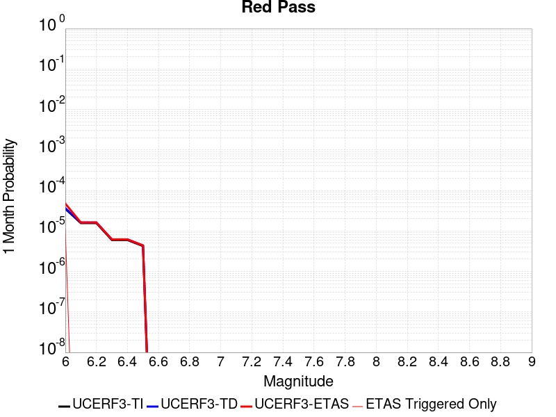 | 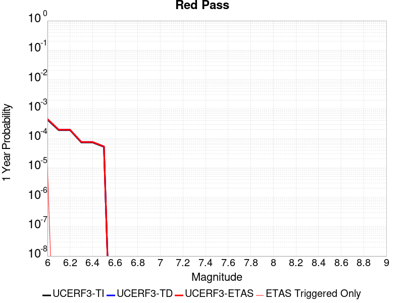 | 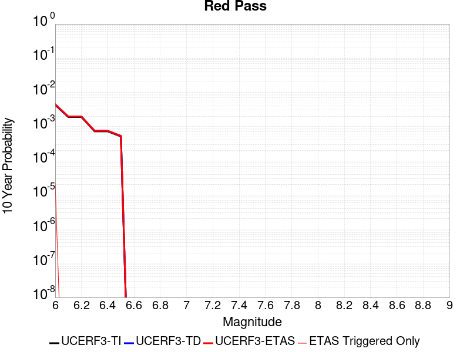 |

| Magnitude | 1 wk TI Prob | 1 wk TD Prob | 1 wk ETAS Prob | 1 wk ETAS/TD Gain | 1 wk ETAS Triggered Only | 1 mo TI Prob | 1 mo TD Prob | 1 mo ETAS Prob | 1 mo ETAS/TD Gain | 1 mo ETAS Triggered Only | 1 yr TI Prob | 1 yr TD Prob | 1 yr ETAS Prob | 1 yr ETAS/TD Gain | 1 yr ETAS Triggered Only | 10 yr TI Prob | 10 yr TD Prob | 10 yr ETAS Prob | 10 yr ETAS/TD Gain | 10 yr ETAS Triggered Only |
|-----|-----|-----|-----|-----|-----|-----|-----|-----|-----|-----|-----|-----|-----|-----|-----|-----|-----|-----|-----|-----|
| 6.0 | 8.258278E-6 | 8.5512565E-6 | 8.5512565E-6 | 1.0 | 0.0 | 3.539214E-5 | 3.664783E-5 | 4.749342E-5 | 1.2959409 | 1.0845987E-5 | 4.308141E-4 | 4.4611385E-4 | 4.56955E-4 | 1.0243013 | 1.0845987E-5 | 0.0042997985 | 0.004453941 | 0.004475536 | 1.0048486 | 2.1691974E-5 |
| 6.1 | 3.649988E-6 | 3.7753127E-6 | 3.7753127E-6 | 1.0 | 0.0 | 1.5642712E-5 | 1.6179838E-5 | 1.6179838E-5 | 1.0 | 0.0 | 1.9043336E-4 | 1.9697649E-4 | 1.9697649E-4 | 1.0 | 0.0 | 0.0019027026 | 0.0019684862 | 0.0019684862 | 1.0 | 0.0 |
| 6.2 | 3.649988E-6 | 3.7753127E-6 | 3.7753127E-6 | 1.0 | 0.0 | 1.5642712E-5 | 1.6179838E-5 | 1.6179838E-5 | 1.0 | 0.0 | 1.9043336E-4 | 1.9697649E-4 | 1.9697649E-4 | 1.0 | 0.0 | 0.0019027026 | 0.0019684862 | 0.0019684862 | 1.0 | 0.0 |
| 6.3 | 1.3924937E-6 | 1.4411153E-6 | 1.4411153E-6 | 1.0 | 0.0 | 5.9678164E-6 | 6.1762016E-6 | 6.1762016E-6 | 1.0 | 0.0 | 7.265574E-5 | 7.5194075E-5 | 7.5194075E-5 | 1.0 | 0.0 | 7.263199E-4 | 7.518251E-4 | 7.518251E-4 | 1.0 | 0.0 |
| 6.4 | 1.3924937E-6 | 1.4411153E-6 | 1.4411153E-6 | 1.0 | 0.0 | 5.9678164E-6 | 6.1762016E-6 | 6.1762016E-6 | 1.0 | 0.0 | 7.265574E-5 | 7.5194075E-5 | 7.5194075E-5 | 1.0 | 0.0 | 7.263199E-4 | 7.518251E-4 | 7.518251E-4 | 1.0 | 0.0 |
| 6.5 | 9.876812E-7 | 1.0221903E-6 | 1.0221903E-6 | 1.0 | 0.0 | 4.2329125E-6 | 4.3808154E-6 | 4.3808154E-6 | 1.0 | 0.0 | 5.153449E-5 | 5.333643E-5 | 5.333643E-5 | 1.0 | 0.0 | 5.1522546E-4 | 5.3336425E-4 | 5.3336425E-4 | 1.0 | 0.0 |

## Newport-Inglewood (Offshore)
*[(top)](#table-of-contents)*

| 1 Week | 1 Month | 1 Year | 10 Year |
|-----|-----|-----|-----|
|  |  |  |  |

| Magnitude | 1 wk TI Prob | 1 wk TD Prob | 1 wk ETAS Prob | 1 wk ETAS/TD Gain | 1 wk ETAS Triggered Only | 1 mo TI Prob | 1 mo TD Prob | 1 mo ETAS Prob | 1 mo ETAS/TD Gain | 1 mo ETAS Triggered Only | 1 yr TI Prob | 1 yr TD Prob | 1 yr ETAS Prob | 1 yr ETAS/TD Gain | 1 yr ETAS Triggered Only | 10 yr TI Prob | 10 yr TD Prob | 10 yr ETAS Prob | 10 yr ETAS/TD Gain | 10 yr ETAS Triggered Only |
|-----|-----|-----|-----|-----|-----|-----|-----|-----|-----|-----|-----|-----|-----|-----|-----|-----|-----|-----|-----|-----|
| 6.0 | 1.9626508E-5 | 1.896532E-5 | 1.896532E-5 | 1.0 | 0.0 | 8.411089E-5 | 8.127748E-5 | 8.127748E-5 | 1.0 | 0.0 | 0.001023569 | 9.891167E-4 | 9.891167E-4 | 1.0 | 0.0 | 0.010188672 | 0.009848485 | 0.009869963 | 1.0021809 | 2.1691974E-5 |
| 6.1 | 1.331886E-5 | 1.2218068E-5 | 1.2218068E-5 | 1.0 | 0.0 | 5.707958E-5 | 5.236211E-5 | 5.236211E-5 | 1.0 | 0.0 | 6.947222E-4 | 6.373237E-4 | 6.373237E-4 | 1.0 | 0.0 | 0.006925544 | 0.0063551366 | 0.006365914 | 1.0016958 | 1.0845987E-5 |
| 6.2 | 1.2250852E-5 | 1.10760075E-5 | 1.10760075E-5 | 1.0 | 0.0 | 5.2502597E-5 | 4.7467747E-5 | 4.7467747E-5 | 1.0 | 0.0 | 6.3903164E-4 | 5.7776755E-4 | 5.7776755E-4 | 1.0 | 0.0 | 0.006371971 | 0.0057627754 | 0.005773559 | 1.0018712 | 1.0845987E-5 |
| 6.3 | 1.2106258E-5 | 1.09188695E-5 | 1.09188695E-5 | 1.0 | 0.0 | 5.1882926E-5 | 4.679432E-5 | 4.679432E-5 | 1.0 | 0.0 | 6.3149154E-4 | 5.695729E-4 | 5.695729E-4 | 1.0 | 0.0 | 0.0062970007 | 0.0056812484 | 0.0056920326 | 1.0018983 | 1.0845987E-5 |
| 6.4 | 1.1348758E-5 | 1.0109342E-5 | 1.0109342E-5 | 1.0 | 0.0 | 4.8636626E-5 | 4.332504E-5 | 4.332504E-5 | 1.0 | 0.0 | 5.919901E-4 | 5.2735547E-4 | 5.2735547E-4 | 1.0 | 0.0 | 0.005904155 | 0.005261136 | 0.005271925 | 1.0020506 | 1.0845987E-5 |
| 6.5 | 1.100837E-5 | 9.74337E-6 | 9.74337E-6 | 1.0 | 0.0 | 4.7177873E-5 | 4.1756637E-5 | 4.1756637E-5 | 1.0 | 0.0 | 5.7423924E-4 | 5.0826924E-4 | 5.0826924E-4 | 1.0 | 0.0 | 0.005727576 | 0.005071159 | 0.005071159 | 1.0 | 0.0 |
| 6.6 | 1.0634696E-5 | 9.3455255E-6 | 9.3455255E-6 | 1.0 | 0.0 | 4.557647E-5 | 4.005164E-5 | 4.005164E-5 | 1.0 | 0.0 | 5.5475225E-4 | 4.8752036E-4 | 4.8752036E-4 | 1.0 | 0.0 | 0.0055336943 | 0.0048645954 | 0.0048645954 | 1.0 | 0.0 |
| 6.7 | 9.9780855E-6 | 8.667894E-6 | 8.667894E-6 | 1.0 | 0.0 | 4.276252E-5 | 3.714759E-5 | 3.714759E-5 | 1.0 | 0.0 | 5.205093E-4 | 4.5217876E-4 | 4.5217876E-4 | 1.0 | 0.0 | 0.0051929182 | 0.0045126663 | 0.0045126663 | 1.0 | 0.0 |
| 6.8 | 9.59546E-6 | 8.272935E-6 | 8.272935E-6 | 1.0 | 0.0 | 4.1122752E-5 | 3.5454956E-5 | 3.5454956E-5 | 1.0 | 0.0 | 5.0055445E-4 | 4.3157925E-4 | 4.3157925E-4 | 1.0 | 0.0 | 0.004994285 | 0.0043074866 | 0.0043074866 | 1.0 | 0.0 |
| 6.9 | 9.000614E-6 | 7.706825E-6 | 7.706825E-6 | 1.0 | 0.0 | 3.857349E-5 | 3.302884E-5 | 3.302884E-5 | 1.0 | 0.0 | 4.6953102E-4 | 4.0205254E-4 | 4.0205254E-4 | 1.0 | 0.0 | 0.004685402 | 0.004013323 | 0.004013323 | 1.0 | 0.0 |
| 7.0 | 7.4070194E-6 | 6.148893E-6 | 6.148893E-6 | 1.0 | 0.0 | 3.1743984E-5 | 2.6352134E-5 | 2.6352134E-5 | 1.0 | 0.0 | 3.8641447E-4 | 3.2079016E-4 | 3.2079016E-4 | 1.0 | 0.0 | 0.0038574322 | 0.0032032907 | 0.0032032907 | 1.0 | 0.0 |
| 7.1 | 6.299615E-6 | 5.056584E-6 | 5.056584E-6 | 1.0 | 0.0 | 2.699807E-5 | 2.1670896E-5 | 2.1670896E-5 | 1.0 | 0.0 | 3.2865192E-4 | 2.6381135E-4 | 2.6381135E-4 | 1.0 | 0.0 | 0.003281663 | 0.0026349965 | 0.0026349965 | 1.0 | 0.0 |
| 7.2 | 5.096653E-6 | 3.892762E-6 | 3.892762E-6 | 1.0 | 0.0 | 2.1842614E-5 | 1.668316E-5 | 1.668316E-5 | 1.0 | 0.0 | 2.6590136E-4 | 2.0309865E-4 | 2.0309865E-4 | 1.0 | 0.0 | 0.0026558342 | 0.0020291414 | 0.0020291414 | 1.0 | 0.0 |
| 7.3 | 3.9753018E-6 | 2.9099049E-6 | 2.9099049E-6 | 1.0 | 0.0 | 1.7036897E-5 | 1.2470961E-5 | 1.2470961E-5 | 1.0 | 0.0 | 2.0740448E-4 | 1.5182345E-4 | 1.5182345E-4 | 1.0 | 0.0 | 0.00207211 | 0.0015172054 | 0.0015172054 | 1.0 | 0.0 |
| 7.4 | 3.0568392E-6 | 2.1449912E-6 | 2.1449912E-6 | 1.0 | 0.0 | 1.3100675E-5 | 9.192787E-6 | 9.192787E-6 | 1.0 | 0.0 | 1.5948903E-4 | 1.11916495E-4 | 1.11916495E-4 | 1.0 | 0.0 | 0.0015937461 | 0.0011186076 | 0.0011186076 | 1.0 | 0.0 |
| 7.5 | 1.7279019E-6 | 1.1469856E-6 | 1.1469856E-6 | 1.0 | 0.0 | 7.405273E-6 | 4.9156433E-6 | 4.9156433E-6 | 1.0 | 0.0 | 9.015547E-5 | 5.9846356E-5 | 5.9846356E-5 | 1.0 | 0.0 | 9.01189E-4 | 5.9830624E-4 | 5.9830624E-4 | 1.0 | 0.0 |
| 7.6 | 1.1156416E-6 | 7.222994E-7 | 7.222994E-7 | 1.0 | 0.0 | 4.7813123E-6 | 3.0955653E-6 | 3.0955653E-6 | 1.0 | 0.0 | 5.821092E-5 | 3.7687878E-5 | 3.7687878E-5 | 1.0 | 0.0 | 5.8195676E-4 | 3.7681722E-4 | 3.7681722E-4 | 1.0 | 0.0 |
| 7.7 | 9.117973E-8 | 6.734136E-8 | 6.734136E-8 | 1.0 | 0.0 | 3.907702E-7 | 2.886058E-7 | 2.886058E-7 | 1.0 | 0.0 | 4.757617E-6 | 3.5137703E-6 | 3.5137703E-6 | 1.0 | 0.0 | 4.7575148E-5 | 3.513718E-5 | 3.513718E-5 | 1.0 | 0.0 |

## San Andreas (Big Bend)
*[(top)](#table-of-contents)*

| 1 Week | 1 Month | 1 Year | 10 Year |
|-----|-----|-----|-----|
|  |  |  |  |

| Magnitude | 1 wk TI Prob | 1 wk TD Prob | 1 wk ETAS Prob | 1 wk ETAS/TD Gain | 1 wk ETAS Triggered Only | 1 mo TI Prob | 1 mo TD Prob | 1 mo ETAS Prob | 1 mo ETAS/TD Gain | 1 mo ETAS Triggered Only | 1 yr TI Prob | 1 yr TD Prob | 1 yr ETAS Prob | 1 yr ETAS/TD Gain | 1 yr ETAS Triggered Only | 10 yr TI Prob | 10 yr TD Prob | 10 yr ETAS Prob | 10 yr ETAS/TD Gain | 10 yr ETAS Triggered Only |
|-----|-----|-----|-----|-----|-----|-----|-----|-----|-----|-----|-----|-----|-----|-----|-----|-----|-----|-----|-----|-----|
| 6.0 | 1.0179969E-4 | 2.0070563E-4 | 2.2239325E-4 | 1.1080569 | 2.1691974E-5 | 4.362114E-4 | 8.598845E-4 | 8.8155776E-4 | 1.0252049 | 2.1691974E-5 | 0.0052979486 | 0.010419123 | 0.010440589 | 1.0020603 | 2.1691974E-5 | 0.051734097 | 0.10144164 | 0.10146113 | 1.0001922 | 2.1691974E-5 |
| 6.1 | 1.0179969E-4 | 2.0070563E-4 | 2.2239325E-4 | 1.1080569 | 2.1691974E-5 | 4.362114E-4 | 8.598845E-4 | 8.8155776E-4 | 1.0252049 | 2.1691974E-5 | 0.0052979486 | 0.010419123 | 0.010440589 | 1.0020603 | 2.1691974E-5 | 0.051734097 | 0.10144164 | 0.10146113 | 1.0001922 | 2.1691974E-5 |
| 6.2 | 1.0179969E-4 | 2.0070563E-4 | 2.2239325E-4 | 1.1080569 | 2.1691974E-5 | 4.362114E-4 | 8.598845E-4 | 8.8155776E-4 | 1.0252049 | 2.1691974E-5 | 0.0052979486 | 0.010419123 | 0.010440589 | 1.0020603 | 2.1691974E-5 | 0.051734097 | 0.10144164 | 0.10146113 | 1.0001922 | 2.1691974E-5 |
| 6.3 | 1.0179969E-4 | 2.0070563E-4 | 2.2239325E-4 | 1.1080569 | 2.1691974E-5 | 4.362114E-4 | 8.598845E-4 | 8.8155776E-4 | 1.0252049 | 2.1691974E-5 | 0.0052979486 | 0.010419123 | 0.010440589 | 1.0020603 | 2.1691974E-5 | 0.051734097 | 0.10144164 | 0.10146113 | 1.0001922 | 2.1691974E-5 |
| 6.4 | 9.1639464E-5 | 1.842787E-4 | 2.0596667E-4 | 1.1176912 | 2.1691974E-5 | 3.9268145E-4 | 7.89527E-4 | 8.1120187E-4 | 1.027453 | 2.1691974E-5 | 0.0047704205 | 0.009570243 | 0.0095917275 | 1.002245 | 2.1691974E-5 | 0.046693064 | 0.09376797 | 0.09378763 | 1.0002097 | 2.1691974E-5 |
| 6.5 | 9.1639464E-5 | 1.842787E-4 | 2.0596667E-4 | 1.1176912 | 2.1691974E-5 | 3.9268145E-4 | 7.89527E-4 | 8.1120187E-4 | 1.027453 | 2.1691974E-5 | 0.0047704205 | 0.009570243 | 0.0095917275 | 1.002245 | 2.1691974E-5 | 0.046693064 | 0.09376797 | 0.09378763 | 1.0002097 | 2.1691974E-5 |
| 6.6 | 9.042622E-5 | 1.8234932E-4 | 2.0403734E-4 | 1.1189367 | 2.1691974E-5 | 3.8748336E-4 | 7.812632E-4 | 8.0293824E-4 | 1.0277436 | 2.1691974E-5 | 0.0047074095 | 0.009470508 | 0.009491995 | 1.0022688 | 2.1691974E-5 | 0.046089325 | 0.09286199 | 0.092881665 | 1.000212 | 2.1691974E-5 |
| 6.7 | 8.9836685E-5 | 1.814927E-4 | 2.0318074E-4 | 1.1194981 | 2.1691974E-5 | 3.8495753E-4 | 7.7759416E-4 | 7.992693E-4 | 1.0278746 | 2.1691974E-5 | 0.00467679 | 0.009426224 | 0.0094477115 | 1.0022795 | 2.1691974E-5 | 0.045795817 | 0.09245627 | 0.09247595 | 1.0002129 | 2.1691974E-5 |
| 6.8 | 8.9471854E-5 | 1.8096055E-4 | 2.0264859E-4 | 1.1198496 | 2.1691974E-5 | 3.8339442E-4 | 7.7531487E-4 | 7.9699E-4 | 1.0279566 | 2.1691974E-5 | 0.004657841 | 0.009398713 | 0.009420201 | 1.0022863 | 2.1691974E-5 | 0.04561414 | 0.092203476 | 0.09222317 | 1.0002136 | 2.1691974E-5 |
| 6.9 | 8.858234E-5 | 1.797803E-4 | 2.0146837E-4 | 1.1206366 | 2.1691974E-5 | 3.7958333E-4 | 7.7025965E-4 | 7.919349E-4 | 1.0281402 | 2.1691974E-5 | 0.004611638 | 0.009337694 | 0.009359184 | 1.0023013 | 2.1691974E-5 | 0.04517103 | 0.0916436 | 0.09166331 | 1.000215 | 2.1691974E-5 |
| 7.0 | 8.7433385E-5 | 1.7816834E-4 | 1.9985644E-4 | 1.1217282 | 2.1691974E-5 | 3.746607E-4 | 7.633553E-4 | 7.850307E-4 | 1.0283949 | 2.1691974E-5 | 0.004551957 | 0.009254351 | 0.009275842 | 1.0023223 | 2.1691974E-5 | 0.044598386 | 0.090878054 | 0.090897776 | 1.000217 | 2.1691974E-5 |
| 7.1 | 8.684964E-5 | 1.7728789E-4 | 1.9897602E-4 | 1.1223328 | 2.1691974E-5 | 3.7215967E-4 | 7.595842E-4 | 7.8125973E-4 | 1.028536 | 2.1691974E-5 | 0.0045216335 | 0.009208827 | 0.009230319 | 1.0023339 | 2.1691974E-5 | 0.04430731 | 0.09045961 | 0.090479344 | 1.0002182 | 2.1691974E-5 |
| 7.2 | 8.606521E-5 | 1.7619408E-4 | 1.9788223E-4 | 1.1230924 | 2.1691974E-5 | 3.6879873E-4 | 7.548991E-4 | 7.765747E-4 | 1.0287132 | 2.1691974E-5 | 0.0044808835 | 0.009152266 | 0.00917376 | 1.0023484 | 2.1691974E-5 | 0.043916024 | 0.08994013 | 0.08995987 | 1.0002195 | 2.1691974E-5 |
| 7.3 | 8.568266E-5 | 1.7561417E-4 | 1.9730233E-4 | 1.1234989 | 2.1691974E-5 | 3.6715972E-4 | 7.524153E-4 | 7.7409094E-4 | 1.0288081 | 2.1691974E-5 | 0.0044610105 | 0.0091222795 | 0.0091437735 | 1.0023562 | 2.1691974E-5 | 0.043725148 | 0.0896613 | 0.089681044 | 1.0002203 | 2.1691974E-5 |
| 7.4 | 8.5432206E-5 | 1.7524007E-4 | 1.9692825E-4 | 1.1237626 | 2.1691974E-5 | 3.6608664E-4 | 7.508129E-4 | 7.724886E-4 | 1.0288696 | 2.1691974E-5 | 0.004447999 | 0.009102933 | 0.009124428 | 1.0023613 | 2.1691974E-5 | 0.043600157 | 0.08948149 | 0.08950124 | 1.0002208 | 2.1691974E-5 |
| 7.5 | 8.4791965E-5 | 1.7393343E-4 | 1.9562163E-4 | 1.1246926 | 2.1691974E-5 | 3.633435E-4 | 7.452162E-4 | 7.66892E-4 | 1.0290866 | 2.1691974E-5 | 0.0044147377 | 0.009035361 | 0.009056857 | 1.0023791 | 2.1691974E-5 | 0.043280575 | 0.08885915 | 0.08887891 | 1.0002224 | 2.1691974E-5 |
| 7.6 | 8.241105E-5 | 1.68388E-4 | 1.9007632E-4 | 1.1287997 | 2.1691974E-5 | 3.531424E-4 | 7.2146347E-4 | 7.4313977E-4 | 1.0300449 | 2.1691974E-5 | 0.0042910352 | 0.0087485295 | 0.008770031 | 1.0024579 | 2.1691974E-5 | 0.042091176 | 0.086236194 | 0.08625601 | 1.0002298 | 2.1691974E-5 |
| 7.7 | 7.00432E-5 | 1.4203055E-4 | 1.52875E-4 | 1.076353 | 1.0845987E-5 | 3.001506E-4 | 6.085604E-4 | 6.1939977E-4 | 1.0178115 | 1.0845987E-5 | 0.0036482112 | 0.0073840916 | 0.0073948572 | 1.0014579 | 1.0845987E-5 | 0.035888977 | 0.07351081 | 0.07352086 | 1.0001367 | 1.0845987E-5 |
| 7.8 | 6.415362E-5 | 1.2967631E-4 | 1.4052087E-4 | 1.083628 | 1.0845987E-5 | 2.749151E-4 | 5.5563723E-4 | 5.664772E-4 | 1.0195091 | 1.0845987E-5 | 0.0033419547 | 0.00674393 | 0.006754703 | 1.0015974 | 1.0845987E-5 | 0.03292141 | 0.067246385 | 0.0672565 | 1.0001504 | 1.0845987E-5 |
| 7.9 | 4.939911E-5 | 9.340218E-5 | 9.340218E-5 | 1.0 | 0.0 | 2.116933E-4 | 4.0023366E-4 | 4.0023366E-4 | 1.0 | 0.0 | 0.0025743195 | 0.0048619667 | 0.0048619667 | 1.0 | 0.0 | 0.025447013 | 0.04891005 | 0.04891005 | 1.0 | 0.0 |
| 8.0 | 3.344983E-5 | 5.222126E-5 | 5.222126E-5 | 1.0 | 0.0 | 1.4334853E-4 | 2.2378622E-4 | 2.2378622E-4 | 1.0 | 0.0 | 0.0017438711 | 0.0027211946 | 0.0027211946 | 1.0 | 0.0 | 0.017302496 | 0.027919443 | 0.027919443 | 1.0 | 0.0 |
| 8.1 | 1.9104898E-5 | 1.917038E-5 | 1.917038E-5 | 1.0 | 0.0 | 8.1875565E-5 | 8.215619E-5 | 8.215619E-5 | 1.0 | 0.0 | 9.963791E-4 | 9.997933E-4 | 9.997933E-4 | 1.0 | 0.0 | 0.009919235 | 0.010748395 | 0.010748395 | 1.0 | 0.0 |
| 8.2 | 8.643924E-6 | 5.4738607E-6 | 5.4738607E-6 | 1.0 | 0.0 | 3.704486E-5 | 2.3459192E-5 | 2.3459192E-5 | 1.0 | 0.0 | 4.5092785E-4 | 2.855783E-4 | 2.855783E-4 | 1.0 | 0.0 | 0.0045001395 | 0.0032481598 | 0.0032481598 | 1.0 | 0.0 |
| 8.3 | 1.983087E-6 | 7.658221E-7 | 7.658221E-7 | 1.0 | 0.0 | 8.498917E-6 | 3.2820906E-6 | 3.2820906E-6 | 1.0 | 0.0 | 1.034694E-4 | 3.9958737E-5 | 3.9958737E-5 | 1.0 | 0.0 | 0.0010342124 | 4.7187202E-4 | 4.7187202E-4 | 1.0 | 0.0 |

## Johnson Valley (No) 2011 rev
*[(top)](#table-of-contents)*

| 1 Week | 1 Month | 1 Year | 10 Year |
|-----|-----|-----|-----|
|  |  |  |  |

| Magnitude | 1 wk TI Prob | 1 wk TD Prob | 1 wk ETAS Prob | 1 wk ETAS/TD Gain | 1 wk ETAS Triggered Only | 1 mo TI Prob | 1 mo TD Prob | 1 mo ETAS Prob | 1 mo ETAS/TD Gain | 1 mo ETAS Triggered Only | 1 yr TI Prob | 1 yr TD Prob | 1 yr ETAS Prob | 1 yr ETAS/TD Gain | 1 yr ETAS Triggered Only | 10 yr TI Prob | 10 yr TD Prob | 10 yr ETAS Prob | 10 yr ETAS/TD Gain | 10 yr ETAS Triggered Only |
|-----|-----|-----|-----|-----|-----|-----|-----|-----|-----|-----|-----|-----|-----|-----|-----|-----|-----|-----|-----|-----|
| 6.0 | 2.577707E-5 | 1.2900895E-5 | 1.2900895E-5 | 1.0 | 0.0 | 1.1046848E-4 | 5.52886E-5 | 5.52886E-5 | 1.0 | 0.0 | 0.0013441239 | 6.7297055E-4 | 6.7297055E-4 | 1.0 | 0.0 | 0.013360229 | 0.006713235 | 0.0067347814 | 1.0032096 | 2.1691974E-5 |
| 6.1 | 2.577707E-5 | 1.2900895E-5 | 1.2900895E-5 | 1.0 | 0.0 | 1.1046848E-4 | 5.52886E-5 | 5.52886E-5 | 1.0 | 0.0 | 0.0013441239 | 6.7297055E-4 | 6.7297055E-4 | 1.0 | 0.0 | 0.013360229 | 0.006713235 | 0.0067347814 | 1.0032096 | 2.1691974E-5 |
| 6.2 | 2.577707E-5 | 1.2900895E-5 | 1.2900895E-5 | 1.0 | 0.0 | 1.1046848E-4 | 5.52886E-5 | 5.52886E-5 | 1.0 | 0.0 | 0.0013441239 | 6.7297055E-4 | 6.7297055E-4 | 1.0 | 0.0 | 0.013360229 | 0.006713235 | 0.0067347814 | 1.0032096 | 2.1691974E-5 |
| 6.3 | 2.577707E-5 | 1.2900895E-5 | 1.2900895E-5 | 1.0 | 0.0 | 1.1046848E-4 | 5.52886E-5 | 5.52886E-5 | 1.0 | 0.0 | 0.0013441239 | 6.7297055E-4 | 6.7297055E-4 | 1.0 | 0.0 | 0.013360229 | 0.006713235 | 0.0067347814 | 1.0032096 | 2.1691974E-5 |
| 6.4 | 1.5296591E-5 | 7.536715E-6 | 7.536715E-6 | 1.0 | 0.0 | 6.555518E-5 | 3.229991E-5 | 3.229991E-5 | 1.0 | 0.0 | 7.97842E-4 | 3.9319924E-4 | 3.9319924E-4 | 1.0 | 0.0 | 0.007949836 | 0.0039268765 | 0.00393768 | 1.0027511 | 1.0845987E-5 |
| 6.5 | 1.5296591E-5 | 7.536715E-6 | 7.536715E-6 | 1.0 | 0.0 | 6.555518E-5 | 3.229991E-5 | 3.229991E-5 | 1.0 | 0.0 | 7.97842E-4 | 3.9319924E-4 | 3.9319924E-4 | 1.0 | 0.0 | 0.007949836 | 0.0039268765 | 0.00393768 | 1.0027511 | 1.0845987E-5 |
| 6.6 | 1.3289383E-5 | 5.991708E-6 | 5.991708E-6 | 1.0 | 0.0 | 5.6953253E-5 | 2.5678592E-5 | 2.5678592E-5 | 1.0 | 0.0 | 6.9318525E-4 | 3.1260896E-4 | 3.1260896E-4 | 1.0 | 0.0 | 0.0069102696 | 0.0031233565 | 0.0031233565 | 1.0 | 0.0 |
| 6.7 | 1.3289383E-5 | 5.991708E-6 | 5.991708E-6 | 1.0 | 0.0 | 5.6953253E-5 | 2.5678592E-5 | 2.5678592E-5 | 1.0 | 0.0 | 6.9318525E-4 | 3.1260896E-4 | 3.1260896E-4 | 1.0 | 0.0 | 0.0069102696 | 0.0031233565 | 0.0031233565 | 1.0 | 0.0 |
| 6.8 | 8.330789E-6 | 2.9211749E-6 | 2.9211749E-6 | 1.0 | 0.0 | 3.570289E-5 | 1.2519293E-5 | 1.2519293E-5 | 1.0 | 0.0 | 4.34596E-4 | 1.5241744E-4 | 1.5241744E-4 | 1.0 | 0.0 | 0.0043374705 | 0.0015236889 | 0.0015236889 | 1.0 | 0.0 |
| 6.9 | 7.2359003E-6 | 2.3013124E-6 | 2.3013124E-6 | 1.0 | 0.0 | 3.1010633E-5 | 9.86276E-6 | 9.86276E-6 | 1.0 | 0.0 | 3.7748902E-4 | 1.2007781E-4 | 1.2007781E-4 | 1.0 | 0.0 | 0.0037684843 | 0.0012006522 | 0.0012006522 | 1.0 | 0.0 |
| 7.0 | 6.5149957E-6 | 2.0884709E-6 | 2.0884709E-6 | 1.0 | 0.0 | 2.792111E-5 | 8.950588E-6 | 8.950588E-6 | 1.0 | 0.0 | 3.398865E-4 | 1.0897326E-4 | 1.0897326E-4 | 1.0 | 0.0 | 0.003393671 | 0.001089718 | 0.001089718 | 1.0 | 0.0 |
| 7.1 | 1.1662233E-6 | 2.8801654E-8 | 2.8801654E-8 | 1.0 | 0.0 | 4.9980904E-6 | 1.2343565E-7 | 1.2343565E-7 | 1.0 | 0.0 | 6.0850052E-5 | 1.5028284E-6 | 1.5028284E-6 | 1.0 | 0.0 | 6.083339E-4 | 1.5028198E-5 | 1.5028198E-5 | 1.0 | 0.0 |
| 7.2 | 5.413881E-7 | 2.8801654E-8 | 2.8801654E-8 | 1.0 | 0.0 | 2.3202326E-6 | 1.2343565E-7 | 1.2343565E-7 | 1.0 | 0.0 | 2.8248465E-5 | 1.5028284E-6 | 1.5028284E-6 | 1.0 | 0.0 | 2.8244875E-4 | 1.5028198E-5 | 1.5028198E-5 | 1.0 | 0.0 |
| 7.3 | 5.076821E-7 | 2.8801654E-8 | 2.8801654E-8 | 1.0 | 0.0 | 2.1757785E-6 | 1.2343565E-7 | 1.2343565E-7 | 1.0 | 0.0 | 2.648978E-5 | 1.5028282E-6 | 1.5028282E-6 | 1.0 | 0.0 | 2.6486625E-4 | 1.5028198E-5 | 1.5028198E-5 | 1.0 | 0.0 |
| 7.4 | 4.7568687E-7 | 2.878358E-8 | 2.878358E-8 | 1.0 | 0.0 | 2.0386565E-6 | 1.2335819E-7 | 1.2335819E-7 | 1.0 | 0.0 | 2.482036E-5 | 1.5018852E-6 | 1.5018852E-6 | 1.0 | 0.0 | 2.4817587E-4 | 1.5018766E-5 | 1.5018766E-5 | 1.0 | 0.0 |
| 7.5 | 3.435626E-7 | 2.535737E-8 | 2.535737E-8 | 1.0 | 0.0 | 1.4724103E-6 | 1.08674435E-7 | 1.08674435E-7 | 1.0 | 0.0 | 1.7926448E-5 | 1.3231106E-6 | 1.3231106E-6 | 1.0 | 0.0 | 1.7925001E-4 | 1.3231043E-5 | 1.3231043E-5 | 1.0 | 0.0 |

## Rodgers Creek - Healdsburg 2011 CFM
*[(top)](#table-of-contents)*

| 1 Week | 1 Month | 1 Year | 10 Year |
|-----|-----|-----|-----|
|  |  |  |  |

| Magnitude | 1 wk TI Prob | 1 wk TD Prob | 1 wk ETAS Prob | 1 wk ETAS/TD Gain | 1 wk ETAS Triggered Only | 1 mo TI Prob | 1 mo TD Prob | 1 mo ETAS Prob | 1 mo ETAS/TD Gain | 1 mo ETAS Triggered Only | 1 yr TI Prob | 1 yr TD Prob | 1 yr ETAS Prob | 1 yr ETAS/TD Gain | 1 yr ETAS Triggered Only | 10 yr TI Prob | 10 yr TD Prob | 10 yr ETAS Prob | 10 yr ETAS/TD Gain | 10 yr ETAS Triggered Only |
|-----|-----|-----|-----|-----|-----|-----|-----|-----|-----|-----|-----|-----|-----|-----|-----|-----|-----|-----|-----|-----|
| 6.0 | 7.390182E-5 | 1.3136453E-4 | 1.422091E-4 | 1.0825531 | 1.0845987E-5 | 3.1668364E-4 | 5.628657E-4 | 5.737056E-4 | 1.0192584 | 1.0845987E-5 | 0.0038488081 | 0.0068313405 | 0.006842112 | 1.0015768 | 1.0845987E-5 | 0.037828278 | 0.06619032 | 0.066210575 | 1.000306 | 2.1691974E-5 |
| 6.1 | 7.318768E-5 | 1.3034418E-4 | 1.4118875E-4 | 1.0831995 | 1.0845987E-5 | 3.1362378E-4 | 5.5849546E-4 | 5.693354E-4 | 1.0194092 | 1.0845987E-5 | 0.0038116854 | 0.0067785126 | 0.006789285 | 1.0015892 | 1.0845987E-5 | 0.037469655 | 0.065694936 | 0.0657152 | 1.0003085 | 2.1691974E-5 |
| 6.2 | 7.1379836E-5 | 1.272728E-4 | 1.381174E-4 | 1.0852076 | 1.0845987E-5 | 3.058777E-4 | 5.4533797E-4 | 5.5617804E-4 | 1.0198777 | 1.0845987E-5 | 0.003717703 | 0.006619302 | 0.006630076 | 1.0016277 | 1.0845987E-5 | 0.0365612 | 0.06421317 | 0.06423347 | 1.0003161 | 2.1691974E-5 |
| 6.3 | 6.9255926E-5 | 1.238175E-4 | 1.3466214E-4 | 1.0875857 | 1.0845987E-5 | 2.9677735E-4 | 5.3053896E-4 | 5.413792E-4 | 1.0204325 | 1.0845987E-5 | 0.0036072785 | 0.0064402153 | 0.006450991 | 1.0016732 | 1.0845987E-5 | 0.035492823 | 0.062539525 | 0.06255986 | 1.0003252 | 2.1691974E-5 |
| 6.4 | 6.6757144E-5 | 1.19584445E-4 | 1.3042914E-4 | 1.0906864 | 1.0845987E-5 | 2.8607066E-4 | 5.124045E-4 | 5.232449E-4 | 1.021156 | 1.0845987E-5 | 0.0034773487 | 0.006220751 | 0.0062315296 | 1.0017327 | 1.0845987E-5 | 0.034234364 | 0.06048879 | 0.06050917 | 1.0003369 | 2.1691974E-5 |
| 6.5 | 6.5735134E-5 | 1.1807744E-4 | 1.2892215E-4 | 1.091844 | 1.0845987E-5 | 2.8169158E-4 | 5.0594844E-4 | 5.16789E-4 | 1.0214261 | 1.0845987E-5 | 0.003424202 | 0.0061426107 | 0.0061533903 | 1.0017549 | 1.0845987E-5 | 0.03371918 | 0.059753712 | 0.05977411 | 1.0003413 | 2.1691974E-5 |
| 6.6 | 6.289601E-5 | 1.1343506E-4 | 1.2427982E-4 | 1.0956032 | 1.0845987E-5 | 2.6952647E-4 | 4.8606007E-4 | 4.9690076E-4 | 1.0223032 | 1.0845987E-5 | 0.0032765474 | 0.005901805 | 0.005912587 | 1.0018269 | 1.0845987E-5 | 0.032286562 | 0.057493072 | 0.057513516 | 1.0003556 | 2.1691974E-5 |
| 6.7 | 6.115274E-5 | 1.10606E-4 | 1.2145079E-4 | 1.0980488 | 1.0845987E-5 | 2.6205686E-4 | 4.7393996E-4 | 4.8478082E-4 | 1.0228739 | 1.0845987E-5 | 0.0031858748 | 0.0057550315 | 0.0057658153 | 1.0018737 | 1.0845987E-5 | 0.031405866 | 0.05611157 | 0.056132045 | 1.0003649 | 2.1691974E-5 |
| 6.8 | 5.9232367E-5 | 1.07279506E-4 | 1.1812433E-4 | 1.1010895 | 1.0845987E-5 | 2.538283E-4 | 4.5968866E-4 | 4.7052966E-4 | 1.0235834 | 1.0845987E-5 | 0.0030859804 | 0.005582424 | 0.0055932095 | 1.001932 | 1.0845987E-5 | 0.030434765 | 0.054478336 | 0.054498848 | 1.0003765 | 2.1691974E-5 |
| 6.9 | 5.4030377E-5 | 9.822156E-5 | 1.09066474E-4 | 1.1104128 | 1.0845987E-5 | 2.315382E-4 | 4.2088193E-4 | 4.3172337E-4 | 1.0257589 | 1.0845987E-5 | 0.0028153337 | 0.005112264 | 0.0051230546 | 1.0021107 | 1.0845987E-5 | 0.027799325 | 0.050013777 | 0.05002408 | 1.000206 | 1.0845987E-5 |
| 7.0 | 4.8260714E-5 | 8.740243E-5 | 9.8247474E-5 | 1.1240816 | 1.0845987E-5 | 2.0681522E-4 | 3.7452838E-4 | 3.853703E-4 | 1.0289482 | 1.0845987E-5 | 0.0025150678 | 0.0045504034 | 0.0045612003 | 1.0023726 | 1.0845987E-5 | 0.024867928 | 0.04466631 | 0.04467667 | 1.000232 | 1.0845987E-5 |
| 7.1 | 4.0294493E-5 | 7.3887684E-5 | 8.473287E-5 | 1.1467793 | 1.0845987E-5 | 1.7267925E-4 | 3.1662328E-4 | 3.2746582E-4 | 1.0342443 | 1.0845987E-5 | 0.0021003427 | 0.0038481127 | 0.003858917 | 1.0028076 | 1.0845987E-5 | 0.02080602 | 0.037922062 | 0.037932497 | 1.0002751 | 1.0845987E-5 |
| 7.2 | 3.096388E-5 | 5.6974885E-5 | 6.782025E-5 | 1.1903535 | 1.0845987E-5 | 1.326956E-4 | 2.4415535E-4 | 2.5499868E-4 | 1.0444117 | 1.0845987E-5 | 0.0016143717 | 0.0029685611 | 0.002979375 | 1.0036428 | 1.0845987E-5 | 0.01602694 | 0.0294357 | 0.029446227 | 1.0003576 | 1.0845987E-5 |
| 7.3 | 2.3615226E-5 | 4.362551E-5 | 4.362551E-5 | 1.0 | 0.0 | 1.0120418E-4 | 1.8695316E-4 | 1.8695316E-4 | 1.0 | 0.0 | 0.0012314644 | 0.0022737922 | 0.0022737922 | 1.0 | 0.0 | 0.0122466255 | 0.022635758 | 0.022635758 | 1.0 | 0.0 |
| 7.4 | 1.8251132E-5 | 3.3538727E-5 | 3.3538727E-5 | 1.0 | 0.0 | 7.821679E-5 | 1.4372953E-4 | 1.4372953E-4 | 1.0 | 0.0 | 9.518733E-4 | 0.0017485124 | 0.0017485124 | 1.0 | 0.0 | 0.009478063 | 0.01746438 | 0.01746438 | 1.0 | 0.0 |
| 7.5 | 1.2411432E-5 | 2.2457984E-5 | 2.2457984E-5 | 1.0 | 0.0 | 5.3190768E-5 | 9.6244985E-5 | 9.6244985E-5 | 1.0 | 0.0 | 6.4740516E-4 | 0.0011711585 | 0.0011711585 | 1.0 | 0.0 | 0.006455223 | 0.011742254 | 0.011742254 | 1.0 | 0.0 |
| 7.6 | 4.4771446E-6 | 8.082332E-6 | 8.082332E-6 | 1.0 | 0.0 | 1.918762E-5 | 3.4638113E-5 | 3.4638113E-5 | 1.0 | 0.0 | 2.3358424E-4 | 4.2163866E-4 | 4.2163866E-4 | 1.0 | 0.0 | 0.0023333887 | 0.004245222 | 0.004245222 | 1.0 | 0.0 |
| 7.7 | 2.157941E-7 | 3.5346937E-7 | 3.5346937E-7 | 1.0 | 0.0 | 9.248315E-7 | 1.5148678E-6 | 1.5148678E-6 | 1.0 | 0.0 | 1.1259765E-5 | 1.844336E-5 | 1.844336E-5 | 1.0 | 0.0 | 1.1259195E-4 | 1.906797E-4 | 1.906797E-4 | 1.0 | 0.0 |
| 7.8 | 9.9623286E-8 | 1.9897946E-7 | 1.9897946E-7 | 1.0 | 0.0 | 4.269569E-7 | 8.5276884E-7 | 8.5276884E-7 | 1.0 | 0.0 | 5.1981874E-6 | 1.0382411E-5 | 1.0382411E-5 | 1.0 | 0.0 | 5.198066E-5 | 1.0900968E-4 | 1.0900968E-4 | 1.0 | 0.0 |
| 7.9 | 5.6745257E-8 | 1.1772768E-7 | 1.1772768E-7 | 1.0 | 0.0 | 2.4319394E-7 | 5.045471E-7 | 5.045471E-7 | 1.0 | 0.0 | 2.960882E-6 | 6.1428436E-6 | 6.1428436E-6 | 1.0 | 0.0 | 2.9608427E-5 | 6.470346E-5 | 6.470346E-5 | 1.0 | 0.0 |
| 8.0 | 2.8614323E-8 | 6.577827E-8 | 6.577827E-8 | 1.0 | 0.0 | 1.2263281E-7 | 2.8190686E-7 | 2.8190686E-7 | 1.0 | 0.0 | 1.4930534E-6 | 3.4322109E-6 | 3.4322109E-6 | 1.0 | 0.0 | 1.4930434E-5 | 3.5822894E-5 | 3.5822894E-5 | 1.0 | 0.0 |
| 8.1 | 3.5045191E-9 | 8.964996E-9 | 8.964996E-9 | 1.0 | 0.0 | 1.5019367E-8 | 3.8421412E-8 | 3.8421412E-8 | 1.0 | 0.0 | 1.8286079E-7 | 4.677806E-7 | 4.677806E-7 | 1.0 | 0.0 | 1.8286064E-6 | 4.8324237E-6 | 4.8324237E-6 | 1.0 | 0.0 |

## Shoreline
*[(top)](#table-of-contents)*

| 1 Week | 1 Month | 1 Year | 10 Year |
|-----|-----|-----|-----|
|  |  |  |  |

| Magnitude | 1 wk TI Prob | 1 wk TD Prob | 1 wk ETAS Prob | 1 wk ETAS/TD Gain | 1 wk ETAS Triggered Only | 1 mo TI Prob | 1 mo TD Prob | 1 mo ETAS Prob | 1 mo ETAS/TD Gain | 1 mo ETAS Triggered Only | 1 yr TI Prob | 1 yr TD Prob | 1 yr ETAS Prob | 1 yr ETAS/TD Gain | 1 yr ETAS Triggered Only | 10 yr TI Prob | 10 yr TD Prob | 10 yr ETAS Prob | 10 yr ETAS/TD Gain | 10 yr ETAS Triggered Only |
|-----|-----|-----|-----|-----|-----|-----|-----|-----|-----|-----|-----|-----|-----|-----|-----|-----|-----|-----|-----|-----|
| 6.0 | 3.9888673E-6 | 4.047926E-6 | 2.5739811E-5 | 6.3587656 | 2.1691974E-5 | 1.7095033E-5 | 1.734817E-5 | 3.903977E-5 | 2.250368 | 2.1691974E-5 | 2.0811215E-4 | 2.1119909E-4 | 2.3288648E-4 | 1.102687 | 2.1691974E-5 | 0.0020791737 | 0.0021105325 | 0.0021321787 | 1.0102563 | 2.1691974E-5 |
| 6.1 | 3.9888673E-6 | 4.047926E-6 | 2.5739811E-5 | 6.3587656 | 2.1691974E-5 | 1.7095033E-5 | 1.734817E-5 | 3.903977E-5 | 2.250368 | 2.1691974E-5 | 2.0811215E-4 | 2.1119909E-4 | 2.3288648E-4 | 1.102687 | 2.1691974E-5 | 0.0020791737 | 0.0021105325 | 0.0021321787 | 1.0102563 | 2.1691974E-5 |
| 6.2 | 1.4039653E-6 | 1.4100874E-6 | 2.3102031E-5 | 16.383404 | 2.1691974E-5 | 6.0169805E-6 | 6.043218E-6 | 2.7735061E-5 | 4.5894523 | 2.1691974E-5 | 7.325427E-5 | 7.3573756E-5 | 9.5264135E-5 | 1.2948114 | 2.1691974E-5 | 7.3230127E-4 | 7.3549995E-4 | 7.5717596E-4 | 1.0294712 | 2.1691974E-5 |
| 6.3 | 1.4039653E-6 | 1.4100874E-6 | 2.3102031E-5 | 16.383404 | 2.1691974E-5 | 6.0169805E-6 | 6.043218E-6 | 2.7735061E-5 | 4.5894523 | 2.1691974E-5 | 7.325427E-5 | 7.3573756E-5 | 9.5264135E-5 | 1.2948114 | 2.1691974E-5 | 7.3230127E-4 | 7.3549995E-4 | 7.5717596E-4 | 1.0294712 | 2.1691974E-5 |
| 6.4 | 1.3314152E-6 | 1.3361588E-6 | 2.3028104E-5 | 17.234556 | 2.1691974E-5 | 5.7060524E-6 | 5.7263824E-6 | 2.7418233E-5 | 4.7880545 | 2.1691974E-5 | 6.946897E-5 | 6.971653E-5 | 9.140699E-5 | 1.3111236 | 2.1691974E-5 | 6.9447263E-4 | 6.96952E-4 | 7.186289E-4 | 1.0311024 | 2.1691974E-5 |
| 6.5 | 1.1187026E-6 | 1.1203624E-6 | 2.2812312E-5 | 20.361547 | 2.1691974E-5 | 4.794431E-6 | 4.801544E-6 | 2.6493413E-5 | 5.517686 | 2.1691974E-5 | 5.8370628E-5 | 5.845726E-5 | 8.014796E-5 | 1.3710524 | 2.1691974E-5 | 5.83553E-4 | 5.8442133E-4 | 6.0610066E-4 | 1.0370953 | 2.1691974E-5 |
| 6.6 | 9.793089E-7 | 9.784904E-7 | 2.2670443E-5 | 23.168795 | 2.1691974E-5 | 4.1970316E-6 | 4.1935236E-6 | 2.5885407E-5 | 6.1727104 | 2.1691974E-5 | 5.1097657E-5 | 5.1054965E-5 | 7.274583E-5 | 1.4248532 | 2.1691974E-5 | 5.108591E-4 | 5.104337E-4 | 5.321146E-4 | 1.0424755 | 2.1691974E-5 |
| 6.7 | 8.995986E-7 | 8.972785E-7 | 2.2589233E-5 | 25.175276 | 2.1691974E-5 | 3.8554167E-6 | 3.8454737E-6 | 2.5537363E-5 | 6.640889 | 2.1691974E-5 | 4.693869E-5 | 4.6817644E-5 | 6.8508605E-5 | 1.4633074 | 2.1691974E-5 | 4.6928777E-4 | 4.6807877E-4 | 4.897606E-4 | 1.0463209 | 2.1691974E-5 |
| 6.8 | 7.931612E-7 | 7.8803885E-7 | 2.2479995E-5 | 28.526506 | 2.1691974E-5 | 3.3992578E-6 | 3.377305E-6 | 2.5069206E-5 | 7.4228435 | 2.1691974E-5 | 4.1385178E-5 | 4.1117917E-5 | 6.2809E-5 | 1.5275335 | 2.1691974E-5 | 4.1377472E-4 | 4.1110365E-4 | 4.327867E-4 | 1.0527436 | 2.1691974E-5 |
| 6.9 | 7.1465956E-7 | 7.077992E-7 | 2.2399758E-5 | 31.64705 | 2.1691974E-5 | 3.062823E-6 | 3.0334215E-6 | 2.472533E-5 | 8.15097 | 2.1691974E-5 | 3.7289232E-5 | 3.6931287E-5 | 5.862246E-5 | 1.5873387 | 2.1691974E-5 | 3.7282976E-4 | 3.6925185E-4 | 3.909358E-4 | 1.058724 | 2.1691974E-5 |
| 7.0 | 6.389046E-7 | 6.299445E-7 | 6.299445E-7 | 1.0 | 0.0 | 2.7381598E-6 | 2.6997593E-6 | 2.6997593E-6 | 1.0 | 0.0 | 3.3336586E-5 | 3.2869077E-5 | 3.2869077E-5 | 1.0 | 0.0 | 3.3331584E-4 | 3.286424E-4 | 3.286424E-4 | 1.0 | 0.0 |
| 7.1 | 5.4300875E-7 | 5.311119E-7 | 5.311119E-7 | 1.0 | 0.0 | 2.3271782E-6 | 2.2761917E-6 | 2.2761917E-6 | 1.0 | 0.0 | 2.8333026E-5 | 2.7712282E-5 | 2.7712282E-5 | 1.0 | 0.0 | 2.8329415E-4 | 2.7708837E-4 | 2.7708837E-4 | 1.0 | 0.0 |
| 7.2 | 4.6768855E-7 | 4.5348835E-7 | 4.5348835E-7 | 1.0 | 0.0 | 2.0043778E-6 | 1.94352E-6 | 1.94352E-6 | 1.0 | 0.0 | 2.4403027E-5 | 2.36621E-5 | 2.36621E-5 | 1.0 | 0.0 | 2.4400349E-4 | 2.3659585E-4 | 2.3659585E-4 | 1.0 | 0.0 |
| 7.3 | 4.0966103E-7 | 3.938555E-7 | 3.938555E-7 | 1.0 | 0.0 | 1.7556889E-6 | 1.687951E-6 | 1.687951E-6 | 1.0 | 0.0 | 2.1375303E-5 | 2.055061E-5 | 2.055061E-5 | 1.0 | 0.0 | 2.1373246E-4 | 2.0548713E-4 | 2.0548713E-4 | 1.0 | 0.0 |
| 7.4 | 3.5105785E-7 | 3.3363864E-7 | 3.3363864E-7 | 1.0 | 0.0 | 1.5045327E-6 | 1.429879E-6 | 1.429879E-6 | 1.0 | 0.0 | 1.8317533E-5 | 1.7408638E-5 | 1.7408638E-5 | 1.0 | 0.0 | 1.8316023E-4 | 1.7407277E-4 | 1.7407277E-4 | 1.0 | 0.0 |
| 7.5 | 2.8737534E-7 | 2.6819936E-7 | 2.6819936E-7 | 1.0 | 0.0 | 1.2316079E-6 | 1.1494252E-6 | 1.1494252E-6 | 1.0 | 0.0 | 1.4994724E-5 | 1.3994162E-5 | 1.3994162E-5 | 1.0 | 0.0 | 1.4993713E-4 | 1.3993283E-4 | 1.3993283E-4 | 1.0 | 0.0 |
| 7.6 | 2.0924051E-7 | 1.877889E-7 | 1.877889E-7 | 1.0 | 0.0 | 8.967448E-7 | 8.0480925E-7 | 8.0480925E-7 | 1.0 | 0.0 | 1.0917813E-5 | 9.7985085E-6 | 9.7985085E-6 | 1.0 | 0.0 | 1.0917276E-4 | 9.798078E-5 | 9.798078E-5 | 1.0 | 0.0 |
| 7.7 | 1.392265E-7 | 1.1543299E-7 | 1.1543299E-7 | 1.0 | 0.0 | 5.9668486E-7 | 4.947127E-7 | 4.947127E-7 | 1.0 | 0.0 | 7.2646135E-6 | 6.0231105E-6 | 6.0231105E-6 | 1.0 | 0.0 | 7.2643765E-5 | 6.0229475E-5 | 6.0229475E-5 | 1.0 | 0.0 |
| 7.8 | 8.1080074E-8 | 5.5866355E-8 | 5.5866355E-8 | 1.0 | 0.0 | 3.4748598E-7 | 2.394272E-7 | 2.394272E-7 | 1.0 | 0.0 | 4.2306337E-6 | 2.9150224E-6 | 2.9150224E-6 | 1.0 | 0.0 | 4.230553E-5 | 2.9149844E-5 | 2.9149844E-5 | 1.0 | 0.0 |
| 7.9 | 5.0859036E-8 | 2.7243644E-8 | 2.7243644E-8 | 1.0 | 0.0 | 2.1796728E-7 | 1.1675847E-7 | 1.1675847E-7 | 1.0 | 0.0 | 2.6537484E-6 | 1.4215334E-6 | 1.4215334E-6 | 1.0 | 0.0 | 2.6537167E-5 | 1.4215244E-5 | 1.4215244E-5 | 1.0 | 0.0 |
| 8.0 | 3.1760536E-8 | 1.3576587E-8 | 1.3576587E-8 | 1.0 | 0.0 | 1.3611657E-7 | 5.818537E-8 | 5.818537E-8 | 1.0 | 0.0 | 1.6572179E-6 | 7.084067E-7 | 7.084067E-7 | 1.0 | 0.0 | 1.6572056E-5 | 7.0840442E-6 | 7.0840442E-6 | 1.0 | 0.0 |
| 8.1 | 1.2947896E-8 | 5.6626024E-9 | 5.6626024E-9 | 1.0 | 0.0 | 5.5490982E-8 | 2.4268296E-8 | 2.4268296E-8 | 1.0 | 0.0 | 6.756025E-7 | 2.9546646E-7 | 2.9546646E-7 | 1.0 | 0.0 | 6.7560045E-6 | 2.9546607E-6 | 2.9546607E-6 | 1.0 | 0.0 |

## Kern Canyon (South Kern) 2011
*[(top)](#table-of-contents)*

| 1 Week | 1 Month | 1 Year | 10 Year |
|-----|-----|-----|-----|
|  |  |  |  |

| Magnitude | 1 wk TI Prob | 1 wk TD Prob | 1 wk ETAS Prob | 1 wk ETAS/TD Gain | 1 wk ETAS Triggered Only | 1 mo TI Prob | 1 mo TD Prob | 1 mo ETAS Prob | 1 mo ETAS/TD Gain | 1 mo ETAS Triggered Only | 1 yr TI Prob | 1 yr TD Prob | 1 yr ETAS Prob | 1 yr ETAS/TD Gain | 1 yr ETAS Triggered Only | 10 yr TI Prob | 10 yr TD Prob | 10 yr ETAS Prob | 10 yr ETAS/TD Gain | 10 yr ETAS Triggered Only |
|-----|-----|-----|-----|-----|-----|-----|-----|-----|-----|-----|-----|-----|-----|-----|-----|-----|-----|-----|-----|-----|
| 6.0 | 4.105075E-6 | 4.1137246E-6 | 1.4959667E-5 | 3.6365263 | 1.0845987E-5 | 1.7593058E-5 | 1.7630131E-5 | 2.8475928E-5 | 1.6151851 | 1.0845987E-5 | 2.1417443E-4 | 2.1462636E-4 | 2.3631367E-4 | 1.1010468 | 2.1691974E-5 | 0.0021396813 | 0.0021442545 | 0.0021659 | 1.0100946 | 2.1691974E-5 |
| 6.1 | 4.105075E-6 | 4.1137246E-6 | 1.4959667E-5 | 3.6365263 | 1.0845987E-5 | 1.7593058E-5 | 1.7630131E-5 | 2.8475928E-5 | 1.6151851 | 1.0845987E-5 | 2.1417443E-4 | 2.1462636E-4 | 2.3631367E-4 | 1.1010468 | 2.1691974E-5 | 0.0021396813 | 0.0021442545 | 0.0021659 | 1.0100946 | 2.1691974E-5 |
| 6.2 | 4.105075E-6 | 4.1137246E-6 | 1.4959667E-5 | 3.6365263 | 1.0845987E-5 | 1.7593058E-5 | 1.7630131E-5 | 2.8475928E-5 | 1.6151851 | 1.0845987E-5 | 2.1417443E-4 | 2.1462636E-4 | 2.3631367E-4 | 1.1010468 | 2.1691974E-5 | 0.0021396813 | 0.0021442545 | 0.0021659 | 1.0100946 | 2.1691974E-5 |
| 6.3 | 4.105075E-6 | 4.1137246E-6 | 1.4959667E-5 | 3.6365263 | 1.0845987E-5 | 1.7593058E-5 | 1.7630131E-5 | 2.8475928E-5 | 1.6151851 | 1.0845987E-5 | 2.1417443E-4 | 2.1462636E-4 | 2.3631367E-4 | 1.1010468 | 2.1691974E-5 | 0.0021396813 | 0.0021442545 | 0.0021659 | 1.0100946 | 2.1691974E-5 |
| 6.4 | 4.105075E-6 | 4.1137246E-6 | 1.4959667E-5 | 3.6365263 | 1.0845987E-5 | 1.7593058E-5 | 1.7630131E-5 | 2.8475928E-5 | 1.6151851 | 1.0845987E-5 | 2.1417443E-4 | 2.1462636E-4 | 2.3631367E-4 | 1.1010468 | 2.1691974E-5 | 0.0021396813 | 0.0021442545 | 0.0021659 | 1.0100946 | 2.1691974E-5 |
| 6.5 | 2.9849807E-6 | 2.9731532E-6 | 2.9731532E-6 | 1.0 | 0.0 | 1.2792712E-5 | 1.27420235E-5 | 1.27420235E-5 | 1.0 | 0.0 | 1.5574014E-4 | 1.5512324E-4 | 1.5512324E-4 | 1.0 | 0.0 | 0.0015563103 | 0.0015501648 | 0.0015501648 | 1.0 | 0.0 |
| 6.6 | 2.9849807E-6 | 2.9731532E-6 | 2.9731532E-6 | 1.0 | 0.0 | 1.2792712E-5 | 1.27420235E-5 | 1.27420235E-5 | 1.0 | 0.0 | 1.5574014E-4 | 1.5512324E-4 | 1.5512324E-4 | 1.0 | 0.0 | 0.0015563103 | 0.0015501648 | 0.0015501648 | 1.0 | 0.0 |
| 6.7 | 2.6756725E-6 | 2.6582195E-6 | 2.6582195E-6 | 1.0 | 0.0 | 1.1467117E-5 | 1.139232E-5 | 1.139232E-5 | 1.0 | 0.0 | 1.396032E-4 | 1.3869278E-4 | 1.3869278E-4 | 1.0 | 0.0 | 0.0013951553 | 0.0013860731 | 0.0013860731 | 1.0 | 0.0 |
| 6.8 | 2.3283721E-6 | 2.3047776E-6 | 2.3047776E-6 | 1.0 | 0.0 | 9.9787E-6 | 9.877582E-6 | 9.877582E-6 | 1.0 | 0.0 | 1.214839E-4 | 1.2025299E-4 | 1.2025299E-4 | 1.0 | 0.0 | 0.001214175 | 0.0012018867 | 0.0012018867 | 1.0 | 0.0 |
| 6.9 | 2.0972677E-6 | 2.06964E-6 | 2.06964E-6 | 1.0 | 0.0 | 8.988259E-6 | 8.869856E-6 | 8.869856E-6 | 1.0 | 0.0 | 1.0942656E-4 | 1.079852E-4 | 1.079852E-4 | 1.0 | 0.0 | 0.0010937268 | 0.0010793331 | 0.0010793331 | 1.0 | 0.0 |
| 7.0 | 1.7132242E-6 | 1.6787027E-6 | 1.6787027E-6 | 1.0 | 0.0 | 7.3423685E-6 | 7.1944205E-6 | 7.1944205E-6 | 1.0 | 0.0 | 8.938967E-5 | 8.758859E-5 | 8.758859E-5 | 1.0 | 0.0 | 8.935372E-4 | 8.755445E-4 | 8.755445E-4 | 1.0 | 0.0 |
| 7.1 | 1.4215541E-6 | 1.3815744E-6 | 1.3815744E-6 | 1.0 | 0.0 | 6.0923603E-6 | 5.92102E-6 | 5.92102E-6 | 1.0 | 0.0 | 7.417196E-5 | 7.208606E-5 | 7.208606E-5 | 1.0 | 0.0 | 7.414721E-4 | 7.2062947E-4 | 7.2062947E-4 | 1.0 | 0.0 |
| 7.2 | 9.097853E-7 | 8.6037704E-7 | 8.6037704E-7 | 1.0 | 0.0 | 3.899074E-6 | 3.687325E-6 | 3.687325E-6 | 1.0 | 0.0 | 4.7470192E-5 | 4.489227E-5 | 4.489227E-5 | 1.0 | 0.0 | 4.7460053E-4 | 4.488331E-4 | 4.488331E-4 | 1.0 | 0.0 |
| 7.3 | 6.144169E-7 | 5.628203E-7 | 5.628203E-7 | 1.0 | 0.0 | 2.6332125E-6 | 2.4120848E-6 | 2.4120848E-6 | 1.0 | 0.0 | 3.205889E-5 | 2.9366742E-5 | 2.9366742E-5 | 1.0 | 0.0 | 3.2054266E-4 | 2.9362913E-4 | 2.9362913E-4 | 1.0 | 0.0 |
| 7.4 | 4.049844E-7 | 3.5728291E-7 | 3.5728291E-7 | 1.0 | 0.0 | 1.7356463E-6 | 1.5312115E-6 | 1.5312115E-6 | 1.0 | 0.0 | 2.1131287E-5 | 1.8642344E-5 | 1.8642344E-5 | 1.0 | 0.0 | 2.1129279E-4 | 1.8640806E-4 | 1.8640806E-4 | 1.0 | 0.0 |
| 7.5 | 1.9871162E-7 | 1.5830427E-7 | 1.5830427E-7 | 1.0 | 0.0 | 8.5162094E-7 | 6.784467E-7 | 6.784467E-7 | 1.0 | 0.0 | 1.0368436E-5 | 8.260059E-6 | 8.260059E-6 | 1.0 | 0.0 | 1.0367952E-4 | 8.25976E-5 | 8.25976E-5 | 1.0 | 0.0 |
| 7.6 | 2.572245E-8 | 1.7352539E-8 | 1.7352539E-8 | 1.0 | 0.0 | 1.10239064E-7 | 7.436802E-8 | 7.436802E-8 | 1.0 | 0.0 | 1.3421597E-6 | 9.0543034E-7 | 9.0543034E-7 | 1.0 | 0.0 | 1.3421517E-5 | 9.054272E-6 | 9.054272E-6 | 1.0 | 0.0 |

## Cleghorn
*[(top)](#table-of-contents)*

| 1 Week | 1 Month | 1 Year | 10 Year |
|-----|-----|-----|-----|
| 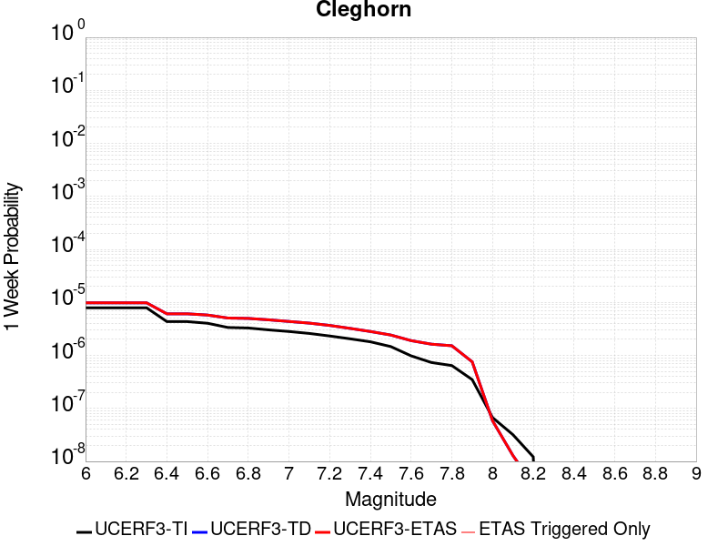 | 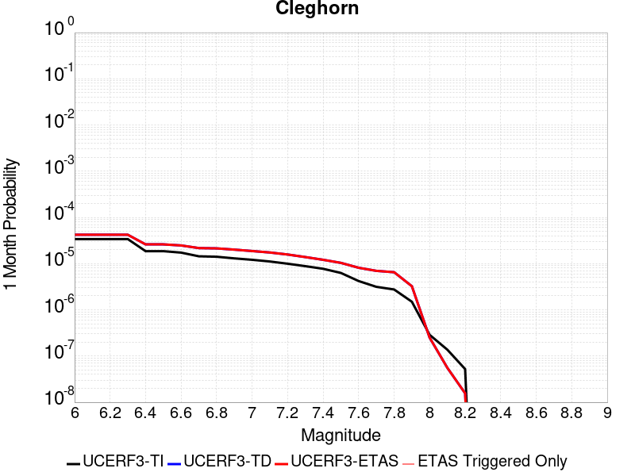 | 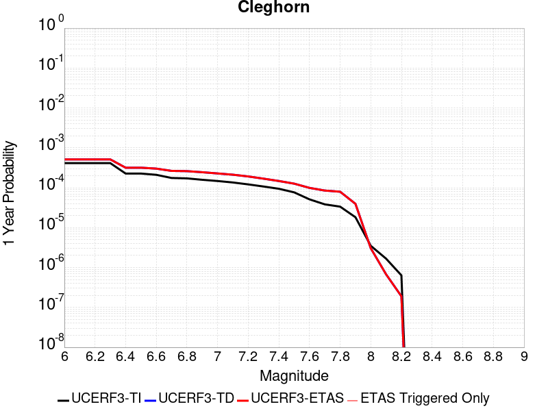 | 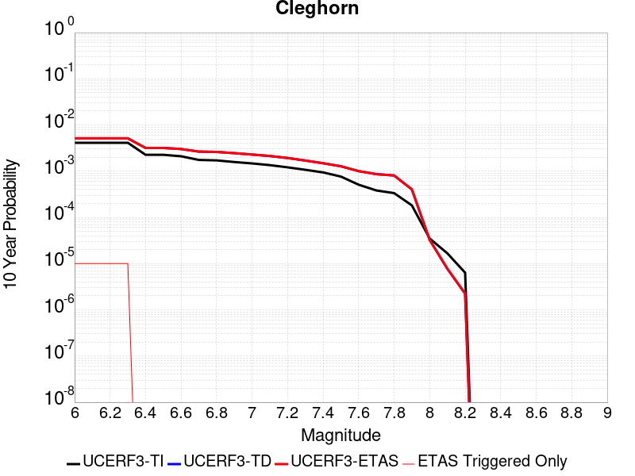 |

| Magnitude | 1 wk TI Prob | 1 wk TD Prob | 1 wk ETAS Prob | 1 wk ETAS/TD Gain | 1 wk ETAS Triggered Only | 1 mo TI Prob | 1 mo TD Prob | 1 mo ETAS Prob | 1 mo ETAS/TD Gain | 1 mo ETAS Triggered Only | 1 yr TI Prob | 1 yr TD Prob | 1 yr ETAS Prob | 1 yr ETAS/TD Gain | 1 yr ETAS Triggered Only | 10 yr TI Prob | 10 yr TD Prob | 10 yr ETAS Prob | 10 yr ETAS/TD Gain | 10 yr ETAS Triggered Only |
|-----|-----|-----|-----|-----|-----|-----|-----|-----|-----|-----|-----|-----|-----|-----|-----|-----|-----|-----|-----|-----|
| 6.0 | 7.9267165E-6 | 9.831383E-6 | 9.831383E-6 | 1.0 | 0.0 | 3.39712E-5 | 4.2133877E-5 | 4.2133877E-5 | 1.0 | 0.0 | 4.1352084E-4 | 5.1286985E-4 | 5.1286985E-4 | 1.0 | 0.0 | 0.004127522 | 0.0051319767 | 0.005142767 | 1.0021026 | 1.0845987E-5 |
| 6.1 | 7.9267165E-6 | 9.831383E-6 | 9.831383E-6 | 1.0 | 0.0 | 3.39712E-5 | 4.2133877E-5 | 4.2133877E-5 | 1.0 | 0.0 | 4.1352084E-4 | 5.1286985E-4 | 5.1286985E-4 | 1.0 | 0.0 | 0.004127522 | 0.0051319767 | 0.005142767 | 1.0021026 | 1.0845987E-5 |
| 6.2 | 7.9267165E-6 | 9.831383E-6 | 9.831383E-6 | 1.0 | 0.0 | 3.39712E-5 | 4.2133877E-5 | 4.2133877E-5 | 1.0 | 0.0 | 4.1352084E-4 | 5.1286985E-4 | 5.1286985E-4 | 1.0 | 0.0 | 0.004127522 | 0.0051319767 | 0.005142767 | 1.0021026 | 1.0845987E-5 |
| 6.3 | 7.9267165E-6 | 9.831383E-6 | 9.831383E-6 | 1.0 | 0.0 | 3.39712E-5 | 4.2133877E-5 | 4.2133877E-5 | 1.0 | 0.0 | 4.1352084E-4 | 5.1286985E-4 | 5.1286985E-4 | 1.0 | 0.0 | 0.004127522 | 0.0051319767 | 0.005142767 | 1.0021026 | 1.0845987E-5 |
| 6.4 | 4.3445207E-6 | 6.091248E-6 | 6.091248E-6 | 1.0 | 0.0 | 1.8619241E-5 | 2.6105094E-5 | 2.6105094E-5 | 1.0 | 0.0 | 2.2666567E-4 | 3.1778417E-4 | 3.1778417E-4 | 1.0 | 0.0 | 0.0022643462 | 0.003187489 | 0.003187489 | 1.0 | 0.0 |
| 6.5 | 4.3445207E-6 | 6.091248E-6 | 6.091248E-6 | 1.0 | 0.0 | 1.8619241E-5 | 2.6105094E-5 | 2.6105094E-5 | 1.0 | 0.0 | 2.2666567E-4 | 3.1778417E-4 | 3.1778417E-4 | 1.0 | 0.0 | 0.0022643462 | 0.003187489 | 0.003187489 | 1.0 | 0.0 |
| 6.6 | 4.040109E-6 | 5.7736565E-6 | 5.7736565E-6 | 1.0 | 0.0 | 1.7314638E-5 | 2.4744011E-5 | 2.4744011E-5 | 1.0 | 0.0 | 2.1078532E-4 | 3.0121763E-4 | 3.0121763E-4 | 1.0 | 0.0 | 0.002105855 | 0.003022279 | 0.003022279 | 1.0 | 0.0 |
| 6.7 | 3.3632055E-6 | 5.067154E-6 | 5.067154E-6 | 1.0 | 0.0 | 1.4413658E-5 | 2.1716196E-5 | 2.1716196E-5 | 1.0 | 0.0 | 1.7547216E-4 | 2.6436293E-4 | 2.6436293E-4 | 1.0 | 0.0 | 0.0017533366 | 0.0026546135 | 0.0026546135 | 1.0 | 0.0 |
| 6.8 | 3.2902772E-6 | 4.989062E-6 | 4.989062E-6 | 1.0 | 0.0 | 1.4101111E-5 | 2.138152E-5 | 2.138152E-5 | 1.0 | 0.0 | 1.716675E-4 | 2.6028923E-4 | 2.6028923E-4 | 1.0 | 0.0 | 0.0017153495 | 0.0026139724 | 0.0026139724 | 1.0 | 0.0 |
| 6.9 | 3.031547E-6 | 4.690826E-6 | 4.690826E-6 | 1.0 | 0.0 | 1.299228E-5 | 2.0103385E-5 | 2.0103385E-5 | 1.0 | 0.0 | 1.5816953E-4 | 2.447315E-4 | 2.447315E-4 | 1.0 | 0.0 | 0.00158057 | 0.0024587465 | 0.0024587465 | 1.0 | 0.0 |
| 7.0 | 2.8259715E-6 | 4.3703994E-6 | 4.3703994E-6 | 1.0 | 0.0 | 1.211125E-5 | 1.873015E-5 | 1.873015E-5 | 1.0 | 0.0 | 1.4744449E-4 | 2.2801595E-4 | 2.2801595E-4 | 1.0 | 0.0 | 0.001473467 | 0.0022919455 | 0.0022919455 | 1.0 | 0.0 |
| 7.1 | 2.5962665E-6 | 4.0656228E-6 | 4.0656228E-6 | 1.0 | 0.0 | 1.1126809E-5 | 1.7423981E-5 | 1.7423981E-5 | 1.0 | 0.0 | 1.3546048E-4 | 2.1211655E-4 | 2.1211655E-4 | 1.0 | 0.0 | 0.0013537793 | 0.0021332712 | 0.0021332712 | 1.0 | 0.0 |
| 7.2 | 2.3247253E-6 | 3.6761817E-6 | 3.6761817E-6 | 1.0 | 0.0 | 9.96307E-6 | 1.575497E-5 | 1.575497E-5 | 1.0 | 0.0 | 1.21293626E-4 | 1.9180006E-4 | 1.9180006E-4 | 1.0 | 0.0 | 0.0012122744 | 0.001930497 | 0.001930497 | 1.0 | 0.0 |
| 7.3 | 2.056928E-6 | 3.2349144E-6 | 3.2349144E-6 | 1.0 | 0.0 | 8.815376E-6 | 1.3863846E-5 | 1.3863846E-5 | 1.0 | 0.0 | 1.0732192E-4 | 1.6877941E-4 | 1.6877941E-4 | 1.0 | 0.0 | 0.001072701 | 0.0017007304 | 0.0017007304 | 1.0 | 0.0 |
| 7.4 | 1.8055999E-6 | 2.8253314E-6 | 2.8253314E-6 | 1.0 | 0.0 | 7.738263E-6 | 1.2108509E-5 | 1.2108509E-5 | 1.0 | 0.0 | 9.4209274E-5 | 1.4741125E-4 | 1.4741125E-4 | 1.0 | 0.0 | 9.4169343E-4 | 0.0014874903 | 0.0014874903 | 1.0 | 0.0 |
| 7.5 | 1.4683443E-6 | 2.4245787E-6 | 2.4245787E-6 | 1.0 | 0.0 | 6.292889E-6 | 1.0391011E-5 | 1.0391011E-5 | 1.0 | 0.0 | 7.661323E-5 | 1.265033E-4 | 1.265033E-4 | 1.0 | 0.0 | 7.658682E-4 | 0.0012787108 | 0.0012787108 | 1.0 | 0.0 |
| 7.6 | 9.804088E-7 | 1.9000983E-6 | 1.9000983E-6 | 1.0 | 0.0 | 4.201745E-6 | 8.143254E-6 | 8.143254E-6 | 1.0 | 0.0 | 5.1155046E-5 | 9.9139645E-5 | 9.9139645E-5 | 1.0 | 0.0 | 5.114327E-4 | 0.0010053867 | 0.0010053867 | 1.0 | 0.0 |
| 7.7 | 7.3434086E-7 | 1.6282488E-6 | 1.6282488E-6 | 1.0 | 0.0 | 3.1471714E-6 | 6.9781904E-6 | 6.9781904E-6 | 1.0 | 0.0 | 3.831614E-5 | 8.4956184E-5 | 8.4956184E-5 | 1.0 | 0.0 | 3.8309532E-4 | 8.637035E-4 | 8.637035E-4 | 1.0 | 0.0 |
| 7.8 | 6.434184E-7 | 1.5218448E-6 | 1.5218448E-6 | 1.0 | 0.0 | 2.7575045E-6 | 6.5221757E-6 | 6.5221757E-6 | 1.0 | 0.0 | 3.35721E-5 | 7.940462E-5 | 7.940462E-5 | 1.0 | 0.0 | 3.3567028E-4 | 8.078874E-4 | 8.078874E-4 | 1.0 | 0.0 |
| 7.9 | 3.4943926E-7 | 7.573584E-7 | 7.573584E-7 | 1.0 | 0.0 | 1.497596E-6 | 3.2458177E-6 | 3.2458177E-6 | 1.0 | 0.0 | 1.8233079E-5 | 3.9517123E-5 | 3.9517123E-5 | 1.0 | 0.0 | 1.8231584E-4 | 4.0396556E-4 | 4.0396556E-4 | 1.0 | 0.0 |
| 8.0 | 6.717524E-8 | 5.8377715E-8 | 5.8377715E-8 | 1.0 | 0.0 | 2.8789387E-7 | 2.501902E-7 | 2.501902E-7 | 1.0 | 0.0 | 3.505102E-6 | 3.0460612E-6 | 3.0460612E-6 | 1.0 | 0.0 | 3.5050467E-5 | 3.2729393E-5 | 3.2729393E-5 | 1.0 | 0.0 |
| 8.1 | 3.1984914E-8 | 1.2952653E-8 | 1.2952653E-8 | 1.0 | 0.0 | 1.370782E-7 | 5.551137E-8 | 5.551137E-8 | 1.0 | 0.0 | 1.6689258E-6 | 6.7585074E-7 | 6.7585074E-7 | 1.0 | 0.0 | 1.6689133E-5 | 7.742598E-6 | 7.742598E-6 | 1.0 | 0.0 |
| 8.2 | 1.21887656E-8 | 3.6484704E-9 | 3.6484704E-9 | 1.0 | 0.0 | 5.2237567E-8 | 1.5636301E-8 | 1.5636301E-8 | 1.0 | 0.0 | 6.359922E-7 | 1.9037195E-7 | 1.9037195E-7 | 1.0 | 0.0 | 6.3599036E-6 | 2.246485E-6 | 2.246485E-6 | 1.0 | 0.0 |

## Camp Rock 2011
*[(top)](#table-of-contents)*

| 1 Week | 1 Month | 1 Year | 10 Year |
|-----|-----|-----|-----|
|  |  |  |  |

| Magnitude | 1 wk TI Prob | 1 wk TD Prob | 1 wk ETAS Prob | 1 wk ETAS/TD Gain | 1 wk ETAS Triggered Only | 1 mo TI Prob | 1 mo TD Prob | 1 mo ETAS Prob | 1 mo ETAS/TD Gain | 1 mo ETAS Triggered Only | 1 yr TI Prob | 1 yr TD Prob | 1 yr ETAS Prob | 1 yr ETAS/TD Gain | 1 yr ETAS Triggered Only | 10 yr TI Prob | 10 yr TD Prob | 10 yr ETAS Prob | 10 yr ETAS/TD Gain | 10 yr ETAS Triggered Only |
|-----|-----|-----|-----|-----|-----|-----|-----|-----|-----|-----|-----|-----|-----|-----|-----|-----|-----|-----|-----|-----|
| 6.0 | 1.6710783E-5 | 4.25025E-6 | 1.5096191E-5 | 3.551836 | 1.0845987E-5 | 7.161568E-5 | 1.8215234E-5 | 2.9061022E-5 | 1.5954242 | 1.0845987E-5 | 8.7157206E-4 | 2.2174843E-4 | 2.32592E-4 | 1.0489004 | 1.0845987E-5 | 0.008681616 | 0.0022153244 | 0.0022261464 | 1.0048851 | 1.0845987E-5 |
| 6.1 | 1.6710783E-5 | 4.25025E-6 | 1.5096191E-5 | 3.551836 | 1.0845987E-5 | 7.161568E-5 | 1.8215234E-5 | 2.9061022E-5 | 1.5954242 | 1.0845987E-5 | 8.7157206E-4 | 2.2174843E-4 | 2.32592E-4 | 1.0489004 | 1.0845987E-5 | 0.008681616 | 0.0022153244 | 0.0022261464 | 1.0048851 | 1.0845987E-5 |
| 6.2 | 1.6710783E-5 | 4.25025E-6 | 1.5096191E-5 | 3.551836 | 1.0845987E-5 | 7.161568E-5 | 1.8215234E-5 | 2.9061022E-5 | 1.5954242 | 1.0845987E-5 | 8.7157206E-4 | 2.2174843E-4 | 2.32592E-4 | 1.0489004 | 1.0845987E-5 | 0.008681616 | 0.0022153244 | 0.0022261464 | 1.0048851 | 1.0845987E-5 |
| 6.3 | 1.6710783E-5 | 4.25025E-6 | 1.5096191E-5 | 3.551836 | 1.0845987E-5 | 7.161568E-5 | 1.8215234E-5 | 2.9061022E-5 | 1.5954242 | 1.0845987E-5 | 8.7157206E-4 | 2.2174843E-4 | 2.32592E-4 | 1.0489004 | 1.0845987E-5 | 0.008681616 | 0.0022153244 | 0.0022261464 | 1.0048851 | 1.0845987E-5 |
| 6.4 | 7.982846E-6 | 3.6820795E-6 | 3.6820795E-6 | 1.0 | 0.0 | 3.421175E-5 | 1.5780248E-5 | 1.5780248E-5 | 1.0 | 0.0 | 4.1644843E-4 | 1.9210792E-4 | 1.9210792E-4 | 1.0 | 0.0 | 0.0041566887 | 0.0019194534 | 0.0019194534 | 1.0 | 0.0 |
| 6.5 | 7.982846E-6 | 3.6820795E-6 | 3.6820795E-6 | 1.0 | 0.0 | 3.421175E-5 | 1.5780248E-5 | 1.5780248E-5 | 1.0 | 0.0 | 4.1644843E-4 | 1.9210792E-4 | 1.9210792E-4 | 1.0 | 0.0 | 0.0041566887 | 0.0019194534 | 0.0019194534 | 1.0 | 0.0 |
| 6.6 | 7.048869E-6 | 3.4243487E-6 | 3.4243487E-6 | 1.0 | 0.0 | 3.0209088E-5 | 1.4675699E-5 | 1.4675699E-5 | 1.0 | 0.0 | 3.677336E-4 | 1.786623E-4 | 1.786623E-4 | 1.0 | 0.0 | 0.0036712566 | 0.0017852184 | 0.0017852184 | 1.0 | 0.0 |
| 6.7 | 6.987307E-6 | 3.3623264E-6 | 3.3623264E-6 | 1.0 | 0.0 | 2.9945259E-5 | 1.4409892E-5 | 1.4409892E-5 | 1.0 | 0.0 | 3.6452254E-4 | 1.7542663E-4 | 1.7542663E-4 | 1.0 | 0.0 | 0.0036392517 | 0.0017529125 | 0.0017529125 | 1.0 | 0.0 |
| 6.8 | 6.3737602E-6 | 3.1178997E-6 | 3.1178997E-6 | 1.0 | 0.0 | 2.731583E-5 | 1.3362361E-5 | 1.3362361E-5 | 1.0 | 0.0 | 3.3251947E-4 | 1.6267489E-4 | 1.6267489E-4 | 1.0 | 0.0 | 0.0033202237 | 0.0016255867 | 0.0016255867 | 1.0 | 0.0 |
| 6.9 | 6.112211E-6 | 2.933108E-6 | 2.933108E-6 | 1.0 | 0.0 | 2.6194928E-5 | 1.2570404E-5 | 1.2570404E-5 | 1.0 | 0.0 | 3.1887658E-4 | 1.530342E-4 | 1.530342E-4 | 1.0 | 0.0 | 0.003184194 | 0.001529316 | 0.001529316 | 1.0 | 0.0 |
| 7.0 | 5.5140117E-6 | 2.6419164E-6 | 2.6419164E-6 | 1.0 | 0.0 | 2.3631264E-5 | 1.13224505E-5 | 1.13224505E-5 | 1.0 | 0.0 | 2.8767265E-4 | 1.3784238E-4 | 1.3784238E-4 | 1.0 | 0.0 | 0.0028730053 | 0.001377594 | 0.001377594 | 1.0 | 0.0 |
| 7.1 | 4.8151105E-6 | 2.1342648E-6 | 2.1342648E-6 | 1.0 | 0.0 | 2.0636026E-5 | 9.146818E-6 | 9.146818E-6 | 1.0 | 0.0 | 2.5121463E-4 | 1.1135704E-4 | 1.1135704E-4 | 1.0 | 0.0 | 0.0025093083 | 0.0011130343 | 0.0011130343 | 1.0 | 0.0 |
| 7.2 | 3.818335E-6 | 1.2937384E-6 | 1.2937384E-6 | 1.0 | 0.0 | 1.6364189E-5 | 5.5445817E-6 | 5.5445817E-6 | 1.0 | 0.0 | 1.9921579E-4 | 6.750327E-5 | 6.750327E-5 | 1.0 | 0.0 | 0.0019903728 | 6.7483593E-4 | 6.7483593E-4 | 1.0 | 0.0 |
| 7.3 | 2.7166698E-6 | 7.3835463E-7 | 7.3835463E-7 | 1.0 | 0.0 | 1.1642818E-5 | 3.1643733E-6 | 3.1643733E-6 | 1.0 | 0.0 | 1.4174209E-4 | 3.8525584E-5 | 3.8525584E-5 | 1.0 | 0.0 | 0.0014165172 | 3.8519106E-4 | 3.8519106E-4 | 1.0 | 0.0 |
| 7.4 | 2.0893426E-6 | 5.461814E-7 | 5.461814E-7 | 1.0 | 0.0 | 8.954295E-6 | 2.3407754E-6 | 2.3407754E-6 | 1.0 | 0.0 | 1.0901308E-4 | 2.8498573E-5 | 2.8498573E-5 | 1.0 | 0.0 | 0.0010895962 | 2.8494973E-4 | 2.8494973E-4 | 1.0 | 0.0 |
| 7.5 | 1.1681728E-6 | 3.6030443E-7 | 3.6030443E-7 | 1.0 | 0.0 | 5.0064455E-6 | 1.544161E-6 | 1.544161E-6 | 1.0 | 0.0 | 6.0951766E-5 | 1.8800003E-5 | 1.8800003E-5 | 1.0 | 0.0 | 6.093505E-4 | 1.879846E-4 | 1.879846E-4 | 1.0 | 0.0 |
| 7.6 | 1.3154387E-7 | 7.1197206E-8 | 7.1197206E-8 | 1.0 | 0.0 | 5.6375933E-7 | 3.0513087E-7 | 3.0513087E-7 | 1.0 | 0.0 | 6.863748E-6 | 3.7149634E-6 | 3.7149634E-6 | 1.0 | 0.0 | 6.863536E-5 | 3.714917E-5 | 3.714917E-5 | 1.0 | 0.0 |

## Pisgah-Bullion Mtn-Mesquite Lk
*[(top)](#table-of-contents)*

| 1 Week | 1 Month | 1 Year | 10 Year |
|-----|-----|-----|-----|
|  |  |  |  |

| Magnitude | 1 wk TI Prob | 1 wk TD Prob | 1 wk ETAS Prob | 1 wk ETAS/TD Gain | 1 wk ETAS Triggered Only | 1 mo TI Prob | 1 mo TD Prob | 1 mo ETAS Prob | 1 mo ETAS/TD Gain | 1 mo ETAS Triggered Only | 1 yr TI Prob | 1 yr TD Prob | 1 yr ETAS Prob | 1 yr ETAS/TD Gain | 1 yr ETAS Triggered Only | 10 yr TI Prob | 10 yr TD Prob | 10 yr ETAS Prob | 10 yr ETAS/TD Gain | 10 yr ETAS Triggered Only |
|-----|-----|-----|-----|-----|-----|-----|-----|-----|-----|-----|-----|-----|-----|-----|-----|-----|-----|-----|-----|-----|
| 6.0 | 3.0240792E-5 | 2.4091038E-5 | 3.4936762E-5 | 1.4501976 | 1.0845987E-5 | 1.2959696E-4 | 1.0324379E-4 | 1.1408865E-4 | 1.1050414 | 1.0845987E-5 | 0.0015767008 | 0.0012563687 | 0.0012672012 | 1.0086219 | 1.0845987E-5 | 0.015655609 | 0.012502681 | 0.012513392 | 1.0008566 | 1.0845987E-5 |
| 6.1 | 3.0240792E-5 | 2.4091038E-5 | 3.4936762E-5 | 1.4501976 | 1.0845987E-5 | 1.2959696E-4 | 1.0324379E-4 | 1.1408865E-4 | 1.1050414 | 1.0845987E-5 | 0.0015767008 | 0.0012563687 | 0.0012672012 | 1.0086219 | 1.0845987E-5 | 0.015655609 | 0.012502681 | 0.012513392 | 1.0008566 | 1.0845987E-5 |
| 6.2 | 3.0240792E-5 | 2.4091038E-5 | 3.4936762E-5 | 1.4501976 | 1.0845987E-5 | 1.2959696E-4 | 1.0324379E-4 | 1.1408865E-4 | 1.1050414 | 1.0845987E-5 | 0.0015767008 | 0.0012563687 | 0.0012672012 | 1.0086219 | 1.0845987E-5 | 0.015655609 | 0.012502681 | 0.012513392 | 1.0008566 | 1.0845987E-5 |
| 6.3 | 2.0498217E-5 | 1.3638032E-5 | 2.4483872E-5 | 1.7952642 | 1.0845987E-5 | 8.784654E-5 | 5.844749E-5 | 6.9292844E-5 | 1.1855572 | 1.0845987E-5 | 0.0010690069 | 7.1138213E-4 | 7.222204E-4 | 1.0152355 | 1.0845987E-5 | 0.01063879 | 0.007092675 | 0.007103444 | 1.0015184 | 1.0845987E-5 |
| 6.4 | 2.0498217E-5 | 1.3638032E-5 | 2.4483872E-5 | 1.7952642 | 1.0845987E-5 | 8.784654E-5 | 5.844749E-5 | 6.9292844E-5 | 1.1855572 | 1.0845987E-5 | 0.0010690069 | 7.1138213E-4 | 7.222204E-4 | 1.0152355 | 1.0845987E-5 | 0.01063879 | 0.007092675 | 0.007103444 | 1.0015184 | 1.0845987E-5 |
| 6.5 | 1.7316182E-5 | 1.0477016E-5 | 1.0477016E-5 | 1.0 | 0.0 | 7.42101E-5 | 4.490078E-5 | 4.490078E-5 | 1.0 | 0.0 | 9.0313336E-4 | 5.4653984E-4 | 5.4653984E-4 | 1.0 | 0.0 | 0.008994718 | 0.005452953 | 0.005452953 | 1.0 | 0.0 |
| 6.6 | 1.5251077E-5 | 8.414252E-6 | 8.414252E-6 | 1.0 | 0.0 | 6.536012E-5 | 3.606062E-5 | 3.606062E-5 | 1.0 | 0.0 | 7.9546886E-4 | 4.3895686E-4 | 4.3895686E-4 | 1.0 | 0.0 | 0.007926274 | 0.004381615 | 0.004381615 | 1.0 | 0.0 |
| 6.7 | 1.2997425E-5 | 6.411481E-6 | 6.411481E-6 | 1.0 | 0.0 | 5.570206E-5 | 2.7477512E-5 | 2.7477512E-5 | 1.0 | 0.0 | 6.7796157E-4 | 3.34492E-4 | 3.34492E-4 | 1.0 | 0.0 | 0.0067589693 | 0.0033403458 | 0.0033403458 | 1.0 | 0.0 |
| 6.8 | 1.035386E-5 | 4.3332066E-6 | 4.3332066E-6 | 1.0 | 0.0 | 4.437293E-5 | 1.8570758E-5 | 1.8570758E-5 | 1.0 | 0.0 | 5.401065E-4 | 2.260764E-4 | 2.260764E-4 | 1.0 | 0.0 | 0.0053879567 | 0.0022585508 | 0.0022585508 | 1.0 | 0.0 |
| 6.9 | 8.816252E-6 | 3.580627E-6 | 3.580627E-6 | 1.0 | 0.0 | 3.778339E-5 | 1.5345457E-5 | 1.5345457E-5 | 1.0 | 0.0 | 4.5991567E-4 | 1.8681551E-4 | 1.8681551E-4 | 1.0 | 0.0 | 0.00458965 | 0.0018666431 | 0.0018666431 | 1.0 | 0.0 |
| 7.0 | 6.8232207E-6 | 2.567576E-6 | 2.567576E-6 | 1.0 | 0.0 | 2.9242048E-5 | 1.1003853E-5 | 1.1003853E-5 | 1.0 | 0.0 | 3.5596377E-4 | 1.3396399E-4 | 1.3396399E-4 | 1.0 | 0.0 | 0.0035539411 | 0.0013388634 | 0.0013388634 | 1.0 | 0.0 |
| 7.1 | 5.837013E-6 | 2.227373E-6 | 2.227373E-6 | 1.0 | 0.0 | 2.501553E-5 | 9.545851E-6 | 9.545851E-6 | 1.0 | 0.0 | 3.045215E-4 | 1.16214826E-4 | 1.16214826E-4 | 1.0 | 0.0 | 0.0030410455 | 0.0011615696 | 0.0011615696 | 1.0 | 0.0 |
| 7.2 | 4.278052E-6 | 1.627566E-6 | 1.627566E-6 | 1.0 | 0.0 | 1.833438E-5 | 6.9752655E-6 | 6.9752655E-6 | 1.0 | 0.0 | 2.231982E-4 | 8.4920786E-5 | 8.4920786E-5 | 1.0 | 0.0 | 0.0022297418 | 8.489065E-4 | 8.489065E-4 | 1.0 | 0.0 |
| 7.3 | 1.8803692E-6 | 8.344903E-7 | 8.344903E-7 | 1.0 | 0.0 | 8.0587E-6 | 3.576383E-6 | 3.576383E-6 | 1.0 | 0.0 | 9.811026E-5 | 4.354174E-5 | 4.354174E-5 | 1.0 | 0.0 | 9.806695E-4 | 4.3534656E-4 | 4.3534656E-4 | 1.0 | 0.0 |

## San Andreas (Offshore) 2011 CFM
*[(top)](#table-of-contents)*

| 1 Week | 1 Month | 1 Year | 10 Year |
|-----|-----|-----|-----|
|  |  |  |  |

| Magnitude | 1 wk TI Prob | 1 wk TD Prob | 1 wk ETAS Prob | 1 wk ETAS/TD Gain | 1 wk ETAS Triggered Only | 1 mo TI Prob | 1 mo TD Prob | 1 mo ETAS Prob | 1 mo ETAS/TD Gain | 1 mo ETAS Triggered Only | 1 yr TI Prob | 1 yr TD Prob | 1 yr ETAS Prob | 1 yr ETAS/TD Gain | 1 yr ETAS Triggered Only | 10 yr TI Prob | 10 yr TD Prob | 10 yr ETAS Prob | 10 yr ETAS/TD Gain | 10 yr ETAS Triggered Only |
|-----|-----|-----|-----|-----|-----|-----|-----|-----|-----|-----|-----|-----|-----|-----|-----|-----|-----|-----|-----|-----|
| 6.0 | 1.7072787E-4 | 1.9225157E-4 | 2.0309546E-4 | 1.0564047 | 1.0845987E-5 | 7.3148566E-4 | 8.236775E-4 | 8.3451456E-4 | 1.0131569 | 1.0845987E-5 | 0.008869528 | 0.009982676 | 0.009993414 | 1.0010756 | 1.0845987E-5 | 0.085237645 | 0.0968234 | 0.0968332 | 1.0001012 | 1.0845987E-5 |
| 6.1 | 1.7072787E-4 | 1.9225157E-4 | 2.0309546E-4 | 1.0564047 | 1.0845987E-5 | 7.3148566E-4 | 8.236775E-4 | 8.3451456E-4 | 1.0131569 | 1.0845987E-5 | 0.008869528 | 0.009982676 | 0.009993414 | 1.0010756 | 1.0845987E-5 | 0.085237645 | 0.0968234 | 0.0968332 | 1.0001012 | 1.0845987E-5 |
| 6.2 | 1.6312556E-4 | 1.8406947E-4 | 1.9491346E-4 | 1.0589125 | 1.0845987E-5 | 6.989222E-4 | 7.886331E-4 | 7.9947046E-4 | 1.0137421 | 1.0845987E-5 | 0.008476226 | 0.009559834 | 0.009570576 | 1.0011237 | 1.0845987E-5 | 0.08160117 | 0.09284438 | 0.092854224 | 1.000106 | 1.0845987E-5 |
| 6.3 | 1.5103363E-4 | 1.6879968E-4 | 1.7964384E-4 | 1.0642427 | 1.0845987E-5 | 6.471264E-4 | 7.2322885E-4 | 7.34067E-4 | 1.0149858 | 1.0845987E-5 | 0.007850339 | 0.008770205 | 0.008780955 | 1.0012258 | 1.0845987E-5 | 0.075787395 | 0.08548553 | 0.08549545 | 1.000116 | 1.0845987E-5 |
| 6.4 | 1.5047993E-4 | 1.6765897E-4 | 1.7850315E-4 | 1.0646799 | 1.0845987E-5 | 6.4475456E-4 | 7.183428E-4 | 7.29181E-4 | 1.0150877 | 1.0845987E-5 | 0.007821669 | 0.008711193 | 0.008721944 | 1.0012342 | 1.0845987E-5 | 0.0755203 | 0.08496573 | 0.08497565 | 1.0001168 | 1.0845987E-5 |
| 6.5 | 1.2760791E-4 | 1.3734377E-4 | 1.4818826E-4 | 1.0789587 | 1.0845987E-5 | 5.467764E-4 | 5.884848E-4 | 5.993244E-4 | 1.0184195 | 1.0845987E-5 | 0.0066367025 | 0.0071415384 | 0.007152307 | 1.0015079 | 1.0845987E-5 | 0.064419635 | 0.07024696 | 0.070257045 | 1.0001435 | 1.0845987E-5 |
| 6.6 | 1.1063525E-4 | 1.15560826E-4 | 1.2640556E-4 | 1.0938444 | 1.0845987E-5 | 4.740649E-4 | 4.9516774E-4 | 5.0600833E-4 | 1.0218928 | 1.0845987E-5 | 0.0057564764 | 0.006012204 | 0.006022985 | 1.0017931 | 1.0845987E-5 | 0.05609626 | 0.059486266 | 0.05949647 | 1.0001714 | 1.0845987E-5 |
| 6.7 | 1.0391049E-4 | 1.0645404E-4 | 1.0645404E-4 | 1.0 | 0.0 | 4.4525467E-4 | 4.5615283E-4 | 4.5615283E-4 | 1.0 | 0.0 | 0.0054075094 | 0.0055397064 | 0.0055397064 | 1.0 | 0.0 | 0.052778035 | 0.054986227 | 0.054986227 | 1.0 | 0.0 |
| 6.8 | 1.0096706E-4 | 1.01577636E-4 | 1.01577636E-4 | 1.0 | 0.0 | 4.3264418E-4 | 4.3526106E-4 | 4.3526106E-4 | 1.0 | 0.0 | 0.0052547283 | 0.005286604 | 0.005286604 | 1.0 | 0.0 | 0.051321987 | 0.052685104 | 0.052685104 | 1.0 | 0.0 |
| 6.9 | 9.800265E-5 | 9.588255E-5 | 9.588255E-5 | 1.0 | 0.0 | 4.1994374E-4 | 4.108614E-4 | 4.108614E-4 | 1.0 | 0.0 | 0.0051008356 | 0.0049909325 | 0.0049909325 | 1.0 | 0.0 | 0.049853306 | 0.050012615 | 0.050012615 | 1.0 | 0.0 |
| 7.0 | 9.4642375E-5 | 9.001663E-5 | 9.001663E-5 | 1.0 | 0.0 | 4.0554712E-4 | 3.857294E-4 | 3.857294E-4 | 1.0 | 0.0 | 0.004926363 | 0.004686305 | 0.004686305 | 1.0 | 0.0 | 0.048185747 | 0.047193687 | 0.047193687 | 1.0 | 0.0 |
| 7.1 | 9.0996844E-5 | 8.353702E-5 | 8.353702E-5 | 1.0 | 0.0 | 3.8992817E-4 | 3.5796757E-4 | 3.5796757E-4 | 1.0 | 0.0 | 0.004737046 | 0.004349702 | 0.004349702 | 1.0 | 0.0 | 0.04637333 | 0.04404532 | 0.04404532 | 1.0 | 0.0 |
| 7.2 | 8.848287E-5 | 7.98136E-5 | 7.98136E-5 | 1.0 | 0.0 | 3.791572E-4 | 3.420143E-4 | 3.420143E-4 | 1.0 | 0.0 | 0.004606472 | 0.0041562277 | 0.0041562277 | 1.0 | 0.0 | 0.045121472 | 0.042189315 | 0.042189315 | 1.0 | 0.0 |
| 7.3 | 7.9280784E-5 | 6.127233E-5 | 6.127233E-5 | 1.0 | 0.0 | 3.3973053E-4 | 2.6256984E-4 | 2.6256984E-4 | 1.0 | 0.0 | 0.004128377 | 0.003192204 | 0.003192204 | 1.0 | 0.0 | 0.040525194 | 0.03290239 | 0.03290239 | 1.0 | 0.0 |
| 7.4 | 6.468038E-5 | 3.793042E-5 | 3.793042E-5 | 1.0 | 0.0 | 2.771722E-4 | 1.6254914E-4 | 1.6254914E-4 | 1.0 | 0.0 | 0.0033693502 | 0.0019772972 | 0.0019772972 | 1.0 | 0.0 | 0.0331872 | 0.02082032 | 0.02082032 | 1.0 | 0.0 |
| 7.5 | 4.930574E-5 | 1.2701723E-5 | 1.2701723E-5 | 1.0 | 0.0 | 2.1129321E-4 | 5.443483E-5 | 5.443483E-5 | 1.0 | 0.0 | 0.0025694598 | 6.625441E-4 | 6.625441E-4 | 1.0 | 0.0 | 0.02539953 | 0.007480459 | 0.007480459 | 1.0 | 0.0 |
| 7.6 | 4.612566E-5 | 1.0334738E-5 | 1.0334738E-5 | 1.0 | 0.0 | 1.9766642E-4 | 4.429099E-5 | 4.429099E-5 | 1.0 | 0.0 | 0.0024039324 | 5.3911074E-4 | 5.3911074E-4 | 1.0 | 0.0 | 0.023780935 | 0.0061712256 | 0.0061712256 | 1.0 | 0.0 |
| 7.7 | 3.9435414E-5 | 5.5737783E-6 | 5.5737783E-6 | 1.0 | 0.0 | 1.6899795E-4 | 2.3887404E-5 | 2.3887404E-5 | 1.0 | 0.0 | 0.0020556084 | 2.9079051E-4 | 2.9079051E-4 | 1.0 | 0.0 | 0.020366974 | 0.0035413401 | 0.0035413401 | 1.0 | 0.0 |
| 7.8 | 2.7787428E-5 | 3.7545014E-6 | 3.7545014E-6 | 1.0 | 0.0 | 1.1908354E-4 | 1.609062E-5 | 1.609062E-5 | 1.0 | 0.0 | 0.0014488777 | 1.9588573E-4 | 1.9588573E-4 | 1.0 | 0.0 | 0.014394675 | 0.0023872065 | 0.0023872065 | 1.0 | 0.0 |
| 7.9 | 1.590671E-5 | 3.0401961E-6 | 3.0401961E-6 | 1.0 | 0.0 | 6.816983E-5 | 1.3029347E-5 | 1.3029347E-5 | 1.0 | 0.0 | 8.2965166E-4 | 1.5862078E-4 | 1.5862078E-4 | 1.0 | 0.0 | 0.008265611 | 0.0019038742 | 0.0019038742 | 1.0 | 0.0 |
| 8.0 | 9.193638E-6 | 2.5915315E-6 | 2.5915315E-6 | 1.0 | 0.0 | 3.940071E-5 | 1.1106516E-5 | 1.1106516E-5 | 1.0 | 0.0 | 4.7959806E-4 | 1.3521347E-4 | 1.3521347E-4 | 1.0 | 0.0 | 0.0047856434 | 0.0016111814 | 0.0016111814 | 1.0 | 0.0 |
| 8.1 | 5.601576E-6 | 2.2338422E-6 | 2.2338422E-6 | 1.0 | 0.0 | 2.4006533E-5 | 9.573574E-6 | 9.573574E-6 | 1.0 | 0.0 | 2.9224035E-4 | 1.1655206E-4 | 1.1655206E-4 | 1.0 | 0.0 | 0.0029185633 | 0.0014017757 | 0.0014017757 | 1.0 | 0.0 |
| 8.2 | 4.3508785E-6 | 1.8571509E-6 | 1.8571509E-6 | 1.0 | 0.0 | 1.864649E-5 | 7.959194E-6 | 7.959194E-6 | 1.0 | 0.0 | 2.2699735E-4 | 9.6898904E-5 | 9.6898904E-5 | 1.0 | 0.0 | 0.0022676561 | 0.0011591844 | 0.0011591844 | 1.0 | 0.0 |
| 8.3 | 1.9573292E-6 | 7.5132493E-7 | 7.5132493E-7 | 1.0 | 0.0 | 8.388526E-6 | 3.21996E-6 | 3.21996E-6 | 1.0 | 0.0 | 1.0212552E-4 | 3.9202325E-5 | 3.9202325E-5 | 1.0 | 0.0 | 0.001020786 | 4.6398945E-4 | 4.6398945E-4 | 1.0 | 0.0 |

## Clamshell-Sawpit
*[(top)](#table-of-contents)*

| 1 Week | 1 Month | 1 Year | 10 Year |
|-----|-----|-----|-----|
| 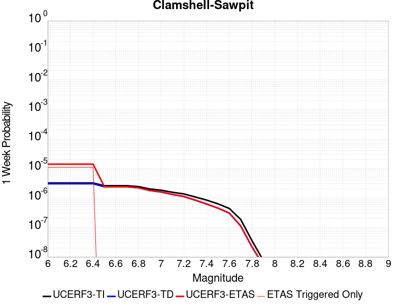 | 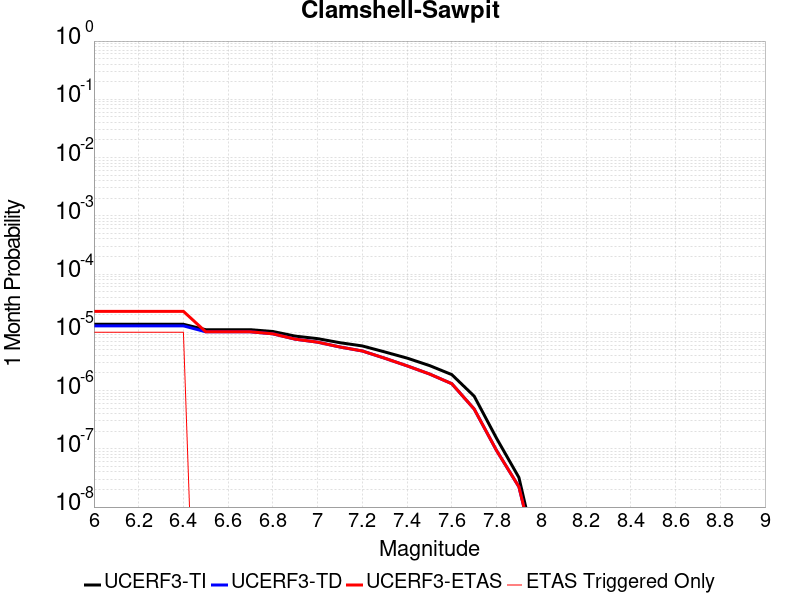 |  | 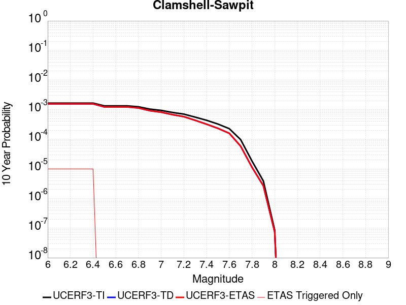 |

| Magnitude | 1 wk TI Prob | 1 wk TD Prob | 1 wk ETAS Prob | 1 wk ETAS/TD Gain | 1 wk ETAS Triggered Only | 1 mo TI Prob | 1 mo TD Prob | 1 mo ETAS Prob | 1 mo ETAS/TD Gain | 1 mo ETAS Triggered Only | 1 yr TI Prob | 1 yr TD Prob | 1 yr ETAS Prob | 1 yr ETAS/TD Gain | 1 yr ETAS Triggered Only | 10 yr TI Prob | 10 yr TD Prob | 10 yr ETAS Prob | 10 yr ETAS/TD Gain | 10 yr ETAS Triggered Only |
|-----|-----|-----|-----|-----|-----|-----|-----|-----|-----|-----|-----|-----|-----|-----|-----|-----|-----|-----|-----|-----|
| 6.0 | 3.202998E-6 | 3.0127576E-6 | 1.3858712E-5 | 4.600009 | 1.0845987E-5 | 1.3727062E-5 | 1.2911759E-5 | 2.3757606E-5 | 1.8399976 | 1.0845987E-5 | 1.6711417E-4 | 1.5719012E-4 | 1.6803441E-4 | 1.0689883 | 1.0845987E-5 | 0.0016698855 | 0.0015708688 | 0.0015816977 | 1.0068936 | 1.0845987E-5 |
| 6.1 | 3.202998E-6 | 3.0127576E-6 | 1.3858712E-5 | 4.600009 | 1.0845987E-5 | 1.3727062E-5 | 1.2911759E-5 | 2.3757606E-5 | 1.8399976 | 1.0845987E-5 | 1.6711417E-4 | 1.5719012E-4 | 1.6803441E-4 | 1.0689883 | 1.0845987E-5 | 0.0016698855 | 0.0015708688 | 0.0015816977 | 1.0068936 | 1.0845987E-5 |
| 6.2 | 3.202998E-6 | 3.0127576E-6 | 1.3858712E-5 | 4.600009 | 1.0845987E-5 | 1.3727062E-5 | 1.2911759E-5 | 2.3757606E-5 | 1.8399976 | 1.0845987E-5 | 1.6711417E-4 | 1.5719012E-4 | 1.6803441E-4 | 1.0689883 | 1.0845987E-5 | 0.0016698855 | 0.0015708688 | 0.0015816977 | 1.0068936 | 1.0845987E-5 |
| 6.3 | 3.202998E-6 | 3.0127576E-6 | 1.3858712E-5 | 4.600009 | 1.0845987E-5 | 1.3727062E-5 | 1.2911759E-5 | 2.3757606E-5 | 1.8399976 | 1.0845987E-5 | 1.6711417E-4 | 1.5719012E-4 | 1.6803441E-4 | 1.0689883 | 1.0845987E-5 | 0.0016698855 | 0.0015708688 | 0.0015816977 | 1.0068936 | 1.0845987E-5 |
| 6.4 | 3.202998E-6 | 3.0127576E-6 | 1.3858712E-5 | 4.600009 | 1.0845987E-5 | 1.3727062E-5 | 1.2911759E-5 | 2.3757606E-5 | 1.8399976 | 1.0845987E-5 | 1.6711417E-4 | 1.5719012E-4 | 1.6803441E-4 | 1.0689883 | 1.0845987E-5 | 0.0016698855 | 0.0015708688 | 0.0015816977 | 1.0068936 | 1.0845987E-5 |
| 6.5 | 2.5862723E-6 | 2.3807686E-6 | 2.3807686E-6 | 1.0 | 0.0 | 1.1083977E-5 | 1.0203255E-5 | 1.0203255E-5 | 1.0 | 0.0 | 1.3493907E-4 | 1.2421786E-4 | 1.2421786E-4 | 1.0 | 0.0 | 0.0013485716 | 0.0012415146 | 0.0012415146 | 1.0 | 0.0 |
| 6.6 | 2.5862723E-6 | 2.3807686E-6 | 2.3807686E-6 | 1.0 | 0.0 | 1.1083977E-5 | 1.0203255E-5 | 1.0203255E-5 | 1.0 | 0.0 | 1.3493907E-4 | 1.2421786E-4 | 1.2421786E-4 | 1.0 | 0.0 | 0.0013485716 | 0.0012415146 | 0.0012415146 | 1.0 | 0.0 |
| 6.7 | 2.5862723E-6 | 2.3807686E-6 | 2.3807686E-6 | 1.0 | 0.0 | 1.1083977E-5 | 1.0203255E-5 | 1.0203255E-5 | 1.0 | 0.0 | 1.3493907E-4 | 1.2421786E-4 | 1.2421786E-4 | 1.0 | 0.0 | 0.0013485716 | 0.0012415146 | 0.0012415146 | 1.0 | 0.0 |
| 6.8 | 2.4098806E-6 | 2.1977246E-6 | 2.1977246E-6 | 1.0 | 0.0 | 1.0328019E-5 | 9.418787E-6 | 9.418787E-6 | 1.0 | 0.0 | 1.2573638E-4 | 1.1466797E-4 | 1.1466797E-4 | 1.0 | 0.0 | 0.0012566525 | 0.0011461147 | 0.0011461147 | 1.0 | 0.0 |
| 6.9 | 2.0073985E-6 | 1.7784191E-6 | 1.7784191E-6 | 1.0 | 0.0 | 8.603109E-6 | 7.6217743E-6 | 7.6217743E-6 | 1.0 | 0.0 | 1.0473781E-4 | 9.279127E-5 | 9.279127E-5 | 1.0 | 0.0 | 0.0010468846 | 9.2753716E-4 | 9.2753716E-4 | 1.0 | 0.0 |
| 7.0 | 1.8166766E-6 | 1.5807041E-6 | 1.5807041E-6 | 1.0 | 0.0 | 7.785734E-6 | 6.7744286E-6 | 6.7744286E-6 | 1.0 | 0.0 | 9.478718E-5 | 8.247565E-5 | 8.247565E-5 | 1.0 | 0.0 | 9.4746763E-4 | 8.2446047E-4 | 8.2446047E-4 | 1.0 | 0.0 |
| 7.1 | 1.5471421E-6 | 1.305291E-6 | 1.305291E-6 | 1.0 | 0.0 | 6.6305925E-6 | 5.5940927E-6 | 5.5940927E-6 | 1.0 | 0.0 | 8.072447E-5 | 6.8106005E-5 | 6.8106005E-5 | 1.0 | 0.0 | 8.0695155E-4 | 6.808568E-4 | 6.808568E-4 | 1.0 | 0.0 |
| 7.2 | 1.3608037E-6 | 1.1153395E-6 | 1.1153395E-6 | 1.0 | 0.0 | 5.8320024E-6 | 4.7800177E-6 | 4.7800177E-6 | 1.0 | 0.0 | 7.1002316E-5 | 5.8195208E-5 | 5.8195208E-5 | 1.0 | 0.0 | 7.097964E-4 | 5.818043E-4 | 5.818043E-4 | 1.0 | 0.0 |
| 7.3 | 1.0749634E-6 | 8.3842093E-7 | 8.3842093E-7 | 1.0 | 0.0 | 4.6069777E-6 | 3.5932278E-6 | 3.5932278E-6 | 1.0 | 0.0 | 5.608851E-5 | 4.37467E-5 | 4.37467E-5 | 1.0 | 0.0 | 5.6074356E-4 | 4.373837E-4 | 4.373837E-4 | 1.0 | 0.0 |
| 7.4 | 8.416856E-7 | 6.200007E-7 | 6.200007E-7 | 1.0 | 0.0 | 3.607219E-6 | 2.6571433E-6 | 2.6571433E-6 | 1.0 | 0.0 | 4.3917007E-5 | 3.235026E-5 | 3.235026E-5 | 1.0 | 0.0 | 4.390833E-4 | 3.2345747E-4 | 3.2345747E-4 | 1.0 | 0.0 |
| 7.5 | 6.2779594E-7 | 4.496848E-7 | 4.496848E-7 | 1.0 | 0.0 | 2.6905511E-6 | 1.927219E-6 | 1.927219E-6 | 1.0 | 0.0 | 3.275697E-5 | 2.3463659E-5 | 2.3463659E-5 | 1.0 | 0.0 | 3.275214E-4 | 2.346137E-4 | 2.346137E-4 | 1.0 | 0.0 |
| 7.6 | 4.3822078E-7 | 3.0595254E-7 | 3.0595254E-7 | 1.0 | 0.0 | 1.8780877E-6 | 1.3112245E-6 | 1.3112245E-6 | 1.0 | 0.0 | 2.2865479E-5 | 1.5964059E-5 | 1.5964059E-5 | 1.0 | 0.0 | 2.2863125E-4 | 1.5963065E-4 | 1.5963065E-4 | 1.0 | 0.0 |
| 7.7 | 1.8704569E-7 | 1.1237795E-7 | 1.1237795E-7 | 1.0 | 0.0 | 8.0162414E-7 | 4.816197E-7 | 4.816197E-7 | 1.0 | 0.0 | 9.75973E-6 | 5.8637047E-6 | 5.8637047E-6 | 1.0 | 0.0 | 9.7593016E-5 | 5.863556E-5 | 5.863556E-5 | 1.0 | 0.0 |
| 7.8 | 3.5378733E-8 | 2.1838085E-8 | 2.1838085E-8 | 1.0 | 0.0 | 1.5162313E-7 | 9.3591794E-8 | 9.3591794E-8 | 1.0 | 0.0 | 1.84601E-6 | 1.1394795E-6 | 1.1394795E-6 | 1.0 | 0.0 | 1.8459947E-5 | 1.139474E-5 | 1.139474E-5 | 1.0 | 0.0 |
| 7.9 | 7.504945E-9 | 5.192021E-9 | 5.192021E-9 | 1.0 | 0.0 | 3.2164053E-8 | 2.225152E-8 | 2.225152E-8 | 1.0 | 0.0 | 3.9159727E-7 | 2.709122E-7 | 2.709122E-7 | 1.0 | 0.0 | 3.915966E-6 | 2.7091196E-6 | 2.7091196E-6 | 1.0 | 0.0 |
| 8.0 | 1.6554036E-10 | 1.4180768E-10 | 1.4180768E-10 | 1.0 | 0.0 | 7.0945894E-10 | 6.077472E-10 | 6.077472E-10 | 1.0 | 0.0 | 8.637662E-9 | 7.399322E-9 | 7.399322E-9 | 1.0 | 0.0 | 8.6376616E-8 | 7.399322E-8 | 7.399322E-8 | 1.0 | 0.0 |

## Fontana (Seismicity)
*[(top)](#table-of-contents)*

| 1 Week | 1 Month | 1 Year | 10 Year |
|-----|-----|-----|-----|
|  |  |  |  |

| Magnitude | 1 wk TI Prob | 1 wk TD Prob | 1 wk ETAS Prob | 1 wk ETAS/TD Gain | 1 wk ETAS Triggered Only | 1 mo TI Prob | 1 mo TD Prob | 1 mo ETAS Prob | 1 mo ETAS/TD Gain | 1 mo ETAS Triggered Only | 1 yr TI Prob | 1 yr TD Prob | 1 yr ETAS Prob | 1 yr ETAS/TD Gain | 1 yr ETAS Triggered Only | 10 yr TI Prob | 10 yr TD Prob | 10 yr ETAS Prob | 10 yr ETAS/TD Gain | 10 yr ETAS Triggered Only |
|-----|-----|-----|-----|-----|-----|-----|-----|-----|-----|-----|-----|-----|-----|-----|-----|-----|-----|-----|-----|-----|
| 6.0 | 7.1789214E-6 | 7.55199E-6 | 1.8397895E-5 | 2.436165 | 1.0845987E-5 | 3.076644E-5 | 3.23655E-5 | 4.3211137E-5 | 1.3350986 | 1.0845987E-5 | 3.7451705E-4 | 3.940195E-4 | 4.0486123E-4 | 1.0275156 | 1.0845987E-5 | 0.003738865 | 0.0039372086 | 0.003948012 | 1.0027438 | 1.0845987E-5 |
| 6.1 | 7.1789214E-6 | 7.55199E-6 | 1.8397895E-5 | 2.436165 | 1.0845987E-5 | 3.076644E-5 | 3.23655E-5 | 4.3211137E-5 | 1.3350986 | 1.0845987E-5 | 3.7451705E-4 | 3.940195E-4 | 4.0486123E-4 | 1.0275156 | 1.0845987E-5 | 0.003738865 | 0.0039372086 | 0.003948012 | 1.0027438 | 1.0845987E-5 |
| 6.2 | 7.1789214E-6 | 7.55199E-6 | 1.8397895E-5 | 2.436165 | 1.0845987E-5 | 3.076644E-5 | 3.23655E-5 | 4.3211137E-5 | 1.3350986 | 1.0845987E-5 | 3.7451705E-4 | 3.940195E-4 | 4.0486123E-4 | 1.0275156 | 1.0845987E-5 | 0.003738865 | 0.0039372086 | 0.003948012 | 1.0027438 | 1.0845987E-5 |
| 6.3 | 7.1789214E-6 | 7.55199E-6 | 1.8397895E-5 | 2.436165 | 1.0845987E-5 | 3.076644E-5 | 3.23655E-5 | 4.3211137E-5 | 1.3350986 | 1.0845987E-5 | 3.7451705E-4 | 3.940195E-4 | 4.0486123E-4 | 1.0275156 | 1.0845987E-5 | 0.003738865 | 0.0039372086 | 0.003948012 | 1.0027438 | 1.0845987E-5 |
| 6.4 | 7.1789214E-6 | 7.55199E-6 | 1.8397895E-5 | 2.436165 | 1.0845987E-5 | 3.076644E-5 | 3.23655E-5 | 4.3211137E-5 | 1.3350986 | 1.0845987E-5 | 3.7451705E-4 | 3.940195E-4 | 4.0486123E-4 | 1.0275156 | 1.0845987E-5 | 0.003738865 | 0.0039372086 | 0.003948012 | 1.0027438 | 1.0845987E-5 |
| 6.5 | 5.2611317E-6 | 5.532718E-6 | 1.6378644E-5 | 2.9603252 | 1.0845987E-5 | 2.2547512E-5 | 2.371165E-5 | 3.455738E-5 | 1.4574009 | 1.0845987E-5 | 2.744814E-4 | 2.8868933E-4 | 2.995322E-4 | 1.0375589 | 1.0845987E-5 | 0.002741426 | 0.0028868932 | 0.002897708 | 1.0037462 | 1.0845987E-5 |
| 6.6 | 5.2611317E-6 | 5.532718E-6 | 1.6378644E-5 | 2.9603252 | 1.0845987E-5 | 2.2547512E-5 | 2.371165E-5 | 3.455738E-5 | 1.4574009 | 1.0845987E-5 | 2.744814E-4 | 2.8868933E-4 | 2.995322E-4 | 1.0375589 | 1.0845987E-5 | 0.002741426 | 0.0028868932 | 0.002897708 | 1.0037462 | 1.0845987E-5 |

## Calaveras (No) 2011 CFM
*[(top)](#table-of-contents)*

| 1 Week | 1 Month | 1 Year | 10 Year |
|-----|-----|-----|-----|
|  |  |  |  |

| Magnitude | 1 wk TI Prob | 1 wk TD Prob | 1 wk ETAS Prob | 1 wk ETAS/TD Gain | 1 wk ETAS Triggered Only | 1 mo TI Prob | 1 mo TD Prob | 1 mo ETAS Prob | 1 mo ETAS/TD Gain | 1 mo ETAS Triggered Only | 1 yr TI Prob | 1 yr TD Prob | 1 yr ETAS Prob | 1 yr ETAS/TD Gain | 1 yr ETAS Triggered Only | 10 yr TI Prob | 10 yr TD Prob | 10 yr ETAS Prob | 10 yr ETAS/TD Gain | 10 yr ETAS Triggered Only |
|-----|-----|-----|-----|-----|-----|-----|-----|-----|-----|-----|-----|-----|-----|-----|-----|-----|-----|-----|-----|-----|
| 6.0 | 4.8694856E-5 | 6.747043E-5 | 6.747043E-5 | 1.0 | 0.0 | 2.0867554E-4 | 2.8912802E-4 | 2.8912802E-4 | 1.0 | 0.0 | 0.0025376645 | 0.0035145874 | 0.0035253952 | 1.0030751 | 1.0845987E-5 | 0.02508881 | 0.034770876 | 0.034781348 | 1.0003011 | 1.0845987E-5 |
| 6.1 | 4.8694856E-5 | 6.747043E-5 | 6.747043E-5 | 1.0 | 0.0 | 2.0867554E-4 | 2.8912802E-4 | 2.8912802E-4 | 1.0 | 0.0 | 0.0025376645 | 0.0035145874 | 0.0035253952 | 1.0030751 | 1.0845987E-5 | 0.02508881 | 0.034770876 | 0.034781348 | 1.0003011 | 1.0845987E-5 |
| 6.2 | 4.7541962E-5 | 6.5801425E-5 | 6.5801425E-5 | 1.0 | 0.0 | 2.0373536E-4 | 2.819767E-4 | 2.819767E-4 | 1.0 | 0.0 | 0.0024776561 | 0.00342782 | 0.0034386287 | 1.0031532 | 1.0845987E-5 | 0.024502134 | 0.033932317 | 0.033942796 | 1.0003088 | 1.0845987E-5 |
| 6.3 | 4.6717287E-5 | 6.463481E-5 | 6.463481E-5 | 1.0 | 0.0 | 2.0020158E-4 | 2.7697798E-4 | 2.7697798E-4 | 1.0 | 0.0 | 0.0024347296 | 0.0033671719 | 0.0033779813 | 1.0032103 | 1.0845987E-5 | 0.024082264 | 0.03334484 | 0.03335532 | 1.0003145 | 1.0845987E-5 |
| 6.4 | 4.6276386E-5 | 6.399668E-5 | 6.399668E-5 | 1.0 | 0.0 | 1.983123E-4 | 2.7424374E-4 | 2.7424374E-4 | 1.0 | 0.0 | 0.0024117786 | 0.0033339844 | 0.0033447943 | 1.0032424 | 1.0845987E-5 | 0.02385771 | 0.033023722 | 0.03303421 | 1.0003176 | 1.0845987E-5 |
| 6.5 | 4.5720994E-5 | 6.319809E-5 | 6.319809E-5 | 1.0 | 0.0 | 1.9593239E-4 | 2.7082188E-4 | 2.7082188E-4 | 1.0 | 0.0 | 0.002382867 | 0.0032924588 | 0.003303269 | 1.0032834 | 1.0845987E-5 | 0.023574775 | 0.032621685 | 0.03263218 | 1.0003216 | 1.0845987E-5 |
| 6.6 | 4.549134E-5 | 6.285118E-5 | 6.285118E-5 | 1.0 | 0.0 | 1.949483E-4 | 2.6933543E-4 | 2.6933543E-4 | 1.0 | 0.0 | 0.0023709119 | 0.0032744156 | 0.0032852262 | 1.0033015 | 1.0845987E-5 | 0.023457756 | 0.032447044 | 0.032457538 | 1.0003234 | 1.0845987E-5 |
| 6.7 | 3.701047E-5 | 5.035885E-5 | 5.035885E-5 | 1.0 | 0.0 | 1.5860666E-4 | 2.1580602E-4 | 2.1580602E-4 | 1.0 | 0.0 | 0.0019293258 | 0.0026243157 | 0.0026351332 | 1.004122 | 1.0845987E-5 | 0.019126613 | 0.026125036 | 0.0261356 | 1.0004044 | 1.0845987E-5 |
| 6.8 | 3.5523568E-5 | 4.8340455E-5 | 4.8340455E-5 | 1.0 | 0.0 | 1.5223498E-4 | 2.0715717E-4 | 2.0715717E-4 | 1.0 | 0.0 | 0.0018518851 | 0.0025192641 | 0.0025300828 | 1.0042944 | 1.0845987E-5 | 0.018365284 | 0.025097271 | 0.025107846 | 1.0004213 | 1.0845987E-5 |
| 6.9 | 3.2946147E-5 | 4.4662145E-5 | 4.4662145E-5 | 1.0 | 0.0 | 1.4119013E-4 | 1.9139539E-4 | 1.9139539E-4 | 1.0 | 0.0 | 0.0017176344 | 0.0023277907 | 0.0023386115 | 1.0046484 | 1.0845987E-5 | 0.017044188 | 0.023219328 | 0.023229923 | 1.0004562 | 1.0845987E-5 |
| 7.0 | 2.7682381E-5 | 3.7021717E-5 | 3.7021717E-5 | 1.0 | 0.0 | 1.1863338E-4 | 1.5865502E-4 | 1.5865502E-4 | 1.0 | 0.0 | 0.0014434044 | 0.0019299437 | 0.0019407687 | 1.005609 | 1.0845987E-5 | 0.01434065 | 0.019310663 | 0.0193213 | 1.0005509 | 1.0845987E-5 |
| 7.1 | 2.471967E-5 | 3.328621E-5 | 3.328621E-5 | 1.0 | 0.0 | 1.05937135E-4 | 1.4264755E-4 | 1.4264755E-4 | 1.0 | 0.0 | 0.0012890215 | 0.0017353793 | 0.0017462065 | 1.006239 | 1.0845987E-5 | 0.0128157 | 0.017385712 | 0.01739637 | 1.000613 | 1.0845987E-5 |
| 7.2 | 1.9748062E-5 | 2.6774243E-5 | 2.6774243E-5 | 1.0 | 0.0 | 8.463181E-5 | 1.1474184E-4 | 1.1474184E-4 | 1.0 | 0.0 | 0.0010299052 | 0.00139611 | 0.00139611 | 1.0 | 0.0 | 0.01025145 | 0.014030519 | 0.014030519 | 1.0 | 0.0 |
| 7.3 | 1.1603734E-5 | 1.5783495E-5 | 1.5783495E-5 | 1.0 | 0.0 | 4.9729337E-5 | 6.764187E-5 | 6.764187E-5 | 1.0 | 0.0 | 6.052865E-4 | 8.232428E-4 | 8.232428E-4 | 1.0 | 0.0 | 0.0060364045 | 0.008308491 | 0.008308491 | 1.0 | 0.0 |
| 7.4 | 4.885381E-6 | 6.0347143E-6 | 6.0347143E-6 | 1.0 | 0.0 | 2.0937177E-5 | 2.5862806E-5 | 2.5862806E-5 | 1.0 | 0.0 | 2.5488032E-4 | 3.1483435E-4 | 3.1483435E-4 | 1.0 | 0.0 | 0.0025458818 | 0.0032009233 | 0.0032009233 | 1.0 | 0.0 |
| 7.5 | 3.0571264E-6 | 4.15504E-6 | 4.15504E-6 | 1.0 | 0.0 | 1.3101904E-5 | 1.7807193E-5 | 1.7807193E-5 | 1.0 | 0.0 | 1.5950401E-4 | 2.1678112E-4 | 2.1678112E-4 | 1.0 | 0.0 | 0.0015938957 | 0.0022209908 | 0.0022209908 | 1.0 | 0.0 |
| 7.6 | 1.764948E-6 | 2.7952983E-6 | 2.7952983E-6 | 1.0 | 0.0 | 7.564041E-6 | 1.1979795E-5 | 1.1979795E-5 | 1.0 | 0.0 | 9.208831E-5 | 1.4584431E-4 | 1.4584431E-4 | 1.0 | 0.0 | 9.205016E-4 | 0.0015122244 | 0.0015122244 | 1.0 | 0.0 |
| 7.7 | 1.3173734E-6 | 2.0582536E-6 | 2.0582536E-6 | 1.0 | 0.0 | 5.645874E-6 | 8.821057E-6 | 8.821057E-6 | 1.0 | 0.0 | 6.873634E-5 | 1.073911E-4 | 1.073911E-4 | 1.0 | 0.0 | 6.8715087E-4 | 0.0011260301 | 0.0011260301 | 1.0 | 0.0 |
| 7.8 | 9.4429885E-7 | 1.5487967E-6 | 1.5487967E-6 | 1.0 | 0.0 | 4.0469886E-6 | 6.6376833E-6 | 6.6376833E-6 | 1.0 | 0.0 | 4.9270973E-5 | 8.081081E-5 | 8.081081E-5 | 1.0 | 0.0 | 4.926005E-4 | 8.500613E-4 | 8.500613E-4 | 1.0 | 0.0 |
| 7.9 | 6.388233E-7 | 1.1147582E-6 | 1.1147582E-6 | 1.0 | 0.0 | 2.7378112E-6 | 4.7775266E-6 | 4.7775266E-6 | 1.0 | 0.0 | 3.3332344E-5 | 5.8164846E-5 | 5.8164846E-5 | 1.0 | 0.0 | 3.3327343E-4 | 6.095722E-4 | 6.095722E-4 | 1.0 | 0.0 |
| 8.0 | 3.087986E-7 | 5.7538136E-7 | 5.7538136E-7 | 1.0 | 0.0 | 1.323422E-6 | 2.4659178E-6 | 2.4659178E-6 | 1.0 | 0.0 | 1.6112543E-5 | 3.0022138E-5 | 3.0022138E-5 | 1.0 | 0.0 | 1.6111376E-4 | 3.110024E-4 | 3.110024E-4 | 1.0 | 0.0 |
| 8.1 | 1.6725647E-7 | 2.7407458E-7 | 2.7407458E-7 | 1.0 | 0.0 | 7.168133E-7 | 1.1746048E-6 | 1.1746048E-6 | 1.0 | 0.0 | 8.7271665E-6 | 1.4300721E-5 | 1.4300721E-5 | 1.0 | 0.0 | 8.726824E-5 | 1.4847283E-4 | 1.4847283E-4 | 1.0 | 0.0 |

## Franklin 2011 CFM
*[(top)](#table-of-contents)*

| 1 Week | 1 Month | 1 Year | 10 Year |
|-----|-----|-----|-----|
|  |  |  |  |

| Magnitude | 1 wk TI Prob | 1 wk TD Prob | 1 wk ETAS Prob | 1 wk ETAS/TD Gain | 1 wk ETAS Triggered Only | 1 mo TI Prob | 1 mo TD Prob | 1 mo ETAS Prob | 1 mo ETAS/TD Gain | 1 mo ETAS Triggered Only | 1 yr TI Prob | 1 yr TD Prob | 1 yr ETAS Prob | 1 yr ETAS/TD Gain | 1 yr ETAS Triggered Only | 10 yr TI Prob | 10 yr TD Prob | 10 yr ETAS Prob | 10 yr ETAS/TD Gain | 10 yr ETAS Triggered Only |
|-----|-----|-----|-----|-----|-----|-----|-----|-----|-----|-----|-----|-----|-----|-----|-----|-----|-----|-----|-----|-----|
| 6.0 | 1.845602E-5 | 2.021249E-5 | 2.021249E-5 | 1.0 | 0.0 | 7.9094825E-5 | 8.662225E-5 | 8.662225E-5 | 1.0 | 0.0 | 9.6255407E-4 | 0.0010541446 | 0.0010649791 | 1.0102781 | 1.0845987E-5 | 0.009583955 | 0.0105087655 | 0.010519497 | 1.0010213 | 1.0845987E-5 |
| 6.1 | 1.845602E-5 | 2.021249E-5 | 2.021249E-5 | 1.0 | 0.0 | 7.9094825E-5 | 8.662225E-5 | 8.662225E-5 | 1.0 | 0.0 | 9.6255407E-4 | 0.0010541446 | 0.0010649791 | 1.0102781 | 1.0845987E-5 | 0.009583955 | 0.0105087655 | 0.010519497 | 1.0010213 | 1.0845987E-5 |
| 6.2 | 1.845602E-5 | 2.021249E-5 | 2.021249E-5 | 1.0 | 0.0 | 7.9094825E-5 | 8.662225E-5 | 8.662225E-5 | 1.0 | 0.0 | 9.6255407E-4 | 0.0010541446 | 0.0010649791 | 1.0102781 | 1.0845987E-5 | 0.009583955 | 0.0105087655 | 0.010519497 | 1.0010213 | 1.0845987E-5 |
| 6.3 | 1.3813506E-5 | 1.515471E-5 | 1.515471E-5 | 1.0 | 0.0 | 5.9199396E-5 | 6.4947184E-5 | 6.4947184E-5 | 1.0 | 0.0 | 7.205143E-4 | 7.9045276E-4 | 7.9045276E-4 | 1.0 | 0.0 | 0.007181826 | 0.007891619 | 0.007891619 | 1.0 | 0.0 |
| 6.4 | 1.3813506E-5 | 1.515471E-5 | 1.515471E-5 | 1.0 | 0.0 | 5.9199396E-5 | 6.4947184E-5 | 6.4947184E-5 | 1.0 | 0.0 | 7.205143E-4 | 7.9045276E-4 | 7.9045276E-4 | 1.0 | 0.0 | 0.007181826 | 0.007891619 | 0.007891619 | 1.0 | 0.0 |
| 6.5 | 1.1308949E-5 | 1.24176895E-5 | 1.24176895E-5 | 1.0 | 0.0 | 4.8466023E-5 | 5.3217595E-5 | 5.3217595E-5 | 1.0 | 0.0 | 5.899141E-4 | 6.477337E-4 | 6.477337E-4 | 1.0 | 0.0 | 0.0058835056 | 0.0064731087 | 0.0064731087 | 1.0 | 0.0 |
| 6.6 | 1.0813164E-5 | 1.18759135E-5 | 1.18759135E-5 | 1.0 | 0.0 | 4.6341313E-5 | 5.089579E-5 | 5.089579E-5 | 1.0 | 0.0 | 5.640594E-4 | 6.1948196E-4 | 6.1948196E-4 | 1.0 | 0.0 | 0.005626298 | 0.006192187 | 0.006192187 | 1.0 | 0.0 |
| 6.7 | 1.0706348E-5 | 1.1757678E-5 | 1.1757678E-5 | 1.0 | 0.0 | 4.5883542E-5 | 5.0389084E-5 | 5.0389084E-5 | 1.0 | 0.0 | 5.5848894E-4 | 6.133163E-4 | 6.133163E-4 | 1.0 | 0.0 | 0.005570874 | 0.0061308723 | 0.0061308723 | 1.0 | 0.0 |
| 6.8 | 9.443655E-6 | 1.0349005E-5 | 1.0349005E-5 | 1.0 | 0.0 | 4.0472176E-5 | 4.435213E-5 | 4.435213E-5 | 1.0 | 0.0 | 4.9263734E-4 | 5.3985475E-4 | 5.3985475E-4 | 1.0 | 0.0 | 0.0049154665 | 0.0054000188 | 0.0054000188 | 1.0 | 0.0 |
| 6.9 | 8.7001645E-6 | 9.522077E-6 | 9.522077E-6 | 1.0 | 0.0 | 3.728589E-5 | 4.080827E-5 | 4.080827E-5 | 1.0 | 0.0 | 4.538611E-4 | 4.9672864E-4 | 4.9672864E-4 | 1.0 | 0.0 | 0.0045293528 | 0.004970755 | 0.004970755 | 1.0 | 0.0 |
| 7.0 | 8.074731E-6 | 8.815696E-6 | 8.815696E-6 | 1.0 | 0.0 | 3.460553E-5 | 3.7781014E-5 | 3.7781014E-5 | 1.0 | 0.0 | 4.212409E-4 | 4.5988784E-4 | 4.5988784E-4 | 1.0 | 0.0 | 0.004204433 | 0.0046039177 | 0.0046039177 | 1.0 | 0.0 |
| 7.1 | 7.3370957E-6 | 7.961573E-6 | 7.961573E-6 | 1.0 | 0.0 | 3.1444317E-5 | 3.412059E-5 | 3.412059E-5 | 1.0 | 0.0 | 3.8276732E-4 | 4.1533998E-4 | 4.1533998E-4 | 1.0 | 0.0 | 0.0038210868 | 0.0041600345 | 0.0041600345 | 1.0 | 0.0 |
| 7.2 | 5.1750103E-6 | 5.45702E-6 | 5.45702E-6 | 1.0 | 0.0 | 2.2178427E-5 | 2.3387021E-5 | 2.3387021E-5 | 1.0 | 0.0 | 2.699889E-4 | 2.847001E-4 | 2.847001E-4 | 1.0 | 0.0 | 0.002696611 | 0.0028572704 | 0.0028572704 | 1.0 | 0.0 |
| 7.3 | 3.5221371E-6 | 3.795971E-6 | 3.795971E-6 | 1.0 | 0.0 | 1.5094786E-5 | 1.6268346E-5 | 1.6268346E-5 | 1.0 | 0.0 | 1.8376352E-4 | 1.9804921E-4 | 1.9804921E-4 | 1.0 | 0.0 | 0.0018361164 | 0.0019921612 | 0.0019921612 | 1.0 | 0.0 |
| 7.4 | 2.5749775E-6 | 2.8181205E-6 | 2.8181205E-6 | 1.0 | 0.0 | 1.1035571E-5 | 1.2077603E-5 | 1.2077603E-5 | 1.0 | 0.0 | 1.343498E-4 | 1.4703497E-4 | 1.4703497E-4 | 1.0 | 0.0 | 0.001342686 | 0.0014816008 | 0.0014816008 | 1.0 | 0.0 |
| 7.5 | 1.3642131E-6 | 1.5496745E-6 | 1.5496745E-6 | 1.0 | 0.0 | 5.8466144E-6 | 6.6414455E-6 | 6.6414455E-6 | 1.0 | 0.0 | 7.1180206E-5 | 8.085662E-5 | 8.085662E-5 | 1.0 | 0.0 | 7.115741E-4 | 8.1908255E-4 | 8.1908255E-4 | 1.0 | 0.0 |
| 7.6 | 5.329124E-7 | 6.7004635E-7 | 6.7004635E-7 | 1.0 | 0.0 | 2.2839083E-6 | 2.871624E-6 | 2.871624E-6 | 1.0 | 0.0 | 2.7806227E-5 | 3.4961464E-5 | 3.4961464E-5 | 1.0 | 0.0 | 2.780275E-4 | 3.5995274E-4 | 3.5995274E-4 | 1.0 | 0.0 |
| 7.7 | 4.199127E-7 | 5.486207E-7 | 5.486207E-7 | 1.0 | 0.0 | 1.7996247E-6 | 2.3512293E-6 | 2.3512293E-6 | 1.0 | 0.0 | 2.191021E-5 | 2.8625846E-5 | 2.8625846E-5 | 1.0 | 0.0 | 2.190805E-4 | 2.9642615E-4 | 2.9642615E-4 | 1.0 | 0.0 |
| 7.8 | 2.2586491E-7 | 3.065822E-7 | 3.065822E-7 | 1.0 | 0.0 | 9.67992E-7 | 1.313923E-6 | 1.313923E-6 | 1.0 | 0.0 | 1.178524E-5 | 1.5996897E-5 | 1.5996897E-5 | 1.0 | 0.0 | 1.17846146E-4 | 1.662726E-4 | 1.662726E-4 | 1.0 | 0.0 |
| 7.9 | 1.4568845E-7 | 2.1200276E-7 | 2.1200276E-7 | 1.0 | 0.0 | 6.243789E-7 | 9.0858293E-7 | 9.0858293E-7 | 1.0 | 0.0 | 7.601787E-6 | 1.1061942E-5 | 1.1061942E-5 | 1.0 | 0.0 | 7.601527E-5 | 1.15068746E-4 | 1.15068746E-4 | 1.0 | 0.0 |
| 8.0 | 5.2868224E-8 | 9.9957525E-8 | 9.9957525E-8 | 1.0 | 0.0 | 2.2657808E-7 | 4.283893E-7 | 4.283893E-7 | 1.0 | 0.0 | 2.7585847E-6 | 5.215628E-6 | 5.215628E-6 | 1.0 | 0.0 | 2.7585504E-5 | 5.400955E-5 | 5.400955E-5 | 1.0 | 0.0 |
| 8.1 | 2.654434E-9 | 4.7221738E-9 | 4.7221738E-9 | 1.0 | 0.0 | 1.1376145E-8 | 2.0237888E-8 | 2.0237888E-8 | 1.0 | 0.0 | 1.3850456E-7 | 2.4639624E-7 | 2.4639624E-7 | 1.0 | 0.0 | 1.3850448E-6 | 2.533409E-6 | 2.533409E-6 | 1.0 | 0.0 |

## Greenville (So) 2011 CFM
*[(top)](#table-of-contents)*

| 1 Week | 1 Month | 1 Year | 10 Year |
|-----|-----|-----|-----|
|  |  |  |  |

| Magnitude | 1 wk TI Prob | 1 wk TD Prob | 1 wk ETAS Prob | 1 wk ETAS/TD Gain | 1 wk ETAS Triggered Only | 1 mo TI Prob | 1 mo TD Prob | 1 mo ETAS Prob | 1 mo ETAS/TD Gain | 1 mo ETAS Triggered Only | 1 yr TI Prob | 1 yr TD Prob | 1 yr ETAS Prob | 1 yr ETAS/TD Gain | 1 yr ETAS Triggered Only | 10 yr TI Prob | 10 yr TD Prob | 10 yr ETAS Prob | 10 yr ETAS/TD Gain | 10 yr ETAS Triggered Only |
|-----|-----|-----|-----|-----|-----|-----|-----|-----|-----|-----|-----|-----|-----|-----|-----|-----|-----|-----|-----|-----|
| 6.0 | 4.279693E-5 | 5.5039694E-5 | 5.5039694E-5 | 1.0 | 0.0 | 1.8340252E-4 | 2.3586513E-4 | 2.3586513E-4 | 1.0 | 0.0 | 0.0022306389 | 0.002868222 | 0.0028790368 | 1.0037706 | 1.0845987E-5 | 0.022083808 | 0.028337948 | 0.028348487 | 1.0003719 | 1.0845987E-5 |
| 6.1 | 3.4037297E-5 | 4.3192107E-5 | 4.3192107E-5 | 1.0 | 0.0 | 1.4586597E-4 | 1.850971E-4 | 1.850971E-4 | 1.0 | 0.0 | 0.0017744715 | 0.0022514241 | 0.0022622456 | 1.0048065 | 1.0845987E-5 | 0.01760369 | 0.022302428 | 0.022313032 | 1.0004755 | 1.0845987E-5 |
| 6.2 | 3.4037297E-5 | 4.3192107E-5 | 4.3192107E-5 | 1.0 | 0.0 | 1.4586597E-4 | 1.850971E-4 | 1.850971E-4 | 1.0 | 0.0 | 0.0017744715 | 0.0022514241 | 0.0022622456 | 1.0048065 | 1.0845987E-5 | 0.01760369 | 0.022302428 | 0.022313032 | 1.0004755 | 1.0845987E-5 |
| 6.3 | 2.5956324E-5 | 3.242872E-5 | 3.242872E-5 | 1.0 | 0.0 | 1.11236644E-4 | 1.3897326E-4 | 1.3897326E-4 | 1.0 | 0.0 | 0.0013534647 | 0.0016907613 | 0.0017015889 | 1.006404 | 1.0845987E-5 | 0.013452509 | 0.01678579 | 0.016796453 | 1.0006353 | 1.0845987E-5 |
| 6.4 | 2.1145053E-5 | 2.6197542E-5 | 2.6197542E-5 | 1.0 | 0.0 | 9.061851E-5 | 1.12270536E-4 | 1.12270536E-4 | 1.0 | 0.0 | 0.0011027219 | 0.0013660681 | 0.0013768993 | 1.0079287 | 1.0845987E-5 | 0.01097266 | 0.013580111 | 0.013590809 | 1.0007879 | 1.0845987E-5 |
| 6.5 | 2.0030959E-5 | 2.4795654E-5 | 2.4795654E-5 | 1.0 | 0.0 | 8.584414E-5 | 1.06262945E-4 | 1.06262945E-4 | 1.0 | 0.0 | 0.0010446513 | 0.0012930155 | 0.0013038475 | 1.0083773 | 1.0845987E-5 | 0.010397541 | 0.012858273 | 0.012868981 | 1.0008327 | 1.0845987E-5 |
| 6.6 | 1.8395405E-5 | 2.2754353E-5 | 2.2754353E-5 | 1.0 | 0.0 | 7.8835066E-5 | 9.751518E-5 | 9.751518E-5 | 1.0 | 0.0 | 9.5939427E-4 | 0.001186629 | 0.001186629 | 1.0 | 0.0 | 0.009552629 | 0.011805983 | 0.011805983 | 1.0 | 0.0 |
| 6.7 | 1.7883482E-5 | 2.2125403E-5 | 2.2125403E-5 | 1.0 | 0.0 | 7.664124E-5 | 9.481987E-5 | 9.481987E-5 | 1.0 | 0.0 | 9.3270757E-4 | 0.0011538488 | 0.0011538488 | 1.0 | 0.0 | 0.009288026 | 0.0114816325 | 0.0114816325 | 1.0 | 0.0 |
| 6.8 | 1.3373564E-5 | 1.6505895E-5 | 1.6505895E-5 | 1.0 | 0.0 | 5.7314013E-5 | 7.073771E-5 | 7.073771E-5 | 1.0 | 0.0 | 6.975747E-4 | 8.6090615E-4 | 8.6090615E-4 | 1.0 | 0.0 | 0.0069538904 | 0.00857732 | 0.00857732 | 1.0 | 0.0 |
| 6.9 | 1.06692905E-5 | 1.3152532E-5 | 1.3152532E-5 | 1.0 | 0.0 | 4.5724726E-5 | 5.636684E-5 | 5.636684E-5 | 1.0 | 0.0 | 5.5655633E-4 | 6.860614E-4 | 6.860614E-4 | 1.0 | 0.0 | 0.005551645 | 0.006840667 | 0.006840667 | 1.0 | 0.0 |
| 7.0 | 8.157512E-6 | 1.0062608E-5 | 1.0062608E-5 | 1.0 | 0.0 | 3.4960296E-5 | 4.312477E-5 | 4.312477E-5 | 1.0 | 0.0 | 4.2555845E-4 | 5.249213E-4 | 5.249213E-4 | 1.0 | 0.0 | 0.004247444 | 0.005237291 | 0.005237291 | 1.0 | 0.0 |
| 7.1 | 6.1467113E-6 | 7.6274146E-6 | 7.6274146E-6 | 1.0 | 0.0 | 2.6342783E-5 | 3.2688517E-5 | 3.2688517E-5 | 1.0 | 0.0 | 3.206762E-4 | 3.9791086E-4 | 3.9791086E-4 | 1.0 | 0.0 | 0.0032021382 | 0.003972172 | 0.003972172 | 1.0 | 0.0 |
| 7.2 | 4.713467E-6 | 5.9141453E-6 | 5.9141453E-6 | 1.0 | 0.0 | 2.0200418E-5 | 2.5346093E-5 | 2.5346093E-5 | 1.0 | 0.0 | 2.4591232E-4 | 3.085456E-4 | 3.085456E-4 | 1.0 | 0.0 | 0.0024564038 | 0.0030813254 | 0.0030813254 | 1.0 | 0.0 |
| 7.3 | 2.3266216E-6 | 2.9540058E-6 | 2.9540058E-6 | 1.0 | 0.0 | 9.971197E-6 | 1.2659964E-5 | 1.2659964E-5 | 1.0 | 0.0 | 1.2139256E-4 | 1.5412433E-4 | 1.5412433E-4 | 1.0 | 0.0 | 0.0012132627 | 0.0015402437 | 0.0015402437 | 1.0 | 0.0 |
| 7.4 | 1.3314E-6 | 1.7179458E-6 | 1.7179458E-6 | 1.0 | 0.0 | 5.7059874E-6 | 7.3626043E-6 | 7.3626043E-6 | 1.0 | 0.0 | 6.946818E-5 | 8.9636065E-5 | 8.9636065E-5 | 1.0 | 0.0 | 6.9446466E-4 | 8.9603796E-4 | 8.9603796E-4 | 1.0 | 0.0 |
| 7.5 | 1.0362941E-6 | 1.3468812E-6 | 1.3468812E-6 | 1.0 | 0.0 | 4.4412527E-6 | 5.7723355E-6 | 5.7723355E-6 | 1.0 | 0.0 | 5.407091E-5 | 7.0275964E-5 | 7.0275964E-5 | 1.0 | 0.0 | 5.405776E-4 | 7.0256763E-4 | 7.0256763E-4 | 1.0 | 0.0 |
| 7.6 | 7.764784E-7 | 1.0088587E-6 | 1.0088587E-6 | 1.0 | 0.0 | 3.3277602E-6 | 4.3236732E-6 | 4.3236732E-6 | 1.0 | 0.0 | 4.0514726E-5 | 5.263949E-5 | 5.263949E-5 | 1.0 | 0.0 | 4.050734E-4 | 5.262916E-4 | 5.262916E-4 | 1.0 | 0.0 |
| 7.7 | 1.6927763E-7 | 2.2139231E-7 | 2.2139231E-7 | 1.0 | 0.0 | 7.2547533E-7 | 9.4882387E-7 | 9.4882387E-7 | 1.0 | 0.0 | 8.832627E-6 | 1.1551872E-5 | 1.1551872E-5 | 1.0 | 0.0 | 8.8322755E-5 | 1.15515446E-4 | 1.15515446E-4 | 1.0 | 0.0 |

## San Andreas (San Gorgonio Pass-Garnet HIll)
*[(top)](#table-of-contents)*

| 1 Week | 1 Month | 1 Year | 10 Year |
|-----|-----|-----|-----|
| 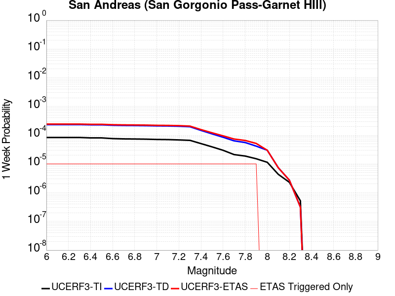 | 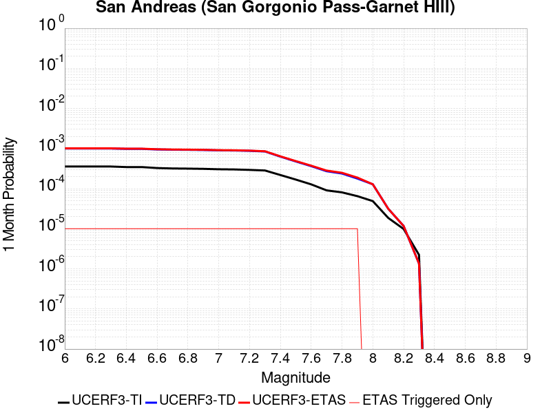 | 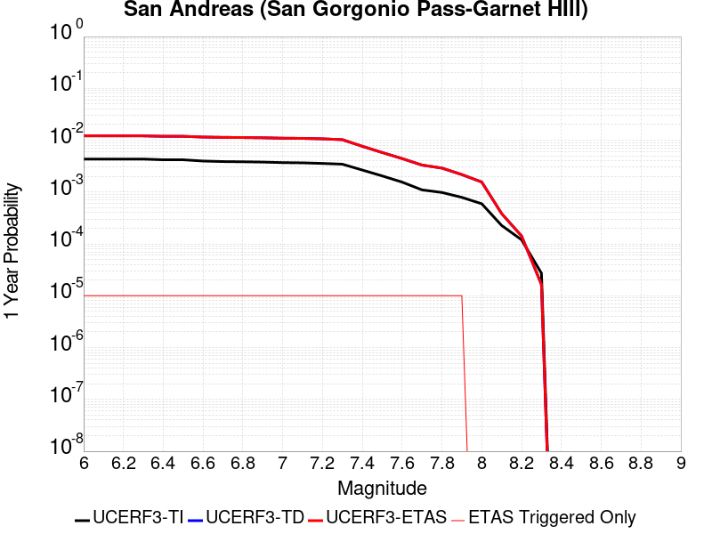 | 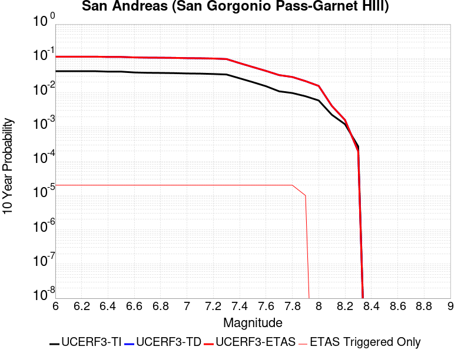 |

| Magnitude | 1 wk TI Prob | 1 wk TD Prob | 1 wk ETAS Prob | 1 wk ETAS/TD Gain | 1 wk ETAS Triggered Only | 1 mo TI Prob | 1 mo TD Prob | 1 mo ETAS Prob | 1 mo ETAS/TD Gain | 1 mo ETAS Triggered Only | 1 yr TI Prob | 1 yr TD Prob | 1 yr ETAS Prob | 1 yr ETAS/TD Gain | 1 yr ETAS Triggered Only | 10 yr TI Prob | 10 yr TD Prob | 10 yr ETAS Prob | 10 yr ETAS/TD Gain | 10 yr ETAS Triggered Only |
|-----|-----|-----|-----|-----|-----|-----|-----|-----|-----|-----|-----|-----|-----|-----|-----|-----|-----|-----|-----|-----|
| 6.0 | 8.31567E-5 | 2.3376173E-4 | 2.3376173E-4 | 1.0 | 0.0 | 3.5633717E-4 | 0.0010014536 | 0.0010014536 | 1.0 | 0.0 | 0.004329778 | 0.012124644 | 0.012124644 | 1.0 | 0.0 | 0.042463828 | 0.11255409 | 0.112563714 | 1.0000855 | 1.0845987E-5 |
| 6.1 | 8.31567E-5 | 2.3376173E-4 | 2.3376173E-4 | 1.0 | 0.0 | 3.5633717E-4 | 0.0010014536 | 0.0010014536 | 1.0 | 0.0 | 0.004329778 | 0.012124644 | 0.012124644 | 1.0 | 0.0 | 0.042463828 | 0.11255409 | 0.112563714 | 1.0000855 | 1.0845987E-5 |
| 6.2 | 8.31567E-5 | 2.3376173E-4 | 2.3376173E-4 | 1.0 | 0.0 | 3.5633717E-4 | 0.0010014536 | 0.0010014536 | 1.0 | 0.0 | 0.004329778 | 0.012124644 | 0.012124644 | 1.0 | 0.0 | 0.042463828 | 0.11255409 | 0.112563714 | 1.0000855 | 1.0845987E-5 |
| 6.3 | 8.31567E-5 | 2.3376173E-4 | 2.3376173E-4 | 1.0 | 0.0 | 3.5633717E-4 | 0.0010014536 | 0.0010014536 | 1.0 | 0.0 | 0.004329778 | 0.012124644 | 0.012124644 | 1.0 | 0.0 | 0.042463828 | 0.11255409 | 0.112563714 | 1.0000855 | 1.0845987E-5 |
| 6.4 | 8.059055E-5 | 2.2934518E-4 | 2.2934518E-4 | 1.0 | 0.0 | 3.4534236E-4 | 9.825402E-4 | 9.825402E-4 | 1.0 | 0.0 | 0.0041964394 | 0.011896912 | 0.011896912 | 1.0 | 0.0 | 0.041180745 | 0.11053528 | 0.11054493 | 1.0000873 | 1.0845987E-5 |
| 6.5 | 8.059055E-5 | 2.2934518E-4 | 2.2934518E-4 | 1.0 | 0.0 | 3.4534236E-4 | 9.825402E-4 | 9.825402E-4 | 1.0 | 0.0 | 0.0041964394 | 0.011896912 | 0.011896912 | 1.0 | 0.0 | 0.041180745 | 0.11053528 | 0.11054493 | 1.0000873 | 1.0845987E-5 |
| 6.6 | 7.619237E-5 | 2.2178894E-4 | 2.2178894E-4 | 1.0 | 0.0 | 3.2649786E-4 | 9.5018005E-4 | 9.5018005E-4 | 1.0 | 0.0 | 0.0039678677 | 0.011507631 | 0.011507631 | 1.0 | 0.0 | 0.03897764 | 0.1070719 | 0.10708158 | 1.0000905 | 1.0845987E-5 |
| 6.7 | 7.440636E-5 | 2.1854721E-4 | 2.1854721E-4 | 1.0 | 0.0 | 3.188454E-4 | 9.36297E-4 | 9.36297E-4 | 1.0 | 0.0 | 0.0038750346 | 0.0113403695 | 0.0113403695 | 1.0 | 0.0 | 0.038081564 | 0.10558031 | 0.10559001 | 1.0000919 | 1.0845987E-5 |
| 6.8 | 7.3735864E-5 | 2.1701894E-4 | 2.1701894E-4 | 1.0 | 0.0 | 3.1597257E-4 | 9.2975196E-4 | 9.2975196E-4 | 1.0 | 0.0 | 0.0038401815 | 0.011261511 | 0.011261511 | 1.0 | 0.0 | 0.03774495 | 0.104881845 | 0.10489155 | 1.0000925 | 1.0845987E-5 |
| 6.9 | 7.27575E-5 | 2.1470869E-4 | 2.1470869E-4 | 1.0 | 0.0 | 3.117806E-4 | 9.198579E-4 | 9.198579E-4 | 1.0 | 0.0 | 0.003789323 | 0.011142288 | 0.011142288 | 1.0 | 0.0 | 0.037253562 | 0.103829734 | 0.10383946 | 1.0000936 | 1.0845987E-5 |
| 7.0 | 7.102591E-5 | 2.1054916E-4 | 2.1054916E-4 | 1.0 | 0.0 | 3.0436125E-4 | 9.020437E-4 | 9.020437E-4 | 1.0 | 0.0 | 0.003699303 | 0.010927594 | 0.010927594 | 1.0 | 0.0 | 0.03638325 | 0.1019319 | 0.101941645 | 1.0000956 | 1.0845987E-5 |
| 7.1 | 7.028513E-5 | 2.0890564E-4 | 2.0890564E-4 | 1.0 | 0.0 | 3.0118722E-4 | 8.950049E-4 | 8.950049E-4 | 1.0 | 0.0 | 0.0036607897 | 0.010842753 | 0.010842753 | 1.0 | 0.0 | 0.036010686 | 0.10117493 | 0.10118467 | 1.0000963 | 1.0845987E-5 |
| 7.2 | 6.8498244E-5 | 2.0498442E-4 | 2.0498442E-4 | 1.0 | 0.0 | 2.9353087E-4 | 8.782111E-4 | 8.782111E-4 | 1.0 | 0.0 | 0.003567883 | 0.010640301 | 0.010640301 | 1.0 | 0.0 | 0.035111405 | 0.099366926 | 0.09937669 | 1.0000983 | 1.0845987E-5 |
| 7.3 | 6.622592E-5 | 1.9725891E-4 | 1.9725891E-4 | 1.0 | 0.0 | 2.8379448E-4 | 8.4512355E-4 | 8.4512355E-4 | 1.0 | 0.0 | 0.0034497243 | 0.010241316 | 0.010241316 | 1.0 | 0.0 | 0.033966612 | 0.09586389 | 0.095873706 | 1.0001023 | 1.0845987E-5 |
| 7.4 | 5.1050705E-5 | 1.468621E-4 | 1.468621E-4 | 1.0 | 0.0 | 2.1877038E-4 | 6.292581E-4 | 6.292581E-4 | 1.0 | 0.0 | 0.002660276 | 0.0076344977 | 0.0076344977 | 1.0 | 0.0 | 0.02628654 | 0.07285113 | 0.07286119 | 1.000138 | 1.0845987E-5 |
| 7.5 | 3.9302922E-5 | 1.1129282E-4 | 1.1129282E-4 | 1.0 | 0.0 | 1.6843023E-4 | 4.768824E-4 | 4.768824E-4 | 1.0 | 0.0 | 0.0020487092 | 0.005790656 | 0.005790656 | 1.0 | 0.0 | 0.020299247 | 0.05600702 | 0.056017257 | 1.0001829 | 1.0845987E-5 |
| 7.6 | 2.9851626E-5 | 8.494473E-5 | 8.494473E-5 | 1.0 | 0.0 | 1.2792926E-4 | 3.6399817E-4 | 3.6399817E-4 | 1.0 | 0.0 | 0.0015564259 | 0.0044226977 | 0.0044226977 | 1.0 | 0.0 | 0.0154556995 | 0.043191496 | 0.04320187 | 1.0002403 | 1.0845987E-5 |
| 7.7 | 2.1135214E-5 | 6.352455E-5 | 6.352455E-5 | 1.0 | 0.0 | 9.0576345E-5 | 2.7221968E-4 | 2.7221968E-4 | 1.0 | 0.0 | 0.0011022091 | 0.0033092434 | 0.0033092434 | 1.0 | 0.0 | 0.010967582 | 0.03258059 | 0.032591082 | 1.0003221 | 1.0845987E-5 |
| 7.8 | 1.883379E-5 | 5.56362E-5 | 5.56362E-5 | 1.0 | 0.0 | 8.0713755E-5 | 2.3841907E-4 | 2.3841907E-4 | 1.0 | 0.0 | 9.822468E-4 | 0.0028988915 | 0.0028988915 | 1.0 | 0.0 | 0.0097791655 | 0.02869336 | 0.028703894 | 1.0003672 | 1.0845987E-5 |
| 7.9 | 1.5156185E-5 | 4.165507E-5 | 4.165507E-5 | 1.0 | 0.0 | 6.495346E-5 | 1.7850952E-4 | 1.7850952E-4 | 1.0 | 0.0 | 7.9052144E-4 | 0.0021711884 | 0.0021711884 | 1.0 | 0.0 | 0.007877152 | 0.021757882 | 0.021757882 | 1.0 | 0.0 |
| 8.0 | 1.1405907E-5 | 2.9971703E-5 | 2.9971703E-5 | 1.0 | 0.0 | 4.8881542E-5 | 1.2844383E-4 | 1.2844383E-4 | 1.0 | 0.0 | 5.9497025E-4 | 0.001562683 | 0.001562683 | 1.0 | 0.0 | 0.005933798 | 0.015771678 | 0.015771678 | 1.0 | 0.0 |
| 8.1 | 4.3511436E-6 | 7.36832E-6 | 7.36832E-6 | 1.0 | 0.0 | 1.8647626E-5 | 3.1578133E-5 | 3.1578133E-5 | 1.0 | 0.0 | 2.2701119E-4 | 3.8439606E-4 | 3.8439606E-4 | 1.0 | 0.0 | 0.0022677942 | 0.004115886 | 0.004115886 | 1.0 | 0.0 |
| 8.2 | 2.3042528E-6 | 2.7325216E-6 | 2.7325216E-6 | 1.0 | 0.0 | 9.875332E-6 | 1.1710755E-5 | 1.1710755E-5 | 1.0 | 0.0 | 1.2022553E-4 | 1.4256914E-4 | 1.4256914E-4 | 1.0 | 0.0 | 0.0012016051 | 0.0015977593 | 0.0015977593 | 1.0 | 0.0 |
| 8.3 | 5.202968E-7 | 3.1592276E-7 | 3.1592276E-7 | 1.0 | 0.0 | 2.2298414E-6 | 1.3539541E-6 | 1.3539541E-6 | 1.0 | 0.0 | 2.714798E-5 | 1.6484279E-5 | 1.6484279E-5 | 1.0 | 0.0 | 2.7144665E-4 | 1.9559723E-4 | 1.9559723E-4 | 1.0 | 0.0 |

## San Jacinto (Coyote Creek)
*[(top)](#table-of-contents)*

| 1 Week | 1 Month | 1 Year | 10 Year |
|-----|-----|-----|-----|
| 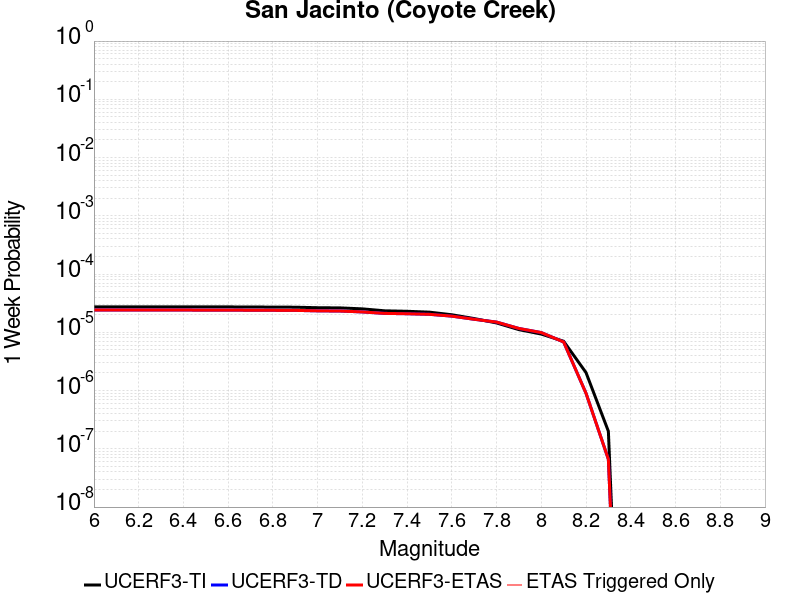 | 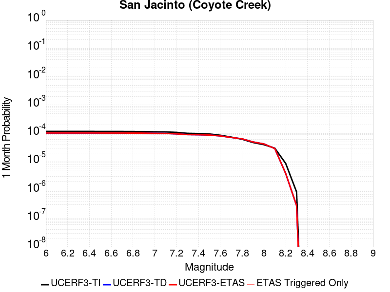 | 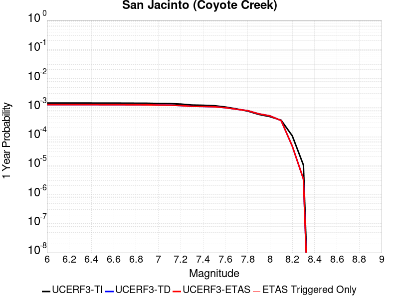 | 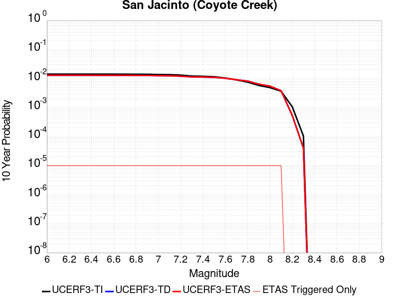 |

| Magnitude | 1 wk TI Prob | 1 wk TD Prob | 1 wk ETAS Prob | 1 wk ETAS/TD Gain | 1 wk ETAS Triggered Only | 1 mo TI Prob | 1 mo TD Prob | 1 mo ETAS Prob | 1 mo ETAS/TD Gain | 1 mo ETAS Triggered Only | 1 yr TI Prob | 1 yr TD Prob | 1 yr ETAS Prob | 1 yr ETAS/TD Gain | 1 yr ETAS Triggered Only | 10 yr TI Prob | 10 yr TD Prob | 10 yr ETAS Prob | 10 yr ETAS/TD Gain | 10 yr ETAS Triggered Only |
|-----|-----|-----|-----|-----|-----|-----|-----|-----|-----|-----|-----|-----|-----|-----|-----|-----|-----|-----|-----|-----|
| 6.0 | 2.7374346E-5 | 2.4143557E-5 | 2.4143557E-5 | 1.0 | 0.0 | 1.1731335E-4 | 1.03468294E-4 | 1.03468294E-4 | 1.0 | 0.0 | 0.0014273542 | 0.0012590011 | 0.0012590011 | 1.0 | 0.0 | 0.01418221 | 0.012927456 | 0.012938161 | 1.0008281 | 1.0845987E-5 |
| 6.1 | 2.7374346E-5 | 2.4143557E-5 | 2.4143557E-5 | 1.0 | 0.0 | 1.1731335E-4 | 1.03468294E-4 | 1.03468294E-4 | 1.0 | 0.0 | 0.0014273542 | 0.0012590011 | 0.0012590011 | 1.0 | 0.0 | 0.01418221 | 0.012927456 | 0.012938161 | 1.0008281 | 1.0845987E-5 |
| 6.2 | 2.7374346E-5 | 2.4143557E-5 | 2.4143557E-5 | 1.0 | 0.0 | 1.1731335E-4 | 1.03468294E-4 | 1.03468294E-4 | 1.0 | 0.0 | 0.0014273542 | 0.0012590011 | 0.0012590011 | 1.0 | 0.0 | 0.01418221 | 0.012927456 | 0.012938161 | 1.0008281 | 1.0845987E-5 |
| 6.3 | 2.7374346E-5 | 2.4143557E-5 | 2.4143557E-5 | 1.0 | 0.0 | 1.1731335E-4 | 1.03468294E-4 | 1.03468294E-4 | 1.0 | 0.0 | 0.0014273542 | 0.0012590011 | 0.0012590011 | 1.0 | 0.0 | 0.01418221 | 0.012927456 | 0.012938161 | 1.0008281 | 1.0845987E-5 |
| 6.4 | 2.7374346E-5 | 2.4143557E-5 | 2.4143557E-5 | 1.0 | 0.0 | 1.1731335E-4 | 1.03468294E-4 | 1.03468294E-4 | 1.0 | 0.0 | 0.0014273542 | 0.0012590011 | 0.0012590011 | 1.0 | 0.0 | 0.01418221 | 0.012927456 | 0.012938161 | 1.0008281 | 1.0845987E-5 |
| 6.5 | 2.7282445E-5 | 2.4029636E-5 | 2.4029636E-5 | 1.0 | 0.0 | 1.16919524E-4 | 1.02980106E-4 | 1.02980106E-4 | 1.0 | 0.0 | 0.0014225657 | 0.0012530643 | 0.0012530643 | 1.0 | 0.0 | 0.014134934 | 0.012868783 | 0.01287949 | 1.000832 | 1.0845987E-5 |
| 6.6 | 2.7282445E-5 | 2.4029636E-5 | 2.4029636E-5 | 1.0 | 0.0 | 1.16919524E-4 | 1.02980106E-4 | 1.02980106E-4 | 1.0 | 0.0 | 0.0014225657 | 0.0012530643 | 0.0012530643 | 1.0 | 0.0 | 0.014134934 | 0.012868783 | 0.01287949 | 1.000832 | 1.0845987E-5 |
| 6.7 | 2.7216198E-5 | 2.3954757E-5 | 2.3954757E-5 | 1.0 | 0.0 | 1.1663563E-4 | 1.0265922E-4 | 1.0265922E-4 | 1.0 | 0.0 | 0.0014191137 | 0.001249162 | 0.001249162 | 1.0 | 0.0 | 0.014100855 | 0.012830195 | 0.0128409015 | 1.0008345 | 1.0845987E-5 |
| 6.8 | 2.7078617E-5 | 2.3871975E-5 | 2.3871975E-5 | 1.0 | 0.0 | 1.1604605E-4 | 1.0230447E-4 | 1.0230447E-4 | 1.0 | 0.0 | 0.001411945 | 0.0012448479 | 0.0012448479 | 1.0 | 0.0 | 0.014030075 | 0.012787337 | 0.012798045 | 1.0008373 | 1.0845987E-5 |
| 6.9 | 2.6982952E-5 | 2.3791488E-5 | 2.3791488E-5 | 1.0 | 0.0 | 1.15636096E-4 | 1.0195955E-4 | 1.0195955E-4 | 1.0 | 0.0 | 0.0014069602 | 0.0012406532 | 0.0012406532 | 1.0 | 0.0 | 0.013980856 | 0.012745653 | 0.012756362 | 1.0008401 | 1.0845987E-5 |
| 7.0 | 2.6449972E-5 | 2.3368513E-5 | 2.3368513E-5 | 1.0 | 0.0 | 1.1335209E-4 | 1.0014694E-4 | 1.0014694E-4 | 1.0 | 0.0 | 0.001379188 | 0.0012186096 | 0.0012186096 | 1.0 | 0.0 | 0.0137065975 | 0.012527018 | 0.012537728 | 1.000855 | 1.0845987E-5 |
| 7.1 | 2.6257849E-5 | 2.3194552E-5 | 2.3194552E-5 | 1.0 | 0.0 | 1.1252879E-4 | 9.9401455E-5 | 9.9401455E-5 | 1.0 | 0.0 | 0.0013691769 | 0.0012095434 | 0.0012095434 | 1.0 | 0.0 | 0.013607717 | 0.012436883 | 0.012447594 | 1.0008613 | 1.0845987E-5 |
| 7.2 | 2.5270041E-5 | 2.238933E-5 | 2.238933E-5 | 1.0 | 0.0 | 1.0829568E-4 | 9.595075E-5 | 9.595075E-5 | 1.0 | 0.0 | 0.0013177024 | 0.0011675768 | 0.0011675768 | 1.0 | 0.0 | 0.013099162 | 0.012017925 | 0.01202864 | 1.0008917 | 1.0845987E-5 |
| 7.3 | 2.339701E-5 | 2.1121201E-5 | 2.1121201E-5 | 1.0 | 0.0 | 1.0026905E-4 | 9.05163E-5 | 9.05163E-5 | 1.0 | 0.0 | 0.001220092 | 0.0011014809 | 0.0011014809 | 1.0 | 0.0 | 0.012134149 | 0.011356855 | 0.011367577 | 1.0009441 | 1.0845987E-5 |
| 7.4 | 2.296333E-5 | 2.0851561E-5 | 2.0851561E-5 | 1.0 | 0.0 | 9.841056E-5 | 8.936079E-5 | 8.936079E-5 | 1.0 | 0.0 | 0.0011974899 | 0.0010874267 | 0.0010874267 | 1.0 | 0.0 | 0.011910575 | 0.011215971 | 0.011226695 | 1.0009562 | 1.0845987E-5 |
| 7.5 | 2.2188895E-5 | 2.03745E-5 | 2.03745E-5 | 1.0 | 0.0 | 9.50918E-5 | 8.731637E-5 | 8.731637E-5 | 1.0 | 0.0 | 0.0011571277 | 0.0010625605 | 0.0010625605 | 1.0 | 0.0 | 0.011511209 | 0.010965596 | 0.010976324 | 1.0009782 | 1.0845987E-5 |
| 7.6 | 2.0013189E-5 | 1.8960805E-5 | 1.8960805E-5 | 1.0 | 0.0 | 8.5767984E-5 | 8.125807E-5 | 8.125807E-5 | 1.0 | 0.0 | 0.001043725 | 9.888698E-4 | 9.888698E-4 | 1.0 | 0.0 | 0.010388365 | 0.010223619 | 0.010234354 | 1.00105 | 1.0845987E-5 |
| 7.7 | 1.7230794E-5 | 1.674219E-5 | 1.674219E-5 | 1.0 | 0.0 | 7.384417E-5 | 7.175027E-5 | 7.175027E-5 | 1.0 | 0.0 | 8.986819E-4 | 8.7321026E-4 | 8.7321026E-4 | 1.0 | 0.0 | 0.008950562 | 0.009062162 | 0.009072909 | 1.001186 | 1.0845987E-5 |
| 7.8 | 1.4478809E-5 | 1.4989509E-5 | 1.4989509E-5 | 1.0 | 0.0 | 6.205057E-5 | 6.4239175E-5 | 6.4239175E-5 | 1.0 | 0.0 | 7.552038E-4 | 7.81832E-4 | 7.81832E-4 | 1.0 | 0.0 | 0.0075264242 | 0.008140619 | 0.008151377 | 1.0013214 | 1.0845987E-5 |
| 7.9 | 1.1114467E-5 | 1.164379E-5 | 1.164379E-5 | 1.0 | 0.0 | 4.7632562E-5 | 4.9901002E-5 | 4.9901002E-5 | 1.0 | 0.0 | 5.797721E-4 | 6.073759E-4 | 6.073759E-4 | 1.0 | 0.0 | 0.0057826187 | 0.0063796355 | 0.0063904123 | 1.0016892 | 1.0845987E-5 |
| 8.0 | 9.327402E-6 | 9.897987E-6 | 9.897987E-6 | 1.0 | 0.0 | 3.9973966E-5 | 4.241926E-5 | 4.241926E-5 | 1.0 | 0.0 | 4.8657437E-4 | 5.163326E-4 | 5.163326E-4 | 1.0 | 0.0 | 0.0048551033 | 0.0054493384 | 0.005460125 | 1.0019795 | 1.0845987E-5 |
| 8.1 | 7.0235833E-6 | 6.826621E-6 | 6.826621E-6 | 1.0 | 0.0 | 3.0100724E-5 | 2.925662E-5 | 2.925662E-5 | 1.0 | 0.0 | 3.664147E-4 | 3.5614165E-4 | 3.5614165E-4 | 1.0 | 0.0 | 0.003658111 | 0.003787139 | 0.003797944 | 1.002853 | 1.0845987E-5 |
| 8.2 | 2.0358202E-6 | 8.9928193E-7 | 8.9928193E-7 | 1.0 | 0.0 | 8.724915E-6 | 3.8540597E-6 | 3.8540597E-6 | 1.0 | 0.0 | 1.06220665E-4 | 4.6922192E-5 | 4.6922192E-5 | 1.0 | 0.0 | 0.001061699 | 5.3244614E-4 | 5.3244614E-4 | 1.0 | 0.0 |
| 8.3 | 2.0051264E-7 | 6.615823E-8 | 6.615823E-8 | 1.0 | 0.0 | 8.5933965E-7 | 2.8353526E-7 | 2.8353526E-7 | 1.0 | 0.0 | 1.046241E-5 | 3.4520367E-6 | 3.4520367E-6 | 1.0 | 0.0 | 1.0461917E-4 | 4.01306E-5 | 4.01306E-5 | 1.0 | 0.0 |

## Mission Ridge-Arroyo Parida-Santa Ana
*[(top)](#table-of-contents)*

| 1 Week | 1 Month | 1 Year | 10 Year |
|-----|-----|-----|-----|
|  |  |  |  |

| Magnitude | 1 wk TI Prob | 1 wk TD Prob | 1 wk ETAS Prob | 1 wk ETAS/TD Gain | 1 wk ETAS Triggered Only | 1 mo TI Prob | 1 mo TD Prob | 1 mo ETAS Prob | 1 mo ETAS/TD Gain | 1 mo ETAS Triggered Only | 1 yr TI Prob | 1 yr TD Prob | 1 yr ETAS Prob | 1 yr ETAS/TD Gain | 1 yr ETAS Triggered Only | 10 yr TI Prob | 10 yr TD Prob | 10 yr ETAS Prob | 10 yr ETAS/TD Gain | 10 yr ETAS Triggered Only |
|-----|-----|-----|-----|-----|-----|-----|-----|-----|-----|-----|-----|-----|-----|-----|-----|-----|-----|-----|-----|-----|
| 6.0 | 4.169034E-5 | 4.7138004E-5 | 5.7983478E-5 | 1.2300793 | 1.0845987E-5 | 1.7866064E-4 | 2.0200922E-4 | 2.1285302E-4 | 1.0536797 | 1.0845987E-5 | 0.0021730233 | 0.0024574373 | 0.0024682565 | 1.0044026 | 1.0845987E-5 | 0.021518968 | 0.024384484 | 0.024395065 | 1.0004339 | 1.0845987E-5 |
| 6.1 | 1.73813E-5 | 1.6854168E-5 | 1.6854168E-5 | 1.0 | 0.0 | 7.4489166E-5 | 7.2230214E-5 | 7.2230214E-5 | 1.0 | 0.0 | 9.065282E-4 | 8.7905885E-4 | 8.7905885E-4 | 1.0 | 0.0 | 0.009028391 | 0.008756958 | 0.008756958 | 1.0 | 0.0 |
| 6.2 | 1.4622182E-5 | 1.3673245E-5 | 1.3673245E-5 | 1.0 | 0.0 | 6.2664985E-5 | 5.859833E-5 | 5.859833E-5 | 1.0 | 0.0 | 7.6267915E-4 | 7.13205E-4 | 7.13205E-4 | 1.0 | 0.0 | 0.007600669 | 0.0071096043 | 0.0071096043 | 1.0 | 0.0 |
| 6.3 | 1.3552434E-5 | 1.248216E-5 | 1.248216E-5 | 1.0 | 0.0 | 5.8080568E-5 | 5.349389E-5 | 5.349389E-5 | 1.0 | 0.0 | 7.069015E-4 | 6.510967E-4 | 6.510967E-4 | 1.0 | 0.0 | 0.00704657 | 0.006492254 | 0.006492254 | 1.0 | 0.0 |
| 6.4 | 1.30977305E-5 | 1.1979117E-5 | 1.1979117E-5 | 1.0 | 0.0 | 5.613192E-5 | 5.133808E-5 | 5.133808E-5 | 1.0 | 0.0 | 6.831918E-4 | 6.248649E-4 | 6.248649E-4 | 1.0 | 0.0 | 0.006810953 | 0.006231424 | 0.006231424 | 1.0 | 0.0 |
| 6.5 | 1.225205E-5 | 1.1048766E-5 | 1.1048766E-5 | 1.0 | 0.0 | 5.2507727E-5 | 4.735101E-5 | 4.735101E-5 | 1.0 | 0.0 | 6.3909404E-4 | 5.763488E-4 | 5.763488E-4 | 1.0 | 0.0 | 0.006372592 | 0.00574885 | 0.00574885 | 1.0 | 0.0 |
| 6.6 | 1.1352241E-5 | 1.0063501E-5 | 1.0063501E-5 | 1.0 | 0.0 | 4.8651553E-5 | 4.3128588E-5 | 4.3128588E-5 | 1.0 | 0.0 | 5.921717E-4 | 5.2496616E-4 | 5.2496616E-4 | 1.0 | 0.0 | 0.0059059616 | 0.0052375067 | 0.0052375067 | 1.0 | 0.0 |
| 6.7 | 1.0864116E-5 | 9.516994E-6 | 9.516994E-6 | 1.0 | 0.0 | 4.6559664E-5 | 4.0786494E-5 | 4.0786494E-5 | 1.0 | 0.0 | 5.667165E-4 | 4.9646443E-4 | 4.9646443E-4 | 1.0 | 0.0 | 0.005652734 | 0.004953787 | 0.004953787 | 1.0 | 0.0 |
| 6.8 | 1.0666365E-5 | 9.299747E-6 | 9.299747E-6 | 1.0 | 0.0 | 4.571219E-5 | 3.985546E-5 | 3.985546E-5 | 1.0 | 0.0 | 5.564038E-4 | 4.851342E-4 | 4.851342E-4 | 1.0 | 0.0 | 0.005550127 | 0.0048409835 | 0.0048409835 | 1.0 | 0.0 |
| 6.9 | 1.0038665E-5 | 8.592016E-6 | 8.592016E-6 | 1.0 | 0.0 | 4.302214E-5 | 3.6822417E-5 | 3.6822417E-5 | 1.0 | 0.0 | 5.236687E-4 | 4.482225E-4 | 4.482225E-4 | 1.0 | 0.0 | 0.005224364 | 0.0044733956 | 0.0044733956 | 1.0 | 0.0 |
| 7.0 | 9.5379955E-6 | 8.025046E-6 | 8.025046E-6 | 1.0 | 0.0 | 4.0876483E-5 | 3.439261E-5 | 3.439261E-5 | 1.0 | 0.0 | 4.975576E-4 | 4.186513E-4 | 4.186513E-4 | 1.0 | 0.0 | 0.00496445 | 0.0041788258 | 0.0041788258 | 1.0 | 0.0 |
| 7.1 | 9.207389E-6 | 7.652349E-6 | 7.652349E-6 | 1.0 | 0.0 | 3.945964E-5 | 3.279538E-5 | 3.279538E-5 | 1.0 | 0.0 | 4.803152E-4 | 3.992123E-4 | 3.992123E-4 | 1.0 | 0.0 | 0.004792784 | 0.0039851475 | 0.0039851475 | 1.0 | 0.0 |
| 7.2 | 7.638091E-6 | 5.9310996E-6 | 5.9310996E-6 | 1.0 | 0.0 | 3.2734264E-5 | 2.5418753E-5 | 2.5418753E-5 | 1.0 | 0.0 | 3.984668E-4 | 3.0942968E-4 | 3.0942968E-4 | 1.0 | 0.0 | 0.0039775306 | 0.0030900452 | 0.0030900452 | 1.0 | 0.0 |
| 7.3 | 7.2500147E-6 | 5.596136E-6 | 5.596136E-6 | 1.0 | 0.0 | 3.1071122E-5 | 2.398322E-5 | 2.398322E-5 | 1.0 | 0.0 | 3.7822526E-4 | 2.9195688E-4 | 2.9195688E-4 | 1.0 | 0.0 | 0.0037758215 | 0.0029157887 | 0.0029157887 | 1.0 | 0.0 |
| 7.4 | 6.3899715E-6 | 4.9184823E-6 | 4.9184823E-6 | 1.0 | 0.0 | 2.7385306E-5 | 2.107904E-5 | 2.107904E-5 | 1.0 | 0.0 | 3.3336508E-4 | 2.5660728E-4 | 2.5660728E-4 | 1.0 | 0.0 | 0.0033286542 | 0.0025631543 | 0.0025631543 | 1.0 | 0.0 |
| 7.5 | 5.379025E-6 | 4.0838413E-6 | 4.0838413E-6 | 1.0 | 0.0 | 2.305276E-5 | 1.7502061E-5 | 1.7502061E-5 | 1.0 | 0.0 | 2.806312E-4 | 2.1306686E-4 | 2.1306686E-4 | 1.0 | 0.0 | 0.0028027708 | 0.0021286372 | 0.0021286372 | 1.0 | 0.0 |
| 7.6 | 4.1270696E-6 | 3.088336E-6 | 3.088336E-6 | 1.0 | 0.0 | 1.768732E-5 | 1.3235658E-5 | 1.3235658E-5 | 1.0 | 0.0 | 2.1532185E-4 | 1.611323E-4 | 1.611323E-4 | 1.0 | 0.0 | 0.0021511333 | 0.0016101628 | 0.0016101628 | 1.0 | 0.0 |
| 7.7 | 2.5406805E-6 | 1.8281963E-6 | 1.8281963E-6 | 1.0 | 0.0 | 1.0888585E-5 | 7.835104E-6 | 7.835104E-6 | 1.0 | 0.0 | 1.3256045E-4 | 9.538828E-5 | 9.538828E-5 | 1.0 | 0.0 | 0.0013248142 | 9.534795E-4 | 9.534795E-4 | 1.0 | 0.0 |
| 7.8 | 4.8608285E-7 | 3.509878E-7 | 3.509878E-7 | 1.0 | 0.0 | 2.0832106E-6 | 1.5042325E-6 | 1.5042325E-6 | 1.0 | 0.0 | 2.5362791E-5 | 1.8313878E-5 | 1.8313878E-5 | 1.0 | 0.0 | 2.5359896E-4 | 1.831238E-4 | 1.831238E-4 | 1.0 | 0.0 |
| 7.9 | 2.0472514E-8 | 1.268872E-8 | 1.268872E-8 | 1.0 | 0.0 | 8.7739345E-8 | 5.438023E-8 | 5.438023E-8 | 1.0 | 0.0 | 1.068226E-6 | 6.620791E-7 | 6.620791E-7 | 1.0 | 0.0 | 1.0682209E-5 | 6.6207726E-6 | 6.6207726E-6 | 1.0 | 0.0 |
| 8.0 | 4.443582E-9 | 2.0320927E-9 | 2.0320927E-9 | 1.0 | 0.0 | 1.9043922E-8 | 8.7089695E-9 | 8.7089695E-9 | 1.0 | 0.0 | 2.3185973E-7 | 1.060317E-7 | 1.060317E-7 | 1.0 | 0.0 | 2.3185949E-6 | 1.0603165E-6 | 1.0603165E-6 | 1.0 | 0.0 |

## Hayward (No) 2011 CFM
*[(top)](#table-of-contents)*

| 1 Week | 1 Month | 1 Year | 10 Year |
|-----|-----|-----|-----|
|  |  |  |  |

| Magnitude | 1 wk TI Prob | 1 wk TD Prob | 1 wk ETAS Prob | 1 wk ETAS/TD Gain | 1 wk ETAS Triggered Only | 1 mo TI Prob | 1 mo TD Prob | 1 mo ETAS Prob | 1 mo ETAS/TD Gain | 1 mo ETAS Triggered Only | 1 yr TI Prob | 1 yr TD Prob | 1 yr ETAS Prob | 1 yr ETAS/TD Gain | 1 yr ETAS Triggered Only | 10 yr TI Prob | 10 yr TD Prob | 10 yr ETAS Prob | 10 yr ETAS/TD Gain | 10 yr ETAS Triggered Only |
|-----|-----|-----|-----|-----|-----|-----|-----|-----|-----|-----|-----|-----|-----|-----|-----|-----|-----|-----|-----|-----|
| 6.0 | 9.3068506E-5 | 1.7395586E-4 | 1.8479997E-4 | 1.0623382 | 1.0845987E-5 | 3.9880406E-4 | 7.453083E-4 | 7.561462E-4 | 1.0145415 | 1.0845987E-5 | 0.0048446343 | 0.009036233 | 0.00904698 | 1.0011895 | 1.0845987E-5 | 0.047403704 | 0.08637354 | 0.08638345 | 1.0001147 | 1.0845987E-5 |
| 6.1 | 9.055486E-5 | 1.6946718E-4 | 1.8031133E-4 | 1.0639896 | 1.0845987E-5 | 3.880345E-4 | 7.260854E-4 | 7.369235E-4 | 1.0149268 | 1.0845987E-5 | 0.0047140904 | 0.008804334 | 0.008815085 | 1.0012211 | 1.0845987E-5 | 0.046153355 | 0.084266745 | 0.084276676 | 1.0001179 | 1.0845987E-5 |
| 6.2 | 9.006742E-5 | 1.6867317E-4 | 1.7951733E-4 | 1.064291 | 1.0845987E-5 | 3.859461E-4 | 7.226844E-4 | 7.335225E-4 | 1.0149971 | 1.0845987E-5 | 0.0046887742 | 0.00876331 | 0.008774061 | 1.0012268 | 1.0845987E-5 | 0.0459107 | 0.083891 | 0.08390093 | 1.0001185 | 1.0845987E-5 |
| 6.3 | 8.8336754E-5 | 1.6546855E-4 | 1.7631274E-4 | 1.0655363 | 1.0845987E-5 | 3.7853114E-4 | 7.08959E-4 | 7.1979733E-4 | 1.0152876 | 1.0845987E-5 | 0.004598882 | 0.008597586 | 0.008608338 | 1.0012506 | 1.0845987E-5 | 0.04504866 | 0.08238421 | 0.08239416 | 1.0001208 | 1.0845987E-5 |
| 6.4 | 8.526157E-5 | 1.5973859E-4 | 1.7058283E-4 | 1.0678875 | 1.0845987E-5 | 3.6535555E-4 | 6.8441505E-4 | 6.952536E-4 | 1.0158362 | 1.0845987E-5 | 0.0044391346 | 0.0083010765 | 0.008311832 | 1.0012957 | 1.0845987E-5 | 0.043514993 | 0.079681054 | 0.07969104 | 1.0001253 | 1.0845987E-5 |
| 6.5 | 8.152396E-5 | 1.5306243E-4 | 1.6390675E-4 | 1.0708491 | 1.0845987E-5 | 3.493416E-4 | 6.558176E-4 | 6.666565E-4 | 1.0165273 | 1.0845987E-5 | 0.0042449418 | 0.007955498 | 0.007966258 | 1.0013524 | 1.0845987E-5 | 0.04164765 | 0.07651191 | 0.076521926 | 1.0001309 | 1.0845987E-5 |
| 6.6 | 7.987405E-5 | 1.5010455E-4 | 1.6094891E-4 | 1.0722454 | 1.0845987E-5 | 3.4227243E-4 | 6.4314733E-4 | 6.5398635E-4 | 1.0168531 | 1.0845987E-5 | 0.0041592065 | 0.0078023616 | 0.007813123 | 1.0013793 | 1.0845987E-5 | 0.04082218 | 0.07510444 | 0.07511447 | 1.0001335 | 1.0845987E-5 |
| 6.7 | 7.777665E-5 | 1.4649722E-4 | 1.5734162E-4 | 1.0740246 | 1.0845987E-5 | 3.332859E-4 | 6.276948E-4 | 6.38534E-4 | 1.0172682 | 1.0845987E-5 | 0.004050208 | 0.007615561 | 0.0076263244 | 1.0014133 | 1.0845987E-5 | 0.039771806 | 0.07338084 | 0.07339089 | 1.000137 | 1.0845987E-5 |
| 6.8 | 7.3284005E-5 | 1.3800382E-4 | 1.4884831E-4 | 1.0785811 | 1.0845987E-5 | 3.140365E-4 | 5.913115E-4 | 6.0215103E-4 | 1.0183314 | 1.0845987E-5 | 0.0038166929 | 0.0071755904 | 0.0071863583 | 1.0015006 | 1.0845987E-5 | 0.037518036 | 0.06929449 | 0.069304585 | 1.0001457 | 1.0845987E-5 |
| 6.9 | 6.458263E-5 | 1.2131093E-4 | 1.321556E-4 | 1.0893956 | 1.0845987E-5 | 2.7675333E-4 | 5.198009E-4 | 5.306412E-4 | 1.0208548 | 1.0845987E-5 | 0.0033642664 | 0.0063103125 | 0.0063210903 | 1.0017079 | 1.0845987E-5 | 0.033137884 | 0.061223395 | 0.061233576 | 1.0001663 | 1.0845987E-5 |
| 7.0 | 5.3853604E-5 | 1.0024721E-4 | 1.11092115E-4 | 1.1081816 | 1.0845987E-5 | 2.3078074E-4 | 4.295605E-4 | 4.4040184E-4 | 1.0252382 | 1.0845987E-5 | 0.0028061352 | 0.0052174223 | 0.0052282116 | 1.0020679 | 1.0845987E-5 | 0.027709642 | 0.050956275 | 0.05096657 | 1.0002021 | 1.0845987E-5 |
| 7.1 | 4.4308683E-5 | 8.1703285E-5 | 9.254839E-5 | 1.1327376 | 1.0845987E-5 | 1.8988053E-4 | 3.5011017E-4 | 3.6095237E-4 | 1.030968 | 1.0845987E-5 | 0.0023093442 | 0.0042543015 | 0.004265101 | 1.0025386 | 1.0845987E-5 | 0.022854926 | 0.041823294 | 0.041833688 | 1.0002484 | 1.0845987E-5 |
| 7.2 | 3.295973E-5 | 6.076837E-5 | 7.16137E-5 | 1.1784699 | 1.0845987E-5 | 1.4124835E-4 | 2.6041E-4 | 2.7125317E-4 | 1.0416389 | 1.0845987E-5 | 0.0017183421 | 0.0031659051 | 0.0031767169 | 1.003415 | 1.0845987E-5 | 0.017051157 | 0.031368516 | 0.03137902 | 1.0003349 | 1.0845987E-5 |
| 7.3 | 2.452256E-5 | 4.5177785E-5 | 4.5177785E-5 | 1.0 | 0.0 | 1.05092455E-4 | 1.9360479E-4 | 1.9360479E-4 | 1.0 | 0.0 | 0.0012787496 | 0.002354604 | 0.002354604 | 1.0 | 0.0 | 0.0127141625 | 0.023439845 | 0.023439845 | 1.0 | 0.0 |
| 7.4 | 1.8829967E-5 | 3.4600187E-5 | 3.4600187E-5 | 1.0 | 0.0 | 8.069736E-5 | 1.4827815E-4 | 1.4827815E-4 | 1.0 | 0.0 | 9.820475E-4 | 0.0018038014 | 0.0018038014 | 1.0 | 0.0 | 0.009777189 | 0.018018324 | 0.018018324 | 1.0 | 0.0 |
| 7.5 | 1.26374125E-5 | 2.2919028E-5 | 2.2919028E-5 | 1.0 | 0.0 | 5.4159216E-5 | 9.822074E-5 | 9.822074E-5 | 1.0 | 0.0 | 6.5918895E-4 | 0.0011951873 | 0.0011951873 | 1.0 | 0.0 | 0.00657237 | 0.011987788 | 0.011987788 | 1.0 | 0.0 |
| 7.6 | 4.666429E-6 | 8.477469E-6 | 8.477469E-6 | 1.0 | 0.0 | 1.9998828E-5 | 3.6331512E-5 | 3.6331512E-5 | 1.0 | 0.0 | 2.4345852E-4 | 4.4224763E-4 | 4.4224763E-4 | 1.0 | 0.0 | 0.0024319198 | 0.0044582393 | 0.0044582393 | 1.0 | 0.0 |
| 7.7 | 3.8399318E-7 | 7.13327E-7 | 7.13327E-7 | 1.0 | 0.0 | 1.6456839E-6 | 3.0571118E-6 | 3.0571118E-6 | 1.0 | 0.0 | 2.003602E-5 | 3.7219703E-5 | 3.7219703E-5 | 1.0 | 0.0 | 2.0034213E-4 | 3.8612023E-4 | 3.8612023E-4 | 1.0 | 0.0 |
| 7.8 | 2.5637698E-7 | 5.365698E-7 | 5.365698E-7 | 1.0 | 0.0 | 1.098758E-6 | 2.2995828E-6 | 2.2995828E-6 | 1.0 | 0.0 | 1.3377297E-5 | 2.7997063E-5 | 2.7997063E-5 | 1.0 | 0.0 | 1.3376492E-4 | 2.924185E-4 | 2.924185E-4 | 1.0 | 0.0 |
| 7.9 | 1.7141245E-7 | 3.7286972E-7 | 3.7286972E-7 | 1.0 | 0.0 | 7.3462456E-7 | 1.598012E-6 | 1.598012E-6 | 1.0 | 0.0 | 8.944017E-6 | 1.9455623E-5 | 1.9455623E-5 | 1.0 | 0.0 | 8.943657E-5 | 2.0243683E-4 | 2.0243683E-4 | 1.0 | 0.0 |
| 8.0 | 1.1808895E-7 | 2.750723E-7 | 2.750723E-7 | 1.0 | 0.0 | 5.060954E-7 | 1.1788807E-6 | 1.1788807E-6 | 1.0 | 0.0 | 6.161694E-6 | 1.4352779E-5 | 1.4352779E-5 | 1.0 | 0.0 | 6.161523E-5 | 1.4815228E-4 | 1.4815228E-4 | 1.0 | 0.0 |
| 8.1 | 5.138535E-8 | 1.1228883E-7 | 1.1228883E-7 | 1.0 | 0.0 | 2.2022292E-7 | 4.8123775E-7 | 4.8123775E-7 | 1.0 | 0.0 | 2.6812106E-6 | 5.859054E-6 | 5.859054E-6 | 1.0 | 0.0 | 2.6811784E-5 | 6.015367E-5 | 6.015367E-5 | 1.0 | 0.0 |

## Calaveras (Central) 2011 CFM
*[(top)](#table-of-contents)*

| 1 Week | 1 Month | 1 Year | 10 Year |
|-----|-----|-----|-----|
|  |  |  |  |

| Magnitude | 1 wk TI Prob | 1 wk TD Prob | 1 wk ETAS Prob | 1 wk ETAS/TD Gain | 1 wk ETAS Triggered Only | 1 mo TI Prob | 1 mo TD Prob | 1 mo ETAS Prob | 1 mo ETAS/TD Gain | 1 mo ETAS Triggered Only | 1 yr TI Prob | 1 yr TD Prob | 1 yr ETAS Prob | 1 yr ETAS/TD Gain | 1 yr ETAS Triggered Only | 10 yr TI Prob | 10 yr TD Prob | 10 yr ETAS Prob | 10 yr ETAS/TD Gain | 10 yr ETAS Triggered Only |
|-----|-----|-----|-----|-----|-----|-----|-----|-----|-----|-----|-----|-----|-----|-----|-----|-----|-----|-----|-----|-----|
| 6.0 | 1.5010907E-4 | 2.481505E-4 | 2.481505E-4 | 1.0 | 0.0 | 6.4316596E-4 | 0.0010621375 | 0.0010621375 | 1.0 | 0.0 | 0.0078024664 | 0.012849847 | 0.012860553 | 1.0008332 | 1.0845987E-5 | 0.07534136 | 0.120399095 | 0.12040864 | 1.0000793 | 1.0845987E-5 |
| 6.1 | 1.4521465E-4 | 2.3979212E-4 | 2.3979212E-4 | 1.0 | 0.0 | 6.222001E-4 | 0.0010263444 | 0.0010263444 | 1.0 | 0.0 | 0.0075490056 | 0.012419128 | 0.012429839 | 1.0008625 | 1.0845987E-5 | 0.07297657 | 0.11667092 | 0.1166805 | 1.0000821 | 1.0845987E-5 |
| 6.2 | 1.429998E-4 | 2.3910476E-4 | 2.3910476E-4 | 1.0 | 0.0 | 6.127123E-4 | 0.0010234008 | 0.0010234008 | 1.0 | 0.0 | 0.007434286 | 0.01238373 | 0.012394441 | 1.000865 | 1.0845987E-5 | 0.07190444 | 0.116324924 | 0.116334505 | 1.0000824 | 1.0845987E-5 |
| 6.3 | 1.3536277E-4 | 2.3242012E-4 | 2.3242012E-4 | 1.0 | 0.0 | 5.799972E-4 | 9.947744E-4 | 9.947744E-4 | 1.0 | 0.0 | 0.0070386264 | 0.012039932 | 0.012050647 | 1.00089 | 1.0845987E-5 | 0.0681982 | 0.11323759 | 0.11324721 | 1.0000849 | 1.0845987E-5 |
| 6.4 | 1.2993296E-4 | 2.266558E-4 | 2.266558E-4 | 1.0 | 0.0 | 5.5673666E-4 | 9.7008876E-4 | 9.7008876E-4 | 1.0 | 0.0 | 0.006757223 | 0.011742746 | 0.011753465 | 1.0009128 | 1.0845987E-5 | 0.06555412 | 0.1105156 | 0.11052525 | 1.0000873 | 1.0845987E-5 |
| 6.5 | 1.0498927E-4 | 1.7981282E-4 | 1.7981282E-4 | 1.0 | 0.0 | 4.498764E-4 | 7.703966E-4 | 7.703966E-4 | 1.0 | 0.0 | 0.005463498 | 0.0093390085 | 0.009349753 | 1.0011505 | 1.0845987E-5 | 0.053311124 | 0.0891972 | 0.08920708 | 1.0001107 | 1.0845987E-5 |
| 6.6 | 1.0157505E-4 | 1.7468796E-4 | 1.7468796E-4 | 1.0 | 0.0 | 4.35249E-4 | 7.4844563E-4 | 7.4844563E-4 | 1.0 | 0.0 | 0.0052862884 | 0.009074068 | 0.009084815 | 1.0011845 | 1.0845987E-5 | 0.05162293 | 0.08677472 | 0.08678462 | 1.0001142 | 1.0845987E-5 |
| 6.7 | 9.660386E-5 | 1.6728124E-4 | 1.6728124E-4 | 1.0 | 0.0 | 4.1395082E-4 | 7.167203E-4 | 7.167203E-4 | 1.0 | 0.0 | 0.0050282106 | 0.008690982 | 0.008701734 | 1.0012372 | 1.0845987E-5 | 0.049159497 | 0.0832641 | 0.08327404 | 1.0001194 | 1.0845987E-5 |
| 6.8 | 9.089927E-5 | 1.5642591E-4 | 1.5642591E-4 | 1.0 | 0.0 | 3.8951015E-4 | 6.702257E-4 | 6.702257E-4 | 1.0 | 0.0 | 0.0047319788 | 0.008129261 | 0.008140019 | 1.0013233 | 1.0845987E-5 | 0.046324775 | 0.07815751 | 0.078167506 | 1.0001279 | 1.0845987E-5 |
| 6.9 | 7.353187E-5 | 1.2294986E-4 | 1.2294986E-4 | 1.0 | 0.0 | 3.150985E-4 | 5.268222E-4 | 5.268222E-4 | 1.0 | 0.0 | 0.0038295772 | 0.006395317 | 0.006406094 | 1.001685 | 1.0845987E-5 | 0.037642512 | 0.062186148 | 0.062196318 | 1.0001636 | 1.0845987E-5 |
| 7.0 | 5.746064E-5 | 9.388408E-5 | 9.388408E-5 | 1.0 | 0.0 | 2.4623662E-4 | 4.0229867E-4 | 4.0229867E-4 | 1.0 | 0.0 | 0.0029938098 | 0.0048870575 | 0.0048978506 | 1.0022085 | 1.0845987E-5 | 0.02953797 | 0.04798525 | 0.047995575 | 1.0002152 | 1.0845987E-5 |
| 7.1 | 4.9557195E-5 | 8.052138E-5 | 8.052138E-5 | 1.0 | 0.0 | 2.123707E-4 | 3.450463E-4 | 3.450463E-4 | 1.0 | 0.0 | 0.0025825473 | 0.004192909 | 0.00420371 | 1.0025759 | 1.0845987E-5 | 0.0255274 | 0.041371524 | 0.04138192 | 1.0002513 | 1.0845987E-5 |
| 7.2 | 3.687595E-5 | 5.952145E-5 | 5.952145E-5 | 1.0 | 0.0 | 1.5803022E-4 | 2.5506716E-4 | 2.5506716E-4 | 1.0 | 0.0 | 0.0019223199 | 0.0031010495 | 0.0031010495 | 1.0 | 0.0 | 0.01905776 | 0.030882219 | 0.030882219 | 1.0 | 0.0 |
| 7.3 | 2.5846984E-5 | 4.2469303E-5 | 4.2469303E-5 | 1.0 | 0.0 | 1.1076809E-4 | 1.819987E-4 | 1.819987E-4 | 1.0 | 0.0 | 0.0013477671 | 0.0022135996 | 0.0022135996 | 1.0 | 0.0 | 0.013396223 | 0.022174144 | 0.022174144 | 1.0 | 0.0 |
| 7.4 | 1.7747854E-5 | 2.9933528E-5 | 2.9933528E-5 | 1.0 | 0.0 | 7.6060016E-5 | 1.2828026E-4 | 1.2828026E-4 | 1.0 | 0.0 | 9.2563726E-4 | 0.0015606962 | 0.0015606962 | 1.0 | 0.0 | 0.009217911 | 0.015707906 | 0.015707906 | 1.0 | 0.0 |
| 7.5 | 1.4883479E-5 | 2.6240761E-5 | 2.6240761E-5 | 1.0 | 0.0 | 6.378478E-5 | 1.1245557E-4 | 1.1245557E-4 | 1.0 | 0.0 | 7.76303E-4 | 0.0013682895 | 0.0013682895 | 1.0 | 0.0 | 0.0077359667 | 0.013801122 | 0.013801122 | 1.0 | 0.0 |
| 7.6 | 8.166975E-6 | 1.4961152E-5 | 1.4961152E-5 | 1.0 | 0.0 | 3.5000852E-5 | 6.411765E-5 | 6.411765E-5 | 1.0 | 0.0 | 4.2605202E-4 | 7.803542E-4 | 7.803542E-4 | 1.0 | 0.0 | 0.004252361 | 0.007938672 | 0.007938672 | 1.0 | 0.0 |
| 7.7 | 3.3858064E-6 | 6.2532777E-6 | 6.2532777E-6 | 1.0 | 0.0 | 1.4510518E-5 | 2.6799486E-5 | 2.6799486E-5 | 1.0 | 0.0 | 1.7665124E-4 | 3.2623496E-4 | 3.2623496E-4 | 1.0 | 0.0 | 0.0017651088 | 0.0033879161 | 0.0033879161 | 1.0 | 0.0 |
| 7.8 | 2.7721615E-6 | 5.365835E-6 | 5.365835E-6 | 1.0 | 0.0 | 1.1880637E-5 | 2.2996233E-5 | 2.2996233E-5 | 1.0 | 0.0 | 1.4463716E-4 | 2.7994323E-4 | 2.7994323E-4 | 1.0 | 0.0 | 0.0014454306 | 0.0029071951 | 0.0029071951 | 1.0 | 0.0 |
| 7.9 | 1.9736292E-6 | 4.12802E-6 | 4.12802E-6 | 1.0 | 0.0 | 8.4583835E-6 | 1.7691395E-5 | 1.7691395E-5 | 1.0 | 0.0 | 1.0297595E-4 | 2.1537147E-4 | 2.1537147E-4 | 1.0 | 0.0 | 0.0010292825 | 0.0022234174 | 0.0022234174 | 1.0 | 0.0 |
| 8.0 | 1.1767289E-6 | 2.554244E-6 | 2.554244E-6 | 1.0 | 0.0 | 5.0431145E-6 | 1.0946714E-5 | 1.0946714E-5 | 1.0 | 0.0 | 6.139818E-5 | 1.3326813E-4 | 1.3326813E-4 | 1.0 | 0.0 | 6.1381224E-4 | 0.0013659728 | 0.0013659728 | 1.0 | 0.0 |
| 8.1 | 7.5112825E-7 | 1.5408434E-6 | 1.5408434E-6 | 1.0 | 0.0 | 3.2191172E-6 | 6.6035977E-6 | 6.6035977E-6 | 1.0 | 0.0 | 3.9192048E-5 | 8.039586E-5 | 8.039586E-5 | 1.0 | 0.0 | 3.9185135E-4 | 8.234898E-4 | 8.234898E-4 | 1.0 | 0.0 |

## Eaton Roughs 2011 CFM
*[(top)](#table-of-contents)*

| 1 Week | 1 Month | 1 Year | 10 Year |
|-----|-----|-----|-----|
|  |  |  |  |

| Magnitude | 1 wk TI Prob | 1 wk TD Prob | 1 wk ETAS Prob | 1 wk ETAS/TD Gain | 1 wk ETAS Triggered Only | 1 mo TI Prob | 1 mo TD Prob | 1 mo ETAS Prob | 1 mo ETAS/TD Gain | 1 mo ETAS Triggered Only | 1 yr TI Prob | 1 yr TD Prob | 1 yr ETAS Prob | 1 yr ETAS/TD Gain | 1 yr ETAS Triggered Only | 10 yr TI Prob | 10 yr TD Prob | 10 yr ETAS Prob | 10 yr ETAS/TD Gain | 10 yr ETAS Triggered Only |
|-----|-----|-----|-----|-----|-----|-----|-----|-----|-----|-----|-----|-----|-----|-----|-----|-----|-----|-----|-----|-----|
| 6.0 | 6.8044945E-5 | 8.843572E-5 | 8.843572E-5 | 1.0 | 0.0 | 2.9158857E-4 | 3.7896173E-4 | 3.7896173E-4 | 1.0 | 0.0 | 0.0035443127 | 0.004605058 | 0.0046158545 | 1.0023444 | 1.0845987E-5 | 0.03488314 | 0.045163017 | 0.045173373 | 1.0002294 | 1.0845987E-5 |
| 6.1 | 6.8044945E-5 | 8.843572E-5 | 8.843572E-5 | 1.0 | 0.0 | 2.9158857E-4 | 3.7896173E-4 | 3.7896173E-4 | 1.0 | 0.0 | 0.0035443127 | 0.004605058 | 0.0046158545 | 1.0023444 | 1.0845987E-5 | 0.03488314 | 0.045163017 | 0.045173373 | 1.0002294 | 1.0845987E-5 |
| 6.2 | 6.8044945E-5 | 8.843572E-5 | 8.843572E-5 | 1.0 | 0.0 | 2.9158857E-4 | 3.7896173E-4 | 3.7896173E-4 | 1.0 | 0.0 | 0.0035443127 | 0.004605058 | 0.0046158545 | 1.0023444 | 1.0845987E-5 | 0.03488314 | 0.045163017 | 0.045173373 | 1.0002294 | 1.0845987E-5 |
| 6.3 | 6.8044945E-5 | 8.843572E-5 | 8.843572E-5 | 1.0 | 0.0 | 2.9158857E-4 | 3.7896173E-4 | 3.7896173E-4 | 1.0 | 0.0 | 0.0035443127 | 0.004605058 | 0.0046158545 | 1.0023444 | 1.0845987E-5 | 0.03488314 | 0.045163017 | 0.045173373 | 1.0002294 | 1.0845987E-5 |
| 6.4 | 4.5830013E-5 | 5.7153877E-5 | 5.7153877E-5 | 1.0 | 0.0 | 1.9639956E-4 | 2.4492524E-4 | 2.4492524E-4 | 1.0 | 0.0 | 0.0023885423 | 0.0029784266 | 0.0029892402 | 1.0036306 | 1.0845987E-5 | 0.023630321 | 0.029421404 | 0.029431932 | 1.0003577 | 1.0845987E-5 |
| 6.5 | 4.5830013E-5 | 5.7153877E-5 | 5.7153877E-5 | 1.0 | 0.0 | 1.9639956E-4 | 2.4492524E-4 | 2.4492524E-4 | 1.0 | 0.0 | 0.0023885423 | 0.0029784266 | 0.0029892402 | 1.0036306 | 1.0845987E-5 | 0.023630321 | 0.029421404 | 0.029431932 | 1.0003577 | 1.0845987E-5 |
| 6.6 | 3.222194E-5 | 3.826131E-5 | 3.826131E-5 | 1.0 | 0.0 | 1.3808672E-4 | 1.6396737E-4 | 1.6396737E-4 | 1.0 | 0.0 | 0.0016799092 | 0.0019945889 | 0.0019945889 | 1.0 | 0.0 | 0.016672665 | 0.019776504 | 0.019776504 | 1.0 | 0.0 |
| 6.7 | 2.4155654E-5 | 2.7786129E-5 | 2.7786129E-5 | 1.0 | 0.0 | 1.0352012E-4 | 1.1907802E-4 | 1.1907802E-4 | 1.0 | 0.0 | 0.0012596287 | 0.001448819 | 0.001448819 | 1.0 | 0.0 | 0.012525126 | 0.014394887 | 0.014394887 | 1.0 | 0.0 |
| 6.8 | 2.1814667E-5 | 2.4940775E-5 | 2.4940775E-5 | 1.0 | 0.0 | 9.348808E-5 | 1.06884676E-4 | 1.06884676E-4 | 1.0 | 0.0 | 0.001137623 | 0.0013005479 | 0.0013005479 | 1.0 | 0.0 | 0.011318169 | 0.012929991 | 0.012929991 | 1.0 | 0.0 |
| 6.9 | 2.0700467E-5 | 2.3628847E-5 | 2.3628847E-5 | 1.0 | 0.0 | 8.871327E-5 | 1.0126257E-4 | 1.0126257E-4 | 1.0 | 0.0 | 0.0010795488 | 0.0012321778 | 0.0012321778 | 1.0 | 0.0 | 0.010743194 | 0.012253991 | 0.012253991 | 1.0 | 0.0 |
| 7.0 | 2.0104066E-5 | 2.2936418E-5 | 2.2936418E-5 | 1.0 | 0.0 | 8.615744E-5 | 9.829524E-5 | 9.829524E-5 | 1.0 | 0.0 | 0.0010484619 | 0.0011960906 | 0.0011960906 | 1.0 | 0.0 | 0.010435291 | 0.01189703 | 0.01189703 | 1.0 | 0.0 |
| 7.1 | 1.8225232E-5 | 2.0772972E-5 | 2.0772972E-5 | 1.0 | 0.0 | 7.81058E-5 | 8.9024E-5 | 8.9024E-5 | 1.0 | 0.0 | 9.5052324E-4 | 0.0010833298 | 0.0010833298 | 1.0 | 0.0 | 0.009464677 | 0.010780787 | 0.010780787 | 1.0 | 0.0 |
| 7.2 | 1.7526572E-5 | 1.9993417E-5 | 1.9993417E-5 | 1.0 | 0.0 | 7.511172E-5 | 8.568326E-5 | 8.568326E-5 | 1.0 | 0.0 | 9.141015E-4 | 0.001042696 | 0.001042696 | 1.0 | 0.0 | 0.009103506 | 0.010378314 | 0.010378314 | 1.0 | 0.0 |
| 7.3 | 1.5727232E-5 | 1.802144E-5 | 1.802144E-5 | 1.0 | 0.0 | 6.740067E-5 | 7.7232464E-5 | 7.7232464E-5 | 1.0 | 0.0 | 8.2029426E-4 | 9.3990087E-4 | 9.3990087E-4 | 1.0 | 0.0 | 0.008172729 | 0.009359476 | 0.009359476 | 1.0 | 0.0 |
| 7.4 | 1.4457361E-5 | 1.6598296E-5 | 1.6598296E-5 | 1.0 | 0.0 | 6.195865E-5 | 7.1133625E-5 | 7.1133625E-5 | 1.0 | 0.0 | 7.540854E-4 | 8.657087E-4 | 8.657087E-4 | 1.0 | 0.0 | 0.007515317 | 0.008623524 | 0.008623524 | 1.0 | 0.0 |
| 7.5 | 1.33280955E-5 | 1.5345377E-5 | 1.5345377E-5 | 1.0 | 0.0 | 5.711916E-5 | 6.5764245E-5 | 6.5764245E-5 | 1.0 | 0.0 | 6.9520384E-4 | 8.003864E-4 | 8.003864E-4 | 1.0 | 0.0 | 0.00693033 | 0.007975179 | 0.007975179 | 1.0 | 0.0 |
| 7.6 | 1.0699478E-5 | 1.2387767E-5 | 1.2387767E-5 | 1.0 | 0.0 | 4.5854096E-5 | 5.3089352E-5 | 5.3089352E-5 | 1.0 | 0.0 | 5.581306E-4 | 6.4617174E-4 | 6.4617174E-4 | 1.0 | 0.0 | 0.005567309 | 0.00644301 | 0.00644301 | 1.0 | 0.0 |
| 7.7 | 5.9390236E-6 | 6.8529266E-6 | 6.8529266E-6 | 1.0 | 0.0 | 2.545271E-5 | 2.9369356E-5 | 2.9369356E-5 | 1.0 | 0.0 | 3.0984267E-4 | 3.575135E-4 | 3.575135E-4 | 1.0 | 0.0 | 0.0030941102 | 0.0035694076 | 0.0035694076 | 1.0 | 0.0 |
| 7.8 | 2.1622036E-6 | 2.3296948E-6 | 2.3296948E-6 | 1.0 | 0.0 | 9.266554E-6 | 9.984368E-6 | 9.984368E-6 | 1.0 | 0.0 | 1.1281446E-4 | 1.2155298E-4 | 1.2155298E-4 | 1.0 | 0.0 | 0.001127572 | 0.0012148706 | 0.0012148706 | 1.0 | 0.0 |
| 7.9 | 4.9586197E-7 | 5.218914E-7 | 5.218914E-7 | 1.0 | 0.0 | 2.125121E-6 | 2.2366758E-6 | 2.2366758E-6 | 1.0 | 0.0 | 2.5873042E-5 | 2.7231206E-5 | 2.7231206E-5 | 1.0 | 0.0 | 2.5870028E-4 | 2.722808E-4 | 2.722808E-4 | 1.0 | 0.0 |

## Sierra Madre
*[(top)](#table-of-contents)*

| 1 Week | 1 Month | 1 Year | 10 Year |
|-----|-----|-----|-----|
|  |  |  |  |

| Magnitude | 1 wk TI Prob | 1 wk TD Prob | 1 wk ETAS Prob | 1 wk ETAS/TD Gain | 1 wk ETAS Triggered Only | 1 mo TI Prob | 1 mo TD Prob | 1 mo ETAS Prob | 1 mo ETAS/TD Gain | 1 mo ETAS Triggered Only | 1 yr TI Prob | 1 yr TD Prob | 1 yr ETAS Prob | 1 yr ETAS/TD Gain | 1 yr ETAS Triggered Only | 10 yr TI Prob | 10 yr TD Prob | 10 yr ETAS Prob | 10 yr ETAS/TD Gain | 10 yr ETAS Triggered Only |
|-----|-----|-----|-----|-----|-----|-----|-----|-----|-----|-----|-----|-----|-----|-----|-----|-----|-----|-----|-----|-----|
| 6.0 | 1.3379373E-5 | 1.1000673E-5 | 1.1000673E-5 | 1.0 | 0.0 | 5.7338908E-5 | 4.71449E-5 | 4.71449E-5 | 1.0 | 0.0 | 6.978776E-4 | 5.738394E-4 | 5.846792E-4 | 1.0188899 | 1.0845987E-5 | 0.0069569005 | 0.0057239407 | 0.005734725 | 1.001884 | 1.0845987E-5 |
| 6.1 | 1.3379373E-5 | 1.1000673E-5 | 1.1000673E-5 | 1.0 | 0.0 | 5.7338908E-5 | 4.71449E-5 | 4.71449E-5 | 1.0 | 0.0 | 6.978776E-4 | 5.738394E-4 | 5.846792E-4 | 1.0188899 | 1.0845987E-5 | 0.0069569005 | 0.0057239407 | 0.005734725 | 1.001884 | 1.0845987E-5 |
| 6.2 | 1.3379373E-5 | 1.1000673E-5 | 1.1000673E-5 | 1.0 | 0.0 | 5.7338908E-5 | 4.71449E-5 | 4.71449E-5 | 1.0 | 0.0 | 6.978776E-4 | 5.738394E-4 | 5.846792E-4 | 1.0188899 | 1.0845987E-5 | 0.0069569005 | 0.0057239407 | 0.005734725 | 1.001884 | 1.0845987E-5 |
| 6.3 | 1.3379373E-5 | 1.1000673E-5 | 1.1000673E-5 | 1.0 | 0.0 | 5.7338908E-5 | 4.71449E-5 | 4.71449E-5 | 1.0 | 0.0 | 6.978776E-4 | 5.738394E-4 | 5.846792E-4 | 1.0188899 | 1.0845987E-5 | 0.0069569005 | 0.0057239407 | 0.005734725 | 1.001884 | 1.0845987E-5 |
| 6.4 | 1.3379373E-5 | 1.1000673E-5 | 1.1000673E-5 | 1.0 | 0.0 | 5.7338908E-5 | 4.71449E-5 | 4.71449E-5 | 1.0 | 0.0 | 6.978776E-4 | 5.738394E-4 | 5.846792E-4 | 1.0188899 | 1.0845987E-5 | 0.0069569005 | 0.0057239407 | 0.005734725 | 1.001884 | 1.0845987E-5 |
| 6.5 | 1.26563245E-5 | 1.023013E-5 | 1.023013E-5 | 1.0 | 0.0 | 5.4240263E-5 | 4.3842683E-5 | 4.3842683E-5 | 1.0 | 0.0 | 6.601751E-4 | 5.33655E-4 | 5.4449524E-4 | 1.0203131 | 1.0845987E-5 | 0.006582173 | 0.005324057 | 0.0053348453 | 1.0020263 | 1.0845987E-5 |
| 6.6 | 1.26563245E-5 | 1.023013E-5 | 1.023013E-5 | 1.0 | 0.0 | 5.4240263E-5 | 4.3842683E-5 | 4.3842683E-5 | 1.0 | 0.0 | 6.601751E-4 | 5.33655E-4 | 5.4449524E-4 | 1.0203131 | 1.0845987E-5 | 0.006582173 | 0.005324057 | 0.0053348453 | 1.0020263 | 1.0845987E-5 |
| 6.7 | 1.2502474E-5 | 1.0066275E-5 | 1.0066275E-5 | 1.0 | 0.0 | 5.3580934E-5 | 4.314047E-5 | 4.314047E-5 | 1.0 | 0.0 | 6.521526E-4 | 5.251097E-4 | 5.3595E-4 | 1.0206438 | 1.0845987E-5 | 0.0065024206 | 0.0052390085 | 0.0052497974 | 1.0020593 | 1.0845987E-5 |
| 6.8 | 1.2454966E-5 | 1.001856E-5 | 1.001856E-5 | 1.0 | 0.0 | 5.3377335E-5 | 4.2935986E-5 | 4.2935986E-5 | 1.0 | 0.0 | 6.4967526E-4 | 5.226213E-4 | 5.334616E-4 | 1.0207422 | 1.0845987E-5 | 0.006477792 | 0.0052142413 | 0.0052250307 | 1.0020692 | 1.0845987E-5 |
| 6.9 | 1.2225574E-5 | 9.792538E-6 | 9.792538E-6 | 1.0 | 0.0 | 5.2394265E-5 | 4.196735E-5 | 4.196735E-5 | 1.0 | 0.0 | 6.3771347E-4 | 5.108337E-4 | 5.2167417E-4 | 1.021221 | 1.0845987E-5 | 0.006358865 | 0.005096911 | 0.0051077018 | 1.0021172 | 1.0845987E-5 |
| 7.0 | 1.182946E-5 | 9.399079E-6 | 9.399079E-6 | 1.0 | 0.0 | 5.06967E-5 | 4.0281153E-5 | 4.0281153E-5 | 1.0 | 0.0 | 6.1705755E-4 | 4.903137E-4 | 5.0115434E-4 | 1.0221096 | 1.0845987E-5 | 0.006153469 | 0.0048926305 | 0.0049034236 | 1.002206 | 1.0845987E-5 |
| 7.1 | 1.14369095E-5 | 8.986096E-6 | 8.986096E-6 | 1.0 | 0.0 | 4.9014405E-5 | 3.851128E-5 | 3.851128E-5 | 1.0 | 0.0 | 5.9658696E-4 | 4.687749E-4 | 4.7961582E-4 | 1.023126 | 1.0845987E-5 | 0.005949879 | 0.0046781665 | 0.004688962 | 1.0023075 | 1.0845987E-5 |
| 7.2 | 1.0836419E-5 | 8.3994955E-6 | 8.3994955E-6 | 1.0 | 0.0 | 4.644097E-5 | 3.599735E-5 | 3.599735E-5 | 1.0 | 0.0 | 5.652721E-4 | 4.381805E-4 | 4.4902173E-4 | 1.0247415 | 1.0845987E-5 | 0.0056383642 | 0.0043734624 | 0.004384261 | 1.0024691 | 1.0845987E-5 |
| 7.3 | 1.0403439E-5 | 8.02076E-6 | 8.02076E-6 | 1.0 | 0.0 | 4.4585406E-5 | 3.437424E-5 | 3.437424E-5 | 1.0 | 0.0 | 5.426921E-4 | 4.1842688E-4 | 4.2926834E-4 | 1.02591 | 1.0845987E-5 | 0.005413687 | 0.004176686 | 0.0041874866 | 1.0025859 | 1.0845987E-5 |
| 7.4 | 9.768864E-6 | 7.4143904E-6 | 7.4143904E-6 | 1.0 | 0.0 | 4.186589E-5 | 3.1775577E-5 | 3.1775577E-5 | 1.0 | 0.0 | 5.09598E-4 | 3.8679986E-4 | 3.9764165E-4 | 1.0280294 | 1.0845987E-5 | 0.0050843097 | 0.0038615582 | 0.0038723622 | 1.0027978 | 1.0845987E-5 |
| 7.5 | 8.687089E-6 | 6.450101E-6 | 6.450101E-6 | 1.0 | 0.0 | 3.722985E-5 | 2.7643002E-5 | 2.7643002E-5 | 1.0 | 0.0 | 4.5317915E-4 | 3.3650245E-4 | 3.473448E-4 | 1.0322207 | 1.0845987E-5 | 0.004522561 | 0.0033602165 | 0.003371026 | 1.0032169 | 1.0845987E-5 |
| 7.6 | 6.3506063E-6 | 4.430282E-6 | 4.430282E-6 | 1.0 | 0.0 | 2.72166E-5 | 1.8986786E-5 | 1.8986786E-5 | 1.0 | 0.0 | 3.3131172E-4 | 2.3113986E-4 | 2.4198333E-4 | 1.046913 | 1.0845987E-5 | 0.003308182 | 0.0023092194 | 0.0023200405 | 1.004686 | 1.0845987E-5 |
| 7.7 | 4.62223E-6 | 2.93293E-6 | 2.93293E-6 | 1.0 | 0.0 | 1.9809406E-5 | 1.2569641E-5 | 1.2569641E-5 | 1.0 | 0.0 | 2.4115283E-4 | 1.5302465E-4 | 1.6386897E-4 | 1.0708666 | 1.0845987E-5 | 0.0024089129 | 0.0015293938 | 0.0015402233 | 1.0070808 | 1.0845987E-5 |
| 7.8 | 3.2145008E-6 | 1.9494078E-6 | 1.9494078E-6 | 1.0 | 0.0 | 1.3776359E-5 | 8.354577E-6 | 8.354577E-6 | 1.0 | 0.0 | 1.6771426E-4 | 1.0171225E-4 | 1.1255713E-4 | 1.1066232 | 1.0845987E-5 | 0.0016758774 | 0.0010168012 | 0.0010276362 | 1.0106559 | 1.0845987E-5 |
| 7.9 | 1.0391769E-6 | 5.602568E-7 | 5.602568E-7 | 1.0 | 0.0 | 4.4536077E-6 | 2.4010983E-6 | 2.4010983E-6 | 1.0 | 0.0 | 5.4221324E-5 | 2.9232984E-5 | 2.9232984E-5 | 1.0 | 0.0 | 5.4208096E-4 | 2.922918E-4 | 2.922918E-4 | 1.0 | 0.0 |
| 8.0 | 1.210983E-7 | 6.61375E-8 | 6.61375E-8 | 1.0 | 0.0 | 5.1899264E-7 | 2.8344644E-7 | 2.8344644E-7 | 1.0 | 0.0 | 6.3187167E-6 | 3.4509549E-6 | 3.4509549E-6 | 1.0 | 0.0 | 6.318537E-5 | 3.450903E-5 | 3.450903E-5 | 1.0 | 0.0 |

## San Pedro Basin
*[(top)](#table-of-contents)*

| 1 Week | 1 Month | 1 Year | 10 Year |
|-----|-----|-----|-----|
| 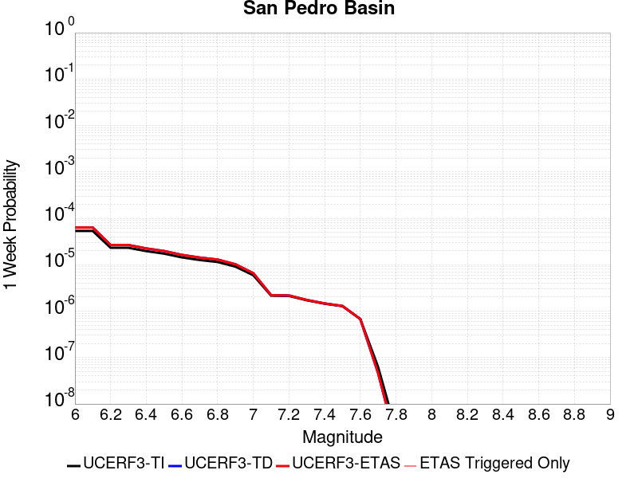 |  | 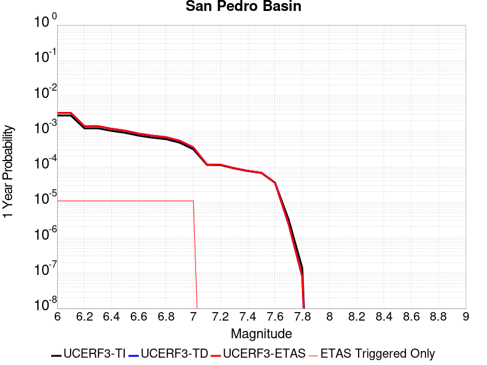 | 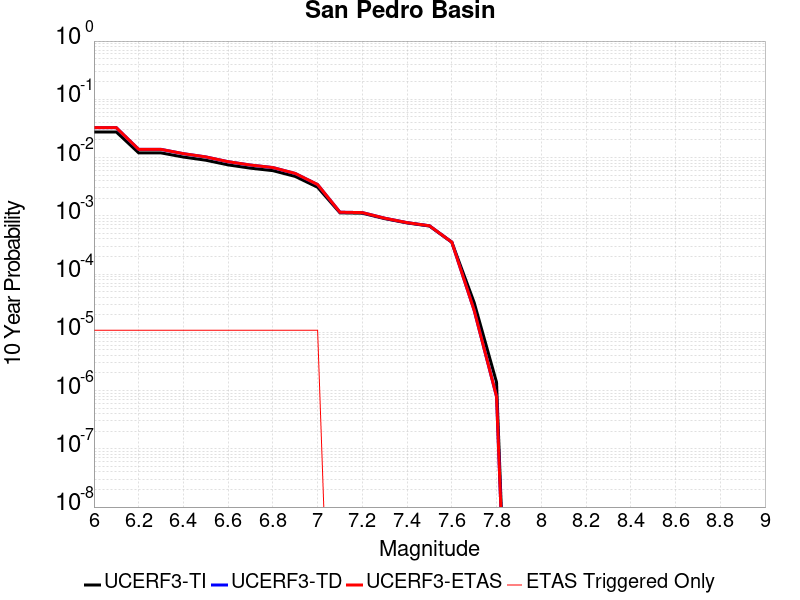 |

| Magnitude | 1 wk TI Prob | 1 wk TD Prob | 1 wk ETAS Prob | 1 wk ETAS/TD Gain | 1 wk ETAS Triggered Only | 1 mo TI Prob | 1 mo TD Prob | 1 mo ETAS Prob | 1 mo ETAS/TD Gain | 1 mo ETAS Triggered Only | 1 yr TI Prob | 1 yr TD Prob | 1 yr ETAS Prob | 1 yr ETAS/TD Gain | 1 yr ETAS Triggered Only | 10 yr TI Prob | 10 yr TD Prob | 10 yr ETAS Prob | 10 yr ETAS/TD Gain | 10 yr ETAS Triggered Only |
|-----|-----|-----|-----|-----|-----|-----|-----|-----|-----|-----|-----|-----|-----|-----|-----|-----|-----|-----|-----|-----|
| 6.0 | 5.3449043E-5 | 6.336922E-5 | 6.336922E-5 | 1.0 | 0.0 | 2.2904722E-4 | 2.7155754E-4 | 2.7155754E-4 | 1.0 | 0.0 | 0.0027850836 | 0.0033018088 | 0.003312619 | 1.003274 | 1.0845987E-5 | 0.027504366 | 0.03258929 | 0.03259978 | 1.000322 | 1.0845987E-5 |
| 6.1 | 5.3449043E-5 | 6.336922E-5 | 6.336922E-5 | 1.0 | 0.0 | 2.2904722E-4 | 2.7155754E-4 | 2.7155754E-4 | 1.0 | 0.0 | 0.0027850836 | 0.0033018088 | 0.003312619 | 1.003274 | 1.0845987E-5 | 0.027504366 | 0.03258929 | 0.03259978 | 1.000322 | 1.0845987E-5 |
| 6.2 | 2.3189454E-5 | 2.6642689E-5 | 2.6642689E-5 | 1.0 | 0.0 | 9.9379584E-5 | 1.1417822E-4 | 1.1417822E-4 | 1.0 | 0.0 | 0.0012092749 | 0.0013892808 | 0.0014001117 | 1.007796 | 1.0845987E-5 | 0.012027155 | 0.013810828 | 0.013821525 | 1.0007745 | 1.0845987E-5 |
| 6.3 | 2.3189454E-5 | 2.6642689E-5 | 2.6642689E-5 | 1.0 | 0.0 | 9.9379584E-5 | 1.1417822E-4 | 1.1417822E-4 | 1.0 | 0.0 | 0.0012092749 | 0.0013892808 | 0.0014001117 | 1.007796 | 1.0845987E-5 | 0.012027155 | 0.013810828 | 0.013821525 | 1.0007745 | 1.0845987E-5 |
| 6.4 | 1.966056E-5 | 2.2463326E-5 | 2.2463326E-5 | 1.0 | 0.0 | 8.425682E-5 | 9.626807E-5 | 9.626807E-5 | 1.0 | 0.0 | 0.001025344 | 0.0011714738 | 0.001182307 | 1.0092475 | 1.0845987E-5 | 0.010206259 | 0.011657071 | 0.011667791 | 1.0009196 | 1.0845987E-5 |
| 6.5 | 1.7342953E-5 | 1.9745074E-5 | 1.9745074E-5 | 1.0 | 0.0 | 7.4324824E-5 | 8.4619205E-5 | 8.4619205E-5 | 1.0 | 0.0 | 9.04529E-4 | 0.0010297889 | 0.0010406236 | 1.0105214 | 1.0845987E-5 | 0.009008561 | 0.010253892 | 0.010264628 | 1.0010469 | 1.0845987E-5 |
| 6.6 | 1.439804E-5 | 1.6322656E-5 | 1.6322656E-5 | 1.0 | 0.0 | 6.170443E-5 | 6.995254E-5 | 6.995254E-5 | 1.0 | 0.0 | 7.509924E-4 | 8.5137156E-4 | 8.622083E-4 | 1.0127286 | 1.0845987E-5 | 0.0074845953 | 0.008484301 | 0.008495055 | 1.0012676 | 1.0845987E-5 |
| 6.7 | 1.2634884E-5 | 1.4285245E-5 | 1.4285245E-5 | 1.0 | 0.0 | 5.414838E-5 | 6.122122E-5 | 6.122122E-5 | 1.0 | 0.0 | 6.590571E-4 | 7.4514386E-4 | 7.559818E-4 | 1.0145447 | 1.0845987E-5 | 0.006571059 | 0.0074294745 | 0.0074402397 | 1.001449 | 1.0845987E-5 |
| 6.8 | 1.146091E-5 | 1.2933146E-5 | 1.2933146E-5 | 1.0 | 0.0 | 4.911726E-5 | 5.5426757E-5 | 5.5426757E-5 | 1.0 | 0.0 | 5.9783855E-4 | 6.746416E-4 | 6.8548025E-4 | 1.0160658 | 1.0845987E-5 | 0.0059623276 | 0.006728875 | 0.006739648 | 1.001601 | 1.0845987E-5 |
| 6.9 | 9.109035E-6 | 1.0234976E-5 | 1.0234976E-5 | 1.0 | 0.0 | 3.9038136E-5 | 4.3863605E-5 | 4.3863605E-5 | 1.0 | 0.0 | 4.7518566E-4 | 5.339365E-4 | 5.447767E-4 | 1.0203024 | 1.0845987E-5 | 0.0047417083 | 0.0053292904 | 0.0053400784 | 1.0020243 | 1.0845987E-5 |
| 7.0 | 5.9351028E-6 | 6.583943E-6 | 6.583943E-6 | 1.0 | 0.0 | 2.5435906E-5 | 2.8216728E-5 | 2.8216728E-5 | 1.0 | 0.0 | 3.0963816E-4 | 3.4350812E-4 | 3.5435037E-4 | 1.0315633 | 1.0845987E-5 | 0.0030920706 | 0.0034320883 | 0.003442897 | 1.0031493 | 1.0845987E-5 |
| 7.1 | 2.1557585E-6 | 2.2096456E-6 | 2.2096456E-6 | 1.0 | 0.0 | 9.238933E-6 | 9.469876E-6 | 9.469876E-6 | 1.0 | 0.0 | 1.1247819E-4 | 1.152898E-4 | 1.152898E-4 | 1.0 | 0.0 | 0.0011242128 | 0.0011523152 | 0.0011523152 | 1.0 | 0.0 |
| 7.2 | 2.1251979E-6 | 2.1779917E-6 | 2.1779917E-6 | 1.0 | 0.0 | 9.107958E-6 | 9.334219E-6 | 9.334219E-6 | 1.0 | 0.0 | 1.1088375E-4 | 1.13638336E-4 | 1.13638336E-4 | 1.0 | 0.0 | 0.0011082845 | 0.0011358176 | 0.0011358176 | 1.0 | 0.0 |
| 7.3 | 1.7145798E-6 | 1.7442856E-6 | 1.7442856E-6 | 1.0 | 0.0 | 7.3481783E-6 | 7.4754885E-6 | 7.4754885E-6 | 1.0 | 0.0 | 8.94604E-5 | 9.101036E-5 | 9.101036E-5 | 1.0 | 0.0 | 8.9424395E-4 | 9.0974005E-4 | 9.0974005E-4 | 1.0 | 0.0 |
| 7.4 | 1.4467993E-6 | 1.4641852E-6 | 1.4641852E-6 | 1.0 | 0.0 | 6.200554E-6 | 6.2750646E-6 | 6.2750646E-6 | 1.0 | 0.0 | 7.548913E-5 | 7.639631E-5 | 7.639631E-5 | 1.0 | 0.0 | 7.546349E-4 | 7.6370774E-4 | 7.6370774E-4 | 1.0 | 0.0 |
| 7.5 | 1.2803735E-6 | 1.2931483E-6 | 1.2931483E-6 | 1.0 | 0.0 | 5.487303E-6 | 5.542053E-6 | 5.542053E-6 | 1.0 | 0.0 | 6.680587E-5 | 6.747247E-5 | 6.747247E-5 | 1.0 | 0.0 | 6.678579E-4 | 6.7452696E-4 | 6.7452696E-4 | 1.0 | 0.0 |
| 7.6 | 6.755009E-7 | 6.7694583E-7 | 6.7694583E-7 | 1.0 | 0.0 | 2.8950008E-6 | 2.9011935E-6 | 2.9011935E-6 | 1.0 | 0.0 | 3.5246063E-5 | 3.532152E-5 | 3.532152E-5 | 1.0 | 0.0 | 3.5240475E-4 | 3.5316474E-4 | 3.5316474E-4 | 1.0 | 0.0 |
| 7.7 | 6.211885E-8 | 4.5699466E-8 | 4.5699466E-8 | 1.0 | 0.0 | 2.6622362E-7 | 1.9585484E-7 | 1.9585484E-7 | 1.0 | 0.0 | 3.2412677E-6 | 2.3845303E-6 | 2.3845303E-6 | 1.0 | 0.0 | 3.2412205E-5 | 2.3845067E-5 | 2.3845067E-5 | 1.0 | 0.0 |
| 7.8 | 2.6580573E-9 | 1.5138059E-9 | 1.5138059E-9 | 1.0 | 0.0 | 1.1391674E-8 | 6.4877392E-9 | 6.4877392E-9 | 1.0 | 0.0 | 1.3869362E-7 | 7.898823E-8 | 7.898823E-8 | 1.0 | 0.0 | 1.3869354E-6 | 7.898823E-7 | 7.898823E-7 | 1.0 | 0.0 |

## Raymond
*[(top)](#table-of-contents)*

| 1 Week | 1 Month | 1 Year | 10 Year |
|-----|-----|-----|-----|
|  |  |  |  |

| Magnitude | 1 wk TI Prob | 1 wk TD Prob | 1 wk ETAS Prob | 1 wk ETAS/TD Gain | 1 wk ETAS Triggered Only | 1 mo TI Prob | 1 mo TD Prob | 1 mo ETAS Prob | 1 mo ETAS/TD Gain | 1 mo ETAS Triggered Only | 1 yr TI Prob | 1 yr TD Prob | 1 yr ETAS Prob | 1 yr ETAS/TD Gain | 1 yr ETAS Triggered Only | 10 yr TI Prob | 10 yr TD Prob | 10 yr ETAS Prob | 10 yr ETAS/TD Gain | 10 yr ETAS Triggered Only |
|-----|-----|-----|-----|-----|-----|-----|-----|-----|-----|-----|-----|-----|-----|-----|-----|-----|-----|-----|-----|-----|
| 6.0 | 1.5157413E-5 | 1.5810077E-5 | 1.5810077E-5 | 1.0 | 0.0 | 6.4958724E-5 | 6.775586E-5 | 6.775586E-5 | 1.0 | 0.0 | 7.905855E-4 | 8.2464045E-4 | 8.354775E-4 | 1.0131415 | 1.0845987E-5 | 0.007877788 | 0.008218322 | 0.00822908 | 1.0013089 | 1.0845987E-5 |
| 6.1 | 1.5157413E-5 | 1.5810077E-5 | 1.5810077E-5 | 1.0 | 0.0 | 6.4958724E-5 | 6.775586E-5 | 6.775586E-5 | 1.0 | 0.0 | 7.905855E-4 | 8.2464045E-4 | 8.354775E-4 | 1.0131415 | 1.0845987E-5 | 0.007877788 | 0.008218322 | 0.00822908 | 1.0013089 | 1.0845987E-5 |
| 6.2 | 1.5157413E-5 | 1.5810077E-5 | 1.5810077E-5 | 1.0 | 0.0 | 6.4958724E-5 | 6.775586E-5 | 6.775586E-5 | 1.0 | 0.0 | 7.905855E-4 | 8.2464045E-4 | 8.354775E-4 | 1.0131415 | 1.0845987E-5 | 0.007877788 | 0.008218322 | 0.00822908 | 1.0013089 | 1.0845987E-5 |
| 6.3 | 1.5157413E-5 | 1.5810077E-5 | 1.5810077E-5 | 1.0 | 0.0 | 6.4958724E-5 | 6.775586E-5 | 6.775586E-5 | 1.0 | 0.0 | 7.905855E-4 | 8.2464045E-4 | 8.354775E-4 | 1.0131415 | 1.0845987E-5 | 0.007877788 | 0.008218322 | 0.00822908 | 1.0013089 | 1.0845987E-5 |
| 6.4 | 1.3941944E-5 | 1.4454645E-5 | 1.4454645E-5 | 1.0 | 0.0 | 5.9749822E-5 | 6.194714E-5 | 6.194714E-5 | 1.0 | 0.0 | 7.2721124E-4 | 7.539688E-4 | 7.648066E-4 | 1.0143744 | 1.0845987E-5 | 0.007248361 | 0.007516441 | 0.0075272056 | 1.0014322 | 1.0845987E-5 |
| 6.5 | 1.3941944E-5 | 1.4454645E-5 | 1.4454645E-5 | 1.0 | 0.0 | 5.9749822E-5 | 6.194714E-5 | 6.194714E-5 | 1.0 | 0.0 | 7.2721124E-4 | 7.539688E-4 | 7.648066E-4 | 1.0143744 | 1.0845987E-5 | 0.007248361 | 0.007516441 | 0.0075272056 | 1.0014322 | 1.0845987E-5 |
| 6.6 | 1.0542609E-5 | 1.0671079E-5 | 1.0671079E-5 | 1.0 | 0.0 | 4.5181827E-5 | 4.5732424E-5 | 4.5732424E-5 | 1.0 | 0.0 | 5.499499E-4 | 5.5665546E-4 | 5.674954E-4 | 1.0194733 | 1.0845987E-5 | 0.005485909 | 0.0055531724 | 0.005563958 | 1.0019423 | 1.0845987E-5 |
| 6.7 | 1.0542609E-5 | 1.0671079E-5 | 1.0671079E-5 | 1.0 | 0.0 | 4.5181827E-5 | 4.5732424E-5 | 4.5732424E-5 | 1.0 | 0.0 | 5.499499E-4 | 5.5665546E-4 | 5.674954E-4 | 1.0194733 | 1.0845987E-5 | 0.005485909 | 0.0055531724 | 0.005563958 | 1.0019423 | 1.0845987E-5 |
| 6.8 | 1.0079132E-5 | 1.0176613E-5 | 1.0176613E-5 | 1.0 | 0.0 | 4.3195567E-5 | 4.3613356E-5 | 4.3613356E-5 | 1.0 | 0.0 | 5.257791E-4 | 5.308686E-4 | 5.4170884E-4 | 1.0204198 | 1.0845987E-5 | 0.0052453685 | 0.005296554 | 0.0053073424 | 1.0020369 | 1.0845987E-5 |
| 6.9 | 7.721598E-6 | 7.5488792E-6 | 7.5488792E-6 | 1.0 | 0.0 | 3.3092143E-5 | 3.2351945E-5 | 3.2351945E-5 | 1.0 | 0.0 | 4.0282236E-4 | 3.9381496E-4 | 4.046567E-4 | 1.02753 | 1.0845987E-5 | 0.0040209293 | 0.0039313044 | 0.003942108 | 1.002748 | 1.0845987E-5 |
| 7.0 | 7.137566E-6 | 6.911282E-6 | 6.911282E-6 | 1.0 | 0.0 | 3.058921E-5 | 2.9619448E-5 | 2.9619448E-5 | 1.0 | 0.0 | 3.7236E-4 | 3.605582E-4 | 3.7140027E-4 | 1.0300703 | 1.0845987E-5 | 0.0037173668 | 0.0035998505 | 0.0036106573 | 1.003002 | 1.0845987E-5 |
| 7.1 | 5.654976E-6 | 5.29952E-6 | 5.29952E-6 | 1.0 | 0.0 | 2.4235387E-5 | 2.2712033E-5 | 2.2712033E-5 | 1.0 | 0.0 | 2.9502588E-4 | 2.7648412E-4 | 2.8732713E-4 | 1.0392174 | 1.0845987E-5 | 0.0029463451 | 0.0027614324 | 0.0027722486 | 1.0039169 | 1.0845987E-5 |
| 7.2 | 4.9358455E-6 | 4.5266393E-6 | 4.5266393E-6 | 1.0 | 0.0 | 2.1153453E-5 | 1.9399738E-5 | 1.9399738E-5 | 1.0 | 0.0 | 2.5751285E-4 | 2.3616636E-4 | 2.470098E-4 | 1.0459144 | 1.0845987E-5 | 0.0025721465 | 0.002359176 | 0.0023699964 | 1.0045865 | 1.0845987E-5 |
| 7.3 | 4.2368597E-6 | 3.8055998E-6 | 3.8055998E-6 | 1.0 | 0.0 | 1.8157843E-5 | 1.6309612E-5 | 1.6309612E-5 | 1.0 | 0.0 | 2.2104931E-4 | 1.9855154E-4 | 2.0939537E-4 | 1.0546147 | 1.0845987E-5 | 0.0022082955 | 0.0019837602 | 0.0019945847 | 1.0054566 | 1.0845987E-5 |
| 7.4 | 3.4999923E-6 | 3.043729E-6 | 3.043729E-6 | 1.0 | 0.0 | 1.49998805E-5 | 1.3044489E-5 | 1.3044489E-5 | 1.0 | 0.0 | 1.8260824E-4 | 1.5880515E-4 | 1.6964941E-4 | 1.0682867 | 1.0845987E-5 | 0.0018245826 | 0.0015869325 | 0.0015977612 | 1.0068237 | 1.0845987E-5 |
| 7.5 | 2.738017E-6 | 2.302034E-6 | 2.302034E-6 | 1.0 | 0.0 | 1.1734306E-5 | 9.865823E-6 | 9.865823E-6 | 1.0 | 0.0 | 1.428558E-4 | 1.2010984E-4 | 1.3095453E-4 | 1.0902897 | 1.0845987E-5 | 0.0014276401 | 0.0012004636 | 0.0012112967 | 1.009024 | 1.0845987E-5 |
| 7.6 | 1.8186392E-6 | 1.4423032E-6 | 1.4423032E-6 | 1.0 | 0.0 | 7.794145E-6 | 6.181285E-6 | 6.181285E-6 | 1.0 | 0.0 | 9.488958E-5 | 7.525458E-5 | 8.609975E-5 | 1.1441131 | 1.0845987E-5 | 9.4849075E-4 | 7.523025E-4 | 7.631403E-4 | 1.0144062 | 1.0845987E-5 |
| 7.7 | 1.0660348E-6 | 7.643733E-7 | 7.643733E-7 | 1.0 | 0.0 | 4.5687125E-6 | 3.2758817E-6 | 3.2758817E-6 | 1.0 | 0.0 | 5.5622655E-5 | 3.9883143E-5 | 5.07287E-5 | 1.2719333 | 1.0845987E-5 | 5.5608735E-4 | 3.9876899E-4 | 4.0961066E-4 | 1.0271878 | 1.0845987E-5 |
| 7.8 | 6.913602E-7 | 4.3203528E-7 | 4.3203528E-7 | 1.0 | 0.0 | 2.962969E-6 | 1.8515785E-6 | 1.8515785E-6 | 1.0 | 0.0 | 3.607355E-5 | 2.2542741E-5 | 3.3388485E-5 | 1.481119 | 1.0845987E-5 | 3.6067693E-4 | 2.254124E-4 | 2.3625595E-4 | 1.0481054 | 1.0845987E-5 |
| 7.9 | 7.425201E-8 | 5.3221502E-8 | 5.3221502E-8 | 1.0 | 0.0 | 3.1822285E-7 | 2.2809213E-7 | 2.2809213E-7 | 1.0 | 0.0 | 3.874356E-6 | 2.7770195E-6 | 2.7770195E-6 | 1.0 | 0.0 | 3.8742884E-5 | 2.7769978E-5 | 2.7769978E-5 | 1.0 | 0.0 |

## San Andreas (Creeping Section) 2011 CFM
*[(top)](#table-of-contents)*

| 1 Week | 1 Month | 1 Year | 10 Year |
|-----|-----|-----|-----|
|  |  |  |  |

| Magnitude | 1 wk TI Prob | 1 wk TD Prob | 1 wk ETAS Prob | 1 wk ETAS/TD Gain | 1 wk ETAS Triggered Only | 1 mo TI Prob | 1 mo TD Prob | 1 mo ETAS Prob | 1 mo ETAS/TD Gain | 1 mo ETAS Triggered Only | 1 yr TI Prob | 1 yr TD Prob | 1 yr ETAS Prob | 1 yr ETAS/TD Gain | 1 yr ETAS Triggered Only | 10 yr TI Prob | 10 yr TD Prob | 10 yr ETAS Prob | 10 yr ETAS/TD Gain | 10 yr ETAS Triggered Only |
|-----|-----|-----|-----|-----|-----|-----|-----|-----|-----|-----|-----|-----|-----|-----|-----|-----|-----|-----|-----|-----|
| 6.0 | 5.986481E-4 | 0.0012286972 | 0.0012286972 | 1.0 | 0.0 | 0.0025631124 | 0.00524696 | 0.00524696 | 1.0 | 0.0 | 0.030762846 | 0.061202604 | 0.061212786 | 1.0001664 | 1.0845987E-5 | 0.26835477 | 0.42592302 | 0.42592925 | 1.0000147 | 1.0845987E-5 |
| 6.1 | 5.015945E-4 | 0.0010229645 | 0.0010229645 | 1.0 | 0.0 | 0.00214792 | 0.004369588 | 0.004369588 | 1.0 | 0.0 | 0.025839351 | 0.051246066 | 0.051256355 | 1.0002007 | 1.0845987E-5 | 0.23032776 | 0.37284485 | 0.37285167 | 1.0000182 | 1.0845987E-5 |
| 6.2 | 4.073338E-4 | 8.115361E-4 | 8.115361E-4 | 1.0 | 0.0 | 0.0017445484 | 0.003468385 | 0.003468385 | 1.0 | 0.0 | 0.021034058 | 0.040931217 | 0.04094162 | 1.0002542 | 1.0845987E-5 | 0.19150782 | 0.31302088 | 0.31302834 | 1.0000238 | 1.0845987E-5 |
| 6.3 | 3.464099E-4 | 6.745419E-4 | 6.745419E-4 | 1.0 | 0.0 | 0.0014837692 | 0.002883343 | 0.002883343 | 1.0 | 0.0 | 0.017915873 | 0.034187317 | 0.034197792 | 1.0003064 | 1.0845987E-5 | 0.16538359 | 0.2713031 | 0.27131099 | 1.0000291 | 1.0845987E-5 |
| 6.4 | 2.935057E-4 | 5.551342E-4 | 5.551342E-4 | 1.0 | 0.0 | 0.0012572751 | 0.002372886 | 0.002372886 | 1.0 | 0.0 | 0.015200248 | 0.028262215 | 0.028272755 | 1.0003729 | 1.0845987E-5 | 0.14201577 | 0.23297104 | 0.23297936 | 1.0000358 | 1.0845987E-5 |
| 6.5 | 2.3409708E-4 | 4.2130658E-4 | 4.2130658E-4 | 1.0 | 0.0 | 0.0010028875 | 0.0018018549 | 0.0018018549 | 1.0 | 0.0 | 0.012141965 | 0.021585694 | 0.021596305 | 1.0004916 | 1.0845987E-5 | 0.11499573 | 0.18680891 | 0.18681774 | 1.0000472 | 1.0845987E-5 |
| 6.6 | 1.5842178E-4 | 2.5067228E-4 | 2.5067228E-4 | 1.0 | 0.0 | 6.7877385E-4 | 0.0010738597 | 0.0010738597 | 1.0 | 0.0 | 0.0082328 | 0.012994494 | 0.012994494 | 1.0 | 0.0 | 0.07934396 | 0.1231311 | 0.1231311 | 1.0 | 0.0 |
| 6.7 | 1.5616413E-4 | 2.4603796E-4 | 2.4603796E-4 | 1.0 | 0.0 | 6.691031E-4 | 0.0010540152 | 0.0010540152 | 1.0 | 0.0 | 0.0081159435 | 0.012756367 | 0.012756367 | 1.0 | 0.0 | 0.0782586 | 0.12115822 | 0.12115822 | 1.0 | 0.0 |
| 6.8 | 1.5538467E-4 | 2.442769E-4 | 2.442769E-4 | 1.0 | 0.0 | 6.6576427E-4 | 0.0010464739 | 0.0010464739 | 1.0 | 0.0 | 0.008075596 | 0.012665753 | 0.012665753 | 1.0 | 0.0 | 0.07788358 | 0.12038911 | 0.12038911 | 1.0 | 0.0 |
| 6.9 | 1.5153569E-4 | 2.3536953E-4 | 2.3536953E-4 | 1.0 | 0.0 | 6.49277E-4 | 0.0010083386 | 0.0010083386 | 1.0 | 0.0 | 0.007876333 | 0.012207948 | 0.012207948 | 1.0 | 0.0 | 0.07602952 | 0.11645927 | 0.11645927 | 1.0 | 0.0 |
| 7.0 | 1.4588932E-4 | 2.239424E-4 | 2.239424E-4 | 1.0 | 0.0 | 6.250901E-4 | 9.594021E-4 | 9.594021E-4 | 1.0 | 0.0 | 0.0075839474 | 0.011618658 | 0.011618658 | 1.0 | 0.0 | 0.073302895 | 0.11130563 | 0.11130563 | 1.0 | 0.0 |
| 7.1 | 1.1565079E-4 | 1.6279978E-4 | 1.6279978E-4 | 1.0 | 0.0 | 4.955521E-4 | 6.9752766E-4 | 6.9752766E-4 | 1.0 | 0.0 | 0.006016669 | 0.008459533 | 0.008459533 | 1.0 | 0.0 | 0.058563538 | 0.08365876 | 0.08365876 | 1.0 | 0.0 |
| 7.2 | 1.0393792E-4 | 1.4614112E-4 | 1.4614112E-4 | 1.0 | 0.0 | 4.4537216E-4 | 6.261695E-4 | 6.261695E-4 | 1.0 | 0.0 | 0.005408933 | 0.007597135 | 0.007597135 | 1.0 | 0.0 | 0.052791595 | 0.075609244 | 0.075609244 | 1.0 | 0.0 |
| 7.3 | 9.332884E-5 | 1.277942E-4 | 1.277942E-4 | 1.0 | 0.0 | 3.999194E-4 | 5.475752E-4 | 5.475752E-4 | 1.0 | 0.0 | 0.0048581534 | 0.006646483 | 0.006646483 | 1.0 | 0.0 | 0.047533102 | 0.06647413 | 0.06647413 | 1.0 | 0.0 |
| 7.4 | 8.670252E-5 | 1.1701832E-4 | 1.1701832E-4 | 1.0 | 0.0 | 3.715293E-4 | 5.0141127E-4 | 5.0141127E-4 | 1.0 | 0.0 | 0.004513991 | 0.0060877153 | 0.0060877153 | 1.0 | 0.0 | 0.044233937 | 0.061143413 | 0.061143413 | 1.0 | 0.0 |
| 7.5 | 7.3036405E-5 | 9.004733E-5 | 9.004733E-5 | 1.0 | 0.0 | 3.129756E-4 | 3.8586016E-4 | 3.8586016E-4 | 1.0 | 0.0 | 0.0038038217 | 0.0046877493 | 0.0046877493 | 1.0 | 0.0 | 0.03739367 | 0.047871016 | 0.047871016 | 1.0 | 0.0 |
| 7.6 | 6.3935775E-5 | 8.279309E-5 | 8.279309E-5 | 1.0 | 0.0 | 2.7398168E-4 | 3.5477936E-4 | 3.5477936E-4 | 1.0 | 0.0 | 0.0033306254 | 0.0043109027 | 0.0043109027 | 1.0 | 0.0 | 0.032811474 | 0.04398585 | 0.04398585 | 1.0 | 0.0 |
| 7.7 | 5.5050095E-5 | 6.66093E-5 | 6.66093E-5 | 1.0 | 0.0 | 2.3590765E-4 | 2.854372E-4 | 2.854372E-4 | 1.0 | 0.0 | 0.0028683927 | 0.0034696644 | 0.0034696644 | 1.0 | 0.0 | 0.0283165 | 0.035791222 | 0.035791222 | 1.0 | 0.0 |
| 7.8 | 5.027131E-5 | 6.1620405E-5 | 6.1620405E-5 | 1.0 | 0.0 | 2.1543067E-4 | 2.640607E-4 | 2.640607E-4 | 1.0 | 0.0 | 0.0026197135 | 0.0032102033 | 0.0032102033 | 1.0 | 0.0 | 0.025890453 | 0.03312217 | 0.03312217 | 1.0 | 0.0 |
| 7.9 | 3.7271806E-5 | 5.0218474E-5 | 5.0218474E-5 | 1.0 | 0.0 | 1.5972654E-4 | 2.1520429E-4 | 2.1520429E-4 | 1.0 | 0.0 | 0.0019429359 | 0.002616966 | 0.002616966 | 1.0 | 0.0 | 0.019260362 | 0.027063787 | 0.027063787 | 1.0 | 0.0 |
| 8.0 | 2.7310243E-5 | 3.1424468E-5 | 3.1424468E-5 | 1.0 | 0.0 | 1.17038646E-4 | 1.3466935E-4 | 1.3466935E-4 | 1.0 | 0.0 | 0.0014240141 | 0.0016383671 | 0.0016383671 | 1.0 | 0.0 | 0.014149235 | 0.017211871 | 0.017211871 | 1.0 | 0.0 |
| 8.1 | 1.7940547E-5 | 1.7398293E-5 | 1.7398293E-5 | 1.0 | 0.0 | 7.688579E-5 | 7.456199E-5 | 7.456199E-5 | 1.0 | 0.0 | 9.3568244E-4 | 9.074147E-4 | 9.074147E-4 | 1.0 | 0.0 | 0.009317525 | 0.009797759 | 0.009797759 | 1.0 | 0.0 |
| 8.2 | 8.643924E-6 | 5.4738607E-6 | 5.4738607E-6 | 1.0 | 0.0 | 3.704486E-5 | 2.3459192E-5 | 2.3459192E-5 | 1.0 | 0.0 | 4.5092785E-4 | 2.855783E-4 | 2.855783E-4 | 1.0 | 0.0 | 0.0045001395 | 0.0032481598 | 0.0032481598 | 1.0 | 0.0 |
| 8.3 | 1.983087E-6 | 7.658221E-7 | 7.658221E-7 | 1.0 | 0.0 | 8.498917E-6 | 3.2820906E-6 | 3.2820906E-6 | 1.0 | 0.0 | 1.034694E-4 | 3.9958737E-5 | 3.9958737E-5 | 1.0 | 0.0 | 0.0010342124 | 4.7187202E-4 | 4.7187202E-4 | 1.0 | 0.0 |

## Calaveras (So) - Paicines extension 2011 CFM
*[(top)](#table-of-contents)*

| 1 Week | 1 Month | 1 Year | 10 Year |
|-----|-----|-----|-----|
|  |  |  |  |

| Magnitude | 1 wk TI Prob | 1 wk TD Prob | 1 wk ETAS Prob | 1 wk ETAS/TD Gain | 1 wk ETAS Triggered Only | 1 mo TI Prob | 1 mo TD Prob | 1 mo ETAS Prob | 1 mo ETAS/TD Gain | 1 mo ETAS Triggered Only | 1 yr TI Prob | 1 yr TD Prob | 1 yr ETAS Prob | 1 yr ETAS/TD Gain | 1 yr ETAS Triggered Only | 10 yr TI Prob | 10 yr TD Prob | 10 yr ETAS Prob | 10 yr ETAS/TD Gain | 10 yr ETAS Triggered Only |
|-----|-----|-----|-----|-----|-----|-----|-----|-----|-----|-----|-----|-----|-----|-----|-----|-----|-----|-----|-----|-----|
| 6.0 | 1.5183659E-4 | 3.0531682E-4 | 3.0531682E-4 | 1.0 | 0.0 | 6.5056595E-4 | 0.0013069583 | 0.0013069583 | 1.0 | 0.0 | 0.007891912 | 0.01569548 | 0.015706155 | 1.0006802 | 1.0845987E-5 | 0.076174594 | 0.13848475 | 0.13849409 | 1.0000675 | 1.0845987E-5 |
| 6.1 | 1.5024997E-4 | 3.0225812E-4 | 3.0225812E-4 | 1.0 | 0.0 | 6.437695E-4 | 0.0012938626 | 0.0012938626 | 1.0 | 0.0 | 0.0078097614 | 0.015538875 | 0.015549553 | 1.0006871 | 1.0845987E-5 | 0.075409345 | 0.13715436 | 0.13716371 | 1.0000682 | 1.0845987E-5 |
| 6.2 | 1.2743923E-4 | 2.530527E-4 | 2.530527E-4 | 1.0 | 0.0 | 5.460538E-4 | 0.0010840396 | 0.0010840396 | 1.0 | 0.0 | 0.0066279583 | 0.013046473 | 0.013057177 | 1.0008205 | 1.0845987E-5 | 0.064337276 | 0.117252044 | 0.11726162 | 1.0000817 | 1.0845987E-5 |
| 6.3 | 1.1525114E-4 | 2.259406E-4 | 2.259406E-4 | 1.0 | 0.0 | 4.9383997E-4 | 9.6794113E-4 | 9.6794113E-4 | 1.0 | 0.0 | 0.0059959386 | 0.011667699 | 0.011678418 | 1.0009187 | 1.0845987E-5 | 0.058367174 | 0.106368065 | 0.10637776 | 1.0000911 | 1.0845987E-5 |
| 6.4 | 1.07200925E-4 | 2.08353E-4 | 2.08353E-4 | 1.0 | 0.0 | 4.5935164E-4 | 8.9261803E-4 | 8.9261803E-4 | 1.0 | 0.0 | 0.0055782744 | 0.010772539 | 0.010783269 | 1.000996 | 1.0845987E-5 | 0.0544031 | 0.09919055 | 0.099200316 | 1.0000985 | 1.0845987E-5 |
| 6.5 | 9.69631E-5 | 1.8728274E-4 | 1.8728274E-4 | 1.0 | 0.0 | 4.1548995E-4 | 8.023749E-4 | 8.023749E-4 | 1.0 | 0.0 | 0.0050468626 | 0.009694443 | 0.009705184 | 1.0011079 | 1.0845987E-5 | 0.04933773 | 0.09008227 | 0.09009214 | 1.0001096 | 1.0845987E-5 |
| 6.6 | 8.0552316E-5 | 1.507013E-4 | 1.507013E-4 | 1.0 | 0.0 | 3.4517853E-4 | 6.456789E-4 | 6.456789E-4 | 1.0 | 0.0 | 0.0041944524 | 0.007826032 | 0.007836794 | 1.0013751 | 1.0845987E-5 | 0.04116161 | 0.07485203 | 0.07486206 | 1.0001341 | 1.0845987E-5 |
| 6.7 | 7.815757E-5 | 1.4610207E-4 | 1.4610207E-4 | 1.0 | 0.0 | 3.34918E-4 | 6.2598084E-4 | 6.2598084E-4 | 1.0 | 0.0 | 0.004070005 | 0.0075888694 | 0.007599633 | 1.0014184 | 1.0845987E-5 | 0.039962657 | 0.072701596 | 0.072711654 | 1.0001383 | 1.0845987E-5 |
| 6.8 | 6.965264E-5 | 1.2721034E-4 | 1.2721034E-4 | 1.0 | 0.0 | 2.9847719E-4 | 5.4506504E-4 | 5.4506504E-4 | 1.0 | 0.0 | 0.0036279052 | 0.006613211 | 0.006623985 | 1.0016292 | 1.0845987E-5 | 0.03569247 | 0.063797034 | 0.06380718 | 1.0001591 | 1.0845987E-5 |
| 6.9 | 5.8000453E-5 | 1.0143136E-4 | 1.0143136E-4 | 1.0 | 0.0 | 2.4854968E-4 | 4.3463398E-4 | 4.3463398E-4 | 1.0 | 0.0 | 0.0030218933 | 0.0052789357 | 0.0052897246 | 1.0020437 | 1.0845987E-5 | 0.029811295 | 0.05149985 | 0.051510137 | 1.0001998 | 1.0845987E-5 |
| 7.0 | 4.9865852E-5 | 8.567328E-5 | 8.567328E-5 | 1.0 | 0.0 | 2.1369329E-4 | 3.6712E-4 | 3.6712E-4 | 1.0 | 0.0 | 0.0025986114 | 0.0044606146 | 0.0044714124 | 1.0024207 | 1.0845987E-5 | 0.025684336 | 0.04377996 | 0.043790333 | 1.0002369 | 1.0845987E-5 |
| 7.1 | 4.283875E-5 | 7.111808E-5 | 7.111808E-5 | 1.0 | 0.0 | 1.8358172E-4 | 3.0475645E-4 | 3.0475645E-4 | 1.0 | 0.0 | 0.0022328163 | 0.0037041532 | 0.0037149591 | 1.0029172 | 1.0845987E-5 | 0.022105146 | 0.036734138 | 0.036744583 | 1.0002844 | 1.0845987E-5 |
| 7.2 | 3.450115E-5 | 5.5772623E-5 | 5.5772623E-5 | 1.0 | 0.0 | 1.478537E-4 | 2.390038E-4 | 2.390038E-4 | 1.0 | 0.0 | 0.0017986323 | 0.0029060172 | 0.0029060172 | 1.0 | 0.0 | 0.017841442 | 0.029077532 | 0.029077532 | 1.0 | 0.0 |
| 7.3 | 2.5709045E-5 | 4.0584997E-5 | 4.0584997E-5 | 1.0 | 0.0 | 1.1017697E-4 | 1.739242E-4 | 1.739242E-4 | 1.0 | 0.0 | 0.0013405791 | 0.0021154876 | 0.0021154876 | 1.0 | 0.0 | 0.013325208 | 0.021295689 | 0.021295689 | 1.0 | 0.0 |
| 7.4 | 1.8003093E-5 | 2.8506938E-5 | 2.8506938E-5 | 1.0 | 0.0 | 7.715383E-5 | 1.2216688E-4 | 1.2216688E-4 | 1.0 | 0.0 | 9.3894306E-4 | 0.0014863693 | 0.0014863693 | 1.0 | 0.0 | 0.009349857 | 0.01505071 | 0.01505071 | 1.0 | 0.0 |
| 7.5 | 1.5595824E-5 | 2.581956E-5 | 2.581956E-5 | 1.0 | 0.0 | 6.683753E-5 | 1.1065057E-4 | 1.1065057E-4 | 1.0 | 0.0 | 8.134431E-4 | 0.0013463404 | 0.0013463404 | 1.0 | 0.0 | 0.008104719 | 0.013650672 | 0.013650672 | 1.0 | 0.0 |
| 7.6 | 1.1110309E-5 | 1.9219342E-5 | 1.9219342E-5 | 1.0 | 0.0 | 4.761474E-5 | 8.2366016E-5 | 8.2366016E-5 | 1.0 | 0.0 | 5.795553E-4 | 0.0010023463 | 0.0010023463 | 1.0 | 0.0 | 0.0057804612 | 0.010202571 | 0.010202571 | 1.0 | 0.0 |
| 7.7 | 6.2140443E-6 | 1.043602E-5 | 1.043602E-5 | 1.0 | 0.0 | 2.6631347E-5 | 4.472503E-5 | 4.472503E-5 | 1.0 | 0.0 | 3.241884E-4 | 5.443913E-4 | 5.443913E-4 | 1.0 | 0.0 | 0.0032371588 | 0.0056193196 | 0.0056193196 | 1.0 | 0.0 |
| 7.8 | 5.305533E-6 | 9.432092E-6 | 9.432092E-6 | 1.0 | 0.0 | 2.27378E-5 | 4.0422627E-5 | 4.0422627E-5 | 1.0 | 0.0 | 2.7679754E-4 | 4.920344E-4 | 4.920344E-4 | 1.0 | 0.0 | 0.0027645302 | 0.005073865 | 0.005073865 | 1.0 | 0.0 |
| 7.9 | 3.363505E-6 | 7.384194E-6 | 7.384194E-6 | 1.0 | 0.0 | 1.4414942E-5 | 3.1646163E-5 | 3.1646163E-5 | 1.0 | 0.0 | 1.7548777E-4 | 3.8522398E-4 | 3.8522398E-4 | 1.0 | 0.0 | 0.0017534926 | 0.00394819 | 0.00394819 | 1.0 | 0.0 |
| 8.0 | 2.0271132E-6 | 4.4127096E-6 | 4.4127096E-6 | 1.0 | 0.0 | 8.687599E-6 | 1.8911476E-5 | 1.8911476E-5 | 1.0 | 0.0 | 1.05766376E-4 | 2.3022295E-4 | 2.3022295E-4 | 1.0 | 0.0 | 0.0010571606 | 0.0023509073 | 0.0023509073 | 1.0 | 0.0 |
| 8.1 | 1.2206116E-6 | 2.3749178E-6 | 2.3749178E-6 | 1.0 | 0.0 | 5.2311816E-6 | 1.017818E-5 | 1.017818E-5 | 1.0 | 0.0 | 6.3687774E-5 | 1.2391232E-4 | 1.2391232E-4 | 1.0 | 0.0 | 6.366953E-4 | 0.0012704411 | 0.0012704411 | 1.0 | 0.0 |

## San Jacinto (Borrego)
*[(top)](#table-of-contents)*

| 1 Week | 1 Month | 1 Year | 10 Year |
|-----|-----|-----|-----|
| 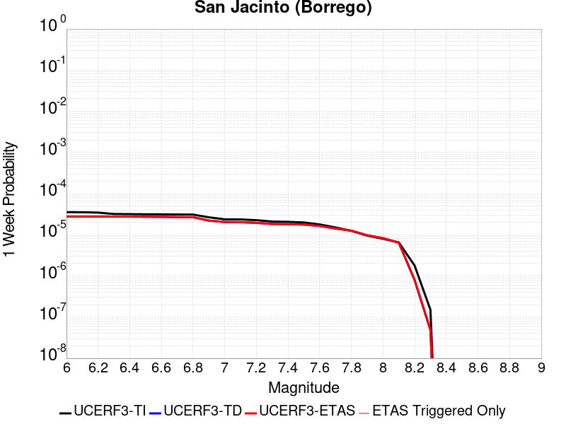 | 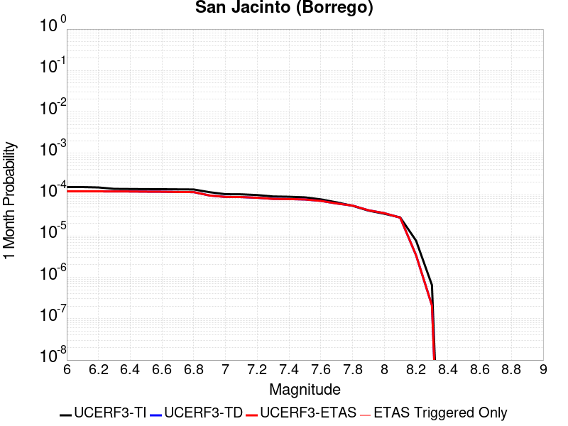 | 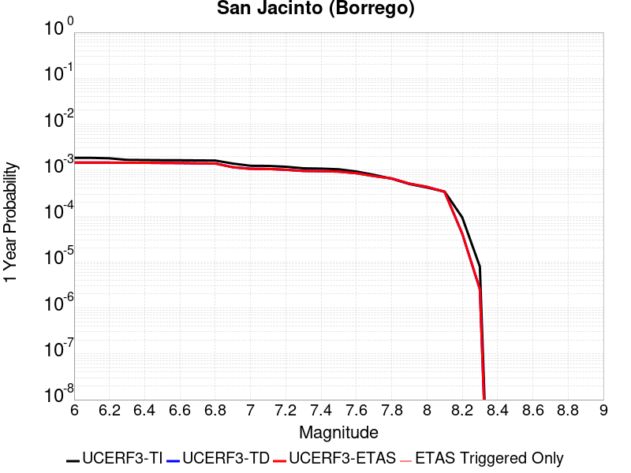 | 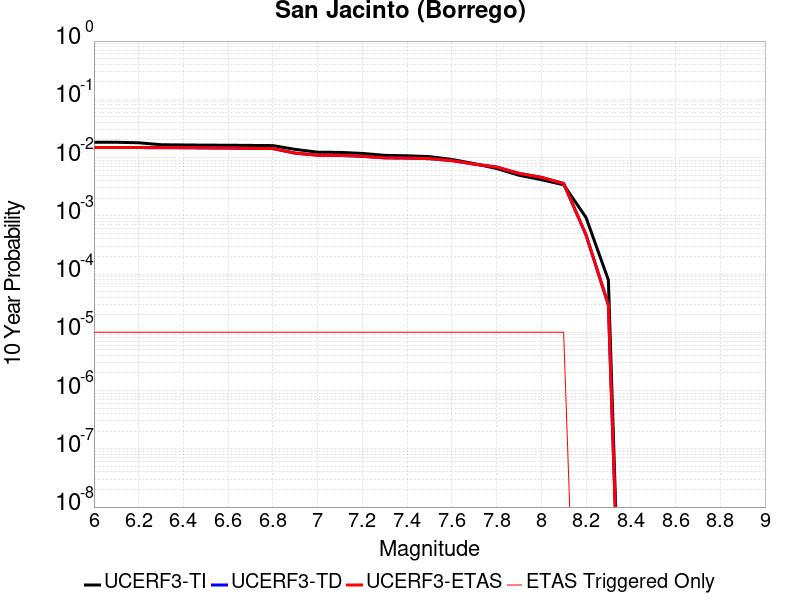 |

| Magnitude | 1 wk TI Prob | 1 wk TD Prob | 1 wk ETAS Prob | 1 wk ETAS/TD Gain | 1 wk ETAS Triggered Only | 1 mo TI Prob | 1 mo TD Prob | 1 mo ETAS Prob | 1 mo ETAS/TD Gain | 1 mo ETAS Triggered Only | 1 yr TI Prob | 1 yr TD Prob | 1 yr ETAS Prob | 1 yr ETAS/TD Gain | 1 yr ETAS Triggered Only | 10 yr TI Prob | 10 yr TD Prob | 10 yr ETAS Prob | 10 yr ETAS/TD Gain | 10 yr ETAS Triggered Only |
|-----|-----|-----|-----|-----|-----|-----|-----|-----|-----|-----|-----|-----|-----|-----|-----|-----|-----|-----|-----|-----|
| 6.0 | 3.543992E-5 | 2.7924942E-5 | 2.7924942E-5 | 1.0 | 0.0 | 1.5187653E-4 | 1.19672906E-4 | 1.19672906E-4 | 1.0 | 0.0 | 0.0018475284 | 0.001456056 | 0.001456056 | 1.0 | 0.0 | 0.018322436 | 0.014868831 | 0.014879516 | 1.0007186 | 1.0845987E-5 |
| 6.1 | 3.542281E-5 | 2.7924942E-5 | 2.7924942E-5 | 1.0 | 0.0 | 1.5180321E-4 | 1.19672906E-4 | 1.19672906E-4 | 1.0 | 0.0 | 0.0018466372 | 0.001456056 | 0.001456056 | 1.0 | 0.0 | 0.018313672 | 0.014868831 | 0.014879516 | 1.0007186 | 1.0845987E-5 |
| 6.2 | 3.4688688E-5 | 2.7924942E-5 | 2.7924942E-5 | 1.0 | 0.0 | 1.4865733E-4 | 1.196729E-4 | 1.196729E-4 | 1.0 | 0.0 | 0.0018084005 | 0.001456056 | 0.001456056 | 1.0 | 0.0 | 0.017937548 | 0.014868831 | 0.014879515 | 1.0007186 | 1.0845987E-5 |
| 6.3 | 3.2087122E-5 | 2.7770295E-5 | 2.7770295E-5 | 1.0 | 0.0 | 1.3750899E-4 | 1.1901019E-4 | 1.1901019E-4 | 1.0 | 0.0 | 0.0016728862 | 0.0014479982 | 0.0014479982 | 1.0 | 0.0 | 0.016603488 | 0.014789867 | 0.014800553 | 1.0007225 | 1.0845987E-5 |
| 6.4 | 3.1828724E-5 | 2.7737282E-5 | 2.7737282E-5 | 1.0 | 0.0 | 1.364017E-4 | 1.1886872E-4 | 1.1886872E-4 | 1.0 | 0.0 | 0.0016594254 | 0.0014462781 | 0.0014462781 | 1.0 | 0.0 | 0.016470885 | 0.014772946 | 0.014783632 | 1.0007234 | 1.0845987E-5 |
| 6.5 | 3.1563577E-5 | 2.7477005E-5 | 2.7477005E-5 | 1.0 | 0.0 | 1.3526545E-4 | 1.1775334E-4 | 1.1775334E-4 | 1.0 | 0.0 | 0.0016456128 | 0.0014327163 | 0.0014327163 | 1.0 | 0.0 | 0.0163348 | 0.014639534 | 0.014650221 | 1.00073 | 1.0845987E-5 |
| 6.6 | 3.1467625E-5 | 2.732123E-5 | 2.732123E-5 | 1.0 | 0.0 | 1.3485427E-4 | 1.170858E-4 | 1.170858E-4 | 1.0 | 0.0 | 0.0016406142 | 0.0014245997 | 0.0014245997 | 1.0 | 0.0 | 0.016285548 | 0.014559781 | 0.014570469 | 1.0007341 | 1.0845987E-5 |
| 6.7 | 3.1223695E-5 | 2.6939251E-5 | 2.6939251E-5 | 1.0 | 0.0 | 1.3380898E-4 | 1.1544889E-4 | 1.1544889E-4 | 1.0 | 0.0 | 0.0016279068 | 0.0014046961 | 0.0014046961 | 1.0 | 0.0 | 0.01616033 | 0.014364153 | 0.014374844 | 1.0007442 | 1.0845987E-5 |
| 6.8 | 3.1015585E-5 | 2.6760263E-5 | 2.6760263E-5 | 1.0 | 0.0 | 1.3291716E-4 | 1.1468186E-4 | 1.1468186E-4 | 1.0 | 0.0 | 0.001617065 | 0.0013953695 | 0.0013953695 | 1.0 | 0.0 | 0.016053487 | 0.014271434 | 0.014282126 | 1.0007491 | 1.0845987E-5 |
| 6.9 | 2.6641965E-5 | 2.2182778E-5 | 2.2182778E-5 | 1.0 | 0.0 | 1.1417485E-4 | 9.50656E-5 | 9.50656E-5 | 1.0 | 0.0 | 0.0013891924 | 0.0011568131 | 0.0011568131 | 1.0 | 0.0 | 0.0138054015 | 0.011881672 | 0.011892389 | 1.0009019 | 1.0845987E-5 |
| 7.0 | 2.3854353E-5 | 2.0477606E-5 | 2.0477606E-5 | 1.0 | 0.0 | 1.02228936E-4 | 8.775823E-5 | 8.775823E-5 | 1.0 | 0.0 | 0.0012439266 | 0.0010679353 | 0.0010679353 | 1.0 | 0.0 | 0.012369866 | 0.01098206 | 0.010992787 | 1.0009768 | 1.0845987E-5 |
| 7.1 | 2.3672901E-5 | 2.0314093E-5 | 2.0314093E-5 | 1.0 | 0.0 | 1.0145135E-4 | 8.705752E-5 | 8.705752E-5 | 1.0 | 0.0 | 0.0012344702 | 0.0010594124 | 0.0010594124 | 1.0 | 0.0 | 0.0122763505 | 0.010897236 | 0.010907964 | 1.0009844 | 1.0845987E-5 |
| 7.2 | 2.2717244E-5 | 1.9541487E-5 | 1.9541487E-5 | 1.0 | 0.0 | 9.735599E-5 | 8.3746556E-5 | 8.3746556E-5 | 1.0 | 0.0 | 0.0011846646 | 0.0010191398 | 0.0010191398 | 1.0 | 0.0 | 0.01178369 | 0.0104946075 | 0.010505339 | 1.0010226 | 1.0845987E-5 |
| 7.3 | 2.1016205E-5 | 1.838314E-5 | 1.838314E-5 | 1.0 | 0.0 | 9.006634E-5 | 7.878251E-5 | 7.878251E-5 | 1.0 | 0.0 | 0.001096006 | 9.587571E-4 | 9.587571E-4 | 1.0 | 0.0 | 0.010906163 | 0.0098902425 | 0.009900981 | 1.0010858 | 1.0845987E-5 |
| 7.4 | 2.0683625E-5 | 1.8185665E-5 | 1.8185665E-5 | 1.0 | 0.0 | 8.86411E-5 | 7.7936245E-5 | 7.7936245E-5 | 1.0 | 0.0 | 0.001078671 | 9.484628E-4 | 9.484628E-4 | 1.0 | 0.0 | 0.010734501 | 0.009786969 | 0.009797709 | 1.0010973 | 1.0845987E-5 |
| 7.5 | 1.9993966E-5 | 1.7780703E-5 | 1.7780703E-5 | 1.0 | 0.0 | 8.568561E-5 | 7.62008E-5 | 7.62008E-5 | 1.0 | 0.0 | 0.001042723 | 9.273519E-4 | 9.273519E-4 | 1.0 | 0.0 | 0.010378438 | 0.009573898 | 0.00958464 | 1.001122 | 1.0845987E-5 |
| 7.6 | 1.788966E-5 | 1.6433954E-5 | 1.6433954E-5 | 1.0 | 0.0 | 7.666772E-5 | 7.042934E-5 | 7.042934E-5 | 1.0 | 0.0 | 9.3302975E-4 | 8.571416E-4 | 8.571416E-4 | 1.0 | 0.0 | 0.00929122 | 0.008865787 | 0.008876537 | 1.0012125 | 1.0845987E-5 |
| 7.7 | 1.5125781E-5 | 1.42360805E-5 | 1.42360805E-5 | 1.0 | 0.0 | 6.4823165E-5 | 6.1010353E-5 | 6.1010353E-5 | 1.0 | 0.0 | 7.889362E-4 | 7.4254867E-4 | 7.4254867E-4 | 1.0 | 0.0 | 0.007861412 | 0.0077135246 | 0.007724287 | 1.0013952 | 1.0845987E-5 |
| 7.8 | 1.250089E-5 | 1.2629247E-5 | 1.2629247E-5 | 1.0 | 0.0 | 5.3574146E-5 | 5.4124226E-5 | 5.4124226E-5 | 1.0 | 0.0 | 6.5207E-4 | 6.5876386E-4 | 6.5876386E-4 | 1.0 | 0.0 | 0.006501599 | 0.006867107 | 0.0068778787 | 1.0015686 | 1.0845987E-5 |
| 7.9 | 9.561E-6 | 9.753499E-6 | 9.753499E-6 | 1.0 | 0.0 | 4.0975072E-5 | 4.1800045E-5 | 4.1800045E-5 | 1.0 | 0.0 | 4.987573E-4 | 5.0879724E-4 | 5.0879724E-4 | 1.0 | 0.0 | 0.0049763937 | 0.0053517586 | 0.0053625465 | 1.0020158 | 1.0845987E-5 |
| 8.0 | 8.01699E-6 | 8.2924635E-6 | 8.2924635E-6 | 1.0 | 0.0 | 3.4358076E-5 | 3.5538647E-5 | 3.5538647E-5 | 1.0 | 0.0 | 4.1822926E-4 | 4.3259765E-4 | 4.3259765E-4 | 1.0 | 0.0 | 0.0041744304 | 0.0045728353 | 0.0045836316 | 1.0023609 | 1.0845987E-5 |
| 8.1 | 6.541947E-6 | 6.461414E-6 | 6.461414E-6 | 1.0 | 0.0 | 2.8036617E-5 | 2.7691483E-5 | 2.7691483E-5 | 1.0 | 0.0 | 3.4129233E-4 | 3.3709218E-4 | 3.3709218E-4 | 1.0 | 0.0 | 0.0034076865 | 0.0035802647 | 0.003591072 | 1.0030185 | 1.0845987E-5 |
| 8.2 | 1.7968189E-6 | 7.9698475E-7 | 7.9698475E-7 | 1.0 | 0.0 | 7.70063E-6 | 3.4156444E-6 | 3.4156444E-6 | 1.0 | 0.0 | 9.3751136E-5 | 4.1584703E-5 | 4.1584703E-5 | 1.0 | 0.0 | 9.371159E-4 | 4.7112198E-4 | 4.7112198E-4 | 1.0 | 0.0 |
| 8.3 | 1.5167889E-7 | 4.896641E-8 | 4.896641E-8 | 1.0 | 0.0 | 6.500522E-7 | 2.0985603E-7 | 2.0985603E-7 | 1.0 | 0.0 | 7.9143565E-6 | 2.5549946E-6 | 2.5549946E-6 | 1.0 | 0.0 | 7.914075E-5 | 2.9688901E-5 | 2.9688901E-5 | 1.0 | 0.0 |

## Brawley (Seismic Zone) alt 1
*[(top)](#table-of-contents)*

| 1 Week | 1 Month | 1 Year | 10 Year |
|-----|-----|-----|-----|
|  |  |  |  |

| Magnitude | 1 wk TI Prob | 1 wk TD Prob | 1 wk ETAS Prob | 1 wk ETAS/TD Gain | 1 wk ETAS Triggered Only | 1 mo TI Prob | 1 mo TD Prob | 1 mo ETAS Prob | 1 mo ETAS/TD Gain | 1 mo ETAS Triggered Only | 1 yr TI Prob | 1 yr TD Prob | 1 yr ETAS Prob | 1 yr ETAS/TD Gain | 1 yr ETAS Triggered Only | 10 yr TI Prob | 10 yr TD Prob | 10 yr ETAS Prob | 10 yr ETAS/TD Gain | 10 yr ETAS Triggered Only |
|-----|-----|-----|-----|-----|-----|-----|-----|-----|-----|-----|-----|-----|-----|-----|-----|-----|-----|-----|-----|-----|
| 6.0 | 2.2521618E-4 | 4.7625226E-4 | 4.870931E-4 | 1.0227628 | 1.0845987E-5 | 9.6485513E-4 | 0.0020395215 | 0.0020503455 | 1.0053071 | 1.0845987E-5 | 0.011683988 | 0.024542542 | 0.024553122 | 1.0004311 | 1.0845987E-5 | 0.11088423 | 0.21347483 | 0.21348336 | 1.0000399 | 1.0845987E-5 |
| 6.1 | 2.2521618E-4 | 4.7625226E-4 | 4.870931E-4 | 1.0227628 | 1.0845987E-5 | 9.6485513E-4 | 0.0020395215 | 0.0020503455 | 1.0053071 | 1.0845987E-5 | 0.011683988 | 0.024542542 | 0.024553122 | 1.0004311 | 1.0845987E-5 | 0.11088423 | 0.21347483 | 0.21348336 | 1.0000399 | 1.0845987E-5 |
| 6.2 | 2.198148E-4 | 4.6709873E-4 | 4.7793964E-4 | 1.0232091 | 1.0845987E-5 | 9.417233E-4 | 0.0020003526 | 0.002011177 | 1.0054111 | 1.0845987E-5 | 0.011405343 | 0.024076827 | 0.02408741 | 1.0004396 | 1.0845987E-5 | 0.10837428 | 0.20991138 | 0.20991994 | 1.0000408 | 1.0845987E-5 |
| 6.3 | 2.1704129E-4 | 4.6145564E-4 | 4.722966E-4 | 1.023493 | 1.0845987E-5 | 9.298453E-4 | 0.0019762046 | 0.001987029 | 1.0054774 | 1.0845987E-5 | 0.011262234 | 0.023789987 | 0.023800574 | 1.000445 | 1.0845987E-5 | 0.107082725 | 0.2078023 | 0.2078109 | 1.0000414 | 1.0845987E-5 |
| 6.4 | 1.876142E-4 | 4.0037738E-4 | 4.1121902E-4 | 1.0270785 | 1.0845987E-5 | 8.038131E-4 | 0.001714789 | 0.0017256164 | 1.0063142 | 1.0845987E-5 | 0.00974259 | 0.02067674 | 0.02068736 | 1.0005137 | 1.0845987E-5 | 0.093263686 | 0.18455231 | 0.18456116 | 1.0000479 | 1.0845987E-5 |
| 6.5 | 1.7390939E-4 | 3.746997E-4 | 3.855416E-4 | 1.028935 | 1.0845987E-5 | 7.45113E-4 | 0.0016048797 | 0.0016157082 | 1.0067472 | 1.0845987E-5 | 0.009034078 | 0.019365085 | 0.019375721 | 1.0005492 | 1.0845987E-5 | 0.086755216 | 0.17437433 | 0.17438328 | 1.0000514 | 1.0845987E-5 |
| 6.6 | 1.591791E-4 | 3.4884937E-4 | 3.5969156E-4 | 1.0310799 | 1.0845987E-5 | 6.8201777E-4 | 0.0014942222 | 0.001505052 | 1.0072478 | 1.0845987E-5 | 0.008271996 | 0.018041968 | 0.018052619 | 1.0005903 | 1.0845987E-5 | 0.07970774 | 0.16378246 | 0.16379154 | 1.0000554 | 1.0845987E-5 |
| 6.7 | 1.4268003E-4 | 3.2051268E-4 | 3.313552E-4 | 1.0338286 | 1.0845987E-5 | 6.1134255E-4 | 0.0013729108 | 0.001383742 | 1.0078892 | 1.0845987E-5 | 0.007417723 | 0.016589044 | 0.01659971 | 1.000643 | 1.0845987E-5 | 0.07174956 | 0.15190692 | 0.15191612 | 1.0000606 | 1.0845987E-5 |
| 6.8 | 1.239713E-4 | 2.904694E-4 | 2.904694E-4 | 1.0 | 0.0 | 5.3119735E-4 | 0.0012442812 | 0.0012442812 | 1.0 | 0.0 | 0.0064481674 | 0.015045324 | 0.015045324 | 1.0 | 0.0 | 0.06264243 | 0.13835184 | 0.13835184 | 1.0 | 0.0 |
| 6.9 | 1.0180238E-4 | 2.624795E-4 | 2.624795E-4 | 1.0 | 0.0 | 4.3622297E-4 | 0.0011244314 | 0.0011244314 | 1.0 | 0.0 | 0.005298089 | 0.013605019 | 0.013605019 | 1.0 | 0.0 | 0.05173543 | 0.124936566 | 0.124936566 | 1.0 | 0.0 |
| 7.0 | 7.6619996E-5 | 2.2393082E-4 | 2.2393082E-4 | 1.0 | 0.0 | 3.283301E-4 | 9.593537E-4 | 9.593537E-4 | 1.0 | 0.0 | 0.0039900932 | 0.011618287 | 0.011618287 | 1.0 | 0.0 | 0.039192066 | 0.1072422 | 0.1072422 | 1.0 | 0.0 |
| 7.1 | 7.5127435E-5 | 2.2076255E-4 | 2.2076255E-4 | 1.0 | 0.0 | 3.2193496E-4 | 9.457853E-4 | 9.457853E-4 | 1.0 | 0.0 | 0.0039125155 | 0.01145484 | 0.01145484 | 1.0 | 0.0 | 0.038443442 | 0.10580618 | 0.10580618 | 1.0 | 0.0 |
| 7.2 | 6.788582E-5 | 2.0204009E-4 | 2.0204009E-4 | 1.0 | 0.0 | 2.9090676E-4 | 8.6560176E-4 | 8.6560176E-4 | 1.0 | 0.0 | 0.0035360386 | 0.010488416 | 0.010488416 | 1.0 | 0.0 | 0.034803 | 0.097476505 | 0.097476505 | 1.0 | 0.0 |
| 7.3 | 6.399602E-5 | 1.8835113E-4 | 1.8835113E-4 | 1.0 | 0.0 | 2.7423984E-4 | 8.0697227E-4 | 8.0697227E-4 | 1.0 | 0.0 | 0.0033337586 | 0.009781217 | 0.009781217 | 1.0 | 0.0 | 0.03284188 | 0.09137183 | 0.09137183 | 1.0 | 0.0 |
| 7.4 | 4.506759E-5 | 1.2526519E-4 | 1.2526519E-4 | 1.0 | 0.0 | 1.9313251E-4 | 5.367412E-4 | 5.367412E-4 | 1.0 | 0.0 | 0.0023488526 | 0.006515418 | 0.006515418 | 1.0 | 0.0 | 0.023241805 | 0.062352248 | 0.062352248 | 1.0 | 0.0 |
| 7.5 | 3.43289E-5 | 9.334972E-5 | 9.334972E-5 | 1.0 | 0.0 | 1.4711556E-4 | 4.0000922E-4 | 4.0000922E-4 | 1.0 | 0.0 | 0.0017896603 | 0.004859299 | 0.004859299 | 1.0 | 0.0 | 0.01775316 | 0.04705323 | 0.04705323 | 1.0 | 0.0 |
| 7.6 | 2.5980507E-5 | 7.0527196E-5 | 7.0527196E-5 | 1.0 | 0.0 | 1.1134028E-4 | 3.022245E-4 | 3.022245E-4 | 1.0 | 0.0 | 0.001354725 | 0.0036733993 | 0.0036733993 | 1.0 | 0.0 | 0.013464959 | 0.035839107 | 0.035839107 | 1.0 | 0.0 |
| 7.7 | 1.7292105E-5 | 4.940404E-5 | 4.940404E-5 | 1.0 | 0.0 | 7.4106916E-5 | 2.1171445E-4 | 2.1171445E-4 | 1.0 | 0.0 | 9.018782E-4 | 0.0025745821 | 0.0025745821 | 1.0 | 0.0 | 0.008982267 | 0.025288915 | 0.025288915 | 1.0 | 0.0 |
| 7.8 | 1.2927471E-5 | 3.9690432E-5 | 3.9690432E-5 | 1.0 | 0.0 | 5.5402274E-5 | 1.7009077E-4 | 1.7009077E-4 | 1.0 | 0.0 | 6.743139E-4 | 0.002068891 | 0.002068891 | 1.0 | 0.0 | 0.0067227143 | 0.020430436 | 0.020430436 | 1.0 | 0.0 |
| 7.9 | 1.0200774E-5 | 2.8743396E-5 | 2.8743396E-5 | 1.0 | 0.0 | 4.371687E-5 | 1.2318017E-4 | 1.2318017E-4 | 1.0 | 0.0 | 5.321229E-4 | 0.001498688 | 0.001498688 | 1.0 | 0.0 | 0.005308505 | 0.014990583 | 0.014990583 | 1.0 | 0.0 |
| 8.0 | 8.650396E-6 | 2.3275401E-5 | 2.3275401E-5 | 1.0 | 0.0 | 3.70726E-5 | 9.974791E-5 | 9.974791E-5 | 1.0 | 0.0 | 4.5126543E-4 | 0.0012137551 | 0.0012137551 | 1.0 | 0.0 | 0.0045035016 | 0.012210181 | 0.012210181 | 1.0 | 0.0 |
| 8.1 | 3.9368224E-6 | 7.3271426E-6 | 7.3271426E-6 | 1.0 | 0.0 | 1.6871985E-5 | 3.1401665E-5 | 3.1401665E-5 | 1.0 | 0.0 | 2.0539707E-4 | 3.822483E-4 | 3.822483E-4 | 1.0 | 0.0 | 0.0020520731 | 0.004000768 | 0.004000768 | 1.0 | 0.0 |
| 8.2 | 1.7101195E-6 | 2.2175473E-6 | 2.2175473E-6 | 1.0 | 0.0 | 7.329063E-6 | 9.50374E-6 | 9.50374E-6 | 1.0 | 0.0 | 8.922769E-5 | 1.1570192E-4 | 1.1570192E-4 | 1.0 | 0.0 | 8.9191867E-4 | 0.0012665088 | 0.0012665088 | 1.0 | 0.0 |
| 8.3 | 3.0346666E-8 | 1.72124E-8 | 1.72124E-8 | 1.0 | 0.0 | 1.3005713E-7 | 7.3767424E-8 | 7.3767424E-8 | 1.0 | 0.0 | 1.5834444E-6 | 8.9811834E-7 | 8.9811834E-7 | 1.0 | 0.0 | 1.5834332E-5 | 9.365885E-6 | 9.365885E-6 | 1.0 | 0.0 |

## Sargent 2011 CFM
*[(top)](#table-of-contents)*

| 1 Week | 1 Month | 1 Year | 10 Year |
|-----|-----|-----|-----|
|  |  |  |  |

| Magnitude | 1 wk TI Prob | 1 wk TD Prob | 1 wk ETAS Prob | 1 wk ETAS/TD Gain | 1 wk ETAS Triggered Only | 1 mo TI Prob | 1 mo TD Prob | 1 mo ETAS Prob | 1 mo ETAS/TD Gain | 1 mo ETAS Triggered Only | 1 yr TI Prob | 1 yr TD Prob | 1 yr ETAS Prob | 1 yr ETAS/TD Gain | 1 yr ETAS Triggered Only | 10 yr TI Prob | 10 yr TD Prob | 10 yr ETAS Prob | 10 yr ETAS/TD Gain | 10 yr ETAS Triggered Only |
|-----|-----|-----|-----|-----|-----|-----|-----|-----|-----|-----|-----|-----|-----|-----|-----|-----|-----|-----|-----|-----|
| 6.0 | 3.7327867E-5 | 3.6648773E-5 | 3.6648773E-5 | 1.0 | 0.0 | 1.5996677E-4 | 1.570595E-4 | 1.570595E-4 | 1.0 | 0.0 | 0.0019458556 | 0.0019110052 | 0.0019110052 | 1.0 | 0.0 | 0.01928905 | 0.019017912 | 0.019028552 | 1.0005594 | 1.0845987E-5 |
| 6.1 | 2.3771476E-5 | 1.8479082E-5 | 1.8479082E-5 | 1.0 | 0.0 | 1.01873775E-4 | 7.919416E-5 | 7.919416E-5 | 1.0 | 0.0 | 0.0012396075 | 9.638396E-4 | 9.638396E-4 | 1.0 | 0.0 | 0.012327154 | 0.009635988 | 0.009635988 | 1.0 | 0.0 |
| 6.2 | 2.3112721E-5 | 1.7710445E-5 | 1.7710445E-5 | 1.0 | 0.0 | 9.9050754E-5 | 7.590019E-5 | 7.590019E-5 | 1.0 | 0.0 | 0.0012052758 | 9.237696E-4 | 9.237696E-4 | 1.0 | 0.0 | 0.011987597 | 0.009238642 | 0.009238642 | 1.0 | 0.0 |
| 6.3 | 1.728509E-5 | 1.0458787E-5 | 1.0458787E-5 | 1.0 | 0.0 | 7.407686E-5 | 4.4822875E-5 | 4.4822875E-5 | 1.0 | 0.0 | 9.015125E-4 | 5.456271E-4 | 5.456271E-4 | 1.0 | 0.0 | 0.008978641 | 0.005479044 | 0.005479044 | 1.0 | 0.0 |
| 6.4 | 1.48395575E-5 | 7.4558607E-6 | 7.4558607E-6 | 1.0 | 0.0 | 6.3596555E-5 | 3.1953514E-5 | 3.1953514E-5 | 1.0 | 0.0 | 7.7401294E-4 | 3.8900034E-4 | 3.8900034E-4 | 1.0 | 0.0 | 0.0077132257 | 0.0039185975 | 0.0039185975 | 1.0 | 0.0 |
| 6.5 | 1.4358964E-5 | 6.89464E-6 | 6.89464E-6 | 1.0 | 0.0 | 6.1536964E-5 | 2.9548337E-5 | 2.9548337E-5 | 1.0 | 0.0 | 7.48955E-4 | 3.5972722E-4 | 3.5972722E-4 | 1.0 | 0.0 | 0.0074643586 | 0.003626848 | 0.003626848 | 1.0 | 0.0 |
| 6.6 | 9.772591E-6 | 1.3735269E-6 | 1.3735269E-6 | 1.0 | 0.0 | 4.188186E-5 | 5.8865307E-6 | 5.8865307E-6 | 1.0 | 0.0 | 5.097923E-4 | 7.166618E-5 | 7.166618E-5 | 1.0 | 0.0 | 0.005086244 | 7.4825797E-4 | 7.4825797E-4 | 1.0 | 0.0 |
| 6.7 | 9.752745E-6 | 1.3522183E-6 | 1.3522183E-6 | 1.0 | 0.0 | 4.179681E-5 | 5.7952084E-6 | 5.7952084E-6 | 1.0 | 0.0 | 5.0875737E-4 | 7.055441E-5 | 7.055441E-5 | 1.0 | 0.0 | 0.005075942 | 7.371477E-4 | 7.371477E-4 | 1.0 | 0.0 |
| 6.8 | 9.608213E-6 | 1.236084E-6 | 1.236084E-6 | 1.0 | 0.0 | 4.1177405E-5 | 5.297492E-6 | 5.297492E-6 | 1.0 | 0.0 | 5.012196E-4 | 6.4495085E-5 | 6.4495085E-5 | 1.0 | 0.0 | 0.005000906 | 6.762895E-4 | 6.762895E-4 | 1.0 | 0.0 |
| 6.9 | 9.427164E-6 | 1.1208566E-6 | 1.1208566E-6 | 1.0 | 0.0 | 4.04015E-5 | 4.8036623E-6 | 4.8036623E-6 | 1.0 | 0.0 | 4.9177726E-4 | 5.8483038E-5 | 5.8483038E-5 | 1.0 | 0.0 | 0.004906904 | 6.1552273E-4 | 6.1552273E-4 | 1.0 | 0.0 |
| 7.0 | 9.247601E-6 | 9.87318E-7 | 9.87318E-7 | 1.0 | 0.0 | 3.9631974E-5 | 4.231356E-6 | 4.231356E-6 | 1.0 | 0.0 | 4.8241246E-4 | 5.1515555E-5 | 5.1515555E-5 | 1.0 | 0.0 | 0.0048136655 | 5.4537714E-4 | 5.4537714E-4 | 1.0 | 0.0 |
| 7.1 | 8.995454E-6 | 8.2703673E-7 | 8.2703673E-7 | 1.0 | 0.0 | 3.8551374E-5 | 3.5444384E-6 | 3.5444384E-6 | 1.0 | 0.0 | 4.6926187E-4 | 4.3152697E-5 | 4.3152697E-5 | 1.0 | 0.0 | 0.004682722 | 4.6086175E-4 | 4.6086175E-4 | 1.0 | 0.0 |
| 7.2 | 8.520861E-6 | 5.2759805E-7 | 5.2759805E-7 | 1.0 | 0.0 | 3.6517464E-5 | 2.2611325E-6 | 2.2611325E-6 | 1.0 | 0.0 | 4.445094E-4 | 2.7528948E-5 | 2.7528948E-5 | 1.0 | 0.0 | 0.004436213 | 3.0293173E-4 | 3.0293173E-4 | 1.0 | 0.0 |
| 7.3 | 8.043592E-6 | 3.4559005E-7 | 3.4559005E-7 | 1.0 | 0.0 | 3.4472083E-5 | 1.4810994E-6 | 1.4810994E-6 | 1.0 | 0.0 | 4.196168E-4 | 1.8032237E-5 | 1.8032237E-5 | 1.0 | 0.0 | 0.004188253 | 2.0665982E-4 | 2.0665982E-4 | 1.0 | 0.0 |
| 7.4 | 7.662316E-6 | 2.928401E-7 | 2.928401E-7 | 1.0 | 0.0 | 3.2838085E-5 | 1.2550283E-6 | 1.2550283E-6 | 1.0 | 0.0 | 3.9973034E-4 | 1.5279864E-5 | 1.5279864E-5 | 1.0 | 0.0 | 0.0039901207 | 1.7733092E-4 | 1.7733092E-4 | 1.0 | 0.0 |
| 7.5 | 6.961638E-6 | 2.3569783E-7 | 2.3569783E-7 | 1.0 | 0.0 | 2.9835252E-5 | 1.0101331E-6 | 1.0101331E-6 | 1.0 | 0.0 | 3.6318362E-4 | 1.2298302E-5 | 1.2298302E-5 | 1.0 | 0.0 | 0.0036259065 | 1.4406422E-4 | 1.4406422E-4 | 1.0 | 0.0 |
| 7.6 | 6.282332E-6 | 1.6889287E-7 | 1.6889287E-7 | 1.0 | 0.0 | 2.6924003E-5 | 7.238264E-7 | 7.238264E-7 | 1.0 | 0.0 | 3.2775043E-4 | 8.812552E-6 | 8.812552E-6 | 1.0 | 0.0 | 0.0032726745 | 1.05027466E-4 | 1.05027466E-4 | 1.0 | 0.0 |
| 7.7 | 4.934408E-6 | 4.9998498E-8 | 4.9998498E-8 | 1.0 | 0.0 | 2.114729E-5 | 2.1427925E-7 | 2.1427925E-7 | 1.0 | 0.0 | 2.5743784E-4 | 2.6088467E-6 | 2.6088467E-6 | 1.0 | 0.0 | 0.0025713982 | 3.2536846E-5 | 3.2536846E-5 | 1.0 | 0.0 |
| 7.8 | 2.373212E-6 | 3.5162742E-8 | 3.5162742E-8 | 1.0 | 0.0 | 1.0170869E-5 | 1.5069746E-7 | 1.5069746E-7 | 1.0 | 0.0 | 1.238233E-4 | 1.83474E-6 | 1.83474E-6 | 1.0 | 0.0 | 0.0012375432 | 2.4118299E-5 | 2.4118299E-5 | 1.0 | 0.0 |
| 7.9 | 1.8227792E-6 | 3.061082E-8 | 3.061082E-8 | 1.0 | 0.0 | 7.811887E-6 | 1.3118924E-7 | 1.3118924E-7 | 1.0 | 0.0 | 9.510558E-5 | 1.5972278E-6 | 1.5972278E-6 | 1.0 | 0.0 | 9.5064886E-4 | 2.14045E-5 | 2.14045E-5 | 1.0 | 0.0 |
| 8.0 | 1.9095137E-7 | 1.3262017E-8 | 1.3262017E-8 | 1.0 | 0.0 | 8.1836276E-7 | 5.6837212E-8 | 5.6837212E-8 | 1.0 | 0.0 | 9.963521E-6 | 6.9199285E-7 | 6.9199285E-7 | 1.0 | 0.0 | 9.963074E-5 | 8.461722E-6 | 8.461722E-6 | 1.0 | 0.0 |

## San Andreas (North Branch Mill Creek)
*[(top)](#table-of-contents)*

| 1 Week | 1 Month | 1 Year | 10 Year |
|-----|-----|-----|-----|
|  |  |  |  |

| Magnitude | 1 wk TI Prob | 1 wk TD Prob | 1 wk ETAS Prob | 1 wk ETAS/TD Gain | 1 wk ETAS Triggered Only | 1 mo TI Prob | 1 mo TD Prob | 1 mo ETAS Prob | 1 mo ETAS/TD Gain | 1 mo ETAS Triggered Only | 1 yr TI Prob | 1 yr TD Prob | 1 yr ETAS Prob | 1 yr ETAS/TD Gain | 1 yr ETAS Triggered Only | 10 yr TI Prob | 10 yr TD Prob | 10 yr ETAS Prob | 10 yr ETAS/TD Gain | 10 yr ETAS Triggered Only |
|-----|-----|-----|-----|-----|-----|-----|-----|-----|-----|-----|-----|-----|-----|-----|-----|-----|-----|-----|-----|-----|
| 6.0 | 1.3461156E-5 | 2.3498513E-5 | 3.4344244E-5 | 1.4615498 | 1.0845987E-5 | 5.7689394E-5 | 1.0070404E-4 | 1.11548936E-4 | 1.1076908 | 1.0845987E-5 | 7.02142E-4 | 0.0012253855 | 0.0012362181 | 1.0088402 | 1.0845987E-5 | 0.0069992766 | 0.012228863 | 0.012239576 | 1.0008761 | 1.0845987E-5 |
| 6.1 | 1.3461156E-5 | 2.3498513E-5 | 3.4344244E-5 | 1.4615498 | 1.0845987E-5 | 5.7689394E-5 | 1.0070404E-4 | 1.11548936E-4 | 1.1076908 | 1.0845987E-5 | 7.02142E-4 | 0.0012253855 | 0.0012362181 | 1.0088402 | 1.0845987E-5 | 0.0069992766 | 0.012228863 | 0.012239576 | 1.0008761 | 1.0845987E-5 |
| 6.2 | 1.3461156E-5 | 2.3498513E-5 | 3.4344244E-5 | 1.4615498 | 1.0845987E-5 | 5.7689394E-5 | 1.0070404E-4 | 1.11548936E-4 | 1.1076908 | 1.0845987E-5 | 7.02142E-4 | 0.0012253855 | 0.0012362181 | 1.0088402 | 1.0845987E-5 | 0.0069992766 | 0.012228863 | 0.012239576 | 1.0008761 | 1.0845987E-5 |
| 6.3 | 1.3461156E-5 | 2.3498513E-5 | 3.4344244E-5 | 1.4615498 | 1.0845987E-5 | 5.7689394E-5 | 1.0070404E-4 | 1.11548936E-4 | 1.1076908 | 1.0845987E-5 | 7.02142E-4 | 0.0012253855 | 0.0012362181 | 1.0088402 | 1.0845987E-5 | 0.0069992766 | 0.012228863 | 0.012239576 | 1.0008761 | 1.0845987E-5 |
| 6.4 | 1.3461156E-5 | 2.3498513E-5 | 3.4344244E-5 | 1.4615498 | 1.0845987E-5 | 5.7689394E-5 | 1.0070404E-4 | 1.11548936E-4 | 1.1076908 | 1.0845987E-5 | 7.02142E-4 | 0.0012253855 | 0.0012362181 | 1.0088402 | 1.0845987E-5 | 0.0069992766 | 0.012228863 | 0.012239576 | 1.0008761 | 1.0845987E-5 |
| 6.5 | 1.3450706E-5 | 2.3487471E-5 | 3.4333203E-5 | 1.4617667 | 1.0845987E-5 | 5.764461E-5 | 1.0065673E-4 | 1.1150163E-4 | 1.1077414 | 1.0845987E-5 | 7.0159714E-4 | 0.00122481 | 0.0012356427 | 1.0088444 | 1.0845987E-5 | 0.006993862 | 0.012223173 | 0.012233886 | 1.0008764 | 1.0845987E-5 |
| 6.6 | 1.3074523E-5 | 2.3101755E-5 | 3.3947494E-5 | 1.4694767 | 1.0845987E-5 | 5.6032466E-5 | 9.900379E-5 | 1.098487E-4 | 1.1095403 | 1.0845987E-5 | 6.8198174E-4 | 0.0012047078 | 0.0012155407 | 1.0089922 | 1.0845987E-5 | 0.006798926 | 0.012024338 | 0.012035053 | 1.0008912 | 1.0845987E-5 |
| 6.7 | 1.3050216E-5 | 2.3077053E-5 | 3.3922788E-5 | 1.4699793 | 1.0845987E-5 | 5.59283E-5 | 9.889792E-5 | 1.0974283E-4 | 1.1096576 | 1.0845987E-5 | 6.8071426E-4 | 0.0012034203 | 0.0012142533 | 1.0090017 | 1.0845987E-5 | 0.0067863287 | 0.0120116025 | 0.012022318 | 1.0008922 | 1.0845987E-5 |
| 6.8 | 1.29049395E-5 | 2.2925462E-5 | 3.37712E-5 | 1.4730871 | 1.0845987E-5 | 5.530571E-5 | 9.8248296E-5 | 1.0909322E-4 | 1.1103828 | 1.0845987E-5 | 6.73139E-4 | 0.0011955198 | 0.0012063528 | 1.0090613 | 1.0845987E-5 | 0.0067110364 | 0.011933448 | 0.0119441645 | 1.000898 | 1.0845987E-5 |
| 6.9 | 1.2867369E-5 | 2.2884866E-5 | 3.3730605E-5 | 1.4739263 | 1.0845987E-5 | 5.51447E-5 | 9.807433E-5 | 1.08919245E-4 | 1.1105787 | 1.0845987E-5 | 6.711799E-4 | 0.0011934041 | 0.0012042371 | 1.0090774 | 1.0845987E-5 | 0.006691564 | 0.011912517 | 0.011923234 | 1.0008997 | 1.0845987E-5 |
| 7.0 | 1.2495996E-5 | 2.2284956E-5 | 3.3130702E-5 | 1.4866847 | 1.0845987E-5 | 5.3553173E-5 | 9.550347E-5 | 1.0634842E-4 | 1.1135556 | 1.0845987E-5 | 6.518148E-4 | 0.0011621374 | 0.0011729707 | 1.0093219 | 1.0845987E-5 | 0.0064990623 | 0.011603127 | 0.011613847 | 1.0009239 | 1.0845987E-5 |
| 7.1 | 1.2452067E-5 | 2.223003E-5 | 3.3075776E-5 | 1.4878871 | 1.0845987E-5 | 5.3364907E-5 | 9.5268086E-5 | 1.06113046E-4 | 1.1138362 | 1.0845987E-5 | 6.4952404E-4 | 0.0011592746 | 0.0011701081 | 1.0093449 | 1.0845987E-5 | 0.0064762887 | 0.011574798 | 0.011585519 | 1.0009261 | 1.0845987E-5 |
| 7.2 | 1.2002777E-5 | 2.1608601E-5 | 3.2454354E-5 | 1.5019183 | 1.0845987E-5 | 5.143946E-5 | 9.260502E-5 | 1.0345E-4 | 1.1171101 | 1.0845987E-5 | 6.2609545E-4 | 0.0011268856 | 0.0011377194 | 1.0096139 | 1.0845987E-5 | 0.006243344 | 0.011254225 | 0.011264949 | 1.0009528 | 1.0845987E-5 |
| 7.3 | 1.1923425E-5 | 2.1478432E-5 | 3.2324187E-5 | 1.5049602 | 1.0845987E-5 | 5.109939E-5 | 9.2047194E-5 | 1.02892176E-4 | 1.1178199 | 1.0845987E-5 | 6.219575E-4 | 0.0011201011 | 0.0011309349 | 1.0096722 | 1.0845987E-5 | 0.0062021962 | 0.0111870915 | 0.011197817 | 1.0009587 | 1.0845987E-5 |
| 7.4 | 1.16105175E-5 | 2.0852425E-5 | 3.1698186E-5 | 1.5201199 | 1.0845987E-5 | 4.975841E-5 | 8.936449E-5 | 1.0020951E-4 | 1.1213571 | 1.0845987E-5 | 6.0564023E-4 | 0.0010874722 | 0.0010983064 | 1.0099627 | 1.0845987E-5 | 0.006039923 | 0.010864706 | 0.010875435 | 1.0009874 | 1.0845987E-5 |
| 7.5 | 1.1037265E-5 | 1.9552606E-5 | 3.0398382E-5 | 1.5546972 | 1.0845987E-5 | 4.7301706E-5 | 8.3794206E-5 | 9.463928E-5 | 1.1294252 | 1.0845987E-5 | 5.757461E-4 | 0.0010197192 | 0.0010305541 | 1.0106254 | 1.0845987E-5 | 0.005742567 | 0.010194231 | 0.010204966 | 1.0010531 | 1.0845987E-5 |
| 7.6 | 1.0720915E-5 | 1.8994535E-5 | 2.9840316E-5 | 1.5709949 | 1.0845987E-5 | 4.5945973E-5 | 8.140262E-5 | 9.224773E-5 | 1.133228 | 1.0845987E-5 | 5.592486E-4 | 9.906285E-4 | 0.0010014637 | 1.0109377 | 1.0845987E-5 | 0.005578433 | 0.009905963 | 0.009916702 | 1.0010841 | 1.0845987E-5 |
| 7.7 | 9.276279E-6 | 1.6440426E-5 | 2.7286234E-5 | 1.6597036 | 1.0845987E-5 | 3.9754876E-5 | 7.045708E-5 | 8.13023E-5 | 1.1539266 | 1.0845987E-5 | 4.839081E-4 | 8.5747894E-4 | 8.6831563E-4 | 1.0126379 | 1.0845987E-5 | 0.0048285574 | 0.008585413 | 0.008596166 | 1.0012524 | 1.0845987E-5 |
| 7.8 | 5.8346777E-6 | 1.1154021E-5 | 2.1999887E-5 | 1.9723728 | 1.0845987E-5 | 2.5005522E-5 | 4.780207E-5 | 5.864754E-5 | 1.2268828 | 1.0845987E-5 | 3.043997E-4 | 5.8183493E-4 | 5.926746E-4 | 1.0186301 | 1.0845987E-5 | 0.0030398308 | 0.005846416 | 0.0058571985 | 1.0018443 | 1.0845987E-5 |
| 7.9 | 4.690204E-6 | 8.508266E-6 | 1.935416E-5 | 2.274748 | 1.0845987E-5 | 2.0100719E-5 | 3.6463487E-5 | 4.7309077E-5 | 1.2974371 | 1.0845987E-5 | 2.4469878E-4 | 4.4385262E-4 | 4.546938E-4 | 1.0244251 | 1.0845987E-5 | 0.002444295 | 0.004470321 | 0.0044811186 | 1.0024154 | 1.0845987E-5 |
| 8.0 | 2.9570454E-6 | 4.8464412E-6 | 1.5692376E-5 | 3.2379172 | 1.0845987E-5 | 1.267299E-5 | 2.0770298E-5 | 3.161606E-5 | 1.5221765 | 1.0845987E-5 | 1.5428272E-4 | 2.5284904E-4 | 2.636923E-4 | 1.0428842 | 1.0845987E-5 | 0.0015417566 | 0.0025493812 | 0.0025601997 | 1.0042435 | 1.0845987E-5 |
| 8.1 | 1.6376824E-6 | 2.1966277E-6 | 1.3042591E-5 | 5.937552 | 1.0845987E-5 | 7.01862E-6 | 9.414084E-6 | 2.025997E-5 | 2.1520913 | 1.0845987E-5 | 8.544835E-5 | 1.1461046E-4 | 1.254552E-4 | 1.0946226 | 1.0845987E-5 | 8.54155E-4 | 0.0011605195 | 0.0011713529 | 1.0093349 | 1.0845987E-5 |
| 8.2 | 6.9631557E-7 | 4.5351916E-7 | 4.5351916E-7 | 1.0 | 0.0 | 2.984206E-6 | 1.943652E-6 | 1.943652E-6 | 1.0 | 0.0 | 3.63321E-5 | 2.366371E-5 | 2.366371E-5 | 1.0 | 0.0 | 3.6326164E-4 | 2.4511237E-4 | 2.4511237E-4 | 1.0 | 0.0 |
| 8.3 | 1.7876137E-7 | 8.358693E-8 | 8.358693E-8 | 1.0 | 0.0 | 7.661199E-7 | 3.5822964E-7 | 3.5822964E-7 | 1.0 | 0.0 | 9.32747E-6 | 4.3614377E-6 | 4.3614377E-6 | 1.0 | 0.0 | 9.3270784E-5 | 4.580799E-5 | 4.580799E-5 | 1.0 | 0.0 |

## San Gabriel (Extension)
*[(top)](#table-of-contents)*

| 1 Week | 1 Month | 1 Year | 10 Year |
|-----|-----|-----|-----|
| 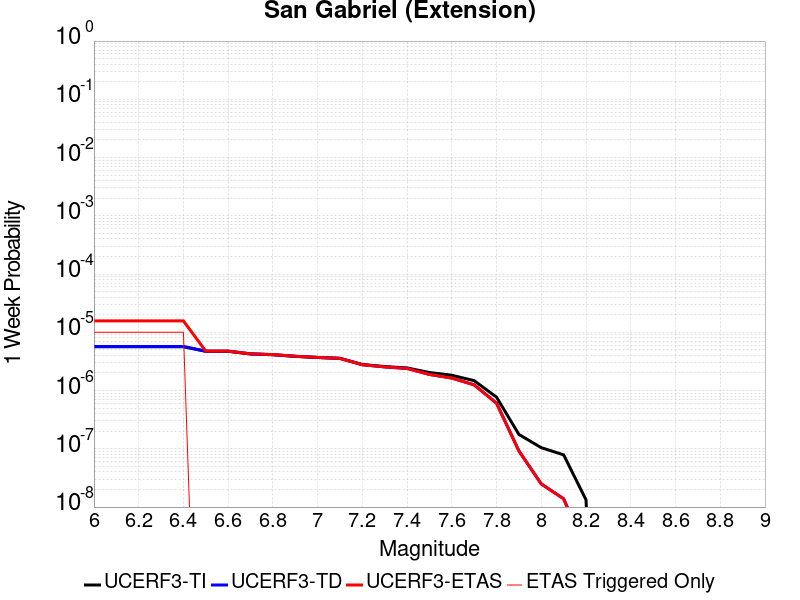 | 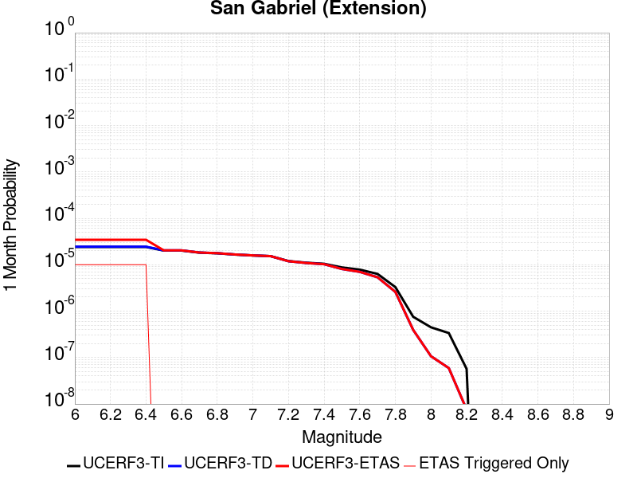 | 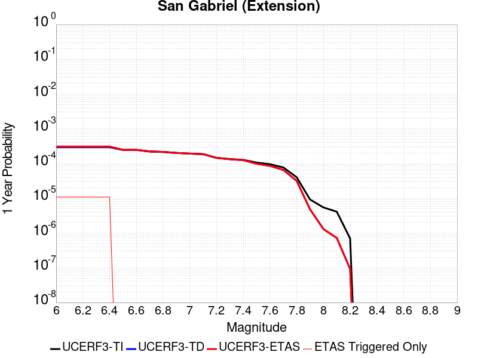 | 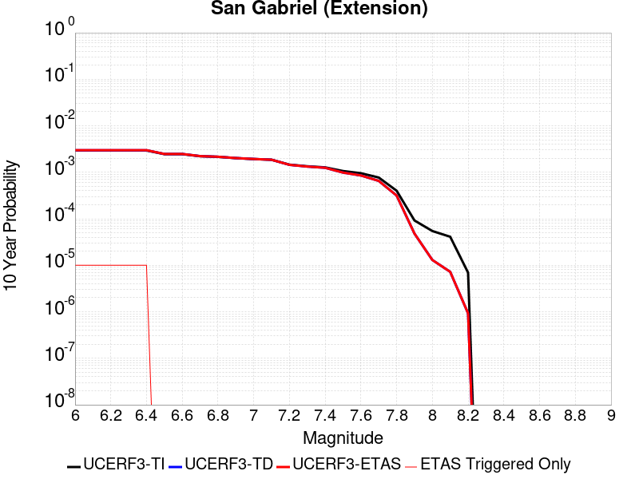 |

| Magnitude | 1 wk TI Prob | 1 wk TD Prob | 1 wk ETAS Prob | 1 wk ETAS/TD Gain | 1 wk ETAS Triggered Only | 1 mo TI Prob | 1 mo TD Prob | 1 mo ETAS Prob | 1 mo ETAS/TD Gain | 1 mo ETAS Triggered Only | 1 yr TI Prob | 1 yr TD Prob | 1 yr ETAS Prob | 1 yr ETAS/TD Gain | 1 yr ETAS Triggered Only | 10 yr TI Prob | 10 yr TD Prob | 10 yr ETAS Prob | 10 yr ETAS/TD Gain | 10 yr ETAS Triggered Only |
|-----|-----|-----|-----|-----|-----|-----|-----|-----|-----|-----|-----|-----|-----|-----|-----|-----|-----|-----|-----|-----|
| 6.0 | 5.6486106E-6 | 5.716764E-6 | 1.656269E-5 | 2.897214 | 1.0845987E-5 | 2.4208108E-5 | 2.4500196E-5 | 3.5345915E-5 | 1.4426789 | 1.0845987E-5 | 2.9469383E-4 | 2.9825032E-4 | 3.0909307E-4 | 1.0363545 | 1.0845987E-5 | 0.0029430336 | 0.0029786306 | 0.0029894444 | 1.0036304 | 1.0845987E-5 |
| 6.1 | 5.6486106E-6 | 5.716764E-6 | 1.656269E-5 | 2.897214 | 1.0845987E-5 | 2.4208108E-5 | 2.4500196E-5 | 3.5345915E-5 | 1.4426789 | 1.0845987E-5 | 2.9469383E-4 | 2.9825032E-4 | 3.0909307E-4 | 1.0363545 | 1.0845987E-5 | 0.0029430336 | 0.0029786306 | 0.0029894444 | 1.0036304 | 1.0845987E-5 |
| 6.2 | 5.6486106E-6 | 5.716764E-6 | 1.656269E-5 | 2.897214 | 1.0845987E-5 | 2.4208108E-5 | 2.4500196E-5 | 3.5345915E-5 | 1.4426789 | 1.0845987E-5 | 2.9469383E-4 | 2.9825032E-4 | 3.0909307E-4 | 1.0363545 | 1.0845987E-5 | 0.0029430336 | 0.0029786306 | 0.0029894444 | 1.0036304 | 1.0845987E-5 |
| 6.3 | 5.6486106E-6 | 5.716764E-6 | 1.656269E-5 | 2.897214 | 1.0845987E-5 | 2.4208108E-5 | 2.4500196E-5 | 3.5345915E-5 | 1.4426789 | 1.0845987E-5 | 2.9469383E-4 | 2.9825032E-4 | 3.0909307E-4 | 1.0363545 | 1.0845987E-5 | 0.0029430336 | 0.0029786306 | 0.0029894444 | 1.0036304 | 1.0845987E-5 |
| 6.4 | 5.6486106E-6 | 5.716764E-6 | 1.656269E-5 | 2.897214 | 1.0845987E-5 | 2.4208108E-5 | 2.4500196E-5 | 3.5345915E-5 | 1.4426789 | 1.0845987E-5 | 2.9469383E-4 | 2.9825032E-4 | 3.0909307E-4 | 1.0363545 | 1.0845987E-5 | 0.0029430336 | 0.0029786306 | 0.0029894444 | 1.0036304 | 1.0845987E-5 |
| 6.5 | 4.7134554E-6 | 4.754189E-6 | 4.754189E-6 | 1.0 | 0.0 | 2.0200367E-5 | 2.037494E-5 | 2.037494E-5 | 1.0 | 0.0 | 2.459117E-4 | 2.480375E-4 | 2.480375E-4 | 1.0 | 0.0 | 0.0024563975 | 0.002477695 | 0.002477695 | 1.0 | 0.0 |
| 6.6 | 4.7134554E-6 | 4.754189E-6 | 4.754189E-6 | 1.0 | 0.0 | 2.0200367E-5 | 2.037494E-5 | 2.037494E-5 | 1.0 | 0.0 | 2.459117E-4 | 2.480375E-4 | 2.480375E-4 | 1.0 | 0.0 | 0.0024563975 | 0.002477695 | 0.002477695 | 1.0 | 0.0 |
| 6.7 | 4.2468837E-6 | 4.2740066E-6 | 4.2740066E-6 | 1.0 | 0.0 | 1.8200803E-5 | 1.8317047E-5 | 1.8317047E-5 | 1.0 | 0.0 | 2.2157225E-4 | 2.2298795E-4 | 2.2298795E-4 | 1.0 | 0.0 | 0.0022135144 | 0.0022277178 | 0.0022277178 | 1.0 | 0.0 |
| 6.8 | 4.1180615E-6 | 4.1413964E-6 | 4.1413964E-6 | 1.0 | 0.0 | 1.7648716E-5 | 1.7748725E-5 | 1.7748725E-5 | 1.0 | 0.0 | 2.1485193E-4 | 2.1607001E-4 | 2.1607001E-4 | 1.0 | 0.0 | 0.0021464431 | 0.0021586744 | 0.0021586744 | 1.0 | 0.0 |
| 6.9 | 3.863861E-6 | 3.879712E-6 | 3.879712E-6 | 1.0 | 0.0 | 1.65593E-5 | 1.6627235E-5 | 1.6627235E-5 | 1.0 | 0.0 | 2.0159081E-4 | 2.0241845E-4 | 2.0241845E-4 | 1.0 | 0.0 | 0.0020140803 | 0.0020224121 | 0.0020224121 | 1.0 | 0.0 |
| 7.0 | 3.6947372E-6 | 3.705611E-6 | 3.705611E-6 | 1.0 | 0.0 | 1.5834492E-5 | 1.5881098E-5 | 1.5881098E-5 | 1.0 | 0.0 | 1.9276788E-4 | 1.9333589E-4 | 1.9333589E-4 | 1.0 | 0.0 | 0.0019260074 | 0.0019317471 | 0.0019317471 | 1.0 | 0.0 |
| 7.1 | 3.5686835E-6 | 3.572832E-6 | 3.572832E-6 | 1.0 | 0.0 | 1.5294268E-5 | 1.531205E-5 | 1.531205E-5 | 1.0 | 0.0 | 1.861918E-4 | 1.8640893E-4 | 1.8640893E-4 | 1.0 | 0.0 | 0.0018603588 | 0.0018625953 | 0.0018625953 | 1.0 | 0.0 |
| 7.2 | 2.8023446E-6 | 2.7767248E-6 | 2.7767248E-6 | 1.0 | 0.0 | 1.2009994E-5 | 1.1900196E-5 | 1.1900196E-5 | 1.0 | 0.0 | 1.4621185E-4 | 1.4487536E-4 | 1.4487536E-4 | 1.0 | 0.0 | 0.001461157 | 0.0014478238 | 0.0014478238 | 1.0 | 0.0 |
| 7.3 | 2.5843012E-6 | 2.5459015E-6 | 2.5459015E-6 | 1.0 | 0.0 | 1.1075529E-5 | 1.0910961E-5 | 1.0910961E-5 | 1.0 | 0.0 | 1.3483623E-4 | 1.3283295E-4 | 1.3283295E-4 | 1.0 | 0.0 | 0.0013475444 | 0.001327549 | 0.001327549 | 1.0 | 0.0 |
| 7.4 | 2.4464468E-6 | 2.396603E-6 | 2.396603E-6 | 1.0 | 0.0 | 1.04847295E-5 | 1.0271116E-5 | 1.0271116E-5 | 1.0 | 0.0 | 1.276441E-4 | 1.2504375E-4 | 1.2504375E-4 | 1.0 | 0.0 | 0.0012757082 | 0.0012497472 | 0.0012497472 | 1.0 | 0.0 |
| 7.5 | 2.0420266E-6 | 1.8909875E-6 | 1.8909875E-6 | 1.0 | 0.0 | 8.751514E-6 | 8.104207E-6 | 8.104207E-6 | 1.0 | 0.0 | 1.0654447E-4 | 9.866429E-5 | 9.866429E-5 | 1.0 | 0.0 | 0.001064934 | 9.86212E-4 | 9.86212E-4 | 1.0 | 0.0 |
| 7.6 | 1.8326596E-6 | 1.6397845E-6 | 1.6397845E-6 | 1.0 | 0.0 | 7.854232E-6 | 7.0276287E-6 | 7.0276287E-6 | 1.0 | 0.0 | 9.562107E-5 | 8.5558044E-5 | 8.5558044E-5 | 1.0 | 0.0 | 9.5579936E-4 | 8.552569E-4 | 8.552569E-4 | 1.0 | 0.0 |
| 7.7 | 1.4786998E-6 | 1.252338E-6 | 1.252338E-6 | 1.0 | 0.0 | 6.3372695E-6 | 5.367152E-6 | 5.367152E-6 | 1.0 | 0.0 | 7.715353E-5 | 6.534313E-5 | 6.534313E-5 | 1.0 | 0.0 | 7.7126746E-4 | 6.532469E-4 | 6.532469E-4 | 1.0 | 0.0 |
| 7.8 | 7.6975533E-7 | 6.0690115E-7 | 6.0690115E-7 | 1.0 | 0.0 | 3.2989474E-6 | 2.6010023E-6 | 2.6010023E-6 | 1.0 | 0.0 | 4.0163945E-5 | 3.1666747E-5 | 3.1666747E-5 | 1.0 | 0.0 | 4.0156685E-4 | 3.1662837E-4 | 3.1662837E-4 | 1.0 | 0.0 |
| 7.9 | 1.7645915E-7 | 9.2121915E-8 | 9.2121915E-8 | 1.0 | 0.0 | 7.562533E-7 | 3.9480813E-7 | 3.9480813E-7 | 1.0 | 0.0 | 9.207345E-6 | 4.8067786E-6 | 4.8067786E-6 | 1.0 | 0.0 | 9.206964E-5 | 4.8071433E-5 | 4.8071433E-5 | 1.0 | 0.0 |
| 8.0 | 1.0463461E-7 | 2.4944782E-8 | 2.4944782E-8 | 1.0 | 0.0 | 4.4843398E-7 | 1.0690621E-7 | 1.0690621E-7 | 1.0 | 0.0 | 5.45967E-6 | 1.3015823E-6 | 1.3015823E-6 | 1.0 | 0.0 | 5.459536E-5 | 1.3020428E-5 | 1.3020428E-5 | 1.0 | 0.0 |
| 8.1 | 7.875717E-8 | 1.38639145E-8 | 1.38639145E-8 | 1.0 | 0.0 | 3.3753068E-7 | 5.9416777E-8 | 5.9416777E-8 | 1.0 | 0.0 | 4.109428E-6 | 7.23399E-7 | 7.23399E-7 | 1.0 | 0.0 | 4.109352E-5 | 7.238648E-6 | 7.238648E-6 | 1.0 | 0.0 |
| 8.2 | 1.33163E-8 | 1.7729578E-9 | 1.7729578E-9 | 1.0 | 0.0 | 5.7069855E-8 | 7.598391E-9 | 7.598391E-9 | 1.0 | 0.0 | 6.9482525E-7 | 9.25104E-8 | 9.25104E-8 | 1.0 | 0.0 | 6.9482307E-6 | 9.270698E-7 | 9.270698E-7 | 1.0 | 0.0 |

## Coyote Canyon
*[(top)](#table-of-contents)*

| 1 Week | 1 Month | 1 Year | 10 Year |
|-----|-----|-----|-----|
| 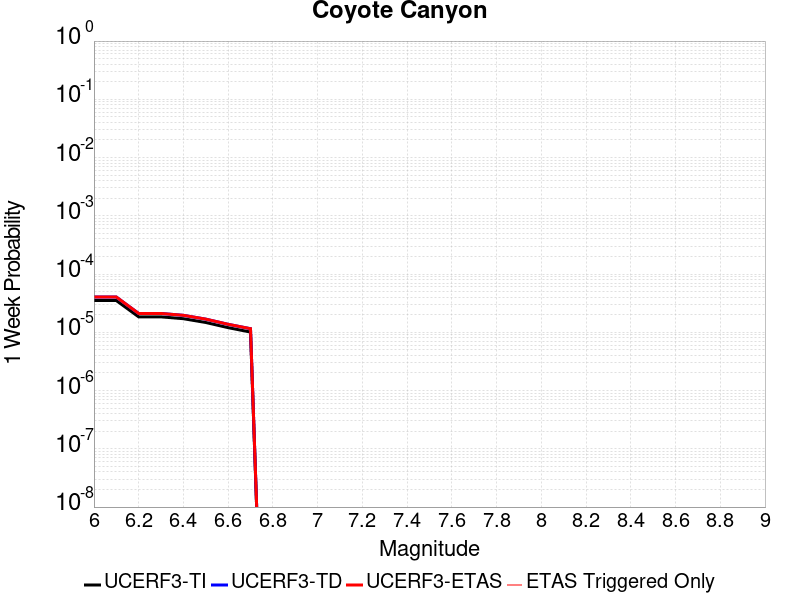 | 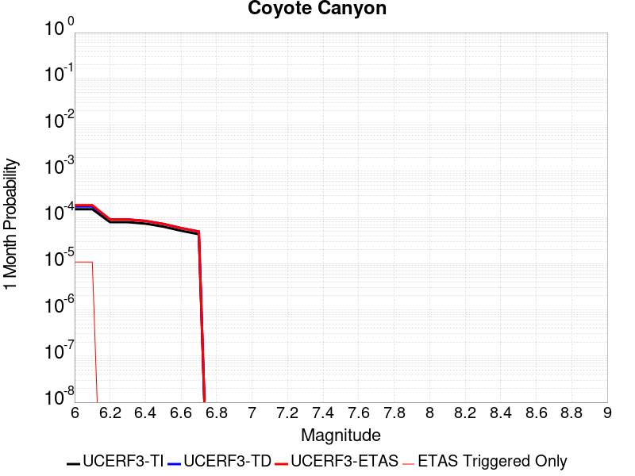 | 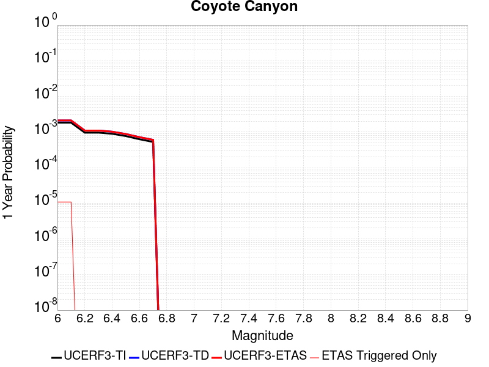 | 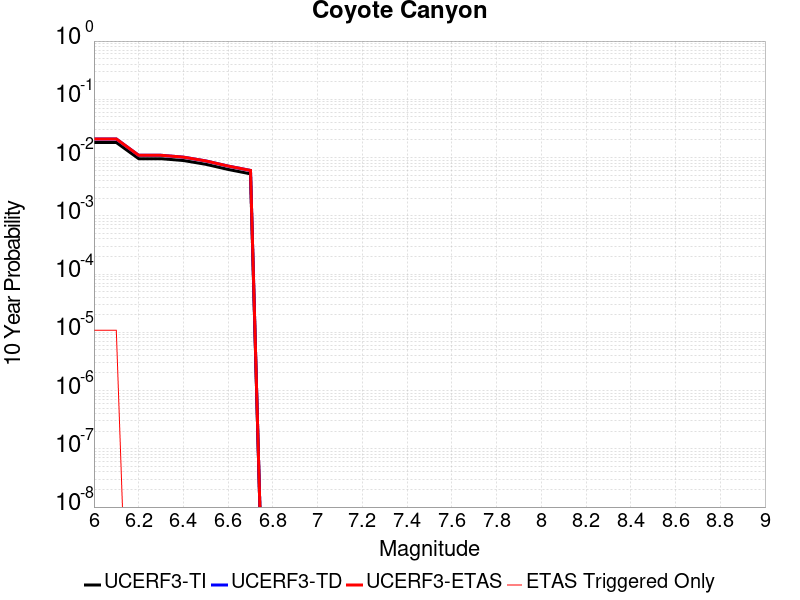 |

| Magnitude | 1 wk TI Prob | 1 wk TD Prob | 1 wk ETAS Prob | 1 wk ETAS/TD Gain | 1 wk ETAS Triggered Only | 1 mo TI Prob | 1 mo TD Prob | 1 mo ETAS Prob | 1 mo ETAS/TD Gain | 1 mo ETAS Triggered Only | 1 yr TI Prob | 1 yr TD Prob | 1 yr ETAS Prob | 1 yr ETAS/TD Gain | 1 yr ETAS Triggered Only | 10 yr TI Prob | 10 yr TD Prob | 10 yr ETAS Prob | 10 yr ETAS/TD Gain | 10 yr ETAS Triggered Only |
|-----|-----|-----|-----|-----|-----|-----|-----|-----|-----|-----|-----|-----|-----|-----|-----|-----|-----|-----|-----|-----|
| 6.0 | 3.5090034E-5 | 4.036416E-5 | 4.036416E-5 | 1.0 | 0.0 | 1.503772E-4 | 1.7297924E-4 | 1.8382336E-4 | 1.0626903 | 1.0845987E-5 | 0.0018293047 | 0.0021042444 | 0.0021150676 | 1.0051435 | 1.0845987E-5 | 0.018143194 | 0.02086912 | 0.020879738 | 1.0005089 | 1.0845987E-5 |
| 6.1 | 3.5090034E-5 | 4.036416E-5 | 4.036416E-5 | 1.0 | 0.0 | 1.503772E-4 | 1.7297924E-4 | 1.8382336E-4 | 1.0626903 | 1.0845987E-5 | 0.0018293047 | 0.0021042444 | 0.0021150676 | 1.0051435 | 1.0845987E-5 | 0.018143194 | 0.02086912 | 0.020879738 | 1.0005089 | 1.0845987E-5 |
| 6.2 | 1.841879E-5 | 2.1059714E-5 | 2.1059714E-5 | 1.0 | 0.0 | 7.8935285E-5 | 9.0253365E-5 | 9.0253365E-5 | 1.0 | 0.0 | 9.606133E-4 | 0.0010983828 | 0.0010983828 | 1.0 | 0.0 | 0.0095647145 | 0.010939625 | 0.010939625 | 1.0 | 0.0 |
| 6.3 | 1.841879E-5 | 2.1059714E-5 | 2.1059714E-5 | 1.0 | 0.0 | 7.8935285E-5 | 9.0253365E-5 | 9.0253365E-5 | 1.0 | 0.0 | 9.606133E-4 | 0.0010983828 | 0.0010983828 | 1.0 | 0.0 | 0.0095647145 | 0.010939625 | 0.010939625 | 1.0 | 0.0 |
| 6.4 | 1.712201E-5 | 1.9565137E-5 | 1.9565137E-5 | 1.0 | 0.0 | 7.337798E-5 | 8.384846E-5 | 8.384846E-5 | 1.0 | 0.0 | 8.930107E-4 | 0.0010204774 | 0.0010204774 | 1.0 | 0.0 | 0.008894307 | 0.010167832 | 0.010167832 | 1.0 | 0.0 |
| 6.5 | 1.4744935E-5 | 1.6836908E-5 | 1.6836908E-5 | 1.0 | 0.0 | 6.3191044E-5 | 7.2156705E-5 | 7.2156705E-5 | 1.0 | 0.0 | 7.6907943E-4 | 8.782473E-4 | 8.782473E-4 | 1.0 | 0.0 | 0.007664232 | 0.008756962 | 0.008756962 | 1.0 | 0.0 |
| 6.6 | 1.2017839E-5 | 1.3724038E-5 | 1.3724038E-5 | 1.0 | 0.0 | 5.150401E-5 | 5.8816477E-5 | 5.8816477E-5 | 1.0 | 0.0 | 6.268809E-4 | 7.1594387E-4 | 7.1594387E-4 | 1.0 | 0.0 | 0.0062511545 | 0.0071450667 | 0.0071450667 | 1.0 | 0.0 |
| 6.7 | 1.00956095E-5 | 1.1533472E-5 | 1.1533472E-5 | 1.0 | 0.0 | 4.326618E-5 | 4.9428723E-5 | 4.9428723E-5 | 1.0 | 0.0 | 5.266384E-4 | 6.017155E-4 | 6.017155E-4 | 1.0 | 0.0 | 0.005253921 | 0.0060093896 | 0.0060093896 | 1.0 | 0.0 |

## Santa Cruz Island
*[(top)](#table-of-contents)*

| 1 Week | 1 Month | 1 Year | 10 Year |
|-----|-----|-----|-----|
|  |  |  |  |

| Magnitude | 1 wk TI Prob | 1 wk TD Prob | 1 wk ETAS Prob | 1 wk ETAS/TD Gain | 1 wk ETAS Triggered Only | 1 mo TI Prob | 1 mo TD Prob | 1 mo ETAS Prob | 1 mo ETAS/TD Gain | 1 mo ETAS Triggered Only | 1 yr TI Prob | 1 yr TD Prob | 1 yr ETAS Prob | 1 yr ETAS/TD Gain | 1 yr ETAS Triggered Only | 10 yr TI Prob | 10 yr TD Prob | 10 yr ETAS Prob | 10 yr ETAS/TD Gain | 10 yr ETAS Triggered Only |
|-----|-----|-----|-----|-----|-----|-----|-----|-----|-----|-----|-----|-----|-----|-----|-----|-----|-----|-----|-----|-----|
| 6.0 | 2.9164563E-5 | 3.1599673E-5 | 3.1599673E-5 | 1.0 | 0.0 | 1.2498499E-4 | 1.3542091E-4 | 1.3542091E-4 | 1.0 | 0.0 | 0.0015206301 | 0.0016476389 | 0.0016476389 | 1.0 | 0.0 | 0.015102667 | 0.016367963 | 0.016378632 | 1.0006518 | 1.0845987E-5 |
| 6.1 | 2.9164563E-5 | 3.1599673E-5 | 3.1599673E-5 | 1.0 | 0.0 | 1.2498499E-4 | 1.3542091E-4 | 1.3542091E-4 | 1.0 | 0.0 | 0.0015206301 | 0.0016476389 | 0.0016476389 | 1.0 | 0.0 | 0.015102667 | 0.016367963 | 0.016378632 | 1.0006518 | 1.0845987E-5 |
| 6.2 | 2.9164563E-5 | 3.1599673E-5 | 3.1599673E-5 | 1.0 | 0.0 | 1.2498499E-4 | 1.3542091E-4 | 1.3542091E-4 | 1.0 | 0.0 | 0.0015206301 | 0.0016476389 | 0.0016476389 | 1.0 | 0.0 | 0.015102667 | 0.016367963 | 0.016378632 | 1.0006518 | 1.0845987E-5 |
| 6.3 | 1.6635553E-5 | 1.7804325E-5 | 1.7804325E-5 | 1.0 | 0.0 | 7.1293274E-5 | 7.630212E-5 | 7.630212E-5 | 1.0 | 0.0 | 8.6765E-4 | 9.286006E-4 | 9.286006E-4 | 1.0 | 0.0 | 0.008642701 | 0.009249076 | 0.009259822 | 1.0011618 | 1.0845987E-5 |
| 6.4 | 1.6635553E-5 | 1.7804325E-5 | 1.7804325E-5 | 1.0 | 0.0 | 7.1293274E-5 | 7.630212E-5 | 7.630212E-5 | 1.0 | 0.0 | 8.6765E-4 | 9.286006E-4 | 9.286006E-4 | 1.0 | 0.0 | 0.008642701 | 0.009249076 | 0.009259822 | 1.0011618 | 1.0845987E-5 |
| 6.5 | 1.2238748E-5 | 1.3042973E-5 | 1.3042973E-5 | 1.0 | 0.0 | 5.2450723E-5 | 5.5897275E-5 | 5.5897275E-5 | 1.0 | 0.0 | 6.3840044E-4 | 6.803405E-4 | 6.803405E-4 | 1.0 | 0.0 | 0.0063656955 | 0.006782976 | 0.006793748 | 1.0015881 | 1.0845987E-5 |
| 6.6 | 1.0489767E-5 | 1.1156617E-5 | 1.1156617E-5 | 1.0 | 0.0 | 4.495537E-5 | 4.7813206E-5 | 4.7813206E-5 | 1.0 | 0.0 | 5.4719415E-4 | 5.8197253E-4 | 5.8197253E-4 | 1.0 | 0.0 | 0.005458487 | 0.005804726 | 0.005815509 | 1.0018576 | 1.0845987E-5 |
| 6.7 | 8.699222E-6 | 9.236766E-6 | 9.236766E-6 | 1.0 | 0.0 | 3.7281847E-5 | 3.9585546E-5 | 3.9585546E-5 | 1.0 | 0.0 | 4.5381195E-4 | 4.8184796E-4 | 4.8184796E-4 | 1.0 | 0.0 | 0.0045288634 | 0.0048081 | 0.0048081 | 1.0 | 0.0 |
| 6.8 | 8.307732E-6 | 8.816889E-6 | 8.816889E-6 | 1.0 | 0.0 | 3.560408E-5 | 3.7786125E-5 | 3.7786125E-5 | 1.0 | 0.0 | 4.3339343E-4 | 4.5994937E-4 | 4.5994937E-4 | 1.0 | 0.0 | 0.004325492 | 0.0045900275 | 0.0045900275 | 1.0 | 0.0 |
| 6.9 | 8.073121E-6 | 8.564924E-6 | 8.564924E-6 | 1.0 | 0.0 | 3.459863E-5 | 3.6706308E-5 | 3.6706308E-5 | 1.0 | 0.0 | 4.2115687E-4 | 4.4680806E-4 | 4.4680806E-4 | 1.0 | 0.0 | 0.004203596 | 0.0044591487 | 0.0044591487 | 1.0 | 0.0 |
| 7.0 | 7.617019E-6 | 8.074651E-6 | 8.074651E-6 | 1.0 | 0.0 | 3.264396E-5 | 3.460519E-5 | 3.460519E-5 | 1.0 | 0.0 | 3.9736772E-4 | 4.2123714E-4 | 4.2123714E-4 | 1.0 | 0.0 | 0.003966579 | 0.0042044343 | 0.0042044343 | 1.0 | 0.0 |
| 7.1 | 7.1224836E-6 | 7.5457756E-6 | 7.5457756E-6 | 1.0 | 0.0 | 3.052457E-5 | 3.2338638E-5 | 3.2338638E-5 | 1.0 | 0.0 | 3.715733E-4 | 3.9365215E-4 | 3.9365215E-4 | 1.0 | 0.0 | 0.003709526 | 0.0039295917 | 0.0039295917 | 1.0 | 0.0 |
| 7.2 | 6.441115E-6 | 6.827372E-6 | 6.827372E-6 | 1.0 | 0.0 | 2.7604487E-5 | 2.925984E-5 | 2.925984E-5 | 1.0 | 0.0 | 3.360328E-4 | 3.5618054E-4 | 3.5618054E-4 | 1.0 | 0.0 | 0.0033552512 | 0.003556125 | 0.003556125 | 1.0 | 0.0 |
| 7.3 | 5.494274E-6 | 5.819985E-6 | 5.819985E-6 | 1.0 | 0.0 | 2.3546674E-5 | 2.4942556E-5 | 2.4942556E-5 | 1.0 | 0.0 | 2.8664304E-4 | 3.0363348E-4 | 3.0363348E-4 | 1.0 | 0.0 | 0.002862736 | 0.0030322094 | 0.0030322094 | 1.0 | 0.0 |
| 7.4 | 4.0802624E-6 | 4.3122495E-6 | 4.3122495E-6 | 1.0 | 0.0 | 1.7486722E-5 | 1.8480938E-5 | 1.8480938E-5 | 1.0 | 0.0 | 2.1288003E-4 | 2.2498227E-4 | 2.2498227E-4 | 1.0 | 0.0 | 0.0021267622 | 0.002247554 | 0.002247554 | 1.0 | 0.0 |
| 7.5 | 2.3584746E-6 | 2.475306E-6 | 2.475306E-6 | 1.0 | 0.0 | 1.0107709E-5 | 1.0608412E-5 | 1.0608412E-5 | 1.0 | 0.0 | 1.2305441E-4 | 1.291498E-4 | 1.291498E-4 | 1.0 | 0.0 | 0.0012298629 | 0.0012907526 | 0.0012907526 | 1.0 | 0.0 |
| 7.6 | 9.4981914E-7 | 9.860919E-7 | 9.860919E-7 | 1.0 | 0.0 | 4.0706473E-6 | 4.2261013E-6 | 4.2261013E-6 | 1.0 | 0.0 | 4.9559E-5 | 5.145158E-5 | 5.145158E-5 | 1.0 | 0.0 | 4.954795E-4 | 5.14398E-4 | 5.14398E-4 | 1.0 | 0.0 |
| 7.7 | 2.6013532E-7 | 2.641658E-7 | 2.641658E-7 | 1.0 | 0.0 | 1.1148652E-6 | 1.1321387E-6 | 1.1321387E-6 | 1.0 | 0.0 | 1.3573399E-5 | 1.3783702E-5 | 1.3783702E-5 | 1.0 | 0.0 | 1.357257E-4 | 1.3782854E-4 | 1.3782854E-4 | 1.0 | 0.0 |
| 7.8 | 4.1522263E-8 | 3.965676E-8 | 3.965676E-8 | 1.0 | 0.0 | 1.7795254E-7 | 1.6995754E-7 | 1.6995754E-7 | 1.0 | 0.0 | 2.16657E-6 | 2.0692314E-6 | 2.0692314E-6 | 1.0 | 0.0 | 2.1665488E-5 | 2.0692141E-5 | 2.0692141E-5 | 1.0 | 0.0 |
| 7.9 | 7.7242046E-10 | 5.946812E-10 | 5.946812E-10 | 1.0 | 0.0 | 3.3103735E-9 | 2.5486335E-9 | 2.5486335E-9 | 1.0 | 0.0 | 4.0303796E-8 | 3.1029614E-8 | 3.1029614E-8 | 1.0 | 0.0 | 4.030379E-7 | 3.102961E-7 | 3.102961E-7 | 1.0 | 0.0 |

## Calaveras (So) 2011 CFM
*[(top)](#table-of-contents)*

| 1 Week | 1 Month | 1 Year | 10 Year |
|-----|-----|-----|-----|
|  |  |  |  |

| Magnitude | 1 wk TI Prob | 1 wk TD Prob | 1 wk ETAS Prob | 1 wk ETAS/TD Gain | 1 wk ETAS Triggered Only | 1 mo TI Prob | 1 mo TD Prob | 1 mo ETAS Prob | 1 mo ETAS/TD Gain | 1 mo ETAS Triggered Only | 1 yr TI Prob | 1 yr TD Prob | 1 yr ETAS Prob | 1 yr ETAS/TD Gain | 1 yr ETAS Triggered Only | 10 yr TI Prob | 10 yr TD Prob | 10 yr ETAS Prob | 10 yr ETAS/TD Gain | 10 yr ETAS Triggered Only |
|-----|-----|-----|-----|-----|-----|-----|-----|-----|-----|-----|-----|-----|-----|-----|-----|-----|-----|-----|-----|-----|
| 6.0 | 1.5950744E-4 | 3.0710758E-4 | 3.0710758E-4 | 1.0 | 0.0 | 6.834242E-4 | 0.0013155134 | 0.0013155134 | 1.0 | 0.0 | 0.00828899 | 0.015858818 | 0.01586949 | 1.000673 | 1.0845987E-5 | 0.079865426 | 0.14439851 | 0.1444078 | 1.0000643 | 1.0845987E-5 |
| 6.1 | 1.3584697E-4 | 2.6036007E-4 | 2.6036007E-4 | 1.0 | 0.0 | 5.8207137E-4 | 0.0011153528 | 0.0011153528 | 1.0 | 0.0 | 0.007063716 | 0.013461906 | 0.013472606 | 1.0007949 | 1.0845987E-5 | 0.06843361 | 0.12402653 | 0.12403603 | 1.0000767 | 1.0845987E-5 |
| 6.2 | 1.14676266E-4 | 2.1725375E-4 | 2.1725375E-4 | 1.0 | 0.0 | 4.9137714E-4 | 9.307542E-4 | 9.307542E-4 | 1.0 | 0.0 | 0.0059661185 | 0.011245421 | 0.011256145 | 1.0009537 | 1.0845987E-5 | 0.058084648 | 0.10501737 | 0.10502708 | 1.0000924 | 1.0845987E-5 |
| 6.3 | 8.691518E-5 | 1.5986769E-4 | 1.5986769E-4 | 1.0 | 0.0 | 3.7244044E-4 | 6.849467E-4 | 6.849467E-4 | 1.0 | 0.0 | 0.004525038 | 0.0083006825 | 0.008311438 | 1.0012958 | 1.0845987E-5 | 0.044339992 | 0.07933282 | 0.079342805 | 1.0001259 | 1.0845987E-5 |
| 6.4 | 8.50982E-5 | 1.5693177E-4 | 1.5693177E-4 | 1.0 | 0.0 | 3.646556E-4 | 6.7237066E-4 | 6.7237066E-4 | 1.0 | 0.0 | 0.0044306475 | 0.008148721 | 0.008159479 | 1.0013201 | 1.0845987E-5 | 0.04343345 | 0.077938974 | 0.07794897 | 1.0001283 | 1.0845987E-5 |
| 6.5 | 8.4062965E-5 | 1.5517746E-4 | 1.5517746E-4 | 1.0 | 0.0 | 3.602201E-4 | 6.6485605E-4 | 6.6485605E-4 | 1.0 | 0.0 | 0.004376863 | 0.008057924 | 0.008068683 | 1.0013351 | 1.0845987E-5 | 0.042916555 | 0.077110246 | 0.07712025 | 1.0001298 | 1.0845987E-5 |
| 6.6 | 8.194716E-5 | 1.5153716E-4 | 1.5153716E-4 | 1.0 | 0.0 | 3.5115483E-4 | 6.4926257E-4 | 6.4926257E-4 | 1.0 | 0.0 | 0.0042669317 | 0.007869773 | 0.007880533 | 1.0013673 | 1.0845987E-5 | 0.04185927 | 0.07539553 | 0.07540556 | 1.000133 | 1.0845987E-5 |
| 6.7 | 8.012326E-5 | 1.4821463E-4 | 1.4821463E-4 | 1.0 | 0.0 | 3.433402E-4 | 6.350302E-4 | 6.350302E-4 | 1.0 | 0.0 | 0.004172157 | 0.0076982686 | 0.007709031 | 1.0013981 | 1.0845987E-5 | 0.040946912 | 0.07383767 | 0.07384771 | 1.000136 | 1.0845987E-5 |
| 6.8 | 7.119773E-5 | 1.288018E-4 | 1.288018E-4 | 1.0 | 0.0 | 3.0509746E-4 | 5.5188267E-4 | 5.5188267E-4 | 1.0 | 0.0 | 0.0037082357 | 0.006695695 | 0.0067064683 | 1.001609 | 1.0845987E-5 | 0.036469642 | 0.064682275 | 0.06469242 | 1.0001569 | 1.0845987E-5 |
| 6.9 | 5.7343088E-5 | 9.9185636E-5 | 9.9185636E-5 | 1.0 | 0.0 | 2.4573295E-4 | 4.250125E-4 | 4.250125E-4 | 1.0 | 0.0 | 0.0029876942 | 0.005162333 | 0.0051731234 | 1.0020901 | 1.0845987E-5 | 0.02947844 | 0.050507538 | 0.050517835 | 1.0002038 | 1.0845987E-5 |
| 7.0 | 4.8746577E-5 | 8.2844235E-5 | 8.2844235E-5 | 1.0 | 0.0 | 2.0889717E-4 | 3.5499875E-4 | 3.5499875E-4 | 1.0 | 0.0 | 0.0025403565 | 0.0043136105 | 0.0043244096 | 1.0025035 | 1.0845987E-5 | 0.025115121 | 0.042483483 | 0.04249387 | 1.0002445 | 1.0845987E-5 |
| 7.1 | 4.2998014E-5 | 7.264594E-5 | 7.264594E-5 | 1.0 | 0.0 | 1.8426418E-4 | 3.1130292E-4 | 3.1130292E-4 | 1.0 | 0.0 | 0.002241108 | 0.0037835862 | 0.0037943912 | 1.0028558 | 1.0845987E-5 | 0.022186412 | 0.0374217 | 0.03743214 | 1.000279 | 1.0845987E-5 |
| 7.2 | 3.221292E-5 | 5.390257E-5 | 5.390257E-5 | 1.0 | 0.0 | 1.3804805E-4 | 2.3099071E-4 | 2.3099071E-4 | 1.0 | 0.0 | 0.0016794393 | 0.0028087131 | 0.0028087131 | 1.0 | 0.0 | 0.016668037 | 0.028034493 | 0.028034493 | 1.0 | 0.0 |
| 7.3 | 2.3756531E-5 | 3.946884E-5 | 3.946884E-5 | 1.0 | 0.0 | 1.0180973E-4 | 1.691413E-4 | 1.691413E-4 | 1.0 | 0.0 | 0.0012388286 | 0.0020573675 | 0.0020573675 | 1.0 | 0.0 | 0.012319452 | 0.020642038 | 0.020642038 | 1.0 | 0.0 |
| 7.4 | 1.5997684E-5 | 2.733813E-5 | 2.733813E-5 | 1.0 | 0.0 | 6.8559704E-5 | 1.1715816E-4 | 1.1715816E-4 | 1.0 | 0.0 | 8.343947E-4 | 0.0014254698 | 0.0014254698 | 1.0 | 0.0 | 0.008312687 | 0.0143752 | 0.0143752 | 1.0 | 0.0 |
| 7.5 | 1.3814293E-5 | 2.4779916E-5 | 2.4779916E-5 | 1.0 | 0.0 | 5.9202768E-5 | 1.0619533E-4 | 1.0619533E-4 | 1.0 | 0.0 | 7.205553E-4 | 0.0012921637 | 0.0012921637 | 1.0 | 0.0 | 0.007182234 | 0.013054431 | 0.013054431 | 1.0 | 0.0 |
| 7.6 | 8.817309E-6 | 1.642736E-5 | 1.642736E-5 | 1.0 | 0.0 | 3.7787922E-5 | 7.040108E-5 | 7.040108E-5 | 1.0 | 0.0 | 4.5997082E-4 | 8.567974E-4 | 8.567974E-4 | 1.0 | 0.0 | 0.004590199 | 0.008718628 | 0.008718628 | 1.0 | 0.0 |
| 7.7 | 4.0352206E-6 | 7.706098E-6 | 7.706098E-6 | 1.0 | 0.0 | 1.7293689E-5 | 3.3025717E-5 | 3.3025717E-5 | 1.0 | 0.0 | 2.1053031E-4 | 4.0201397E-4 | 4.0201397E-4 | 1.0 | 0.0 | 0.0021033096 | 0.004164605 | 0.004164605 | 1.0 | 0.0 |
| 7.8 | 3.413169E-6 | 6.786183E-6 | 6.786183E-6 | 1.0 | 0.0 | 1.4627784E-5 | 2.9083318E-5 | 2.9083318E-5 | 1.0 | 0.0 | 1.7807873E-4 | 3.5403192E-4 | 3.5403192E-4 | 1.0 | 0.0 | 0.0017793609 | 0.0036659774 | 0.0036659774 | 1.0 | 0.0 |
| 7.9 | 2.4740732E-6 | 5.2783053E-6 | 5.2783053E-6 | 1.0 | 0.0 | 1.06031275E-5 | 2.2621112E-5 | 2.2621112E-5 | 1.0 | 0.0 | 1.2908543E-4 | 2.753773E-4 | 2.753773E-4 | 1.0 | 0.0 | 0.0012901047 | 0.002834394 | 0.002834394 | 1.0 | 0.0 |
| 8.0 | 1.5231818E-6 | 3.2884188E-6 | 3.2884188E-6 | 1.0 | 0.0 | 6.527906E-6 | 1.4093148E-5 | 1.4093148E-5 | 1.0 | 0.0 | 7.9474354E-5 | 1.715706E-4 | 1.715706E-4 | 1.0 | 0.0 | 7.944594E-4 | 0.0017562305 | 0.0017562305 | 1.0 | 0.0 |
| 8.1 | 1.0104524E-6 | 2.0454734E-6 | 2.0454734E-6 | 1.0 | 0.0 | 4.330503E-6 | 8.766285E-6 | 8.766285E-6 | 1.0 | 0.0 | 5.2722597E-5 | 1.0672433E-4 | 1.0672433E-4 | 1.0 | 0.0 | 5.271009E-4 | 0.0010928321 | 0.0010928321 | 1.0 | 0.0 |

## Rose Canyon
*[(top)](#table-of-contents)*

| 1 Week | 1 Month | 1 Year | 10 Year |
|-----|-----|-----|-----|
|  |  |  |  |

| Magnitude | 1 wk TI Prob | 1 wk TD Prob | 1 wk ETAS Prob | 1 wk ETAS/TD Gain | 1 wk ETAS Triggered Only | 1 mo TI Prob | 1 mo TD Prob | 1 mo ETAS Prob | 1 mo ETAS/TD Gain | 1 mo ETAS Triggered Only | 1 yr TI Prob | 1 yr TD Prob | 1 yr ETAS Prob | 1 yr ETAS/TD Gain | 1 yr ETAS Triggered Only | 10 yr TI Prob | 10 yr TD Prob | 10 yr ETAS Prob | 10 yr ETAS/TD Gain | 10 yr ETAS Triggered Only |
|-----|-----|-----|-----|-----|-----|-----|-----|-----|-----|-----|-----|-----|-----|-----|-----|-----|-----|-----|-----|-----|
| 6.0 | 4.5923203E-5 | 4.9713904E-5 | 4.9713904E-5 | 1.0 | 0.0 | 1.9679888E-4 | 2.1304355E-4 | 2.1304355E-4 | 1.0 | 0.0 | 0.0023933933 | 0.0025909187 | 0.0025909187 | 1.0 | 0.0 | 0.023677798 | 0.025639834 | 0.0256504 | 1.0004122 | 1.0845987E-5 |
| 6.1 | 4.5923203E-5 | 4.9713904E-5 | 4.9713904E-5 | 1.0 | 0.0 | 1.9679888E-4 | 2.1304355E-4 | 2.1304355E-4 | 1.0 | 0.0 | 0.0023933933 | 0.0025909187 | 0.0025909187 | 1.0 | 0.0 | 0.023677798 | 0.025639834 | 0.0256504 | 1.0004122 | 1.0845987E-5 |
| 6.2 | 2.8844734E-5 | 2.9668578E-5 | 2.9668578E-5 | 1.0 | 0.0 | 1.2361443E-4 | 1.2714505E-4 | 1.2714505E-4 | 1.0 | 0.0 | 0.0015039665 | 0.0015468865 | 0.0015468865 | 1.0 | 0.0 | 0.0149382865 | 0.015374203 | 0.015384882 | 1.0006946 | 1.0845987E-5 |
| 6.3 | 2.3171577E-5 | 2.3161147E-5 | 2.3161147E-5 | 1.0 | 0.0 | 9.9302975E-5 | 9.925836E-5 | 9.925836E-5 | 1.0 | 0.0 | 0.0012083431 | 0.0012078139 | 0.0012078139 | 1.0 | 0.0 | 0.012017938 | 0.01202239 | 0.012033106 | 1.0008913 | 1.0845987E-5 |
| 6.4 | 2.0066604E-5 | 1.966695E-5 | 1.966695E-5 | 1.0 | 0.0 | 8.599689E-5 | 8.428426E-5 | 8.428426E-5 | 1.0 | 0.0 | 0.0010465092 | 0.0010256878 | 0.0010256878 | 1.0 | 0.0 | 0.010415946 | 0.0102175195 | 0.010228255 | 1.0010507 | 1.0845987E-5 |
| 6.5 | 1.776989E-5 | 1.7113744E-5 | 1.7113744E-5 | 1.0 | 0.0 | 7.615444E-5 | 7.334259E-5 | 7.334259E-5 | 1.0 | 0.0 | 9.267859E-4 | 8.9258724E-4 | 8.9258724E-4 | 1.0 | 0.0 | 0.009229303 | 0.008896178 | 0.008896178 | 1.0 | 0.0 |
| 6.6 | 1.5227364E-5 | 1.4339211E-5 | 1.4339211E-5 | 1.0 | 0.0 | 6.52585E-5 | 6.1452345E-5 | 6.1452345E-5 | 1.0 | 0.0 | 7.942326E-4 | 7.4793067E-4 | 7.4793067E-4 | 1.0 | 0.0 | 0.007914 | 0.0074583334 | 0.0074583334 | 1.0 | 0.0 |
| 6.7 | 1.2703898E-5 | 1.1673238E-5 | 1.1673238E-5 | 1.0 | 0.0 | 5.4444143E-5 | 5.002723E-5 | 5.002723E-5 | 1.0 | 0.0 | 6.626558E-4 | 6.089155E-4 | 6.089155E-4 | 1.0 | 0.0 | 0.006606833 | 0.0060750674 | 0.0060750674 | 1.0 | 0.0 |
| 6.8 | 1.1554917E-5 | 1.06093075E-5 | 1.06093075E-5 | 1.0 | 0.0 | 4.9520135E-5 | 4.546769E-5 | 4.546769E-5 | 1.0 | 0.0 | 6.0274085E-4 | 5.5343256E-4 | 5.5343256E-4 | 1.0 | 0.0 | 0.0060110865 | 0.005522552 | 0.005522552 | 1.0 | 0.0 |
| 6.9 | 8.732078E-6 | 7.881339E-6 | 7.881339E-6 | 1.0 | 0.0 | 3.7422655E-5 | 3.377675E-5 | 3.377675E-5 | 1.0 | 0.0 | 4.5552556E-4 | 4.1115723E-4 | 4.1115723E-4 | 1.0 | 0.0 | 0.0045459294 | 0.004104799 | 0.004104799 | 1.0 | 0.0 |
| 7.0 | 5.9337494E-6 | 5.107476E-6 | 5.107476E-6 | 1.0 | 0.0 | 2.5430107E-5 | 2.1889E-5 | 2.1889E-5 | 1.0 | 0.0 | 3.0956755E-4 | 2.6646614E-4 | 2.6646614E-4 | 1.0 | 0.0 | 0.0030913667 | 0.002661482 | 0.002661482 | 1.0 | 0.0 |
| 7.1 | 5.013409E-6 | 4.177376E-6 | 4.177376E-6 | 1.0 | 0.0 | 2.1485863E-5 | 1.7902918E-5 | 1.7902918E-5 | 1.0 | 0.0 | 2.6155898E-4 | 2.1794632E-4 | 2.1794632E-4 | 1.0 | 0.0 | 0.0026125133 | 0.0021773374 | 0.0021773374 | 1.0 | 0.0 |
| 7.2 | 4.120763E-6 | 3.2821324E-6 | 3.2821324E-6 | 1.0 | 0.0 | 1.7660293E-5 | 1.4066206E-5 | 1.4066206E-5 | 1.0 | 0.0 | 2.1499286E-4 | 1.7124269E-4 | 1.7124269E-4 | 1.0 | 0.0 | 0.0021478499 | 0.001711117 | 0.001711117 | 1.0 | 0.0 |
| 7.3 | 3.2081239E-6 | 2.4405329E-6 | 2.4405329E-6 | 1.0 | 0.0 | 1.374903E-5 | 1.0459385E-5 | 1.0459385E-5 | 1.0 | 0.0 | 1.6738157E-4 | 1.2733563E-4 | 1.2733563E-4 | 1.0 | 0.0 | 0.0016725556 | 0.0012726337 | 0.0012726337 | 1.0 | 0.0 |
| 7.4 | 2.4194755E-6 | 1.76806E-6 | 1.76806E-6 | 1.0 | 0.0 | 1.0369139E-5 | 7.5773783E-6 | 7.5773783E-6 | 1.0 | 0.0 | 1.2623696E-4 | 9.2250724E-5 | 9.2250724E-5 | 1.0 | 0.0 | 0.0012616527 | 9.2212966E-4 | 9.2212966E-4 | 1.0 | 0.0 |
| 7.5 | 1.3842889E-6 | 9.3786053E-7 | 9.3786053E-7 | 1.0 | 0.0 | 5.9326535E-6 | 4.0193963E-6 | 4.0193963E-6 | 1.0 | 0.0 | 7.222766E-5 | 4.8935086E-5 | 4.8935086E-5 | 1.0 | 0.0 | 7.220419E-4 | 4.892466E-4 | 4.892466E-4 | 1.0 | 0.0 |
| 7.6 | 1.0021575E-6 | 6.411446E-7 | 6.411446E-7 | 1.0 | 0.0 | 4.2949537E-6 | 2.7477597E-6 | 2.7477597E-6 | 1.0 | 0.0 | 5.2289808E-5 | 3.345348E-5 | 3.345348E-5 | 1.0 | 0.0 | 5.2277505E-4 | 3.3448663E-4 | 3.3448663E-4 | 1.0 | 0.0 |
| 7.7 | 8.7620116E-8 | 6.449232E-8 | 6.449232E-8 | 1.0 | 0.0 | 3.7551473E-7 | 2.7639564E-7 | 2.7639564E-7 | 1.0 | 0.0 | 4.5718825E-6 | 3.365112E-6 | 3.365112E-6 | 1.0 | 0.0 | 4.5717883E-5 | 3.365064E-5 | 3.365064E-5 | 1.0 | 0.0 |

## Great Valley 11
*[(top)](#table-of-contents)*

| 1 Week | 1 Month | 1 Year | 10 Year |
|-----|-----|-----|-----|
|  |  |  |  |

| Magnitude | 1 wk TI Prob | 1 wk TD Prob | 1 wk ETAS Prob | 1 wk ETAS/TD Gain | 1 wk ETAS Triggered Only | 1 mo TI Prob | 1 mo TD Prob | 1 mo ETAS Prob | 1 mo ETAS/TD Gain | 1 mo ETAS Triggered Only | 1 yr TI Prob | 1 yr TD Prob | 1 yr ETAS Prob | 1 yr ETAS/TD Gain | 1 yr ETAS Triggered Only | 10 yr TI Prob | 10 yr TD Prob | 10 yr ETAS Prob | 10 yr ETAS/TD Gain | 10 yr ETAS Triggered Only |
|-----|-----|-----|-----|-----|-----|-----|-----|-----|-----|-----|-----|-----|-----|-----|-----|-----|-----|-----|-----|-----|
| 6.0 | 2.8099583E-5 | 2.9832023E-5 | 4.0677685E-5 | 1.3635578 | 1.0845987E-5 | 1.20421224E-4 | 1.278456E-4 | 1.386902E-4 | 1.0848258 | 1.0845987E-5 | 0.0014651422 | 0.0015554836 | 0.0015663126 | 1.006962 | 1.0845987E-5 | 0.0145552 | 0.015453488 | 0.015464166 | 1.000691 | 1.0845987E-5 |
| 6.1 | 2.483194E-5 | 2.5907042E-5 | 3.675275E-5 | 1.4186393 | 1.0845987E-5 | 1.0641825E-4 | 1.1102574E-4 | 1.2187052E-4 | 1.0976781 | 1.0845987E-5 | 0.0012948721 | 0.0013509643 | 0.0013617956 | 1.0080175 | 1.0845987E-5 | 0.012873529 | 0.013433931 | 0.013444631 | 1.0007966 | 1.0845987E-5 |
| 6.2 | 2.483194E-5 | 2.5907042E-5 | 3.675275E-5 | 1.4186393 | 1.0845987E-5 | 1.0641825E-4 | 1.1102574E-4 | 1.2187052E-4 | 1.0976781 | 1.0845987E-5 | 0.0012948721 | 0.0013509643 | 0.0013617956 | 1.0080175 | 1.0845987E-5 | 0.012873529 | 0.013433931 | 0.013444631 | 1.0007966 | 1.0845987E-5 |
| 6.3 | 2.0257901E-5 | 2.0398844E-5 | 2.0398844E-5 | 1.0 | 0.0 | 8.681669E-5 | 8.742085E-5 | 8.742085E-5 | 1.0 | 0.0 | 0.0010564806 | 0.0010638708 | 0.0010638708 | 1.0 | 0.0 | 0.01051472 | 0.010591965 | 0.010591965 | 1.0 | 0.0 |
| 6.4 | 1.8054898E-5 | 1.778081E-5 | 1.778081E-5 | 1.0 | 0.0 | 7.737584E-5 | 7.620138E-5 | 7.620138E-5 | 1.0 | 0.0 | 9.416436E-4 | 9.2739455E-4 | 9.2739455E-4 | 1.0 | 0.0 | 0.009376635 | 0.009238996 | 0.009238996 | 1.0 | 0.0 |
| 6.5 | 1.34804895E-5 | 1.2321006E-5 | 1.2321006E-5 | 1.0 | 0.0 | 5.777225E-5 | 5.2803265E-5 | 5.2803265E-5 | 1.0 | 0.0 | 7.031501E-4 | 6.4269424E-4 | 6.4269424E-4 | 1.0 | 0.0 | 0.007009294 | 0.006408793 | 0.006408793 | 1.0 | 0.0 |
| 6.6 | 1.294883E-5 | 1.1732263E-5 | 1.1732263E-5 | 1.0 | 0.0 | 5.5493805E-5 | 5.0280185E-5 | 5.0280185E-5 | 1.0 | 0.0 | 6.754276E-4 | 6.1199337E-4 | 6.1199337E-4 | 1.0 | 0.0 | 0.006733784 | 0.006103506 | 0.006103506 | 1.0 | 0.0 |
| 6.7 | 1.1272237E-5 | 9.811845E-6 | 9.811845E-6 | 1.0 | 0.0 | 4.8308695E-5 | 4.2050106E-5 | 4.2050106E-5 | 1.0 | 0.0 | 5.879996E-4 | 5.118425E-4 | 5.118425E-4 | 1.0 | 0.0 | 0.005864462 | 0.0051069204 | 0.0051069204 | 1.0 | 0.0 |
| 6.8 | 9.8337505E-6 | 8.193735E-6 | 8.193735E-6 | 1.0 | 0.0 | 4.2143965E-5 | 3.5115547E-5 | 3.5115547E-5 | 1.0 | 0.0 | 5.1298196E-4 | 4.2744997E-4 | 4.2744997E-4 | 1.0 | 0.0 | 0.005117994 | 0.004266488 | 0.004266488 | 1.0 | 0.0 |
| 6.9 | 7.4224813E-6 | 5.4131115E-6 | 5.4131115E-6 | 1.0 | 0.0 | 3.1810247E-5 | 2.319885E-5 | 2.319885E-5 | 1.0 | 0.0 | 3.872209E-4 | 2.824108E-4 | 2.824108E-4 | 1.0 | 0.0 | 0.0038654688 | 0.00282066 | 0.00282066 | 1.0 | 0.0 |
| 7.0 | 4.4628923E-6 | 2.011071E-6 | 2.011071E-6 | 1.0 | 0.0 | 1.912654E-5 | 8.618848E-6 | 8.618848E-6 | 1.0 | 0.0 | 2.3284076E-4 | 1.0492954E-4 | 1.0492954E-4 | 1.0 | 0.0 | 0.0023259693 | 0.0010488115 | 0.0010488115 | 1.0 | 0.0 |
| 7.1 | 3.5546527E-6 | 1.1855784E-6 | 1.1855784E-6 | 1.0 | 0.0 | 1.5234136E-5 | 5.081041E-6 | 5.081041E-6 | 1.0 | 0.0 | 1.8545982E-4 | 6.185999E-5 | 6.185999E-5 | 1.0 | 0.0 | 0.0018530512 | 6.1843445E-4 | 6.1843445E-4 | 1.0 | 0.0 |
| 7.2 | 3.2039936E-6 | 1.1254082E-6 | 1.1254082E-6 | 1.0 | 0.0 | 1.3731329E-5 | 4.823169E-6 | 4.823169E-6 | 1.0 | 0.0 | 1.671661E-4 | 5.8720572E-5 | 5.8720572E-5 | 1.0 | 0.0 | 0.0016704041 | 5.8705726E-4 | 5.8705726E-4 | 1.0 | 0.0 |
| 7.3 | 2.8120473E-6 | 1.0305571E-6 | 1.0305571E-6 | 1.0 | 0.0 | 1.2051575E-5 | 4.416666E-6 | 4.416666E-6 | 1.0 | 0.0 | 1.4671806E-4 | 5.3771648E-5 | 5.3771648E-5 | 1.0 | 0.0 | 0.0014662122 | 5.37593E-4 | 5.37593E-4 | 1.0 | 0.0 |
| 7.4 | 2.4837766E-6 | 9.800546E-7 | 9.800546E-7 | 1.0 | 0.0 | 1.0644713E-5 | 4.2002275E-6 | 4.2002275E-6 | 1.0 | 0.0 | 1.2959167E-4 | 5.1136634E-5 | 5.1136634E-5 | 1.0 | 0.0 | 0.0012951613 | 5.112553E-4 | 5.112553E-4 | 1.0 | 0.0 |
| 7.5 | 1.5002679E-6 | 6.5461217E-7 | 6.5461217E-7 | 1.0 | 0.0 | 6.4297037E-6 | 2.8054778E-6 | 2.8054778E-6 | 1.0 | 0.0 | 7.827883E-5 | 3.41562E-5 | 3.41562E-5 | 1.0 | 0.0 | 7.825126E-4 | 3.4151366E-4 | 3.4151366E-4 | 1.0 | 0.0 |

## Imperial
*[(top)](#table-of-contents)*

| 1 Week | 1 Month | 1 Year | 10 Year |
|-----|-----|-----|-----|
|  |  |  |  |

| Magnitude | 1 wk TI Prob | 1 wk TD Prob | 1 wk ETAS Prob | 1 wk ETAS/TD Gain | 1 wk ETAS Triggered Only | 1 mo TI Prob | 1 mo TD Prob | 1 mo ETAS Prob | 1 mo ETAS/TD Gain | 1 mo ETAS Triggered Only | 1 yr TI Prob | 1 yr TD Prob | 1 yr ETAS Prob | 1 yr ETAS/TD Gain | 1 yr ETAS Triggered Only | 10 yr TI Prob | 10 yr TD Prob | 10 yr ETAS Prob | 10 yr ETAS/TD Gain | 10 yr ETAS Triggered Only |
|-----|-----|-----|-----|-----|-----|-----|-----|-----|-----|-----|-----|-----|-----|-----|-----|-----|-----|-----|-----|-----|
| 6.0 | 2.7496446E-4 | 5.054469E-4 | 5.162874E-4 | 1.0214474 | 1.0845987E-5 | 0.0011778869 | 0.002164442 | 0.0021752645 | 1.0050001 | 1.0845987E-5 | 0.0142467655 | 0.026034584 | 0.026045147 | 1.0004058 | 1.0845987E-5 | 0.13367249 | 0.22801645 | 0.22802483 | 1.0000367 | 1.0845987E-5 |
| 6.1 | 2.5356023E-4 | 4.864905E-4 | 4.973312E-4 | 1.0222836 | 1.0845987E-5 | 0.001086234 | 0.0020833316 | 0.002094155 | 1.0051953 | 1.0845987E-5 | 0.013144928 | 0.02506727 | 0.025077844 | 1.0004219 | 1.0845987E-5 | 0.123940155 | 0.21945325 | 0.21946171 | 1.0000386 | 1.0845987E-5 |
| 6.2 | 2.4820742E-4 | 4.7744514E-4 | 4.8828596E-4 | 1.0227059 | 1.0845987E-5 | 0.0010633124 | 0.0020446267 | 0.0020554506 | 1.0052937 | 1.0845987E-5 | 0.01286919 | 0.024607308 | 0.024617888 | 1.0004299 | 1.0845987E-5 | 0.12148927 | 0.21595894 | 0.21596745 | 1.0000393 | 1.0845987E-5 |
| 6.3 | 2.3205351E-4 | 4.588303E-4 | 4.696713E-4 | 1.0236275 | 1.0845987E-5 | 9.94136E-4 | 0.0019649705 | 0.0019757953 | 1.0055088 | 1.0845987E-5 | 0.012036599 | 0.023657534 | 0.023668123 | 1.0004476 | 1.0845987E-5 | 0.11405133 | 0.20790851 | 0.20791711 | 1.0000414 | 1.0845987E-5 |
| 6.4 | 2.0304754E-4 | 3.9869116E-4 | 4.0953283E-4 | 1.0271932 | 1.0845987E-5 | 8.6991355E-4 | 0.0017075721 | 0.0017183996 | 1.0063409 | 1.0845987E-5 | 0.010539869 | 0.020591887 | 0.02060251 | 1.0005158 | 1.0845987E-5 | 0.100537635 | 0.18504018 | 0.18504903 | 1.0000478 | 1.0845987E-5 |
| 6.5 | 1.854992E-4 | 3.6981583E-4 | 3.8065782E-4 | 1.0293173 | 1.0845987E-5 | 7.9475436E-4 | 0.0015839747 | 0.0015948034 | 1.0068365 | 1.0845987E-5 | 0.009633281 | 0.01911576 | 0.0191264 | 1.0005566 | 1.0845987E-5 | 0.0922623 | 0.17327131 | 0.17328028 | 1.0000517 | 1.0845987E-5 |
| 6.6 | 1.6586106E-4 | 3.4027954E-4 | 3.5112182E-4 | 1.0318629 | 1.0845987E-5 | 7.106394E-4 | 0.0014575359 | 0.0014683661 | 1.0074304 | 1.0845987E-5 | 0.008617763 | 0.017602775 | 0.01761343 | 1.0006053 | 1.0845987E-5 | 0.08291132 | 0.16074891 | 0.16075802 | 1.0000566 | 1.0845987E-5 |
| 6.7 | 1.4224656E-4 | 3.0760013E-4 | 3.184428E-4 | 1.0352492 | 1.0845987E-5 | 6.094856E-4 | 0.0013176284 | 0.0013284602 | 1.0082206 | 1.0845987E-5 | 0.0073952693 | 0.01592603 | 0.015936702 | 1.0006702 | 1.0845987E-5 | 0.07153955 | 0.14645793 | 0.14646718 | 1.0000632 | 1.0845987E-5 |
| 6.8 | 1.2317259E-4 | 2.7784536E-4 | 2.7784536E-4 | 1.0 | 0.0 | 5.2777573E-4 | 0.0011902286 | 0.0011902286 | 1.0 | 0.0 | 0.0064067547 | 0.014396132 | 0.014396132 | 1.0 | 0.0 | 0.06225166 | 0.13291098 | 0.13291098 | 1.0 | 0.0 |
| 6.9 | 9.859898E-5 | 2.500792E-4 | 2.500792E-4 | 1.0 | 0.0 | 4.2249862E-4 | 0.001071332 | 0.001071332 | 1.0 | 0.0 | 0.0051317946 | 0.012966422 | 0.012966422 | 1.0 | 0.0 | 0.05014893 | 0.11938127 | 0.11938127 | 1.0 | 0.0 |
| 7.0 | 7.3191884E-5 | 2.1260617E-4 | 2.1260617E-4 | 1.0 | 0.0 | 3.136418E-4 | 9.108543E-4 | 9.108543E-4 | 1.0 | 0.0 | 0.003811904 | 0.011033948 | 0.011033948 | 1.0 | 0.0 | 0.037471764 | 0.10204036 | 0.10204036 | 1.0 | 0.0 |
| 7.1 | 7.1760296E-5 | 2.0961992E-4 | 2.0961992E-4 | 1.0 | 0.0 | 3.0750787E-4 | 8.980649E-4 | 8.980649E-4 | 1.0 | 0.0 | 0.003737482 | 0.0108798025 | 0.0108798025 | 1.0 | 0.0 | 0.03675245 | 0.10067689 | 0.10067689 | 1.0 | 0.0 |
| 7.2 | 6.46614E-5 | 1.913056E-4 | 1.913056E-4 | 1.0 | 0.0 | 2.7709085E-4 | 8.1962656E-4 | 8.1962656E-4 | 1.0 | 0.0 | 0.0033683628 | 0.009933916 | 0.009933916 | 1.0 | 0.0 | 0.033177625 | 0.09248428 | 0.09248428 | 1.0 | 0.0 |
| 7.3 | 6.088115E-5 | 1.7802432E-4 | 1.7802432E-4 | 1.0 | 0.0 | 2.6089314E-4 | 7.6274114E-4 | 7.6274114E-4 | 1.0 | 0.0 | 0.0031717476 | 0.009247407 | 0.009247407 | 1.0 | 0.0 | 0.031268585 | 0.08653566 | 0.08653566 | 1.0 | 0.0 |
| 7.4 | 4.199346E-5 | 1.1507733E-4 | 1.1507733E-4 | 1.0 | 0.0 | 1.7995955E-4 | 4.930962E-4 | 4.930962E-4 | 1.0 | 0.0 | 0.0021888057 | 0.00598709 | 0.00598709 | 1.0 | 0.0 | 0.02167372 | 0.057428524 | 0.057428524 | 1.0 | 0.0 |
| 7.5 | 3.130448E-5 | 8.332899E-5 | 8.332899E-5 | 1.0 | 0.0 | 1.3415517E-4 | 3.5707568E-4 | 3.5707568E-4 | 1.0 | 0.0 | 0.0016321153 | 0.00433879 | 0.00433879 | 1.0 | 0.0 | 0.016201803 | 0.042130288 | 0.042130288 | 1.0 | 0.0 |
| 7.6 | 2.3074248E-5 | 6.0841397E-5 | 6.0841397E-5 | 1.0 | 0.0 | 9.888588E-5 | 2.607229E-4 | 2.607229E-4 | 1.0 | 0.0 | 0.0012032706 | 0.0031697042 | 0.0031697042 | 1.0 | 0.0 | 0.011967761 | 0.03102491 | 0.03102491 | 1.0 | 0.0 |
| 7.7 | 1.45864815E-5 | 4.0122002E-5 | 4.0122002E-5 | 1.0 | 0.0 | 6.2511994E-5 | 1.7194013E-4 | 1.7194013E-4 | 1.0 | 0.0 | 7.608177E-4 | 0.0020913668 | 0.0020913668 | 1.0 | 0.0 | 0.007582182 | 0.020626526 | 0.020626526 | 1.0 | 0.0 |
| 7.8 | 1.0352979E-5 | 3.0958607E-5 | 3.0958607E-5 | 1.0 | 0.0 | 4.4369157E-5 | 1.3267301E-4 | 1.3267301E-4 | 1.0 | 0.0 | 5.400606E-4 | 0.0016140995 | 0.0016140995 | 1.0 | 0.0 | 0.0053875 | 0.016015781 | 0.016015781 | 1.0 | 0.0 |
| 7.9 | 8.137906E-6 | 2.214726E-5 | 2.214726E-5 | 1.0 | 0.0 | 3.4876273E-5 | 9.491338E-5 | 9.491338E-5 | 1.0 | 0.0 | 4.2453592E-4 | 0.0011549587 | 0.0011549587 | 1.0 | 0.0 | 0.004237258 | 0.011617044 | 0.011617044 | 1.0 | 0.0 |
| 8.0 | 6.93792E-6 | 1.800718E-5 | 1.800718E-5 | 1.0 | 0.0 | 2.9733603E-5 | 7.717135E-5 | 7.717135E-5 | 1.0 | 0.0 | 3.6194647E-4 | 9.39157E-4 | 9.39157E-4 | 1.0 | 0.0 | 0.0036135751 | 0.009500807 | 0.009500807 | 1.0 | 0.0 |
| 8.1 | 3.4286315E-6 | 6.3791363E-6 | 6.3791363E-6 | 1.0 | 0.0 | 1.4694053E-5 | 2.7338869E-5 | 2.7338869E-5 | 1.0 | 0.0 | 1.7888541E-4 | 3.328E-4 | 3.328E-4 | 1.0 | 0.0 | 0.0017874148 | 0.0034856654 | 0.0034856654 | 1.0 | 0.0 |
| 8.2 | 1.4906886E-6 | 1.936376E-6 | 1.936376E-6 | 1.0 | 0.0 | 6.3886496E-6 | 8.298728E-6 | 8.298728E-6 | 1.0 | 0.0 | 7.7779034E-5 | 1.0103236E-4 | 1.0103236E-4 | 1.0 | 0.0 | 7.775182E-4 | 0.001107385 | 0.001107385 | 1.0 | 0.0 |
| 8.3 | 2.5758007E-8 | 1.449717E-8 | 1.449717E-8 | 1.0 | 0.0 | 1.10391454E-7 | 6.2130724E-8 | 6.2130724E-8 | 1.0 | 0.0 | 1.3440151E-6 | 7.564416E-7 | 7.564416E-7 | 1.0 | 0.0 | 1.344007E-5 | 7.8862E-6 | 7.8862E-6 | 1.0 | 0.0 |

## San Juan
*[(top)](#table-of-contents)*

| 1 Week | 1 Month | 1 Year | 10 Year |
|-----|-----|-----|-----|
|  |  |  |  |

| Magnitude | 1 wk TI Prob | 1 wk TD Prob | 1 wk ETAS Prob | 1 wk ETAS/TD Gain | 1 wk ETAS Triggered Only | 1 mo TI Prob | 1 mo TD Prob | 1 mo ETAS Prob | 1 mo ETAS/TD Gain | 1 mo ETAS Triggered Only | 1 yr TI Prob | 1 yr TD Prob | 1 yr ETAS Prob | 1 yr ETAS/TD Gain | 1 yr ETAS Triggered Only | 10 yr TI Prob | 10 yr TD Prob | 10 yr ETAS Prob | 10 yr ETAS/TD Gain | 10 yr ETAS Triggered Only |
|-----|-----|-----|-----|-----|-----|-----|-----|-----|-----|-----|-----|-----|-----|-----|-----|-----|-----|-----|-----|-----|
| 6.0 | 8.682808E-6 | 8.749081E-6 | 1.9594972E-5 | 2.2396607 | 1.0845987E-5 | 3.72115E-5 | 3.749555E-5 | 4.8341128E-5 | 1.2892498 | 1.0845987E-5 | 4.5295584E-4 | 4.564175E-4 | 4.6725853E-4 | 1.0237525 | 1.0845987E-5 | 0.004520337 | 0.0045553423 | 0.0045661386 | 1.0023701 | 1.0845987E-5 |
| 6.1 | 8.682808E-6 | 8.749081E-6 | 1.9594972E-5 | 2.2396607 | 1.0845987E-5 | 3.72115E-5 | 3.749555E-5 | 4.8341128E-5 | 1.2892498 | 1.0845987E-5 | 4.5295584E-4 | 4.564175E-4 | 4.6725853E-4 | 1.0237525 | 1.0845987E-5 | 0.004520337 | 0.0045553423 | 0.0045661386 | 1.0023701 | 1.0845987E-5 |
| 6.2 | 8.682808E-6 | 8.749081E-6 | 1.9594972E-5 | 2.2396607 | 1.0845987E-5 | 3.72115E-5 | 3.749555E-5 | 4.8341128E-5 | 1.2892498 | 1.0845987E-5 | 4.5295584E-4 | 4.564175E-4 | 4.6725853E-4 | 1.0237525 | 1.0845987E-5 | 0.004520337 | 0.0045553423 | 0.0045661386 | 1.0023701 | 1.0845987E-5 |
| 6.3 | 6.3054235E-6 | 6.2825047E-6 | 6.2825047E-6 | 1.0 | 0.0 | 2.7022963E-5 | 2.692475E-5 | 2.692475E-5 | 1.0 | 0.0 | 3.2895492E-4 | 3.2776094E-4 | 3.2776094E-4 | 1.0 | 0.0 | 0.003284684 | 0.003272975 | 0.003272975 | 1.0 | 0.0 |
| 6.4 | 6.1490473E-6 | 6.1143965E-6 | 6.1143965E-6 | 1.0 | 0.0 | 2.6352795E-5 | 2.62043E-5 | 2.62043E-5 | 1.0 | 0.0 | 3.2079802E-4 | 3.18992E-4 | 3.18992E-4 | 1.0 | 0.0 | 0.0032033534 | 0.0031855376 | 0.0031855376 | 1.0 | 0.0 |
| 6.5 | 5.204848E-6 | 5.1371658E-6 | 5.1371658E-6 | 1.0 | 0.0 | 2.23063E-5 | 2.2016246E-5 | 2.2016246E-5 | 1.0 | 0.0 | 2.7154534E-4 | 2.6801578E-4 | 2.6801578E-4 | 1.0 | 0.0 | 0.0027121378 | 0.0026770793 | 0.0026770793 | 1.0 | 0.0 |
| 6.6 | 4.5179986E-6 | 4.414979E-6 | 4.414979E-6 | 1.0 | 0.0 | 1.9362706E-5 | 1.8921204E-5 | 1.8921204E-5 | 1.0 | 0.0 | 2.3571544E-4 | 2.303421E-4 | 2.303421E-4 | 1.0 | 0.0 | 0.0023546559 | 0.0023011705 | 0.0023011705 | 1.0 | 0.0 |
| 6.7 | 3.9442616E-6 | 3.819782E-6 | 3.819782E-6 | 1.0 | 0.0 | 1.6903869E-5 | 1.6370395E-5 | 1.6370395E-5 | 1.0 | 0.0 | 2.0578515E-4 | 1.99292E-4 | 1.99292E-4 | 1.0 | 0.0 | 0.002055947 | 0.0019912578 | 0.0019912578 | 1.0 | 0.0 |
| 6.8 | 3.4536245E-6 | 3.316291E-6 | 3.316291E-6 | 1.0 | 0.0 | 1.4801163E-5 | 1.4212602E-5 | 1.4212602E-5 | 1.0 | 0.0 | 1.8018926E-4 | 1.730253E-4 | 1.730253E-4 | 1.0 | 0.0 | 0.0018004322 | 0.0017290247 | 0.0017290247 | 1.0 | 0.0 |
| 6.9 | 3.059865E-6 | 2.911989E-6 | 2.911989E-6 | 1.0 | 0.0 | 1.3113641E-5 | 1.2479896E-5 | 1.2479896E-5 | 1.0 | 0.0 | 1.596469E-4 | 1.5193272E-4 | 1.5193272E-4 | 1.0 | 0.0 | 0.0015953224 | 0.0015184031 | 0.0015184031 | 1.0 | 0.0 |
| 7.0 | 2.6504351E-6 | 2.49196E-6 | 2.49196E-6 | 1.0 | 0.0 | 1.1358958E-5 | 1.0679788E-5 | 1.0679788E-5 | 1.0 | 0.0 | 1.3828653E-4 | 1.3001921E-4 | 1.3001921E-4 | 1.0 | 0.0 | 0.0013820052 | 0.0012995432 | 0.0012995432 | 1.0 | 0.0 |
| 7.1 | 2.2039317E-6 | 2.0337961E-6 | 2.0337961E-6 | 1.0 | 0.0 | 9.445387E-6 | 8.7162425E-6 | 8.7162425E-6 | 1.0 | 0.0 | 1.1499152E-4 | 1.06115614E-4 | 1.06115614E-4 | 1.0 | 0.0 | 0.0011493203 | 0.0010607594 | 0.0010607594 | 1.0 | 0.0 |
| 7.2 | 1.0786707E-6 | 8.769899E-7 | 8.769899E-7 | 1.0 | 0.0 | 4.622866E-6 | 3.7585226E-6 | 3.7585226E-6 | 1.0 | 0.0 | 5.628194E-5 | 4.5759065E-5 | 4.5759065E-5 | 1.0 | 0.0 | 5.6267687E-4 | 4.5755546E-4 | 4.5755546E-4 | 1.0 | 0.0 |
| 7.3 | 6.846433E-7 | 4.8686087E-7 | 4.8686087E-7 | 1.0 | 0.0 | 2.9341822E-6 | 2.086545E-6 | 2.086545E-6 | 1.0 | 0.0 | 3.5723086E-5 | 2.540339E-5 | 2.540339E-5 | 1.0 | 0.0 | 3.571734E-4 | 2.5403837E-4 | 2.5403837E-4 | 1.0 | 0.0 |
| 7.4 | 5.23043E-7 | 3.262663E-7 | 3.262663E-7 | 1.0 | 0.0 | 2.2416111E-6 | 1.3982833E-6 | 1.3982833E-6 | 1.0 | 0.0 | 2.7291273E-5 | 1.7023967E-5 | 1.7023967E-5 | 1.0 | 0.0 | 2.7287923E-4 | 1.7025857E-4 | 1.7025857E-4 | 1.0 | 0.0 |
| 7.5 | 4.648444E-7 | 2.7233583E-7 | 2.7233583E-7 | 1.0 | 0.0 | 1.9921886E-6 | 1.167153E-6 | 1.167153E-6 | 1.0 | 0.0 | 2.4254627E-5 | 1.4209995E-5 | 1.4209995E-5 | 1.0 | 0.0 | 2.425198E-4 | 1.4212048E-4 | 1.4212048E-4 | 1.0 | 0.0 |
| 7.6 | 3.9906567E-7 | 2.2082162E-7 | 2.2082162E-7 | 1.0 | 0.0 | 1.7102802E-6 | 9.46378E-7 | 9.46378E-7 | 1.0 | 0.0 | 2.0822463E-5 | 1.1522092E-5 | 1.1522092E-5 | 1.0 | 0.0 | 2.0820512E-4 | 1.1523955E-4 | 1.1523955E-4 | 1.0 | 0.0 |
| 7.7 | 1.8784601E-7 | 5.3663786E-8 | 5.3663786E-8 | 1.0 | 0.0 | 8.0505407E-7 | 2.2998763E-7 | 2.2998763E-7 | 1.0 | 0.0 | 9.80149E-6 | 2.800096E-6 | 2.800096E-6 | 1.0 | 0.0 | 9.801057E-5 | 2.8009652E-5 | 2.8009652E-5 | 1.0 | 0.0 |
| 7.8 | 1.00154914E-7 | 1.2414834E-8 | 1.2414834E-8 | 1.0 | 0.0 | 4.2923529E-7 | 5.3206428E-8 | 5.3206428E-8 | 1.0 | 0.0 | 5.225927E-6 | 6.477881E-7 | 6.477881E-7 | 1.0 | 0.0 | 5.225804E-5 | 6.4837495E-6 | 6.4837495E-6 | 1.0 | 0.0 |
| 7.9 | 6.171429E-8 | 4.296096E-9 | 4.296096E-9 | 1.0 | 0.0 | 2.6448978E-7 | 1.8411841E-8 | 1.8411841E-8 | 1.0 | 0.0 | 3.2201583E-6 | 2.2416414E-7 | 2.2416414E-7 | 1.0 | 0.0 | 3.2201115E-5 | 2.2469278E-6 | 2.2469278E-6 | 1.0 | 0.0 |
| 8.0 | 1.3974572E-8 | 3.3778746E-10 | 3.3778746E-10 | 1.0 | 0.0 | 5.989102E-8 | 1.4476622E-9 | 1.4476622E-9 | 1.0 | 0.0 | 7.2917294E-7 | 1.762528E-8 | 1.762528E-8 | 1.0 | 0.0 | 7.2917055E-6 | 1.8055306E-7 | 1.8055306E-7 | 1.0 | 0.0 |
| 8.1 | 1.8403477E-9 | 1.13004495E-10 | 1.13004495E-10 | 1.0 | 0.0 | 7.887204E-9 | 4.843056E-10 | 4.843056E-10 | 1.0 | 0.0 | 9.602671E-8 | 5.8964202E-9 | 5.8964202E-9 | 1.0 | 0.0 | 9.602667E-7 | 6.020749E-8 | 6.020749E-8 | 1.0 | 0.0 |

## Manix-Afton Hills
*[(top)](#table-of-contents)*

| 1 Week | 1 Month | 1 Year | 10 Year |
|-----|-----|-----|-----|
|  | 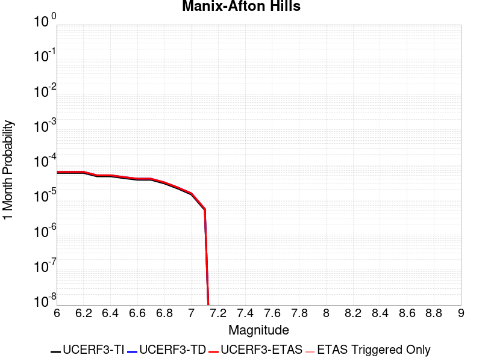 | 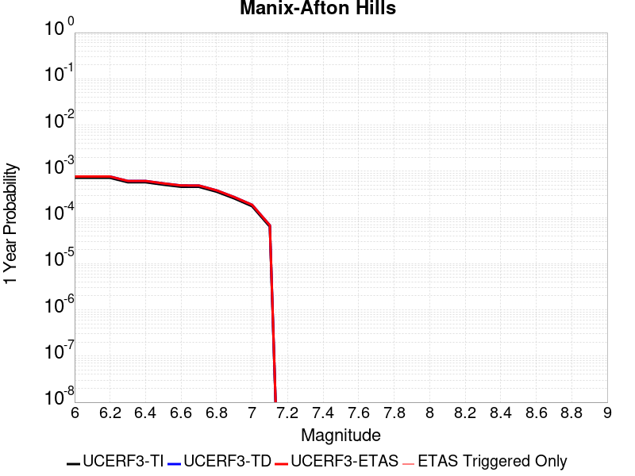 | 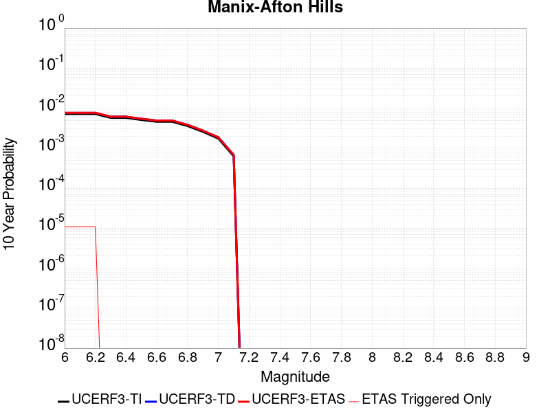 |

| Magnitude | 1 wk TI Prob | 1 wk TD Prob | 1 wk ETAS Prob | 1 wk ETAS/TD Gain | 1 wk ETAS Triggered Only | 1 mo TI Prob | 1 mo TD Prob | 1 mo ETAS Prob | 1 mo ETAS/TD Gain | 1 mo ETAS Triggered Only | 1 yr TI Prob | 1 yr TD Prob | 1 yr ETAS Prob | 1 yr ETAS/TD Gain | 1 yr ETAS Triggered Only | 10 yr TI Prob | 10 yr TD Prob | 10 yr ETAS Prob | 10 yr ETAS/TD Gain | 10 yr ETAS Triggered Only |
|-----|-----|-----|-----|-----|-----|-----|-----|-----|-----|-----|-----|-----|-----|-----|-----|-----|-----|-----|-----|-----|
| 6.0 | 1.3783202E-5 | 1.4711063E-5 | 1.4711063E-5 | 1.0 | 0.0 | 5.906953E-5 | 6.304599E-5 | 6.304599E-5 | 1.0 | 0.0 | 7.189342E-4 | 7.673321E-4 | 7.673321E-4 | 1.0 | 0.0 | 0.0071661277 | 0.007648582 | 0.0076593454 | 1.0014071 | 1.0845987E-5 |
| 6.1 | 1.3783202E-5 | 1.4711063E-5 | 1.4711063E-5 | 1.0 | 0.0 | 5.906953E-5 | 6.304599E-5 | 6.304599E-5 | 1.0 | 0.0 | 7.189342E-4 | 7.673321E-4 | 7.673321E-4 | 1.0 | 0.0 | 0.0071661277 | 0.007648582 | 0.0076593454 | 1.0014071 | 1.0845987E-5 |
| 6.2 | 1.3783202E-5 | 1.4711063E-5 | 1.4711063E-5 | 1.0 | 0.0 | 5.906953E-5 | 6.304599E-5 | 6.304599E-5 | 1.0 | 0.0 | 7.189342E-4 | 7.673321E-4 | 7.673321E-4 | 1.0 | 0.0 | 0.0071661277 | 0.007648582 | 0.0076593454 | 1.0014071 | 1.0845987E-5 |
| 6.3 | 1.10494875E-5 | 1.1793114E-5 | 1.1793114E-5 | 1.0 | 0.0 | 4.7354086E-5 | 5.0541E-5 | 5.0541E-5 | 1.0 | 0.0 | 5.763835E-4 | 6.151733E-4 | 6.151733E-4 | 1.0 | 0.0 | 0.005748908 | 0.0061357445 | 0.0061357445 | 1.0 | 0.0 |
| 6.4 | 1.10494875E-5 | 1.1793114E-5 | 1.1793114E-5 | 1.0 | 0.0 | 4.7354086E-5 | 5.0541E-5 | 5.0541E-5 | 1.0 | 0.0 | 5.763835E-4 | 6.151733E-4 | 6.151733E-4 | 1.0 | 0.0 | 0.005748908 | 0.0061357445 | 0.0061357445 | 1.0 | 0.0 |
| 6.5 | 9.788949E-6 | 1.04543005E-5 | 1.04543005E-5 | 1.0 | 0.0 | 4.1951964E-5 | 4.480343E-5 | 4.480343E-5 | 1.0 | 0.0 | 5.1064545E-4 | 5.453545E-4 | 5.453545E-4 | 1.0 | 0.0 | 0.0050947363 | 0.0054410887 | 0.0054410887 | 1.0 | 0.0 |
| 6.6 | 8.810006E-6 | 9.413611E-6 | 9.413611E-6 | 1.0 | 0.0 | 3.775662E-5 | 4.034347E-5 | 4.034347E-5 | 1.0 | 0.0 | 4.5958988E-4 | 4.9108E-4 | 4.9108E-4 | 1.0 | 0.0 | 0.0045864056 | 0.0049008303 | 0.0049008303 | 1.0 | 0.0 |
| 6.7 | 8.80128E-6 | 9.404091E-6 | 9.404091E-6 | 1.0 | 0.0 | 3.7719226E-5 | 4.0302675E-5 | 4.0302675E-5 | 1.0 | 0.0 | 4.591348E-4 | 4.905835E-4 | 4.905835E-4 | 1.0 | 0.0 | 0.004581874 | 0.004895887 | 0.004895887 | 1.0 | 0.0 |
| 6.8 | 6.8994877E-6 | 7.3800625E-6 | 7.3800625E-6 | 1.0 | 0.0 | 2.9568899E-5 | 3.16285E-5 | 3.16285E-5 | 1.0 | 0.0 | 3.5994186E-4 | 3.850171E-4 | 3.850171E-4 | 1.0 | 0.0 | 0.003593594 | 0.0038443056 | 0.0038443056 | 1.0 | 0.0 |
| 6.9 | 4.9328037E-6 | 5.270952E-6 | 5.270952E-6 | 1.0 | 0.0 | 2.1140417E-5 | 2.2589633E-5 | 2.2589633E-5 | 1.0 | 0.0 | 2.5735417E-4 | 2.7500023E-4 | 2.7500023E-4 | 1.0 | 0.0 | 0.0025705635 | 0.0027472044 | 0.0027472044 | 1.0 | 0.0 |
| 7.0 | 3.347973E-6 | 3.590023E-6 | 3.590023E-6 | 1.0 | 0.0 | 1.4348378E-5 | 1.5385745E-5 | 1.5385745E-5 | 1.0 | 0.0 | 1.746775E-4 | 1.8730946E-4 | 1.8730946E-4 | 1.0 | 0.0 | 0.0017454025 | 0.0018719183 | 0.0018719183 | 1.0 | 0.0 |
| 7.1 | 1.2073567E-6 | 1.2934796E-6 | 1.2934796E-6 | 1.0 | 0.0 | 5.1743755E-6 | 5.543481E-6 | 5.543481E-6 | 1.0 | 0.0 | 6.29962E-5 | 6.7491426E-5 | 6.7491426E-5 | 1.0 | 0.0 | 6.297835E-4 | 6.7486946E-4 | 6.7486946E-4 | 1.0 | 0.0 |

## San Luis Range - Pecho 2011 CFM
*[(top)](#table-of-contents)*

| 1 Week | 1 Month | 1 Year | 10 Year |
|-----|-----|-----|-----|
|  |  |  |  |

| Magnitude | 1 wk TI Prob | 1 wk TD Prob | 1 wk ETAS Prob | 1 wk ETAS/TD Gain | 1 wk ETAS Triggered Only | 1 mo TI Prob | 1 mo TD Prob | 1 mo ETAS Prob | 1 mo ETAS/TD Gain | 1 mo ETAS Triggered Only | 1 yr TI Prob | 1 yr TD Prob | 1 yr ETAS Prob | 1 yr ETAS/TD Gain | 1 yr ETAS Triggered Only | 10 yr TI Prob | 10 yr TD Prob | 10 yr ETAS Prob | 10 yr ETAS/TD Gain | 10 yr ETAS Triggered Only |
|-----|-----|-----|-----|-----|-----|-----|-----|-----|-----|-----|-----|-----|-----|-----|-----|-----|-----|-----|-----|-----|
| 6.0 | 1.687423E-6 | 1.6921935E-6 | 1.2538162E-5 | 7.4094143 | 1.0845987E-5 | 7.231793E-6 | 7.252239E-6 | 1.8098148E-5 | 2.4955256 | 1.0845987E-5 | 8.804352E-5 | 8.8292676E-5 | 9.91377E-5 | 1.1228305 | 1.0845987E-5 | 8.8008645E-4 | 8.8259985E-4 | 8.9343626E-4 | 1.0122778 | 1.0845987E-5 |
| 6.1 | 1.687423E-6 | 1.6921935E-6 | 1.2538162E-5 | 7.4094143 | 1.0845987E-5 | 7.231793E-6 | 7.252239E-6 | 1.8098148E-5 | 2.4955256 | 1.0845987E-5 | 8.804352E-5 | 8.8292676E-5 | 9.91377E-5 | 1.1228305 | 1.0845987E-5 | 8.8008645E-4 | 8.8259985E-4 | 8.9343626E-4 | 1.0122778 | 1.0845987E-5 |
| 6.2 | 1.0765672E-6 | 1.0770533E-6 | 1.1923029E-5 | 11.070045 | 1.0845987E-5 | 4.613851E-6 | 4.615935E-6 | 1.5461872E-5 | 3.349673 | 1.0845987E-5 | 5.617219E-5 | 5.619762E-5 | 6.7042994E-5 | 1.1929864 | 1.0845987E-5 | 5.6157995E-4 | 5.618403E-4 | 5.726802E-4 | 1.0192935 | 1.0845987E-5 |
| 6.3 | 8.523104E-7 | 8.5130137E-7 | 1.1697279E-5 | 13.740468 | 1.0845987E-5 | 3.6527538E-6 | 3.6484296E-6 | 1.4494377E-5 | 3.9727714 | 1.0845987E-5 | 4.447137E-5 | 4.4418757E-5 | 5.5264263E-5 | 1.244165 | 1.0845987E-5 | 4.4462472E-4 | 4.4410198E-4 | 4.5494316E-4 | 1.0244114 | 1.0845987E-5 |
| 6.4 | 8.523104E-7 | 8.5130137E-7 | 1.1697279E-5 | 13.740468 | 1.0845987E-5 | 3.6527538E-6 | 3.6484296E-6 | 1.4494377E-5 | 3.9727714 | 1.0845987E-5 | 4.447137E-5 | 4.4418757E-5 | 5.5264263E-5 | 1.244165 | 1.0845987E-5 | 4.4462472E-4 | 4.4410198E-4 | 4.5494316E-4 | 1.0244114 | 1.0845987E-5 |
| 6.5 | 7.0029404E-7 | 6.976431E-7 | 1.1543622E-5 | 16.546602 | 1.0845987E-5 | 3.0012568E-6 | 2.9898956E-6 | 1.383585E-5 | 4.6275363 | 1.0845987E-5 | 3.6539688E-5 | 3.6401387E-5 | 4.724698E-5 | 1.2979444 | 1.0845987E-5 | 3.653368E-4 | 3.6395594E-4 | 3.74798E-4 | 1.0297894 | 1.0845987E-5 |
| 6.6 | 5.583906E-7 | 5.542822E-7 | 1.1400263E-5 | 20.567614 | 1.0845987E-5 | 2.3931002E-6 | 2.375493E-6 | 1.32214545E-5 | 5.5657725 | 1.0845987E-5 | 2.9135606E-5 | 2.8921253E-5 | 3.9766925E-5 | 1.375007 | 1.0845987E-5 | 2.9131788E-4 | 2.8917563E-4 | 3.000185E-4 | 1.0374957 | 1.0845987E-5 |
| 6.7 | 4.73441E-7 | 4.6830593E-7 | 1.1314288E-5 | 24.160036 | 1.0845987E-5 | 2.0290313E-6 | 2.0070238E-6 | 1.2852989E-5 | 6.404004 | 1.0845987E-5 | 2.4703175E-5 | 2.4435245E-5 | 3.528097E-5 | 1.4438556 | 1.0845987E-5 | 2.470043E-4 | 2.4432605E-4 | 2.5516938E-4 | 1.0443805 | 1.0845987E-5 |
| 6.8 | 4.1466086E-7 | 4.0877885E-7 | 1.1254761E-5 | 27.532642 | 1.0845987E-5 | 1.7771167E-6 | 1.7519081E-6 | 1.2597876E-5 | 7.1909456 | 1.0845987E-5 | 2.1636182E-5 | 2.1329277E-5 | 3.217503E-5 | 1.5084915 | 1.0845987E-5 | 2.1634075E-4 | 2.1327264E-4 | 2.241163E-4 | 1.0508442 | 1.0845987E-5 |
| 6.9 | 3.2056641E-7 | 3.132924E-7 | 1.1159276E-5 | 35.619366 | 1.0845987E-5 | 1.3738553E-6 | 1.3426809E-6 | 1.2188653E-5 | 9.0778475 | 1.0845987E-5 | 1.6726559E-5 | 1.634702E-5 | 2.719283E-5 | 1.6634732 | 1.0845987E-5 | 1.67253E-4 | 1.6345832E-4 | 1.7430254E-4 | 1.0663424 | 1.0845987E-5 |
| 7.0 | 2.6315942E-7 | 2.5489615E-7 | 2.5489615E-7 | 1.0 | 0.0 | 1.1278256E-6 | 1.0924116E-6 | 1.0924116E-6 | 1.0 | 0.0 | 1.3731191E-5 | 1.330003E-5 | 1.330003E-5 | 1.0 | 0.0 | 1.3730342E-4 | 1.3299243E-4 | 1.3299243E-4 | 1.0 | 0.0 |
| 7.1 | 2.1832436E-7 | 2.0917255E-7 | 2.0917255E-7 | 1.0 | 0.0 | 9.356755E-7 | 8.964535E-7 | 8.964535E-7 | 1.0 | 0.0 | 1.13917895E-5 | 1.09142675E-5 | 1.09142675E-5 | 1.0 | 0.0 | 1.1391206E-4 | 1.0913736E-4 | 1.0913736E-4 | 1.0 | 0.0 |
| 7.2 | 1.7393015E-7 | 1.6376538E-7 | 1.6376538E-7 | 1.0 | 0.0 | 7.454147E-7 | 7.0185143E-7 | 7.0185143E-7 | 1.0 | 0.0 | 9.075386E-6 | 8.545007E-6 | 8.545007E-6 | 1.0 | 0.0 | 9.075015E-5 | 8.5446816E-5 | 8.5446816E-5 | 1.0 | 0.0 |
| 7.3 | 1.3744894E-7 | 1.2638569E-7 | 1.2638569E-7 | 1.0 | 0.0 | 5.890667E-7 | 5.416528E-7 | 5.416528E-7 | 1.0 | 0.0 | 7.1718637E-6 | 6.594603E-6 | 6.594603E-6 | 1.0 | 0.0 | 7.171632E-5 | 6.5944085E-5 | 6.5944085E-5 | 1.0 | 0.0 |
| 7.4 | 1.0915278E-7 | 9.727485E-8 | 9.727485E-8 | 1.0 | 0.0 | 4.6779755E-7 | 4.1689214E-7 | 4.1689214E-7 | 1.0 | 0.0 | 5.6954204E-6 | 5.07565E-6 | 5.07565E-6 | 1.0 | 0.0 | 5.6952744E-5 | 5.0755345E-5 | 5.0755345E-5 | 1.0 | 0.0 |
| 7.5 | 9.490291E-8 | 8.2570836E-8 | 8.2570836E-8 | 1.0 | 0.0 | 4.0672668E-7 | 3.5387495E-7 | 3.5387495E-7 | 1.0 | 0.0 | 4.9518862E-6 | 4.308419E-6 | 4.308419E-6 | 1.0 | 0.0 | 4.951776E-5 | 4.308336E-5 | 4.308336E-5 | 1.0 | 0.0 |
| 7.6 | 7.256678E-8 | 5.9424835E-8 | 5.9424835E-8 | 1.0 | 0.0 | 3.1100043E-7 | 2.5467784E-7 | 2.5467784E-7 | 1.0 | 0.0 | 3.7864236E-6 | 3.1006982E-6 | 3.1006982E-6 | 1.0 | 0.0 | 3.7863592E-5 | 3.100655E-5 | 3.100655E-5 | 1.0 | 0.0 |
| 7.7 | 5.446273E-8 | 4.0578932E-8 | 4.0578932E-8 | 1.0 | 0.0 | 2.3341168E-7 | 1.739097E-7 | 1.739097E-7 | 1.0 | 0.0 | 2.8417835E-6 | 2.1173485E-6 | 2.1173485E-6 | 1.0 | 0.0 | 2.8417471E-5 | 2.1173284E-5 | 2.1173284E-5 | 1.0 | 0.0 |
| 7.8 | 3.5850867E-8 | 2.1520076E-8 | 2.1520076E-8 | 1.0 | 0.0 | 1.5364655E-7 | 9.2228895E-8 | 9.2228895E-8 | 1.0 | 0.0 | 1.8706452E-6 | 1.1228861E-6 | 1.1228861E-6 | 1.0 | 0.0 | 1.8706294E-5 | 1.1228805E-5 | 1.1228805E-5 | 1.0 | 0.0 |
| 7.9 | 2.45879E-8 | 1.1394325E-8 | 1.1394325E-8 | 1.0 | 0.0 | 1.0537671E-7 | 4.8832817E-8 | 4.8832817E-8 | 1.0 | 0.0 | 1.2829606E-6 | 5.9453936E-7 | 5.9453936E-7 | 1.0 | 0.0 | 1.2829532E-5 | 5.9453782E-6 | 5.9453782E-6 | 1.0 | 0.0 |
| 8.0 | 1.8151761E-8 | 7.4408124E-9 | 7.4408124E-9 | 1.0 | 0.0 | 7.779326E-8 | 3.1889197E-8 | 3.1889197E-8 | 1.0 | 0.0 | 9.4713255E-7 | 3.8825087E-7 | 3.8825087E-7 | 1.0 | 0.0 | 9.471285E-6 | 3.882502E-6 | 3.882502E-6 | 1.0 | 0.0 |
| 8.1 | 9.559205E-9 | 4.1002974E-9 | 4.1002974E-9 | 1.0 | 0.0 | 4.096802E-8 | 1.75727E-8 | 1.75727E-8 | 1.0 | 0.0 | 4.9878554E-7 | 2.1394762E-7 | 2.1394762E-7 | 1.0 | 0.0 | 4.987844E-6 | 2.1394742E-6 | 2.1394742E-6 | 1.0 | 0.0 |

## Rinconada 2011 CFM
*[(top)](#table-of-contents)*

| 1 Week | 1 Month | 1 Year | 10 Year |
|-----|-----|-----|-----|
|  |  |  |  |

| Magnitude | 1 wk TI Prob | 1 wk TD Prob | 1 wk ETAS Prob | 1 wk ETAS/TD Gain | 1 wk ETAS Triggered Only | 1 mo TI Prob | 1 mo TD Prob | 1 mo ETAS Prob | 1 mo ETAS/TD Gain | 1 mo ETAS Triggered Only | 1 yr TI Prob | 1 yr TD Prob | 1 yr ETAS Prob | 1 yr ETAS/TD Gain | 1 yr ETAS Triggered Only | 10 yr TI Prob | 10 yr TD Prob | 10 yr ETAS Prob | 10 yr ETAS/TD Gain | 10 yr ETAS Triggered Only |
|-----|-----|-----|-----|-----|-----|-----|-----|-----|-----|-----|-----|-----|-----|-----|-----|-----|-----|-----|-----|-----|
| 6.0 | 1.5752368E-5 | 1.6274702E-5 | 2.7120512E-5 | 1.6664215 | 1.0845987E-5 | 6.75084E-5 | 6.974687E-5 | 8.05921E-5 | 1.1554941 | 1.0845987E-5 | 8.2160486E-4 | 8.4884046E-4 | 8.5967727E-4 | 1.0127666 | 1.0845987E-5 | 0.008185739 | 0.008456362 | 0.008467116 | 1.0012717 | 1.0845987E-5 |
| 6.1 | 1.0966133E-5 | 1.1323019E-5 | 1.1323019E-5 | 1.0 | 0.0 | 4.6996865E-5 | 4.8526326E-5 | 4.8526326E-5 | 1.0 | 0.0 | 5.720366E-4 | 5.906486E-4 | 5.906486E-4 | 1.0 | 0.0 | 0.0057056635 | 0.0058908835 | 0.0058908835 | 1.0 | 0.0 |
| 6.2 | 1.0966133E-5 | 1.1323019E-5 | 1.1323019E-5 | 1.0 | 0.0 | 4.6996865E-5 | 4.8526326E-5 | 4.8526326E-5 | 1.0 | 0.0 | 5.720366E-4 | 5.906486E-4 | 5.906486E-4 | 1.0 | 0.0 | 0.0057056635 | 0.0058908835 | 0.0058908835 | 1.0 | 0.0 |
| 6.3 | 8.926149E-6 | 9.212764E-6 | 9.212764E-6 | 1.0 | 0.0 | 3.8254362E-5 | 3.948268E-5 | 3.948268E-5 | 1.0 | 0.0 | 4.6564735E-4 | 4.805959E-4 | 4.805959E-4 | 1.0 | 0.0 | 0.0046467283 | 0.0047956104 | 0.0047956104 | 1.0 | 0.0 |
| 6.4 | 7.676955E-6 | 7.920184E-6 | 7.920184E-6 | 1.0 | 0.0 | 3.290082E-5 | 3.3943204E-5 | 3.3943204E-5 | 1.0 | 0.0 | 4.0049385E-4 | 4.1318033E-4 | 4.1318033E-4 | 1.0 | 0.0 | 0.0039977287 | 0.004124148 | 0.004124148 | 1.0 | 0.0 |
| 6.5 | 6.1671026E-6 | 6.3589496E-6 | 6.3589496E-6 | 1.0 | 0.0 | 2.6430173E-5 | 2.7252356E-5 | 2.7252356E-5 | 1.0 | 0.0 | 3.2173982E-4 | 3.31747E-4 | 3.31747E-4 | 1.0 | 0.0 | 0.003212744 | 0.0033125298 | 0.0033125298 | 1.0 | 0.0 |
| 6.6 | 5.553456E-6 | 5.7248076E-6 | 5.7248076E-6 | 1.0 | 0.0 | 2.3800309E-5 | 2.453466E-5 | 2.453466E-5 | 1.0 | 0.0 | 2.897302E-4 | 2.986686E-4 | 2.986686E-4 | 1.0 | 0.0 | 0.0028935277 | 0.0029826807 | 0.0029826807 | 1.0 | 0.0 |
| 6.7 | 4.787857E-6 | 4.9333053E-6 | 4.9333053E-6 | 1.0 | 0.0 | 2.0519226E-5 | 2.1142567E-5 | 2.1142567E-5 | 1.0 | 0.0 | 2.4979294E-4 | 2.5738036E-4 | 2.5738036E-4 | 1.0 | 0.0 | 0.0024951235 | 0.0025708287 | 0.0025708287 | 1.0 | 0.0 |
| 6.8 | 3.9955166E-6 | 4.1134726E-6 | 4.1134726E-6 | 1.0 | 0.0 | 1.7123532E-5 | 1.762905E-5 | 1.762905E-5 | 1.0 | 0.0 | 2.0845905E-4 | 2.1461258E-4 | 2.1461258E-4 | 1.0 | 0.0 | 0.002082636 | 0.0021440568 | 0.0021440568 | 1.0 | 0.0 |
| 6.9 | 3.4250072E-6 | 3.5224436E-6 | 3.5224436E-6 | 1.0 | 0.0 | 1.46785205E-5 | 1.50961E-5 | 1.50961E-5 | 1.0 | 0.0 | 1.7869633E-4 | 1.8377953E-4 | 1.8377953E-4 | 1.0 | 0.0 | 0.001785527 | 0.0018362779 | 0.0018362779 | 1.0 | 0.0 |
| 7.0 | 2.7712713E-6 | 2.8466977E-6 | 2.8466977E-6 | 1.0 | 0.0 | 1.1876823E-5 | 1.22000765E-5 | 1.22000765E-5 | 1.0 | 0.0 | 1.4459073E-4 | 1.4852583E-4 | 1.4852583E-4 | 1.0 | 0.0 | 0.0014449668 | 0.0014842671 | 0.0014842671 | 1.0 | 0.0 |
| 7.1 | 2.227358E-6 | 2.2856968E-6 | 2.2856968E-6 | 1.0 | 0.0 | 9.545785E-6 | 9.795806E-6 | 9.795806E-6 | 1.0 | 0.0 | 1.16213734E-4 | 1.1925743E-4 | 1.1925743E-4 | 1.0 | 0.0 | 0.0011615298 | 0.0011919354 | 0.0011919354 | 1.0 | 0.0 |
| 7.2 | 1.581796E-6 | 1.6209E-6 | 1.6209E-6 | 1.0 | 0.0 | 6.779108E-6 | 6.946696E-6 | 6.946696E-6 | 1.0 | 0.0 | 8.253252E-5 | 8.457275E-5 | 8.457275E-5 | 1.0 | 0.0 | 8.250187E-4 | 8.4540615E-4 | 8.4540615E-4 | 1.0 | 0.0 |
| 7.3 | 1.0306567E-6 | 1.054647E-6 | 1.054647E-6 | 1.0 | 0.0 | 4.4170924E-6 | 4.5199076E-6 | 4.5199076E-6 | 1.0 | 0.0 | 5.3776774E-5 | 5.502849E-5 | 5.502849E-5 | 1.0 | 0.0 | 5.376376E-4 | 5.501489E-4 | 5.501489E-4 | 1.0 | 0.0 |
| 7.4 | 6.535541E-7 | 6.6827374E-7 | 6.6827374E-7 | 1.0 | 0.0 | 2.800943E-6 | 2.8640272E-6 | 2.8640272E-6 | 1.0 | 0.0 | 3.4100947E-5 | 3.4868972E-5 | 3.4868972E-5 | 1.0 | 0.0 | 3.4095717E-4 | 3.4863513E-4 | 3.4863513E-4 | 1.0 | 0.0 |
| 7.5 | 3.2656962E-7 | 3.3316664E-7 | 3.3316664E-7 | 1.0 | 0.0 | 1.3995833E-6 | 1.4278562E-6 | 1.4278562E-6 | 1.0 | 0.0 | 1.7039794E-5 | 1.738401E-5 | 1.738401E-5 | 1.0 | 0.0 | 1.7038487E-4 | 1.7382656E-4 | 1.7382656E-4 | 1.0 | 0.0 |
| 7.6 | 9.754343E-8 | 9.820984E-8 | 9.820984E-8 | 1.0 | 0.0 | 4.180432E-7 | 4.2089923E-7 | 4.2089923E-7 | 1.0 | 0.0 | 5.089664E-6 | 5.124436E-6 | 5.124436E-6 | 1.0 | 0.0 | 5.0895473E-5 | 5.124319E-5 | 5.124319E-5 | 1.0 | 0.0 |
| 7.7 | 6.0001453E-9 | 5.849038E-9 | 5.849038E-9 | 1.0 | 0.0 | 2.5714908E-8 | 2.5067308E-8 | 2.5067308E-8 | 1.0 | 0.0 | 3.1307894E-7 | 3.0519442E-7 | 3.0519442E-7 | 1.0 | 0.0 | 3.1307852E-6 | 3.0519402E-6 | 3.0519402E-6 | 1.0 | 0.0 |
| 7.8 | 7.400003E-11 | 7.4654394E-11 | 7.4654394E-11 | 1.0 | 0.0 | 3.171432E-10 | 3.1994762E-10 | 3.1994762E-10 | 1.0 | 0.0 | 3.861218E-9 | 3.8953623E-9 | 3.8953623E-9 | 1.0 | 0.0 | 3.861218E-8 | 3.8953623E-8 | 3.8953623E-8 | 1.0 | 0.0 |

## Cucamonga
*[(top)](#table-of-contents)*

| 1 Week | 1 Month | 1 Year | 10 Year |
|-----|-----|-----|-----|
|  |  |  |  |

| Magnitude | 1 wk TI Prob | 1 wk TD Prob | 1 wk ETAS Prob | 1 wk ETAS/TD Gain | 1 wk ETAS Triggered Only | 1 mo TI Prob | 1 mo TD Prob | 1 mo ETAS Prob | 1 mo ETAS/TD Gain | 1 mo ETAS Triggered Only | 1 yr TI Prob | 1 yr TD Prob | 1 yr ETAS Prob | 1 yr ETAS/TD Gain | 1 yr ETAS Triggered Only | 10 yr TI Prob | 10 yr TD Prob | 10 yr ETAS Prob | 10 yr ETAS/TD Gain | 10 yr ETAS Triggered Only |
|-----|-----|-----|-----|-----|-----|-----|-----|-----|-----|-----|-----|-----|-----|-----|-----|-----|-----|-----|-----|-----|
| 6.0 | 1.1848348E-5 | 1.1736872E-5 | 1.1736872E-5 | 1.0 | 0.0 | 5.0777642E-5 | 5.0299925E-5 | 5.0299925E-5 | 1.0 | 0.0 | 6.180424E-4 | 6.1223225E-4 | 6.2307157E-4 | 1.0177046 | 1.0845987E-5 | 0.0061632637 | 0.0061066314 | 0.006117411 | 1.0017653 | 1.0845987E-5 |
| 6.1 | 1.1848348E-5 | 1.1736872E-5 | 1.1736872E-5 | 1.0 | 0.0 | 5.0777642E-5 | 5.0299925E-5 | 5.0299925E-5 | 1.0 | 0.0 | 6.180424E-4 | 6.1223225E-4 | 6.2307157E-4 | 1.0177046 | 1.0845987E-5 | 0.0061632637 | 0.0061066314 | 0.006117411 | 1.0017653 | 1.0845987E-5 |
| 6.2 | 1.1848348E-5 | 1.1736872E-5 | 1.1736872E-5 | 1.0 | 0.0 | 5.0777642E-5 | 5.0299925E-5 | 5.0299925E-5 | 1.0 | 0.0 | 6.180424E-4 | 6.1223225E-4 | 6.2307157E-4 | 1.0177046 | 1.0845987E-5 | 0.0061632637 | 0.0061066314 | 0.006117411 | 1.0017653 | 1.0845987E-5 |
| 6.3 | 1.1848348E-5 | 1.1736872E-5 | 1.1736872E-5 | 1.0 | 0.0 | 5.0777642E-5 | 5.0299925E-5 | 5.0299925E-5 | 1.0 | 0.0 | 6.180424E-4 | 6.1223225E-4 | 6.2307157E-4 | 1.0177046 | 1.0845987E-5 | 0.0061632637 | 0.0061066314 | 0.006117411 | 1.0017653 | 1.0845987E-5 |
| 6.4 | 1.1848348E-5 | 1.1736872E-5 | 1.1736872E-5 | 1.0 | 0.0 | 5.0777642E-5 | 5.0299925E-5 | 5.0299925E-5 | 1.0 | 0.0 | 6.180424E-4 | 6.1223225E-4 | 6.2307157E-4 | 1.0177046 | 1.0845987E-5 | 0.0061632637 | 0.0061066314 | 0.006117411 | 1.0017653 | 1.0845987E-5 |
| 6.5 | 1.16988695E-5 | 1.1575903E-5 | 1.1575903E-5 | 1.0 | 0.0 | 5.013705E-5 | 4.9610087E-5 | 4.9610087E-5 | 1.0 | 0.0 | 6.102476E-4 | 6.0383807E-4 | 6.146775E-4 | 1.0179509 | 1.0845987E-5 | 0.006085745 | 0.0060231457 | 0.0060339267 | 1.0017899 | 1.0845987E-5 |
| 6.6 | 1.16988695E-5 | 1.1575903E-5 | 1.1575903E-5 | 1.0 | 0.0 | 5.013705E-5 | 4.9610087E-5 | 4.9610087E-5 | 1.0 | 0.0 | 6.102476E-4 | 6.0383807E-4 | 6.146775E-4 | 1.0179509 | 1.0845987E-5 | 0.006085745 | 0.0060231457 | 0.0060339267 | 1.0017899 | 1.0845987E-5 |
| 6.7 | 1.1397107E-5 | 1.1114816E-5 | 1.1114816E-5 | 1.0 | 0.0 | 4.884383E-5 | 4.763407E-5 | 4.763407E-5 | 1.0 | 0.0 | 5.9451134E-4 | 5.7979295E-4 | 5.9063267E-4 | 1.0186958 | 1.0845987E-5 | 0.005929234 | 0.005783954 | 0.0057947375 | 1.0018643 | 1.0845987E-5 |
| 6.8 | 1.058387E-5 | 9.784875E-6 | 9.784875E-6 | 1.0 | 0.0 | 4.5358654E-5 | 4.1934512E-5 | 4.1934512E-5 | 1.0 | 0.0 | 5.521017E-4 | 5.1043415E-4 | 5.2127463E-4 | 1.0212377 | 1.0845987E-5 | 0.00550732 | 0.0050936276 | 0.005104418 | 1.0021185 | 1.0845987E-5 |
| 6.9 | 9.690046E-6 | 8.5793745E-6 | 8.5793745E-6 | 1.0 | 0.0 | 4.1528107E-5 | 3.676823E-5 | 3.676823E-5 | 1.0 | 0.0 | 5.054874E-4 | 4.4756167E-4 | 4.584028E-4 | 1.0242226 | 1.0845987E-5 | 0.005043391 | 0.004467539 | 0.004478337 | 1.0024168 | 1.0845987E-5 |
| 7.0 | 9.381461E-6 | 8.1869985E-6 | 8.1869985E-6 | 1.0 | 0.0 | 4.020564E-5 | 3.5086665E-5 | 3.5086665E-5 | 1.0 | 0.0 | 4.893937E-4 | 4.2709676E-4 | 4.379381E-4 | 1.0253838 | 1.0845987E-5 | 0.0048831734 | 0.004263694 | 0.004274494 | 1.002533 | 1.0845987E-5 |
| 7.1 | 8.946492E-6 | 7.781785E-6 | 7.781785E-6 | 1.0 | 0.0 | 3.8341543E-5 | 3.3350083E-5 | 3.3350083E-5 | 1.0 | 0.0 | 4.667083E-4 | 4.059619E-4 | 4.168035E-4 | 1.0267059 | 1.0845987E-5 | 0.0046572937 | 0.00405314 | 0.004063942 | 1.002665 | 1.0845987E-5 |
| 7.2 | 8.251016E-6 | 6.9751854E-6 | 6.9751854E-6 | 1.0 | 0.0 | 3.5361016E-5 | 2.989331E-5 | 2.989331E-5 | 1.0 | 0.0 | 4.3043532E-4 | 3.6389052E-4 | 3.7473254E-4 | 1.0297948 | 1.0845987E-5 | 0.0042960253 | 0.0036338803 | 0.003644687 | 1.0029738 | 1.0845987E-5 |
| 7.3 | 7.717881E-6 | 6.4862593E-6 | 6.4862593E-6 | 1.0 | 0.0 | 3.3076216E-5 | 2.7797958E-5 | 2.7797958E-5 | 1.0 | 0.0 | 4.026285E-4 | 3.383878E-4 | 3.4923013E-4 | 1.0320411 | 1.0845987E-5 | 0.004018998 | 0.0033796628 | 0.0033904721 | 1.0031984 | 1.0845987E-5 |
| 7.4 | 7.275623E-6 | 6.0319094E-6 | 6.0319094E-6 | 1.0 | 0.0 | 3.118087E-5 | 2.5850786E-5 | 2.5850786E-5 | 1.0 | 0.0 | 3.7956095E-4 | 3.1468808E-4 | 3.2553065E-4 | 1.034455 | 1.0845987E-5 | 0.0037891332 | 0.0031433608 | 0.0031541728 | 1.0034395 | 1.0845987E-5 |
| 7.5 | 6.5109502E-6 | 5.1005236E-6 | 5.1005236E-6 | 1.0 | 0.0 | 2.7903774E-5 | 2.1859205E-5 | 2.1859205E-5 | 1.0 | 0.0 | 3.3967546E-4 | 2.6610345E-4 | 2.7694655E-4 | 1.0407476 | 1.0845987E-5 | 0.0033915674 | 0.0026587727 | 0.00266959 | 1.0040685 | 1.0845987E-5 |
| 7.6 | 5.4495326E-6 | 3.908509E-6 | 3.908509E-6 | 1.0 | 0.0 | 2.335493E-5 | 1.6750646E-5 | 1.6750646E-5 | 1.0 | 0.0 | 2.8430918E-4 | 2.0392009E-4 | 2.1476386E-4 | 1.0531766 | 1.0845987E-5 | 0.0028394572 | 0.0020382507 | 0.0020490745 | 1.0053104 | 1.0845987E-5 |
| 7.7 | 4.7997164E-6 | 3.2002004E-6 | 3.2002004E-6 | 1.0 | 0.0 | 2.057005E-5 | 1.3715072E-5 | 1.3715072E-5 | 1.0 | 0.0 | 2.504116E-4 | 1.6696824E-4 | 1.7781241E-4 | 1.0649475 | 1.0845987E-5 | 0.002501296 | 0.0016693595 | 0.0016801874 | 1.0064863 | 1.0845987E-5 |
| 7.8 | 3.3941733E-6 | 2.0641605E-6 | 2.0641605E-6 | 1.0 | 0.0 | 1.4546376E-5 | 8.846372E-6 | 8.846372E-6 | 1.0 | 0.0 | 1.7708774E-4 | 1.0769927E-4 | 1.1854409E-4 | 1.1006954 | 1.0845987E-5 | 0.0017694668 | 0.0010767077 | 0.001087542 | 1.0100625 | 1.0845987E-5 |
| 7.9 | 9.750552E-7 | 5.1558817E-7 | 5.1558817E-7 | 1.0 | 0.0 | 4.178801E-6 | 2.2096617E-6 | 2.2096617E-6 | 1.0 | 0.0 | 5.0875715E-5 | 2.6902302E-5 | 2.6902302E-5 | 1.0 | 0.0 | 5.086407E-4 | 2.6899087E-4 | 2.6899087E-4 | 1.0 | 0.0 |
| 8.0 | 1.133857E-7 | 6.053637E-8 | 6.053637E-8 | 1.0 | 0.0 | 4.8593864E-7 | 2.5944158E-7 | 2.5944158E-7 | 1.0 | 0.0 | 5.9162867E-6 | 3.1586967E-6 | 3.1586967E-6 | 1.0 | 0.0 | 5.916129E-5 | 3.1586536E-5 | 3.1586536E-5 | 1.0 | 0.0 |

## San Jacinto (Clark) rev
*[(top)](#table-of-contents)*

| 1 Week | 1 Month | 1 Year | 10 Year |
|-----|-----|-----|-----|
|  |  |  |  |

| Magnitude | 1 wk TI Prob | 1 wk TD Prob | 1 wk ETAS Prob | 1 wk ETAS/TD Gain | 1 wk ETAS Triggered Only | 1 mo TI Prob | 1 mo TD Prob | 1 mo ETAS Prob | 1 mo ETAS/TD Gain | 1 mo ETAS Triggered Only | 1 yr TI Prob | 1 yr TD Prob | 1 yr ETAS Prob | 1 yr ETAS/TD Gain | 1 yr ETAS Triggered Only | 10 yr TI Prob | 10 yr TD Prob | 10 yr ETAS Prob | 10 yr ETAS/TD Gain | 10 yr ETAS Triggered Only |
|-----|-----|-----|-----|-----|-----|-----|-----|-----|-----|-----|-----|-----|-----|-----|-----|-----|-----|-----|-----|-----|
| 6.0 | 4.482615E-5 | 2.1148973E-5 | 2.1148973E-5 | 1.0 | 0.0 | 1.9209793E-4 | 9.063536E-5 | 9.063536E-5 | 1.0 | 0.0 | 0.0023362834 | 0.0011029361 | 0.0011137702 | 1.0098228 | 1.0845987E-5 | 0.02311874 | 0.011501086 | 0.011511807 | 1.0009322 | 1.0845987E-5 |
| 6.1 | 4.482615E-5 | 2.1148973E-5 | 2.1148973E-5 | 1.0 | 0.0 | 1.9209793E-4 | 9.063536E-5 | 9.063536E-5 | 1.0 | 0.0 | 0.0023362834 | 0.0011029361 | 0.0011137702 | 1.0098228 | 1.0845987E-5 | 0.02311874 | 0.011501086 | 0.011511807 | 1.0009322 | 1.0845987E-5 |
| 6.2 | 4.482615E-5 | 2.1148973E-5 | 2.1148973E-5 | 1.0 | 0.0 | 1.9209793E-4 | 9.063536E-5 | 9.063536E-5 | 1.0 | 0.0 | 0.0023362834 | 0.0011029361 | 0.0011137702 | 1.0098228 | 1.0845987E-5 | 0.02311874 | 0.011501086 | 0.011511807 | 1.0009322 | 1.0845987E-5 |
| 6.3 | 4.482615E-5 | 2.1148973E-5 | 2.1148973E-5 | 1.0 | 0.0 | 1.9209793E-4 | 9.063536E-5 | 9.063536E-5 | 1.0 | 0.0 | 0.0023362834 | 0.0011029361 | 0.0011137702 | 1.0098228 | 1.0845987E-5 | 0.02311874 | 0.011501086 | 0.011511807 | 1.0009322 | 1.0845987E-5 |
| 6.4 | 4.482615E-5 | 2.1148973E-5 | 2.1148973E-5 | 1.0 | 0.0 | 1.9209793E-4 | 9.063536E-5 | 9.063536E-5 | 1.0 | 0.0 | 0.0023362834 | 0.0011029361 | 0.0011137702 | 1.0098228 | 1.0845987E-5 | 0.02311874 | 0.011501086 | 0.011511807 | 1.0009322 | 1.0845987E-5 |
| 6.5 | 3.7294863E-5 | 1.7351053E-5 | 1.7351053E-5 | 1.0 | 0.0 | 1.5982533E-4 | 7.435956E-5 | 7.435956E-5 | 1.0 | 0.0 | 0.0019441366 | 9.0495613E-4 | 9.157923E-4 | 1.0119742 | 1.0845987E-5 | 0.01927216 | 0.009491439 | 0.009502182 | 1.0011319 | 1.0845987E-5 |
| 6.6 | 3.7294863E-5 | 1.7351053E-5 | 1.7351053E-5 | 1.0 | 0.0 | 1.5982533E-4 | 7.435956E-5 | 7.435956E-5 | 1.0 | 0.0 | 0.0019441366 | 9.0495613E-4 | 9.157923E-4 | 1.0119742 | 1.0845987E-5 | 0.01927216 | 0.009491439 | 0.009502182 | 1.0011319 | 1.0845987E-5 |
| 6.7 | 3.6039248E-5 | 1.6599313E-5 | 1.6599313E-5 | 1.0 | 0.0 | 1.5444479E-4 | 7.1138E-5 | 7.1138E-5 | 1.0 | 0.0 | 0.0018787434 | 8.657651E-4 | 8.7660167E-4 | 1.0125167 | 1.0845987E-5 | 0.01862939 | 0.0090934 | 0.009104147 | 1.0011818 | 1.0845987E-5 |
| 6.8 | 3.5031844E-5 | 1.6227968E-5 | 1.6227968E-5 | 1.0 | 0.0 | 1.5012783E-4 | 6.954661E-5 | 6.954661E-5 | 1.0 | 0.0 | 0.0018262739 | 8.4640505E-4 | 8.5724186E-4 | 1.0128033 | 1.0845987E-5 | 0.01811338 | 0.008893334 | 0.008904085 | 1.0012087 | 1.0845987E-5 |
| 6.9 | 3.435112E-5 | 1.6058235E-5 | 1.6058235E-5 | 1.0 | 0.0 | 1.4721078E-4 | 6.8819216E-5 | 6.8819216E-5 | 1.0 | 0.0 | 0.0017908178 | 8.3755597E-4 | 8.4839284E-4 | 1.0129387 | 1.0845987E-5 | 0.017764548 | 0.008801554 | 0.008812305 | 1.0012214 | 1.0845987E-5 |
| 7.0 | 2.8959772E-5 | 1.4331922E-5 | 1.4331922E-5 | 1.0 | 0.0 | 1.241074E-4 | 6.1421095E-5 | 6.1421095E-5 | 1.0 | 0.0 | 0.0015099603 | 7.4754807E-4 | 7.583859E-4 | 1.0144979 | 1.0845987E-5 | 0.014997416 | 0.007865488 | 0.007876248 | 1.001368 | 1.0845987E-5 |
| 7.1 | 2.6002877E-5 | 1.28242955E-5 | 1.28242955E-5 | 1.0 | 0.0 | 1.11436144E-4 | 5.496012E-5 | 5.496012E-5 | 1.0 | 0.0 | 0.0013558907 | 6.689362E-4 | 6.797749E-4 | 1.0162029 | 1.0845987E-5 | 0.013476475 | 0.0070440206 | 0.0070547904 | 1.0015289 | 1.0845987E-5 |
| 7.2 | 2.2544838E-5 | 1.1257961E-5 | 1.1257961E-5 | 1.0 | 0.0 | 9.661716E-5 | 4.824752E-5 | 4.824752E-5 | 1.0 | 0.0 | 0.001175679 | 5.872566E-4 | 5.980963E-4 | 1.018458 | 1.0845987E-5 | 0.011694785 | 0.006190321 | 0.0062011 | 1.0017413 | 1.0845987E-5 |
| 7.3 | 1.75334E-5 | 1.0807203E-5 | 1.0807203E-5 | 1.0 | 0.0 | 7.514098E-5 | 4.631577E-5 | 4.631577E-5 | 1.0 | 0.0 | 9.144575E-4 | 5.6375E-4 | 5.745898E-4 | 1.0192281 | 1.0845987E-5 | 0.009107036 | 0.0059313844 | 0.0059421663 | 1.0018177 | 1.0845987E-5 |
| 7.4 | 1.5924552E-5 | 1.06070265E-5 | 1.06070265E-5 | 1.0 | 0.0 | 6.82463E-5 | 4.5457902E-5 | 4.5457902E-5 | 1.0 | 0.0 | 8.305819E-4 | 5.533108E-4 | 5.641508E-4 | 1.0195911 | 1.0845987E-5 | 0.008274844 | 0.0058186566 | 0.0058294395 | 1.0018531 | 1.0845987E-5 |
| 7.5 | 1.3428931E-5 | 9.847458E-6 | 9.847458E-6 | 1.0 | 0.0 | 5.7551293E-5 | 4.2202715E-5 | 4.2202715E-5 | 1.0 | 0.0 | 7.004617E-4 | 5.13698E-4 | 5.245384E-4 | 1.0211027 | 1.0845987E-5 | 0.006982579 | 0.00540425 | 0.0054150377 | 1.001996 | 1.0845987E-5 |
| 7.6 | 1.0688787E-5 | 8.610701E-6 | 8.610701E-6 | 1.0 | 0.0 | 4.5808283E-5 | 3.6902486E-5 | 3.6902486E-5 | 1.0 | 0.0 | 5.5757316E-4 | 4.4919562E-4 | 4.6003674E-4 | 1.0241345 | 1.0845987E-5 | 0.005561762 | 0.0047394587 | 0.004750253 | 1.0022776 | 1.0845987E-5 |
| 7.7 | 8.81236E-6 | 7.4671725E-6 | 7.4671725E-6 | 1.0 | 0.0 | 3.776671E-5 | 3.2001775E-5 | 3.2001775E-5 | 1.0 | 0.0 | 4.597127E-4 | 3.8955218E-4 | 4.0039394E-4 | 1.0278313 | 1.0845987E-5 | 0.0045876284 | 0.004134198 | 0.004144999 | 1.0026126 | 1.0845987E-5 |
| 7.8 | 7.780431E-6 | 6.695772E-6 | 6.695772E-6 | 1.0 | 0.0 | 3.3344273E-5 | 2.8695851E-5 | 2.8695851E-5 | 1.0 | 0.0 | 4.0589093E-4 | 3.4931616E-4 | 3.6015836E-4 | 1.0310384 | 1.0845987E-5 | 0.0040515037 | 0.0037223601 | 0.0037331656 | 1.0029029 | 1.0845987E-5 |
| 7.9 | 6.5437994E-6 | 5.779629E-6 | 5.779629E-6 | 1.0 | 0.0 | 2.8044553E-5 | 2.4769604E-5 | 2.4769604E-5 | 1.0 | 0.0 | 3.4138895E-4 | 3.0152837E-4 | 3.0152837E-4 | 1.0 | 0.0 | 0.0034086495 | 0.0032340821 | 0.0032340821 | 1.0 | 0.0 |
| 8.0 | 5.4488164E-6 | 4.812673E-6 | 4.812673E-6 | 1.0 | 0.0 | 2.3351862E-5 | 2.0625579E-5 | 2.0625579E-5 | 1.0 | 0.0 | 2.8427184E-4 | 2.5108762E-4 | 2.5108762E-4 | 1.0 | 0.0 | 0.0028390845 | 0.0027104812 | 0.0027104812 | 1.0 | 0.0 |
| 8.1 | 2.8397242E-6 | 1.3667719E-6 | 1.3667719E-6 | 1.0 | 0.0 | 1.217019E-5 | 5.8575806E-6 | 5.8575806E-6 | 1.0 | 0.0 | 1.4816198E-4 | 7.131373E-5 | 7.131373E-5 | 1.0 | 0.0 | 0.0014806325 | 8.113878E-4 | 8.113878E-4 | 1.0 | 0.0 |
| 8.2 | 2.030244E-6 | 6.317443E-7 | 6.317443E-7 | 1.0 | 0.0 | 8.701017E-6 | 2.7074727E-6 | 2.7074727E-6 | 1.0 | 0.0 | 1.05929736E-4 | 3.2962987E-5 | 3.2962987E-5 | 1.0 | 0.0 | 0.0010587925 | 3.9477667E-4 | 3.9477667E-4 | 1.0 | 0.0 |
| 8.3 | 1.0659804E-6 | 2.9242594E-7 | 2.9242594E-7 | 1.0 | 0.0 | 4.568479E-6 | 1.2532535E-6 | 1.2532535E-6 | 1.0 | 0.0 | 5.5619817E-5 | 1.5258258E-5 | 1.5258258E-5 | 1.0 | 0.0 | 5.5605895E-4 | 1.8561793E-4 | 1.8561793E-4 | 1.0 | 0.0 |

