# Parent Section Magnitude-Probability Distributions

Only fault sections with at least one triggered aftershock are plotted. Sections are sorted by total supraseismogenic trigger rate (decreasing)

## Table Of Contents

* [Garlock (Central)](#garlock-central)
* [Little Lake](#little-lake)
* [Airport Lake](#airport-lake)
* [Panamint Valley](#panamint-valley)
* [Tank Canyon](#tank-canyon)
* [Owl Lake](#owl-lake)
* [Hunter Mountain-Saline Valley](#hunter-mountain-saline-valley)
* [Garlock (East)](#garlock-east)
* [Garlock (West)](#garlock-west)
* [Ash Hill](#ash-hill)
* [So Sierra Nevada](#so-sierra-nevada)
* [San Andreas (Mojave S)](#san-andreas-mojave-s)
* [San Andreas (Mojave N)](#san-andreas-mojave-n)
* [Blackwater](#blackwater)
* [Gravel Hills-Harper Lk](#gravel-hills-harper-lk)
* [Paradise](#paradise)
* [McLean Lake](#mclean-lake)
* [Death Valley (So)](#death-valley-so)
* [Death Valley (No)](#death-valley-no)
* [Death Valley (Black Mtns Frontal)](#death-valley-black-mtns-frontal)
* [Lenwood-Lockhart-Old Woman Springs](#lenwood-lockhart-old-woman-springs)
* [White Wolf (Extension)](#white-wolf-extension)
* [San Andreas (San Bernardino N)](#san-andreas-san-bernardino-n)
* [Lake Isabella (Seismicity)](#lake-isabella-seismicity)
* [Death Valley (Fish Lake Valley)](#death-valley-fish-lake-valley)
* [Helendale-So Lockhart](#helendale-so-lockhart)
* [Towne Pass](#towne-pass)
* [Goldstone Lake](#goldstone-lake)
* [San Andreas (Carrizo) rev](#san-andreas-carrizo-rev)
* [San Andreas (Cholame) rev](#san-andreas-cholame-rev)
* [Nelson Lake](#nelson-lake)
* [San Andreas (Coachella) rev](#san-andreas-coachella-rev)
* [San Jacinto (San Bernardino)](#san-jacinto-san-bernardino)
* [Scodie Lineament](#scodie-lineament)
* [Coyote Lake](#coyote-lake)
* [Elsinore (Glen Ivy) rev](#elsinore-glen-ivy-rev)
* [Ludlow](#ludlow)
* [San Andreas (San Bernardino S)](#san-andreas-san-bernardino-s)
* [Newport-Inglewood (Offshore)](#newport-inglewood-offshore)
* [Kern Canyon (South Kern) 2011](#kern-canyon-south-kern-2011)
* [Baker](#baker)
* [Shoreline](#shoreline)
* [Hosgri](#hosgri)
* [Cady](#cady)
* [Mission Creek](#mission-creek)
* [Sierra Nevada  (No Extension)](#sierra-nevada--no-extension)
* [Kern Canyon (Lake Isabella) 2011](#kern-canyon-lake-isabella-2011)
* [Johnson Valley (No) 2011 rev](#johnson-valley-no-2011-rev)
* [North Frontal  (East)](#north-frontal--east)
* [San Jacinto (Lytle Creek connector)](#san-jacinto-lytle-creek-connector)
* [San Jacinto (San Jacinto Valley) rev](#san-jacinto-san-jacinto-valley-rev)
* [San Andreas (Big Bend)](#san-andreas-big-bend)
* [Ortigalita (South)](#ortigalita-south)
* [Calaveras (So) 2011 CFM](#calaveras-so-2011-cfm)
* [Calaveras (Central) 2011 CFM](#calaveras-central-2011-cfm)
* [San Andreas (North Branch Mill Creek)](#san-andreas-north-branch-mill-creek)
* [San Andreas (Creeping Section) 2011 CFM](#san-andreas-creeping-section-2011-cfm)
* [Ortigalita (North)](#ortigalita-north)
* [Raymond](#raymond)
* [Hayward (No) 2011 CFM](#hayward-no-2011-cfm)
* [Fontana (Seismicity)](#fontana-seismicity)
* [San Jacinto (Anza) rev](#san-jacinto-anza-rev)
* [White Wolf](#white-wolf)
* [Imperial](#imperial)
* [Camp Rock 2011](#camp-rock-2011)
* [San Jacinto (Clark) rev](#san-jacinto-clark-rev)
* [San Andreas (Offshore) 2011 CFM](#san-andreas-offshore-2011-cfm)
* [Eaton Roughs 2011 CFM](#eaton-roughs-2011-cfm)
* [Calaveras (No) 2011 CFM](#calaveras-no-2011-cfm)
* [San Luis Range - Pecho 2011 CFM](#san-luis-range---pecho-2011-cfm)
* [Bicycle Lake](#bicycle-lake)
* [Santa Cruz Island](#santa-cruz-island)
* [Franklin 2011 CFM](#franklin-2011-cfm)
* [San Andreas (Parkfield)](#san-andreas-parkfield)
* [Sargent 2011 CFM](#sargent-2011-cfm)
* [Garlic Springs](#garlic-springs)
* [San Juan](#san-juan)
* [Calaveras (So) - Paicines extension 2011 CFM](#calaveras-so---paicines-extension-2011-cfm)
* [Greenville (So) 2011 CFM](#greenville-so-2011-cfm)
* [Rose Canyon](#rose-canyon)
* [Rodgers Creek - Healdsburg 2011 CFM](#rodgers-creek---healdsburg-2011-cfm)
* [Rinconada 2011 CFM](#rinconada-2011-cfm)
* [Sierra Madre](#sierra-madre)
* [Pisgah-Bullion Mtn-Mesquite Lk](#pisgah-bullion-mtn-mesquite-lk)
* [Cucamonga](#cucamonga)
* [Mission Ridge-Arroyo Parida-Santa Ana](#mission-ridge-arroyo-parida-santa-ana)
* [Brawley (Seismic Zone) alt 1](#brawley-seismic-zone-alt-1)
* [San Jacinto (Stepovers Combined)](#san-jacinto-stepovers-combined)
* [Great Valley 11](#great-valley-11)

## Garlock (Central)
*[(top)](#table-of-contents)*

| 1 Week | 1 Month | 1 Year | 10 Year |
|-----|-----|-----|-----|
|  |  |  |  |

| Magnitude | 1 wk TI Prob | 1 wk TD Prob | 1 wk ETAS Prob | 1 wk ETAS/TD Gain | 1 wk ETAS Triggered Only | 1 mo TI Prob | 1 mo TD Prob | 1 mo ETAS Prob | 1 mo ETAS/TD Gain | 1 mo ETAS Triggered Only | 1 yr TI Prob | 1 yr TD Prob | 1 yr ETAS Prob | 1 yr ETAS/TD Gain | 1 yr ETAS Triggered Only | 10 yr TI Prob | 10 yr TD Prob | 10 yr ETAS Prob | 10 yr ETAS/TD Gain | 10 yr ETAS Triggered Only |
|-----|-----|-----|-----|-----|-----|-----|-----|-----|-----|-----|-----|-----|-----|-----|-----|-----|-----|-----|-----|-----|
| 6.0 | 5.5131142E-5 | 7.024558E-5 | 0.0028711313 | 40.87277 | 0.0028010826 | 2.3625491E-4 | 3.0101812E-4 | 0.0038317547 | 12.729316 | 0.0035317997 | 0.0028726095 | 0.0036588025 | 0.008916896 | 2.4371076 | 0.005277402 | 0.028357591 | 0.03607921 | 0.04333144 | 1.2010087 | 0.0075236806 |
| 6.1 | 5.5131142E-5 | 7.024558E-5 | 0.0028711313 | 40.87277 | 0.0028010826 | 2.3625491E-4 | 3.0101812E-4 | 0.0038317547 | 12.729316 | 0.0035317997 | 0.0028726095 | 0.0036588025 | 0.008916896 | 2.4371076 | 0.005277402 | 0.028357591 | 0.03607921 | 0.04333144 | 1.2010087 | 0.0075236806 |
| 6.2 | 4.216245E-5 | 5.1660383E-5 | 0.0019730767 | 38.193226 | 0.0019215156 | 1.806837E-4 | 2.2138303E-4 | 0.0026700965 | 12.060981 | 0.0024492557 | 0.0021976046 | 0.0026920384 | 0.006227826 | 2.3134239 | 0.0035453315 | 0.021759989 | 0.02668921 | 0.031615034 | 1.1845623 | 0.005060893 |
| 6.3 | 4.216245E-5 | 5.1660383E-5 | 0.0019730767 | 38.193226 | 0.0019215156 | 1.806837E-4 | 2.2138303E-4 | 0.0026700965 | 12.060981 | 0.0024492557 | 0.0021976046 | 0.0026920384 | 0.006227826 | 2.3134239 | 0.0035453315 | 0.021759989 | 0.02668921 | 0.031615034 | 1.1845623 | 0.005060893 |
| 6.4 | 3.6858168E-5 | 4.4109474E-5 | 0.0016407914 | 37.198162 | 0.0015967523 | 1.5795401E-4 | 1.8902705E-4 | 0.0021913548 | 11.592811 | 0.0020027063 | 0.0019213937 | 0.0022990005 | 0.005201649 | 2.2625697 | 0.002909337 | 0.019048655 | 0.022848397 | 0.026868073 | 1.1759281 | 0.004113667 |
| 6.5 | 3.39199E-5 | 4.001704E-5 | 0.0015149242 | 37.85698 | 0.0014749662 | 1.453629E-4 | 1.7149044E-4 | 0.0020250292 | 11.808408 | 0.0018538566 | 0.0017683565 | 0.0020859186 | 0.004732619 | 2.2688417 | 0.0026522328 | 0.017543508 | 0.02075933 | 0.02433707 | 1.1723437 | 0.003653586 |
| 6.6 | 3.3571985E-5 | 3.947123E-5 | 0.0015143792 | 38.366657 | 0.0014749662 | 1.4387199E-4 | 1.6915156E-4 | 0.002009165 | 11.877898 | 0.0018403247 | 0.0017502342 | 0.002057497 | 0.0046772645 | 2.2732792 | 0.0026251692 | 0.017365133 | 0.020480646 | 0.02401964 | 1.172797 | 0.0036129905 |
| 6.7 | 3.2580007E-5 | 3.8087666E-5 | 0.0014724038 | 38.658283 | 0.0014343708 | 1.3962112E-4 | 1.6322276E-4 | 0.0019491288 | 11.941525 | 0.0017861975 | 0.0016985617 | 0.0019854472 | 0.0045108697 | 2.2719665 | 0.0025304465 | 0.016856372 | 0.019773284 | 0.023168927 | 1.1717288 | 0.0034641407 |
| 6.8 | 3.2185937E-5 | 3.751489E-5 | 0.001431238 | 38.1512 | 0.0013937753 | 1.3793244E-4 | 1.607683E-4 | 0.0019060898 | 11.85613 | 0.0017456021 | 0.0016780337 | 0.0019556184 | 0.004427095 | 2.2637827 | 0.0024763194 | 0.016654192 | 0.019480087 | 0.022810405 | 1.1709601 | 0.0033964817 |
| 6.9 | 3.165394E-5 | 3.6719477E-5 | 0.0014169124 | 38.587486 | 0.0013802436 | 1.3565269E-4 | 1.5735981E-4 | 0.0018891576 | 12.005337 | 0.0017320703 | 0.0016503202 | 0.0019141936 | 0.004372267 | 2.2841299 | 0.0024627876 | 0.01638118 | 0.01907272 | 0.022377877 | 1.1732922 | 0.0033694182 |
| 7.0 | 3.0903822E-5 | 3.5624747E-5 | 0.0014158192 | 39.742577 | 0.0013802436 | 1.3243823E-4 | 1.5266867E-4 | 0.0018844747 | 12.343558 | 0.0017320703 | 0.0016112428 | 0.0018571776 | 0.004315391 | 2.3236287 | 0.0024627876 | 0.015996104 | 0.018511891 | 0.021805655 | 1.1779269 | 0.0033558863 |
| 7.1 | 3.0069863E-5 | 3.439106E-5 | 0.0014010558 | 40.738953 | 0.0013667118 | 1.2886449E-4 | 1.4738206E-4 | 0.0018521375 | 12.566914 | 0.0017050068 | 0.0015677959 | 0.0017929208 | 0.0042242776 | 2.3560872 | 0.002435724 | 0.01556781 | 0.017879559 | 0.021135572 | 1.1821083 | 0.003315291 |
| 7.2 | 2.7957109E-5 | 3.1280466E-5 | 0.0012491044 | 39.932407 | 0.001217862 | 1.1981068E-4 | 1.3405236E-4 | 0.0016629407 | 12.405158 | 0.0015290934 | 0.0014577188 | 0.0016308852 | 0.003805952 | 2.3336725 | 0.0021786198 | 0.014481937 | 0.016283188 | 0.019251643 | 1.1823019 | 0.0030175913 |
| 7.3 | 2.4519275E-5 | 2.6713868E-5 | 8.521316E-4 | 31.898474 | 8.2543975E-4 | 1.0507837E-4 | 1.1448306E-4 | 0.0011427822 | 9.982106 | 0.0010284168 | 0.0012785783 | 0.0013929547 | 0.0028658663 | 2.057401 | 0.0014749662 | 0.012712469 | 0.013927576 | 0.015995793 | 1.1484979 | 0.002097429 |
| 7.4 | 2.3225532E-5 | 2.5198491E-5 | 7.6942873E-4 | 30.534714 | 7.44249E-4 | 9.95342E-5 | 1.07989144E-4 | 0.0010415826 | 9.645252 | 9.336942E-4 | 0.0012111551 | 0.0013139893 | 0.002638363 | 2.007903 | 0.0013261164 | 0.012045753 | 0.013145258 | 0.0150014525 | 1.1412064 | 0.0018809201 |
| 7.5 | 2.097765E-5 | 2.2482824E-5 | 6.314001E-4 | 28.083666 | 6.08931E-4 | 8.9901114E-5 | 9.635147E-5 | 8.4052875E-4 | 8.72357 | 7.44249E-4 | 0.0010939965 | 0.0011724597 | 0.0022131866 | 1.8876442 | 0.0010419486 | 0.010886264 | 0.01173992 | 0.013264434 | 1.1298573 | 0.0015426251 |
| 7.6 | 1.511254E-5 | 1.5990528E-5 | 4.2193802E-4 | 26.386747 | 4.05954E-4 | 6.476642E-5 | 6.852908E-5 | 5.962331E-4 | 8.700439 | 5.2774017E-4 | 7.882459E-4 | 8.3403E-4 | 0.0014694942 | 1.76192 | 6.359946E-4 | 0.007854558 | 0.008383143 | 0.009268754 | 1.105642 | 8.9309877E-4 |
| 7.7 | 9.934069E-6 | 1.0678047E-5 | 1.0539963E-4 | 9.870685 | 9.47226E-5 | 4.2573887E-5 | 4.576226E-5 | 1.8107407E-4 | 3.956843 | 1.35318E-4 | 5.182138E-4 | 5.5701344E-4 | 7.598774E-4 | 1.3641994 | 2.02977E-4 | 0.00517007 | 0.0056272964 | 0.005882954 | 1.0454316 | 2.571042E-4 |
| 7.8 | 6.7562896E-6 | 8.427841E-6 | 4.9022896E-5 | 5.8167806 | 4.0595398E-5 | 2.8955206E-5 | 3.6118818E-5 | 1.03775375E-4 | 2.8731663 | 6.7659E-5 | 3.5247262E-4 | 4.3965803E-4 | 5.6139065E-4 | 1.2768803 | 1.217862E-4 | 0.0035191406 | 0.0044463384 | 0.00462147 | 1.0393877 | 1.759134E-4 |
| 7.9 | 3.975453E-6 | 5.3706585E-6 | 1.8902385E-5 | 3.5195656 | 1.35318E-5 | 1.7037546E-5 | 2.3016906E-5 | 5.007988E-5 | 2.175787 | 2.70636E-5 | 2.0741238E-4 | 2.801949E-4 | 3.4783492E-4 | 1.2414036 | 6.7659E-5 | 0.002072189 | 0.002833435 | 0.0029143959 | 1.0285734 | 8.1190796E-5 |
| 8.0 | 1.6729537E-6 | 2.0773857E-6 | 1.5609157E-5 | 7.513847 | 1.35318E-5 | 7.169782E-6 | 8.903051E-6 | 2.243473E-5 | 2.5198925 | 1.35318E-5 | 8.7288594E-5 | 1.08389286E-4 | 1.2191962E-4 | 1.124831 | 1.35318E-5 | 8.7254314E-4 | 0.0010968668 | 0.0011103838 | 1.0123233 | 1.35318E-5 |
| 8.1 | 3.6733252E-7 | 3.148811E-7 | 1.3846677E-5 | 43.9743 | 1.35318E-5 | 1.5742813E-6 | 1.3494899E-6 | 1.4881271E-5 | 11.02733 | 1.35318E-5 | 1.9166706E-5 | 1.6429933E-5 | 2.996151E-5 | 1.823593 | 1.35318E-5 | 1.9165053E-4 | 1.6637788E-4 | 1.7990742E-4 | 1.0813181 | 1.35318E-5 |

## Little Lake
*[(top)](#table-of-contents)*

| 1 Week | 1 Month | 1 Year | 10 Year |
|-----|-----|-----|-----|
| 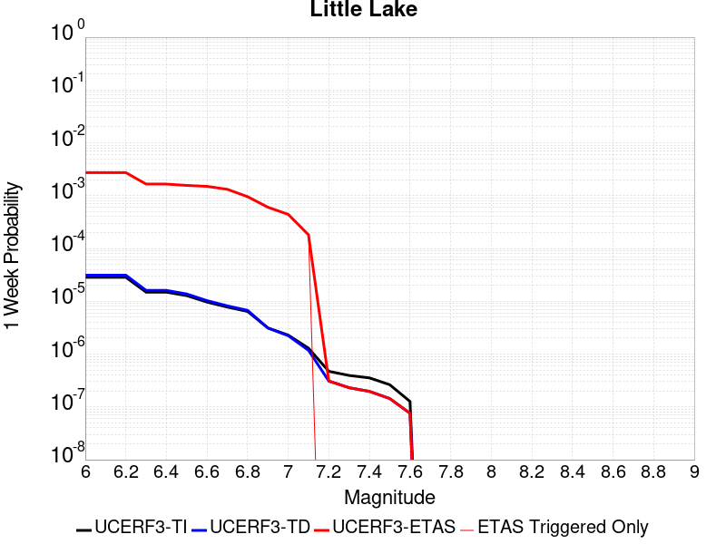 |  |  |  |

| Magnitude | 1 wk TI Prob | 1 wk TD Prob | 1 wk ETAS Prob | 1 wk ETAS/TD Gain | 1 wk ETAS Triggered Only | 1 mo TI Prob | 1 mo TD Prob | 1 mo ETAS Prob | 1 mo ETAS/TD Gain | 1 mo ETAS Triggered Only | 1 yr TI Prob | 1 yr TD Prob | 1 yr ETAS Prob | 1 yr ETAS/TD Gain | 1 yr ETAS Triggered Only | 10 yr TI Prob | 10 yr TD Prob | 10 yr ETAS Prob | 10 yr ETAS/TD Gain | 10 yr ETAS Triggered Only |
|-----|-----|-----|-----|-----|-----|-----|-----|-----|-----|-----|-----|-----|-----|-----|-----|-----|-----|-----|-----|-----|
| 6.0 | 2.8424427E-5 | 3.1205633E-5 | 0.0027916066 | 89.45842 | 0.0027604871 | 1.2181328E-4 | 1.3373232E-4 | 0.0035568199 | 26.596561 | 0.0034235453 | 0.0014820677 | 0.0016271081 | 0.006517649 | 4.0056643 | 0.0048985113 | 0.014722223 | 0.016165355 | 0.022329299 | 1.3813058 | 0.0062652235 |
| 6.1 | 2.8424427E-5 | 3.1205633E-5 | 0.0027916066 | 89.45842 | 0.0027604871 | 1.2181328E-4 | 1.3373232E-4 | 0.0035568199 | 26.596561 | 0.0034235453 | 0.0014820677 | 0.0016271081 | 0.006517649 | 4.0056643 | 0.0048985113 | 0.014722223 | 0.016165355 | 0.022329299 | 1.3813058 | 0.0062652235 |
| 6.2 | 2.8424427E-5 | 3.1205633E-5 | 0.0027916066 | 89.45842 | 0.0027604871 | 1.2181328E-4 | 1.3373232E-4 | 0.0035568199 | 26.596561 | 0.0034235453 | 0.0014820677 | 0.0016271081 | 0.006517649 | 4.0056643 | 0.0048985113 | 0.014722223 | 0.016165355 | 0.022329299 | 1.3813058 | 0.0062652235 |
| 6.3 | 1.48860645E-5 | 1.6081349E-5 | 0.001680466 | 104.497826 | 0.0016644114 | 6.379586E-5 | 6.89184E-5 | 0.0021256101 | 30.842419 | 0.0020568336 | 7.7643775E-4 | 8.387868E-4 | 0.003732163 | 4.4494777 | 0.002895805 | 0.007737305 | 0.008359027 | 0.012008909 | 1.4366397 | 0.0036806494 |
| 6.4 | 1.48860645E-5 | 1.6081349E-5 | 0.001680466 | 104.497826 | 0.0016644114 | 6.379586E-5 | 6.89184E-5 | 0.0021256101 | 30.842419 | 0.0020568336 | 7.7643775E-4 | 8.387868E-4 | 0.003732163 | 4.4494777 | 0.002895805 | 0.007737305 | 0.008359027 | 0.012008909 | 1.4366397 | 0.0036806494 |
| 6.5 | 1.2797581E-5 | 1.3765531E-5 | 0.0015834327 | 115.02882 | 0.0015696888 | 5.4845623E-5 | 5.899394E-5 | 0.0019939272 | 33.798847 | 0.0019350473 | 6.675408E-4 | 7.180402E-4 | 0.0034900673 | 4.8605456 | 0.002774019 | 0.006655392 | 0.0071597523 | 0.01065283 | 1.4878769 | 0.003518268 |
| 6.6 | 9.661896E-6 | 1.02890135E-5 | 0.0015393667 | 149.61266 | 0.0015290934 | 4.1407468E-5 | 4.409512E-5 | 0.0018843387 | 42.7335 | 0.0018403247 | 5.040193E-4 | 5.3674204E-4 | 0.0031740267 | 5.9135046 | 0.002638701 | 0.005028777 | 0.0053560617 | 0.008680514 | 1.6206897 | 0.0033423544 |
| 6.7 | 7.767871E-6 | 8.199668E-6 | 0.001429027 | 174.27864 | 0.001420839 | 3.329045E-5 | 3.5141038E-5 | 0.0017400879 | 49.517258 | 0.0017050068 | 4.0523586E-4 | 4.2777188E-4 | 0.0028354018 | 6.6283035 | 0.0024086602 | 0.004044977 | 0.0042708362 | 0.007262066 | 1.700385 | 0.0030040594 |
| 6.8 | 6.4235196E-6 | 6.7357296E-6 | 0.0010080822 | 149.66191 | 0.0010013531 | 2.752908E-5 | 2.8867165E-5 | 0.0012602254 | 43.656013 | 0.0012313938 | 3.35115E-4 | 3.5141388E-4 | 0.002177565 | 6.196582 | 0.001826793 | 0.003346101 | 0.0035098423 | 0.005748237 | 1.6377479 | 0.0022462788 |
| 6.9 | 3.1283696E-6 | 3.1121751E-6 | 6.661683E-4 | 214.05232 | 6.630582E-4 | 1.3407229E-5 | 1.33378335E-5 | 8.117034E-4 | 60.857212 | 7.9837616E-4 | 1.6322079E-4 | 1.6237753E-4 | 0.0013123937 | 8.08236 | 0.0011502029 | 0.0016310095 | 0.0016227373 | 0.0029602116 | 1.8242087 | 0.0013396482 |
| 7.0 | 2.290603E-6 | 2.2286777E-6 | 4.758406E-4 | 213.50806 | 4.7361298E-4 | 9.816834E-6 | 9.551446E-6 | 5.3728657E-4 | 56.251858 | 5.2774017E-4 | 1.19513395E-4 | 1.1628369E-4 | 9.1456703E-4 | 7.864964 | 7.9837616E-4 | 0.0011944914 | 0.0011623306 | 0.0020679075 | 1.7791044 | 9.066306E-4 |
| 7.1 | 1.293693E-6 | 1.1776802E-6 | 1.9062265E-4 | 161.86282 | 1.894452E-4 | 5.5443866E-6 | 5.0471954E-6 | 2.215549E-4 | 43.896637 | 2.165088E-4 | 6.750081E-5 | 6.144857E-5 | 4.267847E-4 | 6.945397 | 3.653586E-4 | 6.7480316E-4 | 6.1438425E-4 | 0.0010471358 | 1.7043663 | 4.330176E-4 |
| 7.2 | 4.715842E-7 | 3.091774E-7 | 3.091774E-7 | 1.0 | 0.0 | 2.0210737E-6 | 1.3250453E-6 | 1.3250453E-6 | 1.0 | 0.0 | 2.4606294E-5 | 1.6132313E-5 | 1.6132313E-5 | 1.0 | 0.0 | 2.460357E-4 | 1.6131197E-4 | 1.7484158E-4 | 1.0838723 | 1.35318E-5 |
| 7.3 | 3.9430947E-7 | 2.309738E-7 | 2.309738E-7 | 1.0 | 0.0 | 1.6898966E-6 | 9.898873E-7 | 9.898873E-7 | 1.0 | 0.0 | 2.0574296E-5 | 1.20518125E-5 | 1.20518125E-5 | 1.0 | 0.0 | 2.0572392E-4 | 1.2051166E-4 | 1.2051166E-4 | 1.0 | 0.0 |
| 7.4 | 3.547123E-7 | 1.9679035E-7 | 1.9679035E-7 | 1.0 | 0.0 | 1.5201948E-6 | 8.4338694E-7 | 8.4338694E-7 | 1.0 | 0.0 | 1.8508214E-5 | 1.0268188E-5 | 1.0268188E-5 | 1.0 | 0.0 | 1.8506673E-4 | 1.026772E-4 | 1.026772E-4 | 1.0 | 0.0 |
| 7.5 | 2.6354266E-7 | 1.4423068E-7 | 1.4423068E-7 | 1.0 | 0.0 | 1.129468E-6 | 6.1813137E-7 | 6.1813137E-7 | 1.0 | 0.0 | 1.3751187E-5 | 7.5257235E-6 | 7.5257235E-6 | 1.0 | 0.0 | 1.3750336E-4 | 7.525474E-5 | 7.525474E-5 | 1.0 | 0.0 |
| 7.6 | 1.269913E-7 | 7.572526E-8 | 7.572526E-8 | 1.0 | 0.0 | 5.4424834E-7 | 3.245368E-7 | 3.245368E-7 | 1.0 | 0.0 | 6.6262032E-6 | 3.951229E-6 | 3.951229E-6 | 1.0 | 0.0 | 6.626006E-5 | 3.9511622E-5 | 3.9511622E-5 | 1.0 | 0.0 |

## Airport Lake
*[(top)](#table-of-contents)*

| 1 Week | 1 Month | 1 Year | 10 Year |
|-----|-----|-----|-----|
|  |  |  |  |

| Magnitude | 1 wk TI Prob | 1 wk TD Prob | 1 wk ETAS Prob | 1 wk ETAS/TD Gain | 1 wk ETAS Triggered Only | 1 mo TI Prob | 1 mo TD Prob | 1 mo ETAS Prob | 1 mo ETAS/TD Gain | 1 mo ETAS Triggered Only | 1 yr TI Prob | 1 yr TD Prob | 1 yr ETAS Prob | 1 yr ETAS/TD Gain | 1 yr ETAS Triggered Only | 10 yr TI Prob | 10 yr TD Prob | 10 yr ETAS Prob | 10 yr ETAS/TD Gain | 10 yr ETAS Triggered Only |
|-----|-----|-----|-----|-----|-----|-----|-----|-----|-----|-----|-----|-----|-----|-----|-----|-----|-----|-----|-----|-----|
| 6.0 | 1.2387061E-5 | 1.3103137E-5 | 0.0022864158 | 174.49377 | 0.0022733423 | 5.3086325E-5 | 5.615525E-5 | 0.0028435495 | 50.637287 | 0.0027875507 | 6.461343E-4 | 6.835041E-4 | 0.004564476 | 6.6780524 | 0.0038836265 | 0.0064425888 | 0.0068168286 | 0.011493795 | 1.6860911 | 0.0047090664 |
| 6.1 | 1.2387061E-5 | 1.3103137E-5 | 0.0022864158 | 174.49377 | 0.0022733423 | 5.3086325E-5 | 5.615525E-5 | 0.0028435495 | 50.637287 | 0.0027875507 | 6.461343E-4 | 6.835041E-4 | 0.004564476 | 6.6780524 | 0.0038836265 | 0.0064425888 | 0.0068168286 | 0.011493795 | 1.6860911 | 0.0047090664 |
| 6.2 | 1.2387061E-5 | 1.3103137E-5 | 0.0022864158 | 174.49377 | 0.0022733423 | 5.3086325E-5 | 5.615525E-5 | 0.0028435495 | 50.637287 | 0.0027875507 | 6.461343E-4 | 6.835041E-4 | 0.004564476 | 6.6780524 | 0.0038836265 | 0.0064425888 | 0.0068168286 | 0.011493795 | 1.6860911 | 0.0047090664 |
| 6.3 | 1.2387061E-5 | 1.3103137E-5 | 0.0022864158 | 174.49377 | 0.0022733423 | 5.3086325E-5 | 5.615525E-5 | 0.0028435495 | 50.637287 | 0.0027875507 | 6.461343E-4 | 6.835041E-4 | 0.004564476 | 6.6780524 | 0.0038836265 | 0.0064425888 | 0.0068168286 | 0.011493795 | 1.6860911 | 0.0047090664 |
| 6.4 | 1.2387061E-5 | 1.3103137E-5 | 0.0022864158 | 174.49377 | 0.0022733423 | 5.3086325E-5 | 5.615525E-5 | 0.0028435495 | 50.637287 | 0.0027875507 | 6.461343E-4 | 6.835041E-4 | 0.004564476 | 6.6780524 | 0.0038836265 | 0.0064425888 | 0.0068168286 | 0.011493795 | 1.6860911 | 0.0047090664 |
| 6.5 | 6.9922594E-6 | 7.384914E-6 | 0.0018476961 | 250.19873 | 0.0018403247 | 2.996648E-5 | 3.1649277E-5 | 0.002250794 | 71.11676 | 0.0022192153 | 3.6478083E-4 | 3.8526725E-4 | 0.0034963822 | 9.0752125 | 0.003112314 | 0.003641826 | 0.0038465308 | 0.0075804214 | 1.9707164 | 0.0037483086 |
| 6.6 | 6.9922594E-6 | 7.384914E-6 | 0.0018476961 | 250.19873 | 0.0018403247 | 2.996648E-5 | 3.1649277E-5 | 0.002250794 | 71.11676 | 0.0022192153 | 3.6478083E-4 | 3.8526725E-4 | 0.0034963822 | 9.0752125 | 0.003112314 | 0.003641826 | 0.0038465308 | 0.0075804214 | 1.9707164 | 0.0037483086 |
| 6.7 | 5.477277E-6 | 5.78606E-6 | 0.0016025292 | 276.9638 | 0.0015967523 | 2.3473833E-5 | 2.4797186E-5 | 0.0019192022 | 77.395966 | 0.0018944519 | 2.8575645E-4 | 3.0186778E-4 | 0.0030074108 | 9.962675 | 0.0027063598 | 0.0028538927 | 0.0030149613 | 0.0062258197 | 2.064975 | 0.0032205684 |
| 6.8 | 3.9950432E-6 | 4.219081E-6 | 0.0011679489 | 276.82544 | 0.0011637348 | 1.7121502E-5 | 1.8081664E-5 | 0.0014253634 | 78.82921 | 0.0014073072 | 2.0843433E-4 | 2.2012478E-4 | 0.0022900344 | 10.403346 | 0.0020703655 | 0.0020823893 | 0.0021993385 | 0.0046297056 | 2.1050446 | 0.002435724 |
| 6.9 | 2.95695E-6 | 3.1230197E-6 | 9.0975076E-4 | 291.30484 | 9.066306E-4 | 1.2672582E-5 | 1.3384314E-5 | 0.0011094455 | 82.891464 | 0.0010960757 | 1.5427776E-4 | 1.629441E-4 | 0.0017594363 | 10.797791 | 0.0015967523 | 0.001541707 | 0.0016284687 | 0.0034793064 | 2.136551 | 0.0018538566 |
| 7.0 | 1.456072E-6 | 1.5408096E-6 | 4.480895E-4 | 290.81433 | 4.4654938E-4 | 6.2402937E-6 | 6.6034586E-6 | 5.0727674E-4 | 76.819855 | 5.006766E-4 | 7.597293E-5 | 8.0395155E-5 | 8.516457E-4 | 10.593247 | 7.7131257E-4 | 7.594696E-4 | 8.0375955E-4 | 0.0016690986 | 2.0766144 | 8.660352E-4 |
| 7.1 | 6.995192E-7 | 7.4089627E-7 | 1.6312237E-4 | 220.16898 | 1.6238159E-4 | 2.997936E-6 | 3.1752697E-6 | 1.9261986E-4 | 60.66252 | 1.894452E-4 | 3.649926E-5 | 3.865891E-5 | 3.7694082E-4 | 9.750425 | 3.3829498E-4 | 3.6493264E-4 | 3.865891E-4 | 7.788596E-4 | 2.0146961 | 3.924222E-4 |

## Panamint Valley
*[(top)](#table-of-contents)*

| 1 Week | 1 Month | 1 Year | 10 Year |
|-----|-----|-----|-----|
|  |  |  |  |

| Magnitude | 1 wk TI Prob | 1 wk TD Prob | 1 wk ETAS Prob | 1 wk ETAS/TD Gain | 1 wk ETAS Triggered Only | 1 mo TI Prob | 1 mo TD Prob | 1 mo ETAS Prob | 1 mo ETAS/TD Gain | 1 mo ETAS Triggered Only | 1 yr TI Prob | 1 yr TD Prob | 1 yr ETAS Prob | 1 yr ETAS/TD Gain | 1 yr ETAS Triggered Only | 10 yr TI Prob | 10 yr TD Prob | 10 yr ETAS Prob | 10 yr ETAS/TD Gain | 10 yr ETAS Triggered Only |
|-----|-----|-----|-----|-----|-----|-----|-----|-----|-----|-----|-----|-----|-----|-----|-----|-----|-----|-----|-----|-----|
| 6.0 | 3.0211835E-5 | 3.398435E-5 | 9.1352145E-4 | 26.88065 | 8.79567E-4 | 1.2947287E-4 | 1.4563925E-4 | 0.001200966 | 8.246169 | 0.0010554803 | 0.0015751923 | 0.0017717453 | 0.0032846218 | 1.8538904 | 0.0015155616 | 0.015640736 | 0.017583055 | 0.019723367 | 1.1217259 | 0.0021786198 |
| 6.1 | 3.0211835E-5 | 3.398435E-5 | 9.1352145E-4 | 26.88065 | 8.79567E-4 | 1.2947287E-4 | 1.4563925E-4 | 0.001200966 | 8.246169 | 0.0010554803 | 0.0015751923 | 0.0017717453 | 0.0032846218 | 1.8538904 | 0.0015155616 | 0.015640736 | 0.017583055 | 0.019723367 | 1.1217259 | 0.0021786198 |
| 6.2 | 3.0211835E-5 | 3.398435E-5 | 9.1352145E-4 | 26.88065 | 8.79567E-4 | 1.2947287E-4 | 1.4563925E-4 | 0.001200966 | 8.246169 | 0.0010554803 | 0.0015751923 | 0.0017717453 | 0.0032846218 | 1.8538904 | 0.0015155616 | 0.015640736 | 0.017583055 | 0.019723367 | 1.1217259 | 0.0021786198 |
| 6.3 | 2.8573924E-5 | 3.2102525E-5 | 9.116413E-4 | 28.397804 | 8.79567E-4 | 1.2245393E-4 | 1.3757516E-4 | 0.0011929104 | 8.670972 | 0.0010554803 | 0.001489857 | 0.0016737186 | 0.0031327067 | 1.8717047 | 0.0014614344 | 0.01479908 | 0.016617723 | 0.018680297 | 1.1241189 | 0.002097429 |
| 6.4 | 2.8573924E-5 | 3.2102525E-5 | 9.116413E-4 | 28.397804 | 8.79567E-4 | 1.2245393E-4 | 1.3757516E-4 | 0.0011929104 | 8.670972 | 0.0010554803 | 0.001489857 | 0.0016737186 | 0.0031327067 | 1.8717047 | 0.0014614344 | 0.01479908 | 0.016617723 | 0.018680297 | 1.1241189 | 0.002097429 |
| 6.5 | 2.7468774E-5 | 3.0828287E-5 | 8.833054E-4 | 28.652431 | 8.525034E-4 | 1.1771801E-4 | 1.321147E-4 | 0.0011468655 | 8.680833 | 0.001014885 | 0.0014322745 | 0.0016073369 | 0.0030123822 | 1.8741448 | 0.0014073072 | 0.014230782 | 0.015963601 | 0.017947653 | 1.1242859 | 0.0020162382 |
| 6.6 | 2.6135967E-5 | 2.925234E-5 | 8.817308E-4 | 30.142231 | 8.525034E-4 | 1.1200648E-4 | 1.253613E-4 | 0.0011130589 | 8.878807 | 9.878214E-4 | 0.0013628257 | 0.0015252318 | 0.002889859 | 1.8947016 | 0.0013667118 | 0.013544982 | 0.0151539715 | 0.01708635 | 1.1275163 | 0.0019621109 |
| 6.7 | 2.4498746E-5 | 2.73412E-5 | 8.527584E-4 | 31.189503 | 8.2543975E-4 | 1.04990395E-4 | 1.17171454E-4 | 0.0010642865 | 9.083155 | 9.4722596E-4 | 0.0012775084 | 0.0014256539 | 0.0027363673 | 1.9193769 | 0.0013125846 | 0.012701893 | 0.014171205 | 0.01602547 | 1.1308473 | 0.0018809201 |
| 6.8 | 2.2244329E-5 | 2.4935298E-5 | 7.6916575E-4 | 30.846462 | 7.44249E-4 | 9.532935E-5 | 1.0686131E-4 | 9.72804E-4 | 9.103425 | 8.660352E-4 | 0.0011600169 | 0.0013002817 | 0.002503046 | 1.9250028 | 0.0012043301 | 0.011539802 | 0.012932454 | 0.014642125 | 1.1322 | 0.0017320703 |
| 6.9 | 1.9902658E-5 | 2.229015E-5 | 7.123966E-4 | 31.96015 | 6.901218E-4 | 8.529431E-5 | 9.552582E-5 | 8.938257E-4 | 9.356901 | 7.9837616E-4 | 0.0010379635 | 0.0011624249 | 0.0022707426 | 1.9534532 | 0.0011096076 | 0.010331288 | 0.011568548 | 0.013173578 | 1.1387409 | 0.001623816 |
| 7.0 | 1.8353881E-5 | 2.0566078E-5 | 6.9714215E-4 | 33.89767 | 6.7658996E-4 | 7.865712E-5 | 8.813745E-5 | 8.5938204E-4 | 9.750475 | 7.7131257E-4 | 9.5722964E-4 | 0.001072563 | 0.0021404286 | 1.9956205 | 0.0010690122 | 0.009531168 | 0.010678793 | 0.0121781705 | 1.140407 | 0.0015155616 |
| 7.1 | 1.7667631E-5 | 1.9772506E-5 | 6.9634913E-4 | 35.218052 | 6.7658996E-4 | 7.571623E-5 | 8.473666E-5 | 8.559839E-4 | 10.101695 | 7.7131257E-4 | 9.2145515E-4 | 0.0010311981 | 0.00208559 | 2.0224922 | 0.0010554803 | 0.009176437 | 0.010269018 | 0.0117422305 | 1.1434618 | 0.001488498 |
| 7.2 | 1.6381597E-5 | 1.815815E-5 | 6.2707806E-4 | 34.53425 | 6.08931E-4 | 7.020495E-5 | 7.7818426E-5 | 7.8141724E-4 | 10.041546 | 7.036536E-4 | 8.544101E-4 | 9.4704475E-4 | 0.0019068926 | 2.013519 | 9.607578E-4 | 0.008511325 | 0.009434741 | 0.01076175 | 1.1406513 | 0.0013396482 |
| 7.3 | 1.4520491E-5 | 1.5966394E-5 | 5.16635E-4 | 32.35765 | 5.006766E-4 | 6.222919E-5 | 6.84257E-5 | 6.5025326E-4 | 9.503057 | 5.818674E-4 | 7.57377E-4 | 8.327807E-4 | 0.0016169715 | 1.9416534 | 7.848444E-4 | 0.0075480095 | 0.008299708 | 0.009400107 | 1.1325828 | 0.0011096076 |
| 7.4 | 1.2852287E-5 | 1.4145337E-5 | 5.012832E-4 | 35.438053 | 4.871448E-4 | 5.5080065E-5 | 6.0621558E-5 | 6.289227E-4 | 10.374572 | 5.683356E-4 | 6.7039346E-4 | 7.378333E-4 | 0.001495055 | 2.0262773 | 7.577808E-4 | 0.0066837464 | 0.0073567564 | 0.008417904 | 1.1442412 | 0.0010690122 |
| 7.5 | 1.1637851E-5 | 1.2836727E-5 | 4.999753E-4 | 38.94881 | 4.871448E-4 | 4.987555E-5 | 5.5013472E-5 | 6.233178E-4 | 11.330276 | 5.683356E-4 | 6.070656E-4 | 6.6959887E-4 | 0.0014133495 | 2.1107407 | 7.44249E-4 | 0.006054099 | 0.0066787098 | 0.0077136992 | 1.1549685 | 0.0010419486 |
| 7.6 | 3.0068115E-6 | 3.3330039E-6 | 2.739681E-4 | 82.19855 | 2.70636E-4 | 1.2886271E-5 | 1.42842655E-5 | 3.6610605E-4 | 25.630022 | 3.518268E-4 | 1.5687906E-4 | 1.7390434E-4 | 5.6625827E-4 | 3.256148 | 3.924222E-4 | 0.0015676835 | 0.0017391219 | 0.0022794525 | 1.3106916 | 5.41272E-4 |

## Tank Canyon
*[(top)](#table-of-contents)*

| 1 Week | 1 Month | 1 Year | 10 Year |
|-----|-----|-----|-----|
|  |  |  |  |

| Magnitude | 1 wk TI Prob | 1 wk TD Prob | 1 wk ETAS Prob | 1 wk ETAS/TD Gain | 1 wk ETAS Triggered Only | 1 mo TI Prob | 1 mo TD Prob | 1 mo ETAS Prob | 1 mo ETAS/TD Gain | 1 mo ETAS Triggered Only | 1 yr TI Prob | 1 yr TD Prob | 1 yr ETAS Prob | 1 yr ETAS/TD Gain | 1 yr ETAS Triggered Only | 10 yr TI Prob | 10 yr TD Prob | 10 yr ETAS Prob | 10 yr ETAS/TD Gain | 10 yr ETAS Triggered Only |
|-----|-----|-----|-----|-----|-----|-----|-----|-----|-----|-----|-----|-----|-----|-----|-----|-----|-----|-----|-----|-----|
| 6.0 | 4.8284557E-5 | 5.7964517E-5 | 5.18019E-4 | 8.9368305 | 4.6008118E-4 | 2.0691741E-4 | 2.4839956E-4 | 9.383499E-4 | 3.777583 | 6.901218E-4 | 0.0025163088 | 0.0030207448 | 0.0041539823 | 1.3751518 | 0.0011366712 | 0.02488006 | 0.029863482 | 0.03134691 | 1.0496737 | 0.0015290934 |
| 6.1 | 1.7796336E-5 | 2.0873225E-5 | 2.1031447E-4 | 10.075801 | 1.894452E-4 | 7.626778E-5 | 8.945383E-5 | 3.735962E-4 | 4.1764135 | 2.841678E-4 | 9.281647E-4 | 0.0010885935 | 0.0016022421 | 1.4718461 | 5.142084E-4 | 0.009242975 | 0.010836697 | 0.011559496 | 1.0666991 | 7.307172E-4 |
| 6.2 | 1.7796336E-5 | 2.0873225E-5 | 2.1031447E-4 | 10.075801 | 1.894452E-4 | 7.626778E-5 | 8.945383E-5 | 3.735962E-4 | 4.1764135 | 2.841678E-4 | 9.281647E-4 | 0.0010885935 | 0.0016022421 | 1.4718461 | 5.142084E-4 | 0.009242975 | 0.010836697 | 0.011559496 | 1.0666991 | 7.307172E-4 |
| 6.3 | 1.3515912E-5 | 1.57595E-5 | 1.3754379E-4 | 8.727674 | 1.217862E-4 | 5.792405E-5 | 6.7539106E-5 | 2.569715E-4 | 3.804781 | 1.894452E-4 | 7.049971E-4 | 8.220024E-4 | 0.0012005814 | 1.460557 | 3.788904E-4 | 0.007027647 | 0.008192232 | 0.008742491 | 1.0671684 | 5.548038E-4 |
| 6.4 | 1.0870146E-5 | 1.2617973E-5 | 1.0733937E-4 | 8.506864 | 9.47226E-5 | 4.658551E-5 | 5.407601E-5 | 2.0291776E-4 | 3.7524545 | 1.488498E-4 | 5.67031E-4 | 6.581944E-4 | 9.6922094E-4 | 1.4725451 | 3.112314E-4 | 0.005655863 | 0.006564466 | 0.007008084 | 1.0675787 | 4.4654938E-4 |
| 6.5 | 7.964826E-6 | 9.196063E-6 | 1.0391779E-4 | 11.300248 | 9.47226E-5 | 3.4134522E-5 | 3.941116E-5 | 1.7472383E-4 | 4.433359 | 1.35318E-4 | 4.1550855E-4 | 4.797359E-4 | 7.367168E-4 | 1.5356715 | 2.571042E-4 | 0.0041473247 | 0.0047883047 | 0.005151914 | 1.0759369 | 3.653586E-4 |
| 6.6 | 6.6317E-6 | 7.6122747E-6 | 1.02334154E-4 | 13.443308 | 9.47226E-5 | 2.8421264E-5 | 3.2623677E-5 | 1.544059E-4 | 4.7329397 | 1.217862E-4 | 3.4597394E-4 | 3.9713003E-4 | 6.270793E-4 | 1.5790275 | 2.3004059E-4 | 0.0034543579 | 0.0039653555 | 0.004288831 | 1.0815754 | 3.2476318E-4 |
| 6.7 | 4.793663E-6 | 5.430772E-6 | 8.662113E-5 | 15.950059 | 8.1190796E-5 | 2.0544108E-5 | 2.3274553E-5 | 1.3152644E-4 | 5.651083 | 1.082544E-4 | 2.500958E-4 | 2.8333522E-4 | 4.7272674E-4 | 1.6684362 | 1.894452E-4 | 0.0024981452 | 0.0028304325 | 0.003086809 | 1.0905786 | 2.571042E-4 |
| 6.8 | 4.382823E-6 | 4.969245E-6 | 8.615964E-5 | 17.338577 | 8.1190796E-5 | 1.8783392E-5 | 2.1296615E-5 | 1.295487E-4 | 6.083066 | 1.082544E-4 | 2.286638E-4 | 2.5925972E-4 | 4.351275E-4 | 1.678346 | 1.759134E-4 | 0.0022842865 | 0.0025902467 | 0.0028331883 | 1.0937909 | 2.435724E-4 |
| 6.9 | 2.729601E-6 | 3.0735362E-6 | 3.0137053E-5 | 9.805335 | 2.70636E-5 | 1.1698237E-5 | 1.3172238E-5 | 6.729872E-5 | 5.1091337 | 5.41272E-5 | 1.4241673E-4 | 1.6036142E-4 | 2.5506882E-4 | 1.5905873 | 9.47226E-5 | 0.001423255 | 0.0016026229 | 0.0017647443 | 1.10116 | 1.6238159E-4 |
| 7.0 | 1.8987357E-6 | 2.1269361E-6 | 1.5658707E-5 | 7.362096 | 1.35318E-5 | 8.137413E-6 | 9.1154125E-6 | 3.6178764E-5 | 3.9689665 | 2.70636E-5 | 9.90685E-5 | 1.1097519E-4 | 1.7862668E-4 | 1.6096091 | 6.7659E-5 | 9.902435E-4 | 0.0011092664 | 0.0012174007 | 1.0974827 | 1.082544E-4 |
| 7.1 | 1.4928986E-6 | 1.6641251E-6 | 1.5195902E-5 | 9.131466 | 1.35318E-5 | 6.398121E-6 | 7.1319487E-6 | 3.4195356E-5 | 4.794672 | 2.70636E-5 | 7.789434E-5 | 8.682861E-5 | 1.409511E-4 | 1.6233257 | 5.41272E-5 | 7.786704E-4 | 8.680047E-4 | 9.49125E-4 | 1.0934561 | 8.1190796E-5 |
| 7.2 | 1.069082E-6 | 1.182856E-6 | 1.182856E-6 | 1.0 | 0.0 | 4.581772E-6 | 5.0693757E-6 | 1.8601108E-5 | 3.6693091 | 1.35318E-5 | 5.5781646E-5 | 6.1718434E-5 | 8.878036E-5 | 1.4384739 | 2.70636E-5 | 5.576765E-4 | 6.1706523E-4 | 6.5763557E-4 | 1.0657473 | 4.0595398E-5 |
| 7.3 | 8.776551E-7 | 9.769996E-7 | 9.769996E-7 | 1.0 | 0.0 | 3.7613736E-6 | 4.187137E-6 | 4.187137E-6 | 1.0 | 0.0 | 4.579376E-5 | 5.097772E-5 | 6.450883E-5 | 1.2654319 | 1.35318E-5 | 4.5784327E-4 | 5.097113E-4 | 5.367611E-4 | 1.0530689 | 2.70636E-5 |
| 7.4 | 7.55721E-7 | 8.5102363E-7 | 8.5102363E-7 | 1.0 | 0.0 | 3.2388E-6 | 3.647242E-6 | 3.647242E-6 | 1.0 | 0.0 | 3.9431678E-5 | 4.4404784E-5 | 5.7935984E-5 | 1.3047239 | 1.35318E-5 | 3.942468E-4 | 4.4401E-4 | 4.7106156E-4 | 1.0609256 | 2.70636E-5 |
| 7.5 | 5.587665E-7 | 6.305613E-7 | 6.305613E-7 | 1.0 | 0.0 | 2.3947114E-6 | 2.7024057E-6 | 2.7024057E-6 | 1.0 | 0.0 | 2.915522E-5 | 3.290179E-5 | 3.290179E-5 | 1.0 | 0.0 | 2.9151395E-4 | 3.2901787E-4 | 3.2901787E-4 | 1.0 | 0.0 |

## Owl Lake
*[(top)](#table-of-contents)*

| 1 Week | 1 Month | 1 Year | 10 Year |
|-----|-----|-----|-----|
|  | 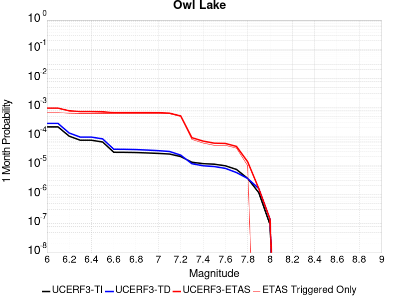 |  |  |

| Magnitude | 1 wk TI Prob | 1 wk TD Prob | 1 wk ETAS Prob | 1 wk ETAS/TD Gain | 1 wk ETAS Triggered Only | 1 mo TI Prob | 1 mo TD Prob | 1 mo ETAS Prob | 1 mo ETAS/TD Gain | 1 mo ETAS Triggered Only | 1 yr TI Prob | 1 yr TD Prob | 1 yr ETAS Prob | 1 yr ETAS/TD Gain | 1 yr ETAS Triggered Only | 10 yr TI Prob | 10 yr TD Prob | 10 yr ETAS Prob | 10 yr ETAS/TD Gain | 10 yr ETAS Triggered Only |
|-----|-----|-----|-----|-----|-----|-----|-----|-----|-----|-----|-----|-----|-----|-----|-----|-----|-----|-----|-----|-----|
| 6.0 | 5.0320643E-5 | 6.635748E-5 | 4.8581543E-4 | 7.321185 | 4.194858E-4 | 2.1564208E-4 | 2.843645E-4 | 8.9312234E-4 | 3.140766 | 6.08931E-4 | 0.0026222812 | 0.0034577043 | 0.00433423 | 1.2534993 | 8.79567E-4 | 0.02591553 | 0.0341404 | 0.035316683 | 1.0344543 | 0.001217862 |
| 6.1 | 5.0320643E-5 | 6.635748E-5 | 4.8581543E-4 | 7.321185 | 4.194858E-4 | 2.1564208E-4 | 2.843645E-4 | 8.9312234E-4 | 3.140766 | 6.08931E-4 | 0.0026222812 | 0.0034577043 | 0.00433423 | 1.2534993 | 8.79567E-4 | 0.02591553 | 0.0341404 | 0.035316683 | 1.0344543 | 0.001217862 |
| 6.2 | 2.4125871E-5 | 3.0980704E-5 | 4.3692213E-4 | 14.103041 | 4.05954E-4 | 1.0339249E-4 | 1.3276885E-4 | 7.14559E-4 | 5.3819776 | 5.818674E-4 | 0.0012580766 | 0.0016154221 | 0.0024530385 | 1.5185124 | 8.389716E-4 | 0.012509781 | 0.016070297 | 0.017175388 | 1.068766 | 0.0011231394 |
| 6.3 | 1.7433485E-5 | 2.2355249E-5 | 4.1476867E-4 | 18.553526 | 3.924222E-4 | 7.471279E-5 | 9.580558E-5 | 6.640867E-4 | 6.9316077 | 5.683356E-4 | 9.0924866E-4 | 0.0011659606 | 0.001990438 | 1.7071228 | 8.2543975E-4 | 0.009055373 | 0.011628761 | 0.012725465 | 1.0943097 | 0.0011096076 |
| 6.4 | 1.7433485E-5 | 2.2355249E-5 | 4.1476867E-4 | 18.553526 | 3.924222E-4 | 7.471279E-5 | 9.580558E-5 | 6.640867E-4 | 6.9316077 | 5.683356E-4 | 9.0924866E-4 | 0.0011659606 | 0.001990438 | 1.7071228 | 8.2543975E-4 | 0.009055373 | 0.011628761 | 0.012725465 | 1.0943097 | 0.0011096076 |
| 6.5 | 1.5182742E-5 | 1.9428902E-5 | 4.1184347E-4 | 21.197464 | 3.924222E-4 | 6.506727E-5 | 8.326492E-5 | 6.5155316E-4 | 7.8250623 | 5.683356E-4 | 7.919061E-4 | 0.0010134302 | 0.0018245154 | 1.8003365 | 8.11908E-4 | 0.0078909 | 0.010118305 | 0.011189895 | 1.1059061 | 0.001082544 |
| 6.6 | 6.7271576E-6 | 8.547201E-6 | 4.0096603E-4 | 46.91197 | 3.924222E-4 | 2.8830356E-5 | 3.663038E-5 | 6.049452E-4 | 16.514849 | 5.683356E-4 | 3.5095305E-4 | 4.4588925E-4 | 0.0012168579 | 2.7290585 | 7.7131257E-4 | 0.0035039932 | 0.0044677295 | 0.0054780804 | 1.2261441 | 0.001014885 |
| 6.7 | 6.682835E-6 | 8.4796475E-6 | 4.008985E-4 | 47.277733 | 3.924222E-4 | 2.8640408E-5 | 3.6340873E-5 | 6.046558E-4 | 16.63845 | 5.683356E-4 | 3.4864116E-4 | 4.4236594E-4 | 0.0012133373 | 2.7428362 | 7.7131257E-4 | 0.003480947 | 0.004432656 | 0.005443042 | 1.2279415 | 0.001014885 |
| 6.8 | 6.5774975E-6 | 8.326121E-6 | 4.0074505E-4 | 48.131058 | 3.924222E-4 | 2.8188972E-5 | 3.5682922E-5 | 6.0399825E-4 | 16.926815 | 5.683356E-4 | 3.4314668E-4 | 4.343586E-4 | 0.0012053362 | 2.7749794 | 7.7131257E-4 | 0.0034261728 | 0.0043528024 | 0.0053632697 | 1.2321419 | 0.001014885 |
| 6.9 | 6.363419E-6 | 7.999298E-6 | 4.0041836E-4 | 50.05669 | 3.924222E-4 | 2.727151E-5 | 3.4282286E-5 | 6.025984E-4 | 17.577545 | 5.683356E-4 | 3.3198006E-4 | 4.1731246E-4 | 0.0011883032 | 2.8475142 | 7.7131257E-4 | 0.0033148455 | 0.004182795 | 0.005193435 | 1.2416183 | 0.001014885 |
| 7.0 | 6.1342453E-6 | 7.631501E-6 | 4.000507E-4 | 52.42097 | 3.924222E-4 | 2.6289357E-5 | 3.2706055E-5 | 6.01023E-4 | 18.376507 | 5.683356E-4 | 3.2002592E-4 | 3.9812896E-4 | 0.0011691345 | 2.9365723 | 7.7131257E-4 | 0.0031956544 | 0.00399149 | 0.0050023245 | 1.2532473 | 0.001014885 |
| 7.1 | 5.842926E-6 | 7.1420604E-6 | 3.8602974E-4 | 54.050194 | 3.788904E-4 | 2.504087E-5 | 3.0608502E-5 | 5.718639E-4 | 18.683172 | 5.41272E-4 | 3.0482994E-4 | 3.7260022E-4 | 0.0011165718 | 2.9967022 | 7.44249E-4 | 0.0030441214 | 0.0037369546 | 0.004694122 | 1.2561357 | 9.607578E-4 |
| 7.2 | 4.77173E-6 | 5.3583467E-6 | 2.895246E-4 | 54.032455 | 2.841678E-4 | 2.045011E-5 | 2.2964163E-5 | 4.4244033E-4 | 19.266556 | 4.194858E-4 | 2.4895166E-4 | 2.7955687E-4 | 8.477336E-4 | 3.032419 | 5.683356E-4 | 0.0024867293 | 0.002808574 | 0.0035912138 | 1.278661 | 7.848444E-4 |
| 7.3 | 3.0494948E-6 | 2.7103622E-6 | 4.3305652E-5 | 15.97781 | 4.0595398E-5 | 1.3069198E-5 | 1.1615787E-5 | 7.9274E-5 | 6.8246775 | 6.7659E-5 | 1.5910587E-4 | 1.4141318E-4 | 2.3612239E-4 | 1.6697339 | 9.47226E-5 | 0.0015899199 | 0.0014231888 | 0.0015853393 | 1.1139346 | 1.6238159E-4 |
| 7.4 | 2.7263884E-6 | 2.3055816E-6 | 2.936912E-5 | 12.738269 | 2.70636E-5 | 1.1684469E-5 | 9.881027E-6 | 6.400769E-5 | 6.477838 | 5.41272E-5 | 1.4224913E-4 | 1.20294964E-4 | 2.01476E-4 | 1.6748497 | 8.1190796E-5 | 0.0014215811 | 0.0012111744 | 0.0013598439 | 1.1227483 | 1.488498E-4 |
| 7.5 | 2.6090431E-6 | 2.1655203E-6 | 2.922906E-5 | 13.497478 | 2.70636E-5 | 1.1181565E-5 | 9.280769E-6 | 4.987579E-5 | 5.374101 | 4.0595398E-5 | 1.3612706E-4 | 1.129876E-4 | 1.8063895E-4 | 1.5987502 | 6.7659E-5 | 0.001360437 | 0.0011379321 | 0.0012730961 | 1.1187804 | 1.35318E-4 |
| 7.6 | 2.3008756E-6 | 1.872704E-6 | 2.8936252E-5 | 15.451589 | 2.70636E-5 | 9.860858E-6 | 8.025851E-6 | 4.8620925E-5 | 6.05804 | 4.0595398E-5 | 1.20049335E-4 | 9.771043E-5 | 1.3830187E-4 | 1.4154258 | 4.0595398E-5 | 0.001199845 | 9.849465E-4 | 0.0010525389 | 1.0686255 | 6.7659E-5 |
| 7.7 | 1.7184348E-6 | 1.3418345E-6 | 2.8405397E-5 | 21.169077 | 2.70636E-5 | 7.3646997E-6 | 5.750707E-6 | 4.634587E-5 | 8.059161 | 4.0595398E-5 | 8.966153E-5 | 7.001265E-5 | 1.106052E-4 | 1.5797889 | 4.0595398E-5 | 8.962536E-4 | 7.077913E-4 | 7.618802E-4 | 1.0764192 | 5.41272E-5 |
| 7.8 | 8.4612907E-7 | 8.4052675E-7 | 1.43723155E-5 | 17.099176 | 1.35318E-5 | 3.6262625E-6 | 3.6022527E-6 | 1.7134003E-5 | 4.7564692 | 1.35318E-5 | 4.4148852E-5 | 4.3856566E-5 | 5.7387773E-5 | 1.3085332 | 1.35318E-5 | 4.414008E-4 | 4.4395277E-4 | 4.7100437E-4 | 1.0609335 | 2.70636E-5 |
| 7.9 | 2.716738E-7 | 3.767845E-7 | 3.767845E-7 | 1.0 | 0.0 | 1.1643157E-6 | 1.6147899E-6 | 1.6147899E-6 | 1.0 | 0.0 | 1.4175452E-5 | 1.96599E-5 | 1.96599E-5 | 1.0 | 0.0 | 1.4174548E-4 | 1.9835318E-4 | 1.9835318E-4 | 1.0 | 0.0 |
| 8.0 | 2.1995428E-8 | 3.38465E-8 | 3.38465E-8 | 1.0 | 0.0 | 9.426611E-8 | 1.4505643E-7 | 1.4505643E-7 | 1.0 | 0.0 | 1.1476893E-6 | 1.7660612E-6 | 1.7660612E-6 | 1.0 | 0.0 | 1.14768345E-5 | 1.796186E-5 | 1.796186E-5 | 1.0 | 0.0 |

## Hunter Mountain-Saline Valley
*[(top)](#table-of-contents)*

| 1 Week | 1 Month | 1 Year | 10 Year |
|-----|-----|-----|-----|
|  |  |  |  |

| Magnitude | 1 wk TI Prob | 1 wk TD Prob | 1 wk ETAS Prob | 1 wk ETAS/TD Gain | 1 wk ETAS Triggered Only | 1 mo TI Prob | 1 mo TD Prob | 1 mo ETAS Prob | 1 mo ETAS/TD Gain | 1 mo ETAS Triggered Only | 1 yr TI Prob | 1 yr TD Prob | 1 yr ETAS Prob | 1 yr ETAS/TD Gain | 1 yr ETAS Triggered Only | 10 yr TI Prob | 10 yr TD Prob | 10 yr ETAS Prob | 10 yr ETAS/TD Gain | 10 yr ETAS Triggered Only |
|-----|-----|-----|-----|-----|-----|-----|-----|-----|-----|-----|-----|-----|-----|-----|-----|-----|-----|-----|-----|-----|
| 6.0 | 4.5103672E-5 | 5.4569828E-5 | 5.4168806E-4 | 9.926512 | 4.871448E-4 | 1.9328714E-4 | 2.3385094E-4 | 8.291109E-4 | 3.5454676 | 5.953992E-4 | 0.002350731 | 0.002843498 | 0.0036530972 | 1.2847195 | 8.11908E-4 | 0.023260195 | 0.028091714 | 0.029196454 | 1.0393262 | 0.0011366712 |
| 6.1 | 4.5103672E-5 | 5.4569828E-5 | 5.4168806E-4 | 9.926512 | 4.871448E-4 | 1.9328714E-4 | 2.3385094E-4 | 8.291109E-4 | 3.5454676 | 5.953992E-4 | 0.002350731 | 0.002843498 | 0.0036530972 | 1.2847195 | 8.11908E-4 | 0.023260195 | 0.028091714 | 0.029196454 | 1.0393262 | 0.0011366712 |
| 6.2 | 3.9363465E-5 | 4.7063084E-5 | 5.34185E-4 | 11.350403 | 4.871448E-4 | 1.6868966E-4 | 2.0168422E-4 | 7.9696334E-4 | 3.9515405 | 5.953992E-4 | 0.002051862 | 0.002452803 | 0.0032627196 | 1.3302004 | 8.11908E-4 | 0.020330196 | 0.024273338 | 0.025382418 | 1.0456913 | 0.0011366712 |
| 6.3 | 3.9363465E-5 | 4.7063084E-5 | 5.34185E-4 | 11.350403 | 4.871448E-4 | 1.6868966E-4 | 2.0168422E-4 | 7.9696334E-4 | 3.9515405 | 5.953992E-4 | 0.002051862 | 0.002452803 | 0.0032627196 | 1.3302004 | 8.11908E-4 | 0.020330196 | 0.024273338 | 0.025382418 | 1.0456913 | 0.0011366712 |
| 6.4 | 3.2311684E-5 | 3.7950776E-5 | 5.250771E-4 | 13.835741 | 4.871448E-4 | 1.384713E-4 | 1.6263645E-4 | 7.579388E-4 | 4.6603255 | 5.953992E-4 | 0.0016845843 | 0.0019783732 | 0.002788675 | 1.4095799 | 8.11908E-4 | 0.016718714 | 0.019616365 | 0.02073074 | 1.0568084 | 0.0011366712 |
| 6.5 | 3.2311684E-5 | 3.7950776E-5 | 5.250771E-4 | 13.835741 | 4.871448E-4 | 1.384713E-4 | 1.6263645E-4 | 7.579388E-4 | 4.6603255 | 5.953992E-4 | 0.0016845843 | 0.0019783732 | 0.002788675 | 1.4095799 | 8.11908E-4 | 0.016718714 | 0.019616365 | 0.02073074 | 1.0568084 | 0.0011366712 |
| 6.6 | 2.9305844E-5 | 3.418164E-5 | 5.213098E-4 | 15.251163 | 4.871448E-4 | 1.2559042E-4 | 1.4648488E-4 | 7.4179686E-4 | 5.0639825 | 5.953992E-4 | 0.0015279909 | 0.0017820572 | 0.0025925182 | 1.4547896 | 8.11908E-4 | 0.015175272 | 0.017685594 | 0.018802162 | 1.0631343 | 0.0011366712 |
| 6.7 | 2.7826512E-5 | 3.2344098E-5 | 5.194731E-4 | 16.060833 | 4.871448E-4 | 1.19251024E-4 | 1.3861054E-4 | 7.339272E-4 | 5.2948875 | 5.953992E-4 | 0.0014509142 | 0.0016863372 | 0.002496876 | 1.4806505 | 8.11908E-4 | 0.014414776 | 0.016743096 | 0.017860735 | 1.0667523 | 0.0011366712 |
| 6.8 | 2.3389874E-5 | 2.6866572E-5 | 5.1399827E-4 | 19.131517 | 4.871448E-4 | 1.0023846E-4 | 1.15137635E-4 | 6.96938E-4 | 6.0530863 | 5.818674E-4 | 0.00121972 | 0.0014009465 | 0.0021982042 | 1.569085 | 7.9837616E-4 | 0.01213047 | 0.01392736 | 0.015021514 | 1.0785614 | 0.0011096076 |
| 6.9 | 2.069209E-5 | 2.3569908E-5 | 5.107032E-4 | 21.667595 | 4.871448E-4 | 8.867737E-5 | 1.01010184E-4 | 6.828188E-4 | 6.7599006 | 5.818674E-4 | 0.0010791123 | 0.0012291414 | 0.0020130211 | 1.6377457 | 7.848444E-4 | 0.010738871 | 0.01222846 | 0.013311132 | 1.0885371 | 0.0010960757 |
| 7.0 | 1.7462342E-5 | 1.9633446E-5 | 5.0676864E-4 | 25.8115 | 4.871448E-4 | 7.483646E-5 | 8.414075E-5 | 6.659592E-4 | 7.9148235 | 5.818674E-4 | 9.1075303E-4 | 0.0010239548 | 0.0017944777 | 1.7524968 | 7.7131257E-4 | 0.009070295 | 0.010196 | 0.0112675065 | 1.1050909 | 0.001082544 |
| 7.1 | 1.4807709E-5 | 1.6441667E-5 | 5.0357846E-4 | 30.628187 | 4.871448E-4 | 6.3460066E-5 | 7.0462476E-5 | 6.5228884E-4 | 9.257252 | 5.818674E-4 | 7.723524E-4 | 8.5755944E-4 | 0.0016282107 | 1.8986562 | 7.7131257E-4 | 0.007696735 | 0.008545489 | 0.0096187815 | 1.1255976 | 0.001082544 |
| 7.2 | 1.4180048E-5 | 1.5698257E-5 | 5.028354E-4 | 32.03129 | 4.871448E-4 | 6.077022E-5 | 6.72766E-5 | 6.491048E-4 | 9.6483 | 5.818674E-4 | 7.396263E-4 | 8.18801E-4 | 0.0015894821 | 1.9412311 | 7.7131257E-4 | 0.0073716943 | 0.008160792 | 0.009234502 | 1.1315693 | 0.001082544 |
| 7.3 | 1.3730402E-5 | 1.5171999E-5 | 5.023094E-4 | 33.107662 | 4.871448E-4 | 5.8843252E-5 | 6.502132E-5 | 6.3331996E-4 | 9.74019 | 5.683356E-4 | 7.161811E-4 | 7.913631E-4 | 0.0015485443 | 1.9568062 | 7.577808E-4 | 0.007138774 | 0.007888383 | 0.008948962 | 1.1344483 | 0.0010690122 |
| 7.4 | 1.2810095E-5 | 1.4109204E-5 | 5.012471E-4 | 35.52625 | 4.871448E-4 | 5.489925E-5 | 6.0466708E-5 | 6.2876794E-4 | 10.398581 | 5.683356E-4 | 6.681934E-4 | 7.359493E-4 | 0.0014931724 | 2.0289066 | 7.577808E-4 | 0.006661878 | 0.0073380154 | 0.008399183 | 1.1446123 | 0.0010690122 |
| 7.5 | 1.1595659E-5 | 1.2800594E-5 | 4.9993914E-4 | 39.055935 | 4.871448E-4 | 4.9694736E-5 | 5.485862E-5 | 6.23163E-4 | 11.359437 | 5.683356E-4 | 6.0486543E-4 | 6.677147E-4 | 0.0014114667 | 2.113877 | 7.44249E-4 | 0.006032217 | 0.0066599557 | 0.007694965 | 1.1554078 | 0.0010419486 |
| 7.6 | 2.997694E-6 | 3.3251304E-6 | 2.7396024E-4 | 82.39082 | 2.70636E-4 | 1.28471975E-5 | 1.4250522E-5 | 3.6607232E-4 | 25.688343 | 3.518268E-4 | 1.564034E-4 | 1.7349358E-4 | 5.658477E-4 | 3.2614908 | 3.924222E-4 | 0.0015629337 | 0.0017350167 | 0.0022753496 | 1.3114281 | 5.41272E-4 |

## Garlock (East)
*[(top)](#table-of-contents)*

| 1 Week | 1 Month | 1 Year | 10 Year |
|-----|-----|-----|-----|
|  |  |  |  |

| Magnitude | 1 wk TI Prob | 1 wk TD Prob | 1 wk ETAS Prob | 1 wk ETAS/TD Gain | 1 wk ETAS Triggered Only | 1 mo TI Prob | 1 mo TD Prob | 1 mo ETAS Prob | 1 mo ETAS/TD Gain | 1 mo ETAS Triggered Only | 1 yr TI Prob | 1 yr TD Prob | 1 yr ETAS Prob | 1 yr ETAS/TD Gain | 1 yr ETAS Triggered Only | 10 yr TI Prob | 10 yr TD Prob | 10 yr ETAS Prob | 10 yr ETAS/TD Gain | 10 yr ETAS Triggered Only |
|-----|-----|-----|-----|-----|-----|-----|-----|-----|-----|-----|-----|-----|-----|-----|-----|-----|-----|-----|-----|-----|
| 6.0 | 4.5092507E-5 | 6.290254E-5 | 4.68831E-4 | 7.4532924 | 4.05954E-4 | 1.9323928E-4 | 2.6955697E-4 | 7.4304227E-4 | 2.7565315 | 4.7361298E-4 | 0.0023501497 | 0.003277363 | 0.0041000973 | 1.2510356 | 8.2543975E-4 | 0.023254504 | 0.032351483 | 0.033399004 | 1.0323794 | 0.001082544 |
| 6.1 | 4.5092507E-5 | 6.290254E-5 | 4.68831E-4 | 7.4532924 | 4.05954E-4 | 1.9323928E-4 | 2.6955697E-4 | 7.4304227E-4 | 2.7565315 | 4.7361298E-4 | 0.0023501497 | 0.003277363 | 0.0041000973 | 1.2510356 | 8.2543975E-4 | 0.023254504 | 0.032351483 | 0.033399004 | 1.0323794 | 0.001082544 |
| 6.2 | 2.6674514E-5 | 3.450911E-5 | 3.9985508E-4 | 11.586943 | 3.653586E-4 | 1.1431433E-4 | 1.4788799E-4 | 5.8084156E-4 | 3.9275775 | 4.330176E-4 | 0.0013908884 | 0.0017990824 | 0.0025554998 | 1.4204463 | 7.577808E-4 | 0.01382215 | 0.01789001 | 0.01888674 | 1.0557142 | 0.001014885 |
| 6.3 | 2.6674514E-5 | 3.450911E-5 | 3.9985508E-4 | 11.586943 | 3.653586E-4 | 1.1431433E-4 | 1.4788799E-4 | 5.8084156E-4 | 3.9275775 | 4.330176E-4 | 0.0013908884 | 0.0017990824 | 0.0025554998 | 1.4204463 | 7.577808E-4 | 0.01382215 | 0.01789001 | 0.01888674 | 1.0557142 | 0.001014885 |
| 6.4 | 2.5312667E-5 | 3.233838E-5 | 3.9768516E-4 | 12.297622 | 3.653586E-4 | 1.0847834E-4 | 1.3858585E-4 | 5.715434E-4 | 4.1241107 | 4.330176E-4 | 0.0013199237 | 0.0016860063 | 0.0024425094 | 1.4486953 | 7.577808E-4 | 0.013121112 | 0.016778054 | 0.01777591 | 1.059474 | 0.001014885 |
| 6.5 | 2.5312667E-5 | 3.233838E-5 | 3.9768516E-4 | 12.297622 | 3.653586E-4 | 1.0847834E-4 | 1.3858585E-4 | 5.715434E-4 | 4.1241107 | 4.330176E-4 | 0.0013199237 | 0.0016860063 | 0.0024425094 | 1.4486953 | 7.577808E-4 | 0.013121112 | 0.016778054 | 0.01777591 | 1.059474 | 0.001014885 |
| 6.6 | 2.246556E-5 | 2.8133245E-5 | 3.9348155E-4 | 13.986355 | 3.653586E-4 | 9.627742E-5 | 1.20565615E-4 | 5.53531E-4 | 4.5911183 | 4.330176E-4 | 0.0011715472 | 0.0014669215 | 0.0022235906 | 1.5158212 | 7.577808E-4 | 0.011653901 | 0.014618388 | 0.015605103 | 1.0674982 | 0.0010013531 |
| 6.7 | 2.2241198E-5 | 2.780299E-5 | 3.9315142E-4 | 14.140617 | 3.653586E-4 | 9.531594E-5 | 1.1915036E-4 | 5.5211637E-4 | 4.6337786 | 4.330176E-4 | 0.0011598538 | 0.0014497138 | 0.002206396 | 1.5219529 | 7.577808E-4 | 0.011538187 | 0.014448582 | 0.015435467 | 1.0683032 | 0.0010013531 |
| 6.8 | 1.9528685E-5 | 2.3897695E-5 | 3.8924755E-4 | 16.288078 | 3.653586E-4 | 8.369167E-5 | 1.02414786E-4 | 5.35388E-4 | 5.227644 | 4.330176E-4 | 0.0010184698 | 0.0012462065 | 0.001989528 | 1.5964674 | 7.44249E-4 | 0.010138147 | 0.012436173 | 0.013411709 | 1.0784435 | 9.878214E-4 |
| 6.9 | 1.3318621E-5 | 1.5198458E-5 | 3.805515E-4 | 25.038822 | 3.653586E-4 | 5.7078556E-5 | 6.5134656E-5 | 4.9812405E-4 | 7.647604 | 4.330176E-4 | 6.9470983E-4 | 7.927316E-4 | 0.0015363906 | 1.9380968 | 7.44249E-4 | 0.0069254204 | 0.007939667 | 0.008892797 | 1.1200465 | 9.607578E-4 |
| 7.0 | 1.1760853E-5 | 1.31073775E-5 | 3.6492955E-4 | 27.84154 | 3.518268E-4 | 5.0402683E-5 | 5.6173292E-5 | 4.7563552E-4 | 8.467289 | 4.194858E-4 | 6.134799E-4 | 6.8370026E-4 | 0.0014139179 | 2.0680375 | 7.307172E-4 | 0.0061178906 | 0.006856307 | 0.007797038 | 1.1372068 | 9.4722596E-4 |
| 7.1 | 1.0064758E-5 | 1.0902532E-5 | 3.627255E-4 | 33.269836 | 3.518268E-4 | 4.3133965E-5 | 4.6724323E-5 | 4.661905E-4 | 9.977469 | 4.194858E-4 | 5.2502943E-4 | 5.6872366E-4 | 0.0012855012 | 2.2603266 | 7.171854E-4 | 0.005237907 | 0.0057127923 | 0.0066411523 | 1.1625055 | 9.336942E-4 |
| 7.2 | 9.768808E-6 | 1.0498412E-5 | 3.623215E-4 | 34.51203 | 3.518268E-4 | 4.186565E-5 | 4.4992437E-5 | 4.6445936E-4 | 10.323054 | 4.194858E-4 | 5.095951E-4 | 5.4764876E-4 | 0.001250917 | 2.2841594 | 7.036536E-4 | 0.0050842804 | 0.00550306 | 0.0064181583 | 1.1662891 | 9.2016236E-4 |
| 7.3 | 9.344516E-6 | 9.94408E-6 | 3.2117238E-4 | 32.297848 | 3.112314E-4 | 4.004731E-5 | 4.2616808E-5 | 4.2149104E-4 | 9.890254 | 3.788904E-4 | 4.8746695E-4 | 5.187396E-4 | 0.0011544042 | 2.2254024 | 6.359946E-4 | 0.0048639905 | 0.0052147433 | 0.006035879 | 1.1574641 | 8.2543975E-4 |
| 7.4 | 9.023491E-6 | 9.490282E-6 | 2.801237E-4 | 29.516903 | 2.70636E-4 | 3.867153E-5 | 4.067202E-5 | 3.7895326E-4 | 9.317296 | 3.3829498E-4 | 4.7072413E-4 | 4.950727E-4 | 0.0010496018 | 2.1200964 | 5.548038E-4 | 0.004697283 | 0.0049782004 | 0.0056648864 | 1.1379386 | 6.901218E-4 |
| 7.5 | 7.081253E-6 | 7.0873343E-6 | 1.4240437E-4 | 20.092798 | 1.35318E-4 | 3.0347876E-5 | 3.037394E-5 | 1.9275061E-4 | 6.34592 | 1.6238159E-4 | 3.6942272E-4 | 3.697407E-4 | 6.4027664E-4 | 1.7316909 | 2.70636E-4 | 0.003688092 | 0.0037241387 | 0.0040881364 | 1.0977402 | 3.653586E-4 |
| 7.6 | 6.116396E-6 | 5.958924E-6 | 1.00680954E-4 | 16.89583 | 9.47226E-5 | 2.6212863E-5 | 2.5537996E-5 | 1.4732109E-4 | 5.768702 | 1.217862E-4 | 3.1909486E-4 | 3.10881E-4 | 5.002673E-4 | 1.6091923 | 1.894452E-4 | 0.0031863707 | 0.003135588 | 0.0033649073 | 1.0731344 | 2.3004059E-4 |
| 7.7 | 4.797145E-6 | 4.7569774E-6 | 5.8883918E-5 | 12.378431 | 5.41272E-5 | 2.055903E-5 | 2.0386888E-5 | 1.0157603E-4 | 4.98242 | 8.1190796E-5 | 2.5027743E-4 | 2.4818222E-4 | 3.9699505E-4 | 1.5996113 | 1.488498E-4 | 0.0024999576 | 0.0025091893 | 0.0026711633 | 1.0645524 | 1.6238159E-4 |
| 7.8 | 3.4028885E-6 | 3.9781908E-6 | 3.1041684E-5 | 7.8029647 | 2.70636E-5 | 1.4583726E-5 | 1.7049279E-5 | 7.117556E-5 | 4.174696 | 5.41272E-5 | 1.775424E-4 | 2.0755526E-4 | 3.1578718E-4 | 1.5214608 | 1.082544E-4 | 0.0017740062 | 0.0021010821 | 0.0022226125 | 1.0578418 | 1.217862E-4 |
| 7.9 | 2.5928412E-6 | 3.37222E-6 | 1.6903974E-5 | 5.012714 | 1.35318E-5 | 1.1112129E-5 | 1.4452292E-5 | 4.15155E-5 | 2.8725893 | 2.70636E-5 | 1.3528178E-4 | 1.759425E-4 | 2.435896E-4 | 1.384484 | 6.7659E-5 | 0.0013519945 | 0.0017811217 | 0.0018486602 | 1.037919 | 6.7659E-5 |
| 8.0 | 1.3743648E-6 | 1.6733709E-6 | 1.5205148E-5 | 9.086538 | 1.35318E-5 | 5.8901214E-6 | 7.17157E-6 | 2.0703272E-5 | 2.8868537 | 1.35318E-5 | 7.1709874E-5 | 8.731039E-5 | 1.0084101E-4 | 1.1549715 | 1.35318E-5 | 7.1686733E-4 | 8.8366936E-4 | 8.971892E-4 | 1.0152997 | 1.35318E-5 |
| 8.1 | 3.6733252E-7 | 3.148811E-7 | 1.3846677E-5 | 43.9743 | 1.35318E-5 | 1.5742813E-6 | 1.3494899E-6 | 1.4881271E-5 | 11.02733 | 1.35318E-5 | 1.9166706E-5 | 1.6429933E-5 | 2.996151E-5 | 1.823593 | 1.35318E-5 | 1.9165053E-4 | 1.6637788E-4 | 1.7990742E-4 | 1.0813181 | 1.35318E-5 |

## Garlock (West)
*[(top)](#table-of-contents)*

| 1 Week | 1 Month | 1 Year | 10 Year |
|-----|-----|-----|-----|
|  |  |  |  |

| Magnitude | 1 wk TI Prob | 1 wk TD Prob | 1 wk ETAS Prob | 1 wk ETAS/TD Gain | 1 wk ETAS Triggered Only | 1 mo TI Prob | 1 mo TD Prob | 1 mo ETAS Prob | 1 mo ETAS/TD Gain | 1 mo ETAS Triggered Only | 1 yr TI Prob | 1 yr TD Prob | 1 yr ETAS Prob | 1 yr ETAS/TD Gain | 1 yr ETAS Triggered Only | 10 yr TI Prob | 10 yr TD Prob | 10 yr ETAS Prob | 10 yr ETAS/TD Gain | 10 yr ETAS Triggered Only |
|-----|-----|-----|-----|-----|-----|-----|-----|-----|-----|-----|-----|-----|-----|-----|-----|-----|-----|-----|-----|-----|
| 6.0 | 2.5181727E-5 | 2.5196328E-5 | 2.2816821E-4 | 9.0556135 | 2.02977E-4 | 1.0791722E-4 | 1.0797982E-4 | 4.0564727E-4 | 3.7566953 | 2.976996E-4 | 0.0013131002 | 0.0013138648 | 0.0017463135 | 1.3291425 | 4.330176E-4 | 0.013053683 | 0.0131414775 | 0.013809176 | 1.0508084 | 6.7658996E-4 |
| 6.1 | 2.5077732E-5 | 2.50974E-5 | 2.280693E-4 | 9.087367 | 2.02977E-4 | 1.0747157E-4 | 1.07555876E-4 | 4.0522346E-4 | 3.7675622 | 2.976996E-4 | 0.001307681 | 0.0013087096 | 0.0017411605 | 1.3304406 | 4.330176E-4 | 0.013000126 | 0.013090534 | 0.013758267 | 1.0510088 | 6.7658996E-4 |
| 6.2 | 2.494612E-5 | 2.497908E-5 | 2.2795101E-4 | 9.125677 | 2.02977E-4 | 1.0690756E-4 | 1.0704882E-4 | 4.0471656E-4 | 3.7806726 | 2.976996E-4 | 0.0013008224 | 0.0013025437 | 0.0017349973 | 1.3320069 | 4.330176E-4 | 0.012932341 | 0.013029599 | 0.013697373 | 1.0512506 | 6.7658996E-4 |
| 6.3 | 2.4733758E-5 | 2.479845E-5 | 2.2777042E-4 | 9.184865 | 2.02977E-4 | 1.0599751E-4 | 1.0627476E-4 | 4.0394271E-4 | 3.800928 | 2.976996E-4 | 0.0012897556 | 0.0012931306 | 0.0017255882 | 1.3344269 | 4.330176E-4 | 0.012822957 | 0.012936569 | 0.013604406 | 1.051624 | 6.7658996E-4 |
| 6.4 | 2.3237335E-5 | 2.3177769E-5 | 2.2615006E-4 | 9.757197 | 2.02977E-4 | 9.958477E-5 | 9.9329525E-5 | 3.834691E-4 | 3.8605752 | 2.841678E-4 | 0.0012117702 | 0.0012086688 | 0.0016276477 | 1.3466448 | 4.194858E-4 | 0.012051838 | 0.012101421 | 0.0127430875 | 1.053024 | 6.4952637E-4 |
| 6.5 | 2.2732203E-5 | 2.299234E-5 | 2.2596467E-4 | 9.827824 | 2.02977E-4 | 9.742009E-5 | 9.8534896E-5 | 3.8267468E-4 | 3.8836465 | 2.841678E-4 | 0.0011854442 | 0.0011990049 | 0.0016179878 | 1.3494421 | 4.194858E-4 | 0.011791403 | 0.01200583 | 0.012647559 | 1.0534514 | 6.4952637E-4 |
| 6.6 | 2.1319436E-5 | 2.177255E-5 | 2.2474512E-4 | 10.322408 | 2.02977E-4 | 9.136581E-5 | 9.33076E-5 | 3.774489E-4 | 4.0452104 | 2.841678E-4 | 0.001111811 | 0.0011354303 | 0.0015544399 | 1.3690314 | 4.194858E-4 | 0.011062649 | 0.011376739 | 0.012018875 | 1.056443 | 6.4952637E-4 |
| 6.7 | 1.970802E-5 | 2.0392457E-5 | 2.233653E-4 | 10.95333 | 2.02977E-4 | 8.446021E-5 | 8.7393324E-5 | 3.715363E-4 | 4.251312 | 2.841678E-4 | 0.001027818 | 0.0010634961 | 0.0014825357 | 1.3940209 | 4.194858E-4 | 0.010230771 | 0.010664482 | 0.011307081 | 1.060256 | 6.4952637E-4 |
| 6.8 | 1.8744462E-5 | 1.9900112E-5 | 2.2287307E-4 | 11.19959 | 2.02977E-4 | 8.033094E-5 | 8.528341E-5 | 3.6942697E-4 | 4.3317566 | 2.841678E-4 | 9.775903E-4 | 0.0010378326 | 0.001456883 | 1.4037746 | 4.194858E-4 | 0.009733009 | 0.010410271 | 0.011053035 | 1.0617434 | 6.4952637E-4 |
| 6.9 | 1.7559682E-5 | 1.8952487E-5 | 2.2192564E-4 | 11.7095785 | 2.02977E-4 | 7.5253614E-5 | 8.1222424E-5 | 3.6536713E-4 | 4.498353 | 2.841678E-4 | 9.158276E-4 | 9.884358E-4 | 0.001407507 | 1.423974 | 4.194858E-4 | 0.0091206245 | 0.009920754 | 0.010563836 | 1.064822 | 6.4952637E-4 |
| 7.0 | 1.6794445E-5 | 1.8215316E-5 | 2.2118862E-4 | 12.143002 | 2.02977E-4 | 7.197421E-5 | 7.806331E-5 | 3.6220893E-4 | 4.639938 | 2.841678E-4 | 8.759337E-4 | 9.500078E-4 | 0.001369095 | 1.4411409 | 4.194858E-4 | 0.008724891 | 0.009539667 | 0.010182996 | 1.0674374 | 6.4952637E-4 |
| 7.1 | 1.6337795E-5 | 1.771613E-5 | 2.2068953E-4 | 12.456984 | 2.02977E-4 | 7.0017246E-5 | 7.5924065E-5 | 3.600703E-4 | 4.742505 | 2.841678E-4 | 8.521265E-4 | 9.2398486E-4 | 0.001343083 | 1.4535769 | 4.194858E-4 | 0.008488664 | 0.009281524 | 0.009925022 | 1.069331 | 6.4952637E-4 |
| 7.2 | 1.5780008E-5 | 1.7164773E-5 | 2.2013829E-4 | 12.825004 | 2.02977E-4 | 6.762685E-5 | 7.356125E-5 | 3.5770814E-4 | 4.8627253 | 2.841678E-4 | 8.2304585E-4 | 8.952415E-4 | 0.0013143518 | 1.4681532 | 4.194858E-4 | 0.008200042 | 0.008996368 | 0.009640051 | 1.0715492 | 6.4952637E-4 |
| 7.3 | 1.5058865E-5 | 1.6617856E-5 | 2.060599E-4 | 12.399909 | 1.894452E-4 | 6.45364E-5 | 7.121745E-5 | 3.4183418E-4 | 4.7998652 | 2.70636E-4 | 7.854473E-4 | 8.667287E-4 | 0.0012723309 | 1.467969 | 4.05954E-4 | 0.00782677 | 0.008713072 | 0.009343525 | 1.0723572 | 6.359946E-4 |
| 7.4 | 1.4887923E-5 | 1.6453829E-5 | 1.9236433E-4 | 11.691158 | 1.759134E-4 | 6.380382E-5 | 7.0514514E-5 | 3.1406974E-4 | 4.453973 | 2.435724E-4 | 7.7653467E-4 | 8.5817726E-4 | 0.0012367425 | 1.4411271 | 3.788904E-4 | 0.0077382675 | 0.008627934 | 0.009231611 | 1.0699677 | 6.08931E-4 |
| 7.5 | 1.4509299E-5 | 1.6045851E-5 | 1.9195642E-4 | 11.962994 | 1.759134E-4 | 6.218123E-5 | 6.876613E-5 | 2.987909E-4 | 4.34503 | 2.3004059E-4 | 7.567935E-4 | 8.3690725E-4 | 0.00120196 | 1.4361928 | 3.653586E-4 | 0.0075422134 | 0.008416242 | 0.008993212 | 1.0685544 | 5.818674E-4 |
| 7.6 | 1.2756717E-5 | 1.4049988E-5 | 1.4936608E-4 | 10.631047 | 1.35318E-4 | 5.4670498E-5 | 6.021285E-5 | 2.3611565E-4 | 3.92135 | 1.759134E-4 | 6.6541E-4 | 7.328455E-4 | 9.762394E-4 | 1.3321217 | 2.435724E-4 | 0.006634211 | 0.0073812436 | 0.0077304733 | 1.0473131 | 3.518268E-4 |
| 7.7 | 1.0328985E-5 | 1.145975E-5 | 1.06181265E-4 | 9.265583 | 9.47226E-5 | 4.4266326E-5 | 4.9112292E-5 | 1.8442364E-4 | 3.7551422 | 1.35318E-4 | 5.388092E-4 | 5.9777853E-4 | 8.0063415E-4 | 1.3393492 | 2.02977E-4 | 0.0053750467 | 0.0060380935 | 0.006293645 | 1.0423232 | 2.571042E-4 |
| 7.8 | 7.0306583E-6 | 8.8989555E-6 | 4.9493992E-5 | 5.5617757 | 4.0595398E-5 | 3.0131043E-5 | 3.8137823E-5 | 1.0579424E-4 | 2.7739978 | 6.7659E-5 | 3.667837E-4 | 4.6422923E-4 | 5.859589E-4 | 1.2622188 | 1.217862E-4 | 0.003661789 | 0.0046949377 | 0.0048700254 | 1.0372928 | 1.759134E-4 |
| 7.9 | 4.060633E-6 | 5.4650154E-6 | 1.8996741E-5 | 3.4760637 | 1.35318E-5 | 1.7402595E-5 | 2.3421284E-5 | 5.048425E-5 | 2.1554859 | 2.70636E-5 | 2.11856E-4 | 2.8511693E-4 | 3.5275664E-4 | 1.237235 | 6.7659E-5 | 0.0021165414 | 0.0028840043 | 0.0029649609 | 1.0280709 | 8.1190796E-5 |
| 8.0 | 1.6729537E-6 | 2.0773857E-6 | 1.5609157E-5 | 7.513847 | 1.35318E-5 | 7.169782E-6 | 8.903051E-6 | 2.243473E-5 | 2.5198925 | 1.35318E-5 | 8.7288594E-5 | 1.08389286E-4 | 1.2191962E-4 | 1.124831 | 1.35318E-5 | 8.7254314E-4 | 0.0010968668 | 0.0011103838 | 1.0123233 | 1.35318E-5 |
| 8.1 | 3.6733252E-7 | 3.148811E-7 | 1.3846677E-5 | 43.9743 | 1.35318E-5 | 1.5742813E-6 | 1.3494899E-6 | 1.4881271E-5 | 11.02733 | 1.35318E-5 | 1.9166706E-5 | 1.6429933E-5 | 2.996151E-5 | 1.823593 | 1.35318E-5 | 1.9165053E-4 | 1.6637788E-4 | 1.7990742E-4 | 1.0813181 | 1.35318E-5 |

## Ash Hill
*[(top)](#table-of-contents)*

| 1 Week | 1 Month | 1 Year | 10 Year |
|-----|-----|-----|-----|
|  |  |  |  |

| Magnitude | 1 wk TI Prob | 1 wk TD Prob | 1 wk ETAS Prob | 1 wk ETAS/TD Gain | 1 wk ETAS Triggered Only | 1 mo TI Prob | 1 mo TD Prob | 1 mo ETAS Prob | 1 mo ETAS/TD Gain | 1 mo ETAS Triggered Only | 1 yr TI Prob | 1 yr TD Prob | 1 yr ETAS Prob | 1 yr ETAS/TD Gain | 1 yr ETAS Triggered Only | 10 yr TI Prob | 10 yr TD Prob | 10 yr ETAS Prob | 10 yr ETAS/TD Gain | 10 yr ETAS Triggered Only |
|-----|-----|-----|-----|-----|-----|-----|-----|-----|-----|-----|-----|-----|-----|-----|-----|-----|-----|-----|-----|-----|
| 6.0 | 2.1545662E-5 | 2.31944E-5 | 1.179148E-4 | 5.0837617 | 9.47226E-5 | 9.2335285E-5 | 9.940123E-5 | 2.617667E-4 | 2.633435 | 1.6238159E-4 | 0.0011236023 | 0.001209618 | 0.0014393805 | 1.1899462 | 2.3004059E-4 | 0.011179381 | 0.012038324 | 0.012412653 | 1.0310948 | 3.788904E-4 |
| 6.1 | 2.1545662E-5 | 2.31944E-5 | 1.179148E-4 | 5.0837617 | 9.47226E-5 | 9.2335285E-5 | 9.940123E-5 | 2.617667E-4 | 2.633435 | 1.6238159E-4 | 0.0011236023 | 0.001209618 | 0.0014393805 | 1.1899462 | 2.3004059E-4 | 0.011179381 | 0.012038324 | 0.012412653 | 1.0310948 | 3.788904E-4 |
| 6.2 | 2.1545662E-5 | 2.31944E-5 | 1.179148E-4 | 5.0837617 | 9.47226E-5 | 9.2335285E-5 | 9.940123E-5 | 2.617667E-4 | 2.633435 | 1.6238159E-4 | 0.0011236023 | 0.001209618 | 0.0014393805 | 1.1899462 | 2.3004059E-4 | 0.011179381 | 0.012038324 | 0.012412653 | 1.0310948 | 3.788904E-4 |
| 6.3 | 1.0025529E-5 | 1.0746914E-5 | 3.7810223E-5 | 3.51824 | 2.70636E-5 | 4.2965847E-5 | 4.6057463E-5 | 1.13713344E-4 | 2.468945 | 6.7659E-5 | 5.229836E-4 | 5.606186E-4 | 6.823365E-4 | 1.2171136 | 1.217862E-4 | 0.005217545 | 0.0055933557 | 0.0058086533 | 1.0384917 | 2.165088E-4 |
| 6.4 | 1.0025529E-5 | 1.0746914E-5 | 3.7810223E-5 | 3.51824 | 2.70636E-5 | 4.2965847E-5 | 4.6057463E-5 | 1.13713344E-4 | 2.468945 | 6.7659E-5 | 5.229836E-4 | 5.606186E-4 | 6.823365E-4 | 1.2171136 | 1.217862E-4 | 0.005217545 | 0.0055933557 | 0.0058086533 | 1.0384917 | 2.165088E-4 |
| 6.5 | 6.9617327E-6 | 7.45662E-6 | 2.0988318E-5 | 2.8147228 | 1.35318E-5 | 2.9835655E-5 | 3.19566E-5 | 7.2550705E-5 | 2.2702885 | 4.0595398E-5 | 3.6318856E-4 | 3.8901082E-4 | 4.7017002E-4 | 1.2086297 | 8.1190796E-5 | 0.0036259557 | 0.003884153 | 0.0040324247 | 1.0381734 | 1.488498E-4 |
| 6.6 | 4.9919777E-6 | 5.3466783E-6 | 5.3466783E-6 | 1.0 | 0.0 | 2.1394015E-5 | 2.2914171E-5 | 4.9977152E-5 | 2.1810586 | 2.70636E-5 | 2.60441E-4 | 2.7895102E-4 | 3.3306313E-4 | 1.1939843 | 5.41272E-5 | 0.0026013597 | 0.0027866673 | 0.002881126 | 1.0338967 | 9.47226E-5 |
| 6.7 | 3.6630722E-6 | 3.924616E-6 | 3.924616E-6 | 1.0 | 0.0 | 1.5698786E-5 | 1.6819708E-5 | 3.035128E-5 | 1.804507 | 1.35318E-5 | 1.9111596E-4 | 2.0476643E-4 | 2.4535353E-4 | 1.1982117 | 4.0595398E-5 | 0.0019095168 | 0.0020463406 | 0.002100357 | 1.0263966 | 5.41272E-5 |
| 6.8 | 2.5599613E-6 | 2.7449198E-6 | 2.7449198E-6 | 1.0 | 0.0 | 1.0971216E-5 | 1.17639165E-5 | 1.17639165E-5 | 1.0 | 0.0 | 1.3356637E-4 | 1.4322122E-4 | 1.5675108E-4 | 1.0944682 | 1.35318E-5 | 0.0013348613 | 0.0014317741 | 0.001458799 | 1.0188751 | 2.70636E-5 |
| 6.9 | 1.7684905E-6 | 1.896867E-6 | 1.896867E-6 | 1.0 | 0.0 | 7.579223E-6 | 8.12943E-6 | 8.12943E-6 | 1.0 | 0.0 | 9.2273134E-5 | 9.897581E-5 | 9.897581E-5 | 1.0 | 0.0 | 9.223483E-4 | 9.897582E-4 | 9.897582E-4 | 1.0 | 0.0 |

## So Sierra Nevada
*[(top)](#table-of-contents)*

| 1 Week | 1 Month | 1 Year | 10 Year |
|-----|-----|-----|-----|
|  |  |  |  |

| Magnitude | 1 wk TI Prob | 1 wk TD Prob | 1 wk ETAS Prob | 1 wk ETAS/TD Gain | 1 wk ETAS Triggered Only | 1 mo TI Prob | 1 mo TD Prob | 1 mo ETAS Prob | 1 mo ETAS/TD Gain | 1 mo ETAS Triggered Only | 1 yr TI Prob | 1 yr TD Prob | 1 yr ETAS Prob | 1 yr ETAS/TD Gain | 1 yr ETAS Triggered Only | 10 yr TI Prob | 10 yr TD Prob | 10 yr ETAS Prob | 10 yr ETAS/TD Gain | 10 yr ETAS Triggered Only |
|-----|-----|-----|-----|-----|-----|-----|-----|-----|-----|-----|-----|-----|-----|-----|-----|-----|-----|-----|-----|-----|
| 6.0 | 1.15488665E-5 | 1.1079626E-5 | 1.3286447E-4 | 11.991783 | 1.217862E-4 | 4.9494203E-5 | 4.748332E-5 | 2.098572E-4 | 4.4195986 | 1.6238159E-4 | 6.024253E-4 | 5.7796884E-4 | 8.619724E-4 | 1.4913821 | 2.841678E-4 | 0.006007948 | 0.0057659256 | 0.006115724 | 1.0606664 | 3.518268E-4 |
| 6.1 | 1.15488665E-5 | 1.1079626E-5 | 1.3286447E-4 | 11.991783 | 1.217862E-4 | 4.9494203E-5 | 4.748332E-5 | 2.098572E-4 | 4.4195986 | 1.6238159E-4 | 6.024253E-4 | 5.7796884E-4 | 8.619724E-4 | 1.4913821 | 2.841678E-4 | 0.006007948 | 0.0057659256 | 0.006115724 | 1.0606664 | 3.518268E-4 |
| 6.2 | 1.15488665E-5 | 1.1079626E-5 | 1.3286447E-4 | 11.991783 | 1.217862E-4 | 4.9494203E-5 | 4.748332E-5 | 2.098572E-4 | 4.4195986 | 1.6238159E-4 | 6.024253E-4 | 5.7796884E-4 | 8.619724E-4 | 1.4913821 | 2.841678E-4 | 0.006007948 | 0.0057659256 | 0.006115724 | 1.0606664 | 3.518268E-4 |
| 6.3 | 1.15488665E-5 | 1.1079626E-5 | 1.3286447E-4 | 11.991783 | 1.217862E-4 | 4.9494203E-5 | 4.748332E-5 | 2.098572E-4 | 4.4195986 | 1.6238159E-4 | 6.024253E-4 | 5.7796884E-4 | 8.619724E-4 | 1.4913821 | 2.841678E-4 | 0.006007948 | 0.0057659256 | 0.006115724 | 1.0606664 | 3.518268E-4 |
| 6.4 | 1.15488665E-5 | 1.1079626E-5 | 1.3286447E-4 | 11.991783 | 1.217862E-4 | 4.9494203E-5 | 4.748332E-5 | 2.098572E-4 | 4.4195986 | 1.6238159E-4 | 6.024253E-4 | 5.7796884E-4 | 8.619724E-4 | 1.4913821 | 2.841678E-4 | 0.006007948 | 0.0057659256 | 0.006115724 | 1.0606664 | 3.518268E-4 |
| 6.5 | 1.15488665E-5 | 1.1079626E-5 | 1.3286447E-4 | 11.991783 | 1.217862E-4 | 4.9494203E-5 | 4.748332E-5 | 2.098572E-4 | 4.4195986 | 1.6238159E-4 | 6.024253E-4 | 5.7796884E-4 | 8.619724E-4 | 1.4913821 | 2.841678E-4 | 0.006007948 | 0.0057659256 | 0.006115724 | 1.0606664 | 3.518268E-4 |
| 6.6 | 7.587044E-6 | 6.9356242E-6 | 7.459415E-5 | 10.7552185 | 6.7659E-5 | 3.2515498E-5 | 2.9723782E-5 | 1.2444357E-4 | 4.1866665 | 9.47226E-5 | 3.9580427E-4 | 3.6182988E-4 | 5.7826034E-4 | 1.5981553 | 2.165088E-4 | 0.003951 | 0.0036126992 | 0.0038823574 | 1.0746418 | 2.70636E-4 |
| 6.7 | 7.587044E-6 | 6.9356242E-6 | 7.459415E-5 | 10.7552185 | 6.7659E-5 | 3.2515498E-5 | 2.9723782E-5 | 1.2444357E-4 | 4.1866665 | 9.47226E-5 | 3.9580427E-4 | 3.6182988E-4 | 5.7826034E-4 | 1.5981553 | 2.165088E-4 | 0.003951 | 0.0036126992 | 0.0038823574 | 1.0746418 | 2.70636E-4 |
| 6.8 | 5.9026956E-6 | 5.179384E-6 | 7.283803E-5 | 14.063068 | 6.7659E-5 | 2.5297022E-5 | 2.2197177E-5 | 1.16917676E-4 | 5.2672315 | 9.47226E-5 | 3.0794772E-4 | 2.702183E-4 | 4.7314042E-4 | 1.7509564 | 2.02977E-4 | 0.0030752132 | 0.0026990133 | 0.0029554237 | 1.0950015 | 2.571042E-4 |
| 6.9 | 5.0118915E-6 | 4.2524175E-6 | 7.191113E-5 | 16.910646 | 6.7659E-5 | 2.1479358E-5 | 1.8224524E-5 | 1.12945396E-4 | 6.19744 | 9.47226E-5 | 2.614798E-4 | 2.218617E-4 | 4.1126486E-4 | 1.8536992 | 1.894452E-4 | 0.0026117235 | 0.0022164746 | 0.0024460054 | 1.1035566 | 2.3004059E-4 |
| 7.0 | 4.4924795E-6 | 3.7139105E-6 | 5.784091E-5 | 15.574126 | 5.41272E-5 | 1.925334E-5 | 1.5916665E-5 | 8.357459E-5 | 5.25076 | 6.7659E-5 | 2.3438422E-4 | 1.937688E-4 | 3.5611892E-4 | 1.8378549 | 1.6238159E-4 | 0.0023413717 | 0.0019360614 | 0.0021251398 | 1.0976614 | 1.894452E-4 |
| 7.1 | 3.9118436E-6 | 3.111971E-6 | 4.3707245E-5 | 14.044875 | 4.0595398E-5 | 1.6764936E-5 | 1.3336953E-5 | 5.393181E-5 | 4.043788 | 4.0595398E-5 | 2.0409399E-4 | 1.6236588E-4 | 2.976619E-4 | 1.8332787 | 1.35318E-4 | 0.0020390663 | 0.0016225285 | 0.0017846468 | 1.0999169 | 1.6238159E-4 |
| 7.2 | 3.4200818E-6 | 2.6054481E-6 | 1.6137212E-5 | 6.1936417 | 1.35318E-5 | 1.4657411E-5 | 1.1166161E-5 | 2.469781E-5 | 2.2118442 | 1.35318E-5 | 1.7843937E-4 | 1.3594003E-4 | 2.3064976E-4 | 1.6967021 | 9.47226E-5 | 0.0017829615 | 0.0013586186 | 0.0014802393 | 1.089518 | 1.217862E-4 |
| 7.3 | 2.6593618E-6 | 1.828415E-6 | 1.828415E-6 | 1.0 | 0.0 | 1.13972155E-5 | 7.836042E-6 | 7.836042E-6 | 1.0 | 0.0 | 1.3875226E-4 | 9.539993E-5 | 1.7658298E-4 | 1.850976 | 8.1190796E-5 | 0.0013866565 | 9.5361867E-4 | 0.0010347321 | 1.0850585 | 8.1190796E-5 |
| 7.4 | 2.2577992E-6 | 1.4364332E-6 | 1.4364332E-6 | 1.0 | 0.0 | 9.676246E-6 | 6.156129E-6 | 6.156129E-6 | 1.0 | 0.0 | 1.1780193E-4 | 7.494855E-5 | 1.4260247E-4 | 1.9026717 | 6.7659E-5 | 0.001177395 | 7.4925774E-4 | 8.1686606E-4 | 1.0902337 | 6.7659E-5 |
| 7.5 | 1.489319E-6 | 7.353898E-7 | 7.353898E-7 | 1.0 | 0.0 | 6.3827797E-6 | 3.1516668E-6 | 3.1516668E-6 | 1.0 | 0.0 | 7.770758E-5 | 3.8370872E-5 | 5.1902152E-5 | 1.3526446 | 1.35318E-5 | 7.7680405E-4 | 3.8364288E-4 | 3.971695E-4 | 1.0352583 | 1.35318E-5 |
| 7.6 | 1.0680322E-6 | 4.6596273E-7 | 4.6596273E-7 | 1.0 | 0.0 | 4.577273E-6 | 1.9969816E-6 | 1.9969816E-6 | 1.0 | 0.0 | 5.5726876E-5 | 2.4312982E-5 | 2.4312982E-5 | 1.0 | 0.0 | 5.5712904E-4 | 2.4310348E-4 | 2.4310348E-4 | 1.0 | 0.0 |
| 7.7 | 5.509146E-7 | 1.5580342E-7 | 1.5580342E-7 | 1.0 | 0.0 | 2.3610605E-6 | 6.677288E-7 | 6.677288E-7 | 1.0 | 0.0 | 2.8745531E-5 | 8.129569E-6 | 8.129569E-6 | 1.0 | 0.0 | 2.8741814E-4 | 8.1292834E-5 | 8.1292834E-5 | 1.0 | 0.0 |

## San Andreas (Mojave S)
*[(top)](#table-of-contents)*

| 1 Week | 1 Month | 1 Year | 10 Year |
|-----|-----|-----|-----|
|  |  |  |  |

| Magnitude | 1 wk TI Prob | 1 wk TD Prob | 1 wk ETAS Prob | 1 wk ETAS/TD Gain | 1 wk ETAS Triggered Only | 1 mo TI Prob | 1 mo TD Prob | 1 mo ETAS Prob | 1 mo ETAS/TD Gain | 1 mo ETAS Triggered Only | 1 yr TI Prob | 1 yr TD Prob | 1 yr ETAS Prob | 1 yr ETAS/TD Gain | 1 yr ETAS Triggered Only | 10 yr TI Prob | 10 yr TD Prob | 10 yr ETAS Prob | 10 yr ETAS/TD Gain | 10 yr ETAS Triggered Only |
|-----|-----|-----|-----|-----|-----|-----|-----|-----|-----|-----|-----|-----|-----|-----|-----|-----|-----|-----|-----|-----|
| 6.0 | 3.1064058E-4 | 6.74589E-4 | 8.233384E-4 | 1.2205037 | 1.488498E-4 | 0.0013306376 | 0.0028880206 | 0.0030769187 | 1.0654074 | 1.894452E-4 | 0.016080605 | 0.03462137 | 0.03485651 | 1.0067917 | 2.435724E-4 | 0.1496549 | 0.286598 | 0.28682002 | 1.0007747 | 3.112314E-4 |
| 6.1 | 3.1064058E-4 | 6.74589E-4 | 8.233384E-4 | 1.2205037 | 1.488498E-4 | 0.0013306376 | 0.0028880206 | 0.0030769187 | 1.0654074 | 1.894452E-4 | 0.016080605 | 0.03462137 | 0.03485651 | 1.0067917 | 2.435724E-4 | 0.1496549 | 0.286598 | 0.28682002 | 1.0007747 | 3.112314E-4 |
| 6.2 | 3.1064058E-4 | 6.74589E-4 | 8.233384E-4 | 1.2205037 | 1.488498E-4 | 0.0013306376 | 0.0028880206 | 0.0030769187 | 1.0654074 | 1.894452E-4 | 0.016080605 | 0.03462137 | 0.03485651 | 1.0067917 | 2.435724E-4 | 0.1496549 | 0.286598 | 0.28682002 | 1.0007747 | 3.112314E-4 |
| 6.3 | 3.1064058E-4 | 6.74589E-4 | 8.233384E-4 | 1.2205037 | 1.488498E-4 | 0.0013306376 | 0.0028880206 | 0.0030769187 | 1.0654074 | 1.894452E-4 | 0.016080605 | 0.03462137 | 0.03485651 | 1.0067917 | 2.435724E-4 | 0.1496549 | 0.286598 | 0.28682002 | 1.0007747 | 3.112314E-4 |
| 6.4 | 1.9872203E-4 | 4.317752E-4 | 5.6703476E-4 | 1.3132639 | 1.35318E-4 | 8.5138786E-4 | 0.001849181 | 0.002024769 | 1.0949545 | 1.759134E-4 | 0.010316478 | 0.022287503 | 0.022512415 | 1.0100914 | 2.3004059E-4 | 0.098504856 | 0.19699045 | 0.19722949 | 1.0012136 | 2.976996E-4 |
| 6.5 | 1.291105E-4 | 2.875093E-4 | 3.9573255E-4 | 1.3764167 | 1.082544E-4 | 5.5321335E-4 | 0.0012316036 | 0.00138027 | 1.1207097 | 1.488498E-4 | 0.006714592 | 0.014892505 | 0.015092459 | 1.0134265 | 2.02977E-4 | 0.065152965 | 0.13802715 | 0.13824876 | 1.0016056 | 2.571042E-4 |
| 6.6 | 1.291105E-4 | 2.875093E-4 | 3.9573255E-4 | 1.3764167 | 1.082544E-4 | 5.5321335E-4 | 0.0012316036 | 0.00138027 | 1.1207097 | 1.488498E-4 | 0.006714592 | 0.014892505 | 0.015092459 | 1.0134265 | 2.02977E-4 | 0.065152965 | 0.13802715 | 0.13824876 | 1.0016056 | 2.571042E-4 |
| 6.7 | 1.08001186E-4 | 2.4332175E-4 | 3.380213E-4 | 1.3891947 | 9.47226E-5 | 4.6278012E-4 | 0.0010423913 | 0.0011775682 | 1.1296797 | 1.35318E-4 | 0.0056198016 | 0.012617563 | 0.012804617 | 1.014825 | 1.894452E-4 | 0.054797906 | 0.119169496 | 0.11938404 | 1.0018003 | 2.435724E-4 |
| 6.8 | 1.0624356E-4 | 2.3849847E-4 | 3.3319846E-4 | 1.3970675 | 9.47226E-5 | 4.5525006E-4 | 0.0010217364 | 0.0011569161 | 1.132304 | 1.35318E-4 | 0.0055285925 | 0.012368962 | 0.012556065 | 1.0151267 | 1.894452E-4 | 0.053930566 | 0.117118634 | 0.11733368 | 1.0018362 | 2.435724E-4 |
| 6.9 | 1.0393785E-4 | 2.3220196E-4 | 3.2690258E-4 | 1.4078373 | 9.47226E-5 | 4.4537184E-4 | 9.947722E-4 | 0.0011299556 | 1.1358938 | 1.35318E-4 | 0.0054089287 | 0.012044343 | 0.012231507 | 1.0155395 | 1.894452E-4 | 0.05279156 | 0.11441608 | 0.11463178 | 1.0018853 | 2.435724E-4 |
| 7.0 | 1.0155622E-4 | 2.258978E-4 | 3.20599E-4 | 1.4192214 | 9.47226E-5 | 4.3516833E-4 | 9.6777466E-4 | 0.0011029617 | 1.1396885 | 1.35318E-4 | 0.005285311 | 0.011719226 | 0.011906451 | 1.0159758 | 1.894452E-4 | 0.05161361 | 0.111676484 | 0.11189286 | 1.0019375 | 2.435724E-4 |
| 7.1 | 9.885595E-5 | 2.1878199E-4 | 3.1348388E-4 | 1.4328595 | 9.47226E-5 | 4.2359953E-4 | 9.373005E-4 | 0.0010724916 | 1.1442345 | 1.35318E-4 | 0.0051451353 | 0.011352123 | 0.011539417 | 1.0164987 | 1.894452E-4 | 0.05027629 | 0.10856094 | 0.10877807 | 1.0020001 | 2.435724E-4 |
| 7.2 | 9.6411415E-5 | 2.1241202E-4 | 3.071145E-4 | 1.4458433 | 9.47226E-5 | 4.1312634E-4 | 9.1001997E-4 | 0.0010452148 | 1.1485626 | 1.35318E-4 | 0.005018219 | 0.011023389 | 0.011210746 | 1.0169963 | 1.894452E-4 | 0.049064007 | 0.10575075 | 0.105968565 | 1.0020597 | 2.435724E-4 |
| 7.3 | 9.1180635E-5 | 1.9469624E-4 | 2.894004E-4 | 1.48642 | 9.47226E-5 | 3.907156E-4 | 8.3414576E-4 | 9.6935086E-4 | 1.1620882 | 1.35318E-4 | 0.004746591 | 0.010108546 | 0.010296077 | 1.0185516 | 1.894452E-4 | 0.046464786 | 0.097944014 | 0.09816373 | 1.0022433 | 2.435724E-4 |
| 7.4 | 8.887388E-5 | 1.8718264E-4 | 2.818875E-4 | 1.505949 | 9.47226E-5 | 3.8083247E-4 | 8.019648E-4 | 9.3717425E-4 | 1.1685978 | 1.35318E-4 | 0.0046267817 | 0.009720306 | 0.00990791 | 1.0193002 | 1.894452E-4 | 0.045316286 | 0.094579056 | 0.09479959 | 1.0023317 | 2.435724E-4 |
| 7.5 | 8.6750515E-5 | 1.804986E-4 | 2.752041E-4 | 1.5246882 | 9.47226E-5 | 3.7173493E-4 | 7.7333616E-4 | 9.085495E-4 | 1.1748443 | 1.35318E-4 | 0.004516484 | 0.009374807 | 0.009562476 | 1.0200185 | 1.894452E-4 | 0.04425787 | 0.091542855 | 0.09176413 | 1.0024172 | 2.435724E-4 |
| 7.6 | 8.453092E-5 | 1.7437496E-4 | 2.6908104E-4 | 1.5431174 | 9.47226E-5 | 3.6222505E-4 | 7.4710726E-4 | 8.823242E-4 | 1.1809872 | 1.35318E-4 | 0.0044011753 | 0.009058169 | 0.009245899 | 1.0207249 | 1.894452E-4 | 0.04315024 | 0.08870201 | 0.088923976 | 1.0025024 | 2.435724E-4 |
| 7.7 | 8.259102E-5 | 1.6959656E-4 | 2.643031E-4 | 1.5584224 | 9.47226E-5 | 3.539135E-4 | 7.2664E-4 | 8.618597E-4 | 1.1860889 | 1.35318E-4 | 0.004300386 | 0.008811024 | 0.0089988 | 1.0213115 | 1.894452E-4 | 0.042181134 | 0.08645291 | 0.08667543 | 1.0025738 | 2.435724E-4 |
| 7.8 | 7.444844E-5 | 1.5282084E-4 | 2.0693976E-4 | 1.3541331 | 5.41272E-5 | 3.1902574E-4 | 6.5478205E-4 | 7.359197E-4 | 1.1239154 | 8.1190796E-5 | 0.0038772223 | 0.007942881 | 0.008077124 | 1.016901 | 1.35318E-4 | 0.03810269 | 0.07828439 | 0.078459 | 1.0022305 | 1.894452E-4 |
| 7.9 | 5.2586525E-5 | 1.0005448E-4 | 1.1358492E-4 | 1.1352308 | 1.35318E-5 | 2.2535135E-4 | 4.2873443E-4 | 4.5578644E-4 | 1.0630974 | 2.70636E-5 | 0.0027402006 | 0.00520736 | 0.0052746665 | 1.0129253 | 6.7659E-5 | 0.027066574 | 0.0521955 | 0.052272454 | 1.0014744 | 8.1190796E-5 |
| 8.0 | 3.379877E-5 | 5.4068532E-5 | 6.75996E-5 | 1.2502577 | 1.35318E-5 | 1.4484383E-4 | 2.317017E-4 | 2.4523036E-4 | 1.0583882 | 1.35318E-5 | 0.0017620471 | 0.0028173209 | 0.0028308146 | 1.0047896 | 1.35318E-5 | 0.017481409 | 0.028832143 | 0.028845286 | 1.0004559 | 1.35318E-5 |
| 8.1 | 1.8668277E-5 | 1.9306746E-5 | 3.2838285E-5 | 1.700871 | 1.35318E-5 | 8.000444E-5 | 8.2740575E-5 | 9.627125E-5 | 1.1635314 | 1.35318E-5 | 9.736188E-4 | 0.0010069016 | 0.0010204198 | 1.0134255 | 1.35318E-5 | 0.009693642 | 0.0107975025 | 0.010810887 | 1.0012397 | 1.35318E-5 |
| 8.2 | 8.541571E-6 | 5.4598204E-6 | 5.4598204E-6 | 1.0 | 0.0 | 3.660622E-5 | 2.3399021E-5 | 2.3399021E-5 | 1.0 | 0.0 | 4.455896E-4 | 2.8484594E-4 | 2.8484594E-4 | 1.0 | 0.0 | 0.0044469717 | 0.0032402598 | 0.0032402598 | 1.0 | 0.0 |
| 8.3 | 1.983087E-6 | 7.658221E-7 | 7.658221E-7 | 1.0 | 0.0 | 8.498917E-6 | 3.2820906E-6 | 3.2820906E-6 | 1.0 | 0.0 | 1.034694E-4 | 3.9958737E-5 | 3.9958737E-5 | 1.0 | 0.0 | 0.0010342124 | 4.7187202E-4 | 4.7187202E-4 | 1.0 | 0.0 |

## San Andreas (Mojave N)
*[(top)](#table-of-contents)*

| 1 Week | 1 Month | 1 Year | 10 Year |
|-----|-----|-----|-----|
|  |  |  |  |

| Magnitude | 1 wk TI Prob | 1 wk TD Prob | 1 wk ETAS Prob | 1 wk ETAS/TD Gain | 1 wk ETAS Triggered Only | 1 mo TI Prob | 1 mo TD Prob | 1 mo ETAS Prob | 1 mo ETAS/TD Gain | 1 mo ETAS Triggered Only | 1 yr TI Prob | 1 yr TD Prob | 1 yr ETAS Prob | 1 yr ETAS/TD Gain | 1 yr ETAS Triggered Only | 10 yr TI Prob | 10 yr TD Prob | 10 yr ETAS Prob | 10 yr ETAS/TD Gain | 10 yr ETAS Triggered Only |
|-----|-----|-----|-----|-----|-----|-----|-----|-----|-----|-----|-----|-----|-----|-----|-----|-----|-----|-----|-----|-----|
| 6.0 | 9.877682E-5 | 1.9398969E-4 | 3.1575226E-4 | 1.6276755 | 1.217862E-4 | 4.2326056E-4 | 8.3111966E-4 | 9.933664E-4 | 1.1952145 | 1.6238159E-4 | 0.0051410277 | 0.010072061 | 0.010299784 | 1.0226095 | 2.3004059E-4 | 0.05023708 | 0.09830668 | 0.098575115 | 1.0027306 | 2.976996E-4 |
| 6.1 | 9.877682E-5 | 1.9398969E-4 | 3.1575226E-4 | 1.6276755 | 1.217862E-4 | 4.2326056E-4 | 8.3111966E-4 | 9.933664E-4 | 1.1952145 | 1.6238159E-4 | 0.0051410277 | 0.010072061 | 0.010299784 | 1.0226095 | 2.3004059E-4 | 0.05023708 | 0.09830668 | 0.098575115 | 1.0027306 | 2.976996E-4 |
| 6.2 | 9.877682E-5 | 1.9398969E-4 | 3.1575226E-4 | 1.6276755 | 1.217862E-4 | 4.2326056E-4 | 8.3111966E-4 | 9.933664E-4 | 1.1952145 | 1.6238159E-4 | 0.0051410277 | 0.010072061 | 0.010299784 | 1.0226095 | 2.3004059E-4 | 0.05023708 | 0.09830668 | 0.098575115 | 1.0027306 | 2.976996E-4 |
| 6.3 | 9.877682E-5 | 1.9398969E-4 | 3.1575226E-4 | 1.6276755 | 1.217862E-4 | 4.2326056E-4 | 8.3111966E-4 | 9.933664E-4 | 1.1952145 | 1.6238159E-4 | 0.0051410277 | 0.010072061 | 0.010299784 | 1.0226095 | 2.3004059E-4 | 0.05023708 | 0.09830668 | 0.098575115 | 1.0027306 | 2.976996E-4 |
| 6.4 | 9.877682E-5 | 1.9398969E-4 | 3.1575226E-4 | 1.6276755 | 1.217862E-4 | 4.2326056E-4 | 8.3111966E-4 | 9.933664E-4 | 1.1952145 | 1.6238159E-4 | 0.0051410277 | 0.010072061 | 0.010299784 | 1.0226095 | 2.3004059E-4 | 0.05023708 | 0.09830668 | 0.098575115 | 1.0027306 | 2.976996E-4 |
| 6.5 | 9.861474E-5 | 1.9372735E-4 | 3.1548995E-4 | 1.6285256 | 1.217862E-4 | 4.2256617E-4 | 8.299961E-4 | 9.92243E-4 | 1.195479 | 1.6238159E-4 | 0.0051326132 | 0.010058507 | 0.010286234 | 1.0226402 | 2.3004059E-4 | 0.050156746 | 0.098184474 | 0.09845295 | 1.0027343 | 2.976996E-4 |
| 6.6 | 9.861474E-5 | 1.9372735E-4 | 3.1548995E-4 | 1.6285256 | 1.217862E-4 | 4.2256617E-4 | 8.299961E-4 | 9.92243E-4 | 1.195479 | 1.6238159E-4 | 0.0051326132 | 0.010058507 | 0.010286234 | 1.0226402 | 2.3004059E-4 | 0.050156746 | 0.098184474 | 0.09845295 | 1.0027343 | 2.976996E-4 |
| 6.7 | 9.8552715E-5 | 1.9362688E-4 | 3.153895E-4 | 1.6288518 | 1.217862E-4 | 4.223004E-4 | 8.295658E-4 | 9.918127E-4 | 1.1955805 | 1.6238159E-4 | 0.0051293927 | 0.010053317 | 0.010281045 | 1.022652 | 2.3004059E-4 | 0.050125998 | 0.09813766 | 0.09840614 | 1.0027357 | 2.976996E-4 |
| 6.8 | 9.8464974E-5 | 1.9347853E-4 | 3.1524117E-4 | 1.6293341 | 1.217862E-4 | 4.219245E-4 | 8.2893035E-4 | 9.911774E-4 | 1.1957306 | 1.6238159E-4 | 0.0051248376 | 0.010045652 | 0.010273381 | 1.0226694 | 2.3004059E-4 | 0.05008251 | 0.098067686 | 0.09833619 | 1.002738 | 2.976996E-4 |
| 6.9 | 9.825824E-5 | 1.9315863E-4 | 3.1492132E-4 | 1.6303766 | 1.217862E-4 | 4.2103877E-4 | 8.2756026E-4 | 9.898074E-4 | 1.1960548 | 1.6238159E-4 | 0.0051141046 | 0.010029125 | 0.010256859 | 1.0227072 | 2.3004059E-4 | 0.049980022 | 0.09791679 | 0.09818534 | 1.0027426 | 2.976996E-4 |
| 7.0 | 9.781462E-5 | 1.924723E-4 | 3.1423508E-4 | 1.6326247 | 1.217862E-4 | 4.1913814E-4 | 8.246208E-4 | 9.868684E-4 | 1.1967543 | 1.6238159E-4 | 0.005091073 | 0.009993665 | 0.010221407 | 1.0227886 | 2.3004059E-4 | 0.04976007 | 0.09759319 | 0.097861834 | 1.0027527 | 2.976996E-4 |
| 7.1 | 9.7121134E-5 | 1.9148945E-4 | 3.1325233E-4 | 1.6358725 | 1.217862E-4 | 4.1616702E-4 | 8.2041114E-4 | 9.826595E-4 | 1.1977648 | 1.6238159E-4 | 0.005055068 | 0.009942883 | 0.010170636 | 1.0229062 | 2.3004059E-4 | 0.04941613 | 0.09712971 | 0.0973985 | 1.0027673 | 2.976996E-4 |
| 7.2 | 9.663819E-5 | 1.9079732E-4 | 3.125603E-4 | 1.6381795 | 1.217862E-4 | 4.1409794E-4 | 8.1744674E-4 | 9.796956E-4 | 1.1984825 | 1.6238159E-4 | 0.0050299936 | 0.00990712 | 0.010134881 | 1.0229896 | 2.3004059E-4 | 0.049176537 | 0.09680298 | 0.09707186 | 1.0027776 | 2.976996E-4 |
| 7.3 | 9.6277574E-5 | 1.9032248E-4 | 3.120855E-4 | 1.6397722 | 1.217862E-4 | 4.125529E-4 | 8.1541296E-4 | 9.776622E-4 | 1.198978 | 1.6238159E-4 | 0.0050112694 | 0.009882583 | 0.01011035 | 1.0230473 | 2.3004059E-4 | 0.04899759 | 0.09657645 | 0.096845396 | 1.0027848 | 2.976996E-4 |
| 7.4 | 9.593308E-5 | 1.8972032E-4 | 3.114834E-4 | 1.6418031 | 1.217862E-4 | 4.1107697E-4 | 8.128339E-4 | 9.750835E-4 | 1.1996098 | 1.6238159E-4 | 0.0049933824 | 0.009851467 | 0.010079241 | 1.0231209 | 2.3004059E-4 | 0.04882661 | 0.096294634 | 0.09656367 | 1.0027939 | 2.976996E-4 |
| 7.5 | 9.561707E-5 | 1.8918114E-4 | 3.109443E-4 | 1.6436327 | 1.217862E-4 | 4.0972308E-4 | 8.105246E-4 | 9.727746E-4 | 1.200179 | 1.6238159E-4 | 0.0049769743 | 0.009823605 | 0.010051386 | 1.023187 | 2.3004059E-4 | 0.048669744 | 0.09604082 | 0.09630993 | 1.002802 | 2.976996E-4 |
| 7.6 | 9.418194E-5 | 1.8570402E-4 | 3.074676E-4 | 1.6556863 | 1.217862E-4 | 4.0357444E-4 | 7.956318E-4 | 9.578842E-4 | 1.203929 | 1.6238159E-4 | 0.004902454 | 0.009643905 | 0.009871727 | 1.0236235 | 2.3004059E-4 | 0.047957025 | 0.0944232 | 0.09469278 | 1.0028552 | 2.976996E-4 |
| 7.7 | 8.202141E-5 | 1.6019761E-4 | 2.6843467E-4 | 1.6756471 | 1.082544E-4 | 3.51473E-4 | 6.863806E-4 | 8.351282E-4 | 1.2167131 | 1.488498E-4 | 0.00427079 | 0.00832472 | 0.008539427 | 1.0257914 | 2.165088E-4 | 0.04189639 | 0.08222524 | 0.08247362 | 1.0030208 | 2.70636E-4 |
| 7.8 | 7.2859846E-5 | 1.4515074E-4 | 1.9927009E-4 | 1.3728492 | 5.41272E-5 | 3.1221908E-4 | 6.2192633E-4 | 7.0306665E-4 | 1.1304661 | 8.1190796E-5 | 0.003794643 | 0.007545706 | 0.007680003 | 1.0177978 | 1.35318E-4 | 0.037304975 | 0.07471838 | 0.07489367 | 1.002346 | 1.894452E-4 |
| 7.9 | 5.3874453E-5 | 1.0044695E-4 | 1.13977396E-4 | 1.1347023 | 1.35318E-5 | 2.3087008E-4 | 4.3041594E-4 | 4.574679E-4 | 1.0628507 | 2.70636E-5 | 0.0028072202 | 0.005227734 | 0.005295039 | 1.0128746 | 6.7659E-5 | 0.02772022 | 0.052419845 | 0.05249678 | 1.0014677 | 8.1190796E-5 |
| 8.0 | 3.468538E-5 | 5.4254586E-5 | 6.778565E-5 | 1.2493994 | 1.35318E-5 | 1.4864317E-4 | 2.3249893E-4 | 2.460276E-4 | 1.0581881 | 1.35318E-5 | 0.0018082283 | 0.002827002 | 0.0028404957 | 1.0047731 | 1.35318E-5 | 0.017935853 | 0.028944723 | 0.028957864 | 1.000454 | 1.35318E-5 |
| 8.1 | 1.9152367E-5 | 1.9399953E-5 | 3.293149E-5 | 1.6975036 | 1.35318E-5 | 8.207899E-5 | 8.314001E-5 | 9.667069E-5 | 1.1627456 | 1.35318E-5 | 9.988535E-4 | 0.0010117602 | 0.0010252784 | 1.013361 | 1.35318E-5 | 0.009943757 | 0.01085485 | 0.010868235 | 1.0012331 | 1.35318E-5 |
| 8.2 | 8.643924E-6 | 5.4738607E-6 | 5.4738607E-6 | 1.0 | 0.0 | 3.704486E-5 | 2.3459192E-5 | 2.3459192E-5 | 1.0 | 0.0 | 4.5092785E-4 | 2.855783E-4 | 2.855783E-4 | 1.0 | 0.0 | 0.0045001395 | 0.0032481598 | 0.0032481598 | 1.0 | 0.0 |
| 8.3 | 1.983087E-6 | 7.658221E-7 | 7.658221E-7 | 1.0 | 0.0 | 8.498917E-6 | 3.2820906E-6 | 3.2820906E-6 | 1.0 | 0.0 | 1.034694E-4 | 3.9958737E-5 | 3.9958737E-5 | 1.0 | 0.0 | 0.0010342124 | 4.7187202E-4 | 4.7187202E-4 | 1.0 | 0.0 |

## Blackwater
*[(top)](#table-of-contents)*

| 1 Week | 1 Month | 1 Year | 10 Year |
|-----|-----|-----|-----|
|  |  | 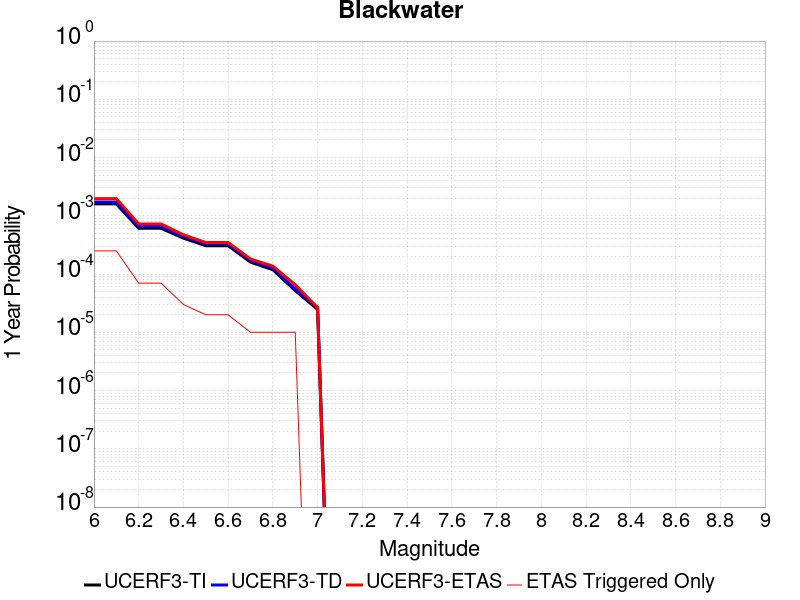 |  |

| Magnitude | 1 wk TI Prob | 1 wk TD Prob | 1 wk ETAS Prob | 1 wk ETAS/TD Gain | 1 wk ETAS Triggered Only | 1 mo TI Prob | 1 mo TD Prob | 1 mo ETAS Prob | 1 mo ETAS/TD Gain | 1 mo ETAS Triggered Only | 1 yr TI Prob | 1 yr TD Prob | 1 yr ETAS Prob | 1 yr ETAS/TD Gain | 1 yr ETAS Triggered Only | 10 yr TI Prob | 10 yr TD Prob | 10 yr ETAS Prob | 10 yr ETAS/TD Gain | 10 yr ETAS Triggered Only |
|-----|-----|-----|-----|-----|-----|-----|-----|-----|-----|-----|-----|-----|-----|-----|-----|-----|-----|-----|-----|-----|
| 6.0 | 3.0708583E-5 | 3.309578E-5 | 1.413466E-4 | 4.2708344 | 1.082544E-4 | 1.3160157E-4 | 1.4183212E-4 | 2.7713092E-4 | 1.9539363 | 1.35318E-4 | 0.0016010714 | 0.001725575 | 0.0019417101 | 1.125254 | 2.165088E-4 | 0.015895851 | 0.017135598 | 0.017414896 | 1.0162994 | 2.841678E-4 |
| 6.1 | 3.0708583E-5 | 3.309578E-5 | 1.413466E-4 | 4.2708344 | 1.082544E-4 | 1.3160157E-4 | 1.4183212E-4 | 2.7713092E-4 | 1.9539363 | 1.35318E-4 | 0.0016010714 | 0.001725575 | 0.0019417101 | 1.125254 | 2.165088E-4 | 0.015895851 | 0.017135598 | 0.017414896 | 1.0162994 | 2.841678E-4 |
| 6.2 | 1.1707779E-5 | 1.2545098E-5 | 3.960836E-5 | 3.1572776 | 2.70636E-5 | 5.017523E-5 | 5.376365E-5 | 8.08258E-5 | 1.503354 | 2.70636E-5 | 6.107122E-4 | 6.543855E-4 | 7.220002E-4 | 1.1033255 | 6.7659E-5 | 0.006090366 | 0.006525557 | 0.0066196616 | 1.0144209 | 9.47226E-5 |
| 6.3 | 1.1707779E-5 | 1.2545098E-5 | 3.960836E-5 | 3.1572776 | 2.70636E-5 | 5.017523E-5 | 5.376365E-5 | 8.08258E-5 | 1.503354 | 2.70636E-5 | 6.107122E-4 | 6.543855E-4 | 7.220002E-4 | 1.1033255 | 6.7659E-5 | 0.006090366 | 0.006525557 | 0.0066196616 | 1.0144209 | 9.47226E-5 |
| 6.4 | 7.929244E-6 | 8.480082E-6 | 8.480082E-6 | 1.0 | 0.0 | 3.3982033E-5 | 3.6342728E-5 | 3.6342728E-5 | 1.0 | 0.0 | 4.136527E-4 | 4.423869E-4 | 4.6943853E-4 | 1.0611492 | 2.70636E-5 | 0.0041288356 | 0.004415468 | 0.004469356 | 1.0122044 | 5.41272E-5 |
| 6.5 | 5.8832115E-6 | 6.2859795E-6 | 6.2859795E-6 | 1.0 | 0.0 | 2.521352E-5 | 2.6939648E-5 | 2.6939648E-5 | 1.0 | 0.0 | 3.0693135E-4 | 3.279434E-4 | 3.4147076E-4 | 1.041249 | 1.35318E-5 | 0.0030650778 | 0.0032748478 | 0.0033018228 | 1.008237 | 2.70636E-5 |
| 6.6 | 5.8832115E-6 | 6.2859795E-6 | 6.2859795E-6 | 1.0 | 0.0 | 2.521352E-5 | 2.6939648E-5 | 2.6939648E-5 | 1.0 | 0.0 | 3.0693135E-4 | 3.279434E-4 | 3.4147076E-4 | 1.041249 | 1.35318E-5 | 0.0030650778 | 0.0032748478 | 0.0033018228 | 1.008237 | 2.70636E-5 |
| 6.7 | 3.0715053E-6 | 3.2814603E-6 | 3.2814603E-6 | 1.0 | 0.0 | 1.3163528E-5 | 1.4063332E-5 | 1.4063332E-5 | 1.0 | 0.0 | 1.6025416E-4 | 1.7120877E-4 | 1.7120877E-4 | 1.0 | 0.0 | 0.0016013865 | 0.0017108832 | 0.001724392 | 1.0078957 | 1.35318E-5 |
| 6.8 | 2.2722281E-6 | 2.4287492E-6 | 2.4287492E-6 | 1.0 | 0.0 | 9.738084E-6 | 1.0408889E-5 | 1.0408889E-5 | 1.0 | 0.0 | 1.1855473E-4 | 1.2672177E-4 | 1.2672177E-4 | 1.0 | 0.0 | 0.001184915 | 0.0012665853 | 0.0012801 | 1.0106702 | 1.35318E-5 |
| 6.9 | 9.952399E-7 | 1.0653469E-6 | 1.0653469E-6 | 1.0 | 0.0 | 4.265307E-6 | 4.565767E-6 | 4.565767E-6 | 1.0 | 0.0 | 5.1928873E-5 | 5.5587312E-5 | 5.5587312E-5 | 1.0 | 0.0 | 5.191674E-4 | 5.5578473E-4 | 5.69309E-4 | 1.0243337 | 1.35318E-5 |
| 7.0 | 4.7385504E-7 | 5.07555E-7 | 5.07555E-7 | 1.0 | 0.0 | 2.0308057E-6 | 2.1752357E-6 | 2.1752357E-6 | 1.0 | 0.0 | 2.4724779E-5 | 2.6483494E-5 | 2.6483494E-5 | 1.0 | 0.0 | 2.4722028E-4 | 2.6483493E-4 | 2.7836315E-4 | 1.0510817 | 1.35318E-5 |

## Gravel Hills-Harper Lk
*[(top)](#table-of-contents)*

| 1 Week | 1 Month | 1 Year | 10 Year |
|-----|-----|-----|-----|
|  | 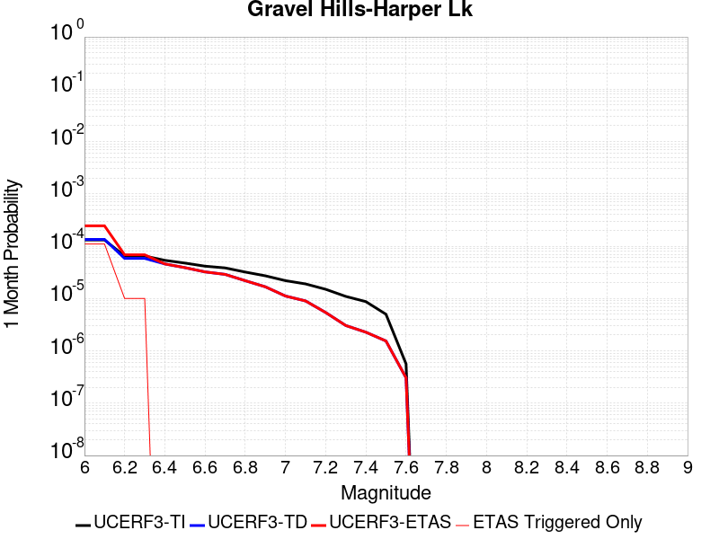 |  |  |

| Magnitude | 1 wk TI Prob | 1 wk TD Prob | 1 wk ETAS Prob | 1 wk ETAS/TD Gain | 1 wk ETAS Triggered Only | 1 mo TI Prob | 1 mo TD Prob | 1 mo ETAS Prob | 1 mo ETAS/TD Gain | 1 mo ETAS Triggered Only | 1 yr TI Prob | 1 yr TD Prob | 1 yr ETAS Prob | 1 yr ETAS/TD Gain | 1 yr ETAS Triggered Only | 10 yr TI Prob | 10 yr TD Prob | 10 yr ETAS Prob | 10 yr ETAS/TD Gain | 10 yr ETAS Triggered Only |
|-----|-----|-----|-----|-----|-----|-----|-----|-----|-----|-----|-----|-----|-----|-----|-----|-----|-----|-----|-----|-----|
| 6.0 | 3.0679566E-5 | 3.1464537E-5 | 1.532469E-4 | 4.8704643 | 1.217862E-4 | 1.3147724E-4 | 1.3484228E-4 | 2.7014202E-4 | 2.0033927 | 1.35318E-4 | 0.0015995599 | 0.001640685 | 0.0018163098 | 1.1070436 | 1.759134E-4 | 0.015880952 | 0.016307283 | 0.016546883 | 1.0146929 | 2.435724E-4 |
| 6.1 | 3.0679566E-5 | 3.1464537E-5 | 1.532469E-4 | 4.8704643 | 1.217862E-4 | 1.3147724E-4 | 1.3484228E-4 | 2.7014202E-4 | 2.0033927 | 1.35318E-4 | 0.0015995599 | 0.001640685 | 0.0018163098 | 1.1070436 | 1.759134E-4 | 0.015880952 | 0.016307283 | 0.016546883 | 1.0146929 | 2.435724E-4 |
| 6.2 | 1.514536E-5 | 1.3635169E-5 | 2.7166785E-5 | 1.9924053 | 1.35318E-5 | 6.490707E-5 | 5.84352E-5 | 7.1966206E-5 | 1.2315558 | 1.35318E-5 | 7.8995706E-4 | 7.112282E-4 | 7.517947E-4 | 1.0570372 | 4.0595398E-5 | 0.007871548 | 0.0070907213 | 0.0071444646 | 1.0075794 | 5.41272E-5 |
| 6.3 | 1.514536E-5 | 1.3635169E-5 | 2.7166785E-5 | 1.9924053 | 1.35318E-5 | 6.490707E-5 | 5.84352E-5 | 7.1966206E-5 | 1.2315558 | 1.35318E-5 | 7.8995706E-4 | 7.112282E-4 | 7.517947E-4 | 1.0570372 | 4.0595398E-5 | 0.007871548 | 0.0070907213 | 0.0071444646 | 1.0075794 | 5.41272E-5 |
| 6.4 | 1.2532521E-5 | 1.0689663E-5 | 1.0689663E-5 | 1.0 | 0.0 | 5.37097E-5 | 4.5812074E-5 | 4.5812074E-5 | 1.0 | 0.0 | 6.537194E-4 | 5.576251E-4 | 5.846736E-4 | 1.0485066 | 2.70636E-5 | 0.0065179965 | 0.005562849 | 0.005589762 | 1.004838 | 2.70636E-5 |
| 6.5 | 1.1094058E-5 | 9.083641E-6 | 9.083641E-6 | 1.0 | 0.0 | 4.7545094E-5 | 3.8929335E-5 | 3.8929335E-5 | 1.0 | 0.0 | 5.787078E-4 | 4.738656E-4 | 5.009164E-4 | 1.0570853 | 2.70636E-5 | 0.0057720304 | 0.004728959 | 0.0047558947 | 1.0056959 | 2.70636E-5 |
| 6.6 | 9.688328E-6 | 7.531677E-6 | 7.531677E-6 | 1.0 | 0.0 | 4.1520743E-5 | 3.2278233E-5 | 3.2278233E-5 | 1.0 | 0.0 | 5.053978E-4 | 3.9291914E-4 | 4.0644564E-4 | 1.0344256 | 1.35318E-5 | 0.0050424994 | 0.003922501 | 0.00393598 | 1.0034362 | 1.35318E-5 |
| 6.7 | 8.974824E-6 | 6.749397E-6 | 6.749397E-6 | 1.0 | 0.0 | 3.8462964E-5 | 2.892568E-5 | 2.892568E-5 | 1.0 | 0.0 | 4.6818596E-4 | 3.5211546E-4 | 3.5211546E-4 | 1.0 | 0.0 | 0.004672008 | 0.0035157963 | 0.0035157963 | 1.0 | 0.0 |
| 6.8 | 7.4780046E-6 | 5.1161815E-6 | 5.1161815E-6 | 1.0 | 0.0 | 3.20482E-5 | 2.1926315E-5 | 2.1926315E-5 | 1.0 | 0.0 | 3.9011694E-4 | 2.669216E-4 | 2.669216E-4 | 1.0 | 0.0 | 0.0038943281 | 0.002666148 | 0.002666148 | 1.0 | 0.0 |
| 6.9 | 6.3409307E-6 | 3.9074876E-6 | 3.9074876E-6 | 1.0 | 0.0 | 2.7175134E-5 | 1.6746273E-5 | 1.6746273E-5 | 1.0 | 0.0 | 3.3080703E-4 | 2.0386779E-4 | 2.0386779E-4 | 1.0 | 0.0 | 0.0033031502 | 0.0020369058 | 0.0020369058 | 1.0 | 0.0 |
| 7.0 | 5.1239335E-6 | 2.60585E-6 | 2.60585E-6 | 1.0 | 0.0 | 2.195953E-5 | 1.1167882E-5 | 1.1167882E-5 | 1.0 | 0.0 | 2.6732447E-4 | 1.3596074E-4 | 1.3596074E-4 | 1.0 | 0.0 | 0.0026700313 | 0.0013588008 | 0.0013588008 | 1.0 | 0.0 |
| 7.1 | 4.438899E-6 | 2.0984673E-6 | 2.0984673E-6 | 1.0 | 0.0 | 1.9023713E-5 | 8.993402E-6 | 8.993402E-6 | 1.0 | 0.0 | 2.315891E-4 | 1.0948939E-4 | 1.0948939E-4 | 1.0 | 0.0 | 0.002313479 | 0.0010943763 | 0.0010943763 | 1.0 | 0.0 |
| 7.2 | 3.50367E-6 | 1.2615677E-6 | 1.2615677E-6 | 1.0 | 0.0 | 1.5015643E-5 | 5.4067077E-6 | 5.4067077E-6 | 1.0 | 0.0 | 1.8280011E-4 | 6.5824766E-5 | 6.5824766E-5 | 1.0 | 0.0 | 0.0018264982 | 6.580609E-4 | 6.580609E-4 | 1.0 | 0.0 |
| 7.3 | 2.561638E-6 | 7.119129E-7 | 7.119129E-7 | 1.0 | 0.0 | 1.0978401E-5 | 3.0510516E-6 | 3.0510516E-6 | 1.0 | 0.0 | 1.3365384E-4 | 3.7145943E-5 | 3.7145943E-5 | 1.0 | 0.0 | 0.0013357349 | 3.7139934E-4 | 3.7139934E-4 | 1.0 | 0.0 |
| 7.4 | 2.0368864E-6 | 5.304814E-7 | 5.304814E-7 | 1.0 | 0.0 | 8.729483E-6 | 2.2734896E-6 | 2.2734896E-6 | 1.0 | 0.0 | 1.06276275E-4 | 2.7679389E-5 | 2.7679389E-5 | 1.0 | 0.0 | 0.0010622547 | 2.7675997E-4 | 2.7675997E-4 | 1.0 | 0.0 |
| 7.5 | 1.1681728E-6 | 3.6030443E-7 | 3.6030443E-7 | 1.0 | 0.0 | 5.0064455E-6 | 1.544161E-6 | 1.544161E-6 | 1.0 | 0.0 | 6.0951766E-5 | 1.8800003E-5 | 1.8800003E-5 | 1.0 | 0.0 | 6.093505E-4 | 1.879846E-4 | 1.879846E-4 | 1.0 | 0.0 |
| 7.6 | 1.3154387E-7 | 7.1197206E-8 | 7.1197206E-8 | 1.0 | 0.0 | 5.6375933E-7 | 3.0513087E-7 | 3.0513087E-7 | 1.0 | 0.0 | 6.863748E-6 | 3.7149634E-6 | 3.7149634E-6 | 1.0 | 0.0 | 6.863536E-5 | 3.714917E-5 | 3.714917E-5 | 1.0 | 0.0 |

## Paradise
*[(top)](#table-of-contents)*

| 1 Week | 1 Month | 1 Year | 10 Year |
|-----|-----|-----|-----|
|  |  |  |  |

| Magnitude | 1 wk TI Prob | 1 wk TD Prob | 1 wk ETAS Prob | 1 wk ETAS/TD Gain | 1 wk ETAS Triggered Only | 1 mo TI Prob | 1 mo TD Prob | 1 mo ETAS Prob | 1 mo ETAS/TD Gain | 1 mo ETAS Triggered Only | 1 yr TI Prob | 1 yr TD Prob | 1 yr ETAS Prob | 1 yr ETAS/TD Gain | 1 yr ETAS Triggered Only | 10 yr TI Prob | 10 yr TD Prob | 10 yr ETAS Prob | 10 yr ETAS/TD Gain | 10 yr ETAS Triggered Only |
|-----|-----|-----|-----|-----|-----|-----|-----|-----|-----|-----|-----|-----|-----|-----|-----|-----|-----|-----|-----|-----|
| 6.0 | 1.4851273E-5 | 1.669466E-5 | 7.0820955E-5 | 4.2421327 | 5.41272E-5 | 6.364676E-5 | 7.154671E-5 | 1.2567003E-4 | 1.7564754 | 5.41272E-5 | 7.7462377E-4 | 8.707567E-4 | 0.0010059568 | 1.1552675 | 1.35318E-4 | 0.0077192914 | 0.008675828 | 0.0088368 | 1.0185542 | 1.6238159E-4 |
| 6.1 | 1.4851273E-5 | 1.669466E-5 | 7.0820955E-5 | 4.2421327 | 5.41272E-5 | 6.364676E-5 | 7.154671E-5 | 1.2567003E-4 | 1.7564754 | 5.41272E-5 | 7.7462377E-4 | 8.707567E-4 | 0.0010059568 | 1.1552675 | 1.35318E-4 | 0.0077192914 | 0.008675828 | 0.0088368 | 1.0185542 | 1.6238159E-4 |
| 6.2 | 1.4851273E-5 | 1.669466E-5 | 7.0820955E-5 | 4.2421327 | 5.41272E-5 | 6.364676E-5 | 7.154671E-5 | 1.2567003E-4 | 1.7564754 | 5.41272E-5 | 7.7462377E-4 | 8.707567E-4 | 0.0010059568 | 1.1552675 | 1.35318E-4 | 0.0077192914 | 0.008675828 | 0.0088368 | 1.0185542 | 1.6238159E-4 |
| 6.3 | 1.0426831E-5 | 1.1888599E-5 | 3.8951875E-5 | 3.276406 | 2.70636E-5 | 4.4685654E-5 | 5.0950177E-5 | 7.8012396E-5 | 1.5311507 | 2.70636E-5 | 5.43912E-4 | 6.201478E-4 | 7.148116E-4 | 1.1526473 | 9.47226E-5 | 0.0054258266 | 0.0061847805 | 0.006278917 | 1.0152208 | 9.47226E-5 |
| 6.4 | 1.0426831E-5 | 1.1888599E-5 | 3.8951875E-5 | 3.276406 | 2.70636E-5 | 4.4685654E-5 | 5.0950177E-5 | 7.8012396E-5 | 1.5311507 | 2.70636E-5 | 5.43912E-4 | 6.201478E-4 | 7.148116E-4 | 1.1526473 | 9.47226E-5 | 0.0054258266 | 0.0061847805 | 0.006278917 | 1.0152208 | 9.47226E-5 |
| 6.5 | 9.25027E-6 | 1.061994E-5 | 2.4151597E-5 | 2.2741742 | 1.35318E-5 | 3.964341E-5 | 4.5513265E-5 | 5.904445E-5 | 1.297302 | 1.35318E-5 | 4.8255164E-4 | 5.5398804E-4 | 6.351338E-4 | 1.1464758 | 8.1190796E-5 | 0.0048150513 | 0.0055265697 | 0.0056073116 | 1.0146098 | 8.1190796E-5 |
| 6.6 | 7.904275E-6 | 9.159509E-6 | 9.159509E-6 | 1.0 | 0.0 | 3.3875025E-5 | 3.925447E-5 | 3.925447E-5 | 1.0 | 0.0 | 4.1235037E-4 | 4.7782232E-4 | 5.183983E-4 | 1.0849186 | 4.0595398E-5 | 0.0041158604 | 0.0047683464 | 0.004808748 | 1.0084729 | 4.0595398E-5 |
| 6.7 | 7.2061953E-6 | 8.407234E-6 | 8.407234E-6 | 1.0 | 0.0 | 3.088333E-5 | 3.6030528E-5 | 3.6030528E-5 | 1.0 | 0.0 | 3.7593965E-4 | 4.3858704E-4 | 4.7916465E-4 | 1.0925189 | 4.0595398E-5 | 0.003753043 | 0.0043775835 | 0.0044180015 | 1.0092329 | 4.0595398E-5 |
| 6.8 | 6.6948724E-6 | 7.842153E-6 | 7.842153E-6 | 1.0 | 0.0 | 2.8691995E-5 | 3.3608812E-5 | 3.3608812E-5 | 1.0 | 0.0 | 3.4926904E-4 | 4.0911406E-4 | 4.4969286E-4 | 1.099187 | 4.0595398E-5 | 0.003487206 | 0.0040839664 | 0.004124396 | 1.0098996 | 4.0595398E-5 |
| 6.9 | 6.0421025E-6 | 7.1306094E-6 | 7.1306094E-6 | 1.0 | 0.0 | 2.5894467E-5 | 3.0559415E-5 | 3.0559415E-5 | 1.0 | 0.0 | 3.1521954E-4 | 3.7200077E-4 | 3.990543E-4 | 1.0727243 | 2.70636E-5 | 0.0031477278 | 0.0037141186 | 0.0037410818 | 1.0072596 | 2.70636E-5 |
| 7.0 | 4.134091E-6 | 5.080301E-6 | 5.080301E-6 | 1.0 | 0.0 | 1.7717413E-5 | 2.1772545E-5 | 2.1772545E-5 | 1.0 | 0.0 | 2.1568815E-4 | 2.6505004E-4 | 2.6505004E-4 | 1.0 | 0.0 | 0.0021547892 | 0.002647492 | 0.002647492 | 1.0 | 0.0 |
| 7.1 | 3.7674888E-6 | 4.6318623E-6 | 4.6318623E-6 | 1.0 | 0.0 | 1.6146281E-5 | 1.9850695E-5 | 1.9850695E-5 | 1.0 | 0.0 | 1.9656324E-4 | 2.4165693E-4 | 2.4165693E-4 | 1.0 | 0.0 | 0.0019638946 | 0.0024140922 | 0.0024140922 | 1.0 | 0.0 |
| 7.2 | 3.4065345E-6 | 4.156717E-6 | 4.156717E-6 | 1.0 | 0.0 | 1.4599351E-5 | 1.7814387E-5 | 1.7814387E-5 | 1.0 | 0.0 | 1.777326E-4 | 2.1687007E-4 | 2.1687007E-4 | 1.0 | 0.0 | 0.0017759053 | 0.0021667324 | 0.0021667324 | 1.0 | 0.0 |
| 7.3 | 2.9934936E-6 | 3.6293113E-6 | 3.6293113E-6 | 1.0 | 0.0 | 1.2829195E-5 | 1.5554107E-5 | 1.5554107E-5 | 1.0 | 0.0 | 1.5618425E-4 | 1.8935627E-4 | 1.8935627E-4 | 1.0 | 0.0 | 0.0015607453 | 0.0018920946 | 0.0018920946 | 1.0 | 0.0 |
| 7.4 | 2.4049796E-6 | 2.8889801E-6 | 2.8889801E-6 | 1.0 | 0.0 | 1.0307015E-5 | 1.2381293E-5 | 1.2381293E-5 | 1.0 | 0.0 | 1.2548068E-4 | 1.5073326E-4 | 1.5073326E-4 | 1.0 | 0.0 | 0.0012540985 | 0.0015064516 | 0.0015064516 | 1.0 | 0.0 |
| 7.5 | 1.2710091E-6 | 1.5134664E-6 | 1.5134664E-6 | 1.0 | 0.0 | 5.44717E-6 | 6.486275E-6 | 6.486275E-6 | 1.0 | 0.0 | 6.631728E-5 | 7.896879E-5 | 7.896879E-5 | 1.0 | 0.0 | 6.6297496E-4 | 7.8952993E-4 | 7.8952993E-4 | 1.0 | 0.0 |
| 7.6 | 2.21172E-7 | 2.603958E-7 | 2.603958E-7 | 1.0 | 0.0 | 9.478797E-7 | 1.1159817E-6 | 1.1159817E-6 | 1.0 | 0.0 | 1.1540374E-5 | 1.3587022E-5 | 1.3587022E-5 | 1.0 | 0.0 | 1.1539775E-4 | 1.3586473E-4 | 1.3586473E-4 | 1.0 | 0.0 |

## McLean Lake
*[(top)](#table-of-contents)*

| 1 Week | 1 Month | 1 Year | 10 Year |
|-----|-----|-----|-----|
|  |  |  |  |

| Magnitude | 1 wk TI Prob | 1 wk TD Prob | 1 wk ETAS Prob | 1 wk ETAS/TD Gain | 1 wk ETAS Triggered Only | 1 mo TI Prob | 1 mo TD Prob | 1 mo ETAS Prob | 1 mo ETAS/TD Gain | 1 mo ETAS Triggered Only | 1 yr TI Prob | 1 yr TD Prob | 1 yr ETAS Prob | 1 yr ETAS/TD Gain | 1 yr ETAS Triggered Only | 10 yr TI Prob | 10 yr TD Prob | 10 yr ETAS Prob | 10 yr ETAS/TD Gain | 10 yr ETAS Triggered Only |
|-----|-----|-----|-----|-----|-----|-----|-----|-----|-----|-----|-----|-----|-----|-----|-----|-----|-----|-----|-----|-----|
| 6.0 | 1.7360222E-5 | 1.8501594E-5 | 7.2627794E-5 | 3.9254882 | 5.41272E-5 | 7.439883E-5 | 7.929042E-5 | 1.3341333E-4 | 1.6825908 | 5.41272E-5 | 9.0542925E-4 | 9.6498185E-4 | 0.0010866505 | 1.1260839 | 1.217862E-4 | 0.009017491 | 0.009612758 | 0.0097735785 | 1.01673 | 1.6238159E-4 |
| 6.1 | 9.062689E-6 | 9.592179E-6 | 3.6655518E-5 | 3.8213966 | 2.70636E-5 | 3.8839516E-5 | 4.110874E-5 | 6.8171226E-5 | 1.6583147 | 2.70636E-5 | 4.727685E-4 | 5.0039287E-4 | 5.68018E-4 | 1.1351441 | 6.7659E-5 | 0.0047176396 | 0.004993544 | 0.0050877933 | 1.0188743 | 9.47226E-5 |
| 6.2 | 9.062689E-6 | 9.592179E-6 | 3.6655518E-5 | 3.8213966 | 2.70636E-5 | 3.8839516E-5 | 4.110874E-5 | 6.8171226E-5 | 1.6583147 | 2.70636E-5 | 4.727685E-4 | 5.0039287E-4 | 5.68018E-4 | 1.1351441 | 6.7659E-5 | 0.0047176396 | 0.004993544 | 0.0050877933 | 1.0188743 | 9.47226E-5 |
| 6.3 | 7.2575485E-6 | 7.667698E-6 | 3.473109E-5 | 4.529533 | 2.70636E-5 | 3.110341E-5 | 3.286119E-5 | 5.99239E-5 | 1.8235463 | 2.70636E-5 | 3.786182E-4 | 4.0001865E-4 | 4.5412418E-4 | 1.1352576 | 5.41272E-5 | 0.0037797375 | 0.003993691 | 0.004074557 | 1.0202485 | 8.1190796E-5 |
| 6.4 | 7.2575485E-6 | 7.667698E-6 | 3.473109E-5 | 4.529533 | 2.70636E-5 | 3.110341E-5 | 3.286119E-5 | 5.99239E-5 | 1.8235463 | 2.70636E-5 | 3.786182E-4 | 4.0001865E-4 | 4.5412418E-4 | 1.1352576 | 5.41272E-5 | 0.0037797375 | 0.003993691 | 0.004074557 | 1.0202485 | 8.1190796E-5 |
| 6.5 | 6.06582E-6 | 6.4038677E-6 | 3.3467295E-5 | 5.2261066 | 2.70636E-5 | 2.5996113E-5 | 2.7444894E-5 | 5.4507753E-5 | 1.9860798 | 2.70636E-5 | 3.164567E-4 | 3.3409684E-4 | 3.7467867E-4 | 1.1214672 | 4.0595398E-5 | 0.0031600643 | 0.0033365842 | 0.0034040175 | 1.0202103 | 6.7659E-5 |
| 6.6 | 5.598744E-6 | 5.9102535E-6 | 1.9441974E-5 | 3.289533 | 1.35318E-5 | 2.3994397E-5 | 2.5329447E-5 | 3.8860904E-5 | 1.5342184 | 1.35318E-5 | 2.9209262E-4 | 3.0834877E-4 | 3.3540404E-4 | 1.0877423 | 2.70636E-5 | 0.0029170897 | 0.0030798386 | 0.003133799 | 1.0175205 | 5.41272E-5 |
| 6.7 | 5.246996E-6 | 5.539154E-6 | 1.9070878E-5 | 3.4429228 | 1.35318E-5 | 2.2486933E-5 | 2.373905E-5 | 3.727053E-5 | 1.5700092 | 1.35318E-5 | 2.73744E-4 | 2.8899097E-4 | 3.1604673E-4 | 1.0936215 | 2.70636E-5 | 0.0027340704 | 0.0028867754 | 0.0029407463 | 1.018696 | 5.41272E-5 |
| 6.8 | 4.02324E-6 | 4.2468982E-6 | 4.2468982E-6 | 1.0 | 0.0 | 1.7242342E-5 | 1.8200899E-5 | 1.8200899E-5 | 1.0 | 0.0 | 2.099053E-4 | 2.2157936E-4 | 2.3510816E-4 | 1.0610563 | 1.35318E-5 | 0.0020970714 | 0.0022141687 | 0.0022411724 | 1.0121958 | 2.70636E-5 |
| 6.9 | 6.835972E-7 | 7.13992E-7 | 7.13992E-7 | 1.0 | 0.0 | 2.9296991E-6 | 3.0599638E-6 | 3.0599638E-6 | 1.0 | 0.0 | 3.56685E-5 | 3.725474E-5 | 3.725474E-5 | 1.0 | 0.0 | 3.5662777E-4 | 3.7251622E-4 | 3.7251622E-4 | 1.0 | 0.0 |

## Death Valley (So)
*[(top)](#table-of-contents)*

| 1 Week | 1 Month | 1 Year | 10 Year |
|-----|-----|-----|-----|
|  |  |  |  |

| Magnitude | 1 wk TI Prob | 1 wk TD Prob | 1 wk ETAS Prob | 1 wk ETAS/TD Gain | 1 wk ETAS Triggered Only | 1 mo TI Prob | 1 mo TD Prob | 1 mo ETAS Prob | 1 mo ETAS/TD Gain | 1 mo ETAS Triggered Only | 1 yr TI Prob | 1 yr TD Prob | 1 yr ETAS Prob | 1 yr ETAS/TD Gain | 1 yr ETAS Triggered Only | 10 yr TI Prob | 10 yr TD Prob | 10 yr ETAS Prob | 10 yr ETAS/TD Gain | 10 yr ETAS Triggered Only |
|-----|-----|-----|-----|-----|-----|-----|-----|-----|-----|-----|-----|-----|-----|-----|-----|-----|-----|-----|-----|-----|
| 6.0 | 2.0684236E-5 | 2.5617646E-5 | 9.327491E-5 | 3.6410415 | 6.7659E-5 | 8.864371E-5 | 1.0978539E-4 | 2.0449758E-4 | 1.8627031 | 9.47226E-5 | 0.0010787029 | 0.0013358344 | 0.0014439442 | 1.0809305 | 1.082544E-4 | 0.010734817 | 0.0132813305 | 0.013441555 | 1.012064 | 1.6238159E-4 |
| 6.1 | 2.0684236E-5 | 2.5617646E-5 | 9.327491E-5 | 3.6410415 | 6.7659E-5 | 8.864371E-5 | 1.0978539E-4 | 2.0449758E-4 | 1.8627031 | 9.47226E-5 | 0.0010787029 | 0.0013358344 | 0.0014439442 | 1.0809305 | 1.082544E-4 | 0.010734817 | 0.0132813305 | 0.013441555 | 1.012064 | 1.6238159E-4 |
| 6.2 | 2.0684236E-5 | 2.5617646E-5 | 9.327491E-5 | 3.6410415 | 6.7659E-5 | 8.864371E-5 | 1.0978539E-4 | 2.0449758E-4 | 1.8627031 | 9.47226E-5 | 0.0010787029 | 0.0013358344 | 0.0014439442 | 1.0809305 | 1.082544E-4 | 0.010734817 | 0.0132813305 | 0.013441555 | 1.012064 | 1.6238159E-4 |
| 6.3 | 2.0240292E-5 | 2.5117732E-5 | 9.277503E-5 | 3.693607 | 6.7659E-5 | 8.6741224E-5 | 1.0764308E-4 | 1.8882514E-4 | 1.7541782 | 8.1190796E-5 | 0.0010555626 | 0.0013097833 | 0.0014043818 | 1.0722246 | 9.47226E-5 | 0.010505628 | 0.013023891 | 0.013170801 | 1.0112802 | 1.488498E-4 |
| 6.4 | 2.0240292E-5 | 2.5117732E-5 | 9.277503E-5 | 3.693607 | 6.7659E-5 | 8.6741224E-5 | 1.0764308E-4 | 1.8882514E-4 | 1.7541782 | 8.1190796E-5 | 0.0010555626 | 0.0013097833 | 0.0014043818 | 1.0722246 | 9.47226E-5 | 0.010505628 | 0.013023891 | 0.013170801 | 1.0112802 | 1.488498E-4 |
| 6.5 | 1.9962767E-5 | 2.4806986E-5 | 9.246431E-5 | 3.7273495 | 6.7659E-5 | 8.55519E-5 | 1.0631142E-4 | 1.8749358E-4 | 1.763626 | 8.1190796E-5 | 0.0010410968 | 0.0012935897 | 0.0013881897 | 1.0731299 | 9.47226E-5 | 0.010362327 | 0.012863837 | 0.013010772 | 1.0114223 | 1.488498E-4 |
| 6.6 | 1.8937297E-5 | 2.3310844E-5 | 9.0968264E-5 | 3.9024012 | 6.7659E-5 | 8.115732E-5 | 9.989987E-5 | 1.8108256E-4 | 1.8126405 | 8.1190796E-5 | 9.876423E-4 | 0.0012156168 | 0.0013102243 | 1.0778267 | 9.47226E-5 | 0.009832645 | 0.012092726 | 0.012239776 | 1.0121602 | 1.488498E-4 |
| 6.7 | 1.8621096E-5 | 2.2911487E-5 | 9.056894E-5 | 3.9529924 | 6.7659E-5 | 7.980225E-5 | 9.818847E-5 | 1.793713E-4 | 1.8268061 | 8.1190796E-5 | 9.711593E-4 | 0.0011948035 | 0.001289413 | 1.079184 | 9.47226E-5 | 0.009669261 | 0.011886842 | 0.012033923 | 1.0123733 | 1.488498E-4 |
| 6.8 | 1.7830353E-5 | 2.1805576E-5 | 8.94631E-5 | 4.1027627 | 6.7659E-5 | 7.641356E-5 | 9.34492E-5 | 1.7463241E-4 | 1.8687416 | 8.1190796E-5 | 9.29938E-4 | 0.0011371642 | 0.0012317791 | 1.0832025 | 9.47226E-5 | 0.009260561 | 0.011316297 | 0.011463462 | 1.0130048 | 1.488498E-4 |
| 6.9 | 1.3135183E-5 | 1.5303862E-5 | 8.296182E-5 | 5.4209733 | 6.7659E-5 | 5.6292425E-5 | 6.558636E-5 | 1.4677184E-4 | 2.2378407 | 8.1190796E-5 | 6.8514474E-4 | 7.982279E-4 | 8.928749E-4 | 1.1185714 | 9.47226E-5 | 0.006830362 | 0.007954616 | 0.008088857 | 1.016876 | 1.35318E-4 |
| 7.0 | 1.1507512E-5 | 1.315415E-5 | 6.7280635E-5 | 5.114784 | 5.41272E-5 | 4.9316975E-5 | 5.6373745E-5 | 1.2402893E-4 | 2.2001188 | 6.7659E-5 | 6.002687E-4 | 6.8614E-4 | 7.6727505E-4 | 1.1182486 | 8.1190796E-5 | 0.0059864987 | 0.006840916 | 0.006961869 | 1.0176809 | 1.217862E-4 |
| 7.1 | 9.715903E-6 | 1.0865243E-5 | 5.14602E-5 | 4.736222 | 4.0595398E-5 | 4.1638916E-5 | 4.656452E-5 | 1.006892E-4 | 2.1623588 | 5.41272E-5 | 5.068359E-4 | 5.667798E-4 | 6.208763E-4 | 1.0954454 | 5.41272E-5 | 0.0050568148 | 0.0056537963 | 0.005747983 | 1.0166591 | 9.47226E-5 |
| 7.2 | 9.233269E-6 | 1.0286278E-5 | 5.088126E-5 | 4.946518 | 4.0595398E-5 | 3.9570554E-5 | 4.4083325E-5 | 8.467693E-5 | 1.9208381 | 4.0595398E-5 | 4.81665E-4 | 5.3658657E-4 | 5.7716016E-4 | 1.0756143 | 4.0595398E-5 | 0.0048062233 | 0.005353341 | 0.005434097 | 1.0150852 | 8.1190796E-5 |
| 7.3 | 8.8041315E-6 | 9.808134E-6 | 5.0403134E-5 | 5.1389117 | 4.0595398E-5 | 3.7731446E-5 | 4.2034208E-5 | 8.26279E-5 | 1.96573 | 4.0595398E-5 | 4.592835E-4 | 5.116505E-4 | 5.522251E-4 | 1.0793015 | 4.0595398E-5 | 0.0045833546 | 0.005105152 | 0.0051590023 | 1.0105484 | 5.41272E-5 |
| 7.4 | 8.708749E-6 | 9.707145E-6 | 5.030215E-5 | 5.1819715 | 4.0595398E-5 | 3.7322676E-5 | 4.160141E-5 | 8.219512E-5 | 1.9757773 | 4.0595398E-5 | 4.5430884E-4 | 5.0638366E-4 | 5.4695853E-4 | 1.0801266 | 4.0595398E-5 | 0.004533812 | 0.0050527244 | 0.0051065776 | 1.0106584 | 5.41272E-5 |
| 7.5 | 8.612678E-6 | 9.604788E-6 | 5.0199797E-5 | 5.226539 | 4.0595398E-5 | 3.6910955E-5 | 4.116275E-5 | 8.175648E-5 | 1.9861763 | 4.0595398E-5 | 4.492982E-4 | 5.0104543E-4 | 5.416205E-4 | 1.0809808 | 4.0595398E-5 | 0.004483909 | 0.004999583 | 0.00505344 | 1.0107722 | 5.41272E-5 |
| 7.6 | 8.319024E-6 | 9.283887E-6 | 4.987891E-5 | 5.372632 | 4.0595398E-5 | 3.5652476E-5 | 3.9787505E-5 | 8.038129E-5 | 2.0202646 | 4.0595398E-5 | 4.3398244E-4 | 4.8430942E-4 | 5.2488514E-4 | 1.0837806 | 4.0595398E-5 | 0.0043313587 | 0.0048329635 | 0.004886829 | 1.0111455 | 5.41272E-5 |
| 7.7 | 7.4718328E-6 | 8.345144E-6 | 4.8940205E-5 | 5.864513 | 4.0595398E-5 | 3.2021748E-5 | 3.5764435E-5 | 7.635838E-5 | 2.1350367 | 4.0595398E-5 | 3.8979502E-4 | 4.3534904E-4 | 4.7592676E-4 | 1.0932074 | 4.0595398E-5 | 0.00389112 | 0.004345367 | 0.004385786 | 1.0093017 | 4.0595398E-5 |
| 7.8 | 3.4586725E-7 | 3.648256E-7 | 3.648256E-7 | 1.0 | 0.0 | 1.4822873E-6 | 1.5635374E-6 | 1.5635374E-6 | 1.0 | 0.0 | 1.80467E-5 | 1.9035906E-5 | 1.9035906E-5 | 1.0 | 0.0 | 1.8045233E-4 | 1.903432E-4 | 1.903432E-4 | 1.0 | 0.0 |
| 7.9 | 2.5591178E-9 | 2.6696687E-9 | 2.6696687E-9 | 1.0 | 0.0 | 1.0967647E-8 | 1.1441437E-8 | 1.1441437E-8 | 1.0 | 0.0 | 1.335311E-7 | 1.392995E-7 | 1.392995E-7 | 1.0 | 0.0 | 1.3353102E-6 | 1.3929949E-6 | 1.3929949E-6 | 1.0 | 0.0 |

## Death Valley (No)
*[(top)](#table-of-contents)*

| 1 Week | 1 Month | 1 Year | 10 Year |
|-----|-----|-----|-----|
|  |  |  |  |

| Magnitude | 1 wk TI Prob | 1 wk TD Prob | 1 wk ETAS Prob | 1 wk ETAS/TD Gain | 1 wk ETAS Triggered Only | 1 mo TI Prob | 1 mo TD Prob | 1 mo ETAS Prob | 1 mo ETAS/TD Gain | 1 mo ETAS Triggered Only | 1 yr TI Prob | 1 yr TD Prob | 1 yr ETAS Prob | 1 yr ETAS/TD Gain | 1 yr ETAS Triggered Only | 10 yr TI Prob | 10 yr TD Prob | 10 yr ETAS Prob | 10 yr ETAS/TD Gain | 10 yr ETAS Triggered Only |
|-----|-----|-----|-----|-----|-----|-----|-----|-----|-----|-----|-----|-----|-----|-----|-----|-----|-----|-----|-----|-----|
| 6.0 | 2.0074807E-5 | 2.2500011E-5 | 1.0368898E-4 | 4.608397 | 8.1190796E-5 | 8.603206E-5 | 9.6425094E-5 | 2.0466905E-4 | 2.1225705 | 1.082544E-4 | 0.001046937 | 0.0011733507 | 0.0012814781 | 1.0921526 | 1.082544E-4 | 0.010420183 | 0.011672469 | 0.0118195815 | 1.0126034 | 1.488498E-4 |
| 6.1 | 2.0074807E-5 | 2.2500011E-5 | 1.0368898E-4 | 4.608397 | 8.1190796E-5 | 8.603206E-5 | 9.6425094E-5 | 2.0466905E-4 | 2.1225705 | 1.082544E-4 | 0.001046937 | 0.0011733507 | 0.0012814781 | 1.0921526 | 1.082544E-4 | 0.010420183 | 0.011672469 | 0.0118195815 | 1.0126034 | 1.488498E-4 |
| 6.2 | 2.0074807E-5 | 2.2500011E-5 | 1.0368898E-4 | 4.608397 | 8.1190796E-5 | 8.603206E-5 | 9.6425094E-5 | 2.0466905E-4 | 2.1225705 | 1.082544E-4 | 0.001046937 | 0.0011733507 | 0.0012814781 | 1.0921526 | 1.082544E-4 | 0.010420183 | 0.011672469 | 0.0118195815 | 1.0126034 | 1.488498E-4 |
| 6.3 | 1.9050609E-5 | 2.1336878E-5 | 8.8994435E-5 | 4.170921 | 6.7659E-5 | 8.164292E-5 | 9.14406E-5 | 1.8615453E-4 | 2.0357974 | 9.47226E-5 | 9.935491E-4 | 0.0011127274 | 0.0012073447 | 1.0850317 | 9.47226E-5 | 0.009891188 | 0.011072383 | 0.011206203 | 1.0120859 | 1.35318E-4 |
| 6.4 | 1.9050609E-5 | 2.1336878E-5 | 8.8994435E-5 | 4.170921 | 6.7659E-5 | 8.164292E-5 | 9.14406E-5 | 1.8615453E-4 | 2.0357974 | 9.47226E-5 | 9.935491E-4 | 0.0011127274 | 0.0012073447 | 1.0850317 | 9.47226E-5 | 0.009891188 | 0.011072383 | 0.011206203 | 1.0120859 | 1.35318E-4 |
| 6.5 | 1.8367004E-5 | 2.0560943E-5 | 8.821855E-5 | 4.290589 | 6.7659E-5 | 7.8713354E-5 | 8.811538E-5 | 1.8282964E-4 | 2.074889 | 9.47226E-5 | 9.5791375E-4 | 0.0010722834 | 0.0011669045 | 1.0882425 | 9.47226E-5 | 0.009537951 | 0.010671882 | 0.010792368 | 1.0112901 | 1.217862E-4 |
| 6.6 | 1.779439E-5 | 1.9910865E-5 | 8.7568515E-5 | 4.398027 | 6.7659E-5 | 7.625944E-5 | 8.532952E-5 | 1.8004404E-4 | 2.1099854 | 9.47226E-5 | 9.280632E-4 | 0.0010383982 | 0.0011330225 | 1.0911252 | 9.47226E-5 | 0.009241969 | 0.01033622 | 0.010456747 | 1.0116607 | 1.217862E-4 |
| 6.7 | 1.7025437E-5 | 1.9043366E-5 | 8.6701075E-5 | 4.552823 | 6.7659E-5 | 7.296412E-5 | 8.16119E-5 | 1.7632676E-4 | 2.160552 | 9.47226E-5 | 8.87976E-4 | 9.931781E-4 | 0.0010878067 | 1.0952785 | 9.47226E-5 | 0.008844362 | 0.009888114 | 0.010008696 | 1.0121946 | 1.217862E-4 |
| 6.8 | 1.6545107E-5 | 1.8512486E-5 | 8.6170236E-5 | 4.654709 | 6.7659E-5 | 7.090568E-5 | 7.933685E-5 | 1.605212E-4 | 2.0232868 | 8.1190796E-5 | 8.629347E-4 | 9.655042E-4 | 0.0010466166 | 1.0840104 | 8.1190796E-5 | 0.008595915 | 0.009613798 | 0.009721012 | 1.011152 | 1.082544E-4 |
| 6.9 | 1.615478E-5 | 1.8087536E-5 | 8.574531E-5 | 4.7405744 | 6.7659E-5 | 6.9232934E-5 | 7.7515746E-5 | 1.5870025E-4 | 2.0473292 | 8.1190796E-5 | 8.4258494E-4 | 9.4335165E-4 | 0.0010244659 | 1.0859851 | 8.1190796E-5 | 0.008393973 | 0.009394166 | 0.009487999 | 1.0099884 | 9.47226E-5 |
| 7.0 | 1.5894311E-5 | 1.7805492E-5 | 8.546329E-5 | 4.799827 | 6.7659E-5 | 6.81167E-5 | 7.630706E-5 | 1.5749165E-4 | 2.06392 | 8.1190796E-5 | 8.2900526E-4 | 9.286485E-4 | 0.0010097639 | 1.0873477 | 8.1190796E-5 | 0.008259195 | 0.0092483675 | 0.009342214 | 1.0101473 | 9.47226E-5 |
| 7.1 | 1.5602263E-5 | 1.7483448E-5 | 8.514126E-5 | 4.8698215 | 6.7659E-5 | 6.6865134E-5 | 7.492694E-5 | 1.5611165E-4 | 2.0835183 | 8.1190796E-5 | 8.137789E-4 | 9.118598E-4 | 9.929766E-4 | 1.0889575 | 8.1190796E-5 | 0.008108052 | 0.009081865 | 0.009175727 | 1.0103351 | 9.47226E-5 |
| 7.2 | 1.5323829E-5 | 1.7170574E-5 | 8.482841E-5 | 4.940336 | 6.7659E-5 | 6.56719E-5 | 7.358614E-5 | 1.5477095E-4 | 2.1032624 | 8.1190796E-5 | 7.99262E-4 | 8.95549E-4 | 9.766672E-4 | 1.0905792 | 8.1190796E-5 | 0.007963934 | 0.008920078 | 0.0090139555 | 1.0105243 | 9.47226E-5 |
| 7.3 | 1.4556212E-5 | 1.6302403E-5 | 8.39603E-5 | 5.1501794 | 6.7659E-5 | 6.238227E-5 | 6.98656E-5 | 1.5105073E-4 | 2.1620185 | 8.1190796E-5 | 7.592395E-4 | 8.502876E-4 | 9.3140936E-4 | 1.0954051 | 8.1190796E-5 | 0.0075665074 | 0.008470987 | 0.008564907 | 1.0110873 | 9.47226E-5 |
| 7.4 | 1.411725E-5 | 1.580791E-5 | 8.3465835E-5 | 5.280005 | 6.7659E-5 | 6.0501097E-5 | 6.7746456E-5 | 1.4893175E-4 | 2.1983697 | 8.1190796E-5 | 7.363519E-4 | 8.245068E-4 | 9.0563064E-4 | 1.0983908 | 8.1190796E-5 | 0.0073391674 | 0.008215112 | 0.008309056 | 1.0114355 | 9.47226E-5 |
| 7.5 | 1.3503312E-5 | 1.512624E-5 | 8.2784216E-5 | 5.4728875 | 6.7659E-5 | 5.7870053E-5 | 6.4825166E-5 | 1.460107E-4 | 2.2523768 | 8.1190796E-5 | 7.043401E-4 | 7.889664E-4 | 8.700932E-4 | 1.1028266 | 8.1190796E-5 | 0.007021119 | 0.007862279 | 0.007956257 | 1.011953 | 9.47226E-5 |
| 7.6 | 1.1279839E-5 | 1.2626287E-5 | 8.028443E-5 | 6.358515 | 6.7659E-5 | 4.834127E-5 | 5.4111566E-5 | 1.3529797E-4 | 2.5003521 | 8.1190796E-5 | 5.88396E-4 | 6.5861444E-4 | 7.397518E-4 | 1.123194 | 8.1190796E-5 | 0.005868405 | 0.006567178 | 0.006661278 | 1.014329 | 9.47226E-5 |
| 7.7 | 9.189108E-6 | 1.02833255E-5 | 7.794163E-5 | 7.5794187 | 6.7659E-5 | 3.93813E-5 | 4.407068E-5 | 1.11726695E-4 | 2.5351708 | 6.7659E-5 | 4.7936183E-4 | 5.364335E-4 | 6.040562E-4 | 1.1260598 | 6.7659E-5 | 0.004783291 | 0.005351897 | 0.0054191938 | 1.0125744 | 6.7659E-5 |
| 7.8 | 3.4586725E-7 | 3.648256E-7 | 3.648256E-7 | 1.0 | 0.0 | 1.4822873E-6 | 1.5635374E-6 | 1.5635374E-6 | 1.0 | 0.0 | 1.80467E-5 | 1.9035906E-5 | 1.9035906E-5 | 1.0 | 0.0 | 1.8045233E-4 | 1.903432E-4 | 1.903432E-4 | 1.0 | 0.0 |
| 7.9 | 2.5591178E-9 | 2.6696687E-9 | 2.6696687E-9 | 1.0 | 0.0 | 1.0967647E-8 | 1.1441437E-8 | 1.1441437E-8 | 1.0 | 0.0 | 1.335311E-7 | 1.392995E-7 | 1.392995E-7 | 1.0 | 0.0 | 1.3353102E-6 | 1.3929949E-6 | 1.3929949E-6 | 1.0 | 0.0 |

## Death Valley (Black Mtns Frontal)
*[(top)](#table-of-contents)*

| 1 Week | 1 Month | 1 Year | 10 Year |
|-----|-----|-----|-----|
|  |  |  |  |

| Magnitude | 1 wk TI Prob | 1 wk TD Prob | 1 wk ETAS Prob | 1 wk ETAS/TD Gain | 1 wk ETAS Triggered Only | 1 mo TI Prob | 1 mo TD Prob | 1 mo ETAS Prob | 1 mo ETAS/TD Gain | 1 mo ETAS Triggered Only | 1 yr TI Prob | 1 yr TD Prob | 1 yr ETAS Prob | 1 yr ETAS/TD Gain | 1 yr ETAS Triggered Only | 10 yr TI Prob | 10 yr TD Prob | 10 yr ETAS Prob | 10 yr ETAS/TD Gain | 10 yr ETAS Triggered Only |
|-----|-----|-----|-----|-----|-----|-----|-----|-----|-----|-----|-----|-----|-----|-----|-----|-----|-----|-----|-----|-----|
| 6.0 | 1.6707214E-5 | 1.867021E-5 | 9.985949E-5 | 5.3486004 | 8.1190796E-5 | 7.160038E-5 | 8.0012775E-5 | 1.882585E-4 | 2.3528557 | 1.082544E-4 | 8.71386E-4 | 9.737278E-4 | 0.0010818768 | 1.1110669 | 1.082544E-4 | 0.00867977 | 0.009695467 | 0.009829473 | 1.0138215 | 1.35318E-4 |
| 6.1 | 1.6707214E-5 | 1.867021E-5 | 9.985949E-5 | 5.3486004 | 8.1190796E-5 | 7.160038E-5 | 8.0012775E-5 | 1.882585E-4 | 2.3528557 | 1.082544E-4 | 8.71386E-4 | 9.737278E-4 | 0.0010818768 | 1.1110669 | 1.082544E-4 | 0.00867977 | 0.009695467 | 0.009829473 | 1.0138215 | 1.35318E-4 |
| 6.2 | 1.6707214E-5 | 1.867021E-5 | 9.985949E-5 | 5.3486004 | 8.1190796E-5 | 7.160038E-5 | 8.0012775E-5 | 1.882585E-4 | 2.3528557 | 1.082544E-4 | 8.71386E-4 | 9.737278E-4 | 0.0010818768 | 1.1110669 | 1.082544E-4 | 0.00867977 | 0.009695467 | 0.009829473 | 1.0138215 | 1.35318E-4 |
| 6.3 | 1.6707214E-5 | 1.867021E-5 | 9.985949E-5 | 5.3486004 | 8.1190796E-5 | 7.160038E-5 | 8.0012775E-5 | 1.882585E-4 | 2.3528557 | 1.082544E-4 | 8.71386E-4 | 9.737278E-4 | 0.0010818768 | 1.1110669 | 1.082544E-4 | 0.00867977 | 0.009695467 | 0.009829473 | 1.0138215 | 1.35318E-4 |
| 6.4 | 1.5515609E-5 | 1.733816E-5 | 9.852755E-5 | 5.6826997 | 8.1190796E-5 | 6.649377E-5 | 7.430431E-5 | 1.8255066E-4 | 2.4567978 | 1.082544E-4 | 8.0926094E-4 | 9.0428564E-4 | 0.0010124422 | 1.1196043 | 1.082544E-4 | 0.008063202 | 0.009006744 | 0.0091408435 | 1.0148888 | 1.35318E-4 |
| 6.5 | 1.5515609E-5 | 1.733816E-5 | 9.852755E-5 | 5.6826997 | 8.1190796E-5 | 6.649377E-5 | 7.430431E-5 | 1.8255066E-4 | 2.4567978 | 1.082544E-4 | 8.0926094E-4 | 9.0428564E-4 | 0.0010124422 | 1.1196043 | 1.082544E-4 | 0.008063202 | 0.009006744 | 0.0091408435 | 1.0148888 | 1.35318E-4 |
| 6.6 | 1.5041828E-5 | 1.6809092E-5 | 9.799853E-5 | 5.8300905 | 8.1190796E-5 | 6.4463384E-5 | 7.203701E-5 | 1.802836E-4 | 2.5026526 | 1.082544E-4 | 7.8455906E-4 | 8.767036E-4 | 9.84863E-4 | 1.1233706 | 1.082544E-4 | 0.00781795 | 0.008733105 | 0.008867241 | 1.0153595 | 1.35318E-4 |
| 6.7 | 1.4634985E-5 | 1.6355965E-5 | 9.754544E-5 | 5.963906 | 8.1190796E-5 | 6.271985E-5 | 7.009514E-5 | 1.7834196E-4 | 2.544284 | 1.082544E-4 | 7.6334673E-4 | 8.5307995E-4 | 9.61242E-4 | 1.12679 | 1.082544E-4 | 0.007607299 | 0.008498689 | 0.008632857 | 1.0157869 | 1.35318E-4 |
| 6.8 | 1.4209158E-5 | 1.5881998E-5 | 9.7071505E-5 | 6.1120462 | 8.1190796E-5 | 6.089497E-5 | 6.806396E-5 | 1.7631099E-4 | 2.590372 | 1.082544E-4 | 7.4114406E-4 | 8.283693E-4 | 9.3653396E-4 | 1.1305755 | 1.082544E-4 | 0.007386771 | 0.00825343 | 0.008387632 | 1.01626 | 1.35318E-4 |
| 6.9 | 1.3780098E-5 | 1.5404545E-5 | 9.659409E-5 | 6.2704935 | 8.1190796E-5 | 5.9056227E-5 | 6.6017834E-5 | 1.742651E-4 | 2.6396668 | 1.082544E-4 | 7.1877235E-4 | 8.034762E-4 | 9.116436E-4 | 1.1346242 | 1.082544E-4 | 0.0071645193 | 0.008006307 | 0.008140543 | 1.0167661 | 1.35318E-4 |
| 7.0 | 1.3585064E-5 | 1.5188108E-5 | 9.637767E-5 | 6.345601 | 8.1190796E-5 | 5.8220405E-5 | 6.5090295E-5 | 1.7333764E-4 | 2.6630337 | 1.082544E-4 | 7.086029E-4 | 7.9219165E-4 | 9.003603E-4 | 1.1365435 | 1.082544E-4 | 0.007063476 | 0.007894269 | 0.008028518 | 1.0170059 | 1.35318E-4 |
| 7.1 | 1.3398601E-5 | 1.4981292E-5 | 8.263928E-5 | 5.516165 | 6.7659E-5 | 5.742131E-5 | 6.420399E-5 | 1.589205E-4 | 2.4752436 | 9.47226E-5 | 6.9888023E-4 | 7.814087E-4 | 8.7605725E-4 | 1.1211256 | 9.47226E-5 | 0.0069668638 | 0.0077871997 | 0.007908037 | 1.0155175 | 1.217862E-4 |
| 7.2 | 1.3126312E-5 | 1.4679515E-5 | 8.233752E-5 | 5.6090083 | 6.7659E-5 | 5.6254412E-5 | 6.2910716E-5 | 1.4409641E-4 | 2.2904906 | 8.1190796E-5 | 6.846822E-4 | 7.656743E-4 | 8.468029E-4 | 1.1059572 | 8.1190796E-5 | 0.006825765 | 0.007630946 | 0.007738374 | 1.014078 | 1.082544E-4 |
| 7.3 | 1.2922429E-5 | 1.4453743E-5 | 8.2111765E-5 | 5.6810036 | 6.7659E-5 | 5.5380664E-5 | 6.194317E-5 | 1.4312894E-4 | 2.3106492 | 8.1190796E-5 | 6.74051E-4 | 7.5390254E-4 | 8.3503214E-4 | 1.1076128 | 8.1190796E-5 | 0.006720101 | 0.007514031 | 0.007608042 | 1.0125114 | 9.47226E-5 |
| 7.4 | 1.2768878E-5 | 1.4283726E-5 | 8.1941755E-5 | 5.7367215 | 6.7659E-5 | 5.4722615E-5 | 6.121456E-5 | 1.4240039E-4 | 2.3262503 | 8.1190796E-5 | 6.660441E-4 | 7.4503786E-4 | 8.2616817E-4 | 1.1088942 | 8.1190796E-5 | 0.0066405144 | 0.00742598 | 0.007519999 | 1.0126609 | 9.47226E-5 |
| 7.5 | 1.2521929E-5 | 1.401197E-5 | 8.167002E-5 | 5.8285894 | 6.7659E-5 | 5.366431E-5 | 6.004995E-5 | 1.4123587E-4 | 2.3519733 | 8.1190796E-5 | 6.531671E-4 | 7.308683E-4 | 8.119998E-4 | 1.111007 | 8.1190796E-5 | 0.006512506 | 0.007285223 | 0.0073792553 | 1.0129073 | 9.47226E-5 |
| 7.6 | 1.1301089E-5 | 1.2648108E-5 | 8.030625E-5 | 6.34927 | 6.7659E-5 | 4.8432343E-5 | 5.4205084E-5 | 1.3539148E-4 | 2.4977636 | 8.1190796E-5 | 5.895042E-4 | 6.5975235E-4 | 7.408896E-4 | 1.1229813 | 8.1190796E-5 | 0.0058794282 | 0.006578489 | 0.0066725886 | 1.0143042 | 9.47226E-5 |
| 7.7 | 9.189108E-6 | 1.02833255E-5 | 7.794163E-5 | 7.5794187 | 6.7659E-5 | 3.93813E-5 | 4.407068E-5 | 1.11726695E-4 | 2.5351708 | 6.7659E-5 | 4.7936183E-4 | 5.364335E-4 | 6.040562E-4 | 1.1260598 | 6.7659E-5 | 0.004783291 | 0.005351897 | 0.0054191938 | 1.0125744 | 6.7659E-5 |
| 7.8 | 3.4586725E-7 | 3.648256E-7 | 3.648256E-7 | 1.0 | 0.0 | 1.4822873E-6 | 1.5635374E-6 | 1.5635374E-6 | 1.0 | 0.0 | 1.80467E-5 | 1.9035906E-5 | 1.9035906E-5 | 1.0 | 0.0 | 1.8045233E-4 | 1.903432E-4 | 1.903432E-4 | 1.0 | 0.0 |
| 7.9 | 2.5591178E-9 | 2.6696687E-9 | 2.6696687E-9 | 1.0 | 0.0 | 1.0967647E-8 | 1.1441437E-8 | 1.1441437E-8 | 1.0 | 0.0 | 1.335311E-7 | 1.392995E-7 | 1.392995E-7 | 1.0 | 0.0 | 1.3353102E-6 | 1.3929949E-6 | 1.3929949E-6 | 1.0 | 0.0 |

## Lenwood-Lockhart-Old Woman Springs
*[(top)](#table-of-contents)*

| 1 Week | 1 Month | 1 Year | 10 Year |
|-----|-----|-----|-----|
|  |  |  |  |

| Magnitude | 1 wk TI Prob | 1 wk TD Prob | 1 wk ETAS Prob | 1 wk ETAS/TD Gain | 1 wk ETAS Triggered Only | 1 mo TI Prob | 1 mo TD Prob | 1 mo ETAS Prob | 1 mo ETAS/TD Gain | 1 mo ETAS Triggered Only | 1 yr TI Prob | 1 yr TD Prob | 1 yr ETAS Prob | 1 yr ETAS/TD Gain | 1 yr ETAS Triggered Only | 10 yr TI Prob | 10 yr TD Prob | 10 yr ETAS Prob | 10 yr ETAS/TD Gain | 10 yr ETAS Triggered Only |
|-----|-----|-----|-----|-----|-----|-----|-----|-----|-----|-----|-----|-----|-----|-----|-----|-----|-----|-----|-----|-----|
| 6.0 | 3.744542E-5 | 4.396243E-5 | 1.1161846E-4 | 2.538951 | 6.7659E-5 | 1.604705E-4 | 1.8839778E-4 | 2.6957327E-4 | 1.4308729 | 8.1190796E-5 | 0.0019519776 | 0.0022915022 | 0.0023860077 | 1.0412418 | 9.47226E-5 | 0.019349206 | 0.02269674 | 0.022815764 | 1.005244 | 1.217862E-4 |
| 6.1 | 3.744542E-5 | 4.396243E-5 | 1.1161846E-4 | 2.538951 | 6.7659E-5 | 1.604705E-4 | 1.8839778E-4 | 2.6957327E-4 | 1.4308729 | 8.1190796E-5 | 0.0019519776 | 0.0022915022 | 0.0023860077 | 1.0412418 | 9.47226E-5 | 0.019349206 | 0.02269674 | 0.022815764 | 1.005244 | 1.217862E-4 |
| 6.2 | 3.744542E-5 | 4.396243E-5 | 1.1161846E-4 | 2.538951 | 6.7659E-5 | 1.604705E-4 | 1.8839778E-4 | 2.6957327E-4 | 1.4308729 | 8.1190796E-5 | 0.0019519776 | 0.0022915022 | 0.0023860077 | 1.0412418 | 9.47226E-5 | 0.019349206 | 0.02269674 | 0.022815764 | 1.005244 | 1.217862E-4 |
| 6.3 | 2.1079984E-5 | 2.5353402E-5 | 7.947923E-5 | 3.1348546 | 5.41272E-5 | 9.0339665E-5 | 1.0865302E-4 | 1.7630467E-4 | 1.6226394 | 6.7659E-5 | 0.0010993304 | 0.0013220677 | 0.0013896372 | 1.051109 | 6.7659E-5 | 0.010939079 | 0.013144241 | 0.013224364 | 1.0060958 | 8.1190796E-5 |
| 6.4 | 2.1079984E-5 | 2.5353402E-5 | 7.947923E-5 | 3.1348546 | 5.41272E-5 | 9.0339665E-5 | 1.0865302E-4 | 1.7630467E-4 | 1.6226394 | 6.7659E-5 | 0.0010993304 | 0.0013220677 | 0.0013896372 | 1.051109 | 6.7659E-5 | 0.010939079 | 0.013144241 | 0.013224364 | 1.0060958 | 8.1190796E-5 |
| 6.5 | 1.7397282E-5 | 2.0662384E-5 | 7.478846E-5 | 3.6195467 | 5.41272E-5 | 7.455765E-5 | 8.8550136E-5 | 1.5620314E-4 | 1.7640079 | 6.7659E-5 | 9.073613E-4 | 0.0010775764 | 0.0011451626 | 1.0627204 | 6.7659E-5 | 0.009036654 | 0.010724808 | 0.010805128 | 1.0074892 | 8.1190796E-5 |
| 6.6 | 1.52050325E-5 | 1.7679673E-5 | 7.180592E-5 | 4.061496 | 5.41272E-5 | 6.51628E-5 | 7.576787E-5 | 1.4342174E-4 | 1.8929098 | 6.7659E-5 | 7.9306826E-4 | 9.220913E-4 | 9.896879E-4 | 1.073308 | 6.7659E-5 | 0.007902439 | 0.009183516 | 0.009263961 | 1.0087597 | 8.1190796E-5 |
| 6.7 | 1.332523E-5 | 1.5263984E-5 | 6.939036E-5 | 4.5460186 | 5.41272E-5 | 5.7106878E-5 | 6.541547E-5 | 1.3307005E-4 | 2.034229 | 6.7659E-5 | 6.950544E-4 | 7.9614815E-4 | 8.637533E-4 | 1.0849153 | 6.7659E-5 | 0.006928845 | 0.00793359 | 0.008014136 | 1.0101526 | 8.1190796E-5 |
| 6.8 | 1.1525329E-5 | 1.30309645E-5 | 6.715746E-5 | 5.1536827 | 5.41272E-5 | 4.9393333E-5 | 5.584582E-5 | 1.2350104E-4 | 2.2114644 | 6.7659E-5 | 6.011979E-4 | 6.79715E-4 | 7.47328E-4 | 1.0994726 | 6.7659E-5 | 0.00599574 | 0.0067768116 | 0.0068574524 | 1.0118995 | 8.1190796E-5 |
| 6.9 | 1.0253909E-5 | 1.1514427E-5 | 6.5641005E-5 | 5.700762 | 5.41272E-5 | 4.3944583E-5 | 4.9346632E-5 | 1.1700229E-4 | 2.371029 | 6.7659E-5 | 5.3489394E-4 | 6.006332E-4 | 6.682516E-4 | 1.1125785 | 6.7659E-5 | 0.0053360825 | 0.005990478 | 0.0060711824 | 1.0134721 | 8.1190796E-5 |
| 7.0 | 8.104563E-6 | 8.99127E-6 | 4.9586306E-5 | 5.5149384 | 4.0595398E-5 | 3.4733377E-5 | 3.853346E-5 | 7.91273E-5 | 2.0534697 | 4.0595398E-5 | 4.2279682E-4 | 4.690463E-4 | 5.096227E-4 | 1.0865082 | 4.0595398E-5 | 0.0042199334 | 0.0046808114 | 0.004734685 | 1.0115095 | 5.41272E-5 |
| 7.1 | 6.7986157E-6 | 7.515809E-6 | 3.4579207E-5 | 4.6008625 | 2.70636E-5 | 2.91366E-5 | 3.2210224E-5 | 5.9272952E-5 | 1.8401905 | 2.70636E-5 | 3.5468035E-4 | 3.9209108E-4 | 4.1914405E-4 | 1.0689967 | 2.70636E-5 | 0.003541148 | 0.003914209 | 0.0039411667 | 1.0068871 | 2.70636E-5 |
| 7.2 | 5.6893327E-6 | 6.2800086E-6 | 1.9811723E-5 | 3.1547287 | 1.35318E-5 | 2.4382627E-5 | 2.6914056E-5 | 4.044549E-5 | 1.5027646 | 1.35318E-5 | 2.9681803E-4 | 3.2763137E-4 | 3.411587E-4 | 1.0412884 | 1.35318E-5 | 0.002964219 | 0.003271682 | 0.0032851694 | 1.0041225 | 1.35318E-5 |
| 7.3 | 4.253348E-6 | 4.706907E-6 | 1.8238643E-5 | 3.874868 | 1.35318E-5 | 1.8228506E-5 | 2.0172314E-5 | 3.370384E-5 | 1.670797 | 1.35318E-5 | 2.2190946E-4 | 2.4557207E-4 | 2.5910055E-4 | 1.0550896 | 1.35318E-5 | 0.00221688 | 0.002453188 | 0.0024666865 | 1.0055025 | 1.35318E-5 |
| 7.4 | 2.5448119E-6 | 2.8520433E-6 | 2.8520433E-6 | 1.0 | 0.0 | 1.0906291E-5 | 1.2222995E-5 | 1.2222995E-5 | 1.0 | 0.0 | 1.3277601E-4 | 1.4880644E-4 | 1.4880644E-4 | 1.0 | 0.0 | 0.001326967 | 0.0014872303 | 0.0014872303 | 1.0 | 0.0 |
| 7.5 | 4.3706837E-8 | 4.5629037E-8 | 4.5629037E-8 | 1.0 | 0.0 | 1.8731501E-7 | 1.9555301E-7 | 1.9555301E-7 | 1.0 | 0.0 | 2.2805577E-6 | 2.380856E-6 | 2.380856E-6 | 1.0 | 0.0 | 2.2805343E-5 | 2.3808358E-5 | 2.3808358E-5 | 1.0 | 0.0 |

## White Wolf (Extension)
*[(top)](#table-of-contents)*

| 1 Week | 1 Month | 1 Year | 10 Year |
|-----|-----|-----|-----|
|  |  |  |  |

| Magnitude | 1 wk TI Prob | 1 wk TD Prob | 1 wk ETAS Prob | 1 wk ETAS/TD Gain | 1 wk ETAS Triggered Only | 1 mo TI Prob | 1 mo TD Prob | 1 mo ETAS Prob | 1 mo ETAS/TD Gain | 1 mo ETAS Triggered Only | 1 yr TI Prob | 1 yr TD Prob | 1 yr ETAS Prob | 1 yr ETAS/TD Gain | 1 yr ETAS Triggered Only | 10 yr TI Prob | 10 yr TD Prob | 10 yr ETAS Prob | 10 yr ETAS/TD Gain | 10 yr ETAS Triggered Only |
|-----|-----|-----|-----|-----|-----|-----|-----|-----|-----|-----|-----|-----|-----|-----|-----|-----|-----|-----|-----|-----|
| 6.0 | 8.222555E-6 | 6.0666575E-6 | 6.0193528E-5 | 9.922025 | 5.41272E-5 | 3.5239045E-5 | 2.599974E-5 | 8.012553E-5 | 3.081782 | 5.41272E-5 | 4.289509E-4 | 3.1650747E-4 | 3.976726E-4 | 1.2564398 | 8.1190796E-5 | 0.0042812387 | 0.0031612187 | 0.00328262 | 1.0384033 | 1.217862E-4 |
| 6.1 | 8.222555E-6 | 6.0666575E-6 | 6.0193528E-5 | 9.922025 | 5.41272E-5 | 3.5239045E-5 | 2.599974E-5 | 8.012553E-5 | 3.081782 | 5.41272E-5 | 4.289509E-4 | 3.1650747E-4 | 3.976726E-4 | 1.2564398 | 8.1190796E-5 | 0.0042812387 | 0.0031612187 | 0.00328262 | 1.0384033 | 1.217862E-4 |
| 6.2 | 8.222555E-6 | 6.0666575E-6 | 6.0193528E-5 | 9.922025 | 5.41272E-5 | 3.5239045E-5 | 2.599974E-5 | 8.012553E-5 | 3.081782 | 5.41272E-5 | 4.289509E-4 | 3.1650747E-4 | 3.976726E-4 | 1.2564398 | 8.1190796E-5 | 0.0042812387 | 0.0031612187 | 0.00328262 | 1.0384033 | 1.217862E-4 |
| 6.3 | 8.222555E-6 | 6.0666575E-6 | 6.0193528E-5 | 9.922025 | 5.41272E-5 | 3.5239045E-5 | 2.599974E-5 | 8.012553E-5 | 3.081782 | 5.41272E-5 | 4.289509E-4 | 3.1650747E-4 | 3.976726E-4 | 1.2564398 | 8.1190796E-5 | 0.0042812387 | 0.0031612187 | 0.00328262 | 1.0384033 | 1.217862E-4 |
| 6.4 | 5.821773E-6 | 3.5571713E-6 | 3.0620675E-5 | 8.608152 | 2.70636E-5 | 2.4950215E-5 | 1.52449375E-5 | 4.2308126E-5 | 2.7752244 | 2.70636E-5 | 3.0372653E-4 | 1.855924E-4 | 2.2618027E-4 | 1.2186936 | 4.0595398E-5 | 0.0030331176 | 0.0018544825 | 0.0019220159 | 1.0364164 | 6.7659E-5 |
| 6.5 | 5.766023E-6 | 3.4991056E-6 | 3.056261E-5 | 8.734406 | 2.70636E-5 | 2.4711293E-5 | 1.4996087E-5 | 4.205928E-5 | 2.8046837 | 2.70636E-5 | 3.0081844E-4 | 1.8256316E-4 | 2.2315115E-4 | 1.222323 | 4.0595398E-5 | 0.0030041158 | 0.00182424 | 0.0018917755 | 1.0370212 | 6.7659E-5 |
| 6.6 | 4.643576E-6 | 2.3326204E-6 | 2.9396157E-5 | 12.602204 | 2.70636E-5 | 1.9900888E-5 | 9.996908E-6 | 3.7060236E-5 | 3.7071698 | 2.70636E-5 | 2.4226638E-4 | 1.2170599E-4 | 1.487663E-4 | 1.2223417 | 2.70636E-5 | 0.0024200242 | 0.0012164358 | 0.0012704972 | 1.0444424 | 5.41272E-5 |
| 6.7 | 3.9529173E-6 | 1.6483448E-6 | 1.5180122E-5 | 9.209312 | 1.35318E-5 | 1.6940963E-5 | 7.064317E-6 | 2.059602E-5 | 2.9155009 | 1.35318E-5 | 2.0623671E-4 | 8.6004846E-5 | 9.9535486E-5 | 1.1573241 | 1.35318E-5 | 0.002060454 | 8.5973414E-4 | 8.867745E-4 | 1.031452 | 2.70636E-5 |
| 6.8 | 3.4377522E-6 | 1.2245212E-6 | 1.4756304E-5 | 12.050673 | 1.35318E-5 | 1.473314E-5 | 5.247938E-6 | 1.8779667E-5 | 3.578485 | 1.35318E-5 | 1.7936122E-4 | 6.3891865E-5 | 7.7422796E-5 | 1.2117786 | 1.35318E-5 | 0.0017921652 | 6.3874404E-4 | 6.6579034E-4 | 1.0423429 | 2.70636E-5 |
| 6.9 | 3.1367306E-6 | 1.0033762E-6 | 1.4535162E-5 | 14.486255 | 1.35318E-5 | 1.3443062E-5 | 4.300177E-6 | 1.7831919E-5 | 4.146787 | 1.35318E-5 | 1.63657E-4 | 5.2353473E-5 | 6.588457E-5 | 1.2584565 | 1.35318E-5 | 0.0016353652 | 5.2341906E-4 | 5.5046845E-4 | 1.0516783 | 2.70636E-5 |
| 7.0 | 2.8298145E-6 | 7.4286453E-7 | 1.4274654E-5 | 19.215689 | 1.35318E-5 | 1.2127721E-5 | 3.1837017E-6 | 1.6715458E-5 | 5.250322 | 1.35318E-5 | 1.47645E-4 | 3.876093E-5 | 5.2292206E-5 | 1.3490957 | 1.35318E-5 | 0.0014754693 | 3.8754666E-4 | 4.0107322E-4 | 1.034903 | 1.35318E-5 |
| 7.1 | 2.4091064E-6 | 5.422737E-7 | 5.422737E-7 | 1.0 | 0.0 | 1.03247E-5 | 2.3240282E-6 | 2.3240282E-6 | 1.0 | 0.0 | 1.2569598E-4 | 2.8294719E-5 | 2.8294719E-5 | 1.0 | 0.0 | 0.001256249 | 2.829152E-4 | 2.829152E-4 | 1.0 | 0.0 |
| 7.2 | 1.3875518E-6 | 1.0742987E-7 | 1.0742987E-7 | 1.0 | 0.0 | 5.9466374E-6 | 4.6041367E-7 | 4.6041367E-7 | 1.0 | 0.0 | 7.23979E-5 | 5.6055233E-6 | 5.6055233E-6 | 1.0 | 0.0 | 7.2374323E-4 | 5.605393E-5 | 5.605393E-5 | 1.0 | 0.0 |
| 7.3 | 7.056077E-7 | 5.0019906E-8 | 5.0019906E-8 | 1.0 | 0.0 | 3.0240296E-6 | 2.14371E-7 | 2.14371E-7 | 1.0 | 0.0 | 3.681694E-5 | 2.6099644E-6 | 2.6099644E-6 | 1.0 | 0.0 | 3.681084E-4 | 2.6099384E-5 | 2.6099384E-5 | 1.0 | 0.0 |
| 7.4 | 5.9334678E-8 | 4.868311E-9 | 4.868311E-9 | 1.0 | 0.0 | 2.5429145E-7 | 2.0864192E-8 | 2.0864192E-8 | 1.0 | 0.0 | 3.095994E-6 | 2.540215E-7 | 2.540215E-7 | 1.0 | 0.0 | 3.095951E-5 | 2.5402135E-6 | 2.5402135E-6 | 1.0 | 0.0 |

## San Andreas (San Bernardino N)
*[(top)](#table-of-contents)*

| 1 Week | 1 Month | 1 Year | 10 Year |
|-----|-----|-----|-----|
|  |  |  |  |

| Magnitude | 1 wk TI Prob | 1 wk TD Prob | 1 wk ETAS Prob | 1 wk ETAS/TD Gain | 1 wk ETAS Triggered Only | 1 mo TI Prob | 1 mo TD Prob | 1 mo ETAS Prob | 1 mo ETAS/TD Gain | 1 mo ETAS Triggered Only | 1 yr TI Prob | 1 yr TD Prob | 1 yr ETAS Prob | 1 yr ETAS/TD Gain | 1 yr ETAS Triggered Only | 10 yr TI Prob | 10 yr TD Prob | 10 yr ETAS Prob | 10 yr ETAS/TD Gain | 10 yr ETAS Triggered Only |
|-----|-----|-----|-----|-----|-----|-----|-----|-----|-----|-----|-----|-----|-----|-----|-----|-----|-----|-----|-----|-----|
| 6.0 | 1.4273766E-4 | 3.160502E-4 | 3.4310523E-4 | 1.0856036 | 2.70636E-5 | 6.115894E-4 | 0.0013538037 | 0.0013943441 | 1.0299456 | 4.0595398E-5 | 0.0074207084 | 0.016359491 | 0.016439354 | 1.0048817 | 8.1190796E-5 | 0.07177748 | 0.1502609 | 0.15035288 | 1.0006121 | 1.082544E-4 |
| 6.1 | 1.4273766E-4 | 3.160502E-4 | 3.4310523E-4 | 1.0856036 | 2.70636E-5 | 6.115894E-4 | 0.0013538037 | 0.0013943441 | 1.0299456 | 4.0595398E-5 | 0.0074207084 | 0.016359491 | 0.016439354 | 1.0048817 | 8.1190796E-5 | 0.07177748 | 0.1502609 | 0.15035288 | 1.0006121 | 1.082544E-4 |
| 6.2 | 1.4273766E-4 | 3.160502E-4 | 3.4310523E-4 | 1.0856036 | 2.70636E-5 | 6.115894E-4 | 0.0013538037 | 0.0013943441 | 1.0299456 | 4.0595398E-5 | 0.0074207084 | 0.016359491 | 0.016439354 | 1.0048817 | 8.1190796E-5 | 0.07177748 | 0.1502609 | 0.15035288 | 1.0006121 | 1.082544E-4 |
| 6.3 | 1.3730655E-4 | 3.050988E-4 | 3.3215416E-4 | 1.0886773 | 2.70636E-5 | 5.883239E-4 | 0.0013069167 | 0.0013474592 | 1.0310214 | 4.0595398E-5 | 0.0071393442 | 0.015797025 | 0.015876932 | 1.0050584 | 8.1190796E-5 | 0.06914291 | 0.14556077 | 0.14565328 | 1.0006355 | 1.082544E-4 |
| 6.4 | 1.3730655E-4 | 3.050988E-4 | 3.3215416E-4 | 1.0886773 | 2.70636E-5 | 5.883239E-4 | 0.0013069167 | 0.0013474592 | 1.0310214 | 4.0595398E-5 | 0.0071393442 | 0.015797025 | 0.015876932 | 1.0050584 | 8.1190796E-5 | 0.06914291 | 0.14556077 | 0.14565328 | 1.0006355 | 1.082544E-4 |
| 6.5 | 1.2942807E-4 | 2.8924362E-4 | 3.1629938E-4 | 1.0935397 | 2.70636E-5 | 5.545738E-4 | 0.0012390317 | 0.0012795768 | 1.0327232 | 4.0595398E-5 | 0.0067310524 | 0.014982116 | 0.015062091 | 1.005338 | 8.1190796E-5 | 0.06530788 | 0.13870342 | 0.13879667 | 1.0006722 | 1.082544E-4 |
| 6.6 | 1.1125901E-4 | 2.53633E-4 | 2.8068977E-4 | 1.1066767 | 2.70636E-5 | 4.767372E-4 | 0.0010865482 | 0.0011270994 | 1.0373212 | 4.0595398E-5 | 0.005788839 | 0.013149117 | 0.01322924 | 1.0060934 | 8.1190796E-5 | 0.056403454 | 0.122993305 | 0.12308825 | 1.0007719 | 1.082544E-4 |
| 6.7 | 1.02209575E-4 | 2.3498294E-4 | 2.6204018E-4 | 1.1151456 | 2.70636E-5 | 4.3796748E-4 | 0.0010066825 | 0.0010472371 | 1.0402853 | 4.0595398E-5 | 0.0053192247 | 0.012187905 | 0.0122681055 | 1.0065804 | 8.1190796E-5 | 0.051936906 | 0.11478492 | 0.11488075 | 1.0008348 | 1.082544E-4 |
| 6.8 | 9.610582E-5 | 2.2024135E-4 | 2.4729897E-4 | 1.1228545 | 2.70636E-5 | 4.1181705E-4 | 9.435507E-4 | 9.841078E-4 | 1.0429835 | 4.0595398E-5 | 0.0050023515 | 0.011427486 | 0.011507749 | 1.0070237 | 8.1190796E-5 | 0.048912346 | 0.10818693 | 0.108283475 | 1.0008924 | 1.082544E-4 |
| 6.9 | 9.3877505E-5 | 2.1479696E-4 | 2.4185475E-4 | 1.1259692 | 2.70636E-5 | 4.0227012E-4 | 9.202343E-4 | 9.6079236E-4 | 1.0440736 | 4.0595398E-5 | 0.0048866454 | 0.011146543 | 0.011226829 | 1.0072027 | 8.1190796E-5 | 0.04780577 | 0.10577726 | 0.10587407 | 1.0009152 | 1.082544E-4 |
| 7.0 | 9.1019785E-5 | 2.080665E-4 | 2.3512448E-4 | 1.1300448 | 2.70636E-5 | 3.900265E-4 | 8.9140947E-4 | 9.319687E-4 | 1.0455 | 4.0595398E-5 | 0.0047382377 | 0.010799129 | 0.010879443 | 1.0074371 | 8.1190796E-5 | 0.046384744 | 0.102747776 | 0.1028449 | 1.0009453 | 1.082544E-4 |
| 7.1 | 8.771155E-5 | 1.9981233E-4 | 2.2687053E-4 | 1.135418 | 2.70636E-5 | 3.758525E-4 | 8.560581E-4 | 8.966187E-4 | 1.0473807 | 4.0595398E-5 | 0.0045664064 | 0.010372897 | 0.010453245 | 1.007746 | 8.1190796E-5 | 0.044737056 | 0.099059336 | 0.09915687 | 1.0009845 | 1.082544E-4 |
| 7.2 | 8.0830236E-5 | 1.8386859E-4 | 2.109272E-4 | 1.1471628 | 2.70636E-5 | 3.4636928E-4 | 7.877704E-4 | 8.283338E-4 | 1.0514914 | 4.0595398E-5 | 0.0042088944 | 0.009549032 | 0.009629448 | 1.0084213 | 8.1190796E-5 | 0.041300658 | 0.091790274 | 0.09188859 | 1.0010711 | 1.082544E-4 |
| 7.3 | 7.7668235E-5 | 1.7330446E-4 | 2.0036337E-4 | 1.1561351 | 2.70636E-5 | 3.328214E-4 | 7.4252207E-4 | 7.8308734E-4 | 1.0546317 | 4.0595398E-5 | 0.0040445733 | 0.009002813 | 0.009083273 | 1.0089372 | 8.1190796E-5 | 0.03971748 | 0.08705745 | 0.08715628 | 1.0011352 | 1.082544E-4 |
| 7.4 | 7.520177E-5 | 1.65506E-4 | 1.9256512E-4 | 1.1634933 | 2.70636E-5 | 3.2225347E-4 | 7.0911867E-4 | 7.496853E-4 | 1.0572071 | 4.0595398E-5 | 0.0039163795 | 0.00859941 | 0.008679903 | 1.0093602 | 8.1190796E-5 | 0.038480744 | 0.08351379 | 0.083613 | 1.001188 | 1.082544E-4 |
| 7.5 | 7.274697E-5 | 1.5838286E-4 | 1.8544216E-4 | 1.1708475 | 2.70636E-5 | 3.1173544E-4 | 6.7860715E-4 | 7.19175E-4 | 1.0597811 | 4.0595398E-5 | 0.003788775 | 0.0082308 | 0.008311323 | 1.009783 | 8.1190796E-5 | 0.03724827 | 0.08023059 | 0.08033016 | 1.0012411 | 1.082544E-4 |
| 7.6 | 7.1185845E-5 | 1.5408162E-4 | 1.8114105E-4 | 1.1756175 | 2.70636E-5 | 3.0504653E-4 | 6.6018273E-4 | 7.007513E-4 | 1.0614506 | 4.0595398E-5 | 0.0037076178 | 0.008008154 | 0.008088695 | 1.0100573 | 8.1190796E-5 | 0.036463667 | 0.0782203 | 0.078320086 | 1.0012757 | 1.082544E-4 |
| 7.7 | 6.709961E-5 | 1.4317075E-4 | 1.7023047E-4 | 1.1890031 | 2.70636E-5 | 2.8753807E-4 | 6.1344466E-4 | 6.5401517E-4 | 1.0661355 | 4.0595398E-5 | 0.003495157 | 0.007443151 | 0.007523738 | 1.010827 | 8.1190796E-5 | 0.034406938 | 0.07304912 | 0.073149465 | 1.0013736 | 1.082544E-4 |
| 7.8 | 6.300812E-5 | 1.3201238E-4 | 1.5907241E-4 | 1.204981 | 2.70636E-5 | 2.7000686E-4 | 5.656447E-4 | 6.0621713E-4 | 1.0717278 | 4.0595398E-5 | 0.0032823787 | 0.0068650073 | 0.006945641 | 1.0117456 | 8.1190796E-5 | 0.032343175 | 0.06770821 | 0.067809135 | 1.0014906 | 1.082544E-4 |
| 7.9 | 4.983037E-5 | 9.722561E-5 | 1.1075609E-4 | 1.1391659 | 1.35318E-5 | 2.1354125E-4 | 4.1661464E-4 | 4.4366697E-4 | 1.0649337 | 2.70636E-5 | 0.0025967648 | 0.0050604967 | 0.005127813 | 1.0133023 | 6.7659E-5 | 0.025666296 | 0.05064454 | 0.05072162 | 1.001522 | 8.1190796E-5 |
| 8.0 | 3.2211527E-5 | 5.329913E-5 | 6.683021E-5 | 1.2538705 | 1.35318E-5 | 1.380421E-4 | 2.2840484E-4 | 2.4193355E-4 | 1.0592313 | 1.35318E-5 | 0.0016793669 | 0.0027772845 | 0.0027907789 | 1.0048587 | 1.35318E-5 | 0.016667323 | 0.028358717 | 0.028371865 | 1.0004636 | 1.35318E-5 |
| 8.1 | 1.743376E-5 | 1.8821896E-5 | 3.235344E-5 | 1.7189257 | 1.35318E-5 | 7.471398E-5 | 8.066278E-5 | 9.419349E-5 | 1.1677442 | 1.35318E-5 | 9.0926304E-4 | 9.816275E-4 | 9.951461E-4 | 1.0137715 | 1.35318E-5 | 0.009055517 | 0.01048279 | 0.0104961805 | 1.0012773 | 1.35318E-5 |
| 8.2 | 7.831616E-6 | 5.1541824E-6 | 5.1541824E-6 | 1.0 | 0.0 | 3.3563636E-5 | 2.2089165E-5 | 2.2089165E-5 | 1.0 | 0.0 | 4.0856065E-4 | 2.6890248E-4 | 2.6890248E-4 | 1.0 | 0.0 | 0.004078103 | 0.0030413123 | 0.0030413123 | 1.0 | 0.0 |
| 8.3 | 1.983087E-6 | 7.658221E-7 | 7.658221E-7 | 1.0 | 0.0 | 8.498917E-6 | 3.2820906E-6 | 3.2820906E-6 | 1.0 | 0.0 | 1.034694E-4 | 3.9958737E-5 | 3.9958737E-5 | 1.0 | 0.0 | 0.0010342124 | 4.7187202E-4 | 4.7187202E-4 | 1.0 | 0.0 |

## Lake Isabella (Seismicity)
*[(top)](#table-of-contents)*

| 1 Week | 1 Month | 1 Year | 10 Year |
|-----|-----|-----|-----|
|  |  |  | 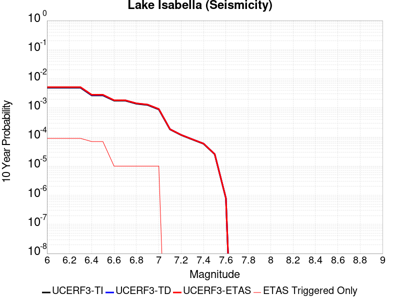 |

| Magnitude | 1 wk TI Prob | 1 wk TD Prob | 1 wk ETAS Prob | 1 wk ETAS/TD Gain | 1 wk ETAS Triggered Only | 1 mo TI Prob | 1 mo TD Prob | 1 mo ETAS Prob | 1 mo ETAS/TD Gain | 1 mo ETAS Triggered Only | 1 yr TI Prob | 1 yr TD Prob | 1 yr ETAS Prob | 1 yr ETAS/TD Gain | 1 yr ETAS Triggered Only | 10 yr TI Prob | 10 yr TD Prob | 10 yr ETAS Prob | 10 yr ETAS/TD Gain | 10 yr ETAS Triggered Only |
|-----|-----|-----|-----|-----|-----|-----|-----|-----|-----|-----|-----|-----|-----|-----|-----|-----|-----|-----|-----|-----|
| 6.0 | 9.431637E-6 | 9.741643E-6 | 3.680498E-5 | 3.778108 | 2.70636E-5 | 4.0420677E-5 | 4.1749303E-5 | 9.5874246E-5 | 2.2964272 | 5.41272E-5 | 4.920106E-4 | 5.081923E-4 | 5.8934186E-4 | 1.1596828 | 8.1190796E-5 | 0.004909227 | 0.0050715944 | 0.005165837 | 1.0185823 | 9.47226E-5 |
| 6.1 | 9.431637E-6 | 9.741643E-6 | 3.680498E-5 | 3.778108 | 2.70636E-5 | 4.0420677E-5 | 4.1749303E-5 | 9.5874246E-5 | 2.2964272 | 5.41272E-5 | 4.920106E-4 | 5.081923E-4 | 5.8934186E-4 | 1.1596828 | 8.1190796E-5 | 0.004909227 | 0.0050715944 | 0.005165837 | 1.0185823 | 9.47226E-5 |
| 6.2 | 9.431637E-6 | 9.741643E-6 | 3.680498E-5 | 3.778108 | 2.70636E-5 | 4.0420677E-5 | 4.1749303E-5 | 9.5874246E-5 | 2.2964272 | 5.41272E-5 | 4.920106E-4 | 5.081923E-4 | 5.8934186E-4 | 1.1596828 | 8.1190796E-5 | 0.004909227 | 0.0050715944 | 0.005165837 | 1.0185823 | 9.47226E-5 |
| 6.3 | 9.431637E-6 | 9.741643E-6 | 3.680498E-5 | 3.778108 | 2.70636E-5 | 4.0420677E-5 | 4.1749303E-5 | 9.5874246E-5 | 2.2964272 | 5.41272E-5 | 4.920106E-4 | 5.081923E-4 | 5.8934186E-4 | 1.1596828 | 8.1190796E-5 | 0.004909227 | 0.0050715944 | 0.005165837 | 1.0185823 | 9.47226E-5 |
| 6.4 | 5.144063E-6 | 5.3000717E-6 | 3.236353E-5 | 6.106243 | 2.70636E-5 | 2.2045799E-5 | 2.2714416E-5 | 7.6840384E-5 | 3.3828907 | 5.41272E-5 | 2.6837454E-4 | 2.7651637E-4 | 3.576847E-4 | 1.293539 | 8.1190796E-5 | 0.0026805066 | 0.0027620634 | 0.00284303 | 1.0293138 | 8.1190796E-5 |
| 6.5 | 5.144063E-6 | 5.3000717E-6 | 3.236353E-5 | 6.106243 | 2.70636E-5 | 2.2045799E-5 | 2.2714416E-5 | 7.6840384E-5 | 3.3828907 | 5.41272E-5 | 2.6837454E-4 | 2.7651637E-4 | 3.576847E-4 | 1.293539 | 8.1190796E-5 | 0.0026805066 | 0.0027620634 | 0.00284303 | 1.0293138 | 8.1190796E-5 |
| 6.6 | 3.4009804E-6 | 3.4987834E-6 | 3.4987834E-6 | 1.0 | 0.0 | 1.4575549E-5 | 1.4994709E-5 | 2.8526307E-5 | 1.9024248 | 1.35318E-5 | 1.7744285E-4 | 1.825469E-4 | 1.9607622E-4 | 1.0741143 | 1.35318E-5 | 0.0017730123 | 0.0018241272 | 0.0018376342 | 1.0074047 | 1.35318E-5 |
| 6.7 | 3.3880428E-6 | 3.48565E-6 | 3.48565E-6 | 1.0 | 0.0 | 1.4520103E-5 | 1.4938424E-5 | 2.8470022E-5 | 1.905825 | 1.35318E-5 | 1.767679E-4 | 1.8186173E-4 | 1.9539107E-4 | 1.0743935 | 1.35318E-5 | 0.0017662736 | 0.0018172868 | 0.001830794 | 1.0074326 | 1.35318E-5 |
| 6.8 | 2.6582E-6 | 2.733698E-6 | 2.733698E-6 | 1.0 | 0.0 | 1.1392236E-5 | 1.1715804E-5 | 2.5247446E-5 | 2.1549904 | 1.35318E-5 | 1.3869164E-4 | 1.4263192E-4 | 1.561618E-4 | 1.0948586 | 1.35318E-5 | 0.0013860512 | 0.0014255359 | 0.0014390483 | 1.0094789 | 1.35318E-5 |
| 6.9 | 2.406011E-6 | 2.474327E-6 | 2.474327E-6 | 1.0 | 0.0 | 1.0311434E-5 | 1.0604223E-5 | 2.413588E-5 | 2.276063 | 1.35318E-5 | 1.2553448E-4 | 1.2910008E-4 | 1.4263013E-4 | 1.1048028 | 1.35318E-5 | 0.0012546359 | 0.0012903805 | 0.0013038948 | 1.0104731 | 1.35318E-5 |
| 7.0 | 1.6953097E-6 | 1.7429359E-6 | 1.7429359E-6 | 1.0 | 0.0 | 7.265593E-6 | 7.4697095E-6 | 2.1001408E-5 | 2.8115427 | 1.35318E-5 | 8.8455E-5 | 9.0940965E-5 | 1.0447154E-4 | 1.148784 | 1.35318E-5 | 8.84198E-4 | 9.091403E-4 | 9.2265976E-4 | 1.0148706 | 1.35318E-5 |
| 7.1 | 3.5013824E-7 | 3.5714805E-7 | 3.5714805E-7 | 1.0 | 0.0 | 1.5005916E-6 | 1.5306335E-6 | 1.5306335E-6 | 1.0 | 0.0 | 1.826955E-5 | 1.8635306E-5 | 1.8635306E-5 | 1.0 | 0.0 | 1.8268047E-4 | 1.863377E-4 | 1.863377E-4 | 1.0 | 0.0 |
| 7.2 | 2.2321095E-7 | 2.2750562E-7 | 2.2750562E-7 | 1.0 | 0.0 | 9.56618E-7 | 9.750237E-7 | 9.750237E-7 | 1.0 | 0.0 | 1.1646762E-5 | 1.187085E-5 | 1.187085E-5 | 1.0 | 0.0 | 1.1646151E-4 | 1.18702264E-4 | 1.18702264E-4 | 1.0 | 0.0 |
| 7.3 | 1.5760406E-7 | 1.6060915E-7 | 1.6060915E-7 | 1.0 | 0.0 | 6.7544585E-7 | 6.883247E-7 | 6.883247E-7 | 1.0 | 0.0 | 8.223522E-6 | 8.380322E-6 | 8.380322E-6 | 1.0 | 0.0 | 8.2232174E-5 | 8.380012E-5 | 8.380012E-5 | 1.0 | 0.0 |
| 7.4 | 1.1216497E-7 | 1.14317004E-7 | 1.14317004E-7 | 1.0 | 0.0 | 4.8070694E-7 | 4.899299E-7 | 4.899299E-7 | 1.0 | 0.0 | 5.852591E-6 | 5.964881E-6 | 5.964881E-6 | 1.0 | 0.0 | 5.8524372E-5 | 5.9647253E-5 | 5.9647253E-5 | 1.0 | 0.0 |
| 7.5 | 4.885185E-8 | 4.978771E-8 | 4.978771E-8 | 1.0 | 0.0 | 2.0936506E-7 | 2.133759E-7 | 2.133759E-7 | 1.0 | 0.0 | 2.5490165E-6 | 2.5978486E-6 | 2.5978486E-6 | 1.0 | 0.0 | 2.5489873E-5 | 2.5978201E-5 | 2.5978201E-5 | 1.0 | 0.0 |
| 7.6 | 1.504641E-9 | 1.5317896E-9 | 1.5317896E-9 | 1.0 | 0.0 | 6.4484613E-9 | 6.5648122E-9 | 6.5648122E-9 | 1.0 | 0.0 | 7.851001E-8 | 7.992659E-8 | 7.992659E-8 | 1.0 | 0.0 | 7.8509987E-7 | 7.992659E-7 | 7.992659E-7 | 1.0 | 0.0 |

## Death Valley (Fish Lake Valley)
*[(top)](#table-of-contents)*

| 1 Week | 1 Month | 1 Year | 10 Year |
|-----|-----|-----|-----|
|  |  |  |  |

| Magnitude | 1 wk TI Prob | 1 wk TD Prob | 1 wk ETAS Prob | 1 wk ETAS/TD Gain | 1 wk ETAS Triggered Only | 1 mo TI Prob | 1 mo TD Prob | 1 mo ETAS Prob | 1 mo ETAS/TD Gain | 1 mo ETAS Triggered Only | 1 yr TI Prob | 1 yr TD Prob | 1 yr ETAS Prob | 1 yr ETAS/TD Gain | 1 yr ETAS Triggered Only | 10 yr TI Prob | 10 yr TD Prob | 10 yr ETAS Prob | 10 yr ETAS/TD Gain | 10 yr ETAS Triggered Only |
|-----|-----|-----|-----|-----|-----|-----|-----|-----|-----|-----|-----|-----|-----|-----|-----|-----|-----|-----|-----|-----|
| 6.0 | 3.872328E-5 | 4.7267185E-5 | 1.1492299E-4 | 2.431348 | 6.7659E-5 | 1.6594635E-4 | 2.0255962E-4 | 2.8373397E-4 | 1.400743 | 8.1190796E-5 | 0.0020185246 | 0.00246352 | 0.0025445106 | 1.032876 | 8.1190796E-5 | 0.02000288 | 0.02438804 | 0.02446725 | 1.003248 | 8.1190796E-5 |
| 6.1 | 3.872328E-5 | 4.7267185E-5 | 1.1492299E-4 | 2.431348 | 6.7659E-5 | 1.6594635E-4 | 2.0255962E-4 | 2.8373397E-4 | 1.400743 | 8.1190796E-5 | 0.0020185246 | 0.00246352 | 0.0025445106 | 1.032876 | 8.1190796E-5 | 0.02000288 | 0.02438804 | 0.02446725 | 1.003248 | 8.1190796E-5 |
| 6.2 | 3.872328E-5 | 4.7267185E-5 | 1.1492299E-4 | 2.431348 | 6.7659E-5 | 1.6594635E-4 | 2.0255962E-4 | 2.8373397E-4 | 1.400743 | 8.1190796E-5 | 0.0020185246 | 0.00246352 | 0.0025445106 | 1.032876 | 8.1190796E-5 | 0.02000288 | 0.02438804 | 0.02446725 | 1.003248 | 8.1190796E-5 |
| 6.3 | 2.8356371E-5 | 3.3609682E-5 | 1.0126641E-4 | 3.013013 | 6.7659E-5 | 1.2152165E-4 | 1.4403398E-4 | 2.252131E-4 | 1.5636108 | 8.1190796E-5 | 0.0014785219 | 0.0017522823 | 0.0018333308 | 1.0462531 | 8.1190796E-5 | 0.014687235 | 0.017391697 | 0.017471476 | 1.0045872 | 8.1190796E-5 |
| 6.4 | 2.8356371E-5 | 3.3609682E-5 | 1.0126641E-4 | 3.013013 | 6.7659E-5 | 1.2152165E-4 | 1.4403398E-4 | 2.252131E-4 | 1.5636108 | 8.1190796E-5 | 0.0014785219 | 0.0017522823 | 0.0018333308 | 1.0462531 | 8.1190796E-5 | 0.014687235 | 0.017391697 | 0.017471476 | 1.0045872 | 8.1190796E-5 |
| 6.5 | 2.4448687E-5 | 2.8607421E-5 | 9.6264484E-5 | 3.365018 | 6.7659E-5 | 1.0477588E-4 | 1.2259776E-4 | 2.037786E-4 | 1.6621723 | 8.1190796E-5 | 0.0012748998 | 0.0014916563 | 0.001572726 | 1.0543488 | 8.1190796E-5 | 0.012676105 | 0.01482131 | 0.014901296 | 1.0053968 | 8.1190796E-5 |
| 6.6 | 2.1298161E-5 | 2.465998E-5 | 9.231731E-5 | 3.7436087 | 6.7659E-5 | 9.127464E-5 | 1.0568153E-4 | 1.8686375E-4 | 1.7681779 | 8.1190796E-5 | 0.0011107022 | 0.001285947 | 0.0013670335 | 1.0630558 | 8.1190796E-5 | 0.011051672 | 0.012788472 | 0.012868624 | 1.0062675 | 8.1190796E-5 |
| 6.7 | 1.8959729E-5 | 2.1780937E-5 | 8.9438465E-5 | 4.106272 | 6.7659E-5 | 8.125345E-5 | 9.334368E-5 | 1.745269E-4 | 1.8697238 | 8.1190796E-5 | 9.888117E-4 | 0.0011358924 | 0.001216991 | 1.0713964 | 8.1190796E-5 | 0.009844234 | 0.0113035245 | 0.011383798 | 1.0071015 | 8.1190796E-5 |
| 6.8 | 1.6691629E-5 | 1.901828E-5 | 8.6675995E-5 | 4.5575094 | 6.7659E-5 | 7.153359E-5 | 8.150447E-5 | 1.6268865E-4 | 1.9960704 | 8.1190796E-5 | 8.7057345E-4 | 9.918819E-4 | 0.0010729922 | 1.0817741 | 8.1190796E-5 | 0.008671708 | 0.009876307 | 0.009956696 | 1.0081396 | 8.1190796E-5 |
| 6.9 | 1.450505E-5 | 1.6389482E-5 | 8.404737E-5 | 5.1281285 | 6.7659E-5 | 6.216302E-5 | 7.02388E-5 | 1.514239E-4 | 2.155844 | 8.1190796E-5 | 7.5657194E-4 | 8.5483067E-4 | 9.3595206E-4 | 1.0948976 | 8.1190796E-5 | 0.007540013 | 0.008516356 | 0.008596855 | 1.0094523 | 8.1190796E-5 |
| 7.0 | 1.2940855E-5 | 1.4537924E-5 | 8.219594E-5 | 5.6538982 | 6.7659E-5 | 5.545963E-5 | 6.230393E-5 | 1.4348967E-4 | 2.3030596 | 8.1190796E-5 | 6.750118E-4 | 7.5829215E-4 | 8.394214E-4 | 1.1069894 | 8.1190796E-5 | 0.006729651 | 0.007557665 | 0.007638242 | 1.0106616 | 8.1190796E-5 |
| 7.1 | 1.2544658E-5 | 1.4078161E-5 | 8.173621E-5 | 5.8058863 | 6.7659E-5 | 5.3761712E-5 | 6.0333616E-5 | 1.4151951E-4 | 2.3456163 | 8.1190796E-5 | 6.5435225E-4 | 7.343198E-4 | 8.1545097E-4 | 1.1104848 | 8.1190796E-5 | 0.006524288 | 0.007319527 | 0.0074001234 | 1.0110111 | 8.1190796E-5 |
| 7.2 | 1.2489416E-5 | 1.4015628E-5 | 8.167368E-5 | 5.827329 | 6.7659E-5 | 5.3524967E-5 | 6.0065628E-5 | 1.4125156E-4 | 2.3516202 | 8.1190796E-5 | 6.514716E-4 | 7.3105923E-4 | 8.121907E-4 | 1.1109779 | 8.1190796E-5 | 0.006495651 | 0.007287136 | 0.0073677353 | 1.0110605 | 8.1190796E-5 |
| 7.3 | 1.2368307E-5 | 1.3879767E-5 | 8.153783E-5 | 5.874582 | 6.7659E-5 | 5.3005948E-5 | 5.948339E-5 | 1.4066936E-4 | 2.364851 | 8.1190796E-5 | 6.451563E-4 | 7.2397524E-4 | 8.051073E-4 | 1.1120646 | 8.1190796E-5 | 0.0064328653 | 0.0072167586 | 0.007297363 | 1.0111691 | 8.1190796E-5 |
| 7.4 | 1.2161707E-5 | 1.3647823E-5 | 8.13059E-5 | 5.957426 | 6.7659E-5 | 5.212056E-5 | 5.8489393E-5 | 1.3967544E-4 | 2.3880475 | 8.1190796E-5 | 6.3438306E-4 | 7.1188126E-4 | 7.9301425E-4 | 1.1139698 | 8.1190796E-5 | 0.006325751 | 0.0070965975 | 0.0071772123 | 1.0113596 | 8.1190796E-5 |
| 7.5 | 1.1707948E-5 | 1.3145472E-5 | 8.0803584E-5 | 6.1468754 | 6.7659E-5 | 5.0175953E-5 | 5.633655E-5 | 1.3752277E-4 | 2.4410932 | 8.1190796E-5 | 6.10721E-4 | 6.8568724E-4 | 7.6682237E-4 | 1.1183268 | 8.1190796E-5 | 0.0060904534 | 0.006836299 | 0.0069169346 | 1.0117953 | 8.1190796E-5 |
| 7.6 | 1.0319538E-5 | 1.1579585E-5 | 7.92378E-5 | 6.842888 | 6.7659E-5 | 4.4225842E-5 | 4.9625876E-5 | 1.3081265E-4 | 2.6359766 | 8.1190796E-5 | 5.383166E-4 | 6.040327E-4 | 6.851745E-4 | 1.1343334 | 8.1190796E-5 | 0.0053701443 | 0.0060244408 | 0.0061051426 | 1.0133957 | 8.1190796E-5 |
| 7.7 | 8.937764E-6 | 1.0022746E-5 | 7.768107E-5 | 7.750477 | 6.7659E-5 | 3.830414E-5 | 4.295395E-5 | 1.1061004E-4 | 2.5750842 | 6.7659E-5 | 4.6625308E-4 | 5.228439E-4 | 5.9046753E-4 | 1.129338 | 6.7659E-5 | 0.0046527605 | 0.0052166474 | 0.0052839536 | 1.0129021 | 6.7659E-5 |
| 7.8 | 3.108007E-7 | 3.284649E-7 | 3.284649E-7 | 1.0 | 0.0 | 1.3320023E-6 | 1.407706E-6 | 1.407706E-6 | 1.0 | 0.0 | 1.6217007E-5 | 1.713869E-5 | 1.713869E-5 | 1.0 | 0.0 | 1.6215823E-4 | 1.7137405E-4 | 1.7137405E-4 | 1.0 | 0.0 |
| 7.9 | 2.5591178E-9 | 2.6696687E-9 | 2.6696687E-9 | 1.0 | 0.0 | 1.0967647E-8 | 1.1441437E-8 | 1.1441437E-8 | 1.0 | 0.0 | 1.335311E-7 | 1.392995E-7 | 1.392995E-7 | 1.0 | 0.0 | 1.3353102E-6 | 1.3929949E-6 | 1.3929949E-6 | 1.0 | 0.0 |

## Helendale-So Lockhart
*[(top)](#table-of-contents)*

| 1 Week | 1 Month | 1 Year | 10 Year |
|-----|-----|-----|-----|
|  |  |  |  |

| Magnitude | 1 wk TI Prob | 1 wk TD Prob | 1 wk ETAS Prob | 1 wk ETAS/TD Gain | 1 wk ETAS Triggered Only | 1 mo TI Prob | 1 mo TD Prob | 1 mo ETAS Prob | 1 mo ETAS/TD Gain | 1 mo ETAS Triggered Only | 1 yr TI Prob | 1 yr TD Prob | 1 yr ETAS Prob | 1 yr ETAS/TD Gain | 1 yr ETAS Triggered Only | 10 yr TI Prob | 10 yr TD Prob | 10 yr ETAS Prob | 10 yr ETAS/TD Gain | 10 yr ETAS Triggered Only |
|-----|-----|-----|-----|-----|-----|-----|-----|-----|-----|-----|-----|-----|-----|-----|-----|-----|-----|-----|-----|-----|
| 6.0 | 1.7296055E-5 | 1.8103707E-5 | 4.5166817E-5 | 2.4948933 | 2.70636E-5 | 7.412385E-5 | 7.758512E-5 | 1.3170812E-4 | 1.6975951 | 5.41272E-5 | 9.0208417E-4 | 9.442103E-4 | 0.0010118054 | 1.071589 | 6.7659E-5 | 0.008984311 | 0.009404104 | 0.009484532 | 1.0085523 | 8.1190796E-5 |
| 6.1 | 1.7296055E-5 | 1.8103707E-5 | 4.5166817E-5 | 2.4948933 | 2.70636E-5 | 7.412385E-5 | 7.758512E-5 | 1.3170812E-4 | 1.6975951 | 5.41272E-5 | 9.0208417E-4 | 9.442103E-4 | 0.0010118054 | 1.071589 | 6.7659E-5 | 0.008984311 | 0.009404104 | 0.009484532 | 1.0085523 | 8.1190796E-5 |
| 6.2 | 1.7296055E-5 | 1.8103707E-5 | 4.5166817E-5 | 2.4948933 | 2.70636E-5 | 7.412385E-5 | 7.758512E-5 | 1.3170812E-4 | 1.6975951 | 5.41272E-5 | 9.0208417E-4 | 9.442103E-4 | 0.0010118054 | 1.071589 | 6.7659E-5 | 0.008984311 | 0.009404104 | 0.009484532 | 1.0085523 | 8.1190796E-5 |
| 6.3 | 1.0669118E-5 | 1.1135411E-5 | 3.819871E-5 | 3.4303815 | 2.70636E-5 | 4.5723988E-5 | 4.7722333E-5 | 8.83158E-5 | 1.8506176 | 4.0595398E-5 | 5.5654737E-4 | 5.8086734E-4 | 6.349631E-4 | 1.0931293 | 5.41272E-5 | 0.0055515557 | 0.0057937866 | 0.0058476003 | 1.0092882 | 5.41272E-5 |
| 6.4 | 1.0669118E-5 | 1.1135411E-5 | 3.819871E-5 | 3.4303815 | 2.70636E-5 | 4.5723988E-5 | 4.7722333E-5 | 8.83158E-5 | 1.8506176 | 4.0595398E-5 | 5.5654737E-4 | 5.8086734E-4 | 6.349631E-4 | 1.0931293 | 5.41272E-5 | 0.0055515557 | 0.0057937866 | 0.0058476003 | 1.0092882 | 5.41272E-5 |
| 6.5 | 8.790038E-6 | 9.170186E-6 | 3.6233538E-5 | 3.9512324 | 2.70636E-5 | 3.767105E-5 | 3.9300216E-5 | 6.636275E-5 | 1.6886104 | 2.70636E-5 | 4.585485E-4 | 4.783766E-4 | 5.189526E-4 | 1.0848202 | 4.0595398E-5 | 0.0045760344 | 0.004773633 | 0.0048140343 | 1.0084635 | 4.0595398E-5 |
| 6.6 | 7.396949E-6 | 7.715528E-6 | 2.1247224E-5 | 2.7538261 | 1.35318E-5 | 3.1700827E-5 | 3.3066135E-5 | 4.6597488E-5 | 1.4092208 | 1.35318E-5 | 3.858892E-4 | 4.0250685E-4 | 4.2955956E-4 | 1.0672106 | 2.70636E-5 | 0.003852198 | 0.0040178853 | 0.00404484 | 1.0067087 | 2.70636E-5 |
| 6.7 | 6.4600285E-6 | 6.7380233E-6 | 2.0269732E-5 | 3.008261 | 1.35318E-5 | 2.7685543E-5 | 2.8876928E-5 | 4.2408337E-5 | 1.468589 | 1.35318E-5 | 3.3701936E-4 | 3.5152066E-4 | 3.7857474E-4 | 1.076963 | 2.70636E-5 | 0.0033650869 | 0.003509728 | 0.0035366965 | 1.007684 | 2.70636E-5 |
| 6.8 | 5.600104E-6 | 5.836003E-6 | 1.9367724E-5 | 3.3186624 | 1.35318E-5 | 2.4000226E-5 | 2.5011204E-5 | 3.8542665E-5 | 1.541016 | 1.35318E-5 | 2.9216358E-4 | 3.0446946E-4 | 3.3152482E-4 | 1.0888606 | 2.70636E-5 | 0.0029177975 | 0.0030405847 | 0.0030675658 | 1.0088737 | 2.70636E-5 |
| 6.9 | 4.839122E-6 | 5.039504E-6 | 1.8571236E-5 | 3.6851318 | 1.35318E-5 | 2.0738931E-5 | 2.1597696E-5 | 3.5129204E-5 | 1.6265255 | 1.35318E-5 | 2.5246723E-4 | 2.629207E-4 | 2.8997718E-4 | 1.1029074 | 2.70636E-5 | 0.002521806 | 0.0026261439 | 0.0026531364 | 1.0102783 | 2.70636E-5 |
| 7.0 | 3.6937633E-6 | 3.845204E-6 | 1.7376951E-5 | 4.5191236 | 1.35318E-5 | 1.5830317E-5 | 1.6479342E-5 | 3.0010919E-5 | 1.8211236 | 1.35318E-5 | 1.9271708E-4 | 2.0061784E-4 | 2.27676E-4 | 1.1348742 | 2.70636E-5 | 0.0019255003 | 0.0020043987 | 0.002031408 | 1.0134751 | 2.70636E-5 |
| 7.1 | 2.7858857E-6 | 2.8978507E-6 | 1.642961E-5 | 5.669585 | 1.35318E-5 | 1.1939455E-5 | 1.2419302E-5 | 2.5950934E-5 | 2.0895646 | 1.35318E-5 | 1.4535317E-4 | 1.5119473E-4 | 1.7825424E-4 | 1.1789713 | 2.70636E-5 | 0.0014525814 | 0.0015109401 | 0.0015379628 | 1.0178847 | 2.70636E-5 |
| 7.2 | 2.1672065E-6 | 2.2540103E-6 | 1.578578E-5 | 7.0034194 | 1.35318E-5 | 9.2879945E-6 | 9.66001E-6 | 2.3191678E-5 | 2.4007924 | 1.35318E-5 | 1.1307546E-4 | 1.1760445E-4 | 1.4466487E-4 | 1.2300968 | 2.70636E-5 | 0.0011301794 | 0.0011754404 | 0.0012024721 | 1.0229971 | 2.70636E-5 |
| 7.3 | 1.4823496E-6 | 1.5422086E-6 | 1.5073987E-5 | 9.774286 | 1.35318E-5 | 6.3529114E-6 | 6.6094494E-6 | 2.014116E-5 | 3.047328 | 1.35318E-5 | 7.734395E-5 | 8.046723E-5 | 9.3997936E-5 | 1.1681519 | 1.35318E-5 | 7.731704E-4 | 8.04396E-4 | 8.1791694E-4 | 1.0168087 | 1.35318E-5 |
| 7.4 | 4.2321457E-7 | 4.4108717E-7 | 4.4108717E-7 | 1.0 | 0.0 | 1.8137755E-6 | 1.8903725E-6 | 1.8903725E-6 | 1.0 | 0.0 | 2.2082493E-5 | 2.3015087E-5 | 2.3015087E-5 | 1.0 | 0.0 | 2.2080299E-4 | 2.3013157E-4 | 2.3013157E-4 | 1.0 | 0.0 |
| 7.5 | 5.6942316E-8 | 5.9415576E-8 | 5.9415576E-8 | 1.0 | 0.0 | 2.440385E-7 | 2.5463817E-7 | 2.5463817E-7 | 1.0 | 0.0 | 2.9711643E-6 | 3.1002162E-6 | 3.1002162E-6 | 1.0 | 0.0 | 2.9711247E-5 | 3.1001808E-5 | 3.1001808E-5 | 1.0 | 0.0 |

## Towne Pass
*[(top)](#table-of-contents)*

| 1 Week | 1 Month | 1 Year | 10 Year |
|-----|-----|-----|-----|
|  |  |  |  |

| Magnitude | 1 wk TI Prob | 1 wk TD Prob | 1 wk ETAS Prob | 1 wk ETAS/TD Gain | 1 wk ETAS Triggered Only | 1 mo TI Prob | 1 mo TD Prob | 1 mo ETAS Prob | 1 mo ETAS/TD Gain | 1 mo ETAS Triggered Only | 1 yr TI Prob | 1 yr TD Prob | 1 yr ETAS Prob | 1 yr ETAS/TD Gain | 1 yr ETAS Triggered Only | 10 yr TI Prob | 10 yr TD Prob | 10 yr ETAS Prob | 10 yr ETAS/TD Gain | 10 yr ETAS Triggered Only |
|-----|-----|-----|-----|-----|-----|-----|-----|-----|-----|-----|-----|-----|-----|-----|-----|-----|-----|-----|-----|-----|
| 6.0 | 3.849728E-6 | 3.8945395E-6 | 3.8945395E-6 | 1.0 | 0.0 | 1.649873E-5 | 1.6690803E-5 | 3.0222376E-5 | 1.8107204 | 1.35318E-5 | 2.0085352E-4 | 2.0319594E-4 | 2.1672499E-4 | 1.0665812 | 1.35318E-5 | 0.0020067208 | 0.0020305307 | 0.002084548 | 1.0266025 | 5.41272E-5 |
| 6.1 | 3.849728E-6 | 3.8945395E-6 | 3.8945395E-6 | 1.0 | 0.0 | 1.649873E-5 | 1.6690803E-5 | 3.0222376E-5 | 1.8107204 | 1.35318E-5 | 2.0085352E-4 | 2.0319594E-4 | 2.1672499E-4 | 1.0665812 | 1.35318E-5 | 0.0020067208 | 0.0020305307 | 0.002084548 | 1.0266025 | 5.41272E-5 |
| 6.2 | 3.849728E-6 | 3.8945395E-6 | 3.8945395E-6 | 1.0 | 0.0 | 1.649873E-5 | 1.6690803E-5 | 3.0222376E-5 | 1.8107204 | 1.35318E-5 | 2.0085352E-4 | 2.0319594E-4 | 2.1672499E-4 | 1.0665812 | 1.35318E-5 | 0.0020067208 | 0.0020305307 | 0.002084548 | 1.0266025 | 5.41272E-5 |
| 6.3 | 3.849728E-6 | 3.8945395E-6 | 3.8945395E-6 | 1.0 | 0.0 | 1.649873E-5 | 1.6690803E-5 | 3.0222376E-5 | 1.8107204 | 1.35318E-5 | 2.0085352E-4 | 2.0319594E-4 | 2.1672499E-4 | 1.0665812 | 1.35318E-5 | 0.0020067208 | 0.0020305307 | 0.002084548 | 1.0266025 | 5.41272E-5 |
| 6.4 | 3.849728E-6 | 3.8945395E-6 | 3.8945395E-6 | 1.0 | 0.0 | 1.649873E-5 | 1.6690803E-5 | 3.0222376E-5 | 1.8107204 | 1.35318E-5 | 2.0085352E-4 | 2.0319594E-4 | 2.1672499E-4 | 1.0665812 | 1.35318E-5 | 0.0020067208 | 0.0020305307 | 0.002084548 | 1.0266025 | 5.41272E-5 |
| 6.5 | 1.1953545E-6 | 1.2030514E-6 | 1.2030514E-6 | 1.0 | 0.0 | 5.1229376E-6 | 5.155925E-6 | 5.155925E-6 | 1.0 | 0.0 | 6.236998E-5 | 6.2771695E-5 | 6.2771695E-5 | 1.0 | 0.0 | 6.235248E-4 | 6.275514E-4 | 6.54598E-4 | 1.0430987 | 2.70636E-5 |
| 6.6 | 1.1953545E-6 | 1.2030514E-6 | 1.2030514E-6 | 1.0 | 0.0 | 5.1229376E-6 | 5.155925E-6 | 5.155925E-6 | 1.0 | 0.0 | 6.236998E-5 | 6.2771695E-5 | 6.2771695E-5 | 1.0 | 0.0 | 6.235248E-4 | 6.275514E-4 | 6.54598E-4 | 1.0430987 | 2.70636E-5 |
| 6.7 | 8.375951E-7 | 8.410665E-7 | 8.410665E-7 | 1.0 | 0.0 | 3.5896885E-6 | 3.604566E-6 | 3.604566E-6 | 1.0 | 0.0 | 4.370358E-5 | 4.3884767E-5 | 4.3884767E-5 | 1.0 | 0.0 | 4.3694986E-4 | 4.387667E-4 | 4.6581845E-4 | 1.061654 | 2.70636E-5 |
| 6.8 | 6.38041E-7 | 6.3921516E-7 | 6.3921516E-7 | 1.0 | 0.0 | 2.7344586E-6 | 2.7394908E-6 | 2.7394908E-6 | 1.0 | 0.0 | 3.3291526E-5 | 3.335283E-5 | 3.335283E-5 | 1.0 | 0.0 | 3.3286537E-4 | 3.3348205E-4 | 3.6053662E-4 | 1.0811275 | 2.70636E-5 |
| 6.9 | 5.3460053E-7 | 5.345329E-7 | 5.345329E-7 | 1.0 | 0.0 | 2.2911431E-6 | 2.2908532E-6 | 2.2908532E-6 | 1.0 | 0.0 | 2.789431E-5 | 2.7890816E-5 | 2.7890816E-5 | 1.0 | 0.0 | 2.789081E-4 | 2.7887648E-4 | 2.924045E-4 | 1.048509 | 1.35318E-5 |
| 7.0 | 3.557783E-7 | 3.532419E-7 | 3.532419E-7 | 1.0 | 0.0 | 1.5247632E-6 | 1.5138929E-6 | 1.5138929E-6 | 1.0 | 0.0 | 1.8563835E-5 | 1.84315E-5 | 1.84315E-5 | 1.0 | 0.0 | 1.8562283E-4 | 1.8430054E-4 | 1.9782985E-4 | 1.073409 | 1.35318E-5 |
| 7.1 | 3.037942E-7 | 3.0002184E-7 | 3.0002184E-7 | 1.0 | 0.0 | 1.3019744E-6 | 1.2858072E-6 | 1.2858072E-6 | 1.0 | 0.0 | 1.5851423E-5 | 1.56546E-5 | 1.56546E-5 | 1.0 | 0.0 | 1.5850292E-4 | 1.5653571E-4 | 1.700654E-4 | 1.0864319 | 1.35318E-5 |
| 7.2 | 2.0808248E-7 | 2.0217661E-7 | 2.0217661E-7 | 1.0 | 0.0 | 8.917818E-7 | 8.664709E-7 | 8.664709E-7 | 1.0 | 0.0 | 1.0857389E-5 | 1.0549237E-5 | 1.0549237E-5 | 1.0 | 0.0 | 1.0856859E-4 | 1.0548782E-4 | 1.19018194E-4 | 1.1282648 | 1.35318E-5 |
| 7.3 | 1.1162073E-7 | 1.0636875E-7 | 1.0636875E-7 | 1.0 | 0.0 | 4.7837443E-7 | 4.5586603E-7 | 4.5586603E-7 | 1.0 | 0.0 | 5.8241935E-6 | 5.550157E-6 | 5.550157E-6 | 1.0 | 0.0 | 5.8240406E-5 | 5.5500383E-5 | 5.5500383E-5 | 1.0 | 0.0 |

## Goldstone Lake
*[(top)](#table-of-contents)*

| 1 Week | 1 Month | 1 Year | 10 Year |
|-----|-----|-----|-----|
|  |  |  |  |

| Magnitude | 1 wk TI Prob | 1 wk TD Prob | 1 wk ETAS Prob | 1 wk ETAS/TD Gain | 1 wk ETAS Triggered Only | 1 mo TI Prob | 1 mo TD Prob | 1 mo ETAS Prob | 1 mo ETAS/TD Gain | 1 mo ETAS Triggered Only | 1 yr TI Prob | 1 yr TD Prob | 1 yr ETAS Prob | 1 yr ETAS/TD Gain | 1 yr ETAS Triggered Only | 10 yr TI Prob | 10 yr TD Prob | 10 yr ETAS Prob | 10 yr ETAS/TD Gain | 10 yr ETAS Triggered Only |
|-----|-----|-----|-----|-----|-----|-----|-----|-----|-----|-----|-----|-----|-----|-----|-----|-----|-----|-----|-----|-----|
| 6.0 | 2.671352E-5 | 3.037598E-5 | 4.390737E-5 | 1.4454634 | 1.35318E-5 | 1.1448149E-4 | 1.3017739E-4 | 1.4370742E-4 | 1.1039354 | 1.35318E-5 | 0.001392921 | 0.0015839539 | 0.0016244849 | 1.0255885 | 4.0595398E-5 | 0.013842222 | 0.01574614 | 0.015799414 | 1.0033834 | 5.41272E-5 |
| 6.1 | 2.671352E-5 | 3.037598E-5 | 4.390737E-5 | 1.4454634 | 1.35318E-5 | 1.1448149E-4 | 1.3017739E-4 | 1.4370742E-4 | 1.1039354 | 1.35318E-5 | 0.001392921 | 0.0015839539 | 0.0016244849 | 1.0255885 | 4.0595398E-5 | 0.013842222 | 0.01574614 | 0.015799414 | 1.0033834 | 5.41272E-5 |
| 6.2 | 1.4197047E-5 | 1.609619E-5 | 1.609619E-5 | 1.0 | 0.0 | 6.0843064E-5 | 6.89824E-5 | 6.89824E-5 | 1.0 | 0.0 | 7.4051257E-4 | 8.396358E-4 | 8.531562E-4 | 1.0161028 | 1.35318E-5 | 0.007380498 | 0.008374331 | 0.008401168 | 1.0032047 | 2.70636E-5 |
| 6.3 | 1.4197047E-5 | 1.609619E-5 | 1.609619E-5 | 1.0 | 0.0 | 6.0843064E-5 | 6.89824E-5 | 6.89824E-5 | 1.0 | 0.0 | 7.4051257E-4 | 8.396358E-4 | 8.531562E-4 | 1.0161028 | 1.35318E-5 | 0.007380498 | 0.008374331 | 0.008401168 | 1.0032047 | 2.70636E-5 |
| 6.4 | 1.3238931E-5 | 1.5008409E-5 | 1.5008409E-5 | 1.0 | 0.0 | 5.6737044E-5 | 6.432072E-5 | 6.432072E-5 | 1.0 | 0.0 | 6.9055456E-4 | 7.829214E-4 | 7.964426E-4 | 1.0172702 | 1.35318E-5 | 0.006884126 | 0.007811257 | 0.0078381095 | 1.0034376 | 2.70636E-5 |
| 6.5 | 1.3238931E-5 | 1.5008409E-5 | 1.5008409E-5 | 1.0 | 0.0 | 5.6737044E-5 | 6.432072E-5 | 6.432072E-5 | 1.0 | 0.0 | 6.9055456E-4 | 7.829214E-4 | 7.964426E-4 | 1.0172702 | 1.35318E-5 | 0.006884126 | 0.007811257 | 0.0078381095 | 1.0034376 | 2.70636E-5 |
| 6.6 | 1.1328278E-5 | 1.2855122E-5 | 1.2855122E-5 | 1.0 | 0.0 | 4.8548856E-5 | 5.5092758E-5 | 5.5092758E-5 | 1.0 | 0.0 | 5.90922E-4 | 6.706436E-4 | 6.706436E-4 | 1.0 | 0.0 | 0.0058935313 | 0.006695586 | 0.006709027 | 1.0020075 | 1.35318E-5 |
| 6.7 | 8.651175E-6 | 9.824532E-6 | 9.824532E-6 | 1.0 | 0.0 | 3.707594E-5 | 4.2104966E-5 | 4.2104966E-5 | 1.0 | 0.0 | 4.5130608E-4 | 5.125979E-4 | 5.125979E-4 | 1.0 | 0.0 | 0.0045039062 | 0.005123034 | 0.0051364964 | 1.0026278 | 1.35318E-5 |
| 6.8 | 1.0215377E-6 | 1.1754685E-6 | 1.1754685E-6 | 1.0 | 0.0 | 4.378012E-6 | 5.0377125E-6 | 5.0377125E-6 | 1.0 | 0.0 | 5.3300988E-5 | 6.133254E-5 | 6.133254E-5 | 1.0 | 0.0 | 5.3288206E-4 | 6.131674E-4 | 6.131674E-4 | 1.0 | 0.0 |
| 6.9 | 7.9360774E-7 | 9.283384E-7 | 9.283384E-7 | 1.0 | 0.0 | 3.4011714E-6 | 3.9785873E-6 | 3.9785873E-6 | 1.0 | 0.0 | 4.1408475E-5 | 4.8438294E-5 | 4.8438294E-5 | 1.0 | 0.0 | 4.140076E-4 | 4.842844E-4 | 4.842844E-4 | 1.0 | 0.0 |
| 7.0 | 7.4382757E-7 | 8.747317E-7 | 8.747317E-7 | 1.0 | 0.0 | 3.1878285E-6 | 3.748845E-6 | 3.748845E-6 | 1.0 | 0.0 | 3.8811122E-5 | 4.56413E-5 | 4.56413E-5 | 1.0 | 0.0 | 3.8804344E-4 | 4.563259E-4 | 4.563259E-4 | 1.0 | 0.0 |
| 7.1 | 6.4709513E-7 | 7.71129E-7 | 7.71129E-7 | 1.0 | 0.0 | 2.773262E-6 | 3.304835E-6 | 3.304835E-6 | 1.0 | 0.0 | 3.376394E-5 | 4.023568E-5 | 4.023568E-5 | 1.0 | 0.0 | 3.375881E-4 | 4.0228994E-4 | 4.0228994E-4 | 1.0 | 0.0 |
| 7.2 | 6.356704E-7 | 7.5883503E-7 | 7.5883503E-7 | 1.0 | 0.0 | 2.7242988E-6 | 3.2521464E-6 | 3.2521464E-6 | 1.0 | 0.0 | 3.3167835E-5 | 3.9594222E-5 | 3.9594222E-5 | 1.0 | 0.0 | 3.3162883E-4 | 3.9587764E-4 | 3.9587764E-4 | 1.0 | 0.0 |
| 7.3 | 5.7695723E-7 | 6.896557E-7 | 6.896557E-7 | 1.0 | 0.0 | 2.4726714E-6 | 2.955664E-6 | 2.955664E-6 | 1.0 | 0.0 | 3.0104358E-5 | 3.5984674E-5 | 3.5984674E-5 | 1.0 | 0.0 | 3.0100282E-4 | 3.597942E-4 | 3.597942E-4 | 1.0 | 0.0 |
| 7.4 | 5.209647E-7 | 6.1935066E-7 | 6.1935066E-7 | 1.0 | 0.0 | 2.232704E-6 | 2.6543576E-6 | 2.6543576E-6 | 1.0 | 0.0 | 2.718283E-5 | 3.231638E-5 | 3.231638E-5 | 1.0 | 0.0 | 2.7179506E-4 | 3.2312237E-4 | 3.2312237E-4 | 1.0 | 0.0 |
| 7.5 | 4.512955E-7 | 5.348879E-7 | 5.348879E-7 | 1.0 | 0.0 | 1.934122E-6 | 2.292375E-6 | 2.292375E-6 | 1.0 | 0.0 | 2.3547682E-5 | 2.7909362E-5 | 2.7909362E-5 | 1.0 | 0.0 | 2.3545188E-4 | 2.7906388E-4 | 2.7906388E-4 | 1.0 | 0.0 |
| 7.6 | 2.21172E-7 | 2.603958E-7 | 2.603958E-7 | 1.0 | 0.0 | 9.478797E-7 | 1.1159817E-6 | 1.1159817E-6 | 1.0 | 0.0 | 1.1540374E-5 | 1.3587022E-5 | 1.3587022E-5 | 1.0 | 0.0 | 1.1539775E-4 | 1.3586473E-4 | 1.3586473E-4 | 1.0 | 0.0 |

## San Andreas (Carrizo) rev
*[(top)](#table-of-contents)*

| 1 Week | 1 Month | 1 Year | 10 Year |
|-----|-----|-----|-----|
|  |  |  |  |

| Magnitude | 1 wk TI Prob | 1 wk TD Prob | 1 wk ETAS Prob | 1 wk ETAS/TD Gain | 1 wk ETAS Triggered Only | 1 mo TI Prob | 1 mo TD Prob | 1 mo ETAS Prob | 1 mo ETAS/TD Gain | 1 mo ETAS Triggered Only | 1 yr TI Prob | 1 yr TD Prob | 1 yr ETAS Prob | 1 yr ETAS/TD Gain | 1 yr ETAS Triggered Only | 10 yr TI Prob | 10 yr TD Prob | 10 yr ETAS Prob | 10 yr ETAS/TD Gain | 10 yr ETAS Triggered Only |
|-----|-----|-----|-----|-----|-----|-----|-----|-----|-----|-----|-----|-----|-----|-----|-----|-----|-----|-----|-----|-----|
| 6.0 | 1.1674632E-4 | 2.4321114E-4 | 2.8379666E-4 | 1.1668737 | 4.0595398E-5 | 5.002454E-4 | 0.0010419186 | 0.0010824718 | 1.0389216 | 4.0595398E-5 | 0.006073493 | 0.01261206 | 0.012652143 | 1.0031782 | 4.0595398E-5 | 0.0591016 | 0.12060616 | 0.12064186 | 1.000296 | 4.0595398E-5 |
| 6.1 | 1.1674632E-4 | 2.4321114E-4 | 2.8379666E-4 | 1.1668737 | 4.0595398E-5 | 5.002454E-4 | 0.0010419186 | 0.0010824718 | 1.0389216 | 4.0595398E-5 | 0.006073493 | 0.01261206 | 0.012652143 | 1.0031782 | 4.0595398E-5 | 0.0591016 | 0.12060616 | 0.12064186 | 1.000296 | 4.0595398E-5 |
| 6.2 | 1.1674632E-4 | 2.4321114E-4 | 2.8379666E-4 | 1.1668737 | 4.0595398E-5 | 5.002454E-4 | 0.0010419186 | 0.0010824718 | 1.0389216 | 4.0595398E-5 | 0.006073493 | 0.01261206 | 0.012652143 | 1.0031782 | 4.0595398E-5 | 0.0591016 | 0.12060616 | 0.12064186 | 1.000296 | 4.0595398E-5 |
| 6.3 | 1.1674632E-4 | 2.4321114E-4 | 2.8379666E-4 | 1.1668737 | 4.0595398E-5 | 5.002454E-4 | 0.0010419186 | 0.0010824718 | 1.0389216 | 4.0595398E-5 | 0.006073493 | 0.01261206 | 0.012652143 | 1.0031782 | 4.0595398E-5 | 0.0591016 | 0.12060616 | 0.12064186 | 1.000296 | 4.0595398E-5 |
| 6.4 | 1.1674632E-4 | 2.4321114E-4 | 2.8379666E-4 | 1.1668737 | 4.0595398E-5 | 5.002454E-4 | 0.0010419186 | 0.0010824718 | 1.0389216 | 4.0595398E-5 | 0.006073493 | 0.01261206 | 0.012652143 | 1.0031782 | 4.0595398E-5 | 0.0591016 | 0.12060616 | 0.12064186 | 1.000296 | 4.0595398E-5 |
| 6.5 | 1.13136164E-4 | 2.3641133E-4 | 2.7699713E-4 | 1.1716745 | 4.0595398E-5 | 4.847792E-4 | 0.0010127996 | 0.0010533539 | 1.0400418 | 4.0595398E-5 | 0.0058862255 | 0.012261566 | 0.012301663 | 1.0032701 | 4.0595398E-5 | 0.057327334 | 0.11757754 | 0.11761336 | 1.0003047 | 4.0595398E-5 |
| 6.6 | 1.13136164E-4 | 2.3641133E-4 | 2.7699713E-4 | 1.1716745 | 4.0595398E-5 | 4.847792E-4 | 0.0010127996 | 0.0010533539 | 1.0400418 | 4.0595398E-5 | 0.0058862255 | 0.012261566 | 0.012301663 | 1.0032701 | 4.0595398E-5 | 0.057327334 | 0.11757754 | 0.11761336 | 1.0003047 | 4.0595398E-5 |
| 6.7 | 1.1149675E-4 | 2.3332359E-4 | 2.7390954E-4 | 1.173947 | 4.0595398E-5 | 4.777557E-4 | 9.995765E-4 | 0.0010401314 | 1.040572 | 4.0595398E-5 | 0.0058011734 | 0.012102372 | 0.012142477 | 1.0033138 | 4.0595398E-5 | 0.05652051 | 0.11619909 | 0.11623497 | 1.0003088 | 4.0595398E-5 |
| 6.8 | 1.1103589E-4 | 2.323452E-4 | 2.7293118E-4 | 1.1746796 | 4.0595398E-5 | 4.7578133E-4 | 9.953866E-4 | 0.0010359416 | 1.040743 | 4.0595398E-5 | 0.005777263 | 0.012051926 | 0.0120920325 | 1.0033277 | 4.0595398E-5 | 0.056293584 | 0.115759395 | 0.11579529 | 1.0003101 | 4.0595398E-5 |
| 6.9 | 1.1053259E-4 | 2.3126906E-4 | 2.7185507E-4 | 1.1754926 | 4.0595398E-5 | 4.7362508E-4 | 9.907781E-4 | 0.0010313333 | 1.0409327 | 4.0595398E-5 | 0.0057511497 | 0.011996436 | 0.012036544 | 1.0033433 | 4.0595398E-5 | 0.05604569 | 0.1152756 | 0.11531152 | 1.0003116 | 4.0595398E-5 |
| 7.0 | 1.1005377E-4 | 2.3027751E-4 | 2.7086356E-4 | 1.1762484 | 4.0595398E-5 | 4.7157376E-4 | 9.865318E-4 | 0.0010270872 | 1.041109 | 4.0595398E-5 | 0.0057263062 | 0.011945305 | 0.011985416 | 1.0033579 | 4.0595398E-5 | 0.055809796 | 0.11482792 | 0.11486386 | 1.0003129 | 4.0595398E-5 |
| 7.1 | 1.0308142E-4 | 2.1537494E-4 | 2.5596158E-4 | 1.1884465 | 4.0595398E-5 | 4.417027E-4 | 9.2270994E-4 | 9.6326787E-4 | 1.0439552 | 4.0595398E-5 | 0.0053644776 | 0.011176443 | 0.011216584 | 1.0035917 | 4.0595398E-5 | 0.052368138 | 0.10808435 | 0.10812056 | 1.000335 | 4.0595398E-5 |
| 7.2 | 1.0027479E-4 | 2.0945404E-4 | 2.5004093E-4 | 1.1937747 | 4.0595398E-5 | 4.296783E-4 | 8.973524E-4 | 9.3791133E-4 | 1.0451984 | 4.0595398E-5 | 0.0052187922 | 0.010870834 | 0.010910989 | 1.0036937 | 4.0595398E-5 | 0.050979212 | 0.10538838 | 0.105424695 | 1.0003446 | 4.0595398E-5 |
| 7.3 | 9.816942E-5 | 2.0420653E-4 | 2.4479366E-4 | 1.1987551 | 4.0595398E-5 | 4.2065824E-4 | 8.748783E-4 | 9.154382E-4 | 1.0463606 | 4.0595398E-5 | 0.005109493 | 0.010599907 | 0.010640072 | 1.0037892 | 4.0595398E-5 | 0.049935985 | 0.10297221 | 0.10300863 | 1.0003537 | 4.0595398E-5 |
| 7.4 | 9.5634205E-5 | 1.9790219E-4 | 2.3848956E-4 | 1.205088 | 4.0595398E-5 | 4.0979648E-4 | 8.478775E-4 | 8.884385E-4 | 1.0478382 | 4.0595398E-5 | 0.0049778637 | 0.010274311 | 0.01031449 | 1.0039105 | 4.0595398E-5 | 0.048678253 | 0.10005864 | 0.100095175 | 1.0003651 | 4.0595398E-5 |
| 7.5 | 8.052417E-5 | 1.611105E-4 | 1.8816974E-4 | 1.1679546 | 2.70636E-5 | 3.4505792E-4 | 6.90291E-4 | 7.173359E-4 | 1.039179 | 2.70636E-5 | 0.0041929903 | 0.008371988 | 0.008398825 | 1.0032055 | 2.70636E-5 | 0.04114753 | 0.08280355 | 0.08282837 | 1.0002998 | 2.70636E-5 |
| 7.6 | 7.897024E-5 | 1.5764312E-4 | 1.8470245E-4 | 1.1716493 | 2.70636E-5 | 3.384E-4 | 6.754386E-4 | 7.024839E-4 | 1.0400411 | 2.70636E-5 | 0.0041122385 | 0.008192535 | 0.008219376 | 1.0032763 | 2.70636E-5 | 0.040369697 | 0.08114483 | 0.081169695 | 1.0003065 | 2.70636E-5 |
| 7.7 | 6.707427E-5 | 1.3274715E-4 | 1.4627715E-4 | 1.1019231 | 1.35318E-5 | 2.8742946E-4 | 5.6879234E-4 | 5.823164E-4 | 1.0237769 | 1.35318E-5 | 0.003493839 | 0.0069030905 | 0.006916529 | 1.0019467 | 1.35318E-5 | 0.034394164 | 0.06904176 | 0.06905436 | 1.0001825 | 1.35318E-5 |
| 7.8 | 6.147705E-5 | 1.219623E-4 | 1.3549245E-4 | 1.1109371 | 1.35318E-5 | 2.6344648E-4 | 5.225909E-4 | 5.361156E-4 | 1.0258801 | 1.35318E-5 | 0.0032027436 | 0.0063440073 | 0.0063574533 | 1.0021194 | 1.35318E-5 | 0.031569764 | 0.06350883 | 0.063521504 | 1.0001996 | 1.35318E-5 |
| 7.9 | 4.7636717E-5 | 8.8788634E-5 | 8.8788634E-5 | 1.0 | 0.0 | 2.0414138E-4 | 3.8046725E-4 | 3.8046725E-4 | 1.0 | 0.0 | 0.0024825884 | 0.004622358 | 0.004622358 | 1.0 | 0.0 | 0.024550365 | 0.04662383 | 0.04662383 | 1.0 | 0.0 |
| 8.0 | 3.3554235E-5 | 5.213132E-5 | 5.213132E-5 | 1.0 | 0.0 | 1.4379594E-4 | 2.2340081E-4 | 2.2340081E-4 | 1.0 | 0.0 | 0.0017493097 | 0.002716514 | 0.002716514 | 1.0 | 0.0 | 0.017356034 | 0.027878206 | 0.027878206 | 1.0 | 0.0 |
| 8.1 | 1.9175432E-5 | 1.918229E-5 | 1.918229E-5 | 1.0 | 0.0 | 8.217783E-5 | 8.2207225E-5 | 8.2207225E-5 | 1.0 | 0.0 | 0.0010000558 | 0.001000414 | 0.001000414 | 1.0 | 0.0 | 0.009955673 | 0.010756618 | 0.010756618 | 1.0 | 0.0 |
| 8.2 | 8.643924E-6 | 5.4738607E-6 | 5.4738607E-6 | 1.0 | 0.0 | 3.704486E-5 | 2.3459192E-5 | 2.3459192E-5 | 1.0 | 0.0 | 4.5092785E-4 | 2.855783E-4 | 2.855783E-4 | 1.0 | 0.0 | 0.0045001395 | 0.0032481598 | 0.0032481598 | 1.0 | 0.0 |
| 8.3 | 1.983087E-6 | 7.658221E-7 | 7.658221E-7 | 1.0 | 0.0 | 8.498917E-6 | 3.2820906E-6 | 3.2820906E-6 | 1.0 | 0.0 | 1.034694E-4 | 3.9958737E-5 | 3.9958737E-5 | 1.0 | 0.0 | 0.0010342124 | 4.7187202E-4 | 4.7187202E-4 | 1.0 | 0.0 |

## San Andreas (Cholame) rev
*[(top)](#table-of-contents)*

| 1 Week | 1 Month | 1 Year | 10 Year |
|-----|-----|-----|-----|
|  |  |  |  |

| Magnitude | 1 wk TI Prob | 1 wk TD Prob | 1 wk ETAS Prob | 1 wk ETAS/TD Gain | 1 wk ETAS Triggered Only | 1 mo TI Prob | 1 mo TD Prob | 1 mo ETAS Prob | 1 mo ETAS/TD Gain | 1 mo ETAS Triggered Only | 1 yr TI Prob | 1 yr TD Prob | 1 yr ETAS Prob | 1 yr ETAS/TD Gain | 1 yr ETAS Triggered Only | 10 yr TI Prob | 10 yr TD Prob | 10 yr ETAS Prob | 10 yr ETAS/TD Gain | 10 yr ETAS Triggered Only |
|-----|-----|-----|-----|-----|-----|-----|-----|-----|-----|-----|-----|-----|-----|-----|-----|-----|-----|-----|-----|-----|
| 6.0 | 1.2302514E-4 | 2.520236E-4 | 2.9260878E-4 | 1.1610372 | 4.0595398E-5 | 5.27144E-4 | 0.0010796557 | 0.0011202072 | 1.0375597 | 4.0595398E-5 | 0.0063991086 | 0.013066091 | 0.013106155 | 1.0030663 | 4.0595398E-5 | 0.06217949 | 0.124382704 | 0.12441825 | 1.0002857 | 4.0595398E-5 |
| 6.1 | 1.2302514E-4 | 2.520236E-4 | 2.9260878E-4 | 1.1610372 | 4.0595398E-5 | 5.27144E-4 | 0.0010796557 | 0.0011202072 | 1.0375597 | 4.0595398E-5 | 0.0063991086 | 0.013066091 | 0.013106155 | 1.0030663 | 4.0595398E-5 | 0.06217949 | 0.124382704 | 0.12441825 | 1.0002857 | 4.0595398E-5 |
| 6.2 | 1.2203569E-4 | 2.501916E-4 | 2.9077684E-4 | 1.1622167 | 4.0595398E-5 | 5.2290526E-4 | 0.0010718107 | 0.0011123626 | 1.0378349 | 4.0595398E-5 | 0.006347804 | 0.012971719 | 0.013011787 | 1.003089 | 4.0595398E-5 | 0.061695136 | 0.123568885 | 0.12360447 | 1.0002879 | 4.0595398E-5 |
| 6.3 | 1.2142645E-4 | 2.4905134E-4 | 2.8963663E-4 | 1.1629596 | 4.0595398E-5 | 5.202953E-4 | 0.0010669279 | 0.00110748 | 1.0380083 | 4.0595398E-5 | 0.006316212 | 0.012912977 | 0.012953048 | 1.0031031 | 4.0595398E-5 | 0.06139677 | 0.12306301 | 0.12309861 | 1.0002893 | 4.0595398E-5 |
| 6.4 | 1.1865206E-4 | 2.4410691E-4 | 2.846924E-4 | 1.1662611 | 4.0595398E-5 | 5.0840975E-4 | 0.0010457546 | 0.0010863076 | 1.0387787 | 4.0595398E-5 | 0.006172335 | 0.012658212 | 0.012698294 | 1.0031664 | 4.0595398E-5 | 0.060036868 | 0.120855816 | 0.120891504 | 1.0002953 | 4.0595398E-5 |
| 6.5 | 1.17443946E-4 | 2.4204017E-4 | 2.8262576E-4 | 1.1676811 | 4.0595398E-5 | 5.032341E-4 | 0.0010369042 | 0.0010774576 | 1.03911 | 4.0595398E-5 | 0.006109677 | 0.012551703 | 0.012591789 | 1.0031936 | 4.0595398E-5 | 0.059444077 | 0.11993009 | 0.119965814 | 1.0002979 | 4.0595398E-5 |
| 6.6 | 1.13579066E-4 | 2.3513076E-4 | 2.7571662E-4 | 1.1726097 | 4.0595398E-5 | 4.866766E-4 | 0.0010073156 | 0.0010478701 | 1.04026 | 4.0595398E-5 | 0.0059092017 | 0.012195546 | 0.012235646 | 1.0032881 | 4.0595398E-5 | 0.057545185 | 0.11684424 | 0.11688009 | 1.0003068 | 4.0595398E-5 |
| 6.7 | 1.1271412E-4 | 2.3357396E-4 | 2.7415986E-4 | 1.1737604 | 4.0595398E-5 | 4.829711E-4 | 0.0010006487 | 0.0010412035 | 1.0405285 | 4.0595398E-5 | 0.005864331 | 0.012115283 | 0.012155387 | 1.0033102 | 4.0595398E-5 | 0.057119697 | 0.116147816 | 0.1161837 | 1.0003089 | 4.0595398E-5 |
| 6.8 | 1.1217975E-4 | 2.3245826E-4 | 2.7304422E-4 | 1.1745946 | 4.0595398E-5 | 4.8068175E-4 | 9.958708E-4 | 0.0010364258 | 1.0407231 | 4.0595398E-5 | 0.005836608 | 0.012057758 | 0.0120978635 | 1.0033262 | 4.0595398E-5 | 0.056856725 | 0.11564609 | 0.11568198 | 1.0003104 | 4.0595398E-5 |
| 6.9 | 1.1146753E-4 | 2.309458E-4 | 2.7153184E-4 | 1.1757383 | 4.0595398E-5 | 4.7763053E-4 | 9.893938E-4 | 0.001029949 | 1.04099 | 4.0595398E-5 | 0.0057996577 | 0.01197977 | 0.012019879 | 1.0033481 | 4.0595398E-5 | 0.056506127 | 0.11496652 | 0.11500245 | 1.0003126 | 4.0595398E-5 |
| 7.0 | 1.0965793E-4 | 2.2717941E-4 | 2.6776557E-4 | 1.1786525 | 4.0595398E-5 | 4.698779E-4 | 9.732642E-4 | 0.0010138201 | 1.04167 | 4.0595398E-5 | 0.005705768 | 0.011785533 | 0.01182565 | 1.0034039 | 4.0595398E-5 | 0.055614736 | 0.113268144 | 0.11330414 | 1.0003178 | 4.0595398E-5 |
| 7.1 | 9.927982E-5 | 2.0537146E-4 | 2.459585E-4 | 1.1976275 | 4.0595398E-5 | 4.2541555E-4 | 8.798675E-4 | 9.204272E-4 | 1.0460975 | 4.0595398E-5 | 0.0051671406 | 0.0106600635 | 0.010700226 | 1.0037676 | 4.0595398E-5 | 0.05048634 | 0.10336296 | 0.103399366 | 1.0003521 | 4.0595398E-5 |
| 7.2 | 9.696786E-5 | 2.0041419E-4 | 2.4100146E-4 | 1.2025169 | 4.0595398E-5 | 4.1551032E-4 | 8.586362E-4 | 8.991968E-4 | 1.0472383 | 4.0595398E-5 | 0.00504711 | 0.010404069 | 0.0104442425 | 1.0038613 | 4.0595398E-5 | 0.04934009 | 0.101101 | 0.10113749 | 1.000361 | 4.0595398E-5 |
| 7.3 | 9.4727984E-5 | 1.9470732E-4 | 2.3529482E-4 | 1.2084539 | 4.0595398E-5 | 4.0591392E-4 | 8.3419407E-4 | 8.747556E-4 | 1.0486236 | 4.0595398E-5 | 0.0049308087 | 0.010109286 | 0.0101494705 | 1.003975 | 4.0595398E-5 | 0.048228268 | 0.09847201 | 0.098508604 | 1.0003717 | 4.0595398E-5 |
| 7.4 | 9.220358E-5 | 1.8841372E-4 | 2.2900147E-4 | 1.2154182 | 4.0595398E-5 | 3.9509835E-4 | 8.072384E-4 | 8.4780104E-4 | 1.0502486 | 4.0595398E-5 | 0.004799717 | 0.009784087 | 0.009824284 | 1.0041085 | 4.0595398E-5 | 0.046973653 | 0.0955501 | 0.095586814 | 1.0003842 | 4.0595398E-5 |
| 7.5 | 7.71631E-5 | 1.5176479E-4 | 1.7882428E-4 | 1.1782988 | 2.70636E-5 | 3.306571E-4 | 6.5025856E-4 | 6.773046E-4 | 1.0415927 | 2.70636E-5 | 0.0040183207 | 0.007888231 | 0.007915081 | 1.0034038 | 2.70636E-5 | 0.03946433 | 0.078278646 | 0.07830359 | 1.0003186 | 2.70636E-5 |
| 7.6 | 7.5634416E-5 | 1.483597E-4 | 1.7541929E-4 | 1.1823918 | 2.70636E-5 | 3.241072E-4 | 6.3567254E-4 | 6.6271896E-4 | 1.0425477 | 2.70636E-5 | 0.0039388672 | 0.007711917 | 0.007738772 | 1.0034822 | 2.70636E-5 | 0.038697794 | 0.076642126 | 0.076667115 | 1.000326 | 2.70636E-5 |
| 7.7 | 6.3783E-5 | 1.2357405E-4 | 1.3710417E-4 | 1.10949 | 1.35318E-5 | 2.7332708E-4 | 5.294956E-4 | 5.4302026E-4 | 1.0255425 | 1.35318E-5 | 0.0033226798 | 0.00642758 | 0.006441025 | 1.0020918 | 1.35318E-5 | 0.032734364 | 0.064534284 | 0.06454694 | 1.0001961 | 1.35318E-5 |
| 7.8 | 5.863422E-5 | 1.1414911E-4 | 1.2767936E-4 | 1.1185315 | 1.35318E-5 | 2.512653E-4 | 4.891188E-4 | 5.0264393E-4 | 1.0276521 | 1.35318E-5 | 0.003054864 | 0.005938782 | 0.0059522334 | 1.002265 | 1.35318E-5 | 0.030132094 | 0.059653696 | 0.05966642 | 1.0002133 | 1.35318E-5 |
| 7.9 | 4.595283E-5 | 8.425456E-5 | 8.425456E-5 | 1.0 | 0.0 | 1.9692584E-4 | 3.6104105E-4 | 3.6104105E-4 | 1.0 | 0.0 | 0.0023949358 | 0.0043868218 | 0.0043868218 | 1.0 | 0.0 | 0.023692891 | 0.044357877 | 0.044357877 | 1.0 | 0.0 |
| 8.0 | 3.2950178E-5 | 5.076746E-5 | 5.076746E-5 | 1.0 | 0.0 | 1.412074E-4 | 2.1755669E-4 | 2.1755669E-4 | 1.0 | 0.0 | 0.0017178444 | 0.002645537 | 0.002645537 | 1.0 | 0.0 | 0.017046256 | 0.027177438 | 0.027177438 | 1.0 | 0.0 |
| 8.1 | 1.9177472E-5 | 1.9182458E-5 | 1.9182458E-5 | 1.0 | 0.0 | 8.218658E-5 | 8.220795E-5 | 8.220795E-5 | 1.0 | 0.0 | 0.0010001622 | 0.0010004229 | 0.0010004229 | 1.0 | 0.0 | 0.009956728 | 0.010756734 | 0.010756734 | 1.0 | 0.0 |
| 8.2 | 8.643924E-6 | 5.4738607E-6 | 5.4738607E-6 | 1.0 | 0.0 | 3.704486E-5 | 2.3459192E-5 | 2.3459192E-5 | 1.0 | 0.0 | 4.5092785E-4 | 2.855783E-4 | 2.855783E-4 | 1.0 | 0.0 | 0.0045001395 | 0.0032481598 | 0.0032481598 | 1.0 | 0.0 |
| 8.3 | 1.983087E-6 | 7.658221E-7 | 7.658221E-7 | 1.0 | 0.0 | 8.498917E-6 | 3.2820906E-6 | 3.2820906E-6 | 1.0 | 0.0 | 1.034694E-4 | 3.9958737E-5 | 3.9958737E-5 | 1.0 | 0.0 | 0.0010342124 | 4.7187202E-4 | 4.7187202E-4 | 1.0 | 0.0 |

## Nelson Lake
*[(top)](#table-of-contents)*

| 1 Week | 1 Month | 1 Year | 10 Year |
|-----|-----|-----|-----|
|  |  | 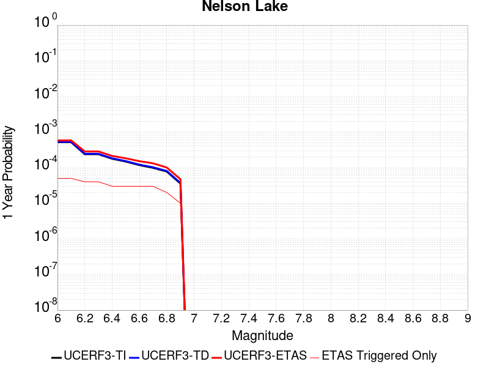 |  |

| Magnitude | 1 wk TI Prob | 1 wk TD Prob | 1 wk ETAS Prob | 1 wk ETAS/TD Gain | 1 wk ETAS Triggered Only | 1 mo TI Prob | 1 mo TD Prob | 1 mo ETAS Prob | 1 mo ETAS/TD Gain | 1 mo ETAS Triggered Only | 1 yr TI Prob | 1 yr TD Prob | 1 yr ETAS Prob | 1 yr ETAS/TD Gain | 1 yr ETAS Triggered Only | 10 yr TI Prob | 10 yr TD Prob | 10 yr ETAS Prob | 10 yr ETAS/TD Gain | 10 yr ETAS Triggered Only |
|-----|-----|-----|-----|-----|-----|-----|-----|-----|-----|-----|-----|-----|-----|-----|-----|-----|-----|-----|-----|-----|
| 6.0 | 9.913453E-6 | 1.0192248E-5 | 1.0192248E-5 | 1.0 | 0.0 | 4.2485535E-5 | 4.368039E-5 | 7.0742804E-5 | 1.6195554 | 2.70636E-5 | 5.1713863E-4 | 5.316893E-4 | 5.722631E-4 | 1.0763111 | 4.0595398E-5 | 0.0051593683 | 0.0053052 | 0.00534558 | 1.0076114 | 4.0595398E-5 |
| 6.1 | 9.913453E-6 | 1.0192248E-5 | 1.0192248E-5 | 1.0 | 0.0 | 4.2485535E-5 | 4.368039E-5 | 7.0742804E-5 | 1.6195554 | 2.70636E-5 | 5.1713863E-4 | 5.316893E-4 | 5.722631E-4 | 1.0763111 | 4.0595398E-5 | 0.0051593683 | 0.0053052 | 0.00534558 | 1.0076114 | 4.0595398E-5 |
| 6.2 | 4.5596407E-6 | 4.696309E-6 | 4.696309E-6 | 1.0 | 0.0 | 1.954117E-5 | 2.0126892E-5 | 4.7189948E-5 | 2.3446217 | 2.70636E-5 | 2.3788778E-4 | 2.4501863E-4 | 2.720756E-4 | 1.1104282 | 2.70636E-5 | 0.0023763329 | 0.002447611 | 0.0024746081 | 1.0110301 | 2.70636E-5 |
| 6.3 | 4.5596407E-6 | 4.696309E-6 | 4.696309E-6 | 1.0 | 0.0 | 1.954117E-5 | 2.0126892E-5 | 4.7189948E-5 | 2.3446217 | 2.70636E-5 | 2.3788778E-4 | 2.4501863E-4 | 2.720756E-4 | 1.1104282 | 2.70636E-5 | 0.0023763329 | 0.002447611 | 0.0024746081 | 1.0110301 | 2.70636E-5 |
| 6.4 | 3.4025713E-6 | 3.5098942E-6 | 3.5098942E-6 | 1.0 | 0.0 | 1.4582367E-5 | 1.5042322E-5 | 2.8573919E-5 | 1.8995683 | 1.35318E-5 | 1.7752586E-4 | 1.8312573E-4 | 1.9665505E-4 | 1.07388 | 1.35318E-5 | 0.001773841 | 0.0018298312 | 0.0018433381 | 1.0073816 | 1.35318E-5 |
| 6.5 | 2.8352947E-6 | 2.9278535E-6 | 2.9278535E-6 | 1.0 | 0.0 | 1.2151207E-5 | 1.2547887E-5 | 2.6079517E-5 | 2.078399 | 1.35318E-5 | 1.479309E-4 | 1.5276058E-4 | 1.6629031E-4 | 1.0885682 | 1.35318E-5 | 0.0014783246 | 0.0015266296 | 0.0015401406 | 1.0088503 | 1.35318E-5 |
| 6.6 | 2.251518E-6 | 2.3290654E-6 | 2.3290654E-6 | 1.0 | 0.0 | 9.649328E-6 | 9.981674E-6 | 2.351334E-5 | 2.355651 | 1.35318E-5 | 1.1747423E-4 | 1.2152074E-4 | 1.350509E-4 | 1.1113403 | 1.35318E-5 | 0.0011741214 | 0.0012146046 | 0.00122812 | 1.0111274 | 1.35318E-5 |
| 6.7 | 1.8911853E-6 | 1.9591378E-6 | 1.9591378E-6 | 1.0 | 0.0 | 8.105055E-6 | 8.396281E-6 | 2.1927966E-5 | 2.6116285 | 1.35318E-5 | 9.867457E-5 | 1.0222051E-4 | 1.1575093E-4 | 1.132365 | 1.35318E-5 | 9.863076E-4 | 0.0010217924 | 0.0010353104 | 1.0132296 | 1.35318E-5 |
| 6.8 | 1.4874814E-6 | 1.543829E-6 | 1.543829E-6 | 1.0 | 0.0 | 6.374905E-6 | 6.6163957E-6 | 6.6163957E-6 | 1.0 | 0.0 | 7.76117E-5 | 8.055216E-5 | 8.055216E-5 | 1.0 | 0.0 | 7.75846E-4 | 8.0528075E-4 | 8.0528075E-4 | 1.0 | 0.0 |
| 6.9 | 6.835972E-7 | 7.13992E-7 | 7.13992E-7 | 1.0 | 0.0 | 2.9296991E-6 | 3.0599638E-6 | 3.0599638E-6 | 1.0 | 0.0 | 3.56685E-5 | 3.725474E-5 | 3.725474E-5 | 1.0 | 0.0 | 3.5662777E-4 | 3.7251622E-4 | 3.7251622E-4 | 1.0 | 0.0 |

## San Andreas (Coachella) rev
*[(top)](#table-of-contents)*

| 1 Week | 1 Month | 1 Year | 10 Year |
|-----|-----|-----|-----|
|  |  |  |  |

| Magnitude | 1 wk TI Prob | 1 wk TD Prob | 1 wk ETAS Prob | 1 wk ETAS/TD Gain | 1 wk ETAS Triggered Only | 1 mo TI Prob | 1 mo TD Prob | 1 mo ETAS Prob | 1 mo ETAS/TD Gain | 1 mo ETAS Triggered Only | 1 yr TI Prob | 1 yr TD Prob | 1 yr ETAS Prob | 1 yr ETAS/TD Gain | 1 yr ETAS Triggered Only | 10 yr TI Prob | 10 yr TD Prob | 10 yr ETAS Prob | 10 yr ETAS/TD Gain | 10 yr ETAS Triggered Only |
|-----|-----|-----|-----|-----|-----|-----|-----|-----|-----|-----|-----|-----|-----|-----|-----|-----|-----|-----|-----|-----|
| 6.0 | 1.1925945E-4 | 3.2723017E-4 | 3.4075754E-4 | 1.041339 | 1.35318E-5 | 5.110118E-4 | 0.001401666 | 0.0014286917 | 1.0192811 | 2.70636E-5 | 0.0062038354 | 0.016933087 | 0.016972996 | 1.0023568 | 4.0595398E-5 | 0.060334753 | 0.15262908 | 0.15266348 | 1.0002254 | 4.0595398E-5 |
| 6.1 | 1.1925945E-4 | 3.2723017E-4 | 3.4075754E-4 | 1.041339 | 1.35318E-5 | 5.110118E-4 | 0.001401666 | 0.0014286917 | 1.0192811 | 2.70636E-5 | 0.0062038354 | 0.016933087 | 0.016972996 | 1.0023568 | 4.0595398E-5 | 0.060334753 | 0.15262908 | 0.15266348 | 1.0002254 | 4.0595398E-5 |
| 6.2 | 1.07432395E-4 | 3.0223778E-4 | 3.157655E-4 | 1.0447586 | 1.35318E-5 | 4.603433E-4 | 0.0012946657 | 0.00130818 | 1.0104384 | 1.35318E-5 | 0.005590286 | 0.01564973 | 0.015676372 | 1.0017023 | 2.70636E-5 | 0.05451731 | 0.1417999 | 0.14182311 | 1.0001638 | 2.70636E-5 |
| 6.3 | 1.0718766E-4 | 3.0169083E-4 | 3.1521855E-4 | 1.0448396 | 1.35318E-5 | 4.592948E-4 | 0.001292324 | 0.0013058383 | 1.0104574 | 1.35318E-5 | 0.005577586 | 0.01562163 | 0.01564827 | 1.0017054 | 2.70636E-5 | 0.054396555 | 0.14156814 | 0.14159137 | 1.0001642 | 2.70636E-5 |
| 6.4 | 1.0355944E-4 | 2.9377177E-4 | 3.0729958E-4 | 1.0460488 | 1.35318E-5 | 4.4375064E-4 | 0.0012584183 | 0.0012719331 | 1.0107394 | 1.35318E-5 | 0.0053892885 | 0.015214663 | 0.015241316 | 1.0017517 | 2.70636E-5 | 0.052604496 | 0.13812812 | 0.13815144 | 1.0001689 | 2.70636E-5 |
| 6.5 | 1.0227914E-4 | 2.909661E-4 | 3.0449397E-4 | 1.0464929 | 1.35318E-5 | 4.382655E-4 | 0.0012464056 | 0.0012599205 | 1.0108432 | 1.35318E-5 | 0.0053228354 | 0.015070442 | 0.0150970975 | 1.0017687 | 2.70636E-5 | 0.051971316 | 0.13690725 | 0.1369306 | 1.0001706 | 2.70636E-5 |
| 6.6 | 1.0116757E-4 | 2.8862362E-4 | 3.0215151E-4 | 1.0468704 | 1.35318E-5 | 4.3350324E-4 | 0.0012363759 | 0.001249891 | 1.0109313 | 1.35318E-5 | 0.0052651367 | 0.014950012 | 0.014976671 | 1.0017833 | 2.70636E-5 | 0.051421247 | 0.1358854 | 0.13590878 | 1.0001721 | 2.70636E-5 |
| 6.7 | 1.0050676E-4 | 2.8720926E-4 | 3.0073716E-4 | 1.0471013 | 1.35318E-5 | 4.3067214E-4 | 0.0012303201 | 0.0012438352 | 1.010985 | 1.35318E-5 | 0.005230834 | 0.014877291 | 0.014903952 | 1.0017921 | 2.70636E-5 | 0.051094085 | 0.1352701 | 0.1352935 | 1.000173 | 2.70636E-5 |
| 6.8 | 9.976819E-5 | 2.8524583E-4 | 2.9877378E-4 | 1.0474255 | 1.35318E-5 | 4.2750788E-4 | 0.0012219134 | 0.0012354286 | 1.0110607 | 1.35318E-5 | 0.0051924936 | 0.014776332 | 0.014802996 | 1.0018045 | 2.70636E-5 | 0.050728295 | 0.13442177 | 0.1344452 | 1.0001743 | 2.70636E-5 |
| 6.9 | 9.77719E-5 | 2.8021506E-4 | 2.9374307E-4 | 1.0482773 | 1.35318E-5 | 4.1895514E-4 | 0.0012003728 | 0.0012138884 | 1.0112594 | 1.35318E-5 | 0.0050888555 | 0.014517602 | 0.014544272 | 1.0018371 | 2.70636E-5 | 0.049738888 | 0.13225023 | 0.13227372 | 1.0001776 | 2.70636E-5 |
| 7.0 | 8.500761E-5 | 2.4756166E-4 | 2.610901E-4 | 1.0546468 | 1.35318E-5 | 3.6426744E-4 | 0.0010605503 | 0.0010740678 | 1.0127457 | 1.35318E-5 | 0.0044259406 | 0.012836529 | 0.012849887 | 1.0010406 | 1.35318E-5 | 0.04338823 | 0.11810792 | 0.11811986 | 1.0001011 | 1.35318E-5 |
| 7.1 | 8.319876E-5 | 2.4358921E-4 | 2.5711773E-4 | 1.0555382 | 1.35318E-5 | 3.5651738E-4 | 0.0010435393 | 0.001057057 | 1.0129536 | 1.35318E-5 | 0.004331963 | 0.01263184 | 0.012645201 | 1.0010577 | 1.35318E-5 | 0.042484846 | 0.11632819 | 0.116340145 | 1.0001028 | 1.35318E-5 |
| 7.2 | 7.563917E-5 | 2.2407399E-4 | 2.3760274E-4 | 1.0603763 | 1.35318E-5 | 3.2412758E-4 | 9.599667E-4 | 9.7348547E-4 | 1.0140826 | 1.35318E-5 | 0.0039391145 | 0.01162565 | 0.011639025 | 1.0011504 | 1.35318E-5 | 0.03870018 | 0.10773429 | 0.10774637 | 1.000112 | 1.35318E-5 |
| 7.3 | 7.082985E-5 | 2.0723743E-4 | 2.2076644E-4 | 1.0652826 | 1.35318E-5 | 3.0352117E-4 | 8.87861E-4 | 9.0138084E-4 | 1.0152273 | 1.35318E-5 | 0.0036891096 | 0.010756755 | 0.010770141 | 1.0012444 | 1.35318E-5 | 0.03628465 | 0.10025747 | 0.10026965 | 1.0001215 | 1.35318E-5 |
| 7.4 | 5.146215E-5 | 1.4271007E-4 | 1.5623993E-4 | 1.0948067 | 1.35318E-5 | 2.2053342E-4 | 6.1147206E-4 | 6.249956E-4 | 1.0221163 | 1.35318E-5 | 0.0026816884 | 0.007419449 | 0.0074328803 | 1.0018103 | 1.35318E-5 | 0.02649557 | 0.070837796 | 0.070850365 | 1.0001775 | 1.35318E-5 |
| 7.5 | 4.0285166E-5 | 1.0941066E-4 | 1.2294098E-4 | 1.1236655 | 1.35318E-5 | 1.7263928E-4 | 4.688189E-4 | 4.8234436E-4 | 1.0288501 | 1.35318E-5 | 0.002099857 | 0.005693001 | 0.005706456 | 1.0023634 | 1.35318E-5 | 0.020801254 | 0.055008773 | 0.055021558 | 1.0002325 | 1.35318E-5 |
| 7.6 | 3.1168736E-5 | 8.438435E-5 | 9.791501E-5 | 1.1603456 | 1.35318E-5 | 1.3357346E-4 | 3.6159722E-4 | 3.7512413E-4 | 1.0374087 | 1.35318E-5 | 0.0016250437 | 0.004393586 | 0.0044070585 | 1.0030664 | 1.35318E-5 | 0.016132116 | 0.04280791 | 0.042820863 | 1.0003026 | 1.35318E-5 |
| 7.7 | 2.2100989E-5 | 6.2383384E-5 | 7.591434E-5 | 1.2169 | 1.35318E-5 | 9.4715084E-5 | 2.6733E-4 | 2.8085816E-4 | 1.0506048 | 1.35318E-5 | 0.001152546 | 0.0032498916 | 0.0032633792 | 1.0041503 | 1.35318E-5 | 0.011465867 | 0.031898305 | 0.031911407 | 1.0004107 | 1.35318E-5 |
| 7.8 | 1.7484861E-5 | 5.1792E-5 | 6.53231E-5 | 1.2612585 | 1.35318E-5 | 7.493296E-5 | 2.2194686E-4 | 2.3547566E-4 | 1.0609552 | 1.35318E-5 | 9.1192697E-4 | 0.0026988573 | 0.0027123527 | 1.0050004 | 1.35318E-5 | 0.009081938 | 0.026638424 | 0.026651595 | 1.0004945 | 1.35318E-5 |
| 7.9 | 1.3967285E-5 | 3.8219507E-5 | 5.175079E-5 | 1.3540412 | 1.35318E-5 | 5.985842E-5 | 1.6378761E-4 | 1.773172E-4 | 1.0826044 | 1.35318E-5 | 7.2853256E-4 | 0.0019922915 | 0.0020057964 | 1.0067786 | 1.35318E-5 | 0.0072614877 | 0.01990803 | 0.019921292 | 1.0006661 | 1.35318E-5 |
| 8.0 | 1.1887396E-5 | 3.10626E-5 | 4.4593977E-5 | 1.4356165 | 1.35318E-5 | 5.094499E-5 | 1.3311864E-4 | 1.4664863E-4 | 1.1016387 | 1.35318E-5 | 6.200787E-4 | 0.0016195155 | 0.0016330254 | 1.0083419 | 1.35318E-5 | 0.006183513 | 0.016278049 | 0.016291361 | 1.0008178 | 1.35318E-5 |
| 8.1 | 5.100864E-6 | 8.972364E-6 | 2.2504042E-5 | 2.5081508 | 1.35318E-5 | 2.1860664E-5 | 3.8452425E-5 | 5.19837E-5 | 1.3518966 | 1.35318E-5 | 2.6612106E-4 | 4.680578E-4 | 4.815833E-4 | 1.028897 | 1.35318E-5 | 0.002658026 | 0.004917206 | 0.004930671 | 1.0027384 | 1.35318E-5 |
| 8.2 | 2.3004484E-6 | 2.7860247E-6 | 2.7860247E-6 | 1.0 | 0.0 | 9.859027E-6 | 1.1940051E-5 | 1.1940051E-5 | 1.0 | 0.0 | 1.2002704E-4 | 1.4536046E-4 | 1.4536046E-4 | 1.0 | 0.0 | 0.0011996223 | 0.0015971722 | 0.0015971722 | 1.0 | 0.0 |
| 8.3 | 1.0424446E-7 | 5.814984E-8 | 5.814984E-8 | 1.0 | 0.0 | 4.4676187E-7 | 2.4921357E-7 | 2.4921357E-7 | 1.0 | 0.0 | 5.439312E-6 | 3.0341714E-6 | 3.0341714E-6 | 1.0 | 0.0 | 5.4391792E-5 | 3.1900923E-5 | 3.1900923E-5 | 1.0 | 0.0 |

## San Jacinto (San Bernardino)
*[(top)](#table-of-contents)*

| 1 Week | 1 Month | 1 Year | 10 Year |
|-----|-----|-----|-----|
|  |  |  |  |

| Magnitude | 1 wk TI Prob | 1 wk TD Prob | 1 wk ETAS Prob | 1 wk ETAS/TD Gain | 1 wk ETAS Triggered Only | 1 mo TI Prob | 1 mo TD Prob | 1 mo ETAS Prob | 1 mo ETAS/TD Gain | 1 mo ETAS Triggered Only | 1 yr TI Prob | 1 yr TD Prob | 1 yr ETAS Prob | 1 yr ETAS/TD Gain | 1 yr ETAS Triggered Only | 10 yr TI Prob | 10 yr TD Prob | 10 yr ETAS Prob | 10 yr ETAS/TD Gain | 10 yr ETAS Triggered Only |
|-----|-----|-----|-----|-----|-----|-----|-----|-----|-----|-----|-----|-----|-----|-----|-----|-----|-----|-----|-----|-----|
| 6.0 | 3.409352E-5 | 3.597972E-5 | 4.9511033E-5 | 1.3760817 | 1.35318E-5 | 1.461069E-4 | 1.541897E-4 | 1.6771941E-4 | 1.0877472 | 1.35318E-5 | 0.0017774 | 0.0018756451 | 0.0019161644 | 1.0216029 | 4.0595398E-5 | 0.01763251 | 0.019346429 | 0.019386237 | 1.0020578 | 4.0595398E-5 |
| 6.1 | 3.409352E-5 | 3.597972E-5 | 4.9511033E-5 | 1.3760817 | 1.35318E-5 | 1.461069E-4 | 1.541897E-4 | 1.6771941E-4 | 1.0877472 | 1.35318E-5 | 0.0017774 | 0.0018756451 | 0.0019161644 | 1.0216029 | 4.0595398E-5 | 0.01763251 | 0.019346429 | 0.019386237 | 1.0020578 | 4.0595398E-5 |
| 6.2 | 3.409352E-5 | 3.597972E-5 | 4.9511033E-5 | 1.3760817 | 1.35318E-5 | 1.461069E-4 | 1.541897E-4 | 1.6771941E-4 | 1.0877472 | 1.35318E-5 | 0.0017774 | 0.0018756451 | 0.0019161644 | 1.0216029 | 4.0595398E-5 | 0.01763251 | 0.019346429 | 0.019386237 | 1.0020578 | 4.0595398E-5 |
| 6.3 | 3.409352E-5 | 3.597972E-5 | 4.9511033E-5 | 1.3760817 | 1.35318E-5 | 1.461069E-4 | 1.541897E-4 | 1.6771941E-4 | 1.0877472 | 1.35318E-5 | 0.0017774 | 0.0018756451 | 0.0019161644 | 1.0216029 | 4.0595398E-5 | 0.01763251 | 0.019346429 | 0.019386237 | 1.0020578 | 4.0595398E-5 |
| 6.4 | 3.400795E-5 | 3.5872385E-5 | 4.9403698E-5 | 1.377207 | 1.35318E-5 | 1.4574021E-4 | 1.5372974E-4 | 1.6725947E-4 | 1.0880097 | 1.35318E-5 | 0.0017729428 | 0.0018700549 | 0.0019105744 | 1.0216675 | 4.0595398E-5 | 0.017588645 | 0.01929151 | 0.019331323 | 1.0020638 | 4.0595398E-5 |
| 6.5 | 3.341482E-5 | 3.5133027E-5 | 3.5133027E-5 | 1.0 | 0.0 | 1.4319851E-4 | 1.5056143E-4 | 1.5056143E-4 | 1.0 | 0.0 | 0.0017420477 | 0.0018315457 | 0.0018585597 | 1.0147493 | 2.70636E-5 | 0.017284546 | 0.018913053 | 0.018939605 | 1.0014039 | 2.70636E-5 |
| 6.6 | 3.3364955E-5 | 3.5070247E-5 | 3.5070247E-5 | 1.0 | 0.0 | 1.4298483E-4 | 1.5029241E-4 | 1.5029241E-4 | 1.0 | 0.0 | 0.0017394501 | 0.0018282757 | 0.0018552899 | 1.0147758 | 2.70636E-5 | 0.017258976 | 0.018880919 | 0.01890747 | 1.0014063 | 2.70636E-5 |
| 6.7 | 3.335922E-5 | 3.506002E-5 | 3.506002E-5 | 1.0 | 0.0 | 1.4296026E-4 | 1.5024858E-4 | 1.5024858E-4 | 1.0 | 0.0 | 0.0017391514 | 0.0018277431 | 0.0018547573 | 1.01478 | 2.70636E-5 | 0.017256035 | 0.018875709 | 0.018902263 | 1.0014067 | 2.70636E-5 |
| 6.8 | 3.327683E-5 | 3.495409E-5 | 3.495409E-5 | 1.0 | 0.0 | 1.4260718E-4 | 1.4979464E-4 | 1.4979464E-4 | 1.0 | 0.0 | 0.0017348597 | 0.0018222256 | 0.0018492399 | 1.0148249 | 2.70636E-5 | 0.017213784 | 0.018821482 | 0.018848035 | 1.0014108 | 2.70636E-5 |
| 6.9 | 3.3235785E-5 | 3.489504E-5 | 3.489504E-5 | 1.0 | 0.0 | 1.4243131E-4 | 1.4954162E-4 | 1.4954162E-4 | 1.0 | 0.0 | 0.0017327217 | 0.0018191502 | 0.0018461646 | 1.01485 | 2.70636E-5 | 0.017192734 | 0.01879135 | 0.018817905 | 1.0014131 | 2.70636E-5 |
| 7.0 | 3.3197095E-5 | 3.4834975E-5 | 3.4834975E-5 | 1.0 | 0.0 | 1.422655E-4 | 1.4928421E-4 | 1.4928421E-4 | 1.0 | 0.0 | 0.0017307063 | 0.0018160215 | 0.0018430359 | 1.0148757 | 2.70636E-5 | 0.017172894 | 0.018760728 | 0.018787283 | 1.0014155 | 2.70636E-5 |
| 7.1 | 3.3129716E-5 | 3.4715187E-5 | 3.4715187E-5 | 1.0 | 0.0 | 1.4197677E-4 | 1.487709E-4 | 1.487709E-4 | 1.0 | 0.0 | 0.0017271966 | 0.0018097822 | 0.0018367969 | 1.014927 | 2.70636E-5 | 0.017138338 | 0.018699808 | 0.018726366 | 1.0014203 | 2.70636E-5 |
| 7.2 | 3.3034008E-5 | 3.4582634E-5 | 3.4582634E-5 | 1.0 | 0.0 | 1.4156665E-4 | 1.4820287E-4 | 1.4820287E-4 | 1.0 | 0.0 | 0.0017222111 | 0.0018028781 | 0.001829893 | 1.0149843 | 2.70636E-5 | 0.017089253 | 0.018632201 | 0.018658761 | 1.0014255 | 2.70636E-5 |
| 7.3 | 3.2956614E-5 | 3.4450393E-5 | 3.4450393E-5 | 1.0 | 0.0 | 1.4123498E-4 | 1.476362E-4 | 1.476362E-4 | 1.0 | 0.0 | 0.0017181796 | 0.0017959902 | 0.0018230052 | 1.0150418 | 2.70636E-5 | 0.017049557 | 0.018564949 | 0.01859151 | 1.0014307 | 2.70636E-5 |
| 7.4 | 3.2915937E-5 | 3.437212E-5 | 3.437212E-5 | 1.0 | 0.0 | 1.4106068E-4 | 1.4730077E-4 | 1.4730077E-4 | 1.0 | 0.0 | 0.0017160608 | 0.0017919131 | 0.0018189282 | 1.0150762 | 2.70636E-5 | 0.017028693 | 0.01852523 | 0.018551791 | 1.0014338 | 2.70636E-5 |
| 7.5 | 3.281791E-5 | 3.4237073E-5 | 3.4237073E-5 | 1.0 | 0.0 | 1.406406E-4 | 1.4672207E-4 | 1.4672207E-4 | 1.0 | 0.0 | 0.0017109542 | 0.0017848789 | 0.0018118942 | 1.0151356 | 2.70636E-5 | 0.016978411 | 0.018456137 | 0.018482702 | 1.0014393 | 2.70636E-5 |
| 7.6 | 3.2521442E-5 | 3.3962282E-5 | 3.3962282E-5 | 1.0 | 0.0 | 1.3937015E-4 | 1.4554452E-4 | 1.4554452E-4 | 1.0 | 0.0 | 0.0016955109 | 0.0017705658 | 0.0017975814 | 1.0152582 | 2.70636E-5 | 0.016826328 | 0.018313898 | 0.018340467 | 1.0014507 | 2.70636E-5 |
| 7.7 | 3.0287873E-5 | 3.2449603E-5 | 3.2449603E-5 | 1.0 | 0.0 | 1.297987E-4 | 1.3906232E-4 | 1.3906232E-4 | 1.0 | 0.0 | 0.0015791537 | 0.00169177 | 0.0017187878 | 1.0159701 | 2.70636E-5 | 0.01567979 | 0.017526472 | 0.017553061 | 1.001517 | 2.70636E-5 |
| 7.8 | 2.6316151E-5 | 2.9660547E-5 | 2.9660547E-5 | 1.0 | 0.0 | 1.1277862E-4 | 1.2711044E-4 | 1.2711044E-4 | 1.0 | 0.0 | 0.0013722149 | 0.001546472 | 0.0015734937 | 1.0174731 | 2.70636E-5 | 0.013637724 | 0.016068073 | 0.016094701 | 1.0016572 | 2.70636E-5 |
| 7.9 | 2.0761147E-5 | 2.341544E-5 | 2.341544E-5 | 1.0 | 0.0 | 8.897331E-5 | 1.0034803E-4 | 1.0034803E-4 | 1.0 | 0.0 | 0.0010827117 | 0.0012210533 | 0.0012345687 | 1.0110686 | 1.35318E-5 | 0.010774517 | 0.012791798 | 0.012805157 | 1.0010443 | 1.35318E-5 |
| 8.0 | 1.5738568E-5 | 1.6031558E-5 | 1.6031558E-5 | 1.0 | 0.0 | 6.744926E-5 | 6.8704874E-5 | 6.8704874E-5 | 1.0 | 0.0 | 8.2088535E-4 | 8.361615E-4 | 8.361615E-4 | 1.0 | 0.0 | 0.008178596 | 0.008864859 | 0.008864859 | 1.0 | 0.0 |
| 8.1 | 1.0105832E-5 | 8.329329E-6 | 8.329329E-6 | 1.0 | 0.0 | 4.3309992E-5 | 3.5696637E-5 | 3.5696637E-5 | 1.0 | 0.0 | 5.2717153E-4 | 4.3452042E-4 | 4.3452042E-4 | 1.0 | 0.0 | 0.005259227 | 0.0046766037 | 0.0046766037 | 1.0 | 0.0 |
| 8.2 | 4.189207E-6 | 1.5781004E-6 | 1.5781004E-6 | 1.0 | 0.0 | 1.7953622E-5 | 6.76327E-6 | 6.76327E-6 | 1.0 | 0.0 | 2.1856341E-4 | 8.233973E-5 | 8.233973E-5 | 1.0 | 0.0 | 0.0021834858 | 9.5639535E-4 | 9.5639535E-4 | 1.0 | 0.0 |
| 8.3 | 1.2758221E-6 | 3.6140935E-7 | 3.6140935E-7 | 1.0 | 0.0 | 5.4677976E-6 | 1.5488963E-6 | 1.5488963E-6 | 1.0 | 0.0 | 6.65684E-5 | 1.8857654E-5 | 1.8857654E-5 | 1.0 | 0.0 | 6.6548464E-4 | 2.2746001E-4 | 2.2746001E-4 | 1.0 | 0.0 |

## Scodie Lineament
*[(top)](#table-of-contents)*

| 1 Week | 1 Month | 1 Year | 10 Year |
|-----|-----|-----|-----|
|  |  |  |  |

| Magnitude | 1 wk TI Prob | 1 wk TD Prob | 1 wk ETAS Prob | 1 wk ETAS/TD Gain | 1 wk ETAS Triggered Only | 1 mo TI Prob | 1 mo TD Prob | 1 mo ETAS Prob | 1 mo ETAS/TD Gain | 1 mo ETAS Triggered Only | 1 yr TI Prob | 1 yr TD Prob | 1 yr ETAS Prob | 1 yr ETAS/TD Gain | 1 yr ETAS Triggered Only | 10 yr TI Prob | 10 yr TD Prob | 10 yr ETAS Prob | 10 yr ETAS/TD Gain | 10 yr ETAS Triggered Only |
|-----|-----|-----|-----|-----|-----|-----|-----|-----|-----|-----|-----|-----|-----|-----|-----|-----|-----|-----|-----|-----|
| 6.0 | 3.2919327E-6 | 3.0133394E-6 | 4.3608616E-5 | 14.471857 | 4.0595398E-5 | 1.4108206E-5 | 1.2914265E-5 | 5.3509142E-5 | 4.1434135 | 4.0595398E-5 | 1.7175387E-4 | 1.5722301E-4 | 1.9781203E-4 | 1.258162 | 4.0595398E-5 | 0.0017162118 | 0.0015714294 | 0.001611961 | 1.0257928 | 4.0595398E-5 |
| 6.1 | 1.8663811E-6 | 1.5490481E-6 | 1.5080827E-5 | 9.735544 | 1.35318E-5 | 7.998751E-6 | 6.638764E-6 | 2.0170473E-5 | 3.0382876 | 1.35318E-5 | 9.738045E-5 | 8.0824444E-5 | 9.435515E-5 | 1.1674086 | 1.35318E-5 | 9.7337784E-4 | 8.0799934E-4 | 8.2152017E-4 | 1.0167338 | 1.35318E-5 |
| 6.2 | 1.8663811E-6 | 1.5490481E-6 | 1.5080827E-5 | 9.735544 | 1.35318E-5 | 7.998751E-6 | 6.638764E-6 | 2.0170473E-5 | 3.0382876 | 1.35318E-5 | 9.738045E-5 | 8.0824444E-5 | 9.435515E-5 | 1.1674086 | 1.35318E-5 | 9.7337784E-4 | 8.0799934E-4 | 8.2152017E-4 | 1.0167338 | 1.35318E-5 |
| 6.3 | 1.8663811E-6 | 1.5490481E-6 | 1.5080827E-5 | 9.735544 | 1.35318E-5 | 7.998751E-6 | 6.638764E-6 | 2.0170473E-5 | 3.0382876 | 1.35318E-5 | 9.738045E-5 | 8.0824444E-5 | 9.435515E-5 | 1.1674086 | 1.35318E-5 | 9.7337784E-4 | 8.0799934E-4 | 8.2152017E-4 | 1.0167338 | 1.35318E-5 |
| 6.4 | 1.8663811E-6 | 1.5490481E-6 | 1.5080827E-5 | 9.735544 | 1.35318E-5 | 7.998751E-6 | 6.638764E-6 | 2.0170473E-5 | 3.0382876 | 1.35318E-5 | 9.738045E-5 | 8.0824444E-5 | 9.435515E-5 | 1.1674086 | 1.35318E-5 | 9.7337784E-4 | 8.0799934E-4 | 8.2152017E-4 | 1.0167338 | 1.35318E-5 |
| 6.5 | 1.8106311E-6 | 1.4909822E-6 | 1.50227615E-5 | 10.075748 | 1.35318E-5 | 7.759824E-6 | 6.389911E-6 | 1.9921625E-5 | 3.1176686 | 1.35318E-5 | 9.447177E-5 | 7.779488E-5 | 9.132563E-5 | 1.1739285 | 1.35318E-5 | 9.4431615E-4 | 7.777252E-4 | 7.912464E-4 | 1.0173857 | 1.35318E-5 |
| 6.6 | 1.2414679E-6 | 8.9975464E-7 | 1.4431542E-5 | 16.03942 | 1.35318E-5 | 5.320566E-6 | 3.856086E-6 | 1.7387834E-5 | 4.5091925 | 1.35318E-5 | 6.477596E-5 | 4.6946923E-5 | 6.047809E-5 | 1.2882226 | 1.35318E-5 | 6.475708E-4 | 4.6937872E-4 | 4.8290417E-4 | 1.0288156 | 1.35318E-5 |
| 6.7 | 1.1062215E-6 | 7.594301E-7 | 7.594301E-7 | 1.0 | 0.0 | 4.7409408E-6 | 3.2546968E-6 | 3.2546968E-6 | 1.0 | 0.0 | 5.7719422E-5 | 3.9625284E-5 | 3.9625284E-5 | 1.0 | 0.0 | 5.770443E-4 | 3.9618916E-4 | 3.9618916E-4 | 1.0 | 0.0 |
| 6.8 | 1.0006736E-6 | 6.5003877E-7 | 6.5003877E-7 | 1.0 | 0.0 | 4.288594E-6 | 2.785878E-6 | 2.785878E-6 | 1.0 | 0.0 | 5.221238E-5 | 3.3917597E-5 | 3.3917597E-5 | 1.0 | 0.0 | 5.220012E-4 | 3.391303E-4 | 3.391303E-4 | 1.0 | 0.0 |
| 6.9 | 9.167364E-7 | 5.631617E-7 | 5.631617E-7 | 1.0 | 0.0 | 3.9288643E-6 | 2.4135481E-6 | 2.4135481E-6 | 1.0 | 0.0 | 4.7832873E-5 | 2.938461E-5 | 2.938461E-5 | 1.0 | 0.0 | 4.782258E-4 | 2.9381292E-4 | 2.9381292E-4 | 1.0 | 0.0 |
| 7.0 | 7.6987664E-7 | 4.1133762E-7 | 4.1133762E-7 | 1.0 | 0.0 | 3.2994672E-6 | 1.7628746E-6 | 1.7628746E-6 | 1.0 | 0.0 | 4.0170275E-5 | 2.1462827E-5 | 2.1462827E-5 | 1.0 | 0.0 | 4.0163012E-4 | 2.1461138E-4 | 2.1461138E-4 | 1.0 | 0.0 |
| 7.1 | 7.1038727E-7 | 3.521143E-7 | 3.521143E-7 | 1.0 | 0.0 | 3.0445133E-6 | 1.5090607E-6 | 1.5090607E-6 | 1.0 | 0.0 | 3.706632E-5 | 1.8372695E-5 | 1.8372695E-5 | 1.0 | 0.0 | 3.7060137E-4 | 1.8371525E-4 | 1.8371525E-4 | 1.0 | 0.0 |
| 7.2 | 2.0799602E-7 | 3.1186687E-8 | 3.1186687E-8 | 1.0 | 0.0 | 8.914113E-7 | 1.3365722E-7 | 1.3365722E-7 | 1.0 | 0.0 | 1.0852878E-5 | 1.6272755E-6 | 1.6272755E-6 | 1.0 | 0.0 | 1.08523476E-4 | 1.6272643E-5 | 1.6272643E-5 | 1.0 | 0.0 |
| 7.3 | 1.5048182E-7 | 1.5945583E-8 | 1.5945583E-8 | 1.0 | 0.0 | 6.449219E-7 | 6.833821E-8 | 6.833821E-8 | 1.0 | 0.0 | 7.851896E-6 | 8.320174E-7 | 8.320174E-7 | 1.0 | 0.0 | 7.851618E-5 | 8.320146E-6 | 8.320146E-6 | 1.0 | 0.0 |
| 7.4 | 5.9334678E-8 | 4.868311E-9 | 4.868311E-9 | 1.0 | 0.0 | 2.5429145E-7 | 2.0864192E-8 | 2.0864192E-8 | 1.0 | 0.0 | 3.095994E-6 | 2.540215E-7 | 2.540215E-7 | 1.0 | 0.0 | 3.095951E-5 | 2.5402135E-6 | 2.5402135E-6 | 1.0 | 0.0 |

## Coyote Lake
*[(top)](#table-of-contents)*

| 1 Week | 1 Month | 1 Year | 10 Year |
|-----|-----|-----|-----|
|  |  |  |  |

| Magnitude | 1 wk TI Prob | 1 wk TD Prob | 1 wk ETAS Prob | 1 wk ETAS/TD Gain | 1 wk ETAS Triggered Only | 1 mo TI Prob | 1 mo TD Prob | 1 mo ETAS Prob | 1 mo ETAS/TD Gain | 1 mo ETAS Triggered Only | 1 yr TI Prob | 1 yr TD Prob | 1 yr ETAS Prob | 1 yr ETAS/TD Gain | 1 yr ETAS Triggered Only | 10 yr TI Prob | 10 yr TD Prob | 10 yr ETAS Prob | 10 yr ETAS/TD Gain | 10 yr ETAS Triggered Only |
|-----|-----|-----|-----|-----|-----|-----|-----|-----|-----|-----|-----|-----|-----|-----|-----|-----|-----|-----|-----|-----|
| 6.0 | 1.980352E-5 | 2.170669E-5 | 3.5238194E-5 | 1.6233796 | 1.35318E-5 | 8.486947E-5 | 9.302576E-5 | 1.065563E-4 | 1.1454494 | 1.35318E-5 | 0.0010327959 | 0.0011320722 | 0.0011591051 | 1.0238792 | 2.70636E-5 | 0.010280091 | 0.01127023 | 0.011310367 | 1.0035614 | 4.0595398E-5 |
| 6.1 | 1.980352E-5 | 2.170669E-5 | 3.5238194E-5 | 1.6233796 | 1.35318E-5 | 8.486947E-5 | 9.302576E-5 | 1.065563E-4 | 1.1454494 | 1.35318E-5 | 0.0010327959 | 0.0011320722 | 0.0011591051 | 1.0238792 | 2.70636E-5 | 0.010280091 | 0.01127023 | 0.011310367 | 1.0035614 | 4.0595398E-5 |
| 6.2 | 1.980352E-5 | 2.170669E-5 | 3.5238194E-5 | 1.6233796 | 1.35318E-5 | 8.486947E-5 | 9.302576E-5 | 1.065563E-4 | 1.1454494 | 1.35318E-5 | 0.0010327959 | 0.0011320722 | 0.0011591051 | 1.0238792 | 2.70636E-5 | 0.010280091 | 0.01127023 | 0.011310367 | 1.0035614 | 4.0595398E-5 |
| 6.3 | 1.5344787E-5 | 1.6820626E-5 | 3.0352197E-5 | 1.804463 | 1.35318E-5 | 6.576172E-5 | 7.2086754E-5 | 8.5617576E-5 | 1.187702 | 1.35318E-5 | 8.003548E-4 | 8.77364E-4 | 9.0440386E-4 | 1.0308194 | 2.70636E-5 | 0.007974784 | 0.008745047 | 0.008785287 | 1.0046015 | 4.0595398E-5 |
| 6.4 | 1.5344787E-5 | 1.6820626E-5 | 3.0352197E-5 | 1.804463 | 1.35318E-5 | 6.576172E-5 | 7.2086754E-5 | 8.5617576E-5 | 1.187702 | 1.35318E-5 | 8.003548E-4 | 8.77364E-4 | 9.0440386E-4 | 1.0308194 | 2.70636E-5 | 0.007974784 | 0.008745047 | 0.008785287 | 1.0046015 | 4.0595398E-5 |
| 6.5 | 1.4189697E-5 | 1.5557947E-5 | 2.9089537E-5 | 1.8697542 | 1.35318E-5 | 6.081157E-5 | 6.667555E-5 | 8.0206446E-5 | 1.2029364 | 1.35318E-5 | 7.401293E-4 | 8.115328E-4 | 8.3857443E-4 | 1.0333217 | 2.70636E-5 | 0.0073766913 | 0.008091635 | 0.008131902 | 1.0049764 | 4.0595398E-5 |
| 6.6 | 1.3469301E-5 | 1.4771539E-5 | 2.8303139E-5 | 1.9160589 | 1.35318E-5 | 5.7724297E-5 | 6.33054E-5 | 7.683634E-5 | 1.2137407 | 1.35318E-5 | 7.025667E-4 | 7.7053066E-4 | 7.975734E-4 | 1.0350963 | 2.70636E-5 | 0.0070034964 | 0.0076844944 | 0.007724778 | 1.0052422 | 4.0595398E-5 |
| 6.7 | 1.3027966E-5 | 1.4281708E-5 | 2.7813316E-5 | 1.9474782 | 1.35318E-5 | 5.5832945E-5 | 6.120622E-5 | 7.4737196E-5 | 1.2210718 | 1.35318E-5 | 6.7955407E-4 | 7.449907E-4 | 7.7203417E-4 | 1.0363004 | 2.70636E-5 | 0.006774798 | 0.0074308095 | 0.0074711037 | 1.0054225 | 4.0595398E-5 |
| 6.8 | 5.695434E-6 | 6.2244026E-6 | 1.9756118E-5 | 3.1739783 | 1.35318E-5 | 2.4408775E-5 | 2.6675907E-5 | 4.0207346E-5 | 1.5072532 | 1.35318E-5 | 2.971363E-4 | 3.2476074E-4 | 3.5181557E-4 | 1.0833069 | 2.70636E-5 | 0.0029673933 | 0.0032458024 | 0.003286266 | 1.0124664 | 4.0595398E-5 |
| 6.9 | 4.385688E-6 | 4.7930434E-6 | 1.8324778E-5 | 3.823203 | 1.35318E-5 | 1.879567E-5 | 2.0541615E-5 | 3.407314E-5 | 1.658737 | 1.35318E-5 | 2.2881327E-4 | 2.5009416E-4 | 2.77151E-4 | 1.1081866 | 2.70636E-5 | 0.002285778 | 0.0025009417 | 0.0025414354 | 1.0161915 | 4.0595398E-5 |

## Elsinore (Glen Ivy) rev
*[(top)](#table-of-contents)*

| 1 Week | 1 Month | 1 Year | 10 Year |
|-----|-----|-----|-----|
|  |  |  |  |

| Magnitude | 1 wk TI Prob | 1 wk TD Prob | 1 wk ETAS Prob | 1 wk ETAS/TD Gain | 1 wk ETAS Triggered Only | 1 mo TI Prob | 1 mo TD Prob | 1 mo ETAS Prob | 1 mo ETAS/TD Gain | 1 mo ETAS Triggered Only | 1 yr TI Prob | 1 yr TD Prob | 1 yr ETAS Prob | 1 yr ETAS/TD Gain | 1 yr ETAS Triggered Only | 10 yr TI Prob | 10 yr TD Prob | 10 yr ETAS Prob | 10 yr ETAS/TD Gain | 10 yr ETAS Triggered Only |
|-----|-----|-----|-----|-----|-----|-----|-----|-----|-----|-----|-----|-----|-----|-----|-----|-----|-----|-----|-----|-----|
| 6.0 | 1.6204086E-4 | 2.9360445E-4 | 3.0713226E-4 | 1.046075 | 1.35318E-5 | 6.94276E-4 | 0.0012578527 | 0.0012713674 | 1.0107443 | 1.35318E-5 | 0.008420097 | 0.01523435 | 0.015247676 | 1.0008748 | 1.35318E-5 | 0.081081145 | 0.139691 | 0.13971427 | 1.0001667 | 2.70636E-5 |
| 6.1 | 1.6204086E-4 | 2.9360445E-4 | 3.0713226E-4 | 1.046075 | 1.35318E-5 | 6.94276E-4 | 0.0012578527 | 0.0012713674 | 1.0107443 | 1.35318E-5 | 0.008420097 | 0.01523435 | 0.015247676 | 1.0008748 | 1.35318E-5 | 0.081081145 | 0.139691 | 0.13971427 | 1.0001667 | 2.70636E-5 |
| 6.2 | 1.6204086E-4 | 2.9360445E-4 | 3.0713226E-4 | 1.046075 | 1.35318E-5 | 6.94276E-4 | 0.0012578527 | 0.0012713674 | 1.0107443 | 1.35318E-5 | 0.008420097 | 0.01523435 | 0.015247676 | 1.0008748 | 1.35318E-5 | 0.081081145 | 0.139691 | 0.13971427 | 1.0001667 | 2.70636E-5 |
| 6.3 | 1.0111737E-4 | 1.7703307E-4 | 1.7703307E-4 | 1.0 | 0.0 | 4.332882E-4 | 7.586092E-4 | 7.586092E-4 | 1.0 | 0.0 | 0.005262531 | 0.009217643 | 0.0092310505 | 1.0014545 | 1.35318E-5 | 0.0513964 | 0.087018766 | 0.08703112 | 1.000142 | 1.35318E-5 |
| 6.4 | 1.0111737E-4 | 1.7703307E-4 | 1.7703307E-4 | 1.0 | 0.0 | 4.332882E-4 | 7.586092E-4 | 7.586092E-4 | 1.0 | 0.0 | 0.005262531 | 0.009217643 | 0.0092310505 | 1.0014545 | 1.35318E-5 | 0.0513964 | 0.087018766 | 0.08703112 | 1.000142 | 1.35318E-5 |
| 6.5 | 3.6624708E-5 | 4.639072E-5 | 4.639072E-5 | 1.0 | 0.0 | 1.569536E-4 | 1.9880426E-4 | 1.9880426E-4 | 1.0 | 0.0 | 0.001909235 | 0.002418118 | 0.002418118 | 1.0 | 0.0 | 0.01892915 | 0.023739774 | 0.023739774 | 1.0 | 0.0 |
| 6.6 | 2.5051324E-5 | 2.6147469E-5 | 2.6147469E-5 | 1.0 | 0.0 | 1.073584E-4 | 1.1205602E-4 | 1.1205602E-4 | 1.0 | 0.0 | 0.0013063047 | 0.0013634728 | 0.0013634728 | 1.0 | 0.0 | 0.012986525 | 0.01356449 | 0.01356449 | 1.0 | 0.0 |
| 6.7 | 2.2189772E-5 | 2.2072634E-5 | 2.2072634E-5 | 1.0 | 0.0 | 9.509556E-5 | 9.459378E-5 | 9.459378E-5 | 1.0 | 0.0 | 0.0011571734 | 0.0011511071 | 0.0011511071 | 1.0 | 0.0 | 0.011511663 | 0.011465305 | 0.011465305 | 1.0 | 0.0 |
| 6.8 | 1.6654378E-5 | 1.443758E-5 | 1.443758E-5 | 1.0 | 0.0 | 7.137396E-5 | 6.18739E-5 | 6.18739E-5 | 1.0 | 0.0 | 8.686314E-4 | 7.530596E-4 | 7.530596E-4 | 1.0 | 0.0 | 0.008652439 | 0.0075104153 | 0.0075104153 | 1.0 | 0.0 |
| 6.9 | 1.5042909E-5 | 1.2331914E-5 | 1.2331914E-5 | 1.0 | 0.0 | 6.446802E-5 | 5.285001E-5 | 5.285001E-5 | 1.0 | 0.0 | 7.8461546E-4 | 6.4326206E-4 | 6.4326206E-4 | 1.0 | 0.0 | 0.007818509 | 0.006418224 | 0.006418224 | 1.0 | 0.0 |
| 7.0 | 1.4361385E-5 | 1.1451223E-5 | 1.1451223E-5 | 1.0 | 0.0 | 6.154734E-5 | 4.9075763E-5 | 4.9075763E-5 | 1.0 | 0.0 | 7.490812E-4 | 5.973365E-4 | 5.973365E-4 | 1.0 | 0.0 | 0.007465612 | 0.005961301 | 0.005961301 | 1.0 | 0.0 |
| 7.1 | 1.3265571E-5 | 1.0244836E-5 | 1.0244836E-5 | 1.0 | 0.0 | 5.6851208E-5 | 4.390571E-5 | 4.390571E-5 | 1.0 | 0.0 | 6.919436E-4 | 5.3442345E-4 | 5.3442345E-4 | 1.0 | 0.0 | 0.006897931 | 0.0053347396 | 0.0053347396 | 1.0 | 0.0 |
| 7.2 | 1.1596403E-5 | 8.504992E-6 | 8.504992E-6 | 1.0 | 0.0 | 4.9697923E-5 | 3.6449466E-5 | 3.6449466E-5 | 1.0 | 0.0 | 6.049042E-4 | 4.436836E-4 | 4.436836E-4 | 1.0 | 0.0 | 0.006032603 | 0.004429393 | 0.004429393 | 1.0 | 0.0 |
| 7.3 | 1.0150827E-5 | 7.2386983E-6 | 7.2386983E-6 | 1.0 | 0.0 | 4.3502816E-5 | 3.102263E-5 | 3.102263E-5 | 1.0 | 0.0 | 5.2951806E-4 | 3.7763652E-4 | 3.7763652E-4 | 1.0 | 0.0 | 0.005282581 | 0.0037703344 | 0.0037703344 | 1.0 | 0.0 |
| 7.4 | 9.080705E-6 | 6.3524662E-6 | 6.3524662E-6 | 1.0 | 0.0 | 3.8916725E-5 | 2.7224578E-5 | 2.7224578E-5 | 1.0 | 0.0 | 4.7370812E-4 | 3.3141018E-4 | 3.3141018E-4 | 1.0 | 0.0 | 0.004726996 | 0.0033093104 | 0.0033093104 | 1.0 | 0.0 |
| 7.5 | 7.671649E-6 | 5.22559E-6 | 5.22559E-6 | 1.0 | 0.0 | 3.287808E-5 | 2.2395201E-5 | 2.2395201E-5 | 1.0 | 0.0 | 4.0021708E-4 | 2.726287E-4 | 2.726287E-4 | 1.0 | 0.0 | 0.0039949706 | 0.0027230675 | 0.0027230675 | 1.0 | 0.0 |
| 7.6 | 6.990086E-6 | 4.687506E-6 | 4.687506E-6 | 1.0 | 0.0 | 2.9957167E-5 | 2.0089165E-5 | 2.0089165E-5 | 1.0 | 0.0 | 3.6466747E-4 | 2.4455928E-4 | 2.4455928E-4 | 1.0 | 0.0 | 0.0036406964 | 0.002443018 | 0.002443018 | 1.0 | 0.0 |
| 7.7 | 4.163505E-6 | 2.3295113E-6 | 2.3295113E-6 | 1.0 | 0.0 | 1.7843471E-5 | 9.983586E-6 | 9.983586E-6 | 1.0 | 0.0 | 2.172226E-4 | 1.2154412E-4 | 1.2154412E-4 | 1.0 | 0.0 | 0.0021701038 | 0.0012148495 | 0.0012148495 | 1.0 | 0.0 |
| 7.8 | 2.2692414E-7 | 9.385374E-8 | 9.385374E-8 | 1.0 | 0.0 | 9.725317E-7 | 4.0223028E-7 | 4.0223028E-7 | 1.0 | 0.0 | 1.1840509E-5 | 4.897146E-6 | 4.897146E-6 | 1.0 | 0.0 | 1.1839878E-4 | 4.897071E-5 | 4.897071E-5 | 1.0 | 0.0 |
| 7.9 | 6.676829E-9 | 3.439828E-9 | 3.439828E-9 | 1.0 | 0.0 | 2.861498E-8 | 1.47421195E-8 | 1.47421195E-8 | 1.0 | 0.0 | 3.4838732E-7 | 1.7948528E-7 | 1.7948528E-7 | 1.0 | 0.0 | 3.4838679E-6 | 1.7948516E-6 | 1.7948516E-6 | 1.0 | 0.0 |

## Ludlow
*[(top)](#table-of-contents)*

| 1 Week | 1 Month | 1 Year | 10 Year |
|-----|-----|-----|-----|
|  | 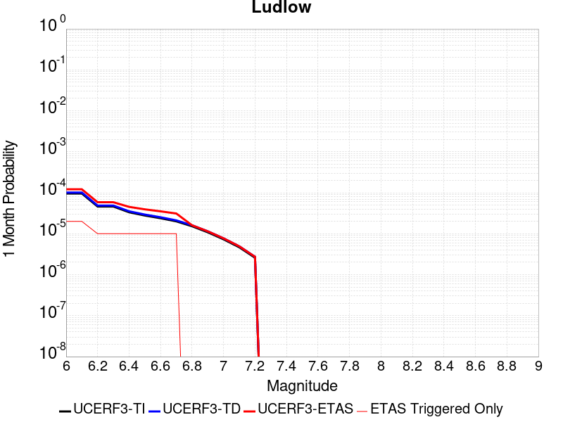 |  |  |

| Magnitude | 1 wk TI Prob | 1 wk TD Prob | 1 wk ETAS Prob | 1 wk ETAS/TD Gain | 1 wk ETAS Triggered Only | 1 mo TI Prob | 1 mo TD Prob | 1 mo ETAS Prob | 1 mo ETAS/TD Gain | 1 mo ETAS Triggered Only | 1 yr TI Prob | 1 yr TD Prob | 1 yr ETAS Prob | 1 yr ETAS/TD Gain | 1 yr ETAS Triggered Only | 10 yr TI Prob | 10 yr TD Prob | 10 yr ETAS Prob | 10 yr ETAS/TD Gain | 10 yr ETAS Triggered Only |
|-----|-----|-----|-----|-----|-----|-----|-----|-----|-----|-----|-----|-----|-----|-----|-----|-----|-----|-----|-----|-----|
| 6.0 | 2.2407607E-5 | 2.3657218E-5 | 2.3657218E-5 | 1.0 | 0.0 | 9.602906E-5 | 1.0138439E-4 | 1.14914816E-4 | 1.1334567 | 1.35318E-5 | 0.0011685267 | 0.0012337001 | 0.0012472152 | 1.010955 | 1.35318E-5 | 0.011624013 | 0.012273024 | 0.012313121 | 1.003267 | 4.0595398E-5 |
| 6.1 | 2.2407607E-5 | 2.3657218E-5 | 2.3657218E-5 | 1.0 | 0.0 | 9.602906E-5 | 1.0138439E-4 | 1.14914816E-4 | 1.1334567 | 1.35318E-5 | 0.0011685267 | 0.0012337001 | 0.0012472152 | 1.010955 | 1.35318E-5 | 0.011624013 | 0.012273024 | 0.012313121 | 1.003267 | 4.0595398E-5 |
| 6.2 | 1.0781252E-5 | 1.1365647E-5 | 1.1365647E-5 | 1.0 | 0.0 | 4.620455E-5 | 4.870903E-5 | 6.224017E-5 | 1.2777953 | 1.35318E-5 | 5.623952E-4 | 5.928751E-4 | 6.0639885E-4 | 1.0228105 | 1.35318E-5 | 0.00560974 | 0.0059133526 | 0.005940256 | 1.0045496 | 2.70636E-5 |
| 6.3 | 1.0781252E-5 | 1.1365647E-5 | 1.1365647E-5 | 1.0 | 0.0 | 4.620455E-5 | 4.870903E-5 | 6.224017E-5 | 1.2777953 | 1.35318E-5 | 5.623952E-4 | 5.928751E-4 | 6.0639885E-4 | 1.0228105 | 1.35318E-5 | 0.00560974 | 0.0059133526 | 0.005940256 | 1.0045496 | 2.70636E-5 |
| 6.4 | 7.814439E-6 | 8.237717E-6 | 8.237717E-6 | 1.0 | 0.0 | 3.3490025E-5 | 3.530403E-5 | 4.8835354E-5 | 1.3832798 | 1.35318E-5 | 4.0766477E-4 | 4.297432E-4 | 4.4326918E-4 | 1.0314746 | 1.35318E-5 | 0.0040691774 | 0.0042892685 | 0.004302742 | 1.0031413 | 1.35318E-5 |
| 6.5 | 6.4986366E-6 | 6.85091E-6 | 6.85091E-6 | 1.0 | 0.0 | 2.7851002E-5 | 2.9360717E-5 | 4.289212E-5 | 1.4608676 | 1.35318E-5 | 3.390332E-4 | 3.57409E-4 | 3.7093597E-4 | 1.0378473 | 1.35318E-5 | 0.003385164 | 0.003568438 | 0.0035819216 | 1.0037786 | 1.35318E-5 |
| 6.6 | 5.582177E-6 | 5.885997E-6 | 5.885997E-6 | 1.0 | 0.0 | 2.3923398E-5 | 2.5225461E-5 | 3.875692E-5 | 1.5364207 | 1.35318E-5 | 2.9122844E-4 | 3.0707743E-4 | 3.2060506E-4 | 1.0440528 | 1.35318E-5 | 0.0029084706 | 0.0030666045 | 0.0030800947 | 1.0043991 | 1.35318E-5 |
| 6.7 | 4.6858763E-6 | 4.9404202E-6 | 4.9404202E-6 | 1.0 | 0.0 | 2.0082172E-5 | 2.117306E-5 | 3.4704575E-5 | 1.639091 | 1.35318E-5 | 2.4447302E-4 | 2.5775208E-4 | 2.7128038E-4 | 1.0524857 | 1.35318E-5 | 0.0024420423 | 0.0025745875 | 0.0025880844 | 1.0052423 | 1.35318E-5 |
| 6.8 | 3.5584908E-6 | 3.7520128E-6 | 3.7520128E-6 | 1.0 | 0.0 | 1.5250586E-5 | 1.607996E-5 | 1.607996E-5 | 1.0 | 0.0 | 1.8566006E-4 | 1.9575632E-4 | 1.9575632E-4 | 1.0 | 0.0 | 0.0018550502 | 0.0019558799 | 0.0019558799 | 1.0 | 0.0 |
| 6.9 | 2.532834E-6 | 2.6709995E-6 | 2.6709995E-6 | 1.0 | 0.0 | 1.0854958E-5 | 1.1447092E-5 | 1.1447092E-5 | 1.0 | 0.0 | 1.3215111E-4 | 1.3935972E-4 | 1.3935972E-4 | 1.0 | 0.0 | 0.0013207254 | 0.0013927508 | 0.0013927508 | 1.0 | 0.0 |
| 7.0 | 1.7083285E-6 | 1.8019413E-6 | 1.8019413E-6 | 1.0 | 0.0 | 7.3213873E-6 | 7.722583E-6 | 7.722583E-6 | 1.0 | 0.0 | 8.913424E-5 | 9.4018564E-5 | 9.4018564E-5 | 1.0 | 0.0 | 8.9098496E-4 | 9.3980436E-4 | 9.3980436E-4 | 1.0 | 0.0 |
| 7.1 | 1.0905424E-6 | 1.1497604E-6 | 1.1497604E-6 | 1.0 | 0.0 | 4.6737446E-6 | 4.9275354E-6 | 4.9275354E-6 | 1.0 | 0.0 | 5.6901354E-5 | 5.999119E-5 | 5.999119E-5 | 1.0 | 0.0 | 5.6886784E-4 | 5.9975975E-4 | 5.9975975E-4 | 1.0 | 0.0 |
| 7.2 | 6.06668E-7 | 6.387269E-7 | 6.387269E-7 | 1.0 | 0.0 | 2.600003E-6 | 2.7373983E-6 | 2.7373983E-6 | 1.0 | 0.0 | 3.1654577E-5 | 3.3327386E-5 | 3.3327386E-5 | 1.0 | 0.0 | 3.1650066E-4 | 3.332307E-4 | 3.332307E-4 | 1.0 | 0.0 |

## San Andreas (San Bernardino S)
*[(top)](#table-of-contents)*

| 1 Week | 1 Month | 1 Year | 10 Year |
|-----|-----|-----|-----|
|  |  |  |  |

| Magnitude | 1 wk TI Prob | 1 wk TD Prob | 1 wk ETAS Prob | 1 wk ETAS/TD Gain | 1 wk ETAS Triggered Only | 1 mo TI Prob | 1 mo TD Prob | 1 mo ETAS Prob | 1 mo ETAS/TD Gain | 1 mo ETAS Triggered Only | 1 yr TI Prob | 1 yr TD Prob | 1 yr ETAS Prob | 1 yr ETAS/TD Gain | 1 yr ETAS Triggered Only | 10 yr TI Prob | 10 yr TD Prob | 10 yr ETAS Prob | 10 yr ETAS/TD Gain | 10 yr ETAS Triggered Only |
|-----|-----|-----|-----|-----|-----|-----|-----|-----|-----|-----|-----|-----|-----|-----|-----|-----|-----|-----|-----|-----|
| 6.0 | 1.2336002E-4 | 3.0003127E-4 | 3.0003127E-4 | 1.0 | 0.0 | 5.2857865E-4 | 0.0012852408 | 0.0012852408 | 1.0 | 0.0 | 0.006416472 | 0.015540493 | 0.015567136 | 1.0017145 | 2.70636E-5 | 0.06234337 | 0.14283332 | 0.14286812 | 1.0002437 | 4.0595398E-5 |
| 6.1 | 1.2336002E-4 | 3.0003127E-4 | 3.0003127E-4 | 1.0 | 0.0 | 5.2857865E-4 | 0.0012852408 | 0.0012852408 | 1.0 | 0.0 | 0.006416472 | 0.015540493 | 0.015567136 | 1.0017145 | 2.70636E-5 | 0.06234337 | 0.14283332 | 0.14286812 | 1.0002437 | 4.0595398E-5 |
| 6.2 | 1.2336002E-4 | 3.0003127E-4 | 3.0003127E-4 | 1.0 | 0.0 | 5.2857865E-4 | 0.0012852408 | 0.0012852408 | 1.0 | 0.0 | 0.006416472 | 0.015540493 | 0.015567136 | 1.0017145 | 2.70636E-5 | 0.06234337 | 0.14283332 | 0.14286812 | 1.0002437 | 4.0595398E-5 |
| 6.3 | 1.1712257E-4 | 2.879145E-4 | 2.879145E-4 | 1.0 | 0.0 | 5.018573E-4 | 0.0012333614 | 0.0012333614 | 1.0 | 0.0 | 0.006093008 | 0.014917629 | 0.014944289 | 1.0017872 | 2.70636E-5 | 0.059286322 | 0.1375418 | 0.1375768 | 1.0002545 | 4.0595398E-5 |
| 6.4 | 1.1712257E-4 | 2.879145E-4 | 2.879145E-4 | 1.0 | 0.0 | 5.018573E-4 | 0.0012333614 | 0.0012333614 | 1.0 | 0.0 | 0.006093008 | 0.014917629 | 0.014944289 | 1.0017872 | 2.70636E-5 | 0.059286322 | 0.1375418 | 0.1375768 | 1.0002545 | 4.0595398E-5 |
| 6.5 | 1.0689076E-4 | 2.6804334E-4 | 2.6804334E-4 | 1.0 | 0.0 | 4.5802278E-4 | 0.0011482761 | 0.0011482761 | 1.0 | 0.0 | 0.0055621783 | 0.013895263 | 0.01392195 | 1.0019206 | 2.70636E-5 | 0.05425003 | 0.12878914 | 0.12882452 | 1.0002747 | 4.0595398E-5 |
| 6.6 | 9.7648895E-5 | 2.5049172E-4 | 2.5049172E-4 | 1.0 | 0.0 | 4.1842813E-4 | 0.0010731178 | 0.0010731178 | 1.0 | 0.0 | 0.005082469 | 0.012991305 | 0.013018018 | 1.0020561 | 2.70636E-5 | 0.049677886 | 0.12094915 | 0.12098484 | 1.000295 | 4.0595398E-5 |
| 6.7 | 8.757013E-5 | 2.3119988E-4 | 2.3119988E-4 | 1.0 | 0.0 | 3.7524657E-4 | 9.905027E-4 | 9.905027E-4 | 1.0 | 0.0 | 0.00455906 | 0.011996774 | 0.012023512 | 1.0022289 | 2.70636E-5 | 0.04466656 | 0.11225749 | 0.11229353 | 1.000321 | 4.0595398E-5 |
| 6.8 | 8.562978E-5 | 2.2679876E-4 | 2.2679876E-4 | 1.0 | 0.0 | 3.6693315E-4 | 9.7165484E-4 | 9.7165484E-4 | 1.0 | 0.0 | 0.004458263 | 0.011769796 | 0.011796541 | 1.0022724 | 2.70636E-5 | 0.043698758 | 0.11026781 | 0.11030393 | 1.0003276 | 4.0595398E-5 |
| 6.9 | 6.124075E-5 | 1.7064936E-4 | 1.7064936E-4 | 1.0 | 0.0 | 2.6243398E-4 | 7.311502E-4 | 7.311502E-4 | 1.0 | 0.0 | 0.0031904527 | 0.008865628 | 0.008892452 | 1.0030255 | 2.70636E-5 | 0.031450346 | 0.08417915 | 0.08421632 | 1.0004417 | 4.0595398E-5 |
| 7.0 | 5.8598747E-5 | 1.6493963E-4 | 1.6493963E-4 | 1.0 | 0.0 | 2.5111332E-4 | 7.0669345E-4 | 7.0669345E-4 | 1.0 | 0.0 | 0.0030530186 | 0.008570245 | 0.008597077 | 1.0031308 | 2.70636E-5 | 0.03011414 | 0.08149692 | 0.0815342 | 1.0004575 | 4.0595398E-5 |
| 7.1 | 5.613814E-5 | 1.5912524E-4 | 1.5912524E-4 | 1.0 | 0.0 | 2.4056983E-4 | 6.817878E-4 | 6.817878E-4 | 1.0 | 0.0 | 0.0029250039 | 0.008269355 | 0.0082961945 | 1.0032457 | 2.70636E-5 | 0.028868021 | 0.07879588 | 0.078833275 | 1.0004746 | 4.0595398E-5 |
| 7.2 | 4.991222E-5 | 1.4519015E-4 | 1.4519015E-4 | 1.0 | 0.0 | 2.1389198E-4 | 6.220955E-4 | 6.220955E-4 | 1.0 | 0.0 | 0.002601025 | 0.007547813 | 0.0075746723 | 1.0035585 | 2.70636E-5 | 0.025707912 | 0.072249845 | 0.07228751 | 1.0005213 | 4.0595398E-5 |
| 7.3 | 4.7410045E-5 | 1.371324E-4 | 1.371324E-4 | 1.0 | 0.0 | 2.0317009E-4 | 5.875783E-4 | 5.875783E-4 | 1.0 | 0.0 | 0.0024707897 | 0.007130386 | 0.007157257 | 1.0037684 | 2.70636E-5 | 0.024434982 | 0.06853227 | 0.068570085 | 1.0005517 | 4.0595398E-5 |
| 7.4 | 4.5556746E-5 | 1.3121162E-4 | 1.3121162E-4 | 1.0 | 0.0 | 1.952286E-4 | 5.6221464E-4 | 5.6221464E-4 | 1.0 | 0.0 | 0.002374317 | 0.006823559 | 0.0068504377 | 1.0039392 | 2.70636E-5 | 0.023491086 | 0.06578475 | 0.065822676 | 1.0005765 | 4.0595398E-5 |
| 7.5 | 4.3084514E-5 | 1.2356513E-4 | 1.2356513E-4 | 1.0 | 0.0 | 1.8463485E-4 | 5.2945764E-4 | 5.2945764E-4 | 1.0 | 0.0 | 0.0022456115 | 0.006427166 | 0.0064540557 | 1.0041838 | 2.70636E-5 | 0.022230545 | 0.062185578 | 0.062223647 | 1.0006123 | 4.0595398E-5 |
| 7.6 | 3.408608E-5 | 9.834847E-5 | 9.834847E-5 | 1.0 | 0.0 | 1.4607502E-4 | 4.2142547E-4 | 4.2142547E-4 | 1.0 | 0.0 | 0.0017770125 | 0.00511881 | 0.005145735 | 1.00526 | 2.70636E-5 | 0.017628696 | 0.050017312 | 0.05005588 | 1.000771 | 4.0595398E-5 |
| 7.7 | 2.8315713E-5 | 8.2480474E-5 | 8.2480474E-5 | 1.0 | 0.0 | 1.2134742E-4 | 3.534399E-4 | 3.534399E-4 | 1.0 | 0.0 | 0.0014764034 | 0.004294649 | 0.0043215966 | 1.0062746 | 2.70636E-5 | 0.01466633 | 0.04226858 | 0.042307463 | 1.0009198 | 4.0595398E-5 |
| 7.8 | 2.6222975E-5 | 7.462497E-5 | 7.462497E-5 | 1.0 | 0.0 | 1.1237934E-4 | 3.1978212E-4 | 3.1978212E-4 | 1.0 | 0.0 | 0.0013673597 | 0.003886403 | 0.0039133616 | 1.0069366 | 2.70636E-5 | 0.013589768 | 0.038434092 | 0.03847313 | 1.0010157 | 4.0595398E-5 |
| 7.9 | 2.1469694E-5 | 5.7873713E-5 | 5.7873713E-5 | 1.0 | 0.0 | 9.200973E-5 | 2.4800663E-4 | 2.4800663E-4 | 1.0 | 0.0 | 0.0011196428 | 0.003015303 | 0.003042285 | 1.0089483 | 2.70636E-5 | 0.011140184 | 0.03014987 | 0.03018924 | 1.0013058 | 4.0595398E-5 |
| 8.0 | 1.2420249E-5 | 3.1316227E-5 | 3.1316227E-5 | 1.0 | 0.0 | 5.322855E-5 | 1.342055E-4 | 1.342055E-4 | 1.0 | 0.0 | 6.478649E-4 | 0.0016327285 | 0.0016327285 | 1.0 | 0.0 | 0.0064597935 | 0.01652123 | 0.01652123 | 1.0 | 0.0 |
| 8.1 | 4.9197724E-6 | 7.82136E-6 | 7.82136E-6 | 1.0 | 0.0 | 2.1084568E-5 | 3.3519682E-5 | 3.3519682E-5 | 1.0 | 0.0 | 2.566744E-4 | 4.0802584E-4 | 4.0802584E-4 | 1.0 | 0.0 | 0.002563781 | 0.004383873 | 0.004383873 | 1.0 | 0.0 |
| 8.2 | 2.5634774E-6 | 2.9062624E-6 | 2.9062624E-6 | 1.0 | 0.0 | 1.0986286E-5 | 1.2455351E-5 | 1.2455351E-5 | 1.0 | 0.0 | 1.3374983E-4 | 1.5163339E-4 | 1.5163339E-4 | 1.0 | 0.0 | 0.0013366934 | 0.001704734 | 0.001704734 | 1.0 | 0.0 |
| 8.3 | 5.2850464E-7 | 3.2082596E-7 | 3.2082596E-7 | 1.0 | 0.0 | 2.2650179E-6 | 1.3749678E-6 | 1.3749678E-6 | 1.0 | 0.0 | 2.7576245E-5 | 1.6740116E-5 | 1.6740116E-5 | 1.0 | 0.0 | 2.7572823E-4 | 1.9866871E-4 | 1.9866871E-4 | 1.0 | 0.0 |

## Newport-Inglewood (Offshore)
*[(top)](#table-of-contents)*

| 1 Week | 1 Month | 1 Year | 10 Year |
|-----|-----|-----|-----|
|  |  |  |  |

| Magnitude | 1 wk TI Prob | 1 wk TD Prob | 1 wk ETAS Prob | 1 wk ETAS/TD Gain | 1 wk ETAS Triggered Only | 1 mo TI Prob | 1 mo TD Prob | 1 mo ETAS Prob | 1 mo ETAS/TD Gain | 1 mo ETAS Triggered Only | 1 yr TI Prob | 1 yr TD Prob | 1 yr ETAS Prob | 1 yr ETAS/TD Gain | 1 yr ETAS Triggered Only | 10 yr TI Prob | 10 yr TD Prob | 10 yr ETAS Prob | 10 yr ETAS/TD Gain | 10 yr ETAS Triggered Only |
|-----|-----|-----|-----|-----|-----|-----|-----|-----|-----|-----|-----|-----|-----|-----|-----|-----|-----|-----|-----|-----|
| 6.0 | 1.9626508E-5 | 1.896532E-5 | 1.896532E-5 | 1.0 | 0.0 | 8.411089E-5 | 8.127748E-5 | 8.127748E-5 | 1.0 | 0.0 | 0.001023569 | 9.891167E-4 | 9.891167E-4 | 1.0 | 0.0 | 0.010188672 | 0.009848485 | 0.009875282 | 1.002721 | 2.70636E-5 |
| 6.1 | 1.331886E-5 | 1.2218068E-5 | 1.2218068E-5 | 1.0 | 0.0 | 5.707958E-5 | 5.236211E-5 | 5.236211E-5 | 1.0 | 0.0 | 6.947222E-4 | 6.373237E-4 | 6.373237E-4 | 1.0 | 0.0 | 0.006925544 | 0.0063551366 | 0.0063685826 | 1.0021157 | 1.35318E-5 |
| 6.2 | 1.2250852E-5 | 1.10760075E-5 | 1.10760075E-5 | 1.0 | 0.0 | 5.2502597E-5 | 4.7467747E-5 | 4.7467747E-5 | 1.0 | 0.0 | 6.3903164E-4 | 5.7776755E-4 | 5.7776755E-4 | 1.0 | 0.0 | 0.006371971 | 0.0057627754 | 0.0057762293 | 1.0023346 | 1.35318E-5 |
| 6.3 | 1.2106258E-5 | 1.09188695E-5 | 1.09188695E-5 | 1.0 | 0.0 | 5.1882926E-5 | 4.679432E-5 | 4.679432E-5 | 1.0 | 0.0 | 6.3149154E-4 | 5.695729E-4 | 5.695729E-4 | 1.0 | 0.0 | 0.0062970007 | 0.0056812484 | 0.005694703 | 1.0023683 | 1.35318E-5 |
| 6.4 | 1.1348758E-5 | 1.0109342E-5 | 1.0109342E-5 | 1.0 | 0.0 | 4.8636626E-5 | 4.332504E-5 | 4.332504E-5 | 1.0 | 0.0 | 5.919901E-4 | 5.2735547E-4 | 5.2735547E-4 | 1.0 | 0.0 | 0.005904155 | 0.005261136 | 0.0052745966 | 1.0025585 | 1.35318E-5 |
| 6.5 | 1.100837E-5 | 9.74337E-6 | 9.74337E-6 | 1.0 | 0.0 | 4.7177873E-5 | 4.1756637E-5 | 4.1756637E-5 | 1.0 | 0.0 | 5.7423924E-4 | 5.0826924E-4 | 5.0826924E-4 | 1.0 | 0.0 | 0.005727576 | 0.005071159 | 0.005071159 | 1.0 | 0.0 |
| 6.6 | 1.0634696E-5 | 9.3455255E-6 | 9.3455255E-6 | 1.0 | 0.0 | 4.557647E-5 | 4.005164E-5 | 4.005164E-5 | 1.0 | 0.0 | 5.5475225E-4 | 4.8752036E-4 | 4.8752036E-4 | 1.0 | 0.0 | 0.0055336943 | 0.0048645954 | 0.0048645954 | 1.0 | 0.0 |
| 6.7 | 9.9780855E-6 | 8.667894E-6 | 8.667894E-6 | 1.0 | 0.0 | 4.276252E-5 | 3.714759E-5 | 3.714759E-5 | 1.0 | 0.0 | 5.205093E-4 | 4.5217876E-4 | 4.5217876E-4 | 1.0 | 0.0 | 0.0051929182 | 0.0045126663 | 0.0045126663 | 1.0 | 0.0 |
| 6.8 | 9.59546E-6 | 8.272935E-6 | 8.272935E-6 | 1.0 | 0.0 | 4.1122752E-5 | 3.5454956E-5 | 3.5454956E-5 | 1.0 | 0.0 | 5.0055445E-4 | 4.3157925E-4 | 4.3157925E-4 | 1.0 | 0.0 | 0.004994285 | 0.0043074866 | 0.0043074866 | 1.0 | 0.0 |
| 6.9 | 9.000614E-6 | 7.706825E-6 | 7.706825E-6 | 1.0 | 0.0 | 3.857349E-5 | 3.302884E-5 | 3.302884E-5 | 1.0 | 0.0 | 4.6953102E-4 | 4.0205254E-4 | 4.0205254E-4 | 1.0 | 0.0 | 0.004685402 | 0.004013323 | 0.004013323 | 1.0 | 0.0 |
| 7.0 | 7.4070194E-6 | 6.148893E-6 | 6.148893E-6 | 1.0 | 0.0 | 3.1743984E-5 | 2.6352134E-5 | 2.6352134E-5 | 1.0 | 0.0 | 3.8641447E-4 | 3.2079016E-4 | 3.2079016E-4 | 1.0 | 0.0 | 0.0038574322 | 0.0032032907 | 0.0032032907 | 1.0 | 0.0 |
| 7.1 | 6.299615E-6 | 5.056584E-6 | 5.056584E-6 | 1.0 | 0.0 | 2.699807E-5 | 2.1670896E-5 | 2.1670896E-5 | 1.0 | 0.0 | 3.2865192E-4 | 2.6381135E-4 | 2.6381135E-4 | 1.0 | 0.0 | 0.003281663 | 0.0026349965 | 0.0026349965 | 1.0 | 0.0 |
| 7.2 | 5.096653E-6 | 3.892762E-6 | 3.892762E-6 | 1.0 | 0.0 | 2.1842614E-5 | 1.668316E-5 | 1.668316E-5 | 1.0 | 0.0 | 2.6590136E-4 | 2.0309865E-4 | 2.0309865E-4 | 1.0 | 0.0 | 0.0026558342 | 0.0020291414 | 0.0020291414 | 1.0 | 0.0 |
| 7.3 | 3.9753018E-6 | 2.9099049E-6 | 2.9099049E-6 | 1.0 | 0.0 | 1.7036897E-5 | 1.2470961E-5 | 1.2470961E-5 | 1.0 | 0.0 | 2.0740448E-4 | 1.5182345E-4 | 1.5182345E-4 | 1.0 | 0.0 | 0.00207211 | 0.0015172054 | 0.0015172054 | 1.0 | 0.0 |
| 7.4 | 3.0568392E-6 | 2.1449912E-6 | 2.1449912E-6 | 1.0 | 0.0 | 1.3100675E-5 | 9.192787E-6 | 9.192787E-6 | 1.0 | 0.0 | 1.5948903E-4 | 1.11916495E-4 | 1.11916495E-4 | 1.0 | 0.0 | 0.0015937461 | 0.0011186076 | 0.0011186076 | 1.0 | 0.0 |
| 7.5 | 1.7279019E-6 | 1.1469856E-6 | 1.1469856E-6 | 1.0 | 0.0 | 7.405273E-6 | 4.9156433E-6 | 4.9156433E-6 | 1.0 | 0.0 | 9.015547E-5 | 5.9846356E-5 | 5.9846356E-5 | 1.0 | 0.0 | 9.01189E-4 | 5.9830624E-4 | 5.9830624E-4 | 1.0 | 0.0 |
| 7.6 | 1.1156416E-6 | 7.222994E-7 | 7.222994E-7 | 1.0 | 0.0 | 4.7813123E-6 | 3.0955653E-6 | 3.0955653E-6 | 1.0 | 0.0 | 5.821092E-5 | 3.7687878E-5 | 3.7687878E-5 | 1.0 | 0.0 | 5.8195676E-4 | 3.7681722E-4 | 3.7681722E-4 | 1.0 | 0.0 |
| 7.7 | 9.117973E-8 | 6.734136E-8 | 6.734136E-8 | 1.0 | 0.0 | 3.907702E-7 | 2.886058E-7 | 2.886058E-7 | 1.0 | 0.0 | 4.757617E-6 | 3.5137703E-6 | 3.5137703E-6 | 1.0 | 0.0 | 4.7575148E-5 | 3.513718E-5 | 3.513718E-5 | 1.0 | 0.0 |

## Kern Canyon (South Kern) 2011
*[(top)](#table-of-contents)*

| 1 Week | 1 Month | 1 Year | 10 Year |
|-----|-----|-----|-----|
|  |  |  |  |

| Magnitude | 1 wk TI Prob | 1 wk TD Prob | 1 wk ETAS Prob | 1 wk ETAS/TD Gain | 1 wk ETAS Triggered Only | 1 mo TI Prob | 1 mo TD Prob | 1 mo ETAS Prob | 1 mo ETAS/TD Gain | 1 mo ETAS Triggered Only | 1 yr TI Prob | 1 yr TD Prob | 1 yr ETAS Prob | 1 yr ETAS/TD Gain | 1 yr ETAS Triggered Only | 10 yr TI Prob | 10 yr TD Prob | 10 yr ETAS Prob | 10 yr ETAS/TD Gain | 10 yr ETAS Triggered Only |
|-----|-----|-----|-----|-----|-----|-----|-----|-----|-----|-----|-----|-----|-----|-----|-----|-----|-----|-----|-----|-----|
| 6.0 | 4.105075E-6 | 4.1137246E-6 | 1.7645469E-5 | 4.2894144 | 1.35318E-5 | 1.7593058E-5 | 1.7630131E-5 | 3.1161693E-5 | 1.7675247 | 1.35318E-5 | 2.1417443E-4 | 2.1462636E-4 | 2.4168415E-4 | 1.1260693 | 2.70636E-5 | 0.0021396813 | 0.0021442545 | 0.00217126 | 1.0125943 | 2.70636E-5 |
| 6.1 | 4.105075E-6 | 4.1137246E-6 | 1.7645469E-5 | 4.2894144 | 1.35318E-5 | 1.7593058E-5 | 1.7630131E-5 | 3.1161693E-5 | 1.7675247 | 1.35318E-5 | 2.1417443E-4 | 2.1462636E-4 | 2.4168415E-4 | 1.1260693 | 2.70636E-5 | 0.0021396813 | 0.0021442545 | 0.00217126 | 1.0125943 | 2.70636E-5 |
| 6.2 | 4.105075E-6 | 4.1137246E-6 | 1.7645469E-5 | 4.2894144 | 1.35318E-5 | 1.7593058E-5 | 1.7630131E-5 | 3.1161693E-5 | 1.7675247 | 1.35318E-5 | 2.1417443E-4 | 2.1462636E-4 | 2.4168415E-4 | 1.1260693 | 2.70636E-5 | 0.0021396813 | 0.0021442545 | 0.00217126 | 1.0125943 | 2.70636E-5 |
| 6.3 | 4.105075E-6 | 4.1137246E-6 | 1.7645469E-5 | 4.2894144 | 1.35318E-5 | 1.7593058E-5 | 1.7630131E-5 | 3.1161693E-5 | 1.7675247 | 1.35318E-5 | 2.1417443E-4 | 2.1462636E-4 | 2.4168415E-4 | 1.1260693 | 2.70636E-5 | 0.0021396813 | 0.0021442545 | 0.00217126 | 1.0125943 | 2.70636E-5 |
| 6.4 | 4.105075E-6 | 4.1137246E-6 | 1.7645469E-5 | 4.2894144 | 1.35318E-5 | 1.7593058E-5 | 1.7630131E-5 | 3.1161693E-5 | 1.7675247 | 1.35318E-5 | 2.1417443E-4 | 2.1462636E-4 | 2.4168415E-4 | 1.1260693 | 2.70636E-5 | 0.0021396813 | 0.0021442545 | 0.00217126 | 1.0125943 | 2.70636E-5 |
| 6.5 | 2.9849807E-6 | 2.9731532E-6 | 2.9731532E-6 | 1.0 | 0.0 | 1.2792712E-5 | 1.27420235E-5 | 1.27420235E-5 | 1.0 | 0.0 | 1.5574014E-4 | 1.5512324E-4 | 1.5512324E-4 | 1.0 | 0.0 | 0.0015563103 | 0.0015501648 | 0.0015501648 | 1.0 | 0.0 |
| 6.6 | 2.9849807E-6 | 2.9731532E-6 | 2.9731532E-6 | 1.0 | 0.0 | 1.2792712E-5 | 1.27420235E-5 | 1.27420235E-5 | 1.0 | 0.0 | 1.5574014E-4 | 1.5512324E-4 | 1.5512324E-4 | 1.0 | 0.0 | 0.0015563103 | 0.0015501648 | 0.0015501648 | 1.0 | 0.0 |
| 6.7 | 2.6756725E-6 | 2.6582195E-6 | 2.6582195E-6 | 1.0 | 0.0 | 1.1467117E-5 | 1.139232E-5 | 1.139232E-5 | 1.0 | 0.0 | 1.396032E-4 | 1.3869278E-4 | 1.3869278E-4 | 1.0 | 0.0 | 0.0013951553 | 0.0013860731 | 0.0013860731 | 1.0 | 0.0 |
| 6.8 | 2.3283721E-6 | 2.3047776E-6 | 2.3047776E-6 | 1.0 | 0.0 | 9.9787E-6 | 9.877582E-6 | 9.877582E-6 | 1.0 | 0.0 | 1.214839E-4 | 1.2025299E-4 | 1.2025299E-4 | 1.0 | 0.0 | 0.001214175 | 0.0012018867 | 0.0012018867 | 1.0 | 0.0 |
| 6.9 | 2.0972677E-6 | 2.06964E-6 | 2.06964E-6 | 1.0 | 0.0 | 8.988259E-6 | 8.869856E-6 | 8.869856E-6 | 1.0 | 0.0 | 1.0942656E-4 | 1.079852E-4 | 1.079852E-4 | 1.0 | 0.0 | 0.0010937268 | 0.0010793331 | 0.0010793331 | 1.0 | 0.0 |
| 7.0 | 1.7132242E-6 | 1.6787027E-6 | 1.6787027E-6 | 1.0 | 0.0 | 7.3423685E-6 | 7.1944205E-6 | 7.1944205E-6 | 1.0 | 0.0 | 8.938967E-5 | 8.758859E-5 | 8.758859E-5 | 1.0 | 0.0 | 8.935372E-4 | 8.755445E-4 | 8.755445E-4 | 1.0 | 0.0 |
| 7.1 | 1.4215541E-6 | 1.3815744E-6 | 1.3815744E-6 | 1.0 | 0.0 | 6.0923603E-6 | 5.92102E-6 | 5.92102E-6 | 1.0 | 0.0 | 7.417196E-5 | 7.208606E-5 | 7.208606E-5 | 1.0 | 0.0 | 7.414721E-4 | 7.2062947E-4 | 7.2062947E-4 | 1.0 | 0.0 |
| 7.2 | 9.097853E-7 | 8.6037704E-7 | 8.6037704E-7 | 1.0 | 0.0 | 3.899074E-6 | 3.687325E-6 | 3.687325E-6 | 1.0 | 0.0 | 4.7470192E-5 | 4.489227E-5 | 4.489227E-5 | 1.0 | 0.0 | 4.7460053E-4 | 4.488331E-4 | 4.488331E-4 | 1.0 | 0.0 |
| 7.3 | 6.144169E-7 | 5.628203E-7 | 5.628203E-7 | 1.0 | 0.0 | 2.6332125E-6 | 2.4120848E-6 | 2.4120848E-6 | 1.0 | 0.0 | 3.205889E-5 | 2.9366742E-5 | 2.9366742E-5 | 1.0 | 0.0 | 3.2054266E-4 | 2.9362913E-4 | 2.9362913E-4 | 1.0 | 0.0 |
| 7.4 | 4.049844E-7 | 3.5728291E-7 | 3.5728291E-7 | 1.0 | 0.0 | 1.7356463E-6 | 1.5312115E-6 | 1.5312115E-6 | 1.0 | 0.0 | 2.1131287E-5 | 1.8642344E-5 | 1.8642344E-5 | 1.0 | 0.0 | 2.1129279E-4 | 1.8640806E-4 | 1.8640806E-4 | 1.0 | 0.0 |
| 7.5 | 1.9871162E-7 | 1.5830427E-7 | 1.5830427E-7 | 1.0 | 0.0 | 8.5162094E-7 | 6.784467E-7 | 6.784467E-7 | 1.0 | 0.0 | 1.0368436E-5 | 8.260059E-6 | 8.260059E-6 | 1.0 | 0.0 | 1.0367952E-4 | 8.25976E-5 | 8.25976E-5 | 1.0 | 0.0 |
| 7.6 | 2.572245E-8 | 1.7352539E-8 | 1.7352539E-8 | 1.0 | 0.0 | 1.10239064E-7 | 7.436802E-8 | 7.436802E-8 | 1.0 | 0.0 | 1.3421597E-6 | 9.0543034E-7 | 9.0543034E-7 | 1.0 | 0.0 | 1.3421517E-5 | 9.054272E-6 | 9.054272E-6 | 1.0 | 0.0 |

## Baker
*[(top)](#table-of-contents)*

| 1 Week | 1 Month | 1 Year | 10 Year |
|-----|-----|-----|-----|
|  |  | 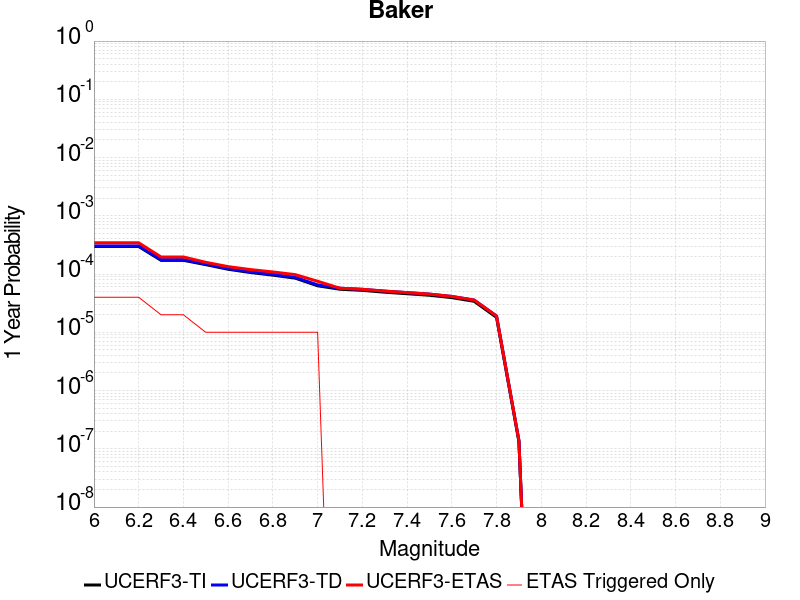 |  |

| Magnitude | 1 wk TI Prob | 1 wk TD Prob | 1 wk ETAS Prob | 1 wk ETAS/TD Gain | 1 wk ETAS Triggered Only | 1 mo TI Prob | 1 mo TD Prob | 1 mo ETAS Prob | 1 mo ETAS/TD Gain | 1 mo ETAS Triggered Only | 1 yr TI Prob | 1 yr TD Prob | 1 yr ETAS Prob | 1 yr ETAS/TD Gain | 1 yr ETAS Triggered Only | 10 yr TI Prob | 10 yr TD Prob | 10 yr ETAS Prob | 10 yr ETAS/TD Gain | 10 yr ETAS Triggered Only |
|-----|-----|-----|-----|-----|-----|-----|-----|-----|-----|-----|-----|-----|-----|-----|-----|-----|-----|-----|-----|-----|
| 6.0 | 5.695525E-6 | 5.8348332E-6 | 1.9366555E-5 | 3.3191273 | 1.35318E-5 | 2.4409164E-5 | 2.5006211E-5 | 3.8537673E-5 | 1.541124 | 1.35318E-5 | 2.9714106E-4 | 3.044121E-4 | 3.179398E-4 | 1.0444387 | 1.35318E-5 | 0.0029674405 | 0.0030403468 | 0.0030673281 | 1.0088744 | 2.70636E-5 |
| 6.1 | 5.695525E-6 | 5.8348332E-6 | 1.9366555E-5 | 3.3191273 | 1.35318E-5 | 2.4409164E-5 | 2.5006211E-5 | 3.8537673E-5 | 1.541124 | 1.35318E-5 | 2.9714106E-4 | 3.044121E-4 | 3.179398E-4 | 1.0444387 | 1.35318E-5 | 0.0029674405 | 0.0030403468 | 0.0030673281 | 1.0088744 | 2.70636E-5 |
| 6.2 | 5.695525E-6 | 5.8348332E-6 | 1.9366555E-5 | 3.3191273 | 1.35318E-5 | 2.4409164E-5 | 2.5006211E-5 | 3.8537673E-5 | 1.541124 | 1.35318E-5 | 2.9714106E-4 | 3.044121E-4 | 3.179398E-4 | 1.0444387 | 1.35318E-5 | 0.0029674405 | 0.0030403468 | 0.0030673281 | 1.0088744 | 2.70636E-5 |
| 6.3 | 3.2995713E-6 | 3.3836648E-6 | 1.691542E-5 | 4.999141 | 1.35318E-5 | 1.4140943E-5 | 1.4501343E-5 | 2.8032946E-5 | 1.9331276 | 1.35318E-5 | 1.7215237E-4 | 1.7654001E-4 | 1.9006943E-4 | 1.0766366 | 1.35318E-5 | 0.0017201907 | 0.0017640449 | 0.0017775528 | 1.0076574 | 1.35318E-5 |
| 6.4 | 3.2995713E-6 | 3.3836648E-6 | 1.691542E-5 | 4.999141 | 1.35318E-5 | 1.4140943E-5 | 1.4501343E-5 | 2.8032946E-5 | 1.9331276 | 1.35318E-5 | 1.7215237E-4 | 1.7654001E-4 | 1.9006943E-4 | 1.0766366 | 1.35318E-5 | 0.0017201907 | 0.0017640449 | 0.0017775528 | 1.0076574 | 1.35318E-5 |
| 6.5 | 2.782202E-6 | 2.8558384E-6 | 2.8558384E-6 | 1.0 | 0.0 | 1.1923668E-5 | 1.2239252E-5 | 1.2239252E-5 | 1.0 | 0.0 | 1.4516099E-4 | 1.4900303E-4 | 1.4900303E-4 | 1.0 | 0.0 | 0.001450662 | 0.001489064 | 0.001489064 | 1.0 | 0.0 |
| 6.6 | 2.3163404E-6 | 2.3809182E-6 | 2.3809182E-6 | 1.0 | 0.0 | 9.927136E-6 | 1.0203897E-5 | 1.0203897E-5 | 1.0 | 0.0 | 1.20856166E-4 | 1.2422555E-4 | 1.2422555E-4 | 1.0 | 0.0 | 0.0012079047 | 0.0012415814 | 0.0012415814 | 1.0 | 0.0 |
| 6.7 | 2.037056E-6 | 2.0964987E-6 | 2.0964987E-6 | 1.0 | 0.0 | 8.7302105E-6 | 8.984965E-6 | 8.984965E-6 | 1.0 | 0.0 | 1.0628513E-4 | 1.09386616E-4 | 1.09386616E-4 | 1.0 | 0.0 | 0.0010623431 | 0.0010933438 | 0.0010933438 | 1.0 | 0.0 |
| 6.8 | 1.8356744E-6 | 1.8915271E-6 | 1.8915271E-6 | 1.0 | 0.0 | 7.867153E-6 | 8.10652E-6 | 8.10652E-6 | 1.0 | 0.0 | 9.577837E-5 | 9.869256E-5 | 9.869256E-5 | 1.0 | 0.0 | 9.57371E-4 | 9.865012E-4 | 9.865012E-4 | 1.0 | 0.0 |
| 6.9 | 1.6310546E-6 | 1.6832057E-6 | 1.6832057E-6 | 1.0 | 0.0 | 6.9902153E-6 | 7.2137195E-6 | 7.2137195E-6 | 1.0 | 0.0 | 8.510255E-5 | 8.782361E-5 | 8.782361E-5 | 1.0 | 0.0 | 8.5069967E-4 | 8.779003E-4 | 8.779003E-4 | 1.0 | 0.0 |
| 7.0 | 1.2058036E-6 | 1.2508652E-6 | 1.2508652E-6 | 1.0 | 0.0 | 5.1677193E-6 | 5.3608405E-6 | 5.3608405E-6 | 1.0 | 0.0 | 6.291517E-5 | 6.52663E-5 | 6.52663E-5 | 1.0 | 0.0 | 6.289736E-4 | 6.5247365E-4 | 6.5247365E-4 | 1.0 | 0.0 |
| 7.1 | 1.052382E-6 | 1.0951596E-6 | 1.0951596E-6 | 1.0 | 0.0 | 4.5102006E-6 | 4.693533E-6 | 4.693533E-6 | 1.0 | 0.0 | 5.491031E-5 | 5.7142275E-5 | 5.7142275E-5 | 1.0 | 0.0 | 5.4896745E-4 | 5.712767E-4 | 5.712767E-4 | 1.0 | 0.0 |
| 7.2 | 1.0067454E-6 | 1.0487698E-6 | 1.0487698E-6 | 1.0 | 0.0 | 4.3146156E-6 | 4.4947205E-6 | 4.4947205E-6 | 1.0 | 0.0 | 5.252918E-5 | 5.4721855E-5 | 5.4721855E-5 | 1.0 | 0.0 | 5.251676E-4 | 5.4708467E-4 | 5.4708467E-4 | 1.0 | 0.0 |
| 7.3 | 9.3596316E-7 | 9.767712E-7 | 9.767712E-7 | 1.0 | 0.0 | 4.0112645E-6 | 4.1861554E-6 | 4.1861554E-6 | 1.0 | 0.0 | 4.8836053E-5 | 5.096526E-5 | 5.096526E-5 | 1.0 | 0.0 | 4.8825322E-4 | 5.095365E-4 | 5.095365E-4 | 1.0 | 0.0 |
| 7.4 | 8.8117395E-7 | 9.207652E-7 | 9.207652E-7 | 1.0 | 0.0 | 3.7764542E-6 | 3.9461306E-6 | 3.9461306E-6 | 1.0 | 0.0 | 4.5977362E-5 | 4.804309E-5 | 4.804309E-5 | 1.0 | 0.0 | 4.596785E-4 | 4.803278E-4 | 4.803278E-4 | 1.0 | 0.0 |
| 7.5 | 8.292386E-7 | 8.674585E-7 | 8.674585E-7 | 1.0 | 0.0 | 3.5538749E-6 | 3.717674E-6 | 3.717674E-6 | 1.0 | 0.0 | 4.326757E-5 | 4.526175E-5 | 4.526175E-5 | 1.0 | 0.0 | 4.3259145E-4 | 4.5252603E-4 | 4.5252603E-4 | 1.0 | 0.0 |
| 7.6 | 7.553842E-7 | 7.9144604E-7 | 7.9144604E-7 | 1.0 | 0.0 | 3.2373566E-6 | 3.3919073E-6 | 3.3919073E-6 | 1.0 | 0.0 | 3.9414106E-5 | 4.1295694E-5 | 4.1295694E-5 | 1.0 | 0.0 | 3.9407116E-4 | 4.128809E-4 | 4.128809E-4 | 1.0 | 0.0 |
| 7.7 | 6.5285366E-7 | 6.8527874E-7 | 6.8527874E-7 | 1.0 | 0.0 | 2.797941E-6 | 2.9369057E-6 | 2.9369057E-6 | 1.0 | 0.0 | 3.40644E-5 | 3.5756246E-5 | 3.5756246E-5 | 1.0 | 0.0 | 3.405918E-4 | 3.575056E-4 | 3.575056E-4 | 1.0 | 0.0 |
| 7.8 | 3.4586725E-7 | 3.648256E-7 | 3.648256E-7 | 1.0 | 0.0 | 1.4822873E-6 | 1.5635374E-6 | 1.5635374E-6 | 1.0 | 0.0 | 1.80467E-5 | 1.9035906E-5 | 1.9035906E-5 | 1.0 | 0.0 | 1.8045233E-4 | 1.903432E-4 | 1.903432E-4 | 1.0 | 0.0 |
| 7.9 | 2.5591178E-9 | 2.6696687E-9 | 2.6696687E-9 | 1.0 | 0.0 | 1.0967647E-8 | 1.1441437E-8 | 1.1441437E-8 | 1.0 | 0.0 | 1.335311E-7 | 1.392995E-7 | 1.392995E-7 | 1.0 | 0.0 | 1.3353102E-6 | 1.3929949E-6 | 1.3929949E-6 | 1.0 | 0.0 |

## Shoreline
*[(top)](#table-of-contents)*

| 1 Week | 1 Month | 1 Year | 10 Year |
|-----|-----|-----|-----|
|  |  |  |  |

| Magnitude | 1 wk TI Prob | 1 wk TD Prob | 1 wk ETAS Prob | 1 wk ETAS/TD Gain | 1 wk ETAS Triggered Only | 1 mo TI Prob | 1 mo TD Prob | 1 mo ETAS Prob | 1 mo ETAS/TD Gain | 1 mo ETAS Triggered Only | 1 yr TI Prob | 1 yr TD Prob | 1 yr ETAS Prob | 1 yr ETAS/TD Gain | 1 yr ETAS Triggered Only | 10 yr TI Prob | 10 yr TD Prob | 10 yr ETAS Prob | 10 yr ETAS/TD Gain | 10 yr ETAS Triggered Only |
|-----|-----|-----|-----|-----|-----|-----|-----|-----|-----|-----|-----|-----|-----|-----|-----|-----|-----|-----|-----|-----|
| 6.0 | 3.9888673E-6 | 4.047926E-6 | 3.1111416E-5 | 7.685767 | 2.70636E-5 | 1.7095033E-5 | 1.734817E-5 | 4.44113E-5 | 2.5599992 | 2.70636E-5 | 2.0811215E-4 | 2.1119909E-4 | 2.3825697E-4 | 1.1281155 | 2.70636E-5 | 0.0020791737 | 0.0021105325 | 0.002137539 | 1.012796 | 2.70636E-5 |
| 6.1 | 3.9888673E-6 | 4.047926E-6 | 3.1111416E-5 | 7.685767 | 2.70636E-5 | 1.7095033E-5 | 1.734817E-5 | 4.44113E-5 | 2.5599992 | 2.70636E-5 | 2.0811215E-4 | 2.1119909E-4 | 2.3825697E-4 | 1.1281155 | 2.70636E-5 | 0.0020791737 | 0.0021105325 | 0.002137539 | 1.012796 | 2.70636E-5 |
| 6.2 | 1.4039653E-6 | 1.4100874E-6 | 2.8473649E-5 | 20.192825 | 2.70636E-5 | 6.0169805E-6 | 6.043218E-6 | 3.3106655E-5 | 5.4783154 | 2.70636E-5 | 7.325427E-5 | 7.3573756E-5 | 1.0063536E-4 | 1.3678161 | 2.70636E-5 | 7.3230127E-4 | 7.3549995E-4 | 7.6254364E-4 | 1.0367692 | 2.70636E-5 |
| 6.3 | 1.4039653E-6 | 1.4100874E-6 | 2.8473649E-5 | 20.192825 | 2.70636E-5 | 6.0169805E-6 | 6.043218E-6 | 3.3106655E-5 | 5.4783154 | 2.70636E-5 | 7.325427E-5 | 7.3573756E-5 | 1.0063536E-4 | 1.3678161 | 2.70636E-5 | 7.3230127E-4 | 7.3549995E-4 | 7.6254364E-4 | 1.0367692 | 2.70636E-5 |
| 6.4 | 1.3314152E-6 | 1.3361588E-6 | 2.8399721E-5 | 21.254751 | 2.70636E-5 | 5.7060524E-6 | 5.7263824E-6 | 3.2789827E-5 | 5.726098 | 2.70636E-5 | 6.946897E-5 | 6.971653E-5 | 9.677825E-5 | 1.3881679 | 2.70636E-5 | 6.9447263E-4 | 6.96952E-4 | 7.239967E-4 | 1.0388043 | 2.70636E-5 |
| 6.5 | 1.1187026E-6 | 1.1203624E-6 | 2.8183931E-5 | 25.156086 | 2.70636E-5 | 4.794431E-6 | 4.801544E-6 | 3.1865013E-5 | 6.6364093 | 2.70636E-5 | 5.8370628E-5 | 5.845726E-5 | 8.551928E-5 | 1.4629369 | 2.70636E-5 | 5.83553E-4 | 5.8442133E-4 | 6.114691E-4 | 1.0462813 | 2.70636E-5 |
| 6.6 | 9.793089E-7 | 9.784904E-7 | 2.8042063E-5 | 28.658495 | 2.70636E-5 | 4.1970316E-6 | 4.1935236E-6 | 3.125701E-5 | 7.4536386 | 2.70636E-5 | 5.1097657E-5 | 5.1054965E-5 | 7.8117184E-5 | 1.5300604 | 2.70636E-5 | 5.108591E-4 | 5.104337E-4 | 5.374834E-4 | 1.0529938 | 2.70636E-5 |
| 6.7 | 8.995986E-7 | 8.972785E-7 | 2.7960854E-5 | 31.161846 | 2.70636E-5 | 3.8554167E-6 | 3.8454737E-6 | 3.090897E-5 | 8.037753 | 2.70636E-5 | 4.693869E-5 | 4.6817644E-5 | 7.387998E-5 | 1.578037 | 2.70636E-5 | 4.6928777E-4 | 4.6807877E-4 | 4.9512973E-4 | 1.0577914 | 2.70636E-5 |
| 6.8 | 7.931612E-7 | 7.8803885E-7 | 2.7851616E-5 | 35.34295 | 2.70636E-5 | 3.3992578E-6 | 3.377305E-6 | 3.0440813E-5 | 9.013345 | 2.70636E-5 | 4.1385178E-5 | 4.1117917E-5 | 6.81804E-5 | 1.6581677 | 2.70636E-5 | 4.1377472E-4 | 4.1110365E-4 | 4.3815613E-4 | 1.0658045 | 2.70636E-5 |
| 6.9 | 7.1465956E-7 | 7.077992E-7 | 2.7771379E-5 | 39.23624 | 2.70636E-5 | 3.062823E-6 | 3.0334215E-6 | 3.0096939E-5 | 9.921779 | 2.70636E-5 | 3.7289232E-5 | 3.6931287E-5 | 6.399389E-5 | 1.7327825 | 2.70636E-5 | 3.7282976E-4 | 3.6925185E-4 | 3.9630546E-4 | 1.073266 | 2.70636E-5 |
| 7.0 | 6.389046E-7 | 6.299445E-7 | 6.299445E-7 | 1.0 | 0.0 | 2.7381598E-6 | 2.6997593E-6 | 2.6997593E-6 | 1.0 | 0.0 | 3.3336586E-5 | 3.2869077E-5 | 3.2869077E-5 | 1.0 | 0.0 | 3.3331584E-4 | 3.286424E-4 | 3.286424E-4 | 1.0 | 0.0 |
| 7.1 | 5.4300875E-7 | 5.311119E-7 | 5.311119E-7 | 1.0 | 0.0 | 2.3271782E-6 | 2.2761917E-6 | 2.2761917E-6 | 1.0 | 0.0 | 2.8333026E-5 | 2.7712282E-5 | 2.7712282E-5 | 1.0 | 0.0 | 2.8329415E-4 | 2.7708837E-4 | 2.7708837E-4 | 1.0 | 0.0 |
| 7.2 | 4.6768855E-7 | 4.5348835E-7 | 4.5348835E-7 | 1.0 | 0.0 | 2.0043778E-6 | 1.94352E-6 | 1.94352E-6 | 1.0 | 0.0 | 2.4403027E-5 | 2.36621E-5 | 2.36621E-5 | 1.0 | 0.0 | 2.4400349E-4 | 2.3659585E-4 | 2.3659585E-4 | 1.0 | 0.0 |
| 7.3 | 4.0966103E-7 | 3.938555E-7 | 3.938555E-7 | 1.0 | 0.0 | 1.7556889E-6 | 1.687951E-6 | 1.687951E-6 | 1.0 | 0.0 | 2.1375303E-5 | 2.055061E-5 | 2.055061E-5 | 1.0 | 0.0 | 2.1373246E-4 | 2.0548713E-4 | 2.0548713E-4 | 1.0 | 0.0 |
| 7.4 | 3.5105785E-7 | 3.3363864E-7 | 3.3363864E-7 | 1.0 | 0.0 | 1.5045327E-6 | 1.429879E-6 | 1.429879E-6 | 1.0 | 0.0 | 1.8317533E-5 | 1.7408638E-5 | 1.7408638E-5 | 1.0 | 0.0 | 1.8316023E-4 | 1.7407277E-4 | 1.7407277E-4 | 1.0 | 0.0 |
| 7.5 | 2.8737534E-7 | 2.6819936E-7 | 2.6819936E-7 | 1.0 | 0.0 | 1.2316079E-6 | 1.1494252E-6 | 1.1494252E-6 | 1.0 | 0.0 | 1.4994724E-5 | 1.3994162E-5 | 1.3994162E-5 | 1.0 | 0.0 | 1.4993713E-4 | 1.3993283E-4 | 1.3993283E-4 | 1.0 | 0.0 |
| 7.6 | 2.0924051E-7 | 1.877889E-7 | 1.877889E-7 | 1.0 | 0.0 | 8.967448E-7 | 8.0480925E-7 | 8.0480925E-7 | 1.0 | 0.0 | 1.0917813E-5 | 9.7985085E-6 | 9.7985085E-6 | 1.0 | 0.0 | 1.0917276E-4 | 9.798078E-5 | 9.798078E-5 | 1.0 | 0.0 |
| 7.7 | 1.392265E-7 | 1.1543299E-7 | 1.1543299E-7 | 1.0 | 0.0 | 5.9668486E-7 | 4.947127E-7 | 4.947127E-7 | 1.0 | 0.0 | 7.2646135E-6 | 6.0231105E-6 | 6.0231105E-6 | 1.0 | 0.0 | 7.2643765E-5 | 6.0229475E-5 | 6.0229475E-5 | 1.0 | 0.0 |
| 7.8 | 8.1080074E-8 | 5.5866355E-8 | 5.5866355E-8 | 1.0 | 0.0 | 3.4748598E-7 | 2.394272E-7 | 2.394272E-7 | 1.0 | 0.0 | 4.2306337E-6 | 2.9150224E-6 | 2.9150224E-6 | 1.0 | 0.0 | 4.230553E-5 | 2.9149844E-5 | 2.9149844E-5 | 1.0 | 0.0 |
| 7.9 | 5.0859036E-8 | 2.7243644E-8 | 2.7243644E-8 | 1.0 | 0.0 | 2.1796728E-7 | 1.1675847E-7 | 1.1675847E-7 | 1.0 | 0.0 | 2.6537484E-6 | 1.4215334E-6 | 1.4215334E-6 | 1.0 | 0.0 | 2.6537167E-5 | 1.4215244E-5 | 1.4215244E-5 | 1.0 | 0.0 |
| 8.0 | 3.1760536E-8 | 1.3576587E-8 | 1.3576587E-8 | 1.0 | 0.0 | 1.3611657E-7 | 5.818537E-8 | 5.818537E-8 | 1.0 | 0.0 | 1.6572179E-6 | 7.084067E-7 | 7.084067E-7 | 1.0 | 0.0 | 1.6572056E-5 | 7.0840442E-6 | 7.0840442E-6 | 1.0 | 0.0 |
| 8.1 | 1.2947896E-8 | 5.6626024E-9 | 5.6626024E-9 | 1.0 | 0.0 | 5.5490982E-8 | 2.4268296E-8 | 2.4268296E-8 | 1.0 | 0.0 | 6.756025E-7 | 2.9546646E-7 | 2.9546646E-7 | 1.0 | 0.0 | 6.7560045E-6 | 2.9546607E-6 | 2.9546607E-6 | 1.0 | 0.0 |

## Hosgri
*[(top)](#table-of-contents)*

| 1 Week | 1 Month | 1 Year | 10 Year |
|-----|-----|-----|-----|
|  |  |  |  |

| Magnitude | 1 wk TI Prob | 1 wk TD Prob | 1 wk ETAS Prob | 1 wk ETAS/TD Gain | 1 wk ETAS Triggered Only | 1 mo TI Prob | 1 mo TD Prob | 1 mo ETAS Prob | 1 mo ETAS/TD Gain | 1 mo ETAS Triggered Only | 1 yr TI Prob | 1 yr TD Prob | 1 yr ETAS Prob | 1 yr ETAS/TD Gain | 1 yr ETAS Triggered Only | 10 yr TI Prob | 10 yr TD Prob | 10 yr ETAS Prob | 10 yr ETAS/TD Gain | 10 yr ETAS Triggered Only |
|-----|-----|-----|-----|-----|-----|-----|-----|-----|-----|-----|-----|-----|-----|-----|-----|-----|-----|-----|-----|-----|
| 6.0 | 2.883978E-5 | 2.9128276E-5 | 5.619109E-5 | 1.9290907 | 2.70636E-5 | 1.235932E-4 | 1.2482965E-4 | 1.5188988E-4 | 1.2167772 | 2.70636E-5 | 0.0015037085 | 0.0015187687 | 0.0015457912 | 1.0177923 | 2.70636E-5 | 0.01493574 | 0.015087668 | 0.015114323 | 1.0017667 | 2.70636E-5 |
| 6.1 | 2.883978E-5 | 2.9128276E-5 | 5.619109E-5 | 1.9290907 | 2.70636E-5 | 1.235932E-4 | 1.2482965E-4 | 1.5188988E-4 | 1.2167772 | 2.70636E-5 | 0.0015037085 | 0.0015187687 | 0.0015457912 | 1.0177923 | 2.70636E-5 | 0.01493574 | 0.015087668 | 0.015114323 | 1.0017667 | 2.70636E-5 |
| 6.2 | 2.883978E-5 | 2.9128276E-5 | 5.619109E-5 | 1.9290907 | 2.70636E-5 | 1.235932E-4 | 1.2482965E-4 | 1.5188988E-4 | 1.2167772 | 2.70636E-5 | 0.0015037085 | 0.0015187687 | 0.0015457912 | 1.0177923 | 2.70636E-5 | 0.01493574 | 0.015087668 | 0.015114323 | 1.0017667 | 2.70636E-5 |
| 6.3 | 2.2914428E-5 | 2.2641847E-5 | 4.970483E-5 | 2.195264 | 2.70636E-5 | 9.8200995E-5 | 9.7032906E-5 | 1.2409387E-4 | 1.2788845 | 2.70636E-5 | 0.0011949413 | 0.0011807403 | 0.001207772 | 1.0228938 | 2.70636E-5 | 0.011885363 | 0.011746069 | 0.011772815 | 1.002277 | 2.70636E-5 |
| 6.4 | 2.0195741E-5 | 1.9696443E-5 | 4.675951E-5 | 2.3740077 | 2.70636E-5 | 8.65503E-5 | 8.441061E-5 | 1.1147193E-4 | 1.3205914 | 2.70636E-5 | 0.0010532405 | 0.0010272167 | 0.0010542524 | 1.0263195 | 2.70636E-5 | 0.010482626 | 0.010225733 | 0.0102525195 | 1.0026195 | 2.70636E-5 |
| 6.5 | 1.9924333E-5 | 1.9408866E-5 | 4.6471938E-5 | 2.3943667 | 2.70636E-5 | 8.53872E-5 | 8.317821E-5 | 1.1023956E-4 | 1.3253418 | 2.70636E-5 | 0.0010390934 | 0.0010122261 | 0.0010392624 | 1.0267097 | 2.70636E-5 | 0.010342481 | 0.010077193 | 0.010103984 | 1.0026586 | 2.70636E-5 |
| 6.6 | 1.809694E-5 | 1.7458187E-5 | 4.4521315E-5 | 2.550168 | 2.70636E-5 | 7.7556004E-5 | 7.4818665E-5 | 1.0188024E-4 | 1.3616955 | 2.70636E-5 | 9.438353E-4 | 9.105379E-4 | 9.375769E-4 | 1.0296956 | 2.70636E-5 | 0.009398366 | 0.009069015 | 0.009095834 | 1.0029571 | 2.70636E-5 |
| 6.7 | 1.675989E-5 | 1.6042655E-5 | 4.310582E-5 | 2.6869504 | 2.70636E-5 | 7.182612E-5 | 6.875243E-5 | 9.581417E-5 | 1.3936113 | 2.70636E-5 | 8.7413215E-4 | 8.3674054E-4 | 8.637815E-4 | 1.032317 | 2.70636E-5 | 0.008707017 | 0.008336807 | 0.008363645 | 1.0032192 | 2.70636E-5 |
| 6.8 | 1.5401129E-5 | 1.46139755E-5 | 4.167718E-5 | 2.8518715 | 2.70636E-5 | 6.6003166E-5 | 6.262983E-5 | 8.9691726E-5 | 1.4320929 | 2.70636E-5 | 8.032922E-4 | 7.622522E-4 | 7.892952E-4 | 1.0354778 | 2.70636E-5 | 0.008003947 | 0.0075972406 | 0.007624099 | 1.0035353 | 2.70636E-5 |
| 6.9 | 1.356559E-5 | 1.2689864E-5 | 3.975312E-5 | 3.1326673 | 2.70636E-5 | 5.8136946E-5 | 5.4384E-5 | 8.1446124E-5 | 1.497612 | 2.70636E-5 | 7.0758746E-4 | 6.619245E-4 | 6.8897015E-4 | 1.0408592 | 2.70636E-5 | 0.007053386 | 0.0066003343 | 0.0066272193 | 1.0040733 | 2.70636E-5 |
| 7.0 | 1.2030819E-5 | 1.1095861E-5 | 1.1095861E-5 | 1.0 | 0.0 | 5.155963E-5 | 4.755282E-5 | 4.755282E-5 | 1.0 | 0.0 | 6.275577E-4 | 5.788019E-4 | 5.788019E-4 | 1.0 | 0.0 | 0.006257884 | 0.0057737045 | 0.0057737045 | 1.0 | 0.0 |
| 7.1 | 1.0972698E-5 | 1.002208E-5 | 1.002208E-5 | 1.0 | 0.0 | 4.7025E-5 | 4.2951062E-5 | 4.2951062E-5 | 1.0 | 0.0 | 5.72379E-4 | 5.228038E-4 | 5.228038E-4 | 1.0 | 0.0 | 0.0057090693 | 0.0052164905 | 0.0052164905 | 1.0 | 0.0 |
| 7.2 | 9.961926E-6 | 9.0346475E-6 | 9.0346475E-6 | 1.0 | 0.0 | 4.2693267E-5 | 3.8719343E-5 | 3.8719343E-5 | 1.0 | 0.0 | 5.1966653E-4 | 4.713061E-4 | 4.713061E-4 | 1.0 | 0.0 | 0.00518453 | 0.004703812 | 0.004703812 | 1.0 | 0.0 |
| 7.3 | 8.700929E-6 | 7.828004E-6 | 7.828004E-6 | 1.0 | 0.0 | 3.7289166E-5 | 3.3548156E-5 | 3.3548156E-5 | 1.0 | 0.0 | 4.53901E-4 | 4.083723E-4 | 4.083723E-4 | 1.0 | 0.0 | 0.00452975 | 0.004076958 | 0.004076958 | 1.0 | 0.0 |
| 7.4 | 7.866285E-6 | 6.9986436E-6 | 6.9986436E-6 | 1.0 | 0.0 | 3.3712215E-5 | 2.9993842E-5 | 2.9993842E-5 | 1.0 | 0.0 | 4.103689E-4 | 3.6511387E-4 | 3.6511387E-4 | 1.0 | 0.0 | 0.004096119 | 0.003645877 | 0.003645877 | 1.0 | 0.0 |
| 7.5 | 6.8381305E-6 | 5.9596014E-6 | 5.9596014E-6 | 1.0 | 0.0 | 2.9305946E-5 | 2.5540898E-5 | 2.5540898E-5 | 1.0 | 0.0 | 3.5674145E-4 | 3.1091608E-4 | 3.1091608E-4 | 1.0 | 0.0 | 0.0035616932 | 0.0031055456 | 0.0031055456 | 1.0 | 0.0 |
| 7.6 | 5.503376E-6 | 4.5951515E-6 | 4.5951515E-6 | 1.0 | 0.0 | 2.3585684E-5 | 1.9693358E-5 | 1.9693358E-5 | 1.0 | 0.0 | 2.8711787E-4 | 2.3974029E-4 | 2.3974029E-4 | 1.0 | 0.0 | 0.002867472 | 0.0023955493 | 0.0023955493 | 1.0 | 0.0 |
| 7.7 | 3.6144982E-6 | 2.6521213E-6 | 2.6521213E-6 | 1.0 | 0.0 | 1.5490614E-5 | 1.13661845E-5 | 1.13661845E-5 | 1.0 | 0.0 | 1.8858191E-4 | 1.3837451E-4 | 1.3837451E-4 | 1.0 | 0.0 | 0.0018842196 | 0.0013836145 | 0.0013836145 | 1.0 | 0.0 |
| 7.8 | 1.9853494E-6 | 1.136086E-6 | 1.136086E-6 | 1.0 | 0.0 | 8.508612E-6 | 4.868931E-6 | 4.868931E-6 | 1.0 | 0.0 | 1.0358743E-4 | 5.927762E-5 | 5.927762E-5 | 1.0 | 0.0 | 0.0010353916 | 5.933477E-4 | 5.933477E-4 | 1.0 | 0.0 |
| 7.9 | 1.1818757E-6 | 5.294974E-7 | 5.294974E-7 | 1.0 | 0.0 | 5.0651715E-6 | 2.2692725E-6 | 2.2692725E-6 | 1.0 | 0.0 | 6.1666724E-5 | 2.7628043E-5 | 2.7628043E-5 | 1.0 | 0.0 | 6.1649614E-4 | 2.7693406E-4 | 2.7693406E-4 | 1.0 | 0.0 |
| 8.0 | 6.962958E-7 | 2.713834E-7 | 2.713834E-7 | 1.0 | 0.0 | 2.9841215E-6 | 1.1630713E-6 | 1.1630713E-6 | 1.0 | 0.0 | 3.6331072E-5 | 1.41603E-5 | 1.41603E-5 | 1.0 | 0.0 | 3.6325134E-4 | 1.4216424E-4 | 1.4216424E-4 | 1.0 | 0.0 |
| 8.1 | 1.5033264E-7 | 6.527309E-8 | 6.527309E-8 | 1.0 | 0.0 | 6.442826E-7 | 2.7974178E-7 | 2.7974178E-7 | 1.0 | 0.0 | 7.844113E-6 | 3.4058512E-6 | 3.4058512E-6 | 1.0 | 0.0 | 7.843835E-5 | 3.407529E-5 | 3.407529E-5 | 1.0 | 0.0 |

## Cady
*[(top)](#table-of-contents)*

| 1 Week | 1 Month | 1 Year | 10 Year |
|-----|-----|-----|-----|
|  |  |  |  |

| Magnitude | 1 wk TI Prob | 1 wk TD Prob | 1 wk ETAS Prob | 1 wk ETAS/TD Gain | 1 wk ETAS Triggered Only | 1 mo TI Prob | 1 mo TD Prob | 1 mo ETAS Prob | 1 mo ETAS/TD Gain | 1 mo ETAS Triggered Only | 1 yr TI Prob | 1 yr TD Prob | 1 yr ETAS Prob | 1 yr ETAS/TD Gain | 1 yr ETAS Triggered Only | 10 yr TI Prob | 10 yr TD Prob | 10 yr ETAS Prob | 10 yr ETAS/TD Gain | 10 yr ETAS Triggered Only |
|-----|-----|-----|-----|-----|-----|-----|-----|-----|-----|-----|-----|-----|-----|-----|-----|-----|-----|-----|-----|-----|
| 6.0 | 1.9892565E-5 | 2.1858672E-5 | 3.5390174E-5 | 1.6190451 | 1.35318E-5 | 8.525106E-5 | 9.367717E-5 | 1.072077E-4 | 1.1444379 | 1.35318E-5 | 0.0010374374 | 0.0011400137 | 0.0011670465 | 1.0237126 | 2.70636E-5 | 0.010326075 | 0.011350671 | 0.011377427 | 1.0023572 | 2.70636E-5 |
| 6.1 | 1.9892565E-5 | 2.1858672E-5 | 3.5390174E-5 | 1.6190451 | 1.35318E-5 | 8.525106E-5 | 9.367717E-5 | 1.072077E-4 | 1.1444379 | 1.35318E-5 | 0.0010374374 | 0.0011400137 | 0.0011670465 | 1.0237126 | 2.70636E-5 | 0.010326075 | 0.011350671 | 0.011377427 | 1.0023572 | 2.70636E-5 |
| 6.2 | 1.9892565E-5 | 2.1858672E-5 | 3.5390174E-5 | 1.6190451 | 1.35318E-5 | 8.525106E-5 | 9.367717E-5 | 1.072077E-4 | 1.1444379 | 1.35318E-5 | 0.0010374374 | 0.0011400137 | 0.0011670465 | 1.0237126 | 2.70636E-5 | 0.010326075 | 0.011350671 | 0.011377427 | 1.0023572 | 2.70636E-5 |
| 6.3 | 1.1117327E-5 | 1.2176552E-5 | 1.2176552E-5 | 1.0 | 0.0 | 4.764482E-5 | 5.2184358E-5 | 5.2184358E-5 | 1.0 | 0.0 | 5.7992124E-4 | 6.3519087E-4 | 6.3519087E-4 | 1.0 | 0.0 | 0.0057841022 | 0.0063368594 | 0.0063368594 | 1.0 | 0.0 |
| 6.4 | 1.1117327E-5 | 1.2176552E-5 | 1.2176552E-5 | 1.0 | 0.0 | 4.764482E-5 | 5.2184358E-5 | 5.2184358E-5 | 1.0 | 0.0 | 5.7992124E-4 | 6.3519087E-4 | 6.3519087E-4 | 1.0 | 0.0 | 0.0057841022 | 0.0063368594 | 0.0063368594 | 1.0 | 0.0 |
| 6.5 | 6.103093E-6 | 6.672004E-6 | 6.672004E-6 | 1.0 | 0.0 | 2.615585E-5 | 2.859406E-5 | 2.859406E-5 | 1.0 | 0.0 | 3.1840094E-4 | 3.4808964E-4 | 3.4808964E-4 | 1.0 | 0.0 | 0.0031794512 | 0.003476678 | 0.003476678 | 1.0 | 0.0 |
| 6.6 | 5.817237E-6 | 6.3656425E-6 | 6.3656425E-6 | 1.0 | 0.0 | 2.4930776E-5 | 2.728111E-5 | 2.728111E-5 | 1.0 | 0.0 | 3.034899E-4 | 3.3210934E-4 | 3.3210934E-4 | 1.0 | 0.0 | 0.0030307577 | 0.0033173522 | 0.0033173522 | 1.0 | 0.0 |
| 6.7 | 4.8846314E-6 | 5.3405547E-6 | 5.3405547E-6 | 1.0 | 0.0 | 2.0933967E-5 | 2.2887958E-5 | 2.2887958E-5 | 1.0 | 0.0 | 2.5484123E-4 | 2.7863705E-4 | 2.7863705E-4 | 1.0 | 0.0 | 0.0025454918 | 0.0027840321 | 0.0027840321 | 1.0 | 0.0 |
| 6.8 | 1.7788773E-6 | 1.9399033E-6 | 1.9399033E-6 | 1.0 | 0.0 | 7.6237375E-6 | 8.313854E-6 | 8.313854E-6 | 1.0 | 0.0 | 9.281505E-5 | 1.01218044E-4 | 1.01218044E-4 | 1.0 | 0.0 | 9.2776294E-4 | 0.0010118741 | 0.0010118741 | 1.0 | 0.0 |
| 6.9 | 7.5455404E-7 | 8.29707E-7 | 8.29707E-7 | 1.0 | 0.0 | 3.233799E-6 | 3.5558842E-6 | 3.5558842E-6 | 1.0 | 0.0 | 3.937079E-5 | 4.3292366E-5 | 4.3292366E-5 | 1.0 | 0.0 | 3.9363815E-4 | 4.3287227E-4 | 4.3287227E-4 | 1.0 | 0.0 |
| 7.0 | 6.8578805E-7 | 7.541796E-7 | 7.541796E-7 | 1.0 | 0.0 | 2.9390883E-6 | 3.2321961E-6 | 3.2321961E-6 | 1.0 | 0.0 | 3.578281E-5 | 3.935161E-5 | 3.935161E-5 | 1.0 | 0.0 | 3.577705E-4 | 3.9347887E-4 | 3.9347887E-4 | 1.0 | 0.0 |

## Mission Creek
*[(top)](#table-of-contents)*

| 1 Week | 1 Month | 1 Year | 10 Year |
|-----|-----|-----|-----|
|  |  |  | 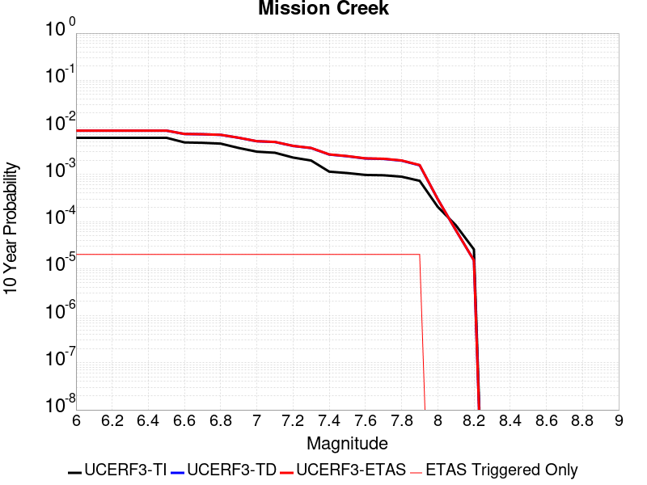 |

| Magnitude | 1 wk TI Prob | 1 wk TD Prob | 1 wk ETAS Prob | 1 wk ETAS/TD Gain | 1 wk ETAS Triggered Only | 1 mo TI Prob | 1 mo TD Prob | 1 mo ETAS Prob | 1 mo ETAS/TD Gain | 1 mo ETAS Triggered Only | 1 yr TI Prob | 1 yr TD Prob | 1 yr ETAS Prob | 1 yr ETAS/TD Gain | 1 yr ETAS Triggered Only | 10 yr TI Prob | 10 yr TD Prob | 10 yr ETAS Prob | 10 yr ETAS/TD Gain | 10 yr ETAS Triggered Only |
|-----|-----|-----|-----|-----|-----|-----|-----|-----|-----|-----|-----|-----|-----|-----|-----|-----|-----|-----|-----|-----|
| 6.0 | 1.1549387E-5 | 1.63219E-5 | 1.63219E-5 | 1.0 | 0.0 | 4.9496433E-5 | 6.994921E-5 | 6.994921E-5 | 1.0 | 0.0 | 6.0245243E-4 | 8.513139E-4 | 8.648341E-4 | 1.0158817 | 1.35318E-5 | 0.006008218 | 0.00850976 | 0.008536593 | 1.0031532 | 2.70636E-5 |
| 6.1 | 1.1549387E-5 | 1.63219E-5 | 1.63219E-5 | 1.0 | 0.0 | 4.9496433E-5 | 6.994921E-5 | 6.994921E-5 | 1.0 | 0.0 | 6.0245243E-4 | 8.513139E-4 | 8.648341E-4 | 1.0158817 | 1.35318E-5 | 0.006008218 | 0.00850976 | 0.008536593 | 1.0031532 | 2.70636E-5 |
| 6.2 | 1.1549387E-5 | 1.63219E-5 | 1.63219E-5 | 1.0 | 0.0 | 4.9496433E-5 | 6.994921E-5 | 6.994921E-5 | 1.0 | 0.0 | 6.0245243E-4 | 8.513139E-4 | 8.648341E-4 | 1.0158817 | 1.35318E-5 | 0.006008218 | 0.00850976 | 0.008536593 | 1.0031532 | 2.70636E-5 |
| 6.3 | 1.1549387E-5 | 1.63219E-5 | 1.63219E-5 | 1.0 | 0.0 | 4.9496433E-5 | 6.994921E-5 | 6.994921E-5 | 1.0 | 0.0 | 6.0245243E-4 | 8.513139E-4 | 8.648341E-4 | 1.0158817 | 1.35318E-5 | 0.006008218 | 0.00850976 | 0.008536593 | 1.0031532 | 2.70636E-5 |
| 6.4 | 1.1549387E-5 | 1.63219E-5 | 1.63219E-5 | 1.0 | 0.0 | 4.9496433E-5 | 6.994921E-5 | 6.994921E-5 | 1.0 | 0.0 | 6.0245243E-4 | 8.513139E-4 | 8.648341E-4 | 1.0158817 | 1.35318E-5 | 0.006008218 | 0.00850976 | 0.008536593 | 1.0031532 | 2.70636E-5 |
| 6.5 | 1.1549387E-5 | 1.63219E-5 | 1.63219E-5 | 1.0 | 0.0 | 4.9496433E-5 | 6.994921E-5 | 6.994921E-5 | 1.0 | 0.0 | 6.0245243E-4 | 8.513139E-4 | 8.648341E-4 | 1.0158817 | 1.35318E-5 | 0.006008218 | 0.00850976 | 0.008536593 | 1.0031532 | 2.70636E-5 |
| 6.6 | 9.202681E-6 | 1.384518E-5 | 1.384518E-5 | 1.0 | 0.0 | 3.9439463E-5 | 5.9335187E-5 | 5.9335187E-5 | 1.0 | 0.0 | 4.800697E-4 | 7.2217546E-4 | 7.356975E-4 | 1.018724 | 1.35318E-5 | 0.004790339 | 0.007226945 | 0.007253813 | 1.0037178 | 2.70636E-5 |
| 6.7 | 9.019164E-6 | 1.365085E-5 | 1.365085E-5 | 1.0 | 0.0 | 3.8652986E-5 | 5.850238E-5 | 5.850238E-5 | 1.0 | 0.0 | 4.7049852E-4 | 7.120427E-4 | 7.2556484E-4 | 1.0189906 | 1.35318E-5 | 0.004695036 | 0.0071262694 | 0.00715314 | 1.0037707 | 2.70636E-5 |
| 6.8 | 8.673558E-6 | 1.3272961E-5 | 1.3272961E-5 | 1.0 | 0.0 | 3.717186E-5 | 5.688293E-5 | 5.688293E-5 | 1.0 | 0.0 | 4.524734E-4 | 6.9233845E-4 | 7.058609E-4 | 1.0195315 | 1.35318E-5 | 0.0045155324 | 0.006930458 | 0.006957334 | 1.003878 | 2.70636E-5 |
| 6.9 | 7.002255E-6 | 1.1477195E-5 | 1.1477195E-5 | 1.0 | 0.0 | 3.000932E-5 | 4.918709E-5 | 4.918709E-5 | 1.0 | 0.0 | 3.653022E-4 | 5.986951E-4 | 6.122188E-4 | 1.0225886 | 1.35318E-5 | 0.0036470229 | 0.005999283 | 0.006026184 | 1.004484 | 2.70636E-5 |
| 7.0 | 5.84644E-6 | 9.674542E-6 | 9.674542E-6 | 1.0 | 0.0 | 2.5055931E-5 | 4.1461688E-5 | 4.1461688E-5 | 1.0 | 0.0 | 3.0501327E-4 | 5.046837E-4 | 5.1820866E-4 | 1.026799 | 1.35318E-5 | 0.0030459496 | 0.0050636297 | 0.0050905566 | 1.0053177 | 2.70636E-5 |
| 7.1 | 5.54703E-6 | 9.329019E-6 | 9.329019E-6 | 1.0 | 0.0 | 2.377277E-5 | 3.998092E-5 | 3.998092E-5 | 1.0 | 0.0 | 2.8939504E-4 | 4.8666348E-4 | 5.001887E-4 | 1.0277917 | 1.35318E-5 | 0.0028901845 | 0.004884225 | 0.004911156 | 1.0055139 | 2.70636E-5 |
| 7.2 | 4.384709E-6 | 7.681153E-6 | 7.681153E-6 | 1.0 | 0.0 | 1.8791474E-5 | 3.2918833E-5 | 3.2918833E-5 | 1.0 | 0.0 | 2.2876218E-4 | 4.0071676E-4 | 4.1424314E-4 | 1.0337554 | 1.35318E-5 | 0.0022852682 | 0.004028154 | 0.004055109 | 1.0066916 | 2.70636E-5 |
| 7.3 | 3.7888456E-6 | 6.915043E-6 | 6.915043E-6 | 1.0 | 0.0 | 1.623781E-5 | 2.963558E-5 | 2.963558E-5 | 1.0 | 0.0 | 1.9767738E-4 | 3.607568E-4 | 3.7428373E-4 | 1.037496 | 1.35318E-5 | 0.0019750162 | 0.0036299077 | 0.003656873 | 1.0074286 | 2.70636E-5 |
| 7.4 | 2.1982462E-6 | 5.0233793E-6 | 5.0233793E-6 | 1.0 | 0.0 | 9.421021E-6 | 2.1528593E-5 | 2.1528593E-5 | 1.0 | 0.0 | 1.1469489E-4 | 2.6207927E-4 | 2.7560754E-4 | 1.0516189 | 1.35318E-5 | 0.0011463572 | 0.0026456832 | 0.002672675 | 1.0102023 | 2.70636E-5 |
| 7.5 | 2.051923E-6 | 4.61463E-6 | 4.61463E-6 | 1.0 | 0.0 | 8.793926E-6 | 1.9776837E-5 | 1.9776837E-5 | 1.0 | 0.0 | 1.0706078E-4 | 2.4075652E-4 | 2.5428506E-4 | 1.0561918 | 1.35318E-5 | 0.0010700922 | 0.0024333464 | 0.002460344 | 1.0110949 | 2.70636E-5 |
| 7.6 | 1.8733427E-6 | 4.123002E-6 | 4.123002E-6 | 1.0 | 0.0 | 8.028587E-6 | 1.7669889E-5 | 1.7669889E-5 | 1.0 | 0.0 | 9.774366E-5 | 2.1510974E-4 | 2.2863864E-4 | 1.0628929 | 1.35318E-5 | 9.770069E-4 | 0.002177891 | 0.002204896 | 1.0123994 | 2.70636E-5 |
| 7.7 | 1.8411953E-6 | 4.0426794E-6 | 4.0426794E-6 | 1.0 | 0.0 | 7.890813E-6 | 1.7325654E-5 | 1.7325654E-5 | 1.0 | 0.0 | 9.606641E-5 | 2.1091949E-4 | 2.2444843E-4 | 1.0641427 | 1.35318E-5 | 9.6024893E-4 | 0.0021361776 | 0.0021631834 | 1.0126421 | 2.70636E-5 |
| 7.8 | 1.7194251E-6 | 3.7100826E-6 | 3.7100826E-6 | 1.0 | 0.0 | 7.368944E-6 | 1.5900257E-5 | 1.5900257E-5 | 1.0 | 0.0 | 8.97132E-5 | 1.9356851E-4 | 2.0709769E-4 | 1.0698935 | 1.35318E-5 | 8.967699E-4 | 0.0019621777 | 0.0019891881 | 1.0137656 | 2.70636E-5 |
| 7.9 | 1.4035052E-6 | 2.9497803E-6 | 2.9497803E-6 | 1.0 | 0.0 | 6.0150082E-6 | 1.26418545E-5 | 1.26418545E-5 | 1.0 | 0.0 | 7.3230265E-5 | 1.5390378E-4 | 1.6743349E-4 | 1.0879103 | 1.35318E-5 | 7.3206134E-4 | 0.0015629655 | 0.0015899867 | 1.0172884 | 2.70636E-5 |
| 8.0 | 3.9318823E-7 | 5.5278343E-7 | 5.5278343E-7 | 1.0 | 0.0 | 1.6850913E-6 | 2.3690698E-6 | 2.3690698E-6 | 1.0 | 0.0 | 2.0515794E-5 | 2.8843047E-5 | 2.8843047E-5 | 1.0 | 0.0 | 2.0513899E-4 | 2.98954E-4 | 2.98954E-4 | 1.0 | 0.0 |
| 8.1 | 1.596793E-7 | 1.1377612E-7 | 1.1377612E-7 | 1.0 | 0.0 | 6.8433974E-7 | 4.876118E-7 | 4.876118E-7 | 1.0 | 0.0 | 8.331805E-6 | 5.9366585E-6 | 5.9366585E-6 | 1.0 | 0.0 | 8.331492E-5 | 6.548667E-5 | 6.548667E-5 | 1.0 | 0.0 |
| 8.2 | 4.9003038E-8 | 2.543886E-8 | 2.543886E-8 | 1.0 | 0.0 | 2.10013E-7 | 1.0902368E-7 | 1.0902368E-7 | 1.0 | 0.0 | 2.5569052E-6 | 1.3273626E-6 | 1.3273626E-6 | 1.0 | 0.0 | 2.556876E-5 | 1.495299E-5 | 1.495299E-5 | 1.0 | 0.0 |

## Sierra Nevada  (No Extension)
*[(top)](#table-of-contents)*

| 1 Week | 1 Month | 1 Year | 10 Year |
|-----|-----|-----|-----|
|  |  |  |  |

| Magnitude | 1 wk TI Prob | 1 wk TD Prob | 1 wk ETAS Prob | 1 wk ETAS/TD Gain | 1 wk ETAS Triggered Only | 1 mo TI Prob | 1 mo TD Prob | 1 mo ETAS Prob | 1 mo ETAS/TD Gain | 1 mo ETAS Triggered Only | 1 yr TI Prob | 1 yr TD Prob | 1 yr ETAS Prob | 1 yr ETAS/TD Gain | 1 yr ETAS Triggered Only | 10 yr TI Prob | 10 yr TD Prob | 10 yr ETAS Prob | 10 yr ETAS/TD Gain | 10 yr ETAS Triggered Only |
|-----|-----|-----|-----|-----|-----|-----|-----|-----|-----|-----|-----|-----|-----|-----|-----|-----|-----|-----|-----|-----|
| 6.0 | 7.7690465E-6 | 6.9763096E-6 | 6.9763096E-6 | 1.0 | 0.0 | 3.329549E-5 | 2.9898329E-5 | 2.9898329E-5 | 1.0 | 0.0 | 4.0529718E-4 | 3.639872E-4 | 3.7751408E-4 | 1.037163 | 1.35318E-5 | 0.004045588 | 0.0036374263 | 0.0036643913 | 1.0074133 | 2.70636E-5 |
| 6.1 | 7.7690465E-6 | 6.9763096E-6 | 6.9763096E-6 | 1.0 | 0.0 | 3.329549E-5 | 2.9898329E-5 | 2.9898329E-5 | 1.0 | 0.0 | 4.0529718E-4 | 3.639872E-4 | 3.7751408E-4 | 1.037163 | 1.35318E-5 | 0.004045588 | 0.0036374263 | 0.0036643913 | 1.0074133 | 2.70636E-5 |
| 6.2 | 7.7690465E-6 | 6.9763096E-6 | 6.9763096E-6 | 1.0 | 0.0 | 3.329549E-5 | 2.9898329E-5 | 2.9898329E-5 | 1.0 | 0.0 | 4.0529718E-4 | 3.639872E-4 | 3.7751408E-4 | 1.037163 | 1.35318E-5 | 0.004045588 | 0.0036374263 | 0.0036643913 | 1.0074133 | 2.70636E-5 |
| 6.3 | 7.7690465E-6 | 6.9763096E-6 | 6.9763096E-6 | 1.0 | 0.0 | 3.329549E-5 | 2.9898329E-5 | 2.9898329E-5 | 1.0 | 0.0 | 4.0529718E-4 | 3.639872E-4 | 3.7751408E-4 | 1.037163 | 1.35318E-5 | 0.004045588 | 0.0036374263 | 0.0036643913 | 1.0074133 | 2.70636E-5 |
| 6.4 | 7.7690465E-6 | 6.9763096E-6 | 6.9763096E-6 | 1.0 | 0.0 | 3.329549E-5 | 2.9898329E-5 | 2.9898329E-5 | 1.0 | 0.0 | 4.0529718E-4 | 3.639872E-4 | 3.7751408E-4 | 1.037163 | 1.35318E-5 | 0.004045588 | 0.0036374263 | 0.0036643913 | 1.0074133 | 2.70636E-5 |
| 6.5 | 7.7690465E-6 | 6.9763096E-6 | 6.9763096E-6 | 1.0 | 0.0 | 3.329549E-5 | 2.9898329E-5 | 2.9898329E-5 | 1.0 | 0.0 | 4.0529718E-4 | 3.639872E-4 | 3.7751408E-4 | 1.037163 | 1.35318E-5 | 0.004045588 | 0.0036374263 | 0.0036643913 | 1.0074133 | 2.70636E-5 |
| 6.6 | 2.653E-6 | 1.6148484E-6 | 1.6148484E-6 | 1.0 | 0.0 | 1.136995E-5 | 6.920761E-6 | 6.920761E-6 | 1.0 | 0.0 | 1.3842035E-4 | 8.4257044E-5 | 9.77877E-5 | 1.1605879 | 1.35318E-5 | 0.0013833415 | 8.422544E-4 | 8.692952E-4 | 1.0321053 | 2.70636E-5 |
| 6.7 | 2.5902466E-6 | 1.5501821E-6 | 1.5501821E-6 | 1.0 | 0.0 | 1.11010095E-5 | 6.6436205E-6 | 6.6436205E-6 | 1.0 | 0.0 | 1.351464E-4 | 8.088311E-5 | 9.4413816E-5 | 1.1672871 | 1.35318E-5 | 0.0013506424 | 8.085397E-4 | 8.355814E-4 | 1.0334451 | 2.70636E-5 |
| 6.8 | 2.5853892E-6 | 1.5469824E-6 | 1.5469824E-6 | 1.0 | 0.0 | 1.1080193E-5 | 6.6299076E-6 | 6.6299076E-6 | 1.0 | 0.0 | 1.34893E-4 | 8.071616E-5 | 9.4246876E-5 | 1.1676332 | 1.35318E-5 | 0.0013481114 | 8.0687145E-4 | 8.339132E-4 | 1.0335144 | 2.70636E-5 |
| 6.9 | 2.458257E-6 | 1.4220567E-6 | 1.4220567E-6 | 1.0 | 0.0 | 1.0535345E-5 | 6.0945144E-6 | 6.0945144E-6 | 1.0 | 0.0 | 1.2826028E-4 | 7.419821E-5 | 8.7729E-5 | 1.1823602 | 1.35318E-5 | 0.0012818627 | 7.417363E-4 | 7.6877984E-4 | 1.0364598 | 2.70636E-5 |
| 7.0 | 2.4341468E-6 | 1.3990206E-6 | 1.3990206E-6 | 1.0 | 0.0 | 1.0432016E-5 | 5.995789E-6 | 5.995789E-6 | 1.0 | 0.0 | 1.270024E-4 | 7.29963E-5 | 8.6527114E-5 | 1.1853629 | 1.35318E-5 | 0.0012692984 | 7.297252E-4 | 7.56769E-4 | 1.0370604 | 2.70636E-5 |
| 7.1 | 2.3652476E-6 | 1.3339702E-6 | 1.3339702E-6 | 1.0 | 0.0 | 1.0136736E-5 | 5.7170028E-6 | 5.7170028E-6 | 1.0 | 0.0 | 1.2340778E-4 | 6.9602305E-5 | 8.313316E-5 | 1.1944025 | 1.35318E-5 | 0.0012333926 | 6.9580675E-4 | 7.228515E-4 | 1.0388682 | 2.70636E-5 |
| 7.2 | 2.272158E-6 | 1.250277E-6 | 1.250277E-6 | 1.0 | 0.0 | 9.737784E-6 | 5.3583194E-6 | 5.3583194E-6 | 1.0 | 0.0 | 1.1855107E-4 | 6.52356E-5 | 7.876652E-5 | 1.2074162 | 1.35318E-5 | 0.0011848784 | 6.52166E-4 | 6.79212E-4 | 1.041471 | 2.70636E-5 |
| 7.3 | 2.1382127E-6 | 1.1419653E-6 | 1.1419653E-6 | 1.0 | 0.0 | 9.163737E-6 | 4.8941283E-6 | 4.8941283E-6 | 1.0 | 0.0 | 1.1156279E-4 | 5.9584392E-5 | 7.3115385E-5 | 1.2270895 | 1.35318E-5 | 0.001115068 | 5.956853E-4 | 6.0920906E-4 | 1.0227028 | 1.35318E-5 |
| 7.4 | 1.9048055E-6 | 9.575195E-7 | 9.575195E-7 | 1.0 | 0.0 | 8.163426E-6 | 4.1036487E-6 | 4.1036487E-6 | 1.0 | 0.0 | 9.9385186E-5 | 4.996079E-5 | 6.349191E-5 | 1.2708349 | 1.35318E-5 | 9.934074E-4 | 4.9949624E-4 | 5.130213E-4 | 1.0270773 | 1.35318E-5 |
| 7.5 | 1.5373403E-6 | 7.5600025E-7 | 7.5600025E-7 | 1.0 | 0.0 | 6.5885843E-6 | 3.239997E-6 | 3.239997E-6 | 1.0 | 0.0 | 8.021306E-5 | 3.9446255E-5 | 5.297752E-5 | 1.3430305 | 1.35318E-5 | 8.0184115E-4 | 3.9439302E-4 | 4.079195E-4 | 1.0342969 | 1.35318E-5 |
| 7.6 | 1.0680322E-6 | 4.6596273E-7 | 4.6596273E-7 | 1.0 | 0.0 | 4.577273E-6 | 1.9969816E-6 | 1.9969816E-6 | 1.0 | 0.0 | 5.5726876E-5 | 2.4312982E-5 | 2.4312982E-5 | 1.0 | 0.0 | 5.5712904E-4 | 2.4310348E-4 | 2.4310348E-4 | 1.0 | 0.0 |
| 7.7 | 5.509146E-7 | 1.5580342E-7 | 1.5580342E-7 | 1.0 | 0.0 | 2.3610605E-6 | 6.677288E-7 | 6.677288E-7 | 1.0 | 0.0 | 2.8745531E-5 | 8.129569E-6 | 8.129569E-6 | 1.0 | 0.0 | 2.8741814E-4 | 8.1292834E-5 | 8.1292834E-5 | 1.0 | 0.0 |

## Kern Canyon (Lake Isabella) 2011
*[(top)](#table-of-contents)*

| 1 Week | 1 Month | 1 Year | 10 Year |
|-----|-----|-----|-----|
|  |  |  |  |

| Magnitude | 1 wk TI Prob | 1 wk TD Prob | 1 wk ETAS Prob | 1 wk ETAS/TD Gain | 1 wk ETAS Triggered Only | 1 mo TI Prob | 1 mo TD Prob | 1 mo ETAS Prob | 1 mo ETAS/TD Gain | 1 mo ETAS Triggered Only | 1 yr TI Prob | 1 yr TD Prob | 1 yr ETAS Prob | 1 yr ETAS/TD Gain | 1 yr ETAS Triggered Only | 10 yr TI Prob | 10 yr TD Prob | 10 yr ETAS Prob | 10 yr ETAS/TD Gain | 10 yr ETAS Triggered Only |
|-----|-----|-----|-----|-----|-----|-----|-----|-----|-----|-----|-----|-----|-----|-----|-----|-----|-----|-----|-----|-----|
| 6.0 | 4.2387383E-6 | 4.001636E-6 | 1.7533383E-5 | 4.381553 | 1.35318E-5 | 1.8165894E-5 | 1.7149767E-5 | 3.0681334E-5 | 1.7890234 | 1.35318E-5 | 2.2114732E-4 | 2.0878029E-4 | 2.2230926E-4 | 1.0648 | 1.35318E-5 | 0.0022092736 | 0.0020860252 | 0.002099529 | 1.0064733 | 1.35318E-5 |
| 6.1 | 4.2387383E-6 | 4.001636E-6 | 1.7533383E-5 | 4.381553 | 1.35318E-5 | 1.8165894E-5 | 1.7149767E-5 | 3.0681334E-5 | 1.7890234 | 1.35318E-5 | 2.2114732E-4 | 2.0878029E-4 | 2.2230926E-4 | 1.0648 | 1.35318E-5 | 0.0022092736 | 0.0020860252 | 0.002099529 | 1.0064733 | 1.35318E-5 |
| 6.2 | 4.2387383E-6 | 4.001636E-6 | 1.7533383E-5 | 4.381553 | 1.35318E-5 | 1.8165894E-5 | 1.7149767E-5 | 3.0681334E-5 | 1.7890234 | 1.35318E-5 | 2.2114732E-4 | 2.0878029E-4 | 2.2230926E-4 | 1.0648 | 1.35318E-5 | 0.0022092736 | 0.0020860252 | 0.002099529 | 1.0064733 | 1.35318E-5 |
| 6.3 | 4.2387383E-6 | 4.001636E-6 | 1.7533383E-5 | 4.381553 | 1.35318E-5 | 1.8165894E-5 | 1.7149767E-5 | 3.0681334E-5 | 1.7890234 | 1.35318E-5 | 2.2114732E-4 | 2.0878029E-4 | 2.2230926E-4 | 1.0648 | 1.35318E-5 | 0.0022092736 | 0.0020860252 | 0.002099529 | 1.0064733 | 1.35318E-5 |
| 6.4 | 4.2387383E-6 | 4.001636E-6 | 1.7533383E-5 | 4.381553 | 1.35318E-5 | 1.8165894E-5 | 1.7149767E-5 | 3.0681334E-5 | 1.7890234 | 1.35318E-5 | 2.2114732E-4 | 2.0878029E-4 | 2.2230926E-4 | 1.0648 | 1.35318E-5 | 0.0022092736 | 0.0020860252 | 0.002099529 | 1.0064733 | 1.35318E-5 |
| 6.5 | 2.7857532E-6 | 2.5178654E-6 | 2.5178654E-6 | 1.0 | 0.0 | 1.1938888E-5 | 1.0790809E-5 | 1.0790809E-5 | 1.0 | 0.0 | 1.4534626E-4 | 1.313705E-4 | 1.313705E-4 | 1.0 | 0.0 | 0.0014525123 | 0.0013129612 | 0.0013129612 | 1.0 | 0.0 |
| 6.6 | 2.2233348E-6 | 1.9441222E-6 | 1.9441222E-6 | 1.0 | 0.0 | 9.528543E-6 | 8.331926E-6 | 8.331926E-6 | 1.0 | 0.0 | 1.1600384E-4 | 1.0143657E-4 | 1.0143657E-4 | 1.0 | 0.0 | 0.001159433 | 0.0010139113 | 0.0010139113 | 1.0 | 0.0 |
| 6.7 | 2.1635126E-6 | 1.8835024E-6 | 1.8835024E-6 | 1.0 | 0.0 | 9.272164E-6 | 8.072128E-6 | 8.072128E-6 | 1.0 | 0.0 | 1.1288274E-4 | 9.827381E-5 | 9.827381E-5 | 1.0 | 0.0 | 0.0011282542 | 9.823117E-4 | 9.823117E-4 | 1.0 | 0.0 |
| 6.8 | 1.8685711E-6 | 1.5831414E-6 | 1.5831414E-6 | 1.0 | 0.0 | 8.008137E-6 | 6.7848746E-6 | 6.7848746E-6 | 1.0 | 0.0 | 9.74947E-5 | 8.260277E-5 | 8.260277E-5 | 1.0 | 0.0 | 9.745194E-4 | 8.2572555E-4 | 8.2572555E-4 | 1.0 | 0.0 |
| 6.9 | 1.5815071E-6 | 1.3064919E-6 | 1.3064919E-6 | 1.0 | 0.0 | 6.77787E-6 | 5.599239E-6 | 5.599239E-6 | 1.0 | 0.0 | 8.251744E-5 | 6.816863E-5 | 6.816863E-5 | 1.0 | 0.0 | 8.248681E-4 | 6.8147987E-4 | 6.8147987E-4 | 1.0 | 0.0 |
| 7.0 | 1.3772564E-6 | 1.121071E-6 | 1.121071E-6 | 1.0 | 0.0 | 5.9025137E-6 | 4.8045813E-6 | 4.8045813E-6 | 1.0 | 0.0 | 7.186073E-5 | 5.8494225E-5 | 5.8494225E-5 | 1.0 | 0.0 | 7.18375E-4 | 5.8479037E-4 | 5.8479037E-4 | 1.0 | 0.0 |
| 7.1 | 1.0916998E-6 | 8.763771E-7 | 8.763771E-7 | 1.0 | 0.0 | 4.678705E-6 | 3.7558964E-6 | 3.7558964E-6 | 1.0 | 0.0 | 5.6961744E-5 | 4.5727094E-5 | 4.5727094E-5 | 1.0 | 0.0 | 5.6947145E-4 | 4.571782E-4 | 4.571782E-4 | 1.0 | 0.0 |
| 7.2 | 7.6277024E-7 | 5.90145E-7 | 5.90145E-7 | 1.0 | 0.0 | 3.2690114E-6 | 2.5291904E-6 | 2.5291904E-6 | 1.0 | 0.0 | 3.9799485E-5 | 3.0792464E-5 | 3.0792464E-5 | 1.0 | 0.0 | 3.9792358E-4 | 3.0788258E-4 | 3.0788258E-4 | 1.0 | 0.0 |
| 7.3 | 5.3265916E-7 | 4.3824386E-7 | 4.3824386E-7 | 1.0 | 0.0 | 2.282823E-6 | 1.8781866E-6 | 1.8781866E-6 | 1.0 | 0.0 | 2.7793016E-5 | 2.2866687E-5 | 2.2866687E-5 | 1.0 | 0.0 | 2.778954E-4 | 2.2864371E-4 | 2.2864371E-4 | 1.0 | 0.0 |
| 7.4 | 3.4946007E-7 | 3.006569E-7 | 3.006569E-7 | 1.0 | 0.0 | 1.497685E-6 | 1.2885289E-6 | 1.2885289E-6 | 1.0 | 0.0 | 1.8234163E-5 | 1.5687729E-5 | 1.5687729E-5 | 1.0 | 0.0 | 1.8232666E-4 | 1.5686643E-4 | 1.5686643E-4 | 1.0 | 0.0 |
| 7.5 | 1.8317026E-7 | 1.42448E-7 | 1.42448E-7 | 1.0 | 0.0 | 7.850152E-7 | 6.104913E-7 | 6.104913E-7 | 1.0 | 0.0 | 9.557518E-6 | 7.432707E-6 | 7.432707E-6 | 1.0 | 0.0 | 9.5571064E-5 | 7.4324664E-5 | 7.4324664E-5 | 1.0 | 0.0 |
| 7.6 | 2.572245E-8 | 1.7352539E-8 | 1.7352539E-8 | 1.0 | 0.0 | 1.10239064E-7 | 7.436802E-8 | 7.436802E-8 | 1.0 | 0.0 | 1.3421597E-6 | 9.0543034E-7 | 9.0543034E-7 | 1.0 | 0.0 | 1.3421517E-5 | 9.054272E-6 | 9.054272E-6 | 1.0 | 0.0 |

## Johnson Valley (No) 2011 rev
*[(top)](#table-of-contents)*

| 1 Week | 1 Month | 1 Year | 10 Year |
|-----|-----|-----|-----|
|  |  |  |  |

| Magnitude | 1 wk TI Prob | 1 wk TD Prob | 1 wk ETAS Prob | 1 wk ETAS/TD Gain | 1 wk ETAS Triggered Only | 1 mo TI Prob | 1 mo TD Prob | 1 mo ETAS Prob | 1 mo ETAS/TD Gain | 1 mo ETAS Triggered Only | 1 yr TI Prob | 1 yr TD Prob | 1 yr ETAS Prob | 1 yr ETAS/TD Gain | 1 yr ETAS Triggered Only | 10 yr TI Prob | 10 yr TD Prob | 10 yr ETAS Prob | 10 yr ETAS/TD Gain | 10 yr ETAS Triggered Only |
|-----|-----|-----|-----|-----|-----|-----|-----|-----|-----|-----|-----|-----|-----|-----|-----|-----|-----|-----|-----|-----|
| 6.0 | 2.577707E-5 | 1.2900895E-5 | 1.2900895E-5 | 1.0 | 0.0 | 1.1046848E-4 | 5.52886E-5 | 5.52886E-5 | 1.0 | 0.0 | 0.0013441239 | 6.7297055E-4 | 6.7297055E-4 | 1.0 | 0.0 | 0.013360229 | 0.006713235 | 0.006740117 | 1.0040044 | 2.70636E-5 |
| 6.1 | 2.577707E-5 | 1.2900895E-5 | 1.2900895E-5 | 1.0 | 0.0 | 1.1046848E-4 | 5.52886E-5 | 5.52886E-5 | 1.0 | 0.0 | 0.0013441239 | 6.7297055E-4 | 6.7297055E-4 | 1.0 | 0.0 | 0.013360229 | 0.006713235 | 0.006740117 | 1.0040044 | 2.70636E-5 |
| 6.2 | 2.577707E-5 | 1.2900895E-5 | 1.2900895E-5 | 1.0 | 0.0 | 1.1046848E-4 | 5.52886E-5 | 5.52886E-5 | 1.0 | 0.0 | 0.0013441239 | 6.7297055E-4 | 6.7297055E-4 | 1.0 | 0.0 | 0.013360229 | 0.006713235 | 0.006740117 | 1.0040044 | 2.70636E-5 |
| 6.3 | 2.577707E-5 | 1.2900895E-5 | 1.2900895E-5 | 1.0 | 0.0 | 1.1046848E-4 | 5.52886E-5 | 5.52886E-5 | 1.0 | 0.0 | 0.0013441239 | 6.7297055E-4 | 6.7297055E-4 | 1.0 | 0.0 | 0.013360229 | 0.006713235 | 0.006740117 | 1.0040044 | 2.70636E-5 |
| 6.4 | 1.5296591E-5 | 7.536715E-6 | 7.536715E-6 | 1.0 | 0.0 | 6.555518E-5 | 3.229991E-5 | 3.229991E-5 | 1.0 | 0.0 | 7.97842E-4 | 3.9319924E-4 | 3.9319924E-4 | 1.0 | 0.0 | 0.007949836 | 0.0039268765 | 0.0039403555 | 1.0034324 | 1.35318E-5 |
| 6.5 | 1.5296591E-5 | 7.536715E-6 | 7.536715E-6 | 1.0 | 0.0 | 6.555518E-5 | 3.229991E-5 | 3.229991E-5 | 1.0 | 0.0 | 7.97842E-4 | 3.9319924E-4 | 3.9319924E-4 | 1.0 | 0.0 | 0.007949836 | 0.0039268765 | 0.0039403555 | 1.0034324 | 1.35318E-5 |
| 6.6 | 1.3289383E-5 | 5.991708E-6 | 5.991708E-6 | 1.0 | 0.0 | 5.6953253E-5 | 2.5678592E-5 | 2.5678592E-5 | 1.0 | 0.0 | 6.9318525E-4 | 3.1260896E-4 | 3.1260896E-4 | 1.0 | 0.0 | 0.0069102696 | 0.0031233565 | 0.0031233565 | 1.0 | 0.0 |
| 6.7 | 1.3289383E-5 | 5.991708E-6 | 5.991708E-6 | 1.0 | 0.0 | 5.6953253E-5 | 2.5678592E-5 | 2.5678592E-5 | 1.0 | 0.0 | 6.9318525E-4 | 3.1260896E-4 | 3.1260896E-4 | 1.0 | 0.0 | 0.0069102696 | 0.0031233565 | 0.0031233565 | 1.0 | 0.0 |
| 6.8 | 8.330789E-6 | 2.9211749E-6 | 2.9211749E-6 | 1.0 | 0.0 | 3.570289E-5 | 1.2519293E-5 | 1.2519293E-5 | 1.0 | 0.0 | 4.34596E-4 | 1.5241744E-4 | 1.5241744E-4 | 1.0 | 0.0 | 0.0043374705 | 0.0015236889 | 0.0015236889 | 1.0 | 0.0 |
| 6.9 | 7.2359003E-6 | 2.3013124E-6 | 2.3013124E-6 | 1.0 | 0.0 | 3.1010633E-5 | 9.86276E-6 | 9.86276E-6 | 1.0 | 0.0 | 3.7748902E-4 | 1.2007781E-4 | 1.2007781E-4 | 1.0 | 0.0 | 0.0037684843 | 0.0012006522 | 0.0012006522 | 1.0 | 0.0 |
| 7.0 | 6.5149957E-6 | 2.0884709E-6 | 2.0884709E-6 | 1.0 | 0.0 | 2.792111E-5 | 8.950588E-6 | 8.950588E-6 | 1.0 | 0.0 | 3.398865E-4 | 1.0897326E-4 | 1.0897326E-4 | 1.0 | 0.0 | 0.003393671 | 0.001089718 | 0.001089718 | 1.0 | 0.0 |
| 7.1 | 1.1662233E-6 | 2.8801654E-8 | 2.8801654E-8 | 1.0 | 0.0 | 4.9980904E-6 | 1.2343565E-7 | 1.2343565E-7 | 1.0 | 0.0 | 6.0850052E-5 | 1.5028284E-6 | 1.5028284E-6 | 1.0 | 0.0 | 6.083339E-4 | 1.5028198E-5 | 1.5028198E-5 | 1.0 | 0.0 |
| 7.2 | 5.413881E-7 | 2.8801654E-8 | 2.8801654E-8 | 1.0 | 0.0 | 2.3202326E-6 | 1.2343565E-7 | 1.2343565E-7 | 1.0 | 0.0 | 2.8248465E-5 | 1.5028284E-6 | 1.5028284E-6 | 1.0 | 0.0 | 2.8244875E-4 | 1.5028198E-5 | 1.5028198E-5 | 1.0 | 0.0 |
| 7.3 | 5.076821E-7 | 2.8801654E-8 | 2.8801654E-8 | 1.0 | 0.0 | 2.1757785E-6 | 1.2343565E-7 | 1.2343565E-7 | 1.0 | 0.0 | 2.648978E-5 | 1.5028282E-6 | 1.5028282E-6 | 1.0 | 0.0 | 2.6486625E-4 | 1.5028198E-5 | 1.5028198E-5 | 1.0 | 0.0 |
| 7.4 | 4.7568687E-7 | 2.878358E-8 | 2.878358E-8 | 1.0 | 0.0 | 2.0386565E-6 | 1.2335819E-7 | 1.2335819E-7 | 1.0 | 0.0 | 2.482036E-5 | 1.5018852E-6 | 1.5018852E-6 | 1.0 | 0.0 | 2.4817587E-4 | 1.5018766E-5 | 1.5018766E-5 | 1.0 | 0.0 |
| 7.5 | 3.435626E-7 | 2.535737E-8 | 2.535737E-8 | 1.0 | 0.0 | 1.4724103E-6 | 1.08674435E-7 | 1.08674435E-7 | 1.0 | 0.0 | 1.7926448E-5 | 1.3231106E-6 | 1.3231106E-6 | 1.0 | 0.0 | 1.7925001E-4 | 1.3231043E-5 | 1.3231043E-5 | 1.0 | 0.0 |

## North Frontal  (East)
*[(top)](#table-of-contents)*

| 1 Week | 1 Month | 1 Year | 10 Year |
|-----|-----|-----|-----|
|  |  |  |  |

| Magnitude | 1 wk TI Prob | 1 wk TD Prob | 1 wk ETAS Prob | 1 wk ETAS/TD Gain | 1 wk ETAS Triggered Only | 1 mo TI Prob | 1 mo TD Prob | 1 mo ETAS Prob | 1 mo ETAS/TD Gain | 1 mo ETAS Triggered Only | 1 yr TI Prob | 1 yr TD Prob | 1 yr ETAS Prob | 1 yr ETAS/TD Gain | 1 yr ETAS Triggered Only | 10 yr TI Prob | 10 yr TD Prob | 10 yr ETAS Prob | 10 yr ETAS/TD Gain | 10 yr ETAS Triggered Only |
|-----|-----|-----|-----|-----|-----|-----|-----|-----|-----|-----|-----|-----|-----|-----|-----|-----|-----|-----|-----|-----|
| 6.0 | 7.135738E-6 | 7.477167E-6 | 2.1008866E-5 | 2.809736 | 1.35318E-5 | 3.0581377E-5 | 3.204472E-5 | 4.5576086E-5 | 1.422265 | 1.35318E-5 | 3.7226462E-4 | 3.9009456E-4 | 4.1714762E-4 | 1.06935 | 2.70636E-5 | 0.0037164164 | 0.0038960557 | 0.003923014 | 1.0069194 | 2.70636E-5 |
| 6.1 | 7.135738E-6 | 7.477167E-6 | 2.1008866E-5 | 2.809736 | 1.35318E-5 | 3.0581377E-5 | 3.204472E-5 | 4.5576086E-5 | 1.422265 | 1.35318E-5 | 3.7226462E-4 | 3.9009456E-4 | 4.1714762E-4 | 1.06935 | 2.70636E-5 | 0.0037164164 | 0.0038960557 | 0.003923014 | 1.0069194 | 2.70636E-5 |
| 6.2 | 7.135738E-6 | 7.477167E-6 | 2.1008866E-5 | 2.809736 | 1.35318E-5 | 3.0581377E-5 | 3.204472E-5 | 4.5576086E-5 | 1.422265 | 1.35318E-5 | 3.7226462E-4 | 3.9009456E-4 | 4.1714762E-4 | 1.06935 | 2.70636E-5 | 0.0037164164 | 0.0038960557 | 0.003923014 | 1.0069194 | 2.70636E-5 |
| 6.3 | 7.135738E-6 | 7.477167E-6 | 2.1008866E-5 | 2.809736 | 1.35318E-5 | 3.0581377E-5 | 3.204472E-5 | 4.5576086E-5 | 1.422265 | 1.35318E-5 | 3.7226462E-4 | 3.9009456E-4 | 4.1714762E-4 | 1.06935 | 2.70636E-5 | 0.0037164164 | 0.0038960557 | 0.003923014 | 1.0069194 | 2.70636E-5 |
| 6.4 | 7.135738E-6 | 7.477167E-6 | 2.1008866E-5 | 2.809736 | 1.35318E-5 | 3.0581377E-5 | 3.204472E-5 | 4.5576086E-5 | 1.422265 | 1.35318E-5 | 3.7226462E-4 | 3.9009456E-4 | 4.1714762E-4 | 1.06935 | 2.70636E-5 | 0.0037164164 | 0.0038960557 | 0.003923014 | 1.0069194 | 2.70636E-5 |
| 6.5 | 7.135738E-6 | 7.477167E-6 | 2.1008866E-5 | 2.809736 | 1.35318E-5 | 3.0581377E-5 | 3.204472E-5 | 4.5576086E-5 | 1.422265 | 1.35318E-5 | 3.7226462E-4 | 3.9009456E-4 | 4.1714762E-4 | 1.06935 | 2.70636E-5 | 0.0037164164 | 0.0038960557 | 0.003923014 | 1.0069194 | 2.70636E-5 |
| 6.6 | 7.135738E-6 | 7.477167E-6 | 2.1008866E-5 | 2.809736 | 1.35318E-5 | 3.0581377E-5 | 3.204472E-5 | 4.5576086E-5 | 1.422265 | 1.35318E-5 | 3.7226462E-4 | 3.9009456E-4 | 4.1714762E-4 | 1.06935 | 2.70636E-5 | 0.0037164164 | 0.0038960557 | 0.003923014 | 1.0069194 | 2.70636E-5 |
| 6.7 | 7.135738E-6 | 7.477167E-6 | 2.1008866E-5 | 2.809736 | 1.35318E-5 | 3.0581377E-5 | 3.204472E-5 | 4.5576086E-5 | 1.422265 | 1.35318E-5 | 3.7226462E-4 | 3.9009456E-4 | 4.1714762E-4 | 1.06935 | 2.70636E-5 | 0.0037164164 | 0.0038960557 | 0.003923014 | 1.0069194 | 2.70636E-5 |
| 6.8 | 5.959142E-6 | 6.2366753E-6 | 1.9768391E-5 | 3.1697001 | 1.35318E-5 | 2.553893E-5 | 2.6728436E-5 | 4.0259874E-5 | 1.5062562 | 1.35318E-5 | 3.108921E-4 | 3.253882E-4 | 3.5244296E-4 | 1.0831462 | 2.70636E-5 | 0.0031045752 | 0.0032508906 | 0.0032778664 | 1.0082979 | 2.70636E-5 |
| 6.9 | 2.2946929E-6 | 2.382458E-6 | 2.382458E-6 | 1.0 | 0.0 | 9.834361E-6 | 1.0210498E-5 | 1.0210498E-5 | 1.0 | 0.0 | 1.1972676E-4 | 1.2430619E-4 | 1.3783631E-4 | 1.1088451 | 1.35318E-5 | 0.0011966228 | 0.0012424131 | 0.001255928 | 1.010878 | 1.35318E-5 |
| 7.0 | 2.2468673E-6 | 2.3321513E-6 | 2.3321513E-6 | 1.0 | 0.0 | 9.629396E-6 | 9.994899E-6 | 9.994899E-6 | 1.0 | 0.0 | 1.1723159E-4 | 1.2168157E-4 | 1.3521173E-4 | 1.1111931 | 1.35318E-5 | 0.0011716976 | 0.0012161958 | 0.0012297111 | 1.0111128 | 1.35318E-5 |
| 7.1 | 1.9921076E-6 | 2.0646012E-6 | 2.0646012E-6 | 1.0 | 0.0 | 8.537577E-6 | 8.848263E-6 | 8.848263E-6 | 1.0 | 0.0 | 1.0394004E-4 | 1.0772271E-4 | 1.21253055E-4 | 1.1256034 | 1.35318E-5 | 0.0010389143 | 0.0010767477 | 0.001090265 | 1.0125538 | 1.35318E-5 |
| 7.2 | 1.4524545E-6 | 1.5045133E-6 | 1.5045133E-6 | 1.0 | 0.0 | 6.2247905E-6 | 6.4479E-6 | 6.4479E-6 | 1.0 | 0.0 | 7.5784184E-5 | 7.85006E-5 | 9.203134E-5 | 1.1723647 | 1.35318E-5 | 7.575835E-4 | 7.847532E-4 | 7.9827436E-4 | 1.0172298 | 1.35318E-5 |
| 7.3 | 8.9802575E-7 | 9.308719E-7 | 9.308719E-7 | 1.0 | 0.0 | 3.848676E-6 | 3.9894453E-6 | 3.9894453E-6 | 1.0 | 0.0 | 4.685662E-5 | 4.857053E-5 | 4.857053E-5 | 1.0 | 0.0 | 4.6846745E-4 | 4.8561045E-4 | 4.8561045E-4 | 1.0 | 0.0 |
| 7.4 | 7.776139E-7 | 8.0604667E-7 | 8.0604667E-7 | 1.0 | 0.0 | 3.3326266E-6 | 3.4544819E-6 | 3.4544819E-6 | 1.0 | 0.0 | 4.0573974E-5 | 4.2057614E-5 | 4.2057614E-5 | 1.0 | 0.0 | 4.0566566E-4 | 4.205073E-4 | 4.205073E-4 | 1.0 | 0.0 |
| 7.5 | 5.244417E-7 | 5.441214E-7 | 5.441214E-7 | 1.0 | 0.0 | 2.2476054E-6 | 2.3319471E-6 | 2.3319471E-6 | 1.0 | 0.0 | 2.7364253E-5 | 2.8391152E-5 | 2.8391152E-5 | 1.0 | 0.0 | 2.7360884E-4 | 2.8388176E-4 | 2.8388176E-4 | 1.0 | 0.0 |
| 7.6 | 1.5489647E-7 | 1.6089487E-7 | 1.6089487E-7 | 1.0 | 0.0 | 6.6384183E-7 | 6.895494E-7 | 6.895494E-7 | 1.0 | 0.0 | 8.082245E-6 | 8.395252E-6 | 8.395252E-6 | 1.0 | 0.0 | 8.08195E-5 | 8.3951345E-5 | 8.3951345E-5 | 1.0 | 0.0 |

## San Jacinto (Lytle Creek connector)
*[(top)](#table-of-contents)*

| 1 Week | 1 Month | 1 Year | 10 Year |
|-----|-----|-----|-----|
|  |  |  |  |

| Magnitude | 1 wk TI Prob | 1 wk TD Prob | 1 wk ETAS Prob | 1 wk ETAS/TD Gain | 1 wk ETAS Triggered Only | 1 mo TI Prob | 1 mo TD Prob | 1 mo ETAS Prob | 1 mo ETAS/TD Gain | 1 mo ETAS Triggered Only | 1 yr TI Prob | 1 yr TD Prob | 1 yr ETAS Prob | 1 yr ETAS/TD Gain | 1 yr ETAS Triggered Only | 10 yr TI Prob | 10 yr TD Prob | 10 yr ETAS Prob | 10 yr ETAS/TD Gain | 10 yr ETAS Triggered Only |
|-----|-----|-----|-----|-----|-----|-----|-----|-----|-----|-----|-----|-----|-----|-----|-----|-----|-----|-----|-----|-----|
| 6.0 | 6.693995E-6 | 6.6596795E-6 | 6.6596795E-6 | 1.0 | 0.0 | 2.8688235E-5 | 2.8541172E-5 | 2.8541172E-5 | 1.0 | 0.0 | 3.492233E-4 | 3.4743344E-4 | 3.7448763E-4 | 1.0778687 | 2.70636E-5 | 0.00348675 | 0.0035491067 | 0.003576074 | 1.0075984 | 2.70636E-5 |
| 6.1 | 6.693995E-6 | 6.6596795E-6 | 6.6596795E-6 | 1.0 | 0.0 | 2.8688235E-5 | 2.8541172E-5 | 2.8541172E-5 | 1.0 | 0.0 | 3.492233E-4 | 3.4743344E-4 | 3.7448763E-4 | 1.0778687 | 2.70636E-5 | 0.00348675 | 0.0035491067 | 0.003576074 | 1.0075984 | 2.70636E-5 |
| 6.2 | 6.693995E-6 | 6.6596795E-6 | 6.6596795E-6 | 1.0 | 0.0 | 2.8688235E-5 | 2.8541172E-5 | 2.8541172E-5 | 1.0 | 0.0 | 3.492233E-4 | 3.4743344E-4 | 3.7448763E-4 | 1.0778687 | 2.70636E-5 | 0.00348675 | 0.0035491067 | 0.003576074 | 1.0075984 | 2.70636E-5 |
| 6.3 | 6.693995E-6 | 6.6596795E-6 | 6.6596795E-6 | 1.0 | 0.0 | 2.8688235E-5 | 2.8541172E-5 | 2.8541172E-5 | 1.0 | 0.0 | 3.492233E-4 | 3.4743344E-4 | 3.7448763E-4 | 1.0778687 | 2.70636E-5 | 0.00348675 | 0.0035491067 | 0.003576074 | 1.0075984 | 2.70636E-5 |
| 6.4 | 6.693995E-6 | 6.6596795E-6 | 6.6596795E-6 | 1.0 | 0.0 | 2.8688235E-5 | 2.8541172E-5 | 2.8541172E-5 | 1.0 | 0.0 | 3.492233E-4 | 3.4743344E-4 | 3.7448763E-4 | 1.0778687 | 2.70636E-5 | 0.00348675 | 0.0035491067 | 0.003576074 | 1.0075984 | 2.70636E-5 |
| 6.5 | 6.6561875E-6 | 6.6198977E-6 | 6.6198977E-6 | 1.0 | 0.0 | 2.8526205E-5 | 2.8370681E-5 | 2.8370681E-5 | 1.0 | 0.0 | 3.472512E-4 | 3.4535836E-4 | 3.724126E-4 | 1.0783367 | 2.70636E-5 | 0.0034670907 | 0.003528422 | 0.0035553903 | 1.0076431 | 2.70636E-5 |
| 6.6 | 6.6561875E-6 | 6.6198977E-6 | 6.6198977E-6 | 1.0 | 0.0 | 2.8526205E-5 | 2.8370681E-5 | 2.8370681E-5 | 1.0 | 0.0 | 3.472512E-4 | 3.4535836E-4 | 3.724126E-4 | 1.0783367 | 2.70636E-5 | 0.0034670907 | 0.003528422 | 0.0035553903 | 1.0076431 | 2.70636E-5 |
| 6.7 | 6.5802237E-6 | 6.5390745E-6 | 6.5390745E-6 | 1.0 | 0.0 | 2.8200653E-5 | 2.8024304E-5 | 2.8024304E-5 | 1.0 | 0.0 | 3.4328885E-4 | 3.4114256E-4 | 3.6819692E-4 | 1.0793052 | 2.70636E-5 | 0.0034275902 | 0.0034863965 | 0.0035133658 | 1.0077356 | 2.70636E-5 |
| 6.8 | 6.575632E-6 | 6.533564E-6 | 6.533564E-6 | 1.0 | 0.0 | 2.8180975E-5 | 2.8000688E-5 | 2.8000688E-5 | 1.0 | 0.0 | 3.4304935E-4 | 3.4085513E-4 | 3.679095E-4 | 1.079372 | 2.70636E-5 | 0.0034252026 | 0.0034835313 | 0.0035105008 | 1.0077419 | 2.70636E-5 |
| 6.9 | 6.570433E-6 | 6.5249583E-6 | 6.5249583E-6 | 1.0 | 0.0 | 2.8158694E-5 | 2.7963808E-5 | 2.7963808E-5 | 1.0 | 0.0 | 3.4277816E-4 | 3.4040623E-4 | 3.6746063E-4 | 1.0794767 | 2.70636E-5 | 0.0034224992 | 0.0034790565 | 0.003506026 | 1.007752 | 2.70636E-5 |
| 7.0 | 6.5643826E-6 | 6.5150793E-6 | 6.5150793E-6 | 1.0 | 0.0 | 2.8132765E-5 | 2.7921471E-5 | 2.7921471E-5 | 1.0 | 0.0 | 3.424626E-4 | 3.3989095E-4 | 3.6694534E-4 | 1.0795974 | 2.70636E-5 | 0.0034193532 | 0.0034739198 | 0.0035008895 | 1.0077634 | 2.70636E-5 |
| 7.1 | 6.557402E-6 | 6.5037916E-6 | 6.5037916E-6 | 1.0 | 0.0 | 2.8102848E-5 | 2.7873095E-5 | 2.7873095E-5 | 1.0 | 0.0 | 3.4209844E-4 | 3.3930215E-4 | 3.6635657E-4 | 1.0797355 | 2.70636E-5 | 0.0034157229 | 0.0034680513 | 0.003495021 | 1.0077766 | 2.70636E-5 |
| 7.2 | 6.546394E-6 | 6.485758E-6 | 6.485758E-6 | 1.0 | 0.0 | 2.8055672E-5 | 2.7795812E-5 | 2.7795812E-5 | 1.0 | 0.0 | 3.4152428E-4 | 3.383615E-4 | 3.6541597E-4 | 1.0799572 | 2.70636E-5 | 0.0034099987 | 0.0034586787 | 0.0034856487 | 1.0077977 | 2.70636E-5 |
| 7.3 | 6.5364216E-6 | 6.4665446E-6 | 6.4665446E-6 | 1.0 | 0.0 | 2.8012933E-5 | 2.7713468E-5 | 2.7713468E-5 | 1.0 | 0.0 | 3.4100408E-4 | 3.3735932E-4 | 3.6441378E-4 | 1.0801948 | 2.70636E-5 | 0.003404813 | 0.0034487005 | 0.0034756707 | 1.0078204 | 2.70636E-5 |
| 7.4 | 6.5269523E-6 | 6.447632E-6 | 6.447632E-6 | 1.0 | 0.0 | 2.7972354E-5 | 2.7632417E-5 | 2.7632417E-5 | 1.0 | 0.0 | 3.4051016E-4 | 3.3637282E-4 | 3.634273E-4 | 1.0804302 | 2.70636E-5 | 0.0033998888 | 0.0034388828 | 0.0034658534 | 1.0078428 | 2.70636E-5 |
| 7.5 | 6.5111835E-6 | 6.423907E-6 | 6.423907E-6 | 1.0 | 0.0 | 2.7904773E-5 | 2.753074E-5 | 2.753074E-5 | 1.0 | 0.0 | 3.3968766E-4 | 3.3513526E-4 | 3.621898E-4 | 1.0807272 | 2.70636E-5 | 0.0033916887 | 0.0034265562 | 0.003453527 | 1.0078712 | 2.70636E-5 |
| 7.6 | 6.4768806E-6 | 6.3830166E-6 | 6.3830166E-6 | 1.0 | 0.0 | 2.7757764E-5 | 2.73555E-5 | 2.73555E-5 | 1.0 | 0.0 | 3.3789838E-4 | 3.330024E-4 | 3.6005696E-4 | 1.0812445 | 2.70636E-5 | 0.0033738504 | 0.0034052888 | 0.0034322601 | 1.0079205 | 2.70636E-5 |
| 7.7 | 6.1655364E-6 | 6.1755063E-6 | 6.1755063E-6 | 1.0 | 0.0 | 2.642346E-5 | 2.6466189E-5 | 2.6466189E-5 | 1.0 | 0.0 | 3.2165812E-4 | 3.2217827E-4 | 3.4923313E-4 | 1.0839748 | 2.70636E-5 | 0.0032119295 | 0.0032969064 | 0.0033238807 | 1.0081817 | 2.70636E-5 |
| 7.8 | 5.5043524E-6 | 5.736582E-6 | 5.736582E-6 | 1.0 | 0.0 | 2.3589868E-5 | 2.4585119E-5 | 2.4585119E-5 | 1.0 | 0.0 | 2.871688E-4 | 2.9928278E-4 | 3.2633828E-4 | 1.0904012 | 2.70636E-5 | 0.0028679797 | 0.0030670157 | 0.0030939963 | 1.008797 | 2.70636E-5 |
| 7.9 | 3.889249E-6 | 4.076342E-6 | 4.076342E-6 | 1.0 | 0.0 | 1.6668104E-5 | 1.7469922E-5 | 1.7469922E-5 | 1.0 | 0.0 | 2.0291525E-4 | 2.1267557E-4 | 2.2620449E-4 | 1.0636129 | 1.35318E-5 | 0.0020273007 | 0.0021941126 | 0.0022076147 | 1.0061538 | 1.35318E-5 |
| 8.0 | 2.668535E-6 | 2.5312252E-6 | 2.5312252E-6 | 1.0 | 0.0 | 1.1436528E-5 | 1.0848063E-5 | 1.0848063E-5 | 1.0 | 0.0 | 1.3923083E-4 | 1.3206719E-4 | 1.3206719E-4 | 1.0 | 0.0 | 0.0013914363 | 0.0013756427 | 0.0013756427 | 1.0 | 0.0 |
| 8.1 | 1.5911459E-6 | 1.2185061E-6 | 1.2185061E-6 | 1.0 | 0.0 | 6.8191785E-6 | 5.2221585E-6 | 5.2221585E-6 | 1.0 | 0.0 | 8.3020335E-5 | 6.357795E-5 | 6.357795E-5 | 1.0 | 0.0 | 8.298933E-4 | 6.692392E-4 | 6.692392E-4 | 1.0 | 0.0 |
| 8.2 | 6.1294963E-7 | 2.1807648E-7 | 2.1807648E-7 | 1.0 | 0.0 | 2.6269242E-6 | 9.346131E-7 | 9.346131E-7 | 1.0 | 0.0 | 3.1982334E-5 | 1.1378856E-5 | 1.1378856E-5 | 1.0 | 0.0 | 3.1977732E-4 | 1.2781945E-4 | 1.2781945E-4 | 1.0 | 0.0 |
| 8.3 | 1.762871E-7 | 4.753523E-8 | 4.753523E-8 | 1.0 | 0.0 | 7.5551594E-7 | 2.037224E-7 | 2.037224E-7 | 1.0 | 0.0 | 9.1983675E-6 | 2.4803173E-6 | 2.4803173E-6 | 1.0 | 0.0 | 9.197987E-5 | 2.8680868E-5 | 2.8680868E-5 | 1.0 | 0.0 |

## San Jacinto (San Jacinto Valley) rev
*[(top)](#table-of-contents)*

| 1 Week | 1 Month | 1 Year | 10 Year |
|-----|-----|-----|-----|
|  |  |  |  |

| Magnitude | 1 wk TI Prob | 1 wk TD Prob | 1 wk ETAS Prob | 1 wk ETAS/TD Gain | 1 wk ETAS Triggered Only | 1 mo TI Prob | 1 mo TD Prob | 1 mo ETAS Prob | 1 mo ETAS/TD Gain | 1 mo ETAS Triggered Only | 1 yr TI Prob | 1 yr TD Prob | 1 yr ETAS Prob | 1 yr ETAS/TD Gain | 1 yr ETAS Triggered Only | 10 yr TI Prob | 10 yr TD Prob | 10 yr ETAS Prob | 10 yr ETAS/TD Gain | 10 yr ETAS Triggered Only |
|-----|-----|-----|-----|-----|-----|-----|-----|-----|-----|-----|-----|-----|-----|-----|-----|-----|-----|-----|-----|-----|
| 6.0 | 3.652694E-5 | 3.4395853E-5 | 3.4395853E-5 | 1.0 | 0.0 | 1.5653463E-4 | 1.4740248E-4 | 1.4740248E-4 | 1.0 | 0.0 | 0.0019041431 | 0.0017931493 | 0.0018201644 | 1.0150657 | 2.70636E-5 | 0.018879099 | 0.018523198 | 0.01854976 | 1.001434 | 2.70636E-5 |
| 6.1 | 3.652694E-5 | 3.4395853E-5 | 3.4395853E-5 | 1.0 | 0.0 | 1.5653463E-4 | 1.4740248E-4 | 1.4740248E-4 | 1.0 | 0.0 | 0.0019041431 | 0.0017931493 | 0.0018201644 | 1.0150657 | 2.70636E-5 | 0.018879099 | 0.018523198 | 0.01854976 | 1.001434 | 2.70636E-5 |
| 6.2 | 3.652694E-5 | 3.4395853E-5 | 3.4395853E-5 | 1.0 | 0.0 | 1.5653463E-4 | 1.4740248E-4 | 1.4740248E-4 | 1.0 | 0.0 | 0.0019041431 | 0.0017931493 | 0.0018201644 | 1.0150657 | 2.70636E-5 | 0.018879099 | 0.018523198 | 0.01854976 | 1.001434 | 2.70636E-5 |
| 6.3 | 3.652694E-5 | 3.4395853E-5 | 3.4395853E-5 | 1.0 | 0.0 | 1.5653463E-4 | 1.4740248E-4 | 1.4740248E-4 | 1.0 | 0.0 | 0.0019041431 | 0.0017931493 | 0.0018201644 | 1.0150657 | 2.70636E-5 | 0.018879099 | 0.018523198 | 0.01854976 | 1.001434 | 2.70636E-5 |
| 6.4 | 3.646941E-5 | 3.431743E-5 | 3.431743E-5 | 1.0 | 0.0 | 1.5628811E-4 | 1.4706641E-4 | 1.4706641E-4 | 1.0 | 0.0 | 0.0019011468 | 0.001789065 | 0.0018160802 | 1.0151001 | 2.70636E-5 | 0.018849645 | 0.01848308 | 0.018509643 | 1.0014372 | 2.70636E-5 |
| 6.5 | 3.646941E-5 | 3.431743E-5 | 3.431743E-5 | 1.0 | 0.0 | 1.5628811E-4 | 1.4706641E-4 | 1.4706641E-4 | 1.0 | 0.0 | 0.0019011468 | 0.001789065 | 0.0018160802 | 1.0151001 | 2.70636E-5 | 0.018849645 | 0.01848308 | 0.018509643 | 1.0014372 | 2.70636E-5 |
| 6.6 | 3.6442503E-5 | 3.4280816E-5 | 3.4280816E-5 | 1.0 | 0.0 | 1.561728E-4 | 1.4690952E-4 | 1.4690952E-4 | 1.0 | 0.0 | 0.0018997455 | 0.0017871578 | 0.0018141731 | 1.0151163 | 2.70636E-5 | 0.018835869 | 0.01846435 | 0.018490912 | 1.0014386 | 2.70636E-5 |
| 6.7 | 3.6432113E-5 | 3.4266388E-5 | 3.4266388E-5 | 1.0 | 0.0 | 1.5612828E-4 | 1.4684768E-4 | 1.4684768E-4 | 1.0 | 0.0 | 0.0018992044 | 0.0017864066 | 0.0018134218 | 1.0151227 | 2.70636E-5 | 0.018830549 | 0.018456973 | 0.018483536 | 1.0014392 | 2.70636E-5 |
| 6.8 | 3.6409598E-5 | 3.4235443E-5 | 3.4235443E-5 | 1.0 | 0.0 | 1.560318E-4 | 1.4671509E-4 | 1.4671509E-4 | 1.0 | 0.0 | 0.0018980318 | 0.0017847948 | 0.0018118101 | 1.0151364 | 2.70636E-5 | 0.018819023 | 0.018441128 | 0.018467693 | 1.0014405 | 2.70636E-5 |
| 6.9 | 3.638078E-5 | 3.4195866E-5 | 3.4195866E-5 | 1.0 | 0.0 | 1.5590832E-4 | 1.465455E-4 | 1.465455E-4 | 1.0 | 0.0 | 0.0018965311 | 0.0017827335 | 0.0018097488 | 1.0151539 | 2.70636E-5 | 0.018804269 | 0.018420862 | 0.018447427 | 1.0014421 | 2.70636E-5 |
| 7.0 | 3.6294874E-5 | 3.4077882E-5 | 3.4077882E-5 | 1.0 | 0.0 | 1.5554018E-4 | 1.460399E-4 | 1.460399E-4 | 1.0 | 0.0 | 0.0018920569 | 0.0017765884 | 0.001803604 | 1.0152065 | 2.70636E-5 | 0.018760284 | 0.018360443 | 0.01838701 | 1.001447 | 2.70636E-5 |
| 7.1 | 3.6260717E-5 | 3.4034165E-5 | 3.4034165E-5 | 1.0 | 0.0 | 1.5539382E-4 | 1.4585257E-4 | 1.4585257E-4 | 1.0 | 0.0 | 0.001890278 | 0.0017743113 | 0.0018013269 | 1.015226 | 2.70636E-5 | 0.018742796 | 0.018338045 | 0.018364612 | 1.0014488 | 2.70636E-5 |
| 7.2 | 3.6210204E-5 | 3.3968383E-5 | 3.3968383E-5 | 1.0 | 0.0 | 1.5517735E-4 | 1.4557068E-4 | 1.4557068E-4 | 1.0 | 0.0 | 0.001887647 | 0.001770885 | 0.0017979007 | 1.0152555 | 2.70636E-5 | 0.01871693 | 0.018304324 | 0.018330893 | 1.0014515 | 2.70636E-5 |
| 7.3 | 3.6119454E-5 | 3.385667E-5 | 3.385667E-5 | 1.0 | 0.0 | 1.5478847E-4 | 1.4509197E-4 | 1.4509197E-4 | 1.0 | 0.0 | 0.0018829206 | 0.0017650661 | 0.0017920819 | 1.0153059 | 2.70636E-5 | 0.018670462 | 0.018246878 | 0.018273449 | 1.0014561 | 2.70636E-5 |
| 7.4 | 3.607848E-5 | 3.38042E-5 | 3.38042E-5 | 1.0 | 0.0 | 1.5461289E-4 | 1.4486712E-4 | 1.4486712E-4 | 1.0 | 0.0 | 0.0018807866 | 0.001762333 | 0.0017893489 | 1.0153296 | 2.70636E-5 | 0.018649481 | 0.018219888 | 0.018246459 | 1.0014583 | 2.70636E-5 |
| 7.5 | 3.5856774E-5 | 3.361402E-5 | 3.361402E-5 | 1.0 | 0.0 | 1.5366284E-4 | 1.4405213E-4 | 1.4405213E-4 | 1.0 | 0.0 | 0.0018692396 | 0.0017524265 | 0.0017794427 | 1.0154164 | 2.70636E-5 | 0.018535944 | 0.018121008 | 0.018147582 | 1.0014664 | 2.70636E-5 |
| 7.6 | 3.286655E-5 | 3.213729E-5 | 3.213729E-5 | 1.0 | 0.0 | 1.4084904E-4 | 1.3772398E-4 | 1.3772398E-4 | 1.0 | 0.0 | 0.001713488 | 0.0016755019 | 0.0017025202 | 1.0161254 | 2.70636E-5 | 0.017003361 | 0.01734083 | 0.017367424 | 1.0015336 | 2.70636E-5 |
| 7.7 | 2.8882527E-5 | 2.9233452E-5 | 2.9233452E-5 | 1.0 | 0.0 | 1.237764E-4 | 1.252802E-4 | 1.252802E-4 | 1.0 | 0.0 | 0.0015059357 | 0.0015242205 | 0.0015512428 | 1.0177287 | 2.70636E-5 | 0.014957713 | 0.01582899 | 0.015855625 | 1.0016826 | 2.70636E-5 |
| 7.8 | 2.4950225E-5 | 2.6524469E-5 | 2.6524469E-5 | 1.0 | 0.0 | 1.0692515E-4 | 1.1367135E-4 | 1.1367135E-4 | 1.0 | 0.0 | 0.0013010362 | 0.0013830708 | 0.0014100971 | 1.0195407 | 2.70636E-5 | 0.012934455 | 0.014410337 | 0.0144370105 | 1.001851 | 2.70636E-5 |
| 7.9 | 1.9881603E-5 | 2.150498E-5 | 2.150498E-5 | 1.0 | 0.0 | 8.520408E-5 | 9.2160946E-5 | 9.2160946E-5 | 1.0 | 0.0 | 0.001036866 | 0.0011214828 | 0.0011349994 | 1.0120524 | 1.35318E-5 | 0.010320415 | 0.011775744 | 0.011789116 | 1.0011356 | 1.35318E-5 |
| 8.0 | 1.563292E-5 | 1.5935346E-5 | 1.5935346E-5 | 1.0 | 0.0 | 6.6996516E-5 | 6.829255E-5 | 6.829255E-5 | 1.0 | 0.0 | 8.153773E-4 | 8.311453E-4 | 8.311453E-4 | 1.0 | 0.0 | 0.00812392 | 0.008809454 | 0.008809454 | 1.0 | 0.0 |
| 8.1 | 1.0045313E-5 | 8.300641E-6 | 8.300641E-6 | 1.0 | 0.0 | 4.305063E-5 | 3.5573692E-5 | 3.5573692E-5 | 1.0 | 0.0 | 5.2401534E-4 | 4.3302414E-4 | 4.3302414E-4 | 1.0 | 0.0 | 0.0052278144 | 0.0046584895 | 0.0046584895 | 1.0 | 0.0 |
| 8.2 | 4.1554413E-6 | 1.565228E-6 | 1.565228E-6 | 1.0 | 0.0 | 1.7808914E-5 | 6.708103E-6 | 6.708103E-6 | 1.0 | 0.0 | 2.1680194E-4 | 8.166812E-5 | 8.166812E-5 | 1.0 | 0.0 | 0.0021659054 | 9.481009E-4 | 9.481009E-4 | 1.0 | 0.0 |
| 8.3 | 1.2758221E-6 | 3.6140935E-7 | 3.6140935E-7 | 1.0 | 0.0 | 5.4677976E-6 | 1.5488963E-6 | 1.5488963E-6 | 1.0 | 0.0 | 6.65684E-5 | 1.8857654E-5 | 1.8857654E-5 | 1.0 | 0.0 | 6.6548464E-4 | 2.2746001E-4 | 2.2746001E-4 | 1.0 | 0.0 |

## San Andreas (Big Bend)
*[(top)](#table-of-contents)*

| 1 Week | 1 Month | 1 Year | 10 Year |
|-----|-----|-----|-----|
|  |  |  |  |

| Magnitude | 1 wk TI Prob | 1 wk TD Prob | 1 wk ETAS Prob | 1 wk ETAS/TD Gain | 1 wk ETAS Triggered Only | 1 mo TI Prob | 1 mo TD Prob | 1 mo ETAS Prob | 1 mo ETAS/TD Gain | 1 mo ETAS Triggered Only | 1 yr TI Prob | 1 yr TD Prob | 1 yr ETAS Prob | 1 yr ETAS/TD Gain | 1 yr ETAS Triggered Only | 10 yr TI Prob | 10 yr TD Prob | 10 yr ETAS Prob | 10 yr ETAS/TD Gain | 10 yr ETAS Triggered Only |
|-----|-----|-----|-----|-----|-----|-----|-----|-----|-----|-----|-----|-----|-----|-----|-----|-----|-----|-----|-----|-----|
| 6.0 | 1.0179969E-4 | 2.0070563E-4 | 2.277638E-4 | 1.1348152 | 2.70636E-5 | 4.362114E-4 | 8.598845E-4 | 8.869248E-4 | 1.0314465 | 2.70636E-5 | 0.0052979486 | 0.010419123 | 0.010445905 | 1.0025704 | 2.70636E-5 | 0.051734097 | 0.10144164 | 0.101465955 | 1.0002397 | 2.70636E-5 |
| 6.1 | 1.0179969E-4 | 2.0070563E-4 | 2.277638E-4 | 1.1348152 | 2.70636E-5 | 4.362114E-4 | 8.598845E-4 | 8.869248E-4 | 1.0314465 | 2.70636E-5 | 0.0052979486 | 0.010419123 | 0.010445905 | 1.0025704 | 2.70636E-5 | 0.051734097 | 0.10144164 | 0.101465955 | 1.0002397 | 2.70636E-5 |
| 6.2 | 1.0179969E-4 | 2.0070563E-4 | 2.277638E-4 | 1.1348152 | 2.70636E-5 | 4.362114E-4 | 8.598845E-4 | 8.869248E-4 | 1.0314465 | 2.70636E-5 | 0.0052979486 | 0.010419123 | 0.010445905 | 1.0025704 | 2.70636E-5 | 0.051734097 | 0.10144164 | 0.101465955 | 1.0002397 | 2.70636E-5 |
| 6.3 | 1.0179969E-4 | 2.0070563E-4 | 2.277638E-4 | 1.1348152 | 2.70636E-5 | 4.362114E-4 | 8.598845E-4 | 8.869248E-4 | 1.0314465 | 2.70636E-5 | 0.0052979486 | 0.010419123 | 0.010445905 | 1.0025704 | 2.70636E-5 | 0.051734097 | 0.10144164 | 0.101465955 | 1.0002397 | 2.70636E-5 |
| 6.4 | 9.1639464E-5 | 1.842787E-4 | 2.113373E-4 | 1.1468353 | 2.70636E-5 | 3.9268145E-4 | 7.89527E-4 | 8.1656926E-4 | 1.0342512 | 2.70636E-5 | 0.0047704205 | 0.009570243 | 0.009597047 | 1.0028008 | 2.70636E-5 | 0.046693064 | 0.09376797 | 0.0937925 | 1.0002615 | 2.70636E-5 |
| 6.5 | 9.1639464E-5 | 1.842787E-4 | 2.113373E-4 | 1.1468353 | 2.70636E-5 | 3.9268145E-4 | 7.89527E-4 | 8.1656926E-4 | 1.0342512 | 2.70636E-5 | 0.0047704205 | 0.009570243 | 0.009597047 | 1.0028008 | 2.70636E-5 | 0.046693064 | 0.09376797 | 0.0937925 | 1.0002615 | 2.70636E-5 |
| 6.6 | 9.042622E-5 | 1.8234932E-4 | 2.0940798E-4 | 1.1483892 | 2.70636E-5 | 3.8748336E-4 | 7.812632E-4 | 8.083057E-4 | 1.0346137 | 2.70636E-5 | 0.0047074095 | 0.009470508 | 0.009497316 | 1.0028306 | 2.70636E-5 | 0.046089325 | 0.09286199 | 0.09288654 | 1.0002644 | 2.70636E-5 |
| 6.7 | 8.9836685E-5 | 1.814927E-4 | 2.0855138E-4 | 1.1490897 | 2.70636E-5 | 3.8495753E-4 | 7.7759416E-4 | 8.0463674E-4 | 1.0347772 | 2.70636E-5 | 0.00467679 | 0.009426224 | 0.009453032 | 1.002844 | 2.70636E-5 | 0.045795817 | 0.09245627 | 0.09248082 | 1.0002656 | 2.70636E-5 |
| 6.8 | 8.9471854E-5 | 1.8096055E-4 | 2.0801924E-4 | 1.1495281 | 2.70636E-5 | 3.8339442E-4 | 7.7531487E-4 | 8.023575E-4 | 1.0348796 | 2.70636E-5 | 0.004657841 | 0.009398713 | 0.009425522 | 1.0028524 | 2.70636E-5 | 0.04561414 | 0.092203476 | 0.09222805 | 1.0002664 | 2.70636E-5 |
| 6.9 | 8.858234E-5 | 1.797803E-4 | 2.0683903E-4 | 1.15051 | 2.70636E-5 | 3.7958333E-4 | 7.7025965E-4 | 7.973024E-4 | 1.0351086 | 2.70636E-5 | 0.004611638 | 0.009337694 | 0.009364505 | 1.0028713 | 2.70636E-5 | 0.04517103 | 0.0916436 | 0.09166818 | 1.0002682 | 2.70636E-5 |
| 7.0 | 8.7433385E-5 | 1.7816834E-4 | 2.0522712E-4 | 1.151872 | 2.70636E-5 | 3.746607E-4 | 7.633553E-4 | 7.903983E-4 | 1.0354264 | 2.70636E-5 | 0.004551957 | 0.009254351 | 0.009281164 | 1.0028974 | 2.70636E-5 | 0.044598386 | 0.090878054 | 0.090902664 | 1.0002707 | 2.70636E-5 |
| 7.1 | 8.684964E-5 | 1.7728789E-4 | 2.043467E-4 | 1.1526263 | 2.70636E-5 | 3.7215967E-4 | 7.595842E-4 | 7.8662724E-4 | 1.0356025 | 2.70636E-5 | 0.0045216335 | 0.009208827 | 0.009235641 | 1.0029118 | 2.70636E-5 | 0.04430731 | 0.09045961 | 0.090484224 | 1.0002722 | 2.70636E-5 |
| 7.2 | 8.606521E-5 | 1.7619408E-4 | 2.032529E-4 | 1.153574 | 2.70636E-5 | 3.6879873E-4 | 7.548991E-4 | 7.819423E-4 | 1.0358236 | 2.70636E-5 | 0.0044808835 | 0.009152266 | 0.009179083 | 1.0029299 | 2.70636E-5 | 0.043916024 | 0.08994013 | 0.089964755 | 1.0002738 | 2.70636E-5 |
| 7.3 | 8.568266E-5 | 1.7561417E-4 | 2.0267302E-4 | 1.1540812 | 2.70636E-5 | 3.6715972E-4 | 7.524153E-4 | 7.794585E-4 | 1.035942 | 2.70636E-5 | 0.0044610105 | 0.0091222795 | 0.009149096 | 1.0029397 | 2.70636E-5 | 0.043725148 | 0.0896613 | 0.08968593 | 1.0002748 | 2.70636E-5 |
| 7.4 | 8.5432206E-5 | 1.7524007E-4 | 2.0229892E-4 | 1.1544102 | 2.70636E-5 | 3.6608664E-4 | 7.508129E-4 | 7.7785616E-4 | 1.0360186 | 2.70636E-5 | 0.004447999 | 0.009102933 | 0.009129751 | 1.002946 | 2.70636E-5 | 0.043600157 | 0.08948149 | 0.08950613 | 1.0002754 | 2.70636E-5 |
| 7.5 | 8.4791965E-5 | 1.7393343E-4 | 2.0099232E-4 | 1.1555704 | 2.70636E-5 | 3.633435E-4 | 7.452162E-4 | 7.722596E-4 | 1.0362893 | 2.70636E-5 | 0.0044147377 | 0.009035361 | 0.00906218 | 1.0029682 | 2.70636E-5 | 0.043280575 | 0.08885915 | 0.0888838 | 1.0002775 | 2.70636E-5 |
| 7.6 | 8.241105E-5 | 1.68388E-4 | 1.9544705E-4 | 1.1606946 | 2.70636E-5 | 3.531424E-4 | 7.2146347E-4 | 7.485075E-4 | 1.037485 | 2.70636E-5 | 0.0042910352 | 0.0087485295 | 0.008775356 | 1.0030664 | 2.70636E-5 | 0.042091176 | 0.086236194 | 0.08626092 | 1.0002868 | 2.70636E-5 |
| 7.7 | 7.00432E-5 | 1.4203055E-4 | 1.5556042E-4 | 1.0952604 | 1.35318E-5 | 3.001506E-4 | 6.085604E-4 | 6.2208396E-4 | 1.0222223 | 1.35318E-5 | 0.0036482112 | 0.0073840916 | 0.007397523 | 1.001819 | 1.35318E-5 | 0.035888977 | 0.07351081 | 0.07352335 | 1.0001706 | 1.35318E-5 |
| 7.8 | 6.415362E-5 | 1.2967631E-4 | 1.4320634E-4 | 1.1043371 | 1.35318E-5 | 2.749151E-4 | 5.5563723E-4 | 5.6916155E-4 | 1.0243402 | 1.35318E-5 | 0.0033419547 | 0.00674393 | 0.00675737 | 1.001993 | 1.35318E-5 | 0.03292141 | 0.067246385 | 0.067259006 | 1.0001878 | 1.35318E-5 |
| 7.9 | 4.939911E-5 | 9.340218E-5 | 9.340218E-5 | 1.0 | 0.0 | 2.116933E-4 | 4.0023366E-4 | 4.0023366E-4 | 1.0 | 0.0 | 0.0025743195 | 0.0048619667 | 0.0048619667 | 1.0 | 0.0 | 0.025447013 | 0.04891005 | 0.04891005 | 1.0 | 0.0 |
| 8.0 | 3.344983E-5 | 5.222126E-5 | 5.222126E-5 | 1.0 | 0.0 | 1.4334853E-4 | 2.2378622E-4 | 2.2378622E-4 | 1.0 | 0.0 | 0.0017438711 | 0.0027211946 | 0.0027211946 | 1.0 | 0.0 | 0.017302496 | 0.027919443 | 0.027919443 | 1.0 | 0.0 |
| 8.1 | 1.9104898E-5 | 1.917038E-5 | 1.917038E-5 | 1.0 | 0.0 | 8.1875565E-5 | 8.215619E-5 | 8.215619E-5 | 1.0 | 0.0 | 9.963791E-4 | 9.997933E-4 | 9.997933E-4 | 1.0 | 0.0 | 0.009919235 | 0.010748395 | 0.010748395 | 1.0 | 0.0 |
| 8.2 | 8.643924E-6 | 5.4738607E-6 | 5.4738607E-6 | 1.0 | 0.0 | 3.704486E-5 | 2.3459192E-5 | 2.3459192E-5 | 1.0 | 0.0 | 4.5092785E-4 | 2.855783E-4 | 2.855783E-4 | 1.0 | 0.0 | 0.0045001395 | 0.0032481598 | 0.0032481598 | 1.0 | 0.0 |
| 8.3 | 1.983087E-6 | 7.658221E-7 | 7.658221E-7 | 1.0 | 0.0 | 8.498917E-6 | 3.2820906E-6 | 3.2820906E-6 | 1.0 | 0.0 | 1.034694E-4 | 3.9958737E-5 | 3.9958737E-5 | 1.0 | 0.0 | 0.0010342124 | 4.7187202E-4 | 4.7187202E-4 | 1.0 | 0.0 |

## Ortigalita (South)
*[(top)](#table-of-contents)*

| 1 Week | 1 Month | 1 Year | 10 Year |
|-----|-----|-----|-----|
|  |  |  |  |

| Magnitude | 1 wk TI Prob | 1 wk TD Prob | 1 wk ETAS Prob | 1 wk ETAS/TD Gain | 1 wk ETAS Triggered Only | 1 mo TI Prob | 1 mo TD Prob | 1 mo ETAS Prob | 1 mo ETAS/TD Gain | 1 mo ETAS Triggered Only | 1 yr TI Prob | 1 yr TD Prob | 1 yr ETAS Prob | 1 yr ETAS/TD Gain | 1 yr ETAS Triggered Only | 10 yr TI Prob | 10 yr TD Prob | 10 yr ETAS Prob | 10 yr ETAS/TD Gain | 10 yr ETAS Triggered Only |
|-----|-----|-----|-----|-----|-----|-----|-----|-----|-----|-----|-----|-----|-----|-----|-----|-----|-----|-----|-----|-----|
| 6.0 | 3.72394E-5 | 4.325543E-5 | 5.6786645E-5 | 1.3128211 | 1.35318E-5 | 1.5958765E-4 | 1.8536813E-4 | 1.9889743E-4 | 1.0729861 | 1.35318E-5 | 0.0019412481 | 0.0022546777 | 0.002268179 | 1.0059881 | 1.35318E-5 | 0.019243775 | 0.0223344 | 0.022347631 | 1.0005924 | 1.35318E-5 |
| 6.1 | 2.7299884E-5 | 3.1491913E-5 | 3.1491913E-5 | 1.0 | 0.0 | 1.16994255E-4 | 1.3495867E-4 | 1.3495867E-4 | 1.0 | 0.0 | 0.0014234743 | 0.0016419389 | 0.0016419389 | 1.0 | 0.0 | 0.014143906 | 0.016304003 | 0.016304003 | 1.0 | 0.0 |
| 6.2 | 2.7299884E-5 | 3.1491913E-5 | 3.1491913E-5 | 1.0 | 0.0 | 1.16994255E-4 | 1.3495867E-4 | 1.3495867E-4 | 1.0 | 0.0 | 0.0014234743 | 0.0016419389 | 0.0016419389 | 1.0 | 0.0 | 0.014143906 | 0.016304003 | 0.016304003 | 1.0 | 0.0 |
| 6.3 | 2.0546433E-5 | 2.3631355E-5 | 2.3631355E-5 | 1.0 | 0.0 | 8.805317E-5 | 1.01273414E-4 | 1.01273414E-4 | 1.0 | 0.0 | 0.00107152 | 0.0012323253 | 0.0012323253 | 1.0 | 0.0 | 0.010663681 | 0.012256981 | 0.012256981 | 1.0 | 0.0 |
| 6.4 | 2.0546433E-5 | 2.3631355E-5 | 2.3631355E-5 | 1.0 | 0.0 | 8.805317E-5 | 1.01273414E-4 | 1.01273414E-4 | 1.0 | 0.0 | 0.00107152 | 0.0012323253 | 0.0012323253 | 1.0 | 0.0 | 0.010663681 | 0.012256981 | 0.012256981 | 1.0 | 0.0 |
| 6.5 | 1.7779594E-5 | 2.0446892E-5 | 2.0446892E-5 | 1.0 | 0.0 | 7.619603E-5 | 8.762667E-5 | 8.762667E-5 | 1.0 | 0.0 | 9.272918E-4 | 0.0010663462 | 0.0010663462 | 1.0 | 0.0 | 0.009234319 | 0.010613761 | 0.010613761 | 1.0 | 0.0 |
| 6.6 | 1.6272212E-5 | 1.8714893E-5 | 1.8714893E-5 | 1.0 | 0.0 | 6.973618E-5 | 8.0204285E-5 | 8.0204285E-5 | 1.0 | 0.0 | 8.487073E-4 | 9.760619E-4 | 9.760619E-4 | 1.0 | 0.0 | 0.008454733 | 0.009719051 | 0.009719051 | 1.0 | 0.0 |
| 6.7 | 1.3051484E-5 | 1.5038697E-5 | 1.5038697E-5 | 1.0 | 0.0 | 5.593373E-5 | 6.445002E-5 | 6.445002E-5 | 1.0 | 0.0 | 6.807804E-4 | 7.84406E-4 | 7.84406E-4 | 1.0 | 0.0 | 0.006786986 | 0.007817356 | 0.007817356 | 1.0 | 0.0 |
| 6.8 | 1.04277415E-5 | 1.19871875E-5 | 1.19871875E-5 | 1.0 | 0.0 | 4.4689557E-5 | 5.1372688E-5 | 5.1372688E-5 | 1.0 | 0.0 | 5.439595E-4 | 6.2529044E-4 | 6.2529044E-4 | 1.0 | 0.0 | 0.0054262993 | 0.006236065 | 0.006236065 | 1.0 | 0.0 |
| 6.9 | 7.639968E-6 | 8.791468E-6 | 8.791468E-6 | 1.0 | 0.0 | 3.274231E-5 | 3.7677208E-5 | 3.7677208E-5 | 1.0 | 0.0 | 3.9856473E-4 | 4.5862934E-4 | 4.5862934E-4 | 1.0 | 0.0 | 0.003978506 | 0.0045774146 | 0.0045774146 | 1.0 | 0.0 |
| 7.0 | 3.919831E-6 | 4.5333823E-6 | 4.5333823E-6 | 1.0 | 0.0 | 1.679917E-5 | 1.942865E-5 | 1.942865E-5 | 1.0 | 0.0 | 2.045107E-4 | 2.3652024E-4 | 2.3652024E-4 | 1.0 | 0.0 | 0.0020432258 | 0.0023628937 | 0.0023628937 | 1.0 | 0.0 |
| 7.1 | 1.6017933E-6 | 1.8570338E-6 | 1.8570338E-6 | 1.0 | 0.0 | 6.8648105E-6 | 7.958698E-6 | 7.958698E-6 | 1.0 | 0.0 | 8.357586E-5 | 9.6893906E-5 | 9.6893906E-5 | 1.0 | 0.0 | 8.3544437E-4 | 9.6862135E-4 | 9.6862135E-4 | 1.0 | 0.0 |

## Calaveras (So) 2011 CFM
*[(top)](#table-of-contents)*

| 1 Week | 1 Month | 1 Year | 10 Year |
|-----|-----|-----|-----|
|  |  |  |  |

| Magnitude | 1 wk TI Prob | 1 wk TD Prob | 1 wk ETAS Prob | 1 wk ETAS/TD Gain | 1 wk ETAS Triggered Only | 1 mo TI Prob | 1 mo TD Prob | 1 mo ETAS Prob | 1 mo ETAS/TD Gain | 1 mo ETAS Triggered Only | 1 yr TI Prob | 1 yr TD Prob | 1 yr ETAS Prob | 1 yr ETAS/TD Gain | 1 yr ETAS Triggered Only | 10 yr TI Prob | 10 yr TD Prob | 10 yr ETAS Prob | 10 yr ETAS/TD Gain | 10 yr ETAS Triggered Only |
|-----|-----|-----|-----|-----|-----|-----|-----|-----|-----|-----|-----|-----|-----|-----|-----|-----|-----|-----|-----|-----|
| 6.0 | 1.5950744E-4 | 3.0710758E-4 | 3.0710758E-4 | 1.0 | 0.0 | 6.834242E-4 | 0.0013155134 | 0.0013155134 | 1.0 | 0.0 | 0.00828899 | 0.015858818 | 0.015872134 | 1.0008397 | 1.35318E-5 | 0.079865426 | 0.14439851 | 0.14441009 | 1.0000802 | 1.35318E-5 |
| 6.1 | 1.3584697E-4 | 2.6036007E-4 | 2.6036007E-4 | 1.0 | 0.0 | 5.8207137E-4 | 0.0011153528 | 0.0011153528 | 1.0 | 0.0 | 0.007063716 | 0.013461906 | 0.013475256 | 1.0009917 | 1.35318E-5 | 0.06843361 | 0.12402653 | 0.12403838 | 1.0000956 | 1.35318E-5 |
| 6.2 | 1.14676266E-4 | 2.1725375E-4 | 2.1725375E-4 | 1.0 | 0.0 | 4.9137714E-4 | 9.307542E-4 | 9.307542E-4 | 1.0 | 0.0 | 0.0059661185 | 0.011245421 | 0.0112588005 | 1.0011898 | 1.35318E-5 | 0.058084648 | 0.10501737 | 0.105029486 | 1.0001153 | 1.35318E-5 |
| 6.3 | 8.691518E-5 | 1.5986769E-4 | 1.5986769E-4 | 1.0 | 0.0 | 3.7244044E-4 | 6.849467E-4 | 6.849467E-4 | 1.0 | 0.0 | 0.004525038 | 0.0083006825 | 0.008314102 | 1.0016167 | 1.35318E-5 | 0.044339992 | 0.07933282 | 0.07934528 | 1.000157 | 1.35318E-5 |
| 6.4 | 8.50982E-5 | 1.5693177E-4 | 1.5693177E-4 | 1.0 | 0.0 | 3.646556E-4 | 6.7237066E-4 | 6.7237066E-4 | 1.0 | 0.0 | 0.0044306475 | 0.008148721 | 0.008162143 | 1.0016471 | 1.35318E-5 | 0.04343345 | 0.077938974 | 0.077951446 | 1.0001601 | 1.35318E-5 |
| 6.5 | 8.4062965E-5 | 1.5517746E-4 | 1.5517746E-4 | 1.0 | 0.0 | 3.602201E-4 | 6.6485605E-4 | 6.6485605E-4 | 1.0 | 0.0 | 0.004376863 | 0.008057924 | 0.008071347 | 1.0016658 | 1.35318E-5 | 0.042916555 | 0.077110246 | 0.07712273 | 1.000162 | 1.35318E-5 |
| 6.6 | 8.194716E-5 | 1.5153716E-4 | 1.5153716E-4 | 1.0 | 0.0 | 3.5115483E-4 | 6.4926257E-4 | 6.4926257E-4 | 1.0 | 0.0 | 0.0042669317 | 0.007869773 | 0.007883198 | 1.0017059 | 1.35318E-5 | 0.04185927 | 0.07539553 | 0.07540804 | 1.0001659 | 1.35318E-5 |
| 6.7 | 8.012326E-5 | 1.4821463E-4 | 1.4821463E-4 | 1.0 | 0.0 | 3.433402E-4 | 6.350302E-4 | 6.350302E-4 | 1.0 | 0.0 | 0.004172157 | 0.0076982686 | 0.007711696 | 1.0017443 | 1.35318E-5 | 0.040946912 | 0.07383767 | 0.0738502 | 1.0001698 | 1.35318E-5 |
| 6.8 | 7.119773E-5 | 1.288018E-4 | 1.288018E-4 | 1.0 | 0.0 | 3.0509746E-4 | 5.5188267E-4 | 5.5188267E-4 | 1.0 | 0.0 | 0.0037082357 | 0.006695695 | 0.006709136 | 1.0020075 | 1.35318E-5 | 0.036469642 | 0.064682275 | 0.06469493 | 1.0001956 | 1.35318E-5 |
| 6.9 | 5.7343088E-5 | 9.9185636E-5 | 9.9185636E-5 | 1.0 | 0.0 | 2.4573295E-4 | 4.250125E-4 | 4.250125E-4 | 1.0 | 0.0 | 0.0029876942 | 0.005162333 | 0.005175795 | 1.0026077 | 1.35318E-5 | 0.02947844 | 0.050507538 | 0.050520387 | 1.0002544 | 1.35318E-5 |
| 7.0 | 4.8746577E-5 | 8.2844235E-5 | 8.2844235E-5 | 1.0 | 0.0 | 2.0889717E-4 | 3.5499875E-4 | 3.5499875E-4 | 1.0 | 0.0 | 0.0025403565 | 0.0043136105 | 0.004327084 | 1.0031235 | 1.35318E-5 | 0.025115121 | 0.042483483 | 0.04249644 | 1.0003049 | 1.35318E-5 |
| 7.1 | 4.2998014E-5 | 7.264594E-5 | 7.264594E-5 | 1.0 | 0.0 | 1.8426418E-4 | 3.1130292E-4 | 3.1130292E-4 | 1.0 | 0.0 | 0.002241108 | 0.0037835862 | 0.0037970669 | 1.0035629 | 1.35318E-5 | 0.022186412 | 0.0374217 | 0.037434727 | 1.0003481 | 1.35318E-5 |
| 7.2 | 3.221292E-5 | 5.390257E-5 | 5.390257E-5 | 1.0 | 0.0 | 1.3804805E-4 | 2.3099071E-4 | 2.3099071E-4 | 1.0 | 0.0 | 0.0016794393 | 0.0028087131 | 0.0028087131 | 1.0 | 0.0 | 0.016668037 | 0.028034493 | 0.028034493 | 1.0 | 0.0 |
| 7.3 | 2.3756531E-5 | 3.946884E-5 | 3.946884E-5 | 1.0 | 0.0 | 1.0180973E-4 | 1.691413E-4 | 1.691413E-4 | 1.0 | 0.0 | 0.0012388286 | 0.0020573675 | 0.0020573675 | 1.0 | 0.0 | 0.012319452 | 0.020642038 | 0.020642038 | 1.0 | 0.0 |
| 7.4 | 1.5997684E-5 | 2.733813E-5 | 2.733813E-5 | 1.0 | 0.0 | 6.8559704E-5 | 1.1715816E-4 | 1.1715816E-4 | 1.0 | 0.0 | 8.343947E-4 | 0.0014254698 | 0.0014254698 | 1.0 | 0.0 | 0.008312687 | 0.0143752 | 0.0143752 | 1.0 | 0.0 |
| 7.5 | 1.3814293E-5 | 2.4779916E-5 | 2.4779916E-5 | 1.0 | 0.0 | 5.9202768E-5 | 1.0619533E-4 | 1.0619533E-4 | 1.0 | 0.0 | 7.205553E-4 | 0.0012921637 | 0.0012921637 | 1.0 | 0.0 | 0.007182234 | 0.013054431 | 0.013054431 | 1.0 | 0.0 |
| 7.6 | 8.817309E-6 | 1.642736E-5 | 1.642736E-5 | 1.0 | 0.0 | 3.7787922E-5 | 7.040108E-5 | 7.040108E-5 | 1.0 | 0.0 | 4.5997082E-4 | 8.567974E-4 | 8.567974E-4 | 1.0 | 0.0 | 0.004590199 | 0.008718628 | 0.008718628 | 1.0 | 0.0 |
| 7.7 | 4.0352206E-6 | 7.706098E-6 | 7.706098E-6 | 1.0 | 0.0 | 1.7293689E-5 | 3.3025717E-5 | 3.3025717E-5 | 1.0 | 0.0 | 2.1053031E-4 | 4.0201397E-4 | 4.0201397E-4 | 1.0 | 0.0 | 0.0021033096 | 0.004164605 | 0.004164605 | 1.0 | 0.0 |
| 7.8 | 3.413169E-6 | 6.786183E-6 | 6.786183E-6 | 1.0 | 0.0 | 1.4627784E-5 | 2.9083318E-5 | 2.9083318E-5 | 1.0 | 0.0 | 1.7807873E-4 | 3.5403192E-4 | 3.5403192E-4 | 1.0 | 0.0 | 0.0017793609 | 0.0036659774 | 0.0036659774 | 1.0 | 0.0 |
| 7.9 | 2.4740732E-6 | 5.2783053E-6 | 5.2783053E-6 | 1.0 | 0.0 | 1.06031275E-5 | 2.2621112E-5 | 2.2621112E-5 | 1.0 | 0.0 | 1.2908543E-4 | 2.753773E-4 | 2.753773E-4 | 1.0 | 0.0 | 0.0012901047 | 0.002834394 | 0.002834394 | 1.0 | 0.0 |
| 8.0 | 1.5231818E-6 | 3.2884188E-6 | 3.2884188E-6 | 1.0 | 0.0 | 6.527906E-6 | 1.4093148E-5 | 1.4093148E-5 | 1.0 | 0.0 | 7.9474354E-5 | 1.715706E-4 | 1.715706E-4 | 1.0 | 0.0 | 7.944594E-4 | 0.0017562305 | 0.0017562305 | 1.0 | 0.0 |
| 8.1 | 1.0104524E-6 | 2.0454734E-6 | 2.0454734E-6 | 1.0 | 0.0 | 4.330503E-6 | 8.766285E-6 | 8.766285E-6 | 1.0 | 0.0 | 5.2722597E-5 | 1.0672433E-4 | 1.0672433E-4 | 1.0 | 0.0 | 5.271009E-4 | 0.0010928321 | 0.0010928321 | 1.0 | 0.0 |

## Calaveras (Central) 2011 CFM
*[(top)](#table-of-contents)*

| 1 Week | 1 Month | 1 Year | 10 Year |
|-----|-----|-----|-----|
|  |  |  |  |

| Magnitude | 1 wk TI Prob | 1 wk TD Prob | 1 wk ETAS Prob | 1 wk ETAS/TD Gain | 1 wk ETAS Triggered Only | 1 mo TI Prob | 1 mo TD Prob | 1 mo ETAS Prob | 1 mo ETAS/TD Gain | 1 mo ETAS Triggered Only | 1 yr TI Prob | 1 yr TD Prob | 1 yr ETAS Prob | 1 yr ETAS/TD Gain | 1 yr ETAS Triggered Only | 10 yr TI Prob | 10 yr TD Prob | 10 yr ETAS Prob | 10 yr ETAS/TD Gain | 10 yr ETAS Triggered Only |
|-----|-----|-----|-----|-----|-----|-----|-----|-----|-----|-----|-----|-----|-----|-----|-----|-----|-----|-----|-----|-----|
| 6.0 | 1.5010907E-4 | 2.481505E-4 | 2.481505E-4 | 1.0 | 0.0 | 6.4316596E-4 | 0.0010621375 | 0.0010621375 | 1.0 | 0.0 | 0.0078024664 | 0.012849847 | 0.012863205 | 1.0010395 | 1.35318E-5 | 0.07534136 | 0.120399095 | 0.120411 | 1.0000988 | 1.35318E-5 |
| 6.1 | 1.4521465E-4 | 2.3979212E-4 | 2.3979212E-4 | 1.0 | 0.0 | 6.222001E-4 | 0.0010263444 | 0.0010263444 | 1.0 | 0.0 | 0.0075490056 | 0.012419128 | 0.012432491 | 1.0010761 | 1.35318E-5 | 0.07297657 | 0.11667092 | 0.11668287 | 1.0001024 | 1.35318E-5 |
| 6.2 | 1.429998E-4 | 2.3910476E-4 | 2.3910476E-4 | 1.0 | 0.0 | 6.127123E-4 | 0.0010234008 | 0.0010234008 | 1.0 | 0.0 | 0.007434286 | 0.01238373 | 0.012397094 | 1.0010792 | 1.35318E-5 | 0.07190444 | 0.116324924 | 0.11633688 | 1.0001028 | 1.35318E-5 |
| 6.3 | 1.3536277E-4 | 2.3242012E-4 | 2.3242012E-4 | 1.0 | 0.0 | 5.799972E-4 | 9.947744E-4 | 9.947744E-4 | 1.0 | 0.0 | 0.0070386264 | 0.012039932 | 0.012053301 | 1.0011104 | 1.35318E-5 | 0.0681982 | 0.11323759 | 0.11324959 | 1.000106 | 1.35318E-5 |
| 6.4 | 1.2993296E-4 | 2.266558E-4 | 2.266558E-4 | 1.0 | 0.0 | 5.5673666E-4 | 9.7008876E-4 | 9.7008876E-4 | 1.0 | 0.0 | 0.006757223 | 0.011742746 | 0.011756119 | 1.0011388 | 1.35318E-5 | 0.06555412 | 0.1105156 | 0.110527635 | 1.000109 | 1.35318E-5 |
| 6.5 | 1.0498927E-4 | 1.7981282E-4 | 1.7981282E-4 | 1.0 | 0.0 | 4.498764E-4 | 7.703966E-4 | 7.703966E-4 | 1.0 | 0.0 | 0.005463498 | 0.0093390085 | 0.009352414 | 1.0014354 | 1.35318E-5 | 0.053311124 | 0.0891972 | 0.089209534 | 1.0001382 | 1.35318E-5 |
| 6.6 | 1.0157505E-4 | 1.7468796E-4 | 1.7468796E-4 | 1.0 | 0.0 | 4.35249E-4 | 7.4844563E-4 | 7.4844563E-4 | 1.0 | 0.0 | 0.0052862884 | 0.009074068 | 0.009087476 | 1.0014777 | 1.35318E-5 | 0.05162293 | 0.08677472 | 0.08678708 | 1.0001425 | 1.35318E-5 |
| 6.7 | 9.660386E-5 | 1.6728124E-4 | 1.6728124E-4 | 1.0 | 0.0 | 4.1395082E-4 | 7.167203E-4 | 7.167203E-4 | 1.0 | 0.0 | 0.0050282106 | 0.008690982 | 0.008704397 | 1.0015434 | 1.35318E-5 | 0.049159497 | 0.0832641 | 0.0832765 | 1.000149 | 1.35318E-5 |
| 6.8 | 9.089927E-5 | 1.5642591E-4 | 1.5642591E-4 | 1.0 | 0.0 | 3.8951015E-4 | 6.702257E-4 | 6.702257E-4 | 1.0 | 0.0 | 0.0047319788 | 0.008129261 | 0.008142684 | 1.001651 | 1.35318E-5 | 0.046324775 | 0.07815751 | 0.07816998 | 1.0001596 | 1.35318E-5 |
| 6.9 | 7.353187E-5 | 1.2294986E-4 | 1.2294986E-4 | 1.0 | 0.0 | 3.150985E-4 | 5.268222E-4 | 5.268222E-4 | 1.0 | 0.0 | 0.0038295772 | 0.006395317 | 0.0064087627 | 1.0021024 | 1.35318E-5 | 0.037642512 | 0.062186148 | 0.062198836 | 1.0002041 | 1.35318E-5 |
| 7.0 | 5.746064E-5 | 9.388408E-5 | 9.388408E-5 | 1.0 | 0.0 | 2.4623662E-4 | 4.0229867E-4 | 4.0229867E-4 | 1.0 | 0.0 | 0.0029938098 | 0.0048870575 | 0.004900523 | 1.0027554 | 1.35318E-5 | 0.02953797 | 0.04798525 | 0.04799813 | 1.0002685 | 1.35318E-5 |
| 7.1 | 4.9557195E-5 | 8.052138E-5 | 8.052138E-5 | 1.0 | 0.0 | 2.123707E-4 | 3.450463E-4 | 3.450463E-4 | 1.0 | 0.0 | 0.0025825473 | 0.004192909 | 0.0042063845 | 1.0032138 | 1.35318E-5 | 0.0255274 | 0.041371524 | 0.041384496 | 1.0003135 | 1.35318E-5 |
| 7.2 | 3.687595E-5 | 5.952145E-5 | 5.952145E-5 | 1.0 | 0.0 | 1.5803022E-4 | 2.5506716E-4 | 2.5506716E-4 | 1.0 | 0.0 | 0.0019223199 | 0.0031010495 | 0.0031010495 | 1.0 | 0.0 | 0.01905776 | 0.030882219 | 0.030882219 | 1.0 | 0.0 |
| 7.3 | 2.5846984E-5 | 4.2469303E-5 | 4.2469303E-5 | 1.0 | 0.0 | 1.1076809E-4 | 1.819987E-4 | 1.819987E-4 | 1.0 | 0.0 | 0.0013477671 | 0.0022135996 | 0.0022135996 | 1.0 | 0.0 | 0.013396223 | 0.022174144 | 0.022174144 | 1.0 | 0.0 |
| 7.4 | 1.7747854E-5 | 2.9933528E-5 | 2.9933528E-5 | 1.0 | 0.0 | 7.6060016E-5 | 1.2828026E-4 | 1.2828026E-4 | 1.0 | 0.0 | 9.2563726E-4 | 0.0015606962 | 0.0015606962 | 1.0 | 0.0 | 0.009217911 | 0.015707906 | 0.015707906 | 1.0 | 0.0 |
| 7.5 | 1.4883479E-5 | 2.6240761E-5 | 2.6240761E-5 | 1.0 | 0.0 | 6.378478E-5 | 1.1245557E-4 | 1.1245557E-4 | 1.0 | 0.0 | 7.76303E-4 | 0.0013682895 | 0.0013682895 | 1.0 | 0.0 | 0.0077359667 | 0.013801122 | 0.013801122 | 1.0 | 0.0 |
| 7.6 | 8.166975E-6 | 1.4961152E-5 | 1.4961152E-5 | 1.0 | 0.0 | 3.5000852E-5 | 6.411765E-5 | 6.411765E-5 | 1.0 | 0.0 | 4.2605202E-4 | 7.803542E-4 | 7.803542E-4 | 1.0 | 0.0 | 0.004252361 | 0.007938672 | 0.007938672 | 1.0 | 0.0 |
| 7.7 | 3.3858064E-6 | 6.2532777E-6 | 6.2532777E-6 | 1.0 | 0.0 | 1.4510518E-5 | 2.6799486E-5 | 2.6799486E-5 | 1.0 | 0.0 | 1.7665124E-4 | 3.2623496E-4 | 3.2623496E-4 | 1.0 | 0.0 | 0.0017651088 | 0.0033879161 | 0.0033879161 | 1.0 | 0.0 |
| 7.8 | 2.7721615E-6 | 5.365835E-6 | 5.365835E-6 | 1.0 | 0.0 | 1.1880637E-5 | 2.2996233E-5 | 2.2996233E-5 | 1.0 | 0.0 | 1.4463716E-4 | 2.7994323E-4 | 2.7994323E-4 | 1.0 | 0.0 | 0.0014454306 | 0.0029071951 | 0.0029071951 | 1.0 | 0.0 |
| 7.9 | 1.9736292E-6 | 4.12802E-6 | 4.12802E-6 | 1.0 | 0.0 | 8.4583835E-6 | 1.7691395E-5 | 1.7691395E-5 | 1.0 | 0.0 | 1.0297595E-4 | 2.1537147E-4 | 2.1537147E-4 | 1.0 | 0.0 | 0.0010292825 | 0.0022234174 | 0.0022234174 | 1.0 | 0.0 |
| 8.0 | 1.1767289E-6 | 2.554244E-6 | 2.554244E-6 | 1.0 | 0.0 | 5.0431145E-6 | 1.0946714E-5 | 1.0946714E-5 | 1.0 | 0.0 | 6.139818E-5 | 1.3326813E-4 | 1.3326813E-4 | 1.0 | 0.0 | 6.1381224E-4 | 0.0013659728 | 0.0013659728 | 1.0 | 0.0 |
| 8.1 | 7.5112825E-7 | 1.5408434E-6 | 1.5408434E-6 | 1.0 | 0.0 | 3.2191172E-6 | 6.6035977E-6 | 6.6035977E-6 | 1.0 | 0.0 | 3.9192048E-5 | 8.039586E-5 | 8.039586E-5 | 1.0 | 0.0 | 3.9185135E-4 | 8.234898E-4 | 8.234898E-4 | 1.0 | 0.0 |

## San Andreas (North Branch Mill Creek)
*[(top)](#table-of-contents)*

| 1 Week | 1 Month | 1 Year | 10 Year |
|-----|-----|-----|-----|
|  |  |  |  |

| Magnitude | 1 wk TI Prob | 1 wk TD Prob | 1 wk ETAS Prob | 1 wk ETAS/TD Gain | 1 wk ETAS Triggered Only | 1 mo TI Prob | 1 mo TD Prob | 1 mo ETAS Prob | 1 mo ETAS/TD Gain | 1 mo ETAS Triggered Only | 1 yr TI Prob | 1 yr TD Prob | 1 yr ETAS Prob | 1 yr ETAS/TD Gain | 1 yr ETAS Triggered Only | 10 yr TI Prob | 10 yr TD Prob | 10 yr ETAS Prob | 10 yr ETAS/TD Gain | 10 yr ETAS Triggered Only |
|-----|-----|-----|-----|-----|-----|-----|-----|-----|-----|-----|-----|-----|-----|-----|-----|-----|-----|-----|-----|-----|
| 6.0 | 1.3461156E-5 | 2.3498513E-5 | 3.7029993E-5 | 1.5758442 | 1.35318E-5 | 5.7689394E-5 | 1.0070404E-4 | 1.1423448E-4 | 1.1343584 | 1.35318E-5 | 7.02142E-4 | 0.0012253855 | 0.0012389006 | 1.0110294 | 1.35318E-5 | 0.0069992766 | 0.012228863 | 0.01224223 | 1.001093 | 1.35318E-5 |
| 6.1 | 1.3461156E-5 | 2.3498513E-5 | 3.7029993E-5 | 1.5758442 | 1.35318E-5 | 5.7689394E-5 | 1.0070404E-4 | 1.1423448E-4 | 1.1343584 | 1.35318E-5 | 7.02142E-4 | 0.0012253855 | 0.0012389006 | 1.0110294 | 1.35318E-5 | 0.0069992766 | 0.012228863 | 0.01224223 | 1.001093 | 1.35318E-5 |
| 6.2 | 1.3461156E-5 | 2.3498513E-5 | 3.7029993E-5 | 1.5758442 | 1.35318E-5 | 5.7689394E-5 | 1.0070404E-4 | 1.1423448E-4 | 1.1343584 | 1.35318E-5 | 7.02142E-4 | 0.0012253855 | 0.0012389006 | 1.0110294 | 1.35318E-5 | 0.0069992766 | 0.012228863 | 0.01224223 | 1.001093 | 1.35318E-5 |
| 6.3 | 1.3461156E-5 | 2.3498513E-5 | 3.7029993E-5 | 1.5758442 | 1.35318E-5 | 5.7689394E-5 | 1.0070404E-4 | 1.1423448E-4 | 1.1343584 | 1.35318E-5 | 7.02142E-4 | 0.0012253855 | 0.0012389006 | 1.0110294 | 1.35318E-5 | 0.0069992766 | 0.012228863 | 0.01224223 | 1.001093 | 1.35318E-5 |
| 6.4 | 1.3461156E-5 | 2.3498513E-5 | 3.7029993E-5 | 1.5758442 | 1.35318E-5 | 5.7689394E-5 | 1.0070404E-4 | 1.1423448E-4 | 1.1343584 | 1.35318E-5 | 7.02142E-4 | 0.0012253855 | 0.0012389006 | 1.0110294 | 1.35318E-5 | 0.0069992766 | 0.012228863 | 0.01224223 | 1.001093 | 1.35318E-5 |
| 6.5 | 1.3450706E-5 | 2.3487471E-5 | 3.7018955E-5 | 1.5761149 | 1.35318E-5 | 5.764461E-5 | 1.0065673E-4 | 1.1418717E-4 | 1.1344216 | 1.35318E-5 | 7.0159714E-4 | 0.00122481 | 0.0012383253 | 1.0110346 | 1.35318E-5 | 0.006993862 | 0.012223173 | 0.012236539 | 1.0010935 | 1.35318E-5 |
| 6.6 | 1.3074523E-5 | 2.3101755E-5 | 3.6633242E-5 | 1.5857341 | 1.35318E-5 | 5.6032466E-5 | 9.900379E-5 | 1.12534246E-4 | 1.136666 | 1.35318E-5 | 6.8198174E-4 | 0.0012047078 | 0.0012182232 | 1.0112189 | 1.35318E-5 | 0.006798926 | 0.012024338 | 0.0120377075 | 1.0011119 | 1.35318E-5 |
| 6.7 | 1.3050216E-5 | 2.3077053E-5 | 3.660854E-5 | 1.5863612 | 1.35318E-5 | 5.59283E-5 | 9.889792E-5 | 1.1242838E-4 | 1.1368124 | 1.35318E-5 | 6.8071426E-4 | 0.0012034203 | 0.0012169358 | 1.011231 | 1.35318E-5 | 0.0067863287 | 0.0120116025 | 0.012024972 | 1.001113 | 1.35318E-5 |
| 6.8 | 1.29049395E-5 | 2.2925462E-5 | 3.645695E-5 | 1.5902385 | 1.35318E-5 | 5.530571E-5 | 9.8248296E-5 | 1.1177877E-4 | 1.1377171 | 1.35318E-5 | 6.73139E-4 | 0.0011955198 | 0.0012090354 | 1.0113052 | 1.35318E-5 | 0.0067110364 | 0.011933448 | 0.011946818 | 1.0011204 | 1.35318E-5 |
| 6.9 | 1.2867369E-5 | 2.2884866E-5 | 3.6416357E-5 | 1.5912856 | 1.35318E-5 | 5.51447E-5 | 9.807433E-5 | 1.116048E-4 | 1.1379614 | 1.35318E-5 | 6.711799E-4 | 0.0011934041 | 0.0012069197 | 1.0113252 | 1.35318E-5 | 0.006691564 | 0.011912517 | 0.011925887 | 1.0011224 | 1.35318E-5 |
| 7.0 | 1.2495996E-5 | 2.2284956E-5 | 3.5816454E-5 | 1.6072032 | 1.35318E-5 | 5.3553173E-5 | 9.550347E-5 | 1.0903398E-4 | 1.1416756 | 1.35318E-5 | 6.518148E-4 | 0.0011621374 | 0.0011756534 | 1.0116304 | 1.35318E-5 | 0.0064990623 | 0.011603127 | 0.011616502 | 1.0011526 | 1.35318E-5 |
| 7.1 | 1.2452067E-5 | 2.223003E-5 | 3.5761528E-5 | 1.6087036 | 1.35318E-5 | 5.3364907E-5 | 9.5268086E-5 | 1.087986E-4 | 1.1420256 | 1.35318E-5 | 6.4952404E-4 | 0.0011592746 | 0.0011727908 | 1.0116591 | 1.35318E-5 | 0.0064762887 | 0.011574798 | 0.011588174 | 1.0011555 | 1.35318E-5 |
| 7.2 | 1.2002777E-5 | 2.1608601E-5 | 3.514011E-5 | 1.6262093 | 1.35318E-5 | 5.143946E-5 | 9.260502E-5 | 1.06135565E-4 | 1.1461103 | 1.35318E-5 | 6.2609545E-4 | 0.0011268856 | 0.0011404022 | 1.0119946 | 1.35318E-5 | 0.006243344 | 0.011254225 | 0.011267604 | 1.0011889 | 1.35318E-5 |
| 7.3 | 1.1923425E-5 | 2.1478432E-5 | 3.500994E-5 | 1.6300045 | 1.35318E-5 | 5.109939E-5 | 9.2047194E-5 | 1.0557775E-4 | 1.1469958 | 1.35318E-5 | 6.219575E-4 | 0.0011201011 | 0.0011336177 | 1.0120673 | 1.35318E-5 | 0.0062021962 | 0.0111870915 | 0.011200472 | 1.001196 | 1.35318E-5 |
| 7.4 | 1.16105175E-5 | 2.0852425E-5 | 3.4383942E-5 | 1.6489182 | 1.35318E-5 | 4.975841E-5 | 8.936449E-5 | 1.0289508E-4 | 1.151409 | 1.35318E-5 | 6.0564023E-4 | 0.0010874722 | 0.0011009892 | 1.0124298 | 1.35318E-5 | 0.006039923 | 0.010864706 | 0.010878091 | 1.0012319 | 1.35318E-5 |
| 7.5 | 1.1037265E-5 | 1.9552606E-5 | 3.3084143E-5 | 1.6920578 | 1.35318E-5 | 4.7301706E-5 | 8.3794206E-5 | 9.7324875E-5 | 1.161475 | 1.35318E-5 | 5.757461E-4 | 0.0010197192 | 0.0010332372 | 1.0132565 | 1.35318E-5 | 0.005742567 | 0.010194231 | 0.010207624 | 1.0013139 | 1.35318E-5 |
| 7.6 | 1.0720915E-5 | 1.8994535E-5 | 3.2526077E-5 | 1.7123914 | 1.35318E-5 | 4.5945973E-5 | 8.140262E-5 | 9.493332E-5 | 1.1662195 | 1.35318E-5 | 5.592486E-4 | 9.906285E-4 | 0.0010041469 | 1.0136462 | 1.35318E-5 | 0.005578433 | 0.009905963 | 0.009919361 | 1.0013525 | 1.35318E-5 |
| 7.7 | 9.276279E-6 | 1.6440426E-5 | 2.9972003E-5 | 1.8230673 | 1.35318E-5 | 3.9754876E-5 | 7.045708E-5 | 8.398792E-5 | 1.1920438 | 1.35318E-5 | 4.839081E-4 | 8.5747894E-4 | 8.709992E-4 | 1.0157673 | 1.35318E-5 | 0.0048285574 | 0.008585413 | 0.008598829 | 1.0015626 | 1.35318E-5 |
| 7.8 | 5.8346777E-6 | 1.1154021E-5 | 2.468567E-5 | 2.2131634 | 1.35318E-5 | 2.5005522E-5 | 4.780207E-5 | 6.133322E-5 | 1.2830663 | 1.35318E-5 | 3.043997E-4 | 5.8183493E-4 | 5.9535884E-4 | 1.0232435 | 1.35318E-5 | 0.0030398308 | 0.005846416 | 0.0058598686 | 1.002301 | 1.35318E-5 |
| 7.9 | 4.690204E-6 | 8.508266E-6 | 2.203995E-5 | 2.5904162 | 1.35318E-5 | 2.0100719E-5 | 3.6463487E-5 | 4.9994793E-5 | 1.371092 | 1.35318E-5 | 2.4469878E-4 | 4.4385262E-4 | 4.573784E-4 | 1.0304736 | 1.35318E-5 | 0.002444295 | 0.004470321 | 0.0044837925 | 1.0030135 | 1.35318E-5 |
| 8.0 | 2.9570454E-6 | 4.8464412E-6 | 1.8378176E-5 | 3.792097 | 1.35318E-5 | 1.267299E-5 | 2.0770298E-5 | 3.4301815E-5 | 1.6514841 | 1.35318E-5 | 1.5428272E-4 | 2.5284904E-4 | 2.6637744E-4 | 1.0535038 | 1.35318E-5 | 0.0015417566 | 0.0025493812 | 0.0025628787 | 1.0052943 | 1.35318E-5 |
| 8.1 | 1.6376824E-6 | 2.1966277E-6 | 1.5728398E-5 | 7.1602473 | 1.35318E-5 | 7.01862E-6 | 9.414084E-6 | 2.2945756E-5 | 2.437386 | 1.35318E-5 | 8.544835E-5 | 1.1461046E-4 | 1.2814072E-4 | 1.1180543 | 1.35318E-5 | 8.54155E-4 | 0.0011605195 | 0.0011740356 | 1.0116466 | 1.35318E-5 |
| 8.2 | 6.9631557E-7 | 4.5351916E-7 | 4.5351916E-7 | 1.0 | 0.0 | 2.984206E-6 | 1.943652E-6 | 1.943652E-6 | 1.0 | 0.0 | 3.63321E-5 | 2.366371E-5 | 2.366371E-5 | 1.0 | 0.0 | 3.6326164E-4 | 2.4511237E-4 | 2.4511237E-4 | 1.0 | 0.0 |
| 8.3 | 1.7876137E-7 | 8.358693E-8 | 8.358693E-8 | 1.0 | 0.0 | 7.661199E-7 | 3.5822964E-7 | 3.5822964E-7 | 1.0 | 0.0 | 9.32747E-6 | 4.3614377E-6 | 4.3614377E-6 | 1.0 | 0.0 | 9.3270784E-5 | 4.580799E-5 | 4.580799E-5 | 1.0 | 0.0 |

## San Andreas (Creeping Section) 2011 CFM
*[(top)](#table-of-contents)*

| 1 Week | 1 Month | 1 Year | 10 Year |
|-----|-----|-----|-----|
|  |  |  |  |

| Magnitude | 1 wk TI Prob | 1 wk TD Prob | 1 wk ETAS Prob | 1 wk ETAS/TD Gain | 1 wk ETAS Triggered Only | 1 mo TI Prob | 1 mo TD Prob | 1 mo ETAS Prob | 1 mo ETAS/TD Gain | 1 mo ETAS Triggered Only | 1 yr TI Prob | 1 yr TD Prob | 1 yr ETAS Prob | 1 yr ETAS/TD Gain | 1 yr ETAS Triggered Only | 10 yr TI Prob | 10 yr TD Prob | 10 yr ETAS Prob | 10 yr ETAS/TD Gain | 10 yr ETAS Triggered Only |
|-----|-----|-----|-----|-----|-----|-----|-----|-----|-----|-----|-----|-----|-----|-----|-----|-----|-----|-----|-----|-----|
| 6.0 | 5.986481E-4 | 0.0012286972 | 0.0012286972 | 1.0 | 0.0 | 0.0025631124 | 0.00524696 | 0.00524696 | 1.0 | 0.0 | 0.030762846 | 0.061202604 | 0.061215308 | 1.0002075 | 1.35318E-5 | 0.26835477 | 0.42592302 | 0.4259308 | 1.0000182 | 1.35318E-5 |
| 6.1 | 5.015945E-4 | 0.0010229645 | 0.0010229645 | 1.0 | 0.0 | 0.00214792 | 0.004369588 | 0.004369588 | 1.0 | 0.0 | 0.025839351 | 0.051246066 | 0.051258903 | 1.0002506 | 1.35318E-5 | 0.23032776 | 0.37284485 | 0.37285334 | 1.0000228 | 1.35318E-5 |
| 6.2 | 4.073338E-4 | 8.115361E-4 | 8.115361E-4 | 1.0 | 0.0 | 0.0017445484 | 0.003468385 | 0.003468385 | 1.0 | 0.0 | 0.021034058 | 0.040931217 | 0.040944193 | 1.0003171 | 1.35318E-5 | 0.19150782 | 0.31302088 | 0.31303018 | 1.0000297 | 1.35318E-5 |
| 6.3 | 3.464099E-4 | 6.745419E-4 | 6.745419E-4 | 1.0 | 0.0 | 0.0014837692 | 0.002883343 | 0.002883343 | 1.0 | 0.0 | 0.017915873 | 0.034187317 | 0.034200385 | 1.0003823 | 1.35318E-5 | 0.16538359 | 0.2713031 | 0.27131295 | 1.0000364 | 1.35318E-5 |
| 6.4 | 2.935057E-4 | 5.551342E-4 | 5.551342E-4 | 1.0 | 0.0 | 0.0012572751 | 0.002372886 | 0.002372886 | 1.0 | 0.0 | 0.015200248 | 0.028262215 | 0.028275365 | 1.0004653 | 1.35318E-5 | 0.14201577 | 0.23297104 | 0.23298143 | 1.0000446 | 1.35318E-5 |
| 6.5 | 2.3409708E-4 | 4.2130658E-4 | 4.2130658E-4 | 1.0 | 0.0 | 0.0010028875 | 0.0018018549 | 0.0018018549 | 1.0 | 0.0 | 0.012141965 | 0.021585694 | 0.021598933 | 1.0006133 | 1.35318E-5 | 0.11499573 | 0.18680891 | 0.18681993 | 1.0000589 | 1.35318E-5 |
| 6.6 | 1.5842178E-4 | 2.5067228E-4 | 2.5067228E-4 | 1.0 | 0.0 | 6.7877385E-4 | 0.0010738597 | 0.0010738597 | 1.0 | 0.0 | 0.0082328 | 0.012994494 | 0.012994494 | 1.0 | 0.0 | 0.07934396 | 0.1231311 | 0.1231311 | 1.0 | 0.0 |
| 6.7 | 1.5616413E-4 | 2.4603796E-4 | 2.4603796E-4 | 1.0 | 0.0 | 6.691031E-4 | 0.0010540152 | 0.0010540152 | 1.0 | 0.0 | 0.0081159435 | 0.012756367 | 0.012756367 | 1.0 | 0.0 | 0.0782586 | 0.12115822 | 0.12115822 | 1.0 | 0.0 |
| 6.8 | 1.5538467E-4 | 2.442769E-4 | 2.442769E-4 | 1.0 | 0.0 | 6.6576427E-4 | 0.0010464739 | 0.0010464739 | 1.0 | 0.0 | 0.008075596 | 0.012665753 | 0.012665753 | 1.0 | 0.0 | 0.07788358 | 0.12038911 | 0.12038911 | 1.0 | 0.0 |
| 6.9 | 1.5153569E-4 | 2.3536953E-4 | 2.3536953E-4 | 1.0 | 0.0 | 6.49277E-4 | 0.0010083386 | 0.0010083386 | 1.0 | 0.0 | 0.007876333 | 0.012207948 | 0.012207948 | 1.0 | 0.0 | 0.07602952 | 0.11645927 | 0.11645927 | 1.0 | 0.0 |
| 7.0 | 1.4588932E-4 | 2.239424E-4 | 2.239424E-4 | 1.0 | 0.0 | 6.250901E-4 | 9.594021E-4 | 9.594021E-4 | 1.0 | 0.0 | 0.0075839474 | 0.011618658 | 0.011618658 | 1.0 | 0.0 | 0.073302895 | 0.11130563 | 0.11130563 | 1.0 | 0.0 |
| 7.1 | 1.1565079E-4 | 1.6279978E-4 | 1.6279978E-4 | 1.0 | 0.0 | 4.955521E-4 | 6.9752766E-4 | 6.9752766E-4 | 1.0 | 0.0 | 0.006016669 | 0.008459533 | 0.008459533 | 1.0 | 0.0 | 0.058563538 | 0.08365876 | 0.08365876 | 1.0 | 0.0 |
| 7.2 | 1.0393792E-4 | 1.4614112E-4 | 1.4614112E-4 | 1.0 | 0.0 | 4.4537216E-4 | 6.261695E-4 | 6.261695E-4 | 1.0 | 0.0 | 0.005408933 | 0.007597135 | 0.007597135 | 1.0 | 0.0 | 0.052791595 | 0.075609244 | 0.075609244 | 1.0 | 0.0 |
| 7.3 | 9.332884E-5 | 1.277942E-4 | 1.277942E-4 | 1.0 | 0.0 | 3.999194E-4 | 5.475752E-4 | 5.475752E-4 | 1.0 | 0.0 | 0.0048581534 | 0.006646483 | 0.006646483 | 1.0 | 0.0 | 0.047533102 | 0.06647413 | 0.06647413 | 1.0 | 0.0 |
| 7.4 | 8.670252E-5 | 1.1701832E-4 | 1.1701832E-4 | 1.0 | 0.0 | 3.715293E-4 | 5.0141127E-4 | 5.0141127E-4 | 1.0 | 0.0 | 0.004513991 | 0.0060877153 | 0.0060877153 | 1.0 | 0.0 | 0.044233937 | 0.061143413 | 0.061143413 | 1.0 | 0.0 |
| 7.5 | 7.3036405E-5 | 9.004733E-5 | 9.004733E-5 | 1.0 | 0.0 | 3.129756E-4 | 3.8586016E-4 | 3.8586016E-4 | 1.0 | 0.0 | 0.0038038217 | 0.0046877493 | 0.0046877493 | 1.0 | 0.0 | 0.03739367 | 0.047871016 | 0.047871016 | 1.0 | 0.0 |
| 7.6 | 6.3935775E-5 | 8.279309E-5 | 8.279309E-5 | 1.0 | 0.0 | 2.7398168E-4 | 3.5477936E-4 | 3.5477936E-4 | 1.0 | 0.0 | 0.0033306254 | 0.0043109027 | 0.0043109027 | 1.0 | 0.0 | 0.032811474 | 0.04398585 | 0.04398585 | 1.0 | 0.0 |
| 7.7 | 5.5050095E-5 | 6.66093E-5 | 6.66093E-5 | 1.0 | 0.0 | 2.3590765E-4 | 2.854372E-4 | 2.854372E-4 | 1.0 | 0.0 | 0.0028683927 | 0.0034696644 | 0.0034696644 | 1.0 | 0.0 | 0.0283165 | 0.035791222 | 0.035791222 | 1.0 | 0.0 |
| 7.8 | 5.027131E-5 | 6.1620405E-5 | 6.1620405E-5 | 1.0 | 0.0 | 2.1543067E-4 | 2.640607E-4 | 2.640607E-4 | 1.0 | 0.0 | 0.0026197135 | 0.0032102033 | 0.0032102033 | 1.0 | 0.0 | 0.025890453 | 0.03312217 | 0.03312217 | 1.0 | 0.0 |
| 7.9 | 3.7271806E-5 | 5.0218474E-5 | 5.0218474E-5 | 1.0 | 0.0 | 1.5972654E-4 | 2.1520429E-4 | 2.1520429E-4 | 1.0 | 0.0 | 0.0019429359 | 0.002616966 | 0.002616966 | 1.0 | 0.0 | 0.019260362 | 0.027063787 | 0.027063787 | 1.0 | 0.0 |
| 8.0 | 2.7310243E-5 | 3.1424468E-5 | 3.1424468E-5 | 1.0 | 0.0 | 1.17038646E-4 | 1.3466935E-4 | 1.3466935E-4 | 1.0 | 0.0 | 0.0014240141 | 0.0016383671 | 0.0016383671 | 1.0 | 0.0 | 0.014149235 | 0.017211871 | 0.017211871 | 1.0 | 0.0 |
| 8.1 | 1.7940547E-5 | 1.7398293E-5 | 1.7398293E-5 | 1.0 | 0.0 | 7.688579E-5 | 7.456199E-5 | 7.456199E-5 | 1.0 | 0.0 | 9.3568244E-4 | 9.074147E-4 | 9.074147E-4 | 1.0 | 0.0 | 0.009317525 | 0.009797759 | 0.009797759 | 1.0 | 0.0 |
| 8.2 | 8.643924E-6 | 5.4738607E-6 | 5.4738607E-6 | 1.0 | 0.0 | 3.704486E-5 | 2.3459192E-5 | 2.3459192E-5 | 1.0 | 0.0 | 4.5092785E-4 | 2.855783E-4 | 2.855783E-4 | 1.0 | 0.0 | 0.0045001395 | 0.0032481598 | 0.0032481598 | 1.0 | 0.0 |
| 8.3 | 1.983087E-6 | 7.658221E-7 | 7.658221E-7 | 1.0 | 0.0 | 8.498917E-6 | 3.2820906E-6 | 3.2820906E-6 | 1.0 | 0.0 | 1.034694E-4 | 3.9958737E-5 | 3.9958737E-5 | 1.0 | 0.0 | 0.0010342124 | 4.7187202E-4 | 4.7187202E-4 | 1.0 | 0.0 |

## Ortigalita (North)
*[(top)](#table-of-contents)*

| 1 Week | 1 Month | 1 Year | 10 Year |
|-----|-----|-----|-----|
| 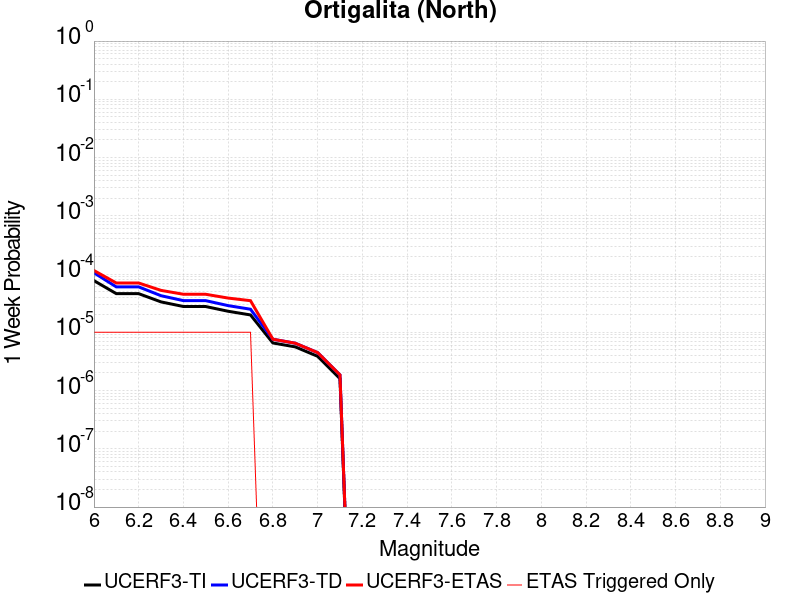 |  |  |  |

| Magnitude | 1 wk TI Prob | 1 wk TD Prob | 1 wk ETAS Prob | 1 wk ETAS/TD Gain | 1 wk ETAS Triggered Only | 1 mo TI Prob | 1 mo TD Prob | 1 mo ETAS Prob | 1 mo ETAS/TD Gain | 1 mo ETAS Triggered Only | 1 yr TI Prob | 1 yr TD Prob | 1 yr ETAS Prob | 1 yr ETAS/TD Gain | 1 yr ETAS Triggered Only | 10 yr TI Prob | 10 yr TD Prob | 10 yr ETAS Prob | 10 yr ETAS/TD Gain | 10 yr ETAS Triggered Only |
|-----|-----|-----|-----|-----|-----|-----|-----|-----|-----|-----|-----|-----|-----|-----|-----|-----|-----|-----|-----|-----|
| 6.0 | 7.711876E-5 | 1.0506391E-4 | 1.1859429E-4 | 1.1287824 | 1.35318E-5 | 3.3046713E-4 | 4.5020707E-4 | 4.6373278E-4 | 1.0300432 | 1.35318E-5 | 0.004016016 | 0.0054680775 | 0.005481535 | 1.0024612 | 1.35318E-5 | 0.039442103 | 0.053454336 | 0.053467147 | 1.0002396 | 1.35318E-5 |
| 6.1 | 4.607858E-5 | 6.0238694E-5 | 7.3769676E-5 | 1.2246228 | 1.35318E-5 | 1.9746469E-4 | 2.581431E-4 | 2.716714E-4 | 1.0524062 | 1.35318E-5 | 0.0024014818 | 0.003138735 | 0.0031522242 | 1.0042977 | 1.35318E-5 | 0.023756953 | 0.030974828 | 0.03098794 | 1.0004233 | 1.35318E-5 |
| 6.2 | 4.607858E-5 | 6.0238694E-5 | 7.3769676E-5 | 1.2246228 | 1.35318E-5 | 1.9746469E-4 | 2.581431E-4 | 2.716714E-4 | 1.0524062 | 1.35318E-5 | 0.0024014818 | 0.003138735 | 0.0031522242 | 1.0042977 | 1.35318E-5 | 0.023756953 | 0.030974828 | 0.03098794 | 1.0004233 | 1.35318E-5 |
| 6.3 | 3.327423E-5 | 4.2474803E-5 | 5.600603E-5 | 1.3185706 | 1.35318E-5 | 1.4259605E-4 | 1.8202393E-4 | 1.9555326E-4 | 1.0743272 | 1.35318E-5 | 0.0017347244 | 0.0022141805 | 0.0022276824 | 1.0060979 | 1.35318E-5 | 0.017212452 | 0.021945486 | 0.02195872 | 1.0006031 | 1.35318E-5 |
| 6.4 | 2.7732503E-5 | 3.4998342E-5 | 4.8529666E-5 | 1.3866277 | 1.35318E-5 | 1.1884817E-4 | 1.4998578E-4 | 1.6351553E-4 | 1.090207 | 1.35318E-5 | 0.001446016 | 0.0018247965 | 0.0018383036 | 1.007402 | 1.35318E-5 | 0.014366428 | 0.018121095 | 0.018134383 | 1.0007333 | 1.35318E-5 |
| 6.5 | 2.7689714E-5 | 3.4948156E-5 | 4.847948E-5 | 1.3871828 | 1.35318E-5 | 1.186648E-4 | 1.4977071E-4 | 1.6330049E-4 | 1.0903366 | 1.35318E-5 | 0.0014437864 | 0.0018221827 | 0.0018356898 | 1.0074127 | 1.35318E-5 | 0.014344421 | 0.018095383 | 0.01810867 | 1.0007343 | 1.35318E-5 |
| 6.6 | 2.2976905E-5 | 2.8718066E-5 | 4.2249478E-5 | 1.4711812 | 1.35318E-5 | 9.846873E-5 | 1.2307306E-4 | 1.3660318E-4 | 1.1099358 | 1.35318E-5 | 0.0011981975 | 0.0014976262 | 0.0015111377 | 1.009022 | 1.35318E-5 | 0.011917574 | 0.014898595 | 0.014911926 | 1.0008948 | 1.35318E-5 |
| 6.7 | 1.9871539E-5 | 2.4904239E-5 | 3.84357E-5 | 1.5433397 | 1.35318E-5 | 8.516096E-5 | 1.0672949E-4 | 1.2025984E-4 | 1.1267724 | 1.35318E-5 | 0.0010363415 | 0.0012989055 | 0.0013124198 | 1.0104043 | 1.35318E-5 | 0.010315218 | 0.01293683 | 0.012950187 | 1.0010325 | 1.35318E-5 |
| 6.8 | 6.5640475E-6 | 7.6054603E-6 | 7.6054603E-6 | 1.0 | 0.0 | 2.813133E-5 | 3.259444E-5 | 3.259444E-5 | 1.0 | 0.0 | 3.424451E-4 | 3.967679E-4 | 3.967679E-4 | 1.0 | 0.0 | 0.0034191788 | 0.0039608823 | 0.0039608823 | 1.0 | 0.0 |
| 6.9 | 5.6219683E-6 | 6.5018107E-6 | 6.5018107E-6 | 1.0 | 0.0 | 2.4093928E-5 | 2.7864618E-5 | 2.7864618E-5 | 1.0 | 0.0 | 2.933041E-4 | 3.392015E-4 | 3.392015E-4 | 1.0 | 0.0 | 0.0029291727 | 0.0033870947 | 0.0033870947 | 1.0 | 0.0 |
| 7.0 | 3.875591E-6 | 4.484736E-6 | 4.484736E-6 | 1.0 | 0.0 | 1.6609569E-5 | 1.9220168E-5 | 1.9220168E-5 | 1.0 | 0.0 | 2.0220275E-4 | 2.3398253E-4 | 2.3398253E-4 | 1.0 | 0.0 | 0.0020201886 | 0.00233757 | 0.00233757 | 1.0 | 0.0 |
| 7.1 | 1.6017933E-6 | 1.8570338E-6 | 1.8570338E-6 | 1.0 | 0.0 | 6.8648105E-6 | 7.958698E-6 | 7.958698E-6 | 1.0 | 0.0 | 8.357586E-5 | 9.6893906E-5 | 9.6893906E-5 | 1.0 | 0.0 | 8.3544437E-4 | 9.6862135E-4 | 9.6862135E-4 | 1.0 | 0.0 |

## Raymond
*[(top)](#table-of-contents)*

| 1 Week | 1 Month | 1 Year | 10 Year |
|-----|-----|-----|-----|
|  |  |  |  |

| Magnitude | 1 wk TI Prob | 1 wk TD Prob | 1 wk ETAS Prob | 1 wk ETAS/TD Gain | 1 wk ETAS Triggered Only | 1 mo TI Prob | 1 mo TD Prob | 1 mo ETAS Prob | 1 mo ETAS/TD Gain | 1 mo ETAS Triggered Only | 1 yr TI Prob | 1 yr TD Prob | 1 yr ETAS Prob | 1 yr ETAS/TD Gain | 1 yr ETAS Triggered Only | 10 yr TI Prob | 10 yr TD Prob | 10 yr ETAS Prob | 10 yr ETAS/TD Gain | 10 yr ETAS Triggered Only |
|-----|-----|-----|-----|-----|-----|-----|-----|-----|-----|-----|-----|-----|-----|-----|-----|-----|-----|-----|-----|-----|
| 6.0 | 1.5157413E-5 | 1.5810077E-5 | 1.5810077E-5 | 1.0 | 0.0 | 6.4958724E-5 | 6.775586E-5 | 6.775586E-5 | 1.0 | 0.0 | 7.905855E-4 | 8.2464045E-4 | 8.381611E-4 | 1.0163958 | 1.35318E-5 | 0.007877788 | 0.008218322 | 0.008231743 | 1.001633 | 1.35318E-5 |
| 6.1 | 1.5157413E-5 | 1.5810077E-5 | 1.5810077E-5 | 1.0 | 0.0 | 6.4958724E-5 | 6.775586E-5 | 6.775586E-5 | 1.0 | 0.0 | 7.905855E-4 | 8.2464045E-4 | 8.381611E-4 | 1.0163958 | 1.35318E-5 | 0.007877788 | 0.008218322 | 0.008231743 | 1.001633 | 1.35318E-5 |
| 6.2 | 1.5157413E-5 | 1.5810077E-5 | 1.5810077E-5 | 1.0 | 0.0 | 6.4958724E-5 | 6.775586E-5 | 6.775586E-5 | 1.0 | 0.0 | 7.905855E-4 | 8.2464045E-4 | 8.381611E-4 | 1.0163958 | 1.35318E-5 | 0.007877788 | 0.008218322 | 0.008231743 | 1.001633 | 1.35318E-5 |
| 6.3 | 1.5157413E-5 | 1.5810077E-5 | 1.5810077E-5 | 1.0 | 0.0 | 6.4958724E-5 | 6.775586E-5 | 6.775586E-5 | 1.0 | 0.0 | 7.905855E-4 | 8.2464045E-4 | 8.381611E-4 | 1.0163958 | 1.35318E-5 | 0.007877788 | 0.008218322 | 0.008231743 | 1.001633 | 1.35318E-5 |
| 6.4 | 1.3941944E-5 | 1.4454645E-5 | 1.4454645E-5 | 1.0 | 0.0 | 5.9749822E-5 | 6.194714E-5 | 6.194714E-5 | 1.0 | 0.0 | 7.2721124E-4 | 7.539688E-4 | 7.6749036E-4 | 1.0179338 | 1.35318E-5 | 0.007248361 | 0.007516441 | 0.007529871 | 1.0017867 | 1.35318E-5 |
| 6.5 | 1.3941944E-5 | 1.4454645E-5 | 1.4454645E-5 | 1.0 | 0.0 | 5.9749822E-5 | 6.194714E-5 | 6.194714E-5 | 1.0 | 0.0 | 7.2721124E-4 | 7.539688E-4 | 7.6749036E-4 | 1.0179338 | 1.35318E-5 | 0.007248361 | 0.007516441 | 0.007529871 | 1.0017867 | 1.35318E-5 |
| 6.6 | 1.0542609E-5 | 1.0671079E-5 | 1.0671079E-5 | 1.0 | 0.0 | 4.5181827E-5 | 4.5732424E-5 | 4.5732424E-5 | 1.0 | 0.0 | 5.499499E-4 | 5.5665546E-4 | 5.701797E-4 | 1.0242956 | 1.35318E-5 | 0.005485909 | 0.0055531724 | 0.005566629 | 1.0024233 | 1.35318E-5 |
| 6.7 | 1.0542609E-5 | 1.0671079E-5 | 1.0671079E-5 | 1.0 | 0.0 | 4.5181827E-5 | 4.5732424E-5 | 4.5732424E-5 | 1.0 | 0.0 | 5.499499E-4 | 5.5665546E-4 | 5.701797E-4 | 1.0242956 | 1.35318E-5 | 0.005485909 | 0.0055531724 | 0.005566629 | 1.0024233 | 1.35318E-5 |
| 6.8 | 1.0079132E-5 | 1.0176613E-5 | 1.0176613E-5 | 1.0 | 0.0 | 4.3195567E-5 | 4.3613356E-5 | 4.3613356E-5 | 1.0 | 0.0 | 5.257791E-4 | 5.308686E-4 | 5.443932E-4 | 1.0254763 | 1.35318E-5 | 0.0052453685 | 0.005296554 | 0.005310014 | 1.0025413 | 1.35318E-5 |
| 6.9 | 7.721598E-6 | 7.5488792E-6 | 7.5488792E-6 | 1.0 | 0.0 | 3.3092143E-5 | 3.2351945E-5 | 3.2351945E-5 | 1.0 | 0.0 | 4.0282236E-4 | 3.9381496E-4 | 4.0734143E-4 | 1.0343473 | 1.35318E-5 | 0.0040209293 | 0.0039313044 | 0.003944783 | 1.0034286 | 1.35318E-5 |
| 7.0 | 7.137566E-6 | 6.911282E-6 | 6.911282E-6 | 1.0 | 0.0 | 3.058921E-5 | 2.9619448E-5 | 2.9619448E-5 | 1.0 | 0.0 | 3.7236E-4 | 3.605582E-4 | 3.7408512E-4 | 1.0375166 | 1.35318E-5 | 0.0037173668 | 0.0035998505 | 0.0036133335 | 1.0037454 | 1.35318E-5 |
| 7.1 | 5.654976E-6 | 5.29952E-6 | 5.29952E-6 | 1.0 | 0.0 | 2.4235387E-5 | 2.2712033E-5 | 2.2712033E-5 | 1.0 | 0.0 | 2.9502588E-4 | 2.7648412E-4 | 2.900122E-4 | 1.0489289 | 1.35318E-5 | 0.0029463451 | 0.0027614324 | 0.002774927 | 1.0048867 | 1.35318E-5 |
| 7.2 | 4.9358455E-6 | 4.5266393E-6 | 4.5266393E-6 | 1.0 | 0.0 | 2.1153453E-5 | 1.9399738E-5 | 1.9399738E-5 | 1.0 | 0.0 | 2.5751285E-4 | 2.3616636E-4 | 2.4969497E-4 | 1.0572842 | 1.35318E-5 | 0.0025721465 | 0.002359176 | 0.0023726758 | 1.0057223 | 1.35318E-5 |
| 7.3 | 4.2368597E-6 | 3.8055998E-6 | 3.8055998E-6 | 1.0 | 0.0 | 1.8157843E-5 | 1.6309612E-5 | 1.6309612E-5 | 1.0 | 0.0 | 2.2104931E-4 | 1.9855154E-4 | 2.1208065E-4 | 1.0681391 | 1.35318E-5 | 0.0022082955 | 0.0019837602 | 0.001997265 | 1.0068078 | 1.35318E-5 |
| 7.4 | 3.4999923E-6 | 3.043729E-6 | 3.043729E-6 | 1.0 | 0.0 | 1.49998805E-5 | 1.3044489E-5 | 1.3044489E-5 | 1.0 | 0.0 | 1.8260824E-4 | 1.5880515E-4 | 1.7233481E-4 | 1.0851965 | 1.35318E-5 | 0.0018245826 | 0.0015869325 | 0.0016004428 | 1.0085135 | 1.35318E-5 |
| 7.5 | 2.738017E-6 | 2.302034E-6 | 2.302034E-6 | 1.0 | 0.0 | 1.1734306E-5 | 9.865823E-6 | 9.865823E-6 | 1.0 | 0.0 | 1.428558E-4 | 1.2010984E-4 | 1.3364002E-4 | 1.1126484 | 1.35318E-5 | 0.0014276401 | 0.0012004636 | 0.0012139792 | 1.0112586 | 1.35318E-5 |
| 7.6 | 1.8186392E-6 | 1.4423032E-6 | 1.4423032E-6 | 1.0 | 0.0 | 7.794145E-6 | 6.181285E-6 | 6.181285E-6 | 1.0 | 0.0 | 9.488958E-5 | 7.525458E-5 | 8.878537E-5 | 1.1798002 | 1.35318E-5 | 9.4849075E-4 | 7.523025E-4 | 7.6582417E-4 | 1.0179737 | 1.35318E-5 |
| 7.7 | 1.0660348E-6 | 7.643733E-7 | 7.643733E-7 | 1.0 | 0.0 | 4.5687125E-6 | 3.2758817E-6 | 3.2758817E-6 | 1.0 | 0.0 | 5.5622655E-5 | 3.9883143E-5 | 5.3414406E-5 | 1.3392726 | 1.35318E-5 | 5.5608735E-4 | 3.9876899E-4 | 4.122954E-4 | 1.0339204 | 1.35318E-5 |
| 7.8 | 6.913602E-7 | 4.3203528E-7 | 4.3203528E-7 | 1.0 | 0.0 | 2.962969E-6 | 1.8515785E-6 | 1.8515785E-6 | 1.0 | 0.0 | 3.607355E-5 | 2.2542741E-5 | 3.6074234E-5 | 1.6002595 | 1.35318E-5 | 3.6067693E-4 | 2.254124E-4 | 2.3894115E-4 | 1.0600178 | 1.35318E-5 |
| 7.9 | 7.425201E-8 | 5.3221502E-8 | 5.3221502E-8 | 1.0 | 0.0 | 3.1822285E-7 | 2.2809213E-7 | 2.2809213E-7 | 1.0 | 0.0 | 3.874356E-6 | 2.7770195E-6 | 2.7770195E-6 | 1.0 | 0.0 | 3.8742884E-5 | 2.7769978E-5 | 2.7769978E-5 | 1.0 | 0.0 |

## Hayward (No) 2011 CFM
*[(top)](#table-of-contents)*

| 1 Week | 1 Month | 1 Year | 10 Year |
|-----|-----|-----|-----|
|  |  |  |  |

| Magnitude | 1 wk TI Prob | 1 wk TD Prob | 1 wk ETAS Prob | 1 wk ETAS/TD Gain | 1 wk ETAS Triggered Only | 1 mo TI Prob | 1 mo TD Prob | 1 mo ETAS Prob | 1 mo ETAS/TD Gain | 1 mo ETAS Triggered Only | 1 yr TI Prob | 1 yr TD Prob | 1 yr ETAS Prob | 1 yr ETAS/TD Gain | 1 yr ETAS Triggered Only | 10 yr TI Prob | 10 yr TD Prob | 10 yr ETAS Prob | 10 yr ETAS/TD Gain | 10 yr ETAS Triggered Only |
|-----|-----|-----|-----|-----|-----|-----|-----|-----|-----|-----|-----|-----|-----|-----|-----|-----|-----|-----|-----|-----|
| 6.0 | 9.3068506E-5 | 1.7395586E-4 | 1.8748532E-4 | 1.0777751 | 1.35318E-5 | 3.9880406E-4 | 7.453083E-4 | 7.5883E-4 | 1.0181425 | 1.35318E-5 | 0.0048446343 | 0.009036233 | 0.009049642 | 1.0014839 | 1.35318E-5 | 0.047403704 | 0.08637354 | 0.0863859 | 1.0001432 | 1.35318E-5 |
| 6.1 | 9.055486E-5 | 1.6946718E-4 | 1.829967E-4 | 1.0798355 | 1.35318E-5 | 3.880345E-4 | 7.260854E-4 | 7.396074E-4 | 1.0186231 | 1.35318E-5 | 0.0047140904 | 0.008804334 | 0.008817746 | 1.0015234 | 1.35318E-5 | 0.046153355 | 0.084266745 | 0.084279135 | 1.0001471 | 1.35318E-5 |
| 6.2 | 9.006742E-5 | 1.6867317E-4 | 1.822027E-4 | 1.0802114 | 1.35318E-5 | 3.859461E-4 | 7.226844E-4 | 7.362064E-4 | 1.0187109 | 1.35318E-5 | 0.0046887742 | 0.00876331 | 0.0087767225 | 1.0015306 | 1.35318E-5 | 0.0459107 | 0.083891 | 0.08390339 | 1.0001478 | 1.35318E-5 |
| 6.3 | 8.8336754E-5 | 1.6546855E-4 | 1.7899812E-4 | 1.0817652 | 1.35318E-5 | 3.7853114E-4 | 7.08959E-4 | 7.224812E-4 | 1.0190734 | 1.35318E-5 | 0.004598882 | 0.008597586 | 0.008611001 | 1.0015603 | 1.35318E-5 | 0.04504866 | 0.08238421 | 0.08239662 | 1.0001507 | 1.35318E-5 |
| 6.4 | 8.526157E-5 | 1.5973859E-4 | 1.7326821E-4 | 1.0846987 | 1.35318E-5 | 3.6535555E-4 | 6.8441505E-4 | 6.979376E-4 | 1.0197577 | 1.35318E-5 | 0.0044391346 | 0.0083010765 | 0.008314496 | 1.0016166 | 1.35318E-5 | 0.043514993 | 0.079681054 | 0.0796935 | 1.0001563 | 1.35318E-5 |
| 6.5 | 8.152396E-5 | 1.5306243E-4 | 1.6659216E-4 | 1.0883936 | 1.35318E-5 | 3.493416E-4 | 6.558176E-4 | 6.6934054E-4 | 1.02062 | 1.35318E-5 | 0.0042449418 | 0.007955498 | 0.007968922 | 1.0016874 | 1.35318E-5 | 0.04164765 | 0.07651191 | 0.07652441 | 1.0001633 | 1.35318E-5 |
| 6.6 | 7.987405E-5 | 1.5010455E-4 | 1.6363432E-4 | 1.0901356 | 1.35318E-5 | 3.4227243E-4 | 6.4314733E-4 | 6.566704E-4 | 1.0210265 | 1.35318E-5 | 0.0041592065 | 0.0078023616 | 0.007815788 | 1.0017208 | 1.35318E-5 | 0.04082218 | 0.07510444 | 0.075116955 | 1.0001667 | 1.35318E-5 |
| 6.7 | 7.777665E-5 | 1.4649722E-4 | 1.6002703E-4 | 1.0923555 | 1.35318E-5 | 3.332859E-4 | 6.276948E-4 | 6.4121815E-4 | 1.0215443 | 1.35318E-5 | 0.004050208 | 0.007615561 | 0.00762899 | 1.0017633 | 1.35318E-5 | 0.039771806 | 0.07338084 | 0.07339338 | 1.0001708 | 1.35318E-5 |
| 6.8 | 7.3284005E-5 | 1.3800382E-4 | 1.5153375E-4 | 1.0980402 | 1.35318E-5 | 3.140365E-4 | 5.913115E-4 | 6.048353E-4 | 1.0228709 | 1.35318E-5 | 0.0038166929 | 0.0071755904 | 0.007189025 | 1.0018723 | 1.35318E-5 | 0.037518036 | 0.06929449 | 0.06930708 | 1.0001818 | 1.35318E-5 |
| 6.9 | 6.458263E-5 | 1.2131093E-4 | 1.3484109E-4 | 1.1115329 | 1.35318E-5 | 2.7675333E-4 | 5.198009E-4 | 5.333256E-4 | 1.0260191 | 1.35318E-5 | 0.0033642664 | 0.0063103125 | 0.006323759 | 1.0021309 | 1.35318E-5 | 0.033137884 | 0.061223395 | 0.0612361 | 1.0002075 | 1.35318E-5 |
| 7.0 | 5.3853604E-5 | 1.0024721E-4 | 1.13777656E-4 | 1.1349708 | 1.35318E-5 | 2.3078074E-4 | 4.295605E-4 | 4.430865E-4 | 1.031488 | 1.35318E-5 | 0.0028061352 | 0.0052174223 | 0.0052308836 | 1.00258 | 1.35318E-5 | 0.027709642 | 0.050956275 | 0.050969116 | 1.000252 | 1.35318E-5 |
| 7.1 | 4.4308683E-5 | 8.1703285E-5 | 9.523398E-5 | 1.1656077 | 1.35318E-5 | 1.8988053E-4 | 3.5011017E-4 | 3.6363723E-4 | 1.0386366 | 1.35318E-5 | 0.0023093442 | 0.0042543015 | 0.0042677755 | 1.0031672 | 1.35318E-5 | 0.022854926 | 0.041823294 | 0.04183626 | 1.0003101 | 1.35318E-5 |
| 7.2 | 3.295973E-5 | 6.076837E-5 | 7.429935E-5 | 1.2226648 | 1.35318E-5 | 1.4124835E-4 | 2.6041E-4 | 2.7393826E-4 | 1.0519499 | 1.35318E-5 | 0.0017183421 | 0.0031659051 | 0.0031793942 | 1.0042607 | 1.35318E-5 | 0.017051157 | 0.031368516 | 0.031381626 | 1.0004178 | 1.35318E-5 |
| 7.3 | 2.452256E-5 | 4.5177785E-5 | 4.5177785E-5 | 1.0 | 0.0 | 1.05092455E-4 | 1.9360479E-4 | 1.9360479E-4 | 1.0 | 0.0 | 0.0012787496 | 0.002354604 | 0.002354604 | 1.0 | 0.0 | 0.0127141625 | 0.023439845 | 0.023439845 | 1.0 | 0.0 |
| 7.4 | 1.8829967E-5 | 3.4600187E-5 | 3.4600187E-5 | 1.0 | 0.0 | 8.069736E-5 | 1.4827815E-4 | 1.4827815E-4 | 1.0 | 0.0 | 9.820475E-4 | 0.0018038014 | 0.0018038014 | 1.0 | 0.0 | 0.009777189 | 0.018018324 | 0.018018324 | 1.0 | 0.0 |
| 7.5 | 1.26374125E-5 | 2.2919028E-5 | 2.2919028E-5 | 1.0 | 0.0 | 5.4159216E-5 | 9.822074E-5 | 9.822074E-5 | 1.0 | 0.0 | 6.5918895E-4 | 0.0011951873 | 0.0011951873 | 1.0 | 0.0 | 0.00657237 | 0.011987788 | 0.011987788 | 1.0 | 0.0 |
| 7.6 | 4.666429E-6 | 8.477469E-6 | 8.477469E-6 | 1.0 | 0.0 | 1.9998828E-5 | 3.6331512E-5 | 3.6331512E-5 | 1.0 | 0.0 | 2.4345852E-4 | 4.4224763E-4 | 4.4224763E-4 | 1.0 | 0.0 | 0.0024319198 | 0.0044582393 | 0.0044582393 | 1.0 | 0.0 |
| 7.7 | 3.8399318E-7 | 7.13327E-7 | 7.13327E-7 | 1.0 | 0.0 | 1.6456839E-6 | 3.0571118E-6 | 3.0571118E-6 | 1.0 | 0.0 | 2.003602E-5 | 3.7219703E-5 | 3.7219703E-5 | 1.0 | 0.0 | 2.0034213E-4 | 3.8612023E-4 | 3.8612023E-4 | 1.0 | 0.0 |
| 7.8 | 2.5637698E-7 | 5.365698E-7 | 5.365698E-7 | 1.0 | 0.0 | 1.098758E-6 | 2.2995828E-6 | 2.2995828E-6 | 1.0 | 0.0 | 1.3377297E-5 | 2.7997063E-5 | 2.7997063E-5 | 1.0 | 0.0 | 1.3376492E-4 | 2.924185E-4 | 2.924185E-4 | 1.0 | 0.0 |
| 7.9 | 1.7141245E-7 | 3.7286972E-7 | 3.7286972E-7 | 1.0 | 0.0 | 7.3462456E-7 | 1.598012E-6 | 1.598012E-6 | 1.0 | 0.0 | 8.944017E-6 | 1.9455623E-5 | 1.9455623E-5 | 1.0 | 0.0 | 8.943657E-5 | 2.0243683E-4 | 2.0243683E-4 | 1.0 | 0.0 |
| 8.0 | 1.1808895E-7 | 2.750723E-7 | 2.750723E-7 | 1.0 | 0.0 | 5.060954E-7 | 1.1788807E-6 | 1.1788807E-6 | 1.0 | 0.0 | 6.161694E-6 | 1.4352779E-5 | 1.4352779E-5 | 1.0 | 0.0 | 6.161523E-5 | 1.4815228E-4 | 1.4815228E-4 | 1.0 | 0.0 |
| 8.1 | 5.138535E-8 | 1.1228883E-7 | 1.1228883E-7 | 1.0 | 0.0 | 2.2022292E-7 | 4.8123775E-7 | 4.8123775E-7 | 1.0 | 0.0 | 2.6812106E-6 | 5.859054E-6 | 5.859054E-6 | 1.0 | 0.0 | 2.6811784E-5 | 6.015367E-5 | 6.015367E-5 | 1.0 | 0.0 |

## Fontana (Seismicity)
*[(top)](#table-of-contents)*

| 1 Week | 1 Month | 1 Year | 10 Year |
|-----|-----|-----|-----|
|  |  |  |  |

| Magnitude | 1 wk TI Prob | 1 wk TD Prob | 1 wk ETAS Prob | 1 wk ETAS/TD Gain | 1 wk ETAS Triggered Only | 1 mo TI Prob | 1 mo TD Prob | 1 mo ETAS Prob | 1 mo ETAS/TD Gain | 1 mo ETAS Triggered Only | 1 yr TI Prob | 1 yr TD Prob | 1 yr ETAS Prob | 1 yr ETAS/TD Gain | 1 yr ETAS Triggered Only | 10 yr TI Prob | 10 yr TD Prob | 10 yr ETAS Prob | 10 yr ETAS/TD Gain | 10 yr ETAS Triggered Only |
|-----|-----|-----|-----|-----|-----|-----|-----|-----|-----|-----|-----|-----|-----|-----|-----|-----|-----|-----|-----|-----|
| 6.0 | 7.1789214E-6 | 7.55199E-6 | 2.1083688E-5 | 2.7918055 | 1.35318E-5 | 3.076644E-5 | 3.23655E-5 | 4.5896864E-5 | 1.4180797 | 1.35318E-5 | 3.7451705E-4 | 3.940195E-4 | 4.0754597E-4 | 1.0343294 | 1.35318E-5 | 0.003738865 | 0.0039372086 | 0.003950687 | 1.0034233 | 1.35318E-5 |
| 6.1 | 7.1789214E-6 | 7.55199E-6 | 2.1083688E-5 | 2.7918055 | 1.35318E-5 | 3.076644E-5 | 3.23655E-5 | 4.5896864E-5 | 1.4180797 | 1.35318E-5 | 3.7451705E-4 | 3.940195E-4 | 4.0754597E-4 | 1.0343294 | 1.35318E-5 | 0.003738865 | 0.0039372086 | 0.003950687 | 1.0034233 | 1.35318E-5 |
| 6.2 | 7.1789214E-6 | 7.55199E-6 | 2.1083688E-5 | 2.7918055 | 1.35318E-5 | 3.076644E-5 | 3.23655E-5 | 4.5896864E-5 | 1.4180797 | 1.35318E-5 | 3.7451705E-4 | 3.940195E-4 | 4.0754597E-4 | 1.0343294 | 1.35318E-5 | 0.003738865 | 0.0039372086 | 0.003950687 | 1.0034233 | 1.35318E-5 |
| 6.3 | 7.1789214E-6 | 7.55199E-6 | 2.1083688E-5 | 2.7918055 | 1.35318E-5 | 3.076644E-5 | 3.23655E-5 | 4.5896864E-5 | 1.4180797 | 1.35318E-5 | 3.7451705E-4 | 3.940195E-4 | 4.0754597E-4 | 1.0343294 | 1.35318E-5 | 0.003738865 | 0.0039372086 | 0.003950687 | 1.0034233 | 1.35318E-5 |
| 6.4 | 7.1789214E-6 | 7.55199E-6 | 2.1083688E-5 | 2.7918055 | 1.35318E-5 | 3.076644E-5 | 3.23655E-5 | 4.5896864E-5 | 1.4180797 | 1.35318E-5 | 3.7451705E-4 | 3.940195E-4 | 4.0754597E-4 | 1.0343294 | 1.35318E-5 | 0.003738865 | 0.0039372086 | 0.003950687 | 1.0034233 | 1.35318E-5 |
| 6.5 | 5.2611317E-6 | 5.532718E-6 | 1.9064442E-5 | 3.4457643 | 1.35318E-5 | 2.2547512E-5 | 2.371165E-5 | 3.7243128E-5 | 1.570668 | 1.35318E-5 | 2.744814E-4 | 2.8868933E-4 | 3.0221723E-4 | 1.0468597 | 1.35318E-5 | 0.002741426 | 0.0028868932 | 0.002900386 | 1.0046738 | 1.35318E-5 |
| 6.6 | 5.2611317E-6 | 5.532718E-6 | 1.9064442E-5 | 3.4457643 | 1.35318E-5 | 2.2547512E-5 | 2.371165E-5 | 3.7243128E-5 | 1.570668 | 1.35318E-5 | 2.744814E-4 | 2.8868933E-4 | 3.0221723E-4 | 1.0468597 | 1.35318E-5 | 0.002741426 | 0.0028868932 | 0.002900386 | 1.0046738 | 1.35318E-5 |

## San Jacinto (Anza) rev
*[(top)](#table-of-contents)*

| 1 Week | 1 Month | 1 Year | 10 Year |
|-----|-----|-----|-----|
|  |  |  |  |

| Magnitude | 1 wk TI Prob | 1 wk TD Prob | 1 wk ETAS Prob | 1 wk ETAS/TD Gain | 1 wk ETAS Triggered Only | 1 mo TI Prob | 1 mo TD Prob | 1 mo ETAS Prob | 1 mo ETAS/TD Gain | 1 mo ETAS Triggered Only | 1 yr TI Prob | 1 yr TD Prob | 1 yr ETAS Prob | 1 yr ETAS/TD Gain | 1 yr ETAS Triggered Only | 10 yr TI Prob | 10 yr TD Prob | 10 yr ETAS Prob | 10 yr ETAS/TD Gain | 10 yr ETAS Triggered Only |
|-----|-----|-----|-----|-----|-----|-----|-----|-----|-----|-----|-----|-----|-----|-----|-----|-----|-----|-----|-----|-----|
| 6.0 | 6.3015636E-5 | 4.329564E-5 | 4.329564E-5 | 1.0 | 0.0 | 2.7003905E-4 | 1.8553961E-4 | 1.8553961E-4 | 1.0 | 0.0 | 0.0032827691 | 0.0022566165 | 0.0022701176 | 1.005983 | 1.35318E-5 | 0.032346968 | 0.023292562 | 0.02330578 | 1.0005674 | 1.35318E-5 |
| 6.1 | 6.3015636E-5 | 4.329564E-5 | 4.329564E-5 | 1.0 | 0.0 | 2.7003905E-4 | 1.8553961E-4 | 1.8553961E-4 | 1.0 | 0.0 | 0.0032827691 | 0.0022566165 | 0.0022701176 | 1.005983 | 1.35318E-5 | 0.032346968 | 0.023292562 | 0.02330578 | 1.0005674 | 1.35318E-5 |
| 6.2 | 6.3015636E-5 | 4.329564E-5 | 4.329564E-5 | 1.0 | 0.0 | 2.7003905E-4 | 1.8553961E-4 | 1.8553961E-4 | 1.0 | 0.0 | 0.0032827691 | 0.0022566165 | 0.0022701176 | 1.005983 | 1.35318E-5 | 0.032346968 | 0.023292562 | 0.02330578 | 1.0005674 | 1.35318E-5 |
| 6.3 | 6.3015636E-5 | 4.329564E-5 | 4.329564E-5 | 1.0 | 0.0 | 2.7003905E-4 | 1.8553961E-4 | 1.8553961E-4 | 1.0 | 0.0 | 0.0032827691 | 0.0022566165 | 0.0022701176 | 1.005983 | 1.35318E-5 | 0.032346968 | 0.023292562 | 0.02330578 | 1.0005674 | 1.35318E-5 |
| 6.4 | 6.3015636E-5 | 4.329564E-5 | 4.329564E-5 | 1.0 | 0.0 | 2.7003905E-4 | 1.8553961E-4 | 1.8553961E-4 | 1.0 | 0.0 | 0.0032827691 | 0.0022566165 | 0.0022701176 | 1.005983 | 1.35318E-5 | 0.032346968 | 0.023292562 | 0.02330578 | 1.0005674 | 1.35318E-5 |
| 6.5 | 5.811017E-5 | 4.007568E-5 | 4.007568E-5 | 1.0 | 0.0 | 2.4901982E-4 | 1.7174163E-4 | 1.7174163E-4 | 1.0 | 0.0 | 0.0030276014 | 0.002088955 | 0.0021024584 | 1.0064642 | 1.35318E-5 | 0.02986684 | 0.021590188 | 0.021603428 | 1.0006132 | 1.35318E-5 |
| 6.6 | 5.811017E-5 | 4.007568E-5 | 4.007568E-5 | 1.0 | 0.0 | 2.4901982E-4 | 1.7174163E-4 | 1.7174163E-4 | 1.0 | 0.0 | 0.0030276014 | 0.002088955 | 0.0021024584 | 1.0064642 | 1.35318E-5 | 0.02986684 | 0.021590188 | 0.021603428 | 1.0006132 | 1.35318E-5 |
| 6.7 | 5.712442E-5 | 3.9498424E-5 | 3.9498424E-5 | 1.0 | 0.0 | 2.4479596E-4 | 1.6926801E-4 | 1.6926801E-4 | 1.0 | 0.0 | 0.0029763177 | 0.0020588955 | 0.0020723995 | 1.0065588 | 1.35318E-5 | 0.029367693 | 0.02128203 | 0.021295274 | 1.0006223 | 1.35318E-5 |
| 6.8 | 5.6967532E-5 | 3.935485E-5 | 3.935485E-5 | 1.0 | 0.0 | 2.4412372E-4 | 1.6865278E-4 | 1.6865278E-4 | 1.0 | 0.0 | 0.0029681553 | 0.0020514193 | 0.0020649233 | 1.0065827 | 1.35318E-5 | 0.029288229 | 0.021206751 | 0.021219997 | 1.0006245 | 1.35318E-5 |
| 6.9 | 5.6211324E-5 | 3.9059665E-5 | 3.9059665E-5 | 1.0 | 0.0 | 2.4088343E-4 | 1.6738786E-4 | 1.6738786E-4 | 1.0 | 0.0 | 0.0029288116 | 0.0020360479 | 0.002049552 | 1.0066326 | 1.35318E-5 | 0.028905109 | 0.021046195 | 0.021059442 | 1.0006294 | 1.35318E-5 |
| 7.0 | 5.4383527E-5 | 3.7920276E-5 | 3.7920276E-5 | 1.0 | 0.0 | 2.3305144E-4 | 1.6250537E-4 | 1.6250537E-4 | 1.0 | 0.0 | 0.0028337094 | 0.0019767124 | 0.0019902175 | 1.0068321 | 1.35318E-5 | 0.027978465 | 0.020437196 | 0.02045045 | 1.0006486 | 1.35318E-5 |
| 7.1 | 5.1393665E-5 | 3.6383335E-5 | 3.6383335E-5 | 1.0 | 0.0 | 2.2023996E-4 | 1.5591929E-4 | 1.5591929E-4 | 1.0 | 0.0 | 0.0026781242 | 0.0018966687 | 0.0019101748 | 1.007121 | 1.35318E-5 | 0.026460782 | 0.019610861 | 0.019624127 | 1.0006765 | 1.35318E-5 |
| 7.2 | 4.785222E-5 | 3.4735345E-5 | 3.4735345E-5 | 1.0 | 0.0 | 2.0506482E-4 | 1.4885729E-4 | 1.4885729E-4 | 1.0 | 0.0 | 0.0024938055 | 0.0018108344 | 0.0018243417 | 1.0074592 | 1.35318E-5 | 0.024660049 | 0.018725628 | 0.018738907 | 1.000709 | 1.35318E-5 |
| 7.3 | 4.2143256E-5 | 3.382991E-5 | 3.382991E-5 | 1.0 | 0.0 | 1.8060145E-4 | 1.4497728E-4 | 1.4497728E-4 | 1.0 | 0.0 | 0.002196605 | 0.0017636728 | 0.0017771808 | 1.007659 | 1.35318E-5 | 0.02175019 | 0.018233923 | 0.018247208 | 1.0007286 | 1.35318E-5 |
| 7.4 | 4.0264713E-5 | 3.3468146E-5 | 3.3468146E-5 | 1.0 | 0.0 | 1.7255165E-4 | 1.4342705E-4 | 1.4342705E-4 | 1.0 | 0.0 | 0.002098792 | 0.0017448291 | 0.0017583373 | 1.0077418 | 1.35318E-5 | 0.020790804 | 0.01803853 | 0.018051818 | 1.0007366 | 1.35318E-5 |
| 7.5 | 3.694492E-5 | 3.218225E-5 | 3.218225E-5 | 1.0 | 0.0 | 1.5832575E-4 | 1.3791666E-4 | 1.3791666E-4 | 1.0 | 0.0 | 0.0019259118 | 0.0016778451 | 0.0016913542 | 1.0080515 | 1.35318E-5 | 0.01909306 | 0.017355029 | 0.017368326 | 1.0007662 | 1.35318E-5 |
| 7.6 | 3.200565E-5 | 2.949823E-5 | 2.949823E-5 | 1.0 | 0.0 | 1.3715986E-4 | 1.2641487E-4 | 1.2641487E-4 | 1.0 | 0.0 | 0.001668642 | 0.0015380166 | 0.0015515276 | 1.0087847 | 1.35318E-5 | 0.01656168 | 0.015943231 | 0.015956547 | 1.0008352 | 1.35318E-5 |
| 7.7 | 2.731642E-5 | 2.6090234E-5 | 2.6090234E-5 | 1.0 | 0.0 | 1.1706512E-4 | 1.1181051E-4 | 1.1181051E-4 | 1.0 | 0.0 | 0.001424336 | 0.0013604438 | 0.0013739571 | 1.0099331 | 1.35318E-5 | 0.014152412 | 0.014165673 | 0.014179014 | 1.0009418 | 1.35318E-5 |
| 7.8 | 2.3466424E-5 | 2.3502365E-5 | 2.3502365E-5 | 1.0 | 0.0 | 1.0056651E-4 | 1.0072054E-4 | 1.0072054E-4 | 1.0 | 0.0 | 0.0012237094 | 0.0012255836 | 0.0012390988 | 1.0110276 | 1.35318E-5 | 0.012169928 | 0.012807612 | 0.012820971 | 1.001043 | 1.35318E-5 |
| 7.9 | 1.8611925E-5 | 1.89059E-5 | 1.89059E-5 | 1.0 | 0.0 | 7.9762955E-5 | 8.102277E-5 | 8.102277E-5 | 1.0 | 0.0 | 9.7068126E-4 | 9.860066E-4 | 9.860066E-4 | 1.0 | 0.0 | 0.0096645225 | 0.010392662 | 0.010392662 | 1.0 | 0.0 |
| 8.0 | 1.5460775E-5 | 1.5738988E-5 | 1.5738988E-5 | 1.0 | 0.0 | 6.6258784E-5 | 6.745106E-5 | 6.745106E-5 | 1.0 | 0.0 | 8.0640207E-4 | 8.2090794E-4 | 8.2090794E-4 | 1.0 | 0.0 | 0.008034821 | 0.008701843 | 0.008701843 | 1.0 | 0.0 |
| 8.1 | 9.983884E-6 | 8.268797E-6 | 8.268797E-6 | 1.0 | 0.0 | 4.2787375E-5 | 3.543722E-5 | 3.543722E-5 | 1.0 | 0.0 | 5.2081177E-4 | 4.3136327E-4 | 4.3136327E-4 | 1.0 | 0.0 | 0.0051959283 | 0.0046394016 | 0.0046394016 | 1.0 | 0.0 |
| 8.2 | 4.1226E-6 | 1.5526499E-6 | 1.5526499E-6 | 1.0 | 0.0 | 1.7668166E-5 | 6.654197E-6 | 6.654197E-6 | 1.0 | 0.0 | 2.1508869E-4 | 8.1011865E-5 | 8.1011865E-5 | 1.0 | 0.0 | 0.0021488064 | 9.40314E-4 | 9.40314E-4 | 1.0 | 0.0 |
| 8.3 | 1.2750878E-6 | 3.6112328E-7 | 3.6112328E-7 | 1.0 | 0.0 | 5.4646503E-6 | 1.5476703E-6 | 1.5476703E-6 | 1.0 | 0.0 | 6.653009E-5 | 1.8842728E-5 | 1.8842728E-5 | 1.0 | 0.0 | 6.6510175E-4 | 2.2728964E-4 | 2.2728964E-4 | 1.0 | 0.0 |

## White Wolf
*[(top)](#table-of-contents)*

| 1 Week | 1 Month | 1 Year | 10 Year |
|-----|-----|-----|-----|
| 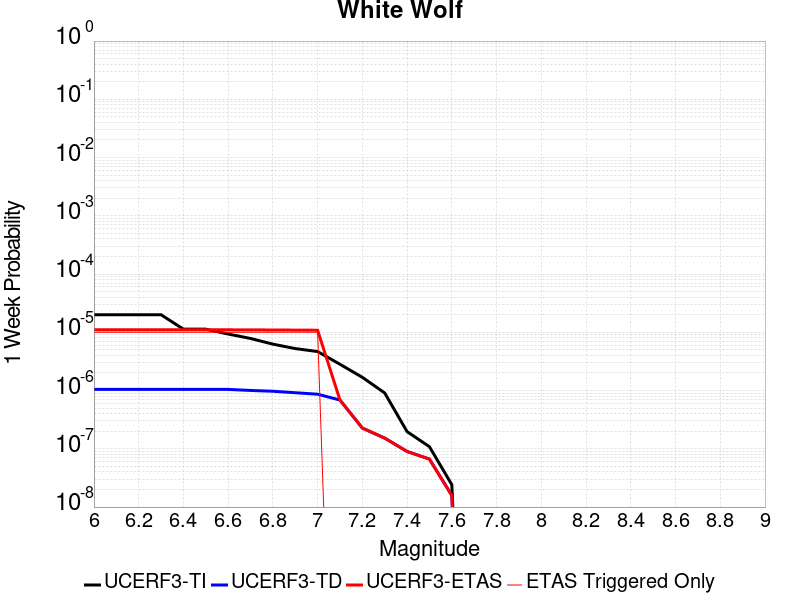 |  |  |  |

| Magnitude | 1 wk TI Prob | 1 wk TD Prob | 1 wk ETAS Prob | 1 wk ETAS/TD Gain | 1 wk ETAS Triggered Only | 1 mo TI Prob | 1 mo TD Prob | 1 mo ETAS Prob | 1 mo ETAS/TD Gain | 1 mo ETAS Triggered Only | 1 yr TI Prob | 1 yr TD Prob | 1 yr ETAS Prob | 1 yr ETAS/TD Gain | 1 yr ETAS Triggered Only | 10 yr TI Prob | 10 yr TD Prob | 10 yr ETAS Prob | 10 yr ETAS/TD Gain | 10 yr ETAS Triggered Only |
|-----|-----|-----|-----|-----|-----|-----|-----|-----|-----|-----|-----|-----|-----|-----|-----|-----|-----|-----|-----|-----|
| 6.0 | 2.0037822E-5 | 1.0469133E-6 | 1.4578699E-5 | 13.925411 | 1.35318E-5 | 8.587355E-5 | 4.486764E-6 | 1.8018503E-5 | 4.015924 | 1.35318E-5 | 0.001045009 | 5.4625034E-5 | 6.815609E-5 | 1.2477081 | 1.35318E-5 | 0.010401085 | 5.461211E-4 | 5.5964553E-4 | 1.0247645 | 1.35318E-5 |
| 6.1 | 2.0037822E-5 | 1.0469133E-6 | 1.4578699E-5 | 13.925411 | 1.35318E-5 | 8.587355E-5 | 4.486764E-6 | 1.8018503E-5 | 4.015924 | 1.35318E-5 | 0.001045009 | 5.4625034E-5 | 6.815609E-5 | 1.2477081 | 1.35318E-5 | 0.010401085 | 5.461211E-4 | 5.5964553E-4 | 1.0247645 | 1.35318E-5 |
| 6.2 | 2.0037822E-5 | 1.0469133E-6 | 1.4578699E-5 | 13.925411 | 1.35318E-5 | 8.587355E-5 | 4.486764E-6 | 1.8018503E-5 | 4.015924 | 1.35318E-5 | 0.001045009 | 5.4625034E-5 | 6.815609E-5 | 1.2477081 | 1.35318E-5 | 0.010401085 | 5.461211E-4 | 5.5964553E-4 | 1.0247645 | 1.35318E-5 |
| 6.3 | 2.0037822E-5 | 1.0469133E-6 | 1.4578699E-5 | 13.925411 | 1.35318E-5 | 8.587355E-5 | 4.486764E-6 | 1.8018503E-5 | 4.015924 | 1.35318E-5 | 0.001045009 | 5.4625034E-5 | 6.815609E-5 | 1.2477081 | 1.35318E-5 | 0.010401085 | 5.461211E-4 | 5.5964553E-4 | 1.0247645 | 1.35318E-5 |
| 6.4 | 1.132487E-5 | 1.0469133E-6 | 1.4578699E-5 | 13.925411 | 1.35318E-5 | 4.8534253E-5 | 4.486764E-6 | 1.8018503E-5 | 4.015924 | 1.35318E-5 | 5.907443E-4 | 5.4625034E-5 | 6.815609E-5 | 1.2477081 | 1.35318E-5 | 0.005891764 | 5.461211E-4 | 5.5964553E-4 | 1.0247645 | 1.35318E-5 |
| 6.5 | 1.132487E-5 | 1.0469133E-6 | 1.4578699E-5 | 13.925411 | 1.35318E-5 | 4.8534253E-5 | 4.486764E-6 | 1.8018503E-5 | 4.015924 | 1.35318E-5 | 5.907443E-4 | 5.4625034E-5 | 6.815609E-5 | 1.2477081 | 1.35318E-5 | 0.005891764 | 5.461211E-4 | 5.5964553E-4 | 1.0247645 | 1.35318E-5 |
| 6.6 | 9.347473E-6 | 1.0469133E-6 | 1.4578699E-5 | 13.925411 | 1.35318E-5 | 4.0059982E-5 | 4.486764E-6 | 1.8018503E-5 | 4.015924 | 1.35318E-5 | 4.8762115E-4 | 5.4625034E-5 | 6.815609E-5 | 1.2477081 | 1.35318E-5 | 0.0048655253 | 5.461211E-4 | 5.5964553E-4 | 1.0247645 | 1.35318E-5 |
| 6.7 | 7.842647E-6 | 1.0048315E-6 | 1.45366175E-5 | 14.466722 | 1.35318E-5 | 3.361091E-5 | 4.3064138E-6 | 1.7838156E-5 | 4.1422296 | 1.35318E-5 | 4.0913603E-4 | 5.242938E-5 | 6.596047E-5 | 1.2580823 | 1.35318E-5 | 0.004083836 | 5.2417506E-4 | 5.376997E-4 | 1.0258019 | 1.35318E-5 |
| 6.8 | 6.26597E-6 | 9.734797E-7 | 1.4505266E-5 | 14.900431 | 1.35318E-5 | 2.685388E-5 | 4.172049E-6 | 1.7703793E-5 | 4.243428 | 1.35318E-5 | 3.2689696E-4 | 5.0793566E-5 | 6.4324675E-5 | 1.2663943 | 1.35318E-5 | 0.003264165 | 5.078245E-4 | 5.213494E-4 | 1.026633 | 1.35318E-5 |
| 6.9 | 5.258436E-6 | 9.18323E-7 | 1.445011E-5 | 15.735324 | 1.35318E-5 | 2.2535958E-5 | 3.9356646E-6 | 1.7467411E-5 | 4.4382367 | 1.35318E-5 | 2.7434074E-4 | 4.791571E-5 | 6.144686E-5 | 1.2823949 | 1.35318E-5 | 0.0027400232 | 4.7905857E-4 | 4.925839E-4 | 1.0282332 | 1.35318E-5 |
| 7.0 | 4.675028E-6 | 8.661157E-7 | 1.4397904E-5 | 16.623533 | 1.35318E-5 | 2.003568E-5 | 3.7119196E-6 | 1.7243668E-5 | 4.645486 | 1.35318E-5 | 2.4390711E-4 | 4.519173E-5 | 5.872292E-5 | 1.2994174 | 1.35318E-5 | 0.0024363957 | 4.5183013E-4 | 4.653558E-4 | 1.0299354 | 1.35318E-5 |
| 7.1 | 2.8270078E-6 | 6.8741514E-7 | 6.8741514E-7 | 1.0 | 0.0 | 1.2115692E-5 | 2.9460618E-6 | 2.9460618E-6 | 1.0 | 0.0 | 1.4749856E-4 | 3.5867753E-5 | 3.5867753E-5 | 1.0 | 0.0 | 0.001474007 | 3.5862374E-4 | 3.5862374E-4 | 1.0 | 0.0 |
| 7.2 | 1.6881406E-6 | 2.2706288E-7 | 2.2706288E-7 | 1.0 | 0.0 | 7.2348685E-6 | 9.731262E-7 | 9.731262E-7 | 1.0 | 0.0 | 8.808096E-5 | 1.1847749E-5 | 1.1847749E-5 | 1.0 | 0.0 | 8.8046055E-4 | 1.1847133E-4 | 1.1847133E-4 | 1.0 | 0.0 |
| 7.3 | 9.086107E-7 | 1.5266329E-7 | 1.5266329E-7 | 1.0 | 0.0 | 3.8940398E-6 | 6.542711E-7 | 6.542711E-7 | 1.0 | 0.0 | 4.7408903E-5 | 7.965722E-6 | 7.965722E-6 | 1.0 | 0.0 | 4.739879E-4 | 7.965445E-5 | 7.965445E-5 | 1.0 | 0.0 |
| 7.4 | 1.9717383E-7 | 9.003899E-8 | 9.003899E-8 | 1.0 | 0.0 | 8.450304E-7 | 3.8588132E-7 | 3.8588132E-7 | 1.0 | 0.0 | 1.0288197E-5 | 4.6980954E-6 | 4.6980954E-6 | 1.0 | 0.0 | 1.028772E-4 | 4.6979992E-5 | 4.6979992E-5 | 1.0 | 0.0 |
| 7.5 | 1.086975E-7 | 6.6597124E-8 | 6.6597124E-8 | 1.0 | 0.0 | 4.6584634E-7 | 2.854162E-7 | 2.854162E-7 | 1.0 | 0.0 | 5.6716644E-6 | 3.4749369E-6 | 3.4749369E-6 | 1.0 | 0.0 | 5.6715195E-5 | 3.474885E-5 | 3.474885E-5 | 1.0 | 0.0 |
| 7.6 | 2.4217808E-8 | 1.582075E-8 | 1.582075E-8 | 1.0 | 0.0 | 1.03790605E-7 | 6.780321E-8 | 6.780321E-8 | 1.0 | 0.0 | 1.2636499E-6 | 8.255038E-7 | 8.255038E-7 | 1.0 | 0.0 | 1.2636427E-5 | 8.255012E-6 | 8.255012E-6 | 1.0 | 0.0 |

## Imperial
*[(top)](#table-of-contents)*

| 1 Week | 1 Month | 1 Year | 10 Year |
|-----|-----|-----|-----|
|  | 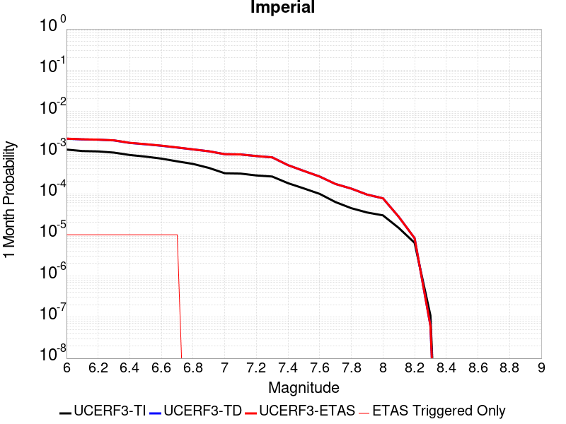 |  |  |

| Magnitude | 1 wk TI Prob | 1 wk TD Prob | 1 wk ETAS Prob | 1 wk ETAS/TD Gain | 1 wk ETAS Triggered Only | 1 mo TI Prob | 1 mo TD Prob | 1 mo ETAS Prob | 1 mo ETAS/TD Gain | 1 mo ETAS Triggered Only | 1 yr TI Prob | 1 yr TD Prob | 1 yr ETAS Prob | 1 yr ETAS/TD Gain | 1 yr ETAS Triggered Only | 10 yr TI Prob | 10 yr TD Prob | 10 yr ETAS Prob | 10 yr ETAS/TD Gain | 10 yr ETAS Triggered Only |
|-----|-----|-----|-----|-----|-----|-----|-----|-----|-----|-----|-----|-----|-----|-----|-----|-----|-----|-----|-----|-----|
| 6.0 | 2.7496446E-4 | 5.054469E-4 | 5.189719E-4 | 1.0267584 | 1.35318E-5 | 0.0011778869 | 0.002164442 | 0.0021779446 | 1.0062383 | 1.35318E-5 | 0.0142467655 | 0.026034584 | 0.026047762 | 1.0005063 | 1.35318E-5 | 0.13367249 | 0.22801645 | 0.2280269 | 1.0000458 | 1.35318E-5 |
| 6.1 | 2.5356023E-4 | 4.864905E-4 | 5.000157E-4 | 1.0278016 | 1.35318E-5 | 0.001086234 | 0.0020833316 | 0.002096835 | 1.0064818 | 1.35318E-5 | 0.013144928 | 0.02506727 | 0.025080463 | 1.0005263 | 1.35318E-5 | 0.123940155 | 0.21945325 | 0.2194638 | 1.0000482 | 1.35318E-5 |
| 6.2 | 2.4820742E-4 | 4.7744514E-4 | 4.9097044E-4 | 1.0283285 | 1.35318E-5 | 0.0010633124 | 0.0020446267 | 0.002058131 | 1.0066047 | 1.35318E-5 | 0.01286919 | 0.024607308 | 0.024620507 | 1.0005363 | 1.35318E-5 | 0.12148927 | 0.21595894 | 0.21596955 | 1.0000491 | 1.35318E-5 |
| 6.3 | 2.3205351E-4 | 4.588303E-4 | 4.723559E-4 | 1.0294784 | 1.35318E-5 | 9.94136E-4 | 0.0019649705 | 0.0019784758 | 1.006873 | 1.35318E-5 | 0.012036599 | 0.023657534 | 0.023670746 | 1.0005585 | 1.35318E-5 | 0.11405133 | 0.20790851 | 0.20791923 | 1.0000515 | 1.35318E-5 |
| 6.4 | 2.0304754E-4 | 3.9869116E-4 | 4.1221757E-4 | 1.0339271 | 1.35318E-5 | 8.6991355E-4 | 0.0017075721 | 0.0017210809 | 1.0079111 | 1.35318E-5 | 0.010539869 | 0.020591887 | 0.02060514 | 1.0006436 | 1.35318E-5 | 0.100537635 | 0.18504018 | 0.1850512 | 1.0000596 | 1.35318E-5 |
| 6.5 | 1.854992E-4 | 3.6981583E-4 | 3.8334265E-4 | 1.0365771 | 1.35318E-5 | 7.9475436E-4 | 0.0015839747 | 0.001597485 | 1.0085294 | 1.35318E-5 | 0.009633281 | 0.01911576 | 0.019129034 | 1.0006944 | 1.35318E-5 | 0.0922623 | 0.17327131 | 0.1732825 | 1.0000646 | 1.35318E-5 |
| 6.6 | 1.6586106E-4 | 3.4027954E-4 | 3.538067E-4 | 1.0397532 | 1.35318E-5 | 7.106394E-4 | 0.0014575359 | 0.001471048 | 1.0092705 | 1.35318E-5 | 0.008617763 | 0.017602775 | 0.017616069 | 1.0007552 | 1.35318E-5 | 0.08291132 | 0.16074891 | 0.16076027 | 1.0000707 | 1.35318E-5 |
| 6.7 | 1.4224656E-4 | 3.0760013E-4 | 3.2112777E-4 | 1.043978 | 1.35318E-5 | 6.094856E-4 | 0.0013176284 | 0.0013311424 | 1.0102563 | 1.35318E-5 | 0.0073952693 | 0.01592603 | 0.015939346 | 1.0008361 | 1.35318E-5 | 0.07153955 | 0.14645793 | 0.14646947 | 1.0000789 | 1.35318E-5 |
| 6.8 | 1.2317259E-4 | 2.7784536E-4 | 2.7784536E-4 | 1.0 | 0.0 | 5.2777573E-4 | 0.0011902286 | 0.0011902286 | 1.0 | 0.0 | 0.0064067547 | 0.014396132 | 0.014396132 | 1.0 | 0.0 | 0.06225166 | 0.13291098 | 0.13291098 | 1.0 | 0.0 |
| 6.9 | 9.859898E-5 | 2.500792E-4 | 2.500792E-4 | 1.0 | 0.0 | 4.2249862E-4 | 0.001071332 | 0.001071332 | 1.0 | 0.0 | 0.0051317946 | 0.012966422 | 0.012966422 | 1.0 | 0.0 | 0.05014893 | 0.11938127 | 0.11938127 | 1.0 | 0.0 |
| 7.0 | 7.3191884E-5 | 2.1260617E-4 | 2.1260617E-4 | 1.0 | 0.0 | 3.136418E-4 | 9.108543E-4 | 9.108543E-4 | 1.0 | 0.0 | 0.003811904 | 0.011033948 | 0.011033948 | 1.0 | 0.0 | 0.037471764 | 0.10204036 | 0.10204036 | 1.0 | 0.0 |
| 7.1 | 7.1760296E-5 | 2.0961992E-4 | 2.0961992E-4 | 1.0 | 0.0 | 3.0750787E-4 | 8.980649E-4 | 8.980649E-4 | 1.0 | 0.0 | 0.003737482 | 0.0108798025 | 0.0108798025 | 1.0 | 0.0 | 0.03675245 | 0.10067689 | 0.10067689 | 1.0 | 0.0 |
| 7.2 | 6.46614E-5 | 1.913056E-4 | 1.913056E-4 | 1.0 | 0.0 | 2.7709085E-4 | 8.1962656E-4 | 8.1962656E-4 | 1.0 | 0.0 | 0.0033683628 | 0.009933916 | 0.009933916 | 1.0 | 0.0 | 0.033177625 | 0.09248428 | 0.09248428 | 1.0 | 0.0 |
| 7.3 | 6.088115E-5 | 1.7802432E-4 | 1.7802432E-4 | 1.0 | 0.0 | 2.6089314E-4 | 7.6274114E-4 | 7.6274114E-4 | 1.0 | 0.0 | 0.0031717476 | 0.009247407 | 0.009247407 | 1.0 | 0.0 | 0.031268585 | 0.08653566 | 0.08653566 | 1.0 | 0.0 |
| 7.4 | 4.199346E-5 | 1.1507733E-4 | 1.1507733E-4 | 1.0 | 0.0 | 1.7995955E-4 | 4.930962E-4 | 4.930962E-4 | 1.0 | 0.0 | 0.0021888057 | 0.00598709 | 0.00598709 | 1.0 | 0.0 | 0.02167372 | 0.057428524 | 0.057428524 | 1.0 | 0.0 |
| 7.5 | 3.130448E-5 | 8.332899E-5 | 8.332899E-5 | 1.0 | 0.0 | 1.3415517E-4 | 3.5707568E-4 | 3.5707568E-4 | 1.0 | 0.0 | 0.0016321153 | 0.00433879 | 0.00433879 | 1.0 | 0.0 | 0.016201803 | 0.042130288 | 0.042130288 | 1.0 | 0.0 |
| 7.6 | 2.3074248E-5 | 6.0841397E-5 | 6.0841397E-5 | 1.0 | 0.0 | 9.888588E-5 | 2.607229E-4 | 2.607229E-4 | 1.0 | 0.0 | 0.0012032706 | 0.0031697042 | 0.0031697042 | 1.0 | 0.0 | 0.011967761 | 0.03102491 | 0.03102491 | 1.0 | 0.0 |
| 7.7 | 1.45864815E-5 | 4.0122002E-5 | 4.0122002E-5 | 1.0 | 0.0 | 6.2511994E-5 | 1.7194013E-4 | 1.7194013E-4 | 1.0 | 0.0 | 7.608177E-4 | 0.0020913668 | 0.0020913668 | 1.0 | 0.0 | 0.007582182 | 0.020626526 | 0.020626526 | 1.0 | 0.0 |
| 7.8 | 1.0352979E-5 | 3.0958607E-5 | 3.0958607E-5 | 1.0 | 0.0 | 4.4369157E-5 | 1.3267301E-4 | 1.3267301E-4 | 1.0 | 0.0 | 5.400606E-4 | 0.0016140995 | 0.0016140995 | 1.0 | 0.0 | 0.0053875 | 0.016015781 | 0.016015781 | 1.0 | 0.0 |
| 7.9 | 8.137906E-6 | 2.214726E-5 | 2.214726E-5 | 1.0 | 0.0 | 3.4876273E-5 | 9.491338E-5 | 9.491338E-5 | 1.0 | 0.0 | 4.2453592E-4 | 0.0011549587 | 0.0011549587 | 1.0 | 0.0 | 0.004237258 | 0.011617044 | 0.011617044 | 1.0 | 0.0 |
| 8.0 | 6.93792E-6 | 1.800718E-5 | 1.800718E-5 | 1.0 | 0.0 | 2.9733603E-5 | 7.717135E-5 | 7.717135E-5 | 1.0 | 0.0 | 3.6194647E-4 | 9.39157E-4 | 9.39157E-4 | 1.0 | 0.0 | 0.0036135751 | 0.009500807 | 0.009500807 | 1.0 | 0.0 |
| 8.1 | 3.4286315E-6 | 6.3791363E-6 | 6.3791363E-6 | 1.0 | 0.0 | 1.4694053E-5 | 2.7338869E-5 | 2.7338869E-5 | 1.0 | 0.0 | 1.7888541E-4 | 3.328E-4 | 3.328E-4 | 1.0 | 0.0 | 0.0017874148 | 0.0034856654 | 0.0034856654 | 1.0 | 0.0 |
| 8.2 | 1.4906886E-6 | 1.936376E-6 | 1.936376E-6 | 1.0 | 0.0 | 6.3886496E-6 | 8.298728E-6 | 8.298728E-6 | 1.0 | 0.0 | 7.7779034E-5 | 1.0103236E-4 | 1.0103236E-4 | 1.0 | 0.0 | 7.775182E-4 | 0.001107385 | 0.001107385 | 1.0 | 0.0 |
| 8.3 | 2.5758007E-8 | 1.449717E-8 | 1.449717E-8 | 1.0 | 0.0 | 1.10391454E-7 | 6.2130724E-8 | 6.2130724E-8 | 1.0 | 0.0 | 1.3440151E-6 | 7.564416E-7 | 7.564416E-7 | 1.0 | 0.0 | 1.344007E-5 | 7.8862E-6 | 7.8862E-6 | 1.0 | 0.0 |

## Camp Rock 2011
*[(top)](#table-of-contents)*

| 1 Week | 1 Month | 1 Year | 10 Year |
|-----|-----|-----|-----|
|  |  |  |  |

| Magnitude | 1 wk TI Prob | 1 wk TD Prob | 1 wk ETAS Prob | 1 wk ETAS/TD Gain | 1 wk ETAS Triggered Only | 1 mo TI Prob | 1 mo TD Prob | 1 mo ETAS Prob | 1 mo ETAS/TD Gain | 1 mo ETAS Triggered Only | 1 yr TI Prob | 1 yr TD Prob | 1 yr ETAS Prob | 1 yr ETAS/TD Gain | 1 yr ETAS Triggered Only | 10 yr TI Prob | 10 yr TD Prob | 10 yr ETAS Prob | 10 yr ETAS/TD Gain | 10 yr ETAS Triggered Only |
|-----|-----|-----|-----|-----|-----|-----|-----|-----|-----|-----|-----|-----|-----|-----|-----|-----|-----|-----|-----|-----|
| 6.0 | 1.6710783E-5 | 4.25025E-6 | 1.7781993E-5 | 4.183752 | 1.35318E-5 | 7.161568E-5 | 1.8215234E-5 | 3.1746786E-5 | 1.7428701 | 1.35318E-5 | 8.7157206E-4 | 2.2174843E-4 | 2.3527723E-4 | 1.0610096 | 1.35318E-5 | 0.008681616 | 0.0022153244 | 0.0022288263 | 1.0060947 | 1.35318E-5 |
| 6.1 | 1.6710783E-5 | 4.25025E-6 | 1.7781993E-5 | 4.183752 | 1.35318E-5 | 7.161568E-5 | 1.8215234E-5 | 3.1746786E-5 | 1.7428701 | 1.35318E-5 | 8.7157206E-4 | 2.2174843E-4 | 2.3527723E-4 | 1.0610096 | 1.35318E-5 | 0.008681616 | 0.0022153244 | 0.0022288263 | 1.0060947 | 1.35318E-5 |
| 6.2 | 1.6710783E-5 | 4.25025E-6 | 1.7781993E-5 | 4.183752 | 1.35318E-5 | 7.161568E-5 | 1.8215234E-5 | 3.1746786E-5 | 1.7428701 | 1.35318E-5 | 8.7157206E-4 | 2.2174843E-4 | 2.3527723E-4 | 1.0610096 | 1.35318E-5 | 0.008681616 | 0.0022153244 | 0.0022288263 | 1.0060947 | 1.35318E-5 |
| 6.3 | 1.6710783E-5 | 4.25025E-6 | 1.7781993E-5 | 4.183752 | 1.35318E-5 | 7.161568E-5 | 1.8215234E-5 | 3.1746786E-5 | 1.7428701 | 1.35318E-5 | 8.7157206E-4 | 2.2174843E-4 | 2.3527723E-4 | 1.0610096 | 1.35318E-5 | 0.008681616 | 0.0022153244 | 0.0022288263 | 1.0060947 | 1.35318E-5 |
| 6.4 | 7.982846E-6 | 3.6820795E-6 | 3.6820795E-6 | 1.0 | 0.0 | 3.421175E-5 | 1.5780248E-5 | 1.5780248E-5 | 1.0 | 0.0 | 4.1644843E-4 | 1.9210792E-4 | 1.9210792E-4 | 1.0 | 0.0 | 0.0041566887 | 0.0019194534 | 0.0019194534 | 1.0 | 0.0 |
| 6.5 | 7.982846E-6 | 3.6820795E-6 | 3.6820795E-6 | 1.0 | 0.0 | 3.421175E-5 | 1.5780248E-5 | 1.5780248E-5 | 1.0 | 0.0 | 4.1644843E-4 | 1.9210792E-4 | 1.9210792E-4 | 1.0 | 0.0 | 0.0041566887 | 0.0019194534 | 0.0019194534 | 1.0 | 0.0 |
| 6.6 | 7.048869E-6 | 3.4243487E-6 | 3.4243487E-6 | 1.0 | 0.0 | 3.0209088E-5 | 1.4675699E-5 | 1.4675699E-5 | 1.0 | 0.0 | 3.677336E-4 | 1.786623E-4 | 1.786623E-4 | 1.0 | 0.0 | 0.0036712566 | 0.0017852184 | 0.0017852184 | 1.0 | 0.0 |
| 6.7 | 6.987307E-6 | 3.3623264E-6 | 3.3623264E-6 | 1.0 | 0.0 | 2.9945259E-5 | 1.4409892E-5 | 1.4409892E-5 | 1.0 | 0.0 | 3.6452254E-4 | 1.7542663E-4 | 1.7542663E-4 | 1.0 | 0.0 | 0.0036392517 | 0.0017529125 | 0.0017529125 | 1.0 | 0.0 |
| 6.8 | 6.3737602E-6 | 3.1178997E-6 | 3.1178997E-6 | 1.0 | 0.0 | 2.731583E-5 | 1.3362361E-5 | 1.3362361E-5 | 1.0 | 0.0 | 3.3251947E-4 | 1.6267489E-4 | 1.6267489E-4 | 1.0 | 0.0 | 0.0033202237 | 0.0016255867 | 0.0016255867 | 1.0 | 0.0 |
| 6.9 | 6.112211E-6 | 2.933108E-6 | 2.933108E-6 | 1.0 | 0.0 | 2.6194928E-5 | 1.2570404E-5 | 1.2570404E-5 | 1.0 | 0.0 | 3.1887658E-4 | 1.530342E-4 | 1.530342E-4 | 1.0 | 0.0 | 0.003184194 | 0.001529316 | 0.001529316 | 1.0 | 0.0 |
| 7.0 | 5.5140117E-6 | 2.6419164E-6 | 2.6419164E-6 | 1.0 | 0.0 | 2.3631264E-5 | 1.13224505E-5 | 1.13224505E-5 | 1.0 | 0.0 | 2.8767265E-4 | 1.3784238E-4 | 1.3784238E-4 | 1.0 | 0.0 | 0.0028730053 | 0.001377594 | 0.001377594 | 1.0 | 0.0 |
| 7.1 | 4.8151105E-6 | 2.1342648E-6 | 2.1342648E-6 | 1.0 | 0.0 | 2.0636026E-5 | 9.146818E-6 | 9.146818E-6 | 1.0 | 0.0 | 2.5121463E-4 | 1.1135704E-4 | 1.1135704E-4 | 1.0 | 0.0 | 0.0025093083 | 0.0011130343 | 0.0011130343 | 1.0 | 0.0 |
| 7.2 | 3.818335E-6 | 1.2937384E-6 | 1.2937384E-6 | 1.0 | 0.0 | 1.6364189E-5 | 5.5445817E-6 | 5.5445817E-6 | 1.0 | 0.0 | 1.9921579E-4 | 6.750327E-5 | 6.750327E-5 | 1.0 | 0.0 | 0.0019903728 | 6.7483593E-4 | 6.7483593E-4 | 1.0 | 0.0 |
| 7.3 | 2.7166698E-6 | 7.3835463E-7 | 7.3835463E-7 | 1.0 | 0.0 | 1.1642818E-5 | 3.1643733E-6 | 3.1643733E-6 | 1.0 | 0.0 | 1.4174209E-4 | 3.8525584E-5 | 3.8525584E-5 | 1.0 | 0.0 | 0.0014165172 | 3.8519106E-4 | 3.8519106E-4 | 1.0 | 0.0 |
| 7.4 | 2.0893426E-6 | 5.461814E-7 | 5.461814E-7 | 1.0 | 0.0 | 8.954295E-6 | 2.3407754E-6 | 2.3407754E-6 | 1.0 | 0.0 | 1.0901308E-4 | 2.8498573E-5 | 2.8498573E-5 | 1.0 | 0.0 | 0.0010895962 | 2.8494973E-4 | 2.8494973E-4 | 1.0 | 0.0 |
| 7.5 | 1.1681728E-6 | 3.6030443E-7 | 3.6030443E-7 | 1.0 | 0.0 | 5.0064455E-6 | 1.544161E-6 | 1.544161E-6 | 1.0 | 0.0 | 6.0951766E-5 | 1.8800003E-5 | 1.8800003E-5 | 1.0 | 0.0 | 6.093505E-4 | 1.879846E-4 | 1.879846E-4 | 1.0 | 0.0 |
| 7.6 | 1.3154387E-7 | 7.1197206E-8 | 7.1197206E-8 | 1.0 | 0.0 | 5.6375933E-7 | 3.0513087E-7 | 3.0513087E-7 | 1.0 | 0.0 | 6.863748E-6 | 3.7149634E-6 | 3.7149634E-6 | 1.0 | 0.0 | 6.863536E-5 | 3.714917E-5 | 3.714917E-5 | 1.0 | 0.0 |

## San Jacinto (Clark) rev
*[(top)](#table-of-contents)*

| 1 Week | 1 Month | 1 Year | 10 Year |
|-----|-----|-----|-----|
|  |  |  |  |

| Magnitude | 1 wk TI Prob | 1 wk TD Prob | 1 wk ETAS Prob | 1 wk ETAS/TD Gain | 1 wk ETAS Triggered Only | 1 mo TI Prob | 1 mo TD Prob | 1 mo ETAS Prob | 1 mo ETAS/TD Gain | 1 mo ETAS Triggered Only | 1 yr TI Prob | 1 yr TD Prob | 1 yr ETAS Prob | 1 yr ETAS/TD Gain | 1 yr ETAS Triggered Only | 10 yr TI Prob | 10 yr TD Prob | 10 yr ETAS Prob | 10 yr ETAS/TD Gain | 10 yr ETAS Triggered Only |
|-----|-----|-----|-----|-----|-----|-----|-----|-----|-----|-----|-----|-----|-----|-----|-----|-----|-----|-----|-----|-----|
| 6.0 | 4.482615E-5 | 2.1148973E-5 | 2.1148973E-5 | 1.0 | 0.0 | 1.9209793E-4 | 9.063536E-5 | 9.063536E-5 | 1.0 | 0.0 | 0.0023362834 | 0.0011029361 | 0.001116453 | 1.0122553 | 1.35318E-5 | 0.02311874 | 0.011501086 | 0.011514462 | 1.001163 | 1.35318E-5 |
| 6.1 | 4.482615E-5 | 2.1148973E-5 | 2.1148973E-5 | 1.0 | 0.0 | 1.9209793E-4 | 9.063536E-5 | 9.063536E-5 | 1.0 | 0.0 | 0.0023362834 | 0.0011029361 | 0.001116453 | 1.0122553 | 1.35318E-5 | 0.02311874 | 0.011501086 | 0.011514462 | 1.001163 | 1.35318E-5 |
| 6.2 | 4.482615E-5 | 2.1148973E-5 | 2.1148973E-5 | 1.0 | 0.0 | 1.9209793E-4 | 9.063536E-5 | 9.063536E-5 | 1.0 | 0.0 | 0.0023362834 | 0.0011029361 | 0.001116453 | 1.0122553 | 1.35318E-5 | 0.02311874 | 0.011501086 | 0.011514462 | 1.001163 | 1.35318E-5 |
| 6.3 | 4.482615E-5 | 2.1148973E-5 | 2.1148973E-5 | 1.0 | 0.0 | 1.9209793E-4 | 9.063536E-5 | 9.063536E-5 | 1.0 | 0.0 | 0.0023362834 | 0.0011029361 | 0.001116453 | 1.0122553 | 1.35318E-5 | 0.02311874 | 0.011501086 | 0.011514462 | 1.001163 | 1.35318E-5 |
| 6.4 | 4.482615E-5 | 2.1148973E-5 | 2.1148973E-5 | 1.0 | 0.0 | 1.9209793E-4 | 9.063536E-5 | 9.063536E-5 | 1.0 | 0.0 | 0.0023362834 | 0.0011029361 | 0.001116453 | 1.0122553 | 1.35318E-5 | 0.02311874 | 0.011501086 | 0.011514462 | 1.001163 | 1.35318E-5 |
| 6.5 | 3.7294863E-5 | 1.7351053E-5 | 1.7351053E-5 | 1.0 | 0.0 | 1.5982533E-4 | 7.435956E-5 | 7.435956E-5 | 1.0 | 0.0 | 0.0019441366 | 9.0495613E-4 | 9.184757E-4 | 1.0149394 | 1.35318E-5 | 0.01927216 | 0.009491439 | 0.009504843 | 1.0014122 | 1.35318E-5 |
| 6.6 | 3.7294863E-5 | 1.7351053E-5 | 1.7351053E-5 | 1.0 | 0.0 | 1.5982533E-4 | 7.435956E-5 | 7.435956E-5 | 1.0 | 0.0 | 0.0019441366 | 9.0495613E-4 | 9.184757E-4 | 1.0149394 | 1.35318E-5 | 0.01927216 | 0.009491439 | 0.009504843 | 1.0014122 | 1.35318E-5 |
| 6.7 | 3.6039248E-5 | 1.6599313E-5 | 1.6599313E-5 | 1.0 | 0.0 | 1.5444479E-4 | 7.1138E-5 | 7.1138E-5 | 1.0 | 0.0 | 0.0018787434 | 8.657651E-4 | 8.7928516E-4 | 1.0156163 | 1.35318E-5 | 0.01862939 | 0.0090934 | 0.009106808 | 1.0014745 | 1.35318E-5 |
| 6.8 | 3.5031844E-5 | 1.6227968E-5 | 1.6227968E-5 | 1.0 | 0.0 | 1.5012783E-4 | 6.954661E-5 | 6.954661E-5 | 1.0 | 0.0 | 0.0018262739 | 8.4640505E-4 | 8.599254E-4 | 1.0159738 | 1.35318E-5 | 0.01811338 | 0.008893334 | 0.008906746 | 1.001508 | 1.35318E-5 |
| 6.9 | 3.435112E-5 | 1.6058235E-5 | 1.6058235E-5 | 1.0 | 0.0 | 1.4721078E-4 | 6.8819216E-5 | 6.8819216E-5 | 1.0 | 0.0 | 0.0017908178 | 8.3755597E-4 | 8.5107645E-4 | 1.0161427 | 1.35318E-5 | 0.017764548 | 0.008801554 | 0.008814967 | 1.0015239 | 1.35318E-5 |
| 7.0 | 2.8959772E-5 | 1.4331922E-5 | 1.4331922E-5 | 1.0 | 0.0 | 1.241074E-4 | 6.1421095E-5 | 6.1421095E-5 | 1.0 | 0.0 | 0.0015099603 | 7.4754807E-4 | 7.610697E-4 | 1.0180881 | 1.35318E-5 | 0.014997416 | 0.007865488 | 0.007878913 | 1.0017068 | 1.35318E-5 |
| 7.1 | 2.6002877E-5 | 1.28242955E-5 | 1.28242955E-5 | 1.0 | 0.0 | 1.11436144E-4 | 5.496012E-5 | 5.496012E-5 | 1.0 | 0.0 | 0.0013558907 | 6.689362E-4 | 6.824589E-4 | 1.0202153 | 1.35318E-5 | 0.013476475 | 0.0070440206 | 0.007057457 | 1.0019075 | 1.35318E-5 |
| 7.2 | 2.2544838E-5 | 1.1257961E-5 | 1.1257961E-5 | 1.0 | 0.0 | 9.661716E-5 | 4.824752E-5 | 4.824752E-5 | 1.0 | 0.0 | 0.001175679 | 5.872566E-4 | 6.007805E-4 | 1.0230289 | 1.35318E-5 | 0.011694785 | 0.006190321 | 0.0062037692 | 1.0021725 | 1.35318E-5 |
| 7.3 | 1.75334E-5 | 1.0807203E-5 | 1.0807203E-5 | 1.0 | 0.0 | 7.514098E-5 | 4.631577E-5 | 4.631577E-5 | 1.0 | 0.0 | 9.144575E-4 | 5.6375E-4 | 5.772741E-4 | 1.0239897 | 1.35318E-5 | 0.009107036 | 0.0059313844 | 0.005944836 | 1.0022678 | 1.35318E-5 |
| 7.4 | 1.5924552E-5 | 1.06070265E-5 | 1.06070265E-5 | 1.0 | 0.0 | 6.82463E-5 | 4.5457902E-5 | 4.5457902E-5 | 1.0 | 0.0 | 8.305819E-4 | 5.533108E-4 | 5.668351E-4 | 1.0244426 | 1.35318E-5 | 0.008274844 | 0.0058186566 | 0.0058321096 | 1.0023121 | 1.35318E-5 |
| 7.5 | 1.3428931E-5 | 9.847458E-6 | 9.847458E-6 | 1.0 | 0.0 | 5.7551293E-5 | 4.2202715E-5 | 4.2202715E-5 | 1.0 | 0.0 | 7.004617E-4 | 5.13698E-4 | 5.272229E-4 | 1.0263284 | 1.35318E-5 | 0.006982579 | 0.00540425 | 0.005417709 | 1.0024904 | 1.35318E-5 |
| 7.6 | 1.0688787E-5 | 8.610701E-6 | 8.610701E-6 | 1.0 | 0.0 | 4.5808283E-5 | 3.6902486E-5 | 3.6902486E-5 | 1.0 | 0.0 | 5.5757316E-4 | 4.4919562E-4 | 4.6272133E-4 | 1.030111 | 1.35318E-5 | 0.005561762 | 0.0047394587 | 0.004752926 | 1.0028416 | 1.35318E-5 |
| 7.7 | 8.81236E-6 | 7.4671725E-6 | 7.4671725E-6 | 1.0 | 0.0 | 3.776671E-5 | 3.2001775E-5 | 3.2001775E-5 | 1.0 | 0.0 | 4.597127E-4 | 3.8955218E-4 | 4.030787E-4 | 1.0347233 | 1.35318E-5 | 0.0045876284 | 0.004134198 | 0.004147674 | 1.0032597 | 1.35318E-5 |
| 7.8 | 7.780431E-6 | 6.695772E-6 | 6.695772E-6 | 1.0 | 0.0 | 3.3344273E-5 | 2.8695851E-5 | 2.8695851E-5 | 1.0 | 0.0 | 4.0589093E-4 | 3.4931616E-4 | 3.6284322E-4 | 1.0387244 | 1.35318E-5 | 0.0040515037 | 0.0037223601 | 0.0037358415 | 1.0036217 | 1.35318E-5 |
| 7.9 | 6.5437994E-6 | 5.779629E-6 | 5.779629E-6 | 1.0 | 0.0 | 2.8044553E-5 | 2.4769604E-5 | 2.4769604E-5 | 1.0 | 0.0 | 3.4138895E-4 | 3.0152837E-4 | 3.0152837E-4 | 1.0 | 0.0 | 0.0034086495 | 0.0032340821 | 0.0032340821 | 1.0 | 0.0 |
| 8.0 | 5.4488164E-6 | 4.812673E-6 | 4.812673E-6 | 1.0 | 0.0 | 2.3351862E-5 | 2.0625579E-5 | 2.0625579E-5 | 1.0 | 0.0 | 2.8427184E-4 | 2.5108762E-4 | 2.5108762E-4 | 1.0 | 0.0 | 0.0028390845 | 0.0027104812 | 0.0027104812 | 1.0 | 0.0 |
| 8.1 | 2.8397242E-6 | 1.3667719E-6 | 1.3667719E-6 | 1.0 | 0.0 | 1.217019E-5 | 5.8575806E-6 | 5.8575806E-6 | 1.0 | 0.0 | 1.4816198E-4 | 7.131373E-5 | 7.131373E-5 | 1.0 | 0.0 | 0.0014806325 | 8.113878E-4 | 8.113878E-4 | 1.0 | 0.0 |
| 8.2 | 2.030244E-6 | 6.317443E-7 | 6.317443E-7 | 1.0 | 0.0 | 8.701017E-6 | 2.7074727E-6 | 2.7074727E-6 | 1.0 | 0.0 | 1.05929736E-4 | 3.2962987E-5 | 3.2962987E-5 | 1.0 | 0.0 | 0.0010587925 | 3.9477667E-4 | 3.9477667E-4 | 1.0 | 0.0 |
| 8.3 | 1.0659804E-6 | 2.9242594E-7 | 2.9242594E-7 | 1.0 | 0.0 | 4.568479E-6 | 1.2532535E-6 | 1.2532535E-6 | 1.0 | 0.0 | 5.5619817E-5 | 1.5258258E-5 | 1.5258258E-5 | 1.0 | 0.0 | 5.5605895E-4 | 1.8561793E-4 | 1.8561793E-4 | 1.0 | 0.0 |

## San Andreas (Offshore) 2011 CFM
*[(top)](#table-of-contents)*

| 1 Week | 1 Month | 1 Year | 10 Year |
|-----|-----|-----|-----|
| 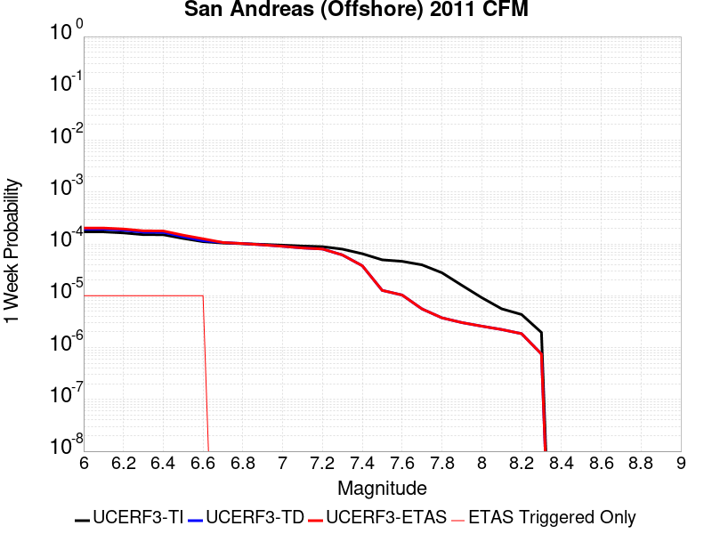 |  |  |  |

| Magnitude | 1 wk TI Prob | 1 wk TD Prob | 1 wk ETAS Prob | 1 wk ETAS/TD Gain | 1 wk ETAS Triggered Only | 1 mo TI Prob | 1 mo TD Prob | 1 mo ETAS Prob | 1 mo ETAS/TD Gain | 1 mo ETAS Triggered Only | 1 yr TI Prob | 1 yr TD Prob | 1 yr ETAS Prob | 1 yr ETAS/TD Gain | 1 yr ETAS Triggered Only | 10 yr TI Prob | 10 yr TD Prob | 10 yr ETAS Prob | 10 yr ETAS/TD Gain | 10 yr ETAS Triggered Only |
|-----|-----|-----|-----|-----|-----|-----|-----|-----|-----|-----|-----|-----|-----|-----|-----|-----|-----|-----|-----|-----|
| 6.0 | 1.7072787E-4 | 1.9225157E-4 | 2.0578076E-4 | 1.0703723 | 1.35318E-5 | 7.3148566E-4 | 8.236775E-4 | 8.3719817E-4 | 1.016415 | 1.35318E-5 | 0.008869528 | 0.009982676 | 0.009996073 | 1.0013419 | 1.35318E-5 | 0.085237645 | 0.0968234 | 0.09683563 | 1.0001262 | 1.35318E-5 |
| 6.1 | 1.7072787E-4 | 1.9225157E-4 | 2.0578076E-4 | 1.0703723 | 1.35318E-5 | 7.3148566E-4 | 8.236775E-4 | 8.3719817E-4 | 1.016415 | 1.35318E-5 | 0.008869528 | 0.009982676 | 0.009996073 | 1.0013419 | 1.35318E-5 | 0.085237645 | 0.0968234 | 0.09683563 | 1.0001262 | 1.35318E-5 |
| 6.2 | 1.6312556E-4 | 1.8406947E-4 | 1.9759878E-4 | 1.0735011 | 1.35318E-5 | 6.989222E-4 | 7.886331E-4 | 8.021542E-4 | 1.017145 | 1.35318E-5 | 0.008476226 | 0.009559834 | 0.009573237 | 1.0014019 | 1.35318E-5 | 0.08160117 | 0.09284438 | 0.09285666 | 1.0001322 | 1.35318E-5 |
| 6.3 | 1.5103363E-4 | 1.6879968E-4 | 1.823292E-4 | 1.0801513 | 1.35318E-5 | 6.471264E-4 | 7.2322885E-4 | 7.3675084E-4 | 1.0186968 | 1.35318E-5 | 0.007850339 | 0.008770205 | 0.008783618 | 1.0015295 | 1.35318E-5 | 0.075787395 | 0.08548553 | 0.08549791 | 1.0001447 | 1.35318E-5 |
| 6.4 | 1.5047993E-4 | 1.6765897E-4 | 1.811885E-4 | 1.0806967 | 1.35318E-5 | 6.4475456E-4 | 7.183428E-4 | 7.318649E-4 | 1.018824 | 1.35318E-5 | 0.007821669 | 0.008711193 | 0.008724607 | 1.0015398 | 1.35318E-5 | 0.0755203 | 0.08496573 | 0.08497811 | 1.0001457 | 1.35318E-5 |
| 6.5 | 1.2760791E-4 | 1.3734377E-4 | 1.5087372E-4 | 1.0985115 | 1.35318E-5 | 5.467764E-4 | 5.884848E-4 | 6.020086E-4 | 1.0229808 | 1.35318E-5 | 0.0066367025 | 0.0071415384 | 0.007154973 | 1.0018812 | 1.35318E-5 | 0.064419635 | 0.07024696 | 0.07025954 | 1.000179 | 1.35318E-5 |
| 6.6 | 1.1063525E-4 | 1.15560826E-4 | 1.2909106E-4 | 1.1170832 | 1.35318E-5 | 4.740649E-4 | 4.9516774E-4 | 5.086928E-4 | 1.0273142 | 1.35318E-5 | 0.0057564764 | 0.006012204 | 0.0060256547 | 1.0022372 | 1.35318E-5 | 0.05609626 | 0.059486266 | 0.059498996 | 1.000214 | 1.35318E-5 |
| 6.7 | 1.0391049E-4 | 1.0645404E-4 | 1.0645404E-4 | 1.0 | 0.0 | 4.4525467E-4 | 4.5615283E-4 | 4.5615283E-4 | 1.0 | 0.0 | 0.0054075094 | 0.0055397064 | 0.0055397064 | 1.0 | 0.0 | 0.052778035 | 0.054986227 | 0.054986227 | 1.0 | 0.0 |
| 6.8 | 1.0096706E-4 | 1.01577636E-4 | 1.01577636E-4 | 1.0 | 0.0 | 4.3264418E-4 | 4.3526106E-4 | 4.3526106E-4 | 1.0 | 0.0 | 0.0052547283 | 0.005286604 | 0.005286604 | 1.0 | 0.0 | 0.051321987 | 0.052685104 | 0.052685104 | 1.0 | 0.0 |
| 6.9 | 9.800265E-5 | 9.588255E-5 | 9.588255E-5 | 1.0 | 0.0 | 4.1994374E-4 | 4.108614E-4 | 4.108614E-4 | 1.0 | 0.0 | 0.0051008356 | 0.0049909325 | 0.0049909325 | 1.0 | 0.0 | 0.049853306 | 0.050012615 | 0.050012615 | 1.0 | 0.0 |
| 7.0 | 9.4642375E-5 | 9.001663E-5 | 9.001663E-5 | 1.0 | 0.0 | 4.0554712E-4 | 3.857294E-4 | 3.857294E-4 | 1.0 | 0.0 | 0.004926363 | 0.004686305 | 0.004686305 | 1.0 | 0.0 | 0.048185747 | 0.047193687 | 0.047193687 | 1.0 | 0.0 |
| 7.1 | 9.0996844E-5 | 8.353702E-5 | 8.353702E-5 | 1.0 | 0.0 | 3.8992817E-4 | 3.5796757E-4 | 3.5796757E-4 | 1.0 | 0.0 | 0.004737046 | 0.004349702 | 0.004349702 | 1.0 | 0.0 | 0.04637333 | 0.04404532 | 0.04404532 | 1.0 | 0.0 |
| 7.2 | 8.848287E-5 | 7.98136E-5 | 7.98136E-5 | 1.0 | 0.0 | 3.791572E-4 | 3.420143E-4 | 3.420143E-4 | 1.0 | 0.0 | 0.004606472 | 0.0041562277 | 0.0041562277 | 1.0 | 0.0 | 0.045121472 | 0.042189315 | 0.042189315 | 1.0 | 0.0 |
| 7.3 | 7.9280784E-5 | 6.127233E-5 | 6.127233E-5 | 1.0 | 0.0 | 3.3973053E-4 | 2.6256984E-4 | 2.6256984E-4 | 1.0 | 0.0 | 0.004128377 | 0.003192204 | 0.003192204 | 1.0 | 0.0 | 0.040525194 | 0.03290239 | 0.03290239 | 1.0 | 0.0 |
| 7.4 | 6.468038E-5 | 3.793042E-5 | 3.793042E-5 | 1.0 | 0.0 | 2.771722E-4 | 1.6254914E-4 | 1.6254914E-4 | 1.0 | 0.0 | 0.0033693502 | 0.0019772972 | 0.0019772972 | 1.0 | 0.0 | 0.0331872 | 0.02082032 | 0.02082032 | 1.0 | 0.0 |
| 7.5 | 4.930574E-5 | 1.2701723E-5 | 1.2701723E-5 | 1.0 | 0.0 | 2.1129321E-4 | 5.443483E-5 | 5.443483E-5 | 1.0 | 0.0 | 0.0025694598 | 6.625441E-4 | 6.625441E-4 | 1.0 | 0.0 | 0.02539953 | 0.007480459 | 0.007480459 | 1.0 | 0.0 |
| 7.6 | 4.612566E-5 | 1.0334738E-5 | 1.0334738E-5 | 1.0 | 0.0 | 1.9766642E-4 | 4.429099E-5 | 4.429099E-5 | 1.0 | 0.0 | 0.0024039324 | 5.3911074E-4 | 5.3911074E-4 | 1.0 | 0.0 | 0.023780935 | 0.0061712256 | 0.0061712256 | 1.0 | 0.0 |
| 7.7 | 3.9435414E-5 | 5.5737783E-6 | 5.5737783E-6 | 1.0 | 0.0 | 1.6899795E-4 | 2.3887404E-5 | 2.3887404E-5 | 1.0 | 0.0 | 0.0020556084 | 2.9079051E-4 | 2.9079051E-4 | 1.0 | 0.0 | 0.020366974 | 0.0035413401 | 0.0035413401 | 1.0 | 0.0 |
| 7.8 | 2.7787428E-5 | 3.7545014E-6 | 3.7545014E-6 | 1.0 | 0.0 | 1.1908354E-4 | 1.609062E-5 | 1.609062E-5 | 1.0 | 0.0 | 0.0014488777 | 1.9588573E-4 | 1.9588573E-4 | 1.0 | 0.0 | 0.014394675 | 0.0023872065 | 0.0023872065 | 1.0 | 0.0 |
| 7.9 | 1.590671E-5 | 3.0401961E-6 | 3.0401961E-6 | 1.0 | 0.0 | 6.816983E-5 | 1.3029347E-5 | 1.3029347E-5 | 1.0 | 0.0 | 8.2965166E-4 | 1.5862078E-4 | 1.5862078E-4 | 1.0 | 0.0 | 0.008265611 | 0.0019038742 | 0.0019038742 | 1.0 | 0.0 |
| 8.0 | 9.193638E-6 | 2.5915315E-6 | 2.5915315E-6 | 1.0 | 0.0 | 3.940071E-5 | 1.1106516E-5 | 1.1106516E-5 | 1.0 | 0.0 | 4.7959806E-4 | 1.3521347E-4 | 1.3521347E-4 | 1.0 | 0.0 | 0.0047856434 | 0.0016111814 | 0.0016111814 | 1.0 | 0.0 |
| 8.1 | 5.601576E-6 | 2.2338422E-6 | 2.2338422E-6 | 1.0 | 0.0 | 2.4006533E-5 | 9.573574E-6 | 9.573574E-6 | 1.0 | 0.0 | 2.9224035E-4 | 1.1655206E-4 | 1.1655206E-4 | 1.0 | 0.0 | 0.0029185633 | 0.0014017757 | 0.0014017757 | 1.0 | 0.0 |
| 8.2 | 4.3508785E-6 | 1.8571509E-6 | 1.8571509E-6 | 1.0 | 0.0 | 1.864649E-5 | 7.959194E-6 | 7.959194E-6 | 1.0 | 0.0 | 2.2699735E-4 | 9.6898904E-5 | 9.6898904E-5 | 1.0 | 0.0 | 0.0022676561 | 0.0011591844 | 0.0011591844 | 1.0 | 0.0 |
| 8.3 | 1.9573292E-6 | 7.5132493E-7 | 7.5132493E-7 | 1.0 | 0.0 | 8.388526E-6 | 3.21996E-6 | 3.21996E-6 | 1.0 | 0.0 | 1.0212552E-4 | 3.9202325E-5 | 3.9202325E-5 | 1.0 | 0.0 | 0.001020786 | 4.6398945E-4 | 4.6398945E-4 | 1.0 | 0.0 |

## Eaton Roughs 2011 CFM
*[(top)](#table-of-contents)*

| 1 Week | 1 Month | 1 Year | 10 Year |
|-----|-----|-----|-----|
|  |  |  |  |

| Magnitude | 1 wk TI Prob | 1 wk TD Prob | 1 wk ETAS Prob | 1 wk ETAS/TD Gain | 1 wk ETAS Triggered Only | 1 mo TI Prob | 1 mo TD Prob | 1 mo ETAS Prob | 1 mo ETAS/TD Gain | 1 mo ETAS Triggered Only | 1 yr TI Prob | 1 yr TD Prob | 1 yr ETAS Prob | 1 yr ETAS/TD Gain | 1 yr ETAS Triggered Only | 10 yr TI Prob | 10 yr TD Prob | 10 yr ETAS Prob | 10 yr ETAS/TD Gain | 10 yr ETAS Triggered Only |
|-----|-----|-----|-----|-----|-----|-----|-----|-----|-----|-----|-----|-----|-----|-----|-----|-----|-----|-----|-----|-----|
| 6.0 | 6.8044945E-5 | 8.843572E-5 | 8.843572E-5 | 1.0 | 0.0 | 2.9158857E-4 | 3.7896173E-4 | 3.7896173E-4 | 1.0 | 0.0 | 0.0035443127 | 0.004605058 | 0.004618528 | 1.0029249 | 1.35318E-5 | 0.03488314 | 0.045163017 | 0.045175936 | 1.0002861 | 1.35318E-5 |
| 6.1 | 6.8044945E-5 | 8.843572E-5 | 8.843572E-5 | 1.0 | 0.0 | 2.9158857E-4 | 3.7896173E-4 | 3.7896173E-4 | 1.0 | 0.0 | 0.0035443127 | 0.004605058 | 0.004618528 | 1.0029249 | 1.35318E-5 | 0.03488314 | 0.045163017 | 0.045175936 | 1.0002861 | 1.35318E-5 |
| 6.2 | 6.8044945E-5 | 8.843572E-5 | 8.843572E-5 | 1.0 | 0.0 | 2.9158857E-4 | 3.7896173E-4 | 3.7896173E-4 | 1.0 | 0.0 | 0.0035443127 | 0.004605058 | 0.004618528 | 1.0029249 | 1.35318E-5 | 0.03488314 | 0.045163017 | 0.045175936 | 1.0002861 | 1.35318E-5 |
| 6.3 | 6.8044945E-5 | 8.843572E-5 | 8.843572E-5 | 1.0 | 0.0 | 2.9158857E-4 | 3.7896173E-4 | 3.7896173E-4 | 1.0 | 0.0 | 0.0035443127 | 0.004605058 | 0.004618528 | 1.0029249 | 1.35318E-5 | 0.03488314 | 0.045163017 | 0.045175936 | 1.0002861 | 1.35318E-5 |
| 6.4 | 4.5830013E-5 | 5.7153877E-5 | 5.7153877E-5 | 1.0 | 0.0 | 1.9639956E-4 | 2.4492524E-4 | 2.4492524E-4 | 1.0 | 0.0 | 0.0023885423 | 0.0029784266 | 0.002991918 | 1.0045297 | 1.35318E-5 | 0.023630321 | 0.029421404 | 0.029434538 | 1.0004464 | 1.35318E-5 |
| 6.5 | 4.5830013E-5 | 5.7153877E-5 | 5.7153877E-5 | 1.0 | 0.0 | 1.9639956E-4 | 2.4492524E-4 | 2.4492524E-4 | 1.0 | 0.0 | 0.0023885423 | 0.0029784266 | 0.002991918 | 1.0045297 | 1.35318E-5 | 0.023630321 | 0.029421404 | 0.029434538 | 1.0004464 | 1.35318E-5 |
| 6.6 | 3.222194E-5 | 3.826131E-5 | 3.826131E-5 | 1.0 | 0.0 | 1.3808672E-4 | 1.6396737E-4 | 1.6396737E-4 | 1.0 | 0.0 | 0.0016799092 | 0.0019945889 | 0.0019945889 | 1.0 | 0.0 | 0.016672665 | 0.019776504 | 0.019776504 | 1.0 | 0.0 |
| 6.7 | 2.4155654E-5 | 2.7786129E-5 | 2.7786129E-5 | 1.0 | 0.0 | 1.0352012E-4 | 1.1907802E-4 | 1.1907802E-4 | 1.0 | 0.0 | 0.0012596287 | 0.001448819 | 0.001448819 | 1.0 | 0.0 | 0.012525126 | 0.014394887 | 0.014394887 | 1.0 | 0.0 |
| 6.8 | 2.1814667E-5 | 2.4940775E-5 | 2.4940775E-5 | 1.0 | 0.0 | 9.348808E-5 | 1.06884676E-4 | 1.06884676E-4 | 1.0 | 0.0 | 0.001137623 | 0.0013005479 | 0.0013005479 | 1.0 | 0.0 | 0.011318169 | 0.012929991 | 0.012929991 | 1.0 | 0.0 |
| 6.9 | 2.0700467E-5 | 2.3628847E-5 | 2.3628847E-5 | 1.0 | 0.0 | 8.871327E-5 | 1.0126257E-4 | 1.0126257E-4 | 1.0 | 0.0 | 0.0010795488 | 0.0012321778 | 0.0012321778 | 1.0 | 0.0 | 0.010743194 | 0.012253991 | 0.012253991 | 1.0 | 0.0 |
| 7.0 | 2.0104066E-5 | 2.2936418E-5 | 2.2936418E-5 | 1.0 | 0.0 | 8.615744E-5 | 9.829524E-5 | 9.829524E-5 | 1.0 | 0.0 | 0.0010484619 | 0.0011960906 | 0.0011960906 | 1.0 | 0.0 | 0.010435291 | 0.01189703 | 0.01189703 | 1.0 | 0.0 |
| 7.1 | 1.8225232E-5 | 2.0772972E-5 | 2.0772972E-5 | 1.0 | 0.0 | 7.81058E-5 | 8.9024E-5 | 8.9024E-5 | 1.0 | 0.0 | 9.5052324E-4 | 0.0010833298 | 0.0010833298 | 1.0 | 0.0 | 0.009464677 | 0.010780787 | 0.010780787 | 1.0 | 0.0 |
| 7.2 | 1.7526572E-5 | 1.9993417E-5 | 1.9993417E-5 | 1.0 | 0.0 | 7.511172E-5 | 8.568326E-5 | 8.568326E-5 | 1.0 | 0.0 | 9.141015E-4 | 0.001042696 | 0.001042696 | 1.0 | 0.0 | 0.009103506 | 0.010378314 | 0.010378314 | 1.0 | 0.0 |
| 7.3 | 1.5727232E-5 | 1.802144E-5 | 1.802144E-5 | 1.0 | 0.0 | 6.740067E-5 | 7.7232464E-5 | 7.7232464E-5 | 1.0 | 0.0 | 8.2029426E-4 | 9.3990087E-4 | 9.3990087E-4 | 1.0 | 0.0 | 0.008172729 | 0.009359476 | 0.009359476 | 1.0 | 0.0 |
| 7.4 | 1.4457361E-5 | 1.6598296E-5 | 1.6598296E-5 | 1.0 | 0.0 | 6.195865E-5 | 7.1133625E-5 | 7.1133625E-5 | 1.0 | 0.0 | 7.540854E-4 | 8.657087E-4 | 8.657087E-4 | 1.0 | 0.0 | 0.007515317 | 0.008623524 | 0.008623524 | 1.0 | 0.0 |
| 7.5 | 1.33280955E-5 | 1.5345377E-5 | 1.5345377E-5 | 1.0 | 0.0 | 5.711916E-5 | 6.5764245E-5 | 6.5764245E-5 | 1.0 | 0.0 | 6.9520384E-4 | 8.003864E-4 | 8.003864E-4 | 1.0 | 0.0 | 0.00693033 | 0.007975179 | 0.007975179 | 1.0 | 0.0 |
| 7.6 | 1.0699478E-5 | 1.2387767E-5 | 1.2387767E-5 | 1.0 | 0.0 | 4.5854096E-5 | 5.3089352E-5 | 5.3089352E-5 | 1.0 | 0.0 | 5.581306E-4 | 6.4617174E-4 | 6.4617174E-4 | 1.0 | 0.0 | 0.005567309 | 0.00644301 | 0.00644301 | 1.0 | 0.0 |
| 7.7 | 5.9390236E-6 | 6.8529266E-6 | 6.8529266E-6 | 1.0 | 0.0 | 2.545271E-5 | 2.9369356E-5 | 2.9369356E-5 | 1.0 | 0.0 | 3.0984267E-4 | 3.575135E-4 | 3.575135E-4 | 1.0 | 0.0 | 0.0030941102 | 0.0035694076 | 0.0035694076 | 1.0 | 0.0 |
| 7.8 | 2.1622036E-6 | 2.3296948E-6 | 2.3296948E-6 | 1.0 | 0.0 | 9.266554E-6 | 9.984368E-6 | 9.984368E-6 | 1.0 | 0.0 | 1.1281446E-4 | 1.2155298E-4 | 1.2155298E-4 | 1.0 | 0.0 | 0.001127572 | 0.0012148706 | 0.0012148706 | 1.0 | 0.0 |
| 7.9 | 4.9586197E-7 | 5.218914E-7 | 5.218914E-7 | 1.0 | 0.0 | 2.125121E-6 | 2.2366758E-6 | 2.2366758E-6 | 1.0 | 0.0 | 2.5873042E-5 | 2.7231206E-5 | 2.7231206E-5 | 1.0 | 0.0 | 2.5870028E-4 | 2.722808E-4 | 2.722808E-4 | 1.0 | 0.0 |

## Calaveras (No) 2011 CFM
*[(top)](#table-of-contents)*

| 1 Week | 1 Month | 1 Year | 10 Year |
|-----|-----|-----|-----|
|  |  |  |  |

| Magnitude | 1 wk TI Prob | 1 wk TD Prob | 1 wk ETAS Prob | 1 wk ETAS/TD Gain | 1 wk ETAS Triggered Only | 1 mo TI Prob | 1 mo TD Prob | 1 mo ETAS Prob | 1 mo ETAS/TD Gain | 1 mo ETAS Triggered Only | 1 yr TI Prob | 1 yr TD Prob | 1 yr ETAS Prob | 1 yr ETAS/TD Gain | 1 yr ETAS Triggered Only | 10 yr TI Prob | 10 yr TD Prob | 10 yr ETAS Prob | 10 yr ETAS/TD Gain | 10 yr ETAS Triggered Only |
|-----|-----|-----|-----|-----|-----|-----|-----|-----|-----|-----|-----|-----|-----|-----|-----|-----|-----|-----|-----|-----|
| 6.0 | 4.8694856E-5 | 6.747043E-5 | 6.747043E-5 | 1.0 | 0.0 | 2.0867554E-4 | 2.8912802E-4 | 2.8912802E-4 | 1.0 | 0.0 | 0.0025376645 | 0.0035145874 | 0.0035280716 | 1.0038366 | 1.35318E-5 | 0.02508881 | 0.034770876 | 0.03478394 | 1.0003756 | 1.35318E-5 |
| 6.1 | 4.8694856E-5 | 6.747043E-5 | 6.747043E-5 | 1.0 | 0.0 | 2.0867554E-4 | 2.8912802E-4 | 2.8912802E-4 | 1.0 | 0.0 | 0.0025376645 | 0.0035145874 | 0.0035280716 | 1.0038366 | 1.35318E-5 | 0.02508881 | 0.034770876 | 0.03478394 | 1.0003756 | 1.35318E-5 |
| 6.2 | 4.7541962E-5 | 6.5801425E-5 | 6.5801425E-5 | 1.0 | 0.0 | 2.0373536E-4 | 2.819767E-4 | 2.819767E-4 | 1.0 | 0.0 | 0.0024776561 | 0.00342782 | 0.0034413054 | 1.0039341 | 1.35318E-5 | 0.024502134 | 0.033932317 | 0.03394539 | 1.0003853 | 1.35318E-5 |
| 6.3 | 4.6717287E-5 | 6.463481E-5 | 6.463481E-5 | 1.0 | 0.0 | 2.0020158E-4 | 2.7697798E-4 | 2.7697798E-4 | 1.0 | 0.0 | 0.0024347296 | 0.0033671719 | 0.003380658 | 1.0040052 | 1.35318E-5 | 0.024082264 | 0.03334484 | 0.03335792 | 1.0003923 | 1.35318E-5 |
| 6.4 | 4.6276386E-5 | 6.399668E-5 | 6.399668E-5 | 1.0 | 0.0 | 1.983123E-4 | 2.7424374E-4 | 2.7424374E-4 | 1.0 | 0.0 | 0.0024117786 | 0.0033339844 | 0.0033474711 | 1.0040452 | 1.35318E-5 | 0.02385771 | 0.033023722 | 0.033036806 | 1.0003963 | 1.35318E-5 |
| 6.5 | 4.5720994E-5 | 6.319809E-5 | 6.319809E-5 | 1.0 | 0.0 | 1.9593239E-4 | 2.7082188E-4 | 2.7082188E-4 | 1.0 | 0.0 | 0.002382867 | 0.0032924588 | 0.003305946 | 1.0040964 | 1.35318E-5 | 0.023574775 | 0.032621685 | 0.032634776 | 1.0004013 | 1.35318E-5 |
| 6.6 | 4.549134E-5 | 6.285118E-5 | 6.285118E-5 | 1.0 | 0.0 | 1.949483E-4 | 2.6933543E-4 | 2.6933543E-4 | 1.0 | 0.0 | 0.0023709119 | 0.0032744156 | 0.0032879033 | 1.004119 | 1.35318E-5 | 0.023457756 | 0.032447044 | 0.032460134 | 1.0004035 | 1.35318E-5 |
| 6.7 | 3.701047E-5 | 5.035885E-5 | 5.035885E-5 | 1.0 | 0.0 | 1.5860666E-4 | 2.1580602E-4 | 2.1580602E-4 | 1.0 | 0.0 | 0.0019293258 | 0.0026243157 | 0.0026378122 | 1.0051428 | 1.35318E-5 | 0.019126613 | 0.026125036 | 0.026138216 | 1.0005044 | 1.35318E-5 |
| 6.8 | 3.5523568E-5 | 4.8340455E-5 | 4.8340455E-5 | 1.0 | 0.0 | 1.5223498E-4 | 2.0715717E-4 | 2.0715717E-4 | 1.0 | 0.0 | 0.0018518851 | 0.0025192641 | 0.002532762 | 1.0053577 | 1.35318E-5 | 0.018365284 | 0.025097271 | 0.025110463 | 1.0005256 | 1.35318E-5 |
| 6.9 | 3.2946147E-5 | 4.4662145E-5 | 4.4662145E-5 | 1.0 | 0.0 | 1.4119013E-4 | 1.9139539E-4 | 1.9139539E-4 | 1.0 | 0.0 | 0.0017176344 | 0.0023277907 | 0.002341291 | 1.0057997 | 1.35318E-5 | 0.017044188 | 0.023219328 | 0.023232546 | 1.0005692 | 1.35318E-5 |
| 7.0 | 2.7682381E-5 | 3.7021717E-5 | 3.7021717E-5 | 1.0 | 0.0 | 1.1863338E-4 | 1.5865502E-4 | 1.5865502E-4 | 1.0 | 0.0 | 0.0014434044 | 0.0019299437 | 0.0019434494 | 1.006998 | 1.35318E-5 | 0.01434065 | 0.019310663 | 0.019323934 | 1.0006872 | 1.35318E-5 |
| 7.1 | 2.471967E-5 | 3.328621E-5 | 3.328621E-5 | 1.0 | 0.0 | 1.05937135E-4 | 1.4264755E-4 | 1.4264755E-4 | 1.0 | 0.0 | 0.0012890215 | 0.0017353793 | 0.0017488877 | 1.0077841 | 1.35318E-5 | 0.0128157 | 0.017385712 | 0.01739901 | 1.0007648 | 1.35318E-5 |
| 7.2 | 1.9748062E-5 | 2.6774243E-5 | 2.6774243E-5 | 1.0 | 0.0 | 8.463181E-5 | 1.1474184E-4 | 1.1474184E-4 | 1.0 | 0.0 | 0.0010299052 | 0.00139611 | 0.00139611 | 1.0 | 0.0 | 0.01025145 | 0.014030519 | 0.014030519 | 1.0 | 0.0 |
| 7.3 | 1.1603734E-5 | 1.5783495E-5 | 1.5783495E-5 | 1.0 | 0.0 | 4.9729337E-5 | 6.764187E-5 | 6.764187E-5 | 1.0 | 0.0 | 6.052865E-4 | 8.232428E-4 | 8.232428E-4 | 1.0 | 0.0 | 0.0060364045 | 0.008308491 | 0.008308491 | 1.0 | 0.0 |
| 7.4 | 4.885381E-6 | 6.0347143E-6 | 6.0347143E-6 | 1.0 | 0.0 | 2.0937177E-5 | 2.5862806E-5 | 2.5862806E-5 | 1.0 | 0.0 | 2.5488032E-4 | 3.1483435E-4 | 3.1483435E-4 | 1.0 | 0.0 | 0.0025458818 | 0.0032009233 | 0.0032009233 | 1.0 | 0.0 |
| 7.5 | 3.0571264E-6 | 4.15504E-6 | 4.15504E-6 | 1.0 | 0.0 | 1.3101904E-5 | 1.7807193E-5 | 1.7807193E-5 | 1.0 | 0.0 | 1.5950401E-4 | 2.1678112E-4 | 2.1678112E-4 | 1.0 | 0.0 | 0.0015938957 | 0.0022209908 | 0.0022209908 | 1.0 | 0.0 |
| 7.6 | 1.764948E-6 | 2.7952983E-6 | 2.7952983E-6 | 1.0 | 0.0 | 7.564041E-6 | 1.1979795E-5 | 1.1979795E-5 | 1.0 | 0.0 | 9.208831E-5 | 1.4584431E-4 | 1.4584431E-4 | 1.0 | 0.0 | 9.205016E-4 | 0.0015122244 | 0.0015122244 | 1.0 | 0.0 |
| 7.7 | 1.3173734E-6 | 2.0582536E-6 | 2.0582536E-6 | 1.0 | 0.0 | 5.645874E-6 | 8.821057E-6 | 8.821057E-6 | 1.0 | 0.0 | 6.873634E-5 | 1.073911E-4 | 1.073911E-4 | 1.0 | 0.0 | 6.8715087E-4 | 0.0011260301 | 0.0011260301 | 1.0 | 0.0 |
| 7.8 | 9.4429885E-7 | 1.5487967E-6 | 1.5487967E-6 | 1.0 | 0.0 | 4.0469886E-6 | 6.6376833E-6 | 6.6376833E-6 | 1.0 | 0.0 | 4.9270973E-5 | 8.081081E-5 | 8.081081E-5 | 1.0 | 0.0 | 4.926005E-4 | 8.500613E-4 | 8.500613E-4 | 1.0 | 0.0 |
| 7.9 | 6.388233E-7 | 1.1147582E-6 | 1.1147582E-6 | 1.0 | 0.0 | 2.7378112E-6 | 4.7775266E-6 | 4.7775266E-6 | 1.0 | 0.0 | 3.3332344E-5 | 5.8164846E-5 | 5.8164846E-5 | 1.0 | 0.0 | 3.3327343E-4 | 6.095722E-4 | 6.095722E-4 | 1.0 | 0.0 |
| 8.0 | 3.087986E-7 | 5.7538136E-7 | 5.7538136E-7 | 1.0 | 0.0 | 1.323422E-6 | 2.4659178E-6 | 2.4659178E-6 | 1.0 | 0.0 | 1.6112543E-5 | 3.0022138E-5 | 3.0022138E-5 | 1.0 | 0.0 | 1.6111376E-4 | 3.110024E-4 | 3.110024E-4 | 1.0 | 0.0 |
| 8.1 | 1.6725647E-7 | 2.7407458E-7 | 2.7407458E-7 | 1.0 | 0.0 | 7.168133E-7 | 1.1746048E-6 | 1.1746048E-6 | 1.0 | 0.0 | 8.7271665E-6 | 1.4300721E-5 | 1.4300721E-5 | 1.0 | 0.0 | 8.726824E-5 | 1.4847283E-4 | 1.4847283E-4 | 1.0 | 0.0 |

## San Luis Range - Pecho 2011 CFM
*[(top)](#table-of-contents)*

| 1 Week | 1 Month | 1 Year | 10 Year |
|-----|-----|-----|-----|
|  |  |  |  |

| Magnitude | 1 wk TI Prob | 1 wk TD Prob | 1 wk ETAS Prob | 1 wk ETAS/TD Gain | 1 wk ETAS Triggered Only | 1 mo TI Prob | 1 mo TD Prob | 1 mo ETAS Prob | 1 mo ETAS/TD Gain | 1 mo ETAS Triggered Only | 1 yr TI Prob | 1 yr TD Prob | 1 yr ETAS Prob | 1 yr ETAS/TD Gain | 1 yr ETAS Triggered Only | 10 yr TI Prob | 10 yr TD Prob | 10 yr ETAS Prob | 10 yr ETAS/TD Gain | 10 yr ETAS Triggered Only |
|-----|-----|-----|-----|-----|-----|-----|-----|-----|-----|-----|-----|-----|-----|-----|-----|-----|-----|-----|-----|-----|
| 6.0 | 1.687423E-6 | 1.6921935E-6 | 1.522397E-5 | 8.99659 | 1.35318E-5 | 7.231793E-6 | 7.252239E-6 | 2.078394E-5 | 2.8658655 | 1.35318E-5 | 8.804352E-5 | 8.8292676E-5 | 1.0182328E-4 | 1.1532472 | 1.35318E-5 | 8.8008645E-4 | 8.8259985E-4 | 8.961197E-4 | 1.0153183 | 1.35318E-5 |
| 6.1 | 1.687423E-6 | 1.6921935E-6 | 1.522397E-5 | 8.99659 | 1.35318E-5 | 7.231793E-6 | 7.252239E-6 | 2.078394E-5 | 2.8658655 | 1.35318E-5 | 8.804352E-5 | 8.8292676E-5 | 1.0182328E-4 | 1.1532472 | 1.35318E-5 | 8.8008645E-4 | 8.8259985E-4 | 8.961197E-4 | 1.0153183 | 1.35318E-5 |
| 6.2 | 1.0765672E-6 | 1.0770533E-6 | 1.4608839E-5 | 13.56371 | 1.35318E-5 | 4.613851E-6 | 4.615935E-6 | 1.8147672E-5 | 3.9315271 | 1.35318E-5 | 5.617219E-5 | 5.619762E-5 | 6.972866E-5 | 1.2407761 | 1.35318E-5 | 5.6157995E-4 | 5.618403E-4 | 5.753645E-4 | 1.0240712 | 1.35318E-5 |
| 6.3 | 8.523104E-7 | 8.5130137E-7 | 1.4383089E-5 | 16.895414 | 1.35318E-5 | 3.6527538E-6 | 3.6484296E-6 | 1.718018E-5 | 4.708925 | 1.35318E-5 | 4.447137E-5 | 4.4418757E-5 | 5.7949954E-5 | 1.304628 | 1.35318E-5 | 4.4462472E-4 | 4.4410198E-4 | 4.576278E-4 | 1.0304565 | 1.35318E-5 |
| 6.4 | 8.523104E-7 | 8.5130137E-7 | 1.4383089E-5 | 16.895414 | 1.35318E-5 | 3.6527538E-6 | 3.6484296E-6 | 1.718018E-5 | 4.708925 | 1.35318E-5 | 4.447137E-5 | 4.4418757E-5 | 5.7949954E-5 | 1.304628 | 1.35318E-5 | 4.4462472E-4 | 4.4410198E-4 | 4.576278E-4 | 1.0304565 | 1.35318E-5 |
| 6.5 | 7.0029404E-7 | 6.976431E-7 | 1.4229433E-5 | 20.396437 | 1.35318E-5 | 3.0012568E-6 | 2.9898956E-6 | 1.6521655E-5 | 5.52583 | 1.35318E-5 | 3.6539688E-5 | 3.6401387E-5 | 4.9932696E-5 | 1.3717251 | 1.35318E-5 | 3.653368E-4 | 3.6395594E-4 | 3.7748282E-4 | 1.0371662 | 1.35318E-5 |
| 6.6 | 5.583906E-7 | 5.542822E-7 | 1.4086075E-5 | 25.41318 | 1.35318E-5 | 2.3931002E-6 | 2.375493E-6 | 1.590726E-5 | 6.6964035 | 1.35318E-5 | 2.9135606E-5 | 2.8921253E-5 | 4.2452662E-5 | 1.4678707 | 1.35318E-5 | 2.9131788E-4 | 2.8917563E-4 | 3.0270353E-4 | 1.0467808 | 1.35318E-5 |
| 6.7 | 4.73441E-7 | 4.6830593E-7 | 1.4000099E-5 | 29.8952 | 1.35318E-5 | 2.0290313E-6 | 2.0070238E-6 | 1.5538797E-5 | 7.742208 | 1.35318E-5 | 2.4703175E-5 | 2.4435245E-5 | 3.7966714E-5 | 1.5537685 | 1.35318E-5 | 2.470043E-4 | 2.4432605E-4 | 2.5785452E-4 | 1.0553707 | 1.35318E-5 |
| 6.8 | 4.1466086E-7 | 4.0877885E-7 | 1.3940573E-5 | 34.10297 | 1.35318E-5 | 1.7771167E-6 | 1.7519081E-6 | 1.5283684E-5 | 8.724021 | 1.35318E-5 | 2.1636182E-5 | 2.1329277E-5 | 3.4860786E-5 | 1.6344103 | 1.35318E-5 | 2.1634075E-4 | 2.1327264E-4 | 2.2680155E-4 | 1.0634348 | 1.35318E-5 |
| 6.9 | 3.2056641E-7 | 3.132924E-7 | 1.3845088E-5 | 44.192226 | 1.35318E-5 | 1.3738553E-6 | 1.3426809E-6 | 1.4874462E-5 | 11.078181 | 1.35318E-5 | 1.6726559E-5 | 1.634702E-5 | 2.9878598E-5 | 1.8277704 | 1.35318E-5 | 1.67253E-4 | 1.6345832E-4 | 1.7698792E-4 | 1.0827708 | 1.35318E-5 |
| 7.0 | 2.6315942E-7 | 2.5489615E-7 | 2.5489615E-7 | 1.0 | 0.0 | 1.1278256E-6 | 1.0924116E-6 | 1.0924116E-6 | 1.0 | 0.0 | 1.3731191E-5 | 1.330003E-5 | 1.330003E-5 | 1.0 | 0.0 | 1.3730342E-4 | 1.3299243E-4 | 1.3299243E-4 | 1.0 | 0.0 |
| 7.1 | 2.1832436E-7 | 2.0917255E-7 | 2.0917255E-7 | 1.0 | 0.0 | 9.356755E-7 | 8.964535E-7 | 8.964535E-7 | 1.0 | 0.0 | 1.13917895E-5 | 1.09142675E-5 | 1.09142675E-5 | 1.0 | 0.0 | 1.1391206E-4 | 1.0913736E-4 | 1.0913736E-4 | 1.0 | 0.0 |
| 7.2 | 1.7393015E-7 | 1.6376538E-7 | 1.6376538E-7 | 1.0 | 0.0 | 7.454147E-7 | 7.0185143E-7 | 7.0185143E-7 | 1.0 | 0.0 | 9.075386E-6 | 8.545007E-6 | 8.545007E-6 | 1.0 | 0.0 | 9.075015E-5 | 8.5446816E-5 | 8.5446816E-5 | 1.0 | 0.0 |
| 7.3 | 1.3744894E-7 | 1.2638569E-7 | 1.2638569E-7 | 1.0 | 0.0 | 5.890667E-7 | 5.416528E-7 | 5.416528E-7 | 1.0 | 0.0 | 7.1718637E-6 | 6.594603E-6 | 6.594603E-6 | 1.0 | 0.0 | 7.171632E-5 | 6.5944085E-5 | 6.5944085E-5 | 1.0 | 0.0 |
| 7.4 | 1.0915278E-7 | 9.727485E-8 | 9.727485E-8 | 1.0 | 0.0 | 4.6779755E-7 | 4.1689214E-7 | 4.1689214E-7 | 1.0 | 0.0 | 5.6954204E-6 | 5.07565E-6 | 5.07565E-6 | 1.0 | 0.0 | 5.6952744E-5 | 5.0755345E-5 | 5.0755345E-5 | 1.0 | 0.0 |
| 7.5 | 9.490291E-8 | 8.2570836E-8 | 8.2570836E-8 | 1.0 | 0.0 | 4.0672668E-7 | 3.5387495E-7 | 3.5387495E-7 | 1.0 | 0.0 | 4.9518862E-6 | 4.308419E-6 | 4.308419E-6 | 1.0 | 0.0 | 4.951776E-5 | 4.308336E-5 | 4.308336E-5 | 1.0 | 0.0 |
| 7.6 | 7.256678E-8 | 5.9424835E-8 | 5.9424835E-8 | 1.0 | 0.0 | 3.1100043E-7 | 2.5467784E-7 | 2.5467784E-7 | 1.0 | 0.0 | 3.7864236E-6 | 3.1006982E-6 | 3.1006982E-6 | 1.0 | 0.0 | 3.7863592E-5 | 3.100655E-5 | 3.100655E-5 | 1.0 | 0.0 |
| 7.7 | 5.446273E-8 | 4.0578932E-8 | 4.0578932E-8 | 1.0 | 0.0 | 2.3341168E-7 | 1.739097E-7 | 1.739097E-7 | 1.0 | 0.0 | 2.8417835E-6 | 2.1173485E-6 | 2.1173485E-6 | 1.0 | 0.0 | 2.8417471E-5 | 2.1173284E-5 | 2.1173284E-5 | 1.0 | 0.0 |
| 7.8 | 3.5850867E-8 | 2.1520076E-8 | 2.1520076E-8 | 1.0 | 0.0 | 1.5364655E-7 | 9.2228895E-8 | 9.2228895E-8 | 1.0 | 0.0 | 1.8706452E-6 | 1.1228861E-6 | 1.1228861E-6 | 1.0 | 0.0 | 1.8706294E-5 | 1.1228805E-5 | 1.1228805E-5 | 1.0 | 0.0 |
| 7.9 | 2.45879E-8 | 1.1394325E-8 | 1.1394325E-8 | 1.0 | 0.0 | 1.0537671E-7 | 4.8832817E-8 | 4.8832817E-8 | 1.0 | 0.0 | 1.2829606E-6 | 5.9453936E-7 | 5.9453936E-7 | 1.0 | 0.0 | 1.2829532E-5 | 5.9453782E-6 | 5.9453782E-6 | 1.0 | 0.0 |
| 8.0 | 1.8151761E-8 | 7.4408124E-9 | 7.4408124E-9 | 1.0 | 0.0 | 7.779326E-8 | 3.1889197E-8 | 3.1889197E-8 | 1.0 | 0.0 | 9.4713255E-7 | 3.8825087E-7 | 3.8825087E-7 | 1.0 | 0.0 | 9.471285E-6 | 3.882502E-6 | 3.882502E-6 | 1.0 | 0.0 |
| 8.1 | 9.559205E-9 | 4.1002974E-9 | 4.1002974E-9 | 1.0 | 0.0 | 4.096802E-8 | 1.75727E-8 | 1.75727E-8 | 1.0 | 0.0 | 4.9878554E-7 | 2.1394762E-7 | 2.1394762E-7 | 1.0 | 0.0 | 4.987844E-6 | 2.1394742E-6 | 2.1394742E-6 | 1.0 | 0.0 |

## Bicycle Lake
*[(top)](#table-of-contents)*

| 1 Week | 1 Month | 1 Year | 10 Year |
|-----|-----|-----|-----|
|  |  |  |  |

| Magnitude | 1 wk TI Prob | 1 wk TD Prob | 1 wk ETAS Prob | 1 wk ETAS/TD Gain | 1 wk ETAS Triggered Only | 1 mo TI Prob | 1 mo TD Prob | 1 mo ETAS Prob | 1 mo ETAS/TD Gain | 1 mo ETAS Triggered Only | 1 yr TI Prob | 1 yr TD Prob | 1 yr ETAS Prob | 1 yr ETAS/TD Gain | 1 yr ETAS Triggered Only | 10 yr TI Prob | 10 yr TD Prob | 10 yr ETAS Prob | 10 yr ETAS/TD Gain | 10 yr ETAS Triggered Only |
|-----|-----|-----|-----|-----|-----|-----|-----|-----|-----|-----|-----|-----|-----|-----|-----|-----|-----|-----|-----|-----|
| 6.0 | 1.9621975E-5 | 2.2097003E-5 | 3.5628505E-5 | 1.6123681 | 1.35318E-5 | 8.4091465E-5 | 9.469877E-5 | 1.0822929E-4 | 1.1428796 | 1.35318E-5 | 0.0010233327 | 0.0011524827 | 0.0011659989 | 1.0117279 | 1.35318E-5 | 0.01018633 | 0.011478369 | 0.011491746 | 1.0011654 | 1.35318E-5 |
| 6.1 | 1.9621975E-5 | 2.2097003E-5 | 3.5628505E-5 | 1.6123681 | 1.35318E-5 | 8.4091465E-5 | 9.469877E-5 | 1.0822929E-4 | 1.1428796 | 1.35318E-5 | 0.0010233327 | 0.0011524827 | 0.0011659989 | 1.0117279 | 1.35318E-5 | 0.01018633 | 0.011478369 | 0.011491746 | 1.0011654 | 1.35318E-5 |
| 6.2 | 9.9971285E-6 | 1.1255602E-5 | 1.1255602E-5 | 1.0 | 0.0 | 4.2844134E-5 | 4.8237693E-5 | 4.8237693E-5 | 1.0 | 0.0 | 5.2150246E-4 | 5.871877E-4 | 5.871877E-4 | 1.0 | 0.0 | 0.0052028033 | 0.0058614668 | 0.0058614668 | 1.0 | 0.0 |
| 6.3 | 9.589428E-6 | 1.079831E-5 | 1.079831E-5 | 1.0 | 0.0 | 4.10969E-5 | 4.6277943E-5 | 4.6277943E-5 | 1.0 | 0.0 | 5.002399E-4 | 5.6334015E-4 | 5.6334015E-4 | 1.0 | 0.0 | 0.0049911533 | 0.005624211 | 0.005624211 | 1.0 | 0.0 |
| 6.4 | 9.589428E-6 | 1.079831E-5 | 1.079831E-5 | 1.0 | 0.0 | 4.10969E-5 | 4.6277943E-5 | 4.6277943E-5 | 1.0 | 0.0 | 5.002399E-4 | 5.6334015E-4 | 5.6334015E-4 | 1.0 | 0.0 | 0.0049911533 | 0.005624211 | 0.005624211 | 1.0 | 0.0 |
| 6.5 | 5.557707E-6 | 6.2855797E-6 | 6.2855797E-6 | 1.0 | 0.0 | 2.3818526E-5 | 2.693807E-5 | 2.693807E-5 | 1.0 | 0.0 | 2.8995197E-4 | 3.2794854E-4 | 3.2794854E-4 | 1.0 | 0.0 | 0.0028957394 | 0.003277282 | 0.003277282 | 1.0 | 0.0 |
| 6.6 | 4.8742945E-6 | 5.5132705E-6 | 5.5132705E-6 | 1.0 | 0.0 | 2.0889667E-5 | 2.3628236E-5 | 2.3628236E-5 | 1.0 | 0.0 | 2.54302E-4 | 2.87662E-4 | 2.87662E-4 | 1.0 | 0.0 | 0.002540112 | 0.0028754652 | 0.0028754652 | 1.0 | 0.0 |
| 6.7 | 3.991108E-6 | 4.5158945E-6 | 4.5158945E-6 | 1.0 | 0.0 | 1.7104636E-5 | 1.9353833E-5 | 1.9353833E-5 | 1.0 | 0.0 | 2.0822904E-4 | 2.3563292E-4 | 2.3563292E-4 | 1.0 | 0.0 | 0.0020803404 | 0.0023563292 | 0.0023563292 | 1.0 | 0.0 |

## Santa Cruz Island
*[(top)](#table-of-contents)*

| 1 Week | 1 Month | 1 Year | 10 Year |
|-----|-----|-----|-----|
|  |  |  |  |

| Magnitude | 1 wk TI Prob | 1 wk TD Prob | 1 wk ETAS Prob | 1 wk ETAS/TD Gain | 1 wk ETAS Triggered Only | 1 mo TI Prob | 1 mo TD Prob | 1 mo ETAS Prob | 1 mo ETAS/TD Gain | 1 mo ETAS Triggered Only | 1 yr TI Prob | 1 yr TD Prob | 1 yr ETAS Prob | 1 yr ETAS/TD Gain | 1 yr ETAS Triggered Only | 10 yr TI Prob | 10 yr TD Prob | 10 yr ETAS Prob | 10 yr ETAS/TD Gain | 10 yr ETAS Triggered Only |
|-----|-----|-----|-----|-----|-----|-----|-----|-----|-----|-----|-----|-----|-----|-----|-----|-----|-----|-----|-----|-----|
| 6.0 | 2.9164563E-5 | 3.1599673E-5 | 3.1599673E-5 | 1.0 | 0.0 | 1.2498499E-4 | 1.3542091E-4 | 1.3542091E-4 | 1.0 | 0.0 | 0.0015206301 | 0.0016476389 | 0.0016476389 | 1.0 | 0.0 | 0.015102667 | 0.016367963 | 0.016381273 | 1.0008132 | 1.35318E-5 |
| 6.1 | 2.9164563E-5 | 3.1599673E-5 | 3.1599673E-5 | 1.0 | 0.0 | 1.2498499E-4 | 1.3542091E-4 | 1.3542091E-4 | 1.0 | 0.0 | 0.0015206301 | 0.0016476389 | 0.0016476389 | 1.0 | 0.0 | 0.015102667 | 0.016367963 | 0.016381273 | 1.0008132 | 1.35318E-5 |
| 6.2 | 2.9164563E-5 | 3.1599673E-5 | 3.1599673E-5 | 1.0 | 0.0 | 1.2498499E-4 | 1.3542091E-4 | 1.3542091E-4 | 1.0 | 0.0 | 0.0015206301 | 0.0016476389 | 0.0016476389 | 1.0 | 0.0 | 0.015102667 | 0.016367963 | 0.016381273 | 1.0008132 | 1.35318E-5 |
| 6.3 | 1.6635553E-5 | 1.7804325E-5 | 1.7804325E-5 | 1.0 | 0.0 | 7.1293274E-5 | 7.630212E-5 | 7.630212E-5 | 1.0 | 0.0 | 8.6765E-4 | 9.286006E-4 | 9.286006E-4 | 1.0 | 0.0 | 0.008642701 | 0.009249076 | 0.009262483 | 1.0014495 | 1.35318E-5 |
| 6.4 | 1.6635553E-5 | 1.7804325E-5 | 1.7804325E-5 | 1.0 | 0.0 | 7.1293274E-5 | 7.630212E-5 | 7.630212E-5 | 1.0 | 0.0 | 8.6765E-4 | 9.286006E-4 | 9.286006E-4 | 1.0 | 0.0 | 0.008642701 | 0.009249076 | 0.009262483 | 1.0014495 | 1.35318E-5 |
| 6.5 | 1.2238748E-5 | 1.3042973E-5 | 1.3042973E-5 | 1.0 | 0.0 | 5.2450723E-5 | 5.5897275E-5 | 5.5897275E-5 | 1.0 | 0.0 | 6.3840044E-4 | 6.803405E-4 | 6.803405E-4 | 1.0 | 0.0 | 0.0063656955 | 0.006782976 | 0.006796416 | 1.0019814 | 1.35318E-5 |
| 6.6 | 1.0489767E-5 | 1.1156617E-5 | 1.1156617E-5 | 1.0 | 0.0 | 4.495537E-5 | 4.7813206E-5 | 4.7813206E-5 | 1.0 | 0.0 | 5.4719415E-4 | 5.8197253E-4 | 5.8197253E-4 | 1.0 | 0.0 | 0.005458487 | 0.005804726 | 0.005818179 | 1.0023177 | 1.35318E-5 |
| 6.7 | 8.699222E-6 | 9.236766E-6 | 9.236766E-6 | 1.0 | 0.0 | 3.7281847E-5 | 3.9585546E-5 | 3.9585546E-5 | 1.0 | 0.0 | 4.5381195E-4 | 4.8184796E-4 | 4.8184796E-4 | 1.0 | 0.0 | 0.0045288634 | 0.0048081 | 0.0048081 | 1.0 | 0.0 |
| 6.8 | 8.307732E-6 | 8.816889E-6 | 8.816889E-6 | 1.0 | 0.0 | 3.560408E-5 | 3.7786125E-5 | 3.7786125E-5 | 1.0 | 0.0 | 4.3339343E-4 | 4.5994937E-4 | 4.5994937E-4 | 1.0 | 0.0 | 0.004325492 | 0.0045900275 | 0.0045900275 | 1.0 | 0.0 |
| 6.9 | 8.073121E-6 | 8.564924E-6 | 8.564924E-6 | 1.0 | 0.0 | 3.459863E-5 | 3.6706308E-5 | 3.6706308E-5 | 1.0 | 0.0 | 4.2115687E-4 | 4.4680806E-4 | 4.4680806E-4 | 1.0 | 0.0 | 0.004203596 | 0.0044591487 | 0.0044591487 | 1.0 | 0.0 |
| 7.0 | 7.617019E-6 | 8.074651E-6 | 8.074651E-6 | 1.0 | 0.0 | 3.264396E-5 | 3.460519E-5 | 3.460519E-5 | 1.0 | 0.0 | 3.9736772E-4 | 4.2123714E-4 | 4.2123714E-4 | 1.0 | 0.0 | 0.003966579 | 0.0042044343 | 0.0042044343 | 1.0 | 0.0 |
| 7.1 | 7.1224836E-6 | 7.5457756E-6 | 7.5457756E-6 | 1.0 | 0.0 | 3.052457E-5 | 3.2338638E-5 | 3.2338638E-5 | 1.0 | 0.0 | 3.715733E-4 | 3.9365215E-4 | 3.9365215E-4 | 1.0 | 0.0 | 0.003709526 | 0.0039295917 | 0.0039295917 | 1.0 | 0.0 |
| 7.2 | 6.441115E-6 | 6.827372E-6 | 6.827372E-6 | 1.0 | 0.0 | 2.7604487E-5 | 2.925984E-5 | 2.925984E-5 | 1.0 | 0.0 | 3.360328E-4 | 3.5618054E-4 | 3.5618054E-4 | 1.0 | 0.0 | 0.0033552512 | 0.003556125 | 0.003556125 | 1.0 | 0.0 |
| 7.3 | 5.494274E-6 | 5.819985E-6 | 5.819985E-6 | 1.0 | 0.0 | 2.3546674E-5 | 2.4942556E-5 | 2.4942556E-5 | 1.0 | 0.0 | 2.8664304E-4 | 3.0363348E-4 | 3.0363348E-4 | 1.0 | 0.0 | 0.002862736 | 0.0030322094 | 0.0030322094 | 1.0 | 0.0 |
| 7.4 | 4.0802624E-6 | 4.3122495E-6 | 4.3122495E-6 | 1.0 | 0.0 | 1.7486722E-5 | 1.8480938E-5 | 1.8480938E-5 | 1.0 | 0.0 | 2.1288003E-4 | 2.2498227E-4 | 2.2498227E-4 | 1.0 | 0.0 | 0.0021267622 | 0.002247554 | 0.002247554 | 1.0 | 0.0 |
| 7.5 | 2.3584746E-6 | 2.475306E-6 | 2.475306E-6 | 1.0 | 0.0 | 1.0107709E-5 | 1.0608412E-5 | 1.0608412E-5 | 1.0 | 0.0 | 1.2305441E-4 | 1.291498E-4 | 1.291498E-4 | 1.0 | 0.0 | 0.0012298629 | 0.0012907526 | 0.0012907526 | 1.0 | 0.0 |
| 7.6 | 9.4981914E-7 | 9.860919E-7 | 9.860919E-7 | 1.0 | 0.0 | 4.0706473E-6 | 4.2261013E-6 | 4.2261013E-6 | 1.0 | 0.0 | 4.9559E-5 | 5.145158E-5 | 5.145158E-5 | 1.0 | 0.0 | 4.954795E-4 | 5.14398E-4 | 5.14398E-4 | 1.0 | 0.0 |
| 7.7 | 2.6013532E-7 | 2.641658E-7 | 2.641658E-7 | 1.0 | 0.0 | 1.1148652E-6 | 1.1321387E-6 | 1.1321387E-6 | 1.0 | 0.0 | 1.3573399E-5 | 1.3783702E-5 | 1.3783702E-5 | 1.0 | 0.0 | 1.357257E-4 | 1.3782854E-4 | 1.3782854E-4 | 1.0 | 0.0 |
| 7.8 | 4.1522263E-8 | 3.965676E-8 | 3.965676E-8 | 1.0 | 0.0 | 1.7795254E-7 | 1.6995754E-7 | 1.6995754E-7 | 1.0 | 0.0 | 2.16657E-6 | 2.0692314E-6 | 2.0692314E-6 | 1.0 | 0.0 | 2.1665488E-5 | 2.0692141E-5 | 2.0692141E-5 | 1.0 | 0.0 |
| 7.9 | 7.7242046E-10 | 5.946812E-10 | 5.946812E-10 | 1.0 | 0.0 | 3.3103735E-9 | 2.5486335E-9 | 2.5486335E-9 | 1.0 | 0.0 | 4.0303796E-8 | 3.1029614E-8 | 3.1029614E-8 | 1.0 | 0.0 | 4.030379E-7 | 3.102961E-7 | 3.102961E-7 | 1.0 | 0.0 |

## Franklin 2011 CFM
*[(top)](#table-of-contents)*

| 1 Week | 1 Month | 1 Year | 10 Year |
|-----|-----|-----|-----|
|  |  |  |  |

| Magnitude | 1 wk TI Prob | 1 wk TD Prob | 1 wk ETAS Prob | 1 wk ETAS/TD Gain | 1 wk ETAS Triggered Only | 1 mo TI Prob | 1 mo TD Prob | 1 mo ETAS Prob | 1 mo ETAS/TD Gain | 1 mo ETAS Triggered Only | 1 yr TI Prob | 1 yr TD Prob | 1 yr ETAS Prob | 1 yr ETAS/TD Gain | 1 yr ETAS Triggered Only | 10 yr TI Prob | 10 yr TD Prob | 10 yr ETAS Prob | 10 yr ETAS/TD Gain | 10 yr ETAS Triggered Only |
|-----|-----|-----|-----|-----|-----|-----|-----|-----|-----|-----|-----|-----|-----|-----|-----|-----|-----|-----|-----|-----|
| 6.0 | 1.845602E-5 | 2.021249E-5 | 2.021249E-5 | 1.0 | 0.0 | 7.9094825E-5 | 8.662225E-5 | 8.662225E-5 | 1.0 | 0.0 | 9.6255407E-4 | 0.0010541446 | 0.0010676621 | 1.0128232 | 1.35318E-5 | 0.009583955 | 0.0105087655 | 0.010522155 | 1.0012741 | 1.35318E-5 |
| 6.1 | 1.845602E-5 | 2.021249E-5 | 2.021249E-5 | 1.0 | 0.0 | 7.9094825E-5 | 8.662225E-5 | 8.662225E-5 | 1.0 | 0.0 | 9.6255407E-4 | 0.0010541446 | 0.0010676621 | 1.0128232 | 1.35318E-5 | 0.009583955 | 0.0105087655 | 0.010522155 | 1.0012741 | 1.35318E-5 |
| 6.2 | 1.845602E-5 | 2.021249E-5 | 2.021249E-5 | 1.0 | 0.0 | 7.9094825E-5 | 8.662225E-5 | 8.662225E-5 | 1.0 | 0.0 | 9.6255407E-4 | 0.0010541446 | 0.0010676621 | 1.0128232 | 1.35318E-5 | 0.009583955 | 0.0105087655 | 0.010522155 | 1.0012741 | 1.35318E-5 |
| 6.3 | 1.3813506E-5 | 1.515471E-5 | 1.515471E-5 | 1.0 | 0.0 | 5.9199396E-5 | 6.4947184E-5 | 6.4947184E-5 | 1.0 | 0.0 | 7.205143E-4 | 7.9045276E-4 | 7.9045276E-4 | 1.0 | 0.0 | 0.007181826 | 0.007891619 | 0.007891619 | 1.0 | 0.0 |
| 6.4 | 1.3813506E-5 | 1.515471E-5 | 1.515471E-5 | 1.0 | 0.0 | 5.9199396E-5 | 6.4947184E-5 | 6.4947184E-5 | 1.0 | 0.0 | 7.205143E-4 | 7.9045276E-4 | 7.9045276E-4 | 1.0 | 0.0 | 0.007181826 | 0.007891619 | 0.007891619 | 1.0 | 0.0 |
| 6.5 | 1.1308949E-5 | 1.24176895E-5 | 1.24176895E-5 | 1.0 | 0.0 | 4.8466023E-5 | 5.3217595E-5 | 5.3217595E-5 | 1.0 | 0.0 | 5.899141E-4 | 6.477337E-4 | 6.477337E-4 | 1.0 | 0.0 | 0.0058835056 | 0.0064731087 | 0.0064731087 | 1.0 | 0.0 |
| 6.6 | 1.0813164E-5 | 1.18759135E-5 | 1.18759135E-5 | 1.0 | 0.0 | 4.6341313E-5 | 5.089579E-5 | 5.089579E-5 | 1.0 | 0.0 | 5.640594E-4 | 6.1948196E-4 | 6.1948196E-4 | 1.0 | 0.0 | 0.005626298 | 0.006192187 | 0.006192187 | 1.0 | 0.0 |
| 6.7 | 1.0706348E-5 | 1.1757678E-5 | 1.1757678E-5 | 1.0 | 0.0 | 4.5883542E-5 | 5.0389084E-5 | 5.0389084E-5 | 1.0 | 0.0 | 5.5848894E-4 | 6.133163E-4 | 6.133163E-4 | 1.0 | 0.0 | 0.005570874 | 0.0061308723 | 0.0061308723 | 1.0 | 0.0 |
| 6.8 | 9.443655E-6 | 1.0349005E-5 | 1.0349005E-5 | 1.0 | 0.0 | 4.0472176E-5 | 4.435213E-5 | 4.435213E-5 | 1.0 | 0.0 | 4.9263734E-4 | 5.3985475E-4 | 5.3985475E-4 | 1.0 | 0.0 | 0.0049154665 | 0.0054000188 | 0.0054000188 | 1.0 | 0.0 |
| 6.9 | 8.7001645E-6 | 9.522077E-6 | 9.522077E-6 | 1.0 | 0.0 | 3.728589E-5 | 4.080827E-5 | 4.080827E-5 | 1.0 | 0.0 | 4.538611E-4 | 4.9672864E-4 | 4.9672864E-4 | 1.0 | 0.0 | 0.0045293528 | 0.004970755 | 0.004970755 | 1.0 | 0.0 |
| 7.0 | 8.074731E-6 | 8.815696E-6 | 8.815696E-6 | 1.0 | 0.0 | 3.460553E-5 | 3.7781014E-5 | 3.7781014E-5 | 1.0 | 0.0 | 4.212409E-4 | 4.5988784E-4 | 4.5988784E-4 | 1.0 | 0.0 | 0.004204433 | 0.0046039177 | 0.0046039177 | 1.0 | 0.0 |
| 7.1 | 7.3370957E-6 | 7.961573E-6 | 7.961573E-6 | 1.0 | 0.0 | 3.1444317E-5 | 3.412059E-5 | 3.412059E-5 | 1.0 | 0.0 | 3.8276732E-4 | 4.1533998E-4 | 4.1533998E-4 | 1.0 | 0.0 | 0.0038210868 | 0.0041600345 | 0.0041600345 | 1.0 | 0.0 |
| 7.2 | 5.1750103E-6 | 5.45702E-6 | 5.45702E-6 | 1.0 | 0.0 | 2.2178427E-5 | 2.3387021E-5 | 2.3387021E-5 | 1.0 | 0.0 | 2.699889E-4 | 2.847001E-4 | 2.847001E-4 | 1.0 | 0.0 | 0.002696611 | 0.0028572704 | 0.0028572704 | 1.0 | 0.0 |
| 7.3 | 3.5221371E-6 | 3.795971E-6 | 3.795971E-6 | 1.0 | 0.0 | 1.5094786E-5 | 1.6268346E-5 | 1.6268346E-5 | 1.0 | 0.0 | 1.8376352E-4 | 1.9804921E-4 | 1.9804921E-4 | 1.0 | 0.0 | 0.0018361164 | 0.0019921612 | 0.0019921612 | 1.0 | 0.0 |
| 7.4 | 2.5749775E-6 | 2.8181205E-6 | 2.8181205E-6 | 1.0 | 0.0 | 1.1035571E-5 | 1.2077603E-5 | 1.2077603E-5 | 1.0 | 0.0 | 1.343498E-4 | 1.4703497E-4 | 1.4703497E-4 | 1.0 | 0.0 | 0.001342686 | 0.0014816008 | 0.0014816008 | 1.0 | 0.0 |
| 7.5 | 1.3642131E-6 | 1.5496745E-6 | 1.5496745E-6 | 1.0 | 0.0 | 5.8466144E-6 | 6.6414455E-6 | 6.6414455E-6 | 1.0 | 0.0 | 7.1180206E-5 | 8.085662E-5 | 8.085662E-5 | 1.0 | 0.0 | 7.115741E-4 | 8.1908255E-4 | 8.1908255E-4 | 1.0 | 0.0 |
| 7.6 | 5.329124E-7 | 6.7004635E-7 | 6.7004635E-7 | 1.0 | 0.0 | 2.2839083E-6 | 2.871624E-6 | 2.871624E-6 | 1.0 | 0.0 | 2.7806227E-5 | 3.4961464E-5 | 3.4961464E-5 | 1.0 | 0.0 | 2.780275E-4 | 3.5995274E-4 | 3.5995274E-4 | 1.0 | 0.0 |
| 7.7 | 4.199127E-7 | 5.486207E-7 | 5.486207E-7 | 1.0 | 0.0 | 1.7996247E-6 | 2.3512293E-6 | 2.3512293E-6 | 1.0 | 0.0 | 2.191021E-5 | 2.8625846E-5 | 2.8625846E-5 | 1.0 | 0.0 | 2.190805E-4 | 2.9642615E-4 | 2.9642615E-4 | 1.0 | 0.0 |
| 7.8 | 2.2586491E-7 | 3.065822E-7 | 3.065822E-7 | 1.0 | 0.0 | 9.67992E-7 | 1.313923E-6 | 1.313923E-6 | 1.0 | 0.0 | 1.178524E-5 | 1.5996897E-5 | 1.5996897E-5 | 1.0 | 0.0 | 1.17846146E-4 | 1.662726E-4 | 1.662726E-4 | 1.0 | 0.0 |
| 7.9 | 1.4568845E-7 | 2.1200276E-7 | 2.1200276E-7 | 1.0 | 0.0 | 6.243789E-7 | 9.0858293E-7 | 9.0858293E-7 | 1.0 | 0.0 | 7.601787E-6 | 1.1061942E-5 | 1.1061942E-5 | 1.0 | 0.0 | 7.601527E-5 | 1.15068746E-4 | 1.15068746E-4 | 1.0 | 0.0 |
| 8.0 | 5.2868224E-8 | 9.9957525E-8 | 9.9957525E-8 | 1.0 | 0.0 | 2.2657808E-7 | 4.283893E-7 | 4.283893E-7 | 1.0 | 0.0 | 2.7585847E-6 | 5.215628E-6 | 5.215628E-6 | 1.0 | 0.0 | 2.7585504E-5 | 5.400955E-5 | 5.400955E-5 | 1.0 | 0.0 |
| 8.1 | 2.654434E-9 | 4.7221738E-9 | 4.7221738E-9 | 1.0 | 0.0 | 1.1376145E-8 | 2.0237888E-8 | 2.0237888E-8 | 1.0 | 0.0 | 1.3850456E-7 | 2.4639624E-7 | 2.4639624E-7 | 1.0 | 0.0 | 1.3850448E-6 | 2.533409E-6 | 2.533409E-6 | 1.0 | 0.0 |

## San Andreas (Parkfield)
*[(top)](#table-of-contents)*

| 1 Week | 1 Month | 1 Year | 10 Year |
|-----|-----|-----|-----|
|  | 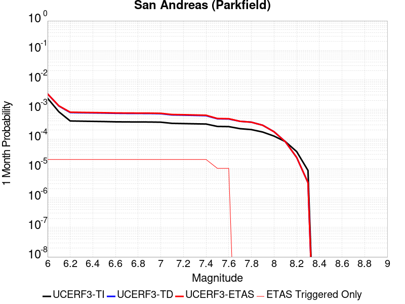 |  |  |

| Magnitude | 1 wk TI Prob | 1 wk TD Prob | 1 wk ETAS Prob | 1 wk ETAS/TD Gain | 1 wk ETAS Triggered Only | 1 mo TI Prob | 1 mo TD Prob | 1 mo ETAS Prob | 1 mo ETAS/TD Gain | 1 mo ETAS Triggered Only | 1 yr TI Prob | 1 yr TD Prob | 1 yr ETAS Prob | 1 yr ETAS/TD Gain | 1 yr ETAS Triggered Only | 10 yr TI Prob | 10 yr TD Prob | 10 yr ETAS Prob | 10 yr ETAS/TD Gain | 10 yr ETAS Triggered Only |
|-----|-----|-----|-----|-----|-----|-----|-----|-----|-----|-----|-----|-----|-----|-----|-----|-----|-----|-----|-----|-----|
| 6.0 | 5.556969E-4 | 7.776195E-4 | 7.911408E-4 | 1.017388 | 1.35318E-5 | 0.0023793848 | 0.003328946 | 0.0033424327 | 1.0040513 | 1.35318E-5 | 0.028586963 | 0.04018152 | 0.040194508 | 1.0003232 | 1.35318E-5 | 0.25176284 | 0.33713356 | 0.33714253 | 1.0000266 | 1.35318E-5 |
| 6.1 | 1.925858E-4 | 3.027076E-4 | 3.162353E-4 | 1.044689 | 1.35318E-5 | 8.2510663E-4 | 0.001296767 | 0.0013102812 | 1.0104215 | 1.35318E-5 | 0.0099994885 | 0.01577525 | 0.015788568 | 1.0008442 | 1.35318E-5 | 0.095613256 | 0.14970991 | 0.14972141 | 1.0000769 | 1.35318E-5 |
| 6.2 | 9.4306815E-5 | 1.824128E-4 | 1.9594212E-4 | 1.0741688 | 1.35318E-5 | 4.0410945E-4 | 7.8153616E-4 | 7.9505733E-4 | 1.0173008 | 1.35318E-5 | 0.0049089384 | 0.009473897 | 0.0094873 | 1.0014148 | 1.35318E-5 | 0.048019063 | 0.09184752 | 0.0918598 | 1.0001338 | 1.35318E-5 |
| 6.3 | 9.283051E-5 | 1.793781E-4 | 1.9290746E-4 | 1.0754237 | 1.35318E-5 | 3.9778434E-4 | 7.68538E-4 | 7.820594E-4 | 1.0175936 | 1.35318E-5 | 0.0048322747 | 0.009317007 | 0.009330413 | 1.0014389 | 1.35318E-5 | 0.047285385 | 0.09050047 | 0.090512775 | 1.000136 | 1.35318E-5 |
| 6.4 | 9.138826E-5 | 1.7700029E-4 | 1.905297E-4 | 1.0764372 | 1.35318E-5 | 3.916052E-4 | 7.5835333E-4 | 7.7187485E-4 | 1.0178301 | 1.35318E-5 | 0.0047573745 | 0.009194063 | 0.00920747 | 1.0014583 | 1.35318E-5 | 0.046568092 | 0.089402735 | 0.08941506 | 1.0001378 | 1.35318E-5 |
| 6.5 | 9.000255E-5 | 1.7458084E-4 | 1.8811027E-4 | 1.0774966 | 1.35318E-5 | 3.8566816E-4 | 7.479902E-4 | 7.6151185E-4 | 1.0180774 | 1.35318E-5 | 0.0046854047 | 0.00906896 | 0.0090823695 | 1.0014786 | 1.35318E-5 | 0.045878403 | 0.08828856 | 0.0883009 | 1.0001397 | 1.35318E-5 |
| 6.6 | 8.8109264E-5 | 1.7139279E-4 | 1.8492228E-4 | 1.0789385 | 1.35318E-5 | 3.7755648E-4 | 7.343349E-4 | 7.478568E-4 | 1.0184138 | 1.35318E-5 | 0.0045870654 | 0.008904092 | 0.008917503 | 1.0015062 | 1.35318E-5 | 0.04493529 | 0.08682025 | 0.08683261 | 1.0001423 | 1.35318E-5 |
| 6.7 | 8.738073E-5 | 1.7006363E-4 | 1.8359313E-4 | 1.0795555 | 1.35318E-5 | 3.7443507E-4 | 7.286417E-4 | 7.421637E-4 | 1.0185578 | 1.35318E-5 | 0.0045492216 | 0.008835384 | 0.008848796 | 1.001518 | 1.35318E-5 | 0.04457213 | 0.08622064 | 0.086233005 | 1.0001434 | 1.35318E-5 |
| 6.8 | 8.710195E-5 | 1.695187E-4 | 1.8304819E-4 | 1.0798113 | 1.35318E-5 | 3.7324068E-4 | 7.263075E-4 | 7.398295E-4 | 1.0186174 | 1.35318E-5 | 0.0045347405 | 0.008807203 | 0.008820616 | 1.0015229 | 1.35318E-5 | 0.04443313 | 0.085968256 | 0.085980624 | 1.0001439 | 1.35318E-5 |
| 6.9 | 8.6801556E-5 | 1.6892828E-4 | 1.8245779E-4 | 1.0800903 | 1.35318E-5 | 3.7195362E-4 | 7.237786E-4 | 7.373006E-4 | 1.0186825 | 1.35318E-5 | 0.0045191357 | 0.008776662 | 0.008790075 | 1.0015283 | 1.35318E-5 | 0.044283327 | 0.08569433 | 0.085706696 | 1.0001444 | 1.35318E-5 |
| 7.0 | 8.5571606E-5 | 1.6645678E-4 | 1.7998632E-4 | 1.0812796 | 1.35318E-5 | 3.6668387E-4 | 7.131923E-4 | 7.2671444E-4 | 1.01896 | 1.35318E-5 | 0.004455241 | 0.008648803 | 0.008662218 | 1.001551 | 1.35318E-5 | 0.043669727 | 0.08454277 | 0.08455516 | 1.0001465 | 1.35318E-5 |
| 7.1 | 7.82589E-5 | 1.5126738E-4 | 1.6479714E-4 | 1.0894426 | 1.35318E-5 | 3.3535215E-4 | 6.4812845E-4 | 6.616515E-4 | 1.0208647 | 1.35318E-5 | 0.0040752706 | 0.007862584 | 0.007876009 | 1.0017076 | 1.35318E-5 | 0.040013418 | 0.07745491 | 0.07746739 | 1.0001612 | 1.35318E-5 |
| 7.2 | 7.690929E-5 | 1.4864003E-4 | 1.6216982E-4 | 1.0910238 | 1.35318E-5 | 3.2956956E-4 | 6.368739E-4 | 6.503971E-4 | 1.0212337 | 1.35318E-5 | 0.004005129 | 0.007726539 | 0.007739966 | 1.0017378 | 1.35318E-5 | 0.0393371 | 0.0762281 | 0.0762406 | 1.000164 | 1.35318E-5 |
| 7.3 | 7.5543794E-5 | 1.4560606E-4 | 1.5913589E-4 | 1.0929208 | 1.35318E-5 | 3.2371894E-4 | 6.2387745E-4 | 6.3740084E-4 | 1.0216763 | 1.35318E-5 | 0.003934157 | 0.007569417 | 0.007582846 | 1.0017742 | 1.35318E-5 | 0.038652334 | 0.07479123 | 0.074803755 | 1.0001674 | 1.35318E-5 |
| 7.4 | 7.4214564E-5 | 1.4261607E-4 | 1.5614595E-4 | 1.0948691 | 1.35318E-5 | 3.1802364E-4 | 6.110693E-4 | 6.245928E-4 | 1.022131 | 1.35318E-5 | 0.003865065 | 0.0074145487 | 0.00742798 | 1.0018115 | 1.35318E-5 | 0.03798529 | 0.07336518 | 0.07337772 | 1.000171 | 1.35318E-5 |
| 7.5 | 6.149578E-5 | 1.11895584E-4 | 1.11895584E-4 | 1.0 | 0.0 | 2.6352672E-4 | 4.7946448E-4 | 4.7946448E-4 | 1.0 | 0.0 | 0.0032037178 | 0.0058218874 | 0.0058218874 | 1.0 | 0.0 | 0.03157923 | 0.05855221 | 0.05855221 | 1.0 | 0.0 |
| 7.6 | 6.0643448E-5 | 1.10182256E-4 | 1.10182256E-4 | 1.0 | 0.0 | 2.598746E-4 | 4.7212432E-4 | 4.7212432E-4 | 1.0 | 0.0 | 0.0031593828 | 0.005732995 | 0.005732995 | 1.0 | 0.0 | 0.031148417 | 0.057713263 | 0.057713263 | 1.0 | 0.0 |
| 7.7 | 5.1652263E-5 | 9.173663E-5 | 9.173663E-5 | 1.0 | 0.0 | 2.2134806E-4 | 3.9309775E-4 | 3.9309775E-4 | 1.0 | 0.0 | 0.002691582 | 0.0047754725 | 0.0047754725 | 1.0 | 0.0 | 0.026592141 | 0.048531387 | 0.048531387 | 1.0 | 0.0 |
| 7.8 | 4.8090482E-5 | 8.558682E-5 | 8.558682E-5 | 1.0 | 0.0 | 2.060858E-4 | 3.6674913E-4 | 3.6674913E-4 | 1.0 | 0.0 | 0.0025062072 | 0.0044560367 | 0.0044560367 | 1.0 | 0.0 | 0.024781305 | 0.045297977 | 0.045297977 | 1.0 | 0.0 |
| 7.9 | 3.970278E-5 | 6.749683E-5 | 6.749683E-5 | 1.0 | 0.0 | 1.7014367E-4 | 2.8924007E-4 | 2.8924007E-4 | 1.0 | 0.0 | 0.002069531 | 0.0035158154 | 0.0035158154 | 1.0 | 0.0 | 0.020503636 | 0.03587781 | 0.03587781 | 1.0 | 0.0 |
| 8.0 | 2.8982335E-5 | 4.0693238E-5 | 4.0693238E-5 | 1.0 | 0.0 | 1.2420409E-4 | 1.7438793E-4 | 1.7438793E-4 | 1.0 | 0.0 | 0.0015111357 | 0.0021211067 | 0.0021211067 | 1.0 | 0.0 | 0.015009012 | 0.022008339 | 0.022008339 | 1.0 | 0.0 |
| 8.1 | 1.8836186E-5 | 1.8678496E-5 | 1.8678496E-5 | 1.0 | 0.0 | 8.0724014E-5 | 8.0048245E-5 | 8.0048245E-5 | 1.0 | 0.0 | 9.823717E-4 | 9.7415224E-4 | 9.7415224E-4 | 1.0 | 0.0 | 0.009780403 | 0.010486731 | 0.010486731 | 1.0 | 0.0 |
| 8.2 | 8.643924E-6 | 5.4738607E-6 | 5.4738607E-6 | 1.0 | 0.0 | 3.704486E-5 | 2.3459192E-5 | 2.3459192E-5 | 1.0 | 0.0 | 4.5092785E-4 | 2.855783E-4 | 2.855783E-4 | 1.0 | 0.0 | 0.0045001395 | 0.0032481598 | 0.0032481598 | 1.0 | 0.0 |
| 8.3 | 1.983087E-6 | 7.658221E-7 | 7.658221E-7 | 1.0 | 0.0 | 8.498917E-6 | 3.2820906E-6 | 3.2820906E-6 | 1.0 | 0.0 | 1.034694E-4 | 3.9958737E-5 | 3.9958737E-5 | 1.0 | 0.0 | 0.0010342124 | 4.7187202E-4 | 4.7187202E-4 | 1.0 | 0.0 |

## Sargent 2011 CFM
*[(top)](#table-of-contents)*

| 1 Week | 1 Month | 1 Year | 10 Year |
|-----|-----|-----|-----|
|  |  |  |  |

| Magnitude | 1 wk TI Prob | 1 wk TD Prob | 1 wk ETAS Prob | 1 wk ETAS/TD Gain | 1 wk ETAS Triggered Only | 1 mo TI Prob | 1 mo TD Prob | 1 mo ETAS Prob | 1 mo ETAS/TD Gain | 1 mo ETAS Triggered Only | 1 yr TI Prob | 1 yr TD Prob | 1 yr ETAS Prob | 1 yr ETAS/TD Gain | 1 yr ETAS Triggered Only | 10 yr TI Prob | 10 yr TD Prob | 10 yr ETAS Prob | 10 yr ETAS/TD Gain | 10 yr ETAS Triggered Only |
|-----|-----|-----|-----|-----|-----|-----|-----|-----|-----|-----|-----|-----|-----|-----|-----|-----|-----|-----|-----|-----|
| 6.0 | 3.7327867E-5 | 3.6648773E-5 | 3.6648773E-5 | 1.0 | 0.0 | 1.5996677E-4 | 1.570595E-4 | 1.570595E-4 | 1.0 | 0.0 | 0.0019458556 | 0.0019110052 | 0.0019110052 | 1.0 | 0.0 | 0.01928905 | 0.019017912 | 0.019031186 | 1.000698 | 1.35318E-5 |
| 6.1 | 2.3771476E-5 | 1.8479082E-5 | 1.8479082E-5 | 1.0 | 0.0 | 1.01873775E-4 | 7.919416E-5 | 7.919416E-5 | 1.0 | 0.0 | 0.0012396075 | 9.638396E-4 | 9.638396E-4 | 1.0 | 0.0 | 0.012327154 | 0.009635988 | 0.009635988 | 1.0 | 0.0 |
| 6.2 | 2.3112721E-5 | 1.7710445E-5 | 1.7710445E-5 | 1.0 | 0.0 | 9.9050754E-5 | 7.590019E-5 | 7.590019E-5 | 1.0 | 0.0 | 0.0012052758 | 9.237696E-4 | 9.237696E-4 | 1.0 | 0.0 | 0.011987597 | 0.009238642 | 0.009238642 | 1.0 | 0.0 |
| 6.3 | 1.728509E-5 | 1.0458787E-5 | 1.0458787E-5 | 1.0 | 0.0 | 7.407686E-5 | 4.4822875E-5 | 4.4822875E-5 | 1.0 | 0.0 | 9.015125E-4 | 5.456271E-4 | 5.456271E-4 | 1.0 | 0.0 | 0.008978641 | 0.005479044 | 0.005479044 | 1.0 | 0.0 |
| 6.4 | 1.48395575E-5 | 7.4558607E-6 | 7.4558607E-6 | 1.0 | 0.0 | 6.3596555E-5 | 3.1953514E-5 | 3.1953514E-5 | 1.0 | 0.0 | 7.7401294E-4 | 3.8900034E-4 | 3.8900034E-4 | 1.0 | 0.0 | 0.0077132257 | 0.0039185975 | 0.0039185975 | 1.0 | 0.0 |
| 6.5 | 1.4358964E-5 | 6.89464E-6 | 6.89464E-6 | 1.0 | 0.0 | 6.1536964E-5 | 2.9548337E-5 | 2.9548337E-5 | 1.0 | 0.0 | 7.48955E-4 | 3.5972722E-4 | 3.5972722E-4 | 1.0 | 0.0 | 0.0074643586 | 0.003626848 | 0.003626848 | 1.0 | 0.0 |
| 6.6 | 9.772591E-6 | 1.3735269E-6 | 1.3735269E-6 | 1.0 | 0.0 | 4.188186E-5 | 5.8865307E-6 | 5.8865307E-6 | 1.0 | 0.0 | 5.097923E-4 | 7.166618E-5 | 7.166618E-5 | 1.0 | 0.0 | 0.005086244 | 7.4825797E-4 | 7.4825797E-4 | 1.0 | 0.0 |
| 6.7 | 9.752745E-6 | 1.3522183E-6 | 1.3522183E-6 | 1.0 | 0.0 | 4.179681E-5 | 5.7952084E-6 | 5.7952084E-6 | 1.0 | 0.0 | 5.0875737E-4 | 7.055441E-5 | 7.055441E-5 | 1.0 | 0.0 | 0.005075942 | 7.371477E-4 | 7.371477E-4 | 1.0 | 0.0 |
| 6.8 | 9.608213E-6 | 1.236084E-6 | 1.236084E-6 | 1.0 | 0.0 | 4.1177405E-5 | 5.297492E-6 | 5.297492E-6 | 1.0 | 0.0 | 5.012196E-4 | 6.4495085E-5 | 6.4495085E-5 | 1.0 | 0.0 | 0.005000906 | 6.762895E-4 | 6.762895E-4 | 1.0 | 0.0 |
| 6.9 | 9.427164E-6 | 1.1208566E-6 | 1.1208566E-6 | 1.0 | 0.0 | 4.04015E-5 | 4.8036623E-6 | 4.8036623E-6 | 1.0 | 0.0 | 4.9177726E-4 | 5.8483038E-5 | 5.8483038E-5 | 1.0 | 0.0 | 0.004906904 | 6.1552273E-4 | 6.1552273E-4 | 1.0 | 0.0 |
| 7.0 | 9.247601E-6 | 9.87318E-7 | 9.87318E-7 | 1.0 | 0.0 | 3.9631974E-5 | 4.231356E-6 | 4.231356E-6 | 1.0 | 0.0 | 4.8241246E-4 | 5.1515555E-5 | 5.1515555E-5 | 1.0 | 0.0 | 0.0048136655 | 5.4537714E-4 | 5.4537714E-4 | 1.0 | 0.0 |
| 7.1 | 8.995454E-6 | 8.2703673E-7 | 8.2703673E-7 | 1.0 | 0.0 | 3.8551374E-5 | 3.5444384E-6 | 3.5444384E-6 | 1.0 | 0.0 | 4.6926187E-4 | 4.3152697E-5 | 4.3152697E-5 | 1.0 | 0.0 | 0.004682722 | 4.6086175E-4 | 4.6086175E-4 | 1.0 | 0.0 |
| 7.2 | 8.520861E-6 | 5.2759805E-7 | 5.2759805E-7 | 1.0 | 0.0 | 3.6517464E-5 | 2.2611325E-6 | 2.2611325E-6 | 1.0 | 0.0 | 4.445094E-4 | 2.7528948E-5 | 2.7528948E-5 | 1.0 | 0.0 | 0.004436213 | 3.0293173E-4 | 3.0293173E-4 | 1.0 | 0.0 |
| 7.3 | 8.043592E-6 | 3.4559005E-7 | 3.4559005E-7 | 1.0 | 0.0 | 3.4472083E-5 | 1.4810994E-6 | 1.4810994E-6 | 1.0 | 0.0 | 4.196168E-4 | 1.8032237E-5 | 1.8032237E-5 | 1.0 | 0.0 | 0.004188253 | 2.0665982E-4 | 2.0665982E-4 | 1.0 | 0.0 |
| 7.4 | 7.662316E-6 | 2.928401E-7 | 2.928401E-7 | 1.0 | 0.0 | 3.2838085E-5 | 1.2550283E-6 | 1.2550283E-6 | 1.0 | 0.0 | 3.9973034E-4 | 1.5279864E-5 | 1.5279864E-5 | 1.0 | 0.0 | 0.0039901207 | 1.7733092E-4 | 1.7733092E-4 | 1.0 | 0.0 |
| 7.5 | 6.961638E-6 | 2.3569783E-7 | 2.3569783E-7 | 1.0 | 0.0 | 2.9835252E-5 | 1.0101331E-6 | 1.0101331E-6 | 1.0 | 0.0 | 3.6318362E-4 | 1.2298302E-5 | 1.2298302E-5 | 1.0 | 0.0 | 0.0036259065 | 1.4406422E-4 | 1.4406422E-4 | 1.0 | 0.0 |
| 7.6 | 6.282332E-6 | 1.6889287E-7 | 1.6889287E-7 | 1.0 | 0.0 | 2.6924003E-5 | 7.238264E-7 | 7.238264E-7 | 1.0 | 0.0 | 3.2775043E-4 | 8.812552E-6 | 8.812552E-6 | 1.0 | 0.0 | 0.0032726745 | 1.05027466E-4 | 1.05027466E-4 | 1.0 | 0.0 |
| 7.7 | 4.934408E-6 | 4.9998498E-8 | 4.9998498E-8 | 1.0 | 0.0 | 2.114729E-5 | 2.1427925E-7 | 2.1427925E-7 | 1.0 | 0.0 | 2.5743784E-4 | 2.6088467E-6 | 2.6088467E-6 | 1.0 | 0.0 | 0.0025713982 | 3.2536846E-5 | 3.2536846E-5 | 1.0 | 0.0 |
| 7.8 | 2.373212E-6 | 3.5162742E-8 | 3.5162742E-8 | 1.0 | 0.0 | 1.0170869E-5 | 1.5069746E-7 | 1.5069746E-7 | 1.0 | 0.0 | 1.238233E-4 | 1.83474E-6 | 1.83474E-6 | 1.0 | 0.0 | 0.0012375432 | 2.4118299E-5 | 2.4118299E-5 | 1.0 | 0.0 |
| 7.9 | 1.8227792E-6 | 3.061082E-8 | 3.061082E-8 | 1.0 | 0.0 | 7.811887E-6 | 1.3118924E-7 | 1.3118924E-7 | 1.0 | 0.0 | 9.510558E-5 | 1.5972278E-6 | 1.5972278E-6 | 1.0 | 0.0 | 9.5064886E-4 | 2.14045E-5 | 2.14045E-5 | 1.0 | 0.0 |
| 8.0 | 1.9095137E-7 | 1.3262017E-8 | 1.3262017E-8 | 1.0 | 0.0 | 8.1836276E-7 | 5.6837212E-8 | 5.6837212E-8 | 1.0 | 0.0 | 9.963521E-6 | 6.9199285E-7 | 6.9199285E-7 | 1.0 | 0.0 | 9.963074E-5 | 8.461722E-6 | 8.461722E-6 | 1.0 | 0.0 |

## Garlic Springs
*[(top)](#table-of-contents)*

| 1 Week | 1 Month | 1 Year | 10 Year |
|-----|-----|-----|-----|
|  |  |  |  |

| Magnitude | 1 wk TI Prob | 1 wk TD Prob | 1 wk ETAS Prob | 1 wk ETAS/TD Gain | 1 wk ETAS Triggered Only | 1 mo TI Prob | 1 mo TD Prob | 1 mo ETAS Prob | 1 mo ETAS/TD Gain | 1 mo ETAS Triggered Only | 1 yr TI Prob | 1 yr TD Prob | 1 yr ETAS Prob | 1 yr ETAS/TD Gain | 1 yr ETAS Triggered Only | 10 yr TI Prob | 10 yr TD Prob | 10 yr ETAS Prob | 10 yr ETAS/TD Gain | 10 yr ETAS Triggered Only |
|-----|-----|-----|-----|-----|-----|-----|-----|-----|-----|-----|-----|-----|-----|-----|-----|-----|-----|-----|-----|-----|
| 6.0 | 1.6760017E-5 | 1.8776773E-5 | 1.8776773E-5 | 1.0 | 0.0 | 7.182667E-5 | 8.047006E-5 | 9.4000774E-5 | 1.1681459 | 1.35318E-5 | 8.7413884E-4 | 9.794E-4 | 9.929186E-4 | 1.0138029 | 1.35318E-5 | 0.008707083 | 0.009762381 | 0.009775781 | 1.0013726 | 1.35318E-5 |
| 6.1 | 9.852767E-6 | 1.0973554E-5 | 1.0973554E-5 | 1.0 | 0.0 | 4.222546E-5 | 4.702907E-5 | 6.0560233E-5 | 1.2877191 | 1.35318E-5 | 5.139737E-4 | 5.724994E-4 | 5.860235E-4 | 1.0236229 | 1.35318E-5 | 0.005127866 | 0.005717204 | 0.0057306583 | 1.0023533 | 1.35318E-5 |
| 6.2 | 9.852767E-6 | 1.0973554E-5 | 1.0973554E-5 | 1.0 | 0.0 | 4.222546E-5 | 4.702907E-5 | 6.0560233E-5 | 1.2877191 | 1.35318E-5 | 5.139737E-4 | 5.724994E-4 | 5.860235E-4 | 1.0236229 | 1.35318E-5 | 0.005127866 | 0.005717204 | 0.0057306583 | 1.0023533 | 1.35318E-5 |
| 6.3 | 4.3167724E-6 | 4.778015E-6 | 4.778015E-6 | 1.0 | 0.0 | 1.8500323E-5 | 2.0477177E-5 | 2.0477177E-5 | 1.0 | 0.0 | 2.2521814E-4 | 2.4930414E-4 | 2.4930414E-4 | 1.0 | 0.0 | 0.0022499003 | 0.0024925028 | 0.0024925028 | 1.0 | 0.0 |
| 6.4 | 4.3167724E-6 | 4.778015E-6 | 4.778015E-6 | 1.0 | 0.0 | 1.8500323E-5 | 2.0477177E-5 | 2.0477177E-5 | 1.0 | 0.0 | 2.2521814E-4 | 2.4930414E-4 | 2.4930414E-4 | 1.0 | 0.0 | 0.0022499003 | 0.0024925028 | 0.0024925028 | 1.0 | 0.0 |
| 6.5 | 4.3167724E-6 | 4.778015E-6 | 4.778015E-6 | 1.0 | 0.0 | 1.8500323E-5 | 2.0477177E-5 | 2.0477177E-5 | 1.0 | 0.0 | 2.2521814E-4 | 2.4930414E-4 | 2.4930414E-4 | 1.0 | 0.0 | 0.0022499003 | 0.0024925028 | 0.0024925028 | 1.0 | 0.0 |
| 6.6 | 4.301311E-6 | 4.7608837E-6 | 4.7608837E-6 | 1.0 | 0.0 | 1.8434059E-5 | 2.0403757E-5 | 2.0403757E-5 | 1.0 | 0.0 | 2.2441156E-4 | 2.4841045E-4 | 2.4841045E-4 | 1.0 | 0.0 | 0.0022418506 | 0.002483586 | 0.002483586 | 1.0 | 0.0 |
| 6.7 | 3.8599724E-6 | 4.2710476E-6 | 4.2710476E-6 | 1.0 | 0.0 | 1.6542634E-5 | 1.830449E-5 | 1.830449E-5 | 1.0 | 0.0 | 2.0138794E-4 | 2.2285717E-4 | 2.2285717E-4 | 1.0 | 0.0 | 0.0020120554 | 0.0022285716 | 0.0022285716 | 1.0 | 0.0 |

## San Juan
*[(top)](#table-of-contents)*

| 1 Week | 1 Month | 1 Year | 10 Year |
|-----|-----|-----|-----|
|  |  |  |  |

| Magnitude | 1 wk TI Prob | 1 wk TD Prob | 1 wk ETAS Prob | 1 wk ETAS/TD Gain | 1 wk ETAS Triggered Only | 1 mo TI Prob | 1 mo TD Prob | 1 mo ETAS Prob | 1 mo ETAS/TD Gain | 1 mo ETAS Triggered Only | 1 yr TI Prob | 1 yr TD Prob | 1 yr ETAS Prob | 1 yr ETAS/TD Gain | 1 yr ETAS Triggered Only | 10 yr TI Prob | 10 yr TD Prob | 10 yr ETAS Prob | 10 yr ETAS/TD Gain | 10 yr ETAS Triggered Only |
|-----|-----|-----|-----|-----|-----|-----|-----|-----|-----|-----|-----|-----|-----|-----|-----|-----|-----|-----|-----|-----|
| 6.0 | 8.682808E-6 | 8.749081E-6 | 2.2280763E-5 | 2.5466404 | 1.35318E-5 | 3.72115E-5 | 3.749555E-5 | 5.102684E-5 | 1.3608773 | 1.35318E-5 | 4.5295584E-4 | 4.564175E-4 | 4.6994313E-4 | 1.0296344 | 1.35318E-5 | 0.004520337 | 0.0045553423 | 0.0045688124 | 1.002957 | 1.35318E-5 |
| 6.1 | 8.682808E-6 | 8.749081E-6 | 2.2280763E-5 | 2.5466404 | 1.35318E-5 | 3.72115E-5 | 3.749555E-5 | 5.102684E-5 | 1.3608773 | 1.35318E-5 | 4.5295584E-4 | 4.564175E-4 | 4.6994313E-4 | 1.0296344 | 1.35318E-5 | 0.004520337 | 0.0045553423 | 0.0045688124 | 1.002957 | 1.35318E-5 |
| 6.2 | 8.682808E-6 | 8.749081E-6 | 2.2280763E-5 | 2.5466404 | 1.35318E-5 | 3.72115E-5 | 3.749555E-5 | 5.102684E-5 | 1.3608773 | 1.35318E-5 | 4.5295584E-4 | 4.564175E-4 | 4.6994313E-4 | 1.0296344 | 1.35318E-5 | 0.004520337 | 0.0045553423 | 0.0045688124 | 1.002957 | 1.35318E-5 |
| 6.3 | 6.3054235E-6 | 6.2825047E-6 | 6.2825047E-6 | 1.0 | 0.0 | 2.7022963E-5 | 2.692475E-5 | 2.692475E-5 | 1.0 | 0.0 | 3.2895492E-4 | 3.2776094E-4 | 3.2776094E-4 | 1.0 | 0.0 | 0.003284684 | 0.003272975 | 0.003272975 | 1.0 | 0.0 |
| 6.4 | 6.1490473E-6 | 6.1143965E-6 | 6.1143965E-6 | 1.0 | 0.0 | 2.6352795E-5 | 2.62043E-5 | 2.62043E-5 | 1.0 | 0.0 | 3.2079802E-4 | 3.18992E-4 | 3.18992E-4 | 1.0 | 0.0 | 0.0032033534 | 0.0031855376 | 0.0031855376 | 1.0 | 0.0 |
| 6.5 | 5.204848E-6 | 5.1371658E-6 | 5.1371658E-6 | 1.0 | 0.0 | 2.23063E-5 | 2.2016246E-5 | 2.2016246E-5 | 1.0 | 0.0 | 2.7154534E-4 | 2.6801578E-4 | 2.6801578E-4 | 1.0 | 0.0 | 0.0027121378 | 0.0026770793 | 0.0026770793 | 1.0 | 0.0 |
| 6.6 | 4.5179986E-6 | 4.414979E-6 | 4.414979E-6 | 1.0 | 0.0 | 1.9362706E-5 | 1.8921204E-5 | 1.8921204E-5 | 1.0 | 0.0 | 2.3571544E-4 | 2.303421E-4 | 2.303421E-4 | 1.0 | 0.0 | 0.0023546559 | 0.0023011705 | 0.0023011705 | 1.0 | 0.0 |
| 6.7 | 3.9442616E-6 | 3.819782E-6 | 3.819782E-6 | 1.0 | 0.0 | 1.6903869E-5 | 1.6370395E-5 | 1.6370395E-5 | 1.0 | 0.0 | 2.0578515E-4 | 1.99292E-4 | 1.99292E-4 | 1.0 | 0.0 | 0.002055947 | 0.0019912578 | 0.0019912578 | 1.0 | 0.0 |
| 6.8 | 3.4536245E-6 | 3.316291E-6 | 3.316291E-6 | 1.0 | 0.0 | 1.4801163E-5 | 1.4212602E-5 | 1.4212602E-5 | 1.0 | 0.0 | 1.8018926E-4 | 1.730253E-4 | 1.730253E-4 | 1.0 | 0.0 | 0.0018004322 | 0.0017290247 | 0.0017290247 | 1.0 | 0.0 |
| 6.9 | 3.059865E-6 | 2.911989E-6 | 2.911989E-6 | 1.0 | 0.0 | 1.3113641E-5 | 1.2479896E-5 | 1.2479896E-5 | 1.0 | 0.0 | 1.596469E-4 | 1.5193272E-4 | 1.5193272E-4 | 1.0 | 0.0 | 0.0015953224 | 0.0015184031 | 0.0015184031 | 1.0 | 0.0 |
| 7.0 | 2.6504351E-6 | 2.49196E-6 | 2.49196E-6 | 1.0 | 0.0 | 1.1358958E-5 | 1.0679788E-5 | 1.0679788E-5 | 1.0 | 0.0 | 1.3828653E-4 | 1.3001921E-4 | 1.3001921E-4 | 1.0 | 0.0 | 0.0013820052 | 0.0012995432 | 0.0012995432 | 1.0 | 0.0 |
| 7.1 | 2.2039317E-6 | 2.0337961E-6 | 2.0337961E-6 | 1.0 | 0.0 | 9.445387E-6 | 8.7162425E-6 | 8.7162425E-6 | 1.0 | 0.0 | 1.1499152E-4 | 1.06115614E-4 | 1.06115614E-4 | 1.0 | 0.0 | 0.0011493203 | 0.0010607594 | 0.0010607594 | 1.0 | 0.0 |
| 7.2 | 1.0786707E-6 | 8.769899E-7 | 8.769899E-7 | 1.0 | 0.0 | 4.622866E-6 | 3.7585226E-6 | 3.7585226E-6 | 1.0 | 0.0 | 5.628194E-5 | 4.5759065E-5 | 4.5759065E-5 | 1.0 | 0.0 | 5.6267687E-4 | 4.5755546E-4 | 4.5755546E-4 | 1.0 | 0.0 |
| 7.3 | 6.846433E-7 | 4.8686087E-7 | 4.8686087E-7 | 1.0 | 0.0 | 2.9341822E-6 | 2.086545E-6 | 2.086545E-6 | 1.0 | 0.0 | 3.5723086E-5 | 2.540339E-5 | 2.540339E-5 | 1.0 | 0.0 | 3.571734E-4 | 2.5403837E-4 | 2.5403837E-4 | 1.0 | 0.0 |
| 7.4 | 5.23043E-7 | 3.262663E-7 | 3.262663E-7 | 1.0 | 0.0 | 2.2416111E-6 | 1.3982833E-6 | 1.3982833E-6 | 1.0 | 0.0 | 2.7291273E-5 | 1.7023967E-5 | 1.7023967E-5 | 1.0 | 0.0 | 2.7287923E-4 | 1.7025857E-4 | 1.7025857E-4 | 1.0 | 0.0 |
| 7.5 | 4.648444E-7 | 2.7233583E-7 | 2.7233583E-7 | 1.0 | 0.0 | 1.9921886E-6 | 1.167153E-6 | 1.167153E-6 | 1.0 | 0.0 | 2.4254627E-5 | 1.4209995E-5 | 1.4209995E-5 | 1.0 | 0.0 | 2.425198E-4 | 1.4212048E-4 | 1.4212048E-4 | 1.0 | 0.0 |
| 7.6 | 3.9906567E-7 | 2.2082162E-7 | 2.2082162E-7 | 1.0 | 0.0 | 1.7102802E-6 | 9.46378E-7 | 9.46378E-7 | 1.0 | 0.0 | 2.0822463E-5 | 1.1522092E-5 | 1.1522092E-5 | 1.0 | 0.0 | 2.0820512E-4 | 1.1523955E-4 | 1.1523955E-4 | 1.0 | 0.0 |
| 7.7 | 1.8784601E-7 | 5.3663786E-8 | 5.3663786E-8 | 1.0 | 0.0 | 8.0505407E-7 | 2.2998763E-7 | 2.2998763E-7 | 1.0 | 0.0 | 9.80149E-6 | 2.800096E-6 | 2.800096E-6 | 1.0 | 0.0 | 9.801057E-5 | 2.8009652E-5 | 2.8009652E-5 | 1.0 | 0.0 |
| 7.8 | 1.00154914E-7 | 1.2414834E-8 | 1.2414834E-8 | 1.0 | 0.0 | 4.2923529E-7 | 5.3206428E-8 | 5.3206428E-8 | 1.0 | 0.0 | 5.225927E-6 | 6.477881E-7 | 6.477881E-7 | 1.0 | 0.0 | 5.225804E-5 | 6.4837495E-6 | 6.4837495E-6 | 1.0 | 0.0 |
| 7.9 | 6.171429E-8 | 4.296096E-9 | 4.296096E-9 | 1.0 | 0.0 | 2.6448978E-7 | 1.8411841E-8 | 1.8411841E-8 | 1.0 | 0.0 | 3.2201583E-6 | 2.2416414E-7 | 2.2416414E-7 | 1.0 | 0.0 | 3.2201115E-5 | 2.2469278E-6 | 2.2469278E-6 | 1.0 | 0.0 |
| 8.0 | 1.3974572E-8 | 3.3778746E-10 | 3.3778746E-10 | 1.0 | 0.0 | 5.989102E-8 | 1.4476622E-9 | 1.4476622E-9 | 1.0 | 0.0 | 7.2917294E-7 | 1.762528E-8 | 1.762528E-8 | 1.0 | 0.0 | 7.2917055E-6 | 1.8055306E-7 | 1.8055306E-7 | 1.0 | 0.0 |
| 8.1 | 1.8403477E-9 | 1.13004495E-10 | 1.13004495E-10 | 1.0 | 0.0 | 7.887204E-9 | 4.843056E-10 | 4.843056E-10 | 1.0 | 0.0 | 9.602671E-8 | 5.8964202E-9 | 5.8964202E-9 | 1.0 | 0.0 | 9.602667E-7 | 6.020749E-8 | 6.020749E-8 | 1.0 | 0.0 |

## Calaveras (So) - Paicines extension 2011 CFM
*[(top)](#table-of-contents)*

| 1 Week | 1 Month | 1 Year | 10 Year |
|-----|-----|-----|-----|
| 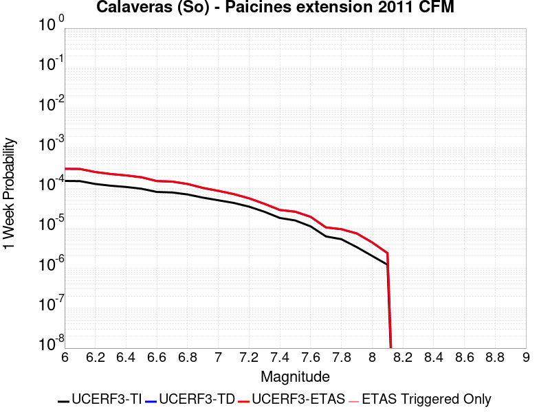 |  |  |  |

| Magnitude | 1 wk TI Prob | 1 wk TD Prob | 1 wk ETAS Prob | 1 wk ETAS/TD Gain | 1 wk ETAS Triggered Only | 1 mo TI Prob | 1 mo TD Prob | 1 mo ETAS Prob | 1 mo ETAS/TD Gain | 1 mo ETAS Triggered Only | 1 yr TI Prob | 1 yr TD Prob | 1 yr ETAS Prob | 1 yr ETAS/TD Gain | 1 yr ETAS Triggered Only | 10 yr TI Prob | 10 yr TD Prob | 10 yr ETAS Prob | 10 yr ETAS/TD Gain | 10 yr ETAS Triggered Only |
|-----|-----|-----|-----|-----|-----|-----|-----|-----|-----|-----|-----|-----|-----|-----|-----|-----|-----|-----|-----|-----|
| 6.0 | 1.5183659E-4 | 3.0531682E-4 | 3.0531682E-4 | 1.0 | 0.0 | 6.5056595E-4 | 0.0013069583 | 0.0013069583 | 1.0 | 0.0 | 0.007891912 | 0.01569548 | 0.0157088 | 1.0008487 | 1.35318E-5 | 0.076174594 | 0.13848475 | 0.1384964 | 1.0000842 | 1.35318E-5 |
| 6.1 | 1.5024997E-4 | 3.0225812E-4 | 3.0225812E-4 | 1.0 | 0.0 | 6.437695E-4 | 0.0012938626 | 0.0012938626 | 1.0 | 0.0 | 0.0078097614 | 0.015538875 | 0.015552197 | 1.0008574 | 1.35318E-5 | 0.075409345 | 0.13715436 | 0.13716604 | 1.0000851 | 1.35318E-5 |
| 6.2 | 1.2743923E-4 | 2.530527E-4 | 2.530527E-4 | 1.0 | 0.0 | 5.460538E-4 | 0.0010840396 | 0.0010840396 | 1.0 | 0.0 | 0.0066279583 | 0.013046473 | 0.013059828 | 1.0010237 | 1.35318E-5 | 0.064337276 | 0.117252044 | 0.11726399 | 1.0001019 | 1.35318E-5 |
| 6.3 | 1.1525114E-4 | 2.259406E-4 | 2.259406E-4 | 1.0 | 0.0 | 4.9383997E-4 | 9.6794113E-4 | 9.6794113E-4 | 1.0 | 0.0 | 0.0059959386 | 0.011667699 | 0.011681072 | 1.0011462 | 1.35318E-5 | 0.058367174 | 0.106368065 | 0.10638016 | 1.0001137 | 1.35318E-5 |
| 6.4 | 1.07200925E-4 | 2.08353E-4 | 2.08353E-4 | 1.0 | 0.0 | 4.5935164E-4 | 8.9261803E-4 | 8.9261803E-4 | 1.0 | 0.0 | 0.0055782744 | 0.010772539 | 0.010785925 | 1.0012426 | 1.35318E-5 | 0.0544031 | 0.09919055 | 0.09920274 | 1.0001229 | 1.35318E-5 |
| 6.5 | 9.69631E-5 | 1.8728274E-4 | 1.8728274E-4 | 1.0 | 0.0 | 4.1548995E-4 | 8.023749E-4 | 8.023749E-4 | 1.0 | 0.0 | 0.0050468626 | 0.009694443 | 0.009707844 | 1.0013824 | 1.35318E-5 | 0.04933773 | 0.09008227 | 0.09009458 | 1.0001367 | 1.35318E-5 |
| 6.6 | 8.0552316E-5 | 1.507013E-4 | 1.507013E-4 | 1.0 | 0.0 | 3.4517853E-4 | 6.456789E-4 | 6.456789E-4 | 1.0 | 0.0 | 0.0041944524 | 0.007826032 | 0.007839458 | 1.0017155 | 1.35318E-5 | 0.04116161 | 0.07485203 | 0.074864544 | 1.0001673 | 1.35318E-5 |
| 6.7 | 7.815757E-5 | 1.4610207E-4 | 1.4610207E-4 | 1.0 | 0.0 | 3.34918E-4 | 6.2598084E-4 | 6.2598084E-4 | 1.0 | 0.0 | 0.004070005 | 0.0075888694 | 0.0076022986 | 1.0017695 | 1.35318E-5 | 0.039962657 | 0.072701596 | 0.07271414 | 1.0001726 | 1.35318E-5 |
| 6.8 | 6.965264E-5 | 1.2721034E-4 | 1.2721034E-4 | 1.0 | 0.0 | 2.9847719E-4 | 5.4506504E-4 | 5.4506504E-4 | 1.0 | 0.0 | 0.0036279052 | 0.006613211 | 0.006626653 | 1.0020326 | 1.35318E-5 | 0.03569247 | 0.063797034 | 0.0638097 | 1.0001986 | 1.35318E-5 |
| 6.9 | 5.8000453E-5 | 1.0143136E-4 | 1.0143136E-4 | 1.0 | 0.0 | 2.4854968E-4 | 4.3463398E-4 | 4.3463398E-4 | 1.0 | 0.0 | 0.0030218933 | 0.0052789357 | 0.005292396 | 1.0025498 | 1.35318E-5 | 0.029811295 | 0.05149985 | 0.051512685 | 1.0002493 | 1.35318E-5 |
| 7.0 | 4.9865852E-5 | 8.567328E-5 | 8.567328E-5 | 1.0 | 0.0 | 2.1369329E-4 | 3.6712E-4 | 3.6712E-4 | 1.0 | 0.0 | 0.0025986114 | 0.0044606146 | 0.004474086 | 1.00302 | 1.35318E-5 | 0.025684336 | 0.04377996 | 0.043792903 | 1.0002955 | 1.35318E-5 |
| 7.1 | 4.283875E-5 | 7.111808E-5 | 7.111808E-5 | 1.0 | 0.0 | 1.8358172E-4 | 3.0475645E-4 | 3.0475645E-4 | 1.0 | 0.0 | 0.0022328163 | 0.0037041532 | 0.003717635 | 1.0036396 | 1.35318E-5 | 0.022105146 | 0.036734138 | 0.036747172 | 1.0003549 | 1.35318E-5 |
| 7.2 | 3.450115E-5 | 5.5772623E-5 | 5.5772623E-5 | 1.0 | 0.0 | 1.478537E-4 | 2.390038E-4 | 2.390038E-4 | 1.0 | 0.0 | 0.0017986323 | 0.0029060172 | 0.0029060172 | 1.0 | 0.0 | 0.017841442 | 0.029077532 | 0.029077532 | 1.0 | 0.0 |
| 7.3 | 2.5709045E-5 | 4.0584997E-5 | 4.0584997E-5 | 1.0 | 0.0 | 1.1017697E-4 | 1.739242E-4 | 1.739242E-4 | 1.0 | 0.0 | 0.0013405791 | 0.0021154876 | 0.0021154876 | 1.0 | 0.0 | 0.013325208 | 0.021295689 | 0.021295689 | 1.0 | 0.0 |
| 7.4 | 1.8003093E-5 | 2.8506938E-5 | 2.8506938E-5 | 1.0 | 0.0 | 7.715383E-5 | 1.2216688E-4 | 1.2216688E-4 | 1.0 | 0.0 | 9.3894306E-4 | 0.0014863693 | 0.0014863693 | 1.0 | 0.0 | 0.009349857 | 0.01505071 | 0.01505071 | 1.0 | 0.0 |
| 7.5 | 1.5595824E-5 | 2.581956E-5 | 2.581956E-5 | 1.0 | 0.0 | 6.683753E-5 | 1.1065057E-4 | 1.1065057E-4 | 1.0 | 0.0 | 8.134431E-4 | 0.0013463404 | 0.0013463404 | 1.0 | 0.0 | 0.008104719 | 0.013650672 | 0.013650672 | 1.0 | 0.0 |
| 7.6 | 1.1110309E-5 | 1.9219342E-5 | 1.9219342E-5 | 1.0 | 0.0 | 4.761474E-5 | 8.2366016E-5 | 8.2366016E-5 | 1.0 | 0.0 | 5.795553E-4 | 0.0010023463 | 0.0010023463 | 1.0 | 0.0 | 0.0057804612 | 0.010202571 | 0.010202571 | 1.0 | 0.0 |
| 7.7 | 6.2140443E-6 | 1.043602E-5 | 1.043602E-5 | 1.0 | 0.0 | 2.6631347E-5 | 4.472503E-5 | 4.472503E-5 | 1.0 | 0.0 | 3.241884E-4 | 5.443913E-4 | 5.443913E-4 | 1.0 | 0.0 | 0.0032371588 | 0.0056193196 | 0.0056193196 | 1.0 | 0.0 |
| 7.8 | 5.305533E-6 | 9.432092E-6 | 9.432092E-6 | 1.0 | 0.0 | 2.27378E-5 | 4.0422627E-5 | 4.0422627E-5 | 1.0 | 0.0 | 2.7679754E-4 | 4.920344E-4 | 4.920344E-4 | 1.0 | 0.0 | 0.0027645302 | 0.005073865 | 0.005073865 | 1.0 | 0.0 |
| 7.9 | 3.363505E-6 | 7.384194E-6 | 7.384194E-6 | 1.0 | 0.0 | 1.4414942E-5 | 3.1646163E-5 | 3.1646163E-5 | 1.0 | 0.0 | 1.7548777E-4 | 3.8522398E-4 | 3.8522398E-4 | 1.0 | 0.0 | 0.0017534926 | 0.00394819 | 0.00394819 | 1.0 | 0.0 |
| 8.0 | 2.0271132E-6 | 4.4127096E-6 | 4.4127096E-6 | 1.0 | 0.0 | 8.687599E-6 | 1.8911476E-5 | 1.8911476E-5 | 1.0 | 0.0 | 1.05766376E-4 | 2.3022295E-4 | 2.3022295E-4 | 1.0 | 0.0 | 0.0010571606 | 0.0023509073 | 0.0023509073 | 1.0 | 0.0 |
| 8.1 | 1.2206116E-6 | 2.3749178E-6 | 2.3749178E-6 | 1.0 | 0.0 | 5.2311816E-6 | 1.017818E-5 | 1.017818E-5 | 1.0 | 0.0 | 6.3687774E-5 | 1.2391232E-4 | 1.2391232E-4 | 1.0 | 0.0 | 6.366953E-4 | 0.0012704411 | 0.0012704411 | 1.0 | 0.0 |

## Greenville (So) 2011 CFM
*[(top)](#table-of-contents)*

| 1 Week | 1 Month | 1 Year | 10 Year |
|-----|-----|-----|-----|
|  |  |  |  |

| Magnitude | 1 wk TI Prob | 1 wk TD Prob | 1 wk ETAS Prob | 1 wk ETAS/TD Gain | 1 wk ETAS Triggered Only | 1 mo TI Prob | 1 mo TD Prob | 1 mo ETAS Prob | 1 mo ETAS/TD Gain | 1 mo ETAS Triggered Only | 1 yr TI Prob | 1 yr TD Prob | 1 yr ETAS Prob | 1 yr ETAS/TD Gain | 1 yr ETAS Triggered Only | 10 yr TI Prob | 10 yr TD Prob | 10 yr ETAS Prob | 10 yr ETAS/TD Gain | 10 yr ETAS Triggered Only |
|-----|-----|-----|-----|-----|-----|-----|-----|-----|-----|-----|-----|-----|-----|-----|-----|-----|-----|-----|-----|-----|
| 6.0 | 4.279693E-5 | 5.5039694E-5 | 5.5039694E-5 | 1.0 | 0.0 | 1.8340252E-4 | 2.3586513E-4 | 2.3586513E-4 | 1.0 | 0.0 | 0.0022306389 | 0.002868222 | 0.002881715 | 1.0047044 | 1.35318E-5 | 0.022083808 | 0.028337948 | 0.028351096 | 1.000464 | 1.35318E-5 |
| 6.1 | 3.4037297E-5 | 4.3192107E-5 | 4.3192107E-5 | 1.0 | 0.0 | 1.4586597E-4 | 1.850971E-4 | 1.850971E-4 | 1.0 | 0.0 | 0.0017744715 | 0.0022514241 | 0.0022649255 | 1.0059968 | 1.35318E-5 | 0.01760369 | 0.022302428 | 0.022315657 | 1.0005932 | 1.35318E-5 |
| 6.2 | 3.4037297E-5 | 4.3192107E-5 | 4.3192107E-5 | 1.0 | 0.0 | 1.4586597E-4 | 1.850971E-4 | 1.850971E-4 | 1.0 | 0.0 | 0.0017744715 | 0.0022514241 | 0.0022649255 | 1.0059968 | 1.35318E-5 | 0.01760369 | 0.022302428 | 0.022315657 | 1.0005932 | 1.35318E-5 |
| 6.3 | 2.5956324E-5 | 3.242872E-5 | 3.242872E-5 | 1.0 | 0.0 | 1.11236644E-4 | 1.3897326E-4 | 1.3897326E-4 | 1.0 | 0.0 | 0.0013534647 | 0.0016907613 | 0.0017042701 | 1.0079899 | 1.35318E-5 | 0.013452509 | 0.01678579 | 0.016799094 | 1.0007926 | 1.35318E-5 |
| 6.4 | 2.1145053E-5 | 2.6197542E-5 | 2.6197542E-5 | 1.0 | 0.0 | 9.061851E-5 | 1.12270536E-4 | 1.12270536E-4 | 1.0 | 0.0 | 0.0011027219 | 0.0013660681 | 0.0013795815 | 1.0098921 | 1.35318E-5 | 0.01097266 | 0.013580111 | 0.013593459 | 1.0009829 | 1.35318E-5 |
| 6.5 | 2.0030959E-5 | 2.4795654E-5 | 2.4795654E-5 | 1.0 | 0.0 | 8.584414E-5 | 1.06262945E-4 | 1.06262945E-4 | 1.0 | 0.0 | 0.0010446513 | 0.0012930155 | 0.0013065299 | 1.0104518 | 1.35318E-5 | 0.010397541 | 0.012858273 | 0.012871631 | 1.0010388 | 1.35318E-5 |
| 6.6 | 1.8395405E-5 | 2.2754353E-5 | 2.2754353E-5 | 1.0 | 0.0 | 7.8835066E-5 | 9.751518E-5 | 9.751518E-5 | 1.0 | 0.0 | 9.5939427E-4 | 0.001186629 | 0.001186629 | 1.0 | 0.0 | 0.009552629 | 0.011805983 | 0.011805983 | 1.0 | 0.0 |
| 6.7 | 1.7883482E-5 | 2.2125403E-5 | 2.2125403E-5 | 1.0 | 0.0 | 7.664124E-5 | 9.481987E-5 | 9.481987E-5 | 1.0 | 0.0 | 9.3270757E-4 | 0.0011538488 | 0.0011538488 | 1.0 | 0.0 | 0.009288026 | 0.0114816325 | 0.0114816325 | 1.0 | 0.0 |
| 6.8 | 1.3373564E-5 | 1.6505895E-5 | 1.6505895E-5 | 1.0 | 0.0 | 5.7314013E-5 | 7.073771E-5 | 7.073771E-5 | 1.0 | 0.0 | 6.975747E-4 | 8.6090615E-4 | 8.6090615E-4 | 1.0 | 0.0 | 0.0069538904 | 0.00857732 | 0.00857732 | 1.0 | 0.0 |
| 6.9 | 1.06692905E-5 | 1.3152532E-5 | 1.3152532E-5 | 1.0 | 0.0 | 4.5724726E-5 | 5.636684E-5 | 5.636684E-5 | 1.0 | 0.0 | 5.5655633E-4 | 6.860614E-4 | 6.860614E-4 | 1.0 | 0.0 | 0.005551645 | 0.006840667 | 0.006840667 | 1.0 | 0.0 |
| 7.0 | 8.157512E-6 | 1.0062608E-5 | 1.0062608E-5 | 1.0 | 0.0 | 3.4960296E-5 | 4.312477E-5 | 4.312477E-5 | 1.0 | 0.0 | 4.2555845E-4 | 5.249213E-4 | 5.249213E-4 | 1.0 | 0.0 | 0.004247444 | 0.005237291 | 0.005237291 | 1.0 | 0.0 |
| 7.1 | 6.1467113E-6 | 7.6274146E-6 | 7.6274146E-6 | 1.0 | 0.0 | 2.6342783E-5 | 3.2688517E-5 | 3.2688517E-5 | 1.0 | 0.0 | 3.206762E-4 | 3.9791086E-4 | 3.9791086E-4 | 1.0 | 0.0 | 0.0032021382 | 0.003972172 | 0.003972172 | 1.0 | 0.0 |
| 7.2 | 4.713467E-6 | 5.9141453E-6 | 5.9141453E-6 | 1.0 | 0.0 | 2.0200418E-5 | 2.5346093E-5 | 2.5346093E-5 | 1.0 | 0.0 | 2.4591232E-4 | 3.085456E-4 | 3.085456E-4 | 1.0 | 0.0 | 0.0024564038 | 0.0030813254 | 0.0030813254 | 1.0 | 0.0 |
| 7.3 | 2.3266216E-6 | 2.9540058E-6 | 2.9540058E-6 | 1.0 | 0.0 | 9.971197E-6 | 1.2659964E-5 | 1.2659964E-5 | 1.0 | 0.0 | 1.2139256E-4 | 1.5412433E-4 | 1.5412433E-4 | 1.0 | 0.0 | 0.0012132627 | 0.0015402437 | 0.0015402437 | 1.0 | 0.0 |
| 7.4 | 1.3314E-6 | 1.7179458E-6 | 1.7179458E-6 | 1.0 | 0.0 | 5.7059874E-6 | 7.3626043E-6 | 7.3626043E-6 | 1.0 | 0.0 | 6.946818E-5 | 8.9636065E-5 | 8.9636065E-5 | 1.0 | 0.0 | 6.9446466E-4 | 8.9603796E-4 | 8.9603796E-4 | 1.0 | 0.0 |
| 7.5 | 1.0362941E-6 | 1.3468812E-6 | 1.3468812E-6 | 1.0 | 0.0 | 4.4412527E-6 | 5.7723355E-6 | 5.7723355E-6 | 1.0 | 0.0 | 5.407091E-5 | 7.0275964E-5 | 7.0275964E-5 | 1.0 | 0.0 | 5.405776E-4 | 7.0256763E-4 | 7.0256763E-4 | 1.0 | 0.0 |
| 7.6 | 7.764784E-7 | 1.0088587E-6 | 1.0088587E-6 | 1.0 | 0.0 | 3.3277602E-6 | 4.3236732E-6 | 4.3236732E-6 | 1.0 | 0.0 | 4.0514726E-5 | 5.263949E-5 | 5.263949E-5 | 1.0 | 0.0 | 4.050734E-4 | 5.262916E-4 | 5.262916E-4 | 1.0 | 0.0 |
| 7.7 | 1.6927763E-7 | 2.2139231E-7 | 2.2139231E-7 | 1.0 | 0.0 | 7.2547533E-7 | 9.4882387E-7 | 9.4882387E-7 | 1.0 | 0.0 | 8.832627E-6 | 1.1551872E-5 | 1.1551872E-5 | 1.0 | 0.0 | 8.8322755E-5 | 1.15515446E-4 | 1.15515446E-4 | 1.0 | 0.0 |

## Rose Canyon
*[(top)](#table-of-contents)*

| 1 Week | 1 Month | 1 Year | 10 Year |
|-----|-----|-----|-----|
|  |  |  |  |

| Magnitude | 1 wk TI Prob | 1 wk TD Prob | 1 wk ETAS Prob | 1 wk ETAS/TD Gain | 1 wk ETAS Triggered Only | 1 mo TI Prob | 1 mo TD Prob | 1 mo ETAS Prob | 1 mo ETAS/TD Gain | 1 mo ETAS Triggered Only | 1 yr TI Prob | 1 yr TD Prob | 1 yr ETAS Prob | 1 yr ETAS/TD Gain | 1 yr ETAS Triggered Only | 10 yr TI Prob | 10 yr TD Prob | 10 yr ETAS Prob | 10 yr ETAS/TD Gain | 10 yr ETAS Triggered Only |
|-----|-----|-----|-----|-----|-----|-----|-----|-----|-----|-----|-----|-----|-----|-----|-----|-----|-----|-----|-----|-----|
| 6.0 | 4.5923203E-5 | 4.9713904E-5 | 4.9713904E-5 | 1.0 | 0.0 | 1.9679888E-4 | 2.1304355E-4 | 2.1304355E-4 | 1.0 | 0.0 | 0.0023933933 | 0.0025909187 | 0.0025909187 | 1.0 | 0.0 | 0.023677798 | 0.025639834 | 0.025653018 | 1.0005143 | 1.35318E-5 |
| 6.1 | 4.5923203E-5 | 4.9713904E-5 | 4.9713904E-5 | 1.0 | 0.0 | 1.9679888E-4 | 2.1304355E-4 | 2.1304355E-4 | 1.0 | 0.0 | 0.0023933933 | 0.0025909187 | 0.0025909187 | 1.0 | 0.0 | 0.023677798 | 0.025639834 | 0.025653018 | 1.0005143 | 1.35318E-5 |
| 6.2 | 2.8844734E-5 | 2.9668578E-5 | 2.9668578E-5 | 1.0 | 0.0 | 1.2361443E-4 | 1.2714505E-4 | 1.2714505E-4 | 1.0 | 0.0 | 0.0015039665 | 0.0015468865 | 0.0015468865 | 1.0 | 0.0 | 0.0149382865 | 0.015374203 | 0.015387527 | 1.0008667 | 1.35318E-5 |
| 6.3 | 2.3171577E-5 | 2.3161147E-5 | 2.3161147E-5 | 1.0 | 0.0 | 9.9302975E-5 | 9.925836E-5 | 9.925836E-5 | 1.0 | 0.0 | 0.0012083431 | 0.0012078139 | 0.0012078139 | 1.0 | 0.0 | 0.012017938 | 0.01202239 | 0.012035759 | 1.001112 | 1.35318E-5 |
| 6.4 | 2.0066604E-5 | 1.966695E-5 | 1.966695E-5 | 1.0 | 0.0 | 8.599689E-5 | 8.428426E-5 | 8.428426E-5 | 1.0 | 0.0 | 0.0010465092 | 0.0010256878 | 0.0010256878 | 1.0 | 0.0 | 0.010415946 | 0.0102175195 | 0.010230913 | 1.0013108 | 1.35318E-5 |
| 6.5 | 1.776989E-5 | 1.7113744E-5 | 1.7113744E-5 | 1.0 | 0.0 | 7.615444E-5 | 7.334259E-5 | 7.334259E-5 | 1.0 | 0.0 | 9.267859E-4 | 8.9258724E-4 | 8.9258724E-4 | 1.0 | 0.0 | 0.009229303 | 0.008896178 | 0.008896178 | 1.0 | 0.0 |
| 6.6 | 1.5227364E-5 | 1.4339211E-5 | 1.4339211E-5 | 1.0 | 0.0 | 6.52585E-5 | 6.1452345E-5 | 6.1452345E-5 | 1.0 | 0.0 | 7.942326E-4 | 7.4793067E-4 | 7.4793067E-4 | 1.0 | 0.0 | 0.007914 | 0.0074583334 | 0.0074583334 | 1.0 | 0.0 |
| 6.7 | 1.2703898E-5 | 1.1673238E-5 | 1.1673238E-5 | 1.0 | 0.0 | 5.4444143E-5 | 5.002723E-5 | 5.002723E-5 | 1.0 | 0.0 | 6.626558E-4 | 6.089155E-4 | 6.089155E-4 | 1.0 | 0.0 | 0.006606833 | 0.0060750674 | 0.0060750674 | 1.0 | 0.0 |
| 6.8 | 1.1554917E-5 | 1.06093075E-5 | 1.06093075E-5 | 1.0 | 0.0 | 4.9520135E-5 | 4.546769E-5 | 4.546769E-5 | 1.0 | 0.0 | 6.0274085E-4 | 5.5343256E-4 | 5.5343256E-4 | 1.0 | 0.0 | 0.0060110865 | 0.005522552 | 0.005522552 | 1.0 | 0.0 |
| 6.9 | 8.732078E-6 | 7.881339E-6 | 7.881339E-6 | 1.0 | 0.0 | 3.7422655E-5 | 3.377675E-5 | 3.377675E-5 | 1.0 | 0.0 | 4.5552556E-4 | 4.1115723E-4 | 4.1115723E-4 | 1.0 | 0.0 | 0.0045459294 | 0.004104799 | 0.004104799 | 1.0 | 0.0 |
| 7.0 | 5.9337494E-6 | 5.107476E-6 | 5.107476E-6 | 1.0 | 0.0 | 2.5430107E-5 | 2.1889E-5 | 2.1889E-5 | 1.0 | 0.0 | 3.0956755E-4 | 2.6646614E-4 | 2.6646614E-4 | 1.0 | 0.0 | 0.0030913667 | 0.002661482 | 0.002661482 | 1.0 | 0.0 |
| 7.1 | 5.013409E-6 | 4.177376E-6 | 4.177376E-6 | 1.0 | 0.0 | 2.1485863E-5 | 1.7902918E-5 | 1.7902918E-5 | 1.0 | 0.0 | 2.6155898E-4 | 2.1794632E-4 | 2.1794632E-4 | 1.0 | 0.0 | 0.0026125133 | 0.0021773374 | 0.0021773374 | 1.0 | 0.0 |
| 7.2 | 4.120763E-6 | 3.2821324E-6 | 3.2821324E-6 | 1.0 | 0.0 | 1.7660293E-5 | 1.4066206E-5 | 1.4066206E-5 | 1.0 | 0.0 | 2.1499286E-4 | 1.7124269E-4 | 1.7124269E-4 | 1.0 | 0.0 | 0.0021478499 | 0.001711117 | 0.001711117 | 1.0 | 0.0 |
| 7.3 | 3.2081239E-6 | 2.4405329E-6 | 2.4405329E-6 | 1.0 | 0.0 | 1.374903E-5 | 1.0459385E-5 | 1.0459385E-5 | 1.0 | 0.0 | 1.6738157E-4 | 1.2733563E-4 | 1.2733563E-4 | 1.0 | 0.0 | 0.0016725556 | 0.0012726337 | 0.0012726337 | 1.0 | 0.0 |
| 7.4 | 2.4194755E-6 | 1.76806E-6 | 1.76806E-6 | 1.0 | 0.0 | 1.0369139E-5 | 7.5773783E-6 | 7.5773783E-6 | 1.0 | 0.0 | 1.2623696E-4 | 9.2250724E-5 | 9.2250724E-5 | 1.0 | 0.0 | 0.0012616527 | 9.2212966E-4 | 9.2212966E-4 | 1.0 | 0.0 |
| 7.5 | 1.3842889E-6 | 9.3786053E-7 | 9.3786053E-7 | 1.0 | 0.0 | 5.9326535E-6 | 4.0193963E-6 | 4.0193963E-6 | 1.0 | 0.0 | 7.222766E-5 | 4.8935086E-5 | 4.8935086E-5 | 1.0 | 0.0 | 7.220419E-4 | 4.892466E-4 | 4.892466E-4 | 1.0 | 0.0 |
| 7.6 | 1.0021575E-6 | 6.411446E-7 | 6.411446E-7 | 1.0 | 0.0 | 4.2949537E-6 | 2.7477597E-6 | 2.7477597E-6 | 1.0 | 0.0 | 5.2289808E-5 | 3.345348E-5 | 3.345348E-5 | 1.0 | 0.0 | 5.2277505E-4 | 3.3448663E-4 | 3.3448663E-4 | 1.0 | 0.0 |
| 7.7 | 8.7620116E-8 | 6.449232E-8 | 6.449232E-8 | 1.0 | 0.0 | 3.7551473E-7 | 2.7639564E-7 | 2.7639564E-7 | 1.0 | 0.0 | 4.5718825E-6 | 3.365112E-6 | 3.365112E-6 | 1.0 | 0.0 | 4.5717883E-5 | 3.365064E-5 | 3.365064E-5 | 1.0 | 0.0 |

## Rodgers Creek - Healdsburg 2011 CFM
*[(top)](#table-of-contents)*

| 1 Week | 1 Month | 1 Year | 10 Year |
|-----|-----|-----|-----|
|  |  |  |  |

| Magnitude | 1 wk TI Prob | 1 wk TD Prob | 1 wk ETAS Prob | 1 wk ETAS/TD Gain | 1 wk ETAS Triggered Only | 1 mo TI Prob | 1 mo TD Prob | 1 mo ETAS Prob | 1 mo ETAS/TD Gain | 1 mo ETAS Triggered Only | 1 yr TI Prob | 1 yr TD Prob | 1 yr ETAS Prob | 1 yr ETAS/TD Gain | 1 yr ETAS Triggered Only | 10 yr TI Prob | 10 yr TD Prob | 10 yr ETAS Prob | 10 yr ETAS/TD Gain | 10 yr ETAS Triggered Only |
|-----|-----|-----|-----|-----|-----|-----|-----|-----|-----|-----|-----|-----|-----|-----|-----|-----|-----|-----|-----|-----|
| 6.0 | 7.390182E-5 | 1.3136453E-4 | 1.4489455E-4 | 1.102996 | 1.35318E-5 | 3.1668364E-4 | 5.628657E-4 | 5.763899E-4 | 1.0240273 | 1.35318E-5 | 0.0038488081 | 0.0068313405 | 0.0068447795 | 1.0019673 | 1.35318E-5 | 0.037828278 | 0.06619032 | 0.06620295 | 1.0001909 | 1.35318E-5 |
| 6.1 | 7.318768E-5 | 1.3034418E-4 | 1.4387422E-4 | 1.1038023 | 1.35318E-5 | 3.1362378E-4 | 5.5849546E-4 | 5.720197E-4 | 1.0242155 | 1.35318E-5 | 0.0038116854 | 0.0067785126 | 0.0067919525 | 1.0019827 | 1.35318E-5 | 0.037469655 | 0.065694936 | 0.06570758 | 1.0001924 | 1.35318E-5 |
| 6.2 | 7.1379836E-5 | 1.272728E-4 | 1.4080288E-4 | 1.1063077 | 1.35318E-5 | 3.058777E-4 | 5.4533797E-4 | 5.588624E-4 | 1.0248001 | 1.35318E-5 | 0.003717703 | 0.006619302 | 0.0066327443 | 1.0020307 | 1.35318E-5 | 0.0365612 | 0.06421317 | 0.06422584 | 1.0001972 | 1.35318E-5 |
| 6.3 | 6.9255926E-5 | 1.238175E-4 | 1.3734763E-4 | 1.1092747 | 1.35318E-5 | 2.9677735E-4 | 5.3053896E-4 | 5.440636E-4 | 1.0254922 | 1.35318E-5 | 0.0036072785 | 0.0064402153 | 0.00645366 | 1.0020876 | 1.35318E-5 | 0.035492823 | 0.062539525 | 0.062552206 | 1.0002029 | 1.35318E-5 |
| 6.4 | 6.6757144E-5 | 1.19584445E-4 | 1.3311462E-4 | 1.1131433 | 1.35318E-5 | 2.8607066E-4 | 5.124045E-4 | 5.259294E-4 | 1.0263948 | 1.35318E-5 | 0.0034773487 | 0.006220751 | 0.0062341983 | 1.0021617 | 1.35318E-5 | 0.034234364 | 0.06048879 | 0.060501505 | 1.0002102 | 1.35318E-5 |
| 6.5 | 6.5735134E-5 | 1.1807744E-4 | 1.3160764E-4 | 1.1145875 | 1.35318E-5 | 2.8169158E-4 | 5.0594844E-4 | 5.194734E-4 | 1.0267318 | 1.35318E-5 | 0.003424202 | 0.0061426107 | 0.0061560594 | 1.0021894 | 1.35318E-5 | 0.03371918 | 0.059753712 | 0.059766438 | 1.0002129 | 1.35318E-5 |
| 6.6 | 6.289601E-5 | 1.1343506E-4 | 1.2696533E-4 | 1.1192776 | 1.35318E-5 | 2.6952647E-4 | 4.8606007E-4 | 4.995853E-4 | 1.0278262 | 1.35318E-5 | 0.0032765474 | 0.005901805 | 0.0059152567 | 1.0022793 | 1.35318E-5 | 0.032286562 | 0.057493072 | 0.057505824 | 1.0002218 | 1.35318E-5 |
| 6.7 | 6.115274E-5 | 1.10606E-4 | 1.241363E-4 | 1.1223289 | 1.35318E-5 | 2.6205686E-4 | 4.7393996E-4 | 4.8746535E-4 | 1.0285382 | 1.35318E-5 | 0.0031858748 | 0.0057550315 | 0.0057684854 | 1.0023378 | 1.35318E-5 | 0.031405866 | 0.05611157 | 0.05612434 | 1.0002276 | 1.35318E-5 |
| 6.8 | 5.9232367E-5 | 1.07279506E-4 | 1.20809855E-4 | 1.1261224 | 1.35318E-5 | 2.538283E-4 | 4.5968866E-4 | 4.7321426E-4 | 1.0294234 | 1.35318E-5 | 0.0030859804 | 0.005582424 | 0.00559588 | 1.0024104 | 1.35318E-5 | 0.030434765 | 0.054478336 | 0.054491132 | 1.0002348 | 1.35318E-5 |
| 6.9 | 5.4030377E-5 | 9.822156E-5 | 1.1175202E-4 | 1.1377546 | 1.35318E-5 | 2.315382E-4 | 4.2088193E-4 | 4.3440805E-4 | 1.0321375 | 1.35318E-5 | 0.0028153337 | 0.005112264 | 0.0051257266 | 1.0026335 | 1.35318E-5 | 0.027799325 | 0.050013777 | 0.050026633 | 1.000257 | 1.35318E-5 |
| 7.0 | 4.8260714E-5 | 8.740243E-5 | 1.0093305E-4 | 1.1548083 | 1.35318E-5 | 2.0681522E-4 | 3.7452838E-4 | 3.880551E-4 | 1.0361167 | 1.35318E-5 | 0.0025150678 | 0.0045504034 | 0.0045638736 | 1.0029602 | 1.35318E-5 | 0.024867928 | 0.04466631 | 0.044679236 | 1.0002894 | 1.35318E-5 |
| 7.1 | 4.0294493E-5 | 7.3887684E-5 | 8.7418484E-5 | 1.1831266 | 1.35318E-5 | 1.7267925E-4 | 3.1662328E-4 | 3.301508E-4 | 1.0427244 | 1.35318E-5 | 0.0021003427 | 0.0038481127 | 0.0038615924 | 1.003503 | 1.35318E-5 | 0.02080602 | 0.037922062 | 0.037935082 | 1.0003433 | 1.35318E-5 |
| 7.2 | 3.096388E-5 | 5.6974885E-5 | 7.0505914E-5 | 1.2374911 | 1.35318E-5 | 1.326956E-4 | 2.4415535E-4 | 2.5768383E-4 | 1.0554094 | 1.35318E-5 | 0.0016143717 | 0.0029685611 | 0.0029820527 | 1.0045449 | 1.35318E-5 | 0.01602694 | 0.0294357 | 0.029448833 | 1.0004462 | 1.35318E-5 |
| 7.3 | 2.3615226E-5 | 4.362551E-5 | 4.362551E-5 | 1.0 | 0.0 | 1.0120418E-4 | 1.8695316E-4 | 1.8695316E-4 | 1.0 | 0.0 | 0.0012314644 | 0.0022737922 | 0.0022737922 | 1.0 | 0.0 | 0.0122466255 | 0.022635758 | 0.022635758 | 1.0 | 0.0 |
| 7.4 | 1.8251132E-5 | 3.3538727E-5 | 3.3538727E-5 | 1.0 | 0.0 | 7.821679E-5 | 1.4372953E-4 | 1.4372953E-4 | 1.0 | 0.0 | 9.518733E-4 | 0.0017485124 | 0.0017485124 | 1.0 | 0.0 | 0.009478063 | 0.01746438 | 0.01746438 | 1.0 | 0.0 |
| 7.5 | 1.2411432E-5 | 2.2457984E-5 | 2.2457984E-5 | 1.0 | 0.0 | 5.3190768E-5 | 9.6244985E-5 | 9.6244985E-5 | 1.0 | 0.0 | 6.4740516E-4 | 0.0011711585 | 0.0011711585 | 1.0 | 0.0 | 0.006455223 | 0.011742254 | 0.011742254 | 1.0 | 0.0 |
| 7.6 | 4.4771446E-6 | 8.082332E-6 | 8.082332E-6 | 1.0 | 0.0 | 1.918762E-5 | 3.4638113E-5 | 3.4638113E-5 | 1.0 | 0.0 | 2.3358424E-4 | 4.2163866E-4 | 4.2163866E-4 | 1.0 | 0.0 | 0.0023333887 | 0.004245222 | 0.004245222 | 1.0 | 0.0 |
| 7.7 | 2.157941E-7 | 3.5346937E-7 | 3.5346937E-7 | 1.0 | 0.0 | 9.248315E-7 | 1.5148678E-6 | 1.5148678E-6 | 1.0 | 0.0 | 1.1259765E-5 | 1.844336E-5 | 1.844336E-5 | 1.0 | 0.0 | 1.1259195E-4 | 1.906797E-4 | 1.906797E-4 | 1.0 | 0.0 |
| 7.8 | 9.9623286E-8 | 1.9897946E-7 | 1.9897946E-7 | 1.0 | 0.0 | 4.269569E-7 | 8.5276884E-7 | 8.5276884E-7 | 1.0 | 0.0 | 5.1981874E-6 | 1.0382411E-5 | 1.0382411E-5 | 1.0 | 0.0 | 5.198066E-5 | 1.0900968E-4 | 1.0900968E-4 | 1.0 | 0.0 |
| 7.9 | 5.6745257E-8 | 1.1772768E-7 | 1.1772768E-7 | 1.0 | 0.0 | 2.4319394E-7 | 5.045471E-7 | 5.045471E-7 | 1.0 | 0.0 | 2.960882E-6 | 6.1428436E-6 | 6.1428436E-6 | 1.0 | 0.0 | 2.9608427E-5 | 6.470346E-5 | 6.470346E-5 | 1.0 | 0.0 |
| 8.0 | 2.8614323E-8 | 6.577827E-8 | 6.577827E-8 | 1.0 | 0.0 | 1.2263281E-7 | 2.8190686E-7 | 2.8190686E-7 | 1.0 | 0.0 | 1.4930534E-6 | 3.4322109E-6 | 3.4322109E-6 | 1.0 | 0.0 | 1.4930434E-5 | 3.5822894E-5 | 3.5822894E-5 | 1.0 | 0.0 |
| 8.1 | 3.5045191E-9 | 8.964996E-9 | 8.964996E-9 | 1.0 | 0.0 | 1.5019367E-8 | 3.8421412E-8 | 3.8421412E-8 | 1.0 | 0.0 | 1.8286079E-7 | 4.677806E-7 | 4.677806E-7 | 1.0 | 0.0 | 1.8286064E-6 | 4.8324237E-6 | 4.8324237E-6 | 1.0 | 0.0 |

## Rinconada 2011 CFM
*[(top)](#table-of-contents)*

| 1 Week | 1 Month | 1 Year | 10 Year |
|-----|-----|-----|-----|
|  |  |  | 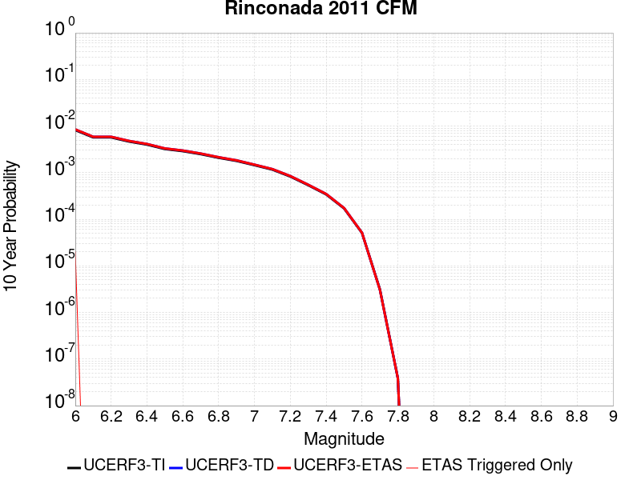 |

| Magnitude | 1 wk TI Prob | 1 wk TD Prob | 1 wk ETAS Prob | 1 wk ETAS/TD Gain | 1 wk ETAS Triggered Only | 1 mo TI Prob | 1 mo TD Prob | 1 mo ETAS Prob | 1 mo ETAS/TD Gain | 1 mo ETAS Triggered Only | 1 yr TI Prob | 1 yr TD Prob | 1 yr ETAS Prob | 1 yr ETAS/TD Gain | 1 yr ETAS Triggered Only | 10 yr TI Prob | 10 yr TD Prob | 10 yr ETAS Prob | 10 yr ETAS/TD Gain | 10 yr ETAS Triggered Only |
|-----|-----|-----|-----|-----|-----|-----|-----|-----|-----|-----|-----|-----|-----|-----|-----|-----|-----|-----|-----|-----|
| 6.0 | 1.5752368E-5 | 1.6274702E-5 | 2.980628E-5 | 1.8314487 | 1.35318E-5 | 6.75084E-5 | 6.974687E-5 | 8.327773E-5 | 1.1939994 | 1.35318E-5 | 8.2160486E-4 | 8.4884046E-4 | 8.623608E-4 | 1.015928 | 1.35318E-5 | 0.008185739 | 0.008456362 | 0.00846978 | 1.0015867 | 1.35318E-5 |
| 6.1 | 1.0966133E-5 | 1.1323019E-5 | 1.1323019E-5 | 1.0 | 0.0 | 4.6996865E-5 | 4.8526326E-5 | 4.8526326E-5 | 1.0 | 0.0 | 5.720366E-4 | 5.906486E-4 | 5.906486E-4 | 1.0 | 0.0 | 0.0057056635 | 0.0058908835 | 0.0058908835 | 1.0 | 0.0 |
| 6.2 | 1.0966133E-5 | 1.1323019E-5 | 1.1323019E-5 | 1.0 | 0.0 | 4.6996865E-5 | 4.8526326E-5 | 4.8526326E-5 | 1.0 | 0.0 | 5.720366E-4 | 5.906486E-4 | 5.906486E-4 | 1.0 | 0.0 | 0.0057056635 | 0.0058908835 | 0.0058908835 | 1.0 | 0.0 |
| 6.3 | 8.926149E-6 | 9.212764E-6 | 9.212764E-6 | 1.0 | 0.0 | 3.8254362E-5 | 3.948268E-5 | 3.948268E-5 | 1.0 | 0.0 | 4.6564735E-4 | 4.805959E-4 | 4.805959E-4 | 1.0 | 0.0 | 0.0046467283 | 0.0047956104 | 0.0047956104 | 1.0 | 0.0 |
| 6.4 | 7.676955E-6 | 7.920184E-6 | 7.920184E-6 | 1.0 | 0.0 | 3.290082E-5 | 3.3943204E-5 | 3.3943204E-5 | 1.0 | 0.0 | 4.0049385E-4 | 4.1318033E-4 | 4.1318033E-4 | 1.0 | 0.0 | 0.0039977287 | 0.004124148 | 0.004124148 | 1.0 | 0.0 |
| 6.5 | 6.1671026E-6 | 6.3589496E-6 | 6.3589496E-6 | 1.0 | 0.0 | 2.6430173E-5 | 2.7252356E-5 | 2.7252356E-5 | 1.0 | 0.0 | 3.2173982E-4 | 3.31747E-4 | 3.31747E-4 | 1.0 | 0.0 | 0.003212744 | 0.0033125298 | 0.0033125298 | 1.0 | 0.0 |
| 6.6 | 5.553456E-6 | 5.7248076E-6 | 5.7248076E-6 | 1.0 | 0.0 | 2.3800309E-5 | 2.453466E-5 | 2.453466E-5 | 1.0 | 0.0 | 2.897302E-4 | 2.986686E-4 | 2.986686E-4 | 1.0 | 0.0 | 0.0028935277 | 0.0029826807 | 0.0029826807 | 1.0 | 0.0 |
| 6.7 | 4.787857E-6 | 4.9333053E-6 | 4.9333053E-6 | 1.0 | 0.0 | 2.0519226E-5 | 2.1142567E-5 | 2.1142567E-5 | 1.0 | 0.0 | 2.4979294E-4 | 2.5738036E-4 | 2.5738036E-4 | 1.0 | 0.0 | 0.0024951235 | 0.0025708287 | 0.0025708287 | 1.0 | 0.0 |
| 6.8 | 3.9955166E-6 | 4.1134726E-6 | 4.1134726E-6 | 1.0 | 0.0 | 1.7123532E-5 | 1.762905E-5 | 1.762905E-5 | 1.0 | 0.0 | 2.0845905E-4 | 2.1461258E-4 | 2.1461258E-4 | 1.0 | 0.0 | 0.002082636 | 0.0021440568 | 0.0021440568 | 1.0 | 0.0 |
| 6.9 | 3.4250072E-6 | 3.5224436E-6 | 3.5224436E-6 | 1.0 | 0.0 | 1.46785205E-5 | 1.50961E-5 | 1.50961E-5 | 1.0 | 0.0 | 1.7869633E-4 | 1.8377953E-4 | 1.8377953E-4 | 1.0 | 0.0 | 0.001785527 | 0.0018362779 | 0.0018362779 | 1.0 | 0.0 |
| 7.0 | 2.7712713E-6 | 2.8466977E-6 | 2.8466977E-6 | 1.0 | 0.0 | 1.1876823E-5 | 1.22000765E-5 | 1.22000765E-5 | 1.0 | 0.0 | 1.4459073E-4 | 1.4852583E-4 | 1.4852583E-4 | 1.0 | 0.0 | 0.0014449668 | 0.0014842671 | 0.0014842671 | 1.0 | 0.0 |
| 7.1 | 2.227358E-6 | 2.2856968E-6 | 2.2856968E-6 | 1.0 | 0.0 | 9.545785E-6 | 9.795806E-6 | 9.795806E-6 | 1.0 | 0.0 | 1.16213734E-4 | 1.1925743E-4 | 1.1925743E-4 | 1.0 | 0.0 | 0.0011615298 | 0.0011919354 | 0.0011919354 | 1.0 | 0.0 |
| 7.2 | 1.581796E-6 | 1.6209E-6 | 1.6209E-6 | 1.0 | 0.0 | 6.779108E-6 | 6.946696E-6 | 6.946696E-6 | 1.0 | 0.0 | 8.253252E-5 | 8.457275E-5 | 8.457275E-5 | 1.0 | 0.0 | 8.250187E-4 | 8.4540615E-4 | 8.4540615E-4 | 1.0 | 0.0 |
| 7.3 | 1.0306567E-6 | 1.054647E-6 | 1.054647E-6 | 1.0 | 0.0 | 4.4170924E-6 | 4.5199076E-6 | 4.5199076E-6 | 1.0 | 0.0 | 5.3776774E-5 | 5.502849E-5 | 5.502849E-5 | 1.0 | 0.0 | 5.376376E-4 | 5.501489E-4 | 5.501489E-4 | 1.0 | 0.0 |
| 7.4 | 6.535541E-7 | 6.6827374E-7 | 6.6827374E-7 | 1.0 | 0.0 | 2.800943E-6 | 2.8640272E-6 | 2.8640272E-6 | 1.0 | 0.0 | 3.4100947E-5 | 3.4868972E-5 | 3.4868972E-5 | 1.0 | 0.0 | 3.4095717E-4 | 3.4863513E-4 | 3.4863513E-4 | 1.0 | 0.0 |
| 7.5 | 3.2656962E-7 | 3.3316664E-7 | 3.3316664E-7 | 1.0 | 0.0 | 1.3995833E-6 | 1.4278562E-6 | 1.4278562E-6 | 1.0 | 0.0 | 1.7039794E-5 | 1.738401E-5 | 1.738401E-5 | 1.0 | 0.0 | 1.7038487E-4 | 1.7382656E-4 | 1.7382656E-4 | 1.0 | 0.0 |
| 7.6 | 9.754343E-8 | 9.820984E-8 | 9.820984E-8 | 1.0 | 0.0 | 4.180432E-7 | 4.2089923E-7 | 4.2089923E-7 | 1.0 | 0.0 | 5.089664E-6 | 5.124436E-6 | 5.124436E-6 | 1.0 | 0.0 | 5.0895473E-5 | 5.124319E-5 | 5.124319E-5 | 1.0 | 0.0 |
| 7.7 | 6.0001453E-9 | 5.849038E-9 | 5.849038E-9 | 1.0 | 0.0 | 2.5714908E-8 | 2.5067308E-8 | 2.5067308E-8 | 1.0 | 0.0 | 3.1307894E-7 | 3.0519442E-7 | 3.0519442E-7 | 1.0 | 0.0 | 3.1307852E-6 | 3.0519402E-6 | 3.0519402E-6 | 1.0 | 0.0 |
| 7.8 | 7.400003E-11 | 7.4654394E-11 | 7.4654394E-11 | 1.0 | 0.0 | 3.171432E-10 | 3.1994762E-10 | 3.1994762E-10 | 1.0 | 0.0 | 3.861218E-9 | 3.8953623E-9 | 3.8953623E-9 | 1.0 | 0.0 | 3.861218E-8 | 3.8953623E-8 | 3.8953623E-8 | 1.0 | 0.0 |

## Sierra Madre
*[(top)](#table-of-contents)*

| 1 Week | 1 Month | 1 Year | 10 Year |
|-----|-----|-----|-----|
|  |  |  |  |

| Magnitude | 1 wk TI Prob | 1 wk TD Prob | 1 wk ETAS Prob | 1 wk ETAS/TD Gain | 1 wk ETAS Triggered Only | 1 mo TI Prob | 1 mo TD Prob | 1 mo ETAS Prob | 1 mo ETAS/TD Gain | 1 mo ETAS Triggered Only | 1 yr TI Prob | 1 yr TD Prob | 1 yr ETAS Prob | 1 yr ETAS/TD Gain | 1 yr ETAS Triggered Only | 10 yr TI Prob | 10 yr TD Prob | 10 yr ETAS Prob | 10 yr ETAS/TD Gain | 10 yr ETAS Triggered Only |
|-----|-----|-----|-----|-----|-----|-----|-----|-----|-----|-----|-----|-----|-----|-----|-----|-----|-----|-----|-----|-----|
| 6.0 | 1.3379373E-5 | 1.1000673E-5 | 1.1000673E-5 | 1.0 | 0.0 | 5.7338908E-5 | 4.71449E-5 | 4.71449E-5 | 1.0 | 0.0 | 6.978776E-4 | 5.738394E-4 | 5.8736344E-4 | 1.0235677 | 1.35318E-5 | 0.0069569005 | 0.0057239407 | 0.005737395 | 1.0023506 | 1.35318E-5 |
| 6.1 | 1.3379373E-5 | 1.1000673E-5 | 1.1000673E-5 | 1.0 | 0.0 | 5.7338908E-5 | 4.71449E-5 | 4.71449E-5 | 1.0 | 0.0 | 6.978776E-4 | 5.738394E-4 | 5.8736344E-4 | 1.0235677 | 1.35318E-5 | 0.0069569005 | 0.0057239407 | 0.005737395 | 1.0023506 | 1.35318E-5 |
| 6.2 | 1.3379373E-5 | 1.1000673E-5 | 1.1000673E-5 | 1.0 | 0.0 | 5.7338908E-5 | 4.71449E-5 | 4.71449E-5 | 1.0 | 0.0 | 6.978776E-4 | 5.738394E-4 | 5.8736344E-4 | 1.0235677 | 1.35318E-5 | 0.0069569005 | 0.0057239407 | 0.005737395 | 1.0023506 | 1.35318E-5 |
| 6.3 | 1.3379373E-5 | 1.1000673E-5 | 1.1000673E-5 | 1.0 | 0.0 | 5.7338908E-5 | 4.71449E-5 | 4.71449E-5 | 1.0 | 0.0 | 6.978776E-4 | 5.738394E-4 | 5.8736344E-4 | 1.0235677 | 1.35318E-5 | 0.0069569005 | 0.0057239407 | 0.005737395 | 1.0023506 | 1.35318E-5 |
| 6.4 | 1.3379373E-5 | 1.1000673E-5 | 1.1000673E-5 | 1.0 | 0.0 | 5.7338908E-5 | 4.71449E-5 | 4.71449E-5 | 1.0 | 0.0 | 6.978776E-4 | 5.738394E-4 | 5.8736344E-4 | 1.0235677 | 1.35318E-5 | 0.0069569005 | 0.0057239407 | 0.005737395 | 1.0023506 | 1.35318E-5 |
| 6.5 | 1.26563245E-5 | 1.023013E-5 | 1.023013E-5 | 1.0 | 0.0 | 5.4240263E-5 | 4.3842683E-5 | 4.3842683E-5 | 1.0 | 0.0 | 6.601751E-4 | 5.33655E-4 | 5.471796E-4 | 1.0253433 | 1.35318E-5 | 0.006582173 | 0.005324057 | 0.005337517 | 1.0025281 | 1.35318E-5 |
| 6.6 | 1.26563245E-5 | 1.023013E-5 | 1.023013E-5 | 1.0 | 0.0 | 5.4240263E-5 | 4.3842683E-5 | 4.3842683E-5 | 1.0 | 0.0 | 6.601751E-4 | 5.33655E-4 | 5.471796E-4 | 1.0253433 | 1.35318E-5 | 0.006582173 | 0.005324057 | 0.005337517 | 1.0025281 | 1.35318E-5 |
| 6.7 | 1.2502474E-5 | 1.0066275E-5 | 1.0066275E-5 | 1.0 | 0.0 | 5.3580934E-5 | 4.314047E-5 | 4.314047E-5 | 1.0 | 0.0 | 6.521526E-4 | 5.251097E-4 | 5.3863437E-4 | 1.0257559 | 1.35318E-5 | 0.0065024206 | 0.0052390085 | 0.0052524693 | 1.0025693 | 1.35318E-5 |
| 6.8 | 1.2454966E-5 | 1.001856E-5 | 1.001856E-5 | 1.0 | 0.0 | 5.3377335E-5 | 4.2935986E-5 | 4.2935986E-5 | 1.0 | 0.0 | 6.4967526E-4 | 5.226213E-4 | 5.3614605E-4 | 1.0258787 | 1.35318E-5 | 0.006477792 | 0.0052142413 | 0.0052277027 | 1.0025816 | 1.35318E-5 |
| 6.9 | 1.2225574E-5 | 9.792538E-6 | 9.792538E-6 | 1.0 | 0.0 | 5.2394265E-5 | 4.196735E-5 | 4.196735E-5 | 1.0 | 0.0 | 6.3771347E-4 | 5.108337E-4 | 5.243586E-4 | 1.0264761 | 1.35318E-5 | 0.006358865 | 0.005096911 | 0.0051103737 | 1.0026413 | 1.35318E-5 |
| 7.0 | 1.182946E-5 | 9.399079E-6 | 9.399079E-6 | 1.0 | 0.0 | 5.06967E-5 | 4.0281153E-5 | 4.0281153E-5 | 1.0 | 0.0 | 6.1705755E-4 | 4.903137E-4 | 5.038389E-4 | 1.0275847 | 1.35318E-5 | 0.006153469 | 0.0048926305 | 0.0049060965 | 1.0027522 | 1.35318E-5 |
| 7.1 | 1.14369095E-5 | 8.986096E-6 | 8.986096E-6 | 1.0 | 0.0 | 4.9014405E-5 | 3.851128E-5 | 3.851128E-5 | 1.0 | 0.0 | 5.9658696E-4 | 4.687749E-4 | 4.8230038E-4 | 1.0288528 | 1.35318E-5 | 0.005949879 | 0.0046781665 | 0.0046916353 | 1.002879 | 1.35318E-5 |
| 7.2 | 1.0836419E-5 | 8.3994955E-6 | 8.3994955E-6 | 1.0 | 0.0 | 4.644097E-5 | 3.599735E-5 | 3.599735E-5 | 1.0 | 0.0 | 5.652721E-4 | 4.381805E-4 | 4.5170638E-4 | 1.0308683 | 1.35318E-5 | 0.0056383642 | 0.0043734624 | 0.0043869354 | 1.0030805 | 1.35318E-5 |
| 7.3 | 1.0403439E-5 | 8.02076E-6 | 8.02076E-6 | 1.0 | 0.0 | 4.4585406E-5 | 3.437424E-5 | 3.437424E-5 | 1.0 | 0.0 | 5.426921E-4 | 4.1842688E-4 | 4.3195303E-4 | 1.0323262 | 1.35318E-5 | 0.005413687 | 0.004176686 | 0.0041901614 | 1.0032263 | 1.35318E-5 |
| 7.4 | 9.768864E-6 | 7.4143904E-6 | 7.4143904E-6 | 1.0 | 0.0 | 4.186589E-5 | 3.1775577E-5 | 3.1775577E-5 | 1.0 | 0.0 | 5.09598E-4 | 3.8679986E-4 | 4.0032642E-4 | 1.0349704 | 1.35318E-5 | 0.0050843097 | 0.0038615582 | 0.0038750377 | 1.0034907 | 1.35318E-5 |
| 7.5 | 8.687089E-6 | 6.450101E-6 | 6.450101E-6 | 1.0 | 0.0 | 3.722985E-5 | 2.7643002E-5 | 2.7643002E-5 | 1.0 | 0.0 | 4.5317915E-4 | 3.3650245E-4 | 3.500297E-4 | 1.0401995 | 1.35318E-5 | 0.004522561 | 0.0033602165 | 0.0033737028 | 1.0040135 | 1.35318E-5 |
| 7.6 | 6.3506063E-6 | 4.430282E-6 | 4.430282E-6 | 1.0 | 0.0 | 2.72166E-5 | 1.8986786E-5 | 1.8986786E-5 | 1.0 | 0.0 | 3.3131172E-4 | 2.3113986E-4 | 2.446685E-4 | 1.0585302 | 1.35318E-5 | 0.003308182 | 0.0023092194 | 0.00232272 | 1.0058464 | 1.35318E-5 |
| 7.7 | 4.62223E-6 | 2.93293E-6 | 2.93293E-6 | 1.0 | 0.0 | 1.9809406E-5 | 1.2569641E-5 | 1.2569641E-5 | 1.0 | 0.0 | 2.4115283E-4 | 1.5302465E-4 | 1.6655437E-4 | 1.0884154 | 1.35318E-5 | 0.0024089129 | 0.0015293938 | 0.001542905 | 1.0088342 | 1.35318E-5 |
| 7.8 | 3.2145008E-6 | 1.9494078E-6 | 1.9494078E-6 | 1.0 | 0.0 | 1.3776359E-5 | 8.354577E-6 | 8.354577E-6 | 1.0 | 0.0 | 1.6771426E-4 | 1.0171225E-4 | 1.1524267E-4 | 1.1330265 | 1.35318E-5 | 0.0016758774 | 0.0010168012 | 0.0010303193 | 1.0132947 | 1.35318E-5 |
| 7.9 | 1.0391769E-6 | 5.602568E-7 | 5.602568E-7 | 1.0 | 0.0 | 4.4536077E-6 | 2.4010983E-6 | 2.4010983E-6 | 1.0 | 0.0 | 5.4221324E-5 | 2.9232984E-5 | 2.9232984E-5 | 1.0 | 0.0 | 5.4208096E-4 | 2.922918E-4 | 2.922918E-4 | 1.0 | 0.0 |
| 8.0 | 1.210983E-7 | 6.61375E-8 | 6.61375E-8 | 1.0 | 0.0 | 5.1899264E-7 | 2.8344644E-7 | 2.8344644E-7 | 1.0 | 0.0 | 6.3187167E-6 | 3.4509549E-6 | 3.4509549E-6 | 1.0 | 0.0 | 6.318537E-5 | 3.450903E-5 | 3.450903E-5 | 1.0 | 0.0 |

## Pisgah-Bullion Mtn-Mesquite Lk
*[(top)](#table-of-contents)*

| 1 Week | 1 Month | 1 Year | 10 Year |
|-----|-----|-----|-----|
|  | 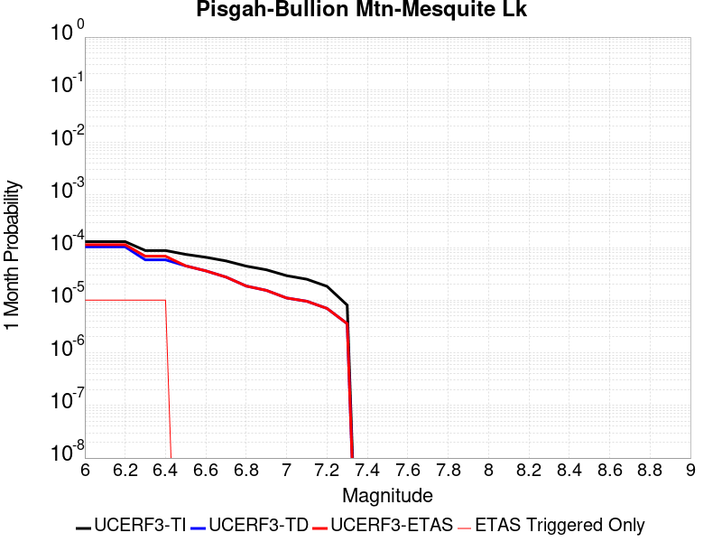 |  |  |

| Magnitude | 1 wk TI Prob | 1 wk TD Prob | 1 wk ETAS Prob | 1 wk ETAS/TD Gain | 1 wk ETAS Triggered Only | 1 mo TI Prob | 1 mo TD Prob | 1 mo ETAS Prob | 1 mo ETAS/TD Gain | 1 mo ETAS Triggered Only | 1 yr TI Prob | 1 yr TD Prob | 1 yr ETAS Prob | 1 yr ETAS/TD Gain | 1 yr ETAS Triggered Only | 10 yr TI Prob | 10 yr TD Prob | 10 yr ETAS Prob | 10 yr ETAS/TD Gain | 10 yr ETAS Triggered Only |
|-----|-----|-----|-----|-----|-----|-----|-----|-----|-----|-----|-----|-----|-----|-----|-----|-----|-----|-----|-----|-----|
| 6.0 | 3.0240792E-5 | 2.4091038E-5 | 3.762251E-5 | 1.5616808 | 1.35318E-5 | 1.2959696E-4 | 1.0324379E-4 | 1.1677419E-4 | 1.131053 | 1.35318E-5 | 0.0015767008 | 0.0012563687 | 0.0012698836 | 1.0107571 | 1.35318E-5 | 0.015655609 | 0.012502681 | 0.012516044 | 1.0010688 | 1.35318E-5 |
| 6.1 | 3.0240792E-5 | 2.4091038E-5 | 3.762251E-5 | 1.5616808 | 1.35318E-5 | 1.2959696E-4 | 1.0324379E-4 | 1.1677419E-4 | 1.131053 | 1.35318E-5 | 0.0015767008 | 0.0012563687 | 0.0012698836 | 1.0107571 | 1.35318E-5 | 0.015655609 | 0.012502681 | 0.012516044 | 1.0010688 | 1.35318E-5 |
| 6.2 | 3.0240792E-5 | 2.4091038E-5 | 3.762251E-5 | 1.5616808 | 1.35318E-5 | 1.2959696E-4 | 1.0324379E-4 | 1.1677419E-4 | 1.131053 | 1.35318E-5 | 0.0015767008 | 0.0012563687 | 0.0012698836 | 1.0107571 | 1.35318E-5 | 0.015655609 | 0.012502681 | 0.012516044 | 1.0010688 | 1.35318E-5 |
| 6.3 | 2.0498217E-5 | 1.3638032E-5 | 2.7169648E-5 | 1.992197 | 1.35318E-5 | 8.784654E-5 | 5.844749E-5 | 7.19785E-5 | 1.2315071 | 1.35318E-5 | 0.0010690069 | 7.1138213E-4 | 7.249043E-4 | 1.0190083 | 1.35318E-5 | 0.01063879 | 0.007092675 | 0.007106111 | 1.0018944 | 1.35318E-5 |
| 6.4 | 2.0498217E-5 | 1.3638032E-5 | 2.7169648E-5 | 1.992197 | 1.35318E-5 | 8.784654E-5 | 5.844749E-5 | 7.19785E-5 | 1.2315071 | 1.35318E-5 | 0.0010690069 | 7.1138213E-4 | 7.249043E-4 | 1.0190083 | 1.35318E-5 | 0.01063879 | 0.007092675 | 0.007106111 | 1.0018944 | 1.35318E-5 |
| 6.5 | 1.7316182E-5 | 1.0477016E-5 | 1.0477016E-5 | 1.0 | 0.0 | 7.42101E-5 | 4.490078E-5 | 4.490078E-5 | 1.0 | 0.0 | 9.0313336E-4 | 5.4653984E-4 | 5.4653984E-4 | 1.0 | 0.0 | 0.008994718 | 0.005452953 | 0.005452953 | 1.0 | 0.0 |
| 6.6 | 1.5251077E-5 | 8.414252E-6 | 8.414252E-6 | 1.0 | 0.0 | 6.536012E-5 | 3.606062E-5 | 3.606062E-5 | 1.0 | 0.0 | 7.9546886E-4 | 4.3895686E-4 | 4.3895686E-4 | 1.0 | 0.0 | 0.007926274 | 0.004381615 | 0.004381615 | 1.0 | 0.0 |
| 6.7 | 1.2997425E-5 | 6.411481E-6 | 6.411481E-6 | 1.0 | 0.0 | 5.570206E-5 | 2.7477512E-5 | 2.7477512E-5 | 1.0 | 0.0 | 6.7796157E-4 | 3.34492E-4 | 3.34492E-4 | 1.0 | 0.0 | 0.0067589693 | 0.0033403458 | 0.0033403458 | 1.0 | 0.0 |
| 6.8 | 1.035386E-5 | 4.3332066E-6 | 4.3332066E-6 | 1.0 | 0.0 | 4.437293E-5 | 1.8570758E-5 | 1.8570758E-5 | 1.0 | 0.0 | 5.401065E-4 | 2.260764E-4 | 2.260764E-4 | 1.0 | 0.0 | 0.0053879567 | 0.0022585508 | 0.0022585508 | 1.0 | 0.0 |
| 6.9 | 8.816252E-6 | 3.580627E-6 | 3.580627E-6 | 1.0 | 0.0 | 3.778339E-5 | 1.5345457E-5 | 1.5345457E-5 | 1.0 | 0.0 | 4.5991567E-4 | 1.8681551E-4 | 1.8681551E-4 | 1.0 | 0.0 | 0.00458965 | 0.0018666431 | 0.0018666431 | 1.0 | 0.0 |
| 7.0 | 6.8232207E-6 | 2.567576E-6 | 2.567576E-6 | 1.0 | 0.0 | 2.9242048E-5 | 1.1003853E-5 | 1.1003853E-5 | 1.0 | 0.0 | 3.5596377E-4 | 1.3396399E-4 | 1.3396399E-4 | 1.0 | 0.0 | 0.0035539411 | 0.0013388634 | 0.0013388634 | 1.0 | 0.0 |
| 7.1 | 5.837013E-6 | 2.227373E-6 | 2.227373E-6 | 1.0 | 0.0 | 2.501553E-5 | 9.545851E-6 | 9.545851E-6 | 1.0 | 0.0 | 3.045215E-4 | 1.16214826E-4 | 1.16214826E-4 | 1.0 | 0.0 | 0.0030410455 | 0.0011615696 | 0.0011615696 | 1.0 | 0.0 |
| 7.2 | 4.278052E-6 | 1.627566E-6 | 1.627566E-6 | 1.0 | 0.0 | 1.833438E-5 | 6.9752655E-6 | 6.9752655E-6 | 1.0 | 0.0 | 2.231982E-4 | 8.4920786E-5 | 8.4920786E-5 | 1.0 | 0.0 | 0.0022297418 | 8.489065E-4 | 8.489065E-4 | 1.0 | 0.0 |
| 7.3 | 1.8803692E-6 | 8.344903E-7 | 8.344903E-7 | 1.0 | 0.0 | 8.0587E-6 | 3.576383E-6 | 3.576383E-6 | 1.0 | 0.0 | 9.811026E-5 | 4.354174E-5 | 4.354174E-5 | 1.0 | 0.0 | 9.806695E-4 | 4.3534656E-4 | 4.3534656E-4 | 1.0 | 0.0 |

## Cucamonga
*[(top)](#table-of-contents)*

| 1 Week | 1 Month | 1 Year | 10 Year |
|-----|-----|-----|-----|
|  |  |  |  |

| Magnitude | 1 wk TI Prob | 1 wk TD Prob | 1 wk ETAS Prob | 1 wk ETAS/TD Gain | 1 wk ETAS Triggered Only | 1 mo TI Prob | 1 mo TD Prob | 1 mo ETAS Prob | 1 mo ETAS/TD Gain | 1 mo ETAS Triggered Only | 1 yr TI Prob | 1 yr TD Prob | 1 yr ETAS Prob | 1 yr ETAS/TD Gain | 1 yr ETAS Triggered Only | 10 yr TI Prob | 10 yr TD Prob | 10 yr ETAS Prob | 10 yr ETAS/TD Gain | 10 yr ETAS Triggered Only |
|-----|-----|-----|-----|-----|-----|-----|-----|-----|-----|-----|-----|-----|-----|-----|-----|-----|-----|-----|-----|-----|
| 6.0 | 1.1848348E-5 | 1.1736872E-5 | 1.1736872E-5 | 1.0 | 0.0 | 5.0777642E-5 | 5.0299925E-5 | 5.0299925E-5 | 1.0 | 0.0 | 6.180424E-4 | 6.1223225E-4 | 6.2575575E-4 | 1.0220889 | 1.35318E-5 | 0.0061632637 | 0.0061066314 | 0.0061200806 | 1.0022024 | 1.35318E-5 |
| 6.1 | 1.1848348E-5 | 1.1736872E-5 | 1.1736872E-5 | 1.0 | 0.0 | 5.0777642E-5 | 5.0299925E-5 | 5.0299925E-5 | 1.0 | 0.0 | 6.180424E-4 | 6.1223225E-4 | 6.2575575E-4 | 1.0220889 | 1.35318E-5 | 0.0061632637 | 0.0061066314 | 0.0061200806 | 1.0022024 | 1.35318E-5 |
| 6.2 | 1.1848348E-5 | 1.1736872E-5 | 1.1736872E-5 | 1.0 | 0.0 | 5.0777642E-5 | 5.0299925E-5 | 5.0299925E-5 | 1.0 | 0.0 | 6.180424E-4 | 6.1223225E-4 | 6.2575575E-4 | 1.0220889 | 1.35318E-5 | 0.0061632637 | 0.0061066314 | 0.0061200806 | 1.0022024 | 1.35318E-5 |
| 6.3 | 1.1848348E-5 | 1.1736872E-5 | 1.1736872E-5 | 1.0 | 0.0 | 5.0777642E-5 | 5.0299925E-5 | 5.0299925E-5 | 1.0 | 0.0 | 6.180424E-4 | 6.1223225E-4 | 6.2575575E-4 | 1.0220889 | 1.35318E-5 | 0.0061632637 | 0.0061066314 | 0.0061200806 | 1.0022024 | 1.35318E-5 |
| 6.4 | 1.1848348E-5 | 1.1736872E-5 | 1.1736872E-5 | 1.0 | 0.0 | 5.0777642E-5 | 5.0299925E-5 | 5.0299925E-5 | 1.0 | 0.0 | 6.180424E-4 | 6.1223225E-4 | 6.2575575E-4 | 1.0220889 | 1.35318E-5 | 0.0061632637 | 0.0061066314 | 0.0061200806 | 1.0022024 | 1.35318E-5 |
| 6.5 | 1.16988695E-5 | 1.1575903E-5 | 1.1575903E-5 | 1.0 | 0.0 | 5.013705E-5 | 4.9610087E-5 | 4.9610087E-5 | 1.0 | 0.0 | 6.102476E-4 | 6.0383807E-4 | 6.173617E-4 | 1.0223961 | 1.35318E-5 | 0.006085745 | 0.0060231457 | 0.0060365964 | 1.0022331 | 1.35318E-5 |
| 6.6 | 1.16988695E-5 | 1.1575903E-5 | 1.1575903E-5 | 1.0 | 0.0 | 5.013705E-5 | 4.9610087E-5 | 4.9610087E-5 | 1.0 | 0.0 | 6.102476E-4 | 6.0383807E-4 | 6.173617E-4 | 1.0223961 | 1.35318E-5 | 0.006085745 | 0.0060231457 | 0.0060365964 | 1.0022331 | 1.35318E-5 |
| 6.7 | 1.1397107E-5 | 1.1114816E-5 | 1.1114816E-5 | 1.0 | 0.0 | 4.884383E-5 | 4.763407E-5 | 4.763407E-5 | 1.0 | 0.0 | 5.9451134E-4 | 5.7979295E-4 | 5.933169E-4 | 1.0233254 | 1.35318E-5 | 0.005929234 | 0.005783954 | 0.005797408 | 1.002326 | 1.35318E-5 |
| 6.8 | 1.058387E-5 | 9.784875E-6 | 9.784875E-6 | 1.0 | 0.0 | 4.5358654E-5 | 4.1934512E-5 | 4.1934512E-5 | 1.0 | 0.0 | 5.521017E-4 | 5.1043415E-4 | 5.2395905E-4 | 1.0264969 | 1.35318E-5 | 0.00550732 | 0.0050936276 | 0.0051070903 | 1.0026431 | 1.35318E-5 |
| 6.9 | 9.690046E-6 | 8.5793745E-6 | 8.5793745E-6 | 1.0 | 0.0 | 4.1528107E-5 | 3.676823E-5 | 3.676823E-5 | 1.0 | 0.0 | 5.054874E-4 | 4.4756167E-4 | 4.6108742E-4 | 1.030221 | 1.35318E-5 | 0.005043391 | 0.004467539 | 0.0044810106 | 1.0030154 | 1.35318E-5 |
| 7.0 | 9.381461E-6 | 8.1869985E-6 | 8.1869985E-6 | 1.0 | 0.0 | 4.020564E-5 | 3.5086665E-5 | 3.5086665E-5 | 1.0 | 0.0 | 4.893937E-4 | 4.2709676E-4 | 4.406228E-4 | 1.0316697 | 1.35318E-5 | 0.0048831734 | 0.004263694 | 0.0042771683 | 1.0031602 | 1.35318E-5 |
| 7.1 | 8.946492E-6 | 7.781785E-6 | 7.781785E-6 | 1.0 | 0.0 | 3.8341543E-5 | 3.3350083E-5 | 3.3350083E-5 | 1.0 | 0.0 | 4.667083E-4 | 4.059619E-4 | 4.194882E-4 | 1.0333191 | 1.35318E-5 | 0.0046572937 | 0.00405314 | 0.0040666168 | 1.0033251 | 1.35318E-5 |
| 7.2 | 8.251016E-6 | 6.9751854E-6 | 6.9751854E-6 | 1.0 | 0.0 | 3.5361016E-5 | 2.989331E-5 | 2.989331E-5 | 1.0 | 0.0 | 4.3043532E-4 | 3.6389052E-4 | 3.774174E-4 | 1.0371729 | 1.35318E-5 | 0.0042960253 | 0.0036338803 | 0.003647363 | 1.0037103 | 1.35318E-5 |
| 7.3 | 7.717881E-6 | 6.4862593E-6 | 6.4862593E-6 | 1.0 | 0.0 | 3.3076216E-5 | 2.7797958E-5 | 2.7797958E-5 | 1.0 | 0.0 | 4.026285E-4 | 3.383878E-4 | 3.5191502E-4 | 1.0399755 | 1.35318E-5 | 0.004018998 | 0.0033796628 | 0.0033931488 | 1.0039904 | 1.35318E-5 |
| 7.4 | 7.275623E-6 | 6.0319094E-6 | 6.0319094E-6 | 1.0 | 0.0 | 3.118087E-5 | 2.5850786E-5 | 2.5850786E-5 | 1.0 | 0.0 | 3.7956095E-4 | 3.1468808E-4 | 3.2821562E-4 | 1.0429871 | 1.35318E-5 | 0.0037891332 | 0.0031433608 | 0.00315685 | 1.0042913 | 1.35318E-5 |
| 7.5 | 6.5109502E-6 | 5.1005236E-6 | 5.1005236E-6 | 1.0 | 0.0 | 2.7903774E-5 | 2.1859205E-5 | 2.1859205E-5 | 1.0 | 0.0 | 3.3967546E-4 | 2.6610345E-4 | 2.7963164E-4 | 1.0508381 | 1.35318E-5 | 0.0033915674 | 0.0026587727 | 0.0026722685 | 1.0050759 | 1.35318E-5 |
| 7.6 | 5.4495326E-6 | 3.908509E-6 | 3.908509E-6 | 1.0 | 0.0 | 2.335493E-5 | 1.6750646E-5 | 1.6750646E-5 | 1.0 | 0.0 | 2.8430918E-4 | 2.0392009E-4 | 2.1744914E-4 | 1.0663449 | 1.35318E-5 | 0.0028394572 | 0.0020382507 | 0.0020517549 | 1.0066254 | 1.35318E-5 |
| 7.7 | 4.7997164E-6 | 3.2002004E-6 | 3.2002004E-6 | 1.0 | 0.0 | 2.057005E-5 | 1.3715072E-5 | 1.3715072E-5 | 1.0 | 0.0 | 2.504116E-4 | 1.6696824E-4 | 1.8049778E-4 | 1.0810306 | 1.35318E-5 | 0.002501296 | 0.0016693595 | 0.0016828688 | 1.0080924 | 1.35318E-5 |
| 7.8 | 3.3941733E-6 | 2.0641605E-6 | 2.0641605E-6 | 1.0 | 0.0 | 1.4546376E-5 | 8.846372E-6 | 8.846372E-6 | 1.0 | 0.0 | 1.7708774E-4 | 1.0769927E-4 | 1.2122961E-4 | 1.1256307 | 1.35318E-5 | 0.0017694668 | 0.0010767077 | 0.001090225 | 1.0125542 | 1.35318E-5 |
| 7.9 | 9.750552E-7 | 5.1558817E-7 | 5.1558817E-7 | 1.0 | 0.0 | 4.178801E-6 | 2.2096617E-6 | 2.2096617E-6 | 1.0 | 0.0 | 5.0875715E-5 | 2.6902302E-5 | 2.6902302E-5 | 1.0 | 0.0 | 5.086407E-4 | 2.6899087E-4 | 2.6899087E-4 | 1.0 | 0.0 |
| 8.0 | 1.133857E-7 | 6.053637E-8 | 6.053637E-8 | 1.0 | 0.0 | 4.8593864E-7 | 2.5944158E-7 | 2.5944158E-7 | 1.0 | 0.0 | 5.9162867E-6 | 3.1586967E-6 | 3.1586967E-6 | 1.0 | 0.0 | 5.916129E-5 | 3.1586536E-5 | 3.1586536E-5 | 1.0 | 0.0 |

## Mission Ridge-Arroyo Parida-Santa Ana
*[(top)](#table-of-contents)*

| 1 Week | 1 Month | 1 Year | 10 Year |
|-----|-----|-----|-----|
|  |  |  |  |

| Magnitude | 1 wk TI Prob | 1 wk TD Prob | 1 wk ETAS Prob | 1 wk ETAS/TD Gain | 1 wk ETAS Triggered Only | 1 mo TI Prob | 1 mo TD Prob | 1 mo ETAS Prob | 1 mo ETAS/TD Gain | 1 mo ETAS Triggered Only | 1 yr TI Prob | 1 yr TD Prob | 1 yr ETAS Prob | 1 yr ETAS/TD Gain | 1 yr ETAS Triggered Only | 10 yr TI Prob | 10 yr TD Prob | 10 yr ETAS Prob | 10 yr ETAS/TD Gain | 10 yr ETAS Triggered Only |
|-----|-----|-----|-----|-----|-----|-----|-----|-----|-----|-----|-----|-----|-----|-----|-----|-----|-----|-----|-----|-----|
| 6.0 | 4.169034E-5 | 4.7138004E-5 | 6.0669165E-5 | 1.2870542 | 1.35318E-5 | 1.7866064E-4 | 2.0200922E-4 | 2.155383E-4 | 1.0669725 | 1.35318E-5 | 0.0021730233 | 0.0024574373 | 0.0024709357 | 1.0054929 | 1.35318E-5 | 0.021518968 | 0.024384484 | 0.024397686 | 1.0005414 | 1.35318E-5 |
| 6.1 | 1.73813E-5 | 1.6854168E-5 | 1.6854168E-5 | 1.0 | 0.0 | 7.4489166E-5 | 7.2230214E-5 | 7.2230214E-5 | 1.0 | 0.0 | 9.065282E-4 | 8.7905885E-4 | 8.7905885E-4 | 1.0 | 0.0 | 0.009028391 | 0.008756958 | 0.008756958 | 1.0 | 0.0 |
| 6.2 | 1.4622182E-5 | 1.3673245E-5 | 1.3673245E-5 | 1.0 | 0.0 | 6.2664985E-5 | 5.859833E-5 | 5.859833E-5 | 1.0 | 0.0 | 7.6267915E-4 | 7.13205E-4 | 7.13205E-4 | 1.0 | 0.0 | 0.007600669 | 0.0071096043 | 0.0071096043 | 1.0 | 0.0 |
| 6.3 | 1.3552434E-5 | 1.248216E-5 | 1.248216E-5 | 1.0 | 0.0 | 5.8080568E-5 | 5.349389E-5 | 5.349389E-5 | 1.0 | 0.0 | 7.069015E-4 | 6.510967E-4 | 6.510967E-4 | 1.0 | 0.0 | 0.00704657 | 0.006492254 | 0.006492254 | 1.0 | 0.0 |
| 6.4 | 1.30977305E-5 | 1.1979117E-5 | 1.1979117E-5 | 1.0 | 0.0 | 5.613192E-5 | 5.133808E-5 | 5.133808E-5 | 1.0 | 0.0 | 6.831918E-4 | 6.248649E-4 | 6.248649E-4 | 1.0 | 0.0 | 0.006810953 | 0.006231424 | 0.006231424 | 1.0 | 0.0 |
| 6.5 | 1.225205E-5 | 1.1048766E-5 | 1.1048766E-5 | 1.0 | 0.0 | 5.2507727E-5 | 4.735101E-5 | 4.735101E-5 | 1.0 | 0.0 | 6.3909404E-4 | 5.763488E-4 | 5.763488E-4 | 1.0 | 0.0 | 0.006372592 | 0.00574885 | 0.00574885 | 1.0 | 0.0 |
| 6.6 | 1.1352241E-5 | 1.0063501E-5 | 1.0063501E-5 | 1.0 | 0.0 | 4.8651553E-5 | 4.3128588E-5 | 4.3128588E-5 | 1.0 | 0.0 | 5.921717E-4 | 5.2496616E-4 | 5.2496616E-4 | 1.0 | 0.0 | 0.0059059616 | 0.0052375067 | 0.0052375067 | 1.0 | 0.0 |
| 6.7 | 1.0864116E-5 | 9.516994E-6 | 9.516994E-6 | 1.0 | 0.0 | 4.6559664E-5 | 4.0786494E-5 | 4.0786494E-5 | 1.0 | 0.0 | 5.667165E-4 | 4.9646443E-4 | 4.9646443E-4 | 1.0 | 0.0 | 0.005652734 | 0.004953787 | 0.004953787 | 1.0 | 0.0 |
| 6.8 | 1.0666365E-5 | 9.299747E-6 | 9.299747E-6 | 1.0 | 0.0 | 4.571219E-5 | 3.985546E-5 | 3.985546E-5 | 1.0 | 0.0 | 5.564038E-4 | 4.851342E-4 | 4.851342E-4 | 1.0 | 0.0 | 0.005550127 | 0.0048409835 | 0.0048409835 | 1.0 | 0.0 |
| 6.9 | 1.0038665E-5 | 8.592016E-6 | 8.592016E-6 | 1.0 | 0.0 | 4.302214E-5 | 3.6822417E-5 | 3.6822417E-5 | 1.0 | 0.0 | 5.236687E-4 | 4.482225E-4 | 4.482225E-4 | 1.0 | 0.0 | 0.005224364 | 0.0044733956 | 0.0044733956 | 1.0 | 0.0 |
| 7.0 | 9.5379955E-6 | 8.025046E-6 | 8.025046E-6 | 1.0 | 0.0 | 4.0876483E-5 | 3.439261E-5 | 3.439261E-5 | 1.0 | 0.0 | 4.975576E-4 | 4.186513E-4 | 4.186513E-4 | 1.0 | 0.0 | 0.00496445 | 0.0041788258 | 0.0041788258 | 1.0 | 0.0 |
| 7.1 | 9.207389E-6 | 7.652349E-6 | 7.652349E-6 | 1.0 | 0.0 | 3.945964E-5 | 3.279538E-5 | 3.279538E-5 | 1.0 | 0.0 | 4.803152E-4 | 3.992123E-4 | 3.992123E-4 | 1.0 | 0.0 | 0.004792784 | 0.0039851475 | 0.0039851475 | 1.0 | 0.0 |
| 7.2 | 7.638091E-6 | 5.9310996E-6 | 5.9310996E-6 | 1.0 | 0.0 | 3.2734264E-5 | 2.5418753E-5 | 2.5418753E-5 | 1.0 | 0.0 | 3.984668E-4 | 3.0942968E-4 | 3.0942968E-4 | 1.0 | 0.0 | 0.0039775306 | 0.0030900452 | 0.0030900452 | 1.0 | 0.0 |
| 7.3 | 7.2500147E-6 | 5.596136E-6 | 5.596136E-6 | 1.0 | 0.0 | 3.1071122E-5 | 2.398322E-5 | 2.398322E-5 | 1.0 | 0.0 | 3.7822526E-4 | 2.9195688E-4 | 2.9195688E-4 | 1.0 | 0.0 | 0.0037758215 | 0.0029157887 | 0.0029157887 | 1.0 | 0.0 |
| 7.4 | 6.3899715E-6 | 4.9184823E-6 | 4.9184823E-6 | 1.0 | 0.0 | 2.7385306E-5 | 2.107904E-5 | 2.107904E-5 | 1.0 | 0.0 | 3.3336508E-4 | 2.5660728E-4 | 2.5660728E-4 | 1.0 | 0.0 | 0.0033286542 | 0.0025631543 | 0.0025631543 | 1.0 | 0.0 |
| 7.5 | 5.379025E-6 | 4.0838413E-6 | 4.0838413E-6 | 1.0 | 0.0 | 2.305276E-5 | 1.7502061E-5 | 1.7502061E-5 | 1.0 | 0.0 | 2.806312E-4 | 2.1306686E-4 | 2.1306686E-4 | 1.0 | 0.0 | 0.0028027708 | 0.0021286372 | 0.0021286372 | 1.0 | 0.0 |
| 7.6 | 4.1270696E-6 | 3.088336E-6 | 3.088336E-6 | 1.0 | 0.0 | 1.768732E-5 | 1.3235658E-5 | 1.3235658E-5 | 1.0 | 0.0 | 2.1532185E-4 | 1.611323E-4 | 1.611323E-4 | 1.0 | 0.0 | 0.0021511333 | 0.0016101628 | 0.0016101628 | 1.0 | 0.0 |
| 7.7 | 2.5406805E-6 | 1.8281963E-6 | 1.8281963E-6 | 1.0 | 0.0 | 1.0888585E-5 | 7.835104E-6 | 7.835104E-6 | 1.0 | 0.0 | 1.3256045E-4 | 9.538828E-5 | 9.538828E-5 | 1.0 | 0.0 | 0.0013248142 | 9.534795E-4 | 9.534795E-4 | 1.0 | 0.0 |
| 7.8 | 4.8608285E-7 | 3.509878E-7 | 3.509878E-7 | 1.0 | 0.0 | 2.0832106E-6 | 1.5042325E-6 | 1.5042325E-6 | 1.0 | 0.0 | 2.5362791E-5 | 1.8313878E-5 | 1.8313878E-5 | 1.0 | 0.0 | 2.5359896E-4 | 1.831238E-4 | 1.831238E-4 | 1.0 | 0.0 |
| 7.9 | 2.0472514E-8 | 1.268872E-8 | 1.268872E-8 | 1.0 | 0.0 | 8.7739345E-8 | 5.438023E-8 | 5.438023E-8 | 1.0 | 0.0 | 1.068226E-6 | 6.620791E-7 | 6.620791E-7 | 1.0 | 0.0 | 1.0682209E-5 | 6.6207726E-6 | 6.6207726E-6 | 1.0 | 0.0 |
| 8.0 | 4.443582E-9 | 2.0320927E-9 | 2.0320927E-9 | 1.0 | 0.0 | 1.9043922E-8 | 8.7089695E-9 | 8.7089695E-9 | 1.0 | 0.0 | 2.3185973E-7 | 1.060317E-7 | 1.060317E-7 | 1.0 | 0.0 | 2.3185949E-6 | 1.0603165E-6 | 1.0603165E-6 | 1.0 | 0.0 |

## Brawley (Seismic Zone) alt 1
*[(top)](#table-of-contents)*

| 1 Week | 1 Month | 1 Year | 10 Year |
|-----|-----|-----|-----|
|  |  |  |  |

| Magnitude | 1 wk TI Prob | 1 wk TD Prob | 1 wk ETAS Prob | 1 wk ETAS/TD Gain | 1 wk ETAS Triggered Only | 1 mo TI Prob | 1 mo TD Prob | 1 mo ETAS Prob | 1 mo ETAS/TD Gain | 1 mo ETAS Triggered Only | 1 yr TI Prob | 1 yr TD Prob | 1 yr ETAS Prob | 1 yr ETAS/TD Gain | 1 yr ETAS Triggered Only | 10 yr TI Prob | 10 yr TD Prob | 10 yr ETAS Prob | 10 yr ETAS/TD Gain | 10 yr ETAS Triggered Only |
|-----|-----|-----|-----|-----|-----|-----|-----|-----|-----|-----|-----|-----|-----|-----|-----|-----|-----|-----|-----|-----|
| 6.0 | 2.2521618E-4 | 4.7625226E-4 | 4.897776E-4 | 1.0283996 | 1.35318E-5 | 9.6485513E-4 | 0.0020395215 | 0.0020530259 | 1.0066212 | 1.35318E-5 | 0.011683988 | 0.024542542 | 0.02455574 | 1.0005379 | 1.35318E-5 | 0.11088423 | 0.21347483 | 0.21348546 | 1.0000498 | 1.35318E-5 |
| 6.1 | 2.2521618E-4 | 4.7625226E-4 | 4.897776E-4 | 1.0283996 | 1.35318E-5 | 9.6485513E-4 | 0.0020395215 | 0.0020530259 | 1.0066212 | 1.35318E-5 | 0.011683988 | 0.024542542 | 0.02455574 | 1.0005379 | 1.35318E-5 | 0.11088423 | 0.21347483 | 0.21348546 | 1.0000498 | 1.35318E-5 |
| 6.2 | 2.198148E-4 | 4.6709873E-4 | 4.806242E-4 | 1.0289564 | 1.35318E-5 | 9.417233E-4 | 0.0020003526 | 0.0020138572 | 1.0067512 | 1.35318E-5 | 0.011405343 | 0.024076827 | 0.024090031 | 1.0005485 | 1.35318E-5 | 0.10837428 | 0.20991138 | 0.20992206 | 1.0000509 | 1.35318E-5 |
| 6.3 | 2.1704129E-4 | 4.6145564E-4 | 4.7498118E-4 | 1.0293106 | 1.35318E-5 | 9.298453E-4 | 0.0019762046 | 0.0019897097 | 1.0068338 | 1.35318E-5 | 0.011262234 | 0.023789987 | 0.023803197 | 1.0005553 | 1.35318E-5 | 0.107082725 | 0.2078023 | 0.20781302 | 1.0000516 | 1.35318E-5 |
| 6.4 | 1.876142E-4 | 4.0037738E-4 | 4.1390376E-4 | 1.033784 | 1.35318E-5 | 8.038131E-4 | 0.001714789 | 0.0017282976 | 1.0078777 | 1.35318E-5 | 0.00974259 | 0.02067674 | 0.020689992 | 1.0006409 | 1.35318E-5 | 0.093263686 | 0.18455231 | 0.18456335 | 1.0000598 | 1.35318E-5 |
| 6.5 | 1.7390939E-4 | 3.746997E-4 | 3.882264E-4 | 1.0361001 | 1.35318E-5 | 7.45113E-4 | 0.0016048797 | 0.0016183897 | 1.0084181 | 1.35318E-5 | 0.009034078 | 0.019365085 | 0.019378355 | 1.0006852 | 1.35318E-5 | 0.086755216 | 0.17437433 | 0.1743855 | 1.000064 | 1.35318E-5 |
| 6.6 | 1.591791E-4 | 3.4884937E-4 | 3.6237645E-4 | 1.0387763 | 1.35318E-5 | 6.8201777E-4 | 0.0014942222 | 0.0015077337 | 1.0090425 | 1.35318E-5 | 0.008271996 | 0.018041968 | 0.018055256 | 1.0007365 | 1.35318E-5 | 0.07970774 | 0.16378246 | 0.16379377 | 1.0000691 | 1.35318E-5 |
| 6.7 | 1.4268003E-4 | 3.2051268E-4 | 3.3404015E-4 | 1.0422057 | 1.35318E-5 | 6.1134255E-4 | 0.0013729108 | 0.0013864241 | 1.0098428 | 1.35318E-5 | 0.007417723 | 0.016589044 | 0.01660235 | 1.0008022 | 1.35318E-5 | 0.07174956 | 0.15190692 | 0.1519184 | 1.0000756 | 1.35318E-5 |
| 6.8 | 1.239713E-4 | 2.904694E-4 | 2.904694E-4 | 1.0 | 0.0 | 5.3119735E-4 | 0.0012442812 | 0.0012442812 | 1.0 | 0.0 | 0.0064481674 | 0.015045324 | 0.015045324 | 1.0 | 0.0 | 0.06264243 | 0.13835184 | 0.13835184 | 1.0 | 0.0 |
| 6.9 | 1.0180238E-4 | 2.624795E-4 | 2.624795E-4 | 1.0 | 0.0 | 4.3622297E-4 | 0.0011244314 | 0.0011244314 | 1.0 | 0.0 | 0.005298089 | 0.013605019 | 0.013605019 | 1.0 | 0.0 | 0.05173543 | 0.124936566 | 0.124936566 | 1.0 | 0.0 |
| 7.0 | 7.6619996E-5 | 2.2393082E-4 | 2.2393082E-4 | 1.0 | 0.0 | 3.283301E-4 | 9.593537E-4 | 9.593537E-4 | 1.0 | 0.0 | 0.0039900932 | 0.011618287 | 0.011618287 | 1.0 | 0.0 | 0.039192066 | 0.1072422 | 0.1072422 | 1.0 | 0.0 |
| 7.1 | 7.5127435E-5 | 2.2076255E-4 | 2.2076255E-4 | 1.0 | 0.0 | 3.2193496E-4 | 9.457853E-4 | 9.457853E-4 | 1.0 | 0.0 | 0.0039125155 | 0.01145484 | 0.01145484 | 1.0 | 0.0 | 0.038443442 | 0.10580618 | 0.10580618 | 1.0 | 0.0 |
| 7.2 | 6.788582E-5 | 2.0204009E-4 | 2.0204009E-4 | 1.0 | 0.0 | 2.9090676E-4 | 8.6560176E-4 | 8.6560176E-4 | 1.0 | 0.0 | 0.0035360386 | 0.010488416 | 0.010488416 | 1.0 | 0.0 | 0.034803 | 0.097476505 | 0.097476505 | 1.0 | 0.0 |
| 7.3 | 6.399602E-5 | 1.8835113E-4 | 1.8835113E-4 | 1.0 | 0.0 | 2.7423984E-4 | 8.0697227E-4 | 8.0697227E-4 | 1.0 | 0.0 | 0.0033337586 | 0.009781217 | 0.009781217 | 1.0 | 0.0 | 0.03284188 | 0.09137183 | 0.09137183 | 1.0 | 0.0 |
| 7.4 | 4.506759E-5 | 1.2526519E-4 | 1.2526519E-4 | 1.0 | 0.0 | 1.9313251E-4 | 5.367412E-4 | 5.367412E-4 | 1.0 | 0.0 | 0.0023488526 | 0.006515418 | 0.006515418 | 1.0 | 0.0 | 0.023241805 | 0.062352248 | 0.062352248 | 1.0 | 0.0 |
| 7.5 | 3.43289E-5 | 9.334972E-5 | 9.334972E-5 | 1.0 | 0.0 | 1.4711556E-4 | 4.0000922E-4 | 4.0000922E-4 | 1.0 | 0.0 | 0.0017896603 | 0.004859299 | 0.004859299 | 1.0 | 0.0 | 0.01775316 | 0.04705323 | 0.04705323 | 1.0 | 0.0 |
| 7.6 | 2.5980507E-5 | 7.0527196E-5 | 7.0527196E-5 | 1.0 | 0.0 | 1.1134028E-4 | 3.022245E-4 | 3.022245E-4 | 1.0 | 0.0 | 0.001354725 | 0.0036733993 | 0.0036733993 | 1.0 | 0.0 | 0.013464959 | 0.035839107 | 0.035839107 | 1.0 | 0.0 |
| 7.7 | 1.7292105E-5 | 4.940404E-5 | 4.940404E-5 | 1.0 | 0.0 | 7.4106916E-5 | 2.1171445E-4 | 2.1171445E-4 | 1.0 | 0.0 | 9.018782E-4 | 0.0025745821 | 0.0025745821 | 1.0 | 0.0 | 0.008982267 | 0.025288915 | 0.025288915 | 1.0 | 0.0 |
| 7.8 | 1.2927471E-5 | 3.9690432E-5 | 3.9690432E-5 | 1.0 | 0.0 | 5.5402274E-5 | 1.7009077E-4 | 1.7009077E-4 | 1.0 | 0.0 | 6.743139E-4 | 0.002068891 | 0.002068891 | 1.0 | 0.0 | 0.0067227143 | 0.020430436 | 0.020430436 | 1.0 | 0.0 |
| 7.9 | 1.0200774E-5 | 2.8743396E-5 | 2.8743396E-5 | 1.0 | 0.0 | 4.371687E-5 | 1.2318017E-4 | 1.2318017E-4 | 1.0 | 0.0 | 5.321229E-4 | 0.001498688 | 0.001498688 | 1.0 | 0.0 | 0.005308505 | 0.014990583 | 0.014990583 | 1.0 | 0.0 |
| 8.0 | 8.650396E-6 | 2.3275401E-5 | 2.3275401E-5 | 1.0 | 0.0 | 3.70726E-5 | 9.974791E-5 | 9.974791E-5 | 1.0 | 0.0 | 4.5126543E-4 | 0.0012137551 | 0.0012137551 | 1.0 | 0.0 | 0.0045035016 | 0.012210181 | 0.012210181 | 1.0 | 0.0 |
| 8.1 | 3.9368224E-6 | 7.3271426E-6 | 7.3271426E-6 | 1.0 | 0.0 | 1.6871985E-5 | 3.1401665E-5 | 3.1401665E-5 | 1.0 | 0.0 | 2.0539707E-4 | 3.822483E-4 | 3.822483E-4 | 1.0 | 0.0 | 0.0020520731 | 0.004000768 | 0.004000768 | 1.0 | 0.0 |
| 8.2 | 1.7101195E-6 | 2.2175473E-6 | 2.2175473E-6 | 1.0 | 0.0 | 7.329063E-6 | 9.50374E-6 | 9.50374E-6 | 1.0 | 0.0 | 8.922769E-5 | 1.1570192E-4 | 1.1570192E-4 | 1.0 | 0.0 | 8.9191867E-4 | 0.0012665088 | 0.0012665088 | 1.0 | 0.0 |
| 8.3 | 3.0346666E-8 | 1.72124E-8 | 1.72124E-8 | 1.0 | 0.0 | 1.3005713E-7 | 7.3767424E-8 | 7.3767424E-8 | 1.0 | 0.0 | 1.5834444E-6 | 8.9811834E-7 | 8.9811834E-7 | 1.0 | 0.0 | 1.5834332E-5 | 9.365885E-6 | 9.365885E-6 | 1.0 | 0.0 |

## San Jacinto (Stepovers Combined)
*[(top)](#table-of-contents)*

| 1 Week | 1 Month | 1 Year | 10 Year |
|-----|-----|-----|-----|
|  |  |  | 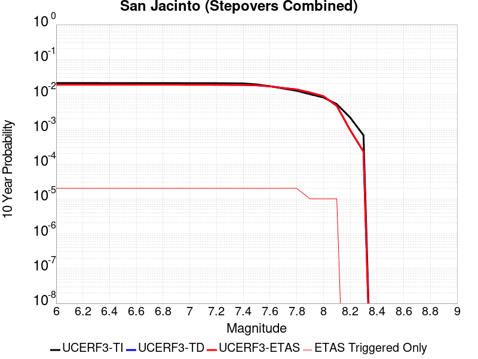 |

| Magnitude | 1 wk TI Prob | 1 wk TD Prob | 1 wk ETAS Prob | 1 wk ETAS/TD Gain | 1 wk ETAS Triggered Only | 1 mo TI Prob | 1 mo TD Prob | 1 mo ETAS Prob | 1 mo ETAS/TD Gain | 1 mo ETAS Triggered Only | 1 yr TI Prob | 1 yr TD Prob | 1 yr ETAS Prob | 1 yr ETAS/TD Gain | 1 yr ETAS Triggered Only | 10 yr TI Prob | 10 yr TD Prob | 10 yr ETAS Prob | 10 yr ETAS/TD Gain | 10 yr ETAS Triggered Only |
|-----|-----|-----|-----|-----|-----|-----|-----|-----|-----|-----|-----|-----|-----|-----|-----|-----|-----|-----|-----|-----|
| 6.0 | 4.0667746E-5 | 3.5266257E-5 | 3.5266257E-5 | 1.0 | 0.0 | 1.742787E-4 | 1.5113236E-4 | 1.5113236E-4 | 1.0 | 0.0 | 0.0021197782 | 0.0018384842 | 0.0018519912 | 1.0073467 | 1.35318E-5 | 0.020996714 | 0.018983515 | 0.01899679 | 1.0006993 | 1.35318E-5 |
| 6.1 | 4.0667746E-5 | 3.5266257E-5 | 3.5266257E-5 | 1.0 | 0.0 | 1.742787E-4 | 1.5113236E-4 | 1.5113236E-4 | 1.0 | 0.0 | 0.0021197782 | 0.0018384842 | 0.0018519912 | 1.0073467 | 1.35318E-5 | 0.020996714 | 0.018983515 | 0.01899679 | 1.0006993 | 1.35318E-5 |
| 6.2 | 4.0667746E-5 | 3.5266257E-5 | 3.5266257E-5 | 1.0 | 0.0 | 1.742787E-4 | 1.5113236E-4 | 1.5113236E-4 | 1.0 | 0.0 | 0.0021197782 | 0.0018384842 | 0.0018519912 | 1.0073467 | 1.35318E-5 | 0.020996714 | 0.018983515 | 0.01899679 | 1.0006993 | 1.35318E-5 |
| 6.3 | 4.0667746E-5 | 3.5266257E-5 | 3.5266257E-5 | 1.0 | 0.0 | 1.742787E-4 | 1.5113236E-4 | 1.5113236E-4 | 1.0 | 0.0 | 0.0021197782 | 0.0018384842 | 0.0018519912 | 1.0073467 | 1.35318E-5 | 0.020996714 | 0.018983515 | 0.01899679 | 1.0006993 | 1.35318E-5 |
| 6.4 | 4.0577226E-5 | 3.513816E-5 | 3.513816E-5 | 1.0 | 0.0 | 1.738908E-4 | 1.5058344E-4 | 1.5058344E-4 | 1.0 | 0.0 | 0.0021150648 | 0.001831814 | 0.0018453209 | 1.0073736 | 1.35318E-5 | 0.020950472 | 0.018918084 | 0.018931359 | 1.0007018 | 1.35318E-5 |
| 6.5 | 4.0577226E-5 | 3.513816E-5 | 3.513816E-5 | 1.0 | 0.0 | 1.738908E-4 | 1.5058344E-4 | 1.5058344E-4 | 1.0 | 0.0 | 0.0021150648 | 0.001831814 | 0.0018453209 | 1.0073736 | 1.35318E-5 | 0.020950472 | 0.018918084 | 0.018931359 | 1.0007018 | 1.35318E-5 |
| 6.6 | 4.053861E-5 | 3.5083507E-5 | 3.5083507E-5 | 1.0 | 0.0 | 1.7372532E-4 | 1.5034924E-4 | 1.5034924E-4 | 1.0 | 0.0 | 0.0021130538 | 0.0018289674 | 0.0018424743 | 1.007385 | 1.35318E-5 | 0.020930743 | 0.018890161 | 0.018903438 | 1.0007029 | 1.35318E-5 |
| 6.7 | 4.0516545E-5 | 3.5052573E-5 | 3.5052573E-5 | 1.0 | 0.0 | 1.7363077E-4 | 1.5021669E-4 | 1.5021669E-4 | 1.0 | 0.0 | 0.002111905 | 0.0018273568 | 0.0018408637 | 1.0073916 | 1.35318E-5 | 0.020919468 | 0.018874358 | 0.018887635 | 1.0007035 | 1.35318E-5 |
| 6.8 | 4.049434E-5 | 3.5024135E-5 | 3.5024135E-5 | 1.0 | 0.0 | 1.7353562E-4 | 1.5009483E-4 | 1.5009483E-4 | 1.0 | 0.0 | 0.0021107488 | 0.0018258755 | 0.0018393826 | 1.0073977 | 1.35318E-5 | 0.020908125 | 0.018859772 | 0.018873049 | 1.0007039 | 1.35318E-5 |
| 6.9 | 4.046386E-5 | 3.4986697E-5 | 3.4986697E-5 | 1.0 | 0.0 | 1.73405E-4 | 1.4993439E-4 | 1.4993439E-4 | 1.0 | 0.0 | 0.0021091616 | 0.0018239255 | 0.0018374326 | 1.0074055 | 1.35318E-5 | 0.020892553 | 0.018840544 | 0.01885382 | 1.0007046 | 1.35318E-5 |
| 7.0 | 4.036382E-5 | 3.4867266E-5 | 3.4867266E-5 | 1.0 | 0.0 | 1.7297632E-4 | 1.494226E-4 | 1.494226E-4 | 1.0 | 0.0 | 0.0021039525 | 0.0018177053 | 0.0018312125 | 1.0074309 | 1.35318E-5 | 0.02084144 | 0.01877916 | 0.018792437 | 1.000707 | 1.35318E-5 |
| 7.1 | 4.0343282E-5 | 3.484573E-5 | 3.484573E-5 | 1.0 | 0.0 | 1.7288832E-4 | 1.493303E-4 | 1.493303E-4 | 1.0 | 0.0 | 0.002102883 | 0.0018165836 | 0.0018300909 | 1.0074356 | 1.35318E-5 | 0.020830948 | 0.018768037 | 0.018781316 | 1.0007075 | 1.35318E-5 |
| 7.2 | 4.0257353E-5 | 3.4750232E-5 | 3.4750232E-5 | 1.0 | 0.0 | 1.725201E-4 | 1.4892107E-4 | 1.4892107E-4 | 1.0 | 0.0 | 0.0020984085 | 0.0018116096 | 0.0018251168 | 1.007456 | 1.35318E-5 | 0.020787042 | 0.018718777 | 0.018732056 | 1.0007094 | 1.35318E-5 |
| 7.3 | 3.9940667E-5 | 3.4577894E-5 | 3.4577894E-5 | 1.0 | 0.0 | 1.7116306E-4 | 1.4818257E-4 | 1.4818257E-4 | 1.0 | 0.0 | 0.0020819185 | 0.0018026332 | 0.0018161406 | 1.0074931 | 1.35318E-5 | 0.020625217 | 0.018627413 | 0.018640691 | 1.0007129 | 1.35318E-5 |
| 7.4 | 3.9721202E-5 | 3.4463315E-5 | 3.4463315E-5 | 1.0 | 0.0 | 1.7022261E-4 | 1.4769158E-4 | 1.4769158E-4 | 1.0 | 0.0 | 0.0020704903 | 0.0017966651 | 0.0018101727 | 1.007518 | 1.35318E-5 | 0.020513052 | 0.01856655 | 0.018579831 | 1.0007153 | 1.35318E-5 |
| 7.5 | 3.7036873E-5 | 3.353082E-5 | 3.353082E-5 | 1.0 | 0.0 | 1.5871979E-4 | 1.4369562E-4 | 1.4369562E-4 | 1.0 | 0.0 | 0.0019307006 | 0.0017480933 | 0.0017616015 | 1.0077274 | 1.35318E-5 | 0.019140124 | 0.018068153 | 0.01808144 | 1.0007354 | 1.35318E-5 |
| 7.6 | 3.2940967E-5 | 3.1311945E-5 | 3.1311945E-5 | 1.0 | 0.0 | 1.4116794E-4 | 1.3418717E-4 | 1.3418717E-4 | 1.0 | 0.0 | 0.0017173645 | 0.0016325067 | 0.0016460164 | 1.0082754 | 1.35318E-5 | 0.01704153 | 0.016901208 | 0.016914511 | 1.0007871 | 1.35318E-5 |
| 7.7 | 2.8236149E-5 | 2.7881175E-5 | 2.7881175E-5 | 1.0 | 0.0 | 1.2100645E-4 | 1.1948528E-4 | 1.1948528E-4 | 1.0 | 0.0 | 0.0014722579 | 0.0014537636 | 0.0014672758 | 1.0092946 | 1.35318E-5 | 0.014625421 | 0.015113685 | 0.0151270125 | 1.0008818 | 1.35318E-5 |
| 7.8 | 2.4329287E-5 | 2.5204929E-5 | 2.5204929E-5 | 1.0 | 0.0 | 1.042642E-4 | 1.08016655E-4 | 1.08016655E-4 | 1.0 | 0.0 | 0.0012686774 | 0.0013143102 | 0.0013278242 | 1.0102822 | 1.35318E-5 | 0.012614589 | 0.013711039 | 0.013724386 | 1.0009733 | 1.35318E-5 |
| 7.9 | 1.9370926E-5 | 2.0419093E-5 | 2.0419093E-5 | 1.0 | 0.0 | 8.301561E-5 | 8.750747E-5 | 8.750747E-5 | 1.0 | 0.0 | 0.0010102465 | 0.0010648834 | 0.0010648834 | 1.0 | 0.0 | 0.0100566605 | 0.011198251 | 0.011198251 | 1.0 | 0.0 |
| 8.0 | 1.5583017E-5 | 1.5884476E-5 | 1.5884476E-5 | 1.0 | 0.0 | 6.6782646E-5 | 6.807455E-5 | 6.807455E-5 | 1.0 | 0.0 | 8.127754E-4 | 8.284932E-4 | 8.284932E-4 | 1.0 | 0.0 | 0.008098091 | 0.008780761 | 0.008780761 | 1.0 | 0.0 |
| 8.1 | 1.0024873E-5 | 8.291244E-6 | 8.291244E-6 | 1.0 | 0.0 | 4.2963035E-5 | 3.5533423E-5 | 3.5533423E-5 | 1.0 | 0.0 | 5.229494E-4 | 4.3253406E-4 | 4.3253406E-4 | 1.0 | 0.0 | 0.0052172043 | 0.0046527875 | 0.0046527875 | 1.0 | 0.0 |
| 8.2 | 4.142796E-6 | 1.5606732E-6 | 1.5606732E-6 | 1.0 | 0.0 | 1.775472E-5 | 6.6885823E-6 | 6.6885823E-6 | 1.0 | 0.0 | 2.1614227E-4 | 8.143048E-5 | 8.143048E-5 | 1.0 | 0.0 | 0.0021593217 | 9.452761E-4 | 9.452761E-4 | 1.0 | 0.0 |
| 8.3 | 1.2750878E-6 | 3.6112328E-7 | 3.6112328E-7 | 1.0 | 0.0 | 5.4646503E-6 | 1.5476703E-6 | 1.5476703E-6 | 1.0 | 0.0 | 6.653009E-5 | 1.8842728E-5 | 1.8842728E-5 | 1.0 | 0.0 | 6.6510175E-4 | 2.2728964E-4 | 2.2728964E-4 | 1.0 | 0.0 |

## Great Valley 11
*[(top)](#table-of-contents)*

| 1 Week | 1 Month | 1 Year | 10 Year |
|-----|-----|-----|-----|
|  |  |  |  |

| Magnitude | 1 wk TI Prob | 1 wk TD Prob | 1 wk ETAS Prob | 1 wk ETAS/TD Gain | 1 wk ETAS Triggered Only | 1 mo TI Prob | 1 mo TD Prob | 1 mo ETAS Prob | 1 mo ETAS/TD Gain | 1 mo ETAS Triggered Only | 1 yr TI Prob | 1 yr TD Prob | 1 yr ETAS Prob | 1 yr ETAS/TD Gain | 1 yr ETAS Triggered Only | 10 yr TI Prob | 10 yr TD Prob | 10 yr ETAS Prob | 10 yr ETAS/TD Gain | 10 yr ETAS Triggered Only |
|-----|-----|-----|-----|-----|-----|-----|-----|-----|-----|-----|-----|-----|-----|-----|-----|-----|-----|-----|-----|-----|
| 6.0 | 2.8099583E-5 | 2.9832023E-5 | 4.336342E-5 | 1.4535862 | 1.35318E-5 | 1.20421224E-4 | 1.278456E-4 | 1.4137567E-4 | 1.1058313 | 1.35318E-5 | 0.0014651422 | 0.0015554836 | 0.0015689943 | 1.0086858 | 1.35318E-5 | 0.0145552 | 0.015453488 | 0.01546681 | 1.0008621 | 1.35318E-5 |
| 6.1 | 2.483194E-5 | 2.5907042E-5 | 3.943849E-5 | 1.5223078 | 1.35318E-5 | 1.0641825E-4 | 1.1102574E-4 | 1.2455604E-4 | 1.1218663 | 1.35318E-5 | 0.0012948721 | 0.0013509643 | 0.0013644778 | 1.0100029 | 1.35318E-5 | 0.012873529 | 0.013433931 | 0.013447282 | 1.0009937 | 1.35318E-5 |
| 6.2 | 2.483194E-5 | 2.5907042E-5 | 3.943849E-5 | 1.5223078 | 1.35318E-5 | 1.0641825E-4 | 1.1102574E-4 | 1.2455604E-4 | 1.1218663 | 1.35318E-5 | 0.0012948721 | 0.0013509643 | 0.0013644778 | 1.0100029 | 1.35318E-5 | 0.012873529 | 0.013433931 | 0.013447282 | 1.0009937 | 1.35318E-5 |
| 6.3 | 2.0257901E-5 | 2.0398844E-5 | 2.0398844E-5 | 1.0 | 0.0 | 8.681669E-5 | 8.742085E-5 | 8.742085E-5 | 1.0 | 0.0 | 0.0010564806 | 0.0010638708 | 0.0010638708 | 1.0 | 0.0 | 0.01051472 | 0.010591965 | 0.010591965 | 1.0 | 0.0 |
| 6.4 | 1.8054898E-5 | 1.778081E-5 | 1.778081E-5 | 1.0 | 0.0 | 7.737584E-5 | 7.620138E-5 | 7.620138E-5 | 1.0 | 0.0 | 9.416436E-4 | 9.2739455E-4 | 9.2739455E-4 | 1.0 | 0.0 | 0.009376635 | 0.009238996 | 0.009238996 | 1.0 | 0.0 |
| 6.5 | 1.34804895E-5 | 1.2321006E-5 | 1.2321006E-5 | 1.0 | 0.0 | 5.777225E-5 | 5.2803265E-5 | 5.2803265E-5 | 1.0 | 0.0 | 7.031501E-4 | 6.4269424E-4 | 6.4269424E-4 | 1.0 | 0.0 | 0.007009294 | 0.006408793 | 0.006408793 | 1.0 | 0.0 |
| 6.6 | 1.294883E-5 | 1.1732263E-5 | 1.1732263E-5 | 1.0 | 0.0 | 5.5493805E-5 | 5.0280185E-5 | 5.0280185E-5 | 1.0 | 0.0 | 6.754276E-4 | 6.1199337E-4 | 6.1199337E-4 | 1.0 | 0.0 | 0.006733784 | 0.006103506 | 0.006103506 | 1.0 | 0.0 |
| 6.7 | 1.1272237E-5 | 9.811845E-6 | 9.811845E-6 | 1.0 | 0.0 | 4.8308695E-5 | 4.2050106E-5 | 4.2050106E-5 | 1.0 | 0.0 | 5.879996E-4 | 5.118425E-4 | 5.118425E-4 | 1.0 | 0.0 | 0.005864462 | 0.0051069204 | 0.0051069204 | 1.0 | 0.0 |
| 6.8 | 9.8337505E-6 | 8.193735E-6 | 8.193735E-6 | 1.0 | 0.0 | 4.2143965E-5 | 3.5115547E-5 | 3.5115547E-5 | 1.0 | 0.0 | 5.1298196E-4 | 4.2744997E-4 | 4.2744997E-4 | 1.0 | 0.0 | 0.005117994 | 0.004266488 | 0.004266488 | 1.0 | 0.0 |
| 6.9 | 7.4224813E-6 | 5.4131115E-6 | 5.4131115E-6 | 1.0 | 0.0 | 3.1810247E-5 | 2.319885E-5 | 2.319885E-5 | 1.0 | 0.0 | 3.872209E-4 | 2.824108E-4 | 2.824108E-4 | 1.0 | 0.0 | 0.0038654688 | 0.00282066 | 0.00282066 | 1.0 | 0.0 |
| 7.0 | 4.4628923E-6 | 2.011071E-6 | 2.011071E-6 | 1.0 | 0.0 | 1.912654E-5 | 8.618848E-6 | 8.618848E-6 | 1.0 | 0.0 | 2.3284076E-4 | 1.0492954E-4 | 1.0492954E-4 | 1.0 | 0.0 | 0.0023259693 | 0.0010488115 | 0.0010488115 | 1.0 | 0.0 |
| 7.1 | 3.5546527E-6 | 1.1855784E-6 | 1.1855784E-6 | 1.0 | 0.0 | 1.5234136E-5 | 5.081041E-6 | 5.081041E-6 | 1.0 | 0.0 | 1.8545982E-4 | 6.185999E-5 | 6.185999E-5 | 1.0 | 0.0 | 0.0018530512 | 6.1843445E-4 | 6.1843445E-4 | 1.0 | 0.0 |
| 7.2 | 3.2039936E-6 | 1.1254082E-6 | 1.1254082E-6 | 1.0 | 0.0 | 1.3731329E-5 | 4.823169E-6 | 4.823169E-6 | 1.0 | 0.0 | 1.671661E-4 | 5.8720572E-5 | 5.8720572E-5 | 1.0 | 0.0 | 0.0016704041 | 5.8705726E-4 | 5.8705726E-4 | 1.0 | 0.0 |
| 7.3 | 2.8120473E-6 | 1.0305571E-6 | 1.0305571E-6 | 1.0 | 0.0 | 1.2051575E-5 | 4.416666E-6 | 4.416666E-6 | 1.0 | 0.0 | 1.4671806E-4 | 5.3771648E-5 | 5.3771648E-5 | 1.0 | 0.0 | 0.0014662122 | 5.37593E-4 | 5.37593E-4 | 1.0 | 0.0 |
| 7.4 | 2.4837766E-6 | 9.800546E-7 | 9.800546E-7 | 1.0 | 0.0 | 1.0644713E-5 | 4.2002275E-6 | 4.2002275E-6 | 1.0 | 0.0 | 1.2959167E-4 | 5.1136634E-5 | 5.1136634E-5 | 1.0 | 0.0 | 0.0012951613 | 5.112553E-4 | 5.112553E-4 | 1.0 | 0.0 |
| 7.5 | 1.5002679E-6 | 6.5461217E-7 | 6.5461217E-7 | 1.0 | 0.0 | 6.4297037E-6 | 2.8054778E-6 | 2.8054778E-6 | 1.0 | 0.0 | 7.827883E-5 | 3.41562E-5 | 3.41562E-5 | 1.0 | 0.0 | 7.825126E-4 | 3.4151366E-4 | 3.4151366E-4 | 1.0 | 0.0 |

