# Parent Section Magnitude-Probability Distributions

Only fault sections with at least one triggered aftershock are plotted. Sections are sorted by total supraseismogenic trigger rate (decreasing)

## Table Of Contents

* [Garlock (Central)](#garlock-central)
* [Little Lake](#little-lake)
* [Airport Lake](#airport-lake)
* [Panamint Valley](#panamint-valley)
* [Tank Canyon](#tank-canyon)
* [Owl Lake](#owl-lake)
* [Garlock (East)](#garlock-east)
* [Hunter Mountain-Saline Valley](#hunter-mountain-saline-valley)
* [Garlock (West)](#garlock-west)
* [Ash Hill](#ash-hill)
* [San Andreas (Mojave N)](#san-andreas-mojave-n)
* [So Sierra Nevada](#so-sierra-nevada)
* [San Andreas (Mojave S)](#san-andreas-mojave-s)
* [Blackwater](#blackwater)
* [Gravel Hills-Harper Lk](#gravel-hills-harper-lk)
* [McLean Lake](#mclean-lake)
* [Death Valley (So)](#death-valley-so)
* [Lenwood-Lockhart-Old Woman Springs](#lenwood-lockhart-old-woman-springs)
* [San Andreas (San Bernardino N)](#san-andreas-san-bernardino-n)
* [Paradise](#paradise)
* [Death Valley (Black Mtns Frontal)](#death-valley-black-mtns-frontal)
* [Death Valley (No)](#death-valley-no)
* [White Wolf (Extension)](#white-wolf-extension)
* [Lake Isabella (Seismicity)](#lake-isabella-seismicity)
* [Helendale-So Lockhart](#helendale-so-lockhart)
* [Goldstone Lake](#goldstone-lake)
* [Towne Pass](#towne-pass)
* [Baker](#baker)
* [Death Valley (Fish Lake Valley)](#death-valley-fish-lake-valley)
* [San Andreas (San Bernardino S)](#san-andreas-san-bernardino-s)
* [Nelson Lake](#nelson-lake)
* [San Andreas (Carrizo) rev](#san-andreas-carrizo-rev)
* [San Andreas (Cholame) rev](#san-andreas-cholame-rev)
* [Scodie Lineament](#scodie-lineament)
* [San Jacinto (San Bernardino)](#san-jacinto-san-bernardino)
* [Ludlow](#ludlow)
* [Kern Canyon (Lake Isabella) 2011](#kern-canyon-lake-isabella-2011)
* [San Andreas (Big Bend)](#san-andreas-big-bend)
* [San Andreas (Coachella) rev](#san-andreas-coachella-rev)
* [Coyote Lake](#coyote-lake)
* [Sierra Nevada  (No Extension)](#sierra-nevada--no-extension)
* [San Jacinto (Lytle Creek connector)](#san-jacinto-lytle-creek-connector)
* [San Jacinto (San Jacinto Valley) rev](#san-jacinto-san-jacinto-valley-rev)
* [Ortigalita (North)](#ortigalita-north)
* [Elsinore (Glen Ivy) rev](#elsinore-glen-ivy-rev)
* [San Andreas (Parkfield)](#san-andreas-parkfield)
* [San Andreas (San Gorgonio Pass-Garnet HIll)](#san-andreas-san-gorgonio-pass-garnet-hill)
* [Ortigalita (South)](#ortigalita-south)
* [San Jacinto (Anza) rev](#san-jacinto-anza-rev)
* [Bicycle Lake](#bicycle-lake)
* [Hosgri](#hosgri)
* [Cady](#cady)
* [Garlic Springs](#garlic-springs)
* [San Juan](#san-juan)
* [Mission Creek](#mission-creek)
* [Johnson Valley (No) 2011 rev](#johnson-valley-no-2011-rev)
* [North Frontal  (East)](#north-frontal--east)
* [San Jacinto (Stepovers Combined)](#san-jacinto-stepovers-combined)
* [Newport-Inglewood (Offshore)](#newport-inglewood-offshore)
* [Kern Canyon (South Kern) 2011](#kern-canyon-south-kern-2011)
* [White Wolf](#white-wolf)
* [Shoreline](#shoreline)
* [Red Pass](#red-pass)
* [Rodgers Creek - Healdsburg 2011 CFM](#rodgers-creek---healdsburg-2011-cfm)
* [Rinconada 2011 CFM](#rinconada-2011-cfm)
* [Calaveras (Central) 2011 CFM](#calaveras-central-2011-cfm)
* [San Andreas (Creeping Section) 2011 CFM](#san-andreas-creeping-section-2011-cfm)
* [Hayward (No) 2011 CFM](#hayward-no-2011-cfm)
* [Fontana (Seismicity)](#fontana-seismicity)
* [Imperial](#imperial)
* [San Jacinto (Clark) rev](#san-jacinto-clark-rev)
* [San Andreas (Offshore) 2011 CFM](#san-andreas-offshore-2011-cfm)
* [Channel Islands Western Deep Ramp](#channel-islands-western-deep-ramp)
* [San Luis Range - Pecho 2011 CFM](#san-luis-range---pecho-2011-cfm)
* [San Pedro Basin](#san-pedro-basin)
* [San Gabriel (Extension)](#san-gabriel-extension)
* [San Jacinto (Borrego)](#san-jacinto-borrego)
* [Franklin 2011 CFM](#franklin-2011-cfm)
* [Sargent 2011 CFM](#sargent-2011-cfm)
* [Calaveras (So) - Paicines extension 2011 CFM](#calaveras-so---paicines-extension-2011-cfm)
* [Sierra Madre](#sierra-madre)
* [Pisgah-Bullion Mtn-Mesquite Lk](#pisgah-bullion-mtn-mesquite-lk)
* [Manix-Afton Hills](#manix-afton-hills)
* [Mission Ridge-Arroyo Parida-Santa Ana](#mission-ridge-arroyo-parida-santa-ana)
* [Calaveras (So) 2011 CFM](#calaveras-so-2011-cfm)
* [San Andreas (North Branch Mill Creek)](#san-andreas-north-branch-mill-creek)
* [Raymond](#raymond)
* [Coyote Canyon](#coyote-canyon)
* [Santa Cruz Catalina Ridge alt1](#santa-cruz-catalina-ridge-alt1)
* [Camp Rock 2011](#camp-rock-2011)
* [Eaton Roughs 2011 CFM](#eaton-roughs-2011-cfm)
* [Calaveras (No) 2011 CFM](#calaveras-no-2011-cfm)
* [Clamshell-Sawpit](#clamshell-sawpit)
* [Santa Cruz Island](#santa-cruz-island)
* [San Jacinto (Coyote Creek)](#san-jacinto-coyote-creek)
* [Greenville (So) 2011 CFM](#greenville-so-2011-cfm)
* [Rose Canyon](#rose-canyon)
* [Cleghorn](#cleghorn)
* [Cucamonga](#cucamonga)
* [Brawley (Seismic Zone) alt 1](#brawley-seismic-zone-alt-1)
* [Great Valley 11](#great-valley-11)

## Garlock (Central)
*[(top)](#table-of-contents)*

| 1 Week | 1 Month | 1 Year | 10 Year |
|-----|-----|-----|-----|
|  |  |  |  |

| Magnitude | 1 wk TI Prob | 1 wk TD Prob | 1 wk ETAS Prob | 1 wk ETAS/TD Gain | 1 wk ETAS Triggered Only | 1 mo TI Prob | 1 mo TD Prob | 1 mo ETAS Prob | 1 mo ETAS/TD Gain | 1 mo ETAS Triggered Only | 1 yr TI Prob | 1 yr TD Prob | 1 yr ETAS Prob | 1 yr ETAS/TD Gain | 1 yr ETAS Triggered Only | 10 yr TI Prob | 10 yr TD Prob | 10 yr ETAS Prob | 10 yr ETAS/TD Gain | 10 yr ETAS Triggered Only |
|-----|-----|-----|-----|-----|-----|-----|-----|-----|-----|-----|-----|-----|-----|-----|-----|-----|-----|-----|-----|-----|
| 6.0 | 5.5131142E-5 | 7.024558E-5 | 0.0028600495 | 40.715008 | 0.00279 | 2.3625491E-4 | 3.0101812E-4 | 0.0038699436 | 12.856181 | 0.00357 | 0.0028726095 | 0.0036588025 | 0.009049009 | 2.4732158 | 0.00541 | 0.028357591 | 0.03607921 | 0.043443564 | 1.2041163 | 0.00764 |
| 6.1 | 5.5131142E-5 | 7.024558E-5 | 0.0028600495 | 40.715008 | 0.00279 | 2.3625491E-4 | 3.0101812E-4 | 0.0038699436 | 12.856181 | 0.00357 | 0.0028726095 | 0.0036588025 | 0.009049009 | 2.4732158 | 0.00541 | 0.028357591 | 0.03607921 | 0.043443564 | 1.2041163 | 0.00764 |
| 6.2 | 4.216245E-5 | 5.1660383E-5 | 0.0019715612 | 38.16389 | 0.00192 | 1.806837E-4 | 2.2138303E-4 | 0.0027108318 | 12.244985 | 0.00249 | 0.0021976046 | 0.0026920384 | 0.006362132 | 2.363314 | 0.00368 | 0.021759989 | 0.02668921 | 0.03176016 | 1.1899999 | 0.00521 |
| 6.3 | 4.216245E-5 | 5.1660383E-5 | 0.0019715612 | 38.16389 | 0.00192 | 1.806837E-4 | 2.2138303E-4 | 0.0027108318 | 12.244985 | 0.00249 | 0.0021976046 | 0.0026920384 | 0.006362132 | 2.363314 | 0.00368 | 0.021759989 | 0.02668921 | 0.03176016 | 1.1899999 | 0.00521 |
| 6.4 | 3.6858168E-5 | 4.4109474E-5 | 0.0016140402 | 36.59169 | 0.00157 | 1.5795401E-4 | 1.8902705E-4 | 0.0022286414 | 11.790066 | 0.00204 | 0.0019213937 | 0.0022990005 | 0.0052621723 | 2.2888958 | 0.00297 | 0.019048655 | 0.022848397 | 0.026962206 | 1.180048 | 0.00421 |
| 6.5 | 3.39199E-5 | 4.001704E-5 | 0.0014599602 | 36.483467 | 0.00142 | 1.453629E-4 | 1.7149044E-4 | 0.0020411697 | 11.902528 | 0.00187 | 0.0017683565 | 0.0020859186 | 0.004750349 | 2.2773416 | 0.00267 | 0.017543508 | 0.02075933 | 0.024411898 | 1.1759483 | 0.00373 |
| 6.6 | 3.3571985E-5 | 3.947123E-5 | 0.0014494156 | 36.72081 | 0.00141 | 1.4387199E-4 | 1.6915156E-4 | 0.0020188387 | 11.935087 | 0.00185 | 0.0017502342 | 0.002057497 | 0.004692065 | 2.2804725 | 0.00264 | 0.017365133 | 0.020480646 | 0.024095073 | 1.17648 | 0.00369 |
| 6.7 | 3.2580007E-5 | 3.8087666E-5 | 0.0013980359 | 36.705738 | 0.00136 | 1.3962112E-4 | 1.6322276E-4 | 0.0019529306 | 11.964818 | 0.00179 | 0.0016985617 | 0.0019854472 | 0.004530384 | 2.2817953 | 0.00255 | 0.016856372 | 0.019773284 | 0.023243288 | 1.1754894 | 0.00354 |
| 6.8 | 3.2185937E-5 | 3.751489E-5 | 0.0013274665 | 35.38506 | 0.00129 | 1.3793244E-4 | 1.607683E-4 | 0.0018804917 | 11.696906 | 0.00172 | 0.0016780337 | 0.0019556184 | 0.0044108075 | 2.2554543 | 0.00246 | 0.016654192 | 0.019480087 | 0.022853075 | 1.1731505 | 0.00344 |
| 6.9 | 3.165394E-5 | 3.6719477E-5 | 0.0013166724 | 35.857605 | 0.00128 | 1.3565269E-4 | 1.5735981E-4 | 0.0018570923 | 11.801566 | 0.0017 | 0.0016503202 | 0.0019141936 | 0.0043395422 | 2.267034 | 0.00243 | 0.01638118 | 0.01907272 | 0.022398066 | 1.1743507 | 0.00339 |
| 7.0 | 3.0903822E-5 | 3.5624747E-5 | 0.0012955798 | 36.367413 | 0.00126 | 1.3243823E-4 | 1.5266867E-4 | 0.0018324122 | 12.0025425 | 0.00168 | 0.0016112428 | 0.0018571776 | 0.0042627016 | 2.295258 | 0.00241 | 0.015996104 | 0.018511891 | 0.021799877 | 1.1776148 | 0.00335 |
| 7.1 | 3.0069863E-5 | 3.439106E-5 | 0.0012843481 | 37.345406 | 0.00125 | 1.2886449E-4 | 1.4738206E-4 | 0.0018071374 | 12.261584 | 0.00166 | 0.0015677959 | 0.0017929208 | 0.004178636 | 2.3306305 | 0.00239 | 0.01556781 | 0.017879559 | 0.021130376 | 1.1818177 | 0.00331 |
| 7.2 | 2.7957109E-5 | 3.1280466E-5 | 0.0011412457 | 36.484295 | 0.00111 | 1.1981068E-4 | 1.3405236E-4 | 0.0016238526 | 12.11357 | 0.00149 | 0.0014577188 | 0.0016308852 | 0.0037773787 | 2.3161526 | 0.00215 | 0.014481937 | 0.016283188 | 0.01926385 | 1.1830515 | 0.00303 |
| 7.3 | 2.4519275E-5 | 2.6713868E-5 | 7.5669435E-4 | 28.325901 | 7.3E-4 | 1.0507837E-4 | 1.1448306E-4 | 0.0010643743 | 9.297221 | 9.5E-4 | 0.0012785783 | 0.0013929547 | 0.0027510603 | 1.9749818 | 0.00136 | 0.012712469 | 0.013927576 | 0.015899722 | 1.1416 | 0.002 |
| 7.4 | 2.3225532E-5 | 2.5198491E-5 | 6.951816E-4 | 27.588224 | 6.7E-4 | 9.95342E-5 | 1.07989144E-4 | 9.778952E-4 | 9.055495 | 8.7E-4 | 0.0012111551 | 0.0013139893 | 0.0025523598 | 1.9424511 | 0.00124 | 0.012045753 | 0.013145258 | 0.014941333 | 1.1366329 | 0.00182 |
| 7.5 | 2.097765E-5 | 2.2482824E-5 | 5.724705E-4 | 25.462568 | 5.5E-4 | 8.9901114E-5 | 9.635147E-5 | 7.96284E-4 | 8.264368 | 7.0E-4 | 0.0010939965 | 0.0011724597 | 0.002131334 | 1.8178315 | 9.6E-4 | 0.010886264 | 0.01173992 | 0.013192662 | 1.1237438 | 0.00147 |
| 7.6 | 1.511254E-5 | 1.5990528E-5 | 3.859846E-4 | 24.138327 | 3.7E-4 | 6.476642E-5 | 6.852908E-5 | 5.584955E-4 | 8.149759 | 4.9E-4 | 7.882459E-4 | 8.3403E-4 | 0.001423538 | 1.7068186 | 5.9E-4 | 0.007854558 | 0.008383143 | 0.009245849 | 1.1029097 | 8.7E-4 |
| 7.7 | 9.934069E-6 | 1.0678047E-5 | 1.0067708E-4 | 9.428417 | 9.0E-5 | 4.2573887E-5 | 4.576226E-5 | 1.6575676E-4 | 3.6221282 | 1.2E-4 | 5.182138E-4 | 5.5701344E-4 | 7.369132E-4 | 1.3229719 | 1.8E-4 | 0.00517007 | 0.0056272964 | 0.0058858334 | 1.0459434 | 2.6E-4 |
| 7.8 | 6.7562896E-6 | 8.427841E-6 | 4.8427504E-5 | 5.7461343 | 4.0E-5 | 2.8955206E-5 | 3.6118818E-5 | 9.611665E-5 | 2.661124 | 6.0E-5 | 3.5247262E-4 | 4.3965803E-4 | 5.4960966E-4 | 1.2500844 | 1.1E-4 | 0.0035191406 | 0.0044463384 | 0.0046255384 | 1.0403028 | 1.8E-4 |
| 7.9 | 3.975453E-6 | 5.3706585E-6 | 1.5370604E-5 | 2.861959 | 1.0E-5 | 1.7037546E-5 | 2.3016906E-5 | 4.3016444E-5 | 1.8689065 | 2.0E-5 | 2.0741238E-4 | 2.801949E-4 | 3.301809E-4 | 1.1783972 | 5.0E-5 | 0.002072189 | 0.002833435 | 0.0029032368 | 1.024635 | 7.0E-5 |
| 8.0 | 1.6729537E-6 | 2.0773857E-6 | 1.2077365E-5 | 5.8137326 | 1.0E-5 | 7.169782E-6 | 8.903051E-6 | 1.8902962E-5 | 2.1232004 | 1.0E-5 | 8.7288594E-5 | 1.08389286E-4 | 1.18388205E-4 | 1.09225 | 1.0E-5 | 8.7254314E-4 | 0.0010968668 | 0.0011168448 | 1.0182137 | 2.0E-5 |
| 8.1 | 3.6733252E-7 | 3.148811E-7 | 1.0314878E-5 | 32.758007 | 1.0E-5 | 1.5742813E-6 | 1.3494899E-6 | 1.1349476E-5 | 8.410197 | 1.0E-5 | 1.9166706E-5 | 1.6429933E-5 | 2.6429767E-5 | 1.6086353 | 1.0E-5 | 1.9165053E-4 | 1.6637788E-4 | 1.8637454E-4 | 1.1201882 | 2.0E-5 |

## Little Lake
*[(top)](#table-of-contents)*

| 1 Week | 1 Month | 1 Year | 10 Year |
|-----|-----|-----|-----|
|  |  |  |  |

| Magnitude | 1 wk TI Prob | 1 wk TD Prob | 1 wk ETAS Prob | 1 wk ETAS/TD Gain | 1 wk ETAS Triggered Only | 1 mo TI Prob | 1 mo TD Prob | 1 mo ETAS Prob | 1 mo ETAS/TD Gain | 1 mo ETAS Triggered Only | 1 yr TI Prob | 1 yr TD Prob | 1 yr ETAS Prob | 1 yr ETAS/TD Gain | 1 yr ETAS Triggered Only | 10 yr TI Prob | 10 yr TD Prob | 10 yr ETAS Prob | 10 yr ETAS/TD Gain | 10 yr ETAS Triggered Only |
|-----|-----|-----|-----|-----|-----|-----|-----|-----|-----|-----|-----|-----|-----|-----|-----|-----|-----|-----|-----|-----|
| 6.0 | 2.8424427E-5 | 3.1205633E-5 | 0.0027311214 | 87.52014 | 0.0027 | 1.2181328E-4 | 1.3373232E-4 | 0.0035332777 | 26.42052 | 0.0034 | 0.0014820677 | 0.0016271081 | 0.0064792004 | 3.9820342 | 0.00486 | 0.014722223 | 0.016165355 | 0.02232416 | 1.3809879 | 0.00626 |
| 6.1 | 2.8424427E-5 | 3.1205633E-5 | 0.0027311214 | 87.52014 | 0.0027 | 1.2181328E-4 | 1.3373232E-4 | 0.0035332777 | 26.42052 | 0.0034 | 0.0014820677 | 0.0016271081 | 0.0064792004 | 3.9820342 | 0.00486 | 0.014722223 | 0.016165355 | 0.02232416 | 1.3809879 | 0.00626 |
| 6.2 | 2.8424427E-5 | 3.1205633E-5 | 0.0027311214 | 87.52014 | 0.0027 | 1.2181328E-4 | 1.3373232E-4 | 0.0035332777 | 26.42052 | 0.0034 | 0.0014820677 | 0.0016271081 | 0.0064792004 | 3.9820342 | 0.00486 | 0.014722223 | 0.016165355 | 0.02232416 | 1.3809879 | 0.00626 |
| 6.3 | 1.48860645E-5 | 1.6081349E-5 | 0.001656055 | 102.97986 | 0.00164 | 6.379586E-5 | 6.89184E-5 | 0.00207878 | 30.162914 | 0.00201 | 7.7643775E-4 | 8.387868E-4 | 0.0037263627 | 4.4425626 | 0.00289 | 0.007737305 | 0.008359027 | 0.012087597 | 1.4460531 | 0.00376 |
| 6.4 | 1.48860645E-5 | 1.6081349E-5 | 0.001656055 | 102.97986 | 0.00164 | 6.379586E-5 | 6.89184E-5 | 0.00207878 | 30.162914 | 0.00201 | 7.7643775E-4 | 8.387868E-4 | 0.0037263627 | 4.4425626 | 0.00289 | 0.007737305 | 0.008359027 | 0.012087597 | 1.4460531 | 0.00376 |
| 6.5 | 1.2797581E-5 | 1.3765531E-5 | 0.0015637442 | 113.59854 | 0.00155 | 5.4845623E-5 | 5.899394E-5 | 0.0019488825 | 33.035297 | 0.00189 | 6.675408E-4 | 7.180402E-4 | 0.0034760584 | 4.841036 | 0.00276 | 0.006655392 | 0.0071597523 | 0.010733977 | 1.4992107 | 0.0036 |
| 6.6 | 9.661896E-6 | 1.02890135E-5 | 0.0015002737 | 145.81317 | 0.00149 | 4.1407468E-5 | 4.409512E-5 | 0.0018240167 | 41.3655 | 0.00178 | 5.040193E-4 | 5.3674204E-4 | 0.003145341 | 5.8600607 | 0.00261 | 0.005028777 | 0.0053560617 | 0.008717958 | 1.6276807 | 0.00338 |
| 6.7 | 7.767871E-6 | 8.199668E-6 | 0.001318189 | 160.76125 | 0.00131 | 3.329045E-5 | 3.5141038E-5 | 0.0016050859 | 45.675537 | 0.00157 | 4.0523586E-4 | 4.2777188E-4 | 0.002726788 | 6.3743973 | 0.0023 | 0.004044977 | 0.0042708362 | 0.0072082374 | 1.6877812 | 0.00295 |
| 6.8 | 6.4235196E-6 | 6.7357296E-6 | 9.5672935E-4 | 142.03796 | 9.5E-4 | 2.752908E-5 | 2.8867165E-5 | 0.001178834 | 40.8365 | 0.00115 | 3.35115E-4 | 3.5141388E-4 | 0.0021307883 | 6.0634723 | 0.00178 | 0.003346101 | 0.0035098423 | 0.0057320152 | 1.6331261 | 0.00223 |
| 6.9 | 3.1283696E-6 | 3.1121751E-6 | 6.031103E-4 | 193.7906 | 6.0E-4 | 1.3407229E-5 | 1.33378335E-5 | 7.333282E-4 | 54.98106 | 7.2E-4 | 1.6322079E-4 | 1.6237753E-4 | 0.0012522006 | 7.7116613 | 0.00109 | 0.0016310095 | 0.0016227373 | 0.002950579 | 1.8182728 | 0.00133 |
| 7.0 | 2.290603E-6 | 2.2286777E-6 | 4.422277E-4 | 198.42606 | 4.4E-4 | 9.816834E-6 | 9.551446E-6 | 4.8954686E-4 | 51.25369 | 4.8E-4 | 1.19513395E-4 | 1.1628369E-4 | 8.761953E-4 | 7.5349803 | 7.6E-4 | 0.0011944914 | 0.0011623306 | 0.0020712728 | 1.7819998 | 9.1E-4 |
| 7.1 | 1.293693E-6 | 1.1776802E-6 | 1.8117747E-4 | 153.84267 | 1.8E-4 | 5.5443866E-6 | 5.0471954E-6 | 2.0504619E-4 | 40.625767 | 2.0E-4 | 6.750081E-5 | 6.144857E-5 | 4.0142768E-4 | 6.5327425 | 3.4E-4 | 6.7480316E-4 | 6.1438425E-4 | 0.001054114 | 1.7157242 | 4.4E-4 |
| 7.2 | 4.715842E-7 | 3.091774E-7 | 3.091774E-7 | 1.0 | 0.0 | 2.0210737E-6 | 1.3250453E-6 | 1.3250453E-6 | 1.0 | 0.0 | 2.4606294E-5 | 1.6132313E-5 | 2.6132151E-5 | 1.6198639 | 1.0E-5 | 2.460357E-4 | 1.6131197E-4 | 1.8130873E-4 | 1.1239634 | 2.0E-5 |
| 7.3 | 3.9430947E-7 | 2.309738E-7 | 2.309738E-7 | 1.0 | 0.0 | 1.6898966E-6 | 9.898873E-7 | 9.898873E-7 | 1.0 | 0.0 | 2.0574296E-5 | 1.20518125E-5 | 1.20518125E-5 | 1.0 | 0.0 | 2.0572392E-4 | 1.2051166E-4 | 1.2051166E-4 | 1.0 | 0.0 |
| 7.4 | 3.547123E-7 | 1.9679035E-7 | 1.9679035E-7 | 1.0 | 0.0 | 1.5201948E-6 | 8.4338694E-7 | 8.4338694E-7 | 1.0 | 0.0 | 1.8508214E-5 | 1.0268188E-5 | 1.0268188E-5 | 1.0 | 0.0 | 1.8506673E-4 | 1.026772E-4 | 1.026772E-4 | 1.0 | 0.0 |
| 7.5 | 2.6354266E-7 | 1.4423068E-7 | 1.4423068E-7 | 1.0 | 0.0 | 1.129468E-6 | 6.1813137E-7 | 6.1813137E-7 | 1.0 | 0.0 | 1.3751187E-5 | 7.5257235E-6 | 7.5257235E-6 | 1.0 | 0.0 | 1.3750336E-4 | 7.525474E-5 | 7.525474E-5 | 1.0 | 0.0 |
| 7.6 | 1.269913E-7 | 7.572526E-8 | 7.572526E-8 | 1.0 | 0.0 | 5.4424834E-7 | 3.245368E-7 | 3.245368E-7 | 1.0 | 0.0 | 6.6262032E-6 | 3.951229E-6 | 3.951229E-6 | 1.0 | 0.0 | 6.626006E-5 | 3.9511622E-5 | 3.9511622E-5 | 1.0 | 0.0 |

## Airport Lake
*[(top)](#table-of-contents)*

| 1 Week | 1 Month | 1 Year | 10 Year |
|-----|-----|-----|-----|
|  |  |  |  |

| Magnitude | 1 wk TI Prob | 1 wk TD Prob | 1 wk ETAS Prob | 1 wk ETAS/TD Gain | 1 wk ETAS Triggered Only | 1 mo TI Prob | 1 mo TD Prob | 1 mo ETAS Prob | 1 mo ETAS/TD Gain | 1 mo ETAS Triggered Only | 1 yr TI Prob | 1 yr TD Prob | 1 yr ETAS Prob | 1 yr ETAS/TD Gain | 1 yr ETAS Triggered Only | 10 yr TI Prob | 10 yr TD Prob | 10 yr ETAS Prob | 10 yr ETAS/TD Gain | 10 yr ETAS Triggered Only |
|-----|-----|-----|-----|-----|-----|-----|-----|-----|-----|-----|-----|-----|-----|-----|-----|-----|-----|-----|-----|-----|
| 6.0 | 1.2387061E-5 | 1.3103137E-5 | 0.002163075 | 165.0807 | 0.00215 | 5.3086325E-5 | 5.615525E-5 | 0.002696007 | 48.009884 | 0.00264 | 6.461343E-4 | 6.835041E-4 | 0.004440934 | 6.497304 | 0.00376 | 0.0064425888 | 0.0068168286 | 0.011425199 | 1.6760284 | 0.00464 |
| 6.1 | 1.2387061E-5 | 1.3103137E-5 | 0.002163075 | 165.0807 | 0.00215 | 5.3086325E-5 | 5.615525E-5 | 0.002696007 | 48.009884 | 0.00264 | 6.461343E-4 | 6.835041E-4 | 0.004440934 | 6.497304 | 0.00376 | 0.0064425888 | 0.0068168286 | 0.011425199 | 1.6760284 | 0.00464 |
| 6.2 | 1.2387061E-5 | 1.3103137E-5 | 0.002163075 | 165.0807 | 0.00215 | 5.3086325E-5 | 5.615525E-5 | 0.002696007 | 48.009884 | 0.00264 | 6.461343E-4 | 6.835041E-4 | 0.004440934 | 6.497304 | 0.00376 | 0.0064425888 | 0.0068168286 | 0.011425199 | 1.6760284 | 0.00464 |
| 6.3 | 1.2387061E-5 | 1.3103137E-5 | 0.002163075 | 165.0807 | 0.00215 | 5.3086325E-5 | 5.615525E-5 | 0.002696007 | 48.009884 | 0.00264 | 6.461343E-4 | 6.835041E-4 | 0.004440934 | 6.497304 | 0.00376 | 0.0064425888 | 0.0068168286 | 0.011425199 | 1.6760284 | 0.00464 |
| 6.4 | 1.2387061E-5 | 1.3103137E-5 | 0.002163075 | 165.0807 | 0.00215 | 5.3086325E-5 | 5.615525E-5 | 0.002696007 | 48.009884 | 0.00264 | 6.461343E-4 | 6.835041E-4 | 0.004440934 | 6.497304 | 0.00376 | 0.0064425888 | 0.0068168286 | 0.011425199 | 1.6760284 | 0.00464 |
| 6.5 | 6.9922594E-6 | 7.384914E-6 | 0.0017173723 | 232.55142 | 0.00171 | 2.996648E-5 | 3.1649277E-5 | 0.002061585 | 65.13845 | 0.00203 | 3.6478083E-4 | 3.8526725E-4 | 0.003344127 | 8.680018 | 0.00296 | 0.003641826 | 0.0038465308 | 0.0074924524 | 1.9478468 | 0.00366 |
| 6.6 | 6.9922594E-6 | 7.384914E-6 | 0.0017173723 | 232.55142 | 0.00171 | 2.996648E-5 | 3.1649277E-5 | 0.002061585 | 65.13845 | 0.00203 | 3.6478083E-4 | 3.8526725E-4 | 0.003344127 | 8.680018 | 0.00296 | 0.003641826 | 0.0038465308 | 0.0074924524 | 1.9478468 | 0.00366 |
| 6.7 | 5.477277E-6 | 5.78606E-6 | 0.0014257778 | 246.41603 | 0.00142 | 2.3473833E-5 | 2.4797186E-5 | 0.0016947557 | 68.34468 | 0.00167 | 2.8575645E-4 | 3.0186778E-4 | 0.002801113 | 9.279271 | 0.0025 | 0.0028538927 | 0.0030149613 | 0.006105615 | 2.0251055 | 0.0031 |
| 6.8 | 3.9950432E-6 | 4.219081E-6 | 0.0010542147 | 249.86833 | 0.00105 | 1.7121502E-5 | 1.8081664E-5 | 0.0012780589 | 70.68259 | 0.00126 | 2.0843433E-4 | 2.2012478E-4 | 0.0021696954 | 9.856662 | 0.00195 | 0.0020823893 | 0.0021993385 | 0.004564126 | 2.0752268 | 0.00237 |
| 6.9 | 2.95695E-6 | 3.1230197E-6 | 8.031205E-4 | 257.16153 | 8.0E-4 | 1.2672582E-5 | 1.3384314E-5 | 9.833713E-4 | 73.471924 | 9.7E-4 | 1.5427776E-4 | 1.629441E-4 | 0.0016726981 | 10.265471 | 0.00151 | 0.001541707 | 0.0016284687 | 0.0034654723 | 2.1280558 | 0.00184 |
| 7.0 | 1.456072E-6 | 1.5408096E-6 | 4.1154018E-4 | 267.09348 | 4.1E-4 | 6.2402937E-6 | 6.6034586E-6 | 4.5660048E-4 | 69.14565 | 4.5E-4 | 7.597293E-5 | 8.0395155E-5 | 8.003373E-4 | 9.955044 | 7.2E-4 | 7.594696E-4 | 8.0375955E-4 | 0.0016630683 | 2.0691118 | 8.6E-4 |
| 7.1 | 6.995192E-7 | 7.4089627E-7 | 1.5074079E-4 | 203.45734 | 1.5E-4 | 2.997936E-6 | 3.1752697E-6 | 1.7317473E-4 | 54.53859 | 1.7E-4 | 3.649926E-5 | 3.865891E-5 | 3.386473E-4 | 8.759877 | 3.0E-4 | 3.6493264E-4 | 3.865891E-4 | 7.7643833E-4 | 2.008433 | 3.9E-4 |

## Panamint Valley
*[(top)](#table-of-contents)*

| 1 Week | 1 Month | 1 Year | 10 Year |
|-----|-----|-----|-----|
|  |  |  |  |

| Magnitude | 1 wk TI Prob | 1 wk TD Prob | 1 wk ETAS Prob | 1 wk ETAS/TD Gain | 1 wk ETAS Triggered Only | 1 mo TI Prob | 1 mo TD Prob | 1 mo ETAS Prob | 1 mo ETAS/TD Gain | 1 mo ETAS Triggered Only | 1 yr TI Prob | 1 yr TD Prob | 1 yr ETAS Prob | 1 yr ETAS/TD Gain | 1 yr ETAS Triggered Only | 10 yr TI Prob | 10 yr TD Prob | 10 yr ETAS Prob | 10 yr ETAS/TD Gain | 10 yr ETAS Triggered Only |
|-----|-----|-----|-----|-----|-----|-----|-----|-----|-----|-----|-----|-----|-----|-----|-----|-----|-----|-----|-----|-----|
| 6.0 | 3.0211835E-5 | 3.398435E-5 | 8.139578E-4 | 23.95096 | 7.8E-4 | 1.2947287E-4 | 1.4563925E-4 | 0.001135495 | 7.796628 | 9.9E-4 | 0.0015751923 | 0.0017717453 | 0.0031692649 | 1.7887813 | 0.0014 | 0.015640736 | 0.017583055 | 0.019567536 | 1.1128633 | 0.00202 |
| 6.1 | 3.0211835E-5 | 3.398435E-5 | 8.139578E-4 | 23.95096 | 7.8E-4 | 1.2947287E-4 | 1.4563925E-4 | 0.001135495 | 7.796628 | 9.9E-4 | 0.0015751923 | 0.0017717453 | 0.0031692649 | 1.7887813 | 0.0014 | 0.015640736 | 0.017583055 | 0.019567536 | 1.1128633 | 0.00202 |
| 6.2 | 3.0211835E-5 | 3.398435E-5 | 8.139578E-4 | 23.95096 | 7.8E-4 | 1.2947287E-4 | 1.4563925E-4 | 0.001135495 | 7.796628 | 9.9E-4 | 0.0015751923 | 0.0017717453 | 0.0031692649 | 1.7887813 | 0.0014 | 0.015640736 | 0.017583055 | 0.019567536 | 1.1128633 | 0.00202 |
| 6.3 | 2.8573924E-5 | 3.2102525E-5 | 8.020778E-4 | 24.98488 | 7.7E-4 | 1.2245393E-4 | 1.3757516E-4 | 0.0011174403 | 8.122399 | 9.8E-4 | 0.001489857 | 0.0016737186 | 0.0030014925 | 1.7933078 | 0.00133 | 0.01479908 | 0.016617723 | 0.018495983 | 1.1130276 | 0.00191 |
| 6.4 | 2.8573924E-5 | 3.2102525E-5 | 8.020778E-4 | 24.98488 | 7.7E-4 | 1.2245393E-4 | 1.3757516E-4 | 0.0011174403 | 8.122399 | 9.8E-4 | 0.001489857 | 0.0016737186 | 0.0030014925 | 1.7933078 | 0.00133 | 0.01479908 | 0.016617723 | 0.018495983 | 1.1130276 | 0.00191 |
| 6.5 | 2.7468774E-5 | 3.0828287E-5 | 7.808052E-4 | 25.327557 | 7.5E-4 | 1.1771801E-4 | 1.321147E-4 | 0.0010819891 | 8.189772 | 9.5E-4 | 0.0014322745 | 0.0016073369 | 0.0028952635 | 1.8012798 | 0.00129 | 0.014230782 | 0.015963601 | 0.017784068 | 1.1140386 | 0.00185 |
| 6.6 | 2.6135967E-5 | 2.925234E-5 | 7.792304E-4 | 26.638224 | 7.5E-4 | 1.1200648E-4 | 1.253613E-4 | 0.0010552447 | 8.417627 | 9.3E-4 | 0.0013628257 | 0.0015252318 | 0.00278331 | 1.824844 | 0.00126 | 0.013544982 | 0.0151539715 | 0.016926695 | 1.1169808 | 0.0018 |
| 6.7 | 2.4498746E-5 | 2.73412E-5 | 7.373218E-4 | 26.967426 | 7.1E-4 | 1.04990395E-4 | 1.17171454E-4 | 9.870696E-4 | 8.424147 | 8.7E-4 | 0.0012775084 | 0.0014256539 | 0.0026139575 | 1.8335147 | 0.00119 | 0.012701893 | 0.014171205 | 0.015856972 | 1.1189573 | 0.00171 |
| 6.8 | 2.2244329E-5 | 2.4935298E-5 | 6.749191E-4 | 27.066814 | 6.5E-4 | 9.532935E-5 | 1.0686131E-4 | 8.967769E-4 | 8.39197 | 7.9E-4 | 0.0011600169 | 0.0013002817 | 0.0023888645 | 1.8371899 | 0.00109 | 0.011539802 | 0.012932454 | 0.01448215 | 1.11983 | 0.00157 |
| 6.9 | 1.9902658E-5 | 2.229015E-5 | 6.222768E-4 | 27.917118 | 6.0E-4 | 8.529431E-5 | 9.552582E-5 | 8.254561E-4 | 8.641183 | 7.3E-4 | 0.0010379635 | 0.0011624249 | 0.0021712508 | 1.8678633 | 0.00101 | 0.010331288 | 0.011568548 | 0.013021542 | 1.1255987 | 0.00147 |
| 7.0 | 1.8353881E-5 | 2.0566078E-5 | 6.0055417E-4 | 29.2012 | 5.8E-4 | 7.865712E-5 | 8.813745E-5 | 7.8807573E-4 | 8.94144 | 7.0E-4 | 9.5722964E-4 | 0.001072563 | 0.0020415226 | 1.9034058 | 9.7E-4 | 0.009531168 | 0.010678793 | 0.012044056 | 1.127848 | 0.00138 |
| 7.1 | 1.7667631E-5 | 1.9772506E-5 | 5.99761E-4 | 30.333082 | 5.8E-4 | 7.571623E-5 | 8.473666E-5 | 7.8467734E-4 | 9.260187 | 7.0E-4 | 9.2145515E-4 | 0.0010311981 | 0.0019902082 | 1.9299959 | 9.6E-4 | 0.009176437 | 0.010269018 | 0.011615052 | 1.1310772 | 0.00136 |
| 7.2 | 1.6381597E-5 | 1.815815E-5 | 5.381487E-4 | 29.636757 | 5.2E-4 | 7.020495E-5 | 7.7818426E-5 | 7.177686E-4 | 9.223634 | 6.4E-4 | 8.544101E-4 | 9.4704475E-4 | 0.0018162208 | 1.9177772 | 8.7E-4 | 0.008511325 | 0.009434741 | 0.010643231 | 1.1280893 | 0.00122 |
| 7.3 | 1.4520491E-5 | 1.5966394E-5 | 4.4595954E-4 | 27.931137 | 4.3E-4 | 6.222919E-5 | 6.84257E-5 | 5.983894E-4 | 8.745098 | 5.3E-4 | 7.57377E-4 | 8.327807E-4 | 0.0015521811 | 1.8638533 | 7.2E-4 | 0.0075480095 | 0.008299708 | 0.009301325 | 1.120681 | 0.00101 |
| 7.4 | 1.2852287E-5 | 1.4145337E-5 | 4.341394E-4 | 30.691341 | 4.2E-4 | 5.5080065E-5 | 6.0621558E-5 | 5.8059004E-4 | 9.577287 | 5.2E-4 | 6.7039346E-4 | 7.378333E-4 | 0.0014373169 | 1.9480238 | 7.0E-4 | 0.0066837464 | 0.0073567564 | 0.008329547 | 1.1322309 | 9.8E-4 |
| 7.5 | 1.1637851E-5 | 1.2836727E-5 | 4.3283132E-4 | 33.7182 | 4.2E-4 | 4.987555E-5 | 5.5013472E-5 | 5.749849E-4 | 10.45171 | 5.2E-4 | 6.070656E-4 | 6.6959887E-4 | 0.0013591369 | 2.0297778 | 6.9E-4 | 0.006054099 | 0.0066787098 | 0.007632298 | 1.1427803 | 9.6E-4 |
| 7.6 | 3.0068115E-6 | 3.3330039E-6 | 2.2333227E-4 | 67.0063 | 2.2E-4 | 1.2886271E-5 | 1.42842655E-5 | 3.1427998E-4 | 22.00183 | 3.0E-4 | 1.5687906E-4 | 1.7390434E-4 | 5.138452E-4 | 2.954758 | 3.4E-4 | 0.0015676835 | 0.0017391219 | 0.002198322 | 1.2640413 | 4.6E-4 |

## Tank Canyon
*[(top)](#table-of-contents)*

| 1 Week | 1 Month | 1 Year | 10 Year |
|-----|-----|-----|-----|
|  |  |  |  |

| Magnitude | 1 wk TI Prob | 1 wk TD Prob | 1 wk ETAS Prob | 1 wk ETAS/TD Gain | 1 wk ETAS Triggered Only | 1 mo TI Prob | 1 mo TD Prob | 1 mo ETAS Prob | 1 mo ETAS/TD Gain | 1 mo ETAS Triggered Only | 1 yr TI Prob | 1 yr TD Prob | 1 yr ETAS Prob | 1 yr ETAS/TD Gain | 1 yr ETAS Triggered Only | 10 yr TI Prob | 10 yr TD Prob | 10 yr ETAS Prob | 10 yr ETAS/TD Gain | 10 yr ETAS Triggered Only |
|-----|-----|-----|-----|-----|-----|-----|-----|-----|-----|-----|-----|-----|-----|-----|-----|-----|-----|-----|-----|-----|
| 6.0 | 4.8284557E-5 | 5.7964517E-5 | 5.179379E-4 | 8.93543 | 4.6E-4 | 2.0691741E-4 | 2.4839956E-4 | 9.182331E-4 | 3.6965973 | 6.7E-4 | 0.0025163088 | 0.0030207448 | 0.004157301 | 1.3762504 | 0.00114 | 0.02488006 | 0.029863482 | 0.031318687 | 1.0487286 | 0.0015 |
| 6.1 | 1.7796336E-5 | 2.0873225E-5 | 2.0086947E-4 | 9.623308 | 1.8E-4 | 7.626778E-5 | 8.945383E-5 | 3.6942877E-4 | 4.129826 | 2.8E-4 | 9.281647E-4 | 0.0010885935 | 0.001568071 | 1.4404559 | 4.8E-4 | 0.009242975 | 0.010836697 | 0.011509328 | 1.0620698 | 6.8E-4 |
| 6.2 | 1.7796336E-5 | 2.0873225E-5 | 2.0086947E-4 | 9.623308 | 1.8E-4 | 7.626778E-5 | 8.945383E-5 | 3.6942877E-4 | 4.129826 | 2.8E-4 | 9.281647E-4 | 0.0010885935 | 0.001568071 | 1.4404559 | 4.8E-4 | 0.009242975 | 0.010836697 | 0.011509328 | 1.0620698 | 6.8E-4 |
| 6.3 | 1.3515912E-5 | 1.57595E-5 | 1.4575745E-4 | 9.248862 | 1.3E-4 | 5.792405E-5 | 6.7539106E-5 | 2.675256E-4 | 3.9610474 | 2.0E-4 | 7.049971E-4 | 8.220024E-4 | 0.0011916982 | 1.4497503 | 3.7E-4 | 0.007027647 | 0.008192232 | 0.008707971 | 1.0629548 | 5.2E-4 |
| 6.4 | 1.0870146E-5 | 1.2617973E-5 | 1.2261659E-4 | 9.717613 | 1.1E-4 | 4.658551E-5 | 5.407601E-5 | 2.2406681E-4 | 4.1435533 | 1.7E-4 | 5.67031E-4 | 6.581944E-4 | 9.779838E-4 | 1.4858586 | 3.2E-4 | 0.005655863 | 0.006564466 | 0.0070015774 | 1.0665876 | 4.4E-4 |
| 6.5 | 7.964826E-6 | 9.196063E-6 | 9.919523E-5 | 10.786707 | 9.0E-5 | 3.4134522E-5 | 3.941116E-5 | 1.6940603E-4 | 4.298428 | 1.3E-4 | 4.1550855E-4 | 4.797359E-4 | 7.0962554E-4 | 1.4792005 | 2.3E-4 | 0.0041473247 | 0.0047883047 | 0.0051167244 | 1.0685879 | 3.3E-4 |
| 6.6 | 6.6317E-6 | 7.6122747E-6 | 9.761159E-5 | 12.82292 | 9.0E-5 | 2.8421264E-5 | 3.2623677E-5 | 1.5261976E-4 | 4.6781898 | 1.2E-4 | 3.4597394E-4 | 3.9713003E-4 | 6.0704665E-4 | 1.5285841 | 2.1E-4 | 0.0034543579 | 0.0039653555 | 0.0042542056 | 1.0728434 | 2.9E-4 |
| 6.7 | 4.793663E-6 | 5.430772E-6 | 7.543039E-5 | 13.889442 | 7.0E-5 | 2.0544108E-5 | 2.3274553E-5 | 1.2327223E-4 | 5.2964377 | 1.0E-4 | 2.500958E-4 | 2.8333522E-4 | 4.432899E-4 | 1.5645422 | 1.6E-4 | 0.0024981452 | 0.0028304325 | 0.0030498097 | 1.0775067 | 2.2E-4 |
| 6.8 | 4.382823E-6 | 4.969245E-6 | 7.49689E-5 | 15.086576 | 7.0E-5 | 1.8783392E-5 | 2.1296615E-5 | 1.112947E-4 | 5.225934 | 9.0E-5 | 2.286638E-4 | 2.5925972E-4 | 3.992234E-4 | 1.539859 | 1.4E-4 | 0.0022842865 | 0.0025902467 | 0.0027897286 | 1.0770128 | 2.0E-4 |
| 6.9 | 2.729601E-6 | 3.0735362E-6 | 3.3073444E-5 | 10.760715 | 3.0E-5 | 1.1698237E-5 | 1.3172238E-5 | 6.317158E-5 | 4.795812 | 5.0E-5 | 1.4241673E-4 | 1.6036142E-4 | 2.403486E-4 | 1.4987931 | 8.0E-5 | 0.001423255 | 0.0016026229 | 0.0017324146 | 1.080987 | 1.3E-4 |
| 7.0 | 1.8987357E-6 | 2.1269361E-6 | 1.2126915E-5 | 5.7015886 | 1.0E-5 | 8.137413E-6 | 9.1154125E-6 | 2.911523E-5 | 3.1940663 | 2.0E-5 | 9.90685E-5 | 1.1097519E-4 | 1.6096965E-4 | 1.4505012 | 5.0E-5 | 9.902435E-4 | 0.0011092664 | 0.0011891776 | 1.0720397 | 8.0E-5 |
| 7.1 | 1.4928986E-6 | 1.6641251E-6 | 1.1664109E-5 | 7.0091534 | 1.0E-5 | 6.398121E-6 | 7.1319487E-6 | 2.7131806E-5 | 3.8042626 | 2.0E-5 | 7.789434E-5 | 8.682861E-5 | 1.2682514E-4 | 1.4606377 | 4.0E-5 | 7.786704E-4 | 8.680047E-4 | 9.279526E-4 | 1.069064 | 6.0E-5 |
| 7.2 | 1.069082E-6 | 1.182856E-6 | 1.182856E-6 | 1.0 | 0.0 | 4.581772E-6 | 5.0693757E-6 | 1.5069325E-5 | 2.9726195 | 1.0E-5 | 5.5781646E-5 | 6.1718434E-5 | 8.1717204E-5 | 1.3240323 | 2.0E-5 | 5.576765E-4 | 6.1706523E-4 | 6.470467E-4 | 1.0485872 | 3.0E-5 |
| 7.3 | 8.776551E-7 | 9.769996E-7 | 9.769996E-7 | 1.0 | 0.0 | 3.7613736E-6 | 4.187137E-6 | 4.187137E-6 | 1.0 | 0.0 | 4.579376E-5 | 5.097772E-5 | 6.097721E-5 | 1.1961541 | 1.0E-5 | 4.5784327E-4 | 5.097113E-4 | 5.2970106E-4 | 1.039218 | 2.0E-5 |
| 7.4 | 7.55721E-7 | 8.5102363E-7 | 8.5102363E-7 | 1.0 | 0.0 | 3.2388E-6 | 3.647242E-6 | 3.647242E-6 | 1.0 | 0.0 | 3.9431678E-5 | 4.4404784E-5 | 5.440434E-5 | 1.225191 | 1.0E-5 | 3.942468E-4 | 4.4401E-4 | 4.640011E-4 | 1.045024 | 2.0E-5 |
| 7.5 | 5.587665E-7 | 6.305613E-7 | 6.305613E-7 | 1.0 | 0.0 | 2.3947114E-6 | 2.7024057E-6 | 2.7024057E-6 | 1.0 | 0.0 | 2.915522E-5 | 3.290179E-5 | 3.290179E-5 | 1.0 | 0.0 | 2.9151395E-4 | 3.2901787E-4 | 3.2901787E-4 | 1.0 | 0.0 |

## Owl Lake
*[(top)](#table-of-contents)*

| 1 Week | 1 Month | 1 Year | 10 Year |
|-----|-----|-----|-----|
|  |  | 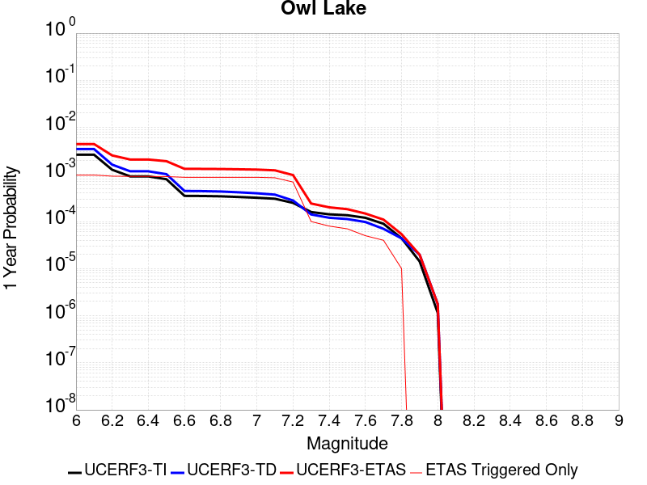 |  |

| Magnitude | 1 wk TI Prob | 1 wk TD Prob | 1 wk ETAS Prob | 1 wk ETAS/TD Gain | 1 wk ETAS Triggered Only | 1 mo TI Prob | 1 mo TD Prob | 1 mo ETAS Prob | 1 mo ETAS/TD Gain | 1 mo ETAS Triggered Only | 1 yr TI Prob | 1 yr TD Prob | 1 yr ETAS Prob | 1 yr ETAS/TD Gain | 1 yr ETAS Triggered Only | 10 yr TI Prob | 10 yr TD Prob | 10 yr ETAS Prob | 10 yr ETAS/TD Gain | 10 yr ETAS Triggered Only |
|-----|-----|-----|-----|-----|-----|-----|-----|-----|-----|-----|-----|-----|-----|-----|-----|-----|-----|-----|-----|-----|
| 6.0 | 5.0320643E-5 | 6.635748E-5 | 5.063283E-4 | 7.6303115 | 4.4E-4 | 2.1564208E-4 | 2.843645E-4 | 9.54174E-4 | 3.355461 | 6.7E-4 | 0.0026222812 | 0.0034577043 | 0.0044243503 | 1.279563 | 9.7E-4 | 0.02591553 | 0.0341404 | 0.035396017 | 1.0367781 | 0.0013 |
| 6.1 | 5.0320643E-5 | 6.635748E-5 | 5.063283E-4 | 7.6303115 | 4.4E-4 | 2.1564208E-4 | 2.843645E-4 | 9.54174E-4 | 3.355461 | 6.7E-4 | 0.0026222812 | 0.0034577043 | 0.0044243503 | 1.279563 | 9.7E-4 | 0.02591553 | 0.0341404 | 0.035396017 | 1.0367781 | 0.0013 |
| 6.2 | 2.4125871E-5 | 3.0980704E-5 | 4.509677E-4 | 14.556406 | 4.2E-4 | 1.0339249E-4 | 1.3276885E-4 | 7.726839E-4 | 5.819768 | 6.4E-4 | 0.0012580766 | 0.0016154221 | 0.002533936 | 1.5685906 | 9.2E-4 | 0.012509781 | 0.016070297 | 0.017260851 | 1.0740842 | 0.00121 |
| 6.3 | 1.7433485E-5 | 2.2355249E-5 | 4.3234607E-4 | 19.339802 | 4.1E-4 | 7.471279E-5 | 9.580558E-5 | 7.257452E-4 | 7.575187 | 6.3E-4 | 9.0924866E-4 | 0.0011659606 | 0.0020748996 | 1.7795624 | 9.1E-4 | 0.009055373 | 0.011628761 | 0.012814806 | 1.1019924 | 0.0012 |
| 6.4 | 1.7433485E-5 | 2.2355249E-5 | 4.3234607E-4 | 19.339802 | 4.1E-4 | 7.471279E-5 | 9.580558E-5 | 7.257452E-4 | 7.575187 | 6.3E-4 | 9.0924866E-4 | 0.0011659606 | 0.0020748996 | 1.7795624 | 9.1E-4 | 0.009055373 | 0.011628761 | 0.012814806 | 1.1019924 | 0.0012 |
| 6.5 | 1.5182742E-5 | 1.9428902E-5 | 4.2942094E-4 | 22.102173 | 4.1E-4 | 6.506727E-5 | 8.326492E-5 | 7.132125E-4 | 8.565581 | 6.3E-4 | 7.919061E-4 | 0.0010134302 | 0.0019125182 | 1.8871729 | 9.0E-4 | 0.0078909 | 0.010118305 | 0.011286365 | 1.1154404 | 0.00118 |
| 6.6 | 6.7271576E-6 | 8.547201E-6 | 4.185437E-4 | 48.96851 | 4.1E-4 | 2.8830356E-5 | 3.663038E-5 | 6.666073E-4 | 18.19821 | 6.3E-4 | 3.5095305E-4 | 4.4588925E-4 | 0.0013155013 | 2.950287 | 8.7E-4 | 0.0035039932 | 0.0044677295 | 0.005592681 | 1.2517949 | 0.00113 |
| 6.7 | 6.682835E-6 | 8.4796475E-6 | 4.1847618E-4 | 49.35066 | 4.1E-4 | 2.8640408E-5 | 3.6340873E-5 | 6.66318E-4 | 18.335222 | 6.3E-4 | 3.4864116E-4 | 4.4236594E-4 | 0.0013119811 | 2.9658275 | 8.7E-4 | 0.003480947 | 0.004432656 | 0.005557647 | 1.2537962 | 0.00113 |
| 6.8 | 6.5774975E-6 | 8.326121E-6 | 4.183227E-4 | 50.242207 | 4.1E-4 | 2.8188972E-5 | 3.5682922E-5 | 6.656604E-4 | 18.654875 | 6.3E-4 | 3.4314668E-4 | 4.343586E-4 | 0.0013039807 | 3.0020833 | 8.7E-4 | 0.0034261728 | 0.0043528024 | 0.0054778834 | 1.2584729 | 0.00113 |
| 6.9 | 6.363419E-6 | 7.999298E-6 | 4.1799602E-4 | 52.25409 | 4.1E-4 | 2.727151E-5 | 3.4282286E-5 | 6.642607E-4 | 19.376207 | 6.3E-4 | 3.3198006E-4 | 4.1731246E-4 | 0.0012869494 | 3.0838988 | 8.7E-4 | 0.0033148455 | 0.004182795 | 0.0053080684 | 1.2690243 | 0.00113 |
| 7.0 | 6.1342453E-6 | 7.631501E-6 | 4.1762838E-4 | 54.724277 | 4.1E-4 | 2.6289357E-5 | 3.2706055E-5 | 6.6268543E-4 | 20.261858 | 6.3E-4 | 3.2002592E-4 | 3.9812896E-4 | 0.0012677825 | 3.1843517 | 8.7E-4 | 0.0031956544 | 0.00399149 | 0.00511698 | 1.2819723 | 0.00113 |
| 7.1 | 5.842926E-6 | 7.1420604E-6 | 4.0713922E-4 | 57.005848 | 4.0E-4 | 2.504087E-5 | 3.0608502E-5 | 6.405898E-4 | 20.928493 | 6.1E-4 | 3.0482994E-4 | 3.7260022E-4 | 0.0012222835 | 3.2804155 | 8.5E-4 | 0.0030441214 | 0.0037369546 | 0.0048228814 | 1.2905914 | 0.00109 |
| 7.2 | 4.77173E-6 | 5.3583467E-6 | 3.1535668E-4 | 58.853355 | 3.1E-4 | 2.045011E-5 | 2.2964163E-5 | 5.129529E-4 | 22.337105 | 4.9E-4 | 2.4895166E-4 | 2.7955687E-4 | 9.6936396E-4 | 3.4675019 | 6.9E-4 | 0.0024867293 | 0.002808574 | 0.00372599 | 1.3266484 | 9.2E-4 |
| 7.3 | 3.0494948E-6 | 2.7103622E-6 | 5.2710227E-5 | 19.44767 | 5.0E-5 | 1.3069198E-5 | 1.1615787E-5 | 9.161486E-5 | 7.887099 | 8.0E-5 | 1.5910587E-4 | 1.4141318E-4 | 2.4139904E-4 | 1.7070476 | 1.0E-4 | 0.0015899199 | 0.0014231888 | 0.0015929468 | 1.1192801 | 1.7E-4 |
| 7.4 | 2.7263884E-6 | 2.3055816E-6 | 4.2305488E-5 | 18.349161 | 4.0E-5 | 1.1684469E-5 | 9.881027E-6 | 6.9880436E-5 | 7.072183 | 6.0E-5 | 1.4224913E-4 | 1.20294964E-4 | 2.0028534E-4 | 1.664952 | 8.0E-5 | 0.0014215811 | 0.0012111744 | 0.0013510048 | 1.1154503 | 1.4E-4 |
| 7.5 | 2.6090431E-6 | 2.1655203E-6 | 4.2165433E-5 | 19.471272 | 4.0E-5 | 1.1181565E-5 | 9.280769E-6 | 5.9280304E-5 | 6.3874345 | 5.0E-5 | 1.3612706E-4 | 1.129876E-4 | 1.8297968E-4 | 1.619467 | 7.0E-5 | 0.001360437 | 0.0011379321 | 0.0012677842 | 1.1141124 | 1.3E-4 |
| 7.6 | 2.3008756E-6 | 1.872704E-6 | 4.187263E-5 | 22.359447 | 4.0E-5 | 9.860858E-6 | 8.025851E-6 | 5.802545E-5 | 7.2298193 | 5.0E-5 | 1.20049335E-4 | 9.771043E-5 | 1.4770555E-4 | 1.511666 | 5.0E-5 | 0.001199845 | 9.849465E-4 | 0.0010648677 | 1.0811427 | 8.0E-5 |
| 7.7 | 1.7184348E-6 | 1.3418345E-6 | 3.1341795E-5 | 23.357422 | 3.0E-5 | 7.3646997E-6 | 5.750707E-6 | 4.5750476E-5 | 7.955627 | 4.0E-5 | 8.966153E-5 | 7.001265E-5 | 1.10009845E-4 | 1.5712854 | 4.0E-5 | 8.962536E-4 | 7.077913E-4 | 7.577559E-4 | 1.0705923 | 5.0E-5 |
| 7.8 | 8.4612907E-7 | 8.4052675E-7 | 1.0840518E-5 | 12.897291 | 1.0E-5 | 3.6262625E-6 | 3.6022527E-6 | 1.3602216E-5 | 3.7760305 | 1.0E-5 | 4.4148852E-5 | 4.3856566E-5 | 5.385613E-5 | 1.228006 | 1.0E-5 | 4.414008E-4 | 4.4395277E-4 | 4.639439E-4 | 1.0450299 | 2.0E-5 |
| 7.9 | 2.716738E-7 | 3.767845E-7 | 3.767845E-7 | 1.0 | 0.0 | 1.1643157E-6 | 1.6147899E-6 | 1.6147899E-6 | 1.0 | 0.0 | 1.4175452E-5 | 1.96599E-5 | 1.96599E-5 | 1.0 | 0.0 | 1.4174548E-4 | 1.9835318E-4 | 1.9835318E-4 | 1.0 | 0.0 |
| 8.0 | 2.1995428E-8 | 3.38465E-8 | 3.38465E-8 | 1.0 | 0.0 | 9.426611E-8 | 1.4505643E-7 | 1.4505643E-7 | 1.0 | 0.0 | 1.1476893E-6 | 1.7660612E-6 | 1.7660612E-6 | 1.0 | 0.0 | 1.14768345E-5 | 1.796186E-5 | 1.796186E-5 | 1.0 | 0.0 |

## Garlock (East)
*[(top)](#table-of-contents)*

| 1 Week | 1 Month | 1 Year | 10 Year |
|-----|-----|-----|-----|
|  |  |  |  |

| Magnitude | 1 wk TI Prob | 1 wk TD Prob | 1 wk ETAS Prob | 1 wk ETAS/TD Gain | 1 wk ETAS Triggered Only | 1 mo TI Prob | 1 mo TD Prob | 1 mo ETAS Prob | 1 mo ETAS/TD Gain | 1 mo ETAS Triggered Only | 1 yr TI Prob | 1 yr TD Prob | 1 yr ETAS Prob | 1 yr ETAS/TD Gain | 1 yr ETAS Triggered Only | 10 yr TI Prob | 10 yr TD Prob | 10 yr ETAS Prob | 10 yr ETAS/TD Gain | 10 yr ETAS Triggered Only |
|-----|-----|-----|-----|-----|-----|-----|-----|-----|-----|-----|-----|-----|-----|-----|-----|-----|-----|-----|-----|-----|
| 6.0 | 4.5092507E-5 | 6.290254E-5 | 4.2287988E-4 | 6.7227798 | 3.6E-4 | 1.9323928E-4 | 2.6955697E-4 | 7.194357E-4 | 2.668956 | 4.5E-4 | 0.0023501497 | 0.003277363 | 0.0040647737 | 1.2402575 | 7.9E-4 | 0.023254504 | 0.032351483 | 0.033444926 | 1.0337988 | 0.00113 |
| 6.1 | 4.5092507E-5 | 6.290254E-5 | 4.2287988E-4 | 6.7227798 | 3.6E-4 | 1.9323928E-4 | 2.6955697E-4 | 7.194357E-4 | 2.668956 | 4.5E-4 | 0.0023501497 | 0.003277363 | 0.0040647737 | 1.2402575 | 7.9E-4 | 0.023254504 | 0.032351483 | 0.033444926 | 1.0337988 | 0.00113 |
| 6.2 | 2.6674514E-5 | 3.450911E-5 | 3.5449807E-4 | 10.2725935 | 3.2E-4 | 1.1431433E-4 | 1.4788799E-4 | 5.5782736E-4 | 3.7719584 | 4.1E-4 | 0.0013908884 | 0.0017990824 | 0.002517787 | 1.399484 | 7.2E-4 | 0.01382215 | 0.01789001 | 0.018911405 | 1.057093 | 0.00104 |
| 6.3 | 2.6674514E-5 | 3.450911E-5 | 3.5449807E-4 | 10.2725935 | 3.2E-4 | 1.1431433E-4 | 1.4788799E-4 | 5.5782736E-4 | 3.7719584 | 4.1E-4 | 0.0013908884 | 0.0017990824 | 0.002517787 | 1.399484 | 7.2E-4 | 0.01382215 | 0.01789001 | 0.018911405 | 1.057093 | 0.00104 |
| 6.4 | 2.5312667E-5 | 3.233838E-5 | 3.5232803E-4 | 10.895043 | 3.2E-4 | 1.0847834E-4 | 1.3858585E-4 | 5.4852903E-4 | 3.958045 | 4.1E-4 | 0.0013199237 | 0.0016860063 | 0.0024047925 | 1.4263246 | 7.2E-4 | 0.013121112 | 0.016778054 | 0.017800605 | 1.0609457 | 0.00104 |
| 6.5 | 2.5312667E-5 | 3.233838E-5 | 3.5232803E-4 | 10.895043 | 3.2E-4 | 1.0847834E-4 | 1.3858585E-4 | 5.4852903E-4 | 3.958045 | 4.1E-4 | 0.0013199237 | 0.0016860063 | 0.0024047925 | 1.4263246 | 7.2E-4 | 0.013121112 | 0.016778054 | 0.017800605 | 1.0609457 | 0.00104 |
| 6.6 | 2.246556E-5 | 2.8133245E-5 | 3.4812425E-4 | 12.374123 | 3.2E-4 | 9.627742E-5 | 1.20565615E-4 | 5.305162E-4 | 4.400228 | 4.1E-4 | 0.0011715472 | 0.0014669215 | 0.0021858653 | 1.4901038 | 7.2E-4 | 0.011653901 | 0.014618388 | 0.015633332 | 1.0694292 | 0.00103 |
| 6.7 | 2.2241198E-5 | 2.780299E-5 | 3.477941E-4 | 12.509233 | 3.2E-4 | 9.531594E-5 | 1.1915036E-4 | 5.291015E-4 | 4.4406204 | 4.1E-4 | 0.0011598538 | 0.0014497138 | 0.00216867 | 1.4959297 | 7.2E-4 | 0.011538187 | 0.014448582 | 0.0154637 | 1.0702573 | 0.00103 |
| 6.8 | 1.9528685E-5 | 2.3897695E-5 | 3.4389005E-4 | 14.390092 | 3.2E-4 | 8.369167E-5 | 1.02414786E-4 | 5.123728E-4 | 5.0029182 | 4.1E-4 | 0.0010184698 | 0.0012462065 | 0.0019453341 | 1.5610046 | 7.0E-4 | 0.010138147 | 0.012436173 | 0.013423736 | 1.0794106 | 0.001 |
| 6.9 | 1.3318621E-5 | 1.5198458E-5 | 3.351936E-4 | 22.054447 | 3.2E-4 | 5.7078556E-5 | 6.5134656E-5 | 4.7510795E-4 | 7.2942424 | 4.1E-4 | 6.9470983E-4 | 7.927316E-4 | 0.0014821846 | 1.8697181 | 6.9E-4 | 0.0069254204 | 0.007939667 | 0.008901966 | 1.1212014 | 9.7E-4 |
| 7.0 | 1.1760853E-5 | 1.31073775E-5 | 3.231033E-4 | 24.650494 | 3.1E-4 | 5.0402683E-5 | 5.6173292E-5 | 4.461514E-4 | 7.942411 | 3.9E-4 | 6.134799E-4 | 6.8370026E-4 | 0.001343249 | 1.9646753 | 6.6E-4 | 0.0061178906 | 0.006856307 | 0.0077799307 | 1.1347115 | 9.3E-4 |
| 7.1 | 1.0064758E-5 | 1.0902532E-5 | 3.2089915E-4 | 29.43345 | 3.1E-4 | 4.3133965E-5 | 4.6724323E-5 | 4.2670657E-4 | 9.132429 | 3.8E-4 | 5.2502943E-4 | 5.6872366E-4 | 0.0012083597 | 2.124687 | 6.4E-4 | 0.005237907 | 0.0057127923 | 0.006607651 | 1.1566411 | 9.0E-4 |
| 7.2 | 9.768808E-6 | 1.0498412E-5 | 3.2049516E-4 | 30.527966 | 3.1E-4 | 4.186565E-5 | 4.4992437E-5 | 4.2497535E-4 | 9.445484 | 3.8E-4 | 5.095951E-4 | 5.4764876E-4 | 0.0011773037 | 2.1497424 | 6.3E-4 | 0.0050842804 | 0.00550306 | 0.006388162 | 1.1608382 | 8.9E-4 |
| 7.3 | 9.344516E-6 | 9.94408E-6 | 2.799414E-4 | 28.151564 | 2.7E-4 | 4.004731E-5 | 4.2616808E-5 | 3.8260233E-4 | 8.977733 | 3.4E-4 | 4.8746695E-4 | 5.187396E-4 | 0.0010884439 | 2.0982473 | 5.7E-4 | 0.0048639905 | 0.0052147433 | 0.0060105715 | 1.1526111 | 8.0E-4 |
| 7.4 | 9.023491E-6 | 9.490282E-6 | 2.4948802E-4 | 26.28879 | 2.4E-4 | 3.867153E-5 | 4.067202E-5 | 3.5065942E-4 | 8.621637 | 3.1E-4 | 4.7072413E-4 | 4.950727E-4 | 0.0010048202 | 2.0296419 | 5.1E-4 | 0.004697283 | 0.0049782004 | 0.0056747156 | 1.1399131 | 7.0E-4 |
| 7.5 | 7.081253E-6 | 7.0873343E-6 | 1.2708649E-4 | 17.931492 | 1.2E-4 | 3.0347876E-5 | 3.037394E-5 | 1.8036939E-4 | 5.938294 | 1.5E-4 | 3.6942272E-4 | 3.697407E-4 | 6.0965196E-4 | 1.6488636 | 2.4E-4 | 0.003688092 | 0.0037241387 | 0.004092761 | 1.0989819 | 3.7E-4 |
| 7.6 | 6.116396E-6 | 5.958924E-6 | 9.5958385E-5 | 16.10331 | 9.0E-5 | 2.6212863E-5 | 2.5537996E-5 | 1.4553493E-4 | 5.698761 | 1.2E-4 | 3.1909486E-4 | 3.10881E-4 | 4.9082504E-4 | 1.5788196 | 1.8E-4 | 0.0031863707 | 0.003135588 | 0.0033947728 | 1.082659 | 2.6E-4 |
| 7.7 | 4.797145E-6 | 4.7569774E-6 | 4.4756787E-5 | 9.408661 | 4.0E-5 | 2.055903E-5 | 2.0386888E-5 | 8.038567E-5 | 3.9430082 | 6.0E-5 | 2.5027743E-4 | 2.4818222E-4 | 3.581549E-4 | 1.4431127 | 1.1E-4 | 0.0024999576 | 0.0025091893 | 0.0026488379 | 1.0556549 | 1.4E-4 |
| 7.8 | 3.4028885E-6 | 3.9781908E-6 | 2.3978111E-5 | 6.027391 | 2.0E-5 | 1.4583726E-5 | 1.7049279E-5 | 5.7048597E-5 | 3.3461003 | 4.0E-5 | 1.775424E-4 | 2.0755526E-4 | 2.8753866E-4 | 1.3853595 | 8.0E-5 | 0.0017740062 | 0.0021010821 | 0.002200872 | 1.0474945 | 1.0E-4 |
| 7.9 | 2.5928412E-6 | 3.37222E-6 | 1.3372186E-5 | 3.9653957 | 1.0E-5 | 1.1112129E-5 | 1.4452292E-5 | 3.4452E-5 | 2.3838437 | 2.0E-5 | 1.3528178E-4 | 1.759425E-4 | 2.259337E-4 | 1.2841338 | 5.0E-5 | 0.0013519945 | 0.0017811217 | 0.0018410148 | 1.0336267 | 6.0E-5 |
| 8.0 | 1.3743648E-6 | 1.6733709E-6 | 1.16733545E-5 | 6.9759517 | 1.0E-5 | 5.8901214E-6 | 7.17157E-6 | 1.7171498E-5 | 2.3943849 | 1.0E-5 | 7.1709874E-5 | 8.731039E-5 | 9.730952E-5 | 1.1145239 | 1.0E-5 | 7.1686733E-4 | 8.8366936E-4 | 9.0365164E-4 | 1.0226129 | 2.0E-5 |
| 8.1 | 3.6733252E-7 | 3.148811E-7 | 1.0314878E-5 | 32.758007 | 1.0E-5 | 1.5742813E-6 | 1.3494899E-6 | 1.1349476E-5 | 8.410197 | 1.0E-5 | 1.9166706E-5 | 1.6429933E-5 | 2.6429767E-5 | 1.6086353 | 1.0E-5 | 1.9165053E-4 | 1.6637788E-4 | 1.8637454E-4 | 1.1201882 | 2.0E-5 |

## Hunter Mountain-Saline Valley
*[(top)](#table-of-contents)*

| 1 Week | 1 Month | 1 Year | 10 Year |
|-----|-----|-----|-----|
|  |  |  |  |

| Magnitude | 1 wk TI Prob | 1 wk TD Prob | 1 wk ETAS Prob | 1 wk ETAS/TD Gain | 1 wk ETAS Triggered Only | 1 mo TI Prob | 1 mo TD Prob | 1 mo ETAS Prob | 1 mo ETAS/TD Gain | 1 mo ETAS Triggered Only | 1 yr TI Prob | 1 yr TD Prob | 1 yr ETAS Prob | 1 yr ETAS/TD Gain | 1 yr ETAS Triggered Only | 10 yr TI Prob | 10 yr TD Prob | 10 yr ETAS Prob | 10 yr ETAS/TD Gain | 10 yr ETAS Triggered Only |
|-----|-----|-----|-----|-----|-----|-----|-----|-----|-----|-----|-----|-----|-----|-----|-----|-----|-----|-----|-----|-----|
| 6.0 | 4.5103672E-5 | 5.4569828E-5 | 4.7454692E-4 | 8.696141 | 4.2E-4 | 1.9328714E-4 | 2.3385094E-4 | 7.7372463E-4 | 3.3086233 | 5.4E-4 | 0.002350731 | 0.002843498 | 0.0035913654 | 1.2630097 | 7.5E-4 | 0.023260195 | 0.028091714 | 0.029102499 | 1.0359815 | 0.00104 |
| 6.1 | 4.5103672E-5 | 5.4569828E-5 | 4.7454692E-4 | 8.696141 | 4.2E-4 | 1.9328714E-4 | 2.3385094E-4 | 7.7372463E-4 | 3.3086233 | 5.4E-4 | 0.002350731 | 0.002843498 | 0.0035913654 | 1.2630097 | 7.5E-4 | 0.023260195 | 0.028091714 | 0.029102499 | 1.0359815 | 0.00104 |
| 6.2 | 3.9363465E-5 | 4.7063084E-5 | 4.670433E-4 | 9.923772 | 4.2E-4 | 1.6868966E-4 | 2.0168422E-4 | 7.415753E-4 | 3.676913 | 5.4E-4 | 0.002051862 | 0.002452803 | 0.0032009634 | 1.3050226 | 7.5E-4 | 0.020330196 | 0.024273338 | 0.025288094 | 1.0418054 | 0.00104 |
| 6.3 | 3.9363465E-5 | 4.7063084E-5 | 4.670433E-4 | 9.923772 | 4.2E-4 | 1.6868966E-4 | 2.0168422E-4 | 7.415753E-4 | 3.676913 | 5.4E-4 | 0.002051862 | 0.002452803 | 0.0032009634 | 1.3050226 | 7.5E-4 | 0.020330196 | 0.024273338 | 0.025288094 | 1.0418054 | 0.00104 |
| 6.4 | 3.2311684E-5 | 3.7950776E-5 | 4.5793483E-4 | 12.066547 | 4.2E-4 | 1.384713E-4 | 1.6263645E-4 | 7.025486E-4 | 4.319749 | 5.4E-4 | 0.0016845843 | 0.0019783732 | 0.0027268894 | 1.3783493 | 7.5E-4 | 0.016718714 | 0.019616365 | 0.020635964 | 1.0519769 | 0.00104 |
| 6.5 | 3.2311684E-5 | 3.7950776E-5 | 4.5793483E-4 | 12.066547 | 4.2E-4 | 1.384713E-4 | 1.6263645E-4 | 7.025486E-4 | 4.319749 | 5.4E-4 | 0.0016845843 | 0.0019783732 | 0.0027268894 | 1.3783493 | 7.5E-4 | 0.016718714 | 0.019616365 | 0.020635964 | 1.0519769 | 0.00104 |
| 6.6 | 2.9305844E-5 | 3.418164E-5 | 4.5416728E-4 | 13.286877 | 4.2E-4 | 1.2559042E-4 | 1.4648488E-4 | 6.864058E-4 | 4.6858473 | 5.4E-4 | 0.0015279909 | 0.0017820572 | 0.0025207384 | 1.4145104 | 7.4E-4 | 0.015175272 | 0.017685594 | 0.01869738 | 1.0572095 | 0.00103 |
| 6.7 | 2.7826512E-5 | 3.2344098E-5 | 4.523305E-4 | 13.984947 | 4.2E-4 | 1.19251024E-4 | 1.3861054E-4 | 6.7853567E-4 | 4.8952675 | 5.4E-4 | 0.0014509142 | 0.0016863372 | 0.0024250892 | 1.4380809 | 7.4E-4 | 0.014414776 | 0.016743096 | 0.01775585 | 1.0604879 | 0.00103 |
| 6.8 | 2.3389874E-5 | 2.6866572E-5 | 4.468553E-4 | 16.63239 | 4.2E-4 | 1.0023846E-4 | 1.15137635E-4 | 6.450766E-4 | 5.6026564 | 5.3E-4 | 0.00121972 | 0.0014009465 | 0.0021299238 | 1.5203463 | 7.3E-4 | 0.01213047 | 0.01392736 | 0.014923294 | 1.0715091 | 0.00101 |
| 6.9 | 2.069209E-5 | 2.3569908E-5 | 4.4356E-4 | 18.81891 | 4.2E-4 | 8.867737E-5 | 1.01010184E-4 | 6.3095667E-4 | 6.2464657 | 5.3E-4 | 0.0010791123 | 0.0012291414 | 0.0019482564 | 1.5850548 | 7.2E-4 | 0.010738871 | 0.01222846 | 0.013216231 | 1.0807765 | 0.001 |
| 7.0 | 1.7462342E-5 | 1.9633446E-5 | 4.396252E-4 | 22.391647 | 4.2E-4 | 7.483646E-5 | 8.414075E-5 | 6.140962E-4 | 7.298439 | 5.3E-4 | 9.1075303E-4 | 0.0010239548 | 0.0017332279 | 1.69268 | 7.1E-4 | 0.009070295 | 0.010196 | 0.011175906 | 1.0961069 | 9.9E-4 |
| 7.1 | 1.4807709E-5 | 1.6441667E-5 | 4.3643476E-4 | 26.544436 | 4.2E-4 | 6.3460066E-5 | 7.0462476E-5 | 6.004251E-4 | 8.521204 | 5.3E-4 | 7.723524E-4 | 8.5755944E-4 | 0.0015669506 | 1.8272209 | 7.1E-4 | 0.007696735 | 0.008545489 | 0.009527029 | 1.1148607 | 9.9E-4 |
| 7.2 | 1.4180048E-5 | 1.5698257E-5 | 4.3569168E-4 | 27.754143 | 4.2E-4 | 6.077022E-5 | 6.72766E-5 | 5.972409E-4 | 8.877395 | 5.3E-4 | 7.396263E-4 | 8.18801E-4 | 0.0015282197 | 1.8664116 | 7.1E-4 | 0.0073716943 | 0.008160792 | 0.009142713 | 1.1203218 | 9.9E-4 |
| 7.3 | 1.3730402E-5 | 1.5171999E-5 | 4.3516562E-4 | 28.682156 | 4.2E-4 | 5.8843252E-5 | 6.502132E-5 | 5.849875E-4 | 8.996857 | 5.2E-4 | 7.161811E-4 | 7.913631E-4 | 0.0014908091 | 1.8838496 | 7.0E-4 | 0.007138774 | 0.007888383 | 0.008860652 | 1.1232533 | 9.8E-4 |
| 7.4 | 1.2810095E-5 | 1.4109204E-5 | 4.3410328E-4 | 30.767382 | 4.2E-4 | 5.489925E-5 | 6.0466708E-5 | 5.8043527E-4 | 9.599254 | 5.2E-4 | 6.681934E-4 | 7.359493E-4 | 0.0014354341 | 1.9504524 | 7.0E-4 | 0.006661878 | 0.0073380154 | 0.008310825 | 1.1325711 | 9.8E-4 |
| 7.5 | 1.1595659E-5 | 1.2800594E-5 | 4.327952E-4 | 33.81056 | 4.2E-4 | 4.9694736E-5 | 5.485862E-5 | 5.748301E-4 | 10.478391 | 5.2E-4 | 6.0486543E-4 | 6.677147E-4 | 0.001357254 | 2.0326855 | 6.9E-4 | 0.006032217 | 0.0066599557 | 0.0076135625 | 1.1431851 | 9.6E-4 |
| 7.6 | 2.997694E-6 | 3.3251304E-6 | 2.233244E-4 | 67.1626 | 2.2E-4 | 1.28471975E-5 | 1.4250522E-5 | 3.1424625E-4 | 22.05156 | 3.0E-4 | 1.564034E-4 | 1.7349358E-4 | 5.134346E-4 | 2.9593868 | 3.4E-4 | 0.0015629337 | 0.0017350167 | 0.0021942186 | 1.2646672 | 4.6E-4 |

## Garlock (West)
*[(top)](#table-of-contents)*

| 1 Week | 1 Month | 1 Year | 10 Year |
|-----|-----|-----|-----|
|  | 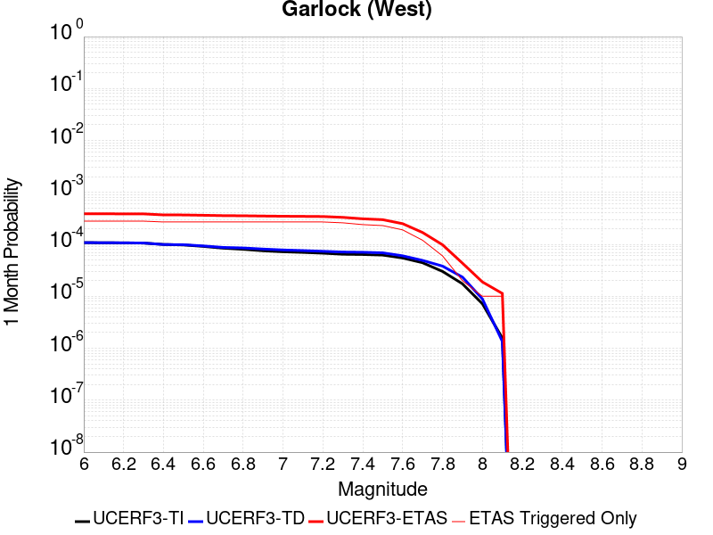 |  |  |

| Magnitude | 1 wk TI Prob | 1 wk TD Prob | 1 wk ETAS Prob | 1 wk ETAS/TD Gain | 1 wk ETAS Triggered Only | 1 mo TI Prob | 1 mo TD Prob | 1 mo ETAS Prob | 1 mo ETAS/TD Gain | 1 mo ETAS Triggered Only | 1 yr TI Prob | 1 yr TD Prob | 1 yr ETAS Prob | 1 yr ETAS/TD Gain | 1 yr ETAS Triggered Only | 10 yr TI Prob | 10 yr TD Prob | 10 yr ETAS Prob | 10 yr ETAS/TD Gain | 10 yr ETAS Triggered Only |
|-----|-----|-----|-----|-----|-----|-----|-----|-----|-----|-----|-----|-----|-----|-----|-----|-----|-----|-----|-----|-----|
| 6.0 | 2.5181727E-5 | 2.5196328E-5 | 2.251913E-4 | 8.937465 | 2.0E-4 | 1.0791722E-4 | 1.0797982E-4 | 3.8794958E-4 | 3.5927973 | 2.8E-4 | 0.0013131002 | 0.0013138648 | 0.0017233262 | 1.3116465 | 4.1E-4 | 0.013053683 | 0.0131414775 | 0.01382241 | 1.0518155 | 6.9E-4 |
| 6.1 | 2.5077732E-5 | 2.50974E-5 | 2.2509239E-4 | 8.968753 | 2.0E-4 | 1.0747157E-4 | 1.07555876E-4 | 3.8752577E-4 | 3.603018 | 2.8E-4 | 0.001307681 | 0.0013087096 | 0.001718173 | 1.3128757 | 4.1E-4 | 0.013000126 | 0.013090534 | 0.013771501 | 1.0520198 | 6.9E-4 |
| 6.2 | 2.494612E-5 | 2.497908E-5 | 2.2497408E-4 | 9.0065 | 2.0E-4 | 1.0690756E-4 | 1.0704882E-4 | 3.8701884E-4 | 3.6153488 | 2.8E-4 | 0.0013008224 | 0.0013025437 | 0.0017120095 | 1.3143587 | 4.1E-4 | 0.012932341 | 0.013029599 | 0.013710609 | 1.0522664 | 6.9E-4 |
| 6.3 | 2.4733758E-5 | 2.479845E-5 | 2.2479349E-4 | 9.06482 | 2.0E-4 | 1.0599751E-4 | 1.0627476E-4 | 3.86245E-4 | 3.6344001 | 2.8E-4 | 0.0012897556 | 0.0012931306 | 0.0017026004 | 1.31665 | 4.1E-4 | 0.012822957 | 0.012936569 | 0.013617642 | 1.0526471 | 6.9E-4 |
| 6.4 | 2.3237335E-5 | 2.3177769E-5 | 2.2317313E-4 | 9.628758 | 2.0E-4 | 9.958477E-5 | 9.9329525E-5 | 3.693027E-4 | 3.717955 | 2.7E-4 | 0.0012117702 | 0.0012086688 | 0.0016081854 | 1.3305426 | 4.0E-4 | 0.012051838 | 0.012101421 | 0.0127534345 | 1.053879 | 6.6E-4 |
| 6.5 | 2.2732203E-5 | 2.299234E-5 | 2.2298774E-4 | 9.698349 | 2.0E-4 | 9.742009E-5 | 9.8534896E-5 | 3.6850828E-4 | 3.739876 | 2.7E-4 | 0.0011854442 | 0.0011990049 | 0.0015985253 | 1.33321 | 4.0E-4 | 0.011791403 | 0.01200583 | 0.012657907 | 1.0543133 | 6.6E-4 |
| 6.6 | 2.1319436E-5 | 2.177255E-5 | 2.2176819E-4 | 10.1856785 | 2.0E-4 | 9.136581E-5 | 9.33076E-5 | 3.6328242E-4 | 3.893385 | 2.7E-4 | 0.001111811 | 0.0011354303 | 0.0015349762 | 1.3518894 | 4.0E-4 | 0.011062649 | 0.011376739 | 0.01202923 | 1.0573531 | 6.6E-4 |
| 6.7 | 1.970802E-5 | 2.0392457E-5 | 2.2038838E-4 | 10.807348 | 2.0E-4 | 8.446021E-5 | 8.7393324E-5 | 3.5736972E-4 | 4.089211 | 2.7E-4 | 0.001027818 | 0.0010634961 | 0.0014630706 | 1.375718 | 4.0E-4 | 0.010230771 | 0.010664482 | 0.011317443 | 1.0612277 | 6.6E-4 |
| 6.8 | 1.8744462E-5 | 1.9900112E-5 | 2.1989613E-4 | 11.049995 | 2.0E-4 | 8.033094E-5 | 8.528341E-5 | 3.552604E-4 | 4.1656446 | 2.7E-4 | 9.775903E-4 | 0.0010378326 | 0.0014374175 | 1.3850186 | 4.0E-4 | 0.009733009 | 0.010410271 | 0.0110634 | 1.0627389 | 6.6E-4 |
| 6.9 | 1.7559682E-5 | 1.8952487E-5 | 2.189487E-4 | 11.552505 | 2.0E-4 | 7.5253614E-5 | 8.1222424E-5 | 3.512005E-4 | 4.323935 | 2.7E-4 | 9.158276E-4 | 9.884358E-4 | 0.0013880405 | 1.4042798 | 4.0E-4 | 0.0091206245 | 0.009920754 | 0.010574207 | 1.0658672 | 6.6E-4 |
| 7.0 | 1.6794445E-5 | 1.8215316E-5 | 2.1821167E-4 | 11.97957 | 2.0E-4 | 7.197421E-5 | 7.806331E-5 | 3.4804223E-4 | 4.458461 | 2.7E-4 | 8.759337E-4 | 9.500078E-4 | 0.0013496279 | 1.4206492 | 4.0E-4 | 0.008724891 | 0.009539667 | 0.01019337 | 1.0685248 | 6.6E-4 |
| 7.1 | 1.6337795E-5 | 1.771613E-5 | 2.1771259E-4 | 12.288947 | 2.0E-4 | 7.0017246E-5 | 7.5924065E-5 | 3.4590357E-4 | 4.5559144 | 2.7E-4 | 8.521265E-4 | 9.2398486E-4 | 0.0013236152 | 1.4325075 | 4.0E-4 | 0.008488664 | 0.009281524 | 0.009935399 | 1.070449 | 6.6E-4 |
| 7.2 | 1.5780008E-5 | 1.7164773E-5 | 2.1716135E-4 | 12.65157 | 2.0E-4 | 6.762685E-5 | 7.356125E-5 | 3.4354138E-4 | 4.6701407 | 2.7E-4 | 8.2304585E-4 | 8.952415E-4 | 0.0012948834 | 1.4464068 | 4.0E-4 | 0.008200042 | 0.008996368 | 0.009650431 | 1.0727029 | 6.6E-4 |
| 7.3 | 1.5058865E-5 | 1.6617856E-5 | 2.066147E-4 | 12.433294 | 1.9E-4 | 6.45364E-5 | 7.121745E-5 | 3.3119894E-4 | 4.650531 | 2.6E-4 | 7.854473E-4 | 8.667287E-4 | 0.0012563907 | 1.4495778 | 3.9E-4 | 0.00782677 | 0.008713072 | 0.009357409 | 1.0739505 | 6.5E-4 |
| 7.4 | 1.4887923E-5 | 1.6453829E-5 | 1.9645087E-4 | 11.939523 | 1.8E-4 | 6.380382E-5 | 7.0514514E-5 | 3.104976E-4 | 4.4033146 | 2.4E-4 | 7.7653467E-4 | 8.5817726E-4 | 0.0012278598 | 1.4307764 | 3.7E-4 | 0.0077382675 | 0.008627934 | 0.009252499 | 1.0723886 | 6.3E-4 |
| 7.5 | 1.4509299E-5 | 1.6045851E-5 | 1.9604297E-4 | 12.217672 | 1.8E-4 | 6.218123E-5 | 6.876613E-5 | 2.9875032E-4 | 4.34444 | 2.3E-4 | 7.567935E-4 | 8.3690725E-4 | 0.0011866143 | 1.4178565 | 3.5E-4 | 0.0075422134 | 0.008416242 | 0.009011192 | 1.0706908 | 6.0E-4 |
| 7.6 | 1.2756717E-5 | 1.4049988E-5 | 1.6404789E-4 | 11.676016 | 1.5E-4 | 5.4670498E-5 | 6.021285E-5 | 2.502014E-4 | 4.1552825 | 1.9E-4 | 6.6541E-4 | 7.328455E-4 | 9.926549E-4 | 1.3545215 | 2.6E-4 | 0.006634211 | 0.0073812436 | 0.007798143 | 1.056481 | 4.2E-4 |
| 7.7 | 1.0328985E-5 | 1.145975E-5 | 1.0145872E-4 | 8.853484 | 9.0E-5 | 4.4266326E-5 | 4.9112292E-5 | 1.691064E-4 | 3.4432602 | 1.2E-4 | 5.388092E-4 | 5.9777853E-4 | 7.776709E-4 | 1.3009349 | 1.8E-4 | 0.0053750467 | 0.0060380935 | 0.0062965234 | 1.0428 | 2.6E-4 |
| 7.8 | 7.0306583E-6 | 8.8989555E-6 | 4.88986E-5 | 5.4948697 | 4.0E-5 | 3.0131043E-5 | 3.8137823E-5 | 9.813553E-5 | 2.5731814 | 6.0E-5 | 3.667837E-4 | 4.6422923E-4 | 5.741782E-4 | 1.2368419 | 1.1E-4 | 0.003661789 | 0.0046949377 | 0.0048740925 | 1.0381591 | 1.8E-4 |
| 7.9 | 4.060633E-6 | 5.4650154E-6 | 1.546496E-5 | 2.829811 | 1.0E-5 | 1.7402595E-5 | 2.3421284E-5 | 4.3420816E-5 | 1.8539041 | 2.0E-5 | 2.11856E-4 | 2.8511693E-4 | 3.3510267E-4 | 1.1753167 | 5.0E-5 | 0.0021165414 | 0.0028840043 | 0.0029538025 | 1.0242018 | 7.0E-5 |
| 8.0 | 1.6729537E-6 | 2.0773857E-6 | 1.2077365E-5 | 5.8137326 | 1.0E-5 | 7.169782E-6 | 8.903051E-6 | 1.8902962E-5 | 2.1232004 | 1.0E-5 | 8.7288594E-5 | 1.08389286E-4 | 1.18388205E-4 | 1.09225 | 1.0E-5 | 8.7254314E-4 | 0.0010968668 | 0.0011168448 | 1.0182137 | 2.0E-5 |
| 8.1 | 3.6733252E-7 | 3.148811E-7 | 1.0314878E-5 | 32.758007 | 1.0E-5 | 1.5742813E-6 | 1.3494899E-6 | 1.1349476E-5 | 8.410197 | 1.0E-5 | 1.9166706E-5 | 1.6429933E-5 | 2.6429767E-5 | 1.6086353 | 1.0E-5 | 1.9165053E-4 | 1.6637788E-4 | 1.8637454E-4 | 1.1201882 | 2.0E-5 |

## Ash Hill
*[(top)](#table-of-contents)*

| 1 Week | 1 Month | 1 Year | 10 Year |
|-----|-----|-----|-----|
|  |  |  |  |

| Magnitude | 1 wk TI Prob | 1 wk TD Prob | 1 wk ETAS Prob | 1 wk ETAS/TD Gain | 1 wk ETAS Triggered Only | 1 mo TI Prob | 1 mo TD Prob | 1 mo ETAS Prob | 1 mo ETAS/TD Gain | 1 mo ETAS Triggered Only | 1 yr TI Prob | 1 yr TD Prob | 1 yr ETAS Prob | 1 yr ETAS/TD Gain | 1 yr ETAS Triggered Only | 10 yr TI Prob | 10 yr TD Prob | 10 yr ETAS Prob | 10 yr ETAS/TD Gain | 10 yr ETAS Triggered Only |
|-----|-----|-----|-----|-----|-----|-----|-----|-----|-----|-----|-----|-----|-----|-----|-----|-----|-----|-----|-----|-----|
| 6.0 | 2.1545662E-5 | 2.31944E-5 | 1.2319208E-4 | 5.3112855 | 1.0E-4 | 9.2335285E-5 | 9.940123E-5 | 2.7938333E-4 | 2.8106627 | 1.8E-4 | 0.0011236023 | 0.001209618 | 0.0014693036 | 1.2146839 | 2.6E-4 | 0.011179381 | 0.012038324 | 0.012423629 | 1.0320065 | 3.9E-4 |
| 6.1 | 2.1545662E-5 | 2.31944E-5 | 1.2319208E-4 | 5.3112855 | 1.0E-4 | 9.2335285E-5 | 9.940123E-5 | 2.7938333E-4 | 2.8106627 | 1.8E-4 | 0.0011236023 | 0.001209618 | 0.0014693036 | 1.2146839 | 2.6E-4 | 0.011179381 | 0.012038324 | 0.012423629 | 1.0320065 | 3.9E-4 |
| 6.2 | 2.1545662E-5 | 2.31944E-5 | 1.2319208E-4 | 5.3112855 | 1.0E-4 | 9.2335285E-5 | 9.940123E-5 | 2.7938333E-4 | 2.8106627 | 1.8E-4 | 0.0011236023 | 0.001209618 | 0.0014693036 | 1.2146839 | 2.6E-4 | 0.011179381 | 0.012038324 | 0.012423629 | 1.0320065 | 3.9E-4 |
| 6.3 | 1.0025529E-5 | 1.0746914E-5 | 4.0746592E-5 | 3.791469 | 3.0E-5 | 4.2965847E-5 | 4.6057463E-5 | 1.2605378E-4 | 2.7368805 | 8.0E-5 | 5.229836E-4 | 5.606186E-4 | 7.005401E-4 | 1.2495842 | 1.4E-4 | 0.005217545 | 0.0055933557 | 0.005822069 | 1.0408902 | 2.3E-4 |
| 6.4 | 1.0025529E-5 | 1.0746914E-5 | 4.0746592E-5 | 3.791469 | 3.0E-5 | 4.2965847E-5 | 4.6057463E-5 | 1.2605378E-4 | 2.7368805 | 8.0E-5 | 5.229836E-4 | 5.606186E-4 | 7.005401E-4 | 1.2495842 | 1.4E-4 | 0.005217545 | 0.0055933557 | 0.005822069 | 1.0408902 | 2.3E-4 |
| 6.5 | 6.9617327E-6 | 7.45662E-6 | 2.745647E-5 | 3.6821604 | 2.0E-5 | 2.9835655E-5 | 3.19566E-5 | 8.1955004E-5 | 2.564572 | 5.0E-5 | 3.6318856E-4 | 3.8901082E-4 | 4.689797E-4 | 1.2055699 | 8.0E-5 | 0.0036259557 | 0.003884153 | 0.004013648 | 1.0333394 | 1.3E-4 |
| 6.6 | 4.9919777E-6 | 5.3466783E-6 | 5.3466783E-6 | 1.0 | 0.0 | 2.1394015E-5 | 2.2914171E-5 | 5.2913485E-5 | 2.3092034 | 3.0E-5 | 2.60441E-4 | 2.7895102E-4 | 3.2893708E-4 | 1.1791929 | 5.0E-5 | 0.0026013597 | 0.0027866673 | 0.0028664444 | 1.0286281 | 8.0E-5 |
| 6.7 | 3.6630722E-6 | 3.924616E-6 | 3.924616E-6 | 1.0 | 0.0 | 1.5698786E-5 | 1.6819708E-5 | 3.6819372E-5 | 2.1890614 | 2.0E-5 | 1.9111596E-4 | 2.0476643E-4 | 2.4475824E-4 | 1.1953045 | 4.0E-5 | 0.0019095168 | 0.0020463406 | 0.0020962383 | 1.0243839 | 5.0E-5 |
| 6.8 | 2.5599613E-6 | 2.7449198E-6 | 2.7449198E-6 | 1.0 | 0.0 | 1.0971216E-5 | 1.17639165E-5 | 2.1763799E-5 | 1.850047 | 1.0E-5 | 1.3356637E-4 | 1.4322122E-4 | 1.6321836E-4 | 1.1396241 | 2.0E-5 | 0.0013348613 | 0.0014317741 | 0.0014617312 | 1.020923 | 3.0E-5 |
| 6.9 | 1.7684905E-6 | 1.896867E-6 | 1.896867E-6 | 1.0 | 0.0 | 7.579223E-6 | 8.12943E-6 | 1.8129349E-5 | 2.2300885 | 1.0E-5 | 9.2273134E-5 | 9.897581E-5 | 1.08974826E-4 | 1.1010247 | 1.0E-5 | 9.223483E-4 | 9.897582E-4 | 9.997482E-4 | 1.0100935 | 1.0E-5 |

## San Andreas (Mojave N)
*[(top)](#table-of-contents)*

| 1 Week | 1 Month | 1 Year | 10 Year |
|-----|-----|-----|-----|
|  |  |  |  |

| Magnitude | 1 wk TI Prob | 1 wk TD Prob | 1 wk ETAS Prob | 1 wk ETAS/TD Gain | 1 wk ETAS Triggered Only | 1 mo TI Prob | 1 mo TD Prob | 1 mo ETAS Prob | 1 mo ETAS/TD Gain | 1 mo ETAS Triggered Only | 1 yr TI Prob | 1 yr TD Prob | 1 yr ETAS Prob | 1 yr ETAS/TD Gain | 1 yr ETAS Triggered Only | 10 yr TI Prob | 10 yr TD Prob | 10 yr ETAS Prob | 10 yr ETAS/TD Gain | 10 yr ETAS Triggered Only |
|-----|-----|-----|-----|-----|-----|-----|-----|-----|-----|-----|-----|-----|-----|-----|-----|-----|-----|-----|-----|-----|
| 6.0 | 9.877682E-5 | 1.9398969E-4 | 3.1396642E-4 | 1.6184696 | 1.2E-4 | 4.2326056E-4 | 8.3111966E-4 | 9.909867E-4 | 1.1923513 | 1.6E-4 | 0.0051410277 | 0.010072061 | 0.010289845 | 1.0216227 | 2.2E-4 | 0.05023708 | 0.09830668 | 0.0985862 | 1.0028434 | 3.1E-4 |
| 6.1 | 9.877682E-5 | 1.9398969E-4 | 3.1396642E-4 | 1.6184696 | 1.2E-4 | 4.2326056E-4 | 8.3111966E-4 | 9.909867E-4 | 1.1923513 | 1.6E-4 | 0.0051410277 | 0.010072061 | 0.010289845 | 1.0216227 | 2.2E-4 | 0.05023708 | 0.09830668 | 0.0985862 | 1.0028434 | 3.1E-4 |
| 6.2 | 9.877682E-5 | 1.9398969E-4 | 3.1396642E-4 | 1.6184696 | 1.2E-4 | 4.2326056E-4 | 8.3111966E-4 | 9.909867E-4 | 1.1923513 | 1.6E-4 | 0.0051410277 | 0.010072061 | 0.010289845 | 1.0216227 | 2.2E-4 | 0.05023708 | 0.09830668 | 0.0985862 | 1.0028434 | 3.1E-4 |
| 6.3 | 9.877682E-5 | 1.9398969E-4 | 3.1396642E-4 | 1.6184696 | 1.2E-4 | 4.2326056E-4 | 8.3111966E-4 | 9.909867E-4 | 1.1923513 | 1.6E-4 | 0.0051410277 | 0.010072061 | 0.010289845 | 1.0216227 | 2.2E-4 | 0.05023708 | 0.09830668 | 0.0985862 | 1.0028434 | 3.1E-4 |
| 6.4 | 9.877682E-5 | 1.9398969E-4 | 3.1396642E-4 | 1.6184696 | 1.2E-4 | 4.2326056E-4 | 8.3111966E-4 | 9.909867E-4 | 1.1923513 | 1.6E-4 | 0.0051410277 | 0.010072061 | 0.010289845 | 1.0216227 | 2.2E-4 | 0.05023708 | 0.09830668 | 0.0985862 | 1.0028434 | 3.1E-4 |
| 6.5 | 9.861474E-5 | 1.9372735E-4 | 3.137041E-4 | 1.6193073 | 1.2E-4 | 4.2256617E-4 | 8.299961E-4 | 9.898633E-4 | 1.1926119 | 1.6E-4 | 0.0051326132 | 0.010058507 | 0.010276294 | 1.021652 | 2.2E-4 | 0.050156746 | 0.098184474 | 0.098464034 | 1.0028473 | 3.1E-4 |
| 6.6 | 9.861474E-5 | 1.9372735E-4 | 3.137041E-4 | 1.6193073 | 1.2E-4 | 4.2256617E-4 | 8.299961E-4 | 9.898633E-4 | 1.1926119 | 1.6E-4 | 0.0051326132 | 0.010058507 | 0.010276294 | 1.021652 | 2.2E-4 | 0.050156746 | 0.098184474 | 0.098464034 | 1.0028473 | 3.1E-4 |
| 6.7 | 9.8552715E-5 | 1.9362688E-4 | 3.1360364E-4 | 1.6196287 | 1.2E-4 | 4.223004E-4 | 8.295658E-4 | 9.89433E-4 | 1.192712 | 1.6E-4 | 0.0051293927 | 0.010053317 | 0.010271105 | 1.0216633 | 2.2E-4 | 0.050125998 | 0.09813766 | 0.09841724 | 1.0028489 | 3.1E-4 |
| 6.8 | 9.8464974E-5 | 1.9347853E-4 | 3.134553E-4 | 1.6201038 | 1.2E-4 | 4.219245E-4 | 8.2893035E-4 | 9.887978E-4 | 1.1928599 | 1.6E-4 | 0.0051248376 | 0.010045652 | 0.010263442 | 1.02168 | 2.2E-4 | 0.05008251 | 0.098067686 | 0.09834729 | 1.0028511 | 3.1E-4 |
| 6.9 | 9.825824E-5 | 1.9315863E-4 | 3.1313545E-4 | 1.6211311 | 1.2E-4 | 4.2103877E-4 | 8.2756026E-4 | 9.874279E-4 | 1.1931794 | 1.6E-4 | 0.0051141046 | 0.010029125 | 0.010246919 | 1.0217161 | 2.2E-4 | 0.049980022 | 0.09791679 | 0.09819644 | 1.0028559 | 3.1E-4 |
| 7.0 | 9.781462E-5 | 1.924723E-4 | 3.124492E-4 | 1.6233463 | 1.2E-4 | 4.1913814E-4 | 8.246208E-4 | 9.844888E-4 | 1.1938686 | 1.6E-4 | 0.005091073 | 0.009993665 | 0.010211467 | 1.021794 | 2.2E-4 | 0.04976007 | 0.09759319 | 0.097872935 | 1.0028665 | 3.1E-4 |
| 7.1 | 9.7121134E-5 | 1.9148945E-4 | 3.114665E-4 | 1.6265464 | 1.2E-4 | 4.1616702E-4 | 8.2041114E-4 | 9.802799E-4 | 1.1948642 | 1.6E-4 | 0.005055068 | 0.009942883 | 0.010160695 | 1.0219064 | 2.2E-4 | 0.04941613 | 0.09712971 | 0.0974096 | 1.0028816 | 3.1E-4 |
| 7.2 | 9.663819E-5 | 1.9079732E-4 | 3.1077443E-4 | 1.6288196 | 1.2E-4 | 4.1409794E-4 | 8.1744674E-4 | 9.773159E-4 | 1.1955714 | 1.6E-4 | 0.0050299936 | 0.00990712 | 0.01012494 | 1.0219862 | 2.2E-4 | 0.049176537 | 0.09680298 | 0.09708297 | 1.0028924 | 3.1E-4 |
| 7.3 | 9.6277574E-5 | 1.9032248E-4 | 3.1029963E-4 | 1.6303889 | 1.2E-4 | 4.125529E-4 | 8.1541296E-4 | 9.752825E-4 | 1.1960596 | 1.6E-4 | 0.0050112694 | 0.009882583 | 0.010100409 | 1.0220414 | 2.2E-4 | 0.04899759 | 0.09657645 | 0.09685651 | 1.0028999 | 3.1E-4 |
| 7.4 | 9.593308E-5 | 1.8972032E-4 | 3.0969756E-4 | 1.63239 | 1.2E-4 | 4.1107697E-4 | 8.128339E-4 | 9.727038E-4 | 1.1966822 | 1.6E-4 | 0.0049933824 | 0.009851467 | 0.0100692995 | 1.0221117 | 2.2E-4 | 0.04882661 | 0.096294634 | 0.09657478 | 1.0029093 | 3.1E-4 |
| 7.5 | 9.561707E-5 | 1.8918114E-4 | 3.0915844E-4 | 1.6341927 | 1.2E-4 | 4.0972308E-4 | 8.105246E-4 | 9.7039493E-4 | 1.197243 | 1.6E-4 | 0.0049769743 | 0.009823605 | 0.010041445 | 1.0221751 | 2.2E-4 | 0.048669744 | 0.09604082 | 0.096321054 | 1.0029178 | 3.1E-4 |
| 7.6 | 9.418194E-5 | 1.8570402E-4 | 3.0568175E-4 | 1.6460695 | 1.2E-4 | 4.0357444E-4 | 7.956318E-4 | 9.5550454E-4 | 1.200938 | 1.6E-4 | 0.004902454 | 0.009643905 | 0.009861783 | 1.0225923 | 2.2E-4 | 0.047957025 | 0.0944232 | 0.09470392 | 1.0029731 | 3.1E-4 |
| 7.7 | 8.202141E-5 | 1.6019761E-4 | 2.7018E-4 | 1.6865419 | 1.1E-4 | 3.51473E-4 | 6.863806E-4 | 8.2628446E-4 | 1.2038285 | 1.4E-4 | 0.00427079 | 0.00832472 | 0.008523055 | 1.0238248 | 2.0E-4 | 0.04189639 | 0.08222524 | 0.08248222 | 1.0031253 | 2.8E-4 |
| 7.8 | 7.2859846E-5 | 1.4515074E-4 | 2.0514203E-4 | 1.4133034 | 6.0E-5 | 3.1221908E-4 | 6.2192633E-4 | 7.018766E-4 | 1.1285526 | 8.0E-5 | 0.003794643 | 0.007545706 | 0.0076747253 | 1.0170983 | 1.3E-4 | 0.037304975 | 0.07471838 | 0.074903436 | 1.0024767 | 2.0E-4 |
| 7.9 | 5.3874453E-5 | 1.0044695E-4 | 1.2044494E-4 | 1.1990901 | 2.0E-5 | 2.3087008E-4 | 4.3041594E-4 | 4.60403E-4 | 1.0696701 | 3.0E-5 | 0.0028072202 | 0.005227734 | 0.0052874205 | 1.0114173 | 6.0E-5 | 0.02772022 | 0.052419845 | 0.05249565 | 1.0014461 | 8.0E-5 |
| 8.0 | 3.468538E-5 | 5.4254586E-5 | 6.425404E-5 | 1.1843063 | 1.0E-5 | 1.4864317E-4 | 2.3249893E-4 | 2.4249661E-4 | 1.0430009 | 1.0E-5 | 0.0018082283 | 0.002827002 | 0.0028369736 | 1.0035273 | 1.0E-5 | 0.017935853 | 0.028944723 | 0.028964145 | 1.000671 | 2.0E-5 |
| 8.1 | 1.9152367E-5 | 1.9399953E-5 | 2.939976E-5 | 1.5154551 | 1.0E-5 | 8.207899E-5 | 8.314001E-5 | 9.313918E-5 | 1.1202691 | 1.0E-5 | 9.988535E-4 | 0.0010117602 | 0.0010217502 | 1.0098737 | 1.0E-5 | 0.009943757 | 0.01085485 | 0.010874633 | 1.0018225 | 2.0E-5 |
| 8.2 | 8.643924E-6 | 5.4738607E-6 | 5.4738607E-6 | 1.0 | 0.0 | 3.704486E-5 | 2.3459192E-5 | 2.3459192E-5 | 1.0 | 0.0 | 4.5092785E-4 | 2.855783E-4 | 2.855783E-4 | 1.0 | 0.0 | 0.0045001395 | 0.0032481598 | 0.0032481598 | 1.0 | 0.0 |
| 8.3 | 1.983087E-6 | 7.658221E-7 | 7.658221E-7 | 1.0 | 0.0 | 8.498917E-6 | 3.2820906E-6 | 3.2820906E-6 | 1.0 | 0.0 | 1.034694E-4 | 3.9958737E-5 | 3.9958737E-5 | 1.0 | 0.0 | 0.0010342124 | 4.7187202E-4 | 4.7187202E-4 | 1.0 | 0.0 |

## So Sierra Nevada
*[(top)](#table-of-contents)*

| 1 Week | 1 Month | 1 Year | 10 Year |
|-----|-----|-----|-----|
|  |  |  |  |

| Magnitude | 1 wk TI Prob | 1 wk TD Prob | 1 wk ETAS Prob | 1 wk ETAS/TD Gain | 1 wk ETAS Triggered Only | 1 mo TI Prob | 1 mo TD Prob | 1 mo ETAS Prob | 1 mo ETAS/TD Gain | 1 mo ETAS Triggered Only | 1 yr TI Prob | 1 yr TD Prob | 1 yr ETAS Prob | 1 yr ETAS/TD Gain | 1 yr ETAS Triggered Only | 10 yr TI Prob | 10 yr TD Prob | 10 yr ETAS Prob | 10 yr ETAS/TD Gain | 10 yr ETAS Triggered Only |
|-----|-----|-----|-----|-----|-----|-----|-----|-----|-----|-----|-----|-----|-----|-----|-----|-----|-----|-----|-----|-----|
| 6.0 | 1.15488665E-5 | 1.1079626E-5 | 1.2107841E-4 | 10.928022 | 1.1E-4 | 4.9494203E-5 | 4.748332E-5 | 1.8747667E-4 | 3.9482636 | 1.4E-4 | 6.024253E-4 | 5.7796884E-4 | 8.478128E-4 | 1.4668832 | 2.7E-4 | 0.006007948 | 0.0057659256 | 0.006084081 | 1.0551784 | 3.2E-4 |
| 6.1 | 1.15488665E-5 | 1.1079626E-5 | 1.2107841E-4 | 10.928022 | 1.1E-4 | 4.9494203E-5 | 4.748332E-5 | 1.8747667E-4 | 3.9482636 | 1.4E-4 | 6.024253E-4 | 5.7796884E-4 | 8.478128E-4 | 1.4668832 | 2.7E-4 | 0.006007948 | 0.0057659256 | 0.006084081 | 1.0551784 | 3.2E-4 |
| 6.2 | 1.15488665E-5 | 1.1079626E-5 | 1.2107841E-4 | 10.928022 | 1.1E-4 | 4.9494203E-5 | 4.748332E-5 | 1.8747667E-4 | 3.9482636 | 1.4E-4 | 6.024253E-4 | 5.7796884E-4 | 8.478128E-4 | 1.4668832 | 2.7E-4 | 0.006007948 | 0.0057659256 | 0.006084081 | 1.0551784 | 3.2E-4 |
| 6.3 | 1.15488665E-5 | 1.1079626E-5 | 1.2107841E-4 | 10.928022 | 1.1E-4 | 4.9494203E-5 | 4.748332E-5 | 1.8747667E-4 | 3.9482636 | 1.4E-4 | 6.024253E-4 | 5.7796884E-4 | 8.478128E-4 | 1.4668832 | 2.7E-4 | 0.006007948 | 0.0057659256 | 0.006084081 | 1.0551784 | 3.2E-4 |
| 6.4 | 1.15488665E-5 | 1.1079626E-5 | 1.2107841E-4 | 10.928022 | 1.1E-4 | 4.9494203E-5 | 4.748332E-5 | 1.8747667E-4 | 3.9482636 | 1.4E-4 | 6.024253E-4 | 5.7796884E-4 | 8.478128E-4 | 1.4668832 | 2.7E-4 | 0.006007948 | 0.0057659256 | 0.006084081 | 1.0551784 | 3.2E-4 |
| 6.5 | 1.15488665E-5 | 1.1079626E-5 | 1.2107841E-4 | 10.928022 | 1.1E-4 | 4.9494203E-5 | 4.748332E-5 | 1.8747667E-4 | 3.9482636 | 1.4E-4 | 6.024253E-4 | 5.7796884E-4 | 8.478128E-4 | 1.4668832 | 2.7E-4 | 0.006007948 | 0.0057659256 | 0.006084081 | 1.0551784 | 3.2E-4 |
| 6.6 | 7.587044E-6 | 6.9356242E-6 | 6.693521E-5 | 9.650928 | 6.0E-5 | 3.2515498E-5 | 2.9723782E-5 | 1.09721404E-4 | 3.6913676 | 8.0E-5 | 3.9580427E-4 | 3.6182988E-4 | 5.6175754E-4 | 1.5525459 | 2.0E-4 | 0.003951 | 0.0036126992 | 0.0038518321 | 1.0661923 | 2.4E-4 |
| 6.7 | 7.587044E-6 | 6.9356242E-6 | 6.693521E-5 | 9.650928 | 6.0E-5 | 3.2515498E-5 | 2.9723782E-5 | 1.09721404E-4 | 3.6913676 | 8.0E-5 | 3.9580427E-4 | 3.6182988E-4 | 5.6175754E-4 | 1.5525459 | 2.0E-4 | 0.003951 | 0.0036126992 | 0.0038518321 | 1.0661923 | 2.4E-4 |
| 6.8 | 5.9026956E-6 | 5.179384E-6 | 6.5179076E-5 | 12.58433 | 6.0E-5 | 2.5297022E-5 | 2.2197177E-5 | 1.021954E-4 | 4.603982 | 8.0E-5 | 3.0794772E-4 | 2.702183E-4 | 4.5016964E-4 | 1.6659482 | 1.8E-4 | 0.0030752132 | 0.0026990133 | 0.0029184197 | 1.0812913 | 2.2E-4 |
| 6.9 | 5.0118915E-6 | 4.2524175E-6 | 6.425216E-5 | 15.109561 | 6.0E-5 | 2.1479358E-5 | 1.8224524E-5 | 9.822306E-5 | 5.3896093 | 8.0E-5 | 2.614798E-4 | 2.218617E-4 | 3.91824E-4 | 1.7660731 | 1.7E-4 | 0.0026117235 | 0.0022164746 | 0.0024160314 | 1.0900334 | 2.0E-4 |
| 7.0 | 4.4924795E-6 | 3.7139105E-6 | 5.3713724E-5 | 14.462849 | 5.0E-5 | 1.925334E-5 | 1.5916665E-5 | 7.591571E-5 | 4.7695737 | 6.0E-5 | 2.3438422E-4 | 1.937688E-4 | 3.4373972E-4 | 1.7739685 | 1.5E-4 | 0.0023413717 | 0.0019360614 | 0.0021057322 | 1.0876372 | 1.7E-4 |
| 7.1 | 3.9118436E-6 | 3.111971E-6 | 4.3111846E-5 | 13.85355 | 4.0E-5 | 1.6764936E-5 | 1.3336953E-5 | 5.333642E-5 | 3.9991457 | 4.0E-5 | 2.0409399E-4 | 1.6236588E-4 | 2.9234478E-4 | 1.8005308 | 1.3E-4 | 0.0020390663 | 0.0016225285 | 0.0017722852 | 1.0922983 | 1.5E-4 |
| 7.2 | 3.4200818E-6 | 2.6054481E-6 | 1.2605422E-5 | 4.8381014 | 1.0E-5 | 1.4657411E-5 | 1.1166161E-5 | 2.116605E-5 | 1.8955529 | 1.0E-5 | 1.7843937E-4 | 1.3594003E-4 | 2.2592781E-4 | 1.6619666 | 9.0E-5 | 0.0017829615 | 0.0013586186 | 0.0014684692 | 1.0808545 | 1.1E-4 |
| 7.3 | 2.6593618E-6 | 1.828415E-6 | 1.828415E-6 | 1.0 | 0.0 | 1.13972155E-5 | 7.836042E-6 | 7.836042E-6 | 1.0 | 0.0 | 1.3875226E-4 | 9.539993E-5 | 1.5539421E-4 | 1.6288713 | 6.0E-5 | 0.0013866565 | 9.5361867E-4 | 0.0010135615 | 1.0628582 | 6.0E-5 |
| 7.4 | 2.2577992E-6 | 1.4364332E-6 | 1.4364332E-6 | 1.0 | 0.0 | 9.676246E-6 | 6.156129E-6 | 6.156129E-6 | 1.0 | 0.0 | 1.1780193E-4 | 7.494855E-5 | 1.249448E-4 | 1.6670743 | 5.0E-5 | 0.001177395 | 7.4925774E-4 | 7.992203E-4 | 1.0666827 | 5.0E-5 |
| 7.5 | 1.489319E-6 | 7.353898E-7 | 7.353898E-7 | 1.0 | 0.0 | 6.3827797E-6 | 3.1516668E-6 | 3.1516668E-6 | 1.0 | 0.0 | 7.770758E-5 | 3.8370872E-5 | 4.8370486E-5 | 1.2606044 | 1.0E-5 | 7.7680405E-4 | 3.8364288E-4 | 3.9363906E-4 | 1.0260559 | 1.0E-5 |
| 7.6 | 1.0680322E-6 | 4.6596273E-7 | 4.6596273E-7 | 1.0 | 0.0 | 4.577273E-6 | 1.9969816E-6 | 1.9969816E-6 | 1.0 | 0.0 | 5.5726876E-5 | 2.4312982E-5 | 2.4312982E-5 | 1.0 | 0.0 | 5.5712904E-4 | 2.4310348E-4 | 2.4310348E-4 | 1.0 | 0.0 |
| 7.7 | 5.509146E-7 | 1.5580342E-7 | 1.5580342E-7 | 1.0 | 0.0 | 2.3610605E-6 | 6.677288E-7 | 6.677288E-7 | 1.0 | 0.0 | 2.8745531E-5 | 8.129569E-6 | 8.129569E-6 | 1.0 | 0.0 | 2.8741814E-4 | 8.1292834E-5 | 8.1292834E-5 | 1.0 | 0.0 |

## San Andreas (Mojave S)
*[(top)](#table-of-contents)*

| 1 Week | 1 Month | 1 Year | 10 Year |
|-----|-----|-----|-----|
|  |  |  |  |

| Magnitude | 1 wk TI Prob | 1 wk TD Prob | 1 wk ETAS Prob | 1 wk ETAS/TD Gain | 1 wk ETAS Triggered Only | 1 mo TI Prob | 1 mo TD Prob | 1 mo ETAS Prob | 1 mo ETAS/TD Gain | 1 mo ETAS Triggered Only | 1 yr TI Prob | 1 yr TD Prob | 1 yr ETAS Prob | 1 yr ETAS/TD Gain | 1 yr ETAS Triggered Only | 10 yr TI Prob | 10 yr TD Prob | 10 yr ETAS Prob | 10 yr ETAS/TD Gain | 10 yr ETAS Triggered Only |
|-----|-----|-----|-----|-----|-----|-----|-----|-----|-----|-----|-----|-----|-----|-----|-----|-----|-----|-----|-----|-----|
| 6.0 | 3.1064058E-4 | 6.74589E-4 | 8.1449456E-4 | 1.2073938 | 1.4E-4 | 0.0013306376 | 0.0028880206 | 0.0030575297 | 1.0586939 | 1.7E-4 | 0.016080605 | 0.03462137 | 0.03483375 | 1.0061345 | 2.2E-4 | 0.1496549 | 0.286598 | 0.28681916 | 1.0007716 | 3.1E-4 |
| 6.1 | 3.1064058E-4 | 6.74589E-4 | 8.1449456E-4 | 1.2073938 | 1.4E-4 | 0.0013306376 | 0.0028880206 | 0.0030575297 | 1.0586939 | 1.7E-4 | 0.016080605 | 0.03462137 | 0.03483375 | 1.0061345 | 2.2E-4 | 0.1496549 | 0.286598 | 0.28681916 | 1.0007716 | 3.1E-4 |
| 6.2 | 3.1064058E-4 | 6.74589E-4 | 8.1449456E-4 | 1.2073938 | 1.4E-4 | 0.0013306376 | 0.0028880206 | 0.0030575297 | 1.0586939 | 1.7E-4 | 0.016080605 | 0.03462137 | 0.03483375 | 1.0061345 | 2.2E-4 | 0.1496549 | 0.286598 | 0.28681916 | 1.0007716 | 3.1E-4 |
| 6.3 | 3.1064058E-4 | 6.74589E-4 | 8.1449456E-4 | 1.2073938 | 1.4E-4 | 0.0013306376 | 0.0028880206 | 0.0030575297 | 1.0586939 | 1.7E-4 | 0.016080605 | 0.03462137 | 0.03483375 | 1.0061345 | 2.2E-4 | 0.1496549 | 0.286598 | 0.28681916 | 1.0007716 | 3.1E-4 |
| 6.4 | 1.9872203E-4 | 4.317752E-4 | 5.517234E-4 | 1.2778023 | 1.2E-4 | 8.5138786E-4 | 0.001849181 | 0.0019989037 | 1.080967 | 1.5E-4 | 0.010316478 | 0.022287503 | 0.022483045 | 1.0087737 | 2.0E-4 | 0.098504856 | 0.19699045 | 0.19721527 | 1.0011414 | 2.8E-4 |
| 6.5 | 1.291105E-4 | 2.875093E-4 | 3.8748054E-4 | 1.3477149 | 1.0E-4 | 5.5321335E-4 | 0.0012316036 | 0.0013614434 | 1.1054235 | 1.3E-4 | 0.006714592 | 0.014892505 | 0.015069824 | 1.0119066 | 1.8E-4 | 0.065152965 | 0.13802715 | 0.13824263 | 1.0015613 | 2.5E-4 |
| 6.6 | 1.291105E-4 | 2.875093E-4 | 3.8748054E-4 | 1.3477149 | 1.0E-4 | 5.5321335E-4 | 0.0012316036 | 0.0013614434 | 1.1054235 | 1.3E-4 | 0.006714592 | 0.014892505 | 0.015069824 | 1.0119066 | 1.8E-4 | 0.065152965 | 0.13802715 | 0.13824263 | 1.0015613 | 2.5E-4 |
| 6.7 | 1.08001186E-4 | 2.4332175E-4 | 3.3329983E-4 | 1.3697907 | 9.0E-5 | 4.6278012E-4 | 0.0010423913 | 0.0011622662 | 1.1149999 | 1.2E-4 | 0.0056198016 | 0.012617563 | 0.012785418 | 1.0133033 | 1.7E-4 | 0.054797906 | 0.119169496 | 0.1193809 | 1.001774 | 2.4E-4 |
| 6.8 | 1.0624356E-4 | 2.3849847E-4 | 3.28477E-4 | 1.3772709 | 9.0E-5 | 4.5525006E-4 | 0.0010217364 | 0.0011416138 | 1.1173271 | 1.2E-4 | 0.0055285925 | 0.012368962 | 0.01253686 | 1.0135741 | 1.7E-4 | 0.053930566 | 0.117118634 | 0.11733053 | 1.0018092 | 2.4E-4 |
| 6.9 | 1.0393785E-4 | 2.3220196E-4 | 3.2218106E-4 | 1.3875036 | 9.0E-5 | 4.4537184E-4 | 9.947722E-4 | 0.0011146528 | 1.1205106 | 1.2E-4 | 0.0054089287 | 0.012044343 | 0.012212296 | 1.0139445 | 1.7E-4 | 0.05279156 | 0.11441608 | 0.11462861 | 1.0018576 | 2.4E-4 |
| 7.0 | 1.0155622E-4 | 2.258978E-4 | 3.1587746E-4 | 1.3983202 | 9.0E-5 | 4.3516833E-4 | 9.6777466E-4 | 0.0010876586 | 1.1238759 | 1.2E-4 | 0.005285311 | 0.011719226 | 0.011887234 | 1.0143361 | 1.7E-4 | 0.05161361 | 0.111676484 | 0.11188968 | 1.001909 | 2.4E-4 |
| 7.1 | 9.885595E-5 | 2.1878199E-4 | 3.087623E-4 | 1.4112784 | 9.0E-5 | 4.2359953E-4 | 9.373005E-4 | 0.001057188 | 1.1279073 | 1.2E-4 | 0.0051451353 | 0.011352123 | 0.011520193 | 1.0148052 | 1.7E-4 | 0.05027629 | 0.10856094 | 0.108774886 | 1.0019708 | 2.4E-4 |
| 7.2 | 9.6411415E-5 | 2.1241202E-4 | 3.023929E-4 | 1.4236149 | 9.0E-5 | 4.1312634E-4 | 9.1001997E-4 | 0.0010299108 | 1.1317452 | 1.2E-4 | 0.005018219 | 0.011023389 | 0.011191515 | 1.0152518 | 1.7E-4 | 0.049064007 | 0.10575075 | 0.10596537 | 1.0020295 | 2.4E-4 |
| 7.3 | 9.1180635E-5 | 1.9469624E-4 | 2.846787E-4 | 1.4621686 | 9.0E-5 | 3.907156E-4 | 8.3414576E-4 | 9.540457E-4 | 1.1437397 | 1.2E-4 | 0.004746591 | 0.010108546 | 0.010276828 | 1.0166475 | 1.7E-4 | 0.046464786 | 0.097944014 | 0.098160505 | 1.0022104 | 2.4E-4 |
| 7.4 | 8.887388E-5 | 1.8718264E-4 | 2.771658E-4 | 1.4807239 | 9.0E-5 | 3.8083247E-4 | 8.019648E-4 | 9.2186854E-4 | 1.1495125 | 1.2E-4 | 0.0046267817 | 0.009720306 | 0.009888654 | 1.0173192 | 1.7E-4 | 0.045316286 | 0.094579056 | 0.09479636 | 1.0022975 | 2.4E-4 |
| 7.5 | 8.6750515E-5 | 1.804986E-4 | 2.7048236E-4 | 1.4985288 | 9.0E-5 | 3.7173493E-4 | 7.7333616E-4 | 8.9324336E-4 | 1.1550518 | 1.2E-4 | 0.004516484 | 0.009374807 | 0.009543213 | 1.0179638 | 1.7E-4 | 0.04425787 | 0.091542855 | 0.09176088 | 1.0023817 | 2.4E-4 |
| 7.6 | 8.453092E-5 | 1.7437496E-4 | 2.6435926E-4 | 1.5160391 | 9.0E-5 | 3.6222505E-4 | 7.4710726E-4 | 8.670176E-4 | 1.1604995 | 1.2E-4 | 0.0044011753 | 0.009058169 | 0.0092266295 | 1.0185976 | 1.7E-4 | 0.04315024 | 0.08870201 | 0.08892072 | 1.0024657 | 2.4E-4 |
| 7.7 | 8.259102E-5 | 1.6959656E-4 | 2.595813E-4 | 1.5305811 | 9.0E-5 | 3.539135E-4 | 7.2664E-4 | 8.4655284E-4 | 1.1650237 | 1.2E-4 | 0.004300386 | 0.008811024 | 0.008979526 | 1.019124 | 1.7E-4 | 0.042181134 | 0.08645291 | 0.08667216 | 1.002536 | 2.4E-4 |
| 7.8 | 7.444844E-5 | 1.5282084E-4 | 2.1281166E-4 | 1.3925567 | 6.0E-5 | 3.1902574E-4 | 6.5478205E-4 | 7.347297E-4 | 1.1220981 | 8.0E-5 | 0.0038772223 | 0.007942881 | 0.008071849 | 1.0162369 | 1.3E-4 | 0.03810269 | 0.07828439 | 0.07846873 | 1.0023547 | 2.0E-4 |
| 7.9 | 5.2586525E-5 | 1.0005448E-4 | 1.2005248E-4 | 1.1998711 | 2.0E-5 | 2.2535135E-4 | 4.2873443E-4 | 4.587216E-4 | 1.0699434 | 3.0E-5 | 0.0027402006 | 0.00520736 | 0.0052670473 | 1.0114622 | 6.0E-5 | 0.027066574 | 0.0521955 | 0.052271325 | 1.0014527 | 8.0E-5 |
| 8.0 | 3.379877E-5 | 5.4068532E-5 | 6.4067994E-5 | 1.1849405 | 1.0E-5 | 1.4484383E-4 | 2.317017E-4 | 2.416994E-4 | 1.043149 | 1.0E-5 | 0.0017620471 | 0.0028173209 | 0.0028272928 | 1.0035394 | 1.0E-5 | 0.017481409 | 0.028832143 | 0.028851567 | 1.0006737 | 2.0E-5 |
| 8.1 | 1.8668277E-5 | 1.9306746E-5 | 2.9306553E-5 | 1.5179437 | 1.0E-5 | 8.000444E-5 | 8.2740575E-5 | 9.273975E-5 | 1.1208497 | 1.0E-5 | 9.736188E-4 | 0.0010069016 | 0.0010168916 | 1.0099214 | 1.0E-5 | 0.009693642 | 0.0107975025 | 0.010817287 | 1.0018322 | 2.0E-5 |
| 8.2 | 8.541571E-6 | 5.4598204E-6 | 5.4598204E-6 | 1.0 | 0.0 | 3.660622E-5 | 2.3399021E-5 | 2.3399021E-5 | 1.0 | 0.0 | 4.455896E-4 | 2.8484594E-4 | 2.8484594E-4 | 1.0 | 0.0 | 0.0044469717 | 0.0032402598 | 0.0032402598 | 1.0 | 0.0 |
| 8.3 | 1.983087E-6 | 7.658221E-7 | 7.658221E-7 | 1.0 | 0.0 | 8.498917E-6 | 3.2820906E-6 | 3.2820906E-6 | 1.0 | 0.0 | 1.034694E-4 | 3.9958737E-5 | 3.9958737E-5 | 1.0 | 0.0 | 0.0010342124 | 4.7187202E-4 | 4.7187202E-4 | 1.0 | 0.0 |

## Blackwater
*[(top)](#table-of-contents)*

| 1 Week | 1 Month | 1 Year | 10 Year |
|-----|-----|-----|-----|
|  |  |  |  |

| Magnitude | 1 wk TI Prob | 1 wk TD Prob | 1 wk ETAS Prob | 1 wk ETAS/TD Gain | 1 wk ETAS Triggered Only | 1 mo TI Prob | 1 mo TD Prob | 1 mo ETAS Prob | 1 mo ETAS/TD Gain | 1 mo ETAS Triggered Only | 1 yr TI Prob | 1 yr TD Prob | 1 yr ETAS Prob | 1 yr ETAS/TD Gain | 1 yr ETAS Triggered Only | 10 yr TI Prob | 10 yr TD Prob | 10 yr ETAS Prob | 10 yr ETAS/TD Gain | 10 yr ETAS Triggered Only |
|-----|-----|-----|-----|-----|-----|-----|-----|-----|-----|-----|-----|-----|-----|-----|-----|-----|-----|-----|-----|-----|
| 6.0 | 3.0708583E-5 | 3.309578E-5 | 1.5309181E-4 | 4.62572 | 1.2E-4 | 1.3160157E-4 | 1.4183212E-4 | 2.9181084E-4 | 2.0574384 | 1.5E-4 | 0.0016010714 | 0.001725575 | 0.0019751436 | 1.1446292 | 2.5E-4 | 0.015895851 | 0.017135598 | 0.017430456 | 1.0172074 | 3.0E-4 |
| 6.1 | 3.0708583E-5 | 3.309578E-5 | 1.5309181E-4 | 4.62572 | 1.2E-4 | 1.3160157E-4 | 1.4183212E-4 | 2.9181084E-4 | 2.0574384 | 1.5E-4 | 0.0016010714 | 0.001725575 | 0.0019751436 | 1.1446292 | 2.5E-4 | 0.015895851 | 0.017135598 | 0.017430456 | 1.0172074 | 3.0E-4 |
| 6.2 | 1.1707779E-5 | 1.2545098E-5 | 4.254472E-5 | 3.3913422 | 3.0E-5 | 5.017523E-5 | 5.376365E-5 | 8.376204E-5 | 1.5579678 | 3.0E-5 | 6.107122E-4 | 6.543855E-4 | 7.243397E-4 | 1.1069006 | 7.0E-5 | 0.006090366 | 0.006525557 | 0.00661497 | 1.0137019 | 9.0E-5 |
| 6.3 | 1.1707779E-5 | 1.2545098E-5 | 4.254472E-5 | 3.3913422 | 3.0E-5 | 5.017523E-5 | 5.376365E-5 | 8.376204E-5 | 1.5579678 | 3.0E-5 | 6.107122E-4 | 6.543855E-4 | 7.243397E-4 | 1.1069006 | 7.0E-5 | 0.006090366 | 0.006525557 | 0.00661497 | 1.0137019 | 9.0E-5 |
| 6.4 | 7.929244E-6 | 8.480082E-6 | 8.480082E-6 | 1.0 | 0.0 | 3.3982033E-5 | 3.6342728E-5 | 3.6342728E-5 | 1.0 | 0.0 | 4.136527E-4 | 4.423869E-4 | 4.7237362E-4 | 1.067784 | 3.0E-5 | 0.0041288356 | 0.004415468 | 0.004465247 | 1.0112739 | 5.0E-5 |
| 6.5 | 5.8832115E-6 | 6.2859795E-6 | 6.2859795E-6 | 1.0 | 0.0 | 2.521352E-5 | 2.6939648E-5 | 2.6939648E-5 | 1.0 | 0.0 | 3.0693135E-4 | 3.279434E-4 | 3.4793685E-4 | 1.0609661 | 2.0E-5 | 0.0030650778 | 0.0032748478 | 0.0033047495 | 1.0091307 | 3.0E-5 |
| 6.6 | 5.8832115E-6 | 6.2859795E-6 | 6.2859795E-6 | 1.0 | 0.0 | 2.521352E-5 | 2.6939648E-5 | 2.6939648E-5 | 1.0 | 0.0 | 3.0693135E-4 | 3.279434E-4 | 3.4793685E-4 | 1.0609661 | 2.0E-5 | 0.0030650778 | 0.0032748478 | 0.0033047495 | 1.0091307 | 3.0E-5 |
| 6.7 | 3.0715053E-6 | 3.2814603E-6 | 3.2814603E-6 | 1.0 | 0.0 | 1.3163528E-5 | 1.4063332E-5 | 1.4063332E-5 | 1.0 | 0.0 | 1.6025416E-4 | 1.7120877E-4 | 1.8120705E-4 | 1.0583982 | 1.0E-5 | 0.0016013865 | 0.0017108832 | 0.001730849 | 1.0116699 | 2.0E-5 |
| 6.8 | 2.2722281E-6 | 2.4287492E-6 | 2.4287492E-6 | 1.0 | 0.0 | 9.738084E-6 | 1.0408889E-5 | 1.0408889E-5 | 1.0 | 0.0 | 1.1855473E-4 | 1.2672177E-4 | 1.367205E-4 | 1.0789031 | 1.0E-5 | 0.001184915 | 0.0012665853 | 0.00128656 | 1.0157704 | 2.0E-5 |
| 6.9 | 9.952399E-7 | 1.0653469E-6 | 1.0653469E-6 | 1.0 | 0.0 | 4.265307E-6 | 4.565767E-6 | 4.565767E-6 | 1.0 | 0.0 | 5.1928873E-5 | 5.5587312E-5 | 6.5586755E-5 | 1.1798872 | 1.0E-5 | 5.191674E-4 | 5.5578473E-4 | 5.757736E-4 | 1.0359652 | 2.0E-5 |
| 7.0 | 4.7385504E-7 | 5.07555E-7 | 5.07555E-7 | 1.0 | 0.0 | 2.0308057E-6 | 2.1752357E-6 | 2.1752357E-6 | 1.0 | 0.0 | 2.4724779E-5 | 2.6483494E-5 | 2.6483494E-5 | 1.0 | 0.0 | 2.4722028E-4 | 2.6483493E-4 | 2.748323E-4 | 1.0377494 | 1.0E-5 |

## Gravel Hills-Harper Lk
*[(top)](#table-of-contents)*

| 1 Week | 1 Month | 1 Year | 10 Year |
|-----|-----|-----|-----|
|  |  |  |  |

| Magnitude | 1 wk TI Prob | 1 wk TD Prob | 1 wk ETAS Prob | 1 wk ETAS/TD Gain | 1 wk ETAS Triggered Only | 1 mo TI Prob | 1 mo TD Prob | 1 mo ETAS Prob | 1 mo ETAS/TD Gain | 1 mo ETAS Triggered Only | 1 yr TI Prob | 1 yr TD Prob | 1 yr ETAS Prob | 1 yr ETAS/TD Gain | 1 yr ETAS Triggered Only | 10 yr TI Prob | 10 yr TD Prob | 10 yr ETAS Prob | 10 yr ETAS/TD Gain | 10 yr ETAS Triggered Only |
|-----|-----|-----|-----|-----|-----|-----|-----|-----|-----|-----|-----|-----|-----|-----|-----|-----|-----|-----|-----|-----|
| 6.0 | 3.0679566E-5 | 3.1464537E-5 | 1.2146171E-4 | 3.8602731 | 9.0E-5 | 1.3147724E-4 | 1.3484228E-4 | 2.4482745E-4 | 1.8156579 | 1.1E-4 | 0.0015995599 | 0.001640685 | 0.0018004226 | 1.0973603 | 1.6E-4 | 0.015880952 | 0.016307283 | 0.016533531 | 1.0138742 | 2.3E-4 |
| 6.1 | 3.0679566E-5 | 3.1464537E-5 | 1.2146171E-4 | 3.8602731 | 9.0E-5 | 1.3147724E-4 | 1.3484228E-4 | 2.4482745E-4 | 1.8156579 | 1.1E-4 | 0.0015995599 | 0.001640685 | 0.0018004226 | 1.0973603 | 1.6E-4 | 0.015880952 | 0.016307283 | 0.016533531 | 1.0138742 | 2.3E-4 |
| 6.2 | 1.514536E-5 | 1.3635169E-5 | 2.3635033E-5 | 1.7333876 | 1.0E-5 | 6.490707E-5 | 5.84352E-5 | 6.8434616E-5 | 1.1711197 | 1.0E-5 | 7.8995706E-4 | 7.112282E-4 | 7.4120687E-4 | 1.0421505 | 3.0E-5 | 0.007871548 | 0.0070907213 | 0.0071304375 | 1.0056012 | 4.0E-5 |
| 6.3 | 1.514536E-5 | 1.3635169E-5 | 2.3635033E-5 | 1.7333876 | 1.0E-5 | 6.490707E-5 | 5.84352E-5 | 6.8434616E-5 | 1.1711197 | 1.0E-5 | 7.8995706E-4 | 7.112282E-4 | 7.4120687E-4 | 1.0421505 | 3.0E-5 | 0.007871548 | 0.0070907213 | 0.0071304375 | 1.0056012 | 4.0E-5 |
| 6.4 | 1.2532521E-5 | 1.0689663E-5 | 1.0689663E-5 | 1.0 | 0.0 | 5.37097E-5 | 4.5812074E-5 | 4.5812074E-5 | 1.0 | 0.0 | 6.537194E-4 | 5.576251E-4 | 5.7761394E-4 | 1.0358464 | 2.0E-5 | 0.0065179965 | 0.005562849 | 0.0055827373 | 1.0035753 | 2.0E-5 |
| 6.5 | 1.1094058E-5 | 9.083641E-6 | 9.083641E-6 | 1.0 | 0.0 | 4.7545094E-5 | 3.8929335E-5 | 3.8929335E-5 | 1.0 | 0.0 | 5.787078E-4 | 4.738656E-4 | 4.938561E-4 | 1.042186 | 2.0E-5 | 0.0057720304 | 0.004728959 | 0.0047488646 | 1.0042093 | 2.0E-5 |
| 6.6 | 9.688328E-6 | 7.531677E-6 | 7.531677E-6 | 1.0 | 0.0 | 4.1520743E-5 | 3.2278233E-5 | 3.2278233E-5 | 1.0 | 0.0 | 5.053978E-4 | 3.9291914E-4 | 4.0291523E-4 | 1.0254406 | 1.0E-5 | 0.0050424994 | 0.003922501 | 0.003932462 | 1.0025394 | 1.0E-5 |
| 6.7 | 8.974824E-6 | 6.749397E-6 | 6.749397E-6 | 1.0 | 0.0 | 3.8462964E-5 | 2.892568E-5 | 2.892568E-5 | 1.0 | 0.0 | 4.6818596E-4 | 3.5211546E-4 | 3.5211546E-4 | 1.0 | 0.0 | 0.004672008 | 0.0035157963 | 0.0035157963 | 1.0 | 0.0 |
| 6.8 | 7.4780046E-6 | 5.1161815E-6 | 5.1161815E-6 | 1.0 | 0.0 | 3.20482E-5 | 2.1926315E-5 | 2.1926315E-5 | 1.0 | 0.0 | 3.9011694E-4 | 2.669216E-4 | 2.669216E-4 | 1.0 | 0.0 | 0.0038943281 | 0.002666148 | 0.002666148 | 1.0 | 0.0 |
| 6.9 | 6.3409307E-6 | 3.9074876E-6 | 3.9074876E-6 | 1.0 | 0.0 | 2.7175134E-5 | 1.6746273E-5 | 1.6746273E-5 | 1.0 | 0.0 | 3.3080703E-4 | 2.0386779E-4 | 2.0386779E-4 | 1.0 | 0.0 | 0.0033031502 | 0.0020369058 | 0.0020369058 | 1.0 | 0.0 |
| 7.0 | 5.1239335E-6 | 2.60585E-6 | 2.60585E-6 | 1.0 | 0.0 | 2.195953E-5 | 1.1167882E-5 | 1.1167882E-5 | 1.0 | 0.0 | 2.6732447E-4 | 1.3596074E-4 | 1.3596074E-4 | 1.0 | 0.0 | 0.0026700313 | 0.0013588008 | 0.0013588008 | 1.0 | 0.0 |
| 7.1 | 4.438899E-6 | 2.0984673E-6 | 2.0984673E-6 | 1.0 | 0.0 | 1.9023713E-5 | 8.993402E-6 | 8.993402E-6 | 1.0 | 0.0 | 2.315891E-4 | 1.0948939E-4 | 1.0948939E-4 | 1.0 | 0.0 | 0.002313479 | 0.0010943763 | 0.0010943763 | 1.0 | 0.0 |
| 7.2 | 3.50367E-6 | 1.2615677E-6 | 1.2615677E-6 | 1.0 | 0.0 | 1.5015643E-5 | 5.4067077E-6 | 5.4067077E-6 | 1.0 | 0.0 | 1.8280011E-4 | 6.5824766E-5 | 6.5824766E-5 | 1.0 | 0.0 | 0.0018264982 | 6.580609E-4 | 6.580609E-4 | 1.0 | 0.0 |
| 7.3 | 2.561638E-6 | 7.119129E-7 | 7.119129E-7 | 1.0 | 0.0 | 1.0978401E-5 | 3.0510516E-6 | 3.0510516E-6 | 1.0 | 0.0 | 1.3365384E-4 | 3.7145943E-5 | 3.7145943E-5 | 1.0 | 0.0 | 0.0013357349 | 3.7139934E-4 | 3.7139934E-4 | 1.0 | 0.0 |
| 7.4 | 2.0368864E-6 | 5.304814E-7 | 5.304814E-7 | 1.0 | 0.0 | 8.729483E-6 | 2.2734896E-6 | 2.2734896E-6 | 1.0 | 0.0 | 1.06276275E-4 | 2.7679389E-5 | 2.7679389E-5 | 1.0 | 0.0 | 0.0010622547 | 2.7675997E-4 | 2.7675997E-4 | 1.0 | 0.0 |
| 7.5 | 1.1681728E-6 | 3.6030443E-7 | 3.6030443E-7 | 1.0 | 0.0 | 5.0064455E-6 | 1.544161E-6 | 1.544161E-6 | 1.0 | 0.0 | 6.0951766E-5 | 1.8800003E-5 | 1.8800003E-5 | 1.0 | 0.0 | 6.093505E-4 | 1.879846E-4 | 1.879846E-4 | 1.0 | 0.0 |
| 7.6 | 1.3154387E-7 | 7.1197206E-8 | 7.1197206E-8 | 1.0 | 0.0 | 5.6375933E-7 | 3.0513087E-7 | 3.0513087E-7 | 1.0 | 0.0 | 6.863748E-6 | 3.7149634E-6 | 3.7149634E-6 | 1.0 | 0.0 | 6.863536E-5 | 3.714917E-5 | 3.714917E-5 | 1.0 | 0.0 |

## McLean Lake
*[(top)](#table-of-contents)*

| 1 Week | 1 Month | 1 Year | 10 Year |
|-----|-----|-----|-----|
|  |  |  |  |

| Magnitude | 1 wk TI Prob | 1 wk TD Prob | 1 wk ETAS Prob | 1 wk ETAS/TD Gain | 1 wk ETAS Triggered Only | 1 mo TI Prob | 1 mo TD Prob | 1 mo ETAS Prob | 1 mo ETAS/TD Gain | 1 mo ETAS Triggered Only | 1 yr TI Prob | 1 yr TD Prob | 1 yr ETAS Prob | 1 yr ETAS/TD Gain | 1 yr ETAS Triggered Only | 10 yr TI Prob | 10 yr TD Prob | 10 yr ETAS Prob | 10 yr ETAS/TD Gain | 10 yr ETAS Triggered Only |
|-----|-----|-----|-----|-----|-----|-----|-----|-----|-----|-----|-----|-----|-----|-----|-----|-----|-----|-----|-----|-----|
| 6.0 | 1.7360222E-5 | 1.8501594E-5 | 6.850067E-5 | 3.7024198 | 5.0E-5 | 7.439883E-5 | 7.929042E-5 | 1.2928645E-4 | 1.6305432 | 5.0E-5 | 9.0542925E-4 | 9.6498185E-4 | 0.0011048468 | 1.1449405 | 1.4E-4 | 0.009017491 | 0.009612758 | 0.009810835 | 1.0206057 | 2.0E-4 |
| 6.1 | 9.062689E-6 | 9.592179E-6 | 3.959189E-5 | 4.127518 | 3.0E-5 | 3.8839516E-5 | 4.110874E-5 | 7.1107504E-5 | 1.7297418 | 3.0E-5 | 4.727685E-4 | 5.0039287E-4 | 5.803528E-4 | 1.1597943 | 8.0E-5 | 0.0047176396 | 0.004993544 | 0.0051129446 | 1.023911 | 1.2E-4 |
| 6.2 | 9.062689E-6 | 9.592179E-6 | 3.959189E-5 | 4.127518 | 3.0E-5 | 3.8839516E-5 | 4.110874E-5 | 7.1107504E-5 | 1.7297418 | 3.0E-5 | 4.727685E-4 | 5.0039287E-4 | 5.803528E-4 | 1.1597943 | 8.0E-5 | 0.0047176396 | 0.004993544 | 0.0051129446 | 1.023911 | 1.2E-4 |
| 6.3 | 7.2575485E-6 | 7.667698E-6 | 3.766747E-5 | 4.9124875 | 3.0E-5 | 3.110341E-5 | 3.286119E-5 | 6.28602E-5 | 1.912901 | 3.0E-5 | 3.786182E-4 | 4.0001865E-4 | 4.6999066E-4 | 1.1749219 | 7.0E-5 | 0.0037797375 | 0.003993691 | 0.0040932912 | 1.0249395 | 1.0E-4 |
| 6.4 | 7.2575485E-6 | 7.667698E-6 | 3.766747E-5 | 4.9124875 | 3.0E-5 | 3.110341E-5 | 3.286119E-5 | 6.28602E-5 | 1.912901 | 3.0E-5 | 3.786182E-4 | 4.0001865E-4 | 4.6999066E-4 | 1.1749219 | 7.0E-5 | 0.0037797375 | 0.003993691 | 0.0040932912 | 1.0249395 | 1.0E-4 |
| 6.5 | 6.06582E-6 | 6.4038677E-6 | 3.6403675E-5 | 5.684639 | 3.0E-5 | 2.5996113E-5 | 2.7444894E-5 | 5.744407E-5 | 2.0930696 | 3.0E-5 | 3.164567E-4 | 3.3409684E-4 | 3.940768E-4 | 1.1795286 | 6.0E-5 | 0.0031600643 | 0.0033365842 | 0.003426284 | 1.0268837 | 9.0E-5 |
| 6.6 | 5.598744E-6 | 5.9102535E-6 | 2.5910134E-5 | 4.3839297 | 2.0E-5 | 2.3994397E-5 | 2.5329447E-5 | 4.532894E-5 | 1.7895747 | 2.0E-5 | 2.9209262E-4 | 3.0834877E-4 | 3.5833337E-4 | 1.162104 | 5.0E-5 | 0.0029170897 | 0.0030798386 | 0.0031595922 | 1.0258954 | 8.0E-5 |
| 6.7 | 5.246996E-6 | 5.539154E-6 | 2.5539042E-5 | 4.6106396 | 2.0E-5 | 2.2486933E-5 | 2.373905E-5 | 4.3738575E-5 | 1.8424736 | 2.0E-5 | 2.73744E-4 | 2.8899097E-4 | 3.389765E-4 | 1.1729658 | 5.0E-5 | 0.0027340704 | 0.0028867754 | 0.0029665444 | 1.0276326 | 8.0E-5 |
| 6.8 | 4.02324E-6 | 4.2468982E-6 | 1.4246855E-5 | 3.3546498 | 1.0E-5 | 1.7242342E-5 | 1.8200899E-5 | 2.8200717E-5 | 1.5494134 | 1.0E-5 | 2.099053E-4 | 2.2157936E-4 | 2.615705E-4 | 1.1804823 | 4.0E-5 | 0.0020970714 | 0.0022141687 | 0.0022740357 | 1.0270382 | 6.0E-5 |
| 6.9 | 6.835972E-7 | 7.13992E-7 | 7.13992E-7 | 1.0 | 0.0 | 2.9296991E-6 | 3.0599638E-6 | 3.0599638E-6 | 1.0 | 0.0 | 3.56685E-5 | 3.725474E-5 | 4.725437E-5 | 1.2684122 | 1.0E-5 | 3.5662777E-4 | 3.7251622E-4 | 3.825125E-4 | 1.0268345 | 1.0E-5 |

## Death Valley (So)
*[(top)](#table-of-contents)*

| 1 Week | 1 Month | 1 Year | 10 Year |
|-----|-----|-----|-----|
|  |  |  |  |

| Magnitude | 1 wk TI Prob | 1 wk TD Prob | 1 wk ETAS Prob | 1 wk ETAS/TD Gain | 1 wk ETAS Triggered Only | 1 mo TI Prob | 1 mo TD Prob | 1 mo ETAS Prob | 1 mo ETAS/TD Gain | 1 mo ETAS Triggered Only | 1 yr TI Prob | 1 yr TD Prob | 1 yr ETAS Prob | 1 yr ETAS/TD Gain | 1 yr ETAS Triggered Only | 10 yr TI Prob | 10 yr TD Prob | 10 yr ETAS Prob | 10 yr ETAS/TD Gain | 10 yr ETAS Triggered Only |
|-----|-----|-----|-----|-----|-----|-----|-----|-----|-----|-----|-----|-----|-----|-----|-----|-----|-----|-----|-----|-----|
| 6.0 | 2.0684236E-5 | 2.5617646E-5 | 8.5616106E-5 | 3.3420756 | 6.0E-5 | 8.864371E-5 | 1.0978539E-4 | 2.0977441E-4 | 1.910768 | 1.0E-4 | 0.0010787029 | 0.0013358344 | 0.0014756474 | 1.1046634 | 1.4E-4 | 0.010734817 | 0.0132813305 | 0.013478674 | 1.0148587 | 2.0E-4 |
| 6.1 | 2.0684236E-5 | 2.5617646E-5 | 8.5616106E-5 | 3.3420756 | 6.0E-5 | 8.864371E-5 | 1.0978539E-4 | 2.0977441E-4 | 1.910768 | 1.0E-4 | 0.0010787029 | 0.0013358344 | 0.0014756474 | 1.1046634 | 1.4E-4 | 0.010734817 | 0.0132813305 | 0.013478674 | 1.0148587 | 2.0E-4 |
| 6.2 | 2.0684236E-5 | 2.5617646E-5 | 8.5616106E-5 | 3.3420756 | 6.0E-5 | 8.864371E-5 | 1.0978539E-4 | 2.0977441E-4 | 1.910768 | 1.0E-4 | 0.0010787029 | 0.0013358344 | 0.0014756474 | 1.1046634 | 1.4E-4 | 0.010734817 | 0.0132813305 | 0.013478674 | 1.0148587 | 2.0E-4 |
| 6.3 | 2.0240292E-5 | 2.5117732E-5 | 8.5116226E-5 | 3.3886907 | 6.0E-5 | 8.6741224E-5 | 1.0764308E-4 | 1.9763339E-4 | 1.8360065 | 9.0E-5 | 0.0010555626 | 0.0013097833 | 0.001439613 | 1.099123 | 1.3E-4 | 0.010505628 | 0.013023891 | 0.013211416 | 1.0143986 | 1.9E-4 |
| 6.4 | 2.0240292E-5 | 2.5117732E-5 | 8.5116226E-5 | 3.3886907 | 6.0E-5 | 8.6741224E-5 | 1.0764308E-4 | 1.9763339E-4 | 1.8360065 | 9.0E-5 | 0.0010555626 | 0.0013097833 | 0.001439613 | 1.099123 | 1.3E-4 | 0.010505628 | 0.013023891 | 0.013211416 | 1.0143986 | 1.9E-4 |
| 6.5 | 1.9962767E-5 | 2.4806986E-5 | 8.48055E-5 | 3.4186134 | 6.0E-5 | 8.55519E-5 | 1.0631142E-4 | 1.9630184E-4 | 1.8464794 | 9.0E-5 | 0.0010410968 | 0.0012935897 | 0.0014234215 | 1.1003655 | 1.3E-4 | 0.010362327 | 0.012863837 | 0.013051393 | 1.0145801 | 1.9E-4 |
| 6.6 | 1.8937297E-5 | 2.3310844E-5 | 8.3309445E-5 | 3.5738494 | 6.0E-5 | 8.115732E-5 | 9.989987E-5 | 1.8989088E-4 | 1.900812 | 9.0E-5 | 9.876423E-4 | 0.0012156168 | 0.0013454588 | 1.1068116 | 1.3E-4 | 0.009832645 | 0.012092726 | 0.012280429 | 1.0155219 | 1.9E-4 |
| 6.7 | 1.8621096E-5 | 2.2911487E-5 | 8.291011E-5 | 3.6187139 | 6.0E-5 | 7.980225E-5 | 9.818847E-5 | 1.8817963E-4 | 1.9165145 | 9.0E-5 | 9.711593E-4 | 0.0011948035 | 0.0013246483 | 1.1086745 | 1.3E-4 | 0.009669261 | 0.011886842 | 0.012074583 | 1.015794 | 1.9E-4 |
| 6.8 | 1.7830353E-5 | 2.1805576E-5 | 8.180427E-5 | 3.75153 | 6.0E-5 | 7.641356E-5 | 9.34492E-5 | 1.8344079E-4 | 1.9630002 | 9.0E-5 | 9.29938E-4 | 0.0011371642 | 0.0012670163 | 1.1141895 | 1.3E-4 | 0.009260561 | 0.011316297 | 0.011504146 | 1.0165999 | 1.9E-4 |
| 6.9 | 1.3135183E-5 | 1.5303862E-5 | 7.5302945E-5 | 4.9205194 | 6.0E-5 | 5.6292425E-5 | 6.558636E-5 | 1.5558046E-4 | 2.3721464 | 9.0E-5 | 6.8514474E-4 | 7.982279E-4 | 9.1813214E-4 | 1.150213 | 1.2E-4 | 0.006830362 | 0.007954616 | 0.008123264 | 1.0212013 | 1.7E-4 |
| 7.0 | 1.1507512E-5 | 1.315415E-5 | 5.3153624E-5 | 4.0408254 | 4.0E-5 | 4.9316975E-5 | 5.6373745E-5 | 1.16370364E-4 | 2.0642653 | 6.0E-5 | 6.002687E-4 | 6.8614E-4 | 7.6608505E-4 | 1.1165143 | 8.0E-5 | 0.0059864987 | 0.006840916 | 0.0069600954 | 1.0174215 | 1.2E-4 |
| 7.1 | 9.715903E-6 | 1.0865243E-5 | 4.0864918E-5 | 3.7610679 | 3.0E-5 | 4.1638916E-5 | 4.656452E-5 | 8.656266E-5 | 1.8589832 | 4.0E-5 | 5.068359E-4 | 5.667798E-4 | 6.067571E-4 | 1.0705341 | 4.0E-5 | 0.0050568148 | 0.0056537963 | 0.0057234005 | 1.0123111 | 7.0E-5 |
| 7.2 | 9.233269E-6 | 1.0286278E-5 | 4.028597E-5 | 3.916477 | 3.0E-5 | 3.9570554E-5 | 4.4083325E-5 | 7.4082E-5 | 1.6804994 | 3.0E-5 | 4.81665E-4 | 5.3658657E-4 | 5.6657044E-4 | 1.055879 | 3.0E-5 | 0.0048062233 | 0.005353341 | 0.0054130196 | 1.011148 | 6.0E-5 |
| 7.3 | 8.8041315E-6 | 9.808134E-6 | 3.980784E-5 | 4.0586557 | 3.0E-5 | 3.7731446E-5 | 4.2034208E-5 | 7.203295E-5 | 1.7136744 | 3.0E-5 | 4.592835E-4 | 5.116505E-4 | 5.4163515E-4 | 1.0586038 | 3.0E-5 | 0.0045833546 | 0.005105152 | 0.005144947 | 1.0077952 | 4.0E-5 |
| 7.4 | 8.708749E-6 | 9.707145E-6 | 3.9706854E-5 | 4.090477 | 3.0E-5 | 3.7322676E-5 | 4.160141E-5 | 7.160016E-5 | 1.7210994 | 3.0E-5 | 4.5430884E-4 | 5.0638366E-4 | 5.3636846E-4 | 1.0592136 | 3.0E-5 | 0.004533812 | 0.0050527244 | 0.005092522 | 1.0078765 | 4.0E-5 |
| 7.5 | 8.612678E-6 | 9.604788E-6 | 3.96045E-5 | 4.123412 | 3.0E-5 | 3.6910955E-5 | 4.116275E-5 | 7.1161514E-5 | 1.7287843 | 3.0E-5 | 4.492982E-4 | 5.0104543E-4 | 5.310304E-4 | 1.0598449 | 3.0E-5 | 0.004483909 | 0.004999583 | 0.005039383 | 1.0079607 | 4.0E-5 |
| 7.6 | 8.319024E-6 | 9.283887E-6 | 3.928361E-5 | 4.2313747 | 3.0E-5 | 3.5652476E-5 | 3.9787505E-5 | 6.9786314E-5 | 1.7539755 | 3.0E-5 | 4.3398244E-4 | 4.8430942E-4 | 5.142949E-4 | 1.0619138 | 3.0E-5 | 0.0043313587 | 0.0048329635 | 0.00487277 | 1.0082365 | 4.0E-5 |
| 7.7 | 7.4718328E-6 | 8.345144E-6 | 3.8344893E-5 | 4.5948753 | 3.0E-5 | 3.2021748E-5 | 3.5764435E-5 | 6.5763365E-5 | 1.8387922 | 3.0E-5 | 3.8979502E-4 | 4.3534904E-4 | 4.6533596E-4 | 1.0688802 | 3.0E-5 | 0.00389112 | 0.004345367 | 0.0043752366 | 1.0068738 | 3.0E-5 |
| 7.8 | 3.4586725E-7 | 3.648256E-7 | 3.648256E-7 | 1.0 | 0.0 | 1.4822873E-6 | 1.5635374E-6 | 1.5635374E-6 | 1.0 | 0.0 | 1.80467E-5 | 1.9035906E-5 | 1.9035906E-5 | 1.0 | 0.0 | 1.8045233E-4 | 1.903432E-4 | 1.903432E-4 | 1.0 | 0.0 |
| 7.9 | 2.5591178E-9 | 2.6696687E-9 | 2.6696687E-9 | 1.0 | 0.0 | 1.0967647E-8 | 1.1441437E-8 | 1.1441437E-8 | 1.0 | 0.0 | 1.335311E-7 | 1.392995E-7 | 1.392995E-7 | 1.0 | 0.0 | 1.3353102E-6 | 1.3929949E-6 | 1.3929949E-6 | 1.0 | 0.0 |

## Lenwood-Lockhart-Old Woman Springs
*[(top)](#table-of-contents)*

| 1 Week | 1 Month | 1 Year | 10 Year |
|-----|-----|-----|-----|
|  |  |  |  |

| Magnitude | 1 wk TI Prob | 1 wk TD Prob | 1 wk ETAS Prob | 1 wk ETAS/TD Gain | 1 wk ETAS Triggered Only | 1 mo TI Prob | 1 mo TD Prob | 1 mo ETAS Prob | 1 mo ETAS/TD Gain | 1 mo ETAS Triggered Only | 1 yr TI Prob | 1 yr TD Prob | 1 yr ETAS Prob | 1 yr ETAS/TD Gain | 1 yr ETAS Triggered Only | 10 yr TI Prob | 10 yr TD Prob | 10 yr ETAS Prob | 10 yr ETAS/TD Gain | 10 yr ETAS Triggered Only |
|-----|-----|-----|-----|-----|-----|-----|-----|-----|-----|-----|-----|-----|-----|-----|-----|-----|-----|-----|-----|-----|
| 6.0 | 3.744542E-5 | 4.396243E-5 | 1.3395847E-4 | 3.0471125 | 9.0E-5 | 1.604705E-4 | 1.8839778E-4 | 2.9837707E-4 | 1.583761 | 1.1E-4 | 0.0019519776 | 0.0022915022 | 0.0024212042 | 1.0566014 | 1.3E-4 | 0.019349206 | 0.02269674 | 0.02285311 | 1.0068895 | 1.6E-4 |
| 6.1 | 3.744542E-5 | 4.396243E-5 | 1.3395847E-4 | 3.0471125 | 9.0E-5 | 1.604705E-4 | 1.8839778E-4 | 2.9837707E-4 | 1.583761 | 1.1E-4 | 0.0019519776 | 0.0022915022 | 0.0024212042 | 1.0566014 | 1.3E-4 | 0.019349206 | 0.02269674 | 0.02285311 | 1.0068895 | 1.6E-4 |
| 6.2 | 3.744542E-5 | 4.396243E-5 | 1.3395847E-4 | 3.0471125 | 9.0E-5 | 1.604705E-4 | 1.8839778E-4 | 2.9837707E-4 | 1.583761 | 1.1E-4 | 0.0019519776 | 0.0022915022 | 0.0024212042 | 1.0566014 | 1.3E-4 | 0.019349206 | 0.02269674 | 0.02285311 | 1.0068895 | 1.6E-4 |
| 6.3 | 2.1079984E-5 | 2.5353402E-5 | 9.535163E-5 | 3.7609007 | 7.0E-5 | 9.0339665E-5 | 1.0865302E-4 | 1.9864325E-4 | 1.8282349 | 9.0E-5 | 0.0010993304 | 0.0013220677 | 0.0014119487 | 1.0679852 | 9.0E-5 | 0.010939079 | 0.013144241 | 0.013242926 | 1.0075079 | 1.0E-4 |
| 6.4 | 2.1079984E-5 | 2.5353402E-5 | 9.535163E-5 | 3.7609007 | 7.0E-5 | 9.0339665E-5 | 1.0865302E-4 | 1.9864325E-4 | 1.8282349 | 9.0E-5 | 0.0010993304 | 0.0013220677 | 0.0014119487 | 1.0679852 | 9.0E-5 | 0.010939079 | 0.013144241 | 0.013242926 | 1.0075079 | 1.0E-4 |
| 6.5 | 1.7397282E-5 | 2.0662384E-5 | 8.066114E-5 | 3.9037673 | 6.0E-5 | 7.455765E-5 | 8.8550136E-5 | 1.6854305E-4 | 1.903363 | 8.0E-5 | 9.073613E-4 | 0.0010775764 | 0.0011574903 | 1.0741607 | 8.0E-5 | 0.009036654 | 0.010724808 | 0.0108138425 | 1.0083017 | 9.0E-5 |
| 6.6 | 1.52050325E-5 | 1.7679673E-5 | 7.767861E-5 | 4.393668 | 6.0E-5 | 6.51628E-5 | 7.576787E-5 | 1.5576181E-4 | 2.0557766 | 8.0E-5 | 7.9306826E-4 | 9.220913E-4 | 0.0010020175 | 1.0866793 | 8.0E-5 | 0.007902439 | 0.009183516 | 0.009272689 | 1.0097102 | 9.0E-5 |
| 6.7 | 1.332523E-5 | 1.5263984E-5 | 7.5263066E-5 | 4.9307613 | 6.0E-5 | 5.7106878E-5 | 6.541547E-5 | 1.354109E-4 | 2.0700133 | 7.0E-5 | 6.950544E-4 | 7.9614815E-4 | 8.6609245E-4 | 1.0878533 | 7.0E-5 | 0.006928845 | 0.00793359 | 0.008012955 | 1.0100037 | 8.0E-5 |
| 6.8 | 1.1525329E-5 | 1.30309645E-5 | 7.303018E-5 | 5.6043572 | 6.0E-5 | 4.9393333E-5 | 5.584582E-5 | 1.258419E-4 | 2.253381 | 7.0E-5 | 6.011979E-4 | 6.79715E-4 | 7.496674E-4 | 1.1029143 | 7.0E-5 | 0.00599574 | 0.0067768116 | 0.0068562697 | 1.011725 | 8.0E-5 |
| 6.9 | 1.0253909E-5 | 1.1514427E-5 | 7.1513736E-5 | 6.2107944 | 6.0E-5 | 4.3944583E-5 | 4.9346632E-5 | 1.19343174E-4 | 2.4184666 | 7.0E-5 | 5.3489394E-4 | 6.006332E-4 | 6.705912E-4 | 1.1164737 | 7.0E-5 | 0.0053360825 | 0.005990478 | 0.0060699987 | 1.0132746 | 8.0E-5 |
| 7.0 | 8.104563E-6 | 8.99127E-6 | 4.899091E-5 | 5.4487195 | 4.0E-5 | 3.4733377E-5 | 3.853346E-5 | 7.853192E-5 | 2.038019 | 4.0E-5 | 4.2279682E-4 | 4.690463E-4 | 5.0902757E-4 | 1.0852394 | 4.0E-5 | 0.0042199334 | 0.0046808114 | 0.004730577 | 1.0106319 | 5.0E-5 |
| 7.1 | 6.7986157E-6 | 7.515809E-6 | 3.7515583E-5 | 4.991556 | 3.0E-5 | 2.91366E-5 | 3.2210224E-5 | 6.2209256E-5 | 1.9313512 | 3.0E-5 | 3.5468035E-4 | 3.9209108E-4 | 4.2207932E-4 | 1.0764829 | 3.0E-5 | 0.003541148 | 0.003914209 | 0.003944092 | 1.0076344 | 3.0E-5 |
| 7.2 | 5.6893327E-6 | 6.2800086E-6 | 1.6279946E-5 | 2.5923445 | 1.0E-5 | 2.4382627E-5 | 2.6914056E-5 | 3.691379E-5 | 1.371543 | 1.0E-5 | 2.9681803E-4 | 3.2763137E-4 | 3.3762807E-4 | 1.0305121 | 1.0E-5 | 0.002964219 | 0.003271682 | 0.0032816492 | 1.0030465 | 1.0E-5 |
| 7.3 | 4.253348E-6 | 4.706907E-6 | 1.470686E-5 | 3.1245272 | 1.0E-5 | 1.8228506E-5 | 2.0172314E-5 | 3.0172112E-5 | 1.495719 | 1.0E-5 | 2.2190946E-4 | 2.4557207E-4 | 2.555696E-4 | 1.0407113 | 1.0E-5 | 0.00221688 | 0.002453188 | 0.0024631636 | 1.0040663 | 1.0E-5 |
| 7.4 | 2.5448119E-6 | 2.8520433E-6 | 2.8520433E-6 | 1.0 | 0.0 | 1.0906291E-5 | 1.2222995E-5 | 1.2222995E-5 | 1.0 | 0.0 | 1.3277601E-4 | 1.4880644E-4 | 1.4880644E-4 | 1.0 | 0.0 | 0.001326967 | 0.0014872303 | 0.0014872303 | 1.0 | 0.0 |
| 7.5 | 4.3706837E-8 | 4.5629037E-8 | 4.5629037E-8 | 1.0 | 0.0 | 1.8731501E-7 | 1.9555301E-7 | 1.9555301E-7 | 1.0 | 0.0 | 2.2805577E-6 | 2.380856E-6 | 2.380856E-6 | 1.0 | 0.0 | 2.2805343E-5 | 2.3808358E-5 | 2.3808358E-5 | 1.0 | 0.0 |

## San Andreas (San Bernardino N)
*[(top)](#table-of-contents)*

| 1 Week | 1 Month | 1 Year | 10 Year |
|-----|-----|-----|-----|
|  |  |  |  |

| Magnitude | 1 wk TI Prob | 1 wk TD Prob | 1 wk ETAS Prob | 1 wk ETAS/TD Gain | 1 wk ETAS Triggered Only | 1 mo TI Prob | 1 mo TD Prob | 1 mo ETAS Prob | 1 mo ETAS/TD Gain | 1 mo ETAS Triggered Only | 1 yr TI Prob | 1 yr TD Prob | 1 yr ETAS Prob | 1 yr ETAS/TD Gain | 1 yr ETAS Triggered Only | 10 yr TI Prob | 10 yr TD Prob | 10 yr ETAS Prob | 10 yr ETAS/TD Gain | 10 yr ETAS Triggered Only |
|-----|-----|-----|-----|-----|-----|-----|-----|-----|-----|-----|-----|-----|-----|-----|-----|-----|-----|-----|-----|-----|
| 6.0 | 1.4273766E-4 | 3.160502E-4 | 3.5603755E-4 | 1.1265222 | 4.0E-5 | 6.115894E-4 | 0.0013538037 | 0.001403736 | 1.036883 | 5.0E-5 | 0.0074207084 | 0.016359491 | 0.01644802 | 1.0054114 | 9.0E-5 | 0.07177748 | 0.1502609 | 0.15037985 | 1.0007917 | 1.4E-4 |
| 6.1 | 1.4273766E-4 | 3.160502E-4 | 3.5603755E-4 | 1.1265222 | 4.0E-5 | 6.115894E-4 | 0.0013538037 | 0.001403736 | 1.036883 | 5.0E-5 | 0.0074207084 | 0.016359491 | 0.01644802 | 1.0054114 | 9.0E-5 | 0.07177748 | 0.1502609 | 0.15037985 | 1.0007917 | 1.4E-4 |
| 6.2 | 1.4273766E-4 | 3.160502E-4 | 3.5603755E-4 | 1.1265222 | 4.0E-5 | 6.115894E-4 | 0.0013538037 | 0.001403736 | 1.036883 | 5.0E-5 | 0.0074207084 | 0.016359491 | 0.01644802 | 1.0054114 | 9.0E-5 | 0.07177748 | 0.1502609 | 0.15037985 | 1.0007917 | 1.4E-4 |
| 6.3 | 1.3730655E-4 | 3.050988E-4 | 3.4508662E-4 | 1.131065 | 4.0E-5 | 5.883239E-4 | 0.0013069167 | 0.0013568514 | 1.038208 | 5.0E-5 | 0.0071393442 | 0.015797025 | 0.015885603 | 1.0056072 | 9.0E-5 | 0.06914291 | 0.14556077 | 0.1456804 | 1.0008218 | 1.4E-4 |
| 6.4 | 1.3730655E-4 | 3.050988E-4 | 3.4508662E-4 | 1.131065 | 4.0E-5 | 5.883239E-4 | 0.0013069167 | 0.0013568514 | 1.038208 | 5.0E-5 | 0.0071393442 | 0.015797025 | 0.015885603 | 1.0056072 | 9.0E-5 | 0.06914291 | 0.14556077 | 0.1456804 | 1.0008218 | 1.4E-4 |
| 6.5 | 1.2942807E-4 | 2.8924362E-4 | 3.2923205E-4 | 1.1382518 | 4.0E-5 | 5.545738E-4 | 0.0012390317 | 0.0012889698 | 1.0403041 | 5.0E-5 | 0.0067310524 | 0.014982116 | 0.015070768 | 1.0059172 | 9.0E-5 | 0.06530788 | 0.13870342 | 0.138824 | 1.0008694 | 1.4E-4 |
| 6.6 | 1.1125901E-4 | 2.53633E-4 | 2.9362287E-4 | 1.1576681 | 4.0E-5 | 4.767372E-4 | 0.0010865482 | 0.0011364939 | 1.0459673 | 5.0E-5 | 0.005788839 | 0.013149117 | 0.013237934 | 1.0067545 | 9.0E-5 | 0.056403454 | 0.122993305 | 0.12311609 | 1.0009983 | 1.4E-4 |
| 6.7 | 1.02209575E-4 | 2.3498294E-4 | 2.7497354E-4 | 1.1701851 | 4.0E-5 | 4.3796748E-4 | 0.0010066825 | 0.0010566321 | 1.0496181 | 5.0E-5 | 0.0053192247 | 0.012187905 | 0.012276808 | 1.0072944 | 9.0E-5 | 0.051936906 | 0.11478492 | 0.11490885 | 1.0010797 | 1.4E-4 |
| 6.8 | 9.610582E-5 | 2.2024135E-4 | 2.6023254E-4 | 1.181579 | 4.0E-5 | 4.1181705E-4 | 9.435507E-4 | 9.935035E-4 | 1.0529413 | 5.0E-5 | 0.0050023515 | 0.011427486 | 0.011516457 | 1.0077858 | 9.0E-5 | 0.048912346 | 0.10818693 | 0.10831179 | 1.0011541 | 1.4E-4 |
| 6.9 | 9.3877505E-5 | 2.1479696E-4 | 2.5478838E-4 | 1.1861824 | 4.0E-5 | 4.0227012E-4 | 9.202343E-4 | 9.701883E-4 | 1.054284 | 5.0E-5 | 0.0048866454 | 0.011146543 | 0.01123554 | 1.0079843 | 9.0E-5 | 0.04780577 | 0.10577726 | 0.105902456 | 1.0011835 | 1.4E-4 |
| 7.0 | 9.1019785E-5 | 2.080665E-4 | 2.4805818E-4 | 1.1922063 | 4.0E-5 | 3.900265E-4 | 8.9140947E-4 | 9.413649E-4 | 1.056041 | 5.0E-5 | 0.0047382377 | 0.010799129 | 0.0108881565 | 1.008244 | 9.0E-5 | 0.046384744 | 0.102747776 | 0.10287339 | 1.0012226 | 1.4E-4 |
| 7.1 | 8.771155E-5 | 1.9981233E-4 | 2.3980434E-4 | 1.2001479 | 4.0E-5 | 3.758525E-4 | 8.560581E-4 | 9.060153E-4 | 1.0583572 | 5.0E-5 | 0.0045664064 | 0.010372897 | 0.010461963 | 1.0085864 | 9.0E-5 | 0.044737056 | 0.099059336 | 0.09918547 | 1.0012733 | 1.4E-4 |
| 7.2 | 8.0830236E-5 | 1.8386859E-4 | 2.2386122E-4 | 1.2175066 | 4.0E-5 | 3.4636928E-4 | 7.877704E-4 | 8.37731E-4 | 1.0634203 | 5.0E-5 | 0.0042088944 | 0.009549032 | 0.009638173 | 1.009335 | 9.0E-5 | 0.041300658 | 0.091790274 | 0.091917425 | 1.0013852 | 1.4E-4 |
| 7.3 | 7.7668235E-5 | 1.7330446E-4 | 2.1329752E-4 | 1.2307677 | 4.0E-5 | 3.328214E-4 | 7.4252207E-4 | 7.9248496E-4 | 1.067288 | 5.0E-5 | 0.0040445733 | 0.009002813 | 0.009092003 | 1.0099069 | 9.0E-5 | 0.03971748 | 0.08705745 | 0.08718526 | 1.0014682 | 1.4E-4 |
| 7.4 | 7.520177E-5 | 1.65506E-4 | 2.0549938E-4 | 1.2416431 | 4.0E-5 | 3.2225347E-4 | 7.0911867E-4 | 7.590832E-4 | 1.0704601 | 5.0E-5 | 0.0039163795 | 0.00859941 | 0.008688636 | 1.0103759 | 9.0E-5 | 0.038480744 | 0.08351379 | 0.083642095 | 1.0015364 | 1.4E-4 |
| 7.5 | 7.274697E-5 | 1.5838286E-4 | 1.9837651E-4 | 1.2525126 | 4.0E-5 | 3.1173544E-4 | 6.7860715E-4 | 7.285732E-4 | 1.0736303 | 5.0E-5 | 0.003788775 | 0.0082308 | 0.00832006 | 1.0108446 | 9.0E-5 | 0.03724827 | 0.08023059 | 0.08035936 | 1.0016049 | 1.4E-4 |
| 7.6 | 7.1185845E-5 | 1.5408162E-4 | 1.9407544E-4 | 1.2595627 | 4.0E-5 | 3.0504653E-4 | 6.6018273E-4 | 7.101497E-4 | 1.0756866 | 5.0E-5 | 0.0037076178 | 0.008008154 | 0.0080974335 | 1.0111486 | 9.0E-5 | 0.036463667 | 0.0782203 | 0.07834935 | 1.0016499 | 1.4E-4 |
| 7.7 | 6.709961E-5 | 1.4317075E-4 | 1.8316503E-4 | 1.2793467 | 4.0E-5 | 2.8753807E-4 | 6.1344466E-4 | 6.63414E-4 | 1.0814569 | 5.0E-5 | 0.003495157 | 0.007443151 | 0.007532481 | 1.0120016 | 9.0E-5 | 0.034406938 | 0.07304912 | 0.073178895 | 1.0017766 | 1.4E-4 |
| 7.8 | 6.300812E-5 | 1.3201238E-4 | 1.720071E-4 | 1.3029618 | 4.0E-5 | 2.7000686E-4 | 5.656447E-4 | 6.1561645E-4 | 1.0883447 | 5.0E-5 | 0.0032823787 | 0.0068650073 | 0.006954389 | 1.0130199 | 9.0E-5 | 0.032343175 | 0.06770821 | 0.067838736 | 1.0019277 | 1.4E-4 |
| 7.9 | 4.983037E-5 | 9.722561E-5 | 1.17223666E-4 | 1.2056872 | 2.0E-5 | 2.1354125E-4 | 4.1661464E-4 | 4.4660215E-4 | 1.071979 | 3.0E-5 | 0.0025967648 | 0.0050604967 | 0.005120193 | 1.0117966 | 6.0E-5 | 0.025666296 | 0.05064454 | 0.050720487 | 1.0014997 | 8.0E-5 |
| 8.0 | 3.2211527E-5 | 5.329913E-5 | 6.32986E-5 | 1.1876104 | 1.0E-5 | 1.380421E-4 | 2.2840484E-4 | 2.3840256E-4 | 1.0437719 | 1.0E-5 | 0.0016793669 | 0.0027772845 | 0.0027872568 | 1.0035906 | 1.0E-5 | 0.016667323 | 0.028358717 | 0.02837815 | 1.0006852 | 2.0E-5 |
| 8.1 | 1.743376E-5 | 1.8821896E-5 | 2.8821709E-5 | 1.5312861 | 1.0E-5 | 7.471398E-5 | 8.066278E-5 | 9.0661975E-5 | 1.1239629 | 1.0E-5 | 9.0926304E-4 | 9.816275E-4 | 9.916177E-4 | 1.0101771 | 1.0E-5 | 0.009055517 | 0.01048279 | 0.010502581 | 1.0018879 | 2.0E-5 |
| 8.2 | 7.831616E-6 | 5.1541824E-6 | 5.1541824E-6 | 1.0 | 0.0 | 3.3563636E-5 | 2.2089165E-5 | 2.2089165E-5 | 1.0 | 0.0 | 4.0856065E-4 | 2.6890248E-4 | 2.6890248E-4 | 1.0 | 0.0 | 0.004078103 | 0.0030413123 | 0.0030413123 | 1.0 | 0.0 |
| 8.3 | 1.983087E-6 | 7.658221E-7 | 7.658221E-7 | 1.0 | 0.0 | 8.498917E-6 | 3.2820906E-6 | 3.2820906E-6 | 1.0 | 0.0 | 1.034694E-4 | 3.9958737E-5 | 3.9958737E-5 | 1.0 | 0.0 | 0.0010342124 | 4.7187202E-4 | 4.7187202E-4 | 1.0 | 0.0 |

## Paradise
*[(top)](#table-of-contents)*

| 1 Week | 1 Month | 1 Year | 10 Year |
|-----|-----|-----|-----|
|  |  |  |  |

| Magnitude | 1 wk TI Prob | 1 wk TD Prob | 1 wk ETAS Prob | 1 wk ETAS/TD Gain | 1 wk ETAS Triggered Only | 1 mo TI Prob | 1 mo TD Prob | 1 mo ETAS Prob | 1 mo ETAS/TD Gain | 1 mo ETAS Triggered Only | 1 yr TI Prob | 1 yr TD Prob | 1 yr ETAS Prob | 1 yr ETAS/TD Gain | 1 yr ETAS Triggered Only | 10 yr TI Prob | 10 yr TD Prob | 10 yr ETAS Prob | 10 yr ETAS/TD Gain | 10 yr ETAS Triggered Only |
|-----|-----|-----|-----|-----|-----|-----|-----|-----|-----|-----|-----|-----|-----|-----|-----|-----|-----|-----|-----|-----|
| 6.0 | 1.4851273E-5 | 1.669466E-5 | 5.6693993E-5 | 3.395936 | 4.0E-5 | 6.364676E-5 | 7.154671E-5 | 1.1154385E-4 | 1.5590353 | 4.0E-5 | 7.7462377E-4 | 8.707567E-4 | 9.706696E-4 | 1.1147426 | 1.0E-4 | 0.0077192914 | 0.008675828 | 0.008794786 | 1.0137116 | 1.2E-4 |
| 6.1 | 1.4851273E-5 | 1.669466E-5 | 5.6693993E-5 | 3.395936 | 4.0E-5 | 6.364676E-5 | 7.154671E-5 | 1.1154385E-4 | 1.5590353 | 4.0E-5 | 7.7462377E-4 | 8.707567E-4 | 9.706696E-4 | 1.1147426 | 1.0E-4 | 0.0077192914 | 0.008675828 | 0.008794786 | 1.0137116 | 1.2E-4 |
| 6.2 | 1.4851273E-5 | 1.669466E-5 | 5.6693993E-5 | 3.395936 | 4.0E-5 | 6.364676E-5 | 7.154671E-5 | 1.1154385E-4 | 1.5590353 | 4.0E-5 | 7.7462377E-4 | 8.707567E-4 | 9.706696E-4 | 1.1147426 | 1.0E-4 | 0.0077192914 | 0.008675828 | 0.008794786 | 1.0137116 | 1.2E-4 |
| 6.3 | 1.0426831E-5 | 1.1888599E-5 | 3.188836E-5 | 2.682264 | 2.0E-5 | 4.4685654E-5 | 5.0950177E-5 | 7.094916E-5 | 1.3925203 | 2.0E-5 | 5.43912E-4 | 6.201478E-4 | 6.901044E-4 | 1.1128063 | 7.0E-5 | 0.0054258266 | 0.0061847805 | 0.0062543475 | 1.0112481 | 7.0E-5 |
| 6.4 | 1.0426831E-5 | 1.1888599E-5 | 3.188836E-5 | 2.682264 | 2.0E-5 | 4.4685654E-5 | 5.0950177E-5 | 7.094916E-5 | 1.3925203 | 2.0E-5 | 5.43912E-4 | 6.201478E-4 | 6.901044E-4 | 1.1128063 | 7.0E-5 | 0.0054258266 | 0.0061847805 | 0.0062543475 | 1.0112481 | 7.0E-5 |
| 6.5 | 9.25027E-6 | 1.061994E-5 | 2.0619835E-5 | 1.9416149 | 1.0E-5 | 3.964341E-5 | 4.5513265E-5 | 5.551281E-5 | 1.2197062 | 1.0E-5 | 4.8255164E-4 | 5.5398804E-4 | 6.139548E-4 | 1.1082456 | 6.0E-5 | 0.0048150513 | 0.0055265697 | 0.005586238 | 1.0107967 | 6.0E-5 |
| 6.6 | 7.904275E-6 | 9.159509E-6 | 9.159509E-6 | 1.0 | 0.0 | 3.3875025E-5 | 3.925447E-5 | 3.925447E-5 | 1.0 | 0.0 | 4.1235037E-4 | 4.7782232E-4 | 5.07808E-4 | 1.0627549 | 3.0E-5 | 0.0041158604 | 0.0047683464 | 0.0047982032 | 1.0062615 | 3.0E-5 |
| 6.7 | 7.2061953E-6 | 8.407234E-6 | 8.407234E-6 | 1.0 | 0.0 | 3.088333E-5 | 3.6030528E-5 | 3.6030528E-5 | 1.0 | 0.0 | 3.7593965E-4 | 4.3858704E-4 | 4.6857388E-4 | 1.0683714 | 3.0E-5 | 0.003753043 | 0.0043775835 | 0.0044074524 | 1.0068231 | 3.0E-5 |
| 6.8 | 6.6948724E-6 | 7.842153E-6 | 7.842153E-6 | 1.0 | 0.0 | 2.8691995E-5 | 3.3608812E-5 | 3.3608812E-5 | 1.0 | 0.0 | 3.4926904E-4 | 4.0911406E-4 | 4.3910177E-4 | 1.0732992 | 3.0E-5 | 0.003487206 | 0.0040839664 | 0.004113844 | 1.0073158 | 3.0E-5 |
| 6.9 | 6.0421025E-6 | 7.1306094E-6 | 7.1306094E-6 | 1.0 | 0.0 | 2.5894467E-5 | 3.0559415E-5 | 3.0559415E-5 | 1.0 | 0.0 | 3.1521954E-4 | 3.7200077E-4 | 3.9199332E-4 | 1.0537434 | 2.0E-5 | 0.0031477278 | 0.0037141186 | 0.0037340445 | 1.0053649 | 2.0E-5 |
| 7.0 | 4.134091E-6 | 5.080301E-6 | 5.080301E-6 | 1.0 | 0.0 | 1.7717413E-5 | 2.1772545E-5 | 2.1772545E-5 | 1.0 | 0.0 | 2.1568815E-4 | 2.6505004E-4 | 2.6505004E-4 | 1.0 | 0.0 | 0.0021547892 | 0.002647492 | 0.002647492 | 1.0 | 0.0 |
| 7.1 | 3.7674888E-6 | 4.6318623E-6 | 4.6318623E-6 | 1.0 | 0.0 | 1.6146281E-5 | 1.9850695E-5 | 1.9850695E-5 | 1.0 | 0.0 | 1.9656324E-4 | 2.4165693E-4 | 2.4165693E-4 | 1.0 | 0.0 | 0.0019638946 | 0.0024140922 | 0.0024140922 | 1.0 | 0.0 |
| 7.2 | 3.4065345E-6 | 4.156717E-6 | 4.156717E-6 | 1.0 | 0.0 | 1.4599351E-5 | 1.7814387E-5 | 1.7814387E-5 | 1.0 | 0.0 | 1.777326E-4 | 2.1687007E-4 | 2.1687007E-4 | 1.0 | 0.0 | 0.0017759053 | 0.0021667324 | 0.0021667324 | 1.0 | 0.0 |
| 7.3 | 2.9934936E-6 | 3.6293113E-6 | 3.6293113E-6 | 1.0 | 0.0 | 1.2829195E-5 | 1.5554107E-5 | 1.5554107E-5 | 1.0 | 0.0 | 1.5618425E-4 | 1.8935627E-4 | 1.8935627E-4 | 1.0 | 0.0 | 0.0015607453 | 0.0018920946 | 0.0018920946 | 1.0 | 0.0 |
| 7.4 | 2.4049796E-6 | 2.8889801E-6 | 2.8889801E-6 | 1.0 | 0.0 | 1.0307015E-5 | 1.2381293E-5 | 1.2381293E-5 | 1.0 | 0.0 | 1.2548068E-4 | 1.5073326E-4 | 1.5073326E-4 | 1.0 | 0.0 | 0.0012540985 | 0.0015064516 | 0.0015064516 | 1.0 | 0.0 |
| 7.5 | 1.2710091E-6 | 1.5134664E-6 | 1.5134664E-6 | 1.0 | 0.0 | 5.44717E-6 | 6.486275E-6 | 6.486275E-6 | 1.0 | 0.0 | 6.631728E-5 | 7.896879E-5 | 7.896879E-5 | 1.0 | 0.0 | 6.6297496E-4 | 7.8952993E-4 | 7.8952993E-4 | 1.0 | 0.0 |
| 7.6 | 2.21172E-7 | 2.603958E-7 | 2.603958E-7 | 1.0 | 0.0 | 9.478797E-7 | 1.1159817E-6 | 1.1159817E-6 | 1.0 | 0.0 | 1.1540374E-5 | 1.3587022E-5 | 1.3587022E-5 | 1.0 | 0.0 | 1.1539775E-4 | 1.3586473E-4 | 1.3586473E-4 | 1.0 | 0.0 |

## Death Valley (Black Mtns Frontal)
*[(top)](#table-of-contents)*

| 1 Week | 1 Month | 1 Year | 10 Year |
|-----|-----|-----|-----|
|  |  |  |  |

| Magnitude | 1 wk TI Prob | 1 wk TD Prob | 1 wk ETAS Prob | 1 wk ETAS/TD Gain | 1 wk ETAS Triggered Only | 1 mo TI Prob | 1 mo TD Prob | 1 mo ETAS Prob | 1 mo ETAS/TD Gain | 1 mo ETAS Triggered Only | 1 yr TI Prob | 1 yr TD Prob | 1 yr ETAS Prob | 1 yr ETAS/TD Gain | 1 yr ETAS Triggered Only | 10 yr TI Prob | 10 yr TD Prob | 10 yr ETAS Prob | 10 yr ETAS/TD Gain | 10 yr ETAS Triggered Only |
|-----|-----|-----|-----|-----|-----|-----|-----|-----|-----|-----|-----|-----|-----|-----|-----|-----|-----|-----|-----|-----|
| 6.0 | 1.6707214E-5 | 1.867021E-5 | 8.86689E-5 | 4.7492185 | 7.0E-5 | 7.160038E-5 | 8.0012775E-5 | 1.7000557E-4 | 2.1247303 | 9.0E-5 | 8.71386E-4 | 9.737278E-4 | 0.0010736304 | 1.1025981 | 1.0E-4 | 0.00867977 | 0.009695467 | 0.009814303 | 1.0122569 | 1.2E-4 |
| 6.1 | 1.6707214E-5 | 1.867021E-5 | 8.86689E-5 | 4.7492185 | 7.0E-5 | 7.160038E-5 | 8.0012775E-5 | 1.7000557E-4 | 2.1247303 | 9.0E-5 | 8.71386E-4 | 9.737278E-4 | 0.0010736304 | 1.1025981 | 1.0E-4 | 0.00867977 | 0.009695467 | 0.009814303 | 1.0122569 | 1.2E-4 |
| 6.2 | 1.6707214E-5 | 1.867021E-5 | 8.86689E-5 | 4.7492185 | 7.0E-5 | 7.160038E-5 | 8.0012775E-5 | 1.7000557E-4 | 2.1247303 | 9.0E-5 | 8.71386E-4 | 9.737278E-4 | 0.0010736304 | 1.1025981 | 1.0E-4 | 0.00867977 | 0.009695467 | 0.009814303 | 1.0122569 | 1.2E-4 |
| 6.3 | 1.6707214E-5 | 1.867021E-5 | 8.86689E-5 | 4.7492185 | 7.0E-5 | 7.160038E-5 | 8.0012775E-5 | 1.7000557E-4 | 2.1247303 | 9.0E-5 | 8.71386E-4 | 9.737278E-4 | 0.0010736304 | 1.1025981 | 1.0E-4 | 0.00867977 | 0.009695467 | 0.009814303 | 1.0122569 | 1.2E-4 |
| 6.4 | 1.5515609E-5 | 1.733816E-5 | 8.733694E-5 | 5.0372677 | 7.0E-5 | 6.649377E-5 | 7.430431E-5 | 1.6429763E-4 | 2.2111452 | 9.0E-5 | 8.0926094E-4 | 9.0428564E-4 | 0.0010041952 | 1.1104845 | 1.0E-4 | 0.008063202 | 0.009006744 | 0.009125664 | 1.0132034 | 1.2E-4 |
| 6.5 | 1.5515609E-5 | 1.733816E-5 | 8.733694E-5 | 5.0372677 | 7.0E-5 | 6.649377E-5 | 7.430431E-5 | 1.6429763E-4 | 2.2111452 | 9.0E-5 | 8.0926094E-4 | 9.0428564E-4 | 0.0010041952 | 1.1104845 | 1.0E-4 | 0.008063202 | 0.009006744 | 0.009125664 | 1.0132034 | 1.2E-4 |
| 6.6 | 1.5041828E-5 | 1.6809092E-5 | 8.6807915E-5 | 5.164343 | 7.0E-5 | 6.4463384E-5 | 7.203701E-5 | 1.6203053E-4 | 2.2492678 | 9.0E-5 | 7.8455906E-4 | 8.767036E-4 | 9.766159E-4 | 1.1139636 | 1.0E-4 | 0.00781795 | 0.008733105 | 0.008852057 | 1.0136209 | 1.2E-4 |
| 6.7 | 1.4634985E-5 | 1.6355965E-5 | 8.635482E-5 | 5.279714 | 7.0E-5 | 6.271985E-5 | 7.009514E-5 | 1.6008884E-4 | 2.2838793 | 9.0E-5 | 7.6334673E-4 | 8.5307995E-4 | 9.529947E-4 | 1.1171223 | 1.0E-4 | 0.007607299 | 0.008498689 | 0.008617669 | 1.0139998 | 1.2E-4 |
| 6.8 | 1.4209158E-5 | 1.5881998E-5 | 8.5880885E-5 | 5.407436 | 7.0E-5 | 6.089497E-5 | 6.806396E-5 | 1.5805784E-4 | 2.3221958 | 9.0E-5 | 7.4114406E-4 | 8.283693E-4 | 9.282864E-4 | 1.120619 | 1.0E-4 | 0.007386771 | 0.00825343 | 0.00837244 | 1.0144194 | 1.2E-4 |
| 6.9 | 1.3780098E-5 | 1.5404545E-5 | 8.5403466E-5 | 5.5440435 | 7.0E-5 | 5.9056227E-5 | 6.6017834E-5 | 1.560119E-4 | 2.363178 | 9.0E-5 | 7.1877235E-4 | 8.034762E-4 | 9.033959E-4 | 1.1243593 | 1.0E-4 | 0.0071645193 | 0.008006307 | 0.008125347 | 1.0148681 | 1.2E-4 |
| 7.0 | 1.3585064E-5 | 1.5188108E-5 | 7.51872E-5 | 4.9503994 | 6.0E-5 | 5.8220405E-5 | 6.5090295E-5 | 1.4508508E-4 | 2.228982 | 8.0E-5 | 7.086029E-4 | 7.9219165E-4 | 8.821204E-4 | 1.1135188 | 9.0E-5 | 0.007063476 | 0.007894269 | 0.008003401 | 1.0138241 | 1.1E-4 |
| 7.1 | 1.3398601E-5 | 1.4981292E-5 | 6.4980544E-5 | 4.3374457 | 5.0E-5 | 5.742131E-5 | 6.420399E-5 | 1.341995E-4 | 2.090205 | 7.0E-5 | 6.9888023E-4 | 7.814087E-4 | 8.51354E-4 | 1.0895118 | 7.0E-5 | 0.0069668638 | 0.0077871997 | 0.007876499 | 1.0114675 | 9.0E-5 |
| 7.2 | 1.3126312E-5 | 1.4679515E-5 | 6.467878E-5 | 4.4060574 | 5.0E-5 | 5.6254412E-5 | 6.2910716E-5 | 1.2290695E-4 | 1.9536725 | 6.0E-5 | 6.846822E-4 | 7.656743E-4 | 8.256283E-4 | 1.0783023 | 6.0E-5 | 0.006825765 | 0.007630946 | 0.0077103353 | 1.0104036 | 8.0E-5 |
| 7.3 | 1.2922429E-5 | 1.4453743E-5 | 6.445302E-5 | 4.459262 | 5.0E-5 | 5.5380664E-5 | 6.194317E-5 | 1.21939454E-4 | 1.9685698 | 6.0E-5 | 6.74051E-4 | 7.5390254E-4 | 8.1385736E-4 | 1.0795258 | 6.0E-5 | 0.006720101 | 0.007514031 | 0.007583505 | 1.0092459 | 7.0E-5 |
| 7.4 | 1.2768878E-5 | 1.4283726E-5 | 6.428301E-5 | 4.5004373 | 5.0E-5 | 5.4722615E-5 | 6.121456E-5 | 1.2121089E-4 | 1.980099 | 6.0E-5 | 6.660441E-4 | 7.4503786E-4 | 8.049932E-4 | 1.0804728 | 6.0E-5 | 0.0066405144 | 0.00742598 | 0.00749546 | 1.0093564 | 7.0E-5 |
| 7.5 | 1.2521929E-5 | 1.401197E-5 | 6.401127E-5 | 4.5683274 | 5.0E-5 | 5.366431E-5 | 6.004995E-5 | 1.20046345E-4 | 1.9991082 | 6.0E-5 | 6.531671E-4 | 7.308683E-4 | 7.908245E-4 | 1.0820341 | 6.0E-5 | 0.006512506 | 0.007285223 | 0.0073547126 | 1.0095385 | 7.0E-5 |
| 7.6 | 1.1301089E-5 | 1.2648108E-5 | 6.264748E-5 | 4.95311 | 5.0E-5 | 4.8432343E-5 | 5.4205084E-5 | 1.1420183E-4 | 2.1068473 | 6.0E-5 | 5.895042E-4 | 6.5975235E-4 | 7.1971276E-4 | 1.0908833 | 6.0E-5 | 0.0058794282 | 0.006578489 | 0.0066480287 | 1.0105708 | 7.0E-5 |
| 7.7 | 9.189108E-6 | 1.02833255E-5 | 6.028281E-5 | 5.8621902 | 5.0E-5 | 3.93813E-5 | 4.407068E-5 | 9.406848E-5 | 2.1344912 | 5.0E-5 | 4.7936183E-4 | 5.364335E-4 | 5.864066E-4 | 1.0931582 | 5.0E-5 | 0.004783291 | 0.005351897 | 0.0054016295 | 1.0092925 | 5.0E-5 |
| 7.8 | 3.4586725E-7 | 3.648256E-7 | 3.648256E-7 | 1.0 | 0.0 | 1.4822873E-6 | 1.5635374E-6 | 1.5635374E-6 | 1.0 | 0.0 | 1.80467E-5 | 1.9035906E-5 | 1.9035906E-5 | 1.0 | 0.0 | 1.8045233E-4 | 1.903432E-4 | 1.903432E-4 | 1.0 | 0.0 |
| 7.9 | 2.5591178E-9 | 2.6696687E-9 | 2.6696687E-9 | 1.0 | 0.0 | 1.0967647E-8 | 1.1441437E-8 | 1.1441437E-8 | 1.0 | 0.0 | 1.335311E-7 | 1.392995E-7 | 1.392995E-7 | 1.0 | 0.0 | 1.3353102E-6 | 1.3929949E-6 | 1.3929949E-6 | 1.0 | 0.0 |

## Death Valley (No)
*[(top)](#table-of-contents)*

| 1 Week | 1 Month | 1 Year | 10 Year |
|-----|-----|-----|-----|
|  |  |  |  |

| Magnitude | 1 wk TI Prob | 1 wk TD Prob | 1 wk ETAS Prob | 1 wk ETAS/TD Gain | 1 wk ETAS Triggered Only | 1 mo TI Prob | 1 mo TD Prob | 1 mo ETAS Prob | 1 mo ETAS/TD Gain | 1 mo ETAS Triggered Only | 1 yr TI Prob | 1 yr TD Prob | 1 yr ETAS Prob | 1 yr ETAS/TD Gain | 1 yr ETAS Triggered Only | 10 yr TI Prob | 10 yr TD Prob | 10 yr ETAS Prob | 10 yr ETAS/TD Gain | 10 yr ETAS Triggered Only |
|-----|-----|-----|-----|-----|-----|-----|-----|-----|-----|-----|-----|-----|-----|-----|-----|-----|-----|-----|-----|-----|
| 6.0 | 2.0074807E-5 | 2.2500011E-5 | 9.2498434E-5 | 4.1110396 | 7.0E-5 | 8.603206E-5 | 9.6425094E-5 | 1.8641642E-4 | 1.933277 | 9.0E-5 | 0.001046937 | 0.0011733507 | 0.0012632451 | 1.0766134 | 9.0E-5 | 0.010420183 | 0.011672469 | 0.011791068 | 1.0101606 | 1.2E-4 |
| 6.1 | 2.0074807E-5 | 2.2500011E-5 | 9.2498434E-5 | 4.1110396 | 7.0E-5 | 8.603206E-5 | 9.6425094E-5 | 1.8641642E-4 | 1.933277 | 9.0E-5 | 0.001046937 | 0.0011733507 | 0.0012632451 | 1.0766134 | 9.0E-5 | 0.010420183 | 0.011672469 | 0.011791068 | 1.0101606 | 1.2E-4 |
| 6.2 | 2.0074807E-5 | 2.2500011E-5 | 9.2498434E-5 | 4.1110396 | 7.0E-5 | 8.603206E-5 | 9.6425094E-5 | 1.8641642E-4 | 1.933277 | 9.0E-5 | 0.001046937 | 0.0011733507 | 0.0012632451 | 1.0766134 | 9.0E-5 | 0.010420183 | 0.011672469 | 0.011791068 | 1.0101606 | 1.2E-4 |
| 6.3 | 1.9050609E-5 | 2.1336878E-5 | 8.13356E-5 | 3.8119726 | 6.0E-5 | 8.164292E-5 | 9.14406E-5 | 1.7143329E-4 | 1.8748049 | 8.0E-5 | 9.935491E-4 | 0.0011127274 | 0.0011926384 | 1.0718154 | 8.0E-5 | 0.009891188 | 0.011072383 | 0.011181165 | 1.0098246 | 1.1E-4 |
| 6.4 | 1.9050609E-5 | 2.1336878E-5 | 8.13356E-5 | 3.8119726 | 6.0E-5 | 8.164292E-5 | 9.14406E-5 | 1.7143329E-4 | 1.8748049 | 8.0E-5 | 9.935491E-4 | 0.0011127274 | 0.0011926384 | 1.0718154 | 8.0E-5 | 0.009891188 | 0.011072383 | 0.011181165 | 1.0098246 | 1.1E-4 |
| 6.5 | 1.8367004E-5 | 2.0560943E-5 | 8.055971E-5 | 3.9180942 | 6.0E-5 | 7.8713354E-5 | 8.811538E-5 | 1.6810834E-4 | 1.9078205 | 8.0E-5 | 9.5791375E-4 | 0.0010722834 | 0.0011521976 | 1.0745271 | 8.0E-5 | 0.009537951 | 0.010671882 | 0.0107708145 | 1.0092704 | 1.0E-4 |
| 6.6 | 1.779439E-5 | 1.9910865E-5 | 7.990967E-5 | 4.01337 | 6.0E-5 | 7.625944E-5 | 8.532952E-5 | 1.653227E-4 | 1.9374619 | 8.0E-5 | 9.280632E-4 | 0.0010383982 | 0.0011183152 | 1.0769618 | 8.0E-5 | 0.009241969 | 0.01033622 | 0.010435186 | 1.0095748 | 1.0E-4 |
| 6.7 | 1.7025437E-5 | 1.9043366E-5 | 6.904241E-5 | 3.6255364 | 5.0E-5 | 7.296412E-5 | 8.16119E-5 | 1.5160619E-4 | 1.857648 | 7.0E-5 | 8.87976E-4 | 9.931781E-4 | 0.0010631087 | 1.0704108 | 7.0E-5 | 0.008844362 | 0.009888114 | 0.009977224 | 1.0090119 | 9.0E-5 |
| 6.8 | 1.6545107E-5 | 1.8512486E-5 | 6.851156E-5 | 3.7008297 | 5.0E-5 | 7.090568E-5 | 7.933685E-5 | 1.3933209E-4 | 1.756209 | 6.0E-5 | 8.629347E-4 | 9.655042E-4 | 0.0010254462 | 1.0620837 | 6.0E-5 | 0.008595915 | 0.009613798 | 0.009693029 | 1.0082414 | 8.0E-5 |
| 6.9 | 1.615478E-5 | 1.8087536E-5 | 6.808663E-5 | 3.7642846 | 5.0E-5 | 6.9232934E-5 | 7.7515746E-5 | 1.3751109E-4 | 1.7739763 | 6.0E-5 | 8.4258494E-4 | 9.4335165E-4 | 0.0010032951 | 1.063543 | 6.0E-5 | 0.008393973 | 0.009394166 | 0.009463508 | 1.0073814 | 7.0E-5 |
| 7.0 | 1.5894311E-5 | 1.7805492E-5 | 6.7804605E-5 | 3.8080723 | 5.0E-5 | 6.81167E-5 | 7.630706E-5 | 1.3630248E-4 | 1.7862369 | 6.0E-5 | 8.2900526E-4 | 9.286485E-4 | 9.885927E-4 | 1.06455 | 6.0E-5 | 0.008259195 | 0.0092483675 | 0.00931772 | 1.0074989 | 7.0E-5 |
| 7.1 | 1.5602263E-5 | 1.7483448E-5 | 6.748257E-5 | 3.859798 | 5.0E-5 | 6.6865134E-5 | 7.492694E-5 | 1.3492245E-4 | 1.8007201 | 6.0E-5 | 8.137789E-4 | 9.118598E-4 | 9.718051E-4 | 1.0657396 | 6.0E-5 | 0.008108052 | 0.009081865 | 0.009151229 | 1.0076376 | 7.0E-5 |
| 7.2 | 1.5323829E-5 | 1.7170574E-5 | 6.716972E-5 | 3.9119084 | 5.0E-5 | 6.56719E-5 | 7.358614E-5 | 1.3358172E-4 | 1.815311 | 6.0E-5 | 7.99262E-4 | 8.95549E-4 | 9.554953E-4 | 1.066938 | 6.0E-5 | 0.007963934 | 0.008920078 | 0.008989453 | 1.0077775 | 7.0E-5 |
| 7.3 | 1.4556212E-5 | 1.6302403E-5 | 6.630159E-5 | 4.0669827 | 5.0E-5 | 6.238227E-5 | 6.98656E-5 | 1.2986141E-4 | 1.8587317 | 6.0E-5 | 7.592395E-4 | 8.502876E-4 | 9.102366E-4 | 1.0705043 | 6.0E-5 | 0.0075665074 | 0.008470987 | 0.008540395 | 1.0081935 | 7.0E-5 |
| 7.4 | 1.411725E-5 | 1.580791E-5 | 6.580712E-5 | 4.162924 | 5.0E-5 | 6.0501097E-5 | 6.7746456E-5 | 1.2774239E-4 | 1.8855952 | 6.0E-5 | 7.363519E-4 | 8.245068E-4 | 8.844573E-4 | 1.0727108 | 6.0E-5 | 0.0073391674 | 0.008215112 | 0.008284537 | 1.0084509 | 7.0E-5 |
| 7.5 | 1.3503312E-5 | 1.512624E-5 | 6.512548E-5 | 4.305464 | 5.0E-5 | 5.7870053E-5 | 6.4825166E-5 | 1.2482128E-4 | 1.9255065 | 6.0E-5 | 7.043401E-4 | 7.889664E-4 | 8.489191E-4 | 1.0759889 | 6.0E-5 | 0.007021119 | 0.007862279 | 0.007931729 | 1.0088333 | 7.0E-5 |
| 7.6 | 1.1279839E-5 | 1.2626287E-5 | 6.262566E-5 | 4.9599423 | 5.0E-5 | 4.834127E-5 | 5.4111566E-5 | 1.1410832E-4 | 2.1087604 | 6.0E-5 | 5.88396E-4 | 6.5861444E-4 | 7.18575E-4 | 1.0910404 | 6.0E-5 | 0.005868405 | 0.006567178 | 0.006636718 | 1.0105891 | 7.0E-5 |
| 7.7 | 9.189108E-6 | 1.02833255E-5 | 6.028281E-5 | 5.8621902 | 5.0E-5 | 3.93813E-5 | 4.407068E-5 | 9.406848E-5 | 2.1344912 | 5.0E-5 | 4.7936183E-4 | 5.364335E-4 | 5.864066E-4 | 1.0931582 | 5.0E-5 | 0.004783291 | 0.005351897 | 0.0054016295 | 1.0092925 | 5.0E-5 |
| 7.8 | 3.4586725E-7 | 3.648256E-7 | 3.648256E-7 | 1.0 | 0.0 | 1.4822873E-6 | 1.5635374E-6 | 1.5635374E-6 | 1.0 | 0.0 | 1.80467E-5 | 1.9035906E-5 | 1.9035906E-5 | 1.0 | 0.0 | 1.8045233E-4 | 1.903432E-4 | 1.903432E-4 | 1.0 | 0.0 |
| 7.9 | 2.5591178E-9 | 2.6696687E-9 | 2.6696687E-9 | 1.0 | 0.0 | 1.0967647E-8 | 1.1441437E-8 | 1.1441437E-8 | 1.0 | 0.0 | 1.335311E-7 | 1.392995E-7 | 1.392995E-7 | 1.0 | 0.0 | 1.3353102E-6 | 1.3929949E-6 | 1.3929949E-6 | 1.0 | 0.0 |

## White Wolf (Extension)
*[(top)](#table-of-contents)*

| 1 Week | 1 Month | 1 Year | 10 Year |
|-----|-----|-----|-----|
|  |  |  |  |

| Magnitude | 1 wk TI Prob | 1 wk TD Prob | 1 wk ETAS Prob | 1 wk ETAS/TD Gain | 1 wk ETAS Triggered Only | 1 mo TI Prob | 1 mo TD Prob | 1 mo ETAS Prob | 1 mo ETAS/TD Gain | 1 mo ETAS Triggered Only | 1 yr TI Prob | 1 yr TD Prob | 1 yr ETAS Prob | 1 yr ETAS/TD Gain | 1 yr ETAS Triggered Only | 10 yr TI Prob | 10 yr TD Prob | 10 yr ETAS Prob | 10 yr ETAS/TD Gain | 10 yr ETAS Triggered Only |
|-----|-----|-----|-----|-----|-----|-----|-----|-----|-----|-----|-----|-----|-----|-----|-----|-----|-----|-----|-----|-----|
| 6.0 | 8.222555E-6 | 6.0666575E-6 | 4.6066416E-5 | 7.5933766 | 4.0E-5 | 3.5239045E-5 | 2.599974E-5 | 6.59987E-5 | 2.538437 | 4.0E-5 | 4.289509E-4 | 3.1650747E-4 | 3.864853E-4 | 1.2210938 | 7.0E-5 | 0.0042812387 | 0.0031612187 | 0.0032609026 | 1.0315334 | 1.0E-4 |
| 6.1 | 8.222555E-6 | 6.0666575E-6 | 4.6066416E-5 | 7.5933766 | 4.0E-5 | 3.5239045E-5 | 2.599974E-5 | 6.59987E-5 | 2.538437 | 4.0E-5 | 4.289509E-4 | 3.1650747E-4 | 3.864853E-4 | 1.2210938 | 7.0E-5 | 0.0042812387 | 0.0031612187 | 0.0032609026 | 1.0315334 | 1.0E-4 |
| 6.2 | 8.222555E-6 | 6.0666575E-6 | 4.6066416E-5 | 7.5933766 | 4.0E-5 | 3.5239045E-5 | 2.599974E-5 | 6.59987E-5 | 2.538437 | 4.0E-5 | 4.289509E-4 | 3.1650747E-4 | 3.864853E-4 | 1.2210938 | 7.0E-5 | 0.0042812387 | 0.0031612187 | 0.0032609026 | 1.0315334 | 1.0E-4 |
| 6.3 | 8.222555E-6 | 6.0666575E-6 | 4.6066416E-5 | 7.5933766 | 4.0E-5 | 3.5239045E-5 | 2.599974E-5 | 6.59987E-5 | 2.538437 | 4.0E-5 | 4.289509E-4 | 3.1650747E-4 | 3.864853E-4 | 1.2210938 | 7.0E-5 | 0.0042812387 | 0.0031612187 | 0.0032609026 | 1.0315334 | 1.0E-4 |
| 6.4 | 5.821773E-6 | 3.5571713E-6 | 2.35571E-5 | 6.6224246 | 2.0E-5 | 2.4950215E-5 | 1.52449375E-5 | 3.5244633E-5 | 2.3118908 | 2.0E-5 | 3.0372653E-4 | 1.855924E-4 | 2.2558498E-4 | 1.215486 | 4.0E-5 | 0.0030331176 | 0.0018544825 | 0.0019143712 | 1.032294 | 6.0E-5 |
| 6.5 | 5.766023E-6 | 3.4991056E-6 | 2.3499035E-5 | 6.7157264 | 2.0E-5 | 2.4711293E-5 | 1.4996087E-5 | 3.4995788E-5 | 2.3336613 | 2.0E-5 | 3.0081844E-4 | 1.8256316E-4 | 2.2255586E-4 | 1.2190622 | 4.0E-5 | 0.0030041158 | 0.00182424 | 0.0018841305 | 1.0328304 | 6.0E-5 |
| 6.6 | 4.643576E-6 | 2.3326204E-6 | 2.2332573E-5 | 9.574029 | 2.0E-5 | 1.9900888E-5 | 9.996908E-6 | 2.9996709E-5 | 3.0005984 | 2.0E-5 | 2.4226638E-4 | 1.2170599E-4 | 1.5170233E-4 | 1.2464657 | 3.0E-5 | 0.0024200242 | 0.0012164358 | 0.001266375 | 1.0410537 | 5.0E-5 |
| 6.7 | 3.9529173E-6 | 1.6483448E-6 | 1.1648328E-5 | 7.066682 | 1.0E-5 | 1.6940963E-5 | 7.064317E-6 | 1.7064245E-5 | 2.415555 | 1.0E-5 | 2.0623671E-4 | 8.6004846E-5 | 1.0600313E-4 | 1.232525 | 2.0E-5 | 0.002060454 | 8.5973414E-4 | 8.8970835E-4 | 1.0348645 | 3.0E-5 |
| 6.8 | 3.4377522E-6 | 1.2245212E-6 | 1.1224509E-5 | 9.166448 | 1.0E-5 | 1.473314E-5 | 5.247938E-6 | 1.5247885E-5 | 2.9055004 | 1.0E-5 | 1.7936122E-4 | 6.3891865E-5 | 8.389058E-5 | 1.3130089 | 2.0E-5 | 0.0017921652 | 6.3874404E-4 | 6.687249E-4 | 1.0469372 | 3.0E-5 |
| 6.9 | 3.1367306E-6 | 1.0033762E-6 | 1.1003366E-5 | 10.966342 | 1.0E-5 | 1.3443062E-5 | 4.300177E-6 | 1.4300133E-5 | 3.3254757 | 1.0E-5 | 1.63657E-4 | 5.2353473E-5 | 7.235243E-5 | 1.3819985 | 2.0E-5 | 0.0016353652 | 5.2341906E-4 | 5.5340334E-4 | 1.0572854 | 3.0E-5 |
| 7.0 | 2.8298145E-6 | 7.4286453E-7 | 1.0742857E-5 | 14.461394 | 1.0E-5 | 1.2127721E-5 | 3.1837017E-6 | 1.318367E-5 | 4.140988 | 1.0E-5 | 1.47645E-4 | 3.876093E-5 | 5.8760153E-5 | 1.5159636 | 2.0E-5 | 0.0014754693 | 3.8754666E-4 | 4.0753893E-4 | 1.0515866 | 2.0E-5 |
| 7.1 | 2.4091064E-6 | 5.422737E-7 | 5.422737E-7 | 1.0 | 0.0 | 1.03247E-5 | 2.3240282E-6 | 2.3240282E-6 | 1.0 | 0.0 | 1.2569598E-4 | 2.8294719E-5 | 3.8294434E-5 | 1.3534129 | 1.0E-5 | 0.001256249 | 2.829152E-4 | 2.9291236E-4 | 1.0353363 | 1.0E-5 |
| 7.2 | 1.3875518E-6 | 1.0742987E-7 | 1.0742987E-7 | 1.0 | 0.0 | 5.9466374E-6 | 4.6041367E-7 | 4.6041367E-7 | 1.0 | 0.0 | 7.23979E-5 | 5.6055233E-6 | 5.6055233E-6 | 1.0 | 0.0 | 7.2374323E-4 | 5.605393E-5 | 5.605393E-5 | 1.0 | 0.0 |
| 7.3 | 7.056077E-7 | 5.0019906E-8 | 5.0019906E-8 | 1.0 | 0.0 | 3.0240296E-6 | 2.14371E-7 | 2.14371E-7 | 1.0 | 0.0 | 3.681694E-5 | 2.6099644E-6 | 2.6099644E-6 | 1.0 | 0.0 | 3.681084E-4 | 2.6099384E-5 | 2.6099384E-5 | 1.0 | 0.0 |
| 7.4 | 5.9334678E-8 | 4.868311E-9 | 4.868311E-9 | 1.0 | 0.0 | 2.5429145E-7 | 2.0864192E-8 | 2.0864192E-8 | 1.0 | 0.0 | 3.095994E-6 | 2.540215E-7 | 2.540215E-7 | 1.0 | 0.0 | 3.095951E-5 | 2.5402135E-6 | 2.5402135E-6 | 1.0 | 0.0 |

## Lake Isabella (Seismicity)
*[(top)](#table-of-contents)*

| 1 Week | 1 Month | 1 Year | 10 Year |
|-----|-----|-----|-----|
|  |  |  |  |

| Magnitude | 1 wk TI Prob | 1 wk TD Prob | 1 wk ETAS Prob | 1 wk ETAS/TD Gain | 1 wk ETAS Triggered Only | 1 mo TI Prob | 1 mo TD Prob | 1 mo ETAS Prob | 1 mo ETAS/TD Gain | 1 mo ETAS Triggered Only | 1 yr TI Prob | 1 yr TD Prob | 1 yr ETAS Prob | 1 yr ETAS/TD Gain | 1 yr ETAS Triggered Only | 10 yr TI Prob | 10 yr TD Prob | 10 yr ETAS Prob | 10 yr ETAS/TD Gain | 10 yr ETAS Triggered Only |
|-----|-----|-----|-----|-----|-----|-----|-----|-----|-----|-----|-----|-----|-----|-----|-----|-----|-----|-----|-----|-----|
| 6.0 | 9.431637E-6 | 9.741643E-6 | 4.9741255E-5 | 5.1060433 | 4.0E-5 | 4.0420677E-5 | 4.1749303E-5 | 1.017468E-4 | 2.4370897 | 6.0E-5 | 4.920106E-4 | 5.081923E-4 | 5.881516E-4 | 1.1573408 | 8.0E-5 | 0.004909227 | 0.0050715944 | 0.005161138 | 1.0176558 | 9.0E-5 |
| 6.1 | 9.431637E-6 | 9.741643E-6 | 4.9741255E-5 | 5.1060433 | 4.0E-5 | 4.0420677E-5 | 4.1749303E-5 | 1.017468E-4 | 2.4370897 | 6.0E-5 | 4.920106E-4 | 5.081923E-4 | 5.881516E-4 | 1.1573408 | 8.0E-5 | 0.004909227 | 0.0050715944 | 0.005161138 | 1.0176558 | 9.0E-5 |
| 6.2 | 9.431637E-6 | 9.741643E-6 | 4.9741255E-5 | 5.1060433 | 4.0E-5 | 4.0420677E-5 | 4.1749303E-5 | 1.017468E-4 | 2.4370897 | 6.0E-5 | 4.920106E-4 | 5.081923E-4 | 5.881516E-4 | 1.1573408 | 8.0E-5 | 0.004909227 | 0.0050715944 | 0.005161138 | 1.0176558 | 9.0E-5 |
| 6.3 | 9.431637E-6 | 9.741643E-6 | 4.9741255E-5 | 5.1060433 | 4.0E-5 | 4.0420677E-5 | 4.1749303E-5 | 1.017468E-4 | 2.4370897 | 6.0E-5 | 4.920106E-4 | 5.081923E-4 | 5.881516E-4 | 1.1573408 | 8.0E-5 | 0.004909227 | 0.0050715944 | 0.005161138 | 1.0176558 | 9.0E-5 |
| 6.4 | 5.144063E-6 | 5.3000717E-6 | 3.5299912E-5 | 6.6602707 | 3.0E-5 | 2.2045799E-5 | 2.2714416E-5 | 7.271328E-5 | 3.2011952 | 5.0E-5 | 2.6837454E-4 | 2.7651637E-4 | 3.4649702E-4 | 1.2530795 | 7.0E-5 | 0.0026805066 | 0.0027620634 | 0.0028318702 | 1.0252733 | 7.0E-5 |
| 6.5 | 5.144063E-6 | 5.3000717E-6 | 3.5299912E-5 | 6.6602707 | 3.0E-5 | 2.2045799E-5 | 2.2714416E-5 | 7.271328E-5 | 3.2011952 | 5.0E-5 | 2.6837454E-4 | 2.7651637E-4 | 3.4649702E-4 | 1.2530795 | 7.0E-5 | 0.0026805066 | 0.0027620634 | 0.0028318702 | 1.0252733 | 7.0E-5 |
| 6.6 | 3.4009804E-6 | 3.4987834E-6 | 3.4987834E-6 | 1.0 | 0.0 | 1.4575549E-5 | 1.4994709E-5 | 2.4994559E-5 | 1.6668919 | 1.0E-5 | 1.7744285E-4 | 1.825469E-4 | 1.9254506E-4 | 1.0547705 | 1.0E-5 | 0.0017730123 | 0.0018241272 | 0.001834109 | 1.0054721 | 1.0E-5 |
| 6.7 | 3.3880428E-6 | 3.48565E-6 | 3.48565E-6 | 1.0 | 0.0 | 1.4520103E-5 | 1.4938424E-5 | 2.4938274E-5 | 1.6694046 | 1.0E-5 | 1.767679E-4 | 1.8186173E-4 | 1.9185992E-4 | 1.0549768 | 1.0E-5 | 0.0017662736 | 0.0018172868 | 0.0018272686 | 1.0054927 | 1.0E-5 |
| 6.8 | 2.6582E-6 | 2.733698E-6 | 2.733698E-6 | 1.0 | 0.0 | 1.1392236E-5 | 1.1715804E-5 | 2.1715687E-5 | 1.8535379 | 1.0E-5 | 1.3869164E-4 | 1.4263192E-4 | 1.526305E-4 | 1.0701005 | 1.0E-5 | 0.0013860512 | 0.0014255359 | 0.0014355216 | 1.0070049 | 1.0E-5 |
| 6.9 | 2.406011E-6 | 2.474327E-6 | 2.474327E-6 | 1.0 | 0.0 | 1.0311434E-5 | 1.0604223E-5 | 2.0604117E-5 | 1.9430106 | 1.0E-5 | 1.2553448E-4 | 1.2910008E-4 | 1.3909879E-4 | 1.0774493 | 1.0E-5 | 0.0012546359 | 0.0012903805 | 0.0013003675 | 1.0077397 | 1.0E-5 |
| 7.0 | 1.6953097E-6 | 1.7429359E-6 | 1.7429359E-6 | 1.0 | 0.0 | 7.265593E-6 | 7.4697095E-6 | 1.7469634E-5 | 2.33873 | 1.0E-5 | 8.8455E-5 | 9.0940965E-5 | 1.0094006E-4 | 1.1099515 | 1.0E-5 | 8.84198E-4 | 9.091403E-4 | 9.1913115E-4 | 1.0109894 | 1.0E-5 |
| 7.1 | 3.5013824E-7 | 3.5714805E-7 | 3.5714805E-7 | 1.0 | 0.0 | 1.5005916E-6 | 1.5306335E-6 | 1.5306335E-6 | 1.0 | 0.0 | 1.826955E-5 | 1.8635306E-5 | 1.8635306E-5 | 1.0 | 0.0 | 1.8268047E-4 | 1.863377E-4 | 1.863377E-4 | 1.0 | 0.0 |
| 7.2 | 2.2321095E-7 | 2.2750562E-7 | 2.2750562E-7 | 1.0 | 0.0 | 9.56618E-7 | 9.750237E-7 | 9.750237E-7 | 1.0 | 0.0 | 1.1646762E-5 | 1.187085E-5 | 1.187085E-5 | 1.0 | 0.0 | 1.1646151E-4 | 1.18702264E-4 | 1.18702264E-4 | 1.0 | 0.0 |
| 7.3 | 1.5760406E-7 | 1.6060915E-7 | 1.6060915E-7 | 1.0 | 0.0 | 6.7544585E-7 | 6.883247E-7 | 6.883247E-7 | 1.0 | 0.0 | 8.223522E-6 | 8.380322E-6 | 8.380322E-6 | 1.0 | 0.0 | 8.2232174E-5 | 8.380012E-5 | 8.380012E-5 | 1.0 | 0.0 |
| 7.4 | 1.1216497E-7 | 1.14317004E-7 | 1.14317004E-7 | 1.0 | 0.0 | 4.8070694E-7 | 4.899299E-7 | 4.899299E-7 | 1.0 | 0.0 | 5.852591E-6 | 5.964881E-6 | 5.964881E-6 | 1.0 | 0.0 | 5.8524372E-5 | 5.9647253E-5 | 5.9647253E-5 | 1.0 | 0.0 |
| 7.5 | 4.885185E-8 | 4.978771E-8 | 4.978771E-8 | 1.0 | 0.0 | 2.0936506E-7 | 2.133759E-7 | 2.133759E-7 | 1.0 | 0.0 | 2.5490165E-6 | 2.5978486E-6 | 2.5978486E-6 | 1.0 | 0.0 | 2.5489873E-5 | 2.5978201E-5 | 2.5978201E-5 | 1.0 | 0.0 |
| 7.6 | 1.504641E-9 | 1.5317896E-9 | 1.5317896E-9 | 1.0 | 0.0 | 6.4484613E-9 | 6.5648122E-9 | 6.5648122E-9 | 1.0 | 0.0 | 7.851001E-8 | 7.992659E-8 | 7.992659E-8 | 1.0 | 0.0 | 7.8509987E-7 | 7.992659E-7 | 7.992659E-7 | 1.0 | 0.0 |

## Helendale-So Lockhart
*[(top)](#table-of-contents)*

| 1 Week | 1 Month | 1 Year | 10 Year |
|-----|-----|-----|-----|
|  |  |  |  |

| Magnitude | 1 wk TI Prob | 1 wk TD Prob | 1 wk ETAS Prob | 1 wk ETAS/TD Gain | 1 wk ETAS Triggered Only | 1 mo TI Prob | 1 mo TD Prob | 1 mo ETAS Prob | 1 mo ETAS/TD Gain | 1 mo ETAS Triggered Only | 1 yr TI Prob | 1 yr TD Prob | 1 yr ETAS Prob | 1 yr ETAS/TD Gain | 1 yr ETAS Triggered Only | 10 yr TI Prob | 10 yr TD Prob | 10 yr ETAS Prob | 10 yr ETAS/TD Gain | 10 yr ETAS Triggered Only |
|-----|-----|-----|-----|-----|-----|-----|-----|-----|-----|-----|-----|-----|-----|-----|-----|-----|-----|-----|-----|-----|
| 6.0 | 1.7296055E-5 | 1.8103707E-5 | 5.810298E-5 | 3.2094522 | 4.0E-5 | 7.412385E-5 | 7.758512E-5 | 1.3758047E-4 | 1.7732841 | 6.0E-5 | 9.0208417E-4 | 9.442103E-4 | 0.0010241347 | 1.0846469 | 8.0E-5 | 0.008984311 | 0.009404104 | 0.009493258 | 1.0094802 | 9.0E-5 |
| 6.1 | 1.7296055E-5 | 1.8103707E-5 | 5.810298E-5 | 3.2094522 | 4.0E-5 | 7.412385E-5 | 7.758512E-5 | 1.3758047E-4 | 1.7732841 | 6.0E-5 | 9.0208417E-4 | 9.442103E-4 | 0.0010241347 | 1.0846469 | 8.0E-5 | 0.008984311 | 0.009404104 | 0.009493258 | 1.0094802 | 9.0E-5 |
| 6.2 | 1.7296055E-5 | 1.8103707E-5 | 5.810298E-5 | 3.2094522 | 4.0E-5 | 7.412385E-5 | 7.758512E-5 | 1.3758047E-4 | 1.7732841 | 6.0E-5 | 9.0208417E-4 | 9.442103E-4 | 0.0010241347 | 1.0846469 | 8.0E-5 | 0.008984311 | 0.009404104 | 0.009493258 | 1.0094802 | 9.0E-5 |
| 6.3 | 1.0669118E-5 | 1.1135411E-5 | 5.1134964E-5 | 4.592104 | 4.0E-5 | 4.5723988E-5 | 4.7722333E-5 | 9.7719945E-5 | 2.0476775 | 5.0E-5 | 5.5654737E-4 | 5.8086734E-4 | 6.5082667E-4 | 1.1204394 | 7.0E-5 | 0.0055515557 | 0.0057937866 | 0.005863381 | 1.0120119 | 7.0E-5 |
| 6.4 | 1.0669118E-5 | 1.1135411E-5 | 5.1134964E-5 | 4.592104 | 4.0E-5 | 4.5723988E-5 | 4.7722333E-5 | 9.7719945E-5 | 2.0476775 | 5.0E-5 | 5.5654737E-4 | 5.8086734E-4 | 6.5082667E-4 | 1.1204394 | 7.0E-5 | 0.0055515557 | 0.0057937866 | 0.005863381 | 1.0120119 | 7.0E-5 |
| 6.5 | 8.790038E-6 | 9.170186E-6 | 4.916982E-5 | 5.361922 | 4.0E-5 | 3.767105E-5 | 3.9300216E-5 | 7.929864E-5 | 2.0177662 | 4.0E-5 | 4.585485E-4 | 4.783766E-4 | 5.3834793E-4 | 1.1253642 | 6.0E-5 | 0.0045760344 | 0.004773633 | 0.004833346 | 1.012509 | 6.0E-5 |
| 6.6 | 7.396949E-6 | 7.715528E-6 | 3.7715297E-5 | 4.8882327 | 3.0E-5 | 3.1700827E-5 | 3.3066135E-5 | 6.306514E-5 | 1.9072427 | 3.0E-5 | 3.858892E-4 | 4.0250685E-4 | 4.524867E-4 | 1.1241715 | 5.0E-5 | 0.003852198 | 0.0040178853 | 0.004067684 | 1.0123943 | 5.0E-5 |
| 6.7 | 6.4600285E-6 | 6.7380233E-6 | 3.673782E-5 | 5.4523144 | 3.0E-5 | 2.7685543E-5 | 2.8876928E-5 | 5.887606E-5 | 2.0388618 | 3.0E-5 | 3.3701936E-4 | 3.5152066E-4 | 3.915066E-4 | 1.1137513 | 4.0E-5 | 0.0033650869 | 0.003509728 | 0.0035495874 | 1.011357 | 4.0E-5 |
| 6.8 | 5.600104E-6 | 5.836003E-6 | 3.5835827E-5 | 6.140475 | 3.0E-5 | 2.4000226E-5 | 2.5011204E-5 | 5.5010452E-5 | 2.1994324 | 3.0E-5 | 2.9216358E-4 | 3.0446946E-4 | 3.4445728E-4 | 1.1313361 | 4.0E-5 | 0.0029177975 | 0.0030405847 | 0.003080463 | 1.0131154 | 4.0E-5 |
| 6.9 | 4.839122E-6 | 5.039504E-6 | 3.5039353E-5 | 6.952937 | 3.0E-5 | 2.0738931E-5 | 2.1597696E-5 | 5.159705E-5 | 2.389007 | 3.0E-5 | 2.5246723E-4 | 2.629207E-4 | 3.0291016E-4 | 1.1520971 | 4.0E-5 | 0.002521806 | 0.0026261439 | 0.002666039 | 1.0151914 | 4.0E-5 |
| 7.0 | 3.6937633E-6 | 3.845204E-6 | 2.3845127E-5 | 6.201265 | 2.0E-5 | 1.5830317E-5 | 1.6479342E-5 | 3.6479014E-5 | 2.2136207 | 2.0E-5 | 1.9271708E-4 | 2.0061784E-4 | 2.3061181E-4 | 1.149508 | 3.0E-5 | 0.0019255003 | 0.0020043987 | 0.0020343387 | 1.014937 | 3.0E-5 |
| 7.1 | 2.7858857E-6 | 2.8978507E-6 | 2.2897793E-5 | 7.9016466 | 2.0E-5 | 1.1939455E-5 | 1.2419302E-5 | 3.2419055E-5 | 2.6103764 | 2.0E-5 | 1.4535317E-4 | 1.5119473E-4 | 1.8119019E-4 | 1.1983896 | 3.0E-5 | 0.0014525814 | 0.0015109401 | 0.0015408949 | 1.0198252 | 3.0E-5 |
| 7.2 | 2.1672065E-6 | 2.2540103E-6 | 1.2253988E-5 | 5.436527 | 1.0E-5 | 9.2879945E-6 | 9.66001E-6 | 1.9659914E-5 | 2.0351856 | 1.0E-5 | 1.1307546E-4 | 1.1760445E-4 | 1.3760211E-4 | 1.1700416 | 2.0E-5 | 0.0011301794 | 0.0011754404 | 0.0011954169 | 1.016995 | 2.0E-5 |
| 7.3 | 1.4823496E-6 | 1.5422086E-6 | 1.15421935E-5 | 7.484197 | 1.0E-5 | 6.3529114E-6 | 6.6094494E-6 | 1.6609383E-5 | 2.5129755 | 1.0E-5 | 7.734395E-5 | 8.046723E-5 | 9.046642E-5 | 1.1242642 | 1.0E-5 | 7.731704E-4 | 8.04396E-4 | 8.14388E-4 | 1.0124217 | 1.0E-5 |
| 7.4 | 4.2321457E-7 | 4.4108717E-7 | 4.4108717E-7 | 1.0 | 0.0 | 1.8137755E-6 | 1.8903725E-6 | 1.8903725E-6 | 1.0 | 0.0 | 2.2082493E-5 | 2.3015087E-5 | 2.3015087E-5 | 1.0 | 0.0 | 2.2080299E-4 | 2.3013157E-4 | 2.3013157E-4 | 1.0 | 0.0 |
| 7.5 | 5.6942316E-8 | 5.9415576E-8 | 5.9415576E-8 | 1.0 | 0.0 | 2.440385E-7 | 2.5463817E-7 | 2.5463817E-7 | 1.0 | 0.0 | 2.9711643E-6 | 3.1002162E-6 | 3.1002162E-6 | 1.0 | 0.0 | 2.9711247E-5 | 3.1001808E-5 | 3.1001808E-5 | 1.0 | 0.0 |

## Goldstone Lake
*[(top)](#table-of-contents)*

| 1 Week | 1 Month | 1 Year | 10 Year |
|-----|-----|-----|-----|
| 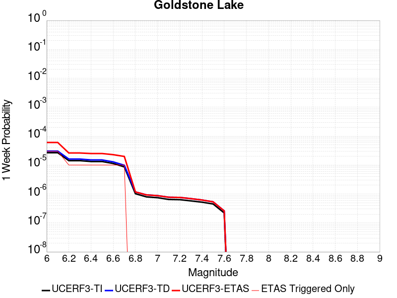 | 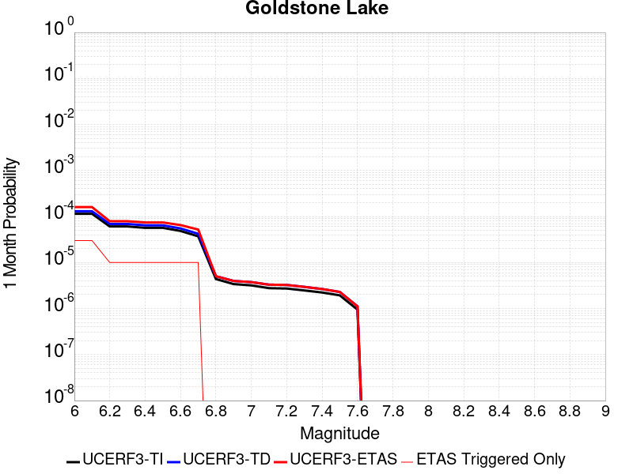 |  |  |

| Magnitude | 1 wk TI Prob | 1 wk TD Prob | 1 wk ETAS Prob | 1 wk ETAS/TD Gain | 1 wk ETAS Triggered Only | 1 mo TI Prob | 1 mo TD Prob | 1 mo ETAS Prob | 1 mo ETAS/TD Gain | 1 mo ETAS Triggered Only | 1 yr TI Prob | 1 yr TD Prob | 1 yr ETAS Prob | 1 yr ETAS/TD Gain | 1 yr ETAS Triggered Only | 10 yr TI Prob | 10 yr TD Prob | 10 yr ETAS Prob | 10 yr ETAS/TD Gain | 10 yr ETAS Triggered Only |
|-----|-----|-----|-----|-----|-----|-----|-----|-----|-----|-----|-----|-----|-----|-----|-----|-----|-----|-----|-----|-----|
| 6.0 | 2.671352E-5 | 3.037598E-5 | 6.037507E-5 | 1.9875925 | 3.0E-5 | 1.1448149E-4 | 1.3017739E-4 | 1.6017348E-4 | 1.2304248 | 3.0E-5 | 0.001392921 | 0.0015839539 | 0.0016338746 | 1.0315166 | 5.0E-5 | 0.013842222 | 0.01574614 | 0.015805196 | 1.0037504 | 6.0E-5 |
| 6.1 | 2.671352E-5 | 3.037598E-5 | 6.037507E-5 | 1.9875925 | 3.0E-5 | 1.1448149E-4 | 1.3017739E-4 | 1.6017348E-4 | 1.2304248 | 3.0E-5 | 0.001392921 | 0.0015839539 | 0.0016338746 | 1.0315166 | 5.0E-5 | 0.013842222 | 0.01574614 | 0.015805196 | 1.0037504 | 6.0E-5 |
| 6.2 | 1.4197047E-5 | 1.609619E-5 | 2.609603E-5 | 1.621255 | 1.0E-5 | 6.0843064E-5 | 6.89824E-5 | 7.898171E-5 | 1.1449546 | 1.0E-5 | 7.4051257E-4 | 8.396358E-4 | 8.59619E-4 | 1.0237999 | 2.0E-5 | 0.007380498 | 0.008374331 | 0.008404079 | 1.0035523 | 3.0E-5 |
| 6.3 | 1.4197047E-5 | 1.609619E-5 | 2.609603E-5 | 1.621255 | 1.0E-5 | 6.0843064E-5 | 6.89824E-5 | 7.898171E-5 | 1.1449546 | 1.0E-5 | 7.4051257E-4 | 8.396358E-4 | 8.59619E-4 | 1.0237999 | 2.0E-5 | 0.007380498 | 0.008374331 | 0.008404079 | 1.0035523 | 3.0E-5 |
| 6.4 | 1.3238931E-5 | 1.5008409E-5 | 2.500826E-5 | 1.6662831 | 1.0E-5 | 5.6737044E-5 | 6.432072E-5 | 7.432007E-5 | 1.155461 | 1.0E-5 | 6.9055456E-4 | 7.829214E-4 | 8.029057E-4 | 1.0255253 | 2.0E-5 | 0.006884126 | 0.007811257 | 0.007841023 | 1.0038106 | 3.0E-5 |
| 6.5 | 1.3238931E-5 | 1.5008409E-5 | 2.500826E-5 | 1.6662831 | 1.0E-5 | 5.6737044E-5 | 6.432072E-5 | 7.432007E-5 | 1.155461 | 1.0E-5 | 6.9055456E-4 | 7.829214E-4 | 8.029057E-4 | 1.0255253 | 2.0E-5 | 0.006884126 | 0.007811257 | 0.007841023 | 1.0038106 | 3.0E-5 |
| 6.6 | 1.1328278E-5 | 1.2855122E-5 | 2.2854994E-5 | 1.7778901 | 1.0E-5 | 4.8548856E-5 | 5.5092758E-5 | 6.509221E-5 | 1.1815021 | 1.0E-5 | 5.90922E-4 | 6.706436E-4 | 6.8063685E-4 | 1.014901 | 1.0E-5 | 0.0058935313 | 0.006695586 | 0.006715452 | 1.002967 | 2.0E-5 |
| 6.7 | 8.651175E-6 | 9.824532E-6 | 1.9824434E-5 | 2.0178502 | 1.0E-5 | 3.707594E-5 | 4.2104966E-5 | 5.2104548E-5 | 1.2374917 | 1.0E-5 | 4.5130608E-4 | 5.125979E-4 | 5.225928E-4 | 1.0194985 | 1.0E-5 | 0.0045039062 | 0.005123034 | 0.005142932 | 1.003884 | 2.0E-5 |
| 6.8 | 1.0215377E-6 | 1.1754685E-6 | 1.1754685E-6 | 1.0 | 0.0 | 4.378012E-6 | 5.0377125E-6 | 5.0377125E-6 | 1.0 | 0.0 | 5.3300988E-5 | 6.133254E-5 | 6.133254E-5 | 1.0 | 0.0 | 5.3288206E-4 | 6.131674E-4 | 6.131674E-4 | 1.0 | 0.0 |
| 6.9 | 7.9360774E-7 | 9.283384E-7 | 9.283384E-7 | 1.0 | 0.0 | 3.4011714E-6 | 3.9785873E-6 | 3.9785873E-6 | 1.0 | 0.0 | 4.1408475E-5 | 4.8438294E-5 | 4.8438294E-5 | 1.0 | 0.0 | 4.140076E-4 | 4.842844E-4 | 4.842844E-4 | 1.0 | 0.0 |
| 7.0 | 7.4382757E-7 | 8.747317E-7 | 8.747317E-7 | 1.0 | 0.0 | 3.1878285E-6 | 3.748845E-6 | 3.748845E-6 | 1.0 | 0.0 | 3.8811122E-5 | 4.56413E-5 | 4.56413E-5 | 1.0 | 0.0 | 3.8804344E-4 | 4.563259E-4 | 4.563259E-4 | 1.0 | 0.0 |
| 7.1 | 6.4709513E-7 | 7.71129E-7 | 7.71129E-7 | 1.0 | 0.0 | 2.773262E-6 | 3.304835E-6 | 3.304835E-6 | 1.0 | 0.0 | 3.376394E-5 | 4.023568E-5 | 4.023568E-5 | 1.0 | 0.0 | 3.375881E-4 | 4.0228994E-4 | 4.0228994E-4 | 1.0 | 0.0 |
| 7.2 | 6.356704E-7 | 7.5883503E-7 | 7.5883503E-7 | 1.0 | 0.0 | 2.7242988E-6 | 3.2521464E-6 | 3.2521464E-6 | 1.0 | 0.0 | 3.3167835E-5 | 3.9594222E-5 | 3.9594222E-5 | 1.0 | 0.0 | 3.3162883E-4 | 3.9587764E-4 | 3.9587764E-4 | 1.0 | 0.0 |
| 7.3 | 5.7695723E-7 | 6.896557E-7 | 6.896557E-7 | 1.0 | 0.0 | 2.4726714E-6 | 2.955664E-6 | 2.955664E-6 | 1.0 | 0.0 | 3.0104358E-5 | 3.5984674E-5 | 3.5984674E-5 | 1.0 | 0.0 | 3.0100282E-4 | 3.597942E-4 | 3.597942E-4 | 1.0 | 0.0 |
| 7.4 | 5.209647E-7 | 6.1935066E-7 | 6.1935066E-7 | 1.0 | 0.0 | 2.232704E-6 | 2.6543576E-6 | 2.6543576E-6 | 1.0 | 0.0 | 2.718283E-5 | 3.231638E-5 | 3.231638E-5 | 1.0 | 0.0 | 2.7179506E-4 | 3.2312237E-4 | 3.2312237E-4 | 1.0 | 0.0 |
| 7.5 | 4.512955E-7 | 5.348879E-7 | 5.348879E-7 | 1.0 | 0.0 | 1.934122E-6 | 2.292375E-6 | 2.292375E-6 | 1.0 | 0.0 | 2.3547682E-5 | 2.7909362E-5 | 2.7909362E-5 | 1.0 | 0.0 | 2.3545188E-4 | 2.7906388E-4 | 2.7906388E-4 | 1.0 | 0.0 |
| 7.6 | 2.21172E-7 | 2.603958E-7 | 2.603958E-7 | 1.0 | 0.0 | 9.478797E-7 | 1.1159817E-6 | 1.1159817E-6 | 1.0 | 0.0 | 1.1540374E-5 | 1.3587022E-5 | 1.3587022E-5 | 1.0 | 0.0 | 1.1539775E-4 | 1.3586473E-4 | 1.3586473E-4 | 1.0 | 0.0 |

## Towne Pass
*[(top)](#table-of-contents)*

| 1 Week | 1 Month | 1 Year | 10 Year |
|-----|-----|-----|-----|
|  |  |  |  |

| Magnitude | 1 wk TI Prob | 1 wk TD Prob | 1 wk ETAS Prob | 1 wk ETAS/TD Gain | 1 wk ETAS Triggered Only | 1 mo TI Prob | 1 mo TD Prob | 1 mo ETAS Prob | 1 mo ETAS/TD Gain | 1 mo ETAS Triggered Only | 1 yr TI Prob | 1 yr TD Prob | 1 yr ETAS Prob | 1 yr ETAS/TD Gain | 1 yr ETAS Triggered Only | 10 yr TI Prob | 10 yr TD Prob | 10 yr ETAS Prob | 10 yr ETAS/TD Gain | 10 yr ETAS Triggered Only |
|-----|-----|-----|-----|-----|-----|-----|-----|-----|-----|-----|-----|-----|-----|-----|-----|-----|-----|-----|-----|-----|
| 6.0 | 3.849728E-6 | 3.8945395E-6 | 3.8945395E-6 | 1.0 | 0.0 | 1.649873E-5 | 1.6690803E-5 | 2.6690635E-5 | 1.5991224 | 1.0E-5 | 2.0085352E-4 | 2.0319594E-4 | 2.1319391E-4 | 1.0492036 | 1.0E-5 | 0.0020067208 | 0.0020305307 | 0.002080429 | 1.0245742 | 5.0E-5 |
| 6.1 | 3.849728E-6 | 3.8945395E-6 | 3.8945395E-6 | 1.0 | 0.0 | 1.649873E-5 | 1.6690803E-5 | 2.6690635E-5 | 1.5991224 | 1.0E-5 | 2.0085352E-4 | 2.0319594E-4 | 2.1319391E-4 | 1.0492036 | 1.0E-5 | 0.0020067208 | 0.0020305307 | 0.002080429 | 1.0245742 | 5.0E-5 |
| 6.2 | 3.849728E-6 | 3.8945395E-6 | 3.8945395E-6 | 1.0 | 0.0 | 1.649873E-5 | 1.6690803E-5 | 2.6690635E-5 | 1.5991224 | 1.0E-5 | 2.0085352E-4 | 2.0319594E-4 | 2.1319391E-4 | 1.0492036 | 1.0E-5 | 0.0020067208 | 0.0020305307 | 0.002080429 | 1.0245742 | 5.0E-5 |
| 6.3 | 3.849728E-6 | 3.8945395E-6 | 3.8945395E-6 | 1.0 | 0.0 | 1.649873E-5 | 1.6690803E-5 | 2.6690635E-5 | 1.5991224 | 1.0E-5 | 2.0085352E-4 | 2.0319594E-4 | 2.1319391E-4 | 1.0492036 | 1.0E-5 | 0.0020067208 | 0.0020305307 | 0.002080429 | 1.0245742 | 5.0E-5 |
| 6.4 | 3.849728E-6 | 3.8945395E-6 | 3.8945395E-6 | 1.0 | 0.0 | 1.649873E-5 | 1.6690803E-5 | 2.6690635E-5 | 1.5991224 | 1.0E-5 | 2.0085352E-4 | 2.0319594E-4 | 2.1319391E-4 | 1.0492036 | 1.0E-5 | 0.0020067208 | 0.0020305307 | 0.002080429 | 1.0245742 | 5.0E-5 |
| 6.5 | 1.1953545E-6 | 1.2030514E-6 | 1.2030514E-6 | 1.0 | 0.0 | 5.1229376E-6 | 5.155925E-6 | 5.155925E-6 | 1.0 | 0.0 | 6.236998E-5 | 6.2771695E-5 | 6.2771695E-5 | 1.0 | 0.0 | 6.235248E-4 | 6.275514E-4 | 6.5753254E-4 | 1.0477748 | 3.0E-5 |
| 6.6 | 1.1953545E-6 | 1.2030514E-6 | 1.2030514E-6 | 1.0 | 0.0 | 5.1229376E-6 | 5.155925E-6 | 5.155925E-6 | 1.0 | 0.0 | 6.236998E-5 | 6.2771695E-5 | 6.2771695E-5 | 1.0 | 0.0 | 6.235248E-4 | 6.275514E-4 | 6.5753254E-4 | 1.0477748 | 3.0E-5 |
| 6.7 | 8.375951E-7 | 8.410665E-7 | 8.410665E-7 | 1.0 | 0.0 | 3.5896885E-6 | 3.604566E-6 | 3.604566E-6 | 1.0 | 0.0 | 4.370358E-5 | 4.3884767E-5 | 4.3884767E-5 | 1.0 | 0.0 | 4.3694986E-4 | 4.387667E-4 | 4.6875354E-4 | 1.0683435 | 3.0E-5 |
| 6.8 | 6.38041E-7 | 6.3921516E-7 | 6.3921516E-7 | 1.0 | 0.0 | 2.7344586E-6 | 2.7394908E-6 | 2.7394908E-6 | 1.0 | 0.0 | 3.3291526E-5 | 3.335283E-5 | 3.335283E-5 | 1.0 | 0.0 | 3.3286537E-4 | 3.3348205E-4 | 3.6347206E-4 | 1.0899298 | 3.0E-5 |
| 6.9 | 5.3460053E-7 | 5.345329E-7 | 5.345329E-7 | 1.0 | 0.0 | 2.2911431E-6 | 2.2908532E-6 | 2.2908532E-6 | 1.0 | 0.0 | 2.789431E-5 | 2.7890816E-5 | 2.7890816E-5 | 1.0 | 0.0 | 2.789081E-4 | 2.7887648E-4 | 2.988709E-4 | 1.0716963 | 2.0E-5 |
| 7.0 | 3.557783E-7 | 3.532419E-7 | 3.532419E-7 | 1.0 | 0.0 | 1.5247632E-6 | 1.5138929E-6 | 1.5138929E-6 | 1.0 | 0.0 | 1.8563835E-5 | 1.84315E-5 | 1.84315E-5 | 1.0 | 0.0 | 1.8562283E-4 | 1.8430054E-4 | 2.0429687E-4 | 1.1084985 | 2.0E-5 |
| 7.1 | 3.037942E-7 | 3.0002184E-7 | 3.0002184E-7 | 1.0 | 0.0 | 1.3019744E-6 | 1.2858072E-6 | 1.2858072E-6 | 1.0 | 0.0 | 1.5851423E-5 | 1.56546E-5 | 1.56546E-5 | 1.0 | 0.0 | 1.5850292E-4 | 1.5653571E-4 | 1.7653257E-4 | 1.1277463 | 2.0E-5 |
| 7.2 | 2.0808248E-7 | 2.0217661E-7 | 2.0217661E-7 | 1.0 | 0.0 | 8.917818E-7 | 8.664709E-7 | 8.664709E-7 | 1.0 | 0.0 | 1.0857389E-5 | 1.0549237E-5 | 1.0549237E-5 | 1.0 | 0.0 | 1.0856859E-4 | 1.0548782E-4 | 1.1548677E-4 | 1.0947877 | 1.0E-5 |
| 7.3 | 1.1162073E-7 | 1.0636875E-7 | 1.0636875E-7 | 1.0 | 0.0 | 4.7837443E-7 | 4.5586603E-7 | 4.5586603E-7 | 1.0 | 0.0 | 5.8241935E-6 | 5.550157E-6 | 5.550157E-6 | 1.0 | 0.0 | 5.8240406E-5 | 5.5500383E-5 | 5.5500383E-5 | 1.0 | 0.0 |

## Baker
*[(top)](#table-of-contents)*

| 1 Week | 1 Month | 1 Year | 10 Year |
|-----|-----|-----|-----|
|  |  |  |  |

| Magnitude | 1 wk TI Prob | 1 wk TD Prob | 1 wk ETAS Prob | 1 wk ETAS/TD Gain | 1 wk ETAS Triggered Only | 1 mo TI Prob | 1 mo TD Prob | 1 mo ETAS Prob | 1 mo ETAS/TD Gain | 1 mo ETAS Triggered Only | 1 yr TI Prob | 1 yr TD Prob | 1 yr ETAS Prob | 1 yr ETAS/TD Gain | 1 yr ETAS Triggered Only | 10 yr TI Prob | 10 yr TD Prob | 10 yr ETAS Prob | 10 yr ETAS/TD Gain | 10 yr ETAS Triggered Only |
|-----|-----|-----|-----|-----|-----|-----|-----|-----|-----|-----|-----|-----|-----|-----|-----|-----|-----|-----|-----|-----|
| 6.0 | 5.695525E-6 | 5.8348332E-6 | 2.5834717E-5 | 4.42767 | 2.0E-5 | 2.4409164E-5 | 2.5006211E-5 | 4.5005712E-5 | 1.7997813 | 2.0E-5 | 2.9714106E-4 | 3.044121E-4 | 3.4439992E-4 | 1.1313608 | 4.0E-5 | 0.0029674405 | 0.0030403468 | 0.0031001642 | 1.0196745 | 6.0E-5 |
| 6.1 | 5.695525E-6 | 5.8348332E-6 | 2.5834717E-5 | 4.42767 | 2.0E-5 | 2.4409164E-5 | 2.5006211E-5 | 4.5005712E-5 | 1.7997813 | 2.0E-5 | 2.9714106E-4 | 3.044121E-4 | 3.4439992E-4 | 1.1313608 | 4.0E-5 | 0.0029674405 | 0.0030403468 | 0.0031001642 | 1.0196745 | 6.0E-5 |
| 6.2 | 5.695525E-6 | 5.8348332E-6 | 2.5834717E-5 | 4.42767 | 2.0E-5 | 2.4409164E-5 | 2.5006211E-5 | 4.5005712E-5 | 1.7997813 | 2.0E-5 | 2.9714106E-4 | 3.044121E-4 | 3.4439992E-4 | 1.1313608 | 4.0E-5 | 0.0029674405 | 0.0030403468 | 0.0031001642 | 1.0196745 | 6.0E-5 |
| 6.3 | 3.2995713E-6 | 3.3836648E-6 | 1.3383631E-5 | 3.9553654 | 1.0E-5 | 1.4140943E-5 | 1.4501343E-5 | 2.4501198E-5 | 1.6895813 | 1.0E-5 | 1.7215237E-4 | 1.7654001E-4 | 1.9653648E-4 | 1.1132687 | 2.0E-5 | 0.0017201907 | 0.0017640449 | 0.0017939919 | 1.0169764 | 3.0E-5 |
| 6.4 | 3.2995713E-6 | 3.3836648E-6 | 1.3383631E-5 | 3.9553654 | 1.0E-5 | 1.4140943E-5 | 1.4501343E-5 | 2.4501198E-5 | 1.6895813 | 1.0E-5 | 1.7215237E-4 | 1.7654001E-4 | 1.9653648E-4 | 1.1132687 | 2.0E-5 | 0.0017201907 | 0.0017640449 | 0.0017939919 | 1.0169764 | 3.0E-5 |
| 6.5 | 2.782202E-6 | 2.8558384E-6 | 2.8558384E-6 | 1.0 | 0.0 | 1.1923668E-5 | 1.2239252E-5 | 1.2239252E-5 | 1.0 | 0.0 | 1.4516099E-4 | 1.4900303E-4 | 1.5900155E-4 | 1.0671027 | 1.0E-5 | 0.001450662 | 0.001489064 | 0.0015090342 | 1.0134113 | 2.0E-5 |
| 6.6 | 2.3163404E-6 | 2.3809182E-6 | 2.3809182E-6 | 1.0 | 0.0 | 9.927136E-6 | 1.0203897E-5 | 1.0203897E-5 | 1.0 | 0.0 | 1.20856166E-4 | 1.2422555E-4 | 1.3422432E-4 | 1.0804887 | 1.0E-5 | 0.0012079047 | 0.0012415814 | 0.0012615565 | 1.0160885 | 2.0E-5 |
| 6.7 | 2.037056E-6 | 2.0964987E-6 | 2.0964987E-6 | 1.0 | 0.0 | 8.7302105E-6 | 8.984965E-6 | 8.984965E-6 | 1.0 | 0.0 | 1.0628513E-4 | 1.09386616E-4 | 1.1938553E-4 | 1.0914088 | 1.0E-5 | 0.0010623431 | 0.0010933438 | 0.001113322 | 1.0182725 | 2.0E-5 |
| 6.8 | 1.8356744E-6 | 1.8915271E-6 | 1.8915271E-6 | 1.0 | 0.0 | 7.867153E-6 | 8.10652E-6 | 8.10652E-6 | 1.0 | 0.0 | 9.577837E-5 | 9.869256E-5 | 1.0869157E-4 | 1.1013148 | 1.0E-5 | 9.57371E-4 | 9.865012E-4 | 0.0010064815 | 1.0202537 | 2.0E-5 |
| 6.9 | 1.6310546E-6 | 1.6832057E-6 | 1.6832057E-6 | 1.0 | 0.0 | 6.9902153E-6 | 7.2137195E-6 | 7.2137195E-6 | 1.0 | 0.0 | 8.510255E-5 | 8.782361E-5 | 9.782273E-5 | 1.1138546 | 1.0E-5 | 8.5069967E-4 | 8.779003E-4 | 8.9788274E-4 | 1.0227616 | 2.0E-5 |
| 7.0 | 1.2058036E-6 | 1.2508652E-6 | 1.2508652E-6 | 1.0 | 0.0 | 5.1677193E-6 | 5.3608405E-6 | 5.3608405E-6 | 1.0 | 0.0 | 6.291517E-5 | 6.52663E-5 | 7.526565E-5 | 1.1532084 | 1.0E-5 | 6.289736E-4 | 6.5247365E-4 | 6.624671E-4 | 1.0153162 | 1.0E-5 |
| 7.1 | 1.052382E-6 | 1.0951596E-6 | 1.0951596E-6 | 1.0 | 0.0 | 4.5102006E-6 | 4.693533E-6 | 4.693533E-6 | 1.0 | 0.0 | 5.491031E-5 | 5.7142275E-5 | 5.7142275E-5 | 1.0 | 0.0 | 5.4896745E-4 | 5.712767E-4 | 5.712767E-4 | 1.0 | 0.0 |
| 7.2 | 1.0067454E-6 | 1.0487698E-6 | 1.0487698E-6 | 1.0 | 0.0 | 4.3146156E-6 | 4.4947205E-6 | 4.4947205E-6 | 1.0 | 0.0 | 5.252918E-5 | 5.4721855E-5 | 5.4721855E-5 | 1.0 | 0.0 | 5.251676E-4 | 5.4708467E-4 | 5.4708467E-4 | 1.0 | 0.0 |
| 7.3 | 9.3596316E-7 | 9.767712E-7 | 9.767712E-7 | 1.0 | 0.0 | 4.0112645E-6 | 4.1861554E-6 | 4.1861554E-6 | 1.0 | 0.0 | 4.8836053E-5 | 5.096526E-5 | 5.096526E-5 | 1.0 | 0.0 | 4.8825322E-4 | 5.095365E-4 | 5.095365E-4 | 1.0 | 0.0 |
| 7.4 | 8.8117395E-7 | 9.207652E-7 | 9.207652E-7 | 1.0 | 0.0 | 3.7764542E-6 | 3.9461306E-6 | 3.9461306E-6 | 1.0 | 0.0 | 4.5977362E-5 | 4.804309E-5 | 4.804309E-5 | 1.0 | 0.0 | 4.596785E-4 | 4.803278E-4 | 4.803278E-4 | 1.0 | 0.0 |
| 7.5 | 8.292386E-7 | 8.674585E-7 | 8.674585E-7 | 1.0 | 0.0 | 3.5538749E-6 | 3.717674E-6 | 3.717674E-6 | 1.0 | 0.0 | 4.326757E-5 | 4.526175E-5 | 4.526175E-5 | 1.0 | 0.0 | 4.3259145E-4 | 4.5252603E-4 | 4.5252603E-4 | 1.0 | 0.0 |
| 7.6 | 7.553842E-7 | 7.9144604E-7 | 7.9144604E-7 | 1.0 | 0.0 | 3.2373566E-6 | 3.3919073E-6 | 3.3919073E-6 | 1.0 | 0.0 | 3.9414106E-5 | 4.1295694E-5 | 4.1295694E-5 | 1.0 | 0.0 | 3.9407116E-4 | 4.128809E-4 | 4.128809E-4 | 1.0 | 0.0 |
| 7.7 | 6.5285366E-7 | 6.8527874E-7 | 6.8527874E-7 | 1.0 | 0.0 | 2.797941E-6 | 2.9369057E-6 | 2.9369057E-6 | 1.0 | 0.0 | 3.40644E-5 | 3.5756246E-5 | 3.5756246E-5 | 1.0 | 0.0 | 3.405918E-4 | 3.575056E-4 | 3.575056E-4 | 1.0 | 0.0 |
| 7.8 | 3.4586725E-7 | 3.648256E-7 | 3.648256E-7 | 1.0 | 0.0 | 1.4822873E-6 | 1.5635374E-6 | 1.5635374E-6 | 1.0 | 0.0 | 1.80467E-5 | 1.9035906E-5 | 1.9035906E-5 | 1.0 | 0.0 | 1.8045233E-4 | 1.903432E-4 | 1.903432E-4 | 1.0 | 0.0 |
| 7.9 | 2.5591178E-9 | 2.6696687E-9 | 2.6696687E-9 | 1.0 | 0.0 | 1.0967647E-8 | 1.1441437E-8 | 1.1441437E-8 | 1.0 | 0.0 | 1.335311E-7 | 1.392995E-7 | 1.392995E-7 | 1.0 | 0.0 | 1.3353102E-6 | 1.3929949E-6 | 1.3929949E-6 | 1.0 | 0.0 |

## Death Valley (Fish Lake Valley)
*[(top)](#table-of-contents)*

| 1 Week | 1 Month | 1 Year | 10 Year |
|-----|-----|-----|-----|
|  |  |  |  |

| Magnitude | 1 wk TI Prob | 1 wk TD Prob | 1 wk ETAS Prob | 1 wk ETAS/TD Gain | 1 wk ETAS Triggered Only | 1 mo TI Prob | 1 mo TD Prob | 1 mo ETAS Prob | 1 mo ETAS/TD Gain | 1 mo ETAS Triggered Only | 1 yr TI Prob | 1 yr TD Prob | 1 yr ETAS Prob | 1 yr ETAS/TD Gain | 1 yr ETAS Triggered Only | 10 yr TI Prob | 10 yr TD Prob | 10 yr ETAS Prob | 10 yr ETAS/TD Gain | 10 yr ETAS Triggered Only |
|-----|-----|-----|-----|-----|-----|-----|-----|-----|-----|-----|-----|-----|-----|-----|-----|-----|-----|-----|-----|-----|
| 6.0 | 3.872328E-5 | 4.7267185E-5 | 9.726483E-5 | 2.0577662 | 5.0E-5 | 1.6594635E-4 | 2.0255962E-4 | 2.6254746E-4 | 1.2961491 | 6.0E-5 | 0.0020185246 | 0.00246352 | 0.0025233722 | 1.0242954 | 6.0E-5 | 0.02000288 | 0.02438804 | 0.024446577 | 1.0024003 | 6.0E-5 |
| 6.1 | 3.872328E-5 | 4.7267185E-5 | 9.726483E-5 | 2.0577662 | 5.0E-5 | 1.6594635E-4 | 2.0255962E-4 | 2.6254746E-4 | 1.2961491 | 6.0E-5 | 0.0020185246 | 0.00246352 | 0.0025233722 | 1.0242954 | 6.0E-5 | 0.02000288 | 0.02438804 | 0.024446577 | 1.0024003 | 6.0E-5 |
| 6.2 | 3.872328E-5 | 4.7267185E-5 | 9.726483E-5 | 2.0577662 | 5.0E-5 | 1.6594635E-4 | 2.0255962E-4 | 2.6254746E-4 | 1.2961491 | 6.0E-5 | 0.0020185246 | 0.00246352 | 0.0025233722 | 1.0242954 | 6.0E-5 | 0.02000288 | 0.02438804 | 0.024446577 | 1.0024003 | 6.0E-5 |
| 6.3 | 2.8356371E-5 | 3.3609682E-5 | 8.3608E-5 | 2.4876165 | 5.0E-5 | 1.2152165E-4 | 1.4403398E-4 | 2.0402535E-4 | 1.4165083 | 6.0E-5 | 0.0014785219 | 0.0017522823 | 0.0018121771 | 1.0341811 | 6.0E-5 | 0.014687235 | 0.017391697 | 0.017450653 | 1.00339 | 6.0E-5 |
| 6.4 | 2.8356371E-5 | 3.3609682E-5 | 8.3608E-5 | 2.4876165 | 5.0E-5 | 1.2152165E-4 | 1.4403398E-4 | 2.0402535E-4 | 1.4165083 | 6.0E-5 | 0.0014785219 | 0.0017522823 | 0.0018121771 | 1.0341811 | 6.0E-5 | 0.014687235 | 0.017391697 | 0.017450653 | 1.00339 | 6.0E-5 |
| 6.5 | 2.4448687E-5 | 2.8607421E-5 | 7.860599E-5 | 2.7477484 | 5.0E-5 | 1.0477588E-4 | 1.2259776E-4 | 1.825904E-4 | 1.4893453 | 6.0E-5 | 0.0012748998 | 0.0014916563 | 0.0015515668 | 1.0401638 | 6.0E-5 | 0.012676105 | 0.01482131 | 0.01488042 | 1.0039883 | 6.0E-5 |
| 6.6 | 2.1298161E-5 | 2.465998E-5 | 7.465875E-5 | 3.0275269 | 5.0E-5 | 9.127464E-5 | 1.0568153E-4 | 1.6567518E-4 | 1.5676835 | 6.0E-5 | 0.0011107022 | 0.001285947 | 0.0013458699 | 1.0465982 | 6.0E-5 | 0.011051672 | 0.012788472 | 0.012847704 | 1.0046318 | 6.0E-5 |
| 6.7 | 1.8959729E-5 | 2.1780937E-5 | 7.177985E-5 | 3.2955353 | 5.0E-5 | 8.125345E-5 | 9.334368E-5 | 1.5333809E-4 | 1.6427258 | 6.0E-5 | 9.888117E-4 | 0.0011358924 | 0.0011958242 | 1.0527619 | 6.0E-5 | 0.009844234 | 0.0113035245 | 0.011362847 | 1.0052481 | 6.0E-5 |
| 6.8 | 1.6691629E-5 | 1.901828E-5 | 6.901733E-5 | 3.6289995 | 5.0E-5 | 7.153359E-5 | 8.150447E-5 | 1.4149958E-4 | 1.736096 | 6.0E-5 | 8.7057345E-4 | 9.918819E-4 | 0.0010518224 | 1.0604311 | 6.0E-5 | 0.008671708 | 0.009876307 | 0.009935714 | 1.0060152 | 6.0E-5 |
| 6.9 | 1.450505E-5 | 1.6389482E-5 | 6.638866E-5 | 4.050687 | 5.0E-5 | 6.216302E-5 | 7.02388E-5 | 1.3023458E-4 | 1.8541688 | 6.0E-5 | 7.5657194E-4 | 8.5483067E-4 | 9.147794E-4 | 1.0701294 | 6.0E-5 | 0.007540013 | 0.008516356 | 0.0085758455 | 1.0069853 | 6.0E-5 |
| 7.0 | 1.2940855E-5 | 1.4537924E-5 | 6.45372E-5 | 4.4392304 | 5.0E-5 | 5.545963E-5 | 6.230393E-5 | 1.2230019E-4 | 1.9629611 | 6.0E-5 | 6.750118E-4 | 7.5829215E-4 | 8.182467E-4 | 1.0790652 | 6.0E-5 | 0.006729651 | 0.007557665 | 0.0076172114 | 1.007879 | 6.0E-5 |
| 7.1 | 1.2544658E-5 | 1.4078161E-5 | 6.407746E-5 | 4.55155 | 5.0E-5 | 5.3761712E-5 | 6.0333616E-5 | 1.2033E-4 | 1.9944105 | 6.0E-5 | 6.5435225E-4 | 7.343198E-4 | 7.942757E-4 | 1.0816482 | 6.0E-5 | 0.006524288 | 0.007319527 | 0.007379088 | 1.0081372 | 6.0E-5 |
| 7.2 | 1.2489416E-5 | 1.4015628E-5 | 6.401493E-5 | 4.567396 | 5.0E-5 | 5.3524967E-5 | 6.0065628E-5 | 1.20062025E-4 | 1.9988474 | 6.0E-5 | 6.514716E-4 | 7.3105923E-4 | 7.910154E-4 | 1.0820127 | 6.0E-5 | 0.006495651 | 0.007287136 | 0.0073466985 | 1.0081737 | 6.0E-5 |
| 7.3 | 1.2368307E-5 | 1.3879767E-5 | 6.387907E-5 | 4.602316 | 5.0E-5 | 5.3005948E-5 | 5.948339E-5 | 1.19479824E-4 | 2.008625 | 6.0E-5 | 6.451563E-4 | 7.2397524E-4 | 7.839318E-4 | 1.0828158 | 6.0E-5 | 0.0064328653 | 0.0072167586 | 0.0072763255 | 1.0082539 | 6.0E-5 |
| 7.4 | 1.2161707E-5 | 1.3647823E-5 | 6.364714E-5 | 4.663538 | 5.0E-5 | 5.212056E-5 | 5.8489393E-5 | 1.18485885E-4 | 2.025767 | 6.0E-5 | 6.3438306E-4 | 7.1188126E-4 | 7.7183853E-4 | 1.0842237 | 6.0E-5 | 0.006325751 | 0.0070965975 | 0.007156172 | 1.0083947 | 6.0E-5 |
| 7.5 | 1.1707948E-5 | 1.3145472E-5 | 6.314481E-5 | 4.803541 | 5.0E-5 | 5.0175953E-5 | 5.633655E-5 | 1.1633317E-4 | 2.0649679 | 6.0E-5 | 6.10721E-4 | 6.8568724E-4 | 7.4564613E-4 | 1.0874435 | 6.0E-5 | 0.0060904534 | 0.006836299 | 0.0068958886 | 1.0087167 | 6.0E-5 |
| 7.6 | 1.0319538E-5 | 1.1579585E-5 | 6.1579005E-5 | 5.317894 | 5.0E-5 | 4.4225842E-5 | 4.9625876E-5 | 1.09622895E-4 | 2.2089868 | 6.0E-5 | 5.383166E-4 | 6.040327E-4 | 6.639965E-4 | 1.0992724 | 6.0E-5 | 0.0053701443 | 0.0060244408 | 0.0060840794 | 1.0098994 | 6.0E-5 |
| 7.7 | 8.937764E-6 | 1.0022746E-5 | 6.0022245E-5 | 5.9886026 | 5.0E-5 | 3.830414E-5 | 4.295395E-5 | 9.29518E-5 | 2.1639874 | 5.0E-5 | 4.6625308E-4 | 5.228439E-4 | 5.7281775E-4 | 1.0955808 | 5.0E-5 | 0.0046527605 | 0.0052166474 | 0.0052663865 | 1.0095347 | 5.0E-5 |
| 7.8 | 3.108007E-7 | 3.284649E-7 | 3.284649E-7 | 1.0 | 0.0 | 1.3320023E-6 | 1.407706E-6 | 1.407706E-6 | 1.0 | 0.0 | 1.6217007E-5 | 1.713869E-5 | 1.713869E-5 | 1.0 | 0.0 | 1.6215823E-4 | 1.7137405E-4 | 1.7137405E-4 | 1.0 | 0.0 |
| 7.9 | 2.5591178E-9 | 2.6696687E-9 | 2.6696687E-9 | 1.0 | 0.0 | 1.0967647E-8 | 1.1441437E-8 | 1.1441437E-8 | 1.0 | 0.0 | 1.335311E-7 | 1.392995E-7 | 1.392995E-7 | 1.0 | 0.0 | 1.3353102E-6 | 1.3929949E-6 | 1.3929949E-6 | 1.0 | 0.0 |

## San Andreas (San Bernardino S)
*[(top)](#table-of-contents)*

| 1 Week | 1 Month | 1 Year | 10 Year |
|-----|-----|-----|-----|
|  |  |  |  |

| Magnitude | 1 wk TI Prob | 1 wk TD Prob | 1 wk ETAS Prob | 1 wk ETAS/TD Gain | 1 wk ETAS Triggered Only | 1 mo TI Prob | 1 mo TD Prob | 1 mo ETAS Prob | 1 mo ETAS/TD Gain | 1 mo ETAS Triggered Only | 1 yr TI Prob | 1 yr TD Prob | 1 yr ETAS Prob | 1 yr ETAS/TD Gain | 1 yr ETAS Triggered Only | 10 yr TI Prob | 10 yr TD Prob | 10 yr ETAS Prob | 10 yr ETAS/TD Gain | 10 yr ETAS Triggered Only |
|-----|-----|-----|-----|-----|-----|-----|-----|-----|-----|-----|-----|-----|-----|-----|-----|-----|-----|-----|-----|-----|
| 6.0 | 1.2336002E-4 | 3.0003127E-4 | 3.1002826E-4 | 1.0333198 | 1.0E-5 | 5.2857865E-4 | 0.0012852408 | 0.0012952279 | 1.0077707 | 1.0E-5 | 0.006416472 | 0.015540493 | 0.015570027 | 1.0019004 | 3.0E-5 | 0.06234337 | 0.14283332 | 0.14288476 | 1.00036 | 6.0E-5 |
| 6.1 | 1.2336002E-4 | 3.0003127E-4 | 3.1002826E-4 | 1.0333198 | 1.0E-5 | 5.2857865E-4 | 0.0012852408 | 0.0012952279 | 1.0077707 | 1.0E-5 | 0.006416472 | 0.015540493 | 0.015570027 | 1.0019004 | 3.0E-5 | 0.06234337 | 0.14283332 | 0.14288476 | 1.00036 | 6.0E-5 |
| 6.2 | 1.2336002E-4 | 3.0003127E-4 | 3.1002826E-4 | 1.0333198 | 1.0E-5 | 5.2857865E-4 | 0.0012852408 | 0.0012952279 | 1.0077707 | 1.0E-5 | 0.006416472 | 0.015540493 | 0.015570027 | 1.0019004 | 3.0E-5 | 0.06234337 | 0.14283332 | 0.14288476 | 1.00036 | 6.0E-5 |
| 6.3 | 1.1712257E-4 | 2.879145E-4 | 2.979116E-4 | 1.0347226 | 1.0E-5 | 5.018573E-4 | 0.0012333614 | 0.0012433492 | 1.0080979 | 1.0E-5 | 0.006093008 | 0.014917629 | 0.014947182 | 1.001981 | 3.0E-5 | 0.059286322 | 0.1375418 | 0.13759354 | 1.0003762 | 6.0E-5 |
| 6.4 | 1.1712257E-4 | 2.879145E-4 | 2.979116E-4 | 1.0347226 | 1.0E-5 | 5.018573E-4 | 0.0012333614 | 0.0012433492 | 1.0080979 | 1.0E-5 | 0.006093008 | 0.014917629 | 0.014947182 | 1.001981 | 3.0E-5 | 0.059286322 | 0.1375418 | 0.13759354 | 1.0003762 | 6.0E-5 |
| 6.5 | 1.0689076E-4 | 2.6804334E-4 | 2.7804065E-4 | 1.0372974 | 1.0E-5 | 4.5802278E-4 | 0.0011482761 | 0.0011582647 | 1.0086987 | 1.0E-5 | 0.0055621783 | 0.013895263 | 0.013924846 | 1.002129 | 3.0E-5 | 0.05425003 | 0.12878914 | 0.12884142 | 1.0004059 | 6.0E-5 |
| 6.6 | 9.7648895E-5 | 2.5049172E-4 | 2.604892E-4 | 1.0399115 | 1.0E-5 | 4.1842813E-4 | 0.0010731178 | 0.0010831071 | 1.0093087 | 1.0E-5 | 0.005082469 | 0.012991305 | 0.013020916 | 1.0022793 | 3.0E-5 | 0.049677886 | 0.12094915 | 0.12100189 | 1.0004361 | 6.0E-5 |
| 6.7 | 8.757013E-5 | 2.3119988E-4 | 2.4119757E-4 | 1.0432426 | 1.0E-5 | 3.7524657E-4 | 9.905027E-4 | 0.0010004927 | 1.0100859 | 1.0E-5 | 0.00455906 | 0.011996774 | 0.012026414 | 1.0024707 | 3.0E-5 | 0.04466656 | 0.11225749 | 0.11231075 | 1.0004745 | 6.0E-5 |
| 6.8 | 8.562978E-5 | 2.2679876E-4 | 2.3679649E-4 | 1.0440819 | 1.0E-5 | 3.6693315E-4 | 9.7165484E-4 | 9.816451E-4 | 1.0102817 | 1.0E-5 | 0.004458263 | 0.011769796 | 0.011799443 | 1.0025189 | 3.0E-5 | 0.043698758 | 0.11026781 | 0.110321194 | 1.0004841 | 6.0E-5 |
| 6.9 | 6.124075E-5 | 1.7064936E-4 | 1.8064765E-4 | 1.0585897 | 1.0E-5 | 2.6243398E-4 | 7.311502E-4 | 7.411429E-4 | 1.0136671 | 1.0E-5 | 0.0031904527 | 0.008865628 | 0.008895363 | 1.0033538 | 3.0E-5 | 0.031450346 | 0.08417915 | 0.084234096 | 1.0006528 | 6.0E-5 |
| 7.0 | 5.8598747E-5 | 1.6493963E-4 | 1.7493799E-4 | 1.0606183 | 1.0E-5 | 2.5111332E-4 | 7.0669345E-4 | 7.1668637E-4 | 1.0141404 | 1.0E-5 | 0.0030530186 | 0.008570245 | 0.008599988 | 1.0034705 | 3.0E-5 | 0.03011414 | 0.08149692 | 0.08155202 | 1.0006763 | 6.0E-5 |
| 7.1 | 5.613814E-5 | 1.5912524E-4 | 1.6912364E-4 | 1.0628335 | 1.0E-5 | 2.4056983E-4 | 6.817878E-4 | 6.91781E-4 | 1.0146574 | 1.0E-5 | 0.0029250039 | 0.008269355 | 0.008299107 | 1.0035979 | 3.0E-5 | 0.028868021 | 0.07879588 | 0.07885115 | 1.0007014 | 6.0E-5 |
| 7.2 | 4.991222E-5 | 1.4519015E-4 | 1.551887E-4 | 1.0688652 | 1.0E-5 | 2.1389198E-4 | 6.220955E-4 | 6.320893E-4 | 1.0160646 | 1.0E-5 | 0.002601025 | 0.007547813 | 0.0075775865 | 1.0039446 | 3.0E-5 | 0.025707912 | 0.072249845 | 0.07230551 | 1.0007704 | 6.0E-5 |
| 7.3 | 4.7410045E-5 | 1.371324E-4 | 1.4713104E-4 | 1.0729122 | 1.0E-5 | 2.0317009E-4 | 5.875783E-4 | 5.9757236E-4 | 1.017009 | 1.0E-5 | 0.0024707897 | 0.007130386 | 0.0071601723 | 1.0041773 | 3.0E-5 | 0.024434982 | 0.06853227 | 0.06858816 | 1.0008155 | 6.0E-5 |
| 7.4 | 4.5556746E-5 | 1.3121162E-4 | 1.412103E-4 | 1.0762028 | 1.0E-5 | 1.952286E-4 | 5.6221464E-4 | 5.72209E-4 | 1.0177768 | 1.0E-5 | 0.002374317 | 0.006823559 | 0.006853354 | 1.0043665 | 3.0E-5 | 0.023491086 | 0.06578475 | 0.0658408 | 1.0008521 | 6.0E-5 |
| 7.5 | 4.3084514E-5 | 1.2356513E-4 | 1.335639E-4 | 1.080919 | 1.0E-5 | 1.8463485E-4 | 5.2945764E-4 | 5.3945236E-4 | 1.0188773 | 1.0E-5 | 0.0022456115 | 0.006427166 | 0.0064569735 | 1.0046377 | 3.0E-5 | 0.022230545 | 0.062185578 | 0.062241845 | 1.0009048 | 6.0E-5 |
| 7.6 | 3.408608E-5 | 9.834847E-5 | 1.08347485E-4 | 1.1016693 | 1.0E-5 | 1.4607502E-4 | 4.2142547E-4 | 4.3142124E-4 | 1.023719 | 1.0E-5 | 0.0017770125 | 0.00511881 | 0.005148656 | 1.0058308 | 3.0E-5 | 0.017628696 | 0.050017312 | 0.050074313 | 1.0011396 | 6.0E-5 |
| 7.7 | 2.8315713E-5 | 8.2480474E-5 | 9.247965E-5 | 1.1212308 | 1.0E-5 | 1.2134742E-4 | 3.534399E-4 | 3.6343635E-4 | 1.0282834 | 1.0E-5 | 0.0014764034 | 0.004294649 | 0.0043245205 | 1.0069554 | 3.0E-5 | 0.01466633 | 0.04226858 | 0.042326048 | 1.0013595 | 6.0E-5 |
| 7.8 | 2.6222975E-5 | 7.462497E-5 | 8.4624226E-5 | 1.1339934 | 1.0E-5 | 1.1237934E-4 | 3.1978212E-4 | 3.2977894E-4 | 1.0312613 | 1.0E-5 | 0.0013673597 | 0.003886403 | 0.0039162864 | 1.0076892 | 3.0E-5 | 0.013589768 | 0.038434092 | 0.038491786 | 1.0015011 | 6.0E-5 |
| 7.9 | 2.1469694E-5 | 5.7873713E-5 | 6.787313E-5 | 1.17278 | 1.0E-5 | 9.200973E-5 | 2.4800663E-4 | 2.5800415E-4 | 1.0403115 | 1.0E-5 | 0.0011196428 | 0.003015303 | 0.0030452125 | 1.0099193 | 3.0E-5 | 0.011140184 | 0.03014987 | 0.030188663 | 1.0012867 | 4.0E-5 |
| 8.0 | 1.2420249E-5 | 3.1316227E-5 | 3.1316227E-5 | 1.0 | 0.0 | 5.322855E-5 | 1.342055E-4 | 1.342055E-4 | 1.0 | 0.0 | 6.478649E-4 | 0.0016327285 | 0.0016327285 | 1.0 | 0.0 | 0.0064597935 | 0.01652123 | 0.01652123 | 1.0 | 0.0 |
| 8.1 | 4.9197724E-6 | 7.82136E-6 | 7.82136E-6 | 1.0 | 0.0 | 2.1084568E-5 | 3.3519682E-5 | 3.3519682E-5 | 1.0 | 0.0 | 2.566744E-4 | 4.0802584E-4 | 4.0802584E-4 | 1.0 | 0.0 | 0.002563781 | 0.004383873 | 0.004383873 | 1.0 | 0.0 |
| 8.2 | 2.5634774E-6 | 2.9062624E-6 | 2.9062624E-6 | 1.0 | 0.0 | 1.0986286E-5 | 1.2455351E-5 | 1.2455351E-5 | 1.0 | 0.0 | 1.3374983E-4 | 1.5163339E-4 | 1.5163339E-4 | 1.0 | 0.0 | 0.0013366934 | 0.001704734 | 0.001704734 | 1.0 | 0.0 |
| 8.3 | 5.2850464E-7 | 3.2082596E-7 | 3.2082596E-7 | 1.0 | 0.0 | 2.2650179E-6 | 1.3749678E-6 | 1.3749678E-6 | 1.0 | 0.0 | 2.7576245E-5 | 1.6740116E-5 | 1.6740116E-5 | 1.0 | 0.0 | 2.7572823E-4 | 1.9866871E-4 | 1.9866871E-4 | 1.0 | 0.0 |

## Nelson Lake
*[(top)](#table-of-contents)*

| 1 Week | 1 Month | 1 Year | 10 Year |
|-----|-----|-----|-----|
|  |  |  | 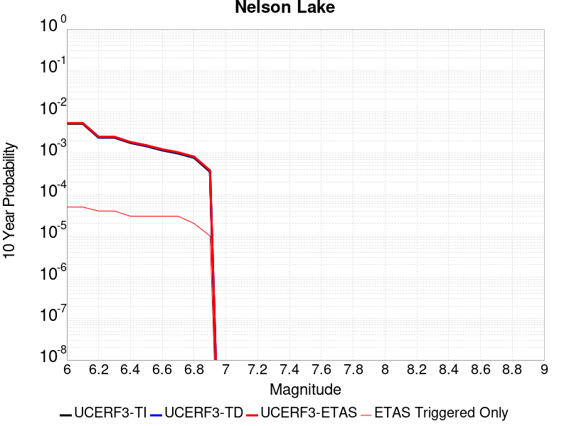 |

| Magnitude | 1 wk TI Prob | 1 wk TD Prob | 1 wk ETAS Prob | 1 wk ETAS/TD Gain | 1 wk ETAS Triggered Only | 1 mo TI Prob | 1 mo TD Prob | 1 mo ETAS Prob | 1 mo ETAS/TD Gain | 1 mo ETAS Triggered Only | 1 yr TI Prob | 1 yr TD Prob | 1 yr ETAS Prob | 1 yr ETAS/TD Gain | 1 yr ETAS Triggered Only | 10 yr TI Prob | 10 yr TD Prob | 10 yr ETAS Prob | 10 yr ETAS/TD Gain | 10 yr ETAS Triggered Only |
|-----|-----|-----|-----|-----|-----|-----|-----|-----|-----|-----|-----|-----|-----|-----|-----|-----|-----|-----|-----|-----|
| 6.0 | 9.913453E-6 | 1.0192248E-5 | 1.0192248E-5 | 1.0 | 0.0 | 4.2485535E-5 | 4.368039E-5 | 7.3679075E-5 | 1.6867771 | 3.0E-5 | 5.1713863E-4 | 5.316893E-4 | 5.816627E-4 | 1.0939898 | 5.0E-5 | 0.0051593683 | 0.0053052 | 0.005354935 | 1.0093747 | 5.0E-5 |
| 6.1 | 9.913453E-6 | 1.0192248E-5 | 1.0192248E-5 | 1.0 | 0.0 | 4.2485535E-5 | 4.368039E-5 | 7.3679075E-5 | 1.6867771 | 3.0E-5 | 5.1713863E-4 | 5.316893E-4 | 5.816627E-4 | 1.0939898 | 5.0E-5 | 0.0051593683 | 0.0053052 | 0.005354935 | 1.0093747 | 5.0E-5 |
| 6.2 | 4.5596407E-6 | 4.696309E-6 | 4.696309E-6 | 1.0 | 0.0 | 1.954117E-5 | 2.0126892E-5 | 5.0126288E-5 | 2.490513 | 3.0E-5 | 2.3788778E-4 | 2.4501863E-4 | 2.8500883E-4 | 1.1632129 | 4.0E-5 | 0.0023763329 | 0.002447611 | 0.002487513 | 1.0163025 | 4.0E-5 |
| 6.3 | 4.5596407E-6 | 4.696309E-6 | 4.696309E-6 | 1.0 | 0.0 | 1.954117E-5 | 2.0126892E-5 | 5.0126288E-5 | 2.490513 | 3.0E-5 | 2.3788778E-4 | 2.4501863E-4 | 2.8500883E-4 | 1.1632129 | 4.0E-5 | 0.0023763329 | 0.002447611 | 0.002487513 | 1.0163025 | 4.0E-5 |
| 6.4 | 3.4025713E-6 | 3.5098942E-6 | 3.5098942E-6 | 1.0 | 0.0 | 1.4582367E-5 | 1.5042322E-5 | 3.504202E-5 | 2.329562 | 2.0E-5 | 1.7752586E-4 | 1.8312573E-4 | 2.1312022E-4 | 1.1637919 | 3.0E-5 | 0.001773841 | 0.0018298312 | 0.0018597762 | 1.0163649 | 3.0E-5 |
| 6.5 | 2.8352947E-6 | 2.9278535E-6 | 2.9278535E-6 | 1.0 | 0.0 | 1.2151207E-5 | 1.2547887E-5 | 3.2547636E-5 | 2.5938737 | 2.0E-5 | 1.479309E-4 | 1.5276058E-4 | 1.8275599E-4 | 1.1963557 | 3.0E-5 | 0.0014783246 | 0.0015266296 | 0.0015565837 | 1.0196211 | 3.0E-5 |
| 6.6 | 2.251518E-6 | 2.3290654E-6 | 2.3290654E-6 | 1.0 | 0.0 | 9.649328E-6 | 9.981674E-6 | 2.9981475E-5 | 3.0036519 | 2.0E-5 | 1.1747423E-4 | 1.2152074E-4 | 1.5151709E-4 | 1.2468414 | 3.0E-5 | 0.0011741214 | 0.0012146046 | 0.0012445681 | 1.0246694 | 3.0E-5 |
| 6.7 | 1.8911853E-6 | 1.9591378E-6 | 1.9591378E-6 | 1.0 | 0.0 | 8.105055E-6 | 8.396281E-6 | 2.8396113E-5 | 3.3819869 | 2.0E-5 | 9.867457E-5 | 1.0222051E-4 | 1.3221745E-4 | 1.2934532 | 3.0E-5 | 9.863076E-4 | 0.0010217924 | 0.0010517618 | 1.0293301 | 3.0E-5 |
| 6.8 | 1.4874814E-6 | 1.543829E-6 | 1.543829E-6 | 1.0 | 0.0 | 6.374905E-6 | 6.6163957E-6 | 1.661633E-5 | 2.5113869 | 1.0E-5 | 7.76117E-5 | 8.055216E-5 | 1.00550555E-4 | 1.2482663 | 2.0E-5 | 7.75846E-4 | 8.0528075E-4 | 8.252646E-4 | 1.024816 | 2.0E-5 |
| 6.9 | 6.835972E-7 | 7.13992E-7 | 7.13992E-7 | 1.0 | 0.0 | 2.9296991E-6 | 3.0599638E-6 | 3.0599638E-6 | 1.0 | 0.0 | 3.56685E-5 | 3.725474E-5 | 4.725437E-5 | 1.2684122 | 1.0E-5 | 3.5662777E-4 | 3.7251622E-4 | 3.825125E-4 | 1.0268345 | 1.0E-5 |

## San Andreas (Carrizo) rev
*[(top)](#table-of-contents)*

| 1 Week | 1 Month | 1 Year | 10 Year |
|-----|-----|-----|-----|
|  |  |  | 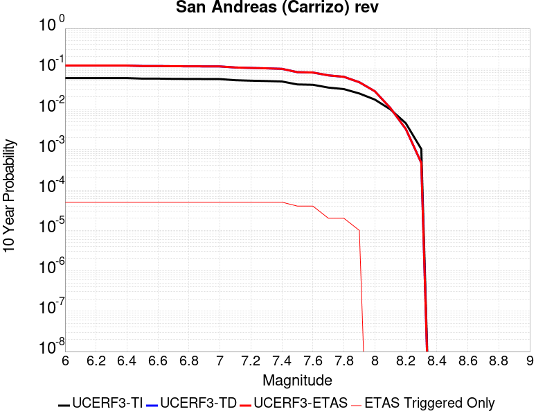 |

| Magnitude | 1 wk TI Prob | 1 wk TD Prob | 1 wk ETAS Prob | 1 wk ETAS/TD Gain | 1 wk ETAS Triggered Only | 1 mo TI Prob | 1 mo TD Prob | 1 mo ETAS Prob | 1 mo ETAS/TD Gain | 1 mo ETAS Triggered Only | 1 yr TI Prob | 1 yr TD Prob | 1 yr ETAS Prob | 1 yr ETAS/TD Gain | 1 yr ETAS Triggered Only | 10 yr TI Prob | 10 yr TD Prob | 10 yr ETAS Prob | 10 yr ETAS/TD Gain | 10 yr ETAS Triggered Only |
|-----|-----|-----|-----|-----|-----|-----|-----|-----|-----|-----|-----|-----|-----|-----|-----|-----|-----|-----|-----|-----|
| 6.0 | 1.1674632E-4 | 2.4321114E-4 | 2.832014E-4 | 1.1644262 | 4.0E-5 | 5.002454E-4 | 0.0010419186 | 0.0010918666 | 1.0479383 | 5.0E-5 | 0.006073493 | 0.01261206 | 0.012661429 | 1.0039145 | 5.0E-5 | 0.0591016 | 0.12060616 | 0.12065013 | 1.0003645 | 5.0E-5 |
| 6.1 | 1.1674632E-4 | 2.4321114E-4 | 2.832014E-4 | 1.1644262 | 4.0E-5 | 5.002454E-4 | 0.0010419186 | 0.0010918666 | 1.0479383 | 5.0E-5 | 0.006073493 | 0.01261206 | 0.012661429 | 1.0039145 | 5.0E-5 | 0.0591016 | 0.12060616 | 0.12065013 | 1.0003645 | 5.0E-5 |
| 6.2 | 1.1674632E-4 | 2.4321114E-4 | 2.832014E-4 | 1.1644262 | 4.0E-5 | 5.002454E-4 | 0.0010419186 | 0.0010918666 | 1.0479383 | 5.0E-5 | 0.006073493 | 0.01261206 | 0.012661429 | 1.0039145 | 5.0E-5 | 0.0591016 | 0.12060616 | 0.12065013 | 1.0003645 | 5.0E-5 |
| 6.3 | 1.1674632E-4 | 2.4321114E-4 | 2.832014E-4 | 1.1644262 | 4.0E-5 | 5.002454E-4 | 0.0010419186 | 0.0010918666 | 1.0479383 | 5.0E-5 | 0.006073493 | 0.01261206 | 0.012661429 | 1.0039145 | 5.0E-5 | 0.0591016 | 0.12060616 | 0.12065013 | 1.0003645 | 5.0E-5 |
| 6.4 | 1.1674632E-4 | 2.4321114E-4 | 2.832014E-4 | 1.1644262 | 4.0E-5 | 5.002454E-4 | 0.0010419186 | 0.0010918666 | 1.0479383 | 5.0E-5 | 0.006073493 | 0.01261206 | 0.012661429 | 1.0039145 | 5.0E-5 | 0.0591016 | 0.12060616 | 0.12065013 | 1.0003645 | 5.0E-5 |
| 6.5 | 1.13136164E-4 | 2.3641133E-4 | 2.7640187E-4 | 1.1691567 | 4.0E-5 | 4.847792E-4 | 0.0010127996 | 0.001062749 | 1.0493181 | 5.0E-5 | 0.0058862255 | 0.012261566 | 0.012310953 | 1.0040277 | 5.0E-5 | 0.057327334 | 0.11757754 | 0.11762166 | 1.0003753 | 5.0E-5 |
| 6.6 | 1.13136164E-4 | 2.3641133E-4 | 2.7640187E-4 | 1.1691567 | 4.0E-5 | 4.847792E-4 | 0.0010127996 | 0.001062749 | 1.0493181 | 5.0E-5 | 0.0058862255 | 0.012261566 | 0.012310953 | 1.0040277 | 5.0E-5 | 0.057327334 | 0.11757754 | 0.11762166 | 1.0003753 | 5.0E-5 |
| 6.7 | 1.1149675E-4 | 2.3332359E-4 | 2.7331428E-4 | 1.1713958 | 4.0E-5 | 4.777557E-4 | 9.995765E-4 | 0.0010495266 | 1.0499712 | 5.0E-5 | 0.0058011734 | 0.012102372 | 0.0121517675 | 1.0040814 | 5.0E-5 | 0.05652051 | 0.11619909 | 0.11624328 | 1.0003803 | 5.0E-5 |
| 6.8 | 1.1103589E-4 | 2.323452E-4 | 2.7233592E-4 | 1.1721176 | 4.0E-5 | 4.7578133E-4 | 9.953866E-4 | 0.001045337 | 1.0501817 | 5.0E-5 | 0.005777263 | 0.012051926 | 0.012101323 | 1.0040988 | 5.0E-5 | 0.056293584 | 0.115759395 | 0.11580361 | 1.000382 | 5.0E-5 |
| 6.9 | 1.1053259E-4 | 2.3126906E-4 | 2.712598E-4 | 1.1729187 | 4.0E-5 | 4.7362508E-4 | 9.907781E-4 | 0.0010407285 | 1.0504154 | 5.0E-5 | 0.0057511497 | 0.011996436 | 0.012045836 | 1.0041178 | 5.0E-5 | 0.05604569 | 0.1152756 | 0.11531983 | 1.0003837 | 5.0E-5 |
| 7.0 | 1.1005377E-4 | 2.3027751E-4 | 2.702683E-4 | 1.1736635 | 4.0E-5 | 4.7157376E-4 | 9.865318E-4 | 0.0010364825 | 1.0506326 | 5.0E-5 | 0.0057263062 | 0.011945305 | 0.011994708 | 1.0041357 | 5.0E-5 | 0.055809796 | 0.11482792 | 0.11487218 | 1.0003854 | 5.0E-5 |
| 7.1 | 1.0308142E-4 | 2.1537494E-4 | 2.5536632E-4 | 1.1856827 | 4.0E-5 | 4.417027E-4 | 9.2270994E-4 | 9.726638E-4 | 1.0541382 | 5.0E-5 | 0.0053644776 | 0.011176443 | 0.011225884 | 1.0044237 | 5.0E-5 | 0.052368138 | 0.10808435 | 0.10812895 | 1.0004126 | 5.0E-5 |
| 7.2 | 1.0027479E-4 | 2.0945404E-4 | 2.4944567E-4 | 1.1909326 | 4.0E-5 | 4.296783E-4 | 8.973524E-4 | 9.473075E-4 | 1.0556694 | 5.0E-5 | 0.0052187922 | 0.010870834 | 0.010920291 | 1.0045495 | 5.0E-5 | 0.050979212 | 0.10538838 | 0.10543311 | 1.0004244 | 5.0E-5 |
| 7.3 | 9.816942E-5 | 2.0420653E-4 | 2.4419837E-4 | 1.1958401 | 4.0E-5 | 4.2065824E-4 | 8.748783E-4 | 9.248346E-4 | 1.0571008 | 5.0E-5 | 0.005109493 | 0.010599907 | 0.010649377 | 1.004667 | 5.0E-5 | 0.049935985 | 0.10297221 | 0.10301706 | 1.0004356 | 5.0E-5 |
| 7.4 | 9.5634205E-5 | 1.9790219E-4 | 2.3789427E-4 | 1.20208 | 4.0E-5 | 4.0979648E-4 | 8.478775E-4 | 8.978351E-4 | 1.0589207 | 5.0E-5 | 0.0049778637 | 0.010274311 | 0.010323797 | 1.0048165 | 5.0E-5 | 0.048678253 | 0.10005864 | 0.10010364 | 1.0004497 | 5.0E-5 |
| 7.5 | 8.052417E-5 | 1.611105E-4 | 1.9110566E-4 | 1.1861776 | 3.0E-5 | 3.4505792E-4 | 6.90291E-4 | 7.302634E-4 | 1.0579066 | 4.0E-5 | 0.0041929903 | 0.008371988 | 0.008411653 | 1.0047379 | 4.0E-5 | 0.04114753 | 0.08280355 | 0.082840234 | 1.0004431 | 4.0E-5 |
| 7.6 | 7.897024E-5 | 1.5764312E-4 | 1.8763839E-4 | 1.1902733 | 3.0E-5 | 3.384E-4 | 6.754386E-4 | 7.154116E-4 | 1.0591807 | 4.0E-5 | 0.0041122385 | 0.008192535 | 0.008232206 | 1.0048425 | 4.0E-5 | 0.040369697 | 0.08114483 | 0.081181586 | 1.000453 | 4.0E-5 |
| 7.7 | 6.707427E-5 | 1.3274715E-4 | 1.527445E-4 | 1.1506424 | 2.0E-5 | 2.8742946E-4 | 5.6879234E-4 | 5.8878097E-4 | 1.0351422 | 2.0E-5 | 0.003493839 | 0.0069030905 | 0.006922953 | 1.0028772 | 2.0E-5 | 0.034394164 | 0.06904176 | 0.06906038 | 1.0002697 | 2.0E-5 |
| 7.8 | 6.147705E-5 | 1.219623E-4 | 1.4195986E-4 | 1.1639651 | 2.0E-5 | 2.6344648E-4 | 5.225909E-4 | 5.4258044E-4 | 1.0382508 | 2.0E-5 | 0.0032027436 | 0.0063440073 | 0.006363881 | 1.0031326 | 2.0E-5 | 0.031569764 | 0.06350883 | 0.06352756 | 1.0002949 | 2.0E-5 |
| 7.9 | 4.7636717E-5 | 8.8788634E-5 | 9.878774E-5 | 1.112617 | 1.0E-5 | 2.0414138E-4 | 3.8046725E-4 | 3.9046342E-4 | 1.0262735 | 1.0E-5 | 0.0024825884 | 0.004622358 | 0.0046323114 | 1.0021534 | 1.0E-5 | 0.024550365 | 0.04662383 | 0.046633363 | 1.0002044 | 1.0E-5 |
| 8.0 | 3.3554235E-5 | 5.213132E-5 | 5.213132E-5 | 1.0 | 0.0 | 1.4379594E-4 | 2.2340081E-4 | 2.2340081E-4 | 1.0 | 0.0 | 0.0017493097 | 0.002716514 | 0.002716514 | 1.0 | 0.0 | 0.017356034 | 0.027878206 | 0.027878206 | 1.0 | 0.0 |
| 8.1 | 1.9175432E-5 | 1.918229E-5 | 1.918229E-5 | 1.0 | 0.0 | 8.217783E-5 | 8.2207225E-5 | 8.2207225E-5 | 1.0 | 0.0 | 0.0010000558 | 0.001000414 | 0.001000414 | 1.0 | 0.0 | 0.009955673 | 0.010756618 | 0.010756618 | 1.0 | 0.0 |
| 8.2 | 8.643924E-6 | 5.4738607E-6 | 5.4738607E-6 | 1.0 | 0.0 | 3.704486E-5 | 2.3459192E-5 | 2.3459192E-5 | 1.0 | 0.0 | 4.5092785E-4 | 2.855783E-4 | 2.855783E-4 | 1.0 | 0.0 | 0.0045001395 | 0.0032481598 | 0.0032481598 | 1.0 | 0.0 |
| 8.3 | 1.983087E-6 | 7.658221E-7 | 7.658221E-7 | 1.0 | 0.0 | 8.498917E-6 | 3.2820906E-6 | 3.2820906E-6 | 1.0 | 0.0 | 1.034694E-4 | 3.9958737E-5 | 3.9958737E-5 | 1.0 | 0.0 | 0.0010342124 | 4.7187202E-4 | 4.7187202E-4 | 1.0 | 0.0 |

## San Andreas (Cholame) rev
*[(top)](#table-of-contents)*

| 1 Week | 1 Month | 1 Year | 10 Year |
|-----|-----|-----|-----|
|  |  |  |  |

| Magnitude | 1 wk TI Prob | 1 wk TD Prob | 1 wk ETAS Prob | 1 wk ETAS/TD Gain | 1 wk ETAS Triggered Only | 1 mo TI Prob | 1 mo TD Prob | 1 mo ETAS Prob | 1 mo ETAS/TD Gain | 1 mo ETAS Triggered Only | 1 yr TI Prob | 1 yr TD Prob | 1 yr ETAS Prob | 1 yr ETAS/TD Gain | 1 yr ETAS Triggered Only | 10 yr TI Prob | 10 yr TD Prob | 10 yr ETAS Prob | 10 yr ETAS/TD Gain | 10 yr ETAS Triggered Only |
|-----|-----|-----|-----|-----|-----|-----|-----|-----|-----|-----|-----|-----|-----|-----|-----|-----|-----|-----|-----|-----|
| 6.0 | 1.2302514E-4 | 2.520236E-4 | 2.9201352E-4 | 1.1586753 | 4.0E-5 | 5.27144E-4 | 0.0010796557 | 0.0011296017 | 1.0462611 | 5.0E-5 | 0.0063991086 | 0.013066091 | 0.013115437 | 1.0037767 | 5.0E-5 | 0.06217949 | 0.124382704 | 0.124426484 | 1.000352 | 5.0E-5 |
| 6.1 | 1.2302514E-4 | 2.520236E-4 | 2.9201352E-4 | 1.1586753 | 4.0E-5 | 5.27144E-4 | 0.0010796557 | 0.0011296017 | 1.0462611 | 5.0E-5 | 0.0063991086 | 0.013066091 | 0.013115437 | 1.0037767 | 5.0E-5 | 0.06217949 | 0.124382704 | 0.124426484 | 1.000352 | 5.0E-5 |
| 6.2 | 1.2203569E-4 | 2.501916E-4 | 2.901816E-4 | 1.1598375 | 4.0E-5 | 5.2290526E-4 | 0.0010718107 | 0.0011217571 | 1.0466 | 5.0E-5 | 0.006347804 | 0.012971719 | 0.0130210705 | 1.0038046 | 5.0E-5 | 0.061695136 | 0.123568885 | 0.12361271 | 1.0003546 | 5.0E-5 |
| 6.3 | 1.2142645E-4 | 2.4905134E-4 | 2.8904137E-4 | 1.1605694 | 4.0E-5 | 5.202953E-4 | 0.0010669279 | 0.0011168745 | 1.0468135 | 5.0E-5 | 0.006316212 | 0.012912977 | 0.012962331 | 1.0038221 | 5.0E-5 | 0.06139677 | 0.12306301 | 0.12310686 | 1.0003563 | 5.0E-5 |
| 6.4 | 1.1865206E-4 | 2.4410691E-4 | 2.8409713E-4 | 1.1638227 | 4.0E-5 | 5.0840975E-4 | 0.0010457546 | 0.0010957023 | 1.0477624 | 5.0E-5 | 0.006172335 | 0.012658212 | 0.012707579 | 1.0039 | 5.0E-5 | 0.060036868 | 0.120855816 | 0.120899774 | 1.0003637 | 5.0E-5 |
| 6.5 | 1.17443946E-4 | 2.4204017E-4 | 2.820305E-4 | 1.1652218 | 4.0E-5 | 5.032341E-4 | 0.0010369042 | 0.0010868524 | 1.0481704 | 5.0E-5 | 0.006109677 | 0.012551703 | 0.012601075 | 1.0039335 | 5.0E-5 | 0.059444077 | 0.11993009 | 0.11997409 | 1.0003669 | 5.0E-5 |
| 6.6 | 1.13579066E-4 | 2.3513076E-4 | 2.7512136E-4 | 1.1700782 | 4.0E-5 | 4.866766E-4 | 0.0010073156 | 0.0010572652 | 1.0495869 | 5.0E-5 | 0.0059092017 | 0.012195546 | 0.012244936 | 1.0040499 | 5.0E-5 | 0.057545185 | 0.11684424 | 0.1168884 | 1.0003779 | 5.0E-5 |
| 6.7 | 1.1271412E-4 | 2.3357396E-4 | 2.735646E-4 | 1.171212 | 4.0E-5 | 4.829711E-4 | 0.0010006487 | 0.0010505987 | 1.0499176 | 5.0E-5 | 0.005864331 | 0.012115283 | 0.012164677 | 1.0040771 | 5.0E-5 | 0.057119697 | 0.116147816 | 0.11619201 | 1.0003805 | 5.0E-5 |
| 6.8 | 1.1217975E-4 | 2.3245826E-4 | 2.7244896E-4 | 1.1720339 | 4.0E-5 | 4.8068175E-4 | 9.958708E-4 | 0.001045821 | 1.0501573 | 5.0E-5 | 0.005836608 | 0.012057758 | 0.012107154 | 1.0040967 | 5.0E-5 | 0.056856725 | 0.11564609 | 0.1156903 | 1.0003823 | 5.0E-5 |
| 6.9 | 1.1146753E-4 | 2.309458E-4 | 2.7093658E-4 | 1.1731608 | 4.0E-5 | 4.7763053E-4 | 9.893938E-4 | 0.0010393444 | 1.050486 | 5.0E-5 | 0.0057996577 | 0.01197977 | 0.012029171 | 1.0041237 | 5.0E-5 | 0.056506127 | 0.11496652 | 0.115010776 | 1.0003849 | 5.0E-5 |
| 7.0 | 1.0965793E-4 | 2.2717941E-4 | 2.671703E-4 | 1.1760323 | 4.0E-5 | 4.698779E-4 | 9.732642E-4 | 0.0010232156 | 1.0513235 | 5.0E-5 | 0.005705768 | 0.011785533 | 0.011834944 | 1.0041925 | 5.0E-5 | 0.055614736 | 0.113268144 | 0.113312475 | 1.0003915 | 5.0E-5 |
| 7.1 | 9.927982E-5 | 2.0537146E-4 | 2.4536325E-4 | 1.1947291 | 4.0E-5 | 4.2541555E-4 | 8.798675E-4 | 9.298235E-4 | 1.0567768 | 5.0E-5 | 0.0051671406 | 0.0106600635 | 0.01070953 | 1.0046405 | 5.0E-5 | 0.05048634 | 0.10336296 | 0.1034078 | 1.0004337 | 5.0E-5 |
| 7.2 | 9.696786E-5 | 2.0041419E-4 | 2.4040618E-4 | 1.1995467 | 4.0E-5 | 4.1551032E-4 | 8.586362E-4 | 9.085933E-4 | 1.0581819 | 5.0E-5 | 0.00504711 | 0.010404069 | 0.010453549 | 1.0047559 | 5.0E-5 | 0.04934009 | 0.101101 | 0.101145945 | 1.0004445 | 5.0E-5 |
| 7.3 | 9.4727984E-5 | 1.9470732E-4 | 2.3469953E-4 | 1.2053965 | 4.0E-5 | 4.0591392E-4 | 8.3419407E-4 | 8.8415237E-4 | 1.0598881 | 5.0E-5 | 0.0049308087 | 0.010109286 | 0.01015878 | 1.0048959 | 5.0E-5 | 0.048228268 | 0.09847201 | 0.09851708 | 1.0004578 | 5.0E-5 |
| 7.4 | 9.220358E-5 | 1.8841372E-4 | 2.2840619E-4 | 1.2122588 | 4.0E-5 | 3.9509835E-4 | 8.072384E-4 | 8.57198E-4 | 1.0618895 | 5.0E-5 | 0.004799717 | 0.009784087 | 0.009833597 | 1.0050603 | 5.0E-5 | 0.046973653 | 0.0955501 | 0.095595315 | 1.0004733 | 5.0E-5 |
| 7.5 | 7.71631E-5 | 1.5176479E-4 | 1.8176023E-4 | 1.1976444 | 3.0E-5 | 3.306571E-4 | 6.5025856E-4 | 6.9023255E-4 | 1.061474 | 4.0E-5 | 0.0040183207 | 0.007888231 | 0.007927915 | 1.0050309 | 4.0E-5 | 0.03946433 | 0.078278646 | 0.07831551 | 1.000471 | 4.0E-5 |
| 7.6 | 7.5634416E-5 | 1.483597E-4 | 1.7835526E-4 | 1.2021812 | 3.0E-5 | 3.241072E-4 | 6.3567254E-4 | 6.756471E-4 | 1.0628855 | 4.0E-5 | 0.0039388672 | 0.007711917 | 0.0077516087 | 1.0051467 | 4.0E-5 | 0.038697794 | 0.076642126 | 0.076679066 | 1.000482 | 4.0E-5 |
| 7.7 | 6.3783E-5 | 1.2357405E-4 | 1.4357157E-4 | 1.1618263 | 2.0E-5 | 2.7332708E-4 | 5.294956E-4 | 5.4948503E-4 | 1.0377518 | 2.0E-5 | 0.0033226798 | 0.00642758 | 0.0064474517 | 1.0030916 | 2.0E-5 | 0.032734364 | 0.064534284 | 0.06455299 | 1.0002899 | 2.0E-5 |
| 7.8 | 5.863422E-5 | 1.1414911E-4 | 1.3414683E-4 | 1.1751894 | 2.0E-5 | 2.512653E-4 | 4.891188E-4 | 5.09109E-4 | 1.0408698 | 2.0E-5 | 0.003054864 | 0.005938782 | 0.0059586633 | 1.0033476 | 2.0E-5 | 0.030132094 | 0.059653696 | 0.0596725 | 1.0003153 | 2.0E-5 |
| 7.9 | 4.595283E-5 | 8.425456E-5 | 9.425372E-5 | 1.118678 | 1.0E-5 | 1.9692584E-4 | 3.6104105E-4 | 3.7103743E-4 | 1.0276877 | 1.0E-5 | 0.0023949358 | 0.0043868218 | 0.004396778 | 1.0022695 | 1.0E-5 | 0.023692891 | 0.044357877 | 0.044367436 | 1.0002154 | 1.0E-5 |
| 8.0 | 3.2950178E-5 | 5.076746E-5 | 5.076746E-5 | 1.0 | 0.0 | 1.412074E-4 | 2.1755669E-4 | 2.1755669E-4 | 1.0 | 0.0 | 0.0017178444 | 0.002645537 | 0.002645537 | 1.0 | 0.0 | 0.017046256 | 0.027177438 | 0.027177438 | 1.0 | 0.0 |
| 8.1 | 1.9177472E-5 | 1.9182458E-5 | 1.9182458E-5 | 1.0 | 0.0 | 8.218658E-5 | 8.220795E-5 | 8.220795E-5 | 1.0 | 0.0 | 0.0010001622 | 0.0010004229 | 0.0010004229 | 1.0 | 0.0 | 0.009956728 | 0.010756734 | 0.010756734 | 1.0 | 0.0 |
| 8.2 | 8.643924E-6 | 5.4738607E-6 | 5.4738607E-6 | 1.0 | 0.0 | 3.704486E-5 | 2.3459192E-5 | 2.3459192E-5 | 1.0 | 0.0 | 4.5092785E-4 | 2.855783E-4 | 2.855783E-4 | 1.0 | 0.0 | 0.0045001395 | 0.0032481598 | 0.0032481598 | 1.0 | 0.0 |
| 8.3 | 1.983087E-6 | 7.658221E-7 | 7.658221E-7 | 1.0 | 0.0 | 8.498917E-6 | 3.2820906E-6 | 3.2820906E-6 | 1.0 | 0.0 | 1.034694E-4 | 3.9958737E-5 | 3.9958737E-5 | 1.0 | 0.0 | 0.0010342124 | 4.7187202E-4 | 4.7187202E-4 | 1.0 | 0.0 |

## Scodie Lineament
*[(top)](#table-of-contents)*

| 1 Week | 1 Month | 1 Year | 10 Year |
|-----|-----|-----|-----|
|  |  |  |  |

| Magnitude | 1 wk TI Prob | 1 wk TD Prob | 1 wk ETAS Prob | 1 wk ETAS/TD Gain | 1 wk ETAS Triggered Only | 1 mo TI Prob | 1 mo TD Prob | 1 mo ETAS Prob | 1 mo ETAS/TD Gain | 1 mo ETAS Triggered Only | 1 yr TI Prob | 1 yr TD Prob | 1 yr ETAS Prob | 1 yr ETAS/TD Gain | 1 yr ETAS Triggered Only | 10 yr TI Prob | 10 yr TD Prob | 10 yr ETAS Prob | 10 yr ETAS/TD Gain | 10 yr ETAS Triggered Only |
|-----|-----|-----|-----|-----|-----|-----|-----|-----|-----|-----|-----|-----|-----|-----|-----|-----|-----|-----|-----|-----|
| 6.0 | 3.2919327E-6 | 3.0133394E-6 | 3.301325E-5 | 10.955702 | 3.0E-5 | 1.4108206E-5 | 1.2914265E-5 | 4.2913878E-5 | 3.3229825 | 3.0E-5 | 1.7175387E-4 | 1.5722301E-4 | 2.0721515E-4 | 1.3179696 | 5.0E-5 | 0.0017162118 | 0.0015714294 | 0.0016213509 | 1.0317682 | 5.0E-5 |
| 6.1 | 1.8663811E-6 | 1.5490481E-6 | 1.1549033E-5 | 7.4555674 | 1.0E-5 | 7.998751E-6 | 6.638764E-6 | 1.6638698E-5 | 2.5062945 | 1.0E-5 | 9.738045E-5 | 8.0824444E-5 | 1.0082283E-4 | 1.2474298 | 2.0E-5 | 9.7337784E-4 | 8.0799934E-4 | 8.2798314E-4 | 1.0247325 | 2.0E-5 |
| 6.2 | 1.8663811E-6 | 1.5490481E-6 | 1.1549033E-5 | 7.4555674 | 1.0E-5 | 7.998751E-6 | 6.638764E-6 | 1.6638698E-5 | 2.5062945 | 1.0E-5 | 9.738045E-5 | 8.0824444E-5 | 1.0082283E-4 | 1.2474298 | 2.0E-5 | 9.7337784E-4 | 8.0799934E-4 | 8.2798314E-4 | 1.0247325 | 2.0E-5 |
| 6.3 | 1.8663811E-6 | 1.5490481E-6 | 1.1549033E-5 | 7.4555674 | 1.0E-5 | 7.998751E-6 | 6.638764E-6 | 1.6638698E-5 | 2.5062945 | 1.0E-5 | 9.738045E-5 | 8.0824444E-5 | 1.0082283E-4 | 1.2474298 | 2.0E-5 | 9.7337784E-4 | 8.0799934E-4 | 8.2798314E-4 | 1.0247325 | 2.0E-5 |
| 6.4 | 1.8663811E-6 | 1.5490481E-6 | 1.1549033E-5 | 7.4555674 | 1.0E-5 | 7.998751E-6 | 6.638764E-6 | 1.6638698E-5 | 2.5062945 | 1.0E-5 | 9.738045E-5 | 8.0824444E-5 | 1.0082283E-4 | 1.2474298 | 2.0E-5 | 9.7337784E-4 | 8.0799934E-4 | 8.2798314E-4 | 1.0247325 | 2.0E-5 |
| 6.5 | 1.8106311E-6 | 1.4909822E-6 | 1.1490967E-5 | 7.7069783 | 1.0E-5 | 7.759824E-6 | 6.389911E-6 | 1.6389848E-5 | 2.5649571 | 1.0E-5 | 9.447177E-5 | 7.779488E-5 | 9.779333E-5 | 1.2570664 | 2.0E-5 | 9.4431615E-4 | 7.777252E-4 | 7.977096E-4 | 1.025696 | 2.0E-5 |
| 6.6 | 1.2414679E-6 | 8.9975464E-7 | 1.0899746E-5 | 12.114131 | 1.0E-5 | 5.320566E-6 | 3.856086E-6 | 1.3856047E-5 | 3.5932932 | 1.0E-5 | 6.477596E-5 | 4.6946923E-5 | 6.6945984E-5 | 1.425993 | 2.0E-5 | 6.475708E-4 | 4.6937872E-4 | 4.893693E-4 | 1.0425895 | 2.0E-5 |
| 6.7 | 1.1062215E-6 | 7.594301E-7 | 7.594301E-7 | 1.0 | 0.0 | 4.7409408E-6 | 3.2546968E-6 | 3.2546968E-6 | 1.0 | 0.0 | 5.7719422E-5 | 3.9625284E-5 | 4.9624887E-5 | 1.2523541 | 1.0E-5 | 5.770443E-4 | 3.9618916E-4 | 4.0618522E-4 | 1.0252305 | 1.0E-5 |
| 6.8 | 1.0006736E-6 | 6.5003877E-7 | 6.5003877E-7 | 1.0 | 0.0 | 4.288594E-6 | 2.785878E-6 | 2.785878E-6 | 1.0 | 0.0 | 5.221238E-5 | 3.3917597E-5 | 4.3917258E-5 | 1.2948222 | 1.0E-5 | 5.220012E-4 | 3.391303E-4 | 3.491269E-4 | 1.0294772 | 1.0E-5 |
| 6.9 | 9.167364E-7 | 5.631617E-7 | 5.631617E-7 | 1.0 | 0.0 | 3.9288643E-6 | 2.4135481E-6 | 2.4135481E-6 | 1.0 | 0.0 | 4.7832873E-5 | 2.938461E-5 | 3.9384315E-5 | 1.3403043 | 1.0E-5 | 4.782258E-4 | 2.9381292E-4 | 3.0380997E-4 | 1.0340253 | 1.0E-5 |
| 7.0 | 7.6987664E-7 | 4.1133762E-7 | 4.1133762E-7 | 1.0 | 0.0 | 3.2994672E-6 | 1.7628746E-6 | 1.7628746E-6 | 1.0 | 0.0 | 4.0170275E-5 | 2.1462827E-5 | 3.1462612E-5 | 1.4659119 | 1.0E-5 | 4.0163012E-4 | 2.1461138E-4 | 2.2460925E-4 | 1.0465858 | 1.0E-5 |
| 7.1 | 7.1038727E-7 | 3.521143E-7 | 3.521143E-7 | 1.0 | 0.0 | 3.0445133E-6 | 1.5090607E-6 | 1.5090607E-6 | 1.0 | 0.0 | 3.706632E-5 | 1.8372695E-5 | 2.8372511E-5 | 1.544276 | 1.0E-5 | 3.7060137E-4 | 1.8371525E-4 | 1.9371341E-4 | 1.054422 | 1.0E-5 |
| 7.2 | 2.0799602E-7 | 3.1186687E-8 | 3.1186687E-8 | 1.0 | 0.0 | 8.914113E-7 | 1.3365722E-7 | 1.3365722E-7 | 1.0 | 0.0 | 1.0852878E-5 | 1.6272755E-6 | 1.6272755E-6 | 1.0 | 0.0 | 1.08523476E-4 | 1.6272643E-5 | 1.6272643E-5 | 1.0 | 0.0 |
| 7.3 | 1.5048182E-7 | 1.5945583E-8 | 1.5945583E-8 | 1.0 | 0.0 | 6.449219E-7 | 6.833821E-8 | 6.833821E-8 | 1.0 | 0.0 | 7.851896E-6 | 8.320174E-7 | 8.320174E-7 | 1.0 | 0.0 | 7.851618E-5 | 8.320146E-6 | 8.320146E-6 | 1.0 | 0.0 |
| 7.4 | 5.9334678E-8 | 4.868311E-9 | 4.868311E-9 | 1.0 | 0.0 | 2.5429145E-7 | 2.0864192E-8 | 2.0864192E-8 | 1.0 | 0.0 | 3.095994E-6 | 2.540215E-7 | 2.540215E-7 | 1.0 | 0.0 | 3.095951E-5 | 2.5402135E-6 | 2.5402135E-6 | 1.0 | 0.0 |

## San Jacinto (San Bernardino)
*[(top)](#table-of-contents)*

| 1 Week | 1 Month | 1 Year | 10 Year |
|-----|-----|-----|-----|
|  | 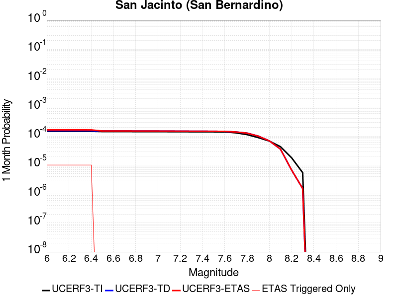 |  |  |

| Magnitude | 1 wk TI Prob | 1 wk TD Prob | 1 wk ETAS Prob | 1 wk ETAS/TD Gain | 1 wk ETAS Triggered Only | 1 mo TI Prob | 1 mo TD Prob | 1 mo ETAS Prob | 1 mo ETAS/TD Gain | 1 mo ETAS Triggered Only | 1 yr TI Prob | 1 yr TD Prob | 1 yr ETAS Prob | 1 yr ETAS/TD Gain | 1 yr ETAS Triggered Only | 10 yr TI Prob | 10 yr TD Prob | 10 yr ETAS Prob | 10 yr ETAS/TD Gain | 10 yr ETAS Triggered Only |
|-----|-----|-----|-----|-----|-----|-----|-----|-----|-----|-----|-----|-----|-----|-----|-----|-----|-----|-----|-----|-----|
| 6.0 | 3.409352E-5 | 3.597972E-5 | 4.5979363E-5 | 1.2779243 | 1.0E-5 | 1.461069E-4 | 1.541897E-4 | 1.6418815E-4 | 1.0648452 | 1.0E-5 | 0.0017774 | 0.0018756451 | 0.0019055889 | 1.0159645 | 3.0E-5 | 0.01763251 | 0.019346429 | 0.019385654 | 1.0020275 | 4.0E-5 |
| 6.1 | 3.409352E-5 | 3.597972E-5 | 4.5979363E-5 | 1.2779243 | 1.0E-5 | 1.461069E-4 | 1.541897E-4 | 1.6418815E-4 | 1.0648452 | 1.0E-5 | 0.0017774 | 0.0018756451 | 0.0019055889 | 1.0159645 | 3.0E-5 | 0.01763251 | 0.019346429 | 0.019385654 | 1.0020275 | 4.0E-5 |
| 6.2 | 3.409352E-5 | 3.597972E-5 | 4.5979363E-5 | 1.2779243 | 1.0E-5 | 1.461069E-4 | 1.541897E-4 | 1.6418815E-4 | 1.0648452 | 1.0E-5 | 0.0017774 | 0.0018756451 | 0.0019055889 | 1.0159645 | 3.0E-5 | 0.01763251 | 0.019346429 | 0.019385654 | 1.0020275 | 4.0E-5 |
| 6.3 | 3.409352E-5 | 3.597972E-5 | 4.5979363E-5 | 1.2779243 | 1.0E-5 | 1.461069E-4 | 1.541897E-4 | 1.6418815E-4 | 1.0648452 | 1.0E-5 | 0.0017774 | 0.0018756451 | 0.0019055889 | 1.0159645 | 3.0E-5 | 0.01763251 | 0.019346429 | 0.019385654 | 1.0020275 | 4.0E-5 |
| 6.4 | 3.400795E-5 | 3.5872385E-5 | 4.5872024E-5 | 1.278756 | 1.0E-5 | 1.4574021E-4 | 1.5372974E-4 | 1.6372821E-4 | 1.0650393 | 1.0E-5 | 0.0017729428 | 0.0018700549 | 0.0018999988 | 1.0160123 | 3.0E-5 | 0.017588645 | 0.01929151 | 0.019330738 | 1.0020335 | 4.0E-5 |
| 6.5 | 3.341482E-5 | 3.5133027E-5 | 3.5133027E-5 | 1.0 | 0.0 | 1.4319851E-4 | 1.5056143E-4 | 1.5056143E-4 | 1.0 | 0.0 | 0.0017420477 | 0.0018315457 | 0.0018515091 | 1.0108998 | 2.0E-5 | 0.017284546 | 0.018913053 | 0.018942486 | 1.0015562 | 3.0E-5 |
| 6.6 | 3.3364955E-5 | 3.5070247E-5 | 3.5070247E-5 | 1.0 | 0.0 | 1.4298483E-4 | 1.5029241E-4 | 1.5029241E-4 | 1.0 | 0.0 | 0.0017394501 | 0.0018282757 | 0.0018482392 | 1.0109192 | 2.0E-5 | 0.017258976 | 0.018880919 | 0.018910352 | 1.0015589 | 3.0E-5 |
| 6.7 | 3.335922E-5 | 3.506002E-5 | 3.506002E-5 | 1.0 | 0.0 | 1.4296026E-4 | 1.5024858E-4 | 1.5024858E-4 | 1.0 | 0.0 | 0.0017391514 | 0.0018277431 | 0.0018477066 | 1.0109224 | 2.0E-5 | 0.017256035 | 0.018875709 | 0.018905144 | 1.0015594 | 3.0E-5 |
| 6.8 | 3.327683E-5 | 3.495409E-5 | 3.495409E-5 | 1.0 | 0.0 | 1.4260718E-4 | 1.4979464E-4 | 1.4979464E-4 | 1.0 | 0.0 | 0.0017348597 | 0.0018222256 | 0.0018421891 | 1.0109556 | 2.0E-5 | 0.017213784 | 0.018821482 | 0.018850917 | 1.0015639 | 3.0E-5 |
| 6.9 | 3.3235785E-5 | 3.489504E-5 | 3.489504E-5 | 1.0 | 0.0 | 1.4243131E-4 | 1.4954162E-4 | 1.4954162E-4 | 1.0 | 0.0 | 0.0017327217 | 0.0018191502 | 0.0018391138 | 1.0109742 | 2.0E-5 | 0.017192734 | 0.01879135 | 0.018820787 | 1.0015665 | 3.0E-5 |
| 7.0 | 3.3197095E-5 | 3.4834975E-5 | 3.4834975E-5 | 1.0 | 0.0 | 1.422655E-4 | 1.4928421E-4 | 1.4928421E-4 | 1.0 | 0.0 | 0.0017307063 | 0.0018160215 | 0.0018359851 | 1.0109931 | 2.0E-5 | 0.017172894 | 0.018760728 | 0.018790165 | 1.001569 | 3.0E-5 |
| 7.1 | 3.3129716E-5 | 3.4715187E-5 | 3.4715187E-5 | 1.0 | 0.0 | 1.4197677E-4 | 1.487709E-4 | 1.487709E-4 | 1.0 | 0.0 | 0.0017271966 | 0.0018097822 | 0.0018297461 | 1.011031 | 2.0E-5 | 0.017138338 | 0.018699808 | 0.018729247 | 1.0015743 | 3.0E-5 |
| 7.2 | 3.3034008E-5 | 3.4582634E-5 | 3.4582634E-5 | 1.0 | 0.0 | 1.4156665E-4 | 1.4820287E-4 | 1.4820287E-4 | 1.0 | 0.0 | 0.0017222111 | 0.0018028781 | 0.001822842 | 1.0110734 | 2.0E-5 | 0.017089253 | 0.018632201 | 0.018661642 | 1.0015801 | 3.0E-5 |
| 7.3 | 3.2956614E-5 | 3.4450393E-5 | 3.4450393E-5 | 1.0 | 0.0 | 1.4123498E-4 | 1.476362E-4 | 1.476362E-4 | 1.0 | 0.0 | 0.0017181796 | 0.0017959902 | 0.0018159542 | 1.0111159 | 2.0E-5 | 0.017049557 | 0.018564949 | 0.018594392 | 1.001586 | 3.0E-5 |
| 7.4 | 3.2915937E-5 | 3.437212E-5 | 3.437212E-5 | 1.0 | 0.0 | 1.4106068E-4 | 1.4730077E-4 | 1.4730077E-4 | 1.0 | 0.0 | 0.0017160608 | 0.0017919131 | 0.0018118772 | 1.0111413 | 2.0E-5 | 0.017028693 | 0.01852523 | 0.018554674 | 1.0015894 | 3.0E-5 |
| 7.5 | 3.281791E-5 | 3.4237073E-5 | 3.4237073E-5 | 1.0 | 0.0 | 1.406406E-4 | 1.4672207E-4 | 1.4672207E-4 | 1.0 | 0.0 | 0.0017109542 | 0.0017848789 | 0.0018048432 | 1.0111853 | 2.0E-5 | 0.016978411 | 0.018456137 | 0.018485583 | 1.0015955 | 3.0E-5 |
| 7.6 | 3.2521442E-5 | 3.3962282E-5 | 3.3962282E-5 | 1.0 | 0.0 | 1.3937015E-4 | 1.4554452E-4 | 1.4554452E-4 | 1.0 | 0.0 | 0.0016955109 | 0.0017705658 | 0.0017905303 | 1.0112758 | 2.0E-5 | 0.016826328 | 0.018313898 | 0.018343348 | 1.0016081 | 3.0E-5 |
| 7.7 | 3.0287873E-5 | 3.2449603E-5 | 3.2449603E-5 | 1.0 | 0.0 | 1.297987E-4 | 1.3906232E-4 | 1.3906232E-4 | 1.0 | 0.0 | 0.0015791537 | 0.00169177 | 0.0017117362 | 1.011802 | 2.0E-5 | 0.01567979 | 0.017526472 | 0.017555946 | 1.0016817 | 3.0E-5 |
| 7.8 | 2.6316151E-5 | 2.9660547E-5 | 2.9660547E-5 | 1.0 | 0.0 | 1.1277862E-4 | 1.2711044E-4 | 1.2711044E-4 | 1.0 | 0.0 | 0.0013722149 | 0.001546472 | 0.001566441 | 1.0129126 | 2.0E-5 | 0.013637724 | 0.016068073 | 0.01609759 | 1.001837 | 3.0E-5 |
| 7.9 | 2.0761147E-5 | 2.341544E-5 | 2.341544E-5 | 1.0 | 0.0 | 8.897331E-5 | 1.0034803E-4 | 1.0034803E-4 | 1.0 | 0.0 | 0.0010827117 | 0.0012210533 | 0.0012310412 | 1.0081797 | 1.0E-5 | 0.010774517 | 0.012791798 | 0.0128115425 | 1.0015435 | 2.0E-5 |
| 8.0 | 1.5738568E-5 | 1.6031558E-5 | 1.6031558E-5 | 1.0 | 0.0 | 6.744926E-5 | 6.8704874E-5 | 6.8704874E-5 | 1.0 | 0.0 | 8.2088535E-4 | 8.361615E-4 | 8.361615E-4 | 1.0 | 0.0 | 0.008178596 | 0.008864859 | 0.00887477 | 1.0011181 | 1.0E-5 |
| 8.1 | 1.0105832E-5 | 8.329329E-6 | 8.329329E-6 | 1.0 | 0.0 | 4.3309992E-5 | 3.5696637E-5 | 3.5696637E-5 | 1.0 | 0.0 | 5.2717153E-4 | 4.3452042E-4 | 4.3452042E-4 | 1.0 | 0.0 | 0.005259227 | 0.0046766037 | 0.0046865568 | 1.0021284 | 1.0E-5 |
| 8.2 | 4.189207E-6 | 1.5781004E-6 | 1.5781004E-6 | 1.0 | 0.0 | 1.7953622E-5 | 6.76327E-6 | 6.76327E-6 | 1.0 | 0.0 | 2.1856341E-4 | 8.233973E-5 | 8.233973E-5 | 1.0 | 0.0 | 0.0021834858 | 9.5639535E-4 | 9.5639535E-4 | 1.0 | 0.0 |
| 8.3 | 1.2758221E-6 | 3.6140935E-7 | 3.6140935E-7 | 1.0 | 0.0 | 5.4677976E-6 | 1.5488963E-6 | 1.5488963E-6 | 1.0 | 0.0 | 6.65684E-5 | 1.8857654E-5 | 1.8857654E-5 | 1.0 | 0.0 | 6.6548464E-4 | 2.2746001E-4 | 2.2746001E-4 | 1.0 | 0.0 |

## Ludlow
*[(top)](#table-of-contents)*

| 1 Week | 1 Month | 1 Year | 10 Year |
|-----|-----|-----|-----|
|  |  |  | 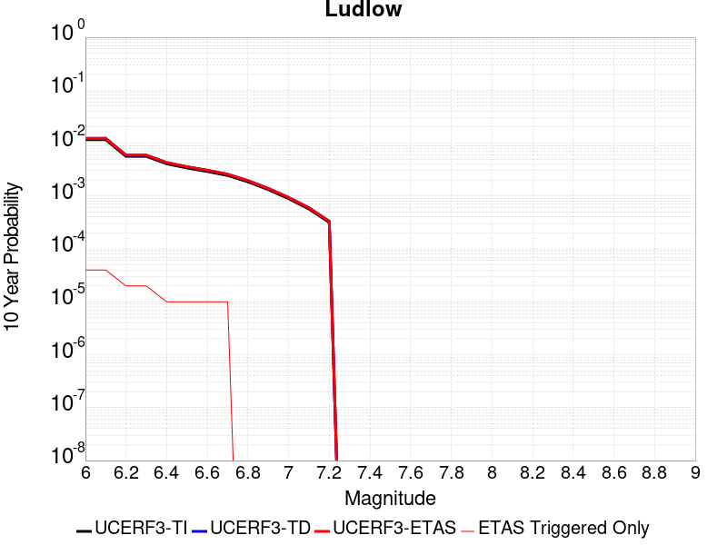 |

| Magnitude | 1 wk TI Prob | 1 wk TD Prob | 1 wk ETAS Prob | 1 wk ETAS/TD Gain | 1 wk ETAS Triggered Only | 1 mo TI Prob | 1 mo TD Prob | 1 mo ETAS Prob | 1 mo ETAS/TD Gain | 1 mo ETAS Triggered Only | 1 yr TI Prob | 1 yr TD Prob | 1 yr ETAS Prob | 1 yr ETAS/TD Gain | 1 yr ETAS Triggered Only | 10 yr TI Prob | 10 yr TD Prob | 10 yr ETAS Prob | 10 yr ETAS/TD Gain | 10 yr ETAS Triggered Only |
|-----|-----|-----|-----|-----|-----|-----|-----|-----|-----|-----|-----|-----|-----|-----|-----|-----|-----|-----|-----|-----|
| 6.0 | 2.2407607E-5 | 2.3657218E-5 | 3.3656983E-5 | 1.422694 | 1.0E-5 | 9.602906E-5 | 1.0138439E-4 | 1.2138236E-4 | 1.197249 | 2.0E-5 | 0.0011685267 | 0.0012337001 | 0.0012536754 | 1.0161914 | 2.0E-5 | 0.011624013 | 0.012273024 | 0.012312533 | 1.0032191 | 4.0E-5 |
| 6.1 | 2.2407607E-5 | 2.3657218E-5 | 3.3656983E-5 | 1.422694 | 1.0E-5 | 9.602906E-5 | 1.0138439E-4 | 1.2138236E-4 | 1.197249 | 2.0E-5 | 0.0011685267 | 0.0012337001 | 0.0012536754 | 1.0161914 | 2.0E-5 | 0.011624013 | 0.012273024 | 0.012312533 | 1.0032191 | 4.0E-5 |
| 6.2 | 1.0781252E-5 | 1.1365647E-5 | 1.1365647E-5 | 1.0 | 0.0 | 4.620455E-5 | 4.870903E-5 | 5.870854E-5 | 1.2052908 | 1.0E-5 | 5.623952E-4 | 5.928751E-4 | 6.028692E-4 | 1.0168569 | 1.0E-5 | 0.00560974 | 0.0059133526 | 0.0059332345 | 1.0033622 | 2.0E-5 |
| 6.3 | 1.0781252E-5 | 1.1365647E-5 | 1.1365647E-5 | 1.0 | 0.0 | 4.620455E-5 | 4.870903E-5 | 5.870854E-5 | 1.2052908 | 1.0E-5 | 5.623952E-4 | 5.928751E-4 | 6.028692E-4 | 1.0168569 | 1.0E-5 | 0.00560974 | 0.0059133526 | 0.0059332345 | 1.0033622 | 2.0E-5 |
| 6.4 | 7.814439E-6 | 8.237717E-6 | 8.237717E-6 | 1.0 | 0.0 | 3.3490025E-5 | 3.530403E-5 | 4.5303677E-5 | 1.2832438 | 1.0E-5 | 4.0766477E-4 | 4.297432E-4 | 4.397389E-4 | 1.0232598 | 1.0E-5 | 0.0040691774 | 0.0042892685 | 0.0042992253 | 1.0023214 | 1.0E-5 |
| 6.5 | 6.4986366E-6 | 6.85091E-6 | 6.85091E-6 | 1.0 | 0.0 | 2.7851002E-5 | 2.9360717E-5 | 3.9360424E-5 | 1.3405812 | 1.0E-5 | 3.390332E-4 | 3.57409E-4 | 3.6740545E-4 | 1.0279691 | 1.0E-5 | 0.003385164 | 0.003568438 | 0.0035784023 | 1.0027924 | 1.0E-5 |
| 6.6 | 5.582177E-6 | 5.885997E-6 | 5.885997E-6 | 1.0 | 0.0 | 2.3923398E-5 | 2.5225461E-5 | 3.522521E-5 | 1.3964149 | 1.0E-5 | 2.9122844E-4 | 3.0707743E-4 | 3.1707436E-4 | 1.0325551 | 1.0E-5 | 0.0029084706 | 0.0030666045 | 0.0030765738 | 1.003251 | 1.0E-5 |
| 6.7 | 4.6858763E-6 | 4.9404202E-6 | 4.9404202E-6 | 1.0 | 0.0 | 2.0082172E-5 | 2.117306E-5 | 3.1172847E-5 | 1.4722883 | 1.0E-5 | 2.4447302E-4 | 2.5775208E-4 | 2.677495E-4 | 1.038787 | 1.0E-5 | 0.0024420423 | 0.0025745875 | 0.002584562 | 1.0038741 | 1.0E-5 |
| 6.8 | 3.5584908E-6 | 3.7520128E-6 | 3.7520128E-6 | 1.0 | 0.0 | 1.5250586E-5 | 1.607996E-5 | 1.607996E-5 | 1.0 | 0.0 | 1.8566006E-4 | 1.9575632E-4 | 1.9575632E-4 | 1.0 | 0.0 | 0.0018550502 | 0.0019558799 | 0.0019558799 | 1.0 | 0.0 |
| 6.9 | 2.532834E-6 | 2.6709995E-6 | 2.6709995E-6 | 1.0 | 0.0 | 1.0854958E-5 | 1.1447092E-5 | 1.1447092E-5 | 1.0 | 0.0 | 1.3215111E-4 | 1.3935972E-4 | 1.3935972E-4 | 1.0 | 0.0 | 0.0013207254 | 0.0013927508 | 0.0013927508 | 1.0 | 0.0 |
| 7.0 | 1.7083285E-6 | 1.8019413E-6 | 1.8019413E-6 | 1.0 | 0.0 | 7.3213873E-6 | 7.722583E-6 | 7.722583E-6 | 1.0 | 0.0 | 8.913424E-5 | 9.4018564E-5 | 9.4018564E-5 | 1.0 | 0.0 | 8.9098496E-4 | 9.3980436E-4 | 9.3980436E-4 | 1.0 | 0.0 |
| 7.1 | 1.0905424E-6 | 1.1497604E-6 | 1.1497604E-6 | 1.0 | 0.0 | 4.6737446E-6 | 4.9275354E-6 | 4.9275354E-6 | 1.0 | 0.0 | 5.6901354E-5 | 5.999119E-5 | 5.999119E-5 | 1.0 | 0.0 | 5.6886784E-4 | 5.9975975E-4 | 5.9975975E-4 | 1.0 | 0.0 |
| 7.2 | 6.06668E-7 | 6.387269E-7 | 6.387269E-7 | 1.0 | 0.0 | 2.600003E-6 | 2.7373983E-6 | 2.7373983E-6 | 1.0 | 0.0 | 3.1654577E-5 | 3.3327386E-5 | 3.3327386E-5 | 1.0 | 0.0 | 3.1650066E-4 | 3.332307E-4 | 3.332307E-4 | 1.0 | 0.0 |

## Kern Canyon (Lake Isabella) 2011
*[(top)](#table-of-contents)*

| 1 Week | 1 Month | 1 Year | 10 Year |
|-----|-----|-----|-----|
|  |  |  |  |

| Magnitude | 1 wk TI Prob | 1 wk TD Prob | 1 wk ETAS Prob | 1 wk ETAS/TD Gain | 1 wk ETAS Triggered Only | 1 mo TI Prob | 1 mo TD Prob | 1 mo ETAS Prob | 1 mo ETAS/TD Gain | 1 mo ETAS Triggered Only | 1 yr TI Prob | 1 yr TD Prob | 1 yr ETAS Prob | 1 yr ETAS/TD Gain | 1 yr ETAS Triggered Only | 10 yr TI Prob | 10 yr TD Prob | 10 yr ETAS Prob | 10 yr ETAS/TD Gain | 10 yr ETAS Triggered Only |
|-----|-----|-----|-----|-----|-----|-----|-----|-----|-----|-----|-----|-----|-----|-----|-----|-----|-----|-----|-----|-----|
| 6.0 | 4.2387383E-6 | 4.001636E-6 | 1.4001596E-5 | 3.4989676 | 1.0E-5 | 1.8165894E-5 | 1.7149767E-5 | 2.7149596E-5 | 1.5830883 | 1.0E-5 | 2.2114732E-4 | 2.0878029E-4 | 2.187782E-4 | 1.0478872 | 1.0E-5 | 0.0022092736 | 0.0020860252 | 0.0021159626 | 1.0143514 | 3.0E-5 |
| 6.1 | 4.2387383E-6 | 4.001636E-6 | 1.4001596E-5 | 3.4989676 | 1.0E-5 | 1.8165894E-5 | 1.7149767E-5 | 2.7149596E-5 | 1.5830883 | 1.0E-5 | 2.2114732E-4 | 2.0878029E-4 | 2.187782E-4 | 1.0478872 | 1.0E-5 | 0.0022092736 | 0.0020860252 | 0.0021159626 | 1.0143514 | 3.0E-5 |
| 6.2 | 4.2387383E-6 | 4.001636E-6 | 1.4001596E-5 | 3.4989676 | 1.0E-5 | 1.8165894E-5 | 1.7149767E-5 | 2.7149596E-5 | 1.5830883 | 1.0E-5 | 2.2114732E-4 | 2.0878029E-4 | 2.187782E-4 | 1.0478872 | 1.0E-5 | 0.0022092736 | 0.0020860252 | 0.0021159626 | 1.0143514 | 3.0E-5 |
| 6.3 | 4.2387383E-6 | 4.001636E-6 | 1.4001596E-5 | 3.4989676 | 1.0E-5 | 1.8165894E-5 | 1.7149767E-5 | 2.7149596E-5 | 1.5830883 | 1.0E-5 | 2.2114732E-4 | 2.0878029E-4 | 2.187782E-4 | 1.0478872 | 1.0E-5 | 0.0022092736 | 0.0020860252 | 0.0021159626 | 1.0143514 | 3.0E-5 |
| 6.4 | 4.2387383E-6 | 4.001636E-6 | 1.4001596E-5 | 3.4989676 | 1.0E-5 | 1.8165894E-5 | 1.7149767E-5 | 2.7149596E-5 | 1.5830883 | 1.0E-5 | 2.2114732E-4 | 2.0878029E-4 | 2.187782E-4 | 1.0478872 | 1.0E-5 | 0.0022092736 | 0.0020860252 | 0.0021159626 | 1.0143514 | 3.0E-5 |
| 6.5 | 2.7857532E-6 | 2.5178654E-6 | 2.5178654E-6 | 1.0 | 0.0 | 1.1938888E-5 | 1.0790809E-5 | 1.0790809E-5 | 1.0 | 0.0 | 1.4534626E-4 | 1.313705E-4 | 1.313705E-4 | 1.0 | 0.0 | 0.0014525123 | 0.0013129612 | 0.0013129612 | 1.0 | 0.0 |
| 6.6 | 2.2233348E-6 | 1.9441222E-6 | 1.9441222E-6 | 1.0 | 0.0 | 9.528543E-6 | 8.331926E-6 | 8.331926E-6 | 1.0 | 0.0 | 1.1600384E-4 | 1.0143657E-4 | 1.0143657E-4 | 1.0 | 0.0 | 0.001159433 | 0.0010139113 | 0.0010139113 | 1.0 | 0.0 |
| 6.7 | 2.1635126E-6 | 1.8835024E-6 | 1.8835024E-6 | 1.0 | 0.0 | 9.272164E-6 | 8.072128E-6 | 8.072128E-6 | 1.0 | 0.0 | 1.1288274E-4 | 9.827381E-5 | 9.827381E-5 | 1.0 | 0.0 | 0.0011282542 | 9.823117E-4 | 9.823117E-4 | 1.0 | 0.0 |
| 6.8 | 1.8685711E-6 | 1.5831414E-6 | 1.5831414E-6 | 1.0 | 0.0 | 8.008137E-6 | 6.7848746E-6 | 6.7848746E-6 | 1.0 | 0.0 | 9.74947E-5 | 8.260277E-5 | 8.260277E-5 | 1.0 | 0.0 | 9.745194E-4 | 8.2572555E-4 | 8.2572555E-4 | 1.0 | 0.0 |
| 6.9 | 1.5815071E-6 | 1.3064919E-6 | 1.3064919E-6 | 1.0 | 0.0 | 6.77787E-6 | 5.599239E-6 | 5.599239E-6 | 1.0 | 0.0 | 8.251744E-5 | 6.816863E-5 | 6.816863E-5 | 1.0 | 0.0 | 8.248681E-4 | 6.8147987E-4 | 6.8147987E-4 | 1.0 | 0.0 |
| 7.0 | 1.3772564E-6 | 1.121071E-6 | 1.121071E-6 | 1.0 | 0.0 | 5.9025137E-6 | 4.8045813E-6 | 4.8045813E-6 | 1.0 | 0.0 | 7.186073E-5 | 5.8494225E-5 | 5.8494225E-5 | 1.0 | 0.0 | 7.18375E-4 | 5.8479037E-4 | 5.8479037E-4 | 1.0 | 0.0 |
| 7.1 | 1.0916998E-6 | 8.763771E-7 | 8.763771E-7 | 1.0 | 0.0 | 4.678705E-6 | 3.7558964E-6 | 3.7558964E-6 | 1.0 | 0.0 | 5.6961744E-5 | 4.5727094E-5 | 4.5727094E-5 | 1.0 | 0.0 | 5.6947145E-4 | 4.571782E-4 | 4.571782E-4 | 1.0 | 0.0 |
| 7.2 | 7.6277024E-7 | 5.90145E-7 | 5.90145E-7 | 1.0 | 0.0 | 3.2690114E-6 | 2.5291904E-6 | 2.5291904E-6 | 1.0 | 0.0 | 3.9799485E-5 | 3.0792464E-5 | 3.0792464E-5 | 1.0 | 0.0 | 3.9792358E-4 | 3.0788258E-4 | 3.0788258E-4 | 1.0 | 0.0 |
| 7.3 | 5.3265916E-7 | 4.3824386E-7 | 4.3824386E-7 | 1.0 | 0.0 | 2.282823E-6 | 1.8781866E-6 | 1.8781866E-6 | 1.0 | 0.0 | 2.7793016E-5 | 2.2866687E-5 | 2.2866687E-5 | 1.0 | 0.0 | 2.778954E-4 | 2.2864371E-4 | 2.2864371E-4 | 1.0 | 0.0 |
| 7.4 | 3.4946007E-7 | 3.006569E-7 | 3.006569E-7 | 1.0 | 0.0 | 1.497685E-6 | 1.2885289E-6 | 1.2885289E-6 | 1.0 | 0.0 | 1.8234163E-5 | 1.5687729E-5 | 1.5687729E-5 | 1.0 | 0.0 | 1.8232666E-4 | 1.5686643E-4 | 1.5686643E-4 | 1.0 | 0.0 |
| 7.5 | 1.8317026E-7 | 1.42448E-7 | 1.42448E-7 | 1.0 | 0.0 | 7.850152E-7 | 6.104913E-7 | 6.104913E-7 | 1.0 | 0.0 | 9.557518E-6 | 7.432707E-6 | 7.432707E-6 | 1.0 | 0.0 | 9.5571064E-5 | 7.4324664E-5 | 7.4324664E-5 | 1.0 | 0.0 |
| 7.6 | 2.572245E-8 | 1.7352539E-8 | 1.7352539E-8 | 1.0 | 0.0 | 1.10239064E-7 | 7.436802E-8 | 7.436802E-8 | 1.0 | 0.0 | 1.3421597E-6 | 9.0543034E-7 | 9.0543034E-7 | 1.0 | 0.0 | 1.3421517E-5 | 9.054272E-6 | 9.054272E-6 | 1.0 | 0.0 |

## San Andreas (Big Bend)
*[(top)](#table-of-contents)*

| 1 Week | 1 Month | 1 Year | 10 Year |
|-----|-----|-----|-----|
|  |  |  |  |

| Magnitude | 1 wk TI Prob | 1 wk TD Prob | 1 wk ETAS Prob | 1 wk ETAS/TD Gain | 1 wk ETAS Triggered Only | 1 mo TI Prob | 1 mo TD Prob | 1 mo ETAS Prob | 1 mo ETAS/TD Gain | 1 mo ETAS Triggered Only | 1 yr TI Prob | 1 yr TD Prob | 1 yr ETAS Prob | 1 yr ETAS/TD Gain | 1 yr ETAS Triggered Only | 10 yr TI Prob | 10 yr TD Prob | 10 yr ETAS Prob | 10 yr ETAS/TD Gain | 10 yr ETAS Triggered Only |
|-----|-----|-----|-----|-----|-----|-----|-----|-----|-----|-----|-----|-----|-----|-----|-----|-----|-----|-----|-----|-----|
| 6.0 | 1.0179969E-4 | 2.0070563E-4 | 2.3069962E-4 | 1.1494427 | 3.0E-5 | 4.362114E-4 | 8.598845E-4 | 8.9985004E-4 | 1.0464779 | 4.0E-5 | 0.0052979486 | 0.010419123 | 0.010458706 | 1.0037991 | 4.0E-5 | 0.051734097 | 0.10144164 | 0.10147758 | 1.0003543 | 4.0E-5 |
| 6.1 | 1.0179969E-4 | 2.0070563E-4 | 2.3069962E-4 | 1.1494427 | 3.0E-5 | 4.362114E-4 | 8.598845E-4 | 8.9985004E-4 | 1.0464779 | 4.0E-5 | 0.0052979486 | 0.010419123 | 0.010458706 | 1.0037991 | 4.0E-5 | 0.051734097 | 0.10144164 | 0.10147758 | 1.0003543 | 4.0E-5 |
| 6.2 | 1.0179969E-4 | 2.0070563E-4 | 2.3069962E-4 | 1.1494427 | 3.0E-5 | 4.362114E-4 | 8.598845E-4 | 8.9985004E-4 | 1.0464779 | 4.0E-5 | 0.0052979486 | 0.010419123 | 0.010458706 | 1.0037991 | 4.0E-5 | 0.051734097 | 0.10144164 | 0.10147758 | 1.0003543 | 4.0E-5 |
| 6.3 | 1.0179969E-4 | 2.0070563E-4 | 2.3069962E-4 | 1.1494427 | 3.0E-5 | 4.362114E-4 | 8.598845E-4 | 8.9985004E-4 | 1.0464779 | 4.0E-5 | 0.0052979486 | 0.010419123 | 0.010458706 | 1.0037991 | 4.0E-5 | 0.051734097 | 0.10144164 | 0.10147758 | 1.0003543 | 4.0E-5 |
| 6.4 | 9.1639464E-5 | 1.842787E-4 | 2.1427317E-4 | 1.1627669 | 3.0E-5 | 3.9268145E-4 | 7.89527E-4 | 8.2949543E-4 | 1.0506233 | 4.0E-5 | 0.0047704205 | 0.009570243 | 0.00960986 | 1.0041397 | 4.0E-5 | 0.046693064 | 0.09376797 | 0.093804225 | 1.0003866 | 4.0E-5 |
| 6.5 | 9.1639464E-5 | 1.842787E-4 | 2.1427317E-4 | 1.1627669 | 3.0E-5 | 3.9268145E-4 | 7.89527E-4 | 8.2949543E-4 | 1.0506233 | 4.0E-5 | 0.0047704205 | 0.009570243 | 0.00960986 | 1.0041397 | 4.0E-5 | 0.046693064 | 0.09376797 | 0.093804225 | 1.0003866 | 4.0E-5 |
| 6.6 | 9.042622E-5 | 1.8234932E-4 | 2.1234385E-4 | 1.1644894 | 3.0E-5 | 3.8748336E-4 | 7.812632E-4 | 8.21232E-4 | 1.0511591 | 4.0E-5 | 0.0047074095 | 0.009470508 | 0.00951013 | 1.0041837 | 4.0E-5 | 0.046089325 | 0.09286199 | 0.09289827 | 1.0003908 | 4.0E-5 |
| 6.7 | 8.9836685E-5 | 1.814927E-4 | 2.1148725E-4 | 1.1652659 | 3.0E-5 | 3.8495753E-4 | 7.7759416E-4 | 8.175631E-4 | 1.0514007 | 4.0E-5 | 0.00467679 | 0.009426224 | 0.009465847 | 1.0042034 | 4.0E-5 | 0.045795817 | 0.09245627 | 0.092492566 | 1.0003927 | 4.0E-5 |
| 6.8 | 8.9471854E-5 | 1.8096055E-4 | 2.1095511E-4 | 1.165752 | 3.0E-5 | 3.8339442E-4 | 7.7531487E-4 | 8.1528386E-4 | 1.0515519 | 4.0E-5 | 0.004657841 | 0.009398713 | 0.009438337 | 1.004216 | 4.0E-5 | 0.04561414 | 0.092203476 | 0.09223979 | 1.0003939 | 4.0E-5 |
| 6.9 | 8.858234E-5 | 1.797803E-4 | 2.097749E-4 | 1.1668403 | 3.0E-5 | 3.7958333E-4 | 7.7025965E-4 | 8.1022887E-4 | 1.0518905 | 4.0E-5 | 0.004611638 | 0.009337694 | 0.009377321 | 1.0042437 | 4.0E-5 | 0.04517103 | 0.0916436 | 0.09167994 | 1.0003965 | 4.0E-5 |
| 7.0 | 8.7433385E-5 | 1.7816834E-4 | 2.08163E-4 | 1.1683501 | 3.0E-5 | 3.746607E-4 | 7.633553E-4 | 8.033248E-4 | 1.0523603 | 4.0E-5 | 0.004551957 | 0.009254351 | 0.009293981 | 1.0042822 | 4.0E-5 | 0.044598386 | 0.090878054 | 0.09091442 | 1.0004002 | 4.0E-5 |
| 7.1 | 8.684964E-5 | 1.7728789E-4 | 2.0728257E-4 | 1.1691862 | 3.0E-5 | 3.7215967E-4 | 7.595842E-4 | 7.995538E-4 | 1.0526204 | 4.0E-5 | 0.0045216335 | 0.009208827 | 0.009248459 | 1.0043037 | 4.0E-5 | 0.04430731 | 0.09045961 | 0.09049599 | 1.0004022 | 4.0E-5 |
| 7.2 | 8.606521E-5 | 1.7619408E-4 | 2.061888E-4 | 1.1702368 | 3.0E-5 | 3.6879873E-4 | 7.548991E-4 | 7.948689E-4 | 1.0529472 | 4.0E-5 | 0.0044808835 | 0.009152266 | 0.0091919005 | 1.0043305 | 4.0E-5 | 0.043916024 | 0.08994013 | 0.08997653 | 1.0004047 | 4.0E-5 |
| 7.3 | 8.568266E-5 | 1.7561417E-4 | 2.056089E-4 | 1.170799 | 3.0E-5 | 3.6715972E-4 | 7.524153E-4 | 7.9238514E-4 | 1.0531222 | 4.0E-5 | 0.0044610105 | 0.0091222795 | 0.009161915 | 1.0043448 | 4.0E-5 | 0.043725148 | 0.0896613 | 0.08969771 | 1.0004061 | 4.0E-5 |
| 7.4 | 8.5432206E-5 | 1.7524007E-4 | 2.0523481E-4 | 1.1711637 | 3.0E-5 | 3.6608664E-4 | 7.508129E-4 | 7.9078285E-4 | 1.0532357 | 4.0E-5 | 0.004447999 | 0.009102933 | 0.009142569 | 1.0043542 | 4.0E-5 | 0.043600157 | 0.08948149 | 0.08951791 | 1.000407 | 4.0E-5 |
| 7.5 | 8.4791965E-5 | 1.7393343E-4 | 2.039282E-4 | 1.1724498 | 3.0E-5 | 3.633435E-4 | 7.452162E-4 | 7.8518636E-4 | 1.0536357 | 4.0E-5 | 0.0044147377 | 0.009035361 | 0.009074999 | 1.004387 | 4.0E-5 | 0.043280575 | 0.08885915 | 0.08889559 | 1.0004102 | 4.0E-5 |
| 7.6 | 8.241105E-5 | 1.68388E-4 | 1.9838296E-4 | 1.1781299 | 3.0E-5 | 3.531424E-4 | 7.2146347E-4 | 7.614346E-4 | 1.0554029 | 4.0E-5 | 0.0042910352 | 0.0087485295 | 0.00878818 | 1.0045322 | 4.0E-5 | 0.042091176 | 0.086236194 | 0.08627274 | 1.0004238 | 4.0E-5 |
| 7.7 | 7.00432E-5 | 1.4203055E-4 | 1.620277E-4 | 1.1407948 | 2.0E-5 | 3.001506E-4 | 6.085604E-4 | 6.285482E-4 | 1.0328444 | 2.0E-5 | 0.0036482112 | 0.0073840916 | 0.0074039437 | 1.0026885 | 2.0E-5 | 0.035888977 | 0.07351081 | 0.07352934 | 1.0002521 | 2.0E-5 |
| 7.8 | 6.415362E-5 | 1.2967631E-4 | 1.4967371E-4 | 1.1542102 | 2.0E-5 | 2.749151E-4 | 5.5563723E-4 | 5.7562615E-4 | 1.0359747 | 2.0E-5 | 0.0033419547 | 0.00674393 | 0.006763795 | 1.0029457 | 2.0E-5 | 0.03292141 | 0.067246385 | 0.06726504 | 1.0002774 | 2.0E-5 |
| 7.9 | 4.939911E-5 | 9.340218E-5 | 1.03401246E-4 | 1.1070539 | 1.0E-5 | 2.116933E-4 | 4.0023366E-4 | 4.1022967E-4 | 1.0249754 | 1.0E-5 | 0.0025743195 | 0.0048619667 | 0.004871918 | 1.0020468 | 1.0E-5 | 0.025447013 | 0.04891005 | 0.048919562 | 1.0001944 | 1.0E-5 |
| 8.0 | 3.344983E-5 | 5.222126E-5 | 5.222126E-5 | 1.0 | 0.0 | 1.4334853E-4 | 2.2378622E-4 | 2.2378622E-4 | 1.0 | 0.0 | 0.0017438711 | 0.0027211946 | 0.0027211946 | 1.0 | 0.0 | 0.017302496 | 0.027919443 | 0.027919443 | 1.0 | 0.0 |
| 8.1 | 1.9104898E-5 | 1.917038E-5 | 1.917038E-5 | 1.0 | 0.0 | 8.1875565E-5 | 8.215619E-5 | 8.215619E-5 | 1.0 | 0.0 | 9.963791E-4 | 9.997933E-4 | 9.997933E-4 | 1.0 | 0.0 | 0.009919235 | 0.010748395 | 0.010748395 | 1.0 | 0.0 |
| 8.2 | 8.643924E-6 | 5.4738607E-6 | 5.4738607E-6 | 1.0 | 0.0 | 3.704486E-5 | 2.3459192E-5 | 2.3459192E-5 | 1.0 | 0.0 | 4.5092785E-4 | 2.855783E-4 | 2.855783E-4 | 1.0 | 0.0 | 0.0045001395 | 0.0032481598 | 0.0032481598 | 1.0 | 0.0 |
| 8.3 | 1.983087E-6 | 7.658221E-7 | 7.658221E-7 | 1.0 | 0.0 | 8.498917E-6 | 3.2820906E-6 | 3.2820906E-6 | 1.0 | 0.0 | 1.034694E-4 | 3.9958737E-5 | 3.9958737E-5 | 1.0 | 0.0 | 0.0010342124 | 4.7187202E-4 | 4.7187202E-4 | 1.0 | 0.0 |

## San Andreas (Coachella) rev
*[(top)](#table-of-contents)*

| 1 Week | 1 Month | 1 Year | 10 Year |
|-----|-----|-----|-----|
|  |  |  |  |

| Magnitude | 1 wk TI Prob | 1 wk TD Prob | 1 wk ETAS Prob | 1 wk ETAS/TD Gain | 1 wk ETAS Triggered Only | 1 mo TI Prob | 1 mo TD Prob | 1 mo ETAS Prob | 1 mo ETAS/TD Gain | 1 mo ETAS Triggered Only | 1 yr TI Prob | 1 yr TD Prob | 1 yr ETAS Prob | 1 yr ETAS/TD Gain | 1 yr ETAS Triggered Only | 10 yr TI Prob | 10 yr TD Prob | 10 yr ETAS Prob | 10 yr ETAS/TD Gain | 10 yr ETAS Triggered Only |
|-----|-----|-----|-----|-----|-----|-----|-----|-----|-----|-----|-----|-----|-----|-----|-----|-----|-----|-----|-----|-----|
| 6.0 | 1.1925945E-4 | 3.2723017E-4 | 3.4722363E-4 | 1.061099 | 2.0E-5 | 5.110118E-4 | 0.001401666 | 0.0014316239 | 1.0213732 | 3.0E-5 | 0.0062038354 | 0.016933087 | 0.01697241 | 1.0023222 | 4.0E-5 | 0.060334753 | 0.15262908 | 0.15266298 | 1.0002221 | 4.0E-5 |
| 6.1 | 1.1925945E-4 | 3.2723017E-4 | 3.4722363E-4 | 1.061099 | 2.0E-5 | 5.110118E-4 | 0.001401666 | 0.0014316239 | 1.0213732 | 3.0E-5 | 0.0062038354 | 0.016933087 | 0.01697241 | 1.0023222 | 4.0E-5 | 0.060334753 | 0.15262908 | 0.15266298 | 1.0002221 | 4.0E-5 |
| 6.2 | 1.07432395E-4 | 3.0223778E-4 | 3.2223173E-4 | 1.066153 | 2.0E-5 | 4.603433E-4 | 0.0012946657 | 0.0013146398 | 1.015428 | 2.0E-5 | 0.005590286 | 0.01564973 | 0.01567926 | 1.001887 | 3.0E-5 | 0.05451731 | 0.1417999 | 0.14182565 | 1.0001816 | 3.0E-5 |
| 6.3 | 1.0718766E-4 | 3.0169083E-4 | 3.216848E-4 | 1.066273 | 2.0E-5 | 4.592948E-4 | 0.001292324 | 0.0013122982 | 1.015456 | 2.0E-5 | 0.005577586 | 0.01562163 | 0.01565116 | 1.0018904 | 3.0E-5 | 0.054396555 | 0.14156814 | 0.1415939 | 1.0001819 | 3.0E-5 |
| 6.4 | 1.0355944E-4 | 2.9377177E-4 | 3.137659E-4 | 1.06806 | 2.0E-5 | 4.4375064E-4 | 0.0012584183 | 0.0012783931 | 1.015873 | 2.0E-5 | 0.0053892885 | 0.015214663 | 0.015244207 | 1.0019418 | 3.0E-5 | 0.052604496 | 0.13812812 | 0.13815397 | 1.0001872 | 3.0E-5 |
| 6.5 | 1.0227914E-4 | 2.909661E-4 | 3.1096028E-4 | 1.0687165 | 2.0E-5 | 4.382655E-4 | 0.0012464056 | 0.0012663807 | 1.0160261 | 2.0E-5 | 0.0053228354 | 0.015070442 | 0.015099989 | 1.0019606 | 3.0E-5 | 0.051971316 | 0.13690725 | 0.13693315 | 1.0001892 | 3.0E-5 |
| 6.6 | 1.0116757E-4 | 2.8862362E-4 | 3.0861786E-4 | 1.0692744 | 2.0E-5 | 4.3350324E-4 | 0.0012363759 | 0.0012563512 | 1.0161563 | 2.0E-5 | 0.0052651367 | 0.014950012 | 0.014979563 | 1.0019767 | 3.0E-5 | 0.051421247 | 0.1358854 | 0.13591132 | 1.0001907 | 3.0E-5 |
| 6.7 | 1.0050676E-4 | 2.8720926E-4 | 3.072035E-4 | 1.0696156 | 2.0E-5 | 4.3067214E-4 | 0.0012303201 | 0.0012502954 | 1.016236 | 2.0E-5 | 0.005230834 | 0.014877291 | 0.014906845 | 1.0019865 | 3.0E-5 | 0.051094085 | 0.1352701 | 0.13529605 | 1.0001918 | 3.0E-5 |
| 6.8 | 9.976819E-5 | 2.8524583E-4 | 3.0524013E-4 | 1.070095 | 2.0E-5 | 4.2750788E-4 | 0.0012219134 | 0.001241889 | 1.0163478 | 2.0E-5 | 0.0051924936 | 0.014776332 | 0.01480589 | 1.0020003 | 3.0E-5 | 0.050728295 | 0.13442177 | 0.13444774 | 1.0001931 | 3.0E-5 |
| 6.9 | 9.77719E-5 | 2.8021506E-4 | 3.0020945E-4 | 1.0713538 | 2.0E-5 | 4.1895514E-4 | 0.0012003728 | 0.0012203489 | 1.0166415 | 2.0E-5 | 0.0050888555 | 0.014517602 | 0.0145471655 | 1.0020365 | 3.0E-5 | 0.049738888 | 0.13225023 | 0.13227627 | 1.0001968 | 3.0E-5 |
| 7.0 | 8.500761E-5 | 2.4756166E-4 | 2.675567E-4 | 1.080768 | 2.0E-5 | 3.6426744E-4 | 0.0010605503 | 0.0010805291 | 1.0188382 | 2.0E-5 | 0.0044259406 | 0.012836529 | 0.012856272 | 1.001538 | 2.0E-5 | 0.04338823 | 0.11810792 | 0.118125565 | 1.0001494 | 2.0E-5 |
| 7.1 | 8.319876E-5 | 2.4358921E-4 | 2.6358434E-4 | 1.0820855 | 2.0E-5 | 3.5651738E-4 | 0.0010435393 | 0.0010635185 | 1.0191455 | 2.0E-5 | 0.004331963 | 0.01263184 | 0.012651587 | 1.0015633 | 2.0E-5 | 0.042484846 | 0.11632819 | 0.11634587 | 1.0001519 | 2.0E-5 |
| 7.2 | 7.563917E-5 | 2.2407399E-4 | 2.440695E-4 | 1.0892363 | 2.0E-5 | 3.2412758E-4 | 9.599667E-4 | 9.799475E-4 | 1.0208141 | 2.0E-5 | 0.0039391145 | 0.01162565 | 0.011645418 | 1.0017003 | 2.0E-5 | 0.03870018 | 0.10773429 | 0.107752144 | 1.0001657 | 2.0E-5 |
| 7.3 | 7.082985E-5 | 2.0723743E-4 | 2.272333E-4 | 1.0964876 | 2.0E-5 | 3.0352117E-4 | 8.87861E-4 | 9.078433E-4 | 1.022506 | 2.0E-5 | 0.0036891096 | 0.010756755 | 0.01077654 | 1.0018393 | 2.0E-5 | 0.03628465 | 0.10025747 | 0.10027547 | 1.0001795 | 2.0E-5 |
| 7.4 | 5.146215E-5 | 1.4271007E-4 | 1.627072E-4 | 1.1401243 | 2.0E-5 | 2.2053342E-4 | 6.1147206E-4 | 6.314599E-4 | 1.0326879 | 2.0E-5 | 0.0026816884 | 0.007419449 | 0.0074393004 | 1.0026757 | 2.0E-5 | 0.02649557 | 0.070837796 | 0.07085638 | 1.0002624 | 2.0E-5 |
| 7.5 | 4.0285166E-5 | 1.0941066E-4 | 1.2940848E-4 | 1.1827775 | 2.0E-5 | 1.7263928E-4 | 4.688189E-4 | 4.8880954E-4 | 1.0426404 | 2.0E-5 | 0.002099857 | 0.005693001 | 0.0057128873 | 1.0034931 | 2.0E-5 | 0.020801254 | 0.055008773 | 0.05502767 | 1.0003436 | 2.0E-5 |
| 7.6 | 3.1168736E-5 | 8.438435E-5 | 1.0438266E-4 | 1.2369908 | 2.0E-5 | 1.3357346E-4 | 3.6159722E-4 | 3.8158998E-4 | 1.0552901 | 2.0E-5 | 0.0016250437 | 0.004393586 | 0.004413498 | 1.0045321 | 2.0E-5 | 0.016132116 | 0.04280791 | 0.042827055 | 1.0004472 | 2.0E-5 |
| 7.7 | 2.2100989E-5 | 6.2383384E-5 | 8.238213E-5 | 1.3205782 | 2.0E-5 | 9.4715084E-5 | 2.6733E-4 | 2.8732466E-4 | 1.0747939 | 2.0E-5 | 0.001152546 | 0.0032498916 | 0.0032698265 | 1.006134 | 2.0E-5 | 0.011465867 | 0.031898305 | 0.03191767 | 1.000607 | 2.0E-5 |
| 7.8 | 1.7484861E-5 | 5.1792E-5 | 7.1790964E-5 | 1.38614 | 2.0E-5 | 7.493296E-5 | 2.2194686E-4 | 2.4194241E-4 | 1.0900917 | 2.0E-5 | 9.1192697E-4 | 0.0026988573 | 0.0027188035 | 1.0073905 | 2.0E-5 | 0.009081938 | 0.026638424 | 0.02665789 | 1.0007308 | 2.0E-5 |
| 7.9 | 1.3967285E-5 | 3.8219507E-5 | 5.8218746E-5 | 1.523273 | 2.0E-5 | 5.985842E-5 | 1.6378761E-4 | 1.8378434E-4 | 1.1220894 | 2.0E-5 | 7.2853256E-4 | 0.0019922915 | 0.0020122519 | 1.0100187 | 2.0E-5 | 0.0072614877 | 0.01990803 | 0.019927632 | 1.0009847 | 2.0E-5 |
| 8.0 | 1.1887396E-5 | 3.10626E-5 | 4.106229E-5 | 1.3219206 | 1.0E-5 | 5.094499E-5 | 1.3311864E-4 | 1.431173E-4 | 1.0751109 | 1.0E-5 | 6.200787E-4 | 0.0016195155 | 0.0016294993 | 1.0061647 | 1.0E-5 | 0.006183513 | 0.016278049 | 0.016287887 | 1.0006043 | 1.0E-5 |
| 8.1 | 5.100864E-6 | 8.972364E-6 | 1.8972274E-5 | 2.1145234 | 1.0E-5 | 2.1860664E-5 | 3.8452425E-5 | 4.845204E-5 | 1.2600516 | 1.0E-5 | 2.6612106E-4 | 4.680578E-4 | 4.7805315E-4 | 1.0213549 | 1.0E-5 | 0.002658026 | 0.004917206 | 0.0049271565 | 1.0020237 | 1.0E-5 |
| 8.2 | 2.3004484E-6 | 2.7860247E-6 | 2.7860247E-6 | 1.0 | 0.0 | 9.859027E-6 | 1.1940051E-5 | 1.1940051E-5 | 1.0 | 0.0 | 1.2002704E-4 | 1.4536046E-4 | 1.4536046E-4 | 1.0 | 0.0 | 0.0011996223 | 0.0015971722 | 0.0015971722 | 1.0 | 0.0 |
| 8.3 | 1.0424446E-7 | 5.814984E-8 | 5.814984E-8 | 1.0 | 0.0 | 4.4676187E-7 | 2.4921357E-7 | 2.4921357E-7 | 1.0 | 0.0 | 5.439312E-6 | 3.0341714E-6 | 3.0341714E-6 | 1.0 | 0.0 | 5.4391792E-5 | 3.1900923E-5 | 3.1900923E-5 | 1.0 | 0.0 |

## Coyote Lake
*[(top)](#table-of-contents)*

| 1 Week | 1 Month | 1 Year | 10 Year |
|-----|-----|-----|-----|
|  |  | 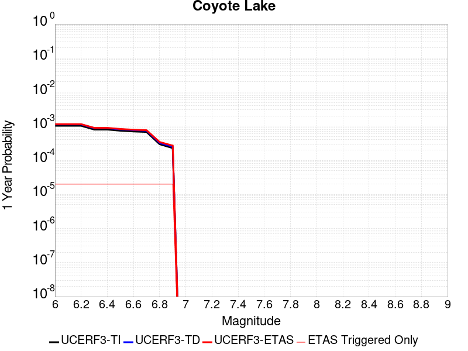 |  |

| Magnitude | 1 wk TI Prob | 1 wk TD Prob | 1 wk ETAS Prob | 1 wk ETAS/TD Gain | 1 wk ETAS Triggered Only | 1 mo TI Prob | 1 mo TD Prob | 1 mo ETAS Prob | 1 mo ETAS/TD Gain | 1 mo ETAS Triggered Only | 1 yr TI Prob | 1 yr TD Prob | 1 yr ETAS Prob | 1 yr ETAS/TD Gain | 1 yr ETAS Triggered Only | 10 yr TI Prob | 10 yr TD Prob | 10 yr ETAS Prob | 10 yr ETAS/TD Gain | 10 yr ETAS Triggered Only |
|-----|-----|-----|-----|-----|-----|-----|-----|-----|-----|-----|-----|-----|-----|-----|-----|-----|-----|-----|-----|-----|
| 6.0 | 1.980352E-5 | 2.170669E-5 | 3.1706473E-5 | 1.4606775 | 1.0E-5 | 8.486947E-5 | 9.302576E-5 | 1.03024824E-4 | 1.1074871 | 1.0E-5 | 0.0010327959 | 0.0011320722 | 0.0011520495 | 1.0176467 | 2.0E-5 | 0.010280091 | 0.01127023 | 0.011309778 | 1.0035092 | 4.0E-5 |
| 6.1 | 1.980352E-5 | 2.170669E-5 | 3.1706473E-5 | 1.4606775 | 1.0E-5 | 8.486947E-5 | 9.302576E-5 | 1.03024824E-4 | 1.1074871 | 1.0E-5 | 0.0010327959 | 0.0011320722 | 0.0011520495 | 1.0176467 | 2.0E-5 | 0.010280091 | 0.01127023 | 0.011309778 | 1.0035092 | 4.0E-5 |
| 6.2 | 1.980352E-5 | 2.170669E-5 | 3.1706473E-5 | 1.4606775 | 1.0E-5 | 8.486947E-5 | 9.302576E-5 | 1.03024824E-4 | 1.1074871 | 1.0E-5 | 0.0010327959 | 0.0011320722 | 0.0011520495 | 1.0176467 | 2.0E-5 | 0.010280091 | 0.01127023 | 0.011309778 | 1.0035092 | 4.0E-5 |
| 6.3 | 1.5344787E-5 | 1.6820626E-5 | 2.6820459E-5 | 1.5944982 | 1.0E-5 | 6.576172E-5 | 7.2086754E-5 | 8.208603E-5 | 1.1387117 | 1.0E-5 | 8.003548E-4 | 8.77364E-4 | 8.973465E-4 | 1.0227755 | 2.0E-5 | 0.007974784 | 0.008745047 | 0.008784697 | 1.004534 | 4.0E-5 |
| 6.4 | 1.5344787E-5 | 1.6820626E-5 | 2.6820459E-5 | 1.5944982 | 1.0E-5 | 6.576172E-5 | 7.2086754E-5 | 8.208603E-5 | 1.1387117 | 1.0E-5 | 8.003548E-4 | 8.77364E-4 | 8.973465E-4 | 1.0227755 | 2.0E-5 | 0.007974784 | 0.008745047 | 0.008784697 | 1.004534 | 4.0E-5 |
| 6.5 | 1.4189697E-5 | 1.5557947E-5 | 2.555779E-5 | 1.6427484 | 1.0E-5 | 6.081157E-5 | 6.667555E-5 | 7.6674885E-5 | 1.14997 | 1.0E-5 | 7.401293E-4 | 8.115328E-4 | 8.315166E-4 | 1.0246247 | 2.0E-5 | 0.0073766913 | 0.008091635 | 0.008131311 | 1.0049034 | 4.0E-5 |
| 6.6 | 1.3469301E-5 | 1.4771539E-5 | 2.4771392E-5 | 1.6769675 | 1.0E-5 | 5.7724297E-5 | 6.33054E-5 | 7.3304764E-5 | 1.1579545 | 1.0E-5 | 7.025667E-4 | 7.7053066E-4 | 7.905153E-4 | 1.0259361 | 2.0E-5 | 0.0070034964 | 0.0076844944 | 0.007724187 | 1.0051653 | 4.0E-5 |
| 6.7 | 1.3027966E-5 | 1.4281708E-5 | 2.4281566E-5 | 1.7001864 | 1.0E-5 | 5.5832945E-5 | 6.120622E-5 | 7.120561E-5 | 1.163372 | 1.0E-5 | 6.7955407E-4 | 7.449907E-4 | 7.6497585E-4 | 1.026826 | 2.0E-5 | 0.006774798 | 0.0074308095 | 0.0074705123 | 1.005343 | 4.0E-5 |
| 6.8 | 5.695434E-6 | 6.2244026E-6 | 1.622434E-5 | 2.60657 | 1.0E-5 | 2.4408775E-5 | 2.6675907E-5 | 3.667564E-5 | 1.3748602 | 1.0E-5 | 2.971363E-4 | 3.2476074E-4 | 3.4475425E-4 | 1.0615638 | 2.0E-5 | 0.0029673933 | 0.0032458024 | 0.0032856725 | 1.0122836 | 4.0E-5 |
| 6.9 | 4.385688E-6 | 4.7930434E-6 | 1.4792996E-5 | 3.086347 | 1.0E-5 | 1.879567E-5 | 2.0541615E-5 | 3.054141E-5 | 1.4868066 | 1.0E-5 | 2.2881327E-4 | 2.5009416E-4 | 2.7008916E-4 | 1.0799499 | 2.0E-5 | 0.002285778 | 0.0025009417 | 0.0025408417 | 1.015954 | 4.0E-5 |

## Sierra Nevada  (No Extension)
*[(top)](#table-of-contents)*

| 1 Week | 1 Month | 1 Year | 10 Year |
|-----|-----|-----|-----|
|  |  |  |  |

| Magnitude | 1 wk TI Prob | 1 wk TD Prob | 1 wk ETAS Prob | 1 wk ETAS/TD Gain | 1 wk ETAS Triggered Only | 1 mo TI Prob | 1 mo TD Prob | 1 mo ETAS Prob | 1 mo ETAS/TD Gain | 1 mo ETAS Triggered Only | 1 yr TI Prob | 1 yr TD Prob | 1 yr ETAS Prob | 1 yr ETAS/TD Gain | 1 yr ETAS Triggered Only | 10 yr TI Prob | 10 yr TD Prob | 10 yr ETAS Prob | 10 yr ETAS/TD Gain | 10 yr ETAS Triggered Only |
|-----|-----|-----|-----|-----|-----|-----|-----|-----|-----|-----|-----|-----|-----|-----|-----|-----|-----|-----|-----|-----|
| 6.0 | 7.7690465E-6 | 6.9763096E-6 | 1.6976239E-5 | 2.4334126 | 1.0E-5 | 3.329549E-5 | 2.9898329E-5 | 4.989773E-5 | 1.6689137 | 2.0E-5 | 4.0529718E-4 | 3.639872E-4 | 3.9397628E-4 | 1.0823904 | 3.0E-5 | 0.004045588 | 0.0036374263 | 0.0036772809 | 1.0109568 | 4.0E-5 |
| 6.1 | 7.7690465E-6 | 6.9763096E-6 | 1.6976239E-5 | 2.4334126 | 1.0E-5 | 3.329549E-5 | 2.9898329E-5 | 4.989773E-5 | 1.6689137 | 2.0E-5 | 4.0529718E-4 | 3.639872E-4 | 3.9397628E-4 | 1.0823904 | 3.0E-5 | 0.004045588 | 0.0036374263 | 0.0036772809 | 1.0109568 | 4.0E-5 |
| 6.2 | 7.7690465E-6 | 6.9763096E-6 | 1.6976239E-5 | 2.4334126 | 1.0E-5 | 3.329549E-5 | 2.9898329E-5 | 4.989773E-5 | 1.6689137 | 2.0E-5 | 4.0529718E-4 | 3.639872E-4 | 3.9397628E-4 | 1.0823904 | 3.0E-5 | 0.004045588 | 0.0036374263 | 0.0036772809 | 1.0109568 | 4.0E-5 |
| 6.3 | 7.7690465E-6 | 6.9763096E-6 | 1.6976239E-5 | 2.4334126 | 1.0E-5 | 3.329549E-5 | 2.9898329E-5 | 4.989773E-5 | 1.6689137 | 2.0E-5 | 4.0529718E-4 | 3.639872E-4 | 3.9397628E-4 | 1.0823904 | 3.0E-5 | 0.004045588 | 0.0036374263 | 0.0036772809 | 1.0109568 | 4.0E-5 |
| 6.4 | 7.7690465E-6 | 6.9763096E-6 | 1.6976239E-5 | 2.4334126 | 1.0E-5 | 3.329549E-5 | 2.9898329E-5 | 4.989773E-5 | 1.6689137 | 2.0E-5 | 4.0529718E-4 | 3.639872E-4 | 3.9397628E-4 | 1.0823904 | 3.0E-5 | 0.004045588 | 0.0036374263 | 0.0036772809 | 1.0109568 | 4.0E-5 |
| 6.5 | 7.7690465E-6 | 6.9763096E-6 | 1.6976239E-5 | 2.4334126 | 1.0E-5 | 3.329549E-5 | 2.9898329E-5 | 4.989773E-5 | 1.6689137 | 2.0E-5 | 4.0529718E-4 | 3.639872E-4 | 3.9397628E-4 | 1.0823904 | 3.0E-5 | 0.004045588 | 0.0036374263 | 0.0036772809 | 1.0109568 | 4.0E-5 |
| 6.6 | 2.653E-6 | 1.6148484E-6 | 1.6148484E-6 | 1.0 | 0.0 | 1.136995E-5 | 6.920761E-6 | 1.6920692E-5 | 2.4449177 | 1.0E-5 | 1.3842035E-4 | 8.4257044E-5 | 1.04255356E-4 | 1.2373489 | 2.0E-5 | 0.0013833415 | 8.422544E-4 | 8.722291E-4 | 1.0355887 | 3.0E-5 |
| 6.7 | 2.5902466E-6 | 1.5501821E-6 | 1.5501821E-6 | 1.0 | 0.0 | 1.11010095E-5 | 6.6436205E-6 | 1.6643555E-5 | 2.5051932 | 1.0E-5 | 1.351464E-4 | 8.088311E-5 | 1.00881494E-4 | 1.2472504 | 2.0E-5 | 0.0013506424 | 8.085397E-4 | 8.385154E-4 | 1.037074 | 3.0E-5 |
| 6.8 | 2.5853892E-6 | 1.5469824E-6 | 1.5469824E-6 | 1.0 | 0.0 | 1.1080193E-5 | 6.6299076E-6 | 1.6629841E-5 | 2.5083067 | 1.0E-5 | 1.34893E-4 | 8.071616E-5 | 1.0071455E-4 | 1.2477618 | 2.0E-5 | 0.0013481114 | 8.0687145E-4 | 8.3684723E-4 | 1.0371506 | 3.0E-5 |
| 6.9 | 2.458257E-6 | 1.4220567E-6 | 1.4220567E-6 | 1.0 | 0.0 | 1.0535345E-5 | 6.0945144E-6 | 6.0945144E-6 | 1.0 | 0.0 | 1.2826028E-4 | 7.419821E-5 | 8.419746E-5 | 1.1347642 | 1.0E-5 | 0.0012818627 | 7.417363E-4 | 7.6172146E-4 | 1.0269438 | 2.0E-5 |
| 7.0 | 2.4341468E-6 | 1.3990206E-6 | 1.3990206E-6 | 1.0 | 0.0 | 1.0432016E-5 | 5.995789E-6 | 5.995789E-6 | 1.0 | 0.0 | 1.270024E-4 | 7.29963E-5 | 8.299557E-5 | 1.1369833 | 1.0E-5 | 0.0012692984 | 7.297252E-4 | 7.4971054E-4 | 1.0273876 | 2.0E-5 |
| 7.1 | 2.3652476E-6 | 1.3339702E-6 | 1.3339702E-6 | 1.0 | 0.0 | 1.0136736E-5 | 5.7170028E-6 | 5.7170028E-6 | 1.0 | 0.0 | 1.2340778E-4 | 6.9602305E-5 | 7.960161E-5 | 1.1436634 | 1.0E-5 | 0.0012333926 | 6.9580675E-4 | 7.157928E-4 | 1.0287236 | 2.0E-5 |
| 7.2 | 2.272158E-6 | 1.250277E-6 | 1.250277E-6 | 1.0 | 0.0 | 9.737784E-6 | 5.3583194E-6 | 5.3583194E-6 | 1.0 | 0.0 | 1.1855107E-4 | 6.52356E-5 | 7.5234944E-5 | 1.1532805 | 1.0E-5 | 0.0011848784 | 6.52166E-4 | 6.7215296E-4 | 1.030647 | 2.0E-5 |
| 7.3 | 2.1382127E-6 | 1.1419653E-6 | 1.1419653E-6 | 1.0 | 0.0 | 9.163737E-6 | 4.8941283E-6 | 4.8941283E-6 | 1.0 | 0.0 | 1.1156279E-4 | 5.9584392E-5 | 6.9583795E-5 | 1.1678191 | 1.0E-5 | 0.001115068 | 5.956853E-4 | 6.056794E-4 | 1.0167774 | 1.0E-5 |
| 7.4 | 1.9048055E-6 | 9.575195E-7 | 9.575195E-7 | 1.0 | 0.0 | 8.163426E-6 | 4.1036487E-6 | 4.1036487E-6 | 1.0 | 0.0 | 9.9385186E-5 | 4.996079E-5 | 5.9960286E-5 | 1.200147 | 1.0E-5 | 9.934074E-4 | 4.9949624E-4 | 5.0949125E-4 | 1.0200101 | 1.0E-5 |
| 7.5 | 1.5373403E-6 | 7.5600025E-7 | 7.5600025E-7 | 1.0 | 0.0 | 6.5885843E-6 | 3.239997E-6 | 3.239997E-6 | 1.0 | 0.0 | 8.021306E-5 | 3.9446255E-5 | 4.944586E-5 | 1.2534995 | 1.0E-5 | 8.0184115E-4 | 3.9439302E-4 | 4.0438908E-4 | 1.0253454 | 1.0E-5 |
| 7.6 | 1.0680322E-6 | 4.6596273E-7 | 4.6596273E-7 | 1.0 | 0.0 | 4.577273E-6 | 1.9969816E-6 | 1.9969816E-6 | 1.0 | 0.0 | 5.5726876E-5 | 2.4312982E-5 | 2.4312982E-5 | 1.0 | 0.0 | 5.5712904E-4 | 2.4310348E-4 | 2.4310348E-4 | 1.0 | 0.0 |
| 7.7 | 5.509146E-7 | 1.5580342E-7 | 1.5580342E-7 | 1.0 | 0.0 | 2.3610605E-6 | 6.677288E-7 | 6.677288E-7 | 1.0 | 0.0 | 2.8745531E-5 | 8.129569E-6 | 8.129569E-6 | 1.0 | 0.0 | 2.8741814E-4 | 8.1292834E-5 | 8.1292834E-5 | 1.0 | 0.0 |

## San Jacinto (Lytle Creek connector)
*[(top)](#table-of-contents)*

| 1 Week | 1 Month | 1 Year | 10 Year |
|-----|-----|-----|-----|
|  |  |  |  |

| Magnitude | 1 wk TI Prob | 1 wk TD Prob | 1 wk ETAS Prob | 1 wk ETAS/TD Gain | 1 wk ETAS Triggered Only | 1 mo TI Prob | 1 mo TD Prob | 1 mo ETAS Prob | 1 mo ETAS/TD Gain | 1 mo ETAS Triggered Only | 1 yr TI Prob | 1 yr TD Prob | 1 yr ETAS Prob | 1 yr ETAS/TD Gain | 1 yr ETAS Triggered Only | 10 yr TI Prob | 10 yr TD Prob | 10 yr ETAS Prob | 10 yr ETAS/TD Gain | 10 yr ETAS Triggered Only |
|-----|-----|-----|-----|-----|-----|-----|-----|-----|-----|-----|-----|-----|-----|-----|-----|-----|-----|-----|-----|-----|
| 6.0 | 6.693995E-6 | 6.6596795E-6 | 6.6596795E-6 | 1.0 | 0.0 | 2.8688235E-5 | 2.8541172E-5 | 2.8541172E-5 | 1.0 | 0.0 | 3.492233E-4 | 3.4743344E-4 | 3.674265E-4 | 1.057545 | 2.0E-5 | 0.00348675 | 0.0035491067 | 0.003579 | 1.0084229 | 3.0E-5 |
| 6.1 | 6.693995E-6 | 6.6596795E-6 | 6.6596795E-6 | 1.0 | 0.0 | 2.8688235E-5 | 2.8541172E-5 | 2.8541172E-5 | 1.0 | 0.0 | 3.492233E-4 | 3.4743344E-4 | 3.674265E-4 | 1.057545 | 2.0E-5 | 0.00348675 | 0.0035491067 | 0.003579 | 1.0084229 | 3.0E-5 |
| 6.2 | 6.693995E-6 | 6.6596795E-6 | 6.6596795E-6 | 1.0 | 0.0 | 2.8688235E-5 | 2.8541172E-5 | 2.8541172E-5 | 1.0 | 0.0 | 3.492233E-4 | 3.4743344E-4 | 3.674265E-4 | 1.057545 | 2.0E-5 | 0.00348675 | 0.0035491067 | 0.003579 | 1.0084229 | 3.0E-5 |
| 6.3 | 6.693995E-6 | 6.6596795E-6 | 6.6596795E-6 | 1.0 | 0.0 | 2.8688235E-5 | 2.8541172E-5 | 2.8541172E-5 | 1.0 | 0.0 | 3.492233E-4 | 3.4743344E-4 | 3.674265E-4 | 1.057545 | 2.0E-5 | 0.00348675 | 0.0035491067 | 0.003579 | 1.0084229 | 3.0E-5 |
| 6.4 | 6.693995E-6 | 6.6596795E-6 | 6.6596795E-6 | 1.0 | 0.0 | 2.8688235E-5 | 2.8541172E-5 | 2.8541172E-5 | 1.0 | 0.0 | 3.492233E-4 | 3.4743344E-4 | 3.674265E-4 | 1.057545 | 2.0E-5 | 0.00348675 | 0.0035491067 | 0.003579 | 1.0084229 | 3.0E-5 |
| 6.5 | 6.6561875E-6 | 6.6198977E-6 | 6.6198977E-6 | 1.0 | 0.0 | 2.8526205E-5 | 2.8370681E-5 | 2.8370681E-5 | 1.0 | 0.0 | 3.472512E-4 | 3.4535836E-4 | 3.6535147E-4 | 1.0578909 | 2.0E-5 | 0.0034670907 | 0.003528422 | 0.0035583163 | 1.0084724 | 3.0E-5 |
| 6.6 | 6.6561875E-6 | 6.6198977E-6 | 6.6198977E-6 | 1.0 | 0.0 | 2.8526205E-5 | 2.8370681E-5 | 2.8370681E-5 | 1.0 | 0.0 | 3.472512E-4 | 3.4535836E-4 | 3.6535147E-4 | 1.0578909 | 2.0E-5 | 0.0034670907 | 0.003528422 | 0.0035583163 | 1.0084724 | 3.0E-5 |
| 6.7 | 6.5802237E-6 | 6.5390745E-6 | 6.5390745E-6 | 1.0 | 0.0 | 2.8200653E-5 | 2.8024304E-5 | 2.8024304E-5 | 1.0 | 0.0 | 3.4328885E-4 | 3.4114256E-4 | 3.6113572E-4 | 1.0586065 | 2.0E-5 | 0.0034275902 | 0.0034863965 | 0.003516292 | 1.0085748 | 3.0E-5 |
| 6.8 | 6.575632E-6 | 6.533564E-6 | 6.533564E-6 | 1.0 | 0.0 | 2.8180975E-5 | 2.8000688E-5 | 2.8000688E-5 | 1.0 | 0.0 | 3.4304935E-4 | 3.4085513E-4 | 3.6084832E-4 | 1.058656 | 2.0E-5 | 0.0034252026 | 0.0034835313 | 0.0035134268 | 1.008582 | 3.0E-5 |
| 6.9 | 6.570433E-6 | 6.5249583E-6 | 6.5249583E-6 | 1.0 | 0.0 | 2.8158694E-5 | 2.7963808E-5 | 2.7963808E-5 | 1.0 | 0.0 | 3.4277816E-4 | 3.4040623E-4 | 3.6039943E-4 | 1.0587333 | 2.0E-5 | 0.0034224992 | 0.0034790565 | 0.0035089522 | 1.0085931 | 3.0E-5 |
| 7.0 | 6.5643826E-6 | 6.5150793E-6 | 6.5150793E-6 | 1.0 | 0.0 | 2.8132765E-5 | 2.7921471E-5 | 2.7921471E-5 | 1.0 | 0.0 | 3.424626E-4 | 3.3989095E-4 | 3.5988414E-4 | 1.0588224 | 2.0E-5 | 0.0034193532 | 0.0034739198 | 0.0035038155 | 1.0086057 | 3.0E-5 |
| 7.1 | 6.557402E-6 | 6.5037916E-6 | 6.5037916E-6 | 1.0 | 0.0 | 2.8102848E-5 | 2.7873095E-5 | 2.7873095E-5 | 1.0 | 0.0 | 3.4209844E-4 | 3.3930215E-4 | 3.5929537E-4 | 1.0589246 | 2.0E-5 | 0.0034157229 | 0.0034680513 | 0.0034979472 | 1.0086204 | 3.0E-5 |
| 7.2 | 6.546394E-6 | 6.485758E-6 | 6.485758E-6 | 1.0 | 0.0 | 2.8055672E-5 | 2.7795812E-5 | 2.7795812E-5 | 1.0 | 0.0 | 3.4152428E-4 | 3.383615E-4 | 3.5835477E-4 | 1.0590883 | 2.0E-5 | 0.0034099987 | 0.0034586787 | 0.0034885749 | 1.0086439 | 3.0E-5 |
| 7.3 | 6.5364216E-6 | 6.4665446E-6 | 6.4665446E-6 | 1.0 | 0.0 | 2.8012933E-5 | 2.7713468E-5 | 2.7713468E-5 | 1.0 | 0.0 | 3.4100408E-4 | 3.3735932E-4 | 3.5735258E-4 | 1.059264 | 2.0E-5 | 0.003404813 | 0.0034487005 | 0.0034785972 | 1.0086689 | 3.0E-5 |
| 7.4 | 6.5269523E-6 | 6.447632E-6 | 6.447632E-6 | 1.0 | 0.0 | 2.7972354E-5 | 2.7632417E-5 | 2.7632417E-5 | 1.0 | 0.0 | 3.4051016E-4 | 3.3637282E-4 | 3.5636607E-4 | 1.0594379 | 2.0E-5 | 0.0033998888 | 0.0034388828 | 0.0034687796 | 1.0086938 | 3.0E-5 |
| 7.5 | 6.5111835E-6 | 6.423907E-6 | 6.423907E-6 | 1.0 | 0.0 | 2.7904773E-5 | 2.753074E-5 | 2.753074E-5 | 1.0 | 0.0 | 3.3968766E-4 | 3.3513526E-4 | 3.5512858E-4 | 1.0596575 | 2.0E-5 | 0.0033916887 | 0.0034265562 | 0.0034564533 | 1.0087252 | 3.0E-5 |
| 7.6 | 6.4768806E-6 | 6.3830166E-6 | 6.3830166E-6 | 1.0 | 0.0 | 2.7757764E-5 | 2.73555E-5 | 2.73555E-5 | 1.0 | 0.0 | 3.3789838E-4 | 3.330024E-4 | 3.5299573E-4 | 1.0600396 | 2.0E-5 | 0.0033738504 | 0.0034052888 | 0.0034351866 | 1.0087799 | 3.0E-5 |
| 7.7 | 6.1655364E-6 | 6.1755063E-6 | 6.1755063E-6 | 1.0 | 0.0 | 2.642346E-5 | 2.6466189E-5 | 2.6466189E-5 | 1.0 | 0.0 | 3.2165812E-4 | 3.2217827E-4 | 3.421718E-4 | 1.0620574 | 2.0E-5 | 0.0032119295 | 0.0032969064 | 0.0033268074 | 1.0090694 | 3.0E-5 |
| 7.8 | 5.5043524E-6 | 5.736582E-6 | 5.736582E-6 | 1.0 | 0.0 | 2.3589868E-5 | 2.4585119E-5 | 2.4585119E-5 | 1.0 | 0.0 | 2.871688E-4 | 2.9928278E-4 | 3.192768E-4 | 1.0668064 | 2.0E-5 | 0.0028679797 | 0.0030670157 | 0.0030969237 | 1.0097514 | 3.0E-5 |
| 7.9 | 3.889249E-6 | 4.076342E-6 | 4.076342E-6 | 1.0 | 0.0 | 1.6668104E-5 | 1.7469922E-5 | 1.7469922E-5 | 1.0 | 0.0 | 2.0291525E-4 | 2.1267557E-4 | 2.2267345E-4 | 1.04701 | 1.0E-5 | 0.0020273007 | 0.0021941126 | 0.0022140688 | 1.0090953 | 2.0E-5 |
| 8.0 | 2.668535E-6 | 2.5312252E-6 | 2.5312252E-6 | 1.0 | 0.0 | 1.1436528E-5 | 1.0848063E-5 | 1.0848063E-5 | 1.0 | 0.0 | 1.3923083E-4 | 1.3206719E-4 | 1.3206719E-4 | 1.0 | 0.0 | 0.0013914363 | 0.0013756427 | 0.001385629 | 1.0072594 | 1.0E-5 |
| 8.1 | 1.5911459E-6 | 1.2185061E-6 | 1.2185061E-6 | 1.0 | 0.0 | 6.8191785E-6 | 5.2221585E-6 | 5.2221585E-6 | 1.0 | 0.0 | 8.3020335E-5 | 6.357795E-5 | 6.357795E-5 | 1.0 | 0.0 | 8.298933E-4 | 6.692392E-4 | 6.7923253E-4 | 1.0149324 | 1.0E-5 |
| 8.2 | 6.1294963E-7 | 2.1807648E-7 | 2.1807648E-7 | 1.0 | 0.0 | 2.6269242E-6 | 9.346131E-7 | 9.346131E-7 | 1.0 | 0.0 | 3.1982334E-5 | 1.1378856E-5 | 1.1378856E-5 | 1.0 | 0.0 | 3.1977732E-4 | 1.2781945E-4 | 1.2781945E-4 | 1.0 | 0.0 |
| 8.3 | 1.762871E-7 | 4.753523E-8 | 4.753523E-8 | 1.0 | 0.0 | 7.5551594E-7 | 2.037224E-7 | 2.037224E-7 | 1.0 | 0.0 | 9.1983675E-6 | 2.4803173E-6 | 2.4803173E-6 | 1.0 | 0.0 | 9.197987E-5 | 2.8680868E-5 | 2.8680868E-5 | 1.0 | 0.0 |

## San Jacinto (San Jacinto Valley) rev
*[(top)](#table-of-contents)*

| 1 Week | 1 Month | 1 Year | 10 Year |
|-----|-----|-----|-----|
|  | 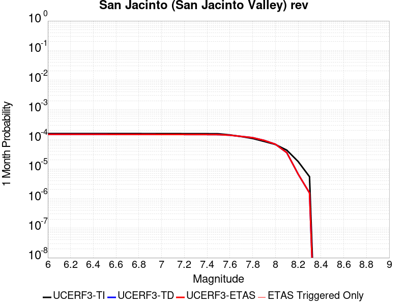 |  |  |

| Magnitude | 1 wk TI Prob | 1 wk TD Prob | 1 wk ETAS Prob | 1 wk ETAS/TD Gain | 1 wk ETAS Triggered Only | 1 mo TI Prob | 1 mo TD Prob | 1 mo ETAS Prob | 1 mo ETAS/TD Gain | 1 mo ETAS Triggered Only | 1 yr TI Prob | 1 yr TD Prob | 1 yr ETAS Prob | 1 yr ETAS/TD Gain | 1 yr ETAS Triggered Only | 10 yr TI Prob | 10 yr TD Prob | 10 yr ETAS Prob | 10 yr ETAS/TD Gain | 10 yr ETAS Triggered Only |
|-----|-----|-----|-----|-----|-----|-----|-----|-----|-----|-----|-----|-----|-----|-----|-----|-----|-----|-----|-----|-----|
| 6.0 | 3.652694E-5 | 3.4395853E-5 | 3.4395853E-5 | 1.0 | 0.0 | 1.5653463E-4 | 1.4740248E-4 | 1.4740248E-4 | 1.0 | 0.0 | 0.0019041431 | 0.0017931493 | 0.0018131135 | 1.0111336 | 2.0E-5 | 0.018879099 | 0.018523198 | 0.018552642 | 1.0015895 | 3.0E-5 |
| 6.1 | 3.652694E-5 | 3.4395853E-5 | 3.4395853E-5 | 1.0 | 0.0 | 1.5653463E-4 | 1.4740248E-4 | 1.4740248E-4 | 1.0 | 0.0 | 0.0019041431 | 0.0017931493 | 0.0018131135 | 1.0111336 | 2.0E-5 | 0.018879099 | 0.018523198 | 0.018552642 | 1.0015895 | 3.0E-5 |
| 6.2 | 3.652694E-5 | 3.4395853E-5 | 3.4395853E-5 | 1.0 | 0.0 | 1.5653463E-4 | 1.4740248E-4 | 1.4740248E-4 | 1.0 | 0.0 | 0.0019041431 | 0.0017931493 | 0.0018131135 | 1.0111336 | 2.0E-5 | 0.018879099 | 0.018523198 | 0.018552642 | 1.0015895 | 3.0E-5 |
| 6.3 | 3.652694E-5 | 3.4395853E-5 | 3.4395853E-5 | 1.0 | 0.0 | 1.5653463E-4 | 1.4740248E-4 | 1.4740248E-4 | 1.0 | 0.0 | 0.0019041431 | 0.0017931493 | 0.0018131135 | 1.0111336 | 2.0E-5 | 0.018879099 | 0.018523198 | 0.018552642 | 1.0015895 | 3.0E-5 |
| 6.4 | 3.646941E-5 | 3.431743E-5 | 3.431743E-5 | 1.0 | 0.0 | 1.5628811E-4 | 1.4706641E-4 | 1.4706641E-4 | 1.0 | 0.0 | 0.0019011468 | 0.001789065 | 0.0018090293 | 1.0111591 | 2.0E-5 | 0.018849645 | 0.01848308 | 0.018512525 | 1.0015931 | 3.0E-5 |
| 6.5 | 3.646941E-5 | 3.431743E-5 | 3.431743E-5 | 1.0 | 0.0 | 1.5628811E-4 | 1.4706641E-4 | 1.4706641E-4 | 1.0 | 0.0 | 0.0019011468 | 0.001789065 | 0.0018090293 | 1.0111591 | 2.0E-5 | 0.018849645 | 0.01848308 | 0.018512525 | 1.0015931 | 3.0E-5 |
| 6.6 | 3.6442503E-5 | 3.4280816E-5 | 3.4280816E-5 | 1.0 | 0.0 | 1.561728E-4 | 1.4690952E-4 | 1.4690952E-4 | 1.0 | 0.0 | 0.0018997455 | 0.0017871578 | 0.0018071221 | 1.011171 | 2.0E-5 | 0.018835869 | 0.01846435 | 0.018493796 | 1.0015948 | 3.0E-5 |
| 6.7 | 3.6432113E-5 | 3.4266388E-5 | 3.4266388E-5 | 1.0 | 0.0 | 1.5612828E-4 | 1.4684768E-4 | 1.4684768E-4 | 1.0 | 0.0 | 0.0018992044 | 0.0017864066 | 0.0018063709 | 1.0111756 | 2.0E-5 | 0.018830549 | 0.018456973 | 0.01848642 | 1.0015954 | 3.0E-5 |
| 6.8 | 3.6409598E-5 | 3.4235443E-5 | 3.4235443E-5 | 1.0 | 0.0 | 1.560318E-4 | 1.4671509E-4 | 1.4671509E-4 | 1.0 | 0.0 | 0.0018980318 | 0.0017847948 | 0.0018047591 | 1.0111858 | 2.0E-5 | 0.018819023 | 0.018441128 | 0.018470574 | 1.0015968 | 3.0E-5 |
| 6.9 | 3.638078E-5 | 3.4195866E-5 | 3.4195866E-5 | 1.0 | 0.0 | 1.5590832E-4 | 1.465455E-4 | 1.465455E-4 | 1.0 | 0.0 | 0.0018965311 | 0.0017827335 | 0.0018026978 | 1.0111988 | 2.0E-5 | 0.018804269 | 0.018420862 | 0.018450309 | 1.0015986 | 3.0E-5 |
| 7.0 | 3.6294874E-5 | 3.4077882E-5 | 3.4077882E-5 | 1.0 | 0.0 | 1.5554018E-4 | 1.460399E-4 | 1.460399E-4 | 1.0 | 0.0 | 0.0018920569 | 0.0017765884 | 0.0017965529 | 1.0112375 | 2.0E-5 | 0.018760284 | 0.018360443 | 0.018389894 | 1.001604 | 3.0E-5 |
| 7.1 | 3.6260717E-5 | 3.4034165E-5 | 3.4034165E-5 | 1.0 | 0.0 | 1.5539382E-4 | 1.4585257E-4 | 1.4585257E-4 | 1.0 | 0.0 | 0.001890278 | 0.0017743113 | 0.0017942758 | 1.0112519 | 2.0E-5 | 0.018742796 | 0.018338045 | 0.018367494 | 1.001606 | 3.0E-5 |
| 7.2 | 3.6210204E-5 | 3.3968383E-5 | 3.3968383E-5 | 1.0 | 0.0 | 1.5517735E-4 | 1.4557068E-4 | 1.4557068E-4 | 1.0 | 0.0 | 0.001887647 | 0.001770885 | 0.0017908495 | 1.0112737 | 2.0E-5 | 0.01871693 | 0.018304324 | 0.018333774 | 1.001609 | 3.0E-5 |
| 7.3 | 3.6119454E-5 | 3.385667E-5 | 3.385667E-5 | 1.0 | 0.0 | 1.5478847E-4 | 1.4509197E-4 | 1.4509197E-4 | 1.0 | 0.0 | 0.0018829206 | 0.0017650661 | 0.0017850308 | 1.011311 | 2.0E-5 | 0.018670462 | 0.018246878 | 0.01827633 | 1.0016141 | 3.0E-5 |
| 7.4 | 3.607848E-5 | 3.38042E-5 | 3.38042E-5 | 1.0 | 0.0 | 1.5461289E-4 | 1.4486712E-4 | 1.4486712E-4 | 1.0 | 0.0 | 0.0018807866 | 0.001762333 | 0.0017822977 | 1.0113286 | 2.0E-5 | 0.018649481 | 0.018219888 | 0.018249342 | 1.0016166 | 3.0E-5 |
| 7.5 | 3.5856774E-5 | 3.361402E-5 | 3.361402E-5 | 1.0 | 0.0 | 1.5366284E-4 | 1.4405213E-4 | 1.4405213E-4 | 1.0 | 0.0 | 0.0018692396 | 0.0017524265 | 0.0017723915 | 1.0113927 | 2.0E-5 | 0.018535944 | 0.018121008 | 0.018150466 | 1.0016255 | 3.0E-5 |
| 7.6 | 3.286655E-5 | 3.213729E-5 | 3.213729E-5 | 1.0 | 0.0 | 1.4084904E-4 | 1.3772398E-4 | 1.3772398E-4 | 1.0 | 0.0 | 0.001713488 | 0.0016755019 | 0.0016954684 | 1.0119168 | 2.0E-5 | 0.017003361 | 0.01734083 | 0.01737031 | 1.0017 | 3.0E-5 |
| 7.7 | 2.8882527E-5 | 2.9233452E-5 | 2.9233452E-5 | 1.0 | 0.0 | 1.237764E-4 | 1.252802E-4 | 1.252802E-4 | 1.0 | 0.0 | 0.0015059357 | 0.0015242205 | 0.00154419 | 1.0131015 | 2.0E-5 | 0.014957713 | 0.01582899 | 0.015858514 | 1.0018653 | 3.0E-5 |
| 7.8 | 2.4950225E-5 | 2.6524469E-5 | 2.6524469E-5 | 1.0 | 0.0 | 1.0692515E-4 | 1.1367135E-4 | 1.1367135E-4 | 1.0 | 0.0 | 0.0013010362 | 0.0013830708 | 0.0014030433 | 1.0144405 | 2.0E-5 | 0.012934455 | 0.014410337 | 0.014439905 | 1.0020518 | 3.0E-5 |
| 7.9 | 1.9881603E-5 | 2.150498E-5 | 2.150498E-5 | 1.0 | 0.0 | 8.520408E-5 | 9.2160946E-5 | 9.2160946E-5 | 1.0 | 0.0 | 0.001036866 | 0.0011214828 | 0.0011314716 | 1.0089067 | 1.0E-5 | 0.010320415 | 0.011775744 | 0.011795509 | 1.0016783 | 2.0E-5 |
| 8.0 | 1.563292E-5 | 1.5935346E-5 | 1.5935346E-5 | 1.0 | 0.0 | 6.6996516E-5 | 6.829255E-5 | 6.829255E-5 | 1.0 | 0.0 | 8.153773E-4 | 8.311453E-4 | 8.311453E-4 | 1.0 | 0.0 | 0.00812392 | 0.008809454 | 0.008819365 | 1.0011251 | 1.0E-5 |
| 8.1 | 1.0045313E-5 | 8.300641E-6 | 8.300641E-6 | 1.0 | 0.0 | 4.305063E-5 | 3.5573692E-5 | 3.5573692E-5 | 1.0 | 0.0 | 5.2401534E-4 | 4.3302414E-4 | 4.3302414E-4 | 1.0 | 0.0 | 0.0052278144 | 0.0046584895 | 0.004668443 | 1.0021366 | 1.0E-5 |
| 8.2 | 4.1554413E-6 | 1.565228E-6 | 1.565228E-6 | 1.0 | 0.0 | 1.7808914E-5 | 6.708103E-6 | 6.708103E-6 | 1.0 | 0.0 | 2.1680194E-4 | 8.166812E-5 | 8.166812E-5 | 1.0 | 0.0 | 0.0021659054 | 9.481009E-4 | 9.481009E-4 | 1.0 | 0.0 |
| 8.3 | 1.2758221E-6 | 3.6140935E-7 | 3.6140935E-7 | 1.0 | 0.0 | 5.4677976E-6 | 1.5488963E-6 | 1.5488963E-6 | 1.0 | 0.0 | 6.65684E-5 | 1.8857654E-5 | 1.8857654E-5 | 1.0 | 0.0 | 6.6548464E-4 | 2.2746001E-4 | 2.2746001E-4 | 1.0 | 0.0 |

## Ortigalita (North)
*[(top)](#table-of-contents)*

| 1 Week | 1 Month | 1 Year | 10 Year |
|-----|-----|-----|-----|
|  |  |  |  |

| Magnitude | 1 wk TI Prob | 1 wk TD Prob | 1 wk ETAS Prob | 1 wk ETAS/TD Gain | 1 wk ETAS Triggered Only | 1 mo TI Prob | 1 mo TD Prob | 1 mo ETAS Prob | 1 mo ETAS/TD Gain | 1 mo ETAS Triggered Only | 1 yr TI Prob | 1 yr TD Prob | 1 yr ETAS Prob | 1 yr ETAS/TD Gain | 1 yr ETAS Triggered Only | 10 yr TI Prob | 10 yr TD Prob | 10 yr ETAS Prob | 10 yr ETAS/TD Gain | 10 yr ETAS Triggered Only |
|-----|-----|-----|-----|-----|-----|-----|-----|-----|-----|-----|-----|-----|-----|-----|-----|-----|-----|-----|-----|-----|
| 6.0 | 7.711876E-5 | 1.0506391E-4 | 1.1506286E-4 | 1.0951701 | 1.0E-5 | 3.3046713E-4 | 4.5020707E-4 | 4.6020257E-4 | 1.022202 | 1.0E-5 | 0.004016016 | 0.0054680775 | 0.005487968 | 1.0036376 | 2.0E-5 | 0.039442103 | 0.053454336 | 0.053482734 | 1.0005312 | 3.0E-5 |
| 6.1 | 4.607858E-5 | 6.0238694E-5 | 7.023809E-5 | 1.1659963 | 1.0E-5 | 1.9746469E-4 | 2.581431E-4 | 2.681405E-4 | 1.0387282 | 1.0E-5 | 0.0024014818 | 0.003138735 | 0.003158672 | 1.006352 | 2.0E-5 | 0.023756953 | 0.030974828 | 0.031003898 | 1.0009385 | 3.0E-5 |
| 6.2 | 4.607858E-5 | 6.0238694E-5 | 7.023809E-5 | 1.1659963 | 1.0E-5 | 1.9746469E-4 | 2.581431E-4 | 2.681405E-4 | 1.0387282 | 1.0E-5 | 0.0024014818 | 0.003138735 | 0.003158672 | 1.006352 | 2.0E-5 | 0.023756953 | 0.030974828 | 0.031003898 | 1.0009385 | 3.0E-5 |
| 6.3 | 3.327423E-5 | 4.2474803E-5 | 5.247438E-5 | 1.2354237 | 1.0E-5 | 1.4259605E-4 | 1.8202393E-4 | 1.920221E-4 | 1.0549278 | 1.0E-5 | 0.0017347244 | 0.0022141805 | 0.0022341362 | 1.0090127 | 2.0E-5 | 0.017212452 | 0.021945486 | 0.021974826 | 1.001337 | 3.0E-5 |
| 6.4 | 2.7732503E-5 | 3.4998342E-5 | 4.4997993E-5 | 1.2857178 | 1.0E-5 | 1.1884817E-4 | 1.4998578E-4 | 1.5998427E-4 | 1.066663 | 1.0E-5 | 0.001446016 | 0.0018247965 | 0.00184476 | 1.0109401 | 2.0E-5 | 0.014366428 | 0.018121095 | 0.018150553 | 1.0016255 | 3.0E-5 |
| 6.5 | 2.7689714E-5 | 3.4948156E-5 | 4.4947807E-5 | 1.2861282 | 1.0E-5 | 1.186648E-4 | 1.4977071E-4 | 1.5976922E-4 | 1.0667588 | 1.0E-5 | 0.0014437864 | 0.0018221827 | 0.0018421462 | 1.0109558 | 2.0E-5 | 0.014344421 | 0.018095383 | 0.01812484 | 1.0016279 | 3.0E-5 |
| 6.6 | 2.2976905E-5 | 2.8718066E-5 | 3.871778E-5 | 1.3482028 | 1.0E-5 | 9.846873E-5 | 1.2307306E-4 | 1.3307182E-4 | 1.0812426 | 1.0E-5 | 0.0011981975 | 0.0014976262 | 0.0015175962 | 1.0133345 | 2.0E-5 | 0.011917574 | 0.014898595 | 0.0149182975 | 1.0013224 | 2.0E-5 |
| 6.7 | 1.9871539E-5 | 2.4904239E-5 | 3.4903987E-5 | 1.4015281 | 1.0E-5 | 8.516096E-5 | 1.0672949E-4 | 1.1672841E-4 | 1.0936848 | 1.0E-5 | 0.0010363415 | 0.0012989055 | 0.0013188795 | 1.0153775 | 2.0E-5 | 0.010315218 | 0.01293683 | 0.012956571 | 1.001526 | 2.0E-5 |
| 6.8 | 6.5640475E-6 | 7.6054603E-6 | 7.6054603E-6 | 1.0 | 0.0 | 2.813133E-5 | 3.259444E-5 | 3.259444E-5 | 1.0 | 0.0 | 3.424451E-4 | 3.967679E-4 | 4.0676392E-4 | 1.0251937 | 1.0E-5 | 0.0034191788 | 0.0039608823 | 0.0039708423 | 1.0025147 | 1.0E-5 |
| 6.9 | 5.6219683E-6 | 6.5018107E-6 | 6.5018107E-6 | 1.0 | 0.0 | 2.4093928E-5 | 2.7864618E-5 | 2.7864618E-5 | 1.0 | 0.0 | 2.933041E-4 | 3.392015E-4 | 3.392015E-4 | 1.0 | 0.0 | 0.0029291727 | 0.0033870947 | 0.0033870947 | 1.0 | 0.0 |
| 7.0 | 3.875591E-6 | 4.484736E-6 | 4.484736E-6 | 1.0 | 0.0 | 1.6609569E-5 | 1.9220168E-5 | 1.9220168E-5 | 1.0 | 0.0 | 2.0220275E-4 | 2.3398253E-4 | 2.3398253E-4 | 1.0 | 0.0 | 0.0020201886 | 0.00233757 | 0.00233757 | 1.0 | 0.0 |
| 7.1 | 1.6017933E-6 | 1.8570338E-6 | 1.8570338E-6 | 1.0 | 0.0 | 6.8648105E-6 | 7.958698E-6 | 7.958698E-6 | 1.0 | 0.0 | 8.357586E-5 | 9.6893906E-5 | 9.6893906E-5 | 1.0 | 0.0 | 8.3544437E-4 | 9.6862135E-4 | 9.6862135E-4 | 1.0 | 0.0 |

## Elsinore (Glen Ivy) rev
*[(top)](#table-of-contents)*

| 1 Week | 1 Month | 1 Year | 10 Year |
|-----|-----|-----|-----|
|  |  |  |  |

| Magnitude | 1 wk TI Prob | 1 wk TD Prob | 1 wk ETAS Prob | 1 wk ETAS/TD Gain | 1 wk ETAS Triggered Only | 1 mo TI Prob | 1 mo TD Prob | 1 mo ETAS Prob | 1 mo ETAS/TD Gain | 1 mo ETAS Triggered Only | 1 yr TI Prob | 1 yr TD Prob | 1 yr ETAS Prob | 1 yr ETAS/TD Gain | 1 yr ETAS Triggered Only | 10 yr TI Prob | 10 yr TD Prob | 10 yr ETAS Prob | 10 yr ETAS/TD Gain | 10 yr ETAS Triggered Only |
|-----|-----|-----|-----|-----|-----|-----|-----|-----|-----|-----|-----|-----|-----|-----|-----|-----|-----|-----|-----|-----|
| 6.0 | 1.6204086E-4 | 2.9360445E-4 | 3.036015E-4 | 1.0340494 | 1.0E-5 | 6.94276E-4 | 0.0012578527 | 0.00126784 | 1.00794 | 1.0E-5 | 0.008420097 | 0.01523435 | 0.015244197 | 1.0006464 | 1.0E-5 | 0.081081145 | 0.139691 | 0.13970819 | 1.0001231 | 2.0E-5 |
| 6.1 | 1.6204086E-4 | 2.9360445E-4 | 3.036015E-4 | 1.0340494 | 1.0E-5 | 6.94276E-4 | 0.0012578527 | 0.00126784 | 1.00794 | 1.0E-5 | 0.008420097 | 0.01523435 | 0.015244197 | 1.0006464 | 1.0E-5 | 0.081081145 | 0.139691 | 0.13970819 | 1.0001231 | 2.0E-5 |
| 6.2 | 1.6204086E-4 | 2.9360445E-4 | 3.036015E-4 | 1.0340494 | 1.0E-5 | 6.94276E-4 | 0.0012578527 | 0.00126784 | 1.00794 | 1.0E-5 | 0.008420097 | 0.01523435 | 0.015244197 | 1.0006464 | 1.0E-5 | 0.081081145 | 0.139691 | 0.13970819 | 1.0001231 | 2.0E-5 |
| 6.3 | 1.0111737E-4 | 1.7703307E-4 | 1.7703307E-4 | 1.0 | 0.0 | 4.332882E-4 | 7.586092E-4 | 7.586092E-4 | 1.0 | 0.0 | 0.005262531 | 0.009217643 | 0.009227551 | 1.0010749 | 1.0E-5 | 0.0513964 | 0.087018766 | 0.08702789 | 1.0001049 | 1.0E-5 |
| 6.4 | 1.0111737E-4 | 1.7703307E-4 | 1.7703307E-4 | 1.0 | 0.0 | 4.332882E-4 | 7.586092E-4 | 7.586092E-4 | 1.0 | 0.0 | 0.005262531 | 0.009217643 | 0.009227551 | 1.0010749 | 1.0E-5 | 0.0513964 | 0.087018766 | 0.08702789 | 1.0001049 | 1.0E-5 |
| 6.5 | 3.6624708E-5 | 4.639072E-5 | 4.639072E-5 | 1.0 | 0.0 | 1.569536E-4 | 1.9880426E-4 | 1.9880426E-4 | 1.0 | 0.0 | 0.001909235 | 0.002418118 | 0.002418118 | 1.0 | 0.0 | 0.01892915 | 0.023739774 | 0.023739774 | 1.0 | 0.0 |
| 6.6 | 2.5051324E-5 | 2.6147469E-5 | 2.6147469E-5 | 1.0 | 0.0 | 1.073584E-4 | 1.1205602E-4 | 1.1205602E-4 | 1.0 | 0.0 | 0.0013063047 | 0.0013634728 | 0.0013634728 | 1.0 | 0.0 | 0.012986525 | 0.01356449 | 0.01356449 | 1.0 | 0.0 |
| 6.7 | 2.2189772E-5 | 2.2072634E-5 | 2.2072634E-5 | 1.0 | 0.0 | 9.509556E-5 | 9.459378E-5 | 9.459378E-5 | 1.0 | 0.0 | 0.0011571734 | 0.0011511071 | 0.0011511071 | 1.0 | 0.0 | 0.011511663 | 0.011465305 | 0.011465305 | 1.0 | 0.0 |
| 6.8 | 1.6654378E-5 | 1.443758E-5 | 1.443758E-5 | 1.0 | 0.0 | 7.137396E-5 | 6.18739E-5 | 6.18739E-5 | 1.0 | 0.0 | 8.686314E-4 | 7.530596E-4 | 7.530596E-4 | 1.0 | 0.0 | 0.008652439 | 0.0075104153 | 0.0075104153 | 1.0 | 0.0 |
| 6.9 | 1.5042909E-5 | 1.2331914E-5 | 1.2331914E-5 | 1.0 | 0.0 | 6.446802E-5 | 5.285001E-5 | 5.285001E-5 | 1.0 | 0.0 | 7.8461546E-4 | 6.4326206E-4 | 6.4326206E-4 | 1.0 | 0.0 | 0.007818509 | 0.006418224 | 0.006418224 | 1.0 | 0.0 |
| 7.0 | 1.4361385E-5 | 1.1451223E-5 | 1.1451223E-5 | 1.0 | 0.0 | 6.154734E-5 | 4.9075763E-5 | 4.9075763E-5 | 1.0 | 0.0 | 7.490812E-4 | 5.973365E-4 | 5.973365E-4 | 1.0 | 0.0 | 0.007465612 | 0.005961301 | 0.005961301 | 1.0 | 0.0 |
| 7.1 | 1.3265571E-5 | 1.0244836E-5 | 1.0244836E-5 | 1.0 | 0.0 | 5.6851208E-5 | 4.390571E-5 | 4.390571E-5 | 1.0 | 0.0 | 6.919436E-4 | 5.3442345E-4 | 5.3442345E-4 | 1.0 | 0.0 | 0.006897931 | 0.0053347396 | 0.0053347396 | 1.0 | 0.0 |
| 7.2 | 1.1596403E-5 | 8.504992E-6 | 8.504992E-6 | 1.0 | 0.0 | 4.9697923E-5 | 3.6449466E-5 | 3.6449466E-5 | 1.0 | 0.0 | 6.049042E-4 | 4.436836E-4 | 4.436836E-4 | 1.0 | 0.0 | 0.006032603 | 0.004429393 | 0.004429393 | 1.0 | 0.0 |
| 7.3 | 1.0150827E-5 | 7.2386983E-6 | 7.2386983E-6 | 1.0 | 0.0 | 4.3502816E-5 | 3.102263E-5 | 3.102263E-5 | 1.0 | 0.0 | 5.2951806E-4 | 3.7763652E-4 | 3.7763652E-4 | 1.0 | 0.0 | 0.005282581 | 0.0037703344 | 0.0037703344 | 1.0 | 0.0 |
| 7.4 | 9.080705E-6 | 6.3524662E-6 | 6.3524662E-6 | 1.0 | 0.0 | 3.8916725E-5 | 2.7224578E-5 | 2.7224578E-5 | 1.0 | 0.0 | 4.7370812E-4 | 3.3141018E-4 | 3.3141018E-4 | 1.0 | 0.0 | 0.004726996 | 0.0033093104 | 0.0033093104 | 1.0 | 0.0 |
| 7.5 | 7.671649E-6 | 5.22559E-6 | 5.22559E-6 | 1.0 | 0.0 | 3.287808E-5 | 2.2395201E-5 | 2.2395201E-5 | 1.0 | 0.0 | 4.0021708E-4 | 2.726287E-4 | 2.726287E-4 | 1.0 | 0.0 | 0.0039949706 | 0.0027230675 | 0.0027230675 | 1.0 | 0.0 |
| 7.6 | 6.990086E-6 | 4.687506E-6 | 4.687506E-6 | 1.0 | 0.0 | 2.9957167E-5 | 2.0089165E-5 | 2.0089165E-5 | 1.0 | 0.0 | 3.6466747E-4 | 2.4455928E-4 | 2.4455928E-4 | 1.0 | 0.0 | 0.0036406964 | 0.002443018 | 0.002443018 | 1.0 | 0.0 |
| 7.7 | 4.163505E-6 | 2.3295113E-6 | 2.3295113E-6 | 1.0 | 0.0 | 1.7843471E-5 | 9.983586E-6 | 9.983586E-6 | 1.0 | 0.0 | 2.172226E-4 | 1.2154412E-4 | 1.2154412E-4 | 1.0 | 0.0 | 0.0021701038 | 0.0012148495 | 0.0012148495 | 1.0 | 0.0 |
| 7.8 | 2.2692414E-7 | 9.385374E-8 | 9.385374E-8 | 1.0 | 0.0 | 9.725317E-7 | 4.0223028E-7 | 4.0223028E-7 | 1.0 | 0.0 | 1.1840509E-5 | 4.897146E-6 | 4.897146E-6 | 1.0 | 0.0 | 1.1839878E-4 | 4.897071E-5 | 4.897071E-5 | 1.0 | 0.0 |
| 7.9 | 6.676829E-9 | 3.439828E-9 | 3.439828E-9 | 1.0 | 0.0 | 2.861498E-8 | 1.47421195E-8 | 1.47421195E-8 | 1.0 | 0.0 | 3.4838732E-7 | 1.7948528E-7 | 1.7948528E-7 | 1.0 | 0.0 | 3.4838679E-6 | 1.7948516E-6 | 1.7948516E-6 | 1.0 | 0.0 |

## San Andreas (Parkfield)
*[(top)](#table-of-contents)*

| 1 Week | 1 Month | 1 Year | 10 Year |
|-----|-----|-----|-----|
|  |  |  | 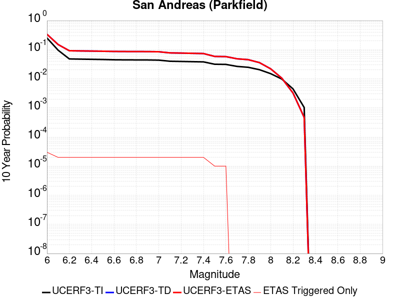 |

| Magnitude | 1 wk TI Prob | 1 wk TD Prob | 1 wk ETAS Prob | 1 wk ETAS/TD Gain | 1 wk ETAS Triggered Only | 1 mo TI Prob | 1 mo TD Prob | 1 mo ETAS Prob | 1 mo ETAS/TD Gain | 1 mo ETAS Triggered Only | 1 yr TI Prob | 1 yr TD Prob | 1 yr ETAS Prob | 1 yr ETAS/TD Gain | 1 yr ETAS Triggered Only | 10 yr TI Prob | 10 yr TD Prob | 10 yr ETAS Prob | 10 yr ETAS/TD Gain | 10 yr ETAS Triggered Only |
|-----|-----|-----|-----|-----|-----|-----|-----|-----|-----|-----|-----|-----|-----|-----|-----|-----|-----|-----|-----|-----|
| 6.0 | 5.556969E-4 | 7.776195E-4 | 7.876117E-4 | 1.0128498 | 1.0E-5 | 0.0023793848 | 0.003328946 | 0.0033488793 | 1.0059879 | 2.0E-5 | 0.028586963 | 0.04018152 | 0.040210314 | 1.0007166 | 3.0E-5 | 0.25176284 | 0.33713356 | 0.33715343 | 1.000059 | 3.0E-5 |
| 6.1 | 1.925858E-4 | 3.027076E-4 | 3.1270456E-4 | 1.0330251 | 1.0E-5 | 8.2510663E-4 | 0.001296767 | 0.001316741 | 1.0154029 | 2.0E-5 | 0.0099994885 | 0.01577525 | 0.015794935 | 1.0012478 | 2.0E-5 | 0.095613256 | 0.14970991 | 0.14972691 | 1.0001136 | 2.0E-5 |
| 6.2 | 9.4306815E-5 | 1.824128E-4 | 1.9241097E-4 | 1.0548108 | 1.0E-5 | 4.0410945E-4 | 7.8153616E-4 | 8.015205E-4 | 1.0255706 | 2.0E-5 | 0.0049089384 | 0.009473897 | 0.009493707 | 1.002091 | 2.0E-5 | 0.048019063 | 0.09184752 | 0.09186567 | 1.0001978 | 2.0E-5 |
| 6.3 | 9.283051E-5 | 1.793781E-4 | 1.893763E-4 | 1.0557382 | 1.0E-5 | 3.9778434E-4 | 7.68538E-4 | 7.885226E-4 | 1.0260035 | 2.0E-5 | 0.0048322747 | 0.009317007 | 0.009336821 | 1.0021266 | 2.0E-5 | 0.047285385 | 0.09050047 | 0.09051865 | 1.000201 | 2.0E-5 |
| 6.4 | 9.138826E-5 | 1.7700029E-4 | 1.8699853E-4 | 1.0564871 | 1.0E-5 | 3.916052E-4 | 7.5835333E-4 | 7.783382E-4 | 1.0263529 | 2.0E-5 | 0.0047573745 | 0.009194063 | 0.00921388 | 1.0021553 | 2.0E-5 | 0.046568092 | 0.089402735 | 0.08942095 | 1.0002037 | 2.0E-5 |
| 6.5 | 9.000255E-5 | 1.7458084E-4 | 1.8457908E-4 | 1.05727 | 1.0E-5 | 3.8566816E-4 | 7.479902E-4 | 7.6797523E-4 | 1.0267183 | 2.0E-5 | 0.0046854047 | 0.00906896 | 0.009088779 | 1.0021853 | 2.0E-5 | 0.045878403 | 0.08828856 | 0.08830679 | 1.0002065 | 2.0E-5 |
| 6.6 | 8.8109264E-5 | 1.7139279E-4 | 1.8139108E-4 | 1.0583355 | 1.0E-5 | 3.7755648E-4 | 7.343349E-4 | 7.5432024E-4 | 1.0272155 | 2.0E-5 | 0.0045870654 | 0.008904092 | 0.008923914 | 1.0022261 | 2.0E-5 | 0.04493529 | 0.08682025 | 0.08683851 | 1.0002104 | 2.0E-5 |
| 6.7 | 8.738073E-5 | 1.7006363E-4 | 1.8006194E-4 | 1.0587915 | 1.0E-5 | 3.7443507E-4 | 7.286417E-4 | 7.486271E-4 | 1.0274284 | 2.0E-5 | 0.0045492216 | 0.008835384 | 0.008855207 | 1.0022436 | 2.0E-5 | 0.04457213 | 0.08622064 | 0.08623891 | 1.000212 | 2.0E-5 |
| 6.8 | 8.710195E-5 | 1.695187E-4 | 1.79517E-4 | 1.0589806 | 1.0E-5 | 3.7324068E-4 | 7.263075E-4 | 7.46293E-4 | 1.0275166 | 2.0E-5 | 0.0045347405 | 0.008807203 | 0.008827027 | 1.0022509 | 2.0E-5 | 0.04443313 | 0.085968256 | 0.08598653 | 1.0002127 | 2.0E-5 |
| 6.9 | 8.6801556E-5 | 1.6892828E-4 | 1.7892658E-4 | 1.0591867 | 1.0E-5 | 3.7195362E-4 | 7.237786E-4 | 7.437641E-4 | 1.0276128 | 2.0E-5 | 0.0045191357 | 0.008776662 | 0.008796486 | 1.0022588 | 2.0E-5 | 0.044283327 | 0.08569433 | 0.08571261 | 1.0002134 | 2.0E-5 |
| 7.0 | 8.5571606E-5 | 1.6645678E-4 | 1.7645511E-4 | 1.0600656 | 1.0E-5 | 3.6668387E-4 | 7.131923E-4 | 7.33178E-4 | 1.0280229 | 2.0E-5 | 0.004455241 | 0.008648803 | 0.00866863 | 1.0022925 | 2.0E-5 | 0.043669727 | 0.08454277 | 0.08456108 | 1.0002166 | 2.0E-5 |
| 7.1 | 7.82589E-5 | 1.5126738E-4 | 1.6126587E-4 | 1.0660981 | 1.0E-5 | 3.3535215E-4 | 6.4812845E-4 | 6.681155E-4 | 1.0308381 | 2.0E-5 | 0.0040752706 | 0.007862584 | 0.0078824265 | 1.0025237 | 2.0E-5 | 0.040013418 | 0.07745491 | 0.07747336 | 1.0002382 | 2.0E-5 |
| 7.2 | 7.690929E-5 | 1.4864003E-4 | 1.5863853E-4 | 1.0672666 | 1.0E-5 | 3.2956956E-4 | 6.368739E-4 | 6.568612E-4 | 1.0313834 | 2.0E-5 | 0.004005129 | 0.007726539 | 0.007746384 | 1.0025685 | 2.0E-5 | 0.0393371 | 0.0762281 | 0.076246575 | 1.0002424 | 2.0E-5 |
| 7.3 | 7.5543794E-5 | 1.4560606E-4 | 1.556046E-4 | 1.0686685 | 1.0E-5 | 3.2371894E-4 | 6.2387745E-4 | 6.43865E-4 | 1.0320376 | 2.0E-5 | 0.003934157 | 0.007569417 | 0.0075892652 | 1.0026222 | 2.0E-5 | 0.038652334 | 0.07479123 | 0.07480974 | 1.0002474 | 2.0E-5 |
| 7.4 | 7.4214564E-5 | 1.4261607E-4 | 1.5261465E-4 | 1.0701083 | 1.0E-5 | 3.1802364E-4 | 6.110693E-4 | 6.310571E-4 | 1.0327095 | 2.0E-5 | 0.003865065 | 0.0074145487 | 0.0074344007 | 1.0026774 | 2.0E-5 | 0.03798529 | 0.07336518 | 0.07338371 | 1.0002526 | 2.0E-5 |
| 7.5 | 6.149578E-5 | 1.11895584E-4 | 1.11895584E-4 | 1.0 | 0.0 | 2.6352672E-4 | 4.7946448E-4 | 4.8945966E-4 | 1.0208466 | 1.0E-5 | 0.0032037178 | 0.0058218874 | 0.0058318293 | 1.0017077 | 1.0E-5 | 0.03157923 | 0.05855221 | 0.058561623 | 1.0001608 | 1.0E-5 |
| 7.6 | 6.0643448E-5 | 1.10182256E-4 | 1.10182256E-4 | 1.0 | 0.0 | 2.598746E-4 | 4.7212432E-4 | 4.821196E-4 | 1.0211709 | 1.0E-5 | 0.0031593828 | 0.005732995 | 0.0057429373 | 1.0017343 | 1.0E-5 | 0.031148417 | 0.057713263 | 0.057722684 | 1.0001633 | 1.0E-5 |
| 7.7 | 5.1652263E-5 | 9.173663E-5 | 9.173663E-5 | 1.0 | 0.0 | 2.2134806E-4 | 3.9309775E-4 | 3.9309775E-4 | 1.0 | 0.0 | 0.002691582 | 0.0047754725 | 0.0047754725 | 1.0 | 0.0 | 0.026592141 | 0.048531387 | 0.048531387 | 1.0 | 0.0 |
| 7.8 | 4.8090482E-5 | 8.558682E-5 | 8.558682E-5 | 1.0 | 0.0 | 2.060858E-4 | 3.6674913E-4 | 3.6674913E-4 | 1.0 | 0.0 | 0.0025062072 | 0.0044560367 | 0.0044560367 | 1.0 | 0.0 | 0.024781305 | 0.045297977 | 0.045297977 | 1.0 | 0.0 |
| 7.9 | 3.970278E-5 | 6.749683E-5 | 6.749683E-5 | 1.0 | 0.0 | 1.7014367E-4 | 2.8924007E-4 | 2.8924007E-4 | 1.0 | 0.0 | 0.002069531 | 0.0035158154 | 0.0035158154 | 1.0 | 0.0 | 0.020503636 | 0.03587781 | 0.03587781 | 1.0 | 0.0 |
| 8.0 | 2.8982335E-5 | 4.0693238E-5 | 4.0693238E-5 | 1.0 | 0.0 | 1.2420409E-4 | 1.7438793E-4 | 1.7438793E-4 | 1.0 | 0.0 | 0.0015111357 | 0.0021211067 | 0.0021211067 | 1.0 | 0.0 | 0.015009012 | 0.022008339 | 0.022008339 | 1.0 | 0.0 |
| 8.1 | 1.8836186E-5 | 1.8678496E-5 | 1.8678496E-5 | 1.0 | 0.0 | 8.0724014E-5 | 8.0048245E-5 | 8.0048245E-5 | 1.0 | 0.0 | 9.823717E-4 | 9.7415224E-4 | 9.7415224E-4 | 1.0 | 0.0 | 0.009780403 | 0.010486731 | 0.010486731 | 1.0 | 0.0 |
| 8.2 | 8.643924E-6 | 5.4738607E-6 | 5.4738607E-6 | 1.0 | 0.0 | 3.704486E-5 | 2.3459192E-5 | 2.3459192E-5 | 1.0 | 0.0 | 4.5092785E-4 | 2.855783E-4 | 2.855783E-4 | 1.0 | 0.0 | 0.0045001395 | 0.0032481598 | 0.0032481598 | 1.0 | 0.0 |
| 8.3 | 1.983087E-6 | 7.658221E-7 | 7.658221E-7 | 1.0 | 0.0 | 8.498917E-6 | 3.2820906E-6 | 3.2820906E-6 | 1.0 | 0.0 | 1.034694E-4 | 3.9958737E-5 | 3.9958737E-5 | 1.0 | 0.0 | 0.0010342124 | 4.7187202E-4 | 4.7187202E-4 | 1.0 | 0.0 |

## San Andreas (San Gorgonio Pass-Garnet HIll)
*[(top)](#table-of-contents)*

| 1 Week | 1 Month | 1 Year | 10 Year |
|-----|-----|-----|-----|
|  |  |  |  |

| Magnitude | 1 wk TI Prob | 1 wk TD Prob | 1 wk ETAS Prob | 1 wk ETAS/TD Gain | 1 wk ETAS Triggered Only | 1 mo TI Prob | 1 mo TD Prob | 1 mo ETAS Prob | 1 mo ETAS/TD Gain | 1 mo ETAS Triggered Only | 1 yr TI Prob | 1 yr TD Prob | 1 yr ETAS Prob | 1 yr ETAS/TD Gain | 1 yr ETAS Triggered Only | 10 yr TI Prob | 10 yr TD Prob | 10 yr ETAS Prob | 10 yr ETAS/TD Gain | 10 yr ETAS Triggered Only |
|-----|-----|-----|-----|-----|-----|-----|-----|-----|-----|-----|-----|-----|-----|-----|-----|-----|-----|-----|-----|-----|
| 6.0 | 8.31567E-5 | 2.3376173E-4 | 2.437594E-4 | 1.0427686 | 1.0E-5 | 3.5633717E-4 | 0.0010014536 | 0.0010114436 | 1.0099754 | 1.0E-5 | 0.004329778 | 0.012124644 | 0.012134523 | 1.0008148 | 1.0E-5 | 0.042463828 | 0.11255409 | 0.112571836 | 1.0001577 | 2.0E-5 |
| 6.1 | 8.31567E-5 | 2.3376173E-4 | 2.437594E-4 | 1.0427686 | 1.0E-5 | 3.5633717E-4 | 0.0010014536 | 0.0010114436 | 1.0099754 | 1.0E-5 | 0.004329778 | 0.012124644 | 0.012134523 | 1.0008148 | 1.0E-5 | 0.042463828 | 0.11255409 | 0.112571836 | 1.0001577 | 2.0E-5 |
| 6.2 | 8.31567E-5 | 2.3376173E-4 | 2.437594E-4 | 1.0427686 | 1.0E-5 | 3.5633717E-4 | 0.0010014536 | 0.0010114436 | 1.0099754 | 1.0E-5 | 0.004329778 | 0.012124644 | 0.012134523 | 1.0008148 | 1.0E-5 | 0.042463828 | 0.11255409 | 0.112571836 | 1.0001577 | 2.0E-5 |
| 6.3 | 8.31567E-5 | 2.3376173E-4 | 2.437594E-4 | 1.0427686 | 1.0E-5 | 3.5633717E-4 | 0.0010014536 | 0.0010114436 | 1.0099754 | 1.0E-5 | 0.004329778 | 0.012124644 | 0.012134523 | 1.0008148 | 1.0E-5 | 0.042463828 | 0.11255409 | 0.112571836 | 1.0001577 | 2.0E-5 |
| 6.4 | 8.059055E-5 | 2.2934518E-4 | 2.3934289E-4 | 1.0435925 | 1.0E-5 | 3.4534236E-4 | 9.825402E-4 | 9.925304E-4 | 1.0101677 | 1.0E-5 | 0.0041964394 | 0.011896912 | 0.011906792 | 1.0008305 | 1.0E-5 | 0.041180745 | 0.11053528 | 0.11055307 | 1.0001609 | 2.0E-5 |
| 6.5 | 8.059055E-5 | 2.2934518E-4 | 2.3934289E-4 | 1.0435925 | 1.0E-5 | 3.4534236E-4 | 9.825402E-4 | 9.925304E-4 | 1.0101677 | 1.0E-5 | 0.0041964394 | 0.011896912 | 0.011906792 | 1.0008305 | 1.0E-5 | 0.041180745 | 0.11053528 | 0.11055307 | 1.0001609 | 2.0E-5 |
| 6.6 | 7.619237E-5 | 2.2178894E-4 | 2.3178672E-4 | 1.0450779 | 1.0E-5 | 3.2649786E-4 | 9.5018005E-4 | 9.601706E-4 | 1.0105144 | 1.0E-5 | 0.0039678677 | 0.011507631 | 0.011517516 | 1.000859 | 1.0E-5 | 0.03897764 | 0.1070719 | 0.10708975 | 1.0001668 | 2.0E-5 |
| 6.7 | 7.440636E-5 | 2.1854721E-4 | 2.2854503E-4 | 1.0457467 | 1.0E-5 | 3.188454E-4 | 9.36297E-4 | 9.4628765E-4 | 1.0106704 | 1.0E-5 | 0.0038750346 | 0.0113403695 | 0.011350256 | 1.0008718 | 1.0E-5 | 0.038081564 | 0.10558031 | 0.1055982 | 1.0001694 | 2.0E-5 |
| 6.8 | 7.3735864E-5 | 2.1701894E-4 | 2.2701678E-4 | 1.0460689 | 1.0E-5 | 3.1597257E-4 | 9.2975196E-4 | 9.3974266E-4 | 1.0107455 | 1.0E-5 | 0.0038401815 | 0.011261511 | 0.0112713985 | 1.000878 | 1.0E-5 | 0.03774495 | 0.104881845 | 0.10489975 | 1.0001707 | 2.0E-5 |
| 6.9 | 7.27575E-5 | 2.1470869E-4 | 2.2470654E-4 | 1.0465647 | 1.0E-5 | 3.117806E-4 | 9.198579E-4 | 9.2984864E-4 | 1.0108613 | 1.0E-5 | 0.003789323 | 0.011142288 | 0.011152177 | 1.0008875 | 1.0E-5 | 0.037253562 | 0.103829734 | 0.10384766 | 1.0001726 | 2.0E-5 |
| 7.0 | 7.102591E-5 | 2.1054916E-4 | 2.2054705E-4 | 1.0474849 | 1.0E-5 | 3.0436125E-4 | 9.020437E-4 | 9.1203465E-4 | 1.011076 | 1.0E-5 | 0.003699303 | 0.010927594 | 0.010937485 | 1.0009052 | 1.0E-5 | 0.03638325 | 0.1019319 | 0.10194986 | 1.0001762 | 2.0E-5 |
| 7.1 | 7.028513E-5 | 2.0890564E-4 | 2.1890354E-4 | 1.0478585 | 1.0E-5 | 3.0118722E-4 | 8.950049E-4 | 9.0499595E-4 | 1.0111631 | 1.0E-5 | 0.0036607897 | 0.010842753 | 0.010852644 | 1.0009123 | 1.0E-5 | 0.036010686 | 0.10117493 | 0.10119291 | 1.0001776 | 2.0E-5 |
| 7.2 | 6.8498244E-5 | 2.0498442E-4 | 2.1498237E-4 | 1.0487742 | 1.0E-5 | 2.9353087E-4 | 8.782111E-4 | 8.8820234E-4 | 1.0113767 | 1.0E-5 | 0.003567883 | 0.010640301 | 0.010650195 | 1.0009298 | 1.0E-5 | 0.035111405 | 0.099366926 | 0.09938494 | 1.0001813 | 2.0E-5 |
| 7.3 | 6.622592E-5 | 1.9725891E-4 | 2.0725693E-4 | 1.0506848 | 1.0E-5 | 2.8379448E-4 | 8.4512355E-4 | 8.551151E-4 | 1.0118226 | 1.0E-5 | 0.0034497243 | 0.010241316 | 0.010251214 | 1.0009664 | 1.0E-5 | 0.033966612 | 0.09586389 | 0.095881976 | 1.0001886 | 2.0E-5 |
| 7.4 | 5.1050705E-5 | 1.468621E-4 | 1.5686064E-4 | 1.0680811 | 1.0E-5 | 2.1877038E-4 | 6.292581E-4 | 6.3925184E-4 | 1.0158818 | 1.0E-5 | 0.002660276 | 0.0076344977 | 0.0076444214 | 1.0012999 | 1.0E-5 | 0.02628654 | 0.07285113 | 0.07286967 | 1.0002545 | 2.0E-5 |
| 7.5 | 3.9302922E-5 | 1.1129282E-4 | 1.2129171E-4 | 1.089843 | 1.0E-5 | 1.6843023E-4 | 4.768824E-4 | 4.868776E-4 | 1.0209595 | 1.0E-5 | 0.0020487092 | 0.005790656 | 0.005800598 | 1.001717 | 1.0E-5 | 0.020299247 | 0.05600702 | 0.0560259 | 1.0003371 | 2.0E-5 |
| 7.6 | 2.9851626E-5 | 8.494473E-5 | 9.4943876E-5 | 1.1177136 | 1.0E-5 | 1.2792926E-4 | 3.6399817E-4 | 3.7399452E-4 | 1.0274627 | 1.0E-5 | 0.0015564259 | 0.0044226977 | 0.0044326535 | 1.002251 | 1.0E-5 | 0.0154556995 | 0.043191496 | 0.043210633 | 1.0004431 | 2.0E-5 |
| 7.7 | 2.1135214E-5 | 6.352455E-5 | 7.3523915E-5 | 1.1574094 | 1.0E-5 | 9.0576345E-5 | 2.7221968E-4 | 2.8221696E-4 | 1.036725 | 1.0E-5 | 0.0011022091 | 0.0033092434 | 0.0033192101 | 1.0030118 | 1.0E-5 | 0.010967582 | 0.03258059 | 0.032599937 | 1.0005939 | 2.0E-5 |
| 7.8 | 1.883379E-5 | 5.56362E-5 | 6.563564E-5 | 1.1797291 | 1.0E-5 | 8.0713755E-5 | 2.3841907E-4 | 2.4841668E-4 | 1.041933 | 1.0E-5 | 9.822468E-4 | 0.0028988915 | 0.0029088624 | 1.0034395 | 1.0E-5 | 0.0097791655 | 0.02869336 | 0.028712785 | 1.000677 | 2.0E-5 |
| 7.9 | 1.5156185E-5 | 4.165507E-5 | 5.1654653E-5 | 1.2400569 | 1.0E-5 | 6.495346E-5 | 1.7850952E-4 | 1.8850774E-4 | 1.0560094 | 1.0E-5 | 7.9052144E-4 | 0.0021711884 | 0.0021811668 | 1.0045958 | 1.0E-5 | 0.007877152 | 0.021757882 | 0.021767665 | 1.0004497 | 1.0E-5 |
| 8.0 | 1.1405907E-5 | 2.9971703E-5 | 2.9971703E-5 | 1.0 | 0.0 | 4.8881542E-5 | 1.2844383E-4 | 1.2844383E-4 | 1.0 | 0.0 | 5.9497025E-4 | 0.001562683 | 0.001562683 | 1.0 | 0.0 | 0.005933798 | 0.015771678 | 0.015771678 | 1.0 | 0.0 |
| 8.1 | 4.3511436E-6 | 7.36832E-6 | 7.36832E-6 | 1.0 | 0.0 | 1.8647626E-5 | 3.1578133E-5 | 3.1578133E-5 | 1.0 | 0.0 | 2.2701119E-4 | 3.8439606E-4 | 3.8439606E-4 | 1.0 | 0.0 | 0.0022677942 | 0.004115886 | 0.004115886 | 1.0 | 0.0 |
| 8.2 | 2.3042528E-6 | 2.7325216E-6 | 2.7325216E-6 | 1.0 | 0.0 | 9.875332E-6 | 1.1710755E-5 | 1.1710755E-5 | 1.0 | 0.0 | 1.2022553E-4 | 1.4256914E-4 | 1.4256914E-4 | 1.0 | 0.0 | 0.0012016051 | 0.0015977593 | 0.0015977593 | 1.0 | 0.0 |
| 8.3 | 5.202968E-7 | 3.1592276E-7 | 3.1592276E-7 | 1.0 | 0.0 | 2.2298414E-6 | 1.3539541E-6 | 1.3539541E-6 | 1.0 | 0.0 | 2.714798E-5 | 1.6484279E-5 | 1.6484279E-5 | 1.0 | 0.0 | 2.7144665E-4 | 1.9559723E-4 | 1.9559723E-4 | 1.0 | 0.0 |

## Ortigalita (South)
*[(top)](#table-of-contents)*

| 1 Week | 1 Month | 1 Year | 10 Year |
|-----|-----|-----|-----|
|  |  |  |  |

| Magnitude | 1 wk TI Prob | 1 wk TD Prob | 1 wk ETAS Prob | 1 wk ETAS/TD Gain | 1 wk ETAS Triggered Only | 1 mo TI Prob | 1 mo TD Prob | 1 mo ETAS Prob | 1 mo ETAS/TD Gain | 1 mo ETAS Triggered Only | 1 yr TI Prob | 1 yr TD Prob | 1 yr ETAS Prob | 1 yr ETAS/TD Gain | 1 yr ETAS Triggered Only | 10 yr TI Prob | 10 yr TD Prob | 10 yr ETAS Prob | 10 yr ETAS/TD Gain | 10 yr ETAS Triggered Only |
|-----|-----|-----|-----|-----|-----|-----|-----|-----|-----|-----|-----|-----|-----|-----|-----|-----|-----|-----|-----|-----|
| 6.0 | 3.72394E-5 | 4.325543E-5 | 5.3254997E-5 | 1.2311748 | 1.0E-5 | 1.5958765E-4 | 1.8536813E-4 | 1.9536627E-4 | 1.0539367 | 1.0E-5 | 0.0019412481 | 0.0022546777 | 0.0022746327 | 1.0088505 | 2.0E-5 | 0.019243775 | 0.0223344 | 0.022353955 | 1.0008755 | 2.0E-5 |
| 6.1 | 2.7299884E-5 | 3.1491913E-5 | 3.1491913E-5 | 1.0 | 0.0 | 1.16994255E-4 | 1.3495867E-4 | 1.3495867E-4 | 1.0 | 0.0 | 0.0014234743 | 0.0016419389 | 0.0016519226 | 1.0060804 | 1.0E-5 | 0.014143906 | 0.016304003 | 0.016313842 | 1.0006033 | 1.0E-5 |
| 6.2 | 2.7299884E-5 | 3.1491913E-5 | 3.1491913E-5 | 1.0 | 0.0 | 1.16994255E-4 | 1.3495867E-4 | 1.3495867E-4 | 1.0 | 0.0 | 0.0014234743 | 0.0016419389 | 0.0016519226 | 1.0060804 | 1.0E-5 | 0.014143906 | 0.016304003 | 0.016313842 | 1.0006033 | 1.0E-5 |
| 6.3 | 2.0546433E-5 | 2.3631355E-5 | 2.3631355E-5 | 1.0 | 0.0 | 8.805317E-5 | 1.01273414E-4 | 1.01273414E-4 | 1.0 | 0.0 | 0.00107152 | 0.0012323253 | 0.0012423131 | 1.0081047 | 1.0E-5 | 0.010663681 | 0.012256981 | 0.0122668585 | 1.0008059 | 1.0E-5 |
| 6.4 | 2.0546433E-5 | 2.3631355E-5 | 2.3631355E-5 | 1.0 | 0.0 | 8.805317E-5 | 1.01273414E-4 | 1.01273414E-4 | 1.0 | 0.0 | 0.00107152 | 0.0012323253 | 0.0012423131 | 1.0081047 | 1.0E-5 | 0.010663681 | 0.012256981 | 0.0122668585 | 1.0008059 | 1.0E-5 |
| 6.5 | 1.7779594E-5 | 2.0446892E-5 | 2.0446892E-5 | 1.0 | 0.0 | 7.619603E-5 | 8.762667E-5 | 8.762667E-5 | 1.0 | 0.0 | 9.272918E-4 | 0.0010663462 | 0.0010763354 | 1.0093678 | 1.0E-5 | 0.009234319 | 0.010613761 | 0.010623654 | 1.0009322 | 1.0E-5 |
| 6.6 | 1.6272212E-5 | 1.8714893E-5 | 1.8714893E-5 | 1.0 | 0.0 | 6.973618E-5 | 8.0204285E-5 | 8.0204285E-5 | 1.0 | 0.0 | 8.487073E-4 | 9.760619E-4 | 9.860521E-4 | 1.0102353 | 1.0E-5 | 0.008454733 | 0.009719051 | 0.009728954 | 1.0010189 | 1.0E-5 |
| 6.7 | 1.3051484E-5 | 1.5038697E-5 | 1.5038697E-5 | 1.0 | 0.0 | 5.593373E-5 | 6.445002E-5 | 6.445002E-5 | 1.0 | 0.0 | 6.807804E-4 | 7.84406E-4 | 7.9439813E-4 | 1.0127385 | 1.0E-5 | 0.006786986 | 0.007817356 | 0.007827277 | 1.0012692 | 1.0E-5 |
| 6.8 | 1.04277415E-5 | 1.19871875E-5 | 1.19871875E-5 | 1.0 | 0.0 | 4.4689557E-5 | 5.1372688E-5 | 5.1372688E-5 | 1.0 | 0.0 | 5.439595E-4 | 6.2529044E-4 | 6.352842E-4 | 1.0159826 | 1.0E-5 | 0.0054262993 | 0.006236065 | 0.006246003 | 1.0015936 | 1.0E-5 |
| 6.9 | 7.639968E-6 | 8.791468E-6 | 8.791468E-6 | 1.0 | 0.0 | 3.274231E-5 | 3.7677208E-5 | 3.7677208E-5 | 1.0 | 0.0 | 3.9856473E-4 | 4.5862934E-4 | 4.5862934E-4 | 1.0 | 0.0 | 0.003978506 | 0.0045774146 | 0.0045774146 | 1.0 | 0.0 |
| 7.0 | 3.919831E-6 | 4.5333823E-6 | 4.5333823E-6 | 1.0 | 0.0 | 1.679917E-5 | 1.942865E-5 | 1.942865E-5 | 1.0 | 0.0 | 2.045107E-4 | 2.3652024E-4 | 2.3652024E-4 | 1.0 | 0.0 | 0.0020432258 | 0.0023628937 | 0.0023628937 | 1.0 | 0.0 |
| 7.1 | 1.6017933E-6 | 1.8570338E-6 | 1.8570338E-6 | 1.0 | 0.0 | 6.8648105E-6 | 7.958698E-6 | 7.958698E-6 | 1.0 | 0.0 | 8.357586E-5 | 9.6893906E-5 | 9.6893906E-5 | 1.0 | 0.0 | 8.3544437E-4 | 9.6862135E-4 | 9.6862135E-4 | 1.0 | 0.0 |

## San Jacinto (Anza) rev
*[(top)](#table-of-contents)*

| 1 Week | 1 Month | 1 Year | 10 Year |
|-----|-----|-----|-----|
|  |  |  |  |

| Magnitude | 1 wk TI Prob | 1 wk TD Prob | 1 wk ETAS Prob | 1 wk ETAS/TD Gain | 1 wk ETAS Triggered Only | 1 mo TI Prob | 1 mo TD Prob | 1 mo ETAS Prob | 1 mo ETAS/TD Gain | 1 mo ETAS Triggered Only | 1 yr TI Prob | 1 yr TD Prob | 1 yr ETAS Prob | 1 yr ETAS/TD Gain | 1 yr ETAS Triggered Only | 10 yr TI Prob | 10 yr TD Prob | 10 yr ETAS Prob | 10 yr ETAS/TD Gain | 10 yr ETAS Triggered Only |
|-----|-----|-----|-----|-----|-----|-----|-----|-----|-----|-----|-----|-----|-----|-----|-----|-----|-----|-----|-----|-----|
| 6.0 | 6.3015636E-5 | 4.329564E-5 | 4.329564E-5 | 1.0 | 0.0 | 2.7003905E-4 | 1.8553961E-4 | 1.8553961E-4 | 1.0 | 0.0 | 0.0032827691 | 0.0022566165 | 0.0022665937 | 1.0044215 | 1.0E-5 | 0.032346968 | 0.023292562 | 0.023312097 | 1.0008386 | 2.0E-5 |
| 6.1 | 6.3015636E-5 | 4.329564E-5 | 4.329564E-5 | 1.0 | 0.0 | 2.7003905E-4 | 1.8553961E-4 | 1.8553961E-4 | 1.0 | 0.0 | 0.0032827691 | 0.0022566165 | 0.0022665937 | 1.0044215 | 1.0E-5 | 0.032346968 | 0.023292562 | 0.023312097 | 1.0008386 | 2.0E-5 |
| 6.2 | 6.3015636E-5 | 4.329564E-5 | 4.329564E-5 | 1.0 | 0.0 | 2.7003905E-4 | 1.8553961E-4 | 1.8553961E-4 | 1.0 | 0.0 | 0.0032827691 | 0.0022566165 | 0.0022665937 | 1.0044215 | 1.0E-5 | 0.032346968 | 0.023292562 | 0.023312097 | 1.0008386 | 2.0E-5 |
| 6.3 | 6.3015636E-5 | 4.329564E-5 | 4.329564E-5 | 1.0 | 0.0 | 2.7003905E-4 | 1.8553961E-4 | 1.8553961E-4 | 1.0 | 0.0 | 0.0032827691 | 0.0022566165 | 0.0022665937 | 1.0044215 | 1.0E-5 | 0.032346968 | 0.023292562 | 0.023312097 | 1.0008386 | 2.0E-5 |
| 6.4 | 6.3015636E-5 | 4.329564E-5 | 4.329564E-5 | 1.0 | 0.0 | 2.7003905E-4 | 1.8553961E-4 | 1.8553961E-4 | 1.0 | 0.0 | 0.0032827691 | 0.0022566165 | 0.0022665937 | 1.0044215 | 1.0E-5 | 0.032346968 | 0.023292562 | 0.023312097 | 1.0008386 | 2.0E-5 |
| 6.5 | 5.811017E-5 | 4.007568E-5 | 4.007568E-5 | 1.0 | 0.0 | 2.4901982E-4 | 1.7174163E-4 | 1.7174163E-4 | 1.0 | 0.0 | 0.0030276014 | 0.002088955 | 0.002098934 | 1.0047771 | 1.0E-5 | 0.02986684 | 0.021590188 | 0.021609757 | 1.0009063 | 2.0E-5 |
| 6.6 | 5.811017E-5 | 4.007568E-5 | 4.007568E-5 | 1.0 | 0.0 | 2.4901982E-4 | 1.7174163E-4 | 1.7174163E-4 | 1.0 | 0.0 | 0.0030276014 | 0.002088955 | 0.002098934 | 1.0047771 | 1.0E-5 | 0.02986684 | 0.021590188 | 0.021609757 | 1.0009063 | 2.0E-5 |
| 6.7 | 5.712442E-5 | 3.9498424E-5 | 3.9498424E-5 | 1.0 | 0.0 | 2.4479596E-4 | 1.6926801E-4 | 1.6926801E-4 | 1.0 | 0.0 | 0.0029763177 | 0.0020588955 | 0.0020688751 | 1.0048469 | 1.0E-5 | 0.029367693 | 0.02128203 | 0.021301605 | 1.0009198 | 2.0E-5 |
| 6.8 | 5.6967532E-5 | 3.935485E-5 | 3.935485E-5 | 1.0 | 0.0 | 2.4412372E-4 | 1.6865278E-4 | 1.6865278E-4 | 1.0 | 0.0 | 0.0029681553 | 0.0020514193 | 0.0020613987 | 1.0048647 | 1.0E-5 | 0.029288229 | 0.021206751 | 0.021226328 | 1.000923 | 2.0E-5 |
| 6.9 | 5.6211324E-5 | 3.9059665E-5 | 3.9059665E-5 | 1.0 | 0.0 | 2.4088343E-4 | 1.6738786E-4 | 1.6738786E-4 | 1.0 | 0.0 | 0.0029288116 | 0.0020360479 | 0.0020460275 | 1.0049015 | 1.0E-5 | 0.028905109 | 0.021046195 | 0.021065775 | 1.0009303 | 2.0E-5 |
| 7.0 | 5.4383527E-5 | 3.7920276E-5 | 3.7920276E-5 | 1.0 | 0.0 | 2.3305144E-4 | 1.6250537E-4 | 1.6250537E-4 | 1.0 | 0.0 | 0.0028337094 | 0.0019767124 | 0.0019866927 | 1.0050489 | 1.0E-5 | 0.027978465 | 0.020437196 | 0.020456787 | 1.0009586 | 2.0E-5 |
| 7.1 | 5.1393665E-5 | 3.6383335E-5 | 3.6383335E-5 | 1.0 | 0.0 | 2.2023996E-4 | 1.5591929E-4 | 1.5591929E-4 | 1.0 | 0.0 | 0.0026781242 | 0.0018966687 | 0.0019066497 | 1.0052624 | 1.0E-5 | 0.026460782 | 0.019610861 | 0.019630468 | 1.0009998 | 2.0E-5 |
| 7.2 | 4.785222E-5 | 3.4735345E-5 | 3.4735345E-5 | 1.0 | 0.0 | 2.0506482E-4 | 1.4885729E-4 | 1.4885729E-4 | 1.0 | 0.0 | 0.0024938055 | 0.0018108344 | 0.0018208163 | 1.0055124 | 1.0E-5 | 0.024660049 | 0.018725628 | 0.018745255 | 1.0010481 | 2.0E-5 |
| 7.3 | 4.2143256E-5 | 3.382991E-5 | 3.382991E-5 | 1.0 | 0.0 | 1.8060145E-4 | 1.4497728E-4 | 1.4497728E-4 | 1.0 | 0.0 | 0.002196605 | 0.0017636728 | 0.0017736552 | 1.0056599 | 1.0E-5 | 0.02175019 | 0.018233923 | 0.018253557 | 1.0010768 | 2.0E-5 |
| 7.4 | 4.0264713E-5 | 3.3468146E-5 | 3.3468146E-5 | 1.0 | 0.0 | 1.7255165E-4 | 1.4342705E-4 | 1.4342705E-4 | 1.0 | 0.0 | 0.002098792 | 0.0017448291 | 0.0017548116 | 1.0057212 | 1.0E-5 | 0.020790804 | 0.01803853 | 0.01805817 | 1.0010887 | 2.0E-5 |
| 7.5 | 3.694492E-5 | 3.218225E-5 | 3.218225E-5 | 1.0 | 0.0 | 1.5832575E-4 | 1.3791666E-4 | 1.3791666E-4 | 1.0 | 0.0 | 0.0019259118 | 0.0016778451 | 0.0016878283 | 1.00595 | 1.0E-5 | 0.01909306 | 0.017355029 | 0.017374681 | 1.0011324 | 2.0E-5 |
| 7.6 | 3.200565E-5 | 2.949823E-5 | 2.949823E-5 | 1.0 | 0.0 | 1.3715986E-4 | 1.2641487E-4 | 1.2641487E-4 | 1.0 | 0.0 | 0.001668642 | 0.0015380166 | 0.0015480013 | 1.0064919 | 1.0E-5 | 0.01656168 | 0.015943231 | 0.015962912 | 1.0012344 | 2.0E-5 |
| 7.7 | 2.731642E-5 | 2.6090234E-5 | 2.6090234E-5 | 1.0 | 0.0 | 1.1706512E-4 | 1.1181051E-4 | 1.1181051E-4 | 1.0 | 0.0 | 0.001424336 | 0.0013604438 | 0.0013704302 | 1.0073406 | 1.0E-5 | 0.014152412 | 0.014165673 | 0.0141853895 | 1.0013919 | 2.0E-5 |
| 7.8 | 2.3466424E-5 | 2.3502365E-5 | 2.3502365E-5 | 1.0 | 0.0 | 1.0056651E-4 | 1.0072054E-4 | 1.0072054E-4 | 1.0 | 0.0 | 0.0012237094 | 0.0012255836 | 0.0012355713 | 1.0081494 | 1.0E-5 | 0.012169928 | 0.012807612 | 0.012827356 | 1.0015416 | 2.0E-5 |
| 7.9 | 1.8611925E-5 | 1.89059E-5 | 1.89059E-5 | 1.0 | 0.0 | 7.9762955E-5 | 8.102277E-5 | 8.102277E-5 | 1.0 | 0.0 | 9.7068126E-4 | 9.860066E-4 | 9.860066E-4 | 1.0 | 0.0 | 0.0096645225 | 0.010392662 | 0.010402558 | 1.0009522 | 1.0E-5 |
| 8.0 | 1.5460775E-5 | 1.5738988E-5 | 1.5738988E-5 | 1.0 | 0.0 | 6.6258784E-5 | 6.745106E-5 | 6.745106E-5 | 1.0 | 0.0 | 8.0640207E-4 | 8.2090794E-4 | 8.2090794E-4 | 1.0 | 0.0 | 0.008034821 | 0.008701843 | 0.008711756 | 1.0011392 | 1.0E-5 |
| 8.1 | 9.983884E-6 | 8.268797E-6 | 8.268797E-6 | 1.0 | 0.0 | 4.2787375E-5 | 3.543722E-5 | 3.543722E-5 | 1.0 | 0.0 | 5.2081177E-4 | 4.3136327E-4 | 4.3136327E-4 | 1.0 | 0.0 | 0.0051959283 | 0.0046394016 | 0.004649355 | 1.0021454 | 1.0E-5 |
| 8.2 | 4.1226E-6 | 1.5526499E-6 | 1.5526499E-6 | 1.0 | 0.0 | 1.7668166E-5 | 6.654197E-6 | 6.654197E-6 | 1.0 | 0.0 | 2.1508869E-4 | 8.1011865E-5 | 8.1011865E-5 | 1.0 | 0.0 | 0.0021488064 | 9.40314E-4 | 9.40314E-4 | 1.0 | 0.0 |
| 8.3 | 1.2750878E-6 | 3.6112328E-7 | 3.6112328E-7 | 1.0 | 0.0 | 5.4646503E-6 | 1.5476703E-6 | 1.5476703E-6 | 1.0 | 0.0 | 6.653009E-5 | 1.8842728E-5 | 1.8842728E-5 | 1.0 | 0.0 | 6.6510175E-4 | 2.2728964E-4 | 2.2728964E-4 | 1.0 | 0.0 |

## Bicycle Lake
*[(top)](#table-of-contents)*

| 1 Week | 1 Month | 1 Year | 10 Year |
|-----|-----|-----|-----|
|  |  |  | 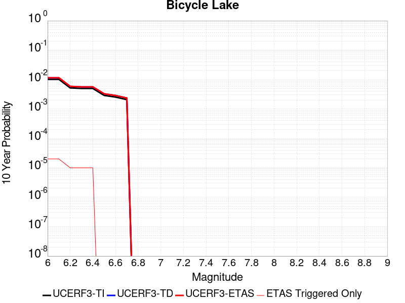 |

| Magnitude | 1 wk TI Prob | 1 wk TD Prob | 1 wk ETAS Prob | 1 wk ETAS/TD Gain | 1 wk ETAS Triggered Only | 1 mo TI Prob | 1 mo TD Prob | 1 mo ETAS Prob | 1 mo ETAS/TD Gain | 1 mo ETAS Triggered Only | 1 yr TI Prob | 1 yr TD Prob | 1 yr ETAS Prob | 1 yr ETAS/TD Gain | 1 yr ETAS Triggered Only | 10 yr TI Prob | 10 yr TD Prob | 10 yr ETAS Prob | 10 yr ETAS/TD Gain | 10 yr ETAS Triggered Only |
|-----|-----|-----|-----|-----|-----|-----|-----|-----|-----|-----|-----|-----|-----|-----|-----|-----|-----|-----|-----|-----|
| 6.0 | 1.9621975E-5 | 2.2097003E-5 | 3.209678E-5 | 1.45254 | 1.0E-5 | 8.4091465E-5 | 9.469877E-5 | 1.0469782E-4 | 1.105588 | 1.0E-5 | 0.0010233327 | 0.0011524827 | 0.0011624711 | 1.0086669 | 1.0E-5 | 0.01018633 | 0.011478369 | 0.01149814 | 1.0017225 | 2.0E-5 |
| 6.1 | 1.9621975E-5 | 2.2097003E-5 | 3.209678E-5 | 1.45254 | 1.0E-5 | 8.4091465E-5 | 9.469877E-5 | 1.0469782E-4 | 1.105588 | 1.0E-5 | 0.0010233327 | 0.0011524827 | 0.0011624711 | 1.0086669 | 1.0E-5 | 0.01018633 | 0.011478369 | 0.01149814 | 1.0017225 | 2.0E-5 |
| 6.2 | 9.9971285E-6 | 1.1255602E-5 | 1.1255602E-5 | 1.0 | 0.0 | 4.2844134E-5 | 4.8237693E-5 | 4.8237693E-5 | 1.0 | 0.0 | 5.2150246E-4 | 5.871877E-4 | 5.871877E-4 | 1.0 | 0.0 | 0.0052028033 | 0.0058614668 | 0.005871408 | 1.0016961 | 1.0E-5 |
| 6.3 | 9.589428E-6 | 1.079831E-5 | 1.079831E-5 | 1.0 | 0.0 | 4.10969E-5 | 4.6277943E-5 | 4.6277943E-5 | 1.0 | 0.0 | 5.002399E-4 | 5.6334015E-4 | 5.6334015E-4 | 1.0 | 0.0 | 0.0049911533 | 0.005624211 | 0.0056341547 | 1.001768 | 1.0E-5 |
| 6.4 | 9.589428E-6 | 1.079831E-5 | 1.079831E-5 | 1.0 | 0.0 | 4.10969E-5 | 4.6277943E-5 | 4.6277943E-5 | 1.0 | 0.0 | 5.002399E-4 | 5.6334015E-4 | 5.6334015E-4 | 1.0 | 0.0 | 0.0049911533 | 0.005624211 | 0.0056341547 | 1.001768 | 1.0E-5 |
| 6.5 | 5.557707E-6 | 6.2855797E-6 | 6.2855797E-6 | 1.0 | 0.0 | 2.3818526E-5 | 2.693807E-5 | 2.693807E-5 | 1.0 | 0.0 | 2.8995197E-4 | 3.2794854E-4 | 3.2794854E-4 | 1.0 | 0.0 | 0.0028957394 | 0.003277282 | 0.003277282 | 1.0 | 0.0 |
| 6.6 | 4.8742945E-6 | 5.5132705E-6 | 5.5132705E-6 | 1.0 | 0.0 | 2.0889667E-5 | 2.3628236E-5 | 2.3628236E-5 | 1.0 | 0.0 | 2.54302E-4 | 2.87662E-4 | 2.87662E-4 | 1.0 | 0.0 | 0.002540112 | 0.0028754652 | 0.0028754652 | 1.0 | 0.0 |
| 6.7 | 3.991108E-6 | 4.5158945E-6 | 4.5158945E-6 | 1.0 | 0.0 | 1.7104636E-5 | 1.9353833E-5 | 1.9353833E-5 | 1.0 | 0.0 | 2.0822904E-4 | 2.3563292E-4 | 2.3563292E-4 | 1.0 | 0.0 | 0.0020803404 | 0.0023563292 | 0.0023563292 | 1.0 | 0.0 |

## Hosgri
*[(top)](#table-of-contents)*

| 1 Week | 1 Month | 1 Year | 10 Year |
|-----|-----|-----|-----|
|  |  |  |  |

| Magnitude | 1 wk TI Prob | 1 wk TD Prob | 1 wk ETAS Prob | 1 wk ETAS/TD Gain | 1 wk ETAS Triggered Only | 1 mo TI Prob | 1 mo TD Prob | 1 mo ETAS Prob | 1 mo ETAS/TD Gain | 1 mo ETAS Triggered Only | 1 yr TI Prob | 1 yr TD Prob | 1 yr ETAS Prob | 1 yr ETAS/TD Gain | 1 yr ETAS Triggered Only | 10 yr TI Prob | 10 yr TD Prob | 10 yr ETAS Prob | 10 yr ETAS/TD Gain | 10 yr ETAS Triggered Only |
|-----|-----|-----|-----|-----|-----|-----|-----|-----|-----|-----|-----|-----|-----|-----|-----|-----|-----|-----|-----|-----|
| 6.0 | 2.883978E-5 | 2.9128276E-5 | 4.9127695E-5 | 1.6865981 | 2.0E-5 | 1.235932E-4 | 1.2482965E-4 | 1.4482715E-4 | 1.1601983 | 2.0E-5 | 0.0015037085 | 0.0015187687 | 0.0015387384 | 1.0131485 | 2.0E-5 | 0.01493574 | 0.015087668 | 0.015107366 | 1.0013056 | 2.0E-5 |
| 6.1 | 2.883978E-5 | 2.9128276E-5 | 4.9127695E-5 | 1.6865981 | 2.0E-5 | 1.235932E-4 | 1.2482965E-4 | 1.4482715E-4 | 1.1601983 | 2.0E-5 | 0.0015037085 | 0.0015187687 | 0.0015387384 | 1.0131485 | 2.0E-5 | 0.01493574 | 0.015087668 | 0.015107366 | 1.0013056 | 2.0E-5 |
| 6.2 | 2.883978E-5 | 2.9128276E-5 | 4.9127695E-5 | 1.6865981 | 2.0E-5 | 1.235932E-4 | 1.2482965E-4 | 1.4482715E-4 | 1.1601983 | 2.0E-5 | 0.0015037085 | 0.0015187687 | 0.0015387384 | 1.0131485 | 2.0E-5 | 0.01493574 | 0.015087668 | 0.015107366 | 1.0013056 | 2.0E-5 |
| 6.3 | 2.2914428E-5 | 2.2641847E-5 | 4.2641394E-5 | 1.8833002 | 2.0E-5 | 9.8200995E-5 | 9.7032906E-5 | 1.1703096E-4 | 1.2060957 | 2.0E-5 | 0.0011949413 | 0.0011807403 | 0.0012007167 | 1.0169185 | 2.0E-5 | 0.011885363 | 0.011746069 | 0.011765835 | 1.0016826 | 2.0E-5 |
| 6.4 | 2.0195741E-5 | 1.9696443E-5 | 3.969605E-5 | 2.0153918 | 2.0E-5 | 8.65503E-5 | 8.441061E-5 | 1.0440892E-4 | 1.236917 | 2.0E-5 | 0.0010532405 | 0.0010272167 | 0.0010471961 | 1.0194501 | 2.0E-5 | 0.010482626 | 0.010225733 | 0.010245528 | 1.0019358 | 2.0E-5 |
| 6.5 | 1.9924333E-5 | 1.9408866E-5 | 3.940848E-5 | 2.030437 | 2.0E-5 | 8.53872E-5 | 8.317821E-5 | 1.0317655E-4 | 1.2404276 | 2.0E-5 | 0.0010390934 | 0.0010122261 | 0.0010322059 | 1.0197384 | 2.0E-5 | 0.010342481 | 0.010077193 | 0.010096991 | 1.0019647 | 2.0E-5 |
| 6.6 | 1.809694E-5 | 1.7458187E-5 | 3.7457838E-5 | 2.1455743 | 2.0E-5 | 7.7556004E-5 | 7.4818665E-5 | 9.481717E-5 | 1.267293 | 2.0E-5 | 9.438353E-4 | 9.105379E-4 | 9.305197E-4 | 1.021945 | 2.0E-5 | 0.009398366 | 0.009069015 | 0.009088834 | 1.0021853 | 2.0E-5 |
| 6.7 | 1.675989E-5 | 1.6042655E-5 | 3.6042333E-5 | 2.2466564 | 2.0E-5 | 7.182612E-5 | 6.875243E-5 | 8.8751054E-5 | 1.2908788 | 2.0E-5 | 8.7413215E-4 | 8.3674054E-4 | 8.567238E-4 | 1.0238823 | 2.0E-5 | 0.008707017 | 0.008336807 | 0.00835664 | 1.002379 | 2.0E-5 |
| 6.8 | 1.5401129E-5 | 1.46139755E-5 | 3.4613684E-5 | 2.368533 | 2.0E-5 | 6.6003166E-5 | 6.262983E-5 | 8.262857E-5 | 1.3193166 | 2.0E-5 | 8.032922E-4 | 7.622522E-4 | 7.82237E-4 | 1.026218 | 2.0E-5 | 0.008003947 | 0.0075972406 | 0.007617089 | 1.0026126 | 2.0E-5 |
| 6.9 | 1.356559E-5 | 1.2689864E-5 | 3.268961E-5 | 2.576041 | 2.0E-5 | 5.8136946E-5 | 5.4384E-5 | 7.438291E-5 | 1.3677353 | 2.0E-5 | 7.0758746E-4 | 6.619245E-4 | 6.8191125E-4 | 1.0301949 | 2.0E-5 | 0.007053386 | 0.0066003343 | 0.006620202 | 1.0030102 | 2.0E-5 |
| 7.0 | 1.2030819E-5 | 1.1095861E-5 | 1.1095861E-5 | 1.0 | 0.0 | 5.155963E-5 | 4.755282E-5 | 4.755282E-5 | 1.0 | 0.0 | 6.275577E-4 | 5.788019E-4 | 5.788019E-4 | 1.0 | 0.0 | 0.006257884 | 0.0057737045 | 0.0057737045 | 1.0 | 0.0 |
| 7.1 | 1.0972698E-5 | 1.002208E-5 | 1.002208E-5 | 1.0 | 0.0 | 4.7025E-5 | 4.2951062E-5 | 4.2951062E-5 | 1.0 | 0.0 | 5.72379E-4 | 5.228038E-4 | 5.228038E-4 | 1.0 | 0.0 | 0.0057090693 | 0.0052164905 | 0.0052164905 | 1.0 | 0.0 |
| 7.2 | 9.961926E-6 | 9.0346475E-6 | 9.0346475E-6 | 1.0 | 0.0 | 4.2693267E-5 | 3.8719343E-5 | 3.8719343E-5 | 1.0 | 0.0 | 5.1966653E-4 | 4.713061E-4 | 4.713061E-4 | 1.0 | 0.0 | 0.00518453 | 0.004703812 | 0.004703812 | 1.0 | 0.0 |
| 7.3 | 8.700929E-6 | 7.828004E-6 | 7.828004E-6 | 1.0 | 0.0 | 3.7289166E-5 | 3.3548156E-5 | 3.3548156E-5 | 1.0 | 0.0 | 4.53901E-4 | 4.083723E-4 | 4.083723E-4 | 1.0 | 0.0 | 0.00452975 | 0.004076958 | 0.004076958 | 1.0 | 0.0 |
| 7.4 | 7.866285E-6 | 6.9986436E-6 | 6.9986436E-6 | 1.0 | 0.0 | 3.3712215E-5 | 2.9993842E-5 | 2.9993842E-5 | 1.0 | 0.0 | 4.103689E-4 | 3.6511387E-4 | 3.6511387E-4 | 1.0 | 0.0 | 0.004096119 | 0.003645877 | 0.003645877 | 1.0 | 0.0 |
| 7.5 | 6.8381305E-6 | 5.9596014E-6 | 5.9596014E-6 | 1.0 | 0.0 | 2.9305946E-5 | 2.5540898E-5 | 2.5540898E-5 | 1.0 | 0.0 | 3.5674145E-4 | 3.1091608E-4 | 3.1091608E-4 | 1.0 | 0.0 | 0.0035616932 | 0.0031055456 | 0.0031055456 | 1.0 | 0.0 |
| 7.6 | 5.503376E-6 | 4.5951515E-6 | 4.5951515E-6 | 1.0 | 0.0 | 2.3585684E-5 | 1.9693358E-5 | 1.9693358E-5 | 1.0 | 0.0 | 2.8711787E-4 | 2.3974029E-4 | 2.3974029E-4 | 1.0 | 0.0 | 0.002867472 | 0.0023955493 | 0.0023955493 | 1.0 | 0.0 |
| 7.7 | 3.6144982E-6 | 2.6521213E-6 | 2.6521213E-6 | 1.0 | 0.0 | 1.5490614E-5 | 1.13661845E-5 | 1.13661845E-5 | 1.0 | 0.0 | 1.8858191E-4 | 1.3837451E-4 | 1.3837451E-4 | 1.0 | 0.0 | 0.0018842196 | 0.0013836145 | 0.0013836145 | 1.0 | 0.0 |
| 7.8 | 1.9853494E-6 | 1.136086E-6 | 1.136086E-6 | 1.0 | 0.0 | 8.508612E-6 | 4.868931E-6 | 4.868931E-6 | 1.0 | 0.0 | 1.0358743E-4 | 5.927762E-5 | 5.927762E-5 | 1.0 | 0.0 | 0.0010353916 | 5.933477E-4 | 5.933477E-4 | 1.0 | 0.0 |
| 7.9 | 1.1818757E-6 | 5.294974E-7 | 5.294974E-7 | 1.0 | 0.0 | 5.0651715E-6 | 2.2692725E-6 | 2.2692725E-6 | 1.0 | 0.0 | 6.1666724E-5 | 2.7628043E-5 | 2.7628043E-5 | 1.0 | 0.0 | 6.1649614E-4 | 2.7693406E-4 | 2.7693406E-4 | 1.0 | 0.0 |
| 8.0 | 6.962958E-7 | 2.713834E-7 | 2.713834E-7 | 1.0 | 0.0 | 2.9841215E-6 | 1.1630713E-6 | 1.1630713E-6 | 1.0 | 0.0 | 3.6331072E-5 | 1.41603E-5 | 1.41603E-5 | 1.0 | 0.0 | 3.6325134E-4 | 1.4216424E-4 | 1.4216424E-4 | 1.0 | 0.0 |
| 8.1 | 1.5033264E-7 | 6.527309E-8 | 6.527309E-8 | 1.0 | 0.0 | 6.442826E-7 | 2.7974178E-7 | 2.7974178E-7 | 1.0 | 0.0 | 7.844113E-6 | 3.4058512E-6 | 3.4058512E-6 | 1.0 | 0.0 | 7.843835E-5 | 3.407529E-5 | 3.407529E-5 | 1.0 | 0.0 |

## Cady
*[(top)](#table-of-contents)*

| 1 Week | 1 Month | 1 Year | 10 Year |
|-----|-----|-----|-----|
|  |  |  |  |

| Magnitude | 1 wk TI Prob | 1 wk TD Prob | 1 wk ETAS Prob | 1 wk ETAS/TD Gain | 1 wk ETAS Triggered Only | 1 mo TI Prob | 1 mo TD Prob | 1 mo ETAS Prob | 1 mo ETAS/TD Gain | 1 mo ETAS Triggered Only | 1 yr TI Prob | 1 yr TD Prob | 1 yr ETAS Prob | 1 yr ETAS/TD Gain | 1 yr ETAS Triggered Only | 10 yr TI Prob | 10 yr TD Prob | 10 yr ETAS Prob | 10 yr ETAS/TD Gain | 10 yr ETAS Triggered Only |
|-----|-----|-----|-----|-----|-----|-----|-----|-----|-----|-----|-----|-----|-----|-----|-----|-----|-----|-----|-----|-----|
| 6.0 | 1.9892565E-5 | 2.1858672E-5 | 3.1858453E-5 | 1.4574744 | 1.0E-5 | 8.525106E-5 | 9.367717E-5 | 1.0367623E-4 | 1.1067396 | 1.0E-5 | 0.0010374374 | 0.0011400137 | 0.0011599909 | 1.0175236 | 2.0E-5 | 0.010326075 | 0.011350671 | 0.011370444 | 1.001742 | 2.0E-5 |
| 6.1 | 1.9892565E-5 | 2.1858672E-5 | 3.1858453E-5 | 1.4574744 | 1.0E-5 | 8.525106E-5 | 9.367717E-5 | 1.0367623E-4 | 1.1067396 | 1.0E-5 | 0.0010374374 | 0.0011400137 | 0.0011599909 | 1.0175236 | 2.0E-5 | 0.010326075 | 0.011350671 | 0.011370444 | 1.001742 | 2.0E-5 |
| 6.2 | 1.9892565E-5 | 2.1858672E-5 | 3.1858453E-5 | 1.4574744 | 1.0E-5 | 8.525106E-5 | 9.367717E-5 | 1.0367623E-4 | 1.1067396 | 1.0E-5 | 0.0010374374 | 0.0011400137 | 0.0011599909 | 1.0175236 | 2.0E-5 | 0.010326075 | 0.011350671 | 0.011370444 | 1.001742 | 2.0E-5 |
| 6.3 | 1.1117327E-5 | 1.2176552E-5 | 1.2176552E-5 | 1.0 | 0.0 | 4.764482E-5 | 5.2184358E-5 | 5.2184358E-5 | 1.0 | 0.0 | 5.7992124E-4 | 6.3519087E-4 | 6.3519087E-4 | 1.0 | 0.0 | 0.0057841022 | 0.0063368594 | 0.0063368594 | 1.0 | 0.0 |
| 6.4 | 1.1117327E-5 | 1.2176552E-5 | 1.2176552E-5 | 1.0 | 0.0 | 4.764482E-5 | 5.2184358E-5 | 5.2184358E-5 | 1.0 | 0.0 | 5.7992124E-4 | 6.3519087E-4 | 6.3519087E-4 | 1.0 | 0.0 | 0.0057841022 | 0.0063368594 | 0.0063368594 | 1.0 | 0.0 |
| 6.5 | 6.103093E-6 | 6.672004E-6 | 6.672004E-6 | 1.0 | 0.0 | 2.615585E-5 | 2.859406E-5 | 2.859406E-5 | 1.0 | 0.0 | 3.1840094E-4 | 3.4808964E-4 | 3.4808964E-4 | 1.0 | 0.0 | 0.0031794512 | 0.003476678 | 0.003476678 | 1.0 | 0.0 |
| 6.6 | 5.817237E-6 | 6.3656425E-6 | 6.3656425E-6 | 1.0 | 0.0 | 2.4930776E-5 | 2.728111E-5 | 2.728111E-5 | 1.0 | 0.0 | 3.034899E-4 | 3.3210934E-4 | 3.3210934E-4 | 1.0 | 0.0 | 0.0030307577 | 0.0033173522 | 0.0033173522 | 1.0 | 0.0 |
| 6.7 | 4.8846314E-6 | 5.3405547E-6 | 5.3405547E-6 | 1.0 | 0.0 | 2.0933967E-5 | 2.2887958E-5 | 2.2887958E-5 | 1.0 | 0.0 | 2.5484123E-4 | 2.7863705E-4 | 2.7863705E-4 | 1.0 | 0.0 | 0.0025454918 | 0.0027840321 | 0.0027840321 | 1.0 | 0.0 |
| 6.8 | 1.7788773E-6 | 1.9399033E-6 | 1.9399033E-6 | 1.0 | 0.0 | 7.6237375E-6 | 8.313854E-6 | 8.313854E-6 | 1.0 | 0.0 | 9.281505E-5 | 1.01218044E-4 | 1.01218044E-4 | 1.0 | 0.0 | 9.2776294E-4 | 0.0010118741 | 0.0010118741 | 1.0 | 0.0 |
| 6.9 | 7.5455404E-7 | 8.29707E-7 | 8.29707E-7 | 1.0 | 0.0 | 3.233799E-6 | 3.5558842E-6 | 3.5558842E-6 | 1.0 | 0.0 | 3.937079E-5 | 4.3292366E-5 | 4.3292366E-5 | 1.0 | 0.0 | 3.9363815E-4 | 4.3287227E-4 | 4.3287227E-4 | 1.0 | 0.0 |
| 7.0 | 6.8578805E-7 | 7.541796E-7 | 7.541796E-7 | 1.0 | 0.0 | 2.9390883E-6 | 3.2321961E-6 | 3.2321961E-6 | 1.0 | 0.0 | 3.578281E-5 | 3.935161E-5 | 3.935161E-5 | 1.0 | 0.0 | 3.577705E-4 | 3.9347887E-4 | 3.9347887E-4 | 1.0 | 0.0 |

## Garlic Springs
*[(top)](#table-of-contents)*

| 1 Week | 1 Month | 1 Year | 10 Year |
|-----|-----|-----|-----|
|  |  |  |  |

| Magnitude | 1 wk TI Prob | 1 wk TD Prob | 1 wk ETAS Prob | 1 wk ETAS/TD Gain | 1 wk ETAS Triggered Only | 1 mo TI Prob | 1 mo TD Prob | 1 mo ETAS Prob | 1 mo ETAS/TD Gain | 1 mo ETAS Triggered Only | 1 yr TI Prob | 1 yr TD Prob | 1 yr ETAS Prob | 1 yr ETAS/TD Gain | 1 yr ETAS Triggered Only | 10 yr TI Prob | 10 yr TD Prob | 10 yr ETAS Prob | 10 yr ETAS/TD Gain | 10 yr ETAS Triggered Only |
|-----|-----|-----|-----|-----|-----|-----|-----|-----|-----|-----|-----|-----|-----|-----|-----|-----|-----|-----|-----|-----|
| 6.0 | 1.6760017E-5 | 1.8776773E-5 | 1.8776773E-5 | 1.0 | 0.0 | 7.182667E-5 | 8.047006E-5 | 9.046926E-5 | 1.1242598 | 1.0E-5 | 8.7413884E-4 | 9.794E-4 | 9.893902E-4 | 1.0102004 | 1.0E-5 | 0.008707083 | 0.009762381 | 0.009782187 | 1.0020287 | 2.0E-5 |
| 6.1 | 9.852767E-6 | 1.0973554E-5 | 1.0973554E-5 | 1.0 | 0.0 | 4.222546E-5 | 4.702907E-5 | 5.70286E-5 | 1.2126244 | 1.0E-5 | 5.139737E-4 | 5.724994E-4 | 5.824937E-4 | 1.0174572 | 1.0E-5 | 0.005127866 | 0.005717204 | 0.0057271468 | 1.0017391 | 1.0E-5 |
| 6.2 | 9.852767E-6 | 1.0973554E-5 | 1.0973554E-5 | 1.0 | 0.0 | 4.222546E-5 | 4.702907E-5 | 5.70286E-5 | 1.2126244 | 1.0E-5 | 5.139737E-4 | 5.724994E-4 | 5.824937E-4 | 1.0174572 | 1.0E-5 | 0.005127866 | 0.005717204 | 0.0057271468 | 1.0017391 | 1.0E-5 |
| 6.3 | 4.3167724E-6 | 4.778015E-6 | 4.778015E-6 | 1.0 | 0.0 | 1.8500323E-5 | 2.0477177E-5 | 2.0477177E-5 | 1.0 | 0.0 | 2.2521814E-4 | 2.4930414E-4 | 2.4930414E-4 | 1.0 | 0.0 | 0.0022499003 | 0.0024925028 | 0.0024925028 | 1.0 | 0.0 |
| 6.4 | 4.3167724E-6 | 4.778015E-6 | 4.778015E-6 | 1.0 | 0.0 | 1.8500323E-5 | 2.0477177E-5 | 2.0477177E-5 | 1.0 | 0.0 | 2.2521814E-4 | 2.4930414E-4 | 2.4930414E-4 | 1.0 | 0.0 | 0.0022499003 | 0.0024925028 | 0.0024925028 | 1.0 | 0.0 |
| 6.5 | 4.3167724E-6 | 4.778015E-6 | 4.778015E-6 | 1.0 | 0.0 | 1.8500323E-5 | 2.0477177E-5 | 2.0477177E-5 | 1.0 | 0.0 | 2.2521814E-4 | 2.4930414E-4 | 2.4930414E-4 | 1.0 | 0.0 | 0.0022499003 | 0.0024925028 | 0.0024925028 | 1.0 | 0.0 |
| 6.6 | 4.301311E-6 | 4.7608837E-6 | 4.7608837E-6 | 1.0 | 0.0 | 1.8434059E-5 | 2.0403757E-5 | 2.0403757E-5 | 1.0 | 0.0 | 2.2441156E-4 | 2.4841045E-4 | 2.4841045E-4 | 1.0 | 0.0 | 0.0022418506 | 0.002483586 | 0.002483586 | 1.0 | 0.0 |
| 6.7 | 3.8599724E-6 | 4.2710476E-6 | 4.2710476E-6 | 1.0 | 0.0 | 1.6542634E-5 | 1.830449E-5 | 1.830449E-5 | 1.0 | 0.0 | 2.0138794E-4 | 2.2285717E-4 | 2.2285717E-4 | 1.0 | 0.0 | 0.0020120554 | 0.0022285716 | 0.0022285716 | 1.0 | 0.0 |

## San Juan
*[(top)](#table-of-contents)*

| 1 Week | 1 Month | 1 Year | 10 Year |
|-----|-----|-----|-----|
|  |  |  |  |

| Magnitude | 1 wk TI Prob | 1 wk TD Prob | 1 wk ETAS Prob | 1 wk ETAS/TD Gain | 1 wk ETAS Triggered Only | 1 mo TI Prob | 1 mo TD Prob | 1 mo ETAS Prob | 1 mo ETAS/TD Gain | 1 mo ETAS Triggered Only | 1 yr TI Prob | 1 yr TD Prob | 1 yr ETAS Prob | 1 yr ETAS/TD Gain | 1 yr ETAS Triggered Only | 10 yr TI Prob | 10 yr TD Prob | 10 yr ETAS Prob | 10 yr ETAS/TD Gain | 10 yr ETAS Triggered Only |
|-----|-----|-----|-----|-----|-----|-----|-----|-----|-----|-----|-----|-----|-----|-----|-----|-----|-----|-----|-----|-----|
| 6.0 | 8.682808E-6 | 8.749081E-6 | 1.8748993E-5 | 2.1429672 | 1.0E-5 | 3.72115E-5 | 3.749555E-5 | 5.74948E-5 | 1.5333767 | 2.0E-5 | 4.5295584E-4 | 4.564175E-4 | 4.7640837E-4 | 1.0437995 | 2.0E-5 | 0.004520337 | 0.0045553423 | 0.004575251 | 1.0043705 | 2.0E-5 |
| 6.1 | 8.682808E-6 | 8.749081E-6 | 1.8748993E-5 | 2.1429672 | 1.0E-5 | 3.72115E-5 | 3.749555E-5 | 5.74948E-5 | 1.5333767 | 2.0E-5 | 4.5295584E-4 | 4.564175E-4 | 4.7640837E-4 | 1.0437995 | 2.0E-5 | 0.004520337 | 0.0045553423 | 0.004575251 | 1.0043705 | 2.0E-5 |
| 6.2 | 8.682808E-6 | 8.749081E-6 | 1.8748993E-5 | 2.1429672 | 1.0E-5 | 3.72115E-5 | 3.749555E-5 | 5.74948E-5 | 1.5333767 | 2.0E-5 | 4.5295584E-4 | 4.564175E-4 | 4.7640837E-4 | 1.0437995 | 2.0E-5 | 0.004520337 | 0.0045553423 | 0.004575251 | 1.0043705 | 2.0E-5 |
| 6.3 | 6.3054235E-6 | 6.2825047E-6 | 6.2825047E-6 | 1.0 | 0.0 | 2.7022963E-5 | 2.692475E-5 | 3.692448E-5 | 1.3713955 | 1.0E-5 | 3.2895492E-4 | 3.2776094E-4 | 3.3775766E-4 | 1.0305 | 1.0E-5 | 0.003284684 | 0.003272975 | 0.0032829426 | 1.0030453 | 1.0E-5 |
| 6.4 | 6.1490473E-6 | 6.1143965E-6 | 6.1143965E-6 | 1.0 | 0.0 | 2.6352795E-5 | 2.62043E-5 | 3.6204037E-5 | 1.3816068 | 1.0E-5 | 3.2079802E-4 | 3.18992E-4 | 3.2898883E-4 | 1.0313387 | 1.0E-5 | 0.0032033534 | 0.0031855376 | 0.0031955058 | 1.0031292 | 1.0E-5 |
| 6.5 | 5.204848E-6 | 5.1371658E-6 | 5.1371658E-6 | 1.0 | 0.0 | 2.23063E-5 | 2.2016246E-5 | 3.2016025E-5 | 1.4542 | 1.0E-5 | 2.7154534E-4 | 2.6801578E-4 | 2.780131E-4 | 1.0373012 | 1.0E-5 | 0.0027121378 | 0.0026770793 | 0.0026870526 | 1.0037254 | 1.0E-5 |
| 6.6 | 4.5179986E-6 | 4.414979E-6 | 4.414979E-6 | 1.0 | 0.0 | 1.9362706E-5 | 1.8921204E-5 | 2.8921015E-5 | 1.5284976 | 1.0E-5 | 2.3571544E-4 | 2.303421E-4 | 2.403398E-4 | 1.0434037 | 1.0E-5 | 0.0023546559 | 0.0023011705 | 0.0023111475 | 1.0043356 | 1.0E-5 |
| 6.7 | 3.9442616E-6 | 3.819782E-6 | 3.819782E-6 | 1.0 | 0.0 | 1.6903869E-5 | 1.6370395E-5 | 2.6370231E-5 | 1.6108488 | 1.0E-5 | 2.0578515E-4 | 1.99292E-4 | 2.0929001E-4 | 1.0501677 | 1.0E-5 | 0.002055947 | 0.0019912578 | 0.0020012378 | 1.0050119 | 1.0E-5 |
| 6.8 | 3.4536245E-6 | 3.316291E-6 | 3.316291E-6 | 1.0 | 0.0 | 1.4801163E-5 | 1.4212602E-5 | 2.421246E-5 | 1.703591 | 1.0E-5 | 1.8018926E-4 | 1.730253E-4 | 1.8302357E-4 | 1.057785 | 1.0E-5 | 0.0018004322 | 0.0017290247 | 0.0017390074 | 1.0057737 | 1.0E-5 |
| 6.9 | 3.059865E-6 | 2.911989E-6 | 2.911989E-6 | 1.0 | 0.0 | 1.3113641E-5 | 1.2479896E-5 | 2.2479771E-5 | 1.8012787 | 1.0E-5 | 1.596469E-4 | 1.5193272E-4 | 1.619312E-4 | 1.0658087 | 1.0E-5 | 0.0015953224 | 0.0015184031 | 0.0015283879 | 1.0065758 | 1.0E-5 |
| 7.0 | 2.6504351E-6 | 2.49196E-6 | 2.49196E-6 | 1.0 | 0.0 | 1.1358958E-5 | 1.0679788E-5 | 2.0679681E-5 | 1.9363382 | 1.0E-5 | 1.3828653E-4 | 1.3001921E-4 | 1.400179E-4 | 1.0769017 | 1.0E-5 | 0.0013820052 | 0.0012995432 | 0.0013095302 | 1.0076851 | 1.0E-5 |
| 7.1 | 2.2039317E-6 | 2.0337961E-6 | 2.0337961E-6 | 1.0 | 0.0 | 9.445387E-6 | 8.7162425E-6 | 1.8716155E-5 | 2.1472733 | 1.0E-5 | 1.1499152E-4 | 1.06115614E-4 | 1.16114556E-4 | 1.0942268 | 1.0E-5 | 0.0011493203 | 0.0010607594 | 0.0010707488 | 1.0094172 | 1.0E-5 |
| 7.2 | 1.0786707E-6 | 8.769899E-7 | 8.769899E-7 | 1.0 | 0.0 | 4.622866E-6 | 3.7585226E-6 | 3.7585226E-6 | 1.0 | 0.0 | 5.628194E-5 | 4.5759065E-5 | 4.5759065E-5 | 1.0 | 0.0 | 5.6267687E-4 | 4.5755546E-4 | 4.5755546E-4 | 1.0 | 0.0 |
| 7.3 | 6.846433E-7 | 4.8686087E-7 | 4.8686087E-7 | 1.0 | 0.0 | 2.9341822E-6 | 2.086545E-6 | 2.086545E-6 | 1.0 | 0.0 | 3.5723086E-5 | 2.540339E-5 | 2.540339E-5 | 1.0 | 0.0 | 3.571734E-4 | 2.5403837E-4 | 2.5403837E-4 | 1.0 | 0.0 |
| 7.4 | 5.23043E-7 | 3.262663E-7 | 3.262663E-7 | 1.0 | 0.0 | 2.2416111E-6 | 1.3982833E-6 | 1.3982833E-6 | 1.0 | 0.0 | 2.7291273E-5 | 1.7023967E-5 | 1.7023967E-5 | 1.0 | 0.0 | 2.7287923E-4 | 1.7025857E-4 | 1.7025857E-4 | 1.0 | 0.0 |
| 7.5 | 4.648444E-7 | 2.7233583E-7 | 2.7233583E-7 | 1.0 | 0.0 | 1.9921886E-6 | 1.167153E-6 | 1.167153E-6 | 1.0 | 0.0 | 2.4254627E-5 | 1.4209995E-5 | 1.4209995E-5 | 1.0 | 0.0 | 2.425198E-4 | 1.4212048E-4 | 1.4212048E-4 | 1.0 | 0.0 |
| 7.6 | 3.9906567E-7 | 2.2082162E-7 | 2.2082162E-7 | 1.0 | 0.0 | 1.7102802E-6 | 9.46378E-7 | 9.46378E-7 | 1.0 | 0.0 | 2.0822463E-5 | 1.1522092E-5 | 1.1522092E-5 | 1.0 | 0.0 | 2.0820512E-4 | 1.1523955E-4 | 1.1523955E-4 | 1.0 | 0.0 |
| 7.7 | 1.8784601E-7 | 5.3663786E-8 | 5.3663786E-8 | 1.0 | 0.0 | 8.0505407E-7 | 2.2998763E-7 | 2.2998763E-7 | 1.0 | 0.0 | 9.80149E-6 | 2.800096E-6 | 2.800096E-6 | 1.0 | 0.0 | 9.801057E-5 | 2.8009652E-5 | 2.8009652E-5 | 1.0 | 0.0 |
| 7.8 | 1.00154914E-7 | 1.2414834E-8 | 1.2414834E-8 | 1.0 | 0.0 | 4.2923529E-7 | 5.3206428E-8 | 5.3206428E-8 | 1.0 | 0.0 | 5.225927E-6 | 6.477881E-7 | 6.477881E-7 | 1.0 | 0.0 | 5.225804E-5 | 6.4837495E-6 | 6.4837495E-6 | 1.0 | 0.0 |
| 7.9 | 6.171429E-8 | 4.296096E-9 | 4.296096E-9 | 1.0 | 0.0 | 2.6448978E-7 | 1.8411841E-8 | 1.8411841E-8 | 1.0 | 0.0 | 3.2201583E-6 | 2.2416414E-7 | 2.2416414E-7 | 1.0 | 0.0 | 3.2201115E-5 | 2.2469278E-6 | 2.2469278E-6 | 1.0 | 0.0 |
| 8.0 | 1.3974572E-8 | 3.3778746E-10 | 3.3778746E-10 | 1.0 | 0.0 | 5.989102E-8 | 1.4476622E-9 | 1.4476622E-9 | 1.0 | 0.0 | 7.2917294E-7 | 1.762528E-8 | 1.762528E-8 | 1.0 | 0.0 | 7.2917055E-6 | 1.8055306E-7 | 1.8055306E-7 | 1.0 | 0.0 |
| 8.1 | 1.8403477E-9 | 1.13004495E-10 | 1.13004495E-10 | 1.0 | 0.0 | 7.887204E-9 | 4.843056E-10 | 4.843056E-10 | 1.0 | 0.0 | 9.602671E-8 | 5.8964202E-9 | 5.8964202E-9 | 1.0 | 0.0 | 9.602667E-7 | 6.020749E-8 | 6.020749E-8 | 1.0 | 0.0 |

## Mission Creek
*[(top)](#table-of-contents)*

| 1 Week | 1 Month | 1 Year | 10 Year |
|-----|-----|-----|-----|
|  |  |  |  |

| Magnitude | 1 wk TI Prob | 1 wk TD Prob | 1 wk ETAS Prob | 1 wk ETAS/TD Gain | 1 wk ETAS Triggered Only | 1 mo TI Prob | 1 mo TD Prob | 1 mo ETAS Prob | 1 mo ETAS/TD Gain | 1 mo ETAS Triggered Only | 1 yr TI Prob | 1 yr TD Prob | 1 yr ETAS Prob | 1 yr ETAS/TD Gain | 1 yr ETAS Triggered Only | 10 yr TI Prob | 10 yr TD Prob | 10 yr ETAS Prob | 10 yr ETAS/TD Gain | 10 yr ETAS Triggered Only |
|-----|-----|-----|-----|-----|-----|-----|-----|-----|-----|-----|-----|-----|-----|-----|-----|-----|-----|-----|-----|-----|
| 6.0 | 1.1549387E-5 | 1.63219E-5 | 1.63219E-5 | 1.0 | 0.0 | 4.9496433E-5 | 6.994921E-5 | 6.994921E-5 | 1.0 | 0.0 | 6.0245243E-4 | 8.513139E-4 | 8.6130534E-4 | 1.0117365 | 1.0E-5 | 0.006008218 | 0.00850976 | 0.0085295895 | 1.0023302 | 2.0E-5 |
| 6.1 | 1.1549387E-5 | 1.63219E-5 | 1.63219E-5 | 1.0 | 0.0 | 4.9496433E-5 | 6.994921E-5 | 6.994921E-5 | 1.0 | 0.0 | 6.0245243E-4 | 8.513139E-4 | 8.6130534E-4 | 1.0117365 | 1.0E-5 | 0.006008218 | 0.00850976 | 0.0085295895 | 1.0023302 | 2.0E-5 |
| 6.2 | 1.1549387E-5 | 1.63219E-5 | 1.63219E-5 | 1.0 | 0.0 | 4.9496433E-5 | 6.994921E-5 | 6.994921E-5 | 1.0 | 0.0 | 6.0245243E-4 | 8.513139E-4 | 8.6130534E-4 | 1.0117365 | 1.0E-5 | 0.006008218 | 0.00850976 | 0.0085295895 | 1.0023302 | 2.0E-5 |
| 6.3 | 1.1549387E-5 | 1.63219E-5 | 1.63219E-5 | 1.0 | 0.0 | 4.9496433E-5 | 6.994921E-5 | 6.994921E-5 | 1.0 | 0.0 | 6.0245243E-4 | 8.513139E-4 | 8.6130534E-4 | 1.0117365 | 1.0E-5 | 0.006008218 | 0.00850976 | 0.0085295895 | 1.0023302 | 2.0E-5 |
| 6.4 | 1.1549387E-5 | 1.63219E-5 | 1.63219E-5 | 1.0 | 0.0 | 4.9496433E-5 | 6.994921E-5 | 6.994921E-5 | 1.0 | 0.0 | 6.0245243E-4 | 8.513139E-4 | 8.6130534E-4 | 1.0117365 | 1.0E-5 | 0.006008218 | 0.00850976 | 0.0085295895 | 1.0023302 | 2.0E-5 |
| 6.5 | 1.1549387E-5 | 1.63219E-5 | 1.63219E-5 | 1.0 | 0.0 | 4.9496433E-5 | 6.994921E-5 | 6.994921E-5 | 1.0 | 0.0 | 6.0245243E-4 | 8.513139E-4 | 8.6130534E-4 | 1.0117365 | 1.0E-5 | 0.006008218 | 0.00850976 | 0.0085295895 | 1.0023302 | 2.0E-5 |
| 6.6 | 9.202681E-6 | 1.384518E-5 | 1.384518E-5 | 1.0 | 0.0 | 3.9439463E-5 | 5.9335187E-5 | 5.9335187E-5 | 1.0 | 0.0 | 4.800697E-4 | 7.2217546E-4 | 7.3216826E-4 | 1.0138371 | 1.0E-5 | 0.004790339 | 0.007226945 | 0.0072468 | 1.0027474 | 2.0E-5 |
| 6.7 | 9.019164E-6 | 1.365085E-5 | 1.365085E-5 | 1.0 | 0.0 | 3.8652986E-5 | 5.850238E-5 | 5.850238E-5 | 1.0 | 0.0 | 4.7049852E-4 | 7.120427E-4 | 7.220356E-4 | 1.0140342 | 1.0E-5 | 0.004695036 | 0.0071262694 | 0.0071461266 | 1.0027865 | 2.0E-5 |
| 6.8 | 8.673558E-6 | 1.3272961E-5 | 1.3272961E-5 | 1.0 | 0.0 | 3.717186E-5 | 5.688293E-5 | 5.688293E-5 | 1.0 | 0.0 | 4.524734E-4 | 6.9233845E-4 | 7.0233154E-4 | 1.0144339 | 1.0E-5 | 0.0045155324 | 0.006930458 | 0.0069503193 | 1.0028658 | 2.0E-5 |
| 6.9 | 7.002255E-6 | 1.1477195E-5 | 1.1477195E-5 | 1.0 | 0.0 | 3.000932E-5 | 4.918709E-5 | 4.918709E-5 | 1.0 | 0.0 | 3.653022E-4 | 5.986951E-4 | 6.086891E-4 | 1.016693 | 1.0E-5 | 0.0036470229 | 0.005999283 | 0.006019163 | 1.0033138 | 2.0E-5 |
| 7.0 | 5.84644E-6 | 9.674542E-6 | 9.674542E-6 | 1.0 | 0.0 | 2.5055931E-5 | 4.1461688E-5 | 4.1461688E-5 | 1.0 | 0.0 | 3.0501327E-4 | 5.046837E-4 | 5.1467866E-4 | 1.0198044 | 1.0E-5 | 0.0030459496 | 0.0050636297 | 0.0050835283 | 1.0039297 | 2.0E-5 |
| 7.1 | 5.54703E-6 | 9.329019E-6 | 9.329019E-6 | 1.0 | 0.0 | 2.377277E-5 | 3.998092E-5 | 3.998092E-5 | 1.0 | 0.0 | 2.8939504E-4 | 4.8666348E-4 | 4.966586E-4 | 1.0205381 | 1.0E-5 | 0.0028901845 | 0.004884225 | 0.004904127 | 1.0040748 | 2.0E-5 |
| 7.2 | 4.384709E-6 | 7.681153E-6 | 7.681153E-6 | 1.0 | 0.0 | 1.8791474E-5 | 3.2918833E-5 | 3.2918833E-5 | 1.0 | 0.0 | 2.2876218E-4 | 4.0071676E-4 | 4.1071273E-4 | 1.0249453 | 1.0E-5 | 0.0022852682 | 0.004028154 | 0.0040480737 | 1.004945 | 2.0E-5 |
| 7.3 | 3.7888456E-6 | 6.915043E-6 | 6.915043E-6 | 1.0 | 0.0 | 1.623781E-5 | 2.963558E-5 | 2.963558E-5 | 1.0 | 0.0 | 1.9767738E-4 | 3.607568E-4 | 3.707532E-4 | 1.0277095 | 1.0E-5 | 0.0019750162 | 0.0036299077 | 0.003649835 | 1.0054898 | 2.0E-5 |
| 7.4 | 2.1982462E-6 | 5.0233793E-6 | 5.0233793E-6 | 1.0 | 0.0 | 9.421021E-6 | 2.1528593E-5 | 2.1528593E-5 | 1.0 | 0.0 | 1.1469489E-4 | 2.6207927E-4 | 2.7207666E-4 | 1.0381464 | 1.0E-5 | 0.0011463572 | 0.0026456832 | 0.0026656303 | 1.0075395 | 2.0E-5 |
| 7.5 | 2.051923E-6 | 4.61463E-6 | 4.61463E-6 | 1.0 | 0.0 | 8.793926E-6 | 1.9776837E-5 | 1.9776837E-5 | 1.0 | 0.0 | 1.0706078E-4 | 2.4075652E-4 | 2.5075412E-4 | 1.0415257 | 1.0E-5 | 0.0010700922 | 0.0024333464 | 0.0024532976 | 1.0081991 | 2.0E-5 |
| 7.6 | 1.8733427E-6 | 4.123002E-6 | 4.123002E-6 | 1.0 | 0.0 | 8.028587E-6 | 1.7669889E-5 | 1.7669889E-5 | 1.0 | 0.0 | 9.774366E-5 | 2.1510974E-4 | 2.251076E-4 | 1.0464779 | 1.0E-5 | 9.770069E-4 | 0.002177891 | 0.0021978477 | 1.0091631 | 2.0E-5 |
| 7.7 | 1.8411953E-6 | 4.0426794E-6 | 4.0426794E-6 | 1.0 | 0.0 | 7.890813E-6 | 1.7325654E-5 | 1.7325654E-5 | 1.0 | 0.0 | 9.606641E-5 | 2.1091949E-4 | 2.2091738E-4 | 1.0474014 | 1.0E-5 | 9.6024893E-4 | 0.0021361776 | 0.0021561347 | 1.0093426 | 2.0E-5 |
| 7.8 | 1.7194251E-6 | 3.7100826E-6 | 3.7100826E-6 | 1.0 | 0.0 | 7.368944E-6 | 1.5900257E-5 | 1.5900257E-5 | 1.0 | 0.0 | 8.97132E-5 | 1.9356851E-4 | 2.0356658E-4 | 1.0516512 | 1.0E-5 | 8.967699E-4 | 0.0019621777 | 0.0019821385 | 1.0101727 | 2.0E-5 |
| 7.9 | 1.4035052E-6 | 2.9497803E-6 | 2.9497803E-6 | 1.0 | 0.0 | 6.0150082E-6 | 1.26418545E-5 | 1.26418545E-5 | 1.0 | 0.0 | 7.3230265E-5 | 1.5390378E-4 | 1.6390224E-4 | 1.0649657 | 1.0E-5 | 7.3206134E-4 | 0.0015629655 | 0.0015829342 | 1.0127761 | 2.0E-5 |
| 8.0 | 3.9318823E-7 | 5.5278343E-7 | 5.5278343E-7 | 1.0 | 0.0 | 1.6850913E-6 | 2.3690698E-6 | 2.3690698E-6 | 1.0 | 0.0 | 2.0515794E-5 | 2.8843047E-5 | 2.8843047E-5 | 1.0 | 0.0 | 2.0513899E-4 | 2.98954E-4 | 2.98954E-4 | 1.0 | 0.0 |
| 8.1 | 1.596793E-7 | 1.1377612E-7 | 1.1377612E-7 | 1.0 | 0.0 | 6.8433974E-7 | 4.876118E-7 | 4.876118E-7 | 1.0 | 0.0 | 8.331805E-6 | 5.9366585E-6 | 5.9366585E-6 | 1.0 | 0.0 | 8.331492E-5 | 6.548667E-5 | 6.548667E-5 | 1.0 | 0.0 |
| 8.2 | 4.9003038E-8 | 2.543886E-8 | 2.543886E-8 | 1.0 | 0.0 | 2.10013E-7 | 1.0902368E-7 | 1.0902368E-7 | 1.0 | 0.0 | 2.5569052E-6 | 1.3273626E-6 | 1.3273626E-6 | 1.0 | 0.0 | 2.556876E-5 | 1.495299E-5 | 1.495299E-5 | 1.0 | 0.0 |

## Johnson Valley (No) 2011 rev
*[(top)](#table-of-contents)*

| 1 Week | 1 Month | 1 Year | 10 Year |
|-----|-----|-----|-----|
|  |  |  |  |

| Magnitude | 1 wk TI Prob | 1 wk TD Prob | 1 wk ETAS Prob | 1 wk ETAS/TD Gain | 1 wk ETAS Triggered Only | 1 mo TI Prob | 1 mo TD Prob | 1 mo ETAS Prob | 1 mo ETAS/TD Gain | 1 mo ETAS Triggered Only | 1 yr TI Prob | 1 yr TD Prob | 1 yr ETAS Prob | 1 yr ETAS/TD Gain | 1 yr ETAS Triggered Only | 10 yr TI Prob | 10 yr TD Prob | 10 yr ETAS Prob | 10 yr ETAS/TD Gain | 10 yr ETAS Triggered Only |
|-----|-----|-----|-----|-----|-----|-----|-----|-----|-----|-----|-----|-----|-----|-----|-----|-----|-----|-----|-----|-----|
| 6.0 | 2.577707E-5 | 1.2900895E-5 | 1.2900895E-5 | 1.0 | 0.0 | 1.1046848E-4 | 5.52886E-5 | 5.52886E-5 | 1.0 | 0.0 | 0.0013441239 | 6.7297055E-4 | 6.7297055E-4 | 1.0 | 0.0 | 0.013360229 | 0.006713235 | 0.0067331004 | 1.0029591 | 2.0E-5 |
| 6.1 | 2.577707E-5 | 1.2900895E-5 | 1.2900895E-5 | 1.0 | 0.0 | 1.1046848E-4 | 5.52886E-5 | 5.52886E-5 | 1.0 | 0.0 | 0.0013441239 | 6.7297055E-4 | 6.7297055E-4 | 1.0 | 0.0 | 0.013360229 | 0.006713235 | 0.0067331004 | 1.0029591 | 2.0E-5 |
| 6.2 | 2.577707E-5 | 1.2900895E-5 | 1.2900895E-5 | 1.0 | 0.0 | 1.1046848E-4 | 5.52886E-5 | 5.52886E-5 | 1.0 | 0.0 | 0.0013441239 | 6.7297055E-4 | 6.7297055E-4 | 1.0 | 0.0 | 0.013360229 | 0.006713235 | 0.0067331004 | 1.0029591 | 2.0E-5 |
| 6.3 | 2.577707E-5 | 1.2900895E-5 | 1.2900895E-5 | 1.0 | 0.0 | 1.1046848E-4 | 5.52886E-5 | 5.52886E-5 | 1.0 | 0.0 | 0.0013441239 | 6.7297055E-4 | 6.7297055E-4 | 1.0 | 0.0 | 0.013360229 | 0.006713235 | 0.0067331004 | 1.0029591 | 2.0E-5 |
| 6.4 | 1.5296591E-5 | 7.536715E-6 | 7.536715E-6 | 1.0 | 0.0 | 6.555518E-5 | 3.229991E-5 | 3.229991E-5 | 1.0 | 0.0 | 7.97842E-4 | 3.9319924E-4 | 3.9319924E-4 | 1.0 | 0.0 | 0.007949836 | 0.0039268765 | 0.0039368374 | 1.0025365 | 1.0E-5 |
| 6.5 | 1.5296591E-5 | 7.536715E-6 | 7.536715E-6 | 1.0 | 0.0 | 6.555518E-5 | 3.229991E-5 | 3.229991E-5 | 1.0 | 0.0 | 7.97842E-4 | 3.9319924E-4 | 3.9319924E-4 | 1.0 | 0.0 | 0.007949836 | 0.0039268765 | 0.0039368374 | 1.0025365 | 1.0E-5 |
| 6.6 | 1.3289383E-5 | 5.991708E-6 | 5.991708E-6 | 1.0 | 0.0 | 5.6953253E-5 | 2.5678592E-5 | 2.5678592E-5 | 1.0 | 0.0 | 6.9318525E-4 | 3.1260896E-4 | 3.1260896E-4 | 1.0 | 0.0 | 0.0069102696 | 0.0031233565 | 0.0031233565 | 1.0 | 0.0 |
| 6.7 | 1.3289383E-5 | 5.991708E-6 | 5.991708E-6 | 1.0 | 0.0 | 5.6953253E-5 | 2.5678592E-5 | 2.5678592E-5 | 1.0 | 0.0 | 6.9318525E-4 | 3.1260896E-4 | 3.1260896E-4 | 1.0 | 0.0 | 0.0069102696 | 0.0031233565 | 0.0031233565 | 1.0 | 0.0 |
| 6.8 | 8.330789E-6 | 2.9211749E-6 | 2.9211749E-6 | 1.0 | 0.0 | 3.570289E-5 | 1.2519293E-5 | 1.2519293E-5 | 1.0 | 0.0 | 4.34596E-4 | 1.5241744E-4 | 1.5241744E-4 | 1.0 | 0.0 | 0.0043374705 | 0.0015236889 | 0.0015236889 | 1.0 | 0.0 |
| 6.9 | 7.2359003E-6 | 2.3013124E-6 | 2.3013124E-6 | 1.0 | 0.0 | 3.1010633E-5 | 9.86276E-6 | 9.86276E-6 | 1.0 | 0.0 | 3.7748902E-4 | 1.2007781E-4 | 1.2007781E-4 | 1.0 | 0.0 | 0.0037684843 | 0.0012006522 | 0.0012006522 | 1.0 | 0.0 |
| 7.0 | 6.5149957E-6 | 2.0884709E-6 | 2.0884709E-6 | 1.0 | 0.0 | 2.792111E-5 | 8.950588E-6 | 8.950588E-6 | 1.0 | 0.0 | 3.398865E-4 | 1.0897326E-4 | 1.0897326E-4 | 1.0 | 0.0 | 0.003393671 | 0.001089718 | 0.001089718 | 1.0 | 0.0 |
| 7.1 | 1.1662233E-6 | 2.8801654E-8 | 2.8801654E-8 | 1.0 | 0.0 | 4.9980904E-6 | 1.2343565E-7 | 1.2343565E-7 | 1.0 | 0.0 | 6.0850052E-5 | 1.5028284E-6 | 1.5028284E-6 | 1.0 | 0.0 | 6.083339E-4 | 1.5028198E-5 | 1.5028198E-5 | 1.0 | 0.0 |
| 7.2 | 5.413881E-7 | 2.8801654E-8 | 2.8801654E-8 | 1.0 | 0.0 | 2.3202326E-6 | 1.2343565E-7 | 1.2343565E-7 | 1.0 | 0.0 | 2.8248465E-5 | 1.5028284E-6 | 1.5028284E-6 | 1.0 | 0.0 | 2.8244875E-4 | 1.5028198E-5 | 1.5028198E-5 | 1.0 | 0.0 |
| 7.3 | 5.076821E-7 | 2.8801654E-8 | 2.8801654E-8 | 1.0 | 0.0 | 2.1757785E-6 | 1.2343565E-7 | 1.2343565E-7 | 1.0 | 0.0 | 2.648978E-5 | 1.5028282E-6 | 1.5028282E-6 | 1.0 | 0.0 | 2.6486625E-4 | 1.5028198E-5 | 1.5028198E-5 | 1.0 | 0.0 |
| 7.4 | 4.7568687E-7 | 2.878358E-8 | 2.878358E-8 | 1.0 | 0.0 | 2.0386565E-6 | 1.2335819E-7 | 1.2335819E-7 | 1.0 | 0.0 | 2.482036E-5 | 1.5018852E-6 | 1.5018852E-6 | 1.0 | 0.0 | 2.4817587E-4 | 1.5018766E-5 | 1.5018766E-5 | 1.0 | 0.0 |
| 7.5 | 3.435626E-7 | 2.535737E-8 | 2.535737E-8 | 1.0 | 0.0 | 1.4724103E-6 | 1.08674435E-7 | 1.08674435E-7 | 1.0 | 0.0 | 1.7926448E-5 | 1.3231106E-6 | 1.3231106E-6 | 1.0 | 0.0 | 1.7925001E-4 | 1.3231043E-5 | 1.3231043E-5 | 1.0 | 0.0 |

## North Frontal  (East)
*[(top)](#table-of-contents)*

| 1 Week | 1 Month | 1 Year | 10 Year |
|-----|-----|-----|-----|
|  |  |  |  |

| Magnitude | 1 wk TI Prob | 1 wk TD Prob | 1 wk ETAS Prob | 1 wk ETAS/TD Gain | 1 wk ETAS Triggered Only | 1 mo TI Prob | 1 mo TD Prob | 1 mo ETAS Prob | 1 mo ETAS/TD Gain | 1 mo ETAS Triggered Only | 1 yr TI Prob | 1 yr TD Prob | 1 yr ETAS Prob | 1 yr ETAS/TD Gain | 1 yr ETAS Triggered Only | 10 yr TI Prob | 10 yr TD Prob | 10 yr ETAS Prob | 10 yr ETAS/TD Gain | 10 yr ETAS Triggered Only |
|-----|-----|-----|-----|-----|-----|-----|-----|-----|-----|-----|-----|-----|-----|-----|-----|-----|-----|-----|-----|-----|
| 6.0 | 7.135738E-6 | 7.477167E-6 | 1.7477092E-5 | 2.337395 | 1.0E-5 | 3.0581377E-5 | 3.204472E-5 | 4.20444E-5 | 1.3120539 | 1.0E-5 | 3.7226462E-4 | 3.9009456E-4 | 4.1008677E-4 | 1.0512496 | 2.0E-5 | 0.0037164164 | 0.0038960557 | 0.0039159777 | 1.0051134 | 2.0E-5 |
| 6.1 | 7.135738E-6 | 7.477167E-6 | 1.7477092E-5 | 2.337395 | 1.0E-5 | 3.0581377E-5 | 3.204472E-5 | 4.20444E-5 | 1.3120539 | 1.0E-5 | 3.7226462E-4 | 3.9009456E-4 | 4.1008677E-4 | 1.0512496 | 2.0E-5 | 0.0037164164 | 0.0038960557 | 0.0039159777 | 1.0051134 | 2.0E-5 |
| 6.2 | 7.135738E-6 | 7.477167E-6 | 1.7477092E-5 | 2.337395 | 1.0E-5 | 3.0581377E-5 | 3.204472E-5 | 4.20444E-5 | 1.3120539 | 1.0E-5 | 3.7226462E-4 | 3.9009456E-4 | 4.1008677E-4 | 1.0512496 | 2.0E-5 | 0.0037164164 | 0.0038960557 | 0.0039159777 | 1.0051134 | 2.0E-5 |
| 6.3 | 7.135738E-6 | 7.477167E-6 | 1.7477092E-5 | 2.337395 | 1.0E-5 | 3.0581377E-5 | 3.204472E-5 | 4.20444E-5 | 1.3120539 | 1.0E-5 | 3.7226462E-4 | 3.9009456E-4 | 4.1008677E-4 | 1.0512496 | 2.0E-5 | 0.0037164164 | 0.0038960557 | 0.0039159777 | 1.0051134 | 2.0E-5 |
| 6.4 | 7.135738E-6 | 7.477167E-6 | 1.7477092E-5 | 2.337395 | 1.0E-5 | 3.0581377E-5 | 3.204472E-5 | 4.20444E-5 | 1.3120539 | 1.0E-5 | 3.7226462E-4 | 3.9009456E-4 | 4.1008677E-4 | 1.0512496 | 2.0E-5 | 0.0037164164 | 0.0038960557 | 0.0039159777 | 1.0051134 | 2.0E-5 |
| 6.5 | 7.135738E-6 | 7.477167E-6 | 1.7477092E-5 | 2.337395 | 1.0E-5 | 3.0581377E-5 | 3.204472E-5 | 4.20444E-5 | 1.3120539 | 1.0E-5 | 3.7226462E-4 | 3.9009456E-4 | 4.1008677E-4 | 1.0512496 | 2.0E-5 | 0.0037164164 | 0.0038960557 | 0.0039159777 | 1.0051134 | 2.0E-5 |
| 6.6 | 7.135738E-6 | 7.477167E-6 | 1.7477092E-5 | 2.337395 | 1.0E-5 | 3.0581377E-5 | 3.204472E-5 | 4.20444E-5 | 1.3120539 | 1.0E-5 | 3.7226462E-4 | 3.9009456E-4 | 4.1008677E-4 | 1.0512496 | 2.0E-5 | 0.0037164164 | 0.0038960557 | 0.0039159777 | 1.0051134 | 2.0E-5 |
| 6.7 | 7.135738E-6 | 7.477167E-6 | 1.7477092E-5 | 2.337395 | 1.0E-5 | 3.0581377E-5 | 3.204472E-5 | 4.20444E-5 | 1.3120539 | 1.0E-5 | 3.7226462E-4 | 3.9009456E-4 | 4.1008677E-4 | 1.0512496 | 2.0E-5 | 0.0037164164 | 0.0038960557 | 0.0039159777 | 1.0051134 | 2.0E-5 |
| 6.8 | 5.959142E-6 | 6.2366753E-6 | 1.6236612E-5 | 2.6034086 | 1.0E-5 | 2.553893E-5 | 2.6728436E-5 | 3.672817E-5 | 1.3741233 | 1.0E-5 | 3.108921E-4 | 3.253882E-4 | 3.4538168E-4 | 1.061445 | 2.0E-5 | 0.0031045752 | 0.0032508906 | 0.0032708256 | 1.0061321 | 2.0E-5 |
| 6.9 | 2.2946929E-6 | 2.382458E-6 | 2.382458E-6 | 1.0 | 0.0 | 9.834361E-6 | 1.0210498E-5 | 1.0210498E-5 | 1.0 | 0.0 | 1.1972676E-4 | 1.2430619E-4 | 1.3430494E-4 | 1.0804365 | 1.0E-5 | 0.0011966228 | 0.0012424131 | 0.0012524006 | 1.0080389 | 1.0E-5 |
| 7.0 | 2.2468673E-6 | 2.3321513E-6 | 2.3321513E-6 | 1.0 | 0.0 | 9.629396E-6 | 9.994899E-6 | 9.994899E-6 | 1.0 | 0.0 | 1.1723159E-4 | 1.2168157E-4 | 1.3168035E-4 | 1.0821717 | 1.0E-5 | 0.0011716976 | 0.0012161958 | 0.0012261836 | 1.0082123 | 1.0E-5 |
| 7.1 | 1.9921076E-6 | 2.0646012E-6 | 2.0646012E-6 | 1.0 | 0.0 | 8.537577E-6 | 8.848263E-6 | 8.848263E-6 | 1.0 | 0.0 | 1.0394004E-4 | 1.0772271E-4 | 1.1772164E-4 | 1.0928209 | 1.0E-5 | 0.0010389143 | 0.0010767477 | 0.0010867369 | 1.0092772 | 1.0E-5 |
| 7.2 | 1.4524545E-6 | 1.5045133E-6 | 1.5045133E-6 | 1.0 | 0.0 | 6.2247905E-6 | 6.4479E-6 | 6.4479E-6 | 1.0 | 0.0 | 7.5784184E-5 | 7.85006E-5 | 8.8499815E-5 | 1.1273775 | 1.0E-5 | 7.575835E-4 | 7.847532E-4 | 7.9474534E-4 | 1.0127329 | 1.0E-5 |
| 7.3 | 8.9802575E-7 | 9.308719E-7 | 9.308719E-7 | 1.0 | 0.0 | 3.848676E-6 | 3.9894453E-6 | 3.9894453E-6 | 1.0 | 0.0 | 4.685662E-5 | 4.857053E-5 | 4.857053E-5 | 1.0 | 0.0 | 4.6846745E-4 | 4.8561045E-4 | 4.8561045E-4 | 1.0 | 0.0 |
| 7.4 | 7.776139E-7 | 8.0604667E-7 | 8.0604667E-7 | 1.0 | 0.0 | 3.3326266E-6 | 3.4544819E-6 | 3.4544819E-6 | 1.0 | 0.0 | 4.0573974E-5 | 4.2057614E-5 | 4.2057614E-5 | 1.0 | 0.0 | 4.0566566E-4 | 4.205073E-4 | 4.205073E-4 | 1.0 | 0.0 |
| 7.5 | 5.244417E-7 | 5.441214E-7 | 5.441214E-7 | 1.0 | 0.0 | 2.2476054E-6 | 2.3319471E-6 | 2.3319471E-6 | 1.0 | 0.0 | 2.7364253E-5 | 2.8391152E-5 | 2.8391152E-5 | 1.0 | 0.0 | 2.7360884E-4 | 2.8388176E-4 | 2.8388176E-4 | 1.0 | 0.0 |
| 7.6 | 1.5489647E-7 | 1.6089487E-7 | 1.6089487E-7 | 1.0 | 0.0 | 6.6384183E-7 | 6.895494E-7 | 6.895494E-7 | 1.0 | 0.0 | 8.082245E-6 | 8.395252E-6 | 8.395252E-6 | 1.0 | 0.0 | 8.08195E-5 | 8.3951345E-5 | 8.3951345E-5 | 1.0 | 0.0 |

## San Jacinto (Stepovers Combined)
*[(top)](#table-of-contents)*

| 1 Week | 1 Month | 1 Year | 10 Year |
|-----|-----|-----|-----|
|  |  |  |  |

| Magnitude | 1 wk TI Prob | 1 wk TD Prob | 1 wk ETAS Prob | 1 wk ETAS/TD Gain | 1 wk ETAS Triggered Only | 1 mo TI Prob | 1 mo TD Prob | 1 mo ETAS Prob | 1 mo ETAS/TD Gain | 1 mo ETAS Triggered Only | 1 yr TI Prob | 1 yr TD Prob | 1 yr ETAS Prob | 1 yr ETAS/TD Gain | 1 yr ETAS Triggered Only | 10 yr TI Prob | 10 yr TD Prob | 10 yr ETAS Prob | 10 yr ETAS/TD Gain | 10 yr ETAS Triggered Only |
|-----|-----|-----|-----|-----|-----|-----|-----|-----|-----|-----|-----|-----|-----|-----|-----|-----|-----|-----|-----|-----|
| 6.0 | 4.0667746E-5 | 3.5266257E-5 | 3.5266257E-5 | 1.0 | 0.0 | 1.742787E-4 | 1.5113236E-4 | 1.5113236E-4 | 1.0 | 0.0 | 0.0021197782 | 0.0018384842 | 0.0018484659 | 1.0054293 | 1.0E-5 | 0.020996714 | 0.018983515 | 0.019003134 | 1.0010335 | 2.0E-5 |
| 6.1 | 4.0667746E-5 | 3.5266257E-5 | 3.5266257E-5 | 1.0 | 0.0 | 1.742787E-4 | 1.5113236E-4 | 1.5113236E-4 | 1.0 | 0.0 | 0.0021197782 | 0.0018384842 | 0.0018484659 | 1.0054293 | 1.0E-5 | 0.020996714 | 0.018983515 | 0.019003134 | 1.0010335 | 2.0E-5 |
| 6.2 | 4.0667746E-5 | 3.5266257E-5 | 3.5266257E-5 | 1.0 | 0.0 | 1.742787E-4 | 1.5113236E-4 | 1.5113236E-4 | 1.0 | 0.0 | 0.0021197782 | 0.0018384842 | 0.0018484659 | 1.0054293 | 1.0E-5 | 0.020996714 | 0.018983515 | 0.019003134 | 1.0010335 | 2.0E-5 |
| 6.3 | 4.0667746E-5 | 3.5266257E-5 | 3.5266257E-5 | 1.0 | 0.0 | 1.742787E-4 | 1.5113236E-4 | 1.5113236E-4 | 1.0 | 0.0 | 0.0021197782 | 0.0018384842 | 0.0018484659 | 1.0054293 | 1.0E-5 | 0.020996714 | 0.018983515 | 0.019003134 | 1.0010335 | 2.0E-5 |
| 6.4 | 4.0577226E-5 | 3.513816E-5 | 3.513816E-5 | 1.0 | 0.0 | 1.738908E-4 | 1.5058344E-4 | 1.5058344E-4 | 1.0 | 0.0 | 0.0021150648 | 0.001831814 | 0.0018417956 | 1.005449 | 1.0E-5 | 0.020950472 | 0.018918084 | 0.018937705 | 1.0010372 | 2.0E-5 |
| 6.5 | 4.0577226E-5 | 3.513816E-5 | 3.513816E-5 | 1.0 | 0.0 | 1.738908E-4 | 1.5058344E-4 | 1.5058344E-4 | 1.0 | 0.0 | 0.0021150648 | 0.001831814 | 0.0018417956 | 1.005449 | 1.0E-5 | 0.020950472 | 0.018918084 | 0.018937705 | 1.0010372 | 2.0E-5 |
| 6.6 | 4.053861E-5 | 3.5083507E-5 | 3.5083507E-5 | 1.0 | 0.0 | 1.7372532E-4 | 1.5034924E-4 | 1.5034924E-4 | 1.0 | 0.0 | 0.0021130538 | 0.0018289674 | 0.001838949 | 1.0054575 | 1.0E-5 | 0.020930743 | 0.018890161 | 0.018909784 | 1.0010388 | 2.0E-5 |
| 6.7 | 4.0516545E-5 | 3.5052573E-5 | 3.5052573E-5 | 1.0 | 0.0 | 1.7363077E-4 | 1.5021669E-4 | 1.5021669E-4 | 1.0 | 0.0 | 0.002111905 | 0.0018273568 | 0.0018373384 | 1.0054624 | 1.0E-5 | 0.020919468 | 0.018874358 | 0.018893981 | 1.0010396 | 2.0E-5 |
| 6.8 | 4.049434E-5 | 3.5024135E-5 | 3.5024135E-5 | 1.0 | 0.0 | 1.7353562E-4 | 1.5009483E-4 | 1.5009483E-4 | 1.0 | 0.0 | 0.0021107488 | 0.0018258755 | 0.0018358573 | 1.0054668 | 1.0E-5 | 0.020908125 | 0.018859772 | 0.018879395 | 1.0010405 | 2.0E-5 |
| 6.9 | 4.046386E-5 | 3.4986697E-5 | 3.4986697E-5 | 1.0 | 0.0 | 1.73405E-4 | 1.4993439E-4 | 1.4993439E-4 | 1.0 | 0.0 | 0.0021091616 | 0.0018239255 | 0.0018339073 | 1.0054727 | 1.0E-5 | 0.020892553 | 0.018840544 | 0.018860167 | 1.0010415 | 2.0E-5 |
| 7.0 | 4.036382E-5 | 3.4867266E-5 | 3.4867266E-5 | 1.0 | 0.0 | 1.7297632E-4 | 1.494226E-4 | 1.494226E-4 | 1.0 | 0.0 | 0.0021039525 | 0.0018177053 | 0.0018276871 | 1.0054915 | 1.0E-5 | 0.02084144 | 0.01877916 | 0.018798785 | 1.001045 | 2.0E-5 |
| 7.1 | 4.0343282E-5 | 3.484573E-5 | 3.484573E-5 | 1.0 | 0.0 | 1.7288832E-4 | 1.493303E-4 | 1.493303E-4 | 1.0 | 0.0 | 0.002102883 | 0.0018165836 | 0.0018265655 | 1.0054948 | 1.0E-5 | 0.020830948 | 0.018768037 | 0.018787662 | 1.0010456 | 2.0E-5 |
| 7.2 | 4.0257353E-5 | 3.4750232E-5 | 3.4750232E-5 | 1.0 | 0.0 | 1.725201E-4 | 1.4892107E-4 | 1.4892107E-4 | 1.0 | 0.0 | 0.0020984085 | 0.0018116096 | 0.0018215914 | 1.00551 | 1.0E-5 | 0.020787042 | 0.018718777 | 0.018738402 | 1.0010484 | 2.0E-5 |
| 7.3 | 3.9940667E-5 | 3.4577894E-5 | 3.4577894E-5 | 1.0 | 0.0 | 1.7116306E-4 | 1.4818257E-4 | 1.4818257E-4 | 1.0 | 0.0 | 0.0020819185 | 0.0018026332 | 0.0018126151 | 1.0055374 | 1.0E-5 | 0.020625217 | 0.018627413 | 0.01864704 | 1.0010537 | 2.0E-5 |
| 7.4 | 3.9721202E-5 | 3.4463315E-5 | 3.4463315E-5 | 1.0 | 0.0 | 1.7022261E-4 | 1.4769158E-4 | 1.4769158E-4 | 1.0 | 0.0 | 0.0020704903 | 0.0017966651 | 0.0018066472 | 1.0055559 | 1.0E-5 | 0.020513052 | 0.01856655 | 0.01858618 | 1.0010571 | 2.0E-5 |
| 7.5 | 3.7036873E-5 | 3.353082E-5 | 3.353082E-5 | 1.0 | 0.0 | 1.5871979E-4 | 1.4369562E-4 | 1.4369562E-4 | 1.0 | 0.0 | 0.0019307006 | 0.0017480933 | 0.0017580759 | 1.0057105 | 1.0E-5 | 0.019140124 | 0.018068153 | 0.018087791 | 1.001087 | 2.0E-5 |
| 7.6 | 3.2940967E-5 | 3.1311945E-5 | 3.1311945E-5 | 1.0 | 0.0 | 1.4116794E-4 | 1.3418717E-4 | 1.3418717E-4 | 1.0 | 0.0 | 0.0017173645 | 0.0016325067 | 0.0016424904 | 1.0061156 | 1.0E-5 | 0.01704153 | 0.016901208 | 0.01692087 | 1.0011634 | 2.0E-5 |
| 7.7 | 2.8236149E-5 | 2.7881175E-5 | 2.7881175E-5 | 1.0 | 0.0 | 1.2100645E-4 | 1.1948528E-4 | 1.1948528E-4 | 1.0 | 0.0 | 0.0014722579 | 0.0014537636 | 0.0014637491 | 1.0068687 | 1.0E-5 | 0.014625421 | 0.015113685 | 0.015133384 | 1.0013033 | 2.0E-5 |
| 7.8 | 2.4329287E-5 | 2.5204929E-5 | 2.5204929E-5 | 1.0 | 0.0 | 1.042642E-4 | 1.08016655E-4 | 1.08016655E-4 | 1.0 | 0.0 | 0.0012686774 | 0.0013143102 | 0.001324297 | 1.0075985 | 1.0E-5 | 0.012614589 | 0.013711039 | 0.013730765 | 1.0014387 | 2.0E-5 |
| 7.9 | 1.9370926E-5 | 2.0419093E-5 | 2.0419093E-5 | 1.0 | 0.0 | 8.301561E-5 | 8.750747E-5 | 8.750747E-5 | 1.0 | 0.0 | 0.0010102465 | 0.0010648834 | 0.0010648834 | 1.0 | 0.0 | 0.0100566605 | 0.011198251 | 0.011208138 | 1.000883 | 1.0E-5 |
| 8.0 | 1.5583017E-5 | 1.5884476E-5 | 1.5884476E-5 | 1.0 | 0.0 | 6.6782646E-5 | 6.807455E-5 | 6.807455E-5 | 1.0 | 0.0 | 8.127754E-4 | 8.284932E-4 | 8.284932E-4 | 1.0 | 0.0 | 0.008098091 | 0.008780761 | 0.008790673 | 1.0011289 | 1.0E-5 |
| 8.1 | 1.0024873E-5 | 8.291244E-6 | 8.291244E-6 | 1.0 | 0.0 | 4.2963035E-5 | 3.5533423E-5 | 3.5533423E-5 | 1.0 | 0.0 | 5.229494E-4 | 4.3253406E-4 | 4.3253406E-4 | 1.0 | 0.0 | 0.0052172043 | 0.0046527875 | 0.004662741 | 1.0021392 | 1.0E-5 |
| 8.2 | 4.142796E-6 | 1.5606732E-6 | 1.5606732E-6 | 1.0 | 0.0 | 1.775472E-5 | 6.6885823E-6 | 6.6885823E-6 | 1.0 | 0.0 | 2.1614227E-4 | 8.143048E-5 | 8.143048E-5 | 1.0 | 0.0 | 0.0021593217 | 9.452761E-4 | 9.452761E-4 | 1.0 | 0.0 |
| 8.3 | 1.2750878E-6 | 3.6112328E-7 | 3.6112328E-7 | 1.0 | 0.0 | 5.4646503E-6 | 1.5476703E-6 | 1.5476703E-6 | 1.0 | 0.0 | 6.653009E-5 | 1.8842728E-5 | 1.8842728E-5 | 1.0 | 0.0 | 6.6510175E-4 | 2.2728964E-4 | 2.2728964E-4 | 1.0 | 0.0 |

## Newport-Inglewood (Offshore)
*[(top)](#table-of-contents)*

| 1 Week | 1 Month | 1 Year | 10 Year |
|-----|-----|-----|-----|
|  |  |  |  |

| Magnitude | 1 wk TI Prob | 1 wk TD Prob | 1 wk ETAS Prob | 1 wk ETAS/TD Gain | 1 wk ETAS Triggered Only | 1 mo TI Prob | 1 mo TD Prob | 1 mo ETAS Prob | 1 mo ETAS/TD Gain | 1 mo ETAS Triggered Only | 1 yr TI Prob | 1 yr TD Prob | 1 yr ETAS Prob | 1 yr ETAS/TD Gain | 1 yr ETAS Triggered Only | 10 yr TI Prob | 10 yr TD Prob | 10 yr ETAS Prob | 10 yr ETAS/TD Gain | 10 yr ETAS Triggered Only |
|-----|-----|-----|-----|-----|-----|-----|-----|-----|-----|-----|-----|-----|-----|-----|-----|-----|-----|-----|-----|-----|
| 6.0 | 1.9626508E-5 | 1.896532E-5 | 1.896532E-5 | 1.0 | 0.0 | 8.411089E-5 | 8.127748E-5 | 8.127748E-5 | 1.0 | 0.0 | 0.001023569 | 9.891167E-4 | 9.891167E-4 | 1.0 | 0.0 | 0.010188672 | 0.009848485 | 0.009868288 | 1.0020108 | 2.0E-5 |
| 6.1 | 1.331886E-5 | 1.2218068E-5 | 1.2218068E-5 | 1.0 | 0.0 | 5.707958E-5 | 5.236211E-5 | 5.236211E-5 | 1.0 | 0.0 | 6.947222E-4 | 6.373237E-4 | 6.373237E-4 | 1.0 | 0.0 | 0.006925544 | 0.0063551366 | 0.0063650734 | 1.0015635 | 1.0E-5 |
| 6.2 | 1.2250852E-5 | 1.10760075E-5 | 1.10760075E-5 | 1.0 | 0.0 | 5.2502597E-5 | 4.7467747E-5 | 4.7467747E-5 | 1.0 | 0.0 | 6.3903164E-4 | 5.7776755E-4 | 5.7776755E-4 | 1.0 | 0.0 | 0.006371971 | 0.0057627754 | 0.0057727178 | 1.0017253 | 1.0E-5 |
| 6.3 | 1.2106258E-5 | 1.09188695E-5 | 1.09188695E-5 | 1.0 | 0.0 | 5.1882926E-5 | 4.679432E-5 | 4.679432E-5 | 1.0 | 0.0 | 6.3149154E-4 | 5.695729E-4 | 5.695729E-4 | 1.0 | 0.0 | 0.0062970007 | 0.0056812484 | 0.005691191 | 1.0017502 | 1.0E-5 |
| 6.4 | 1.1348758E-5 | 1.0109342E-5 | 1.0109342E-5 | 1.0 | 0.0 | 4.8636626E-5 | 4.332504E-5 | 4.332504E-5 | 1.0 | 0.0 | 5.919901E-4 | 5.2735547E-4 | 5.2735547E-4 | 1.0 | 0.0 | 0.005904155 | 0.005261136 | 0.0052710837 | 1.0018908 | 1.0E-5 |
| 6.5 | 1.100837E-5 | 9.74337E-6 | 9.74337E-6 | 1.0 | 0.0 | 4.7177873E-5 | 4.1756637E-5 | 4.1756637E-5 | 1.0 | 0.0 | 5.7423924E-4 | 5.0826924E-4 | 5.0826924E-4 | 1.0 | 0.0 | 0.005727576 | 0.005071159 | 0.005071159 | 1.0 | 0.0 |
| 6.6 | 1.0634696E-5 | 9.3455255E-6 | 9.3455255E-6 | 1.0 | 0.0 | 4.557647E-5 | 4.005164E-5 | 4.005164E-5 | 1.0 | 0.0 | 5.5475225E-4 | 4.8752036E-4 | 4.8752036E-4 | 1.0 | 0.0 | 0.0055336943 | 0.0048645954 | 0.0048645954 | 1.0 | 0.0 |
| 6.7 | 9.9780855E-6 | 8.667894E-6 | 8.667894E-6 | 1.0 | 0.0 | 4.276252E-5 | 3.714759E-5 | 3.714759E-5 | 1.0 | 0.0 | 5.205093E-4 | 4.5217876E-4 | 4.5217876E-4 | 1.0 | 0.0 | 0.0051929182 | 0.0045126663 | 0.0045126663 | 1.0 | 0.0 |
| 6.8 | 9.59546E-6 | 8.272935E-6 | 8.272935E-6 | 1.0 | 0.0 | 4.1122752E-5 | 3.5454956E-5 | 3.5454956E-5 | 1.0 | 0.0 | 5.0055445E-4 | 4.3157925E-4 | 4.3157925E-4 | 1.0 | 0.0 | 0.004994285 | 0.0043074866 | 0.0043074866 | 1.0 | 0.0 |
| 6.9 | 9.000614E-6 | 7.706825E-6 | 7.706825E-6 | 1.0 | 0.0 | 3.857349E-5 | 3.302884E-5 | 3.302884E-5 | 1.0 | 0.0 | 4.6953102E-4 | 4.0205254E-4 | 4.0205254E-4 | 1.0 | 0.0 | 0.004685402 | 0.004013323 | 0.004013323 | 1.0 | 0.0 |
| 7.0 | 7.4070194E-6 | 6.148893E-6 | 6.148893E-6 | 1.0 | 0.0 | 3.1743984E-5 | 2.6352134E-5 | 2.6352134E-5 | 1.0 | 0.0 | 3.8641447E-4 | 3.2079016E-4 | 3.2079016E-4 | 1.0 | 0.0 | 0.0038574322 | 0.0032032907 | 0.0032032907 | 1.0 | 0.0 |
| 7.1 | 6.299615E-6 | 5.056584E-6 | 5.056584E-6 | 1.0 | 0.0 | 2.699807E-5 | 2.1670896E-5 | 2.1670896E-5 | 1.0 | 0.0 | 3.2865192E-4 | 2.6381135E-4 | 2.6381135E-4 | 1.0 | 0.0 | 0.003281663 | 0.0026349965 | 0.0026349965 | 1.0 | 0.0 |
| 7.2 | 5.096653E-6 | 3.892762E-6 | 3.892762E-6 | 1.0 | 0.0 | 2.1842614E-5 | 1.668316E-5 | 1.668316E-5 | 1.0 | 0.0 | 2.6590136E-4 | 2.0309865E-4 | 2.0309865E-4 | 1.0 | 0.0 | 0.0026558342 | 0.0020291414 | 0.0020291414 | 1.0 | 0.0 |
| 7.3 | 3.9753018E-6 | 2.9099049E-6 | 2.9099049E-6 | 1.0 | 0.0 | 1.7036897E-5 | 1.2470961E-5 | 1.2470961E-5 | 1.0 | 0.0 | 2.0740448E-4 | 1.5182345E-4 | 1.5182345E-4 | 1.0 | 0.0 | 0.00207211 | 0.0015172054 | 0.0015172054 | 1.0 | 0.0 |
| 7.4 | 3.0568392E-6 | 2.1449912E-6 | 2.1449912E-6 | 1.0 | 0.0 | 1.3100675E-5 | 9.192787E-6 | 9.192787E-6 | 1.0 | 0.0 | 1.5948903E-4 | 1.11916495E-4 | 1.11916495E-4 | 1.0 | 0.0 | 0.0015937461 | 0.0011186076 | 0.0011186076 | 1.0 | 0.0 |
| 7.5 | 1.7279019E-6 | 1.1469856E-6 | 1.1469856E-6 | 1.0 | 0.0 | 7.405273E-6 | 4.9156433E-6 | 4.9156433E-6 | 1.0 | 0.0 | 9.015547E-5 | 5.9846356E-5 | 5.9846356E-5 | 1.0 | 0.0 | 9.01189E-4 | 5.9830624E-4 | 5.9830624E-4 | 1.0 | 0.0 |
| 7.6 | 1.1156416E-6 | 7.222994E-7 | 7.222994E-7 | 1.0 | 0.0 | 4.7813123E-6 | 3.0955653E-6 | 3.0955653E-6 | 1.0 | 0.0 | 5.821092E-5 | 3.7687878E-5 | 3.7687878E-5 | 1.0 | 0.0 | 5.8195676E-4 | 3.7681722E-4 | 3.7681722E-4 | 1.0 | 0.0 |
| 7.7 | 9.117973E-8 | 6.734136E-8 | 6.734136E-8 | 1.0 | 0.0 | 3.907702E-7 | 2.886058E-7 | 2.886058E-7 | 1.0 | 0.0 | 4.757617E-6 | 3.5137703E-6 | 3.5137703E-6 | 1.0 | 0.0 | 4.7575148E-5 | 3.513718E-5 | 3.513718E-5 | 1.0 | 0.0 |

## Kern Canyon (South Kern) 2011
*[(top)](#table-of-contents)*

| 1 Week | 1 Month | 1 Year | 10 Year |
|-----|-----|-----|-----|
|  |  |  |  |

| Magnitude | 1 wk TI Prob | 1 wk TD Prob | 1 wk ETAS Prob | 1 wk ETAS/TD Gain | 1 wk ETAS Triggered Only | 1 mo TI Prob | 1 mo TD Prob | 1 mo ETAS Prob | 1 mo ETAS/TD Gain | 1 mo ETAS Triggered Only | 1 yr TI Prob | 1 yr TD Prob | 1 yr ETAS Prob | 1 yr ETAS/TD Gain | 1 yr ETAS Triggered Only | 10 yr TI Prob | 10 yr TD Prob | 10 yr ETAS Prob | 10 yr ETAS/TD Gain | 10 yr ETAS Triggered Only |
|-----|-----|-----|-----|-----|-----|-----|-----|-----|-----|-----|-----|-----|-----|-----|-----|-----|-----|-----|-----|-----|
| 6.0 | 4.105075E-6 | 4.1137246E-6 | 1.4113683E-5 | 3.4308772 | 1.0E-5 | 1.7593058E-5 | 1.7630131E-5 | 2.7629956E-5 | 1.5672008 | 1.0E-5 | 2.1417443E-4 | 2.1462636E-4 | 2.3462206E-4 | 1.0931652 | 2.0E-5 | 0.0021396813 | 0.0021442545 | 0.0021642118 | 1.0093073 | 2.0E-5 |
| 6.1 | 4.105075E-6 | 4.1137246E-6 | 1.4113683E-5 | 3.4308772 | 1.0E-5 | 1.7593058E-5 | 1.7630131E-5 | 2.7629956E-5 | 1.5672008 | 1.0E-5 | 2.1417443E-4 | 2.1462636E-4 | 2.3462206E-4 | 1.0931652 | 2.0E-5 | 0.0021396813 | 0.0021442545 | 0.0021642118 | 1.0093073 | 2.0E-5 |
| 6.2 | 4.105075E-6 | 4.1137246E-6 | 1.4113683E-5 | 3.4308772 | 1.0E-5 | 1.7593058E-5 | 1.7630131E-5 | 2.7629956E-5 | 1.5672008 | 1.0E-5 | 2.1417443E-4 | 2.1462636E-4 | 2.3462206E-4 | 1.0931652 | 2.0E-5 | 0.0021396813 | 0.0021442545 | 0.0021642118 | 1.0093073 | 2.0E-5 |
| 6.3 | 4.105075E-6 | 4.1137246E-6 | 1.4113683E-5 | 3.4308772 | 1.0E-5 | 1.7593058E-5 | 1.7630131E-5 | 2.7629956E-5 | 1.5672008 | 1.0E-5 | 2.1417443E-4 | 2.1462636E-4 | 2.3462206E-4 | 1.0931652 | 2.0E-5 | 0.0021396813 | 0.0021442545 | 0.0021642118 | 1.0093073 | 2.0E-5 |
| 6.4 | 4.105075E-6 | 4.1137246E-6 | 1.4113683E-5 | 3.4308772 | 1.0E-5 | 1.7593058E-5 | 1.7630131E-5 | 2.7629956E-5 | 1.5672008 | 1.0E-5 | 2.1417443E-4 | 2.1462636E-4 | 2.3462206E-4 | 1.0931652 | 2.0E-5 | 0.0021396813 | 0.0021442545 | 0.0021642118 | 1.0093073 | 2.0E-5 |
| 6.5 | 2.9849807E-6 | 2.9731532E-6 | 2.9731532E-6 | 1.0 | 0.0 | 1.2792712E-5 | 1.27420235E-5 | 1.27420235E-5 | 1.0 | 0.0 | 1.5574014E-4 | 1.5512324E-4 | 1.5512324E-4 | 1.0 | 0.0 | 0.0015563103 | 0.0015501648 | 0.0015501648 | 1.0 | 0.0 |
| 6.6 | 2.9849807E-6 | 2.9731532E-6 | 2.9731532E-6 | 1.0 | 0.0 | 1.2792712E-5 | 1.27420235E-5 | 1.27420235E-5 | 1.0 | 0.0 | 1.5574014E-4 | 1.5512324E-4 | 1.5512324E-4 | 1.0 | 0.0 | 0.0015563103 | 0.0015501648 | 0.0015501648 | 1.0 | 0.0 |
| 6.7 | 2.6756725E-6 | 2.6582195E-6 | 2.6582195E-6 | 1.0 | 0.0 | 1.1467117E-5 | 1.139232E-5 | 1.139232E-5 | 1.0 | 0.0 | 1.396032E-4 | 1.3869278E-4 | 1.3869278E-4 | 1.0 | 0.0 | 0.0013951553 | 0.0013860731 | 0.0013860731 | 1.0 | 0.0 |
| 6.8 | 2.3283721E-6 | 2.3047776E-6 | 2.3047776E-6 | 1.0 | 0.0 | 9.9787E-6 | 9.877582E-6 | 9.877582E-6 | 1.0 | 0.0 | 1.214839E-4 | 1.2025299E-4 | 1.2025299E-4 | 1.0 | 0.0 | 0.001214175 | 0.0012018867 | 0.0012018867 | 1.0 | 0.0 |
| 6.9 | 2.0972677E-6 | 2.06964E-6 | 2.06964E-6 | 1.0 | 0.0 | 8.988259E-6 | 8.869856E-6 | 8.869856E-6 | 1.0 | 0.0 | 1.0942656E-4 | 1.079852E-4 | 1.079852E-4 | 1.0 | 0.0 | 0.0010937268 | 0.0010793331 | 0.0010793331 | 1.0 | 0.0 |
| 7.0 | 1.7132242E-6 | 1.6787027E-6 | 1.6787027E-6 | 1.0 | 0.0 | 7.3423685E-6 | 7.1944205E-6 | 7.1944205E-6 | 1.0 | 0.0 | 8.938967E-5 | 8.758859E-5 | 8.758859E-5 | 1.0 | 0.0 | 8.935372E-4 | 8.755445E-4 | 8.755445E-4 | 1.0 | 0.0 |
| 7.1 | 1.4215541E-6 | 1.3815744E-6 | 1.3815744E-6 | 1.0 | 0.0 | 6.0923603E-6 | 5.92102E-6 | 5.92102E-6 | 1.0 | 0.0 | 7.417196E-5 | 7.208606E-5 | 7.208606E-5 | 1.0 | 0.0 | 7.414721E-4 | 7.2062947E-4 | 7.2062947E-4 | 1.0 | 0.0 |
| 7.2 | 9.097853E-7 | 8.6037704E-7 | 8.6037704E-7 | 1.0 | 0.0 | 3.899074E-6 | 3.687325E-6 | 3.687325E-6 | 1.0 | 0.0 | 4.7470192E-5 | 4.489227E-5 | 4.489227E-5 | 1.0 | 0.0 | 4.7460053E-4 | 4.488331E-4 | 4.488331E-4 | 1.0 | 0.0 |
| 7.3 | 6.144169E-7 | 5.628203E-7 | 5.628203E-7 | 1.0 | 0.0 | 2.6332125E-6 | 2.4120848E-6 | 2.4120848E-6 | 1.0 | 0.0 | 3.205889E-5 | 2.9366742E-5 | 2.9366742E-5 | 1.0 | 0.0 | 3.2054266E-4 | 2.9362913E-4 | 2.9362913E-4 | 1.0 | 0.0 |
| 7.4 | 4.049844E-7 | 3.5728291E-7 | 3.5728291E-7 | 1.0 | 0.0 | 1.7356463E-6 | 1.5312115E-6 | 1.5312115E-6 | 1.0 | 0.0 | 2.1131287E-5 | 1.8642344E-5 | 1.8642344E-5 | 1.0 | 0.0 | 2.1129279E-4 | 1.8640806E-4 | 1.8640806E-4 | 1.0 | 0.0 |
| 7.5 | 1.9871162E-7 | 1.5830427E-7 | 1.5830427E-7 | 1.0 | 0.0 | 8.5162094E-7 | 6.784467E-7 | 6.784467E-7 | 1.0 | 0.0 | 1.0368436E-5 | 8.260059E-6 | 8.260059E-6 | 1.0 | 0.0 | 1.0367952E-4 | 8.25976E-5 | 8.25976E-5 | 1.0 | 0.0 |
| 7.6 | 2.572245E-8 | 1.7352539E-8 | 1.7352539E-8 | 1.0 | 0.0 | 1.10239064E-7 | 7.436802E-8 | 7.436802E-8 | 1.0 | 0.0 | 1.3421597E-6 | 9.0543034E-7 | 9.0543034E-7 | 1.0 | 0.0 | 1.3421517E-5 | 9.054272E-6 | 9.054272E-6 | 1.0 | 0.0 |

## White Wolf
*[(top)](#table-of-contents)*

| 1 Week | 1 Month | 1 Year | 10 Year |
|-----|-----|-----|-----|
|  |  |  |  |

| Magnitude | 1 wk TI Prob | 1 wk TD Prob | 1 wk ETAS Prob | 1 wk ETAS/TD Gain | 1 wk ETAS Triggered Only | 1 mo TI Prob | 1 mo TD Prob | 1 mo ETAS Prob | 1 mo ETAS/TD Gain | 1 mo ETAS Triggered Only | 1 yr TI Prob | 1 yr TD Prob | 1 yr ETAS Prob | 1 yr ETAS/TD Gain | 1 yr ETAS Triggered Only | 10 yr TI Prob | 10 yr TD Prob | 10 yr ETAS Prob | 10 yr ETAS/TD Gain | 10 yr ETAS Triggered Only |
|-----|-----|-----|-----|-----|-----|-----|-----|-----|-----|-----|-----|-----|-----|-----|-----|-----|-----|-----|-----|-----|
| 6.0 | 2.0037822E-5 | 1.0469133E-6 | 1.1046903E-5 | 10.551879 | 1.0E-5 | 8.587355E-5 | 4.486764E-6 | 1.4486719E-5 | 3.2287679 | 1.0E-5 | 0.001045009 | 5.4625034E-5 | 7.462394E-5 | 1.3661125 | 2.0E-5 | 0.010401085 | 5.461211E-4 | 5.661102E-4 | 1.0366019 | 2.0E-5 |
| 6.1 | 2.0037822E-5 | 1.0469133E-6 | 1.1046903E-5 | 10.551879 | 1.0E-5 | 8.587355E-5 | 4.486764E-6 | 1.4486719E-5 | 3.2287679 | 1.0E-5 | 0.001045009 | 5.4625034E-5 | 7.462394E-5 | 1.3661125 | 2.0E-5 | 0.010401085 | 5.461211E-4 | 5.661102E-4 | 1.0366019 | 2.0E-5 |
| 6.2 | 2.0037822E-5 | 1.0469133E-6 | 1.1046903E-5 | 10.551879 | 1.0E-5 | 8.587355E-5 | 4.486764E-6 | 1.4486719E-5 | 3.2287679 | 1.0E-5 | 0.001045009 | 5.4625034E-5 | 7.462394E-5 | 1.3661125 | 2.0E-5 | 0.010401085 | 5.461211E-4 | 5.661102E-4 | 1.0366019 | 2.0E-5 |
| 6.3 | 2.0037822E-5 | 1.0469133E-6 | 1.1046903E-5 | 10.551879 | 1.0E-5 | 8.587355E-5 | 4.486764E-6 | 1.4486719E-5 | 3.2287679 | 1.0E-5 | 0.001045009 | 5.4625034E-5 | 7.462394E-5 | 1.3661125 | 2.0E-5 | 0.010401085 | 5.461211E-4 | 5.661102E-4 | 1.0366019 | 2.0E-5 |
| 6.4 | 1.132487E-5 | 1.0469133E-6 | 1.1046903E-5 | 10.551879 | 1.0E-5 | 4.8534253E-5 | 4.486764E-6 | 1.4486719E-5 | 3.2287679 | 1.0E-5 | 5.907443E-4 | 5.4625034E-5 | 7.462394E-5 | 1.3661125 | 2.0E-5 | 0.005891764 | 5.461211E-4 | 5.661102E-4 | 1.0366019 | 2.0E-5 |
| 6.5 | 1.132487E-5 | 1.0469133E-6 | 1.1046903E-5 | 10.551879 | 1.0E-5 | 4.8534253E-5 | 4.486764E-6 | 1.4486719E-5 | 3.2287679 | 1.0E-5 | 5.907443E-4 | 5.4625034E-5 | 7.462394E-5 | 1.3661125 | 2.0E-5 | 0.005891764 | 5.461211E-4 | 5.661102E-4 | 1.0366019 | 2.0E-5 |
| 6.6 | 9.347473E-6 | 1.0469133E-6 | 1.1046903E-5 | 10.551879 | 1.0E-5 | 4.0059982E-5 | 4.486764E-6 | 1.4486719E-5 | 3.2287679 | 1.0E-5 | 4.8762115E-4 | 5.4625034E-5 | 7.462394E-5 | 1.3661125 | 2.0E-5 | 0.0048655253 | 5.461211E-4 | 5.661102E-4 | 1.0366019 | 2.0E-5 |
| 6.7 | 7.842647E-6 | 1.0048315E-6 | 1.1004821E-5 | 10.951907 | 1.0E-5 | 3.361091E-5 | 4.3064138E-6 | 1.4306371E-5 | 3.3221078 | 1.0E-5 | 4.0913603E-4 | 5.242938E-5 | 7.242833E-5 | 1.3814455 | 2.0E-5 | 0.004083836 | 5.2417506E-4 | 5.4416456E-4 | 1.0381352 | 2.0E-5 |
| 6.8 | 6.26597E-6 | 9.734797E-7 | 1.097347E-5 | 11.272418 | 1.0E-5 | 2.685388E-5 | 4.172049E-6 | 1.41720075E-5 | 3.3968937 | 1.0E-5 | 3.2689696E-4 | 5.0793566E-5 | 7.079255E-5 | 1.3937306 | 2.0E-5 | 0.003264165 | 5.078245E-4 | 5.278143E-4 | 1.0393637 | 2.0E-5 |
| 6.9 | 5.258436E-6 | 9.18323E-7 | 1.0918314E-5 | 11.889404 | 1.0E-5 | 2.2535958E-5 | 3.9356646E-6 | 1.3935625E-5 | 3.540857 | 1.0E-5 | 2.7434074E-4 | 4.791571E-5 | 6.791475E-5 | 1.4173796 | 2.0E-5 | 0.0027400232 | 4.7905857E-4 | 4.9904897E-4 | 1.0417285 | 2.0E-5 |
| 7.0 | 4.675028E-6 | 8.661157E-7 | 1.0866107E-5 | 12.545792 | 1.0E-5 | 2.003568E-5 | 3.7119196E-6 | 1.3711882E-5 | 3.6940138 | 1.0E-5 | 2.4390711E-4 | 4.519173E-5 | 6.519083E-5 | 1.4425389 | 2.0E-5 | 0.0024363957 | 4.5183013E-4 | 4.7182108E-4 | 1.0442444 | 2.0E-5 |
| 7.1 | 2.8270078E-6 | 6.8741514E-7 | 6.8741514E-7 | 1.0 | 0.0 | 1.2115692E-5 | 2.9460618E-6 | 2.9460618E-6 | 1.0 | 0.0 | 1.4749856E-4 | 3.5867753E-5 | 4.5867397E-5 | 1.2787919 | 1.0E-5 | 0.001474007 | 3.5862374E-4 | 3.6862015E-4 | 1.0278744 | 1.0E-5 |
| 7.2 | 1.6881406E-6 | 2.2706288E-7 | 2.2706288E-7 | 1.0 | 0.0 | 7.2348685E-6 | 9.731262E-7 | 9.731262E-7 | 1.0 | 0.0 | 8.808096E-5 | 1.1847749E-5 | 1.1847749E-5 | 1.0 | 0.0 | 8.8046055E-4 | 1.1847133E-4 | 1.1847133E-4 | 1.0 | 0.0 |
| 7.3 | 9.086107E-7 | 1.5266329E-7 | 1.5266329E-7 | 1.0 | 0.0 | 3.8940398E-6 | 6.542711E-7 | 6.542711E-7 | 1.0 | 0.0 | 4.7408903E-5 | 7.965722E-6 | 7.965722E-6 | 1.0 | 0.0 | 4.739879E-4 | 7.965445E-5 | 7.965445E-5 | 1.0 | 0.0 |
| 7.4 | 1.9717383E-7 | 9.003899E-8 | 9.003899E-8 | 1.0 | 0.0 | 8.450304E-7 | 3.8588132E-7 | 3.8588132E-7 | 1.0 | 0.0 | 1.0288197E-5 | 4.6980954E-6 | 4.6980954E-6 | 1.0 | 0.0 | 1.028772E-4 | 4.6979992E-5 | 4.6979992E-5 | 1.0 | 0.0 |
| 7.5 | 1.086975E-7 | 6.6597124E-8 | 6.6597124E-8 | 1.0 | 0.0 | 4.6584634E-7 | 2.854162E-7 | 2.854162E-7 | 1.0 | 0.0 | 5.6716644E-6 | 3.4749369E-6 | 3.4749369E-6 | 1.0 | 0.0 | 5.6715195E-5 | 3.474885E-5 | 3.474885E-5 | 1.0 | 0.0 |
| 7.6 | 2.4217808E-8 | 1.582075E-8 | 1.582075E-8 | 1.0 | 0.0 | 1.03790605E-7 | 6.780321E-8 | 6.780321E-8 | 1.0 | 0.0 | 1.2636499E-6 | 8.255038E-7 | 8.255038E-7 | 1.0 | 0.0 | 1.2636427E-5 | 8.255012E-6 | 8.255012E-6 | 1.0 | 0.0 |

## Shoreline
*[(top)](#table-of-contents)*

| 1 Week | 1 Month | 1 Year | 10 Year |
|-----|-----|-----|-----|
|  |  |  |  |

| Magnitude | 1 wk TI Prob | 1 wk TD Prob | 1 wk ETAS Prob | 1 wk ETAS/TD Gain | 1 wk ETAS Triggered Only | 1 mo TI Prob | 1 mo TD Prob | 1 mo ETAS Prob | 1 mo ETAS/TD Gain | 1 mo ETAS Triggered Only | 1 yr TI Prob | 1 yr TD Prob | 1 yr ETAS Prob | 1 yr ETAS/TD Gain | 1 yr ETAS Triggered Only | 10 yr TI Prob | 10 yr TD Prob | 10 yr ETAS Prob | 10 yr ETAS/TD Gain | 10 yr ETAS Triggered Only |
|-----|-----|-----|-----|-----|-----|-----|-----|-----|-----|-----|-----|-----|-----|-----|-----|-----|-----|-----|-----|-----|
| 6.0 | 3.9888673E-6 | 4.047926E-6 | 2.4047846E-5 | 5.940782 | 2.0E-5 | 1.7095033E-5 | 1.734817E-5 | 3.734782E-5 | 2.1528394 | 2.0E-5 | 2.0811215E-4 | 2.1119909E-4 | 2.3119486E-4 | 1.0946773 | 2.0E-5 | 0.0020791737 | 0.0021105325 | 0.0021304903 | 1.0094563 | 2.0E-5 |
| 6.1 | 3.9888673E-6 | 4.047926E-6 | 2.4047846E-5 | 5.940782 | 2.0E-5 | 1.7095033E-5 | 1.734817E-5 | 3.734782E-5 | 2.1528394 | 2.0E-5 | 2.0811215E-4 | 2.1119909E-4 | 2.3119486E-4 | 1.0946773 | 2.0E-5 | 0.0020791737 | 0.0021105325 | 0.0021304903 | 1.0094563 | 2.0E-5 |
| 6.2 | 1.4039653E-6 | 1.4100874E-6 | 2.1410058E-5 | 15.183498 | 2.0E-5 | 6.0169805E-6 | 6.043218E-6 | 2.6043097E-5 | 4.309475 | 2.0E-5 | 7.325427E-5 | 7.3573756E-5 | 9.3572286E-5 | 1.271816 | 2.0E-5 | 7.3230127E-4 | 7.3549995E-4 | 7.5548526E-4 | 1.0271724 | 2.0E-5 |
| 6.3 | 1.4039653E-6 | 1.4100874E-6 | 2.1410058E-5 | 15.183498 | 2.0E-5 | 6.0169805E-6 | 6.043218E-6 | 2.6043097E-5 | 4.309475 | 2.0E-5 | 7.325427E-5 | 7.3573756E-5 | 9.3572286E-5 | 1.271816 | 2.0E-5 | 7.3230127E-4 | 7.3549995E-4 | 7.5548526E-4 | 1.0271724 | 2.0E-5 |
| 6.4 | 1.3314152E-6 | 1.3361588E-6 | 2.1336133E-5 | 15.968261 | 2.0E-5 | 5.7060524E-6 | 5.7263824E-6 | 2.5726267E-5 | 4.492586 | 2.0E-5 | 6.946897E-5 | 6.971653E-5 | 8.971514E-5 | 1.286856 | 2.0E-5 | 6.9447263E-4 | 6.96952E-4 | 7.1693806E-4 | 1.0286764 | 2.0E-5 |
| 6.5 | 1.1187026E-6 | 1.1203624E-6 | 2.112034E-5 | 18.851347 | 2.0E-5 | 4.794431E-6 | 4.801544E-6 | 2.4801448E-5 | 5.1653066 | 2.0E-5 | 5.8370628E-5 | 5.845726E-5 | 7.845609E-5 | 1.3421103 | 2.0E-5 | 5.83553E-4 | 5.8442133E-4 | 6.0440967E-4 | 1.0342019 | 2.0E-5 |
| 6.6 | 9.793089E-7 | 9.784904E-7 | 2.097847E-5 | 21.439629 | 2.0E-5 | 4.1970316E-6 | 4.1935236E-6 | 2.419344E-5 | 5.769239 | 2.0E-5 | 5.1097657E-5 | 5.1054965E-5 | 7.1053946E-5 | 1.3917147 | 2.0E-5 | 5.108591E-4 | 5.104337E-4 | 5.304235E-4 | 1.0391624 | 2.0E-5 |
| 6.7 | 8.995986E-7 | 8.972785E-7 | 2.089726E-5 | 23.289604 | 2.0E-5 | 3.8554167E-6 | 3.8454737E-6 | 2.3845396E-5 | 6.2009 | 2.0E-5 | 4.693869E-5 | 4.6817644E-5 | 6.6816705E-5 | 1.4271693 | 2.0E-5 | 4.6928777E-4 | 4.6807877E-4 | 4.880694E-4 | 1.0427078 | 2.0E-5 |
| 6.8 | 7.931612E-7 | 7.8803885E-7 | 2.0788024E-5 | 26.37944 | 2.0E-5 | 3.3992578E-6 | 3.377305E-6 | 2.3377237E-5 | 6.9218616 | 2.0E-5 | 4.1385178E-5 | 4.1117917E-5 | 6.11171E-5 | 1.486386 | 2.0E-5 | 4.1377472E-4 | 4.1110365E-4 | 4.3109542E-4 | 1.0486295 | 2.0E-5 |
| 6.9 | 7.1465956E-7 | 7.077992E-7 | 2.0707785E-5 | 29.256582 | 2.0E-5 | 3.062823E-6 | 3.0334215E-6 | 2.303336E-5 | 7.5931945 | 2.0E-5 | 3.7289232E-5 | 3.6931287E-5 | 5.693055E-5 | 1.5415263 | 2.0E-5 | 3.7282976E-4 | 3.6925185E-4 | 3.8924447E-4 | 1.0541435 | 2.0E-5 |
| 7.0 | 6.389046E-7 | 6.299445E-7 | 6.299445E-7 | 1.0 | 0.0 | 2.7381598E-6 | 2.6997593E-6 | 2.6997593E-6 | 1.0 | 0.0 | 3.3336586E-5 | 3.2869077E-5 | 3.2869077E-5 | 1.0 | 0.0 | 3.3331584E-4 | 3.286424E-4 | 3.286424E-4 | 1.0 | 0.0 |
| 7.1 | 5.4300875E-7 | 5.311119E-7 | 5.311119E-7 | 1.0 | 0.0 | 2.3271782E-6 | 2.2761917E-6 | 2.2761917E-6 | 1.0 | 0.0 | 2.8333026E-5 | 2.7712282E-5 | 2.7712282E-5 | 1.0 | 0.0 | 2.8329415E-4 | 2.7708837E-4 | 2.7708837E-4 | 1.0 | 0.0 |
| 7.2 | 4.6768855E-7 | 4.5348835E-7 | 4.5348835E-7 | 1.0 | 0.0 | 2.0043778E-6 | 1.94352E-6 | 1.94352E-6 | 1.0 | 0.0 | 2.4403027E-5 | 2.36621E-5 | 2.36621E-5 | 1.0 | 0.0 | 2.4400349E-4 | 2.3659585E-4 | 2.3659585E-4 | 1.0 | 0.0 |
| 7.3 | 4.0966103E-7 | 3.938555E-7 | 3.938555E-7 | 1.0 | 0.0 | 1.7556889E-6 | 1.687951E-6 | 1.687951E-6 | 1.0 | 0.0 | 2.1375303E-5 | 2.055061E-5 | 2.055061E-5 | 1.0 | 0.0 | 2.1373246E-4 | 2.0548713E-4 | 2.0548713E-4 | 1.0 | 0.0 |
| 7.4 | 3.5105785E-7 | 3.3363864E-7 | 3.3363864E-7 | 1.0 | 0.0 | 1.5045327E-6 | 1.429879E-6 | 1.429879E-6 | 1.0 | 0.0 | 1.8317533E-5 | 1.7408638E-5 | 1.7408638E-5 | 1.0 | 0.0 | 1.8316023E-4 | 1.7407277E-4 | 1.7407277E-4 | 1.0 | 0.0 |
| 7.5 | 2.8737534E-7 | 2.6819936E-7 | 2.6819936E-7 | 1.0 | 0.0 | 1.2316079E-6 | 1.1494252E-6 | 1.1494252E-6 | 1.0 | 0.0 | 1.4994724E-5 | 1.3994162E-5 | 1.3994162E-5 | 1.0 | 0.0 | 1.4993713E-4 | 1.3993283E-4 | 1.3993283E-4 | 1.0 | 0.0 |
| 7.6 | 2.0924051E-7 | 1.877889E-7 | 1.877889E-7 | 1.0 | 0.0 | 8.967448E-7 | 8.0480925E-7 | 8.0480925E-7 | 1.0 | 0.0 | 1.0917813E-5 | 9.7985085E-6 | 9.7985085E-6 | 1.0 | 0.0 | 1.0917276E-4 | 9.798078E-5 | 9.798078E-5 | 1.0 | 0.0 |
| 7.7 | 1.392265E-7 | 1.1543299E-7 | 1.1543299E-7 | 1.0 | 0.0 | 5.9668486E-7 | 4.947127E-7 | 4.947127E-7 | 1.0 | 0.0 | 7.2646135E-6 | 6.0231105E-6 | 6.0231105E-6 | 1.0 | 0.0 | 7.2643765E-5 | 6.0229475E-5 | 6.0229475E-5 | 1.0 | 0.0 |
| 7.8 | 8.1080074E-8 | 5.5866355E-8 | 5.5866355E-8 | 1.0 | 0.0 | 3.4748598E-7 | 2.394272E-7 | 2.394272E-7 | 1.0 | 0.0 | 4.2306337E-6 | 2.9150224E-6 | 2.9150224E-6 | 1.0 | 0.0 | 4.230553E-5 | 2.9149844E-5 | 2.9149844E-5 | 1.0 | 0.0 |
| 7.9 | 5.0859036E-8 | 2.7243644E-8 | 2.7243644E-8 | 1.0 | 0.0 | 2.1796728E-7 | 1.1675847E-7 | 1.1675847E-7 | 1.0 | 0.0 | 2.6537484E-6 | 1.4215334E-6 | 1.4215334E-6 | 1.0 | 0.0 | 2.6537167E-5 | 1.4215244E-5 | 1.4215244E-5 | 1.0 | 0.0 |
| 8.0 | 3.1760536E-8 | 1.3576587E-8 | 1.3576587E-8 | 1.0 | 0.0 | 1.3611657E-7 | 5.818537E-8 | 5.818537E-8 | 1.0 | 0.0 | 1.6572179E-6 | 7.084067E-7 | 7.084067E-7 | 1.0 | 0.0 | 1.6572056E-5 | 7.0840442E-6 | 7.0840442E-6 | 1.0 | 0.0 |
| 8.1 | 1.2947896E-8 | 5.6626024E-9 | 5.6626024E-9 | 1.0 | 0.0 | 5.5490982E-8 | 2.4268296E-8 | 2.4268296E-8 | 1.0 | 0.0 | 6.756025E-7 | 2.9546646E-7 | 2.9546646E-7 | 1.0 | 0.0 | 6.7560045E-6 | 2.9546607E-6 | 2.9546607E-6 | 1.0 | 0.0 |

## Red Pass
*[(top)](#table-of-contents)*

| 1 Week | 1 Month | 1 Year | 10 Year |
|-----|-----|-----|-----|
|  |  |  |  |

| Magnitude | 1 wk TI Prob | 1 wk TD Prob | 1 wk ETAS Prob | 1 wk ETAS/TD Gain | 1 wk ETAS Triggered Only | 1 mo TI Prob | 1 mo TD Prob | 1 mo ETAS Prob | 1 mo ETAS/TD Gain | 1 mo ETAS Triggered Only | 1 yr TI Prob | 1 yr TD Prob | 1 yr ETAS Prob | 1 yr ETAS/TD Gain | 1 yr ETAS Triggered Only | 10 yr TI Prob | 10 yr TD Prob | 10 yr ETAS Prob | 10 yr ETAS/TD Gain | 10 yr ETAS Triggered Only |
|-----|-----|-----|-----|-----|-----|-----|-----|-----|-----|-----|-----|-----|-----|-----|-----|-----|-----|-----|-----|-----|
| 6.0 | 8.258278E-6 | 8.5512565E-6 | 8.5512565E-6 | 1.0 | 0.0 | 3.539214E-5 | 3.664783E-5 | 4.6647463E-5 | 1.2728574 | 1.0E-5 | 4.308141E-4 | 4.4611385E-4 | 4.5610938E-4 | 1.0224057 | 1.0E-5 | 0.0042997985 | 0.004453941 | 0.0044738515 | 1.0044703 | 2.0E-5 |
| 6.1 | 3.649988E-6 | 3.7753127E-6 | 3.7753127E-6 | 1.0 | 0.0 | 1.5642712E-5 | 1.6179838E-5 | 1.6179838E-5 | 1.0 | 0.0 | 1.9043336E-4 | 1.9697649E-4 | 1.9697649E-4 | 1.0 | 0.0 | 0.0019027026 | 0.0019684862 | 0.0019684862 | 1.0 | 0.0 |
| 6.2 | 3.649988E-6 | 3.7753127E-6 | 3.7753127E-6 | 1.0 | 0.0 | 1.5642712E-5 | 1.6179838E-5 | 1.6179838E-5 | 1.0 | 0.0 | 1.9043336E-4 | 1.9697649E-4 | 1.9697649E-4 | 1.0 | 0.0 | 0.0019027026 | 0.0019684862 | 0.0019684862 | 1.0 | 0.0 |
| 6.3 | 1.3924937E-6 | 1.4411153E-6 | 1.4411153E-6 | 1.0 | 0.0 | 5.9678164E-6 | 6.1762016E-6 | 6.1762016E-6 | 1.0 | 0.0 | 7.265574E-5 | 7.5194075E-5 | 7.5194075E-5 | 1.0 | 0.0 | 7.263199E-4 | 7.518251E-4 | 7.518251E-4 | 1.0 | 0.0 |
| 6.4 | 1.3924937E-6 | 1.4411153E-6 | 1.4411153E-6 | 1.0 | 0.0 | 5.9678164E-6 | 6.1762016E-6 | 6.1762016E-6 | 1.0 | 0.0 | 7.265574E-5 | 7.5194075E-5 | 7.5194075E-5 | 1.0 | 0.0 | 7.263199E-4 | 7.518251E-4 | 7.518251E-4 | 1.0 | 0.0 |
| 6.5 | 9.876812E-7 | 1.0221903E-6 | 1.0221903E-6 | 1.0 | 0.0 | 4.2329125E-6 | 4.3808154E-6 | 4.3808154E-6 | 1.0 | 0.0 | 5.153449E-5 | 5.333643E-5 | 5.333643E-5 | 1.0 | 0.0 | 5.1522546E-4 | 5.3336425E-4 | 5.3336425E-4 | 1.0 | 0.0 |

## Rodgers Creek - Healdsburg 2011 CFM
*[(top)](#table-of-contents)*

| 1 Week | 1 Month | 1 Year | 10 Year |
|-----|-----|-----|-----|
|  |  |  |  |

| Magnitude | 1 wk TI Prob | 1 wk TD Prob | 1 wk ETAS Prob | 1 wk ETAS/TD Gain | 1 wk ETAS Triggered Only | 1 mo TI Prob | 1 mo TD Prob | 1 mo ETAS Prob | 1 mo ETAS/TD Gain | 1 mo ETAS Triggered Only | 1 yr TI Prob | 1 yr TD Prob | 1 yr ETAS Prob | 1 yr ETAS/TD Gain | 1 yr ETAS Triggered Only | 10 yr TI Prob | 10 yr TD Prob | 10 yr ETAS Prob | 10 yr ETAS/TD Gain | 10 yr ETAS Triggered Only |
|-----|-----|-----|-----|-----|-----|-----|-----|-----|-----|-----|-----|-----|-----|-----|-----|-----|-----|-----|-----|-----|
| 6.0 | 7.390182E-5 | 1.3136453E-4 | 1.4136323E-4 | 1.076114 | 1.0E-5 | 3.1668364E-4 | 5.628657E-4 | 5.7286007E-4 | 1.0177562 | 1.0E-5 | 0.0038488081 | 0.0068313405 | 0.006841272 | 1.0014539 | 1.0E-5 | 0.037828278 | 0.06619032 | 0.066208996 | 1.0002822 | 2.0E-5 |
| 6.1 | 7.318768E-5 | 1.3034418E-4 | 1.4034288E-4 | 1.07671 | 1.0E-5 | 3.1362378E-4 | 5.5849546E-4 | 5.684899E-4 | 1.0178952 | 1.0E-5 | 0.0038116854 | 0.0067785126 | 0.0067884447 | 1.0014652 | 1.0E-5 | 0.037469655 | 0.065694936 | 0.06571362 | 1.0002844 | 2.0E-5 |
| 6.2 | 7.1379836E-5 | 1.272728E-4 | 1.3727152E-4 | 1.0785614 | 1.0E-5 | 3.058777E-4 | 5.4533797E-4 | 5.553325E-4 | 1.0183272 | 1.0E-5 | 0.003717703 | 0.006619302 | 0.0066292356 | 1.0015007 | 1.0E-5 | 0.0365612 | 0.06421317 | 0.06423189 | 1.0002915 | 2.0E-5 |
| 6.3 | 6.9255926E-5 | 1.238175E-4 | 1.3381627E-4 | 1.080754 | 1.0E-5 | 2.9677735E-4 | 5.3053896E-4 | 5.405336E-4 | 1.0188388 | 1.0E-5 | 0.0036072785 | 0.0064402153 | 0.0064501506 | 1.0015427 | 1.0E-5 | 0.035492823 | 0.062539525 | 0.06255827 | 1.0002998 | 2.0E-5 |
| 6.4 | 6.6757144E-5 | 1.19584445E-4 | 1.2958325E-4 | 1.0836129 | 1.0E-5 | 2.8607066E-4 | 5.124045E-4 | 5.223994E-4 | 1.0195059 | 1.0E-5 | 0.0034773487 | 0.006220751 | 0.0062306887 | 1.0015975 | 1.0E-5 | 0.034234364 | 0.06048879 | 0.06050758 | 1.0003107 | 2.0E-5 |
| 6.5 | 6.5735134E-5 | 1.1807744E-4 | 1.2807627E-4 | 1.0846802 | 1.0E-5 | 2.8169158E-4 | 5.0594844E-4 | 5.159434E-4 | 1.0197549 | 1.0E-5 | 0.003424202 | 0.0061426107 | 0.0061525493 | 1.001618 | 1.0E-5 | 0.03371918 | 0.059753712 | 0.059772518 | 1.0003147 | 2.0E-5 |
| 6.6 | 6.289601E-5 | 1.1343506E-4 | 1.2343393E-4 | 1.0881462 | 1.0E-5 | 2.6952647E-4 | 4.8606007E-4 | 4.960552E-4 | 1.0205636 | 1.0E-5 | 0.0032765474 | 0.005901805 | 0.005911746 | 1.0016844 | 1.0E-5 | 0.032286562 | 0.057493072 | 0.057511922 | 1.0003278 | 2.0E-5 |
| 6.7 | 6.115274E-5 | 1.10606E-4 | 1.2060489E-4 | 1.090401 | 1.0E-5 | 2.6205686E-4 | 4.7393996E-4 | 4.8393523E-4 | 1.0210897 | 1.0E-5 | 0.0031858748 | 0.0057550315 | 0.005764974 | 1.0017276 | 1.0E-5 | 0.031405866 | 0.05611157 | 0.056130446 | 1.0003364 | 2.0E-5 |
| 6.8 | 5.9232367E-5 | 1.07279506E-4 | 1.1727843E-4 | 1.0932045 | 1.0E-5 | 2.538283E-4 | 4.5968866E-4 | 4.6968408E-4 | 1.0217439 | 1.0E-5 | 0.0030859804 | 0.005582424 | 0.005592368 | 1.0017813 | 1.0E-5 | 0.030434765 | 0.054478336 | 0.054497246 | 1.0003471 | 2.0E-5 |
| 6.9 | 5.4030377E-5 | 9.822156E-5 | 1.0822057E-4 | 1.1018007 | 1.0E-5 | 2.315382E-4 | 4.2088193E-4 | 4.3087773E-4 | 1.0237496 | 1.0E-5 | 0.0028153337 | 0.005112264 | 0.0051222127 | 1.0019461 | 1.0E-5 | 0.027799325 | 0.050013777 | 0.050023276 | 1.0001899 | 1.0E-5 |
| 7.0 | 4.8260714E-5 | 8.740243E-5 | 9.7401564E-5 | 1.1144032 | 1.0E-5 | 2.0681522E-4 | 3.7452838E-4 | 3.8452464E-4 | 1.0266902 | 1.0E-5 | 0.0025150678 | 0.0045504034 | 0.004560358 | 1.0021876 | 1.0E-5 | 0.024867928 | 0.04466631 | 0.04467586 | 1.0002139 | 1.0E-5 |
| 7.1 | 4.0294493E-5 | 7.3887684E-5 | 8.3886946E-5 | 1.1353306 | 1.0E-5 | 1.7267925E-4 | 3.1662328E-4 | 3.2662012E-4 | 1.0315733 | 1.0E-5 | 0.0021003427 | 0.0038481127 | 0.003858074 | 1.0025886 | 1.0E-5 | 0.02080602 | 0.037922062 | 0.037931684 | 1.0002537 | 1.0E-5 |
| 7.2 | 3.096388E-5 | 5.6974885E-5 | 6.697431E-5 | 1.175506 | 1.0E-5 | 1.326956E-4 | 2.4415535E-4 | 2.541529E-4 | 1.0409476 | 1.0E-5 | 0.0016143717 | 0.0029685611 | 0.0029785314 | 1.0033586 | 1.0E-5 | 0.01602694 | 0.0294357 | 0.029445406 | 1.0003297 | 1.0E-5 |
| 7.3 | 2.3615226E-5 | 4.362551E-5 | 4.362551E-5 | 1.0 | 0.0 | 1.0120418E-4 | 1.8695316E-4 | 1.8695316E-4 | 1.0 | 0.0 | 0.0012314644 | 0.0022737922 | 0.0022737922 | 1.0 | 0.0 | 0.0122466255 | 0.022635758 | 0.022635758 | 1.0 | 0.0 |
| 7.4 | 1.8251132E-5 | 3.3538727E-5 | 3.3538727E-5 | 1.0 | 0.0 | 7.821679E-5 | 1.4372953E-4 | 1.4372953E-4 | 1.0 | 0.0 | 9.518733E-4 | 0.0017485124 | 0.0017485124 | 1.0 | 0.0 | 0.009478063 | 0.01746438 | 0.01746438 | 1.0 | 0.0 |
| 7.5 | 1.2411432E-5 | 2.2457984E-5 | 2.2457984E-5 | 1.0 | 0.0 | 5.3190768E-5 | 9.6244985E-5 | 9.6244985E-5 | 1.0 | 0.0 | 6.4740516E-4 | 0.0011711585 | 0.0011711585 | 1.0 | 0.0 | 0.006455223 | 0.011742254 | 0.011742254 | 1.0 | 0.0 |
| 7.6 | 4.4771446E-6 | 8.082332E-6 | 8.082332E-6 | 1.0 | 0.0 | 1.918762E-5 | 3.4638113E-5 | 3.4638113E-5 | 1.0 | 0.0 | 2.3358424E-4 | 4.2163866E-4 | 4.2163866E-4 | 1.0 | 0.0 | 0.0023333887 | 0.004245222 | 0.004245222 | 1.0 | 0.0 |
| 7.7 | 2.157941E-7 | 3.5346937E-7 | 3.5346937E-7 | 1.0 | 0.0 | 9.248315E-7 | 1.5148678E-6 | 1.5148678E-6 | 1.0 | 0.0 | 1.1259765E-5 | 1.844336E-5 | 1.844336E-5 | 1.0 | 0.0 | 1.1259195E-4 | 1.906797E-4 | 1.906797E-4 | 1.0 | 0.0 |
| 7.8 | 9.9623286E-8 | 1.9897946E-7 | 1.9897946E-7 | 1.0 | 0.0 | 4.269569E-7 | 8.5276884E-7 | 8.5276884E-7 | 1.0 | 0.0 | 5.1981874E-6 | 1.0382411E-5 | 1.0382411E-5 | 1.0 | 0.0 | 5.198066E-5 | 1.0900968E-4 | 1.0900968E-4 | 1.0 | 0.0 |
| 7.9 | 5.6745257E-8 | 1.1772768E-7 | 1.1772768E-7 | 1.0 | 0.0 | 2.4319394E-7 | 5.045471E-7 | 5.045471E-7 | 1.0 | 0.0 | 2.960882E-6 | 6.1428436E-6 | 6.1428436E-6 | 1.0 | 0.0 | 2.9608427E-5 | 6.470346E-5 | 6.470346E-5 | 1.0 | 0.0 |
| 8.0 | 2.8614323E-8 | 6.577827E-8 | 6.577827E-8 | 1.0 | 0.0 | 1.2263281E-7 | 2.8190686E-7 | 2.8190686E-7 | 1.0 | 0.0 | 1.4930534E-6 | 3.4322109E-6 | 3.4322109E-6 | 1.0 | 0.0 | 1.4930434E-5 | 3.5822894E-5 | 3.5822894E-5 | 1.0 | 0.0 |
| 8.1 | 3.5045191E-9 | 8.964996E-9 | 8.964996E-9 | 1.0 | 0.0 | 1.5019367E-8 | 3.8421412E-8 | 3.8421412E-8 | 1.0 | 0.0 | 1.8286079E-7 | 4.677806E-7 | 4.677806E-7 | 1.0 | 0.0 | 1.8286064E-6 | 4.8324237E-6 | 4.8324237E-6 | 1.0 | 0.0 |

## Rinconada 2011 CFM
*[(top)](#table-of-contents)*

| 1 Week | 1 Month | 1 Year | 10 Year |
|-----|-----|-----|-----|
|  |  |  |  |

| Magnitude | 1 wk TI Prob | 1 wk TD Prob | 1 wk ETAS Prob | 1 wk ETAS/TD Gain | 1 wk ETAS Triggered Only | 1 mo TI Prob | 1 mo TD Prob | 1 mo ETAS Prob | 1 mo ETAS/TD Gain | 1 mo ETAS Triggered Only | 1 yr TI Prob | 1 yr TD Prob | 1 yr ETAS Prob | 1 yr ETAS/TD Gain | 1 yr ETAS Triggered Only | 10 yr TI Prob | 10 yr TD Prob | 10 yr ETAS Prob | 10 yr ETAS/TD Gain | 10 yr ETAS Triggered Only |
|-----|-----|-----|-----|-----|-----|-----|-----|-----|-----|-----|-----|-----|-----|-----|-----|-----|-----|-----|-----|-----|
| 6.0 | 1.5752368E-5 | 1.6274702E-5 | 3.6274374E-5 | 2.2288811 | 2.0E-5 | 6.75084E-5 | 6.974687E-5 | 8.9745474E-5 | 1.2867312 | 2.0E-5 | 8.2160486E-4 | 8.4884046E-4 | 8.688235E-4 | 1.0235416 | 2.0E-5 | 0.008185739 | 0.008456362 | 0.008476193 | 1.0023451 | 2.0E-5 |
| 6.1 | 1.0966133E-5 | 1.1323019E-5 | 1.1323019E-5 | 1.0 | 0.0 | 4.6996865E-5 | 4.8526326E-5 | 4.8526326E-5 | 1.0 | 0.0 | 5.720366E-4 | 5.906486E-4 | 5.906486E-4 | 1.0 | 0.0 | 0.0057056635 | 0.0058908835 | 0.0058908835 | 1.0 | 0.0 |
| 6.2 | 1.0966133E-5 | 1.1323019E-5 | 1.1323019E-5 | 1.0 | 0.0 | 4.6996865E-5 | 4.8526326E-5 | 4.8526326E-5 | 1.0 | 0.0 | 5.720366E-4 | 5.906486E-4 | 5.906486E-4 | 1.0 | 0.0 | 0.0057056635 | 0.0058908835 | 0.0058908835 | 1.0 | 0.0 |
| 6.3 | 8.926149E-6 | 9.212764E-6 | 9.212764E-6 | 1.0 | 0.0 | 3.8254362E-5 | 3.948268E-5 | 3.948268E-5 | 1.0 | 0.0 | 4.6564735E-4 | 4.805959E-4 | 4.805959E-4 | 1.0 | 0.0 | 0.0046467283 | 0.0047956104 | 0.0047956104 | 1.0 | 0.0 |
| 6.4 | 7.676955E-6 | 7.920184E-6 | 7.920184E-6 | 1.0 | 0.0 | 3.290082E-5 | 3.3943204E-5 | 3.3943204E-5 | 1.0 | 0.0 | 4.0049385E-4 | 4.1318033E-4 | 4.1318033E-4 | 1.0 | 0.0 | 0.0039977287 | 0.004124148 | 0.004124148 | 1.0 | 0.0 |
| 6.5 | 6.1671026E-6 | 6.3589496E-6 | 6.3589496E-6 | 1.0 | 0.0 | 2.6430173E-5 | 2.7252356E-5 | 2.7252356E-5 | 1.0 | 0.0 | 3.2173982E-4 | 3.31747E-4 | 3.31747E-4 | 1.0 | 0.0 | 0.003212744 | 0.0033125298 | 0.0033125298 | 1.0 | 0.0 |
| 6.6 | 5.553456E-6 | 5.7248076E-6 | 5.7248076E-6 | 1.0 | 0.0 | 2.3800309E-5 | 2.453466E-5 | 2.453466E-5 | 1.0 | 0.0 | 2.897302E-4 | 2.986686E-4 | 2.986686E-4 | 1.0 | 0.0 | 0.0028935277 | 0.0029826807 | 0.0029826807 | 1.0 | 0.0 |
| 6.7 | 4.787857E-6 | 4.9333053E-6 | 4.9333053E-6 | 1.0 | 0.0 | 2.0519226E-5 | 2.1142567E-5 | 2.1142567E-5 | 1.0 | 0.0 | 2.4979294E-4 | 2.5738036E-4 | 2.5738036E-4 | 1.0 | 0.0 | 0.0024951235 | 0.0025708287 | 0.0025708287 | 1.0 | 0.0 |
| 6.8 | 3.9955166E-6 | 4.1134726E-6 | 4.1134726E-6 | 1.0 | 0.0 | 1.7123532E-5 | 1.762905E-5 | 1.762905E-5 | 1.0 | 0.0 | 2.0845905E-4 | 2.1461258E-4 | 2.1461258E-4 | 1.0 | 0.0 | 0.002082636 | 0.0021440568 | 0.0021440568 | 1.0 | 0.0 |
| 6.9 | 3.4250072E-6 | 3.5224436E-6 | 3.5224436E-6 | 1.0 | 0.0 | 1.46785205E-5 | 1.50961E-5 | 1.50961E-5 | 1.0 | 0.0 | 1.7869633E-4 | 1.8377953E-4 | 1.8377953E-4 | 1.0 | 0.0 | 0.001785527 | 0.0018362779 | 0.0018362779 | 1.0 | 0.0 |
| 7.0 | 2.7712713E-6 | 2.8466977E-6 | 2.8466977E-6 | 1.0 | 0.0 | 1.1876823E-5 | 1.22000765E-5 | 1.22000765E-5 | 1.0 | 0.0 | 1.4459073E-4 | 1.4852583E-4 | 1.4852583E-4 | 1.0 | 0.0 | 0.0014449668 | 0.0014842671 | 0.0014842671 | 1.0 | 0.0 |
| 7.1 | 2.227358E-6 | 2.2856968E-6 | 2.2856968E-6 | 1.0 | 0.0 | 9.545785E-6 | 9.795806E-6 | 9.795806E-6 | 1.0 | 0.0 | 1.16213734E-4 | 1.1925743E-4 | 1.1925743E-4 | 1.0 | 0.0 | 0.0011615298 | 0.0011919354 | 0.0011919354 | 1.0 | 0.0 |
| 7.2 | 1.581796E-6 | 1.6209E-6 | 1.6209E-6 | 1.0 | 0.0 | 6.779108E-6 | 6.946696E-6 | 6.946696E-6 | 1.0 | 0.0 | 8.253252E-5 | 8.457275E-5 | 8.457275E-5 | 1.0 | 0.0 | 8.250187E-4 | 8.4540615E-4 | 8.4540615E-4 | 1.0 | 0.0 |
| 7.3 | 1.0306567E-6 | 1.054647E-6 | 1.054647E-6 | 1.0 | 0.0 | 4.4170924E-6 | 4.5199076E-6 | 4.5199076E-6 | 1.0 | 0.0 | 5.3776774E-5 | 5.502849E-5 | 5.502849E-5 | 1.0 | 0.0 | 5.376376E-4 | 5.501489E-4 | 5.501489E-4 | 1.0 | 0.0 |
| 7.4 | 6.535541E-7 | 6.6827374E-7 | 6.6827374E-7 | 1.0 | 0.0 | 2.800943E-6 | 2.8640272E-6 | 2.8640272E-6 | 1.0 | 0.0 | 3.4100947E-5 | 3.4868972E-5 | 3.4868972E-5 | 1.0 | 0.0 | 3.4095717E-4 | 3.4863513E-4 | 3.4863513E-4 | 1.0 | 0.0 |
| 7.5 | 3.2656962E-7 | 3.3316664E-7 | 3.3316664E-7 | 1.0 | 0.0 | 1.3995833E-6 | 1.4278562E-6 | 1.4278562E-6 | 1.0 | 0.0 | 1.7039794E-5 | 1.738401E-5 | 1.738401E-5 | 1.0 | 0.0 | 1.7038487E-4 | 1.7382656E-4 | 1.7382656E-4 | 1.0 | 0.0 |
| 7.6 | 9.754343E-8 | 9.820984E-8 | 9.820984E-8 | 1.0 | 0.0 | 4.180432E-7 | 4.2089923E-7 | 4.2089923E-7 | 1.0 | 0.0 | 5.089664E-6 | 5.124436E-6 | 5.124436E-6 | 1.0 | 0.0 | 5.0895473E-5 | 5.124319E-5 | 5.124319E-5 | 1.0 | 0.0 |
| 7.7 | 6.0001453E-9 | 5.849038E-9 | 5.849038E-9 | 1.0 | 0.0 | 2.5714908E-8 | 2.5067308E-8 | 2.5067308E-8 | 1.0 | 0.0 | 3.1307894E-7 | 3.0519442E-7 | 3.0519442E-7 | 1.0 | 0.0 | 3.1307852E-6 | 3.0519402E-6 | 3.0519402E-6 | 1.0 | 0.0 |
| 7.8 | 7.400003E-11 | 7.4654394E-11 | 7.4654394E-11 | 1.0 | 0.0 | 3.171432E-10 | 3.1994762E-10 | 3.1994762E-10 | 1.0 | 0.0 | 3.861218E-9 | 3.8953623E-9 | 3.8953623E-9 | 1.0 | 0.0 | 3.861218E-8 | 3.8953623E-8 | 3.8953623E-8 | 1.0 | 0.0 |

## Calaveras (Central) 2011 CFM
*[(top)](#table-of-contents)*

| 1 Week | 1 Month | 1 Year | 10 Year |
|-----|-----|-----|-----|
|  |  |  |  |

| Magnitude | 1 wk TI Prob | 1 wk TD Prob | 1 wk ETAS Prob | 1 wk ETAS/TD Gain | 1 wk ETAS Triggered Only | 1 mo TI Prob | 1 mo TD Prob | 1 mo ETAS Prob | 1 mo ETAS/TD Gain | 1 mo ETAS Triggered Only | 1 yr TI Prob | 1 yr TD Prob | 1 yr ETAS Prob | 1 yr ETAS/TD Gain | 1 yr ETAS Triggered Only | 10 yr TI Prob | 10 yr TD Prob | 10 yr ETAS Prob | 10 yr ETAS/TD Gain | 10 yr ETAS Triggered Only |
|-----|-----|-----|-----|-----|-----|-----|-----|-----|-----|-----|-----|-----|-----|-----|-----|-----|-----|-----|-----|-----|
| 6.0 | 1.5010907E-4 | 2.481505E-4 | 2.481505E-4 | 1.0 | 0.0 | 6.4316596E-4 | 0.0010621375 | 0.0010621375 | 1.0 | 0.0 | 0.0078024664 | 0.012849847 | 0.012859719 | 1.0007682 | 1.0E-5 | 0.07534136 | 0.120399095 | 0.120407894 | 1.0000731 | 1.0E-5 |
| 6.1 | 1.4521465E-4 | 2.3979212E-4 | 2.3979212E-4 | 1.0 | 0.0 | 6.222001E-4 | 0.0010263444 | 0.0010263444 | 1.0 | 0.0 | 0.0075490056 | 0.012419128 | 0.012429004 | 1.0007952 | 1.0E-5 | 0.07297657 | 0.11667092 | 0.11667975 | 1.0000757 | 1.0E-5 |
| 6.2 | 1.429998E-4 | 2.3910476E-4 | 2.3910476E-4 | 1.0 | 0.0 | 6.127123E-4 | 0.0010234008 | 0.0010234008 | 1.0 | 0.0 | 0.007434286 | 0.01238373 | 0.012393606 | 1.0007975 | 1.0E-5 | 0.07190444 | 0.116324924 | 0.11633376 | 1.0000759 | 1.0E-5 |
| 6.3 | 1.3536277E-4 | 2.3242012E-4 | 2.3242012E-4 | 1.0 | 0.0 | 5.799972E-4 | 9.947744E-4 | 9.947744E-4 | 1.0 | 0.0 | 0.0070386264 | 0.012039932 | 0.012049812 | 1.0008205 | 1.0E-5 | 0.0681982 | 0.11323759 | 0.113246456 | 1.0000783 | 1.0E-5 |
| 6.4 | 1.2993296E-4 | 2.266558E-4 | 2.266558E-4 | 1.0 | 0.0 | 5.5673666E-4 | 9.7008876E-4 | 9.7008876E-4 | 1.0 | 0.0 | 0.006757223 | 0.011742746 | 0.011752629 | 1.0008416 | 1.0E-5 | 0.06555412 | 0.1105156 | 0.1105245 | 1.0000805 | 1.0E-5 |
| 6.5 | 1.0498927E-4 | 1.7981282E-4 | 1.7981282E-4 | 1.0 | 0.0 | 4.498764E-4 | 7.703966E-4 | 7.703966E-4 | 1.0 | 0.0 | 0.005463498 | 0.0093390085 | 0.009348916 | 1.0010607 | 1.0E-5 | 0.053311124 | 0.0891972 | 0.089206316 | 1.0001022 | 1.0E-5 |
| 6.6 | 1.0157505E-4 | 1.7468796E-4 | 1.7468796E-4 | 1.0 | 0.0 | 4.35249E-4 | 7.4844563E-4 | 7.4844563E-4 | 1.0 | 0.0 | 0.0052862884 | 0.009074068 | 0.009083977 | 1.0010921 | 1.0E-5 | 0.05162293 | 0.08677472 | 0.086783856 | 1.0001053 | 1.0E-5 |
| 6.7 | 9.660386E-5 | 1.6728124E-4 | 1.6728124E-4 | 1.0 | 0.0 | 4.1395082E-4 | 7.167203E-4 | 7.167203E-4 | 1.0 | 0.0 | 0.0050282106 | 0.008690982 | 0.008700896 | 1.0011406 | 1.0E-5 | 0.049159497 | 0.0832641 | 0.08327326 | 1.0001101 | 1.0E-5 |
| 6.8 | 9.089927E-5 | 1.5642591E-4 | 1.5642591E-4 | 1.0 | 0.0 | 3.8951015E-4 | 6.702257E-4 | 6.702257E-4 | 1.0 | 0.0 | 0.0047319788 | 0.008129261 | 0.00813918 | 1.0012201 | 1.0E-5 | 0.046324775 | 0.07815751 | 0.07816672 | 1.0001179 | 1.0E-5 |
| 6.9 | 7.353187E-5 | 1.2294986E-4 | 1.2294986E-4 | 1.0 | 0.0 | 3.150985E-4 | 5.268222E-4 | 5.268222E-4 | 1.0 | 0.0 | 0.0038295772 | 0.006395317 | 0.0064052534 | 1.0015537 | 1.0E-5 | 0.037642512 | 0.062186148 | 0.062195525 | 1.0001508 | 1.0E-5 |
| 7.0 | 5.746064E-5 | 9.388408E-5 | 9.388408E-5 | 1.0 | 0.0 | 2.4623662E-4 | 4.0229867E-4 | 4.0229867E-4 | 1.0 | 0.0 | 0.0029938098 | 0.0048870575 | 0.0048970087 | 1.0020362 | 1.0E-5 | 0.02953797 | 0.04798525 | 0.047994766 | 1.0001984 | 1.0E-5 |
| 7.1 | 4.9557195E-5 | 8.052138E-5 | 8.052138E-5 | 1.0 | 0.0 | 2.123707E-4 | 3.450463E-4 | 3.450463E-4 | 1.0 | 0.0 | 0.0025825473 | 0.004192909 | 0.0042028674 | 1.002375 | 1.0E-5 | 0.0255274 | 0.041371524 | 0.04138111 | 1.0002317 | 1.0E-5 |
| 7.2 | 3.687595E-5 | 5.952145E-5 | 5.952145E-5 | 1.0 | 0.0 | 1.5803022E-4 | 2.5506716E-4 | 2.5506716E-4 | 1.0 | 0.0 | 0.0019223199 | 0.0031010495 | 0.0031010495 | 1.0 | 0.0 | 0.01905776 | 0.030882219 | 0.030882219 | 1.0 | 0.0 |
| 7.3 | 2.5846984E-5 | 4.2469303E-5 | 4.2469303E-5 | 1.0 | 0.0 | 1.1076809E-4 | 1.819987E-4 | 1.819987E-4 | 1.0 | 0.0 | 0.0013477671 | 0.0022135996 | 0.0022135996 | 1.0 | 0.0 | 0.013396223 | 0.022174144 | 0.022174144 | 1.0 | 0.0 |
| 7.4 | 1.7747854E-5 | 2.9933528E-5 | 2.9933528E-5 | 1.0 | 0.0 | 7.6060016E-5 | 1.2828026E-4 | 1.2828026E-4 | 1.0 | 0.0 | 9.2563726E-4 | 0.0015606962 | 0.0015606962 | 1.0 | 0.0 | 0.009217911 | 0.015707906 | 0.015707906 | 1.0 | 0.0 |
| 7.5 | 1.4883479E-5 | 2.6240761E-5 | 2.6240761E-5 | 1.0 | 0.0 | 6.378478E-5 | 1.1245557E-4 | 1.1245557E-4 | 1.0 | 0.0 | 7.76303E-4 | 0.0013682895 | 0.0013682895 | 1.0 | 0.0 | 0.0077359667 | 0.013801122 | 0.013801122 | 1.0 | 0.0 |
| 7.6 | 8.166975E-6 | 1.4961152E-5 | 1.4961152E-5 | 1.0 | 0.0 | 3.5000852E-5 | 6.411765E-5 | 6.411765E-5 | 1.0 | 0.0 | 4.2605202E-4 | 7.803542E-4 | 7.803542E-4 | 1.0 | 0.0 | 0.004252361 | 0.007938672 | 0.007938672 | 1.0 | 0.0 |
| 7.7 | 3.3858064E-6 | 6.2532777E-6 | 6.2532777E-6 | 1.0 | 0.0 | 1.4510518E-5 | 2.6799486E-5 | 2.6799486E-5 | 1.0 | 0.0 | 1.7665124E-4 | 3.2623496E-4 | 3.2623496E-4 | 1.0 | 0.0 | 0.0017651088 | 0.0033879161 | 0.0033879161 | 1.0 | 0.0 |
| 7.8 | 2.7721615E-6 | 5.365835E-6 | 5.365835E-6 | 1.0 | 0.0 | 1.1880637E-5 | 2.2996233E-5 | 2.2996233E-5 | 1.0 | 0.0 | 1.4463716E-4 | 2.7994323E-4 | 2.7994323E-4 | 1.0 | 0.0 | 0.0014454306 | 0.0029071951 | 0.0029071951 | 1.0 | 0.0 |
| 7.9 | 1.9736292E-6 | 4.12802E-6 | 4.12802E-6 | 1.0 | 0.0 | 8.4583835E-6 | 1.7691395E-5 | 1.7691395E-5 | 1.0 | 0.0 | 1.0297595E-4 | 2.1537147E-4 | 2.1537147E-4 | 1.0 | 0.0 | 0.0010292825 | 0.0022234174 | 0.0022234174 | 1.0 | 0.0 |
| 8.0 | 1.1767289E-6 | 2.554244E-6 | 2.554244E-6 | 1.0 | 0.0 | 5.0431145E-6 | 1.0946714E-5 | 1.0946714E-5 | 1.0 | 0.0 | 6.139818E-5 | 1.3326813E-4 | 1.3326813E-4 | 1.0 | 0.0 | 6.1381224E-4 | 0.0013659728 | 0.0013659728 | 1.0 | 0.0 |
| 8.1 | 7.5112825E-7 | 1.5408434E-6 | 1.5408434E-6 | 1.0 | 0.0 | 3.2191172E-6 | 6.6035977E-6 | 6.6035977E-6 | 1.0 | 0.0 | 3.9192048E-5 | 8.039586E-5 | 8.039586E-5 | 1.0 | 0.0 | 3.9185135E-4 | 8.234898E-4 | 8.234898E-4 | 1.0 | 0.0 |

## San Andreas (Creeping Section) 2011 CFM
*[(top)](#table-of-contents)*

| 1 Week | 1 Month | 1 Year | 10 Year |
|-----|-----|-----|-----|
|  |  |  |  |

| Magnitude | 1 wk TI Prob | 1 wk TD Prob | 1 wk ETAS Prob | 1 wk ETAS/TD Gain | 1 wk ETAS Triggered Only | 1 mo TI Prob | 1 mo TD Prob | 1 mo ETAS Prob | 1 mo ETAS/TD Gain | 1 mo ETAS Triggered Only | 1 yr TI Prob | 1 yr TD Prob | 1 yr ETAS Prob | 1 yr ETAS/TD Gain | 1 yr ETAS Triggered Only | 10 yr TI Prob | 10 yr TD Prob | 10 yr ETAS Prob | 10 yr ETAS/TD Gain | 10 yr ETAS Triggered Only |
|-----|-----|-----|-----|-----|-----|-----|-----|-----|-----|-----|-----|-----|-----|-----|-----|-----|-----|-----|-----|-----|
| 6.0 | 5.986481E-4 | 0.0012286972 | 0.0012286972 | 1.0 | 0.0 | 0.0025631124 | 0.00524696 | 0.00524696 | 1.0 | 0.0 | 0.030762846 | 0.061202604 | 0.061211992 | 1.0001534 | 1.0E-5 | 0.26835477 | 0.42592302 | 0.42592877 | 1.0000135 | 1.0E-5 |
| 6.1 | 5.015945E-4 | 0.0010229645 | 0.0010229645 | 1.0 | 0.0 | 0.00214792 | 0.004369588 | 0.004369588 | 1.0 | 0.0 | 0.025839351 | 0.051246066 | 0.05125555 | 1.0001851 | 1.0E-5 | 0.23032776 | 0.37284485 | 0.37285113 | 1.0000168 | 1.0E-5 |
| 6.2 | 4.073338E-4 | 8.115361E-4 | 8.115361E-4 | 1.0 | 0.0 | 0.0017445484 | 0.003468385 | 0.003468385 | 1.0 | 0.0 | 0.021034058 | 0.040931217 | 0.040940806 | 1.0002344 | 1.0E-5 | 0.19150782 | 0.31302088 | 0.31302777 | 1.0000219 | 1.0E-5 |
| 6.3 | 3.464099E-4 | 6.745419E-4 | 6.745419E-4 | 1.0 | 0.0 | 0.0014837692 | 0.002883343 | 0.002883343 | 1.0 | 0.0 | 0.017915873 | 0.034187317 | 0.034196973 | 1.0002825 | 1.0E-5 | 0.16538359 | 0.2713031 | 0.27131036 | 1.0000268 | 1.0E-5 |
| 6.4 | 2.935057E-4 | 5.551342E-4 | 5.551342E-4 | 1.0 | 0.0 | 0.0012572751 | 0.002372886 | 0.002372886 | 1.0 | 0.0 | 0.015200248 | 0.028262215 | 0.028271932 | 1.0003438 | 1.0E-5 | 0.14201577 | 0.23297104 | 0.23297872 | 1.0000329 | 1.0E-5 |
| 6.5 | 2.3409708E-4 | 4.2130658E-4 | 4.2130658E-4 | 1.0 | 0.0 | 0.0010028875 | 0.0018018549 | 0.0018018549 | 1.0 | 0.0 | 0.012141965 | 0.021585694 | 0.021595476 | 1.0004532 | 1.0E-5 | 0.11499573 | 0.18680891 | 0.18681705 | 1.0000435 | 1.0E-5 |
| 6.6 | 1.5842178E-4 | 2.5067228E-4 | 2.5067228E-4 | 1.0 | 0.0 | 6.7877385E-4 | 0.0010738597 | 0.0010738597 | 1.0 | 0.0 | 0.0082328 | 0.012994494 | 0.012994494 | 1.0 | 0.0 | 0.07934396 | 0.1231311 | 0.1231311 | 1.0 | 0.0 |
| 6.7 | 1.5616413E-4 | 2.4603796E-4 | 2.4603796E-4 | 1.0 | 0.0 | 6.691031E-4 | 0.0010540152 | 0.0010540152 | 1.0 | 0.0 | 0.0081159435 | 0.012756367 | 0.012756367 | 1.0 | 0.0 | 0.0782586 | 0.12115822 | 0.12115822 | 1.0 | 0.0 |
| 6.8 | 1.5538467E-4 | 2.442769E-4 | 2.442769E-4 | 1.0 | 0.0 | 6.6576427E-4 | 0.0010464739 | 0.0010464739 | 1.0 | 0.0 | 0.008075596 | 0.012665753 | 0.012665753 | 1.0 | 0.0 | 0.07788358 | 0.12038911 | 0.12038911 | 1.0 | 0.0 |
| 6.9 | 1.5153569E-4 | 2.3536953E-4 | 2.3536953E-4 | 1.0 | 0.0 | 6.49277E-4 | 0.0010083386 | 0.0010083386 | 1.0 | 0.0 | 0.007876333 | 0.012207948 | 0.012207948 | 1.0 | 0.0 | 0.07602952 | 0.11645927 | 0.11645927 | 1.0 | 0.0 |
| 7.0 | 1.4588932E-4 | 2.239424E-4 | 2.239424E-4 | 1.0 | 0.0 | 6.250901E-4 | 9.594021E-4 | 9.594021E-4 | 1.0 | 0.0 | 0.0075839474 | 0.011618658 | 0.011618658 | 1.0 | 0.0 | 0.073302895 | 0.11130563 | 0.11130563 | 1.0 | 0.0 |
| 7.1 | 1.1565079E-4 | 1.6279978E-4 | 1.6279978E-4 | 1.0 | 0.0 | 4.955521E-4 | 6.9752766E-4 | 6.9752766E-4 | 1.0 | 0.0 | 0.006016669 | 0.008459533 | 0.008459533 | 1.0 | 0.0 | 0.058563538 | 0.08365876 | 0.08365876 | 1.0 | 0.0 |
| 7.2 | 1.0393792E-4 | 1.4614112E-4 | 1.4614112E-4 | 1.0 | 0.0 | 4.4537216E-4 | 6.261695E-4 | 6.261695E-4 | 1.0 | 0.0 | 0.005408933 | 0.007597135 | 0.007597135 | 1.0 | 0.0 | 0.052791595 | 0.075609244 | 0.075609244 | 1.0 | 0.0 |
| 7.3 | 9.332884E-5 | 1.277942E-4 | 1.277942E-4 | 1.0 | 0.0 | 3.999194E-4 | 5.475752E-4 | 5.475752E-4 | 1.0 | 0.0 | 0.0048581534 | 0.006646483 | 0.006646483 | 1.0 | 0.0 | 0.047533102 | 0.06647413 | 0.06647413 | 1.0 | 0.0 |
| 7.4 | 8.670252E-5 | 1.1701832E-4 | 1.1701832E-4 | 1.0 | 0.0 | 3.715293E-4 | 5.0141127E-4 | 5.0141127E-4 | 1.0 | 0.0 | 0.004513991 | 0.0060877153 | 0.0060877153 | 1.0 | 0.0 | 0.044233937 | 0.061143413 | 0.061143413 | 1.0 | 0.0 |
| 7.5 | 7.3036405E-5 | 9.004733E-5 | 9.004733E-5 | 1.0 | 0.0 | 3.129756E-4 | 3.8586016E-4 | 3.8586016E-4 | 1.0 | 0.0 | 0.0038038217 | 0.0046877493 | 0.0046877493 | 1.0 | 0.0 | 0.03739367 | 0.047871016 | 0.047871016 | 1.0 | 0.0 |
| 7.6 | 6.3935775E-5 | 8.279309E-5 | 8.279309E-5 | 1.0 | 0.0 | 2.7398168E-4 | 3.5477936E-4 | 3.5477936E-4 | 1.0 | 0.0 | 0.0033306254 | 0.0043109027 | 0.0043109027 | 1.0 | 0.0 | 0.032811474 | 0.04398585 | 0.04398585 | 1.0 | 0.0 |
| 7.7 | 5.5050095E-5 | 6.66093E-5 | 6.66093E-5 | 1.0 | 0.0 | 2.3590765E-4 | 2.854372E-4 | 2.854372E-4 | 1.0 | 0.0 | 0.0028683927 | 0.0034696644 | 0.0034696644 | 1.0 | 0.0 | 0.0283165 | 0.035791222 | 0.035791222 | 1.0 | 0.0 |
| 7.8 | 5.027131E-5 | 6.1620405E-5 | 6.1620405E-5 | 1.0 | 0.0 | 2.1543067E-4 | 2.640607E-4 | 2.640607E-4 | 1.0 | 0.0 | 0.0026197135 | 0.0032102033 | 0.0032102033 | 1.0 | 0.0 | 0.025890453 | 0.03312217 | 0.03312217 | 1.0 | 0.0 |
| 7.9 | 3.7271806E-5 | 5.0218474E-5 | 5.0218474E-5 | 1.0 | 0.0 | 1.5972654E-4 | 2.1520429E-4 | 2.1520429E-4 | 1.0 | 0.0 | 0.0019429359 | 0.002616966 | 0.002616966 | 1.0 | 0.0 | 0.019260362 | 0.027063787 | 0.027063787 | 1.0 | 0.0 |
| 8.0 | 2.7310243E-5 | 3.1424468E-5 | 3.1424468E-5 | 1.0 | 0.0 | 1.17038646E-4 | 1.3466935E-4 | 1.3466935E-4 | 1.0 | 0.0 | 0.0014240141 | 0.0016383671 | 0.0016383671 | 1.0 | 0.0 | 0.014149235 | 0.017211871 | 0.017211871 | 1.0 | 0.0 |
| 8.1 | 1.7940547E-5 | 1.7398293E-5 | 1.7398293E-5 | 1.0 | 0.0 | 7.688579E-5 | 7.456199E-5 | 7.456199E-5 | 1.0 | 0.0 | 9.3568244E-4 | 9.074147E-4 | 9.074147E-4 | 1.0 | 0.0 | 0.009317525 | 0.009797759 | 0.009797759 | 1.0 | 0.0 |
| 8.2 | 8.643924E-6 | 5.4738607E-6 | 5.4738607E-6 | 1.0 | 0.0 | 3.704486E-5 | 2.3459192E-5 | 2.3459192E-5 | 1.0 | 0.0 | 4.5092785E-4 | 2.855783E-4 | 2.855783E-4 | 1.0 | 0.0 | 0.0045001395 | 0.0032481598 | 0.0032481598 | 1.0 | 0.0 |
| 8.3 | 1.983087E-6 | 7.658221E-7 | 7.658221E-7 | 1.0 | 0.0 | 8.498917E-6 | 3.2820906E-6 | 3.2820906E-6 | 1.0 | 0.0 | 1.034694E-4 | 3.9958737E-5 | 3.9958737E-5 | 1.0 | 0.0 | 0.0010342124 | 4.7187202E-4 | 4.7187202E-4 | 1.0 | 0.0 |

## Hayward (No) 2011 CFM
*[(top)](#table-of-contents)*

| 1 Week | 1 Month | 1 Year | 10 Year |
|-----|-----|-----|-----|
|  |  |  |  |

| Magnitude | 1 wk TI Prob | 1 wk TD Prob | 1 wk ETAS Prob | 1 wk ETAS/TD Gain | 1 wk ETAS Triggered Only | 1 mo TI Prob | 1 mo TD Prob | 1 mo ETAS Prob | 1 mo ETAS/TD Gain | 1 mo ETAS Triggered Only | 1 yr TI Prob | 1 yr TD Prob | 1 yr ETAS Prob | 1 yr ETAS/TD Gain | 1 yr ETAS Triggered Only | 10 yr TI Prob | 10 yr TD Prob | 10 yr ETAS Prob | 10 yr ETAS/TD Gain | 10 yr ETAS Triggered Only |
|-----|-----|-----|-----|-----|-----|-----|-----|-----|-----|-----|-----|-----|-----|-----|-----|-----|-----|-----|-----|-----|
| 6.0 | 9.3068506E-5 | 1.7395586E-4 | 1.8395414E-4 | 1.0574758 | 1.0E-5 | 3.9880406E-4 | 7.453083E-4 | 7.5530086E-4 | 1.0134072 | 1.0E-5 | 0.0048446343 | 0.009036233 | 0.009046142 | 1.0010966 | 1.0E-5 | 0.047403704 | 0.08637354 | 0.08638267 | 1.0001057 | 1.0E-5 |
| 6.1 | 9.055486E-5 | 1.6946718E-4 | 1.7946548E-4 | 1.0589985 | 1.0E-5 | 3.880345E-4 | 7.260854E-4 | 7.3607813E-4 | 1.0137625 | 1.0E-5 | 0.0047140904 | 0.008804334 | 0.008814245 | 1.0011258 | 1.0E-5 | 0.046153355 | 0.084266745 | 0.0842759 | 1.0001087 | 1.0E-5 |
| 6.2 | 9.006742E-5 | 1.6867317E-4 | 1.7867149E-4 | 1.0592762 | 1.0E-5 | 3.859461E-4 | 7.226844E-4 | 7.326772E-4 | 1.0138273 | 1.0E-5 | 0.0046887742 | 0.00876331 | 0.008773222 | 1.0011312 | 1.0E-5 | 0.0459107 | 0.083891 | 0.08390015 | 1.0001092 | 1.0E-5 |
| 6.3 | 8.8336754E-5 | 1.6546855E-4 | 1.7546689E-4 | 1.0604244 | 1.0E-5 | 3.7853114E-4 | 7.08959E-4 | 7.189519E-4 | 1.0140952 | 1.0E-5 | 0.004598882 | 0.008597586 | 0.0086075 | 1.0011531 | 1.0E-5 | 0.04504866 | 0.08238421 | 0.08239338 | 1.0001113 | 1.0E-5 |
| 6.4 | 8.526157E-5 | 1.5973859E-4 | 1.6973699E-4 | 1.0625923 | 1.0E-5 | 3.6535555E-4 | 6.8441505E-4 | 6.944082E-4 | 1.014601 | 1.0E-5 | 0.0044391346 | 0.0083010765 | 0.008310993 | 1.0011947 | 1.0E-5 | 0.043514993 | 0.079681054 | 0.079690255 | 1.0001155 | 1.0E-5 |
| 6.5 | 8.152396E-5 | 1.5306243E-4 | 1.630609E-4 | 1.0653229 | 1.0E-5 | 3.493416E-4 | 6.558176E-4 | 6.6581107E-4 | 1.0152382 | 1.0E-5 | 0.0042449418 | 0.007955498 | 0.0079654185 | 1.001247 | 1.0E-5 | 0.04164765 | 0.07651191 | 0.07652114 | 1.0001206 | 1.0E-5 |
| 6.6 | 7.987405E-5 | 1.5010455E-4 | 1.6010305E-4 | 1.0666102 | 1.0E-5 | 3.4227243E-4 | 6.4314733E-4 | 6.531409E-4 | 1.0155386 | 1.0E-5 | 0.0041592065 | 0.0078023616 | 0.0078122835 | 1.0012716 | 1.0E-5 | 0.04082218 | 0.07510444 | 0.07511369 | 1.0001231 | 1.0E-5 |
| 6.7 | 7.777665E-5 | 1.4649722E-4 | 1.5649575E-4 | 1.0682507 | 1.0E-5 | 3.332859E-4 | 6.276948E-4 | 6.3768856E-4 | 1.0159214 | 1.0E-5 | 0.004050208 | 0.007615561 | 0.007625485 | 1.0013031 | 1.0E-5 | 0.039771806 | 0.07338084 | 0.07339011 | 1.0001262 | 1.0E-5 |
| 6.8 | 7.3284005E-5 | 1.3800382E-4 | 1.4800244E-4 | 1.0724517 | 1.0E-5 | 3.140365E-4 | 5.913115E-4 | 6.0130557E-4 | 1.0169016 | 1.0E-5 | 0.0038166929 | 0.0071755904 | 0.0071855187 | 1.0013837 | 1.0E-5 | 0.037518036 | 0.06929449 | 0.069303796 | 1.0001343 | 1.0E-5 |
| 6.9 | 6.458263E-5 | 1.2131093E-4 | 1.3130972E-4 | 1.0824229 | 1.0E-5 | 2.7675333E-4 | 5.198009E-4 | 5.2979565E-4 | 1.0192281 | 1.0E-5 | 0.0033642664 | 0.0063103125 | 0.0063202493 | 1.0015748 | 1.0E-5 | 0.033137884 | 0.061223395 | 0.061232783 | 1.0001533 | 1.0E-5 |
| 7.0 | 5.3853604E-5 | 1.0024721E-4 | 1.1024621E-4 | 1.0997434 | 1.0E-5 | 2.3078074E-4 | 4.295605E-4 | 4.395562E-4 | 1.0232697 | 1.0E-5 | 0.0028061352 | 0.0052174223 | 0.00522737 | 1.0019066 | 1.0E-5 | 0.027709642 | 0.050956275 | 0.050965764 | 1.0001862 | 1.0E-5 |
| 7.1 | 4.4308683E-5 | 8.1703285E-5 | 9.170247E-5 | 1.1223841 | 1.0E-5 | 1.8988053E-4 | 3.5011017E-4 | 3.6010667E-4 | 1.0285524 | 1.0E-5 | 0.0023093442 | 0.0042543015 | 0.004264259 | 1.0023406 | 1.0E-5 | 0.022854926 | 0.041823294 | 0.041832875 | 1.0002291 | 1.0E-5 |
| 7.2 | 3.295973E-5 | 6.076837E-5 | 7.076776E-5 | 1.1645494 | 1.0E-5 | 1.4124835E-4 | 2.6041E-4 | 2.7040738E-4 | 1.038391 | 1.0E-5 | 0.0017183421 | 0.0031659051 | 0.0031758735 | 1.0031487 | 1.0E-5 | 0.017051157 | 0.031368516 | 0.031378202 | 1.0003088 | 1.0E-5 |
| 7.3 | 2.452256E-5 | 4.5177785E-5 | 4.5177785E-5 | 1.0 | 0.0 | 1.05092455E-4 | 1.9360479E-4 | 1.9360479E-4 | 1.0 | 0.0 | 0.0012787496 | 0.002354604 | 0.002354604 | 1.0 | 0.0 | 0.0127141625 | 0.023439845 | 0.023439845 | 1.0 | 0.0 |
| 7.4 | 1.8829967E-5 | 3.4600187E-5 | 3.4600187E-5 | 1.0 | 0.0 | 8.069736E-5 | 1.4827815E-4 | 1.4827815E-4 | 1.0 | 0.0 | 9.820475E-4 | 0.0018038014 | 0.0018038014 | 1.0 | 0.0 | 0.009777189 | 0.018018324 | 0.018018324 | 1.0 | 0.0 |
| 7.5 | 1.26374125E-5 | 2.2919028E-5 | 2.2919028E-5 | 1.0 | 0.0 | 5.4159216E-5 | 9.822074E-5 | 9.822074E-5 | 1.0 | 0.0 | 6.5918895E-4 | 0.0011951873 | 0.0011951873 | 1.0 | 0.0 | 0.00657237 | 0.011987788 | 0.011987788 | 1.0 | 0.0 |
| 7.6 | 4.666429E-6 | 8.477469E-6 | 8.477469E-6 | 1.0 | 0.0 | 1.9998828E-5 | 3.6331512E-5 | 3.6331512E-5 | 1.0 | 0.0 | 2.4345852E-4 | 4.4224763E-4 | 4.4224763E-4 | 1.0 | 0.0 | 0.0024319198 | 0.0044582393 | 0.0044582393 | 1.0 | 0.0 |
| 7.7 | 3.8399318E-7 | 7.13327E-7 | 7.13327E-7 | 1.0 | 0.0 | 1.6456839E-6 | 3.0571118E-6 | 3.0571118E-6 | 1.0 | 0.0 | 2.003602E-5 | 3.7219703E-5 | 3.7219703E-5 | 1.0 | 0.0 | 2.0034213E-4 | 3.8612023E-4 | 3.8612023E-4 | 1.0 | 0.0 |
| 7.8 | 2.5637698E-7 | 5.365698E-7 | 5.365698E-7 | 1.0 | 0.0 | 1.098758E-6 | 2.2995828E-6 | 2.2995828E-6 | 1.0 | 0.0 | 1.3377297E-5 | 2.7997063E-5 | 2.7997063E-5 | 1.0 | 0.0 | 1.3376492E-4 | 2.924185E-4 | 2.924185E-4 | 1.0 | 0.0 |
| 7.9 | 1.7141245E-7 | 3.7286972E-7 | 3.7286972E-7 | 1.0 | 0.0 | 7.3462456E-7 | 1.598012E-6 | 1.598012E-6 | 1.0 | 0.0 | 8.944017E-6 | 1.9455623E-5 | 1.9455623E-5 | 1.0 | 0.0 | 8.943657E-5 | 2.0243683E-4 | 2.0243683E-4 | 1.0 | 0.0 |
| 8.0 | 1.1808895E-7 | 2.750723E-7 | 2.750723E-7 | 1.0 | 0.0 | 5.060954E-7 | 1.1788807E-6 | 1.1788807E-6 | 1.0 | 0.0 | 6.161694E-6 | 1.4352779E-5 | 1.4352779E-5 | 1.0 | 0.0 | 6.161523E-5 | 1.4815228E-4 | 1.4815228E-4 | 1.0 | 0.0 |
| 8.1 | 5.138535E-8 | 1.1228883E-7 | 1.1228883E-7 | 1.0 | 0.0 | 2.2022292E-7 | 4.8123775E-7 | 4.8123775E-7 | 1.0 | 0.0 | 2.6812106E-6 | 5.859054E-6 | 5.859054E-6 | 1.0 | 0.0 | 2.6811784E-5 | 6.015367E-5 | 6.015367E-5 | 1.0 | 0.0 |

## Fontana (Seismicity)
*[(top)](#table-of-contents)*

| 1 Week | 1 Month | 1 Year | 10 Year |
|-----|-----|-----|-----|
|  |  |  |  |

| Magnitude | 1 wk TI Prob | 1 wk TD Prob | 1 wk ETAS Prob | 1 wk ETAS/TD Gain | 1 wk ETAS Triggered Only | 1 mo TI Prob | 1 mo TD Prob | 1 mo ETAS Prob | 1 mo ETAS/TD Gain | 1 mo ETAS Triggered Only | 1 yr TI Prob | 1 yr TD Prob | 1 yr ETAS Prob | 1 yr ETAS/TD Gain | 1 yr ETAS Triggered Only | 10 yr TI Prob | 10 yr TD Prob | 10 yr ETAS Prob | 10 yr ETAS/TD Gain | 10 yr ETAS Triggered Only |
|-----|-----|-----|-----|-----|-----|-----|-----|-----|-----|-----|-----|-----|-----|-----|-----|-----|-----|-----|-----|-----|
| 6.0 | 7.1789214E-6 | 7.55199E-6 | 1.7551914E-5 | 2.3241441 | 1.0E-5 | 3.076644E-5 | 3.23655E-5 | 4.2365176E-5 | 1.3089609 | 1.0E-5 | 3.7451705E-4 | 3.940195E-4 | 4.0401556E-4 | 1.0253694 | 1.0E-5 | 0.003738865 | 0.0039372086 | 0.003947169 | 1.0025299 | 1.0E-5 |
| 6.1 | 7.1789214E-6 | 7.55199E-6 | 1.7551914E-5 | 2.3241441 | 1.0E-5 | 3.076644E-5 | 3.23655E-5 | 4.2365176E-5 | 1.3089609 | 1.0E-5 | 3.7451705E-4 | 3.940195E-4 | 4.0401556E-4 | 1.0253694 | 1.0E-5 | 0.003738865 | 0.0039372086 | 0.003947169 | 1.0025299 | 1.0E-5 |
| 6.2 | 7.1789214E-6 | 7.55199E-6 | 1.7551914E-5 | 2.3241441 | 1.0E-5 | 3.076644E-5 | 3.23655E-5 | 4.2365176E-5 | 1.3089609 | 1.0E-5 | 3.7451705E-4 | 3.940195E-4 | 4.0401556E-4 | 1.0253694 | 1.0E-5 | 0.003738865 | 0.0039372086 | 0.003947169 | 1.0025299 | 1.0E-5 |
| 6.3 | 7.1789214E-6 | 7.55199E-6 | 1.7551914E-5 | 2.3241441 | 1.0E-5 | 3.076644E-5 | 3.23655E-5 | 4.2365176E-5 | 1.3089609 | 1.0E-5 | 3.7451705E-4 | 3.940195E-4 | 4.0401556E-4 | 1.0253694 | 1.0E-5 | 0.003738865 | 0.0039372086 | 0.003947169 | 1.0025299 | 1.0E-5 |
| 6.4 | 7.1789214E-6 | 7.55199E-6 | 1.7551914E-5 | 2.3241441 | 1.0E-5 | 3.076644E-5 | 3.23655E-5 | 4.2365176E-5 | 1.3089609 | 1.0E-5 | 3.7451705E-4 | 3.940195E-4 | 4.0401556E-4 | 1.0253694 | 1.0E-5 | 0.003738865 | 0.0039372086 | 0.003947169 | 1.0025299 | 1.0E-5 |
| 6.5 | 5.2611317E-6 | 5.532718E-6 | 1.5532663E-5 | 2.8074198 | 1.0E-5 | 2.2547512E-5 | 2.371165E-5 | 3.371141E-5 | 1.4217236 | 1.0E-5 | 2.744814E-4 | 2.8868933E-4 | 2.9868644E-4 | 1.0346293 | 1.0E-5 | 0.002741426 | 0.0028868932 | 0.0028968644 | 1.003454 | 1.0E-5 |
| 6.6 | 5.2611317E-6 | 5.532718E-6 | 1.5532663E-5 | 2.8074198 | 1.0E-5 | 2.2547512E-5 | 2.371165E-5 | 3.371141E-5 | 1.4217236 | 1.0E-5 | 2.744814E-4 | 2.8868933E-4 | 2.9868644E-4 | 1.0346293 | 1.0E-5 | 0.002741426 | 0.0028868932 | 0.0028968644 | 1.003454 | 1.0E-5 |

## Imperial
*[(top)](#table-of-contents)*

| 1 Week | 1 Month | 1 Year | 10 Year |
|-----|-----|-----|-----|
|  |  |  |  |

| Magnitude | 1 wk TI Prob | 1 wk TD Prob | 1 wk ETAS Prob | 1 wk ETAS/TD Gain | 1 wk ETAS Triggered Only | 1 mo TI Prob | 1 mo TD Prob | 1 mo ETAS Prob | 1 mo ETAS/TD Gain | 1 mo ETAS Triggered Only | 1 yr TI Prob | 1 yr TD Prob | 1 yr ETAS Prob | 1 yr ETAS/TD Gain | 1 yr ETAS Triggered Only | 10 yr TI Prob | 10 yr TD Prob | 10 yr ETAS Prob | 10 yr ETAS/TD Gain | 10 yr ETAS Triggered Only |
|-----|-----|-----|-----|-----|-----|-----|-----|-----|-----|-----|-----|-----|-----|-----|-----|-----|-----|-----|-----|-----|
| 6.0 | 2.7496446E-4 | 5.054469E-4 | 5.154419E-4 | 1.0197744 | 1.0E-5 | 0.0011778869 | 0.002164442 | 0.0021744203 | 1.0046102 | 1.0E-5 | 0.0142467655 | 0.026034584 | 0.026044322 | 1.0003741 | 1.0E-5 | 0.13367249 | 0.22801645 | 0.22802417 | 1.0000339 | 1.0E-5 |
| 6.1 | 2.5356023E-4 | 4.864905E-4 | 4.964856E-4 | 1.0205454 | 1.0E-5 | 0.001086234 | 0.0020833316 | 0.0020933107 | 1.00479 | 1.0E-5 | 0.013144928 | 0.02506727 | 0.025077019 | 1.000389 | 1.0E-5 | 0.123940155 | 0.21945325 | 0.21946104 | 1.0000355 | 1.0E-5 |
| 6.2 | 2.4820742E-4 | 4.7744514E-4 | 4.8744035E-4 | 1.0209348 | 1.0E-5 | 0.0010633124 | 0.0020446267 | 0.0020546063 | 1.0048809 | 1.0E-5 | 0.01286919 | 0.024607308 | 0.024617063 | 1.0003964 | 1.0E-5 | 0.12148927 | 0.21595894 | 0.21596679 | 1.0000364 | 1.0E-5 |
| 6.3 | 2.3205351E-4 | 4.588303E-4 | 4.6882572E-4 | 1.0217845 | 1.0E-5 | 9.94136E-4 | 0.0019649705 | 0.0019749508 | 1.0050792 | 1.0E-5 | 0.012036599 | 0.023657534 | 0.023667298 | 1.0004127 | 1.0E-5 | 0.11405133 | 0.20790851 | 0.20791644 | 1.0000381 | 1.0E-5 |
| 6.4 | 2.0304754E-4 | 3.9869116E-4 | 4.086872E-4 | 1.0250721 | 1.0E-5 | 8.6991355E-4 | 0.0017075721 | 0.0017175551 | 1.0058463 | 1.0E-5 | 0.010539869 | 0.020591887 | 0.02060168 | 1.0004756 | 1.0E-5 | 0.100537635 | 0.18504018 | 0.18504833 | 1.000044 | 1.0E-5 |
| 6.5 | 1.854992E-4 | 3.6981583E-4 | 3.7981215E-4 | 1.0270305 | 1.0E-5 | 7.9475436E-4 | 0.0015839747 | 0.0015939588 | 1.0063032 | 1.0E-5 | 0.009633281 | 0.01911576 | 0.01912557 | 1.0005131 | 1.0E-5 | 0.0922623 | 0.17327131 | 0.17327958 | 1.0000477 | 1.0E-5 |
| 6.6 | 1.6586106E-4 | 3.4027954E-4 | 3.5027612E-4 | 1.0293776 | 1.0E-5 | 7.106394E-4 | 0.0014575359 | 0.0014675213 | 1.0068508 | 1.0E-5 | 0.008617763 | 0.017602775 | 0.017612599 | 1.0005581 | 1.0E-5 | 0.08291132 | 0.16074891 | 0.1607573 | 1.0000522 | 1.0E-5 |
| 6.7 | 1.4224656E-4 | 3.0760013E-4 | 3.1759706E-4 | 1.0324998 | 1.0E-5 | 6.094856E-4 | 0.0013176284 | 0.0013276152 | 1.0075794 | 1.0E-5 | 0.0073952693 | 0.01592603 | 0.01593587 | 1.0006179 | 1.0E-5 | 0.07153955 | 0.14645793 | 0.14646646 | 1.0000583 | 1.0E-5 |
| 6.8 | 1.2317259E-4 | 2.7784536E-4 | 2.7784536E-4 | 1.0 | 0.0 | 5.2777573E-4 | 0.0011902286 | 0.0011902286 | 1.0 | 0.0 | 0.0064067547 | 0.014396132 | 0.014396132 | 1.0 | 0.0 | 0.06225166 | 0.13291098 | 0.13291098 | 1.0 | 0.0 |
| 6.9 | 9.859898E-5 | 2.500792E-4 | 2.500792E-4 | 1.0 | 0.0 | 4.2249862E-4 | 0.001071332 | 0.001071332 | 1.0 | 0.0 | 0.0051317946 | 0.012966422 | 0.012966422 | 1.0 | 0.0 | 0.05014893 | 0.11938127 | 0.11938127 | 1.0 | 0.0 |
| 7.0 | 7.3191884E-5 | 2.1260617E-4 | 2.1260617E-4 | 1.0 | 0.0 | 3.136418E-4 | 9.108543E-4 | 9.108543E-4 | 1.0 | 0.0 | 0.003811904 | 0.011033948 | 0.011033948 | 1.0 | 0.0 | 0.037471764 | 0.10204036 | 0.10204036 | 1.0 | 0.0 |
| 7.1 | 7.1760296E-5 | 2.0961992E-4 | 2.0961992E-4 | 1.0 | 0.0 | 3.0750787E-4 | 8.980649E-4 | 8.980649E-4 | 1.0 | 0.0 | 0.003737482 | 0.0108798025 | 0.0108798025 | 1.0 | 0.0 | 0.03675245 | 0.10067689 | 0.10067689 | 1.0 | 0.0 |
| 7.2 | 6.46614E-5 | 1.913056E-4 | 1.913056E-4 | 1.0 | 0.0 | 2.7709085E-4 | 8.1962656E-4 | 8.1962656E-4 | 1.0 | 0.0 | 0.0033683628 | 0.009933916 | 0.009933916 | 1.0 | 0.0 | 0.033177625 | 0.09248428 | 0.09248428 | 1.0 | 0.0 |
| 7.3 | 6.088115E-5 | 1.7802432E-4 | 1.7802432E-4 | 1.0 | 0.0 | 2.6089314E-4 | 7.6274114E-4 | 7.6274114E-4 | 1.0 | 0.0 | 0.0031717476 | 0.009247407 | 0.009247407 | 1.0 | 0.0 | 0.031268585 | 0.08653566 | 0.08653566 | 1.0 | 0.0 |
| 7.4 | 4.199346E-5 | 1.1507733E-4 | 1.1507733E-4 | 1.0 | 0.0 | 1.7995955E-4 | 4.930962E-4 | 4.930962E-4 | 1.0 | 0.0 | 0.0021888057 | 0.00598709 | 0.00598709 | 1.0 | 0.0 | 0.02167372 | 0.057428524 | 0.057428524 | 1.0 | 0.0 |
| 7.5 | 3.130448E-5 | 8.332899E-5 | 8.332899E-5 | 1.0 | 0.0 | 1.3415517E-4 | 3.5707568E-4 | 3.5707568E-4 | 1.0 | 0.0 | 0.0016321153 | 0.00433879 | 0.00433879 | 1.0 | 0.0 | 0.016201803 | 0.042130288 | 0.042130288 | 1.0 | 0.0 |
| 7.6 | 2.3074248E-5 | 6.0841397E-5 | 6.0841397E-5 | 1.0 | 0.0 | 9.888588E-5 | 2.607229E-4 | 2.607229E-4 | 1.0 | 0.0 | 0.0012032706 | 0.0031697042 | 0.0031697042 | 1.0 | 0.0 | 0.011967761 | 0.03102491 | 0.03102491 | 1.0 | 0.0 |
| 7.7 | 1.45864815E-5 | 4.0122002E-5 | 4.0122002E-5 | 1.0 | 0.0 | 6.2511994E-5 | 1.7194013E-4 | 1.7194013E-4 | 1.0 | 0.0 | 7.608177E-4 | 0.0020913668 | 0.0020913668 | 1.0 | 0.0 | 0.007582182 | 0.020626526 | 0.020626526 | 1.0 | 0.0 |
| 7.8 | 1.0352979E-5 | 3.0958607E-5 | 3.0958607E-5 | 1.0 | 0.0 | 4.4369157E-5 | 1.3267301E-4 | 1.3267301E-4 | 1.0 | 0.0 | 5.400606E-4 | 0.0016140995 | 0.0016140995 | 1.0 | 0.0 | 0.0053875 | 0.016015781 | 0.016015781 | 1.0 | 0.0 |
| 7.9 | 8.137906E-6 | 2.214726E-5 | 2.214726E-5 | 1.0 | 0.0 | 3.4876273E-5 | 9.491338E-5 | 9.491338E-5 | 1.0 | 0.0 | 4.2453592E-4 | 0.0011549587 | 0.0011549587 | 1.0 | 0.0 | 0.004237258 | 0.011617044 | 0.011617044 | 1.0 | 0.0 |
| 8.0 | 6.93792E-6 | 1.800718E-5 | 1.800718E-5 | 1.0 | 0.0 | 2.9733603E-5 | 7.717135E-5 | 7.717135E-5 | 1.0 | 0.0 | 3.6194647E-4 | 9.39157E-4 | 9.39157E-4 | 1.0 | 0.0 | 0.0036135751 | 0.009500807 | 0.009500807 | 1.0 | 0.0 |
| 8.1 | 3.4286315E-6 | 6.3791363E-6 | 6.3791363E-6 | 1.0 | 0.0 | 1.4694053E-5 | 2.7338869E-5 | 2.7338869E-5 | 1.0 | 0.0 | 1.7888541E-4 | 3.328E-4 | 3.328E-4 | 1.0 | 0.0 | 0.0017874148 | 0.0034856654 | 0.0034856654 | 1.0 | 0.0 |
| 8.2 | 1.4906886E-6 | 1.936376E-6 | 1.936376E-6 | 1.0 | 0.0 | 6.3886496E-6 | 8.298728E-6 | 8.298728E-6 | 1.0 | 0.0 | 7.7779034E-5 | 1.0103236E-4 | 1.0103236E-4 | 1.0 | 0.0 | 7.775182E-4 | 0.001107385 | 0.001107385 | 1.0 | 0.0 |
| 8.3 | 2.5758007E-8 | 1.449717E-8 | 1.449717E-8 | 1.0 | 0.0 | 1.10391454E-7 | 6.2130724E-8 | 6.2130724E-8 | 1.0 | 0.0 | 1.3440151E-6 | 7.564416E-7 | 7.564416E-7 | 1.0 | 0.0 | 1.344007E-5 | 7.8862E-6 | 7.8862E-6 | 1.0 | 0.0 |

## San Jacinto (Clark) rev
*[(top)](#table-of-contents)*

| 1 Week | 1 Month | 1 Year | 10 Year |
|-----|-----|-----|-----|
|  |  |  |  |

| Magnitude | 1 wk TI Prob | 1 wk TD Prob | 1 wk ETAS Prob | 1 wk ETAS/TD Gain | 1 wk ETAS Triggered Only | 1 mo TI Prob | 1 mo TD Prob | 1 mo ETAS Prob | 1 mo ETAS/TD Gain | 1 mo ETAS Triggered Only | 1 yr TI Prob | 1 yr TD Prob | 1 yr ETAS Prob | 1 yr ETAS/TD Gain | 1 yr ETAS Triggered Only | 10 yr TI Prob | 10 yr TD Prob | 10 yr ETAS Prob | 10 yr ETAS/TD Gain | 10 yr ETAS Triggered Only |
|-----|-----|-----|-----|-----|-----|-----|-----|-----|-----|-----|-----|-----|-----|-----|-----|-----|-----|-----|-----|-----|
| 6.0 | 4.482615E-5 | 2.1148973E-5 | 2.1148973E-5 | 1.0 | 0.0 | 1.9209793E-4 | 9.063536E-5 | 9.063536E-5 | 1.0 | 0.0 | 0.0023362834 | 0.0011029361 | 0.0011129251 | 1.0090567 | 1.0E-5 | 0.02311874 | 0.011501086 | 0.011510971 | 1.0008595 | 1.0E-5 |
| 6.1 | 4.482615E-5 | 2.1148973E-5 | 2.1148973E-5 | 1.0 | 0.0 | 1.9209793E-4 | 9.063536E-5 | 9.063536E-5 | 1.0 | 0.0 | 0.0023362834 | 0.0011029361 | 0.0011129251 | 1.0090567 | 1.0E-5 | 0.02311874 | 0.011501086 | 0.011510971 | 1.0008595 | 1.0E-5 |
| 6.2 | 4.482615E-5 | 2.1148973E-5 | 2.1148973E-5 | 1.0 | 0.0 | 1.9209793E-4 | 9.063536E-5 | 9.063536E-5 | 1.0 | 0.0 | 0.0023362834 | 0.0011029361 | 0.0011129251 | 1.0090567 | 1.0E-5 | 0.02311874 | 0.011501086 | 0.011510971 | 1.0008595 | 1.0E-5 |
| 6.3 | 4.482615E-5 | 2.1148973E-5 | 2.1148973E-5 | 1.0 | 0.0 | 1.9209793E-4 | 9.063536E-5 | 9.063536E-5 | 1.0 | 0.0 | 0.0023362834 | 0.0011029361 | 0.0011129251 | 1.0090567 | 1.0E-5 | 0.02311874 | 0.011501086 | 0.011510971 | 1.0008595 | 1.0E-5 |
| 6.4 | 4.482615E-5 | 2.1148973E-5 | 2.1148973E-5 | 1.0 | 0.0 | 1.9209793E-4 | 9.063536E-5 | 9.063536E-5 | 1.0 | 0.0 | 0.0023362834 | 0.0011029361 | 0.0011129251 | 1.0090567 | 1.0E-5 | 0.02311874 | 0.011501086 | 0.011510971 | 1.0008595 | 1.0E-5 |
| 6.5 | 3.7294863E-5 | 1.7351053E-5 | 1.7351053E-5 | 1.0 | 0.0 | 1.5982533E-4 | 7.435956E-5 | 7.435956E-5 | 1.0 | 0.0 | 0.0019441366 | 9.0495613E-4 | 9.149471E-4 | 1.0110402 | 1.0E-5 | 0.01927216 | 0.009491439 | 0.0095013445 | 1.0010436 | 1.0E-5 |
| 6.6 | 3.7294863E-5 | 1.7351053E-5 | 1.7351053E-5 | 1.0 | 0.0 | 1.5982533E-4 | 7.435956E-5 | 7.435956E-5 | 1.0 | 0.0 | 0.0019441366 | 9.0495613E-4 | 9.149471E-4 | 1.0110402 | 1.0E-5 | 0.01927216 | 0.009491439 | 0.0095013445 | 1.0010436 | 1.0E-5 |
| 6.7 | 3.6039248E-5 | 1.6599313E-5 | 1.6599313E-5 | 1.0 | 0.0 | 1.5444479E-4 | 7.1138E-5 | 7.1138E-5 | 1.0 | 0.0 | 0.0018787434 | 8.657651E-4 | 8.7575644E-4 | 1.0115405 | 1.0E-5 | 0.01862939 | 0.0090934 | 0.009103308 | 1.0010897 | 1.0E-5 |
| 6.8 | 3.5031844E-5 | 1.6227968E-5 | 1.6227968E-5 | 1.0 | 0.0 | 1.5012783E-4 | 6.954661E-5 | 6.954661E-5 | 1.0 | 0.0 | 0.0018262739 | 8.4640505E-4 | 8.563966E-4 | 1.0118047 | 1.0E-5 | 0.01811338 | 0.008893334 | 0.008903245 | 1.0011145 | 1.0E-5 |
| 6.9 | 3.435112E-5 | 1.6058235E-5 | 1.6058235E-5 | 1.0 | 0.0 | 1.4721078E-4 | 6.8819216E-5 | 6.8819216E-5 | 1.0 | 0.0 | 0.0017908178 | 8.3755597E-4 | 8.475476E-4 | 1.0119295 | 1.0E-5 | 0.017764548 | 0.008801554 | 0.008811466 | 1.0011262 | 1.0E-5 |
| 7.0 | 2.8959772E-5 | 1.4331922E-5 | 1.4331922E-5 | 1.0 | 0.0 | 1.241074E-4 | 6.1421095E-5 | 6.1421095E-5 | 1.0 | 0.0 | 0.0015099603 | 7.4754807E-4 | 7.575406E-4 | 1.013367 | 1.0E-5 | 0.014997416 | 0.007865488 | 0.007875409 | 1.0012614 | 1.0E-5 |
| 7.1 | 2.6002877E-5 | 1.28242955E-5 | 1.28242955E-5 | 1.0 | 0.0 | 1.11436144E-4 | 5.496012E-5 | 5.496012E-5 | 1.0 | 0.0 | 0.0013558907 | 6.689362E-4 | 6.7892944E-4 | 1.0149391 | 1.0E-5 | 0.013476475 | 0.0070440206 | 0.0070539503 | 1.0014096 | 1.0E-5 |
| 7.2 | 2.2544838E-5 | 1.1257961E-5 | 1.1257961E-5 | 1.0 | 0.0 | 9.661716E-5 | 4.824752E-5 | 4.824752E-5 | 1.0 | 0.0 | 0.001175679 | 5.872566E-4 | 5.9725076E-4 | 1.0170183 | 1.0E-5 | 0.011694785 | 0.006190321 | 0.006200259 | 1.0016054 | 1.0E-5 |
| 7.3 | 1.75334E-5 | 1.0807203E-5 | 1.0807203E-5 | 1.0 | 0.0 | 7.514098E-5 | 4.631577E-5 | 4.631577E-5 | 1.0 | 0.0 | 9.144575E-4 | 5.6375E-4 | 5.7374436E-4 | 1.0177283 | 1.0E-5 | 0.009107036 | 0.0059313844 | 0.0059413253 | 1.001676 | 1.0E-5 |
| 7.4 | 1.5924552E-5 | 1.06070265E-5 | 1.06070265E-5 | 1.0 | 0.0 | 6.82463E-5 | 4.5457902E-5 | 4.5457902E-5 | 1.0 | 0.0 | 8.305819E-4 | 5.533108E-4 | 5.633053E-4 | 1.0180631 | 1.0E-5 | 0.008274844 | 0.0058186566 | 0.0058285985 | 1.0017086 | 1.0E-5 |
| 7.5 | 1.3428931E-5 | 9.847458E-6 | 9.847458E-6 | 1.0 | 0.0 | 5.7551293E-5 | 4.2202715E-5 | 4.2202715E-5 | 1.0 | 0.0 | 7.004617E-4 | 5.13698E-4 | 5.2369287E-4 | 1.0194567 | 1.0E-5 | 0.006982579 | 0.00540425 | 0.0054141963 | 1.0018404 | 1.0E-5 |
| 7.6 | 1.0688787E-5 | 8.610701E-6 | 8.610701E-6 | 1.0 | 0.0 | 4.5808283E-5 | 3.6902486E-5 | 3.6902486E-5 | 1.0 | 0.0 | 5.5757316E-4 | 4.4919562E-4 | 4.5919113E-4 | 1.022252 | 1.0E-5 | 0.005561762 | 0.0047394587 | 0.0047494113 | 1.0021 | 1.0E-5 |
| 7.7 | 8.81236E-6 | 7.4671725E-6 | 7.4671725E-6 | 1.0 | 0.0 | 3.776671E-5 | 3.2001775E-5 | 3.2001775E-5 | 1.0 | 0.0 | 4.597127E-4 | 3.8955218E-4 | 3.9954827E-4 | 1.0256605 | 1.0E-5 | 0.0045876284 | 0.004134198 | 0.004144157 | 1.0024089 | 1.0E-5 |
| 7.8 | 7.780431E-6 | 6.695772E-6 | 6.695772E-6 | 1.0 | 0.0 | 3.3344273E-5 | 2.8695851E-5 | 2.8695851E-5 | 1.0 | 0.0 | 4.0589093E-4 | 3.4931616E-4 | 3.5931266E-4 | 1.0286174 | 1.0E-5 | 0.0040515037 | 0.0037223601 | 0.003732323 | 1.0026765 | 1.0E-5 |
| 7.9 | 6.5437994E-6 | 5.779629E-6 | 5.779629E-6 | 1.0 | 0.0 | 2.8044553E-5 | 2.4769604E-5 | 2.4769604E-5 | 1.0 | 0.0 | 3.4138895E-4 | 3.0152837E-4 | 3.0152837E-4 | 1.0 | 0.0 | 0.0034086495 | 0.0032340821 | 0.0032340821 | 1.0 | 0.0 |
| 8.0 | 5.4488164E-6 | 4.812673E-6 | 4.812673E-6 | 1.0 | 0.0 | 2.3351862E-5 | 2.0625579E-5 | 2.0625579E-5 | 1.0 | 0.0 | 2.8427184E-4 | 2.5108762E-4 | 2.5108762E-4 | 1.0 | 0.0 | 0.0028390845 | 0.0027104812 | 0.0027104812 | 1.0 | 0.0 |
| 8.1 | 2.8397242E-6 | 1.3667719E-6 | 1.3667719E-6 | 1.0 | 0.0 | 1.217019E-5 | 5.8575806E-6 | 5.8575806E-6 | 1.0 | 0.0 | 1.4816198E-4 | 7.131373E-5 | 7.131373E-5 | 1.0 | 0.0 | 0.0014806325 | 8.113878E-4 | 8.113878E-4 | 1.0 | 0.0 |
| 8.2 | 2.030244E-6 | 6.317443E-7 | 6.317443E-7 | 1.0 | 0.0 | 8.701017E-6 | 2.7074727E-6 | 2.7074727E-6 | 1.0 | 0.0 | 1.05929736E-4 | 3.2962987E-5 | 3.2962987E-5 | 1.0 | 0.0 | 0.0010587925 | 3.9477667E-4 | 3.9477667E-4 | 1.0 | 0.0 |
| 8.3 | 1.0659804E-6 | 2.9242594E-7 | 2.9242594E-7 | 1.0 | 0.0 | 4.568479E-6 | 1.2532535E-6 | 1.2532535E-6 | 1.0 | 0.0 | 5.5619817E-5 | 1.5258258E-5 | 1.5258258E-5 | 1.0 | 0.0 | 5.5605895E-4 | 1.8561793E-4 | 1.8561793E-4 | 1.0 | 0.0 |

## San Andreas (Offshore) 2011 CFM
*[(top)](#table-of-contents)*

| 1 Week | 1 Month | 1 Year | 10 Year |
|-----|-----|-----|-----|
|  |  |  |  |

| Magnitude | 1 wk TI Prob | 1 wk TD Prob | 1 wk ETAS Prob | 1 wk ETAS/TD Gain | 1 wk ETAS Triggered Only | 1 mo TI Prob | 1 mo TD Prob | 1 mo ETAS Prob | 1 mo ETAS/TD Gain | 1 mo ETAS Triggered Only | 1 yr TI Prob | 1 yr TD Prob | 1 yr ETAS Prob | 1 yr ETAS/TD Gain | 1 yr ETAS Triggered Only | 10 yr TI Prob | 10 yr TD Prob | 10 yr ETAS Prob | 10 yr ETAS/TD Gain | 10 yr ETAS Triggered Only |
|-----|-----|-----|-----|-----|-----|-----|-----|-----|-----|-----|-----|-----|-----|-----|-----|-----|-----|-----|-----|-----|
| 6.0 | 1.7072787E-4 | 1.9225157E-4 | 2.0224963E-4 | 1.0520052 | 1.0E-5 | 7.3148566E-4 | 8.236775E-4 | 8.3366927E-4 | 1.0121306 | 1.0E-5 | 0.008869528 | 0.009982676 | 0.009992576 | 1.0009917 | 1.0E-5 | 0.085237645 | 0.0968234 | 0.09683244 | 1.0000932 | 1.0E-5 |
| 6.1 | 1.7072787E-4 | 1.9225157E-4 | 2.0224963E-4 | 1.0520052 | 1.0E-5 | 7.3148566E-4 | 8.236775E-4 | 8.3366927E-4 | 1.0121306 | 1.0E-5 | 0.008869528 | 0.009982676 | 0.009992576 | 1.0009917 | 1.0E-5 | 0.085237645 | 0.0968234 | 0.09683244 | 1.0000932 | 1.0E-5 |
| 6.2 | 1.6312556E-4 | 1.8406947E-4 | 1.9406763E-4 | 1.0543174 | 1.0E-5 | 6.989222E-4 | 7.886331E-4 | 7.986252E-4 | 1.0126702 | 1.0E-5 | 0.008476226 | 0.009559834 | 0.009569739 | 1.001036 | 1.0E-5 | 0.08160117 | 0.09284438 | 0.09285346 | 1.0000978 | 1.0E-5 |
| 6.3 | 1.5103363E-4 | 1.6879968E-4 | 1.78798E-4 | 1.0592318 | 1.0E-5 | 6.471264E-4 | 7.2322885E-4 | 7.332216E-4 | 1.0138168 | 1.0E-5 | 0.007850339 | 0.008770205 | 0.008780117 | 1.0011302 | 1.0E-5 | 0.075787395 | 0.08548553 | 0.085494675 | 1.0001069 | 1.0E-5 |
| 6.4 | 1.5047993E-4 | 1.6765897E-4 | 1.776573E-4 | 1.0596349 | 1.0E-5 | 6.4475456E-4 | 7.183428E-4 | 7.283356E-4 | 1.0139109 | 1.0E-5 | 0.007821669 | 0.008711193 | 0.008721106 | 1.001138 | 1.0E-5 | 0.0755203 | 0.08496573 | 0.08497488 | 1.0001076 | 1.0E-5 |
| 6.5 | 1.2760791E-4 | 1.3734377E-4 | 1.473424E-4 | 1.0728 | 1.0E-5 | 5.467764E-4 | 5.884848E-4 | 5.984789E-4 | 1.0169828 | 1.0E-5 | 0.0066367025 | 0.0071415384 | 0.007151467 | 1.0013902 | 1.0E-5 | 0.064419635 | 0.07024696 | 0.070256256 | 1.0001323 | 1.0E-5 |
| 6.6 | 1.1063525E-4 | 1.15560826E-4 | 1.2555967E-4 | 1.0865245 | 1.0E-5 | 4.740649E-4 | 4.9516774E-4 | 5.0516275E-4 | 1.0201852 | 1.0E-5 | 0.0057564764 | 0.006012204 | 0.006022144 | 1.0016533 | 1.0E-5 | 0.05609626 | 0.059486266 | 0.059495673 | 1.0001581 | 1.0E-5 |
| 6.7 | 1.0391049E-4 | 1.0645404E-4 | 1.0645404E-4 | 1.0 | 0.0 | 4.4525467E-4 | 4.5615283E-4 | 4.5615283E-4 | 1.0 | 0.0 | 0.0054075094 | 0.0055397064 | 0.0055397064 | 1.0 | 0.0 | 0.052778035 | 0.054986227 | 0.054986227 | 1.0 | 0.0 |
| 6.8 | 1.0096706E-4 | 1.01577636E-4 | 1.01577636E-4 | 1.0 | 0.0 | 4.3264418E-4 | 4.3526106E-4 | 4.3526106E-4 | 1.0 | 0.0 | 0.0052547283 | 0.005286604 | 0.005286604 | 1.0 | 0.0 | 0.051321987 | 0.052685104 | 0.052685104 | 1.0 | 0.0 |
| 6.9 | 9.800265E-5 | 9.588255E-5 | 9.588255E-5 | 1.0 | 0.0 | 4.1994374E-4 | 4.108614E-4 | 4.108614E-4 | 1.0 | 0.0 | 0.0051008356 | 0.0049909325 | 0.0049909325 | 1.0 | 0.0 | 0.049853306 | 0.050012615 | 0.050012615 | 1.0 | 0.0 |
| 7.0 | 9.4642375E-5 | 9.001663E-5 | 9.001663E-5 | 1.0 | 0.0 | 4.0554712E-4 | 3.857294E-4 | 3.857294E-4 | 1.0 | 0.0 | 0.004926363 | 0.004686305 | 0.004686305 | 1.0 | 0.0 | 0.048185747 | 0.047193687 | 0.047193687 | 1.0 | 0.0 |
| 7.1 | 9.0996844E-5 | 8.353702E-5 | 8.353702E-5 | 1.0 | 0.0 | 3.8992817E-4 | 3.5796757E-4 | 3.5796757E-4 | 1.0 | 0.0 | 0.004737046 | 0.004349702 | 0.004349702 | 1.0 | 0.0 | 0.04637333 | 0.04404532 | 0.04404532 | 1.0 | 0.0 |
| 7.2 | 8.848287E-5 | 7.98136E-5 | 7.98136E-5 | 1.0 | 0.0 | 3.791572E-4 | 3.420143E-4 | 3.420143E-4 | 1.0 | 0.0 | 0.004606472 | 0.0041562277 | 0.0041562277 | 1.0 | 0.0 | 0.045121472 | 0.042189315 | 0.042189315 | 1.0 | 0.0 |
| 7.3 | 7.9280784E-5 | 6.127233E-5 | 6.127233E-5 | 1.0 | 0.0 | 3.3973053E-4 | 2.6256984E-4 | 2.6256984E-4 | 1.0 | 0.0 | 0.004128377 | 0.003192204 | 0.003192204 | 1.0 | 0.0 | 0.040525194 | 0.03290239 | 0.03290239 | 1.0 | 0.0 |
| 7.4 | 6.468038E-5 | 3.793042E-5 | 3.793042E-5 | 1.0 | 0.0 | 2.771722E-4 | 1.6254914E-4 | 1.6254914E-4 | 1.0 | 0.0 | 0.0033693502 | 0.0019772972 | 0.0019772972 | 1.0 | 0.0 | 0.0331872 | 0.02082032 | 0.02082032 | 1.0 | 0.0 |
| 7.5 | 4.930574E-5 | 1.2701723E-5 | 1.2701723E-5 | 1.0 | 0.0 | 2.1129321E-4 | 5.443483E-5 | 5.443483E-5 | 1.0 | 0.0 | 0.0025694598 | 6.625441E-4 | 6.625441E-4 | 1.0 | 0.0 | 0.02539953 | 0.007480459 | 0.007480459 | 1.0 | 0.0 |
| 7.6 | 4.612566E-5 | 1.0334738E-5 | 1.0334738E-5 | 1.0 | 0.0 | 1.9766642E-4 | 4.429099E-5 | 4.429099E-5 | 1.0 | 0.0 | 0.0024039324 | 5.3911074E-4 | 5.3911074E-4 | 1.0 | 0.0 | 0.023780935 | 0.0061712256 | 0.0061712256 | 1.0 | 0.0 |
| 7.7 | 3.9435414E-5 | 5.5737783E-6 | 5.5737783E-6 | 1.0 | 0.0 | 1.6899795E-4 | 2.3887404E-5 | 2.3887404E-5 | 1.0 | 0.0 | 0.0020556084 | 2.9079051E-4 | 2.9079051E-4 | 1.0 | 0.0 | 0.020366974 | 0.0035413401 | 0.0035413401 | 1.0 | 0.0 |
| 7.8 | 2.7787428E-5 | 3.7545014E-6 | 3.7545014E-6 | 1.0 | 0.0 | 1.1908354E-4 | 1.609062E-5 | 1.609062E-5 | 1.0 | 0.0 | 0.0014488777 | 1.9588573E-4 | 1.9588573E-4 | 1.0 | 0.0 | 0.014394675 | 0.0023872065 | 0.0023872065 | 1.0 | 0.0 |
| 7.9 | 1.590671E-5 | 3.0401961E-6 | 3.0401961E-6 | 1.0 | 0.0 | 6.816983E-5 | 1.3029347E-5 | 1.3029347E-5 | 1.0 | 0.0 | 8.2965166E-4 | 1.5862078E-4 | 1.5862078E-4 | 1.0 | 0.0 | 0.008265611 | 0.0019038742 | 0.0019038742 | 1.0 | 0.0 |
| 8.0 | 9.193638E-6 | 2.5915315E-6 | 2.5915315E-6 | 1.0 | 0.0 | 3.940071E-5 | 1.1106516E-5 | 1.1106516E-5 | 1.0 | 0.0 | 4.7959806E-4 | 1.3521347E-4 | 1.3521347E-4 | 1.0 | 0.0 | 0.0047856434 | 0.0016111814 | 0.0016111814 | 1.0 | 0.0 |
| 8.1 | 5.601576E-6 | 2.2338422E-6 | 2.2338422E-6 | 1.0 | 0.0 | 2.4006533E-5 | 9.573574E-6 | 9.573574E-6 | 1.0 | 0.0 | 2.9224035E-4 | 1.1655206E-4 | 1.1655206E-4 | 1.0 | 0.0 | 0.0029185633 | 0.0014017757 | 0.0014017757 | 1.0 | 0.0 |
| 8.2 | 4.3508785E-6 | 1.8571509E-6 | 1.8571509E-6 | 1.0 | 0.0 | 1.864649E-5 | 7.959194E-6 | 7.959194E-6 | 1.0 | 0.0 | 2.2699735E-4 | 9.6898904E-5 | 9.6898904E-5 | 1.0 | 0.0 | 0.0022676561 | 0.0011591844 | 0.0011591844 | 1.0 | 0.0 |
| 8.3 | 1.9573292E-6 | 7.5132493E-7 | 7.5132493E-7 | 1.0 | 0.0 | 8.388526E-6 | 3.21996E-6 | 3.21996E-6 | 1.0 | 0.0 | 1.0212552E-4 | 3.9202325E-5 | 3.9202325E-5 | 1.0 | 0.0 | 0.001020786 | 4.6398945E-4 | 4.6398945E-4 | 1.0 | 0.0 |

## Channel Islands Western Deep Ramp
*[(top)](#table-of-contents)*

| 1 Week | 1 Month | 1 Year | 10 Year |
|-----|-----|-----|-----|
|  |  |  | 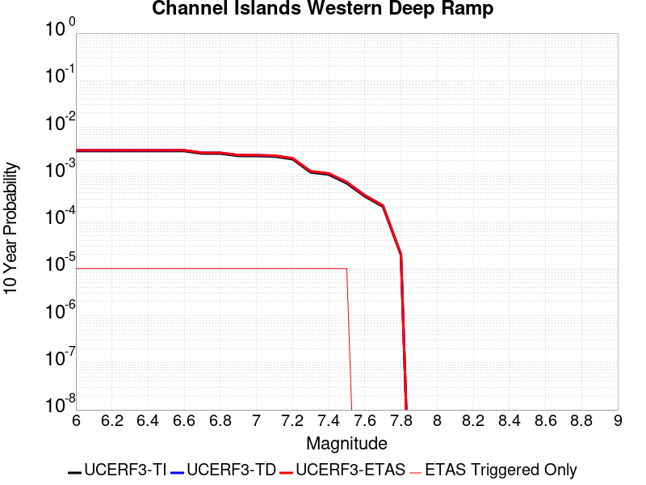 |

| Magnitude | 1 wk TI Prob | 1 wk TD Prob | 1 wk ETAS Prob | 1 wk ETAS/TD Gain | 1 wk ETAS Triggered Only | 1 mo TI Prob | 1 mo TD Prob | 1 mo ETAS Prob | 1 mo ETAS/TD Gain | 1 mo ETAS Triggered Only | 1 yr TI Prob | 1 yr TD Prob | 1 yr ETAS Prob | 1 yr ETAS/TD Gain | 1 yr ETAS Triggered Only | 10 yr TI Prob | 10 yr TD Prob | 10 yr ETAS Prob | 10 yr ETAS/TD Gain | 10 yr ETAS Triggered Only |
|-----|-----|-----|-----|-----|-----|-----|-----|-----|-----|-----|-----|-----|-----|-----|-----|-----|-----|-----|-----|-----|
| 6.0 | 6.0213506E-6 | 6.254862E-6 | 6.254862E-6 | 1.0 | 0.0 | 2.5805533E-5 | 2.6806301E-5 | 2.6806301E-5 | 1.0 | 0.0 | 3.1413708E-4 | 3.263223E-4 | 3.263223E-4 | 1.0 | 0.0 | 0.0031369338 | 0.003258873 | 0.0032688403 | 1.0030586 | 1.0E-5 |
| 6.1 | 6.0213506E-6 | 6.254862E-6 | 6.254862E-6 | 1.0 | 0.0 | 2.5805533E-5 | 2.6806301E-5 | 2.6806301E-5 | 1.0 | 0.0 | 3.1413708E-4 | 3.263223E-4 | 3.263223E-4 | 1.0 | 0.0 | 0.0031369338 | 0.003258873 | 0.0032688403 | 1.0030586 | 1.0E-5 |
| 6.2 | 6.0213506E-6 | 6.254862E-6 | 6.254862E-6 | 1.0 | 0.0 | 2.5805533E-5 | 2.6806301E-5 | 2.6806301E-5 | 1.0 | 0.0 | 3.1413708E-4 | 3.263223E-4 | 3.263223E-4 | 1.0 | 0.0 | 0.0031369338 | 0.003258873 | 0.0032688403 | 1.0030586 | 1.0E-5 |
| 6.3 | 6.0213506E-6 | 6.254862E-6 | 6.254862E-6 | 1.0 | 0.0 | 2.5805533E-5 | 2.6806301E-5 | 2.6806301E-5 | 1.0 | 0.0 | 3.1413708E-4 | 3.263223E-4 | 3.263223E-4 | 1.0 | 0.0 | 0.0031369338 | 0.003258873 | 0.0032688403 | 1.0030586 | 1.0E-5 |
| 6.4 | 6.0213506E-6 | 6.254862E-6 | 6.254862E-6 | 1.0 | 0.0 | 2.5805533E-5 | 2.6806301E-5 | 2.6806301E-5 | 1.0 | 0.0 | 3.1413708E-4 | 3.263223E-4 | 3.263223E-4 | 1.0 | 0.0 | 0.0031369338 | 0.003258873 | 0.0032688403 | 1.0030586 | 1.0E-5 |
| 6.5 | 6.0213506E-6 | 6.254862E-6 | 6.254862E-6 | 1.0 | 0.0 | 2.5805533E-5 | 2.6806301E-5 | 2.6806301E-5 | 1.0 | 0.0 | 3.1413708E-4 | 3.263223E-4 | 3.263223E-4 | 1.0 | 0.0 | 0.0031369338 | 0.003258873 | 0.0032688403 | 1.0030586 | 1.0E-5 |
| 6.6 | 6.0213506E-6 | 6.254862E-6 | 6.254862E-6 | 1.0 | 0.0 | 2.5805533E-5 | 2.6806301E-5 | 2.6806301E-5 | 1.0 | 0.0 | 3.1413708E-4 | 3.263223E-4 | 3.263223E-4 | 1.0 | 0.0 | 0.0031369338 | 0.003258873 | 0.0032688403 | 1.0030586 | 1.0E-5 |
| 6.7 | 5.313309E-6 | 5.5252344E-6 | 5.5252344E-6 | 1.0 | 0.0 | 2.2771126E-5 | 2.3679384E-5 | 2.3679384E-5 | 1.0 | 0.0 | 2.772032E-4 | 2.8826247E-4 | 2.8826247E-4 | 1.0 | 0.0 | 0.0027685766 | 0.0028792885 | 0.0028892597 | 1.003463 | 1.0E-5 |
| 6.8 | 5.313309E-6 | 5.5252344E-6 | 5.5252344E-6 | 1.0 | 0.0 | 2.2771126E-5 | 2.3679384E-5 | 2.3679384E-5 | 1.0 | 0.0 | 2.772032E-4 | 2.8826247E-4 | 2.8826247E-4 | 1.0 | 0.0 | 0.0027685766 | 0.0028792885 | 0.0028892597 | 1.003463 | 1.0E-5 |
| 6.9 | 4.744377E-6 | 4.9394253E-6 | 4.9394253E-6 | 1.0 | 0.0 | 2.0332885E-5 | 2.1168813E-5 | 2.1168813E-5 | 1.0 | 0.0 | 2.4752476E-4 | 2.5770356E-4 | 2.5770356E-4 | 1.0 | 0.0 | 0.0024724922 | 0.0025744147 | 0.002584389 | 1.0038744 | 1.0E-5 |
| 7.0 | 4.722209E-6 | 4.916468E-6 | 4.916468E-6 | 1.0 | 0.0 | 2.0237881E-5 | 2.1070427E-5 | 2.1070427E-5 | 1.0 | 0.0 | 2.4636835E-4 | 2.5650597E-4 | 2.5650597E-4 | 1.0 | 0.0 | 0.002460954 | 0.0025624665 | 0.0025724408 | 1.0038925 | 1.0E-5 |
| 7.1 | 4.611174E-6 | 4.8014035E-6 | 4.8014035E-6 | 1.0 | 0.0 | 1.9762025E-5 | 2.0577303E-5 | 2.0577303E-5 | 1.0 | 0.0 | 2.4057609E-4 | 2.505036E-4 | 2.505036E-4 | 1.0 | 0.0 | 0.002403158 | 0.0025025792 | 0.0025125542 | 1.0039859 | 1.0E-5 |
| 7.2 | 4.043994E-6 | 4.212022E-6 | 4.212022E-6 | 1.0 | 0.0 | 1.7331287E-5 | 1.8051418E-5 | 1.8051418E-5 | 1.0 | 0.0 | 2.10988E-4 | 2.1975742E-4 | 2.1975742E-4 | 1.0 | 0.0 | 0.002107878 | 0.0021957518 | 0.0022057297 | 1.0045443 | 1.0E-5 |
| 7.3 | 2.1233036E-6 | 2.2297845E-6 | 2.2297845E-6 | 1.0 | 0.0 | 9.099841E-6 | 9.5561845E-6 | 9.5561845E-6 | 1.0 | 0.0 | 1.1078493E-4 | 1.1634039E-4 | 1.1634039E-4 | 1.0 | 0.0 | 0.0011072971 | 0.0011628004 | 0.0011727888 | 1.00859 | 1.0E-5 |
| 7.4 | 1.9051884E-6 | 2.0014945E-6 | 2.0014945E-6 | 1.0 | 0.0 | 8.165067E-6 | 8.577806E-6 | 8.577806E-6 | 1.0 | 0.0 | 9.940516E-5 | 1.0442983E-4 | 1.0442983E-4 | 1.0 | 0.0 | 9.93607E-4 | 0.001043813 | 0.0010538024 | 1.0095702 | 1.0E-5 |
| 7.5 | 1.2408497E-6 | 1.3038822E-6 | 1.3038822E-6 | 1.0 | 0.0 | 5.317916E-6 | 5.5880546E-6 | 5.5880546E-6 | 1.0 | 0.0 | 6.4743705E-5 | 6.803246E-5 | 6.803246E-5 | 1.0 | 0.0 | 6.4724847E-4 | 6.801185E-4 | 6.901117E-4 | 1.0146933 | 1.0E-5 |
| 7.6 | 6.5440025E-7 | 6.886708E-7 | 6.886708E-7 | 1.0 | 0.0 | 2.8045695E-6 | 2.951443E-6 | 2.951443E-6 | 1.0 | 0.0 | 3.4145098E-5 | 3.593324E-5 | 3.593324E-5 | 1.0 | 0.0 | 3.4139853E-4 | 3.5927573E-4 | 3.5927573E-4 | 1.0 | 0.0 |
| 7.7 | 3.985963E-7 | 4.193073E-7 | 4.193073E-7 | 1.0 | 0.0 | 1.7082689E-6 | 1.7970301E-6 | 1.7970301E-6 | 1.0 | 0.0 | 2.0797976E-5 | 2.1878634E-5 | 2.1878634E-5 | 1.0 | 0.0 | 2.0796029E-4 | 2.1876597E-4 | 2.1876597E-4 | 1.0 | 0.0 |
| 7.8 | 3.706329E-8 | 3.8591754E-8 | 3.8591754E-8 | 1.0 | 0.0 | 1.5884267E-7 | 1.6539322E-7 | 1.6539322E-7 | 1.0 | 0.0 | 1.9339077E-6 | 2.0136606E-6 | 2.0136606E-6 | 1.0 | 0.0 | 1.933891E-5 | 2.0136436E-5 | 2.0136436E-5 | 1.0 | 0.0 |

## San Luis Range - Pecho 2011 CFM
*[(top)](#table-of-contents)*

| 1 Week | 1 Month | 1 Year | 10 Year |
|-----|-----|-----|-----|
|  |  |  |  |

| Magnitude | 1 wk TI Prob | 1 wk TD Prob | 1 wk ETAS Prob | 1 wk ETAS/TD Gain | 1 wk ETAS Triggered Only | 1 mo TI Prob | 1 mo TD Prob | 1 mo ETAS Prob | 1 mo ETAS/TD Gain | 1 mo ETAS Triggered Only | 1 yr TI Prob | 1 yr TD Prob | 1 yr ETAS Prob | 1 yr ETAS/TD Gain | 1 yr ETAS Triggered Only | 10 yr TI Prob | 10 yr TD Prob | 10 yr ETAS Prob | 10 yr ETAS/TD Gain | 10 yr ETAS Triggered Only |
|-----|-----|-----|-----|-----|-----|-----|-----|-----|-----|-----|-----|-----|-----|-----|-----|-----|-----|-----|-----|-----|
| 6.0 | 1.687423E-6 | 1.6921935E-6 | 1.16921765E-5 | 6.90948 | 1.0E-5 | 7.231793E-6 | 7.252239E-6 | 1.7252167E-5 | 2.3788745 | 1.0E-5 | 8.804352E-5 | 8.8292676E-5 | 9.829179E-5 | 1.1132497 | 1.0E-5 | 8.8008645E-4 | 8.8259985E-4 | 8.92591E-4 | 1.0113201 | 1.0E-5 |
| 6.1 | 1.687423E-6 | 1.6921935E-6 | 1.16921765E-5 | 6.90948 | 1.0E-5 | 7.231793E-6 | 7.252239E-6 | 1.7252167E-5 | 2.3788745 | 1.0E-5 | 8.804352E-5 | 8.8292676E-5 | 9.829179E-5 | 1.1132497 | 1.0E-5 | 8.8008645E-4 | 8.8259985E-4 | 8.92591E-4 | 1.0113201 | 1.0E-5 |
| 6.2 | 1.0765672E-6 | 1.0770533E-6 | 1.10770425E-5 | 10.284582 | 1.0E-5 | 4.613851E-6 | 4.615935E-6 | 1.4615888E-5 | 3.1663985 | 1.0E-5 | 5.617219E-5 | 5.619762E-5 | 6.6197055E-5 | 1.1779335 | 1.0E-5 | 5.6157995E-4 | 5.618403E-4 | 5.718347E-4 | 1.0177886 | 1.0E-5 |
| 6.3 | 8.523104E-7 | 8.5130137E-7 | 1.0851293E-5 | 12.746712 | 1.0E-5 | 3.6527538E-6 | 3.6484296E-6 | 1.3648393E-5 | 3.7408953 | 1.0E-5 | 4.447137E-5 | 4.4418757E-5 | 5.4418313E-5 | 1.2251201 | 1.0E-5 | 4.4462472E-4 | 4.4410198E-4 | 4.5409755E-4 | 1.0225073 | 1.0E-5 |
| 6.4 | 8.523104E-7 | 8.5130137E-7 | 1.0851293E-5 | 12.746712 | 1.0E-5 | 3.6527538E-6 | 3.6484296E-6 | 1.3648393E-5 | 3.7408953 | 1.0E-5 | 4.447137E-5 | 4.4418757E-5 | 5.4418313E-5 | 1.2251201 | 1.0E-5 | 4.4462472E-4 | 4.4410198E-4 | 4.5409755E-4 | 1.0225073 | 1.0E-5 |
| 6.5 | 7.0029404E-7 | 6.976431E-7 | 1.0697636E-5 | 15.333967 | 1.0E-5 | 3.0012568E-6 | 2.9898956E-6 | 1.2989865E-5 | 4.3445883 | 1.0E-5 | 3.6539688E-5 | 3.6401387E-5 | 4.6401023E-5 | 1.2747048 | 1.0E-5 | 3.653368E-4 | 3.6395594E-4 | 3.739523E-4 | 1.0274658 | 1.0E-5 |
| 6.6 | 5.583906E-7 | 5.542822E-7 | 1.0554277E-5 | 19.04134 | 1.0E-5 | 2.3931002E-6 | 2.375493E-6 | 1.237547E-5 | 5.209642 | 1.0E-5 | 2.9135606E-5 | 2.8921253E-5 | 3.8920964E-5 | 1.3457565 | 1.0E-5 | 2.9131788E-4 | 2.8917563E-4 | 2.9917274E-4 | 1.034571 | 1.0E-5 |
| 6.7 | 4.73441E-7 | 4.6830593E-7 | 1.0468301E-5 | 22.353554 | 1.0E-5 | 2.0290313E-6 | 2.0070238E-6 | 1.20070035E-5 | 5.982492 | 1.0E-5 | 2.4703175E-5 | 2.4435245E-5 | 3.4435E-5 | 1.4092349 | 1.0E-5 | 2.470043E-4 | 2.4432605E-4 | 2.543236E-4 | 1.040919 | 1.0E-5 |
| 6.8 | 4.1466086E-7 | 4.0877885E-7 | 1.0408775E-5 | 25.463097 | 1.0E-5 | 1.7771167E-6 | 1.7519081E-6 | 1.175189E-5 | 6.7080517 | 1.0E-5 | 2.1636182E-5 | 2.1329277E-5 | 3.1329062E-5 | 1.4688292 | 1.0E-5 | 2.1634075E-4 | 2.1327264E-4 | 2.232705E-4 | 1.0468783 | 1.0E-5 |
| 6.9 | 3.2056641E-7 | 3.132924E-7 | 1.0313289E-5 | 32.919056 | 1.0E-5 | 1.3738553E-6 | 1.3426809E-6 | 1.1342668E-5 | 8.447776 | 1.0E-5 | 1.6726559E-5 | 1.634702E-5 | 2.6346856E-5 | 1.6117224 | 1.0E-5 | 1.67253E-4 | 1.6345832E-4 | 1.7345669E-4 | 1.0611677 | 1.0E-5 |
| 7.0 | 2.6315942E-7 | 2.5489615E-7 | 2.5489615E-7 | 1.0 | 0.0 | 1.1278256E-6 | 1.0924116E-6 | 1.0924116E-6 | 1.0 | 0.0 | 1.3731191E-5 | 1.330003E-5 | 1.330003E-5 | 1.0 | 0.0 | 1.3730342E-4 | 1.3299243E-4 | 1.3299243E-4 | 1.0 | 0.0 |
| 7.1 | 2.1832436E-7 | 2.0917255E-7 | 2.0917255E-7 | 1.0 | 0.0 | 9.356755E-7 | 8.964535E-7 | 8.964535E-7 | 1.0 | 0.0 | 1.13917895E-5 | 1.09142675E-5 | 1.09142675E-5 | 1.0 | 0.0 | 1.1391206E-4 | 1.0913736E-4 | 1.0913736E-4 | 1.0 | 0.0 |
| 7.2 | 1.7393015E-7 | 1.6376538E-7 | 1.6376538E-7 | 1.0 | 0.0 | 7.454147E-7 | 7.0185143E-7 | 7.0185143E-7 | 1.0 | 0.0 | 9.075386E-6 | 8.545007E-6 | 8.545007E-6 | 1.0 | 0.0 | 9.075015E-5 | 8.5446816E-5 | 8.5446816E-5 | 1.0 | 0.0 |
| 7.3 | 1.3744894E-7 | 1.2638569E-7 | 1.2638569E-7 | 1.0 | 0.0 | 5.890667E-7 | 5.416528E-7 | 5.416528E-7 | 1.0 | 0.0 | 7.1718637E-6 | 6.594603E-6 | 6.594603E-6 | 1.0 | 0.0 | 7.171632E-5 | 6.5944085E-5 | 6.5944085E-5 | 1.0 | 0.0 |
| 7.4 | 1.0915278E-7 | 9.727485E-8 | 9.727485E-8 | 1.0 | 0.0 | 4.6779755E-7 | 4.1689214E-7 | 4.1689214E-7 | 1.0 | 0.0 | 5.6954204E-6 | 5.07565E-6 | 5.07565E-6 | 1.0 | 0.0 | 5.6952744E-5 | 5.0755345E-5 | 5.0755345E-5 | 1.0 | 0.0 |
| 7.5 | 9.490291E-8 | 8.2570836E-8 | 8.2570836E-8 | 1.0 | 0.0 | 4.0672668E-7 | 3.5387495E-7 | 3.5387495E-7 | 1.0 | 0.0 | 4.9518862E-6 | 4.308419E-6 | 4.308419E-6 | 1.0 | 0.0 | 4.951776E-5 | 4.308336E-5 | 4.308336E-5 | 1.0 | 0.0 |
| 7.6 | 7.256678E-8 | 5.9424835E-8 | 5.9424835E-8 | 1.0 | 0.0 | 3.1100043E-7 | 2.5467784E-7 | 2.5467784E-7 | 1.0 | 0.0 | 3.7864236E-6 | 3.1006982E-6 | 3.1006982E-6 | 1.0 | 0.0 | 3.7863592E-5 | 3.100655E-5 | 3.100655E-5 | 1.0 | 0.0 |
| 7.7 | 5.446273E-8 | 4.0578932E-8 | 4.0578932E-8 | 1.0 | 0.0 | 2.3341168E-7 | 1.739097E-7 | 1.739097E-7 | 1.0 | 0.0 | 2.8417835E-6 | 2.1173485E-6 | 2.1173485E-6 | 1.0 | 0.0 | 2.8417471E-5 | 2.1173284E-5 | 2.1173284E-5 | 1.0 | 0.0 |
| 7.8 | 3.5850867E-8 | 2.1520076E-8 | 2.1520076E-8 | 1.0 | 0.0 | 1.5364655E-7 | 9.2228895E-8 | 9.2228895E-8 | 1.0 | 0.0 | 1.8706452E-6 | 1.1228861E-6 | 1.1228861E-6 | 1.0 | 0.0 | 1.8706294E-5 | 1.1228805E-5 | 1.1228805E-5 | 1.0 | 0.0 |
| 7.9 | 2.45879E-8 | 1.1394325E-8 | 1.1394325E-8 | 1.0 | 0.0 | 1.0537671E-7 | 4.8832817E-8 | 4.8832817E-8 | 1.0 | 0.0 | 1.2829606E-6 | 5.9453936E-7 | 5.9453936E-7 | 1.0 | 0.0 | 1.2829532E-5 | 5.9453782E-6 | 5.9453782E-6 | 1.0 | 0.0 |
| 8.0 | 1.8151761E-8 | 7.4408124E-9 | 7.4408124E-9 | 1.0 | 0.0 | 7.779326E-8 | 3.1889197E-8 | 3.1889197E-8 | 1.0 | 0.0 | 9.4713255E-7 | 3.8825087E-7 | 3.8825087E-7 | 1.0 | 0.0 | 9.471285E-6 | 3.882502E-6 | 3.882502E-6 | 1.0 | 0.0 |
| 8.1 | 9.559205E-9 | 4.1002974E-9 | 4.1002974E-9 | 1.0 | 0.0 | 4.096802E-8 | 1.75727E-8 | 1.75727E-8 | 1.0 | 0.0 | 4.9878554E-7 | 2.1394762E-7 | 2.1394762E-7 | 1.0 | 0.0 | 4.987844E-6 | 2.1394742E-6 | 2.1394742E-6 | 1.0 | 0.0 |

## San Pedro Basin
*[(top)](#table-of-contents)*

| 1 Week | 1 Month | 1 Year | 10 Year |
|-----|-----|-----|-----|
|  |  |  |  |

| Magnitude | 1 wk TI Prob | 1 wk TD Prob | 1 wk ETAS Prob | 1 wk ETAS/TD Gain | 1 wk ETAS Triggered Only | 1 mo TI Prob | 1 mo TD Prob | 1 mo ETAS Prob | 1 mo ETAS/TD Gain | 1 mo ETAS Triggered Only | 1 yr TI Prob | 1 yr TD Prob | 1 yr ETAS Prob | 1 yr ETAS/TD Gain | 1 yr ETAS Triggered Only | 10 yr TI Prob | 10 yr TD Prob | 10 yr ETAS Prob | 10 yr ETAS/TD Gain | 10 yr ETAS Triggered Only |
|-----|-----|-----|-----|-----|-----|-----|-----|-----|-----|-----|-----|-----|-----|-----|-----|-----|-----|-----|-----|-----|
| 6.0 | 5.3449043E-5 | 6.336922E-5 | 6.336922E-5 | 1.0 | 0.0 | 2.2904722E-4 | 2.7155754E-4 | 2.7155754E-4 | 1.0 | 0.0 | 0.0027850836 | 0.0033018088 | 0.0033117756 | 1.0030186 | 1.0E-5 | 0.027504366 | 0.03258929 | 0.032598965 | 1.0002968 | 1.0E-5 |
| 6.1 | 5.3449043E-5 | 6.336922E-5 | 6.336922E-5 | 1.0 | 0.0 | 2.2904722E-4 | 2.7155754E-4 | 2.7155754E-4 | 1.0 | 0.0 | 0.0027850836 | 0.0033018088 | 0.0033117756 | 1.0030186 | 1.0E-5 | 0.027504366 | 0.03258929 | 0.032598965 | 1.0002968 | 1.0E-5 |
| 6.2 | 2.3189454E-5 | 2.6642689E-5 | 2.6642689E-5 | 1.0 | 0.0 | 9.9379584E-5 | 1.1417822E-4 | 1.1417822E-4 | 1.0 | 0.0 | 0.0012092749 | 0.0013892808 | 0.0013992669 | 1.007188 | 1.0E-5 | 0.012027155 | 0.013810828 | 0.01382069 | 1.0007141 | 1.0E-5 |
| 6.3 | 2.3189454E-5 | 2.6642689E-5 | 2.6642689E-5 | 1.0 | 0.0 | 9.9379584E-5 | 1.1417822E-4 | 1.1417822E-4 | 1.0 | 0.0 | 0.0012092749 | 0.0013892808 | 0.0013992669 | 1.007188 | 1.0E-5 | 0.012027155 | 0.013810828 | 0.01382069 | 1.0007141 | 1.0E-5 |
| 6.4 | 1.966056E-5 | 2.2463326E-5 | 2.2463326E-5 | 1.0 | 0.0 | 8.425682E-5 | 9.626807E-5 | 9.626807E-5 | 1.0 | 0.0 | 0.001025344 | 0.0011714738 | 0.0011814621 | 1.0085262 | 1.0E-5 | 0.010206259 | 0.011657071 | 0.0116669545 | 1.0008478 | 1.0E-5 |
| 6.5 | 1.7342953E-5 | 1.9745074E-5 | 1.9745074E-5 | 1.0 | 0.0 | 7.4324824E-5 | 8.4619205E-5 | 8.4619205E-5 | 1.0 | 0.0 | 9.04529E-4 | 0.0010297889 | 0.0010397786 | 1.0097008 | 1.0E-5 | 0.009008561 | 0.010253892 | 0.010263789 | 1.0009652 | 1.0E-5 |
| 6.6 | 1.439804E-5 | 1.6322656E-5 | 1.6322656E-5 | 1.0 | 0.0 | 6.170443E-5 | 6.995254E-5 | 6.995254E-5 | 1.0 | 0.0 | 7.509924E-4 | 8.5137156E-4 | 8.61363E-4 | 1.0117358 | 1.0E-5 | 0.0074845953 | 0.008484301 | 0.008494216 | 1.0011686 | 1.0E-5 |
| 6.7 | 1.2634884E-5 | 1.4285245E-5 | 1.4285245E-5 | 1.0 | 0.0 | 5.414838E-5 | 6.122122E-5 | 6.122122E-5 | 1.0 | 0.0 | 6.590571E-4 | 7.4514386E-4 | 7.551364E-4 | 1.0134102 | 1.0E-5 | 0.006571059 | 0.0074294745 | 0.0074394 | 1.001336 | 1.0E-5 |
| 6.8 | 1.146091E-5 | 1.2933146E-5 | 1.2933146E-5 | 1.0 | 0.0 | 4.911726E-5 | 5.5426757E-5 | 5.5426757E-5 | 1.0 | 0.0 | 5.9783855E-4 | 6.746416E-4 | 6.8463484E-4 | 1.0148127 | 1.0E-5 | 0.0059623276 | 0.006728875 | 0.006738808 | 1.0014762 | 1.0E-5 |
| 6.9 | 9.109035E-6 | 1.0234976E-5 | 1.0234976E-5 | 1.0 | 0.0 | 3.9038136E-5 | 4.3863605E-5 | 4.3863605E-5 | 1.0 | 0.0 | 4.7518566E-4 | 5.339365E-4 | 5.4393115E-4 | 1.0187188 | 1.0E-5 | 0.0047417083 | 0.0053292904 | 0.005339237 | 1.0018665 | 1.0E-5 |
| 7.0 | 5.9351028E-6 | 6.583943E-6 | 6.583943E-6 | 1.0 | 0.0 | 2.5435906E-5 | 2.8216728E-5 | 2.8216728E-5 | 1.0 | 0.0 | 3.0963816E-4 | 3.4350812E-4 | 3.5350467E-4 | 1.0291014 | 1.0E-5 | 0.0030920706 | 0.0034320883 | 0.003442054 | 1.0029037 | 1.0E-5 |
| 7.1 | 2.1557585E-6 | 2.2096456E-6 | 2.2096456E-6 | 1.0 | 0.0 | 9.238933E-6 | 9.469876E-6 | 9.469876E-6 | 1.0 | 0.0 | 1.1247819E-4 | 1.152898E-4 | 1.152898E-4 | 1.0 | 0.0 | 0.0011242128 | 0.0011523152 | 0.0011523152 | 1.0 | 0.0 |
| 7.2 | 2.1251979E-6 | 2.1779917E-6 | 2.1779917E-6 | 1.0 | 0.0 | 9.107958E-6 | 9.334219E-6 | 9.334219E-6 | 1.0 | 0.0 | 1.1088375E-4 | 1.13638336E-4 | 1.13638336E-4 | 1.0 | 0.0 | 0.0011082845 | 0.0011358176 | 0.0011358176 | 1.0 | 0.0 |
| 7.3 | 1.7145798E-6 | 1.7442856E-6 | 1.7442856E-6 | 1.0 | 0.0 | 7.3481783E-6 | 7.4754885E-6 | 7.4754885E-6 | 1.0 | 0.0 | 8.94604E-5 | 9.101036E-5 | 9.101036E-5 | 1.0 | 0.0 | 8.9424395E-4 | 9.0974005E-4 | 9.0974005E-4 | 1.0 | 0.0 |
| 7.4 | 1.4467993E-6 | 1.4641852E-6 | 1.4641852E-6 | 1.0 | 0.0 | 6.200554E-6 | 6.2750646E-6 | 6.2750646E-6 | 1.0 | 0.0 | 7.548913E-5 | 7.639631E-5 | 7.639631E-5 | 1.0 | 0.0 | 7.546349E-4 | 7.6370774E-4 | 7.6370774E-4 | 1.0 | 0.0 |
| 7.5 | 1.2803735E-6 | 1.2931483E-6 | 1.2931483E-6 | 1.0 | 0.0 | 5.487303E-6 | 5.542053E-6 | 5.542053E-6 | 1.0 | 0.0 | 6.680587E-5 | 6.747247E-5 | 6.747247E-5 | 1.0 | 0.0 | 6.678579E-4 | 6.7452696E-4 | 6.7452696E-4 | 1.0 | 0.0 |
| 7.6 | 6.755009E-7 | 6.7694583E-7 | 6.7694583E-7 | 1.0 | 0.0 | 2.8950008E-6 | 2.9011935E-6 | 2.9011935E-6 | 1.0 | 0.0 | 3.5246063E-5 | 3.532152E-5 | 3.532152E-5 | 1.0 | 0.0 | 3.5240475E-4 | 3.5316474E-4 | 3.5316474E-4 | 1.0 | 0.0 |
| 7.7 | 6.211885E-8 | 4.5699466E-8 | 4.5699466E-8 | 1.0 | 0.0 | 2.6622362E-7 | 1.9585484E-7 | 1.9585484E-7 | 1.0 | 0.0 | 3.2412677E-6 | 2.3845303E-6 | 2.3845303E-6 | 1.0 | 0.0 | 3.2412205E-5 | 2.3845067E-5 | 2.3845067E-5 | 1.0 | 0.0 |
| 7.8 | 2.6580573E-9 | 1.5138059E-9 | 1.5138059E-9 | 1.0 | 0.0 | 1.1391674E-8 | 6.4877392E-9 | 6.4877392E-9 | 1.0 | 0.0 | 1.3869362E-7 | 7.898823E-8 | 7.898823E-8 | 1.0 | 0.0 | 1.3869354E-6 | 7.898823E-7 | 7.898823E-7 | 1.0 | 0.0 |

## San Gabriel (Extension)
*[(top)](#table-of-contents)*

| 1 Week | 1 Month | 1 Year | 10 Year |
|-----|-----|-----|-----|
|  |  |  |  |

| Magnitude | 1 wk TI Prob | 1 wk TD Prob | 1 wk ETAS Prob | 1 wk ETAS/TD Gain | 1 wk ETAS Triggered Only | 1 mo TI Prob | 1 mo TD Prob | 1 mo ETAS Prob | 1 mo ETAS/TD Gain | 1 mo ETAS Triggered Only | 1 yr TI Prob | 1 yr TD Prob | 1 yr ETAS Prob | 1 yr ETAS/TD Gain | 1 yr ETAS Triggered Only | 10 yr TI Prob | 10 yr TD Prob | 10 yr ETAS Prob | 10 yr ETAS/TD Gain | 10 yr ETAS Triggered Only |
|-----|-----|-----|-----|-----|-----|-----|-----|-----|-----|-----|-----|-----|-----|-----|-----|-----|-----|-----|-----|-----|
| 6.0 | 5.6486106E-6 | 5.716764E-6 | 1.5716707E-5 | 2.7492313 | 1.0E-5 | 2.4208108E-5 | 2.4500196E-5 | 3.449995E-5 | 1.4081501 | 1.0E-5 | 2.9469383E-4 | 2.9825032E-4 | 3.082473E-4 | 1.0335189 | 1.0E-5 | 0.0029430336 | 0.0029786306 | 0.0029886009 | 1.0033473 | 1.0E-5 |
| 6.1 | 5.6486106E-6 | 5.716764E-6 | 1.5716707E-5 | 2.7492313 | 1.0E-5 | 2.4208108E-5 | 2.4500196E-5 | 3.449995E-5 | 1.4081501 | 1.0E-5 | 2.9469383E-4 | 2.9825032E-4 | 3.082473E-4 | 1.0335189 | 1.0E-5 | 0.0029430336 | 0.0029786306 | 0.0029886009 | 1.0033473 | 1.0E-5 |
| 6.2 | 5.6486106E-6 | 5.716764E-6 | 1.5716707E-5 | 2.7492313 | 1.0E-5 | 2.4208108E-5 | 2.4500196E-5 | 3.449995E-5 | 1.4081501 | 1.0E-5 | 2.9469383E-4 | 2.9825032E-4 | 3.082473E-4 | 1.0335189 | 1.0E-5 | 0.0029430336 | 0.0029786306 | 0.0029886009 | 1.0033473 | 1.0E-5 |
| 6.3 | 5.6486106E-6 | 5.716764E-6 | 1.5716707E-5 | 2.7492313 | 1.0E-5 | 2.4208108E-5 | 2.4500196E-5 | 3.449995E-5 | 1.4081501 | 1.0E-5 | 2.9469383E-4 | 2.9825032E-4 | 3.082473E-4 | 1.0335189 | 1.0E-5 | 0.0029430336 | 0.0029786306 | 0.0029886009 | 1.0033473 | 1.0E-5 |
| 6.4 | 5.6486106E-6 | 5.716764E-6 | 1.5716707E-5 | 2.7492313 | 1.0E-5 | 2.4208108E-5 | 2.4500196E-5 | 3.449995E-5 | 1.4081501 | 1.0E-5 | 2.9469383E-4 | 2.9825032E-4 | 3.082473E-4 | 1.0335189 | 1.0E-5 | 0.0029430336 | 0.0029786306 | 0.0029886009 | 1.0033473 | 1.0E-5 |
| 6.5 | 4.7134554E-6 | 4.754189E-6 | 4.754189E-6 | 1.0 | 0.0 | 2.0200367E-5 | 2.037494E-5 | 2.037494E-5 | 1.0 | 0.0 | 2.459117E-4 | 2.480375E-4 | 2.480375E-4 | 1.0 | 0.0 | 0.0024563975 | 0.002477695 | 0.002477695 | 1.0 | 0.0 |
| 6.6 | 4.7134554E-6 | 4.754189E-6 | 4.754189E-6 | 1.0 | 0.0 | 2.0200367E-5 | 2.037494E-5 | 2.037494E-5 | 1.0 | 0.0 | 2.459117E-4 | 2.480375E-4 | 2.480375E-4 | 1.0 | 0.0 | 0.0024563975 | 0.002477695 | 0.002477695 | 1.0 | 0.0 |
| 6.7 | 4.2468837E-6 | 4.2740066E-6 | 4.2740066E-6 | 1.0 | 0.0 | 1.8200803E-5 | 1.8317047E-5 | 1.8317047E-5 | 1.0 | 0.0 | 2.2157225E-4 | 2.2298795E-4 | 2.2298795E-4 | 1.0 | 0.0 | 0.0022135144 | 0.0022277178 | 0.0022277178 | 1.0 | 0.0 |
| 6.8 | 4.1180615E-6 | 4.1413964E-6 | 4.1413964E-6 | 1.0 | 0.0 | 1.7648716E-5 | 1.7748725E-5 | 1.7748725E-5 | 1.0 | 0.0 | 2.1485193E-4 | 2.1607001E-4 | 2.1607001E-4 | 1.0 | 0.0 | 0.0021464431 | 0.0021586744 | 0.0021586744 | 1.0 | 0.0 |
| 6.9 | 3.863861E-6 | 3.879712E-6 | 3.879712E-6 | 1.0 | 0.0 | 1.65593E-5 | 1.6627235E-5 | 1.6627235E-5 | 1.0 | 0.0 | 2.0159081E-4 | 2.0241845E-4 | 2.0241845E-4 | 1.0 | 0.0 | 0.0020140803 | 0.0020224121 | 0.0020224121 | 1.0 | 0.0 |
| 7.0 | 3.6947372E-6 | 3.705611E-6 | 3.705611E-6 | 1.0 | 0.0 | 1.5834492E-5 | 1.5881098E-5 | 1.5881098E-5 | 1.0 | 0.0 | 1.9276788E-4 | 1.9333589E-4 | 1.9333589E-4 | 1.0 | 0.0 | 0.0019260074 | 0.0019317471 | 0.0019317471 | 1.0 | 0.0 |
| 7.1 | 3.5686835E-6 | 3.572832E-6 | 3.572832E-6 | 1.0 | 0.0 | 1.5294268E-5 | 1.531205E-5 | 1.531205E-5 | 1.0 | 0.0 | 1.861918E-4 | 1.8640893E-4 | 1.8640893E-4 | 1.0 | 0.0 | 0.0018603588 | 0.0018625953 | 0.0018625953 | 1.0 | 0.0 |
| 7.2 | 2.8023446E-6 | 2.7767248E-6 | 2.7767248E-6 | 1.0 | 0.0 | 1.2009994E-5 | 1.1900196E-5 | 1.1900196E-5 | 1.0 | 0.0 | 1.4621185E-4 | 1.4487536E-4 | 1.4487536E-4 | 1.0 | 0.0 | 0.001461157 | 0.0014478238 | 0.0014478238 | 1.0 | 0.0 |
| 7.3 | 2.5843012E-6 | 2.5459015E-6 | 2.5459015E-6 | 1.0 | 0.0 | 1.1075529E-5 | 1.0910961E-5 | 1.0910961E-5 | 1.0 | 0.0 | 1.3483623E-4 | 1.3283295E-4 | 1.3283295E-4 | 1.0 | 0.0 | 0.0013475444 | 0.001327549 | 0.001327549 | 1.0 | 0.0 |
| 7.4 | 2.4464468E-6 | 2.396603E-6 | 2.396603E-6 | 1.0 | 0.0 | 1.04847295E-5 | 1.0271116E-5 | 1.0271116E-5 | 1.0 | 0.0 | 1.276441E-4 | 1.2504375E-4 | 1.2504375E-4 | 1.0 | 0.0 | 0.0012757082 | 0.0012497472 | 0.0012497472 | 1.0 | 0.0 |
| 7.5 | 2.0420266E-6 | 1.8909875E-6 | 1.8909875E-6 | 1.0 | 0.0 | 8.751514E-6 | 8.104207E-6 | 8.104207E-6 | 1.0 | 0.0 | 1.0654447E-4 | 9.866429E-5 | 9.866429E-5 | 1.0 | 0.0 | 0.001064934 | 9.86212E-4 | 9.86212E-4 | 1.0 | 0.0 |
| 7.6 | 1.8326596E-6 | 1.6397845E-6 | 1.6397845E-6 | 1.0 | 0.0 | 7.854232E-6 | 7.0276287E-6 | 7.0276287E-6 | 1.0 | 0.0 | 9.562107E-5 | 8.5558044E-5 | 8.5558044E-5 | 1.0 | 0.0 | 9.5579936E-4 | 8.552569E-4 | 8.552569E-4 | 1.0 | 0.0 |
| 7.7 | 1.4786998E-6 | 1.252338E-6 | 1.252338E-6 | 1.0 | 0.0 | 6.3372695E-6 | 5.367152E-6 | 5.367152E-6 | 1.0 | 0.0 | 7.715353E-5 | 6.534313E-5 | 6.534313E-5 | 1.0 | 0.0 | 7.7126746E-4 | 6.532469E-4 | 6.532469E-4 | 1.0 | 0.0 |
| 7.8 | 7.6975533E-7 | 6.0690115E-7 | 6.0690115E-7 | 1.0 | 0.0 | 3.2989474E-6 | 2.6010023E-6 | 2.6010023E-6 | 1.0 | 0.0 | 4.0163945E-5 | 3.1666747E-5 | 3.1666747E-5 | 1.0 | 0.0 | 4.0156685E-4 | 3.1662837E-4 | 3.1662837E-4 | 1.0 | 0.0 |
| 7.9 | 1.7645915E-7 | 9.2121915E-8 | 9.2121915E-8 | 1.0 | 0.0 | 7.562533E-7 | 3.9480813E-7 | 3.9480813E-7 | 1.0 | 0.0 | 9.207345E-6 | 4.8067786E-6 | 4.8067786E-6 | 1.0 | 0.0 | 9.206964E-5 | 4.8071433E-5 | 4.8071433E-5 | 1.0 | 0.0 |
| 8.0 | 1.0463461E-7 | 2.4944782E-8 | 2.4944782E-8 | 1.0 | 0.0 | 4.4843398E-7 | 1.0690621E-7 | 1.0690621E-7 | 1.0 | 0.0 | 5.45967E-6 | 1.3015823E-6 | 1.3015823E-6 | 1.0 | 0.0 | 5.459536E-5 | 1.3020428E-5 | 1.3020428E-5 | 1.0 | 0.0 |
| 8.1 | 7.875717E-8 | 1.38639145E-8 | 1.38639145E-8 | 1.0 | 0.0 | 3.3753068E-7 | 5.9416777E-8 | 5.9416777E-8 | 1.0 | 0.0 | 4.109428E-6 | 7.23399E-7 | 7.23399E-7 | 1.0 | 0.0 | 4.109352E-5 | 7.238648E-6 | 7.238648E-6 | 1.0 | 0.0 |
| 8.2 | 1.33163E-8 | 1.7729578E-9 | 1.7729578E-9 | 1.0 | 0.0 | 5.7069855E-8 | 7.598391E-9 | 7.598391E-9 | 1.0 | 0.0 | 6.9482525E-7 | 9.25104E-8 | 9.25104E-8 | 1.0 | 0.0 | 6.9482307E-6 | 9.270698E-7 | 9.270698E-7 | 1.0 | 0.0 |

## San Jacinto (Borrego)
*[(top)](#table-of-contents)*

| 1 Week | 1 Month | 1 Year | 10 Year |
|-----|-----|-----|-----|
|  |  |  |  |

| Magnitude | 1 wk TI Prob | 1 wk TD Prob | 1 wk ETAS Prob | 1 wk ETAS/TD Gain | 1 wk ETAS Triggered Only | 1 mo TI Prob | 1 mo TD Prob | 1 mo ETAS Prob | 1 mo ETAS/TD Gain | 1 mo ETAS Triggered Only | 1 yr TI Prob | 1 yr TD Prob | 1 yr ETAS Prob | 1 yr ETAS/TD Gain | 1 yr ETAS Triggered Only | 10 yr TI Prob | 10 yr TD Prob | 10 yr ETAS Prob | 10 yr ETAS/TD Gain | 10 yr ETAS Triggered Only |
|-----|-----|-----|-----|-----|-----|-----|-----|-----|-----|-----|-----|-----|-----|-----|-----|-----|-----|-----|-----|-----|
| 6.0 | 3.543992E-5 | 2.7924942E-5 | 2.7924942E-5 | 1.0 | 0.0 | 1.5187653E-4 | 1.19672906E-4 | 1.19672906E-4 | 1.0 | 0.0 | 0.0018475284 | 0.001456056 | 0.001456056 | 1.0 | 0.0 | 0.018322436 | 0.014868831 | 0.014878683 | 1.0006626 | 1.0E-5 |
| 6.1 | 3.542281E-5 | 2.7924942E-5 | 2.7924942E-5 | 1.0 | 0.0 | 1.5180321E-4 | 1.19672906E-4 | 1.19672906E-4 | 1.0 | 0.0 | 0.0018466372 | 0.001456056 | 0.001456056 | 1.0 | 0.0 | 0.018313672 | 0.014868831 | 0.014878683 | 1.0006626 | 1.0E-5 |
| 6.2 | 3.4688688E-5 | 2.7924942E-5 | 2.7924942E-5 | 1.0 | 0.0 | 1.4865733E-4 | 1.196729E-4 | 1.196729E-4 | 1.0 | 0.0 | 0.0018084005 | 0.001456056 | 0.001456056 | 1.0 | 0.0 | 0.017937548 | 0.014868831 | 0.014878683 | 1.0006626 | 1.0E-5 |
| 6.3 | 3.2087122E-5 | 2.7770295E-5 | 2.7770295E-5 | 1.0 | 0.0 | 1.3750899E-4 | 1.1901019E-4 | 1.1901019E-4 | 1.0 | 0.0 | 0.0016728862 | 0.0014479982 | 0.0014479982 | 1.0 | 0.0 | 0.016603488 | 0.014789867 | 0.01479972 | 1.0006661 | 1.0E-5 |
| 6.4 | 3.1828724E-5 | 2.7737282E-5 | 2.7737282E-5 | 1.0 | 0.0 | 1.364017E-4 | 1.1886872E-4 | 1.1886872E-4 | 1.0 | 0.0 | 0.0016594254 | 0.0014462781 | 0.0014462781 | 1.0 | 0.0 | 0.016470885 | 0.014772946 | 0.0147827985 | 1.0006669 | 1.0E-5 |
| 6.5 | 3.1563577E-5 | 2.7477005E-5 | 2.7477005E-5 | 1.0 | 0.0 | 1.3526545E-4 | 1.1775334E-4 | 1.1775334E-4 | 1.0 | 0.0 | 0.0016456128 | 0.0014327163 | 0.0014327163 | 1.0 | 0.0 | 0.0163348 | 0.014639534 | 0.014649387 | 1.000673 | 1.0E-5 |
| 6.6 | 3.1467625E-5 | 2.732123E-5 | 2.732123E-5 | 1.0 | 0.0 | 1.3485427E-4 | 1.170858E-4 | 1.170858E-4 | 1.0 | 0.0 | 0.0016406142 | 0.0014245997 | 0.0014245997 | 1.0 | 0.0 | 0.016285548 | 0.014559781 | 0.0145696355 | 1.0006769 | 1.0E-5 |
| 6.7 | 3.1223695E-5 | 2.6939251E-5 | 2.6939251E-5 | 1.0 | 0.0 | 1.3380898E-4 | 1.1544889E-4 | 1.1544889E-4 | 1.0 | 0.0 | 0.0016279068 | 0.0014046961 | 0.0014046961 | 1.0 | 0.0 | 0.01616033 | 0.014364153 | 0.01437401 | 1.0006862 | 1.0E-5 |
| 6.8 | 3.1015585E-5 | 2.6760263E-5 | 2.6760263E-5 | 1.0 | 0.0 | 1.3291716E-4 | 1.1468186E-4 | 1.1468186E-4 | 1.0 | 0.0 | 0.001617065 | 0.0013953695 | 0.0013953695 | 1.0 | 0.0 | 0.016053487 | 0.014271434 | 0.0142812915 | 1.0006907 | 1.0E-5 |
| 6.9 | 2.6641965E-5 | 2.2182778E-5 | 2.2182778E-5 | 1.0 | 0.0 | 1.1417485E-4 | 9.50656E-5 | 9.50656E-5 | 1.0 | 0.0 | 0.0013891924 | 0.0011568131 | 0.0011568131 | 1.0 | 0.0 | 0.0138054015 | 0.011881672 | 0.011891553 | 1.0008316 | 1.0E-5 |
| 7.0 | 2.3854353E-5 | 2.0477606E-5 | 2.0477606E-5 | 1.0 | 0.0 | 1.02228936E-4 | 8.775823E-5 | 8.775823E-5 | 1.0 | 0.0 | 0.0012439266 | 0.0010679353 | 0.0010679353 | 1.0 | 0.0 | 0.012369866 | 0.01098206 | 0.0109919505 | 1.0009006 | 1.0E-5 |
| 7.1 | 2.3672901E-5 | 2.0314093E-5 | 2.0314093E-5 | 1.0 | 0.0 | 1.0145135E-4 | 8.705752E-5 | 8.705752E-5 | 1.0 | 0.0 | 0.0012344702 | 0.0010594124 | 0.0010594124 | 1.0 | 0.0 | 0.0122763505 | 0.010897236 | 0.0109071275 | 1.0009077 | 1.0E-5 |
| 7.2 | 2.2717244E-5 | 1.9541487E-5 | 1.9541487E-5 | 1.0 | 0.0 | 9.735599E-5 | 8.3746556E-5 | 8.3746556E-5 | 1.0 | 0.0 | 0.0011846646 | 0.0010191398 | 0.0010191398 | 1.0 | 0.0 | 0.01178369 | 0.0104946075 | 0.010504503 | 1.0009428 | 1.0E-5 |
| 7.3 | 2.1016205E-5 | 1.838314E-5 | 1.838314E-5 | 1.0 | 0.0 | 9.006634E-5 | 7.878251E-5 | 7.878251E-5 | 1.0 | 0.0 | 0.001096006 | 9.587571E-4 | 9.587571E-4 | 1.0 | 0.0 | 0.010906163 | 0.0098902425 | 0.009900143 | 1.0010011 | 1.0E-5 |
| 7.4 | 2.0683625E-5 | 1.8185665E-5 | 1.8185665E-5 | 1.0 | 0.0 | 8.86411E-5 | 7.7936245E-5 | 7.7936245E-5 | 1.0 | 0.0 | 0.001078671 | 9.484628E-4 | 9.484628E-4 | 1.0 | 0.0 | 0.010734501 | 0.009786969 | 0.009796872 | 1.0010117 | 1.0E-5 |
| 7.5 | 1.9993966E-5 | 1.7780703E-5 | 1.7780703E-5 | 1.0 | 0.0 | 8.568561E-5 | 7.62008E-5 | 7.62008E-5 | 1.0 | 0.0 | 0.001042723 | 9.273519E-4 | 9.273519E-4 | 1.0 | 0.0 | 0.010378438 | 0.009573898 | 0.009583802 | 1.0010345 | 1.0E-5 |
| 7.6 | 1.788966E-5 | 1.6433954E-5 | 1.6433954E-5 | 1.0 | 0.0 | 7.666772E-5 | 7.042934E-5 | 7.042934E-5 | 1.0 | 0.0 | 9.3302975E-4 | 8.571416E-4 | 8.571416E-4 | 1.0 | 0.0 | 0.00929122 | 0.008865787 | 0.008875699 | 1.001118 | 1.0E-5 |
| 7.7 | 1.5125781E-5 | 1.42360805E-5 | 1.42360805E-5 | 1.0 | 0.0 | 6.4823165E-5 | 6.1010353E-5 | 6.1010353E-5 | 1.0 | 0.0 | 7.889362E-4 | 7.4254867E-4 | 7.4254867E-4 | 1.0 | 0.0 | 0.007861412 | 0.0077135246 | 0.0077234474 | 1.0012864 | 1.0E-5 |
| 7.8 | 1.250089E-5 | 1.2629247E-5 | 1.2629247E-5 | 1.0 | 0.0 | 5.3574146E-5 | 5.4124226E-5 | 5.4124226E-5 | 1.0 | 0.0 | 6.5207E-4 | 6.5876386E-4 | 6.5876386E-4 | 1.0 | 0.0 | 0.006501599 | 0.006867107 | 0.0068770386 | 1.0014462 | 1.0E-5 |
| 7.9 | 9.561E-6 | 9.753499E-6 | 9.753499E-6 | 1.0 | 0.0 | 4.0975072E-5 | 4.1800045E-5 | 4.1800045E-5 | 1.0 | 0.0 | 4.987573E-4 | 5.0879724E-4 | 5.0879724E-4 | 1.0 | 0.0 | 0.0049763937 | 0.0053517586 | 0.005361705 | 1.0018586 | 1.0E-5 |
| 8.0 | 8.01699E-6 | 8.2924635E-6 | 8.2924635E-6 | 1.0 | 0.0 | 3.4358076E-5 | 3.5538647E-5 | 3.5538647E-5 | 1.0 | 0.0 | 4.1822926E-4 | 4.3259765E-4 | 4.3259765E-4 | 1.0 | 0.0 | 0.0041744304 | 0.0045728353 | 0.0045827897 | 1.0021769 | 1.0E-5 |
| 8.1 | 6.541947E-6 | 6.461414E-6 | 6.461414E-6 | 1.0 | 0.0 | 2.8036617E-5 | 2.7691483E-5 | 2.7691483E-5 | 1.0 | 0.0 | 3.4129233E-4 | 3.3709218E-4 | 3.3709218E-4 | 1.0 | 0.0 | 0.0034076865 | 0.0035802647 | 0.003590229 | 1.0027831 | 1.0E-5 |
| 8.2 | 1.7968189E-6 | 7.9698475E-7 | 7.9698475E-7 | 1.0 | 0.0 | 7.70063E-6 | 3.4156444E-6 | 3.4156444E-6 | 1.0 | 0.0 | 9.3751136E-5 | 4.1584703E-5 | 4.1584703E-5 | 1.0 | 0.0 | 9.371159E-4 | 4.7112198E-4 | 4.7112198E-4 | 1.0 | 0.0 |
| 8.3 | 1.5167889E-7 | 4.896641E-8 | 4.896641E-8 | 1.0 | 0.0 | 6.500522E-7 | 2.0985603E-7 | 2.0985603E-7 | 1.0 | 0.0 | 7.9143565E-6 | 2.5549946E-6 | 2.5549946E-6 | 1.0 | 0.0 | 7.914075E-5 | 2.9688901E-5 | 2.9688901E-5 | 1.0 | 0.0 |

## Franklin 2011 CFM
*[(top)](#table-of-contents)*

| 1 Week | 1 Month | 1 Year | 10 Year |
|-----|-----|-----|-----|
|  |  |  |  |

| Magnitude | 1 wk TI Prob | 1 wk TD Prob | 1 wk ETAS Prob | 1 wk ETAS/TD Gain | 1 wk ETAS Triggered Only | 1 mo TI Prob | 1 mo TD Prob | 1 mo ETAS Prob | 1 mo ETAS/TD Gain | 1 mo ETAS Triggered Only | 1 yr TI Prob | 1 yr TD Prob | 1 yr ETAS Prob | 1 yr ETAS/TD Gain | 1 yr ETAS Triggered Only | 10 yr TI Prob | 10 yr TD Prob | 10 yr ETAS Prob | 10 yr ETAS/TD Gain | 10 yr ETAS Triggered Only |
|-----|-----|-----|-----|-----|-----|-----|-----|-----|-----|-----|-----|-----|-----|-----|-----|-----|-----|-----|-----|-----|
| 6.0 | 1.845602E-5 | 2.021249E-5 | 2.021249E-5 | 1.0 | 0.0 | 7.9094825E-5 | 8.662225E-5 | 8.662225E-5 | 1.0 | 0.0 | 9.6255407E-4 | 0.0010541446 | 0.0010641341 | 1.0094764 | 1.0E-5 | 0.009583955 | 0.0105087655 | 0.010518661 | 1.0009416 | 1.0E-5 |
| 6.1 | 1.845602E-5 | 2.021249E-5 | 2.021249E-5 | 1.0 | 0.0 | 7.9094825E-5 | 8.662225E-5 | 8.662225E-5 | 1.0 | 0.0 | 9.6255407E-4 | 0.0010541446 | 0.0010641341 | 1.0094764 | 1.0E-5 | 0.009583955 | 0.0105087655 | 0.010518661 | 1.0009416 | 1.0E-5 |
| 6.2 | 1.845602E-5 | 2.021249E-5 | 2.021249E-5 | 1.0 | 0.0 | 7.9094825E-5 | 8.662225E-5 | 8.662225E-5 | 1.0 | 0.0 | 9.6255407E-4 | 0.0010541446 | 0.0010641341 | 1.0094764 | 1.0E-5 | 0.009583955 | 0.0105087655 | 0.010518661 | 1.0009416 | 1.0E-5 |
| 6.3 | 1.3813506E-5 | 1.515471E-5 | 1.515471E-5 | 1.0 | 0.0 | 5.9199396E-5 | 6.4947184E-5 | 6.4947184E-5 | 1.0 | 0.0 | 7.205143E-4 | 7.9045276E-4 | 7.9045276E-4 | 1.0 | 0.0 | 0.007181826 | 0.007891619 | 0.007891619 | 1.0 | 0.0 |
| 6.4 | 1.3813506E-5 | 1.515471E-5 | 1.515471E-5 | 1.0 | 0.0 | 5.9199396E-5 | 6.4947184E-5 | 6.4947184E-5 | 1.0 | 0.0 | 7.205143E-4 | 7.9045276E-4 | 7.9045276E-4 | 1.0 | 0.0 | 0.007181826 | 0.007891619 | 0.007891619 | 1.0 | 0.0 |
| 6.5 | 1.1308949E-5 | 1.24176895E-5 | 1.24176895E-5 | 1.0 | 0.0 | 4.8466023E-5 | 5.3217595E-5 | 5.3217595E-5 | 1.0 | 0.0 | 5.899141E-4 | 6.477337E-4 | 6.477337E-4 | 1.0 | 0.0 | 0.0058835056 | 0.0064731087 | 0.0064731087 | 1.0 | 0.0 |
| 6.6 | 1.0813164E-5 | 1.18759135E-5 | 1.18759135E-5 | 1.0 | 0.0 | 4.6341313E-5 | 5.089579E-5 | 5.089579E-5 | 1.0 | 0.0 | 5.640594E-4 | 6.1948196E-4 | 6.1948196E-4 | 1.0 | 0.0 | 0.005626298 | 0.006192187 | 0.006192187 | 1.0 | 0.0 |
| 6.7 | 1.0706348E-5 | 1.1757678E-5 | 1.1757678E-5 | 1.0 | 0.0 | 4.5883542E-5 | 5.0389084E-5 | 5.0389084E-5 | 1.0 | 0.0 | 5.5848894E-4 | 6.133163E-4 | 6.133163E-4 | 1.0 | 0.0 | 0.005570874 | 0.0061308723 | 0.0061308723 | 1.0 | 0.0 |
| 6.8 | 9.443655E-6 | 1.0349005E-5 | 1.0349005E-5 | 1.0 | 0.0 | 4.0472176E-5 | 4.435213E-5 | 4.435213E-5 | 1.0 | 0.0 | 4.9263734E-4 | 5.3985475E-4 | 5.3985475E-4 | 1.0 | 0.0 | 0.0049154665 | 0.0054000188 | 0.0054000188 | 1.0 | 0.0 |
| 6.9 | 8.7001645E-6 | 9.522077E-6 | 9.522077E-6 | 1.0 | 0.0 | 3.728589E-5 | 4.080827E-5 | 4.080827E-5 | 1.0 | 0.0 | 4.538611E-4 | 4.9672864E-4 | 4.9672864E-4 | 1.0 | 0.0 | 0.0045293528 | 0.004970755 | 0.004970755 | 1.0 | 0.0 |
| 7.0 | 8.074731E-6 | 8.815696E-6 | 8.815696E-6 | 1.0 | 0.0 | 3.460553E-5 | 3.7781014E-5 | 3.7781014E-5 | 1.0 | 0.0 | 4.212409E-4 | 4.5988784E-4 | 4.5988784E-4 | 1.0 | 0.0 | 0.004204433 | 0.0046039177 | 0.0046039177 | 1.0 | 0.0 |
| 7.1 | 7.3370957E-6 | 7.961573E-6 | 7.961573E-6 | 1.0 | 0.0 | 3.1444317E-5 | 3.412059E-5 | 3.412059E-5 | 1.0 | 0.0 | 3.8276732E-4 | 4.1533998E-4 | 4.1533998E-4 | 1.0 | 0.0 | 0.0038210868 | 0.0041600345 | 0.0041600345 | 1.0 | 0.0 |
| 7.2 | 5.1750103E-6 | 5.45702E-6 | 5.45702E-6 | 1.0 | 0.0 | 2.2178427E-5 | 2.3387021E-5 | 2.3387021E-5 | 1.0 | 0.0 | 2.699889E-4 | 2.847001E-4 | 2.847001E-4 | 1.0 | 0.0 | 0.002696611 | 0.0028572704 | 0.0028572704 | 1.0 | 0.0 |
| 7.3 | 3.5221371E-6 | 3.795971E-6 | 3.795971E-6 | 1.0 | 0.0 | 1.5094786E-5 | 1.6268346E-5 | 1.6268346E-5 | 1.0 | 0.0 | 1.8376352E-4 | 1.9804921E-4 | 1.9804921E-4 | 1.0 | 0.0 | 0.0018361164 | 0.0019921612 | 0.0019921612 | 1.0 | 0.0 |
| 7.4 | 2.5749775E-6 | 2.8181205E-6 | 2.8181205E-6 | 1.0 | 0.0 | 1.1035571E-5 | 1.2077603E-5 | 1.2077603E-5 | 1.0 | 0.0 | 1.343498E-4 | 1.4703497E-4 | 1.4703497E-4 | 1.0 | 0.0 | 0.001342686 | 0.0014816008 | 0.0014816008 | 1.0 | 0.0 |
| 7.5 | 1.3642131E-6 | 1.5496745E-6 | 1.5496745E-6 | 1.0 | 0.0 | 5.8466144E-6 | 6.6414455E-6 | 6.6414455E-6 | 1.0 | 0.0 | 7.1180206E-5 | 8.085662E-5 | 8.085662E-5 | 1.0 | 0.0 | 7.115741E-4 | 8.1908255E-4 | 8.1908255E-4 | 1.0 | 0.0 |
| 7.6 | 5.329124E-7 | 6.7004635E-7 | 6.7004635E-7 | 1.0 | 0.0 | 2.2839083E-6 | 2.871624E-6 | 2.871624E-6 | 1.0 | 0.0 | 2.7806227E-5 | 3.4961464E-5 | 3.4961464E-5 | 1.0 | 0.0 | 2.780275E-4 | 3.5995274E-4 | 3.5995274E-4 | 1.0 | 0.0 |
| 7.7 | 4.199127E-7 | 5.486207E-7 | 5.486207E-7 | 1.0 | 0.0 | 1.7996247E-6 | 2.3512293E-6 | 2.3512293E-6 | 1.0 | 0.0 | 2.191021E-5 | 2.8625846E-5 | 2.8625846E-5 | 1.0 | 0.0 | 2.190805E-4 | 2.9642615E-4 | 2.9642615E-4 | 1.0 | 0.0 |
| 7.8 | 2.2586491E-7 | 3.065822E-7 | 3.065822E-7 | 1.0 | 0.0 | 9.67992E-7 | 1.313923E-6 | 1.313923E-6 | 1.0 | 0.0 | 1.178524E-5 | 1.5996897E-5 | 1.5996897E-5 | 1.0 | 0.0 | 1.17846146E-4 | 1.662726E-4 | 1.662726E-4 | 1.0 | 0.0 |
| 7.9 | 1.4568845E-7 | 2.1200276E-7 | 2.1200276E-7 | 1.0 | 0.0 | 6.243789E-7 | 9.0858293E-7 | 9.0858293E-7 | 1.0 | 0.0 | 7.601787E-6 | 1.1061942E-5 | 1.1061942E-5 | 1.0 | 0.0 | 7.601527E-5 | 1.15068746E-4 | 1.15068746E-4 | 1.0 | 0.0 |
| 8.0 | 5.2868224E-8 | 9.9957525E-8 | 9.9957525E-8 | 1.0 | 0.0 | 2.2657808E-7 | 4.283893E-7 | 4.283893E-7 | 1.0 | 0.0 | 2.7585847E-6 | 5.215628E-6 | 5.215628E-6 | 1.0 | 0.0 | 2.7585504E-5 | 5.400955E-5 | 5.400955E-5 | 1.0 | 0.0 |
| 8.1 | 2.654434E-9 | 4.7221738E-9 | 4.7221738E-9 | 1.0 | 0.0 | 1.1376145E-8 | 2.0237888E-8 | 2.0237888E-8 | 1.0 | 0.0 | 1.3850456E-7 | 2.4639624E-7 | 2.4639624E-7 | 1.0 | 0.0 | 1.3850448E-6 | 2.533409E-6 | 2.533409E-6 | 1.0 | 0.0 |

## Sargent 2011 CFM
*[(top)](#table-of-contents)*

| 1 Week | 1 Month | 1 Year | 10 Year |
|-----|-----|-----|-----|
|  |  |  |  |

| Magnitude | 1 wk TI Prob | 1 wk TD Prob | 1 wk ETAS Prob | 1 wk ETAS/TD Gain | 1 wk ETAS Triggered Only | 1 mo TI Prob | 1 mo TD Prob | 1 mo ETAS Prob | 1 mo ETAS/TD Gain | 1 mo ETAS Triggered Only | 1 yr TI Prob | 1 yr TD Prob | 1 yr ETAS Prob | 1 yr ETAS/TD Gain | 1 yr ETAS Triggered Only | 10 yr TI Prob | 10 yr TD Prob | 10 yr ETAS Prob | 10 yr ETAS/TD Gain | 10 yr ETAS Triggered Only |
|-----|-----|-----|-----|-----|-----|-----|-----|-----|-----|-----|-----|-----|-----|-----|-----|-----|-----|-----|-----|-----|
| 6.0 | 3.7327867E-5 | 3.6648773E-5 | 3.6648773E-5 | 1.0 | 0.0 | 1.5996677E-4 | 1.570595E-4 | 1.570595E-4 | 1.0 | 0.0 | 0.0019458556 | 0.0019110052 | 0.0019110052 | 1.0 | 0.0 | 0.01928905 | 0.019017912 | 0.019027721 | 1.0005158 | 1.0E-5 |
| 6.1 | 2.3771476E-5 | 1.8479082E-5 | 1.8479082E-5 | 1.0 | 0.0 | 1.01873775E-4 | 7.919416E-5 | 7.919416E-5 | 1.0 | 0.0 | 0.0012396075 | 9.638396E-4 | 9.638396E-4 | 1.0 | 0.0 | 0.012327154 | 0.009635988 | 0.009635988 | 1.0 | 0.0 |
| 6.2 | 2.3112721E-5 | 1.7710445E-5 | 1.7710445E-5 | 1.0 | 0.0 | 9.9050754E-5 | 7.590019E-5 | 7.590019E-5 | 1.0 | 0.0 | 0.0012052758 | 9.237696E-4 | 9.237696E-4 | 1.0 | 0.0 | 0.011987597 | 0.009238642 | 0.009238642 | 1.0 | 0.0 |
| 6.3 | 1.728509E-5 | 1.0458787E-5 | 1.0458787E-5 | 1.0 | 0.0 | 7.407686E-5 | 4.4822875E-5 | 4.4822875E-5 | 1.0 | 0.0 | 9.015125E-4 | 5.456271E-4 | 5.456271E-4 | 1.0 | 0.0 | 0.008978641 | 0.005479044 | 0.005479044 | 1.0 | 0.0 |
| 6.4 | 1.48395575E-5 | 7.4558607E-6 | 7.4558607E-6 | 1.0 | 0.0 | 6.3596555E-5 | 3.1953514E-5 | 3.1953514E-5 | 1.0 | 0.0 | 7.7401294E-4 | 3.8900034E-4 | 3.8900034E-4 | 1.0 | 0.0 | 0.0077132257 | 0.0039185975 | 0.0039185975 | 1.0 | 0.0 |
| 6.5 | 1.4358964E-5 | 6.89464E-6 | 6.89464E-6 | 1.0 | 0.0 | 6.1536964E-5 | 2.9548337E-5 | 2.9548337E-5 | 1.0 | 0.0 | 7.48955E-4 | 3.5972722E-4 | 3.5972722E-4 | 1.0 | 0.0 | 0.0074643586 | 0.003626848 | 0.003626848 | 1.0 | 0.0 |
| 6.6 | 9.772591E-6 | 1.3735269E-6 | 1.3735269E-6 | 1.0 | 0.0 | 4.188186E-5 | 5.8865307E-6 | 5.8865307E-6 | 1.0 | 0.0 | 5.097923E-4 | 7.166618E-5 | 7.166618E-5 | 1.0 | 0.0 | 0.005086244 | 7.4825797E-4 | 7.4825797E-4 | 1.0 | 0.0 |
| 6.7 | 9.752745E-6 | 1.3522183E-6 | 1.3522183E-6 | 1.0 | 0.0 | 4.179681E-5 | 5.7952084E-6 | 5.7952084E-6 | 1.0 | 0.0 | 5.0875737E-4 | 7.055441E-5 | 7.055441E-5 | 1.0 | 0.0 | 0.005075942 | 7.371477E-4 | 7.371477E-4 | 1.0 | 0.0 |
| 6.8 | 9.608213E-6 | 1.236084E-6 | 1.236084E-6 | 1.0 | 0.0 | 4.1177405E-5 | 5.297492E-6 | 5.297492E-6 | 1.0 | 0.0 | 5.012196E-4 | 6.4495085E-5 | 6.4495085E-5 | 1.0 | 0.0 | 0.005000906 | 6.762895E-4 | 6.762895E-4 | 1.0 | 0.0 |
| 6.9 | 9.427164E-6 | 1.1208566E-6 | 1.1208566E-6 | 1.0 | 0.0 | 4.04015E-5 | 4.8036623E-6 | 4.8036623E-6 | 1.0 | 0.0 | 4.9177726E-4 | 5.8483038E-5 | 5.8483038E-5 | 1.0 | 0.0 | 0.004906904 | 6.1552273E-4 | 6.1552273E-4 | 1.0 | 0.0 |
| 7.0 | 9.247601E-6 | 9.87318E-7 | 9.87318E-7 | 1.0 | 0.0 | 3.9631974E-5 | 4.231356E-6 | 4.231356E-6 | 1.0 | 0.0 | 4.8241246E-4 | 5.1515555E-5 | 5.1515555E-5 | 1.0 | 0.0 | 0.0048136655 | 5.4537714E-4 | 5.4537714E-4 | 1.0 | 0.0 |
| 7.1 | 8.995454E-6 | 8.2703673E-7 | 8.2703673E-7 | 1.0 | 0.0 | 3.8551374E-5 | 3.5444384E-6 | 3.5444384E-6 | 1.0 | 0.0 | 4.6926187E-4 | 4.3152697E-5 | 4.3152697E-5 | 1.0 | 0.0 | 0.004682722 | 4.6086175E-4 | 4.6086175E-4 | 1.0 | 0.0 |
| 7.2 | 8.520861E-6 | 5.2759805E-7 | 5.2759805E-7 | 1.0 | 0.0 | 3.6517464E-5 | 2.2611325E-6 | 2.2611325E-6 | 1.0 | 0.0 | 4.445094E-4 | 2.7528948E-5 | 2.7528948E-5 | 1.0 | 0.0 | 0.004436213 | 3.0293173E-4 | 3.0293173E-4 | 1.0 | 0.0 |
| 7.3 | 8.043592E-6 | 3.4559005E-7 | 3.4559005E-7 | 1.0 | 0.0 | 3.4472083E-5 | 1.4810994E-6 | 1.4810994E-6 | 1.0 | 0.0 | 4.196168E-4 | 1.8032237E-5 | 1.8032237E-5 | 1.0 | 0.0 | 0.004188253 | 2.0665982E-4 | 2.0665982E-4 | 1.0 | 0.0 |
| 7.4 | 7.662316E-6 | 2.928401E-7 | 2.928401E-7 | 1.0 | 0.0 | 3.2838085E-5 | 1.2550283E-6 | 1.2550283E-6 | 1.0 | 0.0 | 3.9973034E-4 | 1.5279864E-5 | 1.5279864E-5 | 1.0 | 0.0 | 0.0039901207 | 1.7733092E-4 | 1.7733092E-4 | 1.0 | 0.0 |
| 7.5 | 6.961638E-6 | 2.3569783E-7 | 2.3569783E-7 | 1.0 | 0.0 | 2.9835252E-5 | 1.0101331E-6 | 1.0101331E-6 | 1.0 | 0.0 | 3.6318362E-4 | 1.2298302E-5 | 1.2298302E-5 | 1.0 | 0.0 | 0.0036259065 | 1.4406422E-4 | 1.4406422E-4 | 1.0 | 0.0 |
| 7.6 | 6.282332E-6 | 1.6889287E-7 | 1.6889287E-7 | 1.0 | 0.0 | 2.6924003E-5 | 7.238264E-7 | 7.238264E-7 | 1.0 | 0.0 | 3.2775043E-4 | 8.812552E-6 | 8.812552E-6 | 1.0 | 0.0 | 0.0032726745 | 1.05027466E-4 | 1.05027466E-4 | 1.0 | 0.0 |
| 7.7 | 4.934408E-6 | 4.9998498E-8 | 4.9998498E-8 | 1.0 | 0.0 | 2.114729E-5 | 2.1427925E-7 | 2.1427925E-7 | 1.0 | 0.0 | 2.5743784E-4 | 2.6088467E-6 | 2.6088467E-6 | 1.0 | 0.0 | 0.0025713982 | 3.2536846E-5 | 3.2536846E-5 | 1.0 | 0.0 |
| 7.8 | 2.373212E-6 | 3.5162742E-8 | 3.5162742E-8 | 1.0 | 0.0 | 1.0170869E-5 | 1.5069746E-7 | 1.5069746E-7 | 1.0 | 0.0 | 1.238233E-4 | 1.83474E-6 | 1.83474E-6 | 1.0 | 0.0 | 0.0012375432 | 2.4118299E-5 | 2.4118299E-5 | 1.0 | 0.0 |
| 7.9 | 1.8227792E-6 | 3.061082E-8 | 3.061082E-8 | 1.0 | 0.0 | 7.811887E-6 | 1.3118924E-7 | 1.3118924E-7 | 1.0 | 0.0 | 9.510558E-5 | 1.5972278E-6 | 1.5972278E-6 | 1.0 | 0.0 | 9.5064886E-4 | 2.14045E-5 | 2.14045E-5 | 1.0 | 0.0 |
| 8.0 | 1.9095137E-7 | 1.3262017E-8 | 1.3262017E-8 | 1.0 | 0.0 | 8.1836276E-7 | 5.6837212E-8 | 5.6837212E-8 | 1.0 | 0.0 | 9.963521E-6 | 6.9199285E-7 | 6.9199285E-7 | 1.0 | 0.0 | 9.963074E-5 | 8.461722E-6 | 8.461722E-6 | 1.0 | 0.0 |

## Calaveras (So) - Paicines extension 2011 CFM
*[(top)](#table-of-contents)*

| 1 Week | 1 Month | 1 Year | 10 Year |
|-----|-----|-----|-----|
|  |  |  |  |

| Magnitude | 1 wk TI Prob | 1 wk TD Prob | 1 wk ETAS Prob | 1 wk ETAS/TD Gain | 1 wk ETAS Triggered Only | 1 mo TI Prob | 1 mo TD Prob | 1 mo ETAS Prob | 1 mo ETAS/TD Gain | 1 mo ETAS Triggered Only | 1 yr TI Prob | 1 yr TD Prob | 1 yr ETAS Prob | 1 yr ETAS/TD Gain | 1 yr ETAS Triggered Only | 10 yr TI Prob | 10 yr TD Prob | 10 yr ETAS Prob | 10 yr ETAS/TD Gain | 10 yr ETAS Triggered Only |
|-----|-----|-----|-----|-----|-----|-----|-----|-----|-----|-----|-----|-----|-----|-----|-----|-----|-----|-----|-----|-----|
| 6.0 | 1.5183659E-4 | 3.0531682E-4 | 3.0531682E-4 | 1.0 | 0.0 | 6.5056595E-4 | 0.0013069583 | 0.0013069583 | 1.0 | 0.0 | 0.007891912 | 0.01569548 | 0.015705323 | 1.0006272 | 1.0E-5 | 0.076174594 | 0.13848475 | 0.13849336 | 1.0000622 | 1.0E-5 |
| 6.1 | 1.5024997E-4 | 3.0225812E-4 | 3.0225812E-4 | 1.0 | 0.0 | 6.437695E-4 | 0.0012938626 | 0.0012938626 | 1.0 | 0.0 | 0.0078097614 | 0.015538875 | 0.01554872 | 1.0006336 | 1.0E-5 | 0.075409345 | 0.13715436 | 0.13716298 | 1.000063 | 1.0E-5 |
| 6.2 | 1.2743923E-4 | 2.530527E-4 | 2.530527E-4 | 1.0 | 0.0 | 5.460538E-4 | 0.0010840396 | 0.0010840396 | 1.0 | 0.0 | 0.0066279583 | 0.013046473 | 0.0130563425 | 1.0007565 | 1.0E-5 | 0.064337276 | 0.117252044 | 0.11726087 | 1.0000753 | 1.0E-5 |
| 6.3 | 1.1525114E-4 | 2.259406E-4 | 2.259406E-4 | 1.0 | 0.0 | 4.9383997E-4 | 9.6794113E-4 | 9.6794113E-4 | 1.0 | 0.0 | 0.0059959386 | 0.011667699 | 0.011677582 | 1.0008471 | 1.0E-5 | 0.058367174 | 0.106368065 | 0.106377006 | 1.000084 | 1.0E-5 |
| 6.4 | 1.07200925E-4 | 2.08353E-4 | 2.08353E-4 | 1.0 | 0.0 | 4.5935164E-4 | 8.9261803E-4 | 8.9261803E-4 | 1.0 | 0.0 | 0.0055782744 | 0.010772539 | 0.010782432 | 1.0009183 | 1.0E-5 | 0.0544031 | 0.09919055 | 0.099199556 | 1.0000908 | 1.0E-5 |
| 6.5 | 9.69631E-5 | 1.8728274E-4 | 1.8728274E-4 | 1.0 | 0.0 | 4.1548995E-4 | 8.023749E-4 | 8.023749E-4 | 1.0 | 0.0 | 0.0050468626 | 0.009694443 | 0.009704347 | 1.0010215 | 1.0E-5 | 0.04933773 | 0.09008227 | 0.09009137 | 1.000101 | 1.0E-5 |
| 6.6 | 8.0552316E-5 | 1.507013E-4 | 1.507013E-4 | 1.0 | 0.0 | 3.4517853E-4 | 6.456789E-4 | 6.456789E-4 | 1.0 | 0.0 | 0.0041944524 | 0.007826032 | 0.0078359535 | 1.0012678 | 1.0E-5 | 0.04116161 | 0.07485203 | 0.07486128 | 1.0001236 | 1.0E-5 |
| 6.7 | 7.815757E-5 | 1.4610207E-4 | 1.4610207E-4 | 1.0 | 0.0 | 3.34918E-4 | 6.2598084E-4 | 6.2598084E-4 | 1.0 | 0.0 | 0.004070005 | 0.0075888694 | 0.0075987936 | 1.0013077 | 1.0E-5 | 0.039962657 | 0.072701596 | 0.07271087 | 1.0001276 | 1.0E-5 |
| 6.8 | 6.965264E-5 | 1.2721034E-4 | 1.2721034E-4 | 1.0 | 0.0 | 2.9847719E-4 | 5.4506504E-4 | 5.4506504E-4 | 1.0 | 0.0 | 0.0036279052 | 0.006613211 | 0.0066231443 | 1.0015022 | 1.0E-5 | 0.03569247 | 0.063797034 | 0.06380639 | 1.0001467 | 1.0E-5 |
| 6.9 | 5.8000453E-5 | 1.0143136E-4 | 1.0143136E-4 | 1.0 | 0.0 | 2.4854968E-4 | 4.3463398E-4 | 4.3463398E-4 | 1.0 | 0.0 | 0.0030218933 | 0.0052789357 | 0.0052888826 | 1.0018843 | 1.0E-5 | 0.029811295 | 0.05149985 | 0.051509336 | 1.0001842 | 1.0E-5 |
| 7.0 | 4.9865852E-5 | 8.567328E-5 | 8.567328E-5 | 1.0 | 0.0 | 2.1369329E-4 | 3.6712E-4 | 3.6712E-4 | 1.0 | 0.0 | 0.0025986114 | 0.0044606146 | 0.00447057 | 1.0022318 | 1.0E-5 | 0.025684336 | 0.04377996 | 0.043789525 | 1.0002184 | 1.0E-5 |
| 7.1 | 4.283875E-5 | 7.111808E-5 | 7.111808E-5 | 1.0 | 0.0 | 1.8358172E-4 | 3.0475645E-4 | 3.0475645E-4 | 1.0 | 0.0 | 0.0022328163 | 0.0037041532 | 0.0037141163 | 1.0026897 | 1.0E-5 | 0.022105146 | 0.036734138 | 0.036743768 | 1.0002623 | 1.0E-5 |
| 7.2 | 3.450115E-5 | 5.5772623E-5 | 5.5772623E-5 | 1.0 | 0.0 | 1.478537E-4 | 2.390038E-4 | 2.390038E-4 | 1.0 | 0.0 | 0.0017986323 | 0.0029060172 | 0.0029060172 | 1.0 | 0.0 | 0.017841442 | 0.029077532 | 0.029077532 | 1.0 | 0.0 |
| 7.3 | 2.5709045E-5 | 4.0584997E-5 | 4.0584997E-5 | 1.0 | 0.0 | 1.1017697E-4 | 1.739242E-4 | 1.739242E-4 | 1.0 | 0.0 | 0.0013405791 | 0.0021154876 | 0.0021154876 | 1.0 | 0.0 | 0.013325208 | 0.021295689 | 0.021295689 | 1.0 | 0.0 |
| 7.4 | 1.8003093E-5 | 2.8506938E-5 | 2.8506938E-5 | 1.0 | 0.0 | 7.715383E-5 | 1.2216688E-4 | 1.2216688E-4 | 1.0 | 0.0 | 9.3894306E-4 | 0.0014863693 | 0.0014863693 | 1.0 | 0.0 | 0.009349857 | 0.01505071 | 0.01505071 | 1.0 | 0.0 |
| 7.5 | 1.5595824E-5 | 2.581956E-5 | 2.581956E-5 | 1.0 | 0.0 | 6.683753E-5 | 1.1065057E-4 | 1.1065057E-4 | 1.0 | 0.0 | 8.134431E-4 | 0.0013463404 | 0.0013463404 | 1.0 | 0.0 | 0.008104719 | 0.013650672 | 0.013650672 | 1.0 | 0.0 |
| 7.6 | 1.1110309E-5 | 1.9219342E-5 | 1.9219342E-5 | 1.0 | 0.0 | 4.761474E-5 | 8.2366016E-5 | 8.2366016E-5 | 1.0 | 0.0 | 5.795553E-4 | 0.0010023463 | 0.0010023463 | 1.0 | 0.0 | 0.0057804612 | 0.010202571 | 0.010202571 | 1.0 | 0.0 |
| 7.7 | 6.2140443E-6 | 1.043602E-5 | 1.043602E-5 | 1.0 | 0.0 | 2.6631347E-5 | 4.472503E-5 | 4.472503E-5 | 1.0 | 0.0 | 3.241884E-4 | 5.443913E-4 | 5.443913E-4 | 1.0 | 0.0 | 0.0032371588 | 0.0056193196 | 0.0056193196 | 1.0 | 0.0 |
| 7.8 | 5.305533E-6 | 9.432092E-6 | 9.432092E-6 | 1.0 | 0.0 | 2.27378E-5 | 4.0422627E-5 | 4.0422627E-5 | 1.0 | 0.0 | 2.7679754E-4 | 4.920344E-4 | 4.920344E-4 | 1.0 | 0.0 | 0.0027645302 | 0.005073865 | 0.005073865 | 1.0 | 0.0 |
| 7.9 | 3.363505E-6 | 7.384194E-6 | 7.384194E-6 | 1.0 | 0.0 | 1.4414942E-5 | 3.1646163E-5 | 3.1646163E-5 | 1.0 | 0.0 | 1.7548777E-4 | 3.8522398E-4 | 3.8522398E-4 | 1.0 | 0.0 | 0.0017534926 | 0.00394819 | 0.00394819 | 1.0 | 0.0 |
| 8.0 | 2.0271132E-6 | 4.4127096E-6 | 4.4127096E-6 | 1.0 | 0.0 | 8.687599E-6 | 1.8911476E-5 | 1.8911476E-5 | 1.0 | 0.0 | 1.05766376E-4 | 2.3022295E-4 | 2.3022295E-4 | 1.0 | 0.0 | 0.0010571606 | 0.0023509073 | 0.0023509073 | 1.0 | 0.0 |
| 8.1 | 1.2206116E-6 | 2.3749178E-6 | 2.3749178E-6 | 1.0 | 0.0 | 5.2311816E-6 | 1.017818E-5 | 1.017818E-5 | 1.0 | 0.0 | 6.3687774E-5 | 1.2391232E-4 | 1.2391232E-4 | 1.0 | 0.0 | 6.366953E-4 | 0.0012704411 | 0.0012704411 | 1.0 | 0.0 |

## Sierra Madre
*[(top)](#table-of-contents)*

| 1 Week | 1 Month | 1 Year | 10 Year |
|-----|-----|-----|-----|
|  |  |  |  |

| Magnitude | 1 wk TI Prob | 1 wk TD Prob | 1 wk ETAS Prob | 1 wk ETAS/TD Gain | 1 wk ETAS Triggered Only | 1 mo TI Prob | 1 mo TD Prob | 1 mo ETAS Prob | 1 mo ETAS/TD Gain | 1 mo ETAS Triggered Only | 1 yr TI Prob | 1 yr TD Prob | 1 yr ETAS Prob | 1 yr ETAS/TD Gain | 1 yr ETAS Triggered Only | 10 yr TI Prob | 10 yr TD Prob | 10 yr ETAS Prob | 10 yr ETAS/TD Gain | 10 yr ETAS Triggered Only |
|-----|-----|-----|-----|-----|-----|-----|-----|-----|-----|-----|-----|-----|-----|-----|-----|-----|-----|-----|-----|-----|
| 6.0 | 1.3379373E-5 | 1.1000673E-5 | 1.1000673E-5 | 1.0 | 0.0 | 5.7338908E-5 | 4.71449E-5 | 4.71449E-5 | 1.0 | 0.0 | 6.978776E-4 | 5.738394E-4 | 5.8383367E-4 | 1.0174165 | 1.0E-5 | 0.0069569005 | 0.0057239407 | 0.0057338835 | 1.001737 | 1.0E-5 |
| 6.1 | 1.3379373E-5 | 1.1000673E-5 | 1.1000673E-5 | 1.0 | 0.0 | 5.7338908E-5 | 4.71449E-5 | 4.71449E-5 | 1.0 | 0.0 | 6.978776E-4 | 5.738394E-4 | 5.8383367E-4 | 1.0174165 | 1.0E-5 | 0.0069569005 | 0.0057239407 | 0.0057338835 | 1.001737 | 1.0E-5 |
| 6.2 | 1.3379373E-5 | 1.1000673E-5 | 1.1000673E-5 | 1.0 | 0.0 | 5.7338908E-5 | 4.71449E-5 | 4.71449E-5 | 1.0 | 0.0 | 6.978776E-4 | 5.738394E-4 | 5.8383367E-4 | 1.0174165 | 1.0E-5 | 0.0069569005 | 0.0057239407 | 0.0057338835 | 1.001737 | 1.0E-5 |
| 6.3 | 1.3379373E-5 | 1.1000673E-5 | 1.1000673E-5 | 1.0 | 0.0 | 5.7338908E-5 | 4.71449E-5 | 4.71449E-5 | 1.0 | 0.0 | 6.978776E-4 | 5.738394E-4 | 5.8383367E-4 | 1.0174165 | 1.0E-5 | 0.0069569005 | 0.0057239407 | 0.0057338835 | 1.001737 | 1.0E-5 |
| 6.4 | 1.3379373E-5 | 1.1000673E-5 | 1.1000673E-5 | 1.0 | 0.0 | 5.7338908E-5 | 4.71449E-5 | 4.71449E-5 | 1.0 | 0.0 | 6.978776E-4 | 5.738394E-4 | 5.8383367E-4 | 1.0174165 | 1.0E-5 | 0.0069569005 | 0.0057239407 | 0.0057338835 | 1.001737 | 1.0E-5 |
| 6.5 | 1.26563245E-5 | 1.023013E-5 | 1.023013E-5 | 1.0 | 0.0 | 5.4240263E-5 | 4.3842683E-5 | 4.3842683E-5 | 1.0 | 0.0 | 6.601751E-4 | 5.33655E-4 | 5.4364966E-4 | 1.0187287 | 1.0E-5 | 0.006582173 | 0.005324057 | 0.005334004 | 1.0018682 | 1.0E-5 |
| 6.6 | 1.26563245E-5 | 1.023013E-5 | 1.023013E-5 | 1.0 | 0.0 | 5.4240263E-5 | 4.3842683E-5 | 4.3842683E-5 | 1.0 | 0.0 | 6.601751E-4 | 5.33655E-4 | 5.4364966E-4 | 1.0187287 | 1.0E-5 | 0.006582173 | 0.005324057 | 0.005334004 | 1.0018682 | 1.0E-5 |
| 6.7 | 1.2502474E-5 | 1.0066275E-5 | 1.0066275E-5 | 1.0 | 0.0 | 5.3580934E-5 | 4.314047E-5 | 4.314047E-5 | 1.0 | 0.0 | 6.521526E-4 | 5.251097E-4 | 5.351044E-4 | 1.0190337 | 1.0E-5 | 0.0065024206 | 0.0052390085 | 0.005248956 | 1.0018988 | 1.0E-5 |
| 6.8 | 1.2454966E-5 | 1.001856E-5 | 1.001856E-5 | 1.0 | 0.0 | 5.3377335E-5 | 4.2935986E-5 | 4.2935986E-5 | 1.0 | 0.0 | 6.4967526E-4 | 5.226213E-4 | 5.326161E-4 | 1.0191243 | 1.0E-5 | 0.006477792 | 0.0052142413 | 0.0052241893 | 1.0019078 | 1.0E-5 |
| 6.9 | 1.2225574E-5 | 9.792538E-6 | 9.792538E-6 | 1.0 | 0.0 | 5.2394265E-5 | 4.196735E-5 | 4.196735E-5 | 1.0 | 0.0 | 6.3771347E-4 | 5.108337E-4 | 5.208286E-4 | 1.0195658 | 1.0E-5 | 0.006358865 | 0.005096911 | 0.00510686 | 1.0019519 | 1.0E-5 |
| 7.0 | 1.182946E-5 | 9.399079E-6 | 9.399079E-6 | 1.0 | 0.0 | 5.06967E-5 | 4.0281153E-5 | 4.0281153E-5 | 1.0 | 0.0 | 6.1705755E-4 | 4.903137E-4 | 5.0030876E-4 | 1.0203851 | 1.0E-5 | 0.006153469 | 0.0048926305 | 0.0049025817 | 1.002034 | 1.0E-5 |
| 7.1 | 1.14369095E-5 | 8.986096E-6 | 8.986096E-6 | 1.0 | 0.0 | 4.9014405E-5 | 3.851128E-5 | 3.851128E-5 | 1.0 | 0.0 | 5.9658696E-4 | 4.687749E-4 | 4.7877023E-4 | 1.0213223 | 1.0E-5 | 0.005949879 | 0.0046781665 | 0.00468812 | 1.0021276 | 1.0E-5 |
| 7.2 | 1.0836419E-5 | 8.3994955E-6 | 8.3994955E-6 | 1.0 | 0.0 | 4.644097E-5 | 3.599735E-5 | 3.599735E-5 | 1.0 | 0.0 | 5.652721E-4 | 4.381805E-4 | 4.481761E-4 | 1.0228117 | 1.0E-5 | 0.0056383642 | 0.0043734624 | 0.0043834187 | 1.0022765 | 1.0E-5 |
| 7.3 | 1.0403439E-5 | 8.02076E-6 | 8.02076E-6 | 1.0 | 0.0 | 4.4585406E-5 | 3.437424E-5 | 3.437424E-5 | 1.0 | 0.0 | 5.426921E-4 | 4.1842688E-4 | 4.284227E-4 | 1.0238891 | 1.0E-5 | 0.005413687 | 0.004176686 | 0.004186644 | 1.0023842 | 1.0E-5 |
| 7.4 | 9.768864E-6 | 7.4143904E-6 | 7.4143904E-6 | 1.0 | 0.0 | 4.186589E-5 | 3.1775577E-5 | 3.1775577E-5 | 1.0 | 0.0 | 5.09598E-4 | 3.8679986E-4 | 3.9679598E-4 | 1.0258431 | 1.0E-5 | 0.0050843097 | 0.0038615582 | 0.0038715196 | 1.0025796 | 1.0E-5 |
| 7.5 | 8.687089E-6 | 6.450101E-6 | 6.450101E-6 | 1.0 | 0.0 | 3.722985E-5 | 2.7643002E-5 | 2.7643002E-5 | 1.0 | 0.0 | 4.5317915E-4 | 3.3650245E-4 | 3.464991E-4 | 1.0297074 | 1.0E-5 | 0.004522561 | 0.0033602165 | 0.0033701828 | 1.002966 | 1.0E-5 |
| 7.6 | 6.3506063E-6 | 4.430282E-6 | 4.430282E-6 | 1.0 | 0.0 | 2.72166E-5 | 1.8986786E-5 | 1.8986786E-5 | 1.0 | 0.0 | 3.3131172E-4 | 2.3113986E-4 | 2.4113755E-4 | 1.0432539 | 1.0E-5 | 0.003308182 | 0.0023092194 | 0.0023191962 | 1.0043205 | 1.0E-5 |
| 7.7 | 4.62223E-6 | 2.93293E-6 | 2.93293E-6 | 1.0 | 0.0 | 1.9809406E-5 | 1.2569641E-5 | 1.2569641E-5 | 1.0 | 0.0 | 2.4115283E-4 | 1.5302465E-4 | 1.6302311E-4 | 1.065339 | 1.0E-5 | 0.0024089129 | 0.0015293938 | 0.0015393785 | 1.0065285 | 1.0E-5 |
| 7.8 | 3.2145008E-6 | 1.9494078E-6 | 1.9494078E-6 | 1.0 | 0.0 | 1.3776359E-5 | 8.354577E-6 | 8.354577E-6 | 1.0 | 0.0 | 1.6771426E-4 | 1.0171225E-4 | 1.1171123E-4 | 1.0983065 | 1.0E-5 | 0.0016758774 | 0.0010168012 | 0.001026791 | 1.0098248 | 1.0E-5 |
| 7.9 | 1.0391769E-6 | 5.602568E-7 | 5.602568E-7 | 1.0 | 0.0 | 4.4536077E-6 | 2.4010983E-6 | 2.4010983E-6 | 1.0 | 0.0 | 5.4221324E-5 | 2.9232984E-5 | 2.9232984E-5 | 1.0 | 0.0 | 5.4208096E-4 | 2.922918E-4 | 2.922918E-4 | 1.0 | 0.0 |
| 8.0 | 1.210983E-7 | 6.61375E-8 | 6.61375E-8 | 1.0 | 0.0 | 5.1899264E-7 | 2.8344644E-7 | 2.8344644E-7 | 1.0 | 0.0 | 6.3187167E-6 | 3.4509549E-6 | 3.4509549E-6 | 1.0 | 0.0 | 6.318537E-5 | 3.450903E-5 | 3.450903E-5 | 1.0 | 0.0 |

## Pisgah-Bullion Mtn-Mesquite Lk
*[(top)](#table-of-contents)*

| 1 Week | 1 Month | 1 Year | 10 Year |
|-----|-----|-----|-----|
|  |  |  |  |

| Magnitude | 1 wk TI Prob | 1 wk TD Prob | 1 wk ETAS Prob | 1 wk ETAS/TD Gain | 1 wk ETAS Triggered Only | 1 mo TI Prob | 1 mo TD Prob | 1 mo ETAS Prob | 1 mo ETAS/TD Gain | 1 mo ETAS Triggered Only | 1 yr TI Prob | 1 yr TD Prob | 1 yr ETAS Prob | 1 yr ETAS/TD Gain | 1 yr ETAS Triggered Only | 10 yr TI Prob | 10 yr TD Prob | 10 yr ETAS Prob | 10 yr ETAS/TD Gain | 10 yr ETAS Triggered Only |
|-----|-----|-----|-----|-----|-----|-----|-----|-----|-----|-----|-----|-----|-----|-----|-----|-----|-----|-----|-----|-----|
| 6.0 | 3.0240792E-5 | 2.4091038E-5 | 3.4090797E-5 | 1.4150821 | 1.0E-5 | 1.2959696E-4 | 1.0324379E-4 | 1.1324276E-4 | 1.0968481 | 1.0E-5 | 0.0015767008 | 0.0012563687 | 0.0012663562 | 1.0079495 | 1.0E-5 | 0.015655609 | 0.012502681 | 0.012512556 | 1.0007899 | 1.0E-5 |
| 6.1 | 3.0240792E-5 | 2.4091038E-5 | 3.4090797E-5 | 1.4150821 | 1.0E-5 | 1.2959696E-4 | 1.0324379E-4 | 1.1324276E-4 | 1.0968481 | 1.0E-5 | 0.0015767008 | 0.0012563687 | 0.0012663562 | 1.0079495 | 1.0E-5 | 0.015655609 | 0.012502681 | 0.012512556 | 1.0007899 | 1.0E-5 |
| 6.2 | 3.0240792E-5 | 2.4091038E-5 | 3.4090797E-5 | 1.4150821 | 1.0E-5 | 1.2959696E-4 | 1.0324379E-4 | 1.1324276E-4 | 1.0968481 | 1.0E-5 | 0.0015767008 | 0.0012563687 | 0.0012663562 | 1.0079495 | 1.0E-5 | 0.015655609 | 0.012502681 | 0.012512556 | 1.0007899 | 1.0E-5 |
| 6.3 | 2.0498217E-5 | 1.3638032E-5 | 2.3637896E-5 | 1.7332336 | 1.0E-5 | 8.784654E-5 | 5.844749E-5 | 6.8446905E-5 | 1.1710837 | 1.0E-5 | 0.0010690069 | 7.1138213E-4 | 7.21375E-4 | 1.0140471 | 1.0E-5 | 0.01063879 | 0.007092675 | 0.0071026045 | 1.0013999 | 1.0E-5 |
| 6.4 | 2.0498217E-5 | 1.3638032E-5 | 2.3637896E-5 | 1.7332336 | 1.0E-5 | 8.784654E-5 | 5.844749E-5 | 6.8446905E-5 | 1.1710837 | 1.0E-5 | 0.0010690069 | 7.1138213E-4 | 7.21375E-4 | 1.0140471 | 1.0E-5 | 0.01063879 | 0.007092675 | 0.0071026045 | 1.0013999 | 1.0E-5 |
| 6.5 | 1.7316182E-5 | 1.0477016E-5 | 1.0477016E-5 | 1.0 | 0.0 | 7.42101E-5 | 4.490078E-5 | 4.490078E-5 | 1.0 | 0.0 | 9.0313336E-4 | 5.4653984E-4 | 5.4653984E-4 | 1.0 | 0.0 | 0.008994718 | 0.005452953 | 0.005452953 | 1.0 | 0.0 |
| 6.6 | 1.5251077E-5 | 8.414252E-6 | 8.414252E-6 | 1.0 | 0.0 | 6.536012E-5 | 3.606062E-5 | 3.606062E-5 | 1.0 | 0.0 | 7.9546886E-4 | 4.3895686E-4 | 4.3895686E-4 | 1.0 | 0.0 | 0.007926274 | 0.004381615 | 0.004381615 | 1.0 | 0.0 |
| 6.7 | 1.2997425E-5 | 6.411481E-6 | 6.411481E-6 | 1.0 | 0.0 | 5.570206E-5 | 2.7477512E-5 | 2.7477512E-5 | 1.0 | 0.0 | 6.7796157E-4 | 3.34492E-4 | 3.34492E-4 | 1.0 | 0.0 | 0.0067589693 | 0.0033403458 | 0.0033403458 | 1.0 | 0.0 |
| 6.8 | 1.035386E-5 | 4.3332066E-6 | 4.3332066E-6 | 1.0 | 0.0 | 4.437293E-5 | 1.8570758E-5 | 1.8570758E-5 | 1.0 | 0.0 | 5.401065E-4 | 2.260764E-4 | 2.260764E-4 | 1.0 | 0.0 | 0.0053879567 | 0.0022585508 | 0.0022585508 | 1.0 | 0.0 |
| 6.9 | 8.816252E-6 | 3.580627E-6 | 3.580627E-6 | 1.0 | 0.0 | 3.778339E-5 | 1.5345457E-5 | 1.5345457E-5 | 1.0 | 0.0 | 4.5991567E-4 | 1.8681551E-4 | 1.8681551E-4 | 1.0 | 0.0 | 0.00458965 | 0.0018666431 | 0.0018666431 | 1.0 | 0.0 |
| 7.0 | 6.8232207E-6 | 2.567576E-6 | 2.567576E-6 | 1.0 | 0.0 | 2.9242048E-5 | 1.1003853E-5 | 1.1003853E-5 | 1.0 | 0.0 | 3.5596377E-4 | 1.3396399E-4 | 1.3396399E-4 | 1.0 | 0.0 | 0.0035539411 | 0.0013388634 | 0.0013388634 | 1.0 | 0.0 |
| 7.1 | 5.837013E-6 | 2.227373E-6 | 2.227373E-6 | 1.0 | 0.0 | 2.501553E-5 | 9.545851E-6 | 9.545851E-6 | 1.0 | 0.0 | 3.045215E-4 | 1.16214826E-4 | 1.16214826E-4 | 1.0 | 0.0 | 0.0030410455 | 0.0011615696 | 0.0011615696 | 1.0 | 0.0 |
| 7.2 | 4.278052E-6 | 1.627566E-6 | 1.627566E-6 | 1.0 | 0.0 | 1.833438E-5 | 6.9752655E-6 | 6.9752655E-6 | 1.0 | 0.0 | 2.231982E-4 | 8.4920786E-5 | 8.4920786E-5 | 1.0 | 0.0 | 0.0022297418 | 8.489065E-4 | 8.489065E-4 | 1.0 | 0.0 |
| 7.3 | 1.8803692E-6 | 8.344903E-7 | 8.344903E-7 | 1.0 | 0.0 | 8.0587E-6 | 3.576383E-6 | 3.576383E-6 | 1.0 | 0.0 | 9.811026E-5 | 4.354174E-5 | 4.354174E-5 | 1.0 | 0.0 | 9.806695E-4 | 4.3534656E-4 | 4.3534656E-4 | 1.0 | 0.0 |

## Manix-Afton Hills
*[(top)](#table-of-contents)*

| 1 Week | 1 Month | 1 Year | 10 Year |
|-----|-----|-----|-----|
| 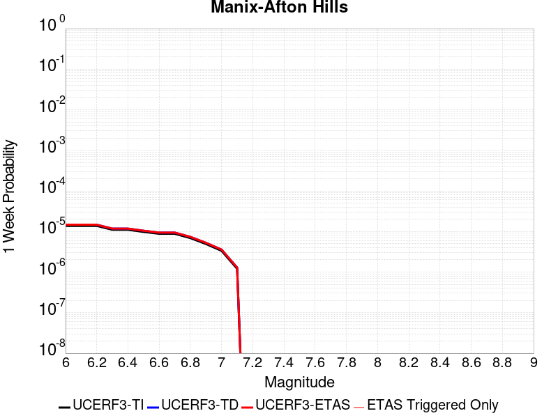 |  |  |  |

| Magnitude | 1 wk TI Prob | 1 wk TD Prob | 1 wk ETAS Prob | 1 wk ETAS/TD Gain | 1 wk ETAS Triggered Only | 1 mo TI Prob | 1 mo TD Prob | 1 mo ETAS Prob | 1 mo ETAS/TD Gain | 1 mo ETAS Triggered Only | 1 yr TI Prob | 1 yr TD Prob | 1 yr ETAS Prob | 1 yr ETAS/TD Gain | 1 yr ETAS Triggered Only | 10 yr TI Prob | 10 yr TD Prob | 10 yr ETAS Prob | 10 yr ETAS/TD Gain | 10 yr ETAS Triggered Only |
|-----|-----|-----|-----|-----|-----|-----|-----|-----|-----|-----|-----|-----|-----|-----|-----|-----|-----|-----|-----|-----|
| 6.0 | 1.3783202E-5 | 1.4711063E-5 | 1.4711063E-5 | 1.0 | 0.0 | 5.906953E-5 | 6.304599E-5 | 6.304599E-5 | 1.0 | 0.0 | 7.189342E-4 | 7.673321E-4 | 7.673321E-4 | 1.0 | 0.0 | 0.0071661277 | 0.007648582 | 0.007658506 | 1.0012975 | 1.0E-5 |
| 6.1 | 1.3783202E-5 | 1.4711063E-5 | 1.4711063E-5 | 1.0 | 0.0 | 5.906953E-5 | 6.304599E-5 | 6.304599E-5 | 1.0 | 0.0 | 7.189342E-4 | 7.673321E-4 | 7.673321E-4 | 1.0 | 0.0 | 0.0071661277 | 0.007648582 | 0.007658506 | 1.0012975 | 1.0E-5 |
| 6.2 | 1.3783202E-5 | 1.4711063E-5 | 1.4711063E-5 | 1.0 | 0.0 | 5.906953E-5 | 6.304599E-5 | 6.304599E-5 | 1.0 | 0.0 | 7.189342E-4 | 7.673321E-4 | 7.673321E-4 | 1.0 | 0.0 | 0.0071661277 | 0.007648582 | 0.007658506 | 1.0012975 | 1.0E-5 |
| 6.3 | 1.10494875E-5 | 1.1793114E-5 | 1.1793114E-5 | 1.0 | 0.0 | 4.7354086E-5 | 5.0541E-5 | 5.0541E-5 | 1.0 | 0.0 | 5.763835E-4 | 6.151733E-4 | 6.151733E-4 | 1.0 | 0.0 | 0.005748908 | 0.0061357445 | 0.0061357445 | 1.0 | 0.0 |
| 6.4 | 1.10494875E-5 | 1.1793114E-5 | 1.1793114E-5 | 1.0 | 0.0 | 4.7354086E-5 | 5.0541E-5 | 5.0541E-5 | 1.0 | 0.0 | 5.763835E-4 | 6.151733E-4 | 6.151733E-4 | 1.0 | 0.0 | 0.005748908 | 0.0061357445 | 0.0061357445 | 1.0 | 0.0 |
| 6.5 | 9.788949E-6 | 1.04543005E-5 | 1.04543005E-5 | 1.0 | 0.0 | 4.1951964E-5 | 4.480343E-5 | 4.480343E-5 | 1.0 | 0.0 | 5.1064545E-4 | 5.453545E-4 | 5.453545E-4 | 1.0 | 0.0 | 0.0050947363 | 0.0054410887 | 0.0054410887 | 1.0 | 0.0 |
| 6.6 | 8.810006E-6 | 9.413611E-6 | 9.413611E-6 | 1.0 | 0.0 | 3.775662E-5 | 4.034347E-5 | 4.034347E-5 | 1.0 | 0.0 | 4.5958988E-4 | 4.9108E-4 | 4.9108E-4 | 1.0 | 0.0 | 0.0045864056 | 0.0049008303 | 0.0049008303 | 1.0 | 0.0 |
| 6.7 | 8.80128E-6 | 9.404091E-6 | 9.404091E-6 | 1.0 | 0.0 | 3.7719226E-5 | 4.0302675E-5 | 4.0302675E-5 | 1.0 | 0.0 | 4.591348E-4 | 4.905835E-4 | 4.905835E-4 | 1.0 | 0.0 | 0.004581874 | 0.004895887 | 0.004895887 | 1.0 | 0.0 |
| 6.8 | 6.8994877E-6 | 7.3800625E-6 | 7.3800625E-6 | 1.0 | 0.0 | 2.9568899E-5 | 3.16285E-5 | 3.16285E-5 | 1.0 | 0.0 | 3.5994186E-4 | 3.850171E-4 | 3.850171E-4 | 1.0 | 0.0 | 0.003593594 | 0.0038443056 | 0.0038443056 | 1.0 | 0.0 |
| 6.9 | 4.9328037E-6 | 5.270952E-6 | 5.270952E-6 | 1.0 | 0.0 | 2.1140417E-5 | 2.2589633E-5 | 2.2589633E-5 | 1.0 | 0.0 | 2.5735417E-4 | 2.7500023E-4 | 2.7500023E-4 | 1.0 | 0.0 | 0.0025705635 | 0.0027472044 | 0.0027472044 | 1.0 | 0.0 |
| 7.0 | 3.347973E-6 | 3.590023E-6 | 3.590023E-6 | 1.0 | 0.0 | 1.4348378E-5 | 1.5385745E-5 | 1.5385745E-5 | 1.0 | 0.0 | 1.746775E-4 | 1.8730946E-4 | 1.8730946E-4 | 1.0 | 0.0 | 0.0017454025 | 0.0018719183 | 0.0018719183 | 1.0 | 0.0 |
| 7.1 | 1.2073567E-6 | 1.2934796E-6 | 1.2934796E-6 | 1.0 | 0.0 | 5.1743755E-6 | 5.543481E-6 | 5.543481E-6 | 1.0 | 0.0 | 6.29962E-5 | 6.7491426E-5 | 6.7491426E-5 | 1.0 | 0.0 | 6.297835E-4 | 6.7486946E-4 | 6.7486946E-4 | 1.0 | 0.0 |

## Mission Ridge-Arroyo Parida-Santa Ana
*[(top)](#table-of-contents)*

| 1 Week | 1 Month | 1 Year | 10 Year |
|-----|-----|-----|-----|
|  |  |  |  |

| Magnitude | 1 wk TI Prob | 1 wk TD Prob | 1 wk ETAS Prob | 1 wk ETAS/TD Gain | 1 wk ETAS Triggered Only | 1 mo TI Prob | 1 mo TD Prob | 1 mo ETAS Prob | 1 mo ETAS/TD Gain | 1 mo ETAS Triggered Only | 1 yr TI Prob | 1 yr TD Prob | 1 yr ETAS Prob | 1 yr ETAS/TD Gain | 1 yr ETAS Triggered Only | 10 yr TI Prob | 10 yr TD Prob | 10 yr ETAS Prob | 10 yr ETAS/TD Gain | 10 yr ETAS Triggered Only |
|-----|-----|-----|-----|-----|-----|-----|-----|-----|-----|-----|-----|-----|-----|-----|-----|-----|-----|-----|-----|-----|
| 6.0 | 4.169034E-5 | 4.7138004E-5 | 5.713753E-5 | 1.212133 | 1.0E-5 | 1.7866064E-4 | 2.0200922E-4 | 2.120072E-4 | 1.0494927 | 1.0E-5 | 0.0021730233 | 0.0024574373 | 0.0024674127 | 1.0040593 | 1.0E-5 | 0.021518968 | 0.024384484 | 0.02439424 | 1.0004001 | 1.0E-5 |
| 6.1 | 1.73813E-5 | 1.6854168E-5 | 1.6854168E-5 | 1.0 | 0.0 | 7.4489166E-5 | 7.2230214E-5 | 7.2230214E-5 | 1.0 | 0.0 | 9.065282E-4 | 8.7905885E-4 | 8.7905885E-4 | 1.0 | 0.0 | 0.009028391 | 0.008756958 | 0.008756958 | 1.0 | 0.0 |
| 6.2 | 1.4622182E-5 | 1.3673245E-5 | 1.3673245E-5 | 1.0 | 0.0 | 6.2664985E-5 | 5.859833E-5 | 5.859833E-5 | 1.0 | 0.0 | 7.6267915E-4 | 7.13205E-4 | 7.13205E-4 | 1.0 | 0.0 | 0.007600669 | 0.0071096043 | 0.0071096043 | 1.0 | 0.0 |
| 6.3 | 1.3552434E-5 | 1.248216E-5 | 1.248216E-5 | 1.0 | 0.0 | 5.8080568E-5 | 5.349389E-5 | 5.349389E-5 | 1.0 | 0.0 | 7.069015E-4 | 6.510967E-4 | 6.510967E-4 | 1.0 | 0.0 | 0.00704657 | 0.006492254 | 0.006492254 | 1.0 | 0.0 |
| 6.4 | 1.30977305E-5 | 1.1979117E-5 | 1.1979117E-5 | 1.0 | 0.0 | 5.613192E-5 | 5.133808E-5 | 5.133808E-5 | 1.0 | 0.0 | 6.831918E-4 | 6.248649E-4 | 6.248649E-4 | 1.0 | 0.0 | 0.006810953 | 0.006231424 | 0.006231424 | 1.0 | 0.0 |
| 6.5 | 1.225205E-5 | 1.1048766E-5 | 1.1048766E-5 | 1.0 | 0.0 | 5.2507727E-5 | 4.735101E-5 | 4.735101E-5 | 1.0 | 0.0 | 6.3909404E-4 | 5.763488E-4 | 5.763488E-4 | 1.0 | 0.0 | 0.006372592 | 0.00574885 | 0.00574885 | 1.0 | 0.0 |
| 6.6 | 1.1352241E-5 | 1.0063501E-5 | 1.0063501E-5 | 1.0 | 0.0 | 4.8651553E-5 | 4.3128588E-5 | 4.3128588E-5 | 1.0 | 0.0 | 5.921717E-4 | 5.2496616E-4 | 5.2496616E-4 | 1.0 | 0.0 | 0.0059059616 | 0.0052375067 | 0.0052375067 | 1.0 | 0.0 |
| 6.7 | 1.0864116E-5 | 9.516994E-6 | 9.516994E-6 | 1.0 | 0.0 | 4.6559664E-5 | 4.0786494E-5 | 4.0786494E-5 | 1.0 | 0.0 | 5.667165E-4 | 4.9646443E-4 | 4.9646443E-4 | 1.0 | 0.0 | 0.005652734 | 0.004953787 | 0.004953787 | 1.0 | 0.0 |
| 6.8 | 1.0666365E-5 | 9.299747E-6 | 9.299747E-6 | 1.0 | 0.0 | 4.571219E-5 | 3.985546E-5 | 3.985546E-5 | 1.0 | 0.0 | 5.564038E-4 | 4.851342E-4 | 4.851342E-4 | 1.0 | 0.0 | 0.005550127 | 0.0048409835 | 0.0048409835 | 1.0 | 0.0 |
| 6.9 | 1.0038665E-5 | 8.592016E-6 | 8.592016E-6 | 1.0 | 0.0 | 4.302214E-5 | 3.6822417E-5 | 3.6822417E-5 | 1.0 | 0.0 | 5.236687E-4 | 4.482225E-4 | 4.482225E-4 | 1.0 | 0.0 | 0.005224364 | 0.0044733956 | 0.0044733956 | 1.0 | 0.0 |
| 7.0 | 9.5379955E-6 | 8.025046E-6 | 8.025046E-6 | 1.0 | 0.0 | 4.0876483E-5 | 3.439261E-5 | 3.439261E-5 | 1.0 | 0.0 | 4.975576E-4 | 4.186513E-4 | 4.186513E-4 | 1.0 | 0.0 | 0.00496445 | 0.0041788258 | 0.0041788258 | 1.0 | 0.0 |
| 7.1 | 9.207389E-6 | 7.652349E-6 | 7.652349E-6 | 1.0 | 0.0 | 3.945964E-5 | 3.279538E-5 | 3.279538E-5 | 1.0 | 0.0 | 4.803152E-4 | 3.992123E-4 | 3.992123E-4 | 1.0 | 0.0 | 0.004792784 | 0.0039851475 | 0.0039851475 | 1.0 | 0.0 |
| 7.2 | 7.638091E-6 | 5.9310996E-6 | 5.9310996E-6 | 1.0 | 0.0 | 3.2734264E-5 | 2.5418753E-5 | 2.5418753E-5 | 1.0 | 0.0 | 3.984668E-4 | 3.0942968E-4 | 3.0942968E-4 | 1.0 | 0.0 | 0.0039775306 | 0.0030900452 | 0.0030900452 | 1.0 | 0.0 |
| 7.3 | 7.2500147E-6 | 5.596136E-6 | 5.596136E-6 | 1.0 | 0.0 | 3.1071122E-5 | 2.398322E-5 | 2.398322E-5 | 1.0 | 0.0 | 3.7822526E-4 | 2.9195688E-4 | 2.9195688E-4 | 1.0 | 0.0 | 0.0037758215 | 0.0029157887 | 0.0029157887 | 1.0 | 0.0 |
| 7.4 | 6.3899715E-6 | 4.9184823E-6 | 4.9184823E-6 | 1.0 | 0.0 | 2.7385306E-5 | 2.107904E-5 | 2.107904E-5 | 1.0 | 0.0 | 3.3336508E-4 | 2.5660728E-4 | 2.5660728E-4 | 1.0 | 0.0 | 0.0033286542 | 0.0025631543 | 0.0025631543 | 1.0 | 0.0 |
| 7.5 | 5.379025E-6 | 4.0838413E-6 | 4.0838413E-6 | 1.0 | 0.0 | 2.305276E-5 | 1.7502061E-5 | 1.7502061E-5 | 1.0 | 0.0 | 2.806312E-4 | 2.1306686E-4 | 2.1306686E-4 | 1.0 | 0.0 | 0.0028027708 | 0.0021286372 | 0.0021286372 | 1.0 | 0.0 |
| 7.6 | 4.1270696E-6 | 3.088336E-6 | 3.088336E-6 | 1.0 | 0.0 | 1.768732E-5 | 1.3235658E-5 | 1.3235658E-5 | 1.0 | 0.0 | 2.1532185E-4 | 1.611323E-4 | 1.611323E-4 | 1.0 | 0.0 | 0.0021511333 | 0.0016101628 | 0.0016101628 | 1.0 | 0.0 |
| 7.7 | 2.5406805E-6 | 1.8281963E-6 | 1.8281963E-6 | 1.0 | 0.0 | 1.0888585E-5 | 7.835104E-6 | 7.835104E-6 | 1.0 | 0.0 | 1.3256045E-4 | 9.538828E-5 | 9.538828E-5 | 1.0 | 0.0 | 0.0013248142 | 9.534795E-4 | 9.534795E-4 | 1.0 | 0.0 |
| 7.8 | 4.8608285E-7 | 3.509878E-7 | 3.509878E-7 | 1.0 | 0.0 | 2.0832106E-6 | 1.5042325E-6 | 1.5042325E-6 | 1.0 | 0.0 | 2.5362791E-5 | 1.8313878E-5 | 1.8313878E-5 | 1.0 | 0.0 | 2.5359896E-4 | 1.831238E-4 | 1.831238E-4 | 1.0 | 0.0 |
| 7.9 | 2.0472514E-8 | 1.268872E-8 | 1.268872E-8 | 1.0 | 0.0 | 8.7739345E-8 | 5.438023E-8 | 5.438023E-8 | 1.0 | 0.0 | 1.068226E-6 | 6.620791E-7 | 6.620791E-7 | 1.0 | 0.0 | 1.0682209E-5 | 6.6207726E-6 | 6.6207726E-6 | 1.0 | 0.0 |
| 8.0 | 4.443582E-9 | 2.0320927E-9 | 2.0320927E-9 | 1.0 | 0.0 | 1.9043922E-8 | 8.7089695E-9 | 8.7089695E-9 | 1.0 | 0.0 | 2.3185973E-7 | 1.060317E-7 | 1.060317E-7 | 1.0 | 0.0 | 2.3185949E-6 | 1.0603165E-6 | 1.0603165E-6 | 1.0 | 0.0 |

## Calaveras (So) 2011 CFM
*[(top)](#table-of-contents)*

| 1 Week | 1 Month | 1 Year | 10 Year |
|-----|-----|-----|-----|
|  |  |  |  |

| Magnitude | 1 wk TI Prob | 1 wk TD Prob | 1 wk ETAS Prob | 1 wk ETAS/TD Gain | 1 wk ETAS Triggered Only | 1 mo TI Prob | 1 mo TD Prob | 1 mo ETAS Prob | 1 mo ETAS/TD Gain | 1 mo ETAS Triggered Only | 1 yr TI Prob | 1 yr TD Prob | 1 yr ETAS Prob | 1 yr ETAS/TD Gain | 1 yr ETAS Triggered Only | 10 yr TI Prob | 10 yr TD Prob | 10 yr ETAS Prob | 10 yr ETAS/TD Gain | 10 yr ETAS Triggered Only |
|-----|-----|-----|-----|-----|-----|-----|-----|-----|-----|-----|-----|-----|-----|-----|-----|-----|-----|-----|-----|-----|
| 6.0 | 1.5950744E-4 | 3.0710758E-4 | 3.0710758E-4 | 1.0 | 0.0 | 6.834242E-4 | 0.0013155134 | 0.0013155134 | 1.0 | 0.0 | 0.00828899 | 0.015858818 | 0.015868658 | 1.0006206 | 1.0E-5 | 0.079865426 | 0.14439851 | 0.14440706 | 1.0000592 | 1.0E-5 |
| 6.1 | 1.3584697E-4 | 2.6036007E-4 | 2.6036007E-4 | 1.0 | 0.0 | 5.8207137E-4 | 0.0011153528 | 0.0011153528 | 1.0 | 0.0 | 0.007063716 | 0.013461906 | 0.013471772 | 1.0007328 | 1.0E-5 | 0.06843361 | 0.12402653 | 0.124035284 | 1.0000706 | 1.0E-5 |
| 6.2 | 1.14676266E-4 | 2.1725375E-4 | 2.1725375E-4 | 1.0 | 0.0 | 4.9137714E-4 | 9.307542E-4 | 9.307542E-4 | 1.0 | 0.0 | 0.0059661185 | 0.011245421 | 0.011255309 | 1.0008793 | 1.0E-5 | 0.058084648 | 0.10501737 | 0.10502632 | 1.0000852 | 1.0E-5 |
| 6.3 | 8.691518E-5 | 1.5986769E-4 | 1.5986769E-4 | 1.0 | 0.0 | 3.7244044E-4 | 6.849467E-4 | 6.849467E-4 | 1.0 | 0.0 | 0.004525038 | 0.0083006825 | 0.008310599 | 1.0011947 | 1.0E-5 | 0.044339992 | 0.07933282 | 0.07934202 | 1.0001161 | 1.0E-5 |
| 6.4 | 8.50982E-5 | 1.5693177E-4 | 1.5693177E-4 | 1.0 | 0.0 | 3.646556E-4 | 6.7237066E-4 | 6.7237066E-4 | 1.0 | 0.0 | 0.0044306475 | 0.008148721 | 0.00815864 | 1.0012171 | 1.0E-5 | 0.04343345 | 0.077938974 | 0.07794819 | 1.0001183 | 1.0E-5 |
| 6.5 | 8.4062965E-5 | 1.5517746E-4 | 1.5517746E-4 | 1.0 | 0.0 | 3.602201E-4 | 6.6485605E-4 | 6.6485605E-4 | 1.0 | 0.0 | 0.004376863 | 0.008057924 | 0.0080678435 | 1.001231 | 1.0E-5 | 0.042916555 | 0.077110246 | 0.07711947 | 1.0001197 | 1.0E-5 |
| 6.6 | 8.194716E-5 | 1.5153716E-4 | 1.5153716E-4 | 1.0 | 0.0 | 3.5115483E-4 | 6.4926257E-4 | 6.4926257E-4 | 1.0 | 0.0 | 0.0042669317 | 0.007869773 | 0.007879694 | 1.0012606 | 1.0E-5 | 0.04185927 | 0.07539553 | 0.07540478 | 1.0001227 | 1.0E-5 |
| 6.7 | 8.012326E-5 | 1.4821463E-4 | 1.4821463E-4 | 1.0 | 0.0 | 3.433402E-4 | 6.350302E-4 | 6.350302E-4 | 1.0 | 0.0 | 0.004172157 | 0.0076982686 | 0.0077081914 | 1.001289 | 1.0E-5 | 0.040946912 | 0.07383767 | 0.07384693 | 1.0001254 | 1.0E-5 |
| 6.8 | 7.119773E-5 | 1.288018E-4 | 1.288018E-4 | 1.0 | 0.0 | 3.0509746E-4 | 5.5188267E-4 | 5.5188267E-4 | 1.0 | 0.0 | 0.0037082357 | 0.006695695 | 0.0067056282 | 1.0014834 | 1.0E-5 | 0.036469642 | 0.064682275 | 0.06469163 | 1.0001446 | 1.0E-5 |
| 6.9 | 5.7343088E-5 | 9.9185636E-5 | 9.9185636E-5 | 1.0 | 0.0 | 2.4573295E-4 | 4.250125E-4 | 4.250125E-4 | 1.0 | 0.0 | 0.0029876942 | 0.005162333 | 0.0051722815 | 1.0019271 | 1.0E-5 | 0.02947844 | 0.050507538 | 0.050517034 | 1.000188 | 1.0E-5 |
| 7.0 | 4.8746577E-5 | 8.2844235E-5 | 8.2844235E-5 | 1.0 | 0.0 | 2.0889717E-4 | 3.5499875E-4 | 3.5499875E-4 | 1.0 | 0.0 | 0.0025403565 | 0.0043136105 | 0.0043235677 | 1.0023082 | 1.0E-5 | 0.025115121 | 0.042483483 | 0.042493057 | 1.0002254 | 1.0E-5 |
| 7.1 | 4.2998014E-5 | 7.264594E-5 | 7.264594E-5 | 1.0 | 0.0 | 1.8426418E-4 | 3.1130292E-4 | 3.1130292E-4 | 1.0 | 0.0 | 0.002241108 | 0.0037835862 | 0.0037935486 | 1.002633 | 1.0E-5 | 0.022186412 | 0.0374217 | 0.037431326 | 1.0002573 | 1.0E-5 |
| 7.2 | 3.221292E-5 | 5.390257E-5 | 5.390257E-5 | 1.0 | 0.0 | 1.3804805E-4 | 2.3099071E-4 | 2.3099071E-4 | 1.0 | 0.0 | 0.0016794393 | 0.0028087131 | 0.0028087131 | 1.0 | 0.0 | 0.016668037 | 0.028034493 | 0.028034493 | 1.0 | 0.0 |
| 7.3 | 2.3756531E-5 | 3.946884E-5 | 3.946884E-5 | 1.0 | 0.0 | 1.0180973E-4 | 1.691413E-4 | 1.691413E-4 | 1.0 | 0.0 | 0.0012388286 | 0.0020573675 | 0.0020573675 | 1.0 | 0.0 | 0.012319452 | 0.020642038 | 0.020642038 | 1.0 | 0.0 |
| 7.4 | 1.5997684E-5 | 2.733813E-5 | 2.733813E-5 | 1.0 | 0.0 | 6.8559704E-5 | 1.1715816E-4 | 1.1715816E-4 | 1.0 | 0.0 | 8.343947E-4 | 0.0014254698 | 0.0014254698 | 1.0 | 0.0 | 0.008312687 | 0.0143752 | 0.0143752 | 1.0 | 0.0 |
| 7.5 | 1.3814293E-5 | 2.4779916E-5 | 2.4779916E-5 | 1.0 | 0.0 | 5.9202768E-5 | 1.0619533E-4 | 1.0619533E-4 | 1.0 | 0.0 | 7.205553E-4 | 0.0012921637 | 0.0012921637 | 1.0 | 0.0 | 0.007182234 | 0.013054431 | 0.013054431 | 1.0 | 0.0 |
| 7.6 | 8.817309E-6 | 1.642736E-5 | 1.642736E-5 | 1.0 | 0.0 | 3.7787922E-5 | 7.040108E-5 | 7.040108E-5 | 1.0 | 0.0 | 4.5997082E-4 | 8.567974E-4 | 8.567974E-4 | 1.0 | 0.0 | 0.004590199 | 0.008718628 | 0.008718628 | 1.0 | 0.0 |
| 7.7 | 4.0352206E-6 | 7.706098E-6 | 7.706098E-6 | 1.0 | 0.0 | 1.7293689E-5 | 3.3025717E-5 | 3.3025717E-5 | 1.0 | 0.0 | 2.1053031E-4 | 4.0201397E-4 | 4.0201397E-4 | 1.0 | 0.0 | 0.0021033096 | 0.004164605 | 0.004164605 | 1.0 | 0.0 |
| 7.8 | 3.413169E-6 | 6.786183E-6 | 6.786183E-6 | 1.0 | 0.0 | 1.4627784E-5 | 2.9083318E-5 | 2.9083318E-5 | 1.0 | 0.0 | 1.7807873E-4 | 3.5403192E-4 | 3.5403192E-4 | 1.0 | 0.0 | 0.0017793609 | 0.0036659774 | 0.0036659774 | 1.0 | 0.0 |
| 7.9 | 2.4740732E-6 | 5.2783053E-6 | 5.2783053E-6 | 1.0 | 0.0 | 1.06031275E-5 | 2.2621112E-5 | 2.2621112E-5 | 1.0 | 0.0 | 1.2908543E-4 | 2.753773E-4 | 2.753773E-4 | 1.0 | 0.0 | 0.0012901047 | 0.002834394 | 0.002834394 | 1.0 | 0.0 |
| 8.0 | 1.5231818E-6 | 3.2884188E-6 | 3.2884188E-6 | 1.0 | 0.0 | 6.527906E-6 | 1.4093148E-5 | 1.4093148E-5 | 1.0 | 0.0 | 7.9474354E-5 | 1.715706E-4 | 1.715706E-4 | 1.0 | 0.0 | 7.944594E-4 | 0.0017562305 | 0.0017562305 | 1.0 | 0.0 |
| 8.1 | 1.0104524E-6 | 2.0454734E-6 | 2.0454734E-6 | 1.0 | 0.0 | 4.330503E-6 | 8.766285E-6 | 8.766285E-6 | 1.0 | 0.0 | 5.2722597E-5 | 1.0672433E-4 | 1.0672433E-4 | 1.0 | 0.0 | 5.271009E-4 | 0.0010928321 | 0.0010928321 | 1.0 | 0.0 |

## San Andreas (North Branch Mill Creek)
*[(top)](#table-of-contents)*

| 1 Week | 1 Month | 1 Year | 10 Year |
|-----|-----|-----|-----|
| 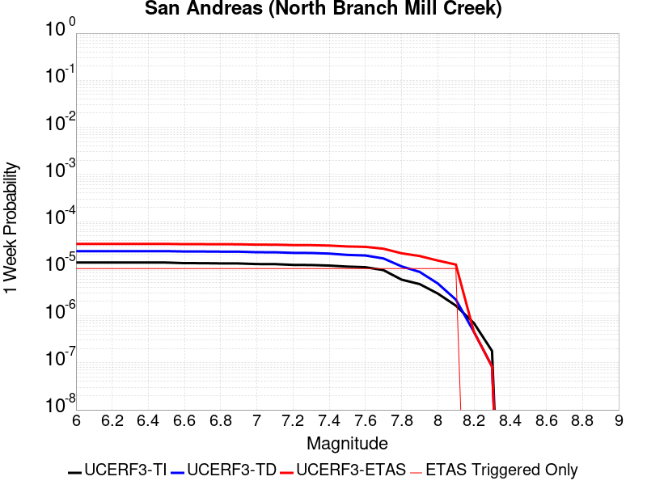 |  |  |  |

| Magnitude | 1 wk TI Prob | 1 wk TD Prob | 1 wk ETAS Prob | 1 wk ETAS/TD Gain | 1 wk ETAS Triggered Only | 1 mo TI Prob | 1 mo TD Prob | 1 mo ETAS Prob | 1 mo ETAS/TD Gain | 1 mo ETAS Triggered Only | 1 yr TI Prob | 1 yr TD Prob | 1 yr ETAS Prob | 1 yr ETAS/TD Gain | 1 yr ETAS Triggered Only | 10 yr TI Prob | 10 yr TD Prob | 10 yr ETAS Prob | 10 yr ETAS/TD Gain | 10 yr ETAS Triggered Only |
|-----|-----|-----|-----|-----|-----|-----|-----|-----|-----|-----|-----|-----|-----|-----|-----|-----|-----|-----|-----|-----|
| 6.0 | 1.3461156E-5 | 2.3498513E-5 | 3.3498276E-5 | 1.4255489 | 1.0E-5 | 5.7689394E-5 | 1.0070404E-4 | 1.1070303E-4 | 1.0992908 | 1.0E-5 | 7.02142E-4 | 0.0012253855 | 0.0012353732 | 1.0081507 | 1.0E-5 | 0.0069992766 | 0.012228863 | 0.012238741 | 1.0008078 | 1.0E-5 |
| 6.1 | 1.3461156E-5 | 2.3498513E-5 | 3.3498276E-5 | 1.4255489 | 1.0E-5 | 5.7689394E-5 | 1.0070404E-4 | 1.1070303E-4 | 1.0992908 | 1.0E-5 | 7.02142E-4 | 0.0012253855 | 0.0012353732 | 1.0081507 | 1.0E-5 | 0.0069992766 | 0.012228863 | 0.012238741 | 1.0008078 | 1.0E-5 |
| 6.2 | 1.3461156E-5 | 2.3498513E-5 | 3.3498276E-5 | 1.4255489 | 1.0E-5 | 5.7689394E-5 | 1.0070404E-4 | 1.1070303E-4 | 1.0992908 | 1.0E-5 | 7.02142E-4 | 0.0012253855 | 0.0012353732 | 1.0081507 | 1.0E-5 | 0.0069992766 | 0.012228863 | 0.012238741 | 1.0008078 | 1.0E-5 |
| 6.3 | 1.3461156E-5 | 2.3498513E-5 | 3.3498276E-5 | 1.4255489 | 1.0E-5 | 5.7689394E-5 | 1.0070404E-4 | 1.1070303E-4 | 1.0992908 | 1.0E-5 | 7.02142E-4 | 0.0012253855 | 0.0012353732 | 1.0081507 | 1.0E-5 | 0.0069992766 | 0.012228863 | 0.012238741 | 1.0008078 | 1.0E-5 |
| 6.4 | 1.3461156E-5 | 2.3498513E-5 | 3.3498276E-5 | 1.4255489 | 1.0E-5 | 5.7689394E-5 | 1.0070404E-4 | 1.1070303E-4 | 1.0992908 | 1.0E-5 | 7.02142E-4 | 0.0012253855 | 0.0012353732 | 1.0081507 | 1.0E-5 | 0.0069992766 | 0.012228863 | 0.012238741 | 1.0008078 | 1.0E-5 |
| 6.5 | 1.3450706E-5 | 2.3487471E-5 | 3.348724E-5 | 1.425749 | 1.0E-5 | 5.764461E-5 | 1.0065673E-4 | 1.10655725E-4 | 1.0993376 | 1.0E-5 | 7.0159714E-4 | 0.00122481 | 0.0012347978 | 1.0081545 | 1.0E-5 | 0.006993862 | 0.012223173 | 0.012233051 | 1.0008081 | 1.0E-5 |
| 6.6 | 1.3074523E-5 | 2.3101755E-5 | 3.3101525E-5 | 1.4328575 | 1.0E-5 | 5.6032466E-5 | 9.900379E-5 | 1.09002794E-4 | 1.1009963 | 1.0E-5 | 6.8198174E-4 | 0.0012047078 | 0.0012146957 | 1.0082908 | 1.0E-5 | 0.006798926 | 0.012024338 | 0.012034218 | 1.0008216 | 1.0E-5 |
| 6.7 | 1.3050216E-5 | 2.3077053E-5 | 3.307682E-5 | 1.4333209 | 1.0E-5 | 5.59283E-5 | 9.889792E-5 | 1.0889693E-4 | 1.1011044 | 1.0E-5 | 6.8071426E-4 | 0.0012034203 | 0.0012134083 | 1.0082996 | 1.0E-5 | 0.0067863287 | 0.0120116025 | 0.012021483 | 1.0008225 | 1.0E-5 |
| 6.8 | 1.29049395E-5 | 2.2925462E-5 | 3.2925233E-5 | 1.4361862 | 1.0E-5 | 5.530571E-5 | 9.8248296E-5 | 1.0824732E-4 | 1.1017729 | 1.0E-5 | 6.73139E-4 | 0.0011955198 | 0.0012055079 | 1.0083545 | 1.0E-5 | 0.0067110364 | 0.011933448 | 0.011943328 | 1.000828 | 1.0E-5 |
| 6.9 | 1.2867369E-5 | 2.2884866E-5 | 3.2884636E-5 | 1.43696 | 1.0E-5 | 5.51447E-5 | 9.807433E-5 | 1.0807334E-4 | 1.1019535 | 1.0E-5 | 6.711799E-4 | 0.0011934041 | 0.0012033922 | 1.0083694 | 1.0E-5 | 0.006691564 | 0.011912517 | 0.011922398 | 1.0008295 | 1.0E-5 |
| 7.0 | 1.2495996E-5 | 2.2284956E-5 | 3.2284734E-5 | 1.4487232 | 1.0E-5 | 5.3553173E-5 | 9.550347E-5 | 1.0550251E-4 | 1.1046982 | 1.0E-5 | 6.518148E-4 | 0.0011621374 | 0.0011721258 | 1.0085949 | 1.0E-5 | 0.0064990623 | 0.011603127 | 0.01161301 | 1.0008519 | 1.0E-5 |
| 7.1 | 1.2452067E-5 | 2.223003E-5 | 3.2229807E-5 | 1.449832 | 1.0E-5 | 5.3364907E-5 | 9.5268086E-5 | 1.05267136E-4 | 1.104957 | 1.0E-5 | 6.4952404E-4 | 0.0011592746 | 0.001169263 | 1.0086161 | 1.0E-5 | 0.0064762887 | 0.011574798 | 0.011584682 | 1.0008539 | 1.0E-5 |
| 7.2 | 1.2002777E-5 | 2.1608601E-5 | 3.1608386E-5 | 1.4627687 | 1.0E-5 | 5.143946E-5 | 9.260502E-5 | 1.0260409E-4 | 1.1079755 | 1.0E-5 | 6.2609545E-4 | 0.0011268856 | 0.0011368743 | 1.008864 | 1.0E-5 | 0.006243344 | 0.011254225 | 0.011264113 | 1.0008786 | 1.0E-5 |
| 7.3 | 1.1923425E-5 | 2.1478432E-5 | 3.147822E-5 | 1.4655733 | 1.0E-5 | 5.109939E-5 | 9.2047194E-5 | 1.0204627E-4 | 1.10863 | 1.0E-5 | 6.219575E-4 | 0.0011201011 | 0.0011300899 | 1.0089178 | 1.0E-5 | 0.0062021962 | 0.0111870915 | 0.01119698 | 1.0008839 | 1.0E-5 |
| 7.4 | 1.16105175E-5 | 2.0852425E-5 | 3.0852218E-5 | 1.4795505 | 1.0E-5 | 4.975841E-5 | 8.936449E-5 | 9.936359E-5 | 1.1118913 | 1.0E-5 | 6.0564023E-4 | 0.0010874722 | 0.0010974613 | 1.0091857 | 1.0E-5 | 0.006039923 | 0.010864706 | 0.010874597 | 1.0009104 | 1.0E-5 |
| 7.5 | 1.1037265E-5 | 1.9552606E-5 | 2.9552411E-5 | 1.5114307 | 1.0E-5 | 4.7301706E-5 | 8.3794206E-5 | 9.379337E-5 | 1.11933 | 1.0E-5 | 5.757461E-4 | 0.0010197192 | 0.001029709 | 1.0097966 | 1.0E-5 | 0.005742567 | 0.010194231 | 0.010204129 | 1.000971 | 1.0E-5 |
| 7.6 | 1.0720915E-5 | 1.8994535E-5 | 2.8994345E-5 | 1.5264572 | 1.0E-5 | 4.5945973E-5 | 8.140262E-5 | 9.140181E-5 | 1.1228361 | 1.0E-5 | 5.592486E-4 | 9.906285E-4 | 0.0010006186 | 1.0100846 | 1.0E-5 | 0.005578433 | 0.009905963 | 0.009915864 | 1.0009995 | 1.0E-5 |
| 7.7 | 9.276279E-6 | 1.6440426E-5 | 2.6440262E-5 | 1.6082467 | 1.0E-5 | 3.9754876E-5 | 7.045708E-5 | 8.045637E-5 | 1.1419203 | 1.0E-5 | 4.839081E-4 | 8.5747894E-4 | 8.674704E-4 | 1.0116521 | 1.0E-5 | 0.0048285574 | 0.008585413 | 0.008595327 | 1.0011548 | 1.0E-5 |
| 7.8 | 5.8346777E-6 | 1.1154021E-5 | 2.115391E-5 | 1.8965276 | 1.0E-5 | 2.5005522E-5 | 4.780207E-5 | 5.7801593E-5 | 1.209186 | 1.0E-5 | 3.043997E-4 | 5.8183493E-4 | 5.918291E-4 | 1.017177 | 1.0E-5 | 0.0030398308 | 0.005846416 | 0.0058563575 | 1.0017004 | 1.0E-5 |
| 7.9 | 4.690204E-6 | 8.508266E-6 | 1.850818E-5 | 2.1753175 | 1.0E-5 | 2.0100719E-5 | 3.6463487E-5 | 4.6463123E-5 | 1.2742369 | 1.0E-5 | 2.4469878E-4 | 4.4385262E-4 | 4.538482E-4 | 1.02252 | 1.0E-5 | 0.002444295 | 0.004470321 | 0.0044802763 | 1.002227 | 1.0E-5 |
| 8.0 | 2.9570454E-6 | 4.8464412E-6 | 1.4846393E-5 | 3.0633597 | 1.0E-5 | 1.267299E-5 | 2.0770298E-5 | 3.077009E-5 | 1.4814467 | 1.0E-5 | 1.5428272E-4 | 2.5284904E-4 | 2.6284653E-4 | 1.0395393 | 1.0E-5 | 0.0015417566 | 0.0025493812 | 0.0025593557 | 1.0039126 | 1.0E-5 |
| 8.1 | 1.6376824E-6 | 2.1966277E-6 | 1.2196606E-5 | 5.552423 | 1.0E-5 | 7.01862E-6 | 9.414084E-6 | 1.941399E-5 | 2.0622282 | 1.0E-5 | 8.544835E-5 | 1.1461046E-4 | 1.2460932E-4 | 1.0872421 | 1.0E-5 | 8.54155E-4 | 0.0011605195 | 0.0011705079 | 1.0086068 | 1.0E-5 |
| 8.2 | 6.9631557E-7 | 4.5351916E-7 | 4.5351916E-7 | 1.0 | 0.0 | 2.984206E-6 | 1.943652E-6 | 1.943652E-6 | 1.0 | 0.0 | 3.63321E-5 | 2.366371E-5 | 2.366371E-5 | 1.0 | 0.0 | 3.6326164E-4 | 2.4511237E-4 | 2.4511237E-4 | 1.0 | 0.0 |
| 8.3 | 1.7876137E-7 | 8.358693E-8 | 8.358693E-8 | 1.0 | 0.0 | 7.661199E-7 | 3.5822964E-7 | 3.5822964E-7 | 1.0 | 0.0 | 9.32747E-6 | 4.3614377E-6 | 4.3614377E-6 | 1.0 | 0.0 | 9.3270784E-5 | 4.580799E-5 | 4.580799E-5 | 1.0 | 0.0 |

## Raymond
*[(top)](#table-of-contents)*

| 1 Week | 1 Month | 1 Year | 10 Year |
|-----|-----|-----|-----|
|  |  |  |  |

| Magnitude | 1 wk TI Prob | 1 wk TD Prob | 1 wk ETAS Prob | 1 wk ETAS/TD Gain | 1 wk ETAS Triggered Only | 1 mo TI Prob | 1 mo TD Prob | 1 mo ETAS Prob | 1 mo ETAS/TD Gain | 1 mo ETAS Triggered Only | 1 yr TI Prob | 1 yr TD Prob | 1 yr ETAS Prob | 1 yr ETAS/TD Gain | 1 yr ETAS Triggered Only | 10 yr TI Prob | 10 yr TD Prob | 10 yr ETAS Prob | 10 yr ETAS/TD Gain | 10 yr ETAS Triggered Only |
|-----|-----|-----|-----|-----|-----|-----|-----|-----|-----|-----|-----|-----|-----|-----|-----|-----|-----|-----|-----|-----|
| 6.0 | 1.5157413E-5 | 1.5810077E-5 | 1.5810077E-5 | 1.0 | 0.0 | 6.4958724E-5 | 6.775586E-5 | 6.775586E-5 | 1.0 | 0.0 | 7.905855E-4 | 8.2464045E-4 | 8.346322E-4 | 1.0121166 | 1.0E-5 | 0.007877788 | 0.008218322 | 0.008228241 | 1.0012068 | 1.0E-5 |
| 6.1 | 1.5157413E-5 | 1.5810077E-5 | 1.5810077E-5 | 1.0 | 0.0 | 6.4958724E-5 | 6.775586E-5 | 6.775586E-5 | 1.0 | 0.0 | 7.905855E-4 | 8.2464045E-4 | 8.346322E-4 | 1.0121166 | 1.0E-5 | 0.007877788 | 0.008218322 | 0.008228241 | 1.0012068 | 1.0E-5 |
| 6.2 | 1.5157413E-5 | 1.5810077E-5 | 1.5810077E-5 | 1.0 | 0.0 | 6.4958724E-5 | 6.775586E-5 | 6.775586E-5 | 1.0 | 0.0 | 7.905855E-4 | 8.2464045E-4 | 8.346322E-4 | 1.0121166 | 1.0E-5 | 0.007877788 | 0.008218322 | 0.008228241 | 1.0012068 | 1.0E-5 |
| 6.3 | 1.5157413E-5 | 1.5810077E-5 | 1.5810077E-5 | 1.0 | 0.0 | 6.4958724E-5 | 6.775586E-5 | 6.775586E-5 | 1.0 | 0.0 | 7.905855E-4 | 8.2464045E-4 | 8.346322E-4 | 1.0121166 | 1.0E-5 | 0.007877788 | 0.008218322 | 0.008228241 | 1.0012068 | 1.0E-5 |
| 6.4 | 1.3941944E-5 | 1.4454645E-5 | 1.4454645E-5 | 1.0 | 0.0 | 5.9749822E-5 | 6.194714E-5 | 6.194714E-5 | 1.0 | 0.0 | 7.2721124E-4 | 7.539688E-4 | 7.6396123E-4 | 1.0132531 | 1.0E-5 | 0.007248361 | 0.007516441 | 0.007526366 | 1.0013204 | 1.0E-5 |
| 6.5 | 1.3941944E-5 | 1.4454645E-5 | 1.4454645E-5 | 1.0 | 0.0 | 5.9749822E-5 | 6.194714E-5 | 6.194714E-5 | 1.0 | 0.0 | 7.2721124E-4 | 7.539688E-4 | 7.6396123E-4 | 1.0132531 | 1.0E-5 | 0.007248361 | 0.007516441 | 0.007526366 | 1.0013204 | 1.0E-5 |
| 6.6 | 1.0542609E-5 | 1.0671079E-5 | 1.0671079E-5 | 1.0 | 0.0 | 4.5181827E-5 | 4.5732424E-5 | 4.5732424E-5 | 1.0 | 0.0 | 5.499499E-4 | 5.5665546E-4 | 5.666499E-4 | 1.0179545 | 1.0E-5 | 0.005485909 | 0.0055531724 | 0.005563117 | 1.0017908 | 1.0E-5 |
| 6.7 | 1.0542609E-5 | 1.0671079E-5 | 1.0671079E-5 | 1.0 | 0.0 | 4.5181827E-5 | 4.5732424E-5 | 4.5732424E-5 | 1.0 | 0.0 | 5.499499E-4 | 5.5665546E-4 | 5.666499E-4 | 1.0179545 | 1.0E-5 | 0.005485909 | 0.0055531724 | 0.005563117 | 1.0017908 | 1.0E-5 |
| 6.8 | 1.0079132E-5 | 1.0176613E-5 | 1.0176613E-5 | 1.0 | 0.0 | 4.3195567E-5 | 4.3613356E-5 | 4.3613356E-5 | 1.0 | 0.0 | 5.257791E-4 | 5.308686E-4 | 5.408633E-4 | 1.0188271 | 1.0E-5 | 0.0052453685 | 0.005296554 | 0.005306501 | 1.001878 | 1.0E-5 |
| 6.9 | 7.721598E-6 | 7.5488792E-6 | 7.5488792E-6 | 1.0 | 0.0 | 3.3092143E-5 | 3.2351945E-5 | 3.2351945E-5 | 1.0 | 0.0 | 4.0282236E-4 | 3.9381496E-4 | 4.0381102E-4 | 1.0253826 | 1.0E-5 | 0.0040209293 | 0.0039313044 | 0.003941265 | 1.0025337 | 1.0E-5 |
| 7.0 | 7.137566E-6 | 6.911282E-6 | 6.911282E-6 | 1.0 | 0.0 | 3.058921E-5 | 2.9619448E-5 | 2.9619448E-5 | 1.0 | 0.0 | 3.7236E-4 | 3.605582E-4 | 3.705546E-4 | 1.0277247 | 1.0E-5 | 0.0037173668 | 0.0035998505 | 0.0036098144 | 1.0027679 | 1.0E-5 |
| 7.1 | 5.654976E-6 | 5.29952E-6 | 5.29952E-6 | 1.0 | 0.0 | 2.4235387E-5 | 2.2712033E-5 | 2.2712033E-5 | 1.0 | 0.0 | 2.9502588E-4 | 2.7648412E-4 | 2.8648137E-4 | 1.0361584 | 1.0E-5 | 0.0029463451 | 0.0027614324 | 0.0027714048 | 1.0036113 | 1.0E-5 |
| 7.2 | 4.9358455E-6 | 4.5266393E-6 | 4.5266393E-6 | 1.0 | 0.0 | 2.1153453E-5 | 1.9399738E-5 | 1.9399738E-5 | 1.0 | 0.0 | 2.5751285E-4 | 2.3616636E-4 | 2.46164E-4 | 1.042333 | 1.0E-5 | 0.0025721465 | 0.002359176 | 0.0023691524 | 1.0042287 | 1.0E-5 |
| 7.3 | 4.2368597E-6 | 3.8055998E-6 | 3.8055998E-6 | 1.0 | 0.0 | 1.8157843E-5 | 1.6309612E-5 | 1.6309612E-5 | 1.0 | 0.0 | 2.2104931E-4 | 1.9855154E-4 | 2.0854955E-4 | 1.0503547 | 1.0E-5 | 0.0022082955 | 0.0019837602 | 0.0019937402 | 1.005031 | 1.0E-5 |
| 7.4 | 3.4999923E-6 | 3.043729E-6 | 3.043729E-6 | 1.0 | 0.0 | 1.49998805E-5 | 1.3044489E-5 | 1.3044489E-5 | 1.0 | 0.0 | 1.8260824E-4 | 1.5880515E-4 | 1.6880357E-4 | 1.0629603 | 1.0E-5 | 0.0018245826 | 0.0015869325 | 0.0015969166 | 1.0062915 | 1.0E-5 |
| 7.5 | 2.738017E-6 | 2.302034E-6 | 2.302034E-6 | 1.0 | 0.0 | 1.1734306E-5 | 9.865823E-6 | 9.865823E-6 | 1.0 | 0.0 | 1.428558E-4 | 1.2010984E-4 | 1.3010864E-4 | 1.0832471 | 1.0E-5 | 0.0014276401 | 0.0012004636 | 0.0012104516 | 1.0083201 | 1.0E-5 |
| 7.6 | 1.8186392E-6 | 1.4423032E-6 | 1.4423032E-6 | 1.0 | 0.0 | 7.794145E-6 | 6.181285E-6 | 6.181285E-6 | 1.0 | 0.0 | 9.488958E-5 | 7.525458E-5 | 8.525383E-5 | 1.1328722 | 1.0E-5 | 9.4849075E-4 | 7.523025E-4 | 7.62295E-4 | 1.0132825 | 1.0E-5 |
| 7.7 | 1.0660348E-6 | 7.643733E-7 | 7.643733E-7 | 1.0 | 0.0 | 4.5687125E-6 | 3.2758817E-6 | 3.2758817E-6 | 1.0 | 0.0 | 5.5622655E-5 | 3.9883143E-5 | 4.9882747E-5 | 1.2507225 | 1.0E-5 | 5.5608735E-4 | 3.9876899E-4 | 4.0876502E-4 | 1.0250672 | 1.0E-5 |
| 7.8 | 6.913602E-7 | 4.3203528E-7 | 4.3203528E-7 | 1.0 | 0.0 | 2.962969E-6 | 1.8515785E-6 | 1.8515785E-6 | 1.0 | 0.0 | 3.607355E-5 | 2.2542741E-5 | 3.2542517E-5 | 1.4435918 | 1.0E-5 | 3.6067693E-4 | 2.254124E-4 | 2.3541015E-4 | 1.0443531 | 1.0E-5 |
| 7.9 | 7.425201E-8 | 5.3221502E-8 | 5.3221502E-8 | 1.0 | 0.0 | 3.1822285E-7 | 2.2809213E-7 | 2.2809213E-7 | 1.0 | 0.0 | 3.874356E-6 | 2.7770195E-6 | 2.7770195E-6 | 1.0 | 0.0 | 3.8742884E-5 | 2.7769978E-5 | 2.7769978E-5 | 1.0 | 0.0 |

## Coyote Canyon
*[(top)](#table-of-contents)*

| 1 Week | 1 Month | 1 Year | 10 Year |
|-----|-----|-----|-----|
|  |  |  |  |

| Magnitude | 1 wk TI Prob | 1 wk TD Prob | 1 wk ETAS Prob | 1 wk ETAS/TD Gain | 1 wk ETAS Triggered Only | 1 mo TI Prob | 1 mo TD Prob | 1 mo ETAS Prob | 1 mo ETAS/TD Gain | 1 mo ETAS Triggered Only | 1 yr TI Prob | 1 yr TD Prob | 1 yr ETAS Prob | 1 yr ETAS/TD Gain | 1 yr ETAS Triggered Only | 10 yr TI Prob | 10 yr TD Prob | 10 yr ETAS Prob | 10 yr ETAS/TD Gain | 10 yr ETAS Triggered Only |
|-----|-----|-----|-----|-----|-----|-----|-----|-----|-----|-----|-----|-----|-----|-----|-----|-----|-----|-----|-----|-----|
| 6.0 | 3.5090034E-5 | 4.036416E-5 | 4.036416E-5 | 1.0 | 0.0 | 1.503772E-4 | 1.7297924E-4 | 1.8297751E-4 | 1.0578004 | 1.0E-5 | 0.0018293047 | 0.0021042444 | 0.0021142233 | 1.0047423 | 1.0E-5 | 0.018143194 | 0.02086912 | 0.02087891 | 1.0004692 | 1.0E-5 |
| 6.1 | 3.5090034E-5 | 4.036416E-5 | 4.036416E-5 | 1.0 | 0.0 | 1.503772E-4 | 1.7297924E-4 | 1.8297751E-4 | 1.0578004 | 1.0E-5 | 0.0018293047 | 0.0021042444 | 0.0021142233 | 1.0047423 | 1.0E-5 | 0.018143194 | 0.02086912 | 0.02087891 | 1.0004692 | 1.0E-5 |
| 6.2 | 1.841879E-5 | 2.1059714E-5 | 2.1059714E-5 | 1.0 | 0.0 | 7.8935285E-5 | 9.0253365E-5 | 9.0253365E-5 | 1.0 | 0.0 | 9.606133E-4 | 0.0010983828 | 0.0010983828 | 1.0 | 0.0 | 0.0095647145 | 0.010939625 | 0.010939625 | 1.0 | 0.0 |
| 6.3 | 1.841879E-5 | 2.1059714E-5 | 2.1059714E-5 | 1.0 | 0.0 | 7.8935285E-5 | 9.0253365E-5 | 9.0253365E-5 | 1.0 | 0.0 | 9.606133E-4 | 0.0010983828 | 0.0010983828 | 1.0 | 0.0 | 0.0095647145 | 0.010939625 | 0.010939625 | 1.0 | 0.0 |
| 6.4 | 1.712201E-5 | 1.9565137E-5 | 1.9565137E-5 | 1.0 | 0.0 | 7.337798E-5 | 8.384846E-5 | 8.384846E-5 | 1.0 | 0.0 | 8.930107E-4 | 0.0010204774 | 0.0010204774 | 1.0 | 0.0 | 0.008894307 | 0.010167832 | 0.010167832 | 1.0 | 0.0 |
| 6.5 | 1.4744935E-5 | 1.6836908E-5 | 1.6836908E-5 | 1.0 | 0.0 | 6.3191044E-5 | 7.2156705E-5 | 7.2156705E-5 | 1.0 | 0.0 | 7.6907943E-4 | 8.782473E-4 | 8.782473E-4 | 1.0 | 0.0 | 0.007664232 | 0.008756962 | 0.008756962 | 1.0 | 0.0 |
| 6.6 | 1.2017839E-5 | 1.3724038E-5 | 1.3724038E-5 | 1.0 | 0.0 | 5.150401E-5 | 5.8816477E-5 | 5.8816477E-5 | 1.0 | 0.0 | 6.268809E-4 | 7.1594387E-4 | 7.1594387E-4 | 1.0 | 0.0 | 0.0062511545 | 0.0071450667 | 0.0071450667 | 1.0 | 0.0 |
| 6.7 | 1.00956095E-5 | 1.1533472E-5 | 1.1533472E-5 | 1.0 | 0.0 | 4.326618E-5 | 4.9428723E-5 | 4.9428723E-5 | 1.0 | 0.0 | 5.266384E-4 | 6.017155E-4 | 6.017155E-4 | 1.0 | 0.0 | 0.005253921 | 0.0060093896 | 0.0060093896 | 1.0 | 0.0 |

## Santa Cruz Catalina Ridge alt1
*[(top)](#table-of-contents)*

| 1 Week | 1 Month | 1 Year | 10 Year |
|-----|-----|-----|-----|
|  |  | 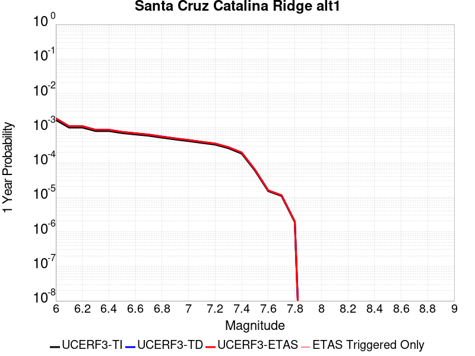 | 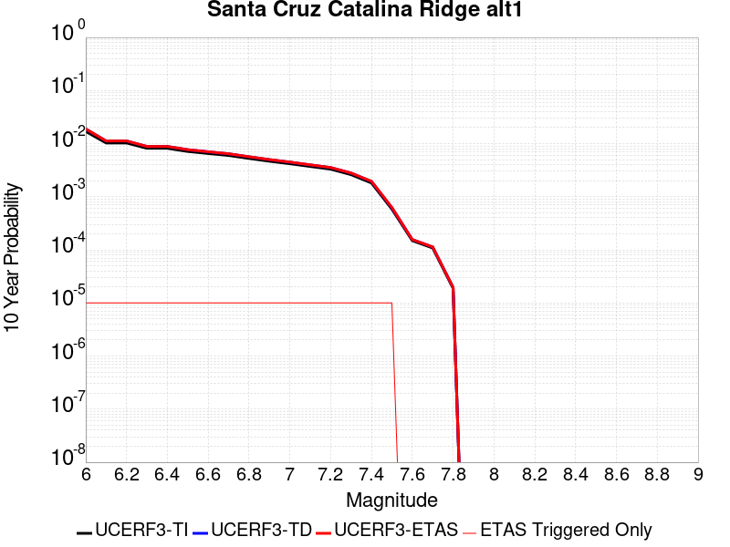 |

| Magnitude | 1 wk TI Prob | 1 wk TD Prob | 1 wk ETAS Prob | 1 wk ETAS/TD Gain | 1 wk ETAS Triggered Only | 1 mo TI Prob | 1 mo TD Prob | 1 mo ETAS Prob | 1 mo ETAS/TD Gain | 1 mo ETAS Triggered Only | 1 yr TI Prob | 1 yr TD Prob | 1 yr ETAS Prob | 1 yr ETAS/TD Gain | 1 yr ETAS Triggered Only | 10 yr TI Prob | 10 yr TD Prob | 10 yr ETAS Prob | 10 yr ETAS/TD Gain | 10 yr ETAS Triggered Only |
|-----|-----|-----|-----|-----|-----|-----|-----|-----|-----|-----|-----|-----|-----|-----|-----|-----|-----|-----|-----|-----|
| 6.0 | 3.2833184E-5 | 3.6558286E-5 | 3.6558286E-5 | 1.0 | 0.0 | 1.4070606E-4 | 1.566699E-4 | 1.566699E-4 | 1.0 | 0.0 | 0.00171175 | 0.0019059537 | 0.0019059537 | 1.0 | 0.0 | 0.016986247 | 0.018912971 | 0.018922783 | 1.0005187 | 1.0E-5 |
| 6.1 | 1.9835548E-5 | 2.165945E-5 | 2.165945E-5 | 1.0 | 0.0 | 8.500672E-5 | 9.282303E-5 | 9.282303E-5 | 1.0 | 0.0 | 0.0010344655 | 0.0011295547 | 0.0011295547 | 1.0 | 0.0 | 0.010296632 | 0.011240268 | 0.011250155 | 1.0008796 | 1.0E-5 |
| 6.2 | 1.9835548E-5 | 2.165945E-5 | 2.165945E-5 | 1.0 | 0.0 | 8.500672E-5 | 9.282303E-5 | 9.282303E-5 | 1.0 | 0.0 | 0.0010344655 | 0.0011295547 | 0.0011295547 | 1.0 | 0.0 | 0.010296632 | 0.011240268 | 0.011250155 | 1.0008796 | 1.0E-5 |
| 6.3 | 1.5728183E-5 | 1.7033912E-5 | 1.7033912E-5 | 1.0 | 0.0 | 6.7404755E-5 | 7.300047E-5 | 7.300047E-5 | 1.0 | 0.0 | 8.2034385E-4 | 8.884244E-4 | 8.884244E-4 | 1.0 | 0.0 | 0.008173222 | 0.008849408 | 0.008859319 | 1.00112 | 1.0E-5 |
| 6.4 | 1.5728183E-5 | 1.7033912E-5 | 1.7033912E-5 | 1.0 | 0.0 | 6.7404755E-5 | 7.300047E-5 | 7.300047E-5 | 1.0 | 0.0 | 8.2034385E-4 | 8.884244E-4 | 8.884244E-4 | 1.0 | 0.0 | 0.008173222 | 0.008849408 | 0.008859319 | 1.00112 | 1.0E-5 |
| 6.5 | 1.3707734E-5 | 1.479449E-5 | 1.479449E-5 | 1.0 | 0.0 | 5.8746107E-5 | 6.340344E-5 | 6.340344E-5 | 1.0 | 0.0 | 7.1499916E-4 | 7.71667E-4 | 7.71667E-4 | 1.0 | 0.0 | 0.0071270303 | 0.007690273 | 0.0077001965 | 1.0012903 | 1.0E-5 |
| 6.6 | 1.2539813E-5 | 1.3510192E-5 | 1.3510192E-5 | 1.0 | 0.0 | 5.3740947E-5 | 5.789955E-5 | 5.789955E-5 | 1.0 | 0.0 | 6.540996E-4 | 7.047017E-4 | 7.047017E-4 | 1.0 | 0.0 | 0.0065217763 | 0.007024974 | 0.007034904 | 1.0014135 | 1.0E-5 |
| 6.7 | 1.1504083E-5 | 1.237735E-5 | 1.237735E-5 | 1.0 | 0.0 | 4.930228E-5 | 5.3044718E-5 | 5.3044718E-5 | 1.0 | 0.0 | 6.0008996E-4 | 6.4563006E-4 | 6.4563006E-4 | 1.0 | 0.0 | 0.005984721 | 0.006437773 | 0.0064477087 | 1.0015433 | 1.0E-5 |
| 6.8 | 1.012739E-5 | 1.087705E-5 | 1.087705E-5 | 1.0 | 0.0 | 4.340238E-5 | 4.6615103E-5 | 4.6615103E-5 | 1.0 | 0.0 | 5.282958E-4 | 5.673926E-4 | 5.673926E-4 | 1.0 | 0.0 | 0.0052704164 | 0.0056596086 | 0.005669552 | 1.0017569 | 1.0E-5 |
| 6.9 | 8.9607865E-6 | 9.609099E-6 | 9.609099E-6 | 1.0 | 0.0 | 3.8402806E-5 | 4.1181207E-5 | 4.1181207E-5 | 1.0 | 0.0 | 4.6745385E-4 | 5.012669E-4 | 5.012669E-4 | 1.0 | 0.0 | 0.0046647177 | 0.005001482 | 0.005011432 | 1.0019894 | 1.0E-5 |
| 7.0 | 8.046829E-6 | 8.61973E-6 | 8.61973E-6 | 1.0 | 0.0 | 3.4485955E-5 | 3.694118E-5 | 3.694118E-5 | 1.0 | 0.0 | 4.1978562E-4 | 4.4966684E-4 | 4.4966684E-4 | 1.0 | 0.0 | 0.004189935 | 0.0044876602 | 0.0044976156 | 1.0022184 | 1.0E-5 |
| 7.1 | 7.136131E-6 | 7.637642E-6 | 7.637642E-6 | 1.0 | 0.0 | 3.0583058E-5 | 3.2732343E-5 | 3.2732343E-5 | 1.0 | 0.0 | 3.7228514E-4 | 3.984441E-4 | 3.984441E-4 | 1.0 | 0.0 | 0.0037166206 | 0.0039773737 | 0.003987334 | 1.0025042 | 1.0E-5 |
| 7.2 | 6.362014E-6 | 6.8049458E-6 | 6.8049458E-6 | 1.0 | 0.0 | 2.726549E-5 | 2.9163732E-5 | 2.9163732E-5 | 1.0 | 0.0 | 3.3190678E-4 | 3.5501123E-4 | 3.5501123E-4 | 1.0 | 0.0 | 0.0033141149 | 0.0035445094 | 0.003554474 | 1.0028113 | 1.0E-5 |
| 7.3 | 5.004101E-6 | 5.351705E-6 | 5.351705E-6 | 1.0 | 0.0 | 2.1445969E-5 | 2.2935681E-5 | 2.2935681E-5 | 1.0 | 0.0 | 2.6107338E-4 | 2.7920667E-4 | 2.7920667E-4 | 1.0 | 0.0 | 0.002607669 | 0.0027886136 | 0.0027985855 | 1.003576 | 1.0E-5 |
| 7.4 | 3.4901443E-6 | 3.7320456E-6 | 3.7320456E-6 | 1.0 | 0.0 | 1.4957676E-5 | 1.5994385E-5 | 1.5994385E-5 | 1.0 | 0.0 | 1.8209449E-4 | 1.9471462E-4 | 1.9471462E-4 | 1.0 | 0.0 | 0.0018194534 | 0.0019454787 | 0.0019554594 | 1.0051302 | 1.0E-5 |
| 7.5 | 1.1215045E-6 | 1.1893851E-6 | 1.1893851E-6 | 1.0 | 0.0 | 4.806439E-6 | 5.097355E-6 | 5.097355E-6 | 1.0 | 0.0 | 5.851682E-5 | 6.205856E-5 | 6.205856E-5 | 1.0 | 0.0 | 5.850142E-4 | 6.204154E-4 | 6.3040917E-4 | 1.0161083 | 1.0E-5 |
| 7.6 | 2.8599047E-7 | 2.9951954E-7 | 2.9951954E-7 | 1.0 | 0.0 | 1.2256729E-6 | 1.2836546E-6 | 1.2836546E-6 | 1.0 | 0.0 | 1.4922465E-5 | 1.5628384E-5 | 1.5628384E-5 | 1.0 | 0.0 | 1.4921463E-4 | 1.5627299E-4 | 1.5627299E-4 | 1.0 | 0.0 |
| 7.7 | 2.0781519E-7 | 2.1744296E-7 | 2.1744296E-7 | 1.0 | 0.0 | 8.906362E-7 | 9.3189806E-7 | 9.3189806E-7 | 1.0 | 0.0 | 1.08434415E-5 | 1.1345801E-5 | 1.1345801E-5 | 1.0 | 0.0 | 1.0842913E-4 | 1.1345231E-4 | 1.1345231E-4 | 1.0 | 0.0 |
| 7.8 | 3.614776E-8 | 3.7640977E-8 | 3.7640977E-8 | 1.0 | 0.0 | 1.5491896E-7 | 1.6131847E-7 | 1.6131847E-7 | 1.0 | 0.0 | 1.8861368E-6 | 1.9640506E-6 | 1.9640506E-6 | 1.0 | 0.0 | 1.8861208E-5 | 1.9640345E-5 | 1.9640345E-5 | 1.0 | 0.0 |

## Camp Rock 2011
*[(top)](#table-of-contents)*

| 1 Week | 1 Month | 1 Year | 10 Year |
|-----|-----|-----|-----|
|  |  |  |  |

| Magnitude | 1 wk TI Prob | 1 wk TD Prob | 1 wk ETAS Prob | 1 wk ETAS/TD Gain | 1 wk ETAS Triggered Only | 1 mo TI Prob | 1 mo TD Prob | 1 mo ETAS Prob | 1 mo ETAS/TD Gain | 1 mo ETAS Triggered Only | 1 yr TI Prob | 1 yr TD Prob | 1 yr ETAS Prob | 1 yr ETAS/TD Gain | 1 yr ETAS Triggered Only | 10 yr TI Prob | 10 yr TD Prob | 10 yr ETAS Prob | 10 yr ETAS/TD Gain | 10 yr ETAS Triggered Only |
|-----|-----|-----|-----|-----|-----|-----|-----|-----|-----|-----|-----|-----|-----|-----|-----|-----|-----|-----|-----|-----|
| 6.0 | 1.6710783E-5 | 4.25025E-6 | 1.4250208E-5 | 3.3527927 | 1.0E-5 | 7.161568E-5 | 1.8215234E-5 | 2.8215052E-5 | 1.5489811 | 1.0E-5 | 8.7157206E-4 | 2.2174843E-4 | 2.317462E-4 | 1.0450861 | 1.0E-5 | 0.008681616 | 0.0022153244 | 0.0022253024 | 1.004504 | 1.0E-5 |
| 6.1 | 1.6710783E-5 | 4.25025E-6 | 1.4250208E-5 | 3.3527927 | 1.0E-5 | 7.161568E-5 | 1.8215234E-5 | 2.8215052E-5 | 1.5489811 | 1.0E-5 | 8.7157206E-4 | 2.2174843E-4 | 2.317462E-4 | 1.0450861 | 1.0E-5 | 0.008681616 | 0.0022153244 | 0.0022253024 | 1.004504 | 1.0E-5 |
| 6.2 | 1.6710783E-5 | 4.25025E-6 | 1.4250208E-5 | 3.3527927 | 1.0E-5 | 7.161568E-5 | 1.8215234E-5 | 2.8215052E-5 | 1.5489811 | 1.0E-5 | 8.7157206E-4 | 2.2174843E-4 | 2.317462E-4 | 1.0450861 | 1.0E-5 | 0.008681616 | 0.0022153244 | 0.0022253024 | 1.004504 | 1.0E-5 |
| 6.3 | 1.6710783E-5 | 4.25025E-6 | 1.4250208E-5 | 3.3527927 | 1.0E-5 | 7.161568E-5 | 1.8215234E-5 | 2.8215052E-5 | 1.5489811 | 1.0E-5 | 8.7157206E-4 | 2.2174843E-4 | 2.317462E-4 | 1.0450861 | 1.0E-5 | 0.008681616 | 0.0022153244 | 0.0022253024 | 1.004504 | 1.0E-5 |
| 6.4 | 7.982846E-6 | 3.6820795E-6 | 3.6820795E-6 | 1.0 | 0.0 | 3.421175E-5 | 1.5780248E-5 | 1.5780248E-5 | 1.0 | 0.0 | 4.1644843E-4 | 1.9210792E-4 | 1.9210792E-4 | 1.0 | 0.0 | 0.0041566887 | 0.0019194534 | 0.0019194534 | 1.0 | 0.0 |
| 6.5 | 7.982846E-6 | 3.6820795E-6 | 3.6820795E-6 | 1.0 | 0.0 | 3.421175E-5 | 1.5780248E-5 | 1.5780248E-5 | 1.0 | 0.0 | 4.1644843E-4 | 1.9210792E-4 | 1.9210792E-4 | 1.0 | 0.0 | 0.0041566887 | 0.0019194534 | 0.0019194534 | 1.0 | 0.0 |
| 6.6 | 7.048869E-6 | 3.4243487E-6 | 3.4243487E-6 | 1.0 | 0.0 | 3.0209088E-5 | 1.4675699E-5 | 1.4675699E-5 | 1.0 | 0.0 | 3.677336E-4 | 1.786623E-4 | 1.786623E-4 | 1.0 | 0.0 | 0.0036712566 | 0.0017852184 | 0.0017852184 | 1.0 | 0.0 |
| 6.7 | 6.987307E-6 | 3.3623264E-6 | 3.3623264E-6 | 1.0 | 0.0 | 2.9945259E-5 | 1.4409892E-5 | 1.4409892E-5 | 1.0 | 0.0 | 3.6452254E-4 | 1.7542663E-4 | 1.7542663E-4 | 1.0 | 0.0 | 0.0036392517 | 0.0017529125 | 0.0017529125 | 1.0 | 0.0 |
| 6.8 | 6.3737602E-6 | 3.1178997E-6 | 3.1178997E-6 | 1.0 | 0.0 | 2.731583E-5 | 1.3362361E-5 | 1.3362361E-5 | 1.0 | 0.0 | 3.3251947E-4 | 1.6267489E-4 | 1.6267489E-4 | 1.0 | 0.0 | 0.0033202237 | 0.0016255867 | 0.0016255867 | 1.0 | 0.0 |
| 6.9 | 6.112211E-6 | 2.933108E-6 | 2.933108E-6 | 1.0 | 0.0 | 2.6194928E-5 | 1.2570404E-5 | 1.2570404E-5 | 1.0 | 0.0 | 3.1887658E-4 | 1.530342E-4 | 1.530342E-4 | 1.0 | 0.0 | 0.003184194 | 0.001529316 | 0.001529316 | 1.0 | 0.0 |
| 7.0 | 5.5140117E-6 | 2.6419164E-6 | 2.6419164E-6 | 1.0 | 0.0 | 2.3631264E-5 | 1.13224505E-5 | 1.13224505E-5 | 1.0 | 0.0 | 2.8767265E-4 | 1.3784238E-4 | 1.3784238E-4 | 1.0 | 0.0 | 0.0028730053 | 0.001377594 | 0.001377594 | 1.0 | 0.0 |
| 7.1 | 4.8151105E-6 | 2.1342648E-6 | 2.1342648E-6 | 1.0 | 0.0 | 2.0636026E-5 | 9.146818E-6 | 9.146818E-6 | 1.0 | 0.0 | 2.5121463E-4 | 1.1135704E-4 | 1.1135704E-4 | 1.0 | 0.0 | 0.0025093083 | 0.0011130343 | 0.0011130343 | 1.0 | 0.0 |
| 7.2 | 3.818335E-6 | 1.2937384E-6 | 1.2937384E-6 | 1.0 | 0.0 | 1.6364189E-5 | 5.5445817E-6 | 5.5445817E-6 | 1.0 | 0.0 | 1.9921579E-4 | 6.750327E-5 | 6.750327E-5 | 1.0 | 0.0 | 0.0019903728 | 6.7483593E-4 | 6.7483593E-4 | 1.0 | 0.0 |
| 7.3 | 2.7166698E-6 | 7.3835463E-7 | 7.3835463E-7 | 1.0 | 0.0 | 1.1642818E-5 | 3.1643733E-6 | 3.1643733E-6 | 1.0 | 0.0 | 1.4174209E-4 | 3.8525584E-5 | 3.8525584E-5 | 1.0 | 0.0 | 0.0014165172 | 3.8519106E-4 | 3.8519106E-4 | 1.0 | 0.0 |
| 7.4 | 2.0893426E-6 | 5.461814E-7 | 5.461814E-7 | 1.0 | 0.0 | 8.954295E-6 | 2.3407754E-6 | 2.3407754E-6 | 1.0 | 0.0 | 1.0901308E-4 | 2.8498573E-5 | 2.8498573E-5 | 1.0 | 0.0 | 0.0010895962 | 2.8494973E-4 | 2.8494973E-4 | 1.0 | 0.0 |
| 7.5 | 1.1681728E-6 | 3.6030443E-7 | 3.6030443E-7 | 1.0 | 0.0 | 5.0064455E-6 | 1.544161E-6 | 1.544161E-6 | 1.0 | 0.0 | 6.0951766E-5 | 1.8800003E-5 | 1.8800003E-5 | 1.0 | 0.0 | 6.093505E-4 | 1.879846E-4 | 1.879846E-4 | 1.0 | 0.0 |
| 7.6 | 1.3154387E-7 | 7.1197206E-8 | 7.1197206E-8 | 1.0 | 0.0 | 5.6375933E-7 | 3.0513087E-7 | 3.0513087E-7 | 1.0 | 0.0 | 6.863748E-6 | 3.7149634E-6 | 3.7149634E-6 | 1.0 | 0.0 | 6.863536E-5 | 3.714917E-5 | 3.714917E-5 | 1.0 | 0.0 |

## Eaton Roughs 2011 CFM
*[(top)](#table-of-contents)*

| 1 Week | 1 Month | 1 Year | 10 Year |
|-----|-----|-----|-----|
|  |  |  |  |

| Magnitude | 1 wk TI Prob | 1 wk TD Prob | 1 wk ETAS Prob | 1 wk ETAS/TD Gain | 1 wk ETAS Triggered Only | 1 mo TI Prob | 1 mo TD Prob | 1 mo ETAS Prob | 1 mo ETAS/TD Gain | 1 mo ETAS Triggered Only | 1 yr TI Prob | 1 yr TD Prob | 1 yr ETAS Prob | 1 yr ETAS/TD Gain | 1 yr ETAS Triggered Only | 10 yr TI Prob | 10 yr TD Prob | 10 yr ETAS Prob | 10 yr ETAS/TD Gain | 10 yr ETAS Triggered Only |
|-----|-----|-----|-----|-----|-----|-----|-----|-----|-----|-----|-----|-----|-----|-----|-----|-----|-----|-----|-----|-----|
| 6.0 | 6.8044945E-5 | 8.843572E-5 | 8.843572E-5 | 1.0 | 0.0 | 2.9158857E-4 | 3.7896173E-4 | 3.7896173E-4 | 1.0 | 0.0 | 0.0035443127 | 0.004605058 | 0.004615012 | 1.0021615 | 1.0E-5 | 0.03488314 | 0.045163017 | 0.045172565 | 1.0002115 | 1.0E-5 |
| 6.1 | 6.8044945E-5 | 8.843572E-5 | 8.843572E-5 | 1.0 | 0.0 | 2.9158857E-4 | 3.7896173E-4 | 3.7896173E-4 | 1.0 | 0.0 | 0.0035443127 | 0.004605058 | 0.004615012 | 1.0021615 | 1.0E-5 | 0.03488314 | 0.045163017 | 0.045172565 | 1.0002115 | 1.0E-5 |
| 6.2 | 6.8044945E-5 | 8.843572E-5 | 8.843572E-5 | 1.0 | 0.0 | 2.9158857E-4 | 3.7896173E-4 | 3.7896173E-4 | 1.0 | 0.0 | 0.0035443127 | 0.004605058 | 0.004615012 | 1.0021615 | 1.0E-5 | 0.03488314 | 0.045163017 | 0.045172565 | 1.0002115 | 1.0E-5 |
| 6.3 | 6.8044945E-5 | 8.843572E-5 | 8.843572E-5 | 1.0 | 0.0 | 2.9158857E-4 | 3.7896173E-4 | 3.7896173E-4 | 1.0 | 0.0 | 0.0035443127 | 0.004605058 | 0.004615012 | 1.0021615 | 1.0E-5 | 0.03488314 | 0.045163017 | 0.045172565 | 1.0002115 | 1.0E-5 |
| 6.4 | 4.5830013E-5 | 5.7153877E-5 | 5.7153877E-5 | 1.0 | 0.0 | 1.9639956E-4 | 2.4492524E-4 | 2.4492524E-4 | 1.0 | 0.0 | 0.0023885423 | 0.0029784266 | 0.002988397 | 1.0033475 | 1.0E-5 | 0.023630321 | 0.029421404 | 0.02943111 | 1.0003299 | 1.0E-5 |
| 6.5 | 4.5830013E-5 | 5.7153877E-5 | 5.7153877E-5 | 1.0 | 0.0 | 1.9639956E-4 | 2.4492524E-4 | 2.4492524E-4 | 1.0 | 0.0 | 0.0023885423 | 0.0029784266 | 0.002988397 | 1.0033475 | 1.0E-5 | 0.023630321 | 0.029421404 | 0.02943111 | 1.0003299 | 1.0E-5 |
| 6.6 | 3.222194E-5 | 3.826131E-5 | 3.826131E-5 | 1.0 | 0.0 | 1.3808672E-4 | 1.6396737E-4 | 1.6396737E-4 | 1.0 | 0.0 | 0.0016799092 | 0.0019945889 | 0.0019945889 | 1.0 | 0.0 | 0.016672665 | 0.019776504 | 0.019776504 | 1.0 | 0.0 |
| 6.7 | 2.4155654E-5 | 2.7786129E-5 | 2.7786129E-5 | 1.0 | 0.0 | 1.0352012E-4 | 1.1907802E-4 | 1.1907802E-4 | 1.0 | 0.0 | 0.0012596287 | 0.001448819 | 0.001448819 | 1.0 | 0.0 | 0.012525126 | 0.014394887 | 0.014394887 | 1.0 | 0.0 |
| 6.8 | 2.1814667E-5 | 2.4940775E-5 | 2.4940775E-5 | 1.0 | 0.0 | 9.348808E-5 | 1.06884676E-4 | 1.06884676E-4 | 1.0 | 0.0 | 0.001137623 | 0.0013005479 | 0.0013005479 | 1.0 | 0.0 | 0.011318169 | 0.012929991 | 0.012929991 | 1.0 | 0.0 |
| 6.9 | 2.0700467E-5 | 2.3628847E-5 | 2.3628847E-5 | 1.0 | 0.0 | 8.871327E-5 | 1.0126257E-4 | 1.0126257E-4 | 1.0 | 0.0 | 0.0010795488 | 0.0012321778 | 0.0012321778 | 1.0 | 0.0 | 0.010743194 | 0.012253991 | 0.012253991 | 1.0 | 0.0 |
| 7.0 | 2.0104066E-5 | 2.2936418E-5 | 2.2936418E-5 | 1.0 | 0.0 | 8.615744E-5 | 9.829524E-5 | 9.829524E-5 | 1.0 | 0.0 | 0.0010484619 | 0.0011960906 | 0.0011960906 | 1.0 | 0.0 | 0.010435291 | 0.01189703 | 0.01189703 | 1.0 | 0.0 |
| 7.1 | 1.8225232E-5 | 2.0772972E-5 | 2.0772972E-5 | 1.0 | 0.0 | 7.81058E-5 | 8.9024E-5 | 8.9024E-5 | 1.0 | 0.0 | 9.5052324E-4 | 0.0010833298 | 0.0010833298 | 1.0 | 0.0 | 0.009464677 | 0.010780787 | 0.010780787 | 1.0 | 0.0 |
| 7.2 | 1.7526572E-5 | 1.9993417E-5 | 1.9993417E-5 | 1.0 | 0.0 | 7.511172E-5 | 8.568326E-5 | 8.568326E-5 | 1.0 | 0.0 | 9.141015E-4 | 0.001042696 | 0.001042696 | 1.0 | 0.0 | 0.009103506 | 0.010378314 | 0.010378314 | 1.0 | 0.0 |
| 7.3 | 1.5727232E-5 | 1.802144E-5 | 1.802144E-5 | 1.0 | 0.0 | 6.740067E-5 | 7.7232464E-5 | 7.7232464E-5 | 1.0 | 0.0 | 8.2029426E-4 | 9.3990087E-4 | 9.3990087E-4 | 1.0 | 0.0 | 0.008172729 | 0.009359476 | 0.009359476 | 1.0 | 0.0 |
| 7.4 | 1.4457361E-5 | 1.6598296E-5 | 1.6598296E-5 | 1.0 | 0.0 | 6.195865E-5 | 7.1133625E-5 | 7.1133625E-5 | 1.0 | 0.0 | 7.540854E-4 | 8.657087E-4 | 8.657087E-4 | 1.0 | 0.0 | 0.007515317 | 0.008623524 | 0.008623524 | 1.0 | 0.0 |
| 7.5 | 1.33280955E-5 | 1.5345377E-5 | 1.5345377E-5 | 1.0 | 0.0 | 5.711916E-5 | 6.5764245E-5 | 6.5764245E-5 | 1.0 | 0.0 | 6.9520384E-4 | 8.003864E-4 | 8.003864E-4 | 1.0 | 0.0 | 0.00693033 | 0.007975179 | 0.007975179 | 1.0 | 0.0 |
| 7.6 | 1.0699478E-5 | 1.2387767E-5 | 1.2387767E-5 | 1.0 | 0.0 | 4.5854096E-5 | 5.3089352E-5 | 5.3089352E-5 | 1.0 | 0.0 | 5.581306E-4 | 6.4617174E-4 | 6.4617174E-4 | 1.0 | 0.0 | 0.005567309 | 0.00644301 | 0.00644301 | 1.0 | 0.0 |
| 7.7 | 5.9390236E-6 | 6.8529266E-6 | 6.8529266E-6 | 1.0 | 0.0 | 2.545271E-5 | 2.9369356E-5 | 2.9369356E-5 | 1.0 | 0.0 | 3.0984267E-4 | 3.575135E-4 | 3.575135E-4 | 1.0 | 0.0 | 0.0030941102 | 0.0035694076 | 0.0035694076 | 1.0 | 0.0 |
| 7.8 | 2.1622036E-6 | 2.3296948E-6 | 2.3296948E-6 | 1.0 | 0.0 | 9.266554E-6 | 9.984368E-6 | 9.984368E-6 | 1.0 | 0.0 | 1.1281446E-4 | 1.2155298E-4 | 1.2155298E-4 | 1.0 | 0.0 | 0.001127572 | 0.0012148706 | 0.0012148706 | 1.0 | 0.0 |
| 7.9 | 4.9586197E-7 | 5.218914E-7 | 5.218914E-7 | 1.0 | 0.0 | 2.125121E-6 | 2.2366758E-6 | 2.2366758E-6 | 1.0 | 0.0 | 2.5873042E-5 | 2.7231206E-5 | 2.7231206E-5 | 1.0 | 0.0 | 2.5870028E-4 | 2.722808E-4 | 2.722808E-4 | 1.0 | 0.0 |

## Calaveras (No) 2011 CFM
*[(top)](#table-of-contents)*

| 1 Week | 1 Month | 1 Year | 10 Year |
|-----|-----|-----|-----|
|  |  |  |  |

| Magnitude | 1 wk TI Prob | 1 wk TD Prob | 1 wk ETAS Prob | 1 wk ETAS/TD Gain | 1 wk ETAS Triggered Only | 1 mo TI Prob | 1 mo TD Prob | 1 mo ETAS Prob | 1 mo ETAS/TD Gain | 1 mo ETAS Triggered Only | 1 yr TI Prob | 1 yr TD Prob | 1 yr ETAS Prob | 1 yr ETAS/TD Gain | 1 yr ETAS Triggered Only | 10 yr TI Prob | 10 yr TD Prob | 10 yr ETAS Prob | 10 yr ETAS/TD Gain | 10 yr ETAS Triggered Only |
|-----|-----|-----|-----|-----|-----|-----|-----|-----|-----|-----|-----|-----|-----|-----|-----|-----|-----|-----|-----|-----|
| 6.0 | 4.8694856E-5 | 6.747043E-5 | 6.747043E-5 | 1.0 | 0.0 | 2.0867554E-4 | 2.8912802E-4 | 2.8912802E-4 | 1.0 | 0.0 | 0.0025376645 | 0.0035145874 | 0.003524552 | 1.0028353 | 1.0E-5 | 0.02508881 | 0.034770876 | 0.03478053 | 1.0002776 | 1.0E-5 |
| 6.1 | 4.8694856E-5 | 6.747043E-5 | 6.747043E-5 | 1.0 | 0.0 | 2.0867554E-4 | 2.8912802E-4 | 2.8912802E-4 | 1.0 | 0.0 | 0.0025376645 | 0.0035145874 | 0.003524552 | 1.0028353 | 1.0E-5 | 0.02508881 | 0.034770876 | 0.03478053 | 1.0002776 | 1.0E-5 |
| 6.2 | 4.7541962E-5 | 6.5801425E-5 | 6.5801425E-5 | 1.0 | 0.0 | 2.0373536E-4 | 2.819767E-4 | 2.819767E-4 | 1.0 | 0.0 | 0.0024776561 | 0.00342782 | 0.0034377857 | 1.0029073 | 1.0E-5 | 0.024502134 | 0.033932317 | 0.033941977 | 1.0002847 | 1.0E-5 |
| 6.3 | 4.6717287E-5 | 6.463481E-5 | 6.463481E-5 | 1.0 | 0.0 | 2.0020158E-4 | 2.7697798E-4 | 2.7697798E-4 | 1.0 | 0.0 | 0.0024347296 | 0.0033671719 | 0.0033771382 | 1.0029598 | 1.0E-5 | 0.024082264 | 0.03334484 | 0.033354506 | 1.0002899 | 1.0E-5 |
| 6.4 | 4.6276386E-5 | 6.399668E-5 | 6.399668E-5 | 1.0 | 0.0 | 1.983123E-4 | 2.7424374E-4 | 2.7424374E-4 | 1.0 | 0.0 | 0.0024117786 | 0.0033339844 | 0.003343951 | 1.0029894 | 1.0E-5 | 0.02385771 | 0.033023722 | 0.033033393 | 1.0002928 | 1.0E-5 |
| 6.5 | 4.5720994E-5 | 6.319809E-5 | 6.319809E-5 | 1.0 | 0.0 | 1.9593239E-4 | 2.7082188E-4 | 2.7082188E-4 | 1.0 | 0.0 | 0.002382867 | 0.0032924588 | 0.0033024258 | 1.0030272 | 1.0E-5 | 0.023574775 | 0.032621685 | 0.03263136 | 1.0002966 | 1.0E-5 |
| 6.6 | 4.549134E-5 | 6.285118E-5 | 6.285118E-5 | 1.0 | 0.0 | 1.949483E-4 | 2.6933543E-4 | 2.6933543E-4 | 1.0 | 0.0 | 0.0023709119 | 0.0032744156 | 0.0032843829 | 1.003044 | 1.0E-5 | 0.023457756 | 0.032447044 | 0.03245672 | 1.0002981 | 1.0E-5 |
| 6.7 | 3.701047E-5 | 5.035885E-5 | 5.035885E-5 | 1.0 | 0.0 | 1.5860666E-4 | 2.1580602E-4 | 2.1580602E-4 | 1.0 | 0.0 | 0.0019293258 | 0.0026243157 | 0.0026342894 | 1.0038005 | 1.0E-5 | 0.019126613 | 0.026125036 | 0.026134776 | 1.0003728 | 1.0E-5 |
| 6.8 | 3.5523568E-5 | 4.8340455E-5 | 4.8340455E-5 | 1.0 | 0.0 | 1.5223498E-4 | 2.0715717E-4 | 2.0715717E-4 | 1.0 | 0.0 | 0.0018518851 | 0.0025192641 | 0.002529239 | 1.0039594 | 1.0E-5 | 0.018365284 | 0.025097271 | 0.02510702 | 1.0003885 | 1.0E-5 |
| 6.9 | 3.2946147E-5 | 4.4662145E-5 | 4.4662145E-5 | 1.0 | 0.0 | 1.4119013E-4 | 1.9139539E-4 | 1.9139539E-4 | 1.0 | 0.0 | 0.0017176344 | 0.0023277907 | 0.0023377675 | 1.0042859 | 1.0E-5 | 0.017044188 | 0.023219328 | 0.023229096 | 1.0004207 | 1.0E-5 |
| 7.0 | 2.7682381E-5 | 3.7021717E-5 | 3.7021717E-5 | 1.0 | 0.0 | 1.1863338E-4 | 1.5865502E-4 | 1.5865502E-4 | 1.0 | 0.0 | 0.0014434044 | 0.0019299437 | 0.0019399243 | 1.0051715 | 1.0E-5 | 0.01434065 | 0.019310663 | 0.01932047 | 1.0005078 | 1.0E-5 |
| 7.1 | 2.471967E-5 | 3.328621E-5 | 3.328621E-5 | 1.0 | 0.0 | 1.05937135E-4 | 1.4264755E-4 | 1.4264755E-4 | 1.0 | 0.0 | 0.0012890215 | 0.0017353793 | 0.0017453621 | 1.0057524 | 1.0E-5 | 0.0128157 | 0.017385712 | 0.01739554 | 1.0005652 | 1.0E-5 |
| 7.2 | 1.9748062E-5 | 2.6774243E-5 | 2.6774243E-5 | 1.0 | 0.0 | 8.463181E-5 | 1.1474184E-4 | 1.1474184E-4 | 1.0 | 0.0 | 0.0010299052 | 0.00139611 | 0.00139611 | 1.0 | 0.0 | 0.01025145 | 0.014030519 | 0.014030519 | 1.0 | 0.0 |
| 7.3 | 1.1603734E-5 | 1.5783495E-5 | 1.5783495E-5 | 1.0 | 0.0 | 4.9729337E-5 | 6.764187E-5 | 6.764187E-5 | 1.0 | 0.0 | 6.052865E-4 | 8.232428E-4 | 8.232428E-4 | 1.0 | 0.0 | 0.0060364045 | 0.008308491 | 0.008308491 | 1.0 | 0.0 |
| 7.4 | 4.885381E-6 | 6.0347143E-6 | 6.0347143E-6 | 1.0 | 0.0 | 2.0937177E-5 | 2.5862806E-5 | 2.5862806E-5 | 1.0 | 0.0 | 2.5488032E-4 | 3.1483435E-4 | 3.1483435E-4 | 1.0 | 0.0 | 0.0025458818 | 0.0032009233 | 0.0032009233 | 1.0 | 0.0 |
| 7.5 | 3.0571264E-6 | 4.15504E-6 | 4.15504E-6 | 1.0 | 0.0 | 1.3101904E-5 | 1.7807193E-5 | 1.7807193E-5 | 1.0 | 0.0 | 1.5950401E-4 | 2.1678112E-4 | 2.1678112E-4 | 1.0 | 0.0 | 0.0015938957 | 0.0022209908 | 0.0022209908 | 1.0 | 0.0 |
| 7.6 | 1.764948E-6 | 2.7952983E-6 | 2.7952983E-6 | 1.0 | 0.0 | 7.564041E-6 | 1.1979795E-5 | 1.1979795E-5 | 1.0 | 0.0 | 9.208831E-5 | 1.4584431E-4 | 1.4584431E-4 | 1.0 | 0.0 | 9.205016E-4 | 0.0015122244 | 0.0015122244 | 1.0 | 0.0 |
| 7.7 | 1.3173734E-6 | 2.0582536E-6 | 2.0582536E-6 | 1.0 | 0.0 | 5.645874E-6 | 8.821057E-6 | 8.821057E-6 | 1.0 | 0.0 | 6.873634E-5 | 1.073911E-4 | 1.073911E-4 | 1.0 | 0.0 | 6.8715087E-4 | 0.0011260301 | 0.0011260301 | 1.0 | 0.0 |
| 7.8 | 9.4429885E-7 | 1.5487967E-6 | 1.5487967E-6 | 1.0 | 0.0 | 4.0469886E-6 | 6.6376833E-6 | 6.6376833E-6 | 1.0 | 0.0 | 4.9270973E-5 | 8.081081E-5 | 8.081081E-5 | 1.0 | 0.0 | 4.926005E-4 | 8.500613E-4 | 8.500613E-4 | 1.0 | 0.0 |
| 7.9 | 6.388233E-7 | 1.1147582E-6 | 1.1147582E-6 | 1.0 | 0.0 | 2.7378112E-6 | 4.7775266E-6 | 4.7775266E-6 | 1.0 | 0.0 | 3.3332344E-5 | 5.8164846E-5 | 5.8164846E-5 | 1.0 | 0.0 | 3.3327343E-4 | 6.095722E-4 | 6.095722E-4 | 1.0 | 0.0 |
| 8.0 | 3.087986E-7 | 5.7538136E-7 | 5.7538136E-7 | 1.0 | 0.0 | 1.323422E-6 | 2.4659178E-6 | 2.4659178E-6 | 1.0 | 0.0 | 1.6112543E-5 | 3.0022138E-5 | 3.0022138E-5 | 1.0 | 0.0 | 1.6111376E-4 | 3.110024E-4 | 3.110024E-4 | 1.0 | 0.0 |
| 8.1 | 1.6725647E-7 | 2.7407458E-7 | 2.7407458E-7 | 1.0 | 0.0 | 7.168133E-7 | 1.1746048E-6 | 1.1746048E-6 | 1.0 | 0.0 | 8.7271665E-6 | 1.4300721E-5 | 1.4300721E-5 | 1.0 | 0.0 | 8.726824E-5 | 1.4847283E-4 | 1.4847283E-4 | 1.0 | 0.0 |

## Clamshell-Sawpit
*[(top)](#table-of-contents)*

| 1 Week | 1 Month | 1 Year | 10 Year |
|-----|-----|-----|-----|
|  |  |  |  |

| Magnitude | 1 wk TI Prob | 1 wk TD Prob | 1 wk ETAS Prob | 1 wk ETAS/TD Gain | 1 wk ETAS Triggered Only | 1 mo TI Prob | 1 mo TD Prob | 1 mo ETAS Prob | 1 mo ETAS/TD Gain | 1 mo ETAS Triggered Only | 1 yr TI Prob | 1 yr TD Prob | 1 yr ETAS Prob | 1 yr ETAS/TD Gain | 1 yr ETAS Triggered Only | 10 yr TI Prob | 10 yr TD Prob | 10 yr ETAS Prob | 10 yr ETAS/TD Gain | 10 yr ETAS Triggered Only |
|-----|-----|-----|-----|-----|-----|-----|-----|-----|-----|-----|-----|-----|-----|-----|-----|-----|-----|-----|-----|-----|
| 6.0 | 3.202998E-6 | 3.0127576E-6 | 1.3012727E-5 | 4.319208 | 1.0E-5 | 1.3727062E-5 | 1.2911759E-5 | 2.291163E-5 | 1.7744778 | 1.0E-5 | 1.6711417E-4 | 1.5719012E-4 | 1.6718855E-4 | 1.0636072 | 1.0E-5 | 0.0016698855 | 0.0015708688 | 0.0015808531 | 1.0063559 | 1.0E-5 |
| 6.1 | 3.202998E-6 | 3.0127576E-6 | 1.3012727E-5 | 4.319208 | 1.0E-5 | 1.3727062E-5 | 1.2911759E-5 | 2.291163E-5 | 1.7744778 | 1.0E-5 | 1.6711417E-4 | 1.5719012E-4 | 1.6718855E-4 | 1.0636072 | 1.0E-5 | 0.0016698855 | 0.0015708688 | 0.0015808531 | 1.0063559 | 1.0E-5 |
| 6.2 | 3.202998E-6 | 3.0127576E-6 | 1.3012727E-5 | 4.319208 | 1.0E-5 | 1.3727062E-5 | 1.2911759E-5 | 2.291163E-5 | 1.7744778 | 1.0E-5 | 1.6711417E-4 | 1.5719012E-4 | 1.6718855E-4 | 1.0636072 | 1.0E-5 | 0.0016698855 | 0.0015708688 | 0.0015808531 | 1.0063559 | 1.0E-5 |
| 6.3 | 3.202998E-6 | 3.0127576E-6 | 1.3012727E-5 | 4.319208 | 1.0E-5 | 1.3727062E-5 | 1.2911759E-5 | 2.291163E-5 | 1.7744778 | 1.0E-5 | 1.6711417E-4 | 1.5719012E-4 | 1.6718855E-4 | 1.0636072 | 1.0E-5 | 0.0016698855 | 0.0015708688 | 0.0015808531 | 1.0063559 | 1.0E-5 |
| 6.4 | 3.202998E-6 | 3.0127576E-6 | 1.3012727E-5 | 4.319208 | 1.0E-5 | 1.3727062E-5 | 1.2911759E-5 | 2.291163E-5 | 1.7744778 | 1.0E-5 | 1.6711417E-4 | 1.5719012E-4 | 1.6718855E-4 | 1.0636072 | 1.0E-5 | 0.0016698855 | 0.0015708688 | 0.0015808531 | 1.0063559 | 1.0E-5 |
| 6.5 | 2.5862723E-6 | 2.3807686E-6 | 2.3807686E-6 | 1.0 | 0.0 | 1.1083977E-5 | 1.0203255E-5 | 1.0203255E-5 | 1.0 | 0.0 | 1.3493907E-4 | 1.2421786E-4 | 1.2421786E-4 | 1.0 | 0.0 | 0.0013485716 | 0.0012415146 | 0.0012415146 | 1.0 | 0.0 |
| 6.6 | 2.5862723E-6 | 2.3807686E-6 | 2.3807686E-6 | 1.0 | 0.0 | 1.1083977E-5 | 1.0203255E-5 | 1.0203255E-5 | 1.0 | 0.0 | 1.3493907E-4 | 1.2421786E-4 | 1.2421786E-4 | 1.0 | 0.0 | 0.0013485716 | 0.0012415146 | 0.0012415146 | 1.0 | 0.0 |
| 6.7 | 2.5862723E-6 | 2.3807686E-6 | 2.3807686E-6 | 1.0 | 0.0 | 1.1083977E-5 | 1.0203255E-5 | 1.0203255E-5 | 1.0 | 0.0 | 1.3493907E-4 | 1.2421786E-4 | 1.2421786E-4 | 1.0 | 0.0 | 0.0013485716 | 0.0012415146 | 0.0012415146 | 1.0 | 0.0 |
| 6.8 | 2.4098806E-6 | 2.1977246E-6 | 2.1977246E-6 | 1.0 | 0.0 | 1.0328019E-5 | 9.418787E-6 | 9.418787E-6 | 1.0 | 0.0 | 1.2573638E-4 | 1.1466797E-4 | 1.1466797E-4 | 1.0 | 0.0 | 0.0012566525 | 0.0011461147 | 0.0011461147 | 1.0 | 0.0 |
| 6.9 | 2.0073985E-6 | 1.7784191E-6 | 1.7784191E-6 | 1.0 | 0.0 | 8.603109E-6 | 7.6217743E-6 | 7.6217743E-6 | 1.0 | 0.0 | 1.0473781E-4 | 9.279127E-5 | 9.279127E-5 | 1.0 | 0.0 | 0.0010468846 | 9.2753716E-4 | 9.2753716E-4 | 1.0 | 0.0 |
| 7.0 | 1.8166766E-6 | 1.5807041E-6 | 1.5807041E-6 | 1.0 | 0.0 | 7.785734E-6 | 6.7744286E-6 | 6.7744286E-6 | 1.0 | 0.0 | 9.478718E-5 | 8.247565E-5 | 8.247565E-5 | 1.0 | 0.0 | 9.4746763E-4 | 8.2446047E-4 | 8.2446047E-4 | 1.0 | 0.0 |
| 7.1 | 1.5471421E-6 | 1.305291E-6 | 1.305291E-6 | 1.0 | 0.0 | 6.6305925E-6 | 5.5940927E-6 | 5.5940927E-6 | 1.0 | 0.0 | 8.072447E-5 | 6.8106005E-5 | 6.8106005E-5 | 1.0 | 0.0 | 8.0695155E-4 | 6.808568E-4 | 6.808568E-4 | 1.0 | 0.0 |
| 7.2 | 1.3608037E-6 | 1.1153395E-6 | 1.1153395E-6 | 1.0 | 0.0 | 5.8320024E-6 | 4.7800177E-6 | 4.7800177E-6 | 1.0 | 0.0 | 7.1002316E-5 | 5.8195208E-5 | 5.8195208E-5 | 1.0 | 0.0 | 7.097964E-4 | 5.818043E-4 | 5.818043E-4 | 1.0 | 0.0 |
| 7.3 | 1.0749634E-6 | 8.3842093E-7 | 8.3842093E-7 | 1.0 | 0.0 | 4.6069777E-6 | 3.5932278E-6 | 3.5932278E-6 | 1.0 | 0.0 | 5.608851E-5 | 4.37467E-5 | 4.37467E-5 | 1.0 | 0.0 | 5.6074356E-4 | 4.373837E-4 | 4.373837E-4 | 1.0 | 0.0 |
| 7.4 | 8.416856E-7 | 6.200007E-7 | 6.200007E-7 | 1.0 | 0.0 | 3.607219E-6 | 2.6571433E-6 | 2.6571433E-6 | 1.0 | 0.0 | 4.3917007E-5 | 3.235026E-5 | 3.235026E-5 | 1.0 | 0.0 | 4.390833E-4 | 3.2345747E-4 | 3.2345747E-4 | 1.0 | 0.0 |
| 7.5 | 6.2779594E-7 | 4.496848E-7 | 4.496848E-7 | 1.0 | 0.0 | 2.6905511E-6 | 1.927219E-6 | 1.927219E-6 | 1.0 | 0.0 | 3.275697E-5 | 2.3463659E-5 | 2.3463659E-5 | 1.0 | 0.0 | 3.275214E-4 | 2.346137E-4 | 2.346137E-4 | 1.0 | 0.0 |
| 7.6 | 4.3822078E-7 | 3.0595254E-7 | 3.0595254E-7 | 1.0 | 0.0 | 1.8780877E-6 | 1.3112245E-6 | 1.3112245E-6 | 1.0 | 0.0 | 2.2865479E-5 | 1.5964059E-5 | 1.5964059E-5 | 1.0 | 0.0 | 2.2863125E-4 | 1.5963065E-4 | 1.5963065E-4 | 1.0 | 0.0 |
| 7.7 | 1.8704569E-7 | 1.1237795E-7 | 1.1237795E-7 | 1.0 | 0.0 | 8.0162414E-7 | 4.816197E-7 | 4.816197E-7 | 1.0 | 0.0 | 9.75973E-6 | 5.8637047E-6 | 5.8637047E-6 | 1.0 | 0.0 | 9.7593016E-5 | 5.863556E-5 | 5.863556E-5 | 1.0 | 0.0 |
| 7.8 | 3.5378733E-8 | 2.1838085E-8 | 2.1838085E-8 | 1.0 | 0.0 | 1.5162313E-7 | 9.3591794E-8 | 9.3591794E-8 | 1.0 | 0.0 | 1.84601E-6 | 1.1394795E-6 | 1.1394795E-6 | 1.0 | 0.0 | 1.8459947E-5 | 1.139474E-5 | 1.139474E-5 | 1.0 | 0.0 |
| 7.9 | 7.504945E-9 | 5.192021E-9 | 5.192021E-9 | 1.0 | 0.0 | 3.2164053E-8 | 2.225152E-8 | 2.225152E-8 | 1.0 | 0.0 | 3.9159727E-7 | 2.709122E-7 | 2.709122E-7 | 1.0 | 0.0 | 3.915966E-6 | 2.7091196E-6 | 2.7091196E-6 | 1.0 | 0.0 |
| 8.0 | 1.6554036E-10 | 1.4180768E-10 | 1.4180768E-10 | 1.0 | 0.0 | 7.0945894E-10 | 6.077472E-10 | 6.077472E-10 | 1.0 | 0.0 | 8.637662E-9 | 7.399322E-9 | 7.399322E-9 | 1.0 | 0.0 | 8.6376616E-8 | 7.399322E-8 | 7.399322E-8 | 1.0 | 0.0 |

## Santa Cruz Island
*[(top)](#table-of-contents)*

| 1 Week | 1 Month | 1 Year | 10 Year |
|-----|-----|-----|-----|
|  |  |  |  |

| Magnitude | 1 wk TI Prob | 1 wk TD Prob | 1 wk ETAS Prob | 1 wk ETAS/TD Gain | 1 wk ETAS Triggered Only | 1 mo TI Prob | 1 mo TD Prob | 1 mo ETAS Prob | 1 mo ETAS/TD Gain | 1 mo ETAS Triggered Only | 1 yr TI Prob | 1 yr TD Prob | 1 yr ETAS Prob | 1 yr ETAS/TD Gain | 1 yr ETAS Triggered Only | 10 yr TI Prob | 10 yr TD Prob | 10 yr ETAS Prob | 10 yr ETAS/TD Gain | 10 yr ETAS Triggered Only |
|-----|-----|-----|-----|-----|-----|-----|-----|-----|-----|-----|-----|-----|-----|-----|-----|-----|-----|-----|-----|-----|
| 6.0 | 2.9164563E-5 | 3.1599673E-5 | 3.1599673E-5 | 1.0 | 0.0 | 1.2498499E-4 | 1.3542091E-4 | 1.3542091E-4 | 1.0 | 0.0 | 0.0015206301 | 0.0016476389 | 0.0016476389 | 1.0 | 0.0 | 0.015102667 | 0.016367963 | 0.0163778 | 1.0006009 | 1.0E-5 |
| 6.1 | 2.9164563E-5 | 3.1599673E-5 | 3.1599673E-5 | 1.0 | 0.0 | 1.2498499E-4 | 1.3542091E-4 | 1.3542091E-4 | 1.0 | 0.0 | 0.0015206301 | 0.0016476389 | 0.0016476389 | 1.0 | 0.0 | 0.015102667 | 0.016367963 | 0.0163778 | 1.0006009 | 1.0E-5 |
| 6.2 | 2.9164563E-5 | 3.1599673E-5 | 3.1599673E-5 | 1.0 | 0.0 | 1.2498499E-4 | 1.3542091E-4 | 1.3542091E-4 | 1.0 | 0.0 | 0.0015206301 | 0.0016476389 | 0.0016476389 | 1.0 | 0.0 | 0.015102667 | 0.016367963 | 0.0163778 | 1.0006009 | 1.0E-5 |
| 6.3 | 1.6635553E-5 | 1.7804325E-5 | 1.7804325E-5 | 1.0 | 0.0 | 7.1293274E-5 | 7.630212E-5 | 7.630212E-5 | 1.0 | 0.0 | 8.6765E-4 | 9.286006E-4 | 9.286006E-4 | 1.0 | 0.0 | 0.008642701 | 0.009249076 | 0.009258984 | 1.0010712 | 1.0E-5 |
| 6.4 | 1.6635553E-5 | 1.7804325E-5 | 1.7804325E-5 | 1.0 | 0.0 | 7.1293274E-5 | 7.630212E-5 | 7.630212E-5 | 1.0 | 0.0 | 8.6765E-4 | 9.286006E-4 | 9.286006E-4 | 1.0 | 0.0 | 0.008642701 | 0.009249076 | 0.009258984 | 1.0010712 | 1.0E-5 |
| 6.5 | 1.2238748E-5 | 1.3042973E-5 | 1.3042973E-5 | 1.0 | 0.0 | 5.2450723E-5 | 5.5897275E-5 | 5.5897275E-5 | 1.0 | 0.0 | 6.3840044E-4 | 6.803405E-4 | 6.803405E-4 | 1.0 | 0.0 | 0.0063656955 | 0.006782976 | 0.006792908 | 1.0014642 | 1.0E-5 |
| 6.6 | 1.0489767E-5 | 1.1156617E-5 | 1.1156617E-5 | 1.0 | 0.0 | 4.495537E-5 | 4.7813206E-5 | 4.7813206E-5 | 1.0 | 0.0 | 5.4719415E-4 | 5.8197253E-4 | 5.8197253E-4 | 1.0 | 0.0 | 0.005458487 | 0.005804726 | 0.005814668 | 1.0017127 | 1.0E-5 |
| 6.7 | 8.699222E-6 | 9.236766E-6 | 9.236766E-6 | 1.0 | 0.0 | 3.7281847E-5 | 3.9585546E-5 | 3.9585546E-5 | 1.0 | 0.0 | 4.5381195E-4 | 4.8184796E-4 | 4.8184796E-4 | 1.0 | 0.0 | 0.0045288634 | 0.0048081 | 0.0048081 | 1.0 | 0.0 |
| 6.8 | 8.307732E-6 | 8.816889E-6 | 8.816889E-6 | 1.0 | 0.0 | 3.560408E-5 | 3.7786125E-5 | 3.7786125E-5 | 1.0 | 0.0 | 4.3339343E-4 | 4.5994937E-4 | 4.5994937E-4 | 1.0 | 0.0 | 0.004325492 | 0.0045900275 | 0.0045900275 | 1.0 | 0.0 |
| 6.9 | 8.073121E-6 | 8.564924E-6 | 8.564924E-6 | 1.0 | 0.0 | 3.459863E-5 | 3.6706308E-5 | 3.6706308E-5 | 1.0 | 0.0 | 4.2115687E-4 | 4.4680806E-4 | 4.4680806E-4 | 1.0 | 0.0 | 0.004203596 | 0.0044591487 | 0.0044591487 | 1.0 | 0.0 |
| 7.0 | 7.617019E-6 | 8.074651E-6 | 8.074651E-6 | 1.0 | 0.0 | 3.264396E-5 | 3.460519E-5 | 3.460519E-5 | 1.0 | 0.0 | 3.9736772E-4 | 4.2123714E-4 | 4.2123714E-4 | 1.0 | 0.0 | 0.003966579 | 0.0042044343 | 0.0042044343 | 1.0 | 0.0 |
| 7.1 | 7.1224836E-6 | 7.5457756E-6 | 7.5457756E-6 | 1.0 | 0.0 | 3.052457E-5 | 3.2338638E-5 | 3.2338638E-5 | 1.0 | 0.0 | 3.715733E-4 | 3.9365215E-4 | 3.9365215E-4 | 1.0 | 0.0 | 0.003709526 | 0.0039295917 | 0.0039295917 | 1.0 | 0.0 |
| 7.2 | 6.441115E-6 | 6.827372E-6 | 6.827372E-6 | 1.0 | 0.0 | 2.7604487E-5 | 2.925984E-5 | 2.925984E-5 | 1.0 | 0.0 | 3.360328E-4 | 3.5618054E-4 | 3.5618054E-4 | 1.0 | 0.0 | 0.0033552512 | 0.003556125 | 0.003556125 | 1.0 | 0.0 |
| 7.3 | 5.494274E-6 | 5.819985E-6 | 5.819985E-6 | 1.0 | 0.0 | 2.3546674E-5 | 2.4942556E-5 | 2.4942556E-5 | 1.0 | 0.0 | 2.8664304E-4 | 3.0363348E-4 | 3.0363348E-4 | 1.0 | 0.0 | 0.002862736 | 0.0030322094 | 0.0030322094 | 1.0 | 0.0 |
| 7.4 | 4.0802624E-6 | 4.3122495E-6 | 4.3122495E-6 | 1.0 | 0.0 | 1.7486722E-5 | 1.8480938E-5 | 1.8480938E-5 | 1.0 | 0.0 | 2.1288003E-4 | 2.2498227E-4 | 2.2498227E-4 | 1.0 | 0.0 | 0.0021267622 | 0.002247554 | 0.002247554 | 1.0 | 0.0 |
| 7.5 | 2.3584746E-6 | 2.475306E-6 | 2.475306E-6 | 1.0 | 0.0 | 1.0107709E-5 | 1.0608412E-5 | 1.0608412E-5 | 1.0 | 0.0 | 1.2305441E-4 | 1.291498E-4 | 1.291498E-4 | 1.0 | 0.0 | 0.0012298629 | 0.0012907526 | 0.0012907526 | 1.0 | 0.0 |
| 7.6 | 9.4981914E-7 | 9.860919E-7 | 9.860919E-7 | 1.0 | 0.0 | 4.0706473E-6 | 4.2261013E-6 | 4.2261013E-6 | 1.0 | 0.0 | 4.9559E-5 | 5.145158E-5 | 5.145158E-5 | 1.0 | 0.0 | 4.954795E-4 | 5.14398E-4 | 5.14398E-4 | 1.0 | 0.0 |
| 7.7 | 2.6013532E-7 | 2.641658E-7 | 2.641658E-7 | 1.0 | 0.0 | 1.1148652E-6 | 1.1321387E-6 | 1.1321387E-6 | 1.0 | 0.0 | 1.3573399E-5 | 1.3783702E-5 | 1.3783702E-5 | 1.0 | 0.0 | 1.357257E-4 | 1.3782854E-4 | 1.3782854E-4 | 1.0 | 0.0 |
| 7.8 | 4.1522263E-8 | 3.965676E-8 | 3.965676E-8 | 1.0 | 0.0 | 1.7795254E-7 | 1.6995754E-7 | 1.6995754E-7 | 1.0 | 0.0 | 2.16657E-6 | 2.0692314E-6 | 2.0692314E-6 | 1.0 | 0.0 | 2.1665488E-5 | 2.0692141E-5 | 2.0692141E-5 | 1.0 | 0.0 |
| 7.9 | 7.7242046E-10 | 5.946812E-10 | 5.946812E-10 | 1.0 | 0.0 | 3.3103735E-9 | 2.5486335E-9 | 2.5486335E-9 | 1.0 | 0.0 | 4.0303796E-8 | 3.1029614E-8 | 3.1029614E-8 | 1.0 | 0.0 | 4.030379E-7 | 3.102961E-7 | 3.102961E-7 | 1.0 | 0.0 |

## San Jacinto (Coyote Creek)
*[(top)](#table-of-contents)*

| 1 Week | 1 Month | 1 Year | 10 Year |
|-----|-----|-----|-----|
|  |  |  |  |

| Magnitude | 1 wk TI Prob | 1 wk TD Prob | 1 wk ETAS Prob | 1 wk ETAS/TD Gain | 1 wk ETAS Triggered Only | 1 mo TI Prob | 1 mo TD Prob | 1 mo ETAS Prob | 1 mo ETAS/TD Gain | 1 mo ETAS Triggered Only | 1 yr TI Prob | 1 yr TD Prob | 1 yr ETAS Prob | 1 yr ETAS/TD Gain | 1 yr ETAS Triggered Only | 10 yr TI Prob | 10 yr TD Prob | 10 yr ETAS Prob | 10 yr ETAS/TD Gain | 10 yr ETAS Triggered Only |
|-----|-----|-----|-----|-----|-----|-----|-----|-----|-----|-----|-----|-----|-----|-----|-----|-----|-----|-----|-----|-----|
| 6.0 | 2.7374346E-5 | 2.4143557E-5 | 2.4143557E-5 | 1.0 | 0.0 | 1.1731335E-4 | 1.03468294E-4 | 1.03468294E-4 | 1.0 | 0.0 | 0.0014273542 | 0.0012590011 | 0.0012590011 | 1.0 | 0.0 | 0.01418221 | 0.012927456 | 0.012937326 | 1.0007635 | 1.0E-5 |
| 6.1 | 2.7374346E-5 | 2.4143557E-5 | 2.4143557E-5 | 1.0 | 0.0 | 1.1731335E-4 | 1.03468294E-4 | 1.03468294E-4 | 1.0 | 0.0 | 0.0014273542 | 0.0012590011 | 0.0012590011 | 1.0 | 0.0 | 0.01418221 | 0.012927456 | 0.012937326 | 1.0007635 | 1.0E-5 |
| 6.2 | 2.7374346E-5 | 2.4143557E-5 | 2.4143557E-5 | 1.0 | 0.0 | 1.1731335E-4 | 1.03468294E-4 | 1.03468294E-4 | 1.0 | 0.0 | 0.0014273542 | 0.0012590011 | 0.0012590011 | 1.0 | 0.0 | 0.01418221 | 0.012927456 | 0.012937326 | 1.0007635 | 1.0E-5 |
| 6.3 | 2.7374346E-5 | 2.4143557E-5 | 2.4143557E-5 | 1.0 | 0.0 | 1.1731335E-4 | 1.03468294E-4 | 1.03468294E-4 | 1.0 | 0.0 | 0.0014273542 | 0.0012590011 | 0.0012590011 | 1.0 | 0.0 | 0.01418221 | 0.012927456 | 0.012937326 | 1.0007635 | 1.0E-5 |
| 6.4 | 2.7374346E-5 | 2.4143557E-5 | 2.4143557E-5 | 1.0 | 0.0 | 1.1731335E-4 | 1.03468294E-4 | 1.03468294E-4 | 1.0 | 0.0 | 0.0014273542 | 0.0012590011 | 0.0012590011 | 1.0 | 0.0 | 0.01418221 | 0.012927456 | 0.012937326 | 1.0007635 | 1.0E-5 |
| 6.5 | 2.7282445E-5 | 2.4029636E-5 | 2.4029636E-5 | 1.0 | 0.0 | 1.16919524E-4 | 1.02980106E-4 | 1.02980106E-4 | 1.0 | 0.0 | 0.0014225657 | 0.0012530643 | 0.0012530643 | 1.0 | 0.0 | 0.014134934 | 0.012868783 | 0.0128786545 | 1.0007671 | 1.0E-5 |
| 6.6 | 2.7282445E-5 | 2.4029636E-5 | 2.4029636E-5 | 1.0 | 0.0 | 1.16919524E-4 | 1.02980106E-4 | 1.02980106E-4 | 1.0 | 0.0 | 0.0014225657 | 0.0012530643 | 0.0012530643 | 1.0 | 0.0 | 0.014134934 | 0.012868783 | 0.0128786545 | 1.0007671 | 1.0E-5 |
| 6.7 | 2.7216198E-5 | 2.3954757E-5 | 2.3954757E-5 | 1.0 | 0.0 | 1.1663563E-4 | 1.0265922E-4 | 1.0265922E-4 | 1.0 | 0.0 | 0.0014191137 | 0.001249162 | 0.001249162 | 1.0 | 0.0 | 0.014100855 | 0.012830195 | 0.012840067 | 1.0007694 | 1.0E-5 |
| 6.8 | 2.7078617E-5 | 2.3871975E-5 | 2.3871975E-5 | 1.0 | 0.0 | 1.1604605E-4 | 1.0230447E-4 | 1.0230447E-4 | 1.0 | 0.0 | 0.001411945 | 0.0012448479 | 0.0012448479 | 1.0 | 0.0 | 0.014030075 | 0.012787337 | 0.012797209 | 1.000772 | 1.0E-5 |
| 6.9 | 2.6982952E-5 | 2.3791488E-5 | 2.3791488E-5 | 1.0 | 0.0 | 1.15636096E-4 | 1.0195955E-4 | 1.0195955E-4 | 1.0 | 0.0 | 0.0014069602 | 0.0012406532 | 0.0012406532 | 1.0 | 0.0 | 0.013980856 | 0.012745653 | 0.012755526 | 1.0007746 | 1.0E-5 |
| 7.0 | 2.6449972E-5 | 2.3368513E-5 | 2.3368513E-5 | 1.0 | 0.0 | 1.1335209E-4 | 1.0014694E-4 | 1.0014694E-4 | 1.0 | 0.0 | 0.001379188 | 0.0012186096 | 0.0012186096 | 1.0 | 0.0 | 0.0137065975 | 0.012527018 | 0.012536893 | 1.0007883 | 1.0E-5 |
| 7.1 | 2.6257849E-5 | 2.3194552E-5 | 2.3194552E-5 | 1.0 | 0.0 | 1.1252879E-4 | 9.9401455E-5 | 9.9401455E-5 | 1.0 | 0.0 | 0.0013691769 | 0.0012095434 | 0.0012095434 | 1.0 | 0.0 | 0.013607717 | 0.012436883 | 0.012446758 | 1.000794 | 1.0E-5 |
| 7.2 | 2.5270041E-5 | 2.238933E-5 | 2.238933E-5 | 1.0 | 0.0 | 1.0829568E-4 | 9.595075E-5 | 9.595075E-5 | 1.0 | 0.0 | 0.0013177024 | 0.0011675768 | 0.0011675768 | 1.0 | 0.0 | 0.013099162 | 0.012017925 | 0.012027805 | 1.0008221 | 1.0E-5 |
| 7.3 | 2.339701E-5 | 2.1121201E-5 | 2.1121201E-5 | 1.0 | 0.0 | 1.0026905E-4 | 9.05163E-5 | 9.05163E-5 | 1.0 | 0.0 | 0.001220092 | 0.0011014809 | 0.0011014809 | 1.0 | 0.0 | 0.012134149 | 0.011356855 | 0.011366741 | 1.0008705 | 1.0E-5 |
| 7.4 | 2.296333E-5 | 2.0851561E-5 | 2.0851561E-5 | 1.0 | 0.0 | 9.841056E-5 | 8.936079E-5 | 8.936079E-5 | 1.0 | 0.0 | 0.0011974899 | 0.0010874267 | 0.0010874267 | 1.0 | 0.0 | 0.011910575 | 0.011215971 | 0.011225859 | 1.0008816 | 1.0E-5 |
| 7.5 | 2.2188895E-5 | 2.03745E-5 | 2.03745E-5 | 1.0 | 0.0 | 9.50918E-5 | 8.731637E-5 | 8.731637E-5 | 1.0 | 0.0 | 0.0011571277 | 0.0010625605 | 0.0010625605 | 1.0 | 0.0 | 0.011511209 | 0.010965596 | 0.010975487 | 1.0009019 | 1.0E-5 |
| 7.6 | 2.0013189E-5 | 1.8960805E-5 | 1.8960805E-5 | 1.0 | 0.0 | 8.5767984E-5 | 8.125807E-5 | 8.125807E-5 | 1.0 | 0.0 | 0.001043725 | 9.888698E-4 | 9.888698E-4 | 1.0 | 0.0 | 0.010388365 | 0.010223619 | 0.010233517 | 1.0009681 | 1.0E-5 |
| 7.7 | 1.7230794E-5 | 1.674219E-5 | 1.674219E-5 | 1.0 | 0.0 | 7.384417E-5 | 7.175027E-5 | 7.175027E-5 | 1.0 | 0.0 | 8.986819E-4 | 8.7321026E-4 | 8.7321026E-4 | 1.0 | 0.0 | 0.008950562 | 0.009062162 | 0.009072071 | 1.0010935 | 1.0E-5 |
| 7.8 | 1.4478809E-5 | 1.4989509E-5 | 1.4989509E-5 | 1.0 | 0.0 | 6.205057E-5 | 6.4239175E-5 | 6.4239175E-5 | 1.0 | 0.0 | 7.552038E-4 | 7.81832E-4 | 7.81832E-4 | 1.0 | 0.0 | 0.0075264242 | 0.008140619 | 0.0081505375 | 1.0012184 | 1.0E-5 |
| 7.9 | 1.1114467E-5 | 1.164379E-5 | 1.164379E-5 | 1.0 | 0.0 | 4.7632562E-5 | 4.9901002E-5 | 4.9901002E-5 | 1.0 | 0.0 | 5.797721E-4 | 6.073759E-4 | 6.073759E-4 | 1.0 | 0.0 | 0.0057826187 | 0.0063796355 | 0.006389572 | 1.0015575 | 1.0E-5 |
| 8.0 | 9.327402E-6 | 9.897987E-6 | 9.897987E-6 | 1.0 | 0.0 | 3.9973966E-5 | 4.241926E-5 | 4.241926E-5 | 1.0 | 0.0 | 4.8657437E-4 | 5.163326E-4 | 5.163326E-4 | 1.0 | 0.0 | 0.0048551033 | 0.0054493384 | 0.0054592835 | 1.0018251 | 1.0E-5 |
| 8.1 | 7.0235833E-6 | 6.826621E-6 | 6.826621E-6 | 1.0 | 0.0 | 3.0100724E-5 | 2.925662E-5 | 2.925662E-5 | 1.0 | 0.0 | 3.664147E-4 | 3.5614165E-4 | 3.5614165E-4 | 1.0 | 0.0 | 0.003658111 | 0.003787139 | 0.0037971013 | 1.0026305 | 1.0E-5 |
| 8.2 | 2.0358202E-6 | 8.9928193E-7 | 8.9928193E-7 | 1.0 | 0.0 | 8.724915E-6 | 3.8540597E-6 | 3.8540597E-6 | 1.0 | 0.0 | 1.06220665E-4 | 4.6922192E-5 | 4.6922192E-5 | 1.0 | 0.0 | 0.001061699 | 5.3244614E-4 | 5.3244614E-4 | 1.0 | 0.0 |
| 8.3 | 2.0051264E-7 | 6.615823E-8 | 6.615823E-8 | 1.0 | 0.0 | 8.5933965E-7 | 2.8353526E-7 | 2.8353526E-7 | 1.0 | 0.0 | 1.046241E-5 | 3.4520367E-6 | 3.4520367E-6 | 1.0 | 0.0 | 1.0461917E-4 | 4.01306E-5 | 4.01306E-5 | 1.0 | 0.0 |

## Greenville (So) 2011 CFM
*[(top)](#table-of-contents)*

| 1 Week | 1 Month | 1 Year | 10 Year |
|-----|-----|-----|-----|
|  |  |  |  |

| Magnitude | 1 wk TI Prob | 1 wk TD Prob | 1 wk ETAS Prob | 1 wk ETAS/TD Gain | 1 wk ETAS Triggered Only | 1 mo TI Prob | 1 mo TD Prob | 1 mo ETAS Prob | 1 mo ETAS/TD Gain | 1 mo ETAS Triggered Only | 1 yr TI Prob | 1 yr TD Prob | 1 yr ETAS Prob | 1 yr ETAS/TD Gain | 1 yr ETAS Triggered Only | 10 yr TI Prob | 10 yr TD Prob | 10 yr ETAS Prob | 10 yr ETAS/TD Gain | 10 yr ETAS Triggered Only |
|-----|-----|-----|-----|-----|-----|-----|-----|-----|-----|-----|-----|-----|-----|-----|-----|-----|-----|-----|-----|-----|
| 6.0 | 4.279693E-5 | 5.5039694E-5 | 5.5039694E-5 | 1.0 | 0.0 | 1.8340252E-4 | 2.3586513E-4 | 2.3586513E-4 | 1.0 | 0.0 | 0.0022306389 | 0.002868222 | 0.0028781933 | 1.0034765 | 1.0E-5 | 0.022083808 | 0.028337948 | 0.028347665 | 1.0003428 | 1.0E-5 |
| 6.1 | 3.4037297E-5 | 4.3192107E-5 | 4.3192107E-5 | 1.0 | 0.0 | 1.4586597E-4 | 1.850971E-4 | 1.850971E-4 | 1.0 | 0.0 | 0.0017744715 | 0.0022514241 | 0.0022614016 | 1.0044316 | 1.0E-5 | 0.01760369 | 0.022302428 | 0.022312205 | 1.0004383 | 1.0E-5 |
| 6.2 | 3.4037297E-5 | 4.3192107E-5 | 4.3192107E-5 | 1.0 | 0.0 | 1.4586597E-4 | 1.850971E-4 | 1.850971E-4 | 1.0 | 0.0 | 0.0017744715 | 0.0022514241 | 0.0022614016 | 1.0044316 | 1.0E-5 | 0.01760369 | 0.022302428 | 0.022312205 | 1.0004383 | 1.0E-5 |
| 6.3 | 2.5956324E-5 | 3.242872E-5 | 3.242872E-5 | 1.0 | 0.0 | 1.11236644E-4 | 1.3897326E-4 | 1.3897326E-4 | 1.0 | 0.0 | 0.0013534647 | 0.0016907613 | 0.0017007444 | 1.0059044 | 1.0E-5 | 0.013452509 | 0.01678579 | 0.01679562 | 1.0005858 | 1.0E-5 |
| 6.4 | 2.1145053E-5 | 2.6197542E-5 | 2.6197542E-5 | 1.0 | 0.0 | 9.061851E-5 | 1.12270536E-4 | 1.12270536E-4 | 1.0 | 0.0 | 0.0011027219 | 0.0013660681 | 0.0013760545 | 1.0073103 | 1.0E-5 | 0.01097266 | 0.013580111 | 0.0135899745 | 1.0007263 | 1.0E-5 |
| 6.5 | 2.0030959E-5 | 2.4795654E-5 | 2.4795654E-5 | 1.0 | 0.0 | 8.584414E-5 | 1.06262945E-4 | 1.06262945E-4 | 1.0 | 0.0 | 0.0010446513 | 0.0012930155 | 0.0013030026 | 1.0077238 | 1.0E-5 | 0.010397541 | 0.012858273 | 0.0128681455 | 1.0007677 | 1.0E-5 |
| 6.6 | 1.8395405E-5 | 2.2754353E-5 | 2.2754353E-5 | 1.0 | 0.0 | 7.8835066E-5 | 9.751518E-5 | 9.751518E-5 | 1.0 | 0.0 | 9.5939427E-4 | 0.001186629 | 0.001186629 | 1.0 | 0.0 | 0.009552629 | 0.011805983 | 0.011805983 | 1.0 | 0.0 |
| 6.7 | 1.7883482E-5 | 2.2125403E-5 | 2.2125403E-5 | 1.0 | 0.0 | 7.664124E-5 | 9.481987E-5 | 9.481987E-5 | 1.0 | 0.0 | 9.3270757E-4 | 0.0011538488 | 0.0011538488 | 1.0 | 0.0 | 0.009288026 | 0.0114816325 | 0.0114816325 | 1.0 | 0.0 |
| 6.8 | 1.3373564E-5 | 1.6505895E-5 | 1.6505895E-5 | 1.0 | 0.0 | 5.7314013E-5 | 7.073771E-5 | 7.073771E-5 | 1.0 | 0.0 | 6.975747E-4 | 8.6090615E-4 | 8.6090615E-4 | 1.0 | 0.0 | 0.0069538904 | 0.00857732 | 0.00857732 | 1.0 | 0.0 |
| 6.9 | 1.06692905E-5 | 1.3152532E-5 | 1.3152532E-5 | 1.0 | 0.0 | 4.5724726E-5 | 5.636684E-5 | 5.636684E-5 | 1.0 | 0.0 | 5.5655633E-4 | 6.860614E-4 | 6.860614E-4 | 1.0 | 0.0 | 0.005551645 | 0.006840667 | 0.006840667 | 1.0 | 0.0 |
| 7.0 | 8.157512E-6 | 1.0062608E-5 | 1.0062608E-5 | 1.0 | 0.0 | 3.4960296E-5 | 4.312477E-5 | 4.312477E-5 | 1.0 | 0.0 | 4.2555845E-4 | 5.249213E-4 | 5.249213E-4 | 1.0 | 0.0 | 0.004247444 | 0.005237291 | 0.005237291 | 1.0 | 0.0 |
| 7.1 | 6.1467113E-6 | 7.6274146E-6 | 7.6274146E-6 | 1.0 | 0.0 | 2.6342783E-5 | 3.2688517E-5 | 3.2688517E-5 | 1.0 | 0.0 | 3.206762E-4 | 3.9791086E-4 | 3.9791086E-4 | 1.0 | 0.0 | 0.0032021382 | 0.003972172 | 0.003972172 | 1.0 | 0.0 |
| 7.2 | 4.713467E-6 | 5.9141453E-6 | 5.9141453E-6 | 1.0 | 0.0 | 2.0200418E-5 | 2.5346093E-5 | 2.5346093E-5 | 1.0 | 0.0 | 2.4591232E-4 | 3.085456E-4 | 3.085456E-4 | 1.0 | 0.0 | 0.0024564038 | 0.0030813254 | 0.0030813254 | 1.0 | 0.0 |
| 7.3 | 2.3266216E-6 | 2.9540058E-6 | 2.9540058E-6 | 1.0 | 0.0 | 9.971197E-6 | 1.2659964E-5 | 1.2659964E-5 | 1.0 | 0.0 | 1.2139256E-4 | 1.5412433E-4 | 1.5412433E-4 | 1.0 | 0.0 | 0.0012132627 | 0.0015402437 | 0.0015402437 | 1.0 | 0.0 |
| 7.4 | 1.3314E-6 | 1.7179458E-6 | 1.7179458E-6 | 1.0 | 0.0 | 5.7059874E-6 | 7.3626043E-6 | 7.3626043E-6 | 1.0 | 0.0 | 6.946818E-5 | 8.9636065E-5 | 8.9636065E-5 | 1.0 | 0.0 | 6.9446466E-4 | 8.9603796E-4 | 8.9603796E-4 | 1.0 | 0.0 |
| 7.5 | 1.0362941E-6 | 1.3468812E-6 | 1.3468812E-6 | 1.0 | 0.0 | 4.4412527E-6 | 5.7723355E-6 | 5.7723355E-6 | 1.0 | 0.0 | 5.407091E-5 | 7.0275964E-5 | 7.0275964E-5 | 1.0 | 0.0 | 5.405776E-4 | 7.0256763E-4 | 7.0256763E-4 | 1.0 | 0.0 |
| 7.6 | 7.764784E-7 | 1.0088587E-6 | 1.0088587E-6 | 1.0 | 0.0 | 3.3277602E-6 | 4.3236732E-6 | 4.3236732E-6 | 1.0 | 0.0 | 4.0514726E-5 | 5.263949E-5 | 5.263949E-5 | 1.0 | 0.0 | 4.050734E-4 | 5.262916E-4 | 5.262916E-4 | 1.0 | 0.0 |
| 7.7 | 1.6927763E-7 | 2.2139231E-7 | 2.2139231E-7 | 1.0 | 0.0 | 7.2547533E-7 | 9.4882387E-7 | 9.4882387E-7 | 1.0 | 0.0 | 8.832627E-6 | 1.1551872E-5 | 1.1551872E-5 | 1.0 | 0.0 | 8.8322755E-5 | 1.15515446E-4 | 1.15515446E-4 | 1.0 | 0.0 |

## Rose Canyon
*[(top)](#table-of-contents)*

| 1 Week | 1 Month | 1 Year | 10 Year |
|-----|-----|-----|-----|
|  |  |  |  |

| Magnitude | 1 wk TI Prob | 1 wk TD Prob | 1 wk ETAS Prob | 1 wk ETAS/TD Gain | 1 wk ETAS Triggered Only | 1 mo TI Prob | 1 mo TD Prob | 1 mo ETAS Prob | 1 mo ETAS/TD Gain | 1 mo ETAS Triggered Only | 1 yr TI Prob | 1 yr TD Prob | 1 yr ETAS Prob | 1 yr ETAS/TD Gain | 1 yr ETAS Triggered Only | 10 yr TI Prob | 10 yr TD Prob | 10 yr ETAS Prob | 10 yr ETAS/TD Gain | 10 yr ETAS Triggered Only |
|-----|-----|-----|-----|-----|-----|-----|-----|-----|-----|-----|-----|-----|-----|-----|-----|-----|-----|-----|-----|-----|
| 6.0 | 4.5923203E-5 | 4.9713904E-5 | 4.9713904E-5 | 1.0 | 0.0 | 1.9679888E-4 | 2.1304355E-4 | 2.1304355E-4 | 1.0 | 0.0 | 0.0023933933 | 0.0025909187 | 0.0025909187 | 1.0 | 0.0 | 0.023677798 | 0.025639834 | 0.025649577 | 1.00038 | 1.0E-5 |
| 6.1 | 4.5923203E-5 | 4.9713904E-5 | 4.9713904E-5 | 1.0 | 0.0 | 1.9679888E-4 | 2.1304355E-4 | 2.1304355E-4 | 1.0 | 0.0 | 0.0023933933 | 0.0025909187 | 0.0025909187 | 1.0 | 0.0 | 0.023677798 | 0.025639834 | 0.025649577 | 1.00038 | 1.0E-5 |
| 6.2 | 2.8844734E-5 | 2.9668578E-5 | 2.9668578E-5 | 1.0 | 0.0 | 1.2361443E-4 | 1.2714505E-4 | 1.2714505E-4 | 1.0 | 0.0 | 0.0015039665 | 0.0015468865 | 0.0015468865 | 1.0 | 0.0 | 0.0149382865 | 0.015374203 | 0.015384049 | 1.0006404 | 1.0E-5 |
| 6.3 | 2.3171577E-5 | 2.3161147E-5 | 2.3161147E-5 | 1.0 | 0.0 | 9.9302975E-5 | 9.925836E-5 | 9.925836E-5 | 1.0 | 0.0 | 0.0012083431 | 0.0012078139 | 0.0012078139 | 1.0 | 0.0 | 0.012017938 | 0.01202239 | 0.0120322695 | 1.0008218 | 1.0E-5 |
| 6.4 | 2.0066604E-5 | 1.966695E-5 | 1.966695E-5 | 1.0 | 0.0 | 8.599689E-5 | 8.428426E-5 | 8.428426E-5 | 1.0 | 0.0 | 0.0010465092 | 0.0010256878 | 0.0010256878 | 1.0 | 0.0 | 0.010415946 | 0.0102175195 | 0.010227418 | 1.0009687 | 1.0E-5 |
| 6.5 | 1.776989E-5 | 1.7113744E-5 | 1.7113744E-5 | 1.0 | 0.0 | 7.615444E-5 | 7.334259E-5 | 7.334259E-5 | 1.0 | 0.0 | 9.267859E-4 | 8.9258724E-4 | 8.9258724E-4 | 1.0 | 0.0 | 0.009229303 | 0.008896178 | 0.008896178 | 1.0 | 0.0 |
| 6.6 | 1.5227364E-5 | 1.4339211E-5 | 1.4339211E-5 | 1.0 | 0.0 | 6.52585E-5 | 6.1452345E-5 | 6.1452345E-5 | 1.0 | 0.0 | 7.942326E-4 | 7.4793067E-4 | 7.4793067E-4 | 1.0 | 0.0 | 0.007914 | 0.0074583334 | 0.0074583334 | 1.0 | 0.0 |
| 6.7 | 1.2703898E-5 | 1.1673238E-5 | 1.1673238E-5 | 1.0 | 0.0 | 5.4444143E-5 | 5.002723E-5 | 5.002723E-5 | 1.0 | 0.0 | 6.626558E-4 | 6.089155E-4 | 6.089155E-4 | 1.0 | 0.0 | 0.006606833 | 0.0060750674 | 0.0060750674 | 1.0 | 0.0 |
| 6.8 | 1.1554917E-5 | 1.06093075E-5 | 1.06093075E-5 | 1.0 | 0.0 | 4.9520135E-5 | 4.546769E-5 | 4.546769E-5 | 1.0 | 0.0 | 6.0274085E-4 | 5.5343256E-4 | 5.5343256E-4 | 1.0 | 0.0 | 0.0060110865 | 0.005522552 | 0.005522552 | 1.0 | 0.0 |
| 6.9 | 8.732078E-6 | 7.881339E-6 | 7.881339E-6 | 1.0 | 0.0 | 3.7422655E-5 | 3.377675E-5 | 3.377675E-5 | 1.0 | 0.0 | 4.5552556E-4 | 4.1115723E-4 | 4.1115723E-4 | 1.0 | 0.0 | 0.0045459294 | 0.004104799 | 0.004104799 | 1.0 | 0.0 |
| 7.0 | 5.9337494E-6 | 5.107476E-6 | 5.107476E-6 | 1.0 | 0.0 | 2.5430107E-5 | 2.1889E-5 | 2.1889E-5 | 1.0 | 0.0 | 3.0956755E-4 | 2.6646614E-4 | 2.6646614E-4 | 1.0 | 0.0 | 0.0030913667 | 0.002661482 | 0.002661482 | 1.0 | 0.0 |
| 7.1 | 5.013409E-6 | 4.177376E-6 | 4.177376E-6 | 1.0 | 0.0 | 2.1485863E-5 | 1.7902918E-5 | 1.7902918E-5 | 1.0 | 0.0 | 2.6155898E-4 | 2.1794632E-4 | 2.1794632E-4 | 1.0 | 0.0 | 0.0026125133 | 0.0021773374 | 0.0021773374 | 1.0 | 0.0 |
| 7.2 | 4.120763E-6 | 3.2821324E-6 | 3.2821324E-6 | 1.0 | 0.0 | 1.7660293E-5 | 1.4066206E-5 | 1.4066206E-5 | 1.0 | 0.0 | 2.1499286E-4 | 1.7124269E-4 | 1.7124269E-4 | 1.0 | 0.0 | 0.0021478499 | 0.001711117 | 0.001711117 | 1.0 | 0.0 |
| 7.3 | 3.2081239E-6 | 2.4405329E-6 | 2.4405329E-6 | 1.0 | 0.0 | 1.374903E-5 | 1.0459385E-5 | 1.0459385E-5 | 1.0 | 0.0 | 1.6738157E-4 | 1.2733563E-4 | 1.2733563E-4 | 1.0 | 0.0 | 0.0016725556 | 0.0012726337 | 0.0012726337 | 1.0 | 0.0 |
| 7.4 | 2.4194755E-6 | 1.76806E-6 | 1.76806E-6 | 1.0 | 0.0 | 1.0369139E-5 | 7.5773783E-6 | 7.5773783E-6 | 1.0 | 0.0 | 1.2623696E-4 | 9.2250724E-5 | 9.2250724E-5 | 1.0 | 0.0 | 0.0012616527 | 9.2212966E-4 | 9.2212966E-4 | 1.0 | 0.0 |
| 7.5 | 1.3842889E-6 | 9.3786053E-7 | 9.3786053E-7 | 1.0 | 0.0 | 5.9326535E-6 | 4.0193963E-6 | 4.0193963E-6 | 1.0 | 0.0 | 7.222766E-5 | 4.8935086E-5 | 4.8935086E-5 | 1.0 | 0.0 | 7.220419E-4 | 4.892466E-4 | 4.892466E-4 | 1.0 | 0.0 |
| 7.6 | 1.0021575E-6 | 6.411446E-7 | 6.411446E-7 | 1.0 | 0.0 | 4.2949537E-6 | 2.7477597E-6 | 2.7477597E-6 | 1.0 | 0.0 | 5.2289808E-5 | 3.345348E-5 | 3.345348E-5 | 1.0 | 0.0 | 5.2277505E-4 | 3.3448663E-4 | 3.3448663E-4 | 1.0 | 0.0 |
| 7.7 | 8.7620116E-8 | 6.449232E-8 | 6.449232E-8 | 1.0 | 0.0 | 3.7551473E-7 | 2.7639564E-7 | 2.7639564E-7 | 1.0 | 0.0 | 4.5718825E-6 | 3.365112E-6 | 3.365112E-6 | 1.0 | 0.0 | 4.5717883E-5 | 3.365064E-5 | 3.365064E-5 | 1.0 | 0.0 |

## Cleghorn
*[(top)](#table-of-contents)*

| 1 Week | 1 Month | 1 Year | 10 Year |
|-----|-----|-----|-----|
|  |  |  |  |

| Magnitude | 1 wk TI Prob | 1 wk TD Prob | 1 wk ETAS Prob | 1 wk ETAS/TD Gain | 1 wk ETAS Triggered Only | 1 mo TI Prob | 1 mo TD Prob | 1 mo ETAS Prob | 1 mo ETAS/TD Gain | 1 mo ETAS Triggered Only | 1 yr TI Prob | 1 yr TD Prob | 1 yr ETAS Prob | 1 yr ETAS/TD Gain | 1 yr ETAS Triggered Only | 10 yr TI Prob | 10 yr TD Prob | 10 yr ETAS Prob | 10 yr ETAS/TD Gain | 10 yr ETAS Triggered Only |
|-----|-----|-----|-----|-----|-----|-----|-----|-----|-----|-----|-----|-----|-----|-----|-----|-----|-----|-----|-----|-----|
| 6.0 | 7.9267165E-6 | 9.831383E-6 | 9.831383E-6 | 1.0 | 0.0 | 3.39712E-5 | 4.2133877E-5 | 4.2133877E-5 | 1.0 | 0.0 | 4.1352084E-4 | 5.1286985E-4 | 5.1286985E-4 | 1.0 | 0.0 | 0.004127522 | 0.0051319767 | 0.0051419255 | 1.0019386 | 1.0E-5 |
| 6.1 | 7.9267165E-6 | 9.831383E-6 | 9.831383E-6 | 1.0 | 0.0 | 3.39712E-5 | 4.2133877E-5 | 4.2133877E-5 | 1.0 | 0.0 | 4.1352084E-4 | 5.1286985E-4 | 5.1286985E-4 | 1.0 | 0.0 | 0.004127522 | 0.0051319767 | 0.0051419255 | 1.0019386 | 1.0E-5 |
| 6.2 | 7.9267165E-6 | 9.831383E-6 | 9.831383E-6 | 1.0 | 0.0 | 3.39712E-5 | 4.2133877E-5 | 4.2133877E-5 | 1.0 | 0.0 | 4.1352084E-4 | 5.1286985E-4 | 5.1286985E-4 | 1.0 | 0.0 | 0.004127522 | 0.0051319767 | 0.0051419255 | 1.0019386 | 1.0E-5 |
| 6.3 | 7.9267165E-6 | 9.831383E-6 | 9.831383E-6 | 1.0 | 0.0 | 3.39712E-5 | 4.2133877E-5 | 4.2133877E-5 | 1.0 | 0.0 | 4.1352084E-4 | 5.1286985E-4 | 5.1286985E-4 | 1.0 | 0.0 | 0.004127522 | 0.0051319767 | 0.0051419255 | 1.0019386 | 1.0E-5 |
| 6.4 | 4.3445207E-6 | 6.091248E-6 | 6.091248E-6 | 1.0 | 0.0 | 1.8619241E-5 | 2.6105094E-5 | 2.6105094E-5 | 1.0 | 0.0 | 2.2666567E-4 | 3.1778417E-4 | 3.1778417E-4 | 1.0 | 0.0 | 0.0022643462 | 0.003187489 | 0.003187489 | 1.0 | 0.0 |
| 6.5 | 4.3445207E-6 | 6.091248E-6 | 6.091248E-6 | 1.0 | 0.0 | 1.8619241E-5 | 2.6105094E-5 | 2.6105094E-5 | 1.0 | 0.0 | 2.2666567E-4 | 3.1778417E-4 | 3.1778417E-4 | 1.0 | 0.0 | 0.0022643462 | 0.003187489 | 0.003187489 | 1.0 | 0.0 |
| 6.6 | 4.040109E-6 | 5.7736565E-6 | 5.7736565E-6 | 1.0 | 0.0 | 1.7314638E-5 | 2.4744011E-5 | 2.4744011E-5 | 1.0 | 0.0 | 2.1078532E-4 | 3.0121763E-4 | 3.0121763E-4 | 1.0 | 0.0 | 0.002105855 | 0.003022279 | 0.003022279 | 1.0 | 0.0 |
| 6.7 | 3.3632055E-6 | 5.067154E-6 | 5.067154E-6 | 1.0 | 0.0 | 1.4413658E-5 | 2.1716196E-5 | 2.1716196E-5 | 1.0 | 0.0 | 1.7547216E-4 | 2.6436293E-4 | 2.6436293E-4 | 1.0 | 0.0 | 0.0017533366 | 0.0026546135 | 0.0026546135 | 1.0 | 0.0 |
| 6.8 | 3.2902772E-6 | 4.989062E-6 | 4.989062E-6 | 1.0 | 0.0 | 1.4101111E-5 | 2.138152E-5 | 2.138152E-5 | 1.0 | 0.0 | 1.716675E-4 | 2.6028923E-4 | 2.6028923E-4 | 1.0 | 0.0 | 0.0017153495 | 0.0026139724 | 0.0026139724 | 1.0 | 0.0 |
| 6.9 | 3.031547E-6 | 4.690826E-6 | 4.690826E-6 | 1.0 | 0.0 | 1.299228E-5 | 2.0103385E-5 | 2.0103385E-5 | 1.0 | 0.0 | 1.5816953E-4 | 2.447315E-4 | 2.447315E-4 | 1.0 | 0.0 | 0.00158057 | 0.0024587465 | 0.0024587465 | 1.0 | 0.0 |
| 7.0 | 2.8259715E-6 | 4.3703994E-6 | 4.3703994E-6 | 1.0 | 0.0 | 1.211125E-5 | 1.873015E-5 | 1.873015E-5 | 1.0 | 0.0 | 1.4744449E-4 | 2.2801595E-4 | 2.2801595E-4 | 1.0 | 0.0 | 0.001473467 | 0.0022919455 | 0.0022919455 | 1.0 | 0.0 |
| 7.1 | 2.5962665E-6 | 4.0656228E-6 | 4.0656228E-6 | 1.0 | 0.0 | 1.1126809E-5 | 1.7423981E-5 | 1.7423981E-5 | 1.0 | 0.0 | 1.3546048E-4 | 2.1211655E-4 | 2.1211655E-4 | 1.0 | 0.0 | 0.0013537793 | 0.0021332712 | 0.0021332712 | 1.0 | 0.0 |
| 7.2 | 2.3247253E-6 | 3.6761817E-6 | 3.6761817E-6 | 1.0 | 0.0 | 9.96307E-6 | 1.575497E-5 | 1.575497E-5 | 1.0 | 0.0 | 1.21293626E-4 | 1.9180006E-4 | 1.9180006E-4 | 1.0 | 0.0 | 0.0012122744 | 0.001930497 | 0.001930497 | 1.0 | 0.0 |
| 7.3 | 2.056928E-6 | 3.2349144E-6 | 3.2349144E-6 | 1.0 | 0.0 | 8.815376E-6 | 1.3863846E-5 | 1.3863846E-5 | 1.0 | 0.0 | 1.0732192E-4 | 1.6877941E-4 | 1.6877941E-4 | 1.0 | 0.0 | 0.001072701 | 0.0017007304 | 0.0017007304 | 1.0 | 0.0 |
| 7.4 | 1.8055999E-6 | 2.8253314E-6 | 2.8253314E-6 | 1.0 | 0.0 | 7.738263E-6 | 1.2108509E-5 | 1.2108509E-5 | 1.0 | 0.0 | 9.4209274E-5 | 1.4741125E-4 | 1.4741125E-4 | 1.0 | 0.0 | 9.4169343E-4 | 0.0014874903 | 0.0014874903 | 1.0 | 0.0 |
| 7.5 | 1.4683443E-6 | 2.4245787E-6 | 2.4245787E-6 | 1.0 | 0.0 | 6.292889E-6 | 1.0391011E-5 | 1.0391011E-5 | 1.0 | 0.0 | 7.661323E-5 | 1.265033E-4 | 1.265033E-4 | 1.0 | 0.0 | 7.658682E-4 | 0.0012787108 | 0.0012787108 | 1.0 | 0.0 |
| 7.6 | 9.804088E-7 | 1.9000983E-6 | 1.9000983E-6 | 1.0 | 0.0 | 4.201745E-6 | 8.143254E-6 | 8.143254E-6 | 1.0 | 0.0 | 5.1155046E-5 | 9.9139645E-5 | 9.9139645E-5 | 1.0 | 0.0 | 5.114327E-4 | 0.0010053867 | 0.0010053867 | 1.0 | 0.0 |
| 7.7 | 7.3434086E-7 | 1.6282488E-6 | 1.6282488E-6 | 1.0 | 0.0 | 3.1471714E-6 | 6.9781904E-6 | 6.9781904E-6 | 1.0 | 0.0 | 3.831614E-5 | 8.4956184E-5 | 8.4956184E-5 | 1.0 | 0.0 | 3.8309532E-4 | 8.637035E-4 | 8.637035E-4 | 1.0 | 0.0 |
| 7.8 | 6.434184E-7 | 1.5218448E-6 | 1.5218448E-6 | 1.0 | 0.0 | 2.7575045E-6 | 6.5221757E-6 | 6.5221757E-6 | 1.0 | 0.0 | 3.35721E-5 | 7.940462E-5 | 7.940462E-5 | 1.0 | 0.0 | 3.3567028E-4 | 8.078874E-4 | 8.078874E-4 | 1.0 | 0.0 |
| 7.9 | 3.4943926E-7 | 7.573584E-7 | 7.573584E-7 | 1.0 | 0.0 | 1.497596E-6 | 3.2458177E-6 | 3.2458177E-6 | 1.0 | 0.0 | 1.8233079E-5 | 3.9517123E-5 | 3.9517123E-5 | 1.0 | 0.0 | 1.8231584E-4 | 4.0396556E-4 | 4.0396556E-4 | 1.0 | 0.0 |
| 8.0 | 6.717524E-8 | 5.8377715E-8 | 5.8377715E-8 | 1.0 | 0.0 | 2.8789387E-7 | 2.501902E-7 | 2.501902E-7 | 1.0 | 0.0 | 3.505102E-6 | 3.0460612E-6 | 3.0460612E-6 | 1.0 | 0.0 | 3.5050467E-5 | 3.2729393E-5 | 3.2729393E-5 | 1.0 | 0.0 |
| 8.1 | 3.1984914E-8 | 1.2952653E-8 | 1.2952653E-8 | 1.0 | 0.0 | 1.370782E-7 | 5.551137E-8 | 5.551137E-8 | 1.0 | 0.0 | 1.6689258E-6 | 6.7585074E-7 | 6.7585074E-7 | 1.0 | 0.0 | 1.6689133E-5 | 7.742598E-6 | 7.742598E-6 | 1.0 | 0.0 |
| 8.2 | 1.21887656E-8 | 3.6484704E-9 | 3.6484704E-9 | 1.0 | 0.0 | 5.2237567E-8 | 1.5636301E-8 | 1.5636301E-8 | 1.0 | 0.0 | 6.359922E-7 | 1.9037195E-7 | 1.9037195E-7 | 1.0 | 0.0 | 6.3599036E-6 | 2.246485E-6 | 2.246485E-6 | 1.0 | 0.0 |

## Cucamonga
*[(top)](#table-of-contents)*

| 1 Week | 1 Month | 1 Year | 10 Year |
|-----|-----|-----|-----|
|  |  |  |  |

| Magnitude | 1 wk TI Prob | 1 wk TD Prob | 1 wk ETAS Prob | 1 wk ETAS/TD Gain | 1 wk ETAS Triggered Only | 1 mo TI Prob | 1 mo TD Prob | 1 mo ETAS Prob | 1 mo ETAS/TD Gain | 1 mo ETAS Triggered Only | 1 yr TI Prob | 1 yr TD Prob | 1 yr ETAS Prob | 1 yr ETAS/TD Gain | 1 yr ETAS Triggered Only | 10 yr TI Prob | 10 yr TD Prob | 10 yr ETAS Prob | 10 yr ETAS/TD Gain | 10 yr ETAS Triggered Only |
|-----|-----|-----|-----|-----|-----|-----|-----|-----|-----|-----|-----|-----|-----|-----|-----|-----|-----|-----|-----|-----|
| 6.0 | 1.1848348E-5 | 1.1736872E-5 | 1.1736872E-5 | 1.0 | 0.0 | 5.0777642E-5 | 5.0299925E-5 | 5.0299925E-5 | 1.0 | 0.0 | 6.180424E-4 | 6.1223225E-4 | 6.222261E-4 | 1.0163237 | 1.0E-5 | 0.0061632637 | 0.0061066314 | 0.0061165704 | 1.0016276 | 1.0E-5 |
| 6.1 | 1.1848348E-5 | 1.1736872E-5 | 1.1736872E-5 | 1.0 | 0.0 | 5.0777642E-5 | 5.0299925E-5 | 5.0299925E-5 | 1.0 | 0.0 | 6.180424E-4 | 6.1223225E-4 | 6.222261E-4 | 1.0163237 | 1.0E-5 | 0.0061632637 | 0.0061066314 | 0.0061165704 | 1.0016276 | 1.0E-5 |
| 6.2 | 1.1848348E-5 | 1.1736872E-5 | 1.1736872E-5 | 1.0 | 0.0 | 5.0777642E-5 | 5.0299925E-5 | 5.0299925E-5 | 1.0 | 0.0 | 6.180424E-4 | 6.1223225E-4 | 6.222261E-4 | 1.0163237 | 1.0E-5 | 0.0061632637 | 0.0061066314 | 0.0061165704 | 1.0016276 | 1.0E-5 |
| 6.3 | 1.1848348E-5 | 1.1736872E-5 | 1.1736872E-5 | 1.0 | 0.0 | 5.0777642E-5 | 5.0299925E-5 | 5.0299925E-5 | 1.0 | 0.0 | 6.180424E-4 | 6.1223225E-4 | 6.222261E-4 | 1.0163237 | 1.0E-5 | 0.0061632637 | 0.0061066314 | 0.0061165704 | 1.0016276 | 1.0E-5 |
| 6.4 | 1.1848348E-5 | 1.1736872E-5 | 1.1736872E-5 | 1.0 | 0.0 | 5.0777642E-5 | 5.0299925E-5 | 5.0299925E-5 | 1.0 | 0.0 | 6.180424E-4 | 6.1223225E-4 | 6.222261E-4 | 1.0163237 | 1.0E-5 | 0.0061632637 | 0.0061066314 | 0.0061165704 | 1.0016276 | 1.0E-5 |
| 6.5 | 1.16988695E-5 | 1.1575903E-5 | 1.1575903E-5 | 1.0 | 0.0 | 5.013705E-5 | 4.9610087E-5 | 4.9610087E-5 | 1.0 | 0.0 | 6.102476E-4 | 6.0383807E-4 | 6.1383203E-4 | 1.0165508 | 1.0E-5 | 0.006085745 | 0.0060231457 | 0.0060330858 | 1.0016502 | 1.0E-5 |
| 6.6 | 1.16988695E-5 | 1.1575903E-5 | 1.1575903E-5 | 1.0 | 0.0 | 5.013705E-5 | 4.9610087E-5 | 4.9610087E-5 | 1.0 | 0.0 | 6.102476E-4 | 6.0383807E-4 | 6.1383203E-4 | 1.0165508 | 1.0E-5 | 0.006085745 | 0.0060231457 | 0.0060330858 | 1.0016502 | 1.0E-5 |
| 6.7 | 1.1397107E-5 | 1.1114816E-5 | 1.1114816E-5 | 1.0 | 0.0 | 4.884383E-5 | 4.763407E-5 | 4.763407E-5 | 1.0 | 0.0 | 5.9451134E-4 | 5.7979295E-4 | 5.8978715E-4 | 1.0172375 | 1.0E-5 | 0.005929234 | 0.005783954 | 0.0057938965 | 1.0017189 | 1.0E-5 |
| 6.8 | 1.058387E-5 | 9.784875E-6 | 9.784875E-6 | 1.0 | 0.0 | 4.5358654E-5 | 4.1934512E-5 | 4.1934512E-5 | 1.0 | 0.0 | 5.521017E-4 | 5.1043415E-4 | 5.2042905E-4 | 1.0195812 | 1.0E-5 | 0.00550732 | 0.0050936276 | 0.0051035765 | 1.0019532 | 1.0E-5 |
| 6.9 | 9.690046E-6 | 8.5793745E-6 | 8.5793745E-6 | 1.0 | 0.0 | 4.1528107E-5 | 3.676823E-5 | 3.676823E-5 | 1.0 | 0.0 | 5.054874E-4 | 4.4756167E-4 | 4.5755718E-4 | 1.0223333 | 1.0E-5 | 0.005043391 | 0.004467539 | 0.0044774944 | 1.0022284 | 1.0E-5 |
| 7.0 | 9.381461E-6 | 8.1869985E-6 | 8.1869985E-6 | 1.0 | 0.0 | 4.020564E-5 | 3.5086665E-5 | 3.5086665E-5 | 1.0 | 0.0 | 4.893937E-4 | 4.2709676E-4 | 4.370925E-4 | 1.0234039 | 1.0E-5 | 0.0048831734 | 0.004263694 | 0.0042736516 | 1.0023354 | 1.0E-5 |
| 7.1 | 8.946492E-6 | 7.781785E-6 | 7.781785E-6 | 1.0 | 0.0 | 3.8341543E-5 | 3.3350083E-5 | 3.3350083E-5 | 1.0 | 0.0 | 4.667083E-4 | 4.059619E-4 | 4.1595785E-4 | 1.0246228 | 1.0E-5 | 0.0046572937 | 0.00405314 | 0.0040630996 | 1.0024573 | 1.0E-5 |
| 7.2 | 8.251016E-6 | 6.9751854E-6 | 6.9751854E-6 | 1.0 | 0.0 | 3.5361016E-5 | 2.989331E-5 | 2.989331E-5 | 1.0 | 0.0 | 4.3043532E-4 | 3.6389052E-4 | 3.7388687E-4 | 1.0274708 | 1.0E-5 | 0.0042960253 | 0.0036338803 | 0.003643844 | 1.0027419 | 1.0E-5 |
| 7.3 | 7.717881E-6 | 6.4862593E-6 | 6.4862593E-6 | 1.0 | 0.0 | 3.3076216E-5 | 2.7797958E-5 | 2.7797958E-5 | 1.0 | 0.0 | 4.026285E-4 | 3.383878E-4 | 3.4838443E-4 | 1.0295419 | 1.0E-5 | 0.004018998 | 0.0033796628 | 0.003389629 | 1.0029489 | 1.0E-5 |
| 7.4 | 7.275623E-6 | 6.0319094E-6 | 6.0319094E-6 | 1.0 | 0.0 | 3.118087E-5 | 2.5850786E-5 | 2.5850786E-5 | 1.0 | 0.0 | 3.7956095E-4 | 3.1468808E-4 | 3.2468492E-4 | 1.0317675 | 1.0E-5 | 0.0037891332 | 0.0031433608 | 0.0031533295 | 1.0031713 | 1.0E-5 |
| 7.5 | 6.5109502E-6 | 5.1005236E-6 | 5.1005236E-6 | 1.0 | 0.0 | 2.7903774E-5 | 2.1859205E-5 | 2.1859205E-5 | 1.0 | 0.0 | 3.3967546E-4 | 2.6610345E-4 | 2.761008E-4 | 1.0375694 | 1.0E-5 | 0.0033915674 | 0.0026587727 | 0.0026687463 | 1.0037512 | 1.0E-5 |
| 7.6 | 5.4495326E-6 | 3.908509E-6 | 3.908509E-6 | 1.0 | 0.0 | 2.335493E-5 | 1.6750646E-5 | 1.6750646E-5 | 1.0 | 0.0 | 2.8430918E-4 | 2.0392009E-4 | 2.1391806E-4 | 1.0490289 | 1.0E-5 | 0.0028394572 | 0.0020382507 | 0.0020482303 | 1.0048962 | 1.0E-5 |
| 7.7 | 4.7997164E-6 | 3.2002004E-6 | 3.2002004E-6 | 1.0 | 0.0 | 2.057005E-5 | 1.3715072E-5 | 1.3715072E-5 | 1.0 | 0.0 | 2.504116E-4 | 1.6696824E-4 | 1.7696657E-4 | 1.0598817 | 1.0E-5 | 0.002501296 | 0.0016693595 | 0.0016793428 | 1.0059804 | 1.0E-5 |
| 7.8 | 3.3941733E-6 | 2.0641605E-6 | 2.0641605E-6 | 1.0 | 0.0 | 1.4546376E-5 | 8.846372E-6 | 8.846372E-6 | 1.0 | 0.0 | 1.7708774E-4 | 1.0769927E-4 | 1.176982E-4 | 1.0928411 | 1.0E-5 | 0.0017694668 | 0.0010767077 | 0.0010866969 | 1.0092776 | 1.0E-5 |
| 7.9 | 9.750552E-7 | 5.1558817E-7 | 5.1558817E-7 | 1.0 | 0.0 | 4.178801E-6 | 2.2096617E-6 | 2.2096617E-6 | 1.0 | 0.0 | 5.0875715E-5 | 2.6902302E-5 | 2.6902302E-5 | 1.0 | 0.0 | 5.086407E-4 | 2.6899087E-4 | 2.6899087E-4 | 1.0 | 0.0 |
| 8.0 | 1.133857E-7 | 6.053637E-8 | 6.053637E-8 | 1.0 | 0.0 | 4.8593864E-7 | 2.5944158E-7 | 2.5944158E-7 | 1.0 | 0.0 | 5.9162867E-6 | 3.1586967E-6 | 3.1586967E-6 | 1.0 | 0.0 | 5.916129E-5 | 3.1586536E-5 | 3.1586536E-5 | 1.0 | 0.0 |

## Brawley (Seismic Zone) alt 1
*[(top)](#table-of-contents)*

| 1 Week | 1 Month | 1 Year | 10 Year |
|-----|-----|-----|-----|
|  |  |  |  |

| Magnitude | 1 wk TI Prob | 1 wk TD Prob | 1 wk ETAS Prob | 1 wk ETAS/TD Gain | 1 wk ETAS Triggered Only | 1 mo TI Prob | 1 mo TD Prob | 1 mo ETAS Prob | 1 mo ETAS/TD Gain | 1 mo ETAS Triggered Only | 1 yr TI Prob | 1 yr TD Prob | 1 yr ETAS Prob | 1 yr ETAS/TD Gain | 1 yr ETAS Triggered Only | 10 yr TI Prob | 10 yr TD Prob | 10 yr ETAS Prob | 10 yr ETAS/TD Gain | 10 yr ETAS Triggered Only |
|-----|-----|-----|-----|-----|-----|-----|-----|-----|-----|-----|-----|-----|-----|-----|-----|-----|-----|-----|-----|-----|
| 6.0 | 2.2521618E-4 | 4.7625226E-4 | 4.8624747E-4 | 1.0209873 | 1.0E-5 | 9.6485513E-4 | 0.0020395215 | 0.0020495013 | 1.0048931 | 1.0E-5 | 0.011683988 | 0.024542542 | 0.024552297 | 1.0003974 | 1.0E-5 | 0.11088423 | 0.21347483 | 0.2134827 | 1.0000368 | 1.0E-5 |
| 6.1 | 2.2521618E-4 | 4.7625226E-4 | 4.8624747E-4 | 1.0209873 | 1.0E-5 | 9.6485513E-4 | 0.0020395215 | 0.0020495013 | 1.0048931 | 1.0E-5 | 0.011683988 | 0.024542542 | 0.024552297 | 1.0003974 | 1.0E-5 | 0.11088423 | 0.21347483 | 0.2134827 | 1.0000368 | 1.0E-5 |
| 6.2 | 2.198148E-4 | 4.6709873E-4 | 4.7709406E-4 | 1.0213988 | 1.0E-5 | 9.417233E-4 | 0.0020003526 | 0.0020103324 | 1.0049891 | 1.0E-5 | 0.011405343 | 0.024076827 | 0.024086585 | 1.0004053 | 1.0E-5 | 0.10837428 | 0.20991138 | 0.20991927 | 1.0000377 | 1.0E-5 |
| 6.3 | 2.1704129E-4 | 4.6145564E-4 | 4.71451E-4 | 1.0216606 | 1.0E-5 | 9.298453E-4 | 0.0019762046 | 0.0019861849 | 1.0050502 | 1.0E-5 | 0.011262234 | 0.023789987 | 0.02379975 | 1.0004103 | 1.0E-5 | 0.107082725 | 0.2078023 | 0.20781022 | 1.0000381 | 1.0E-5 |
| 6.4 | 1.876142E-4 | 4.0037738E-4 | 4.1037338E-4 | 1.0249665 | 1.0E-5 | 8.038131E-4 | 0.001714789 | 0.0017247718 | 1.0058216 | 1.0E-5 | 0.00974259 | 0.02067674 | 0.020686533 | 1.0004736 | 1.0E-5 | 0.093263686 | 0.18455231 | 0.18456046 | 1.0000442 | 1.0E-5 |
| 6.5 | 1.7390939E-4 | 3.746997E-4 | 3.8469594E-4 | 1.0266781 | 1.0E-5 | 7.45113E-4 | 0.0016048797 | 0.0016148636 | 1.006221 | 1.0E-5 | 0.009034078 | 0.019365085 | 0.019374892 | 1.0005064 | 1.0E-5 | 0.086755216 | 0.17437433 | 0.17438258 | 1.0000473 | 1.0E-5 |
| 6.6 | 1.591791E-4 | 3.4884937E-4 | 3.588459E-4 | 1.0286556 | 1.0E-5 | 6.8201777E-4 | 0.0014942222 | 0.0015042073 | 1.0066824 | 1.0E-5 | 0.008271996 | 0.018041968 | 0.018051788 | 1.0005443 | 1.0E-5 | 0.07970774 | 0.16378246 | 0.16379082 | 1.000051 | 1.0E-5 |
| 6.7 | 1.4268003E-4 | 3.2051268E-4 | 3.3050947E-4 | 1.03119 | 1.0E-5 | 6.1134255E-4 | 0.0013729108 | 0.0013828971 | 1.0072738 | 1.0E-5 | 0.007417723 | 0.016589044 | 0.016598877 | 1.0005928 | 1.0E-5 | 0.07174956 | 0.15190692 | 0.1519154 | 1.0000558 | 1.0E-5 |
| 6.8 | 1.239713E-4 | 2.904694E-4 | 2.904694E-4 | 1.0 | 0.0 | 5.3119735E-4 | 0.0012442812 | 0.0012442812 | 1.0 | 0.0 | 0.0064481674 | 0.015045324 | 0.015045324 | 1.0 | 0.0 | 0.06264243 | 0.13835184 | 0.13835184 | 1.0 | 0.0 |
| 6.9 | 1.0180238E-4 | 2.624795E-4 | 2.624795E-4 | 1.0 | 0.0 | 4.3622297E-4 | 0.0011244314 | 0.0011244314 | 1.0 | 0.0 | 0.005298089 | 0.013605019 | 0.013605019 | 1.0 | 0.0 | 0.05173543 | 0.124936566 | 0.124936566 | 1.0 | 0.0 |
| 7.0 | 7.6619996E-5 | 2.2393082E-4 | 2.2393082E-4 | 1.0 | 0.0 | 3.283301E-4 | 9.593537E-4 | 9.593537E-4 | 1.0 | 0.0 | 0.0039900932 | 0.011618287 | 0.011618287 | 1.0 | 0.0 | 0.039192066 | 0.1072422 | 0.1072422 | 1.0 | 0.0 |
| 7.1 | 7.5127435E-5 | 2.2076255E-4 | 2.2076255E-4 | 1.0 | 0.0 | 3.2193496E-4 | 9.457853E-4 | 9.457853E-4 | 1.0 | 0.0 | 0.0039125155 | 0.01145484 | 0.01145484 | 1.0 | 0.0 | 0.038443442 | 0.10580618 | 0.10580618 | 1.0 | 0.0 |
| 7.2 | 6.788582E-5 | 2.0204009E-4 | 2.0204009E-4 | 1.0 | 0.0 | 2.9090676E-4 | 8.6560176E-4 | 8.6560176E-4 | 1.0 | 0.0 | 0.0035360386 | 0.010488416 | 0.010488416 | 1.0 | 0.0 | 0.034803 | 0.097476505 | 0.097476505 | 1.0 | 0.0 |
| 7.3 | 6.399602E-5 | 1.8835113E-4 | 1.8835113E-4 | 1.0 | 0.0 | 2.7423984E-4 | 8.0697227E-4 | 8.0697227E-4 | 1.0 | 0.0 | 0.0033337586 | 0.009781217 | 0.009781217 | 1.0 | 0.0 | 0.03284188 | 0.09137183 | 0.09137183 | 1.0 | 0.0 |
| 7.4 | 4.506759E-5 | 1.2526519E-4 | 1.2526519E-4 | 1.0 | 0.0 | 1.9313251E-4 | 5.367412E-4 | 5.367412E-4 | 1.0 | 0.0 | 0.0023488526 | 0.006515418 | 0.006515418 | 1.0 | 0.0 | 0.023241805 | 0.062352248 | 0.062352248 | 1.0 | 0.0 |
| 7.5 | 3.43289E-5 | 9.334972E-5 | 9.334972E-5 | 1.0 | 0.0 | 1.4711556E-4 | 4.0000922E-4 | 4.0000922E-4 | 1.0 | 0.0 | 0.0017896603 | 0.004859299 | 0.004859299 | 1.0 | 0.0 | 0.01775316 | 0.04705323 | 0.04705323 | 1.0 | 0.0 |
| 7.6 | 2.5980507E-5 | 7.0527196E-5 | 7.0527196E-5 | 1.0 | 0.0 | 1.1134028E-4 | 3.022245E-4 | 3.022245E-4 | 1.0 | 0.0 | 0.001354725 | 0.0036733993 | 0.0036733993 | 1.0 | 0.0 | 0.013464959 | 0.035839107 | 0.035839107 | 1.0 | 0.0 |
| 7.7 | 1.7292105E-5 | 4.940404E-5 | 4.940404E-5 | 1.0 | 0.0 | 7.4106916E-5 | 2.1171445E-4 | 2.1171445E-4 | 1.0 | 0.0 | 9.018782E-4 | 0.0025745821 | 0.0025745821 | 1.0 | 0.0 | 0.008982267 | 0.025288915 | 0.025288915 | 1.0 | 0.0 |
| 7.8 | 1.2927471E-5 | 3.9690432E-5 | 3.9690432E-5 | 1.0 | 0.0 | 5.5402274E-5 | 1.7009077E-4 | 1.7009077E-4 | 1.0 | 0.0 | 6.743139E-4 | 0.002068891 | 0.002068891 | 1.0 | 0.0 | 0.0067227143 | 0.020430436 | 0.020430436 | 1.0 | 0.0 |
| 7.9 | 1.0200774E-5 | 2.8743396E-5 | 2.8743396E-5 | 1.0 | 0.0 | 4.371687E-5 | 1.2318017E-4 | 1.2318017E-4 | 1.0 | 0.0 | 5.321229E-4 | 0.001498688 | 0.001498688 | 1.0 | 0.0 | 0.005308505 | 0.014990583 | 0.014990583 | 1.0 | 0.0 |
| 8.0 | 8.650396E-6 | 2.3275401E-5 | 2.3275401E-5 | 1.0 | 0.0 | 3.70726E-5 | 9.974791E-5 | 9.974791E-5 | 1.0 | 0.0 | 4.5126543E-4 | 0.0012137551 | 0.0012137551 | 1.0 | 0.0 | 0.0045035016 | 0.012210181 | 0.012210181 | 1.0 | 0.0 |
| 8.1 | 3.9368224E-6 | 7.3271426E-6 | 7.3271426E-6 | 1.0 | 0.0 | 1.6871985E-5 | 3.1401665E-5 | 3.1401665E-5 | 1.0 | 0.0 | 2.0539707E-4 | 3.822483E-4 | 3.822483E-4 | 1.0 | 0.0 | 0.0020520731 | 0.004000768 | 0.004000768 | 1.0 | 0.0 |
| 8.2 | 1.7101195E-6 | 2.2175473E-6 | 2.2175473E-6 | 1.0 | 0.0 | 7.329063E-6 | 9.50374E-6 | 9.50374E-6 | 1.0 | 0.0 | 8.922769E-5 | 1.1570192E-4 | 1.1570192E-4 | 1.0 | 0.0 | 8.9191867E-4 | 0.0012665088 | 0.0012665088 | 1.0 | 0.0 |
| 8.3 | 3.0346666E-8 | 1.72124E-8 | 1.72124E-8 | 1.0 | 0.0 | 1.3005713E-7 | 7.3767424E-8 | 7.3767424E-8 | 1.0 | 0.0 | 1.5834444E-6 | 8.9811834E-7 | 8.9811834E-7 | 1.0 | 0.0 | 1.5834332E-5 | 9.365885E-6 | 9.365885E-6 | 1.0 | 0.0 |

## Great Valley 11
*[(top)](#table-of-contents)*

| 1 Week | 1 Month | 1 Year | 10 Year |
|-----|-----|-----|-----|
|  |  |  |  |

| Magnitude | 1 wk TI Prob | 1 wk TD Prob | 1 wk ETAS Prob | 1 wk ETAS/TD Gain | 1 wk ETAS Triggered Only | 1 mo TI Prob | 1 mo TD Prob | 1 mo ETAS Prob | 1 mo ETAS/TD Gain | 1 mo ETAS Triggered Only | 1 yr TI Prob | 1 yr TD Prob | 1 yr ETAS Prob | 1 yr ETAS/TD Gain | 1 yr ETAS Triggered Only | 10 yr TI Prob | 10 yr TD Prob | 10 yr ETAS Prob | 10 yr ETAS/TD Gain | 10 yr ETAS Triggered Only |
|-----|-----|-----|-----|-----|-----|-----|-----|-----|-----|-----|-----|-----|-----|-----|-----|-----|-----|-----|-----|-----|
| 6.0 | 2.8099583E-5 | 2.9832023E-5 | 3.9831724E-5 | 1.3352003 | 1.0E-5 | 1.20421224E-4 | 1.278456E-4 | 1.3784433E-4 | 1.0782094 | 1.0E-5 | 0.0014651422 | 0.0015554836 | 0.0015654679 | 1.0064188 | 1.0E-5 | 0.0145552 | 0.015453488 | 0.015463333 | 1.000637 | 1.0E-5 |
| 6.1 | 2.483194E-5 | 2.5907042E-5 | 3.590678E-5 | 1.3859854 | 1.0E-5 | 1.0641825E-4 | 1.1102574E-4 | 1.21024634E-4 | 1.0900592 | 1.0E-5 | 0.0012948721 | 0.0013509643 | 0.0013609508 | 1.0073922 | 1.0E-5 | 0.012873529 | 0.013433931 | 0.013443797 | 1.0007343 | 1.0E-5 |
| 6.2 | 2.483194E-5 | 2.5907042E-5 | 3.590678E-5 | 1.3859854 | 1.0E-5 | 1.0641825E-4 | 1.1102574E-4 | 1.21024634E-4 | 1.0900592 | 1.0E-5 | 0.0012948721 | 0.0013509643 | 0.0013609508 | 1.0073922 | 1.0E-5 | 0.012873529 | 0.013433931 | 0.013443797 | 1.0007343 | 1.0E-5 |
| 6.3 | 2.0257901E-5 | 2.0398844E-5 | 2.0398844E-5 | 1.0 | 0.0 | 8.681669E-5 | 8.742085E-5 | 8.742085E-5 | 1.0 | 0.0 | 0.0010564806 | 0.0010638708 | 0.0010638708 | 1.0 | 0.0 | 0.01051472 | 0.010591965 | 0.010591965 | 1.0 | 0.0 |
| 6.4 | 1.8054898E-5 | 1.778081E-5 | 1.778081E-5 | 1.0 | 0.0 | 7.737584E-5 | 7.620138E-5 | 7.620138E-5 | 1.0 | 0.0 | 9.416436E-4 | 9.2739455E-4 | 9.2739455E-4 | 1.0 | 0.0 | 0.009376635 | 0.009238996 | 0.009238996 | 1.0 | 0.0 |
| 6.5 | 1.34804895E-5 | 1.2321006E-5 | 1.2321006E-5 | 1.0 | 0.0 | 5.777225E-5 | 5.2803265E-5 | 5.2803265E-5 | 1.0 | 0.0 | 7.031501E-4 | 6.4269424E-4 | 6.4269424E-4 | 1.0 | 0.0 | 0.007009294 | 0.006408793 | 0.006408793 | 1.0 | 0.0 |
| 6.6 | 1.294883E-5 | 1.1732263E-5 | 1.1732263E-5 | 1.0 | 0.0 | 5.5493805E-5 | 5.0280185E-5 | 5.0280185E-5 | 1.0 | 0.0 | 6.754276E-4 | 6.1199337E-4 | 6.1199337E-4 | 1.0 | 0.0 | 0.006733784 | 0.006103506 | 0.006103506 | 1.0 | 0.0 |
| 6.7 | 1.1272237E-5 | 9.811845E-6 | 9.811845E-6 | 1.0 | 0.0 | 4.8308695E-5 | 4.2050106E-5 | 4.2050106E-5 | 1.0 | 0.0 | 5.879996E-4 | 5.118425E-4 | 5.118425E-4 | 1.0 | 0.0 | 0.005864462 | 0.0051069204 | 0.0051069204 | 1.0 | 0.0 |
| 6.8 | 9.8337505E-6 | 8.193735E-6 | 8.193735E-6 | 1.0 | 0.0 | 4.2143965E-5 | 3.5115547E-5 | 3.5115547E-5 | 1.0 | 0.0 | 5.1298196E-4 | 4.2744997E-4 | 4.2744997E-4 | 1.0 | 0.0 | 0.005117994 | 0.004266488 | 0.004266488 | 1.0 | 0.0 |
| 6.9 | 7.4224813E-6 | 5.4131115E-6 | 5.4131115E-6 | 1.0 | 0.0 | 3.1810247E-5 | 2.319885E-5 | 2.319885E-5 | 1.0 | 0.0 | 3.872209E-4 | 2.824108E-4 | 2.824108E-4 | 1.0 | 0.0 | 0.0038654688 | 0.00282066 | 0.00282066 | 1.0 | 0.0 |
| 7.0 | 4.4628923E-6 | 2.011071E-6 | 2.011071E-6 | 1.0 | 0.0 | 1.912654E-5 | 8.618848E-6 | 8.618848E-6 | 1.0 | 0.0 | 2.3284076E-4 | 1.0492954E-4 | 1.0492954E-4 | 1.0 | 0.0 | 0.0023259693 | 0.0010488115 | 0.0010488115 | 1.0 | 0.0 |
| 7.1 | 3.5546527E-6 | 1.1855784E-6 | 1.1855784E-6 | 1.0 | 0.0 | 1.5234136E-5 | 5.081041E-6 | 5.081041E-6 | 1.0 | 0.0 | 1.8545982E-4 | 6.185999E-5 | 6.185999E-5 | 1.0 | 0.0 | 0.0018530512 | 6.1843445E-4 | 6.1843445E-4 | 1.0 | 0.0 |
| 7.2 | 3.2039936E-6 | 1.1254082E-6 | 1.1254082E-6 | 1.0 | 0.0 | 1.3731329E-5 | 4.823169E-6 | 4.823169E-6 | 1.0 | 0.0 | 1.671661E-4 | 5.8720572E-5 | 5.8720572E-5 | 1.0 | 0.0 | 0.0016704041 | 5.8705726E-4 | 5.8705726E-4 | 1.0 | 0.0 |
| 7.3 | 2.8120473E-6 | 1.0305571E-6 | 1.0305571E-6 | 1.0 | 0.0 | 1.2051575E-5 | 4.416666E-6 | 4.416666E-6 | 1.0 | 0.0 | 1.4671806E-4 | 5.3771648E-5 | 5.3771648E-5 | 1.0 | 0.0 | 0.0014662122 | 5.37593E-4 | 5.37593E-4 | 1.0 | 0.0 |
| 7.4 | 2.4837766E-6 | 9.800546E-7 | 9.800546E-7 | 1.0 | 0.0 | 1.0644713E-5 | 4.2002275E-6 | 4.2002275E-6 | 1.0 | 0.0 | 1.2959167E-4 | 5.1136634E-5 | 5.1136634E-5 | 1.0 | 0.0 | 0.0012951613 | 5.112553E-4 | 5.112553E-4 | 1.0 | 0.0 |
| 7.5 | 1.5002679E-6 | 6.5461217E-7 | 6.5461217E-7 | 1.0 | 0.0 | 6.4297037E-6 | 2.8054778E-6 | 2.8054778E-6 | 1.0 | 0.0 | 7.827883E-5 | 3.41562E-5 | 3.41562E-5 | 1.0 | 0.0 | 7.825126E-4 | 3.4151366E-4 | 3.4151366E-4 | 1.0 | 0.0 |

