# Parent Section Magnitude-Probability Distributions

Only fault sections with at least one triggered aftershock are plotted. Sections are sorted by total supraseismogenic trigger rate (decreasing)

## Table Of Contents

* [Garlock (Central)](#garlock-central)
* [Little Lake](#little-lake)
* [Airport Lake](#airport-lake)
* [Panamint Valley](#panamint-valley)
* [Tank Canyon](#tank-canyon)
* [Owl Lake](#owl-lake)
* [Garlock (East)](#garlock-east)
* [Hunter Mountain-Saline Valley](#hunter-mountain-saline-valley)
* [Garlock (West)](#garlock-west)
* [Ash Hill](#ash-hill)
* [So Sierra Nevada](#so-sierra-nevada)
* [San Andreas (Mojave N)](#san-andreas-mojave-n)
* [San Andreas (Mojave S)](#san-andreas-mojave-s)
* [Blackwater](#blackwater)
* [Gravel Hills-Harper Lk](#gravel-hills-harper-lk)
* [Death Valley (So)](#death-valley-so)
* [McLean Lake](#mclean-lake)
* [Lenwood-Lockhart-Old Woman Springs](#lenwood-lockhart-old-woman-springs)
* [San Andreas (San Bernardino N)](#san-andreas-san-bernardino-n)
* [Death Valley (No)](#death-valley-no)
* [Paradise](#paradise)
* [Death Valley (Black Mtns Frontal)](#death-valley-black-mtns-frontal)
* [White Wolf (Extension)](#white-wolf-extension)
* [Helendale-So Lockhart](#helendale-so-lockhart)
* [Lake Isabella (Seismicity)](#lake-isabella-seismicity)
* [Goldstone Lake](#goldstone-lake)
* [Towne Pass](#towne-pass)
* [Baker](#baker)
* [Death Valley (Fish Lake Valley)](#death-valley-fish-lake-valley)
* [San Andreas (San Bernardino S)](#san-andreas-san-bernardino-s)
* [San Andreas (Carrizo) rev](#san-andreas-carrizo-rev)
* [San Andreas (Cholame) rev](#san-andreas-cholame-rev)
* [Nelson Lake](#nelson-lake)
* [Scodie Lineament](#scodie-lineament)
* [Coyote Lake](#coyote-lake)
* [San Andreas (Coachella) rev](#san-andreas-coachella-rev)
* [Ludlow](#ludlow)
* [Kern Canyon (Lake Isabella) 2011](#kern-canyon-lake-isabella-2011)
* [San Andreas (Big Bend)](#san-andreas-big-bend)
* [Sierra Nevada  (No Extension)](#sierra-nevada--no-extension)
* [San Jacinto (San Bernardino)](#san-jacinto-san-bernardino)
* [San Andreas (Parkfield)](#san-andreas-parkfield)
* [Ortigalita (North)](#ortigalita-north)
* [San Jacinto (San Jacinto Valley) rev](#san-jacinto-san-jacinto-valley-rev)
* [San Jacinto (Lytle Creek connector)](#san-jacinto-lytle-creek-connector)
* [Elsinore (Glen Ivy) rev](#elsinore-glen-ivy-rev)
* [Mission Creek](#mission-creek)
* [Newport-Inglewood (Offshore)](#newport-inglewood-offshore)
* [San Andreas (San Gorgonio Pass-Garnet HIll)](#san-andreas-san-gorgonio-pass-garnet-hill)
* [Johnson Valley (No) 2011 rev](#johnson-valley-no-2011-rev)
* [Rodgers Creek - Healdsburg 2011 CFM](#rodgers-creek---healdsburg-2011-cfm)
* [Kern Canyon (South Kern) 2011](#kern-canyon-south-kern-2011)
* [Hosgri](#hosgri)
* [Rinconada 2011 CFM](#rinconada-2011-cfm)
* [White Wolf](#white-wolf)
* [North Frontal  (East)](#north-frontal--east)
* [San Jacinto (Anza) rev](#san-jacinto-anza-rev)
* [Shoreline](#shoreline)
* [Cady](#cady)
* [Red Pass](#red-pass)
* [Garlic Springs](#garlic-springs)
* [San Jacinto (Stepovers Combined)](#san-jacinto-stepovers-combined)
* [San Juan](#san-juan)
* [Bicycle Lake](#bicycle-lake)
* [Ortigalita (South)](#ortigalita-south)
* [Fontana (Seismicity)](#fontana-seismicity)
* [San Jacinto (Borrego)](#san-jacinto-borrego)
* [San Andreas (Creeping Section) 2011 CFM](#san-andreas-creeping-section-2011-cfm)
* [San Jacinto (Clark) rev](#san-jacinto-clark-rev)
* [San Andreas (Offshore) 2011 CFM](#san-andreas-offshore-2011-cfm)
* [San Luis Range - Pecho 2011 CFM](#san-luis-range---pecho-2011-cfm)
* [Rose Canyon](#rose-canyon)
* [Eaton Roughs 2011 CFM](#eaton-roughs-2011-cfm)
* [Channel Islands Western Deep Ramp](#channel-islands-western-deep-ramp)
* [Cleghorn](#cleghorn)
* [Calaveras (No) 2011 CFM](#calaveras-no-2011-cfm)
* [Brawley (Seismic Zone) alt 1](#brawley-seismic-zone-alt-1)
* [Sargent 2011 CFM](#sargent-2011-cfm)
* [Sierra Madre](#sierra-madre)
* [Coyote Canyon](#coyote-canyon)
* [San Gabriel (Extension)](#san-gabriel-extension)
* [Camp Rock 2011](#camp-rock-2011)
* [Calaveras (Central) 2011 CFM](#calaveras-central-2011-cfm)
* [Clamshell-Sawpit](#clamshell-sawpit)
* [Santa Cruz Catalina Ridge alt1](#santa-cruz-catalina-ridge-alt1)
* [Pisgah-Bullion Mtn-Mesquite Lk](#pisgah-bullion-mtn-mesquite-lk)
* [Manix-Afton Hills](#manix-afton-hills)
* [Cucamonga](#cucamonga)
* [Calaveras (So) - Paicines extension 2011 CFM](#calaveras-so---paicines-extension-2011-cfm)
* [Raymond](#raymond)
* [Greenville (So) 2011 CFM](#greenville-so-2011-cfm)
* [San Andreas (North Branch Mill Creek)](#san-andreas-north-branch-mill-creek)
* [Imperial](#imperial)
* [Mission Ridge-Arroyo Parida-Santa Ana](#mission-ridge-arroyo-parida-santa-ana)
* [San Jacinto (Coyote Creek)](#san-jacinto-coyote-creek)
* [Calaveras (So) 2011 CFM](#calaveras-so-2011-cfm)
* [San Pedro Basin](#san-pedro-basin)
* [Great Valley 11](#great-valley-11)
* [Santa Cruz Island](#santa-cruz-island)
* [Franklin 2011 CFM](#franklin-2011-cfm)
* [Hayward (No) 2011 CFM](#hayward-no-2011-cfm)

## Garlock (Central)
*[(top)](#table-of-contents)*

| 1 Week | 1 Month | 1 Year | 10 Year |
|-----|-----|-----|-----|
|  |  |  |  |

| Magnitude | 1 wk TI Prob | 1 wk TD Prob | 1 wk ETAS Prob | 1 wk ETAS/TD Gain | 1 wk ETAS Triggered Only | 1 mo TI Prob | 1 mo TD Prob | 1 mo ETAS Prob | 1 mo ETAS/TD Gain | 1 mo ETAS Triggered Only | 1 yr TI Prob | 1 yr TD Prob | 1 yr ETAS Prob | 1 yr ETAS/TD Gain | 1 yr ETAS Triggered Only | 10 yr TI Prob | 10 yr TD Prob | 10 yr ETAS Prob | 10 yr ETAS/TD Gain | 10 yr ETAS Triggered Only |
|-----|-----|-----|-----|-----|-----|-----|-----|-----|-----|-----|-----|-----|-----|-----|-----|-----|-----|-----|-----|-----|
| 6.0 | 5.5131142E-5 | 7.0246155E-5 | 0.0028600502 | 40.714684 | 0.00279 | 2.3625491E-4 | 3.010206E-4 | 0.0038699459 | 12.856084 | 0.00357 | 0.0028726095 | 0.003658831 | 0.009049037 | 2.4732044 | 0.00541 | 0.028357591 | 0.036142167 | 0.04350604 | 1.2037474 | 0.00764 |
| 6.1 | 5.5131142E-5 | 7.0246155E-5 | 0.0028600502 | 40.714684 | 0.00279 | 2.3625491E-4 | 3.010206E-4 | 0.0038699459 | 12.856084 | 0.00357 | 0.0028726095 | 0.003658831 | 0.009049037 | 2.4732044 | 0.00541 | 0.028357591 | 0.036142167 | 0.04350604 | 1.2037474 | 0.00764 |
| 6.2 | 4.216245E-5 | 5.1660383E-5 | 0.0019715612 | 38.16389 | 0.00192 | 1.806837E-4 | 2.2138303E-4 | 0.0027108318 | 12.244985 | 0.00249 | 0.0021976046 | 0.0026920382 | 0.0063621313 | 2.363314 | 0.00368 | 0.021759989 | 0.026709503 | 0.031780347 | 1.1898516 | 0.00521 |
| 6.3 | 4.216245E-5 | 5.1660383E-5 | 0.0019715612 | 38.16389 | 0.00192 | 1.806837E-4 | 2.2138303E-4 | 0.0027108318 | 12.244985 | 0.00249 | 0.0021976046 | 0.0026920382 | 0.0063621313 | 2.363314 | 0.00368 | 0.021759989 | 0.026709503 | 0.031780347 | 1.1898516 | 0.00521 |
| 6.4 | 3.6858168E-5 | 4.4109085E-5 | 0.0016140399 | 36.592007 | 0.00157 | 1.5795401E-4 | 1.8902538E-4 | 0.0022286398 | 11.790162 | 0.00204 | 0.0019213937 | 0.00229898 | 0.0052621523 | 2.2889073 | 0.00297 | 0.019048655 | 0.022869706 | 0.026983425 | 1.1798763 | 0.00421 |
| 6.5 | 3.39199E-5 | 4.001738E-5 | 0.0014599606 | 36.48316 | 0.00142 | 1.453629E-4 | 1.7149192E-4 | 0.0020411713 | 11.902434 | 0.00187 | 0.0017683565 | 0.0020859365 | 0.004750367 | 2.2773306 | 0.00267 | 0.017543508 | 0.02075889 | 0.024411459 | 1.1759521 | 0.00373 |
| 6.6 | 3.3571985E-5 | 3.9471543E-5 | 0.0014494159 | 36.720528 | 0.00141 | 1.4387199E-4 | 1.691529E-4 | 0.00201884 | 11.935 | 0.00185 | 0.0017502342 | 0.0020575132 | 0.0046920814 | 2.2804623 | 0.00264 | 0.017365133 | 0.020480096 | 0.024094526 | 1.176485 | 0.00369 |
| 6.7 | 3.2580007E-5 | 3.8087983E-5 | 0.0013980361 | 36.70544 | 0.00136 | 1.3962112E-4 | 1.6322412E-4 | 0.001952932 | 11.964726 | 0.00179 | 0.0016985617 | 0.0019854638 | 0.004530401 | 2.2817845 | 0.00255 | 0.016856372 | 0.019770922 | 0.023240933 | 1.1755108 | 0.00354 |
| 6.8 | 3.2185937E-5 | 3.751518E-5 | 0.0013274668 | 35.38479 | 0.00129 | 1.3793244E-4 | 1.6076956E-4 | 0.001880493 | 11.696822 | 0.00172 | 0.0016780337 | 0.0019556335 | 0.004410823 | 2.2554443 | 0.00246 | 0.016654192 | 0.019477926 | 0.022850921 | 1.1731702 | 0.00344 |
| 6.9 | 3.165394E-5 | 3.6719717E-5 | 0.0013166728 | 35.857376 | 0.00128 | 1.3565269E-4 | 1.5736085E-4 | 0.0018570933 | 11.801496 | 0.0017 | 0.0016503202 | 0.0019142062 | 0.004339555 | 2.2670257 | 0.00243 | 0.01638118 | 0.01907158 | 0.022396928 | 1.1743613 | 0.00339 |
| 7.0 | 3.0903822E-5 | 3.5624882E-5 | 0.00129558 | 36.367275 | 0.00126 | 1.3243823E-4 | 1.5266925E-4 | 0.0018324128 | 12.002501 | 0.00168 | 0.0016112428 | 0.0018571847 | 0.004262709 | 2.295253 | 0.00241 | 0.015996104 | 0.018513601 | 0.021801582 | 1.177598 | 0.00335 |
| 7.1 | 3.0069863E-5 | 3.4391156E-5 | 0.0012843482 | 37.345306 | 0.00125 | 1.2886449E-4 | 1.4738245E-4 | 0.0018071379 | 12.261553 | 0.00166 | 0.0015677959 | 0.0017929256 | 0.0041786404 | 2.3306267 | 0.00239 | 0.01556781 | 0.017881276 | 0.02113209 | 1.1817999 | 0.00331 |
| 7.2 | 2.7957109E-5 | 3.128042E-5 | 0.0011412457 | 36.48435 | 0.00111 | 1.1981068E-4 | 1.3405216E-4 | 0.0016238524 | 12.113587 | 0.00149 | 0.0014577188 | 0.0016308826 | 0.0037773761 | 2.3161545 | 0.00215 | 0.014481937 | 0.016284546 | 0.019265203 | 1.183036 | 0.00303 |
| 7.3 | 2.4519275E-5 | 2.671366E-5 | 7.566942E-4 | 28.326113 | 7.3E-4 | 1.0507837E-4 | 1.1448217E-4 | 0.0010643734 | 9.297285 | 9.5E-4 | 0.0012785783 | 0.001392944 | 0.0027510496 | 1.9749894 | 0.00136 | 0.012712469 | 0.013928749 | 0.015900891 | 1.141588 | 0.002 |
| 7.4 | 2.3225532E-5 | 2.5198244E-5 | 6.9518137E-4 | 27.588484 | 6.7E-4 | 9.95342E-5 | 1.0798809E-4 | 9.778942E-4 | 9.055574 | 8.7E-4 | 0.0012111551 | 0.0013139764 | 0.002552347 | 1.9424603 | 0.00124 | 0.012045753 | 0.013146298 | 0.014942372 | 1.1366221 | 0.00182 |
| 7.5 | 2.097765E-5 | 2.2482514E-5 | 5.7247013E-4 | 25.462906 | 5.5E-4 | 8.9901114E-5 | 9.635014E-5 | 7.962827E-4 | 8.264468 | 7.0E-4 | 0.0010939965 | 0.0011724435 | 0.002131318 | 1.8178428 | 9.6E-4 | 0.010886264 | 0.011740618 | 0.01319336 | 1.1237364 | 0.00147 |
| 7.6 | 1.511254E-5 | 1.5990141E-5 | 3.8598423E-4 | 24.13889 | 3.7E-4 | 6.476642E-5 | 6.852741E-5 | 5.5849383E-4 | 8.149933 | 4.9E-4 | 7.882459E-4 | 8.340097E-4 | 0.0014235177 | 1.7068357 | 5.9E-4 | 0.007854558 | 0.008383859 | 0.009246565 | 1.1029009 | 8.7E-4 |
| 7.7 | 9.934069E-6 | 1.0677792E-5 | 1.0067683E-4 | 9.428619 | 9.0E-5 | 4.2573887E-5 | 4.576116E-5 | 1.6575567E-4 | 3.622191 | 1.2E-4 | 5.182138E-4 | 5.570001E-4 | 7.3689985E-4 | 1.3229797 | 1.8E-4 | 0.00517007 | 0.005627016 | 0.005885553 | 1.0459456 | 2.6E-4 |
| 7.8 | 6.7562896E-6 | 8.427758E-6 | 4.842742E-5 | 5.746181 | 4.0E-5 | 2.8955206E-5 | 3.6118465E-5 | 9.6116295E-5 | 2.6611402 | 6.0E-5 | 3.5247262E-4 | 4.3965373E-4 | 5.4960535E-4 | 1.2500869 | 1.1E-4 | 0.0035191406 | 0.004446126 | 0.0046253256 | 1.0403047 | 1.8E-4 |
| 7.9 | 3.975453E-6 | 5.3706963E-6 | 1.5370642E-5 | 2.8619459 | 1.0E-5 | 1.7037546E-5 | 2.3017068E-5 | 4.3016607E-5 | 1.8689004 | 2.0E-5 | 2.0741238E-4 | 2.8019687E-4 | 3.3018284E-4 | 1.178396 | 5.0E-5 | 0.002072189 | 0.002833258 | 0.0029030596 | 1.0246365 | 7.0E-5 |
| 8.0 | 1.6729537E-6 | 2.077398E-6 | 1.20773775E-5 | 5.813704 | 1.0E-5 | 7.169782E-6 | 8.903104E-6 | 1.8903014E-5 | 2.1231937 | 1.0E-5 | 8.7288594E-5 | 1.0838993E-4 | 1.1838885E-4 | 1.0922495 | 1.0E-5 | 8.7254314E-4 | 0.0010967436 | 0.0011167217 | 1.0182158 | 2.0E-5 |
| 8.1 | 3.6733252E-7 | 3.1487303E-7 | 1.03148695E-5 | 32.758823 | 1.0E-5 | 1.5742813E-6 | 1.3494553E-6 | 1.1349442E-5 | 8.410387 | 1.0E-5 | 1.9166706E-5 | 1.642951E-5 | 2.6429347E-5 | 1.6086509 | 1.0E-5 | 1.9165053E-4 | 1.6628111E-4 | 1.8627779E-4 | 1.1202582 | 2.0E-5 |

## Little Lake
*[(top)](#table-of-contents)*

| 1 Week | 1 Month | 1 Year | 10 Year |
|-----|-----|-----|-----|
|  |  |  |  |

| Magnitude | 1 wk TI Prob | 1 wk TD Prob | 1 wk ETAS Prob | 1 wk ETAS/TD Gain | 1 wk ETAS Triggered Only | 1 mo TI Prob | 1 mo TD Prob | 1 mo ETAS Prob | 1 mo ETAS/TD Gain | 1 mo ETAS Triggered Only | 1 yr TI Prob | 1 yr TD Prob | 1 yr ETAS Prob | 1 yr ETAS/TD Gain | 1 yr ETAS Triggered Only | 10 yr TI Prob | 10 yr TD Prob | 10 yr ETAS Prob | 10 yr ETAS/TD Gain | 10 yr ETAS Triggered Only |
|-----|-----|-----|-----|-----|-----|-----|-----|-----|-----|-----|-----|-----|-----|-----|-----|-----|-----|-----|-----|-----|
| 6.0 | 2.8424427E-5 | 3.120563E-5 | 0.0027311214 | 87.52016 | 0.0027 | 1.2181328E-4 | 1.337323E-4 | 0.0035332777 | 26.420527 | 0.0034 | 0.0014820677 | 0.0016271078 | 0.0064792 | 3.9820347 | 0.00486 | 0.014722223 | 0.016165353 | 0.022324158 | 1.380988 | 0.00626 |
| 6.1 | 2.8424427E-5 | 3.120563E-5 | 0.0027311214 | 87.52016 | 0.0027 | 1.2181328E-4 | 1.337323E-4 | 0.0035332777 | 26.420527 | 0.0034 | 0.0014820677 | 0.0016271078 | 0.0064792 | 3.9820347 | 0.00486 | 0.014722223 | 0.016165353 | 0.022324158 | 1.380988 | 0.00626 |
| 6.2 | 2.8424427E-5 | 3.120563E-5 | 0.0027311214 | 87.52016 | 0.0027 | 1.2181328E-4 | 1.337323E-4 | 0.0035332777 | 26.420527 | 0.0034 | 0.0014820677 | 0.0016271078 | 0.0064792 | 3.9820347 | 0.00486 | 0.014722223 | 0.016165353 | 0.022324158 | 1.380988 | 0.00626 |
| 6.3 | 1.48860645E-5 | 1.6081343E-5 | 0.001656055 | 102.97989 | 0.00164 | 6.379586E-5 | 6.891838E-5 | 0.0020787797 | 30.162924 | 0.00201 | 7.7643775E-4 | 8.387865E-4 | 0.0037263625 | 4.442564 | 0.00289 | 0.007737305 | 0.008359024 | 0.012087594 | 1.4460533 | 0.00376 |
| 6.4 | 1.48860645E-5 | 1.6081343E-5 | 0.001656055 | 102.97989 | 0.00164 | 6.379586E-5 | 6.891838E-5 | 0.0020787797 | 30.162924 | 0.00201 | 7.7643775E-4 | 8.387865E-4 | 0.0037263625 | 4.442564 | 0.00289 | 0.007737305 | 0.008359024 | 0.012087594 | 1.4460533 | 0.00376 |
| 6.5 | 1.2797581E-5 | 1.3765525E-5 | 0.0015637442 | 113.59859 | 0.00155 | 5.4845623E-5 | 5.899392E-5 | 0.0019488825 | 33.03531 | 0.00189 | 6.675408E-4 | 7.1804E-4 | 0.0034760581 | 4.8410373 | 0.00276 | 0.006655392 | 0.0071597495 | 0.010733974 | 1.4992108 | 0.0036 |
| 6.6 | 9.661896E-6 | 1.0289008E-5 | 0.0015002737 | 145.81325 | 0.00149 | 4.1407468E-5 | 4.4095097E-5 | 0.0018240166 | 41.36552 | 0.00178 | 5.040193E-4 | 5.367418E-4 | 0.0031453408 | 5.8600636 | 0.00261 | 0.005028777 | 0.005356059 | 0.008717956 | 1.627681 | 0.00338 |
| 6.7 | 7.767871E-6 | 8.199663E-6 | 0.001318189 | 160.76135 | 0.00131 | 3.329045E-5 | 3.5141016E-5 | 0.0016050858 | 45.675568 | 0.00157 | 4.0523586E-4 | 4.2777162E-4 | 0.0027267877 | 6.374401 | 0.0023 | 0.004044977 | 0.0042708335 | 0.0072082346 | 1.6877817 | 0.00295 |
| 6.8 | 6.4235196E-6 | 6.735724E-6 | 9.5672935E-4 | 142.03807 | 9.5E-4 | 2.752908E-5 | 2.8867142E-5 | 0.0011788339 | 40.83653 | 0.00115 | 3.35115E-4 | 3.5141362E-4 | 0.002130788 | 6.063476 | 0.00178 | 0.003346101 | 0.0035098395 | 0.0057320124 | 1.6331267 | 0.00223 |
| 6.9 | 3.1283696E-6 | 3.11217E-6 | 6.031103E-4 | 193.79094 | 6.0E-4 | 1.3407229E-5 | 1.3337811E-5 | 7.333282E-4 | 54.98115 | 7.2E-4 | 1.6322079E-4 | 1.6237726E-4 | 0.0012522002 | 7.711673 | 0.00109 | 0.0016310095 | 0.0016227345 | 0.0029505761 | 1.8182743 | 0.00133 |
| 7.0 | 2.290603E-6 | 2.2286722E-6 | 4.422277E-4 | 198.42653 | 4.4E-4 | 9.816834E-6 | 9.551423E-6 | 4.8954686E-4 | 51.25381 | 4.8E-4 | 1.19513395E-4 | 1.16283416E-4 | 8.7619503E-4 | 7.534996 | 7.6E-4 | 0.0011944914 | 0.0011623278 | 0.00207127 | 1.7820016 | 9.1E-4 |
| 7.1 | 1.293693E-6 | 1.1776749E-6 | 1.8117746E-4 | 153.84335 | 1.8E-4 | 5.5443866E-6 | 5.0471726E-6 | 2.0504616E-4 | 40.625946 | 2.0E-4 | 6.750081E-5 | 6.144829E-5 | 4.014274E-4 | 6.5327673 | 3.4E-4 | 6.7480316E-4 | 6.143815E-4 | 0.0010541112 | 1.7157274 | 4.4E-4 |
| 7.2 | 4.715842E-7 | 3.0917207E-7 | 3.0917207E-7 | 1.0 | 0.0 | 2.0210737E-6 | 1.3250225E-6 | 1.3250225E-6 | 1.0 | 0.0 | 2.4606294E-5 | 1.6132035E-5 | 2.6131873E-5 | 1.6198746 | 1.0E-5 | 2.460357E-4 | 1.6130917E-4 | 1.8130595E-4 | 1.1239655 | 2.0E-5 |
| 7.3 | 3.9430947E-7 | 2.3096845E-7 | 2.3096845E-7 | 1.0 | 0.0 | 1.6898966E-6 | 9.898645E-7 | 9.898645E-7 | 1.0 | 0.0 | 2.0574296E-5 | 1.2051533E-5 | 1.2051533E-5 | 1.0 | 0.0 | 2.0572392E-4 | 1.2050887E-4 | 1.2050887E-4 | 1.0 | 0.0 |
| 7.4 | 3.547123E-7 | 1.9678492E-7 | 1.9678492E-7 | 1.0 | 0.0 | 1.5201948E-6 | 8.433637E-7 | 8.433637E-7 | 1.0 | 0.0 | 1.8508214E-5 | 1.0267905E-5 | 1.0267905E-5 | 1.0 | 0.0 | 1.8506673E-4 | 1.0267437E-4 | 1.0267437E-4 | 1.0 | 0.0 |
| 7.5 | 2.6354266E-7 | 1.442265E-7 | 1.442265E-7 | 1.0 | 0.0 | 1.129468E-6 | 6.1811346E-7 | 6.1811346E-7 | 1.0 | 0.0 | 1.3751187E-5 | 7.525506E-6 | 7.525506E-6 | 1.0 | 0.0 | 1.3750336E-4 | 7.525257E-5 | 7.525257E-5 | 1.0 | 0.0 |
| 7.6 | 1.269913E-7 | 7.572318E-8 | 7.572318E-8 | 1.0 | 0.0 | 5.4424834E-7 | 3.2452786E-7 | 3.2452786E-7 | 1.0 | 0.0 | 6.6262032E-6 | 3.95112E-6 | 3.95112E-6 | 1.0 | 0.0 | 6.626006E-5 | 3.9510534E-5 | 3.9510534E-5 | 1.0 | 0.0 |

## Airport Lake
*[(top)](#table-of-contents)*

| 1 Week | 1 Month | 1 Year | 10 Year |
|-----|-----|-----|-----|
|  |  |  |  |

| Magnitude | 1 wk TI Prob | 1 wk TD Prob | 1 wk ETAS Prob | 1 wk ETAS/TD Gain | 1 wk ETAS Triggered Only | 1 mo TI Prob | 1 mo TD Prob | 1 mo ETAS Prob | 1 mo ETAS/TD Gain | 1 mo ETAS Triggered Only | 1 yr TI Prob | 1 yr TD Prob | 1 yr ETAS Prob | 1 yr ETAS/TD Gain | 1 yr ETAS Triggered Only | 10 yr TI Prob | 10 yr TD Prob | 10 yr ETAS Prob | 10 yr ETAS/TD Gain | 10 yr ETAS Triggered Only |
|-----|-----|-----|-----|-----|-----|-----|-----|-----|-----|-----|-----|-----|-----|-----|-----|-----|-----|-----|-----|-----|
| 6.0 | 1.2387061E-5 | 1.3103137E-5 | 0.002163075 | 165.0807 | 0.00215 | 5.3086325E-5 | 5.615525E-5 | 0.002696007 | 48.009884 | 0.00264 | 6.461343E-4 | 6.835041E-4 | 0.004440934 | 6.497304 | 0.00376 | 0.0064425888 | 0.0068168286 | 0.011425199 | 1.6760284 | 0.00464 |
| 6.1 | 1.2387061E-5 | 1.3103137E-5 | 0.002163075 | 165.0807 | 0.00215 | 5.3086325E-5 | 5.615525E-5 | 0.002696007 | 48.009884 | 0.00264 | 6.461343E-4 | 6.835041E-4 | 0.004440934 | 6.497304 | 0.00376 | 0.0064425888 | 0.0068168286 | 0.011425199 | 1.6760284 | 0.00464 |
| 6.2 | 1.2387061E-5 | 1.3103137E-5 | 0.002163075 | 165.0807 | 0.00215 | 5.3086325E-5 | 5.615525E-5 | 0.002696007 | 48.009884 | 0.00264 | 6.461343E-4 | 6.835041E-4 | 0.004440934 | 6.497304 | 0.00376 | 0.0064425888 | 0.0068168286 | 0.011425199 | 1.6760284 | 0.00464 |
| 6.3 | 1.2387061E-5 | 1.3103137E-5 | 0.002163075 | 165.0807 | 0.00215 | 5.3086325E-5 | 5.615525E-5 | 0.002696007 | 48.009884 | 0.00264 | 6.461343E-4 | 6.835041E-4 | 0.004440934 | 6.497304 | 0.00376 | 0.0064425888 | 0.0068168286 | 0.011425199 | 1.6760284 | 0.00464 |
| 6.4 | 1.2387061E-5 | 1.3103137E-5 | 0.002163075 | 165.0807 | 0.00215 | 5.3086325E-5 | 5.615525E-5 | 0.002696007 | 48.009884 | 0.00264 | 6.461343E-4 | 6.835041E-4 | 0.004440934 | 6.497304 | 0.00376 | 0.0064425888 | 0.0068168286 | 0.011425199 | 1.6760284 | 0.00464 |
| 6.5 | 6.9922594E-6 | 7.384914E-6 | 0.0017173723 | 232.55142 | 0.00171 | 2.996648E-5 | 3.1649277E-5 | 0.002061585 | 65.13845 | 0.00203 | 3.6478083E-4 | 3.8526725E-4 | 0.003344127 | 8.680018 | 0.00296 | 0.003641826 | 0.0038465308 | 0.0074924524 | 1.9478468 | 0.00366 |
| 6.6 | 6.9922594E-6 | 7.384914E-6 | 0.0017173723 | 232.55142 | 0.00171 | 2.996648E-5 | 3.1649277E-5 | 0.002061585 | 65.13845 | 0.00203 | 3.6478083E-4 | 3.8526725E-4 | 0.003344127 | 8.680018 | 0.00296 | 0.003641826 | 0.0038465308 | 0.0074924524 | 1.9478468 | 0.00366 |
| 6.7 | 5.477277E-6 | 5.78606E-6 | 0.0014257778 | 246.41603 | 0.00142 | 2.3473833E-5 | 2.4797186E-5 | 0.0016947557 | 68.34468 | 0.00167 | 2.8575645E-4 | 3.0186778E-4 | 0.002801113 | 9.279271 | 0.0025 | 0.0028538927 | 0.0030149613 | 0.006105615 | 2.0251055 | 0.0031 |
| 6.8 | 3.9950432E-6 | 4.219081E-6 | 0.0010542147 | 249.86833 | 0.00105 | 1.7121502E-5 | 1.8081664E-5 | 0.0012780589 | 70.68259 | 0.00126 | 2.0843433E-4 | 2.2012478E-4 | 0.0021696954 | 9.856662 | 0.00195 | 0.0020823893 | 0.0021993385 | 0.004564126 | 2.0752268 | 0.00237 |
| 6.9 | 2.95695E-6 | 3.1230197E-6 | 8.031205E-4 | 257.16153 | 8.0E-4 | 1.2672582E-5 | 1.3384314E-5 | 9.833713E-4 | 73.471924 | 9.7E-4 | 1.5427776E-4 | 1.629441E-4 | 0.0016726981 | 10.265471 | 0.00151 | 0.001541707 | 0.0016284687 | 0.0034654723 | 2.1280558 | 0.00184 |
| 7.0 | 1.456072E-6 | 1.5408096E-6 | 4.1154018E-4 | 267.09348 | 4.1E-4 | 6.2402937E-6 | 6.6034586E-6 | 4.5660048E-4 | 69.14565 | 4.5E-4 | 7.597293E-5 | 8.0395155E-5 | 8.003373E-4 | 9.955044 | 7.2E-4 | 7.594696E-4 | 8.0375955E-4 | 0.0016630683 | 2.0691118 | 8.6E-4 |
| 7.1 | 6.995192E-7 | 7.4089627E-7 | 1.5074079E-4 | 203.45734 | 1.5E-4 | 2.997936E-6 | 3.1752697E-6 | 1.7317473E-4 | 54.53859 | 1.7E-4 | 3.649926E-5 | 3.865891E-5 | 3.386473E-4 | 8.759877 | 3.0E-4 | 3.6493264E-4 | 3.865891E-4 | 7.7643833E-4 | 2.008433 | 3.9E-4 |

## Panamint Valley
*[(top)](#table-of-contents)*

| 1 Week | 1 Month | 1 Year | 10 Year |
|-----|-----|-----|-----|
|  |  |  |  |

| Magnitude | 1 wk TI Prob | 1 wk TD Prob | 1 wk ETAS Prob | 1 wk ETAS/TD Gain | 1 wk ETAS Triggered Only | 1 mo TI Prob | 1 mo TD Prob | 1 mo ETAS Prob | 1 mo ETAS/TD Gain | 1 mo ETAS Triggered Only | 1 yr TI Prob | 1 yr TD Prob | 1 yr ETAS Prob | 1 yr ETAS/TD Gain | 1 yr ETAS Triggered Only | 10 yr TI Prob | 10 yr TD Prob | 10 yr ETAS Prob | 10 yr ETAS/TD Gain | 10 yr ETAS Triggered Only |
|-----|-----|-----|-----|-----|-----|-----|-----|-----|-----|-----|-----|-----|-----|-----|-----|-----|-----|-----|-----|-----|
| 6.0 | 3.0211835E-5 | 3.3984004E-5 | 8.139575E-4 | 23.951195 | 7.8E-4 | 1.2947287E-4 | 1.4563776E-4 | 0.0011354936 | 7.796697 | 9.9E-4 | 0.0015751923 | 0.0017717272 | 0.003169247 | 1.7887894 | 0.0014 | 0.015640736 | 0.017583862 | 0.019568343 | 1.112858 | 0.00202 |
| 6.1 | 3.0211835E-5 | 3.3984004E-5 | 8.139575E-4 | 23.951195 | 7.8E-4 | 1.2947287E-4 | 1.4563776E-4 | 0.0011354936 | 7.796697 | 9.9E-4 | 0.0015751923 | 0.0017717272 | 0.003169247 | 1.7887894 | 0.0014 | 0.015640736 | 0.017583862 | 0.019568343 | 1.112858 | 0.00202 |
| 6.2 | 3.0211835E-5 | 3.3984004E-5 | 8.139575E-4 | 23.951195 | 7.8E-4 | 1.2947287E-4 | 1.4563776E-4 | 0.0011354936 | 7.796697 | 9.9E-4 | 0.0015751923 | 0.0017717272 | 0.003169247 | 1.7887894 | 0.0014 | 0.015640736 | 0.017583862 | 0.019568343 | 1.112858 | 0.00202 |
| 6.3 | 2.8573924E-5 | 3.2102194E-5 | 8.0207747E-4 | 24.98513 | 7.7E-4 | 1.2245393E-4 | 1.3757373E-4 | 0.0011174389 | 8.122473 | 9.8E-4 | 0.001489857 | 0.0016737011 | 0.003001475 | 1.793316 | 0.00133 | 0.01479908 | 0.0166189 | 0.018497158 | 1.1130193 | 0.00191 |
| 6.4 | 2.8573924E-5 | 3.2102194E-5 | 8.0207747E-4 | 24.98513 | 7.7E-4 | 1.2245393E-4 | 1.3757373E-4 | 0.0011174389 | 8.122473 | 9.8E-4 | 0.001489857 | 0.0016737011 | 0.003001475 | 1.793316 | 0.00133 | 0.01479908 | 0.0166189 | 0.018497158 | 1.1130193 | 0.00191 |
| 6.5 | 2.7468774E-5 | 3.0827894E-5 | 7.808048E-4 | 25.327868 | 7.5E-4 | 1.1771801E-4 | 1.3211301E-4 | 0.0010819875 | 8.189863 | 9.5E-4 | 0.0014322745 | 0.0016073164 | 0.002895243 | 1.80129 | 0.00129 | 0.014230782 | 0.015964754 | 0.01778522 | 1.1140302 | 0.00185 |
| 6.6 | 2.6135967E-5 | 2.9251982E-5 | 7.7923003E-4 | 26.638538 | 7.5E-4 | 1.1200648E-4 | 1.2535976E-4 | 0.0010552432 | 8.417719 | 9.3E-4 | 0.0013628257 | 0.001525213 | 0.0027832913 | 1.8248541 | 0.00126 | 0.013544982 | 0.015155199 | 0.01692792 | 1.1169711 | 0.0018 |
| 6.7 | 2.4498746E-5 | 2.7340879E-5 | 7.3732145E-4 | 26.967731 | 7.1E-4 | 1.04990395E-4 | 1.1717007E-4 | 9.870682E-4 | 8.424234 | 8.7E-4 | 0.0012775084 | 0.0014256372 | 0.0026139407 | 1.8335245 | 0.00119 | 0.012701893 | 0.014172449 | 0.015858214 | 1.1189467 | 0.00171 |
| 6.8 | 2.2244329E-5 | 2.4935209E-5 | 6.74919E-4 | 27.066908 | 6.5E-4 | 9.532935E-5 | 1.0686093E-4 | 8.967765E-4 | 8.391996 | 7.9E-4 | 0.0011600169 | 0.0013002771 | 0.0023888599 | 1.8371929 | 0.00109 | 0.011539802 | 0.012933811 | 0.014483505 | 1.1198173 | 0.00157 |
| 6.9 | 1.9902658E-5 | 2.2290018E-5 | 6.222766E-4 | 27.917278 | 6.0E-4 | 8.529431E-5 | 9.5525254E-5 | 8.254555E-4 | 8.641228 | 7.3E-4 | 0.0010379635 | 0.0011624179 | 0.002171244 | 1.8678685 | 0.00101 | 0.010331288 | 0.011569883 | 0.013022875 | 1.125584 | 0.00147 |
| 7.0 | 1.8353881E-5 | 2.0565898E-5 | 6.00554E-4 | 29.201447 | 5.8E-4 | 7.865712E-5 | 8.813668E-5 | 7.88075E-4 | 8.941509 | 7.0E-4 | 9.5722964E-4 | 0.0010725536 | 0.002041513 | 1.9034138 | 9.7E-4 | 0.009531168 | 0.010680015 | 0.012045276 | 1.1278332 | 0.00138 |
| 7.1 | 1.7667631E-5 | 1.9772282E-5 | 5.997608E-4 | 30.333414 | 5.8E-4 | 7.571623E-5 | 8.47357E-5 | 7.846764E-4 | 9.260281 | 7.0E-4 | 9.2145515E-4 | 0.0010311864 | 0.0019901965 | 1.9300065 | 9.6E-4 | 0.009176437 | 0.010270224 | 0.011616256 | 1.1310617 | 0.00136 |
| 7.2 | 1.6381597E-5 | 1.8157898E-5 | 5.3814845E-4 | 29.637156 | 5.2E-4 | 7.020495E-5 | 7.781734E-5 | 7.177675E-4 | 9.223748 | 6.4E-4 | 8.544101E-4 | 9.470316E-4 | 0.0018162077 | 1.9177899 | 8.7E-4 | 0.008511325 | 0.009435871 | 0.0106443595 | 1.1280738 | 0.00122 |
| 7.3 | 1.4520491E-5 | 1.596645E-5 | 4.459596E-4 | 27.93104 | 4.3E-4 | 6.222919E-5 | 6.842594E-5 | 5.9838966E-4 | 8.74507 | 5.3E-4 | 7.57377E-4 | 8.3278364E-4 | 0.001552184 | 1.8638502 | 7.2E-4 | 0.0075480095 | 0.008300997 | 0.009302613 | 1.1206621 | 0.00101 |
| 7.4 | 1.2852287E-5 | 1.4145376E-5 | 4.3413942E-4 | 30.691261 | 4.2E-4 | 5.5080065E-5 | 6.062172E-5 | 5.805902E-4 | 9.577264 | 5.2E-4 | 6.7039346E-4 | 7.378353E-4 | 0.0014373189 | 1.9480212 | 7.0E-4 | 0.0066837464 | 0.007358031 | 0.00833082 | 1.1322079 | 9.8E-4 |
| 7.5 | 1.1637851E-5 | 1.2836758E-5 | 4.3283138E-4 | 33.71812 | 4.2E-4 | 4.987555E-5 | 5.5013606E-5 | 5.74985E-4 | 10.451687 | 5.2E-4 | 6.070656E-4 | 6.696005E-4 | 0.0013591384 | 2.0297751 | 6.9E-4 | 0.006054099 | 0.006679987 | 0.0076335743 | 1.1427529 | 9.6E-4 |
| 7.6 | 3.0068115E-6 | 3.3329961E-6 | 2.2333226E-4 | 67.006454 | 2.2E-4 | 1.2886271E-5 | 1.4284232E-5 | 3.1427995E-4 | 22.001879 | 3.0E-4 | 1.5687906E-4 | 1.7390393E-4 | 5.138448E-4 | 2.9547625 | 3.4E-4 | 0.0015676835 | 0.0017402826 | 0.002199482 | 1.2638649 | 4.6E-4 |

## Tank Canyon
*[(top)](#table-of-contents)*

| 1 Week | 1 Month | 1 Year | 10 Year |
|-----|-----|-----|-----|
|  |  |  |  |

| Magnitude | 1 wk TI Prob | 1 wk TD Prob | 1 wk ETAS Prob | 1 wk ETAS/TD Gain | 1 wk ETAS Triggered Only | 1 mo TI Prob | 1 mo TD Prob | 1 mo ETAS Prob | 1 mo ETAS/TD Gain | 1 mo ETAS Triggered Only | 1 yr TI Prob | 1 yr TD Prob | 1 yr ETAS Prob | 1 yr ETAS/TD Gain | 1 yr ETAS Triggered Only | 10 yr TI Prob | 10 yr TD Prob | 10 yr ETAS Prob | 10 yr ETAS/TD Gain | 10 yr ETAS Triggered Only |
|-----|-----|-----|-----|-----|-----|-----|-----|-----|-----|-----|-----|-----|-----|-----|-----|-----|-----|-----|-----|-----|
| 6.0 | 4.8284557E-5 | 5.7964142E-5 | 5.179375E-4 | 8.935481 | 4.6E-4 | 2.0691741E-4 | 2.4839793E-4 | 9.182315E-4 | 3.696615 | 6.7E-4 | 0.0025163088 | 0.0030207178 | 0.004157274 | 1.3762537 | 0.00114 | 0.02488006 | 0.029863678 | 0.03131888 | 1.0487282 | 0.0015 |
| 6.1 | 1.7796336E-5 | 2.0873285E-5 | 2.0086953E-4 | 9.623282 | 1.8E-4 | 7.626778E-5 | 8.9454086E-5 | 3.6942904E-4 | 4.1298175 | 2.8E-4 | 9.281647E-4 | 0.0010885975 | 0.001568075 | 1.4404544 | 4.8E-4 | 0.009242975 | 0.010836816 | 0.011509447 | 1.062069 | 6.8E-4 |
| 6.2 | 1.7796336E-5 | 2.0873285E-5 | 2.0086953E-4 | 9.623282 | 1.8E-4 | 7.626778E-5 | 8.9454086E-5 | 3.6942904E-4 | 4.1298175 | 2.8E-4 | 9.281647E-4 | 0.0010885975 | 0.001568075 | 1.4404544 | 4.8E-4 | 0.009242975 | 0.010836816 | 0.011509447 | 1.062069 | 6.8E-4 |
| 6.3 | 1.3515912E-5 | 1.5759586E-5 | 1.4575754E-4 | 9.248817 | 1.3E-4 | 5.792405E-5 | 6.753947E-5 | 2.6752596E-4 | 3.9610314 | 2.0E-4 | 7.049971E-4 | 8.2200643E-4 | 0.0011917023 | 1.4497482 | 3.7E-4 | 0.007027647 | 0.0081923455 | 0.008708085 | 1.0629538 | 5.2E-4 |
| 6.4 | 1.0870146E-5 | 1.2618064E-5 | 1.2261668E-4 | 9.71755 | 1.1E-4 | 4.658551E-5 | 5.4076394E-5 | 2.240672E-4 | 4.143531 | 1.7E-4 | 5.67031E-4 | 6.5819896E-4 | 9.779884E-4 | 1.4858552 | 3.2E-4 | 0.005655863 | 0.0065645785 | 0.00700169 | 1.0665864 | 4.4E-4 |
| 6.5 | 7.964826E-6 | 9.19615E-6 | 9.919532E-5 | 10.786614 | 9.0E-5 | 3.4134522E-5 | 3.9411534E-5 | 1.6940641E-4 | 4.2983966 | 1.3E-4 | 4.1550855E-4 | 4.7974035E-4 | 7.0963E-4 | 1.479196 | 2.3E-4 | 0.0041473247 | 0.004788422 | 0.0051168418 | 1.0685862 | 3.3E-4 |
| 6.6 | 6.6317E-6 | 7.6123542E-6 | 9.761167E-5 | 12.822797 | 9.0E-5 | 2.8421264E-5 | 3.262402E-5 | 1.5262011E-4 | 4.6781516 | 1.2E-4 | 3.4597394E-4 | 3.971341E-4 | 6.070507E-4 | 1.5285786 | 2.1E-4 | 0.0034543579 | 0.0039654695 | 0.0042543192 | 1.0728413 | 2.9E-4 |
| 6.7 | 4.793663E-6 | 5.4308466E-6 | 7.5430464E-5 | 13.889265 | 7.0E-5 | 2.0544108E-5 | 2.3274873E-5 | 1.2327255E-4 | 5.2963786 | 1.0E-4 | 2.500958E-4 | 2.8333912E-4 | 4.4329377E-4 | 1.5645343 | 1.6E-4 | 0.0024981452 | 0.0028305429 | 0.0030499203 | 1.0775036 | 2.2E-4 |
| 6.8 | 4.382823E-6 | 4.9693126E-6 | 7.4968964E-5 | 15.086386 | 7.0E-5 | 1.8783392E-5 | 2.1296904E-5 | 1.1129499E-4 | 5.2258763 | 9.0E-5 | 2.286638E-4 | 2.592632E-4 | 3.9922693E-4 | 1.5398518 | 1.4E-4 | 0.0022842865 | 0.0025903475 | 0.0027898294 | 1.0770097 | 2.0E-4 |
| 6.9 | 2.729601E-6 | 3.0735741E-6 | 3.3073484E-5 | 10.760593 | 3.0E-5 | 1.1698237E-5 | 1.3172401E-5 | 6.317174E-5 | 4.795765 | 5.0E-5 | 1.4241673E-4 | 1.6036342E-4 | 2.4035058E-4 | 1.4987869 | 8.0E-5 | 0.001423255 | 0.0016027166 | 0.0017325083 | 1.0809823 | 1.3E-4 |
| 7.0 | 1.8987357E-6 | 2.1269682E-6 | 1.2126947E-5 | 5.7015176 | 1.0E-5 | 8.137413E-6 | 9.11555E-6 | 2.9115368E-5 | 3.194033 | 2.0E-5 | 9.90685E-5 | 1.1097687E-4 | 1.6097132E-4 | 1.4504943 | 5.0E-5 | 9.902435E-4 | 0.0011092832 | 0.0011891944 | 1.0720387 | 8.0E-5 |
| 7.1 | 1.4928986E-6 | 1.6641504E-6 | 1.1664134E-5 | 7.0090623 | 1.0E-5 | 6.398121E-6 | 7.132057E-6 | 2.7131915E-5 | 3.80422 | 2.0E-5 | 7.789434E-5 | 8.6829925E-5 | 1.2682645E-4 | 1.4606307 | 4.0E-5 | 7.786704E-4 | 8.6801784E-4 | 9.279658E-4 | 1.069063 | 6.0E-5 |
| 7.2 | 1.069082E-6 | 1.182876E-6 | 1.182876E-6 | 1.0 | 0.0 | 4.581772E-6 | 5.0694616E-6 | 1.506941E-5 | 2.9725862 | 1.0E-5 | 5.5781646E-5 | 6.171948E-5 | 8.1718244E-5 | 1.3240268 | 2.0E-5 | 5.576765E-4 | 6.1707565E-4 | 6.4705714E-4 | 1.0485864 | 3.0E-5 |
| 7.3 | 8.776551E-7 | 9.77015E-7 | 9.77015E-7 | 1.0 | 0.0 | 3.7613736E-6 | 4.187203E-6 | 4.187203E-6 | 1.0 | 0.0 | 4.579376E-5 | 5.0978528E-5 | 6.0978018E-5 | 1.196151 | 1.0E-5 | 4.5784327E-4 | 5.0971936E-4 | 5.2970916E-4 | 1.0392172 | 2.0E-5 |
| 7.4 | 7.55721E-7 | 8.510383E-7 | 8.510383E-7 | 1.0 | 0.0 | 3.2388E-6 | 3.647305E-6 | 3.647305E-6 | 1.0 | 0.0 | 3.9431678E-5 | 4.440555E-5 | 5.4405107E-5 | 1.2251871 | 1.0E-5 | 3.942468E-4 | 4.4401764E-4 | 4.6400874E-4 | 1.0450232 | 2.0E-5 |
| 7.5 | 5.587665E-7 | 6.305732E-7 | 6.305732E-7 | 1.0 | 0.0 | 2.3947114E-6 | 2.7024564E-6 | 2.7024564E-6 | 1.0 | 0.0 | 2.915522E-5 | 3.2902408E-5 | 3.2902408E-5 | 1.0 | 0.0 | 2.9151395E-4 | 3.2902407E-4 | 3.2902407E-4 | 1.0 | 0.0 |

## Owl Lake
*[(top)](#table-of-contents)*

| 1 Week | 1 Month | 1 Year | 10 Year |
|-----|-----|-----|-----|
|  |  |  | 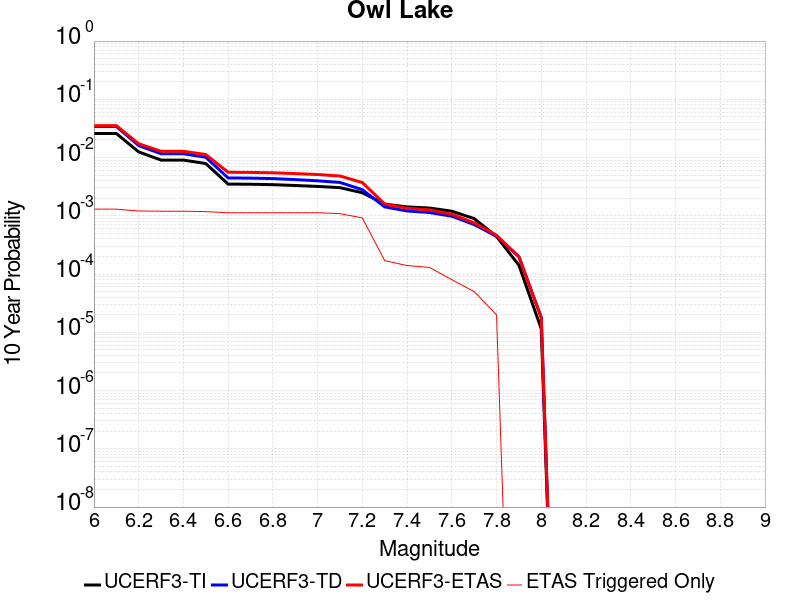 |

| Magnitude | 1 wk TI Prob | 1 wk TD Prob | 1 wk ETAS Prob | 1 wk ETAS/TD Gain | 1 wk ETAS Triggered Only | 1 mo TI Prob | 1 mo TD Prob | 1 mo ETAS Prob | 1 mo ETAS/TD Gain | 1 mo ETAS Triggered Only | 1 yr TI Prob | 1 yr TD Prob | 1 yr ETAS Prob | 1 yr ETAS/TD Gain | 1 yr ETAS Triggered Only | 10 yr TI Prob | 10 yr TD Prob | 10 yr ETAS Prob | 10 yr ETAS/TD Gain | 10 yr ETAS Triggered Only |
|-----|-----|-----|-----|-----|-----|-----|-----|-----|-----|-----|-----|-----|-----|-----|-----|-----|-----|-----|-----|-----|
| 6.0 | 5.0320643E-5 | 6.635841E-5 | 5.0632923E-4 | 7.63022 | 4.4E-4 | 2.1564208E-4 | 2.8436191E-4 | 9.541714E-4 | 3.3554823 | 6.7E-4 | 0.0026222812 | 0.003457515 | 0.0044241613 | 1.2795783 | 9.7E-4 | 0.02591553 | 0.03414095 | 0.035396565 | 1.0367775 | 0.0013 |
| 6.1 | 5.0320643E-5 | 6.635841E-5 | 5.0632923E-4 | 7.63022 | 4.4E-4 | 2.1564208E-4 | 2.8436191E-4 | 9.541714E-4 | 3.3554823 | 6.7E-4 | 0.0026222812 | 0.003457515 | 0.0044241613 | 1.2795783 | 9.7E-4 | 0.02591553 | 0.03414095 | 0.035396565 | 1.0367775 | 0.0013 |
| 6.2 | 2.4125871E-5 | 3.09802E-5 | 4.509672E-4 | 14.556625 | 4.2E-4 | 1.0339249E-4 | 1.327667E-4 | 7.726817E-4 | 5.819846 | 6.4E-4 | 0.0012580766 | 0.0016154092 | 0.002533923 | 1.5685952 | 9.2E-4 | 0.012509781 | 0.016070558 | 0.017261112 | 1.074083 | 0.00121 |
| 6.3 | 1.7433485E-5 | 2.2355298E-5 | 4.3234613E-4 | 19.339762 | 4.1E-4 | 7.471279E-5 | 9.5805786E-5 | 7.2574546E-4 | 7.5751734 | 6.3E-4 | 9.0924866E-4 | 0.0011659492 | 0.0020748882 | 1.77957 | 9.1E-4 | 0.009055373 | 0.011628982 | 0.012815027 | 1.1019905 | 0.0012 |
| 6.4 | 1.7433485E-5 | 2.2355298E-5 | 4.3234613E-4 | 19.339762 | 4.1E-4 | 7.471279E-5 | 9.5805786E-5 | 7.2574546E-4 | 7.5751734 | 6.3E-4 | 9.0924866E-4 | 0.0011659492 | 0.0020748882 | 1.77957 | 9.1E-4 | 0.009055373 | 0.011628982 | 0.012815027 | 1.1019905 | 0.0012 |
| 6.5 | 1.5182742E-5 | 1.9429051E-5 | 4.2942108E-4 | 22.102009 | 4.1E-4 | 6.506727E-5 | 8.3265564E-5 | 7.132131E-4 | 8.565523 | 6.3E-4 | 7.919061E-4 | 0.0010134227 | 0.0019125107 | 1.8871795 | 9.0E-4 | 0.0078909 | 0.010118514 | 0.011286574 | 1.1154379 | 0.00118 |
| 6.6 | 6.7271576E-6 | 8.547377E-6 | 4.1854387E-4 | 48.967525 | 4.1E-4 | 2.8830356E-5 | 3.6631132E-5 | 6.6660804E-4 | 18.197857 | 6.3E-4 | 3.5095305E-4 | 4.4589842E-4 | 0.0013155105 | 2.950247 | 8.7E-4 | 0.0035039932 | 0.004467895 | 0.0055928463 | 1.2517855 | 0.00113 |
| 6.7 | 6.682835E-6 | 8.47982E-6 | 4.1847635E-4 | 49.349674 | 4.1E-4 | 2.8640408E-5 | 3.634161E-5 | 6.663187E-4 | 18.33487 | 6.3E-4 | 3.4864116E-4 | 4.4237493E-4 | 0.0013119901 | 2.9657874 | 8.7E-4 | 0.003480947 | 0.0044328026 | 0.0055577937 | 1.2537878 | 0.00113 |
| 6.8 | 6.5774975E-6 | 8.326286E-6 | 4.1832286E-4 | 50.241234 | 4.1E-4 | 2.8188972E-5 | 3.5683628E-5 | 6.656611E-4 | 18.654526 | 6.3E-4 | 3.4314668E-4 | 4.343672E-4 | 0.0013039893 | 3.0020437 | 8.7E-4 | 0.0034261728 | 0.00435297 | 0.005478051 | 1.2584629 | 0.00113 |
| 6.9 | 6.363419E-6 | 7.99945E-6 | 4.1799617E-4 | 52.253117 | 4.1E-4 | 2.727151E-5 | 3.4282937E-5 | 6.6426134E-4 | 19.375858 | 6.3E-4 | 3.3198006E-4 | 4.173204E-4 | 0.0012869573 | 3.0838592 | 8.7E-4 | 0.0033148455 | 0.004182952 | 0.0053082253 | 1.2690141 | 0.00113 |
| 7.0 | 6.1342453E-6 | 7.63164E-6 | 4.176285E-4 | 54.723297 | 4.1E-4 | 2.6289357E-5 | 3.2706652E-5 | 6.6268607E-4 | 20.261507 | 6.3E-4 | 3.2002592E-4 | 3.981362E-4 | 0.0012677899 | 3.1843119 | 8.7E-4 | 0.0031956544 | 0.0039916327 | 0.005117122 | 1.2819622 | 0.00113 |
| 7.1 | 5.842926E-6 | 7.1421773E-6 | 4.0713933E-4 | 57.004932 | 4.0E-4 | 2.504087E-5 | 3.0609E-5 | 6.405903E-4 | 20.928167 | 6.1E-4 | 3.0482994E-4 | 3.726063E-4 | 0.0012222895 | 3.2803783 | 8.5E-4 | 0.0030441214 | 0.0037371595 | 0.004823086 | 1.2905754 | 0.00109 |
| 7.2 | 4.77173E-6 | 5.3583553E-6 | 3.153567E-4 | 58.853264 | 3.1E-4 | 2.045011E-5 | 2.2964201E-5 | 5.12953E-4 | 22.337069 | 4.9E-4 | 2.4895166E-4 | 2.7955734E-4 | 9.693644E-4 | 3.4674978 | 6.9E-4 | 0.0024867293 | 0.0028085853 | 0.0037260014 | 1.326647 | 9.2E-4 |
| 7.3 | 3.0494948E-6 | 2.7102524E-6 | 5.271012E-5 | 19.448418 | 5.0E-5 | 1.3069198E-5 | 1.1615316E-5 | 9.161438E-5 | 7.8873777 | 8.0E-5 | 1.5910587E-4 | 1.4140746E-4 | 2.4139333E-4 | 1.7070763 | 1.0E-4 | 0.0015899199 | 0.0014230711 | 0.0015928291 | 1.11929 | 1.7E-4 |
| 7.4 | 2.7263884E-6 | 2.3054622E-6 | 4.230537E-5 | 18.35006 | 4.0E-5 | 1.1684469E-5 | 9.880516E-6 | 6.987992E-5 | 7.072498 | 6.0E-5 | 1.4224913E-4 | 1.20288736E-4 | 2.0027912E-4 | 1.6649864 | 8.0E-5 | 0.0014215811 | 0.0012110462 | 0.0013508768 | 1.1154625 | 1.4E-4 |
| 7.5 | 2.6090431E-6 | 2.165403E-6 | 4.2165317E-5 | 19.472273 | 4.0E-5 | 1.1181565E-5 | 9.280266E-6 | 5.9279802E-5 | 6.387727 | 5.0E-5 | 1.3612706E-4 | 1.1298147E-4 | 1.8297357E-4 | 1.6195006 | 7.0E-5 | 0.001360437 | 0.0011377857 | 0.0012676378 | 1.114127 | 1.3E-4 |
| 7.6 | 2.3008756E-6 | 1.8725879E-6 | 4.1872514E-5 | 22.360773 | 4.0E-5 | 9.860858E-6 | 8.025352E-6 | 5.802495E-5 | 7.230206 | 5.0E-5 | 1.20049335E-4 | 9.770437E-5 | 1.4769948E-4 | 1.5116979 | 5.0E-5 | 0.001199845 | 9.84804E-4 | 0.0010647252 | 1.0811545 | 8.0E-5 |
| 7.7 | 1.7184348E-6 | 1.3417229E-6 | 3.1341682E-5 | 23.359282 | 3.0E-5 | 7.3646997E-6 | 5.7502284E-6 | 4.575E-5 | 7.9562054 | 4.0E-5 | 8.966153E-5 | 7.000682E-5 | 1.10004024E-4 | 1.5713329 | 4.0E-5 | 8.962536E-4 | 7.076213E-4 | 7.575859E-4 | 1.0706092 | 5.0E-5 |
| 7.8 | 8.4612907E-7 | 8.404941E-7 | 1.0840486E-5 | 12.897753 | 1.0E-5 | 3.6262625E-6 | 3.6021129E-6 | 1.3602077E-5 | 3.7761383 | 1.0E-5 | 4.4148852E-5 | 4.3854863E-5 | 5.3854426E-5 | 1.2280148 | 1.0E-5 | 4.414008E-4 | 4.4375105E-4 | 4.6374215E-4 | 1.0450503 | 2.0E-5 |
| 7.9 | 2.716738E-7 | 3.767946E-7 | 3.767946E-7 | 1.0 | 0.0 | 1.1643157E-6 | 1.614833E-6 | 1.614833E-6 | 1.0 | 0.0 | 1.4175452E-5 | 1.9660425E-5 | 1.9660425E-5 | 1.0 | 0.0 | 1.4174548E-4 | 1.981758E-4 | 1.981758E-4 | 1.0 | 0.0 |
| 8.0 | 2.1995428E-8 | 3.385256E-8 | 3.385256E-8 | 1.0 | 0.0 | 9.426611E-8 | 1.450824E-7 | 1.450824E-7 | 1.0 | 0.0 | 1.1476893E-6 | 1.7663774E-6 | 1.7663774E-6 | 1.0 | 0.0 | 1.14768345E-5 | 1.7869035E-5 | 1.7869035E-5 | 1.0 | 0.0 |

## Garlock (East)
*[(top)](#table-of-contents)*

| 1 Week | 1 Month | 1 Year | 10 Year |
|-----|-----|-----|-----|
|  |  |  |  |

| Magnitude | 1 wk TI Prob | 1 wk TD Prob | 1 wk ETAS Prob | 1 wk ETAS/TD Gain | 1 wk ETAS Triggered Only | 1 mo TI Prob | 1 mo TD Prob | 1 mo ETAS Prob | 1 mo ETAS/TD Gain | 1 mo ETAS Triggered Only | 1 yr TI Prob | 1 yr TD Prob | 1 yr ETAS Prob | 1 yr ETAS/TD Gain | 1 yr ETAS Triggered Only | 10 yr TI Prob | 10 yr TD Prob | 10 yr ETAS Prob | 10 yr ETAS/TD Gain | 10 yr ETAS Triggered Only |
|-----|-----|-----|-----|-----|-----|-----|-----|-----|-----|-----|-----|-----|-----|-----|-----|-----|-----|-----|-----|-----|
| 6.0 | 4.5092507E-5 | 6.290427E-5 | 4.2288163E-4 | 6.7226214 | 3.6E-4 | 1.9323928E-4 | 2.695644E-4 | 7.194431E-4 | 2.6689098 | 4.5E-4 | 0.0023501497 | 0.0032774536 | 0.0040648645 | 1.2402508 | 7.9E-4 | 0.023254504 | 0.03235496 | 0.033448398 | 1.0337951 | 0.00113 |
| 6.1 | 4.5092507E-5 | 6.290427E-5 | 4.2288163E-4 | 6.7226214 | 3.6E-4 | 1.9323928E-4 | 2.695644E-4 | 7.194431E-4 | 2.6689098 | 4.5E-4 | 0.0023501497 | 0.0032774536 | 0.0040648645 | 1.2402508 | 7.9E-4 | 0.023254504 | 0.03235496 | 0.033448398 | 1.0337951 | 0.00113 |
| 6.2 | 2.6674514E-5 | 3.4511064E-5 | 3.5450002E-4 | 10.272069 | 3.2E-4 | 1.1431433E-4 | 1.4789637E-4 | 5.5783574E-4 | 3.7718015 | 4.1E-4 | 0.0013908884 | 0.0017991841 | 0.0025178888 | 1.3994614 | 7.2E-4 | 0.01382215 | 0.017874004 | 0.018895416 | 1.0571451 | 0.00104 |
| 6.3 | 2.6674514E-5 | 3.4511064E-5 | 3.5450002E-4 | 10.272069 | 3.2E-4 | 1.1431433E-4 | 1.4789637E-4 | 5.5783574E-4 | 3.7718015 | 4.1E-4 | 0.0013908884 | 0.0017991841 | 0.0025178888 | 1.3994614 | 7.2E-4 | 0.01382215 | 0.017874004 | 0.018895416 | 1.0571451 | 0.00104 |
| 6.4 | 2.5312667E-5 | 3.2339947E-5 | 3.523296E-4 | 10.894564 | 3.2E-4 | 1.0847834E-4 | 1.3859257E-4 | 5.485357E-4 | 3.9579015 | 4.1E-4 | 0.0013199237 | 0.0016860879 | 0.002404874 | 1.426304 | 7.2E-4 | 0.013121112 | 0.016773503 | 0.01779606 | 1.0609626 | 0.00104 |
| 6.5 | 2.5312667E-5 | 3.2339947E-5 | 3.523296E-4 | 10.894564 | 3.2E-4 | 1.0847834E-4 | 1.3859257E-4 | 5.485357E-4 | 3.9579015 | 4.1E-4 | 0.0013199237 | 0.0016860879 | 0.002404874 | 1.426304 | 7.2E-4 | 0.013121112 | 0.016773503 | 0.01779606 | 1.0609626 | 0.00104 |
| 6.6 | 2.246556E-5 | 2.8134184E-5 | 3.4812518E-4 | 12.373743 | 3.2E-4 | 9.627742E-5 | 1.2056964E-4 | 5.305202E-4 | 4.4001145 | 4.1E-4 | 0.0011715472 | 0.0014669704 | 0.0021859142 | 1.4900874 | 7.2E-4 | 0.011653901 | 0.014614102 | 0.01562905 | 1.0694499 | 0.00103 |
| 6.7 | 2.2241198E-5 | 2.7803926E-5 | 3.4779502E-4 | 12.508845 | 3.2E-4 | 9.531594E-5 | 1.1915438E-4 | 5.2910554E-4 | 4.4405046 | 4.1E-4 | 0.0011598538 | 0.0014497626 | 0.0021687187 | 1.495913 | 7.2E-4 | 0.011538187 | 0.014443748 | 0.015458871 | 1.0702811 | 0.00103 |
| 6.8 | 1.9528685E-5 | 2.3898472E-5 | 3.4389083E-4 | 14.389658 | 3.2E-4 | 8.369167E-5 | 1.0241811E-4 | 5.1237614E-4 | 5.002788 | 4.1E-4 | 0.0010184698 | 0.0012462469 | 0.0019453745 | 1.5609864 | 7.0E-4 | 0.010138147 | 0.012437571 | 0.013425133 | 1.0794015 | 0.001 |
| 6.9 | 1.3318621E-5 | 1.5198411E-5 | 3.3519356E-4 | 22.054512 | 3.2E-4 | 5.7078556E-5 | 6.513445E-5 | 4.7510775E-4 | 7.2942615 | 4.1E-4 | 6.9470983E-4 | 7.9272914E-4 | 0.0014821822 | 1.8697208 | 6.9E-4 | 0.0069254204 | 0.007940531 | 0.008902828 | 1.121188 | 9.7E-4 |
| 7.0 | 1.1760853E-5 | 1.3107256E-5 | 3.231032E-4 | 24.650713 | 3.1E-4 | 5.0402683E-5 | 5.6172772E-5 | 4.4615087E-4 | 7.942476 | 3.9E-4 | 6.134799E-4 | 6.836939E-4 | 0.0013432427 | 1.9646842 | 6.6E-4 | 0.0061178906 | 0.006857147 | 0.00778077 | 1.1346949 | 9.3E-4 |
| 7.1 | 1.0064758E-5 | 1.0902388E-5 | 3.20899E-4 | 29.433828 | 3.1E-4 | 4.3133965E-5 | 4.67237E-5 | 4.2670596E-4 | 9.132537 | 3.8E-4 | 5.2502943E-4 | 5.687161E-4 | 0.0012083522 | 2.1247017 | 6.4E-4 | 0.005237907 | 0.0057130987 | 0.0066079567 | 1.1566328 | 9.0E-4 |
| 7.2 | 9.768808E-6 | 1.049826E-5 | 3.2049502E-4 | 30.528395 | 3.1E-4 | 4.186565E-5 | 4.4991786E-5 | 4.2497469E-4 | 9.445606 | 3.8E-4 | 5.095951E-4 | 5.476408E-4 | 0.0011772958 | 2.149759 | 6.3E-4 | 0.0050842804 | 0.0055033076 | 0.0063884095 | 1.160831 | 8.9E-4 |
| 7.3 | 9.344516E-6 | 9.943912E-6 | 2.7994122E-4 | 28.152021 | 2.7E-4 | 4.004731E-5 | 4.261609E-5 | 3.826016E-4 | 8.977867 | 3.4E-4 | 4.8746695E-4 | 5.1873084E-4 | 0.0010884352 | 2.0982656 | 5.7E-4 | 0.0048639905 | 0.0052149626 | 0.006010791 | 1.1526047 | 8.0E-4 |
| 7.4 | 9.023491E-6 | 9.490095E-6 | 2.494878E-4 | 26.289286 | 2.4E-4 | 3.867153E-5 | 4.067122E-5 | 3.506586E-4 | 8.621787 | 3.1E-4 | 4.7072413E-4 | 4.9506297E-4 | 0.0010048104 | 2.029662 | 5.1E-4 | 0.004697283 | 0.004978356 | 0.005674871 | 1.1399087 | 7.0E-4 |
| 7.5 | 7.081253E-6 | 7.0870797E-6 | 1.2708623E-4 | 17.932102 | 1.2E-4 | 3.0347876E-5 | 3.0372848E-5 | 1.803683E-4 | 5.9384713 | 1.5E-4 | 3.6942272E-4 | 3.697274E-4 | 6.096387E-4 | 1.6488869 | 2.4E-4 | 0.003688092 | 0.0037239692 | 0.0040925913 | 1.0989864 | 3.7E-4 |
| 7.6 | 6.116396E-6 | 5.958634E-6 | 9.59581E-5 | 16.104042 | 9.0E-5 | 2.6212863E-5 | 2.5536756E-5 | 1.4553369E-4 | 5.698989 | 1.2E-4 | 3.1909486E-4 | 3.108659E-4 | 4.9080997E-4 | 1.5788478 | 1.8E-4 | 0.0031863707 | 0.003135549 | 0.0033947336 | 1.0826601 | 2.6E-4 |
| 7.7 | 4.797145E-6 | 4.7568233E-6 | 4.4756634E-5 | 9.408934 | 4.0E-5 | 2.055903E-5 | 2.0386226E-5 | 8.0385005E-5 | 3.9431036 | 6.0E-5 | 2.5027743E-4 | 2.4817415E-4 | 3.5814688E-4 | 1.4431272 | 1.1E-4 | 0.0024999576 | 0.0025091725 | 0.0026488213 | 1.0556552 | 1.4E-4 |
| 7.8 | 3.4028885E-6 | 3.9781057E-6 | 2.3978026E-5 | 6.0274982 | 2.0E-5 | 1.4583726E-5 | 1.7048915E-5 | 5.7048233E-5 | 3.3461504 | 4.0E-5 | 1.775424E-4 | 2.0755084E-4 | 2.8753423E-4 | 1.3853678 | 8.0E-5 | 0.0017740062 | 0.002101066 | 0.0022008559 | 1.0474949 | 1.0E-4 |
| 7.9 | 2.5928412E-6 | 3.3722088E-6 | 1.3372175E-5 | 3.9654055 | 1.0E-5 | 1.1112129E-5 | 1.4452244E-5 | 3.4451954E-5 | 2.3838482 | 2.0E-5 | 1.3528178E-4 | 1.7594192E-4 | 2.2593312E-4 | 1.2841347 | 5.0E-5 | 0.0013519945 | 0.0017811462 | 0.0018410393 | 1.0336262 | 6.0E-5 |
| 8.0 | 1.3743648E-6 | 1.673372E-6 | 1.1673355E-5 | 6.975948 | 1.0E-5 | 5.8901214E-6 | 7.1715745E-6 | 1.7171504E-5 | 2.394384 | 1.0E-5 | 7.1709874E-5 | 8.731045E-5 | 9.730958E-5 | 1.1145238 | 1.0E-5 | 7.1686733E-4 | 8.8365114E-4 | 9.036335E-4 | 1.0226134 | 2.0E-5 |
| 8.1 | 3.6733252E-7 | 3.1487303E-7 | 1.03148695E-5 | 32.758823 | 1.0E-5 | 1.5742813E-6 | 1.3494553E-6 | 1.1349442E-5 | 8.410387 | 1.0E-5 | 1.9166706E-5 | 1.642951E-5 | 2.6429347E-5 | 1.6086509 | 1.0E-5 | 1.9165053E-4 | 1.6628111E-4 | 1.8627779E-4 | 1.1202582 | 2.0E-5 |

## Hunter Mountain-Saline Valley
*[(top)](#table-of-contents)*

| 1 Week | 1 Month | 1 Year | 10 Year |
|-----|-----|-----|-----|
|  |  |  |  |

| Magnitude | 1 wk TI Prob | 1 wk TD Prob | 1 wk ETAS Prob | 1 wk ETAS/TD Gain | 1 wk ETAS Triggered Only | 1 mo TI Prob | 1 mo TD Prob | 1 mo ETAS Prob | 1 mo ETAS/TD Gain | 1 mo ETAS Triggered Only | 1 yr TI Prob | 1 yr TD Prob | 1 yr ETAS Prob | 1 yr ETAS/TD Gain | 1 yr ETAS Triggered Only | 10 yr TI Prob | 10 yr TD Prob | 10 yr ETAS Prob | 10 yr ETAS/TD Gain | 10 yr ETAS Triggered Only |
|-----|-----|-----|-----|-----|-----|-----|-----|-----|-----|-----|-----|-----|-----|-----|-----|-----|-----|-----|-----|-----|
| 6.0 | 4.5103672E-5 | 5.4568674E-5 | 4.7454576E-4 | 8.696303 | 4.2E-4 | 1.9328714E-4 | 2.3384552E-4 | 7.737192E-4 | 3.3086767 | 5.4E-4 | 0.002350731 | 0.0028435262 | 0.0035913936 | 1.263007 | 7.5E-4 | 0.023260195 | 0.028093081 | 0.029103864 | 1.0359797 | 0.00104 |
| 6.1 | 4.5103672E-5 | 5.4568674E-5 | 4.7454576E-4 | 8.696303 | 4.2E-4 | 1.9328714E-4 | 2.3384552E-4 | 7.737192E-4 | 3.3086767 | 5.4E-4 | 0.002350731 | 0.0028435262 | 0.0035913936 | 1.263007 | 7.5E-4 | 0.023260195 | 0.028093081 | 0.029103864 | 1.0359797 | 0.00104 |
| 6.2 | 3.9363465E-5 | 4.7062385E-5 | 4.670426E-4 | 9.923904 | 4.2E-4 | 1.6868966E-4 | 2.0168122E-4 | 7.415723E-4 | 3.6769528 | 5.4E-4 | 0.002051862 | 0.0024528366 | 0.003200997 | 1.3050184 | 7.5E-4 | 0.020330196 | 0.024274675 | 0.02528943 | 1.041803 | 0.00104 |
| 6.3 | 3.9363465E-5 | 4.7062385E-5 | 4.670426E-4 | 9.923904 | 4.2E-4 | 1.6868966E-4 | 2.0168122E-4 | 7.415723E-4 | 3.6769528 | 5.4E-4 | 0.002051862 | 0.0024528366 | 0.003200997 | 1.3050184 | 7.5E-4 | 0.020330196 | 0.024274675 | 0.02528943 | 1.041803 | 0.00104 |
| 6.4 | 3.2311684E-5 | 3.7950864E-5 | 4.5793492E-4 | 12.066522 | 4.2E-4 | 1.384713E-4 | 1.6263683E-4 | 7.02549E-4 | 4.3197412 | 5.4E-4 | 0.0016845843 | 0.0019783739 | 0.0027268901 | 1.3783492 | 7.5E-4 | 0.016718714 | 0.019617645 | 0.020637242 | 1.0519735 | 0.00104 |
| 6.5 | 3.2311684E-5 | 3.7950864E-5 | 4.5793492E-4 | 12.066522 | 4.2E-4 | 1.384713E-4 | 1.6263683E-4 | 7.02549E-4 | 4.3197412 | 5.4E-4 | 0.0016845843 | 0.0019783739 | 0.0027268901 | 1.3783492 | 7.5E-4 | 0.016718714 | 0.019617645 | 0.020637242 | 1.0519735 | 0.00104 |
| 6.6 | 2.9305844E-5 | 3.4181736E-5 | 4.5416737E-4 | 13.286844 | 4.2E-4 | 1.2559042E-4 | 1.4648527E-4 | 6.8640616E-4 | 4.6858373 | 5.4E-4 | 0.0015279909 | 0.0017820608 | 0.0025207421 | 1.4145095 | 7.4E-4 | 0.015175272 | 0.017686864 | 0.018698646 | 1.0572053 | 0.00103 |
| 6.7 | 2.7826512E-5 | 3.2344138E-5 | 4.5233054E-4 | 13.984932 | 4.2E-4 | 1.19251024E-4 | 1.386107E-4 | 6.7853584E-4 | 4.8952627 | 5.4E-4 | 0.0014509142 | 0.0016863393 | 0.0024250913 | 1.4380803 | 7.4E-4 | 0.014414776 | 0.016744364 | 0.017757118 | 1.0604832 | 0.00103 |
| 6.8 | 2.3389874E-5 | 2.686661E-5 | 4.4685532E-4 | 16.632368 | 4.2E-4 | 1.0023846E-4 | 1.15137795E-4 | 6.450768E-4 | 5.60265 | 5.3E-4 | 0.00121972 | 0.0014009486 | 0.0021299259 | 1.5203456 | 7.3E-4 | 0.01213047 | 0.013928632 | 0.014924564 | 1.0715024 | 0.00101 |
| 6.9 | 2.069209E-5 | 2.3569948E-5 | 4.4356004E-4 | 18.818882 | 4.2E-4 | 8.867737E-5 | 1.0101035E-4 | 6.3095684E-4 | 6.246457 | 5.3E-4 | 0.0010791123 | 0.0012291434 | 0.0019482584 | 1.5850538 | 7.2E-4 | 0.010738871 | 0.012229734 | 0.013217504 | 1.0807679 | 0.001 |
| 7.0 | 1.7462342E-5 | 1.9633484E-5 | 4.3962523E-4 | 22.391605 | 4.2E-4 | 7.483646E-5 | 8.414092E-5 | 6.140963E-4 | 7.2984266 | 5.3E-4 | 9.1075303E-4 | 0.0010239568 | 0.0017332298 | 1.6926786 | 7.1E-4 | 0.009070295 | 0.010197277 | 0.011177182 | 1.0960947 | 9.9E-4 |
| 7.1 | 1.4807709E-5 | 1.6441705E-5 | 4.364348E-4 | 26.544376 | 4.2E-4 | 6.3460066E-5 | 7.0462636E-5 | 6.004253E-4 | 8.521187 | 5.3E-4 | 7.723524E-4 | 8.575615E-4 | 0.0015669526 | 1.827219 | 7.1E-4 | 0.007696735 | 0.008546768 | 0.009528306 | 1.1148432 | 9.9E-4 |
| 7.2 | 1.4180048E-5 | 1.5698295E-5 | 4.356917E-4 | 27.754078 | 4.2E-4 | 6.077022E-5 | 6.7276764E-5 | 5.972411E-4 | 8.877376 | 5.3E-4 | 7.396263E-4 | 8.18803E-4 | 0.0015282216 | 1.8664094 | 7.1E-4 | 0.0073716943 | 0.008162071 | 0.00914399 | 1.1203028 | 9.9E-4 |
| 7.3 | 1.3730402E-5 | 1.5172035E-5 | 4.3516565E-4 | 28.68209 | 4.2E-4 | 5.8843252E-5 | 6.502148E-5 | 5.849877E-4 | 8.996838 | 5.2E-4 | 7.161811E-4 | 7.9136505E-4 | 0.0014908111 | 1.8838476 | 7.0E-4 | 0.007138774 | 0.007889661 | 0.008861929 | 1.1232332 | 9.8E-4 |
| 7.4 | 1.2810095E-5 | 1.4109242E-5 | 4.341033E-4 | 30.767303 | 4.2E-4 | 5.489925E-5 | 6.0466868E-5 | 5.8043544E-4 | 9.599231 | 5.2E-4 | 6.681934E-4 | 7.3595124E-4 | 0.0014354361 | 1.95045 | 7.0E-4 | 0.006661878 | 0.0073392955 | 0.008312102 | 1.1325479 | 9.8E-4 |
| 7.5 | 1.1595659E-5 | 1.2800624E-5 | 4.3279523E-4 | 33.810482 | 4.2E-4 | 4.9694736E-5 | 5.4858752E-5 | 5.748302E-4 | 10.478369 | 5.2E-4 | 6.0486543E-4 | 6.677163E-4 | 0.0013572556 | 2.0326831 | 6.9E-4 | 0.006032217 | 0.006661239 | 0.007614844 | 1.1431574 | 9.6E-4 |
| 7.6 | 2.997694E-6 | 3.3251215E-6 | 2.2332439E-4 | 67.16278 | 2.2E-4 | 1.28471975E-5 | 1.4250483E-5 | 3.1424622E-4 | 22.051617 | 3.0E-4 | 1.564034E-4 | 1.734931E-4 | 5.134341E-4 | 2.959392 | 3.4E-4 | 0.0015629337 | 0.0017361854 | 0.0021953867 | 1.2644887 | 4.6E-4 |

## Garlock (West)
*[(top)](#table-of-contents)*

| 1 Week | 1 Month | 1 Year | 10 Year |
|-----|-----|-----|-----|
|  |  |  |  |

| Magnitude | 1 wk TI Prob | 1 wk TD Prob | 1 wk ETAS Prob | 1 wk ETAS/TD Gain | 1 wk ETAS Triggered Only | 1 mo TI Prob | 1 mo TD Prob | 1 mo ETAS Prob | 1 mo ETAS/TD Gain | 1 mo ETAS Triggered Only | 1 yr TI Prob | 1 yr TD Prob | 1 yr ETAS Prob | 1 yr ETAS/TD Gain | 1 yr ETAS Triggered Only | 10 yr TI Prob | 10 yr TD Prob | 10 yr ETAS Prob | 10 yr ETAS/TD Gain | 10 yr ETAS Triggered Only |
|-----|-----|-----|-----|-----|-----|-----|-----|-----|-----|-----|-----|-----|-----|-----|-----|-----|-----|-----|-----|-----|
| 6.0 | 2.5181727E-5 | 2.519625E-5 | 2.2519121E-4 | 8.937489 | 2.0E-4 | 1.0791722E-4 | 1.0797948E-4 | 3.8794926E-4 | 3.5928051 | 2.8E-4 | 0.0013131002 | 0.0013138608 | 0.0017233221 | 1.3116474 | 4.1E-4 | 0.013053683 | 0.013141131 | 0.013822064 | 1.0518169 | 6.9E-4 |
| 6.1 | 2.5077732E-5 | 2.5097293E-5 | 2.2509227E-4 | 8.968787 | 2.0E-4 | 1.0747157E-4 | 1.0755541E-4 | 3.875253E-4 | 3.6030293 | 2.8E-4 | 0.001307681 | 0.0013087039 | 0.0017181674 | 1.312877 | 4.1E-4 | 0.013000126 | 0.013090172 | 0.013771139 | 1.0520213 | 6.9E-4 |
| 6.2 | 2.494612E-5 | 2.4978985E-5 | 2.2497399E-4 | 9.006531 | 2.0E-4 | 1.0690756E-4 | 1.0704842E-4 | 3.8701846E-4 | 3.6153588 | 2.8E-4 | 0.0013008224 | 0.0013025387 | 0.0017120047 | 1.3143599 | 4.1E-4 | 0.012932341 | 0.013029243 | 0.013710253 | 1.0522678 | 6.9E-4 |
| 6.3 | 2.4733758E-5 | 2.4798346E-5 | 2.2479339E-4 | 9.064854 | 2.0E-4 | 1.0599751E-4 | 1.0627432E-4 | 3.8624456E-4 | 3.634411 | 2.8E-4 | 0.0012897556 | 0.0012931252 | 0.001702595 | 1.3166513 | 4.1E-4 | 0.012822957 | 0.012936208 | 0.013617283 | 1.0526487 | 6.9E-4 |
| 6.4 | 2.3237335E-5 | 2.3177683E-5 | 2.2317305E-4 | 9.62879 | 2.0E-4 | 9.958477E-5 | 9.932916E-5 | 3.6930235E-4 | 3.717965 | 2.7E-4 | 0.0012117702 | 0.0012086645 | 0.001608181 | 1.3305438 | 4.0E-4 | 0.012051838 | 0.012101071 | 0.012753084 | 1.0538806 | 6.6E-4 |
| 6.5 | 2.2732203E-5 | 2.2992053E-5 | 2.2298745E-4 | 9.698458 | 2.0E-4 | 9.742009E-5 | 9.853367E-5 | 3.6850706E-4 | 3.7399104 | 2.7E-4 | 0.0011854442 | 0.0011989899 | 0.0015985103 | 1.3332142 | 4.0E-4 | 0.011791403 | 0.012005375 | 0.012657451 | 1.0543153 | 6.6E-4 |
| 6.6 | 2.1319436E-5 | 2.1772283E-5 | 2.2176793E-4 | 10.185792 | 2.0E-4 | 9.136581E-5 | 9.330646E-5 | 3.6328126E-4 | 3.8934205 | 2.7E-4 | 0.001111811 | 0.0011354164 | 0.0015349622 | 1.3518937 | 4.0E-4 | 0.011062649 | 0.011376292 | 0.0120287845 | 1.0573554 | 6.6E-4 |
| 6.7 | 1.970802E-5 | 2.0392179E-5 | 2.203881E-4 | 10.807482 | 2.0E-4 | 8.446021E-5 | 8.739214E-5 | 3.5736855E-4 | 4.089253 | 2.7E-4 | 0.001027818 | 0.0010634817 | 0.0014630562 | 1.3757231 | 4.0E-4 | 0.010230771 | 0.01066403 | 0.011316992 | 1.0612303 | 6.6E-4 |
| 6.8 | 1.8744462E-5 | 1.9899864E-5 | 2.1989588E-4 | 11.050119 | 2.0E-4 | 8.033094E-5 | 8.528236E-5 | 3.5525934E-4 | 4.1656837 | 2.7E-4 | 9.775903E-4 | 0.0010378198 | 0.0014374047 | 1.3850234 | 4.0E-4 | 0.009733009 | 0.010409822 | 0.011062952 | 1.0627416 | 6.6E-4 |
| 6.9 | 1.7559682E-5 | 1.8952243E-5 | 2.1894845E-4 | 11.55264 | 2.0E-4 | 7.5253614E-5 | 8.1221384E-5 | 3.5119944E-4 | 4.323978 | 2.7E-4 | 9.158276E-4 | 9.884231E-4 | 0.0013880278 | 1.404285 | 4.0E-4 | 0.0091206245 | 0.009920391 | 0.0105738435 | 1.0658697 | 6.6E-4 |
| 7.0 | 1.6794445E-5 | 1.8215069E-5 | 2.1821143E-4 | 11.97972 | 2.0E-4 | 7.197421E-5 | 7.806226E-5 | 3.4804118E-4 | 4.458508 | 2.7E-4 | 8.759337E-4 | 9.4999495E-4 | 0.0013496149 | 1.4206549 | 4.0E-4 | 0.008724891 | 0.009539245 | 0.010192949 | 1.0685278 | 6.6E-4 |
| 7.1 | 1.6337795E-5 | 1.7715876E-5 | 2.1771234E-4 | 12.289109 | 2.0E-4 | 7.0017246E-5 | 7.592298E-5 | 3.459025E-4 | 4.5559654 | 2.7E-4 | 8.521265E-4 | 9.2397165E-4 | 0.001323602 | 1.4325137 | 4.0E-4 | 0.008488664 | 0.009281053 | 0.009934928 | 1.0704526 | 6.6E-4 |
| 7.2 | 1.5780008E-5 | 1.716451E-5 | 2.1716108E-4 | 12.651749 | 2.0E-4 | 6.762685E-5 | 7.356012E-5 | 3.4354025E-4 | 4.670197 | 2.7E-4 | 8.2304585E-4 | 8.952278E-4 | 0.0012948697 | 1.4464136 | 4.0E-4 | 0.008200042 | 0.008995891 | 0.009649953 | 1.0727068 | 6.6E-4 |
| 7.3 | 1.5058865E-5 | 1.6617598E-5 | 2.0661444E-4 | 12.433472 | 1.9E-4 | 6.45364E-5 | 7.1216346E-5 | 3.3119784E-4 | 4.6505876 | 2.6E-4 | 7.854473E-4 | 8.667153E-4 | 0.0012563772 | 1.4495847 | 3.9E-4 | 0.00782677 | 0.008712597 | 0.009356934 | 1.0739546 | 6.5E-4 |
| 7.4 | 1.4887923E-5 | 1.645357E-5 | 1.9645061E-4 | 11.939694 | 1.8E-4 | 6.380382E-5 | 7.05134E-5 | 3.1049649E-4 | 4.4033685 | 2.4E-4 | 7.7653467E-4 | 8.5816375E-4 | 0.0012278463 | 1.4307832 | 3.7E-4 | 0.0077382675 | 0.0086274315 | 0.009251996 | 1.072393 | 6.3E-4 |
| 7.5 | 1.4509299E-5 | 1.6045597E-5 | 1.960427E-4 | 12.217852 | 1.8E-4 | 6.218123E-5 | 6.876503E-5 | 2.9874922E-4 | 4.344493 | 2.3E-4 | 7.567935E-4 | 8.368939E-4 | 0.001186601 | 1.4178631 | 3.5E-4 | 0.0075422134 | 0.00841572 | 0.009010672 | 1.0706952 | 6.0E-4 |
| 7.6 | 1.2756717E-5 | 1.40496895E-5 | 1.6404758E-4 | 11.676243 | 1.5E-4 | 5.4670498E-5 | 6.021157E-5 | 2.5020013E-4 | 4.1553497 | 1.9E-4 | 6.6541E-4 | 7.3282997E-4 | 9.926395E-4 | 1.354529 | 2.6E-4 | 0.006634211 | 0.007380847 | 0.007797747 | 1.056484 | 4.2E-4 |
| 7.7 | 1.0328985E-5 | 1.1459538E-5 | 1.0145851E-4 | 8.85363 | 9.0E-5 | 4.4266326E-5 | 4.9111382E-5 | 1.691055E-4 | 3.4433053 | 1.2E-4 | 5.388092E-4 | 5.977675E-4 | 7.776599E-4 | 1.3009404 | 1.8E-4 | 0.0053750467 | 0.006037873 | 0.006296303 | 1.0428015 | 2.6E-4 |
| 7.8 | 7.0306583E-6 | 8.89889E-6 | 4.8898535E-5 | 5.4949026 | 4.0E-5 | 3.0131043E-5 | 3.8137543E-5 | 9.813526E-5 | 2.5731928 | 6.0E-5 | 3.667837E-4 | 4.6422583E-4 | 5.7417474E-4 | 1.2368436 | 1.1E-4 | 0.003661789 | 0.004694754 | 0.0048739086 | 1.0381607 | 1.8E-4 |
| 7.9 | 4.060633E-6 | 5.46505E-6 | 1.5464995E-5 | 2.8297994 | 1.0E-5 | 1.7402595E-5 | 2.3421433E-5 | 4.3420965E-5 | 1.8538988 | 2.0E-5 | 2.11856E-4 | 2.8511873E-4 | 3.3510447E-4 | 1.1753155 | 5.0E-5 | 0.0021165414 | 0.0028838275 | 0.0029536257 | 1.0242033 | 7.0E-5 |
| 8.0 | 1.6729537E-6 | 2.077398E-6 | 1.20773775E-5 | 5.813704 | 1.0E-5 | 7.169782E-6 | 8.903104E-6 | 1.8903014E-5 | 2.1231937 | 1.0E-5 | 8.7288594E-5 | 1.0838993E-4 | 1.1838885E-4 | 1.0922495 | 1.0E-5 | 8.7254314E-4 | 0.0010967436 | 0.0011167217 | 1.0182158 | 2.0E-5 |
| 8.1 | 3.6733252E-7 | 3.1487303E-7 | 1.03148695E-5 | 32.758823 | 1.0E-5 | 1.5742813E-6 | 1.3494553E-6 | 1.1349442E-5 | 8.410387 | 1.0E-5 | 1.9166706E-5 | 1.642951E-5 | 2.6429347E-5 | 1.6086509 | 1.0E-5 | 1.9165053E-4 | 1.6628111E-4 | 1.8627779E-4 | 1.1202582 | 2.0E-5 |

## Ash Hill
*[(top)](#table-of-contents)*

| 1 Week | 1 Month | 1 Year | 10 Year |
|-----|-----|-----|-----|
|  |  |  |  |

| Magnitude | 1 wk TI Prob | 1 wk TD Prob | 1 wk ETAS Prob | 1 wk ETAS/TD Gain | 1 wk ETAS Triggered Only | 1 mo TI Prob | 1 mo TD Prob | 1 mo ETAS Prob | 1 mo ETAS/TD Gain | 1 mo ETAS Triggered Only | 1 yr TI Prob | 1 yr TD Prob | 1 yr ETAS Prob | 1 yr ETAS/TD Gain | 1 yr ETAS Triggered Only | 10 yr TI Prob | 10 yr TD Prob | 10 yr ETAS Prob | 10 yr ETAS/TD Gain | 10 yr ETAS Triggered Only |
|-----|-----|-----|-----|-----|-----|-----|-----|-----|-----|-----|-----|-----|-----|-----|-----|-----|-----|-----|-----|-----|
| 6.0 | 2.1545662E-5 | 2.31944E-5 | 1.2319208E-4 | 5.3112855 | 1.0E-4 | 9.2335285E-5 | 9.940123E-5 | 2.7938333E-4 | 2.8106627 | 1.8E-4 | 0.0011236023 | 0.001209618 | 0.0014693036 | 1.2146839 | 2.6E-4 | 0.011179381 | 0.012038324 | 0.012423629 | 1.0320065 | 3.9E-4 |
| 6.1 | 2.1545662E-5 | 2.31944E-5 | 1.2319208E-4 | 5.3112855 | 1.0E-4 | 9.2335285E-5 | 9.940123E-5 | 2.7938333E-4 | 2.8106627 | 1.8E-4 | 0.0011236023 | 0.001209618 | 0.0014693036 | 1.2146839 | 2.6E-4 | 0.011179381 | 0.012038324 | 0.012423629 | 1.0320065 | 3.9E-4 |
| 6.2 | 2.1545662E-5 | 2.31944E-5 | 1.2319208E-4 | 5.3112855 | 1.0E-4 | 9.2335285E-5 | 9.940123E-5 | 2.7938333E-4 | 2.8106627 | 1.8E-4 | 0.0011236023 | 0.001209618 | 0.0014693036 | 1.2146839 | 2.6E-4 | 0.011179381 | 0.012038324 | 0.012423629 | 1.0320065 | 3.9E-4 |
| 6.3 | 1.0025529E-5 | 1.0746914E-5 | 4.0746592E-5 | 3.791469 | 3.0E-5 | 4.2965847E-5 | 4.6057463E-5 | 1.2605378E-4 | 2.7368805 | 8.0E-5 | 5.229836E-4 | 5.606186E-4 | 7.005401E-4 | 1.2495842 | 1.4E-4 | 0.005217545 | 0.0055933557 | 0.005822069 | 1.0408902 | 2.3E-4 |
| 6.4 | 1.0025529E-5 | 1.0746914E-5 | 4.0746592E-5 | 3.791469 | 3.0E-5 | 4.2965847E-5 | 4.6057463E-5 | 1.2605378E-4 | 2.7368805 | 8.0E-5 | 5.229836E-4 | 5.606186E-4 | 7.005401E-4 | 1.2495842 | 1.4E-4 | 0.005217545 | 0.0055933557 | 0.005822069 | 1.0408902 | 2.3E-4 |
| 6.5 | 6.9617327E-6 | 7.45662E-6 | 2.745647E-5 | 3.6821604 | 2.0E-5 | 2.9835655E-5 | 3.19566E-5 | 8.1955004E-5 | 2.564572 | 5.0E-5 | 3.6318856E-4 | 3.8901082E-4 | 4.689797E-4 | 1.2055699 | 8.0E-5 | 0.0036259557 | 0.003884153 | 0.004013648 | 1.0333394 | 1.3E-4 |
| 6.6 | 4.9919777E-6 | 5.3466783E-6 | 5.3466783E-6 | 1.0 | 0.0 | 2.1394015E-5 | 2.2914171E-5 | 5.2913485E-5 | 2.3092034 | 3.0E-5 | 2.60441E-4 | 2.7895102E-4 | 3.2893708E-4 | 1.1791929 | 5.0E-5 | 0.0026013597 | 0.0027866673 | 0.0028664444 | 1.0286281 | 8.0E-5 |
| 6.7 | 3.6630722E-6 | 3.924616E-6 | 3.924616E-6 | 1.0 | 0.0 | 1.5698786E-5 | 1.6819708E-5 | 3.6819372E-5 | 2.1890614 | 2.0E-5 | 1.9111596E-4 | 2.0476643E-4 | 2.4475824E-4 | 1.1953045 | 4.0E-5 | 0.0019095168 | 0.0020463406 | 0.0020962383 | 1.0243839 | 5.0E-5 |
| 6.8 | 2.5599613E-6 | 2.7449198E-6 | 2.7449198E-6 | 1.0 | 0.0 | 1.0971216E-5 | 1.17639165E-5 | 2.1763799E-5 | 1.850047 | 1.0E-5 | 1.3356637E-4 | 1.4322122E-4 | 1.6321836E-4 | 1.1396241 | 2.0E-5 | 0.0013348613 | 0.0014317741 | 0.0014617312 | 1.020923 | 3.0E-5 |
| 6.9 | 1.7684905E-6 | 1.896867E-6 | 1.896867E-6 | 1.0 | 0.0 | 7.579223E-6 | 8.12943E-6 | 1.8129349E-5 | 2.2300885 | 1.0E-5 | 9.2273134E-5 | 9.897581E-5 | 1.08974826E-4 | 1.1010247 | 1.0E-5 | 9.223483E-4 | 9.897582E-4 | 9.997482E-4 | 1.0100935 | 1.0E-5 |

## So Sierra Nevada
*[(top)](#table-of-contents)*

| 1 Week | 1 Month | 1 Year | 10 Year |
|-----|-----|-----|-----|
|  |  |  |  |

| Magnitude | 1 wk TI Prob | 1 wk TD Prob | 1 wk ETAS Prob | 1 wk ETAS/TD Gain | 1 wk ETAS Triggered Only | 1 mo TI Prob | 1 mo TD Prob | 1 mo ETAS Prob | 1 mo ETAS/TD Gain | 1 mo ETAS Triggered Only | 1 yr TI Prob | 1 yr TD Prob | 1 yr ETAS Prob | 1 yr ETAS/TD Gain | 1 yr ETAS Triggered Only | 10 yr TI Prob | 10 yr TD Prob | 10 yr ETAS Prob | 10 yr ETAS/TD Gain | 10 yr ETAS Triggered Only |
|-----|-----|-----|-----|-----|-----|-----|-----|-----|-----|-----|-----|-----|-----|-----|-----|-----|-----|-----|-----|-----|
| 6.0 | 1.15488665E-5 | 1.1079595E-5 | 1.21078374E-4 | 10.92805 | 1.1E-4 | 4.9494203E-5 | 4.7483187E-5 | 1.8747654E-4 | 3.948272 | 1.4E-4 | 6.024253E-4 | 5.779672E-4 | 8.4781117E-4 | 1.4668845 | 2.7E-4 | 0.006007948 | 0.00576591 | 0.0060840645 | 1.0551786 | 3.2E-4 |
| 6.1 | 1.15488665E-5 | 1.1079595E-5 | 1.21078374E-4 | 10.92805 | 1.1E-4 | 4.9494203E-5 | 4.7483187E-5 | 1.8747654E-4 | 3.948272 | 1.4E-4 | 6.024253E-4 | 5.779672E-4 | 8.4781117E-4 | 1.4668845 | 2.7E-4 | 0.006007948 | 0.00576591 | 0.0060840645 | 1.0551786 | 3.2E-4 |
| 6.2 | 1.15488665E-5 | 1.1079595E-5 | 1.21078374E-4 | 10.92805 | 1.1E-4 | 4.9494203E-5 | 4.7483187E-5 | 1.8747654E-4 | 3.948272 | 1.4E-4 | 6.024253E-4 | 5.779672E-4 | 8.4781117E-4 | 1.4668845 | 2.7E-4 | 0.006007948 | 0.00576591 | 0.0060840645 | 1.0551786 | 3.2E-4 |
| 6.3 | 1.15488665E-5 | 1.1079595E-5 | 1.21078374E-4 | 10.92805 | 1.1E-4 | 4.9494203E-5 | 4.7483187E-5 | 1.8747654E-4 | 3.948272 | 1.4E-4 | 6.024253E-4 | 5.779672E-4 | 8.4781117E-4 | 1.4668845 | 2.7E-4 | 0.006007948 | 0.00576591 | 0.0060840645 | 1.0551786 | 3.2E-4 |
| 6.4 | 1.15488665E-5 | 1.1079595E-5 | 1.21078374E-4 | 10.92805 | 1.1E-4 | 4.9494203E-5 | 4.7483187E-5 | 1.8747654E-4 | 3.948272 | 1.4E-4 | 6.024253E-4 | 5.779672E-4 | 8.4781117E-4 | 1.4668845 | 2.7E-4 | 0.006007948 | 0.00576591 | 0.0060840645 | 1.0551786 | 3.2E-4 |
| 6.5 | 1.15488665E-5 | 1.1079595E-5 | 1.21078374E-4 | 10.92805 | 1.1E-4 | 4.9494203E-5 | 4.7483187E-5 | 1.8747654E-4 | 3.948272 | 1.4E-4 | 6.024253E-4 | 5.779672E-4 | 8.4781117E-4 | 1.4668845 | 2.7E-4 | 0.006007948 | 0.00576591 | 0.0060840645 | 1.0551786 | 3.2E-4 |
| 6.6 | 7.587044E-6 | 6.9355933E-6 | 6.693518E-5 | 9.650967 | 6.0E-5 | 3.2515498E-5 | 2.972365E-5 | 1.0972127E-4 | 3.6913795 | 8.0E-5 | 3.9580427E-4 | 3.6182825E-4 | 5.617559E-4 | 1.5525484 | 2.0E-4 | 0.003951 | 0.0036126832 | 0.003851816 | 1.0661926 | 2.4E-4 |
| 6.7 | 7.587044E-6 | 6.9355933E-6 | 6.693518E-5 | 9.650967 | 6.0E-5 | 3.2515498E-5 | 2.972365E-5 | 1.0972127E-4 | 3.6913795 | 8.0E-5 | 3.9580427E-4 | 3.6182825E-4 | 5.617559E-4 | 1.5525484 | 2.0E-4 | 0.003951 | 0.0036126832 | 0.003851816 | 1.0661926 | 2.4E-4 |
| 6.8 | 5.9026956E-6 | 5.179353E-6 | 6.517904E-5 | 12.584398 | 6.0E-5 | 2.5297022E-5 | 2.2197044E-5 | 1.0219527E-4 | 4.6040034 | 8.0E-5 | 3.0794772E-4 | 2.7021667E-4 | 4.5016804E-4 | 1.6659521 | 1.8E-4 | 0.0030752132 | 0.0026989973 | 0.0029184034 | 1.0812918 | 2.2E-4 |
| 6.9 | 5.0118915E-6 | 4.2523866E-6 | 6.425213E-5 | 15.109664 | 6.0E-5 | 2.1479358E-5 | 1.8224391E-5 | 9.822293E-5 | 5.389642 | 8.0E-5 | 2.614798E-4 | 2.2186009E-4 | 3.9182237E-4 | 1.7660787 | 1.7E-4 | 0.0026117235 | 0.0022164586 | 0.0024160154 | 1.090034 | 2.0E-4 |
| 7.0 | 4.4924795E-6 | 3.7138793E-6 | 5.3713695E-5 | 14.462961 | 5.0E-5 | 1.925334E-5 | 1.5916532E-5 | 7.591558E-5 | 4.769605 | 6.0E-5 | 2.3438422E-4 | 1.9376719E-4 | 3.4373812E-4 | 1.7739749 | 1.5E-4 | 0.0023413717 | 0.0019360452 | 0.0021057162 | 1.0876379 | 1.7E-4 |
| 7.1 | 3.9118436E-6 | 3.1119403E-6 | 4.3111817E-5 | 13.853678 | 4.0E-5 | 1.6764936E-5 | 1.3336821E-5 | 5.3336287E-5 | 3.9991753 | 4.0E-5 | 2.0409399E-4 | 1.6236427E-4 | 2.9234317E-4 | 1.8005388 | 1.3E-4 | 0.0020390663 | 0.0016225125 | 0.0017722691 | 1.0922992 | 1.5E-4 |
| 7.2 | 3.4200818E-6 | 2.6054174E-6 | 1.2605391E-5 | 4.8381467 | 1.0E-5 | 1.4657411E-5 | 1.1166029E-5 | 2.1165917E-5 | 1.8955635 | 1.0E-5 | 1.7843937E-4 | 1.3593843E-4 | 2.259262E-4 | 1.6619744 | 9.0E-5 | 0.0017829615 | 0.0013586025 | 0.0014684531 | 1.0808556 | 1.1E-4 |
| 7.3 | 2.6593618E-6 | 1.8283843E-6 | 1.8283843E-6 | 1.0 | 0.0 | 1.13972155E-5 | 7.835911E-6 | 7.835911E-6 | 1.0 | 0.0 | 1.3875226E-4 | 9.539833E-5 | 1.5539261E-4 | 1.6288818 | 6.0E-5 | 0.0013866565 | 9.536027E-4 | 0.0010135454 | 1.0628593 | 6.0E-5 |
| 7.4 | 2.2577992E-6 | 1.4364028E-6 | 1.4364028E-6 | 1.0 | 0.0 | 9.676246E-6 | 6.155999E-6 | 6.155999E-6 | 1.0 | 0.0 | 1.1780193E-4 | 7.494696E-5 | 1.2494322E-4 | 1.6670884 | 5.0E-5 | 0.001177395 | 7.4924197E-4 | 7.9920446E-4 | 1.0666841 | 5.0E-5 |
| 7.5 | 1.489319E-6 | 7.353621E-7 | 7.353621E-7 | 1.0 | 0.0 | 6.3827797E-6 | 3.151548E-6 | 3.151548E-6 | 1.0 | 0.0 | 7.770758E-5 | 3.8369424E-5 | 4.8369042E-5 | 1.2606142 | 1.0E-5 | 7.7680405E-4 | 3.8362844E-4 | 3.9362462E-4 | 1.0260569 | 1.0E-5 |
| 7.6 | 1.0680322E-6 | 4.659381E-7 | 4.659381E-7 | 1.0 | 0.0 | 4.577273E-6 | 1.996876E-6 | 1.996876E-6 | 1.0 | 0.0 | 5.5726876E-5 | 2.4311697E-5 | 2.4311697E-5 | 1.0 | 0.0 | 5.5712904E-4 | 2.4309063E-4 | 2.4309063E-4 | 1.0 | 0.0 |
| 7.7 | 5.509146E-7 | 1.5578398E-7 | 1.5578398E-7 | 1.0 | 0.0 | 2.3610605E-6 | 6.6764545E-7 | 6.6764545E-7 | 1.0 | 0.0 | 2.8745531E-5 | 8.128554E-6 | 8.128554E-6 | 1.0 | 0.0 | 2.8741814E-4 | 8.1282684E-5 | 8.1282684E-5 | 1.0 | 0.0 |

## San Andreas (Mojave N)
*[(top)](#table-of-contents)*

| 1 Week | 1 Month | 1 Year | 10 Year |
|-----|-----|-----|-----|
|  |  |  |  |

| Magnitude | 1 wk TI Prob | 1 wk TD Prob | 1 wk ETAS Prob | 1 wk ETAS/TD Gain | 1 wk ETAS Triggered Only | 1 mo TI Prob | 1 mo TD Prob | 1 mo ETAS Prob | 1 mo ETAS/TD Gain | 1 mo ETAS Triggered Only | 1 yr TI Prob | 1 yr TD Prob | 1 yr ETAS Prob | 1 yr ETAS/TD Gain | 1 yr ETAS Triggered Only | 10 yr TI Prob | 10 yr TD Prob | 10 yr ETAS Prob | 10 yr ETAS/TD Gain | 10 yr ETAS Triggered Only |
|-----|-----|-----|-----|-----|-----|-----|-----|-----|-----|-----|-----|-----|-----|-----|-----|-----|-----|-----|-----|-----|
| 6.0 | 9.877682E-5 | 1.9400376E-4 | 3.1398048E-4 | 1.6184248 | 1.2E-4 | 4.2326056E-4 | 8.311799E-4 | 9.910469E-4 | 1.1923374 | 1.6E-4 | 0.0051410277 | 0.010072787 | 0.0102905715 | 1.021621 | 2.2E-4 | 0.05023708 | 0.09831418 | 0.098593704 | 1.0028431 | 3.1E-4 |
| 6.1 | 9.877682E-5 | 1.9400376E-4 | 3.1398048E-4 | 1.6184248 | 1.2E-4 | 4.2326056E-4 | 8.311799E-4 | 9.910469E-4 | 1.1923374 | 1.6E-4 | 0.0051410277 | 0.010072787 | 0.0102905715 | 1.021621 | 2.2E-4 | 0.05023708 | 0.09831418 | 0.098593704 | 1.0028431 | 3.1E-4 |
| 6.2 | 9.877682E-5 | 1.9400376E-4 | 3.1398048E-4 | 1.6184248 | 1.2E-4 | 4.2326056E-4 | 8.311799E-4 | 9.910469E-4 | 1.1923374 | 1.6E-4 | 0.0051410277 | 0.010072787 | 0.0102905715 | 1.021621 | 2.2E-4 | 0.05023708 | 0.09831418 | 0.098593704 | 1.0028431 | 3.1E-4 |
| 6.3 | 9.877682E-5 | 1.9400376E-4 | 3.1398048E-4 | 1.6184248 | 1.2E-4 | 4.2326056E-4 | 8.311799E-4 | 9.910469E-4 | 1.1923374 | 1.6E-4 | 0.0051410277 | 0.010072787 | 0.0102905715 | 1.021621 | 2.2E-4 | 0.05023708 | 0.09831418 | 0.098593704 | 1.0028431 | 3.1E-4 |
| 6.4 | 9.877682E-5 | 1.9400376E-4 | 3.1398048E-4 | 1.6184248 | 1.2E-4 | 4.2326056E-4 | 8.311799E-4 | 9.910469E-4 | 1.1923374 | 1.6E-4 | 0.0051410277 | 0.010072787 | 0.0102905715 | 1.021621 | 2.2E-4 | 0.05023708 | 0.09831418 | 0.098593704 | 1.0028431 | 3.1E-4 |
| 6.5 | 9.861474E-5 | 1.9374143E-4 | 3.137182E-4 | 1.6192622 | 1.2E-4 | 4.2256617E-4 | 8.3005644E-4 | 9.899236E-4 | 1.192598 | 1.6E-4 | 0.0051326132 | 0.010059236 | 0.010277023 | 1.0216504 | 2.2E-4 | 0.050156746 | 0.09819207 | 0.098471634 | 1.0028471 | 3.1E-4 |
| 6.6 | 9.861474E-5 | 1.9374143E-4 | 3.137182E-4 | 1.6192622 | 1.2E-4 | 4.2256617E-4 | 8.3005644E-4 | 9.899236E-4 | 1.192598 | 1.6E-4 | 0.0051326132 | 0.010059236 | 0.010277023 | 1.0216504 | 2.2E-4 | 0.050156746 | 0.09819207 | 0.098471634 | 1.0028471 | 3.1E-4 |
| 6.7 | 9.8552715E-5 | 1.9364097E-4 | 3.1361773E-4 | 1.6195836 | 1.2E-4 | 4.223004E-4 | 8.296261E-4 | 9.894933E-4 | 1.192698 | 1.6E-4 | 0.0051293927 | 0.010054044 | 0.010271832 | 1.0216618 | 2.2E-4 | 0.050125998 | 0.098145284 | 0.09842486 | 1.0028486 | 3.1E-4 |
| 6.8 | 9.8464974E-5 | 1.9349258E-4 | 3.1346935E-4 | 1.6200588 | 1.2E-4 | 4.219245E-4 | 8.2899054E-4 | 9.888579E-4 | 1.1928458 | 1.6E-4 | 0.0051248376 | 0.010046378 | 0.010264168 | 1.0216784 | 2.2E-4 | 0.05008251 | 0.09807551 | 0.0983551 | 1.0028508 | 3.1E-4 |
| 6.9 | 9.825824E-5 | 1.9317267E-4 | 3.131495E-4 | 1.6210859 | 1.2E-4 | 4.2103877E-4 | 8.2762045E-4 | 9.87488E-4 | 1.1931653 | 1.6E-4 | 0.0051141046 | 0.0100298505 | 0.010247644 | 1.0217146 | 2.2E-4 | 0.049980022 | 0.097924836 | 0.09820448 | 1.0028557 | 3.1E-4 |
| 7.0 | 9.781462E-5 | 1.9248636E-4 | 3.1246326E-4 | 1.6233008 | 1.2E-4 | 4.1913814E-4 | 8.246809E-4 | 9.845489E-4 | 1.1938545 | 1.6E-4 | 0.005091073 | 0.00999439 | 0.010212192 | 1.0217923 | 2.2E-4 | 0.04976007 | 0.09760108 | 0.097880825 | 1.0028661 | 3.1E-4 |
| 7.1 | 9.7121134E-5 | 1.9150345E-4 | 3.114805E-4 | 1.6265006 | 1.2E-4 | 4.1616702E-4 | 8.2047115E-4 | 9.803398E-4 | 1.19485 | 1.6E-4 | 0.005055068 | 0.009943605 | 0.0101614185 | 1.0219048 | 2.2E-4 | 0.04941613 | 0.09713763 | 0.09741752 | 1.0028813 | 3.1E-4 |
| 7.2 | 9.663819E-5 | 1.9081132E-4 | 3.1078843E-4 | 1.6287736 | 1.2E-4 | 4.1409794E-4 | 8.175067E-4 | 9.773759E-4 | 1.1955571 | 1.6E-4 | 0.0050299936 | 0.009907843 | 0.010125662 | 1.0219846 | 2.2E-4 | 0.049176537 | 0.096810766 | 0.09709075 | 1.0028921 | 3.1E-4 |
| 7.3 | 9.6277574E-5 | 1.9033643E-4 | 3.103136E-4 | 1.6303426 | 1.2E-4 | 4.125529E-4 | 8.1547274E-4 | 9.753423E-4 | 1.1960452 | 1.6E-4 | 0.0050112694 | 0.009883304 | 0.01010113 | 1.0220398 | 2.2E-4 | 0.04899759 | 0.096584216 | 0.096864276 | 1.0028996 | 3.1E-4 |
| 7.4 | 9.593308E-5 | 1.897343E-4 | 3.0971153E-4 | 1.6323434 | 1.2E-4 | 4.1107697E-4 | 8.128938E-4 | 9.727637E-4 | 1.1966677 | 1.6E-4 | 0.0049933824 | 0.00985219 | 0.010070022 | 1.0221101 | 2.2E-4 | 0.04882661 | 0.096301794 | 0.09658194 | 1.0029091 | 3.1E-4 |
| 7.5 | 9.561707E-5 | 1.8919505E-4 | 3.0917235E-4 | 1.6341461 | 1.2E-4 | 4.0972308E-4 | 8.1058417E-4 | 9.704545E-4 | 1.1972286 | 1.6E-4 | 0.0049769743 | 0.009824324 | 0.010042163 | 1.0221734 | 2.2E-4 | 0.048669744 | 0.0960482 | 0.09632842 | 1.0029175 | 3.1E-4 |
| 7.6 | 9.418194E-5 | 1.857177E-4 | 3.056954E-4 | 1.646022 | 1.2E-4 | 4.0357444E-4 | 7.9569034E-4 | 9.5556304E-4 | 1.2009232 | 1.6E-4 | 0.004902454 | 0.009644611 | 0.009862489 | 1.0225906 | 2.2E-4 | 0.047957025 | 0.094429545 | 0.094710276 | 1.0029728 | 3.1E-4 |
| 7.7 | 8.202141E-5 | 1.6020852E-4 | 2.701909E-4 | 1.6864952 | 1.1E-4 | 3.51473E-4 | 6.8642735E-4 | 8.2633126E-4 | 1.2038146 | 1.4E-4 | 0.00427079 | 0.008325285 | 0.008523621 | 1.0238231 | 2.0E-4 | 0.04189639 | 0.082231544 | 0.08248852 | 1.0031251 | 2.8E-4 |
| 7.8 | 7.2859846E-5 | 1.4516065E-4 | 2.0515194E-4 | 1.4132751 | 6.0E-5 | 3.1221908E-4 | 6.2196876E-4 | 7.01919E-4 | 1.1285439 | 8.0E-5 | 0.003794643 | 0.007546219 | 0.007675238 | 1.0170971 | 1.3E-4 | 0.037304975 | 0.07472429 | 0.07490934 | 1.0024765 | 2.0E-4 |
| 7.9 | 5.3874453E-5 | 1.00452475E-4 | 1.20450466E-4 | 1.1990792 | 2.0E-5 | 2.3087008E-4 | 4.3043957E-4 | 4.6042667E-4 | 1.0696661 | 3.0E-5 | 0.0028072202 | 0.0052280203 | 0.005287707 | 1.0114167 | 6.0E-5 | 0.02772022 | 0.052421875 | 0.05249768 | 1.0014461 | 8.0E-5 |
| 8.0 | 3.468538E-5 | 5.4255845E-5 | 6.4255306E-5 | 1.184302 | 1.0E-5 | 1.4864317E-4 | 2.3250433E-4 | 2.42502E-4 | 1.043 | 1.0E-5 | 0.0018082283 | 0.0028270676 | 0.0028370393 | 1.0035273 | 1.0E-5 | 0.017935853 | 0.02894576 | 0.02896518 | 1.0006709 | 2.0E-5 |
| 8.1 | 1.9152367E-5 | 1.9398649E-5 | 2.9398456E-5 | 1.5154898 | 1.0E-5 | 8.207899E-5 | 8.313442E-5 | 9.313359E-5 | 1.1202772 | 1.0E-5 | 9.988535E-4 | 0.0010116922 | 0.0010216822 | 1.0098745 | 1.0E-5 | 0.009943757 | 0.0108545665 | 0.01087435 | 1.0018226 | 2.0E-5 |
| 8.2 | 8.643924E-6 | 5.472644E-6 | 5.472644E-6 | 1.0 | 0.0 | 3.704486E-5 | 2.3453977E-5 | 2.3453977E-5 | 1.0 | 0.0 | 4.5092785E-4 | 2.8551483E-4 | 2.8551483E-4 | 1.0 | 0.0 | 0.0045001395 | 0.003247653 | 0.003247653 | 1.0 | 0.0 |
| 8.3 | 1.983087E-6 | 7.6547434E-7 | 7.6547434E-7 | 1.0 | 0.0 | 8.498917E-6 | 3.2806004E-6 | 3.2806004E-6 | 1.0 | 0.0 | 1.034694E-4 | 3.9940594E-5 | 3.9940594E-5 | 1.0 | 0.0 | 0.0010342124 | 4.7170694E-4 | 4.7170694E-4 | 1.0 | 0.0 |

## San Andreas (Mojave S)
*[(top)](#table-of-contents)*

| 1 Week | 1 Month | 1 Year | 10 Year |
|-----|-----|-----|-----|
|  |  |  |  |

| Magnitude | 1 wk TI Prob | 1 wk TD Prob | 1 wk ETAS Prob | 1 wk ETAS/TD Gain | 1 wk ETAS Triggered Only | 1 mo TI Prob | 1 mo TD Prob | 1 mo ETAS Prob | 1 mo ETAS/TD Gain | 1 mo ETAS Triggered Only | 1 yr TI Prob | 1 yr TD Prob | 1 yr ETAS Prob | 1 yr ETAS/TD Gain | 1 yr ETAS Triggered Only | 10 yr TI Prob | 10 yr TD Prob | 10 yr ETAS Prob | 10 yr ETAS/TD Gain | 10 yr ETAS Triggered Only |
|-----|-----|-----|-----|-----|-----|-----|-----|-----|-----|-----|-----|-----|-----|-----|-----|-----|-----|-----|-----|-----|
| 6.0 | 3.1064058E-4 | 6.7460246E-4 | 8.14508E-4 | 1.2073896 | 1.4E-4 | 0.0013306376 | 0.0028880783 | 0.0030575872 | 1.0586927 | 1.7E-4 | 0.016080605 | 0.03456449 | 0.03477689 | 1.0061449 | 2.2E-4 | 0.1496549 | 0.28653982 | 0.286761 | 1.0007719 | 3.1E-4 |
| 6.1 | 3.1064058E-4 | 6.7460246E-4 | 8.14508E-4 | 1.2073896 | 1.4E-4 | 0.0013306376 | 0.0028880783 | 0.0030575872 | 1.0586927 | 1.7E-4 | 0.016080605 | 0.03456449 | 0.03477689 | 1.0061449 | 2.2E-4 | 0.1496549 | 0.28653982 | 0.286761 | 1.0007719 | 3.1E-4 |
| 6.2 | 3.1064058E-4 | 6.7460246E-4 | 8.14508E-4 | 1.2073896 | 1.4E-4 | 0.0013306376 | 0.0028880783 | 0.0030575872 | 1.0586927 | 1.7E-4 | 0.016080605 | 0.03456449 | 0.03477689 | 1.0061449 | 2.2E-4 | 0.1496549 | 0.28653982 | 0.286761 | 1.0007719 | 3.1E-4 |
| 6.3 | 3.1064058E-4 | 6.7460246E-4 | 8.14508E-4 | 1.2073896 | 1.4E-4 | 0.0013306376 | 0.0028880783 | 0.0030575872 | 1.0586927 | 1.7E-4 | 0.016080605 | 0.03456449 | 0.03477689 | 1.0061449 | 2.2E-4 | 0.1496549 | 0.28653982 | 0.286761 | 1.0007719 | 3.1E-4 |
| 6.4 | 1.9872203E-4 | 4.3178877E-4 | 5.51737E-4 | 1.2777936 | 1.2E-4 | 8.5138786E-4 | 0.0018492391 | 0.0019989617 | 1.0809644 | 1.5E-4 | 0.010316478 | 0.022288196 | 0.022483738 | 1.0087733 | 2.0E-4 | 0.098504856 | 0.1969439 | 0.19716875 | 1.0011417 | 2.8E-4 |
| 6.5 | 1.291105E-4 | 2.8752213E-4 | 3.8749335E-4 | 1.3476993 | 1.0E-4 | 5.5321335E-4 | 0.0012316585 | 0.0013614984 | 1.1054187 | 1.3E-4 | 0.006714592 | 0.014893164 | 0.015070483 | 1.011906 | 1.8E-4 | 0.065152965 | 0.13802564 | 0.13824114 | 1.0015613 | 2.5E-4 |
| 6.6 | 1.291105E-4 | 2.8752213E-4 | 3.8749335E-4 | 1.3476993 | 1.0E-4 | 5.5321335E-4 | 0.0012316585 | 0.0013614984 | 1.1054187 | 1.3E-4 | 0.006714592 | 0.014893164 | 0.015070483 | 1.011906 | 1.8E-4 | 0.065152965 | 0.13802564 | 0.13824114 | 1.0015613 | 2.5E-4 |
| 6.7 | 1.08001186E-4 | 2.4333477E-4 | 3.3331287E-4 | 1.3697709 | 9.0E-5 | 4.6278012E-4 | 0.001042447 | 0.001162322 | 1.1149938 | 1.2E-4 | 0.0056198016 | 0.012618233 | 0.0127860885 | 1.0133026 | 1.7E-4 | 0.054797906 | 0.11918109 | 0.119392484 | 1.0017737 | 2.4E-4 |
| 6.8 | 1.0624356E-4 | 2.3851135E-4 | 3.2848987E-4 | 1.3772506 | 9.0E-5 | 4.5525006E-4 | 0.0010217916 | 0.0011416689 | 1.1173208 | 1.2E-4 | 0.0055285925 | 0.012369626 | 0.012537524 | 1.0135733 | 1.7E-4 | 0.053930566 | 0.11712997 | 0.11734185 | 1.001809 | 2.4E-4 |
| 6.9 | 1.0393785E-4 | 2.3221466E-4 | 3.2219375E-4 | 1.3874824 | 9.0E-5 | 4.4537184E-4 | 9.948266E-4 | 0.0011147072 | 1.120504 | 1.2E-4 | 0.0054089287 | 0.012044998 | 0.012212951 | 1.0139438 | 1.7E-4 | 0.05279156 | 0.11443017 | 0.1146427 | 1.0018574 | 2.4E-4 |
| 7.0 | 1.0155622E-4 | 2.2591038E-4 | 3.1589004E-4 | 1.398298 | 9.0E-5 | 4.3516833E-4 | 9.678285E-4 | 0.0010877124 | 1.123869 | 1.2E-4 | 0.005285311 | 0.011719874 | 0.011887882 | 1.0143353 | 1.7E-4 | 0.05161361 | 0.111694634 | 0.111907825 | 1.0019087 | 2.4E-4 |
| 7.1 | 9.885595E-5 | 2.1879452E-4 | 3.0877485E-4 | 1.4112549 | 9.0E-5 | 4.2359953E-4 | 9.373542E-4 | 0.0010572417 | 1.1278999 | 1.2E-4 | 0.0051451353 | 0.011352769 | 0.011520839 | 1.0148044 | 1.7E-4 | 0.05027629 | 0.10857562 | 0.10878956 | 1.0019704 | 2.4E-4 |
| 7.2 | 9.6411415E-5 | 2.1242435E-4 | 3.024052E-4 | 1.4235903 | 9.0E-5 | 4.1312634E-4 | 9.100727E-4 | 0.0010299635 | 1.1317376 | 1.2E-4 | 0.005018219 | 0.011024025 | 0.011192151 | 1.0152509 | 1.7E-4 | 0.049064007 | 0.10576863 | 0.10598324 | 1.0020291 | 2.4E-4 |
| 7.3 | 9.1180635E-5 | 1.9470933E-4 | 2.846918E-4 | 1.4621375 | 9.0E-5 | 3.907156E-4 | 8.3420175E-4 | 9.541016E-4 | 1.14373 | 1.2E-4 | 0.004746591 | 0.010109222 | 0.010277503 | 1.0166464 | 1.7E-4 | 0.046464786 | 0.09795409 | 0.09817058 | 1.0022101 | 2.4E-4 |
| 7.4 | 8.887388E-5 | 1.8719549E-4 | 2.7717865E-4 | 1.4806908 | 9.0E-5 | 3.8083247E-4 | 8.020198E-4 | 9.2192355E-4 | 1.1495023 | 1.2E-4 | 0.0046267817 | 0.00972097 | 0.009889318 | 1.017318 | 1.7E-4 | 0.045316286 | 0.09458639 | 0.09480368 | 1.0022974 | 2.4E-4 |
| 7.5 | 8.6750515E-5 | 1.8051128E-4 | 2.7049505E-4 | 1.4984938 | 9.0E-5 | 3.7173493E-4 | 7.733905E-4 | 8.932977E-4 | 1.155041 | 1.2E-4 | 0.004516484 | 0.009375462 | 0.009543869 | 1.0179625 | 1.7E-4 | 0.04425787 | 0.09154962 | 0.091767654 | 1.0023816 | 2.4E-4 |
| 7.6 | 8.453092E-5 | 1.7438729E-4 | 2.643716E-4 | 1.5160027 | 9.0E-5 | 3.6222505E-4 | 7.4716005E-4 | 8.670704E-4 | 1.1604881 | 1.2E-4 | 0.0044011753 | 0.009058807 | 0.009227267 | 1.0185963 | 1.7E-4 | 0.04315024 | 0.08870782 | 0.088926524 | 1.0024655 | 2.4E-4 |
| 7.7 | 8.259102E-5 | 1.6960864E-4 | 2.595934E-4 | 1.5305433 | 9.0E-5 | 3.539135E-4 | 7.2669174E-4 | 8.466045E-4 | 1.1650119 | 1.2E-4 | 0.004300386 | 0.008811649 | 0.008980151 | 1.0191226 | 1.7E-4 | 0.042181134 | 0.08645931 | 0.08667856 | 1.0025358 | 2.4E-4 |
| 7.8 | 7.444844E-5 | 1.5283158E-4 | 2.128224E-4 | 1.392529 | 6.0E-5 | 3.1902574E-4 | 6.548281E-4 | 7.347757E-4 | 1.1220895 | 8.0E-5 | 0.0038772223 | 0.007943437 | 0.008072404 | 1.0162357 | 1.3E-4 | 0.03810269 | 0.078290515 | 0.07847486 | 1.0023546 | 2.0E-4 |
| 7.9 | 5.2586525E-5 | 1.0006018E-4 | 1.20058176E-4 | 1.1998597 | 2.0E-5 | 2.2535135E-4 | 4.2875885E-4 | 4.5874598E-4 | 1.0699394 | 3.0E-5 | 0.0027402006 | 0.0052076555 | 0.005267343 | 1.0114615 | 6.0E-5 | 0.027066574 | 0.052197643 | 0.052273467 | 1.0014527 | 8.0E-5 |
| 8.0 | 3.379877E-5 | 5.406992E-5 | 6.4069376E-5 | 1.1849357 | 1.0E-5 | 1.4484383E-4 | 2.3170764E-4 | 2.4170533E-4 | 1.0431478 | 1.0E-5 | 0.0017620471 | 0.0028173928 | 0.0028273647 | 1.0035393 | 1.0E-5 | 0.017481409 | 0.028833257 | 0.02885268 | 1.0006737 | 2.0E-5 |
| 8.1 | 1.8668277E-5 | 1.930551E-5 | 2.9305316E-5 | 1.5179769 | 1.0E-5 | 8.000444E-5 | 8.273527E-5 | 9.2734444E-5 | 1.1208575 | 1.0E-5 | 9.736188E-4 | 0.0010068371 | 0.0010168271 | 1.0099221 | 1.0E-5 | 0.009693642 | 0.010797266 | 0.01081705 | 1.0018324 | 2.0E-5 |
| 8.2 | 8.541571E-6 | 5.458615E-6 | 5.458615E-6 | 1.0 | 0.0 | 3.660622E-5 | 2.3393854E-5 | 2.3393854E-5 | 1.0 | 0.0 | 4.455896E-4 | 2.8478302E-4 | 2.8478302E-4 | 1.0 | 0.0 | 0.0044469717 | 0.003239759 | 0.003239759 | 1.0 | 0.0 |
| 8.3 | 1.983087E-6 | 7.6547434E-7 | 7.6547434E-7 | 1.0 | 0.0 | 8.498917E-6 | 3.2806004E-6 | 3.2806004E-6 | 1.0 | 0.0 | 1.034694E-4 | 3.9940594E-5 | 3.9940594E-5 | 1.0 | 0.0 | 0.0010342124 | 4.7170694E-4 | 4.7170694E-4 | 1.0 | 0.0 |

## Blackwater
*[(top)](#table-of-contents)*

| 1 Week | 1 Month | 1 Year | 10 Year |
|-----|-----|-----|-----|
|  |  |  |  |

| Magnitude | 1 wk TI Prob | 1 wk TD Prob | 1 wk ETAS Prob | 1 wk ETAS/TD Gain | 1 wk ETAS Triggered Only | 1 mo TI Prob | 1 mo TD Prob | 1 mo ETAS Prob | 1 mo ETAS/TD Gain | 1 mo ETAS Triggered Only | 1 yr TI Prob | 1 yr TD Prob | 1 yr ETAS Prob | 1 yr ETAS/TD Gain | 1 yr ETAS Triggered Only | 10 yr TI Prob | 10 yr TD Prob | 10 yr ETAS Prob | 10 yr ETAS/TD Gain | 10 yr ETAS Triggered Only |
|-----|-----|-----|-----|-----|-----|-----|-----|-----|-----|-----|-----|-----|-----|-----|-----|-----|-----|-----|-----|-----|
| 6.0 | 3.0708583E-5 | 3.309578E-5 | 1.5309181E-4 | 4.62572 | 1.2E-4 | 1.3160157E-4 | 1.4183212E-4 | 2.9181084E-4 | 2.0574384 | 1.5E-4 | 0.0016010714 | 0.001725575 | 0.0019751436 | 1.1446292 | 2.5E-4 | 0.015895851 | 0.017135598 | 0.017430456 | 1.0172074 | 3.0E-4 |
| 6.1 | 3.0708583E-5 | 3.309578E-5 | 1.5309181E-4 | 4.62572 | 1.2E-4 | 1.3160157E-4 | 1.4183212E-4 | 2.9181084E-4 | 2.0574384 | 1.5E-4 | 0.0016010714 | 0.001725575 | 0.0019751436 | 1.1446292 | 2.5E-4 | 0.015895851 | 0.017135598 | 0.017430456 | 1.0172074 | 3.0E-4 |
| 6.2 | 1.1707779E-5 | 1.2545098E-5 | 4.254472E-5 | 3.3913422 | 3.0E-5 | 5.017523E-5 | 5.376365E-5 | 8.376204E-5 | 1.5579678 | 3.0E-5 | 6.107122E-4 | 6.543855E-4 | 7.243397E-4 | 1.1069006 | 7.0E-5 | 0.006090366 | 0.006525557 | 0.00661497 | 1.0137019 | 9.0E-5 |
| 6.3 | 1.1707779E-5 | 1.2545098E-5 | 4.254472E-5 | 3.3913422 | 3.0E-5 | 5.017523E-5 | 5.376365E-5 | 8.376204E-5 | 1.5579678 | 3.0E-5 | 6.107122E-4 | 6.543855E-4 | 7.243397E-4 | 1.1069006 | 7.0E-5 | 0.006090366 | 0.006525557 | 0.00661497 | 1.0137019 | 9.0E-5 |
| 6.4 | 7.929244E-6 | 8.480082E-6 | 8.480082E-6 | 1.0 | 0.0 | 3.3982033E-5 | 3.6342728E-5 | 3.6342728E-5 | 1.0 | 0.0 | 4.136527E-4 | 4.423869E-4 | 4.7237362E-4 | 1.067784 | 3.0E-5 | 0.0041288356 | 0.004415468 | 0.004465247 | 1.0112739 | 5.0E-5 |
| 6.5 | 5.8832115E-6 | 6.2859795E-6 | 6.2859795E-6 | 1.0 | 0.0 | 2.521352E-5 | 2.6939648E-5 | 2.6939648E-5 | 1.0 | 0.0 | 3.0693135E-4 | 3.279434E-4 | 3.4793685E-4 | 1.0609661 | 2.0E-5 | 0.0030650778 | 0.0032748478 | 0.0033047495 | 1.0091307 | 3.0E-5 |
| 6.6 | 5.8832115E-6 | 6.2859795E-6 | 6.2859795E-6 | 1.0 | 0.0 | 2.521352E-5 | 2.6939648E-5 | 2.6939648E-5 | 1.0 | 0.0 | 3.0693135E-4 | 3.279434E-4 | 3.4793685E-4 | 1.0609661 | 2.0E-5 | 0.0030650778 | 0.0032748478 | 0.0033047495 | 1.0091307 | 3.0E-5 |
| 6.7 | 3.0715053E-6 | 3.2814603E-6 | 3.2814603E-6 | 1.0 | 0.0 | 1.3163528E-5 | 1.4063332E-5 | 1.4063332E-5 | 1.0 | 0.0 | 1.6025416E-4 | 1.7120877E-4 | 1.8120705E-4 | 1.0583982 | 1.0E-5 | 0.0016013865 | 0.0017108832 | 0.001730849 | 1.0116699 | 2.0E-5 |
| 6.8 | 2.2722281E-6 | 2.4287492E-6 | 2.4287492E-6 | 1.0 | 0.0 | 9.738084E-6 | 1.0408889E-5 | 1.0408889E-5 | 1.0 | 0.0 | 1.1855473E-4 | 1.2672177E-4 | 1.367205E-4 | 1.0789031 | 1.0E-5 | 0.001184915 | 0.0012665853 | 0.00128656 | 1.0157704 | 2.0E-5 |
| 6.9 | 9.952399E-7 | 1.0653469E-6 | 1.0653469E-6 | 1.0 | 0.0 | 4.265307E-6 | 4.565767E-6 | 4.565767E-6 | 1.0 | 0.0 | 5.1928873E-5 | 5.5587312E-5 | 6.5586755E-5 | 1.1798872 | 1.0E-5 | 5.191674E-4 | 5.5578473E-4 | 5.757736E-4 | 1.0359652 | 2.0E-5 |
| 7.0 | 4.7385504E-7 | 5.07555E-7 | 5.07555E-7 | 1.0 | 0.0 | 2.0308057E-6 | 2.1752357E-6 | 2.1752357E-6 | 1.0 | 0.0 | 2.4724779E-5 | 2.6483494E-5 | 2.6483494E-5 | 1.0 | 0.0 | 2.4722028E-4 | 2.6483493E-4 | 2.748323E-4 | 1.0377494 | 1.0E-5 |

## Gravel Hills-Harper Lk
*[(top)](#table-of-contents)*

| 1 Week | 1 Month | 1 Year | 10 Year |
|-----|-----|-----|-----|
|  |  |  |  |

| Magnitude | 1 wk TI Prob | 1 wk TD Prob | 1 wk ETAS Prob | 1 wk ETAS/TD Gain | 1 wk ETAS Triggered Only | 1 mo TI Prob | 1 mo TD Prob | 1 mo ETAS Prob | 1 mo ETAS/TD Gain | 1 mo ETAS Triggered Only | 1 yr TI Prob | 1 yr TD Prob | 1 yr ETAS Prob | 1 yr ETAS/TD Gain | 1 yr ETAS Triggered Only | 10 yr TI Prob | 10 yr TD Prob | 10 yr ETAS Prob | 10 yr ETAS/TD Gain | 10 yr ETAS Triggered Only |
|-----|-----|-----|-----|-----|-----|-----|-----|-----|-----|-----|-----|-----|-----|-----|-----|-----|-----|-----|-----|-----|
| 6.0 | 3.0679566E-5 | 3.146452E-5 | 1.21461686E-4 | 3.8602748 | 9.0E-5 | 1.3147724E-4 | 1.348422E-4 | 2.4482736E-4 | 1.8156585 | 1.1E-4 | 0.0015995599 | 0.0016406843 | 0.0018004219 | 1.0973603 | 1.6E-4 | 0.015880952 | 0.016307283 | 0.016533531 | 1.0138742 | 2.3E-4 |
| 6.1 | 3.0679566E-5 | 3.146452E-5 | 1.21461686E-4 | 3.8602748 | 9.0E-5 | 1.3147724E-4 | 1.348422E-4 | 2.4482736E-4 | 1.8156585 | 1.1E-4 | 0.0015995599 | 0.0016406843 | 0.0018004219 | 1.0973603 | 1.6E-4 | 0.015880952 | 0.016307283 | 0.016533531 | 1.0138742 | 2.3E-4 |
| 6.2 | 1.514536E-5 | 1.3635164E-5 | 2.3635028E-5 | 1.7333878 | 1.0E-5 | 6.490707E-5 | 5.8435176E-5 | 6.843459E-5 | 1.1711198 | 1.0E-5 | 7.8995706E-4 | 7.112279E-4 | 7.412066E-4 | 1.0421506 | 3.0E-5 | 0.007871548 | 0.007090718 | 0.0071304347 | 1.0056012 | 4.0E-5 |
| 6.3 | 1.514536E-5 | 1.3635164E-5 | 2.3635028E-5 | 1.7333878 | 1.0E-5 | 6.490707E-5 | 5.8435176E-5 | 6.843459E-5 | 1.1711198 | 1.0E-5 | 7.8995706E-4 | 7.112279E-4 | 7.412066E-4 | 1.0421506 | 3.0E-5 | 0.007871548 | 0.007090718 | 0.0071304347 | 1.0056012 | 4.0E-5 |
| 6.4 | 1.2532521E-5 | 1.0689658E-5 | 1.0689658E-5 | 1.0 | 0.0 | 5.37097E-5 | 4.581205E-5 | 4.581205E-5 | 1.0 | 0.0 | 6.537194E-4 | 5.5762473E-4 | 5.776136E-4 | 1.0358465 | 2.0E-5 | 0.0065179965 | 0.0055628456 | 0.0055827345 | 1.0035753 | 2.0E-5 |
| 6.5 | 1.1094058E-5 | 9.083636E-6 | 9.083636E-6 | 1.0 | 0.0 | 4.7545094E-5 | 3.8929305E-5 | 3.8929305E-5 | 1.0 | 0.0 | 5.787078E-4 | 4.7386528E-4 | 4.938558E-4 | 1.0421861 | 2.0E-5 | 0.0057720304 | 0.0047289557 | 0.0047488613 | 1.0042093 | 2.0E-5 |
| 6.6 | 9.688328E-6 | 7.531671E-6 | 7.531671E-6 | 1.0 | 0.0 | 4.1520743E-5 | 3.2278207E-5 | 3.2278207E-5 | 1.0 | 0.0 | 5.053978E-4 | 3.9291885E-4 | 4.029149E-4 | 1.0254406 | 1.0E-5 | 0.0050424994 | 0.003922498 | 0.003932459 | 1.0025394 | 1.0E-5 |
| 6.7 | 8.974824E-6 | 6.749391E-6 | 6.749391E-6 | 1.0 | 0.0 | 3.8462964E-5 | 2.8925653E-5 | 2.8925653E-5 | 1.0 | 0.0 | 4.6818596E-4 | 3.5211514E-4 | 3.5211514E-4 | 1.0 | 0.0 | 0.004672008 | 0.0035157932 | 0.0035157932 | 1.0 | 0.0 |
| 6.8 | 7.4780046E-6 | 5.1161755E-6 | 5.1161755E-6 | 1.0 | 0.0 | 3.20482E-5 | 2.192629E-5 | 2.192629E-5 | 1.0 | 0.0 | 3.9011694E-4 | 2.6692127E-4 | 2.6692127E-4 | 1.0 | 0.0 | 0.0038943281 | 0.0026661449 | 0.0026661449 | 1.0 | 0.0 |
| 6.9 | 6.3409307E-6 | 3.9074807E-6 | 3.9074807E-6 | 1.0 | 0.0 | 2.7175134E-5 | 1.6746244E-5 | 1.6746244E-5 | 1.0 | 0.0 | 3.3080703E-4 | 2.0386743E-4 | 2.0386743E-4 | 1.0 | 0.0 | 0.0033031502 | 0.0020369024 | 0.0020369024 | 1.0 | 0.0 |
| 7.0 | 5.1239335E-6 | 2.6058435E-6 | 2.6058435E-6 | 1.0 | 0.0 | 2.195953E-5 | 1.1167855E-5 | 1.1167855E-5 | 1.0 | 0.0 | 2.6732447E-4 | 1.359604E-4 | 1.359604E-4 | 1.0 | 0.0 | 0.0026700313 | 0.0013587974 | 0.0013587974 | 1.0 | 0.0 |
| 7.1 | 4.438899E-6 | 2.0984642E-6 | 2.0984642E-6 | 1.0 | 0.0 | 1.9023713E-5 | 8.993388E-6 | 8.993388E-6 | 1.0 | 0.0 | 2.315891E-4 | 1.0948922E-4 | 1.0948922E-4 | 1.0 | 0.0 | 0.002313479 | 0.0010943746 | 0.0010943746 | 1.0 | 0.0 |
| 7.2 | 3.50367E-6 | 1.2615674E-6 | 1.2615674E-6 | 1.0 | 0.0 | 1.5015643E-5 | 5.406707E-6 | 5.406707E-6 | 1.0 | 0.0 | 1.8280011E-4 | 6.582475E-5 | 6.582475E-5 | 1.0 | 0.0 | 0.0018264982 | 6.580607E-4 | 6.580607E-4 | 1.0 | 0.0 |
| 7.3 | 2.561638E-6 | 7.1186463E-7 | 7.1186463E-7 | 1.0 | 0.0 | 1.0978401E-5 | 3.050845E-6 | 3.050845E-6 | 1.0 | 0.0 | 1.3365384E-4 | 3.7143425E-5 | 3.7143425E-5 | 1.0 | 0.0 | 0.0013357349 | 3.7137416E-4 | 3.7137416E-4 | 1.0 | 0.0 |
| 7.4 | 2.0368864E-6 | 5.304434E-7 | 5.304434E-7 | 1.0 | 0.0 | 8.729483E-6 | 2.273327E-6 | 2.273327E-6 | 1.0 | 0.0 | 1.06276275E-4 | 2.767741E-5 | 2.767741E-5 | 1.0 | 0.0 | 0.0010622547 | 2.7674017E-4 | 2.7674017E-4 | 1.0 | 0.0 |
| 7.5 | 1.1681728E-6 | 3.6028206E-7 | 3.6028206E-7 | 1.0 | 0.0 | 5.0064455E-6 | 1.5440651E-6 | 1.5440651E-6 | 1.0 | 0.0 | 6.0951766E-5 | 1.8798835E-5 | 1.8798835E-5 | 1.0 | 0.0 | 6.093505E-4 | 1.8797291E-4 | 1.8797291E-4 | 1.0 | 0.0 |
| 7.6 | 1.3154387E-7 | 7.1196375E-8 | 7.1196375E-8 | 1.0 | 0.0 | 5.6375933E-7 | 3.051273E-7 | 3.051273E-7 | 1.0 | 0.0 | 6.863748E-6 | 3.71492E-6 | 3.71492E-6 | 1.0 | 0.0 | 6.863536E-5 | 3.7148737E-5 | 3.7148737E-5 | 1.0 | 0.0 |

## Death Valley (So)
*[(top)](#table-of-contents)*

| 1 Week | 1 Month | 1 Year | 10 Year |
|-----|-----|-----|-----|
|  |  |  |  |

| Magnitude | 1 wk TI Prob | 1 wk TD Prob | 1 wk ETAS Prob | 1 wk ETAS/TD Gain | 1 wk ETAS Triggered Only | 1 mo TI Prob | 1 mo TD Prob | 1 mo ETAS Prob | 1 mo ETAS/TD Gain | 1 mo ETAS Triggered Only | 1 yr TI Prob | 1 yr TD Prob | 1 yr ETAS Prob | 1 yr ETAS/TD Gain | 1 yr ETAS Triggered Only | 10 yr TI Prob | 10 yr TD Prob | 10 yr ETAS Prob | 10 yr ETAS/TD Gain | 10 yr ETAS Triggered Only |
|-----|-----|-----|-----|-----|-----|-----|-----|-----|-----|-----|-----|-----|-----|-----|-----|-----|-----|-----|-----|-----|
| 6.0 | 2.0684236E-5 | 2.5618123E-5 | 8.5616586E-5 | 3.342032 | 6.0E-5 | 8.864371E-5 | 1.09787434E-4 | 2.0977645E-4 | 1.9107511 | 1.0E-4 | 0.0010787029 | 0.0013358593 | 0.0014756722 | 1.1046615 | 1.4E-4 | 0.010734817 | 0.013281459 | 0.0134788025 | 1.0148586 | 2.0E-4 |
| 6.1 | 2.0684236E-5 | 2.5618123E-5 | 8.5616586E-5 | 3.342032 | 6.0E-5 | 8.864371E-5 | 1.09787434E-4 | 2.0977645E-4 | 1.9107511 | 1.0E-4 | 0.0010787029 | 0.0013358593 | 0.0014756722 | 1.1046615 | 1.4E-4 | 0.010734817 | 0.013281459 | 0.0134788025 | 1.0148586 | 2.0E-4 |
| 6.2 | 2.0684236E-5 | 2.5618123E-5 | 8.5616586E-5 | 3.342032 | 6.0E-5 | 8.864371E-5 | 1.09787434E-4 | 2.0977645E-4 | 1.9107511 | 1.0E-4 | 0.0010787029 | 0.0013358593 | 0.0014756722 | 1.1046615 | 1.4E-4 | 0.010734817 | 0.013281459 | 0.0134788025 | 1.0148586 | 2.0E-4 |
| 6.3 | 2.0240292E-5 | 2.511821E-5 | 8.5116706E-5 | 3.3886452 | 6.0E-5 | 8.6741224E-5 | 1.0764512E-4 | 1.9763544E-4 | 1.8359907 | 9.0E-5 | 0.0010555626 | 0.0013098082 | 0.0014396379 | 1.0991212 | 1.3E-4 | 0.010505628 | 0.013024019 | 0.013211545 | 1.0143985 | 1.9E-4 |
| 6.4 | 2.0240292E-5 | 2.511821E-5 | 8.5116706E-5 | 3.3886452 | 6.0E-5 | 8.6741224E-5 | 1.0764512E-4 | 1.9763544E-4 | 1.8359907 | 9.0E-5 | 0.0010555626 | 0.0013098082 | 0.0014396379 | 1.0991212 | 1.3E-4 | 0.010505628 | 0.013024019 | 0.013211545 | 1.0143985 | 1.9E-4 |
| 6.5 | 1.9962767E-5 | 2.4807463E-5 | 8.480597E-5 | 3.418567 | 6.0E-5 | 8.55519E-5 | 1.0631346E-4 | 1.963039E-4 | 1.8464632 | 9.0E-5 | 0.0010410968 | 0.0012936145 | 0.0014234463 | 1.1003636 | 1.3E-4 | 0.010362327 | 0.012863967 | 0.013051522 | 1.0145799 | 1.9E-4 |
| 6.6 | 1.8937297E-5 | 2.3311291E-5 | 8.330989E-5 | 3.5738 | 6.0E-5 | 8.115732E-5 | 9.990179E-5 | 1.898928E-4 | 1.9007947 | 9.0E-5 | 9.876423E-4 | 0.0012156401 | 0.0013454821 | 1.1068095 | 1.3E-4 | 0.009832645 | 0.012092689 | 0.0122803915 | 1.015522 | 1.9E-4 |
| 6.7 | 1.8621096E-5 | 2.2911929E-5 | 8.2910556E-5 | 3.6186633 | 6.0E-5 | 7.980225E-5 | 9.8190365E-5 | 1.8818153E-4 | 1.9164969 | 9.0E-5 | 9.711593E-4 | 0.0011948266 | 0.0013246713 | 1.1086724 | 1.3E-4 | 0.009669261 | 0.011886794 | 0.012074536 | 1.0157942 | 1.9E-4 |
| 6.8 | 1.7830353E-5 | 2.1805923E-5 | 8.180462E-5 | 3.751486 | 6.0E-5 | 7.641356E-5 | 9.345069E-5 | 1.8344227E-4 | 1.9629848 | 9.0E-5 | 9.29938E-4 | 0.0011371822 | 0.0012670344 | 1.1141876 | 1.3E-4 | 0.009260561 | 0.011317186 | 0.011505036 | 1.0165986 | 1.9E-4 |
| 6.9 | 1.3135183E-5 | 1.5303958E-5 | 7.530304E-5 | 4.920494 | 6.0E-5 | 5.6292425E-5 | 6.5586784E-5 | 1.5558088E-4 | 2.3721378 | 9.0E-5 | 6.8514474E-4 | 7.9823297E-4 | 9.181372E-4 | 1.150212 | 1.2E-4 | 0.006830362 | 0.007955219 | 0.008123866 | 1.0211996 | 1.7E-4 |
| 7.0 | 1.1507512E-5 | 1.3154176E-5 | 5.315365E-5 | 4.0408196 | 4.0E-5 | 4.9316975E-5 | 5.6373854E-5 | 1.1637047E-4 | 2.064263 | 6.0E-5 | 6.002687E-4 | 6.861413E-4 | 7.660864E-4 | 1.1165141 | 8.0E-5 | 0.0059864987 | 0.0068414966 | 0.0069606756 | 1.01742 | 1.2E-4 |
| 7.1 | 9.715903E-6 | 1.0865248E-5 | 4.086492E-5 | 3.7610664 | 3.0E-5 | 4.1638916E-5 | 4.6564543E-5 | 8.656268E-5 | 1.8589827 | 4.0E-5 | 5.068359E-4 | 5.667801E-4 | 6.067574E-4 | 1.0705341 | 4.0E-5 | 0.0050568148 | 0.005653847 | 0.0057234513 | 1.012311 | 7.0E-5 |
| 7.2 | 9.233269E-6 | 1.028628E-5 | 4.028597E-5 | 3.9164762 | 3.0E-5 | 3.9570554E-5 | 4.4083336E-5 | 7.408201E-5 | 1.6804993 | 3.0E-5 | 4.81665E-4 | 5.365867E-4 | 5.6657055E-4 | 1.055879 | 3.0E-5 | 0.0048062233 | 0.005353342 | 0.0054130205 | 1.011148 | 6.0E-5 |
| 7.3 | 8.8041315E-6 | 9.808134E-6 | 3.980784E-5 | 4.0586557 | 3.0E-5 | 3.7731446E-5 | 4.2034208E-5 | 7.203295E-5 | 1.7136744 | 3.0E-5 | 4.592835E-4 | 5.116505E-4 | 5.4163515E-4 | 1.0586038 | 3.0E-5 | 0.0045833546 | 0.005105152 | 0.005144947 | 1.0077952 | 4.0E-5 |
| 7.4 | 8.708749E-6 | 9.707145E-6 | 3.9706854E-5 | 4.090477 | 3.0E-5 | 3.7322676E-5 | 4.160141E-5 | 7.160016E-5 | 1.7210994 | 3.0E-5 | 4.5430884E-4 | 5.0638366E-4 | 5.3636846E-4 | 1.0592136 | 3.0E-5 | 0.004533812 | 0.0050527244 | 0.005092522 | 1.0078765 | 4.0E-5 |
| 7.5 | 8.612678E-6 | 9.604788E-6 | 3.96045E-5 | 4.123412 | 3.0E-5 | 3.6910955E-5 | 4.116275E-5 | 7.1161514E-5 | 1.7287843 | 3.0E-5 | 4.492982E-4 | 5.0104543E-4 | 5.310304E-4 | 1.0598449 | 3.0E-5 | 0.004483909 | 0.004999583 | 0.005039383 | 1.0079607 | 4.0E-5 |
| 7.6 | 8.319024E-6 | 9.283887E-6 | 3.928361E-5 | 4.2313747 | 3.0E-5 | 3.5652476E-5 | 3.9787505E-5 | 6.9786314E-5 | 1.7539755 | 3.0E-5 | 4.3398244E-4 | 4.8430942E-4 | 5.142949E-4 | 1.0619138 | 3.0E-5 | 0.0043313587 | 0.0048329635 | 0.00487277 | 1.0082365 | 4.0E-5 |
| 7.7 | 7.4718328E-6 | 8.345144E-6 | 3.8344893E-5 | 4.5948753 | 3.0E-5 | 3.2021748E-5 | 3.5764435E-5 | 6.5763365E-5 | 1.8387922 | 3.0E-5 | 3.8979502E-4 | 4.3534904E-4 | 4.6533596E-4 | 1.0688802 | 3.0E-5 | 0.00389112 | 0.004345367 | 0.0043752366 | 1.0068738 | 3.0E-5 |
| 7.8 | 3.4586725E-7 | 3.648256E-7 | 3.648256E-7 | 1.0 | 0.0 | 1.4822873E-6 | 1.5635374E-6 | 1.5635374E-6 | 1.0 | 0.0 | 1.80467E-5 | 1.9035906E-5 | 1.9035906E-5 | 1.0 | 0.0 | 1.8045233E-4 | 1.903432E-4 | 1.903432E-4 | 1.0 | 0.0 |
| 7.9 | 2.5591178E-9 | 2.6696687E-9 | 2.6696687E-9 | 1.0 | 0.0 | 1.0967647E-8 | 1.1441437E-8 | 1.1441437E-8 | 1.0 | 0.0 | 1.335311E-7 | 1.392995E-7 | 1.392995E-7 | 1.0 | 0.0 | 1.3353102E-6 | 1.3929949E-6 | 1.3929949E-6 | 1.0 | 0.0 |

## McLean Lake
*[(top)](#table-of-contents)*

| 1 Week | 1 Month | 1 Year | 10 Year |
|-----|-----|-----|-----|
|  |  |  |  |

| Magnitude | 1 wk TI Prob | 1 wk TD Prob | 1 wk ETAS Prob | 1 wk ETAS/TD Gain | 1 wk ETAS Triggered Only | 1 mo TI Prob | 1 mo TD Prob | 1 mo ETAS Prob | 1 mo ETAS/TD Gain | 1 mo ETAS Triggered Only | 1 yr TI Prob | 1 yr TD Prob | 1 yr ETAS Prob | 1 yr ETAS/TD Gain | 1 yr ETAS Triggered Only | 10 yr TI Prob | 10 yr TD Prob | 10 yr ETAS Prob | 10 yr ETAS/TD Gain | 10 yr ETAS Triggered Only |
|-----|-----|-----|-----|-----|-----|-----|-----|-----|-----|-----|-----|-----|-----|-----|-----|-----|-----|-----|-----|-----|
| 6.0 | 1.7360222E-5 | 1.8501594E-5 | 6.850067E-5 | 3.7024198 | 5.0E-5 | 7.439883E-5 | 7.929042E-5 | 1.2928645E-4 | 1.6305432 | 5.0E-5 | 9.0542925E-4 | 9.6498185E-4 | 0.0011048468 | 1.1449405 | 1.4E-4 | 0.009017491 | 0.009612758 | 0.009810835 | 1.0206057 | 2.0E-4 |
| 6.1 | 9.062689E-6 | 9.592179E-6 | 3.959189E-5 | 4.127518 | 3.0E-5 | 3.8839516E-5 | 4.110874E-5 | 7.1107504E-5 | 1.7297418 | 3.0E-5 | 4.727685E-4 | 5.0039287E-4 | 5.803528E-4 | 1.1597943 | 8.0E-5 | 0.0047176396 | 0.004993544 | 0.0051129446 | 1.023911 | 1.2E-4 |
| 6.2 | 9.062689E-6 | 9.592179E-6 | 3.959189E-5 | 4.127518 | 3.0E-5 | 3.8839516E-5 | 4.110874E-5 | 7.1107504E-5 | 1.7297418 | 3.0E-5 | 4.727685E-4 | 5.0039287E-4 | 5.803528E-4 | 1.1597943 | 8.0E-5 | 0.0047176396 | 0.004993544 | 0.0051129446 | 1.023911 | 1.2E-4 |
| 6.3 | 7.2575485E-6 | 7.667698E-6 | 3.766747E-5 | 4.9124875 | 3.0E-5 | 3.110341E-5 | 3.286119E-5 | 6.28602E-5 | 1.912901 | 3.0E-5 | 3.786182E-4 | 4.0001865E-4 | 4.6999066E-4 | 1.1749219 | 7.0E-5 | 0.0037797375 | 0.003993691 | 0.0040932912 | 1.0249395 | 1.0E-4 |
| 6.4 | 7.2575485E-6 | 7.667698E-6 | 3.766747E-5 | 4.9124875 | 3.0E-5 | 3.110341E-5 | 3.286119E-5 | 6.28602E-5 | 1.912901 | 3.0E-5 | 3.786182E-4 | 4.0001865E-4 | 4.6999066E-4 | 1.1749219 | 7.0E-5 | 0.0037797375 | 0.003993691 | 0.0040932912 | 1.0249395 | 1.0E-4 |
| 6.5 | 6.06582E-6 | 6.4038677E-6 | 3.6403675E-5 | 5.684639 | 3.0E-5 | 2.5996113E-5 | 2.7444894E-5 | 5.744407E-5 | 2.0930696 | 3.0E-5 | 3.164567E-4 | 3.3409684E-4 | 3.940768E-4 | 1.1795286 | 6.0E-5 | 0.0031600643 | 0.0033365842 | 0.003426284 | 1.0268837 | 9.0E-5 |
| 6.6 | 5.598744E-6 | 5.9102535E-6 | 2.5910134E-5 | 4.3839297 | 2.0E-5 | 2.3994397E-5 | 2.5329447E-5 | 4.532894E-5 | 1.7895747 | 2.0E-5 | 2.9209262E-4 | 3.0834877E-4 | 3.5833337E-4 | 1.162104 | 5.0E-5 | 0.0029170897 | 0.0030798386 | 0.0031595922 | 1.0258954 | 8.0E-5 |
| 6.7 | 5.246996E-6 | 5.539154E-6 | 2.5539042E-5 | 4.6106396 | 2.0E-5 | 2.2486933E-5 | 2.373905E-5 | 4.3738575E-5 | 1.8424736 | 2.0E-5 | 2.73744E-4 | 2.8899097E-4 | 3.389765E-4 | 1.1729658 | 5.0E-5 | 0.0027340704 | 0.0028867754 | 0.0029665444 | 1.0276326 | 8.0E-5 |
| 6.8 | 4.02324E-6 | 4.2468982E-6 | 1.4246855E-5 | 3.3546498 | 1.0E-5 | 1.7242342E-5 | 1.8200899E-5 | 2.8200717E-5 | 1.5494134 | 1.0E-5 | 2.099053E-4 | 2.2157936E-4 | 2.615705E-4 | 1.1804823 | 4.0E-5 | 0.0020970714 | 0.0022141687 | 0.0022740357 | 1.0270382 | 6.0E-5 |
| 6.9 | 6.835972E-7 | 7.13992E-7 | 7.13992E-7 | 1.0 | 0.0 | 2.9296991E-6 | 3.0599638E-6 | 3.0599638E-6 | 1.0 | 0.0 | 3.56685E-5 | 3.725474E-5 | 4.725437E-5 | 1.2684122 | 1.0E-5 | 3.5662777E-4 | 3.7251622E-4 | 3.825125E-4 | 1.0268345 | 1.0E-5 |

## Lenwood-Lockhart-Old Woman Springs
*[(top)](#table-of-contents)*

| 1 Week | 1 Month | 1 Year | 10 Year |
|-----|-----|-----|-----|
|  |  |  |  |

| Magnitude | 1 wk TI Prob | 1 wk TD Prob | 1 wk ETAS Prob | 1 wk ETAS/TD Gain | 1 wk ETAS Triggered Only | 1 mo TI Prob | 1 mo TD Prob | 1 mo ETAS Prob | 1 mo ETAS/TD Gain | 1 mo ETAS Triggered Only | 1 yr TI Prob | 1 yr TD Prob | 1 yr ETAS Prob | 1 yr ETAS/TD Gain | 1 yr ETAS Triggered Only | 10 yr TI Prob | 10 yr TD Prob | 10 yr ETAS Prob | 10 yr ETAS/TD Gain | 10 yr ETAS Triggered Only |
|-----|-----|-----|-----|-----|-----|-----|-----|-----|-----|-----|-----|-----|-----|-----|-----|-----|-----|-----|-----|-----|
| 6.0 | 3.744542E-5 | 4.3963413E-5 | 1.3395946E-4 | 3.047067 | 9.0E-5 | 1.604705E-4 | 1.8840199E-4 | 2.9838126E-4 | 1.583748 | 1.1E-4 | 0.0019519776 | 0.0022915532 | 0.0024212552 | 1.0566001 | 1.3E-4 | 0.019349206 | 0.022697242 | 0.022853611 | 1.0068893 | 1.6E-4 |
| 6.1 | 3.744542E-5 | 4.3963413E-5 | 1.3395946E-4 | 3.047067 | 9.0E-5 | 1.604705E-4 | 1.8840199E-4 | 2.9838126E-4 | 1.583748 | 1.1E-4 | 0.0019519776 | 0.0022915532 | 0.0024212552 | 1.0566001 | 1.3E-4 | 0.019349206 | 0.022697242 | 0.022853611 | 1.0068893 | 1.6E-4 |
| 6.2 | 3.744542E-5 | 4.3963413E-5 | 1.3395946E-4 | 3.047067 | 9.0E-5 | 1.604705E-4 | 1.8840199E-4 | 2.9838126E-4 | 1.583748 | 1.1E-4 | 0.0019519776 | 0.0022915532 | 0.0024212552 | 1.0566001 | 1.3E-4 | 0.019349206 | 0.022697242 | 0.022853611 | 1.0068893 | 1.6E-4 |
| 6.3 | 2.1079984E-5 | 2.5354364E-5 | 9.535259E-5 | 3.7607958 | 7.0E-5 | 9.0339665E-5 | 1.0865715E-4 | 1.9864737E-4 | 1.8282034 | 9.0E-5 | 0.0010993304 | 0.001322118 | 0.001411999 | 1.0679826 | 9.0E-5 | 0.010939079 | 0.013144737 | 0.013243423 | 1.0075076 | 1.0E-4 |
| 6.4 | 2.1079984E-5 | 2.5354364E-5 | 9.535259E-5 | 3.7607958 | 7.0E-5 | 9.0339665E-5 | 1.0865715E-4 | 1.9864737E-4 | 1.8282034 | 9.0E-5 | 0.0010993304 | 0.001322118 | 0.001411999 | 1.0679826 | 9.0E-5 | 0.010939079 | 0.013144737 | 0.013243423 | 1.0075076 | 1.0E-4 |
| 6.5 | 1.7397282E-5 | 2.066327E-5 | 8.066203E-5 | 3.903643 | 6.0E-5 | 7.455765E-5 | 8.8553934E-5 | 1.6854685E-4 | 1.9033242 | 8.0E-5 | 9.073613E-4 | 0.0010776226 | 0.0011575364 | 1.0741575 | 8.0E-5 | 0.009036654 | 0.010725265 | 0.0108143 | 1.0083014 | 9.0E-5 |
| 6.6 | 1.52050325E-5 | 1.7680073E-5 | 7.767901E-5 | 4.3935914 | 6.0E-5 | 6.51628E-5 | 7.576958E-5 | 1.5576353E-4 | 2.0557528 | 8.0E-5 | 7.9306826E-4 | 9.2211214E-4 | 0.0010020384 | 1.0866773 | 8.0E-5 | 0.007902439 | 0.009183723 | 0.009272896 | 1.00971 | 9.0E-5 |
| 6.7 | 1.332523E-5 | 1.526437E-5 | 7.526345E-5 | 4.9306626 | 6.0E-5 | 5.7106878E-5 | 6.5417116E-5 | 1.3541254E-4 | 2.0699863 | 7.0E-5 | 6.950544E-4 | 7.961682E-4 | 8.661125E-4 | 1.0878512 | 7.0E-5 | 0.006928845 | 0.007933789 | 0.008013154 | 1.0100034 | 8.0E-5 |
| 6.8 | 1.1525329E-5 | 1.30313565E-5 | 7.303058E-5 | 5.604219 | 6.0E-5 | 4.9393333E-5 | 5.5847497E-5 | 1.258436E-4 | 2.2533433 | 7.0E-5 | 6.011979E-4 | 6.797354E-4 | 7.4968784E-4 | 1.1029112 | 7.0E-5 | 0.00599574 | 0.0067770146 | 0.0068564727 | 1.0117246 | 8.0E-5 |
| 6.9 | 1.0253909E-5 | 1.1514828E-5 | 7.1514136E-5 | 6.2106133 | 6.0E-5 | 4.3944583E-5 | 4.9348346E-5 | 1.1934489E-4 | 2.4184172 | 7.0E-5 | 5.3489394E-4 | 6.006541E-4 | 6.706121E-4 | 1.1164696 | 7.0E-5 | 0.0053360825 | 0.005990686 | 0.0060702064 | 1.0132741 | 8.0E-5 |
| 7.0 | 8.104563E-6 | 8.991426E-6 | 4.8991067E-5 | 5.4486427 | 4.0E-5 | 3.4733377E-5 | 3.8534123E-5 | 7.853258E-5 | 2.038001 | 4.0E-5 | 4.2279682E-4 | 4.690544E-4 | 5.090356E-4 | 1.085238 | 4.0E-5 | 0.0042199334 | 0.0046808915 | 0.0047306577 | 1.0106317 | 5.0E-5 |
| 7.1 | 6.7986157E-6 | 7.515976E-6 | 3.751575E-5 | 4.9914675 | 3.0E-5 | 2.91366E-5 | 3.221094E-5 | 6.2209976E-5 | 1.9313306 | 3.0E-5 | 3.5468035E-4 | 3.9209976E-4 | 4.22088E-4 | 1.0764811 | 3.0E-5 | 0.003541148 | 0.0039142957 | 0.0039441786 | 1.0076342 | 3.0E-5 |
| 7.2 | 5.6893327E-6 | 6.280129E-6 | 1.6280066E-5 | 2.592314 | 1.0E-5 | 2.4382627E-5 | 2.6914573E-5 | 3.6914305E-5 | 1.3715359 | 1.0E-5 | 2.9681803E-4 | 3.2763765E-4 | 3.3763435E-4 | 1.0305115 | 1.0E-5 | 0.002964219 | 0.0032717446 | 0.0032817118 | 1.0030465 | 1.0E-5 |
| 7.3 | 4.253348E-6 | 4.707073E-6 | 1.4707026E-5 | 3.1244524 | 1.0E-5 | 1.8228506E-5 | 2.0173025E-5 | 3.0172823E-5 | 1.4957014 | 1.0E-5 | 2.2190946E-4 | 2.4558074E-4 | 2.5557828E-4 | 1.0407099 | 1.0E-5 | 0.00221688 | 0.0024532743 | 0.00246325 | 1.0040662 | 1.0E-5 |
| 7.4 | 2.5448119E-6 | 2.852059E-6 | 2.852059E-6 | 1.0 | 0.0 | 1.0906291E-5 | 1.2223062E-5 | 1.2223062E-5 | 1.0 | 0.0 | 1.3277601E-4 | 1.4880727E-4 | 1.4880727E-4 | 1.0 | 0.0 | 0.001326967 | 0.0014872384 | 0.0014872384 | 1.0 | 0.0 |
| 7.5 | 4.3706837E-8 | 4.5629037E-8 | 4.5629037E-8 | 1.0 | 0.0 | 1.8731501E-7 | 1.9555301E-7 | 1.9555301E-7 | 1.0 | 0.0 | 2.2805577E-6 | 2.380856E-6 | 2.380856E-6 | 1.0 | 0.0 | 2.2805343E-5 | 2.3808358E-5 | 2.3808358E-5 | 1.0 | 0.0 |

## San Andreas (San Bernardino N)
*[(top)](#table-of-contents)*

| 1 Week | 1 Month | 1 Year | 10 Year |
|-----|-----|-----|-----|
|  |  |  |  |

| Magnitude | 1 wk TI Prob | 1 wk TD Prob | 1 wk ETAS Prob | 1 wk ETAS/TD Gain | 1 wk ETAS Triggered Only | 1 mo TI Prob | 1 mo TD Prob | 1 mo ETAS Prob | 1 mo ETAS/TD Gain | 1 mo ETAS Triggered Only | 1 yr TI Prob | 1 yr TD Prob | 1 yr ETAS Prob | 1 yr ETAS/TD Gain | 1 yr ETAS Triggered Only | 10 yr TI Prob | 10 yr TD Prob | 10 yr ETAS Prob | 10 yr ETAS/TD Gain | 10 yr ETAS Triggered Only |
|-----|-----|-----|-----|-----|-----|-----|-----|-----|-----|-----|-----|-----|-----|-----|-----|-----|-----|-----|-----|-----|
| 6.0 | 1.4273766E-4 | 3.16063E-4 | 3.5605035E-4 | 1.126517 | 4.0E-5 | 6.115894E-4 | 0.0013538585 | 0.0014037908 | 1.0368814 | 5.0E-5 | 0.0074207084 | 0.016360149 | 0.016448677 | 1.0054111 | 9.0E-5 | 0.07177748 | 0.1502109 | 0.15032987 | 1.000792 | 1.4E-4 |
| 6.1 | 1.4273766E-4 | 3.16063E-4 | 3.5605035E-4 | 1.126517 | 4.0E-5 | 6.115894E-4 | 0.0013538585 | 0.0014037908 | 1.0368814 | 5.0E-5 | 0.0074207084 | 0.016360149 | 0.016448677 | 1.0054111 | 9.0E-5 | 0.07177748 | 0.1502109 | 0.15032987 | 1.000792 | 1.4E-4 |
| 6.2 | 1.4273766E-4 | 3.16063E-4 | 3.5605035E-4 | 1.126517 | 4.0E-5 | 6.115894E-4 | 0.0013538585 | 0.0014037908 | 1.0368814 | 5.0E-5 | 0.0074207084 | 0.016360149 | 0.016448677 | 1.0054111 | 9.0E-5 | 0.07177748 | 0.1502109 | 0.15032987 | 1.000792 | 1.4E-4 |
| 6.3 | 1.3730655E-4 | 3.051113E-4 | 3.4509908E-4 | 1.1310598 | 4.0E-5 | 5.883239E-4 | 0.0013069701 | 0.0013569047 | 1.0382065 | 5.0E-5 | 0.0071393442 | 0.015797663 | 0.015886242 | 1.005607 | 9.0E-5 | 0.06914291 | 0.14551277 | 0.14563242 | 1.0008221 | 1.4E-4 |
| 6.4 | 1.3730655E-4 | 3.051113E-4 | 3.4509908E-4 | 1.1310598 | 4.0E-5 | 5.883239E-4 | 0.0013069701 | 0.0013569047 | 1.0382065 | 5.0E-5 | 0.0071393442 | 0.015797663 | 0.015886242 | 1.005607 | 9.0E-5 | 0.06914291 | 0.14551277 | 0.14563242 | 1.0008221 | 1.4E-4 |
| 6.5 | 1.2942807E-4 | 2.8925604E-4 | 3.2924447E-4 | 1.1382458 | 4.0E-5 | 5.545738E-4 | 0.001239085 | 0.001289023 | 1.0403024 | 5.0E-5 | 0.0067310524 | 0.014982755 | 0.015071407 | 1.005917 | 9.0E-5 | 0.06530788 | 0.13865015 | 0.13877073 | 1.0008698 | 1.4E-4 |
| 6.6 | 1.1125901E-4 | 2.5364384E-4 | 2.936337E-4 | 1.1576614 | 4.0E-5 | 4.767372E-4 | 0.0010865945 | 0.0011365402 | 1.0459653 | 5.0E-5 | 0.005788839 | 0.013149675 | 0.0132384915 | 1.0067543 | 9.0E-5 | 0.056403454 | 0.123004206 | 0.12312699 | 1.0009981 | 1.4E-4 |
| 6.7 | 1.02209575E-4 | 2.3499398E-4 | 2.7498457E-4 | 1.1701771 | 4.0E-5 | 4.3796748E-4 | 0.0010067298 | 0.0010566794 | 1.0496157 | 5.0E-5 | 0.0053192247 | 0.012188473 | 0.012277376 | 1.007294 | 9.0E-5 | 0.051936906 | 0.11479201 | 0.114915945 | 1.0010796 | 1.4E-4 |
| 6.8 | 9.610582E-5 | 2.2025258E-4 | 2.6024377E-4 | 1.1815697 | 4.0E-5 | 4.1181705E-4 | 9.4359886E-4 | 9.935517E-4 | 1.0529386 | 5.0E-5 | 0.0050023515 | 0.011428066 | 0.011517038 | 1.0077853 | 9.0E-5 | 0.048912346 | 0.10820394 | 0.10832879 | 1.0011538 | 1.4E-4 |
| 6.9 | 9.3877505E-5 | 2.1480804E-4 | 2.5479944E-4 | 1.1861727 | 4.0E-5 | 4.0227012E-4 | 9.202817E-4 | 9.702357E-4 | 1.0542812 | 5.0E-5 | 0.0048866454 | 0.011147114 | 0.011236111 | 1.0079838 | 9.0E-5 | 0.04780577 | 0.10579753 | 0.105922714 | 1.0011833 | 1.4E-4 |
| 7.0 | 9.1019785E-5 | 2.080777E-4 | 2.4806938E-4 | 1.1921959 | 4.0E-5 | 3.900265E-4 | 8.914574E-4 | 9.414129E-4 | 1.0560379 | 5.0E-5 | 0.0047382377 | 0.010799707 | 0.010888735 | 1.0082436 | 9.0E-5 | 0.046384744 | 0.102768935 | 0.102894545 | 1.0012223 | 1.4E-4 |
| 7.1 | 8.771155E-5 | 1.998233E-4 | 2.398153E-4 | 1.2001369 | 4.0E-5 | 3.758525E-4 | 8.56105E-4 | 9.0606225E-4 | 1.058354 | 5.0E-5 | 0.0045664064 | 0.010373463 | 0.010462529 | 1.0085859 | 9.0E-5 | 0.044737056 | 0.09907483 | 0.099200964 | 1.001273 | 1.4E-4 |
| 7.2 | 8.0830236E-5 | 1.8387941E-4 | 2.2387206E-4 | 1.2174939 | 4.0E-5 | 3.4636928E-4 | 7.878168E-4 | 8.377774E-4 | 1.0634165 | 5.0E-5 | 0.0042088944 | 0.009549593 | 0.009638732 | 1.0093344 | 9.0E-5 | 0.041300658 | 0.091802835 | 0.09192998 | 1.001385 | 1.4E-4 |
| 7.3 | 7.7668235E-5 | 1.7331538E-4 | 2.1330845E-4 | 1.2307532 | 4.0E-5 | 3.328214E-4 | 7.4256887E-4 | 7.925317E-4 | 1.0672839 | 5.0E-5 | 0.0040445733 | 0.009003378 | 0.0090925675 | 1.0099063 | 9.0E-5 | 0.03971748 | 0.087064296 | 0.08719211 | 1.0014681 | 1.4E-4 |
| 7.4 | 7.520177E-5 | 1.6551661E-4 | 2.0551E-4 | 1.2416276 | 4.0E-5 | 3.2225347E-4 | 7.091642E-4 | 7.591287E-4 | 1.0704556 | 5.0E-5 | 0.0039163795 | 0.008599959 | 0.008689186 | 1.0103751 | 9.0E-5 | 0.038480744 | 0.083518505 | 0.08364681 | 1.0015363 | 1.4E-4 |
| 7.5 | 7.274697E-5 | 1.5839333E-4 | 1.98387E-4 | 1.2524959 | 4.0E-5 | 3.1173544E-4 | 6.786521E-4 | 7.286181E-4 | 1.0736254 | 5.0E-5 | 0.003788775 | 0.008231343 | 0.008320602 | 1.0108439 | 9.0E-5 | 0.03724827 | 0.080234535 | 0.080363296 | 1.0016049 | 1.4E-4 |
| 7.6 | 7.1185845E-5 | 1.5409182E-4 | 1.9408565E-4 | 1.2595454 | 4.0E-5 | 3.0504653E-4 | 6.602264E-4 | 7.101934E-4 | 1.0756816 | 5.0E-5 | 0.0037076178 | 0.008008682 | 0.008097962 | 1.0111479 | 9.0E-5 | 0.036463667 | 0.07822442 | 0.078353465 | 1.0016497 | 1.4E-4 |
| 7.7 | 6.709961E-5 | 1.4318043E-4 | 1.8317469E-4 | 1.2793278 | 4.0E-5 | 2.8753807E-4 | 6.134861E-4 | 6.634554E-4 | 1.0814514 | 5.0E-5 | 0.003495157 | 0.007443652 | 0.007532982 | 1.0120008 | 9.0E-5 | 0.034406938 | 0.07305383 | 0.0731836 | 1.0017763 | 1.4E-4 |
| 7.8 | 6.300812E-5 | 1.3202122E-4 | 1.7201593E-4 | 1.3029416 | 4.0E-5 | 2.7000686E-4 | 5.6568254E-4 | 6.156542E-4 | 1.0883389 | 5.0E-5 | 0.0032823787 | 0.0068654646 | 0.006954847 | 1.0130191 | 9.0E-5 | 0.032343175 | 0.06771227 | 0.06784279 | 1.0019276 | 1.4E-4 |
| 7.9 | 4.983037E-5 | 9.723151E-5 | 1.1722957E-4 | 1.2056746 | 2.0E-5 | 2.1354125E-4 | 4.1663993E-4 | 4.4662744E-4 | 1.0719746 | 3.0E-5 | 0.0025967648 | 0.005060803 | 0.0051204995 | 1.0117959 | 6.0E-5 | 0.025666296 | 0.050646737 | 0.050722685 | 1.0014995 | 8.0E-5 |
| 8.0 | 3.2211527E-5 | 5.3300802E-5 | 6.330027E-5 | 1.1876044 | 1.0E-5 | 1.380421E-4 | 2.2841203E-4 | 2.3840973E-4 | 1.0437706 | 1.0E-5 | 0.0016793669 | 0.0027773718 | 0.002787344 | 1.0035906 | 1.0E-5 | 0.016667323 | 0.028359966 | 0.0283794 | 1.0006852 | 2.0E-5 |
| 8.1 | 1.743376E-5 | 1.8820898E-5 | 2.8820708E-5 | 1.5313143 | 1.0E-5 | 7.471398E-5 | 8.06585E-5 | 9.065769E-5 | 1.1239696 | 1.0E-5 | 9.0926304E-4 | 9.815755E-4 | 9.915656E-4 | 1.0101777 | 1.0E-5 | 0.009055517 | 0.010482702 | 0.010502492 | 1.0018879 | 2.0E-5 |
| 8.2 | 7.831616E-6 | 5.153101E-6 | 5.153101E-6 | 1.0 | 0.0 | 3.3563636E-5 | 2.2084532E-5 | 2.2084532E-5 | 1.0 | 0.0 | 4.0856065E-4 | 2.6884608E-4 | 2.6884608E-4 | 1.0 | 0.0 | 0.004078103 | 0.0030408972 | 0.0030408972 | 1.0 | 0.0 |
| 8.3 | 1.983087E-6 | 7.6547434E-7 | 7.6547434E-7 | 1.0 | 0.0 | 8.498917E-6 | 3.2806004E-6 | 3.2806004E-6 | 1.0 | 0.0 | 1.034694E-4 | 3.9940594E-5 | 3.9940594E-5 | 1.0 | 0.0 | 0.0010342124 | 4.7170694E-4 | 4.7170694E-4 | 1.0 | 0.0 |

## Death Valley (No)
*[(top)](#table-of-contents)*

| 1 Week | 1 Month | 1 Year | 10 Year |
|-----|-----|-----|-----|
|  |  |  |  |

| Magnitude | 1 wk TI Prob | 1 wk TD Prob | 1 wk ETAS Prob | 1 wk ETAS/TD Gain | 1 wk ETAS Triggered Only | 1 mo TI Prob | 1 mo TD Prob | 1 mo ETAS Prob | 1 mo ETAS/TD Gain | 1 mo ETAS Triggered Only | 1 yr TI Prob | 1 yr TD Prob | 1 yr ETAS Prob | 1 yr ETAS/TD Gain | 1 yr ETAS Triggered Only | 10 yr TI Prob | 10 yr TD Prob | 10 yr ETAS Prob | 10 yr ETAS/TD Gain | 10 yr ETAS Triggered Only |
|-----|-----|-----|-----|-----|-----|-----|-----|-----|-----|-----|-----|-----|-----|-----|-----|-----|-----|-----|-----|-----|
| 6.0 | 2.0074807E-5 | 2.2500011E-5 | 9.2498434E-5 | 4.1110396 | 7.0E-5 | 8.603206E-5 | 9.6425094E-5 | 1.8641642E-4 | 1.933277 | 9.0E-5 | 0.001046937 | 0.0011733507 | 0.0012632451 | 1.0766134 | 9.0E-5 | 0.010420183 | 0.011672469 | 0.011791068 | 1.0101606 | 1.2E-4 |
| 6.1 | 2.0074807E-5 | 2.2500011E-5 | 9.2498434E-5 | 4.1110396 | 7.0E-5 | 8.603206E-5 | 9.6425094E-5 | 1.8641642E-4 | 1.933277 | 9.0E-5 | 0.001046937 | 0.0011733507 | 0.0012632451 | 1.0766134 | 9.0E-5 | 0.010420183 | 0.011672469 | 0.011791068 | 1.0101606 | 1.2E-4 |
| 6.2 | 2.0074807E-5 | 2.2500011E-5 | 9.2498434E-5 | 4.1110396 | 7.0E-5 | 8.603206E-5 | 9.6425094E-5 | 1.8641642E-4 | 1.933277 | 9.0E-5 | 0.001046937 | 0.0011733507 | 0.0012632451 | 1.0766134 | 9.0E-5 | 0.010420183 | 0.011672469 | 0.011791068 | 1.0101606 | 1.2E-4 |
| 6.3 | 1.9050609E-5 | 2.1336878E-5 | 8.13356E-5 | 3.8119726 | 6.0E-5 | 8.164292E-5 | 9.14406E-5 | 1.7143329E-4 | 1.8748049 | 8.0E-5 | 9.935491E-4 | 0.0011127274 | 0.0011926384 | 1.0718154 | 8.0E-5 | 0.009891188 | 0.011072383 | 0.011181165 | 1.0098246 | 1.1E-4 |
| 6.4 | 1.9050609E-5 | 2.1336878E-5 | 8.13356E-5 | 3.8119726 | 6.0E-5 | 8.164292E-5 | 9.14406E-5 | 1.7143329E-4 | 1.8748049 | 8.0E-5 | 9.935491E-4 | 0.0011127274 | 0.0011926384 | 1.0718154 | 8.0E-5 | 0.009891188 | 0.011072383 | 0.011181165 | 1.0098246 | 1.1E-4 |
| 6.5 | 1.8367004E-5 | 2.0560943E-5 | 8.055971E-5 | 3.9180942 | 6.0E-5 | 7.8713354E-5 | 8.811538E-5 | 1.6810834E-4 | 1.9078205 | 8.0E-5 | 9.5791375E-4 | 0.0010722834 | 0.0011521976 | 1.0745271 | 8.0E-5 | 0.009537951 | 0.010671882 | 0.0107708145 | 1.0092704 | 1.0E-4 |
| 6.6 | 1.779439E-5 | 1.9910865E-5 | 7.990967E-5 | 4.01337 | 6.0E-5 | 7.625944E-5 | 8.532952E-5 | 1.653227E-4 | 1.9374619 | 8.0E-5 | 9.280632E-4 | 0.0010383982 | 0.0011183152 | 1.0769618 | 8.0E-5 | 0.009241969 | 0.01033622 | 0.010435186 | 1.0095748 | 1.0E-4 |
| 6.7 | 1.7025437E-5 | 1.9043366E-5 | 6.904241E-5 | 3.6255364 | 5.0E-5 | 7.296412E-5 | 8.16119E-5 | 1.5160619E-4 | 1.857648 | 7.0E-5 | 8.87976E-4 | 9.931781E-4 | 0.0010631087 | 1.0704108 | 7.0E-5 | 0.008844362 | 0.009888114 | 0.009977224 | 1.0090119 | 9.0E-5 |
| 6.8 | 1.6545107E-5 | 1.8512486E-5 | 6.851156E-5 | 3.7008297 | 5.0E-5 | 7.090568E-5 | 7.933685E-5 | 1.3933209E-4 | 1.756209 | 6.0E-5 | 8.629347E-4 | 9.655042E-4 | 0.0010254462 | 1.0620837 | 6.0E-5 | 0.008595915 | 0.009613798 | 0.009693029 | 1.0082414 | 8.0E-5 |
| 6.9 | 1.615478E-5 | 1.8087536E-5 | 6.808663E-5 | 3.7642846 | 5.0E-5 | 6.9232934E-5 | 7.7515746E-5 | 1.3751109E-4 | 1.7739763 | 6.0E-5 | 8.4258494E-4 | 9.4335165E-4 | 0.0010032951 | 1.063543 | 6.0E-5 | 0.008393973 | 0.009394166 | 0.009463508 | 1.0073814 | 7.0E-5 |
| 7.0 | 1.5894311E-5 | 1.7805492E-5 | 6.7804605E-5 | 3.8080723 | 5.0E-5 | 6.81167E-5 | 7.630706E-5 | 1.3630248E-4 | 1.7862369 | 6.0E-5 | 8.2900526E-4 | 9.286485E-4 | 9.885927E-4 | 1.06455 | 6.0E-5 | 0.008259195 | 0.0092483675 | 0.00931772 | 1.0074989 | 7.0E-5 |
| 7.1 | 1.5602263E-5 | 1.7483448E-5 | 6.748257E-5 | 3.859798 | 5.0E-5 | 6.6865134E-5 | 7.492694E-5 | 1.3492245E-4 | 1.8007201 | 6.0E-5 | 8.137789E-4 | 9.118598E-4 | 9.718051E-4 | 1.0657396 | 6.0E-5 | 0.008108052 | 0.009081865 | 0.009151229 | 1.0076376 | 7.0E-5 |
| 7.2 | 1.5323829E-5 | 1.7170574E-5 | 6.716972E-5 | 3.9119084 | 5.0E-5 | 6.56719E-5 | 7.358614E-5 | 1.3358172E-4 | 1.815311 | 6.0E-5 | 7.99262E-4 | 8.95549E-4 | 9.554953E-4 | 1.066938 | 6.0E-5 | 0.007963934 | 0.008920078 | 0.008989453 | 1.0077775 | 7.0E-5 |
| 7.3 | 1.4556212E-5 | 1.6302403E-5 | 6.630159E-5 | 4.0669827 | 5.0E-5 | 6.238227E-5 | 6.98656E-5 | 1.2986141E-4 | 1.8587317 | 6.0E-5 | 7.592395E-4 | 8.502876E-4 | 9.102366E-4 | 1.0705043 | 6.0E-5 | 0.0075665074 | 0.008470987 | 0.008540395 | 1.0081935 | 7.0E-5 |
| 7.4 | 1.411725E-5 | 1.580791E-5 | 6.580712E-5 | 4.162924 | 5.0E-5 | 6.0501097E-5 | 6.7746456E-5 | 1.2774239E-4 | 1.8855952 | 6.0E-5 | 7.363519E-4 | 8.245068E-4 | 8.844573E-4 | 1.0727108 | 6.0E-5 | 0.0073391674 | 0.008215112 | 0.008284537 | 1.0084509 | 7.0E-5 |
| 7.5 | 1.3503312E-5 | 1.512624E-5 | 6.512548E-5 | 4.305464 | 5.0E-5 | 5.7870053E-5 | 6.4825166E-5 | 1.2482128E-4 | 1.9255065 | 6.0E-5 | 7.043401E-4 | 7.889664E-4 | 8.489191E-4 | 1.0759889 | 6.0E-5 | 0.007021119 | 0.007862279 | 0.007931729 | 1.0088333 | 7.0E-5 |
| 7.6 | 1.1279839E-5 | 1.2626287E-5 | 6.262566E-5 | 4.9599423 | 5.0E-5 | 4.834127E-5 | 5.4111566E-5 | 1.1410832E-4 | 2.1087604 | 6.0E-5 | 5.88396E-4 | 6.5861444E-4 | 7.18575E-4 | 1.0910404 | 6.0E-5 | 0.005868405 | 0.006567178 | 0.006636718 | 1.0105891 | 7.0E-5 |
| 7.7 | 9.189108E-6 | 1.02833255E-5 | 6.028281E-5 | 5.8621902 | 5.0E-5 | 3.93813E-5 | 4.407068E-5 | 9.406848E-5 | 2.1344912 | 5.0E-5 | 4.7936183E-4 | 5.364335E-4 | 5.864066E-4 | 1.0931582 | 5.0E-5 | 0.004783291 | 0.005351897 | 0.0054016295 | 1.0092925 | 5.0E-5 |
| 7.8 | 3.4586725E-7 | 3.648256E-7 | 3.648256E-7 | 1.0 | 0.0 | 1.4822873E-6 | 1.5635374E-6 | 1.5635374E-6 | 1.0 | 0.0 | 1.80467E-5 | 1.9035906E-5 | 1.9035906E-5 | 1.0 | 0.0 | 1.8045233E-4 | 1.903432E-4 | 1.903432E-4 | 1.0 | 0.0 |
| 7.9 | 2.5591178E-9 | 2.6696687E-9 | 2.6696687E-9 | 1.0 | 0.0 | 1.0967647E-8 | 1.1441437E-8 | 1.1441437E-8 | 1.0 | 0.0 | 1.335311E-7 | 1.392995E-7 | 1.392995E-7 | 1.0 | 0.0 | 1.3353102E-6 | 1.3929949E-6 | 1.3929949E-6 | 1.0 | 0.0 |

## Paradise
*[(top)](#table-of-contents)*

| 1 Week | 1 Month | 1 Year | 10 Year |
|-----|-----|-----|-----|
| 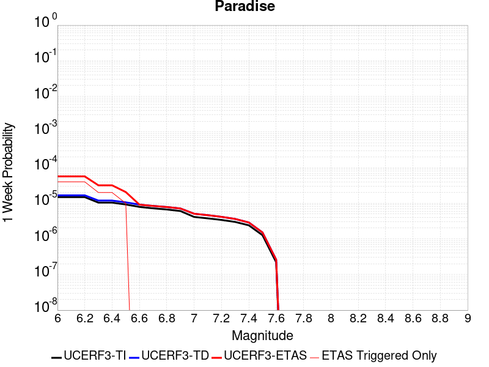 |  |  |  |

| Magnitude | 1 wk TI Prob | 1 wk TD Prob | 1 wk ETAS Prob | 1 wk ETAS/TD Gain | 1 wk ETAS Triggered Only | 1 mo TI Prob | 1 mo TD Prob | 1 mo ETAS Prob | 1 mo ETAS/TD Gain | 1 mo ETAS Triggered Only | 1 yr TI Prob | 1 yr TD Prob | 1 yr ETAS Prob | 1 yr ETAS/TD Gain | 1 yr ETAS Triggered Only | 10 yr TI Prob | 10 yr TD Prob | 10 yr ETAS Prob | 10 yr ETAS/TD Gain | 10 yr ETAS Triggered Only |
|-----|-----|-----|-----|-----|-----|-----|-----|-----|-----|-----|-----|-----|-----|-----|-----|-----|-----|-----|-----|-----|
| 6.0 | 1.4851273E-5 | 1.6694737E-5 | 5.669407E-5 | 3.3959246 | 4.0E-5 | 6.364676E-5 | 7.1547045E-5 | 1.11544185E-4 | 1.5590327 | 4.0E-5 | 7.7462377E-4 | 8.7076076E-4 | 9.706737E-4 | 1.1147422 | 1.0E-4 | 0.0077192914 | 0.008675868 | 0.008794827 | 1.0137115 | 1.2E-4 |
| 6.1 | 1.4851273E-5 | 1.6694737E-5 | 5.669407E-5 | 3.3959246 | 4.0E-5 | 6.364676E-5 | 7.1547045E-5 | 1.11544185E-4 | 1.5590327 | 4.0E-5 | 7.7462377E-4 | 8.7076076E-4 | 9.706737E-4 | 1.1147422 | 1.0E-4 | 0.0077192914 | 0.008675868 | 0.008794827 | 1.0137115 | 1.2E-4 |
| 6.2 | 1.4851273E-5 | 1.6694737E-5 | 5.669407E-5 | 3.3959246 | 4.0E-5 | 6.364676E-5 | 7.1547045E-5 | 1.11544185E-4 | 1.5590327 | 4.0E-5 | 7.7462377E-4 | 8.7076076E-4 | 9.706737E-4 | 1.1147422 | 1.0E-4 | 0.0077192914 | 0.008675868 | 0.008794827 | 1.0137115 | 1.2E-4 |
| 6.3 | 1.0426831E-5 | 1.1888677E-5 | 3.1888438E-5 | 2.682253 | 2.0E-5 | 4.4685654E-5 | 5.095051E-5 | 7.094949E-5 | 1.3925178 | 2.0E-5 | 5.43912E-4 | 6.2015187E-4 | 6.9010846E-4 | 1.1128056 | 7.0E-5 | 0.0054258266 | 0.006184821 | 0.006254388 | 1.011248 | 7.0E-5 |
| 6.4 | 1.0426831E-5 | 1.1888677E-5 | 3.1888438E-5 | 2.682253 | 2.0E-5 | 4.4685654E-5 | 5.095051E-5 | 7.094949E-5 | 1.3925178 | 2.0E-5 | 5.43912E-4 | 6.2015187E-4 | 6.9010846E-4 | 1.1128056 | 7.0E-5 | 0.0054258266 | 0.006184821 | 0.006254388 | 1.011248 | 7.0E-5 |
| 6.5 | 9.25027E-6 | 1.062002E-5 | 2.0619913E-5 | 1.9416078 | 1.0E-5 | 3.964341E-5 | 4.5513603E-5 | 5.551315E-5 | 1.2197045 | 1.0E-5 | 4.8255164E-4 | 5.539921E-4 | 6.1395887E-4 | 1.1082448 | 6.0E-5 | 0.0048150513 | 0.00552661 | 0.0055862786 | 1.0107965 | 6.0E-5 |
| 6.6 | 7.904275E-6 | 9.1595875E-6 | 9.1595875E-6 | 1.0 | 0.0 | 3.3875025E-5 | 3.925481E-5 | 3.925481E-5 | 1.0 | 0.0 | 4.1235037E-4 | 4.7782643E-4 | 5.078121E-4 | 1.0627543 | 3.0E-5 | 0.0041158604 | 0.004768387 | 0.004798244 | 1.0062615 | 3.0E-5 |
| 6.7 | 7.2061953E-6 | 8.407313E-6 | 8.407313E-6 | 1.0 | 0.0 | 3.088333E-5 | 3.6030862E-5 | 3.6030862E-5 | 1.0 | 0.0 | 3.7593965E-4 | 4.3859115E-4 | 4.68578E-4 | 1.0683708 | 3.0E-5 | 0.003753043 | 0.0043776245 | 0.004407493 | 1.0068231 | 3.0E-5 |
| 6.8 | 6.6948724E-6 | 7.84223E-6 | 7.84223E-6 | 1.0 | 0.0 | 2.8691995E-5 | 3.3609143E-5 | 3.3609143E-5 | 1.0 | 0.0 | 3.4926904E-4 | 4.0911807E-4 | 4.391058E-4 | 1.0732985 | 3.0E-5 | 0.003487206 | 0.0040840064 | 0.0041138837 | 1.0073158 | 3.0E-5 |
| 6.9 | 6.0421025E-6 | 7.1306854E-6 | 7.1306854E-6 | 1.0 | 0.0 | 2.5894467E-5 | 3.0559742E-5 | 3.0559742E-5 | 1.0 | 0.0 | 3.1521954E-4 | 3.7200472E-4 | 3.9199728E-4 | 1.0537428 | 2.0E-5 | 0.0031477278 | 0.0037141584 | 0.003734084 | 1.0053648 | 2.0E-5 |
| 7.0 | 4.134091E-6 | 5.0803756E-6 | 5.0803756E-6 | 1.0 | 0.0 | 1.7717413E-5 | 2.1772865E-5 | 2.1772865E-5 | 1.0 | 0.0 | 2.1568815E-4 | 2.650539E-4 | 2.650539E-4 | 1.0 | 0.0 | 0.0021547892 | 0.002647531 | 0.002647531 | 1.0 | 0.0 |
| 7.1 | 3.7674888E-6 | 4.63193E-6 | 4.63193E-6 | 1.0 | 0.0 | 1.6146281E-5 | 1.9850986E-5 | 1.9850986E-5 | 1.0 | 0.0 | 1.9656324E-4 | 2.4166047E-4 | 2.4166047E-4 | 1.0 | 0.0 | 0.0019638946 | 0.0024141273 | 0.0024141273 | 1.0 | 0.0 |
| 7.2 | 3.4065345E-6 | 4.156776E-6 | 4.156776E-6 | 1.0 | 0.0 | 1.4599351E-5 | 1.7814642E-5 | 1.7814642E-5 | 1.0 | 0.0 | 1.777326E-4 | 2.1687317E-4 | 2.1687317E-4 | 1.0 | 0.0 | 0.0017759053 | 0.0021667634 | 0.0021667634 | 1.0 | 0.0 |
| 7.3 | 2.9934936E-6 | 3.6293627E-6 | 3.6293627E-6 | 1.0 | 0.0 | 1.2829195E-5 | 1.5554328E-5 | 1.5554328E-5 | 1.0 | 0.0 | 1.5618425E-4 | 1.8935895E-4 | 1.8935895E-4 | 1.0 | 0.0 | 0.0015607453 | 0.0018921213 | 0.0018921213 | 1.0 | 0.0 |
| 7.4 | 2.4049796E-6 | 2.889017E-6 | 2.889017E-6 | 1.0 | 0.0 | 1.0307015E-5 | 1.238145E-5 | 1.238145E-5 | 1.0 | 0.0 | 1.2548068E-4 | 1.5073517E-4 | 1.5073517E-4 | 1.0 | 0.0 | 0.0012540985 | 0.0015064707 | 0.0015064707 | 1.0 | 0.0 |
| 7.5 | 1.2710091E-6 | 1.5134848E-6 | 1.5134848E-6 | 1.0 | 0.0 | 5.44717E-6 | 6.4863543E-6 | 6.4863543E-6 | 1.0 | 0.0 | 6.631728E-5 | 7.896975E-5 | 7.896975E-5 | 1.0 | 0.0 | 6.6297496E-4 | 7.8953954E-4 | 7.8953954E-4 | 1.0 | 0.0 |
| 7.6 | 2.21172E-7 | 2.6040198E-7 | 2.6040198E-7 | 1.0 | 0.0 | 9.478797E-7 | 1.1160082E-6 | 1.1160082E-6 | 1.0 | 0.0 | 1.1540374E-5 | 1.3587343E-5 | 1.3587343E-5 | 1.0 | 0.0 | 1.1539775E-4 | 1.3586794E-4 | 1.3586794E-4 | 1.0 | 0.0 |

## Death Valley (Black Mtns Frontal)
*[(top)](#table-of-contents)*

| 1 Week | 1 Month | 1 Year | 10 Year |
|-----|-----|-----|-----|
|  |  | 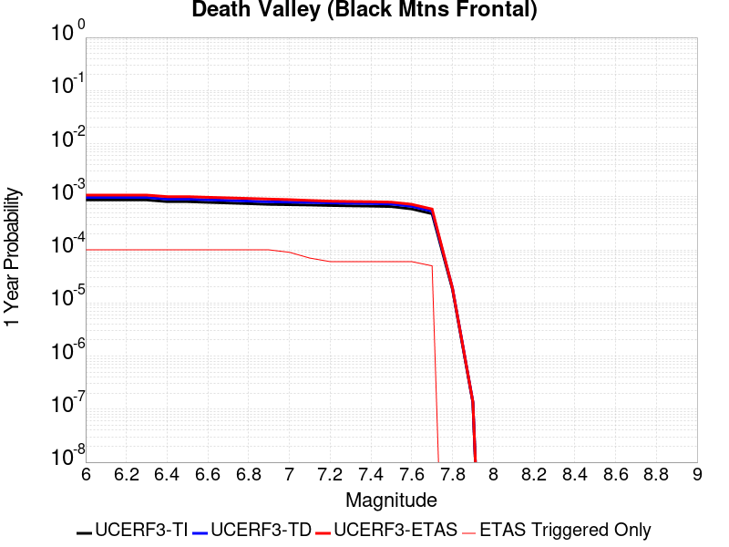 |  |

| Magnitude | 1 wk TI Prob | 1 wk TD Prob | 1 wk ETAS Prob | 1 wk ETAS/TD Gain | 1 wk ETAS Triggered Only | 1 mo TI Prob | 1 mo TD Prob | 1 mo ETAS Prob | 1 mo ETAS/TD Gain | 1 mo ETAS Triggered Only | 1 yr TI Prob | 1 yr TD Prob | 1 yr ETAS Prob | 1 yr ETAS/TD Gain | 1 yr ETAS Triggered Only | 10 yr TI Prob | 10 yr TD Prob | 10 yr ETAS Prob | 10 yr ETAS/TD Gain | 10 yr ETAS Triggered Only |
|-----|-----|-----|-----|-----|-----|-----|-----|-----|-----|-----|-----|-----|-----|-----|-----|-----|-----|-----|-----|-----|
| 6.0 | 1.6707214E-5 | 1.867021E-5 | 8.86689E-5 | 4.7492185 | 7.0E-5 | 7.160038E-5 | 8.0012775E-5 | 1.7000557E-4 | 2.1247303 | 9.0E-5 | 8.71386E-4 | 9.737278E-4 | 0.0010736304 | 1.1025981 | 1.0E-4 | 0.00867977 | 0.009695467 | 0.009814303 | 1.0122569 | 1.2E-4 |
| 6.1 | 1.6707214E-5 | 1.867021E-5 | 8.86689E-5 | 4.7492185 | 7.0E-5 | 7.160038E-5 | 8.0012775E-5 | 1.7000557E-4 | 2.1247303 | 9.0E-5 | 8.71386E-4 | 9.737278E-4 | 0.0010736304 | 1.1025981 | 1.0E-4 | 0.00867977 | 0.009695467 | 0.009814303 | 1.0122569 | 1.2E-4 |
| 6.2 | 1.6707214E-5 | 1.867021E-5 | 8.86689E-5 | 4.7492185 | 7.0E-5 | 7.160038E-5 | 8.0012775E-5 | 1.7000557E-4 | 2.1247303 | 9.0E-5 | 8.71386E-4 | 9.737278E-4 | 0.0010736304 | 1.1025981 | 1.0E-4 | 0.00867977 | 0.009695467 | 0.009814303 | 1.0122569 | 1.2E-4 |
| 6.3 | 1.6707214E-5 | 1.867021E-5 | 8.86689E-5 | 4.7492185 | 7.0E-5 | 7.160038E-5 | 8.0012775E-5 | 1.7000557E-4 | 2.1247303 | 9.0E-5 | 8.71386E-4 | 9.737278E-4 | 0.0010736304 | 1.1025981 | 1.0E-4 | 0.00867977 | 0.009695467 | 0.009814303 | 1.0122569 | 1.2E-4 |
| 6.4 | 1.5515609E-5 | 1.733816E-5 | 8.733694E-5 | 5.0372677 | 7.0E-5 | 6.649377E-5 | 7.430431E-5 | 1.6429763E-4 | 2.2111452 | 9.0E-5 | 8.0926094E-4 | 9.0428564E-4 | 0.0010041952 | 1.1104845 | 1.0E-4 | 0.008063202 | 0.009006744 | 0.009125664 | 1.0132034 | 1.2E-4 |
| 6.5 | 1.5515609E-5 | 1.733816E-5 | 8.733694E-5 | 5.0372677 | 7.0E-5 | 6.649377E-5 | 7.430431E-5 | 1.6429763E-4 | 2.2111452 | 9.0E-5 | 8.0926094E-4 | 9.0428564E-4 | 0.0010041952 | 1.1104845 | 1.0E-4 | 0.008063202 | 0.009006744 | 0.009125664 | 1.0132034 | 1.2E-4 |
| 6.6 | 1.5041828E-5 | 1.6809092E-5 | 8.6807915E-5 | 5.164343 | 7.0E-5 | 6.4463384E-5 | 7.203701E-5 | 1.6203053E-4 | 2.2492678 | 9.0E-5 | 7.8455906E-4 | 8.767036E-4 | 9.766159E-4 | 1.1139636 | 1.0E-4 | 0.00781795 | 0.008733105 | 0.008852057 | 1.0136209 | 1.2E-4 |
| 6.7 | 1.4634985E-5 | 1.6355965E-5 | 8.635482E-5 | 5.279714 | 7.0E-5 | 6.271985E-5 | 7.009514E-5 | 1.6008884E-4 | 2.2838793 | 9.0E-5 | 7.6334673E-4 | 8.5307995E-4 | 9.529947E-4 | 1.1171223 | 1.0E-4 | 0.007607299 | 0.008498689 | 0.008617669 | 1.0139998 | 1.2E-4 |
| 6.8 | 1.4209158E-5 | 1.5881998E-5 | 8.5880885E-5 | 5.407436 | 7.0E-5 | 6.089497E-5 | 6.806396E-5 | 1.5805784E-4 | 2.3221958 | 9.0E-5 | 7.4114406E-4 | 8.283693E-4 | 9.282864E-4 | 1.120619 | 1.0E-4 | 0.007386771 | 0.00825343 | 0.00837244 | 1.0144194 | 1.2E-4 |
| 6.9 | 1.3780098E-5 | 1.5404545E-5 | 8.5403466E-5 | 5.5440435 | 7.0E-5 | 5.9056227E-5 | 6.6017834E-5 | 1.560119E-4 | 2.363178 | 9.0E-5 | 7.1877235E-4 | 8.034762E-4 | 9.033959E-4 | 1.1243593 | 1.0E-4 | 0.0071645193 | 0.008006307 | 0.008125347 | 1.0148681 | 1.2E-4 |
| 7.0 | 1.3585064E-5 | 1.5188108E-5 | 7.51872E-5 | 4.9503994 | 6.0E-5 | 5.8220405E-5 | 6.5090295E-5 | 1.4508508E-4 | 2.228982 | 8.0E-5 | 7.086029E-4 | 7.9219165E-4 | 8.821204E-4 | 1.1135188 | 9.0E-5 | 0.007063476 | 0.007894269 | 0.008003401 | 1.0138241 | 1.1E-4 |
| 7.1 | 1.3398601E-5 | 1.4981292E-5 | 6.4980544E-5 | 4.3374457 | 5.0E-5 | 5.742131E-5 | 6.420399E-5 | 1.341995E-4 | 2.090205 | 7.0E-5 | 6.9888023E-4 | 7.814087E-4 | 8.51354E-4 | 1.0895118 | 7.0E-5 | 0.0069668638 | 0.0077871997 | 0.007876499 | 1.0114675 | 9.0E-5 |
| 7.2 | 1.3126312E-5 | 1.4679515E-5 | 6.467878E-5 | 4.4060574 | 5.0E-5 | 5.6254412E-5 | 6.2910716E-5 | 1.2290695E-4 | 1.9536725 | 6.0E-5 | 6.846822E-4 | 7.656743E-4 | 8.256283E-4 | 1.0783023 | 6.0E-5 | 0.006825765 | 0.007630946 | 0.0077103353 | 1.0104036 | 8.0E-5 |
| 7.3 | 1.2922429E-5 | 1.4453743E-5 | 6.445302E-5 | 4.459262 | 5.0E-5 | 5.5380664E-5 | 6.194317E-5 | 1.21939454E-4 | 1.9685698 | 6.0E-5 | 6.74051E-4 | 7.5390254E-4 | 8.1385736E-4 | 1.0795258 | 6.0E-5 | 0.006720101 | 0.007514031 | 0.007583505 | 1.0092459 | 7.0E-5 |
| 7.4 | 1.2768878E-5 | 1.4283726E-5 | 6.428301E-5 | 4.5004373 | 5.0E-5 | 5.4722615E-5 | 6.121456E-5 | 1.2121089E-4 | 1.980099 | 6.0E-5 | 6.660441E-4 | 7.4503786E-4 | 8.049932E-4 | 1.0804728 | 6.0E-5 | 0.0066405144 | 0.00742598 | 0.00749546 | 1.0093564 | 7.0E-5 |
| 7.5 | 1.2521929E-5 | 1.401197E-5 | 6.401127E-5 | 4.5683274 | 5.0E-5 | 5.366431E-5 | 6.004995E-5 | 1.20046345E-4 | 1.9991082 | 6.0E-5 | 6.531671E-4 | 7.308683E-4 | 7.908245E-4 | 1.0820341 | 6.0E-5 | 0.006512506 | 0.007285223 | 0.0073547126 | 1.0095385 | 7.0E-5 |
| 7.6 | 1.1301089E-5 | 1.2648108E-5 | 6.264748E-5 | 4.95311 | 5.0E-5 | 4.8432343E-5 | 5.4205084E-5 | 1.1420183E-4 | 2.1068473 | 6.0E-5 | 5.895042E-4 | 6.5975235E-4 | 7.1971276E-4 | 1.0908833 | 6.0E-5 | 0.0058794282 | 0.006578489 | 0.0066480287 | 1.0105708 | 7.0E-5 |
| 7.7 | 9.189108E-6 | 1.02833255E-5 | 6.028281E-5 | 5.8621902 | 5.0E-5 | 3.93813E-5 | 4.407068E-5 | 9.406848E-5 | 2.1344912 | 5.0E-5 | 4.7936183E-4 | 5.364335E-4 | 5.864066E-4 | 1.0931582 | 5.0E-5 | 0.004783291 | 0.005351897 | 0.0054016295 | 1.0092925 | 5.0E-5 |
| 7.8 | 3.4586725E-7 | 3.648256E-7 | 3.648256E-7 | 1.0 | 0.0 | 1.4822873E-6 | 1.5635374E-6 | 1.5635374E-6 | 1.0 | 0.0 | 1.80467E-5 | 1.9035906E-5 | 1.9035906E-5 | 1.0 | 0.0 | 1.8045233E-4 | 1.903432E-4 | 1.903432E-4 | 1.0 | 0.0 |
| 7.9 | 2.5591178E-9 | 2.6696687E-9 | 2.6696687E-9 | 1.0 | 0.0 | 1.0967647E-8 | 1.1441437E-8 | 1.1441437E-8 | 1.0 | 0.0 | 1.335311E-7 | 1.392995E-7 | 1.392995E-7 | 1.0 | 0.0 | 1.3353102E-6 | 1.3929949E-6 | 1.3929949E-6 | 1.0 | 0.0 |

## White Wolf (Extension)
*[(top)](#table-of-contents)*

| 1 Week | 1 Month | 1 Year | 10 Year |
|-----|-----|-----|-----|
|  |  |  |  |

| Magnitude | 1 wk TI Prob | 1 wk TD Prob | 1 wk ETAS Prob | 1 wk ETAS/TD Gain | 1 wk ETAS Triggered Only | 1 mo TI Prob | 1 mo TD Prob | 1 mo ETAS Prob | 1 mo ETAS/TD Gain | 1 mo ETAS Triggered Only | 1 yr TI Prob | 1 yr TD Prob | 1 yr ETAS Prob | 1 yr ETAS/TD Gain | 1 yr ETAS Triggered Only | 10 yr TI Prob | 10 yr TD Prob | 10 yr ETAS Prob | 10 yr ETAS/TD Gain | 10 yr ETAS Triggered Only |
|-----|-----|-----|-----|-----|-----|-----|-----|-----|-----|-----|-----|-----|-----|-----|-----|-----|-----|-----|-----|-----|
| 6.0 | 8.222555E-6 | 6.066608E-6 | 4.6066365E-5 | 7.5934305 | 4.0E-5 | 3.5239045E-5 | 2.5999527E-5 | 6.599849E-5 | 2.5384495 | 4.0E-5 | 4.289509E-4 | 3.1650488E-4 | 3.8648272E-4 | 1.2210957 | 7.0E-5 | 0.0042812387 | 0.003161193 | 0.003260877 | 1.0315336 | 1.0E-4 |
| 6.1 | 8.222555E-6 | 6.066608E-6 | 4.6066365E-5 | 7.5934305 | 4.0E-5 | 3.5239045E-5 | 2.5999527E-5 | 6.599849E-5 | 2.5384495 | 4.0E-5 | 4.289509E-4 | 3.1650488E-4 | 3.8648272E-4 | 1.2210957 | 7.0E-5 | 0.0042812387 | 0.003161193 | 0.003260877 | 1.0315336 | 1.0E-4 |
| 6.2 | 8.222555E-6 | 6.066608E-6 | 4.6066365E-5 | 7.5934305 | 4.0E-5 | 3.5239045E-5 | 2.5999527E-5 | 6.599849E-5 | 2.5384495 | 4.0E-5 | 4.289509E-4 | 3.1650488E-4 | 3.8648272E-4 | 1.2210957 | 7.0E-5 | 0.0042812387 | 0.003161193 | 0.003260877 | 1.0315336 | 1.0E-4 |
| 6.3 | 8.222555E-6 | 6.066608E-6 | 4.6066365E-5 | 7.5934305 | 4.0E-5 | 3.5239045E-5 | 2.5999527E-5 | 6.599849E-5 | 2.5384495 | 4.0E-5 | 4.289509E-4 | 3.1650488E-4 | 3.8648272E-4 | 1.2210957 | 7.0E-5 | 0.0042812387 | 0.003161193 | 0.003260877 | 1.0315336 | 1.0E-4 |
| 6.4 | 5.821773E-6 | 3.5571218E-6 | 2.3557051E-5 | 6.6225033 | 2.0E-5 | 2.4950215E-5 | 1.5244725E-5 | 3.524442E-5 | 2.3119092 | 2.0E-5 | 3.0372653E-4 | 1.8558982E-4 | 2.255824E-4 | 1.215489 | 4.0E-5 | 0.0030331176 | 0.0018544566 | 0.0019143453 | 1.0322945 | 6.0E-5 |
| 6.5 | 5.766023E-6 | 3.499056E-6 | 2.3498986E-5 | 6.7158074 | 2.0E-5 | 2.4711293E-5 | 1.4995874E-5 | 3.4995574E-5 | 2.3336802 | 2.0E-5 | 3.0081844E-4 | 1.8256057E-4 | 2.2255327E-4 | 1.2190653 | 4.0E-5 | 0.0030041158 | 0.0018242141 | 0.0018841047 | 1.0328308 | 6.0E-5 |
| 6.6 | 4.643576E-6 | 2.3325706E-6 | 2.2332524E-5 | 9.574211 | 2.0E-5 | 1.9900888E-5 | 9.996696E-6 | 2.9996496E-5 | 3.000641 | 2.0E-5 | 2.4226638E-4 | 1.217034E-4 | 1.5169974E-4 | 1.2464709 | 3.0E-5 | 0.0024200242 | 0.00121641 | 0.0012663491 | 1.0410546 | 5.0E-5 |
| 6.7 | 3.9529173E-6 | 1.6482956E-6 | 1.1648279E-5 | 7.066863 | 1.0E-5 | 1.6940963E-5 | 7.064106E-6 | 1.7064036E-5 | 2.4155972 | 1.0E-5 | 2.0623671E-4 | 8.6002285E-5 | 1.0600057E-4 | 1.232532 | 2.0E-5 | 0.002060454 | 8.597085E-4 | 8.8968273E-4 | 1.0348655 | 3.0E-5 |
| 6.8 | 3.4377522E-6 | 1.2244749E-6 | 1.12244625E-5 | 9.166757 | 1.0E-5 | 1.473314E-5 | 5.2477394E-6 | 1.5247687E-5 | 2.9055724 | 1.0E-5 | 1.7936122E-4 | 6.388945E-5 | 8.388817E-5 | 1.3130207 | 2.0E-5 | 0.0017921652 | 6.387199E-4 | 6.687007E-4 | 1.0469389 | 3.0E-5 |
| 6.9 | 3.1367306E-6 | 1.0033302E-6 | 1.1003321E-5 | 10.966798 | 1.0E-5 | 1.3443062E-5 | 4.29998E-6 | 1.4299937E-5 | 3.3255823 | 1.0E-5 | 1.63657E-4 | 5.235108E-5 | 7.235003E-5 | 1.3820161 | 2.0E-5 | 0.0016353652 | 5.233951E-4 | 5.5337936E-4 | 1.057288 | 3.0E-5 |
| 7.0 | 2.8298145E-6 | 7.428222E-7 | 1.0742815E-5 | 14.462162 | 1.0E-5 | 1.2127721E-5 | 3.18352E-6 | 1.3183488E-5 | 4.141167 | 1.0E-5 | 1.47645E-4 | 3.8758717E-5 | 5.875794E-5 | 1.515993 | 2.0E-5 | 0.0014754693 | 3.8752457E-4 | 4.075168E-4 | 1.0515896 | 2.0E-5 |
| 7.1 | 2.4091064E-6 | 5.4223744E-7 | 5.4223744E-7 | 1.0 | 0.0 | 1.03247E-5 | 2.323873E-6 | 2.323873E-6 | 1.0 | 0.0 | 1.2569598E-4 | 2.8292827E-5 | 3.8292546E-5 | 1.3534365 | 1.0E-5 | 0.001256249 | 2.828963E-4 | 2.9289347E-4 | 1.0353386 | 1.0E-5 |
| 7.2 | 1.3875518E-6 | 1.07402464E-7 | 1.07402464E-7 | 1.0 | 0.0 | 5.9466374E-6 | 4.602962E-7 | 4.602962E-7 | 1.0 | 0.0 | 7.23979E-5 | 5.604093E-6 | 5.604093E-6 | 1.0 | 0.0 | 7.2374323E-4 | 5.6039633E-5 | 5.6039633E-5 | 1.0 | 0.0 |
| 7.3 | 7.056077E-7 | 5.0002754E-8 | 5.0002754E-8 | 1.0 | 0.0 | 3.0240296E-6 | 2.142975E-7 | 2.142975E-7 | 1.0 | 0.0 | 3.681694E-5 | 2.6090695E-6 | 2.6090695E-6 | 1.0 | 0.0 | 3.681084E-4 | 2.6090434E-5 | 2.6090434E-5 | 1.0 | 0.0 |
| 7.4 | 5.9334678E-8 | 4.8638475E-9 | 4.8638475E-9 | 1.0 | 0.0 | 2.5429145E-7 | 2.084506E-8 | 2.084506E-8 | 1.0 | 0.0 | 3.095994E-6 | 2.5378858E-7 | 2.5378858E-7 | 1.0 | 0.0 | 3.095951E-5 | 2.5378843E-6 | 2.5378843E-6 | 1.0 | 0.0 |

## Helendale-So Lockhart
*[(top)](#table-of-contents)*

| 1 Week | 1 Month | 1 Year | 10 Year |
|-----|-----|-----|-----|
|  |  |  |  |

| Magnitude | 1 wk TI Prob | 1 wk TD Prob | 1 wk ETAS Prob | 1 wk ETAS/TD Gain | 1 wk ETAS Triggered Only | 1 mo TI Prob | 1 mo TD Prob | 1 mo ETAS Prob | 1 mo ETAS/TD Gain | 1 mo ETAS Triggered Only | 1 yr TI Prob | 1 yr TD Prob | 1 yr ETAS Prob | 1 yr ETAS/TD Gain | 1 yr ETAS Triggered Only | 10 yr TI Prob | 10 yr TD Prob | 10 yr ETAS Prob | 10 yr ETAS/TD Gain | 10 yr ETAS Triggered Only |
|-----|-----|-----|-----|-----|-----|-----|-----|-----|-----|-----|-----|-----|-----|-----|-----|-----|-----|-----|-----|-----|
| 6.0 | 1.7296055E-5 | 1.8103707E-5 | 5.810298E-5 | 3.2094522 | 4.0E-5 | 7.412385E-5 | 7.758512E-5 | 1.3758047E-4 | 1.7732841 | 6.0E-5 | 9.0208417E-4 | 9.442103E-4 | 0.0010241347 | 1.0846469 | 8.0E-5 | 0.008984311 | 0.009404104 | 0.009493258 | 1.0094802 | 9.0E-5 |
| 6.1 | 1.7296055E-5 | 1.8103707E-5 | 5.810298E-5 | 3.2094522 | 4.0E-5 | 7.412385E-5 | 7.758512E-5 | 1.3758047E-4 | 1.7732841 | 6.0E-5 | 9.0208417E-4 | 9.442103E-4 | 0.0010241347 | 1.0846469 | 8.0E-5 | 0.008984311 | 0.009404104 | 0.009493258 | 1.0094802 | 9.0E-5 |
| 6.2 | 1.7296055E-5 | 1.8103707E-5 | 5.810298E-5 | 3.2094522 | 4.0E-5 | 7.412385E-5 | 7.758512E-5 | 1.3758047E-4 | 1.7732841 | 6.0E-5 | 9.0208417E-4 | 9.442103E-4 | 0.0010241347 | 1.0846469 | 8.0E-5 | 0.008984311 | 0.009404104 | 0.009493258 | 1.0094802 | 9.0E-5 |
| 6.3 | 1.0669118E-5 | 1.1135411E-5 | 5.1134964E-5 | 4.592104 | 4.0E-5 | 4.5723988E-5 | 4.7722333E-5 | 9.7719945E-5 | 2.0476775 | 5.0E-5 | 5.5654737E-4 | 5.8086734E-4 | 6.5082667E-4 | 1.1204394 | 7.0E-5 | 0.0055515557 | 0.0057937866 | 0.005863381 | 1.0120119 | 7.0E-5 |
| 6.4 | 1.0669118E-5 | 1.1135411E-5 | 5.1134964E-5 | 4.592104 | 4.0E-5 | 4.5723988E-5 | 4.7722333E-5 | 9.7719945E-5 | 2.0476775 | 5.0E-5 | 5.5654737E-4 | 5.8086734E-4 | 6.5082667E-4 | 1.1204394 | 7.0E-5 | 0.0055515557 | 0.0057937866 | 0.005863381 | 1.0120119 | 7.0E-5 |
| 6.5 | 8.790038E-6 | 9.170186E-6 | 4.916982E-5 | 5.361922 | 4.0E-5 | 3.767105E-5 | 3.9300216E-5 | 7.929864E-5 | 2.0177662 | 4.0E-5 | 4.585485E-4 | 4.783766E-4 | 5.3834793E-4 | 1.1253642 | 6.0E-5 | 0.0045760344 | 0.004773633 | 0.004833346 | 1.012509 | 6.0E-5 |
| 6.6 | 7.396949E-6 | 7.715528E-6 | 3.7715297E-5 | 4.8882327 | 3.0E-5 | 3.1700827E-5 | 3.3066135E-5 | 6.306514E-5 | 1.9072427 | 3.0E-5 | 3.858892E-4 | 4.0250685E-4 | 4.524867E-4 | 1.1241715 | 5.0E-5 | 0.003852198 | 0.0040178853 | 0.004067684 | 1.0123943 | 5.0E-5 |
| 6.7 | 6.4600285E-6 | 6.7380233E-6 | 3.673782E-5 | 5.4523144 | 3.0E-5 | 2.7685543E-5 | 2.8876928E-5 | 5.887606E-5 | 2.0388618 | 3.0E-5 | 3.3701936E-4 | 3.5152066E-4 | 3.915066E-4 | 1.1137513 | 4.0E-5 | 0.0033650869 | 0.003509728 | 0.0035495874 | 1.011357 | 4.0E-5 |
| 6.8 | 5.600104E-6 | 5.836003E-6 | 3.5835827E-5 | 6.140475 | 3.0E-5 | 2.4000226E-5 | 2.5011204E-5 | 5.5010452E-5 | 2.1994324 | 3.0E-5 | 2.9216358E-4 | 3.0446946E-4 | 3.4445728E-4 | 1.1313361 | 4.0E-5 | 0.0029177975 | 0.0030405847 | 0.003080463 | 1.0131154 | 4.0E-5 |
| 6.9 | 4.839122E-6 | 5.039504E-6 | 3.5039353E-5 | 6.952937 | 3.0E-5 | 2.0738931E-5 | 2.1597696E-5 | 5.159705E-5 | 2.389007 | 3.0E-5 | 2.5246723E-4 | 2.629207E-4 | 3.0291016E-4 | 1.1520971 | 4.0E-5 | 0.002521806 | 0.0026261439 | 0.002666039 | 1.0151914 | 4.0E-5 |
| 7.0 | 3.6937633E-6 | 3.845204E-6 | 2.3845127E-5 | 6.201265 | 2.0E-5 | 1.5830317E-5 | 1.6479342E-5 | 3.6479014E-5 | 2.2136207 | 2.0E-5 | 1.9271708E-4 | 2.0061784E-4 | 2.3061181E-4 | 1.149508 | 3.0E-5 | 0.0019255003 | 0.0020043987 | 0.0020343387 | 1.014937 | 3.0E-5 |
| 7.1 | 2.7858857E-6 | 2.8978507E-6 | 2.2897793E-5 | 7.9016466 | 2.0E-5 | 1.1939455E-5 | 1.2419302E-5 | 3.2419055E-5 | 2.6103764 | 2.0E-5 | 1.4535317E-4 | 1.5119473E-4 | 1.8119019E-4 | 1.1983896 | 3.0E-5 | 0.0014525814 | 0.0015109401 | 0.0015408949 | 1.0198252 | 3.0E-5 |
| 7.2 | 2.1672065E-6 | 2.2540103E-6 | 1.2253988E-5 | 5.436527 | 1.0E-5 | 9.2879945E-6 | 9.66001E-6 | 1.9659914E-5 | 2.0351856 | 1.0E-5 | 1.1307546E-4 | 1.1760445E-4 | 1.3760211E-4 | 1.1700416 | 2.0E-5 | 0.0011301794 | 0.0011754404 | 0.0011954169 | 1.016995 | 2.0E-5 |
| 7.3 | 1.4823496E-6 | 1.5422086E-6 | 1.15421935E-5 | 7.484197 | 1.0E-5 | 6.3529114E-6 | 6.6094494E-6 | 1.6609383E-5 | 2.5129755 | 1.0E-5 | 7.734395E-5 | 8.046723E-5 | 9.046642E-5 | 1.1242642 | 1.0E-5 | 7.731704E-4 | 8.04396E-4 | 8.14388E-4 | 1.0124217 | 1.0E-5 |
| 7.4 | 4.2321457E-7 | 4.4108717E-7 | 4.4108717E-7 | 1.0 | 0.0 | 1.8137755E-6 | 1.8903725E-6 | 1.8903725E-6 | 1.0 | 0.0 | 2.2082493E-5 | 2.3015087E-5 | 2.3015087E-5 | 1.0 | 0.0 | 2.2080299E-4 | 2.3013157E-4 | 2.3013157E-4 | 1.0 | 0.0 |
| 7.5 | 5.6942316E-8 | 5.9415576E-8 | 5.9415576E-8 | 1.0 | 0.0 | 2.440385E-7 | 2.5463817E-7 | 2.5463817E-7 | 1.0 | 0.0 | 2.9711643E-6 | 3.1002162E-6 | 3.1002162E-6 | 1.0 | 0.0 | 2.9711247E-5 | 3.1001808E-5 | 3.1001808E-5 | 1.0 | 0.0 |

## Lake Isabella (Seismicity)
*[(top)](#table-of-contents)*

| 1 Week | 1 Month | 1 Year | 10 Year |
|-----|-----|-----|-----|
|  |  |  |  |

| Magnitude | 1 wk TI Prob | 1 wk TD Prob | 1 wk ETAS Prob | 1 wk ETAS/TD Gain | 1 wk ETAS Triggered Only | 1 mo TI Prob | 1 mo TD Prob | 1 mo ETAS Prob | 1 mo ETAS/TD Gain | 1 mo ETAS Triggered Only | 1 yr TI Prob | 1 yr TD Prob | 1 yr ETAS Prob | 1 yr ETAS/TD Gain | 1 yr ETAS Triggered Only | 10 yr TI Prob | 10 yr TD Prob | 10 yr ETAS Prob | 10 yr ETAS/TD Gain | 10 yr ETAS Triggered Only |
|-----|-----|-----|-----|-----|-----|-----|-----|-----|-----|-----|-----|-----|-----|-----|-----|-----|-----|-----|-----|-----|
| 6.0 | 9.431637E-6 | 9.741643E-6 | 4.9741255E-5 | 5.1060433 | 4.0E-5 | 4.0420677E-5 | 4.1749303E-5 | 1.017468E-4 | 2.4370897 | 6.0E-5 | 4.920106E-4 | 5.081923E-4 | 5.881516E-4 | 1.1573408 | 8.0E-5 | 0.004909227 | 0.0050715944 | 0.005161138 | 1.0176558 | 9.0E-5 |
| 6.1 | 9.431637E-6 | 9.741643E-6 | 4.9741255E-5 | 5.1060433 | 4.0E-5 | 4.0420677E-5 | 4.1749303E-5 | 1.017468E-4 | 2.4370897 | 6.0E-5 | 4.920106E-4 | 5.081923E-4 | 5.881516E-4 | 1.1573408 | 8.0E-5 | 0.004909227 | 0.0050715944 | 0.005161138 | 1.0176558 | 9.0E-5 |
| 6.2 | 9.431637E-6 | 9.741643E-6 | 4.9741255E-5 | 5.1060433 | 4.0E-5 | 4.0420677E-5 | 4.1749303E-5 | 1.017468E-4 | 2.4370897 | 6.0E-5 | 4.920106E-4 | 5.081923E-4 | 5.881516E-4 | 1.1573408 | 8.0E-5 | 0.004909227 | 0.0050715944 | 0.005161138 | 1.0176558 | 9.0E-5 |
| 6.3 | 9.431637E-6 | 9.741643E-6 | 4.9741255E-5 | 5.1060433 | 4.0E-5 | 4.0420677E-5 | 4.1749303E-5 | 1.017468E-4 | 2.4370897 | 6.0E-5 | 4.920106E-4 | 5.081923E-4 | 5.881516E-4 | 1.1573408 | 8.0E-5 | 0.004909227 | 0.0050715944 | 0.005161138 | 1.0176558 | 9.0E-5 |
| 6.4 | 5.144063E-6 | 5.3000717E-6 | 3.5299912E-5 | 6.6602707 | 3.0E-5 | 2.2045799E-5 | 2.2714416E-5 | 7.271328E-5 | 3.2011952 | 5.0E-5 | 2.6837454E-4 | 2.7651637E-4 | 3.4649702E-4 | 1.2530795 | 7.0E-5 | 0.0026805066 | 0.0027620634 | 0.0028318702 | 1.0252733 | 7.0E-5 |
| 6.5 | 5.144063E-6 | 5.3000717E-6 | 3.5299912E-5 | 6.6602707 | 3.0E-5 | 2.2045799E-5 | 2.2714416E-5 | 7.271328E-5 | 3.2011952 | 5.0E-5 | 2.6837454E-4 | 2.7651637E-4 | 3.4649702E-4 | 1.2530795 | 7.0E-5 | 0.0026805066 | 0.0027620634 | 0.0028318702 | 1.0252733 | 7.0E-5 |
| 6.6 | 3.4009804E-6 | 3.4987834E-6 | 3.4987834E-6 | 1.0 | 0.0 | 1.4575549E-5 | 1.4994709E-5 | 2.4994559E-5 | 1.6668919 | 1.0E-5 | 1.7744285E-4 | 1.825469E-4 | 1.9254506E-4 | 1.0547705 | 1.0E-5 | 0.0017730123 | 0.0018241272 | 0.001834109 | 1.0054721 | 1.0E-5 |
| 6.7 | 3.3880428E-6 | 3.48565E-6 | 3.48565E-6 | 1.0 | 0.0 | 1.4520103E-5 | 1.4938424E-5 | 2.4938274E-5 | 1.6694046 | 1.0E-5 | 1.767679E-4 | 1.8186173E-4 | 1.9185992E-4 | 1.0549768 | 1.0E-5 | 0.0017662736 | 0.0018172868 | 0.0018272686 | 1.0054927 | 1.0E-5 |
| 6.8 | 2.6582E-6 | 2.733698E-6 | 2.733698E-6 | 1.0 | 0.0 | 1.1392236E-5 | 1.1715804E-5 | 2.1715687E-5 | 1.8535379 | 1.0E-5 | 1.3869164E-4 | 1.4263192E-4 | 1.526305E-4 | 1.0701005 | 1.0E-5 | 0.0013860512 | 0.0014255359 | 0.0014355216 | 1.0070049 | 1.0E-5 |
| 6.9 | 2.406011E-6 | 2.474327E-6 | 2.474327E-6 | 1.0 | 0.0 | 1.0311434E-5 | 1.0604223E-5 | 2.0604117E-5 | 1.9430106 | 1.0E-5 | 1.2553448E-4 | 1.2910008E-4 | 1.3909879E-4 | 1.0774493 | 1.0E-5 | 0.0012546359 | 0.0012903805 | 0.0013003675 | 1.0077397 | 1.0E-5 |
| 7.0 | 1.6953097E-6 | 1.7429359E-6 | 1.7429359E-6 | 1.0 | 0.0 | 7.265593E-6 | 7.4697095E-6 | 1.7469634E-5 | 2.33873 | 1.0E-5 | 8.8455E-5 | 9.0940965E-5 | 1.0094006E-4 | 1.1099515 | 1.0E-5 | 8.84198E-4 | 9.091403E-4 | 9.1913115E-4 | 1.0109894 | 1.0E-5 |
| 7.1 | 3.5013824E-7 | 3.5714805E-7 | 3.5714805E-7 | 1.0 | 0.0 | 1.5005916E-6 | 1.5306335E-6 | 1.5306335E-6 | 1.0 | 0.0 | 1.826955E-5 | 1.8635306E-5 | 1.8635306E-5 | 1.0 | 0.0 | 1.8268047E-4 | 1.863377E-4 | 1.863377E-4 | 1.0 | 0.0 |
| 7.2 | 2.2321095E-7 | 2.2750562E-7 | 2.2750562E-7 | 1.0 | 0.0 | 9.56618E-7 | 9.750237E-7 | 9.750237E-7 | 1.0 | 0.0 | 1.1646762E-5 | 1.187085E-5 | 1.187085E-5 | 1.0 | 0.0 | 1.1646151E-4 | 1.18702264E-4 | 1.18702264E-4 | 1.0 | 0.0 |
| 7.3 | 1.5760406E-7 | 1.6060915E-7 | 1.6060915E-7 | 1.0 | 0.0 | 6.7544585E-7 | 6.883247E-7 | 6.883247E-7 | 1.0 | 0.0 | 8.223522E-6 | 8.380322E-6 | 8.380322E-6 | 1.0 | 0.0 | 8.2232174E-5 | 8.380012E-5 | 8.380012E-5 | 1.0 | 0.0 |
| 7.4 | 1.1216497E-7 | 1.14317004E-7 | 1.14317004E-7 | 1.0 | 0.0 | 4.8070694E-7 | 4.899299E-7 | 4.899299E-7 | 1.0 | 0.0 | 5.852591E-6 | 5.964881E-6 | 5.964881E-6 | 1.0 | 0.0 | 5.8524372E-5 | 5.9647253E-5 | 5.9647253E-5 | 1.0 | 0.0 |
| 7.5 | 4.885185E-8 | 4.978771E-8 | 4.978771E-8 | 1.0 | 0.0 | 2.0936506E-7 | 2.133759E-7 | 2.133759E-7 | 1.0 | 0.0 | 2.5490165E-6 | 2.5978486E-6 | 2.5978486E-6 | 1.0 | 0.0 | 2.5489873E-5 | 2.5978201E-5 | 2.5978201E-5 | 1.0 | 0.0 |
| 7.6 | 1.504641E-9 | 1.5317896E-9 | 1.5317896E-9 | 1.0 | 0.0 | 6.4484613E-9 | 6.5648122E-9 | 6.5648122E-9 | 1.0 | 0.0 | 7.851001E-8 | 7.992659E-8 | 7.992659E-8 | 1.0 | 0.0 | 7.8509987E-7 | 7.992659E-7 | 7.992659E-7 | 1.0 | 0.0 |

## Goldstone Lake
*[(top)](#table-of-contents)*

| 1 Week | 1 Month | 1 Year | 10 Year |
|-----|-----|-----|-----|
|  |  |  |  |

| Magnitude | 1 wk TI Prob | 1 wk TD Prob | 1 wk ETAS Prob | 1 wk ETAS/TD Gain | 1 wk ETAS Triggered Only | 1 mo TI Prob | 1 mo TD Prob | 1 mo ETAS Prob | 1 mo ETAS/TD Gain | 1 mo ETAS Triggered Only | 1 yr TI Prob | 1 yr TD Prob | 1 yr ETAS Prob | 1 yr ETAS/TD Gain | 1 yr ETAS Triggered Only | 10 yr TI Prob | 10 yr TD Prob | 10 yr ETAS Prob | 10 yr ETAS/TD Gain | 10 yr ETAS Triggered Only |
|-----|-----|-----|-----|-----|-----|-----|-----|-----|-----|-----|-----|-----|-----|-----|-----|-----|-----|-----|-----|-----|
| 6.0 | 2.671352E-5 | 3.0375995E-5 | 6.0375085E-5 | 1.987592 | 3.0E-5 | 1.1448149E-4 | 1.3017745E-4 | 1.6017354E-4 | 1.2304246 | 3.0E-5 | 0.001392921 | 0.0015839544 | 0.0016338753 | 1.0315166 | 5.0E-5 | 0.013842222 | 0.015746146 | 0.015805202 | 1.0037504 | 6.0E-5 |
| 6.1 | 2.671352E-5 | 3.0375995E-5 | 6.0375085E-5 | 1.987592 | 3.0E-5 | 1.1448149E-4 | 1.3017745E-4 | 1.6017354E-4 | 1.2304246 | 3.0E-5 | 0.001392921 | 0.0015839544 | 0.0016338753 | 1.0315166 | 5.0E-5 | 0.013842222 | 0.015746146 | 0.015805202 | 1.0037504 | 6.0E-5 |
| 6.2 | 1.4197047E-5 | 1.6096199E-5 | 2.6096039E-5 | 1.6212547 | 1.0E-5 | 6.0843064E-5 | 6.8982445E-5 | 7.898176E-5 | 1.1449544 | 1.0E-5 | 7.4051257E-4 | 8.3963625E-4 | 8.5961947E-4 | 1.0237999 | 2.0E-5 | 0.007380498 | 0.008374335 | 0.0084040845 | 1.0035523 | 3.0E-5 |
| 6.3 | 1.4197047E-5 | 1.6096199E-5 | 2.6096039E-5 | 1.6212547 | 1.0E-5 | 6.0843064E-5 | 6.8982445E-5 | 7.898176E-5 | 1.1449544 | 1.0E-5 | 7.4051257E-4 | 8.3963625E-4 | 8.5961947E-4 | 1.0237999 | 2.0E-5 | 0.007380498 | 0.008374335 | 0.0084040845 | 1.0035523 | 3.0E-5 |
| 6.4 | 1.3238931E-5 | 1.5008418E-5 | 2.5008268E-5 | 1.6662828 | 1.0E-5 | 5.6737044E-5 | 6.432076E-5 | 7.4320116E-5 | 1.1554608 | 1.0E-5 | 6.9055456E-4 | 7.8292185E-4 | 8.0290623E-4 | 1.0255253 | 2.0E-5 | 0.006884126 | 0.0078112623 | 0.007841028 | 1.0038106 | 3.0E-5 |
| 6.5 | 1.3238931E-5 | 1.5008418E-5 | 2.5008268E-5 | 1.6662828 | 1.0E-5 | 5.6737044E-5 | 6.432076E-5 | 7.4320116E-5 | 1.1554608 | 1.0E-5 | 6.9055456E-4 | 7.8292185E-4 | 8.0290623E-4 | 1.0255253 | 2.0E-5 | 0.006884126 | 0.0078112623 | 0.007841028 | 1.0038106 | 3.0E-5 |
| 6.6 | 1.1328278E-5 | 1.2855132E-5 | 2.2855003E-5 | 1.7778895 | 1.0E-5 | 4.8548856E-5 | 5.5092798E-5 | 6.5092245E-5 | 1.181502 | 1.0E-5 | 5.90922E-4 | 6.7064405E-4 | 6.806374E-4 | 1.014901 | 1.0E-5 | 0.0058935313 | 0.006695591 | 0.006715457 | 1.002967 | 2.0E-5 |
| 6.7 | 8.651175E-6 | 9.824541E-6 | 1.9824443E-5 | 2.0178492 | 1.0E-5 | 3.707594E-5 | 4.2105006E-5 | 5.2104588E-5 | 1.2374915 | 1.0E-5 | 4.5130608E-4 | 5.1259843E-4 | 5.2259327E-4 | 1.0194985 | 1.0E-5 | 0.0045039062 | 0.005123039 | 0.0051429365 | 1.003884 | 2.0E-5 |
| 6.8 | 1.0215377E-6 | 1.1754779E-6 | 1.1754779E-6 | 1.0 | 0.0 | 4.378012E-6 | 5.037753E-6 | 5.037753E-6 | 1.0 | 0.0 | 5.3300988E-5 | 6.1333034E-5 | 6.1333034E-5 | 1.0 | 0.0 | 5.3288206E-4 | 6.131723E-4 | 6.131723E-4 | 1.0 | 0.0 |
| 6.9 | 7.9360774E-7 | 9.2834784E-7 | 9.2834784E-7 | 1.0 | 0.0 | 3.4011714E-6 | 3.978628E-6 | 3.978628E-6 | 1.0 | 0.0 | 4.1408475E-5 | 4.843879E-5 | 4.843879E-5 | 1.0 | 0.0 | 4.140076E-4 | 4.842893E-4 | 4.842893E-4 | 1.0 | 0.0 |
| 7.0 | 7.4382757E-7 | 8.7474115E-7 | 8.7474115E-7 | 1.0 | 0.0 | 3.1878285E-6 | 3.7488855E-6 | 3.7488855E-6 | 1.0 | 0.0 | 3.8811122E-5 | 4.5641795E-5 | 4.5641795E-5 | 1.0 | 0.0 | 3.8804344E-4 | 4.5633083E-4 | 4.5633083E-4 | 1.0 | 0.0 |
| 7.1 | 6.4709513E-7 | 7.7113845E-7 | 7.7113845E-7 | 1.0 | 0.0 | 2.773262E-6 | 3.3048752E-6 | 3.3048752E-6 | 1.0 | 0.0 | 3.376394E-5 | 4.0236177E-5 | 4.0236177E-5 | 1.0 | 0.0 | 3.375881E-4 | 4.0229486E-4 | 4.0229486E-4 | 1.0 | 0.0 |
| 7.2 | 6.356704E-7 | 7.5884446E-7 | 7.5884446E-7 | 1.0 | 0.0 | 2.7242988E-6 | 3.2521868E-6 | 3.2521868E-6 | 1.0 | 0.0 | 3.3167835E-5 | 3.9594717E-5 | 3.9594717E-5 | 1.0 | 0.0 | 3.3162883E-4 | 3.9588255E-4 | 3.9588255E-4 | 1.0 | 0.0 |
| 7.3 | 5.7695723E-7 | 6.8966335E-7 | 6.8966335E-7 | 1.0 | 0.0 | 2.4726714E-6 | 2.955697E-6 | 2.955697E-6 | 1.0 | 0.0 | 3.0104358E-5 | 3.598508E-5 | 3.598508E-5 | 1.0 | 0.0 | 3.0100282E-4 | 3.5979823E-4 | 3.5979823E-4 | 1.0 | 0.0 |
| 7.4 | 5.209647E-7 | 6.193571E-7 | 6.193571E-7 | 1.0 | 0.0 | 2.232704E-6 | 2.6543853E-6 | 2.6543853E-6 | 1.0 | 0.0 | 2.718283E-5 | 3.231672E-5 | 3.231672E-5 | 1.0 | 0.0 | 2.7179506E-4 | 3.2312574E-4 | 3.2312574E-4 | 1.0 | 0.0 |
| 7.5 | 4.512955E-7 | 5.3489373E-7 | 5.3489373E-7 | 1.0 | 0.0 | 1.934122E-6 | 2.2924E-6 | 2.2924E-6 | 1.0 | 0.0 | 2.3547682E-5 | 2.7909666E-5 | 2.7909666E-5 | 1.0 | 0.0 | 2.3545188E-4 | 2.790669E-4 | 2.790669E-4 | 1.0 | 0.0 |
| 7.6 | 2.21172E-7 | 2.6040198E-7 | 2.6040198E-7 | 1.0 | 0.0 | 9.478797E-7 | 1.1160082E-6 | 1.1160082E-6 | 1.0 | 0.0 | 1.1540374E-5 | 1.3587343E-5 | 1.3587343E-5 | 1.0 | 0.0 | 1.1539775E-4 | 1.3586794E-4 | 1.3586794E-4 | 1.0 | 0.0 |

## Towne Pass
*[(top)](#table-of-contents)*

| 1 Week | 1 Month | 1 Year | 10 Year |
|-----|-----|-----|-----|
|  |  |  |  |

| Magnitude | 1 wk TI Prob | 1 wk TD Prob | 1 wk ETAS Prob | 1 wk ETAS/TD Gain | 1 wk ETAS Triggered Only | 1 mo TI Prob | 1 mo TD Prob | 1 mo ETAS Prob | 1 mo ETAS/TD Gain | 1 mo ETAS Triggered Only | 1 yr TI Prob | 1 yr TD Prob | 1 yr ETAS Prob | 1 yr ETAS/TD Gain | 1 yr ETAS Triggered Only | 10 yr TI Prob | 10 yr TD Prob | 10 yr ETAS Prob | 10 yr ETAS/TD Gain | 10 yr ETAS Triggered Only |
|-----|-----|-----|-----|-----|-----|-----|-----|-----|-----|-----|-----|-----|-----|-----|-----|-----|-----|-----|-----|-----|
| 6.0 | 3.849728E-6 | 3.8945404E-6 | 3.8945404E-6 | 1.0 | 0.0 | 1.649873E-5 | 1.6690807E-5 | 2.6690639E-5 | 1.5991223 | 1.0E-5 | 2.0085352E-4 | 2.0319599E-4 | 2.1319395E-4 | 1.0492035 | 1.0E-5 | 0.0020067208 | 0.002030531 | 0.0020804296 | 1.024574 | 5.0E-5 |
| 6.1 | 3.849728E-6 | 3.8945404E-6 | 3.8945404E-6 | 1.0 | 0.0 | 1.649873E-5 | 1.6690807E-5 | 2.6690639E-5 | 1.5991223 | 1.0E-5 | 2.0085352E-4 | 2.0319599E-4 | 2.1319395E-4 | 1.0492035 | 1.0E-5 | 0.0020067208 | 0.002030531 | 0.0020804296 | 1.024574 | 5.0E-5 |
| 6.2 | 3.849728E-6 | 3.8945404E-6 | 3.8945404E-6 | 1.0 | 0.0 | 1.649873E-5 | 1.6690807E-5 | 2.6690639E-5 | 1.5991223 | 1.0E-5 | 2.0085352E-4 | 2.0319599E-4 | 2.1319395E-4 | 1.0492035 | 1.0E-5 | 0.0020067208 | 0.002030531 | 0.0020804296 | 1.024574 | 5.0E-5 |
| 6.3 | 3.849728E-6 | 3.8945404E-6 | 3.8945404E-6 | 1.0 | 0.0 | 1.649873E-5 | 1.6690807E-5 | 2.6690639E-5 | 1.5991223 | 1.0E-5 | 2.0085352E-4 | 2.0319599E-4 | 2.1319395E-4 | 1.0492035 | 1.0E-5 | 0.0020067208 | 0.002030531 | 0.0020804296 | 1.024574 | 5.0E-5 |
| 6.4 | 3.849728E-6 | 3.8945404E-6 | 3.8945404E-6 | 1.0 | 0.0 | 1.649873E-5 | 1.6690807E-5 | 2.6690639E-5 | 1.5991223 | 1.0E-5 | 2.0085352E-4 | 2.0319599E-4 | 2.1319395E-4 | 1.0492035 | 1.0E-5 | 0.0020067208 | 0.002030531 | 0.0020804296 | 1.024574 | 5.0E-5 |
| 6.5 | 1.1953545E-6 | 1.2030522E-6 | 1.2030522E-6 | 1.0 | 0.0 | 5.1229376E-6 | 5.155928E-6 | 5.155928E-6 | 1.0 | 0.0 | 6.236998E-5 | 6.277174E-5 | 6.277174E-5 | 1.0 | 0.0 | 6.235248E-4 | 6.275518E-4 | 6.57533E-4 | 1.0477748 | 3.0E-5 |
| 6.6 | 1.1953545E-6 | 1.2030522E-6 | 1.2030522E-6 | 1.0 | 0.0 | 5.1229376E-6 | 5.155928E-6 | 5.155928E-6 | 1.0 | 0.0 | 6.236998E-5 | 6.277174E-5 | 6.277174E-5 | 1.0 | 0.0 | 6.235248E-4 | 6.275518E-4 | 6.57533E-4 | 1.0477748 | 3.0E-5 |
| 6.7 | 8.375951E-7 | 8.4106733E-7 | 8.4106733E-7 | 1.0 | 0.0 | 3.5896885E-6 | 3.6045697E-6 | 3.6045697E-6 | 1.0 | 0.0 | 4.370358E-5 | 4.3884807E-5 | 4.3884807E-5 | 1.0 | 0.0 | 4.3694986E-4 | 4.3876714E-4 | 4.6875398E-4 | 1.0683434 | 3.0E-5 |
| 6.8 | 6.38041E-7 | 6.3921595E-7 | 6.3921595E-7 | 1.0 | 0.0 | 2.7344586E-6 | 2.7394944E-6 | 2.7394944E-6 | 1.0 | 0.0 | 3.3291526E-5 | 3.3352873E-5 | 3.3352873E-5 | 1.0 | 0.0 | 3.3286537E-4 | 3.334825E-4 | 3.6347247E-4 | 1.0899297 | 3.0E-5 |
| 6.9 | 5.3460053E-7 | 5.345337E-7 | 5.345337E-7 | 1.0 | 0.0 | 2.2911431E-6 | 2.2908569E-6 | 2.2908569E-6 | 1.0 | 0.0 | 2.789431E-5 | 2.789086E-5 | 2.789086E-5 | 1.0 | 0.0 | 2.789081E-4 | 2.788769E-4 | 2.988713E-4 | 1.0716963 | 2.0E-5 |
| 7.0 | 3.557783E-7 | 3.532427E-7 | 3.532427E-7 | 1.0 | 0.0 | 1.5247632E-6 | 1.5138964E-6 | 1.5138964E-6 | 1.0 | 0.0 | 1.8563835E-5 | 1.8431541E-5 | 1.8431541E-5 | 1.0 | 0.0 | 1.8562283E-4 | 1.8430098E-4 | 2.0429729E-4 | 1.1084981 | 2.0E-5 |
| 7.1 | 3.037942E-7 | 3.0002266E-7 | 3.0002266E-7 | 1.0 | 0.0 | 1.3019744E-6 | 1.2858108E-6 | 1.2858108E-6 | 1.0 | 0.0 | 1.5851423E-5 | 1.5654641E-5 | 1.5654641E-5 | 1.0 | 0.0 | 1.5850292E-4 | 1.5653613E-4 | 1.7653301E-4 | 1.127746 | 2.0E-5 |
| 7.2 | 2.0808248E-7 | 2.0217729E-7 | 2.0217729E-7 | 1.0 | 0.0 | 8.917818E-7 | 8.6647384E-7 | 8.6647384E-7 | 1.0 | 0.0 | 1.0857389E-5 | 1.0549273E-5 | 1.0549273E-5 | 1.0 | 0.0 | 1.0856859E-4 | 1.0548818E-4 | 1.1548713E-4 | 1.0947874 | 1.0E-5 |
| 7.3 | 1.1162073E-7 | 1.0636901E-7 | 1.0636901E-7 | 1.0 | 0.0 | 4.7837443E-7 | 4.558671E-7 | 4.558671E-7 | 1.0 | 0.0 | 5.8241935E-6 | 5.55017E-6 | 5.55017E-6 | 1.0 | 0.0 | 5.8240406E-5 | 5.5500514E-5 | 5.5500514E-5 | 1.0 | 0.0 |

## Baker
*[(top)](#table-of-contents)*

| 1 Week | 1 Month | 1 Year | 10 Year |
|-----|-----|-----|-----|
|  |  |  | 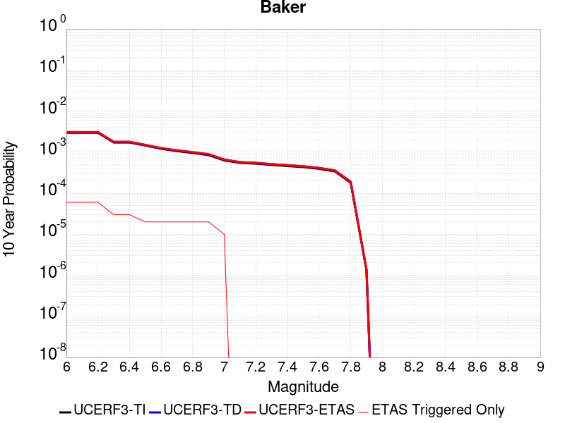 |

| Magnitude | 1 wk TI Prob | 1 wk TD Prob | 1 wk ETAS Prob | 1 wk ETAS/TD Gain | 1 wk ETAS Triggered Only | 1 mo TI Prob | 1 mo TD Prob | 1 mo ETAS Prob | 1 mo ETAS/TD Gain | 1 mo ETAS Triggered Only | 1 yr TI Prob | 1 yr TD Prob | 1 yr ETAS Prob | 1 yr ETAS/TD Gain | 1 yr ETAS Triggered Only | 10 yr TI Prob | 10 yr TD Prob | 10 yr ETAS Prob | 10 yr ETAS/TD Gain | 10 yr ETAS Triggered Only |
|-----|-----|-----|-----|-----|-----|-----|-----|-----|-----|-----|-----|-----|-----|-----|-----|-----|-----|-----|-----|-----|
| 6.0 | 5.695525E-6 | 5.8348332E-6 | 2.5834717E-5 | 4.42767 | 2.0E-5 | 2.4409164E-5 | 2.5006211E-5 | 4.5005712E-5 | 1.7997813 | 2.0E-5 | 2.9714106E-4 | 3.044121E-4 | 3.4439992E-4 | 1.1313608 | 4.0E-5 | 0.0029674405 | 0.0030403468 | 0.0031001642 | 1.0196745 | 6.0E-5 |
| 6.1 | 5.695525E-6 | 5.8348332E-6 | 2.5834717E-5 | 4.42767 | 2.0E-5 | 2.4409164E-5 | 2.5006211E-5 | 4.5005712E-5 | 1.7997813 | 2.0E-5 | 2.9714106E-4 | 3.044121E-4 | 3.4439992E-4 | 1.1313608 | 4.0E-5 | 0.0029674405 | 0.0030403468 | 0.0031001642 | 1.0196745 | 6.0E-5 |
| 6.2 | 5.695525E-6 | 5.8348332E-6 | 2.5834717E-5 | 4.42767 | 2.0E-5 | 2.4409164E-5 | 2.5006211E-5 | 4.5005712E-5 | 1.7997813 | 2.0E-5 | 2.9714106E-4 | 3.044121E-4 | 3.4439992E-4 | 1.1313608 | 4.0E-5 | 0.0029674405 | 0.0030403468 | 0.0031001642 | 1.0196745 | 6.0E-5 |
| 6.3 | 3.2995713E-6 | 3.3836648E-6 | 1.3383631E-5 | 3.9553654 | 1.0E-5 | 1.4140943E-5 | 1.4501343E-5 | 2.4501198E-5 | 1.6895813 | 1.0E-5 | 1.7215237E-4 | 1.7654001E-4 | 1.9653648E-4 | 1.1132687 | 2.0E-5 | 0.0017201907 | 0.0017640449 | 0.0017939919 | 1.0169764 | 3.0E-5 |
| 6.4 | 3.2995713E-6 | 3.3836648E-6 | 1.3383631E-5 | 3.9553654 | 1.0E-5 | 1.4140943E-5 | 1.4501343E-5 | 2.4501198E-5 | 1.6895813 | 1.0E-5 | 1.7215237E-4 | 1.7654001E-4 | 1.9653648E-4 | 1.1132687 | 2.0E-5 | 0.0017201907 | 0.0017640449 | 0.0017939919 | 1.0169764 | 3.0E-5 |
| 6.5 | 2.782202E-6 | 2.8558384E-6 | 2.8558384E-6 | 1.0 | 0.0 | 1.1923668E-5 | 1.2239252E-5 | 1.2239252E-5 | 1.0 | 0.0 | 1.4516099E-4 | 1.4900303E-4 | 1.5900155E-4 | 1.0671027 | 1.0E-5 | 0.001450662 | 0.001489064 | 0.0015090342 | 1.0134113 | 2.0E-5 |
| 6.6 | 2.3163404E-6 | 2.3809182E-6 | 2.3809182E-6 | 1.0 | 0.0 | 9.927136E-6 | 1.0203897E-5 | 1.0203897E-5 | 1.0 | 0.0 | 1.20856166E-4 | 1.2422555E-4 | 1.3422432E-4 | 1.0804887 | 1.0E-5 | 0.0012079047 | 0.0012415814 | 0.0012615565 | 1.0160885 | 2.0E-5 |
| 6.7 | 2.037056E-6 | 2.0964987E-6 | 2.0964987E-6 | 1.0 | 0.0 | 8.7302105E-6 | 8.984965E-6 | 8.984965E-6 | 1.0 | 0.0 | 1.0628513E-4 | 1.09386616E-4 | 1.1938553E-4 | 1.0914088 | 1.0E-5 | 0.0010623431 | 0.0010933438 | 0.001113322 | 1.0182725 | 2.0E-5 |
| 6.8 | 1.8356744E-6 | 1.8915271E-6 | 1.8915271E-6 | 1.0 | 0.0 | 7.867153E-6 | 8.10652E-6 | 8.10652E-6 | 1.0 | 0.0 | 9.577837E-5 | 9.869256E-5 | 1.0869157E-4 | 1.1013148 | 1.0E-5 | 9.57371E-4 | 9.865012E-4 | 0.0010064815 | 1.0202537 | 2.0E-5 |
| 6.9 | 1.6310546E-6 | 1.6832057E-6 | 1.6832057E-6 | 1.0 | 0.0 | 6.9902153E-6 | 7.2137195E-6 | 7.2137195E-6 | 1.0 | 0.0 | 8.510255E-5 | 8.782361E-5 | 9.782273E-5 | 1.1138546 | 1.0E-5 | 8.5069967E-4 | 8.779003E-4 | 8.9788274E-4 | 1.0227616 | 2.0E-5 |
| 7.0 | 1.2058036E-6 | 1.2508652E-6 | 1.2508652E-6 | 1.0 | 0.0 | 5.1677193E-6 | 5.3608405E-6 | 5.3608405E-6 | 1.0 | 0.0 | 6.291517E-5 | 6.52663E-5 | 7.526565E-5 | 1.1532084 | 1.0E-5 | 6.289736E-4 | 6.5247365E-4 | 6.624671E-4 | 1.0153162 | 1.0E-5 |
| 7.1 | 1.052382E-6 | 1.0951596E-6 | 1.0951596E-6 | 1.0 | 0.0 | 4.5102006E-6 | 4.693533E-6 | 4.693533E-6 | 1.0 | 0.0 | 5.491031E-5 | 5.7142275E-5 | 5.7142275E-5 | 1.0 | 0.0 | 5.4896745E-4 | 5.712767E-4 | 5.712767E-4 | 1.0 | 0.0 |
| 7.2 | 1.0067454E-6 | 1.0487698E-6 | 1.0487698E-6 | 1.0 | 0.0 | 4.3146156E-6 | 4.4947205E-6 | 4.4947205E-6 | 1.0 | 0.0 | 5.252918E-5 | 5.4721855E-5 | 5.4721855E-5 | 1.0 | 0.0 | 5.251676E-4 | 5.4708467E-4 | 5.4708467E-4 | 1.0 | 0.0 |
| 7.3 | 9.3596316E-7 | 9.767712E-7 | 9.767712E-7 | 1.0 | 0.0 | 4.0112645E-6 | 4.1861554E-6 | 4.1861554E-6 | 1.0 | 0.0 | 4.8836053E-5 | 5.096526E-5 | 5.096526E-5 | 1.0 | 0.0 | 4.8825322E-4 | 5.095365E-4 | 5.095365E-4 | 1.0 | 0.0 |
| 7.4 | 8.8117395E-7 | 9.207652E-7 | 9.207652E-7 | 1.0 | 0.0 | 3.7764542E-6 | 3.9461306E-6 | 3.9461306E-6 | 1.0 | 0.0 | 4.5977362E-5 | 4.804309E-5 | 4.804309E-5 | 1.0 | 0.0 | 4.596785E-4 | 4.803278E-4 | 4.803278E-4 | 1.0 | 0.0 |
| 7.5 | 8.292386E-7 | 8.674585E-7 | 8.674585E-7 | 1.0 | 0.0 | 3.5538749E-6 | 3.717674E-6 | 3.717674E-6 | 1.0 | 0.0 | 4.326757E-5 | 4.526175E-5 | 4.526175E-5 | 1.0 | 0.0 | 4.3259145E-4 | 4.5252603E-4 | 4.5252603E-4 | 1.0 | 0.0 |
| 7.6 | 7.553842E-7 | 7.9144604E-7 | 7.9144604E-7 | 1.0 | 0.0 | 3.2373566E-6 | 3.3919073E-6 | 3.3919073E-6 | 1.0 | 0.0 | 3.9414106E-5 | 4.1295694E-5 | 4.1295694E-5 | 1.0 | 0.0 | 3.9407116E-4 | 4.128809E-4 | 4.128809E-4 | 1.0 | 0.0 |
| 7.7 | 6.5285366E-7 | 6.8527874E-7 | 6.8527874E-7 | 1.0 | 0.0 | 2.797941E-6 | 2.9369057E-6 | 2.9369057E-6 | 1.0 | 0.0 | 3.40644E-5 | 3.5756246E-5 | 3.5756246E-5 | 1.0 | 0.0 | 3.405918E-4 | 3.575056E-4 | 3.575056E-4 | 1.0 | 0.0 |
| 7.8 | 3.4586725E-7 | 3.648256E-7 | 3.648256E-7 | 1.0 | 0.0 | 1.4822873E-6 | 1.5635374E-6 | 1.5635374E-6 | 1.0 | 0.0 | 1.80467E-5 | 1.9035906E-5 | 1.9035906E-5 | 1.0 | 0.0 | 1.8045233E-4 | 1.903432E-4 | 1.903432E-4 | 1.0 | 0.0 |
| 7.9 | 2.5591178E-9 | 2.6696687E-9 | 2.6696687E-9 | 1.0 | 0.0 | 1.0967647E-8 | 1.1441437E-8 | 1.1441437E-8 | 1.0 | 0.0 | 1.335311E-7 | 1.392995E-7 | 1.392995E-7 | 1.0 | 0.0 | 1.3353102E-6 | 1.3929949E-6 | 1.3929949E-6 | 1.0 | 0.0 |

## Death Valley (Fish Lake Valley)
*[(top)](#table-of-contents)*

| 1 Week | 1 Month | 1 Year | 10 Year |
|-----|-----|-----|-----|
|  |  |  |  |

| Magnitude | 1 wk TI Prob | 1 wk TD Prob | 1 wk ETAS Prob | 1 wk ETAS/TD Gain | 1 wk ETAS Triggered Only | 1 mo TI Prob | 1 mo TD Prob | 1 mo ETAS Prob | 1 mo ETAS/TD Gain | 1 mo ETAS Triggered Only | 1 yr TI Prob | 1 yr TD Prob | 1 yr ETAS Prob | 1 yr ETAS/TD Gain | 1 yr ETAS Triggered Only | 10 yr TI Prob | 10 yr TD Prob | 10 yr ETAS Prob | 10 yr ETAS/TD Gain | 10 yr ETAS Triggered Only |
|-----|-----|-----|-----|-----|-----|-----|-----|-----|-----|-----|-----|-----|-----|-----|-----|-----|-----|-----|-----|-----|
| 6.0 | 3.872328E-5 | 4.7265417E-5 | 9.726305E-5 | 2.0578058 | 5.0E-5 | 1.6594635E-4 | 2.0255202E-4 | 2.6253986E-4 | 1.2961602 | 6.0E-5 | 0.0020185246 | 0.002463546 | 0.0025233983 | 1.0242951 | 6.0E-5 | 0.02000288 | 0.024388196 | 0.024446731 | 1.0024002 | 6.0E-5 |
| 6.1 | 3.872328E-5 | 4.7265417E-5 | 9.726305E-5 | 2.0578058 | 5.0E-5 | 1.6594635E-4 | 2.0255202E-4 | 2.6253986E-4 | 1.2961602 | 6.0E-5 | 0.0020185246 | 0.002463546 | 0.0025233983 | 1.0242951 | 6.0E-5 | 0.02000288 | 0.024388196 | 0.024446731 | 1.0024002 | 6.0E-5 |
| 6.2 | 3.872328E-5 | 4.7265417E-5 | 9.726305E-5 | 2.0578058 | 5.0E-5 | 1.6594635E-4 | 2.0255202E-4 | 2.6253986E-4 | 1.2961602 | 6.0E-5 | 0.0020185246 | 0.002463546 | 0.0025233983 | 1.0242951 | 6.0E-5 | 0.02000288 | 0.024388196 | 0.024446731 | 1.0024002 | 6.0E-5 |
| 6.3 | 2.8356371E-5 | 3.360962E-5 | 8.360794E-5 | 2.4876192 | 5.0E-5 | 1.2152165E-4 | 1.4403371E-4 | 2.0402507E-4 | 1.4165092 | 6.0E-5 | 0.0014785219 | 0.00175227 | 0.0018121649 | 1.0341814 | 6.0E-5 | 0.014687235 | 0.01739173 | 0.017450687 | 1.00339 | 6.0E-5 |
| 6.4 | 2.8356371E-5 | 3.360962E-5 | 8.360794E-5 | 2.4876192 | 5.0E-5 | 1.2152165E-4 | 1.4403371E-4 | 2.0402507E-4 | 1.4165092 | 6.0E-5 | 0.0014785219 | 0.00175227 | 0.0018121649 | 1.0341814 | 6.0E-5 | 0.014687235 | 0.01739173 | 0.017450687 | 1.00339 | 6.0E-5 |
| 6.5 | 2.4448687E-5 | 2.8607454E-5 | 7.860603E-5 | 2.7477462 | 5.0E-5 | 1.0477588E-4 | 1.2259788E-4 | 1.8259052E-4 | 1.4893448 | 6.0E-5 | 0.0012748998 | 0.0014916548 | 0.0015515654 | 1.0401638 | 6.0E-5 | 0.012676105 | 0.014821324 | 0.014880435 | 1.0039883 | 6.0E-5 |
| 6.6 | 2.1298161E-5 | 2.465998E-5 | 7.465875E-5 | 3.0275269 | 5.0E-5 | 9.127464E-5 | 1.05681516E-4 | 1.6567518E-4 | 1.5676836 | 6.0E-5 | 0.0011107022 | 0.0012859458 | 0.0013458687 | 1.0465983 | 6.0E-5 | 0.011051672 | 0.012788476 | 0.012847709 | 1.0046318 | 6.0E-5 |
| 6.7 | 1.8959729E-5 | 2.178094E-5 | 7.177985E-5 | 3.295535 | 5.0E-5 | 8.125345E-5 | 9.334368E-5 | 1.5333809E-4 | 1.6427258 | 6.0E-5 | 9.888117E-4 | 0.0011358925 | 0.0011958242 | 1.0527619 | 6.0E-5 | 0.009844234 | 0.011303525 | 0.011362847 | 1.0052481 | 6.0E-5 |
| 6.8 | 1.6691629E-5 | 1.901828E-5 | 6.901733E-5 | 3.6289995 | 5.0E-5 | 7.153359E-5 | 8.150446E-5 | 1.4149958E-4 | 1.736096 | 6.0E-5 | 8.7057345E-4 | 9.918819E-4 | 0.0010518224 | 1.0604311 | 6.0E-5 | 0.008671708 | 0.009876307 | 0.009935714 | 1.0060152 | 6.0E-5 |
| 6.9 | 1.450505E-5 | 1.6389482E-5 | 6.638866E-5 | 4.050687 | 5.0E-5 | 6.216302E-5 | 7.02388E-5 | 1.3023458E-4 | 1.8541688 | 6.0E-5 | 7.5657194E-4 | 8.5483067E-4 | 9.147794E-4 | 1.0701294 | 6.0E-5 | 0.007540013 | 0.008516356 | 0.0085758455 | 1.0069853 | 6.0E-5 |
| 7.0 | 1.2940855E-5 | 1.4537924E-5 | 6.45372E-5 | 4.4392304 | 5.0E-5 | 5.545963E-5 | 6.230393E-5 | 1.2230019E-4 | 1.9629611 | 6.0E-5 | 6.750118E-4 | 7.5829215E-4 | 8.182467E-4 | 1.0790652 | 6.0E-5 | 0.006729651 | 0.007557665 | 0.0076172114 | 1.007879 | 6.0E-5 |
| 7.1 | 1.2544658E-5 | 1.4078161E-5 | 6.407746E-5 | 4.55155 | 5.0E-5 | 5.3761712E-5 | 6.0333616E-5 | 1.2033E-4 | 1.9944105 | 6.0E-5 | 6.5435225E-4 | 7.343198E-4 | 7.942757E-4 | 1.0816482 | 6.0E-5 | 0.006524288 | 0.007319527 | 0.007379088 | 1.0081372 | 6.0E-5 |
| 7.2 | 1.2489416E-5 | 1.4015628E-5 | 6.401493E-5 | 4.567396 | 5.0E-5 | 5.3524967E-5 | 6.0065628E-5 | 1.20062025E-4 | 1.9988474 | 6.0E-5 | 6.514716E-4 | 7.3105923E-4 | 7.910154E-4 | 1.0820127 | 6.0E-5 | 0.006495651 | 0.007287136 | 0.0073466985 | 1.0081737 | 6.0E-5 |
| 7.3 | 1.2368307E-5 | 1.3879767E-5 | 6.387907E-5 | 4.602316 | 5.0E-5 | 5.3005948E-5 | 5.948339E-5 | 1.19479824E-4 | 2.008625 | 6.0E-5 | 6.451563E-4 | 7.2397524E-4 | 7.839318E-4 | 1.0828158 | 6.0E-5 | 0.0064328653 | 0.0072167586 | 0.0072763255 | 1.0082539 | 6.0E-5 |
| 7.4 | 1.2161707E-5 | 1.3647823E-5 | 6.364714E-5 | 4.663538 | 5.0E-5 | 5.212056E-5 | 5.8489393E-5 | 1.18485885E-4 | 2.025767 | 6.0E-5 | 6.3438306E-4 | 7.1188126E-4 | 7.7183853E-4 | 1.0842237 | 6.0E-5 | 0.006325751 | 0.0070965975 | 0.007156172 | 1.0083947 | 6.0E-5 |
| 7.5 | 1.1707948E-5 | 1.3145472E-5 | 6.314481E-5 | 4.803541 | 5.0E-5 | 5.0175953E-5 | 5.633655E-5 | 1.1633317E-4 | 2.0649679 | 6.0E-5 | 6.10721E-4 | 6.8568724E-4 | 7.4564613E-4 | 1.0874435 | 6.0E-5 | 0.0060904534 | 0.006836299 | 0.0068958886 | 1.0087167 | 6.0E-5 |
| 7.6 | 1.0319538E-5 | 1.1579585E-5 | 6.1579005E-5 | 5.317894 | 5.0E-5 | 4.4225842E-5 | 4.9625876E-5 | 1.09622895E-4 | 2.2089868 | 6.0E-5 | 5.383166E-4 | 6.040327E-4 | 6.639965E-4 | 1.0992724 | 6.0E-5 | 0.0053701443 | 0.0060244408 | 0.0060840794 | 1.0098994 | 6.0E-5 |
| 7.7 | 8.937764E-6 | 1.0022746E-5 | 6.0022245E-5 | 5.9886026 | 5.0E-5 | 3.830414E-5 | 4.295395E-5 | 9.29518E-5 | 2.1639874 | 5.0E-5 | 4.6625308E-4 | 5.228439E-4 | 5.7281775E-4 | 1.0955808 | 5.0E-5 | 0.0046527605 | 0.0052166474 | 0.0052663865 | 1.0095347 | 5.0E-5 |
| 7.8 | 3.108007E-7 | 3.284649E-7 | 3.284649E-7 | 1.0 | 0.0 | 1.3320023E-6 | 1.407706E-6 | 1.407706E-6 | 1.0 | 0.0 | 1.6217007E-5 | 1.713869E-5 | 1.713869E-5 | 1.0 | 0.0 | 1.6215823E-4 | 1.7137405E-4 | 1.7137405E-4 | 1.0 | 0.0 |
| 7.9 | 2.5591178E-9 | 2.6696687E-9 | 2.6696687E-9 | 1.0 | 0.0 | 1.0967647E-8 | 1.1441437E-8 | 1.1441437E-8 | 1.0 | 0.0 | 1.335311E-7 | 1.392995E-7 | 1.392995E-7 | 1.0 | 0.0 | 1.3353102E-6 | 1.3929949E-6 | 1.3929949E-6 | 1.0 | 0.0 |

## San Andreas (San Bernardino S)
*[(top)](#table-of-contents)*

| 1 Week | 1 Month | 1 Year | 10 Year |
|-----|-----|-----|-----|
|  |  |  |  |

| Magnitude | 1 wk TI Prob | 1 wk TD Prob | 1 wk ETAS Prob | 1 wk ETAS/TD Gain | 1 wk ETAS Triggered Only | 1 mo TI Prob | 1 mo TD Prob | 1 mo ETAS Prob | 1 mo ETAS/TD Gain | 1 mo ETAS Triggered Only | 1 yr TI Prob | 1 yr TD Prob | 1 yr ETAS Prob | 1 yr ETAS/TD Gain | 1 yr ETAS Triggered Only | 10 yr TI Prob | 10 yr TD Prob | 10 yr ETAS Prob | 10 yr ETAS/TD Gain | 10 yr ETAS Triggered Only |
|-----|-----|-----|-----|-----|-----|-----|-----|-----|-----|-----|-----|-----|-----|-----|-----|-----|-----|-----|-----|-----|
| 6.0 | 1.2336002E-4 | 3.0004286E-4 | 3.1003988E-4 | 1.0333185 | 1.0E-5 | 5.2857865E-4 | 0.0012852903 | 0.0012952775 | 1.0077703 | 1.0E-5 | 0.006416472 | 0.015541089 | 0.015570623 | 1.0019003 | 3.0E-5 | 0.06234337 | 0.1429477 | 0.14299913 | 1.0003598 | 6.0E-5 |
| 6.1 | 1.2336002E-4 | 3.0004286E-4 | 3.1003988E-4 | 1.0333185 | 1.0E-5 | 5.2857865E-4 | 0.0012852903 | 0.0012952775 | 1.0077703 | 1.0E-5 | 0.006416472 | 0.015541089 | 0.015570623 | 1.0019003 | 3.0E-5 | 0.06234337 | 0.1429477 | 0.14299913 | 1.0003598 | 6.0E-5 |
| 6.2 | 1.2336002E-4 | 3.0004286E-4 | 3.1003988E-4 | 1.0333185 | 1.0E-5 | 5.2857865E-4 | 0.0012852903 | 0.0012952775 | 1.0077703 | 1.0E-5 | 0.006416472 | 0.015541089 | 0.015570623 | 1.0019003 | 3.0E-5 | 0.06234337 | 0.1429477 | 0.14299913 | 1.0003598 | 6.0E-5 |
| 6.3 | 1.1712257E-4 | 2.8792562E-4 | 2.9792276E-4 | 1.0347211 | 1.0E-5 | 5.018573E-4 | 0.001233409 | 0.0012433968 | 1.0080976 | 1.0E-5 | 0.006093008 | 0.014918202 | 0.014947754 | 1.001981 | 3.0E-5 | 0.059286322 | 0.13765801 | 0.13770975 | 1.0003759 | 6.0E-5 |
| 6.4 | 1.1712257E-4 | 2.8792562E-4 | 2.9792276E-4 | 1.0347211 | 1.0E-5 | 5.018573E-4 | 0.001233409 | 0.0012433968 | 1.0080976 | 1.0E-5 | 0.006093008 | 0.014918202 | 0.014947754 | 1.001981 | 3.0E-5 | 0.059286322 | 0.13765801 | 0.13770975 | 1.0003759 | 6.0E-5 |
| 6.5 | 1.0689076E-4 | 2.6805513E-4 | 2.7805244E-4 | 1.0372958 | 1.0E-5 | 4.5802278E-4 | 0.0011483267 | 0.0011583152 | 1.0086983 | 1.0E-5 | 0.0055621783 | 0.01389587 | 0.013925454 | 1.002129 | 3.0E-5 | 0.05425003 | 0.12889914 | 0.1289514 | 1.0004054 | 6.0E-5 |
| 6.6 | 9.7648895E-5 | 2.505039E-4 | 2.6050137E-4 | 1.0399095 | 1.0E-5 | 4.1842813E-4 | 0.00107317 | 0.0010831592 | 1.0093082 | 1.0E-5 | 0.005082469 | 0.012991933 | 0.013021544 | 1.0022792 | 3.0E-5 | 0.049677886 | 0.12107798 | 0.12113071 | 1.0004356 | 6.0E-5 |
| 6.7 | 8.757013E-5 | 2.3121275E-4 | 2.4121044E-4 | 1.0432402 | 1.0E-5 | 3.7524657E-4 | 9.905577E-4 | 0.0010005478 | 1.0100853 | 1.0E-5 | 0.00455906 | 0.011997437 | 0.012027077 | 1.0024705 | 3.0E-5 | 0.04466656 | 0.11237316 | 0.112426415 | 1.000474 | 6.0E-5 |
| 6.8 | 8.562978E-5 | 2.2681156E-4 | 2.368093E-4 | 1.0440794 | 1.0E-5 | 3.6693315E-4 | 9.7170967E-4 | 9.816999E-4 | 1.0102811 | 1.0E-5 | 0.004458263 | 0.011770456 | 0.011800103 | 1.0025188 | 3.0E-5 | 0.043698758 | 0.110378765 | 0.11043214 | 1.0004836 | 6.0E-5 |
| 6.9 | 6.124075E-5 | 1.7065984E-4 | 1.8065813E-4 | 1.0585861 | 1.0E-5 | 2.6243398E-4 | 7.3119515E-4 | 7.4118783E-4 | 1.0136663 | 1.0E-5 | 0.0031904527 | 0.00886617 | 0.008895905 | 1.0033536 | 3.0E-5 | 0.031450346 | 0.08420276 | 0.08425771 | 1.0006526 | 6.0E-5 |
| 7.0 | 5.8598747E-5 | 1.6495038E-4 | 1.7494873E-4 | 1.0606143 | 1.0E-5 | 2.5111332E-4 | 7.067395E-4 | 7.167324E-4 | 1.0141395 | 1.0E-5 | 0.0030530186 | 0.0085708015 | 0.008600544 | 1.0034703 | 3.0E-5 | 0.03011414 | 0.08151641 | 0.08157152 | 1.000676 | 6.0E-5 |
| 7.1 | 5.613814E-5 | 1.591358E-4 | 1.691342E-4 | 1.0628294 | 1.0E-5 | 2.4056983E-4 | 6.818331E-4 | 6.918263E-4 | 1.0146563 | 1.0E-5 | 0.0029250039 | 0.008269901 | 0.008299653 | 1.0035976 | 3.0E-5 | 0.028868021 | 0.07881104 | 0.07886631 | 1.0007013 | 6.0E-5 |
| 7.2 | 4.991222E-5 | 1.4520068E-4 | 1.5519923E-4 | 1.0688602 | 1.0E-5 | 2.1389198E-4 | 6.221406E-4 | 6.321344E-4 | 1.0160636 | 1.0E-5 | 0.002601025 | 0.0075483583 | 0.0075781317 | 1.0039444 | 3.0E-5 | 0.025707912 | 0.07226014 | 0.072315805 | 1.0007703 | 6.0E-5 |
| 7.3 | 4.7410045E-5 | 1.3714298E-4 | 1.4714162E-4 | 1.0729066 | 1.0E-5 | 2.0317009E-4 | 5.8762357E-4 | 5.976177E-4 | 1.0170077 | 1.0E-5 | 0.0024707897 | 0.0071309344 | 0.0071607204 | 1.004177 | 3.0E-5 | 0.024434982 | 0.068538874 | 0.06859476 | 1.0008154 | 6.0E-5 |
| 7.4 | 4.5556746E-5 | 1.312221E-4 | 1.4122078E-4 | 1.0761967 | 1.0E-5 | 1.952286E-4 | 5.622595E-4 | 5.722539E-4 | 1.0177754 | 1.0E-5 | 0.002374317 | 0.006824102 | 0.006853897 | 1.0043662 | 3.0E-5 | 0.023491086 | 0.065788716 | 0.06584477 | 1.000852 | 6.0E-5 |
| 7.5 | 4.3084514E-5 | 1.2357533E-4 | 1.335741E-4 | 1.0809124 | 1.0E-5 | 1.8463485E-4 | 5.2950135E-4 | 5.394961E-4 | 1.0188757 | 1.0E-5 | 0.0022456115 | 0.006427695 | 0.0064575025 | 1.0046374 | 3.0E-5 | 0.022230545 | 0.06218917 | 0.06224544 | 1.0009048 | 6.0E-5 |
| 7.6 | 3.408608E-5 | 9.835737E-5 | 1.0835639E-4 | 1.10166 | 1.0E-5 | 1.4607502E-4 | 4.214636E-4 | 4.314594E-4 | 1.0237168 | 1.0E-5 | 0.0017770125 | 0.005119272 | 0.0051491186 | 1.0058302 | 3.0E-5 | 0.017628696 | 0.05002095 | 0.05007795 | 1.0011395 | 6.0E-5 |
| 7.7 | 2.8315713E-5 | 8.248871E-5 | 9.2487884E-5 | 1.1212187 | 1.0E-5 | 1.2134742E-4 | 3.534752E-4 | 3.6347166E-4 | 1.0282805 | 1.0E-5 | 0.0014764034 | 0.004295077 | 0.0043249484 | 1.0069548 | 3.0E-5 | 0.01466633 | 0.042271324 | 0.04232879 | 1.0013593 | 6.0E-5 |
| 7.8 | 2.6222975E-5 | 7.463234E-5 | 8.4631596E-5 | 1.1339802 | 1.0E-5 | 1.1237934E-4 | 3.198137E-4 | 3.2981051E-4 | 1.0312582 | 1.0E-5 | 0.0013673597 | 0.0038867863 | 0.0039166696 | 1.0076884 | 3.0E-5 | 0.013589768 | 0.03843662 | 0.038494315 | 1.001501 | 6.0E-5 |
| 7.9 | 2.1469694E-5 | 5.787948E-5 | 6.78789E-5 | 1.1727628 | 1.0E-5 | 9.200973E-5 | 2.4803134E-4 | 2.5802886E-4 | 1.0403075 | 1.0E-5 | 0.0011196428 | 0.003015603 | 0.0030455126 | 1.0099182 | 3.0E-5 | 0.011140184 | 0.030151661 | 0.030190455 | 1.0012866 | 4.0E-5 |
| 8.0 | 1.2420249E-5 | 3.1318876E-5 | 3.1318876E-5 | 1.0 | 0.0 | 5.322855E-5 | 1.3421685E-4 | 1.3421685E-4 | 1.0 | 0.0 | 6.478649E-4 | 0.0016328663 | 0.0016328663 | 1.0 | 0.0 | 0.0064597935 | 0.01652268 | 0.01652268 | 1.0 | 0.0 |
| 8.1 | 4.9197724E-6 | 7.8215E-6 | 7.8215E-6 | 1.0 | 0.0 | 2.1084568E-5 | 3.3520282E-5 | 3.3520282E-5 | 1.0 | 0.0 | 2.566744E-4 | 4.0803317E-4 | 4.0803317E-4 | 1.0 | 0.0 | 0.002563781 | 0.0043841708 | 0.0043841708 | 1.0 | 0.0 |
| 8.2 | 2.5634774E-6 | 2.906094E-6 | 2.906094E-6 | 1.0 | 0.0 | 1.0986286E-5 | 1.245463E-5 | 1.245463E-5 | 1.0 | 0.0 | 1.3374983E-4 | 1.5162461E-4 | 1.5162461E-4 | 1.0 | 0.0 | 0.0013366934 | 0.0017047176 | 0.0017047176 | 1.0 | 0.0 |
| 8.3 | 5.2850464E-7 | 3.2074206E-7 | 3.2074206E-7 | 1.0 | 0.0 | 2.2650179E-6 | 1.3746081E-6 | 1.3746081E-6 | 1.0 | 0.0 | 2.7576245E-5 | 1.6735738E-5 | 1.6735738E-5 | 1.0 | 0.0 | 2.7572823E-4 | 1.986336E-4 | 1.986336E-4 | 1.0 | 0.0 |

## San Andreas (Carrizo) rev
*[(top)](#table-of-contents)*

| 1 Week | 1 Month | 1 Year | 10 Year |
|-----|-----|-----|-----|
|  |  |  |  |

| Magnitude | 1 wk TI Prob | 1 wk TD Prob | 1 wk ETAS Prob | 1 wk ETAS/TD Gain | 1 wk ETAS Triggered Only | 1 mo TI Prob | 1 mo TD Prob | 1 mo ETAS Prob | 1 mo ETAS/TD Gain | 1 mo ETAS Triggered Only | 1 yr TI Prob | 1 yr TD Prob | 1 yr ETAS Prob | 1 yr ETAS/TD Gain | 1 yr ETAS Triggered Only | 10 yr TI Prob | 10 yr TD Prob | 10 yr ETAS Prob | 10 yr ETAS/TD Gain | 10 yr ETAS Triggered Only |
|-----|-----|-----|-----|-----|-----|-----|-----|-----|-----|-----|-----|-----|-----|-----|-----|-----|-----|-----|-----|-----|
| 6.0 | 1.1674632E-4 | 2.4322356E-4 | 2.8321383E-4 | 1.1644177 | 4.0E-5 | 5.002454E-4 | 0.0010419718 | 0.0010919198 | 1.047936 | 5.0E-5 | 0.006073493 | 0.0126127 | 0.01266207 | 1.0039142 | 5.0E-5 | 0.0591016 | 0.12061794 | 0.12066191 | 1.0003645 | 5.0E-5 |
| 6.1 | 1.1674632E-4 | 2.4322356E-4 | 2.8321383E-4 | 1.1644177 | 4.0E-5 | 5.002454E-4 | 0.0010419718 | 0.0010919198 | 1.047936 | 5.0E-5 | 0.006073493 | 0.0126127 | 0.01266207 | 1.0039142 | 5.0E-5 | 0.0591016 | 0.12061794 | 0.12066191 | 1.0003645 | 5.0E-5 |
| 6.2 | 1.1674632E-4 | 2.4322356E-4 | 2.8321383E-4 | 1.1644177 | 4.0E-5 | 5.002454E-4 | 0.0010419718 | 0.0010919198 | 1.047936 | 5.0E-5 | 0.006073493 | 0.0126127 | 0.01266207 | 1.0039142 | 5.0E-5 | 0.0591016 | 0.12061794 | 0.12066191 | 1.0003645 | 5.0E-5 |
| 6.3 | 1.1674632E-4 | 2.4322356E-4 | 2.8321383E-4 | 1.1644177 | 4.0E-5 | 5.002454E-4 | 0.0010419718 | 0.0010919198 | 1.047936 | 5.0E-5 | 0.006073493 | 0.0126127 | 0.01266207 | 1.0039142 | 5.0E-5 | 0.0591016 | 0.12061794 | 0.12066191 | 1.0003645 | 5.0E-5 |
| 6.4 | 1.1674632E-4 | 2.4322356E-4 | 2.8321383E-4 | 1.1644177 | 4.0E-5 | 5.002454E-4 | 0.0010419718 | 0.0010919198 | 1.047936 | 5.0E-5 | 0.006073493 | 0.0126127 | 0.01266207 | 1.0039142 | 5.0E-5 | 0.0591016 | 0.12061794 | 0.12066191 | 1.0003645 | 5.0E-5 |
| 6.5 | 1.13136164E-4 | 2.3642433E-4 | 2.7641485E-4 | 1.1691474 | 4.0E-5 | 4.847792E-4 | 0.0010128552 | 0.0010628045 | 1.0493155 | 5.0E-5 | 0.0058862255 | 0.012262235 | 0.012311622 | 1.0040276 | 5.0E-5 | 0.057327334 | 0.11758334 | 0.117627464 | 1.0003753 | 5.0E-5 |
| 6.6 | 1.13136164E-4 | 2.3642433E-4 | 2.7641485E-4 | 1.1691474 | 4.0E-5 | 4.847792E-4 | 0.0010128552 | 0.0010628045 | 1.0493155 | 5.0E-5 | 0.0058862255 | 0.012262235 | 0.012311622 | 1.0040276 | 5.0E-5 | 0.057327334 | 0.11758334 | 0.117627464 | 1.0003753 | 5.0E-5 |
| 6.7 | 1.1149675E-4 | 2.3333685E-4 | 2.7332752E-4 | 1.171386 | 4.0E-5 | 4.777557E-4 | 9.996332E-4 | 0.0010495833 | 1.0499684 | 5.0E-5 | 0.0058011734 | 0.012103056 | 0.01215245 | 1.0040811 | 5.0E-5 | 0.05652051 | 0.11620166 | 0.11624585 | 1.0003803 | 5.0E-5 |
| 6.8 | 1.1103589E-4 | 2.3235848E-4 | 2.723492E-4 | 1.1721078 | 4.0E-5 | 4.7578133E-4 | 9.954434E-4 | 0.0010453938 | 1.0501789 | 5.0E-5 | 0.005777263 | 0.01205261 | 0.012102007 | 1.0040985 | 5.0E-5 | 0.056293584 | 0.11576148 | 0.11580569 | 1.000382 | 5.0E-5 |
| 6.9 | 1.1053259E-4 | 2.312823E-4 | 2.7127305E-4 | 1.1729088 | 4.0E-5 | 4.7362508E-4 | 9.908348E-4 | 0.0010407853 | 1.0504125 | 5.0E-5 | 0.0057511497 | 0.011997119 | 0.012046519 | 1.0041176 | 5.0E-5 | 0.05604569 | 0.115277916 | 0.11532215 | 1.0003837 | 5.0E-5 |
| 7.0 | 1.1005377E-4 | 2.3029075E-4 | 2.7028154E-4 | 1.1736535 | 4.0E-5 | 4.7157376E-4 | 9.865885E-4 | 0.0010365392 | 1.0506297 | 5.0E-5 | 0.0057263062 | 0.011945989 | 0.011995391 | 1.0041355 | 5.0E-5 | 0.055809796 | 0.11483013 | 0.11487439 | 1.0003854 | 5.0E-5 |
| 7.1 | 1.0308142E-4 | 2.1538913E-4 | 2.553805E-4 | 1.1856704 | 4.0E-5 | 4.417027E-4 | 9.227707E-4 | 9.727246E-4 | 1.0541346 | 5.0E-5 | 0.0053644776 | 0.011177175 | 0.011226616 | 1.0044234 | 5.0E-5 | 0.052368138 | 0.108091824 | 0.10813642 | 1.0004126 | 5.0E-5 |
| 7.2 | 1.0027479E-4 | 2.0946808E-4 | 2.494597E-4 | 1.1909199 | 4.0E-5 | 4.296783E-4 | 8.974125E-4 | 9.4736763E-4 | 1.0556657 | 5.0E-5 | 0.0052187922 | 0.010871558 | 0.010921015 | 1.0045491 | 5.0E-5 | 0.050979212 | 0.10539154 | 0.10543627 | 1.0004244 | 5.0E-5 |
| 7.3 | 9.816942E-5 | 2.042204E-4 | 2.4421222E-4 | 1.1958268 | 4.0E-5 | 4.2065824E-4 | 8.749377E-4 | 9.2489395E-4 | 1.057097 | 5.0E-5 | 0.005109493 | 0.010600623 | 0.010650093 | 1.0046667 | 5.0E-5 | 0.049935985 | 0.10297247 | 0.10301732 | 1.0004356 | 5.0E-5 |
| 7.4 | 9.5634205E-5 | 1.9791478E-4 | 2.3790686E-4 | 1.2020671 | 4.0E-5 | 4.0979648E-4 | 8.4793137E-4 | 8.9788897E-4 | 1.058917 | 5.0E-5 | 0.0049778637 | 0.010274961 | 0.010324447 | 1.0048162 | 5.0E-5 | 0.048678253 | 0.100064956 | 0.10010995 | 1.0004497 | 5.0E-5 |
| 7.5 | 8.052417E-5 | 1.6112256E-4 | 1.9111772E-4 | 1.1861637 | 3.0E-5 | 3.4505792E-4 | 6.903427E-4 | 7.3031505E-4 | 1.0579022 | 4.0E-5 | 0.0041929903 | 0.008372612 | 0.008412277 | 1.0047375 | 4.0E-5 | 0.04114753 | 0.08281128 | 0.08284797 | 1.000443 | 4.0E-5 |
| 7.6 | 7.897024E-5 | 1.5765514E-4 | 1.8765042E-4 | 1.1902587 | 3.0E-5 | 3.384E-4 | 6.754901E-4 | 7.1546313E-4 | 1.0591762 | 4.0E-5 | 0.0041122385 | 0.008193157 | 0.008232829 | 1.0048422 | 4.0E-5 | 0.040369697 | 0.0811521 | 0.08118886 | 1.0004529 | 4.0E-5 |
| 7.7 | 6.707427E-5 | 1.3275658E-4 | 1.5275393E-4 | 1.1506317 | 2.0E-5 | 2.8742946E-4 | 5.688328E-4 | 5.888214E-4 | 1.0351397 | 2.0E-5 | 0.003493839 | 0.00690358 | 0.006923442 | 1.002877 | 2.0E-5 | 0.034394164 | 0.06904754 | 0.06906616 | 1.0002697 | 2.0E-5 |
| 7.8 | 6.147705E-5 | 1.2197082E-4 | 1.4196838E-4 | 1.1639537 | 2.0E-5 | 2.6344648E-4 | 5.226274E-4 | 5.4261694E-4 | 1.0382482 | 2.0E-5 | 0.0032027436 | 0.0063444492 | 0.0063643223 | 1.0031323 | 2.0E-5 | 0.031569764 | 0.06351423 | 0.06353296 | 1.0002949 | 2.0E-5 |
| 7.9 | 4.7636717E-5 | 8.879351E-5 | 9.8792625E-5 | 1.1126108 | 1.0E-5 | 2.0414138E-4 | 3.8048814E-4 | 3.9048432E-4 | 1.026272 | 1.0E-5 | 0.0024825884 | 0.004622611 | 0.0046325647 | 1.0021533 | 1.0E-5 | 0.024550365 | 0.046625797 | 0.04663533 | 1.0002044 | 1.0E-5 |
| 8.0 | 3.3554235E-5 | 5.2132433E-5 | 5.2132433E-5 | 1.0 | 0.0 | 1.4379594E-4 | 2.2340559E-4 | 2.2340559E-4 | 1.0 | 0.0 | 0.0017493097 | 0.002716572 | 0.002716572 | 1.0 | 0.0 | 0.017356034 | 0.027879264 | 0.027879264 | 1.0 | 0.0 |
| 8.1 | 1.9175432E-5 | 1.9180918E-5 | 1.9180918E-5 | 1.0 | 0.0 | 8.217783E-5 | 8.220134E-5 | 8.220134E-5 | 1.0 | 0.0 | 0.0010000558 | 0.0010003424 | 0.0010003424 | 1.0 | 0.0 | 0.009955673 | 0.010756371 | 0.010756371 | 1.0 | 0.0 |
| 8.2 | 8.643924E-6 | 5.472644E-6 | 5.472644E-6 | 1.0 | 0.0 | 3.704486E-5 | 2.3453977E-5 | 2.3453977E-5 | 1.0 | 0.0 | 4.5092785E-4 | 2.8551483E-4 | 2.8551483E-4 | 1.0 | 0.0 | 0.0045001395 | 0.003247653 | 0.003247653 | 1.0 | 0.0 |
| 8.3 | 1.983087E-6 | 7.6547434E-7 | 7.6547434E-7 | 1.0 | 0.0 | 8.498917E-6 | 3.2806004E-6 | 3.2806004E-6 | 1.0 | 0.0 | 1.034694E-4 | 3.9940594E-5 | 3.9940594E-5 | 1.0 | 0.0 | 0.0010342124 | 4.7170694E-4 | 4.7170694E-4 | 1.0 | 0.0 |

## San Andreas (Cholame) rev
*[(top)](#table-of-contents)*

| 1 Week | 1 Month | 1 Year | 10 Year |
|-----|-----|-----|-----|
|  |  |  |  |

| Magnitude | 1 wk TI Prob | 1 wk TD Prob | 1 wk ETAS Prob | 1 wk ETAS/TD Gain | 1 wk ETAS Triggered Only | 1 mo TI Prob | 1 mo TD Prob | 1 mo ETAS Prob | 1 mo ETAS/TD Gain | 1 mo ETAS Triggered Only | 1 yr TI Prob | 1 yr TD Prob | 1 yr ETAS Prob | 1 yr ETAS/TD Gain | 1 yr ETAS Triggered Only | 10 yr TI Prob | 10 yr TD Prob | 10 yr ETAS Prob | 10 yr ETAS/TD Gain | 10 yr ETAS Triggered Only |
|-----|-----|-----|-----|-----|-----|-----|-----|-----|-----|-----|-----|-----|-----|-----|-----|-----|-----|-----|-----|-----|
| 6.0 | 1.2302514E-4 | 2.5203943E-4 | 2.9202935E-4 | 1.1586653 | 4.0E-5 | 5.27144E-4 | 0.0010797235 | 0.0011296695 | 1.0462581 | 5.0E-5 | 0.0063991086 | 0.0130669065 | 0.013116253 | 1.0037764 | 5.0E-5 | 0.06217949 | 0.124393165 | 0.12443695 | 1.0003519 | 5.0E-5 |
| 6.1 | 1.2302514E-4 | 2.5203943E-4 | 2.9202935E-4 | 1.1586653 | 4.0E-5 | 5.27144E-4 | 0.0010797235 | 0.0011296695 | 1.0462581 | 5.0E-5 | 0.0063991086 | 0.0130669065 | 0.013116253 | 1.0037764 | 5.0E-5 | 0.06217949 | 0.124393165 | 0.12443695 | 1.0003519 | 5.0E-5 |
| 6.2 | 1.2203569E-4 | 2.502073E-4 | 2.9019726E-4 | 1.1598275 | 4.0E-5 | 5.2290526E-4 | 0.0010718779 | 0.0011218243 | 1.0465971 | 5.0E-5 | 0.006347804 | 0.012972526 | 0.013021878 | 1.0038043 | 5.0E-5 | 0.061695136 | 0.12358037 | 0.12362419 | 1.0003546 | 5.0E-5 |
| 6.3 | 1.2142645E-4 | 2.4906697E-4 | 2.89057E-4 | 1.1605594 | 4.0E-5 | 5.202953E-4 | 0.0010669949 | 0.0011169415 | 1.0468106 | 5.0E-5 | 0.006316212 | 0.012913782 | 0.012963136 | 1.0038218 | 5.0E-5 | 0.06139677 | 0.12307438 | 0.12311823 | 1.0003563 | 5.0E-5 |
| 6.4 | 1.1865206E-4 | 2.4412213E-4 | 2.8411238E-4 | 1.1638124 | 4.0E-5 | 5.0840975E-4 | 0.0010458198 | 0.0010957675 | 1.0477594 | 5.0E-5 | 0.006172335 | 0.0126589965 | 0.012708364 | 1.0038998 | 5.0E-5 | 0.060036868 | 0.120867655 | 0.12091161 | 1.0003637 | 5.0E-5 |
| 6.5 | 1.17443946E-4 | 2.4205542E-4 | 2.8204574E-4 | 1.1652114 | 4.0E-5 | 5.032341E-4 | 0.0010369696 | 0.0010869177 | 1.0481675 | 5.0E-5 | 0.006109677 | 0.012552489 | 0.012601861 | 1.0039333 | 5.0E-5 | 0.059444077 | 0.1199394 | 0.119983405 | 1.0003669 | 5.0E-5 |
| 6.6 | 1.13579066E-4 | 2.3514601E-4 | 2.751366E-4 | 1.1700671 | 4.0E-5 | 4.866766E-4 | 0.0010073809 | 0.0010573305 | 1.0495837 | 5.0E-5 | 0.0059092017 | 0.012196333 | 0.012245723 | 1.0040495 | 5.0E-5 | 0.057545185 | 0.1168523 | 0.11689646 | 1.0003779 | 5.0E-5 |
| 6.7 | 1.1271412E-4 | 2.335892E-4 | 2.7357985E-4 | 1.1712008 | 4.0E-5 | 4.829711E-4 | 0.001000714 | 0.001050664 | 1.0499144 | 5.0E-5 | 0.005864331 | 0.012116069 | 0.0121654635 | 1.0040767 | 5.0E-5 | 0.057119697 | 0.116155826 | 0.116200015 | 1.0003804 | 5.0E-5 |
| 6.8 | 1.1217975E-4 | 2.3247355E-4 | 2.7246427E-4 | 1.1720226 | 4.0E-5 | 4.8068175E-4 | 9.959363E-4 | 0.0010458865 | 1.050154 | 5.0E-5 | 0.005836608 | 0.012058547 | 0.012107944 | 1.0040964 | 5.0E-5 | 0.056856725 | 0.11565359 | 0.1156978 | 1.0003823 | 5.0E-5 |
| 6.9 | 1.1146753E-4 | 2.3096106E-4 | 2.7095183E-4 | 1.1731493 | 4.0E-5 | 4.7763053E-4 | 9.894591E-4 | 0.0010394097 | 1.0504826 | 5.0E-5 | 0.0057996577 | 0.011980557 | 0.012029958 | 1.0041234 | 5.0E-5 | 0.056506127 | 0.114974126 | 0.11501838 | 1.0003849 | 5.0E-5 |
| 7.0 | 1.0965793E-4 | 2.2719476E-4 | 2.6718568E-4 | 1.1760204 | 4.0E-5 | 4.698779E-4 | 9.7332994E-4 | 0.0010232812 | 1.0513201 | 5.0E-5 | 0.005705768 | 0.011786325 | 0.011835736 | 1.0041922 | 5.0E-5 | 0.055614736 | 0.11327481 | 0.11331915 | 1.0003914 | 5.0E-5 |
| 7.1 | 9.927982E-5 | 2.0538457E-4 | 2.4537634E-4 | 1.1947166 | 4.0E-5 | 4.2541555E-4 | 8.799237E-4 | 9.298797E-4 | 1.0567731 | 5.0E-5 | 0.0051671406 | 0.010660741 | 0.010710208 | 1.0046401 | 5.0E-5 | 0.05048634 | 0.10336789 | 0.10341272 | 1.0004337 | 5.0E-5 |
| 7.2 | 9.696786E-5 | 2.0042722E-4 | 2.404192E-4 | 1.1995337 | 4.0E-5 | 4.1551032E-4 | 8.586921E-4 | 9.086491E-4 | 1.0581781 | 5.0E-5 | 0.00504711 | 0.010404742 | 0.010454223 | 1.0047555 | 5.0E-5 | 0.04934009 | 0.1011037 | 0.10114865 | 1.0004445 | 5.0E-5 |
| 7.3 | 9.4727984E-5 | 1.9472018E-4 | 2.347124E-4 | 1.205383 | 4.0E-5 | 4.0591392E-4 | 8.342492E-4 | 8.842075E-4 | 1.0598842 | 5.0E-5 | 0.0049308087 | 0.01010995 | 0.010159445 | 1.0048956 | 5.0E-5 | 0.048228268 | 0.09847186 | 0.09851693 | 1.0004578 | 5.0E-5 |
| 7.4 | 9.220358E-5 | 1.8842531E-4 | 2.2841778E-4 | 1.2122457 | 4.0E-5 | 3.9509835E-4 | 8.0728804E-4 | 8.572477E-4 | 1.0618857 | 5.0E-5 | 0.004799717 | 0.009784685 | 0.009834196 | 1.0050601 | 5.0E-5 | 0.046973653 | 0.09555601 | 0.09560124 | 1.0004733 | 5.0E-5 |
| 7.5 | 7.71631E-5 | 1.517759E-4 | 1.8177135E-4 | 1.1976298 | 3.0E-5 | 3.306571E-4 | 6.503062E-4 | 6.9028017E-4 | 1.0614694 | 4.0E-5 | 0.0040183207 | 0.007888806 | 0.007928491 | 1.0050305 | 4.0E-5 | 0.03946433 | 0.07828588 | 0.078322746 | 1.000471 | 4.0E-5 |
| 7.6 | 7.5634416E-5 | 1.483708E-4 | 1.7836635E-4 | 1.2021661 | 3.0E-5 | 3.241072E-4 | 6.3572003E-4 | 6.756946E-4 | 1.0628808 | 4.0E-5 | 0.0039388672 | 0.0077124913 | 0.007752183 | 1.0051464 | 4.0E-5 | 0.038697794 | 0.07664891 | 0.07668585 | 1.0004818 | 4.0E-5 |
| 7.7 | 6.3783E-5 | 1.2358253E-4 | 1.4358007E-4 | 1.1618152 | 2.0E-5 | 2.7332708E-4 | 5.29532E-4 | 5.495214E-4 | 1.0377492 | 2.0E-5 | 0.0033226798 | 0.0064280205 | 0.006447892 | 1.0030913 | 2.0E-5 | 0.032734364 | 0.06453964 | 0.06455836 | 1.0002899 | 2.0E-5 |
| 7.8 | 5.863422E-5 | 1.1415685E-4 | 1.3415457E-4 | 1.1751776 | 2.0E-5 | 2.512653E-4 | 4.891519E-4 | 5.091422E-4 | 1.0408671 | 2.0E-5 | 0.003054864 | 0.0059391838 | 0.0059590647 | 1.0033475 | 2.0E-5 | 0.030132094 | 0.059658356 | 0.059677165 | 1.0003152 | 2.0E-5 |
| 7.9 | 4.595283E-5 | 8.4259045E-5 | 9.4258205E-5 | 1.1186717 | 1.0E-5 | 1.9692584E-4 | 3.6106026E-4 | 3.7105664E-4 | 1.0276862 | 1.0E-5 | 0.0023949358 | 0.0043870546 | 0.004397011 | 1.0022694 | 1.0E-5 | 0.023692891 | 0.04435963 | 0.044369187 | 1.0002154 | 1.0E-5 |
| 8.0 | 3.2950178E-5 | 5.0768474E-5 | 5.0768474E-5 | 1.0 | 0.0 | 1.412074E-4 | 2.1756104E-4 | 2.1756104E-4 | 1.0 | 0.0 | 0.0017178444 | 0.0026455899 | 0.0026455899 | 1.0 | 0.0 | 0.017046256 | 0.027178457 | 0.027178457 | 1.0 | 0.0 |
| 8.1 | 1.9177472E-5 | 1.9181087E-5 | 1.9181087E-5 | 1.0 | 0.0 | 8.218658E-5 | 8.220207E-5 | 8.220207E-5 | 1.0 | 0.0 | 0.0010001622 | 0.0010003513 | 0.0010003513 | 1.0 | 0.0 | 0.009956728 | 0.010756486 | 0.010756486 | 1.0 | 0.0 |
| 8.2 | 8.643924E-6 | 5.472644E-6 | 5.472644E-6 | 1.0 | 0.0 | 3.704486E-5 | 2.3453977E-5 | 2.3453977E-5 | 1.0 | 0.0 | 4.5092785E-4 | 2.8551483E-4 | 2.8551483E-4 | 1.0 | 0.0 | 0.0045001395 | 0.003247653 | 0.003247653 | 1.0 | 0.0 |
| 8.3 | 1.983087E-6 | 7.6547434E-7 | 7.6547434E-7 | 1.0 | 0.0 | 8.498917E-6 | 3.2806004E-6 | 3.2806004E-6 | 1.0 | 0.0 | 1.034694E-4 | 3.9940594E-5 | 3.9940594E-5 | 1.0 | 0.0 | 0.0010342124 | 4.7170694E-4 | 4.7170694E-4 | 1.0 | 0.0 |

## Nelson Lake
*[(top)](#table-of-contents)*

| 1 Week | 1 Month | 1 Year | 10 Year |
|-----|-----|-----|-----|
|  |  |  |  |

| Magnitude | 1 wk TI Prob | 1 wk TD Prob | 1 wk ETAS Prob | 1 wk ETAS/TD Gain | 1 wk ETAS Triggered Only | 1 mo TI Prob | 1 mo TD Prob | 1 mo ETAS Prob | 1 mo ETAS/TD Gain | 1 mo ETAS Triggered Only | 1 yr TI Prob | 1 yr TD Prob | 1 yr ETAS Prob | 1 yr ETAS/TD Gain | 1 yr ETAS Triggered Only | 10 yr TI Prob | 10 yr TD Prob | 10 yr ETAS Prob | 10 yr ETAS/TD Gain | 10 yr ETAS Triggered Only |
|-----|-----|-----|-----|-----|-----|-----|-----|-----|-----|-----|-----|-----|-----|-----|-----|-----|-----|-----|-----|-----|
| 6.0 | 9.913453E-6 | 1.0192248E-5 | 1.0192248E-5 | 1.0 | 0.0 | 4.2485535E-5 | 4.368039E-5 | 7.3679075E-5 | 1.6867771 | 3.0E-5 | 5.1713863E-4 | 5.316893E-4 | 5.816627E-4 | 1.0939898 | 5.0E-5 | 0.0051593683 | 0.0053052 | 0.005354935 | 1.0093747 | 5.0E-5 |
| 6.1 | 9.913453E-6 | 1.0192248E-5 | 1.0192248E-5 | 1.0 | 0.0 | 4.2485535E-5 | 4.368039E-5 | 7.3679075E-5 | 1.6867771 | 3.0E-5 | 5.1713863E-4 | 5.316893E-4 | 5.816627E-4 | 1.0939898 | 5.0E-5 | 0.0051593683 | 0.0053052 | 0.005354935 | 1.0093747 | 5.0E-5 |
| 6.2 | 4.5596407E-6 | 4.696309E-6 | 4.696309E-6 | 1.0 | 0.0 | 1.954117E-5 | 2.0126892E-5 | 5.0126288E-5 | 2.490513 | 3.0E-5 | 2.3788778E-4 | 2.4501863E-4 | 2.8500883E-4 | 1.1632129 | 4.0E-5 | 0.0023763329 | 0.002447611 | 0.002487513 | 1.0163025 | 4.0E-5 |
| 6.3 | 4.5596407E-6 | 4.696309E-6 | 4.696309E-6 | 1.0 | 0.0 | 1.954117E-5 | 2.0126892E-5 | 5.0126288E-5 | 2.490513 | 3.0E-5 | 2.3788778E-4 | 2.4501863E-4 | 2.8500883E-4 | 1.1632129 | 4.0E-5 | 0.0023763329 | 0.002447611 | 0.002487513 | 1.0163025 | 4.0E-5 |
| 6.4 | 3.4025713E-6 | 3.5098942E-6 | 3.5098942E-6 | 1.0 | 0.0 | 1.4582367E-5 | 1.5042322E-5 | 3.504202E-5 | 2.329562 | 2.0E-5 | 1.7752586E-4 | 1.8312573E-4 | 2.1312022E-4 | 1.1637919 | 3.0E-5 | 0.001773841 | 0.0018298312 | 0.0018597762 | 1.0163649 | 3.0E-5 |
| 6.5 | 2.8352947E-6 | 2.9278535E-6 | 2.9278535E-6 | 1.0 | 0.0 | 1.2151207E-5 | 1.2547887E-5 | 3.2547636E-5 | 2.5938737 | 2.0E-5 | 1.479309E-4 | 1.5276058E-4 | 1.8275599E-4 | 1.1963557 | 3.0E-5 | 0.0014783246 | 0.0015266296 | 0.0015565837 | 1.0196211 | 3.0E-5 |
| 6.6 | 2.251518E-6 | 2.3290654E-6 | 2.3290654E-6 | 1.0 | 0.0 | 9.649328E-6 | 9.981674E-6 | 2.9981475E-5 | 3.0036519 | 2.0E-5 | 1.1747423E-4 | 1.2152074E-4 | 1.5151709E-4 | 1.2468414 | 3.0E-5 | 0.0011741214 | 0.0012146046 | 0.0012445681 | 1.0246694 | 3.0E-5 |
| 6.7 | 1.8911853E-6 | 1.9591378E-6 | 1.9591378E-6 | 1.0 | 0.0 | 8.105055E-6 | 8.396281E-6 | 2.8396113E-5 | 3.3819869 | 2.0E-5 | 9.867457E-5 | 1.0222051E-4 | 1.3221745E-4 | 1.2934532 | 3.0E-5 | 9.863076E-4 | 0.0010217924 | 0.0010517618 | 1.0293301 | 3.0E-5 |
| 6.8 | 1.4874814E-6 | 1.543829E-6 | 1.543829E-6 | 1.0 | 0.0 | 6.374905E-6 | 6.6163957E-6 | 1.661633E-5 | 2.5113869 | 1.0E-5 | 7.76117E-5 | 8.055216E-5 | 1.00550555E-4 | 1.2482663 | 2.0E-5 | 7.75846E-4 | 8.0528075E-4 | 8.252646E-4 | 1.024816 | 2.0E-5 |
| 6.9 | 6.835972E-7 | 7.13992E-7 | 7.13992E-7 | 1.0 | 0.0 | 2.9296991E-6 | 3.0599638E-6 | 3.0599638E-6 | 1.0 | 0.0 | 3.56685E-5 | 3.725474E-5 | 4.725437E-5 | 1.2684122 | 1.0E-5 | 3.5662777E-4 | 3.7251622E-4 | 3.825125E-4 | 1.0268345 | 1.0E-5 |

## Scodie Lineament
*[(top)](#table-of-contents)*

| 1 Week | 1 Month | 1 Year | 10 Year |
|-----|-----|-----|-----|
|  |  |  |  |

| Magnitude | 1 wk TI Prob | 1 wk TD Prob | 1 wk ETAS Prob | 1 wk ETAS/TD Gain | 1 wk ETAS Triggered Only | 1 mo TI Prob | 1 mo TD Prob | 1 mo ETAS Prob | 1 mo ETAS/TD Gain | 1 mo ETAS Triggered Only | 1 yr TI Prob | 1 yr TD Prob | 1 yr ETAS Prob | 1 yr ETAS/TD Gain | 1 yr ETAS Triggered Only | 10 yr TI Prob | 10 yr TD Prob | 10 yr ETAS Prob | 10 yr ETAS/TD Gain | 10 yr ETAS Triggered Only |
|-----|-----|-----|-----|-----|-----|-----|-----|-----|-----|-----|-----|-----|-----|-----|-----|-----|-----|-----|-----|-----|
| 6.0 | 3.2919327E-6 | 3.0133278E-6 | 3.301324E-5 | 10.95574 | 3.0E-5 | 1.4108206E-5 | 1.2914216E-5 | 4.2913827E-5 | 3.3229914 | 3.0E-5 | 1.7175387E-4 | 1.5722241E-4 | 2.0721456E-4 | 1.3179708 | 5.0E-5 | 0.0017162118 | 0.0015714234 | 0.0016213448 | 1.0317683 | 5.0E-5 |
| 6.1 | 1.8663811E-6 | 1.5490366E-6 | 1.1549021E-5 | 7.455615 | 1.0E-5 | 7.998751E-6 | 6.6387142E-6 | 1.6638647E-5 | 2.5063057 | 1.0E-5 | 9.738045E-5 | 8.082385E-5 | 1.0082223E-4 | 1.2474318 | 2.0E-5 | 9.7337784E-4 | 8.0799335E-4 | 8.2797714E-4 | 1.0247327 | 2.0E-5 |
| 6.2 | 1.8663811E-6 | 1.5490366E-6 | 1.1549021E-5 | 7.455615 | 1.0E-5 | 7.998751E-6 | 6.6387142E-6 | 1.6638647E-5 | 2.5063057 | 1.0E-5 | 9.738045E-5 | 8.082385E-5 | 1.0082223E-4 | 1.2474318 | 2.0E-5 | 9.7337784E-4 | 8.0799335E-4 | 8.2797714E-4 | 1.0247327 | 2.0E-5 |
| 6.3 | 1.8663811E-6 | 1.5490366E-6 | 1.1549021E-5 | 7.455615 | 1.0E-5 | 7.998751E-6 | 6.6387142E-6 | 1.6638647E-5 | 2.5063057 | 1.0E-5 | 9.738045E-5 | 8.082385E-5 | 1.0082223E-4 | 1.2474318 | 2.0E-5 | 9.7337784E-4 | 8.0799335E-4 | 8.2797714E-4 | 1.0247327 | 2.0E-5 |
| 6.4 | 1.8663811E-6 | 1.5490366E-6 | 1.1549021E-5 | 7.455615 | 1.0E-5 | 7.998751E-6 | 6.6387142E-6 | 1.6638647E-5 | 2.5063057 | 1.0E-5 | 9.738045E-5 | 8.082385E-5 | 1.0082223E-4 | 1.2474318 | 2.0E-5 | 9.7337784E-4 | 8.0799335E-4 | 8.2797714E-4 | 1.0247327 | 2.0E-5 |
| 6.5 | 1.8106311E-6 | 1.4909707E-6 | 1.1490956E-5 | 7.70703 | 1.0E-5 | 7.759824E-6 | 6.3898615E-6 | 1.6389798E-5 | 2.564969 | 1.0E-5 | 9.447177E-5 | 7.7794284E-5 | 9.779273E-5 | 1.2570683 | 2.0E-5 | 9.4431615E-4 | 7.777192E-4 | 7.9770363E-4 | 1.0256963 | 2.0E-5 |
| 6.6 | 1.2414679E-6 | 8.9974316E-7 | 1.0899734E-5 | 12.114273 | 1.0E-5 | 5.320566E-6 | 3.856037E-6 | 1.3855998E-5 | 3.5933263 | 1.0E-5 | 6.477596E-5 | 4.6946323E-5 | 6.694539E-5 | 1.4259984 | 2.0E-5 | 6.475708E-4 | 4.6937272E-4 | 4.8936333E-4 | 1.04259 | 2.0E-5 |
| 6.7 | 1.1062215E-6 | 7.5941864E-7 | 7.5941864E-7 | 1.0 | 0.0 | 4.7409408E-6 | 3.2546475E-6 | 3.2546475E-6 | 1.0 | 0.0 | 5.7719422E-5 | 3.9624683E-5 | 4.9624286E-5 | 1.252358 | 1.0E-5 | 5.770443E-4 | 3.9618317E-4 | 4.0617923E-4 | 1.0252309 | 1.0E-5 |
| 6.8 | 1.0006736E-6 | 6.500273E-7 | 6.500273E-7 | 1.0 | 0.0 | 4.288594E-6 | 2.7858287E-6 | 2.7858287E-6 | 1.0 | 0.0 | 5.221238E-5 | 3.3916996E-5 | 4.3916658E-5 | 1.2948275 | 1.0E-5 | 5.220012E-4 | 3.391243E-4 | 3.491209E-4 | 1.0294777 | 1.0E-5 |
| 6.9 | 9.167364E-7 | 5.631502E-7 | 5.631502E-7 | 1.0 | 0.0 | 3.9288643E-6 | 2.4134988E-6 | 2.4134988E-6 | 1.0 | 0.0 | 4.7832873E-5 | 2.938401E-5 | 3.9383714E-5 | 1.3403112 | 1.0E-5 | 4.782258E-4 | 2.9380692E-4 | 3.0380397E-4 | 1.0340259 | 1.0E-5 |
| 7.0 | 7.6987664E-7 | 4.1132614E-7 | 4.1132614E-7 | 1.0 | 0.0 | 3.2994672E-6 | 1.7628253E-6 | 1.7628253E-6 | 1.0 | 0.0 | 4.0170275E-5 | 2.1462227E-5 | 3.1462012E-5 | 1.4659249 | 1.0E-5 | 4.0163012E-4 | 2.1460539E-4 | 2.2460324E-4 | 1.0465871 | 1.0E-5 |
| 7.1 | 7.1038727E-7 | 3.5210272E-7 | 3.5210272E-7 | 1.0 | 0.0 | 3.0445133E-6 | 1.509011E-6 | 1.509011E-6 | 1.0 | 0.0 | 3.706632E-5 | 1.837209E-5 | 2.8371906E-5 | 1.5442939 | 1.0E-5 | 3.7060137E-4 | 1.837092E-4 | 1.9370737E-4 | 1.0544238 | 1.0E-5 |
| 7.2 | 2.0799602E-7 | 3.117835E-8 | 3.117835E-8 | 1.0 | 0.0 | 8.914113E-7 | 1.3362148E-7 | 1.3362148E-7 | 1.0 | 0.0 | 1.0852878E-5 | 1.6268405E-6 | 1.6268405E-6 | 1.0 | 0.0 | 1.08523476E-4 | 1.6268294E-5 | 1.6268294E-5 | 1.0 | 0.0 |
| 7.3 | 1.5048182E-7 | 1.5938921E-8 | 1.5938921E-8 | 1.0 | 0.0 | 6.449219E-7 | 6.830967E-8 | 6.830967E-8 | 1.0 | 0.0 | 7.851896E-6 | 8.3166987E-7 | 8.3166987E-7 | 1.0 | 0.0 | 7.851618E-5 | 8.316671E-6 | 8.316671E-6 | 1.0 | 0.0 |
| 7.4 | 5.9334678E-8 | 4.8638475E-9 | 4.8638475E-9 | 1.0 | 0.0 | 2.5429145E-7 | 2.084506E-8 | 2.084506E-8 | 1.0 | 0.0 | 3.095994E-6 | 2.5378858E-7 | 2.5378858E-7 | 1.0 | 0.0 | 3.095951E-5 | 2.5378843E-6 | 2.5378843E-6 | 1.0 | 0.0 |

## Coyote Lake
*[(top)](#table-of-contents)*

| 1 Week | 1 Month | 1 Year | 10 Year |
|-----|-----|-----|-----|
|  | 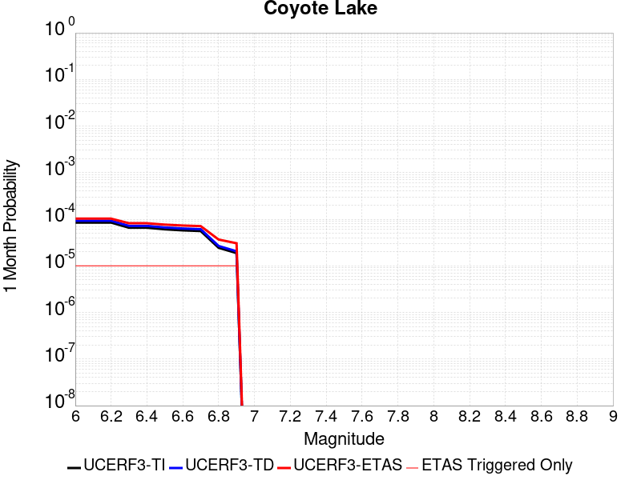 |  |  |

| Magnitude | 1 wk TI Prob | 1 wk TD Prob | 1 wk ETAS Prob | 1 wk ETAS/TD Gain | 1 wk ETAS Triggered Only | 1 mo TI Prob | 1 mo TD Prob | 1 mo ETAS Prob | 1 mo ETAS/TD Gain | 1 mo ETAS Triggered Only | 1 yr TI Prob | 1 yr TD Prob | 1 yr ETAS Prob | 1 yr ETAS/TD Gain | 1 yr ETAS Triggered Only | 10 yr TI Prob | 10 yr TD Prob | 10 yr ETAS Prob | 10 yr ETAS/TD Gain | 10 yr ETAS Triggered Only |
|-----|-----|-----|-----|-----|-----|-----|-----|-----|-----|-----|-----|-----|-----|-----|-----|-----|-----|-----|-----|-----|
| 6.0 | 1.980352E-5 | 2.170669E-5 | 3.1706473E-5 | 1.4606775 | 1.0E-5 | 8.486947E-5 | 9.302576E-5 | 1.03024824E-4 | 1.1074871 | 1.0E-5 | 0.0010327959 | 0.0011320722 | 0.0011520495 | 1.0176467 | 2.0E-5 | 0.010280091 | 0.01127023 | 0.011309778 | 1.0035092 | 4.0E-5 |
| 6.1 | 1.980352E-5 | 2.170669E-5 | 3.1706473E-5 | 1.4606775 | 1.0E-5 | 8.486947E-5 | 9.302576E-5 | 1.03024824E-4 | 1.1074871 | 1.0E-5 | 0.0010327959 | 0.0011320722 | 0.0011520495 | 1.0176467 | 2.0E-5 | 0.010280091 | 0.01127023 | 0.011309778 | 1.0035092 | 4.0E-5 |
| 6.2 | 1.980352E-5 | 2.170669E-5 | 3.1706473E-5 | 1.4606775 | 1.0E-5 | 8.486947E-5 | 9.302576E-5 | 1.03024824E-4 | 1.1074871 | 1.0E-5 | 0.0010327959 | 0.0011320722 | 0.0011520495 | 1.0176467 | 2.0E-5 | 0.010280091 | 0.01127023 | 0.011309778 | 1.0035092 | 4.0E-5 |
| 6.3 | 1.5344787E-5 | 1.6820626E-5 | 2.6820459E-5 | 1.5944982 | 1.0E-5 | 6.576172E-5 | 7.2086754E-5 | 8.208603E-5 | 1.1387117 | 1.0E-5 | 8.003548E-4 | 8.77364E-4 | 8.973465E-4 | 1.0227755 | 2.0E-5 | 0.007974784 | 0.008745047 | 0.008784697 | 1.004534 | 4.0E-5 |
| 6.4 | 1.5344787E-5 | 1.6820626E-5 | 2.6820459E-5 | 1.5944982 | 1.0E-5 | 6.576172E-5 | 7.2086754E-5 | 8.208603E-5 | 1.1387117 | 1.0E-5 | 8.003548E-4 | 8.77364E-4 | 8.973465E-4 | 1.0227755 | 2.0E-5 | 0.007974784 | 0.008745047 | 0.008784697 | 1.004534 | 4.0E-5 |
| 6.5 | 1.4189697E-5 | 1.5557947E-5 | 2.555779E-5 | 1.6427484 | 1.0E-5 | 6.081157E-5 | 6.667555E-5 | 7.6674885E-5 | 1.14997 | 1.0E-5 | 7.401293E-4 | 8.115328E-4 | 8.315166E-4 | 1.0246247 | 2.0E-5 | 0.0073766913 | 0.008091635 | 0.008131311 | 1.0049034 | 4.0E-5 |
| 6.6 | 1.3469301E-5 | 1.4771539E-5 | 2.4771392E-5 | 1.6769675 | 1.0E-5 | 5.7724297E-5 | 6.33054E-5 | 7.3304764E-5 | 1.1579545 | 1.0E-5 | 7.025667E-4 | 7.7053066E-4 | 7.905153E-4 | 1.0259361 | 2.0E-5 | 0.0070034964 | 0.0076844944 | 0.007724187 | 1.0051653 | 4.0E-5 |
| 6.7 | 1.3027966E-5 | 1.4281708E-5 | 2.4281566E-5 | 1.7001864 | 1.0E-5 | 5.5832945E-5 | 6.120622E-5 | 7.120561E-5 | 1.163372 | 1.0E-5 | 6.7955407E-4 | 7.449907E-4 | 7.6497585E-4 | 1.026826 | 2.0E-5 | 0.006774798 | 0.0074308095 | 0.0074705123 | 1.005343 | 4.0E-5 |
| 6.8 | 5.695434E-6 | 6.2244026E-6 | 1.622434E-5 | 2.60657 | 1.0E-5 | 2.4408775E-5 | 2.6675907E-5 | 3.667564E-5 | 1.3748602 | 1.0E-5 | 2.971363E-4 | 3.2476074E-4 | 3.4475425E-4 | 1.0615638 | 2.0E-5 | 0.0029673933 | 0.0032458024 | 0.0032856725 | 1.0122836 | 4.0E-5 |
| 6.9 | 4.385688E-6 | 4.7930434E-6 | 1.4792996E-5 | 3.086347 | 1.0E-5 | 1.879567E-5 | 2.0541615E-5 | 3.054141E-5 | 1.4868066 | 1.0E-5 | 2.2881327E-4 | 2.5009416E-4 | 2.7008916E-4 | 1.0799499 | 2.0E-5 | 0.002285778 | 0.0025009417 | 0.0025408417 | 1.015954 | 4.0E-5 |

## San Andreas (Coachella) rev
*[(top)](#table-of-contents)*

| 1 Week | 1 Month | 1 Year | 10 Year |
|-----|-----|-----|-----|
|  |  |  |  |

| Magnitude | 1 wk TI Prob | 1 wk TD Prob | 1 wk ETAS Prob | 1 wk ETAS/TD Gain | 1 wk ETAS Triggered Only | 1 mo TI Prob | 1 mo TD Prob | 1 mo ETAS Prob | 1 mo ETAS/TD Gain | 1 mo ETAS Triggered Only | 1 yr TI Prob | 1 yr TD Prob | 1 yr ETAS Prob | 1 yr ETAS/TD Gain | 1 yr ETAS Triggered Only | 10 yr TI Prob | 10 yr TD Prob | 10 yr ETAS Prob | 10 yr ETAS/TD Gain | 10 yr ETAS Triggered Only |
|-----|-----|-----|-----|-----|-----|-----|-----|-----|-----|-----|-----|-----|-----|-----|-----|-----|-----|-----|-----|-----|
| 6.0 | 1.1925945E-4 | 3.2724344E-4 | 3.472369E-4 | 1.0610965 | 2.0E-5 | 5.110118E-4 | 0.0014017228 | 0.0014316808 | 1.0213722 | 3.0E-5 | 0.0062038354 | 0.016933769 | 0.016973091 | 1.0023222 | 4.0E-5 | 0.060334753 | 0.15264614 | 0.15268004 | 1.0002221 | 4.0E-5 |
| 6.1 | 1.1925945E-4 | 3.2724344E-4 | 3.472369E-4 | 1.0610965 | 2.0E-5 | 5.110118E-4 | 0.0014017228 | 0.0014316808 | 1.0213722 | 3.0E-5 | 0.0062038354 | 0.016933769 | 0.016973091 | 1.0023222 | 4.0E-5 | 0.060334753 | 0.15264614 | 0.15268004 | 1.0002221 | 4.0E-5 |
| 6.2 | 1.07432395E-4 | 3.0225134E-4 | 3.222453E-4 | 1.0661501 | 2.0E-5 | 4.603433E-4 | 0.0012947238 | 0.0013146979 | 1.0154274 | 2.0E-5 | 0.005590286 | 0.015650427 | 0.015679957 | 1.0018868 | 3.0E-5 | 0.05451731 | 0.14180507 | 0.14183082 | 1.0001816 | 3.0E-5 |
| 6.3 | 1.0718766E-4 | 3.017044E-4 | 3.2169838E-4 | 1.06627 | 2.0E-5 | 4.592948E-4 | 0.0012923821 | 0.0013123562 | 1.0154552 | 2.0E-5 | 0.005577586 | 0.015622327 | 0.015651857 | 1.0018903 | 3.0E-5 | 0.054396555 | 0.1415733 | 0.14159904 | 1.0001819 | 3.0E-5 |
| 6.4 | 1.0355944E-4 | 2.9378527E-4 | 3.137794E-4 | 1.068057 | 2.0E-5 | 4.4375064E-4 | 0.0012584762 | 0.001278451 | 1.0158722 | 2.0E-5 | 0.0053892885 | 0.015215358 | 0.015244901 | 1.0019417 | 3.0E-5 | 0.052604496 | 0.13813514 | 0.13816099 | 1.0001872 | 3.0E-5 |
| 6.5 | 1.0227914E-4 | 2.9097957E-4 | 3.1097376E-4 | 1.0687133 | 2.0E-5 | 4.382655E-4 | 0.0012464633 | 0.0012664383 | 1.0160254 | 2.0E-5 | 0.0053228354 | 0.015071134 | 0.015100682 | 1.0019605 | 3.0E-5 | 0.051971316 | 0.1369198 | 0.1369457 | 1.0001891 | 3.0E-5 |
| 6.6 | 1.0116757E-4 | 2.8863706E-4 | 3.086313E-4 | 1.0692712 | 2.0E-5 | 4.3350324E-4 | 0.0012364335 | 0.0012564088 | 1.0161556 | 2.0E-5 | 0.0052651367 | 0.014950704 | 0.014980255 | 1.0019766 | 3.0E-5 | 0.051421247 | 0.13589692 | 0.13592285 | 1.0001907 | 3.0E-5 |
| 6.7 | 1.0050676E-4 | 2.872227E-4 | 3.0721695E-4 | 1.0696124 | 2.0E-5 | 4.3067214E-4 | 0.0012303777 | 0.0012503531 | 1.0162351 | 2.0E-5 | 0.005230834 | 0.014877982 | 0.014907536 | 1.0019864 | 3.0E-5 | 0.051094085 | 0.13528185 | 0.13530779 | 1.0001918 | 3.0E-5 |
| 6.8 | 9.976819E-5 | 2.8525927E-4 | 3.0525355E-4 | 1.0700916 | 2.0E-5 | 4.2750788E-4 | 0.0012219709 | 0.0012419464 | 1.016347 | 2.0E-5 | 0.0051924936 | 0.014777023 | 0.01480658 | 1.0020002 | 3.0E-5 | 0.050728295 | 0.13443343 | 0.1344594 | 1.0001931 | 3.0E-5 |
| 6.9 | 9.77719E-5 | 2.8022839E-4 | 3.0022277E-4 | 1.0713503 | 2.0E-5 | 4.1895514E-4 | 0.00120043 | 0.0012204059 | 1.0166407 | 2.0E-5 | 0.0050888555 | 0.014518287 | 0.014547852 | 1.0020363 | 3.0E-5 | 0.049738888 | 0.1322617 | 0.13228773 | 1.0001968 | 3.0E-5 |
| 7.0 | 8.500761E-5 | 2.4757453E-4 | 2.675696E-4 | 1.0807637 | 2.0E-5 | 3.6426744E-4 | 0.0010606055 | 0.0010805842 | 1.0188371 | 2.0E-5 | 0.0044259406 | 0.012837193 | 0.012856936 | 1.0015379 | 2.0E-5 | 0.04338823 | 0.11811238 | 0.11813002 | 1.0001494 | 2.0E-5 |
| 7.1 | 8.319876E-5 | 2.4360199E-4 | 2.6359712E-4 | 1.0820811 | 2.0E-5 | 3.5651738E-4 | 0.001043594 | 0.0010635732 | 1.0191445 | 2.0E-5 | 0.004331963 | 0.0126324985 | 0.012652245 | 1.0015632 | 2.0E-5 | 0.042484846 | 0.11633272 | 0.11635039 | 1.0001519 | 2.0E-5 |
| 7.2 | 7.563917E-5 | 2.2408647E-4 | 2.44082E-4 | 1.0892313 | 2.0E-5 | 3.2412758E-4 | 9.600202E-4 | 9.80001E-4 | 1.0208129 | 2.0E-5 | 0.0039391145 | 0.011626295 | 0.011646062 | 1.0017003 | 2.0E-5 | 0.03870018 | 0.10773813 | 0.107755974 | 1.0001656 | 2.0E-5 |
| 7.3 | 7.082985E-5 | 2.072494E-4 | 2.2724525E-4 | 1.096482 | 2.0E-5 | 3.0352117E-4 | 8.8791223E-4 | 9.0789446E-4 | 1.0225048 | 2.0E-5 | 0.0036891096 | 0.010757373 | 0.010777158 | 1.0018392 | 2.0E-5 | 0.03628465 | 0.10026088 | 0.10027888 | 1.0001795 | 2.0E-5 |
| 7.4 | 5.146215E-5 | 1.4271964E-4 | 1.627168E-4 | 1.1401149 | 2.0E-5 | 2.2053342E-4 | 6.115131E-4 | 6.315009E-4 | 1.0326858 | 2.0E-5 | 0.0026816884 | 0.007419945 | 0.007439797 | 1.0026754 | 2.0E-5 | 0.02649557 | 0.070839524 | 0.070858106 | 1.0002624 | 2.0E-5 |
| 7.5 | 4.0285166E-5 | 1.0941875E-4 | 1.2941656E-4 | 1.182764 | 2.0E-5 | 1.7263928E-4 | 4.6885354E-4 | 4.888442E-4 | 1.0426372 | 2.0E-5 | 0.002099857 | 0.005693421 | 0.005713307 | 1.0034928 | 2.0E-5 | 0.020801254 | 0.05501138 | 0.05503028 | 1.0003436 | 2.0E-5 |
| 7.6 | 3.1168736E-5 | 8.439118E-5 | 1.0438949E-4 | 1.2369716 | 2.0E-5 | 1.3357346E-4 | 3.6162647E-4 | 3.8161923E-4 | 1.0552857 | 2.0E-5 | 0.0016250437 | 0.004393941 | 0.004413853 | 1.0045317 | 2.0E-5 | 0.016132116 | 0.04281056 | 0.0428297 | 1.0004472 | 2.0E-5 |
| 7.7 | 2.2100989E-5 | 6.238918E-5 | 8.238794E-5 | 1.3205484 | 2.0E-5 | 9.4715084E-5 | 2.6735486E-4 | 2.873495E-4 | 1.0747869 | 2.0E-5 | 0.001152546 | 0.0032501933 | 0.0032701283 | 1.0061334 | 2.0E-5 | 0.011465867 | 0.031900857 | 0.031920217 | 1.0006069 | 2.0E-5 |
| 7.8 | 1.7484861E-5 | 5.1796946E-5 | 7.179591E-5 | 1.3861032 | 2.0E-5 | 7.493296E-5 | 2.2196803E-4 | 2.419636E-4 | 1.0900831 | 2.0E-5 | 9.1192697E-4 | 0.0026991146 | 0.0027190605 | 1.0073898 | 2.0E-5 | 0.009081938 | 0.026640752 | 0.02666022 | 1.0007308 | 2.0E-5 |
| 7.9 | 1.3967285E-5 | 3.822304E-5 | 5.8222275E-5 | 1.5232246 | 2.0E-5 | 5.985842E-5 | 1.6380275E-4 | 1.8379946E-4 | 1.1220781 | 2.0E-5 | 7.2853256E-4 | 0.0019924755 | 0.0020124356 | 1.0100178 | 2.0E-5 | 0.0072614877 | 0.019910011 | 0.019929614 | 1.0009845 | 2.0E-5 |
| 8.0 | 1.1887396E-5 | 3.1065316E-5 | 4.1065003E-5 | 1.3218924 | 1.0E-5 | 5.094499E-5 | 1.3313028E-4 | 1.4312894E-4 | 1.0751044 | 1.0E-5 | 6.200787E-4 | 0.0016196569 | 0.0016296408 | 1.0061642 | 1.0E-5 | 0.006183513 | 0.016279692 | 0.01628953 | 1.0006043 | 1.0E-5 |
| 8.1 | 5.100864E-6 | 8.972689E-6 | 1.89726E-5 | 2.114483 | 1.0E-5 | 2.1860664E-5 | 3.8453814E-5 | 4.8453432E-5 | 1.2600422 | 1.0E-5 | 2.6612106E-4 | 4.6807475E-4 | 4.7807008E-4 | 1.0213541 | 1.0E-5 | 0.002658026 | 0.0049177213 | 0.004927672 | 1.0020235 | 1.0E-5 |
| 8.2 | 2.3004484E-6 | 2.78591E-6 | 2.78591E-6 | 1.0 | 0.0 | 9.859027E-6 | 1.193956E-5 | 1.193956E-5 | 1.0 | 0.0 | 1.2002704E-4 | 1.4535447E-4 | 1.4535447E-4 | 1.0 | 0.0 | 0.0011996223 | 0.0015971703 | 0.0015971703 | 1.0 | 0.0 |
| 8.3 | 1.0424446E-7 | 5.813156E-8 | 5.813156E-8 | 1.0 | 0.0 | 4.4676187E-7 | 2.491352E-7 | 2.491352E-7 | 1.0 | 0.0 | 5.439312E-6 | 3.0332174E-6 | 3.0332174E-6 | 1.0 | 0.0 | 5.4391792E-5 | 3.1893844E-5 | 3.1893844E-5 | 1.0 | 0.0 |

## Ludlow
*[(top)](#table-of-contents)*

| 1 Week | 1 Month | 1 Year | 10 Year |
|-----|-----|-----|-----|
|  |  |  |  |

| Magnitude | 1 wk TI Prob | 1 wk TD Prob | 1 wk ETAS Prob | 1 wk ETAS/TD Gain | 1 wk ETAS Triggered Only | 1 mo TI Prob | 1 mo TD Prob | 1 mo ETAS Prob | 1 mo ETAS/TD Gain | 1 mo ETAS Triggered Only | 1 yr TI Prob | 1 yr TD Prob | 1 yr ETAS Prob | 1 yr ETAS/TD Gain | 1 yr ETAS Triggered Only | 10 yr TI Prob | 10 yr TD Prob | 10 yr ETAS Prob | 10 yr ETAS/TD Gain | 10 yr ETAS Triggered Only |
|-----|-----|-----|-----|-----|-----|-----|-----|-----|-----|-----|-----|-----|-----|-----|-----|-----|-----|-----|-----|-----|
| 6.0 | 2.2407607E-5 | 2.3657218E-5 | 3.3656983E-5 | 1.422694 | 1.0E-5 | 9.602906E-5 | 1.0138439E-4 | 1.2138236E-4 | 1.197249 | 2.0E-5 | 0.0011685267 | 0.0012337001 | 0.0012536754 | 1.0161914 | 2.0E-5 | 0.011624013 | 0.012273024 | 0.012312533 | 1.0032191 | 4.0E-5 |
| 6.1 | 2.2407607E-5 | 2.3657218E-5 | 3.3656983E-5 | 1.422694 | 1.0E-5 | 9.602906E-5 | 1.0138439E-4 | 1.2138236E-4 | 1.197249 | 2.0E-5 | 0.0011685267 | 0.0012337001 | 0.0012536754 | 1.0161914 | 2.0E-5 | 0.011624013 | 0.012273024 | 0.012312533 | 1.0032191 | 4.0E-5 |
| 6.2 | 1.0781252E-5 | 1.1365647E-5 | 1.1365647E-5 | 1.0 | 0.0 | 4.620455E-5 | 4.870903E-5 | 5.870854E-5 | 1.2052908 | 1.0E-5 | 5.623952E-4 | 5.928751E-4 | 6.028692E-4 | 1.0168569 | 1.0E-5 | 0.00560974 | 0.0059133526 | 0.0059332345 | 1.0033622 | 2.0E-5 |
| 6.3 | 1.0781252E-5 | 1.1365647E-5 | 1.1365647E-5 | 1.0 | 0.0 | 4.620455E-5 | 4.870903E-5 | 5.870854E-5 | 1.2052908 | 1.0E-5 | 5.623952E-4 | 5.928751E-4 | 6.028692E-4 | 1.0168569 | 1.0E-5 | 0.00560974 | 0.0059133526 | 0.0059332345 | 1.0033622 | 2.0E-5 |
| 6.4 | 7.814439E-6 | 8.237717E-6 | 8.237717E-6 | 1.0 | 0.0 | 3.3490025E-5 | 3.530403E-5 | 4.5303677E-5 | 1.2832438 | 1.0E-5 | 4.0766477E-4 | 4.297432E-4 | 4.397389E-4 | 1.0232598 | 1.0E-5 | 0.0040691774 | 0.0042892685 | 0.0042992253 | 1.0023214 | 1.0E-5 |
| 6.5 | 6.4986366E-6 | 6.85091E-6 | 6.85091E-6 | 1.0 | 0.0 | 2.7851002E-5 | 2.9360717E-5 | 3.9360424E-5 | 1.3405812 | 1.0E-5 | 3.390332E-4 | 3.57409E-4 | 3.6740545E-4 | 1.0279691 | 1.0E-5 | 0.003385164 | 0.003568438 | 0.0035784023 | 1.0027924 | 1.0E-5 |
| 6.6 | 5.582177E-6 | 5.885997E-6 | 5.885997E-6 | 1.0 | 0.0 | 2.3923398E-5 | 2.5225461E-5 | 3.522521E-5 | 1.3964149 | 1.0E-5 | 2.9122844E-4 | 3.0707743E-4 | 3.1707436E-4 | 1.0325551 | 1.0E-5 | 0.0029084706 | 0.0030666045 | 0.0030765738 | 1.003251 | 1.0E-5 |
| 6.7 | 4.6858763E-6 | 4.9404202E-6 | 4.9404202E-6 | 1.0 | 0.0 | 2.0082172E-5 | 2.117306E-5 | 3.1172847E-5 | 1.4722883 | 1.0E-5 | 2.4447302E-4 | 2.5775208E-4 | 2.677495E-4 | 1.038787 | 1.0E-5 | 0.0024420423 | 0.0025745875 | 0.002584562 | 1.0038741 | 1.0E-5 |
| 6.8 | 3.5584908E-6 | 3.7520128E-6 | 3.7520128E-6 | 1.0 | 0.0 | 1.5250586E-5 | 1.607996E-5 | 1.607996E-5 | 1.0 | 0.0 | 1.8566006E-4 | 1.9575632E-4 | 1.9575632E-4 | 1.0 | 0.0 | 0.0018550502 | 0.0019558799 | 0.0019558799 | 1.0 | 0.0 |
| 6.9 | 2.532834E-6 | 2.6709995E-6 | 2.6709995E-6 | 1.0 | 0.0 | 1.0854958E-5 | 1.1447092E-5 | 1.1447092E-5 | 1.0 | 0.0 | 1.3215111E-4 | 1.3935972E-4 | 1.3935972E-4 | 1.0 | 0.0 | 0.0013207254 | 0.0013927508 | 0.0013927508 | 1.0 | 0.0 |
| 7.0 | 1.7083285E-6 | 1.8019413E-6 | 1.8019413E-6 | 1.0 | 0.0 | 7.3213873E-6 | 7.722583E-6 | 7.722583E-6 | 1.0 | 0.0 | 8.913424E-5 | 9.4018564E-5 | 9.4018564E-5 | 1.0 | 0.0 | 8.9098496E-4 | 9.3980436E-4 | 9.3980436E-4 | 1.0 | 0.0 |
| 7.1 | 1.0905424E-6 | 1.1497604E-6 | 1.1497604E-6 | 1.0 | 0.0 | 4.6737446E-6 | 4.9275354E-6 | 4.9275354E-6 | 1.0 | 0.0 | 5.6901354E-5 | 5.999119E-5 | 5.999119E-5 | 1.0 | 0.0 | 5.6886784E-4 | 5.9975975E-4 | 5.9975975E-4 | 1.0 | 0.0 |
| 7.2 | 6.06668E-7 | 6.387269E-7 | 6.387269E-7 | 1.0 | 0.0 | 2.600003E-6 | 2.7373983E-6 | 2.7373983E-6 | 1.0 | 0.0 | 3.1654577E-5 | 3.3327386E-5 | 3.3327386E-5 | 1.0 | 0.0 | 3.1650066E-4 | 3.332307E-4 | 3.332307E-4 | 1.0 | 0.0 |

## Kern Canyon (Lake Isabella) 2011
*[(top)](#table-of-contents)*

| 1 Week | 1 Month | 1 Year | 10 Year |
|-----|-----|-----|-----|
|  |  |  |  |

| Magnitude | 1 wk TI Prob | 1 wk TD Prob | 1 wk ETAS Prob | 1 wk ETAS/TD Gain | 1 wk ETAS Triggered Only | 1 mo TI Prob | 1 mo TD Prob | 1 mo ETAS Prob | 1 mo ETAS/TD Gain | 1 mo ETAS Triggered Only | 1 yr TI Prob | 1 yr TD Prob | 1 yr ETAS Prob | 1 yr ETAS/TD Gain | 1 yr ETAS Triggered Only | 10 yr TI Prob | 10 yr TD Prob | 10 yr ETAS Prob | 10 yr ETAS/TD Gain | 10 yr ETAS Triggered Only |
|-----|-----|-----|-----|-----|-----|-----|-----|-----|-----|-----|-----|-----|-----|-----|-----|-----|-----|-----|-----|-----|
| 6.0 | 4.2387383E-6 | 4.001632E-6 | 1.4001592E-5 | 3.4989705 | 1.0E-5 | 1.8165894E-5 | 1.7149749E-5 | 2.7149577E-5 | 1.5830889 | 1.0E-5 | 2.2114732E-4 | 2.0878005E-4 | 2.1877796E-4 | 1.0478873 | 1.0E-5 | 0.0022092736 | 0.0020860229 | 0.0021159605 | 1.0143515 | 3.0E-5 |
| 6.1 | 4.2387383E-6 | 4.001632E-6 | 1.4001592E-5 | 3.4989705 | 1.0E-5 | 1.8165894E-5 | 1.7149749E-5 | 2.7149577E-5 | 1.5830889 | 1.0E-5 | 2.2114732E-4 | 2.0878005E-4 | 2.1877796E-4 | 1.0478873 | 1.0E-5 | 0.0022092736 | 0.0020860229 | 0.0021159605 | 1.0143515 | 3.0E-5 |
| 6.2 | 4.2387383E-6 | 4.001632E-6 | 1.4001592E-5 | 3.4989705 | 1.0E-5 | 1.8165894E-5 | 1.7149749E-5 | 2.7149577E-5 | 1.5830889 | 1.0E-5 | 2.2114732E-4 | 2.0878005E-4 | 2.1877796E-4 | 1.0478873 | 1.0E-5 | 0.0022092736 | 0.0020860229 | 0.0021159605 | 1.0143515 | 3.0E-5 |
| 6.3 | 4.2387383E-6 | 4.001632E-6 | 1.4001592E-5 | 3.4989705 | 1.0E-5 | 1.8165894E-5 | 1.7149749E-5 | 2.7149577E-5 | 1.5830889 | 1.0E-5 | 2.2114732E-4 | 2.0878005E-4 | 2.1877796E-4 | 1.0478873 | 1.0E-5 | 0.0022092736 | 0.0020860229 | 0.0021159605 | 1.0143515 | 3.0E-5 |
| 6.4 | 4.2387383E-6 | 4.001632E-6 | 1.4001592E-5 | 3.4989705 | 1.0E-5 | 1.8165894E-5 | 1.7149749E-5 | 2.7149577E-5 | 1.5830889 | 1.0E-5 | 2.2114732E-4 | 2.0878005E-4 | 2.1877796E-4 | 1.0478873 | 1.0E-5 | 0.0022092736 | 0.0020860229 | 0.0021159605 | 1.0143515 | 3.0E-5 |
| 6.5 | 2.7857532E-6 | 2.5178608E-6 | 2.5178608E-6 | 1.0 | 0.0 | 1.1938888E-5 | 1.079079E-5 | 1.079079E-5 | 1.0 | 0.0 | 1.4534626E-4 | 1.3137028E-4 | 1.3137028E-4 | 1.0 | 0.0 | 0.0014525123 | 0.0013129589 | 0.0013129589 | 1.0 | 0.0 |
| 6.6 | 2.2233348E-6 | 1.944118E-6 | 1.944118E-6 | 1.0 | 0.0 | 9.528543E-6 | 8.331908E-6 | 8.331908E-6 | 1.0 | 0.0 | 1.1600384E-4 | 1.01436344E-4 | 1.01436344E-4 | 1.0 | 0.0 | 0.001159433 | 0.001013909 | 0.001013909 | 1.0 | 0.0 |
| 6.7 | 2.1635126E-6 | 1.8834979E-6 | 1.8834979E-6 | 1.0 | 0.0 | 9.272164E-6 | 8.072109E-6 | 8.072109E-6 | 1.0 | 0.0 | 1.1288274E-4 | 9.827358E-5 | 9.827358E-5 | 1.0 | 0.0 | 0.0011282542 | 9.823095E-4 | 9.823095E-4 | 1.0 | 0.0 |
| 6.8 | 1.8685711E-6 | 1.5831371E-6 | 1.5831371E-6 | 1.0 | 0.0 | 8.008137E-6 | 6.7848555E-6 | 6.7848555E-6 | 1.0 | 0.0 | 9.74947E-5 | 8.2602535E-5 | 8.2602535E-5 | 1.0 | 0.0 | 9.745194E-4 | 8.257232E-4 | 8.257232E-4 | 1.0 | 0.0 |
| 6.9 | 1.5815071E-6 | 1.3064879E-6 | 1.3064879E-6 | 1.0 | 0.0 | 6.77787E-6 | 5.599222E-6 | 5.599222E-6 | 1.0 | 0.0 | 8.251744E-5 | 6.8168425E-5 | 6.8168425E-5 | 1.0 | 0.0 | 8.248681E-4 | 6.814778E-4 | 6.814778E-4 | 1.0 | 0.0 |
| 7.0 | 1.3772564E-6 | 1.1210674E-6 | 1.1210674E-6 | 1.0 | 0.0 | 5.9025137E-6 | 4.8045654E-6 | 4.8045654E-6 | 1.0 | 0.0 | 7.186073E-5 | 5.8494035E-5 | 5.8494035E-5 | 1.0 | 0.0 | 7.18375E-4 | 5.8478845E-4 | 5.8478845E-4 | 1.0 | 0.0 |
| 7.1 | 1.0916998E-6 | 8.763745E-7 | 8.763745E-7 | 1.0 | 0.0 | 4.678705E-6 | 3.7558852E-6 | 3.7558852E-6 | 1.0 | 0.0 | 5.6961744E-5 | 4.5726956E-5 | 4.5726956E-5 | 1.0 | 0.0 | 5.6947145E-4 | 4.5717682E-4 | 4.5717682E-4 | 1.0 | 0.0 |
| 7.2 | 7.6277024E-7 | 5.9014343E-7 | 5.9014343E-7 | 1.0 | 0.0 | 3.2690114E-6 | 2.5291838E-6 | 2.5291838E-6 | 1.0 | 0.0 | 3.9799485E-5 | 3.0792384E-5 | 3.0792384E-5 | 1.0 | 0.0 | 3.9792358E-4 | 3.0788177E-4 | 3.0788177E-4 | 1.0 | 0.0 |
| 7.3 | 5.3265916E-7 | 4.3824227E-7 | 4.3824227E-7 | 1.0 | 0.0 | 2.282823E-6 | 1.8781799E-6 | 1.8781799E-6 | 1.0 | 0.0 | 2.7793016E-5 | 2.2866603E-5 | 2.2866603E-5 | 1.0 | 0.0 | 2.778954E-4 | 2.286429E-4 | 2.286429E-4 | 1.0 | 0.0 |
| 7.4 | 3.4946007E-7 | 3.0065618E-7 | 3.0065618E-7 | 1.0 | 0.0 | 1.497685E-6 | 1.2885259E-6 | 1.2885259E-6 | 1.0 | 0.0 | 1.8234163E-5 | 1.5687692E-5 | 1.5687692E-5 | 1.0 | 0.0 | 1.8232666E-4 | 1.5686607E-4 | 1.5686607E-4 | 1.0 | 0.0 |
| 7.5 | 1.8317026E-7 | 1.4244733E-7 | 1.4244733E-7 | 1.0 | 0.0 | 7.850152E-7 | 6.104884E-7 | 6.104884E-7 | 1.0 | 0.0 | 9.557518E-6 | 7.432672E-6 | 7.432672E-6 | 1.0 | 0.0 | 9.5571064E-5 | 7.4324314E-5 | 7.4324314E-5 | 1.0 | 0.0 |
| 7.6 | 2.572245E-8 | 1.7352638E-8 | 1.7352638E-8 | 1.0 | 0.0 | 1.10239064E-7 | 7.436845E-8 | 7.436845E-8 | 1.0 | 0.0 | 1.3421597E-6 | 9.054355E-7 | 9.054355E-7 | 1.0 | 0.0 | 1.3421517E-5 | 9.0543235E-6 | 9.0543235E-6 | 1.0 | 0.0 |

## San Andreas (Big Bend)
*[(top)](#table-of-contents)*

| 1 Week | 1 Month | 1 Year | 10 Year |
|-----|-----|-----|-----|
|  |  |  |  |

| Magnitude | 1 wk TI Prob | 1 wk TD Prob | 1 wk ETAS Prob | 1 wk ETAS/TD Gain | 1 wk ETAS Triggered Only | 1 mo TI Prob | 1 mo TD Prob | 1 mo ETAS Prob | 1 mo ETAS/TD Gain | 1 mo ETAS Triggered Only | 1 yr TI Prob | 1 yr TD Prob | 1 yr ETAS Prob | 1 yr ETAS/TD Gain | 1 yr ETAS Triggered Only | 10 yr TI Prob | 10 yr TD Prob | 10 yr ETAS Prob | 10 yr ETAS/TD Gain | 10 yr ETAS Triggered Only |
|-----|-----|-----|-----|-----|-----|-----|-----|-----|-----|-----|-----|-----|-----|-----|-----|-----|-----|-----|-----|-----|
| 6.0 | 1.0179969E-4 | 2.007218E-4 | 2.3071577E-4 | 1.1494306 | 3.0E-5 | 4.362114E-4 | 8.599537E-4 | 8.999193E-4 | 1.0464741 | 4.0E-5 | 0.0052979486 | 0.010419957 | 0.010459541 | 1.0037988 | 4.0E-5 | 0.051734097 | 0.10145083 | 0.10148677 | 1.0003543 | 4.0E-5 |
| 6.1 | 1.0179969E-4 | 2.007218E-4 | 2.3071577E-4 | 1.1494306 | 3.0E-5 | 4.362114E-4 | 8.599537E-4 | 8.999193E-4 | 1.0464741 | 4.0E-5 | 0.0052979486 | 0.010419957 | 0.010459541 | 1.0037988 | 4.0E-5 | 0.051734097 | 0.10145083 | 0.10148677 | 1.0003543 | 4.0E-5 |
| 6.2 | 1.0179969E-4 | 2.007218E-4 | 2.3071577E-4 | 1.1494306 | 3.0E-5 | 4.362114E-4 | 8.599537E-4 | 8.999193E-4 | 1.0464741 | 4.0E-5 | 0.0052979486 | 0.010419957 | 0.010459541 | 1.0037988 | 4.0E-5 | 0.051734097 | 0.10145083 | 0.10148677 | 1.0003543 | 4.0E-5 |
| 6.3 | 1.0179969E-4 | 2.007218E-4 | 2.3071577E-4 | 1.1494306 | 3.0E-5 | 4.362114E-4 | 8.599537E-4 | 8.999193E-4 | 1.0464741 | 4.0E-5 | 0.0052979486 | 0.010419957 | 0.010459541 | 1.0037988 | 4.0E-5 | 0.051734097 | 0.10145083 | 0.10148677 | 1.0003543 | 4.0E-5 |
| 6.4 | 9.1639464E-5 | 1.8429171E-4 | 2.1428619E-4 | 1.1627554 | 3.0E-5 | 3.9268145E-4 | 7.895828E-4 | 8.295512E-4 | 1.0506197 | 4.0E-5 | 0.0047704205 | 0.009570916 | 0.009610533 | 1.0041393 | 4.0E-5 | 0.046693064 | 0.09378183 | 0.093818076 | 1.0003865 | 4.0E-5 |
| 6.5 | 9.1639464E-5 | 1.8429171E-4 | 2.1428619E-4 | 1.1627554 | 3.0E-5 | 3.9268145E-4 | 7.895828E-4 | 8.295512E-4 | 1.0506197 | 4.0E-5 | 0.0047704205 | 0.009570916 | 0.009610533 | 1.0041393 | 4.0E-5 | 0.046693064 | 0.09378183 | 0.093818076 | 1.0003865 | 4.0E-5 |
| 6.6 | 9.042622E-5 | 1.8236267E-4 | 2.1235719E-4 | 1.1644773 | 3.0E-5 | 3.8748336E-4 | 7.813204E-4 | 8.2128914E-4 | 1.0511554 | 4.0E-5 | 0.0047074095 | 0.009471198 | 0.009510819 | 1.0041833 | 4.0E-5 | 0.046089325 | 0.09287209 | 0.092908375 | 1.0003906 | 4.0E-5 |
| 6.7 | 8.9836685E-5 | 1.8150604E-4 | 2.1150059E-4 | 1.1652538 | 3.0E-5 | 3.8495753E-4 | 7.776513E-4 | 8.1762025E-4 | 1.051397 | 4.0E-5 | 0.00467679 | 0.009426914 | 0.009466536 | 1.0042032 | 4.0E-5 | 0.045795817 | 0.09246637 | 0.092502676 | 1.0003926 | 4.0E-5 |
| 6.8 | 8.9471854E-5 | 1.809739E-4 | 2.1096847E-4 | 1.1657398 | 3.0E-5 | 3.8339442E-4 | 7.753721E-4 | 8.153411E-4 | 1.0515481 | 4.0E-5 | 0.004657841 | 0.009399404 | 0.009439028 | 1.0042156 | 4.0E-5 | 0.04561414 | 0.09221355 | 0.092249855 | 1.0003937 | 4.0E-5 |
| 6.9 | 8.858234E-5 | 1.7979364E-4 | 2.0978824E-4 | 1.1668279 | 3.0E-5 | 3.7958333E-4 | 7.703168E-4 | 8.1028603E-4 | 1.0518867 | 4.0E-5 | 0.004611638 | 0.0093383845 | 0.009378011 | 1.0042434 | 4.0E-5 | 0.04517103 | 0.09165367 | 0.091690004 | 1.0003964 | 4.0E-5 |
| 7.0 | 8.7433385E-5 | 1.7818164E-4 | 2.081763E-4 | 1.1683375 | 3.0E-5 | 3.746607E-4 | 7.6341233E-4 | 8.033818E-4 | 1.0523564 | 4.0E-5 | 0.004551957 | 0.0092550395 | 0.009294669 | 1.004282 | 4.0E-5 | 0.044598386 | 0.09088798 | 0.090924345 | 1.0004001 | 4.0E-5 |
| 7.1 | 8.684964E-5 | 1.7730116E-4 | 2.0729585E-4 | 1.1691736 | 3.0E-5 | 3.7215967E-4 | 7.5964106E-4 | 7.996107E-4 | 1.0526165 | 4.0E-5 | 0.0045216335 | 0.009209513 | 0.009249144 | 1.0043033 | 4.0E-5 | 0.04430731 | 0.09046952 | 0.0905059 | 1.0004021 | 4.0E-5 |
| 7.2 | 8.606521E-5 | 1.7620731E-4 | 2.0620202E-4 | 1.1702241 | 3.0E-5 | 3.6879873E-4 | 7.549558E-4 | 7.949256E-4 | 1.0529432 | 4.0E-5 | 0.0044808835 | 0.009152951 | 0.009192584 | 1.0043302 | 4.0E-5 | 0.043916024 | 0.08995003 | 0.089986436 | 1.0004047 | 4.0E-5 |
| 7.3 | 8.568266E-5 | 1.7562733E-4 | 2.0562205E-4 | 1.1707863 | 3.0E-5 | 3.6715972E-4 | 7.524716E-4 | 7.9244154E-4 | 1.0531181 | 4.0E-5 | 0.0044610105 | 0.009122959 | 0.009162595 | 1.0043446 | 4.0E-5 | 0.043725148 | 0.08967111 | 0.08970752 | 1.000406 | 4.0E-5 |
| 7.4 | 8.5432206E-5 | 1.752532E-4 | 2.0524794E-4 | 1.1711509 | 3.0E-5 | 3.6608664E-4 | 7.508691E-4 | 7.908391E-4 | 1.0532316 | 4.0E-5 | 0.004447999 | 0.009103612 | 0.009143248 | 1.0043539 | 4.0E-5 | 0.043600157 | 0.0894914 | 0.089527816 | 1.000407 | 4.0E-5 |
| 7.5 | 8.4791965E-5 | 1.7394664E-4 | 2.0394141E-4 | 1.1724367 | 3.0E-5 | 3.633435E-4 | 7.452728E-4 | 7.85243E-4 | 1.0536317 | 4.0E-5 | 0.0044147377 | 0.009036045 | 0.009075683 | 1.0043867 | 4.0E-5 | 0.043280575 | 0.088867545 | 0.08890399 | 1.0004101 | 4.0E-5 |
| 7.6 | 8.241105E-5 | 1.6840106E-4 | 1.9839601E-4 | 1.1781162 | 3.0E-5 | 3.531424E-4 | 7.215194E-4 | 7.6149055E-4 | 1.0553986 | 4.0E-5 | 0.0042910352 | 0.008749205 | 0.008788855 | 1.0045319 | 4.0E-5 | 0.042091176 | 0.086243145 | 0.0862797 | 1.0004238 | 4.0E-5 |
| 7.7 | 7.00432E-5 | 1.4204094E-4 | 1.620381E-4 | 1.1407845 | 2.0E-5 | 3.001506E-4 | 6.0860487E-4 | 6.2859274E-4 | 1.032842 | 2.0E-5 | 0.0036482112 | 0.0073846295 | 0.0074044815 | 1.0026883 | 2.0E-5 | 0.035888977 | 0.07351696 | 0.07353549 | 1.000252 | 2.0E-5 |
| 7.8 | 6.415362E-5 | 1.2968556E-4 | 1.4968296E-4 | 1.1541991 | 2.0E-5 | 2.749151E-4 | 5.556769E-4 | 5.756658E-4 | 1.0359721 | 2.0E-5 | 0.0033419547 | 0.0067444094 | 0.0067642746 | 1.0029454 | 2.0E-5 | 0.03292141 | 0.067252055 | 0.06727071 | 1.0002774 | 2.0E-5 |
| 7.9 | 4.939911E-5 | 9.3407485E-5 | 1.0340655E-4 | 1.1070478 | 1.0E-5 | 2.116933E-4 | 4.002564E-4 | 4.102524E-4 | 1.024974 | 1.0E-5 | 0.0025743195 | 0.004862242 | 0.0048721936 | 1.0020467 | 1.0E-5 | 0.025447013 | 0.048912104 | 0.048921615 | 1.0001944 | 1.0E-5 |
| 8.0 | 3.344983E-5 | 5.2222407E-5 | 5.2222407E-5 | 1.0 | 0.0 | 1.4334853E-4 | 2.2379112E-4 | 2.2379112E-4 | 1.0 | 0.0 | 0.0017438711 | 0.0027212542 | 0.0027212542 | 1.0 | 0.0 | 0.017302496 | 0.027920531 | 0.027920531 | 1.0 | 0.0 |
| 8.1 | 1.9104898E-5 | 1.9169016E-5 | 1.9169016E-5 | 1.0 | 0.0 | 8.1875565E-5 | 8.215035E-5 | 8.215035E-5 | 1.0 | 0.0 | 9.963791E-4 | 9.997222E-4 | 9.997222E-4 | 1.0 | 0.0 | 0.009919235 | 0.010748157 | 0.010748157 | 1.0 | 0.0 |
| 8.2 | 8.643924E-6 | 5.472644E-6 | 5.472644E-6 | 1.0 | 0.0 | 3.704486E-5 | 2.3453977E-5 | 2.3453977E-5 | 1.0 | 0.0 | 4.5092785E-4 | 2.8551483E-4 | 2.8551483E-4 | 1.0 | 0.0 | 0.0045001395 | 0.003247653 | 0.003247653 | 1.0 | 0.0 |
| 8.3 | 1.983087E-6 | 7.6547434E-7 | 7.6547434E-7 | 1.0 | 0.0 | 8.498917E-6 | 3.2806004E-6 | 3.2806004E-6 | 1.0 | 0.0 | 1.034694E-4 | 3.9940594E-5 | 3.9940594E-5 | 1.0 | 0.0 | 0.0010342124 | 4.7170694E-4 | 4.7170694E-4 | 1.0 | 0.0 |

## Sierra Nevada  (No Extension)
*[(top)](#table-of-contents)*

| 1 Week | 1 Month | 1 Year | 10 Year |
|-----|-----|-----|-----|
|  |  |  | 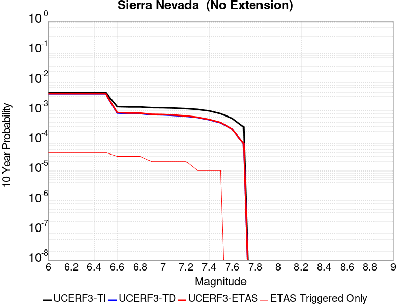 |

| Magnitude | 1 wk TI Prob | 1 wk TD Prob | 1 wk ETAS Prob | 1 wk ETAS/TD Gain | 1 wk ETAS Triggered Only | 1 mo TI Prob | 1 mo TD Prob | 1 mo ETAS Prob | 1 mo ETAS/TD Gain | 1 mo ETAS Triggered Only | 1 yr TI Prob | 1 yr TD Prob | 1 yr ETAS Prob | 1 yr ETAS/TD Gain | 1 yr ETAS Triggered Only | 10 yr TI Prob | 10 yr TD Prob | 10 yr ETAS Prob | 10 yr ETAS/TD Gain | 10 yr ETAS Triggered Only |
|-----|-----|-----|-----|-----|-----|-----|-----|-----|-----|-----|-----|-----|-----|-----|-----|-----|-----|-----|-----|-----|
| 6.0 | 7.7690465E-6 | 6.976276E-6 | 1.6976206E-5 | 2.4334195 | 1.0E-5 | 3.329549E-5 | 2.9898185E-5 | 4.9897586E-5 | 1.668917 | 2.0E-5 | 4.0529718E-4 | 3.6398545E-4 | 3.9397454E-4 | 1.0823909 | 3.0E-5 | 0.004045588 | 0.0036374088 | 0.0036772634 | 1.0109569 | 4.0E-5 |
| 6.1 | 7.7690465E-6 | 6.976276E-6 | 1.6976206E-5 | 2.4334195 | 1.0E-5 | 3.329549E-5 | 2.9898185E-5 | 4.9897586E-5 | 1.668917 | 2.0E-5 | 4.0529718E-4 | 3.6398545E-4 | 3.9397454E-4 | 1.0823909 | 3.0E-5 | 0.004045588 | 0.0036374088 | 0.0036772634 | 1.0109569 | 4.0E-5 |
| 6.2 | 7.7690465E-6 | 6.976276E-6 | 1.6976206E-5 | 2.4334195 | 1.0E-5 | 3.329549E-5 | 2.9898185E-5 | 4.9897586E-5 | 1.668917 | 2.0E-5 | 4.0529718E-4 | 3.6398545E-4 | 3.9397454E-4 | 1.0823909 | 3.0E-5 | 0.004045588 | 0.0036374088 | 0.0036772634 | 1.0109569 | 4.0E-5 |
| 6.3 | 7.7690465E-6 | 6.976276E-6 | 1.6976206E-5 | 2.4334195 | 1.0E-5 | 3.329549E-5 | 2.9898185E-5 | 4.9897586E-5 | 1.668917 | 2.0E-5 | 4.0529718E-4 | 3.6398545E-4 | 3.9397454E-4 | 1.0823909 | 3.0E-5 | 0.004045588 | 0.0036374088 | 0.0036772634 | 1.0109569 | 4.0E-5 |
| 6.4 | 7.7690465E-6 | 6.976276E-6 | 1.6976206E-5 | 2.4334195 | 1.0E-5 | 3.329549E-5 | 2.9898185E-5 | 4.9897586E-5 | 1.668917 | 2.0E-5 | 4.0529718E-4 | 3.6398545E-4 | 3.9397454E-4 | 1.0823909 | 3.0E-5 | 0.004045588 | 0.0036374088 | 0.0036772634 | 1.0109569 | 4.0E-5 |
| 6.5 | 7.7690465E-6 | 6.976276E-6 | 1.6976206E-5 | 2.4334195 | 1.0E-5 | 3.329549E-5 | 2.9898185E-5 | 4.9897586E-5 | 1.668917 | 2.0E-5 | 4.0529718E-4 | 3.6398545E-4 | 3.9397454E-4 | 1.0823909 | 3.0E-5 | 0.004045588 | 0.0036374088 | 0.0036772634 | 1.0109569 | 4.0E-5 |
| 6.6 | 2.653E-6 | 1.614815E-6 | 1.614815E-6 | 1.0 | 0.0 | 1.136995E-5 | 6.9206176E-6 | 1.6920549E-5 | 2.4449477 | 1.0E-5 | 1.3842035E-4 | 8.42553E-5 | 1.0425361E-4 | 1.2373538 | 2.0E-5 | 0.0013833415 | 8.42237E-4 | 8.722117E-4 | 1.0355895 | 3.0E-5 |
| 6.7 | 2.5902466E-6 | 1.5501486E-6 | 1.5501486E-6 | 1.0 | 0.0 | 1.11010095E-5 | 6.6434773E-6 | 1.6643411E-5 | 2.505226 | 1.0E-5 | 1.351464E-4 | 8.0881364E-5 | 1.0087975E-4 | 1.2472558 | 2.0E-5 | 0.0013506424 | 8.085222E-4 | 8.38498E-4 | 1.0370747 | 3.0E-5 |
| 6.8 | 2.5853892E-6 | 1.5469489E-6 | 1.5469489E-6 | 1.0 | 0.0 | 1.1080193E-5 | 6.6297644E-6 | 1.6629698E-5 | 2.5083392 | 1.0E-5 | 1.34893E-4 | 8.071442E-5 | 1.007128E-4 | 1.2477672 | 2.0E-5 | 0.0013481114 | 8.06854E-4 | 8.3682983E-4 | 1.0371515 | 3.0E-5 |
| 6.9 | 2.458257E-6 | 1.4220233E-6 | 1.4220233E-6 | 1.0 | 0.0 | 1.0535345E-5 | 6.094371E-6 | 6.094371E-6 | 1.0 | 0.0 | 1.2826028E-4 | 7.419646E-5 | 8.419572E-5 | 1.1347673 | 1.0E-5 | 0.0012818627 | 7.4171886E-4 | 7.6170405E-4 | 1.0269444 | 2.0E-5 |
| 7.0 | 2.4341468E-6 | 1.3989873E-6 | 1.3989873E-6 | 1.0 | 0.0 | 1.0432016E-5 | 5.9956456E-6 | 5.9956456E-6 | 1.0 | 0.0 | 1.270024E-4 | 7.299456E-5 | 8.299383E-5 | 1.1369865 | 1.0E-5 | 0.0012692984 | 7.2970777E-4 | 7.496932E-4 | 1.0273882 | 2.0E-5 |
| 7.1 | 2.3652476E-6 | 1.3339372E-6 | 1.3339372E-6 | 1.0 | 0.0 | 1.0136736E-5 | 5.7168613E-6 | 5.7168613E-6 | 1.0 | 0.0 | 1.2340778E-4 | 6.960058E-5 | 7.9599886E-5 | 1.143667 | 1.0E-5 | 0.0012333926 | 6.957895E-4 | 7.157756E-4 | 1.0287243 | 2.0E-5 |
| 7.2 | 2.272158E-6 | 1.2502445E-6 | 1.2502445E-6 | 1.0 | 0.0 | 9.737784E-6 | 5.35818E-6 | 5.35818E-6 | 1.0 | 0.0 | 1.1855107E-4 | 6.52339E-5 | 7.523325E-5 | 1.1532845 | 1.0E-5 | 0.0011848784 | 6.52149E-4 | 6.72136E-4 | 1.0306479 | 2.0E-5 |
| 7.3 | 2.1382127E-6 | 1.1419334E-6 | 1.1419334E-6 | 1.0 | 0.0 | 9.163737E-6 | 4.893991E-6 | 4.893991E-6 | 1.0 | 0.0 | 1.1156279E-4 | 5.958272E-5 | 6.958212E-5 | 1.1678239 | 1.0E-5 | 0.001115068 | 5.956686E-4 | 6.056627E-4 | 1.0167779 | 1.0E-5 |
| 7.4 | 1.9048055E-6 | 9.574882E-7 | 9.574882E-7 | 1.0 | 0.0 | 8.163426E-6 | 4.1035146E-6 | 4.1035146E-6 | 1.0 | 0.0 | 9.9385186E-5 | 4.995915E-5 | 5.995865E-5 | 1.2001536 | 1.0E-5 | 9.934074E-4 | 4.994799E-4 | 5.094749E-4 | 1.0200108 | 1.0E-5 |
| 7.5 | 1.5373403E-6 | 7.559723E-7 | 7.559723E-7 | 1.0 | 0.0 | 6.5885843E-6 | 3.239877E-6 | 3.239877E-6 | 1.0 | 0.0 | 8.021306E-5 | 3.9444796E-5 | 4.94444E-5 | 1.2535089 | 1.0E-5 | 8.0184115E-4 | 3.943784E-4 | 4.0437447E-4 | 1.0253464 | 1.0E-5 |
| 7.6 | 1.0680322E-6 | 4.659381E-7 | 4.659381E-7 | 1.0 | 0.0 | 4.577273E-6 | 1.996876E-6 | 1.996876E-6 | 1.0 | 0.0 | 5.5726876E-5 | 2.4311697E-5 | 2.4311697E-5 | 1.0 | 0.0 | 5.5712904E-4 | 2.4309063E-4 | 2.4309063E-4 | 1.0 | 0.0 |
| 7.7 | 5.509146E-7 | 1.5578398E-7 | 1.5578398E-7 | 1.0 | 0.0 | 2.3610605E-6 | 6.6764545E-7 | 6.6764545E-7 | 1.0 | 0.0 | 2.8745531E-5 | 8.128554E-6 | 8.128554E-6 | 1.0 | 0.0 | 2.8741814E-4 | 8.1282684E-5 | 8.1282684E-5 | 1.0 | 0.0 |

## San Jacinto (San Bernardino)
*[(top)](#table-of-contents)*

| 1 Week | 1 Month | 1 Year | 10 Year |
|-----|-----|-----|-----|
|  |  |  |  |

| Magnitude | 1 wk TI Prob | 1 wk TD Prob | 1 wk ETAS Prob | 1 wk ETAS/TD Gain | 1 wk ETAS Triggered Only | 1 mo TI Prob | 1 mo TD Prob | 1 mo ETAS Prob | 1 mo ETAS/TD Gain | 1 mo ETAS Triggered Only | 1 yr TI Prob | 1 yr TD Prob | 1 yr ETAS Prob | 1 yr ETAS/TD Gain | 1 yr ETAS Triggered Only | 10 yr TI Prob | 10 yr TD Prob | 10 yr ETAS Prob | 10 yr ETAS/TD Gain | 10 yr ETAS Triggered Only |
|-----|-----|-----|-----|-----|-----|-----|-----|-----|-----|-----|-----|-----|-----|-----|-----|-----|-----|-----|-----|-----|
| 6.0 | 3.409352E-5 | 3.5978872E-5 | 4.597851E-5 | 1.2779309 | 1.0E-5 | 1.461069E-4 | 1.5418605E-4 | 1.6418452E-4 | 1.0648468 | 1.0E-5 | 0.0017774 | 0.0018756005 | 0.0019055443 | 1.0159649 | 3.0E-5 | 0.01763251 | 0.019346233 | 0.019385459 | 1.0020276 | 4.0E-5 |
| 6.1 | 3.409352E-5 | 3.5978872E-5 | 4.597851E-5 | 1.2779309 | 1.0E-5 | 1.461069E-4 | 1.5418605E-4 | 1.6418452E-4 | 1.0648468 | 1.0E-5 | 0.0017774 | 0.0018756005 | 0.0019055443 | 1.0159649 | 3.0E-5 | 0.01763251 | 0.019346233 | 0.019385459 | 1.0020276 | 4.0E-5 |
| 6.2 | 3.409352E-5 | 3.5978872E-5 | 4.597851E-5 | 1.2779309 | 1.0E-5 | 1.461069E-4 | 1.5418605E-4 | 1.6418452E-4 | 1.0648468 | 1.0E-5 | 0.0017774 | 0.0018756005 | 0.0019055443 | 1.0159649 | 3.0E-5 | 0.01763251 | 0.019346233 | 0.019385459 | 1.0020276 | 4.0E-5 |
| 6.3 | 3.409352E-5 | 3.5978872E-5 | 4.597851E-5 | 1.2779309 | 1.0E-5 | 1.461069E-4 | 1.5418605E-4 | 1.6418452E-4 | 1.0648468 | 1.0E-5 | 0.0017774 | 0.0018756005 | 0.0019055443 | 1.0159649 | 3.0E-5 | 0.01763251 | 0.019346233 | 0.019385459 | 1.0020276 | 4.0E-5 |
| 6.4 | 3.400795E-5 | 3.5871537E-5 | 4.5871177E-5 | 1.2787626 | 1.0E-5 | 1.4574021E-4 | 1.5372611E-4 | 1.6372457E-4 | 1.0650407 | 1.0E-5 | 0.0017729428 | 0.0018700104 | 0.0018999543 | 1.0160127 | 3.0E-5 | 0.017588645 | 0.019291315 | 0.019330543 | 1.0020335 | 4.0E-5 |
| 6.5 | 3.341482E-5 | 3.5132172E-5 | 3.5132172E-5 | 1.0 | 0.0 | 1.4319851E-4 | 1.5055777E-4 | 1.5055777E-4 | 1.0 | 0.0 | 0.0017420477 | 0.001831501 | 0.0018514644 | 1.0109 | 2.0E-5 | 0.017284546 | 0.018912857 | 0.018942289 | 1.0015563 | 3.0E-5 |
| 6.6 | 3.3364955E-5 | 3.5069388E-5 | 3.5069388E-5 | 1.0 | 0.0 | 1.4298483E-4 | 1.5028873E-4 | 1.5028873E-4 | 1.0 | 0.0 | 0.0017394501 | 0.0018282312 | 0.0018481945 | 1.0109196 | 2.0E-5 | 0.017258976 | 0.018880721 | 0.018910155 | 1.0015589 | 3.0E-5 |
| 6.7 | 3.335922E-5 | 3.5059165E-5 | 3.5059165E-5 | 1.0 | 0.0 | 1.4296026E-4 | 1.5024492E-4 | 1.5024492E-4 | 1.0 | 0.0 | 0.0017391514 | 0.0018276984 | 0.0018476619 | 1.0109227 | 2.0E-5 | 0.017256035 | 0.018875511 | 0.018904945 | 1.0015594 | 3.0E-5 |
| 6.8 | 3.327683E-5 | 3.495323E-5 | 3.495323E-5 | 1.0 | 0.0 | 1.4260718E-4 | 1.4979097E-4 | 1.4979097E-4 | 1.0 | 0.0 | 0.0017348597 | 0.0018221809 | 0.0018421444 | 1.0109558 | 2.0E-5 | 0.017213784 | 0.018821284 | 0.01885072 | 1.0015639 | 3.0E-5 |
| 6.9 | 3.3235785E-5 | 3.4894183E-5 | 3.4894183E-5 | 1.0 | 0.0 | 1.4243131E-4 | 1.4953794E-4 | 1.4953794E-4 | 1.0 | 0.0 | 0.0017327217 | 0.0018191055 | 0.0018390691 | 1.0109744 | 2.0E-5 | 0.017192734 | 0.018791152 | 0.018820588 | 1.0015665 | 3.0E-5 |
| 7.0 | 3.3197095E-5 | 3.4834113E-5 | 3.4834113E-5 | 1.0 | 0.0 | 1.422655E-4 | 1.4928053E-4 | 1.4928053E-4 | 1.0 | 0.0 | 0.0017307063 | 0.0018159767 | 0.0018359404 | 1.0109934 | 2.0E-5 | 0.017172894 | 0.018760532 | 0.01878997 | 1.0015692 | 3.0E-5 |
| 7.1 | 3.3129716E-5 | 3.4714325E-5 | 3.4714325E-5 | 1.0 | 0.0 | 1.4197677E-4 | 1.487672E-4 | 1.487672E-4 | 1.0 | 0.0 | 0.0017271966 | 0.0018097374 | 0.0018297012 | 1.0110313 | 2.0E-5 | 0.017138338 | 0.01869961 | 0.018729048 | 1.0015743 | 3.0E-5 |
| 7.2 | 3.3034008E-5 | 3.458177E-5 | 3.458177E-5 | 1.0 | 0.0 | 1.4156665E-4 | 1.4819918E-4 | 1.4819918E-4 | 1.0 | 0.0 | 0.0017222111 | 0.0018028333 | 0.0018227972 | 1.0110737 | 2.0E-5 | 0.017089253 | 0.018631995 | 0.018661436 | 1.0015801 | 3.0E-5 |
| 7.3 | 3.2956614E-5 | 3.444953E-5 | 3.444953E-5 | 1.0 | 0.0 | 1.4123498E-4 | 1.476325E-4 | 1.476325E-4 | 1.0 | 0.0 | 0.0017181796 | 0.0017959452 | 0.0018159093 | 1.0111161 | 2.0E-5 | 0.017049557 | 0.018564742 | 0.018594185 | 1.001586 | 3.0E-5 |
| 7.4 | 3.2915937E-5 | 3.4371253E-5 | 3.4371253E-5 | 1.0 | 0.0 | 1.4106068E-4 | 1.4729705E-4 | 1.4729705E-4 | 1.0 | 0.0 | 0.0017160608 | 0.0017918679 | 0.0018118321 | 1.0111415 | 2.0E-5 | 0.017028693 | 0.01852503 | 0.018554475 | 1.0015894 | 3.0E-5 |
| 7.5 | 3.281791E-5 | 3.4236204E-5 | 3.4236204E-5 | 1.0 | 0.0 | 1.406406E-4 | 1.4671835E-4 | 1.4671835E-4 | 1.0 | 0.0 | 0.0017109542 | 0.0017848337 | 0.001804798 | 1.0111855 | 2.0E-5 | 0.016978411 | 0.018455938 | 0.018485384 | 1.0015955 | 3.0E-5 |
| 7.6 | 3.2521442E-5 | 3.3961413E-5 | 3.3961413E-5 | 1.0 | 0.0 | 1.3937015E-4 | 1.4554079E-4 | 1.4554079E-4 | 1.0 | 0.0 | 0.0016955109 | 0.0017705205 | 0.001790485 | 1.0112761 | 2.0E-5 | 0.016826328 | 0.018313715 | 0.018343166 | 1.0016081 | 3.0E-5 |
| 7.7 | 3.0287873E-5 | 3.2448777E-5 | 3.2448777E-5 | 1.0 | 0.0 | 1.297987E-4 | 1.3905877E-4 | 1.3905877E-4 | 1.0 | 0.0 | 0.0015791537 | 0.001691727 | 0.0017116931 | 1.0118022 | 2.0E-5 | 0.01567979 | 0.017526435 | 0.01755591 | 1.0016817 | 3.0E-5 |
| 7.8 | 2.6316151E-5 | 2.9659845E-5 | 2.9659845E-5 | 1.0 | 0.0 | 1.1277862E-4 | 1.2710743E-4 | 1.2710743E-4 | 1.0 | 0.0 | 0.0013722149 | 0.0015464354 | 0.0015664045 | 1.012913 | 2.0E-5 | 0.013637724 | 0.016068002 | 0.01609752 | 1.001837 | 3.0E-5 |
| 7.9 | 2.0761147E-5 | 2.3414696E-5 | 2.3414696E-5 | 1.0 | 0.0 | 8.897331E-5 | 1.00344834E-4 | 1.00344834E-4 | 1.0 | 0.0 | 0.0010827117 | 0.0012210145 | 0.0012310023 | 1.0081799 | 1.0E-5 | 0.010774517 | 0.012791605 | 0.012811349 | 1.0015435 | 2.0E-5 |
| 8.0 | 1.5738568E-5 | 1.6030555E-5 | 1.6030555E-5 | 1.0 | 0.0 | 6.744926E-5 | 6.8700574E-5 | 6.8700574E-5 | 1.0 | 0.0 | 8.2088535E-4 | 8.3610916E-4 | 8.3610916E-4 | 1.0 | 0.0 | 0.008178596 | 0.00886444 | 0.008874351 | 1.0011181 | 1.0E-5 |
| 8.1 | 1.0105832E-5 | 8.328345E-6 | 8.328345E-6 | 1.0 | 0.0 | 4.3309992E-5 | 3.569242E-5 | 3.569242E-5 | 1.0 | 0.0 | 5.2717153E-4 | 4.3446908E-4 | 4.3446908E-4 | 1.0 | 0.0 | 0.005259227 | 0.0046761446 | 0.0046860976 | 1.0021285 | 1.0E-5 |
| 8.2 | 4.189207E-6 | 1.5773577E-6 | 1.5773577E-6 | 1.0 | 0.0 | 1.7953622E-5 | 6.7600868E-6 | 6.7600868E-6 | 1.0 | 0.0 | 2.1856341E-4 | 8.2300976E-5 | 8.2300976E-5 | 1.0 | 0.0 | 0.0021834858 | 9.560642E-4 | 9.560642E-4 | 1.0 | 0.0 |
| 8.3 | 1.2758221E-6 | 3.6117652E-7 | 3.6117652E-7 | 1.0 | 0.0 | 5.4677976E-6 | 1.5478985E-6 | 1.5478985E-6 | 1.0 | 0.0 | 6.65684E-5 | 1.8845505E-5 | 1.8845505E-5 | 1.0 | 0.0 | 6.6548464E-4 | 2.273426E-4 | 2.273426E-4 | 1.0 | 0.0 |

## San Andreas (Parkfield)
*[(top)](#table-of-contents)*

| 1 Week | 1 Month | 1 Year | 10 Year |
|-----|-----|-----|-----|
|  |  |  |  |

| Magnitude | 1 wk TI Prob | 1 wk TD Prob | 1 wk ETAS Prob | 1 wk ETAS/TD Gain | 1 wk ETAS Triggered Only | 1 mo TI Prob | 1 mo TD Prob | 1 mo ETAS Prob | 1 mo ETAS/TD Gain | 1 mo ETAS Triggered Only | 1 yr TI Prob | 1 yr TD Prob | 1 yr ETAS Prob | 1 yr ETAS/TD Gain | 1 yr ETAS Triggered Only | 10 yr TI Prob | 10 yr TD Prob | 10 yr ETAS Prob | 10 yr ETAS/TD Gain | 10 yr ETAS Triggered Only |
|-----|-----|-----|-----|-----|-----|-----|-----|-----|-----|-----|-----|-----|-----|-----|-----|-----|-----|-----|-----|-----|
| 6.0 | 5.556969E-4 | 7.778346E-4 | 7.8782684E-4 | 1.0128462 | 1.0E-5 | 0.0023793848 | 0.0033298659 | 0.0033497992 | 1.0059862 | 2.0E-5 | 0.028586963 | 0.040046964 | 0.04007576 | 1.0007191 | 3.0E-5 | 0.25176284 | 0.3370342 | 0.3370541 | 1.000059 | 3.0E-5 |
| 6.1 | 1.925858E-4 | 3.0276488E-4 | 3.1276184E-4 | 1.033019 | 1.0E-5 | 8.2510663E-4 | 0.0012970122 | 0.0013169863 | 1.0154 | 2.0E-5 | 0.0099994885 | 0.01577305 | 0.015792735 | 1.001248 | 2.0E-5 | 0.095613256 | 0.14968696 | 0.14970396 | 1.0001136 | 2.0E-5 |
| 6.2 | 9.4306815E-5 | 1.824223E-4 | 1.9242048E-4 | 1.0548079 | 1.0E-5 | 4.0410945E-4 | 7.8157685E-4 | 8.015612E-4 | 1.0255693 | 2.0E-5 | 0.0049089384 | 0.009474405 | 0.009494216 | 1.0020909 | 2.0E-5 | 0.048019063 | 0.09185756 | 0.091875724 | 1.0001978 | 2.0E-5 |
| 6.3 | 9.283051E-5 | 1.7938759E-4 | 1.893858E-4 | 1.0557352 | 1.0E-5 | 3.9778434E-4 | 7.685786E-4 | 7.885633E-4 | 1.026002 | 2.0E-5 | 0.0048322747 | 0.009317504 | 0.009337318 | 1.0021265 | 2.0E-5 | 0.047285385 | 0.09051052 | 0.090528704 | 1.000201 | 2.0E-5 |
| 6.4 | 9.138826E-5 | 1.7700944E-4 | 1.8700767E-4 | 1.0564842 | 1.0E-5 | 3.916052E-4 | 7.583925E-4 | 7.7837735E-4 | 1.0263516 | 2.0E-5 | 0.0047573745 | 0.009194541 | 0.0092143575 | 1.0021552 | 2.0E-5 | 0.046568092 | 0.089414164 | 0.08943237 | 1.0002037 | 2.0E-5 |
| 6.5 | 9.000255E-5 | 1.7459E-4 | 1.8458825E-4 | 1.0572671 | 1.0E-5 | 3.8566816E-4 | 7.4802944E-4 | 7.6801446E-4 | 1.026717 | 2.0E-5 | 0.0046854047 | 0.0090694325 | 0.009089251 | 1.0021852 | 2.0E-5 | 0.045878403 | 0.08829737 | 0.0883156 | 1.0002065 | 2.0E-5 |
| 6.6 | 8.8109264E-5 | 1.7140193E-4 | 1.8140022E-4 | 1.0583324 | 1.0E-5 | 3.7755648E-4 | 7.3437404E-4 | 7.5435935E-4 | 1.027214 | 2.0E-5 | 0.0045870654 | 0.008904563 | 0.008924385 | 1.002226 | 2.0E-5 | 0.04493529 | 0.086828575 | 0.086846836 | 1.0002103 | 2.0E-5 |
| 6.7 | 8.738073E-5 | 1.7007279E-4 | 1.8007109E-4 | 1.0587883 | 1.0E-5 | 3.7443507E-4 | 7.286809E-4 | 7.4866635E-4 | 1.0274268 | 2.0E-5 | 0.0045492216 | 0.008835857 | 0.00885568 | 1.0022435 | 2.0E-5 | 0.04457213 | 0.086228445 | 0.08624672 | 1.000212 | 2.0E-5 |
| 6.8 | 8.710195E-5 | 1.6952785E-4 | 1.7952615E-4 | 1.0589774 | 1.0E-5 | 3.7324068E-4 | 7.2634674E-4 | 7.463322E-4 | 1.027515 | 2.0E-5 | 0.0045347405 | 0.008807677 | 0.008827501 | 1.0022508 | 2.0E-5 | 0.04443313 | 0.0859759 | 0.085994184 | 1.0002127 | 2.0E-5 |
| 6.9 | 8.6801556E-5 | 1.6893743E-4 | 1.7893573E-4 | 1.0591835 | 1.0E-5 | 3.7195362E-4 | 7.238178E-4 | 7.4380334E-4 | 1.0276113 | 2.0E-5 | 0.0045191357 | 0.008777135 | 0.00879696 | 1.0022587 | 2.0E-5 | 0.044283327 | 0.08570191 | 0.0857202 | 1.0002134 | 2.0E-5 |
| 7.0 | 8.5571606E-5 | 1.6646592E-4 | 1.7646425E-4 | 1.0600624 | 1.0E-5 | 3.6668387E-4 | 7.1323145E-4 | 7.3321717E-4 | 1.0280213 | 2.0E-5 | 0.004455241 | 0.008649277 | 0.0086691035 | 1.0022923 | 2.0E-5 | 0.043669727 | 0.084549636 | 0.08456794 | 1.0002166 | 2.0E-5 |
| 7.1 | 7.82589E-5 | 1.5127397E-4 | 1.6127246E-4 | 1.0660952 | 1.0E-5 | 3.3535215E-4 | 6.481567E-4 | 6.681437E-4 | 1.0308367 | 2.0E-5 | 0.0040752706 | 0.007862925 | 0.007882767 | 1.0025235 | 2.0E-5 | 0.040013418 | 0.07746162 | 0.07748008 | 1.0002382 | 2.0E-5 |
| 7.2 | 7.690929E-5 | 1.4864646E-4 | 1.5864498E-4 | 1.0672637 | 1.0E-5 | 3.2956956E-4 | 6.369015E-4 | 6.5688876E-4 | 1.0313821 | 2.0E-5 | 0.004005129 | 0.0077268723 | 0.007746718 | 1.0025684 | 2.0E-5 | 0.0393371 | 0.07623468 | 0.07625316 | 1.0002424 | 2.0E-5 |
| 7.3 | 7.5543794E-5 | 1.4561295E-4 | 1.556115E-4 | 1.0686651 | 1.0E-5 | 3.2371894E-4 | 6.23907E-4 | 6.4389454E-4 | 1.0320361 | 2.0E-5 | 0.003934157 | 0.007569774 | 0.007589623 | 1.0026221 | 2.0E-5 | 0.038652334 | 0.07479546 | 0.07481396 | 1.0002474 | 2.0E-5 |
| 7.4 | 7.4214564E-5 | 1.4262283E-4 | 1.526214E-4 | 1.070105 | 1.0E-5 | 3.1802364E-4 | 6.110982E-4 | 6.31086E-4 | 1.0327079 | 2.0E-5 | 0.003865065 | 0.007414898 | 0.00743475 | 1.0026773 | 2.0E-5 | 0.03798529 | 0.0733692 | 0.073387735 | 1.0002526 | 2.0E-5 |
| 7.5 | 6.149578E-5 | 1.1190168E-4 | 1.1190168E-4 | 1.0 | 0.0 | 2.6352672E-4 | 4.7949058E-4 | 4.894858E-4 | 1.0208454 | 1.0E-5 | 0.0032037178 | 0.0058222036 | 0.0058321455 | 1.0017076 | 1.0E-5 | 0.03157923 | 0.058556058 | 0.05856547 | 1.0001608 | 1.0E-5 |
| 7.6 | 6.0643448E-5 | 1.1018825E-4 | 1.1018825E-4 | 1.0 | 0.0 | 2.598746E-4 | 4.7215E-4 | 4.8214526E-4 | 1.0211697 | 1.0E-5 | 0.0031593828 | 0.0057333056 | 0.0057432484 | 1.0017341 | 1.0E-5 | 0.031148417 | 0.057717044 | 0.05772647 | 1.0001633 | 1.0E-5 |
| 7.7 | 5.1652263E-5 | 9.174102E-5 | 9.174102E-5 | 1.0 | 0.0 | 2.2134806E-4 | 3.9311658E-4 | 3.9311658E-4 | 1.0 | 0.0 | 0.002691582 | 0.0047757006 | 0.0047757006 | 1.0 | 0.0 | 0.026592141 | 0.048532683 | 0.048532683 | 1.0 | 0.0 |
| 7.8 | 4.8090482E-5 | 8.559073E-5 | 8.559073E-5 | 1.0 | 0.0 | 2.060858E-4 | 3.6676586E-4 | 3.6676586E-4 | 1.0 | 0.0 | 0.0025062072 | 0.0044562398 | 0.0044562398 | 1.0 | 0.0 | 0.024781305 | 0.045299396 | 0.045299396 | 1.0 | 0.0 |
| 7.9 | 3.970278E-5 | 6.74995E-5 | 6.74995E-5 | 1.0 | 0.0 | 1.7014367E-4 | 2.892515E-4 | 2.892515E-4 | 1.0 | 0.0 | 0.002069531 | 0.0035159541 | 0.0035159541 | 1.0 | 0.0 | 0.020503636 | 0.03587903 | 0.03587903 | 1.0 | 0.0 |
| 8.0 | 2.8982335E-5 | 4.069344E-5 | 4.069344E-5 | 1.0 | 0.0 | 1.2420409E-4 | 1.7438881E-4 | 1.7438881E-4 | 1.0 | 0.0 | 0.0015111357 | 0.0021211174 | 0.0021211174 | 1.0 | 0.0 | 0.015009012 | 0.022008745 | 0.022008745 | 1.0 | 0.0 |
| 8.1 | 1.8836186E-5 | 1.867712E-5 | 1.867712E-5 | 1.0 | 0.0 | 8.0724014E-5 | 8.004235E-5 | 8.004235E-5 | 1.0 | 0.0 | 9.823717E-4 | 9.740805E-4 | 9.740805E-4 | 1.0 | 0.0 | 0.009780403 | 0.010486352 | 0.010486352 | 1.0 | 0.0 |
| 8.2 | 8.643924E-6 | 5.472644E-6 | 5.472644E-6 | 1.0 | 0.0 | 3.704486E-5 | 2.3453977E-5 | 2.3453977E-5 | 1.0 | 0.0 | 4.5092785E-4 | 2.8551483E-4 | 2.8551483E-4 | 1.0 | 0.0 | 0.0045001395 | 0.003247653 | 0.003247653 | 1.0 | 0.0 |
| 8.3 | 1.983087E-6 | 7.6547434E-7 | 7.6547434E-7 | 1.0 | 0.0 | 8.498917E-6 | 3.2806004E-6 | 3.2806004E-6 | 1.0 | 0.0 | 1.034694E-4 | 3.9940594E-5 | 3.9940594E-5 | 1.0 | 0.0 | 0.0010342124 | 4.7170694E-4 | 4.7170694E-4 | 1.0 | 0.0 |

## Ortigalita (North)
*[(top)](#table-of-contents)*

| 1 Week | 1 Month | 1 Year | 10 Year |
|-----|-----|-----|-----|
|  | 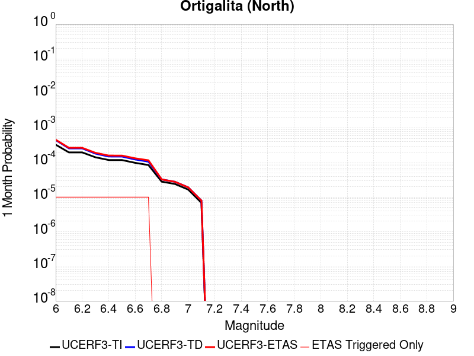 |  |  |

| Magnitude | 1 wk TI Prob | 1 wk TD Prob | 1 wk ETAS Prob | 1 wk ETAS/TD Gain | 1 wk ETAS Triggered Only | 1 mo TI Prob | 1 mo TD Prob | 1 mo ETAS Prob | 1 mo ETAS/TD Gain | 1 mo ETAS Triggered Only | 1 yr TI Prob | 1 yr TD Prob | 1 yr ETAS Prob | 1 yr ETAS/TD Gain | 1 yr ETAS Triggered Only | 10 yr TI Prob | 10 yr TD Prob | 10 yr ETAS Prob | 10 yr ETAS/TD Gain | 10 yr ETAS Triggered Only |
|-----|-----|-----|-----|-----|-----|-----|-----|-----|-----|-----|-----|-----|-----|-----|-----|-----|-----|-----|-----|-----|
| 6.0 | 7.711876E-5 | 1.0505203E-4 | 1.1505098E-4 | 1.0951809 | 1.0E-5 | 3.3046713E-4 | 4.501557E-4 | 4.6015118E-4 | 1.0222045 | 1.0E-5 | 0.004016016 | 0.0054680067 | 0.0054878974 | 1.0036377 | 2.0E-5 | 0.039442103 | 0.05345516 | 0.053483553 | 1.0005312 | 3.0E-5 |
| 6.1 | 4.607858E-5 | 6.023939E-5 | 7.0238784E-5 | 1.1659944 | 1.0E-5 | 1.9746469E-4 | 2.5814556E-4 | 2.68143E-4 | 1.0387279 | 1.0E-5 | 0.0024014818 | 0.0031387117 | 0.0031586487 | 1.0063521 | 2.0E-5 | 0.023756953 | 0.03097507 | 0.031004142 | 1.0009385 | 3.0E-5 |
| 6.2 | 4.607858E-5 | 6.023939E-5 | 7.0238784E-5 | 1.1659944 | 1.0E-5 | 1.9746469E-4 | 2.5814556E-4 | 2.68143E-4 | 1.0387279 | 1.0E-5 | 0.0024014818 | 0.0031387117 | 0.0031586487 | 1.0063521 | 2.0E-5 | 0.023756953 | 0.03097507 | 0.031004142 | 1.0009385 | 3.0E-5 |
| 6.3 | 3.327423E-5 | 4.247581E-5 | 5.2475385E-5 | 1.2354181 | 1.0E-5 | 1.4259605E-4 | 1.8202818E-4 | 1.9202636E-4 | 1.0549265 | 1.0E-5 | 0.0017347244 | 0.0022141896 | 0.0022341453 | 1.0090127 | 2.0E-5 | 0.017212452 | 0.021945579 | 0.021974921 | 1.001337 | 3.0E-5 |
| 6.4 | 2.7732503E-5 | 3.499876E-5 | 4.499841E-5 | 1.2857144 | 1.0E-5 | 1.1884817E-4 | 1.4998752E-4 | 1.5998603E-4 | 1.0666622 | 1.0E-5 | 0.001446016 | 0.0018248028 | 0.0018447663 | 1.0109401 | 2.0E-5 | 0.014366428 | 0.01812117 | 0.018150626 | 1.0016255 | 3.0E-5 |
| 6.5 | 2.7689714E-5 | 3.4948574E-5 | 4.4948225E-5 | 1.2861247 | 1.0E-5 | 1.186648E-4 | 1.4977247E-4 | 1.5977098E-4 | 1.0667579 | 1.0E-5 | 0.0014437864 | 0.001822189 | 0.0018421524 | 1.0109558 | 2.0E-5 | 0.014344421 | 0.018095456 | 0.018124914 | 1.0016279 | 3.0E-5 |
| 6.6 | 2.2976905E-5 | 2.8718101E-5 | 3.871781E-5 | 1.3482025 | 1.0E-5 | 9.846873E-5 | 1.2307316E-4 | 1.3307192E-4 | 1.0812424 | 1.0E-5 | 0.0011981975 | 0.0014976246 | 0.0015175947 | 1.0133345 | 2.0E-5 | 0.011917574 | 0.014898633 | 0.014918335 | 1.0013224 | 2.0E-5 |
| 6.7 | 1.9871539E-5 | 2.4904462E-5 | 3.4904213E-5 | 1.4015244 | 1.0E-5 | 8.516096E-5 | 1.0673045E-4 | 1.1672938E-4 | 1.093684 | 1.0E-5 | 0.0010363415 | 0.0012989109 | 0.0013188849 | 1.0153775 | 2.0E-5 | 0.010315218 | 0.012936848 | 0.012956589 | 1.001526 | 2.0E-5 |
| 6.8 | 6.5640475E-6 | 7.6054603E-6 | 7.6054603E-6 | 1.0 | 0.0 | 2.813133E-5 | 3.259444E-5 | 3.259444E-5 | 1.0 | 0.0 | 3.424451E-4 | 3.967679E-4 | 4.0676392E-4 | 1.0251937 | 1.0E-5 | 0.0034191788 | 0.0039608823 | 0.0039708423 | 1.0025147 | 1.0E-5 |
| 6.9 | 5.6219683E-6 | 6.5018107E-6 | 6.5018107E-6 | 1.0 | 0.0 | 2.4093928E-5 | 2.7864618E-5 | 2.7864618E-5 | 1.0 | 0.0 | 2.933041E-4 | 3.392015E-4 | 3.392015E-4 | 1.0 | 0.0 | 0.0029291727 | 0.0033870947 | 0.0033870947 | 1.0 | 0.0 |
| 7.0 | 3.875591E-6 | 4.484736E-6 | 4.484736E-6 | 1.0 | 0.0 | 1.6609569E-5 | 1.9220168E-5 | 1.9220168E-5 | 1.0 | 0.0 | 2.0220275E-4 | 2.3398253E-4 | 2.3398253E-4 | 1.0 | 0.0 | 0.0020201886 | 0.00233757 | 0.00233757 | 1.0 | 0.0 |
| 7.1 | 1.6017933E-6 | 1.8570338E-6 | 1.8570338E-6 | 1.0 | 0.0 | 6.8648105E-6 | 7.958698E-6 | 7.958698E-6 | 1.0 | 0.0 | 8.357586E-5 | 9.6893906E-5 | 9.6893906E-5 | 1.0 | 0.0 | 8.3544437E-4 | 9.6862135E-4 | 9.6862135E-4 | 1.0 | 0.0 |

## San Jacinto (San Jacinto Valley) rev
*[(top)](#table-of-contents)*

| 1 Week | 1 Month | 1 Year | 10 Year |
|-----|-----|-----|-----|
|  |  |  |  |

| Magnitude | 1 wk TI Prob | 1 wk TD Prob | 1 wk ETAS Prob | 1 wk ETAS/TD Gain | 1 wk ETAS Triggered Only | 1 mo TI Prob | 1 mo TD Prob | 1 mo ETAS Prob | 1 mo ETAS/TD Gain | 1 mo ETAS Triggered Only | 1 yr TI Prob | 1 yr TD Prob | 1 yr ETAS Prob | 1 yr ETAS/TD Gain | 1 yr ETAS Triggered Only | 10 yr TI Prob | 10 yr TD Prob | 10 yr ETAS Prob | 10 yr ETAS/TD Gain | 10 yr ETAS Triggered Only |
|-----|-----|-----|-----|-----|-----|-----|-----|-----|-----|-----|-----|-----|-----|-----|-----|-----|-----|-----|-----|-----|
| 6.0 | 3.652694E-5 | 3.4394532E-5 | 3.4394532E-5 | 1.0 | 0.0 | 1.5653463E-4 | 1.4739682E-4 | 1.4739682E-4 | 1.0 | 0.0 | 0.0019041431 | 0.0017930809 | 0.001813045 | 1.011134 | 2.0E-5 | 0.018879099 | 0.018522728 | 0.018552173 | 1.0015897 | 3.0E-5 |
| 6.1 | 3.652694E-5 | 3.4394532E-5 | 3.4394532E-5 | 1.0 | 0.0 | 1.5653463E-4 | 1.4739682E-4 | 1.4739682E-4 | 1.0 | 0.0 | 0.0019041431 | 0.0017930809 | 0.001813045 | 1.011134 | 2.0E-5 | 0.018879099 | 0.018522728 | 0.018552173 | 1.0015897 | 3.0E-5 |
| 6.2 | 3.652694E-5 | 3.4394532E-5 | 3.4394532E-5 | 1.0 | 0.0 | 1.5653463E-4 | 1.4739682E-4 | 1.4739682E-4 | 1.0 | 0.0 | 0.0019041431 | 0.0017930809 | 0.001813045 | 1.011134 | 2.0E-5 | 0.018879099 | 0.018522728 | 0.018552173 | 1.0015897 | 3.0E-5 |
| 6.3 | 3.652694E-5 | 3.4394532E-5 | 3.4394532E-5 | 1.0 | 0.0 | 1.5653463E-4 | 1.4739682E-4 | 1.4739682E-4 | 1.0 | 0.0 | 0.0019041431 | 0.0017930809 | 0.001813045 | 1.011134 | 2.0E-5 | 0.018879099 | 0.018522728 | 0.018552173 | 1.0015897 | 3.0E-5 |
| 6.4 | 3.646941E-5 | 3.4316105E-5 | 3.4316105E-5 | 1.0 | 0.0 | 1.5628811E-4 | 1.4706074E-4 | 1.4706074E-4 | 1.0 | 0.0 | 0.0019011468 | 0.0017889964 | 0.0018089606 | 1.0111594 | 2.0E-5 | 0.018849645 | 0.01848261 | 0.018512055 | 1.0015931 | 3.0E-5 |
| 6.5 | 3.646941E-5 | 3.4316105E-5 | 3.4316105E-5 | 1.0 | 0.0 | 1.5628811E-4 | 1.4706074E-4 | 1.4706074E-4 | 1.0 | 0.0 | 0.0019011468 | 0.0017889964 | 0.0018089606 | 1.0111594 | 2.0E-5 | 0.018849645 | 0.01848261 | 0.018512055 | 1.0015931 | 3.0E-5 |
| 6.6 | 3.6442503E-5 | 3.4279492E-5 | 3.4279492E-5 | 1.0 | 0.0 | 1.561728E-4 | 1.4690385E-4 | 1.4690385E-4 | 1.0 | 0.0 | 0.0018997455 | 0.0017870895 | 0.0018070538 | 1.0111713 | 2.0E-5 | 0.018835869 | 0.018463878 | 0.018493325 | 1.0015948 | 3.0E-5 |
| 6.7 | 3.6432113E-5 | 3.4265067E-5 | 3.4265067E-5 | 1.0 | 0.0 | 1.5612828E-4 | 1.4684204E-4 | 1.4684204E-4 | 1.0 | 0.0 | 0.0018992044 | 0.0017863383 | 0.0018063026 | 1.0111761 | 2.0E-5 | 0.018830549 | 0.018456502 | 0.018485948 | 1.0015955 | 3.0E-5 |
| 6.8 | 3.6409598E-5 | 3.4234123E-5 | 3.4234123E-5 | 1.0 | 0.0 | 1.560318E-4 | 1.4670944E-4 | 1.4670944E-4 | 1.0 | 0.0 | 0.0018980318 | 0.0017847265 | 0.0018046908 | 1.0111862 | 2.0E-5 | 0.018819023 | 0.018440656 | 0.018470103 | 1.0015968 | 3.0E-5 |
| 6.9 | 3.638078E-5 | 3.419455E-5 | 3.419455E-5 | 1.0 | 0.0 | 1.5590832E-4 | 1.4653984E-4 | 1.4653984E-4 | 1.0 | 0.0 | 0.0018965311 | 0.0017826651 | 0.0018026294 | 1.0111991 | 2.0E-5 | 0.018804269 | 0.01842039 | 0.018449837 | 1.0015986 | 3.0E-5 |
| 7.0 | 3.6294874E-5 | 3.407657E-5 | 3.407657E-5 | 1.0 | 0.0 | 1.5554018E-4 | 1.4603428E-4 | 1.4603428E-4 | 1.0 | 0.0 | 0.0018920569 | 0.0017765199 | 0.0017964845 | 1.011238 | 2.0E-5 | 0.018760284 | 0.018359972 | 0.018389422 | 1.001604 | 3.0E-5 |
| 7.1 | 3.6260717E-5 | 3.403285E-5 | 3.403285E-5 | 1.0 | 0.0 | 1.5539382E-4 | 1.4584693E-4 | 1.4584693E-4 | 1.0 | 0.0 | 0.001890278 | 0.0017742428 | 0.0017942074 | 1.0112524 | 2.0E-5 | 0.018742796 | 0.018337566 | 0.018367017 | 1.001606 | 3.0E-5 |
| 7.2 | 3.6210204E-5 | 3.396707E-5 | 3.396707E-5 | 1.0 | 0.0 | 1.5517735E-4 | 1.4556505E-4 | 1.4556505E-4 | 1.0 | 0.0 | 0.001887647 | 0.0017708165 | 0.001790781 | 1.0112742 | 2.0E-5 | 0.01871693 | 0.018303836 | 0.018333286 | 1.001609 | 3.0E-5 |
| 7.3 | 3.6119454E-5 | 3.385536E-5 | 3.385536E-5 | 1.0 | 0.0 | 1.5478847E-4 | 1.4508633E-4 | 1.4508633E-4 | 1.0 | 0.0 | 0.0018829206 | 0.0017649976 | 0.0017849623 | 1.0113114 | 2.0E-5 | 0.018670462 | 0.018246388 | 0.01827584 | 1.0016142 | 3.0E-5 |
| 7.4 | 3.607848E-5 | 3.3802888E-5 | 3.3802888E-5 | 1.0 | 0.0 | 1.5461289E-4 | 1.4486148E-4 | 1.4486148E-4 | 1.0 | 0.0 | 0.0018807866 | 0.0017622644 | 0.0017822292 | 1.011329 | 2.0E-5 | 0.018649481 | 0.0182194 | 0.018248854 | 1.0016166 | 3.0E-5 |
| 7.5 | 3.5856774E-5 | 3.3612705E-5 | 3.3612705E-5 | 1.0 | 0.0 | 1.5366284E-4 | 1.4404651E-4 | 1.4404651E-4 | 1.0 | 0.0 | 0.0018692396 | 0.0017523582 | 0.0017723232 | 1.0113932 | 2.0E-5 | 0.018535944 | 0.01812053 | 0.018149985 | 1.0016255 | 3.0E-5 |
| 7.6 | 3.286655E-5 | 3.213617E-5 | 3.213617E-5 | 1.0 | 0.0 | 1.4084904E-4 | 1.3771918E-4 | 1.3771918E-4 | 1.0 | 0.0 | 0.001713488 | 0.0016754436 | 0.0016954101 | 1.0119171 | 2.0E-5 | 0.017003361 | 0.017340416 | 0.017369896 | 1.0017 | 3.0E-5 |
| 7.7 | 2.8882527E-5 | 2.9232393E-5 | 2.9232393E-5 | 1.0 | 0.0 | 1.237764E-4 | 1.2527568E-4 | 1.2527568E-4 | 1.0 | 0.0 | 0.0015059357 | 0.0015241653 | 0.0015441348 | 1.0131019 | 2.0E-5 | 0.014957713 | 0.015828714 | 0.015858239 | 1.0018653 | 3.0E-5 |
| 7.8 | 2.4950225E-5 | 2.6523543E-5 | 2.6523543E-5 | 1.0 | 0.0 | 1.0692515E-4 | 1.1366738E-4 | 1.1366738E-4 | 1.0 | 0.0 | 0.0013010362 | 0.0013830226 | 0.001402995 | 1.0144411 | 2.0E-5 | 0.012934455 | 0.014410028 | 0.014439596 | 1.0020518 | 3.0E-5 |
| 7.9 | 1.9881603E-5 | 2.1504095E-5 | 2.1504095E-5 | 1.0 | 0.0 | 8.520408E-5 | 9.2157155E-5 | 9.2157155E-5 | 1.0 | 0.0 | 0.001036866 | 0.0011214366 | 0.0011314254 | 1.0089071 | 1.0E-5 | 0.010320415 | 0.011775419 | 0.011795184 | 1.0016785 | 2.0E-5 |
| 8.0 | 1.563292E-5 | 1.5934353E-5 | 1.5934353E-5 | 1.0 | 0.0 | 6.6996516E-5 | 6.82883E-5 | 6.82883E-5 | 1.0 | 0.0 | 8.153773E-4 | 8.310935E-4 | 8.310935E-4 | 1.0 | 0.0 | 0.00812392 | 0.00880904 | 0.008818951 | 1.0011252 | 1.0E-5 |
| 8.1 | 1.0045313E-5 | 8.299667E-6 | 8.299667E-6 | 1.0 | 0.0 | 4.305063E-5 | 3.556952E-5 | 3.556952E-5 | 1.0 | 0.0 | 5.2401534E-4 | 4.3297335E-4 | 4.3297335E-4 | 1.0 | 0.0 | 0.0052278144 | 0.004658037 | 0.00466799 | 1.0021368 | 1.0E-5 |
| 8.2 | 4.1554413E-6 | 1.5644919E-6 | 1.5644919E-6 | 1.0 | 0.0 | 1.7808914E-5 | 6.7049477E-6 | 6.7049477E-6 | 1.0 | 0.0 | 2.1680194E-4 | 8.162971E-5 | 8.162971E-5 | 1.0 | 0.0 | 0.0021659054 | 9.4777363E-4 | 9.4777363E-4 | 1.0 | 0.0 |
| 8.3 | 1.2758221E-6 | 3.6117652E-7 | 3.6117652E-7 | 1.0 | 0.0 | 5.4677976E-6 | 1.5478985E-6 | 1.5478985E-6 | 1.0 | 0.0 | 6.65684E-5 | 1.8845505E-5 | 1.8845505E-5 | 1.0 | 0.0 | 6.6548464E-4 | 2.273426E-4 | 2.273426E-4 | 1.0 | 0.0 |

## San Jacinto (Lytle Creek connector)
*[(top)](#table-of-contents)*

| 1 Week | 1 Month | 1 Year | 10 Year |
|-----|-----|-----|-----|
|  |  |  |  |

| Magnitude | 1 wk TI Prob | 1 wk TD Prob | 1 wk ETAS Prob | 1 wk ETAS/TD Gain | 1 wk ETAS Triggered Only | 1 mo TI Prob | 1 mo TD Prob | 1 mo ETAS Prob | 1 mo ETAS/TD Gain | 1 mo ETAS Triggered Only | 1 yr TI Prob | 1 yr TD Prob | 1 yr ETAS Prob | 1 yr ETAS/TD Gain | 1 yr ETAS Triggered Only | 10 yr TI Prob | 10 yr TD Prob | 10 yr ETAS Prob | 10 yr ETAS/TD Gain | 10 yr ETAS Triggered Only |
|-----|-----|-----|-----|-----|-----|-----|-----|-----|-----|-----|-----|-----|-----|-----|-----|-----|-----|-----|-----|-----|
| 6.0 | 6.693995E-6 | 6.6595903E-6 | 6.6595903E-6 | 1.0 | 0.0 | 2.8688235E-5 | 2.854079E-5 | 2.854079E-5 | 1.0 | 0.0 | 3.492233E-4 | 3.4742878E-4 | 3.6742183E-4 | 1.0575458 | 2.0E-5 | 0.00348675 | 0.0035488552 | 0.0035787488 | 1.0084234 | 3.0E-5 |
| 6.1 | 6.693995E-6 | 6.6595903E-6 | 6.6595903E-6 | 1.0 | 0.0 | 2.8688235E-5 | 2.854079E-5 | 2.854079E-5 | 1.0 | 0.0 | 3.492233E-4 | 3.4742878E-4 | 3.6742183E-4 | 1.0575458 | 2.0E-5 | 0.00348675 | 0.0035488552 | 0.0035787488 | 1.0084234 | 3.0E-5 |
| 6.2 | 6.693995E-6 | 6.6595903E-6 | 6.6595903E-6 | 1.0 | 0.0 | 2.8688235E-5 | 2.854079E-5 | 2.854079E-5 | 1.0 | 0.0 | 3.492233E-4 | 3.4742878E-4 | 3.6742183E-4 | 1.0575458 | 2.0E-5 | 0.00348675 | 0.0035488552 | 0.0035787488 | 1.0084234 | 3.0E-5 |
| 6.3 | 6.693995E-6 | 6.6595903E-6 | 6.6595903E-6 | 1.0 | 0.0 | 2.8688235E-5 | 2.854079E-5 | 2.854079E-5 | 1.0 | 0.0 | 3.492233E-4 | 3.4742878E-4 | 3.6742183E-4 | 1.0575458 | 2.0E-5 | 0.00348675 | 0.0035488552 | 0.0035787488 | 1.0084234 | 3.0E-5 |
| 6.4 | 6.693995E-6 | 6.6595903E-6 | 6.6595903E-6 | 1.0 | 0.0 | 2.8688235E-5 | 2.854079E-5 | 2.854079E-5 | 1.0 | 0.0 | 3.492233E-4 | 3.4742878E-4 | 3.6742183E-4 | 1.0575458 | 2.0E-5 | 0.00348675 | 0.0035488552 | 0.0035787488 | 1.0084234 | 3.0E-5 |
| 6.5 | 6.6561875E-6 | 6.619808E-6 | 6.619808E-6 | 1.0 | 0.0 | 2.8526205E-5 | 2.83703E-5 | 2.83703E-5 | 1.0 | 0.0 | 3.472512E-4 | 3.4535374E-4 | 3.6534682E-4 | 1.0578916 | 2.0E-5 | 0.0034670907 | 0.0035281708 | 0.0035580648 | 1.008473 | 3.0E-5 |
| 6.6 | 6.6561875E-6 | 6.619808E-6 | 6.619808E-6 | 1.0 | 0.0 | 2.8526205E-5 | 2.83703E-5 | 2.83703E-5 | 1.0 | 0.0 | 3.472512E-4 | 3.4535374E-4 | 3.6534682E-4 | 1.0578916 | 2.0E-5 | 0.0034670907 | 0.0035281708 | 0.0035580648 | 1.008473 | 3.0E-5 |
| 6.7 | 6.5802237E-6 | 6.538985E-6 | 6.538985E-6 | 1.0 | 0.0 | 2.8200653E-5 | 2.8023922E-5 | 2.8023922E-5 | 1.0 | 0.0 | 3.4328885E-4 | 3.411379E-4 | 3.6113107E-4 | 1.0586073 | 2.0E-5 | 0.0034275902 | 0.0034861453 | 0.0035160407 | 1.0085754 | 3.0E-5 |
| 6.8 | 6.575632E-6 | 6.533475E-6 | 6.533475E-6 | 1.0 | 0.0 | 2.8180975E-5 | 2.8000306E-5 | 2.8000306E-5 | 1.0 | 0.0 | 3.4304935E-4 | 3.4085047E-4 | 3.6084367E-4 | 1.0586568 | 2.0E-5 | 0.0034252026 | 0.00348328 | 0.0035131755 | 1.0085826 | 3.0E-5 |
| 6.9 | 6.570433E-6 | 6.5248687E-6 | 6.5248687E-6 | 1.0 | 0.0 | 2.8158694E-5 | 2.7963424E-5 | 2.7963424E-5 | 1.0 | 0.0 | 3.4277816E-4 | 3.4040157E-4 | 3.6039477E-4 | 1.0587342 | 2.0E-5 | 0.0034224992 | 0.003478805 | 0.0035087008 | 1.0085937 | 3.0E-5 |
| 7.0 | 6.5643826E-6 | 6.5149898E-6 | 6.5149898E-6 | 1.0 | 0.0 | 2.8132765E-5 | 2.7921087E-5 | 2.7921087E-5 | 1.0 | 0.0 | 3.424626E-4 | 3.398863E-4 | 3.598795E-4 | 1.0588232 | 2.0E-5 | 0.0034193532 | 0.0034736684 | 0.003503564 | 1.0086064 | 3.0E-5 |
| 7.1 | 6.557402E-6 | 6.5037016E-6 | 6.5037016E-6 | 1.0 | 0.0 | 2.8102848E-5 | 2.787271E-5 | 2.787271E-5 | 1.0 | 0.0 | 3.4209844E-4 | 3.3929746E-4 | 3.592907E-4 | 1.0589253 | 2.0E-5 | 0.0034157229 | 0.0034677996 | 0.0034976956 | 1.008621 | 3.0E-5 |
| 7.2 | 6.546394E-6 | 6.485668E-6 | 6.485668E-6 | 1.0 | 0.0 | 2.8055672E-5 | 2.7795426E-5 | 2.7795426E-5 | 1.0 | 0.0 | 3.4152428E-4 | 3.3835683E-4 | 3.5835005E-4 | 1.0590892 | 2.0E-5 | 0.0034099987 | 0.0034584268 | 0.003488323 | 1.0086445 | 3.0E-5 |
| 7.3 | 6.5364216E-6 | 6.466454E-6 | 6.466454E-6 | 1.0 | 0.0 | 2.8012933E-5 | 2.771308E-5 | 2.771308E-5 | 1.0 | 0.0 | 3.4100408E-4 | 3.3735458E-4 | 3.5734783E-4 | 1.0592648 | 2.0E-5 | 0.003404813 | 0.0034484495 | 0.0034783462 | 1.0086696 | 3.0E-5 |
| 7.4 | 6.5269523E-6 | 6.4475407E-6 | 6.4475407E-6 | 1.0 | 0.0 | 2.7972354E-5 | 2.7632026E-5 | 2.7632026E-5 | 1.0 | 0.0 | 3.4051016E-4 | 3.3636804E-4 | 3.5636133E-4 | 1.0594387 | 2.0E-5 | 0.0033998888 | 0.003438632 | 0.0034685289 | 1.0086944 | 3.0E-5 |
| 7.5 | 6.5111835E-6 | 6.4238147E-6 | 6.4238147E-6 | 1.0 | 0.0 | 2.7904773E-5 | 2.7530345E-5 | 2.7530345E-5 | 1.0 | 0.0 | 3.3968766E-4 | 3.3513046E-4 | 3.5512378E-4 | 1.0596583 | 2.0E-5 | 0.0033916887 | 0.003426305 | 0.0034562023 | 1.0087258 | 3.0E-5 |
| 7.6 | 6.4768806E-6 | 6.382924E-6 | 6.382924E-6 | 1.0 | 0.0 | 2.7757764E-5 | 2.7355101E-5 | 2.7355101E-5 | 1.0 | 0.0 | 3.3789838E-4 | 3.3299756E-4 | 3.5299087E-4 | 1.0600405 | 2.0E-5 | 0.0033738504 | 0.003405038 | 0.003434936 | 1.0087805 | 3.0E-5 |
| 7.7 | 6.1655364E-6 | 6.1754195E-6 | 6.1754195E-6 | 1.0 | 0.0 | 2.642346E-5 | 2.6465816E-5 | 2.6465816E-5 | 1.0 | 0.0 | 3.2165812E-4 | 3.2217373E-4 | 3.4216727E-4 | 1.0620583 | 2.0E-5 | 0.0032119295 | 0.0032966493 | 0.0033265504 | 1.0090702 | 3.0E-5 |
| 7.8 | 5.5043524E-6 | 5.736509E-6 | 5.736509E-6 | 1.0 | 0.0 | 2.3589868E-5 | 2.4584808E-5 | 2.4584808E-5 | 1.0 | 0.0 | 2.871688E-4 | 2.9927897E-4 | 3.1927298E-4 | 1.0668073 | 2.0E-5 | 0.0028679797 | 0.0030667698 | 0.0030966778 | 1.0097523 | 3.0E-5 |
| 7.9 | 3.889249E-6 | 4.0762266E-6 | 4.0762266E-6 | 1.0 | 0.0 | 1.6668104E-5 | 1.7469425E-5 | 1.7469425E-5 | 1.0 | 0.0 | 2.0291525E-4 | 2.1266953E-4 | 2.2266741E-4 | 1.0470113 | 1.0E-5 | 0.0020273007 | 0.0021939029 | 0.002213859 | 1.0090961 | 2.0E-5 |
| 8.0 | 2.668535E-6 | 2.531063E-6 | 2.531063E-6 | 1.0 | 0.0 | 1.1436528E-5 | 1.0847369E-5 | 1.0847369E-5 | 1.0 | 0.0 | 1.3923083E-4 | 1.3205873E-4 | 1.3205873E-4 | 1.0 | 0.0 | 0.0013914363 | 0.0013754078 | 0.001385394 | 1.0072606 | 1.0E-5 |
| 8.1 | 1.5911459E-6 | 1.2183608E-6 | 1.2183608E-6 | 1.0 | 0.0 | 6.8191785E-6 | 5.221536E-6 | 5.221536E-6 | 1.0 | 0.0 | 8.3020335E-5 | 6.357037E-5 | 6.357037E-5 | 1.0 | 0.0 | 8.298933E-4 | 6.6903053E-4 | 6.790238E-4 | 1.014937 | 1.0E-5 |
| 8.2 | 6.1294963E-7 | 2.1797568E-7 | 2.1797568E-7 | 1.0 | 0.0 | 2.6269242E-6 | 9.341812E-7 | 9.341812E-7 | 1.0 | 0.0 | 3.1982334E-5 | 1.1373597E-5 | 1.1373597E-5 | 1.0 | 0.0 | 3.1977732E-4 | 1.2776689E-4 | 1.2776689E-4 | 1.0 | 0.0 |
| 8.3 | 1.762871E-7 | 4.7504173E-8 | 4.7504173E-8 | 1.0 | 0.0 | 7.5551594E-7 | 2.035893E-7 | 2.035893E-7 | 1.0 | 0.0 | 9.1983675E-6 | 2.4786968E-6 | 2.4786968E-6 | 1.0 | 0.0 | 9.197987E-5 | 2.8665521E-5 | 2.8665521E-5 | 1.0 | 0.0 |

## Elsinore (Glen Ivy) rev
*[(top)](#table-of-contents)*

| 1 Week | 1 Month | 1 Year | 10 Year |
|-----|-----|-----|-----|
|  |  |  |  |

| Magnitude | 1 wk TI Prob | 1 wk TD Prob | 1 wk ETAS Prob | 1 wk ETAS/TD Gain | 1 wk ETAS Triggered Only | 1 mo TI Prob | 1 mo TD Prob | 1 mo ETAS Prob | 1 mo ETAS/TD Gain | 1 mo ETAS Triggered Only | 1 yr TI Prob | 1 yr TD Prob | 1 yr ETAS Prob | 1 yr ETAS/TD Gain | 1 yr ETAS Triggered Only | 10 yr TI Prob | 10 yr TD Prob | 10 yr ETAS Prob | 10 yr ETAS/TD Gain | 10 yr ETAS Triggered Only |
|-----|-----|-----|-----|-----|-----|-----|-----|-----|-----|-----|-----|-----|-----|-----|-----|-----|-----|-----|-----|-----|
| 6.0 | 1.6204086E-4 | 2.937252E-4 | 3.0372228E-4 | 1.0340354 | 1.0E-5 | 6.94276E-4 | 0.0012583698 | 0.0012683572 | 1.0079368 | 1.0E-5 | 0.008420097 | 0.015234572 | 0.01524442 | 1.0006464 | 1.0E-5 | 0.081081145 | 0.13948786 | 0.13950507 | 1.0001234 | 2.0E-5 |
| 6.1 | 1.6204086E-4 | 2.937252E-4 | 3.0372228E-4 | 1.0340354 | 1.0E-5 | 6.94276E-4 | 0.0012583698 | 0.0012683572 | 1.0079368 | 1.0E-5 | 0.008420097 | 0.015234572 | 0.01524442 | 1.0006464 | 1.0E-5 | 0.081081145 | 0.13948786 | 0.13950507 | 1.0001234 | 2.0E-5 |
| 6.2 | 1.6204086E-4 | 2.937252E-4 | 3.0372228E-4 | 1.0340354 | 1.0E-5 | 6.94276E-4 | 0.0012583698 | 0.0012683572 | 1.0079368 | 1.0E-5 | 0.008420097 | 0.015234572 | 0.01524442 | 1.0006464 | 1.0E-5 | 0.081081145 | 0.13948786 | 0.13950507 | 1.0001234 | 2.0E-5 |
| 6.3 | 1.0111737E-4 | 1.7703425E-4 | 1.7703425E-4 | 1.0 | 0.0 | 4.332882E-4 | 7.586143E-4 | 7.586143E-4 | 1.0 | 0.0 | 0.005262531 | 0.009217702 | 0.009227609 | 1.0010749 | 1.0E-5 | 0.0513964 | 0.08692913 | 0.086938255 | 1.000105 | 1.0E-5 |
| 6.4 | 1.0111737E-4 | 1.7703425E-4 | 1.7703425E-4 | 1.0 | 0.0 | 4.332882E-4 | 7.586143E-4 | 7.586143E-4 | 1.0 | 0.0 | 0.005262531 | 0.009217702 | 0.009227609 | 1.0010749 | 1.0E-5 | 0.0513964 | 0.08692913 | 0.086938255 | 1.000105 | 1.0E-5 |
| 6.5 | 3.6624708E-5 | 4.639161E-5 | 4.639161E-5 | 1.0 | 0.0 | 1.569536E-4 | 1.9880808E-4 | 1.9880808E-4 | 1.0 | 0.0 | 0.001909235 | 0.0024181618 | 0.0024181618 | 1.0 | 0.0 | 0.01892915 | 0.023697129 | 0.023697129 | 1.0 | 0.0 |
| 6.6 | 2.5051324E-5 | 2.614718E-5 | 2.614718E-5 | 1.0 | 0.0 | 1.073584E-4 | 1.12054775E-4 | 1.12054775E-4 | 1.0 | 0.0 | 0.0013063047 | 0.0013634576 | 0.0013634576 | 1.0 | 0.0 | 0.012986525 | 0.0135658905 | 0.0135658905 | 1.0 | 0.0 |
| 6.7 | 2.2189772E-5 | 2.2072209E-5 | 2.2072209E-5 | 1.0 | 0.0 | 9.509556E-5 | 9.459196E-5 | 9.459196E-5 | 1.0 | 0.0 | 0.0011571734 | 0.001151085 | 0.001151085 | 1.0 | 0.0 | 0.011511663 | 0.011466836 | 0.011466836 | 1.0 | 0.0 |
| 6.8 | 1.6654378E-5 | 1.44374735E-5 | 1.44374735E-5 | 1.0 | 0.0 | 7.137396E-5 | 6.187345E-5 | 6.187345E-5 | 1.0 | 0.0 | 8.686314E-4 | 7.53054E-4 | 7.53054E-4 | 1.0 | 0.0 | 0.008652439 | 0.0075098155 | 0.0075098155 | 1.0 | 0.0 |
| 6.9 | 1.5042909E-5 | 1.2331781E-5 | 1.2331781E-5 | 1.0 | 0.0 | 6.446802E-5 | 5.2849442E-5 | 5.2849442E-5 | 1.0 | 0.0 | 7.8461546E-4 | 6.4325513E-4 | 6.4325513E-4 | 1.0 | 0.0 | 0.007818509 | 0.006417556 | 0.006417556 | 1.0 | 0.0 |
| 7.0 | 1.4361385E-5 | 1.1451071E-5 | 1.1451071E-5 | 1.0 | 0.0 | 6.154734E-5 | 4.9075115E-5 | 4.9075115E-5 | 1.0 | 0.0 | 7.490812E-4 | 5.9732865E-4 | 5.9732865E-4 | 1.0 | 0.0 | 0.007465612 | 0.0059606205 | 0.0059606205 | 1.0 | 0.0 |
| 7.1 | 1.3265571E-5 | 1.0244655E-5 | 1.0244655E-5 | 1.0 | 0.0 | 5.6851208E-5 | 4.390494E-5 | 4.390494E-5 | 1.0 | 0.0 | 6.919436E-4 | 5.344141E-4 | 5.344141E-4 | 1.0 | 0.0 | 0.006897931 | 0.0053345314 | 0.0053345314 | 1.0 | 0.0 |
| 7.2 | 1.1596403E-5 | 8.504791E-6 | 8.504791E-6 | 1.0 | 0.0 | 4.9697923E-5 | 3.6448608E-5 | 3.6448608E-5 | 1.0 | 0.0 | 6.049042E-4 | 4.436731E-4 | 4.436731E-4 | 1.0 | 0.0 | 0.006032603 | 0.0044293273 | 0.0044293273 | 1.0 | 0.0 |
| 7.3 | 1.0150827E-5 | 7.2385E-6 | 7.2385E-6 | 1.0 | 0.0 | 4.3502816E-5 | 3.1021784E-5 | 3.1021784E-5 | 1.0 | 0.0 | 5.2951806E-4 | 3.776262E-4 | 3.776262E-4 | 1.0 | 0.0 | 0.005282581 | 0.003770243 | 0.003770243 | 1.0 | 0.0 |
| 7.4 | 9.080705E-6 | 6.3522734E-6 | 6.3522734E-6 | 1.0 | 0.0 | 3.8916725E-5 | 2.7223752E-5 | 2.7223752E-5 | 1.0 | 0.0 | 4.7370812E-4 | 3.3140014E-4 | 3.3140014E-4 | 1.0 | 0.0 | 0.004726996 | 0.0033092108 | 0.0033092108 | 1.0 | 0.0 |
| 7.5 | 7.671649E-6 | 5.2253913E-6 | 5.2253913E-6 | 1.0 | 0.0 | 3.287808E-5 | 2.2394348E-5 | 2.2394348E-5 | 1.0 | 0.0 | 4.0021708E-4 | 2.7261834E-4 | 2.7261834E-4 | 1.0 | 0.0 | 0.0039949706 | 0.002722964 | 0.002722964 | 1.0 | 0.0 |
| 7.6 | 6.990086E-6 | 4.6873092E-6 | 4.6873092E-6 | 1.0 | 0.0 | 2.9957167E-5 | 2.008832E-5 | 2.008832E-5 | 1.0 | 0.0 | 3.6466747E-4 | 2.4454904E-4 | 2.4454904E-4 | 1.0 | 0.0 | 0.0036406964 | 0.0024429155 | 0.0024429155 | 1.0 | 0.0 |
| 7.7 | 4.163505E-6 | 2.329326E-6 | 2.329326E-6 | 1.0 | 0.0 | 1.7843471E-5 | 9.982792E-6 | 9.982792E-6 | 1.0 | 0.0 | 2.172226E-4 | 1.2153445E-4 | 1.2153445E-4 | 1.0 | 0.0 | 0.0021701038 | 0.0012147529 | 0.0012147529 | 1.0 | 0.0 |
| 7.8 | 2.2692414E-7 | 9.384396E-8 | 9.384396E-8 | 1.0 | 0.0 | 9.725317E-7 | 4.0218833E-7 | 4.0218833E-7 | 1.0 | 0.0 | 1.1840509E-5 | 4.8966353E-6 | 4.8966353E-6 | 1.0 | 0.0 | 1.1839878E-4 | 4.89656E-5 | 4.89656E-5 | 1.0 | 0.0 |
| 7.9 | 6.676829E-9 | 3.4396095E-9 | 3.4396095E-9 | 1.0 | 0.0 | 2.861498E-8 | 1.47411825E-8 | 1.47411825E-8 | 1.0 | 0.0 | 3.4838732E-7 | 1.7947389E-7 | 1.7947389E-7 | 1.0 | 0.0 | 3.4838679E-6 | 1.7947376E-6 | 1.7947376E-6 | 1.0 | 0.0 |

## Mission Creek
*[(top)](#table-of-contents)*

| 1 Week | 1 Month | 1 Year | 10 Year |
|-----|-----|-----|-----|
|  |  |  |  |

| Magnitude | 1 wk TI Prob | 1 wk TD Prob | 1 wk ETAS Prob | 1 wk ETAS/TD Gain | 1 wk ETAS Triggered Only | 1 mo TI Prob | 1 mo TD Prob | 1 mo ETAS Prob | 1 mo ETAS/TD Gain | 1 mo ETAS Triggered Only | 1 yr TI Prob | 1 yr TD Prob | 1 yr ETAS Prob | 1 yr ETAS/TD Gain | 1 yr ETAS Triggered Only | 10 yr TI Prob | 10 yr TD Prob | 10 yr ETAS Prob | 10 yr ETAS/TD Gain | 10 yr ETAS Triggered Only |
|-----|-----|-----|-----|-----|-----|-----|-----|-----|-----|-----|-----|-----|-----|-----|-----|-----|-----|-----|-----|-----|
| 6.0 | 1.1549387E-5 | 1.6322329E-5 | 1.6322329E-5 | 1.0 | 0.0 | 4.9496433E-5 | 6.995104E-5 | 6.995104E-5 | 1.0 | 0.0 | 6.0245243E-4 | 8.513362E-4 | 8.613277E-4 | 1.0117363 | 1.0E-5 | 0.006008218 | 0.008509756 | 0.008529587 | 1.0023302 | 2.0E-5 |
| 6.1 | 1.1549387E-5 | 1.6322329E-5 | 1.6322329E-5 | 1.0 | 0.0 | 4.9496433E-5 | 6.995104E-5 | 6.995104E-5 | 1.0 | 0.0 | 6.0245243E-4 | 8.513362E-4 | 8.613277E-4 | 1.0117363 | 1.0E-5 | 0.006008218 | 0.008509756 | 0.008529587 | 1.0023302 | 2.0E-5 |
| 6.2 | 1.1549387E-5 | 1.6322329E-5 | 1.6322329E-5 | 1.0 | 0.0 | 4.9496433E-5 | 6.995104E-5 | 6.995104E-5 | 1.0 | 0.0 | 6.0245243E-4 | 8.513362E-4 | 8.613277E-4 | 1.0117363 | 1.0E-5 | 0.006008218 | 0.008509756 | 0.008529587 | 1.0023302 | 2.0E-5 |
| 6.3 | 1.1549387E-5 | 1.6322329E-5 | 1.6322329E-5 | 1.0 | 0.0 | 4.9496433E-5 | 6.995104E-5 | 6.995104E-5 | 1.0 | 0.0 | 6.0245243E-4 | 8.513362E-4 | 8.613277E-4 | 1.0117363 | 1.0E-5 | 0.006008218 | 0.008509756 | 0.008529587 | 1.0023302 | 2.0E-5 |
| 6.4 | 1.1549387E-5 | 1.6322329E-5 | 1.6322329E-5 | 1.0 | 0.0 | 4.9496433E-5 | 6.995104E-5 | 6.995104E-5 | 1.0 | 0.0 | 6.0245243E-4 | 8.513362E-4 | 8.613277E-4 | 1.0117363 | 1.0E-5 | 0.006008218 | 0.008509756 | 0.008529587 | 1.0023302 | 2.0E-5 |
| 6.5 | 1.1549387E-5 | 1.6322329E-5 | 1.6322329E-5 | 1.0 | 0.0 | 4.9496433E-5 | 6.995104E-5 | 6.995104E-5 | 1.0 | 0.0 | 6.0245243E-4 | 8.513362E-4 | 8.613277E-4 | 1.0117363 | 1.0E-5 | 0.006008218 | 0.008509756 | 0.008529587 | 1.0023302 | 2.0E-5 |
| 6.6 | 9.202681E-6 | 1.3845609E-5 | 1.3845609E-5 | 1.0 | 0.0 | 3.9439463E-5 | 5.9337024E-5 | 5.9337024E-5 | 1.0 | 0.0 | 4.800697E-4 | 7.221979E-4 | 7.321906E-4 | 1.0138366 | 1.0E-5 | 0.004790339 | 0.0072269416 | 0.007246797 | 1.0027474 | 2.0E-5 |
| 6.7 | 9.019164E-6 | 1.3651278E-5 | 1.3651278E-5 | 1.0 | 0.0 | 3.8652986E-5 | 5.8504218E-5 | 5.8504218E-5 | 1.0 | 0.0 | 4.7049852E-4 | 7.120651E-4 | 7.2205794E-4 | 1.0140337 | 1.0E-5 | 0.004695036 | 0.007126266 | 0.0071461233 | 1.0027865 | 2.0E-5 |
| 6.8 | 8.673558E-6 | 1.327339E-5 | 1.327339E-5 | 1.0 | 0.0 | 3.717186E-5 | 5.6884768E-5 | 5.6884768E-5 | 1.0 | 0.0 | 4.524734E-4 | 6.923608E-4 | 7.023539E-4 | 1.0144334 | 1.0E-5 | 0.0045155324 | 0.0069304546 | 0.006950316 | 1.0028658 | 2.0E-5 |
| 6.9 | 7.002255E-6 | 1.1477623E-5 | 1.1477623E-5 | 1.0 | 0.0 | 3.000932E-5 | 4.9188922E-5 | 4.9188922E-5 | 1.0 | 0.0 | 3.653022E-4 | 5.987174E-4 | 6.0871145E-4 | 1.0166924 | 1.0E-5 | 0.0036470229 | 0.005999279 | 0.006019159 | 1.0033138 | 2.0E-5 |
| 7.0 | 5.84644E-6 | 9.674926E-6 | 9.674926E-6 | 1.0 | 0.0 | 2.5055931E-5 | 4.1463336E-5 | 4.1463336E-5 | 1.0 | 0.0 | 3.0501327E-4 | 5.047037E-4 | 5.146987E-4 | 1.0198036 | 1.0E-5 | 0.0030459496 | 0.0050636036 | 0.0050835023 | 1.0039297 | 2.0E-5 |
| 7.1 | 5.54703E-6 | 9.329403E-6 | 9.329403E-6 | 1.0 | 0.0 | 2.377277E-5 | 3.9982566E-5 | 3.9982566E-5 | 1.0 | 0.0 | 2.8939504E-4 | 4.8668348E-4 | 4.9667864E-4 | 1.0205373 | 1.0E-5 | 0.0028901845 | 0.004884198 | 0.0049041 | 1.0040748 | 2.0E-5 |
| 7.2 | 4.384709E-6 | 7.681513E-6 | 7.681513E-6 | 1.0 | 0.0 | 1.8791474E-5 | 3.2920376E-5 | 3.2920376E-5 | 1.0 | 0.0 | 2.2876218E-4 | 4.0073553E-4 | 4.1073153E-4 | 1.0249441 | 1.0E-5 | 0.0022852682 | 0.004028155 | 0.0040480746 | 1.004945 | 2.0E-5 |
| 7.3 | 3.7888456E-6 | 6.9153903E-6 | 6.9153903E-6 | 1.0 | 0.0 | 1.623781E-5 | 2.9637069E-5 | 2.9637069E-5 | 1.0 | 0.0 | 1.9767738E-4 | 3.6077492E-4 | 3.707713E-4 | 1.0277082 | 1.0E-5 | 0.0019750162 | 0.003629908 | 0.0036498352 | 1.0054898 | 2.0E-5 |
| 7.4 | 2.1982462E-6 | 5.0237163E-6 | 5.0237163E-6 | 1.0 | 0.0 | 9.421021E-6 | 2.1530035E-5 | 2.1530035E-5 | 1.0 | 0.0 | 1.1469489E-4 | 2.6209684E-4 | 2.720942E-4 | 1.0381439 | 1.0E-5 | 0.0011463572 | 0.0026456737 | 0.0026656208 | 1.0075395 | 2.0E-5 |
| 7.5 | 2.051923E-6 | 4.614947E-6 | 4.614947E-6 | 1.0 | 0.0 | 8.793926E-6 | 1.9778196E-5 | 1.9778196E-5 | 1.0 | 0.0 | 1.0706078E-4 | 2.4077305E-4 | 2.5077065E-4 | 1.0415229 | 1.0E-5 | 0.0010700922 | 0.0024334798 | 0.002453431 | 1.0081987 | 2.0E-5 |
| 7.6 | 1.8733427E-6 | 4.1232965E-6 | 4.1232965E-6 | 1.0 | 0.0 | 8.028587E-6 | 1.7671153E-5 | 1.7671153E-5 | 1.0 | 0.0 | 9.774366E-5 | 2.1512512E-4 | 2.2512296E-4 | 1.0464746 | 1.0E-5 | 9.770069E-4 | 0.0021779903 | 0.0021979467 | 1.0091628 | 2.0E-5 |
| 7.7 | 1.8411953E-6 | 4.0429704E-6 | 4.0429704E-6 | 1.0 | 0.0 | 7.890813E-6 | 1.7326902E-5 | 1.7326902E-5 | 1.0 | 0.0 | 9.606641E-5 | 2.109347E-4 | 2.2093259E-4 | 1.0473981 | 1.0E-5 | 9.6024893E-4 | 0.0021362707 | 0.002156228 | 1.0093421 | 2.0E-5 |
| 7.8 | 1.7194251E-6 | 3.7103412E-6 | 3.7103412E-6 | 1.0 | 0.0 | 7.368944E-6 | 1.5901365E-5 | 1.5901365E-5 | 1.0 | 0.0 | 8.97132E-5 | 1.93582E-4 | 2.0358007E-4 | 1.0516477 | 1.0E-5 | 8.967699E-4 | 0.0019622566 | 0.0019822174 | 1.0101724 | 2.0E-5 |
| 7.9 | 1.4035052E-6 | 2.9499822E-6 | 2.9499822E-6 | 1.0 | 0.0 | 6.0150082E-6 | 1.264272E-5 | 1.264272E-5 | 1.0 | 0.0 | 7.3230265E-5 | 1.5391431E-4 | 1.6391277E-4 | 1.0649612 | 1.0E-5 | 7.3206134E-4 | 0.0015629107 | 0.0015828795 | 1.0127766 | 2.0E-5 |
| 8.0 | 3.9318823E-7 | 5.5278144E-7 | 5.5278144E-7 | 1.0 | 0.0 | 1.6850913E-6 | 2.3690613E-6 | 2.3690613E-6 | 1.0 | 0.0 | 2.0515794E-5 | 2.8842946E-5 | 2.8842946E-5 | 1.0 | 0.0 | 2.0513899E-4 | 2.9905947E-4 | 2.9905947E-4 | 1.0 | 0.0 |
| 8.1 | 1.596793E-7 | 1.1375019E-7 | 1.1375019E-7 | 1.0 | 0.0 | 6.8433974E-7 | 4.875007E-7 | 4.875007E-7 | 1.0 | 0.0 | 8.331805E-6 | 5.9353056E-6 | 5.9353056E-6 | 1.0 | 0.0 | 8.331492E-5 | 6.548086E-5 | 6.548086E-5 | 1.0 | 0.0 |
| 8.2 | 4.9003038E-8 | 2.5429568E-8 | 2.5429568E-8 | 1.0 | 0.0 | 2.10013E-7 | 1.08983855E-7 | 1.08983855E-7 | 1.0 | 0.0 | 2.5569052E-6 | 1.3268777E-6 | 1.3268777E-6 | 1.0 | 0.0 | 2.556876E-5 | 1.4948596E-5 | 1.4948596E-5 | 1.0 | 0.0 |

## Newport-Inglewood (Offshore)
*[(top)](#table-of-contents)*

| 1 Week | 1 Month | 1 Year | 10 Year |
|-----|-----|-----|-----|
|  |  |  |  |

| Magnitude | 1 wk TI Prob | 1 wk TD Prob | 1 wk ETAS Prob | 1 wk ETAS/TD Gain | 1 wk ETAS Triggered Only | 1 mo TI Prob | 1 mo TD Prob | 1 mo ETAS Prob | 1 mo ETAS/TD Gain | 1 mo ETAS Triggered Only | 1 yr TI Prob | 1 yr TD Prob | 1 yr ETAS Prob | 1 yr ETAS/TD Gain | 1 yr ETAS Triggered Only | 10 yr TI Prob | 10 yr TD Prob | 10 yr ETAS Prob | 10 yr ETAS/TD Gain | 10 yr ETAS Triggered Only |
|-----|-----|-----|-----|-----|-----|-----|-----|-----|-----|-----|-----|-----|-----|-----|-----|-----|-----|-----|-----|-----|
| 6.0 | 1.9626508E-5 | 1.8965293E-5 | 1.8965293E-5 | 1.0 | 0.0 | 8.411089E-5 | 8.1277365E-5 | 8.1277365E-5 | 1.0 | 0.0 | 0.001023569 | 9.891153E-4 | 9.891153E-4 | 1.0 | 0.0 | 0.010188672 | 0.009848471 | 0.009868274 | 1.0020108 | 2.0E-5 |
| 6.1 | 1.331886E-5 | 1.2218042E-5 | 1.2218042E-5 | 1.0 | 0.0 | 5.707958E-5 | 5.2361993E-5 | 5.2361993E-5 | 1.0 | 0.0 | 6.947222E-4 | 6.3732226E-4 | 6.3732226E-4 | 1.0 | 0.0 | 0.006925544 | 0.0063551227 | 0.0063650594 | 1.0015635 | 1.0E-5 |
| 6.2 | 1.2250852E-5 | 1.1075981E-5 | 1.1075981E-5 | 1.0 | 0.0 | 5.2502597E-5 | 4.746763E-5 | 4.746763E-5 | 1.0 | 0.0 | 6.3903164E-4 | 5.7776616E-4 | 5.7776616E-4 | 1.0 | 0.0 | 0.006371971 | 0.0057627615 | 0.005772704 | 1.0017253 | 1.0E-5 |
| 6.3 | 1.2106258E-5 | 1.0918843E-5 | 1.0918843E-5 | 1.0 | 0.0 | 5.1882926E-5 | 4.6794208E-5 | 4.6794208E-5 | 1.0 | 0.0 | 6.3149154E-4 | 5.695715E-4 | 5.695715E-4 | 1.0 | 0.0 | 0.0062970007 | 0.005681234 | 0.005691177 | 1.0017502 | 1.0E-5 |
| 6.4 | 1.1348758E-5 | 1.0109316E-5 | 1.0109316E-5 | 1.0 | 0.0 | 4.8636626E-5 | 4.3324922E-5 | 4.3324922E-5 | 1.0 | 0.0 | 5.919901E-4 | 5.273541E-4 | 5.273541E-4 | 1.0 | 0.0 | 0.005904155 | 0.0052611222 | 0.0052710697 | 1.0018908 | 1.0E-5 |
| 6.5 | 1.100837E-5 | 9.743343E-6 | 9.743343E-6 | 1.0 | 0.0 | 4.7177873E-5 | 4.175652E-5 | 4.175652E-5 | 1.0 | 0.0 | 5.7423924E-4 | 5.0826784E-4 | 5.0826784E-4 | 1.0 | 0.0 | 0.005727576 | 0.005071145 | 0.005071145 | 1.0 | 0.0 |
| 6.6 | 1.0634696E-5 | 9.345498E-6 | 9.345498E-6 | 1.0 | 0.0 | 4.557647E-5 | 4.0051524E-5 | 4.0051524E-5 | 1.0 | 0.0 | 5.5475225E-4 | 4.8751896E-4 | 4.8751896E-4 | 1.0 | 0.0 | 0.0055336943 | 0.0048645814 | 0.0048645814 | 1.0 | 0.0 |
| 6.7 | 9.9780855E-6 | 8.667869E-6 | 8.667869E-6 | 1.0 | 0.0 | 4.276252E-5 | 3.7147485E-5 | 3.7147485E-5 | 1.0 | 0.0 | 5.205093E-4 | 4.5217745E-4 | 4.5217745E-4 | 1.0 | 0.0 | 0.0051929182 | 0.004512653 | 0.004512653 | 1.0 | 0.0 |
| 6.8 | 9.59546E-6 | 8.272904E-6 | 8.272904E-6 | 1.0 | 0.0 | 4.1122752E-5 | 3.5454825E-5 | 3.5454825E-5 | 1.0 | 0.0 | 5.0055445E-4 | 4.3157765E-4 | 4.3157765E-4 | 1.0 | 0.0 | 0.004994285 | 0.0043074708 | 0.0043074708 | 1.0 | 0.0 |
| 6.9 | 9.000614E-6 | 7.706796E-6 | 7.706796E-6 | 1.0 | 0.0 | 3.857349E-5 | 3.3028715E-5 | 3.3028715E-5 | 1.0 | 0.0 | 4.6953102E-4 | 4.0205102E-4 | 4.0205102E-4 | 1.0 | 0.0 | 0.004685402 | 0.0040133083 | 0.0040133083 | 1.0 | 0.0 |
| 7.0 | 7.4070194E-6 | 6.148853E-6 | 6.148853E-6 | 1.0 | 0.0 | 3.1743984E-5 | 2.6351963E-5 | 2.6351963E-5 | 1.0 | 0.0 | 3.8641447E-4 | 3.2078807E-4 | 3.2078807E-4 | 1.0 | 0.0 | 0.0038574322 | 0.0032032698 | 0.0032032698 | 1.0 | 0.0 |
| 7.1 | 6.299615E-6 | 5.0565545E-6 | 5.0565545E-6 | 1.0 | 0.0 | 2.699807E-5 | 2.1670769E-5 | 2.1670769E-5 | 1.0 | 0.0 | 3.2865192E-4 | 2.6380978E-4 | 2.6380978E-4 | 1.0 | 0.0 | 0.003281663 | 0.002634981 | 0.002634981 | 1.0 | 0.0 |
| 7.2 | 5.096653E-6 | 3.8927265E-6 | 3.8927265E-6 | 1.0 | 0.0 | 2.1842614E-5 | 1.6683009E-5 | 1.6683009E-5 | 1.0 | 0.0 | 2.6590136E-4 | 2.030968E-4 | 2.030968E-4 | 1.0 | 0.0 | 0.0026558342 | 0.002029123 | 0.002029123 | 1.0 | 0.0 |
| 7.3 | 3.9753018E-6 | 2.9098735E-6 | 2.9098735E-6 | 1.0 | 0.0 | 1.7036897E-5 | 1.2470827E-5 | 1.2470827E-5 | 1.0 | 0.0 | 2.0740448E-4 | 1.5182182E-4 | 1.5182182E-4 | 1.0 | 0.0 | 0.00207211 | 0.0015171891 | 0.0015171891 | 1.0 | 0.0 |
| 7.4 | 3.0568392E-6 | 2.1449691E-6 | 2.1449691E-6 | 1.0 | 0.0 | 1.3100675E-5 | 9.192692E-6 | 9.192692E-6 | 1.0 | 0.0 | 1.5948903E-4 | 1.11915346E-4 | 1.11915346E-4 | 1.0 | 0.0 | 0.0015937461 | 0.0011185961 | 0.0011185961 | 1.0 | 0.0 |
| 7.5 | 1.7279019E-6 | 1.1469632E-6 | 1.1469632E-6 | 1.0 | 0.0 | 7.405273E-6 | 4.9155474E-6 | 4.9155474E-6 | 1.0 | 0.0 | 9.015547E-5 | 5.9845188E-5 | 5.9845188E-5 | 1.0 | 0.0 | 9.01189E-4 | 5.982946E-4 | 5.982946E-4 | 1.0 | 0.0 |
| 7.6 | 1.1156416E-6 | 7.222953E-7 | 7.222953E-7 | 1.0 | 0.0 | 4.7813123E-6 | 3.0955478E-6 | 3.0955478E-6 | 1.0 | 0.0 | 5.821092E-5 | 3.7687667E-5 | 3.7687667E-5 | 1.0 | 0.0 | 5.8195676E-4 | 3.768151E-4 | 3.768151E-4 | 1.0 | 0.0 |
| 7.7 | 9.117973E-8 | 6.7341965E-8 | 6.7341965E-8 | 1.0 | 0.0 | 3.907702E-7 | 2.886084E-7 | 2.886084E-7 | 1.0 | 0.0 | 4.757617E-6 | 3.5138016E-6 | 3.5138016E-6 | 1.0 | 0.0 | 4.7575148E-5 | 3.513749E-5 | 3.513749E-5 | 1.0 | 0.0 |

## San Andreas (San Gorgonio Pass-Garnet HIll)
*[(top)](#table-of-contents)*

| 1 Week | 1 Month | 1 Year | 10 Year |
|-----|-----|-----|-----|
|  |  |  |  |

| Magnitude | 1 wk TI Prob | 1 wk TD Prob | 1 wk ETAS Prob | 1 wk ETAS/TD Gain | 1 wk ETAS Triggered Only | 1 mo TI Prob | 1 mo TD Prob | 1 mo ETAS Prob | 1 mo ETAS/TD Gain | 1 mo ETAS Triggered Only | 1 yr TI Prob | 1 yr TD Prob | 1 yr ETAS Prob | 1 yr ETAS/TD Gain | 1 yr ETAS Triggered Only | 10 yr TI Prob | 10 yr TD Prob | 10 yr ETAS Prob | 10 yr ETAS/TD Gain | 10 yr ETAS Triggered Only |
|-----|-----|-----|-----|-----|-----|-----|-----|-----|-----|-----|-----|-----|-----|-----|-----|-----|-----|-----|-----|-----|
| 6.0 | 8.31567E-5 | 2.3378068E-4 | 2.4377834E-4 | 1.0427651 | 1.0E-5 | 3.5633717E-4 | 0.0010015318 | 0.0010115219 | 1.0099747 | 1.0E-5 | 0.004329778 | 0.0121253645 | 0.012135244 | 1.0008147 | 1.0E-5 | 0.042463828 | 0.11255738 | 0.11257513 | 1.0001577 | 2.0E-5 |
| 6.1 | 8.31567E-5 | 2.3378068E-4 | 2.4377834E-4 | 1.0427651 | 1.0E-5 | 3.5633717E-4 | 0.0010015318 | 0.0010115219 | 1.0099747 | 1.0E-5 | 0.004329778 | 0.0121253645 | 0.012135244 | 1.0008147 | 1.0E-5 | 0.042463828 | 0.11255738 | 0.11257513 | 1.0001577 | 2.0E-5 |
| 6.2 | 8.31567E-5 | 2.3378068E-4 | 2.4377834E-4 | 1.0427651 | 1.0E-5 | 3.5633717E-4 | 0.0010015318 | 0.0010115219 | 1.0099747 | 1.0E-5 | 0.004329778 | 0.0121253645 | 0.012135244 | 1.0008147 | 1.0E-5 | 0.042463828 | 0.11255738 | 0.11257513 | 1.0001577 | 2.0E-5 |
| 6.3 | 8.31567E-5 | 2.3378068E-4 | 2.4377834E-4 | 1.0427651 | 1.0E-5 | 3.5633717E-4 | 0.0010015318 | 0.0010115219 | 1.0099747 | 1.0E-5 | 0.004329778 | 0.0121253645 | 0.012135244 | 1.0008147 | 1.0E-5 | 0.042463828 | 0.11255738 | 0.11257513 | 1.0001577 | 2.0E-5 |
| 6.4 | 8.059055E-5 | 2.2935575E-4 | 2.3935345E-4 | 1.0435904 | 1.0E-5 | 3.4534236E-4 | 9.825854E-4 | 9.925755E-4 | 1.0101672 | 1.0E-5 | 0.0041964394 | 0.011897563 | 0.011907444 | 1.0008305 | 1.0E-5 | 0.041180745 | 0.11053844 | 0.11055622 | 1.0001609 | 2.0E-5 |
| 6.5 | 8.059055E-5 | 2.2935575E-4 | 2.3935345E-4 | 1.0435904 | 1.0E-5 | 3.4534236E-4 | 9.825854E-4 | 9.925755E-4 | 1.0101672 | 1.0E-5 | 0.0041964394 | 0.011897563 | 0.011907444 | 1.0008305 | 1.0E-5 | 0.041180745 | 0.11053844 | 0.11055622 | 1.0001609 | 2.0E-5 |
| 6.6 | 7.619237E-5 | 2.2180163E-4 | 2.3179941E-4 | 1.0450753 | 1.0E-5 | 3.2649786E-4 | 9.502344E-4 | 9.602249E-4 | 1.0105137 | 1.0E-5 | 0.0039678677 | 0.01150828 | 0.0115181655 | 1.0008589 | 1.0E-5 | 0.03897764 | 0.1070749 | 0.10709276 | 1.0001668 | 2.0E-5 |
| 6.7 | 7.440636E-5 | 2.1855978E-4 | 2.285576E-4 | 1.0457441 | 1.0E-5 | 3.188454E-4 | 9.363508E-4 | 9.4634143E-4 | 1.0106697 | 1.0E-5 | 0.0038750346 | 0.011341016 | 0.011350902 | 1.0008718 | 1.0E-5 | 0.038081564 | 0.10558336 | 0.10560125 | 1.0001694 | 2.0E-5 |
| 6.8 | 7.3735864E-5 | 2.1703144E-4 | 2.2702926E-4 | 1.0460663 | 1.0E-5 | 3.1597257E-4 | 9.298054E-4 | 9.397961E-4 | 1.0107449 | 1.0E-5 | 0.0038401815 | 0.011262154 | 0.011272041 | 1.000878 | 1.0E-5 | 0.03774495 | 0.10488491 | 0.10490281 | 1.0001707 | 2.0E-5 |
| 6.9 | 7.27575E-5 | 2.1472113E-4 | 2.2471898E-4 | 1.0465621 | 1.0E-5 | 3.117806E-4 | 9.1991114E-4 | 9.2990196E-4 | 1.0108606 | 1.0E-5 | 0.003789323 | 0.01114293 | 0.011152819 | 1.0008874 | 1.0E-5 | 0.037253562 | 0.10383277 | 0.10385069 | 1.0001726 | 2.0E-5 |
| 7.0 | 7.102591E-5 | 2.1056154E-4 | 2.2055944E-4 | 1.047482 | 1.0E-5 | 3.0436125E-4 | 9.0209674E-4 | 9.1208774E-4 | 1.0110753 | 1.0E-5 | 0.003699303 | 0.010928233 | 0.010938124 | 1.000905 | 1.0E-5 | 0.03638325 | 0.10193441 | 0.101952374 | 1.0001762 | 2.0E-5 |
| 7.1 | 7.028513E-5 | 2.0891799E-4 | 2.189159E-4 | 1.0478556 | 1.0E-5 | 3.0118722E-4 | 8.950578E-4 | 9.050488E-4 | 1.0111625 | 1.0E-5 | 0.0036607897 | 0.010843391 | 0.010853282 | 1.0009122 | 1.0E-5 | 0.036010686 | 0.10117731 | 0.10119529 | 1.0001776 | 2.0E-5 |
| 7.2 | 6.8498244E-5 | 2.0499669E-4 | 2.1499464E-4 | 1.0487713 | 1.0E-5 | 2.9353087E-4 | 8.782636E-4 | 8.8825484E-4 | 1.0113761 | 1.0E-5 | 0.003567883 | 0.010640934 | 0.010650828 | 1.0009297 | 1.0E-5 | 0.035111405 | 0.09936919 | 0.099387206 | 1.0001813 | 2.0E-5 |
| 7.3 | 6.622592E-5 | 1.9727086E-4 | 2.0726888E-4 | 1.0506817 | 1.0E-5 | 2.8379448E-4 | 8.451747E-4 | 8.551663E-4 | 1.0118219 | 1.0E-5 | 0.0034497243 | 0.010241933 | 0.01025183 | 1.0009664 | 1.0E-5 | 0.033966612 | 0.09586687 | 0.09588496 | 1.0001886 | 2.0E-5 |
| 7.4 | 5.1050705E-5 | 1.4687212E-4 | 1.5687065E-4 | 1.0680765 | 1.0E-5 | 2.1877038E-4 | 6.29301E-4 | 6.392947E-4 | 1.0158807 | 1.0E-5 | 0.002660276 | 0.007635016 | 0.0076449397 | 1.0012997 | 1.0E-5 | 0.02628654 | 0.07285434 | 0.072872885 | 1.0002545 | 2.0E-5 |
| 7.5 | 3.9302922E-5 | 1.1130129E-4 | 1.21300174E-4 | 1.0898362 | 1.0E-5 | 1.6843023E-4 | 4.7691865E-4 | 4.8691386E-4 | 1.020958 | 1.0E-5 | 0.0020487092 | 0.005791095 | 0.0058010374 | 1.0017167 | 1.0E-5 | 0.020299247 | 0.05600946 | 0.05602834 | 1.0003371 | 2.0E-5 |
| 7.6 | 2.9851626E-5 | 8.49519E-5 | 9.495105E-5 | 1.1177037 | 1.0E-5 | 1.2792926E-4 | 3.6402888E-4 | 3.7402523E-4 | 1.0274603 | 1.0E-5 | 0.0015564259 | 0.0044230702 | 0.004433026 | 1.0022509 | 1.0E-5 | 0.0154556995 | 0.043193877 | 0.04321301 | 1.000443 | 2.0E-5 |
| 7.7 | 2.1135214E-5 | 6.3530715E-5 | 7.353008E-5 | 1.1573942 | 1.0E-5 | 9.0576345E-5 | 2.722461E-4 | 2.822434E-4 | 1.0367215 | 1.0E-5 | 0.0011022091 | 0.003309564 | 0.0033195307 | 1.0030116 | 1.0E-5 | 0.010967582 | 0.032582883 | 0.03260223 | 1.0005938 | 2.0E-5 |
| 7.8 | 1.883379E-5 | 5.5641565E-5 | 6.5641005E-5 | 1.1797118 | 1.0E-5 | 8.0713755E-5 | 2.3844207E-4 | 2.4843967E-4 | 1.0419289 | 1.0E-5 | 9.822468E-4 | 0.0028991706 | 0.0029091416 | 1.0034393 | 1.0E-5 | 0.0097791655 | 0.028695542 | 0.028714968 | 1.000677 | 2.0E-5 |
| 7.9 | 1.5156185E-5 | 4.1659005E-5 | 5.1658586E-5 | 1.2400341 | 1.0E-5 | 6.495346E-5 | 1.7852637E-4 | 1.8852459E-4 | 1.0560042 | 1.0E-5 | 7.9052144E-4 | 0.0021713933 | 0.0021813717 | 1.0045953 | 1.0E-5 | 0.007877152 | 0.021759626 | 0.021769408 | 1.0004495 | 1.0E-5 |
| 8.0 | 1.1405907E-5 | 2.9974355E-5 | 2.9974355E-5 | 1.0 | 0.0 | 4.8881542E-5 | 1.284552E-4 | 1.284552E-4 | 1.0 | 0.0 | 5.9497025E-4 | 0.0015628211 | 0.0015628211 | 1.0 | 0.0 | 0.005933798 | 0.015773011 | 0.015773011 | 1.0 | 0.0 |
| 8.1 | 4.3511436E-6 | 7.368541E-6 | 7.368541E-6 | 1.0 | 0.0 | 1.8647626E-5 | 3.157908E-5 | 3.157908E-5 | 1.0 | 0.0 | 2.2701119E-4 | 3.8440758E-4 | 3.8440758E-4 | 1.0 | 0.0 | 0.0022677942 | 0.0041162004 | 0.0041162004 | 1.0 | 0.0 |
| 8.2 | 2.3042528E-6 | 2.7323963E-6 | 2.7323963E-6 | 1.0 | 0.0 | 9.875332E-6 | 1.1710217E-5 | 1.1710217E-5 | 1.0 | 0.0 | 1.2022553E-4 | 1.4256261E-4 | 1.4256261E-4 | 1.0 | 0.0 | 0.0012016051 | 0.0015977557 | 0.0015977557 | 1.0 | 0.0 |
| 8.3 | 5.202968E-7 | 3.1584074E-7 | 3.1584074E-7 | 1.0 | 0.0 | 2.2298414E-6 | 1.3536024E-6 | 1.3536024E-6 | 1.0 | 0.0 | 2.714798E-5 | 1.6479999E-5 | 1.6479999E-5 | 1.0 | 0.0 | 2.7144665E-4 | 1.9555954E-4 | 1.9555954E-4 | 1.0 | 0.0 |

## Johnson Valley (No) 2011 rev
*[(top)](#table-of-contents)*

| 1 Week | 1 Month | 1 Year | 10 Year |
|-----|-----|-----|-----|
|  |  |  |  |

| Magnitude | 1 wk TI Prob | 1 wk TD Prob | 1 wk ETAS Prob | 1 wk ETAS/TD Gain | 1 wk ETAS Triggered Only | 1 mo TI Prob | 1 mo TD Prob | 1 mo ETAS Prob | 1 mo ETAS/TD Gain | 1 mo ETAS Triggered Only | 1 yr TI Prob | 1 yr TD Prob | 1 yr ETAS Prob | 1 yr ETAS/TD Gain | 1 yr ETAS Triggered Only | 10 yr TI Prob | 10 yr TD Prob | 10 yr ETAS Prob | 10 yr ETAS/TD Gain | 10 yr ETAS Triggered Only |
|-----|-----|-----|-----|-----|-----|-----|-----|-----|-----|-----|-----|-----|-----|-----|-----|-----|-----|-----|-----|-----|
| 6.0 | 2.577707E-5 | 1.29011805E-5 | 1.29011805E-5 | 1.0 | 0.0 | 1.1046848E-4 | 5.5289824E-5 | 5.5289824E-5 | 1.0 | 0.0 | 0.0013441239 | 6.729854E-4 | 6.729854E-4 | 1.0 | 0.0 | 0.013360229 | 0.006713383 | 0.0067332485 | 1.0029591 | 2.0E-5 |
| 6.1 | 2.577707E-5 | 1.29011805E-5 | 1.29011805E-5 | 1.0 | 0.0 | 1.1046848E-4 | 5.5289824E-5 | 5.5289824E-5 | 1.0 | 0.0 | 0.0013441239 | 6.729854E-4 | 6.729854E-4 | 1.0 | 0.0 | 0.013360229 | 0.006713383 | 0.0067332485 | 1.0029591 | 2.0E-5 |
| 6.2 | 2.577707E-5 | 1.29011805E-5 | 1.29011805E-5 | 1.0 | 0.0 | 1.1046848E-4 | 5.5289824E-5 | 5.5289824E-5 | 1.0 | 0.0 | 0.0013441239 | 6.729854E-4 | 6.729854E-4 | 1.0 | 0.0 | 0.013360229 | 0.006713383 | 0.0067332485 | 1.0029591 | 2.0E-5 |
| 6.3 | 2.577707E-5 | 1.29011805E-5 | 1.29011805E-5 | 1.0 | 0.0 | 1.1046848E-4 | 5.5289824E-5 | 5.5289824E-5 | 1.0 | 0.0 | 0.0013441239 | 6.729854E-4 | 6.729854E-4 | 1.0 | 0.0 | 0.013360229 | 0.006713383 | 0.0067332485 | 1.0029591 | 2.0E-5 |
| 6.4 | 1.5296591E-5 | 7.536961E-6 | 7.536961E-6 | 1.0 | 0.0 | 6.555518E-5 | 3.2300966E-5 | 3.2300966E-5 | 1.0 | 0.0 | 7.97842E-4 | 3.9321207E-4 | 3.9321207E-4 | 1.0 | 0.0 | 0.007949836 | 0.0039270045 | 0.0039369655 | 1.0025364 | 1.0E-5 |
| 6.5 | 1.5296591E-5 | 7.536961E-6 | 7.536961E-6 | 1.0 | 0.0 | 6.555518E-5 | 3.2300966E-5 | 3.2300966E-5 | 1.0 | 0.0 | 7.97842E-4 | 3.9321207E-4 | 3.9321207E-4 | 1.0 | 0.0 | 0.007949836 | 0.0039270045 | 0.0039369655 | 1.0025364 | 1.0E-5 |
| 6.6 | 1.3289383E-5 | 5.991923E-6 | 5.991923E-6 | 1.0 | 0.0 | 5.6953253E-5 | 2.5679514E-5 | 2.5679514E-5 | 1.0 | 0.0 | 6.9318525E-4 | 3.126202E-4 | 3.126202E-4 | 1.0 | 0.0 | 0.0069102696 | 0.0031234685 | 0.0031234685 | 1.0 | 0.0 |
| 6.7 | 1.3289383E-5 | 5.991923E-6 | 5.991923E-6 | 1.0 | 0.0 | 5.6953253E-5 | 2.5679514E-5 | 2.5679514E-5 | 1.0 | 0.0 | 6.9318525E-4 | 3.126202E-4 | 3.126202E-4 | 1.0 | 0.0 | 0.0069102696 | 0.0031234685 | 0.0031234685 | 1.0 | 0.0 |
| 6.8 | 8.330789E-6 | 2.9214575E-6 | 2.9214575E-6 | 1.0 | 0.0 | 3.570289E-5 | 1.2520504E-5 | 1.2520504E-5 | 1.0 | 0.0 | 4.34596E-4 | 1.5243219E-4 | 1.5243219E-4 | 1.0 | 0.0 | 0.0043374705 | 0.0015238363 | 0.0015238363 | 1.0 | 0.0 |
| 6.9 | 7.2359003E-6 | 2.3014697E-6 | 2.3014697E-6 | 1.0 | 0.0 | 3.1010633E-5 | 9.863435E-6 | 9.863435E-6 | 1.0 | 0.0 | 3.7748902E-4 | 1.20086035E-4 | 1.20086035E-4 | 1.0 | 0.0 | 0.0037684843 | 0.0012007343 | 0.0012007343 | 1.0 | 0.0 |
| 7.0 | 6.5149957E-6 | 2.0886396E-6 | 2.0886396E-6 | 1.0 | 0.0 | 2.792111E-5 | 8.951311E-6 | 8.951311E-6 | 1.0 | 0.0 | 3.398865E-4 | 1.08982065E-4 | 1.08982065E-4 | 1.0 | 0.0 | 0.003393671 | 0.0010898061 | 0.0010898061 | 1.0 | 0.0 |
| 7.1 | 1.1662233E-6 | 2.8792787E-8 | 2.8792787E-8 | 1.0 | 0.0 | 4.9980904E-6 | 1.2339765E-7 | 1.2339765E-7 | 1.0 | 0.0 | 6.0850052E-5 | 1.5023655E-6 | 1.5023655E-6 | 1.0 | 0.0 | 6.083339E-4 | 1.502357E-5 | 1.502357E-5 | 1.0 | 0.0 |
| 7.2 | 5.413881E-7 | 2.8792787E-8 | 2.8792787E-8 | 1.0 | 0.0 | 2.3202326E-6 | 1.2339765E-7 | 1.2339765E-7 | 1.0 | 0.0 | 2.8248465E-5 | 1.5023655E-6 | 1.5023655E-6 | 1.0 | 0.0 | 2.8244875E-4 | 1.502357E-5 | 1.502357E-5 | 1.0 | 0.0 |
| 7.3 | 5.076821E-7 | 2.8792787E-8 | 2.8792787E-8 | 1.0 | 0.0 | 2.1757785E-6 | 1.2339765E-7 | 1.2339765E-7 | 1.0 | 0.0 | 2.648978E-5 | 1.5023655E-6 | 1.5023655E-6 | 1.0 | 0.0 | 2.6486625E-4 | 1.502357E-5 | 1.502357E-5 | 1.0 | 0.0 |
| 7.4 | 4.7568687E-7 | 2.8774735E-8 | 2.8774735E-8 | 1.0 | 0.0 | 2.0386565E-6 | 1.2332029E-7 | 1.2332029E-7 | 1.0 | 0.0 | 2.482036E-5 | 1.5014238E-6 | 1.5014238E-6 | 1.0 | 0.0 | 2.4817587E-4 | 1.5014152E-5 | 1.5014152E-5 | 1.0 | 0.0 |
| 7.5 | 3.435626E-7 | 2.535013E-8 | 2.535013E-8 | 1.0 | 0.0 | 1.4724103E-6 | 1.0864341E-7 | 1.0864341E-7 | 1.0 | 0.0 | 1.7926448E-5 | 1.3227329E-6 | 1.3227329E-6 | 1.0 | 0.0 | 1.7925001E-4 | 1.3227266E-5 | 1.3227266E-5 | 1.0 | 0.0 |

## Rodgers Creek - Healdsburg 2011 CFM
*[(top)](#table-of-contents)*

| 1 Week | 1 Month | 1 Year | 10 Year |
|-----|-----|-----|-----|
|  | 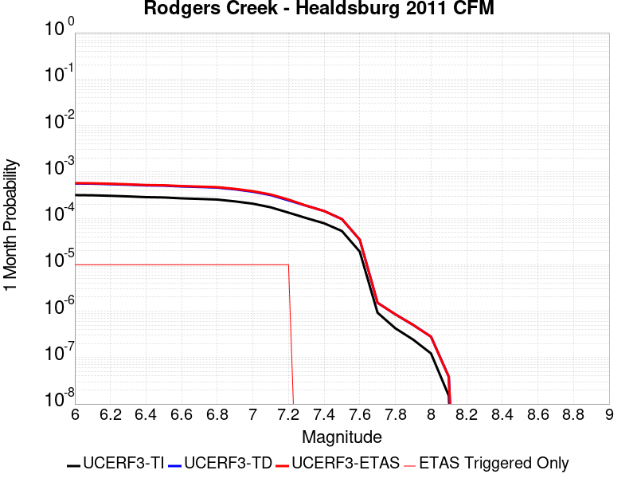 |  |  |

| Magnitude | 1 wk TI Prob | 1 wk TD Prob | 1 wk ETAS Prob | 1 wk ETAS/TD Gain | 1 wk ETAS Triggered Only | 1 mo TI Prob | 1 mo TD Prob | 1 mo ETAS Prob | 1 mo ETAS/TD Gain | 1 mo ETAS Triggered Only | 1 yr TI Prob | 1 yr TD Prob | 1 yr ETAS Prob | 1 yr ETAS/TD Gain | 1 yr ETAS Triggered Only | 10 yr TI Prob | 10 yr TD Prob | 10 yr ETAS Prob | 10 yr ETAS/TD Gain | 10 yr ETAS Triggered Only |
|-----|-----|-----|-----|-----|-----|-----|-----|-----|-----|-----|-----|-----|-----|-----|-----|-----|-----|-----|-----|-----|
| 6.0 | 7.390182E-5 | 1.313698E-4 | 1.413685E-4 | 1.076111 | 1.0E-5 | 3.1668364E-4 | 5.62892E-4 | 5.728864E-4 | 1.0177554 | 1.0E-5 | 0.0038488081 | 0.0068316422 | 0.006841574 | 1.0014538 | 1.0E-5 | 0.037828278 | 0.06618395 | 0.066202626 | 1.0002822 | 2.0E-5 |
| 6.1 | 7.318768E-5 | 1.3034996E-4 | 1.4034867E-4 | 1.0767065 | 1.0E-5 | 3.1362378E-4 | 5.585232E-4 | 5.6851766E-4 | 1.0178944 | 1.0E-5 | 0.0038116854 | 0.006778801 | 0.0067887334 | 1.0014652 | 1.0E-5 | 0.037469655 | 0.06568855 | 0.06570724 | 1.0002844 | 2.0E-5 |
| 6.2 | 7.1379836E-5 | 1.2727838E-4 | 1.3727711E-4 | 1.078558 | 1.0E-5 | 3.058777E-4 | 5.4536486E-4 | 5.553594E-4 | 1.0183264 | 1.0E-5 | 0.003717703 | 0.00661958 | 0.006629514 | 1.0015007 | 1.0E-5 | 0.0365612 | 0.064210616 | 0.06422933 | 1.0002915 | 2.0E-5 |
| 6.3 | 6.9255926E-5 | 1.2382165E-4 | 1.3382042E-4 | 1.0807513 | 1.0E-5 | 2.9677735E-4 | 5.305567E-4 | 5.405514E-4 | 1.0188382 | 1.0E-5 | 0.0036072785 | 0.0064404467 | 0.0064503825 | 1.0015427 | 1.0E-5 | 0.035492823 | 0.06254183 | 0.06256058 | 1.0002998 | 2.0E-5 |
| 6.4 | 6.6757144E-5 | 1.1958877E-4 | 1.2958757E-4 | 1.0836099 | 1.0E-5 | 2.8607066E-4 | 5.12423E-4 | 5.224179E-4 | 1.0195051 | 1.0E-5 | 0.0034773487 | 0.0062209773 | 0.006230915 | 1.0015975 | 1.0E-5 | 0.034234364 | 0.06049156 | 0.06051035 | 1.0003107 | 2.0E-5 |
| 6.5 | 6.5735134E-5 | 1.1808177E-4 | 1.2808059E-4 | 1.0846771 | 1.0E-5 | 2.8169158E-4 | 5.05967E-4 | 5.159619E-4 | 1.0197542 | 1.0E-5 | 0.003424202 | 0.0061428323 | 0.006152771 | 1.0016179 | 1.0E-5 | 0.03371918 | 0.05975565 | 0.059774455 | 1.0003147 | 2.0E-5 |
| 6.6 | 6.289601E-5 | 1.13439266E-4 | 1.2343813E-4 | 1.0881429 | 1.0E-5 | 2.6952647E-4 | 4.860781E-4 | 4.960732E-4 | 1.0205628 | 1.0E-5 | 0.0032765474 | 0.005902022 | 0.005911963 | 1.0016843 | 1.0E-5 | 0.032286562 | 0.057494942 | 0.057513792 | 1.0003278 | 2.0E-5 |
| 6.7 | 6.115274E-5 | 1.1061012E-4 | 1.2060902E-4 | 1.0903976 | 1.0E-5 | 2.6205686E-4 | 4.7395763E-4 | 4.8395287E-4 | 1.021089 | 1.0E-5 | 0.0031858748 | 0.0057552457 | 0.005765188 | 1.0017276 | 1.0E-5 | 0.031405866 | 0.05611353 | 0.056132406 | 1.0003364 | 2.0E-5 |
| 6.8 | 5.9232367E-5 | 1.0728351E-4 | 1.17282434E-4 | 1.0932009 | 1.0E-5 | 2.538283E-4 | 4.597058E-4 | 4.697012E-4 | 1.021743 | 1.0E-5 | 0.0030859804 | 0.0055826316 | 0.0055925758 | 1.0017812 | 1.0E-5 | 0.030434765 | 0.054480392 | 0.054499302 | 1.0003471 | 2.0E-5 |
| 6.9 | 5.4030377E-5 | 9.822531E-5 | 1.0822433E-4 | 1.1017967 | 1.0E-5 | 2.315382E-4 | 4.2089802E-4 | 4.3089382E-4 | 1.0237488 | 1.0E-5 | 0.0028153337 | 0.005112459 | 0.005122408 | 1.001946 | 1.0E-5 | 0.027799325 | 0.0500156 | 0.050025098 | 1.0001899 | 1.0E-5 |
| 7.0 | 4.8260714E-5 | 8.740604E-5 | 9.7405165E-5 | 1.1143986 | 1.0E-5 | 2.0681522E-4 | 3.745438E-4 | 3.8454006E-4 | 1.0266892 | 1.0E-5 | 0.0025150678 | 0.0045505906 | 0.004560545 | 1.0021875 | 1.0E-5 | 0.024867928 | 0.044666886 | 0.044676438 | 1.0002139 | 1.0E-5 |
| 7.1 | 4.0294493E-5 | 7.389084E-5 | 8.38901E-5 | 1.1353247 | 1.0E-5 | 1.7267925E-4 | 3.166368E-4 | 3.2663363E-4 | 1.031572 | 1.0E-5 | 0.0021003427 | 0.0038482768 | 0.0038582382 | 1.0025885 | 1.0E-5 | 0.02080602 | 0.037922617 | 0.03793224 | 1.0002537 | 1.0E-5 |
| 7.2 | 3.096388E-5 | 5.697762E-5 | 6.697705E-5 | 1.1754975 | 1.0E-5 | 1.326956E-4 | 2.4416705E-4 | 2.5416462E-4 | 1.0409455 | 1.0E-5 | 0.0016143717 | 0.0029687036 | 0.002978674 | 1.0033585 | 1.0E-5 | 0.01602694 | 0.029435666 | 0.029445373 | 1.0003297 | 1.0E-5 |
| 7.3 | 2.3615226E-5 | 4.3627395E-5 | 4.3627395E-5 | 1.0 | 0.0 | 1.0120418E-4 | 1.8696123E-4 | 1.8696123E-4 | 1.0 | 0.0 | 0.0012314644 | 0.0022738904 | 0.0022738904 | 1.0 | 0.0 | 0.0122466255 | 0.022636455 | 0.022636455 | 1.0 | 0.0 |
| 7.4 | 1.8251132E-5 | 3.3540233E-5 | 3.3540233E-5 | 1.0 | 0.0 | 7.821679E-5 | 1.4373599E-4 | 1.4373599E-4 | 1.0 | 0.0 | 9.518733E-4 | 0.0017485908 | 0.0017485908 | 1.0 | 0.0 | 0.009478063 | 0.017464655 | 0.017464655 | 1.0 | 0.0 |
| 7.5 | 1.2411432E-5 | 2.2459095E-5 | 2.2459095E-5 | 1.0 | 0.0 | 5.3190768E-5 | 9.624974E-5 | 9.624974E-5 | 1.0 | 0.0 | 6.4740516E-4 | 0.0011712165 | 0.0011712165 | 1.0 | 0.0 | 0.006455223 | 0.011741705 | 0.011741705 | 1.0 | 0.0 |
| 7.6 | 4.4771446E-6 | 8.0827995E-6 | 8.0827995E-6 | 1.0 | 0.0 | 1.918762E-5 | 3.4640118E-5 | 3.4640118E-5 | 1.0 | 0.0 | 2.3358424E-4 | 4.2166302E-4 | 4.2166302E-4 | 1.0 | 0.0 | 0.0023333887 | 0.004244454 | 0.004244454 | 1.0 | 0.0 |
| 7.7 | 2.157941E-7 | 3.534857E-7 | 3.534857E-7 | 1.0 | 0.0 | 9.248315E-7 | 1.5149377E-6 | 1.5149377E-6 | 1.0 | 0.0 | 1.1259765E-5 | 1.844421E-5 | 1.844421E-5 | 1.0 | 0.0 | 1.1259195E-4 | 1.9068553E-4 | 1.9068553E-4 | 1.0 | 0.0 |
| 7.8 | 9.9623286E-8 | 1.9899156E-7 | 1.9899156E-7 | 1.0 | 0.0 | 4.269569E-7 | 8.528207E-7 | 8.528207E-7 | 1.0 | 0.0 | 5.1981874E-6 | 1.03830425E-5 | 1.03830425E-5 | 1.0 | 0.0 | 5.198066E-5 | 1.0901946E-4 | 1.0901946E-4 | 1.0 | 0.0 |
| 7.9 | 5.6745257E-8 | 1.1773516E-7 | 1.1773516E-7 | 1.0 | 0.0 | 2.4319394E-7 | 5.0457913E-7 | 5.0457913E-7 | 1.0 | 0.0 | 2.960882E-6 | 6.143234E-6 | 6.143234E-6 | 1.0 | 0.0 | 2.9608427E-5 | 6.470763E-5 | 6.470763E-5 | 1.0 | 0.0 |
| 8.0 | 2.8614323E-8 | 6.578286E-8 | 6.578286E-8 | 1.0 | 0.0 | 1.2263281E-7 | 2.819265E-7 | 2.819265E-7 | 1.0 | 0.0 | 1.4930534E-6 | 3.4324498E-6 | 3.4324498E-6 | 1.0 | 0.0 | 1.4930434E-5 | 3.5826528E-5 | 3.5826528E-5 | 1.0 | 0.0 |
| 8.1 | 3.5045191E-9 | 8.965669E-9 | 8.965669E-9 | 1.0 | 0.0 | 1.5019367E-8 | 3.8424297E-8 | 3.8424297E-8 | 1.0 | 0.0 | 1.8286079E-7 | 4.6781574E-7 | 4.6781574E-7 | 1.0 | 0.0 | 1.8286064E-6 | 4.8332436E-6 | 4.8332436E-6 | 1.0 | 0.0 |

## Kern Canyon (South Kern) 2011
*[(top)](#table-of-contents)*

| 1 Week | 1 Month | 1 Year | 10 Year |
|-----|-----|-----|-----|
|  |  |  |  |

| Magnitude | 1 wk TI Prob | 1 wk TD Prob | 1 wk ETAS Prob | 1 wk ETAS/TD Gain | 1 wk ETAS Triggered Only | 1 mo TI Prob | 1 mo TD Prob | 1 mo ETAS Prob | 1 mo ETAS/TD Gain | 1 mo ETAS Triggered Only | 1 yr TI Prob | 1 yr TD Prob | 1 yr ETAS Prob | 1 yr ETAS/TD Gain | 1 yr ETAS Triggered Only | 10 yr TI Prob | 10 yr TD Prob | 10 yr ETAS Prob | 10 yr ETAS/TD Gain | 10 yr ETAS Triggered Only |
|-----|-----|-----|-----|-----|-----|-----|-----|-----|-----|-----|-----|-----|-----|-----|-----|-----|-----|-----|-----|-----|
| 6.0 | 4.105075E-6 | 4.1137237E-6 | 1.41136825E-5 | 3.4308777 | 1.0E-5 | 1.7593058E-5 | 1.763013E-5 | 2.7629952E-5 | 1.5672008 | 1.0E-5 | 2.1417443E-4 | 2.1462631E-4 | 2.3462203E-4 | 1.0931652 | 2.0E-5 | 0.0021396813 | 0.0021442543 | 0.0021642114 | 1.0093073 | 2.0E-5 |
| 6.1 | 4.105075E-6 | 4.1137237E-6 | 1.41136825E-5 | 3.4308777 | 1.0E-5 | 1.7593058E-5 | 1.763013E-5 | 2.7629952E-5 | 1.5672008 | 1.0E-5 | 2.1417443E-4 | 2.1462631E-4 | 2.3462203E-4 | 1.0931652 | 2.0E-5 | 0.0021396813 | 0.0021442543 | 0.0021642114 | 1.0093073 | 2.0E-5 |
| 6.2 | 4.105075E-6 | 4.1137237E-6 | 1.41136825E-5 | 3.4308777 | 1.0E-5 | 1.7593058E-5 | 1.763013E-5 | 2.7629952E-5 | 1.5672008 | 1.0E-5 | 2.1417443E-4 | 2.1462631E-4 | 2.3462203E-4 | 1.0931652 | 2.0E-5 | 0.0021396813 | 0.0021442543 | 0.0021642114 | 1.0093073 | 2.0E-5 |
| 6.3 | 4.105075E-6 | 4.1137237E-6 | 1.41136825E-5 | 3.4308777 | 1.0E-5 | 1.7593058E-5 | 1.763013E-5 | 2.7629952E-5 | 1.5672008 | 1.0E-5 | 2.1417443E-4 | 2.1462631E-4 | 2.3462203E-4 | 1.0931652 | 2.0E-5 | 0.0021396813 | 0.0021442543 | 0.0021642114 | 1.0093073 | 2.0E-5 |
| 6.4 | 4.105075E-6 | 4.1137237E-6 | 1.41136825E-5 | 3.4308777 | 1.0E-5 | 1.7593058E-5 | 1.763013E-5 | 2.7629952E-5 | 1.5672008 | 1.0E-5 | 2.1417443E-4 | 2.1462631E-4 | 2.3462203E-4 | 1.0931652 | 2.0E-5 | 0.0021396813 | 0.0021442543 | 0.0021642114 | 1.0093073 | 2.0E-5 |
| 6.5 | 2.9849807E-6 | 2.9731525E-6 | 2.9731525E-6 | 1.0 | 0.0 | 1.2792712E-5 | 1.2742021E-5 | 1.2742021E-5 | 1.0 | 0.0 | 1.5574014E-4 | 1.5512321E-4 | 1.5512321E-4 | 1.0 | 0.0 | 0.0015563103 | 0.0015501645 | 0.0015501645 | 1.0 | 0.0 |
| 6.6 | 2.9849807E-6 | 2.9731525E-6 | 2.9731525E-6 | 1.0 | 0.0 | 1.2792712E-5 | 1.2742021E-5 | 1.2742021E-5 | 1.0 | 0.0 | 1.5574014E-4 | 1.5512321E-4 | 1.5512321E-4 | 1.0 | 0.0 | 0.0015563103 | 0.0015501645 | 0.0015501645 | 1.0 | 0.0 |
| 6.7 | 2.6756725E-6 | 2.6582188E-6 | 2.6582188E-6 | 1.0 | 0.0 | 1.1467117E-5 | 1.1392317E-5 | 1.1392317E-5 | 1.0 | 0.0 | 1.396032E-4 | 1.3869273E-4 | 1.3869273E-4 | 1.0 | 0.0 | 0.0013951553 | 0.0013860727 | 0.0013860727 | 1.0 | 0.0 |
| 6.8 | 2.3283721E-6 | 2.304777E-6 | 2.304777E-6 | 1.0 | 0.0 | 9.9787E-6 | 9.877579E-6 | 9.877579E-6 | 1.0 | 0.0 | 1.214839E-4 | 1.2025296E-4 | 1.2025296E-4 | 1.0 | 0.0 | 0.001214175 | 0.0012018863 | 0.0012018863 | 1.0 | 0.0 |
| 6.9 | 2.0972677E-6 | 2.0696393E-6 | 2.0696393E-6 | 1.0 | 0.0 | 8.988259E-6 | 8.869853E-6 | 8.869853E-6 | 1.0 | 0.0 | 1.0942656E-4 | 1.0798517E-4 | 1.0798517E-4 | 1.0 | 0.0 | 0.0010937268 | 0.0010793328 | 0.0010793328 | 1.0 | 0.0 |
| 7.0 | 1.7132242E-6 | 1.678702E-6 | 1.678702E-6 | 1.0 | 0.0 | 7.3423685E-6 | 7.194418E-6 | 7.194418E-6 | 1.0 | 0.0 | 8.938967E-5 | 8.758855E-5 | 8.758855E-5 | 1.0 | 0.0 | 8.935372E-4 | 8.7554415E-4 | 8.7554415E-4 | 1.0 | 0.0 |
| 7.1 | 1.4215541E-6 | 1.3815738E-6 | 1.3815738E-6 | 1.0 | 0.0 | 6.0923603E-6 | 5.9210174E-6 | 5.9210174E-6 | 1.0 | 0.0 | 7.417196E-5 | 7.2086026E-5 | 7.2086026E-5 | 1.0 | 0.0 | 7.414721E-4 | 7.206291E-4 | 7.206291E-4 | 1.0 | 0.0 |
| 7.2 | 9.097853E-7 | 8.603764E-7 | 8.603764E-7 | 1.0 | 0.0 | 3.899074E-6 | 3.6873223E-6 | 3.6873223E-6 | 1.0 | 0.0 | 4.7470192E-5 | 4.4892236E-5 | 4.4892236E-5 | 1.0 | 0.0 | 4.7460053E-4 | 4.4883275E-4 | 4.4883275E-4 | 1.0 | 0.0 |
| 7.3 | 6.144169E-7 | 5.628195E-7 | 5.628195E-7 | 1.0 | 0.0 | 2.6332125E-6 | 2.4120814E-6 | 2.4120814E-6 | 1.0 | 0.0 | 3.205889E-5 | 2.93667E-5 | 2.93667E-5 | 1.0 | 0.0 | 3.2054266E-4 | 2.936287E-4 | 2.936287E-4 | 1.0 | 0.0 |
| 7.4 | 4.049844E-7 | 3.572822E-7 | 3.572822E-7 | 1.0 | 0.0 | 1.7356463E-6 | 1.5312086E-6 | 1.5312086E-6 | 1.0 | 0.0 | 2.1131287E-5 | 1.8642308E-5 | 1.8642308E-5 | 1.0 | 0.0 | 2.1129279E-4 | 1.8640768E-4 | 1.8640768E-4 | 1.0 | 0.0 |
| 7.5 | 1.9871162E-7 | 1.583036E-7 | 1.583036E-7 | 1.0 | 0.0 | 8.5162094E-7 | 6.784439E-7 | 6.784439E-7 | 1.0 | 0.0 | 1.0368436E-5 | 8.260024E-6 | 8.260024E-6 | 1.0 | 0.0 | 1.0367952E-4 | 8.259725E-5 | 8.259725E-5 | 1.0 | 0.0 |
| 7.6 | 2.572245E-8 | 1.7352638E-8 | 1.7352638E-8 | 1.0 | 0.0 | 1.10239064E-7 | 7.436845E-8 | 7.436845E-8 | 1.0 | 0.0 | 1.3421597E-6 | 9.054355E-7 | 9.054355E-7 | 1.0 | 0.0 | 1.3421517E-5 | 9.0543235E-6 | 9.0543235E-6 | 1.0 | 0.0 |

## Hosgri
*[(top)](#table-of-contents)*

| 1 Week | 1 Month | 1 Year | 10 Year |
|-----|-----|-----|-----|
|  |  |  |  |

| Magnitude | 1 wk TI Prob | 1 wk TD Prob | 1 wk ETAS Prob | 1 wk ETAS/TD Gain | 1 wk ETAS Triggered Only | 1 mo TI Prob | 1 mo TD Prob | 1 mo ETAS Prob | 1 mo ETAS/TD Gain | 1 mo ETAS Triggered Only | 1 yr TI Prob | 1 yr TD Prob | 1 yr ETAS Prob | 1 yr ETAS/TD Gain | 1 yr ETAS Triggered Only | 10 yr TI Prob | 10 yr TD Prob | 10 yr ETAS Prob | 10 yr ETAS/TD Gain | 10 yr ETAS Triggered Only |
|-----|-----|-----|-----|-----|-----|-----|-----|-----|-----|-----|-----|-----|-----|-----|-----|-----|-----|-----|-----|-----|
| 6.0 | 2.883978E-5 | 2.9128265E-5 | 4.912768E-5 | 1.6865983 | 2.0E-5 | 1.235932E-4 | 1.248296E-4 | 1.448271E-4 | 1.1601985 | 2.0E-5 | 0.0015037085 | 0.001518768 | 0.0015387377 | 1.0131485 | 2.0E-5 | 0.01493574 | 0.015087658 | 0.015107356 | 1.0013056 | 2.0E-5 |
| 6.1 | 2.883978E-5 | 2.9128265E-5 | 4.912768E-5 | 1.6865983 | 2.0E-5 | 1.235932E-4 | 1.248296E-4 | 1.448271E-4 | 1.1601985 | 2.0E-5 | 0.0015037085 | 0.001518768 | 0.0015387377 | 1.0131485 | 2.0E-5 | 0.01493574 | 0.015087658 | 0.015107356 | 1.0013056 | 2.0E-5 |
| 6.2 | 2.883978E-5 | 2.9128265E-5 | 4.912768E-5 | 1.6865983 | 2.0E-5 | 1.235932E-4 | 1.248296E-4 | 1.448271E-4 | 1.1601985 | 2.0E-5 | 0.0015037085 | 0.001518768 | 0.0015387377 | 1.0131485 | 2.0E-5 | 0.01493574 | 0.015087658 | 0.015107356 | 1.0013056 | 2.0E-5 |
| 6.3 | 2.2914428E-5 | 2.2641834E-5 | 4.2641383E-5 | 1.8833007 | 2.0E-5 | 9.8200995E-5 | 9.7032855E-5 | 1.1703091E-4 | 1.2060958 | 2.0E-5 | 0.0011949413 | 0.0011807396 | 0.001200716 | 1.0169185 | 2.0E-5 | 0.011885363 | 0.011746059 | 0.011765824 | 1.0016828 | 2.0E-5 |
| 6.4 | 2.0195741E-5 | 1.9696432E-5 | 3.969604E-5 | 2.0153923 | 2.0E-5 | 8.65503E-5 | 8.441056E-5 | 1.0440887E-4 | 1.2369171 | 2.0E-5 | 0.0010532405 | 0.001027216 | 0.0010471955 | 1.0194501 | 2.0E-5 | 0.010482626 | 0.010225722 | 0.010245518 | 1.0019358 | 2.0E-5 |
| 6.5 | 1.9924333E-5 | 1.9408853E-5 | 3.9408464E-5 | 2.0304375 | 2.0E-5 | 8.53872E-5 | 8.317816E-5 | 1.031765E-4 | 1.2404277 | 2.0E-5 | 0.0010390934 | 0.0010122255 | 0.0010322053 | 1.0197384 | 2.0E-5 | 0.010342481 | 0.010077183 | 0.010096981 | 1.0019647 | 2.0E-5 |
| 6.6 | 1.809694E-5 | 1.7458176E-5 | 3.7457827E-5 | 2.145575 | 2.0E-5 | 7.7556004E-5 | 7.4818614E-5 | 9.481712E-5 | 1.2672931 | 2.0E-5 | 9.438353E-4 | 9.1053726E-4 | 9.305191E-4 | 1.021945 | 2.0E-5 | 0.009398366 | 0.009069004 | 0.009088823 | 1.0021853 | 2.0E-5 |
| 6.7 | 1.675989E-5 | 1.6042643E-5 | 3.6042322E-5 | 2.2466574 | 2.0E-5 | 7.182612E-5 | 6.875238E-5 | 8.8751E-5 | 1.290879 | 2.0E-5 | 8.7413215E-4 | 8.367399E-4 | 8.5672317E-4 | 1.0238823 | 2.0E-5 | 0.008707017 | 0.0083367955 | 0.008356629 | 1.0023791 | 2.0E-5 |
| 6.8 | 1.5401129E-5 | 1.4613964E-5 | 3.4613673E-5 | 2.368534 | 2.0E-5 | 6.6003166E-5 | 6.262978E-5 | 8.262852E-5 | 1.319317 | 2.0E-5 | 8.032922E-4 | 7.622516E-4 | 7.8223634E-4 | 1.026218 | 2.0E-5 | 0.008003947 | 0.0075972304 | 0.0076170783 | 1.0026126 | 2.0E-5 |
| 6.9 | 1.356559E-5 | 1.2689852E-5 | 3.2689597E-5 | 2.5760424 | 2.0E-5 | 5.8136946E-5 | 5.438395E-5 | 7.4382864E-5 | 1.3677355 | 2.0E-5 | 7.0758746E-4 | 6.619239E-4 | 6.8191066E-4 | 1.030195 | 2.0E-5 | 0.007053386 | 0.0066003236 | 0.0066201915 | 1.0030102 | 2.0E-5 |
| 7.0 | 1.2030819E-5 | 1.1095849E-5 | 1.1095849E-5 | 1.0 | 0.0 | 5.155963E-5 | 4.7552774E-5 | 4.7552774E-5 | 1.0 | 0.0 | 6.275577E-4 | 5.788013E-4 | 5.788013E-4 | 1.0 | 0.0 | 0.006257884 | 0.0057736943 | 0.0057736943 | 1.0 | 0.0 |
| 7.1 | 1.0972698E-5 | 1.0022069E-5 | 1.0022069E-5 | 1.0 | 0.0 | 4.7025E-5 | 4.295102E-5 | 4.295102E-5 | 1.0 | 0.0 | 5.72379E-4 | 5.228032E-4 | 5.228032E-4 | 1.0 | 0.0 | 0.0057090693 | 0.0052164807 | 0.0052164807 | 1.0 | 0.0 |
| 7.2 | 9.961926E-6 | 9.034636E-6 | 9.034636E-6 | 1.0 | 0.0 | 4.2693267E-5 | 3.8719292E-5 | 3.8719292E-5 | 1.0 | 0.0 | 5.1966653E-4 | 4.7130548E-4 | 4.7130548E-4 | 1.0 | 0.0 | 0.00518453 | 0.004703801 | 0.004703801 | 1.0 | 0.0 |
| 7.3 | 8.700929E-6 | 7.827994E-6 | 7.827994E-6 | 1.0 | 0.0 | 3.7289166E-5 | 3.3548113E-5 | 3.3548113E-5 | 1.0 | 0.0 | 4.53901E-4 | 4.0837174E-4 | 4.0837174E-4 | 1.0 | 0.0 | 0.00452975 | 0.0040769484 | 0.0040769484 | 1.0 | 0.0 |
| 7.4 | 7.866285E-6 | 6.9986318E-6 | 6.9986318E-6 | 1.0 | 0.0 | 3.3712215E-5 | 2.9993791E-5 | 2.9993791E-5 | 1.0 | 0.0 | 4.103689E-4 | 3.6511326E-4 | 3.6511326E-4 | 1.0 | 0.0 | 0.004096119 | 0.0036458664 | 0.0036458664 | 1.0 | 0.0 |
| 7.5 | 6.8381305E-6 | 5.959588E-6 | 5.959588E-6 | 1.0 | 0.0 | 2.9305946E-5 | 2.5540841E-5 | 2.5540841E-5 | 1.0 | 0.0 | 3.5674145E-4 | 3.109154E-4 | 3.109154E-4 | 1.0 | 0.0 | 0.0035616932 | 0.0031055345 | 0.0031055345 | 1.0 | 0.0 |
| 7.6 | 5.503376E-6 | 4.595135E-6 | 4.595135E-6 | 1.0 | 0.0 | 2.3585684E-5 | 1.9693289E-5 | 1.9693289E-5 | 1.0 | 0.0 | 2.8711787E-4 | 2.3973943E-4 | 2.3973943E-4 | 1.0 | 0.0 | 0.002867472 | 0.0023955363 | 0.0023955363 | 1.0 | 0.0 |
| 7.7 | 3.6144982E-6 | 2.6521004E-6 | 2.6521004E-6 | 1.0 | 0.0 | 1.5490614E-5 | 1.1366095E-5 | 1.1366095E-5 | 1.0 | 0.0 | 1.8858191E-4 | 1.3837342E-4 | 1.3837342E-4 | 1.0 | 0.0 | 0.0018842196 | 0.0013835991 | 0.0013835991 | 1.0 | 0.0 |
| 7.8 | 1.9853494E-6 | 1.1360507E-6 | 1.1360507E-6 | 1.0 | 0.0 | 8.508612E-6 | 4.86878E-6 | 4.86878E-6 | 1.0 | 0.0 | 1.0358743E-4 | 5.9275782E-5 | 5.9275782E-5 | 1.0 | 0.0 | 0.0010353916 | 5.933247E-4 | 5.933247E-4 | 1.0 | 0.0 |
| 7.9 | 1.1818757E-6 | 5.294548E-7 | 5.294548E-7 | 1.0 | 0.0 | 5.0651715E-6 | 2.2690897E-6 | 2.2690897E-6 | 1.0 | 0.0 | 6.1666724E-5 | 2.7625818E-5 | 2.7625818E-5 | 1.0 | 0.0 | 6.1649614E-4 | 2.7690132E-4 | 2.7690132E-4 | 1.0 | 0.0 |
| 8.0 | 6.962958E-7 | 2.7134917E-7 | 2.7134917E-7 | 1.0 | 0.0 | 2.9841215E-6 | 1.1629244E-6 | 1.1629244E-6 | 1.0 | 0.0 | 3.6331072E-5 | 1.4158512E-5 | 1.4158512E-5 | 1.0 | 0.0 | 3.6325134E-4 | 1.4214648E-4 | 1.4214648E-4 | 1.0 | 0.0 |
| 8.1 | 1.5033264E-7 | 6.526476E-8 | 6.526476E-8 | 1.0 | 0.0 | 6.442826E-7 | 2.7970606E-7 | 2.7970606E-7 | 1.0 | 0.0 | 7.844113E-6 | 3.4054162E-6 | 3.4054162E-6 | 1.0 | 0.0 | 7.843835E-5 | 3.4072913E-5 | 3.4072913E-5 | 1.0 | 0.0 |

## Rinconada 2011 CFM
*[(top)](#table-of-contents)*

| 1 Week | 1 Month | 1 Year | 10 Year |
|-----|-----|-----|-----|
|  |  |  |  |

| Magnitude | 1 wk TI Prob | 1 wk TD Prob | 1 wk ETAS Prob | 1 wk ETAS/TD Gain | 1 wk ETAS Triggered Only | 1 mo TI Prob | 1 mo TD Prob | 1 mo ETAS Prob | 1 mo ETAS/TD Gain | 1 mo ETAS Triggered Only | 1 yr TI Prob | 1 yr TD Prob | 1 yr ETAS Prob | 1 yr ETAS/TD Gain | 1 yr ETAS Triggered Only | 10 yr TI Prob | 10 yr TD Prob | 10 yr ETAS Prob | 10 yr ETAS/TD Gain | 10 yr ETAS Triggered Only |
|-----|-----|-----|-----|-----|-----|-----|-----|-----|-----|-----|-----|-----|-----|-----|-----|-----|-----|-----|-----|-----|
| 6.0 | 1.5752368E-5 | 1.6274702E-5 | 3.6274378E-5 | 2.2288811 | 2.0E-5 | 6.75084E-5 | 6.974687E-5 | 8.974548E-5 | 1.2867312 | 2.0E-5 | 8.2160486E-4 | 8.488405E-4 | 8.688235E-4 | 1.0235416 | 2.0E-5 | 0.008185739 | 0.008456362 | 0.008476193 | 1.0023451 | 2.0E-5 |
| 6.1 | 1.0966133E-5 | 1.1323019E-5 | 1.1323019E-5 | 1.0 | 0.0 | 4.6996865E-5 | 4.8526326E-5 | 4.8526326E-5 | 1.0 | 0.0 | 5.720366E-4 | 5.906486E-4 | 5.906486E-4 | 1.0 | 0.0 | 0.0057056635 | 0.005890884 | 0.005890884 | 1.0 | 0.0 |
| 6.2 | 1.0966133E-5 | 1.1323019E-5 | 1.1323019E-5 | 1.0 | 0.0 | 4.6996865E-5 | 4.8526326E-5 | 4.8526326E-5 | 1.0 | 0.0 | 5.720366E-4 | 5.906486E-4 | 5.906486E-4 | 1.0 | 0.0 | 0.0057056635 | 0.005890884 | 0.005890884 | 1.0 | 0.0 |
| 6.3 | 8.926149E-6 | 9.212764E-6 | 9.212764E-6 | 1.0 | 0.0 | 3.8254362E-5 | 3.948268E-5 | 3.948268E-5 | 1.0 | 0.0 | 4.6564735E-4 | 4.805959E-4 | 4.805959E-4 | 1.0 | 0.0 | 0.0046467283 | 0.0047956104 | 0.0047956104 | 1.0 | 0.0 |
| 6.4 | 7.676955E-6 | 7.9201845E-6 | 7.9201845E-6 | 1.0 | 0.0 | 3.290082E-5 | 3.3943208E-5 | 3.3943208E-5 | 1.0 | 0.0 | 4.0049385E-4 | 4.1318036E-4 | 4.1318036E-4 | 1.0 | 0.0 | 0.0039977287 | 0.004124148 | 0.004124148 | 1.0 | 0.0 |
| 6.5 | 6.1671026E-6 | 6.3589496E-6 | 6.3589496E-6 | 1.0 | 0.0 | 2.6430173E-5 | 2.7252358E-5 | 2.7252358E-5 | 1.0 | 0.0 | 3.2173982E-4 | 3.3174703E-4 | 3.3174703E-4 | 1.0 | 0.0 | 0.003212744 | 0.0033125298 | 0.0033125298 | 1.0 | 0.0 |
| 6.6 | 5.553456E-6 | 5.724808E-6 | 5.724808E-6 | 1.0 | 0.0 | 2.3800309E-5 | 2.4534662E-5 | 2.4534662E-5 | 1.0 | 0.0 | 2.897302E-4 | 2.986686E-4 | 2.986686E-4 | 1.0 | 0.0 | 0.0028935277 | 0.0029826807 | 0.0029826807 | 1.0 | 0.0 |
| 6.7 | 4.787857E-6 | 4.9333057E-6 | 4.9333057E-6 | 1.0 | 0.0 | 2.0519226E-5 | 2.1142567E-5 | 2.1142567E-5 | 1.0 | 0.0 | 2.4979294E-4 | 2.573804E-4 | 2.573804E-4 | 1.0 | 0.0 | 0.0024951235 | 0.002570829 | 0.002570829 | 1.0 | 0.0 |
| 6.8 | 3.9955166E-6 | 4.113473E-6 | 4.113473E-6 | 1.0 | 0.0 | 1.7123532E-5 | 1.762905E-5 | 1.762905E-5 | 1.0 | 0.0 | 2.0845905E-4 | 2.1461258E-4 | 2.1461258E-4 | 1.0 | 0.0 | 0.002082636 | 0.0021440568 | 0.0021440568 | 1.0 | 0.0 |
| 6.9 | 3.4250072E-6 | 3.5224439E-6 | 3.5224439E-6 | 1.0 | 0.0 | 1.46785205E-5 | 1.50961005E-5 | 1.50961005E-5 | 1.0 | 0.0 | 1.7869633E-4 | 1.8377954E-4 | 1.8377954E-4 | 1.0 | 0.0 | 0.001785527 | 0.0018362781 | 0.0018362781 | 1.0 | 0.0 |
| 7.0 | 2.7712713E-6 | 2.8466982E-6 | 2.8466982E-6 | 1.0 | 0.0 | 1.1876823E-5 | 1.2200077E-5 | 1.2200077E-5 | 1.0 | 0.0 | 1.4459073E-4 | 1.4852583E-4 | 1.4852583E-4 | 1.0 | 0.0 | 0.0014449668 | 0.0014842672 | 0.0014842672 | 1.0 | 0.0 |
| 7.1 | 2.227358E-6 | 2.285697E-6 | 2.285697E-6 | 1.0 | 0.0 | 9.545785E-6 | 9.795808E-6 | 9.795808E-6 | 1.0 | 0.0 | 1.16213734E-4 | 1.1925744E-4 | 1.1925744E-4 | 1.0 | 0.0 | 0.0011615298 | 0.0011919355 | 0.0011919355 | 1.0 | 0.0 |
| 7.2 | 1.581796E-6 | 1.6209003E-6 | 1.6209003E-6 | 1.0 | 0.0 | 6.779108E-6 | 6.946697E-6 | 6.946697E-6 | 1.0 | 0.0 | 8.253252E-5 | 8.4572755E-5 | 8.4572755E-5 | 1.0 | 0.0 | 8.250187E-4 | 8.4540626E-4 | 8.4540626E-4 | 1.0 | 0.0 |
| 7.3 | 1.0306567E-6 | 1.0546472E-6 | 1.0546472E-6 | 1.0 | 0.0 | 4.4170924E-6 | 4.519909E-6 | 4.519909E-6 | 1.0 | 0.0 | 5.3776774E-5 | 5.5028504E-5 | 5.5028504E-5 | 1.0 | 0.0 | 5.376376E-4 | 5.50149E-4 | 5.50149E-4 | 1.0 | 0.0 |
| 7.4 | 6.535541E-7 | 6.6827397E-7 | 6.6827397E-7 | 1.0 | 0.0 | 2.800943E-6 | 2.8640281E-6 | 2.8640281E-6 | 1.0 | 0.0 | 3.4100947E-5 | 3.4868986E-5 | 3.4868986E-5 | 1.0 | 0.0 | 3.4095717E-4 | 3.4863528E-4 | 3.4863528E-4 | 1.0 | 0.0 |
| 7.5 | 3.2656962E-7 | 3.331669E-7 | 3.331669E-7 | 1.0 | 0.0 | 1.3995833E-6 | 1.4278573E-6 | 1.4278573E-6 | 1.0 | 0.0 | 1.7039794E-5 | 1.7384024E-5 | 1.7384024E-5 | 1.0 | 0.0 | 1.7038487E-4 | 1.7382669E-4 | 1.7382669E-4 | 1.0 | 0.0 |
| 7.6 | 9.754343E-8 | 9.8210094E-8 | 9.8210094E-8 | 1.0 | 0.0 | 4.180432E-7 | 4.209003E-7 | 4.209003E-7 | 1.0 | 0.0 | 5.089664E-6 | 5.124449E-6 | 5.124449E-6 | 1.0 | 0.0 | 5.0895473E-5 | 5.124332E-5 | 5.124332E-5 | 1.0 | 0.0 |
| 7.7 | 6.0001453E-9 | 5.8491194E-9 | 5.8491194E-9 | 1.0 | 0.0 | 2.5714908E-8 | 2.5067655E-8 | 2.5067655E-8 | 1.0 | 0.0 | 3.1307894E-7 | 3.0519865E-7 | 3.0519865E-7 | 1.0 | 0.0 | 3.1307852E-6 | 3.0519825E-6 | 3.0519825E-6 | 1.0 | 0.0 |
| 7.8 | 7.400003E-11 | 7.4654394E-11 | 7.4654394E-11 | 1.0 | 0.0 | 3.171432E-10 | 3.1994762E-10 | 3.1994762E-10 | 1.0 | 0.0 | 3.861218E-9 | 3.8953623E-9 | 3.8953623E-9 | 1.0 | 0.0 | 3.861218E-8 | 3.8953623E-8 | 3.8953623E-8 | 1.0 | 0.0 |

## White Wolf
*[(top)](#table-of-contents)*

| 1 Week | 1 Month | 1 Year | 10 Year |
|-----|-----|-----|-----|
|  |  | 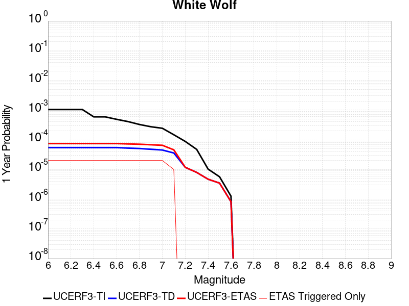 | 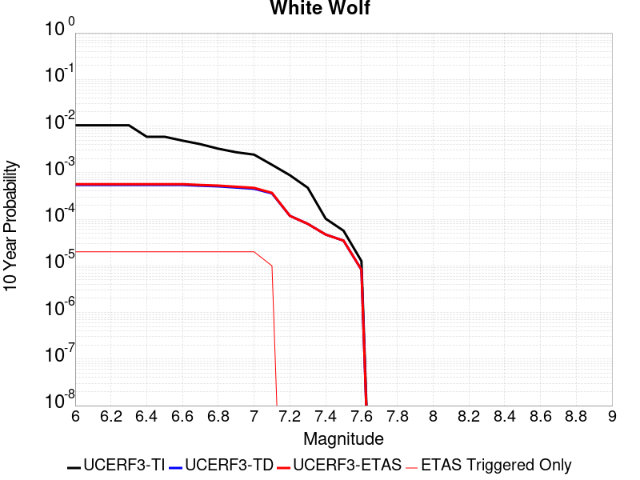 |

| Magnitude | 1 wk TI Prob | 1 wk TD Prob | 1 wk ETAS Prob | 1 wk ETAS/TD Gain | 1 wk ETAS Triggered Only | 1 mo TI Prob | 1 mo TD Prob | 1 mo ETAS Prob | 1 mo ETAS/TD Gain | 1 mo ETAS Triggered Only | 1 yr TI Prob | 1 yr TD Prob | 1 yr ETAS Prob | 1 yr ETAS/TD Gain | 1 yr ETAS Triggered Only | 10 yr TI Prob | 10 yr TD Prob | 10 yr ETAS Prob | 10 yr ETAS/TD Gain | 10 yr ETAS Triggered Only |
|-----|-----|-----|-----|-----|-----|-----|-----|-----|-----|-----|-----|-----|-----|-----|-----|-----|-----|-----|-----|-----|
| 6.0 | 2.0037822E-5 | 1.0468569E-6 | 1.1046846E-5 | 10.552394 | 1.0E-5 | 8.587355E-5 | 4.486522E-6 | 1.4486477E-5 | 3.228888 | 1.0E-5 | 0.001045009 | 5.4622087E-5 | 7.4621E-5 | 1.3661323 | 2.0E-5 | 0.010401085 | 5.460917E-4 | 5.660808E-4 | 1.0366039 | 2.0E-5 |
| 6.1 | 2.0037822E-5 | 1.0468569E-6 | 1.1046846E-5 | 10.552394 | 1.0E-5 | 8.587355E-5 | 4.486522E-6 | 1.4486477E-5 | 3.228888 | 1.0E-5 | 0.001045009 | 5.4622087E-5 | 7.4621E-5 | 1.3661323 | 2.0E-5 | 0.010401085 | 5.460917E-4 | 5.660808E-4 | 1.0366039 | 2.0E-5 |
| 6.2 | 2.0037822E-5 | 1.0468569E-6 | 1.1046846E-5 | 10.552394 | 1.0E-5 | 8.587355E-5 | 4.486522E-6 | 1.4486477E-5 | 3.228888 | 1.0E-5 | 0.001045009 | 5.4622087E-5 | 7.4621E-5 | 1.3661323 | 2.0E-5 | 0.010401085 | 5.460917E-4 | 5.660808E-4 | 1.0366039 | 2.0E-5 |
| 6.3 | 2.0037822E-5 | 1.0468569E-6 | 1.1046846E-5 | 10.552394 | 1.0E-5 | 8.587355E-5 | 4.486522E-6 | 1.4486477E-5 | 3.228888 | 1.0E-5 | 0.001045009 | 5.4622087E-5 | 7.4621E-5 | 1.3661323 | 2.0E-5 | 0.010401085 | 5.460917E-4 | 5.660808E-4 | 1.0366039 | 2.0E-5 |
| 6.4 | 1.132487E-5 | 1.0468569E-6 | 1.1046846E-5 | 10.552394 | 1.0E-5 | 4.8534253E-5 | 4.486522E-6 | 1.4486477E-5 | 3.228888 | 1.0E-5 | 5.907443E-4 | 5.4622087E-5 | 7.4621E-5 | 1.3661323 | 2.0E-5 | 0.005891764 | 5.460917E-4 | 5.660808E-4 | 1.0366039 | 2.0E-5 |
| 6.5 | 1.132487E-5 | 1.0468569E-6 | 1.1046846E-5 | 10.552394 | 1.0E-5 | 4.8534253E-5 | 4.486522E-6 | 1.4486477E-5 | 3.228888 | 1.0E-5 | 5.907443E-4 | 5.4622087E-5 | 7.4621E-5 | 1.3661323 | 2.0E-5 | 0.005891764 | 5.460917E-4 | 5.660808E-4 | 1.0366039 | 2.0E-5 |
| 6.6 | 9.347473E-6 | 1.0468569E-6 | 1.1046846E-5 | 10.552394 | 1.0E-5 | 4.0059982E-5 | 4.486522E-6 | 1.4486477E-5 | 3.228888 | 1.0E-5 | 4.8762115E-4 | 5.4622087E-5 | 7.4621E-5 | 1.3661323 | 2.0E-5 | 0.0048655253 | 5.460917E-4 | 5.660808E-4 | 1.0366039 | 2.0E-5 |
| 6.7 | 7.842647E-6 | 1.0047759E-6 | 1.1004766E-5 | 10.952458 | 1.0E-5 | 3.361091E-5 | 4.3061755E-6 | 1.43061325E-5 | 3.3222363 | 1.0E-5 | 4.0913603E-4 | 5.2426476E-5 | 7.242543E-5 | 1.3814666 | 2.0E-5 | 0.004083836 | 5.24146E-4 | 5.441356E-4 | 1.0381373 | 2.0E-5 |
| 6.8 | 6.26597E-6 | 9.734274E-7 | 1.0973417E-5 | 11.272969 | 1.0E-5 | 2.685388E-5 | 4.1718254E-6 | 1.4171784E-5 | 3.3970222 | 1.0E-5 | 3.2689696E-4 | 5.079084E-5 | 7.078983E-5 | 1.3937517 | 2.0E-5 | 0.003264165 | 5.0779723E-4 | 5.277871E-4 | 1.0393658 | 2.0E-5 |
| 6.9 | 5.258436E-6 | 9.1827206E-7 | 1.0918263E-5 | 11.890009 | 1.0E-5 | 2.2535958E-5 | 3.935446E-6 | 1.3935407E-5 | 3.540998 | 1.0E-5 | 2.7434074E-4 | 4.791305E-5 | 6.791209E-5 | 1.4174029 | 2.0E-5 | 0.0027400232 | 4.79032E-4 | 4.990224E-4 | 1.0417309 | 2.0E-5 |
| 7.0 | 4.675028E-6 | 8.6606906E-7 | 1.0866061E-5 | 12.546413 | 1.0E-5 | 2.003568E-5 | 3.7117195E-6 | 1.3711682E-5 | 3.6941593 | 1.0E-5 | 2.4390711E-4 | 4.5189296E-5 | 6.518839E-5 | 1.4425627 | 2.0E-5 | 0.0024363957 | 4.5180577E-4 | 4.7179672E-4 | 1.0442468 | 2.0E-5 |
| 7.1 | 2.8270078E-6 | 6.8737603E-7 | 6.8737603E-7 | 1.0 | 0.0 | 1.2115692E-5 | 2.9458943E-6 | 2.9458943E-6 | 1.0 | 0.0 | 1.4749856E-4 | 3.5865713E-5 | 4.5865356E-5 | 1.2788079 | 1.0E-5 | 0.001474007 | 3.5860334E-4 | 3.6859975E-4 | 1.027876 | 1.0E-5 |
| 7.2 | 1.6881406E-6 | 2.2703391E-7 | 2.2703391E-7 | 1.0 | 0.0 | 7.2348685E-6 | 9.730021E-7 | 9.730021E-7 | 1.0 | 0.0 | 8.808096E-5 | 1.1846238E-5 | 1.1846238E-5 | 1.0 | 0.0 | 8.8046055E-4 | 1.1845622E-4 | 1.1845622E-4 | 1.0 | 0.0 |
| 7.3 | 9.086107E-7 | 1.5264456E-7 | 1.5264456E-7 | 1.0 | 0.0 | 3.8940398E-6 | 6.5419084E-7 | 6.5419084E-7 | 1.0 | 0.0 | 4.7408903E-5 | 7.964745E-6 | 7.964745E-6 | 1.0 | 0.0 | 4.739879E-4 | 7.964468E-5 | 7.964468E-5 | 1.0 | 0.0 |
| 7.4 | 1.9717383E-7 | 9.003382E-8 | 9.003382E-8 | 1.0 | 0.0 | 8.450304E-7 | 3.8585918E-7 | 3.8585918E-7 | 1.0 | 0.0 | 1.0288197E-5 | 4.6978257E-6 | 4.6978257E-6 | 1.0 | 0.0 | 1.028772E-4 | 4.6977297E-5 | 4.6977297E-5 | 1.0 | 0.0 |
| 7.5 | 1.086975E-7 | 6.659645E-8 | 6.659645E-8 | 1.0 | 0.0 | 4.6584634E-7 | 2.8541334E-7 | 2.8541334E-7 | 1.0 | 0.0 | 5.6716644E-6 | 3.474902E-6 | 3.474902E-6 | 1.0 | 0.0 | 5.6715195E-5 | 3.47485E-5 | 3.47485E-5 | 1.0 | 0.0 |
| 7.6 | 2.4217808E-8 | 1.5820849E-8 | 1.5820849E-8 | 1.0 | 0.0 | 1.03790605E-7 | 6.780364E-8 | 6.780364E-8 | 1.0 | 0.0 | 1.2636499E-6 | 8.25509E-7 | 8.25509E-7 | 1.0 | 0.0 | 1.2636427E-5 | 8.255064E-6 | 8.255064E-6 | 1.0 | 0.0 |

## North Frontal  (East)
*[(top)](#table-of-contents)*

| 1 Week | 1 Month | 1 Year | 10 Year |
|-----|-----|-----|-----|
|  |  |  |  |

| Magnitude | 1 wk TI Prob | 1 wk TD Prob | 1 wk ETAS Prob | 1 wk ETAS/TD Gain | 1 wk ETAS Triggered Only | 1 mo TI Prob | 1 mo TD Prob | 1 mo ETAS Prob | 1 mo ETAS/TD Gain | 1 mo ETAS Triggered Only | 1 yr TI Prob | 1 yr TD Prob | 1 yr ETAS Prob | 1 yr ETAS/TD Gain | 1 yr ETAS Triggered Only | 10 yr TI Prob | 10 yr TD Prob | 10 yr ETAS Prob | 10 yr ETAS/TD Gain | 10 yr ETAS Triggered Only |
|-----|-----|-----|-----|-----|-----|-----|-----|-----|-----|-----|-----|-----|-----|-----|-----|-----|-----|-----|-----|-----|
| 6.0 | 7.135738E-6 | 7.477167E-6 | 1.7477092E-5 | 2.337395 | 1.0E-5 | 3.0581377E-5 | 3.204472E-5 | 4.20444E-5 | 1.3120539 | 1.0E-5 | 3.7226462E-4 | 3.9009456E-4 | 4.1008677E-4 | 1.0512496 | 2.0E-5 | 0.0037164164 | 0.0038960557 | 0.0039159777 | 1.0051134 | 2.0E-5 |
| 6.1 | 7.135738E-6 | 7.477167E-6 | 1.7477092E-5 | 2.337395 | 1.0E-5 | 3.0581377E-5 | 3.204472E-5 | 4.20444E-5 | 1.3120539 | 1.0E-5 | 3.7226462E-4 | 3.9009456E-4 | 4.1008677E-4 | 1.0512496 | 2.0E-5 | 0.0037164164 | 0.0038960557 | 0.0039159777 | 1.0051134 | 2.0E-5 |
| 6.2 | 7.135738E-6 | 7.477167E-6 | 1.7477092E-5 | 2.337395 | 1.0E-5 | 3.0581377E-5 | 3.204472E-5 | 4.20444E-5 | 1.3120539 | 1.0E-5 | 3.7226462E-4 | 3.9009456E-4 | 4.1008677E-4 | 1.0512496 | 2.0E-5 | 0.0037164164 | 0.0038960557 | 0.0039159777 | 1.0051134 | 2.0E-5 |
| 6.3 | 7.135738E-6 | 7.477167E-6 | 1.7477092E-5 | 2.337395 | 1.0E-5 | 3.0581377E-5 | 3.204472E-5 | 4.20444E-5 | 1.3120539 | 1.0E-5 | 3.7226462E-4 | 3.9009456E-4 | 4.1008677E-4 | 1.0512496 | 2.0E-5 | 0.0037164164 | 0.0038960557 | 0.0039159777 | 1.0051134 | 2.0E-5 |
| 6.4 | 7.135738E-6 | 7.477167E-6 | 1.7477092E-5 | 2.337395 | 1.0E-5 | 3.0581377E-5 | 3.204472E-5 | 4.20444E-5 | 1.3120539 | 1.0E-5 | 3.7226462E-4 | 3.9009456E-4 | 4.1008677E-4 | 1.0512496 | 2.0E-5 | 0.0037164164 | 0.0038960557 | 0.0039159777 | 1.0051134 | 2.0E-5 |
| 6.5 | 7.135738E-6 | 7.477167E-6 | 1.7477092E-5 | 2.337395 | 1.0E-5 | 3.0581377E-5 | 3.204472E-5 | 4.20444E-5 | 1.3120539 | 1.0E-5 | 3.7226462E-4 | 3.9009456E-4 | 4.1008677E-4 | 1.0512496 | 2.0E-5 | 0.0037164164 | 0.0038960557 | 0.0039159777 | 1.0051134 | 2.0E-5 |
| 6.6 | 7.135738E-6 | 7.477167E-6 | 1.7477092E-5 | 2.337395 | 1.0E-5 | 3.0581377E-5 | 3.204472E-5 | 4.20444E-5 | 1.3120539 | 1.0E-5 | 3.7226462E-4 | 3.9009456E-4 | 4.1008677E-4 | 1.0512496 | 2.0E-5 | 0.0037164164 | 0.0038960557 | 0.0039159777 | 1.0051134 | 2.0E-5 |
| 6.7 | 7.135738E-6 | 7.477167E-6 | 1.7477092E-5 | 2.337395 | 1.0E-5 | 3.0581377E-5 | 3.204472E-5 | 4.20444E-5 | 1.3120539 | 1.0E-5 | 3.7226462E-4 | 3.9009456E-4 | 4.1008677E-4 | 1.0512496 | 2.0E-5 | 0.0037164164 | 0.0038960557 | 0.0039159777 | 1.0051134 | 2.0E-5 |
| 6.8 | 5.959142E-6 | 6.2366753E-6 | 1.6236612E-5 | 2.6034086 | 1.0E-5 | 2.553893E-5 | 2.6728436E-5 | 3.672817E-5 | 1.3741233 | 1.0E-5 | 3.108921E-4 | 3.253882E-4 | 3.4538168E-4 | 1.061445 | 2.0E-5 | 0.0031045752 | 0.0032508906 | 0.0032708256 | 1.0061321 | 2.0E-5 |
| 6.9 | 2.2946929E-6 | 2.382458E-6 | 2.382458E-6 | 1.0 | 0.0 | 9.834361E-6 | 1.0210498E-5 | 1.0210498E-5 | 1.0 | 0.0 | 1.1972676E-4 | 1.2430619E-4 | 1.3430494E-4 | 1.0804365 | 1.0E-5 | 0.0011966228 | 0.0012424131 | 0.0012524006 | 1.0080389 | 1.0E-5 |
| 7.0 | 2.2468673E-6 | 2.3321513E-6 | 2.3321513E-6 | 1.0 | 0.0 | 9.629396E-6 | 9.994899E-6 | 9.994899E-6 | 1.0 | 0.0 | 1.1723159E-4 | 1.2168157E-4 | 1.3168035E-4 | 1.0821717 | 1.0E-5 | 0.0011716976 | 0.0012161958 | 0.0012261836 | 1.0082123 | 1.0E-5 |
| 7.1 | 1.9921076E-6 | 2.0646012E-6 | 2.0646012E-6 | 1.0 | 0.0 | 8.537577E-6 | 8.848263E-6 | 8.848263E-6 | 1.0 | 0.0 | 1.0394004E-4 | 1.0772271E-4 | 1.1772164E-4 | 1.0928209 | 1.0E-5 | 0.0010389143 | 0.0010767477 | 0.0010867369 | 1.0092772 | 1.0E-5 |
| 7.2 | 1.4524545E-6 | 1.5045133E-6 | 1.5045133E-6 | 1.0 | 0.0 | 6.2247905E-6 | 6.4479E-6 | 6.4479E-6 | 1.0 | 0.0 | 7.5784184E-5 | 7.85006E-5 | 8.8499815E-5 | 1.1273775 | 1.0E-5 | 7.575835E-4 | 7.847532E-4 | 7.9474534E-4 | 1.0127329 | 1.0E-5 |
| 7.3 | 8.9802575E-7 | 9.308719E-7 | 9.308719E-7 | 1.0 | 0.0 | 3.848676E-6 | 3.9894453E-6 | 3.9894453E-6 | 1.0 | 0.0 | 4.685662E-5 | 4.857053E-5 | 4.857053E-5 | 1.0 | 0.0 | 4.6846745E-4 | 4.8561045E-4 | 4.8561045E-4 | 1.0 | 0.0 |
| 7.4 | 7.776139E-7 | 8.0604667E-7 | 8.0604667E-7 | 1.0 | 0.0 | 3.3326266E-6 | 3.4544819E-6 | 3.4544819E-6 | 1.0 | 0.0 | 4.0573974E-5 | 4.2057614E-5 | 4.2057614E-5 | 1.0 | 0.0 | 4.0566566E-4 | 4.205073E-4 | 4.205073E-4 | 1.0 | 0.0 |
| 7.5 | 5.244417E-7 | 5.441214E-7 | 5.441214E-7 | 1.0 | 0.0 | 2.2476054E-6 | 2.3319471E-6 | 2.3319471E-6 | 1.0 | 0.0 | 2.7364253E-5 | 2.8391152E-5 | 2.8391152E-5 | 1.0 | 0.0 | 2.7360884E-4 | 2.8388176E-4 | 2.8388176E-4 | 1.0 | 0.0 |
| 7.6 | 1.5489647E-7 | 1.6089487E-7 | 1.6089487E-7 | 1.0 | 0.0 | 6.6384183E-7 | 6.895494E-7 | 6.895494E-7 | 1.0 | 0.0 | 8.082245E-6 | 8.395252E-6 | 8.395252E-6 | 1.0 | 0.0 | 8.08195E-5 | 8.3951345E-5 | 8.3951345E-5 | 1.0 | 0.0 |

## San Jacinto (Anza) rev
*[(top)](#table-of-contents)*

| 1 Week | 1 Month | 1 Year | 10 Year |
|-----|-----|-----|-----|
|  |  |  |  |

| Magnitude | 1 wk TI Prob | 1 wk TD Prob | 1 wk ETAS Prob | 1 wk ETAS/TD Gain | 1 wk ETAS Triggered Only | 1 mo TI Prob | 1 mo TD Prob | 1 mo ETAS Prob | 1 mo ETAS/TD Gain | 1 mo ETAS Triggered Only | 1 yr TI Prob | 1 yr TD Prob | 1 yr ETAS Prob | 1 yr ETAS/TD Gain | 1 yr ETAS Triggered Only | 10 yr TI Prob | 10 yr TD Prob | 10 yr ETAS Prob | 10 yr ETAS/TD Gain | 10 yr ETAS Triggered Only |
|-----|-----|-----|-----|-----|-----|-----|-----|-----|-----|-----|-----|-----|-----|-----|-----|-----|-----|-----|-----|-----|
| 6.0 | 6.3015636E-5 | 4.3291904E-5 | 4.3291904E-5 | 1.0 | 0.0 | 2.7003905E-4 | 1.8552359E-4 | 1.8552359E-4 | 1.0 | 0.0 | 0.0032827691 | 0.0022564218 | 0.0022663993 | 1.0044218 | 1.0E-5 | 0.032346968 | 0.02328549 | 0.023305023 | 1.0008389 | 2.0E-5 |
| 6.1 | 6.3015636E-5 | 4.3291904E-5 | 4.3291904E-5 | 1.0 | 0.0 | 2.7003905E-4 | 1.8552359E-4 | 1.8552359E-4 | 1.0 | 0.0 | 0.0032827691 | 0.0022564218 | 0.0022663993 | 1.0044218 | 1.0E-5 | 0.032346968 | 0.02328549 | 0.023305023 | 1.0008389 | 2.0E-5 |
| 6.2 | 6.3015636E-5 | 4.3291904E-5 | 4.3291904E-5 | 1.0 | 0.0 | 2.7003905E-4 | 1.8552359E-4 | 1.8552359E-4 | 1.0 | 0.0 | 0.0032827691 | 0.0022564218 | 0.0022663993 | 1.0044218 | 1.0E-5 | 0.032346968 | 0.02328549 | 0.023305023 | 1.0008389 | 2.0E-5 |
| 6.3 | 6.3015636E-5 | 4.3291904E-5 | 4.3291904E-5 | 1.0 | 0.0 | 2.7003905E-4 | 1.8552359E-4 | 1.8552359E-4 | 1.0 | 0.0 | 0.0032827691 | 0.0022564218 | 0.0022663993 | 1.0044218 | 1.0E-5 | 0.032346968 | 0.02328549 | 0.023305023 | 1.0008389 | 2.0E-5 |
| 6.4 | 6.3015636E-5 | 4.3291904E-5 | 4.3291904E-5 | 1.0 | 0.0 | 2.7003905E-4 | 1.8552359E-4 | 1.8552359E-4 | 1.0 | 0.0 | 0.0032827691 | 0.0022564218 | 0.0022663993 | 1.0044218 | 1.0E-5 | 0.032346968 | 0.02328549 | 0.023305023 | 1.0008389 | 2.0E-5 |
| 6.5 | 5.811017E-5 | 4.007384E-5 | 4.007384E-5 | 1.0 | 0.0 | 2.4901982E-4 | 1.7173376E-4 | 1.7173376E-4 | 1.0 | 0.0 | 0.0030276014 | 0.002088859 | 0.002098838 | 1.0047773 | 1.0E-5 | 0.02986684 | 0.021582697 | 0.021602266 | 1.0009067 | 2.0E-5 |
| 6.6 | 5.811017E-5 | 4.007384E-5 | 4.007384E-5 | 1.0 | 0.0 | 2.4901982E-4 | 1.7173376E-4 | 1.7173376E-4 | 1.0 | 0.0 | 0.0030276014 | 0.002088859 | 0.002098838 | 1.0047773 | 1.0E-5 | 0.02986684 | 0.021582697 | 0.021602266 | 1.0009067 | 2.0E-5 |
| 6.7 | 5.712442E-5 | 3.949657E-5 | 3.949657E-5 | 1.0 | 0.0 | 2.4479596E-4 | 1.6926005E-4 | 1.6926005E-4 | 1.0 | 0.0 | 0.0029763177 | 0.002058799 | 0.0020687783 | 1.0048472 | 1.0E-5 | 0.029367693 | 0.021274779 | 0.021294354 | 1.00092 | 2.0E-5 |
| 6.8 | 5.6967532E-5 | 3.9352853E-5 | 3.9352853E-5 | 1.0 | 0.0 | 2.4412372E-4 | 1.6864421E-4 | 1.6864421E-4 | 1.0 | 0.0 | 0.0029681553 | 0.0020513153 | 0.0020612949 | 1.0048649 | 1.0E-5 | 0.029288229 | 0.02120038 | 0.021219956 | 1.0009234 | 2.0E-5 |
| 6.9 | 5.6211324E-5 | 3.9057773E-5 | 3.9057773E-5 | 1.0 | 0.0 | 2.4088343E-4 | 1.6737974E-4 | 1.6737974E-4 | 1.0 | 0.0 | 0.0029288116 | 0.0020359491 | 0.0020459287 | 1.0049018 | 1.0E-5 | 0.028905109 | 0.021039387 | 0.021058967 | 1.0009305 | 2.0E-5 |
| 7.0 | 5.4383527E-5 | 3.7918566E-5 | 3.7918566E-5 | 1.0 | 0.0 | 2.3305144E-4 | 1.6249805E-4 | 1.6249805E-4 | 1.0 | 0.0 | 0.0028337094 | 0.0019766234 | 0.0019866037 | 1.0050491 | 1.0E-5 | 0.027978465 | 0.02043281 | 0.0204524 | 1.0009588 | 2.0E-5 |
| 7.1 | 5.1393665E-5 | 3.6381425E-5 | 3.6381425E-5 | 1.0 | 0.0 | 2.2023996E-4 | 1.5591111E-4 | 1.5591111E-4 | 1.0 | 0.0 | 0.0026781242 | 0.0018965693 | 0.0019065503 | 1.0052627 | 1.0E-5 | 0.026460782 | 0.01960793 | 0.019627538 | 1.001 | 2.0E-5 |
| 7.2 | 4.785222E-5 | 3.4732413E-5 | 3.4732413E-5 | 1.0 | 0.0 | 2.0506482E-4 | 1.4884473E-4 | 1.4884473E-4 | 1.0 | 0.0 | 0.0024938055 | 0.0018106819 | 0.0018206637 | 1.0055128 | 1.0E-5 | 0.024660049 | 0.018725147 | 0.018744772 | 1.0010481 | 2.0E-5 |
| 7.3 | 4.2143256E-5 | 3.3828E-5 | 3.3828E-5 | 1.0 | 0.0 | 1.8060145E-4 | 1.449691E-4 | 1.449691E-4 | 1.0 | 0.0 | 0.002196605 | 0.0017635735 | 0.0017735558 | 1.0056603 | 1.0E-5 | 0.02175019 | 0.018233053 | 0.01825269 | 1.0010769 | 2.0E-5 |
| 7.4 | 4.0264713E-5 | 3.3466327E-5 | 3.3466327E-5 | 1.0 | 0.0 | 1.7255165E-4 | 1.4341925E-4 | 1.4341925E-4 | 1.0 | 0.0 | 0.002098792 | 0.0017447342 | 0.0017547167 | 1.0057216 | 1.0E-5 | 0.020790804 | 0.018037783 | 0.018057423 | 1.0010887 | 2.0E-5 |
| 7.5 | 3.694492E-5 | 3.2180662E-5 | 3.2180662E-5 | 1.0 | 0.0 | 1.5832575E-4 | 1.3790985E-4 | 1.3790985E-4 | 1.0 | 0.0 | 0.0019259118 | 0.0016777625 | 0.0016877457 | 1.0059503 | 1.0E-5 | 0.01909306 | 0.017354406 | 0.01737406 | 1.0011325 | 2.0E-5 |
| 7.6 | 3.200565E-5 | 2.9496878E-5 | 2.9496878E-5 | 1.0 | 0.0 | 1.3715986E-4 | 1.2640908E-4 | 1.2640908E-4 | 1.0 | 0.0 | 0.001668642 | 0.0015379463 | 0.0015479309 | 1.0064921 | 1.0E-5 | 0.01656168 | 0.015942672 | 0.015962355 | 1.0012345 | 2.0E-5 |
| 7.7 | 2.731642E-5 | 2.6088961E-5 | 2.6088961E-5 | 1.0 | 0.0 | 1.1706512E-4 | 1.1180505E-4 | 1.1180505E-4 | 1.0 | 0.0 | 0.001424336 | 0.0013603775 | 0.0013703639 | 1.0073409 | 1.0E-5 | 0.014152412 | 0.014165312 | 0.014185029 | 1.0013919 | 2.0E-5 |
| 7.8 | 2.3466424E-5 | 2.3501236E-5 | 2.3501236E-5 | 1.0 | 0.0 | 1.0056651E-4 | 1.007157E-4 | 1.007157E-4 | 1.0 | 0.0 | 0.0012237094 | 0.0012255247 | 0.0012355124 | 1.0081497 | 1.0E-5 | 0.012169928 | 0.01280721 | 0.012826954 | 1.0015416 | 2.0E-5 |
| 7.9 | 1.8611925E-5 | 1.8904842E-5 | 1.8904842E-5 | 1.0 | 0.0 | 7.9762955E-5 | 8.101824E-5 | 8.101824E-5 | 1.0 | 0.0 | 9.7068126E-4 | 9.859514E-4 | 9.859514E-4 | 1.0 | 0.0 | 0.0096645225 | 0.01039224 | 0.0104021365 | 1.0009522 | 1.0E-5 |
| 8.0 | 1.5460775E-5 | 1.5738E-5 | 1.5738E-5 | 1.0 | 0.0 | 6.6258784E-5 | 6.744683E-5 | 6.744683E-5 | 1.0 | 0.0 | 8.0640207E-4 | 8.2085654E-4 | 8.2085654E-4 | 1.0 | 0.0 | 0.008034821 | 0.0087014325 | 0.0087113455 | 1.0011393 | 1.0E-5 |
| 8.1 | 9.983884E-6 | 8.267833E-6 | 8.267833E-6 | 1.0 | 0.0 | 4.2787375E-5 | 3.543309E-5 | 3.543309E-5 | 1.0 | 0.0 | 5.2081177E-4 | 4.3131303E-4 | 4.3131303E-4 | 1.0 | 0.0 | 0.0051959283 | 0.004638954 | 0.004648908 | 1.0021456 | 1.0E-5 |
| 8.2 | 4.1226E-6 | 1.5519201E-6 | 1.5519201E-6 | 1.0 | 0.0 | 1.7668166E-5 | 6.6510697E-6 | 6.6510697E-6 | 1.0 | 0.0 | 2.1508869E-4 | 8.097379E-5 | 8.097379E-5 | 1.0 | 0.0 | 0.0021488064 | 9.3998964E-4 | 9.3998964E-4 | 1.0 | 0.0 |
| 8.3 | 1.2750878E-6 | 3.6089054E-7 | 3.6089054E-7 | 1.0 | 0.0 | 5.4646503E-6 | 1.5466729E-6 | 1.5466729E-6 | 1.0 | 0.0 | 6.653009E-5 | 1.8830584E-5 | 1.8830584E-5 | 1.0 | 0.0 | 6.6510175E-4 | 2.271723E-4 | 2.271723E-4 | 1.0 | 0.0 |

## Shoreline
*[(top)](#table-of-contents)*

| 1 Week | 1 Month | 1 Year | 10 Year |
|-----|-----|-----|-----|
|  |  |  |  |

| Magnitude | 1 wk TI Prob | 1 wk TD Prob | 1 wk ETAS Prob | 1 wk ETAS/TD Gain | 1 wk ETAS Triggered Only | 1 mo TI Prob | 1 mo TD Prob | 1 mo ETAS Prob | 1 mo ETAS/TD Gain | 1 mo ETAS Triggered Only | 1 yr TI Prob | 1 yr TD Prob | 1 yr ETAS Prob | 1 yr ETAS/TD Gain | 1 yr ETAS Triggered Only | 10 yr TI Prob | 10 yr TD Prob | 10 yr ETAS Prob | 10 yr ETAS/TD Gain | 10 yr ETAS Triggered Only |
|-----|-----|-----|-----|-----|-----|-----|-----|-----|-----|-----|-----|-----|-----|-----|-----|-----|-----|-----|-----|-----|
| 6.0 | 3.9888673E-6 | 4.0479254E-6 | 2.4047844E-5 | 5.9407825 | 2.0E-5 | 1.7095033E-5 | 1.7348168E-5 | 3.734782E-5 | 2.1528394 | 2.0E-5 | 2.0811215E-4 | 2.1119906E-4 | 2.3119483E-4 | 1.0946774 | 2.0E-5 | 0.0020791737 | 0.002110532 | 0.00213049 | 1.0094563 | 2.0E-5 |
| 6.1 | 3.9888673E-6 | 4.0479254E-6 | 2.4047844E-5 | 5.9407825 | 2.0E-5 | 1.7095033E-5 | 1.7348168E-5 | 3.734782E-5 | 2.1528394 | 2.0E-5 | 2.0811215E-4 | 2.1119906E-4 | 2.3119483E-4 | 1.0946774 | 2.0E-5 | 0.0020791737 | 0.002110532 | 0.00213049 | 1.0094563 | 2.0E-5 |
| 6.2 | 1.4039653E-6 | 1.4100867E-6 | 2.1410058E-5 | 15.183505 | 2.0E-5 | 6.0169805E-6 | 6.0432153E-6 | 2.6043095E-5 | 4.3094764 | 2.0E-5 | 7.325427E-5 | 7.357372E-5 | 9.357225E-5 | 1.2718161 | 2.0E-5 | 7.3230127E-4 | 7.3549966E-4 | 7.554849E-4 | 1.0271724 | 2.0E-5 |
| 6.3 | 1.4039653E-6 | 1.4100867E-6 | 2.1410058E-5 | 15.183505 | 2.0E-5 | 6.0169805E-6 | 6.0432153E-6 | 2.6043095E-5 | 4.3094764 | 2.0E-5 | 7.325427E-5 | 7.357372E-5 | 9.357225E-5 | 1.2718161 | 2.0E-5 | 7.3230127E-4 | 7.3549966E-4 | 7.554849E-4 | 1.0271724 | 2.0E-5 |
| 6.4 | 1.3314152E-6 | 1.3361582E-6 | 2.133613E-5 | 15.968267 | 2.0E-5 | 5.7060524E-6 | 5.72638E-6 | 2.5726265E-5 | 4.492588 | 2.0E-5 | 6.946897E-5 | 6.97165E-5 | 8.9715104E-5 | 1.2868562 | 2.0E-5 | 6.9447263E-4 | 6.969517E-4 | 7.169377E-4 | 1.0286764 | 2.0E-5 |
| 6.5 | 1.1187026E-6 | 1.1203617E-6 | 2.1120339E-5 | 18.851357 | 2.0E-5 | 4.794431E-6 | 4.8015418E-6 | 2.4801446E-5 | 5.165309 | 2.0E-5 | 5.8370628E-5 | 5.8457226E-5 | 7.8456054E-5 | 1.3421105 | 2.0E-5 | 5.83553E-4 | 5.8442104E-4 | 6.044093E-4 | 1.0342019 | 2.0E-5 |
| 6.6 | 9.793089E-7 | 9.784898E-7 | 2.097847E-5 | 21.439642 | 2.0E-5 | 4.1970316E-6 | 4.193521E-6 | 2.4193438E-5 | 5.769242 | 2.0E-5 | 5.1097657E-5 | 5.1054936E-5 | 7.105392E-5 | 1.3917149 | 2.0E-5 | 5.108591E-4 | 5.1043334E-4 | 5.3042313E-4 | 1.0391624 | 2.0E-5 |
| 6.7 | 8.995986E-7 | 8.9727786E-7 | 2.089726E-5 | 23.28962 | 2.0E-5 | 3.8554167E-6 | 3.845471E-6 | 2.3845394E-5 | 6.2009034 | 2.0E-5 | 4.693869E-5 | 4.681761E-5 | 6.6816676E-5 | 1.4271697 | 2.0E-5 | 4.6928777E-4 | 4.6807845E-4 | 4.8806908E-4 | 1.0427079 | 2.0E-5 |
| 6.8 | 7.931612E-7 | 7.880382E-7 | 2.0788022E-5 | 26.37946 | 2.0E-5 | 3.3992578E-6 | 3.3773024E-6 | 2.3377235E-5 | 6.921866 | 2.0E-5 | 4.1385178E-5 | 4.1117884E-5 | 6.111706E-5 | 1.4863863 | 2.0E-5 | 4.1377472E-4 | 4.1110333E-4 | 4.310951E-4 | 1.0486295 | 2.0E-5 |
| 6.9 | 7.1465956E-7 | 7.077986E-7 | 2.0707785E-5 | 29.256605 | 2.0E-5 | 3.062823E-6 | 3.033419E-6 | 2.3033359E-5 | 7.5932 | 2.0E-5 | 3.7289232E-5 | 3.6931255E-5 | 5.6930516E-5 | 1.5415267 | 2.0E-5 | 3.7282976E-4 | 3.6925153E-4 | 3.8924415E-4 | 1.0541437 | 2.0E-5 |
| 7.0 | 6.389046E-7 | 6.299439E-7 | 6.299439E-7 | 1.0 | 0.0 | 2.7381598E-6 | 2.6997566E-6 | 2.6997566E-6 | 1.0 | 0.0 | 3.3336586E-5 | 3.2869044E-5 | 3.2869044E-5 | 1.0 | 0.0 | 3.3331584E-4 | 3.2864208E-4 | 3.2864208E-4 | 1.0 | 0.0 |
| 7.1 | 5.4300875E-7 | 5.3111125E-7 | 5.3111125E-7 | 1.0 | 0.0 | 2.3271782E-6 | 2.276189E-6 | 2.276189E-6 | 1.0 | 0.0 | 2.8333026E-5 | 2.771225E-5 | 2.771225E-5 | 1.0 | 0.0 | 2.8329415E-4 | 2.7708805E-4 | 2.7708805E-4 | 1.0 | 0.0 |
| 7.2 | 4.6768855E-7 | 4.5348773E-7 | 4.5348773E-7 | 1.0 | 0.0 | 2.0043778E-6 | 1.9435174E-6 | 1.9435174E-6 | 1.0 | 0.0 | 2.4403027E-5 | 2.3662067E-5 | 2.3662067E-5 | 1.0 | 0.0 | 2.4400349E-4 | 2.3659554E-4 | 2.3659554E-4 | 1.0 | 0.0 |
| 7.3 | 4.0966103E-7 | 3.938549E-7 | 3.938549E-7 | 1.0 | 0.0 | 1.7556889E-6 | 1.6879484E-6 | 1.6879484E-6 | 1.0 | 0.0 | 2.1375303E-5 | 2.0550578E-5 | 2.0550578E-5 | 1.0 | 0.0 | 2.1373246E-4 | 2.0548681E-4 | 2.0548681E-4 | 1.0 | 0.0 |
| 7.4 | 3.5105785E-7 | 3.3363804E-7 | 3.3363804E-7 | 1.0 | 0.0 | 1.5045327E-6 | 1.4298764E-6 | 1.4298764E-6 | 1.0 | 0.0 | 1.8317533E-5 | 1.7408607E-5 | 1.7408607E-5 | 1.0 | 0.0 | 1.8316023E-4 | 1.7407245E-4 | 1.7407245E-4 | 1.0 | 0.0 |
| 7.5 | 2.8737534E-7 | 2.6819873E-7 | 2.6819873E-7 | 1.0 | 0.0 | 1.2316079E-6 | 1.1494226E-6 | 1.1494226E-6 | 1.0 | 0.0 | 1.4994724E-5 | 1.399413E-5 | 1.399413E-5 | 1.0 | 0.0 | 1.4993713E-4 | 1.3993251E-4 | 1.3993251E-4 | 1.0 | 0.0 |
| 7.6 | 2.0924051E-7 | 1.8778829E-7 | 1.8778829E-7 | 1.0 | 0.0 | 8.967448E-7 | 8.0480663E-7 | 8.0480663E-7 | 1.0 | 0.0 | 1.0917813E-5 | 9.798477E-6 | 9.798477E-6 | 1.0 | 0.0 | 1.0917276E-4 | 9.798046E-5 | 9.798046E-5 | 1.0 | 0.0 |
| 7.7 | 1.392265E-7 | 1.1543238E-7 | 1.1543238E-7 | 1.0 | 0.0 | 5.9668486E-7 | 4.947101E-7 | 4.947101E-7 | 1.0 | 0.0 | 7.2646135E-6 | 6.0230786E-6 | 6.0230786E-6 | 1.0 | 0.0 | 7.2643765E-5 | 6.022916E-5 | 6.022916E-5 | 1.0 | 0.0 |
| 7.8 | 8.1080074E-8 | 5.5865375E-8 | 5.5865375E-8 | 1.0 | 0.0 | 3.4748598E-7 | 2.39423E-7 | 2.39423E-7 | 1.0 | 0.0 | 4.2306337E-6 | 2.9149712E-6 | 2.9149712E-6 | 1.0 | 0.0 | 4.230553E-5 | 2.914933E-5 | 2.914933E-5 | 1.0 | 0.0 |
| 7.9 | 5.0859036E-8 | 2.7242535E-8 | 2.7242535E-8 | 1.0 | 0.0 | 2.1796728E-7 | 1.16753725E-7 | 1.16753725E-7 | 1.0 | 0.0 | 2.6537484E-6 | 1.4214756E-6 | 1.4214756E-6 | 1.0 | 0.0 | 2.6537167E-5 | 1.42146655E-5 | 1.42146655E-5 | 1.0 | 0.0 |
| 8.0 | 3.1760536E-8 | 1.3575324E-8 | 1.3575324E-8 | 1.0 | 0.0 | 1.3611657E-7 | 5.817996E-8 | 5.817996E-8 | 1.0 | 0.0 | 1.6572179E-6 | 7.083408E-7 | 7.083408E-7 | 1.0 | 0.0 | 1.6572056E-5 | 7.0833853E-6 | 7.0833853E-6 | 1.0 | 0.0 |
| 8.1 | 1.2947896E-8 | 5.6622484E-9 | 5.6622484E-9 | 1.0 | 0.0 | 5.5490982E-8 | 2.426678E-8 | 2.426678E-8 | 1.0 | 0.0 | 6.756025E-7 | 2.9544802E-7 | 2.9544802E-7 | 1.0 | 0.0 | 6.7560045E-6 | 2.9544763E-6 | 2.9544763E-6 | 1.0 | 0.0 |

## Cady
*[(top)](#table-of-contents)*

| 1 Week | 1 Month | 1 Year | 10 Year |
|-----|-----|-----|-----|
|  |  | 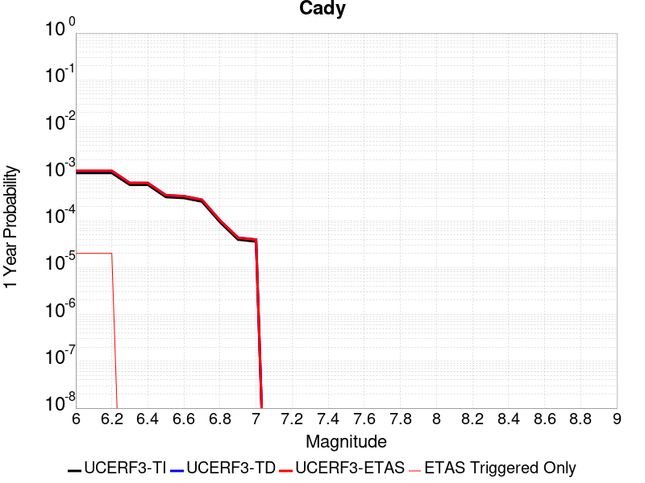 |  |

| Magnitude | 1 wk TI Prob | 1 wk TD Prob | 1 wk ETAS Prob | 1 wk ETAS/TD Gain | 1 wk ETAS Triggered Only | 1 mo TI Prob | 1 mo TD Prob | 1 mo ETAS Prob | 1 mo ETAS/TD Gain | 1 mo ETAS Triggered Only | 1 yr TI Prob | 1 yr TD Prob | 1 yr ETAS Prob | 1 yr ETAS/TD Gain | 1 yr ETAS Triggered Only | 10 yr TI Prob | 10 yr TD Prob | 10 yr ETAS Prob | 10 yr ETAS/TD Gain | 10 yr ETAS Triggered Only |
|-----|-----|-----|-----|-----|-----|-----|-----|-----|-----|-----|-----|-----|-----|-----|-----|-----|-----|-----|-----|-----|
| 6.0 | 1.9892565E-5 | 2.1858672E-5 | 3.1858453E-5 | 1.4574744 | 1.0E-5 | 8.525106E-5 | 9.367717E-5 | 1.0367623E-4 | 1.1067396 | 1.0E-5 | 0.0010374374 | 0.0011400137 | 0.0011599909 | 1.0175236 | 2.0E-5 | 0.010326075 | 0.011350671 | 0.011370444 | 1.001742 | 2.0E-5 |
| 6.1 | 1.9892565E-5 | 2.1858672E-5 | 3.1858453E-5 | 1.4574744 | 1.0E-5 | 8.525106E-5 | 9.367717E-5 | 1.0367623E-4 | 1.1067396 | 1.0E-5 | 0.0010374374 | 0.0011400137 | 0.0011599909 | 1.0175236 | 2.0E-5 | 0.010326075 | 0.011350671 | 0.011370444 | 1.001742 | 2.0E-5 |
| 6.2 | 1.9892565E-5 | 2.1858672E-5 | 3.1858453E-5 | 1.4574744 | 1.0E-5 | 8.525106E-5 | 9.367717E-5 | 1.0367623E-4 | 1.1067396 | 1.0E-5 | 0.0010374374 | 0.0011400137 | 0.0011599909 | 1.0175236 | 2.0E-5 | 0.010326075 | 0.011350671 | 0.011370444 | 1.001742 | 2.0E-5 |
| 6.3 | 1.1117327E-5 | 1.2176552E-5 | 1.2176552E-5 | 1.0 | 0.0 | 4.764482E-5 | 5.2184358E-5 | 5.2184358E-5 | 1.0 | 0.0 | 5.7992124E-4 | 6.3519087E-4 | 6.3519087E-4 | 1.0 | 0.0 | 0.0057841022 | 0.0063368594 | 0.0063368594 | 1.0 | 0.0 |
| 6.4 | 1.1117327E-5 | 1.2176552E-5 | 1.2176552E-5 | 1.0 | 0.0 | 4.764482E-5 | 5.2184358E-5 | 5.2184358E-5 | 1.0 | 0.0 | 5.7992124E-4 | 6.3519087E-4 | 6.3519087E-4 | 1.0 | 0.0 | 0.0057841022 | 0.0063368594 | 0.0063368594 | 1.0 | 0.0 |
| 6.5 | 6.103093E-6 | 6.672004E-6 | 6.672004E-6 | 1.0 | 0.0 | 2.615585E-5 | 2.859406E-5 | 2.859406E-5 | 1.0 | 0.0 | 3.1840094E-4 | 3.4808964E-4 | 3.4808964E-4 | 1.0 | 0.0 | 0.0031794512 | 0.003476678 | 0.003476678 | 1.0 | 0.0 |
| 6.6 | 5.817237E-6 | 6.3656425E-6 | 6.3656425E-6 | 1.0 | 0.0 | 2.4930776E-5 | 2.728111E-5 | 2.728111E-5 | 1.0 | 0.0 | 3.034899E-4 | 3.3210934E-4 | 3.3210934E-4 | 1.0 | 0.0 | 0.0030307577 | 0.0033173522 | 0.0033173522 | 1.0 | 0.0 |
| 6.7 | 4.8846314E-6 | 5.3405547E-6 | 5.3405547E-6 | 1.0 | 0.0 | 2.0933967E-5 | 2.2887958E-5 | 2.2887958E-5 | 1.0 | 0.0 | 2.5484123E-4 | 2.7863705E-4 | 2.7863705E-4 | 1.0 | 0.0 | 0.0025454918 | 0.0027840321 | 0.0027840321 | 1.0 | 0.0 |
| 6.8 | 1.7788773E-6 | 1.9399033E-6 | 1.9399033E-6 | 1.0 | 0.0 | 7.6237375E-6 | 8.313854E-6 | 8.313854E-6 | 1.0 | 0.0 | 9.281505E-5 | 1.01218044E-4 | 1.01218044E-4 | 1.0 | 0.0 | 9.2776294E-4 | 0.0010118741 | 0.0010118741 | 1.0 | 0.0 |
| 6.9 | 7.5455404E-7 | 8.29707E-7 | 8.29707E-7 | 1.0 | 0.0 | 3.233799E-6 | 3.5558842E-6 | 3.5558842E-6 | 1.0 | 0.0 | 3.937079E-5 | 4.3292366E-5 | 4.3292366E-5 | 1.0 | 0.0 | 3.9363815E-4 | 4.3287227E-4 | 4.3287227E-4 | 1.0 | 0.0 |
| 7.0 | 6.8578805E-7 | 7.541796E-7 | 7.541796E-7 | 1.0 | 0.0 | 2.9390883E-6 | 3.2321961E-6 | 3.2321961E-6 | 1.0 | 0.0 | 3.578281E-5 | 3.935161E-5 | 3.935161E-5 | 1.0 | 0.0 | 3.577705E-4 | 3.9347887E-4 | 3.9347887E-4 | 1.0 | 0.0 |

## Red Pass
*[(top)](#table-of-contents)*

| 1 Week | 1 Month | 1 Year | 10 Year |
|-----|-----|-----|-----|
|  |  |  |  |

| Magnitude | 1 wk TI Prob | 1 wk TD Prob | 1 wk ETAS Prob | 1 wk ETAS/TD Gain | 1 wk ETAS Triggered Only | 1 mo TI Prob | 1 mo TD Prob | 1 mo ETAS Prob | 1 mo ETAS/TD Gain | 1 mo ETAS Triggered Only | 1 yr TI Prob | 1 yr TD Prob | 1 yr ETAS Prob | 1 yr ETAS/TD Gain | 1 yr ETAS Triggered Only | 10 yr TI Prob | 10 yr TD Prob | 10 yr ETAS Prob | 10 yr ETAS/TD Gain | 10 yr ETAS Triggered Only |
|-----|-----|-----|-----|-----|-----|-----|-----|-----|-----|-----|-----|-----|-----|-----|-----|-----|-----|-----|-----|-----|
| 6.0 | 8.258278E-6 | 8.5512565E-6 | 8.5512565E-6 | 1.0 | 0.0 | 3.539214E-5 | 3.664783E-5 | 4.6647463E-5 | 1.2728574 | 1.0E-5 | 4.308141E-4 | 4.4611385E-4 | 4.5610938E-4 | 1.0224057 | 1.0E-5 | 0.0042997985 | 0.004453941 | 0.0044738515 | 1.0044703 | 2.0E-5 |
| 6.1 | 3.649988E-6 | 3.7753127E-6 | 3.7753127E-6 | 1.0 | 0.0 | 1.5642712E-5 | 1.6179838E-5 | 1.6179838E-5 | 1.0 | 0.0 | 1.9043336E-4 | 1.9697649E-4 | 1.9697649E-4 | 1.0 | 0.0 | 0.0019027026 | 0.0019684862 | 0.0019684862 | 1.0 | 0.0 |
| 6.2 | 3.649988E-6 | 3.7753127E-6 | 3.7753127E-6 | 1.0 | 0.0 | 1.5642712E-5 | 1.6179838E-5 | 1.6179838E-5 | 1.0 | 0.0 | 1.9043336E-4 | 1.9697649E-4 | 1.9697649E-4 | 1.0 | 0.0 | 0.0019027026 | 0.0019684862 | 0.0019684862 | 1.0 | 0.0 |
| 6.3 | 1.3924937E-6 | 1.4411153E-6 | 1.4411153E-6 | 1.0 | 0.0 | 5.9678164E-6 | 6.1762016E-6 | 6.1762016E-6 | 1.0 | 0.0 | 7.265574E-5 | 7.5194075E-5 | 7.5194075E-5 | 1.0 | 0.0 | 7.263199E-4 | 7.518251E-4 | 7.518251E-4 | 1.0 | 0.0 |
| 6.4 | 1.3924937E-6 | 1.4411153E-6 | 1.4411153E-6 | 1.0 | 0.0 | 5.9678164E-6 | 6.1762016E-6 | 6.1762016E-6 | 1.0 | 0.0 | 7.265574E-5 | 7.5194075E-5 | 7.5194075E-5 | 1.0 | 0.0 | 7.263199E-4 | 7.518251E-4 | 7.518251E-4 | 1.0 | 0.0 |
| 6.5 | 9.876812E-7 | 1.0221903E-6 | 1.0221903E-6 | 1.0 | 0.0 | 4.2329125E-6 | 4.3808154E-6 | 4.3808154E-6 | 1.0 | 0.0 | 5.153449E-5 | 5.333643E-5 | 5.333643E-5 | 1.0 | 0.0 | 5.1522546E-4 | 5.3336425E-4 | 5.3336425E-4 | 1.0 | 0.0 |

## Garlic Springs
*[(top)](#table-of-contents)*

| 1 Week | 1 Month | 1 Year | 10 Year |
|-----|-----|-----|-----|
|  |  | 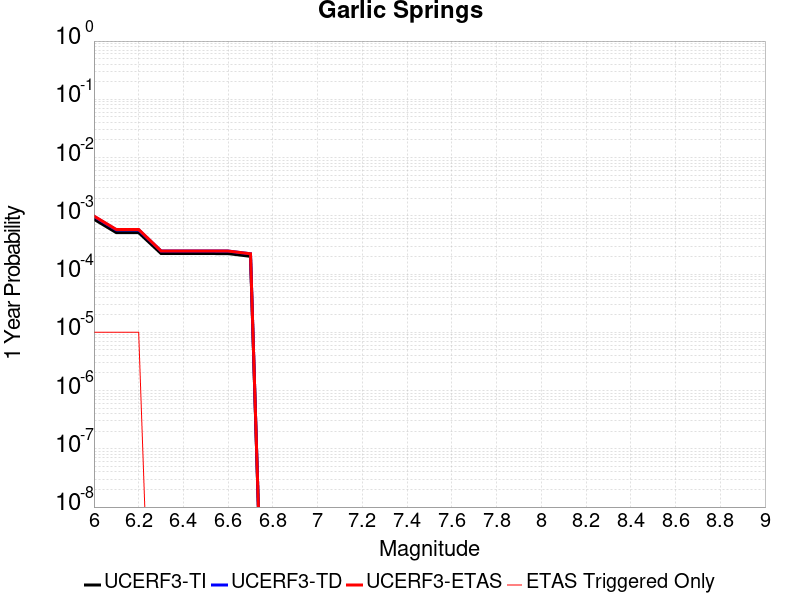 | 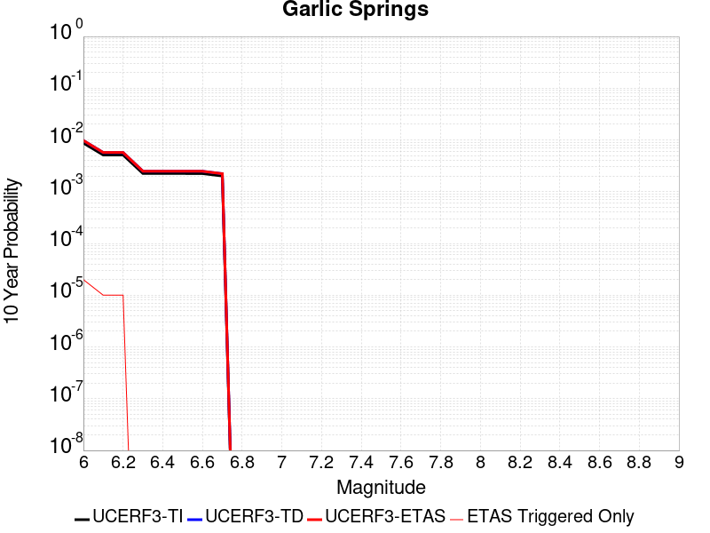 |

| Magnitude | 1 wk TI Prob | 1 wk TD Prob | 1 wk ETAS Prob | 1 wk ETAS/TD Gain | 1 wk ETAS Triggered Only | 1 mo TI Prob | 1 mo TD Prob | 1 mo ETAS Prob | 1 mo ETAS/TD Gain | 1 mo ETAS Triggered Only | 1 yr TI Prob | 1 yr TD Prob | 1 yr ETAS Prob | 1 yr ETAS/TD Gain | 1 yr ETAS Triggered Only | 10 yr TI Prob | 10 yr TD Prob | 10 yr ETAS Prob | 10 yr ETAS/TD Gain | 10 yr ETAS Triggered Only |
|-----|-----|-----|-----|-----|-----|-----|-----|-----|-----|-----|-----|-----|-----|-----|-----|-----|-----|-----|-----|-----|
| 6.0 | 1.6760017E-5 | 1.8776773E-5 | 1.8776773E-5 | 1.0 | 0.0 | 7.182667E-5 | 8.047006E-5 | 9.046926E-5 | 1.1242598 | 1.0E-5 | 8.7413884E-4 | 9.794E-4 | 9.893902E-4 | 1.0102004 | 1.0E-5 | 0.008707083 | 0.009762382 | 0.009782187 | 1.0020287 | 2.0E-5 |
| 6.1 | 9.852767E-6 | 1.0973554E-5 | 1.0973554E-5 | 1.0 | 0.0 | 4.222546E-5 | 4.702907E-5 | 5.70286E-5 | 1.2126244 | 1.0E-5 | 5.139737E-4 | 5.724994E-4 | 5.824937E-4 | 1.0174572 | 1.0E-5 | 0.005127866 | 0.005717204 | 0.0057271468 | 1.0017391 | 1.0E-5 |
| 6.2 | 9.852767E-6 | 1.0973554E-5 | 1.0973554E-5 | 1.0 | 0.0 | 4.222546E-5 | 4.702907E-5 | 5.70286E-5 | 1.2126244 | 1.0E-5 | 5.139737E-4 | 5.724994E-4 | 5.824937E-4 | 1.0174572 | 1.0E-5 | 0.005127866 | 0.005717204 | 0.0057271468 | 1.0017391 | 1.0E-5 |
| 6.3 | 4.3167724E-6 | 4.778015E-6 | 4.778015E-6 | 1.0 | 0.0 | 1.8500323E-5 | 2.0477177E-5 | 2.0477177E-5 | 1.0 | 0.0 | 2.2521814E-4 | 2.4930414E-4 | 2.4930414E-4 | 1.0 | 0.0 | 0.0022499003 | 0.0024925028 | 0.0024925028 | 1.0 | 0.0 |
| 6.4 | 4.3167724E-6 | 4.778015E-6 | 4.778015E-6 | 1.0 | 0.0 | 1.8500323E-5 | 2.0477177E-5 | 2.0477177E-5 | 1.0 | 0.0 | 2.2521814E-4 | 2.4930414E-4 | 2.4930414E-4 | 1.0 | 0.0 | 0.0022499003 | 0.0024925028 | 0.0024925028 | 1.0 | 0.0 |
| 6.5 | 4.3167724E-6 | 4.778015E-6 | 4.778015E-6 | 1.0 | 0.0 | 1.8500323E-5 | 2.0477177E-5 | 2.0477177E-5 | 1.0 | 0.0 | 2.2521814E-4 | 2.4930414E-4 | 2.4930414E-4 | 1.0 | 0.0 | 0.0022499003 | 0.0024925028 | 0.0024925028 | 1.0 | 0.0 |
| 6.6 | 4.301311E-6 | 4.7608837E-6 | 4.7608837E-6 | 1.0 | 0.0 | 1.8434059E-5 | 2.0403757E-5 | 2.0403757E-5 | 1.0 | 0.0 | 2.2441156E-4 | 2.4841045E-4 | 2.4841045E-4 | 1.0 | 0.0 | 0.0022418506 | 0.002483586 | 0.002483586 | 1.0 | 0.0 |
| 6.7 | 3.8599724E-6 | 4.2710476E-6 | 4.2710476E-6 | 1.0 | 0.0 | 1.6542634E-5 | 1.830449E-5 | 1.830449E-5 | 1.0 | 0.0 | 2.0138794E-4 | 2.2285717E-4 | 2.2285717E-4 | 1.0 | 0.0 | 0.0020120554 | 0.0022285716 | 0.0022285716 | 1.0 | 0.0 |

## San Jacinto (Stepovers Combined)
*[(top)](#table-of-contents)*

| 1 Week | 1 Month | 1 Year | 10 Year |
|-----|-----|-----|-----|
|  |  |  |  |

| Magnitude | 1 wk TI Prob | 1 wk TD Prob | 1 wk ETAS Prob | 1 wk ETAS/TD Gain | 1 wk ETAS Triggered Only | 1 mo TI Prob | 1 mo TD Prob | 1 mo ETAS Prob | 1 mo ETAS/TD Gain | 1 mo ETAS Triggered Only | 1 yr TI Prob | 1 yr TD Prob | 1 yr ETAS Prob | 1 yr ETAS/TD Gain | 1 yr ETAS Triggered Only | 10 yr TI Prob | 10 yr TD Prob | 10 yr ETAS Prob | 10 yr ETAS/TD Gain | 10 yr ETAS Triggered Only |
|-----|-----|-----|-----|-----|-----|-----|-----|-----|-----|-----|-----|-----|-----|-----|-----|-----|-----|-----|-----|-----|
| 6.0 | 4.0667746E-5 | 3.5264533E-5 | 3.5264533E-5 | 1.0 | 0.0 | 1.742787E-4 | 1.5112499E-4 | 1.5112499E-4 | 1.0 | 0.0 | 0.0021197782 | 0.001838395 | 0.0018483767 | 1.0054295 | 1.0E-5 | 0.020996714 | 0.018982861 | 0.019002482 | 1.0010335 | 2.0E-5 |
| 6.1 | 4.0667746E-5 | 3.5264533E-5 | 3.5264533E-5 | 1.0 | 0.0 | 1.742787E-4 | 1.5112499E-4 | 1.5112499E-4 | 1.0 | 0.0 | 0.0021197782 | 0.001838395 | 0.0018483767 | 1.0054295 | 1.0E-5 | 0.020996714 | 0.018982861 | 0.019002482 | 1.0010335 | 2.0E-5 |
| 6.2 | 4.0667746E-5 | 3.5264533E-5 | 3.5264533E-5 | 1.0 | 0.0 | 1.742787E-4 | 1.5112499E-4 | 1.5112499E-4 | 1.0 | 0.0 | 0.0021197782 | 0.001838395 | 0.0018483767 | 1.0054295 | 1.0E-5 | 0.020996714 | 0.018982861 | 0.019002482 | 1.0010335 | 2.0E-5 |
| 6.3 | 4.0667746E-5 | 3.5264533E-5 | 3.5264533E-5 | 1.0 | 0.0 | 1.742787E-4 | 1.5112499E-4 | 1.5112499E-4 | 1.0 | 0.0 | 0.0021197782 | 0.001838395 | 0.0018483767 | 1.0054295 | 1.0E-5 | 0.020996714 | 0.018982861 | 0.019002482 | 1.0010335 | 2.0E-5 |
| 6.4 | 4.0577226E-5 | 3.5136447E-5 | 3.5136447E-5 | 1.0 | 0.0 | 1.738908E-4 | 1.505761E-4 | 1.505761E-4 | 1.0 | 0.0 | 0.0021150648 | 0.0018317249 | 0.0018417066 | 1.0054493 | 1.0E-5 | 0.020950472 | 0.018917428 | 0.018937051 | 1.0010372 | 2.0E-5 |
| 6.5 | 4.0577226E-5 | 3.5136447E-5 | 3.5136447E-5 | 1.0 | 0.0 | 1.738908E-4 | 1.505761E-4 | 1.505761E-4 | 1.0 | 0.0 | 0.0021150648 | 0.0018317249 | 0.0018417066 | 1.0054493 | 1.0E-5 | 0.020950472 | 0.018917428 | 0.018937051 | 1.0010372 | 2.0E-5 |
| 6.6 | 4.053861E-5 | 3.508179E-5 | 3.508179E-5 | 1.0 | 0.0 | 1.7372532E-4 | 1.5034188E-4 | 1.5034188E-4 | 1.0 | 0.0 | 0.0021130538 | 0.0018288785 | 0.0018388602 | 1.0054579 | 1.0E-5 | 0.020930743 | 0.018889507 | 0.018909128 | 1.0010388 | 2.0E-5 |
| 6.7 | 4.0516545E-5 | 3.5050864E-5 | 3.5050864E-5 | 1.0 | 0.0 | 1.7363077E-4 | 1.5020935E-4 | 1.5020935E-4 | 1.0 | 0.0 | 0.002111905 | 0.001827268 | 0.0018372497 | 1.0054626 | 1.0E-5 | 0.020919468 | 0.018873703 | 0.018893326 | 1.0010396 | 2.0E-5 |
| 6.8 | 4.049434E-5 | 3.5022425E-5 | 3.5022425E-5 | 1.0 | 0.0 | 1.7353562E-4 | 1.500875E-4 | 1.500875E-4 | 1.0 | 0.0 | 0.0021107488 | 0.0018257869 | 0.0018357686 | 1.005467 | 1.0E-5 | 0.020908125 | 0.018859116 | 0.01887874 | 1.0010405 | 2.0E-5 |
| 6.9 | 4.046386E-5 | 3.4984987E-5 | 3.4984987E-5 | 1.0 | 0.0 | 1.73405E-4 | 1.4992706E-4 | 1.4992706E-4 | 1.0 | 0.0 | 0.0021091616 | 0.0018238368 | 0.0018338186 | 1.0054729 | 1.0E-5 | 0.020892553 | 0.018839888 | 0.018859511 | 1.0010415 | 2.0E-5 |
| 7.0 | 4.036382E-5 | 3.486556E-5 | 3.486556E-5 | 1.0 | 0.0 | 1.7297632E-4 | 1.4941528E-4 | 1.4941528E-4 | 1.0 | 0.0 | 0.0021039525 | 0.0018176165 | 0.0018275983 | 1.0054917 | 1.0E-5 | 0.02084144 | 0.018778505 | 0.01879813 | 1.001045 | 2.0E-5 |
| 7.1 | 4.0343282E-5 | 3.4844023E-5 | 3.4844023E-5 | 1.0 | 0.0 | 1.7288832E-4 | 1.49323E-4 | 1.49323E-4 | 1.0 | 0.0 | 0.002102883 | 0.0018164949 | 0.0018264767 | 1.0054951 | 1.0E-5 | 0.020830948 | 0.018767375 | 0.018787 | 1.0010457 | 2.0E-5 |
| 7.2 | 4.0257353E-5 | 3.4748526E-5 | 3.4748526E-5 | 1.0 | 0.0 | 1.725201E-4 | 1.4891376E-4 | 1.4891376E-4 | 1.0 | 0.0 | 0.0020984085 | 0.0018115207 | 0.0018215026 | 1.0055102 | 1.0E-5 | 0.020787042 | 0.018718114 | 0.01873774 | 1.0010484 | 2.0E-5 |
| 7.3 | 3.9940667E-5 | 3.4576202E-5 | 3.4576202E-5 | 1.0 | 0.0 | 1.7116306E-4 | 1.4817533E-4 | 1.4817533E-4 | 1.0 | 0.0 | 0.0020819185 | 0.0018025452 | 0.0018125272 | 1.0055377 | 1.0E-5 | 0.020625217 | 0.018626764 | 0.018646391 | 1.0010537 | 2.0E-5 |
| 7.4 | 3.9721202E-5 | 3.4461642E-5 | 3.4461642E-5 | 1.0 | 0.0 | 1.7022261E-4 | 1.4768442E-4 | 1.4768442E-4 | 1.0 | 0.0 | 0.0020704903 | 0.0017965782 | 0.0018065602 | 1.0055561 | 1.0E-5 | 0.020513052 | 0.018565914 | 0.018585542 | 1.0010573 | 2.0E-5 |
| 7.5 | 3.7036873E-5 | 3.352937E-5 | 3.352937E-5 | 1.0 | 0.0 | 1.5871979E-4 | 1.4368941E-4 | 1.4368941E-4 | 1.0 | 0.0 | 0.0019307006 | 0.0017480177 | 0.0017580002 | 1.0057107 | 1.0E-5 | 0.019140124 | 0.018067606 | 0.018087244 | 1.001087 | 2.0E-5 |
| 7.6 | 3.2940967E-5 | 3.13107E-5 | 3.13107E-5 | 1.0 | 0.0 | 1.4116794E-4 | 1.3418183E-4 | 1.3418183E-4 | 1.0 | 0.0 | 0.0017173645 | 0.0016324419 | 0.0016424255 | 1.0061158 | 1.0E-5 | 0.01704153 | 0.016900703 | 0.016920365 | 1.0011634 | 2.0E-5 |
| 7.7 | 2.8236149E-5 | 2.7880007E-5 | 2.7880007E-5 | 1.0 | 0.0 | 1.2100645E-4 | 1.1948028E-4 | 1.1948028E-4 | 1.0 | 0.0 | 0.0014722579 | 0.0014537028 | 0.0014636882 | 1.006869 | 1.0E-5 | 0.014625421 | 0.015113378 | 0.015133076 | 1.0013033 | 2.0E-5 |
| 7.8 | 2.4329287E-5 | 2.5203897E-5 | 2.5203897E-5 | 1.0 | 0.0 | 1.042642E-4 | 1.0801223E-4 | 1.0801223E-4 | 1.0 | 0.0 | 0.0012686774 | 0.0013142565 | 0.0013242433 | 1.0075989 | 1.0E-5 | 0.012614589 | 0.013710698 | 0.013730424 | 1.0014387 | 2.0E-5 |
| 7.9 | 1.9370926E-5 | 2.041812E-5 | 2.041812E-5 | 1.0 | 0.0 | 8.301561E-5 | 8.75033E-5 | 8.75033E-5 | 1.0 | 0.0 | 0.0010102465 | 0.0010648328 | 0.0010648328 | 1.0 | 0.0 | 0.0100566605 | 0.011197893 | 0.011207781 | 1.000883 | 1.0E-5 |
| 8.0 | 1.5583017E-5 | 1.5883486E-5 | 1.5883486E-5 | 1.0 | 0.0 | 6.6782646E-5 | 6.807031E-5 | 6.807031E-5 | 1.0 | 0.0 | 8.127754E-4 | 8.2844164E-4 | 8.2844164E-4 | 1.0 | 0.0 | 0.008098091 | 0.008780348 | 0.008790261 | 1.0011289 | 1.0E-5 |
| 8.1 | 1.0024873E-5 | 8.290274E-6 | 8.290274E-6 | 1.0 | 0.0 | 4.2963035E-5 | 3.5529265E-5 | 3.5529265E-5 | 1.0 | 0.0 | 5.229494E-4 | 4.3248344E-4 | 4.3248344E-4 | 1.0 | 0.0 | 0.0052172043 | 0.0046523367 | 0.00466229 | 1.0021394 | 1.0E-5 |
| 8.2 | 4.142796E-6 | 1.5599394E-6 | 1.5599394E-6 | 1.0 | 0.0 | 1.775472E-5 | 6.6854377E-6 | 6.6854377E-6 | 1.0 | 0.0 | 2.1614227E-4 | 8.139219E-5 | 8.139219E-5 | 1.0 | 0.0 | 0.0021593217 | 9.449501E-4 | 9.449501E-4 | 1.0 | 0.0 |
| 8.3 | 1.2750878E-6 | 3.6089054E-7 | 3.6089054E-7 | 1.0 | 0.0 | 5.4646503E-6 | 1.5466729E-6 | 1.5466729E-6 | 1.0 | 0.0 | 6.653009E-5 | 1.8830584E-5 | 1.8830584E-5 | 1.0 | 0.0 | 6.6510175E-4 | 2.271723E-4 | 2.271723E-4 | 1.0 | 0.0 |

## San Juan
*[(top)](#table-of-contents)*

| 1 Week | 1 Month | 1 Year | 10 Year |
|-----|-----|-----|-----|
|  |  |  |  |

| Magnitude | 1 wk TI Prob | 1 wk TD Prob | 1 wk ETAS Prob | 1 wk ETAS/TD Gain | 1 wk ETAS Triggered Only | 1 mo TI Prob | 1 mo TD Prob | 1 mo ETAS Prob | 1 mo ETAS/TD Gain | 1 mo ETAS Triggered Only | 1 yr TI Prob | 1 yr TD Prob | 1 yr ETAS Prob | 1 yr ETAS/TD Gain | 1 yr ETAS Triggered Only | 10 yr TI Prob | 10 yr TD Prob | 10 yr ETAS Prob | 10 yr ETAS/TD Gain | 10 yr ETAS Triggered Only |
|-----|-----|-----|-----|-----|-----|-----|-----|-----|-----|-----|-----|-----|-----|-----|-----|-----|-----|-----|-----|-----|
| 6.0 | 8.682808E-6 | 8.7490835E-6 | 1.8748997E-5 | 2.1429667 | 1.0E-5 | 3.72115E-5 | 3.749556E-5 | 5.749481E-5 | 1.5333765 | 2.0E-5 | 4.5295584E-4 | 4.5641765E-4 | 4.7640852E-4 | 1.0437995 | 2.0E-5 | 0.004520337 | 0.004555343 | 0.004575252 | 1.0043705 | 2.0E-5 |
| 6.1 | 8.682808E-6 | 8.7490835E-6 | 1.8748997E-5 | 2.1429667 | 1.0E-5 | 3.72115E-5 | 3.749556E-5 | 5.749481E-5 | 1.5333765 | 2.0E-5 | 4.5295584E-4 | 4.5641765E-4 | 4.7640852E-4 | 1.0437995 | 2.0E-5 | 0.004520337 | 0.004555343 | 0.004575252 | 1.0043705 | 2.0E-5 |
| 6.2 | 8.682808E-6 | 8.7490835E-6 | 1.8748997E-5 | 2.1429667 | 1.0E-5 | 3.72115E-5 | 3.749556E-5 | 5.749481E-5 | 1.5333765 | 2.0E-5 | 4.5295584E-4 | 4.5641765E-4 | 4.7640852E-4 | 1.0437995 | 2.0E-5 | 0.004520337 | 0.004555343 | 0.004575252 | 1.0043705 | 2.0E-5 |
| 6.3 | 6.3054235E-6 | 6.2825075E-6 | 6.2825075E-6 | 1.0 | 0.0 | 2.7022963E-5 | 2.6924763E-5 | 3.692449E-5 | 1.3713953 | 1.0E-5 | 3.2895492E-4 | 3.2776108E-4 | 3.377578E-4 | 1.0305 | 1.0E-5 | 0.003284684 | 0.0032729763 | 0.0032829435 | 1.0030453 | 1.0E-5 |
| 6.4 | 6.1490473E-6 | 6.1143965E-6 | 6.1143965E-6 | 1.0 | 0.0 | 2.6352795E-5 | 2.6204301E-5 | 3.6204037E-5 | 1.3816067 | 1.0E-5 | 3.2079802E-4 | 3.1899204E-4 | 3.2898886E-4 | 1.0313387 | 1.0E-5 | 0.0032033534 | 0.0031855374 | 0.0031955056 | 1.0031292 | 1.0E-5 |
| 6.5 | 5.204848E-6 | 5.1371658E-6 | 5.1371658E-6 | 1.0 | 0.0 | 2.23063E-5 | 2.2016244E-5 | 3.2016025E-5 | 1.4542 | 1.0E-5 | 2.7154534E-4 | 2.6801578E-4 | 2.780131E-4 | 1.0373012 | 1.0E-5 | 0.0027121378 | 0.0026770788 | 0.0026870521 | 1.0037254 | 1.0E-5 |
| 6.6 | 4.5179986E-6 | 4.4149815E-6 | 4.4149815E-6 | 1.0 | 0.0 | 1.9362706E-5 | 1.8921217E-5 | 2.8921027E-5 | 1.5284972 | 1.0E-5 | 2.3571544E-4 | 2.3034225E-4 | 2.4033996E-4 | 1.0434036 | 1.0E-5 | 0.0023546559 | 0.0023011717 | 0.0023111487 | 1.0043356 | 1.0E-5 |
| 6.7 | 3.9442616E-6 | 3.8197845E-6 | 3.8197845E-6 | 1.0 | 0.0 | 1.6903869E-5 | 1.6370406E-5 | 2.6370242E-5 | 1.6108484 | 1.0E-5 | 2.0578515E-4 | 1.9929213E-4 | 2.0929014E-4 | 1.0501676 | 1.0E-5 | 0.002055947 | 0.0019912585 | 0.0020012388 | 1.0050119 | 1.0E-5 |
| 6.8 | 3.4536245E-6 | 3.3162935E-6 | 3.3162935E-6 | 1.0 | 0.0 | 1.4801163E-5 | 1.4212612E-5 | 2.421247E-5 | 1.7035904 | 1.0E-5 | 1.8018926E-4 | 1.7302543E-4 | 1.830237E-4 | 1.0577849 | 1.0E-5 | 0.0018004322 | 0.0017290255 | 0.0017390082 | 1.0057737 | 1.0E-5 |
| 6.9 | 3.059865E-6 | 2.911991E-6 | 2.911991E-6 | 1.0 | 0.0 | 1.3113641E-5 | 1.2479905E-5 | 2.247978E-5 | 1.8012781 | 1.0E-5 | 1.596469E-4 | 1.5193282E-4 | 1.619313E-4 | 1.0658085 | 1.0E-5 | 0.0015953224 | 0.0015184036 | 0.0015283885 | 1.0065758 | 1.0E-5 |
| 7.0 | 2.6504351E-6 | 2.4919616E-6 | 2.4919616E-6 | 1.0 | 0.0 | 1.1358958E-5 | 1.0679795E-5 | 2.0679689E-5 | 1.9363376 | 1.0E-5 | 1.3828653E-4 | 1.300193E-4 | 1.4001799E-4 | 1.0769017 | 1.0E-5 | 0.0013820052 | 0.0012995437 | 0.0013095306 | 1.0076851 | 1.0E-5 |
| 7.1 | 2.2039317E-6 | 2.033802E-6 | 2.033802E-6 | 1.0 | 0.0 | 9.445387E-6 | 8.716269E-6 | 1.8716182E-5 | 2.14727 | 1.0E-5 | 1.1499152E-4 | 1.06115935E-4 | 1.1611487E-4 | 1.0942266 | 1.0E-5 | 0.0011493203 | 0.0010607622 | 0.0010707516 | 1.0094172 | 1.0E-5 |
| 7.2 | 1.0786707E-6 | 8.769938E-7 | 8.769938E-7 | 1.0 | 0.0 | 4.622866E-6 | 3.7585394E-6 | 3.7585394E-6 | 1.0 | 0.0 | 5.628194E-5 | 4.575927E-5 | 4.575927E-5 | 1.0 | 0.0 | 5.6267687E-4 | 4.5755703E-4 | 4.5755703E-4 | 1.0 | 0.0 |
| 7.3 | 6.846433E-7 | 4.8686206E-7 | 4.8686206E-7 | 1.0 | 0.0 | 2.9341822E-6 | 2.0865498E-6 | 2.0865498E-6 | 1.0 | 0.0 | 3.5723086E-5 | 2.540345E-5 | 2.540345E-5 | 1.0 | 0.0 | 3.571734E-4 | 2.5403936E-4 | 2.5403936E-4 | 1.0 | 0.0 |
| 7.4 | 5.23043E-7 | 3.2626332E-7 | 3.2626332E-7 | 1.0 | 0.0 | 2.2416111E-6 | 1.3982707E-6 | 1.3982707E-6 | 1.0 | 0.0 | 2.7291273E-5 | 1.7023813E-5 | 1.7023813E-5 | 1.0 | 0.0 | 2.7287923E-4 | 1.7025719E-4 | 1.7025719E-4 | 1.0 | 0.0 |
| 7.5 | 4.648444E-7 | 2.7233258E-7 | 2.7233258E-7 | 1.0 | 0.0 | 1.9921886E-6 | 1.1671391E-6 | 1.1671391E-6 | 1.0 | 0.0 | 2.4254627E-5 | 1.4209826E-5 | 1.4209826E-5 | 1.0 | 0.0 | 2.425198E-4 | 1.4211898E-4 | 1.4211898E-4 | 1.0 | 0.0 |
| 7.6 | 3.9906567E-7 | 2.208186E-7 | 2.208186E-7 | 1.0 | 0.0 | 1.7102802E-6 | 9.463651E-7 | 9.463651E-7 | 1.0 | 0.0 | 2.0822463E-5 | 1.1521935E-5 | 1.1521935E-5 | 1.0 | 0.0 | 2.0820512E-4 | 1.15237846E-4 | 1.15237846E-4 | 1.0 | 0.0 |
| 7.7 | 1.8784601E-7 | 5.3659704E-8 | 5.3659704E-8 | 1.0 | 0.0 | 8.0505407E-7 | 2.2997014E-7 | 2.2997014E-7 | 1.0 | 0.0 | 9.80149E-6 | 2.7998829E-6 | 2.7998829E-6 | 1.0 | 0.0 | 9.801057E-5 | 2.8006976E-5 | 2.8006976E-5 | 1.0 | 0.0 |
| 7.8 | 1.00154914E-7 | 1.2411904E-8 | 1.2411904E-8 | 1.0 | 0.0 | 4.2923529E-7 | 5.3193872E-8 | 5.3193872E-8 | 1.0 | 0.0 | 5.225927E-6 | 6.4763526E-7 | 6.4763526E-7 | 1.0 | 0.0 | 5.225804E-5 | 6.482253E-6 | 6.482253E-6 | 1.0 | 0.0 |
| 7.9 | 6.171429E-8 | 4.2941664E-9 | 4.2941664E-9 | 1.0 | 0.0 | 2.6448978E-7 | 1.8403565E-8 | 1.8403565E-8 | 1.0 | 0.0 | 3.2201583E-6 | 2.2406341E-7 | 2.2406341E-7 | 1.0 | 0.0 | 3.2201115E-5 | 2.2459535E-6 | 2.2459535E-6 | 1.0 | 0.0 |
| 8.0 | 1.3974572E-8 | 3.372923E-10 | 3.372923E-10 | 1.0 | 0.0 | 5.989102E-8 | 1.4455342E-9 | 1.4455342E-9 | 1.0 | 0.0 | 7.2917294E-7 | 1.7599382E-8 | 1.7599382E-8 | 1.0 | 0.0 | 7.2917055E-6 | 1.8032769E-7 | 1.8032769E-7 | 1.0 | 0.0 |
| 8.1 | 1.8403477E-9 | 1.1289958E-10 | 1.1289958E-10 | 1.0 | 0.0 | 7.887204E-9 | 4.838532E-10 | 4.838532E-10 | 1.0 | 0.0 | 9.602671E-8 | 5.8909144E-9 | 5.8909144E-9 | 1.0 | 0.0 | 9.602667E-7 | 6.019308E-8 | 6.019308E-8 | 1.0 | 0.0 |

## Bicycle Lake
*[(top)](#table-of-contents)*

| 1 Week | 1 Month | 1 Year | 10 Year |
|-----|-----|-----|-----|
|  |  |  |  |

| Magnitude | 1 wk TI Prob | 1 wk TD Prob | 1 wk ETAS Prob | 1 wk ETAS/TD Gain | 1 wk ETAS Triggered Only | 1 mo TI Prob | 1 mo TD Prob | 1 mo ETAS Prob | 1 mo ETAS/TD Gain | 1 mo ETAS Triggered Only | 1 yr TI Prob | 1 yr TD Prob | 1 yr ETAS Prob | 1 yr ETAS/TD Gain | 1 yr ETAS Triggered Only | 10 yr TI Prob | 10 yr TD Prob | 10 yr ETAS Prob | 10 yr ETAS/TD Gain | 10 yr ETAS Triggered Only |
|-----|-----|-----|-----|-----|-----|-----|-----|-----|-----|-----|-----|-----|-----|-----|-----|-----|-----|-----|-----|-----|
| 6.0 | 1.9621975E-5 | 2.2097003E-5 | 3.209678E-5 | 1.45254 | 1.0E-5 | 8.4091465E-5 | 9.469877E-5 | 1.0469782E-4 | 1.105588 | 1.0E-5 | 0.0010233327 | 0.0011524827 | 0.0011624711 | 1.0086669 | 1.0E-5 | 0.01018633 | 0.01147837 | 0.01149814 | 1.0017225 | 2.0E-5 |
| 6.1 | 1.9621975E-5 | 2.2097003E-5 | 3.209678E-5 | 1.45254 | 1.0E-5 | 8.4091465E-5 | 9.469877E-5 | 1.0469782E-4 | 1.105588 | 1.0E-5 | 0.0010233327 | 0.0011524827 | 0.0011624711 | 1.0086669 | 1.0E-5 | 0.01018633 | 0.01147837 | 0.01149814 | 1.0017225 | 2.0E-5 |
| 6.2 | 9.9971285E-6 | 1.1255602E-5 | 1.1255602E-5 | 1.0 | 0.0 | 4.2844134E-5 | 4.8237696E-5 | 4.8237696E-5 | 1.0 | 0.0 | 5.2150246E-4 | 5.871877E-4 | 5.871877E-4 | 1.0 | 0.0 | 0.0052028033 | 0.005861467 | 0.0058714086 | 1.0016961 | 1.0E-5 |
| 6.3 | 9.589428E-6 | 1.079831E-5 | 1.079831E-5 | 1.0 | 0.0 | 4.10969E-5 | 4.6277943E-5 | 4.6277943E-5 | 1.0 | 0.0 | 5.002399E-4 | 5.6334015E-4 | 5.6334015E-4 | 1.0 | 0.0 | 0.0049911533 | 0.005624211 | 0.0056341547 | 1.001768 | 1.0E-5 |
| 6.4 | 9.589428E-6 | 1.079831E-5 | 1.079831E-5 | 1.0 | 0.0 | 4.10969E-5 | 4.6277943E-5 | 4.6277943E-5 | 1.0 | 0.0 | 5.002399E-4 | 5.6334015E-4 | 5.6334015E-4 | 1.0 | 0.0 | 0.0049911533 | 0.005624211 | 0.0056341547 | 1.001768 | 1.0E-5 |
| 6.5 | 5.557707E-6 | 6.2855797E-6 | 6.2855797E-6 | 1.0 | 0.0 | 2.3818526E-5 | 2.693807E-5 | 2.693807E-5 | 1.0 | 0.0 | 2.8995197E-4 | 3.2794854E-4 | 3.2794854E-4 | 1.0 | 0.0 | 0.0028957394 | 0.003277282 | 0.003277282 | 1.0 | 0.0 |
| 6.6 | 4.8742945E-6 | 5.5132705E-6 | 5.5132705E-6 | 1.0 | 0.0 | 2.0889667E-5 | 2.3628236E-5 | 2.3628236E-5 | 1.0 | 0.0 | 2.54302E-4 | 2.87662E-4 | 2.87662E-4 | 1.0 | 0.0 | 0.002540112 | 0.0028754652 | 0.0028754652 | 1.0 | 0.0 |
| 6.7 | 3.991108E-6 | 4.5158945E-6 | 4.5158945E-6 | 1.0 | 0.0 | 1.7104636E-5 | 1.9353833E-5 | 1.9353833E-5 | 1.0 | 0.0 | 2.0822904E-4 | 2.3563292E-4 | 2.3563292E-4 | 1.0 | 0.0 | 0.0020803404 | 0.0023563292 | 0.0023563292 | 1.0 | 0.0 |

## Ortigalita (South)
*[(top)](#table-of-contents)*

| 1 Week | 1 Month | 1 Year | 10 Year |
|-----|-----|-----|-----|
|  |  |  |  |

| Magnitude | 1 wk TI Prob | 1 wk TD Prob | 1 wk ETAS Prob | 1 wk ETAS/TD Gain | 1 wk ETAS Triggered Only | 1 mo TI Prob | 1 mo TD Prob | 1 mo ETAS Prob | 1 mo ETAS/TD Gain | 1 mo ETAS Triggered Only | 1 yr TI Prob | 1 yr TD Prob | 1 yr ETAS Prob | 1 yr ETAS/TD Gain | 1 yr ETAS Triggered Only | 10 yr TI Prob | 10 yr TD Prob | 10 yr ETAS Prob | 10 yr ETAS/TD Gain | 10 yr ETAS Triggered Only |
|-----|-----|-----|-----|-----|-----|-----|-----|-----|-----|-----|-----|-----|-----|-----|-----|-----|-----|-----|-----|-----|
| 6.0 | 3.72394E-5 | 4.325541E-5 | 5.325498E-5 | 1.231175 | 1.0E-5 | 1.5958765E-4 | 1.8536806E-4 | 1.953662E-4 | 1.0539367 | 1.0E-5 | 0.0019412481 | 0.0022546765 | 0.0022746315 | 1.0088505 | 2.0E-5 | 0.019243775 | 0.022334406 | 0.022353958 | 1.0008755 | 2.0E-5 |
| 6.1 | 2.7299884E-5 | 3.1491905E-5 | 3.1491905E-5 | 1.0 | 0.0 | 1.16994255E-4 | 1.3495865E-4 | 1.3495865E-4 | 1.0 | 0.0 | 0.0014234743 | 0.0016419389 | 0.0016519226 | 1.0060804 | 1.0E-5 | 0.014143906 | 0.016304005 | 0.016313843 | 1.0006033 | 1.0E-5 |
| 6.2 | 2.7299884E-5 | 3.1491905E-5 | 3.1491905E-5 | 1.0 | 0.0 | 1.16994255E-4 | 1.3495865E-4 | 1.3495865E-4 | 1.0 | 0.0 | 0.0014234743 | 0.0016419389 | 0.0016519226 | 1.0060804 | 1.0E-5 | 0.014143906 | 0.016304005 | 0.016313843 | 1.0006033 | 1.0E-5 |
| 6.3 | 2.0546433E-5 | 2.3631357E-5 | 2.3631357E-5 | 1.0 | 0.0 | 8.805317E-5 | 1.0127342E-4 | 1.0127342E-4 | 1.0 | 0.0 | 0.00107152 | 0.0012323254 | 0.0012423132 | 1.0081047 | 1.0E-5 | 0.010663681 | 0.012256982 | 0.012266859 | 1.0008059 | 1.0E-5 |
| 6.4 | 2.0546433E-5 | 2.3631357E-5 | 2.3631357E-5 | 1.0 | 0.0 | 8.805317E-5 | 1.0127342E-4 | 1.0127342E-4 | 1.0 | 0.0 | 0.00107152 | 0.0012323254 | 0.0012423132 | 1.0081047 | 1.0E-5 | 0.010663681 | 0.012256982 | 0.012266859 | 1.0008059 | 1.0E-5 |
| 6.5 | 1.7779594E-5 | 2.0446892E-5 | 2.0446892E-5 | 1.0 | 0.0 | 7.619603E-5 | 8.762667E-5 | 8.762667E-5 | 1.0 | 0.0 | 9.272918E-4 | 0.0010663462 | 0.0010763356 | 1.0093678 | 1.0E-5 | 0.009234319 | 0.010613761 | 0.010623655 | 1.0009322 | 1.0E-5 |
| 6.6 | 1.6272212E-5 | 1.8714893E-5 | 1.8714893E-5 | 1.0 | 0.0 | 6.973618E-5 | 8.0204285E-5 | 8.0204285E-5 | 1.0 | 0.0 | 8.487073E-4 | 9.76062E-4 | 9.860522E-4 | 1.0102353 | 1.0E-5 | 0.008454733 | 0.009719051 | 0.009728954 | 1.0010189 | 1.0E-5 |
| 6.7 | 1.3051484E-5 | 1.5038697E-5 | 1.5038697E-5 | 1.0 | 0.0 | 5.593373E-5 | 6.445002E-5 | 6.445002E-5 | 1.0 | 0.0 | 6.807804E-4 | 7.84406E-4 | 7.9439813E-4 | 1.0127385 | 1.0E-5 | 0.006786986 | 0.007817356 | 0.007827278 | 1.0012692 | 1.0E-5 |
| 6.8 | 1.04277415E-5 | 1.19871875E-5 | 1.19871875E-5 | 1.0 | 0.0 | 4.4689557E-5 | 5.1372688E-5 | 5.1372688E-5 | 1.0 | 0.0 | 5.439595E-4 | 6.2529044E-4 | 6.352842E-4 | 1.0159826 | 1.0E-5 | 0.0054262993 | 0.006236065 | 0.006246003 | 1.0015936 | 1.0E-5 |
| 6.9 | 7.639968E-6 | 8.791468E-6 | 8.791468E-6 | 1.0 | 0.0 | 3.274231E-5 | 3.7677208E-5 | 3.7677208E-5 | 1.0 | 0.0 | 3.9856473E-4 | 4.5862934E-4 | 4.5862934E-4 | 1.0 | 0.0 | 0.003978506 | 0.0045774146 | 0.0045774146 | 1.0 | 0.0 |
| 7.0 | 3.919831E-6 | 4.5333823E-6 | 4.5333823E-6 | 1.0 | 0.0 | 1.679917E-5 | 1.942865E-5 | 1.942865E-5 | 1.0 | 0.0 | 2.045107E-4 | 2.3652024E-4 | 2.3652024E-4 | 1.0 | 0.0 | 0.0020432258 | 0.0023628937 | 0.0023628937 | 1.0 | 0.0 |
| 7.1 | 1.6017933E-6 | 1.8570338E-6 | 1.8570338E-6 | 1.0 | 0.0 | 6.8648105E-6 | 7.958698E-6 | 7.958698E-6 | 1.0 | 0.0 | 8.357586E-5 | 9.6893906E-5 | 9.6893906E-5 | 1.0 | 0.0 | 8.3544437E-4 | 9.6862135E-4 | 9.6862135E-4 | 1.0 | 0.0 |

## Fontana (Seismicity)
*[(top)](#table-of-contents)*

| 1 Week | 1 Month | 1 Year | 10 Year |
|-----|-----|-----|-----|
|  |  |  |  |

| Magnitude | 1 wk TI Prob | 1 wk TD Prob | 1 wk ETAS Prob | 1 wk ETAS/TD Gain | 1 wk ETAS Triggered Only | 1 mo TI Prob | 1 mo TD Prob | 1 mo ETAS Prob | 1 mo ETAS/TD Gain | 1 mo ETAS Triggered Only | 1 yr TI Prob | 1 yr TD Prob | 1 yr ETAS Prob | 1 yr ETAS/TD Gain | 1 yr ETAS Triggered Only | 10 yr TI Prob | 10 yr TD Prob | 10 yr ETAS Prob | 10 yr ETAS/TD Gain | 10 yr ETAS Triggered Only |
|-----|-----|-----|-----|-----|-----|-----|-----|-----|-----|-----|-----|-----|-----|-----|-----|-----|-----|-----|-----|-----|
| 6.0 | 7.1789214E-6 | 7.55199E-6 | 1.7551914E-5 | 2.3241441 | 1.0E-5 | 3.076644E-5 | 3.23655E-5 | 4.2365176E-5 | 1.3089609 | 1.0E-5 | 3.7451705E-4 | 3.940195E-4 | 4.0401556E-4 | 1.0253694 | 1.0E-5 | 0.003738865 | 0.0039372086 | 0.003947169 | 1.0025299 | 1.0E-5 |
| 6.1 | 7.1789214E-6 | 7.55199E-6 | 1.7551914E-5 | 2.3241441 | 1.0E-5 | 3.076644E-5 | 3.23655E-5 | 4.2365176E-5 | 1.3089609 | 1.0E-5 | 3.7451705E-4 | 3.940195E-4 | 4.0401556E-4 | 1.0253694 | 1.0E-5 | 0.003738865 | 0.0039372086 | 0.003947169 | 1.0025299 | 1.0E-5 |
| 6.2 | 7.1789214E-6 | 7.55199E-6 | 1.7551914E-5 | 2.3241441 | 1.0E-5 | 3.076644E-5 | 3.23655E-5 | 4.2365176E-5 | 1.3089609 | 1.0E-5 | 3.7451705E-4 | 3.940195E-4 | 4.0401556E-4 | 1.0253694 | 1.0E-5 | 0.003738865 | 0.0039372086 | 0.003947169 | 1.0025299 | 1.0E-5 |
| 6.3 | 7.1789214E-6 | 7.55199E-6 | 1.7551914E-5 | 2.3241441 | 1.0E-5 | 3.076644E-5 | 3.23655E-5 | 4.2365176E-5 | 1.3089609 | 1.0E-5 | 3.7451705E-4 | 3.940195E-4 | 4.0401556E-4 | 1.0253694 | 1.0E-5 | 0.003738865 | 0.0039372086 | 0.003947169 | 1.0025299 | 1.0E-5 |
| 6.4 | 7.1789214E-6 | 7.55199E-6 | 1.7551914E-5 | 2.3241441 | 1.0E-5 | 3.076644E-5 | 3.23655E-5 | 4.2365176E-5 | 1.3089609 | 1.0E-5 | 3.7451705E-4 | 3.940195E-4 | 4.0401556E-4 | 1.0253694 | 1.0E-5 | 0.003738865 | 0.0039372086 | 0.003947169 | 1.0025299 | 1.0E-5 |
| 6.5 | 5.2611317E-6 | 5.532718E-6 | 1.5532663E-5 | 2.8074198 | 1.0E-5 | 2.2547512E-5 | 2.371165E-5 | 3.371141E-5 | 1.4217236 | 1.0E-5 | 2.744814E-4 | 2.8868933E-4 | 2.9868644E-4 | 1.0346293 | 1.0E-5 | 0.002741426 | 0.0028868932 | 0.0028968644 | 1.003454 | 1.0E-5 |
| 6.6 | 5.2611317E-6 | 5.532718E-6 | 1.5532663E-5 | 2.8074198 | 1.0E-5 | 2.2547512E-5 | 2.371165E-5 | 3.371141E-5 | 1.4217236 | 1.0E-5 | 2.744814E-4 | 2.8868933E-4 | 2.9868644E-4 | 1.0346293 | 1.0E-5 | 0.002741426 | 0.0028868932 | 0.0028968644 | 1.003454 | 1.0E-5 |

## San Jacinto (Borrego)
*[(top)](#table-of-contents)*

| 1 Week | 1 Month | 1 Year | 10 Year |
|-----|-----|-----|-----|
|  |  |  |  |

| Magnitude | 1 wk TI Prob | 1 wk TD Prob | 1 wk ETAS Prob | 1 wk ETAS/TD Gain | 1 wk ETAS Triggered Only | 1 mo TI Prob | 1 mo TD Prob | 1 mo ETAS Prob | 1 mo ETAS/TD Gain | 1 mo ETAS Triggered Only | 1 yr TI Prob | 1 yr TD Prob | 1 yr ETAS Prob | 1 yr ETAS/TD Gain | 1 yr ETAS Triggered Only | 10 yr TI Prob | 10 yr TD Prob | 10 yr ETAS Prob | 10 yr ETAS/TD Gain | 10 yr ETAS Triggered Only |
|-----|-----|-----|-----|-----|-----|-----|-----|-----|-----|-----|-----|-----|-----|-----|-----|-----|-----|-----|-----|-----|
| 6.0 | 3.543992E-5 | 2.7924447E-5 | 2.7924447E-5 | 1.0 | 0.0 | 1.5187653E-4 | 1.19670774E-4 | 1.19670774E-4 | 1.0 | 0.0 | 0.0018475284 | 0.0014560302 | 0.0014560302 | 1.0 | 0.0 | 0.018322436 | 0.014866998 | 0.01487685 | 1.0006627 | 1.0E-5 |
| 6.1 | 3.542281E-5 | 2.7924447E-5 | 2.7924447E-5 | 1.0 | 0.0 | 1.5180321E-4 | 1.19670774E-4 | 1.19670774E-4 | 1.0 | 0.0 | 0.0018466372 | 0.0014560302 | 0.0014560302 | 1.0 | 0.0 | 0.018313672 | 0.014866998 | 0.01487685 | 1.0006627 | 1.0E-5 |
| 6.2 | 3.4688688E-5 | 2.7924447E-5 | 2.7924447E-5 | 1.0 | 0.0 | 1.4865733E-4 | 1.19670774E-4 | 1.19670774E-4 | 1.0 | 0.0 | 0.0018084005 | 0.0014560302 | 0.0014560302 | 1.0 | 0.0 | 0.017937548 | 0.014866998 | 0.01487685 | 1.0006627 | 1.0E-5 |
| 6.3 | 3.2087122E-5 | 2.7769796E-5 | 2.7769796E-5 | 1.0 | 0.0 | 1.3750899E-4 | 1.1900805E-4 | 1.1900805E-4 | 1.0 | 0.0 | 0.0016728862 | 0.0014479723 | 0.0014479723 | 1.0 | 0.0 | 0.016603488 | 0.014788155 | 0.014798008 | 1.0006663 | 1.0E-5 |
| 6.4 | 3.1828724E-5 | 2.7736773E-5 | 2.7736773E-5 | 1.0 | 0.0 | 1.364017E-4 | 1.18866534E-4 | 1.18866534E-4 | 1.0 | 0.0 | 0.0016594254 | 0.0014462515 | 0.0014462515 | 1.0 | 0.0 | 0.016470885 | 0.014771349 | 0.014781201 | 1.000667 | 1.0E-5 |
| 6.5 | 3.1563577E-5 | 2.7476459E-5 | 2.7476459E-5 | 1.0 | 0.0 | 1.3526545E-4 | 1.17751006E-4 | 1.17751006E-4 | 1.0 | 0.0 | 0.0016456128 | 0.001432688 | 0.001432688 | 1.0 | 0.0 | 0.0163348 | 0.014638765 | 0.014648618 | 1.0006732 | 1.0E-5 |
| 6.6 | 3.1467625E-5 | 2.732068E-5 | 2.732068E-5 | 1.0 | 0.0 | 1.3485427E-4 | 1.17083444E-4 | 1.17083444E-4 | 1.0 | 0.0 | 0.0016406142 | 0.0014245709 | 0.0014245709 | 1.0 | 0.0 | 0.016285548 | 0.014559092 | 0.014568946 | 1.0006769 | 1.0E-5 |
| 6.7 | 3.1223695E-5 | 2.6938706E-5 | 2.6938706E-5 | 1.0 | 0.0 | 1.3380898E-4 | 1.1544655E-4 | 1.1544655E-4 | 1.0 | 0.0 | 0.0016279068 | 0.0014046676 | 0.0014046676 | 1.0 | 0.0 | 0.01616033 | 0.01436336 | 0.014373216 | 1.0006862 | 1.0E-5 |
| 6.8 | 3.1015585E-5 | 2.6759712E-5 | 2.6759712E-5 | 1.0 | 0.0 | 1.3291716E-4 | 1.14679504E-4 | 1.14679504E-4 | 1.0 | 0.0 | 0.001617065 | 0.0013953409 | 0.0013953409 | 1.0 | 0.0 | 0.016053487 | 0.014270625 | 0.014280482 | 1.0006907 | 1.0E-5 |
| 6.9 | 2.6641965E-5 | 2.2182034E-5 | 2.2182034E-5 | 1.0 | 0.0 | 1.1417485E-4 | 9.5062416E-5 | 9.5062416E-5 | 1.0 | 0.0 | 0.0013891924 | 0.0011567742 | 0.0011567742 | 1.0 | 0.0 | 0.0138054015 | 0.011881202 | 0.011891083 | 1.0008317 | 1.0E-5 |
| 7.0 | 2.3854353E-5 | 2.0476871E-5 | 2.0476871E-5 | 1.0 | 0.0 | 1.02228936E-4 | 8.7755085E-5 | 8.7755085E-5 | 1.0 | 0.0 | 0.0012439266 | 0.0010678971 | 0.0010678971 | 1.0 | 0.0 | 0.012369866 | 0.010981717 | 0.010991607 | 1.0009006 | 1.0E-5 |
| 7.1 | 2.3672901E-5 | 2.0313362E-5 | 2.0313362E-5 | 1.0 | 0.0 | 1.0145135E-4 | 8.705438E-5 | 8.705438E-5 | 1.0 | 0.0 | 0.0012344702 | 0.0010593743 | 0.0010593743 | 1.0 | 0.0 | 0.0122763505 | 0.010896954 | 0.010906844 | 1.0009077 | 1.0E-5 |
| 7.2 | 2.2717244E-5 | 1.954077E-5 | 1.954077E-5 | 1.0 | 0.0 | 9.735599E-5 | 8.374348E-5 | 8.374348E-5 | 1.0 | 0.0 | 0.0011846646 | 0.0010191023 | 0.0010191023 | 1.0 | 0.0 | 0.01178369 | 0.010494285 | 0.010504181 | 1.000943 | 1.0E-5 |
| 7.3 | 2.1016205E-5 | 1.8382441E-5 | 1.8382441E-5 | 1.0 | 0.0 | 9.006634E-5 | 7.877952E-5 | 7.877952E-5 | 1.0 | 0.0 | 0.001096006 | 9.5872075E-4 | 9.5872075E-4 | 1.0 | 0.0 | 0.010906163 | 0.009889957 | 0.009899858 | 1.0010011 | 1.0E-5 |
| 7.4 | 2.0683625E-5 | 1.8184974E-5 | 1.8184974E-5 | 1.0 | 0.0 | 8.86411E-5 | 7.793329E-5 | 7.793329E-5 | 1.0 | 0.0 | 0.001078671 | 9.484268E-4 | 9.484268E-4 | 1.0 | 0.0 | 0.010734501 | 0.009786689 | 0.0097965915 | 1.0010118 | 1.0E-5 |
| 7.5 | 1.9993966E-5 | 1.778003E-5 | 1.778003E-5 | 1.0 | 0.0 | 8.568561E-5 | 7.619791E-5 | 7.619791E-5 | 1.0 | 0.0 | 0.001042723 | 9.273168E-4 | 9.273168E-4 | 1.0 | 0.0 | 0.010378438 | 0.009573653 | 0.009583558 | 1.0010345 | 1.0E-5 |
| 7.6 | 1.788966E-5 | 1.6433327E-5 | 1.6433327E-5 | 1.0 | 0.0 | 7.666772E-5 | 7.042666E-5 | 7.042666E-5 | 1.0 | 0.0 | 9.3302975E-4 | 8.57109E-4 | 8.57109E-4 | 1.0 | 0.0 | 0.00929122 | 0.008865524 | 0.008875435 | 1.001118 | 1.0E-5 |
| 7.7 | 1.5125781E-5 | 1.4235488E-5 | 1.4235488E-5 | 1.0 | 0.0 | 6.4823165E-5 | 6.1007817E-5 | 6.1007817E-5 | 1.0 | 0.0 | 7.889362E-4 | 7.425178E-4 | 7.425178E-4 | 1.0 | 0.0 | 0.007861412 | 0.007713296 | 0.0077232188 | 1.0012865 | 1.0E-5 |
| 7.8 | 1.250089E-5 | 1.2628741E-5 | 1.2628741E-5 | 1.0 | 0.0 | 5.3574146E-5 | 5.4122058E-5 | 5.4122058E-5 | 1.0 | 0.0 | 6.5207E-4 | 6.587375E-4 | 6.587375E-4 | 1.0 | 0.0 | 0.006501599 | 0.00686686 | 0.006876792 | 1.0014462 | 1.0E-5 |
| 7.9 | 9.561E-6 | 9.753001E-6 | 9.753001E-6 | 1.0 | 0.0 | 4.0975072E-5 | 4.179791E-5 | 4.179791E-5 | 1.0 | 0.0 | 4.987573E-4 | 5.087713E-4 | 5.087713E-4 | 1.0 | 0.0 | 0.0049763937 | 0.005351598 | 0.005361544 | 1.0018586 | 1.0E-5 |
| 8.0 | 8.01699E-6 | 8.2920105E-6 | 8.2920105E-6 | 1.0 | 0.0 | 3.4358076E-5 | 3.5536705E-5 | 3.5536705E-5 | 1.0 | 0.0 | 4.1822926E-4 | 4.3257402E-4 | 4.3257402E-4 | 1.0 | 0.0 | 0.0041744304 | 0.0045726597 | 0.004582614 | 1.0021769 | 1.0E-5 |
| 8.1 | 6.541947E-6 | 6.4609976E-6 | 6.4609976E-6 | 1.0 | 0.0 | 2.8036617E-5 | 2.7689697E-5 | 2.7689697E-5 | 1.0 | 0.0 | 3.4129233E-4 | 3.3707044E-4 | 3.3707044E-4 | 1.0 | 0.0 | 0.0034076865 | 0.003580059 | 0.0035900231 | 1.0027833 | 1.0E-5 |
| 8.2 | 1.7968189E-6 | 7.966976E-7 | 7.966976E-7 | 1.0 | 0.0 | 7.70063E-6 | 3.4144139E-6 | 3.4144139E-6 | 1.0 | 0.0 | 9.3751136E-5 | 4.1569718E-5 | 4.1569718E-5 | 1.0 | 0.0 | 9.371159E-4 | 4.7097838E-4 | 4.7097838E-4 | 1.0 | 0.0 |
| 8.3 | 1.5167889E-7 | 4.8941292E-8 | 4.8941292E-8 | 1.0 | 0.0 | 6.500522E-7 | 2.0974838E-7 | 2.0974838E-7 | 1.0 | 0.0 | 7.9143565E-6 | 2.553684E-6 | 2.553684E-6 | 1.0 | 0.0 | 7.914075E-5 | 2.9674611E-5 | 2.9674611E-5 | 1.0 | 0.0 |

## San Andreas (Creeping Section) 2011 CFM
*[(top)](#table-of-contents)*

| 1 Week | 1 Month | 1 Year | 10 Year |
|-----|-----|-----|-----|
|  |  |  |  |

| Magnitude | 1 wk TI Prob | 1 wk TD Prob | 1 wk ETAS Prob | 1 wk ETAS/TD Gain | 1 wk ETAS Triggered Only | 1 mo TI Prob | 1 mo TD Prob | 1 mo ETAS Prob | 1 mo ETAS/TD Gain | 1 mo ETAS Triggered Only | 1 yr TI Prob | 1 yr TD Prob | 1 yr ETAS Prob | 1 yr ETAS/TD Gain | 1 yr ETAS Triggered Only | 10 yr TI Prob | 10 yr TD Prob | 10 yr ETAS Prob | 10 yr ETAS/TD Gain | 10 yr ETAS Triggered Only |
|-----|-----|-----|-----|-----|-----|-----|-----|-----|-----|-----|-----|-----|-----|-----|-----|-----|-----|-----|-----|-----|
| 6.0 | 5.986481E-4 | 0.0012275568 | 0.0012275568 | 1.0 | 0.0 | 0.0025631124 | 0.005245443 | 0.005245443 | 1.0 | 0.0 | 0.030762846 | 0.061203696 | 0.061213084 | 1.0001534 | 1.0E-5 | 0.26835477 | 0.42593017 | 0.4259359 | 1.0000135 | 1.0E-5 |
| 6.1 | 5.015945E-4 | 0.0010217631 | 0.0010217631 | 1.0 | 0.0 | 0.00214792 | 0.004367768 | 0.004367768 | 1.0 | 0.0 | 0.025839351 | 0.051247615 | 0.0512571 | 1.0001851 | 1.0E-5 | 0.23032776 | 0.37285197 | 0.37285823 | 1.0000168 | 1.0E-5 |
| 6.2 | 4.073338E-4 | 8.107063E-4 | 8.107063E-4 | 1.0 | 0.0 | 0.0017445484 | 0.003467065 | 0.003467065 | 1.0 | 0.0 | 0.021034058 | 0.04093243 | 0.040942024 | 1.0002342 | 1.0E-5 | 0.19150782 | 0.3130283 | 0.31303516 | 1.0000219 | 1.0E-5 |
| 6.3 | 3.464099E-4 | 6.7388907E-4 | 6.7388907E-4 | 1.0 | 0.0 | 0.0014837692 | 0.0028828874 | 0.0028828874 | 1.0 | 0.0 | 0.017915873 | 0.034188833 | 0.03419849 | 1.0002825 | 1.0E-5 | 0.16538359 | 0.27131107 | 0.27131835 | 1.0000268 | 1.0E-5 |
| 6.4 | 2.935057E-4 | 5.543981E-4 | 5.543981E-4 | 1.0 | 0.0 | 0.0012572751 | 0.0023724644 | 0.0023724644 | 1.0 | 0.0 | 0.015200248 | 0.028263751 | 0.028273469 | 1.0003438 | 1.0E-5 | 0.14201577 | 0.23297946 | 0.23298714 | 1.0000329 | 1.0E-5 |
| 6.5 | 2.3409708E-4 | 4.2091837E-4 | 4.2091837E-4 | 1.0 | 0.0 | 0.0010028875 | 0.0018019082 | 0.0018019082 | 1.0 | 0.0 | 0.012141965 | 0.021586698 | 0.021596482 | 1.0004532 | 1.0E-5 | 0.11499573 | 0.18681763 | 0.18682577 | 1.0000435 | 1.0E-5 |
| 6.6 | 1.5842178E-4 | 2.5067857E-4 | 2.5067857E-4 | 1.0 | 0.0 | 6.7877385E-4 | 0.0010738866 | 0.0010738866 | 1.0 | 0.0 | 0.0082328 | 0.01299481 | 0.01299481 | 1.0 | 0.0 | 0.07934396 | 0.12314034 | 0.12314034 | 1.0 | 0.0 |
| 6.7 | 1.5616413E-4 | 2.460442E-4 | 2.460442E-4 | 1.0 | 0.0 | 6.691031E-4 | 0.0010540439 | 0.0010540439 | 1.0 | 0.0 | 0.0081159435 | 0.01275668 | 0.01275668 | 1.0 | 0.0 | 0.0782586 | 0.12116749 | 0.12116749 | 1.0 | 0.0 |
| 6.8 | 1.5538467E-4 | 2.4428288E-4 | 2.4428288E-4 | 1.0 | 0.0 | 6.6576427E-4 | 0.0010465018 | 0.0010465018 | 1.0 | 0.0 | 0.008075596 | 0.012666085 | 0.012666085 | 1.0 | 0.0 | 0.07788358 | 0.12039834 | 0.12039834 | 1.0 | 0.0 |
| 6.9 | 1.5153569E-4 | 2.3537583E-4 | 2.3537583E-4 | 1.0 | 0.0 | 6.49277E-4 | 0.0010083655 | 0.0010083655 | 1.0 | 0.0 | 0.007876333 | 0.012208263 | 0.012208263 | 1.0 | 0.0 | 0.07602952 | 0.116468415 | 0.116468415 | 1.0 | 0.0 |
| 7.0 | 1.4588932E-4 | 2.2394823E-4 | 2.2394823E-4 | 1.0 | 0.0 | 6.250901E-4 | 9.594271E-4 | 9.594271E-4 | 1.0 | 0.0 | 0.0075839474 | 0.011618959 | 0.011618959 | 1.0 | 0.0 | 0.073302895 | 0.111314535 | 0.111314535 | 1.0 | 0.0 |
| 7.1 | 1.1565079E-4 | 1.628044E-4 | 1.628044E-4 | 1.0 | 0.0 | 4.955521E-4 | 6.9754745E-4 | 6.9754745E-4 | 1.0 | 0.0 | 0.006016669 | 0.008459772 | 0.008459772 | 1.0 | 0.0 | 0.058563538 | 0.08366677 | 0.08366677 | 1.0 | 0.0 |
| 7.2 | 1.0393792E-4 | 1.4614522E-4 | 1.4614522E-4 | 1.0 | 0.0 | 4.4537216E-4 | 6.261871E-4 | 6.261871E-4 | 1.0 | 0.0 | 0.005408933 | 0.007597347 | 0.007597347 | 1.0 | 0.0 | 0.052791595 | 0.07561691 | 0.07561691 | 1.0 | 0.0 |
| 7.3 | 9.332884E-5 | 1.2779726E-4 | 1.2779726E-4 | 1.0 | 0.0 | 3.999194E-4 | 5.475882E-4 | 5.475882E-4 | 1.0 | 0.0 | 0.0048581534 | 0.006646641 | 0.006646641 | 1.0 | 0.0 | 0.047533102 | 0.06648109 | 0.06648109 | 1.0 | 0.0 |
| 7.4 | 8.670252E-5 | 1.1702097E-4 | 1.1702097E-4 | 1.0 | 0.0 | 3.715293E-4 | 5.014227E-4 | 5.014227E-4 | 1.0 | 0.0 | 0.004513991 | 0.0060878536 | 0.0060878536 | 1.0 | 0.0 | 0.044233937 | 0.06114961 | 0.06114961 | 1.0 | 0.0 |
| 7.5 | 7.3036405E-5 | 9.0049005E-5 | 9.0049005E-5 | 1.0 | 0.0 | 3.129756E-4 | 3.8586732E-4 | 3.8586732E-4 | 1.0 | 0.0 | 0.0038038217 | 0.004687836 | 0.004687836 | 1.0 | 0.0 | 0.03739367 | 0.047874223 | 0.047874223 | 1.0 | 0.0 |
| 7.6 | 6.3935775E-5 | 8.279483E-5 | 8.279483E-5 | 1.0 | 0.0 | 2.7398168E-4 | 3.5478684E-4 | 3.5478684E-4 | 1.0 | 0.0 | 0.0033306254 | 0.004310993 | 0.004310993 | 1.0 | 0.0 | 0.032811474 | 0.043989062 | 0.043989062 | 1.0 | 0.0 |
| 7.7 | 5.5050095E-5 | 6.6610344E-5 | 6.6610344E-5 | 1.0 | 0.0 | 2.3590765E-4 | 2.854417E-4 | 2.854417E-4 | 1.0 | 0.0 | 0.0028683927 | 0.0034697189 | 0.0034697189 | 1.0 | 0.0 | 0.0283165 | 0.035792835 | 0.035792835 | 1.0 | 0.0 |
| 7.8 | 5.027131E-5 | 6.162133E-5 | 6.162133E-5 | 1.0 | 0.0 | 2.1543067E-4 | 2.640647E-4 | 2.640647E-4 | 1.0 | 0.0 | 0.0026197135 | 0.0032102512 | 0.0032102512 | 1.0 | 0.0 | 0.025890453 | 0.033123713 | 0.033123713 | 1.0 | 0.0 |
| 7.9 | 3.7271806E-5 | 5.0219067E-5 | 5.0219067E-5 | 1.0 | 0.0 | 1.5972654E-4 | 2.1520683E-4 | 2.1520683E-4 | 1.0 | 0.0 | 0.0019429359 | 0.0026169969 | 0.0026169969 | 1.0 | 0.0 | 0.019260362 | 0.02706497 | 0.02706497 | 1.0 | 0.0 |
| 8.0 | 2.7310243E-5 | 3.142378E-5 | 3.142378E-5 | 1.0 | 0.0 | 1.17038646E-4 | 1.3466639E-4 | 1.3466639E-4 | 1.0 | 0.0 | 0.0014240141 | 0.0016383311 | 0.0016383311 | 1.0 | 0.0 | 0.014149235 | 0.017211884 | 0.017211884 | 1.0 | 0.0 |
| 8.1 | 1.7940547E-5 | 1.7396878E-5 | 1.7396878E-5 | 1.0 | 0.0 | 7.688579E-5 | 7.455592E-5 | 7.455592E-5 | 1.0 | 0.0 | 9.3568244E-4 | 9.073409E-4 | 9.073409E-4 | 1.0 | 0.0 | 0.009317525 | 0.009797363 | 0.009797363 | 1.0 | 0.0 |
| 8.2 | 8.643924E-6 | 5.472644E-6 | 5.472644E-6 | 1.0 | 0.0 | 3.704486E-5 | 2.3453977E-5 | 2.3453977E-5 | 1.0 | 0.0 | 4.5092785E-4 | 2.8551483E-4 | 2.8551483E-4 | 1.0 | 0.0 | 0.0045001395 | 0.003247653 | 0.003247653 | 1.0 | 0.0 |
| 8.3 | 1.983087E-6 | 7.6547434E-7 | 7.6547434E-7 | 1.0 | 0.0 | 8.498917E-6 | 3.2806004E-6 | 3.2806004E-6 | 1.0 | 0.0 | 1.034694E-4 | 3.9940594E-5 | 3.9940594E-5 | 1.0 | 0.0 | 0.0010342124 | 4.7170694E-4 | 4.7170694E-4 | 1.0 | 0.0 |

## San Jacinto (Clark) rev
*[(top)](#table-of-contents)*

| 1 Week | 1 Month | 1 Year | 10 Year |
|-----|-----|-----|-----|
|  |  |  |  |

| Magnitude | 1 wk TI Prob | 1 wk TD Prob | 1 wk ETAS Prob | 1 wk ETAS/TD Gain | 1 wk ETAS Triggered Only | 1 mo TI Prob | 1 mo TD Prob | 1 mo ETAS Prob | 1 mo ETAS/TD Gain | 1 mo ETAS Triggered Only | 1 yr TI Prob | 1 yr TD Prob | 1 yr ETAS Prob | 1 yr ETAS/TD Gain | 1 yr ETAS Triggered Only | 10 yr TI Prob | 10 yr TD Prob | 10 yr ETAS Prob | 10 yr ETAS/TD Gain | 10 yr ETAS Triggered Only |
|-----|-----|-----|-----|-----|-----|-----|-----|-----|-----|-----|-----|-----|-----|-----|-----|-----|-----|-----|-----|-----|
| 6.0 | 4.482615E-5 | 2.1148431E-5 | 2.1148431E-5 | 1.0 | 0.0 | 1.9209793E-4 | 9.063304E-5 | 9.063304E-5 | 1.0 | 0.0 | 0.0023362834 | 0.0011029079 | 0.0011128968 | 1.0090569 | 1.0E-5 | 0.02311874 | 0.011478677 | 0.011488562 | 1.0008612 | 1.0E-5 |
| 6.1 | 4.482615E-5 | 2.1148431E-5 | 2.1148431E-5 | 1.0 | 0.0 | 1.9209793E-4 | 9.063304E-5 | 9.063304E-5 | 1.0 | 0.0 | 0.0023362834 | 0.0011029079 | 0.0011128968 | 1.0090569 | 1.0E-5 | 0.02311874 | 0.011478677 | 0.011488562 | 1.0008612 | 1.0E-5 |
| 6.2 | 4.482615E-5 | 2.1148431E-5 | 2.1148431E-5 | 1.0 | 0.0 | 1.9209793E-4 | 9.063304E-5 | 9.063304E-5 | 1.0 | 0.0 | 0.0023362834 | 0.0011029079 | 0.0011128968 | 1.0090569 | 1.0E-5 | 0.02311874 | 0.011478677 | 0.011488562 | 1.0008612 | 1.0E-5 |
| 6.3 | 4.482615E-5 | 2.1148431E-5 | 2.1148431E-5 | 1.0 | 0.0 | 1.9209793E-4 | 9.063304E-5 | 9.063304E-5 | 1.0 | 0.0 | 0.0023362834 | 0.0011029079 | 0.0011128968 | 1.0090569 | 1.0E-5 | 0.02311874 | 0.011478677 | 0.011488562 | 1.0008612 | 1.0E-5 |
| 6.4 | 4.482615E-5 | 2.1148431E-5 | 2.1148431E-5 | 1.0 | 0.0 | 1.9209793E-4 | 9.063304E-5 | 9.063304E-5 | 1.0 | 0.0 | 0.0023362834 | 0.0011029079 | 0.0011128968 | 1.0090569 | 1.0E-5 | 0.02311874 | 0.011478677 | 0.011488562 | 1.0008612 | 1.0E-5 |
| 6.5 | 3.7294863E-5 | 1.735004E-5 | 1.735004E-5 | 1.0 | 0.0 | 1.5982533E-4 | 7.4355215E-5 | 7.4355215E-5 | 1.0 | 0.0 | 0.0019441366 | 9.049032E-4 | 9.1489416E-4 | 1.0110409 | 1.0E-5 | 0.01927216 | 0.009478857 | 0.009488761 | 1.001045 | 1.0E-5 |
| 6.6 | 3.7294863E-5 | 1.735004E-5 | 1.735004E-5 | 1.0 | 0.0 | 1.5982533E-4 | 7.4355215E-5 | 7.4355215E-5 | 1.0 | 0.0 | 0.0019441366 | 9.049032E-4 | 9.1489416E-4 | 1.0110409 | 1.0E-5 | 0.01927216 | 0.009478857 | 0.009488761 | 1.001045 | 1.0E-5 |
| 6.7 | 3.6039248E-5 | 1.6598056E-5 | 1.6598056E-5 | 1.0 | 0.0 | 1.5444479E-4 | 7.113261E-5 | 7.113261E-5 | 1.0 | 0.0 | 0.0018787434 | 8.6569955E-4 | 8.756909E-4 | 1.0115414 | 1.0E-5 | 0.01862939 | 0.00908114 | 0.009091049 | 1.0010912 | 1.0E-5 |
| 6.8 | 3.5031844E-5 | 1.6226495E-5 | 1.6226495E-5 | 1.0 | 0.0 | 1.5012783E-4 | 6.954029E-5 | 6.954029E-5 | 1.0 | 0.0 | 0.0018262739 | 8.463283E-4 | 8.563198E-4 | 1.0118058 | 1.0E-5 | 0.01811338 | 0.0088817375 | 0.008891649 | 1.0011159 | 1.0E-5 |
| 6.9 | 3.435112E-5 | 1.605703E-5 | 1.605703E-5 | 1.0 | 0.0 | 1.4721078E-4 | 6.881406E-5 | 6.881406E-5 | 1.0 | 0.0 | 0.0017908178 | 8.3749316E-4 | 8.474848E-4 | 1.0119303 | 1.0E-5 | 0.017764548 | 0.008789461 | 0.008799373 | 1.0011277 | 1.0E-5 |
| 7.0 | 2.8959772E-5 | 1.4330898E-5 | 1.4330898E-5 | 1.0 | 0.0 | 1.241074E-4 | 6.14167E-5 | 6.14167E-5 | 1.0 | 0.0 | 0.0015099603 | 7.4749463E-4 | 7.5748714E-4 | 1.013368 | 1.0E-5 | 0.014997416 | 0.007861273 | 0.007871195 | 1.0012621 | 1.0E-5 |
| 7.1 | 2.6002877E-5 | 1.2823071E-5 | 1.2823071E-5 | 1.0 | 0.0 | 1.11436144E-4 | 5.4954875E-5 | 5.4954875E-5 | 1.0 | 0.0 | 0.0013558907 | 6.688723E-4 | 6.7886565E-4 | 1.0149405 | 1.0E-5 | 0.013476475 | 0.00704128 | 0.00705121 | 1.0014102 | 1.0E-5 |
| 7.2 | 2.2544838E-5 | 1.1255716E-5 | 1.1255716E-5 | 1.0 | 0.0 | 9.661716E-5 | 4.82379E-5 | 4.82379E-5 | 1.0 | 0.0 | 0.001175679 | 5.871396E-4 | 5.9713377E-4 | 1.0170218 | 1.0E-5 | 0.011694785 | 0.0061900634 | 0.0062000016 | 1.0016055 | 1.0E-5 |
| 7.3 | 1.75334E-5 | 1.0805979E-5 | 1.0805979E-5 | 1.0 | 0.0 | 7.514098E-5 | 4.6310524E-5 | 4.6310524E-5 | 1.0 | 0.0 | 9.144575E-4 | 5.636862E-4 | 5.736805E-4 | 1.0177304 | 1.0E-5 | 0.009107036 | 0.0059307297 | 0.0059406706 | 1.0016761 | 1.0E-5 |
| 7.4 | 1.5924552E-5 | 1.0605883E-5 | 1.0605883E-5 | 1.0 | 0.0 | 6.82463E-5 | 4.5453E-5 | 4.5453E-5 | 1.0 | 0.0 | 8.305819E-4 | 5.532511E-4 | 5.632456E-4 | 1.018065 | 1.0E-5 | 0.008274844 | 0.0058181193 | 0.005828061 | 1.0017087 | 1.0E-5 |
| 7.5 | 1.3428931E-5 | 9.84653E-6 | 9.84653E-6 | 1.0 | 0.0 | 5.7551293E-5 | 4.219874E-5 | 4.219874E-5 | 1.0 | 0.0 | 7.004617E-4 | 5.136496E-4 | 5.2364444E-4 | 1.0194585 | 1.0E-5 | 0.006982579 | 0.0054038092 | 0.0054137553 | 1.0018406 | 1.0E-5 |
| 7.6 | 1.0688787E-5 | 8.609963E-6 | 8.609963E-6 | 1.0 | 0.0 | 4.5808283E-5 | 3.689932E-5 | 3.689932E-5 | 1.0 | 0.0 | 5.5757316E-4 | 4.491571E-4 | 4.591526E-4 | 1.0222539 | 1.0E-5 | 0.005561762 | 0.0047391006 | 0.004749053 | 1.0021001 | 1.0E-5 |
| 7.7 | 8.81236E-6 | 7.4664786E-6 | 7.4664786E-6 | 1.0 | 0.0 | 3.776671E-5 | 3.1998803E-5 | 3.1998803E-5 | 1.0 | 0.0 | 4.597127E-4 | 3.8951598E-4 | 3.9951206E-4 | 1.0256629 | 1.0E-5 | 0.0045876284 | 0.0041340096 | 0.004143968 | 1.002409 | 1.0E-5 |
| 7.8 | 7.780431E-6 | 6.695141E-6 | 6.695141E-6 | 1.0 | 0.0 | 3.3344273E-5 | 2.8693148E-5 | 2.8693148E-5 | 1.0 | 0.0 | 4.0589093E-4 | 3.4928325E-4 | 3.5927977E-4 | 1.02862 | 1.0E-5 | 0.0040515037 | 0.0037221527 | 0.0037321155 | 1.0026766 | 1.0E-5 |
| 7.9 | 6.5437994E-6 | 5.7790494E-6 | 5.7790494E-6 | 1.0 | 0.0 | 2.8044553E-5 | 2.4767121E-5 | 2.4767121E-5 | 1.0 | 0.0 | 3.4138895E-4 | 3.0149813E-4 | 3.0149813E-4 | 1.0 | 0.0 | 0.0034086495 | 0.0032338423 | 0.0032338423 | 1.0 | 0.0 |
| 8.0 | 5.4488164E-6 | 4.812146E-6 | 4.812146E-6 | 1.0 | 0.0 | 2.3351862E-5 | 2.0623322E-5 | 2.0623322E-5 | 1.0 | 0.0 | 2.8427184E-4 | 2.5106015E-4 | 2.5106015E-4 | 1.0 | 0.0 | 0.0028390845 | 0.0027102758 | 0.0027102758 | 1.0 | 0.0 |
| 8.1 | 2.8397242E-6 | 1.3662986E-6 | 1.3662986E-6 | 1.0 | 0.0 | 1.217019E-5 | 5.855553E-6 | 5.855553E-6 | 1.0 | 0.0 | 1.4816198E-4 | 7.128903E-5 | 7.128903E-5 | 1.0 | 0.0 | 0.0014806325 | 8.111905E-4 | 8.111905E-4 | 1.0 | 0.0 |
| 8.2 | 2.030244E-6 | 6.3135167E-7 | 6.3135167E-7 | 1.0 | 0.0 | 8.701017E-6 | 2.70579E-6 | 2.70579E-6 | 1.0 | 0.0 | 1.05929736E-4 | 3.2942502E-5 | 3.2942502E-5 | 1.0 | 0.0 | 0.0010587925 | 3.9462151E-4 | 3.9462151E-4 | 1.0 | 0.0 |
| 8.3 | 1.0659804E-6 | 2.9222883E-7 | 2.9222883E-7 | 1.0 | 0.0 | 4.568479E-6 | 1.2524088E-6 | 1.2524088E-6 | 1.0 | 0.0 | 5.5619817E-5 | 1.5247973E-5 | 1.5247973E-5 | 1.0 | 0.0 | 5.5605895E-4 | 1.8551825E-4 | 1.8551825E-4 | 1.0 | 0.0 |

## San Andreas (Offshore) 2011 CFM
*[(top)](#table-of-contents)*

| 1 Week | 1 Month | 1 Year | 10 Year |
|-----|-----|-----|-----|
|  |  |  |  |

| Magnitude | 1 wk TI Prob | 1 wk TD Prob | 1 wk ETAS Prob | 1 wk ETAS/TD Gain | 1 wk ETAS Triggered Only | 1 mo TI Prob | 1 mo TD Prob | 1 mo ETAS Prob | 1 mo ETAS/TD Gain | 1 mo ETAS Triggered Only | 1 yr TI Prob | 1 yr TD Prob | 1 yr ETAS Prob | 1 yr ETAS/TD Gain | 1 yr ETAS Triggered Only | 10 yr TI Prob | 10 yr TD Prob | 10 yr ETAS Prob | 10 yr ETAS/TD Gain | 10 yr ETAS Triggered Only |
|-----|-----|-----|-----|-----|-----|-----|-----|-----|-----|-----|-----|-----|-----|-----|-----|-----|-----|-----|-----|-----|
| 6.0 | 1.7072787E-4 | 1.9225005E-4 | 2.0224812E-4 | 1.0520056 | 1.0E-5 | 7.3148566E-4 | 8.23671E-4 | 8.336628E-4 | 1.0121307 | 1.0E-5 | 0.008869528 | 0.009982598 | 0.009992498 | 1.0009917 | 1.0E-5 | 0.085237645 | 0.09685573 | 0.09686476 | 1.0000932 | 1.0E-5 |
| 6.1 | 1.7072787E-4 | 1.9225005E-4 | 2.0224812E-4 | 1.0520056 | 1.0E-5 | 7.3148566E-4 | 8.23671E-4 | 8.336628E-4 | 1.0121307 | 1.0E-5 | 0.008869528 | 0.009982598 | 0.009992498 | 1.0009917 | 1.0E-5 | 0.085237645 | 0.09685573 | 0.09686476 | 1.0000932 | 1.0E-5 |
| 6.2 | 1.6312556E-4 | 1.8406687E-4 | 1.9406503E-4 | 1.0543181 | 1.0E-5 | 6.989222E-4 | 7.886219E-4 | 7.98614E-4 | 1.0126704 | 1.0E-5 | 0.008476226 | 0.009559699 | 0.009569604 | 1.001036 | 1.0E-5 | 0.08160117 | 0.092876375 | 0.09288545 | 1.0000976 | 1.0E-5 |
| 6.3 | 1.5103363E-4 | 1.6879622E-4 | 1.7879454E-4 | 1.0592331 | 1.0E-5 | 6.471264E-4 | 7.23214E-4 | 7.332068E-4 | 1.0138172 | 1.0E-5 | 0.007850339 | 0.008770026 | 0.008779938 | 1.0011302 | 1.0E-5 | 0.075787395 | 0.085507415 | 0.08551656 | 1.0001069 | 1.0E-5 |
| 6.4 | 1.5047993E-4 | 1.676555E-4 | 1.7765383E-4 | 1.0596361 | 1.0E-5 | 6.4475456E-4 | 7.183279E-4 | 7.2832074E-4 | 1.0139112 | 1.0E-5 | 0.007821669 | 0.008711013 | 0.008720926 | 1.001138 | 1.0E-5 | 0.0755203 | 0.08498785 | 0.084997006 | 1.0001076 | 1.0E-5 |
| 6.5 | 1.2760791E-4 | 1.3734405E-4 | 1.4734268E-4 | 1.0727998 | 1.0E-5 | 5.467764E-4 | 5.88486E-4 | 5.984801E-4 | 1.0169828 | 1.0E-5 | 0.0066367025 | 0.007141553 | 0.007151481 | 1.0013902 | 1.0E-5 | 0.064419635 | 0.070249036 | 0.070258334 | 1.0001323 | 1.0E-5 |
| 6.6 | 1.1063525E-4 | 1.1556005E-4 | 1.255589E-4 | 1.0865251 | 1.0E-5 | 4.740649E-4 | 4.951644E-4 | 5.0515943E-4 | 1.0201854 | 1.0E-5 | 0.0057564764 | 0.006012164 | 0.006022104 | 1.0016533 | 1.0E-5 | 0.05609626 | 0.059495617 | 0.05950502 | 1.0001581 | 1.0E-5 |
| 6.7 | 1.0391049E-4 | 1.0645333E-4 | 1.0645333E-4 | 1.0 | 0.0 | 4.4525467E-4 | 4.5614978E-4 | 4.5614978E-4 | 1.0 | 0.0 | 0.0054075094 | 0.005539669 | 0.005539669 | 1.0 | 0.0 | 0.052778035 | 0.05498788 | 0.05498788 | 1.0 | 0.0 |
| 6.8 | 1.0096706E-4 | 1.01576734E-4 | 1.01576734E-4 | 1.0 | 0.0 | 4.3264418E-4 | 4.3525719E-4 | 4.3525719E-4 | 1.0 | 0.0 | 0.0052547283 | 0.005286557 | 0.005286557 | 1.0 | 0.0 | 0.051321987 | 0.052686717 | 0.052686717 | 1.0 | 0.0 |
| 6.9 | 9.800265E-5 | 9.588203E-5 | 9.588203E-5 | 1.0 | 0.0 | 4.1994374E-4 | 4.1085918E-4 | 4.1085918E-4 | 1.0 | 0.0 | 0.0051008356 | 0.004990906 | 0.004990906 | 1.0 | 0.0 | 0.049853306 | 0.050014198 | 0.050014198 | 1.0 | 0.0 |
| 7.0 | 9.4642375E-5 | 9.001637E-5 | 9.001637E-5 | 1.0 | 0.0 | 4.0554712E-4 | 3.857283E-4 | 3.857283E-4 | 1.0 | 0.0 | 0.004926363 | 0.004686292 | 0.004686292 | 1.0 | 0.0 | 0.048185747 | 0.047193933 | 0.047193933 | 1.0 | 0.0 |
| 7.1 | 9.0996844E-5 | 8.3536645E-5 | 8.3536645E-5 | 1.0 | 0.0 | 3.8992817E-4 | 3.579659E-4 | 3.579659E-4 | 1.0 | 0.0 | 0.004737046 | 0.004349682 | 0.004349682 | 1.0 | 0.0 | 0.04637333 | 0.04404684 | 0.04404684 | 1.0 | 0.0 |
| 7.2 | 8.848287E-5 | 7.98131E-5 | 7.98131E-5 | 1.0 | 0.0 | 3.791572E-4 | 3.4201215E-4 | 3.4201215E-4 | 1.0 | 0.0 | 0.004606472 | 0.0041562016 | 0.0041562016 | 1.0 | 0.0 | 0.045121472 | 0.042189848 | 0.042189848 | 1.0 | 0.0 |
| 7.3 | 7.9280784E-5 | 6.127114E-5 | 6.127114E-5 | 1.0 | 0.0 | 3.3973053E-4 | 2.6256475E-4 | 2.6256475E-4 | 1.0 | 0.0 | 0.004128377 | 0.0031921421 | 0.0031921421 | 1.0 | 0.0 | 0.040525194 | 0.03290127 | 0.03290127 | 1.0 | 0.0 |
| 7.4 | 6.468038E-5 | 3.7927683E-5 | 3.7927683E-5 | 1.0 | 0.0 | 2.771722E-4 | 1.625374E-4 | 1.625374E-4 | 1.0 | 0.0 | 0.0033693502 | 0.0019771545 | 0.0019771545 | 1.0 | 0.0 | 0.0331872 | 0.020817125 | 0.020817125 | 1.0 | 0.0 |
| 7.5 | 4.930574E-5 | 1.269758E-5 | 1.269758E-5 | 1.0 | 0.0 | 2.1129321E-4 | 5.4417076E-5 | 5.4417076E-5 | 1.0 | 0.0 | 0.0025694598 | 6.623281E-4 | 6.623281E-4 | 1.0 | 0.0 | 0.02539953 | 0.007478842 | 0.007478842 | 1.0 | 0.0 |
| 7.6 | 4.612566E-5 | 1.0330832E-5 | 1.0330832E-5 | 1.0 | 0.0 | 1.9766642E-4 | 4.4274253E-5 | 4.4274253E-5 | 1.0 | 0.0 | 0.0024039324 | 5.389071E-4 | 5.389071E-4 | 1.0 | 0.0 | 0.023780935 | 0.0061693923 | 0.0061693923 | 1.0 | 0.0 |
| 7.7 | 3.9435414E-5 | 5.569858E-6 | 5.569858E-6 | 1.0 | 0.0 | 1.6899795E-4 | 2.3870602E-5 | 2.3870602E-5 | 1.0 | 0.0 | 0.0020556084 | 2.90586E-4 | 2.90586E-4 | 1.0 | 0.0 | 0.020366974 | 0.0035392486 | 0.0035392486 | 1.0 | 0.0 |
| 7.8 | 2.7787428E-5 | 3.751803E-6 | 3.751803E-6 | 1.0 | 0.0 | 1.1908354E-4 | 1.6079055E-5 | 1.6079055E-5 | 1.0 | 0.0 | 0.0014488777 | 1.9574496E-4 | 1.9574496E-4 | 1.0 | 0.0 | 0.014394675 | 0.0023857565 | 0.0023857565 | 1.0 | 0.0 |
| 7.9 | 1.590671E-5 | 3.0384783E-6 | 3.0384783E-6 | 1.0 | 0.0 | 6.816983E-5 | 1.3021985E-5 | 1.3021985E-5 | 1.0 | 0.0 | 8.2965166E-4 | 1.5853117E-4 | 1.5853117E-4 | 1.0 | 0.0 | 0.008265611 | 0.001903005 | 0.001903005 | 1.0 | 0.0 |
| 8.0 | 9.193638E-6 | 2.5903441E-6 | 2.5903441E-6 | 1.0 | 0.0 | 3.940071E-5 | 1.1101428E-5 | 1.1101428E-5 | 1.0 | 0.0 | 4.7959806E-4 | 1.3515154E-4 | 1.3515154E-4 | 1.0 | 0.0 | 0.0047856434 | 0.0016105216 | 0.0016105216 | 1.0 | 0.0 |
| 8.1 | 5.601576E-6 | 2.2328775E-6 | 2.2328775E-6 | 1.0 | 0.0 | 2.4006533E-5 | 9.5694395E-6 | 9.5694395E-6 | 1.0 | 0.0 | 2.9224035E-4 | 1.16501724E-4 | 1.16501724E-4 | 1.0 | 0.0 | 0.0029185633 | 0.0014012473 | 0.0014012473 | 1.0 | 0.0 |
| 8.2 | 4.3508785E-6 | 1.8564054E-6 | 1.8564054E-6 | 1.0 | 0.0 | 1.864649E-5 | 7.9559995E-6 | 7.9559995E-6 | 1.0 | 0.0 | 2.2699735E-4 | 9.6860014E-5 | 9.6860014E-5 | 1.0 | 0.0 | 0.0022676561 | 0.0011588077 | 0.0011588077 | 1.0 | 0.0 |
| 8.3 | 1.9573292E-6 | 7.5098194E-7 | 7.5098194E-7 | 1.0 | 0.0 | 8.388526E-6 | 3.21849E-6 | 3.21849E-6 | 1.0 | 0.0 | 1.0212552E-4 | 3.918443E-5 | 3.918443E-5 | 1.0 | 0.0 | 0.001020786 | 4.638253E-4 | 4.638253E-4 | 1.0 | 0.0 |

## San Luis Range - Pecho 2011 CFM
*[(top)](#table-of-contents)*

| 1 Week | 1 Month | 1 Year | 10 Year |
|-----|-----|-----|-----|
|  |  |  |  |

| Magnitude | 1 wk TI Prob | 1 wk TD Prob | 1 wk ETAS Prob | 1 wk ETAS/TD Gain | 1 wk ETAS Triggered Only | 1 mo TI Prob | 1 mo TD Prob | 1 mo ETAS Prob | 1 mo ETAS/TD Gain | 1 mo ETAS Triggered Only | 1 yr TI Prob | 1 yr TD Prob | 1 yr ETAS Prob | 1 yr ETAS/TD Gain | 1 yr ETAS Triggered Only | 10 yr TI Prob | 10 yr TD Prob | 10 yr ETAS Prob | 10 yr ETAS/TD Gain | 10 yr ETAS Triggered Only |
|-----|-----|-----|-----|-----|-----|-----|-----|-----|-----|-----|-----|-----|-----|-----|-----|-----|-----|-----|-----|-----|
| 6.0 | 1.687423E-6 | 1.6921933E-6 | 1.16921765E-5 | 6.90948 | 1.0E-5 | 7.231793E-6 | 7.2522384E-6 | 1.7252167E-5 | 2.3788745 | 1.0E-5 | 8.804352E-5 | 8.829267E-5 | 9.8291785E-5 | 1.1132497 | 1.0E-5 | 8.8008645E-4 | 8.825998E-4 | 8.9259096E-4 | 1.0113201 | 1.0E-5 |
| 6.1 | 1.687423E-6 | 1.6921933E-6 | 1.16921765E-5 | 6.90948 | 1.0E-5 | 7.231793E-6 | 7.2522384E-6 | 1.7252167E-5 | 2.3788745 | 1.0E-5 | 8.804352E-5 | 8.829267E-5 | 9.8291785E-5 | 1.1132497 | 1.0E-5 | 8.8008645E-4 | 8.825998E-4 | 8.9259096E-4 | 1.0113201 | 1.0E-5 |
| 6.2 | 1.0765672E-6 | 1.0770532E-6 | 1.10770425E-5 | 10.284583 | 1.0E-5 | 4.613851E-6 | 4.6159344E-6 | 1.4615888E-5 | 3.1663988 | 1.0E-5 | 5.617219E-5 | 5.6197616E-5 | 6.6197055E-5 | 1.1779335 | 1.0E-5 | 5.6157995E-4 | 5.618403E-4 | 5.718347E-4 | 1.0177886 | 1.0E-5 |
| 6.3 | 8.523104E-7 | 8.513013E-7 | 1.0851293E-5 | 12.746713 | 1.0E-5 | 3.6527538E-6 | 3.6484291E-6 | 1.3648392E-5 | 3.7408955 | 1.0E-5 | 4.447137E-5 | 4.4418754E-5 | 5.441831E-5 | 1.2251202 | 1.0E-5 | 4.4462472E-4 | 4.4410193E-4 | 4.540975E-4 | 1.0225073 | 1.0E-5 |
| 6.4 | 8.523104E-7 | 8.513013E-7 | 1.0851293E-5 | 12.746713 | 1.0E-5 | 3.6527538E-6 | 3.6484291E-6 | 1.3648392E-5 | 3.7408955 | 1.0E-5 | 4.447137E-5 | 4.4418754E-5 | 5.441831E-5 | 1.2251202 | 1.0E-5 | 4.4462472E-4 | 4.4410193E-4 | 4.540975E-4 | 1.0225073 | 1.0E-5 |
| 6.5 | 7.0029404E-7 | 6.97643E-7 | 1.0697636E-5 | 15.333969 | 1.0E-5 | 3.0012568E-6 | 2.9898952E-6 | 1.2989865E-5 | 4.3445888 | 1.0E-5 | 3.6539688E-5 | 3.6401383E-5 | 4.640102E-5 | 1.2747048 | 1.0E-5 | 3.653368E-4 | 3.639559E-4 | 3.7395227E-4 | 1.0274658 | 1.0E-5 |
| 6.6 | 5.583906E-7 | 5.5428217E-7 | 1.0554277E-5 | 19.041344 | 1.0E-5 | 2.3931002E-6 | 2.3754928E-6 | 1.2375469E-5 | 5.209643 | 1.0E-5 | 2.9135606E-5 | 2.892125E-5 | 3.892096E-5 | 1.3457565 | 1.0E-5 | 2.9131788E-4 | 2.891756E-4 | 2.991727E-4 | 1.034571 | 1.0E-5 |
| 6.7 | 4.73441E-7 | 4.6830584E-7 | 1.0468301E-5 | 22.353558 | 1.0E-5 | 2.0290313E-6 | 2.0070236E-6 | 1.20070035E-5 | 5.982493 | 1.0E-5 | 2.4703175E-5 | 2.4435241E-5 | 3.4434997E-5 | 1.409235 | 1.0E-5 | 2.470043E-4 | 2.44326E-4 | 2.5432356E-4 | 1.040919 | 1.0E-5 |
| 6.8 | 4.1466086E-7 | 4.0877876E-7 | 1.0408775E-5 | 25.4631 | 1.0E-5 | 1.7771167E-6 | 1.7519078E-6 | 1.175189E-5 | 6.708053 | 1.0E-5 | 2.1636182E-5 | 2.1329271E-5 | 3.132906E-5 | 1.4688293 | 1.0E-5 | 2.1634075E-4 | 2.132726E-4 | 2.2327046E-4 | 1.0468783 | 1.0E-5 |
| 6.9 | 3.2056641E-7 | 3.132923E-7 | 1.0313289E-5 | 32.919064 | 1.0E-5 | 1.3738553E-6 | 1.3426805E-6 | 1.1342667E-5 | 8.447778 | 1.0E-5 | 1.6726559E-5 | 1.6347016E-5 | 2.6346852E-5 | 1.6117225 | 1.0E-5 | 1.67253E-4 | 1.6345827E-4 | 1.7345665E-4 | 1.0611677 | 1.0E-5 |
| 7.0 | 2.6315942E-7 | 2.5489607E-7 | 2.5489607E-7 | 1.0 | 0.0 | 1.1278256E-6 | 1.0924113E-6 | 1.0924113E-6 | 1.0 | 0.0 | 1.3731191E-5 | 1.3300027E-5 | 1.3300027E-5 | 1.0 | 0.0 | 1.3730342E-4 | 1.3299238E-4 | 1.3299238E-4 | 1.0 | 0.0 |
| 7.1 | 2.1832436E-7 | 2.0917247E-7 | 2.0917247E-7 | 1.0 | 0.0 | 9.356755E-7 | 8.964532E-7 | 8.964532E-7 | 1.0 | 0.0 | 1.13917895E-5 | 1.0914263E-5 | 1.0914263E-5 | 1.0 | 0.0 | 1.1391206E-4 | 1.0913732E-4 | 1.0913732E-4 | 1.0 | 0.0 |
| 7.2 | 1.7393015E-7 | 1.6376529E-7 | 1.6376529E-7 | 1.0 | 0.0 | 7.454147E-7 | 7.018511E-7 | 7.018511E-7 | 1.0 | 0.0 | 9.075386E-6 | 8.545004E-6 | 8.545004E-6 | 1.0 | 0.0 | 9.075015E-5 | 8.544677E-5 | 8.544677E-5 | 1.0 | 0.0 |
| 7.3 | 1.3744894E-7 | 1.263856E-7 | 1.263856E-7 | 1.0 | 0.0 | 5.890667E-7 | 5.4165247E-7 | 5.4165247E-7 | 1.0 | 0.0 | 7.1718637E-6 | 6.5945987E-6 | 6.5945987E-6 | 1.0 | 0.0 | 7.171632E-5 | 6.594404E-5 | 6.594404E-5 | 1.0 | 0.0 |
| 7.4 | 1.0915278E-7 | 9.7274764E-8 | 9.7274764E-8 | 1.0 | 0.0 | 4.6779755E-7 | 4.1689177E-7 | 4.1689177E-7 | 1.0 | 0.0 | 5.6954204E-6 | 5.0756457E-6 | 5.0756457E-6 | 1.0 | 0.0 | 5.6952744E-5 | 5.0755305E-5 | 5.0755305E-5 | 1.0 | 0.0 |
| 7.5 | 9.490291E-8 | 8.257075E-8 | 8.257075E-8 | 1.0 | 0.0 | 4.0672668E-7 | 3.538746E-7 | 3.538746E-7 | 1.0 | 0.0 | 4.9518862E-6 | 4.3084146E-6 | 4.3084146E-6 | 1.0 | 0.0 | 4.951776E-5 | 4.3083317E-5 | 4.3083317E-5 | 1.0 | 0.0 |
| 7.6 | 7.256678E-8 | 5.942475E-8 | 5.942475E-8 | 1.0 | 0.0 | 3.1100043E-7 | 2.5467747E-7 | 2.5467747E-7 | 1.0 | 0.0 | 3.7864236E-6 | 3.100694E-6 | 3.100694E-6 | 1.0 | 0.0 | 3.7863592E-5 | 3.1006508E-5 | 3.1006508E-5 | 1.0 | 0.0 |
| 7.7 | 5.446273E-8 | 4.057885E-8 | 4.057885E-8 | 1.0 | 0.0 | 2.3341168E-7 | 1.7390936E-7 | 1.7390936E-7 | 1.0 | 0.0 | 2.8417835E-6 | 2.1173441E-6 | 2.1173441E-6 | 1.0 | 0.0 | 2.8417471E-5 | 2.1173242E-5 | 2.1173242E-5 | 1.0 | 0.0 |
| 7.8 | 3.5850867E-8 | 2.1519863E-8 | 2.1519863E-8 | 1.0 | 0.0 | 1.5364655E-7 | 9.2227985E-8 | 9.2227985E-8 | 1.0 | 0.0 | 1.8706452E-6 | 1.1228751E-6 | 1.1228751E-6 | 1.0 | 0.0 | 1.8706294E-5 | 1.1228695E-5 | 1.1228695E-5 | 1.0 | 0.0 |
| 7.9 | 2.45879E-8 | 1.1393646E-8 | 1.1393646E-8 | 1.0 | 0.0 | 1.0537671E-7 | 4.8829914E-8 | 4.8829914E-8 | 1.0 | 0.0 | 1.2829606E-6 | 5.9450406E-7 | 5.9450406E-7 | 1.0 | 0.0 | 1.2829532E-5 | 5.945025E-6 | 5.945025E-6 | 1.0 | 0.0 |
| 8.0 | 1.8151761E-8 | 7.4400575E-9 | 7.4400575E-9 | 1.0 | 0.0 | 7.779326E-8 | 3.1885964E-8 | 3.1885964E-8 | 1.0 | 0.0 | 9.4713255E-7 | 3.8821153E-7 | 3.8821153E-7 | 1.0 | 0.0 | 9.471285E-6 | 3.8821086E-6 | 3.8821086E-6 | 1.0 | 0.0 |
| 8.1 | 9.559205E-9 | 4.0999373E-9 | 4.0999373E-9 | 1.0 | 0.0 | 4.096802E-8 | 1.757116E-8 | 1.757116E-8 | 1.0 | 0.0 | 4.9878554E-7 | 2.1392886E-7 | 2.1392886E-7 | 1.0 | 0.0 | 4.987844E-6 | 2.1392866E-6 | 2.1392866E-6 | 1.0 | 0.0 |

## Rose Canyon
*[(top)](#table-of-contents)*

| 1 Week | 1 Month | 1 Year | 10 Year |
|-----|-----|-----|-----|
|  |  |  |  |

| Magnitude | 1 wk TI Prob | 1 wk TD Prob | 1 wk ETAS Prob | 1 wk ETAS/TD Gain | 1 wk ETAS Triggered Only | 1 mo TI Prob | 1 mo TD Prob | 1 mo ETAS Prob | 1 mo ETAS/TD Gain | 1 mo ETAS Triggered Only | 1 yr TI Prob | 1 yr TD Prob | 1 yr ETAS Prob | 1 yr ETAS/TD Gain | 1 yr ETAS Triggered Only | 10 yr TI Prob | 10 yr TD Prob | 10 yr ETAS Prob | 10 yr ETAS/TD Gain | 10 yr ETAS Triggered Only |
|-----|-----|-----|-----|-----|-----|-----|-----|-----|-----|-----|-----|-----|-----|-----|-----|-----|-----|-----|-----|-----|
| 6.0 | 4.5923203E-5 | 4.971441E-5 | 4.971441E-5 | 1.0 | 0.0 | 1.9679888E-4 | 2.130457E-4 | 2.130457E-4 | 1.0 | 0.0 | 0.0023933933 | 0.002590938 | 0.002590938 | 1.0 | 0.0 | 0.023677798 | 0.02561842 | 0.025628164 | 1.0003804 | 1.0E-5 |
| 6.1 | 4.5923203E-5 | 4.971441E-5 | 4.971441E-5 | 1.0 | 0.0 | 1.9679888E-4 | 2.130457E-4 | 2.130457E-4 | 1.0 | 0.0 | 0.0023933933 | 0.002590938 | 0.002590938 | 1.0 | 0.0 | 0.023677798 | 0.02561842 | 0.025628164 | 1.0003804 | 1.0E-5 |
| 6.2 | 2.8844734E-5 | 2.9669607E-5 | 2.9669607E-5 | 1.0 | 0.0 | 1.2361443E-4 | 1.2714945E-4 | 1.2714945E-4 | 1.0 | 0.0 | 0.0015039665 | 0.0015469724 | 0.0015469724 | 1.0 | 0.0 | 0.0149382865 | 0.015364838 | 0.015374684 | 1.0006409 | 1.0E-5 |
| 6.3 | 2.3171577E-5 | 2.316239E-5 | 2.316239E-5 | 1.0 | 0.0 | 9.9302975E-5 | 9.926369E-5 | 9.926369E-5 | 1.0 | 0.0 | 0.0012083431 | 0.0012078787 | 0.0012078787 | 1.0 | 0.0 | 0.012017938 | 0.012012135 | 0.012022015 | 1.0008225 | 1.0E-5 |
| 6.4 | 2.0066604E-5 | 1.9668036E-5 | 1.9668036E-5 | 1.0 | 0.0 | 8.599689E-5 | 8.428891E-5 | 8.428891E-5 | 1.0 | 0.0 | 0.0010465092 | 0.0010257445 | 0.0010257445 | 1.0 | 0.0 | 0.010415946 | 0.010211463 | 0.01022136 | 1.0009693 | 1.0E-5 |
| 6.5 | 1.776989E-5 | 1.7115373E-5 | 1.7115373E-5 | 1.0 | 0.0 | 7.615444E-5 | 7.3349576E-5 | 7.3349576E-5 | 1.0 | 0.0 | 9.267859E-4 | 8.9267216E-4 | 8.9267216E-4 | 1.0 | 0.0 | 0.009229303 | 0.008874648 | 0.008874648 | 1.0 | 0.0 |
| 6.6 | 1.5227364E-5 | 1.4340845E-5 | 1.4340845E-5 | 1.0 | 0.0 | 6.52585E-5 | 6.1459345E-5 | 6.1459345E-5 | 1.0 | 0.0 | 7.942326E-4 | 7.480159E-4 | 7.480159E-4 | 1.0 | 0.0 | 0.007914 | 0.007441019 | 0.007441019 | 1.0 | 0.0 |
| 6.7 | 1.2703898E-5 | 1.167425E-5 | 1.167425E-5 | 1.0 | 0.0 | 5.4444143E-5 | 5.0031565E-5 | 5.0031565E-5 | 1.0 | 0.0 | 6.626558E-4 | 6.089683E-4 | 6.089683E-4 | 1.0 | 0.0 | 0.006606833 | 0.0060622953 | 0.0060622953 | 1.0 | 0.0 |
| 6.8 | 1.1554917E-5 | 1.0610358E-5 | 1.0610358E-5 | 1.0 | 0.0 | 4.9520135E-5 | 4.5472192E-5 | 4.5472192E-5 | 1.0 | 0.0 | 6.0274085E-4 | 5.534874E-4 | 5.534874E-4 | 1.0 | 0.0 | 0.0060110865 | 0.0055044 | 0.0055044 | 1.0 | 0.0 |
| 6.9 | 8.732078E-6 | 7.88226E-6 | 7.88226E-6 | 1.0 | 0.0 | 3.7422655E-5 | 3.3780696E-5 | 3.3780696E-5 | 1.0 | 0.0 | 4.5552556E-4 | 4.112053E-4 | 4.112053E-4 | 1.0 | 0.0 | 0.0045459294 | 0.004089502 | 0.004089502 | 1.0 | 0.0 |
| 7.0 | 5.9337494E-6 | 5.1074267E-6 | 5.1074267E-6 | 1.0 | 0.0 | 2.5430107E-5 | 2.1888789E-5 | 2.1888789E-5 | 1.0 | 0.0 | 3.0956755E-4 | 2.6646355E-4 | 2.6646355E-4 | 1.0 | 0.0 | 0.0030913667 | 0.0026614561 | 0.0026614561 | 1.0 | 0.0 |
| 7.1 | 5.013409E-6 | 4.1773346E-6 | 4.1773346E-6 | 1.0 | 0.0 | 2.1485863E-5 | 1.7902741E-5 | 1.7902741E-5 | 1.0 | 0.0 | 2.6155898E-4 | 2.1794418E-4 | 2.1794418E-4 | 1.0 | 0.0 | 0.0026125133 | 0.002177316 | 0.002177316 | 1.0 | 0.0 |
| 7.2 | 4.120763E-6 | 3.2820874E-6 | 3.2820874E-6 | 1.0 | 0.0 | 1.7660293E-5 | 1.4066013E-5 | 1.4066013E-5 | 1.0 | 0.0 | 2.1499286E-4 | 1.7124035E-4 | 1.7124035E-4 | 1.0 | 0.0 | 0.0021478499 | 0.0017110935 | 0.0017110935 | 1.0 | 0.0 |
| 7.3 | 3.2081239E-6 | 2.4404928E-6 | 2.4404928E-6 | 1.0 | 0.0 | 1.374903E-5 | 1.0459213E-5 | 1.0459213E-5 | 1.0 | 0.0 | 1.6738157E-4 | 1.2733355E-4 | 1.2733355E-4 | 1.0 | 0.0 | 0.0016725556 | 0.0012726128 | 0.0012726128 | 1.0 | 0.0 |
| 7.4 | 2.4194755E-6 | 1.7680296E-6 | 1.7680296E-6 | 1.0 | 0.0 | 1.0369139E-5 | 7.577248E-6 | 7.577248E-6 | 1.0 | 0.0 | 1.2623696E-4 | 9.2249145E-5 | 9.2249145E-5 | 1.0 | 0.0 | 0.0012616527 | 9.2211383E-4 | 9.2211383E-4 | 1.0 | 0.0 |
| 7.5 | 1.3842889E-6 | 9.378286E-7 | 9.378286E-7 | 1.0 | 0.0 | 5.9326535E-6 | 4.0192594E-6 | 4.0192594E-6 | 1.0 | 0.0 | 7.222766E-5 | 4.893342E-5 | 4.893342E-5 | 1.0 | 0.0 | 7.220419E-4 | 4.8923E-4 | 4.8923E-4 | 1.0 | 0.0 |
| 7.6 | 1.0021575E-6 | 6.4113425E-7 | 6.4113425E-7 | 1.0 | 0.0 | 4.2949537E-6 | 2.7477154E-6 | 2.7477154E-6 | 1.0 | 0.0 | 5.2289808E-5 | 3.3452943E-5 | 3.3452943E-5 | 1.0 | 0.0 | 5.2277505E-4 | 3.344812E-4 | 3.344812E-4 | 1.0 | 0.0 |
| 7.7 | 8.7620116E-8 | 6.4492745E-8 | 6.4492745E-8 | 1.0 | 0.0 | 3.7551473E-7 | 2.7639746E-7 | 2.7639746E-7 | 1.0 | 0.0 | 4.5718825E-6 | 3.365134E-6 | 3.365134E-6 | 1.0 | 0.0 | 4.5717883E-5 | 3.365086E-5 | 3.365086E-5 | 1.0 | 0.0 |

## Eaton Roughs 2011 CFM
*[(top)](#table-of-contents)*

| 1 Week | 1 Month | 1 Year | 10 Year |
|-----|-----|-----|-----|
|  |  |  |  |

| Magnitude | 1 wk TI Prob | 1 wk TD Prob | 1 wk ETAS Prob | 1 wk ETAS/TD Gain | 1 wk ETAS Triggered Only | 1 mo TI Prob | 1 mo TD Prob | 1 mo ETAS Prob | 1 mo ETAS/TD Gain | 1 mo ETAS Triggered Only | 1 yr TI Prob | 1 yr TD Prob | 1 yr ETAS Prob | 1 yr ETAS/TD Gain | 1 yr ETAS Triggered Only | 10 yr TI Prob | 10 yr TD Prob | 10 yr ETAS Prob | 10 yr ETAS/TD Gain | 10 yr ETAS Triggered Only |
|-----|-----|-----|-----|-----|-----|-----|-----|-----|-----|-----|-----|-----|-----|-----|-----|-----|-----|-----|-----|-----|
| 6.0 | 6.8044945E-5 | 8.84339E-5 | 8.84339E-5 | 1.0 | 0.0 | 2.9158857E-4 | 3.7895393E-4 | 3.7895393E-4 | 1.0 | 0.0 | 0.0035443127 | 0.0046046493 | 0.0046146032 | 1.0021617 | 1.0E-5 | 0.03488314 | 0.045163356 | 0.045172907 | 1.0002115 | 1.0E-5 |
| 6.1 | 6.8044945E-5 | 8.84339E-5 | 8.84339E-5 | 1.0 | 0.0 | 2.9158857E-4 | 3.7895393E-4 | 3.7895393E-4 | 1.0 | 0.0 | 0.0035443127 | 0.0046046493 | 0.0046146032 | 1.0021617 | 1.0E-5 | 0.03488314 | 0.045163356 | 0.045172907 | 1.0002115 | 1.0E-5 |
| 6.2 | 6.8044945E-5 | 8.84339E-5 | 8.84339E-5 | 1.0 | 0.0 | 2.9158857E-4 | 3.7895393E-4 | 3.7895393E-4 | 1.0 | 0.0 | 0.0035443127 | 0.0046046493 | 0.0046146032 | 1.0021617 | 1.0E-5 | 0.03488314 | 0.045163356 | 0.045172907 | 1.0002115 | 1.0E-5 |
| 6.3 | 6.8044945E-5 | 8.84339E-5 | 8.84339E-5 | 1.0 | 0.0 | 2.9158857E-4 | 3.7895393E-4 | 3.7895393E-4 | 1.0 | 0.0 | 0.0035443127 | 0.0046046493 | 0.0046146032 | 1.0021617 | 1.0E-5 | 0.03488314 | 0.045163356 | 0.045172907 | 1.0002115 | 1.0E-5 |
| 6.4 | 4.5830013E-5 | 5.7154906E-5 | 5.7154906E-5 | 1.0 | 0.0 | 1.9639956E-4 | 2.4492963E-4 | 2.4492963E-4 | 1.0 | 0.0 | 0.0023885423 | 0.0029783228 | 0.002988293 | 1.0033476 | 1.0E-5 | 0.023630321 | 0.02942177 | 0.029431475 | 1.0003299 | 1.0E-5 |
| 6.5 | 4.5830013E-5 | 5.7154906E-5 | 5.7154906E-5 | 1.0 | 0.0 | 1.9639956E-4 | 2.4492963E-4 | 2.4492963E-4 | 1.0 | 0.0 | 0.0023885423 | 0.0029783228 | 0.002988293 | 1.0033476 | 1.0E-5 | 0.023630321 | 0.02942177 | 0.029431475 | 1.0003299 | 1.0E-5 |
| 6.6 | 3.222194E-5 | 3.8262766E-5 | 3.8262766E-5 | 1.0 | 0.0 | 1.3808672E-4 | 1.6397363E-4 | 1.6397363E-4 | 1.0 | 0.0 | 0.0016799092 | 0.0019946385 | 0.0019946385 | 1.0 | 0.0 | 0.016672665 | 0.019776665 | 0.019776665 | 1.0 | 0.0 |
| 6.7 | 2.4155654E-5 | 2.7786164E-5 | 2.7786164E-5 | 1.0 | 0.0 | 1.0352012E-4 | 1.1907817E-4 | 1.1907817E-4 | 1.0 | 0.0 | 0.0012596287 | 0.0014488207 | 0.0014488207 | 1.0 | 0.0 | 0.012525126 | 0.014394941 | 0.014394941 | 1.0 | 0.0 |
| 6.8 | 2.1814667E-5 | 2.494081E-5 | 2.494081E-5 | 1.0 | 0.0 | 9.348808E-5 | 1.0688483E-4 | 1.0688483E-4 | 1.0 | 0.0 | 0.001137623 | 0.0013005497 | 0.0013005497 | 1.0 | 0.0 | 0.011318169 | 0.012930045 | 0.012930045 | 1.0 | 0.0 |
| 6.9 | 2.0700467E-5 | 2.3628882E-5 | 2.3628882E-5 | 1.0 | 0.0 | 8.871327E-5 | 1.01262725E-4 | 1.01262725E-4 | 1.0 | 0.0 | 0.0010795488 | 0.0012321796 | 0.0012321796 | 1.0 | 0.0 | 0.010743194 | 0.012254045 | 0.012254045 | 1.0 | 0.0 |
| 7.0 | 2.0104066E-5 | 2.2936452E-5 | 2.2936452E-5 | 1.0 | 0.0 | 8.615744E-5 | 9.829539E-5 | 9.829539E-5 | 1.0 | 0.0 | 0.0010484619 | 0.0011960925 | 0.0011960925 | 1.0 | 0.0 | 0.010435291 | 0.011897084 | 0.011897084 | 1.0 | 0.0 |
| 7.1 | 1.8225232E-5 | 2.0773008E-5 | 2.0773008E-5 | 1.0 | 0.0 | 7.81058E-5 | 8.902414E-5 | 8.902414E-5 | 1.0 | 0.0 | 9.5052324E-4 | 0.0010833315 | 0.0010833315 | 1.0 | 0.0 | 0.009464677 | 0.010780841 | 0.010780841 | 1.0 | 0.0 |
| 7.2 | 1.7526572E-5 | 1.9993451E-5 | 1.9993451E-5 | 1.0 | 0.0 | 7.511172E-5 | 8.5683416E-5 | 8.5683416E-5 | 1.0 | 0.0 | 9.141015E-4 | 0.0010426978 | 0.0010426978 | 1.0 | 0.0 | 0.009103506 | 0.010378368 | 0.010378368 | 1.0 | 0.0 |
| 7.3 | 1.5727232E-5 | 1.8021474E-5 | 1.8021474E-5 | 1.0 | 0.0 | 6.740067E-5 | 7.723261E-5 | 7.723261E-5 | 1.0 | 0.0 | 8.2029426E-4 | 9.399027E-4 | 9.399027E-4 | 1.0 | 0.0 | 0.008172729 | 0.00935953 | 0.00935953 | 1.0 | 0.0 |
| 7.4 | 1.4457361E-5 | 1.6598333E-5 | 1.6598333E-5 | 1.0 | 0.0 | 6.195865E-5 | 7.113377E-5 | 7.113377E-5 | 1.0 | 0.0 | 7.540854E-4 | 8.657105E-4 | 8.657105E-4 | 1.0 | 0.0 | 0.007515317 | 0.008623578 | 0.008623578 | 1.0 | 0.0 |
| 7.5 | 1.33280955E-5 | 1.5345411E-5 | 1.5345411E-5 | 1.0 | 0.0 | 5.711916E-5 | 6.57644E-5 | 6.57644E-5 | 1.0 | 0.0 | 6.9520384E-4 | 8.003883E-4 | 8.003883E-4 | 1.0 | 0.0 | 0.00693033 | 0.007975233 | 0.007975233 | 1.0 | 0.0 |
| 7.6 | 1.0699478E-5 | 1.2387802E-5 | 1.2387802E-5 | 1.0 | 0.0 | 4.5854096E-5 | 5.30895E-5 | 5.30895E-5 | 1.0 | 0.0 | 5.581306E-4 | 6.4617355E-4 | 6.4617355E-4 | 1.0 | 0.0 | 0.005567309 | 0.0064430647 | 0.0064430647 | 1.0 | 0.0 |
| 7.7 | 5.9390236E-6 | 6.8529594E-6 | 6.8529594E-6 | 1.0 | 0.0 | 2.545271E-5 | 2.9369496E-5 | 2.9369496E-5 | 1.0 | 0.0 | 3.0984267E-4 | 3.5751518E-4 | 3.5751518E-4 | 1.0 | 0.0 | 0.0030941102 | 0.0035694335 | 0.0035694335 | 1.0 | 0.0 |
| 7.8 | 2.1622036E-6 | 2.3296973E-6 | 2.3296973E-6 | 1.0 | 0.0 | 9.266554E-6 | 9.984379E-6 | 9.984379E-6 | 1.0 | 0.0 | 1.1281446E-4 | 1.2155311E-4 | 1.2155311E-4 | 1.0 | 0.0 | 0.001127572 | 0.0012148663 | 0.0012148663 | 1.0 | 0.0 |
| 7.9 | 4.9586197E-7 | 5.218914E-7 | 5.218914E-7 | 1.0 | 0.0 | 2.125121E-6 | 2.2366758E-6 | 2.2366758E-6 | 1.0 | 0.0 | 2.5873042E-5 | 2.7231206E-5 | 2.7231206E-5 | 1.0 | 0.0 | 2.5870028E-4 | 2.722808E-4 | 2.722808E-4 | 1.0 | 0.0 |

## Channel Islands Western Deep Ramp
*[(top)](#table-of-contents)*

| 1 Week | 1 Month | 1 Year | 10 Year |
|-----|-----|-----|-----|
| 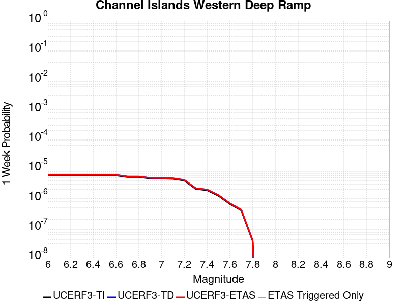 |  |  |  |

| Magnitude | 1 wk TI Prob | 1 wk TD Prob | 1 wk ETAS Prob | 1 wk ETAS/TD Gain | 1 wk ETAS Triggered Only | 1 mo TI Prob | 1 mo TD Prob | 1 mo ETAS Prob | 1 mo ETAS/TD Gain | 1 mo ETAS Triggered Only | 1 yr TI Prob | 1 yr TD Prob | 1 yr ETAS Prob | 1 yr ETAS/TD Gain | 1 yr ETAS Triggered Only | 10 yr TI Prob | 10 yr TD Prob | 10 yr ETAS Prob | 10 yr ETAS/TD Gain | 10 yr ETAS Triggered Only |
|-----|-----|-----|-----|-----|-----|-----|-----|-----|-----|-----|-----|-----|-----|-----|-----|-----|-----|-----|-----|-----|
| 6.0 | 6.0213506E-6 | 6.254862E-6 | 6.254862E-6 | 1.0 | 0.0 | 2.5805533E-5 | 2.6806301E-5 | 2.6806301E-5 | 1.0 | 0.0 | 3.1413708E-4 | 3.263223E-4 | 3.263223E-4 | 1.0 | 0.0 | 0.0031369338 | 0.003258873 | 0.0032688403 | 1.0030586 | 1.0E-5 |
| 6.1 | 6.0213506E-6 | 6.254862E-6 | 6.254862E-6 | 1.0 | 0.0 | 2.5805533E-5 | 2.6806301E-5 | 2.6806301E-5 | 1.0 | 0.0 | 3.1413708E-4 | 3.263223E-4 | 3.263223E-4 | 1.0 | 0.0 | 0.0031369338 | 0.003258873 | 0.0032688403 | 1.0030586 | 1.0E-5 |
| 6.2 | 6.0213506E-6 | 6.254862E-6 | 6.254862E-6 | 1.0 | 0.0 | 2.5805533E-5 | 2.6806301E-5 | 2.6806301E-5 | 1.0 | 0.0 | 3.1413708E-4 | 3.263223E-4 | 3.263223E-4 | 1.0 | 0.0 | 0.0031369338 | 0.003258873 | 0.0032688403 | 1.0030586 | 1.0E-5 |
| 6.3 | 6.0213506E-6 | 6.254862E-6 | 6.254862E-6 | 1.0 | 0.0 | 2.5805533E-5 | 2.6806301E-5 | 2.6806301E-5 | 1.0 | 0.0 | 3.1413708E-4 | 3.263223E-4 | 3.263223E-4 | 1.0 | 0.0 | 0.0031369338 | 0.003258873 | 0.0032688403 | 1.0030586 | 1.0E-5 |
| 6.4 | 6.0213506E-6 | 6.254862E-6 | 6.254862E-6 | 1.0 | 0.0 | 2.5805533E-5 | 2.6806301E-5 | 2.6806301E-5 | 1.0 | 0.0 | 3.1413708E-4 | 3.263223E-4 | 3.263223E-4 | 1.0 | 0.0 | 0.0031369338 | 0.003258873 | 0.0032688403 | 1.0030586 | 1.0E-5 |
| 6.5 | 6.0213506E-6 | 6.254862E-6 | 6.254862E-6 | 1.0 | 0.0 | 2.5805533E-5 | 2.6806301E-5 | 2.6806301E-5 | 1.0 | 0.0 | 3.1413708E-4 | 3.263223E-4 | 3.263223E-4 | 1.0 | 0.0 | 0.0031369338 | 0.003258873 | 0.0032688403 | 1.0030586 | 1.0E-5 |
| 6.6 | 6.0213506E-6 | 6.254862E-6 | 6.254862E-6 | 1.0 | 0.0 | 2.5805533E-5 | 2.6806301E-5 | 2.6806301E-5 | 1.0 | 0.0 | 3.1413708E-4 | 3.263223E-4 | 3.263223E-4 | 1.0 | 0.0 | 0.0031369338 | 0.003258873 | 0.0032688403 | 1.0030586 | 1.0E-5 |
| 6.7 | 5.313309E-6 | 5.5252344E-6 | 5.5252344E-6 | 1.0 | 0.0 | 2.2771126E-5 | 2.3679384E-5 | 2.3679384E-5 | 1.0 | 0.0 | 2.772032E-4 | 2.8826247E-4 | 2.8826247E-4 | 1.0 | 0.0 | 0.0027685766 | 0.0028792885 | 0.0028892597 | 1.003463 | 1.0E-5 |
| 6.8 | 5.313309E-6 | 5.5252344E-6 | 5.5252344E-6 | 1.0 | 0.0 | 2.2771126E-5 | 2.3679384E-5 | 2.3679384E-5 | 1.0 | 0.0 | 2.772032E-4 | 2.8826247E-4 | 2.8826247E-4 | 1.0 | 0.0 | 0.0027685766 | 0.0028792885 | 0.0028892597 | 1.003463 | 1.0E-5 |
| 6.9 | 4.744377E-6 | 4.9394253E-6 | 4.9394253E-6 | 1.0 | 0.0 | 2.0332885E-5 | 2.1168813E-5 | 2.1168813E-5 | 1.0 | 0.0 | 2.4752476E-4 | 2.5770356E-4 | 2.5770356E-4 | 1.0 | 0.0 | 0.0024724922 | 0.0025744147 | 0.002584389 | 1.0038744 | 1.0E-5 |
| 7.0 | 4.722209E-6 | 4.916468E-6 | 4.916468E-6 | 1.0 | 0.0 | 2.0237881E-5 | 2.1070427E-5 | 2.1070427E-5 | 1.0 | 0.0 | 2.4636835E-4 | 2.5650597E-4 | 2.5650597E-4 | 1.0 | 0.0 | 0.002460954 | 0.0025624665 | 0.0025724408 | 1.0038925 | 1.0E-5 |
| 7.1 | 4.611174E-6 | 4.8014035E-6 | 4.8014035E-6 | 1.0 | 0.0 | 1.9762025E-5 | 2.0577303E-5 | 2.0577303E-5 | 1.0 | 0.0 | 2.4057609E-4 | 2.505036E-4 | 2.505036E-4 | 1.0 | 0.0 | 0.002403158 | 0.0025025792 | 0.0025125542 | 1.0039859 | 1.0E-5 |
| 7.2 | 4.043994E-6 | 4.212022E-6 | 4.212022E-6 | 1.0 | 0.0 | 1.7331287E-5 | 1.8051418E-5 | 1.8051418E-5 | 1.0 | 0.0 | 2.10988E-4 | 2.1975742E-4 | 2.1975742E-4 | 1.0 | 0.0 | 0.002107878 | 0.0021957518 | 0.0022057297 | 1.0045443 | 1.0E-5 |
| 7.3 | 2.1233036E-6 | 2.2297845E-6 | 2.2297845E-6 | 1.0 | 0.0 | 9.099841E-6 | 9.5561845E-6 | 9.5561845E-6 | 1.0 | 0.0 | 1.1078493E-4 | 1.1634039E-4 | 1.1634039E-4 | 1.0 | 0.0 | 0.0011072971 | 0.0011628004 | 0.0011727888 | 1.00859 | 1.0E-5 |
| 7.4 | 1.9051884E-6 | 2.0014945E-6 | 2.0014945E-6 | 1.0 | 0.0 | 8.165067E-6 | 8.577806E-6 | 8.577806E-6 | 1.0 | 0.0 | 9.940516E-5 | 1.0442983E-4 | 1.0442983E-4 | 1.0 | 0.0 | 9.93607E-4 | 0.001043813 | 0.0010538024 | 1.0095702 | 1.0E-5 |
| 7.5 | 1.2408497E-6 | 1.3038822E-6 | 1.3038822E-6 | 1.0 | 0.0 | 5.317916E-6 | 5.5880546E-6 | 5.5880546E-6 | 1.0 | 0.0 | 6.4743705E-5 | 6.803246E-5 | 6.803246E-5 | 1.0 | 0.0 | 6.4724847E-4 | 6.801185E-4 | 6.901117E-4 | 1.0146933 | 1.0E-5 |
| 7.6 | 6.5440025E-7 | 6.886708E-7 | 6.886708E-7 | 1.0 | 0.0 | 2.8045695E-6 | 2.951443E-6 | 2.951443E-6 | 1.0 | 0.0 | 3.4145098E-5 | 3.593324E-5 | 3.593324E-5 | 1.0 | 0.0 | 3.4139853E-4 | 3.5927573E-4 | 3.5927573E-4 | 1.0 | 0.0 |
| 7.7 | 3.985963E-7 | 4.193073E-7 | 4.193073E-7 | 1.0 | 0.0 | 1.7082689E-6 | 1.7970301E-6 | 1.7970301E-6 | 1.0 | 0.0 | 2.0797976E-5 | 2.1878634E-5 | 2.1878634E-5 | 1.0 | 0.0 | 2.0796029E-4 | 2.1876597E-4 | 2.1876597E-4 | 1.0 | 0.0 |
| 7.8 | 3.706329E-8 | 3.8591754E-8 | 3.8591754E-8 | 1.0 | 0.0 | 1.5884267E-7 | 1.6539322E-7 | 1.6539322E-7 | 1.0 | 0.0 | 1.9339077E-6 | 2.0136606E-6 | 2.0136606E-6 | 1.0 | 0.0 | 1.933891E-5 | 2.0136436E-5 | 2.0136436E-5 | 1.0 | 0.0 |

## Cleghorn
*[(top)](#table-of-contents)*

| 1 Week | 1 Month | 1 Year | 10 Year |
|-----|-----|-----|-----|
|  |  |  |  |

| Magnitude | 1 wk TI Prob | 1 wk TD Prob | 1 wk ETAS Prob | 1 wk ETAS/TD Gain | 1 wk ETAS Triggered Only | 1 mo TI Prob | 1 mo TD Prob | 1 mo ETAS Prob | 1 mo ETAS/TD Gain | 1 mo ETAS Triggered Only | 1 yr TI Prob | 1 yr TD Prob | 1 yr ETAS Prob | 1 yr ETAS/TD Gain | 1 yr ETAS Triggered Only | 10 yr TI Prob | 10 yr TD Prob | 10 yr ETAS Prob | 10 yr ETAS/TD Gain | 10 yr ETAS Triggered Only |
|-----|-----|-----|-----|-----|-----|-----|-----|-----|-----|-----|-----|-----|-----|-----|-----|-----|-----|-----|-----|-----|
| 6.0 | 7.9267165E-6 | 9.831569E-6 | 9.831569E-6 | 1.0 | 0.0 | 3.39712E-5 | 4.2134674E-5 | 4.2134674E-5 | 1.0 | 0.0 | 4.1352084E-4 | 5.128795E-4 | 5.128795E-4 | 1.0 | 0.0 | 0.004127522 | 0.005132171 | 0.0051421192 | 1.0019385 | 1.0E-5 |
| 6.1 | 7.9267165E-6 | 9.831569E-6 | 9.831569E-6 | 1.0 | 0.0 | 3.39712E-5 | 4.2134674E-5 | 4.2134674E-5 | 1.0 | 0.0 | 4.1352084E-4 | 5.128795E-4 | 5.128795E-4 | 1.0 | 0.0 | 0.004127522 | 0.005132171 | 0.0051421192 | 1.0019385 | 1.0E-5 |
| 6.2 | 7.9267165E-6 | 9.831569E-6 | 9.831569E-6 | 1.0 | 0.0 | 3.39712E-5 | 4.2134674E-5 | 4.2134674E-5 | 1.0 | 0.0 | 4.1352084E-4 | 5.128795E-4 | 5.128795E-4 | 1.0 | 0.0 | 0.004127522 | 0.005132171 | 0.0051421192 | 1.0019385 | 1.0E-5 |
| 6.3 | 7.9267165E-6 | 9.831569E-6 | 9.831569E-6 | 1.0 | 0.0 | 3.39712E-5 | 4.2134674E-5 | 4.2134674E-5 | 1.0 | 0.0 | 4.1352084E-4 | 5.128795E-4 | 5.128795E-4 | 1.0 | 0.0 | 0.004127522 | 0.005132171 | 0.0051421192 | 1.0019385 | 1.0E-5 |
| 6.4 | 4.3445207E-6 | 6.091434E-6 | 6.091434E-6 | 1.0 | 0.0 | 1.8619241E-5 | 2.610589E-5 | 2.610589E-5 | 1.0 | 0.0 | 2.2666567E-4 | 3.1779386E-4 | 3.1779386E-4 | 1.0 | 0.0 | 0.0022643462 | 0.0031876834 | 0.0031876834 | 1.0 | 0.0 |
| 6.5 | 4.3445207E-6 | 6.091434E-6 | 6.091434E-6 | 1.0 | 0.0 | 1.8619241E-5 | 2.610589E-5 | 2.610589E-5 | 1.0 | 0.0 | 2.2666567E-4 | 3.1779386E-4 | 3.1779386E-4 | 1.0 | 0.0 | 0.0022643462 | 0.0031876834 | 0.0031876834 | 1.0 | 0.0 |
| 6.6 | 4.040109E-6 | 5.773842E-6 | 5.773842E-6 | 1.0 | 0.0 | 1.7314638E-5 | 2.4744808E-5 | 2.4744808E-5 | 1.0 | 0.0 | 2.1078532E-4 | 3.0122732E-4 | 3.0122732E-4 | 1.0 | 0.0 | 0.002105855 | 0.0030224733 | 0.0030224733 | 1.0 | 0.0 |
| 6.7 | 3.3632055E-6 | 5.0673398E-6 | 5.0673398E-6 | 1.0 | 0.0 | 1.4413658E-5 | 2.171699E-5 | 2.171699E-5 | 1.0 | 0.0 | 1.7547216E-4 | 2.643726E-4 | 2.643726E-4 | 1.0 | 0.0 | 0.0017533366 | 0.0026548079 | 0.0026548079 | 1.0 | 0.0 |
| 6.8 | 3.2902772E-6 | 4.9892474E-6 | 4.9892474E-6 | 1.0 | 0.0 | 1.4101111E-5 | 2.1382315E-5 | 2.1382315E-5 | 1.0 | 0.0 | 1.716675E-4 | 2.602989E-4 | 2.602989E-4 | 1.0 | 0.0 | 0.0017153495 | 0.0026141668 | 0.0026141668 | 1.0 | 0.0 |
| 6.9 | 3.031547E-6 | 4.69101E-6 | 4.69101E-6 | 1.0 | 0.0 | 1.299228E-5 | 2.0104175E-5 | 2.0104175E-5 | 1.0 | 0.0 | 1.5816953E-4 | 2.447411E-4 | 2.447411E-4 | 1.0 | 0.0 | 0.00158057 | 0.0024589403 | 0.0024589403 | 1.0 | 0.0 |
| 7.0 | 2.8259715E-6 | 4.370579E-6 | 4.370579E-6 | 1.0 | 0.0 | 1.211125E-5 | 1.8730922E-5 | 1.8730922E-5 | 1.0 | 0.0 | 1.4744449E-4 | 2.2802534E-4 | 2.2802534E-4 | 1.0 | 0.0 | 0.001473467 | 0.002292137 | 0.002292137 | 1.0 | 0.0 |
| 7.1 | 2.5962665E-6 | 4.0658E-6 | 4.0658E-6 | 1.0 | 0.0 | 1.1126809E-5 | 1.7424743E-5 | 1.7424743E-5 | 1.0 | 0.0 | 1.3546048E-4 | 2.1212581E-4 | 2.1212581E-4 | 1.0 | 0.0 | 0.0013537793 | 0.0021334658 | 0.0021334658 | 1.0 | 0.0 |
| 7.2 | 2.3247253E-6 | 3.6763556E-6 | 3.6763556E-6 | 1.0 | 0.0 | 9.96307E-6 | 1.5755715E-5 | 1.5755715E-5 | 1.0 | 0.0 | 1.21293626E-4 | 1.9180914E-4 | 1.9180914E-4 | 1.0 | 0.0 | 0.0012122744 | 0.0019306875 | 0.0019306875 | 1.0 | 0.0 |
| 7.3 | 2.056928E-6 | 3.2350797E-6 | 3.2350797E-6 | 1.0 | 0.0 | 8.815376E-6 | 1.3864555E-5 | 1.3864555E-5 | 1.0 | 0.0 | 1.0732192E-4 | 1.6878804E-4 | 1.6878804E-4 | 1.0 | 0.0 | 0.001072701 | 0.0017009112 | 0.0017009112 | 1.0 | 0.0 |
| 7.4 | 1.8055999E-6 | 2.825487E-6 | 2.825487E-6 | 1.0 | 0.0 | 7.738263E-6 | 1.2109174E-5 | 1.2109174E-5 | 1.0 | 0.0 | 9.4209274E-5 | 1.4741936E-4 | 1.4741936E-4 | 1.0 | 0.0 | 9.4169343E-4 | 0.0014876479 | 0.0014876479 | 1.0 | 0.0 |
| 7.5 | 1.4683443E-6 | 2.42473E-6 | 2.42473E-6 | 1.0 | 0.0 | 6.292889E-6 | 1.0391659E-5 | 1.0391659E-5 | 1.0 | 0.0 | 7.661323E-5 | 1.2651121E-4 | 1.2651121E-4 | 1.0 | 0.0 | 7.658682E-4 | 0.0012788613 | 0.0012788613 | 1.0 | 0.0 |
| 7.6 | 9.804088E-7 | 1.9002471E-6 | 1.9002471E-6 | 1.0 | 0.0 | 4.201745E-6 | 8.143891E-6 | 8.143891E-6 | 1.0 | 0.0 | 5.1155046E-5 | 9.914741E-5 | 9.914741E-5 | 1.0 | 0.0 | 5.114327E-4 | 0.0010055363 | 0.0010055363 | 1.0 | 0.0 |
| 7.7 | 7.3434086E-7 | 1.6283949E-6 | 1.6283949E-6 | 1.0 | 0.0 | 3.1471714E-6 | 6.9788166E-6 | 6.9788166E-6 | 1.0 | 0.0 | 3.831614E-5 | 8.496381E-5 | 8.496381E-5 | 1.0 | 0.0 | 3.8309532E-4 | 8.638507E-4 | 8.638507E-4 | 1.0 | 0.0 |
| 7.8 | 6.434184E-7 | 1.521984E-6 | 1.521984E-6 | 1.0 | 0.0 | 2.7575045E-6 | 6.5227723E-6 | 6.5227723E-6 | 1.0 | 0.0 | 3.35721E-5 | 7.941188E-5 | 7.941188E-5 | 1.0 | 0.0 | 3.3567028E-4 | 8.080201E-4 | 8.080201E-4 | 1.0 | 0.0 |
| 7.9 | 3.4943926E-7 | 7.574203E-7 | 7.574203E-7 | 1.0 | 0.0 | 1.497596E-6 | 3.246083E-6 | 3.246083E-6 | 1.0 | 0.0 | 1.8233079E-5 | 3.9520353E-5 | 3.9520353E-5 | 1.0 | 0.0 | 1.8231584E-4 | 4.0402258E-4 | 4.0402258E-4 | 1.0 | 0.0 |
| 8.0 | 6.717524E-8 | 5.8364506E-8 | 5.8364506E-8 | 1.0 | 0.0 | 2.8789387E-7 | 2.5013355E-7 | 2.5013355E-7 | 1.0 | 0.0 | 3.505102E-6 | 3.045372E-6 | 3.045372E-6 | 1.0 | 0.0 | 3.5050467E-5 | 3.2745604E-5 | 3.2745604E-5 | 1.0 | 0.0 |
| 8.1 | 3.1984914E-8 | 1.2946327E-8 | 1.2946327E-8 | 1.0 | 0.0 | 1.370782E-7 | 5.5484257E-8 | 5.5484257E-8 | 1.0 | 0.0 | 1.6689258E-6 | 6.7552065E-7 | 6.7552065E-7 | 1.0 | 0.0 | 1.6689133E-5 | 7.739309E-6 | 7.739309E-6 | 1.0 | 0.0 |
| 8.2 | 1.21887656E-8 | 3.6460996E-9 | 3.6460996E-9 | 1.0 | 0.0 | 5.2237567E-8 | 1.5626142E-8 | 1.5626142E-8 | 1.0 | 0.0 | 6.359922E-7 | 1.9024826E-7 | 1.9024826E-7 | 1.0 | 0.0 | 6.3599036E-6 | 2.2450613E-6 | 2.2450613E-6 | 1.0 | 0.0 |

## Calaveras (No) 2011 CFM
*[(top)](#table-of-contents)*

| 1 Week | 1 Month | 1 Year | 10 Year |
|-----|-----|-----|-----|
|  |  |  | 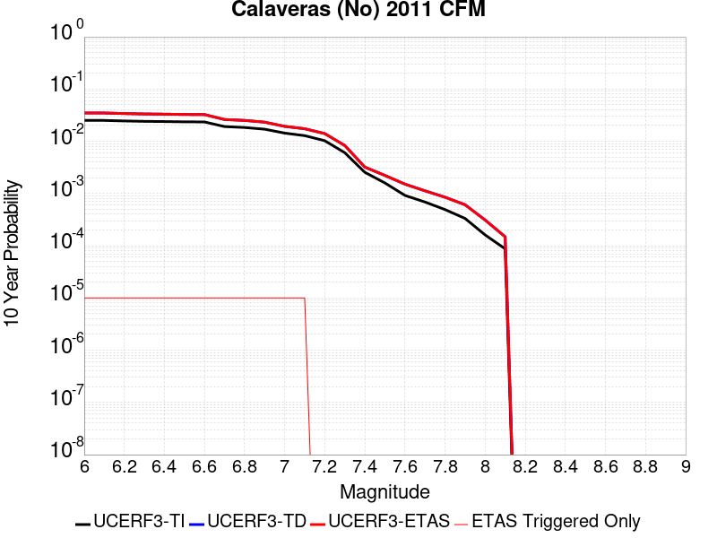 |

| Magnitude | 1 wk TI Prob | 1 wk TD Prob | 1 wk ETAS Prob | 1 wk ETAS/TD Gain | 1 wk ETAS Triggered Only | 1 mo TI Prob | 1 mo TD Prob | 1 mo ETAS Prob | 1 mo ETAS/TD Gain | 1 mo ETAS Triggered Only | 1 yr TI Prob | 1 yr TD Prob | 1 yr ETAS Prob | 1 yr ETAS/TD Gain | 1 yr ETAS Triggered Only | 10 yr TI Prob | 10 yr TD Prob | 10 yr ETAS Prob | 10 yr ETAS/TD Gain | 10 yr ETAS Triggered Only |
|-----|-----|-----|-----|-----|-----|-----|-----|-----|-----|-----|-----|-----|-----|-----|-----|-----|-----|-----|-----|-----|
| 6.0 | 4.8694856E-5 | 6.747414E-5 | 6.747414E-5 | 1.0 | 0.0 | 2.0867554E-4 | 2.891426E-4 | 2.891426E-4 | 1.0 | 0.0 | 0.0025376645 | 0.0035146426 | 0.0035246075 | 1.0028353 | 1.0E-5 | 0.02508881 | 0.034769647 | 0.0347793 | 1.0002776 | 1.0E-5 |
| 6.1 | 4.8694856E-5 | 6.747414E-5 | 6.747414E-5 | 1.0 | 0.0 | 2.0867554E-4 | 2.891426E-4 | 2.891426E-4 | 1.0 | 0.0 | 0.0025376645 | 0.0035146426 | 0.0035246075 | 1.0028353 | 1.0E-5 | 0.02508881 | 0.034769647 | 0.0347793 | 1.0002776 | 1.0E-5 |
| 6.2 | 4.7541962E-5 | 6.58054E-5 | 6.58054E-5 | 1.0 | 0.0 | 2.0373536E-4 | 2.819924E-4 | 2.819924E-4 | 1.0 | 0.0 | 0.0024776561 | 0.0034278852 | 0.003437851 | 1.0029073 | 1.0E-5 | 0.024502134 | 0.033931077 | 0.03394074 | 1.0002847 | 1.0E-5 |
| 6.3 | 4.6717287E-5 | 6.4638996E-5 | 6.4638996E-5 | 1.0 | 0.0 | 2.0020158E-4 | 2.769946E-4 | 2.769946E-4 | 1.0 | 0.0 | 0.0024347296 | 0.0033672366 | 0.003377203 | 1.0029598 | 1.0E-5 | 0.024082264 | 0.033343595 | 0.03335326 | 1.0002899 | 1.0E-5 |
| 6.4 | 4.6276386E-5 | 6.4000655E-5 | 6.4000655E-5 | 1.0 | 0.0 | 1.983123E-4 | 2.742595E-4 | 2.742595E-4 | 1.0 | 0.0 | 0.0024117786 | 0.0033340475 | 0.003344014 | 1.0029894 | 1.0E-5 | 0.02385771 | 0.03302247 | 0.03303214 | 1.0002928 | 1.0E-5 |
| 6.5 | 4.5720994E-5 | 6.3202126E-5 | 6.3202126E-5 | 1.0 | 0.0 | 1.9593239E-4 | 2.7083795E-4 | 2.7083795E-4 | 1.0 | 0.0 | 0.002382867 | 0.0032925264 | 0.0033024934 | 1.0030272 | 1.0E-5 | 0.023574775 | 0.032620437 | 0.032630112 | 1.0002966 | 1.0E-5 |
| 6.6 | 4.549134E-5 | 6.28552E-5 | 6.28552E-5 | 1.0 | 0.0 | 1.949483E-4 | 2.6935144E-4 | 2.6935144E-4 | 1.0 | 0.0 | 0.0023709119 | 0.0032744824 | 0.0032844497 | 1.0030439 | 1.0E-5 | 0.023457756 | 0.032445915 | 0.03245559 | 1.0002983 | 1.0E-5 |
| 6.7 | 3.701047E-5 | 5.0360202E-5 | 5.0360202E-5 | 1.0 | 0.0 | 1.5860666E-4 | 2.1581183E-4 | 2.1581183E-4 | 1.0 | 0.0 | 0.0019293258 | 0.0026243862 | 0.00263436 | 1.0038004 | 1.0E-5 | 0.019126613 | 0.026123768 | 0.026133506 | 1.0003728 | 1.0E-5 |
| 6.8 | 3.5523568E-5 | 4.8341764E-5 | 4.8341764E-5 | 1.0 | 0.0 | 1.5223498E-4 | 2.0716278E-4 | 2.0716278E-4 | 1.0 | 0.0 | 0.0018518851 | 0.0025193326 | 0.0025293073 | 1.0039593 | 1.0E-5 | 0.018365284 | 0.025096131 | 0.02510588 | 1.0003885 | 1.0E-5 |
| 6.9 | 3.2946147E-5 | 4.4663368E-5 | 4.4663368E-5 | 1.0 | 0.0 | 1.4119013E-4 | 1.9140063E-4 | 1.9140063E-4 | 1.0 | 0.0 | 0.0017176344 | 0.0023278543 | 0.002337831 | 1.0042858 | 1.0E-5 | 0.017044188 | 0.02321826 | 0.023228027 | 1.0004207 | 1.0E-5 |
| 7.0 | 2.7682381E-5 | 3.7022768E-5 | 3.7022768E-5 | 1.0 | 0.0 | 1.1863338E-4 | 1.5865952E-4 | 1.5865952E-4 | 1.0 | 0.0 | 0.0014434044 | 0.0019299983 | 0.001939979 | 1.0051713 | 1.0E-5 | 0.01434065 | 0.019309688 | 0.019319495 | 1.0005078 | 1.0E-5 |
| 7.1 | 2.471967E-5 | 3.3287153E-5 | 3.3287153E-5 | 1.0 | 0.0 | 1.05937135E-4 | 1.426516E-4 | 1.426516E-4 | 1.0 | 0.0 | 0.0012890215 | 0.0017354285 | 0.0017454111 | 1.0057523 | 1.0E-5 | 0.0128157 | 0.017384807 | 0.017394632 | 1.0005652 | 1.0E-5 |
| 7.2 | 1.9748062E-5 | 2.6775053E-5 | 2.6775053E-5 | 1.0 | 0.0 | 8.463181E-5 | 1.14745315E-4 | 1.14745315E-4 | 1.0 | 0.0 | 0.0010299052 | 0.0013961523 | 0.0013961523 | 1.0 | 0.0 | 0.01025145 | 0.014029876 | 0.014029876 | 1.0 | 0.0 |
| 7.3 | 1.1603734E-5 | 1.5783939E-5 | 1.5783939E-5 | 1.0 | 0.0 | 4.9729337E-5 | 6.764378E-5 | 6.764378E-5 | 1.0 | 0.0 | 6.052865E-4 | 8.2326605E-4 | 8.2326605E-4 | 1.0 | 0.0 | 0.0060364045 | 0.008308387 | 0.008308387 | 1.0 | 0.0 |
| 7.4 | 4.885381E-6 | 6.03485E-6 | 6.03485E-6 | 1.0 | 0.0 | 2.0937177E-5 | 2.5863386E-5 | 2.5863386E-5 | 1.0 | 0.0 | 2.5488032E-4 | 3.148414E-4 | 3.148414E-4 | 1.0 | 0.0 | 0.0025458818 | 0.0032008204 | 0.0032008204 | 1.0 | 0.0 |
| 7.5 | 3.0571264E-6 | 4.155152E-6 | 4.155152E-6 | 1.0 | 0.0 | 1.3101904E-5 | 1.7807673E-5 | 1.7807673E-5 | 1.0 | 0.0 | 1.5950401E-4 | 2.1678694E-4 | 2.1678694E-4 | 1.0 | 0.0 | 0.0015938957 | 0.0022207722 | 0.0022207722 | 1.0 | 0.0 |
| 7.6 | 1.764948E-6 | 2.7953924E-6 | 2.7953924E-6 | 1.0 | 0.0 | 7.564041E-6 | 1.1980199E-5 | 1.1980199E-5 | 1.0 | 0.0 | 9.208831E-5 | 1.4584923E-4 | 1.4584923E-4 | 1.0 | 0.0 | 9.205016E-4 | 0.0015122582 | 0.0015122582 | 1.0 | 0.0 |
| 7.7 | 1.3173734E-6 | 2.0583066E-6 | 2.0583066E-6 | 1.0 | 0.0 | 5.645874E-6 | 8.821285E-6 | 8.821285E-6 | 1.0 | 0.0 | 6.873634E-5 | 1.0739387E-4 | 1.0739387E-4 | 1.0 | 0.0 | 6.8715087E-4 | 0.0011260441 | 0.0011260441 | 1.0 | 0.0 |
| 7.8 | 9.4429885E-7 | 1.5488399E-6 | 1.5488399E-6 | 1.0 | 0.0 | 4.0469886E-6 | 6.6378684E-6 | 6.6378684E-6 | 1.0 | 0.0 | 4.9270973E-5 | 8.0813064E-5 | 8.0813064E-5 | 1.0 | 0.0 | 4.926005E-4 | 8.5009943E-4 | 8.5009943E-4 | 1.0 | 0.0 |
| 7.9 | 6.388233E-7 | 1.1148048E-6 | 1.1148048E-6 | 1.0 | 0.0 | 2.7378112E-6 | 4.777726E-6 | 4.777726E-6 | 1.0 | 0.0 | 3.3332344E-5 | 5.8167276E-5 | 5.8167276E-5 | 1.0 | 0.0 | 3.3327343E-4 | 6.0958765E-4 | 6.0958765E-4 | 1.0 | 0.0 |
| 8.0 | 3.087986E-7 | 5.7541615E-7 | 5.7541615E-7 | 1.0 | 0.0 | 1.323422E-6 | 2.4660667E-6 | 2.4660667E-6 | 1.0 | 0.0 | 1.6112543E-5 | 3.0023954E-5 | 3.0023954E-5 | 1.0 | 0.0 | 1.6111376E-4 | 3.1098578E-4 | 3.1098578E-4 | 1.0 | 0.0 |
| 8.1 | 1.6725647E-7 | 2.740806E-7 | 2.740806E-7 | 1.0 | 0.0 | 7.168133E-7 | 1.1746306E-6 | 1.1746306E-6 | 1.0 | 0.0 | 8.7271665E-6 | 1.4301037E-5 | 1.4301037E-5 | 1.0 | 0.0 | 8.726824E-5 | 1.4845267E-4 | 1.4845267E-4 | 1.0 | 0.0 |

## Brawley (Seismic Zone) alt 1
*[(top)](#table-of-contents)*

| 1 Week | 1 Month | 1 Year | 10 Year |
|-----|-----|-----|-----|
|  |  |  |  |

| Magnitude | 1 wk TI Prob | 1 wk TD Prob | 1 wk ETAS Prob | 1 wk ETAS/TD Gain | 1 wk ETAS Triggered Only | 1 mo TI Prob | 1 mo TD Prob | 1 mo ETAS Prob | 1 mo ETAS/TD Gain | 1 mo ETAS Triggered Only | 1 yr TI Prob | 1 yr TD Prob | 1 yr ETAS Prob | 1 yr ETAS/TD Gain | 1 yr ETAS Triggered Only | 10 yr TI Prob | 10 yr TD Prob | 10 yr ETAS Prob | 10 yr ETAS/TD Gain | 10 yr ETAS Triggered Only |
|-----|-----|-----|-----|-----|-----|-----|-----|-----|-----|-----|-----|-----|-----|-----|-----|-----|-----|-----|-----|-----|
| 6.0 | 2.2521618E-4 | 4.762709E-4 | 4.8626616E-4 | 1.0209864 | 1.0E-5 | 9.6485513E-4 | 0.0020396016 | 0.0020495811 | 1.004893 | 1.0E-5 | 0.011683988 | 0.024541805 | 0.02455156 | 1.0003974 | 1.0E-5 | 0.11088423 | 0.21347821 | 0.21348606 | 1.0000368 | 1.0E-5 |
| 6.1 | 2.2521618E-4 | 4.762709E-4 | 4.8626616E-4 | 1.0209864 | 1.0E-5 | 9.6485513E-4 | 0.0020396016 | 0.0020495811 | 1.004893 | 1.0E-5 | 0.011683988 | 0.024541805 | 0.02455156 | 1.0003974 | 1.0E-5 | 0.11088423 | 0.21347821 | 0.21348606 | 1.0000368 | 1.0E-5 |
| 6.2 | 2.198148E-4 | 4.6711712E-4 | 4.7711245E-4 | 1.021398 | 1.0E-5 | 9.417233E-4 | 0.0020004313 | 0.0020104114 | 1.0049889 | 1.0E-5 | 0.011405343 | 0.024076113 | 0.024085872 | 1.0004053 | 1.0E-5 | 0.10837428 | 0.20991476 | 0.20992267 | 1.0000377 | 1.0E-5 |
| 6.3 | 2.1704129E-4 | 4.6147394E-4 | 4.7146934E-4 | 1.0216597 | 1.0E-5 | 9.298453E-4 | 0.001976283 | 0.0019862633 | 1.0050501 | 1.0E-5 | 0.011262234 | 0.023789674 | 0.023799436 | 1.0004103 | 1.0E-5 | 0.107082725 | 0.20780581 | 0.20781374 | 1.0000381 | 1.0E-5 |
| 6.4 | 1.876142E-4 | 4.0039537E-4 | 4.1039137E-4 | 1.0249653 | 1.0E-5 | 8.038131E-4 | 0.001714866 | 0.0017248489 | 1.0058213 | 1.0E-5 | 0.00974259 | 0.020675711 | 0.020685505 | 1.0004736 | 1.0E-5 | 0.093263686 | 0.18455538 | 0.18456353 | 1.0000442 | 1.0E-5 |
| 6.5 | 1.7390939E-4 | 3.747172E-4 | 3.8471346E-4 | 1.0266768 | 1.0E-5 | 7.45113E-4 | 0.0016049546 | 0.0016149386 | 1.0062207 | 1.0E-5 | 0.009034078 | 0.01936447 | 0.019374277 | 1.0005064 | 1.0E-5 | 0.086755216 | 0.17437775 | 0.17438601 | 1.0000473 | 1.0E-5 |
| 6.6 | 1.591791E-4 | 3.4886636E-4 | 3.5886286E-4 | 1.0286542 | 1.0E-5 | 6.8201777E-4 | 0.0014942948 | 0.0015042799 | 1.0066822 | 1.0E-5 | 0.008271996 | 0.018041687 | 0.018051507 | 1.0005443 | 1.0E-5 | 0.07970774 | 0.16378574 | 0.1637941 | 1.000051 | 1.0E-5 |
| 6.7 | 1.4268003E-4 | 3.2052814E-4 | 3.3052496E-4 | 1.0311885 | 1.0E-5 | 6.1134255E-4 | 0.001372977 | 0.0013829634 | 1.0072734 | 1.0E-5 | 0.007417723 | 0.016588448 | 0.016598282 | 1.0005928 | 1.0E-5 | 0.07174956 | 0.15191332 | 0.1519218 | 1.0000558 | 1.0E-5 |
| 6.8 | 1.239713E-4 | 2.9048265E-4 | 2.9048265E-4 | 1.0 | 0.0 | 5.3119735E-4 | 0.0012443379 | 0.0012443379 | 1.0 | 0.0 | 0.0064481674 | 0.015046005 | 0.015046005 | 1.0 | 0.0 | 0.06264243 | 0.13835827 | 0.13835827 | 1.0 | 0.0 |
| 6.9 | 1.0180238E-4 | 2.624914E-4 | 2.624914E-4 | 1.0 | 0.0 | 4.3622297E-4 | 0.0011244824 | 0.0011244824 | 1.0 | 0.0 | 0.005298089 | 0.013605632 | 0.013605632 | 1.0 | 0.0 | 0.05173543 | 0.124942064 | 0.124942064 | 1.0 | 0.0 |
| 7.0 | 7.6619996E-5 | 2.2394217E-4 | 2.2394217E-4 | 1.0 | 0.0 | 3.283301E-4 | 9.594023E-4 | 9.594023E-4 | 1.0 | 0.0 | 0.0039900932 | 0.011618873 | 0.011618873 | 1.0 | 0.0 | 0.039192066 | 0.10724666 | 0.10724666 | 1.0 | 0.0 |
| 7.1 | 7.5127435E-5 | 2.207738E-4 | 2.207738E-4 | 1.0 | 0.0 | 3.2193496E-4 | 9.458335E-4 | 9.458335E-4 | 1.0 | 0.0 | 0.0039125155 | 0.011455421 | 0.011455421 | 1.0 | 0.0 | 0.038443442 | 0.10581073 | 0.10581073 | 1.0 | 0.0 |
| 7.2 | 6.788582E-5 | 2.0205107E-4 | 2.0205107E-4 | 1.0 | 0.0 | 2.9090676E-4 | 8.6564885E-4 | 8.6564885E-4 | 1.0 | 0.0 | 0.0035360386 | 0.010488983 | 0.010488983 | 1.0 | 0.0 | 0.034803 | 0.0974804 | 0.0974804 | 1.0 | 0.0 |
| 7.3 | 6.399602E-5 | 1.883617E-4 | 1.883617E-4 | 1.0 | 0.0 | 2.7423984E-4 | 8.070175E-4 | 8.070175E-4 | 1.0 | 0.0 | 0.0033337586 | 0.009781763 | 0.009781763 | 1.0 | 0.0 | 0.03284188 | 0.091375224 | 0.091375224 | 1.0 | 0.0 |
| 7.4 | 4.506759E-5 | 1.2527342E-4 | 1.2527342E-4 | 1.0 | 0.0 | 1.9313251E-4 | 5.367765E-4 | 5.367765E-4 | 1.0 | 0.0 | 0.0023488526 | 0.006515845 | 0.006515845 | 1.0 | 0.0 | 0.023241805 | 0.062353857 | 0.062353857 | 1.0 | 0.0 |
| 7.5 | 3.43289E-5 | 9.335652E-5 | 9.335652E-5 | 1.0 | 0.0 | 1.4711556E-4 | 4.0003832E-4 | 4.0003832E-4 | 1.0 | 0.0 | 0.0017896603 | 0.004859652 | 0.004859652 | 1.0 | 0.0 | 0.01775316 | 0.047055803 | 0.047055803 | 1.0 | 0.0 |
| 7.6 | 2.5980507E-5 | 7.053283E-5 | 7.053283E-5 | 1.0 | 0.0 | 1.1134028E-4 | 3.0224866E-4 | 3.0224866E-4 | 1.0 | 0.0 | 0.001354725 | 0.0036736925 | 0.0036736925 | 1.0 | 0.0 | 0.013464959 | 0.03584153 | 0.03584153 | 1.0 | 0.0 |
| 7.7 | 1.7292105E-5 | 4.940868E-5 | 4.940868E-5 | 1.0 | 0.0 | 7.4106916E-5 | 2.1173434E-4 | 2.1173434E-4 | 1.0 | 0.0 | 9.018782E-4 | 0.0025748238 | 0.0025748238 | 1.0 | 0.0 | 0.008982267 | 0.025291234 | 0.025291234 | 1.0 | 0.0 |
| 7.8 | 1.2927471E-5 | 3.9694296E-5 | 3.9694296E-5 | 1.0 | 0.0 | 5.5402274E-5 | 1.7010733E-4 | 1.7010733E-4 | 1.0 | 0.0 | 6.743139E-4 | 0.0020690921 | 0.0020690921 | 1.0 | 0.0 | 0.0067227143 | 0.020432515 | 0.020432515 | 1.0 | 0.0 |
| 7.9 | 1.0200774E-5 | 2.8746123E-5 | 2.8746123E-5 | 1.0 | 0.0 | 4.371687E-5 | 1.2319186E-4 | 1.2319186E-4 | 1.0 | 0.0 | 5.321229E-4 | 0.00149883 | 0.00149883 | 1.0 | 0.0 | 0.005308505 | 0.014992237 | 0.014992237 | 1.0 | 0.0 |
| 8.0 | 8.650396E-6 | 2.3277493E-5 | 2.3277493E-5 | 1.0 | 0.0 | 3.70726E-5 | 9.975687E-5 | 9.975687E-5 | 1.0 | 0.0 | 4.5126543E-4 | 0.0012138641 | 0.0012138641 | 1.0 | 0.0 | 0.0045035016 | 0.012211572 | 0.012211572 | 1.0 | 0.0 |
| 8.1 | 3.9368224E-6 | 7.3274655E-6 | 7.3274655E-6 | 1.0 | 0.0 | 1.6871985E-5 | 3.1403044E-5 | 3.1403044E-5 | 1.0 | 0.0 | 2.0539707E-4 | 3.8226513E-4 | 3.8226513E-4 | 1.0 | 0.0 | 0.0020520731 | 0.004001267 | 0.004001267 | 1.0 | 0.0 |
| 8.2 | 1.7101195E-6 | 2.2174895E-6 | 2.2174895E-6 | 1.0 | 0.0 | 7.329063E-6 | 9.503492E-6 | 9.503492E-6 | 1.0 | 0.0 | 8.922769E-5 | 1.156989E-4 | 1.156989E-4 | 1.0 | 0.0 | 8.9191867E-4 | 0.0012665318 | 0.0012665318 | 1.0 | 0.0 |
| 8.3 | 3.0346666E-8 | 1.720686E-8 | 1.720686E-8 | 1.0 | 0.0 | 1.3005713E-7 | 7.3743685E-8 | 7.3743685E-8 | 1.0 | 0.0 | 1.5834444E-6 | 8.9782924E-7 | 8.9782924E-7 | 1.0 | 0.0 | 1.5834332E-5 | 9.364711E-6 | 9.364711E-6 | 1.0 | 0.0 |

## Sargent 2011 CFM
*[(top)](#table-of-contents)*

| 1 Week | 1 Month | 1 Year | 10 Year |
|-----|-----|-----|-----|
|  |  |  |  |

| Magnitude | 1 wk TI Prob | 1 wk TD Prob | 1 wk ETAS Prob | 1 wk ETAS/TD Gain | 1 wk ETAS Triggered Only | 1 mo TI Prob | 1 mo TD Prob | 1 mo ETAS Prob | 1 mo ETAS/TD Gain | 1 mo ETAS Triggered Only | 1 yr TI Prob | 1 yr TD Prob | 1 yr ETAS Prob | 1 yr ETAS/TD Gain | 1 yr ETAS Triggered Only | 10 yr TI Prob | 10 yr TD Prob | 10 yr ETAS Prob | 10 yr ETAS/TD Gain | 10 yr ETAS Triggered Only |
|-----|-----|-----|-----|-----|-----|-----|-----|-----|-----|-----|-----|-----|-----|-----|-----|-----|-----|-----|-----|-----|
| 6.0 | 3.7327867E-5 | 3.6650294E-5 | 3.6650294E-5 | 1.0 | 0.0 | 1.5996677E-4 | 1.5706579E-4 | 1.5706579E-4 | 1.0 | 0.0 | 0.0019458556 | 0.0019110088 | 0.0019110088 | 1.0 | 0.0 | 0.01928905 | 0.01901777 | 0.01902758 | 1.0005158 | 1.0E-5 |
| 6.1 | 2.3771476E-5 | 1.8478533E-5 | 1.8478533E-5 | 1.0 | 0.0 | 1.01873775E-4 | 7.919181E-5 | 7.919181E-5 | 1.0 | 0.0 | 0.0012396075 | 9.638141E-4 | 9.638141E-4 | 1.0 | 0.0 | 0.012327154 | 0.009635755 | 0.009635755 | 1.0 | 0.0 |
| 6.2 | 2.3112721E-5 | 1.7709895E-5 | 1.7709895E-5 | 1.0 | 0.0 | 9.9050754E-5 | 7.5897835E-5 | 7.5897835E-5 | 1.0 | 0.0 | 0.0012052758 | 9.2374417E-4 | 9.2374417E-4 | 1.0 | 0.0 | 0.011987597 | 0.009238408 | 0.009238408 | 1.0 | 0.0 |
| 6.3 | 1.728509E-5 | 1.0458374E-5 | 1.0458374E-5 | 1.0 | 0.0 | 7.407686E-5 | 4.4821103E-5 | 4.4821103E-5 | 1.0 | 0.0 | 9.015125E-4 | 5.4560637E-4 | 5.4560637E-4 | 1.0 | 0.0 | 0.008978641 | 0.0054787886 | 0.0054787886 | 1.0 | 0.0 |
| 6.4 | 1.48395575E-5 | 7.4554596E-6 | 7.4554596E-6 | 1.0 | 0.0 | 6.3596555E-5 | 3.1951793E-5 | 3.1951793E-5 | 1.0 | 0.0 | 7.7401294E-4 | 3.8898113E-4 | 3.8898113E-4 | 1.0 | 0.0 | 0.0077132257 | 0.003918337 | 0.003918337 | 1.0 | 0.0 |
| 6.5 | 1.4358964E-5 | 6.894238E-6 | 6.894238E-6 | 1.0 | 0.0 | 6.1536964E-5 | 2.9546614E-5 | 2.9546614E-5 | 1.0 | 0.0 | 7.48955E-4 | 3.59708E-4 | 3.59708E-4 | 1.0 | 0.0 | 0.0074643586 | 0.0036265873 | 0.0036265873 | 1.0 | 0.0 |
| 6.6 | 9.772591E-6 | 1.3731498E-6 | 1.3731498E-6 | 1.0 | 0.0 | 4.188186E-5 | 5.8849146E-6 | 5.8849146E-6 | 1.0 | 0.0 | 5.097923E-4 | 7.164651E-5 | 7.164651E-5 | 1.0 | 0.0 | 0.005086244 | 7.479908E-4 | 7.479908E-4 | 1.0 | 0.0 |
| 6.7 | 9.752745E-6 | 1.3518411E-6 | 1.3518411E-6 | 1.0 | 0.0 | 4.179681E-5 | 5.793592E-6 | 5.793592E-6 | 1.0 | 0.0 | 5.0875737E-4 | 7.0534734E-5 | 7.0534734E-5 | 1.0 | 0.0 | 0.005075942 | 7.3688047E-4 | 7.3688047E-4 | 1.0 | 0.0 |
| 6.8 | 9.608213E-6 | 1.2357095E-6 | 1.2357095E-6 | 1.0 | 0.0 | 4.1177405E-5 | 5.295887E-6 | 5.295887E-6 | 1.0 | 0.0 | 5.012196E-4 | 6.447554E-5 | 6.447554E-5 | 1.0 | 0.0 | 0.005000906 | 6.760226E-4 | 6.760226E-4 | 1.0 | 0.0 |
| 6.9 | 9.427164E-6 | 1.1204963E-6 | 1.1204963E-6 | 1.0 | 0.0 | 4.04015E-5 | 4.8021184E-6 | 4.8021184E-6 | 1.0 | 0.0 | 4.9177726E-4 | 5.846424E-5 | 5.846424E-5 | 1.0 | 0.0 | 0.004906904 | 6.1528065E-4 | 6.1528065E-4 | 1.0 | 0.0 |
| 7.0 | 9.247601E-6 | 9.869595E-7 | 9.869595E-7 | 1.0 | 0.0 | 3.9631974E-5 | 4.2298198E-6 | 4.2298198E-6 | 1.0 | 0.0 | 4.8241246E-4 | 5.1496856E-5 | 5.1496856E-5 | 1.0 | 0.0 | 0.0048136655 | 5.4514117E-4 | 5.4514117E-4 | 1.0 | 0.0 |
| 7.1 | 8.995454E-6 | 8.2668413E-7 | 8.2668413E-7 | 1.0 | 0.0 | 3.8551374E-5 | 3.5429273E-6 | 3.5429273E-6 | 1.0 | 0.0 | 4.6926187E-4 | 4.31343E-5 | 4.31343E-5 | 1.0 | 0.0 | 0.004682722 | 4.6062793E-4 | 4.6062793E-4 | 1.0 | 0.0 |
| 7.2 | 8.520861E-6 | 5.27254E-7 | 5.27254E-7 | 1.0 | 0.0 | 3.6517464E-5 | 2.259658E-6 | 2.259658E-6 | 1.0 | 0.0 | 4.445094E-4 | 2.7510994E-5 | 2.7510994E-5 | 1.0 | 0.0 | 0.004436213 | 3.0270332E-4 | 3.0270332E-4 | 1.0 | 0.0 |
| 7.3 | 8.043592E-6 | 3.4526295E-7 | 3.4526295E-7 | 1.0 | 0.0 | 3.4472083E-5 | 1.4796975E-6 | 1.4796975E-6 | 1.0 | 0.0 | 4.196168E-4 | 1.801517E-5 | 1.801517E-5 | 1.0 | 0.0 | 0.004188253 | 2.0644169E-4 | 2.0644169E-4 | 1.0 | 0.0 |
| 7.4 | 7.662316E-6 | 2.9253502E-7 | 2.9253502E-7 | 1.0 | 0.0 | 3.2838085E-5 | 1.2537209E-6 | 1.2537209E-6 | 1.0 | 0.0 | 3.9973034E-4 | 1.5263946E-5 | 1.5263946E-5 | 1.0 | 0.0 | 0.0039901207 | 1.771262E-4 | 1.771262E-4 | 1.0 | 0.0 |
| 7.5 | 6.961638E-6 | 2.35441E-7 | 2.35441E-7 | 1.0 | 0.0 | 2.9835252E-5 | 1.0090324E-6 | 1.0090324E-6 | 1.0 | 0.0 | 3.6318362E-4 | 1.22849015E-5 | 1.22849015E-5 | 1.0 | 0.0 | 0.0036259065 | 1.4389443E-4 | 1.4389443E-4 | 1.0 | 0.0 |
| 7.6 | 6.282332E-6 | 1.686803E-7 | 1.686803E-7 | 1.0 | 0.0 | 2.6924003E-5 | 7.229154E-7 | 7.229154E-7 | 1.0 | 0.0 | 3.2775043E-4 | 8.80146E-6 | 8.80146E-6 | 1.0 | 0.0 | 0.0032726745 | 1.0489305E-4 | 1.0489305E-4 | 1.0 | 0.0 |
| 7.7 | 4.934408E-6 | 4.990377E-8 | 4.990377E-8 | 1.0 | 0.0 | 2.114729E-5 | 2.1387328E-7 | 2.1387328E-7 | 1.0 | 0.0 | 2.5743784E-4 | 2.603904E-6 | 2.603904E-6 | 1.0 | 0.0 | 0.0025713982 | 3.2470278E-5 | 3.2470278E-5 | 1.0 | 0.0 |
| 7.8 | 2.373212E-6 | 3.5088753E-8 | 3.5088753E-8 | 1.0 | 0.0 | 1.0170869E-5 | 1.5038036E-7 | 1.5038036E-7 | 1.0 | 0.0 | 1.238233E-4 | 1.8308793E-6 | 1.8308793E-6 | 1.0 | 0.0 | 0.0012375432 | 2.4066496E-5 | 2.4066496E-5 | 1.0 | 0.0 |
| 7.9 | 1.8227792E-6 | 3.054529E-8 | 3.054529E-8 | 1.0 | 0.0 | 7.811887E-6 | 1.3090839E-7 | 1.3090839E-7 | 1.0 | 0.0 | 9.510558E-5 | 1.5938085E-6 | 1.5938085E-6 | 1.0 | 0.0 | 9.5064886E-4 | 2.1358937E-5 | 2.1358937E-5 | 1.0 | 0.0 |
| 8.0 | 1.9095137E-7 | 1.3247256E-8 | 1.3247256E-8 | 1.0 | 0.0 | 8.1836276E-7 | 5.6773953E-8 | 5.6773953E-8 | 1.0 | 0.0 | 9.963521E-6 | 6.912227E-7 | 6.912227E-7 | 1.0 | 0.0 | 9.963074E-5 | 8.453408E-6 | 8.453408E-6 | 1.0 | 0.0 |

## Sierra Madre
*[(top)](#table-of-contents)*

| 1 Week | 1 Month | 1 Year | 10 Year |
|-----|-----|-----|-----|
|  |  |  |  |

| Magnitude | 1 wk TI Prob | 1 wk TD Prob | 1 wk ETAS Prob | 1 wk ETAS/TD Gain | 1 wk ETAS Triggered Only | 1 mo TI Prob | 1 mo TD Prob | 1 mo ETAS Prob | 1 mo ETAS/TD Gain | 1 mo ETAS Triggered Only | 1 yr TI Prob | 1 yr TD Prob | 1 yr ETAS Prob | 1 yr ETAS/TD Gain | 1 yr ETAS Triggered Only | 10 yr TI Prob | 10 yr TD Prob | 10 yr ETAS Prob | 10 yr ETAS/TD Gain | 10 yr ETAS Triggered Only |
|-----|-----|-----|-----|-----|-----|-----|-----|-----|-----|-----|-----|-----|-----|-----|-----|-----|-----|-----|-----|-----|
| 6.0 | 1.3379373E-5 | 1.1000711E-5 | 1.1000711E-5 | 1.0 | 0.0 | 5.7338908E-5 | 4.7145062E-5 | 4.7145062E-5 | 1.0 | 0.0 | 6.978776E-4 | 5.7384145E-4 | 5.838357E-4 | 1.0174164 | 1.0E-5 | 0.0069569005 | 0.0057238117 | 0.005733754 | 1.0017371 | 1.0E-5 |
| 6.1 | 1.3379373E-5 | 1.1000711E-5 | 1.1000711E-5 | 1.0 | 0.0 | 5.7338908E-5 | 4.7145062E-5 | 4.7145062E-5 | 1.0 | 0.0 | 6.978776E-4 | 5.7384145E-4 | 5.838357E-4 | 1.0174164 | 1.0E-5 | 0.0069569005 | 0.0057238117 | 0.005733754 | 1.0017371 | 1.0E-5 |
| 6.2 | 1.3379373E-5 | 1.1000711E-5 | 1.1000711E-5 | 1.0 | 0.0 | 5.7338908E-5 | 4.7145062E-5 | 4.7145062E-5 | 1.0 | 0.0 | 6.978776E-4 | 5.7384145E-4 | 5.838357E-4 | 1.0174164 | 1.0E-5 | 0.0069569005 | 0.0057238117 | 0.005733754 | 1.0017371 | 1.0E-5 |
| 6.3 | 1.3379373E-5 | 1.1000711E-5 | 1.1000711E-5 | 1.0 | 0.0 | 5.7338908E-5 | 4.7145062E-5 | 4.7145062E-5 | 1.0 | 0.0 | 6.978776E-4 | 5.7384145E-4 | 5.838357E-4 | 1.0174164 | 1.0E-5 | 0.0069569005 | 0.0057238117 | 0.005733754 | 1.0017371 | 1.0E-5 |
| 6.4 | 1.3379373E-5 | 1.1000711E-5 | 1.1000711E-5 | 1.0 | 0.0 | 5.7338908E-5 | 4.7145062E-5 | 4.7145062E-5 | 1.0 | 0.0 | 6.978776E-4 | 5.7384145E-4 | 5.838357E-4 | 1.0174164 | 1.0E-5 | 0.0069569005 | 0.0057238117 | 0.005733754 | 1.0017371 | 1.0E-5 |
| 6.5 | 1.26563245E-5 | 1.0230168E-5 | 1.0230168E-5 | 1.0 | 0.0 | 5.4240263E-5 | 4.3842847E-5 | 4.3842847E-5 | 1.0 | 0.0 | 6.601751E-4 | 5.3365703E-4 | 5.436517E-4 | 1.0187286 | 1.0E-5 | 0.006582173 | 0.0053239274 | 0.0053338744 | 1.0018684 | 1.0E-5 |
| 6.6 | 1.26563245E-5 | 1.0230168E-5 | 1.0230168E-5 | 1.0 | 0.0 | 5.4240263E-5 | 4.3842847E-5 | 4.3842847E-5 | 1.0 | 0.0 | 6.601751E-4 | 5.3365703E-4 | 5.436517E-4 | 1.0187286 | 1.0E-5 | 0.006582173 | 0.0053239274 | 0.0053338744 | 1.0018684 | 1.0E-5 |
| 6.7 | 1.2502474E-5 | 1.0066313E-5 | 1.0066313E-5 | 1.0 | 0.0 | 5.3580934E-5 | 4.3140633E-5 | 4.3140633E-5 | 1.0 | 0.0 | 6.521526E-4 | 5.251117E-4 | 5.3510646E-4 | 1.0190336 | 1.0E-5 | 0.0065024206 | 0.005238879 | 0.0052488265 | 1.0018988 | 1.0E-5 |
| 6.8 | 1.2454966E-5 | 1.0018598E-5 | 1.0018598E-5 | 1.0 | 0.0 | 5.3377335E-5 | 4.293615E-5 | 4.293615E-5 | 1.0 | 0.0 | 6.4967526E-4 | 5.226233E-4 | 5.326181E-4 | 1.0191243 | 1.0E-5 | 0.006477792 | 0.005214112 | 0.00522406 | 1.0019078 | 1.0E-5 |
| 6.9 | 1.2225574E-5 | 9.792576E-6 | 9.792576E-6 | 1.0 | 0.0 | 5.2394265E-5 | 4.1967513E-5 | 4.1967513E-5 | 1.0 | 0.0 | 6.3771347E-4 | 5.108357E-4 | 5.208306E-4 | 1.0195658 | 1.0E-5 | 0.006358865 | 0.0050967815 | 0.0051067304 | 1.001952 | 1.0E-5 |
| 7.0 | 1.182946E-5 | 9.3991175E-6 | 9.3991175E-6 | 1.0 | 0.0 | 5.06967E-5 | 4.0281317E-5 | 4.0281317E-5 | 1.0 | 0.0 | 6.1705755E-4 | 4.9031567E-4 | 5.003108E-4 | 1.020385 | 1.0E-5 | 0.006153469 | 0.004892501 | 0.004902452 | 1.002034 | 1.0E-5 |
| 7.1 | 1.14369095E-5 | 8.986133E-6 | 8.986133E-6 | 1.0 | 0.0 | 4.9014405E-5 | 3.8511436E-5 | 3.8511436E-5 | 1.0 | 0.0 | 5.9658696E-4 | 4.6877685E-4 | 4.7877216E-4 | 1.0213221 | 1.0E-5 | 0.005949879 | 0.004678036 | 0.0046879896 | 1.0021276 | 1.0E-5 |
| 7.2 | 1.0836419E-5 | 8.39953E-6 | 8.39953E-6 | 1.0 | 0.0 | 4.644097E-5 | 3.5997495E-5 | 3.5997495E-5 | 1.0 | 0.0 | 5.652721E-4 | 4.3818227E-4 | 4.481779E-4 | 1.0228115 | 1.0E-5 | 0.0056383642 | 0.0043733306 | 0.004383287 | 1.0022765 | 1.0E-5 |
| 7.3 | 1.0403439E-5 | 8.020796E-6 | 8.020796E-6 | 1.0 | 0.0 | 4.4585406E-5 | 3.437439E-5 | 3.437439E-5 | 1.0 | 0.0 | 5.426921E-4 | 4.1842874E-4 | 4.2842454E-4 | 1.023889 | 1.0E-5 | 0.005413687 | 0.0041765547 | 0.004186513 | 1.0023843 | 1.0E-5 |
| 7.4 | 9.768864E-6 | 7.414428E-6 | 7.414428E-6 | 1.0 | 0.0 | 4.186589E-5 | 3.177574E-5 | 3.177574E-5 | 1.0 | 0.0 | 5.09598E-4 | 3.8680184E-4 | 3.9679796E-4 | 1.025843 | 1.0E-5 | 0.0050843097 | 0.003861428 | 0.0038713894 | 1.0025797 | 1.0E-5 |
| 7.5 | 8.687089E-6 | 6.4501282E-6 | 6.4501282E-6 | 1.0 | 0.0 | 3.722985E-5 | 2.7643118E-5 | 2.7643118E-5 | 1.0 | 0.0 | 4.5317915E-4 | 3.3650384E-4 | 3.4650048E-4 | 1.0297073 | 1.0E-5 | 0.004522561 | 0.0033600808 | 0.003370047 | 1.0029662 | 1.0E-5 |
| 7.6 | 6.3506063E-6 | 4.4302888E-6 | 4.4302888E-6 | 1.0 | 0.0 | 2.72166E-5 | 1.8986815E-5 | 1.8986815E-5 | 1.0 | 0.0 | 3.3131172E-4 | 2.311402E-4 | 2.411379E-4 | 1.0432538 | 1.0E-5 | 0.003308182 | 0.0023090725 | 0.0023190496 | 1.0043207 | 1.0E-5 |
| 7.7 | 4.62223E-6 | 2.9329185E-6 | 2.9329185E-6 | 1.0 | 0.0 | 1.9809406E-5 | 1.2569591E-5 | 1.2569591E-5 | 1.0 | 0.0 | 2.4115283E-4 | 1.5302404E-4 | 1.6302252E-4 | 1.0653392 | 1.0E-5 | 0.0024089129 | 0.0015292395 | 0.0015392241 | 1.0065292 | 1.0E-5 |
| 7.8 | 3.2145008E-6 | 1.9493868E-6 | 1.9493868E-6 | 1.0 | 0.0 | 1.3776359E-5 | 8.354488E-6 | 8.354488E-6 | 1.0 | 0.0 | 1.6771426E-4 | 1.01711164E-4 | 1.1171014E-4 | 1.0983076 | 1.0E-5 | 0.0016758774 | 0.0010166519 | 0.0010266417 | 1.0098262 | 1.0E-5 |
| 7.9 | 1.0391769E-6 | 5.602403E-7 | 5.602403E-7 | 1.0 | 0.0 | 4.4536077E-6 | 2.4010278E-6 | 2.4010278E-6 | 1.0 | 0.0 | 5.4221324E-5 | 2.9232126E-5 | 2.9232126E-5 | 1.0 | 0.0 | 5.4208096E-4 | 2.9228322E-4 | 2.9228322E-4 | 1.0 | 0.0 |
| 8.0 | 1.210983E-7 | 6.6134284E-8 | 6.6134284E-8 | 1.0 | 0.0 | 5.1899264E-7 | 2.8343263E-7 | 2.8343263E-7 | 1.0 | 0.0 | 6.3187167E-6 | 3.4507868E-6 | 3.4507868E-6 | 1.0 | 0.0 | 6.318537E-5 | 3.450735E-5 | 3.450735E-5 | 1.0 | 0.0 |

## Coyote Canyon
*[(top)](#table-of-contents)*

| 1 Week | 1 Month | 1 Year | 10 Year |
|-----|-----|-----|-----|
|  |  |  |  |

| Magnitude | 1 wk TI Prob | 1 wk TD Prob | 1 wk ETAS Prob | 1 wk ETAS/TD Gain | 1 wk ETAS Triggered Only | 1 mo TI Prob | 1 mo TD Prob | 1 mo ETAS Prob | 1 mo ETAS/TD Gain | 1 mo ETAS Triggered Only | 1 yr TI Prob | 1 yr TD Prob | 1 yr ETAS Prob | 1 yr ETAS/TD Gain | 1 yr ETAS Triggered Only | 10 yr TI Prob | 10 yr TD Prob | 10 yr ETAS Prob | 10 yr ETAS/TD Gain | 10 yr ETAS Triggered Only |
|-----|-----|-----|-----|-----|-----|-----|-----|-----|-----|-----|-----|-----|-----|-----|-----|-----|-----|-----|-----|-----|
| 6.0 | 3.5090034E-5 | 4.0364153E-5 | 4.0364153E-5 | 1.0 | 0.0 | 1.503772E-4 | 1.7297921E-4 | 1.8297748E-4 | 1.0578004 | 1.0E-5 | 0.0018293047 | 0.002104245 | 0.0021142238 | 1.0047423 | 1.0E-5 | 0.018143194 | 0.020869121 | 0.020878913 | 1.0004692 | 1.0E-5 |
| 6.1 | 3.5090034E-5 | 4.0364153E-5 | 4.0364153E-5 | 1.0 | 0.0 | 1.503772E-4 | 1.7297921E-4 | 1.8297748E-4 | 1.0578004 | 1.0E-5 | 0.0018293047 | 0.002104245 | 0.0021142238 | 1.0047423 | 1.0E-5 | 0.018143194 | 0.020869121 | 0.020878913 | 1.0004692 | 1.0E-5 |
| 6.2 | 1.841879E-5 | 2.1059712E-5 | 2.1059712E-5 | 1.0 | 0.0 | 7.8935285E-5 | 9.0253365E-5 | 9.0253365E-5 | 1.0 | 0.0 | 9.606133E-4 | 0.0010983829 | 0.0010983829 | 1.0 | 0.0 | 0.0095647145 | 0.010939626 | 0.010939626 | 1.0 | 0.0 |
| 6.3 | 1.841879E-5 | 2.1059712E-5 | 2.1059712E-5 | 1.0 | 0.0 | 7.8935285E-5 | 9.0253365E-5 | 9.0253365E-5 | 1.0 | 0.0 | 9.606133E-4 | 0.0010983829 | 0.0010983829 | 1.0 | 0.0 | 0.0095647145 | 0.010939626 | 0.010939626 | 1.0 | 0.0 |
| 6.4 | 1.712201E-5 | 1.9565137E-5 | 1.9565137E-5 | 1.0 | 0.0 | 7.337798E-5 | 8.384846E-5 | 8.384846E-5 | 1.0 | 0.0 | 8.930107E-4 | 0.0010204775 | 0.0010204775 | 1.0 | 0.0 | 0.008894307 | 0.0101678325 | 0.0101678325 | 1.0 | 0.0 |
| 6.5 | 1.4744935E-5 | 1.6836908E-5 | 1.6836908E-5 | 1.0 | 0.0 | 6.3191044E-5 | 7.215671E-5 | 7.215671E-5 | 1.0 | 0.0 | 7.6907943E-4 | 8.782473E-4 | 8.782473E-4 | 1.0 | 0.0 | 0.007664232 | 0.008756962 | 0.008756962 | 1.0 | 0.0 |
| 6.6 | 1.2017839E-5 | 1.3724037E-5 | 1.3724037E-5 | 1.0 | 0.0 | 5.150401E-5 | 5.8816477E-5 | 5.8816477E-5 | 1.0 | 0.0 | 6.268809E-4 | 7.1594387E-4 | 7.1594387E-4 | 1.0 | 0.0 | 0.0062511545 | 0.0071450667 | 0.0071450667 | 1.0 | 0.0 |
| 6.7 | 1.00956095E-5 | 1.1533472E-5 | 1.1533472E-5 | 1.0 | 0.0 | 4.326618E-5 | 4.9428723E-5 | 4.9428723E-5 | 1.0 | 0.0 | 5.266384E-4 | 6.017155E-4 | 6.017155E-4 | 1.0 | 0.0 | 0.005253921 | 0.0060093896 | 0.0060093896 | 1.0 | 0.0 |

## San Gabriel (Extension)
*[(top)](#table-of-contents)*

| 1 Week | 1 Month | 1 Year | 10 Year |
|-----|-----|-----|-----|
|  |  |  |  |

| Magnitude | 1 wk TI Prob | 1 wk TD Prob | 1 wk ETAS Prob | 1 wk ETAS/TD Gain | 1 wk ETAS Triggered Only | 1 mo TI Prob | 1 mo TD Prob | 1 mo ETAS Prob | 1 mo ETAS/TD Gain | 1 mo ETAS Triggered Only | 1 yr TI Prob | 1 yr TD Prob | 1 yr ETAS Prob | 1 yr ETAS/TD Gain | 1 yr ETAS Triggered Only | 10 yr TI Prob | 10 yr TD Prob | 10 yr ETAS Prob | 10 yr ETAS/TD Gain | 10 yr ETAS Triggered Only |
|-----|-----|-----|-----|-----|-----|-----|-----|-----|-----|-----|-----|-----|-----|-----|-----|-----|-----|-----|-----|-----|
| 6.0 | 5.6486106E-6 | 5.7167777E-6 | 1.5716721E-5 | 2.749227 | 1.0E-5 | 2.4208108E-5 | 2.4500254E-5 | 3.4500008E-5 | 1.408149 | 1.0E-5 | 2.9469383E-4 | 2.9825102E-4 | 3.0824804E-4 | 1.0335188 | 1.0E-5 | 0.0029430336 | 0.0029786346 | 0.0029886048 | 1.0033473 | 1.0E-5 |
| 6.1 | 5.6486106E-6 | 5.7167777E-6 | 1.5716721E-5 | 2.749227 | 1.0E-5 | 2.4208108E-5 | 2.4500254E-5 | 3.4500008E-5 | 1.408149 | 1.0E-5 | 2.9469383E-4 | 2.9825102E-4 | 3.0824804E-4 | 1.0335188 | 1.0E-5 | 0.0029430336 | 0.0029786346 | 0.0029886048 | 1.0033473 | 1.0E-5 |
| 6.2 | 5.6486106E-6 | 5.7167777E-6 | 1.5716721E-5 | 2.749227 | 1.0E-5 | 2.4208108E-5 | 2.4500254E-5 | 3.4500008E-5 | 1.408149 | 1.0E-5 | 2.9469383E-4 | 2.9825102E-4 | 3.0824804E-4 | 1.0335188 | 1.0E-5 | 0.0029430336 | 0.0029786346 | 0.0029886048 | 1.0033473 | 1.0E-5 |
| 6.3 | 5.6486106E-6 | 5.7167777E-6 | 1.5716721E-5 | 2.749227 | 1.0E-5 | 2.4208108E-5 | 2.4500254E-5 | 3.4500008E-5 | 1.408149 | 1.0E-5 | 2.9469383E-4 | 2.9825102E-4 | 3.0824804E-4 | 1.0335188 | 1.0E-5 | 0.0029430336 | 0.0029786346 | 0.0029886048 | 1.0033473 | 1.0E-5 |
| 6.4 | 5.6486106E-6 | 5.7167777E-6 | 1.5716721E-5 | 2.749227 | 1.0E-5 | 2.4208108E-5 | 2.4500254E-5 | 3.4500008E-5 | 1.408149 | 1.0E-5 | 2.9469383E-4 | 2.9825102E-4 | 3.0824804E-4 | 1.0335188 | 1.0E-5 | 0.0029430336 | 0.0029786346 | 0.0029886048 | 1.0033473 | 1.0E-5 |
| 6.5 | 4.7134554E-6 | 4.7542026E-6 | 4.7542026E-6 | 1.0 | 0.0 | 2.0200367E-5 | 2.0374999E-5 | 2.0374999E-5 | 1.0 | 0.0 | 2.459117E-4 | 2.4803824E-4 | 2.4803824E-4 | 1.0 | 0.0 | 0.0024563975 | 0.0024776987 | 0.0024776987 | 1.0 | 0.0 |
| 6.6 | 4.7134554E-6 | 4.7542026E-6 | 4.7542026E-6 | 1.0 | 0.0 | 2.0200367E-5 | 2.0374999E-5 | 2.0374999E-5 | 1.0 | 0.0 | 2.459117E-4 | 2.4803824E-4 | 2.4803824E-4 | 1.0 | 0.0 | 0.0024563975 | 0.0024776987 | 0.0024776987 | 1.0 | 0.0 |
| 6.7 | 4.2468837E-6 | 4.2740203E-6 | 4.2740203E-6 | 1.0 | 0.0 | 1.8200803E-5 | 1.8317105E-5 | 1.8317105E-5 | 1.0 | 0.0 | 2.2157225E-4 | 2.2298866E-4 | 2.2298866E-4 | 1.0 | 0.0 | 0.0022135144 | 0.0022277217 | 0.0022277217 | 1.0 | 0.0 |
| 6.8 | 4.1180615E-6 | 4.14141E-6 | 4.14141E-6 | 1.0 | 0.0 | 1.7648716E-5 | 1.7748784E-5 | 1.7748784E-5 | 1.0 | 0.0 | 2.1485193E-4 | 2.1607072E-4 | 2.1607072E-4 | 1.0 | 0.0 | 0.0021464431 | 0.0021586781 | 0.0021586781 | 1.0 | 0.0 |
| 6.9 | 3.863861E-6 | 3.879725E-6 | 3.879725E-6 | 1.0 | 0.0 | 1.65593E-5 | 1.6627293E-5 | 1.6627293E-5 | 1.0 | 0.0 | 2.0159081E-4 | 2.0241916E-4 | 2.0241916E-4 | 1.0 | 0.0 | 0.0020140803 | 0.002022416 | 0.002022416 | 1.0 | 0.0 |
| 7.0 | 3.6947372E-6 | 3.7056247E-6 | 3.7056247E-6 | 1.0 | 0.0 | 1.5834492E-5 | 1.5881156E-5 | 1.5881156E-5 | 1.0 | 0.0 | 1.9276788E-4 | 1.933366E-4 | 1.933366E-4 | 1.0 | 0.0 | 0.0019260074 | 0.0019317509 | 0.0019317509 | 1.0 | 0.0 |
| 7.1 | 3.5686835E-6 | 3.5728453E-6 | 3.5728453E-6 | 1.0 | 0.0 | 1.5294268E-5 | 1.531211E-5 | 1.531211E-5 | 1.0 | 0.0 | 1.861918E-4 | 1.8640964E-4 | 1.8640964E-4 | 1.0 | 0.0 | 0.0018603588 | 0.001862599 | 0.001862599 | 1.0 | 0.0 |
| 7.2 | 2.8023446E-6 | 2.7767378E-6 | 2.7767378E-6 | 1.0 | 0.0 | 1.2009994E-5 | 1.1900251E-5 | 1.1900251E-5 | 1.0 | 0.0 | 1.4621185E-4 | 1.4487603E-4 | 1.4487603E-4 | 1.0 | 0.0 | 0.001461157 | 0.0014478272 | 0.0014478272 | 1.0 | 0.0 |
| 7.3 | 2.5843012E-6 | 2.5459135E-6 | 2.5459135E-6 | 1.0 | 0.0 | 1.1075529E-5 | 1.0911013E-5 | 1.0911013E-5 | 1.0 | 0.0 | 1.3483623E-4 | 1.328336E-4 | 1.328336E-4 | 1.0 | 0.0 | 0.0013475444 | 0.0013275521 | 0.0013275521 | 1.0 | 0.0 |
| 7.4 | 2.4464468E-6 | 2.3966138E-6 | 2.3966138E-6 | 1.0 | 0.0 | 1.04847295E-5 | 1.0271162E-5 | 1.0271162E-5 | 1.0 | 0.0 | 1.276441E-4 | 1.2504432E-4 | 1.2504432E-4 | 1.0 | 0.0 | 0.0012757082 | 0.0012497497 | 0.0012497497 | 1.0 | 0.0 |
| 7.5 | 2.0420266E-6 | 1.8909876E-6 | 1.8909876E-6 | 1.0 | 0.0 | 8.751514E-6 | 8.104207E-6 | 8.104207E-6 | 1.0 | 0.0 | 1.0654447E-4 | 9.866429E-5 | 9.866429E-5 | 1.0 | 0.0 | 0.001064934 | 9.862088E-4 | 9.862088E-4 | 1.0 | 0.0 |
| 7.6 | 1.8326596E-6 | 1.6397767E-6 | 1.6397767E-6 | 1.0 | 0.0 | 7.854232E-6 | 7.0275955E-6 | 7.0275955E-6 | 1.0 | 0.0 | 9.562107E-5 | 8.5557636E-5 | 8.5557636E-5 | 1.0 | 0.0 | 9.5579936E-4 | 8.552497E-4 | 8.552497E-4 | 1.0 | 0.0 |
| 7.7 | 1.4786998E-6 | 1.2523236E-6 | 1.2523236E-6 | 1.0 | 0.0 | 6.3372695E-6 | 5.36709E-6 | 5.36709E-6 | 1.0 | 0.0 | 7.715353E-5 | 6.534237E-5 | 6.534237E-5 | 1.0 | 0.0 | 7.7126746E-4 | 6.5323664E-4 | 6.5323664E-4 | 1.0 | 0.0 |
| 7.8 | 7.6975533E-7 | 6.0688444E-7 | 6.0688444E-7 | 1.0 | 0.0 | 3.2989474E-6 | 2.6009307E-6 | 2.6009307E-6 | 1.0 | 0.0 | 4.0163945E-5 | 3.1665873E-5 | 3.1665873E-5 | 1.0 | 0.0 | 4.0156685E-4 | 3.1661722E-4 | 3.1661722E-4 | 1.0 | 0.0 |
| 7.9 | 1.7645915E-7 | 9.2108635E-8 | 9.2108635E-8 | 1.0 | 0.0 | 7.562533E-7 | 3.9475123E-7 | 3.9475123E-7 | 1.0 | 0.0 | 9.207345E-6 | 4.8060856E-6 | 4.8060856E-6 | 1.0 | 0.0 | 9.206964E-5 | 4.806359E-5 | 4.806359E-5 | 1.0 | 0.0 |
| 8.0 | 1.0463461E-7 | 2.4933069E-8 | 2.4933069E-8 | 1.0 | 0.0 | 4.4843398E-7 | 1.0685601E-7 | 1.0685601E-7 | 1.0 | 0.0 | 5.45967E-6 | 1.3009711E-6 | 1.3009711E-6 | 1.0 | 0.0 | 5.459536E-5 | 1.3013402E-5 | 1.3013402E-5 | 1.0 | 0.0 |
| 8.1 | 7.875717E-8 | 1.3854784E-8 | 1.3854784E-8 | 1.0 | 0.0 | 3.3753068E-7 | 5.9377648E-8 | 5.9377648E-8 | 1.0 | 0.0 | 4.109428E-6 | 7.229226E-7 | 7.229226E-7 | 1.0 | 0.0 | 4.109352E-5 | 7.23297E-6 | 7.23297E-6 | 1.0 | 0.0 |
| 8.2 | 1.33163E-8 | 1.7716609E-9 | 1.7716609E-9 | 1.0 | 0.0 | 5.7069855E-8 | 7.592834E-9 | 7.592834E-9 | 1.0 | 0.0 | 6.9482525E-7 | 9.244275E-8 | 9.244275E-8 | 1.0 | 0.0 | 6.9482307E-6 | 9.263639E-7 | 9.263639E-7 | 1.0 | 0.0 |

## Camp Rock 2011
*[(top)](#table-of-contents)*

| 1 Week | 1 Month | 1 Year | 10 Year |
|-----|-----|-----|-----|
| 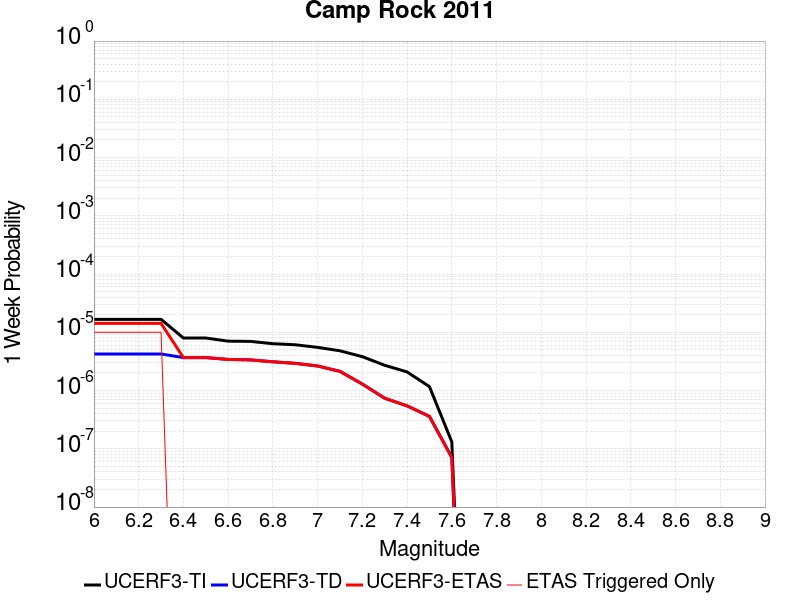 |  |  |  |

| Magnitude | 1 wk TI Prob | 1 wk TD Prob | 1 wk ETAS Prob | 1 wk ETAS/TD Gain | 1 wk ETAS Triggered Only | 1 mo TI Prob | 1 mo TD Prob | 1 mo ETAS Prob | 1 mo ETAS/TD Gain | 1 mo ETAS Triggered Only | 1 yr TI Prob | 1 yr TD Prob | 1 yr ETAS Prob | 1 yr ETAS/TD Gain | 1 yr ETAS Triggered Only | 10 yr TI Prob | 10 yr TD Prob | 10 yr ETAS Prob | 10 yr ETAS/TD Gain | 10 yr ETAS Triggered Only |
|-----|-----|-----|-----|-----|-----|-----|-----|-----|-----|-----|-----|-----|-----|-----|-----|-----|-----|-----|-----|-----|
| 6.0 | 1.6710783E-5 | 4.249992E-6 | 1.4249949E-5 | 3.3529356 | 1.0E-5 | 7.161568E-5 | 1.8214127E-5 | 2.8213944E-5 | 1.5490144 | 1.0E-5 | 8.7157206E-4 | 2.2173495E-4 | 2.3173275E-4 | 1.0450889 | 1.0E-5 | 0.008681616 | 0.00221519 | 0.0022251678 | 1.0045043 | 1.0E-5 |
| 6.1 | 1.6710783E-5 | 4.249992E-6 | 1.4249949E-5 | 3.3529356 | 1.0E-5 | 7.161568E-5 | 1.8214127E-5 | 2.8213944E-5 | 1.5490144 | 1.0E-5 | 8.7157206E-4 | 2.2173495E-4 | 2.3173275E-4 | 1.0450889 | 1.0E-5 | 0.008681616 | 0.00221519 | 0.0022251678 | 1.0045043 | 1.0E-5 |
| 6.2 | 1.6710783E-5 | 4.249992E-6 | 1.4249949E-5 | 3.3529356 | 1.0E-5 | 7.161568E-5 | 1.8214127E-5 | 2.8213944E-5 | 1.5490144 | 1.0E-5 | 8.7157206E-4 | 2.2173495E-4 | 2.3173275E-4 | 1.0450889 | 1.0E-5 | 0.008681616 | 0.00221519 | 0.0022251678 | 1.0045043 | 1.0E-5 |
| 6.3 | 1.6710783E-5 | 4.249992E-6 | 1.4249949E-5 | 3.3529356 | 1.0E-5 | 7.161568E-5 | 1.8214127E-5 | 2.8213944E-5 | 1.5490144 | 1.0E-5 | 8.7157206E-4 | 2.2173495E-4 | 2.3173275E-4 | 1.0450889 | 1.0E-5 | 0.008681616 | 0.00221519 | 0.0022251678 | 1.0045043 | 1.0E-5 |
| 6.4 | 7.982846E-6 | 3.682029E-6 | 3.682029E-6 | 1.0 | 0.0 | 3.421175E-5 | 1.5780031E-5 | 1.5780031E-5 | 1.0 | 0.0 | 4.1644843E-4 | 1.9210529E-4 | 1.9210529E-4 | 1.0 | 0.0 | 0.0041566887 | 0.0019194271 | 0.0019194271 | 1.0 | 0.0 |
| 6.5 | 7.982846E-6 | 3.682029E-6 | 3.682029E-6 | 1.0 | 0.0 | 3.421175E-5 | 1.5780031E-5 | 1.5780031E-5 | 1.0 | 0.0 | 4.1644843E-4 | 1.9210529E-4 | 1.9210529E-4 | 1.0 | 0.0 | 0.0041566887 | 0.0019194271 | 0.0019194271 | 1.0 | 0.0 |
| 6.6 | 7.048869E-6 | 3.4242933E-6 | 3.4242933E-6 | 1.0 | 0.0 | 3.0209088E-5 | 1.4675462E-5 | 1.4675462E-5 | 1.0 | 0.0 | 3.677336E-4 | 1.7865942E-4 | 1.7865942E-4 | 1.0 | 0.0 | 0.0036712566 | 0.0017851895 | 0.0017851895 | 1.0 | 0.0 |
| 6.7 | 6.987307E-6 | 3.362271E-6 | 3.362271E-6 | 1.0 | 0.0 | 2.9945259E-5 | 1.4409655E-5 | 1.4409655E-5 | 1.0 | 0.0 | 3.6452254E-4 | 1.7542373E-4 | 1.7542373E-4 | 1.0 | 0.0 | 0.0036392517 | 0.0017528838 | 0.0017528838 | 1.0 | 0.0 |
| 6.8 | 6.3737602E-6 | 3.117861E-6 | 3.117861E-6 | 1.0 | 0.0 | 2.731583E-5 | 1.3362195E-5 | 1.3362195E-5 | 1.0 | 0.0 | 3.3251947E-4 | 1.6267286E-4 | 1.6267286E-4 | 1.0 | 0.0 | 0.0033202237 | 0.0016255665 | 0.0016255665 | 1.0 | 0.0 |
| 6.9 | 6.112211E-6 | 2.933072E-6 | 2.933072E-6 | 1.0 | 0.0 | 2.6194928E-5 | 1.2570249E-5 | 1.2570249E-5 | 1.0 | 0.0 | 3.1887658E-4 | 1.5303232E-4 | 1.5303232E-4 | 1.0 | 0.0 | 0.003184194 | 0.0015292971 | 0.0015292971 | 1.0 | 0.0 |
| 7.0 | 5.5140117E-6 | 2.641904E-6 | 2.641904E-6 | 1.0 | 0.0 | 2.3631264E-5 | 1.1322398E-5 | 1.1322398E-5 | 1.0 | 0.0 | 2.8767265E-4 | 1.3784174E-4 | 1.3784174E-4 | 1.0 | 0.0 | 0.0028730053 | 0.0013775876 | 0.0013775876 | 1.0 | 0.0 |
| 7.1 | 4.8151105E-6 | 2.1342557E-6 | 2.1342557E-6 | 1.0 | 0.0 | 2.0636026E-5 | 9.14678E-6 | 9.14678E-6 | 1.0 | 0.0 | 2.5121463E-4 | 1.11356574E-4 | 1.11356574E-4 | 1.0 | 0.0 | 0.0025093083 | 0.0011130297 | 0.0011130297 | 1.0 | 0.0 |
| 7.2 | 3.818335E-6 | 1.2937331E-6 | 1.2937331E-6 | 1.0 | 0.0 | 1.6364189E-5 | 5.544559E-6 | 5.544559E-6 | 1.0 | 0.0 | 1.9921579E-4 | 6.7502995E-5 | 6.7502995E-5 | 1.0 | 0.0 | 0.0019903728 | 6.748332E-4 | 6.748332E-4 | 1.0 | 0.0 |
| 7.3 | 2.7166698E-6 | 7.3830375E-7 | 7.3830375E-7 | 1.0 | 0.0 | 1.1642818E-5 | 3.1641553E-6 | 3.1641553E-6 | 1.0 | 0.0 | 1.4174209E-4 | 3.852293E-5 | 3.852293E-5 | 1.0 | 0.0 | 0.0014165172 | 3.8516452E-4 | 3.8516452E-4 | 1.0 | 0.0 |
| 7.4 | 2.0893426E-6 | 5.461424E-7 | 5.461424E-7 | 1.0 | 0.0 | 8.954295E-6 | 2.3406083E-6 | 2.3406083E-6 | 1.0 | 0.0 | 1.0901308E-4 | 2.8496537E-5 | 2.8496537E-5 | 1.0 | 0.0 | 0.0010895962 | 2.8492938E-4 | 2.8492938E-4 | 1.0 | 0.0 |
| 7.5 | 1.1681728E-6 | 3.6028206E-7 | 3.6028206E-7 | 1.0 | 0.0 | 5.0064455E-6 | 1.5440651E-6 | 1.5440651E-6 | 1.0 | 0.0 | 6.0951766E-5 | 1.8798835E-5 | 1.8798835E-5 | 1.0 | 0.0 | 6.093505E-4 | 1.8797291E-4 | 1.8797291E-4 | 1.0 | 0.0 |
| 7.6 | 1.3154387E-7 | 7.1196375E-8 | 7.1196375E-8 | 1.0 | 0.0 | 5.6375933E-7 | 3.051273E-7 | 3.051273E-7 | 1.0 | 0.0 | 6.863748E-6 | 3.71492E-6 | 3.71492E-6 | 1.0 | 0.0 | 6.863536E-5 | 3.7148737E-5 | 3.7148737E-5 | 1.0 | 0.0 |

## Calaveras (Central) 2011 CFM
*[(top)](#table-of-contents)*

| 1 Week | 1 Month | 1 Year | 10 Year |
|-----|-----|-----|-----|
|  |  |  |  |

| Magnitude | 1 wk TI Prob | 1 wk TD Prob | 1 wk ETAS Prob | 1 wk ETAS/TD Gain | 1 wk ETAS Triggered Only | 1 mo TI Prob | 1 mo TD Prob | 1 mo ETAS Prob | 1 mo ETAS/TD Gain | 1 mo ETAS Triggered Only | 1 yr TI Prob | 1 yr TD Prob | 1 yr ETAS Prob | 1 yr ETAS/TD Gain | 1 yr ETAS Triggered Only | 10 yr TI Prob | 10 yr TD Prob | 10 yr ETAS Prob | 10 yr ETAS/TD Gain | 10 yr ETAS Triggered Only |
|-----|-----|-----|-----|-----|-----|-----|-----|-----|-----|-----|-----|-----|-----|-----|-----|-----|-----|-----|-----|-----|
| 6.0 | 1.5010907E-4 | 2.48034E-4 | 2.48034E-4 | 1.0 | 0.0 | 6.4316596E-4 | 0.0010624757 | 0.0010624757 | 1.0 | 0.0 | 0.0078024664 | 0.0128501635 | 0.0128600355 | 1.0007682 | 1.0E-5 | 0.07534136 | 0.1204081 | 0.1204169 | 1.0000731 | 1.0E-5 |
| 6.1 | 1.4521465E-4 | 2.3964873E-4 | 2.3964873E-4 | 1.0 | 0.0 | 6.222001E-4 | 0.001026572 | 0.001026572 | 1.0 | 0.0 | 0.0075490056 | 0.012419487 | 0.012429363 | 1.0007952 | 1.0E-5 | 0.07297657 | 0.11667962 | 0.11668846 | 1.0000757 | 1.0E-5 |
| 6.2 | 1.429998E-4 | 2.3896115E-4 | 2.3896115E-4 | 1.0 | 0.0 | 6.127123E-4 | 0.0010236278 | 0.0010236278 | 1.0 | 0.0 | 0.007434286 | 0.012384097 | 0.012393973 | 1.0007975 | 1.0E-5 | 0.07190444 | 0.11633368 | 0.116342515 | 1.0000759 | 1.0E-5 |
| 6.3 | 1.3536277E-4 | 2.3227293E-4 | 2.3227293E-4 | 1.0 | 0.0 | 5.799972E-4 | 9.949915E-4 | 9.949915E-4 | 1.0 | 0.0 | 0.0070386264 | 0.012040272 | 0.012050152 | 1.0008205 | 1.0E-5 | 0.0681982 | 0.11324647 | 0.113255344 | 1.0000783 | 1.0E-5 |
| 6.4 | 1.2993296E-4 | 2.2650881E-4 | 2.2650881E-4 | 1.0 | 0.0 | 5.5673666E-4 | 9.7030716E-4 | 9.7030716E-4 | 1.0 | 0.0 | 0.006757223 | 0.0117430845 | 0.011752967 | 1.0008416 | 1.0E-5 | 0.06555412 | 0.11052456 | 0.11053345 | 1.0000805 | 1.0E-5 |
| 6.5 | 1.0498927E-4 | 1.7981516E-4 | 1.7981516E-4 | 1.0 | 0.0 | 4.498764E-4 | 7.704075E-4 | 7.704075E-4 | 1.0 | 0.0 | 0.005463498 | 0.009339288 | 0.009349194 | 1.0010607 | 1.0E-5 | 0.053311124 | 0.08920434 | 0.08921345 | 1.000102 | 1.0E-5 |
| 6.6 | 1.0157505E-4 | 1.7469049E-4 | 1.7469049E-4 | 1.0 | 0.0 | 4.35249E-4 | 7.484576E-4 | 7.484576E-4 | 1.0 | 0.0 | 0.0052862884 | 0.009074337 | 0.009084246 | 1.001092 | 1.0E-5 | 0.05162293 | 0.08678174 | 0.086790875 | 1.0001053 | 1.0E-5 |
| 6.7 | 9.660386E-5 | 1.6728343E-4 | 1.6728343E-4 | 1.0 | 0.0 | 4.1395082E-4 | 7.167309E-4 | 7.167309E-4 | 1.0 | 0.0 | 0.0050282106 | 0.008691247 | 0.008701161 | 1.0011406 | 1.0E-5 | 0.049159497 | 0.08327085 | 0.08328001 | 1.0001101 | 1.0E-5 |
| 6.8 | 9.089927E-5 | 1.5642813E-4 | 1.5642813E-4 | 1.0 | 0.0 | 3.8951015E-4 | 6.7023304E-4 | 6.7023304E-4 | 1.0 | 0.0 | 0.0047319788 | 0.008129524 | 0.008139443 | 1.0012201 | 1.0E-5 | 0.046324775 | 0.07815891 | 0.078168124 | 1.0001179 | 1.0E-5 |
| 6.9 | 7.353187E-5 | 1.2295424E-4 | 1.2295424E-4 | 1.0 | 0.0 | 3.150985E-4 | 5.268409E-4 | 5.268409E-4 | 1.0 | 0.0 | 0.0038295772 | 0.0063955444 | 0.00640548 | 1.0015535 | 1.0E-5 | 0.037642512 | 0.06218619 | 0.06219557 | 1.0001508 | 1.0E-5 |
| 7.0 | 5.746064E-5 | 9.388761E-5 | 9.388761E-5 | 1.0 | 0.0 | 2.4623662E-4 | 4.023138E-4 | 4.023138E-4 | 1.0 | 0.0 | 0.0029938098 | 0.0048872405 | 0.0048971917 | 1.0020361 | 1.0E-5 | 0.02953797 | 0.047984343 | 0.047993865 | 1.0001984 | 1.0E-5 |
| 7.1 | 4.9557195E-5 | 8.052448E-5 | 8.052448E-5 | 1.0 | 0.0 | 2.123707E-4 | 3.4505958E-4 | 3.4505958E-4 | 1.0 | 0.0 | 0.0025825473 | 0.004193071 | 0.0042030285 | 1.0023749 | 1.0E-5 | 0.0255274 | 0.04137077 | 0.041380357 | 1.0002317 | 1.0E-5 |
| 7.2 | 3.687595E-5 | 5.9523958E-5 | 5.9523958E-5 | 1.0 | 0.0 | 1.5803022E-4 | 2.550779E-4 | 2.550779E-4 | 1.0 | 0.0 | 0.0019223199 | 0.0031011798 | 0.0031011798 | 1.0 | 0.0 | 0.01905776 | 0.030881263 | 0.030881263 | 1.0 | 0.0 |
| 7.3 | 2.5846984E-5 | 4.2471165E-5 | 4.2471165E-5 | 1.0 | 0.0 | 1.1076809E-4 | 1.8200668E-4 | 1.8200668E-4 | 1.0 | 0.0 | 0.0013477671 | 0.0022136967 | 0.0022136967 | 1.0 | 0.0 | 0.013396223 | 0.02217347 | 0.02217347 | 1.0 | 0.0 |
| 7.4 | 1.7747854E-5 | 2.9934954E-5 | 2.9934954E-5 | 1.0 | 0.0 | 7.6060016E-5 | 1.2828637E-4 | 1.2828637E-4 | 1.0 | 0.0 | 9.2563726E-4 | 0.0015607704 | 0.0015607704 | 1.0 | 0.0 | 0.009217911 | 0.015707172 | 0.015707172 | 1.0 | 0.0 |
| 7.5 | 1.4883479E-5 | 2.6242093E-5 | 2.6242093E-5 | 1.0 | 0.0 | 6.378478E-5 | 1.1246128E-4 | 1.1246128E-4 | 1.0 | 0.0 | 7.76303E-4 | 0.0013683588 | 0.0013683588 | 1.0 | 0.0 | 0.0077359667 | 0.013800219 | 0.013800219 | 1.0 | 0.0 |
| 7.6 | 8.166975E-6 | 1.4961989E-5 | 1.4961989E-5 | 1.0 | 0.0 | 3.5000852E-5 | 6.412124E-5 | 6.412124E-5 | 1.0 | 0.0 | 4.2605202E-4 | 7.803978E-4 | 7.803978E-4 | 1.0 | 0.0 | 0.004252361 | 0.007938044 | 0.007938044 | 1.0 | 0.0 |
| 7.7 | 3.3858064E-6 | 6.253606E-6 | 6.253606E-6 | 1.0 | 0.0 | 1.4510518E-5 | 2.6800893E-5 | 2.6800893E-5 | 1.0 | 0.0 | 1.7665124E-4 | 3.2625208E-4 | 3.2625208E-4 | 1.0 | 0.0 | 0.0017651088 | 0.003388077 | 0.003388077 | 1.0 | 0.0 |
| 7.8 | 2.7721615E-6 | 5.3661397E-6 | 5.3661397E-6 | 1.0 | 0.0 | 1.1880637E-5 | 2.2997538E-5 | 2.2997538E-5 | 1.0 | 0.0 | 1.4463716E-4 | 2.7995912E-4 | 2.7995912E-4 | 1.0 | 0.0 | 0.0014454306 | 0.0029073718 | 0.0029073718 | 1.0 | 0.0 |
| 7.9 | 1.9736292E-6 | 4.1283006E-6 | 4.1283006E-6 | 1.0 | 0.0 | 8.4583835E-6 | 1.7692597E-5 | 1.7692597E-5 | 1.0 | 0.0 | 1.0297595E-4 | 2.1538611E-4 | 2.1538611E-4 | 1.0 | 0.0 | 0.0010292825 | 0.0022235236 | 0.0022235236 | 1.0 | 0.0 |
| 8.0 | 1.1767289E-6 | 2.5544323E-6 | 2.5544323E-6 | 1.0 | 0.0 | 5.0431145E-6 | 1.094752E-5 | 1.094752E-5 | 1.0 | 0.0 | 6.139818E-5 | 1.3327794E-4 | 1.3327794E-4 | 1.0 | 0.0 | 6.1381224E-4 | 0.0013659992 | 0.0013659992 | 1.0 | 0.0 |
| 8.1 | 7.5112825E-7 | 1.5409354E-6 | 1.5409354E-6 | 1.0 | 0.0 | 3.2191172E-6 | 6.603992E-6 | 6.603992E-6 | 1.0 | 0.0 | 3.9192048E-5 | 8.040066E-5 | 8.040066E-5 | 1.0 | 0.0 | 3.9185135E-4 | 8.234908E-4 | 8.234908E-4 | 1.0 | 0.0 |

## Clamshell-Sawpit
*[(top)](#table-of-contents)*

| 1 Week | 1 Month | 1 Year | 10 Year |
|-----|-----|-----|-----|
|  |  | 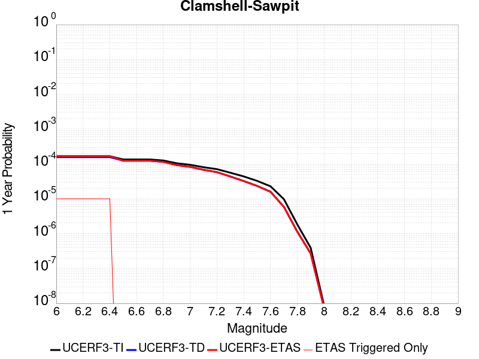 |  |

| Magnitude | 1 wk TI Prob | 1 wk TD Prob | 1 wk ETAS Prob | 1 wk ETAS/TD Gain | 1 wk ETAS Triggered Only | 1 mo TI Prob | 1 mo TD Prob | 1 mo ETAS Prob | 1 mo ETAS/TD Gain | 1 mo ETAS Triggered Only | 1 yr TI Prob | 1 yr TD Prob | 1 yr ETAS Prob | 1 yr ETAS/TD Gain | 1 yr ETAS Triggered Only | 10 yr TI Prob | 10 yr TD Prob | 10 yr ETAS Prob | 10 yr ETAS/TD Gain | 10 yr ETAS Triggered Only |
|-----|-----|-----|-----|-----|-----|-----|-----|-----|-----|-----|-----|-----|-----|-----|-----|-----|-----|-----|-----|-----|
| 6.0 | 3.202998E-6 | 3.0127578E-6 | 1.3012727E-5 | 4.319208 | 1.0E-5 | 1.3727062E-5 | 1.291176E-5 | 2.291163E-5 | 1.7744777 | 1.0E-5 | 1.6711417E-4 | 1.5719015E-4 | 1.6718857E-4 | 1.0636072 | 1.0E-5 | 0.0016698855 | 0.001570869 | 0.0015808532 | 1.0063559 | 1.0E-5 |
| 6.1 | 3.202998E-6 | 3.0127578E-6 | 1.3012727E-5 | 4.319208 | 1.0E-5 | 1.3727062E-5 | 1.291176E-5 | 2.291163E-5 | 1.7744777 | 1.0E-5 | 1.6711417E-4 | 1.5719015E-4 | 1.6718857E-4 | 1.0636072 | 1.0E-5 | 0.0016698855 | 0.001570869 | 0.0015808532 | 1.0063559 | 1.0E-5 |
| 6.2 | 3.202998E-6 | 3.0127578E-6 | 1.3012727E-5 | 4.319208 | 1.0E-5 | 1.3727062E-5 | 1.291176E-5 | 2.291163E-5 | 1.7744777 | 1.0E-5 | 1.6711417E-4 | 1.5719015E-4 | 1.6718857E-4 | 1.0636072 | 1.0E-5 | 0.0016698855 | 0.001570869 | 0.0015808532 | 1.0063559 | 1.0E-5 |
| 6.3 | 3.202998E-6 | 3.0127578E-6 | 1.3012727E-5 | 4.319208 | 1.0E-5 | 1.3727062E-5 | 1.291176E-5 | 2.291163E-5 | 1.7744777 | 1.0E-5 | 1.6711417E-4 | 1.5719015E-4 | 1.6718857E-4 | 1.0636072 | 1.0E-5 | 0.0016698855 | 0.001570869 | 0.0015808532 | 1.0063559 | 1.0E-5 |
| 6.4 | 3.202998E-6 | 3.0127578E-6 | 1.3012727E-5 | 4.319208 | 1.0E-5 | 1.3727062E-5 | 1.291176E-5 | 2.291163E-5 | 1.7744777 | 1.0E-5 | 1.6711417E-4 | 1.5719015E-4 | 1.6718857E-4 | 1.0636072 | 1.0E-5 | 0.0016698855 | 0.001570869 | 0.0015808532 | 1.0063559 | 1.0E-5 |
| 6.5 | 2.5862723E-6 | 2.3807688E-6 | 2.3807688E-6 | 1.0 | 0.0 | 1.1083977E-5 | 1.0203257E-5 | 1.0203257E-5 | 1.0 | 0.0 | 1.3493907E-4 | 1.2421788E-4 | 1.2421788E-4 | 1.0 | 0.0 | 0.0013485716 | 0.0012415148 | 0.0012415148 | 1.0 | 0.0 |
| 6.6 | 2.5862723E-6 | 2.3807688E-6 | 2.3807688E-6 | 1.0 | 0.0 | 1.1083977E-5 | 1.0203257E-5 | 1.0203257E-5 | 1.0 | 0.0 | 1.3493907E-4 | 1.2421788E-4 | 1.2421788E-4 | 1.0 | 0.0 | 0.0013485716 | 0.0012415148 | 0.0012415148 | 1.0 | 0.0 |
| 6.7 | 2.5862723E-6 | 2.3807688E-6 | 2.3807688E-6 | 1.0 | 0.0 | 1.1083977E-5 | 1.0203257E-5 | 1.0203257E-5 | 1.0 | 0.0 | 1.3493907E-4 | 1.2421788E-4 | 1.2421788E-4 | 1.0 | 0.0 | 0.0013485716 | 0.0012415148 | 0.0012415148 | 1.0 | 0.0 |
| 6.8 | 2.4098806E-6 | 2.197725E-6 | 2.197725E-6 | 1.0 | 0.0 | 1.0328019E-5 | 9.418789E-6 | 9.418789E-6 | 1.0 | 0.0 | 1.2573638E-4 | 1.14667986E-4 | 1.14667986E-4 | 1.0 | 0.0 | 0.0012566525 | 0.0011461148 | 0.0011461148 | 1.0 | 0.0 |
| 6.9 | 2.0073985E-6 | 1.7784195E-6 | 1.7784195E-6 | 1.0 | 0.0 | 8.603109E-6 | 7.6217757E-6 | 7.6217757E-6 | 1.0 | 0.0 | 1.0473781E-4 | 9.279129E-5 | 9.279129E-5 | 1.0 | 0.0 | 0.0010468846 | 9.2753733E-4 | 9.2753733E-4 | 1.0 | 0.0 |
| 7.0 | 1.8166766E-6 | 1.5807044E-6 | 1.5807044E-6 | 1.0 | 0.0 | 7.785734E-6 | 6.7744304E-6 | 6.7744304E-6 | 1.0 | 0.0 | 9.478718E-5 | 8.2475664E-5 | 8.2475664E-5 | 1.0 | 0.0 | 9.4746763E-4 | 8.2446064E-4 | 8.2446064E-4 | 1.0 | 0.0 |
| 7.1 | 1.5471421E-6 | 1.3052913E-6 | 1.3052913E-6 | 1.0 | 0.0 | 6.6305925E-6 | 5.594094E-6 | 5.594094E-6 | 1.0 | 0.0 | 8.072447E-5 | 6.810602E-5 | 6.810602E-5 | 1.0 | 0.0 | 8.0695155E-4 | 6.80857E-4 | 6.80857E-4 | 1.0 | 0.0 |
| 7.2 | 1.3608037E-6 | 1.1153397E-6 | 1.1153397E-6 | 1.0 | 0.0 | 5.8320024E-6 | 4.780019E-6 | 4.780019E-6 | 1.0 | 0.0 | 7.1002316E-5 | 5.8195223E-5 | 5.8195223E-5 | 1.0 | 0.0 | 7.097964E-4 | 5.8180443E-4 | 5.8180443E-4 | 1.0 | 0.0 |
| 7.3 | 1.0749634E-6 | 8.384214E-7 | 8.384214E-7 | 1.0 | 0.0 | 4.6069777E-6 | 3.5932296E-6 | 3.5932296E-6 | 1.0 | 0.0 | 5.608851E-5 | 4.374672E-5 | 4.374672E-5 | 1.0 | 0.0 | 5.6074356E-4 | 4.3738392E-4 | 4.3738392E-4 | 1.0 | 0.0 |
| 7.4 | 8.416856E-7 | 6.2000146E-7 | 6.2000146E-7 | 1.0 | 0.0 | 3.607219E-6 | 2.6571465E-6 | 2.6571465E-6 | 1.0 | 0.0 | 4.3917007E-5 | 3.23503E-5 | 3.23503E-5 | 1.0 | 0.0 | 4.390833E-4 | 3.2345788E-4 | 3.2345788E-4 | 1.0 | 0.0 |
| 7.5 | 6.2779594E-7 | 4.4968567E-7 | 4.4968567E-7 | 1.0 | 0.0 | 2.6905511E-6 | 1.927223E-6 | 1.927223E-6 | 1.0 | 0.0 | 3.275697E-5 | 2.3463706E-5 | 2.3463706E-5 | 1.0 | 0.0 | 3.275214E-4 | 2.3461417E-4 | 2.3461417E-4 | 1.0 | 0.0 |
| 7.6 | 4.3822078E-7 | 3.0595388E-7 | 3.0595388E-7 | 1.0 | 0.0 | 1.8780877E-6 | 1.3112303E-6 | 1.3112303E-6 | 1.0 | 0.0 | 2.2865479E-5 | 1.5964128E-5 | 1.5964128E-5 | 1.0 | 0.0 | 2.2863125E-4 | 1.5963137E-4 | 1.5963137E-4 | 1.0 | 0.0 |
| 7.7 | 1.8704569E-7 | 1.1237786E-7 | 1.1237786E-7 | 1.0 | 0.0 | 8.0162414E-7 | 4.816193E-7 | 4.816193E-7 | 1.0 | 0.0 | 9.75973E-6 | 5.8636997E-6 | 5.8636997E-6 | 1.0 | 0.0 | 9.7593016E-5 | 5.8635516E-5 | 5.8635516E-5 | 1.0 | 0.0 |
| 7.8 | 3.5378733E-8 | 2.1837995E-8 | 2.1837995E-8 | 1.0 | 0.0 | 1.5162313E-7 | 9.35914E-8 | 9.35914E-8 | 1.0 | 0.0 | 1.84601E-6 | 1.1394748E-6 | 1.1394748E-6 | 1.0 | 0.0 | 1.8459947E-5 | 1.1394692E-5 | 1.1394692E-5 | 1.0 | 0.0 |
| 7.9 | 7.504945E-9 | 5.1921663E-9 | 5.1921663E-9 | 1.0 | 0.0 | 3.2164053E-8 | 2.2252141E-8 | 2.2252141E-8 | 1.0 | 0.0 | 3.9159727E-7 | 2.709198E-7 | 2.709198E-7 | 1.0 | 0.0 | 3.915966E-6 | 2.7091953E-6 | 2.7091953E-6 | 1.0 | 0.0 |
| 8.0 | 1.6554036E-10 | 1.418149E-10 | 1.418149E-10 | 1.0 | 0.0 | 7.0945894E-10 | 6.0777794E-10 | 6.0777794E-10 | 1.0 | 0.0 | 8.637662E-9 | 7.3996964E-9 | 7.3996964E-9 | 1.0 | 0.0 | 8.6376616E-8 | 7.3996965E-8 | 7.3996965E-8 | 1.0 | 0.0 |

## Santa Cruz Catalina Ridge alt1
*[(top)](#table-of-contents)*

| 1 Week | 1 Month | 1 Year | 10 Year |
|-----|-----|-----|-----|
|  |  |  |  |

| Magnitude | 1 wk TI Prob | 1 wk TD Prob | 1 wk ETAS Prob | 1 wk ETAS/TD Gain | 1 wk ETAS Triggered Only | 1 mo TI Prob | 1 mo TD Prob | 1 mo ETAS Prob | 1 mo ETAS/TD Gain | 1 mo ETAS Triggered Only | 1 yr TI Prob | 1 yr TD Prob | 1 yr ETAS Prob | 1 yr ETAS/TD Gain | 1 yr ETAS Triggered Only | 10 yr TI Prob | 10 yr TD Prob | 10 yr ETAS Prob | 10 yr ETAS/TD Gain | 10 yr ETAS Triggered Only |
|-----|-----|-----|-----|-----|-----|-----|-----|-----|-----|-----|-----|-----|-----|-----|-----|-----|-----|-----|-----|-----|
| 6.0 | 3.2833184E-5 | 3.655829E-5 | 3.655829E-5 | 1.0 | 0.0 | 1.4070606E-4 | 1.566699E-4 | 1.566699E-4 | 1.0 | 0.0 | 0.00171175 | 0.0019059536 | 0.0019059536 | 1.0 | 0.0 | 0.016986247 | 0.018912975 | 0.018922787 | 1.0005187 | 1.0E-5 |
| 6.1 | 1.9835548E-5 | 2.1659453E-5 | 2.1659453E-5 | 1.0 | 0.0 | 8.500672E-5 | 9.282304E-5 | 9.282304E-5 | 1.0 | 0.0 | 0.0010344655 | 0.0011295547 | 0.0011295547 | 1.0 | 0.0 | 0.010296632 | 0.011240268 | 0.011250156 | 1.0008796 | 1.0E-5 |
| 6.2 | 1.9835548E-5 | 2.1659453E-5 | 2.1659453E-5 | 1.0 | 0.0 | 8.500672E-5 | 9.282304E-5 | 9.282304E-5 | 1.0 | 0.0 | 0.0010344655 | 0.0011295547 | 0.0011295547 | 1.0 | 0.0 | 0.010296632 | 0.011240268 | 0.011250156 | 1.0008796 | 1.0E-5 |
| 6.3 | 1.5728183E-5 | 1.7033912E-5 | 1.7033912E-5 | 1.0 | 0.0 | 6.7404755E-5 | 7.300047E-5 | 7.300047E-5 | 1.0 | 0.0 | 8.2034385E-4 | 8.884244E-4 | 8.884244E-4 | 1.0 | 0.0 | 0.008173222 | 0.008849408 | 0.008859319 | 1.00112 | 1.0E-5 |
| 6.4 | 1.5728183E-5 | 1.7033912E-5 | 1.7033912E-5 | 1.0 | 0.0 | 6.7404755E-5 | 7.300047E-5 | 7.300047E-5 | 1.0 | 0.0 | 8.2034385E-4 | 8.884244E-4 | 8.884244E-4 | 1.0 | 0.0 | 0.008173222 | 0.008849408 | 0.008859319 | 1.00112 | 1.0E-5 |
| 6.5 | 1.3707734E-5 | 1.479449E-5 | 1.479449E-5 | 1.0 | 0.0 | 5.8746107E-5 | 6.340344E-5 | 6.340344E-5 | 1.0 | 0.0 | 7.1499916E-4 | 7.71667E-4 | 7.71667E-4 | 1.0 | 0.0 | 0.0071270303 | 0.007690273 | 0.0077001965 | 1.0012903 | 1.0E-5 |
| 6.6 | 1.2539813E-5 | 1.3510192E-5 | 1.3510192E-5 | 1.0 | 0.0 | 5.3740947E-5 | 5.789955E-5 | 5.789955E-5 | 1.0 | 0.0 | 6.540996E-4 | 7.047017E-4 | 7.047017E-4 | 1.0 | 0.0 | 0.0065217763 | 0.007024974 | 0.007034904 | 1.0014135 | 1.0E-5 |
| 6.7 | 1.1504083E-5 | 1.237735E-5 | 1.237735E-5 | 1.0 | 0.0 | 4.930228E-5 | 5.3044718E-5 | 5.3044718E-5 | 1.0 | 0.0 | 6.0008996E-4 | 6.4563006E-4 | 6.4563006E-4 | 1.0 | 0.0 | 0.005984721 | 0.006437773 | 0.0064477087 | 1.0015433 | 1.0E-5 |
| 6.8 | 1.012739E-5 | 1.087705E-5 | 1.087705E-5 | 1.0 | 0.0 | 4.340238E-5 | 4.6615103E-5 | 4.6615103E-5 | 1.0 | 0.0 | 5.282958E-4 | 5.673926E-4 | 5.673926E-4 | 1.0 | 0.0 | 0.0052704164 | 0.0056596086 | 0.005669552 | 1.0017569 | 1.0E-5 |
| 6.9 | 8.9607865E-6 | 9.609099E-6 | 9.609099E-6 | 1.0 | 0.0 | 3.8402806E-5 | 4.1181207E-5 | 4.1181207E-5 | 1.0 | 0.0 | 4.6745385E-4 | 5.012669E-4 | 5.012669E-4 | 1.0 | 0.0 | 0.0046647177 | 0.005001482 | 0.005011432 | 1.0019894 | 1.0E-5 |
| 7.0 | 8.046829E-6 | 8.61973E-6 | 8.61973E-6 | 1.0 | 0.0 | 3.4485955E-5 | 3.694118E-5 | 3.694118E-5 | 1.0 | 0.0 | 4.1978562E-4 | 4.4966684E-4 | 4.4966684E-4 | 1.0 | 0.0 | 0.004189935 | 0.0044876602 | 0.0044976156 | 1.0022184 | 1.0E-5 |
| 7.1 | 7.136131E-6 | 7.637642E-6 | 7.637642E-6 | 1.0 | 0.0 | 3.0583058E-5 | 3.2732343E-5 | 3.2732343E-5 | 1.0 | 0.0 | 3.7228514E-4 | 3.984441E-4 | 3.984441E-4 | 1.0 | 0.0 | 0.0037166206 | 0.0039773737 | 0.003987334 | 1.0025042 | 1.0E-5 |
| 7.2 | 6.362014E-6 | 6.8049458E-6 | 6.8049458E-6 | 1.0 | 0.0 | 2.726549E-5 | 2.9163732E-5 | 2.9163732E-5 | 1.0 | 0.0 | 3.3190678E-4 | 3.5501123E-4 | 3.5501123E-4 | 1.0 | 0.0 | 0.0033141149 | 0.0035445094 | 0.003554474 | 1.0028113 | 1.0E-5 |
| 7.3 | 5.004101E-6 | 5.351705E-6 | 5.351705E-6 | 1.0 | 0.0 | 2.1445969E-5 | 2.2935681E-5 | 2.2935681E-5 | 1.0 | 0.0 | 2.6107338E-4 | 2.7920667E-4 | 2.7920667E-4 | 1.0 | 0.0 | 0.002607669 | 0.0027886136 | 0.0027985855 | 1.003576 | 1.0E-5 |
| 7.4 | 3.4901443E-6 | 3.7320456E-6 | 3.7320456E-6 | 1.0 | 0.0 | 1.4957676E-5 | 1.5994385E-5 | 1.5994385E-5 | 1.0 | 0.0 | 1.8209449E-4 | 1.9471462E-4 | 1.9471462E-4 | 1.0 | 0.0 | 0.0018194534 | 0.0019454787 | 0.0019554594 | 1.0051302 | 1.0E-5 |
| 7.5 | 1.1215045E-6 | 1.1893851E-6 | 1.1893851E-6 | 1.0 | 0.0 | 4.806439E-6 | 5.097355E-6 | 5.097355E-6 | 1.0 | 0.0 | 5.851682E-5 | 6.205856E-5 | 6.205856E-5 | 1.0 | 0.0 | 5.850142E-4 | 6.204154E-4 | 6.3040917E-4 | 1.0161083 | 1.0E-5 |
| 7.6 | 2.8599047E-7 | 2.9951954E-7 | 2.9951954E-7 | 1.0 | 0.0 | 1.2256729E-6 | 1.2836546E-6 | 1.2836546E-6 | 1.0 | 0.0 | 1.4922465E-5 | 1.5628384E-5 | 1.5628384E-5 | 1.0 | 0.0 | 1.4921463E-4 | 1.5627299E-4 | 1.5627299E-4 | 1.0 | 0.0 |
| 7.7 | 2.0781519E-7 | 2.1744296E-7 | 2.1744296E-7 | 1.0 | 0.0 | 8.906362E-7 | 9.3189806E-7 | 9.3189806E-7 | 1.0 | 0.0 | 1.08434415E-5 | 1.1345801E-5 | 1.1345801E-5 | 1.0 | 0.0 | 1.0842913E-4 | 1.1345231E-4 | 1.1345231E-4 | 1.0 | 0.0 |
| 7.8 | 3.614776E-8 | 3.7640977E-8 | 3.7640977E-8 | 1.0 | 0.0 | 1.5491896E-7 | 1.6131847E-7 | 1.6131847E-7 | 1.0 | 0.0 | 1.8861368E-6 | 1.9640506E-6 | 1.9640506E-6 | 1.0 | 0.0 | 1.8861208E-5 | 1.9640345E-5 | 1.9640345E-5 | 1.0 | 0.0 |

## Pisgah-Bullion Mtn-Mesquite Lk
*[(top)](#table-of-contents)*

| 1 Week | 1 Month | 1 Year | 10 Year |
|-----|-----|-----|-----|
|  |  |  |  |

| Magnitude | 1 wk TI Prob | 1 wk TD Prob | 1 wk ETAS Prob | 1 wk ETAS/TD Gain | 1 wk ETAS Triggered Only | 1 mo TI Prob | 1 mo TD Prob | 1 mo ETAS Prob | 1 mo ETAS/TD Gain | 1 mo ETAS Triggered Only | 1 yr TI Prob | 1 yr TD Prob | 1 yr ETAS Prob | 1 yr ETAS/TD Gain | 1 yr ETAS Triggered Only | 10 yr TI Prob | 10 yr TD Prob | 10 yr ETAS Prob | 10 yr ETAS/TD Gain | 10 yr ETAS Triggered Only |
|-----|-----|-----|-----|-----|-----|-----|-----|-----|-----|-----|-----|-----|-----|-----|-----|-----|-----|-----|-----|-----|
| 6.0 | 3.0240792E-5 | 2.4090827E-5 | 3.4090586E-5 | 1.4150858 | 1.0E-5 | 1.2959696E-4 | 1.0324288E-4 | 1.1324185E-4 | 1.096849 | 1.0E-5 | 0.0015767008 | 0.0012563579 | 0.0012663454 | 1.0079495 | 1.0E-5 | 0.015655609 | 0.012502574 | 0.012512449 | 1.0007899 | 1.0E-5 |
| 6.1 | 3.0240792E-5 | 2.4090827E-5 | 3.4090586E-5 | 1.4150858 | 1.0E-5 | 1.2959696E-4 | 1.0324288E-4 | 1.1324185E-4 | 1.096849 | 1.0E-5 | 0.0015767008 | 0.0012563579 | 0.0012663454 | 1.0079495 | 1.0E-5 | 0.015655609 | 0.012502574 | 0.012512449 | 1.0007899 | 1.0E-5 |
| 6.2 | 3.0240792E-5 | 2.4090827E-5 | 3.4090586E-5 | 1.4150858 | 1.0E-5 | 1.2959696E-4 | 1.0324288E-4 | 1.1324185E-4 | 1.096849 | 1.0E-5 | 0.0015767008 | 0.0012563579 | 0.0012663454 | 1.0079495 | 1.0E-5 | 0.015655609 | 0.012502574 | 0.012512449 | 1.0007899 | 1.0E-5 |
| 6.3 | 2.0498217E-5 | 1.3638019E-5 | 2.3637882E-5 | 1.7332344 | 1.0E-5 | 8.784654E-5 | 5.8447433E-5 | 6.844685E-5 | 1.1710839 | 1.0E-5 | 0.0010690069 | 7.113814E-4 | 7.213743E-4 | 1.0140471 | 1.0E-5 | 0.01063879 | 0.0070926677 | 0.007102597 | 1.0013999 | 1.0E-5 |
| 6.4 | 2.0498217E-5 | 1.3638019E-5 | 2.3637882E-5 | 1.7332344 | 1.0E-5 | 8.784654E-5 | 5.8447433E-5 | 6.844685E-5 | 1.1710839 | 1.0E-5 | 0.0010690069 | 7.113814E-4 | 7.213743E-4 | 1.0140471 | 1.0E-5 | 0.01063879 | 0.0070926677 | 0.007102597 | 1.0013999 | 1.0E-5 |
| 6.5 | 1.7316182E-5 | 1.0476945E-5 | 1.0476945E-5 | 1.0 | 0.0 | 7.42101E-5 | 4.4900476E-5 | 4.4900476E-5 | 1.0 | 0.0 | 9.0313336E-4 | 5.465362E-4 | 5.465362E-4 | 1.0 | 0.0 | 0.008994718 | 0.005452916 | 0.005452916 | 1.0 | 0.0 |
| 6.6 | 1.5251077E-5 | 8.414112E-6 | 8.414112E-6 | 1.0 | 0.0 | 6.536012E-5 | 3.606002E-5 | 3.606002E-5 | 1.0 | 0.0 | 7.9546886E-4 | 4.3894956E-4 | 4.3894956E-4 | 1.0 | 0.0 | 0.007926274 | 0.0043815426 | 0.0043815426 | 1.0 | 0.0 |
| 6.7 | 1.2997425E-5 | 6.4111982E-6 | 6.4111982E-6 | 1.0 | 0.0 | 5.570206E-5 | 2.74763E-5 | 2.74763E-5 | 1.0 | 0.0 | 6.7796157E-4 | 3.3447728E-4 | 3.3447728E-4 | 1.0 | 0.0 | 0.0067589693 | 0.0033401987 | 0.0033401987 | 1.0 | 0.0 |
| 6.8 | 1.035386E-5 | 4.3331297E-6 | 4.3331297E-6 | 1.0 | 0.0 | 4.437293E-5 | 1.8570428E-5 | 1.8570428E-5 | 1.0 | 0.0 | 5.401065E-4 | 2.2607238E-4 | 2.2607238E-4 | 1.0 | 0.0 | 0.0053879567 | 0.0022585108 | 0.0022585108 | 1.0 | 0.0 |
| 6.9 | 8.816252E-6 | 3.580573E-6 | 3.580573E-6 | 1.0 | 0.0 | 3.778339E-5 | 1.5345226E-5 | 1.5345226E-5 | 1.0 | 0.0 | 4.5991567E-4 | 1.868127E-4 | 1.868127E-4 | 1.0 | 0.0 | 0.00458965 | 0.001866615 | 0.001866615 | 1.0 | 0.0 |
| 7.0 | 6.8232207E-6 | 2.567426E-6 | 2.567426E-6 | 1.0 | 0.0 | 2.9242048E-5 | 1.100321E-5 | 1.100321E-5 | 1.0 | 0.0 | 3.5596377E-4 | 1.3395616E-4 | 1.3395616E-4 | 1.0 | 0.0 | 0.0035539411 | 0.0013387852 | 0.0013387852 | 1.0 | 0.0 |
| 7.1 | 5.837013E-6 | 2.2273025E-6 | 2.2273025E-6 | 1.0 | 0.0 | 2.501553E-5 | 9.545549E-6 | 9.545549E-6 | 1.0 | 0.0 | 3.045215E-4 | 1.1621116E-4 | 1.1621116E-4 | 1.0 | 0.0 | 0.0030410455 | 0.0011615328 | 0.0011615328 | 1.0 | 0.0 |
| 7.2 | 4.278052E-6 | 1.6274947E-6 | 1.6274947E-6 | 1.0 | 0.0 | 1.833438E-5 | 6.9749603E-6 | 6.9749603E-6 | 1.0 | 0.0 | 2.231982E-4 | 8.491707E-5 | 8.491707E-5 | 1.0 | 0.0 | 0.0022297418 | 8.488694E-4 | 8.488694E-4 | 1.0 | 0.0 |
| 7.3 | 1.8803692E-6 | 8.344683E-7 | 8.344683E-7 | 1.0 | 0.0 | 8.0587E-6 | 3.576289E-6 | 3.576289E-6 | 1.0 | 0.0 | 9.811026E-5 | 4.3540593E-5 | 4.3540593E-5 | 1.0 | 0.0 | 9.806695E-4 | 4.353351E-4 | 4.353351E-4 | 1.0 | 0.0 |

## Manix-Afton Hills
*[(top)](#table-of-contents)*

| 1 Week | 1 Month | 1 Year | 10 Year |
|-----|-----|-----|-----|
|  |  |  |  |

| Magnitude | 1 wk TI Prob | 1 wk TD Prob | 1 wk ETAS Prob | 1 wk ETAS/TD Gain | 1 wk ETAS Triggered Only | 1 mo TI Prob | 1 mo TD Prob | 1 mo ETAS Prob | 1 mo ETAS/TD Gain | 1 mo ETAS Triggered Only | 1 yr TI Prob | 1 yr TD Prob | 1 yr ETAS Prob | 1 yr ETAS/TD Gain | 1 yr ETAS Triggered Only | 10 yr TI Prob | 10 yr TD Prob | 10 yr ETAS Prob | 10 yr ETAS/TD Gain | 10 yr ETAS Triggered Only |
|-----|-----|-----|-----|-----|-----|-----|-----|-----|-----|-----|-----|-----|-----|-----|-----|-----|-----|-----|-----|-----|
| 6.0 | 1.3783202E-5 | 1.4711063E-5 | 1.4711063E-5 | 1.0 | 0.0 | 5.906953E-5 | 6.304599E-5 | 6.304599E-5 | 1.0 | 0.0 | 7.189342E-4 | 7.673321E-4 | 7.673321E-4 | 1.0 | 0.0 | 0.0071661277 | 0.007648582 | 0.007658506 | 1.0012975 | 1.0E-5 |
| 6.1 | 1.3783202E-5 | 1.4711063E-5 | 1.4711063E-5 | 1.0 | 0.0 | 5.906953E-5 | 6.304599E-5 | 6.304599E-5 | 1.0 | 0.0 | 7.189342E-4 | 7.673321E-4 | 7.673321E-4 | 1.0 | 0.0 | 0.0071661277 | 0.007648582 | 0.007658506 | 1.0012975 | 1.0E-5 |
| 6.2 | 1.3783202E-5 | 1.4711063E-5 | 1.4711063E-5 | 1.0 | 0.0 | 5.906953E-5 | 6.304599E-5 | 6.304599E-5 | 1.0 | 0.0 | 7.189342E-4 | 7.673321E-4 | 7.673321E-4 | 1.0 | 0.0 | 0.0071661277 | 0.007648582 | 0.007658506 | 1.0012975 | 1.0E-5 |
| 6.3 | 1.10494875E-5 | 1.1793114E-5 | 1.1793114E-5 | 1.0 | 0.0 | 4.7354086E-5 | 5.0541E-5 | 5.0541E-5 | 1.0 | 0.0 | 5.763835E-4 | 6.151733E-4 | 6.151733E-4 | 1.0 | 0.0 | 0.005748908 | 0.0061357445 | 0.0061357445 | 1.0 | 0.0 |
| 6.4 | 1.10494875E-5 | 1.1793114E-5 | 1.1793114E-5 | 1.0 | 0.0 | 4.7354086E-5 | 5.0541E-5 | 5.0541E-5 | 1.0 | 0.0 | 5.763835E-4 | 6.151733E-4 | 6.151733E-4 | 1.0 | 0.0 | 0.005748908 | 0.0061357445 | 0.0061357445 | 1.0 | 0.0 |
| 6.5 | 9.788949E-6 | 1.04543005E-5 | 1.04543005E-5 | 1.0 | 0.0 | 4.1951964E-5 | 4.480343E-5 | 4.480343E-5 | 1.0 | 0.0 | 5.1064545E-4 | 5.453545E-4 | 5.453545E-4 | 1.0 | 0.0 | 0.0050947363 | 0.0054410887 | 0.0054410887 | 1.0 | 0.0 |
| 6.6 | 8.810006E-6 | 9.413611E-6 | 9.413611E-6 | 1.0 | 0.0 | 3.775662E-5 | 4.034347E-5 | 4.034347E-5 | 1.0 | 0.0 | 4.5958988E-4 | 4.9108E-4 | 4.9108E-4 | 1.0 | 0.0 | 0.0045864056 | 0.0049008303 | 0.0049008303 | 1.0 | 0.0 |
| 6.7 | 8.80128E-6 | 9.404091E-6 | 9.404091E-6 | 1.0 | 0.0 | 3.7719226E-5 | 4.0302675E-5 | 4.0302675E-5 | 1.0 | 0.0 | 4.591348E-4 | 4.905835E-4 | 4.905835E-4 | 1.0 | 0.0 | 0.004581874 | 0.004895887 | 0.004895887 | 1.0 | 0.0 |
| 6.8 | 6.8994877E-6 | 7.3800625E-6 | 7.3800625E-6 | 1.0 | 0.0 | 2.9568899E-5 | 3.16285E-5 | 3.16285E-5 | 1.0 | 0.0 | 3.5994186E-4 | 3.850171E-4 | 3.850171E-4 | 1.0 | 0.0 | 0.003593594 | 0.0038443056 | 0.0038443056 | 1.0 | 0.0 |
| 6.9 | 4.9328037E-6 | 5.270952E-6 | 5.270952E-6 | 1.0 | 0.0 | 2.1140417E-5 | 2.2589633E-5 | 2.2589633E-5 | 1.0 | 0.0 | 2.5735417E-4 | 2.7500023E-4 | 2.7500023E-4 | 1.0 | 0.0 | 0.0025705635 | 0.0027472044 | 0.0027472044 | 1.0 | 0.0 |
| 7.0 | 3.347973E-6 | 3.590023E-6 | 3.590023E-6 | 1.0 | 0.0 | 1.4348378E-5 | 1.5385745E-5 | 1.5385745E-5 | 1.0 | 0.0 | 1.746775E-4 | 1.8730946E-4 | 1.8730946E-4 | 1.0 | 0.0 | 0.0017454025 | 0.0018719183 | 0.0018719183 | 1.0 | 0.0 |
| 7.1 | 1.2073567E-6 | 1.2934796E-6 | 1.2934796E-6 | 1.0 | 0.0 | 5.1743755E-6 | 5.543481E-6 | 5.543481E-6 | 1.0 | 0.0 | 6.29962E-5 | 6.7491426E-5 | 6.7491426E-5 | 1.0 | 0.0 | 6.297835E-4 | 6.7486946E-4 | 6.7486946E-4 | 1.0 | 0.0 |

## Cucamonga
*[(top)](#table-of-contents)*

| 1 Week | 1 Month | 1 Year | 10 Year |
|-----|-----|-----|-----|
|  |  | 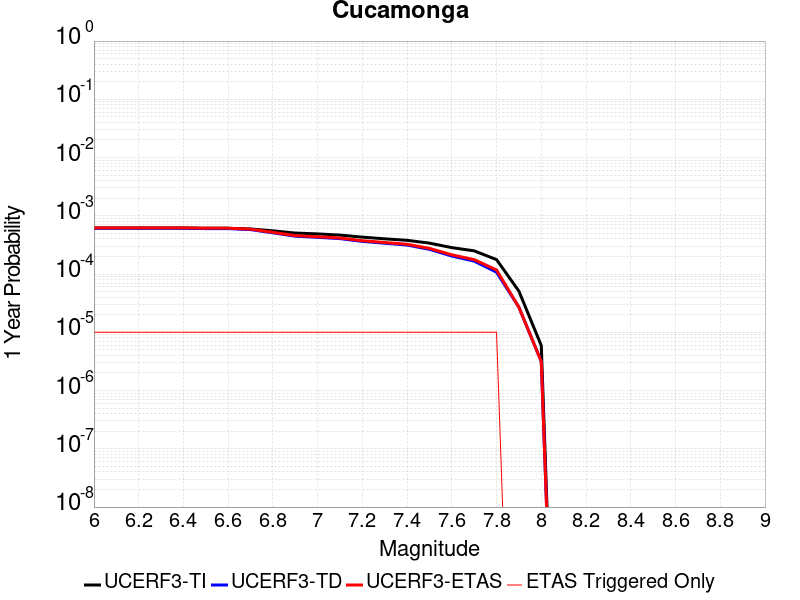 |  |

| Magnitude | 1 wk TI Prob | 1 wk TD Prob | 1 wk ETAS Prob | 1 wk ETAS/TD Gain | 1 wk ETAS Triggered Only | 1 mo TI Prob | 1 mo TD Prob | 1 mo ETAS Prob | 1 mo ETAS/TD Gain | 1 mo ETAS Triggered Only | 1 yr TI Prob | 1 yr TD Prob | 1 yr ETAS Prob | 1 yr ETAS/TD Gain | 1 yr ETAS Triggered Only | 10 yr TI Prob | 10 yr TD Prob | 10 yr ETAS Prob | 10 yr ETAS/TD Gain | 10 yr ETAS Triggered Only |
|-----|-----|-----|-----|-----|-----|-----|-----|-----|-----|-----|-----|-----|-----|-----|-----|-----|-----|-----|-----|-----|
| 6.0 | 1.1848348E-5 | 1.1736978E-5 | 1.1736978E-5 | 1.0 | 0.0 | 5.0777642E-5 | 5.030038E-5 | 5.030038E-5 | 1.0 | 0.0 | 6.180424E-4 | 6.122378E-4 | 6.2223163E-4 | 1.0163236 | 1.0E-5 | 0.0061632637 | 0.006106661 | 0.0061166 | 1.0016276 | 1.0E-5 |
| 6.1 | 1.1848348E-5 | 1.1736978E-5 | 1.1736978E-5 | 1.0 | 0.0 | 5.0777642E-5 | 5.030038E-5 | 5.030038E-5 | 1.0 | 0.0 | 6.180424E-4 | 6.122378E-4 | 6.2223163E-4 | 1.0163236 | 1.0E-5 | 0.0061632637 | 0.006106661 | 0.0061166 | 1.0016276 | 1.0E-5 |
| 6.2 | 1.1848348E-5 | 1.1736978E-5 | 1.1736978E-5 | 1.0 | 0.0 | 5.0777642E-5 | 5.030038E-5 | 5.030038E-5 | 1.0 | 0.0 | 6.180424E-4 | 6.122378E-4 | 6.2223163E-4 | 1.0163236 | 1.0E-5 | 0.0061632637 | 0.006106661 | 0.0061166 | 1.0016276 | 1.0E-5 |
| 6.3 | 1.1848348E-5 | 1.1736978E-5 | 1.1736978E-5 | 1.0 | 0.0 | 5.0777642E-5 | 5.030038E-5 | 5.030038E-5 | 1.0 | 0.0 | 6.180424E-4 | 6.122378E-4 | 6.2223163E-4 | 1.0163236 | 1.0E-5 | 0.0061632637 | 0.006106661 | 0.0061166 | 1.0016276 | 1.0E-5 |
| 6.4 | 1.1848348E-5 | 1.1736978E-5 | 1.1736978E-5 | 1.0 | 0.0 | 5.0777642E-5 | 5.030038E-5 | 5.030038E-5 | 1.0 | 0.0 | 6.180424E-4 | 6.122378E-4 | 6.2223163E-4 | 1.0163236 | 1.0E-5 | 0.0061632637 | 0.006106661 | 0.0061166 | 1.0016276 | 1.0E-5 |
| 6.5 | 1.16988695E-5 | 1.15760095E-5 | 1.15760095E-5 | 1.0 | 0.0 | 5.013705E-5 | 4.9610542E-5 | 4.9610542E-5 | 1.0 | 0.0 | 6.102476E-4 | 6.038436E-4 | 6.1383756E-4 | 1.0165505 | 1.0E-5 | 0.006085745 | 0.0060231755 | 0.006033115 | 1.0016502 | 1.0E-5 |
| 6.6 | 1.16988695E-5 | 1.15760095E-5 | 1.15760095E-5 | 1.0 | 0.0 | 5.013705E-5 | 4.9610542E-5 | 4.9610542E-5 | 1.0 | 0.0 | 6.102476E-4 | 6.038436E-4 | 6.1383756E-4 | 1.0165505 | 1.0E-5 | 0.006085745 | 0.0060231755 | 0.006033115 | 1.0016502 | 1.0E-5 |
| 6.7 | 1.1397107E-5 | 1.1114914E-5 | 1.1114914E-5 | 1.0 | 0.0 | 4.884383E-5 | 4.763449E-5 | 4.763449E-5 | 1.0 | 0.0 | 5.9451134E-4 | 5.7979807E-4 | 5.8979227E-4 | 1.0172374 | 1.0E-5 | 0.005929234 | 0.0057839802 | 0.005793922 | 1.0017189 | 1.0E-5 |
| 6.8 | 1.058387E-5 | 9.784932E-6 | 9.784932E-6 | 1.0 | 0.0 | 4.5358654E-5 | 4.1934756E-5 | 4.1934756E-5 | 1.0 | 0.0 | 5.521017E-4 | 5.104372E-4 | 5.204321E-4 | 1.0195811 | 1.0E-5 | 0.00550732 | 0.005093632 | 0.0051035807 | 1.0019532 | 1.0E-5 |
| 6.9 | 9.690046E-6 | 8.57941E-6 | 8.57941E-6 | 1.0 | 0.0 | 4.1528107E-5 | 3.6768382E-5 | 3.6768382E-5 | 1.0 | 0.0 | 5.054874E-4 | 4.4756354E-4 | 4.5755904E-4 | 1.0223331 | 1.0E-5 | 0.005043391 | 0.0044675325 | 0.004477488 | 1.0022284 | 1.0E-5 |
| 7.0 | 9.381461E-6 | 8.18703E-6 | 8.18703E-6 | 1.0 | 0.0 | 4.020564E-5 | 3.5086803E-5 | 3.5086803E-5 | 1.0 | 0.0 | 4.893937E-4 | 4.2709845E-4 | 4.3709416E-4 | 1.0234038 | 1.0E-5 | 0.0048831734 | 0.0042636883 | 0.0042736456 | 1.0023354 | 1.0E-5 |
| 7.1 | 8.946492E-6 | 7.781815E-6 | 7.781815E-6 | 1.0 | 0.0 | 3.8341543E-5 | 3.335021E-5 | 3.335021E-5 | 1.0 | 0.0 | 4.667083E-4 | 4.059635E-4 | 4.1595945E-4 | 1.0246228 | 1.0E-5 | 0.0046572937 | 0.004053133 | 0.004063092 | 1.0024573 | 1.0E-5 |
| 7.2 | 8.251016E-6 | 6.9752045E-6 | 6.9752045E-6 | 1.0 | 0.0 | 3.5361016E-5 | 2.9893392E-5 | 2.9893392E-5 | 1.0 | 0.0 | 4.3043532E-4 | 3.638915E-4 | 3.7388786E-4 | 1.0274707 | 1.0E-5 | 0.0042960253 | 0.0036338675 | 0.0036438312 | 1.0027419 | 1.0E-5 |
| 7.3 | 7.717881E-6 | 6.486278E-6 | 6.486278E-6 | 1.0 | 0.0 | 3.3076216E-5 | 2.779804E-5 | 2.779804E-5 | 1.0 | 0.0 | 4.026285E-4 | 3.3838878E-4 | 3.483854E-4 | 1.0295419 | 1.0E-5 | 0.004018998 | 0.0033796541 | 0.0033896205 | 1.0029489 | 1.0E-5 |
| 7.4 | 7.275623E-6 | 6.0319257E-6 | 6.0319257E-6 | 1.0 | 0.0 | 3.118087E-5 | 2.5850855E-5 | 2.5850855E-5 | 1.0 | 0.0 | 3.7956095E-4 | 3.1468892E-4 | 3.246858E-4 | 1.0317674 | 1.0E-5 | 0.0037891332 | 0.0031433494 | 0.003153318 | 1.0031713 | 1.0E-5 |
| 7.5 | 6.5109502E-6 | 5.100523E-6 | 5.100523E-6 | 1.0 | 0.0 | 2.7903774E-5 | 2.1859203E-5 | 2.1859203E-5 | 1.0 | 0.0 | 3.3967546E-4 | 2.6610342E-4 | 2.7610076E-4 | 1.0375694 | 1.0E-5 | 0.0033915674 | 0.0026587504 | 0.002668724 | 1.0037512 | 1.0E-5 |
| 7.6 | 5.4495326E-6 | 3.9084925E-6 | 3.9084925E-6 | 1.0 | 0.0 | 2.335493E-5 | 1.6750575E-5 | 1.6750575E-5 | 1.0 | 0.0 | 2.8430918E-4 | 2.0391923E-4 | 2.1391718E-4 | 1.049029 | 1.0E-5 | 0.0028394572 | 0.0020382188 | 0.0020481984 | 1.0048963 | 1.0E-5 |
| 7.7 | 4.7997164E-6 | 3.200177E-6 | 3.200177E-6 | 1.0 | 0.0 | 2.057005E-5 | 1.3714973E-5 | 1.3714973E-5 | 1.0 | 0.0 | 2.504116E-4 | 1.6696703E-4 | 1.7696536E-4 | 1.059882 | 1.0E-5 | 0.002501296 | 0.0016693253 | 0.0016793086 | 1.0059805 | 1.0E-5 |
| 7.8 | 3.3941733E-6 | 2.0641405E-6 | 2.0641405E-6 | 1.0 | 0.0 | 1.4546376E-5 | 8.846287E-6 | 8.846287E-6 | 1.0 | 0.0 | 1.7708774E-4 | 1.0769824E-4 | 1.1769716E-4 | 1.092842 | 1.0E-5 | 0.0017694668 | 0.00107658 | 0.0010865693 | 1.0092787 | 1.0E-5 |
| 7.9 | 9.750552E-7 | 5.155719E-7 | 5.155719E-7 | 1.0 | 0.0 | 4.178801E-6 | 2.209592E-6 | 2.209592E-6 | 1.0 | 0.0 | 5.0875715E-5 | 2.6901454E-5 | 2.6901454E-5 | 1.0 | 0.0 | 5.086407E-4 | 2.6898237E-4 | 2.6898237E-4 | 1.0 | 0.0 |
| 8.0 | 1.133857E-7 | 6.053303E-8 | 6.053303E-8 | 1.0 | 0.0 | 4.8593864E-7 | 2.5942725E-7 | 2.5942725E-7 | 1.0 | 0.0 | 5.9162867E-6 | 3.1585225E-6 | 3.1585225E-6 | 1.0 | 0.0 | 5.916129E-5 | 3.158479E-5 | 3.158479E-5 | 1.0 | 0.0 |

## Calaveras (So) - Paicines extension 2011 CFM
*[(top)](#table-of-contents)*

| 1 Week | 1 Month | 1 Year | 10 Year |
|-----|-----|-----|-----|
|  |  |  |  |

| Magnitude | 1 wk TI Prob | 1 wk TD Prob | 1 wk ETAS Prob | 1 wk ETAS/TD Gain | 1 wk ETAS Triggered Only | 1 mo TI Prob | 1 mo TD Prob | 1 mo ETAS Prob | 1 mo ETAS/TD Gain | 1 mo ETAS Triggered Only | 1 yr TI Prob | 1 yr TD Prob | 1 yr ETAS Prob | 1 yr ETAS/TD Gain | 1 yr ETAS Triggered Only | 10 yr TI Prob | 10 yr TD Prob | 10 yr ETAS Prob | 10 yr ETAS/TD Gain | 10 yr ETAS Triggered Only |
|-----|-----|-----|-----|-----|-----|-----|-----|-----|-----|-----|-----|-----|-----|-----|-----|-----|-----|-----|-----|-----|
| 6.0 | 1.5183659E-4 | 3.0520261E-4 | 3.0520261E-4 | 1.0 | 0.0 | 6.5056595E-4 | 0.0013068002 | 0.0013068002 | 1.0 | 0.0 | 0.007891912 | 0.015695969 | 0.01570581 | 1.0006272 | 1.0E-5 | 0.076174594 | 0.1384846 | 0.13849321 | 1.0000622 | 1.0E-5 |
| 6.1 | 1.5024997E-4 | 3.0214462E-4 | 3.0214462E-4 | 1.0 | 0.0 | 6.437695E-4 | 0.0012937093 | 0.0012937093 | 1.0 | 0.0 | 0.0078097614 | 0.015539361 | 0.015549206 | 1.0006335 | 1.0E-5 | 0.075409345 | 0.13715418 | 0.1371628 | 1.000063 | 1.0E-5 |
| 6.2 | 1.2743923E-4 | 2.5312972E-4 | 2.5312972E-4 | 1.0 | 0.0 | 5.460538E-4 | 0.0010839769 | 0.0010839769 | 1.0 | 0.0 | 0.0066279583 | 0.013046647 | 0.013056517 | 1.0007565 | 1.0E-5 | 0.064337276 | 0.11725156 | 0.11726039 | 1.0000753 | 1.0E-5 |
| 6.3 | 1.1525114E-4 | 2.2598551E-4 | 2.2598551E-4 | 1.0 | 0.0 | 4.9383997E-4 | 9.678517E-4 | 9.678517E-4 | 1.0 | 0.0 | 0.0059959386 | 0.011667848 | 0.011677731 | 1.0008471 | 1.0E-5 | 0.058367174 | 0.10636757 | 0.10637651 | 1.000084 | 1.0E-5 |
| 6.4 | 1.07200925E-4 | 2.0839735E-4 | 2.0839735E-4 | 1.0 | 0.0 | 4.5935164E-4 | 8.925907E-4 | 8.925907E-4 | 1.0 | 0.0 | 0.0055782744 | 0.010772728 | 0.01078262 | 1.0009183 | 1.0E-5 | 0.0544031 | 0.09919019 | 0.0991992 | 1.0000908 | 1.0E-5 |
| 6.5 | 9.69631E-5 | 1.8733864E-4 | 1.8733864E-4 | 1.0 | 0.0 | 4.1548995E-4 | 8.024415E-4 | 8.024415E-4 | 1.0 | 0.0 | 0.0050468626 | 0.009694614 | 0.009704517 | 1.0010215 | 1.0E-5 | 0.04933773 | 0.09008199 | 0.09009109 | 1.000101 | 1.0E-5 |
| 6.6 | 8.0552316E-5 | 1.5070252E-4 | 1.5070252E-4 | 1.0 | 0.0 | 3.4517853E-4 | 6.456723E-4 | 6.456723E-4 | 1.0 | 0.0 | 0.0041944524 | 0.0078262845 | 0.007836206 | 1.0012678 | 1.0E-5 | 0.04116161 | 0.07485166 | 0.074860916 | 1.0001236 | 1.0E-5 |
| 6.7 | 7.815757E-5 | 1.4610846E-4 | 1.4610846E-4 | 1.0 | 0.0 | 3.34918E-4 | 6.259958E-4 | 6.259958E-4 | 1.0 | 0.0 | 0.004070005 | 0.0075890897 | 0.007599014 | 1.0013077 | 1.0E-5 | 0.039962657 | 0.07270118 | 0.072710454 | 1.0001276 | 1.0E-5 |
| 6.8 | 6.965264E-5 | 1.2722371E-4 | 1.2722371E-4 | 1.0 | 0.0 | 2.9847719E-4 | 5.4511573E-4 | 5.4511573E-4 | 1.0 | 0.0 | 0.0036279052 | 0.006613387 | 0.0066233207 | 1.001502 | 1.0E-5 | 0.03569247 | 0.063796505 | 0.06380586 | 1.0001467 | 1.0E-5 |
| 6.9 | 5.8000453E-5 | 1.0143533E-4 | 1.0143533E-4 | 1.0 | 0.0 | 2.4854968E-4 | 4.346509E-4 | 4.346509E-4 | 1.0 | 0.0 | 0.0030218933 | 0.0052791317 | 0.005289079 | 1.0018842 | 1.0E-5 | 0.029811295 | 0.05150093 | 0.051510416 | 1.0001842 | 1.0E-5 |
| 7.0 | 4.9865852E-5 | 8.567664E-5 | 8.567664E-5 | 1.0 | 0.0 | 2.1369329E-4 | 3.6713443E-4 | 3.6713443E-4 | 1.0 | 0.0 | 0.0025986114 | 0.0044607893 | 0.0044707446 | 1.0022317 | 1.0E-5 | 0.025684336 | 0.043780252 | 0.04378981 | 1.0002184 | 1.0E-5 |
| 7.1 | 4.283875E-5 | 7.112113E-5 | 7.112113E-5 | 1.0 | 0.0 | 1.8358172E-4 | 3.0476955E-4 | 3.0476955E-4 | 1.0 | 0.0 | 0.0022328163 | 0.0037043123 | 0.0037142753 | 1.0026896 | 1.0E-5 | 0.022105146 | 0.036733795 | 0.03674343 | 1.0002623 | 1.0E-5 |
| 7.2 | 3.450115E-5 | 5.577521E-5 | 5.577521E-5 | 1.0 | 0.0 | 1.478537E-4 | 2.3901489E-4 | 2.3901489E-4 | 1.0 | 0.0 | 0.0017986323 | 0.002906152 | 0.002906152 | 1.0 | 0.0 | 0.017841442 | 0.029076809 | 0.029076809 | 1.0 | 0.0 |
| 7.3 | 2.5709045E-5 | 4.0586976E-5 | 4.0586976E-5 | 1.0 | 0.0 | 1.1017697E-4 | 1.7393267E-4 | 1.7393267E-4 | 1.0 | 0.0 | 0.0013405791 | 0.0021155905 | 0.0021155905 | 1.0 | 0.0 | 0.013325208 | 0.021295162 | 0.021295162 | 1.0 | 0.0 |
| 7.4 | 1.8003093E-5 | 2.8508479E-5 | 2.8508479E-5 | 1.0 | 0.0 | 7.715383E-5 | 1.2217349E-4 | 1.2217349E-4 | 1.0 | 0.0 | 9.3894306E-4 | 0.0014864496 | 0.0014864496 | 1.0 | 0.0 | 0.009349857 | 0.015050137 | 0.015050137 | 1.0 | 0.0 |
| 7.5 | 1.5595824E-5 | 2.5820891E-5 | 2.5820891E-5 | 1.0 | 0.0 | 6.683753E-5 | 1.1065628E-4 | 1.1065628E-4 | 1.0 | 0.0 | 8.134431E-4 | 0.0013464098 | 0.0013464098 | 1.0 | 0.0 | 0.008104719 | 0.013650169 | 0.013650169 | 1.0 | 0.0 |
| 7.6 | 1.1110309E-5 | 1.9220464E-5 | 1.9220464E-5 | 1.0 | 0.0 | 4.761474E-5 | 8.2370825E-5 | 8.2370825E-5 | 1.0 | 0.0 | 5.795553E-4 | 0.0010024047 | 0.0010024047 | 1.0 | 0.0 | 0.0057804612 | 0.010202107 | 0.010202107 | 1.0 | 0.0 |
| 7.7 | 6.2140443E-6 | 1.04366445E-5 | 1.04366445E-5 | 1.0 | 0.0 | 2.6631347E-5 | 4.472771E-5 | 4.472771E-5 | 1.0 | 0.0 | 3.241884E-4 | 5.444239E-4 | 5.444239E-4 | 1.0 | 0.0 | 0.0032371588 | 0.005619645 | 0.005619645 | 1.0 | 0.0 |
| 7.8 | 5.305533E-6 | 9.432705E-6 | 9.432705E-6 | 1.0 | 0.0 | 2.27378E-5 | 4.0425253E-5 | 4.0425253E-5 | 1.0 | 0.0 | 2.7679754E-4 | 4.920664E-4 | 4.920664E-4 | 1.0 | 0.0 | 0.0027645302 | 0.0050742165 | 0.0050742165 | 1.0 | 0.0 |
| 7.9 | 3.363505E-6 | 7.384745E-6 | 7.384745E-6 | 1.0 | 0.0 | 1.4414942E-5 | 3.1648524E-5 | 3.1648524E-5 | 1.0 | 0.0 | 1.7548777E-4 | 3.8525273E-4 | 3.8525273E-4 | 1.0 | 0.0 | 0.0017534926 | 0.0039484617 | 0.0039484617 | 1.0 | 0.0 |
| 8.0 | 2.0271132E-6 | 4.4130247E-6 | 4.4130247E-6 | 1.0 | 0.0 | 8.687599E-6 | 1.8912826E-5 | 1.8912826E-5 | 1.0 | 0.0 | 1.05766376E-4 | 2.3023938E-4 | 2.3023938E-4 | 1.0 | 0.0 | 0.0010571606 | 0.002351026 | 0.002351026 | 1.0 | 0.0 |
| 8.1 | 1.2206116E-6 | 2.3750408E-6 | 2.3750408E-6 | 1.0 | 0.0 | 5.2311816E-6 | 1.0178706E-5 | 1.0178706E-5 | 1.0 | 0.0 | 6.3687774E-5 | 1.2391874E-4 | 1.2391874E-4 | 1.0 | 0.0 | 6.366953E-4 | 0.0012704867 | 0.0012704867 | 1.0 | 0.0 |

## Raymond
*[(top)](#table-of-contents)*

| 1 Week | 1 Month | 1 Year | 10 Year |
|-----|-----|-----|-----|
|  |  |  |  |

| Magnitude | 1 wk TI Prob | 1 wk TD Prob | 1 wk ETAS Prob | 1 wk ETAS/TD Gain | 1 wk ETAS Triggered Only | 1 mo TI Prob | 1 mo TD Prob | 1 mo ETAS Prob | 1 mo ETAS/TD Gain | 1 mo ETAS Triggered Only | 1 yr TI Prob | 1 yr TD Prob | 1 yr ETAS Prob | 1 yr ETAS/TD Gain | 1 yr ETAS Triggered Only | 10 yr TI Prob | 10 yr TD Prob | 10 yr ETAS Prob | 10 yr ETAS/TD Gain | 10 yr ETAS Triggered Only |
|-----|-----|-----|-----|-----|-----|-----|-----|-----|-----|-----|-----|-----|-----|-----|-----|-----|-----|-----|-----|-----|
| 6.0 | 1.5157413E-5 | 1.581008E-5 | 1.581008E-5 | 1.0 | 0.0 | 6.4958724E-5 | 6.7755864E-5 | 6.7755864E-5 | 1.0 | 0.0 | 7.905855E-4 | 8.246405E-4 | 8.3463226E-4 | 1.0121166 | 1.0E-5 | 0.007877788 | 0.008218332 | 0.00822825 | 1.0012068 | 1.0E-5 |
| 6.1 | 1.5157413E-5 | 1.581008E-5 | 1.581008E-5 | 1.0 | 0.0 | 6.4958724E-5 | 6.7755864E-5 | 6.7755864E-5 | 1.0 | 0.0 | 7.905855E-4 | 8.246405E-4 | 8.3463226E-4 | 1.0121166 | 1.0E-5 | 0.007877788 | 0.008218332 | 0.00822825 | 1.0012068 | 1.0E-5 |
| 6.2 | 1.5157413E-5 | 1.581008E-5 | 1.581008E-5 | 1.0 | 0.0 | 6.4958724E-5 | 6.7755864E-5 | 6.7755864E-5 | 1.0 | 0.0 | 7.905855E-4 | 8.246405E-4 | 8.3463226E-4 | 1.0121166 | 1.0E-5 | 0.007877788 | 0.008218332 | 0.00822825 | 1.0012068 | 1.0E-5 |
| 6.3 | 1.5157413E-5 | 1.581008E-5 | 1.581008E-5 | 1.0 | 0.0 | 6.4958724E-5 | 6.7755864E-5 | 6.7755864E-5 | 1.0 | 0.0 | 7.905855E-4 | 8.246405E-4 | 8.3463226E-4 | 1.0121166 | 1.0E-5 | 0.007877788 | 0.008218332 | 0.00822825 | 1.0012068 | 1.0E-5 |
| 6.4 | 1.3941944E-5 | 1.4454646E-5 | 1.4454646E-5 | 1.0 | 0.0 | 5.9749822E-5 | 6.194714E-5 | 6.194714E-5 | 1.0 | 0.0 | 7.2721124E-4 | 7.539688E-4 | 7.6396123E-4 | 1.0132531 | 1.0E-5 | 0.007248361 | 0.007516451 | 0.007526376 | 1.0013204 | 1.0E-5 |
| 6.5 | 1.3941944E-5 | 1.4454646E-5 | 1.4454646E-5 | 1.0 | 0.0 | 5.9749822E-5 | 6.194714E-5 | 6.194714E-5 | 1.0 | 0.0 | 7.2721124E-4 | 7.539688E-4 | 7.6396123E-4 | 1.0132531 | 1.0E-5 | 0.007248361 | 0.007516451 | 0.007526376 | 1.0013204 | 1.0E-5 |
| 6.6 | 1.0542609E-5 | 1.06710795E-5 | 1.06710795E-5 | 1.0 | 0.0 | 4.5181827E-5 | 4.5732424E-5 | 4.5732424E-5 | 1.0 | 0.0 | 5.499499E-4 | 5.566555E-4 | 5.6664995E-4 | 1.0179545 | 1.0E-5 | 0.005485909 | 0.0055531827 | 0.005563127 | 1.0017908 | 1.0E-5 |
| 6.7 | 1.0542609E-5 | 1.06710795E-5 | 1.06710795E-5 | 1.0 | 0.0 | 4.5181827E-5 | 4.5732424E-5 | 4.5732424E-5 | 1.0 | 0.0 | 5.499499E-4 | 5.566555E-4 | 5.6664995E-4 | 1.0179545 | 1.0E-5 | 0.005485909 | 0.0055531827 | 0.005563127 | 1.0017908 | 1.0E-5 |
| 6.8 | 1.0079132E-5 | 1.0176614E-5 | 1.0176614E-5 | 1.0 | 0.0 | 4.3195567E-5 | 4.361336E-5 | 4.361336E-5 | 1.0 | 0.0 | 5.257791E-4 | 5.3086865E-4 | 5.408633E-4 | 1.0188271 | 1.0E-5 | 0.0052453685 | 0.005296564 | 0.005306511 | 1.001878 | 1.0E-5 |
| 6.9 | 7.721598E-6 | 7.54888E-6 | 7.54888E-6 | 1.0 | 0.0 | 3.3092143E-5 | 3.235195E-5 | 3.235195E-5 | 1.0 | 0.0 | 4.0282236E-4 | 3.93815E-4 | 4.0381105E-4 | 1.0253826 | 1.0E-5 | 0.0040209293 | 0.0039313147 | 0.003941275 | 1.0025337 | 1.0E-5 |
| 7.0 | 7.137566E-6 | 6.9112825E-6 | 6.9112825E-6 | 1.0 | 0.0 | 3.058921E-5 | 2.9619452E-5 | 2.9619452E-5 | 1.0 | 0.0 | 3.7236E-4 | 3.6055825E-4 | 3.7055463E-4 | 1.0277247 | 1.0E-5 | 0.0037173668 | 0.0035998605 | 0.0036098245 | 1.0027679 | 1.0E-5 |
| 7.1 | 5.654976E-6 | 5.299521E-6 | 5.299521E-6 | 1.0 | 0.0 | 2.4235387E-5 | 2.2712036E-5 | 2.2712036E-5 | 1.0 | 0.0 | 2.9502588E-4 | 2.7648418E-4 | 2.864814E-4 | 1.0361584 | 1.0E-5 | 0.0029463451 | 0.0027614427 | 0.002771415 | 1.0036113 | 1.0E-5 |
| 7.2 | 4.9358455E-6 | 4.52664E-6 | 4.52664E-6 | 1.0 | 0.0 | 2.1153453E-5 | 1.9399742E-5 | 1.9399742E-5 | 1.0 | 0.0 | 2.5751285E-4 | 2.361664E-4 | 2.4616404E-4 | 1.042333 | 1.0E-5 | 0.0025721465 | 0.002359186 | 0.0023691626 | 1.0042287 | 1.0E-5 |
| 7.3 | 4.2368597E-6 | 3.8055994E-6 | 3.8055994E-6 | 1.0 | 0.0 | 1.8157843E-5 | 1.630961E-5 | 1.630961E-5 | 1.0 | 0.0 | 2.2104931E-4 | 1.9855151E-4 | 2.0854952E-4 | 1.0503547 | 1.0E-5 | 0.0022082955 | 0.0019837697 | 0.0019937498 | 1.0050309 | 1.0E-5 |
| 7.4 | 3.4999923E-6 | 3.0437288E-6 | 3.0437288E-6 | 1.0 | 0.0 | 1.49998805E-5 | 1.3044487E-5 | 1.3044487E-5 | 1.0 | 0.0 | 1.8260824E-4 | 1.5880514E-4 | 1.6880354E-4 | 1.0629603 | 1.0E-5 | 0.0018245826 | 0.001586942 | 0.0015969261 | 1.0062914 | 1.0E-5 |
| 7.5 | 2.738017E-6 | 2.302031E-6 | 2.302031E-6 | 1.0 | 0.0 | 1.1734306E-5 | 9.865809E-6 | 9.865809E-6 | 1.0 | 0.0 | 1.428558E-4 | 1.2010968E-4 | 1.3010848E-4 | 1.0832472 | 1.0E-5 | 0.0014276401 | 0.0012004718 | 0.0012104597 | 1.0083201 | 1.0E-5 |
| 7.6 | 1.8186392E-6 | 1.4422955E-6 | 1.4422955E-6 | 1.0 | 0.0 | 7.794145E-6 | 6.1812516E-6 | 6.1812516E-6 | 1.0 | 0.0 | 9.488958E-5 | 7.525418E-5 | 8.525343E-5 | 1.1328729 | 1.0E-5 | 9.4849075E-4 | 7.5230823E-4 | 7.6230074E-4 | 1.0132824 | 1.0E-5 |
| 7.7 | 1.0660348E-6 | 7.643642E-7 | 7.643642E-7 | 1.0 | 0.0 | 4.5687125E-6 | 3.2758423E-6 | 3.2758423E-6 | 1.0 | 0.0 | 5.5622655E-5 | 3.9882667E-5 | 4.988227E-5 | 1.2507255 | 1.0E-5 | 5.5608735E-4 | 3.98774E-4 | 4.0877E-4 | 1.0250669 | 1.0E-5 |
| 7.8 | 6.913602E-7 | 4.32024E-7 | 4.32024E-7 | 1.0 | 0.0 | 2.962969E-6 | 1.8515301E-6 | 1.8515301E-6 | 1.0 | 0.0 | 3.607355E-5 | 2.2542152E-5 | 3.2541928E-5 | 1.4436034 | 1.0E-5 | 3.6067693E-4 | 2.2541644E-4 | 2.3541419E-4 | 1.0443523 | 1.0E-5 |
| 7.9 | 7.425201E-8 | 5.3221317E-8 | 5.3221317E-8 | 1.0 | 0.0 | 3.1822285E-7 | 2.2809135E-7 | 2.2809135E-7 | 1.0 | 0.0 | 3.874356E-6 | 2.77701E-6 | 2.77701E-6 | 1.0 | 0.0 | 3.8742884E-5 | 2.7769884E-5 | 2.7769884E-5 | 1.0 | 0.0 |

## Greenville (So) 2011 CFM
*[(top)](#table-of-contents)*

| 1 Week | 1 Month | 1 Year | 10 Year |
|-----|-----|-----|-----|
|  |  |  |  |

| Magnitude | 1 wk TI Prob | 1 wk TD Prob | 1 wk ETAS Prob | 1 wk ETAS/TD Gain | 1 wk ETAS Triggered Only | 1 mo TI Prob | 1 mo TD Prob | 1 mo ETAS Prob | 1 mo ETAS/TD Gain | 1 mo ETAS Triggered Only | 1 yr TI Prob | 1 yr TD Prob | 1 yr ETAS Prob | 1 yr ETAS/TD Gain | 1 yr ETAS Triggered Only | 10 yr TI Prob | 10 yr TD Prob | 10 yr ETAS Prob | 10 yr ETAS/TD Gain | 10 yr ETAS Triggered Only |
|-----|-----|-----|-----|-----|-----|-----|-----|-----|-----|-----|-----|-----|-----|-----|-----|-----|-----|-----|-----|-----|
| 6.0 | 4.279693E-5 | 5.5040175E-5 | 5.5040175E-5 | 1.0 | 0.0 | 1.8340252E-4 | 2.3586708E-4 | 2.3586708E-4 | 1.0 | 0.0 | 0.0022306389 | 0.0028681497 | 0.0028781209 | 1.0034766 | 1.0E-5 | 0.022083808 | 0.028338503 | 0.028348219 | 1.0003428 | 1.0E-5 |
| 6.1 | 3.4037297E-5 | 4.31921E-5 | 4.31921E-5 | 1.0 | 0.0 | 1.4586597E-4 | 1.8509696E-4 | 1.8509696E-4 | 1.0 | 0.0 | 0.0017744715 | 0.002251385 | 0.0022613625 | 1.0044317 | 1.0E-5 | 0.01760369 | 0.022302942 | 0.02231272 | 1.0004383 | 1.0E-5 |
| 6.2 | 3.4037297E-5 | 4.31921E-5 | 4.31921E-5 | 1.0 | 0.0 | 1.4586597E-4 | 1.8509696E-4 | 1.8509696E-4 | 1.0 | 0.0 | 0.0017744715 | 0.002251385 | 0.0022613625 | 1.0044317 | 1.0E-5 | 0.01760369 | 0.022302942 | 0.02231272 | 1.0004383 | 1.0E-5 |
| 6.3 | 2.5956324E-5 | 3.2429205E-5 | 3.2429205E-5 | 1.0 | 0.0 | 1.11236644E-4 | 1.389753E-4 | 1.389753E-4 | 1.0 | 0.0 | 0.0013534647 | 0.0016907753 | 0.0017007584 | 1.0059044 | 1.0E-5 | 0.013452509 | 0.016786257 | 0.01679609 | 1.0005857 | 1.0E-5 |
| 6.4 | 2.1145053E-5 | 2.6197658E-5 | 2.6197658E-5 | 1.0 | 0.0 | 9.061851E-5 | 1.12271E-4 | 1.12271E-4 | 1.0 | 0.0 | 0.0011027219 | 0.0013660737 | 0.0013760601 | 1.0073103 | 1.0E-5 | 0.01097266 | 0.013580541 | 0.013590406 | 1.0007263 | 1.0E-5 |
| 6.5 | 2.0030959E-5 | 2.4795796E-5 | 2.4795796E-5 | 1.0 | 0.0 | 8.584414E-5 | 1.0626355E-4 | 1.0626355E-4 | 1.0 | 0.0 | 0.0010446513 | 0.0012930218 | 0.0013030089 | 1.0077238 | 1.0E-5 | 0.010397541 | 0.012858701 | 0.012868572 | 1.0007677 | 1.0E-5 |
| 6.6 | 1.8395405E-5 | 2.275447E-5 | 2.275447E-5 | 1.0 | 0.0 | 7.8835066E-5 | 9.751567E-5 | 9.751567E-5 | 1.0 | 0.0 | 9.5939427E-4 | 0.0011866351 | 0.0011866351 | 1.0 | 0.0 | 0.009552629 | 0.011806407 | 0.011806407 | 1.0 | 0.0 |
| 6.7 | 1.7883482E-5 | 2.2125516E-5 | 2.2125516E-5 | 1.0 | 0.0 | 7.664124E-5 | 9.482036E-5 | 9.482036E-5 | 1.0 | 0.0 | 9.3270757E-4 | 0.001153855 | 0.001153855 | 1.0 | 0.0 | 0.009288026 | 0.011482056 | 0.011482056 | 1.0 | 0.0 |
| 6.8 | 1.3373564E-5 | 1.6506008E-5 | 1.6506008E-5 | 1.0 | 0.0 | 5.7314013E-5 | 7.07382E-5 | 7.07382E-5 | 1.0 | 0.0 | 6.975747E-4 | 8.609121E-4 | 8.609121E-4 | 1.0 | 0.0 | 0.0069538904 | 0.0085777445 | 0.0085777445 | 1.0 | 0.0 |
| 6.9 | 1.06692905E-5 | 1.3152646E-5 | 1.3152646E-5 | 1.0 | 0.0 | 4.5724726E-5 | 5.6367327E-5 | 5.6367327E-5 | 1.0 | 0.0 | 5.5655633E-4 | 6.860674E-4 | 6.860674E-4 | 1.0 | 0.0 | 0.005551645 | 0.006841092 | 0.006841092 | 1.0 | 0.0 |
| 7.0 | 8.157512E-6 | 1.0062722E-5 | 1.0062722E-5 | 1.0 | 0.0 | 3.4960296E-5 | 4.312526E-5 | 4.312526E-5 | 1.0 | 0.0 | 4.2555845E-4 | 5.249272E-4 | 5.249272E-4 | 1.0 | 0.0 | 0.004247444 | 0.0052377163 | 0.0052377163 | 1.0 | 0.0 |
| 7.1 | 6.1467113E-6 | 7.6275282E-6 | 7.6275282E-6 | 1.0 | 0.0 | 2.6342783E-5 | 3.2689004E-5 | 3.2689004E-5 | 1.0 | 0.0 | 3.206762E-4 | 3.9791677E-4 | 3.9791677E-4 | 1.0 | 0.0 | 0.0032021382 | 0.0039725974 | 0.0039725974 | 1.0 | 0.0 |
| 7.2 | 4.713467E-6 | 5.914258E-6 | 5.914258E-6 | 1.0 | 0.0 | 2.0200418E-5 | 2.5346577E-5 | 2.5346577E-5 | 1.0 | 0.0 | 2.4591232E-4 | 3.0855148E-4 | 3.0855148E-4 | 1.0 | 0.0 | 0.0024564038 | 0.0030817203 | 0.0030817203 | 1.0 | 0.0 |
| 7.3 | 2.3266216E-6 | 2.9540624E-6 | 2.9540624E-6 | 1.0 | 0.0 | 9.971197E-6 | 1.2660207E-5 | 1.2660207E-5 | 1.0 | 0.0 | 1.2139256E-4 | 1.5412726E-4 | 1.5412726E-4 | 1.0 | 0.0 | 0.0012132627 | 0.0015405101 | 0.0015405101 | 1.0 | 0.0 |
| 7.4 | 1.3314E-6 | 1.7179856E-6 | 1.7179856E-6 | 1.0 | 0.0 | 5.7059874E-6 | 7.362775E-6 | 7.362775E-6 | 1.0 | 0.0 | 6.946818E-5 | 8.9638146E-5 | 8.9638146E-5 | 1.0 | 0.0 | 6.9446466E-4 | 8.9630415E-4 | 8.9630415E-4 | 1.0 | 0.0 |
| 7.5 | 1.0362941E-6 | 1.346915E-6 | 1.346915E-6 | 1.0 | 0.0 | 4.4412527E-6 | 5.7724806E-6 | 5.7724806E-6 | 1.0 | 0.0 | 5.407091E-5 | 7.027773E-5 | 7.027773E-5 | 1.0 | 0.0 | 5.405776E-4 | 7.0282683E-4 | 7.0282683E-4 | 1.0 | 0.0 |
| 7.6 | 7.764784E-7 | 1.008888E-6 | 1.008888E-6 | 1.0 | 0.0 | 3.3277602E-6 | 4.3237987E-6 | 4.3237987E-6 | 1.0 | 0.0 | 4.0514726E-5 | 5.264102E-5 | 5.264102E-5 | 1.0 | 0.0 | 4.050734E-4 | 5.2651105E-4 | 5.2651105E-4 | 1.0 | 0.0 |
| 7.7 | 1.6927763E-7 | 2.2140175E-7 | 2.2140175E-7 | 1.0 | 0.0 | 7.2547533E-7 | 9.488643E-7 | 9.488643E-7 | 1.0 | 0.0 | 8.832627E-6 | 1.1552364E-5 | 1.1552364E-5 | 1.0 | 0.0 | 8.8322755E-5 | 1.155491E-4 | 1.155491E-4 | 1.0 | 0.0 |

## San Andreas (North Branch Mill Creek)
*[(top)](#table-of-contents)*

| 1 Week | 1 Month | 1 Year | 10 Year |
|-----|-----|-----|-----|
|  |  |  |  |

| Magnitude | 1 wk TI Prob | 1 wk TD Prob | 1 wk ETAS Prob | 1 wk ETAS/TD Gain | 1 wk ETAS Triggered Only | 1 mo TI Prob | 1 mo TD Prob | 1 mo ETAS Prob | 1 mo ETAS/TD Gain | 1 mo ETAS Triggered Only | 1 yr TI Prob | 1 yr TD Prob | 1 yr ETAS Prob | 1 yr ETAS/TD Gain | 1 yr ETAS Triggered Only | 10 yr TI Prob | 10 yr TD Prob | 10 yr ETAS Prob | 10 yr ETAS/TD Gain | 10 yr ETAS Triggered Only |
|-----|-----|-----|-----|-----|-----|-----|-----|-----|-----|-----|-----|-----|-----|-----|-----|-----|-----|-----|-----|-----|
| 6.0 | 1.3461156E-5 | 2.3499637E-5 | 3.34994E-5 | 1.4255285 | 1.0E-5 | 5.7689394E-5 | 1.0070886E-4 | 1.1070785E-4 | 1.0992861 | 1.0E-5 | 7.02142E-4 | 0.001225444 | 0.0012354318 | 1.0081503 | 1.0E-5 | 0.0069992766 | 0.012227687 | 0.012237565 | 1.0008078 | 1.0E-5 |
| 6.1 | 1.3461156E-5 | 2.3499637E-5 | 3.34994E-5 | 1.4255285 | 1.0E-5 | 5.7689394E-5 | 1.0070886E-4 | 1.1070785E-4 | 1.0992861 | 1.0E-5 | 7.02142E-4 | 0.001225444 | 0.0012354318 | 1.0081503 | 1.0E-5 | 0.0069992766 | 0.012227687 | 0.012237565 | 1.0008078 | 1.0E-5 |
| 6.2 | 1.3461156E-5 | 2.3499637E-5 | 3.34994E-5 | 1.4255285 | 1.0E-5 | 5.7689394E-5 | 1.0070886E-4 | 1.1070785E-4 | 1.0992861 | 1.0E-5 | 7.02142E-4 | 0.001225444 | 0.0012354318 | 1.0081503 | 1.0E-5 | 0.0069992766 | 0.012227687 | 0.012237565 | 1.0008078 | 1.0E-5 |
| 6.3 | 1.3461156E-5 | 2.3499637E-5 | 3.34994E-5 | 1.4255285 | 1.0E-5 | 5.7689394E-5 | 1.0070886E-4 | 1.1070785E-4 | 1.0992861 | 1.0E-5 | 7.02142E-4 | 0.001225444 | 0.0012354318 | 1.0081503 | 1.0E-5 | 0.0069992766 | 0.012227687 | 0.012237565 | 1.0008078 | 1.0E-5 |
| 6.4 | 1.3461156E-5 | 2.3499637E-5 | 3.34994E-5 | 1.4255285 | 1.0E-5 | 5.7689394E-5 | 1.0070886E-4 | 1.1070785E-4 | 1.0992861 | 1.0E-5 | 7.02142E-4 | 0.001225444 | 0.0012354318 | 1.0081503 | 1.0E-5 | 0.0069992766 | 0.012227687 | 0.012237565 | 1.0008078 | 1.0E-5 |
| 6.5 | 1.3450706E-5 | 2.3488596E-5 | 3.3488363E-5 | 1.4257286 | 1.0E-5 | 5.764461E-5 | 1.0066155E-4 | 1.1066054E-4 | 1.0993328 | 1.0E-5 | 7.0159714E-4 | 0.0012248686 | 0.0012348564 | 1.0081542 | 1.0E-5 | 0.006993862 | 0.012221997 | 0.012231875 | 1.0008082 | 1.0E-5 |
| 6.6 | 1.3074523E-5 | 2.310288E-5 | 3.310265E-5 | 1.4328364 | 1.0E-5 | 5.6032466E-5 | 9.9008605E-5 | 1.0900762E-4 | 1.1009914 | 1.0E-5 | 6.8198174E-4 | 0.0012047664 | 0.0012147544 | 1.0082904 | 1.0E-5 | 0.006798926 | 0.012023162 | 0.0120330425 | 1.0008217 | 1.0E-5 |
| 6.7 | 1.3050216E-5 | 2.3078179E-5 | 3.3077948E-5 | 1.4332998 | 1.0E-5 | 5.59283E-5 | 9.890275E-5 | 1.0890175E-4 | 1.1010994 | 1.0E-5 | 6.8071426E-4 | 0.001203479 | 0.001213467 | 1.0082992 | 1.0E-5 | 0.0067863287 | 0.012010427 | 0.012020308 | 1.0008227 | 1.0E-5 |
| 6.8 | 1.29049395E-5 | 2.2926586E-5 | 3.2926357E-5 | 1.4361649 | 1.0E-5 | 5.530571E-5 | 9.825311E-5 | 1.08252134E-4 | 1.1017679 | 1.0E-5 | 6.73139E-4 | 0.0011955785 | 0.0012055665 | 1.0083542 | 1.0E-5 | 0.0067110364 | 0.0119322715 | 0.011942153 | 1.000828 | 1.0E-5 |
| 6.9 | 1.2867369E-5 | 2.288599E-5 | 3.288576E-5 | 1.4369385 | 1.0E-5 | 5.51447E-5 | 9.807914E-5 | 1.0807816E-4 | 1.1019485 | 1.0E-5 | 6.711799E-4 | 0.0011934626 | 0.0012034507 | 1.008369 | 1.0E-5 | 0.006691564 | 0.011911341 | 0.011921221 | 1.0008296 | 1.0E-5 |
| 7.0 | 1.2495996E-5 | 2.2286069E-5 | 3.2285847E-5 | 1.4487008 | 1.0E-5 | 5.3553173E-5 | 9.550824E-5 | 1.0550729E-4 | 1.104693 | 1.0E-5 | 6.518148E-4 | 0.0011621955 | 0.0011721839 | 1.0085944 | 1.0E-5 | 0.0064990623 | 0.011601945 | 0.0116118295 | 1.0008519 | 1.0E-5 |
| 7.1 | 1.2452067E-5 | 2.2231143E-5 | 3.223092E-5 | 1.4498094 | 1.0E-5 | 5.3364907E-5 | 9.527286E-5 | 1.0527191E-4 | 1.1049517 | 1.0E-5 | 6.4952404E-4 | 0.0011593327 | 0.0011693211 | 1.0086156 | 1.0E-5 | 0.0064762887 | 0.011573616 | 0.011583501 | 1.000854 | 1.0E-5 |
| 7.2 | 1.2002777E-5 | 2.1609669E-5 | 3.1609452E-5 | 1.4627458 | 1.0E-5 | 5.143946E-5 | 9.2609596E-5 | 1.0260867E-4 | 1.1079701 | 1.0E-5 | 6.2609545E-4 | 0.0011269413 | 0.00113693 | 1.0088636 | 1.0E-5 | 0.006243344 | 0.01125298 | 0.011262867 | 1.0008787 | 1.0E-5 |
| 7.3 | 1.1923425E-5 | 2.147951E-5 | 3.1479296E-5 | 1.46555 | 1.0E-5 | 5.109939E-5 | 9.205181E-5 | 1.02050886E-4 | 1.1086245 | 1.0E-5 | 6.219575E-4 | 0.0011201572 | 0.001130146 | 1.0089173 | 1.0E-5 | 0.0062021962 | 0.011185858 | 0.011195747 | 1.0008839 | 1.0E-5 |
| 7.4 | 1.16105175E-5 | 2.0853473E-5 | 3.0853265E-5 | 1.4795264 | 1.0E-5 | 4.975841E-5 | 8.936898E-5 | 9.936809E-5 | 1.1118857 | 1.0E-5 | 6.0564023E-4 | 0.0010875268 | 0.0010975159 | 1.0091852 | 1.0E-5 | 0.006039923 | 0.010863296 | 0.010873187 | 1.0009105 | 1.0E-5 |
| 7.5 | 1.1037265E-5 | 1.9553554E-5 | 2.955336E-5 | 1.511406 | 1.0E-5 | 4.7301706E-5 | 8.3798266E-5 | 9.379743E-5 | 1.1193242 | 1.0E-5 | 5.757461E-4 | 0.0010197685 | 0.0010297584 | 1.0097961 | 1.0E-5 | 0.005742567 | 0.01019476 | 0.010204658 | 1.0009708 | 1.0E-5 |
| 7.6 | 1.0720915E-5 | 1.8995455E-5 | 2.8995264E-5 | 1.5264317 | 1.0E-5 | 4.5945973E-5 | 8.1406564E-5 | 9.140575E-5 | 1.1228303 | 1.0E-5 | 5.592486E-4 | 9.906765E-4 | 0.0010006665 | 1.0100842 | 1.0E-5 | 0.005578433 | 0.009906478 | 0.009916379 | 1.0009995 | 1.0E-5 |
| 7.7 | 9.276279E-6 | 1.6441258E-5 | 2.6441094E-5 | 1.6082159 | 1.0E-5 | 3.9754876E-5 | 7.0460635E-5 | 8.045993E-5 | 1.1419132 | 1.0E-5 | 4.839081E-4 | 8.575223E-4 | 8.675137E-4 | 1.0116515 | 1.0E-5 | 0.0048285574 | 0.008585833 | 0.008595748 | 1.0011547 | 1.0E-5 |
| 7.8 | 5.8346777E-6 | 1.115459E-5 | 2.1154478E-5 | 1.896482 | 1.0E-5 | 2.5005522E-5 | 4.7804508E-5 | 5.780403E-5 | 1.2091753 | 1.0E-5 | 3.043997E-4 | 5.8186456E-4 | 5.9185876E-4 | 1.0171762 | 1.0E-5 | 0.0030398308 | 0.0058467295 | 0.005856671 | 1.0017004 | 1.0E-5 |
| 7.9 | 4.690204E-6 | 8.508639E-6 | 1.8508554E-5 | 2.175266 | 1.0E-5 | 2.0100719E-5 | 3.6465088E-5 | 4.6464724E-5 | 1.2742249 | 1.0E-5 | 2.4469878E-4 | 4.4387212E-4 | 4.5386766E-4 | 1.022519 | 1.0E-5 | 0.002444295 | 0.0044707404 | 0.004480696 | 1.0022267 | 1.0E-5 |
| 8.0 | 2.9570454E-6 | 4.8465567E-6 | 1.4846508E-5 | 3.0633106 | 1.0E-5 | 1.267299E-5 | 2.077079E-5 | 3.0770585E-5 | 1.4814353 | 1.0E-5 | 1.5428272E-4 | 2.5285507E-4 | 2.6285253E-4 | 1.0395384 | 1.0E-5 | 0.0015417566 | 0.002549722 | 0.0025596968 | 1.003912 | 1.0E-5 |
| 8.1 | 1.6376824E-6 | 2.1966046E-6 | 1.2196582E-5 | 5.5524707 | 1.0E-5 | 7.01862E-6 | 9.413985E-6 | 1.9413892E-5 | 2.0622394 | 1.0E-5 | 8.544835E-5 | 1.1460926E-4 | 1.2460811E-4 | 1.087243 | 1.0E-5 | 8.54155E-4 | 0.0011606573 | 0.0011706457 | 1.0086058 | 1.0E-5 |
| 8.2 | 6.9631557E-7 | 4.5341665E-7 | 4.5341665E-7 | 1.0 | 0.0 | 2.984206E-6 | 1.9432127E-6 | 1.9432127E-6 | 1.0 | 0.0 | 3.63321E-5 | 2.365836E-5 | 2.365836E-5 | 1.0 | 0.0 | 3.6326164E-4 | 2.4506272E-4 | 2.4506272E-4 | 1.0 | 0.0 |
| 8.3 | 1.7876137E-7 | 8.355595E-8 | 8.355595E-8 | 1.0 | 0.0 | 7.661199E-7 | 3.5809688E-7 | 3.5809688E-7 | 1.0 | 0.0 | 9.32747E-6 | 4.359821E-6 | 4.359821E-6 | 1.0 | 0.0 | 9.3270784E-5 | 4.5795394E-5 | 4.5795394E-5 | 1.0 | 0.0 |

## Imperial
*[(top)](#table-of-contents)*

| 1 Week | 1 Month | 1 Year | 10 Year |
|-----|-----|-----|-----|
|  |  |  |  |

| Magnitude | 1 wk TI Prob | 1 wk TD Prob | 1 wk ETAS Prob | 1 wk ETAS/TD Gain | 1 wk ETAS Triggered Only | 1 mo TI Prob | 1 mo TD Prob | 1 mo ETAS Prob | 1 mo ETAS/TD Gain | 1 mo ETAS Triggered Only | 1 yr TI Prob | 1 yr TD Prob | 1 yr ETAS Prob | 1 yr ETAS/TD Gain | 1 yr ETAS Triggered Only | 10 yr TI Prob | 10 yr TD Prob | 10 yr ETAS Prob | 10 yr ETAS/TD Gain | 10 yr ETAS Triggered Only |
|-----|-----|-----|-----|-----|-----|-----|-----|-----|-----|-----|-----|-----|-----|-----|-----|-----|-----|-----|-----|-----|
| 6.0 | 2.7496446E-4 | 5.0544227E-4 | 5.154372E-4 | 1.0197747 | 1.0E-5 | 0.0011778869 | 0.0021644223 | 0.0021744007 | 1.0046102 | 1.0E-5 | 0.0142467655 | 0.026058238 | 0.026067978 | 1.0003737 | 1.0E-5 | 0.13367249 | 0.22804803 | 0.22805575 | 1.0000339 | 1.0E-5 |
| 6.1 | 2.5356023E-4 | 4.864932E-4 | 4.9648836E-4 | 1.0205452 | 1.0E-5 | 0.001086234 | 0.0020833432 | 0.0020933223 | 1.00479 | 1.0E-5 | 0.013144928 | 0.025072256 | 0.025082005 | 1.0003889 | 1.0E-5 | 0.123940155 | 0.21948382 | 0.21949163 | 1.0000355 | 1.0E-5 |
| 6.2 | 2.4820742E-4 | 4.7744758E-4 | 4.8744283E-4 | 1.0209347 | 1.0E-5 | 0.0010633124 | 0.0020446372 | 0.0020546168 | 1.0048808 | 1.0E-5 | 0.01286919 | 0.024612322 | 0.024622075 | 1.0003963 | 1.0E-5 | 0.12148927 | 0.21598965 | 0.21599749 | 1.0000362 | 1.0E-5 |
| 6.3 | 2.3205351E-4 | 4.588405E-4 | 4.6883593E-4 | 1.0217841 | 1.0E-5 | 9.94136E-4 | 0.0019650143 | 0.0019749945 | 1.005079 | 1.0E-5 | 0.012036599 | 0.023659883 | 0.023669647 | 1.0004127 | 1.0E-5 | 0.11405133 | 0.20792368 | 0.2079316 | 1.0000381 | 1.0E-5 |
| 6.4 | 2.0304754E-4 | 3.9870106E-4 | 4.086971E-4 | 1.0250715 | 1.0E-5 | 8.6991355E-4 | 0.0017076145 | 0.0017175974 | 1.0058461 | 1.0E-5 | 0.010539869 | 0.02059353 | 0.020603323 | 1.0004756 | 1.0E-5 | 0.100537635 | 0.18505521 | 0.18506336 | 1.000044 | 1.0E-5 |
| 6.5 | 1.854992E-4 | 3.6982604E-4 | 3.7982233E-4 | 1.0270298 | 1.0E-5 | 7.9475436E-4 | 0.0015840183 | 0.0015940025 | 1.0063031 | 1.0E-5 | 0.009633281 | 0.01912025 | 0.019130059 | 1.000513 | 1.0E-5 | 0.0922623 | 0.17328814 | 0.1732964 | 1.0000477 | 1.0E-5 |
| 6.6 | 1.6586106E-4 | 3.402928E-4 | 3.5028943E-4 | 1.0293765 | 1.0E-5 | 7.106394E-4 | 0.0014575928 | 0.0014675782 | 1.0068506 | 1.0E-5 | 0.008617763 | 0.017604336 | 0.01761416 | 1.000558 | 1.0E-5 | 0.08291132 | 0.16075848 | 0.16076687 | 1.0000522 | 1.0E-5 |
| 6.7 | 1.4224656E-4 | 3.076128E-4 | 3.1760972E-4 | 1.0324984 | 1.0E-5 | 6.094856E-4 | 0.0013176827 | 0.0013276695 | 1.0075791 | 1.0E-5 | 0.0073952693 | 0.01592529 | 0.01593513 | 1.000618 | 1.0E-5 | 0.07153955 | 0.14646539 | 0.14647393 | 1.0000583 | 1.0E-5 |
| 6.8 | 1.2317259E-4 | 2.778561E-4 | 2.778561E-4 | 1.0 | 0.0 | 5.2777573E-4 | 0.0011902746 | 0.0011902746 | 1.0 | 0.0 | 0.0064067547 | 0.014396684 | 0.014396684 | 1.0 | 0.0 | 0.06225166 | 0.13291866 | 0.13291866 | 1.0 | 0.0 |
| 6.9 | 9.859898E-5 | 2.5009012E-4 | 2.5009012E-4 | 1.0 | 0.0 | 4.2249862E-4 | 0.0010713787 | 0.0010713787 | 1.0 | 0.0 | 0.0051317946 | 0.012966984 | 0.012966984 | 1.0 | 0.0 | 0.05014893 | 0.11938625 | 0.11938625 | 1.0 | 0.0 |
| 7.0 | 7.3191884E-5 | 2.1261652E-4 | 2.1261652E-4 | 1.0 | 0.0 | 3.136418E-4 | 9.108986E-4 | 9.108986E-4 | 1.0 | 0.0 | 0.003811904 | 0.011034482 | 0.011034482 | 1.0 | 0.0 | 0.037471764 | 0.1020444 | 0.1020444 | 1.0 | 0.0 |
| 7.1 | 7.1760296E-5 | 2.0963016E-4 | 2.0963016E-4 | 1.0 | 0.0 | 3.0750787E-4 | 8.981088E-4 | 8.981088E-4 | 1.0 | 0.0 | 0.003737482 | 0.0108803315 | 0.0108803315 | 1.0 | 0.0 | 0.03675245 | 0.10068103 | 0.10068103 | 1.0 | 0.0 |
| 7.2 | 6.46614E-5 | 1.9131559E-4 | 1.9131559E-4 | 1.0 | 0.0 | 2.7709085E-4 | 8.196693E-4 | 8.196693E-4 | 1.0 | 0.0 | 0.0033683628 | 0.009934432 | 0.009934432 | 1.0 | 0.0 | 0.033177625 | 0.09248776 | 0.09248776 | 1.0 | 0.0 |
| 7.3 | 6.088115E-5 | 1.7803388E-4 | 1.7803388E-4 | 1.0 | 0.0 | 2.6089314E-4 | 7.627821E-4 | 7.627821E-4 | 1.0 | 0.0 | 0.0031717476 | 0.009247902 | 0.009247902 | 1.0 | 0.0 | 0.031268585 | 0.086538635 | 0.086538635 | 1.0 | 0.0 |
| 7.4 | 4.199346E-5 | 1.1508458E-4 | 1.1508458E-4 | 1.0 | 0.0 | 1.7995955E-4 | 4.9312727E-4 | 4.9312727E-4 | 1.0 | 0.0 | 0.0021888057 | 0.005987466 | 0.005987466 | 1.0 | 0.0 | 0.02167372 | 0.057429686 | 0.057429686 | 1.0 | 0.0 |
| 7.5 | 3.130448E-5 | 8.33348E-5 | 8.33348E-5 | 1.0 | 0.0 | 1.3415517E-4 | 3.5710057E-4 | 3.5710057E-4 | 1.0 | 0.0 | 0.0016321153 | 0.004339092 | 0.004339092 | 1.0 | 0.0 | 0.016201803 | 0.042132407 | 0.042132407 | 1.0 | 0.0 |
| 7.6 | 2.3074248E-5 | 6.084606E-5 | 6.084606E-5 | 1.0 | 0.0 | 9.888588E-5 | 2.607429E-4 | 2.607429E-4 | 1.0 | 0.0 | 0.0012032706 | 0.003169947 | 0.003169947 | 1.0 | 0.0 | 0.011967761 | 0.031026881 | 0.031026881 | 1.0 | 0.0 |
| 7.7 | 1.45864815E-5 | 4.012569E-5 | 4.012569E-5 | 1.0 | 0.0 | 6.2511994E-5 | 1.7195594E-4 | 1.7195594E-4 | 1.0 | 0.0 | 7.608177E-4 | 0.0020915589 | 0.0020915589 | 1.0 | 0.0 | 0.007582182 | 0.0206284 | 0.0206284 | 1.0 | 0.0 |
| 7.8 | 1.0352979E-5 | 3.096157E-5 | 3.096157E-5 | 1.0 | 0.0 | 4.4369157E-5 | 1.3268572E-4 | 1.3268572E-4 | 1.0 | 0.0 | 5.400606E-4 | 0.0016142539 | 0.0016142539 | 1.0 | 0.0 | 0.0053875 | 0.016017422 | 0.016017422 | 1.0 | 0.0 |
| 7.9 | 8.137906E-6 | 2.2149336E-5 | 2.2149336E-5 | 1.0 | 0.0 | 3.4876273E-5 | 9.492228E-5 | 9.492228E-5 | 1.0 | 0.0 | 4.2453592E-4 | 0.001155067 | 0.001155067 | 1.0 | 0.0 | 0.004237258 | 0.011618343 | 0.011618343 | 1.0 | 0.0 |
| 8.0 | 6.93792E-6 | 1.8008765E-5 | 1.8008765E-5 | 1.0 | 0.0 | 2.9733603E-5 | 7.717814E-5 | 7.717814E-5 | 1.0 | 0.0 | 3.6194647E-4 | 9.392395E-4 | 9.392395E-4 | 1.0 | 0.0 | 0.0036135751 | 0.009501954 | 0.009501954 | 1.0 | 0.0 |
| 8.1 | 3.4286315E-6 | 6.3794105E-6 | 6.3794105E-6 | 1.0 | 0.0 | 1.4694053E-5 | 2.7340044E-5 | 2.7340044E-5 | 1.0 | 0.0 | 1.7888541E-4 | 3.3281432E-4 | 3.3281432E-4 | 1.0 | 0.0 | 0.0017874148 | 0.003486159 | 0.003486159 | 1.0 | 0.0 |
| 8.2 | 1.4906886E-6 | 1.9363238E-6 | 1.9363238E-6 | 1.0 | 0.0 | 6.3886496E-6 | 8.298504E-6 | 8.298504E-6 | 1.0 | 0.0 | 7.7779034E-5 | 1.0102963E-4 | 1.0102963E-4 | 1.0 | 0.0 | 7.775182E-4 | 0.0011074151 | 0.0011074151 | 1.0 | 0.0 |
| 8.3 | 2.5758007E-8 | 1.4492432E-8 | 1.4492432E-8 | 1.0 | 0.0 | 1.10391454E-7 | 6.211042E-8 | 6.211042E-8 | 1.0 | 0.0 | 1.3440151E-6 | 7.561944E-7 | 7.561944E-7 | 1.0 | 0.0 | 1.344007E-5 | 7.885293E-6 | 7.885293E-6 | 1.0 | 0.0 |

## Mission Ridge-Arroyo Parida-Santa Ana
*[(top)](#table-of-contents)*

| 1 Week | 1 Month | 1 Year | 10 Year |
|-----|-----|-----|-----|
|  |  |  |  |

| Magnitude | 1 wk TI Prob | 1 wk TD Prob | 1 wk ETAS Prob | 1 wk ETAS/TD Gain | 1 wk ETAS Triggered Only | 1 mo TI Prob | 1 mo TD Prob | 1 mo ETAS Prob | 1 mo ETAS/TD Gain | 1 mo ETAS Triggered Only | 1 yr TI Prob | 1 yr TD Prob | 1 yr ETAS Prob | 1 yr ETAS/TD Gain | 1 yr ETAS Triggered Only | 10 yr TI Prob | 10 yr TD Prob | 10 yr ETAS Prob | 10 yr ETAS/TD Gain | 10 yr ETAS Triggered Only |
|-----|-----|-----|-----|-----|-----|-----|-----|-----|-----|-----|-----|-----|-----|-----|-----|-----|-----|-----|-----|-----|
| 6.0 | 4.169034E-5 | 4.713679E-5 | 5.713632E-5 | 1.2121385 | 1.0E-5 | 1.7866064E-4 | 2.0200403E-4 | 2.12002E-4 | 1.0494939 | 1.0E-5 | 0.0021730233 | 0.0024574527 | 0.002467428 | 1.0040592 | 1.0E-5 | 0.021518968 | 0.024384702 | 0.024394456 | 1.0004001 | 1.0E-5 |
| 6.1 | 1.73813E-5 | 1.685415E-5 | 1.685415E-5 | 1.0 | 0.0 | 7.4489166E-5 | 7.2230134E-5 | 7.2230134E-5 | 1.0 | 0.0 | 9.065282E-4 | 8.7905774E-4 | 8.7905774E-4 | 1.0 | 0.0 | 0.009028391 | 0.008757101 | 0.008757101 | 1.0 | 0.0 |
| 6.2 | 1.4622182E-5 | 1.3673222E-5 | 1.3673222E-5 | 1.0 | 0.0 | 6.2664985E-5 | 5.859823E-5 | 5.859823E-5 | 1.0 | 0.0 | 7.6267915E-4 | 7.132038E-4 | 7.132038E-4 | 1.0 | 0.0 | 0.007600669 | 0.0071097463 | 0.0071097463 | 1.0 | 0.0 |
| 6.3 | 1.3552434E-5 | 1.2482137E-5 | 1.2482137E-5 | 1.0 | 0.0 | 5.8080568E-5 | 5.3493794E-5 | 5.3493794E-5 | 1.0 | 0.0 | 7.069015E-4 | 6.5109547E-4 | 6.5109547E-4 | 1.0 | 0.0 | 0.00704657 | 0.006492396 | 0.006492396 | 1.0 | 0.0 |
| 6.4 | 1.30977305E-5 | 1.1979094E-5 | 1.1979094E-5 | 1.0 | 0.0 | 5.613192E-5 | 5.133798E-5 | 5.133798E-5 | 1.0 | 0.0 | 6.831918E-4 | 6.2486366E-4 | 6.2486366E-4 | 1.0 | 0.0 | 0.006810953 | 0.006231566 | 0.006231566 | 1.0 | 0.0 |
| 6.5 | 1.225205E-5 | 1.1048743E-5 | 1.1048743E-5 | 1.0 | 0.0 | 5.2507727E-5 | 4.7350914E-5 | 4.7350914E-5 | 1.0 | 0.0 | 6.3909404E-4 | 5.763476E-4 | 5.763476E-4 | 1.0 | 0.0 | 0.006372592 | 0.005748992 | 0.005748992 | 1.0 | 0.0 |
| 6.6 | 1.1352241E-5 | 1.0063478E-5 | 1.0063478E-5 | 1.0 | 0.0 | 4.8651553E-5 | 4.312849E-5 | 4.312849E-5 | 1.0 | 0.0 | 5.921717E-4 | 5.2496494E-4 | 5.2496494E-4 | 1.0 | 0.0 | 0.0059059616 | 0.0052376487 | 0.0052376487 | 1.0 | 0.0 |
| 6.7 | 1.0864116E-5 | 9.516972E-6 | 9.516972E-6 | 1.0 | 0.0 | 4.6559664E-5 | 4.0786395E-5 | 4.0786395E-5 | 1.0 | 0.0 | 5.667165E-4 | 4.964632E-4 | 4.964632E-4 | 1.0 | 0.0 | 0.005652734 | 0.0049539288 | 0.0049539288 | 1.0 | 0.0 |
| 6.8 | 1.0666365E-5 | 9.299723E-6 | 9.299723E-6 | 1.0 | 0.0 | 4.571219E-5 | 3.985536E-5 | 3.985536E-5 | 1.0 | 0.0 | 5.564038E-4 | 4.85133E-4 | 4.85133E-4 | 1.0 | 0.0 | 0.005550127 | 0.0048411256 | 0.0048411256 | 1.0 | 0.0 |
| 6.9 | 1.0038665E-5 | 8.591993E-6 | 8.591993E-6 | 1.0 | 0.0 | 4.302214E-5 | 3.682232E-5 | 3.682232E-5 | 1.0 | 0.0 | 5.236687E-4 | 4.482213E-4 | 4.482213E-4 | 1.0 | 0.0 | 0.005224364 | 0.0044735377 | 0.0044735377 | 1.0 | 0.0 |
| 7.0 | 9.5379955E-6 | 8.025023E-6 | 8.025023E-6 | 1.0 | 0.0 | 4.0876483E-5 | 3.4392513E-5 | 3.4392513E-5 | 1.0 | 0.0 | 4.975576E-4 | 4.186501E-4 | 4.186501E-4 | 1.0 | 0.0 | 0.00496445 | 0.004178968 | 0.004178968 | 1.0 | 0.0 |
| 7.1 | 9.207389E-6 | 7.652326E-6 | 7.652326E-6 | 1.0 | 0.0 | 3.945964E-5 | 3.279528E-5 | 3.279528E-5 | 1.0 | 0.0 | 4.803152E-4 | 3.9921107E-4 | 3.9921107E-4 | 1.0 | 0.0 | 0.004792784 | 0.0039852895 | 0.0039852895 | 1.0 | 0.0 |
| 7.2 | 7.638091E-6 | 5.931077E-6 | 5.931077E-6 | 1.0 | 0.0 | 3.2734264E-5 | 2.5418654E-5 | 2.5418654E-5 | 1.0 | 0.0 | 3.984668E-4 | 3.094285E-4 | 3.094285E-4 | 1.0 | 0.0 | 0.0039775306 | 0.0030901874 | 0.0030901874 | 1.0 | 0.0 |
| 7.3 | 7.2500147E-6 | 5.596116E-6 | 5.596116E-6 | 1.0 | 0.0 | 3.1071122E-5 | 2.3983135E-5 | 2.3983135E-5 | 1.0 | 0.0 | 3.7822526E-4 | 2.9195583E-4 | 2.9195583E-4 | 1.0 | 0.0 | 0.0037758215 | 0.0029159326 | 0.0029159326 | 1.0 | 0.0 |
| 7.4 | 6.3899715E-6 | 4.9184723E-6 | 4.9184723E-6 | 1.0 | 0.0 | 2.7385306E-5 | 2.1078999E-5 | 2.1078999E-5 | 1.0 | 0.0 | 3.3336508E-4 | 2.5660679E-4 | 2.5660679E-4 | 1.0 | 0.0 | 0.0033286542 | 0.0025633036 | 0.0025633036 | 1.0 | 0.0 |
| 7.5 | 5.379025E-6 | 4.0838345E-6 | 4.0838345E-6 | 1.0 | 0.0 | 2.305276E-5 | 1.750203E-5 | 1.750203E-5 | 1.0 | 0.0 | 2.806312E-4 | 2.130665E-4 | 2.130665E-4 | 1.0 | 0.0 | 0.0028027708 | 0.0021286334 | 0.0021286334 | 1.0 | 0.0 |
| 7.6 | 4.1270696E-6 | 3.0883268E-6 | 3.0883268E-6 | 1.0 | 0.0 | 1.768732E-5 | 1.323562E-5 | 1.323562E-5 | 1.0 | 0.0 | 2.1532185E-4 | 1.6113183E-4 | 1.6113183E-4 | 1.0 | 0.0 | 0.0021511333 | 0.0016101581 | 0.0016101581 | 1.0 | 0.0 |
| 7.7 | 2.5406805E-6 | 1.8281966E-6 | 1.8281966E-6 | 1.0 | 0.0 | 1.0888585E-5 | 7.835105E-6 | 7.835105E-6 | 1.0 | 0.0 | 1.3256045E-4 | 9.5388285E-5 | 9.5388285E-5 | 1.0 | 0.0 | 0.0013248142 | 9.534796E-4 | 9.534796E-4 | 1.0 | 0.0 |
| 7.8 | 4.8608285E-7 | 3.509852E-7 | 3.509852E-7 | 1.0 | 0.0 | 2.0832106E-6 | 1.5042215E-6 | 1.5042215E-6 | 1.0 | 0.0 | 2.5362791E-5 | 1.8313744E-5 | 1.8313744E-5 | 1.0 | 0.0 | 2.5359896E-4 | 1.8312247E-4 | 1.8312247E-4 | 1.0 | 0.0 |
| 7.9 | 2.0472514E-8 | 1.2688697E-8 | 1.2688697E-8 | 1.0 | 0.0 | 8.7739345E-8 | 5.438013E-8 | 5.438013E-8 | 1.0 | 0.0 | 1.068226E-6 | 6.6207787E-7 | 6.6207787E-7 | 1.0 | 0.0 | 1.0682209E-5 | 6.62076E-6 | 6.62076E-6 | 1.0 | 0.0 |
| 8.0 | 4.443582E-9 | 2.0320647E-9 | 2.0320647E-9 | 1.0 | 0.0 | 1.9043922E-8 | 8.708849E-9 | 8.708849E-9 | 1.0 | 0.0 | 2.3185973E-7 | 1.0603022E-7 | 1.0603022E-7 | 1.0 | 0.0 | 2.3185949E-6 | 1.0603018E-6 | 1.0603018E-6 | 1.0 | 0.0 |

## San Jacinto (Coyote Creek)
*[(top)](#table-of-contents)*

| 1 Week | 1 Month | 1 Year | 10 Year |
|-----|-----|-----|-----|
|  |  |  |  |

| Magnitude | 1 wk TI Prob | 1 wk TD Prob | 1 wk ETAS Prob | 1 wk ETAS/TD Gain | 1 wk ETAS Triggered Only | 1 mo TI Prob | 1 mo TD Prob | 1 mo ETAS Prob | 1 mo ETAS/TD Gain | 1 mo ETAS Triggered Only | 1 yr TI Prob | 1 yr TD Prob | 1 yr ETAS Prob | 1 yr ETAS/TD Gain | 1 yr ETAS Triggered Only | 10 yr TI Prob | 10 yr TD Prob | 10 yr ETAS Prob | 10 yr ETAS/TD Gain | 10 yr ETAS Triggered Only |
|-----|-----|-----|-----|-----|-----|-----|-----|-----|-----|-----|-----|-----|-----|-----|-----|-----|-----|-----|-----|-----|
| 6.0 | 2.7374346E-5 | 2.4142788E-5 | 2.4142788E-5 | 1.0 | 0.0 | 1.1731335E-4 | 1.03465E-4 | 1.03465E-4 | 1.0 | 0.0 | 0.0014273542 | 0.001258961 | 0.001258961 | 1.0 | 0.0 | 0.01418221 | 0.012927159 | 0.01293703 | 1.0007635 | 1.0E-5 |
| 6.1 | 2.7374346E-5 | 2.4142788E-5 | 2.4142788E-5 | 1.0 | 0.0 | 1.1731335E-4 | 1.03465E-4 | 1.03465E-4 | 1.0 | 0.0 | 0.0014273542 | 0.001258961 | 0.001258961 | 1.0 | 0.0 | 0.01418221 | 0.012927159 | 0.01293703 | 1.0007635 | 1.0E-5 |
| 6.2 | 2.7374346E-5 | 2.4142788E-5 | 2.4142788E-5 | 1.0 | 0.0 | 1.1731335E-4 | 1.03465E-4 | 1.03465E-4 | 1.0 | 0.0 | 0.0014273542 | 0.001258961 | 0.001258961 | 1.0 | 0.0 | 0.01418221 | 0.012927159 | 0.01293703 | 1.0007635 | 1.0E-5 |
| 6.3 | 2.7374346E-5 | 2.4142788E-5 | 2.4142788E-5 | 1.0 | 0.0 | 1.1731335E-4 | 1.03465E-4 | 1.03465E-4 | 1.0 | 0.0 | 0.0014273542 | 0.001258961 | 0.001258961 | 1.0 | 0.0 | 0.01418221 | 0.012927159 | 0.01293703 | 1.0007635 | 1.0E-5 |
| 6.4 | 2.7374346E-5 | 2.4142788E-5 | 2.4142788E-5 | 1.0 | 0.0 | 1.1731335E-4 | 1.03465E-4 | 1.03465E-4 | 1.0 | 0.0 | 0.0014273542 | 0.001258961 | 0.001258961 | 1.0 | 0.0 | 0.01418221 | 0.012927159 | 0.01293703 | 1.0007635 | 1.0E-5 |
| 6.5 | 2.7282445E-5 | 2.4028866E-5 | 2.4028866E-5 | 1.0 | 0.0 | 1.16919524E-4 | 1.029768E-4 | 1.029768E-4 | 1.0 | 0.0 | 0.0014225657 | 0.0012530241 | 0.0012530241 | 1.0 | 0.0 | 0.014134934 | 0.012868487 | 0.012878358 | 1.0007671 | 1.0E-5 |
| 6.6 | 2.7282445E-5 | 2.4028866E-5 | 2.4028866E-5 | 1.0 | 0.0 | 1.16919524E-4 | 1.029768E-4 | 1.029768E-4 | 1.0 | 0.0 | 0.0014225657 | 0.0012530241 | 0.0012530241 | 1.0 | 0.0 | 0.014134934 | 0.012868487 | 0.012878358 | 1.0007671 | 1.0E-5 |
| 6.7 | 2.7216198E-5 | 2.3953988E-5 | 2.3953988E-5 | 1.0 | 0.0 | 1.1663563E-4 | 1.0265592E-4 | 1.0265592E-4 | 1.0 | 0.0 | 0.0014191137 | 0.0012491219 | 0.0012491219 | 1.0 | 0.0 | 0.014100855 | 0.012829898 | 0.01283977 | 1.0007694 | 1.0E-5 |
| 6.8 | 2.7078617E-5 | 2.3871207E-5 | 2.3871207E-5 | 1.0 | 0.0 | 1.1604605E-4 | 1.0230118E-4 | 1.0230118E-4 | 1.0 | 0.0 | 0.001411945 | 0.0012448078 | 0.0012448078 | 1.0 | 0.0 | 0.014030075 | 0.012787037 | 0.012796909 | 1.000772 | 1.0E-5 |
| 6.9 | 2.6982952E-5 | 2.379072E-5 | 2.379072E-5 | 1.0 | 0.0 | 1.15636096E-4 | 1.0195626E-4 | 1.0195626E-4 | 1.0 | 0.0 | 0.0014069602 | 0.0012406133 | 0.0012406133 | 1.0 | 0.0 | 0.013980856 | 0.012745332 | 0.012755205 | 1.0007746 | 1.0E-5 |
| 7.0 | 2.6449972E-5 | 2.3367753E-5 | 2.3367753E-5 | 1.0 | 0.0 | 1.1335209E-4 | 1.0014368E-4 | 1.0014368E-4 | 1.0 | 0.0 | 0.001379188 | 0.0012185699 | 0.0012185699 | 1.0 | 0.0 | 0.0137065975 | 0.012526683 | 0.012536556 | 1.0007883 | 1.0E-5 |
| 7.1 | 2.6257849E-5 | 2.3193794E-5 | 2.3193794E-5 | 1.0 | 0.0 | 1.1252879E-4 | 9.93982E-5 | 9.93982E-5 | 1.0 | 0.0 | 0.0013691769 | 0.0012095039 | 0.0012095039 | 1.0 | 0.0 | 0.013607717 | 0.012436609 | 0.0124464845 | 1.000794 | 1.0E-5 |
| 7.2 | 2.5270041E-5 | 2.2388584E-5 | 2.2388584E-5 | 1.0 | 0.0 | 1.0829568E-4 | 9.594756E-5 | 9.594756E-5 | 1.0 | 0.0 | 0.0013177024 | 0.0011675379 | 0.0011675379 | 1.0 | 0.0 | 0.013099162 | 0.01201761 | 0.012027489 | 1.0008221 | 1.0E-5 |
| 7.3 | 2.339701E-5 | 2.1120475E-5 | 2.1120475E-5 | 1.0 | 0.0 | 1.0026905E-4 | 9.051319E-5 | 9.051319E-5 | 1.0 | 0.0 | 0.001220092 | 0.0011014431 | 0.0011014431 | 1.0 | 0.0 | 0.012134149 | 0.011356557 | 0.011366443 | 1.0008706 | 1.0E-5 |
| 7.4 | 2.296333E-5 | 2.0850846E-5 | 2.0850846E-5 | 1.0 | 0.0 | 9.841056E-5 | 8.9357716E-5 | 8.9357716E-5 | 1.0 | 0.0 | 0.0011974899 | 0.0010873893 | 0.0010873893 | 1.0 | 0.0 | 0.011910575 | 0.011215675 | 0.011225562 | 1.0008816 | 1.0E-5 |
| 7.5 | 2.2188895E-5 | 2.0373802E-5 | 2.0373802E-5 | 1.0 | 0.0 | 9.50918E-5 | 8.731338E-5 | 8.731338E-5 | 1.0 | 0.0 | 0.0011571277 | 0.001062524 | 0.001062524 | 1.0 | 0.0 | 0.011511209 | 0.010965329 | 0.010975219 | 1.0009019 | 1.0E-5 |
| 7.6 | 2.0013189E-5 | 1.8960156E-5 | 1.8960156E-5 | 1.0 | 0.0 | 8.5767984E-5 | 8.125529E-5 | 8.125529E-5 | 1.0 | 0.0 | 0.001043725 | 9.888359E-4 | 9.888359E-4 | 1.0 | 0.0 | 0.010388365 | 0.010223334 | 0.010233231 | 1.0009681 | 1.0E-5 |
| 7.7 | 1.7230794E-5 | 1.6741575E-5 | 1.6741575E-5 | 1.0 | 0.0 | 7.384417E-5 | 7.1747636E-5 | 7.1747636E-5 | 1.0 | 0.0 | 8.986819E-4 | 8.731782E-4 | 8.731782E-4 | 1.0 | 0.0 | 0.008950562 | 0.009061908 | 0.009071818 | 1.0010935 | 1.0E-5 |
| 7.8 | 1.4478809E-5 | 1.4988977E-5 | 1.4988977E-5 | 1.0 | 0.0 | 6.205057E-5 | 6.423689E-5 | 6.423689E-5 | 1.0 | 0.0 | 7.552038E-4 | 7.8180415E-4 | 7.8180415E-4 | 1.0 | 0.0 | 0.0075264242 | 0.008140343 | 0.008150262 | 1.0012184 | 1.0E-5 |
| 7.9 | 1.1114467E-5 | 1.1643263E-5 | 1.1643263E-5 | 1.0 | 0.0 | 4.7632562E-5 | 4.9898747E-5 | 4.9898747E-5 | 1.0 | 0.0 | 5.797721E-4 | 6.0734845E-4 | 6.0734845E-4 | 1.0 | 0.0 | 0.0057826187 | 0.0063794446 | 0.006389381 | 1.0015576 | 1.0E-5 |
| 8.0 | 9.327402E-6 | 9.897503E-6 | 9.897503E-6 | 1.0 | 0.0 | 3.9973966E-5 | 4.2417185E-5 | 4.2417185E-5 | 1.0 | 0.0 | 4.8657437E-4 | 5.1630737E-4 | 5.1630737E-4 | 1.0 | 0.0 | 0.0048551033 | 0.0054491456 | 0.005459091 | 1.0018251 | 1.0E-5 |
| 8.1 | 7.0235833E-6 | 6.826148E-6 | 6.826148E-6 | 1.0 | 0.0 | 3.0100724E-5 | 2.9254594E-5 | 2.9254594E-5 | 1.0 | 0.0 | 3.664147E-4 | 3.5611697E-4 | 3.5611697E-4 | 1.0 | 0.0 | 0.003658111 | 0.0037869003 | 0.0037968624 | 1.0026307 | 1.0E-5 |
| 8.2 | 2.0358202E-6 | 8.9895474E-7 | 8.9895474E-7 | 1.0 | 0.0 | 8.724915E-6 | 3.8526578E-6 | 3.8526578E-6 | 1.0 | 0.0 | 1.06220665E-4 | 4.690512E-5 | 4.690512E-5 | 1.0 | 0.0 | 0.001061699 | 5.3228246E-4 | 5.3228246E-4 | 1.0 | 0.0 |
| 8.3 | 2.0051264E-7 | 6.612408E-8 | 6.612408E-8 | 1.0 | 0.0 | 8.5933965E-7 | 2.8338889E-7 | 2.8338889E-7 | 1.0 | 0.0 | 1.046241E-5 | 3.4502548E-6 | 3.4502548E-6 | 1.0 | 0.0 | 1.0461917E-4 | 4.0113817E-5 | 4.0113817E-5 | 1.0 | 0.0 |

## Calaveras (So) 2011 CFM
*[(top)](#table-of-contents)*

| 1 Week | 1 Month | 1 Year | 10 Year |
|-----|-----|-----|-----|
|  |  |  |  |

| Magnitude | 1 wk TI Prob | 1 wk TD Prob | 1 wk ETAS Prob | 1 wk ETAS/TD Gain | 1 wk ETAS Triggered Only | 1 mo TI Prob | 1 mo TD Prob | 1 mo ETAS Prob | 1 mo ETAS/TD Gain | 1 mo ETAS Triggered Only | 1 yr TI Prob | 1 yr TD Prob | 1 yr ETAS Prob | 1 yr ETAS/TD Gain | 1 yr ETAS Triggered Only | 10 yr TI Prob | 10 yr TD Prob | 10 yr ETAS Prob | 10 yr ETAS/TD Gain | 10 yr ETAS Triggered Only |
|-----|-----|-----|-----|-----|-----|-----|-----|-----|-----|-----|-----|-----|-----|-----|-----|-----|-----|-----|-----|-----|
| 6.0 | 1.5950744E-4 | 3.0713103E-4 | 3.0713103E-4 | 1.0 | 0.0 | 6.834242E-4 | 0.0013153937 | 0.0013153937 | 1.0 | 0.0 | 0.00828899 | 0.015858073 | 0.015867913 | 1.0006206 | 1.0E-5 | 0.079865426 | 0.14439669 | 0.14440526 | 1.0000592 | 1.0E-5 |
| 6.1 | 1.3584697E-4 | 2.6035146E-4 | 2.6035146E-4 | 1.0 | 0.0 | 5.8207137E-4 | 0.0011151606 | 0.0011151606 | 1.0 | 0.0 | 0.007063716 | 0.013461149 | 0.013471015 | 1.0007329 | 1.0E-5 | 0.06843361 | 0.12402486 | 0.12403362 | 1.0000706 | 1.0E-5 |
| 6.2 | 1.14676266E-4 | 2.1714337E-4 | 2.1714337E-4 | 1.0 | 0.0 | 4.9137714E-4 | 9.3020935E-4 | 9.3020935E-4 | 1.0 | 0.0 | 0.0059661185 | 0.011244834 | 0.011254722 | 1.0008793 | 1.0E-5 | 0.058084648 | 0.105015434 | 0.10502438 | 1.0000852 | 1.0E-5 |
| 6.3 | 8.691518E-5 | 1.5987532E-4 | 1.5987532E-4 | 1.0 | 0.0 | 3.7244044E-4 | 6.8496366E-4 | 6.8496366E-4 | 1.0 | 0.0 | 0.004525038 | 0.008300914 | 0.008310831 | 1.0011947 | 1.0E-5 | 0.044339992 | 0.07933137 | 0.07934058 | 1.0001161 | 1.0E-5 |
| 6.4 | 8.50982E-5 | 1.5693929E-4 | 1.5693929E-4 | 1.0 | 0.0 | 3.646556E-4 | 6.7238725E-4 | 6.7238725E-4 | 1.0 | 0.0 | 0.0044306475 | 0.008148949 | 0.008158866 | 1.0012171 | 1.0E-5 | 0.04343345 | 0.07793759 | 0.07794681 | 1.0001183 | 1.0E-5 |
| 6.5 | 8.4062965E-5 | 1.5518344E-4 | 1.5518344E-4 | 1.0 | 0.0 | 3.602201E-4 | 6.648665E-4 | 6.648665E-4 | 1.0 | 0.0 | 0.004376863 | 0.008058159 | 0.008068078 | 1.001231 | 1.0E-5 | 0.042916555 | 0.07710881 | 0.07711804 | 1.0001197 | 1.0E-5 |
| 6.6 | 8.194716E-5 | 1.5154164E-4 | 1.5154164E-4 | 1.0 | 0.0 | 3.5115483E-4 | 6.4926746E-4 | 6.4926746E-4 | 1.0 | 0.0 | 0.0042669317 | 0.0078700045 | 0.007879926 | 1.0012606 | 1.0E-5 | 0.04185927 | 0.07539403 | 0.07540327 | 1.0001227 | 1.0E-5 |
| 6.7 | 8.012326E-5 | 1.4822086E-4 | 1.4822086E-4 | 1.0 | 0.0 | 3.433402E-4 | 6.3504453E-4 | 6.3504453E-4 | 1.0 | 0.0 | 0.004172157 | 0.007698498 | 0.0077084214 | 1.001289 | 1.0E-5 | 0.040946912 | 0.073836125 | 0.07384539 | 1.0001254 | 1.0E-5 |
| 6.8 | 7.119773E-5 | 1.2881529E-4 | 1.2881529E-4 | 1.0 | 0.0 | 3.0509746E-4 | 5.519339E-4 | 5.519339E-4 | 1.0 | 0.0 | 0.0037082357 | 0.0066958778 | 0.006705811 | 1.0014834 | 1.0E-5 | 0.036469642 | 0.064680636 | 0.06468999 | 1.0001446 | 1.0E-5 |
| 6.9 | 5.7343088E-5 | 9.9189514E-5 | 9.9189514E-5 | 1.0 | 0.0 | 2.4573295E-4 | 4.2502902E-4 | 4.2502902E-4 | 1.0 | 0.0 | 0.0029876942 | 0.005162525 | 0.0051724734 | 1.001927 | 1.0E-5 | 0.02947844 | 0.050507598 | 0.050517093 | 1.000188 | 1.0E-5 |
| 7.0 | 4.8746577E-5 | 8.2847495E-5 | 8.2847495E-5 | 1.0 | 0.0 | 2.0889717E-4 | 3.5501274E-4 | 3.5501274E-4 | 1.0 | 0.0 | 0.0025403565 | 0.0043137805 | 0.004323737 | 1.0023081 | 1.0E-5 | 0.025115121 | 0.042482752 | 0.042492326 | 1.0002254 | 1.0E-5 |
| 7.1 | 4.2998014E-5 | 7.264887E-5 | 7.264887E-5 | 1.0 | 0.0 | 1.8426418E-4 | 3.113155E-4 | 3.113155E-4 | 1.0 | 0.0 | 0.002241108 | 0.003783739 | 0.003793701 | 1.0026329 | 1.0E-5 | 0.022186412 | 0.037421085 | 0.03743071 | 1.0002573 | 1.0E-5 |
| 7.2 | 3.221292E-5 | 5.3904925E-5 | 5.3904925E-5 | 1.0 | 0.0 | 1.3804805E-4 | 2.3100081E-4 | 2.3100081E-4 | 1.0 | 0.0 | 0.0016794393 | 0.0028088356 | 0.0028088356 | 1.0 | 0.0 | 0.016668037 | 0.028033655 | 0.028033655 | 1.0 | 0.0 |
| 7.3 | 2.3756531E-5 | 3.9470644E-5 | 3.9470644E-5 | 1.0 | 0.0 | 1.0180973E-4 | 1.6914903E-4 | 1.6914903E-4 | 1.0 | 0.0 | 0.0012388286 | 0.0020574613 | 0.0020574613 | 1.0 | 0.0 | 0.012319452 | 0.020641495 | 0.020641495 | 1.0 | 0.0 |
| 7.4 | 1.5997684E-5 | 2.7339498E-5 | 2.7339498E-5 | 1.0 | 0.0 | 6.8559704E-5 | 1.1716403E-4 | 1.1716403E-4 | 1.0 | 0.0 | 8.343947E-4 | 0.0014255411 | 0.0014255411 | 1.0 | 0.0 | 0.008312687 | 0.014374586 | 0.014374586 | 1.0 | 0.0 |
| 7.5 | 1.3814293E-5 | 2.4781242E-5 | 2.4781242E-5 | 1.0 | 0.0 | 5.9202768E-5 | 1.0620101E-4 | 1.0620101E-4 | 1.0 | 0.0 | 7.205553E-4 | 0.0012922328 | 0.0012922328 | 1.0 | 0.0 | 0.007182234 | 0.01305369 | 0.01305369 | 1.0 | 0.0 |
| 7.6 | 8.817309E-6 | 1.6428305E-5 | 1.6428305E-5 | 1.0 | 0.0 | 3.7787922E-5 | 7.040513E-5 | 7.040513E-5 | 1.0 | 0.0 | 4.5997082E-4 | 8.568467E-4 | 8.568467E-4 | 1.0 | 0.0 | 0.004590199 | 0.008718078 | 0.008718078 | 1.0 | 0.0 |
| 7.7 | 4.0352206E-6 | 7.706533E-6 | 7.706533E-6 | 1.0 | 0.0 | 1.7293689E-5 | 3.3027583E-5 | 3.3027583E-5 | 1.0 | 0.0 | 2.1053031E-4 | 4.020367E-4 | 4.020367E-4 | 1.0 | 0.0 | 0.0021033096 | 0.0041648396 | 0.0041648396 | 1.0 | 0.0 |
| 7.8 | 3.413169E-6 | 6.7865935E-6 | 6.7865935E-6 | 1.0 | 0.0 | 1.4627784E-5 | 2.9085077E-5 | 2.9085077E-5 | 1.0 | 0.0 | 1.7807873E-4 | 3.5405334E-4 | 3.5405334E-4 | 1.0 | 0.0 | 0.0017793609 | 0.0036662305 | 0.0036662305 | 1.0 | 0.0 |
| 7.9 | 2.4740732E-6 | 5.2786727E-6 | 5.2786727E-6 | 1.0 | 0.0 | 1.06031275E-5 | 2.2622688E-5 | 2.2622688E-5 | 1.0 | 0.0 | 1.2908543E-4 | 2.7539645E-4 | 2.7539645E-4 | 1.0 | 0.0 | 0.0012901047 | 0.0028345648 | 0.0028345648 | 1.0 | 0.0 |
| 8.0 | 1.5231818E-6 | 3.288654E-6 | 3.288654E-6 | 1.0 | 0.0 | 6.527906E-6 | 1.4094155E-5 | 1.4094155E-5 | 1.0 | 0.0 | 7.9474354E-5 | 1.7158285E-4 | 1.7158285E-4 | 1.0 | 0.0 | 7.944594E-4 | 0.0017563011 | 0.0017563011 | 1.0 | 0.0 |
| 8.1 | 1.0104524E-6 | 2.0455911E-6 | 2.0455911E-6 | 1.0 | 0.0 | 4.330503E-6 | 8.7667895E-6 | 8.7667895E-6 | 1.0 | 0.0 | 5.2722597E-5 | 1.0673047E-4 | 1.0673047E-4 | 1.0 | 0.0 | 5.271009E-4 | 0.0010928642 | 0.0010928642 | 1.0 | 0.0 |

## San Pedro Basin
*[(top)](#table-of-contents)*

| 1 Week | 1 Month | 1 Year | 10 Year |
|-----|-----|-----|-----|
|  |  |  |  |

| Magnitude | 1 wk TI Prob | 1 wk TD Prob | 1 wk ETAS Prob | 1 wk ETAS/TD Gain | 1 wk ETAS Triggered Only | 1 mo TI Prob | 1 mo TD Prob | 1 mo ETAS Prob | 1 mo ETAS/TD Gain | 1 mo ETAS Triggered Only | 1 yr TI Prob | 1 yr TD Prob | 1 yr ETAS Prob | 1 yr ETAS/TD Gain | 1 yr ETAS Triggered Only | 10 yr TI Prob | 10 yr TD Prob | 10 yr ETAS Prob | 10 yr ETAS/TD Gain | 10 yr ETAS Triggered Only |
|-----|-----|-----|-----|-----|-----|-----|-----|-----|-----|-----|-----|-----|-----|-----|-----|-----|-----|-----|-----|-----|
| 6.0 | 5.3449043E-5 | 6.3369866E-5 | 6.3369866E-5 | 1.0 | 0.0 | 2.2904722E-4 | 2.715603E-4 | 2.715603E-4 | 1.0 | 0.0 | 0.0027850836 | 0.003301835 | 0.003311802 | 1.0030186 | 1.0E-5 | 0.027504366 | 0.03258932 | 0.032598995 | 1.0002968 | 1.0E-5 |
| 6.1 | 5.3449043E-5 | 6.3369866E-5 | 6.3369866E-5 | 1.0 | 0.0 | 2.2904722E-4 | 2.715603E-4 | 2.715603E-4 | 1.0 | 0.0 | 0.0027850836 | 0.003301835 | 0.003311802 | 1.0030186 | 1.0E-5 | 0.027504366 | 0.03258932 | 0.032598995 | 1.0002968 | 1.0E-5 |
| 6.2 | 2.3189454E-5 | 2.6642721E-5 | 2.6642721E-5 | 1.0 | 0.0 | 9.9379584E-5 | 1.1417834E-4 | 1.1417834E-4 | 1.0 | 0.0 | 0.0012092749 | 0.0013892819 | 0.001399268 | 1.007188 | 1.0E-5 | 0.012027155 | 0.013810834 | 0.013820696 | 1.0007141 | 1.0E-5 |
| 6.3 | 2.3189454E-5 | 2.6642721E-5 | 2.6642721E-5 | 1.0 | 0.0 | 9.9379584E-5 | 1.1417834E-4 | 1.1417834E-4 | 1.0 | 0.0 | 0.0012092749 | 0.0013892819 | 0.001399268 | 1.007188 | 1.0E-5 | 0.012027155 | 0.013810834 | 0.013820696 | 1.0007141 | 1.0E-5 |
| 6.4 | 1.966056E-5 | 2.2463333E-5 | 2.2463333E-5 | 1.0 | 0.0 | 8.425682E-5 | 9.62681E-5 | 9.62681E-5 | 1.0 | 0.0 | 0.001025344 | 0.0011714741 | 0.0011814623 | 1.0085262 | 1.0E-5 | 0.010206259 | 0.011657074 | 0.011666957 | 1.0008478 | 1.0E-5 |
| 6.5 | 1.7342953E-5 | 1.9745077E-5 | 1.9745077E-5 | 1.0 | 0.0 | 7.4324824E-5 | 8.461922E-5 | 8.461922E-5 | 1.0 | 0.0 | 9.04529E-4 | 0.001029789 | 0.0010397787 | 1.0097008 | 1.0E-5 | 0.009008561 | 0.010253894 | 0.010263791 | 1.0009652 | 1.0E-5 |
| 6.6 | 1.439804E-5 | 1.6322656E-5 | 1.6322656E-5 | 1.0 | 0.0 | 6.170443E-5 | 6.995255E-5 | 6.995255E-5 | 1.0 | 0.0 | 7.509924E-4 | 8.5137156E-4 | 8.613631E-4 | 1.0117358 | 1.0E-5 | 0.0074845953 | 0.008484302 | 0.008494217 | 1.0011686 | 1.0E-5 |
| 6.7 | 1.2634884E-5 | 1.4285246E-5 | 1.4285246E-5 | 1.0 | 0.0 | 5.414838E-5 | 6.122122E-5 | 6.122122E-5 | 1.0 | 0.0 | 6.590571E-4 | 7.451439E-4 | 7.551364E-4 | 1.0134102 | 1.0E-5 | 0.006571059 | 0.007429475 | 0.0074394005 | 1.001336 | 1.0E-5 |
| 6.8 | 1.146091E-5 | 1.29331465E-5 | 1.29331465E-5 | 1.0 | 0.0 | 4.911726E-5 | 5.542676E-5 | 5.542676E-5 | 1.0 | 0.0 | 5.9783855E-4 | 6.7464163E-4 | 6.846349E-4 | 1.0148127 | 1.0E-5 | 0.0059623276 | 0.0067288755 | 0.0067388085 | 1.0014762 | 1.0E-5 |
| 6.9 | 9.109035E-6 | 1.0234977E-5 | 1.0234977E-5 | 1.0 | 0.0 | 3.9038136E-5 | 4.386361E-5 | 4.386361E-5 | 1.0 | 0.0 | 4.7518566E-4 | 5.3393655E-4 | 5.439312E-4 | 1.0187188 | 1.0E-5 | 0.0047417083 | 0.005329291 | 0.0053392374 | 1.0018665 | 1.0E-5 |
| 7.0 | 5.9351028E-6 | 6.583944E-6 | 6.583944E-6 | 1.0 | 0.0 | 2.5435906E-5 | 2.8216731E-5 | 2.8216731E-5 | 1.0 | 0.0 | 3.0963816E-4 | 3.4350815E-4 | 3.5350473E-4 | 1.0291014 | 1.0E-5 | 0.0030920706 | 0.0034320888 | 0.0034420544 | 1.0029037 | 1.0E-5 |
| 7.1 | 2.1557585E-6 | 2.2096465E-6 | 2.2096465E-6 | 1.0 | 0.0 | 9.238933E-6 | 9.46988E-6 | 9.46988E-6 | 1.0 | 0.0 | 1.1247819E-4 | 1.1528984E-4 | 1.1528984E-4 | 1.0 | 0.0 | 0.0011242128 | 0.0011523156 | 0.0011523156 | 1.0 | 0.0 |
| 7.2 | 2.1251979E-6 | 2.1779927E-6 | 2.1779927E-6 | 1.0 | 0.0 | 9.107958E-6 | 9.334222E-6 | 9.334222E-6 | 1.0 | 0.0 | 1.1088375E-4 | 1.1363838E-4 | 1.1363838E-4 | 1.0 | 0.0 | 0.0011082845 | 0.0011358181 | 0.0011358181 | 1.0 | 0.0 |
| 7.3 | 1.7145798E-6 | 1.7442865E-6 | 1.7442865E-6 | 1.0 | 0.0 | 7.3481783E-6 | 7.4754926E-6 | 7.4754926E-6 | 1.0 | 0.0 | 8.94604E-5 | 9.101041E-5 | 9.101041E-5 | 1.0 | 0.0 | 8.9424395E-4 | 9.097405E-4 | 9.097405E-4 | 1.0 | 0.0 |
| 7.4 | 1.4467993E-6 | 1.4641861E-6 | 1.4641861E-6 | 1.0 | 0.0 | 6.200554E-6 | 6.2750687E-6 | 6.2750687E-6 | 1.0 | 0.0 | 7.548913E-5 | 7.6396354E-5 | 7.6396354E-5 | 1.0 | 0.0 | 7.546349E-4 | 7.637082E-4 | 7.637082E-4 | 1.0 | 0.0 |
| 7.5 | 1.2803735E-6 | 1.293149E-6 | 1.293149E-6 | 1.0 | 0.0 | 5.487303E-6 | 5.542056E-6 | 5.542056E-6 | 1.0 | 0.0 | 6.680587E-5 | 6.7472516E-5 | 6.7472516E-5 | 1.0 | 0.0 | 6.678579E-4 | 6.745274E-4 | 6.745274E-4 | 1.0 | 0.0 |
| 7.6 | 6.755009E-7 | 6.769461E-7 | 6.769461E-7 | 1.0 | 0.0 | 2.8950008E-6 | 2.9011946E-6 | 2.9011946E-6 | 1.0 | 0.0 | 3.5246063E-5 | 3.532153E-5 | 3.532153E-5 | 1.0 | 0.0 | 3.5240475E-4 | 3.5316488E-4 | 3.5316488E-4 | 1.0 | 0.0 |
| 7.7 | 6.211885E-8 | 4.5699434E-8 | 4.5699434E-8 | 1.0 | 0.0 | 2.6622362E-7 | 1.958547E-7 | 1.958547E-7 | 1.0 | 0.0 | 3.2412677E-6 | 2.3845287E-6 | 2.3845287E-6 | 1.0 | 0.0 | 3.2412205E-5 | 2.384505E-5 | 2.384505E-5 | 1.0 | 0.0 |
| 7.8 | 2.6580573E-9 | 1.5138054E-9 | 1.5138054E-9 | 1.0 | 0.0 | 1.1391674E-8 | 6.4877375E-9 | 6.4877375E-9 | 1.0 | 0.0 | 1.3869362E-7 | 7.89882E-8 | 7.89882E-8 | 1.0 | 0.0 | 1.3869354E-6 | 7.89882E-7 | 7.89882E-7 | 1.0 | 0.0 |

## Great Valley 11
*[(top)](#table-of-contents)*

| 1 Week | 1 Month | 1 Year | 10 Year |
|-----|-----|-----|-----|
|  |  |  |  |

| Magnitude | 1 wk TI Prob | 1 wk TD Prob | 1 wk ETAS Prob | 1 wk ETAS/TD Gain | 1 wk ETAS Triggered Only | 1 mo TI Prob | 1 mo TD Prob | 1 mo ETAS Prob | 1 mo ETAS/TD Gain | 1 mo ETAS Triggered Only | 1 yr TI Prob | 1 yr TD Prob | 1 yr ETAS Prob | 1 yr ETAS/TD Gain | 1 yr ETAS Triggered Only | 10 yr TI Prob | 10 yr TD Prob | 10 yr ETAS Prob | 10 yr ETAS/TD Gain | 10 yr ETAS Triggered Only |
|-----|-----|-----|-----|-----|-----|-----|-----|-----|-----|-----|-----|-----|-----|-----|-----|-----|-----|-----|-----|-----|
| 6.0 | 2.8099583E-5 | 2.9832001E-5 | 3.9831702E-5 | 1.3352005 | 1.0E-5 | 1.20421224E-4 | 1.2784559E-4 | 1.3784431E-4 | 1.0782094 | 1.0E-5 | 0.0014651422 | 0.0015554822 | 0.0015654666 | 1.0064188 | 1.0E-5 | 0.0145552 | 0.015453475 | 0.015463321 | 1.000637 | 1.0E-5 |
| 6.1 | 2.483194E-5 | 2.5907026E-5 | 3.5906767E-5 | 1.3859856 | 1.0E-5 | 1.0641825E-4 | 1.1102574E-4 | 1.21024634E-4 | 1.0900592 | 1.0E-5 | 0.0012948721 | 0.0013509636 | 0.0013609501 | 1.0073922 | 1.0E-5 | 0.012873529 | 0.013433917 | 0.013443783 | 1.0007343 | 1.0E-5 |
| 6.2 | 2.483194E-5 | 2.5907026E-5 | 3.5906767E-5 | 1.3859856 | 1.0E-5 | 1.0641825E-4 | 1.1102574E-4 | 1.21024634E-4 | 1.0900592 | 1.0E-5 | 0.0012948721 | 0.0013509636 | 0.0013609501 | 1.0073922 | 1.0E-5 | 0.012873529 | 0.013433917 | 0.013443783 | 1.0007343 | 1.0E-5 |
| 6.3 | 2.0257901E-5 | 2.0398827E-5 | 2.0398827E-5 | 1.0 | 0.0 | 8.681669E-5 | 8.742084E-5 | 8.742084E-5 | 1.0 | 0.0 | 0.0010564806 | 0.0010638707 | 0.0010638707 | 1.0 | 0.0 | 0.01051472 | 0.010591948 | 0.010591948 | 1.0 | 0.0 |
| 6.4 | 1.8054898E-5 | 1.7780778E-5 | 1.7780778E-5 | 1.0 | 0.0 | 7.737584E-5 | 7.6201315E-5 | 7.6201315E-5 | 1.0 | 0.0 | 9.416436E-4 | 9.2739373E-4 | 9.2739373E-4 | 1.0 | 0.0 | 0.009376635 | 0.009238976 | 0.009238976 | 1.0 | 0.0 |
| 6.5 | 1.34804895E-5 | 1.23209575E-5 | 1.23209575E-5 | 1.0 | 0.0 | 5.777225E-5 | 5.2803058E-5 | 5.2803058E-5 | 1.0 | 0.0 | 7.031501E-4 | 6.4269174E-4 | 6.4269174E-4 | 1.0 | 0.0 | 0.007009294 | 0.006408768 | 0.006408768 | 1.0 | 0.0 |
| 6.6 | 1.294883E-5 | 1.1732216E-5 | 1.1732216E-5 | 1.0 | 0.0 | 5.5493805E-5 | 5.0279978E-5 | 5.0279978E-5 | 1.0 | 0.0 | 6.754276E-4 | 6.1199086E-4 | 6.1199086E-4 | 1.0 | 0.0 | 0.006733784 | 0.006103481 | 0.006103481 | 1.0 | 0.0 |
| 6.7 | 1.1272237E-5 | 9.811797E-6 | 9.811797E-6 | 1.0 | 0.0 | 4.8308695E-5 | 4.20499E-5 | 4.20499E-5 | 1.0 | 0.0 | 5.879996E-4 | 5.1184E-4 | 5.1184E-4 | 1.0 | 0.0 | 0.005864462 | 0.005106895 | 0.005106895 | 1.0 | 0.0 |
| 6.8 | 9.8337505E-6 | 8.193687E-6 | 8.193687E-6 | 1.0 | 0.0 | 4.2143965E-5 | 3.511534E-5 | 3.511534E-5 | 1.0 | 0.0 | 5.1298196E-4 | 4.2744743E-4 | 4.2744743E-4 | 1.0 | 0.0 | 0.005117994 | 0.0042664628 | 0.0042664628 | 1.0 | 0.0 |
| 6.9 | 7.4224813E-6 | 5.413063E-6 | 5.413063E-6 | 1.0 | 0.0 | 3.1810247E-5 | 2.3198641E-5 | 2.3198641E-5 | 1.0 | 0.0 | 3.872209E-4 | 2.8240826E-4 | 2.8240826E-4 | 1.0 | 0.0 | 0.0038654688 | 0.0028206347 | 0.0028206347 | 1.0 | 0.0 |
| 7.0 | 4.4628923E-6 | 2.0110238E-6 | 2.0110238E-6 | 1.0 | 0.0 | 1.912654E-5 | 8.618646E-6 | 8.618646E-6 | 1.0 | 0.0 | 2.3284076E-4 | 1.0492707E-4 | 1.0492707E-4 | 1.0 | 0.0 | 0.0023259693 | 0.0010487869 | 0.0010487869 | 1.0 | 0.0 |
| 7.1 | 3.5546527E-6 | 1.1855353E-6 | 1.1855353E-6 | 1.0 | 0.0 | 1.5234136E-5 | 5.080856E-6 | 5.080856E-6 | 1.0 | 0.0 | 1.8545982E-4 | 6.185774E-5 | 6.185774E-5 | 1.0 | 0.0 | 0.0018530512 | 6.18412E-4 | 6.18412E-4 | 1.0 | 0.0 |
| 7.2 | 3.2039936E-6 | 1.1253713E-6 | 1.1253713E-6 | 1.0 | 0.0 | 1.3731329E-5 | 4.8230113E-6 | 4.8230113E-6 | 1.0 | 0.0 | 1.671661E-4 | 5.8718648E-5 | 5.8718648E-5 | 1.0 | 0.0 | 0.0016704041 | 5.8703806E-4 | 5.8703806E-4 | 1.0 | 0.0 |
| 7.3 | 2.8120473E-6 | 1.0305258E-6 | 1.0305258E-6 | 1.0 | 0.0 | 1.2051575E-5 | 4.416532E-6 | 4.416532E-6 | 1.0 | 0.0 | 1.4671806E-4 | 5.3770018E-5 | 5.3770018E-5 | 1.0 | 0.0 | 0.0014662122 | 5.3757674E-4 | 5.3757674E-4 | 1.0 | 0.0 |
| 7.4 | 2.4837766E-6 | 9.800315E-7 | 9.800315E-7 | 1.0 | 0.0 | 1.0644713E-5 | 4.2001284E-6 | 4.2001284E-6 | 1.0 | 0.0 | 1.2959167E-4 | 5.113543E-5 | 5.113543E-5 | 1.0 | 0.0 | 0.0012951613 | 5.112432E-4 | 5.112432E-4 | 1.0 | 0.0 |
| 7.5 | 1.5002679E-6 | 6.545981E-7 | 6.545981E-7 | 1.0 | 0.0 | 6.4297037E-6 | 2.8054176E-6 | 2.8054176E-6 | 1.0 | 0.0 | 7.827883E-5 | 3.4155466E-5 | 3.4155466E-5 | 1.0 | 0.0 | 7.825126E-4 | 3.4150633E-4 | 3.4150633E-4 | 1.0 | 0.0 |

## Santa Cruz Island
*[(top)](#table-of-contents)*

| 1 Week | 1 Month | 1 Year | 10 Year |
|-----|-----|-----|-----|
|  |  |  |  |

| Magnitude | 1 wk TI Prob | 1 wk TD Prob | 1 wk ETAS Prob | 1 wk ETAS/TD Gain | 1 wk ETAS Triggered Only | 1 mo TI Prob | 1 mo TD Prob | 1 mo ETAS Prob | 1 mo ETAS/TD Gain | 1 mo ETAS Triggered Only | 1 yr TI Prob | 1 yr TD Prob | 1 yr ETAS Prob | 1 yr ETAS/TD Gain | 1 yr ETAS Triggered Only | 10 yr TI Prob | 10 yr TD Prob | 10 yr ETAS Prob | 10 yr ETAS/TD Gain | 10 yr ETAS Triggered Only |
|-----|-----|-----|-----|-----|-----|-----|-----|-----|-----|-----|-----|-----|-----|-----|-----|-----|-----|-----|-----|-----|
| 6.0 | 2.9164563E-5 | 3.1599673E-5 | 3.1599673E-5 | 1.0 | 0.0 | 1.2498499E-4 | 1.3542091E-4 | 1.3542091E-4 | 1.0 | 0.0 | 0.0015206301 | 0.0016476389 | 0.0016476389 | 1.0 | 0.0 | 0.015102667 | 0.016367963 | 0.0163778 | 1.0006009 | 1.0E-5 |
| 6.1 | 2.9164563E-5 | 3.1599673E-5 | 3.1599673E-5 | 1.0 | 0.0 | 1.2498499E-4 | 1.3542091E-4 | 1.3542091E-4 | 1.0 | 0.0 | 0.0015206301 | 0.0016476389 | 0.0016476389 | 1.0 | 0.0 | 0.015102667 | 0.016367963 | 0.0163778 | 1.0006009 | 1.0E-5 |
| 6.2 | 2.9164563E-5 | 3.1599673E-5 | 3.1599673E-5 | 1.0 | 0.0 | 1.2498499E-4 | 1.3542091E-4 | 1.3542091E-4 | 1.0 | 0.0 | 0.0015206301 | 0.0016476389 | 0.0016476389 | 1.0 | 0.0 | 0.015102667 | 0.016367963 | 0.0163778 | 1.0006009 | 1.0E-5 |
| 6.3 | 1.6635553E-5 | 1.7804325E-5 | 1.7804325E-5 | 1.0 | 0.0 | 7.1293274E-5 | 7.630212E-5 | 7.630212E-5 | 1.0 | 0.0 | 8.6765E-4 | 9.2860067E-4 | 9.2860067E-4 | 1.0 | 0.0 | 0.008642701 | 0.009249076 | 0.009258984 | 1.0010712 | 1.0E-5 |
| 6.4 | 1.6635553E-5 | 1.7804325E-5 | 1.7804325E-5 | 1.0 | 0.0 | 7.1293274E-5 | 7.630212E-5 | 7.630212E-5 | 1.0 | 0.0 | 8.6765E-4 | 9.2860067E-4 | 9.2860067E-4 | 1.0 | 0.0 | 0.008642701 | 0.009249076 | 0.009258984 | 1.0010712 | 1.0E-5 |
| 6.5 | 1.2238748E-5 | 1.3042973E-5 | 1.3042973E-5 | 1.0 | 0.0 | 5.2450723E-5 | 5.589728E-5 | 5.589728E-5 | 1.0 | 0.0 | 6.3840044E-4 | 6.8034057E-4 | 6.8034057E-4 | 1.0 | 0.0 | 0.0063656955 | 0.006782976 | 0.006792908 | 1.0014642 | 1.0E-5 |
| 6.6 | 1.0489767E-5 | 1.1156617E-5 | 1.1156617E-5 | 1.0 | 0.0 | 4.495537E-5 | 4.781321E-5 | 4.781321E-5 | 1.0 | 0.0 | 5.4719415E-4 | 5.8197253E-4 | 5.8197253E-4 | 1.0 | 0.0 | 0.005458487 | 0.005804726 | 0.005814668 | 1.0017127 | 1.0E-5 |
| 6.7 | 8.699222E-6 | 9.236767E-6 | 9.236767E-6 | 1.0 | 0.0 | 3.7281847E-5 | 3.9585546E-5 | 3.9585546E-5 | 1.0 | 0.0 | 4.5381195E-4 | 4.81848E-4 | 4.81848E-4 | 1.0 | 0.0 | 0.0045288634 | 0.0048081 | 0.0048081 | 1.0 | 0.0 |
| 6.8 | 8.307732E-6 | 8.81689E-6 | 8.81689E-6 | 1.0 | 0.0 | 3.560408E-5 | 3.7786125E-5 | 3.7786125E-5 | 1.0 | 0.0 | 4.3339343E-4 | 4.599494E-4 | 4.599494E-4 | 1.0 | 0.0 | 0.004325492 | 0.004590028 | 0.004590028 | 1.0 | 0.0 |
| 6.9 | 8.073121E-6 | 8.564925E-6 | 8.564925E-6 | 1.0 | 0.0 | 3.459863E-5 | 3.6706308E-5 | 3.6706308E-5 | 1.0 | 0.0 | 4.2115687E-4 | 4.4680806E-4 | 4.4680806E-4 | 1.0 | 0.0 | 0.004203596 | 0.0044591487 | 0.0044591487 | 1.0 | 0.0 |
| 7.0 | 7.617019E-6 | 8.074651E-6 | 8.074651E-6 | 1.0 | 0.0 | 3.264396E-5 | 3.4605193E-5 | 3.4605193E-5 | 1.0 | 0.0 | 3.9736772E-4 | 4.2123714E-4 | 4.2123714E-4 | 1.0 | 0.0 | 0.003966579 | 0.0042044343 | 0.0042044343 | 1.0 | 0.0 |
| 7.1 | 7.1224836E-6 | 7.545776E-6 | 7.545776E-6 | 1.0 | 0.0 | 3.052457E-5 | 3.233864E-5 | 3.233864E-5 | 1.0 | 0.0 | 3.715733E-4 | 3.9365218E-4 | 3.9365218E-4 | 1.0 | 0.0 | 0.003709526 | 0.0039295917 | 0.0039295917 | 1.0 | 0.0 |
| 7.2 | 6.441115E-6 | 6.8273725E-6 | 6.8273725E-6 | 1.0 | 0.0 | 2.7604487E-5 | 2.9259842E-5 | 2.9259842E-5 | 1.0 | 0.0 | 3.360328E-4 | 3.5618056E-4 | 3.5618056E-4 | 1.0 | 0.0 | 0.0033552512 | 0.0035561253 | 0.0035561253 | 1.0 | 0.0 |
| 7.3 | 5.494274E-6 | 5.8199853E-6 | 5.8199853E-6 | 1.0 | 0.0 | 2.3546674E-5 | 2.4942556E-5 | 2.4942556E-5 | 1.0 | 0.0 | 2.8664304E-4 | 3.036335E-4 | 3.036335E-4 | 1.0 | 0.0 | 0.002862736 | 0.0030322096 | 0.0030322096 | 1.0 | 0.0 |
| 7.4 | 4.0802624E-6 | 4.3122495E-6 | 4.3122495E-6 | 1.0 | 0.0 | 1.7486722E-5 | 1.848094E-5 | 1.848094E-5 | 1.0 | 0.0 | 2.1288003E-4 | 2.2498229E-4 | 2.2498229E-4 | 1.0 | 0.0 | 0.0021267622 | 0.002247554 | 0.002247554 | 1.0 | 0.0 |
| 7.5 | 2.3584746E-6 | 2.4753065E-6 | 2.4753065E-6 | 1.0 | 0.0 | 1.0107709E-5 | 1.06084135E-5 | 1.06084135E-5 | 1.0 | 0.0 | 1.2305441E-4 | 1.2914982E-4 | 1.2914982E-4 | 1.0 | 0.0 | 0.0012298629 | 0.0012907528 | 0.0012907528 | 1.0 | 0.0 |
| 7.6 | 9.4981914E-7 | 9.860922E-7 | 9.860922E-7 | 1.0 | 0.0 | 4.0706473E-6 | 4.2261026E-6 | 4.2261026E-6 | 1.0 | 0.0 | 4.9559E-5 | 5.1451596E-5 | 5.1451596E-5 | 1.0 | 0.0 | 4.954795E-4 | 5.1439815E-4 | 5.1439815E-4 | 1.0 | 0.0 |
| 7.7 | 2.6013532E-7 | 2.641661E-7 | 2.641661E-7 | 1.0 | 0.0 | 1.1148652E-6 | 1.1321399E-6 | 1.1321399E-6 | 1.0 | 0.0 | 1.3573399E-5 | 1.3783717E-5 | 1.3783717E-5 | 1.0 | 0.0 | 1.357257E-4 | 1.3782868E-4 | 1.3782868E-4 | 1.0 | 0.0 |
| 7.8 | 4.1522263E-8 | 3.9656964E-8 | 3.9656964E-8 | 1.0 | 0.0 | 1.7795254E-7 | 1.6995841E-7 | 1.6995841E-7 | 1.0 | 0.0 | 2.16657E-6 | 2.0692419E-6 | 2.0692419E-6 | 1.0 | 0.0 | 2.1665488E-5 | 2.0692247E-5 | 2.0692247E-5 | 1.0 | 0.0 |
| 7.9 | 7.7242046E-10 | 5.9475225E-10 | 5.9475225E-10 | 1.0 | 0.0 | 3.3103735E-9 | 2.5489382E-9 | 2.5489382E-9 | 1.0 | 0.0 | 4.0303796E-8 | 3.1033323E-8 | 3.1033323E-8 | 1.0 | 0.0 | 4.030379E-7 | 3.103332E-7 | 3.103332E-7 | 1.0 | 0.0 |

## Franklin 2011 CFM
*[(top)](#table-of-contents)*

| 1 Week | 1 Month | 1 Year | 10 Year |
|-----|-----|-----|-----|
|  |  |  |  |

| Magnitude | 1 wk TI Prob | 1 wk TD Prob | 1 wk ETAS Prob | 1 wk ETAS/TD Gain | 1 wk ETAS Triggered Only | 1 mo TI Prob | 1 mo TD Prob | 1 mo ETAS Prob | 1 mo ETAS/TD Gain | 1 mo ETAS Triggered Only | 1 yr TI Prob | 1 yr TD Prob | 1 yr ETAS Prob | 1 yr ETAS/TD Gain | 1 yr ETAS Triggered Only | 10 yr TI Prob | 10 yr TD Prob | 10 yr ETAS Prob | 10 yr ETAS/TD Gain | 10 yr ETAS Triggered Only |
|-----|-----|-----|-----|-----|-----|-----|-----|-----|-----|-----|-----|-----|-----|-----|-----|-----|-----|-----|-----|-----|
| 6.0 | 1.845602E-5 | 2.021254E-5 | 2.021254E-5 | 1.0 | 0.0 | 7.9094825E-5 | 8.662246E-5 | 8.662246E-5 | 1.0 | 0.0 | 9.6255407E-4 | 0.0010541471 | 0.0010641366 | 1.0094763 | 1.0E-5 | 0.009583955 | 0.010508653 | 0.010518548 | 1.0009416 | 1.0E-5 |
| 6.1 | 1.845602E-5 | 2.021254E-5 | 2.021254E-5 | 1.0 | 0.0 | 7.9094825E-5 | 8.662246E-5 | 8.662246E-5 | 1.0 | 0.0 | 9.6255407E-4 | 0.0010541471 | 0.0010641366 | 1.0094763 | 1.0E-5 | 0.009583955 | 0.010508653 | 0.010518548 | 1.0009416 | 1.0E-5 |
| 6.2 | 1.845602E-5 | 2.021254E-5 | 2.021254E-5 | 1.0 | 0.0 | 7.9094825E-5 | 8.662246E-5 | 8.662246E-5 | 1.0 | 0.0 | 9.6255407E-4 | 0.0010541471 | 0.0010641366 | 1.0094763 | 1.0E-5 | 0.009583955 | 0.010508653 | 0.010518548 | 1.0009416 | 1.0E-5 |
| 6.3 | 1.3813506E-5 | 1.5154758E-5 | 1.5154758E-5 | 1.0 | 0.0 | 5.9199396E-5 | 6.4947395E-5 | 6.4947395E-5 | 1.0 | 0.0 | 7.205143E-4 | 7.904553E-4 | 7.904553E-4 | 1.0 | 0.0 | 0.007181826 | 0.007891506 | 0.007891506 | 1.0 | 0.0 |
| 6.4 | 1.3813506E-5 | 1.5154758E-5 | 1.5154758E-5 | 1.0 | 0.0 | 5.9199396E-5 | 6.4947395E-5 | 6.4947395E-5 | 1.0 | 0.0 | 7.205143E-4 | 7.904553E-4 | 7.904553E-4 | 1.0 | 0.0 | 0.007181826 | 0.007891506 | 0.007891506 | 1.0 | 0.0 |
| 6.5 | 1.1308949E-5 | 1.2417738E-5 | 1.2417738E-5 | 1.0 | 0.0 | 4.8466023E-5 | 5.3217802E-5 | 5.3217802E-5 | 1.0 | 0.0 | 5.899141E-4 | 6.477362E-4 | 6.477362E-4 | 1.0 | 0.0 | 0.0058835056 | 0.0064729955 | 0.0064729955 | 1.0 | 0.0 |
| 6.6 | 1.0813164E-5 | 1.1875962E-5 | 1.1875962E-5 | 1.0 | 0.0 | 4.6341313E-5 | 5.0895997E-5 | 5.0895997E-5 | 1.0 | 0.0 | 5.640594E-4 | 6.194845E-4 | 6.194845E-4 | 1.0 | 0.0 | 0.005626298 | 0.0061920737 | 0.0061920737 | 1.0 | 0.0 |
| 6.7 | 1.0706348E-5 | 1.17577265E-5 | 1.17577265E-5 | 1.0 | 0.0 | 4.5883542E-5 | 5.0389295E-5 | 5.0389295E-5 | 1.0 | 0.0 | 5.5848894E-4 | 6.133189E-4 | 6.133189E-4 | 1.0 | 0.0 | 0.005570874 | 0.006130759 | 0.006130759 | 1.0 | 0.0 |
| 6.8 | 9.443655E-6 | 1.0349053E-5 | 1.0349053E-5 | 1.0 | 0.0 | 4.0472176E-5 | 4.435234E-5 | 4.435234E-5 | 1.0 | 0.0 | 4.9263734E-4 | 5.398573E-4 | 5.398573E-4 | 1.0 | 0.0 | 0.0049154665 | 0.0053999056 | 0.0053999056 | 1.0 | 0.0 |
| 6.9 | 8.7001645E-6 | 9.522125E-6 | 9.522125E-6 | 1.0 | 0.0 | 3.728589E-5 | 4.0808474E-5 | 4.0808474E-5 | 1.0 | 0.0 | 4.538611E-4 | 4.9673114E-4 | 4.9673114E-4 | 1.0 | 0.0 | 0.0045293528 | 0.004970641 | 0.004970641 | 1.0 | 0.0 |
| 7.0 | 8.074731E-6 | 8.815744E-6 | 8.815744E-6 | 1.0 | 0.0 | 3.460553E-5 | 3.778122E-5 | 3.778122E-5 | 1.0 | 0.0 | 4.212409E-4 | 4.5989038E-4 | 4.5989038E-4 | 1.0 | 0.0 | 0.004204433 | 0.0046038055 | 0.0046038055 | 1.0 | 0.0 |
| 7.1 | 7.3370957E-6 | 7.9616175E-6 | 7.9616175E-6 | 1.0 | 0.0 | 3.1444317E-5 | 3.4120774E-5 | 3.4120774E-5 | 1.0 | 0.0 | 3.8276732E-4 | 4.1534228E-4 | 4.1534228E-4 | 1.0 | 0.0 | 0.0038210868 | 0.0041598896 | 0.0041598896 | 1.0 | 0.0 |
| 7.2 | 5.1750103E-6 | 5.4570487E-6 | 5.4570487E-6 | 1.0 | 0.0 | 2.2178427E-5 | 2.3387143E-5 | 2.3387143E-5 | 1.0 | 0.0 | 2.699889E-4 | 2.847016E-4 | 2.847016E-4 | 1.0 | 0.0 | 0.002696611 | 0.002857177 | 0.002857177 | 1.0 | 0.0 |
| 7.3 | 3.5221371E-6 | 3.7959876E-6 | 3.7959876E-6 | 1.0 | 0.0 | 1.5094786E-5 | 1.6268417E-5 | 1.6268417E-5 | 1.0 | 0.0 | 1.8376352E-4 | 1.9805008E-4 | 1.9805008E-4 | 1.0 | 0.0 | 0.0018361164 | 0.0019920848 | 0.0019920848 | 1.0 | 0.0 |
| 7.4 | 2.5749775E-6 | 2.8181455E-6 | 2.8181455E-6 | 1.0 | 0.0 | 1.1035571E-5 | 1.2077711E-5 | 1.2077711E-5 | 1.0 | 0.0 | 1.343498E-4 | 1.4703628E-4 | 1.4703628E-4 | 1.0 | 0.0 | 0.001342686 | 0.0014814185 | 0.0014814185 | 1.0 | 0.0 |
| 7.5 | 1.3642131E-6 | 1.5496822E-6 | 1.5496822E-6 | 1.0 | 0.0 | 5.8466144E-6 | 6.6414786E-6 | 6.6414786E-6 | 1.0 | 0.0 | 7.1180206E-5 | 8.085702E-5 | 8.085702E-5 | 1.0 | 0.0 | 7.115741E-4 | 8.1886107E-4 | 8.1886107E-4 | 1.0 | 0.0 |
| 7.6 | 5.329124E-7 | 6.7004106E-7 | 6.7004106E-7 | 1.0 | 0.0 | 2.2839083E-6 | 2.8716015E-6 | 2.8716015E-6 | 1.0 | 0.0 | 2.7806227E-5 | 3.496119E-5 | 3.496119E-5 | 1.0 | 0.0 | 2.780275E-4 | 3.599662E-4 | 3.599662E-4 | 1.0 | 0.0 |
| 7.7 | 4.199127E-7 | 5.4861357E-7 | 5.4861357E-7 | 1.0 | 0.0 | 1.7996247E-6 | 2.3511989E-6 | 2.3511989E-6 | 1.0 | 0.0 | 2.191021E-5 | 2.8625474E-5 | 2.8625474E-5 | 1.0 | 0.0 | 2.190805E-4 | 2.964352E-4 | 2.964352E-4 | 1.0 | 0.0 |
| 7.8 | 2.2586491E-7 | 3.065812E-7 | 3.065812E-7 | 1.0 | 0.0 | 9.67992E-7 | 1.3139188E-6 | 1.3139188E-6 | 1.0 | 0.0 | 1.178524E-5 | 1.5996844E-5 | 1.5996844E-5 | 1.0 | 0.0 | 1.17846146E-4 | 1.662829E-4 | 1.662829E-4 | 1.0 | 0.0 |
| 7.9 | 1.4568845E-7 | 2.120051E-7 | 2.120051E-7 | 1.0 | 0.0 | 6.243789E-7 | 9.08593E-7 | 9.08593E-7 | 1.0 | 0.0 | 7.601787E-6 | 1.1062064E-5 | 1.1062064E-5 | 1.0 | 0.0 | 7.601527E-5 | 1.1507666E-4 | 1.1507666E-4 | 1.0 | 0.0 |
| 8.0 | 5.2868224E-8 | 9.99626E-8 | 9.99626E-8 | 1.0 | 0.0 | 2.2657808E-7 | 4.2841106E-7 | 4.2841106E-7 | 1.0 | 0.0 | 2.7585847E-6 | 5.2158925E-6 | 5.2158925E-6 | 1.0 | 0.0 | 2.7585504E-5 | 5.4014847E-5 | 5.4014847E-5 | 1.0 | 0.0 |
| 8.1 | 2.654434E-9 | 4.7223296E-9 | 4.7223296E-9 | 1.0 | 0.0 | 1.1376145E-8 | 2.023856E-8 | 2.023856E-8 | 1.0 | 0.0 | 1.3850456E-7 | 2.4640443E-7 | 2.4640443E-7 | 1.0 | 0.0 | 1.3850448E-6 | 2.533458E-6 | 2.533458E-6 | 1.0 | 0.0 |

## Hayward (No) 2011 CFM
*[(top)](#table-of-contents)*

| 1 Week | 1 Month | 1 Year | 10 Year |
|-----|-----|-----|-----|
|  |  |  |  |

| Magnitude | 1 wk TI Prob | 1 wk TD Prob | 1 wk ETAS Prob | 1 wk ETAS/TD Gain | 1 wk ETAS Triggered Only | 1 mo TI Prob | 1 mo TD Prob | 1 mo ETAS Prob | 1 mo ETAS/TD Gain | 1 mo ETAS Triggered Only | 1 yr TI Prob | 1 yr TD Prob | 1 yr ETAS Prob | 1 yr ETAS/TD Gain | 1 yr ETAS Triggered Only | 10 yr TI Prob | 10 yr TD Prob | 10 yr ETAS Prob | 10 yr ETAS/TD Gain | 10 yr ETAS Triggered Only |
|-----|-----|-----|-----|-----|-----|-----|-----|-----|-----|-----|-----|-----|-----|-----|-----|-----|-----|-----|-----|-----|
| 6.0 | 9.3068506E-5 | 1.7396017E-4 | 1.8395843E-4 | 1.0574744 | 1.0E-5 | 3.9880406E-4 | 7.453298E-4 | 7.5532234E-4 | 1.0134069 | 1.0E-5 | 0.0048446343 | 0.009036514 | 0.009046424 | 1.0010966 | 1.0E-5 | 0.047403704 | 0.08639352 | 0.086402655 | 1.0001057 | 1.0E-5 |
| 6.1 | 9.055486E-5 | 1.694723E-4 | 1.7947062E-4 | 1.0589967 | 1.0E-5 | 3.880345E-4 | 7.261078E-4 | 7.361005E-4 | 1.0137621 | 1.0E-5 | 0.0047140904 | 0.008804603 | 0.008814515 | 1.0011258 | 1.0E-5 | 0.046153355 | 0.08428259 | 0.08429175 | 1.0001086 | 1.0E-5 |
| 6.2 | 9.006742E-5 | 1.6867823E-4 | 1.7867655E-4 | 1.0592744 | 1.0E-5 | 3.859461E-4 | 7.2270713E-4 | 7.326999E-4 | 1.0138268 | 1.0E-5 | 0.0046887742 | 0.0087635685 | 0.0087734815 | 1.001131 | 1.0E-5 | 0.0459107 | 0.08390683 | 0.083915986 | 1.0001092 | 1.0E-5 |
| 6.3 | 8.8336754E-5 | 1.6547374E-4 | 1.7547209E-4 | 1.0604225 | 1.0E-5 | 3.7853114E-4 | 7.0898124E-4 | 7.1897416E-4 | 1.0140947 | 1.0E-5 | 0.004598882 | 0.0085978415 | 0.008607755 | 1.0011531 | 1.0E-5 | 0.04504866 | 0.08240088 | 0.08241005 | 1.0001113 | 1.0E-5 |
| 6.4 | 8.526157E-5 | 1.597439E-4 | 1.697423E-4 | 1.0625902 | 1.0E-5 | 3.6535555E-4 | 6.844378E-4 | 6.9443096E-4 | 1.0146005 | 1.0E-5 | 0.0044391346 | 0.008301349 | 0.008311267 | 1.0011946 | 1.0E-5 | 0.043514993 | 0.07968358 | 0.07969278 | 1.0001155 | 1.0E-5 |
| 6.5 | 8.152396E-5 | 1.5306796E-4 | 1.6306642E-4 | 1.0653205 | 1.0E-5 | 3.493416E-4 | 6.5584126E-4 | 6.658347E-4 | 1.0152376 | 1.0E-5 | 0.0042449418 | 0.007955783 | 0.0079657035 | 1.0012469 | 1.0E-5 | 0.04164765 | 0.076513834 | 0.07652307 | 1.0001206 | 1.0E-5 |
| 6.6 | 7.987405E-5 | 1.5011009E-4 | 1.601086E-4 | 1.0666077 | 1.0E-5 | 3.4227243E-4 | 6.431711E-4 | 6.5316464E-4 | 1.015538 | 1.0E-5 | 0.0041592065 | 0.00780265 | 0.007812572 | 1.0012716 | 1.0E-5 | 0.04082218 | 0.07510632 | 0.07511557 | 1.0001231 | 1.0E-5 |
| 6.7 | 7.777665E-5 | 1.4650272E-4 | 1.5650125E-4 | 1.0682482 | 1.0E-5 | 3.332859E-4 | 6.277184E-4 | 6.3771213E-4 | 1.0159208 | 1.0E-5 | 0.004050208 | 0.0076158457 | 0.0076257694 | 1.0013031 | 1.0E-5 | 0.039771806 | 0.07338288 | 0.07339214 | 1.0001262 | 1.0E-5 |
| 6.8 | 7.3284005E-5 | 1.38009E-4 | 1.4800762E-4 | 1.0724491 | 1.0E-5 | 3.140365E-4 | 5.9133366E-4 | 6.0132775E-4 | 1.0169009 | 1.0E-5 | 0.0038166929 | 0.0071758586 | 0.007185787 | 1.0013835 | 1.0E-5 | 0.037518036 | 0.069296405 | 0.06930572 | 1.0001343 | 1.0E-5 |
| 6.9 | 6.458263E-5 | 1.2131555E-4 | 1.3131434E-4 | 1.0824196 | 1.0E-5 | 2.7675333E-4 | 5.1982066E-4 | 5.2981544E-4 | 1.0192274 | 1.0E-5 | 0.0033642664 | 0.0063105524 | 0.006320489 | 1.0015746 | 1.0E-5 | 0.033137884 | 0.061225113 | 0.0612345 | 1.0001533 | 1.0E-5 |
| 7.0 | 5.3853604E-5 | 1.0025133E-4 | 1.1025033E-4 | 1.0997393 | 1.0E-5 | 2.3078074E-4 | 4.2957813E-4 | 4.3957384E-4 | 1.0232687 | 1.0E-5 | 0.0028061352 | 0.005217636 | 0.005227584 | 1.0019066 | 1.0E-5 | 0.027709642 | 0.050956815 | 0.050966304 | 1.0001862 | 1.0E-5 |
| 7.1 | 4.4308683E-5 | 8.170676E-5 | 9.1705944E-5 | 1.122379 | 1.0E-5 | 1.8988053E-4 | 3.5012505E-4 | 3.6012154E-4 | 1.0285512 | 1.0E-5 | 0.0023093442 | 0.0042544818 | 0.0042644395 | 1.0023404 | 1.0E-5 | 0.022854926 | 0.041823853 | 0.041833434 | 1.0002291 | 1.0E-5 |
| 7.2 | 3.295973E-5 | 6.077128E-5 | 7.077067E-5 | 1.1645414 | 1.0E-5 | 1.4124835E-4 | 2.6042247E-4 | 2.7041987E-4 | 1.0383891 | 1.0E-5 | 0.0017183421 | 0.0031660565 | 0.0031760249 | 1.0031486 | 1.0E-5 | 0.017051157 | 0.03136856 | 0.031378247 | 1.0003088 | 1.0E-5 |
| 7.3 | 2.452256E-5 | 4.5179735E-5 | 4.5179735E-5 | 1.0 | 0.0 | 1.05092455E-4 | 1.9361314E-4 | 1.9361314E-4 | 1.0 | 0.0 | 0.0012787496 | 0.0023547055 | 0.0023547055 | 1.0 | 0.0 | 0.0127141625 | 0.02344059 | 0.02344059 | 1.0 | 0.0 |
| 7.4 | 1.8829967E-5 | 3.4601744E-5 | 3.4601744E-5 | 1.0 | 0.0 | 8.069736E-5 | 1.4828482E-4 | 1.4828482E-4 | 1.0 | 0.0 | 9.820475E-4 | 0.0018038824 | 0.0018038824 | 1.0 | 0.0 | 0.009777189 | 0.018018644 | 0.018018644 | 1.0 | 0.0 |
| 7.5 | 1.26374125E-5 | 2.2920172E-5 | 2.2920172E-5 | 1.0 | 0.0 | 5.4159216E-5 | 9.8225646E-5 | 9.8225646E-5 | 1.0 | 0.0 | 6.5918895E-4 | 0.0011952469 | 0.0011952469 | 1.0 | 0.0 | 0.00657237 | 0.011987263 | 0.011987263 | 1.0 | 0.0 |
| 7.6 | 4.666429E-6 | 8.477966E-6 | 8.477966E-6 | 1.0 | 0.0 | 1.9998828E-5 | 3.633364E-5 | 3.633364E-5 | 1.0 | 0.0 | 2.4345852E-4 | 4.422735E-4 | 4.422735E-4 | 1.0 | 0.0 | 0.0024319198 | 0.0044574924 | 0.0044574924 | 1.0 | 0.0 |
| 7.7 | 3.8399318E-7 | 7.1337104E-7 | 7.1337104E-7 | 1.0 | 0.0 | 1.6456839E-6 | 3.0573008E-6 | 3.0573008E-6 | 1.0 | 0.0 | 2.003602E-5 | 3.7222002E-5 | 3.7222002E-5 | 1.0 | 0.0 | 2.0034213E-4 | 3.8614625E-4 | 3.8614625E-4 | 1.0 | 0.0 |
| 7.8 | 2.5637698E-7 | 5.3660847E-7 | 5.3660847E-7 | 1.0 | 0.0 | 1.098758E-6 | 2.2997485E-6 | 2.2997485E-6 | 1.0 | 0.0 | 1.3377297E-5 | 2.7999082E-5 | 2.7999082E-5 | 1.0 | 0.0 | 1.3376492E-4 | 2.9244705E-4 | 2.9244705E-4 | 1.0 | 0.0 |
| 7.9 | 1.7141245E-7 | 3.72897E-7 | 3.72897E-7 | 1.0 | 0.0 | 7.3462456E-7 | 1.598129E-6 | 1.598129E-6 | 1.0 | 0.0 | 8.944017E-6 | 1.9457048E-5 | 1.9457048E-5 | 1.0 | 0.0 | 8.943657E-5 | 2.0245397E-4 | 2.0245397E-4 | 1.0 | 0.0 |
| 8.0 | 1.1808895E-7 | 2.750944E-7 | 2.750944E-7 | 1.0 | 0.0 | 5.060954E-7 | 1.1789754E-6 | 1.1789754E-6 | 1.0 | 0.0 | 6.161694E-6 | 1.4353932E-5 | 1.4353932E-5 | 1.0 | 0.0 | 6.161523E-5 | 1.48167E-4 | 1.48167E-4 | 1.0 | 0.0 |
| 8.1 | 5.138535E-8 | 1.1229606E-7 | 1.1229606E-7 | 1.0 | 0.0 | 2.2022292E-7 | 4.812687E-7 | 4.812687E-7 | 1.0 | 0.0 | 2.6812106E-6 | 5.859431E-6 | 5.859431E-6 | 1.0 | 0.0 | 2.6811784E-5 | 6.015674E-5 | 6.015674E-5 | 1.0 | 0.0 |

