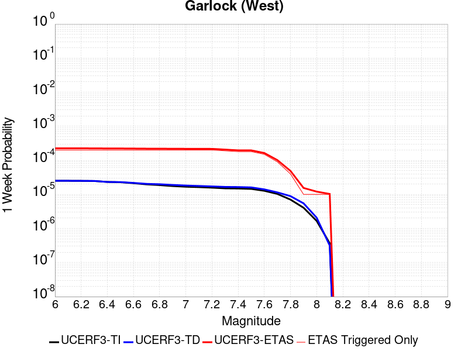
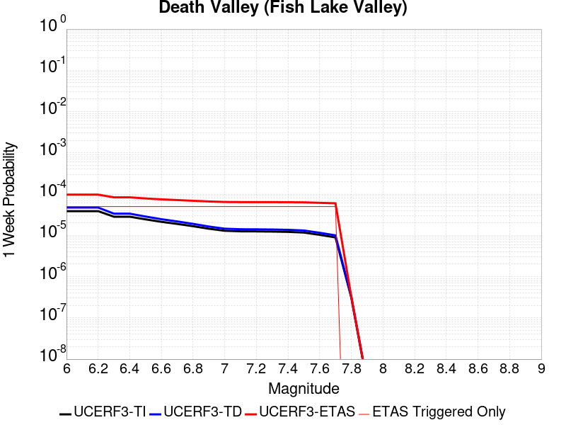
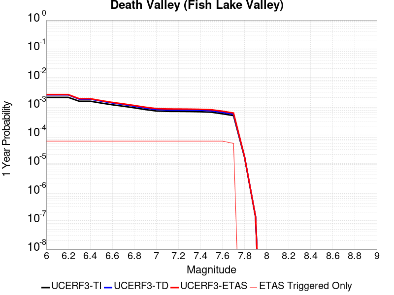
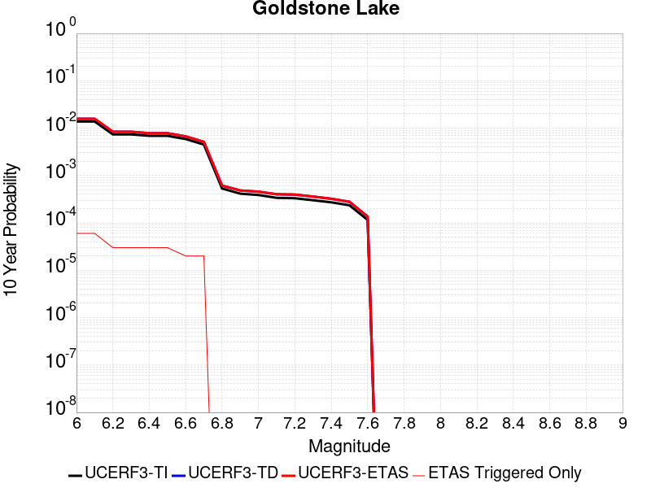
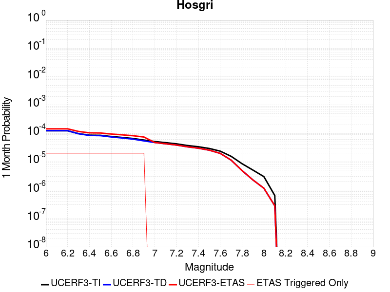
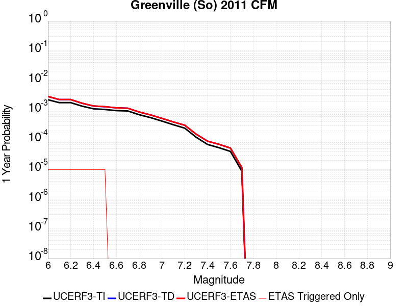
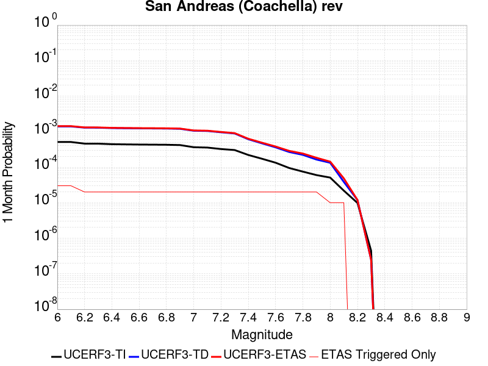
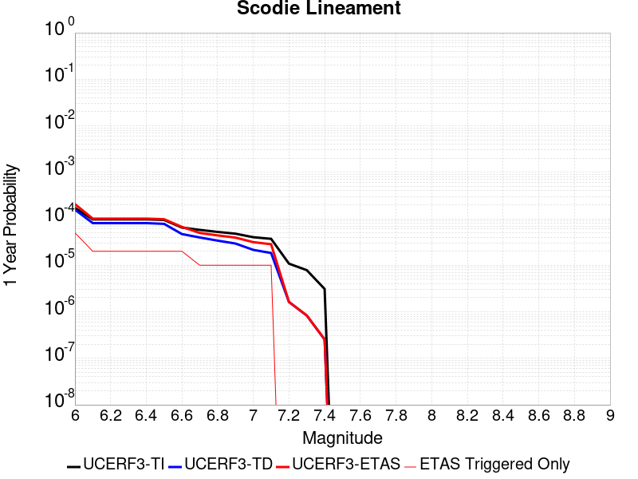
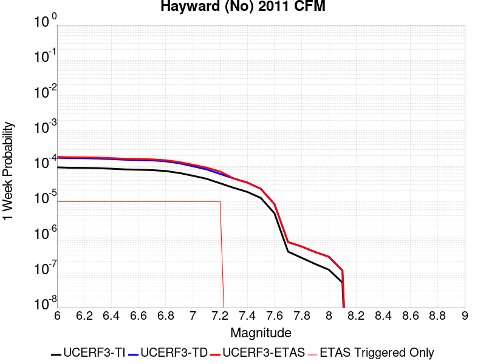

# Parent Section Magnitude-Probability Distributions

Only fault sections with at least one triggered aftershock are plotted. Sections are sorted by total supraseismogenic trigger rate (decreasing)

## Table Of Contents

* [Garlock (Central)](#garlock-central)
* [Little Lake](#little-lake)
* [Airport Lake](#airport-lake)
* [Panamint Valley](#panamint-valley)
* [Tank Canyon](#tank-canyon)
* [Owl Lake](#owl-lake)
* [Garlock (East)](#garlock-east)
* [Garlock (West)](#garlock-west)
* [Hunter Mountain-Saline Valley](#hunter-mountain-saline-valley)
* [Ash Hill](#ash-hill)
* [San Andreas (Mojave N)](#san-andreas-mojave-n)
* [San Andreas (Mojave S)](#san-andreas-mojave-s)
* [Gravel Hills-Harper Lk](#gravel-hills-harper-lk)
* [So Sierra Nevada](#so-sierra-nevada)
* [Paradise](#paradise)
* [Blackwater](#blackwater)
* [Death Valley (So)](#death-valley-so)
* [McLean Lake](#mclean-lake)
* [Death Valley (No)](#death-valley-no)
* [Lenwood-Lockhart-Old Woman Springs](#lenwood-lockhart-old-woman-springs)
* [San Andreas (San Bernardino N)](#san-andreas-san-bernardino-n)
* [Death Valley (Black Mtns Frontal)](#death-valley-black-mtns-frontal)
* [White Wolf (Extension)](#white-wolf-extension)
* [Death Valley (Fish Lake Valley)](#death-valley-fish-lake-valley)
* [Lake Isabella (Seismicity)](#lake-isabella-seismicity)
* [Nelson Lake](#nelson-lake)
* [San Andreas (Cholame) rev](#san-andreas-cholame-rev)
* [Towne Pass](#towne-pass)
* [Johnson Valley (No) 2011 rev](#johnson-valley-no-2011-rev)
* [Ludlow](#ludlow)
* [San Andreas (Carrizo) rev](#san-andreas-carrizo-rev)
* [Kern Canyon (Lake Isabella) 2011](#kern-canyon-lake-isabella-2011)
* [North Frontal  (East)](#north-frontal--east)
* [Elsinore (Glen Ivy) rev](#elsinore-glen-ivy-rev)
* [Goldstone Lake](#goldstone-lake)
* [San Andreas (Parkfield)](#san-andreas-parkfield)
* [Hosgri](#hosgri)
* [Helendale-So Lockhart](#helendale-so-lockhart)
* [Greenville (So) 2011 CFM](#greenville-so-2011-cfm)
* [Cady](#cady)
* [San Andreas (Big Bend)](#san-andreas-big-bend)
* [San Andreas (Coachella) rev](#san-andreas-coachella-rev)
* [San Jacinto (San Jacinto Valley) rev](#san-jacinto-san-jacinto-valley-rev)
* [Scodie Lineament](#scodie-lineament)
* [Great Valley 11](#great-valley-11)
* [San Jacinto (San Bernardino)](#san-jacinto-san-bernardino)
* [Rodgers Creek - Healdsburg 2011 CFM](#rodgers-creek---healdsburg-2011-cfm)
* [Shoreline](#shoreline)
* [San Andreas (San Bernardino S)](#san-andreas-san-bernardino-s)
* [Mission Creek](#mission-creek)
* [San Jacinto (Lytle Creek connector)](#san-jacinto-lytle-creek-connector)
* [Hayward (No) 2011 CFM](#hayward-no-2011-cfm)

## Garlock (Central)
*[(top)](#table-of-contents)*

| 1 Week | 1 Month | 1 Year | 10 Year |
|-----|-----|-----|-----|
|  |  |  |  |

| Magnitude | 1 wk TI Prob | 1 wk TD Prob | 1 wk ETAS Prob | 1 wk ETAS/TD Gain | 1 wk ETAS Triggered Only | 1 mo TI Prob | 1 mo TD Prob | 1 mo ETAS Prob | 1 mo ETAS/TD Gain | 1 mo ETAS Triggered Only | 1 yr TI Prob | 1 yr TD Prob | 1 yr ETAS Prob | 1 yr ETAS/TD Gain | 1 yr ETAS Triggered Only | 10 yr TI Prob | 10 yr TD Prob | 10 yr ETAS Prob | 10 yr ETAS/TD Gain | 10 yr ETAS Triggered Only |
|-----|-----|-----|-----|-----|-----|-----|-----|-----|-----|-----|-----|-----|-----|-----|-----|-----|-----|-----|-----|-----|
| 6.0 | 5.5131142E-5 | 7.024558E-5 | 0.0029404142 | 41.859062 | 0.0028703704 | 2.3625491E-4 | 3.0101812E-4 | 0.003911042 | 12.992713 | 0.003611111 | 0.0028726095 | 0.0036588025 | 0.00891727 | 2.43721 | 0.0052777776 | 0.028357591 | 0.03607921 | 0.04357637 | 1.2077973 | 0.007777778 |
| 6.1 | 5.5131142E-5 | 7.024558E-5 | 0.0029404142 | 41.859062 | 0.0028703704 | 2.3625491E-4 | 3.0101812E-4 | 0.003911042 | 12.992713 | 0.003611111 | 0.0028726095 | 0.0036588025 | 0.00891727 | 2.43721 | 0.0052777776 | 0.028357591 | 0.03607921 | 0.04357637 | 1.2077973 | 0.007777778 |
| 6.2 | 4.216245E-5 | 5.1660383E-5 | 0.0019034166 | 36.844803 | 0.0018518518 | 1.806837E-4 | 2.2138303E-4 | 0.0026282575 | 11.871992 | 0.0024074074 | 0.0021976046 | 0.0026920384 | 0.006201085 | 2.3034904 | 0.0035185185 | 0.021759989 | 0.02668921 | 0.03191625 | 1.1958485 | 0.0053703706 |
| 6.3 | 4.216245E-5 | 5.1660383E-5 | 0.0019034166 | 36.844803 | 0.0018518518 | 1.806837E-4 | 2.2138303E-4 | 0.0026282575 | 11.871992 | 0.0024074074 | 0.0021976046 | 0.0026920384 | 0.006201085 | 2.3034904 | 0.0035185185 | 0.021759989 | 0.02668921 | 0.03191625 | 1.1958485 | 0.0053703706 |
| 6.4 | 3.6858168E-5 | 4.4109474E-5 | 0.0016644084 | 37.733578 | 0.0016203703 | 1.5795401E-4 | 1.8902705E-4 | 0.0023182542 | 12.264139 | 0.0021296297 | 0.0019213937 | 0.0022990005 | 0.005162772 | 2.2456594 | 0.0028703704 | 0.019048655 | 0.022848397 | 0.027055578 | 1.1841346 | 0.0043055555 |
| 6.5 | 3.39199E-5 | 4.001704E-5 | 0.0015677337 | 39.176655 | 0.0015277778 | 1.453629E-4 | 1.7149044E-4 | 0.0021156014 | 12.336556 | 0.0019444445 | 0.0017683565 | 0.0020859186 | 0.004719303 | 2.2624578 | 0.0026388888 | 0.017543508 | 0.02075933 | 0.024476817 | 1.1790755 | 0.0037962962 |
| 6.6 | 3.3571985E-5 | 3.947123E-5 | 0.0015671887 | 39.704582 | 0.0015277778 | 1.4387199E-4 | 1.6915156E-4 | 0.002113267 | 12.493335 | 0.0019444445 | 0.0017502342 | 0.002057497 | 0.0046447553 | 2.2574787 | 0.0025925925 | 0.017365133 | 0.020480646 | 0.024153844 | 1.1793497 | 0.00375 |
| 6.7 | 3.2580007E-5 | 3.8087666E-5 | 0.0015195127 | 39.895138 | 0.0014814815 | 1.3962112E-4 | 1.6322276E-4 | 0.002061061 | 12.62729 | 0.0018981481 | 0.0016985617 | 0.0019854472 | 0.0044804835 | 2.2566621 | 0.0025 | 0.016856372 | 0.019773284 | 0.023358373 | 1.1813097 | 0.0036574074 |
| 6.8 | 3.2185937E-5 | 3.751489E-5 | 0.0014263517 | 38.02095 | 0.0013888889 | 1.3793244E-4 | 1.607683E-4 | 0.0019660336 | 12.228988 | 0.0018055555 | 0.0016780337 | 0.0019556184 | 0.0043583177 | 2.2286136 | 0.0024074074 | 0.016654192 | 0.019480087 | 0.022975458 | 1.1794331 | 0.0035648148 |
| 6.9 | 3.165394E-5 | 3.6719477E-5 | 0.0014255574 | 38.82292 | 0.0013888889 | 1.3565269E-4 | 1.5735981E-4 | 0.0019626312 | 12.472252 | 0.0018055555 | 0.0016503202 | 0.0019141936 | 0.0043169926 | 2.255254 | 0.0024074074 | 0.01638118 | 0.01907272 | 0.022569546 | 1.1833416 | 0.0035648148 |
| 7.0 | 3.0903822E-5 | 3.5624747E-5 | 0.0014244642 | 39.985245 | 0.0013888889 | 1.3243823E-4 | 1.5266867E-4 | 0.0019579486 | 12.824822 | 0.0018055555 | 0.0016112428 | 0.0018571776 | 0.004260114 | 2.2938647 | 0.0024074074 | 0.015996104 | 0.018511891 | 0.022010716 | 1.1890041 | 0.0035648148 |
| 7.1 | 3.0069863E-5 | 3.439106E-5 | 0.0014232321 | 41.38378 | 0.0013888889 | 1.2886449E-4 | 1.4738206E-4 | 0.0019526714 | 13.249045 | 0.0018055555 | 0.0015677959 | 0.0017929208 | 0.004196012 | 2.340322 | 0.0024074074 | 0.01556781 | 0.017879559 | 0.021335166 | 1.1932715 | 0.0035185185 |
| 7.2 | 2.7957109E-5 | 3.1280466E-5 | 0.0012349465 | 39.4798 | 0.0012037037 | 1.1981068E-4 | 1.3405236E-4 | 0.0017079154 | 12.740659 | 0.001574074 | 0.0014577188 | 0.0016308852 | 0.0037108208 | 2.2753415 | 0.0020833334 | 0.014481937 | 0.016283188 | 0.019380074 | 1.1901892 | 0.003148148 |
| 7.3 | 2.4519275E-5 | 2.6713868E-5 | 8.137299E-4 | 30.460955 | 7.87037E-4 | 1.0507837E-4 | 1.1448306E-4 | 0.0011791759 | 10.300004 | 0.0010648149 | 0.0012785783 | 0.0013929547 | 0.0028261407 | 2.028882 | 0.0014351852 | 0.012712469 | 0.013927576 | 0.0161645 | 1.1606112 | 0.0022685186 |
| 7.4 | 2.3225532E-5 | 2.5198491E-5 | 6.2703516E-4 | 24.883839 | 6.0185185E-4 | 9.95342E-5 | 1.07989144E-4 | 9.875238E-4 | 9.144658 | 8.7962963E-4 | 0.0012111551 | 0.0013139893 | 0.0025623469 | 1.9500515 | 0.00125 | 0.012045753 | 0.013145258 | 0.015018454 | 1.1424998 | 0.0018981481 |
| 7.5 | 2.097765E-5 | 2.2482824E-5 | 4.3914013E-4 | 19.53225 | 4.1666668E-4 | 8.9901114E-5 | 9.635147E-5 | 7.4443716E-4 | 7.726267 | 6.481481E-4 | 0.0010939965 | 0.0011724597 | 0.002143542 | 1.8282437 | 9.7222225E-4 | 0.010886264 | 0.01173992 | 0.013204009 | 1.1247103 | 0.0014814815 |
| 7.6 | 1.511254E-5 | 1.5990528E-5 | 3.8635498E-4 | 24.16149 | 3.7037037E-4 | 6.476642E-5 | 6.852908E-5 | 6.2404654E-4 | 9.106303 | 5.5555557E-4 | 7.882459E-4 | 8.3403E-4 | 0.001574153 | 1.8874056 | 7.4074074E-4 | 0.007854558 | 0.008383143 | 0.009301307 | 1.109525 | 9.259259E-4 |
| 7.7 | 9.934069E-6 | 1.0678047E-5 | 1.0326965E-4 | 9.671211 | 9.259259E-5 | 4.2573887E-5 | 4.576226E-5 | 2.3093897E-4 | 5.046494 | 1.8518518E-4 | 5.182138E-4 | 5.5701344E-4 | 8.346365E-4 | 1.4984136 | 2.7777778E-4 | 0.00517007 | 0.0056272964 | 0.005995583 | 1.0654464 | 3.7037037E-4 |
| 7.8 | 6.7562896E-6 | 8.427841E-6 | 8.427841E-6 | 1.0 | 0.0 | 2.8955206E-5 | 3.6118818E-5 | 1.2870807E-4 | 3.563463 | 9.259259E-5 | 3.5247262E-4 | 4.3965803E-4 | 5.7848584E-4 | 1.3157632 | 1.3888889E-4 | 0.0035191406 | 0.0044463384 | 0.004676791 | 1.0518297 | 2.3148148E-4 |
| 7.9 | 3.975453E-6 | 5.3706585E-6 | 5.3706585E-6 | 1.0 | 0.0 | 1.7037546E-5 | 2.3016906E-5 | 6.931213E-5 | 3.0113578 | 4.6296296E-5 | 2.0741238E-4 | 2.801949E-4 | 3.7276154E-4 | 1.3303652 | 9.259259E-5 | 0.002072189 | 0.002833435 | 0.0029719304 | 1.0488789 | 1.3888889E-4 |
| 8.0 | 1.6729537E-6 | 2.0773857E-6 | 2.0773857E-6 | 1.0 | 0.0 | 7.169782E-6 | 8.903051E-6 | 8.903051E-6 | 1.0 | 0.0 | 8.7288594E-5 | 1.08389286E-4 | 1.08389286E-4 | 1.0 | 0.0 | 8.7254314E-4 | 0.0010968668 | 0.0010968668 | 1.0 | 0.0 |
| 8.1 | 3.6733252E-7 | 3.148811E-7 | 3.148811E-7 | 1.0 | 0.0 | 1.5742813E-6 | 1.3494899E-6 | 1.3494899E-6 | 1.0 | 0.0 | 1.9166706E-5 | 1.6429933E-5 | 1.6429933E-5 | 1.0 | 0.0 | 1.9165053E-4 | 1.6637788E-4 | 1.6637788E-4 | 1.0 | 0.0 |

## Little Lake
*[(top)](#table-of-contents)*

| 1 Week | 1 Month | 1 Year | 10 Year |
|-----|-----|-----|-----|
|  |  |  |  |

| Magnitude | 1 wk TI Prob | 1 wk TD Prob | 1 wk ETAS Prob | 1 wk ETAS/TD Gain | 1 wk ETAS Triggered Only | 1 mo TI Prob | 1 mo TD Prob | 1 mo ETAS Prob | 1 mo ETAS/TD Gain | 1 mo ETAS Triggered Only | 1 yr TI Prob | 1 yr TD Prob | 1 yr ETAS Prob | 1 yr ETAS/TD Gain | 1 yr ETAS Triggered Only | 10 yr TI Prob | 10 yr TD Prob | 10 yr ETAS Prob | 10 yr ETAS/TD Gain | 10 yr ETAS Triggered Only |
|-----|-----|-----|-----|-----|-----|-----|-----|-----|-----|-----|-----|-----|-----|-----|-----|-----|-----|-----|-----|-----|
| 6.0 | 2.8424427E-5 | 3.1205633E-5 | 0.003040371 | 97.4302 | 0.0030092592 | 1.2181328E-4 | 1.3373232E-4 | 0.0036980703 | 27.65278 | 0.0035648148 | 0.0014820677 | 0.0016271081 | 0.0068962984 | 4.2383776 | 0.0052777776 | 0.014722223 | 0.016165355 | 0.022724252 | 1.4057379 | 0.006666667 |
| 6.1 | 2.8424427E-5 | 3.1205633E-5 | 0.003040371 | 97.4302 | 0.0030092592 | 1.2181328E-4 | 1.3373232E-4 | 0.0036980703 | 27.65278 | 0.0035648148 | 0.0014820677 | 0.0016271081 | 0.0068962984 | 4.2383776 | 0.0052777776 | 0.014722223 | 0.016165355 | 0.022724252 | 1.4057379 | 0.006666667 |
| 6.2 | 2.8424427E-5 | 3.1205633E-5 | 0.003040371 | 97.4302 | 0.0030092592 | 1.2181328E-4 | 1.3373232E-4 | 0.0036980703 | 27.65278 | 0.0035648148 | 0.0014820677 | 0.0016271081 | 0.0068962984 | 4.2383776 | 0.0052777776 | 0.014722223 | 0.016165355 | 0.022724252 | 1.4057379 | 0.006666667 |
| 6.3 | 1.48860645E-5 | 1.6081349E-5 | 0.0019604946 | 121.91108 | 0.0019444445 | 6.379586E-5 | 6.89184E-5 | 0.002522453 | 36.60057 | 0.0024537037 | 7.7643775E-4 | 8.387868E-4 | 0.004076809 | 4.8603644 | 0.0032407406 | 0.007737305 | 0.008359027 | 0.012399046 | 1.4833121 | 0.004074074 |
| 6.4 | 1.48860645E-5 | 1.6081349E-5 | 0.0019604946 | 121.91108 | 0.0019444445 | 6.379586E-5 | 6.89184E-5 | 0.002522453 | 36.60057 | 0.0024537037 | 7.7643775E-4 | 8.387868E-4 | 0.004076809 | 4.8603644 | 0.0032407406 | 0.007737305 | 0.008359027 | 0.012399046 | 1.4833121 | 0.004074074 |
| 6.5 | 1.2797581E-5 | 1.3765531E-5 | 0.0017730006 | 128.80002 | 0.0017592593 | 5.4845623E-5 | 5.899394E-5 | 0.0022810851 | 38.666428 | 0.0022222223 | 6.675408E-4 | 7.180402E-4 | 0.0037251387 | 5.187925 | 0.0030092592 | 0.006655392 | 0.0071597523 | 0.010974833 | 1.5328509 | 0.0038425927 |
| 6.6 | 9.661896E-6 | 1.02890135E-5 | 0.0017695301 | 171.9825 | 0.0017592593 | 4.1407468E-5 | 4.409512E-5 | 0.0022662194 | 51.393883 | 0.0022222223 | 5.040193E-4 | 5.3674204E-4 | 0.0034981146 | 6.5173106 | 0.002962963 | 0.005028777 | 0.0053560617 | 0.009132025 | 1.7049887 | 0.0037962962 |
| 6.7 | 7.767871E-6 | 8.199668E-6 | 0.0016748527 | 204.25859 | 0.0016666667 | 3.329045E-5 | 3.5141038E-5 | 0.0021646959 | 61.600224 | 0.0021296297 | 4.0523586E-4 | 4.2777188E-4 | 0.0032506378 | 7.5989985 | 0.0028240741 | 0.004044977 | 0.0042708362 | 0.0076821307 | 1.7987416 | 0.003425926 |
| 6.8 | 6.4235196E-6 | 6.7357296E-6 | 0.0013956153 | 207.19586 | 0.0013888889 | 2.752908E-5 | 2.8867165E-5 | 0.0017880757 | 61.941505 | 0.0017592593 | 3.35115E-4 | 3.5141388E-4 | 0.0027116954 | 7.7165284 | 0.002361111 | 0.003346101 | 0.0035098423 | 0.0062778704 | 1.7886475 | 0.0027777778 |
| 6.9 | 3.1283696E-6 | 3.1121751E-6 | 9.2903525E-4 | 298.51636 | 9.259259E-4 | 1.3407229E-5 | 1.33378335E-5 | 0.0011244342 | 84.3041 | 0.0011111111 | 1.6322079E-4 | 1.6237753E-4 | 0.0016899073 | 10.407272 | 0.0015277778 | 0.0016310095 | 0.0016227373 | 0.0034253628 | 2.1108549 | 0.0018055555 |
| 7.0 | 2.290603E-6 | 2.2286777E-6 | 6.966716E-4 | 312.59415 | 6.9444446E-4 | 9.816834E-6 | 9.551446E-6 | 7.96581E-4 | 83.39899 | 7.87037E-4 | 1.19513395E-4 | 1.1628369E-4 | 0.0012272656 | 10.554065 | 0.0011111111 | 0.0011944914 | 0.0011623306 | 0.0025033627 | 2.153744 | 0.0013425926 |
| 7.1 | 1.293693E-6 | 1.1776802E-6 | 2.7895512E-4 | 236.8683 | 2.7777778E-4 | 5.5443866E-6 | 5.0471954E-6 | 3.2911965E-4 | 65.20842 | 3.2407406E-4 | 6.750081E-5 | 6.144857E-5 | 5.706765E-4 | 9.28706 | 5.0925923E-4 | 6.7480316E-4 | 6.1438425E-4 | 0.0012621342 | 2.0543075 | 6.481481E-4 |
| 7.2 | 4.715842E-7 | 3.091774E-7 | 3.091774E-7 | 1.0 | 0.0 | 2.0210737E-6 | 1.3250453E-6 | 1.3250453E-6 | 1.0 | 0.0 | 2.4606294E-5 | 1.6132313E-5 | 1.6132313E-5 | 1.0 | 0.0 | 2.460357E-4 | 1.6131197E-4 | 1.6131197E-4 | 1.0 | 0.0 |
| 7.3 | 3.9430947E-7 | 2.309738E-7 | 2.309738E-7 | 1.0 | 0.0 | 1.6898966E-6 | 9.898873E-7 | 9.898873E-7 | 1.0 | 0.0 | 2.0574296E-5 | 1.20518125E-5 | 1.20518125E-5 | 1.0 | 0.0 | 2.0572392E-4 | 1.2051166E-4 | 1.2051166E-4 | 1.0 | 0.0 |
| 7.4 | 3.547123E-7 | 1.9679035E-7 | 1.9679035E-7 | 1.0 | 0.0 | 1.5201948E-6 | 8.4338694E-7 | 8.4338694E-7 | 1.0 | 0.0 | 1.8508214E-5 | 1.0268188E-5 | 1.0268188E-5 | 1.0 | 0.0 | 1.8506673E-4 | 1.026772E-4 | 1.026772E-4 | 1.0 | 0.0 |
| 7.5 | 2.6354266E-7 | 1.4423068E-7 | 1.4423068E-7 | 1.0 | 0.0 | 1.129468E-6 | 6.1813137E-7 | 6.1813137E-7 | 1.0 | 0.0 | 1.3751187E-5 | 7.5257235E-6 | 7.5257235E-6 | 1.0 | 0.0 | 1.3750336E-4 | 7.525474E-5 | 7.525474E-5 | 1.0 | 0.0 |
| 7.6 | 1.269913E-7 | 7.572526E-8 | 7.572526E-8 | 1.0 | 0.0 | 5.4424834E-7 | 3.245368E-7 | 3.245368E-7 | 1.0 | 0.0 | 6.6262032E-6 | 3.951229E-6 | 3.951229E-6 | 1.0 | 0.0 | 6.626006E-5 | 3.9511622E-5 | 3.9511622E-5 | 1.0 | 0.0 |

## Airport Lake
*[(top)](#table-of-contents)*

| 1 Week | 1 Month | 1 Year | 10 Year |
|-----|-----|-----|-----|
|  |  |  |  |

| Magnitude | 1 wk TI Prob | 1 wk TD Prob | 1 wk ETAS Prob | 1 wk ETAS/TD Gain | 1 wk ETAS Triggered Only | 1 mo TI Prob | 1 mo TD Prob | 1 mo ETAS Prob | 1 mo ETAS/TD Gain | 1 mo ETAS Triggered Only | 1 yr TI Prob | 1 yr TD Prob | 1 yr ETAS Prob | 1 yr ETAS/TD Gain | 1 yr ETAS Triggered Only | 10 yr TI Prob | 10 yr TD Prob | 10 yr ETAS Prob | 10 yr ETAS/TD Gain | 10 yr ETAS Triggered Only |
|-----|-----|-----|-----|-----|-----|-----|-----|-----|-----|-----|-----|-----|-----|-----|-----|-----|-----|-----|-----|-----|
| 6.0 | 1.2387061E-5 | 1.3103137E-5 | 0.0024667748 | 188.25833 | 0.0024537037 | 5.3086325E-5 | 5.615525E-5 | 0.0031115392 | 55.409588 | 0.0030555555 | 6.461343E-4 | 6.835041E-4 | 0.004708529 | 6.8888083 | 0.004027778 | 0.0064425888 | 0.0068168286 | 0.011598822 | 1.7014982 | 0.004814815 |
| 6.1 | 1.2387061E-5 | 1.3103137E-5 | 0.0024667748 | 188.25833 | 0.0024537037 | 5.3086325E-5 | 5.615525E-5 | 0.0031115392 | 55.409588 | 0.0030555555 | 6.461343E-4 | 6.835041E-4 | 0.004708529 | 6.8888083 | 0.004027778 | 0.0064425888 | 0.0068168286 | 0.011598822 | 1.7014982 | 0.004814815 |
| 6.2 | 1.2387061E-5 | 1.3103137E-5 | 0.0024667748 | 188.25833 | 0.0024537037 | 5.3086325E-5 | 5.615525E-5 | 0.0031115392 | 55.409588 | 0.0030555555 | 6.461343E-4 | 6.835041E-4 | 0.004708529 | 6.8888083 | 0.004027778 | 0.0064425888 | 0.0068168286 | 0.011598822 | 1.7014982 | 0.004814815 |
| 6.3 | 1.2387061E-5 | 1.3103137E-5 | 0.0024667748 | 188.25833 | 0.0024537037 | 5.3086325E-5 | 5.615525E-5 | 0.0031115392 | 55.409588 | 0.0030555555 | 6.461343E-4 | 6.835041E-4 | 0.004708529 | 6.8888083 | 0.004027778 | 0.0064425888 | 0.0068168286 | 0.011598822 | 1.7014982 | 0.004814815 |
| 6.4 | 1.2387061E-5 | 1.3103137E-5 | 0.0024667748 | 188.25833 | 0.0024537037 | 5.3086325E-5 | 5.615525E-5 | 0.0031115392 | 55.409588 | 0.0030555555 | 6.461343E-4 | 6.835041E-4 | 0.004708529 | 6.8888083 | 0.004027778 | 0.0064425888 | 0.0068168286 | 0.011598822 | 1.7014982 | 0.004814815 |
| 6.5 | 6.9922594E-6 | 7.384914E-6 | 0.0022758867 | 308.1805 | 0.0022685186 | 2.996648E-5 | 3.1649277E-5 | 0.0027167494 | 85.839226 | 0.0026851853 | 3.6478083E-4 | 3.8526725E-4 | 0.0039487085 | 10.249271 | 0.0035648148 | 0.003641826 | 0.0038465308 | 0.008043288 | 2.0910501 | 0.004212963 |
| 6.6 | 6.9922594E-6 | 7.384914E-6 | 0.0022758867 | 308.1805 | 0.0022685186 | 2.996648E-5 | 3.1649277E-5 | 0.0027167494 | 85.839226 | 0.0026851853 | 3.6478083E-4 | 3.8526725E-4 | 0.0039487085 | 10.249271 | 0.0035648148 | 0.003641826 | 0.0038465308 | 0.008043288 | 2.0910501 | 0.004212963 |
| 6.7 | 5.477277E-6 | 5.78606E-6 | 0.0019502193 | 337.0548 | 0.0019444445 | 2.3473833E-5 | 2.4797186E-5 | 0.0022932594 | 92.48064 | 0.0022685186 | 2.8575645E-4 | 3.0186778E-4 | 0.0034027833 | 11.272429 | 0.0031018518 | 0.0028538927 | 0.0030149613 | 0.0067074983 | 2.224738 | 0.0037037036 |
| 6.8 | 3.9950432E-6 | 4.219081E-6 | 0.0016245826 | 385.05606 | 0.0016203703 | 1.7121502E-5 | 1.8081664E-5 | 0.0019161955 | 105.9745 | 0.0018981481 | 2.0843433E-4 | 2.2012478E-4 | 0.0028121467 | 12.775239 | 0.0025925925 | 0.0020823893 | 0.0021993385 | 0.0052481736 | 2.3862512 | 0.0030555555 |
| 6.9 | 2.95695E-6 | 3.1230197E-6 | 0.0012994152 | 416.07657 | 0.0012962963 | 1.2672582E-5 | 1.3384314E-5 | 0.0014485503 | 108.227455 | 0.0014351852 | 1.5427776E-4 | 1.629441E-4 | 0.0021533605 | 13.215332 | 0.0019907407 | 0.001541707 | 0.0016284687 | 0.003939514 | 2.4191523 | 0.0023148148 |
| 7.0 | 1.456072E-6 | 1.5408096E-6 | 6.4968795E-4 | 421.65363 | 6.481481E-4 | 6.2402937E-6 | 6.6034586E-6 | 7.4733933E-4 | 113.17392 | 7.4074074E-4 | 7.597293E-5 | 8.0395155E-5 | 0.0011451243 | 14.243699 | 0.0010648149 | 7.594696E-4 | 8.0375955E-4 | 0.002099014 | 2.6114948 | 0.0012962963 |
| 7.1 | 6.995192E-7 | 7.4089627E-7 | 2.322222E-4 | 313.43417 | 2.3148148E-4 | 2.997936E-6 | 3.1752697E-6 | 2.8095217E-4 | 88.48135 | 2.7777778E-4 | 3.649926E-5 | 3.865891E-5 | 5.01604E-4 | 12.97512 | 4.6296295E-4 | 3.6493264E-4 | 3.865891E-4 | 9.882082E-4 | 2.5562239 | 6.0185185E-4 |

## Panamint Valley
*[(top)](#table-of-contents)*

| 1 Week | 1 Month | 1 Year | 10 Year |
|-----|-----|-----|-----|
|  |  |  |  |

| Magnitude | 1 wk TI Prob | 1 wk TD Prob | 1 wk ETAS Prob | 1 wk ETAS/TD Gain | 1 wk ETAS Triggered Only | 1 mo TI Prob | 1 mo TD Prob | 1 mo ETAS Prob | 1 mo ETAS/TD Gain | 1 mo ETAS Triggered Only | 1 yr TI Prob | 1 yr TD Prob | 1 yr ETAS Prob | 1 yr ETAS/TD Gain | 1 yr ETAS Triggered Only | 10 yr TI Prob | 10 yr TD Prob | 10 yr ETAS Prob | 10 yr ETAS/TD Gain | 10 yr ETAS Triggered Only |
|-----|-----|-----|-----|-----|-----|-----|-----|-----|-----|-----|-----|-----|-----|-----|-----|-----|-----|-----|-----|-----|
| 6.0 | 3.0211835E-5 | 3.398435E-5 | 9.598788E-4 | 28.24473 | 9.259259E-4 | 1.2947287E-4 | 1.4563925E-4 | 0.001210299 | 8.310252 | 0.0010648149 | 0.0015751923 | 0.0017717453 | 0.0033892447 | 1.9129413 | 0.0016203703 | 0.015640736 | 0.017583055 | 0.01972072 | 1.1215754 | 0.002175926 |
| 6.1 | 3.0211835E-5 | 3.398435E-5 | 9.598788E-4 | 28.24473 | 9.259259E-4 | 1.2947287E-4 | 1.4563925E-4 | 0.001210299 | 8.310252 | 0.0010648149 | 0.0015751923 | 0.0017717453 | 0.0033892447 | 1.9129413 | 0.0016203703 | 0.015640736 | 0.017583055 | 0.01972072 | 1.1215754 | 0.002175926 |
| 6.2 | 3.0211835E-5 | 3.398435E-5 | 9.598788E-4 | 28.24473 | 9.259259E-4 | 1.2947287E-4 | 1.4563925E-4 | 0.001210299 | 8.310252 | 0.0010648149 | 0.0015751923 | 0.0017717453 | 0.0033892447 | 1.9129413 | 0.0016203703 | 0.015640736 | 0.017583055 | 0.01972072 | 1.1215754 | 0.002175926 |
| 6.3 | 2.8573924E-5 | 3.2102525E-5 | 9.5799874E-4 | 29.841848 | 9.259259E-4 | 1.2245393E-4 | 1.3757516E-4 | 0.0012022435 | 8.738812 | 0.0010648149 | 0.001489857 | 0.0016737186 | 0.0032451581 | 1.9388912 | 0.001574074 | 0.01479908 | 0.016617723 | 0.018711962 | 1.1260245 | 0.0021296297 |
| 6.4 | 2.8573924E-5 | 3.2102525E-5 | 9.5799874E-4 | 29.841848 | 9.259259E-4 | 1.2245393E-4 | 1.3757516E-4 | 0.0012022435 | 8.738812 | 0.0010648149 | 0.001489857 | 0.0016737186 | 0.0032451581 | 1.9388912 | 0.001574074 | 0.01479908 | 0.016617723 | 0.018711962 | 1.1260245 | 0.0021296297 |
| 6.5 | 2.7468774E-5 | 3.0828287E-5 | 9.567257E-4 | 31.03402 | 9.259259E-4 | 1.1771801E-4 | 1.321147E-4 | 0.0011967889 | 9.058711 | 0.0010648149 | 0.0014322745 | 0.0016073369 | 0.003178881 | 1.9777315 | 0.001574074 | 0.014230782 | 0.015963601 | 0.018013677 | 1.1284219 | 0.0020833334 |
| 6.6 | 2.6135967E-5 | 2.925234E-5 | 9.5515116E-4 | 32.65213 | 9.259259E-4 | 1.1200648E-4 | 1.253613E-4 | 0.0011900426 | 9.492903 | 0.0010648149 | 0.0013628257 | 0.0015252318 | 0.003096905 | 2.030449 | 0.001574074 | 0.013544982 | 0.0151539715 | 0.017205734 | 1.1353943 | 0.0020833334 |
| 6.7 | 2.4498746E-5 | 2.73412E-5 | 9.069468E-4 | 33.171432 | 8.7962963E-4 | 1.04990395E-4 | 1.17171454E-4 | 0.0011355706 | 9.69153 | 0.0010185185 | 0.0012775084 | 0.0014256539 | 0.0029050233 | 2.0376778 | 0.0014814815 | 0.012701893 | 0.014171205 | 0.016088095 | 1.1352665 | 0.0019444445 |
| 6.8 | 2.2244329E-5 | 2.4935298E-5 | 7.656576E-4 | 30.70577 | 7.4074074E-4 | 9.532935E-5 | 1.0686131E-4 | 9.863969E-4 | 9.230627 | 8.7962963E-4 | 0.0011600169 | 0.0013002817 | 0.0025948924 | 1.9956386 | 0.0012962963 | 0.011539802 | 0.012932454 | 0.014623264 | 1.1307416 | 0.001712963 |
| 6.9 | 1.9902658E-5 | 2.229015E-5 | 6.7042385E-4 | 30.077133 | 6.481481E-4 | 8.529431E-5 | 9.552582E-5 | 8.824877E-4 | 9.238211 | 7.87037E-4 | 0.0010379635 | 0.0011624249 | 0.0022722443 | 1.9547452 | 0.0011111111 | 0.010331288 | 0.011568548 | 0.013078651 | 1.1305352 | 0.0015277778 |
| 7.0 | 1.8353881E-5 | 2.0566078E-5 | 6.2240555E-4 | 30.263699 | 6.0185185E-4 | 7.865712E-5 | 8.813745E-5 | 8.288129E-4 | 9.40364 | 7.4074074E-4 | 9.5722964E-4 | 0.001072563 | 0.0021362356 | 1.9917113 | 0.0010648149 | 0.009531168 | 0.010678793 | 0.012098652 | 1.1329607 | 0.0014351852 |
| 7.1 | 1.7667631E-5 | 1.9772506E-5 | 6.216125E-4 | 31.438223 | 6.0185185E-4 | 7.571623E-5 | 8.473666E-5 | 8.254146E-4 | 9.740939 | 7.4074074E-4 | 9.2145515E-4 | 0.0010311981 | 0.0020486664 | 1.9866855 | 0.0010185185 | 0.009176437 | 0.010269018 | 0.011643644 | 1.1338615 | 0.0013888889 |
| 7.2 | 1.6381597E-5 | 1.815815E-5 | 4.8111271E-4 | 26.495687 | 4.6296295E-4 | 7.020495E-5 | 7.7818426E-5 | 6.7962345E-4 | 8.733452 | 6.0185185E-4 | 8.544101E-4 | 9.4704475E-4 | 0.0017795889 | 1.8790969 | 8.3333335E-4 | 0.008511325 | 0.009434741 | 0.010535369 | 1.1166569 | 0.0011111111 |
| 7.3 | 1.4520491E-5 | 1.5966394E-5 | 3.400353E-4 | 21.296938 | 3.2407406E-4 | 6.222919E-5 | 6.84257E-5 | 4.8506385E-4 | 7.0889134 | 4.1666668E-4 | 7.57377E-4 | 8.327807E-4 | 0.001480389 | 1.7776458 | 6.481481E-4 | 0.0075480095 | 0.008299708 | 0.009172037 | 1.1051036 | 8.7962963E-4 |
| 7.4 | 1.2852287E-5 | 1.4145337E-5 | 3.3821483E-4 | 23.909986 | 3.2407406E-4 | 5.5080065E-5 | 6.0621558E-5 | 4.7726298E-4 | 7.872826 | 4.1666668E-4 | 6.7039346E-4 | 7.378333E-4 | 0.0013855032 | 1.8777997 | 6.481481E-4 | 0.0066837464 | 0.0073567564 | 0.008183959 | 1.1124412 | 8.3333335E-4 |
| 7.5 | 1.1637851E-5 | 1.2836727E-5 | 3.3690664E-4 | 26.245525 | 3.2407406E-4 | 4.987555E-5 | 5.5013472E-5 | 4.7165723E-4 | 8.573485 | 4.1666668E-4 | 6.070656E-4 | 6.6959887E-4 | 0.001317313 | 1.9673166 | 6.481481E-4 | 0.006054099 | 0.0066787098 | 0.0075064776 | 1.1239413 | 8.3333335E-4 |
| 7.6 | 3.0068115E-6 | 3.3330039E-6 | 2.3481372E-4 | 70.45107 | 2.3148148E-4 | 1.2886271E-5 | 1.42842655E-5 | 3.383537E-4 | 23.687162 | 3.2407406E-4 | 1.5687906E-4 | 1.7390434E-4 | 5.9049856E-4 | 3.3955367 | 4.1666668E-4 | 0.0015676835 | 0.0017391219 | 0.0022012796 | 1.2657421 | 4.6296295E-4 |

## Tank Canyon
*[(top)](#table-of-contents)*

| 1 Week | 1 Month | 1 Year | 10 Year |
|-----|-----|-----|-----|
|  |  |  |  |

| Magnitude | 1 wk TI Prob | 1 wk TD Prob | 1 wk ETAS Prob | 1 wk ETAS/TD Gain | 1 wk ETAS Triggered Only | 1 mo TI Prob | 1 mo TD Prob | 1 mo ETAS Prob | 1 mo ETAS/TD Gain | 1 mo ETAS Triggered Only | 1 yr TI Prob | 1 yr TD Prob | 1 yr ETAS Prob | 1 yr ETAS/TD Gain | 1 yr ETAS Triggered Only | 10 yr TI Prob | 10 yr TD Prob | 10 yr ETAS Prob | 10 yr ETAS/TD Gain | 10 yr ETAS Triggered Only |
|-----|-----|-----|-----|-----|-----|-----|-----|-----|-----|-----|-----|-----|-----|-----|-----|-----|-----|-----|-----|-----|
| 6.0 | 4.8284557E-5 | 5.7964517E-5 | 5.2090065E-4 | 8.986544 | 4.6296295E-4 | 2.0691741E-4 | 2.4839956E-4 | 9.889563E-4 | 3.9813128 | 7.4074074E-4 | 0.0025163088 | 0.0030207448 | 0.004220812 | 1.3972754 | 0.0012037037 | 0.02488006 | 0.029863482 | 0.031435464 | 1.0526389 | 0.0016203703 |
| 6.1 | 1.7796336E-5 | 2.0873225E-5 | 2.5234988E-4 | 12.089644 | 2.3148148E-4 | 7.626778E-5 | 8.945383E-5 | 4.1349893E-4 | 4.622484 | 3.2407406E-4 | 9.281647E-4 | 0.0010885935 | 0.0016897902 | 1.5522692 | 6.0185185E-4 | 0.009242975 | 0.010836697 | 0.011661001 | 1.0760659 | 8.3333335E-4 |
| 6.2 | 1.7796336E-5 | 2.0873225E-5 | 2.5234988E-4 | 12.089644 | 2.3148148E-4 | 7.626778E-5 | 8.945383E-5 | 4.1349893E-4 | 4.622484 | 3.2407406E-4 | 9.281647E-4 | 0.0010885935 | 0.0016897902 | 1.5522692 | 6.0185185E-4 | 0.009242975 | 0.010836697 | 0.011661001 | 1.0760659 | 8.3333335E-4 |
| 6.3 | 1.3515912E-5 | 1.57595E-5 | 2.4723733E-4 | 15.688145 | 2.3148148E-4 | 5.792405E-5 | 6.7539106E-5 | 3.9159128E-4 | 5.797993 | 3.2407406E-4 | 7.049971E-4 | 8.220024E-4 | 0.0014233596 | 1.7315758 | 6.0185185E-4 | 0.007027647 | 0.008192232 | 0.008926904 | 1.0896791 | 7.4074074E-4 |
| 6.4 | 1.0870146E-5 | 1.2617973E-5 | 1.9780082E-4 | 15.676117 | 1.8518518E-4 | 4.658551E-5 | 5.407601E-5 | 2.85545E-4 | 5.2804375 | 2.3148148E-4 | 5.67031E-4 | 6.581944E-4 | 0.0011208527 | 1.7029203 | 4.6296295E-4 | 0.005655863 | 0.006564466 | 0.007162367 | 1.0910815 | 6.0185185E-4 |
| 6.5 | 7.964826E-6 | 9.196063E-6 | 1.9437955E-4 | 21.137259 | 1.8518518E-4 | 3.4134522E-5 | 3.941116E-5 | 2.7088352E-4 | 6.873269 | 2.3148148E-4 | 4.1550855E-4 | 4.797359E-4 | 9.424768E-4 | 1.9645742 | 4.6296295E-4 | 0.0041473247 | 0.0047883047 | 0.0053412 | 1.1154679 | 5.5555557E-4 |
| 6.6 | 6.6317E-6 | 7.6122747E-6 | 1.9279605E-4 | 25.326996 | 1.8518518E-4 | 2.8421264E-5 | 3.2623677E-5 | 2.6409762E-4 | 8.095274 | 2.3148148E-4 | 3.4597394E-4 | 3.9713003E-4 | 8.599091E-4 | 2.1653087 | 4.6296295E-4 | 0.0034543579 | 0.0039653555 | 0.004518708 | 1.1395468 | 5.5555557E-4 |
| 6.7 | 4.793663E-6 | 5.430772E-6 | 1.9061496E-4 | 35.099052 | 1.8518518E-4 | 2.0544108E-5 | 2.3274553E-5 | 2.5475066E-4 | 10.945458 | 2.3148148E-4 | 2.500958E-4 | 2.8333522E-4 | 6.9988385E-4 | 2.4701617 | 4.1666668E-4 | 0.0024981452 | 0.0028304325 | 0.0032920851 | 1.1631032 | 4.6296295E-4 |
| 6.8 | 4.382823E-6 | 4.969245E-6 | 1.9015351E-4 | 38.266075 | 1.8518518E-4 | 1.8783392E-5 | 2.1296615E-5 | 2.5277317E-4 | 11.869171 | 2.3148148E-4 | 2.286638E-4 | 2.5925972E-4 | 6.7581836E-4 | 2.6067235 | 4.1666668E-4 | 0.0022842865 | 0.0025902467 | 0.0030520104 | 1.1782702 | 4.6296295E-4 |
| 6.9 | 2.729601E-6 | 3.0735362E-6 | 9.566585E-5 | 31.12566 | 9.259259E-5 | 1.1698237E-5 | 1.3172238E-5 | 1.5205929E-4 | 11.543922 | 1.3888889E-4 | 1.4241673E-4 | 1.6036142E-4 | 3.9180578E-4 | 2.443267 | 2.3148148E-4 | 0.001423255 | 0.0016026229 | 0.0018799555 | 1.1730492 | 2.7777778E-4 |
| 7.0 | 1.8987357E-6 | 2.1269361E-6 | 4.8423135E-5 | 22.766615 | 4.6296296E-5 | 8.137413E-6 | 9.1154125E-6 | 1.0170716E-4 | 11.157714 | 9.259259E-5 | 9.90685E-5 | 1.1097519E-4 | 2.9613983E-4 | 2.6685228 | 1.8518518E-4 | 9.902435E-4 | 0.0011092664 | 0.0013404911 | 1.2084483 | 2.3148148E-4 |
| 7.1 | 1.4928986E-6 | 1.6641251E-6 | 4.7960344E-5 | 28.820156 | 4.6296296E-5 | 6.398121E-6 | 7.1319487E-6 | 9.972388E-5 | 13.9826975 | 9.259259E-5 | 7.789434E-5 | 8.682861E-5 | 2.2570543E-4 | 2.5994363 | 1.3888889E-4 | 7.786704E-4 | 8.680047E-4 | 0.0010530291 | 1.2131606 | 1.8518518E-4 |
| 7.2 | 1.069082E-6 | 1.182856E-6 | 1.182856E-6 | 1.0 | 0.0 | 4.581772E-6 | 5.0693757E-6 | 5.1365438E-5 | 10.132498 | 4.6296296E-5 | 5.5781646E-5 | 6.1718434E-5 | 1.08011875E-4 | 1.7500747 | 4.6296296E-5 | 5.576765E-4 | 6.1706523E-4 | 6.6333293E-4 | 1.0749803 | 4.6296296E-5 |
| 7.3 | 8.776551E-7 | 9.769996E-7 | 9.769996E-7 | 1.0 | 0.0 | 3.7613736E-6 | 4.187137E-6 | 4.187137E-6 | 1.0 | 0.0 | 4.579376E-5 | 5.097772E-5 | 5.097772E-5 | 1.0 | 0.0 | 4.5784327E-4 | 5.097113E-4 | 5.097113E-4 | 1.0 | 0.0 |
| 7.4 | 7.55721E-7 | 8.5102363E-7 | 8.5102363E-7 | 1.0 | 0.0 | 3.2388E-6 | 3.647242E-6 | 3.647242E-6 | 1.0 | 0.0 | 3.9431678E-5 | 4.4404784E-5 | 4.4404784E-5 | 1.0 | 0.0 | 3.942468E-4 | 4.4401E-4 | 4.4401E-4 | 1.0 | 0.0 |
| 7.5 | 5.587665E-7 | 6.305613E-7 | 6.305613E-7 | 1.0 | 0.0 | 2.3947114E-6 | 2.7024057E-6 | 2.7024057E-6 | 1.0 | 0.0 | 2.915522E-5 | 3.290179E-5 | 3.290179E-5 | 1.0 | 0.0 | 2.9151395E-4 | 3.2901787E-4 | 3.2901787E-4 | 1.0 | 0.0 |

## Owl Lake
*[(top)](#table-of-contents)*

| 1 Week | 1 Month | 1 Year | 10 Year |
|-----|-----|-----|-----|
|  |  |  |  |

| Magnitude | 1 wk TI Prob | 1 wk TD Prob | 1 wk ETAS Prob | 1 wk ETAS/TD Gain | 1 wk ETAS Triggered Only | 1 mo TI Prob | 1 mo TD Prob | 1 mo ETAS Prob | 1 mo ETAS/TD Gain | 1 mo ETAS Triggered Only | 1 yr TI Prob | 1 yr TD Prob | 1 yr ETAS Prob | 1 yr ETAS/TD Gain | 1 yr ETAS Triggered Only | 10 yr TI Prob | 10 yr TD Prob | 10 yr ETAS Prob | 10 yr ETAS/TD Gain | 10 yr ETAS Triggered Only |
|-----|-----|-----|-----|-----|-----|-----|-----|-----|-----|-----|-----|-----|-----|-----|-----|-----|-----|-----|-----|-----|
| 6.0 | 5.0320643E-5 | 6.635748E-5 | 4.3670327E-4 | 6.5810704 | 3.7037037E-4 | 2.1564208E-4 | 2.843645E-4 | 8.397621E-4 | 2.9531186 | 5.5555557E-4 | 0.0026222812 | 0.0034577043 | 0.0043342924 | 1.2535174 | 8.7962963E-4 | 0.02591553 | 0.0341404 | 0.03548187 | 1.0392928 | 0.0013888889 |
| 6.1 | 5.0320643E-5 | 6.635748E-5 | 4.3670327E-4 | 6.5810704 | 3.7037037E-4 | 2.1564208E-4 | 2.843645E-4 | 8.397621E-4 | 2.9531186 | 5.5555557E-4 | 0.0026222812 | 0.0034577043 | 0.0043342924 | 1.2535174 | 8.7962963E-4 | 0.02591553 | 0.0341404 | 0.03548187 | 1.0392928 | 0.0013888889 |
| 6.2 | 2.4125871E-5 | 3.0980704E-5 | 4.013396E-4 | 12.954502 | 3.7037037E-4 | 1.0339249E-4 | 1.3276885E-4 | 6.419605E-4 | 4.835174 | 5.0925923E-4 | 0.0012580766 | 0.0016154221 | 0.0024474093 | 1.5150278 | 8.3333335E-4 | 0.012509781 | 0.016070297 | 0.017254656 | 1.0736986 | 0.0012037037 |
| 6.3 | 1.7433485E-5 | 2.2355249E-5 | 3.9271734E-4 | 17.567122 | 3.7037037E-4 | 7.471279E-5 | 9.580558E-5 | 6.050161E-4 | 6.3150396 | 5.0925923E-4 | 9.0924866E-4 | 0.0011659606 | 0.0019983223 | 1.713885 | 8.3333335E-4 | 0.009055373 | 0.011628761 | 0.012818467 | 1.1023072 | 0.0012037037 |
| 6.4 | 1.7433485E-5 | 2.2355249E-5 | 3.9271734E-4 | 17.567122 | 3.7037037E-4 | 7.471279E-5 | 9.580558E-5 | 6.050161E-4 | 6.3150396 | 5.0925923E-4 | 9.0924866E-4 | 0.0011659606 | 0.0019983223 | 1.713885 | 8.3333335E-4 | 0.009055373 | 0.011628761 | 0.012818467 | 1.1023072 | 0.0012037037 |
| 6.5 | 1.5182742E-5 | 1.9428902E-5 | 3.8979208E-4 | 20.062487 | 3.7037037E-4 | 6.506727E-5 | 8.326492E-5 | 5.9248175E-4 | 7.115623 | 5.0925923E-4 | 7.919061E-4 | 0.0010134302 | 0.0017996697 | 1.77582 | 7.87037E-4 | 0.0078909 | 0.010118305 | 0.011264001 | 1.1132301 | 0.0011574074 |
| 6.6 | 6.7271576E-6 | 8.547201E-6 | 3.789144E-4 | 44.331985 | 3.7037037E-4 | 2.8830356E-5 | 3.663038E-5 | 5.45871E-4 | 14.902139 | 5.0925923E-4 | 3.5095305E-4 | 4.4588925E-4 | 0.0011862997 | 2.6605253 | 7.4074074E-4 | 0.0035039932 | 0.0044677295 | 0.005527787 | 1.2372699 | 0.0010648149 |
| 6.7 | 6.682835E-6 | 8.4796475E-6 | 3.788469E-4 | 44.677197 | 3.7037037E-4 | 2.8640408E-5 | 3.6340873E-5 | 5.455816E-4 | 15.012894 | 5.0925923E-4 | 3.4864116E-4 | 4.4236594E-4 | 0.001182779 | 2.6737568 | 7.4074074E-4 | 0.003480947 | 0.004432656 | 0.005492751 | 1.2391557 | 0.0010648149 |
| 6.8 | 6.5774975E-6 | 8.326121E-6 | 3.786934E-4 | 45.48257 | 3.7037037E-4 | 2.8188972E-5 | 3.5682922E-5 | 5.44924E-4 | 15.271283 | 5.0925923E-4 | 3.4314668E-4 | 4.343586E-4 | 0.0011747776 | 2.704626 | 7.4074074E-4 | 0.0034261728 | 0.0043528024 | 0.0054129823 | 1.2435626 | 0.0010648149 |
| 6.9 | 6.363419E-6 | 7.999298E-6 | 3.783667E-4 | 47.29999 | 3.7037037E-4 | 2.727151E-5 | 3.4282286E-5 | 5.435241E-4 | 15.854372 | 5.0925923E-4 | 3.3198006E-4 | 4.1731246E-4 | 0.0011577441 | 2.7742858 | 7.4074074E-4 | 0.0033148455 | 0.004182795 | 0.005243156 | 1.2535053 | 0.0010648149 |
| 7.0 | 6.1342453E-6 | 7.631501E-6 | 3.7799904E-4 | 49.531414 | 3.7037037E-4 | 2.6289357E-5 | 3.2706055E-5 | 5.4194866E-4 | 16.570286 | 5.0925923E-4 | 3.2002592E-4 | 3.9812896E-4 | 0.0011385748 | 2.859814 | 7.4074074E-4 | 0.0031956544 | 0.00399149 | 0.005052055 | 1.2657064 | 0.0010648149 |
| 7.1 | 5.842926E-6 | 7.1420604E-6 | 3.7750977E-4 | 52.857265 | 3.7037037E-4 | 2.504087E-5 | 3.0608502E-5 | 5.398522E-4 | 17.637327 | 5.0925923E-4 | 3.0482994E-4 | 3.7260022E-4 | 0.0011130649 | 2.9872901 | 7.4074074E-4 | 0.0030441214 | 0.0037369546 | 0.004751667 | 1.2715346 | 0.0010185185 |
| 7.2 | 4.77173E-6 | 5.3583467E-6 | 2.8313464E-4 | 52.839928 | 2.7777778E-4 | 2.045011E-5 | 2.2964163E-5 | 3.9332602E-4 | 17.12782 | 3.7037037E-4 | 2.4895166E-4 | 2.7955687E-4 | 7.8867376E-4 | 2.8211567 | 5.0925923E-4 | 0.0024867293 | 0.002808574 | 0.0035934004 | 1.2794396 | 7.87037E-4 |
| 7.3 | 3.0494948E-6 | 2.7103622E-6 | 2.7103622E-6 | 1.0 | 0.0 | 1.3069198E-5 | 1.1615787E-5 | 1.1615787E-5 | 1.0 | 0.0 | 1.5910587E-4 | 1.4141318E-4 | 1.4141318E-4 | 1.0 | 0.0 | 0.0015899199 | 0.0014231888 | 0.0015156496 | 1.0649674 | 9.259259E-5 |
| 7.4 | 2.7263884E-6 | 2.3055816E-6 | 2.3055816E-6 | 1.0 | 0.0 | 1.1684469E-5 | 9.881027E-6 | 9.881027E-6 | 1.0 | 0.0 | 1.4224913E-4 | 1.20294964E-4 | 1.20294964E-4 | 1.0 | 0.0 | 0.0014215811 | 0.0012111744 | 0.0013036549 | 1.076356 | 9.259259E-5 |
| 7.5 | 2.6090431E-6 | 2.1655203E-6 | 2.1655203E-6 | 1.0 | 0.0 | 1.1181565E-5 | 9.280769E-6 | 9.280769E-6 | 1.0 | 0.0 | 1.3612706E-4 | 1.129876E-4 | 1.129876E-4 | 1.0 | 0.0 | 0.001360437 | 0.0011379321 | 0.0012304194 | 1.0812765 | 9.259259E-5 |
| 7.6 | 2.3008756E-6 | 1.872704E-6 | 1.872704E-6 | 1.0 | 0.0 | 9.860858E-6 | 8.025851E-6 | 8.025851E-6 | 1.0 | 0.0 | 1.20049335E-4 | 9.771043E-5 | 9.771043E-5 | 1.0 | 0.0 | 0.001199845 | 9.849465E-4 | 9.849465E-4 | 1.0 | 0.0 |
| 7.7 | 1.7184348E-6 | 1.3418345E-6 | 1.3418345E-6 | 1.0 | 0.0 | 7.3646997E-6 | 5.750707E-6 | 5.750707E-6 | 1.0 | 0.0 | 8.966153E-5 | 7.001265E-5 | 7.001265E-5 | 1.0 | 0.0 | 8.962536E-4 | 7.077913E-4 | 7.077913E-4 | 1.0 | 0.0 |
| 7.8 | 8.4612907E-7 | 8.4052675E-7 | 8.4052675E-7 | 1.0 | 0.0 | 3.6262625E-6 | 3.6022527E-6 | 3.6022527E-6 | 1.0 | 0.0 | 4.4148852E-5 | 4.3856566E-5 | 4.3856566E-5 | 1.0 | 0.0 | 4.414008E-4 | 4.4395277E-4 | 4.4395277E-4 | 1.0 | 0.0 |
| 7.9 | 2.716738E-7 | 3.767845E-7 | 3.767845E-7 | 1.0 | 0.0 | 1.1643157E-6 | 1.6147899E-6 | 1.6147899E-6 | 1.0 | 0.0 | 1.4175452E-5 | 1.96599E-5 | 1.96599E-5 | 1.0 | 0.0 | 1.4174548E-4 | 1.9835318E-4 | 1.9835318E-4 | 1.0 | 0.0 |
| 8.0 | 2.1995428E-8 | 3.38465E-8 | 3.38465E-8 | 1.0 | 0.0 | 9.426611E-8 | 1.4505643E-7 | 1.4505643E-7 | 1.0 | 0.0 | 1.1476893E-6 | 1.7660612E-6 | 1.7660612E-6 | 1.0 | 0.0 | 1.14768345E-5 | 1.796186E-5 | 1.796186E-5 | 1.0 | 0.0 |

## Garlock (East)
*[(top)](#table-of-contents)*

| 1 Week | 1 Month | 1 Year | 10 Year |
|-----|-----|-----|-----|
|  |  |  |  |

| Magnitude | 1 wk TI Prob | 1 wk TD Prob | 1 wk ETAS Prob | 1 wk ETAS/TD Gain | 1 wk ETAS Triggered Only | 1 mo TI Prob | 1 mo TD Prob | 1 mo ETAS Prob | 1 mo ETAS/TD Gain | 1 mo ETAS Triggered Only | 1 yr TI Prob | 1 yr TD Prob | 1 yr ETAS Prob | 1 yr ETAS/TD Gain | 1 yr ETAS Triggered Only | 10 yr TI Prob | 10 yr TD Prob | 10 yr ETAS Prob | 10 yr ETAS/TD Gain | 10 yr ETAS Triggered Only |
|-----|-----|-----|-----|-----|-----|-----|-----|-----|-----|-----|-----|-----|-----|-----|-----|-----|-----|-----|-----|-----|
| 6.0 | 4.5092507E-5 | 6.290254E-5 | 5.2583637E-4 | 8.359542 | 4.6296295E-4 | 1.9323928E-4 | 2.6955697E-4 | 8.7124656E-4 | 3.2321427 | 6.0185185E-4 | 0.0023501497 | 0.003277363 | 0.004107965 | 1.2534361 | 8.3333335E-4 | 0.023254504 | 0.032351483 | 0.033561043 | 1.0373881 | 0.00125 |
| 6.1 | 4.5092507E-5 | 6.290254E-5 | 5.2583637E-4 | 8.359542 | 4.6296295E-4 | 1.9323928E-4 | 2.6955697E-4 | 8.7124656E-4 | 3.2321427 | 6.0185185E-4 | 0.0023501497 | 0.003277363 | 0.004107965 | 1.2534361 | 8.3333335E-4 | 0.023254504 | 0.032351483 | 0.033561043 | 1.0373881 | 0.00125 |
| 6.2 | 2.6674514E-5 | 3.450911E-5 | 4.511614E-4 | 13.073689 | 4.1666668E-4 | 1.1431433E-4 | 1.4788799E-4 | 7.033614E-4 | 4.756041 | 5.5555557E-4 | 0.0013908884 | 0.0017990824 | 0.0025847035 | 1.4366788 | 7.87037E-4 | 0.01382215 | 0.01789001 | 0.01907218 | 1.0660799 | 0.0012037037 |
| 6.3 | 2.6674514E-5 | 3.450911E-5 | 4.511614E-4 | 13.073689 | 4.1666668E-4 | 1.1431433E-4 | 1.4788799E-4 | 7.033614E-4 | 4.756041 | 5.5555557E-4 | 0.0013908884 | 0.0017990824 | 0.0025847035 | 1.4366788 | 7.87037E-4 | 0.01382215 | 0.01789001 | 0.01907218 | 1.0660799 | 0.0012037037 |
| 6.4 | 2.5312667E-5 | 3.233838E-5 | 4.4899157E-4 | 13.884171 | 4.1666668E-4 | 1.0847834E-4 | 1.3858585E-4 | 6.940644E-4 | 5.008191 | 5.5555557E-4 | 0.0013199237 | 0.0016860063 | 0.0024717164 | 1.4660184 | 7.87037E-4 | 0.013121112 | 0.016778054 | 0.017961562 | 1.070539 | 0.0012037037 |
| 6.5 | 2.5312667E-5 | 3.233838E-5 | 4.4899157E-4 | 13.884171 | 4.1666668E-4 | 1.0847834E-4 | 1.3858585E-4 | 6.940644E-4 | 5.008191 | 5.5555557E-4 | 0.0013199237 | 0.0016860063 | 0.0024717164 | 1.4660184 | 7.87037E-4 | 0.013121112 | 0.016778054 | 0.017961562 | 1.070539 | 0.0012037037 |
| 6.6 | 2.246556E-5 | 2.8133245E-5 | 4.447882E-4 | 15.810056 | 4.1666668E-4 | 9.627742E-5 | 1.20565615E-4 | 6.760542E-4 | 5.607355 | 5.5555557E-4 | 0.0011715472 | 0.0014669215 | 0.002252804 | 1.535736 | 7.87037E-4 | 0.011653901 | 0.014618388 | 0.015804496 | 1.081138 | 0.0012037037 |
| 6.7 | 2.2241198E-5 | 2.780299E-5 | 4.4445807E-4 | 15.985981 | 4.1666668E-4 | 9.531594E-5 | 1.1915036E-4 | 6.746397E-4 | 5.662087 | 5.5555557E-4 | 0.0011598538 | 0.0014497138 | 0.0022356098 | 1.5421042 | 7.87037E-4 | 0.011538187 | 0.014448582 | 0.015634894 | 1.0821058 | 0.0012037037 |
| 6.8 | 1.9528685E-5 | 2.3897695E-5 | 4.405544E-4 | 18.435015 | 4.1666668E-4 | 8.369167E-5 | 1.02414786E-4 | 6.5791345E-4 | 6.4240084 | 5.5555557E-4 | 0.0010184698 | 0.0012462065 | 0.0020322627 | 1.6307592 | 7.87037E-4 | 0.010138147 | 0.012436173 | 0.0136249075 | 1.0955868 | 0.0012037037 |
| 6.9 | 1.3318621E-5 | 1.5198458E-5 | 4.318588E-4 | 28.414644 | 4.1666668E-4 | 5.7078556E-5 | 6.5134656E-5 | 6.20654E-4 | 9.528784 | 5.5555557E-4 | 6.9470983E-4 | 7.927316E-4 | 0.0015791447 | 1.9920294 | 7.87037E-4 | 0.0069254204 | 0.007939667 | 0.009133814 | 1.1504027 | 0.0012037037 |
| 7.0 | 1.1760853E-5 | 1.31073775E-5 | 4.2976858E-4 | 32.788296 | 4.1666668E-4 | 5.0402683E-5 | 5.6173292E-5 | 6.116976E-4 | 10.889475 | 5.5555557E-4 | 6.134799E-4 | 6.8370026E-4 | 0.0014701992 | 2.1503563 | 7.87037E-4 | 0.0061178906 | 0.006856307 | 0.008051758 | 1.1743578 | 0.0012037037 |
| 7.1 | 1.0064758E-5 | 1.0902532E-5 | 4.2756466E-4 | 39.217003 | 4.1666668E-4 | 4.3133965E-5 | 4.6724323E-5 | 6.0225395E-4 | 12.889516 | 5.5555557E-4 | 5.2502943E-4 | 5.6872366E-4 | 0.0013553131 | 2.3830783 | 7.87037E-4 | 0.005237907 | 0.0057127923 | 0.0069096196 | 1.2094995 | 0.0012037037 |
| 7.2 | 9.768808E-6 | 1.0498412E-5 | 4.271607E-4 | 40.688126 | 4.1666668E-4 | 4.186565E-5 | 4.4992437E-5 | 6.00523E-4 | 13.3471985 | 5.5555557E-4 | 5.095951E-4 | 5.4764876E-4 | 0.0013342547 | 2.4363332 | 7.87037E-4 | 0.0050842804 | 0.00550306 | 0.0067001395 | 1.2175298 | 0.0012037037 |
| 7.3 | 9.344516E-6 | 9.94408E-6 | 4.266066E-4 | 42.90056 | 4.1666668E-4 | 4.004731E-5 | 4.2616808E-5 | 5.981487E-4 | 14.035511 | 5.5555557E-4 | 4.8746695E-4 | 5.187396E-4 | 0.0013053684 | 2.5164232 | 7.87037E-4 | 0.0048639905 | 0.0052147433 | 0.0064121704 | 1.2296233 | 0.0012037037 |
| 7.4 | 9.023491E-6 | 9.490282E-6 | 2.8726543E-4 | 30.269432 | 2.7777778E-4 | 3.867153E-5 | 4.067202E-5 | 4.5732173E-4 | 11.244137 | 4.1666668E-4 | 4.7072413E-4 | 4.950727E-4 | 0.0011429 | 2.30855 | 6.481481E-4 | 0.004697283 | 0.0049782004 | 0.005899517 | 1.1850702 | 9.259259E-4 |
| 7.5 | 7.081253E-6 | 7.0873343E-6 | 9.967927E-5 | 14.064424 | 9.259259E-5 | 3.0347876E-5 | 3.037394E-5 | 2.155535E-4 | 7.096659 | 1.8518518E-4 | 3.6942272E-4 | 3.697407E-4 | 6.93695E-4 | 1.876166 | 3.2407406E-4 | 0.003688092 | 0.0037241387 | 0.0041853776 | 1.1238512 | 4.6296295E-4 |
| 7.6 | 6.116396E-6 | 5.958924E-6 | 9.855096E-5 | 16.538383 | 9.259259E-5 | 2.6212863E-5 | 2.5537996E-5 | 2.1071846E-4 | 8.251174 | 1.8518518E-4 | 3.1909486E-4 | 3.10881E-4 | 5.885724E-4 | 1.8932402 | 2.7777778E-4 | 0.0031863707 | 0.003135588 | 0.0034586461 | 1.1030295 | 3.2407406E-4 |
| 7.7 | 4.797145E-6 | 4.7569774E-6 | 5.105305E-5 | 10.732246 | 4.6296296E-5 | 2.055903E-5 | 2.0386888E-5 | 1.5927294E-4 | 7.812519 | 1.3888889E-4 | 2.5027743E-4 | 2.4818222E-4 | 4.7960624E-4 | 1.9324763 | 2.3148148E-4 | 0.0024999576 | 0.0025091893 | 0.0027400898 | 1.0920221 | 2.3148148E-4 |
| 7.8 | 3.4028885E-6 | 3.9781908E-6 | 3.9781908E-6 | 1.0 | 0.0 | 1.4583726E-5 | 1.7049279E-5 | 1.0964029E-4 | 6.430788 | 9.259259E-5 | 1.775424E-4 | 2.0755526E-4 | 3.4641533E-4 | 1.669027 | 1.3888889E-4 | 0.0017740062 | 0.0021010821 | 0.0022396792 | 1.0659646 | 1.3888889E-4 |
| 7.9 | 2.5928412E-6 | 3.37222E-6 | 3.37222E-6 | 1.0 | 0.0 | 1.1112129E-5 | 1.4452292E-5 | 6.074792E-5 | 4.2033415 | 4.6296296E-5 | 1.3528178E-4 | 1.759425E-4 | 2.685188E-4 | 1.5261736 | 9.259259E-5 | 0.0013519945 | 0.0017811217 | 0.0018735494 | 1.051893 | 9.259259E-5 |
| 8.0 | 1.3743648E-6 | 1.6733709E-6 | 1.6733709E-6 | 1.0 | 0.0 | 5.8901214E-6 | 7.17157E-6 | 7.17157E-6 | 1.0 | 0.0 | 7.1709874E-5 | 8.731039E-5 | 8.731039E-5 | 1.0 | 0.0 | 7.1686733E-4 | 8.8366936E-4 | 8.8366936E-4 | 1.0 | 0.0 |
| 8.1 | 3.6733252E-7 | 3.148811E-7 | 3.148811E-7 | 1.0 | 0.0 | 1.5742813E-6 | 1.3494899E-6 | 1.3494899E-6 | 1.0 | 0.0 | 1.9166706E-5 | 1.6429933E-5 | 1.6429933E-5 | 1.0 | 0.0 | 1.9165053E-4 | 1.6637788E-4 | 1.6637788E-4 | 1.0 | 0.0 |

## Garlock (West)
*[(top)](#table-of-contents)*

| 1 Week | 1 Month | 1 Year | 10 Year |
|-----|-----|-----|-----|
|  |  |  |  |

| Magnitude | 1 wk TI Prob | 1 wk TD Prob | 1 wk ETAS Prob | 1 wk ETAS/TD Gain | 1 wk ETAS Triggered Only | 1 mo TI Prob | 1 mo TD Prob | 1 mo ETAS Prob | 1 mo ETAS/TD Gain | 1 mo ETAS Triggered Only | 1 yr TI Prob | 1 yr TD Prob | 1 yr ETAS Prob | 1 yr ETAS/TD Gain | 1 yr ETAS Triggered Only | 10 yr TI Prob | 10 yr TD Prob | 10 yr ETAS Prob | 10 yr ETAS/TD Gain | 10 yr ETAS Triggered Only |
|-----|-----|-----|-----|-----|-----|-----|-----|-----|-----|-----|-----|-----|-----|-----|-----|-----|-----|-----|-----|-----|
| 6.0 | 2.5181727E-5 | 2.5196328E-5 | 2.1037685E-4 | 8.349504 | 1.8518518E-4 | 1.0791722E-4 | 1.0797982E-4 | 4.783102E-4 | 4.429626 | 3.7037037E-4 | 0.0013131002 | 0.0013138648 | 0.001822455 | 1.3870947 | 5.0925923E-4 | 0.013053683 | 0.0131414775 | 0.014009547 | 1.0660558 | 8.7962963E-4 |
| 6.1 | 2.5077732E-5 | 2.50974E-5 | 2.1027794E-4 | 8.378474 | 1.8518518E-4 | 1.0747157E-4 | 1.07555876E-4 | 4.778864E-4 | 4.4431458 | 3.7037037E-4 | 0.001307681 | 0.0013087096 | 0.0018173024 | 1.3886216 | 5.0925923E-4 | 0.013000126 | 0.013090534 | 0.013958649 | 1.0663162 | 8.7962963E-4 |
| 6.2 | 2.494612E-5 | 2.497908E-5 | 2.1015963E-4 | 8.413426 | 1.8518518E-4 | 1.0690756E-4 | 1.0704882E-4 | 4.7737954E-4 | 4.4594564 | 3.7037037E-4 | 0.0013008224 | 0.0013025437 | 0.0018111395 | 1.3904636 | 5.0925923E-4 | 0.012932341 | 0.013029599 | 0.013897767 | 1.0666305 | 8.7962963E-4 |
| 6.3 | 2.4733758E-5 | 2.479845E-5 | 2.0997904E-4 | 8.467426 | 1.8518518E-4 | 1.0599751E-4 | 1.0627476E-4 | 4.7660578E-4 | 4.4846563 | 3.7037037E-4 | 0.0012897556 | 0.0012931306 | 0.0018017313 | 1.3933096 | 5.0925923E-4 | 0.012822957 | 0.012936569 | 0.0138048185 | 1.0671159 | 8.7962963E-4 |
| 6.4 | 2.3237335E-5 | 2.3177769E-5 | 2.0835866E-4 | 8.989592 | 1.8518518E-4 | 9.958477E-5 | 9.9329525E-5 | 4.233714E-4 | 4.262292 | 3.2407406E-4 | 0.0012117702 | 0.0012086688 | 0.0016710722 | 1.3825724 | 4.6296295E-4 | 0.012051838 | 0.012101421 | 0.012878934 | 1.0642498 | 7.87037E-4 |
| 6.5 | 2.2732203E-5 | 2.299234E-5 | 2.0817327E-4 | 9.054027 | 1.8518518E-4 | 9.742009E-5 | 9.8534896E-5 | 4.2257702E-4 | 4.288603 | 3.2407406E-4 | 0.0011854442 | 0.0011990049 | 0.0016614128 | 1.3856597 | 4.6296295E-4 | 0.011791403 | 0.01200583 | 0.012783418 | 1.0647675 | 7.87037E-4 |
| 6.6 | 2.1319436E-5 | 2.177255E-5 | 2.069537E-4 | 9.505258 | 1.8518518E-4 | 9.136581E-5 | 9.33076E-5 | 4.1735143E-4 | 4.4728556 | 3.2407406E-4 | 0.001111811 | 0.0011354303 | 0.0015978677 | 1.4072794 | 4.6296295E-4 | 0.011062649 | 0.011376739 | 0.012154821 | 1.0683925 | 7.87037E-4 |
| 6.7 | 1.970802E-5 | 2.0392457E-5 | 2.0557386E-4 | 10.080878 | 1.8518518E-4 | 8.446021E-5 | 8.7393324E-5 | 4.1143908E-4 | 4.7079005 | 3.2407406E-4 | 0.001027818 | 0.0010634961 | 0.0015259667 | 1.4348588 | 4.6296295E-4 | 0.010230771 | 0.010664482 | 0.011443125 | 1.0730128 | 7.87037E-4 |
| 6.8 | 1.8744462E-5 | 1.9900112E-5 | 2.0508161E-4 | 10.305552 | 1.8518518E-4 | 8.033094E-5 | 8.528341E-5 | 4.0932983E-4 | 4.799642 | 3.2407406E-4 | 9.775903E-4 | 0.0010378326 | 0.001500315 | 1.4456234 | 4.6296295E-4 | 0.009733009 | 0.010410271 | 0.011189114 | 1.0748149 | 7.87037E-4 |
| 6.9 | 1.7559682E-5 | 1.8952487E-5 | 2.0413416E-4 | 10.770838 | 1.8518518E-4 | 7.5253614E-5 | 8.1222424E-5 | 4.0527017E-4 | 4.989634 | 3.2407406E-4 | 9.158276E-4 | 9.884358E-4 | 0.0014509412 | 1.4679164 | 4.6296295E-4 | 0.0091206245 | 0.009920754 | 0.010699983 | 1.0785453 | 7.87037E-4 |
| 7.0 | 1.6794445E-5 | 1.8215316E-5 | 2.0339713E-4 | 11.166269 | 1.8518518E-4 | 7.197421E-5 | 7.806331E-5 | 4.0211208E-4 | 5.151102 | 3.2407406E-4 | 8.759337E-4 | 9.500078E-4 | 0.001412531 | 1.4868624 | 4.6296295E-4 | 0.008724891 | 0.009539667 | 0.010319196 | 1.0817145 | 7.87037E-4 |
| 7.1 | 1.6337795E-5 | 1.771613E-5 | 2.0289804E-4 | 11.452729 | 1.8518518E-4 | 7.0017246E-5 | 7.5924065E-5 | 3.9997353E-4 | 5.268073 | 3.2407406E-4 | 8.521265E-4 | 9.2398486E-4 | 0.00138652 | 1.5005875 | 4.6296295E-4 | 0.008488664 | 0.009281524 | 0.010061257 | 1.084009 | 7.87037E-4 |
| 7.2 | 1.5780008E-5 | 1.7164773E-5 | 2.0234678E-4 | 11.78849 | 1.8518518E-4 | 6.762685E-5 | 7.356125E-5 | 3.976115E-4 | 5.4051757 | 3.2407406E-4 | 8.2304585E-4 | 8.952415E-4 | 0.0013577901 | 1.5166745 | 4.6296295E-4 | 0.008200042 | 0.008996368 | 0.009776325 | 1.0866969 | 7.87037E-4 |
| 7.3 | 1.5058865E-5 | 1.6617856E-5 | 2.0179996E-4 | 12.143561 | 1.8518518E-4 | 6.45364E-5 | 7.121745E-5 | 3.9526843E-4 | 5.550163 | 3.2407406E-4 | 7.854473E-4 | 8.667287E-4 | 0.0013292904 | 1.5336869 | 4.6296295E-4 | 0.00782677 | 0.008713072 | 0.009493251 | 1.0895413 | 7.87037E-4 |
| 7.4 | 1.4887923E-5 | 1.6453829E-5 | 1.5534043E-4 | 9.4409895 | 1.3888889E-4 | 6.380382E-5 | 7.0514514E-5 | 3.482727E-4 | 4.9390216 | 2.7777778E-4 | 7.7653467E-4 | 8.5817726E-4 | 0.0012744863 | 1.4851085 | 4.1666668E-4 | 0.0077382675 | 0.008627934 | 0.009362284 | 1.085113 | 7.4074074E-4 |
| 7.5 | 1.4509299E-5 | 1.6045851E-5 | 1.5493251E-4 | 9.655611 | 1.3888889E-4 | 6.218123E-5 | 6.876613E-5 | 3.4652482E-4 | 5.0391784 | 2.7777778E-4 | 7.567935E-4 | 8.3690725E-4 | 0.0012532251 | 1.4974482 | 4.1666668E-4 | 0.0075422134 | 0.008416242 | 0.009150749 | 1.0872725 | 7.4074074E-4 |
| 7.6 | 1.2756717E-5 | 1.4049988E-5 | 1.5293692E-4 | 10.8852 | 1.3888889E-4 | 5.4670498E-5 | 6.021285E-5 | 2.916804E-4 | 4.8441553 | 2.3148148E-4 | 6.6541E-4 | 7.328455E-4 | 0.0010566821 | 1.4418893 | 3.2407406E-4 | 0.006634211 | 0.0073812436 | 0.007840789 | 1.0622586 | 4.6296295E-4 |
| 7.7 | 1.0328985E-5 | 1.145975E-5 | 1.0405128E-4 | 9.079717 | 9.259259E-5 | 4.4266326E-5 | 4.9112292E-5 | 2.3428838E-4 | 4.770463 | 1.8518518E-4 | 5.388092E-4 | 5.9777853E-4 | 8.7539025E-4 | 1.4644057 | 2.7777778E-4 | 0.0053750467 | 0.0060380935 | 0.0064062276 | 1.0609686 | 3.7037037E-4 |
| 7.8 | 7.0306583E-6 | 8.8989555E-6 | 8.8989555E-6 | 1.0 | 0.0 | 3.0131043E-5 | 3.8137823E-5 | 1.3072688E-4 | 3.427749 | 9.259259E-5 | 3.667837E-4 | 4.6422923E-4 | 6.0305366E-4 | 1.2990428 | 1.3888889E-4 | 0.003661789 | 0.0046949377 | 0.0049253325 | 1.049073 | 2.3148148E-4 |
| 7.9 | 4.060633E-6 | 5.4650154E-6 | 5.4650154E-6 | 1.0 | 0.0 | 1.7402595E-5 | 2.3421284E-5 | 6.9716494E-5 | 2.97663 | 4.6296296E-5 | 2.11856E-4 | 2.8511693E-4 | 3.776831E-4 | 1.3246604 | 9.259259E-5 | 0.0021165414 | 0.0028840043 | 0.0030224926 | 1.0480194 | 1.3888889E-4 |
| 8.0 | 1.6729537E-6 | 2.0773857E-6 | 2.0773857E-6 | 1.0 | 0.0 | 7.169782E-6 | 8.903051E-6 | 8.903051E-6 | 1.0 | 0.0 | 8.7288594E-5 | 1.08389286E-4 | 1.08389286E-4 | 1.0 | 0.0 | 8.7254314E-4 | 0.0010968668 | 0.0010968668 | 1.0 | 0.0 |
| 8.1 | 3.6733252E-7 | 3.148811E-7 | 3.148811E-7 | 1.0 | 0.0 | 1.5742813E-6 | 1.3494899E-6 | 1.3494899E-6 | 1.0 | 0.0 | 1.9166706E-5 | 1.6429933E-5 | 1.6429933E-5 | 1.0 | 0.0 | 1.9165053E-4 | 1.6637788E-4 | 1.6637788E-4 | 1.0 | 0.0 |

## Hunter Mountain-Saline Valley
*[(top)](#table-of-contents)*

| 1 Week | 1 Month | 1 Year | 10 Year |
|-----|-----|-----|-----|
|  |  |  |  |

| Magnitude | 1 wk TI Prob | 1 wk TD Prob | 1 wk ETAS Prob | 1 wk ETAS/TD Gain | 1 wk ETAS Triggered Only | 1 mo TI Prob | 1 mo TD Prob | 1 mo ETAS Prob | 1 mo ETAS/TD Gain | 1 mo ETAS Triggered Only | 1 yr TI Prob | 1 yr TD Prob | 1 yr ETAS Prob | 1 yr ETAS/TD Gain | 1 yr ETAS Triggered Only | 10 yr TI Prob | 10 yr TD Prob | 10 yr ETAS Prob | 10 yr ETAS/TD Gain | 10 yr ETAS Triggered Only |
|-----|-----|-----|-----|-----|-----|-----|-----|-----|-----|-----|-----|-----|-----|-----|-----|-----|-----|-----|-----|-----|
| 6.0 | 4.5103672E-5 | 5.4569828E-5 | 3.7862622E-4 | 6.9383802 | 3.2407406E-4 | 1.9328714E-4 | 2.3385094E-4 | 6.5042014E-4 | 2.7813451 | 4.1666668E-4 | 0.002350731 | 0.002843498 | 0.003489803 | 1.2272923 | 6.481481E-4 | 0.023260195 | 0.028091714 | 0.028901638 | 1.0288314 | 8.3333335E-4 |
| 6.1 | 4.5103672E-5 | 5.4569828E-5 | 3.7862622E-4 | 6.9383802 | 3.2407406E-4 | 1.9328714E-4 | 2.3385094E-4 | 6.5042014E-4 | 2.7813451 | 4.1666668E-4 | 0.002350731 | 0.002843498 | 0.003489803 | 1.2272923 | 6.481481E-4 | 0.023260195 | 0.028091714 | 0.028901638 | 1.0288314 | 8.3333335E-4 |
| 6.2 | 3.9363465E-5 | 4.7063084E-5 | 3.7112192E-4 | 7.885627 | 3.2407406E-4 | 1.6868966E-4 | 2.0168422E-4 | 6.182669E-4 | 3.0655193 | 4.1666668E-4 | 0.002051862 | 0.002452803 | 0.0030993614 | 1.2635998 | 6.481481E-4 | 0.020330196 | 0.024273338 | 0.025086444 | 1.0334979 | 8.3333335E-4 |
| 6.3 | 3.9363465E-5 | 4.7063084E-5 | 3.7112192E-4 | 7.885627 | 3.2407406E-4 | 1.6868966E-4 | 2.0168422E-4 | 6.182669E-4 | 3.0655193 | 4.1666668E-4 | 0.002051862 | 0.002452803 | 0.0030993614 | 1.2635998 | 6.481481E-4 | 0.020330196 | 0.024273338 | 0.025086444 | 1.0334979 | 8.3333335E-4 |
| 6.4 | 3.2311684E-5 | 3.7950776E-5 | 3.6201256E-4 | 9.539003 | 3.2407406E-4 | 1.384713E-4 | 1.6263645E-4 | 5.792354E-4 | 3.5615346 | 4.1666668E-4 | 0.0016845843 | 0.0019783732 | 0.002625239 | 1.3269686 | 6.481481E-4 | 0.016718714 | 0.019616365 | 0.020433351 | 1.0416481 | 8.3333335E-4 |
| 6.5 | 3.2311684E-5 | 3.7950776E-5 | 3.6201256E-4 | 9.539003 | 3.2407406E-4 | 1.384713E-4 | 1.6263645E-4 | 5.792354E-4 | 3.5615346 | 4.1666668E-4 | 0.0016845843 | 0.0019783732 | 0.002625239 | 1.3269686 | 6.481481E-4 | 0.016718714 | 0.019616365 | 0.020433351 | 1.0416481 | 8.3333335E-4 |
| 6.6 | 2.9305844E-5 | 3.418164E-5 | 3.5824464E-4 | 10.480615 | 3.2407406E-4 | 1.2559042E-4 | 1.4648488E-4 | 5.630905E-4 | 3.844018 | 4.1666668E-4 | 0.0015279909 | 0.0017820572 | 0.0024290504 | 1.3630596 | 6.481481E-4 | 0.015175272 | 0.017685594 | 0.01850419 | 1.046286 | 8.3333335E-4 |
| 6.7 | 2.7826512E-5 | 3.2344098E-5 | 3.564077E-4 | 11.01925 | 3.2407406E-4 | 1.19251024E-4 | 1.3861054E-4 | 5.552195E-4 | 4.0056076 | 4.1666668E-4 | 0.0014509142 | 0.0016863372 | 0.0023333924 | 1.3837045 | 6.481481E-4 | 0.014414776 | 0.016743096 | 0.017562477 | 1.0489384 | 8.3333335E-4 |
| 6.8 | 2.3389874E-5 | 2.6866572E-5 | 3.5093195E-4 | 13.062029 | 3.2407406E-4 | 1.0023846E-4 | 1.15137635E-4 | 5.317563E-4 | 4.6184406 | 4.1666668E-4 | 0.00121972 | 0.0014009465 | 0.0020481867 | 1.462002 | 6.481481E-4 | 0.01213047 | 0.01392736 | 0.014749087 | 1.059001 | 8.3333335E-4 |
| 6.9 | 2.069209E-5 | 2.3569908E-5 | 3.4763635E-4 | 14.74916 | 3.2407406E-4 | 8.867737E-5 | 1.01010184E-4 | 5.176348E-4 | 5.12458 | 4.1666668E-4 | 0.0010791123 | 0.0012291414 | 0.0018764929 | 1.5266697 | 6.481481E-4 | 0.010738871 | 0.01222846 | 0.013051603 | 1.0673137 | 8.3333335E-4 |
| 7.0 | 1.7462342E-5 | 1.9633446E-5 | 3.4370116E-4 | 17.505901 | 3.2407406E-4 | 7.483646E-5 | 8.414075E-5 | 5.007724E-4 | 5.951603 | 4.1666668E-4 | 9.1075303E-4 | 0.0010239548 | 0.0016714393 | 1.632337 | 6.481481E-4 | 0.009070295 | 0.010196 | 0.011020837 | 1.080898 | 8.3333335E-4 |
| 7.1 | 1.4807709E-5 | 1.6441667E-5 | 3.4051042E-4 | 20.710213 | 3.2407406E-4 | 6.3460066E-5 | 7.0462476E-5 | 4.8709978E-4 | 6.912896 | 4.1666668E-4 | 7.723524E-4 | 8.5755944E-4 | 0.0015051517 | 1.7551574 | 6.481481E-4 | 0.007696735 | 0.008545489 | 0.009371701 | 1.096684 | 8.3333335E-4 |
| 7.2 | 1.4180048E-5 | 1.5698257E-5 | 3.3976726E-4 | 21.64363 | 3.2407406E-4 | 6.077022E-5 | 6.72766E-5 | 4.8391524E-4 | 7.1929207 | 4.1666668E-4 | 7.396263E-4 | 8.18801E-4 | 0.0014664185 | 1.7909338 | 6.481481E-4 | 0.0073716943 | 0.008160792 | 0.008987325 | 1.1012809 | 8.3333335E-4 |
| 7.3 | 1.3730402E-5 | 1.5171999E-5 | 3.3924115E-4 | 22.359688 | 3.2407406E-4 | 5.8843252E-5 | 6.502132E-5 | 4.8166089E-4 | 7.4077377 | 4.1666668E-4 | 7.161811E-4 | 7.913631E-4 | 0.0014389984 | 1.8183793 | 6.481481E-4 | 0.007138774 | 0.007888383 | 0.0087151425 | 1.1048073 | 8.3333335E-4 |
| 7.4 | 1.2810095E-5 | 1.4109204E-5 | 3.381787E-4 | 23.968658 | 3.2407406E-4 | 5.489925E-5 | 6.0466708E-5 | 4.7710817E-4 | 7.8904276 | 4.1666668E-4 | 6.681934E-4 | 7.359493E-4 | 0.0013836204 | 1.8800486 | 6.481481E-4 | 0.006661878 | 0.0073380154 | 0.008165234 | 1.1127305 | 8.3333335E-4 |
| 7.5 | 1.1595659E-5 | 1.2800594E-5 | 3.3687052E-4 | 26.31679 | 3.2407406E-4 | 4.9694736E-5 | 5.485862E-5 | 4.7150243E-4 | 8.594865 | 4.1666668E-4 | 6.0486543E-4 | 6.677147E-4 | 0.00131543 | 1.9700481 | 6.481481E-4 | 0.006032217 | 0.0066599557 | 0.0074877394 | 1.1242926 | 8.3333335E-4 |
| 7.6 | 2.997694E-6 | 3.3251304E-6 | 2.3480585E-4 | 70.61553 | 2.3148148E-4 | 1.28471975E-5 | 1.4250522E-5 | 3.3831998E-4 | 23.740883 | 3.2407406E-4 | 1.564034E-4 | 1.7349358E-4 | 5.9008796E-4 | 3.4012094 | 4.1666668E-4 | 0.0015629337 | 0.0017350167 | 0.0021971765 | 1.266372 | 4.6296295E-4 |

## Ash Hill
*[(top)](#table-of-contents)*

| 1 Week | 1 Month | 1 Year | 10 Year |
|-----|-----|-----|-----|
|  |  |  |  |

| Magnitude | 1 wk TI Prob | 1 wk TD Prob | 1 wk ETAS Prob | 1 wk ETAS/TD Gain | 1 wk ETAS Triggered Only | 1 mo TI Prob | 1 mo TD Prob | 1 mo ETAS Prob | 1 mo ETAS/TD Gain | 1 mo ETAS Triggered Only | 1 yr TI Prob | 1 yr TD Prob | 1 yr ETAS Prob | 1 yr ETAS/TD Gain | 1 yr ETAS Triggered Only | 10 yr TI Prob | 10 yr TD Prob | 10 yr ETAS Prob | 10 yr ETAS/TD Gain | 10 yr ETAS Triggered Only |
|-----|-----|-----|-----|-----|-----|-----|-----|-----|-----|-----|-----|-----|-----|-----|-----|-----|-----|-----|-----|-----|
| 6.0 | 2.1545662E-5 | 2.31944E-5 | 1.6208006E-4 | 6.987897 | 1.3888889E-4 | 9.2335285E-5 | 9.940123E-5 | 3.771514E-4 | 3.7942326 | 2.7777778E-4 | 0.0011236023 | 0.001209618 | 0.0015795404 | 1.3058175 | 3.7037037E-4 | 0.011179381 | 0.012038324 | 0.012541452 | 1.041794 | 5.0925923E-4 |
| 6.1 | 2.1545662E-5 | 2.31944E-5 | 1.6208006E-4 | 6.987897 | 1.3888889E-4 | 9.2335285E-5 | 9.940123E-5 | 3.771514E-4 | 3.7942326 | 2.7777778E-4 | 0.0011236023 | 0.001209618 | 0.0015795404 | 1.3058175 | 3.7037037E-4 | 0.011179381 | 0.012038324 | 0.012541452 | 1.041794 | 5.0925923E-4 |
| 6.2 | 2.1545662E-5 | 2.31944E-5 | 1.6208006E-4 | 6.987897 | 1.3888889E-4 | 9.2335285E-5 | 9.940123E-5 | 3.771514E-4 | 3.7942326 | 2.7777778E-4 | 0.0011236023 | 0.001209618 | 0.0015795404 | 1.3058175 | 3.7037037E-4 | 0.011179381 | 0.012038324 | 0.012541452 | 1.041794 | 5.0925923E-4 |
| 6.3 | 1.0025529E-5 | 1.0746914E-5 | 5.704271E-5 | 5.3078227 | 4.6296296E-5 | 4.2965847E-5 | 4.6057463E-5 | 1.3864579E-4 | 3.0102785 | 9.259259E-5 | 5.229836E-4 | 5.606186E-4 | 7.456999E-4 | 1.3301377 | 1.8518518E-4 | 0.005217545 | 0.0055933557 | 0.0058695795 | 1.0493844 | 2.7777778E-4 |
| 6.4 | 1.0025529E-5 | 1.0746914E-5 | 5.704271E-5 | 5.3078227 | 4.6296296E-5 | 4.2965847E-5 | 4.6057463E-5 | 1.3864579E-4 | 3.0102785 | 9.259259E-5 | 5.229836E-4 | 5.606186E-4 | 7.456999E-4 | 1.3301377 | 1.8518518E-4 | 0.005217545 | 0.0055933557 | 0.0058695795 | 1.0493844 | 2.7777778E-4 |
| 6.5 | 6.9617327E-6 | 7.45662E-6 | 7.45662E-6 | 1.0 | 0.0 | 2.9835655E-5 | 3.19566E-5 | 7.825142E-5 | 2.4486778 | 4.6296296E-5 | 3.6318856E-4 | 3.8901082E-4 | 4.8156737E-4 | 1.237928 | 9.259259E-5 | 0.0036259557 | 0.003884153 | 0.0040225023 | 1.0356189 | 1.3888889E-4 |
| 6.6 | 4.9919777E-6 | 5.3466783E-6 | 5.3466783E-6 | 1.0 | 0.0 | 2.1394015E-5 | 2.2914171E-5 | 6.92094E-5 | 3.0203757 | 4.6296296E-5 | 2.60441E-4 | 2.7895102E-4 | 3.715178E-4 | 1.3318387 | 9.259259E-5 | 0.0026013597 | 0.0027866673 | 0.0029251692 | 1.0497016 | 1.3888889E-4 |
| 6.7 | 3.6630722E-6 | 3.924616E-6 | 3.924616E-6 | 1.0 | 0.0 | 1.5698786E-5 | 1.6819708E-5 | 1.6819708E-5 | 1.0 | 0.0 | 1.9111596E-4 | 2.0476643E-4 | 2.5105325E-4 | 1.2260469 | 4.6296296E-5 | 0.0019095168 | 0.0020463406 | 0.0020925421 | 1.0225776 | 4.6296296E-5 |
| 6.8 | 2.5599613E-6 | 2.7449198E-6 | 2.7449198E-6 | 1.0 | 0.0 | 1.0971216E-5 | 1.17639165E-5 | 1.17639165E-5 | 1.0 | 0.0 | 1.3356637E-4 | 1.4322122E-4 | 1.8951089E-4 | 1.3232039 | 4.6296296E-5 | 0.0013348613 | 0.0014317741 | 0.0014780042 | 1.0322887 | 4.6296296E-5 |
| 6.9 | 1.7684905E-6 | 1.896867E-6 | 1.896867E-6 | 1.0 | 0.0 | 7.579223E-6 | 8.12943E-6 | 8.12943E-6 | 1.0 | 0.0 | 9.2273134E-5 | 9.897581E-5 | 9.897581E-5 | 1.0 | 0.0 | 9.223483E-4 | 9.897582E-4 | 9.897582E-4 | 1.0 | 0.0 |

## San Andreas (Mojave N)
*[(top)](#table-of-contents)*

| 1 Week | 1 Month | 1 Year | 10 Year |
|-----|-----|-----|-----|
|  |  |  |  |

| Magnitude | 1 wk TI Prob | 1 wk TD Prob | 1 wk ETAS Prob | 1 wk ETAS/TD Gain | 1 wk ETAS Triggered Only | 1 mo TI Prob | 1 mo TD Prob | 1 mo ETAS Prob | 1 mo ETAS/TD Gain | 1 mo ETAS Triggered Only | 1 yr TI Prob | 1 yr TD Prob | 1 yr ETAS Prob | 1 yr ETAS/TD Gain | 1 yr ETAS Triggered Only | 10 yr TI Prob | 10 yr TD Prob | 10 yr ETAS Prob | 10 yr ETAS/TD Gain | 10 yr ETAS Triggered Only |
|-----|-----|-----|-----|-----|-----|-----|-----|-----|-----|-----|-----|-----|-----|-----|-----|-----|-----|-----|-----|-----|
| 6.0 | 9.877682E-5 | 1.9398969E-4 | 3.3285163E-4 | 1.7158213 | 1.3888889E-4 | 4.2326056E-4 | 8.3111966E-4 | 0.0010624088 | 1.2782861 | 2.3148148E-4 | 0.0051410277 | 0.010072061 | 0.010392871 | 1.0318515 | 3.2407406E-4 | 0.05023708 | 0.09830668 | 0.09868239 | 1.0038217 | 4.1666668E-4 |
| 6.1 | 9.877682E-5 | 1.9398969E-4 | 3.3285163E-4 | 1.7158213 | 1.3888889E-4 | 4.2326056E-4 | 8.3111966E-4 | 0.0010624088 | 1.2782861 | 2.3148148E-4 | 0.0051410277 | 0.010072061 | 0.010392871 | 1.0318515 | 3.2407406E-4 | 0.05023708 | 0.09830668 | 0.09868239 | 1.0038217 | 4.1666668E-4 |
| 6.2 | 9.877682E-5 | 1.9398969E-4 | 3.3285163E-4 | 1.7158213 | 1.3888889E-4 | 4.2326056E-4 | 8.3111966E-4 | 0.0010624088 | 1.2782861 | 2.3148148E-4 | 0.0051410277 | 0.010072061 | 0.010392871 | 1.0318515 | 3.2407406E-4 | 0.05023708 | 0.09830668 | 0.09868239 | 1.0038217 | 4.1666668E-4 |
| 6.3 | 9.877682E-5 | 1.9398969E-4 | 3.3285163E-4 | 1.7158213 | 1.3888889E-4 | 4.2326056E-4 | 8.3111966E-4 | 0.0010624088 | 1.2782861 | 2.3148148E-4 | 0.0051410277 | 0.010072061 | 0.010392871 | 1.0318515 | 3.2407406E-4 | 0.05023708 | 0.09830668 | 0.09868239 | 1.0038217 | 4.1666668E-4 |
| 6.4 | 9.877682E-5 | 1.9398969E-4 | 3.3285163E-4 | 1.7158213 | 1.3888889E-4 | 4.2326056E-4 | 8.3111966E-4 | 0.0010624088 | 1.2782861 | 2.3148148E-4 | 0.0051410277 | 0.010072061 | 0.010392871 | 1.0318515 | 3.2407406E-4 | 0.05023708 | 0.09830668 | 0.09868239 | 1.0038217 | 4.1666668E-4 |
| 6.5 | 9.861474E-5 | 1.9372735E-4 | 3.3258935E-4 | 1.7167908 | 1.3888889E-4 | 4.2256617E-4 | 8.299961E-4 | 0.0010612855 | 1.2786632 | 2.3148148E-4 | 0.0051326132 | 0.010058507 | 0.010379322 | 1.0318948 | 3.2407406E-4 | 0.050156746 | 0.098184474 | 0.09856023 | 1.0038271 | 4.1666668E-4 |
| 6.6 | 9.861474E-5 | 1.9372735E-4 | 3.3258935E-4 | 1.7167908 | 1.3888889E-4 | 4.2256617E-4 | 8.299961E-4 | 0.0010612855 | 1.2786632 | 2.3148148E-4 | 0.0051326132 | 0.010058507 | 0.010379322 | 1.0318948 | 3.2407406E-4 | 0.050156746 | 0.098184474 | 0.09856023 | 1.0038271 | 4.1666668E-4 |
| 6.7 | 9.8552715E-5 | 1.9362688E-4 | 3.3248888E-4 | 1.7171627 | 1.3888889E-4 | 4.223004E-4 | 8.295658E-4 | 0.0010608552 | 1.2788079 | 2.3148148E-4 | 0.0051293927 | 0.010053317 | 0.0103741335 | 1.0319115 | 3.2407406E-4 | 0.050125998 | 0.09813766 | 0.09851344 | 1.0038291 | 4.1666668E-4 |
| 6.8 | 9.8464974E-5 | 1.9347853E-4 | 3.3234054E-4 | 1.7177129 | 1.3888889E-4 | 4.219245E-4 | 8.2893035E-4 | 0.00106022 | 1.2790217 | 2.3148148E-4 | 0.0051248376 | 0.010045652 | 0.010366471 | 1.031936 | 3.2407406E-4 | 0.05008251 | 0.098067686 | 0.09844349 | 1.0038321 | 4.1666668E-4 |
| 6.9 | 9.825824E-5 | 1.9315863E-4 | 3.320207E-4 | 1.7189016 | 1.3888889E-4 | 4.2103877E-4 | 8.2756026E-4 | 0.0010588502 | 1.279484 | 2.3148148E-4 | 0.0051141046 | 0.010029125 | 0.010349949 | 1.0319892 | 3.2407406E-4 | 0.049980022 | 0.09791679 | 0.098292656 | 1.0038387 | 4.1666668E-4 |
| 7.0 | 9.781462E-5 | 1.924723E-4 | 3.3133448E-4 | 1.7214656 | 1.3888889E-4 | 4.1913814E-4 | 8.246208E-4 | 0.0010559113 | 1.2804812 | 2.3148148E-4 | 0.005091073 | 0.009993665 | 0.010314501 | 1.0321039 | 3.2407406E-4 | 0.04976007 | 0.09759319 | 0.0979692 | 1.0038527 | 4.1666668E-4 |
| 7.1 | 9.7121134E-5 | 1.9148945E-4 | 3.3035176E-4 | 1.7251694 | 1.3888889E-4 | 4.1616702E-4 | 8.2041114E-4 | 0.0010517028 | 1.2819215 | 2.3148148E-4 | 0.005055068 | 0.009942883 | 0.0102637345 | 1.0322695 | 3.2407406E-4 | 0.04941613 | 0.09712971 | 0.097505905 | 1.0038731 | 4.1666668E-4 |
| 7.2 | 9.663819E-5 | 1.9079732E-4 | 3.2965973E-4 | 1.7278005 | 1.3888889E-4 | 4.1409794E-4 | 8.1744674E-4 | 0.0010487391 | 1.2829447 | 2.3148148E-4 | 0.0050299936 | 0.00990712 | 0.010227983 | 1.0323871 | 3.2407406E-4 | 0.049176537 | 0.09680298 | 0.09717931 | 1.0038877 | 4.1666668E-4 |
| 7.3 | 9.6277574E-5 | 1.9032248E-4 | 3.2918493E-4 | 1.7296166 | 1.3888889E-4 | 4.125529E-4 | 8.1541296E-4 | 0.0010467056 | 1.283651 | 2.3148148E-4 | 0.0050112694 | 0.009882583 | 0.010203455 | 1.0324683 | 3.2407406E-4 | 0.04899759 | 0.09657645 | 0.09695288 | 1.0038977 | 4.1666668E-4 |
| 7.4 | 9.593308E-5 | 1.8972032E-4 | 3.2858286E-4 | 1.7319329 | 1.3888889E-4 | 4.1107697E-4 | 8.128339E-4 | 0.0010441272 | 1.2845517 | 2.3148148E-4 | 0.0049933824 | 0.009851467 | 0.0101723485 | 1.0325719 | 3.2407406E-4 | 0.04882661 | 0.096294634 | 0.09667118 | 1.0039103 | 4.1666668E-4 |
| 7.5 | 9.561707E-5 | 1.8918114E-4 | 3.2804377E-4 | 1.7340193 | 1.3888889E-4 | 4.0972308E-4 | 8.105246E-4 | 0.0010418184 | 1.2853632 | 2.3148148E-4 | 0.0049769743 | 0.009823605 | 0.010144496 | 1.0326653 | 3.2407406E-4 | 0.048669744 | 0.09604082 | 0.09641747 | 1.0039217 | 4.1666668E-4 |
| 7.6 | 9.418194E-5 | 1.8570402E-4 | 3.245671E-4 | 1.7477657 | 1.3888889E-4 | 4.0357444E-4 | 7.956318E-4 | 0.0010269291 | 1.290709 | 2.3148148E-4 | 0.004902454 | 0.009643905 | 0.0099648535 | 1.03328 | 3.2407406E-4 | 0.047957025 | 0.0944232 | 0.09480052 | 1.0039961 | 4.1666668E-4 |
| 7.7 | 8.202141E-5 | 1.6019761E-4 | 2.9906424E-4 | 1.8668458 | 1.3888889E-4 | 3.51473E-4 | 6.863806E-4 | 9.177032E-4 | 1.337018 | 2.3148148E-4 | 0.00427079 | 0.00832472 | 0.008646096 | 1.0386051 | 3.2407406E-4 | 0.04189639 | 0.08222524 | 0.08260764 | 1.0046507 | 4.1666668E-4 |
| 7.8 | 7.2859846E-5 | 1.4515074E-4 | 1.9144033E-4 | 1.3189069 | 4.6296296E-5 | 3.1221908E-4 | 6.2192633E-4 | 7.6072884E-4 | 1.2231816 | 1.3888889E-4 | 0.003794643 | 0.007545706 | 0.007729494 | 1.0243566 | 1.8518518E-4 | 0.037304975 | 0.07471838 | 0.0749754 | 1.0034399 | 2.7777778E-4 |
| 7.9 | 5.3874453E-5 | 1.0044695E-4 | 1.0044695E-4 | 1.0 | 0.0 | 2.3087008E-4 | 4.3041594E-4 | 4.766923E-4 | 1.1075155 | 4.6296296E-5 | 0.0028072202 | 0.005227734 | 0.0053198426 | 1.0176193 | 9.259259E-5 | 0.02772022 | 0.052419845 | 0.052551452 | 1.0025107 | 1.3888889E-4 |
| 8.0 | 3.468538E-5 | 5.4254586E-5 | 5.4254586E-5 | 1.0 | 0.0 | 1.4864317E-4 | 2.3249893E-4 | 2.3249893E-4 | 1.0 | 0.0 | 0.0018082283 | 0.002827002 | 0.002827002 | 1.0 | 0.0 | 0.017935853 | 0.028944723 | 0.028944723 | 1.0 | 0.0 |
| 8.1 | 1.9152367E-5 | 1.9399953E-5 | 1.9399953E-5 | 1.0 | 0.0 | 8.207899E-5 | 8.314001E-5 | 8.314001E-5 | 1.0 | 0.0 | 9.988535E-4 | 0.0010117602 | 0.0010117602 | 1.0 | 0.0 | 0.009943757 | 0.01085485 | 0.01085485 | 1.0 | 0.0 |
| 8.2 | 8.643924E-6 | 5.4738607E-6 | 5.4738607E-6 | 1.0 | 0.0 | 3.704486E-5 | 2.3459192E-5 | 2.3459192E-5 | 1.0 | 0.0 | 4.5092785E-4 | 2.855783E-4 | 2.855783E-4 | 1.0 | 0.0 | 0.0045001395 | 0.0032481598 | 0.0032481598 | 1.0 | 0.0 |
| 8.3 | 1.983087E-6 | 7.658221E-7 | 7.658221E-7 | 1.0 | 0.0 | 8.498917E-6 | 3.2820906E-6 | 3.2820906E-6 | 1.0 | 0.0 | 1.034694E-4 | 3.9958737E-5 | 3.9958737E-5 | 1.0 | 0.0 | 0.0010342124 | 4.7187202E-4 | 4.7187202E-4 | 1.0 | 0.0 |

## San Andreas (Mojave S)
*[(top)](#table-of-contents)*

| 1 Week | 1 Month | 1 Year | 10 Year |
|-----|-----|-----|-----|
|  |  |  |  |

| Magnitude | 1 wk TI Prob | 1 wk TD Prob | 1 wk ETAS Prob | 1 wk ETAS/TD Gain | 1 wk ETAS Triggered Only | 1 mo TI Prob | 1 mo TD Prob | 1 mo ETAS Prob | 1 mo ETAS/TD Gain | 1 mo ETAS Triggered Only | 1 yr TI Prob | 1 yr TD Prob | 1 yr ETAS Prob | 1 yr ETAS/TD Gain | 1 yr ETAS Triggered Only | 10 yr TI Prob | 10 yr TD Prob | 10 yr ETAS Prob | 10 yr ETAS/TD Gain | 10 yr ETAS Triggered Only |
|-----|-----|-----|-----|-----|-----|-----|-----|-----|-----|-----|-----|-----|-----|-----|-----|-----|-----|-----|-----|-----|
| 6.0 | 3.1064058E-4 | 6.74589E-4 | 8.5964927E-4 | 1.2743304 | 1.8518518E-4 | 0.0013306376 | 0.0028880206 | 0.0031649962 | 1.095905 | 2.7777778E-4 | 0.016080605 | 0.03462137 | 0.034934223 | 1.0090364 | 3.2407406E-4 | 0.1496549 | 0.286598 | 0.28689525 | 1.0010371 | 4.1666668E-4 |
| 6.1 | 3.1064058E-4 | 6.74589E-4 | 8.5964927E-4 | 1.2743304 | 1.8518518E-4 | 0.0013306376 | 0.0028880206 | 0.0031649962 | 1.095905 | 2.7777778E-4 | 0.016080605 | 0.03462137 | 0.034934223 | 1.0090364 | 3.2407406E-4 | 0.1496549 | 0.286598 | 0.28689525 | 1.0010371 | 4.1666668E-4 |
| 6.2 | 3.1064058E-4 | 6.74589E-4 | 8.5964927E-4 | 1.2743304 | 1.8518518E-4 | 0.0013306376 | 0.0028880206 | 0.0031649962 | 1.095905 | 2.7777778E-4 | 0.016080605 | 0.03462137 | 0.034934223 | 1.0090364 | 3.2407406E-4 | 0.1496549 | 0.286598 | 0.28689525 | 1.0010371 | 4.1666668E-4 |
| 6.3 | 3.1064058E-4 | 6.74589E-4 | 8.5964927E-4 | 1.2743304 | 1.8518518E-4 | 0.0013306376 | 0.0028880206 | 0.0031649962 | 1.095905 | 2.7777778E-4 | 0.016080605 | 0.03462137 | 0.034934223 | 1.0090364 | 3.2407406E-4 | 0.1496549 | 0.286598 | 0.28689525 | 1.0010371 | 4.1666668E-4 |
| 6.4 | 1.9872203E-4 | 4.317752E-4 | 6.168804E-4 | 1.4287074 | 1.8518518E-4 | 8.5138786E-4 | 0.001849181 | 0.002126445 | 1.1499388 | 2.7777778E-4 | 0.010316478 | 0.022287503 | 0.022604354 | 1.0142165 | 3.2407406E-4 | 0.098504856 | 0.19699045 | 0.19732502 | 1.0016985 | 4.1666668E-4 |
| 6.5 | 1.291105E-4 | 2.875093E-4 | 4.2635825E-4 | 1.4829373 | 1.3888889E-4 | 5.5321335E-4 | 0.0012316036 | 0.0014628 | 1.1877198 | 2.3148148E-4 | 0.006714592 | 0.014892505 | 0.015166146 | 1.0183744 | 2.7777778E-4 | 0.065152965 | 0.13802715 | 0.13834639 | 1.0023129 | 3.7037037E-4 |
| 6.6 | 1.291105E-4 | 2.875093E-4 | 4.2635825E-4 | 1.4829373 | 1.3888889E-4 | 5.5321335E-4 | 0.0012316036 | 0.0014628 | 1.1877198 | 2.3148148E-4 | 0.006714592 | 0.014892505 | 0.015166146 | 1.0183744 | 2.7777778E-4 | 0.065152965 | 0.13802715 | 0.13834639 | 1.0023129 | 3.7037037E-4 |
| 6.7 | 1.08001186E-4 | 2.4332175E-4 | 3.8217683E-4 | 1.5706645 | 1.3888889E-4 | 4.6278012E-4 | 0.0010423913 | 0.0012736315 | 1.2218362 | 2.3148148E-4 | 0.0056198016 | 0.012617563 | 0.0128918355 | 1.0217373 | 2.7777778E-4 | 0.054797906 | 0.119169496 | 0.11949573 | 1.0027375 | 3.7037037E-4 |
| 6.8 | 1.0624356E-4 | 2.3849847E-4 | 3.7735424E-4 | 1.5822082 | 1.3888889E-4 | 4.5525006E-4 | 0.0010217364 | 0.0012529814 | 1.2263255 | 2.3148148E-4 | 0.0055285925 | 0.012368962 | 0.012643305 | 1.0221798 | 2.7777778E-4 | 0.053930566 | 0.117118634 | 0.117445625 | 1.002792 | 3.7037037E-4 |
| 6.9 | 1.0393785E-4 | 2.3220196E-4 | 3.7105862E-4 | 1.5979995 | 1.3888889E-4 | 4.4537184E-4 | 9.947722E-4 | 0.0012260234 | 1.2324665 | 2.3148148E-4 | 0.0054089287 | 0.012044343 | 0.012318776 | 1.0227852 | 2.7777778E-4 | 0.05279156 | 0.11441608 | 0.11474407 | 1.0028666 | 3.7037037E-4 |
| 7.0 | 1.0155622E-4 | 2.258978E-4 | 3.647553E-4 | 1.6146917 | 1.3888889E-4 | 4.3516833E-4 | 9.6777466E-4 | 0.0011990321 | 1.238958 | 2.3148148E-4 | 0.005285311 | 0.011719226 | 0.011993748 | 1.023425 | 2.7777778E-4 | 0.05161361 | 0.111676484 | 0.112005495 | 1.0029461 | 3.7037037E-4 |
| 7.1 | 9.885595E-5 | 2.1878199E-4 | 3.576405E-4 | 1.6346889 | 1.3888889E-4 | 4.2359953E-4 | 9.373005E-4 | 0.001168565 | 1.2467346 | 2.3148148E-4 | 0.0051451353 | 0.011352123 | 0.011626747 | 1.0241915 | 2.7777778E-4 | 0.05027629 | 0.10856094 | 0.1088911 | 1.0030413 | 3.7037037E-4 |
| 7.2 | 9.6411415E-5 | 2.1241202E-4 | 3.5127142E-4 | 1.6537266 | 1.3888889E-4 | 4.1312634E-4 | 9.1001997E-4 | 0.0011412908 | 1.2541382 | 2.3148148E-4 | 0.005018219 | 0.011023389 | 0.011298105 | 1.0249212 | 2.7777778E-4 | 0.049064007 | 0.10575075 | 0.106081955 | 1.0031319 | 3.7037037E-4 |
| 7.3 | 9.1180635E-5 | 1.9469624E-4 | 3.335581E-4 | 1.713223 | 1.3888889E-4 | 3.907156E-4 | 8.3414576E-4 | 0.0010654342 | 1.2772758 | 2.3148148E-4 | 0.004746591 | 0.010108546 | 0.010383516 | 1.0272018 | 2.7777778E-4 | 0.046464786 | 0.097944014 | 0.09827811 | 1.003411 | 3.7037037E-4 |
| 7.4 | 8.887388E-5 | 1.8718264E-4 | 3.2604553E-4 | 1.7418578 | 1.3888889E-4 | 3.8083247E-4 | 8.019648E-4 | 0.0010332606 | 1.2884115 | 2.3148148E-4 | 0.0046267817 | 0.009720306 | 0.009995384 | 1.0282993 | 2.7777778E-4 | 0.045316286 | 0.094579056 | 0.0949144 | 1.0035456 | 3.7037037E-4 |
| 7.5 | 8.6750515E-5 | 1.804986E-4 | 3.193624E-4 | 1.7693346 | 1.3888889E-4 | 3.7173493E-4 | 7.7333616E-4 | 0.0010046386 | 1.299097 | 2.3148148E-4 | 0.004516484 | 0.009374807 | 0.00964998 | 1.0293524 | 2.7777778E-4 | 0.04425787 | 0.091542855 | 0.091879316 | 1.0036755 | 3.7037037E-4 |
| 7.6 | 8.453092E-5 | 1.7437496E-4 | 3.1323964E-4 | 1.7963567 | 1.3888889E-4 | 3.6222505E-4 | 7.4710726E-4 | 9.784158E-4 | 1.3096055 | 2.3148148E-4 | 0.0044011753 | 0.009058169 | 0.009333431 | 1.0303882 | 2.7777778E-4 | 0.04315024 | 0.08870201 | 0.08903953 | 1.003805 | 3.7037037E-4 |
| 7.7 | 8.259102E-5 | 1.6959656E-4 | 3.084619E-4 | 1.8187981 | 1.3888889E-4 | 3.539135E-4 | 7.2664E-4 | 9.579533E-4 | 1.3183327 | 2.3148148E-4 | 0.004300386 | 0.008811024 | 0.009086355 | 1.0312483 | 2.7777778E-4 | 0.042181134 | 0.08645291 | 0.08679126 | 1.0039136 | 3.7037037E-4 |
| 7.8 | 7.444844E-5 | 1.5282084E-4 | 1.9911006E-4 | 1.3028986 | 4.6296296E-5 | 3.1902574E-4 | 6.5478205E-4 | 7.9358E-4 | 1.2119758 | 1.3888889E-4 | 0.0038772223 | 0.007942881 | 0.008126596 | 1.0231295 | 1.8518518E-4 | 0.03810269 | 0.07828439 | 0.07854042 | 1.0032705 | 2.7777778E-4 |
| 7.9 | 5.2586525E-5 | 1.0005448E-4 | 1.0005448E-4 | 1.0 | 0.0 | 2.2535135E-4 | 4.2873443E-4 | 4.750109E-4 | 1.1079373 | 4.6296296E-5 | 0.0027402006 | 0.00520736 | 0.0052994704 | 1.0176885 | 9.259259E-5 | 0.027066574 | 0.0521955 | 0.05232714 | 1.002522 | 1.3888889E-4 |
| 8.0 | 3.379877E-5 | 5.4068532E-5 | 5.4068532E-5 | 1.0 | 0.0 | 1.4484383E-4 | 2.317017E-4 | 2.317017E-4 | 1.0 | 0.0 | 0.0017620471 | 0.0028173209 | 0.0028173209 | 1.0 | 0.0 | 0.017481409 | 0.028832143 | 0.028832143 | 1.0 | 0.0 |
| 8.1 | 1.8668277E-5 | 1.9306746E-5 | 1.9306746E-5 | 1.0 | 0.0 | 8.000444E-5 | 8.2740575E-5 | 8.2740575E-5 | 1.0 | 0.0 | 9.736188E-4 | 0.0010069016 | 0.0010069016 | 1.0 | 0.0 | 0.009693642 | 0.0107975025 | 0.0107975025 | 1.0 | 0.0 |
| 8.2 | 8.541571E-6 | 5.4598204E-6 | 5.4598204E-6 | 1.0 | 0.0 | 3.660622E-5 | 2.3399021E-5 | 2.3399021E-5 | 1.0 | 0.0 | 4.455896E-4 | 2.8484594E-4 | 2.8484594E-4 | 1.0 | 0.0 | 0.0044469717 | 0.0032402598 | 0.0032402598 | 1.0 | 0.0 |
| 8.3 | 1.983087E-6 | 7.658221E-7 | 7.658221E-7 | 1.0 | 0.0 | 8.498917E-6 | 3.2820906E-6 | 3.2820906E-6 | 1.0 | 0.0 | 1.034694E-4 | 3.9958737E-5 | 3.9958737E-5 | 1.0 | 0.0 | 0.0010342124 | 4.7187202E-4 | 4.7187202E-4 | 1.0 | 0.0 |

## Gravel Hills-Harper Lk
*[(top)](#table-of-contents)*

| 1 Week | 1 Month | 1 Year | 10 Year |
|-----|-----|-----|-----|
|  |  |  |  |

| Magnitude | 1 wk TI Prob | 1 wk TD Prob | 1 wk ETAS Prob | 1 wk ETAS/TD Gain | 1 wk ETAS Triggered Only | 1 mo TI Prob | 1 mo TD Prob | 1 mo ETAS Prob | 1 mo ETAS/TD Gain | 1 mo ETAS Triggered Only | 1 yr TI Prob | 1 yr TD Prob | 1 yr ETAS Prob | 1 yr ETAS/TD Gain | 1 yr ETAS Triggered Only | 10 yr TI Prob | 10 yr TD Prob | 10 yr ETAS Prob | 10 yr ETAS/TD Gain | 10 yr ETAS Triggered Only |
|-----|-----|-----|-----|-----|-----|-----|-----|-----|-----|-----|-----|-----|-----|-----|-----|-----|-----|-----|-----|-----|
| 6.0 | 3.0679566E-5 | 3.1464537E-5 | 2.166439E-4 | 6.8853354 | 1.8518518E-4 | 1.3147724E-4 | 1.3484228E-4 | 3.200025E-4 | 2.3731616 | 1.8518518E-4 | 0.0015995599 | 0.001640685 | 0.0018717867 | 1.1408569 | 2.3148148E-4 | 0.015880952 | 0.016307283 | 0.016626071 | 1.0195489 | 3.2407406E-4 |
| 6.1 | 3.0679566E-5 | 3.1464537E-5 | 2.166439E-4 | 6.8853354 | 1.8518518E-4 | 1.3147724E-4 | 1.3484228E-4 | 3.200025E-4 | 2.3731616 | 1.8518518E-4 | 0.0015995599 | 0.001640685 | 0.0018717867 | 1.1408569 | 2.3148148E-4 | 0.015880952 | 0.016307283 | 0.016626071 | 1.0195489 | 3.2407406E-4 |
| 6.2 | 1.514536E-5 | 1.3635169E-5 | 1.3635169E-5 | 1.0 | 0.0 | 6.490707E-5 | 5.84352E-5 | 5.84352E-5 | 1.0 | 0.0 | 7.8995706E-4 | 7.112282E-4 | 7.5749157E-4 | 1.0650471 | 4.6296296E-5 | 0.007871548 | 0.0070907213 | 0.0071826573 | 1.0129657 | 9.259259E-5 |
| 6.3 | 1.514536E-5 | 1.3635169E-5 | 1.3635169E-5 | 1.0 | 0.0 | 6.490707E-5 | 5.84352E-5 | 5.84352E-5 | 1.0 | 0.0 | 7.8995706E-4 | 7.112282E-4 | 7.5749157E-4 | 1.0650471 | 4.6296296E-5 | 0.007871548 | 0.0070907213 | 0.0071826573 | 1.0129657 | 9.259259E-5 |
| 6.4 | 1.2532521E-5 | 1.0689663E-5 | 1.0689663E-5 | 1.0 | 0.0 | 5.37097E-5 | 4.5812074E-5 | 4.5812074E-5 | 1.0 | 0.0 | 6.537194E-4 | 5.576251E-4 | 6.038956E-4 | 1.0829778 | 4.6296296E-5 | 0.0065179965 | 0.005562849 | 0.0056088874 | 1.0082761 | 4.6296296E-5 |
| 6.5 | 1.1094058E-5 | 9.083641E-6 | 9.083641E-6 | 1.0 | 0.0 | 4.7545094E-5 | 3.8929335E-5 | 3.8929335E-5 | 1.0 | 0.0 | 5.787078E-4 | 4.738656E-4 | 5.2013993E-4 | 1.0976529 | 4.6296296E-5 | 0.0057720304 | 0.004728959 | 0.004775036 | 1.0097437 | 4.6296296E-5 |
| 6.6 | 9.688328E-6 | 7.531677E-6 | 7.531677E-6 | 1.0 | 0.0 | 4.1520743E-5 | 3.2278233E-5 | 3.2278233E-5 | 1.0 | 0.0 | 5.053978E-4 | 3.9291914E-4 | 4.3919726E-4 | 1.1177802 | 4.6296296E-5 | 0.0050424994 | 0.003922501 | 0.003968616 | 1.0117564 | 4.6296296E-5 |
| 6.7 | 8.974824E-6 | 6.749397E-6 | 6.749397E-6 | 1.0 | 0.0 | 3.8462964E-5 | 2.892568E-5 | 2.892568E-5 | 1.0 | 0.0 | 4.6818596E-4 | 3.5211546E-4 | 3.5211546E-4 | 1.0 | 0.0 | 0.004672008 | 0.0035157963 | 0.0035157963 | 1.0 | 0.0 |
| 6.8 | 7.4780046E-6 | 5.1161815E-6 | 5.1161815E-6 | 1.0 | 0.0 | 3.20482E-5 | 2.1926315E-5 | 2.1926315E-5 | 1.0 | 0.0 | 3.9011694E-4 | 2.669216E-4 | 2.669216E-4 | 1.0 | 0.0 | 0.0038943281 | 0.002666148 | 0.002666148 | 1.0 | 0.0 |
| 6.9 | 6.3409307E-6 | 3.9074876E-6 | 3.9074876E-6 | 1.0 | 0.0 | 2.7175134E-5 | 1.6746273E-5 | 1.6746273E-5 | 1.0 | 0.0 | 3.3080703E-4 | 2.0386779E-4 | 2.0386779E-4 | 1.0 | 0.0 | 0.0033031502 | 0.0020369058 | 0.0020369058 | 1.0 | 0.0 |
| 7.0 | 5.1239335E-6 | 2.60585E-6 | 2.60585E-6 | 1.0 | 0.0 | 2.195953E-5 | 1.1167882E-5 | 1.1167882E-5 | 1.0 | 0.0 | 2.6732447E-4 | 1.3596074E-4 | 1.3596074E-4 | 1.0 | 0.0 | 0.0026700313 | 0.0013588008 | 0.0013588008 | 1.0 | 0.0 |
| 7.1 | 4.438899E-6 | 2.0984673E-6 | 2.0984673E-6 | 1.0 | 0.0 | 1.9023713E-5 | 8.993402E-6 | 8.993402E-6 | 1.0 | 0.0 | 2.315891E-4 | 1.0948939E-4 | 1.0948939E-4 | 1.0 | 0.0 | 0.002313479 | 0.0010943763 | 0.0010943763 | 1.0 | 0.0 |
| 7.2 | 3.50367E-6 | 1.2615677E-6 | 1.2615677E-6 | 1.0 | 0.0 | 1.5015643E-5 | 5.4067077E-6 | 5.4067077E-6 | 1.0 | 0.0 | 1.8280011E-4 | 6.5824766E-5 | 6.5824766E-5 | 1.0 | 0.0 | 0.0018264982 | 6.580609E-4 | 6.580609E-4 | 1.0 | 0.0 |
| 7.3 | 2.561638E-6 | 7.119129E-7 | 7.119129E-7 | 1.0 | 0.0 | 1.0978401E-5 | 3.0510516E-6 | 3.0510516E-6 | 1.0 | 0.0 | 1.3365384E-4 | 3.7145943E-5 | 3.7145943E-5 | 1.0 | 0.0 | 0.0013357349 | 3.7139934E-4 | 3.7139934E-4 | 1.0 | 0.0 |
| 7.4 | 2.0368864E-6 | 5.304814E-7 | 5.304814E-7 | 1.0 | 0.0 | 8.729483E-6 | 2.2734896E-6 | 2.2734896E-6 | 1.0 | 0.0 | 1.06276275E-4 | 2.7679389E-5 | 2.7679389E-5 | 1.0 | 0.0 | 0.0010622547 | 2.7675997E-4 | 2.7675997E-4 | 1.0 | 0.0 |
| 7.5 | 1.1681728E-6 | 3.6030443E-7 | 3.6030443E-7 | 1.0 | 0.0 | 5.0064455E-6 | 1.544161E-6 | 1.544161E-6 | 1.0 | 0.0 | 6.0951766E-5 | 1.8800003E-5 | 1.8800003E-5 | 1.0 | 0.0 | 6.093505E-4 | 1.879846E-4 | 1.879846E-4 | 1.0 | 0.0 |
| 7.6 | 1.3154387E-7 | 7.1197206E-8 | 7.1197206E-8 | 1.0 | 0.0 | 5.6375933E-7 | 3.0513087E-7 | 3.0513087E-7 | 1.0 | 0.0 | 6.863748E-6 | 3.7149634E-6 | 3.7149634E-6 | 1.0 | 0.0 | 6.863536E-5 | 3.714917E-5 | 3.714917E-5 | 1.0 | 0.0 |

## So Sierra Nevada
*[(top)](#table-of-contents)*

| 1 Week | 1 Month | 1 Year | 10 Year |
|-----|-----|-----|-----|
|  |  |  |  |

| Magnitude | 1 wk TI Prob | 1 wk TD Prob | 1 wk ETAS Prob | 1 wk ETAS/TD Gain | 1 wk ETAS Triggered Only | 1 mo TI Prob | 1 mo TD Prob | 1 mo ETAS Prob | 1 mo ETAS/TD Gain | 1 mo ETAS Triggered Only | 1 yr TI Prob | 1 yr TD Prob | 1 yr ETAS Prob | 1 yr ETAS/TD Gain | 1 yr ETAS Triggered Only | 10 yr TI Prob | 10 yr TD Prob | 10 yr ETAS Prob | 10 yr ETAS/TD Gain | 10 yr ETAS Triggered Only |
|-----|-----|-----|-----|-----|-----|-----|-----|-----|-----|-----|-----|-----|-----|-----|-----|-----|-----|-----|-----|-----|
| 6.0 | 1.15488665E-5 | 1.1079626E-5 | 1.0367119E-4 | 9.356921 | 9.259259E-5 | 4.9494203E-5 | 4.748332E-5 | 1.8636562E-4 | 3.9248648 | 1.3888889E-4 | 6.024253E-4 | 5.7796884E-4 | 9.018556E-4 | 1.560388 | 3.2407406E-4 | 0.006007948 | 0.0057659256 | 0.006088131 | 1.0558809 | 3.2407406E-4 |
| 6.1 | 1.15488665E-5 | 1.1079626E-5 | 1.0367119E-4 | 9.356921 | 9.259259E-5 | 4.9494203E-5 | 4.748332E-5 | 1.8636562E-4 | 3.9248648 | 1.3888889E-4 | 6.024253E-4 | 5.7796884E-4 | 9.018556E-4 | 1.560388 | 3.2407406E-4 | 0.006007948 | 0.0057659256 | 0.006088131 | 1.0558809 | 3.2407406E-4 |
| 6.2 | 1.15488665E-5 | 1.1079626E-5 | 1.0367119E-4 | 9.356921 | 9.259259E-5 | 4.9494203E-5 | 4.748332E-5 | 1.8636562E-4 | 3.9248648 | 1.3888889E-4 | 6.024253E-4 | 5.7796884E-4 | 9.018556E-4 | 1.560388 | 3.2407406E-4 | 0.006007948 | 0.0057659256 | 0.006088131 | 1.0558809 | 3.2407406E-4 |
| 6.3 | 1.15488665E-5 | 1.1079626E-5 | 1.0367119E-4 | 9.356921 | 9.259259E-5 | 4.9494203E-5 | 4.748332E-5 | 1.8636562E-4 | 3.9248648 | 1.3888889E-4 | 6.024253E-4 | 5.7796884E-4 | 9.018556E-4 | 1.560388 | 3.2407406E-4 | 0.006007948 | 0.0057659256 | 0.006088131 | 1.0558809 | 3.2407406E-4 |
| 6.4 | 1.15488665E-5 | 1.1079626E-5 | 1.0367119E-4 | 9.356921 | 9.259259E-5 | 4.9494203E-5 | 4.748332E-5 | 1.8636562E-4 | 3.9248648 | 1.3888889E-4 | 6.024253E-4 | 5.7796884E-4 | 9.018556E-4 | 1.560388 | 3.2407406E-4 | 0.006007948 | 0.0057659256 | 0.006088131 | 1.0558809 | 3.2407406E-4 |
| 6.5 | 1.15488665E-5 | 1.1079626E-5 | 1.0367119E-4 | 9.356921 | 9.259259E-5 | 4.9494203E-5 | 4.748332E-5 | 1.8636562E-4 | 3.9248648 | 1.3888889E-4 | 6.024253E-4 | 5.7796884E-4 | 9.018556E-4 | 1.560388 | 3.2407406E-4 | 0.006007948 | 0.0057659256 | 0.006088131 | 1.0558809 | 3.2407406E-4 |
| 6.6 | 7.587044E-6 | 6.9356242E-6 | 5.32316E-5 | 7.6750984 | 4.6296296E-5 | 3.2515498E-5 | 2.9723782E-5 | 1.2231362E-4 | 4.115009 | 9.259259E-5 | 3.9580427E-4 | 3.6182988E-4 | 6.3950714E-4 | 1.767425 | 2.7777778E-4 | 0.003951 | 0.0036126992 | 0.0038894734 | 1.0766115 | 2.7777778E-4 |
| 6.7 | 7.587044E-6 | 6.9356242E-6 | 5.32316E-5 | 7.6750984 | 4.6296296E-5 | 3.2515498E-5 | 2.9723782E-5 | 1.2231362E-4 | 4.115009 | 9.259259E-5 | 3.9580427E-4 | 3.6182988E-4 | 6.3950714E-4 | 1.767425 | 2.7777778E-4 | 0.003951 | 0.0036126992 | 0.0038894734 | 1.0766115 | 2.7777778E-4 |
| 6.8 | 5.9026956E-6 | 5.179384E-6 | 5.147544E-5 | 9.938526 | 4.6296296E-5 | 2.5297022E-5 | 2.2197177E-5 | 1.1478771E-4 | 5.171275 | 9.259259E-5 | 3.0794772E-4 | 2.702183E-4 | 5.0163723E-4 | 1.8564148 | 2.3148148E-4 | 0.0030752132 | 0.0026990133 | 0.00292987 | 1.0855337 | 2.3148148E-4 |
| 6.9 | 5.0118915E-6 | 4.2524175E-6 | 5.054852E-5 | 11.887007 | 4.6296296E-5 | 2.1479358E-5 | 1.8224524E-5 | 1.1081543E-4 | 6.0805664 | 9.259259E-5 | 2.614798E-4 | 2.218617E-4 | 4.070058E-4 | 1.8345022 | 1.8518518E-4 | 0.0026117235 | 0.0022164746 | 0.0024012495 | 1.0833642 | 1.8518518E-4 |
| 7.0 | 4.4924795E-6 | 3.7139105E-6 | 5.0010036E-5 | 13.465601 | 4.6296296E-5 | 1.925334E-5 | 1.5916665E-5 | 6.2212224E-5 | 3.9086218 | 4.6296296E-5 | 2.3438422E-4 | 1.937688E-4 | 3.3263076E-4 | 1.7166375 | 1.3888889E-4 | 0.0023413717 | 0.0019360614 | 0.0020746815 | 1.071599 | 1.3888889E-4 |
| 7.1 | 3.9118436E-6 | 3.111971E-6 | 4.940812E-5 | 15.876794 | 4.6296296E-5 | 1.6764936E-5 | 1.3336953E-5 | 5.963263E-5 | 4.4712334 | 4.6296296E-5 | 2.0409399E-4 | 1.6236588E-4 | 3.012322E-4 | 1.855268 | 1.3888889E-4 | 0.0020390663 | 0.0016225285 | 0.0017611921 | 1.0854614 | 1.3888889E-4 |
| 7.2 | 3.4200818E-6 | 2.6054481E-6 | 2.6054481E-6 | 1.0 | 0.0 | 1.4657411E-5 | 1.1166161E-5 | 1.1166161E-5 | 1.0 | 0.0 | 1.7843937E-4 | 1.3594003E-4 | 2.2852005E-4 | 1.6810356 | 9.259259E-5 | 0.0017829615 | 0.0013586186 | 0.0014510853 | 1.0680594 | 9.259259E-5 |
| 7.3 | 2.6593618E-6 | 1.828415E-6 | 1.828415E-6 | 1.0 | 0.0 | 1.13972155E-5 | 7.836042E-6 | 7.836042E-6 | 1.0 | 0.0 | 1.3875226E-4 | 9.539993E-5 | 1.879837E-4 | 1.9704803 | 9.259259E-5 | 0.0013866565 | 9.5361867E-4 | 0.001046123 | 1.0970035 | 9.259259E-5 |
| 7.4 | 2.2577992E-6 | 1.4364332E-6 | 1.4364332E-6 | 1.0 | 0.0 | 9.676246E-6 | 6.156129E-6 | 6.156129E-6 | 1.0 | 0.0 | 1.1780193E-4 | 7.494855E-5 | 1.675342E-4 | 2.235323 | 9.259259E-5 | 0.001177395 | 7.4925774E-4 | 8.41781E-4 | 1.1234865 | 9.259259E-5 |
| 7.5 | 1.489319E-6 | 7.353898E-7 | 7.353898E-7 | 1.0 | 0.0 | 6.3827797E-6 | 3.1516668E-6 | 3.1516668E-6 | 1.0 | 0.0 | 7.770758E-5 | 3.8370872E-5 | 3.8370872E-5 | 1.0 | 0.0 | 7.7680405E-4 | 3.8364288E-4 | 3.8364288E-4 | 1.0 | 0.0 |
| 7.6 | 1.0680322E-6 | 4.6596273E-7 | 4.6596273E-7 | 1.0 | 0.0 | 4.577273E-6 | 1.9969816E-6 | 1.9969816E-6 | 1.0 | 0.0 | 5.5726876E-5 | 2.4312982E-5 | 2.4312982E-5 | 1.0 | 0.0 | 5.5712904E-4 | 2.4310348E-4 | 2.4310348E-4 | 1.0 | 0.0 |
| 7.7 | 5.509146E-7 | 1.5580342E-7 | 1.5580342E-7 | 1.0 | 0.0 | 2.3610605E-6 | 6.677288E-7 | 6.677288E-7 | 1.0 | 0.0 | 2.8745531E-5 | 8.129569E-6 | 8.129569E-6 | 1.0 | 0.0 | 2.8741814E-4 | 8.1292834E-5 | 8.1292834E-5 | 1.0 | 0.0 |

## Paradise
*[(top)](#table-of-contents)*

| 1 Week | 1 Month | 1 Year | 10 Year |
|-----|-----|-----|-----|
|  |  |  |  |

| Magnitude | 1 wk TI Prob | 1 wk TD Prob | 1 wk ETAS Prob | 1 wk ETAS/TD Gain | 1 wk ETAS Triggered Only | 1 mo TI Prob | 1 mo TD Prob | 1 mo ETAS Prob | 1 mo ETAS/TD Gain | 1 mo ETAS Triggered Only | 1 yr TI Prob | 1 yr TD Prob | 1 yr ETAS Prob | 1 yr ETAS/TD Gain | 1 yr ETAS Triggered Only | 10 yr TI Prob | 10 yr TD Prob | 10 yr ETAS Prob | 10 yr ETAS/TD Gain | 10 yr ETAS Triggered Only |
|-----|-----|-----|-----|-----|-----|-----|-----|-----|-----|-----|-----|-----|-----|-----|-----|-----|-----|-----|-----|-----|
| 6.0 | 1.4851273E-5 | 1.669466E-5 | 1.09285706E-4 | 6.546148 | 9.259259E-5 | 6.364676E-5 | 7.154671E-5 | 1.6413268E-4 | 2.2940633 | 9.259259E-5 | 7.7462377E-4 | 8.707567E-4 | 0.0011020366 | 1.265608 | 2.3148148E-4 | 0.0077192914 | 0.008675828 | 0.0089511955 | 1.0317397 | 2.7777778E-4 |
| 6.1 | 1.4851273E-5 | 1.669466E-5 | 1.09285706E-4 | 6.546148 | 9.259259E-5 | 6.364676E-5 | 7.154671E-5 | 1.6413268E-4 | 2.2940633 | 9.259259E-5 | 7.7462377E-4 | 8.707567E-4 | 0.0011020366 | 1.265608 | 2.3148148E-4 | 0.0077192914 | 0.008675828 | 0.0089511955 | 1.0317397 | 2.7777778E-4 |
| 6.2 | 1.4851273E-5 | 1.669466E-5 | 1.09285706E-4 | 6.546148 | 9.259259E-5 | 6.364676E-5 | 7.154671E-5 | 1.6413268E-4 | 2.2940633 | 9.259259E-5 | 7.7462377E-4 | 8.707567E-4 | 0.0011020366 | 1.265608 | 2.3148148E-4 | 0.0077192914 | 0.008675828 | 0.0089511955 | 1.0317397 | 2.7777778E-4 |
| 6.3 | 1.0426831E-5 | 1.1888599E-5 | 5.8184345E-5 | 4.8941298 | 4.6296296E-5 | 4.4685654E-5 | 5.0950177E-5 | 9.724411E-5 | 1.9086119 | 4.6296296E-5 | 5.43912E-4 | 6.201478E-4 | 8.052181E-4 | 1.2984294 | 1.8518518E-4 | 0.0054258266 | 0.0061847805 | 0.00636882 | 1.0297569 | 1.8518518E-4 |
| 6.4 | 1.0426831E-5 | 1.1888599E-5 | 5.8184345E-5 | 4.8941298 | 4.6296296E-5 | 4.4685654E-5 | 5.0950177E-5 | 9.724411E-5 | 1.9086119 | 4.6296296E-5 | 5.43912E-4 | 6.201478E-4 | 8.052181E-4 | 1.2984294 | 1.8518518E-4 | 0.0054258266 | 0.0061847805 | 0.00636882 | 1.0297569 | 1.8518518E-4 |
| 6.5 | 9.25027E-6 | 1.061994E-5 | 1.061994E-5 | 1.0 | 0.0 | 3.964341E-5 | 4.5513265E-5 | 4.5513265E-5 | 1.0 | 0.0 | 4.8255164E-4 | 5.5398804E-4 | 6.928E-4 | 1.2505685 | 1.3888889E-4 | 0.0048150513 | 0.0055265697 | 0.005664691 | 1.0249922 | 1.3888889E-4 |
| 6.6 | 7.904275E-6 | 9.159509E-6 | 9.159509E-6 | 1.0 | 0.0 | 3.3875025E-5 | 3.925447E-5 | 3.925447E-5 | 1.0 | 0.0 | 4.1235037E-4 | 4.7782232E-4 | 5.7037064E-4 | 1.1936878 | 9.259259E-5 | 0.0041158604 | 0.0047683464 | 0.0048604975 | 1.0193256 | 9.259259E-5 |
| 6.7 | 7.2061953E-6 | 8.407234E-6 | 8.407234E-6 | 1.0 | 0.0 | 3.088333E-5 | 3.6030528E-5 | 3.6030528E-5 | 1.0 | 0.0 | 3.7593965E-4 | 4.3858704E-4 | 5.31139E-4 | 1.2110231 | 9.259259E-5 | 0.003753043 | 0.0043775835 | 0.004469771 | 1.0210589 | 9.259259E-5 |
| 6.8 | 6.6948724E-6 | 7.842153E-6 | 7.842153E-6 | 1.0 | 0.0 | 2.8691995E-5 | 3.3608812E-5 | 3.3608812E-5 | 1.0 | 0.0 | 3.4926904E-4 | 4.0911406E-4 | 5.016688E-4 | 1.226232 | 9.259259E-5 | 0.003487206 | 0.0040839664 | 0.004176181 | 1.0225797 | 9.259259E-5 |
| 6.9 | 6.0421025E-6 | 7.1306094E-6 | 7.1306094E-6 | 1.0 | 0.0 | 2.5894467E-5 | 3.0559415E-5 | 3.0559415E-5 | 1.0 | 0.0 | 3.1521954E-4 | 3.7200077E-4 | 4.1827984E-4 | 1.1244059 | 4.6296296E-5 | 0.0031477278 | 0.0037141186 | 0.003760243 | 1.0124186 | 4.6296296E-5 |
| 7.0 | 4.134091E-6 | 5.080301E-6 | 5.080301E-6 | 1.0 | 0.0 | 1.7717413E-5 | 2.1772545E-5 | 2.1772545E-5 | 1.0 | 0.0 | 2.1568815E-4 | 2.6505004E-4 | 2.6505004E-4 | 1.0 | 0.0 | 0.0021547892 | 0.002647492 | 0.002647492 | 1.0 | 0.0 |
| 7.1 | 3.7674888E-6 | 4.6318623E-6 | 4.6318623E-6 | 1.0 | 0.0 | 1.6146281E-5 | 1.9850695E-5 | 1.9850695E-5 | 1.0 | 0.0 | 1.9656324E-4 | 2.4165693E-4 | 2.4165693E-4 | 1.0 | 0.0 | 0.0019638946 | 0.0024140922 | 0.0024140922 | 1.0 | 0.0 |
| 7.2 | 3.4065345E-6 | 4.156717E-6 | 4.156717E-6 | 1.0 | 0.0 | 1.4599351E-5 | 1.7814387E-5 | 1.7814387E-5 | 1.0 | 0.0 | 1.777326E-4 | 2.1687007E-4 | 2.1687007E-4 | 1.0 | 0.0 | 0.0017759053 | 0.0021667324 | 0.0021667324 | 1.0 | 0.0 |
| 7.3 | 2.9934936E-6 | 3.6293113E-6 | 3.6293113E-6 | 1.0 | 0.0 | 1.2829195E-5 | 1.5554107E-5 | 1.5554107E-5 | 1.0 | 0.0 | 1.5618425E-4 | 1.8935627E-4 | 1.8935627E-4 | 1.0 | 0.0 | 0.0015607453 | 0.0018920946 | 0.0018920946 | 1.0 | 0.0 |
| 7.4 | 2.4049796E-6 | 2.8889801E-6 | 2.8889801E-6 | 1.0 | 0.0 | 1.0307015E-5 | 1.2381293E-5 | 1.2381293E-5 | 1.0 | 0.0 | 1.2548068E-4 | 1.5073326E-4 | 1.5073326E-4 | 1.0 | 0.0 | 0.0012540985 | 0.0015064516 | 0.0015064516 | 1.0 | 0.0 |
| 7.5 | 1.2710091E-6 | 1.5134664E-6 | 1.5134664E-6 | 1.0 | 0.0 | 5.44717E-6 | 6.486275E-6 | 6.486275E-6 | 1.0 | 0.0 | 6.631728E-5 | 7.896879E-5 | 7.896879E-5 | 1.0 | 0.0 | 6.6297496E-4 | 7.8952993E-4 | 7.8952993E-4 | 1.0 | 0.0 |
| 7.6 | 2.21172E-7 | 2.603958E-7 | 2.603958E-7 | 1.0 | 0.0 | 9.478797E-7 | 1.1159817E-6 | 1.1159817E-6 | 1.0 | 0.0 | 1.1540374E-5 | 1.3587022E-5 | 1.3587022E-5 | 1.0 | 0.0 | 1.1539775E-4 | 1.3586473E-4 | 1.3586473E-4 | 1.0 | 0.0 |

## Blackwater
*[(top)](#table-of-contents)*

| 1 Week | 1 Month | 1 Year | 10 Year |
|-----|-----|-----|-----|
|  |  |  |  |

| Magnitude | 1 wk TI Prob | 1 wk TD Prob | 1 wk ETAS Prob | 1 wk ETAS/TD Gain | 1 wk ETAS Triggered Only | 1 mo TI Prob | 1 mo TD Prob | 1 mo ETAS Prob | 1 mo ETAS/TD Gain | 1 mo ETAS Triggered Only | 1 yr TI Prob | 1 yr TD Prob | 1 yr ETAS Prob | 1 yr ETAS/TD Gain | 1 yr ETAS Triggered Only | 10 yr TI Prob | 10 yr TD Prob | 10 yr ETAS Prob | 10 yr ETAS/TD Gain | 10 yr ETAS Triggered Only |
|-----|-----|-----|-----|-----|-----|-----|-----|-----|-----|-----|-----|-----|-----|-----|-----|-----|-----|-----|-----|-----|
| 6.0 | 3.0708583E-5 | 3.309578E-5 | 1.2568531E-4 | 3.7976234 | 9.259259E-5 | 1.3160157E-4 | 1.4183212E-4 | 2.3441158E-4 | 1.6527398 | 9.259259E-5 | 0.0016010714 | 0.001725575 | 0.0018642241 | 1.0803496 | 1.3888889E-4 | 0.015895851 | 0.017135598 | 0.017408615 | 1.0159328 | 2.7777778E-4 |
| 6.1 | 3.0708583E-5 | 3.309578E-5 | 1.2568531E-4 | 3.7976234 | 9.259259E-5 | 1.3160157E-4 | 1.4183212E-4 | 2.3441158E-4 | 1.6527398 | 9.259259E-5 | 0.0016010714 | 0.001725575 | 0.0018642241 | 1.0803496 | 1.3888889E-4 | 0.015895851 | 0.017135598 | 0.017408615 | 1.0159328 | 2.7777778E-4 |
| 6.2 | 1.1707779E-5 | 1.2545098E-5 | 5.8840815E-5 | 4.690343 | 4.6296296E-5 | 5.017523E-5 | 5.376365E-5 | 1.0005746E-4 | 1.8610615 | 4.6296296E-5 | 6.107122E-4 | 6.543855E-4 | 7.469175E-4 | 1.1414028 | 9.259259E-5 | 0.006090366 | 0.006525557 | 0.0066635394 | 1.021145 | 1.3888889E-4 |
| 6.3 | 1.1707779E-5 | 1.2545098E-5 | 5.8840815E-5 | 4.690343 | 4.6296296E-5 | 5.017523E-5 | 5.376365E-5 | 1.0005746E-4 | 1.8610615 | 4.6296296E-5 | 6.107122E-4 | 6.543855E-4 | 7.469175E-4 | 1.1414028 | 9.259259E-5 | 0.006090366 | 0.006525557 | 0.0066635394 | 1.021145 | 1.3888889E-4 |
| 6.4 | 7.929244E-6 | 8.480082E-6 | 8.480082E-6 | 1.0 | 0.0 | 3.3982033E-5 | 3.6342728E-5 | 3.6342728E-5 | 1.0 | 0.0 | 4.136527E-4 | 4.423869E-4 | 4.8866274E-4 | 1.1046048 | 4.6296296E-5 | 0.0041288356 | 0.004415468 | 0.0045076516 | 1.0208775 | 9.259259E-5 |
| 6.5 | 5.8832115E-6 | 6.2859795E-6 | 6.2859795E-6 | 1.0 | 0.0 | 2.521352E-5 | 2.6939648E-5 | 2.6939648E-5 | 1.0 | 0.0 | 3.0693135E-4 | 3.279434E-4 | 3.742245E-4 | 1.1411253 | 4.6296296E-5 | 0.0030650778 | 0.0032748478 | 0.0033209925 | 1.0140907 | 4.6296296E-5 |
| 6.6 | 5.8832115E-6 | 6.2859795E-6 | 6.2859795E-6 | 1.0 | 0.0 | 2.521352E-5 | 2.6939648E-5 | 2.6939648E-5 | 1.0 | 0.0 | 3.0693135E-4 | 3.279434E-4 | 3.742245E-4 | 1.1411253 | 4.6296296E-5 | 0.0030650778 | 0.0032748478 | 0.0033209925 | 1.0140907 | 4.6296296E-5 |
| 6.7 | 3.0715053E-6 | 3.2814603E-6 | 3.2814603E-6 | 1.0 | 0.0 | 1.3163528E-5 | 1.4063332E-5 | 1.4063332E-5 | 1.0 | 0.0 | 1.6025416E-4 | 1.7120877E-4 | 1.7120877E-4 | 1.0 | 0.0 | 0.0016013865 | 0.0017108832 | 0.0017108832 | 1.0 | 0.0 |
| 6.8 | 2.2722281E-6 | 2.4287492E-6 | 2.4287492E-6 | 1.0 | 0.0 | 9.738084E-6 | 1.0408889E-5 | 1.0408889E-5 | 1.0 | 0.0 | 1.1855473E-4 | 1.2672177E-4 | 1.2672177E-4 | 1.0 | 0.0 | 0.001184915 | 0.0012665853 | 0.0012665853 | 1.0 | 0.0 |
| 6.9 | 9.952399E-7 | 1.0653469E-6 | 1.0653469E-6 | 1.0 | 0.0 | 4.265307E-6 | 4.565767E-6 | 4.565767E-6 | 1.0 | 0.0 | 5.1928873E-5 | 5.5587312E-5 | 5.5587312E-5 | 1.0 | 0.0 | 5.191674E-4 | 5.5578473E-4 | 5.5578473E-4 | 1.0 | 0.0 |
| 7.0 | 4.7385504E-7 | 5.07555E-7 | 5.07555E-7 | 1.0 | 0.0 | 2.0308057E-6 | 2.1752357E-6 | 2.1752357E-6 | 1.0 | 0.0 | 2.4724779E-5 | 2.6483494E-5 | 2.6483494E-5 | 1.0 | 0.0 | 2.4722028E-4 | 2.6483493E-4 | 2.6483493E-4 | 1.0 | 0.0 |

## Death Valley (So)
*[(top)](#table-of-contents)*

| 1 Week | 1 Month | 1 Year | 10 Year |
|-----|-----|-----|-----|
|  |  |  |  |

| Magnitude | 1 wk TI Prob | 1 wk TD Prob | 1 wk ETAS Prob | 1 wk ETAS/TD Gain | 1 wk ETAS Triggered Only | 1 mo TI Prob | 1 mo TD Prob | 1 mo ETAS Prob | 1 mo ETAS/TD Gain | 1 mo ETAS Triggered Only | 1 yr TI Prob | 1 yr TD Prob | 1 yr ETAS Prob | 1 yr ETAS/TD Gain | 1 yr ETAS Triggered Only | 10 yr TI Prob | 10 yr TD Prob | 10 yr ETAS Prob | 10 yr ETAS/TD Gain | 10 yr ETAS Triggered Only |
|-----|-----|-----|-----|-----|-----|-----|-----|-----|-----|-----|-----|-----|-----|-----|-----|-----|-----|-----|-----|-----|
| 6.0 | 2.0684236E-5 | 2.5617646E-5 | 1.6450298E-4 | 6.421471 | 1.3888889E-4 | 8.864371E-5 | 1.0978539E-4 | 2.9495024E-4 | 2.6866074 | 1.8518518E-4 | 0.0010787029 | 0.0013358344 | 0.0015207722 | 1.1384437 | 1.8518518E-4 | 0.010734817 | 0.0132813305 | 0.013509737 | 1.0171976 | 2.3148148E-4 |
| 6.1 | 2.0684236E-5 | 2.5617646E-5 | 1.6450298E-4 | 6.421471 | 1.3888889E-4 | 8.864371E-5 | 1.0978539E-4 | 2.9495024E-4 | 2.6866074 | 1.8518518E-4 | 0.0010787029 | 0.0013358344 | 0.0015207722 | 1.1384437 | 1.8518518E-4 | 0.010734817 | 0.0132813305 | 0.013509737 | 1.0171976 | 2.3148148E-4 |
| 6.2 | 2.0684236E-5 | 2.5617646E-5 | 1.6450298E-4 | 6.421471 | 1.3888889E-4 | 8.864371E-5 | 1.0978539E-4 | 2.9495024E-4 | 2.6866074 | 1.8518518E-4 | 0.0010787029 | 0.0013358344 | 0.0015207722 | 1.1384437 | 1.8518518E-4 | 0.010734817 | 0.0132813305 | 0.013509737 | 1.0171976 | 2.3148148E-4 |
| 6.3 | 2.0240292E-5 | 2.5117732E-5 | 1.6400313E-4 | 6.5293765 | 1.3888889E-4 | 8.6741224E-5 | 1.0764308E-4 | 2.46517E-4 | 2.2901335 | 1.3888889E-4 | 0.0010555626 | 0.0013097833 | 0.0014484903 | 1.1059006 | 1.3888889E-4 | 0.010505628 | 0.013023891 | 0.013206664 | 1.0140337 | 1.8518518E-4 |
| 6.4 | 2.0240292E-5 | 2.5117732E-5 | 1.6400313E-4 | 6.5293765 | 1.3888889E-4 | 8.6741224E-5 | 1.0764308E-4 | 2.46517E-4 | 2.2901335 | 1.3888889E-4 | 0.0010555626 | 0.0013097833 | 0.0014484903 | 1.1059006 | 1.3888889E-4 | 0.010505628 | 0.013023891 | 0.013206664 | 1.0140337 | 1.8518518E-4 |
| 6.5 | 1.9962767E-5 | 2.4806986E-5 | 1.6369243E-4 | 6.5986423 | 1.3888889E-4 | 8.55519E-5 | 1.0631142E-4 | 2.4518554E-4 | 2.3062954 | 1.3888889E-4 | 0.0010410968 | 0.0012935897 | 0.0014322989 | 1.1072282 | 1.3888889E-4 | 0.010362327 | 0.012863837 | 0.01304664 | 1.0142106 | 1.8518518E-4 |
| 6.6 | 1.8937297E-5 | 2.3310844E-5 | 1.6219649E-4 | 6.957985 | 1.3888889E-4 | 8.115732E-5 | 9.989987E-5 | 2.3877488E-4 | 2.390142 | 1.3888889E-4 | 9.876423E-4 | 0.0012156168 | 0.0013543369 | 1.114115 | 1.3888889E-4 | 0.009832645 | 0.012092726 | 0.012275672 | 1.0151286 | 1.8518518E-4 |
| 6.7 | 1.8621096E-5 | 2.2911487E-5 | 1.6179719E-4 | 7.0618377 | 1.3888889E-4 | 7.980225E-5 | 9.818847E-5 | 2.3706372E-4 | 2.4143744 | 1.3888889E-4 | 9.711593E-4 | 0.0011948035 | 0.0013335265 | 1.1161052 | 1.3888889E-4 | 0.009669261 | 0.011886842 | 0.012069826 | 1.0153939 | 1.8518518E-4 |
| 6.8 | 1.7830353E-5 | 2.1805576E-5 | 1.6069143E-4 | 7.3692822 | 1.3888889E-4 | 7.641356E-5 | 9.34492E-5 | 2.3232511E-4 | 2.4861114 | 1.3888889E-4 | 9.29938E-4 | 0.0011371642 | 0.0012758952 | 1.1219972 | 1.3888889E-4 | 0.009260561 | 0.011316297 | 0.011499386 | 1.0161793 | 1.8518518E-4 |
| 6.9 | 1.3135183E-5 | 1.5303862E-5 | 1.5419062E-4 | 10.075275 | 1.3888889E-4 | 5.6292425E-5 | 6.558636E-5 | 2.0446614E-4 | 3.1175098 | 1.3888889E-4 | 6.8514474E-4 | 7.982279E-4 | 9.370059E-4 | 1.1738577 | 1.3888889E-4 | 0.006830362 | 0.007954616 | 0.008138328 | 1.023095 | 1.8518518E-4 |
| 7.0 | 1.1507512E-5 | 1.315415E-5 | 1.5204122E-4 | 11.558421 | 1.3888889E-4 | 4.9316975E-5 | 5.6373745E-5 | 1.952548E-4 | 3.463577 | 1.3888889E-4 | 6.002687E-4 | 6.8614E-4 | 8.249336E-4 | 1.2022817 | 1.3888889E-4 | 0.0059864987 | 0.006840916 | 0.0070248344 | 1.026885 | 1.8518518E-4 |
| 7.1 | 9.715903E-6 | 1.0865243E-5 | 1.4975262E-4 | 13.782722 | 1.3888889E-4 | 4.1638916E-5 | 4.656452E-5 | 1.8544694E-4 | 3.9825804 | 1.3888889E-4 | 5.068359E-4 | 5.667798E-4 | 7.0559E-4 | 1.2449102 | 1.3888889E-4 | 0.0050568148 | 0.0056537963 | 0.0058379346 | 1.0325689 | 1.8518518E-4 |
| 7.2 | 9.233269E-6 | 1.0286278E-5 | 1.4917373E-4 | 14.502208 | 1.3888889E-4 | 3.9570554E-5 | 4.4083325E-5 | 1.8296609E-4 | 4.1504602 | 1.3888889E-4 | 4.81665E-4 | 5.3658657E-4 | 6.754009E-4 | 1.2586989 | 1.3888889E-4 | 0.0048062233 | 0.005353341 | 0.0055375346 | 1.0344073 | 1.8518518E-4 |
| 7.3 | 8.8041315E-6 | 9.808134E-6 | 1.4869566E-4 | 15.160443 | 1.3888889E-4 | 3.7731446E-5 | 4.2034208E-5 | 1.8091725E-4 | 4.3040485 | 1.3888889E-4 | 4.592835E-4 | 5.116505E-4 | 6.5046834E-4 | 1.2713138 | 1.3888889E-4 | 0.0045833546 | 0.005105152 | 0.0052893916 | 1.036089 | 1.8518518E-4 |
| 7.4 | 8.708749E-6 | 9.707145E-6 | 1.4859469E-4 | 15.307764 | 1.3888889E-4 | 3.7322676E-5 | 4.160141E-5 | 1.8048452E-4 | 4.3384233 | 1.3888889E-4 | 4.5430884E-4 | 5.0638366E-4 | 6.4520224E-4 | 1.2741371 | 1.3888889E-4 | 0.004533812 | 0.0050527244 | 0.0052369735 | 1.0364654 | 1.8518518E-4 |
| 7.5 | 8.612678E-6 | 9.604788E-6 | 1.4849234E-4 | 15.460242 | 1.3888889E-4 | 3.6910955E-5 | 4.116275E-5 | 1.8004593E-4 | 4.3740015 | 1.3888889E-4 | 4.492982E-4 | 5.0104543E-4 | 6.3986477E-4 | 1.2770593 | 1.3888889E-4 | 0.004483909 | 0.004999583 | 0.0051838425 | 1.036855 | 1.8518518E-4 |
| 7.6 | 8.319024E-6 | 9.283887E-6 | 1.4817149E-4 | 15.960069 | 1.3888889E-4 | 3.5652476E-5 | 3.9787505E-5 | 1.7867087E-4 | 4.4906273 | 1.3888889E-4 | 4.3398244E-4 | 4.8430942E-4 | 6.2313105E-4 | 1.2866383 | 1.3888889E-4 | 0.0043313587 | 0.0048329635 | 0.0050172536 | 1.038132 | 1.8518518E-4 |
| 7.7 | 7.4718328E-6 | 8.345144E-6 | 1.4723287E-4 | 17.64294 | 1.3888889E-4 | 3.2021748E-5 | 3.5764435E-5 | 1.7464836E-4 | 4.883297 | 1.3888889E-4 | 3.8979502E-4 | 4.3534904E-4 | 5.741775E-4 | 1.31889 | 1.3888889E-4 | 0.00389112 | 0.004345367 | 0.0044836523 | 1.0318236 | 1.3888889E-4 |
| 7.8 | 3.4586725E-7 | 3.648256E-7 | 3.648256E-7 | 1.0 | 0.0 | 1.4822873E-6 | 1.5635374E-6 | 1.5635374E-6 | 1.0 | 0.0 | 1.80467E-5 | 1.9035906E-5 | 1.9035906E-5 | 1.0 | 0.0 | 1.8045233E-4 | 1.903432E-4 | 1.903432E-4 | 1.0 | 0.0 |
| 7.9 | 2.5591178E-9 | 2.6696687E-9 | 2.6696687E-9 | 1.0 | 0.0 | 1.0967647E-8 | 1.1441437E-8 | 1.1441437E-8 | 1.0 | 0.0 | 1.335311E-7 | 1.392995E-7 | 1.392995E-7 | 1.0 | 0.0 | 1.3353102E-6 | 1.3929949E-6 | 1.3929949E-6 | 1.0 | 0.0 |

## McLean Lake
*[(top)](#table-of-contents)*

| 1 Week | 1 Month | 1 Year | 10 Year |
|-----|-----|-----|-----|
|  |  |  |  |

| Magnitude | 1 wk TI Prob | 1 wk TD Prob | 1 wk ETAS Prob | 1 wk ETAS/TD Gain | 1 wk ETAS Triggered Only | 1 mo TI Prob | 1 mo TD Prob | 1 mo ETAS Prob | 1 mo ETAS/TD Gain | 1 mo ETAS Triggered Only | 1 yr TI Prob | 1 yr TD Prob | 1 yr ETAS Prob | 1 yr ETAS/TD Gain | 1 yr ETAS Triggered Only | 10 yr TI Prob | 10 yr TD Prob | 10 yr ETAS Prob | 10 yr ETAS/TD Gain | 10 yr ETAS Triggered Only |
|-----|-----|-----|-----|-----|-----|-----|-----|-----|-----|-----|-----|-----|-----|-----|-----|-----|-----|-----|-----|-----|
| 6.0 | 1.7360222E-5 | 1.8501594E-5 | 1.1109247E-4 | 6.004481 | 9.259259E-5 | 7.439883E-5 | 7.929042E-5 | 1.7187567E-4 | 2.1676726 | 9.259259E-5 | 9.0542925E-4 | 9.6498185E-4 | 0.0011037367 | 1.1437901 | 1.3888889E-4 | 0.009017491 | 0.009612758 | 0.009842014 | 1.0238491 | 2.3148148E-4 |
| 6.1 | 9.062689E-6 | 9.592179E-6 | 5.588803E-5 | 5.826417 | 4.6296296E-5 | 3.8839516E-5 | 4.110874E-5 | 8.740313E-5 | 2.126145 | 4.6296296E-5 | 4.727685E-4 | 5.0039287E-4 | 5.929391E-4 | 1.1849473 | 9.259259E-5 | 0.0047176396 | 0.004993544 | 0.005131739 | 1.0276748 | 1.3888889E-4 |
| 6.2 | 9.062689E-6 | 9.592179E-6 | 5.588803E-5 | 5.826417 | 4.6296296E-5 | 3.8839516E-5 | 4.110874E-5 | 8.740313E-5 | 2.126145 | 4.6296296E-5 | 4.727685E-4 | 5.0039287E-4 | 5.929391E-4 | 1.1849473 | 9.259259E-5 | 0.0047176396 | 0.004993544 | 0.005131739 | 1.0276748 | 1.3888889E-4 |
| 6.3 | 7.2575485E-6 | 7.667698E-6 | 5.396364E-5 | 7.037789 | 4.6296296E-5 | 3.110341E-5 | 3.286119E-5 | 7.9155965E-5 | 2.408798 | 4.6296296E-5 | 3.786182E-4 | 4.0001865E-4 | 4.462964E-4 | 1.115689 | 4.6296296E-5 | 0.0037797375 | 0.003993691 | 0.0040859138 | 1.0230922 | 9.259259E-5 |
| 6.4 | 7.2575485E-6 | 7.667698E-6 | 5.396364E-5 | 7.037789 | 4.6296296E-5 | 3.110341E-5 | 3.286119E-5 | 7.9155965E-5 | 2.408798 | 4.6296296E-5 | 3.786182E-4 | 4.0001865E-4 | 4.462964E-4 | 1.115689 | 4.6296296E-5 | 0.0037797375 | 0.003993691 | 0.0040859138 | 1.0230922 | 9.259259E-5 |
| 6.5 | 6.06582E-6 | 6.4038677E-6 | 5.2699867E-5 | 8.229382 | 4.6296296E-5 | 2.5996113E-5 | 2.7444894E-5 | 7.373992E-5 | 2.6868355 | 4.6296296E-5 | 3.164567E-4 | 3.3409684E-4 | 3.8037766E-4 | 1.1385252 | 4.6296296E-5 | 0.0031600643 | 0.0033365842 | 0.003428868 | 1.0276581 | 9.259259E-5 |
| 6.6 | 5.598744E-6 | 5.9102535E-6 | 5.2206276E-5 | 8.833171 | 4.6296296E-5 | 2.3994397E-5 | 2.5329447E-5 | 7.162457E-5 | 2.8277194 | 4.6296296E-5 | 2.9209262E-4 | 3.0834877E-4 | 3.546308E-4 | 1.1500963 | 4.6296296E-5 | 0.0029170897 | 0.0030798386 | 0.003172146 | 1.0299715 | 9.259259E-5 |
| 6.7 | 5.246996E-6 | 5.539154E-6 | 5.1835195E-5 | 9.357963 | 4.6296296E-5 | 2.2486933E-5 | 2.373905E-5 | 7.003425E-5 | 2.9501705 | 4.6296296E-5 | 2.73744E-4 | 2.8899097E-4 | 3.3527386E-4 | 1.1601535 | 4.6296296E-5 | 0.0027340704 | 0.0028867754 | 0.0029791007 | 1.0319822 | 9.259259E-5 |
| 6.8 | 4.02324E-6 | 4.2468982E-6 | 4.2468982E-6 | 1.0 | 0.0 | 1.7242342E-5 | 1.8200899E-5 | 1.8200899E-5 | 1.0 | 0.0 | 2.099053E-4 | 2.2157936E-4 | 2.2157936E-4 | 1.0 | 0.0 | 0.0020970714 | 0.0022141687 | 0.0022141687 | 1.0 | 0.0 |
| 6.9 | 6.835972E-7 | 7.13992E-7 | 7.13992E-7 | 1.0 | 0.0 | 2.9296991E-6 | 3.0599638E-6 | 3.0599638E-6 | 1.0 | 0.0 | 3.56685E-5 | 3.725474E-5 | 3.725474E-5 | 1.0 | 0.0 | 3.5662777E-4 | 3.7251622E-4 | 3.7251622E-4 | 1.0 | 0.0 |

## Death Valley (No)
*[(top)](#table-of-contents)*

| 1 Week | 1 Month | 1 Year | 10 Year |
|-----|-----|-----|-----|
|  |  |  |  |

| Magnitude | 1 wk TI Prob | 1 wk TD Prob | 1 wk ETAS Prob | 1 wk ETAS/TD Gain | 1 wk ETAS Triggered Only | 1 mo TI Prob | 1 mo TD Prob | 1 mo ETAS Prob | 1 mo ETAS/TD Gain | 1 mo ETAS Triggered Only | 1 yr TI Prob | 1 yr TD Prob | 1 yr ETAS Prob | 1 yr ETAS/TD Gain | 1 yr ETAS Triggered Only | 10 yr TI Prob | 10 yr TD Prob | 10 yr ETAS Prob | 10 yr ETAS/TD Gain | 10 yr ETAS Triggered Only |
|-----|-----|-----|-----|-----|-----|-----|-----|-----|-----|-----|-----|-----|-----|-----|-----|-----|-----|-----|-----|-----|
| 6.0 | 2.0074807E-5 | 2.2500011E-5 | 1.6138577E-4 | 7.1726975 | 1.3888889E-4 | 8.603206E-5 | 9.6425094E-5 | 2.353006E-4 | 2.4402423 | 1.3888889E-4 | 0.001046937 | 0.0011733507 | 0.0013120766 | 1.1182306 | 1.3888889E-4 | 0.010420183 | 0.011672469 | 0.011901248 | 1.0195999 | 2.3148148E-4 |
| 6.1 | 2.0074807E-5 | 2.2500011E-5 | 1.6138577E-4 | 7.1726975 | 1.3888889E-4 | 8.603206E-5 | 9.6425094E-5 | 2.353006E-4 | 2.4402423 | 1.3888889E-4 | 0.001046937 | 0.0011733507 | 0.0013120766 | 1.1182306 | 1.3888889E-4 | 0.010420183 | 0.011672469 | 0.011901248 | 1.0195999 | 2.3148148E-4 |
| 6.2 | 2.0074807E-5 | 2.2500011E-5 | 1.6138577E-4 | 7.1726975 | 1.3888889E-4 | 8.603206E-5 | 9.6425094E-5 | 2.353006E-4 | 2.4402423 | 1.3888889E-4 | 0.001046937 | 0.0011733507 | 0.0013120766 | 1.1182306 | 1.3888889E-4 | 0.010420183 | 0.011672469 | 0.011901248 | 1.0195999 | 2.3148148E-4 |
| 6.3 | 1.9050609E-5 | 2.1336878E-5 | 1.602228E-4 | 7.509196 | 1.3888889E-4 | 8.164292E-5 | 9.14406E-5 | 2.3031679E-4 | 2.5187585 | 1.3888889E-4 | 9.935491E-4 | 0.0011127274 | 0.0012514618 | 1.1246796 | 1.3888889E-4 | 0.009891188 | 0.011072383 | 0.011301301 | 1.0206747 | 2.3148148E-4 |
| 6.4 | 1.9050609E-5 | 2.1336878E-5 | 1.602228E-4 | 7.509196 | 1.3888889E-4 | 8.164292E-5 | 9.14406E-5 | 2.3031679E-4 | 2.5187585 | 1.3888889E-4 | 9.935491E-4 | 0.0011127274 | 0.0012514618 | 1.1246796 | 1.3888889E-4 | 0.009891188 | 0.011072383 | 0.011301301 | 1.0206747 | 2.3148148E-4 |
| 6.5 | 1.8367004E-5 | 2.0560943E-5 | 1.5944698E-4 | 7.7548475 | 1.3888889E-4 | 7.8713354E-5 | 8.811538E-5 | 2.2699204E-4 | 2.5760772 | 1.3888889E-4 | 9.5791375E-4 | 0.0010722834 | 0.0012110233 | 1.1293874 | 1.3888889E-4 | 0.009537951 | 0.010671882 | 0.010900892 | 1.0214593 | 2.3148148E-4 |
| 6.6 | 1.779439E-5 | 1.9910865E-5 | 1.5879699E-4 | 7.975394 | 1.3888889E-4 | 7.625944E-5 | 8.532952E-5 | 2.2420655E-4 | 2.627538 | 1.3888889E-4 | 9.280632E-4 | 0.0010383982 | 0.0011771428 | 1.1336142 | 1.3888889E-4 | 0.009241969 | 0.01033622 | 0.010565309 | 1.0221637 | 2.3148148E-4 |
| 6.7 | 1.7025437E-5 | 1.9043366E-5 | 1.5792961E-4 | 8.293157 | 1.3888889E-4 | 7.296412E-5 | 8.16119E-5 | 2.2048946E-4 | 2.7016826 | 1.3888889E-4 | 8.87976E-4 | 9.931781E-4 | 0.0011319291 | 1.139704 | 1.3888889E-4 | 0.008844362 | 0.009888114 | 0.010117306 | 1.0231786 | 2.3148148E-4 |
| 6.8 | 1.6545107E-5 | 1.8512486E-5 | 1.573988E-4 | 8.502305 | 1.3888889E-4 | 7.090568E-5 | 7.933685E-5 | 2.1821471E-4 | 2.7504838 | 1.3888889E-4 | 8.629347E-4 | 9.655042E-4 | 0.001104259 | 1.1437123 | 1.3888889E-4 | 0.008595915 | 0.009613798 | 0.009843054 | 1.0238465 | 2.3148148E-4 |
| 6.9 | 1.615478E-5 | 1.8087536E-5 | 1.5697391E-4 | 8.678568 | 1.3888889E-4 | 6.9232934E-5 | 7.7515746E-5 | 2.1639386E-4 | 2.791612 | 1.3888889E-4 | 8.4258494E-4 | 9.4335165E-4 | 0.0010821095 | 1.1470903 | 1.3888889E-4 | 0.008393973 | 0.009394166 | 0.009577611 | 1.0195276 | 1.8518518E-4 |
| 7.0 | 1.5894311E-5 | 1.7805492E-5 | 1.5669191E-4 | 8.8002 | 1.3888889E-4 | 6.81167E-5 | 7.630706E-5 | 2.1518534E-4 | 2.8199928 | 1.3888889E-4 | 8.2900526E-4 | 9.286485E-4 | 0.0010674085 | 1.1494213 | 1.3888889E-4 | 0.008259195 | 0.0092483675 | 0.009431841 | 1.0198383 | 1.8518518E-4 |
| 7.1 | 1.5602263E-5 | 1.7483448E-5 | 1.563699E-4 | 8.943883 | 1.3888889E-4 | 6.6865134E-5 | 7.492694E-5 | 2.1380543E-4 | 2.8535187 | 1.3888889E-4 | 8.137789E-4 | 9.118598E-4 | 0.001050622 | 1.152175 | 1.3888889E-4 | 0.008108052 | 0.009081865 | 0.009265368 | 1.0202055 | 1.8518518E-4 |
| 7.2 | 1.5323829E-5 | 1.7170574E-5 | 1.5605708E-4 | 9.0886345 | 1.3888889E-4 | 6.56719E-5 | 7.358614E-5 | 2.124648E-4 | 2.887294 | 1.3888889E-4 | 7.99262E-4 | 8.95549E-4 | 0.0010343136 | 1.1549491 | 1.3888889E-4 | 0.007963934 | 0.008920078 | 0.009103611 | 1.0205753 | 1.8518518E-4 |
| 7.3 | 1.4556212E-5 | 1.6302403E-5 | 1.5518903E-4 | 9.519396 | 1.3888889E-4 | 6.238227E-5 | 6.98656E-5 | 2.087448E-4 | 2.987805 | 1.3888889E-4 | 7.592395E-4 | 8.502876E-4 | 9.890584E-4 | 1.1632046 | 1.3888889E-4 | 0.0075665074 | 0.008470987 | 0.008654604 | 1.021676 | 1.8518518E-4 |
| 7.4 | 1.411725E-5 | 1.580791E-5 | 1.546946E-4 | 9.785899 | 1.3888889E-4 | 6.0501097E-5 | 6.7746456E-5 | 2.0662593E-4 | 3.0499887 | 1.3888889E-4 | 7.363519E-4 | 8.245068E-4 | 9.632812E-4 | 1.168312 | 1.3888889E-4 | 0.0073391674 | 0.008215112 | 0.008398776 | 1.0223569 | 1.8518518E-4 |
| 7.5 | 1.3503312E-5 | 1.512624E-5 | 1.5401303E-4 | 10.181845 | 1.3888889E-4 | 5.7870053E-5 | 6.4825166E-5 | 2.0370506E-4 | 3.142376 | 1.3888889E-4 | 7.043401E-4 | 7.889664E-4 | 9.277457E-4 | 1.1759001 | 1.3888889E-4 | 0.007021119 | 0.007862279 | 0.008046009 | 1.0233685 | 1.8518518E-4 |
| 7.6 | 1.1279839E-5 | 1.2626287E-5 | 1.5151342E-4 | 11.999841 | 1.3888889E-4 | 4.834127E-5 | 5.4111566E-5 | 1.9299294E-4 | 3.5665748 | 1.3888889E-4 | 5.88396E-4 | 6.5861444E-4 | 7.974119E-4 | 1.2107415 | 1.3888889E-4 | 0.005868405 | 0.006567178 | 0.0067511466 | 1.0280135 | 1.8518518E-4 |
| 7.7 | 9.189108E-6 | 1.02833255E-5 | 1.4917078E-4 | 14.506084 | 1.3888889E-4 | 3.93813E-5 | 4.407068E-5 | 1.8295344E-4 | 4.1513643 | 1.3888889E-4 | 4.7936183E-4 | 5.364335E-4 | 6.7524787E-4 | 1.2587727 | 1.3888889E-4 | 0.004783291 | 0.005351897 | 0.0054900423 | 1.0258125 | 1.3888889E-4 |
| 7.8 | 3.4586725E-7 | 3.648256E-7 | 3.648256E-7 | 1.0 | 0.0 | 1.4822873E-6 | 1.5635374E-6 | 1.5635374E-6 | 1.0 | 0.0 | 1.80467E-5 | 1.9035906E-5 | 1.9035906E-5 | 1.0 | 0.0 | 1.8045233E-4 | 1.903432E-4 | 1.903432E-4 | 1.0 | 0.0 |
| 7.9 | 2.5591178E-9 | 2.6696687E-9 | 2.6696687E-9 | 1.0 | 0.0 | 1.0967647E-8 | 1.1441437E-8 | 1.1441437E-8 | 1.0 | 0.0 | 1.335311E-7 | 1.392995E-7 | 1.392995E-7 | 1.0 | 0.0 | 1.3353102E-6 | 1.3929949E-6 | 1.3929949E-6 | 1.0 | 0.0 |

## Lenwood-Lockhart-Old Woman Springs
*[(top)](#table-of-contents)*

| 1 Week | 1 Month | 1 Year | 10 Year |
|-----|-----|-----|-----|
|  |  |  |  |

| Magnitude | 1 wk TI Prob | 1 wk TD Prob | 1 wk ETAS Prob | 1 wk ETAS/TD Gain | 1 wk ETAS Triggered Only | 1 mo TI Prob | 1 mo TD Prob | 1 mo ETAS Prob | 1 mo ETAS/TD Gain | 1 mo ETAS Triggered Only | 1 yr TI Prob | 1 yr TD Prob | 1 yr ETAS Prob | 1 yr ETAS/TD Gain | 1 yr ETAS Triggered Only | 10 yr TI Prob | 10 yr TD Prob | 10 yr ETAS Prob | 10 yr ETAS/TD Gain | 10 yr ETAS Triggered Only |
|-----|-----|-----|-----|-----|-----|-----|-----|-----|-----|-----|-----|-----|-----|-----|-----|-----|-----|-----|-----|-----|
| 6.0 | 3.744542E-5 | 4.396243E-5 | 1.8284521E-4 | 4.1591244 | 1.3888889E-4 | 1.604705E-4 | 1.8839778E-4 | 3.7354807E-4 | 1.9827626 | 1.8518518E-4 | 0.0019519776 | 0.0022915022 | 0.0024762629 | 1.0806288 | 1.8518518E-4 | 0.019349206 | 0.02269674 | 0.022877723 | 1.0079739 | 1.8518518E-4 |
| 6.1 | 3.744542E-5 | 4.396243E-5 | 1.8284521E-4 | 4.1591244 | 1.3888889E-4 | 1.604705E-4 | 1.8839778E-4 | 3.7354807E-4 | 1.9827626 | 1.8518518E-4 | 0.0019519776 | 0.0022915022 | 0.0024762629 | 1.0806288 | 1.8518518E-4 | 0.019349206 | 0.02269674 | 0.022877723 | 1.0079739 | 1.8518518E-4 |
| 6.2 | 3.744542E-5 | 4.396243E-5 | 1.8284521E-4 | 4.1591244 | 1.3888889E-4 | 1.604705E-4 | 1.8839778E-4 | 3.7354807E-4 | 1.9827626 | 1.8518518E-4 | 0.0019519776 | 0.0022915022 | 0.0024762629 | 1.0806288 | 1.8518518E-4 | 0.019349206 | 0.02269674 | 0.022877723 | 1.0079739 | 1.8518518E-4 |
| 6.3 | 2.1079984E-5 | 2.5353402E-5 | 1.17943644E-4 | 4.651985 | 9.259259E-5 | 9.0339665E-5 | 1.0865302E-4 | 2.4752683E-4 | 2.2781403 | 1.3888889E-4 | 0.0010993304 | 0.0013220677 | 0.001460773 | 1.1049154 | 1.3888889E-4 | 0.010939079 | 0.013144241 | 0.013281304 | 1.0104276 | 1.3888889E-4 |
| 6.4 | 2.1079984E-5 | 2.5353402E-5 | 1.17943644E-4 | 4.651985 | 9.259259E-5 | 9.0339665E-5 | 1.0865302E-4 | 2.4752683E-4 | 2.2781403 | 1.3888889E-4 | 0.0010993304 | 0.0013220677 | 0.001460773 | 1.1049154 | 1.3888889E-4 | 0.010939079 | 0.013144241 | 0.013281304 | 1.0104276 | 1.3888889E-4 |
| 6.5 | 1.7397282E-5 | 2.0662384E-5 | 1.1325307E-4 | 5.4811225 | 9.259259E-5 | 7.455765E-5 | 8.8550136E-5 | 2.2742673E-4 | 2.5683384 | 1.3888889E-4 | 9.073613E-4 | 0.0010775764 | 0.0012163157 | 1.1287512 | 1.3888889E-4 | 0.009036654 | 0.010724808 | 0.010862207 | 1.0128113 | 1.3888889E-4 |
| 6.6 | 1.52050325E-5 | 1.7679673E-5 | 1.1027063E-4 | 6.237142 | 9.259259E-5 | 6.51628E-5 | 7.576787E-5 | 2.1464624E-4 | 2.8329453 | 1.3888889E-4 | 7.9306826E-4 | 9.220913E-4 | 0.0010608521 | 1.1504849 | 1.3888889E-4 | 0.007902439 | 0.009183516 | 0.009321129 | 1.0149848 | 1.3888889E-4 |
| 6.7 | 1.332523E-5 | 1.5263984E-5 | 1.07855165E-4 | 7.06599 | 9.259259E-5 | 5.7106878E-5 | 6.541547E-5 | 2.0429527E-4 | 3.123042 | 1.3888889E-4 | 6.950544E-4 | 7.9614815E-4 | 9.349265E-4 | 1.1743121 | 1.3888889E-4 | 0.006928845 | 0.00793359 | 0.008071377 | 1.0173676 | 1.3888889E-4 |
| 6.8 | 1.1525329E-5 | 1.30309645E-5 | 1.0562235E-4 | 8.10549 | 9.259259E-5 | 4.9393333E-5 | 5.584582E-5 | 1.9472695E-4 | 3.4868672 | 1.3888889E-4 | 6.011979E-4 | 6.79715E-4 | 8.185095E-4 | 1.2041951 | 1.3888889E-4 | 0.00599574 | 0.0067768116 | 0.0069147595 | 1.0203558 | 1.3888889E-4 |
| 6.9 | 1.0253909E-5 | 1.1514427E-5 | 1.0410595E-4 | 9.041349 | 9.259259E-5 | 4.3944583E-5 | 4.9346632E-5 | 1.8822866E-4 | 3.8144178 | 1.3888889E-4 | 5.3489394E-4 | 6.006332E-4 | 7.394387E-4 | 1.2310985 | 1.3888889E-4 | 0.0053360825 | 0.005990478 | 0.006128535 | 1.023046 | 1.3888889E-4 |
| 7.0 | 8.104563E-6 | 8.99127E-6 | 5.528715E-5 | 6.148981 | 4.6296296E-5 | 3.4733377E-5 | 3.853346E-5 | 8.4827974E-5 | 2.2014108 | 4.6296296E-5 | 4.2279682E-4 | 4.690463E-4 | 5.1532086E-4 | 1.0986568 | 4.6296296E-5 | 0.0042199334 | 0.0046808114 | 0.004726891 | 1.0098443 | 4.6296296E-5 |
| 7.1 | 6.7986157E-6 | 7.515809E-6 | 5.3811757E-5 | 7.1598086 | 4.6296296E-5 | 2.91366E-5 | 3.2210224E-5 | 7.850503E-5 | 2.4372704 | 4.6296296E-5 | 3.5468035E-4 | 3.9209108E-4 | 4.383692E-4 | 1.1180291 | 4.6296296E-5 | 0.003541148 | 0.003914209 | 0.0039603245 | 1.0117815 | 4.6296296E-5 |
| 7.2 | 5.6893327E-6 | 6.2800086E-6 | 6.2800086E-6 | 1.0 | 0.0 | 2.4382627E-5 | 2.6914056E-5 | 2.6914056E-5 | 1.0 | 0.0 | 2.9681803E-4 | 3.2763137E-4 | 3.2763137E-4 | 1.0 | 0.0 | 0.002964219 | 0.003271682 | 0.003271682 | 1.0 | 0.0 |
| 7.3 | 4.253348E-6 | 4.706907E-6 | 4.706907E-6 | 1.0 | 0.0 | 1.8228506E-5 | 2.0172314E-5 | 2.0172314E-5 | 1.0 | 0.0 | 2.2190946E-4 | 2.4557207E-4 | 2.4557207E-4 | 1.0 | 0.0 | 0.00221688 | 0.002453188 | 0.002453188 | 1.0 | 0.0 |
| 7.4 | 2.5448119E-6 | 2.8520433E-6 | 2.8520433E-6 | 1.0 | 0.0 | 1.0906291E-5 | 1.2222995E-5 | 1.2222995E-5 | 1.0 | 0.0 | 1.3277601E-4 | 1.4880644E-4 | 1.4880644E-4 | 1.0 | 0.0 | 0.001326967 | 0.0014872303 | 0.0014872303 | 1.0 | 0.0 |
| 7.5 | 4.3706837E-8 | 4.5629037E-8 | 4.5629037E-8 | 1.0 | 0.0 | 1.8731501E-7 | 1.9555301E-7 | 1.9555301E-7 | 1.0 | 0.0 | 2.2805577E-6 | 2.380856E-6 | 2.380856E-6 | 1.0 | 0.0 | 2.2805343E-5 | 2.3808358E-5 | 2.3808358E-5 | 1.0 | 0.0 |

## San Andreas (San Bernardino N)
*[(top)](#table-of-contents)*

| 1 Week | 1 Month | 1 Year | 10 Year |
|-----|-----|-----|-----|
|  |  |  |  |

| Magnitude | 1 wk TI Prob | 1 wk TD Prob | 1 wk ETAS Prob | 1 wk ETAS/TD Gain | 1 wk ETAS Triggered Only | 1 mo TI Prob | 1 mo TD Prob | 1 mo ETAS Prob | 1 mo ETAS/TD Gain | 1 mo ETAS Triggered Only | 1 yr TI Prob | 1 yr TD Prob | 1 yr ETAS Prob | 1 yr ETAS/TD Gain | 1 yr ETAS Triggered Only | 10 yr TI Prob | 10 yr TD Prob | 10 yr ETAS Prob | 10 yr ETAS/TD Gain | 10 yr ETAS Triggered Only |
|-----|-----|-----|-----|-----|-----|-----|-----|-----|-----|-----|-----|-----|-----|-----|-----|-----|-----|-----|-----|-----|
| 6.0 | 1.4273766E-4 | 3.160502E-4 | 3.6233186E-4 | 1.1464376 | 4.6296296E-5 | 6.115894E-4 | 0.0013538037 | 0.0014462708 | 1.0683018 | 9.259259E-5 | 0.0074207084 | 0.016359491 | 0.016496107 | 1.008351 | 1.3888889E-4 | 0.07177748 | 0.1502609 | 0.15045759 | 1.001309 | 2.3148148E-4 |
| 6.1 | 1.4273766E-4 | 3.160502E-4 | 3.6233186E-4 | 1.1464376 | 4.6296296E-5 | 6.115894E-4 | 0.0013538037 | 0.0014462708 | 1.0683018 | 9.259259E-5 | 0.0074207084 | 0.016359491 | 0.016496107 | 1.008351 | 1.3888889E-4 | 0.07177748 | 0.1502609 | 0.15045759 | 1.001309 | 2.3148148E-4 |
| 6.2 | 1.4273766E-4 | 3.160502E-4 | 3.6233186E-4 | 1.1464376 | 4.6296296E-5 | 6.115894E-4 | 0.0013538037 | 0.0014462708 | 1.0683018 | 9.259259E-5 | 0.0074207084 | 0.016359491 | 0.016496107 | 1.008351 | 1.3888889E-4 | 0.07177748 | 0.1502609 | 0.15045759 | 1.001309 | 2.3148148E-4 |
| 6.3 | 1.3730655E-4 | 3.050988E-4 | 3.51381E-4 | 1.1516957 | 4.6296296E-5 | 5.883239E-4 | 0.0013069167 | 0.0013993883 | 1.0707555 | 9.259259E-5 | 0.0071393442 | 0.015797025 | 0.015933719 | 1.0086532 | 1.3888889E-4 | 0.06914291 | 0.14556077 | 0.14575857 | 1.0013587 | 2.3148148E-4 |
| 6.4 | 1.3730655E-4 | 3.050988E-4 | 3.51381E-4 | 1.1516957 | 4.6296296E-5 | 5.883239E-4 | 0.0013069167 | 0.0013993883 | 1.0707555 | 9.259259E-5 | 0.0071393442 | 0.015797025 | 0.015933719 | 1.0086532 | 1.3888889E-4 | 0.06914291 | 0.14556077 | 0.14575857 | 1.0013587 | 2.3148148E-4 |
| 6.5 | 1.2942807E-4 | 2.8924362E-4 | 3.355265E-4 | 1.1600136 | 4.6296296E-5 | 5.545738E-4 | 0.0012390317 | 0.0013315096 | 1.0746372 | 9.259259E-5 | 0.0067310524 | 0.014982116 | 0.015118925 | 1.0091314 | 1.3888889E-4 | 0.06530788 | 0.13870342 | 0.1389028 | 1.0014374 | 2.3148148E-4 |
| 6.6 | 1.1125901E-4 | 2.53633E-4 | 2.9991756E-4 | 1.1824863 | 4.6296296E-5 | 4.767372E-4 | 0.0010865482 | 0.0011790402 | 1.0851246 | 9.259259E-5 | 0.005788839 | 0.013149117 | 0.01328618 | 1.0104237 | 1.3888889E-4 | 0.056403454 | 0.122993305 | 0.12319632 | 1.0016506 | 2.3148148E-4 |
| 6.7 | 1.02209575E-4 | 2.3498294E-4 | 2.8126835E-4 | 1.1969736 | 4.6296296E-5 | 4.3796748E-4 | 0.0010066825 | 0.0010991818 | 1.0918853 | 9.259259E-5 | 0.0053192247 | 0.012187905 | 0.012325101 | 1.0112567 | 1.3888889E-4 | 0.051936906 | 0.11478492 | 0.11498983 | 1.0017852 | 2.3148148E-4 |
| 6.8 | 9.610582E-5 | 2.2024135E-4 | 2.6652744E-4 | 1.2101609 | 4.6296296E-5 | 4.1181705E-4 | 9.435507E-4 | 0.001036056 | 1.0980395 | 9.259259E-5 | 0.0050023515 | 0.011427486 | 0.0115647875 | 1.012015 | 1.3888889E-4 | 0.048912346 | 0.10818693 | 0.10839337 | 1.0019082 | 2.3148148E-4 |
| 6.9 | 9.3877505E-5 | 2.1479696E-4 | 2.6108333E-4 | 1.2154889 | 4.6296296E-5 | 4.0227012E-4 | 9.202343E-4 | 0.0010127417 | 1.1005259 | 9.259259E-5 | 0.0048866454 | 0.011146543 | 0.011283884 | 1.0123214 | 1.3888889E-4 | 0.04780577 | 0.10577726 | 0.10598426 | 1.0019569 | 2.3148148E-4 |
| 7.0 | 9.1019785E-5 | 2.080665E-4 | 2.5435316E-4 | 1.2224609 | 4.6296296E-5 | 3.900265E-4 | 8.9140947E-4 | 9.839195E-4 | 1.1037796 | 9.259259E-5 | 0.0047382377 | 0.010799129 | 0.010936518 | 1.0127223 | 1.3888889E-4 | 0.046384744 | 0.102747776 | 0.10295547 | 1.0020214 | 2.3148148E-4 |
| 7.1 | 8.771155E-5 | 1.9981233E-4 | 2.4609937E-4 | 1.2316526 | 4.6296296E-5 | 3.758525E-4 | 8.560581E-4 | 9.4857137E-4 | 1.108069 | 9.259259E-5 | 0.0045664064 | 0.010372897 | 0.010510345 | 1.0132507 | 1.3888889E-4 | 0.044737056 | 0.099059336 | 0.09926789 | 1.0021054 | 2.3148148E-4 |
| 7.2 | 8.0830236E-5 | 1.8386859E-4 | 2.3015637E-4 | 1.2517438 | 4.6296296E-5 | 3.4636928E-4 | 7.877704E-4 | 8.8029006E-4 | 1.117445 | 9.259259E-5 | 0.0042088944 | 0.009549032 | 0.009686595 | 1.014406 | 1.3888889E-4 | 0.041300658 | 0.091790274 | 0.09200051 | 1.0022904 | 2.3148148E-4 |
| 7.3 | 7.7668235E-5 | 1.7330446E-4 | 2.1959274E-4 | 1.2670922 | 4.6296296E-5 | 3.328214E-4 | 7.4252207E-4 | 8.350459E-4 | 1.1246076 | 9.259259E-5 | 0.0040445733 | 0.009002813 | 0.009140451 | 1.0152884 | 1.3888889E-4 | 0.03971748 | 0.08705745 | 0.08726878 | 1.0024275 | 2.3148148E-4 |
| 7.4 | 7.520177E-5 | 1.65506E-4 | 2.1179463E-4 | 1.2796795 | 4.6296296E-5 | 3.2225347E-4 | 7.0911867E-4 | 8.016456E-4 | 1.1304816 | 9.259259E-5 | 0.0039163795 | 0.00859941 | 0.008737105 | 1.0160121 | 1.3888889E-4 | 0.038480744 | 0.08351379 | 0.08372594 | 1.0025403 | 2.3148148E-4 |
| 7.5 | 7.274697E-5 | 1.5838286E-4 | 2.0467181E-4 | 1.2922599 | 4.6296296E-5 | 3.1173544E-4 | 6.7860715E-4 | 7.711369E-4 | 1.1363524 | 9.259259E-5 | 0.003788775 | 0.0082308 | 0.008368546 | 1.0167354 | 1.3888889E-4 | 0.03724827 | 0.08023059 | 0.08044351 | 1.0026537 | 2.3148148E-4 |
| 7.6 | 7.1185845E-5 | 1.5408162E-4 | 2.0037078E-4 | 1.3004198 | 4.6296296E-5 | 3.0504653E-4 | 6.6018273E-4 | 7.527142E-4 | 1.1401604 | 9.259259E-5 | 0.0037076178 | 0.008008154 | 0.008145931 | 1.0172045 | 1.3888889E-4 | 0.036463667 | 0.0782203 | 0.07843368 | 1.0027279 | 2.3148148E-4 |
| 7.7 | 6.709961E-5 | 1.4317075E-4 | 1.8946042E-4 | 1.3233179 | 4.6296296E-5 | 2.8753807E-4 | 6.1344466E-4 | 7.0598046E-4 | 1.1508462 | 9.259259E-5 | 0.003495157 | 0.007443151 | 0.0075810063 | 1.0185211 | 1.3888889E-4 | 0.034406938 | 0.07304912 | 0.0732637 | 1.0029373 | 2.3148148E-4 |
| 7.8 | 6.300812E-5 | 1.3201238E-4 | 1.7830257E-4 | 1.3506503 | 4.6296296E-5 | 2.7000686E-4 | 5.656447E-4 | 6.5818493E-4 | 1.1636013 | 9.259259E-5 | 0.0032823787 | 0.0068650073 | 0.0070029427 | 1.0200925 | 1.3888889E-4 | 0.032343175 | 0.06770821 | 0.06792402 | 1.0031873 | 2.3148148E-4 |
| 7.9 | 4.983037E-5 | 9.722561E-5 | 9.722561E-5 | 1.0 | 0.0 | 2.1354125E-4 | 4.1661464E-4 | 4.6289165E-4 | 1.1110787 | 4.6296296E-5 | 0.0025967648 | 0.0050604967 | 0.005152621 | 1.0182046 | 9.259259E-5 | 0.025666296 | 0.05064454 | 0.050776396 | 1.0026035 | 1.3888889E-4 |
| 8.0 | 3.2211527E-5 | 5.329913E-5 | 5.329913E-5 | 1.0 | 0.0 | 1.380421E-4 | 2.2840484E-4 | 2.2840484E-4 | 1.0 | 0.0 | 0.0016793669 | 0.0027772845 | 0.0027772845 | 1.0 | 0.0 | 0.016667323 | 0.028358717 | 0.028358717 | 1.0 | 0.0 |
| 8.1 | 1.743376E-5 | 1.8821896E-5 | 1.8821896E-5 | 1.0 | 0.0 | 7.471398E-5 | 8.066278E-5 | 8.066278E-5 | 1.0 | 0.0 | 9.0926304E-4 | 9.816275E-4 | 9.816275E-4 | 1.0 | 0.0 | 0.009055517 | 0.01048279 | 0.01048279 | 1.0 | 0.0 |
| 8.2 | 7.831616E-6 | 5.1541824E-6 | 5.1541824E-6 | 1.0 | 0.0 | 3.3563636E-5 | 2.2089165E-5 | 2.2089165E-5 | 1.0 | 0.0 | 4.0856065E-4 | 2.6890248E-4 | 2.6890248E-4 | 1.0 | 0.0 | 0.004078103 | 0.0030413123 | 0.0030413123 | 1.0 | 0.0 |
| 8.3 | 1.983087E-6 | 7.658221E-7 | 7.658221E-7 | 1.0 | 0.0 | 8.498917E-6 | 3.2820906E-6 | 3.2820906E-6 | 1.0 | 0.0 | 1.034694E-4 | 3.9958737E-5 | 3.9958737E-5 | 1.0 | 0.0 | 0.0010342124 | 4.7187202E-4 | 4.7187202E-4 | 1.0 | 0.0 |

## Death Valley (Black Mtns Frontal)
*[(top)](#table-of-contents)*

| 1 Week | 1 Month | 1 Year | 10 Year |
|-----|-----|-----|-----|
|  |  |  |  |

| Magnitude | 1 wk TI Prob | 1 wk TD Prob | 1 wk ETAS Prob | 1 wk ETAS/TD Gain | 1 wk ETAS Triggered Only | 1 mo TI Prob | 1 mo TD Prob | 1 mo ETAS Prob | 1 mo ETAS/TD Gain | 1 mo ETAS Triggered Only | 1 yr TI Prob | 1 yr TD Prob | 1 yr ETAS Prob | 1 yr ETAS/TD Gain | 1 yr ETAS Triggered Only | 10 yr TI Prob | 10 yr TD Prob | 10 yr ETAS Prob | 10 yr ETAS/TD Gain | 10 yr ETAS Triggered Only |
|-----|-----|-----|-----|-----|-----|-----|-----|-----|-----|-----|-----|-----|-----|-----|-----|-----|-----|-----|-----|-----|
| 6.0 | 1.6707214E-5 | 1.867021E-5 | 1.5755651E-4 | 8.438925 | 1.3888889E-4 | 7.160038E-5 | 8.0012775E-5 | 2.1889055E-4 | 2.7356951 | 1.3888889E-4 | 8.71386E-4 | 9.737278E-4 | 0.0011124815 | 1.1424974 | 1.3888889E-4 | 0.00867977 | 0.009695467 | 0.009878856 | 1.018915 | 1.8518518E-4 |
| 6.1 | 1.6707214E-5 | 1.867021E-5 | 1.5755651E-4 | 8.438925 | 1.3888889E-4 | 7.160038E-5 | 8.0012775E-5 | 2.1889055E-4 | 2.7356951 | 1.3888889E-4 | 8.71386E-4 | 9.737278E-4 | 0.0011124815 | 1.1424974 | 1.3888889E-4 | 0.00867977 | 0.009695467 | 0.009878856 | 1.018915 | 1.8518518E-4 |
| 6.2 | 1.6707214E-5 | 1.867021E-5 | 1.5755651E-4 | 8.438925 | 1.3888889E-4 | 7.160038E-5 | 8.0012775E-5 | 2.1889055E-4 | 2.7356951 | 1.3888889E-4 | 8.71386E-4 | 9.737278E-4 | 0.0011124815 | 1.1424974 | 1.3888889E-4 | 0.00867977 | 0.009695467 | 0.009878856 | 1.018915 | 1.8518518E-4 |
| 6.3 | 1.6707214E-5 | 1.867021E-5 | 1.5755651E-4 | 8.438925 | 1.3888889E-4 | 7.160038E-5 | 8.0012775E-5 | 2.1889055E-4 | 2.7356951 | 1.3888889E-4 | 8.71386E-4 | 9.737278E-4 | 0.0011124815 | 1.1424974 | 1.3888889E-4 | 0.00867977 | 0.009695467 | 0.009878856 | 1.018915 | 1.8518518E-4 |
| 6.4 | 1.5515609E-5 | 1.733816E-5 | 1.5622463E-4 | 9.010451 | 1.3888889E-4 | 6.649377E-5 | 7.430431E-5 | 2.1318288E-4 | 2.8690512 | 1.3888889E-4 | 8.0926094E-4 | 9.0428564E-4 | 0.0010430489 | 1.1534507 | 1.3888889E-4 | 0.008063202 | 0.009006744 | 0.009190262 | 1.0203755 | 1.8518518E-4 |
| 6.5 | 1.5515609E-5 | 1.733816E-5 | 1.5622463E-4 | 9.010451 | 1.3888889E-4 | 6.649377E-5 | 7.430431E-5 | 2.1318288E-4 | 2.8690512 | 1.3888889E-4 | 8.0926094E-4 | 9.0428564E-4 | 0.0010430489 | 1.1534507 | 1.3888889E-4 | 0.008063202 | 0.009006744 | 0.009190262 | 1.0203755 | 1.8518518E-4 |
| 6.6 | 1.5041828E-5 | 1.6809092E-5 | 1.5569564E-4 | 9.262586 | 1.3888889E-4 | 6.4463384E-5 | 7.203701E-5 | 2.109159E-4 | 2.9278824 | 1.3888889E-4 | 7.8455906E-4 | 8.767036E-4 | 0.0010154707 | 1.1582829 | 1.3888889E-4 | 0.00781795 | 0.008733105 | 0.008916673 | 1.0210198 | 1.8518518E-4 |
| 6.7 | 1.4634985E-5 | 1.6355965E-5 | 1.5524258E-4 | 9.491496 | 1.3888889E-4 | 6.271985E-5 | 7.009514E-5 | 2.0897429E-4 | 2.981295 | 1.3888889E-4 | 7.6334673E-4 | 8.5307995E-4 | 9.918504E-4 | 1.1626699 | 1.3888889E-4 | 0.007607299 | 0.008498689 | 0.0086823 | 1.0216047 | 1.8518518E-4 |
| 6.8 | 1.4209158E-5 | 1.5881998E-5 | 1.5476868E-4 | 9.744913 | 1.3888889E-4 | 6.089497E-5 | 6.806396E-5 | 2.069434E-4 | 3.0404255 | 1.3888889E-4 | 7.4114406E-4 | 8.283693E-4 | 9.671431E-4 | 1.1675265 | 1.3888889E-4 | 0.007386771 | 0.00825343 | 0.008437087 | 1.0222522 | 1.8518518E-4 |
| 6.9 | 1.3780098E-5 | 1.5404545E-5 | 1.542913E-4 | 10.01596 | 1.3888889E-4 | 5.9056227E-5 | 6.6017834E-5 | 2.0489756E-4 | 3.1036696 | 1.3888889E-4 | 7.1877235E-4 | 8.034762E-4 | 9.422535E-4 | 1.1727211 | 1.3888889E-4 | 0.0071645193 | 0.008006307 | 0.00819001 | 1.0229447 | 1.8518518E-4 |
| 7.0 | 1.3585064E-5 | 1.5188108E-5 | 1.5407489E-4 | 10.144443 | 1.3888889E-4 | 5.8220405E-5 | 6.5090295E-5 | 2.0397015E-4 | 3.133649 | 1.3888889E-4 | 7.086029E-4 | 7.9219165E-4 | 9.3097053E-4 | 1.1751834 | 1.3888889E-4 | 0.007063476 | 0.007894269 | 0.008077992 | 1.023273 | 1.8518518E-4 |
| 7.1 | 1.3398601E-5 | 1.4981292E-5 | 1.538681E-4 | 10.270683 | 1.3888889E-4 | 5.742131E-5 | 6.420399E-5 | 2.0308395E-4 | 3.163105 | 1.3888889E-4 | 6.9888023E-4 | 7.814087E-4 | 9.20189E-4 | 1.1776028 | 1.3888889E-4 | 0.0069668638 | 0.0077871997 | 0.007970943 | 1.0235956 | 1.8518518E-4 |
| 7.2 | 1.3126312E-5 | 1.4679515E-5 | 1.5356636E-4 | 10.46127 | 1.3888889E-4 | 5.6254412E-5 | 6.2910716E-5 | 2.0179087E-4 | 3.2075753 | 1.3888889E-4 | 6.846822E-4 | 7.656743E-4 | 9.044568E-4 | 1.1812553 | 1.3888889E-4 | 0.006825765 | 0.007630946 | 0.007814718 | 1.0240824 | 1.8518518E-4 |
| 7.3 | 1.2922429E-5 | 1.4453743E-5 | 1.5334062E-4 | 10.60906 | 1.3888889E-4 | 5.5380664E-5 | 6.194317E-5 | 2.0082346E-4 | 3.2420597 | 1.3888889E-4 | 6.74051E-4 | 7.5390254E-4 | 8.926868E-4 | 1.1840876 | 1.3888889E-4 | 0.006720101 | 0.007514031 | 0.007697825 | 1.0244601 | 1.8518518E-4 |
| 7.4 | 1.2768878E-5 | 1.4283726E-5 | 1.5317064E-4 | 10.723436 | 1.3888889E-4 | 5.4722615E-5 | 6.121456E-5 | 2.0009495E-4 | 3.2687476 | 1.3888889E-4 | 6.660441E-4 | 7.4503786E-4 | 8.838233E-4 | 1.1862797 | 1.3888889E-4 | 0.0066405144 | 0.00742598 | 0.00760979 | 1.0247523 | 1.8518518E-4 |
| 7.5 | 1.2521929E-5 | 1.401197E-5 | 1.5289891E-4 | 10.912021 | 1.3888889E-4 | 5.366431E-5 | 6.004995E-5 | 1.989305E-4 | 3.3127503 | 1.3888889E-4 | 6.531671E-4 | 7.308683E-4 | 8.696557E-4 | 1.1898938 | 1.3888889E-4 | 0.006512506 | 0.007285223 | 0.0074690585 | 1.0252341 | 1.8518518E-4 |
| 7.6 | 1.1301089E-5 | 1.2648108E-5 | 1.5153523E-4 | 11.980862 | 1.3888889E-4 | 4.8432343E-5 | 5.4205084E-5 | 1.9308644E-4 | 3.5621464 | 1.3888889E-4 | 5.895042E-4 | 6.5975235E-4 | 7.985496E-4 | 1.2103778 | 1.3888889E-4 | 0.0058794282 | 0.006578489 | 0.006762456 | 1.027965 | 1.8518518E-4 |
| 7.7 | 9.189108E-6 | 1.02833255E-5 | 1.4917078E-4 | 14.506084 | 1.3888889E-4 | 3.93813E-5 | 4.407068E-5 | 1.8295344E-4 | 4.1513643 | 1.3888889E-4 | 4.7936183E-4 | 5.364335E-4 | 6.7524787E-4 | 1.2587727 | 1.3888889E-4 | 0.004783291 | 0.005351897 | 0.0054900423 | 1.0258125 | 1.3888889E-4 |
| 7.8 | 3.4586725E-7 | 3.648256E-7 | 3.648256E-7 | 1.0 | 0.0 | 1.4822873E-6 | 1.5635374E-6 | 1.5635374E-6 | 1.0 | 0.0 | 1.80467E-5 | 1.9035906E-5 | 1.9035906E-5 | 1.0 | 0.0 | 1.8045233E-4 | 1.903432E-4 | 1.903432E-4 | 1.0 | 0.0 |
| 7.9 | 2.5591178E-9 | 2.6696687E-9 | 2.6696687E-9 | 1.0 | 0.0 | 1.0967647E-8 | 1.1441437E-8 | 1.1441437E-8 | 1.0 | 0.0 | 1.335311E-7 | 1.392995E-7 | 1.392995E-7 | 1.0 | 0.0 | 1.3353102E-6 | 1.3929949E-6 | 1.3929949E-6 | 1.0 | 0.0 |

## White Wolf (Extension)
*[(top)](#table-of-contents)*

| 1 Week | 1 Month | 1 Year | 10 Year |
|-----|-----|-----|-----|
|  |  |  |  |

| Magnitude | 1 wk TI Prob | 1 wk TD Prob | 1 wk ETAS Prob | 1 wk ETAS/TD Gain | 1 wk ETAS Triggered Only | 1 mo TI Prob | 1 mo TD Prob | 1 mo ETAS Prob | 1 mo ETAS/TD Gain | 1 mo ETAS Triggered Only | 1 yr TI Prob | 1 yr TD Prob | 1 yr ETAS Prob | 1 yr ETAS/TD Gain | 1 yr ETAS Triggered Only | 10 yr TI Prob | 10 yr TD Prob | 10 yr ETAS Prob | 10 yr ETAS/TD Gain | 10 yr ETAS Triggered Only |
|-----|-----|-----|-----|-----|-----|-----|-----|-----|-----|-----|-----|-----|-----|-----|-----|-----|-----|-----|-----|-----|
| 6.0 | 8.222555E-6 | 6.0666575E-6 | 5.2362673E-5 | 8.631223 | 4.6296296E-5 | 3.5239045E-5 | 2.599974E-5 | 7.229483E-5 | 2.7805984 | 4.6296296E-5 | 4.289509E-4 | 3.1650747E-4 | 4.0907075E-4 | 1.2924521 | 9.259259E-5 | 0.0042812387 | 0.0031612187 | 0.0032996687 | 1.0437963 | 1.3888889E-4 |
| 6.1 | 8.222555E-6 | 6.0666575E-6 | 5.2362673E-5 | 8.631223 | 4.6296296E-5 | 3.5239045E-5 | 2.599974E-5 | 7.229483E-5 | 2.7805984 | 4.6296296E-5 | 4.289509E-4 | 3.1650747E-4 | 4.0907075E-4 | 1.2924521 | 9.259259E-5 | 0.0042812387 | 0.0031612187 | 0.0032996687 | 1.0437963 | 1.3888889E-4 |
| 6.2 | 8.222555E-6 | 6.0666575E-6 | 5.2362673E-5 | 8.631223 | 4.6296296E-5 | 3.5239045E-5 | 2.599974E-5 | 7.229483E-5 | 2.7805984 | 4.6296296E-5 | 4.289509E-4 | 3.1650747E-4 | 4.0907075E-4 | 1.2924521 | 9.259259E-5 | 0.0042812387 | 0.0031612187 | 0.0032996687 | 1.0437963 | 1.3888889E-4 |
| 6.3 | 8.222555E-6 | 6.0666575E-6 | 5.2362673E-5 | 8.631223 | 4.6296296E-5 | 3.5239045E-5 | 2.599974E-5 | 7.229483E-5 | 2.7805984 | 4.6296296E-5 | 4.289509E-4 | 3.1650747E-4 | 4.0907075E-4 | 1.2924521 | 9.259259E-5 | 0.0042812387 | 0.0031612187 | 0.0032996687 | 1.0437963 | 1.3888889E-4 |
| 6.4 | 5.821773E-6 | 3.5571713E-6 | 3.5571713E-6 | 1.0 | 0.0 | 2.4950215E-5 | 1.52449375E-5 | 1.52449375E-5 | 1.0 | 0.0 | 3.0372653E-4 | 1.855924E-4 | 2.3188011E-4 | 1.2494051 | 4.6296296E-5 | 0.0030331176 | 0.0018544825 | 0.0019469033 | 1.0498365 | 9.259259E-5 |
| 6.5 | 5.766023E-6 | 3.4991056E-6 | 3.4991056E-6 | 1.0 | 0.0 | 2.4711293E-5 | 1.4996087E-5 | 1.4996087E-5 | 1.0 | 0.0 | 3.0081844E-4 | 1.8256316E-4 | 2.28851E-4 | 1.2535443 | 4.6296296E-5 | 0.0030041158 | 0.00182424 | 0.0019166637 | 1.0506642 | 9.259259E-5 |
| 6.6 | 4.643576E-6 | 2.3326204E-6 | 2.3326204E-6 | 1.0 | 0.0 | 1.9900888E-5 | 9.996908E-6 | 9.996908E-6 | 1.0 | 0.0 | 2.4226638E-4 | 1.2170599E-4 | 1.2170599E-4 | 1.0 | 0.0 | 0.0024200242 | 0.0012164358 | 0.0012626757 | 1.0380126 | 4.6296296E-5 |
| 6.7 | 3.9529173E-6 | 1.6483448E-6 | 1.6483448E-6 | 1.0 | 0.0 | 1.6940963E-5 | 7.064317E-6 | 7.064317E-6 | 1.0 | 0.0 | 2.0623671E-4 | 8.6004846E-5 | 8.6004846E-5 | 1.0 | 0.0 | 0.002060454 | 8.5973414E-4 | 8.5973414E-4 | 1.0 | 0.0 |
| 6.8 | 3.4377522E-6 | 1.2245212E-6 | 1.2245212E-6 | 1.0 | 0.0 | 1.473314E-5 | 5.247938E-6 | 5.247938E-6 | 1.0 | 0.0 | 1.7936122E-4 | 6.3891865E-5 | 6.3891865E-5 | 1.0 | 0.0 | 0.0017921652 | 6.3874404E-4 | 6.3874404E-4 | 1.0 | 0.0 |
| 6.9 | 3.1367306E-6 | 1.0033762E-6 | 1.0033762E-6 | 1.0 | 0.0 | 1.3443062E-5 | 4.300177E-6 | 4.300177E-6 | 1.0 | 0.0 | 1.63657E-4 | 5.2353473E-5 | 5.2353473E-5 | 1.0 | 0.0 | 0.0016353652 | 5.2341906E-4 | 5.2341906E-4 | 1.0 | 0.0 |
| 7.0 | 2.8298145E-6 | 7.4286453E-7 | 7.4286453E-7 | 1.0 | 0.0 | 1.2127721E-5 | 3.1837017E-6 | 3.1837017E-6 | 1.0 | 0.0 | 1.47645E-4 | 3.876093E-5 | 3.876093E-5 | 1.0 | 0.0 | 0.0014754693 | 3.8754666E-4 | 3.8754666E-4 | 1.0 | 0.0 |
| 7.1 | 2.4091064E-6 | 5.422737E-7 | 5.422737E-7 | 1.0 | 0.0 | 1.03247E-5 | 2.3240282E-6 | 2.3240282E-6 | 1.0 | 0.0 | 1.2569598E-4 | 2.8294719E-5 | 2.8294719E-5 | 1.0 | 0.0 | 0.001256249 | 2.829152E-4 | 2.829152E-4 | 1.0 | 0.0 |
| 7.2 | 1.3875518E-6 | 1.0742987E-7 | 1.0742987E-7 | 1.0 | 0.0 | 5.9466374E-6 | 4.6041367E-7 | 4.6041367E-7 | 1.0 | 0.0 | 7.23979E-5 | 5.6055233E-6 | 5.6055233E-6 | 1.0 | 0.0 | 7.2374323E-4 | 5.605393E-5 | 5.605393E-5 | 1.0 | 0.0 |
| 7.3 | 7.056077E-7 | 5.0019906E-8 | 5.0019906E-8 | 1.0 | 0.0 | 3.0240296E-6 | 2.14371E-7 | 2.14371E-7 | 1.0 | 0.0 | 3.681694E-5 | 2.6099644E-6 | 2.6099644E-6 | 1.0 | 0.0 | 3.681084E-4 | 2.6099384E-5 | 2.6099384E-5 | 1.0 | 0.0 |
| 7.4 | 5.9334678E-8 | 4.868311E-9 | 4.868311E-9 | 1.0 | 0.0 | 2.5429145E-7 | 2.0864192E-8 | 2.0864192E-8 | 1.0 | 0.0 | 3.095994E-6 | 2.540215E-7 | 2.540215E-7 | 1.0 | 0.0 | 3.095951E-5 | 2.5402135E-6 | 2.5402135E-6 | 1.0 | 0.0 |

## Death Valley (Fish Lake Valley)
*[(top)](#table-of-contents)*

| 1 Week | 1 Month | 1 Year | 10 Year |
|-----|-----|-----|-----|
|  |  |  |  |

| Magnitude | 1 wk TI Prob | 1 wk TD Prob | 1 wk ETAS Prob | 1 wk ETAS/TD Gain | 1 wk ETAS Triggered Only | 1 mo TI Prob | 1 mo TD Prob | 1 mo ETAS Prob | 1 mo ETAS/TD Gain | 1 mo ETAS Triggered Only | 1 yr TI Prob | 1 yr TD Prob | 1 yr ETAS Prob | 1 yr ETAS/TD Gain | 1 yr ETAS Triggered Only | 10 yr TI Prob | 10 yr TD Prob | 10 yr ETAS Prob | 10 yr ETAS/TD Gain | 10 yr ETAS Triggered Only |
|-----|-----|-----|-----|-----|-----|-----|-----|-----|-----|-----|-----|-----|-----|-----|-----|-----|-----|-----|-----|-----|
| 6.0 | 3.872328E-5 | 4.7267185E-5 | 1.8614951E-4 | 3.9382396 | 1.3888889E-4 | 1.6594635E-4 | 2.0255962E-4 | 3.4142038E-4 | 1.6855303 | 1.3888889E-4 | 0.0020185246 | 0.00246352 | 0.0026020666 | 1.0562394 | 1.3888889E-4 | 0.02000288 | 0.02438804 | 0.024523541 | 1.0055561 | 1.3888889E-4 |
| 6.1 | 3.872328E-5 | 4.7267185E-5 | 1.8614951E-4 | 3.9382396 | 1.3888889E-4 | 1.6594635E-4 | 2.0255962E-4 | 3.4142038E-4 | 1.6855303 | 1.3888889E-4 | 0.0020185246 | 0.00246352 | 0.0026020666 | 1.0562394 | 1.3888889E-4 | 0.02000288 | 0.02438804 | 0.024523541 | 1.0055561 | 1.3888889E-4 |
| 6.2 | 3.872328E-5 | 4.7267185E-5 | 1.8614951E-4 | 3.9382396 | 1.3888889E-4 | 1.6594635E-4 | 2.0255962E-4 | 3.4142038E-4 | 1.6855303 | 1.3888889E-4 | 0.0020185246 | 0.00246352 | 0.0026020666 | 1.0562394 | 1.3888889E-4 | 0.02000288 | 0.02438804 | 0.024523541 | 1.0055561 | 1.3888889E-4 |
| 6.3 | 2.8356371E-5 | 3.3609682E-5 | 1.724939E-4 | 5.1322684 | 1.3888889E-4 | 1.2152165E-4 | 1.4403398E-4 | 2.8290288E-4 | 1.9641397 | 1.3888889E-4 | 0.0014785219 | 0.0017522823 | 0.0018909278 | 1.0791228 | 1.3888889E-4 | 0.014687235 | 0.017391697 | 0.01752817 | 1.0078471 | 1.3888889E-4 |
| 6.4 | 2.8356371E-5 | 3.3609682E-5 | 1.724939E-4 | 5.1322684 | 1.3888889E-4 | 1.2152165E-4 | 1.4403398E-4 | 2.8290288E-4 | 1.9641397 | 1.3888889E-4 | 0.0014785219 | 0.0017522823 | 0.0018909278 | 1.0791228 | 1.3888889E-4 | 0.014687235 | 0.017391697 | 0.01752817 | 1.0078471 | 1.3888889E-4 |
| 6.5 | 2.4448687E-5 | 2.8607421E-5 | 1.6749234E-4 | 5.8548565 | 1.3888889E-4 | 1.0477588E-4 | 1.2259776E-4 | 2.6146963E-4 | 2.1327438 | 1.3888889E-4 | 0.0012748998 | 0.0014916563 | 0.0016303379 | 1.0929717 | 1.3888889E-4 | 0.012676105 | 0.01482131 | 0.0149581395 | 1.009232 | 1.3888889E-4 |
| 6.6 | 2.1298161E-5 | 2.465998E-5 | 1.6354544E-4 | 6.632019 | 1.3888889E-4 | 9.127464E-5 | 1.0568153E-4 | 2.4455573E-4 | 2.3140821 | 1.3888889E-4 | 0.0011107022 | 0.001285947 | 0.0014246573 | 1.1078663 | 1.3888889E-4 | 0.011051672 | 0.012788472 | 0.012925584 | 1.0107216 | 1.3888889E-4 |
| 6.7 | 1.8959729E-5 | 2.1780937E-5 | 1.6066681E-4 | 7.376487 | 1.3888889E-4 | 8.125345E-5 | 9.334368E-5 | 2.3221961E-4 | 2.4877913 | 1.3888889E-4 | 9.888117E-4 | 0.0011358924 | 0.0012746236 | 1.1221341 | 1.3888889E-4 | 0.009844234 | 0.0113035245 | 0.011440844 | 1.0121484 | 1.3888889E-4 |
| 6.8 | 1.6691629E-5 | 1.901828E-5 | 1.5790453E-4 | 8.302776 | 1.3888889E-4 | 7.153359E-5 | 8.150447E-5 | 2.2038203E-4 | 2.7039258 | 1.3888889E-4 | 8.7057345E-4 | 9.918819E-4 | 0.001130633 | 1.1398867 | 1.3888889E-4 | 0.008671708 | 0.009876307 | 0.010013824 | 1.013924 | 1.3888889E-4 |
| 6.9 | 1.450505E-5 | 1.6389482E-5 | 1.552761E-4 | 9.474131 | 1.3888889E-4 | 6.216302E-5 | 7.02388E-5 | 2.0911793E-4 | 2.9772425 | 1.3888889E-4 | 7.5657194E-4 | 8.5483067E-4 | 9.936008E-4 | 1.1623365 | 1.3888889E-4 | 0.007540013 | 0.008516356 | 0.008654063 | 1.0161695 | 1.3888889E-4 |
| 7.0 | 1.2940855E-5 | 1.4537924E-5 | 1.534248E-4 | 10.553418 | 1.3888889E-4 | 5.545963E-5 | 6.230393E-5 | 2.0118417E-4 | 3.2290766 | 1.3888889E-4 | 6.750118E-4 | 7.5829215E-4 | 8.9707575E-4 | 1.1830212 | 1.3888889E-4 | 0.006729651 | 0.007557665 | 0.0076955045 | 1.0182383 | 1.3888889E-4 |
| 7.1 | 1.2544658E-5 | 1.4078161E-5 | 1.5296509E-4 | 10.865417 | 1.3888889E-4 | 5.3761712E-5 | 6.0333616E-5 | 1.9921412E-4 | 3.301876 | 1.3888889E-4 | 6.5435225E-4 | 7.343198E-4 | 8.731067E-4 | 1.1890006 | 1.3888889E-4 | 0.006524288 | 0.007319527 | 0.0074573993 | 1.0188363 | 1.3888889E-4 |
| 7.2 | 1.2489416E-5 | 1.4015628E-5 | 1.5290258E-4 | 10.909433 | 1.3888889E-4 | 5.3524967E-5 | 6.0065628E-5 | 1.9894617E-4 | 3.3121467 | 1.3888889E-4 | 6.514716E-4 | 7.3105923E-4 | 8.698466E-4 | 1.1898443 | 1.3888889E-4 | 0.006495651 | 0.007287136 | 0.0074250125 | 1.0189205 | 1.3888889E-4 |
| 7.3 | 1.2368307E-5 | 1.3879767E-5 | 1.5276673E-4 | 11.0064335 | 1.3888889E-4 | 5.3005948E-5 | 5.948339E-5 | 1.9836402E-4 | 3.33478 | 1.3888889E-4 | 6.451563E-4 | 7.2397524E-4 | 8.627636E-4 | 1.1917032 | 1.3888889E-4 | 0.0064328653 | 0.0072167586 | 0.007354645 | 1.0191064 | 1.3888889E-4 |
| 7.4 | 1.2161707E-5 | 1.3647823E-5 | 1.5253482E-4 | 11.176494 | 1.3888889E-4 | 5.212056E-5 | 5.8489393E-5 | 1.9737016E-4 | 3.3744607 | 1.3888889E-4 | 6.3438306E-4 | 7.1188126E-4 | 8.5067126E-4 | 1.1949623 | 1.3888889E-4 | 0.006325751 | 0.0070965975 | 0.0072345007 | 1.0194323 | 1.3888889E-4 |
| 7.5 | 1.1707948E-5 | 1.3145472E-5 | 1.5203253E-4 | 11.565392 | 1.3888889E-4 | 5.0175953E-5 | 5.633655E-5 | 1.9521761E-4 | 3.4652035 | 1.3888889E-4 | 6.10721E-4 | 6.8568724E-4 | 8.244809E-4 | 1.2024153 | 1.3888889E-4 | 0.0060904534 | 0.006836299 | 0.0069742384 | 1.0201775 | 1.3888889E-4 |
| 7.6 | 1.0319538E-5 | 1.1579585E-5 | 1.5046686E-4 | 12.99415 | 1.3888889E-4 | 4.4225842E-5 | 4.9625876E-5 | 1.8850787E-4 | 3.7985802 | 1.3888889E-4 | 5.383166E-4 | 6.040327E-4 | 7.428377E-4 | 1.2297971 | 1.3888889E-4 | 0.0053701443 | 0.0060244408 | 0.006162493 | 1.0229154 | 1.3888889E-4 |
| 7.7 | 8.937764E-6 | 1.0022746E-5 | 1.4891024E-4 | 14.857229 | 1.3888889E-4 | 3.830414E-5 | 4.295395E-5 | 1.8183688E-4 | 4.2332983 | 1.3888889E-4 | 4.6625308E-4 | 5.228439E-4 | 6.6166016E-4 | 1.2655023 | 1.3888889E-4 | 0.0046527605 | 0.0052166474 | 0.005354812 | 1.0264853 | 1.3888889E-4 |
| 7.8 | 3.108007E-7 | 3.284649E-7 | 3.284649E-7 | 1.0 | 0.0 | 1.3320023E-6 | 1.407706E-6 | 1.407706E-6 | 1.0 | 0.0 | 1.6217007E-5 | 1.713869E-5 | 1.713869E-5 | 1.0 | 0.0 | 1.6215823E-4 | 1.7137405E-4 | 1.7137405E-4 | 1.0 | 0.0 |
| 7.9 | 2.5591178E-9 | 2.6696687E-9 | 2.6696687E-9 | 1.0 | 0.0 | 1.0967647E-8 | 1.1441437E-8 | 1.1441437E-8 | 1.0 | 0.0 | 1.335311E-7 | 1.392995E-7 | 1.392995E-7 | 1.0 | 0.0 | 1.3353102E-6 | 1.3929949E-6 | 1.3929949E-6 | 1.0 | 0.0 |

## Lake Isabella (Seismicity)
*[(top)](#table-of-contents)*

| 1 Week | 1 Month | 1 Year | 10 Year |
|-----|-----|-----|-----|
|  |  |  |  |

| Magnitude | 1 wk TI Prob | 1 wk TD Prob | 1 wk ETAS Prob | 1 wk ETAS/TD Gain | 1 wk ETAS Triggered Only | 1 mo TI Prob | 1 mo TD Prob | 1 mo ETAS Prob | 1 mo ETAS/TD Gain | 1 mo ETAS Triggered Only | 1 yr TI Prob | 1 yr TD Prob | 1 yr ETAS Prob | 1 yr ETAS/TD Gain | 1 yr ETAS Triggered Only | 10 yr TI Prob | 10 yr TD Prob | 10 yr ETAS Prob | 10 yr ETAS/TD Gain | 10 yr ETAS Triggered Only |
|-----|-----|-----|-----|-----|-----|-----|-----|-----|-----|-----|-----|-----|-----|-----|-----|-----|-----|-----|-----|-----|
| 6.0 | 9.431637E-6 | 9.741643E-6 | 5.603749E-5 | 5.752365 | 4.6296296E-5 | 4.0420677E-5 | 4.1749303E-5 | 8.804367E-5 | 2.1088655 | 4.6296296E-5 | 4.920106E-4 | 5.081923E-4 | 6.4701063E-4 | 1.2731609 | 1.3888889E-4 | 0.004909227 | 0.0050715944 | 0.005209779 | 1.0272467 | 1.3888889E-4 |
| 6.1 | 9.431637E-6 | 9.741643E-6 | 5.603749E-5 | 5.752365 | 4.6296296E-5 | 4.0420677E-5 | 4.1749303E-5 | 8.804367E-5 | 2.1088655 | 4.6296296E-5 | 4.920106E-4 | 5.081923E-4 | 6.4701063E-4 | 1.2731609 | 1.3888889E-4 | 0.004909227 | 0.0050715944 | 0.005209779 | 1.0272467 | 1.3888889E-4 |
| 6.2 | 9.431637E-6 | 9.741643E-6 | 5.603749E-5 | 5.752365 | 4.6296296E-5 | 4.0420677E-5 | 4.1749303E-5 | 8.804367E-5 | 2.1088655 | 4.6296296E-5 | 4.920106E-4 | 5.081923E-4 | 6.4701063E-4 | 1.2731609 | 1.3888889E-4 | 0.004909227 | 0.0050715944 | 0.005209779 | 1.0272467 | 1.3888889E-4 |
| 6.3 | 9.431637E-6 | 9.741643E-6 | 5.603749E-5 | 5.752365 | 4.6296296E-5 | 4.0420677E-5 | 4.1749303E-5 | 8.804367E-5 | 2.1088655 | 4.6296296E-5 | 4.920106E-4 | 5.081923E-4 | 6.4701063E-4 | 1.2731609 | 1.3888889E-4 | 0.004909227 | 0.0050715944 | 0.005209779 | 1.0272467 | 1.3888889E-4 |
| 6.4 | 5.144063E-6 | 5.3000717E-6 | 5.1596122E-5 | 9.734985 | 4.6296296E-5 | 2.2045799E-5 | 2.2714416E-5 | 6.900966E-5 | 3.0381439 | 4.6296296E-5 | 2.6837454E-4 | 2.7651637E-4 | 4.1536684E-4 | 1.502142 | 1.3888889E-4 | 0.0026805066 | 0.0027620634 | 0.0029005688 | 1.0501456 | 1.3888889E-4 |
| 6.5 | 5.144063E-6 | 5.3000717E-6 | 5.1596122E-5 | 9.734985 | 4.6296296E-5 | 2.2045799E-5 | 2.2714416E-5 | 6.900966E-5 | 3.0381439 | 4.6296296E-5 | 2.6837454E-4 | 2.7651637E-4 | 4.1536684E-4 | 1.502142 | 1.3888889E-4 | 0.0026805066 | 0.0027620634 | 0.0029005688 | 1.0501456 | 1.3888889E-4 |
| 6.6 | 3.4009804E-6 | 3.4987834E-6 | 3.4987834E-6 | 1.0 | 0.0 | 1.4575549E-5 | 1.4994709E-5 | 1.4994709E-5 | 1.0 | 0.0 | 1.7744285E-4 | 1.825469E-4 | 1.825469E-4 | 1.0 | 0.0 | 0.0017730123 | 0.0018241272 | 0.0018241272 | 1.0 | 0.0 |
| 6.7 | 3.3880428E-6 | 3.48565E-6 | 3.48565E-6 | 1.0 | 0.0 | 1.4520103E-5 | 1.4938424E-5 | 1.4938424E-5 | 1.0 | 0.0 | 1.767679E-4 | 1.8186173E-4 | 1.8186173E-4 | 1.0 | 0.0 | 0.0017662736 | 0.0018172868 | 0.0018172868 | 1.0 | 0.0 |
| 6.8 | 2.6582E-6 | 2.733698E-6 | 2.733698E-6 | 1.0 | 0.0 | 1.1392236E-5 | 1.1715804E-5 | 1.1715804E-5 | 1.0 | 0.0 | 1.3869164E-4 | 1.4263192E-4 | 1.4263192E-4 | 1.0 | 0.0 | 0.0013860512 | 0.0014255359 | 0.0014255359 | 1.0 | 0.0 |
| 6.9 | 2.406011E-6 | 2.474327E-6 | 2.474327E-6 | 1.0 | 0.0 | 1.0311434E-5 | 1.0604223E-5 | 1.0604223E-5 | 1.0 | 0.0 | 1.2553448E-4 | 1.2910008E-4 | 1.2910008E-4 | 1.0 | 0.0 | 0.0012546359 | 0.0012903805 | 0.0012903805 | 1.0 | 0.0 |
| 7.0 | 1.6953097E-6 | 1.7429359E-6 | 1.7429359E-6 | 1.0 | 0.0 | 7.265593E-6 | 7.4697095E-6 | 7.4697095E-6 | 1.0 | 0.0 | 8.8455E-5 | 9.0940965E-5 | 9.0940965E-5 | 1.0 | 0.0 | 8.84198E-4 | 9.091403E-4 | 9.091403E-4 | 1.0 | 0.0 |
| 7.1 | 3.5013824E-7 | 3.5714805E-7 | 3.5714805E-7 | 1.0 | 0.0 | 1.5005916E-6 | 1.5306335E-6 | 1.5306335E-6 | 1.0 | 0.0 | 1.826955E-5 | 1.8635306E-5 | 1.8635306E-5 | 1.0 | 0.0 | 1.8268047E-4 | 1.863377E-4 | 1.863377E-4 | 1.0 | 0.0 |
| 7.2 | 2.2321095E-7 | 2.2750562E-7 | 2.2750562E-7 | 1.0 | 0.0 | 9.56618E-7 | 9.750237E-7 | 9.750237E-7 | 1.0 | 0.0 | 1.1646762E-5 | 1.187085E-5 | 1.187085E-5 | 1.0 | 0.0 | 1.1646151E-4 | 1.18702264E-4 | 1.18702264E-4 | 1.0 | 0.0 |
| 7.3 | 1.5760406E-7 | 1.6060915E-7 | 1.6060915E-7 | 1.0 | 0.0 | 6.7544585E-7 | 6.883247E-7 | 6.883247E-7 | 1.0 | 0.0 | 8.223522E-6 | 8.380322E-6 | 8.380322E-6 | 1.0 | 0.0 | 8.2232174E-5 | 8.380012E-5 | 8.380012E-5 | 1.0 | 0.0 |
| 7.4 | 1.1216497E-7 | 1.14317004E-7 | 1.14317004E-7 | 1.0 | 0.0 | 4.8070694E-7 | 4.899299E-7 | 4.899299E-7 | 1.0 | 0.0 | 5.852591E-6 | 5.964881E-6 | 5.964881E-6 | 1.0 | 0.0 | 5.8524372E-5 | 5.9647253E-5 | 5.9647253E-5 | 1.0 | 0.0 |
| 7.5 | 4.885185E-8 | 4.978771E-8 | 4.978771E-8 | 1.0 | 0.0 | 2.0936506E-7 | 2.133759E-7 | 2.133759E-7 | 1.0 | 0.0 | 2.5490165E-6 | 2.5978486E-6 | 2.5978486E-6 | 1.0 | 0.0 | 2.5489873E-5 | 2.5978201E-5 | 2.5978201E-5 | 1.0 | 0.0 |
| 7.6 | 1.504641E-9 | 1.5317896E-9 | 1.5317896E-9 | 1.0 | 0.0 | 6.4484613E-9 | 6.5648122E-9 | 6.5648122E-9 | 1.0 | 0.0 | 7.851001E-8 | 7.992659E-8 | 7.992659E-8 | 1.0 | 0.0 | 7.8509987E-7 | 7.992659E-7 | 7.992659E-7 | 1.0 | 0.0 |

## Nelson Lake
*[(top)](#table-of-contents)*

| 1 Week | 1 Month | 1 Year | 10 Year |
|-----|-----|-----|-----|
|  |  |  |  |

| Magnitude | 1 wk TI Prob | 1 wk TD Prob | 1 wk ETAS Prob | 1 wk ETAS/TD Gain | 1 wk ETAS Triggered Only | 1 mo TI Prob | 1 mo TD Prob | 1 mo ETAS Prob | 1 mo ETAS/TD Gain | 1 mo ETAS Triggered Only | 1 yr TI Prob | 1 yr TD Prob | 1 yr ETAS Prob | 1 yr ETAS/TD Gain | 1 yr ETAS Triggered Only | 10 yr TI Prob | 10 yr TD Prob | 10 yr ETAS Prob | 10 yr ETAS/TD Gain | 10 yr ETAS Triggered Only |
|-----|-----|-----|-----|-----|-----|-----|-----|-----|-----|-----|-----|-----|-----|-----|-----|-----|-----|-----|-----|-----|
| 6.0 | 9.913453E-6 | 1.0192248E-5 | 1.0192248E-5 | 1.0 | 0.0 | 4.2485535E-5 | 4.368039E-5 | 8.997466E-5 | 2.0598412 | 4.6296296E-5 | 5.1713863E-4 | 5.316893E-4 | 6.2423263E-4 | 1.1740553 | 9.259259E-5 | 0.0051593683 | 0.0053052 | 0.005397301 | 1.0173606 | 9.259259E-5 |
| 6.1 | 9.913453E-6 | 1.0192248E-5 | 1.0192248E-5 | 1.0 | 0.0 | 4.2485535E-5 | 4.368039E-5 | 8.997466E-5 | 2.0598412 | 4.6296296E-5 | 5.1713863E-4 | 5.316893E-4 | 6.2423263E-4 | 1.1740553 | 9.259259E-5 | 0.0051593683 | 0.0053052 | 0.005397301 | 1.0173606 | 9.259259E-5 |
| 6.2 | 4.5596407E-6 | 4.696309E-6 | 4.696309E-6 | 1.0 | 0.0 | 1.954117E-5 | 2.0126892E-5 | 6.642225E-5 | 3.3001745 | 4.6296296E-5 | 2.3788778E-4 | 2.4501863E-4 | 2.913036E-4 | 1.1889038 | 4.6296296E-5 | 0.0023763329 | 0.002447611 | 0.0024937938 | 1.0188686 | 4.6296296E-5 |
| 6.3 | 4.5596407E-6 | 4.696309E-6 | 4.696309E-6 | 1.0 | 0.0 | 1.954117E-5 | 2.0126892E-5 | 6.642225E-5 | 3.3001745 | 4.6296296E-5 | 2.3788778E-4 | 2.4501863E-4 | 2.913036E-4 | 1.1889038 | 4.6296296E-5 | 0.0023763329 | 0.002447611 | 0.0024937938 | 1.0188686 | 4.6296296E-5 |
| 6.4 | 3.4025713E-6 | 3.5098942E-6 | 3.5098942E-6 | 1.0 | 0.0 | 1.4582367E-5 | 1.5042322E-5 | 6.133792E-5 | 4.0776896 | 4.6296296E-5 | 1.7752586E-4 | 1.8312573E-4 | 2.2941353E-4 | 1.2527653 | 4.6296296E-5 | 0.001773841 | 0.0018298312 | 0.0018760427 | 1.0252546 | 4.6296296E-5 |
| 6.5 | 2.8352947E-6 | 2.9278535E-6 | 2.9278535E-6 | 1.0 | 0.0 | 1.2151207E-5 | 1.2547887E-5 | 5.88436E-5 | 4.6895227 | 4.6296296E-5 | 1.479309E-4 | 1.5276058E-4 | 1.990498E-4 | 1.3030181 | 4.6296296E-5 | 0.0014783246 | 0.0015266296 | 0.0015728552 | 1.0302795 | 4.6296296E-5 |
| 6.6 | 2.251518E-6 | 2.3290654E-6 | 2.3290654E-6 | 1.0 | 0.0 | 9.649328E-6 | 9.981674E-6 | 5.627751E-5 | 5.638083 | 4.6296296E-5 | 1.1747423E-4 | 1.2152074E-4 | 1.678114E-4 | 1.3809282 | 4.6296296E-5 | 0.0011741214 | 0.0012146046 | 0.0012608446 | 1.0380701 | 4.6296296E-5 |
| 6.7 | 1.8911853E-6 | 1.9591378E-6 | 1.9591378E-6 | 1.0 | 0.0 | 8.105055E-6 | 8.396281E-6 | 5.4692187E-5 | 6.513859 | 4.6296296E-5 | 9.867457E-5 | 1.0222051E-4 | 1.4851207E-4 | 1.4528599 | 4.6296296E-5 | 9.863076E-4 | 0.0010217924 | 0.0010680414 | 1.0452626 | 4.6296296E-5 |
| 6.8 | 1.4874814E-6 | 1.543829E-6 | 1.543829E-6 | 1.0 | 0.0 | 6.374905E-6 | 6.6163957E-6 | 6.6163957E-6 | 1.0 | 0.0 | 7.76117E-5 | 8.055216E-5 | 8.055216E-5 | 1.0 | 0.0 | 7.75846E-4 | 8.0528075E-4 | 8.0528075E-4 | 1.0 | 0.0 |
| 6.9 | 6.835972E-7 | 7.13992E-7 | 7.13992E-7 | 1.0 | 0.0 | 2.9296991E-6 | 3.0599638E-6 | 3.0599638E-6 | 1.0 | 0.0 | 3.56685E-5 | 3.725474E-5 | 3.725474E-5 | 1.0 | 0.0 | 3.5662777E-4 | 3.7251622E-4 | 3.7251622E-4 | 1.0 | 0.0 |

## San Andreas (Cholame) rev
*[(top)](#table-of-contents)*

| 1 Week | 1 Month | 1 Year | 10 Year |
|-----|-----|-----|-----|
|  |  |  |  |

| Magnitude | 1 wk TI Prob | 1 wk TD Prob | 1 wk ETAS Prob | 1 wk ETAS/TD Gain | 1 wk ETAS Triggered Only | 1 mo TI Prob | 1 mo TD Prob | 1 mo ETAS Prob | 1 mo ETAS/TD Gain | 1 mo ETAS Triggered Only | 1 yr TI Prob | 1 yr TD Prob | 1 yr ETAS Prob | 1 yr ETAS/TD Gain | 1 yr ETAS Triggered Only | 10 yr TI Prob | 10 yr TD Prob | 10 yr ETAS Prob | 10 yr ETAS/TD Gain | 10 yr ETAS Triggered Only |
|-----|-----|-----|-----|-----|-----|-----|-----|-----|-----|-----|-----|-----|-----|-----|-----|-----|-----|-----|-----|-----|
| 6.0 | 1.2302514E-4 | 2.520236E-4 | 3.4459287E-4 | 1.367304 | 9.259259E-5 | 5.27144E-4 | 0.0010796557 | 0.0011721484 | 1.0856687 | 9.259259E-5 | 0.0063991086 | 0.013066091 | 0.013157473 | 1.0069939 | 9.259259E-5 | 0.06217949 | 0.124382704 | 0.12446378 | 1.0006518 | 9.259259E-5 |
| 6.1 | 1.2302514E-4 | 2.520236E-4 | 3.4459287E-4 | 1.367304 | 9.259259E-5 | 5.27144E-4 | 0.0010796557 | 0.0011721484 | 1.0856687 | 9.259259E-5 | 0.0063991086 | 0.013066091 | 0.013157473 | 1.0069939 | 9.259259E-5 | 0.06217949 | 0.124382704 | 0.12446378 | 1.0006518 | 9.259259E-5 |
| 6.2 | 1.2203569E-4 | 2.501916E-4 | 3.4276102E-4 | 1.3699942 | 9.259259E-5 | 5.2290526E-4 | 0.0010718107 | 0.0011643041 | 1.0862963 | 9.259259E-5 | 0.006347804 | 0.012971719 | 0.01306311 | 1.0070454 | 9.259259E-5 | 0.061695136 | 0.123568885 | 0.12365004 | 1.0006567 | 9.259259E-5 |
| 6.3 | 1.2142645E-4 | 2.4905134E-4 | 3.4162088E-4 | 1.3716886 | 9.259259E-5 | 5.202953E-4 | 0.0010669279 | 0.0011594216 | 1.0866917 | 9.259259E-5 | 0.006316212 | 0.012912977 | 0.013004374 | 1.0070779 | 9.259259E-5 | 0.06139677 | 0.12306301 | 0.12314421 | 1.0006598 | 9.259259E-5 |
| 6.4 | 1.1865206E-4 | 2.4410691E-4 | 3.366769E-4 | 1.379219 | 9.259259E-5 | 5.0840975E-4 | 0.0010457546 | 0.0011382503 | 1.0884489 | 9.259259E-5 | 0.006172335 | 0.012658212 | 0.012749633 | 1.0072222 | 9.259259E-5 | 0.060036868 | 0.120855816 | 0.12093721 | 1.0006735 | 9.259259E-5 |
| 6.5 | 1.17443946E-4 | 2.4204017E-4 | 3.3461035E-4 | 1.382458 | 9.259259E-5 | 5.032341E-4 | 0.0010369042 | 0.0011294008 | 1.0892045 | 9.259259E-5 | 0.006109677 | 0.012551703 | 0.012643132 | 1.0072843 | 9.259259E-5 | 0.059444077 | 0.11993009 | 0.120011576 | 1.0006795 | 9.259259E-5 |
| 6.6 | 1.13579066E-4 | 2.3513076E-4 | 3.2770156E-4 | 1.3936993 | 9.259259E-5 | 4.866766E-4 | 0.0010073156 | 0.0010998149 | 1.0918275 | 9.259259E-5 | 0.0059092017 | 0.012195546 | 0.0122870095 | 1.0074997 | 9.259259E-5 | 0.057545185 | 0.11684424 | 0.116926014 | 1.0006999 | 9.259259E-5 |
| 6.7 | 1.1271412E-4 | 2.3357396E-4 | 3.2614492E-4 | 1.396324 | 9.259259E-5 | 4.829711E-4 | 0.0010006487 | 0.0010931486 | 1.09244 | 9.259259E-5 | 0.005864331 | 0.012115283 | 0.012206754 | 1.00755 | 9.259259E-5 | 0.057119697 | 0.116147816 | 0.11622965 | 1.0007046 | 9.259259E-5 |
| 6.8 | 1.1217975E-4 | 2.3245826E-4 | 3.2502934E-4 | 1.3982266 | 9.259259E-5 | 4.8068175E-4 | 9.958708E-4 | 0.0010883712 | 1.092884 | 9.259259E-5 | 0.005836608 | 0.012057758 | 0.012149233 | 1.0075865 | 9.259259E-5 | 0.056856725 | 0.11564609 | 0.11572797 | 1.0007081 | 9.259259E-5 |
| 6.9 | 1.1146753E-4 | 2.309458E-4 | 3.2351702E-4 | 1.4008352 | 9.259259E-5 | 4.7763053E-4 | 9.893938E-4 | 0.0010818949 | 1.0934926 | 9.259259E-5 | 0.0057996577 | 0.01197977 | 0.012071254 | 1.0076364 | 9.259259E-5 | 0.056506127 | 0.11496652 | 0.11504847 | 1.0007128 | 9.259259E-5 |
| 7.0 | 1.0965793E-4 | 2.2717941E-4 | 3.1975095E-4 | 1.4074821 | 9.259259E-5 | 4.698779E-4 | 9.732642E-4 | 0.0010657667 | 1.0950435 | 9.259259E-5 | 0.005705768 | 0.011785533 | 0.011877035 | 1.0077639 | 9.259259E-5 | 0.055614736 | 0.113268144 | 0.11335024 | 1.0007249 | 9.259259E-5 |
| 7.1 | 9.927982E-5 | 2.0537146E-4 | 2.9794502E-4 | 1.4507617 | 9.259259E-5 | 4.2541555E-4 | 8.798675E-4 | 9.7237865E-4 | 1.1051421 | 9.259259E-5 | 0.0051671406 | 0.0106600635 | 0.010751668 | 1.0085933 | 9.259259E-5 | 0.05048634 | 0.10336296 | 0.103445984 | 1.0008032 | 9.259259E-5 |
| 7.2 | 9.696786E-5 | 2.0041419E-4 | 2.9298823E-4 | 1.4619136 | 9.259259E-5 | 4.1551032E-4 | 8.586362E-4 | 9.511493E-4 | 1.1077442 | 9.259259E-5 | 0.00504711 | 0.010404069 | 0.010495698 | 1.0088071 | 9.259259E-5 | 0.04934009 | 0.101101 | 0.101184234 | 1.0008233 | 9.259259E-5 |
| 7.3 | 9.4727984E-5 | 1.9470732E-4 | 2.8728187E-4 | 1.4754549 | 9.259259E-5 | 4.0591392E-4 | 8.3419407E-4 | 9.2670944E-4 | 1.1109039 | 9.259259E-5 | 0.0049308087 | 0.010109286 | 0.010200942 | 1.0090666 | 9.259259E-5 | 0.048228268 | 0.09847201 | 0.098555475 | 1.0008477 | 9.259259E-5 |
| 7.4 | 9.220358E-5 | 1.8841372E-4 | 2.8098887E-4 | 1.4913397 | 9.259259E-5 | 3.9509835E-4 | 8.072384E-4 | 8.9975627E-4 | 1.1146103 | 9.259259E-5 | 0.004799717 | 0.009784087 | 0.0098757725 | 1.009371 | 9.259259E-5 | 0.046973653 | 0.0955501 | 0.09563384 | 1.0008764 | 9.259259E-5 |
| 7.5 | 7.71631E-5 | 1.5176479E-4 | 1.9805405E-4 | 1.3050066 | 4.6296296E-5 | 3.306571E-4 | 6.5025856E-4 | 6.9652474E-4 | 1.0711504 | 4.6296296E-5 | 0.0040183207 | 0.007888231 | 0.007934162 | 1.0058228 | 4.6296296E-5 | 0.03946433 | 0.078278646 | 0.078321315 | 1.0005451 | 4.6296296E-5 |
| 7.6 | 7.5634416E-5 | 1.483597E-4 | 1.9464914E-4 | 1.312008 | 4.6296296E-5 | 3.241072E-4 | 6.3567254E-4 | 6.819394E-4 | 1.0727841 | 4.6296296E-5 | 0.0039388672 | 0.007711917 | 0.007757856 | 1.0059569 | 4.6296296E-5 | 0.038697794 | 0.076642126 | 0.07668488 | 1.0005578 | 4.6296296E-5 |
| 7.7 | 6.3783E-5 | 1.2357405E-4 | 1.6986462E-4 | 1.3745979 | 4.6296296E-5 | 2.7332708E-4 | 5.294956E-4 | 5.7576736E-4 | 1.0873884 | 4.6296296E-5 | 0.0033226798 | 0.00642758 | 0.006473579 | 1.0071565 | 4.6296296E-5 | 0.032734364 | 0.064534284 | 0.064577594 | 1.0006711 | 4.6296296E-5 |
| 7.8 | 5.863422E-5 | 1.1414911E-4 | 1.6044012E-4 | 1.405531 | 4.6296296E-5 | 2.512653E-4 | 4.891188E-4 | 5.3539244E-4 | 1.0946062 | 4.6296296E-5 | 0.003054864 | 0.005938782 | 0.005984803 | 1.0077493 | 4.6296296E-5 | 0.030132094 | 0.059653696 | 0.05969723 | 1.0007298 | 4.6296296E-5 |
| 7.9 | 4.595283E-5 | 8.425456E-5 | 8.425456E-5 | 1.0 | 0.0 | 1.9692584E-4 | 3.6104105E-4 | 3.6104105E-4 | 1.0 | 0.0 | 0.0023949358 | 0.0043868218 | 0.0043868218 | 1.0 | 0.0 | 0.023692891 | 0.044357877 | 0.044357877 | 1.0 | 0.0 |
| 8.0 | 3.2950178E-5 | 5.076746E-5 | 5.076746E-5 | 1.0 | 0.0 | 1.412074E-4 | 2.1755669E-4 | 2.1755669E-4 | 1.0 | 0.0 | 0.0017178444 | 0.002645537 | 0.002645537 | 1.0 | 0.0 | 0.017046256 | 0.027177438 | 0.027177438 | 1.0 | 0.0 |
| 8.1 | 1.9177472E-5 | 1.9182458E-5 | 1.9182458E-5 | 1.0 | 0.0 | 8.218658E-5 | 8.220795E-5 | 8.220795E-5 | 1.0 | 0.0 | 0.0010001622 | 0.0010004229 | 0.0010004229 | 1.0 | 0.0 | 0.009956728 | 0.010756734 | 0.010756734 | 1.0 | 0.0 |
| 8.2 | 8.643924E-6 | 5.4738607E-6 | 5.4738607E-6 | 1.0 | 0.0 | 3.704486E-5 | 2.3459192E-5 | 2.3459192E-5 | 1.0 | 0.0 | 4.5092785E-4 | 2.855783E-4 | 2.855783E-4 | 1.0 | 0.0 | 0.0045001395 | 0.0032481598 | 0.0032481598 | 1.0 | 0.0 |
| 8.3 | 1.983087E-6 | 7.658221E-7 | 7.658221E-7 | 1.0 | 0.0 | 8.498917E-6 | 3.2820906E-6 | 3.2820906E-6 | 1.0 | 0.0 | 1.034694E-4 | 3.9958737E-5 | 3.9958737E-5 | 1.0 | 0.0 | 0.0010342124 | 4.7187202E-4 | 4.7187202E-4 | 1.0 | 0.0 |

## Towne Pass
*[(top)](#table-of-contents)*

| 1 Week | 1 Month | 1 Year | 10 Year |
|-----|-----|-----|-----|
|  |  |  |  |

| Magnitude | 1 wk TI Prob | 1 wk TD Prob | 1 wk ETAS Prob | 1 wk ETAS/TD Gain | 1 wk ETAS Triggered Only | 1 mo TI Prob | 1 mo TD Prob | 1 mo ETAS Prob | 1 mo ETAS/TD Gain | 1 mo ETAS Triggered Only | 1 yr TI Prob | 1 yr TD Prob | 1 yr ETAS Prob | 1 yr ETAS/TD Gain | 1 yr ETAS Triggered Only | 10 yr TI Prob | 10 yr TD Prob | 10 yr ETAS Prob | 10 yr ETAS/TD Gain | 10 yr ETAS Triggered Only |
|-----|-----|-----|-----|-----|-----|-----|-----|-----|-----|-----|-----|-----|-----|-----|-----|-----|-----|-----|-----|-----|
| 6.0 | 3.849728E-6 | 3.8945395E-6 | 3.8945395E-6 | 1.0 | 0.0 | 1.649873E-5 | 1.6690803E-5 | 6.298633E-5 | 3.7737148 | 4.6296296E-5 | 2.0085352E-4 | 2.0319594E-4 | 2.4948284E-4 | 1.2277944 | 4.6296296E-5 | 0.0020067208 | 0.0020305307 | 0.0021229351 | 1.0455076 | 9.259259E-5 |
| 6.1 | 3.849728E-6 | 3.8945395E-6 | 3.8945395E-6 | 1.0 | 0.0 | 1.649873E-5 | 1.6690803E-5 | 6.298633E-5 | 3.7737148 | 4.6296296E-5 | 2.0085352E-4 | 2.0319594E-4 | 2.4948284E-4 | 1.2277944 | 4.6296296E-5 | 0.0020067208 | 0.0020305307 | 0.0021229351 | 1.0455076 | 9.259259E-5 |
| 6.2 | 3.849728E-6 | 3.8945395E-6 | 3.8945395E-6 | 1.0 | 0.0 | 1.649873E-5 | 1.6690803E-5 | 6.298633E-5 | 3.7737148 | 4.6296296E-5 | 2.0085352E-4 | 2.0319594E-4 | 2.4948284E-4 | 1.2277944 | 4.6296296E-5 | 0.0020067208 | 0.0020305307 | 0.0021229351 | 1.0455076 | 9.259259E-5 |
| 6.3 | 3.849728E-6 | 3.8945395E-6 | 3.8945395E-6 | 1.0 | 0.0 | 1.649873E-5 | 1.6690803E-5 | 6.298633E-5 | 3.7737148 | 4.6296296E-5 | 2.0085352E-4 | 2.0319594E-4 | 2.4948284E-4 | 1.2277944 | 4.6296296E-5 | 0.0020067208 | 0.0020305307 | 0.0021229351 | 1.0455076 | 9.259259E-5 |
| 6.4 | 3.849728E-6 | 3.8945395E-6 | 3.8945395E-6 | 1.0 | 0.0 | 1.649873E-5 | 1.6690803E-5 | 6.298633E-5 | 3.7737148 | 4.6296296E-5 | 2.0085352E-4 | 2.0319594E-4 | 2.4948284E-4 | 1.2277944 | 4.6296296E-5 | 0.0020067208 | 0.0020305307 | 0.0021229351 | 1.0455076 | 9.259259E-5 |
| 6.5 | 1.1953545E-6 | 1.2030514E-6 | 1.2030514E-6 | 1.0 | 0.0 | 5.1229376E-6 | 5.155925E-6 | 5.155925E-6 | 1.0 | 0.0 | 6.236998E-5 | 6.2771695E-5 | 6.2771695E-5 | 1.0 | 0.0 | 6.235248E-4 | 6.275514E-4 | 6.275514E-4 | 1.0 | 0.0 |
| 6.6 | 1.1953545E-6 | 1.2030514E-6 | 1.2030514E-6 | 1.0 | 0.0 | 5.1229376E-6 | 5.155925E-6 | 5.155925E-6 | 1.0 | 0.0 | 6.236998E-5 | 6.2771695E-5 | 6.2771695E-5 | 1.0 | 0.0 | 6.235248E-4 | 6.275514E-4 | 6.275514E-4 | 1.0 | 0.0 |
| 6.7 | 8.375951E-7 | 8.410665E-7 | 8.410665E-7 | 1.0 | 0.0 | 3.5896885E-6 | 3.604566E-6 | 3.604566E-6 | 1.0 | 0.0 | 4.370358E-5 | 4.3884767E-5 | 4.3884767E-5 | 1.0 | 0.0 | 4.3694986E-4 | 4.387667E-4 | 4.387667E-4 | 1.0 | 0.0 |
| 6.8 | 6.38041E-7 | 6.3921516E-7 | 6.3921516E-7 | 1.0 | 0.0 | 2.7344586E-6 | 2.7394908E-6 | 2.7394908E-6 | 1.0 | 0.0 | 3.3291526E-5 | 3.335283E-5 | 3.335283E-5 | 1.0 | 0.0 | 3.3286537E-4 | 3.3348205E-4 | 3.3348205E-4 | 1.0 | 0.0 |
| 6.9 | 5.3460053E-7 | 5.345329E-7 | 5.345329E-7 | 1.0 | 0.0 | 2.2911431E-6 | 2.2908532E-6 | 2.2908532E-6 | 1.0 | 0.0 | 2.789431E-5 | 2.7890816E-5 | 2.7890816E-5 | 1.0 | 0.0 | 2.789081E-4 | 2.7887648E-4 | 2.7887648E-4 | 1.0 | 0.0 |
| 7.0 | 3.557783E-7 | 3.532419E-7 | 3.532419E-7 | 1.0 | 0.0 | 1.5247632E-6 | 1.5138929E-6 | 1.5138929E-6 | 1.0 | 0.0 | 1.8563835E-5 | 1.84315E-5 | 1.84315E-5 | 1.0 | 0.0 | 1.8562283E-4 | 1.8430054E-4 | 1.8430054E-4 | 1.0 | 0.0 |
| 7.1 | 3.037942E-7 | 3.0002184E-7 | 3.0002184E-7 | 1.0 | 0.0 | 1.3019744E-6 | 1.2858072E-6 | 1.2858072E-6 | 1.0 | 0.0 | 1.5851423E-5 | 1.56546E-5 | 1.56546E-5 | 1.0 | 0.0 | 1.5850292E-4 | 1.5653571E-4 | 1.5653571E-4 | 1.0 | 0.0 |
| 7.2 | 2.0808248E-7 | 2.0217661E-7 | 2.0217661E-7 | 1.0 | 0.0 | 8.917818E-7 | 8.664709E-7 | 8.664709E-7 | 1.0 | 0.0 | 1.0857389E-5 | 1.0549237E-5 | 1.0549237E-5 | 1.0 | 0.0 | 1.0856859E-4 | 1.0548782E-4 | 1.0548782E-4 | 1.0 | 0.0 |
| 7.3 | 1.1162073E-7 | 1.0636875E-7 | 1.0636875E-7 | 1.0 | 0.0 | 4.7837443E-7 | 4.5586603E-7 | 4.5586603E-7 | 1.0 | 0.0 | 5.8241935E-6 | 5.550157E-6 | 5.550157E-6 | 1.0 | 0.0 | 5.8240406E-5 | 5.5500383E-5 | 5.5500383E-5 | 1.0 | 0.0 |

## Johnson Valley (No) 2011 rev
*[(top)](#table-of-contents)*

| 1 Week | 1 Month | 1 Year | 10 Year |
|-----|-----|-----|-----|
|  |  |  |  |

| Magnitude | 1 wk TI Prob | 1 wk TD Prob | 1 wk ETAS Prob | 1 wk ETAS/TD Gain | 1 wk ETAS Triggered Only | 1 mo TI Prob | 1 mo TD Prob | 1 mo ETAS Prob | 1 mo ETAS/TD Gain | 1 mo ETAS Triggered Only | 1 yr TI Prob | 1 yr TD Prob | 1 yr ETAS Prob | 1 yr ETAS/TD Gain | 1 yr ETAS Triggered Only | 10 yr TI Prob | 10 yr TD Prob | 10 yr ETAS Prob | 10 yr ETAS/TD Gain | 10 yr ETAS Triggered Only |
|-----|-----|-----|-----|-----|-----|-----|-----|-----|-----|-----|-----|-----|-----|-----|-----|-----|-----|-----|-----|-----|
| 6.0 | 2.577707E-5 | 1.2900895E-5 | 1.2900895E-5 | 1.0 | 0.0 | 1.1046848E-4 | 5.52886E-5 | 5.52886E-5 | 1.0 | 0.0 | 0.0013441239 | 6.7297055E-4 | 6.7297055E-4 | 1.0 | 0.0 | 0.013360229 | 0.006713235 | 0.0068052057 | 1.0137 | 9.259259E-5 |
| 6.1 | 2.577707E-5 | 1.2900895E-5 | 1.2900895E-5 | 1.0 | 0.0 | 1.1046848E-4 | 5.52886E-5 | 5.52886E-5 | 1.0 | 0.0 | 0.0013441239 | 6.7297055E-4 | 6.7297055E-4 | 1.0 | 0.0 | 0.013360229 | 0.006713235 | 0.0068052057 | 1.0137 | 9.259259E-5 |
| 6.2 | 2.577707E-5 | 1.2900895E-5 | 1.2900895E-5 | 1.0 | 0.0 | 1.1046848E-4 | 5.52886E-5 | 5.52886E-5 | 1.0 | 0.0 | 0.0013441239 | 6.7297055E-4 | 6.7297055E-4 | 1.0 | 0.0 | 0.013360229 | 0.006713235 | 0.0068052057 | 1.0137 | 9.259259E-5 |
| 6.3 | 2.577707E-5 | 1.2900895E-5 | 1.2900895E-5 | 1.0 | 0.0 | 1.1046848E-4 | 5.52886E-5 | 5.52886E-5 | 1.0 | 0.0 | 0.0013441239 | 6.7297055E-4 | 6.7297055E-4 | 1.0 | 0.0 | 0.013360229 | 0.006713235 | 0.0068052057 | 1.0137 | 9.259259E-5 |
| 6.4 | 1.5296591E-5 | 7.536715E-6 | 7.536715E-6 | 1.0 | 0.0 | 6.555518E-5 | 3.229991E-5 | 3.229991E-5 | 1.0 | 0.0 | 7.97842E-4 | 3.9319924E-4 | 3.9319924E-4 | 1.0 | 0.0 | 0.007949836 | 0.0039268765 | 0.003972991 | 1.0117433 | 4.6296296E-5 |
| 6.5 | 1.5296591E-5 | 7.536715E-6 | 7.536715E-6 | 1.0 | 0.0 | 6.555518E-5 | 3.229991E-5 | 3.229991E-5 | 1.0 | 0.0 | 7.97842E-4 | 3.9319924E-4 | 3.9319924E-4 | 1.0 | 0.0 | 0.007949836 | 0.0039268765 | 0.003972991 | 1.0117433 | 4.6296296E-5 |
| 6.6 | 1.3289383E-5 | 5.991708E-6 | 5.991708E-6 | 1.0 | 0.0 | 5.6953253E-5 | 2.5678592E-5 | 2.5678592E-5 | 1.0 | 0.0 | 6.9318525E-4 | 3.1260896E-4 | 3.1260896E-4 | 1.0 | 0.0 | 0.0069102696 | 0.0031233565 | 0.0031233565 | 1.0 | 0.0 |
| 6.7 | 1.3289383E-5 | 5.991708E-6 | 5.991708E-6 | 1.0 | 0.0 | 5.6953253E-5 | 2.5678592E-5 | 2.5678592E-5 | 1.0 | 0.0 | 6.9318525E-4 | 3.1260896E-4 | 3.1260896E-4 | 1.0 | 0.0 | 0.0069102696 | 0.0031233565 | 0.0031233565 | 1.0 | 0.0 |
| 6.8 | 8.330789E-6 | 2.9211749E-6 | 2.9211749E-6 | 1.0 | 0.0 | 3.570289E-5 | 1.2519293E-5 | 1.2519293E-5 | 1.0 | 0.0 | 4.34596E-4 | 1.5241744E-4 | 1.5241744E-4 | 1.0 | 0.0 | 0.0043374705 | 0.0015236889 | 0.0015236889 | 1.0 | 0.0 |
| 6.9 | 7.2359003E-6 | 2.3013124E-6 | 2.3013124E-6 | 1.0 | 0.0 | 3.1010633E-5 | 9.86276E-6 | 9.86276E-6 | 1.0 | 0.0 | 3.7748902E-4 | 1.2007781E-4 | 1.2007781E-4 | 1.0 | 0.0 | 0.0037684843 | 0.0012006522 | 0.0012006522 | 1.0 | 0.0 |
| 7.0 | 6.5149957E-6 | 2.0884709E-6 | 2.0884709E-6 | 1.0 | 0.0 | 2.792111E-5 | 8.950588E-6 | 8.950588E-6 | 1.0 | 0.0 | 3.398865E-4 | 1.0897326E-4 | 1.0897326E-4 | 1.0 | 0.0 | 0.003393671 | 0.001089718 | 0.001089718 | 1.0 | 0.0 |
| 7.1 | 1.1662233E-6 | 2.8801654E-8 | 2.8801654E-8 | 1.0 | 0.0 | 4.9980904E-6 | 1.2343565E-7 | 1.2343565E-7 | 1.0 | 0.0 | 6.0850052E-5 | 1.5028284E-6 | 1.5028284E-6 | 1.0 | 0.0 | 6.083339E-4 | 1.5028198E-5 | 1.5028198E-5 | 1.0 | 0.0 |
| 7.2 | 5.413881E-7 | 2.8801654E-8 | 2.8801654E-8 | 1.0 | 0.0 | 2.3202326E-6 | 1.2343565E-7 | 1.2343565E-7 | 1.0 | 0.0 | 2.8248465E-5 | 1.5028284E-6 | 1.5028284E-6 | 1.0 | 0.0 | 2.8244875E-4 | 1.5028198E-5 | 1.5028198E-5 | 1.0 | 0.0 |
| 7.3 | 5.076821E-7 | 2.8801654E-8 | 2.8801654E-8 | 1.0 | 0.0 | 2.1757785E-6 | 1.2343565E-7 | 1.2343565E-7 | 1.0 | 0.0 | 2.648978E-5 | 1.5028282E-6 | 1.5028282E-6 | 1.0 | 0.0 | 2.6486625E-4 | 1.5028198E-5 | 1.5028198E-5 | 1.0 | 0.0 |
| 7.4 | 4.7568687E-7 | 2.878358E-8 | 2.878358E-8 | 1.0 | 0.0 | 2.0386565E-6 | 1.2335819E-7 | 1.2335819E-7 | 1.0 | 0.0 | 2.482036E-5 | 1.5018852E-6 | 1.5018852E-6 | 1.0 | 0.0 | 2.4817587E-4 | 1.5018766E-5 | 1.5018766E-5 | 1.0 | 0.0 |
| 7.5 | 3.435626E-7 | 2.535737E-8 | 2.535737E-8 | 1.0 | 0.0 | 1.4724103E-6 | 1.08674435E-7 | 1.08674435E-7 | 1.0 | 0.0 | 1.7926448E-5 | 1.3231106E-6 | 1.3231106E-6 | 1.0 | 0.0 | 1.7925001E-4 | 1.3231043E-5 | 1.3231043E-5 | 1.0 | 0.0 |

## Ludlow
*[(top)](#table-of-contents)*

| 1 Week | 1 Month | 1 Year | 10 Year |
|-----|-----|-----|-----|
|  |  |  |  |

| Magnitude | 1 wk TI Prob | 1 wk TD Prob | 1 wk ETAS Prob | 1 wk ETAS/TD Gain | 1 wk ETAS Triggered Only | 1 mo TI Prob | 1 mo TD Prob | 1 mo ETAS Prob | 1 mo ETAS/TD Gain | 1 mo ETAS Triggered Only | 1 yr TI Prob | 1 yr TD Prob | 1 yr ETAS Prob | 1 yr ETAS/TD Gain | 1 yr ETAS Triggered Only | 10 yr TI Prob | 10 yr TD Prob | 10 yr ETAS Prob | 10 yr ETAS/TD Gain | 10 yr ETAS Triggered Only |
|-----|-----|-----|-----|-----|-----|-----|-----|-----|-----|-----|-----|-----|-----|-----|-----|-----|-----|-----|-----|-----|
| 6.0 | 2.2407607E-5 | 2.3657218E-5 | 2.3657218E-5 | 1.0 | 0.0 | 9.602906E-5 | 1.0138439E-4 | 1.0138439E-4 | 1.0 | 0.0 | 0.0011685267 | 0.0012337001 | 0.0012337001 | 1.0 | 0.0 | 0.011624013 | 0.012273024 | 0.01236448 | 1.0074518 | 9.259259E-5 |
| 6.1 | 2.2407607E-5 | 2.3657218E-5 | 2.3657218E-5 | 1.0 | 0.0 | 9.602906E-5 | 1.0138439E-4 | 1.0138439E-4 | 1.0 | 0.0 | 0.0011685267 | 0.0012337001 | 0.0012337001 | 1.0 | 0.0 | 0.011624013 | 0.012273024 | 0.01236448 | 1.0074518 | 9.259259E-5 |
| 6.2 | 1.0781252E-5 | 1.1365647E-5 | 1.1365647E-5 | 1.0 | 0.0 | 4.620455E-5 | 4.870903E-5 | 4.870903E-5 | 1.0 | 0.0 | 5.623952E-4 | 5.928751E-4 | 5.928751E-4 | 1.0 | 0.0 | 0.00560974 | 0.0059133526 | 0.0059593753 | 1.0077828 | 4.6296296E-5 |
| 6.3 | 1.0781252E-5 | 1.1365647E-5 | 1.1365647E-5 | 1.0 | 0.0 | 4.620455E-5 | 4.870903E-5 | 4.870903E-5 | 1.0 | 0.0 | 5.623952E-4 | 5.928751E-4 | 5.928751E-4 | 1.0 | 0.0 | 0.00560974 | 0.0059133526 | 0.0059593753 | 1.0077828 | 4.6296296E-5 |
| 6.4 | 7.814439E-6 | 8.237717E-6 | 8.237717E-6 | 1.0 | 0.0 | 3.3490025E-5 | 3.530403E-5 | 3.530403E-5 | 1.0 | 0.0 | 4.0766477E-4 | 4.297432E-4 | 4.297432E-4 | 1.0 | 0.0 | 0.0040691774 | 0.0042892685 | 0.0042892685 | 1.0 | 0.0 |
| 6.5 | 6.4986366E-6 | 6.85091E-6 | 6.85091E-6 | 1.0 | 0.0 | 2.7851002E-5 | 2.9360717E-5 | 2.9360717E-5 | 1.0 | 0.0 | 3.390332E-4 | 3.57409E-4 | 3.57409E-4 | 1.0 | 0.0 | 0.003385164 | 0.003568438 | 0.003568438 | 1.0 | 0.0 |
| 6.6 | 5.582177E-6 | 5.885997E-6 | 5.885997E-6 | 1.0 | 0.0 | 2.3923398E-5 | 2.5225461E-5 | 2.5225461E-5 | 1.0 | 0.0 | 2.9122844E-4 | 3.0707743E-4 | 3.0707743E-4 | 1.0 | 0.0 | 0.0029084706 | 0.0030666045 | 0.0030666045 | 1.0 | 0.0 |
| 6.7 | 4.6858763E-6 | 4.9404202E-6 | 4.9404202E-6 | 1.0 | 0.0 | 2.0082172E-5 | 2.117306E-5 | 2.117306E-5 | 1.0 | 0.0 | 2.4447302E-4 | 2.5775208E-4 | 2.5775208E-4 | 1.0 | 0.0 | 0.0024420423 | 0.0025745875 | 0.0025745875 | 1.0 | 0.0 |
| 6.8 | 3.5584908E-6 | 3.7520128E-6 | 3.7520128E-6 | 1.0 | 0.0 | 1.5250586E-5 | 1.607996E-5 | 1.607996E-5 | 1.0 | 0.0 | 1.8566006E-4 | 1.9575632E-4 | 1.9575632E-4 | 1.0 | 0.0 | 0.0018550502 | 0.0019558799 | 0.0019558799 | 1.0 | 0.0 |
| 6.9 | 2.532834E-6 | 2.6709995E-6 | 2.6709995E-6 | 1.0 | 0.0 | 1.0854958E-5 | 1.1447092E-5 | 1.1447092E-5 | 1.0 | 0.0 | 1.3215111E-4 | 1.3935972E-4 | 1.3935972E-4 | 1.0 | 0.0 | 0.0013207254 | 0.0013927508 | 0.0013927508 | 1.0 | 0.0 |
| 7.0 | 1.7083285E-6 | 1.8019413E-6 | 1.8019413E-6 | 1.0 | 0.0 | 7.3213873E-6 | 7.722583E-6 | 7.722583E-6 | 1.0 | 0.0 | 8.913424E-5 | 9.4018564E-5 | 9.4018564E-5 | 1.0 | 0.0 | 8.9098496E-4 | 9.3980436E-4 | 9.3980436E-4 | 1.0 | 0.0 |
| 7.1 | 1.0905424E-6 | 1.1497604E-6 | 1.1497604E-6 | 1.0 | 0.0 | 4.6737446E-6 | 4.9275354E-6 | 4.9275354E-6 | 1.0 | 0.0 | 5.6901354E-5 | 5.999119E-5 | 5.999119E-5 | 1.0 | 0.0 | 5.6886784E-4 | 5.9975975E-4 | 5.9975975E-4 | 1.0 | 0.0 |
| 7.2 | 6.06668E-7 | 6.387269E-7 | 6.387269E-7 | 1.0 | 0.0 | 2.600003E-6 | 2.7373983E-6 | 2.7373983E-6 | 1.0 | 0.0 | 3.1654577E-5 | 3.3327386E-5 | 3.3327386E-5 | 1.0 | 0.0 | 3.1650066E-4 | 3.332307E-4 | 3.332307E-4 | 1.0 | 0.0 |

## San Andreas (Carrizo) rev
*[(top)](#table-of-contents)*

| 1 Week | 1 Month | 1 Year | 10 Year |
|-----|-----|-----|-----|
|  |  |  |  |

| Magnitude | 1 wk TI Prob | 1 wk TD Prob | 1 wk ETAS Prob | 1 wk ETAS/TD Gain | 1 wk ETAS Triggered Only | 1 mo TI Prob | 1 mo TD Prob | 1 mo ETAS Prob | 1 mo ETAS/TD Gain | 1 mo ETAS Triggered Only | 1 yr TI Prob | 1 yr TD Prob | 1 yr ETAS Prob | 1 yr ETAS/TD Gain | 1 yr ETAS Triggered Only | 10 yr TI Prob | 10 yr TD Prob | 10 yr ETAS Prob | 10 yr ETAS/TD Gain | 10 yr ETAS Triggered Only |
|-----|-----|-----|-----|-----|-----|-----|-----|-----|-----|-----|-----|-----|-----|-----|-----|-----|-----|-----|-----|-----|
| 6.0 | 1.1674632E-4 | 2.4321114E-4 | 3.357812E-4 | 1.3806161 | 9.259259E-5 | 5.002454E-4 | 0.0010419186 | 0.0011344148 | 1.0887748 | 9.259259E-5 | 0.006073493 | 0.01261206 | 0.012703485 | 1.007249 | 9.259259E-5 | 0.0591016 | 0.12060616 | 0.12068759 | 1.0006751 | 9.259259E-5 |
| 6.1 | 1.1674632E-4 | 2.4321114E-4 | 3.357812E-4 | 1.3806161 | 9.259259E-5 | 5.002454E-4 | 0.0010419186 | 0.0011344148 | 1.0887748 | 9.259259E-5 | 0.006073493 | 0.01261206 | 0.012703485 | 1.007249 | 9.259259E-5 | 0.0591016 | 0.12060616 | 0.12068759 | 1.0006751 | 9.259259E-5 |
| 6.2 | 1.1674632E-4 | 2.4321114E-4 | 3.357812E-4 | 1.3806161 | 9.259259E-5 | 5.002454E-4 | 0.0010419186 | 0.0011344148 | 1.0887748 | 9.259259E-5 | 0.006073493 | 0.01261206 | 0.012703485 | 1.007249 | 9.259259E-5 | 0.0591016 | 0.12060616 | 0.12068759 | 1.0006751 | 9.259259E-5 |
| 6.3 | 1.1674632E-4 | 2.4321114E-4 | 3.357812E-4 | 1.3806161 | 9.259259E-5 | 5.002454E-4 | 0.0010419186 | 0.0011344148 | 1.0887748 | 9.259259E-5 | 0.006073493 | 0.01261206 | 0.012703485 | 1.007249 | 9.259259E-5 | 0.0591016 | 0.12060616 | 0.12068759 | 1.0006751 | 9.259259E-5 |
| 6.4 | 1.1674632E-4 | 2.4321114E-4 | 3.357812E-4 | 1.3806161 | 9.259259E-5 | 5.002454E-4 | 0.0010419186 | 0.0011344148 | 1.0887748 | 9.259259E-5 | 0.006073493 | 0.01261206 | 0.012703485 | 1.007249 | 9.259259E-5 | 0.0591016 | 0.12060616 | 0.12068759 | 1.0006751 | 9.259259E-5 |
| 6.5 | 1.13136164E-4 | 2.3641133E-4 | 3.2898205E-4 | 1.3915663 | 9.259259E-5 | 4.847792E-4 | 0.0010127996 | 0.0011052984 | 1.0913298 | 9.259259E-5 | 0.0058862255 | 0.012261566 | 0.012353023 | 1.0074588 | 9.259259E-5 | 0.057327334 | 0.11757754 | 0.11765925 | 1.0006949 | 9.259259E-5 |
| 6.6 | 1.13136164E-4 | 2.3641133E-4 | 3.2898205E-4 | 1.3915663 | 9.259259E-5 | 4.847792E-4 | 0.0010127996 | 0.0011052984 | 1.0913298 | 9.259259E-5 | 0.0058862255 | 0.012261566 | 0.012353023 | 1.0074588 | 9.259259E-5 | 0.057327334 | 0.11757754 | 0.11765925 | 1.0006949 | 9.259259E-5 |
| 6.7 | 1.1149675E-4 | 2.3332359E-4 | 3.258946E-4 | 1.3967494 | 9.259259E-5 | 4.777557E-4 | 9.995765E-4 | 0.0010920767 | 1.0925392 | 9.259259E-5 | 0.0058011734 | 0.012102372 | 0.012193845 | 1.0075582 | 9.259259E-5 | 0.05652051 | 0.11619909 | 0.11628093 | 1.0007043 | 9.259259E-5 |
| 6.8 | 1.1103589E-4 | 2.323452E-4 | 3.249163E-4 | 1.3984205 | 9.259259E-5 | 4.7578133E-4 | 9.953866E-4 | 0.0010878871 | 1.0929291 | 9.259259E-5 | 0.005777263 | 0.012051926 | 0.012143402 | 1.0075902 | 9.259259E-5 | 0.056293584 | 0.115759395 | 0.11584127 | 1.0007073 | 9.259259E-5 |
| 6.9 | 1.1053259E-4 | 2.3126906E-4 | 3.2384024E-4 | 1.4002749 | 9.259259E-5 | 4.7362508E-4 | 9.907781E-4 | 0.0010832789 | 1.0933619 | 9.259259E-5 | 0.0057511497 | 0.011996436 | 0.012087918 | 1.0076257 | 9.259259E-5 | 0.05604569 | 0.1152756 | 0.11535752 | 1.0007106 | 9.259259E-5 |
| 7.0 | 1.1005377E-4 | 2.3027751E-4 | 3.2284876E-4 | 1.4019988 | 9.259259E-5 | 4.7157376E-4 | 9.865318E-4 | 0.001079033 | 1.0937641 | 9.259259E-5 | 0.0057263062 | 0.011945305 | 0.012036792 | 1.0076588 | 9.259259E-5 | 0.055809796 | 0.11482792 | 0.11490988 | 1.0007138 | 9.259259E-5 |
| 7.1 | 1.0308142E-4 | 2.1537494E-4 | 3.0794757E-4 | 1.4298209 | 9.259259E-5 | 4.417027E-4 | 9.2270994E-4 | 0.001015217 | 1.100256 | 9.259259E-5 | 0.0053644776 | 0.011176443 | 0.011268 | 1.0081921 | 9.259259E-5 | 0.052368138 | 0.10808435 | 0.10816694 | 1.0007641 | 9.259259E-5 |
| 7.2 | 1.0027479E-4 | 2.0945404E-4 | 3.0202724E-4 | 1.4419738 | 9.259259E-5 | 4.296783E-4 | 8.973524E-4 | 9.898619E-4 | 1.1030916 | 9.259259E-5 | 0.0052187922 | 0.010870834 | 0.01096242 | 1.0084249 | 9.259259E-5 | 0.050979212 | 0.10538838 | 0.105471216 | 1.000786 | 9.259259E-5 |
| 7.3 | 9.816942E-5 | 2.0420653E-4 | 2.9678023E-4 | 1.4533336 | 9.259259E-5 | 4.2065824E-4 | 8.748783E-4 | 9.673899E-4 | 1.1057422 | 9.259259E-5 | 0.005109493 | 0.010599907 | 0.010691518 | 1.0086427 | 9.259259E-5 | 0.049935985 | 0.10297221 | 0.10305527 | 1.0008066 | 9.259259E-5 |
| 7.4 | 9.5634205E-5 | 1.9790219E-4 | 2.9047646E-4 | 1.4677778 | 9.259259E-5 | 4.0979648E-4 | 8.478775E-4 | 9.403916E-4 | 1.1091125 | 9.259259E-5 | 0.0049778637 | 0.010274311 | 0.010365952 | 1.0089195 | 9.259259E-5 | 0.048678253 | 0.10005864 | 0.10014197 | 1.0008328 | 9.259259E-5 |
| 7.5 | 8.052417E-5 | 1.611105E-4 | 2.0739934E-4 | 1.2873111 | 4.6296296E-5 | 3.4505792E-4 | 6.90291E-4 | 7.365554E-4 | 1.0670215 | 4.6296296E-5 | 0.0041929903 | 0.008371988 | 0.008417897 | 1.0054836 | 4.6296296E-5 | 0.04114753 | 0.08280355 | 0.082846016 | 1.0005128 | 4.6296296E-5 |
| 7.6 | 7.897024E-5 | 1.5764312E-4 | 2.0393213E-4 | 1.2936316 | 4.6296296E-5 | 3.384E-4 | 6.754386E-4 | 7.2170363E-4 | 1.0684962 | 4.6296296E-5 | 0.0041122385 | 0.008192535 | 0.008238452 | 1.0056047 | 4.6296296E-5 | 0.040369697 | 0.08114483 | 0.08118737 | 1.0005243 | 4.6296296E-5 |
| 7.7 | 6.707427E-5 | 1.3274715E-4 | 1.7903729E-4 | 1.3487092 | 4.6296296E-5 | 2.8742946E-4 | 5.6879234E-4 | 6.150623E-4 | 1.0813477 | 4.6296296E-5 | 0.003493839 | 0.0069030905 | 0.0069490676 | 1.0066603 | 4.6296296E-5 | 0.034394164 | 0.06904176 | 0.06908486 | 1.0006243 | 4.6296296E-5 |
| 7.8 | 6.147705E-5 | 1.219623E-4 | 1.6825295E-4 | 1.3795488 | 4.6296296E-5 | 2.6344648E-4 | 5.225909E-4 | 5.68863E-4 | 1.0885437 | 4.6296296E-5 | 0.0032027436 | 0.0063440073 | 0.00639001 | 1.0072514 | 4.6296296E-5 | 0.031569764 | 0.06350883 | 0.063552186 | 1.0006827 | 4.6296296E-5 |
| 7.9 | 4.7636717E-5 | 8.8788634E-5 | 8.8788634E-5 | 1.0 | 0.0 | 2.0414138E-4 | 3.8046725E-4 | 3.8046725E-4 | 1.0 | 0.0 | 0.0024825884 | 0.004622358 | 0.004622358 | 1.0 | 0.0 | 0.024550365 | 0.04662383 | 0.04662383 | 1.0 | 0.0 |
| 8.0 | 3.3554235E-5 | 5.213132E-5 | 5.213132E-5 | 1.0 | 0.0 | 1.4379594E-4 | 2.2340081E-4 | 2.2340081E-4 | 1.0 | 0.0 | 0.0017493097 | 0.002716514 | 0.002716514 | 1.0 | 0.0 | 0.017356034 | 0.027878206 | 0.027878206 | 1.0 | 0.0 |
| 8.1 | 1.9175432E-5 | 1.918229E-5 | 1.918229E-5 | 1.0 | 0.0 | 8.217783E-5 | 8.2207225E-5 | 8.2207225E-5 | 1.0 | 0.0 | 0.0010000558 | 0.001000414 | 0.001000414 | 1.0 | 0.0 | 0.009955673 | 0.010756618 | 0.010756618 | 1.0 | 0.0 |
| 8.2 | 8.643924E-6 | 5.4738607E-6 | 5.4738607E-6 | 1.0 | 0.0 | 3.704486E-5 | 2.3459192E-5 | 2.3459192E-5 | 1.0 | 0.0 | 4.5092785E-4 | 2.855783E-4 | 2.855783E-4 | 1.0 | 0.0 | 0.0045001395 | 0.0032481598 | 0.0032481598 | 1.0 | 0.0 |
| 8.3 | 1.983087E-6 | 7.658221E-7 | 7.658221E-7 | 1.0 | 0.0 | 8.498917E-6 | 3.2820906E-6 | 3.2820906E-6 | 1.0 | 0.0 | 1.034694E-4 | 3.9958737E-5 | 3.9958737E-5 | 1.0 | 0.0 | 0.0010342124 | 4.7187202E-4 | 4.7187202E-4 | 1.0 | 0.0 |

## Kern Canyon (Lake Isabella) 2011
*[(top)](#table-of-contents)*

| 1 Week | 1 Month | 1 Year | 10 Year |
|-----|-----|-----|-----|
|  |  |  |  |

| Magnitude | 1 wk TI Prob | 1 wk TD Prob | 1 wk ETAS Prob | 1 wk ETAS/TD Gain | 1 wk ETAS Triggered Only | 1 mo TI Prob | 1 mo TD Prob | 1 mo ETAS Prob | 1 mo ETAS/TD Gain | 1 mo ETAS Triggered Only | 1 yr TI Prob | 1 yr TD Prob | 1 yr ETAS Prob | 1 yr ETAS/TD Gain | 1 yr ETAS Triggered Only | 10 yr TI Prob | 10 yr TD Prob | 10 yr ETAS Prob | 10 yr ETAS/TD Gain | 10 yr ETAS Triggered Only |
|-----|-----|-----|-----|-----|-----|-----|-----|-----|-----|-----|-----|-----|-----|-----|-----|-----|-----|-----|-----|-----|
| 6.0 | 4.2387383E-6 | 4.001636E-6 | 5.029775E-5 | 12.569295 | 4.6296296E-5 | 1.8165894E-5 | 1.7149767E-5 | 6.3445266E-5 | 3.6994827 | 4.6296296E-5 | 2.2114732E-4 | 2.0878029E-4 | 2.550669E-4 | 1.2217002 | 4.6296296E-5 | 0.0022092736 | 0.0020860252 | 0.0021322249 | 1.0221473 | 4.6296296E-5 |
| 6.1 | 4.2387383E-6 | 4.001636E-6 | 5.029775E-5 | 12.569295 | 4.6296296E-5 | 1.8165894E-5 | 1.7149767E-5 | 6.3445266E-5 | 3.6994827 | 4.6296296E-5 | 2.2114732E-4 | 2.0878029E-4 | 2.550669E-4 | 1.2217002 | 4.6296296E-5 | 0.0022092736 | 0.0020860252 | 0.0021322249 | 1.0221473 | 4.6296296E-5 |
| 6.2 | 4.2387383E-6 | 4.001636E-6 | 5.029775E-5 | 12.569295 | 4.6296296E-5 | 1.8165894E-5 | 1.7149767E-5 | 6.3445266E-5 | 3.6994827 | 4.6296296E-5 | 2.2114732E-4 | 2.0878029E-4 | 2.550669E-4 | 1.2217002 | 4.6296296E-5 | 0.0022092736 | 0.0020860252 | 0.0021322249 | 1.0221473 | 4.6296296E-5 |
| 6.3 | 4.2387383E-6 | 4.001636E-6 | 5.029775E-5 | 12.569295 | 4.6296296E-5 | 1.8165894E-5 | 1.7149767E-5 | 6.3445266E-5 | 3.6994827 | 4.6296296E-5 | 2.2114732E-4 | 2.0878029E-4 | 2.550669E-4 | 1.2217002 | 4.6296296E-5 | 0.0022092736 | 0.0020860252 | 0.0021322249 | 1.0221473 | 4.6296296E-5 |
| 6.4 | 4.2387383E-6 | 4.001636E-6 | 5.029775E-5 | 12.569295 | 4.6296296E-5 | 1.8165894E-5 | 1.7149767E-5 | 6.3445266E-5 | 3.6994827 | 4.6296296E-5 | 2.2114732E-4 | 2.0878029E-4 | 2.550669E-4 | 1.2217002 | 4.6296296E-5 | 0.0022092736 | 0.0020860252 | 0.0021322249 | 1.0221473 | 4.6296296E-5 |
| 6.5 | 2.7857532E-6 | 2.5178654E-6 | 2.5178654E-6 | 1.0 | 0.0 | 1.1938888E-5 | 1.0790809E-5 | 1.0790809E-5 | 1.0 | 0.0 | 1.4534626E-4 | 1.313705E-4 | 1.313705E-4 | 1.0 | 0.0 | 0.0014525123 | 0.0013129612 | 0.0013129612 | 1.0 | 0.0 |
| 6.6 | 2.2233348E-6 | 1.9441222E-6 | 1.9441222E-6 | 1.0 | 0.0 | 9.528543E-6 | 8.331926E-6 | 8.331926E-6 | 1.0 | 0.0 | 1.1600384E-4 | 1.0143657E-4 | 1.0143657E-4 | 1.0 | 0.0 | 0.001159433 | 0.0010139113 | 0.0010139113 | 1.0 | 0.0 |
| 6.7 | 2.1635126E-6 | 1.8835024E-6 | 1.8835024E-6 | 1.0 | 0.0 | 9.272164E-6 | 8.072128E-6 | 8.072128E-6 | 1.0 | 0.0 | 1.1288274E-4 | 9.827381E-5 | 9.827381E-5 | 1.0 | 0.0 | 0.0011282542 | 9.823117E-4 | 9.823117E-4 | 1.0 | 0.0 |
| 6.8 | 1.8685711E-6 | 1.5831414E-6 | 1.5831414E-6 | 1.0 | 0.0 | 8.008137E-6 | 6.7848746E-6 | 6.7848746E-6 | 1.0 | 0.0 | 9.74947E-5 | 8.260277E-5 | 8.260277E-5 | 1.0 | 0.0 | 9.745194E-4 | 8.2572555E-4 | 8.2572555E-4 | 1.0 | 0.0 |
| 6.9 | 1.5815071E-6 | 1.3064919E-6 | 1.3064919E-6 | 1.0 | 0.0 | 6.77787E-6 | 5.599239E-6 | 5.599239E-6 | 1.0 | 0.0 | 8.251744E-5 | 6.816863E-5 | 6.816863E-5 | 1.0 | 0.0 | 8.248681E-4 | 6.8147987E-4 | 6.8147987E-4 | 1.0 | 0.0 |
| 7.0 | 1.3772564E-6 | 1.121071E-6 | 1.121071E-6 | 1.0 | 0.0 | 5.9025137E-6 | 4.8045813E-6 | 4.8045813E-6 | 1.0 | 0.0 | 7.186073E-5 | 5.8494225E-5 | 5.8494225E-5 | 1.0 | 0.0 | 7.18375E-4 | 5.8479037E-4 | 5.8479037E-4 | 1.0 | 0.0 |
| 7.1 | 1.0916998E-6 | 8.763771E-7 | 8.763771E-7 | 1.0 | 0.0 | 4.678705E-6 | 3.7558964E-6 | 3.7558964E-6 | 1.0 | 0.0 | 5.6961744E-5 | 4.5727094E-5 | 4.5727094E-5 | 1.0 | 0.0 | 5.6947145E-4 | 4.571782E-4 | 4.571782E-4 | 1.0 | 0.0 |
| 7.2 | 7.6277024E-7 | 5.90145E-7 | 5.90145E-7 | 1.0 | 0.0 | 3.2690114E-6 | 2.5291904E-6 | 2.5291904E-6 | 1.0 | 0.0 | 3.9799485E-5 | 3.0792464E-5 | 3.0792464E-5 | 1.0 | 0.0 | 3.9792358E-4 | 3.0788258E-4 | 3.0788258E-4 | 1.0 | 0.0 |
| 7.3 | 5.3265916E-7 | 4.3824386E-7 | 4.3824386E-7 | 1.0 | 0.0 | 2.282823E-6 | 1.8781866E-6 | 1.8781866E-6 | 1.0 | 0.0 | 2.7793016E-5 | 2.2866687E-5 | 2.2866687E-5 | 1.0 | 0.0 | 2.778954E-4 | 2.2864371E-4 | 2.2864371E-4 | 1.0 | 0.0 |
| 7.4 | 3.4946007E-7 | 3.006569E-7 | 3.006569E-7 | 1.0 | 0.0 | 1.497685E-6 | 1.2885289E-6 | 1.2885289E-6 | 1.0 | 0.0 | 1.8234163E-5 | 1.5687729E-5 | 1.5687729E-5 | 1.0 | 0.0 | 1.8232666E-4 | 1.5686643E-4 | 1.5686643E-4 | 1.0 | 0.0 |
| 7.5 | 1.8317026E-7 | 1.42448E-7 | 1.42448E-7 | 1.0 | 0.0 | 7.850152E-7 | 6.104913E-7 | 6.104913E-7 | 1.0 | 0.0 | 9.557518E-6 | 7.432707E-6 | 7.432707E-6 | 1.0 | 0.0 | 9.5571064E-5 | 7.4324664E-5 | 7.4324664E-5 | 1.0 | 0.0 |
| 7.6 | 2.572245E-8 | 1.7352539E-8 | 1.7352539E-8 | 1.0 | 0.0 | 1.10239064E-7 | 7.436802E-8 | 7.436802E-8 | 1.0 | 0.0 | 1.3421597E-6 | 9.0543034E-7 | 9.0543034E-7 | 1.0 | 0.0 | 1.3421517E-5 | 9.054272E-6 | 9.054272E-6 | 1.0 | 0.0 |

## North Frontal  (East)
*[(top)](#table-of-contents)*

| 1 Week | 1 Month | 1 Year | 10 Year |
|-----|-----|-----|-----|
|  |  |  |  |

| Magnitude | 1 wk TI Prob | 1 wk TD Prob | 1 wk ETAS Prob | 1 wk ETAS/TD Gain | 1 wk ETAS Triggered Only | 1 mo TI Prob | 1 mo TD Prob | 1 mo ETAS Prob | 1 mo ETAS/TD Gain | 1 mo ETAS Triggered Only | 1 yr TI Prob | 1 yr TD Prob | 1 yr ETAS Prob | 1 yr ETAS/TD Gain | 1 yr ETAS Triggered Only | 10 yr TI Prob | 10 yr TD Prob | 10 yr ETAS Prob | 10 yr ETAS/TD Gain | 10 yr ETAS Triggered Only |
|-----|-----|-----|-----|-----|-----|-----|-----|-----|-----|-----|-----|-----|-----|-----|-----|-----|-----|-----|-----|-----|
| 6.0 | 7.135738E-6 | 7.477167E-6 | 7.477167E-6 | 1.0 | 0.0 | 3.0581377E-5 | 3.204472E-5 | 3.204472E-5 | 1.0 | 0.0 | 3.7226462E-4 | 3.9009456E-4 | 4.363728E-4 | 1.1186334 | 4.6296296E-5 | 0.0037164164 | 0.0038960557 | 0.0039421716 | 1.0118365 | 4.6296296E-5 |
| 6.1 | 7.135738E-6 | 7.477167E-6 | 7.477167E-6 | 1.0 | 0.0 | 3.0581377E-5 | 3.204472E-5 | 3.204472E-5 | 1.0 | 0.0 | 3.7226462E-4 | 3.9009456E-4 | 4.363728E-4 | 1.1186334 | 4.6296296E-5 | 0.0037164164 | 0.0038960557 | 0.0039421716 | 1.0118365 | 4.6296296E-5 |
| 6.2 | 7.135738E-6 | 7.477167E-6 | 7.477167E-6 | 1.0 | 0.0 | 3.0581377E-5 | 3.204472E-5 | 3.204472E-5 | 1.0 | 0.0 | 3.7226462E-4 | 3.9009456E-4 | 4.363728E-4 | 1.1186334 | 4.6296296E-5 | 0.0037164164 | 0.0038960557 | 0.0039421716 | 1.0118365 | 4.6296296E-5 |
| 6.3 | 7.135738E-6 | 7.477167E-6 | 7.477167E-6 | 1.0 | 0.0 | 3.0581377E-5 | 3.204472E-5 | 3.204472E-5 | 1.0 | 0.0 | 3.7226462E-4 | 3.9009456E-4 | 4.363728E-4 | 1.1186334 | 4.6296296E-5 | 0.0037164164 | 0.0038960557 | 0.0039421716 | 1.0118365 | 4.6296296E-5 |
| 6.4 | 7.135738E-6 | 7.477167E-6 | 7.477167E-6 | 1.0 | 0.0 | 3.0581377E-5 | 3.204472E-5 | 3.204472E-5 | 1.0 | 0.0 | 3.7226462E-4 | 3.9009456E-4 | 4.363728E-4 | 1.1186334 | 4.6296296E-5 | 0.0037164164 | 0.0038960557 | 0.0039421716 | 1.0118365 | 4.6296296E-5 |
| 6.5 | 7.135738E-6 | 7.477167E-6 | 7.477167E-6 | 1.0 | 0.0 | 3.0581377E-5 | 3.204472E-5 | 3.204472E-5 | 1.0 | 0.0 | 3.7226462E-4 | 3.9009456E-4 | 4.363728E-4 | 1.1186334 | 4.6296296E-5 | 0.0037164164 | 0.0038960557 | 0.0039421716 | 1.0118365 | 4.6296296E-5 |
| 6.6 | 7.135738E-6 | 7.477167E-6 | 7.477167E-6 | 1.0 | 0.0 | 3.0581377E-5 | 3.204472E-5 | 3.204472E-5 | 1.0 | 0.0 | 3.7226462E-4 | 3.9009456E-4 | 4.363728E-4 | 1.1186334 | 4.6296296E-5 | 0.0037164164 | 0.0038960557 | 0.0039421716 | 1.0118365 | 4.6296296E-5 |
| 6.7 | 7.135738E-6 | 7.477167E-6 | 7.477167E-6 | 1.0 | 0.0 | 3.0581377E-5 | 3.204472E-5 | 3.204472E-5 | 1.0 | 0.0 | 3.7226462E-4 | 3.9009456E-4 | 4.363728E-4 | 1.1186334 | 4.6296296E-5 | 0.0037164164 | 0.0038960557 | 0.0039421716 | 1.0118365 | 4.6296296E-5 |
| 6.8 | 5.959142E-6 | 6.2366753E-6 | 6.2366753E-6 | 1.0 | 0.0 | 2.553893E-5 | 2.6728436E-5 | 2.6728436E-5 | 1.0 | 0.0 | 3.108921E-4 | 3.253882E-4 | 3.7166942E-4 | 1.1422338 | 4.6296296E-5 | 0.0031045752 | 0.0032508906 | 0.0032970365 | 1.0141948 | 4.6296296E-5 |
| 6.9 | 2.2946929E-6 | 2.382458E-6 | 2.382458E-6 | 1.0 | 0.0 | 9.834361E-6 | 1.0210498E-5 | 1.0210498E-5 | 1.0 | 0.0 | 1.1972676E-4 | 1.2430619E-4 | 1.7059673E-4 | 1.3723913 | 4.6296296E-5 | 0.0011966228 | 0.0012424131 | 0.0012886518 | 1.0372169 | 4.6296296E-5 |
| 7.0 | 2.2468673E-6 | 2.3321513E-6 | 2.3321513E-6 | 1.0 | 0.0 | 9.629396E-6 | 9.994899E-6 | 9.994899E-6 | 1.0 | 0.0 | 1.1723159E-4 | 1.2168157E-4 | 1.6797223E-4 | 1.3804246 | 4.6296296E-5 | 0.0011716976 | 0.0012161958 | 0.0012624357 | 1.0380201 | 4.6296296E-5 |
| 7.1 | 1.9921076E-6 | 2.0646012E-6 | 2.0646012E-6 | 1.0 | 0.0 | 8.537577E-6 | 8.848263E-6 | 8.848263E-6 | 1.0 | 0.0 | 1.0394004E-4 | 1.0772271E-4 | 1.5401402E-4 | 1.4297265 | 4.6296296E-5 | 0.0010389143 | 0.0010767477 | 0.0011229941 | 1.0429502 | 4.6296296E-5 |
| 7.2 | 1.4524545E-6 | 1.5045133E-6 | 1.5045133E-6 | 1.0 | 0.0 | 6.2247905E-6 | 6.4479E-6 | 6.4479E-6 | 1.0 | 0.0 | 7.5784184E-5 | 7.85006E-5 | 1.2479327E-4 | 1.589711 | 4.6296296E-5 | 7.575835E-4 | 7.847532E-4 | 8.3101314E-4 | 1.0589484 | 4.6296296E-5 |
| 7.3 | 8.9802575E-7 | 9.308719E-7 | 9.308719E-7 | 1.0 | 0.0 | 3.848676E-6 | 3.9894453E-6 | 3.9894453E-6 | 1.0 | 0.0 | 4.685662E-5 | 4.857053E-5 | 4.857053E-5 | 1.0 | 0.0 | 4.6846745E-4 | 4.8561045E-4 | 4.8561045E-4 | 1.0 | 0.0 |
| 7.4 | 7.776139E-7 | 8.0604667E-7 | 8.0604667E-7 | 1.0 | 0.0 | 3.3326266E-6 | 3.4544819E-6 | 3.4544819E-6 | 1.0 | 0.0 | 4.0573974E-5 | 4.2057614E-5 | 4.2057614E-5 | 1.0 | 0.0 | 4.0566566E-4 | 4.205073E-4 | 4.205073E-4 | 1.0 | 0.0 |
| 7.5 | 5.244417E-7 | 5.441214E-7 | 5.441214E-7 | 1.0 | 0.0 | 2.2476054E-6 | 2.3319471E-6 | 2.3319471E-6 | 1.0 | 0.0 | 2.7364253E-5 | 2.8391152E-5 | 2.8391152E-5 | 1.0 | 0.0 | 2.7360884E-4 | 2.8388176E-4 | 2.8388176E-4 | 1.0 | 0.0 |
| 7.6 | 1.5489647E-7 | 1.6089487E-7 | 1.6089487E-7 | 1.0 | 0.0 | 6.6384183E-7 | 6.895494E-7 | 6.895494E-7 | 1.0 | 0.0 | 8.082245E-6 | 8.395252E-6 | 8.395252E-6 | 1.0 | 0.0 | 8.08195E-5 | 8.3951345E-5 | 8.3951345E-5 | 1.0 | 0.0 |

## Elsinore (Glen Ivy) rev
*[(top)](#table-of-contents)*

| 1 Week | 1 Month | 1 Year | 10 Year |
|-----|-----|-----|-----|
|  |  |  |  |

| Magnitude | 1 wk TI Prob | 1 wk TD Prob | 1 wk ETAS Prob | 1 wk ETAS/TD Gain | 1 wk ETAS Triggered Only | 1 mo TI Prob | 1 mo TD Prob | 1 mo ETAS Prob | 1 mo ETAS/TD Gain | 1 mo ETAS Triggered Only | 1 yr TI Prob | 1 yr TD Prob | 1 yr ETAS Prob | 1 yr ETAS/TD Gain | 1 yr ETAS Triggered Only | 10 yr TI Prob | 10 yr TD Prob | 10 yr ETAS Prob | 10 yr ETAS/TD Gain | 10 yr ETAS Triggered Only |
|-----|-----|-----|-----|-----|-----|-----|-----|-----|-----|-----|-----|-----|-----|-----|-----|-----|-----|-----|-----|-----|
| 6.0 | 1.6204086E-4 | 2.9360445E-4 | 2.9360445E-4 | 1.0 | 0.0 | 6.94276E-4 | 0.0012578527 | 0.0012578527 | 1.0 | 0.0 | 0.008420097 | 0.01523435 | 0.01523435 | 1.0 | 0.0 | 0.081081145 | 0.139691 | 0.13973083 | 1.0002851 | 4.6296296E-5 |
| 6.1 | 1.6204086E-4 | 2.9360445E-4 | 2.9360445E-4 | 1.0 | 0.0 | 6.94276E-4 | 0.0012578527 | 0.0012578527 | 1.0 | 0.0 | 0.008420097 | 0.01523435 | 0.01523435 | 1.0 | 0.0 | 0.081081145 | 0.139691 | 0.13973083 | 1.0002851 | 4.6296296E-5 |
| 6.2 | 1.6204086E-4 | 2.9360445E-4 | 2.9360445E-4 | 1.0 | 0.0 | 6.94276E-4 | 0.0012578527 | 0.0012578527 | 1.0 | 0.0 | 0.008420097 | 0.01523435 | 0.01523435 | 1.0 | 0.0 | 0.081081145 | 0.139691 | 0.13973083 | 1.0002851 | 4.6296296E-5 |
| 6.3 | 1.0111737E-4 | 1.7703307E-4 | 1.7703307E-4 | 1.0 | 0.0 | 4.332882E-4 | 7.586092E-4 | 7.586092E-4 | 1.0 | 0.0 | 0.005262531 | 0.009217643 | 0.009217643 | 1.0 | 0.0 | 0.0513964 | 0.087018766 | 0.087018766 | 1.0 | 0.0 |
| 6.4 | 1.0111737E-4 | 1.7703307E-4 | 1.7703307E-4 | 1.0 | 0.0 | 4.332882E-4 | 7.586092E-4 | 7.586092E-4 | 1.0 | 0.0 | 0.005262531 | 0.009217643 | 0.009217643 | 1.0 | 0.0 | 0.0513964 | 0.087018766 | 0.087018766 | 1.0 | 0.0 |
| 6.5 | 3.6624708E-5 | 4.639072E-5 | 4.639072E-5 | 1.0 | 0.0 | 1.569536E-4 | 1.9880426E-4 | 1.9880426E-4 | 1.0 | 0.0 | 0.001909235 | 0.002418118 | 0.002418118 | 1.0 | 0.0 | 0.01892915 | 0.023739774 | 0.023739774 | 1.0 | 0.0 |
| 6.6 | 2.5051324E-5 | 2.6147469E-5 | 2.6147469E-5 | 1.0 | 0.0 | 1.073584E-4 | 1.1205602E-4 | 1.1205602E-4 | 1.0 | 0.0 | 0.0013063047 | 0.0013634728 | 0.0013634728 | 1.0 | 0.0 | 0.012986525 | 0.01356449 | 0.01356449 | 1.0 | 0.0 |
| 6.7 | 2.2189772E-5 | 2.2072634E-5 | 2.2072634E-5 | 1.0 | 0.0 | 9.509556E-5 | 9.459378E-5 | 9.459378E-5 | 1.0 | 0.0 | 0.0011571734 | 0.0011511071 | 0.0011511071 | 1.0 | 0.0 | 0.011511663 | 0.011465305 | 0.011465305 | 1.0 | 0.0 |
| 6.8 | 1.6654378E-5 | 1.443758E-5 | 1.443758E-5 | 1.0 | 0.0 | 7.137396E-5 | 6.18739E-5 | 6.18739E-5 | 1.0 | 0.0 | 8.686314E-4 | 7.530596E-4 | 7.530596E-4 | 1.0 | 0.0 | 0.008652439 | 0.0075104153 | 0.0075104153 | 1.0 | 0.0 |
| 6.9 | 1.5042909E-5 | 1.2331914E-5 | 1.2331914E-5 | 1.0 | 0.0 | 6.446802E-5 | 5.285001E-5 | 5.285001E-5 | 1.0 | 0.0 | 7.8461546E-4 | 6.4326206E-4 | 6.4326206E-4 | 1.0 | 0.0 | 0.007818509 | 0.006418224 | 0.006418224 | 1.0 | 0.0 |
| 7.0 | 1.4361385E-5 | 1.1451223E-5 | 1.1451223E-5 | 1.0 | 0.0 | 6.154734E-5 | 4.9075763E-5 | 4.9075763E-5 | 1.0 | 0.0 | 7.490812E-4 | 5.973365E-4 | 5.973365E-4 | 1.0 | 0.0 | 0.007465612 | 0.005961301 | 0.005961301 | 1.0 | 0.0 |
| 7.1 | 1.3265571E-5 | 1.0244836E-5 | 1.0244836E-5 | 1.0 | 0.0 | 5.6851208E-5 | 4.390571E-5 | 4.390571E-5 | 1.0 | 0.0 | 6.919436E-4 | 5.3442345E-4 | 5.3442345E-4 | 1.0 | 0.0 | 0.006897931 | 0.0053347396 | 0.0053347396 | 1.0 | 0.0 |
| 7.2 | 1.1596403E-5 | 8.504992E-6 | 8.504992E-6 | 1.0 | 0.0 | 4.9697923E-5 | 3.6449466E-5 | 3.6449466E-5 | 1.0 | 0.0 | 6.049042E-4 | 4.436836E-4 | 4.436836E-4 | 1.0 | 0.0 | 0.006032603 | 0.004429393 | 0.004429393 | 1.0 | 0.0 |
| 7.3 | 1.0150827E-5 | 7.2386983E-6 | 7.2386983E-6 | 1.0 | 0.0 | 4.3502816E-5 | 3.102263E-5 | 3.102263E-5 | 1.0 | 0.0 | 5.2951806E-4 | 3.7763652E-4 | 3.7763652E-4 | 1.0 | 0.0 | 0.005282581 | 0.0037703344 | 0.0037703344 | 1.0 | 0.0 |
| 7.4 | 9.080705E-6 | 6.3524662E-6 | 6.3524662E-6 | 1.0 | 0.0 | 3.8916725E-5 | 2.7224578E-5 | 2.7224578E-5 | 1.0 | 0.0 | 4.7370812E-4 | 3.3141018E-4 | 3.3141018E-4 | 1.0 | 0.0 | 0.004726996 | 0.0033093104 | 0.0033093104 | 1.0 | 0.0 |
| 7.5 | 7.671649E-6 | 5.22559E-6 | 5.22559E-6 | 1.0 | 0.0 | 3.287808E-5 | 2.2395201E-5 | 2.2395201E-5 | 1.0 | 0.0 | 4.0021708E-4 | 2.726287E-4 | 2.726287E-4 | 1.0 | 0.0 | 0.0039949706 | 0.0027230675 | 0.0027230675 | 1.0 | 0.0 |
| 7.6 | 6.990086E-6 | 4.687506E-6 | 4.687506E-6 | 1.0 | 0.0 | 2.9957167E-5 | 2.0089165E-5 | 2.0089165E-5 | 1.0 | 0.0 | 3.6466747E-4 | 2.4455928E-4 | 2.4455928E-4 | 1.0 | 0.0 | 0.0036406964 | 0.002443018 | 0.002443018 | 1.0 | 0.0 |
| 7.7 | 4.163505E-6 | 2.3295113E-6 | 2.3295113E-6 | 1.0 | 0.0 | 1.7843471E-5 | 9.983586E-6 | 9.983586E-6 | 1.0 | 0.0 | 2.172226E-4 | 1.2154412E-4 | 1.2154412E-4 | 1.0 | 0.0 | 0.0021701038 | 0.0012148495 | 0.0012148495 | 1.0 | 0.0 |
| 7.8 | 2.2692414E-7 | 9.385374E-8 | 9.385374E-8 | 1.0 | 0.0 | 9.725317E-7 | 4.0223028E-7 | 4.0223028E-7 | 1.0 | 0.0 | 1.1840509E-5 | 4.897146E-6 | 4.897146E-6 | 1.0 | 0.0 | 1.1839878E-4 | 4.897071E-5 | 4.897071E-5 | 1.0 | 0.0 |
| 7.9 | 6.676829E-9 | 3.439828E-9 | 3.439828E-9 | 1.0 | 0.0 | 2.861498E-8 | 1.47421195E-8 | 1.47421195E-8 | 1.0 | 0.0 | 3.4838732E-7 | 1.7948528E-7 | 1.7948528E-7 | 1.0 | 0.0 | 3.4838679E-6 | 1.7948516E-6 | 1.7948516E-6 | 1.0 | 0.0 |

## Goldstone Lake
*[(top)](#table-of-contents)*

| 1 Week | 1 Month | 1 Year | 10 Year |
|-----|-----|-----|-----|
|  |  |  |  |

| Magnitude | 1 wk TI Prob | 1 wk TD Prob | 1 wk ETAS Prob | 1 wk ETAS/TD Gain | 1 wk ETAS Triggered Only | 1 mo TI Prob | 1 mo TD Prob | 1 mo ETAS Prob | 1 mo ETAS/TD Gain | 1 mo ETAS Triggered Only | 1 yr TI Prob | 1 yr TD Prob | 1 yr ETAS Prob | 1 yr ETAS/TD Gain | 1 yr ETAS Triggered Only | 10 yr TI Prob | 10 yr TD Prob | 10 yr ETAS Prob | 10 yr ETAS/TD Gain | 10 yr ETAS Triggered Only |
|-----|-----|-----|-----|-----|-----|-----|-----|-----|-----|-----|-----|-----|-----|-----|-----|-----|-----|-----|-----|-----|
| 6.0 | 2.671352E-5 | 3.037598E-5 | 3.037598E-5 | 1.0 | 0.0 | 1.1448149E-4 | 1.3017739E-4 | 1.3017739E-4 | 1.0 | 0.0 | 0.001392921 | 0.0015839539 | 0.0016301768 | 1.029182 | 4.6296296E-5 | 0.013842222 | 0.01574614 | 0.015791707 | 1.0028939 | 4.6296296E-5 |
| 6.1 | 2.671352E-5 | 3.037598E-5 | 3.037598E-5 | 1.0 | 0.0 | 1.1448149E-4 | 1.3017739E-4 | 1.3017739E-4 | 1.0 | 0.0 | 0.001392921 | 0.0015839539 | 0.0016301768 | 1.029182 | 4.6296296E-5 | 0.013842222 | 0.01574614 | 0.015791707 | 1.0028939 | 4.6296296E-5 |
| 6.2 | 1.4197047E-5 | 1.609619E-5 | 1.609619E-5 | 1.0 | 0.0 | 6.0843064E-5 | 6.89824E-5 | 6.89824E-5 | 1.0 | 0.0 | 7.4051257E-4 | 8.396358E-4 | 8.858932E-4 | 1.0550922 | 4.6296296E-5 | 0.007380498 | 0.008374331 | 0.008420239 | 1.0054821 | 4.6296296E-5 |
| 6.3 | 1.4197047E-5 | 1.609619E-5 | 1.609619E-5 | 1.0 | 0.0 | 6.0843064E-5 | 6.89824E-5 | 6.89824E-5 | 1.0 | 0.0 | 7.4051257E-4 | 8.396358E-4 | 8.858932E-4 | 1.0550922 | 4.6296296E-5 | 0.007380498 | 0.008374331 | 0.008420239 | 1.0054821 | 4.6296296E-5 |
| 6.4 | 1.3238931E-5 | 1.5008409E-5 | 1.5008409E-5 | 1.0 | 0.0 | 5.6737044E-5 | 6.432072E-5 | 6.432072E-5 | 1.0 | 0.0 | 6.9055456E-4 | 7.829214E-4 | 8.2918146E-4 | 1.0590864 | 4.6296296E-5 | 0.006884126 | 0.007811257 | 0.007857192 | 1.0058806 | 4.6296296E-5 |
| 6.5 | 1.3238931E-5 | 1.5008409E-5 | 1.5008409E-5 | 1.0 | 0.0 | 5.6737044E-5 | 6.432072E-5 | 6.432072E-5 | 1.0 | 0.0 | 6.9055456E-4 | 7.829214E-4 | 8.2918146E-4 | 1.0590864 | 4.6296296E-5 | 0.006884126 | 0.007811257 | 0.007857192 | 1.0058806 | 4.6296296E-5 |
| 6.6 | 1.1328278E-5 | 1.2855122E-5 | 1.2855122E-5 | 1.0 | 0.0 | 4.8548856E-5 | 5.5092758E-5 | 5.5092758E-5 | 1.0 | 0.0 | 5.90922E-4 | 6.706436E-4 | 6.706436E-4 | 1.0 | 0.0 | 0.0058935313 | 0.006695586 | 0.006695586 | 1.0 | 0.0 |
| 6.7 | 8.651175E-6 | 9.824532E-6 | 9.824532E-6 | 1.0 | 0.0 | 3.707594E-5 | 4.2104966E-5 | 4.2104966E-5 | 1.0 | 0.0 | 4.5130608E-4 | 5.125979E-4 | 5.125979E-4 | 1.0 | 0.0 | 0.0045039062 | 0.005123034 | 0.005123034 | 1.0 | 0.0 |
| 6.8 | 1.0215377E-6 | 1.1754685E-6 | 1.1754685E-6 | 1.0 | 0.0 | 4.378012E-6 | 5.0377125E-6 | 5.0377125E-6 | 1.0 | 0.0 | 5.3300988E-5 | 6.133254E-5 | 6.133254E-5 | 1.0 | 0.0 | 5.3288206E-4 | 6.131674E-4 | 6.131674E-4 | 1.0 | 0.0 |
| 6.9 | 7.9360774E-7 | 9.283384E-7 | 9.283384E-7 | 1.0 | 0.0 | 3.4011714E-6 | 3.9785873E-6 | 3.9785873E-6 | 1.0 | 0.0 | 4.1408475E-5 | 4.8438294E-5 | 4.8438294E-5 | 1.0 | 0.0 | 4.140076E-4 | 4.842844E-4 | 4.842844E-4 | 1.0 | 0.0 |
| 7.0 | 7.4382757E-7 | 8.747317E-7 | 8.747317E-7 | 1.0 | 0.0 | 3.1878285E-6 | 3.748845E-6 | 3.748845E-6 | 1.0 | 0.0 | 3.8811122E-5 | 4.56413E-5 | 4.56413E-5 | 1.0 | 0.0 | 3.8804344E-4 | 4.563259E-4 | 4.563259E-4 | 1.0 | 0.0 |
| 7.1 | 6.4709513E-7 | 7.71129E-7 | 7.71129E-7 | 1.0 | 0.0 | 2.773262E-6 | 3.304835E-6 | 3.304835E-6 | 1.0 | 0.0 | 3.376394E-5 | 4.023568E-5 | 4.023568E-5 | 1.0 | 0.0 | 3.375881E-4 | 4.0228994E-4 | 4.0228994E-4 | 1.0 | 0.0 |
| 7.2 | 6.356704E-7 | 7.5883503E-7 | 7.5883503E-7 | 1.0 | 0.0 | 2.7242988E-6 | 3.2521464E-6 | 3.2521464E-6 | 1.0 | 0.0 | 3.3167835E-5 | 3.9594222E-5 | 3.9594222E-5 | 1.0 | 0.0 | 3.3162883E-4 | 3.9587764E-4 | 3.9587764E-4 | 1.0 | 0.0 |
| 7.3 | 5.7695723E-7 | 6.896557E-7 | 6.896557E-7 | 1.0 | 0.0 | 2.4726714E-6 | 2.955664E-6 | 2.955664E-6 | 1.0 | 0.0 | 3.0104358E-5 | 3.5984674E-5 | 3.5984674E-5 | 1.0 | 0.0 | 3.0100282E-4 | 3.597942E-4 | 3.597942E-4 | 1.0 | 0.0 |
| 7.4 | 5.209647E-7 | 6.1935066E-7 | 6.1935066E-7 | 1.0 | 0.0 | 2.232704E-6 | 2.6543576E-6 | 2.6543576E-6 | 1.0 | 0.0 | 2.718283E-5 | 3.231638E-5 | 3.231638E-5 | 1.0 | 0.0 | 2.7179506E-4 | 3.2312237E-4 | 3.2312237E-4 | 1.0 | 0.0 |
| 7.5 | 4.512955E-7 | 5.348879E-7 | 5.348879E-7 | 1.0 | 0.0 | 1.934122E-6 | 2.292375E-6 | 2.292375E-6 | 1.0 | 0.0 | 2.3547682E-5 | 2.7909362E-5 | 2.7909362E-5 | 1.0 | 0.0 | 2.3545188E-4 | 2.7906388E-4 | 2.7906388E-4 | 1.0 | 0.0 |
| 7.6 | 2.21172E-7 | 2.603958E-7 | 2.603958E-7 | 1.0 | 0.0 | 9.478797E-7 | 1.1159817E-6 | 1.1159817E-6 | 1.0 | 0.0 | 1.1540374E-5 | 1.3587022E-5 | 1.3587022E-5 | 1.0 | 0.0 | 1.1539775E-4 | 1.3586473E-4 | 1.3586473E-4 | 1.0 | 0.0 |

## San Andreas (Parkfield)
*[(top)](#table-of-contents)*

| 1 Week | 1 Month | 1 Year | 10 Year |
|-----|-----|-----|-----|
|  |  |  |  |

| Magnitude | 1 wk TI Prob | 1 wk TD Prob | 1 wk ETAS Prob | 1 wk ETAS/TD Gain | 1 wk ETAS Triggered Only | 1 mo TI Prob | 1 mo TD Prob | 1 mo ETAS Prob | 1 mo ETAS/TD Gain | 1 mo ETAS Triggered Only | 1 yr TI Prob | 1 yr TD Prob | 1 yr ETAS Prob | 1 yr ETAS/TD Gain | 1 yr ETAS Triggered Only | 10 yr TI Prob | 10 yr TD Prob | 10 yr ETAS Prob | 10 yr ETAS/TD Gain | 10 yr ETAS Triggered Only |
|-----|-----|-----|-----|-----|-----|-----|-----|-----|-----|-----|-----|-----|-----|-----|-----|-----|-----|-----|-----|-----|
| 6.0 | 5.556969E-4 | 7.776195E-4 | 8.238798E-4 | 1.0594896 | 4.6296296E-5 | 0.0023793848 | 0.003328946 | 0.003375088 | 1.013861 | 4.6296296E-5 | 0.028586963 | 0.04018152 | 0.040225957 | 1.0011059 | 4.6296296E-5 | 0.25176284 | 0.33713356 | 0.33716422 | 1.0000911 | 4.6296296E-5 |
| 6.1 | 1.925858E-4 | 3.027076E-4 | 3.4898988E-4 | 1.1528944 | 4.6296296E-5 | 8.2510663E-4 | 0.001296767 | 0.0013430032 | 1.035655 | 4.6296296E-5 | 0.0099994885 | 0.01577525 | 0.015820816 | 1.0028884 | 4.6296296E-5 | 0.095613256 | 0.14970991 | 0.14974928 | 1.000263 | 4.6296296E-5 |
| 6.2 | 9.4306815E-5 | 1.824128E-4 | 2.2870065E-4 | 1.2537533 | 4.6296296E-5 | 4.0410945E-4 | 7.8153616E-4 | 8.2779623E-4 | 1.0591912 | 4.6296296E-5 | 0.0049089384 | 0.009473897 | 0.009519754 | 1.0048404 | 4.6296296E-5 | 0.048019063 | 0.09184752 | 0.09188956 | 1.0004578 | 4.6296296E-5 |
| 6.3 | 9.283051E-5 | 1.793781E-4 | 2.2566608E-4 | 1.2580471 | 4.6296296E-5 | 3.9778434E-4 | 7.68538E-4 | 8.147987E-4 | 1.0601932 | 4.6296296E-5 | 0.0048322747 | 0.009317007 | 0.009362873 | 1.0049227 | 4.6296296E-5 | 0.047285385 | 0.09050047 | 0.09054258 | 1.0004653 | 4.6296296E-5 |
| 6.4 | 9.138826E-5 | 1.7700029E-4 | 2.232884E-4 | 1.2615143 | 4.6296296E-5 | 3.916052E-4 | 7.5835333E-4 | 8.046145E-4 | 1.0610021 | 4.6296296E-5 | 0.0047573745 | 0.009194063 | 0.009239934 | 1.0049891 | 4.6296296E-5 | 0.046568092 | 0.089402735 | 0.0894449 | 1.0004716 | 4.6296296E-5 |
| 6.5 | 9.000255E-5 | 1.7458084E-4 | 2.2086904E-4 | 1.2651391 | 4.6296296E-5 | 3.8566816E-4 | 7.479902E-4 | 7.9425186E-4 | 1.0618479 | 4.6296296E-5 | 0.0046854047 | 0.00906896 | 0.009114836 | 1.0050586 | 4.6296296E-5 | 0.045878403 | 0.08828856 | 0.08833077 | 1.000478 | 4.6296296E-5 |
| 6.6 | 8.8109264E-5 | 1.7139279E-4 | 2.1768115E-4 | 1.2700719 | 4.6296296E-5 | 3.7755648E-4 | 7.343349E-4 | 7.805972E-4 | 1.0629989 | 4.6296296E-5 | 0.0045870654 | 0.008904092 | 0.008949976 | 1.0051532 | 4.6296296E-5 | 0.04493529 | 0.08682025 | 0.08686253 | 1.000487 | 4.6296296E-5 |
| 6.7 | 8.738073E-5 | 1.7006363E-4 | 2.1635205E-4 | 1.272183 | 4.6296296E-5 | 3.7443507E-4 | 7.286417E-4 | 7.7490427E-4 | 1.0634915 | 4.6296296E-5 | 0.0045492216 | 0.008835384 | 0.008881271 | 1.0051936 | 4.6296296E-5 | 0.04457213 | 0.08622064 | 0.08626294 | 1.0004907 | 4.6296296E-5 |
| 6.8 | 8.710195E-5 | 1.695187E-4 | 2.1580714E-4 | 1.273058 | 4.6296296E-5 | 3.7324068E-4 | 7.263075E-4 | 7.725702E-4 | 1.0636957 | 4.6296296E-5 | 0.0045347405 | 0.008807203 | 0.008853092 | 1.0052104 | 4.6296296E-5 | 0.04443313 | 0.085968256 | 0.08601057 | 1.0004922 | 4.6296296E-5 |
| 6.9 | 8.6801556E-5 | 1.6892828E-4 | 2.1521676E-4 | 1.2740126 | 4.6296296E-5 | 3.7195362E-4 | 7.237786E-4 | 7.7004137E-4 | 1.0639185 | 4.6296296E-5 | 0.0045191357 | 0.008776662 | 0.008822552 | 1.0052286 | 4.6296296E-5 | 0.044283327 | 0.08569433 | 0.085736655 | 1.000494 | 4.6296296E-5 |
| 7.0 | 8.5571606E-5 | 1.6645678E-4 | 2.1274536E-4 | 1.2780818 | 4.6296296E-5 | 3.6668387E-4 | 7.131923E-4 | 7.5945555E-4 | 1.0648679 | 4.6296296E-5 | 0.004455241 | 0.008648803 | 0.008694699 | 1.0053066 | 4.6296296E-5 | 0.043669727 | 0.08454277 | 0.08458515 | 1.0005013 | 4.6296296E-5 |
| 7.1 | 7.82589E-5 | 1.5126738E-4 | 1.9755667E-4 | 1.3060098 | 4.6296296E-5 | 3.3535215E-4 | 6.4812845E-4 | 6.9439475E-4 | 1.0713844 | 4.6296296E-5 | 0.0040752706 | 0.007862584 | 0.007908516 | 1.0058419 | 4.6296296E-5 | 0.040013418 | 0.07745491 | 0.07749762 | 1.0005515 | 4.6296296E-5 |
| 7.2 | 7.690929E-5 | 1.4864003E-4 | 1.9492944E-4 | 1.3114196 | 4.6296296E-5 | 3.2956956E-4 | 6.368739E-4 | 6.831407E-4 | 1.0726467 | 4.6296296E-5 | 0.004005129 | 0.007726539 | 0.0077724773 | 1.0059456 | 4.6296296E-5 | 0.0393371 | 0.0762281 | 0.07627086 | 1.000561 | 4.6296296E-5 |
| 7.3 | 7.5543794E-5 | 1.4560606E-4 | 1.9189561E-4 | 1.3179095 | 4.6296296E-5 | 3.2371894E-4 | 6.2387745E-4 | 6.7014486E-4 | 1.074161 | 4.6296296E-5 | 0.003934157 | 0.007569417 | 0.0076153628 | 1.0060699 | 4.6296296E-5 | 0.038652334 | 0.07479123 | 0.07483406 | 1.0005727 | 4.6296296E-5 |
| 7.4 | 7.4214564E-5 | 1.4261607E-4 | 1.8890577E-4 | 1.3245755 | 4.6296296E-5 | 3.1802364E-4 | 6.110693E-4 | 6.573373E-4 | 1.0757165 | 4.6296296E-5 | 0.003865065 | 0.0074145487 | 0.007460502 | 1.0061977 | 4.6296296E-5 | 0.03798529 | 0.07336518 | 0.07340808 | 1.0005847 | 4.6296296E-5 |
| 7.5 | 6.149578E-5 | 1.11895584E-4 | 1.11895584E-4 | 1.0 | 0.0 | 2.6352672E-4 | 4.7946448E-4 | 4.7946448E-4 | 1.0 | 0.0 | 0.0032037178 | 0.0058218874 | 0.0058218874 | 1.0 | 0.0 | 0.03157923 | 0.05855221 | 0.05855221 | 1.0 | 0.0 |
| 7.6 | 6.0643448E-5 | 1.10182256E-4 | 1.10182256E-4 | 1.0 | 0.0 | 2.598746E-4 | 4.7212432E-4 | 4.7212432E-4 | 1.0 | 0.0 | 0.0031593828 | 0.005732995 | 0.005732995 | 1.0 | 0.0 | 0.031148417 | 0.057713263 | 0.057713263 | 1.0 | 0.0 |
| 7.7 | 5.1652263E-5 | 9.173663E-5 | 9.173663E-5 | 1.0 | 0.0 | 2.2134806E-4 | 3.9309775E-4 | 3.9309775E-4 | 1.0 | 0.0 | 0.002691582 | 0.0047754725 | 0.0047754725 | 1.0 | 0.0 | 0.026592141 | 0.048531387 | 0.048531387 | 1.0 | 0.0 |
| 7.8 | 4.8090482E-5 | 8.558682E-5 | 8.558682E-5 | 1.0 | 0.0 | 2.060858E-4 | 3.6674913E-4 | 3.6674913E-4 | 1.0 | 0.0 | 0.0025062072 | 0.0044560367 | 0.0044560367 | 1.0 | 0.0 | 0.024781305 | 0.045297977 | 0.045297977 | 1.0 | 0.0 |
| 7.9 | 3.970278E-5 | 6.749683E-5 | 6.749683E-5 | 1.0 | 0.0 | 1.7014367E-4 | 2.8924007E-4 | 2.8924007E-4 | 1.0 | 0.0 | 0.002069531 | 0.0035158154 | 0.0035158154 | 1.0 | 0.0 | 0.020503636 | 0.03587781 | 0.03587781 | 1.0 | 0.0 |
| 8.0 | 2.8982335E-5 | 4.0693238E-5 | 4.0693238E-5 | 1.0 | 0.0 | 1.2420409E-4 | 1.7438793E-4 | 1.7438793E-4 | 1.0 | 0.0 | 0.0015111357 | 0.0021211067 | 0.0021211067 | 1.0 | 0.0 | 0.015009012 | 0.022008339 | 0.022008339 | 1.0 | 0.0 |
| 8.1 | 1.8836186E-5 | 1.8678496E-5 | 1.8678496E-5 | 1.0 | 0.0 | 8.0724014E-5 | 8.0048245E-5 | 8.0048245E-5 | 1.0 | 0.0 | 9.823717E-4 | 9.7415224E-4 | 9.7415224E-4 | 1.0 | 0.0 | 0.009780403 | 0.010486731 | 0.010486731 | 1.0 | 0.0 |
| 8.2 | 8.643924E-6 | 5.4738607E-6 | 5.4738607E-6 | 1.0 | 0.0 | 3.704486E-5 | 2.3459192E-5 | 2.3459192E-5 | 1.0 | 0.0 | 4.5092785E-4 | 2.855783E-4 | 2.855783E-4 | 1.0 | 0.0 | 0.0045001395 | 0.0032481598 | 0.0032481598 | 1.0 | 0.0 |
| 8.3 | 1.983087E-6 | 7.658221E-7 | 7.658221E-7 | 1.0 | 0.0 | 8.498917E-6 | 3.2820906E-6 | 3.2820906E-6 | 1.0 | 0.0 | 1.034694E-4 | 3.9958737E-5 | 3.9958737E-5 | 1.0 | 0.0 | 0.0010342124 | 4.7187202E-4 | 4.7187202E-4 | 1.0 | 0.0 |

## Hosgri
*[(top)](#table-of-contents)*

| 1 Week | 1 Month | 1 Year | 10 Year |
|-----|-----|-----|-----|
|  |  |  |  |

| Magnitude | 1 wk TI Prob | 1 wk TD Prob | 1 wk ETAS Prob | 1 wk ETAS/TD Gain | 1 wk ETAS Triggered Only | 1 mo TI Prob | 1 mo TD Prob | 1 mo ETAS Prob | 1 mo ETAS/TD Gain | 1 mo ETAS Triggered Only | 1 yr TI Prob | 1 yr TD Prob | 1 yr ETAS Prob | 1 yr ETAS/TD Gain | 1 yr ETAS Triggered Only | 10 yr TI Prob | 10 yr TD Prob | 10 yr ETAS Prob | 10 yr ETAS/TD Gain | 10 yr ETAS Triggered Only |
|-----|-----|-----|-----|-----|-----|-----|-----|-----|-----|-----|-----|-----|-----|-----|-----|-----|-----|-----|-----|-----|
| 6.0 | 2.883978E-5 | 2.9128276E-5 | 7.5423224E-5 | 2.5893474 | 4.6296296E-5 | 1.235932E-4 | 1.2482965E-4 | 1.7112016E-4 | 1.3708295 | 4.6296296E-5 | 0.0015037085 | 0.0015187687 | 0.0015649947 | 1.0304365 | 4.6296296E-5 | 0.01493574 | 0.015087668 | 0.015133265 | 1.0030222 | 4.6296296E-5 |
| 6.1 | 2.883978E-5 | 2.9128276E-5 | 7.5423224E-5 | 2.5893474 | 4.6296296E-5 | 1.235932E-4 | 1.2482965E-4 | 1.7112016E-4 | 1.3708295 | 4.6296296E-5 | 0.0015037085 | 0.0015187687 | 0.0015649947 | 1.0304365 | 4.6296296E-5 | 0.01493574 | 0.015087668 | 0.015133265 | 1.0030222 | 4.6296296E-5 |
| 6.2 | 2.883978E-5 | 2.9128276E-5 | 7.5423224E-5 | 2.5893474 | 4.6296296E-5 | 1.235932E-4 | 1.2482965E-4 | 1.7112016E-4 | 1.3708295 | 4.6296296E-5 | 0.0015037085 | 0.0015187687 | 0.0015649947 | 1.0304365 | 4.6296296E-5 | 0.01493574 | 0.015087668 | 0.015133265 | 1.0030222 | 4.6296296E-5 |
| 6.3 | 2.2914428E-5 | 2.2641847E-5 | 6.893709E-5 | 3.0446763 | 4.6296296E-5 | 9.8200995E-5 | 9.7032906E-5 | 1.4332471E-4 | 1.4770733 | 4.6296296E-5 | 0.0011949413 | 0.0011807403 | 0.0012269819 | 1.0391632 | 4.6296296E-5 | 0.011885363 | 0.011746069 | 0.011791822 | 1.0038952 | 4.6296296E-5 |
| 6.4 | 2.0195741E-5 | 1.9696443E-5 | 6.599183E-5 | 3.3504438 | 4.6296296E-5 | 8.65503E-5 | 8.441061E-5 | 1.30703E-4 | 1.5484191 | 4.6296296E-5 | 0.0010532405 | 0.0010272167 | 0.0010734653 | 1.0450233 | 4.6296296E-5 | 0.010482626 | 0.010225733 | 0.010271556 | 1.0044811 | 4.6296296E-5 |
| 6.5 | 1.9924333E-5 | 1.9408866E-5 | 6.570426E-5 | 3.3852706 | 4.6296296E-5 | 8.53872E-5 | 8.317821E-5 | 1.2947066E-4 | 1.5565454 | 4.6296296E-5 | 0.0010390934 | 0.0010122261 | 0.0010584756 | 1.0456908 | 4.6296296E-5 | 0.010342481 | 0.010077193 | 0.010123023 | 1.0045478 | 4.6296296E-5 |
| 6.6 | 1.809694E-5 | 1.7458187E-5 | 6.375368E-5 | 3.6517923 | 4.6296296E-5 | 7.7556004E-5 | 7.4818665E-5 | 1.211115E-4 | 1.6187338 | 4.6296296E-5 | 9.438353E-4 | 9.105379E-4 | 9.5679204E-4 | 1.0507987 | 4.6296296E-5 | 0.009398366 | 0.009069015 | 0.009114891 | 1.0050586 | 4.6296296E-5 |
| 6.7 | 1.675989E-5 | 1.6042655E-5 | 6.233821E-5 | 3.8857787 | 4.6296296E-5 | 7.182612E-5 | 6.875243E-5 | 1.1504554E-4 | 1.6733305 | 4.6296296E-5 | 8.7413215E-4 | 8.3674054E-4 | 8.8299805E-4 | 1.0552831 | 4.6296296E-5 | 0.008707017 | 0.008336807 | 0.008382717 | 1.005507 | 4.6296296E-5 |
| 6.8 | 1.5401129E-5 | 1.46139755E-5 | 6.0909595E-5 | 4.1679006 | 4.6296296E-5 | 6.6003166E-5 | 6.262983E-5 | 1.08923225E-4 | 1.739159 | 4.6296296E-5 | 8.032922E-4 | 7.622522E-4 | 8.085132E-4 | 1.0606899 | 4.6296296E-5 | 0.008003947 | 0.0075972406 | 0.0076431856 | 1.0060475 | 4.6296296E-5 |
| 6.9 | 1.356559E-5 | 1.2689864E-5 | 5.8985574E-5 | 4.648243 | 4.6296296E-5 | 5.8136946E-5 | 5.4384E-5 | 1.00677775E-4 | 1.851239 | 4.6296296E-5 | 7.0758746E-4 | 6.619245E-4 | 7.0819014E-4 | 1.0698956 | 4.6296296E-5 | 0.007053386 | 0.0066003343 | 0.006646325 | 1.0069679 | 4.6296296E-5 |
| 7.0 | 1.2030819E-5 | 1.1095861E-5 | 1.1095861E-5 | 1.0 | 0.0 | 5.155963E-5 | 4.755282E-5 | 4.755282E-5 | 1.0 | 0.0 | 6.275577E-4 | 5.788019E-4 | 5.788019E-4 | 1.0 | 0.0 | 0.006257884 | 0.0057737045 | 0.0057737045 | 1.0 | 0.0 |
| 7.1 | 1.0972698E-5 | 1.002208E-5 | 1.002208E-5 | 1.0 | 0.0 | 4.7025E-5 | 4.2951062E-5 | 4.2951062E-5 | 1.0 | 0.0 | 5.72379E-4 | 5.228038E-4 | 5.228038E-4 | 1.0 | 0.0 | 0.0057090693 | 0.0052164905 | 0.0052164905 | 1.0 | 0.0 |
| 7.2 | 9.961926E-6 | 9.0346475E-6 | 9.0346475E-6 | 1.0 | 0.0 | 4.2693267E-5 | 3.8719343E-5 | 3.8719343E-5 | 1.0 | 0.0 | 5.1966653E-4 | 4.713061E-4 | 4.713061E-4 | 1.0 | 0.0 | 0.00518453 | 0.004703812 | 0.004703812 | 1.0 | 0.0 |
| 7.3 | 8.700929E-6 | 7.828004E-6 | 7.828004E-6 | 1.0 | 0.0 | 3.7289166E-5 | 3.3548156E-5 | 3.3548156E-5 | 1.0 | 0.0 | 4.53901E-4 | 4.083723E-4 | 4.083723E-4 | 1.0 | 0.0 | 0.00452975 | 0.004076958 | 0.004076958 | 1.0 | 0.0 |
| 7.4 | 7.866285E-6 | 6.9986436E-6 | 6.9986436E-6 | 1.0 | 0.0 | 3.3712215E-5 | 2.9993842E-5 | 2.9993842E-5 | 1.0 | 0.0 | 4.103689E-4 | 3.6511387E-4 | 3.6511387E-4 | 1.0 | 0.0 | 0.004096119 | 0.003645877 | 0.003645877 | 1.0 | 0.0 |
| 7.5 | 6.8381305E-6 | 5.9596014E-6 | 5.9596014E-6 | 1.0 | 0.0 | 2.9305946E-5 | 2.5540898E-5 | 2.5540898E-5 | 1.0 | 0.0 | 3.5674145E-4 | 3.1091608E-4 | 3.1091608E-4 | 1.0 | 0.0 | 0.0035616932 | 0.0031055456 | 0.0031055456 | 1.0 | 0.0 |
| 7.6 | 5.503376E-6 | 4.5951515E-6 | 4.5951515E-6 | 1.0 | 0.0 | 2.3585684E-5 | 1.9693358E-5 | 1.9693358E-5 | 1.0 | 0.0 | 2.8711787E-4 | 2.3974029E-4 | 2.3974029E-4 | 1.0 | 0.0 | 0.002867472 | 0.0023955493 | 0.0023955493 | 1.0 | 0.0 |
| 7.7 | 3.6144982E-6 | 2.6521213E-6 | 2.6521213E-6 | 1.0 | 0.0 | 1.5490614E-5 | 1.13661845E-5 | 1.13661845E-5 | 1.0 | 0.0 | 1.8858191E-4 | 1.3837451E-4 | 1.3837451E-4 | 1.0 | 0.0 | 0.0018842196 | 0.0013836145 | 0.0013836145 | 1.0 | 0.0 |
| 7.8 | 1.9853494E-6 | 1.136086E-6 | 1.136086E-6 | 1.0 | 0.0 | 8.508612E-6 | 4.868931E-6 | 4.868931E-6 | 1.0 | 0.0 | 1.0358743E-4 | 5.927762E-5 | 5.927762E-5 | 1.0 | 0.0 | 0.0010353916 | 5.933477E-4 | 5.933477E-4 | 1.0 | 0.0 |
| 7.9 | 1.1818757E-6 | 5.294974E-7 | 5.294974E-7 | 1.0 | 0.0 | 5.0651715E-6 | 2.2692725E-6 | 2.2692725E-6 | 1.0 | 0.0 | 6.1666724E-5 | 2.7628043E-5 | 2.7628043E-5 | 1.0 | 0.0 | 6.1649614E-4 | 2.7693406E-4 | 2.7693406E-4 | 1.0 | 0.0 |
| 8.0 | 6.962958E-7 | 2.713834E-7 | 2.713834E-7 | 1.0 | 0.0 | 2.9841215E-6 | 1.1630713E-6 | 1.1630713E-6 | 1.0 | 0.0 | 3.6331072E-5 | 1.41603E-5 | 1.41603E-5 | 1.0 | 0.0 | 3.6325134E-4 | 1.4216424E-4 | 1.4216424E-4 | 1.0 | 0.0 |
| 8.1 | 1.5033264E-7 | 6.527309E-8 | 6.527309E-8 | 1.0 | 0.0 | 6.442826E-7 | 2.7974178E-7 | 2.7974178E-7 | 1.0 | 0.0 | 7.844113E-6 | 3.4058512E-6 | 3.4058512E-6 | 1.0 | 0.0 | 7.843835E-5 | 3.407529E-5 | 3.407529E-5 | 1.0 | 0.0 |

## Helendale-So Lockhart
*[(top)](#table-of-contents)*

| 1 Week | 1 Month | 1 Year | 10 Year |
|-----|-----|-----|-----|
|  |  |  |  |

| Magnitude | 1 wk TI Prob | 1 wk TD Prob | 1 wk ETAS Prob | 1 wk ETAS/TD Gain | 1 wk ETAS Triggered Only | 1 mo TI Prob | 1 mo TD Prob | 1 mo ETAS Prob | 1 mo ETAS/TD Gain | 1 mo ETAS Triggered Only | 1 yr TI Prob | 1 yr TD Prob | 1 yr ETAS Prob | 1 yr ETAS/TD Gain | 1 yr ETAS Triggered Only | 10 yr TI Prob | 10 yr TD Prob | 10 yr ETAS Prob | 10 yr ETAS/TD Gain | 10 yr ETAS Triggered Only |
|-----|-----|-----|-----|-----|-----|-----|-----|-----|-----|-----|-----|-----|-----|-----|-----|-----|-----|-----|-----|-----|
| 6.0 | 1.7296055E-5 | 1.8103707E-5 | 1.8103707E-5 | 1.0 | 0.0 | 7.412385E-5 | 7.758512E-5 | 7.758512E-5 | 1.0 | 0.0 | 9.0208417E-4 | 9.442103E-4 | 9.904628E-4 | 1.0489855 | 4.6296296E-5 | 0.008984311 | 0.009404104 | 0.009449965 | 1.0048767 | 4.6296296E-5 |
| 6.1 | 1.7296055E-5 | 1.8103707E-5 | 1.8103707E-5 | 1.0 | 0.0 | 7.412385E-5 | 7.758512E-5 | 7.758512E-5 | 1.0 | 0.0 | 9.0208417E-4 | 9.442103E-4 | 9.904628E-4 | 1.0489855 | 4.6296296E-5 | 0.008984311 | 0.009404104 | 0.009449965 | 1.0048767 | 4.6296296E-5 |
| 6.2 | 1.7296055E-5 | 1.8103707E-5 | 1.8103707E-5 | 1.0 | 0.0 | 7.412385E-5 | 7.758512E-5 | 7.758512E-5 | 1.0 | 0.0 | 9.0208417E-4 | 9.442103E-4 | 9.904628E-4 | 1.0489855 | 4.6296296E-5 | 0.008984311 | 0.009404104 | 0.009449965 | 1.0048767 | 4.6296296E-5 |
| 6.3 | 1.0669118E-5 | 1.1135411E-5 | 1.1135411E-5 | 1.0 | 0.0 | 4.5723988E-5 | 4.7722333E-5 | 4.7722333E-5 | 1.0 | 0.0 | 5.5654737E-4 | 5.8086734E-4 | 6.2713673E-4 | 1.0796558 | 4.6296296E-5 | 0.0055515557 | 0.0057937866 | 0.005839815 | 1.0079443 | 4.6296296E-5 |
| 6.4 | 1.0669118E-5 | 1.1135411E-5 | 1.1135411E-5 | 1.0 | 0.0 | 4.5723988E-5 | 4.7722333E-5 | 4.7722333E-5 | 1.0 | 0.0 | 5.5654737E-4 | 5.8086734E-4 | 6.2713673E-4 | 1.0796558 | 4.6296296E-5 | 0.0055515557 | 0.0057937866 | 0.005839815 | 1.0079443 | 4.6296296E-5 |
| 6.5 | 8.790038E-6 | 9.170186E-6 | 9.170186E-6 | 1.0 | 0.0 | 3.767105E-5 | 3.9300216E-5 | 3.9300216E-5 | 1.0 | 0.0 | 4.585485E-4 | 4.783766E-4 | 5.2465074E-4 | 1.0967317 | 4.6296296E-5 | 0.0045760344 | 0.004773633 | 0.004819708 | 1.009652 | 4.6296296E-5 |
| 6.6 | 7.396949E-6 | 7.715528E-6 | 7.715528E-6 | 1.0 | 0.0 | 3.1700827E-5 | 3.3066135E-5 | 3.3066135E-5 | 1.0 | 0.0 | 3.858892E-4 | 4.0250685E-4 | 4.487845E-4 | 1.1149735 | 4.6296296E-5 | 0.003852198 | 0.0040178853 | 0.0040639956 | 1.0114763 | 4.6296296E-5 |
| 6.7 | 6.4600285E-6 | 6.7380233E-6 | 6.7380233E-6 | 1.0 | 0.0 | 2.7685543E-5 | 2.8876928E-5 | 2.8876928E-5 | 1.0 | 0.0 | 3.3701936E-4 | 3.5152066E-4 | 3.9780067E-4 | 1.1316566 | 4.6296296E-5 | 0.0033650869 | 0.003509728 | 0.0035558618 | 1.0131446 | 4.6296296E-5 |
| 6.8 | 5.600104E-6 | 5.836003E-6 | 5.836003E-6 | 1.0 | 0.0 | 2.4000226E-5 | 2.5011204E-5 | 2.5011204E-5 | 1.0 | 0.0 | 2.9216358E-4 | 3.0446946E-4 | 3.5075165E-4 | 1.1520094 | 4.6296296E-5 | 0.0029177975 | 0.0030405847 | 0.0030867402 | 1.0151799 | 4.6296296E-5 |
| 6.9 | 4.839122E-6 | 5.039504E-6 | 5.039504E-6 | 1.0 | 0.0 | 2.0738931E-5 | 2.1597696E-5 | 2.1597696E-5 | 1.0 | 0.0 | 2.5246723E-4 | 2.629207E-4 | 3.0920483E-4 | 1.1760384 | 4.6296296E-5 | 0.002521806 | 0.0026261439 | 0.0026723186 | 1.0175827 | 4.6296296E-5 |
| 7.0 | 3.6937633E-6 | 3.845204E-6 | 3.845204E-6 | 1.0 | 0.0 | 1.5830317E-5 | 1.6479342E-5 | 1.6479342E-5 | 1.0 | 0.0 | 1.9271708E-4 | 2.0061784E-4 | 2.4690485E-4 | 1.2307223 | 4.6296296E-5 | 0.0019255003 | 0.0020043987 | 0.0020506023 | 1.023051 | 4.6296296E-5 |
| 7.1 | 2.7858857E-6 | 2.8978507E-6 | 2.8978507E-6 | 1.0 | 0.0 | 1.1939455E-5 | 1.2419302E-5 | 1.2419302E-5 | 1.0 | 0.0 | 1.4535317E-4 | 1.5119473E-4 | 1.9748403E-4 | 1.3061569 | 4.6296296E-5 | 0.0014525814 | 0.0015109401 | 0.0015571665 | 1.0305945 | 4.6296296E-5 |
| 7.2 | 2.1672065E-6 | 2.2540103E-6 | 2.2540103E-6 | 1.0 | 0.0 | 9.2879945E-6 | 9.66001E-6 | 9.66001E-6 | 1.0 | 0.0 | 1.1307546E-4 | 1.1760445E-4 | 1.6389531E-4 | 1.3936148 | 4.6296296E-5 | 0.0011301794 | 0.0011754404 | 0.0012216823 | 1.03934 | 4.6296296E-5 |
| 7.3 | 1.4823496E-6 | 1.5422086E-6 | 1.5422086E-6 | 1.0 | 0.0 | 6.3529114E-6 | 6.6094494E-6 | 6.6094494E-6 | 1.0 | 0.0 | 7.734395E-5 | 8.046723E-5 | 8.046723E-5 | 1.0 | 0.0 | 7.731704E-4 | 8.04396E-4 | 8.04396E-4 | 1.0 | 0.0 |
| 7.4 | 4.2321457E-7 | 4.4108717E-7 | 4.4108717E-7 | 1.0 | 0.0 | 1.8137755E-6 | 1.8903725E-6 | 1.8903725E-6 | 1.0 | 0.0 | 2.2082493E-5 | 2.3015087E-5 | 2.3015087E-5 | 1.0 | 0.0 | 2.2080299E-4 | 2.3013157E-4 | 2.3013157E-4 | 1.0 | 0.0 |
| 7.5 | 5.6942316E-8 | 5.9415576E-8 | 5.9415576E-8 | 1.0 | 0.0 | 2.440385E-7 | 2.5463817E-7 | 2.5463817E-7 | 1.0 | 0.0 | 2.9711643E-6 | 3.1002162E-6 | 3.1002162E-6 | 1.0 | 0.0 | 2.9711247E-5 | 3.1001808E-5 | 3.1001808E-5 | 1.0 | 0.0 |

## Greenville (So) 2011 CFM
*[(top)](#table-of-contents)*

| 1 Week | 1 Month | 1 Year | 10 Year |
|-----|-----|-----|-----|
|  |  |  |  |

| Magnitude | 1 wk TI Prob | 1 wk TD Prob | 1 wk ETAS Prob | 1 wk ETAS/TD Gain | 1 wk ETAS Triggered Only | 1 mo TI Prob | 1 mo TD Prob | 1 mo ETAS Prob | 1 mo ETAS/TD Gain | 1 mo ETAS Triggered Only | 1 yr TI Prob | 1 yr TD Prob | 1 yr ETAS Prob | 1 yr ETAS/TD Gain | 1 yr ETAS Triggered Only | 10 yr TI Prob | 10 yr TD Prob | 10 yr ETAS Prob | 10 yr ETAS/TD Gain | 10 yr ETAS Triggered Only |
|-----|-----|-----|-----|-----|-----|-----|-----|-----|-----|-----|-----|-----|-----|-----|-----|-----|-----|-----|-----|-----|
| 6.0 | 4.279693E-5 | 5.5039694E-5 | 5.5039694E-5 | 1.0 | 0.0 | 1.8340252E-4 | 2.3586513E-4 | 2.3586513E-4 | 1.0 | 0.0 | 0.0022306389 | 0.002868222 | 0.0029143856 | 1.0160948 | 4.6296296E-5 | 0.022083808 | 0.028337948 | 0.028382933 | 1.0015874 | 4.6296296E-5 |
| 6.1 | 3.4037297E-5 | 4.3192107E-5 | 4.3192107E-5 | 1.0 | 0.0 | 1.4586597E-4 | 1.850971E-4 | 1.850971E-4 | 1.0 | 0.0 | 0.0017744715 | 0.0022514241 | 0.0022976163 | 1.0205169 | 4.6296296E-5 | 0.01760369 | 0.022302428 | 0.02234769 | 1.0020295 | 4.6296296E-5 |
| 6.2 | 3.4037297E-5 | 4.3192107E-5 | 4.3192107E-5 | 1.0 | 0.0 | 1.4586597E-4 | 1.850971E-4 | 1.850971E-4 | 1.0 | 0.0 | 0.0017744715 | 0.0022514241 | 0.0022976163 | 1.0205169 | 4.6296296E-5 | 0.01760369 | 0.022302428 | 0.02234769 | 1.0020295 | 4.6296296E-5 |
| 6.3 | 2.5956324E-5 | 3.242872E-5 | 3.242872E-5 | 1.0 | 0.0 | 1.11236644E-4 | 1.3897326E-4 | 1.3897326E-4 | 1.0 | 0.0 | 0.0013534647 | 0.0016907613 | 0.0017369792 | 1.0273356 | 4.6296296E-5 | 0.013452509 | 0.01678579 | 0.016831309 | 1.0027118 | 4.6296296E-5 |
| 6.4 | 2.1145053E-5 | 2.6197542E-5 | 2.6197542E-5 | 1.0 | 0.0 | 9.061851E-5 | 1.12270536E-4 | 1.12270536E-4 | 1.0 | 0.0 | 0.0011027219 | 0.0013660681 | 0.0014123012 | 1.0338439 | 4.6296296E-5 | 0.01097266 | 0.013580111 | 0.013625778 | 1.0033628 | 4.6296296E-5 |
| 6.5 | 2.0030959E-5 | 2.4795654E-5 | 2.4795654E-5 | 1.0 | 0.0 | 8.584414E-5 | 1.06262945E-4 | 1.06262945E-4 | 1.0 | 0.0 | 0.0010446513 | 0.0012930155 | 0.001339252 | 1.0357586 | 4.6296296E-5 | 0.010397541 | 0.012858273 | 0.012903975 | 1.0035542 | 4.6296296E-5 |
| 6.6 | 1.8395405E-5 | 2.2754353E-5 | 2.2754353E-5 | 1.0 | 0.0 | 7.8835066E-5 | 9.751518E-5 | 9.751518E-5 | 1.0 | 0.0 | 9.5939427E-4 | 0.001186629 | 0.001186629 | 1.0 | 0.0 | 0.009552629 | 0.011805983 | 0.011805983 | 1.0 | 0.0 |
| 6.7 | 1.7883482E-5 | 2.2125403E-5 | 2.2125403E-5 | 1.0 | 0.0 | 7.664124E-5 | 9.481987E-5 | 9.481987E-5 | 1.0 | 0.0 | 9.3270757E-4 | 0.0011538488 | 0.0011538488 | 1.0 | 0.0 | 0.009288026 | 0.0114816325 | 0.0114816325 | 1.0 | 0.0 |
| 6.8 | 1.3373564E-5 | 1.6505895E-5 | 1.6505895E-5 | 1.0 | 0.0 | 5.7314013E-5 | 7.073771E-5 | 7.073771E-5 | 1.0 | 0.0 | 6.975747E-4 | 8.6090615E-4 | 8.6090615E-4 | 1.0 | 0.0 | 0.0069538904 | 0.00857732 | 0.00857732 | 1.0 | 0.0 |
| 6.9 | 1.06692905E-5 | 1.3152532E-5 | 1.3152532E-5 | 1.0 | 0.0 | 4.5724726E-5 | 5.636684E-5 | 5.636684E-5 | 1.0 | 0.0 | 5.5655633E-4 | 6.860614E-4 | 6.860614E-4 | 1.0 | 0.0 | 0.005551645 | 0.006840667 | 0.006840667 | 1.0 | 0.0 |
| 7.0 | 8.157512E-6 | 1.0062608E-5 | 1.0062608E-5 | 1.0 | 0.0 | 3.4960296E-5 | 4.312477E-5 | 4.312477E-5 | 1.0 | 0.0 | 4.2555845E-4 | 5.249213E-4 | 5.249213E-4 | 1.0 | 0.0 | 0.004247444 | 0.005237291 | 0.005237291 | 1.0 | 0.0 |
| 7.1 | 6.1467113E-6 | 7.6274146E-6 | 7.6274146E-6 | 1.0 | 0.0 | 2.6342783E-5 | 3.2688517E-5 | 3.2688517E-5 | 1.0 | 0.0 | 3.206762E-4 | 3.9791086E-4 | 3.9791086E-4 | 1.0 | 0.0 | 0.0032021382 | 0.003972172 | 0.003972172 | 1.0 | 0.0 |
| 7.2 | 4.713467E-6 | 5.9141453E-6 | 5.9141453E-6 | 1.0 | 0.0 | 2.0200418E-5 | 2.5346093E-5 | 2.5346093E-5 | 1.0 | 0.0 | 2.4591232E-4 | 3.085456E-4 | 3.085456E-4 | 1.0 | 0.0 | 0.0024564038 | 0.0030813254 | 0.0030813254 | 1.0 | 0.0 |
| 7.3 | 2.3266216E-6 | 2.9540058E-6 | 2.9540058E-6 | 1.0 | 0.0 | 9.971197E-6 | 1.2659964E-5 | 1.2659964E-5 | 1.0 | 0.0 | 1.2139256E-4 | 1.5412433E-4 | 1.5412433E-4 | 1.0 | 0.0 | 0.0012132627 | 0.0015402437 | 0.0015402437 | 1.0 | 0.0 |
| 7.4 | 1.3314E-6 | 1.7179458E-6 | 1.7179458E-6 | 1.0 | 0.0 | 5.7059874E-6 | 7.3626043E-6 | 7.3626043E-6 | 1.0 | 0.0 | 6.946818E-5 | 8.9636065E-5 | 8.9636065E-5 | 1.0 | 0.0 | 6.9446466E-4 | 8.9603796E-4 | 8.9603796E-4 | 1.0 | 0.0 |
| 7.5 | 1.0362941E-6 | 1.3468812E-6 | 1.3468812E-6 | 1.0 | 0.0 | 4.4412527E-6 | 5.7723355E-6 | 5.7723355E-6 | 1.0 | 0.0 | 5.407091E-5 | 7.0275964E-5 | 7.0275964E-5 | 1.0 | 0.0 | 5.405776E-4 | 7.0256763E-4 | 7.0256763E-4 | 1.0 | 0.0 |
| 7.6 | 7.764784E-7 | 1.0088587E-6 | 1.0088587E-6 | 1.0 | 0.0 | 3.3277602E-6 | 4.3236732E-6 | 4.3236732E-6 | 1.0 | 0.0 | 4.0514726E-5 | 5.263949E-5 | 5.263949E-5 | 1.0 | 0.0 | 4.050734E-4 | 5.262916E-4 | 5.262916E-4 | 1.0 | 0.0 |
| 7.7 | 1.6927763E-7 | 2.2139231E-7 | 2.2139231E-7 | 1.0 | 0.0 | 7.2547533E-7 | 9.4882387E-7 | 9.4882387E-7 | 1.0 | 0.0 | 8.832627E-6 | 1.1551872E-5 | 1.1551872E-5 | 1.0 | 0.0 | 8.8322755E-5 | 1.15515446E-4 | 1.15515446E-4 | 1.0 | 0.0 |

## Cady
*[(top)](#table-of-contents)*

| 1 Week | 1 Month | 1 Year | 10 Year |
|-----|-----|-----|-----|
|  |  |  |  |

| Magnitude | 1 wk TI Prob | 1 wk TD Prob | 1 wk ETAS Prob | 1 wk ETAS/TD Gain | 1 wk ETAS Triggered Only | 1 mo TI Prob | 1 mo TD Prob | 1 mo ETAS Prob | 1 mo ETAS/TD Gain | 1 mo ETAS Triggered Only | 1 yr TI Prob | 1 yr TD Prob | 1 yr ETAS Prob | 1 yr ETAS/TD Gain | 1 yr ETAS Triggered Only | 10 yr TI Prob | 10 yr TD Prob | 10 yr ETAS Prob | 10 yr ETAS/TD Gain | 10 yr ETAS Triggered Only |
|-----|-----|-----|-----|-----|-----|-----|-----|-----|-----|-----|-----|-----|-----|-----|-----|-----|-----|-----|-----|-----|
| 6.0 | 1.9892565E-5 | 2.1858672E-5 | 6.815395E-5 | 3.1179368 | 4.6296296E-5 | 8.525106E-5 | 9.367717E-5 | 1.3996912E-4 | 1.4941648 | 4.6296296E-5 | 0.0010374374 | 0.0011400137 | 0.0011862572 | 1.0405641 | 4.6296296E-5 | 0.010326075 | 0.011350671 | 0.011396442 | 1.0040324 | 4.6296296E-5 |
| 6.1 | 1.9892565E-5 | 2.1858672E-5 | 6.815395E-5 | 3.1179368 | 4.6296296E-5 | 8.525106E-5 | 9.367717E-5 | 1.3996912E-4 | 1.4941648 | 4.6296296E-5 | 0.0010374374 | 0.0011400137 | 0.0011862572 | 1.0405641 | 4.6296296E-5 | 0.010326075 | 0.011350671 | 0.011396442 | 1.0040324 | 4.6296296E-5 |
| 6.2 | 1.9892565E-5 | 2.1858672E-5 | 6.815395E-5 | 3.1179368 | 4.6296296E-5 | 8.525106E-5 | 9.367717E-5 | 1.3996912E-4 | 1.4941648 | 4.6296296E-5 | 0.0010374374 | 0.0011400137 | 0.0011862572 | 1.0405641 | 4.6296296E-5 | 0.010326075 | 0.011350671 | 0.011396442 | 1.0040324 | 4.6296296E-5 |
| 6.3 | 1.1117327E-5 | 1.2176552E-5 | 1.2176552E-5 | 1.0 | 0.0 | 4.764482E-5 | 5.2184358E-5 | 5.2184358E-5 | 1.0 | 0.0 | 5.7992124E-4 | 6.3519087E-4 | 6.3519087E-4 | 1.0 | 0.0 | 0.0057841022 | 0.0063368594 | 0.0063368594 | 1.0 | 0.0 |
| 6.4 | 1.1117327E-5 | 1.2176552E-5 | 1.2176552E-5 | 1.0 | 0.0 | 4.764482E-5 | 5.2184358E-5 | 5.2184358E-5 | 1.0 | 0.0 | 5.7992124E-4 | 6.3519087E-4 | 6.3519087E-4 | 1.0 | 0.0 | 0.0057841022 | 0.0063368594 | 0.0063368594 | 1.0 | 0.0 |
| 6.5 | 6.103093E-6 | 6.672004E-6 | 6.672004E-6 | 1.0 | 0.0 | 2.615585E-5 | 2.859406E-5 | 2.859406E-5 | 1.0 | 0.0 | 3.1840094E-4 | 3.4808964E-4 | 3.4808964E-4 | 1.0 | 0.0 | 0.0031794512 | 0.003476678 | 0.003476678 | 1.0 | 0.0 |
| 6.6 | 5.817237E-6 | 6.3656425E-6 | 6.3656425E-6 | 1.0 | 0.0 | 2.4930776E-5 | 2.728111E-5 | 2.728111E-5 | 1.0 | 0.0 | 3.034899E-4 | 3.3210934E-4 | 3.3210934E-4 | 1.0 | 0.0 | 0.0030307577 | 0.0033173522 | 0.0033173522 | 1.0 | 0.0 |
| 6.7 | 4.8846314E-6 | 5.3405547E-6 | 5.3405547E-6 | 1.0 | 0.0 | 2.0933967E-5 | 2.2887958E-5 | 2.2887958E-5 | 1.0 | 0.0 | 2.5484123E-4 | 2.7863705E-4 | 2.7863705E-4 | 1.0 | 0.0 | 0.0025454918 | 0.0027840321 | 0.0027840321 | 1.0 | 0.0 |
| 6.8 | 1.7788773E-6 | 1.9399033E-6 | 1.9399033E-6 | 1.0 | 0.0 | 7.6237375E-6 | 8.313854E-6 | 8.313854E-6 | 1.0 | 0.0 | 9.281505E-5 | 1.01218044E-4 | 1.01218044E-4 | 1.0 | 0.0 | 9.2776294E-4 | 0.0010118741 | 0.0010118741 | 1.0 | 0.0 |
| 6.9 | 7.5455404E-7 | 8.29707E-7 | 8.29707E-7 | 1.0 | 0.0 | 3.233799E-6 | 3.5558842E-6 | 3.5558842E-6 | 1.0 | 0.0 | 3.937079E-5 | 4.3292366E-5 | 4.3292366E-5 | 1.0 | 0.0 | 3.9363815E-4 | 4.3287227E-4 | 4.3287227E-4 | 1.0 | 0.0 |
| 7.0 | 6.8578805E-7 | 7.541796E-7 | 7.541796E-7 | 1.0 | 0.0 | 2.9390883E-6 | 3.2321961E-6 | 3.2321961E-6 | 1.0 | 0.0 | 3.578281E-5 | 3.935161E-5 | 3.935161E-5 | 1.0 | 0.0 | 3.577705E-4 | 3.9347887E-4 | 3.9347887E-4 | 1.0 | 0.0 |

## San Andreas (Big Bend)
*[(top)](#table-of-contents)*

| 1 Week | 1 Month | 1 Year | 10 Year |
|-----|-----|-----|-----|
|  |  |  |  |

| Magnitude | 1 wk TI Prob | 1 wk TD Prob | 1 wk ETAS Prob | 1 wk ETAS/TD Gain | 1 wk ETAS Triggered Only | 1 mo TI Prob | 1 mo TD Prob | 1 mo ETAS Prob | 1 mo ETAS/TD Gain | 1 mo ETAS Triggered Only | 1 yr TI Prob | 1 yr TD Prob | 1 yr ETAS Prob | 1 yr ETAS/TD Gain | 1 yr ETAS Triggered Only | 10 yr TI Prob | 10 yr TD Prob | 10 yr ETAS Prob | 10 yr ETAS/TD Gain | 10 yr ETAS Triggered Only |
|-----|-----|-----|-----|-----|-----|-----|-----|-----|-----|-----|-----|-----|-----|-----|-----|-----|-----|-----|-----|-----|
| 6.0 | 1.0179969E-4 | 2.0070563E-4 | 2.4699263E-4 | 1.2306213 | 4.6296296E-5 | 4.362114E-4 | 8.598845E-4 | 9.0614095E-4 | 1.0537938 | 4.6296296E-5 | 0.0052979486 | 0.010419123 | 0.0104649365 | 1.0043972 | 4.6296296E-5 | 0.051734097 | 0.10144164 | 0.10148324 | 1.0004101 | 4.6296296E-5 |
| 6.1 | 1.0179969E-4 | 2.0070563E-4 | 2.4699263E-4 | 1.2306213 | 4.6296296E-5 | 4.362114E-4 | 8.598845E-4 | 9.0614095E-4 | 1.0537938 | 4.6296296E-5 | 0.0052979486 | 0.010419123 | 0.0104649365 | 1.0043972 | 4.6296296E-5 | 0.051734097 | 0.10144164 | 0.10148324 | 1.0004101 | 4.6296296E-5 |
| 6.2 | 1.0179969E-4 | 2.0070563E-4 | 2.4699263E-4 | 1.2306213 | 4.6296296E-5 | 4.362114E-4 | 8.598845E-4 | 9.0614095E-4 | 1.0537938 | 4.6296296E-5 | 0.0052979486 | 0.010419123 | 0.0104649365 | 1.0043972 | 4.6296296E-5 | 0.051734097 | 0.10144164 | 0.10148324 | 1.0004101 | 4.6296296E-5 |
| 6.3 | 1.0179969E-4 | 2.0070563E-4 | 2.4699263E-4 | 1.2306213 | 4.6296296E-5 | 4.362114E-4 | 8.598845E-4 | 9.0614095E-4 | 1.0537938 | 4.6296296E-5 | 0.0052979486 | 0.010419123 | 0.0104649365 | 1.0043972 | 4.6296296E-5 | 0.051734097 | 0.10144164 | 0.10148324 | 1.0004101 | 4.6296296E-5 |
| 6.4 | 9.1639464E-5 | 1.842787E-4 | 2.3056647E-4 | 1.2511835 | 4.6296296E-5 | 3.9268145E-4 | 7.89527E-4 | 8.3578675E-4 | 1.0585917 | 4.6296296E-5 | 0.0047704205 | 0.009570243 | 0.0096160965 | 1.0047913 | 4.6296296E-5 | 0.046693064 | 0.09376797 | 0.093809925 | 1.0004474 | 4.6296296E-5 |
| 6.5 | 9.1639464E-5 | 1.842787E-4 | 2.3056647E-4 | 1.2511835 | 4.6296296E-5 | 3.9268145E-4 | 7.89527E-4 | 8.3578675E-4 | 1.0585917 | 4.6296296E-5 | 0.0047704205 | 0.009570243 | 0.0096160965 | 1.0047913 | 4.6296296E-5 | 0.046693064 | 0.09376797 | 0.093809925 | 1.0004474 | 4.6296296E-5 |
| 6.6 | 9.042622E-5 | 1.8234932E-4 | 2.2863717E-4 | 1.2538416 | 4.6296296E-5 | 3.8748336E-4 | 7.812632E-4 | 8.2752336E-4 | 1.059212 | 4.6296296E-5 | 0.0047074095 | 0.009470508 | 0.009516366 | 1.0048422 | 4.6296296E-5 | 0.046089325 | 0.09286199 | 0.09290399 | 1.0004523 | 4.6296296E-5 |
| 6.7 | 8.9836685E-5 | 1.814927E-4 | 2.2778059E-4 | 1.2550399 | 4.6296296E-5 | 3.8495753E-4 | 7.7759416E-4 | 8.2385447E-4 | 1.0594915 | 4.6296296E-5 | 0.00467679 | 0.009426224 | 0.009472083 | 1.0048652 | 4.6296296E-5 | 0.045795817 | 0.09245627 | 0.09249828 | 1.0004544 | 4.6296296E-5 |
| 6.8 | 8.9471854E-5 | 1.8096055E-4 | 2.2724846E-4 | 1.2557901 | 4.6296296E-5 | 3.8339442E-4 | 7.7531487E-4 | 8.215753E-4 | 1.0596666 | 4.6296296E-5 | 0.004657841 | 0.009398713 | 0.009444574 | 1.0048795 | 4.6296296E-5 | 0.04561414 | 0.092203476 | 0.092245504 | 1.0004559 | 4.6296296E-5 |
| 6.9 | 8.858234E-5 | 1.797803E-4 | 2.2606827E-4 | 1.2574697 | 4.6296296E-5 | 3.7958333E-4 | 7.7025965E-4 | 8.165203E-4 | 1.0600585 | 4.6296296E-5 | 0.004611638 | 0.009337694 | 0.009383558 | 1.0049117 | 4.6296296E-5 | 0.04517103 | 0.0916436 | 0.09168565 | 1.0004588 | 4.6296296E-5 |
| 7.0 | 8.7433385E-5 | 1.7816834E-4 | 2.2445638E-4 | 1.2597995 | 4.6296296E-5 | 3.746607E-4 | 7.633553E-4 | 8.096163E-4 | 1.0606021 | 4.6296296E-5 | 0.004551957 | 0.009254351 | 0.009300219 | 1.0049564 | 4.6296296E-5 | 0.044598386 | 0.090878054 | 0.09092015 | 1.0004631 | 4.6296296E-5 |
| 7.1 | 8.684964E-5 | 1.7728789E-4 | 2.2357599E-4 | 1.2610899 | 4.6296296E-5 | 3.7215967E-4 | 7.595842E-4 | 8.0584537E-4 | 1.0609032 | 4.6296296E-5 | 0.0045216335 | 0.009208827 | 0.009254697 | 1.004981 | 4.6296296E-5 | 0.04430731 | 0.09045961 | 0.09050172 | 1.0004655 | 4.6296296E-5 |
| 7.2 | 8.606521E-5 | 1.7619408E-4 | 2.2248221E-4 | 1.262711 | 4.6296296E-5 | 3.6879873E-4 | 7.548991E-4 | 8.0116047E-4 | 1.0612814 | 4.6296296E-5 | 0.0044808835 | 0.009152266 | 0.009198139 | 1.0050122 | 4.6296296E-5 | 0.043916024 | 0.08994013 | 0.08998226 | 1.0004685 | 4.6296296E-5 |
| 7.3 | 8.568266E-5 | 1.7561417E-4 | 2.2190233E-4 | 1.2635788 | 4.6296296E-5 | 3.6715972E-4 | 7.524153E-4 | 7.986767E-4 | 1.061484 | 4.6296296E-5 | 0.0044610105 | 0.0091222795 | 0.009168153 | 1.0050287 | 4.6296296E-5 | 0.043725148 | 0.0896613 | 0.08970344 | 1.00047 | 4.6296296E-5 |
| 7.4 | 8.5432206E-5 | 1.7524007E-4 | 2.2152824E-4 | 1.2641416 | 4.6296296E-5 | 3.6608664E-4 | 7.508129E-4 | 7.970744E-4 | 1.0616152 | 4.6296296E-5 | 0.004447999 | 0.009102933 | 0.009148808 | 1.0050396 | 4.6296296E-5 | 0.043600157 | 0.08948149 | 0.089523636 | 1.0004711 | 4.6296296E-5 |
| 7.5 | 8.4791965E-5 | 1.7393343E-4 | 2.2022167E-4 | 1.2661263 | 4.6296296E-5 | 3.633435E-4 | 7.452162E-4 | 7.9147797E-4 | 1.0620784 | 4.6296296E-5 | 0.0044147377 | 0.009035361 | 0.009081239 | 1.0050776 | 4.6296296E-5 | 0.043280575 | 0.08885915 | 0.088901326 | 1.0004747 | 4.6296296E-5 |
| 7.6 | 8.241105E-5 | 1.68388E-4 | 2.146765E-4 | 1.274892 | 4.6296296E-5 | 3.531424E-4 | 7.2146347E-4 | 7.6772633E-4 | 1.0641236 | 4.6296296E-5 | 0.0042910352 | 0.0087485295 | 0.00879442 | 1.0052456 | 4.6296296E-5 | 0.042091176 | 0.086236194 | 0.0862785 | 1.0004905 | 4.6296296E-5 |
| 7.7 | 7.00432E-5 | 1.4203055E-4 | 1.8832026E-4 | 1.3259138 | 4.6296296E-5 | 3.001506E-4 | 6.085604E-4 | 6.548285E-4 | 1.0760288 | 4.6296296E-5 | 0.0036482112 | 0.0073840916 | 0.007430046 | 1.0062234 | 4.6296296E-5 | 0.035888977 | 0.07351081 | 0.073553704 | 1.0005835 | 4.6296296E-5 |
| 7.8 | 6.415362E-5 | 1.2967631E-4 | 1.7596659E-4 | 1.356968 | 4.6296296E-5 | 2.749151E-4 | 5.5563723E-4 | 6.0190784E-4 | 1.0832748 | 4.6296296E-5 | 0.0033419547 | 0.00674393 | 0.006789914 | 1.0068185 | 4.6296296E-5 | 0.03292141 | 0.067246385 | 0.06728957 | 1.0006422 | 4.6296296E-5 |
| 7.9 | 4.939911E-5 | 9.340218E-5 | 9.340218E-5 | 1.0 | 0.0 | 2.116933E-4 | 4.0023366E-4 | 4.0023366E-4 | 1.0 | 0.0 | 0.0025743195 | 0.0048619667 | 0.0048619667 | 1.0 | 0.0 | 0.025447013 | 0.04891005 | 0.04891005 | 1.0 | 0.0 |
| 8.0 | 3.344983E-5 | 5.222126E-5 | 5.222126E-5 | 1.0 | 0.0 | 1.4334853E-4 | 2.2378622E-4 | 2.2378622E-4 | 1.0 | 0.0 | 0.0017438711 | 0.0027211946 | 0.0027211946 | 1.0 | 0.0 | 0.017302496 | 0.027919443 | 0.027919443 | 1.0 | 0.0 |
| 8.1 | 1.9104898E-5 | 1.917038E-5 | 1.917038E-5 | 1.0 | 0.0 | 8.1875565E-5 | 8.215619E-5 | 8.215619E-5 | 1.0 | 0.0 | 9.963791E-4 | 9.997933E-4 | 9.997933E-4 | 1.0 | 0.0 | 0.009919235 | 0.010748395 | 0.010748395 | 1.0 | 0.0 |
| 8.2 | 8.643924E-6 | 5.4738607E-6 | 5.4738607E-6 | 1.0 | 0.0 | 3.704486E-5 | 2.3459192E-5 | 2.3459192E-5 | 1.0 | 0.0 | 4.5092785E-4 | 2.855783E-4 | 2.855783E-4 | 1.0 | 0.0 | 0.0045001395 | 0.0032481598 | 0.0032481598 | 1.0 | 0.0 |
| 8.3 | 1.983087E-6 | 7.658221E-7 | 7.658221E-7 | 1.0 | 0.0 | 8.498917E-6 | 3.2820906E-6 | 3.2820906E-6 | 1.0 | 0.0 | 1.034694E-4 | 3.9958737E-5 | 3.9958737E-5 | 1.0 | 0.0 | 0.0010342124 | 4.7187202E-4 | 4.7187202E-4 | 1.0 | 0.0 |

## San Andreas (Coachella) rev
*[(top)](#table-of-contents)*

| 1 Week | 1 Month | 1 Year | 10 Year |
|-----|-----|-----|-----|
|  |  |  |  |

| Magnitude | 1 wk TI Prob | 1 wk TD Prob | 1 wk ETAS Prob | 1 wk ETAS/TD Gain | 1 wk ETAS Triggered Only | 1 mo TI Prob | 1 mo TD Prob | 1 mo ETAS Prob | 1 mo ETAS/TD Gain | 1 mo ETAS Triggered Only | 1 yr TI Prob | 1 yr TD Prob | 1 yr ETAS Prob | 1 yr ETAS/TD Gain | 1 yr ETAS Triggered Only | 10 yr TI Prob | 10 yr TD Prob | 10 yr ETAS Prob | 10 yr ETAS/TD Gain | 10 yr ETAS Triggered Only |
|-----|-----|-----|-----|-----|-----|-----|-----|-----|-----|-----|-----|-----|-----|-----|-----|-----|-----|-----|-----|-----|
| 6.0 | 1.1925945E-4 | 3.2723017E-4 | 3.2723017E-4 | 1.0 | 0.0 | 5.110118E-4 | 0.001401666 | 0.0014478974 | 1.0329832 | 4.6296296E-5 | 0.0062038354 | 0.016933087 | 0.0169786 | 1.0026878 | 4.6296296E-5 | 0.060334753 | 0.15262908 | 0.15266831 | 1.000257 | 4.6296296E-5 |
| 6.1 | 1.1925945E-4 | 3.2723017E-4 | 3.2723017E-4 | 1.0 | 0.0 | 5.110118E-4 | 0.001401666 | 0.0014478974 | 1.0329832 | 4.6296296E-5 | 0.0062038354 | 0.016933087 | 0.0169786 | 1.0026878 | 4.6296296E-5 | 0.060334753 | 0.15262908 | 0.15266831 | 1.000257 | 4.6296296E-5 |
| 6.2 | 1.07432395E-4 | 3.0223778E-4 | 3.0223778E-4 | 1.0 | 0.0 | 4.603433E-4 | 0.0012946657 | 0.0012946657 | 1.0 | 0.0 | 0.005590286 | 0.01564973 | 0.01564973 | 1.0 | 0.0 | 0.05451731 | 0.1417999 | 0.1417999 | 1.0 | 0.0 |
| 6.3 | 1.0718766E-4 | 3.0169083E-4 | 3.0169083E-4 | 1.0 | 0.0 | 4.592948E-4 | 0.001292324 | 0.001292324 | 1.0 | 0.0 | 0.005577586 | 0.01562163 | 0.01562163 | 1.0 | 0.0 | 0.054396555 | 0.14156814 | 0.14156814 | 1.0 | 0.0 |
| 6.4 | 1.0355944E-4 | 2.9377177E-4 | 2.9377177E-4 | 1.0 | 0.0 | 4.4375064E-4 | 0.0012584183 | 0.0012584183 | 1.0 | 0.0 | 0.0053892885 | 0.015214663 | 0.015214663 | 1.0 | 0.0 | 0.052604496 | 0.13812812 | 0.13812812 | 1.0 | 0.0 |
| 6.5 | 1.0227914E-4 | 2.909661E-4 | 2.909661E-4 | 1.0 | 0.0 | 4.382655E-4 | 0.0012464056 | 0.0012464056 | 1.0 | 0.0 | 0.0053228354 | 0.015070442 | 0.015070442 | 1.0 | 0.0 | 0.051971316 | 0.13690725 | 0.13690725 | 1.0 | 0.0 |
| 6.6 | 1.0116757E-4 | 2.8862362E-4 | 2.8862362E-4 | 1.0 | 0.0 | 4.3350324E-4 | 0.0012363759 | 0.0012363759 | 1.0 | 0.0 | 0.0052651367 | 0.014950012 | 0.014950012 | 1.0 | 0.0 | 0.051421247 | 0.1358854 | 0.1358854 | 1.0 | 0.0 |
| 6.7 | 1.0050676E-4 | 2.8720926E-4 | 2.8720926E-4 | 1.0 | 0.0 | 4.3067214E-4 | 0.0012303201 | 0.0012303201 | 1.0 | 0.0 | 0.005230834 | 0.014877291 | 0.014877291 | 1.0 | 0.0 | 0.051094085 | 0.1352701 | 0.1352701 | 1.0 | 0.0 |
| 6.8 | 9.976819E-5 | 2.8524583E-4 | 2.8524583E-4 | 1.0 | 0.0 | 4.2750788E-4 | 0.0012219134 | 0.0012219134 | 1.0 | 0.0 | 0.0051924936 | 0.014776332 | 0.014776332 | 1.0 | 0.0 | 0.050728295 | 0.13442177 | 0.13442177 | 1.0 | 0.0 |
| 6.9 | 9.77719E-5 | 2.8021506E-4 | 2.8021506E-4 | 1.0 | 0.0 | 4.1895514E-4 | 0.0012003728 | 0.0012003728 | 1.0 | 0.0 | 0.0050888555 | 0.014517602 | 0.014517602 | 1.0 | 0.0 | 0.049738888 | 0.13225023 | 0.13225023 | 1.0 | 0.0 |
| 7.0 | 8.500761E-5 | 2.4756166E-4 | 2.4756166E-4 | 1.0 | 0.0 | 3.6426744E-4 | 0.0010605503 | 0.0010605503 | 1.0 | 0.0 | 0.0044259406 | 0.012836529 | 0.012836529 | 1.0 | 0.0 | 0.04338823 | 0.11810792 | 0.11810792 | 1.0 | 0.0 |
| 7.1 | 8.319876E-5 | 2.4358921E-4 | 2.4358921E-4 | 1.0 | 0.0 | 3.5651738E-4 | 0.0010435393 | 0.0010435393 | 1.0 | 0.0 | 0.004331963 | 0.01263184 | 0.01263184 | 1.0 | 0.0 | 0.042484846 | 0.11632819 | 0.11632819 | 1.0 | 0.0 |
| 7.2 | 7.563917E-5 | 2.2407399E-4 | 2.2407399E-4 | 1.0 | 0.0 | 3.2412758E-4 | 9.599667E-4 | 9.599667E-4 | 1.0 | 0.0 | 0.0039391145 | 0.01162565 | 0.01162565 | 1.0 | 0.0 | 0.03870018 | 0.10773429 | 0.10773429 | 1.0 | 0.0 |
| 7.3 | 7.082985E-5 | 2.0723743E-4 | 2.0723743E-4 | 1.0 | 0.0 | 3.0352117E-4 | 8.87861E-4 | 8.87861E-4 | 1.0 | 0.0 | 0.0036891096 | 0.010756755 | 0.010756755 | 1.0 | 0.0 | 0.03628465 | 0.10025747 | 0.10025747 | 1.0 | 0.0 |
| 7.4 | 5.146215E-5 | 1.4271007E-4 | 1.4271007E-4 | 1.0 | 0.0 | 2.2053342E-4 | 6.1147206E-4 | 6.1147206E-4 | 1.0 | 0.0 | 0.0026816884 | 0.007419449 | 0.007419449 | 1.0 | 0.0 | 0.02649557 | 0.070837796 | 0.070837796 | 1.0 | 0.0 |
| 7.5 | 4.0285166E-5 | 1.0941066E-4 | 1.0941066E-4 | 1.0 | 0.0 | 1.7263928E-4 | 4.688189E-4 | 4.688189E-4 | 1.0 | 0.0 | 0.002099857 | 0.005693001 | 0.005693001 | 1.0 | 0.0 | 0.020801254 | 0.055008773 | 0.055008773 | 1.0 | 0.0 |
| 7.6 | 3.1168736E-5 | 8.438435E-5 | 8.438435E-5 | 1.0 | 0.0 | 1.3357346E-4 | 3.6159722E-4 | 3.6159722E-4 | 1.0 | 0.0 | 0.0016250437 | 0.004393586 | 0.004393586 | 1.0 | 0.0 | 0.016132116 | 0.04280791 | 0.04280791 | 1.0 | 0.0 |
| 7.7 | 2.2100989E-5 | 6.2383384E-5 | 6.2383384E-5 | 1.0 | 0.0 | 9.4715084E-5 | 2.6733E-4 | 2.6733E-4 | 1.0 | 0.0 | 0.001152546 | 0.0032498916 | 0.0032498916 | 1.0 | 0.0 | 0.011465867 | 0.031898305 | 0.031898305 | 1.0 | 0.0 |
| 7.8 | 1.7484861E-5 | 5.1792E-5 | 5.1792E-5 | 1.0 | 0.0 | 7.493296E-5 | 2.2194686E-4 | 2.2194686E-4 | 1.0 | 0.0 | 9.1192697E-4 | 0.0026988573 | 0.0026988573 | 1.0 | 0.0 | 0.009081938 | 0.026638424 | 0.026638424 | 1.0 | 0.0 |
| 7.9 | 1.3967285E-5 | 3.8219507E-5 | 3.8219507E-5 | 1.0 | 0.0 | 5.985842E-5 | 1.6378761E-4 | 1.6378761E-4 | 1.0 | 0.0 | 7.2853256E-4 | 0.0019922915 | 0.0019922915 | 1.0 | 0.0 | 0.0072614877 | 0.01990803 | 0.01990803 | 1.0 | 0.0 |
| 8.0 | 1.1887396E-5 | 3.10626E-5 | 3.10626E-5 | 1.0 | 0.0 | 5.094499E-5 | 1.3311864E-4 | 1.3311864E-4 | 1.0 | 0.0 | 6.200787E-4 | 0.0016195155 | 0.0016195155 | 1.0 | 0.0 | 0.006183513 | 0.016278049 | 0.016278049 | 1.0 | 0.0 |
| 8.1 | 5.100864E-6 | 8.972364E-6 | 8.972364E-6 | 1.0 | 0.0 | 2.1860664E-5 | 3.8452425E-5 | 3.8452425E-5 | 1.0 | 0.0 | 2.6612106E-4 | 4.680578E-4 | 4.680578E-4 | 1.0 | 0.0 | 0.002658026 | 0.004917206 | 0.004917206 | 1.0 | 0.0 |
| 8.2 | 2.3004484E-6 | 2.7860247E-6 | 2.7860247E-6 | 1.0 | 0.0 | 9.859027E-6 | 1.1940051E-5 | 1.1940051E-5 | 1.0 | 0.0 | 1.2002704E-4 | 1.4536046E-4 | 1.4536046E-4 | 1.0 | 0.0 | 0.0011996223 | 0.0015971722 | 0.0015971722 | 1.0 | 0.0 |
| 8.3 | 1.0424446E-7 | 5.814984E-8 | 5.814984E-8 | 1.0 | 0.0 | 4.4676187E-7 | 2.4921357E-7 | 2.4921357E-7 | 1.0 | 0.0 | 5.439312E-6 | 3.0341714E-6 | 3.0341714E-6 | 1.0 | 0.0 | 5.4391792E-5 | 3.1900923E-5 | 3.1900923E-5 | 1.0 | 0.0 |

## San Jacinto (San Jacinto Valley) rev
*[(top)](#table-of-contents)*

| 1 Week | 1 Month | 1 Year | 10 Year |
|-----|-----|-----|-----|
|  |  |  |  |

| Magnitude | 1 wk TI Prob | 1 wk TD Prob | 1 wk ETAS Prob | 1 wk ETAS/TD Gain | 1 wk ETAS Triggered Only | 1 mo TI Prob | 1 mo TD Prob | 1 mo ETAS Prob | 1 mo ETAS/TD Gain | 1 mo ETAS Triggered Only | 1 yr TI Prob | 1 yr TD Prob | 1 yr ETAS Prob | 1 yr ETAS/TD Gain | 1 yr ETAS Triggered Only | 10 yr TI Prob | 10 yr TD Prob | 10 yr ETAS Prob | 10 yr ETAS/TD Gain | 10 yr ETAS Triggered Only |
|-----|-----|-----|-----|-----|-----|-----|-----|-----|-----|-----|-----|-----|-----|-----|-----|-----|-----|-----|-----|-----|
| 6.0 | 3.652694E-5 | 3.4395853E-5 | 3.4395853E-5 | 1.0 | 0.0 | 1.5653463E-4 | 1.4740248E-4 | 1.4740248E-4 | 1.0 | 0.0 | 0.0019041431 | 0.0017931493 | 0.0018393626 | 1.0257721 | 4.6296296E-5 | 0.018879099 | 0.018523198 | 0.018568637 | 1.0024531 | 4.6296296E-5 |
| 6.1 | 3.652694E-5 | 3.4395853E-5 | 3.4395853E-5 | 1.0 | 0.0 | 1.5653463E-4 | 1.4740248E-4 | 1.4740248E-4 | 1.0 | 0.0 | 0.0019041431 | 0.0017931493 | 0.0018393626 | 1.0257721 | 4.6296296E-5 | 0.018879099 | 0.018523198 | 0.018568637 | 1.0024531 | 4.6296296E-5 |
| 6.2 | 3.652694E-5 | 3.4395853E-5 | 3.4395853E-5 | 1.0 | 0.0 | 1.5653463E-4 | 1.4740248E-4 | 1.4740248E-4 | 1.0 | 0.0 | 0.0019041431 | 0.0017931493 | 0.0018393626 | 1.0257721 | 4.6296296E-5 | 0.018879099 | 0.018523198 | 0.018568637 | 1.0024531 | 4.6296296E-5 |
| 6.3 | 3.652694E-5 | 3.4395853E-5 | 3.4395853E-5 | 1.0 | 0.0 | 1.5653463E-4 | 1.4740248E-4 | 1.4740248E-4 | 1.0 | 0.0 | 0.0019041431 | 0.0017931493 | 0.0018393626 | 1.0257721 | 4.6296296E-5 | 0.018879099 | 0.018523198 | 0.018568637 | 1.0024531 | 4.6296296E-5 |
| 6.4 | 3.646941E-5 | 3.431743E-5 | 3.431743E-5 | 1.0 | 0.0 | 1.5628811E-4 | 1.4706641E-4 | 1.4706641E-4 | 1.0 | 0.0 | 0.0019011468 | 0.001789065 | 0.0018352785 | 1.0258311 | 4.6296296E-5 | 0.018849645 | 0.01848308 | 0.018528521 | 1.0024585 | 4.6296296E-5 |
| 6.5 | 3.646941E-5 | 3.431743E-5 | 3.431743E-5 | 1.0 | 0.0 | 1.5628811E-4 | 1.4706641E-4 | 1.4706641E-4 | 1.0 | 0.0 | 0.0019011468 | 0.001789065 | 0.0018352785 | 1.0258311 | 4.6296296E-5 | 0.018849645 | 0.01848308 | 0.018528521 | 1.0024585 | 4.6296296E-5 |
| 6.6 | 3.6442503E-5 | 3.4280816E-5 | 3.4280816E-5 | 1.0 | 0.0 | 1.561728E-4 | 1.4690952E-4 | 1.4690952E-4 | 1.0 | 0.0 | 0.0018997455 | 0.0017871578 | 0.0018333714 | 1.0258586 | 4.6296296E-5 | 0.018835869 | 0.01846435 | 0.01850979 | 1.0024611 | 4.6296296E-5 |
| 6.7 | 3.6432113E-5 | 3.4266388E-5 | 3.4266388E-5 | 1.0 | 0.0 | 1.5612828E-4 | 1.4684768E-4 | 1.4684768E-4 | 1.0 | 0.0 | 0.0018992044 | 0.0017864066 | 0.0018326202 | 1.0258696 | 4.6296296E-5 | 0.018830549 | 0.018456973 | 0.018502414 | 1.002462 | 4.6296296E-5 |
| 6.8 | 3.6409598E-5 | 3.4235443E-5 | 3.4235443E-5 | 1.0 | 0.0 | 1.560318E-4 | 1.4671509E-4 | 1.4671509E-4 | 1.0 | 0.0 | 0.0018980318 | 0.0017847948 | 0.0018310085 | 1.025893 | 4.6296296E-5 | 0.018819023 | 0.018441128 | 0.01848657 | 1.0024642 | 4.6296296E-5 |
| 6.9 | 3.638078E-5 | 3.4195866E-5 | 3.4195866E-5 | 1.0 | 0.0 | 1.5590832E-4 | 1.465455E-4 | 1.465455E-4 | 1.0 | 0.0 | 0.0018965311 | 0.0017827335 | 0.0018289472 | 1.025923 | 4.6296296E-5 | 0.018804269 | 0.018420862 | 0.018466305 | 1.0024669 | 4.6296296E-5 |
| 7.0 | 3.6294874E-5 | 3.4077882E-5 | 3.4077882E-5 | 1.0 | 0.0 | 1.5554018E-4 | 1.460399E-4 | 1.460399E-4 | 1.0 | 0.0 | 0.0018920569 | 0.0017765884 | 0.0018228025 | 1.0260128 | 4.6296296E-5 | 0.018760284 | 0.018360443 | 0.01840589 | 1.0024753 | 4.6296296E-5 |
| 7.1 | 3.6260717E-5 | 3.4034165E-5 | 3.4034165E-5 | 1.0 | 0.0 | 1.5539382E-4 | 1.4585257E-4 | 1.4585257E-4 | 1.0 | 0.0 | 0.001890278 | 0.0017743113 | 0.0018205255 | 1.0260463 | 4.6296296E-5 | 0.018742796 | 0.018338045 | 0.018383492 | 1.0024784 | 4.6296296E-5 |
| 7.2 | 3.6210204E-5 | 3.3968383E-5 | 3.3968383E-5 | 1.0 | 0.0 | 1.5517735E-4 | 1.4557068E-4 | 1.4557068E-4 | 1.0 | 0.0 | 0.001887647 | 0.001770885 | 0.0018170993 | 1.0260967 | 4.6296296E-5 | 0.01871693 | 0.018304324 | 0.018349772 | 1.002483 | 4.6296296E-5 |
| 7.3 | 3.6119454E-5 | 3.385667E-5 | 3.385667E-5 | 1.0 | 0.0 | 1.5478847E-4 | 1.4509197E-4 | 1.4509197E-4 | 1.0 | 0.0 | 0.0018829206 | 0.0017650661 | 0.0018112806 | 1.0261829 | 4.6296296E-5 | 0.018670462 | 0.018246878 | 0.01829233 | 1.0024909 | 4.6296296E-5 |
| 7.4 | 3.607848E-5 | 3.38042E-5 | 3.38042E-5 | 1.0 | 0.0 | 1.5461289E-4 | 1.4486712E-4 | 1.4486712E-4 | 1.0 | 0.0 | 0.0018807866 | 0.001762333 | 0.0018085476 | 1.0262235 | 4.6296296E-5 | 0.018649481 | 0.018219888 | 0.01826534 | 1.0024947 | 4.6296296E-5 |
| 7.5 | 3.5856774E-5 | 3.361402E-5 | 3.361402E-5 | 1.0 | 0.0 | 1.5366284E-4 | 1.4405213E-4 | 1.4405213E-4 | 1.0 | 0.0 | 0.0018692396 | 0.0017524265 | 0.0017986418 | 1.0263721 | 4.6296296E-5 | 0.018535944 | 0.018121008 | 0.018166466 | 1.0025085 | 4.6296296E-5 |
| 7.6 | 3.286655E-5 | 3.213729E-5 | 3.213729E-5 | 1.0 | 0.0 | 1.4084904E-4 | 1.3772398E-4 | 1.3772398E-4 | 1.0 | 0.0 | 0.001713488 | 0.0016755019 | 0.0017217207 | 1.027585 | 4.6296296E-5 | 0.017003361 | 0.01734083 | 0.017386323 | 1.0026234 | 4.6296296E-5 |
| 7.7 | 2.8882527E-5 | 2.9233452E-5 | 2.9233452E-5 | 1.0 | 0.0 | 1.237764E-4 | 1.252802E-4 | 1.252802E-4 | 1.0 | 0.0 | 0.0015059357 | 0.0015242205 | 0.0015704462 | 1.0303274 | 4.6296296E-5 | 0.014957713 | 0.01582899 | 0.015874553 | 1.0028784 | 4.6296296E-5 |
| 7.8 | 2.4950225E-5 | 2.6524469E-5 | 2.6524469E-5 | 1.0 | 0.0 | 1.0692515E-4 | 1.1367135E-4 | 1.1367135E-4 | 1.0 | 0.0 | 0.0013010362 | 0.0013830708 | 0.0014293032 | 1.0334272 | 4.6296296E-5 | 0.012934455 | 0.014410337 | 0.014455967 | 1.0031664 | 4.6296296E-5 |
| 7.9 | 1.9881603E-5 | 2.150498E-5 | 2.150498E-5 | 1.0 | 0.0 | 8.520408E-5 | 9.2160946E-5 | 9.2160946E-5 | 1.0 | 0.0 | 0.001036866 | 0.0011214828 | 0.0011677272 | 1.0412351 | 4.6296296E-5 | 0.010320415 | 0.011775744 | 0.011821494 | 1.0038851 | 4.6296296E-5 |
| 8.0 | 1.563292E-5 | 1.5935346E-5 | 1.5935346E-5 | 1.0 | 0.0 | 6.6996516E-5 | 6.829255E-5 | 6.829255E-5 | 1.0 | 0.0 | 8.153773E-4 | 8.311453E-4 | 8.311453E-4 | 1.0 | 0.0 | 0.00812392 | 0.008809454 | 0.008809454 | 1.0 | 0.0 |
| 8.1 | 1.0045313E-5 | 8.300641E-6 | 8.300641E-6 | 1.0 | 0.0 | 4.305063E-5 | 3.5573692E-5 | 3.5573692E-5 | 1.0 | 0.0 | 5.2401534E-4 | 4.3302414E-4 | 4.3302414E-4 | 1.0 | 0.0 | 0.0052278144 | 0.0046584895 | 0.0046584895 | 1.0 | 0.0 |
| 8.2 | 4.1554413E-6 | 1.565228E-6 | 1.565228E-6 | 1.0 | 0.0 | 1.7808914E-5 | 6.708103E-6 | 6.708103E-6 | 1.0 | 0.0 | 2.1680194E-4 | 8.166812E-5 | 8.166812E-5 | 1.0 | 0.0 | 0.0021659054 | 9.481009E-4 | 9.481009E-4 | 1.0 | 0.0 |
| 8.3 | 1.2758221E-6 | 3.6140935E-7 | 3.6140935E-7 | 1.0 | 0.0 | 5.4677976E-6 | 1.5488963E-6 | 1.5488963E-6 | 1.0 | 0.0 | 6.65684E-5 | 1.8857654E-5 | 1.8857654E-5 | 1.0 | 0.0 | 6.6548464E-4 | 2.2746001E-4 | 2.2746001E-4 | 1.0 | 0.0 |

## Scodie Lineament
*[(top)](#table-of-contents)*

| 1 Week | 1 Month | 1 Year | 10 Year |
|-----|-----|-----|-----|
|  |  |  |  |

| Magnitude | 1 wk TI Prob | 1 wk TD Prob | 1 wk ETAS Prob | 1 wk ETAS/TD Gain | 1 wk ETAS Triggered Only | 1 mo TI Prob | 1 mo TD Prob | 1 mo ETAS Prob | 1 mo ETAS/TD Gain | 1 mo ETAS Triggered Only | 1 yr TI Prob | 1 yr TD Prob | 1 yr ETAS Prob | 1 yr ETAS/TD Gain | 1 yr ETAS Triggered Only | 10 yr TI Prob | 10 yr TD Prob | 10 yr ETAS Prob | 10 yr ETAS/TD Gain | 10 yr ETAS Triggered Only |
|-----|-----|-----|-----|-----|-----|-----|-----|-----|-----|-----|-----|-----|-----|-----|-----|-----|-----|-----|-----|-----|
| 6.0 | 3.2919327E-6 | 3.0133394E-6 | 4.9309496E-5 | 16.363737 | 4.6296296E-5 | 1.4108206E-5 | 1.2914265E-5 | 5.9209964E-5 | 4.5848494 | 4.6296296E-5 | 1.7175387E-4 | 1.5722301E-4 | 2.0351203E-4 | 1.2944163 | 4.6296296E-5 | 0.0017162118 | 0.0015714294 | 0.001617653 | 1.029415 | 4.6296296E-5 |
| 6.1 | 1.8663811E-6 | 1.5490481E-6 | 1.5490481E-6 | 1.0 | 0.0 | 7.998751E-6 | 6.638764E-6 | 6.638764E-6 | 1.0 | 0.0 | 9.738045E-5 | 8.0824444E-5 | 8.0824444E-5 | 1.0 | 0.0 | 9.7337784E-4 | 8.0799934E-4 | 8.0799934E-4 | 1.0 | 0.0 |
| 6.2 | 1.8663811E-6 | 1.5490481E-6 | 1.5490481E-6 | 1.0 | 0.0 | 7.998751E-6 | 6.638764E-6 | 6.638764E-6 | 1.0 | 0.0 | 9.738045E-5 | 8.0824444E-5 | 8.0824444E-5 | 1.0 | 0.0 | 9.7337784E-4 | 8.0799934E-4 | 8.0799934E-4 | 1.0 | 0.0 |
| 6.3 | 1.8663811E-6 | 1.5490481E-6 | 1.5490481E-6 | 1.0 | 0.0 | 7.998751E-6 | 6.638764E-6 | 6.638764E-6 | 1.0 | 0.0 | 9.738045E-5 | 8.0824444E-5 | 8.0824444E-5 | 1.0 | 0.0 | 9.7337784E-4 | 8.0799934E-4 | 8.0799934E-4 | 1.0 | 0.0 |
| 6.4 | 1.8663811E-6 | 1.5490481E-6 | 1.5490481E-6 | 1.0 | 0.0 | 7.998751E-6 | 6.638764E-6 | 6.638764E-6 | 1.0 | 0.0 | 9.738045E-5 | 8.0824444E-5 | 8.0824444E-5 | 1.0 | 0.0 | 9.7337784E-4 | 8.0799934E-4 | 8.0799934E-4 | 1.0 | 0.0 |
| 6.5 | 1.8106311E-6 | 1.4909822E-6 | 1.4909822E-6 | 1.0 | 0.0 | 7.759824E-6 | 6.389911E-6 | 6.389911E-6 | 1.0 | 0.0 | 9.447177E-5 | 7.779488E-5 | 7.779488E-5 | 1.0 | 0.0 | 9.4431615E-4 | 7.777252E-4 | 7.777252E-4 | 1.0 | 0.0 |
| 6.6 | 1.2414679E-6 | 8.9975464E-7 | 8.9975464E-7 | 1.0 | 0.0 | 5.320566E-6 | 3.856086E-6 | 3.856086E-6 | 1.0 | 0.0 | 6.477596E-5 | 4.6946923E-5 | 4.6946923E-5 | 1.0 | 0.0 | 6.475708E-4 | 4.6937872E-4 | 4.6937872E-4 | 1.0 | 0.0 |
| 6.7 | 1.1062215E-6 | 7.594301E-7 | 7.594301E-7 | 1.0 | 0.0 | 4.7409408E-6 | 3.2546968E-6 | 3.2546968E-6 | 1.0 | 0.0 | 5.7719422E-5 | 3.9625284E-5 | 3.9625284E-5 | 1.0 | 0.0 | 5.770443E-4 | 3.9618916E-4 | 3.9618916E-4 | 1.0 | 0.0 |
| 6.8 | 1.0006736E-6 | 6.5003877E-7 | 6.5003877E-7 | 1.0 | 0.0 | 4.288594E-6 | 2.785878E-6 | 2.785878E-6 | 1.0 | 0.0 | 5.221238E-5 | 3.3917597E-5 | 3.3917597E-5 | 1.0 | 0.0 | 5.220012E-4 | 3.391303E-4 | 3.391303E-4 | 1.0 | 0.0 |
| 6.9 | 9.167364E-7 | 5.631617E-7 | 5.631617E-7 | 1.0 | 0.0 | 3.9288643E-6 | 2.4135481E-6 | 2.4135481E-6 | 1.0 | 0.0 | 4.7832873E-5 | 2.938461E-5 | 2.938461E-5 | 1.0 | 0.0 | 4.782258E-4 | 2.9381292E-4 | 2.9381292E-4 | 1.0 | 0.0 |
| 7.0 | 7.6987664E-7 | 4.1133762E-7 | 4.1133762E-7 | 1.0 | 0.0 | 3.2994672E-6 | 1.7628746E-6 | 1.7628746E-6 | 1.0 | 0.0 | 4.0170275E-5 | 2.1462827E-5 | 2.1462827E-5 | 1.0 | 0.0 | 4.0163012E-4 | 2.1461138E-4 | 2.1461138E-4 | 1.0 | 0.0 |
| 7.1 | 7.1038727E-7 | 3.521143E-7 | 3.521143E-7 | 1.0 | 0.0 | 3.0445133E-6 | 1.5090607E-6 | 1.5090607E-6 | 1.0 | 0.0 | 3.706632E-5 | 1.8372695E-5 | 1.8372695E-5 | 1.0 | 0.0 | 3.7060137E-4 | 1.8371525E-4 | 1.8371525E-4 | 1.0 | 0.0 |
| 7.2 | 2.0799602E-7 | 3.1186687E-8 | 3.1186687E-8 | 1.0 | 0.0 | 8.914113E-7 | 1.3365722E-7 | 1.3365722E-7 | 1.0 | 0.0 | 1.0852878E-5 | 1.6272755E-6 | 1.6272755E-6 | 1.0 | 0.0 | 1.08523476E-4 | 1.6272643E-5 | 1.6272643E-5 | 1.0 | 0.0 |
| 7.3 | 1.5048182E-7 | 1.5945583E-8 | 1.5945583E-8 | 1.0 | 0.0 | 6.449219E-7 | 6.833821E-8 | 6.833821E-8 | 1.0 | 0.0 | 7.851896E-6 | 8.320174E-7 | 8.320174E-7 | 1.0 | 0.0 | 7.851618E-5 | 8.320146E-6 | 8.320146E-6 | 1.0 | 0.0 |
| 7.4 | 5.9334678E-8 | 4.868311E-9 | 4.868311E-9 | 1.0 | 0.0 | 2.5429145E-7 | 2.0864192E-8 | 2.0864192E-8 | 1.0 | 0.0 | 3.095994E-6 | 2.540215E-7 | 2.540215E-7 | 1.0 | 0.0 | 3.095951E-5 | 2.5402135E-6 | 2.5402135E-6 | 1.0 | 0.0 |

## Great Valley 11
*[(top)](#table-of-contents)*

| 1 Week | 1 Month | 1 Year | 10 Year |
|-----|-----|-----|-----|
|  |  |  |  |

| Magnitude | 1 wk TI Prob | 1 wk TD Prob | 1 wk ETAS Prob | 1 wk ETAS/TD Gain | 1 wk ETAS Triggered Only | 1 mo TI Prob | 1 mo TD Prob | 1 mo ETAS Prob | 1 mo ETAS/TD Gain | 1 mo ETAS Triggered Only | 1 yr TI Prob | 1 yr TD Prob | 1 yr ETAS Prob | 1 yr ETAS/TD Gain | 1 yr ETAS Triggered Only | 10 yr TI Prob | 10 yr TD Prob | 10 yr ETAS Prob | 10 yr ETAS/TD Gain | 10 yr ETAS Triggered Only |
|-----|-----|-----|-----|-----|-----|-----|-----|-----|-----|-----|-----|-----|-----|-----|-----|-----|-----|-----|-----|-----|
| 6.0 | 2.8099583E-5 | 2.9832023E-5 | 7.612694E-5 | 2.551853 | 4.6296296E-5 | 1.20421224E-4 | 1.278456E-4 | 1.7413599E-4 | 1.3620803 | 4.6296296E-5 | 0.0014651422 | 0.0015554836 | 0.0016017078 | 1.029717 | 4.6296296E-5 | 0.0145552 | 0.015453488 | 0.015499068 | 1.0029496 | 4.6296296E-5 |
| 6.1 | 2.483194E-5 | 2.5907042E-5 | 7.2202136E-5 | 2.7869697 | 4.6296296E-5 | 1.0641825E-4 | 1.1102574E-4 | 1.573169E-4 | 1.4169408 | 4.6296296E-5 | 0.0012948721 | 0.0013509643 | 0.0013971981 | 1.0342227 | 4.6296296E-5 | 0.012873529 | 0.013433931 | 0.013479606 | 1.0034 | 4.6296296E-5 |
| 6.2 | 2.483194E-5 | 2.5907042E-5 | 7.2202136E-5 | 2.7869697 | 4.6296296E-5 | 1.0641825E-4 | 1.1102574E-4 | 1.573169E-4 | 1.4169408 | 4.6296296E-5 | 0.0012948721 | 0.0013509643 | 0.0013971981 | 1.0342227 | 4.6296296E-5 | 0.012873529 | 0.013433931 | 0.013479606 | 1.0034 | 4.6296296E-5 |
| 6.3 | 2.0257901E-5 | 2.0398844E-5 | 2.0398844E-5 | 1.0 | 0.0 | 8.681669E-5 | 8.742085E-5 | 8.742085E-5 | 1.0 | 0.0 | 0.0010564806 | 0.0010638708 | 0.0010638708 | 1.0 | 0.0 | 0.01051472 | 0.010591965 | 0.010591965 | 1.0 | 0.0 |
| 6.4 | 1.8054898E-5 | 1.778081E-5 | 1.778081E-5 | 1.0 | 0.0 | 7.737584E-5 | 7.620138E-5 | 7.620138E-5 | 1.0 | 0.0 | 9.416436E-4 | 9.2739455E-4 | 9.2739455E-4 | 1.0 | 0.0 | 0.009376635 | 0.009238996 | 0.009238996 | 1.0 | 0.0 |
| 6.5 | 1.34804895E-5 | 1.2321006E-5 | 1.2321006E-5 | 1.0 | 0.0 | 5.777225E-5 | 5.2803265E-5 | 5.2803265E-5 | 1.0 | 0.0 | 7.031501E-4 | 6.4269424E-4 | 6.4269424E-4 | 1.0 | 0.0 | 0.007009294 | 0.006408793 | 0.006408793 | 1.0 | 0.0 |
| 6.6 | 1.294883E-5 | 1.1732263E-5 | 1.1732263E-5 | 1.0 | 0.0 | 5.5493805E-5 | 5.0280185E-5 | 5.0280185E-5 | 1.0 | 0.0 | 6.754276E-4 | 6.1199337E-4 | 6.1199337E-4 | 1.0 | 0.0 | 0.006733784 | 0.006103506 | 0.006103506 | 1.0 | 0.0 |
| 6.7 | 1.1272237E-5 | 9.811845E-6 | 9.811845E-6 | 1.0 | 0.0 | 4.8308695E-5 | 4.2050106E-5 | 4.2050106E-5 | 1.0 | 0.0 | 5.879996E-4 | 5.118425E-4 | 5.118425E-4 | 1.0 | 0.0 | 0.005864462 | 0.0051069204 | 0.0051069204 | 1.0 | 0.0 |
| 6.8 | 9.8337505E-6 | 8.193735E-6 | 8.193735E-6 | 1.0 | 0.0 | 4.2143965E-5 | 3.5115547E-5 | 3.5115547E-5 | 1.0 | 0.0 | 5.1298196E-4 | 4.2744997E-4 | 4.2744997E-4 | 1.0 | 0.0 | 0.005117994 | 0.004266488 | 0.004266488 | 1.0 | 0.0 |
| 6.9 | 7.4224813E-6 | 5.4131115E-6 | 5.4131115E-6 | 1.0 | 0.0 | 3.1810247E-5 | 2.319885E-5 | 2.319885E-5 | 1.0 | 0.0 | 3.872209E-4 | 2.824108E-4 | 2.824108E-4 | 1.0 | 0.0 | 0.0038654688 | 0.00282066 | 0.00282066 | 1.0 | 0.0 |
| 7.0 | 4.4628923E-6 | 2.011071E-6 | 2.011071E-6 | 1.0 | 0.0 | 1.912654E-5 | 8.618848E-6 | 8.618848E-6 | 1.0 | 0.0 | 2.3284076E-4 | 1.0492954E-4 | 1.0492954E-4 | 1.0 | 0.0 | 0.0023259693 | 0.0010488115 | 0.0010488115 | 1.0 | 0.0 |
| 7.1 | 3.5546527E-6 | 1.1855784E-6 | 1.1855784E-6 | 1.0 | 0.0 | 1.5234136E-5 | 5.081041E-6 | 5.081041E-6 | 1.0 | 0.0 | 1.8545982E-4 | 6.185999E-5 | 6.185999E-5 | 1.0 | 0.0 | 0.0018530512 | 6.1843445E-4 | 6.1843445E-4 | 1.0 | 0.0 |
| 7.2 | 3.2039936E-6 | 1.1254082E-6 | 1.1254082E-6 | 1.0 | 0.0 | 1.3731329E-5 | 4.823169E-6 | 4.823169E-6 | 1.0 | 0.0 | 1.671661E-4 | 5.8720572E-5 | 5.8720572E-5 | 1.0 | 0.0 | 0.0016704041 | 5.8705726E-4 | 5.8705726E-4 | 1.0 | 0.0 |
| 7.3 | 2.8120473E-6 | 1.0305571E-6 | 1.0305571E-6 | 1.0 | 0.0 | 1.2051575E-5 | 4.416666E-6 | 4.416666E-6 | 1.0 | 0.0 | 1.4671806E-4 | 5.3771648E-5 | 5.3771648E-5 | 1.0 | 0.0 | 0.0014662122 | 5.37593E-4 | 5.37593E-4 | 1.0 | 0.0 |
| 7.4 | 2.4837766E-6 | 9.800546E-7 | 9.800546E-7 | 1.0 | 0.0 | 1.0644713E-5 | 4.2002275E-6 | 4.2002275E-6 | 1.0 | 0.0 | 1.2959167E-4 | 5.1136634E-5 | 5.1136634E-5 | 1.0 | 0.0 | 0.0012951613 | 5.112553E-4 | 5.112553E-4 | 1.0 | 0.0 |
| 7.5 | 1.5002679E-6 | 6.5461217E-7 | 6.5461217E-7 | 1.0 | 0.0 | 6.4297037E-6 | 2.8054778E-6 | 2.8054778E-6 | 1.0 | 0.0 | 7.827883E-5 | 3.41562E-5 | 3.41562E-5 | 1.0 | 0.0 | 7.825126E-4 | 3.4151366E-4 | 3.4151366E-4 | 1.0 | 0.0 |

## San Jacinto (San Bernardino)
*[(top)](#table-of-contents)*

| 1 Week | 1 Month | 1 Year | 10 Year |
|-----|-----|-----|-----|
|  |  |  |  |

| Magnitude | 1 wk TI Prob | 1 wk TD Prob | 1 wk ETAS Prob | 1 wk ETAS/TD Gain | 1 wk ETAS Triggered Only | 1 mo TI Prob | 1 mo TD Prob | 1 mo ETAS Prob | 1 mo ETAS/TD Gain | 1 mo ETAS Triggered Only | 1 yr TI Prob | 1 yr TD Prob | 1 yr ETAS Prob | 1 yr ETAS/TD Gain | 1 yr ETAS Triggered Only | 10 yr TI Prob | 10 yr TD Prob | 10 yr ETAS Prob | 10 yr ETAS/TD Gain | 10 yr ETAS Triggered Only |
|-----|-----|-----|-----|-----|-----|-----|-----|-----|-----|-----|-----|-----|-----|-----|-----|-----|-----|-----|-----|-----|
| 6.0 | 3.409352E-5 | 3.597972E-5 | 3.597972E-5 | 1.0 | 0.0 | 1.461069E-4 | 1.541897E-4 | 1.541897E-4 | 1.0 | 0.0 | 0.0017774 | 0.0018756451 | 0.0019218546 | 1.0246366 | 4.6296296E-5 | 0.01763251 | 0.019346429 | 0.01939183 | 1.0023468 | 4.6296296E-5 |
| 6.1 | 3.409352E-5 | 3.597972E-5 | 3.597972E-5 | 1.0 | 0.0 | 1.461069E-4 | 1.541897E-4 | 1.541897E-4 | 1.0 | 0.0 | 0.0017774 | 0.0018756451 | 0.0019218546 | 1.0246366 | 4.6296296E-5 | 0.01763251 | 0.019346429 | 0.01939183 | 1.0023468 | 4.6296296E-5 |
| 6.2 | 3.409352E-5 | 3.597972E-5 | 3.597972E-5 | 1.0 | 0.0 | 1.461069E-4 | 1.541897E-4 | 1.541897E-4 | 1.0 | 0.0 | 0.0017774 | 0.0018756451 | 0.0019218546 | 1.0246366 | 4.6296296E-5 | 0.01763251 | 0.019346429 | 0.01939183 | 1.0023468 | 4.6296296E-5 |
| 6.3 | 3.409352E-5 | 3.597972E-5 | 3.597972E-5 | 1.0 | 0.0 | 1.461069E-4 | 1.541897E-4 | 1.541897E-4 | 1.0 | 0.0 | 0.0017774 | 0.0018756451 | 0.0019218546 | 1.0246366 | 4.6296296E-5 | 0.01763251 | 0.019346429 | 0.01939183 | 1.0023468 | 4.6296296E-5 |
| 6.4 | 3.400795E-5 | 3.5872385E-5 | 3.5872385E-5 | 1.0 | 0.0 | 1.4574021E-4 | 1.5372974E-4 | 1.5372974E-4 | 1.0 | 0.0 | 0.0017729428 | 0.0018700549 | 0.0019162646 | 1.0247103 | 4.6296296E-5 | 0.017588645 | 0.01929151 | 0.019336913 | 1.0023535 | 4.6296296E-5 |
| 6.5 | 3.341482E-5 | 3.5133027E-5 | 3.5133027E-5 | 1.0 | 0.0 | 1.4319851E-4 | 1.5056143E-4 | 1.5056143E-4 | 1.0 | 0.0 | 0.0017420477 | 0.0018315457 | 0.0018777571 | 1.0252309 | 4.6296296E-5 | 0.017284546 | 0.018913053 | 0.018958474 | 1.0024016 | 4.6296296E-5 |
| 6.6 | 3.3364955E-5 | 3.5070247E-5 | 3.5070247E-5 | 1.0 | 0.0 | 1.4298483E-4 | 1.5029241E-4 | 1.5029241E-4 | 1.0 | 0.0 | 0.0017394501 | 0.0018282757 | 0.0018744874 | 1.0252761 | 4.6296296E-5 | 0.017258976 | 0.018880919 | 0.018926341 | 1.0024058 | 4.6296296E-5 |
| 6.7 | 3.335922E-5 | 3.506002E-5 | 3.506002E-5 | 1.0 | 0.0 | 1.4296026E-4 | 1.5024858E-4 | 1.5024858E-4 | 1.0 | 0.0 | 0.0017391514 | 0.0018277431 | 0.0018739548 | 1.0252835 | 4.6296296E-5 | 0.017256035 | 0.018875709 | 0.018921131 | 1.0024064 | 4.6296296E-5 |
| 6.8 | 3.327683E-5 | 3.495409E-5 | 3.495409E-5 | 1.0 | 0.0 | 1.4260718E-4 | 1.4979464E-4 | 1.4979464E-4 | 1.0 | 0.0 | 0.0017348597 | 0.0018222256 | 0.0018684375 | 1.0253601 | 4.6296296E-5 | 0.017213784 | 0.018821482 | 0.018866906 | 1.0024135 | 4.6296296E-5 |
| 6.9 | 3.3235785E-5 | 3.489504E-5 | 3.489504E-5 | 1.0 | 0.0 | 1.4243131E-4 | 1.4954162E-4 | 1.4954162E-4 | 1.0 | 0.0 | 0.0017327217 | 0.0018191502 | 0.0018653623 | 1.0254031 | 4.6296296E-5 | 0.017192734 | 0.01879135 | 0.018836776 | 1.0024174 | 4.6296296E-5 |
| 7.0 | 3.3197095E-5 | 3.4834975E-5 | 3.4834975E-5 | 1.0 | 0.0 | 1.422655E-4 | 1.4928421E-4 | 1.4928421E-4 | 1.0 | 0.0 | 0.0017307063 | 0.0018160215 | 0.0018622337 | 1.025447 | 4.6296296E-5 | 0.017172894 | 0.018760728 | 0.018806156 | 1.0024214 | 4.6296296E-5 |
| 7.1 | 3.3129716E-5 | 3.4715187E-5 | 3.4715187E-5 | 1.0 | 0.0 | 1.4197677E-4 | 1.487709E-4 | 1.487709E-4 | 1.0 | 0.0 | 0.0017271966 | 0.0018097822 | 0.0018559947 | 1.0255349 | 4.6296296E-5 | 0.017138338 | 0.018699808 | 0.018745238 | 1.0024295 | 4.6296296E-5 |
| 7.2 | 3.3034008E-5 | 3.4582634E-5 | 3.4582634E-5 | 1.0 | 0.0 | 1.4156665E-4 | 1.4820287E-4 | 1.4820287E-4 | 1.0 | 0.0 | 0.0017222111 | 0.0018028781 | 0.0018490909 | 1.0256329 | 4.6296296E-5 | 0.017089253 | 0.018632201 | 0.018677635 | 1.0024384 | 4.6296296E-5 |
| 7.3 | 3.2956614E-5 | 3.4450393E-5 | 3.4450393E-5 | 1.0 | 0.0 | 1.4123498E-4 | 1.476362E-4 | 1.476362E-4 | 1.0 | 0.0 | 0.0017181796 | 0.0017959902 | 0.0018422033 | 1.0257313 | 4.6296296E-5 | 0.017049557 | 0.018564949 | 0.018610386 | 1.0024475 | 4.6296296E-5 |
| 7.4 | 3.2915937E-5 | 3.437212E-5 | 3.437212E-5 | 1.0 | 0.0 | 1.4106068E-4 | 1.4730077E-4 | 1.4730077E-4 | 1.0 | 0.0 | 0.0017160608 | 0.0017919131 | 0.0018381263 | 1.02579 | 4.6296296E-5 | 0.017028693 | 0.01852523 | 0.018570669 | 1.0024529 | 4.6296296E-5 |
| 7.5 | 3.281791E-5 | 3.4237073E-5 | 3.4237073E-5 | 1.0 | 0.0 | 1.406406E-4 | 1.4672207E-4 | 1.4672207E-4 | 1.0 | 0.0 | 0.0017109542 | 0.0017848789 | 0.0018310926 | 1.0258918 | 4.6296296E-5 | 0.016978411 | 0.018456137 | 0.01850158 | 1.0024621 | 4.6296296E-5 |
| 7.6 | 3.2521442E-5 | 3.3962282E-5 | 3.3962282E-5 | 1.0 | 0.0 | 1.3937015E-4 | 1.4554452E-4 | 1.4554452E-4 | 1.0 | 0.0 | 0.0016955109 | 0.0017705658 | 0.0018167801 | 1.0261015 | 4.6296296E-5 | 0.016826328 | 0.018313898 | 0.018359346 | 1.0024816 | 4.6296296E-5 |
| 7.7 | 3.0287873E-5 | 3.2449603E-5 | 3.2449603E-5 | 1.0 | 0.0 | 1.297987E-4 | 1.3906232E-4 | 1.3906232E-4 | 1.0 | 0.0 | 0.0015791537 | 0.00169177 | 0.0017379881 | 1.0273193 | 4.6296296E-5 | 0.01567979 | 0.017526472 | 0.017571958 | 1.0025952 | 4.6296296E-5 |
| 7.8 | 2.6316151E-5 | 2.9660547E-5 | 2.9660547E-5 | 1.0 | 0.0 | 1.1277862E-4 | 1.2711044E-4 | 1.2711044E-4 | 1.0 | 0.0 | 0.0013722149 | 0.001546472 | 0.0015926966 | 1.0298904 | 4.6296296E-5 | 0.013637724 | 0.016068073 | 0.016113624 | 1.0028349 | 4.6296296E-5 |
| 7.9 | 2.0761147E-5 | 2.341544E-5 | 2.341544E-5 | 1.0 | 0.0 | 8.897331E-5 | 1.0034803E-4 | 1.0034803E-4 | 1.0 | 0.0 | 0.0010827117 | 0.0012210533 | 0.0012672931 | 1.0378687 | 4.6296296E-5 | 0.010774517 | 0.012791798 | 0.012837502 | 1.003573 | 4.6296296E-5 |
| 8.0 | 1.5738568E-5 | 1.6031558E-5 | 1.6031558E-5 | 1.0 | 0.0 | 6.744926E-5 | 6.8704874E-5 | 6.8704874E-5 | 1.0 | 0.0 | 8.2088535E-4 | 8.361615E-4 | 8.361615E-4 | 1.0 | 0.0 | 0.008178596 | 0.008864859 | 0.008864859 | 1.0 | 0.0 |
| 8.1 | 1.0105832E-5 | 8.329329E-6 | 8.329329E-6 | 1.0 | 0.0 | 4.3309992E-5 | 3.5696637E-5 | 3.5696637E-5 | 1.0 | 0.0 | 5.2717153E-4 | 4.3452042E-4 | 4.3452042E-4 | 1.0 | 0.0 | 0.005259227 | 0.0046766037 | 0.0046766037 | 1.0 | 0.0 |
| 8.2 | 4.189207E-6 | 1.5781004E-6 | 1.5781004E-6 | 1.0 | 0.0 | 1.7953622E-5 | 6.76327E-6 | 6.76327E-6 | 1.0 | 0.0 | 2.1856341E-4 | 8.233973E-5 | 8.233973E-5 | 1.0 | 0.0 | 0.0021834858 | 9.5639535E-4 | 9.5639535E-4 | 1.0 | 0.0 |
| 8.3 | 1.2758221E-6 | 3.6140935E-7 | 3.6140935E-7 | 1.0 | 0.0 | 5.4677976E-6 | 1.5488963E-6 | 1.5488963E-6 | 1.0 | 0.0 | 6.65684E-5 | 1.8857654E-5 | 1.8857654E-5 | 1.0 | 0.0 | 6.6548464E-4 | 2.2746001E-4 | 2.2746001E-4 | 1.0 | 0.0 |

## Rodgers Creek - Healdsburg 2011 CFM
*[(top)](#table-of-contents)*

| 1 Week | 1 Month | 1 Year | 10 Year |
|-----|-----|-----|-----|
|  |  |  |  |

| Magnitude | 1 wk TI Prob | 1 wk TD Prob | 1 wk ETAS Prob | 1 wk ETAS/TD Gain | 1 wk ETAS Triggered Only | 1 mo TI Prob | 1 mo TD Prob | 1 mo ETAS Prob | 1 mo ETAS/TD Gain | 1 mo ETAS Triggered Only | 1 yr TI Prob | 1 yr TD Prob | 1 yr ETAS Prob | 1 yr ETAS/TD Gain | 1 yr ETAS Triggered Only | 10 yr TI Prob | 10 yr TD Prob | 10 yr ETAS Prob | 10 yr ETAS/TD Gain | 10 yr ETAS Triggered Only |
|-----|-----|-----|-----|-----|-----|-----|-----|-----|-----|-----|-----|-----|-----|-----|-----|-----|-----|-----|-----|-----|
| 6.0 | 7.390182E-5 | 1.3136453E-4 | 1.7765476E-4 | 1.3523798 | 4.6296296E-5 | 3.1668364E-4 | 5.628657E-4 | 6.0913595E-4 | 1.0822047 | 4.6296296E-5 | 0.0038488081 | 0.0068313405 | 0.0068773204 | 1.0067308 | 4.6296296E-5 | 0.037828278 | 0.06619032 | 0.06623355 | 1.0006531 | 4.6296296E-5 |
| 6.1 | 7.318768E-5 | 1.3034418E-4 | 1.7663444E-4 | 1.3551387 | 4.6296296E-5 | 3.1362378E-4 | 5.5849546E-4 | 6.0476596E-4 | 1.0828483 | 4.6296296E-5 | 0.0038116854 | 0.0067785126 | 0.006824495 | 1.0067836 | 4.6296296E-5 | 0.037469655 | 0.065694936 | 0.065738186 | 1.0006584 | 4.6296296E-5 |
| 6.2 | 7.1379836E-5 | 1.272728E-4 | 1.735632E-4 | 1.3637102 | 4.6296296E-5 | 3.058777E-4 | 5.4533797E-4 | 5.9160904E-4 | 1.0848484 | 4.6296296E-5 | 0.003717703 | 0.006619302 | 0.0066652917 | 1.0069479 | 4.6296296E-5 | 0.0365612 | 0.06421317 | 0.0642565 | 1.0006747 | 4.6296296E-5 |
| 6.3 | 6.9255926E-5 | 1.238175E-4 | 1.7010806E-4 | 1.3738612 | 4.6296296E-5 | 2.9677735E-4 | 5.3053896E-4 | 5.768107E-4 | 1.0872165 | 4.6296296E-5 | 0.0036072785 | 0.0064402153 | 0.0064862133 | 1.0071423 | 4.6296296E-5 | 0.035492823 | 0.062539525 | 0.062582925 | 1.0006939 | 4.6296296E-5 |
| 6.4 | 6.6757144E-5 | 1.19584445E-4 | 1.658752E-4 | 1.3870969 | 4.6296296E-5 | 2.8607066E-4 | 5.124045E-4 | 5.586771E-4 | 1.0903047 | 4.6296296E-5 | 0.0034773487 | 0.006220751 | 0.0062667592 | 1.007396 | 4.6296296E-5 | 0.034234364 | 0.06048879 | 0.060532287 | 1.0007191 | 4.6296296E-5 |
| 6.5 | 6.5735134E-5 | 1.1807744E-4 | 1.6436828E-4 | 1.3920379 | 4.6296296E-5 | 2.8169158E-4 | 5.0594844E-4 | 5.522213E-4 | 1.0914577 | 4.6296296E-5 | 0.003424202 | 0.0061426107 | 0.0061886227 | 1.0074906 | 4.6296296E-5 | 0.03371918 | 0.059753712 | 0.059797242 | 1.0007285 | 4.6296296E-5 |
| 6.6 | 6.289601E-5 | 1.1343506E-4 | 1.597261E-4 | 1.4080842 | 4.6296296E-5 | 2.6952647E-4 | 4.8606007E-4 | 5.3233386E-4 | 1.0952018 | 4.6296296E-5 | 0.0032765474 | 0.005901805 | 0.005947828 | 1.0077981 | 4.6296296E-5 | 0.032286562 | 0.057493072 | 0.057536706 | 1.000759 | 4.6296296E-5 |
| 6.7 | 6.115274E-5 | 1.10606E-4 | 1.5689718E-4 | 1.4185232 | 4.6296296E-5 | 2.6205686E-4 | 4.7393996E-4 | 5.202143E-4 | 1.0976375 | 4.6296296E-5 | 0.0031858748 | 0.0057550315 | 0.0058010616 | 1.0079982 | 4.6296296E-5 | 0.031405866 | 0.05611157 | 0.056155268 | 1.0007788 | 4.6296296E-5 |
| 6.8 | 5.9232367E-5 | 1.07279506E-4 | 1.5357083E-4 | 1.4315021 | 4.6296296E-5 | 2.538283E-4 | 4.5968866E-4 | 5.059637E-4 | 1.100666 | 4.6296296E-5 | 0.0030859804 | 0.005582424 | 0.005628462 | 1.0082469 | 4.6296296E-5 | 0.030434765 | 0.054478336 | 0.054522112 | 1.0008035 | 4.6296296E-5 |
| 6.9 | 5.4030377E-5 | 9.822156E-5 | 1.4451331E-4 | 1.4712993 | 4.6296296E-5 | 2.315382E-4 | 4.2088193E-4 | 4.6715874E-4 | 1.109952 | 4.6296296E-5 | 0.0028153337 | 0.005112264 | 0.005158324 | 1.0090096 | 4.6296296E-5 | 0.027799325 | 0.050013777 | 0.050057758 | 1.0008794 | 4.6296296E-5 |
| 7.0 | 4.8260714E-5 | 8.740243E-5 | 1.3369469E-4 | 1.5296448 | 4.6296296E-5 | 2.0681522E-4 | 3.7452838E-4 | 4.2080734E-4 | 1.1235659 | 4.6296296E-5 | 0.0025150678 | 0.0045504034 | 0.004596489 | 1.0101278 | 4.6296296E-5 | 0.024867928 | 0.04466631 | 0.044710536 | 1.0009902 | 4.6296296E-5 |
| 7.1 | 4.0294493E-5 | 7.3887684E-5 | 1.2018056E-4 | 1.6265303 | 4.6296296E-5 | 1.7267925E-4 | 3.1662328E-4 | 3.6290492E-4 | 1.1461725 | 4.6296296E-5 | 0.0021003427 | 0.0038481127 | 0.0038942308 | 1.0119846 | 4.6296296E-5 | 0.02080602 | 0.037922062 | 0.037966605 | 1.0011746 | 4.6296296E-5 |
| 7.2 | 3.096388E-5 | 5.6974885E-5 | 1.0326854E-4 | 1.8125275 | 4.6296296E-5 | 1.326956E-4 | 2.4415535E-4 | 2.9044034E-4 | 1.1895719 | 4.6296296E-5 | 0.0016143717 | 0.0029685611 | 0.00301472 | 1.0155492 | 4.6296296E-5 | 0.01602694 | 0.0294357 | 0.029480634 | 1.0015265 | 4.6296296E-5 |
| 7.3 | 2.3615226E-5 | 4.362551E-5 | 4.362551E-5 | 1.0 | 0.0 | 1.0120418E-4 | 1.8695316E-4 | 1.8695316E-4 | 1.0 | 0.0 | 0.0012314644 | 0.0022737922 | 0.0022737922 | 1.0 | 0.0 | 0.0122466255 | 0.022635758 | 0.022635758 | 1.0 | 0.0 |
| 7.4 | 1.8251132E-5 | 3.3538727E-5 | 3.3538727E-5 | 1.0 | 0.0 | 7.821679E-5 | 1.4372953E-4 | 1.4372953E-4 | 1.0 | 0.0 | 9.518733E-4 | 0.0017485124 | 0.0017485124 | 1.0 | 0.0 | 0.009478063 | 0.01746438 | 0.01746438 | 1.0 | 0.0 |
| 7.5 | 1.2411432E-5 | 2.2457984E-5 | 2.2457984E-5 | 1.0 | 0.0 | 5.3190768E-5 | 9.6244985E-5 | 9.6244985E-5 | 1.0 | 0.0 | 6.4740516E-4 | 0.0011711585 | 0.0011711585 | 1.0 | 0.0 | 0.006455223 | 0.011742254 | 0.011742254 | 1.0 | 0.0 |
| 7.6 | 4.4771446E-6 | 8.082332E-6 | 8.082332E-6 | 1.0 | 0.0 | 1.918762E-5 | 3.4638113E-5 | 3.4638113E-5 | 1.0 | 0.0 | 2.3358424E-4 | 4.2163866E-4 | 4.2163866E-4 | 1.0 | 0.0 | 0.0023333887 | 0.004245222 | 0.004245222 | 1.0 | 0.0 |
| 7.7 | 2.157941E-7 | 3.5346937E-7 | 3.5346937E-7 | 1.0 | 0.0 | 9.248315E-7 | 1.5148678E-6 | 1.5148678E-6 | 1.0 | 0.0 | 1.1259765E-5 | 1.844336E-5 | 1.844336E-5 | 1.0 | 0.0 | 1.1259195E-4 | 1.906797E-4 | 1.906797E-4 | 1.0 | 0.0 |
| 7.8 | 9.9623286E-8 | 1.9897946E-7 | 1.9897946E-7 | 1.0 | 0.0 | 4.269569E-7 | 8.5276884E-7 | 8.5276884E-7 | 1.0 | 0.0 | 5.1981874E-6 | 1.0382411E-5 | 1.0382411E-5 | 1.0 | 0.0 | 5.198066E-5 | 1.0900968E-4 | 1.0900968E-4 | 1.0 | 0.0 |
| 7.9 | 5.6745257E-8 | 1.1772768E-7 | 1.1772768E-7 | 1.0 | 0.0 | 2.4319394E-7 | 5.045471E-7 | 5.045471E-7 | 1.0 | 0.0 | 2.960882E-6 | 6.1428436E-6 | 6.1428436E-6 | 1.0 | 0.0 | 2.9608427E-5 | 6.470346E-5 | 6.470346E-5 | 1.0 | 0.0 |
| 8.0 | 2.8614323E-8 | 6.577827E-8 | 6.577827E-8 | 1.0 | 0.0 | 1.2263281E-7 | 2.8190686E-7 | 2.8190686E-7 | 1.0 | 0.0 | 1.4930534E-6 | 3.4322109E-6 | 3.4322109E-6 | 1.0 | 0.0 | 1.4930434E-5 | 3.5822894E-5 | 3.5822894E-5 | 1.0 | 0.0 |
| 8.1 | 3.5045191E-9 | 8.964996E-9 | 8.964996E-9 | 1.0 | 0.0 | 1.5019367E-8 | 3.8421412E-8 | 3.8421412E-8 | 1.0 | 0.0 | 1.8286079E-7 | 4.677806E-7 | 4.677806E-7 | 1.0 | 0.0 | 1.8286064E-6 | 4.8324237E-6 | 4.8324237E-6 | 1.0 | 0.0 |

## Shoreline
*[(top)](#table-of-contents)*

| 1 Week | 1 Month | 1 Year | 10 Year |
|-----|-----|-----|-----|
|  |  |  |  |

| Magnitude | 1 wk TI Prob | 1 wk TD Prob | 1 wk ETAS Prob | 1 wk ETAS/TD Gain | 1 wk ETAS Triggered Only | 1 mo TI Prob | 1 mo TD Prob | 1 mo ETAS Prob | 1 mo ETAS/TD Gain | 1 mo ETAS Triggered Only | 1 yr TI Prob | 1 yr TD Prob | 1 yr ETAS Prob | 1 yr ETAS/TD Gain | 1 yr ETAS Triggered Only | 10 yr TI Prob | 10 yr TD Prob | 10 yr ETAS Prob | 10 yr ETAS/TD Gain | 10 yr ETAS Triggered Only |
|-----|-----|-----|-----|-----|-----|-----|-----|-----|-----|-----|-----|-----|-----|-----|-----|-----|-----|-----|-----|-----|
| 6.0 | 3.9888673E-6 | 4.047926E-6 | 5.0344035E-5 | 12.4369955 | 4.6296296E-5 | 1.7095033E-5 | 1.734817E-5 | 6.364366E-5 | 3.6686096 | 4.6296296E-5 | 2.0811215E-4 | 2.1119909E-4 | 2.574856E-4 | 1.2191606 | 4.6296296E-5 | 0.0020791737 | 0.0021105325 | 0.002156731 | 1.0218896 | 4.6296296E-5 |
| 6.1 | 3.9888673E-6 | 4.047926E-6 | 5.0344035E-5 | 12.4369955 | 4.6296296E-5 | 1.7095033E-5 | 1.734817E-5 | 6.364366E-5 | 3.6686096 | 4.6296296E-5 | 2.0811215E-4 | 2.1119909E-4 | 2.574856E-4 | 1.2191606 | 4.6296296E-5 | 0.0020791737 | 0.0021105325 | 0.002156731 | 1.0218896 | 4.6296296E-5 |
| 6.2 | 1.4039653E-6 | 1.4100874E-6 | 4.770632E-5 | 33.832172 | 4.6296296E-5 | 6.0169805E-6 | 6.043218E-6 | 5.2339234E-5 | 8.660822 | 4.6296296E-5 | 7.325427E-5 | 7.3573756E-5 | 1.1986664E-4 | 1.6292039 | 4.6296296E-5 | 7.3230127E-4 | 7.3549995E-4 | 7.8176224E-4 | 1.062899 | 4.6296296E-5 |
| 6.3 | 1.4039653E-6 | 1.4100874E-6 | 4.770632E-5 | 33.832172 | 4.6296296E-5 | 6.0169805E-6 | 6.043218E-6 | 5.2339234E-5 | 8.660822 | 4.6296296E-5 | 7.325427E-5 | 7.3573756E-5 | 1.1986664E-4 | 1.6292039 | 4.6296296E-5 | 7.3230127E-4 | 7.3549995E-4 | 7.8176224E-4 | 1.062899 | 4.6296296E-5 |
| 6.4 | 1.3314152E-6 | 1.3361588E-6 | 4.7632395E-5 | 35.64875 | 4.6296296E-5 | 5.7060524E-6 | 5.7263824E-6 | 5.2022413E-5 | 9.084691 | 4.6296296E-5 | 6.946897E-5 | 6.971653E-5 | 1.160096E-4 | 1.6640185 | 4.6296296E-5 | 6.9447263E-4 | 6.96952E-4 | 7.43216E-4 | 1.0663805 | 4.6296296E-5 |
| 6.5 | 1.1187026E-6 | 1.1203624E-6 | 4.7416608E-5 | 42.322563 | 4.6296296E-5 | 4.794431E-6 | 4.801544E-6 | 5.1097617E-5 | 10.641913 | 4.6296296E-5 | 5.8370628E-5 | 5.845726E-5 | 1.0475085E-4 | 1.791922 | 4.6296296E-5 | 5.83553E-4 | 5.8442133E-4 | 6.306906E-4 | 1.0791711 | 4.6296296E-5 |
| 6.6 | 9.793089E-7 | 9.784904E-7 | 4.727474E-5 | 48.313953 | 4.6296296E-5 | 4.1970316E-6 | 4.1935236E-6 | 5.0489627E-5 | 12.039905 | 4.6296296E-5 | 5.1097657E-5 | 5.1054965E-5 | 9.73489E-5 | 1.9067469 | 4.6296296E-5 | 5.108591E-4 | 5.104337E-4 | 5.5670633E-4 | 1.0906537 | 4.6296296E-5 |
| 6.7 | 8.995986E-7 | 8.972785E-7 | 4.7193535E-5 | 52.596306 | 4.6296296E-5 | 3.8554167E-6 | 3.8454737E-6 | 5.0141593E-5 | 13.03912 | 4.6296296E-5 | 4.693869E-5 | 4.6817644E-5 | 9.3111776E-5 | 1.9888179 | 4.6296296E-5 | 4.6928777E-4 | 4.6807877E-4 | 5.143534E-4 | 1.0988607 | 4.6296296E-5 |
| 6.8 | 7.931612E-7 | 7.8803885E-7 | 4.7084297E-5 | 59.748703 | 4.6296296E-5 | 3.3992578E-6 | 3.377305E-6 | 4.9673446E-5 | 14.708013 | 4.6296296E-5 | 4.1385178E-5 | 4.1117917E-5 | 8.741231E-5 | 2.1258934 | 4.6296296E-5 | 4.1377472E-4 | 4.1110365E-4 | 4.573809E-4 | 1.1125684 | 4.6296296E-5 |
| 6.9 | 7.1465956E-7 | 7.077992E-7 | 4.700406E-5 | 66.40875 | 4.6296296E-5 | 3.062823E-6 | 3.0334215E-6 | 4.9329577E-5 | 16.262024 | 4.6296296E-5 | 3.7289232E-5 | 3.6931287E-5 | 8.3225874E-5 | 2.2535331 | 4.6296296E-5 | 3.7282976E-4 | 3.6925185E-4 | 4.1553105E-4 | 1.1253324 | 4.6296296E-5 |
| 7.0 | 6.389046E-7 | 6.299445E-7 | 6.299445E-7 | 1.0 | 0.0 | 2.7381598E-6 | 2.6997593E-6 | 2.6997593E-6 | 1.0 | 0.0 | 3.3336586E-5 | 3.2869077E-5 | 3.2869077E-5 | 1.0 | 0.0 | 3.3331584E-4 | 3.286424E-4 | 3.286424E-4 | 1.0 | 0.0 |
| 7.1 | 5.4300875E-7 | 5.311119E-7 | 5.311119E-7 | 1.0 | 0.0 | 2.3271782E-6 | 2.2761917E-6 | 2.2761917E-6 | 1.0 | 0.0 | 2.8333026E-5 | 2.7712282E-5 | 2.7712282E-5 | 1.0 | 0.0 | 2.8329415E-4 | 2.7708837E-4 | 2.7708837E-4 | 1.0 | 0.0 |
| 7.2 | 4.6768855E-7 | 4.5348835E-7 | 4.5348835E-7 | 1.0 | 0.0 | 2.0043778E-6 | 1.94352E-6 | 1.94352E-6 | 1.0 | 0.0 | 2.4403027E-5 | 2.36621E-5 | 2.36621E-5 | 1.0 | 0.0 | 2.4400349E-4 | 2.3659585E-4 | 2.3659585E-4 | 1.0 | 0.0 |
| 7.3 | 4.0966103E-7 | 3.938555E-7 | 3.938555E-7 | 1.0 | 0.0 | 1.7556889E-6 | 1.687951E-6 | 1.687951E-6 | 1.0 | 0.0 | 2.1375303E-5 | 2.055061E-5 | 2.055061E-5 | 1.0 | 0.0 | 2.1373246E-4 | 2.0548713E-4 | 2.0548713E-4 | 1.0 | 0.0 |
| 7.4 | 3.5105785E-7 | 3.3363864E-7 | 3.3363864E-7 | 1.0 | 0.0 | 1.5045327E-6 | 1.429879E-6 | 1.429879E-6 | 1.0 | 0.0 | 1.8317533E-5 | 1.7408638E-5 | 1.7408638E-5 | 1.0 | 0.0 | 1.8316023E-4 | 1.7407277E-4 | 1.7407277E-4 | 1.0 | 0.0 |
| 7.5 | 2.8737534E-7 | 2.6819936E-7 | 2.6819936E-7 | 1.0 | 0.0 | 1.2316079E-6 | 1.1494252E-6 | 1.1494252E-6 | 1.0 | 0.0 | 1.4994724E-5 | 1.3994162E-5 | 1.3994162E-5 | 1.0 | 0.0 | 1.4993713E-4 | 1.3993283E-4 | 1.3993283E-4 | 1.0 | 0.0 |
| 7.6 | 2.0924051E-7 | 1.877889E-7 | 1.877889E-7 | 1.0 | 0.0 | 8.967448E-7 | 8.0480925E-7 | 8.0480925E-7 | 1.0 | 0.0 | 1.0917813E-5 | 9.7985085E-6 | 9.7985085E-6 | 1.0 | 0.0 | 1.0917276E-4 | 9.798078E-5 | 9.798078E-5 | 1.0 | 0.0 |
| 7.7 | 1.392265E-7 | 1.1543299E-7 | 1.1543299E-7 | 1.0 | 0.0 | 5.9668486E-7 | 4.947127E-7 | 4.947127E-7 | 1.0 | 0.0 | 7.2646135E-6 | 6.0231105E-6 | 6.0231105E-6 | 1.0 | 0.0 | 7.2643765E-5 | 6.0229475E-5 | 6.0229475E-5 | 1.0 | 0.0 |
| 7.8 | 8.1080074E-8 | 5.5866355E-8 | 5.5866355E-8 | 1.0 | 0.0 | 3.4748598E-7 | 2.394272E-7 | 2.394272E-7 | 1.0 | 0.0 | 4.2306337E-6 | 2.9150224E-6 | 2.9150224E-6 | 1.0 | 0.0 | 4.230553E-5 | 2.9149844E-5 | 2.9149844E-5 | 1.0 | 0.0 |
| 7.9 | 5.0859036E-8 | 2.7243644E-8 | 2.7243644E-8 | 1.0 | 0.0 | 2.1796728E-7 | 1.1675847E-7 | 1.1675847E-7 | 1.0 | 0.0 | 2.6537484E-6 | 1.4215334E-6 | 1.4215334E-6 | 1.0 | 0.0 | 2.6537167E-5 | 1.4215244E-5 | 1.4215244E-5 | 1.0 | 0.0 |
| 8.0 | 3.1760536E-8 | 1.3576587E-8 | 1.3576587E-8 | 1.0 | 0.0 | 1.3611657E-7 | 5.818537E-8 | 5.818537E-8 | 1.0 | 0.0 | 1.6572179E-6 | 7.084067E-7 | 7.084067E-7 | 1.0 | 0.0 | 1.6572056E-5 | 7.0840442E-6 | 7.0840442E-6 | 1.0 | 0.0 |
| 8.1 | 1.2947896E-8 | 5.6626024E-9 | 5.6626024E-9 | 1.0 | 0.0 | 5.5490982E-8 | 2.4268296E-8 | 2.4268296E-8 | 1.0 | 0.0 | 6.756025E-7 | 2.9546646E-7 | 2.9546646E-7 | 1.0 | 0.0 | 6.7560045E-6 | 2.9546607E-6 | 2.9546607E-6 | 1.0 | 0.0 |

## San Andreas (San Bernardino S)
*[(top)](#table-of-contents)*

| 1 Week | 1 Month | 1 Year | 10 Year |
|-----|-----|-----|-----|
|  |  |  |  |

| Magnitude | 1 wk TI Prob | 1 wk TD Prob | 1 wk ETAS Prob | 1 wk ETAS/TD Gain | 1 wk ETAS Triggered Only | 1 mo TI Prob | 1 mo TD Prob | 1 mo ETAS Prob | 1 mo ETAS/TD Gain | 1 mo ETAS Triggered Only | 1 yr TI Prob | 1 yr TD Prob | 1 yr ETAS Prob | 1 yr ETAS/TD Gain | 1 yr ETAS Triggered Only | 10 yr TI Prob | 10 yr TD Prob | 10 yr ETAS Prob | 10 yr ETAS/TD Gain | 10 yr ETAS Triggered Only |
|-----|-----|-----|-----|-----|-----|-----|-----|-----|-----|-----|-----|-----|-----|-----|-----|-----|-----|-----|-----|-----|
| 6.0 | 1.2336002E-4 | 3.0003127E-4 | 3.0003127E-4 | 1.0 | 0.0 | 5.2857865E-4 | 0.0012852408 | 0.0012852408 | 1.0 | 0.0 | 0.006416472 | 0.015540493 | 0.015540493 | 1.0 | 0.0 | 0.06234337 | 0.14283332 | 0.142873 | 1.0002779 | 4.6296296E-5 |
| 6.1 | 1.2336002E-4 | 3.0003127E-4 | 3.0003127E-4 | 1.0 | 0.0 | 5.2857865E-4 | 0.0012852408 | 0.0012852408 | 1.0 | 0.0 | 0.006416472 | 0.015540493 | 0.015540493 | 1.0 | 0.0 | 0.06234337 | 0.14283332 | 0.142873 | 1.0002779 | 4.6296296E-5 |
| 6.2 | 1.2336002E-4 | 3.0003127E-4 | 3.0003127E-4 | 1.0 | 0.0 | 5.2857865E-4 | 0.0012852408 | 0.0012852408 | 1.0 | 0.0 | 0.006416472 | 0.015540493 | 0.015540493 | 1.0 | 0.0 | 0.06234337 | 0.14283332 | 0.142873 | 1.0002779 | 4.6296296E-5 |
| 6.3 | 1.1712257E-4 | 2.879145E-4 | 2.879145E-4 | 1.0 | 0.0 | 5.018573E-4 | 0.0012333614 | 0.0012333614 | 1.0 | 0.0 | 0.006093008 | 0.014917629 | 0.014917629 | 1.0 | 0.0 | 0.059286322 | 0.1375418 | 0.13758172 | 1.0002903 | 4.6296296E-5 |
| 6.4 | 1.1712257E-4 | 2.879145E-4 | 2.879145E-4 | 1.0 | 0.0 | 5.018573E-4 | 0.0012333614 | 0.0012333614 | 1.0 | 0.0 | 0.006093008 | 0.014917629 | 0.014917629 | 1.0 | 0.0 | 0.059286322 | 0.1375418 | 0.13758172 | 1.0002903 | 4.6296296E-5 |
| 6.5 | 1.0689076E-4 | 2.6804334E-4 | 2.6804334E-4 | 1.0 | 0.0 | 4.5802278E-4 | 0.0011482761 | 0.0011482761 | 1.0 | 0.0 | 0.0055621783 | 0.013895263 | 0.013895263 | 1.0 | 0.0 | 0.05425003 | 0.12878914 | 0.12882948 | 1.0003132 | 4.6296296E-5 |
| 6.6 | 9.7648895E-5 | 2.5049172E-4 | 2.5049172E-4 | 1.0 | 0.0 | 4.1842813E-4 | 0.0010731178 | 0.0010731178 | 1.0 | 0.0 | 0.005082469 | 0.012991305 | 0.012991305 | 1.0 | 0.0 | 0.049677886 | 0.12094915 | 0.12098985 | 1.0003365 | 4.6296296E-5 |
| 6.7 | 8.757013E-5 | 2.3119988E-4 | 2.3119988E-4 | 1.0 | 0.0 | 3.7524657E-4 | 9.905027E-4 | 9.905027E-4 | 1.0 | 0.0 | 0.00455906 | 0.011996774 | 0.011996774 | 1.0 | 0.0 | 0.04466656 | 0.11225749 | 0.112298585 | 1.0003661 | 4.6296296E-5 |
| 6.8 | 8.562978E-5 | 2.2679876E-4 | 2.2679876E-4 | 1.0 | 0.0 | 3.6693315E-4 | 9.7165484E-4 | 9.7165484E-4 | 1.0 | 0.0 | 0.004458263 | 0.011769796 | 0.011769796 | 1.0 | 0.0 | 0.043698758 | 0.11026781 | 0.110309 | 1.0003736 | 4.6296296E-5 |
| 6.9 | 6.124075E-5 | 1.7064936E-4 | 1.7064936E-4 | 1.0 | 0.0 | 2.6243398E-4 | 7.311502E-4 | 7.311502E-4 | 1.0 | 0.0 | 0.0031904527 | 0.008865628 | 0.008865628 | 1.0 | 0.0 | 0.031450346 | 0.08417915 | 0.08422154 | 1.0005037 | 4.6296296E-5 |
| 7.0 | 5.8598747E-5 | 1.6493963E-4 | 1.6493963E-4 | 1.0 | 0.0 | 2.5111332E-4 | 7.0669345E-4 | 7.0669345E-4 | 1.0 | 0.0 | 0.0030530186 | 0.008570245 | 0.008570245 | 1.0 | 0.0 | 0.03011414 | 0.08149692 | 0.08153944 | 1.0005218 | 4.6296296E-5 |
| 7.1 | 5.613814E-5 | 1.5912524E-4 | 1.5912524E-4 | 1.0 | 0.0 | 2.4056983E-4 | 6.817878E-4 | 6.817878E-4 | 1.0 | 0.0 | 0.0029250039 | 0.008269355 | 0.008269355 | 1.0 | 0.0 | 0.028868021 | 0.07879588 | 0.07883853 | 1.0005412 | 4.6296296E-5 |
| 7.2 | 4.991222E-5 | 1.4519015E-4 | 1.4519015E-4 | 1.0 | 0.0 | 2.1389198E-4 | 6.220955E-4 | 6.220955E-4 | 1.0 | 0.0 | 0.002601025 | 0.007547813 | 0.007547813 | 1.0 | 0.0 | 0.025707912 | 0.072249845 | 0.0722928 | 1.0005945 | 4.6296296E-5 |
| 7.3 | 4.7410045E-5 | 1.371324E-4 | 1.371324E-4 | 1.0 | 0.0 | 2.0317009E-4 | 5.875783E-4 | 5.875783E-4 | 1.0 | 0.0 | 0.0024707897 | 0.007130386 | 0.007130386 | 1.0 | 0.0 | 0.024434982 | 0.06853227 | 0.0685754 | 1.0006292 | 4.6296296E-5 |
| 7.4 | 4.5556746E-5 | 1.3121162E-4 | 1.3121162E-4 | 1.0 | 0.0 | 1.952286E-4 | 5.6221464E-4 | 5.6221464E-4 | 1.0 | 0.0 | 0.002374317 | 0.006823559 | 0.006823559 | 1.0 | 0.0 | 0.023491086 | 0.06578475 | 0.065828 | 1.0006574 | 4.6296296E-5 |
| 7.5 | 4.3084514E-5 | 1.2356513E-4 | 1.2356513E-4 | 1.0 | 0.0 | 1.8463485E-4 | 5.2945764E-4 | 5.2945764E-4 | 1.0 | 0.0 | 0.0022456115 | 0.006427166 | 0.006427166 | 1.0 | 0.0 | 0.022230545 | 0.062185578 | 0.062228993 | 1.0006982 | 4.6296296E-5 |
| 7.6 | 3.408608E-5 | 9.834847E-5 | 9.834847E-5 | 1.0 | 0.0 | 1.4607502E-4 | 4.2142547E-4 | 4.2142547E-4 | 1.0 | 0.0 | 0.0017770125 | 0.00511881 | 0.00511881 | 1.0 | 0.0 | 0.017628696 | 0.050017312 | 0.050061293 | 1.0008793 | 4.6296296E-5 |
| 7.7 | 2.8315713E-5 | 8.2480474E-5 | 8.2480474E-5 | 1.0 | 0.0 | 1.2134742E-4 | 3.534399E-4 | 3.534399E-4 | 1.0 | 0.0 | 0.0014764034 | 0.004294649 | 0.004294649 | 1.0 | 0.0 | 0.01466633 | 0.04226858 | 0.042312924 | 1.001049 | 4.6296296E-5 |
| 7.8 | 2.6222975E-5 | 7.462497E-5 | 7.462497E-5 | 1.0 | 0.0 | 1.1237934E-4 | 3.1978212E-4 | 3.1978212E-4 | 1.0 | 0.0 | 0.0013673597 | 0.003886403 | 0.003886403 | 1.0 | 0.0 | 0.013589768 | 0.038434092 | 0.03847861 | 1.0011582 | 4.6296296E-5 |
| 7.9 | 2.1469694E-5 | 5.7873713E-5 | 5.7873713E-5 | 1.0 | 0.0 | 9.200973E-5 | 2.4800663E-4 | 2.4800663E-4 | 1.0 | 0.0 | 0.0011196428 | 0.003015303 | 0.003015303 | 1.0 | 0.0 | 0.011140184 | 0.03014987 | 0.030194769 | 1.0014893 | 4.6296296E-5 |
| 8.0 | 1.2420249E-5 | 3.1316227E-5 | 3.1316227E-5 | 1.0 | 0.0 | 5.322855E-5 | 1.342055E-4 | 1.342055E-4 | 1.0 | 0.0 | 6.478649E-4 | 0.0016327285 | 0.0016327285 | 1.0 | 0.0 | 0.0064597935 | 0.01652123 | 0.01652123 | 1.0 | 0.0 |
| 8.1 | 4.9197724E-6 | 7.82136E-6 | 7.82136E-6 | 1.0 | 0.0 | 2.1084568E-5 | 3.3519682E-5 | 3.3519682E-5 | 1.0 | 0.0 | 2.566744E-4 | 4.0802584E-4 | 4.0802584E-4 | 1.0 | 0.0 | 0.002563781 | 0.004383873 | 0.004383873 | 1.0 | 0.0 |
| 8.2 | 2.5634774E-6 | 2.9062624E-6 | 2.9062624E-6 | 1.0 | 0.0 | 1.0986286E-5 | 1.2455351E-5 | 1.2455351E-5 | 1.0 | 0.0 | 1.3374983E-4 | 1.5163339E-4 | 1.5163339E-4 | 1.0 | 0.0 | 0.0013366934 | 0.001704734 | 0.001704734 | 1.0 | 0.0 |
| 8.3 | 5.2850464E-7 | 3.2082596E-7 | 3.2082596E-7 | 1.0 | 0.0 | 2.2650179E-6 | 1.3749678E-6 | 1.3749678E-6 | 1.0 | 0.0 | 2.7576245E-5 | 1.6740116E-5 | 1.6740116E-5 | 1.0 | 0.0 | 2.7572823E-4 | 1.9866871E-4 | 1.9866871E-4 | 1.0 | 0.0 |

## Mission Creek
*[(top)](#table-of-contents)*

| 1 Week | 1 Month | 1 Year | 10 Year |
|-----|-----|-----|-----|
|  |  |  |  |

| Magnitude | 1 wk TI Prob | 1 wk TD Prob | 1 wk ETAS Prob | 1 wk ETAS/TD Gain | 1 wk ETAS Triggered Only | 1 mo TI Prob | 1 mo TD Prob | 1 mo ETAS Prob | 1 mo ETAS/TD Gain | 1 mo ETAS Triggered Only | 1 yr TI Prob | 1 yr TD Prob | 1 yr ETAS Prob | 1 yr ETAS/TD Gain | 1 yr ETAS Triggered Only | 10 yr TI Prob | 10 yr TD Prob | 10 yr ETAS Prob | 10 yr ETAS/TD Gain | 10 yr ETAS Triggered Only |
|-----|-----|-----|-----|-----|-----|-----|-----|-----|-----|-----|-----|-----|-----|-----|-----|-----|-----|-----|-----|-----|
| 6.0 | 1.1549387E-5 | 1.63219E-5 | 1.63219E-5 | 1.0 | 0.0 | 4.9496433E-5 | 6.994921E-5 | 6.994921E-5 | 1.0 | 0.0 | 6.0245243E-4 | 8.513139E-4 | 8.513139E-4 | 1.0 | 0.0 | 0.006008218 | 0.00850976 | 0.008555662 | 1.0053941 | 4.6296296E-5 |
| 6.1 | 1.1549387E-5 | 1.63219E-5 | 1.63219E-5 | 1.0 | 0.0 | 4.9496433E-5 | 6.994921E-5 | 6.994921E-5 | 1.0 | 0.0 | 6.0245243E-4 | 8.513139E-4 | 8.513139E-4 | 1.0 | 0.0 | 0.006008218 | 0.00850976 | 0.008555662 | 1.0053941 | 4.6296296E-5 |
| 6.2 | 1.1549387E-5 | 1.63219E-5 | 1.63219E-5 | 1.0 | 0.0 | 4.9496433E-5 | 6.994921E-5 | 6.994921E-5 | 1.0 | 0.0 | 6.0245243E-4 | 8.513139E-4 | 8.513139E-4 | 1.0 | 0.0 | 0.006008218 | 0.00850976 | 0.008555662 | 1.0053941 | 4.6296296E-5 |
| 6.3 | 1.1549387E-5 | 1.63219E-5 | 1.63219E-5 | 1.0 | 0.0 | 4.9496433E-5 | 6.994921E-5 | 6.994921E-5 | 1.0 | 0.0 | 6.0245243E-4 | 8.513139E-4 | 8.513139E-4 | 1.0 | 0.0 | 0.006008218 | 0.00850976 | 0.008555662 | 1.0053941 | 4.6296296E-5 |
| 6.4 | 1.1549387E-5 | 1.63219E-5 | 1.63219E-5 | 1.0 | 0.0 | 4.9496433E-5 | 6.994921E-5 | 6.994921E-5 | 1.0 | 0.0 | 6.0245243E-4 | 8.513139E-4 | 8.513139E-4 | 1.0 | 0.0 | 0.006008218 | 0.00850976 | 0.008555662 | 1.0053941 | 4.6296296E-5 |
| 6.5 | 1.1549387E-5 | 1.63219E-5 | 1.63219E-5 | 1.0 | 0.0 | 4.9496433E-5 | 6.994921E-5 | 6.994921E-5 | 1.0 | 0.0 | 6.0245243E-4 | 8.513139E-4 | 8.513139E-4 | 1.0 | 0.0 | 0.006008218 | 0.00850976 | 0.008555662 | 1.0053941 | 4.6296296E-5 |
| 6.6 | 9.202681E-6 | 1.384518E-5 | 1.384518E-5 | 1.0 | 0.0 | 3.9439463E-5 | 5.9335187E-5 | 5.9335187E-5 | 1.0 | 0.0 | 4.800697E-4 | 7.2217546E-4 | 7.2217546E-4 | 1.0 | 0.0 | 0.004790339 | 0.007226945 | 0.0072729066 | 1.0063598 | 4.6296296E-5 |
| 6.7 | 9.019164E-6 | 1.365085E-5 | 1.365085E-5 | 1.0 | 0.0 | 3.8652986E-5 | 5.850238E-5 | 5.850238E-5 | 1.0 | 0.0 | 4.7049852E-4 | 7.120427E-4 | 7.120427E-4 | 1.0 | 0.0 | 0.004695036 | 0.0071262694 | 0.0071722358 | 1.0064503 | 4.6296296E-5 |
| 6.8 | 8.673558E-6 | 1.3272961E-5 | 1.3272961E-5 | 1.0 | 0.0 | 3.717186E-5 | 5.688293E-5 | 5.688293E-5 | 1.0 | 0.0 | 4.524734E-4 | 6.9233845E-4 | 6.9233845E-4 | 1.0 | 0.0 | 0.0045155324 | 0.006930458 | 0.0069764336 | 1.0066339 | 4.6296296E-5 |
| 6.9 | 7.002255E-6 | 1.1477195E-5 | 1.1477195E-5 | 1.0 | 0.0 | 3.000932E-5 | 4.918709E-5 | 4.918709E-5 | 1.0 | 0.0 | 3.653022E-4 | 5.986951E-4 | 5.986951E-4 | 1.0 | 0.0 | 0.0036470229 | 0.005999283 | 0.0060453014 | 1.0076706 | 4.6296296E-5 |
| 7.0 | 5.84644E-6 | 9.674542E-6 | 9.674542E-6 | 1.0 | 0.0 | 2.5055931E-5 | 4.1461688E-5 | 4.1461688E-5 | 1.0 | 0.0 | 3.0501327E-4 | 5.046837E-4 | 5.046837E-4 | 1.0 | 0.0 | 0.0030459496 | 0.0050636297 | 0.0051096915 | 1.0090966 | 4.6296296E-5 |
| 7.1 | 5.54703E-6 | 9.329019E-6 | 9.329019E-6 | 1.0 | 0.0 | 2.377277E-5 | 3.998092E-5 | 3.998092E-5 | 1.0 | 0.0 | 2.8939504E-4 | 4.8666348E-4 | 4.8666348E-4 | 1.0 | 0.0 | 0.0028901845 | 0.004884225 | 0.004930295 | 1.0094324 | 4.6296296E-5 |
| 7.2 | 4.384709E-6 | 7.681153E-6 | 7.681153E-6 | 1.0 | 0.0 | 1.8791474E-5 | 3.2918833E-5 | 3.2918833E-5 | 1.0 | 0.0 | 2.2876218E-4 | 4.0071676E-4 | 4.0071676E-4 | 1.0 | 0.0 | 0.0022852682 | 0.004028154 | 0.004074264 | 1.0114468 | 4.6296296E-5 |
| 7.3 | 3.7888456E-6 | 6.915043E-6 | 6.915043E-6 | 1.0 | 0.0 | 1.623781E-5 | 2.963558E-5 | 2.963558E-5 | 1.0 | 0.0 | 1.9767738E-4 | 3.607568E-4 | 3.607568E-4 | 1.0 | 0.0 | 0.0019750162 | 0.0036299077 | 0.003676036 | 1.0127078 | 4.6296296E-5 |
| 7.4 | 2.1982462E-6 | 5.0233793E-6 | 5.0233793E-6 | 1.0 | 0.0 | 9.421021E-6 | 2.1528593E-5 | 2.1528593E-5 | 1.0 | 0.0 | 1.1469489E-4 | 2.6207927E-4 | 2.6207927E-4 | 1.0 | 0.0 | 0.0011463572 | 0.0026456832 | 0.002691857 | 1.0174525 | 4.6296296E-5 |
| 7.5 | 2.051923E-6 | 4.61463E-6 | 4.61463E-6 | 1.0 | 0.0 | 8.793926E-6 | 1.9776837E-5 | 1.9776837E-5 | 1.0 | 0.0 | 1.0706078E-4 | 2.4075652E-4 | 2.4075652E-4 | 1.0 | 0.0 | 0.0010700922 | 0.0024333464 | 0.00247953 | 1.0189794 | 4.6296296E-5 |
| 7.6 | 1.8733427E-6 | 4.123002E-6 | 4.123002E-6 | 1.0 | 0.0 | 8.028587E-6 | 1.7669889E-5 | 1.7669889E-5 | 1.0 | 0.0 | 9.774366E-5 | 2.1510974E-4 | 2.1510974E-4 | 1.0 | 0.0 | 9.770069E-4 | 0.002177891 | 0.0022240866 | 1.0212111 | 4.6296296E-5 |
| 7.7 | 1.8411953E-6 | 4.0426794E-6 | 4.0426794E-6 | 1.0 | 0.0 | 7.890813E-6 | 1.7325654E-5 | 1.7325654E-5 | 1.0 | 0.0 | 9.606641E-5 | 2.1091949E-4 | 2.1091949E-4 | 1.0 | 0.0 | 9.6024893E-4 | 0.0021361776 | 0.002182375 | 1.0216262 | 4.6296296E-5 |
| 7.8 | 1.7194251E-6 | 3.7100826E-6 | 3.7100826E-6 | 1.0 | 0.0 | 7.368944E-6 | 1.5900257E-5 | 1.5900257E-5 | 1.0 | 0.0 | 8.97132E-5 | 1.9356851E-4 | 1.9356851E-4 | 1.0 | 0.0 | 8.967699E-4 | 0.0019621777 | 0.0020083832 | 1.023548 | 4.6296296E-5 |
| 7.9 | 1.4035052E-6 | 2.9497803E-6 | 2.9497803E-6 | 1.0 | 0.0 | 6.0150082E-6 | 1.26418545E-5 | 1.26418545E-5 | 1.0 | 0.0 | 7.3230265E-5 | 1.5390378E-4 | 1.5390378E-4 | 1.0 | 0.0 | 7.3206134E-4 | 0.0015629655 | 0.0016091893 | 1.0295745 | 4.6296296E-5 |
| 8.0 | 3.9318823E-7 | 5.5278343E-7 | 5.5278343E-7 | 1.0 | 0.0 | 1.6850913E-6 | 2.3690698E-6 | 2.3690698E-6 | 1.0 | 0.0 | 2.0515794E-5 | 2.8843047E-5 | 2.8843047E-5 | 1.0 | 0.0 | 2.0513899E-4 | 2.98954E-4 | 2.98954E-4 | 1.0 | 0.0 |
| 8.1 | 1.596793E-7 | 1.1377612E-7 | 1.1377612E-7 | 1.0 | 0.0 | 6.8433974E-7 | 4.876118E-7 | 4.876118E-7 | 1.0 | 0.0 | 8.331805E-6 | 5.9366585E-6 | 5.9366585E-6 | 1.0 | 0.0 | 8.331492E-5 | 6.548667E-5 | 6.548667E-5 | 1.0 | 0.0 |
| 8.2 | 4.9003038E-8 | 2.543886E-8 | 2.543886E-8 | 1.0 | 0.0 | 2.10013E-7 | 1.0902368E-7 | 1.0902368E-7 | 1.0 | 0.0 | 2.5569052E-6 | 1.3273626E-6 | 1.3273626E-6 | 1.0 | 0.0 | 2.556876E-5 | 1.495299E-5 | 1.495299E-5 | 1.0 | 0.0 |

## San Jacinto (Lytle Creek connector)
*[(top)](#table-of-contents)*

| 1 Week | 1 Month | 1 Year | 10 Year |
|-----|-----|-----|-----|
|  |  |  |  |

| Magnitude | 1 wk TI Prob | 1 wk TD Prob | 1 wk ETAS Prob | 1 wk ETAS/TD Gain | 1 wk ETAS Triggered Only | 1 mo TI Prob | 1 mo TD Prob | 1 mo ETAS Prob | 1 mo ETAS/TD Gain | 1 mo ETAS Triggered Only | 1 yr TI Prob | 1 yr TD Prob | 1 yr ETAS Prob | 1 yr ETAS/TD Gain | 1 yr ETAS Triggered Only | 10 yr TI Prob | 10 yr TD Prob | 10 yr ETAS Prob | 10 yr ETAS/TD Gain | 10 yr ETAS Triggered Only |
|-----|-----|-----|-----|-----|-----|-----|-----|-----|-----|-----|-----|-----|-----|-----|-----|-----|-----|-----|-----|-----|
| 6.0 | 6.693995E-6 | 6.6596795E-6 | 6.6596795E-6 | 1.0 | 0.0 | 2.8688235E-5 | 2.8541172E-5 | 2.8541172E-5 | 1.0 | 0.0 | 3.492233E-4 | 3.4743344E-4 | 3.9371365E-4 | 1.133206 | 4.6296296E-5 | 0.00348675 | 0.0035491067 | 0.0035952386 | 1.0129982 | 4.6296296E-5 |
| 6.1 | 6.693995E-6 | 6.6596795E-6 | 6.6596795E-6 | 1.0 | 0.0 | 2.8688235E-5 | 2.8541172E-5 | 2.8541172E-5 | 1.0 | 0.0 | 3.492233E-4 | 3.4743344E-4 | 3.9371365E-4 | 1.133206 | 4.6296296E-5 | 0.00348675 | 0.0035491067 | 0.0035952386 | 1.0129982 | 4.6296296E-5 |
| 6.2 | 6.693995E-6 | 6.6596795E-6 | 6.6596795E-6 | 1.0 | 0.0 | 2.8688235E-5 | 2.8541172E-5 | 2.8541172E-5 | 1.0 | 0.0 | 3.492233E-4 | 3.4743344E-4 | 3.9371365E-4 | 1.133206 | 4.6296296E-5 | 0.00348675 | 0.0035491067 | 0.0035952386 | 1.0129982 | 4.6296296E-5 |
| 6.3 | 6.693995E-6 | 6.6596795E-6 | 6.6596795E-6 | 1.0 | 0.0 | 2.8688235E-5 | 2.8541172E-5 | 2.8541172E-5 | 1.0 | 0.0 | 3.492233E-4 | 3.4743344E-4 | 3.9371365E-4 | 1.133206 | 4.6296296E-5 | 0.00348675 | 0.0035491067 | 0.0035952386 | 1.0129982 | 4.6296296E-5 |
| 6.4 | 6.693995E-6 | 6.6596795E-6 | 6.6596795E-6 | 1.0 | 0.0 | 2.8688235E-5 | 2.8541172E-5 | 2.8541172E-5 | 1.0 | 0.0 | 3.492233E-4 | 3.4743344E-4 | 3.9371365E-4 | 1.133206 | 4.6296296E-5 | 0.00348675 | 0.0035491067 | 0.0035952386 | 1.0129982 | 4.6296296E-5 |
| 6.5 | 6.6561875E-6 | 6.6198977E-6 | 6.6198977E-6 | 1.0 | 0.0 | 2.8526205E-5 | 2.8370681E-5 | 2.8370681E-5 | 1.0 | 0.0 | 3.472512E-4 | 3.4535836E-4 | 3.916387E-4 | 1.1340066 | 4.6296296E-5 | 0.0034670907 | 0.003528422 | 0.003574555 | 1.0130746 | 4.6296296E-5 |
| 6.6 | 6.6561875E-6 | 6.6198977E-6 | 6.6198977E-6 | 1.0 | 0.0 | 2.8526205E-5 | 2.8370681E-5 | 2.8370681E-5 | 1.0 | 0.0 | 3.472512E-4 | 3.4535836E-4 | 3.916387E-4 | 1.1340066 | 4.6296296E-5 | 0.0034670907 | 0.003528422 | 0.003574555 | 1.0130746 | 4.6296296E-5 |
| 6.7 | 6.5802237E-6 | 6.5390745E-6 | 6.5390745E-6 | 1.0 | 0.0 | 2.8200653E-5 | 2.8024304E-5 | 2.8024304E-5 | 1.0 | 0.0 | 3.4328885E-4 | 3.4114256E-4 | 3.8742306E-4 | 1.1356633 | 4.6296296E-5 | 0.0034275902 | 0.0034863965 | 0.0035325314 | 1.0132328 | 4.6296296E-5 |
| 6.8 | 6.575632E-6 | 6.533564E-6 | 6.533564E-6 | 1.0 | 0.0 | 2.8180975E-5 | 2.8000688E-5 | 2.8000688E-5 | 1.0 | 0.0 | 3.4304935E-4 | 3.4085513E-4 | 3.8713566E-4 | 1.1357777 | 4.6296296E-5 | 0.0034252026 | 0.0034835313 | 0.0035296665 | 1.0132438 | 4.6296296E-5 |
| 6.9 | 6.570433E-6 | 6.5249583E-6 | 6.5249583E-6 | 1.0 | 0.0 | 2.8158694E-5 | 2.7963808E-5 | 2.7963808E-5 | 1.0 | 0.0 | 3.4277816E-4 | 3.4040623E-4 | 3.866868E-4 | 1.1359568 | 4.6296296E-5 | 0.0034224992 | 0.0034790565 | 0.003525192 | 1.0132608 | 4.6296296E-5 |
| 7.0 | 6.5643826E-6 | 6.5150793E-6 | 6.5150793E-6 | 1.0 | 0.0 | 2.8132765E-5 | 2.7921471E-5 | 2.7921471E-5 | 1.0 | 0.0 | 3.424626E-4 | 3.3989095E-4 | 3.861715E-4 | 1.136163 | 4.6296296E-5 | 0.0034193532 | 0.0034739198 | 0.0035200552 | 1.0132805 | 4.6296296E-5 |
| 7.1 | 6.557402E-6 | 6.5037916E-6 | 6.5037916E-6 | 1.0 | 0.0 | 2.8102848E-5 | 2.7873095E-5 | 2.7873095E-5 | 1.0 | 0.0 | 3.4209844E-4 | 3.3930215E-4 | 3.8558274E-4 | 1.1363994 | 4.6296296E-5 | 0.0034157229 | 0.0034680513 | 0.003514187 | 1.013303 | 4.6296296E-5 |
| 7.2 | 6.546394E-6 | 6.485758E-6 | 6.485758E-6 | 1.0 | 0.0 | 2.8055672E-5 | 2.7795812E-5 | 2.7795812E-5 | 1.0 | 0.0 | 3.4152428E-4 | 3.383615E-4 | 3.8464216E-4 | 1.1367786 | 4.6296296E-5 | 0.0034099987 | 0.0034586787 | 0.0035048148 | 1.0133393 | 4.6296296E-5 |
| 7.3 | 6.5364216E-6 | 6.4665446E-6 | 6.4665446E-6 | 1.0 | 0.0 | 2.8012933E-5 | 2.7713468E-5 | 2.7713468E-5 | 1.0 | 0.0 | 3.4100408E-4 | 3.3735932E-4 | 3.8364E-4 | 1.1371851 | 4.6296296E-5 | 0.003404813 | 0.0034487005 | 0.003494837 | 1.013378 | 4.6296296E-5 |
| 7.4 | 6.5269523E-6 | 6.447632E-6 | 6.447632E-6 | 1.0 | 0.0 | 2.7972354E-5 | 2.7632417E-5 | 2.7632417E-5 | 1.0 | 0.0 | 3.4051016E-4 | 3.3637282E-4 | 3.8265352E-4 | 1.1375875 | 4.6296296E-5 | 0.0033998888 | 0.0034388828 | 0.00348502 | 1.0134163 | 4.6296296E-5 |
| 7.5 | 6.5111835E-6 | 6.423907E-6 | 6.423907E-6 | 1.0 | 0.0 | 2.7904773E-5 | 2.753074E-5 | 2.753074E-5 | 1.0 | 0.0 | 3.3968766E-4 | 3.3513526E-4 | 3.8141606E-4 | 1.1380959 | 4.6296296E-5 | 0.0033916887 | 0.0034265562 | 0.003472694 | 1.0134647 | 4.6296296E-5 |
| 7.6 | 6.4768806E-6 | 6.3830166E-6 | 6.3830166E-6 | 1.0 | 0.0 | 2.7757764E-5 | 2.73555E-5 | 2.73555E-5 | 1.0 | 0.0 | 3.3789838E-4 | 3.330024E-4 | 3.7928327E-4 | 1.1389806 | 4.6296296E-5 | 0.0033738504 | 0.0034052888 | 0.0034514274 | 1.0135491 | 4.6296296E-5 |
| 7.7 | 6.1655364E-6 | 6.1755063E-6 | 6.1755063E-6 | 1.0 | 0.0 | 2.642346E-5 | 2.6466189E-5 | 2.6466189E-5 | 1.0 | 0.0 | 3.2165812E-4 | 3.2217827E-4 | 3.6845964E-4 | 1.1436515 | 4.6296296E-5 | 0.0032119295 | 0.0032969064 | 0.0033430501 | 1.013996 | 4.6296296E-5 |
| 7.8 | 5.5043524E-6 | 5.736582E-6 | 5.736582E-6 | 1.0 | 0.0 | 2.3589868E-5 | 2.4585119E-5 | 2.4585119E-5 | 1.0 | 0.0 | 2.871688E-4 | 2.9928278E-4 | 3.455652E-4 | 1.1546445 | 4.6296296E-5 | 0.0028679797 | 0.0030670157 | 0.0031131702 | 1.0150486 | 4.6296296E-5 |
| 7.9 | 3.889249E-6 | 4.076342E-6 | 4.076342E-6 | 1.0 | 0.0 | 1.6668104E-5 | 1.7469922E-5 | 1.7469922E-5 | 1.0 | 0.0 | 2.0291525E-4 | 2.1267557E-4 | 2.58962E-4 | 1.2176387 | 4.6296296E-5 | 0.0020273007 | 0.0021941126 | 0.0022403074 | 1.0210539 | 4.6296296E-5 |
| 8.0 | 2.668535E-6 | 2.5312252E-6 | 2.5312252E-6 | 1.0 | 0.0 | 1.1436528E-5 | 1.0848063E-5 | 1.0848063E-5 | 1.0 | 0.0 | 1.3923083E-4 | 1.3206719E-4 | 1.3206719E-4 | 1.0 | 0.0 | 0.0013914363 | 0.0013756427 | 0.0013756427 | 1.0 | 0.0 |
| 8.1 | 1.5911459E-6 | 1.2185061E-6 | 1.2185061E-6 | 1.0 | 0.0 | 6.8191785E-6 | 5.2221585E-6 | 5.2221585E-6 | 1.0 | 0.0 | 8.3020335E-5 | 6.357795E-5 | 6.357795E-5 | 1.0 | 0.0 | 8.298933E-4 | 6.692392E-4 | 6.692392E-4 | 1.0 | 0.0 |
| 8.2 | 6.1294963E-7 | 2.1807648E-7 | 2.1807648E-7 | 1.0 | 0.0 | 2.6269242E-6 | 9.346131E-7 | 9.346131E-7 | 1.0 | 0.0 | 3.1982334E-5 | 1.1378856E-5 | 1.1378856E-5 | 1.0 | 0.0 | 3.1977732E-4 | 1.2781945E-4 | 1.2781945E-4 | 1.0 | 0.0 |
| 8.3 | 1.762871E-7 | 4.753523E-8 | 4.753523E-8 | 1.0 | 0.0 | 7.5551594E-7 | 2.037224E-7 | 2.037224E-7 | 1.0 | 0.0 | 9.1983675E-6 | 2.4803173E-6 | 2.4803173E-6 | 1.0 | 0.0 | 9.197987E-5 | 2.8680868E-5 | 2.8680868E-5 | 1.0 | 0.0 |

## Hayward (No) 2011 CFM
*[(top)](#table-of-contents)*

| 1 Week | 1 Month | 1 Year | 10 Year |
|-----|-----|-----|-----|
|  |  |  |  |

| Magnitude | 1 wk TI Prob | 1 wk TD Prob | 1 wk ETAS Prob | 1 wk ETAS/TD Gain | 1 wk ETAS Triggered Only | 1 mo TI Prob | 1 mo TD Prob | 1 mo ETAS Prob | 1 mo ETAS/TD Gain | 1 mo ETAS Triggered Only | 1 yr TI Prob | 1 yr TD Prob | 1 yr ETAS Prob | 1 yr ETAS/TD Gain | 1 yr ETAS Triggered Only | 10 yr TI Prob | 10 yr TD Prob | 10 yr ETAS Prob | 10 yr ETAS/TD Gain | 10 yr ETAS Triggered Only |
|-----|-----|-----|-----|-----|-----|-----|-----|-----|-----|-----|-----|-----|-----|-----|-----|-----|-----|-----|-----|-----|
| 6.0 | 9.3068506E-5 | 1.7395586E-4 | 2.2024411E-4 | 1.2660918 | 4.6296296E-5 | 3.9880406E-4 | 7.453083E-4 | 7.915701E-4 | 1.0620707 | 4.6296296E-5 | 0.0048446343 | 0.009036233 | 0.009082111 | 1.0050771 | 4.6296296E-5 | 0.047403704 | 0.08637354 | 0.086415835 | 1.0004897 | 4.6296296E-5 |
| 6.1 | 9.055486E-5 | 1.6946718E-4 | 2.1575563E-4 | 1.2731411 | 4.6296296E-5 | 3.880345E-4 | 7.260854E-4 | 7.723481E-4 | 1.0637152 | 4.6296296E-5 | 0.0047140904 | 0.008804334 | 0.008850222 | 1.0052121 | 4.6296296E-5 | 0.046153355 | 0.084266745 | 0.08430914 | 1.0005031 | 4.6296296E-5 |
| 6.2 | 9.006742E-5 | 1.6867317E-4 | 2.1496166E-4 | 1.274427 | 4.6296296E-5 | 3.859461E-4 | 7.226844E-4 | 7.6894724E-4 | 1.0640153 | 4.6296296E-5 | 0.0046887742 | 0.00876331 | 0.0088092005 | 1.0052366 | 4.6296296E-5 | 0.0459107 | 0.083891 | 0.083933406 | 1.0005056 | 4.6296296E-5 |
| 6.3 | 8.8336754E-5 | 1.6546855E-4 | 2.1175719E-4 | 1.2797428 | 4.6296296E-5 | 3.7853114E-4 | 7.08959E-4 | 7.552225E-4 | 1.0652555 | 4.6296296E-5 | 0.004598882 | 0.008597586 | 0.008643484 | 1.0053385 | 4.6296296E-5 | 0.04504866 | 0.08238421 | 0.08242669 | 1.0005157 | 4.6296296E-5 |
| 6.4 | 8.526157E-5 | 1.5973859E-4 | 2.0602749E-4 | 1.2897791 | 4.6296296E-5 | 3.6535555E-4 | 6.8441505E-4 | 7.3067966E-4 | 1.0675973 | 4.6296296E-5 | 0.0044391346 | 0.0083010765 | 0.008346989 | 1.0055308 | 4.6296296E-5 | 0.043514993 | 0.079681054 | 0.07972366 | 1.0005348 | 4.6296296E-5 |
| 6.5 | 8.152396E-5 | 1.5306243E-4 | 1.9935163E-4 | 1.3024205 | 4.6296296E-5 | 3.493416E-4 | 6.558176E-4 | 7.020836E-4 | 1.070547 | 4.6296296E-5 | 0.0042449418 | 0.007955498 | 0.008001426 | 1.0057731 | 4.6296296E-5 | 0.04164765 | 0.07651191 | 0.07655466 | 1.0005587 | 4.6296296E-5 |
| 6.6 | 7.987405E-5 | 1.5010455E-4 | 1.963939E-4 | 1.3083807 | 4.6296296E-5 | 3.4227243E-4 | 6.4314733E-4 | 6.894138E-4 | 1.0719377 | 4.6296296E-5 | 0.0041592065 | 0.0078023616 | 0.007848296 | 1.0058874 | 4.6296296E-5 | 0.04082218 | 0.07510444 | 0.075147256 | 1.0005702 | 4.6296296E-5 |
| 6.7 | 7.777665E-5 | 1.4649722E-4 | 1.9278673E-4 | 1.3159754 | 4.6296296E-5 | 3.332859E-4 | 6.276948E-4 | 6.7396206E-4 | 1.0737097 | 4.6296296E-5 | 0.004050208 | 0.007615561 | 0.0076615047 | 1.0060328 | 4.6296296E-5 | 0.039771806 | 0.07338084 | 0.07342374 | 1.0005846 | 4.6296296E-5 |
| 6.8 | 7.3284005E-5 | 1.3800382E-4 | 1.8429372E-4 | 1.3354248 | 4.6296296E-5 | 3.140365E-4 | 5.913115E-4 | 6.375804E-4 | 1.078248 | 4.6296296E-5 | 0.0038166929 | 0.0071755904 | 0.0072215544 | 1.0064056 | 4.6296296E-5 | 0.037518036 | 0.06929449 | 0.06933758 | 1.0006218 | 4.6296296E-5 |
| 6.9 | 6.458263E-5 | 1.2131093E-4 | 1.6760161E-4 | 1.381587 | 4.6296296E-5 | 2.7675333E-4 | 5.198009E-4 | 5.660731E-4 | 1.0890192 | 4.6296296E-5 | 0.0033642664 | 0.0063103125 | 0.0063563166 | 1.0072904 | 4.6296296E-5 | 0.033137884 | 0.061223395 | 0.061266858 | 1.0007099 | 4.6296296E-5 |
| 7.0 | 5.3853604E-5 | 1.0024721E-4 | 1.4653888E-4 | 1.461775 | 4.6296296E-5 | 2.3078074E-4 | 4.295605E-4 | 4.7583692E-4 | 1.1077297 | 4.6296296E-5 | 0.0028061352 | 0.0052174223 | 0.005263477 | 1.0088271 | 4.6296296E-5 | 0.027709642 | 0.050956275 | 0.05100021 | 1.0008622 | 4.6296296E-5 |
| 7.1 | 4.4308683E-5 | 8.1703285E-5 | 1.2799581E-4 | 1.566593 | 4.6296296E-5 | 1.8988053E-4 | 3.5011017E-4 | 3.9639027E-4 | 1.1321872 | 4.6296296E-5 | 0.0023093442 | 0.0042543015 | 0.0043004006 | 1.0108359 | 4.6296296E-5 | 0.022854926 | 0.041823294 | 0.041867655 | 1.0010606 | 4.6296296E-5 |
| 7.2 | 3.295973E-5 | 6.076837E-5 | 1.0706185E-4 | 1.7618023 | 4.6296296E-5 | 1.4124835E-4 | 2.6041E-4 | 3.0669424E-4 | 1.177736 | 4.6296296E-5 | 0.0017183421 | 0.0031659051 | 0.003212055 | 1.0145772 | 4.6296296E-5 | 0.017051157 | 0.031368516 | 0.03141336 | 1.0014296 | 4.6296296E-5 |
| 7.3 | 2.452256E-5 | 4.5177785E-5 | 4.5177785E-5 | 1.0 | 0.0 | 1.05092455E-4 | 1.9360479E-4 | 1.9360479E-4 | 1.0 | 0.0 | 0.0012787496 | 0.002354604 | 0.002354604 | 1.0 | 0.0 | 0.0127141625 | 0.023439845 | 0.023439845 | 1.0 | 0.0 |
| 7.4 | 1.8829967E-5 | 3.4600187E-5 | 3.4600187E-5 | 1.0 | 0.0 | 8.069736E-5 | 1.4827815E-4 | 1.4827815E-4 | 1.0 | 0.0 | 9.820475E-4 | 0.0018038014 | 0.0018038014 | 1.0 | 0.0 | 0.009777189 | 0.018018324 | 0.018018324 | 1.0 | 0.0 |
| 7.5 | 1.26374125E-5 | 2.2919028E-5 | 2.2919028E-5 | 1.0 | 0.0 | 5.4159216E-5 | 9.822074E-5 | 9.822074E-5 | 1.0 | 0.0 | 6.5918895E-4 | 0.0011951873 | 0.0011951873 | 1.0 | 0.0 | 0.00657237 | 0.011987788 | 0.011987788 | 1.0 | 0.0 |
| 7.6 | 4.666429E-6 | 8.477469E-6 | 8.477469E-6 | 1.0 | 0.0 | 1.9998828E-5 | 3.6331512E-5 | 3.6331512E-5 | 1.0 | 0.0 | 2.4345852E-4 | 4.4224763E-4 | 4.4224763E-4 | 1.0 | 0.0 | 0.0024319198 | 0.0044582393 | 0.0044582393 | 1.0 | 0.0 |
| 7.7 | 3.8399318E-7 | 7.13327E-7 | 7.13327E-7 | 1.0 | 0.0 | 1.6456839E-6 | 3.0571118E-6 | 3.0571118E-6 | 1.0 | 0.0 | 2.003602E-5 | 3.7219703E-5 | 3.7219703E-5 | 1.0 | 0.0 | 2.0034213E-4 | 3.8612023E-4 | 3.8612023E-4 | 1.0 | 0.0 |
| 7.8 | 2.5637698E-7 | 5.365698E-7 | 5.365698E-7 | 1.0 | 0.0 | 1.098758E-6 | 2.2995828E-6 | 2.2995828E-6 | 1.0 | 0.0 | 1.3377297E-5 | 2.7997063E-5 | 2.7997063E-5 | 1.0 | 0.0 | 1.3376492E-4 | 2.924185E-4 | 2.924185E-4 | 1.0 | 0.0 |
| 7.9 | 1.7141245E-7 | 3.7286972E-7 | 3.7286972E-7 | 1.0 | 0.0 | 7.3462456E-7 | 1.598012E-6 | 1.598012E-6 | 1.0 | 0.0 | 8.944017E-6 | 1.9455623E-5 | 1.9455623E-5 | 1.0 | 0.0 | 8.943657E-5 | 2.0243683E-4 | 2.0243683E-4 | 1.0 | 0.0 |
| 8.0 | 1.1808895E-7 | 2.750723E-7 | 2.750723E-7 | 1.0 | 0.0 | 5.060954E-7 | 1.1788807E-6 | 1.1788807E-6 | 1.0 | 0.0 | 6.161694E-6 | 1.4352779E-5 | 1.4352779E-5 | 1.0 | 0.0 | 6.161523E-5 | 1.4815228E-4 | 1.4815228E-4 | 1.0 | 0.0 |
| 8.1 | 5.138535E-8 | 1.1228883E-7 | 1.1228883E-7 | 1.0 | 0.0 | 2.2022292E-7 | 4.8123775E-7 | 4.8123775E-7 | 1.0 | 0.0 | 2.6812106E-6 | 5.859054E-6 | 5.859054E-6 | 1.0 | 0.0 | 2.6811784E-5 | 6.015367E-5 | 6.015367E-5 | 1.0 | 0.0 |

