# Parent Section Magnitude-Probability Distributions

Only fault sections with at least one triggered aftershock are plotted. Sections are sorted by total supraseismogenic trigger rate (decreasing)

## Table Of Contents

* [Garlock (Central)](#garlock-central)
* [Little Lake](#little-lake)
* [Airport Lake](#airport-lake)
* [Panamint Valley](#panamint-valley)
* [Tank Canyon](#tank-canyon)
* [Owl Lake](#owl-lake)
* [Hunter Mountain-Saline Valley](#hunter-mountain-saline-valley)
* [Garlock (East)](#garlock-east)
* [Garlock (West)](#garlock-west)
* [Ash Hill](#ash-hill)
* [So Sierra Nevada](#so-sierra-nevada)
* [Blackwater](#blackwater)
* [Gravel Hills-Harper Lk](#gravel-hills-harper-lk)
* [San Andreas (Mojave N)](#san-andreas-mojave-n)
* [San Andreas (Mojave S)](#san-andreas-mojave-s)
* [Death Valley (So)](#death-valley-so)
* [Death Valley (Black Mtns Frontal)](#death-valley-black-mtns-frontal)
* [McLean Lake](#mclean-lake)
* [Paradise](#paradise)
* [Death Valley (No)](#death-valley-no)
* [Lenwood-Lockhart-Old Woman Springs](#lenwood-lockhart-old-woman-springs)
* [Lake Isabella (Seismicity)](#lake-isabella-seismicity)
* [San Andreas (San Bernardino N)](#san-andreas-san-bernardino-n)
* [Death Valley (Fish Lake Valley)](#death-valley-fish-lake-valley)
* [White Wolf (Extension)](#white-wolf-extension)
* [Towne Pass](#towne-pass)
* [Helendale-So Lockhart](#helendale-so-lockhart)
* [Elsinore (Glen Ivy) rev](#elsinore-glen-ivy-rev)
* [San Andreas (Carrizo) rev](#san-andreas-carrizo-rev)
* [San Andreas (Cholame) rev](#san-andreas-cholame-rev)
* [San Andreas (San Bernardino S)](#san-andreas-san-bernardino-s)
* [Ludlow](#ludlow)
* [Scodie Lineament](#scodie-lineament)
* [San Jacinto (Lytle Creek connector)](#san-jacinto-lytle-creek-connector)
* [Johnson Valley (No) 2011 rev](#johnson-valley-no-2011-rev)
* [Hosgri](#hosgri)
* [San Jacinto (San Jacinto Valley) rev](#san-jacinto-san-jacinto-valley-rev)
* [Nelson Lake](#nelson-lake)
* [Kern Canyon (Lake Isabella) 2011](#kern-canyon-lake-isabella-2011)
* [Kern Canyon (South Kern) 2011](#kern-canyon-south-kern-2011)
* [Shoreline](#shoreline)
* [Cady](#cady)
* [North Frontal  (East)](#north-frontal--east)
* [Goldstone Lake](#goldstone-lake)
* [Coyote Lake](#coyote-lake)
* [Mission Creek](#mission-creek)
* [San Andreas (Big Bend)](#san-andreas-big-bend)
* [San Jacinto (San Bernardino)](#san-jacinto-san-bernardino)
* [Greenville (So) 2011 CFM](#greenville-so-2011-cfm)
* [Calaveras (Central) 2011 CFM](#calaveras-central-2011-cfm)
* [Calaveras (So) 2011 CFM](#calaveras-so-2011-cfm)
* [Camp Rock 2011](#camp-rock-2011)
* [Sierra Madre](#sierra-madre)
* [San Juan](#san-juan)
* [Raymond](#raymond)
* [San Jacinto (Anza) rev](#san-jacinto-anza-rev)
* [Bicycle Lake](#bicycle-lake)
* [Mission Ridge-Arroyo Parida-Santa Ana](#mission-ridge-arroyo-parida-santa-ana)
* [San Jacinto (Stepovers Combined)](#san-jacinto-stepovers-combined)
* [San Andreas (Creeping Section) 2011 CFM](#san-andreas-creeping-section-2011-cfm)
* [San Andreas (Parkfield)](#san-andreas-parkfield)
* [Rinconada 2011 CFM](#rinconada-2011-cfm)
* [San Andreas (Coachella) rev](#san-andreas-coachella-rev)
* [Fontana (Seismicity)](#fontana-seismicity)
* [Great Valley 11](#great-valley-11)
* [Cucamonga](#cucamonga)
* [Calaveras (No) 2011 CFM](#calaveras-no-2011-cfm)
* [Eaton Roughs 2011 CFM](#eaton-roughs-2011-cfm)
* [San Jacinto (Clark) rev](#san-jacinto-clark-rev)
* [Hayward (No) 2011 CFM](#hayward-no-2011-cfm)
* [Rodgers Creek - Healdsburg 2011 CFM](#rodgers-creek---healdsburg-2011-cfm)
* [Santa Cruz Island](#santa-cruz-island)
* [Sierra Nevada  (No Extension)](#sierra-nevada--no-extension)
* [Calaveras (So) - Paicines extension 2011 CFM](#calaveras-so---paicines-extension-2011-cfm)
* [Sargent 2011 CFM](#sargent-2011-cfm)
* [Garlic Springs](#garlic-springs)
* [San Luis Range - Pecho 2011 CFM](#san-luis-range---pecho-2011-cfm)

## Garlock (Central)
*[(top)](#table-of-contents)*

| 1 Week | 1 Month | 1 Year | 10 Year |
|-----|-----|-----|-----|
|  |  |  |  |

| Magnitude | 1 wk TI Prob | 1 wk TD Prob | 1 wk ETAS Prob | 1 wk ETAS/TD Gain | 1 wk ETAS Triggered Only | 1 mo TI Prob | 1 mo TD Prob | 1 mo ETAS Prob | 1 mo ETAS/TD Gain | 1 mo ETAS Triggered Only | 1 yr TI Prob | 1 yr TD Prob | 1 yr ETAS Prob | 1 yr ETAS/TD Gain | 1 yr ETAS Triggered Only | 10 yr TI Prob | 10 yr TD Prob | 10 yr ETAS Prob | 10 yr ETAS/TD Gain | 10 yr ETAS Triggered Only |
|-----|-----|-----|-----|-----|-----|-----|-----|-----|-----|-----|-----|-----|-----|-----|-----|-----|-----|-----|-----|-----|
| 6.0 | 5.5131142E-5 | 7.024558E-5 | 0.0027355324 | 38.94241 | 0.002665474 | 2.3625491E-4 | 3.0101812E-4 | 0.0037168053 | 12.347447 | 0.0034168158 | 0.0028726095 | 0.0036588025 | 0.008738538 | 2.3883603 | 0.00509839 | 0.028357591 | 0.03607921 | 0.04306289 | 1.1935654 | 0.0072450805 |
| 6.1 | 5.5131142E-5 | 7.024558E-5 | 0.0027355324 | 38.94241 | 0.002665474 | 2.3625491E-4 | 3.0101812E-4 | 0.0037168053 | 12.347447 | 0.0034168158 | 0.0028726095 | 0.0036588025 | 0.008738538 | 2.3883603 | 0.00509839 | 0.028357591 | 0.03607921 | 0.04306289 | 1.1935654 | 0.0072450805 |
| 6.2 | 4.216245E-5 | 5.1660383E-5 | 0.0018404768 | 35.626465 | 0.0017889087 | 1.806837E-4 | 2.2138303E-4 | 0.0025285645 | 11.421673 | 0.0023076923 | 0.0021976046 | 0.0026920384 | 0.006081815 | 2.2591858 | 0.0033989267 | 0.021759989 | 0.02668921 | 0.031425178 | 1.1774487 | 0.0048658317 |
| 6.3 | 4.216245E-5 | 5.1660383E-5 | 0.0018404768 | 35.626465 | 0.0017889087 | 1.806837E-4 | 2.2138303E-4 | 0.0025285645 | 11.421673 | 0.0023076923 | 0.0021976046 | 0.0026920384 | 0.006081815 | 2.2591858 | 0.0033989267 | 0.021759989 | 0.02668921 | 0.031425178 | 1.1774487 | 0.0048658317 |
| 6.4 | 3.6858168E-5 | 4.4109474E-5 | 0.0015288383 | 34.660088 | 0.0014847943 | 1.5795401E-4 | 1.8902705E-4 | 0.0020849118 | 11.029701 | 0.0018962433 | 0.0019213937 | 0.0022990005 | 0.0051011303 | 2.218847 | 0.0028085867 | 0.019048655 | 0.022848397 | 0.026729034 | 1.1698428 | 0.0039713774 |
| 6.5 | 3.39199E-5 | 4.001704E-5 | 0.0014174216 | 35.420456 | 0.0013774597 | 1.453629E-4 | 1.7149044E-4 | 0.0019243204 | 11.221152 | 0.0017531306 | 0.0017683565 | 0.0020859186 | 0.004638722 | 2.2238271 | 0.0025581396 | 0.017543508 | 0.02075933 | 0.02421032 | 1.1662381 | 0.0035241502 |
| 6.6 | 3.3571985E-5 | 3.947123E-5 | 0.0014168766 | 35.89644 | 0.0013774597 | 1.4387199E-4 | 1.6915156E-4 | 0.0019040996 | 11.256765 | 0.0017352415 | 0.0017502342 | 0.002057497 | 0.0045746686 | 2.2234147 | 0.0025223615 | 0.017365133 | 0.020480646 | 0.023880051 | 1.1659813 | 0.003470483 |
| 6.7 | 3.2580007E-5 | 3.8087666E-5 | 0.0013618297 | 35.75514 | 0.0013237925 | 1.3962112E-4 | 1.6322276E-4 | 0.0018445225 | 11.300645 | 0.0016815743 | 0.0016985617 | 0.0019854472 | 0.004413533 | 2.2229414 | 0.0024329158 | 0.016856372 | 0.019773284 | 0.023069933 | 1.1667223 | 0.0033631485 |
| 6.8 | 3.2185937E-5 | 3.751489E-5 | 0.0013075925 | 34.855293 | 0.0012701253 | 1.3793244E-4 | 1.607683E-4 | 0.0017884136 | 11.124167 | 0.0016279069 | 0.0016780337 | 0.0019556184 | 0.0043123597 | 2.2051134 | 0.0023613595 | 0.016654192 | 0.019480087 | 0.022707557 | 1.1656805 | 0.0032915922 |
| 6.9 | 3.165394E-5 | 3.6719477E-5 | 0.0013067981 | 35.588688 | 0.0012701253 | 1.3565269E-4 | 1.5735981E-4 | 0.0017850107 | 11.343497 | 0.0016279069 | 0.0016503202 | 0.0019141936 | 0.004271033 | 2.231244 | 0.0023613595 | 0.01638118 | 0.01907272 | 0.022283986 | 1.1683695 | 0.003273703 |
| 7.0 | 3.0903822E-5 | 3.5624747E-5 | 0.0013057047 | 36.651623 | 0.0012701253 | 1.3243823E-4 | 1.5266867E-4 | 0.0017803271 | 11.661378 | 0.0016279069 | 0.0016112428 | 0.0018571776 | 0.0042141518 | 2.2691162 | 0.0023613595 | 0.015996104 | 0.018511891 | 0.021724992 | 1.1735696 | 0.003273703 |
| 7.1 | 3.0069863E-5 | 3.439106E-5 | 0.0012865842 | 37.410423 | 0.0012522362 | 1.2886449E-4 | 1.4738206E-4 | 0.0017571626 | 11.922501 | 0.0016100178 | 0.0015677959 | 0.0017929208 | 0.0041321893 | 2.3047252 | 0.0023434705 | 0.01556781 | 0.017879559 | 0.02105959 | 1.1778586 | 0.0032379248 |
| 7.2 | 2.7957109E-5 | 3.1280466E-5 | 0.0011224807 | 35.8844 | 0.0010912344 | 1.1981068E-4 | 1.3405236E-4 | 0.0015471008 | 11.541019 | 0.0014132379 | 0.0014577188 | 0.0016308852 | 0.003702635 | 2.2703223 | 0.002075134 | 0.014481937 | 0.016283188 | 0.019151628 | 1.1761596 | 0.0029159214 |
| 7.3 | 2.4519275E-5 | 2.6713868E-5 | 7.422583E-4 | 27.785503 | 7.155635E-4 | 1.0507837E-4 | 1.1448306E-4 | 0.0010446091 | 9.124574 | 9.302326E-4 | 0.0012785783 | 0.0013929547 | 0.00278636 | 2.0003233 | 0.0013953488 | 0.012712469 | 0.013927576 | 0.015920889 | 1.1431198 | 0.0020214668 |
| 7.4 | 2.3225532E-5 | 2.5198491E-5 | 6.3341216E-4 | 25.136908 | 6.0822896E-4 | 9.95342E-5 | 1.07989144E-4 | 9.1291114E-4 | 8.453731 | 8.050089E-4 | 0.0012111551 | 0.0013139893 | 0.0025288488 | 1.9245582 | 0.0012164579 | 0.012045753 | 0.013145258 | 0.014875343 | 1.1316129 | 0.0017531306 |
| 7.5 | 2.097765E-5 | 2.2482824E-5 | 5.2336603E-4 | 23.278482 | 5.0089444E-4 | 8.9901114E-5 | 9.635147E-5 | 7.4029656E-4 | 7.683293 | 6.440072E-4 | 0.0010939965 | 0.0011724597 | 0.0021194697 | 1.8077122 | 9.4812165E-4 | 0.010886264 | 0.01173992 | 0.013154246 | 1.1204715 | 0.001431127 |
| 7.6 | 1.511254E-5 | 1.5990528E-5 | 2.8432257E-4 | 17.780685 | 2.6833633E-4 | 6.476642E-5 | 6.852908E-5 | 4.6206205E-4 | 6.7425685 | 3.9355992E-4 | 7.882459E-4 | 8.3403E-4 | 0.001370255 | 1.6429325 | 5.3667265E-4 | 0.007854558 | 0.008383143 | 0.009110447 | 1.0867579 | 7.334526E-4 |
| 7.7 | 9.934069E-6 | 1.0678047E-5 | 4.645584E-5 | 4.3505936 | 3.5778176E-5 | 4.2573887E-5 | 4.576226E-5 | 1.17315336E-4 | 2.5635827 | 7.155635E-5 | 5.182138E-4 | 5.5701344E-4 | 7.1792555E-4 | 1.2888837 | 1.610018E-4 | 0.00517007 | 0.0056272964 | 0.005840758 | 1.0379331 | 2.1466905E-4 |
| 7.8 | 6.7562896E-6 | 8.427841E-6 | 8.427841E-6 | 1.0 | 0.0 | 2.8955206E-5 | 3.6118818E-5 | 7.18957E-5 | 1.9905331 | 3.5778176E-5 | 3.5247262E-4 | 4.3965803E-4 | 5.469454E-4 | 1.2440245 | 1.0733453E-4 | 0.0035191406 | 0.0044463384 | 0.0046066246 | 1.036049 | 1.610018E-4 |
| 7.9 | 3.975453E-6 | 5.3706585E-6 | 5.3706585E-6 | 1.0 | 0.0 | 1.7037546E-5 | 2.3016906E-5 | 4.0905583E-5 | 1.7771972 | 1.7889088E-5 | 2.0741238E-4 | 2.801949E-4 | 3.517312E-4 | 1.2553091 | 7.155635E-5 | 0.002072189 | 0.002833435 | 0.0029226271 | 1.0314784 | 8.9445435E-5 |
| 8.0 | 1.6729537E-6 | 2.0773857E-6 | 2.0773857E-6 | 1.0 | 0.0 | 7.169782E-6 | 8.903051E-6 | 8.903051E-6 | 1.0 | 0.0 | 8.7288594E-5 | 1.08389286E-4 | 1.08389286E-4 | 1.0 | 0.0 | 8.7254314E-4 | 0.0010968668 | 0.0010968668 | 1.0 | 0.0 |
| 8.1 | 3.6733252E-7 | 3.148811E-7 | 3.148811E-7 | 1.0 | 0.0 | 1.5742813E-6 | 1.3494899E-6 | 1.3494899E-6 | 1.0 | 0.0 | 1.9166706E-5 | 1.6429933E-5 | 1.6429933E-5 | 1.0 | 0.0 | 1.9165053E-4 | 1.6637788E-4 | 1.6637788E-4 | 1.0 | 0.0 |

## Little Lake
*[(top)](#table-of-contents)*

| 1 Week | 1 Month | 1 Year | 10 Year |
|-----|-----|-----|-----|
|  | 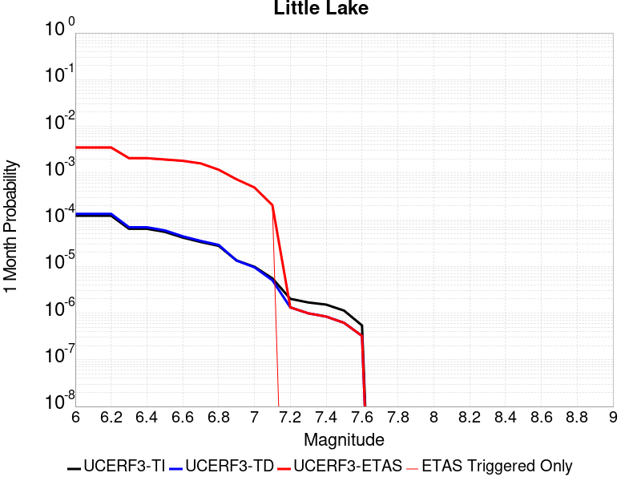 |  |  |

| Magnitude | 1 wk TI Prob | 1 wk TD Prob | 1 wk ETAS Prob | 1 wk ETAS/TD Gain | 1 wk ETAS Triggered Only | 1 mo TI Prob | 1 mo TD Prob | 1 mo ETAS Prob | 1 mo ETAS/TD Gain | 1 mo ETAS Triggered Only | 1 yr TI Prob | 1 yr TD Prob | 1 yr ETAS Prob | 1 yr ETAS/TD Gain | 1 yr ETAS Triggered Only | 10 yr TI Prob | 10 yr TD Prob | 10 yr ETAS Prob | 10 yr ETAS/TD Gain | 10 yr ETAS Triggered Only |
|-----|-----|-----|-----|-----|-----|-----|-----|-----|-----|-----|-----|-----|-----|-----|-----|-----|-----|-----|-----|-----|
| 6.0 | 2.8424427E-5 | 3.1205633E-5 | 0.0028754817 | 92.14624 | 0.0028443648 | 1.2181328E-4 | 1.3373232E-4 | 0.0036931846 | 27.616245 | 0.0035599284 | 0.0014820677 | 0.0016271081 | 0.0066993423 | 4.117331 | 0.005080501 | 0.014722223 | 0.016165355 | 0.022501322 | 1.3919472 | 0.0064400714 |
| 6.1 | 2.8424427E-5 | 3.1205633E-5 | 0.0028754817 | 92.14624 | 0.0028443648 | 1.2181328E-4 | 1.3373232E-4 | 0.0036931846 | 27.616245 | 0.0035599284 | 0.0014820677 | 0.0016271081 | 0.0066993423 | 4.117331 | 0.005080501 | 0.014722223 | 0.016165355 | 0.022501322 | 1.3919472 | 0.0064400714 |
| 6.2 | 2.8424427E-5 | 3.1205633E-5 | 0.0028754817 | 92.14624 | 0.0028443648 | 1.2181328E-4 | 1.3373232E-4 | 0.0036931846 | 27.616245 | 0.0035599284 | 0.0014820677 | 0.0016271081 | 0.0066993423 | 4.117331 | 0.005080501 | 0.014722223 | 0.016165355 | 0.022501322 | 1.3919472 | 0.0064400714 |
| 6.3 | 1.48860645E-5 | 1.6081349E-5 | 0.0016976285 | 105.56506 | 0.0016815743 | 6.379586E-5 | 6.89184E-5 | 0.0021796853 | 31.627043 | 0.0021109122 | 7.7643775E-4 | 8.387868E-4 | 0.0037701363 | 4.4947495 | 0.0029338105 | 0.007737305 | 0.008359027 | 0.012119812 | 1.4499071 | 0.0037924866 |
| 6.4 | 1.48860645E-5 | 1.6081349E-5 | 0.0016976285 | 105.56506 | 0.0016815743 | 6.379586E-5 | 6.89184E-5 | 0.0021796853 | 31.627043 | 0.0021109122 | 7.7643775E-4 | 8.387868E-4 | 0.0037701363 | 4.4947495 | 0.0029338105 | 0.007737305 | 0.008359027 | 0.012119812 | 1.4499071 | 0.0037924866 |
| 6.5 | 1.2797581E-5 | 1.3765531E-5 | 0.0015879836 | 115.35941 | 0.0015742397 | 5.4845623E-5 | 5.899394E-5 | 0.0020266776 | 34.353992 | 0.0019677996 | 6.675408E-4 | 7.180402E-4 | 0.003506734 | 4.883757 | 0.0027906976 | 0.006655392 | 0.0071597523 | 0.010729714 | 1.4986154 | 0.0035957065 |
| 6.6 | 9.661896E-6 | 1.02890135E-5 | 0.0015666236 | 152.2618 | 0.0015563506 | 4.1407468E-5 | 4.409512E-5 | 0.0019581432 | 44.407253 | 0.0019141324 | 5.040193E-4 | 5.3674204E-4 | 0.0032365443 | 6.029981 | 0.0027012522 | 0.005028777 | 0.0053560617 | 0.008807957 | 1.6444838 | 0.003470483 |
| 6.7 | 7.767871E-6 | 8.199668E-6 | 0.0014750928 | 179.89665 | 0.0014669052 | 3.329045E-5 | 3.5141038E-5 | 0.001823987 | 51.90475 | 0.0017889087 | 4.0523586E-4 | 4.2777188E-4 | 0.0029669357 | 6.935789 | 0.0025402505 | 0.004044977 | 0.0042708362 | 0.0074414946 | 1.7423974 | 0.0031842575 |
| 6.8 | 6.4235196E-6 | 6.7357296E-6 | 0.0010979627 | 163.00577 | 0.0010912344 | 2.752908E-5 | 2.8867165E-5 | 0.0013883986 | 48.09612 | 0.0013595707 | 3.35115E-4 | 3.5141388E-4 | 0.0023721703 | 6.7503605 | 0.0020214668 | 0.003346101 | 0.0035098423 | 0.0059698718 | 1.7008946 | 0.002468694 |
| 6.9 | 3.1283696E-6 | 3.1121751E-6 | 6.8289536E-4 | 219.42705 | 6.797853E-4 | 1.3407229E-5 | 1.33378335E-5 | 8.541137E-4 | 64.03692 | 8.4078714E-4 | 1.6322079E-4 | 1.6237753E-4 | 0.0013965241 | 8.600476 | 0.001234347 | 0.0016310095 | 0.0016227373 | 0.003087262 | 1.9025028 | 0.0014669052 |
| 7.0 | 2.290603E-6 | 2.2286777E-6 | 5.2101107E-4 | 233.77588 | 5.187835E-4 | 9.816834E-6 | 9.551446E-6 | 5.998857E-4 | 62.805744 | 5.903399E-4 | 1.19513395E-4 | 1.1628369E-4 | 0.0010106341 | 8.691108 | 8.9445437E-4 | 0.0011944914 | 0.0011623306 | 0.0021986917 | 1.8916234 | 0.001037567 |
| 7.1 | 1.293693E-6 | 1.1776802E-6 | 1.8006835E-4 | 152.90088 | 1.7889087E-4 | 5.5443866E-6 | 5.0471954E-6 | 2.1971516E-4 | 43.532127 | 2.1466905E-4 | 6.750081E-5 | 6.144857E-5 | 4.370963E-4 | 7.113206 | 3.7567085E-4 | 6.7480316E-4 | 6.1438425E-4 | 0.0010792147 | 1.7565795 | 4.651163E-4 |
| 7.2 | 4.715842E-7 | 3.091774E-7 | 3.091774E-7 | 1.0 | 0.0 | 2.0210737E-6 | 1.3250453E-6 | 1.3250453E-6 | 1.0 | 0.0 | 2.4606294E-5 | 1.6132313E-5 | 1.6132313E-5 | 1.0 | 0.0 | 2.460357E-4 | 1.6131197E-4 | 1.7919816E-4 | 1.1108795 | 1.7889088E-5 |
| 7.3 | 3.9430947E-7 | 2.309738E-7 | 2.309738E-7 | 1.0 | 0.0 | 1.6898966E-6 | 9.898873E-7 | 9.898873E-7 | 1.0 | 0.0 | 2.0574296E-5 | 1.20518125E-5 | 1.20518125E-5 | 1.0 | 0.0 | 2.0572392E-4 | 1.2051166E-4 | 1.2051166E-4 | 1.0 | 0.0 |
| 7.4 | 3.547123E-7 | 1.9679035E-7 | 1.9679035E-7 | 1.0 | 0.0 | 1.5201948E-6 | 8.4338694E-7 | 8.4338694E-7 | 1.0 | 0.0 | 1.8508214E-5 | 1.0268188E-5 | 1.0268188E-5 | 1.0 | 0.0 | 1.8506673E-4 | 1.026772E-4 | 1.026772E-4 | 1.0 | 0.0 |
| 7.5 | 2.6354266E-7 | 1.4423068E-7 | 1.4423068E-7 | 1.0 | 0.0 | 1.129468E-6 | 6.1813137E-7 | 6.1813137E-7 | 1.0 | 0.0 | 1.3751187E-5 | 7.5257235E-6 | 7.5257235E-6 | 1.0 | 0.0 | 1.3750336E-4 | 7.525474E-5 | 7.525474E-5 | 1.0 | 0.0 |
| 7.6 | 1.269913E-7 | 7.572526E-8 | 7.572526E-8 | 1.0 | 0.0 | 5.4424834E-7 | 3.245368E-7 | 3.245368E-7 | 1.0 | 0.0 | 6.6262032E-6 | 3.951229E-6 | 3.951229E-6 | 1.0 | 0.0 | 6.626006E-5 | 3.9511622E-5 | 3.9511622E-5 | 1.0 | 0.0 |

## Airport Lake
*[(top)](#table-of-contents)*

| 1 Week | 1 Month | 1 Year | 10 Year |
|-----|-----|-----|-----|
|  |  |  |  |

| Magnitude | 1 wk TI Prob | 1 wk TD Prob | 1 wk ETAS Prob | 1 wk ETAS/TD Gain | 1 wk ETAS Triggered Only | 1 mo TI Prob | 1 mo TD Prob | 1 mo ETAS Prob | 1 mo ETAS/TD Gain | 1 mo ETAS Triggered Only | 1 yr TI Prob | 1 yr TD Prob | 1 yr ETAS Prob | 1 yr ETAS/TD Gain | 1 yr ETAS Triggered Only | 10 yr TI Prob | 10 yr TD Prob | 10 yr ETAS Prob | 10 yr ETAS/TD Gain | 10 yr ETAS Triggered Only |
|-----|-----|-----|-----|-----|-----|-----|-----|-----|-----|-----|-----|-----|-----|-----|-----|-----|-----|-----|-----|-----|
| 6.0 | 1.2387061E-5 | 1.3103137E-5 | 0.002356543 | 179.84572 | 0.0023434705 | 5.3086325E-5 | 5.615525E-5 | 0.003007689 | 53.560246 | 0.0029516995 | 6.461343E-4 | 6.835041E-4 | 0.0047236746 | 6.9109674 | 0.0040429337 | 0.0064425888 | 0.0068168286 | 0.011631724 | 1.7063248 | 0.004847943 |
| 6.1 | 1.2387061E-5 | 1.3103137E-5 | 0.002356543 | 179.84572 | 0.0023434705 | 5.3086325E-5 | 5.615525E-5 | 0.003007689 | 53.560246 | 0.0029516995 | 6.461343E-4 | 6.835041E-4 | 0.0047236746 | 6.9109674 | 0.0040429337 | 0.0064425888 | 0.0068168286 | 0.011631724 | 1.7063248 | 0.004847943 |
| 6.2 | 1.2387061E-5 | 1.3103137E-5 | 0.002356543 | 179.84572 | 0.0023434705 | 5.3086325E-5 | 5.615525E-5 | 0.003007689 | 53.560246 | 0.0029516995 | 6.461343E-4 | 6.835041E-4 | 0.0047236746 | 6.9109674 | 0.0040429337 | 0.0064425888 | 0.0068168286 | 0.011631724 | 1.7063248 | 0.004847943 |
| 6.3 | 1.2387061E-5 | 1.3103137E-5 | 0.002356543 | 179.84572 | 0.0023434705 | 5.3086325E-5 | 5.615525E-5 | 0.003007689 | 53.560246 | 0.0029516995 | 6.461343E-4 | 6.835041E-4 | 0.0047236746 | 6.9109674 | 0.0040429337 | 0.0064425888 | 0.0068168286 | 0.011631724 | 1.7063248 | 0.004847943 |
| 6.4 | 1.2387061E-5 | 1.3103137E-5 | 0.002356543 | 179.84572 | 0.0023434705 | 5.3086325E-5 | 5.615525E-5 | 0.003007689 | 53.560246 | 0.0029516995 | 6.461343E-4 | 6.835041E-4 | 0.0047236746 | 6.9109674 | 0.0040429337 | 0.0064425888 | 0.0068168286 | 0.011631724 | 1.7063248 | 0.004847943 |
| 6.5 | 6.9922594E-6 | 7.384914E-6 | 0.0019393921 | 262.6154 | 0.0019320215 | 2.996648E-5 | 3.1649277E-5 | 0.0024108225 | 76.173065 | 0.0023792486 | 3.6478083E-4 | 3.8526725E-4 | 0.003729238 | 9.679612 | 0.0033452595 | 0.003641826 | 0.0038465308 | 0.007802632 | 2.0284855 | 0.0039713774 |
| 6.6 | 6.9922594E-6 | 7.384914E-6 | 0.0019393921 | 262.6154 | 0.0019320215 | 2.996648E-5 | 3.1649277E-5 | 0.0024108225 | 76.173065 | 0.0023792486 | 3.6478083E-4 | 3.8526725E-4 | 0.003729238 | 9.679612 | 0.0033452595 | 0.003641826 | 0.0038465308 | 0.007802632 | 2.0284855 | 0.0039713774 |
| 6.7 | 5.477277E-6 | 5.78606E-6 | 0.0016515726 | 285.43994 | 0.0016457961 | 2.3473833E-5 | 2.4797186E-5 | 0.0020283253 | 81.79659 | 0.0020035778 | 2.8575645E-4 | 3.0186778E-4 | 0.003199025 | 10.597438 | 0.0028980323 | 0.0028538927 | 0.0030149613 | 0.0064214757 | 2.12987 | 0.0034168158 |
| 6.8 | 3.9950432E-6 | 4.219081E-6 | 0.00125645 | 297.80182 | 0.0012522362 | 1.7121502E-5 | 1.8081664E-5 | 0.0015744042 | 87.07185 | 0.0015563506 | 2.0843433E-4 | 2.2012478E-4 | 0.002527309 | 11.4812565 | 0.0023076923 | 0.0020823893 | 0.0021993385 | 0.0048768 | 2.217394 | 0.0026833632 |
| 6.9 | 2.95695E-6 | 3.1230197E-6 | 9.512417E-4 | 304.59036 | 9.4812165E-4 | 1.2672582E-5 | 1.3384314E-5 | 0.0011940483 | 89.21252 | 0.0011806798 | 1.5427776E-4 | 1.629441E-4 | 0.0018979028 | 11.64757 | 0.0017352415 | 0.001541707 | 0.0016284687 | 0.0036287839 | 2.228341 | 0.0020035778 |
| 7.0 | 1.456072E-6 | 1.5408096E-6 | 4.8454542E-4 | 314.47458 | 4.8300537E-4 | 6.2402937E-6 | 6.6034586E-6 | 5.611615E-4 | 84.979935 | 5.5456173E-4 | 7.597293E-5 | 8.0395155E-5 | 9.390023E-4 | 11.679837 | 8.586762E-4 | 7.594696E-4 | 8.0375955E-4 | 0.0017868686 | 2.223138 | 9.838998E-4 |
| 7.1 | 6.995192E-7 | 7.4089627E-7 | 1.438535E-4 | 194.16145 | 1.431127E-4 | 2.997936E-6 | 3.1752697E-6 | 1.8206557E-4 | 57.33862 | 1.7889087E-4 | 3.649926E-5 | 3.865891E-5 | 3.7853845E-4 | 9.791752 | 3.3989266E-4 | 3.6493264E-4 | 3.865891E-4 | 7.9787907E-4 | 2.0638943 | 4.1144903E-4 |

## Panamint Valley
*[(top)](#table-of-contents)*

| 1 Week | 1 Month | 1 Year | 10 Year |
|-----|-----|-----|-----|
|  |  |  |  |

| Magnitude | 1 wk TI Prob | 1 wk TD Prob | 1 wk ETAS Prob | 1 wk ETAS/TD Gain | 1 wk ETAS Triggered Only | 1 mo TI Prob | 1 mo TD Prob | 1 mo ETAS Prob | 1 mo ETAS/TD Gain | 1 mo ETAS Triggered Only | 1 yr TI Prob | 1 yr TD Prob | 1 yr ETAS Prob | 1 yr ETAS/TD Gain | 1 yr ETAS Triggered Only | 10 yr TI Prob | 10 yr TD Prob | 10 yr ETAS Prob | 10 yr ETAS/TD Gain | 10 yr ETAS Triggered Only |
|-----|-----|-----|-----|-----|-----|-----|-----|-----|-----|-----|-----|-----|-----|-----|-----|-----|-----|-----|-----|-----|
| 6.0 | 3.0211835E-5 | 3.398435E-5 | 9.4629684E-4 | 27.845076 | 9.1234344E-4 | 1.2947287E-4 | 1.4563925E-4 | 0.0012188281 | 8.368816 | 0.0010733453 | 0.0015751923 | 0.0017717453 | 0.003343196 | 1.8869506 | 0.0015742397 | 0.015640736 | 0.017583055 | 0.019797446 | 1.125939 | 0.002254025 |
| 6.1 | 3.0211835E-5 | 3.398435E-5 | 9.4629684E-4 | 27.845076 | 9.1234344E-4 | 1.2947287E-4 | 1.4563925E-4 | 0.0012188281 | 8.368816 | 0.0010733453 | 0.0015751923 | 0.0017717453 | 0.003343196 | 1.8869506 | 0.0015742397 | 0.015640736 | 0.017583055 | 0.019797446 | 1.125939 | 0.002254025 |
| 6.2 | 3.0211835E-5 | 3.398435E-5 | 9.4629684E-4 | 27.845076 | 9.1234344E-4 | 1.2947287E-4 | 1.4563925E-4 | 0.0012188281 | 8.368816 | 0.0010733453 | 0.0015751923 | 0.0017717453 | 0.003343196 | 1.8869506 | 0.0015742397 | 0.015640736 | 0.017583055 | 0.019797446 | 1.125939 | 0.002254025 |
| 6.3 | 2.8573924E-5 | 3.2102525E-5 | 9.4441674E-4 | 29.418766 | 9.1234344E-4 | 1.2245393E-4 | 1.3757516E-4 | 0.0012107728 | 8.800809 | 0.0010733453 | 0.001489857 | 0.0016737186 | 0.0031738868 | 1.8963085 | 0.0015026834 | 0.01479908 | 0.016617723 | 0.018763924 | 1.1291513 | 0.0021824688 |
| 6.4 | 2.8573924E-5 | 3.2102525E-5 | 9.4441674E-4 | 29.418766 | 9.1234344E-4 | 1.2245393E-4 | 1.3757516E-4 | 0.0012107728 | 8.800809 | 0.0010733453 | 0.001489857 | 0.0016737186 | 0.0031738868 | 1.8963085 | 0.0015026834 | 0.01479908 | 0.016617723 | 0.018763924 | 1.1291513 | 0.0021824688 |
| 6.5 | 2.7468774E-5 | 3.0828287E-5 | 9.2525507E-4 | 30.013186 | 8.9445437E-4 | 1.1771801E-4 | 1.321147E-4 | 0.0011874314 | 8.987884 | 0.0010554561 | 0.0014322745 | 0.0016073369 | 0.0030718844 | 1.9111639 | 0.0014669052 | 0.014230782 | 0.015963601 | 0.01805842 | 1.1312246 | 0.0021288015 |
| 6.6 | 2.6135967E-5 | 2.925234E-5 | 9.2368055E-4 | 31.576296 | 8.9445437E-4 | 1.1200648E-4 | 1.253613E-4 | 0.0011627983 | 9.275577 | 0.001037567 | 0.0013628257 | 0.0015252318 | 0.002954176 | 1.9368702 | 0.001431127 | 0.013544982 | 0.0151539715 | 0.01719766 | 1.1348615 | 0.002075134 |
| 6.7 | 2.4498746E-5 | 2.73412E-5 | 8.8599394E-4 | 32.405087 | 8.586762E-4 | 1.04990395E-4 | 1.17171454E-4 | 0.001100956 | 9.3961115 | 9.838998E-4 | 0.0012775084 | 0.0014256539 | 0.0027832864 | 1.9522874 | 0.0013595707 | 0.012701893 | 0.014171205 | 0.016128754 | 1.1381357 | 0.0019856887 |
| 6.8 | 2.2244329E-5 | 2.4935298E-5 | 7.7625824E-4 | 31.1309 | 7.513417E-4 | 9.532935E-5 | 1.0686131E-4 | 9.83333E-4 | 9.201955 | 8.765653E-4 | 0.0011600169 | 0.0013002817 | 0.002515158 | 1.9343177 | 0.0012164579 | 0.011539802 | 0.012932454 | 0.014698228 | 1.1365381 | 0.0017889087 |
| 6.9 | 1.9902658E-5 | 2.229015E-5 | 7.19949E-4 | 32.298973 | 6.976744E-4 | 8.529431E-5 | 9.552582E-5 | 9.1834523E-4 | 9.613581 | 8.2289806E-4 | 0.0010379635 | 0.0011624249 | 0.0022881273 | 1.9684088 | 0.0011270125 | 0.010331288 | 0.011568548 | 0.013230668 | 1.1436758 | 0.0016815743 |
| 7.0 | 1.8353881E-5 | 2.0566078E-5 | 7.003374E-4 | 34.05304 | 6.797853E-4 | 7.865712E-5 | 8.813745E-5 | 8.751879E-4 | 9.929808 | 7.8711985E-4 | 9.5722964E-4 | 0.001072563 | 0.002144757 | 1.9996561 | 0.0010733453 | 0.009531168 | 0.010678793 | 0.012218524 | 1.1441858 | 0.0015563506 |
| 7.1 | 1.7667631E-5 | 1.9772506E-5 | 6.995444E-4 | 35.379654 | 6.797853E-4 | 7.571623E-5 | 8.473666E-5 | 8.717898E-4 | 10.288225 | 7.8711985E-4 | 9.2145515E-4 | 0.0010311981 | 0.0020855658 | 2.0224688 | 0.0010554561 | 0.009176437 | 0.010269018 | 0.011773976 | 1.1465533 | 0.0015205725 |
| 7.2 | 1.6381597E-5 | 1.815815E-5 | 6.0848735E-4 | 33.51042 | 5.903399E-4 | 7.020495E-5 | 7.7818426E-5 | 7.7543856E-4 | 9.964717 | 6.976744E-4 | 8.544101E-4 | 9.4704475E-4 | 0.0018942686 | 2.000189 | 9.4812165E-4 | 0.008511325 | 0.009434741 | 0.010763764 | 1.1408648 | 0.0013416816 |
| 7.3 | 1.4520491E-5 | 1.5966394E-5 | 4.9896404E-4 | 31.25089 | 4.8300537E-4 | 6.222919E-5 | 6.84257E-5 | 6.4083736E-4 | 9.365448 | 5.724508E-4 | 7.57377E-4 | 8.327807E-4 | 0.001619245 | 1.9443835 | 7.8711985E-4 | 0.0075480095 | 0.008299708 | 0.009399626 | 1.1325248 | 0.0011091235 |
| 7.4 | 1.2852287E-5 | 1.4145337E-5 | 4.7925505E-4 | 33.880775 | 4.651163E-4 | 5.5080065E-5 | 6.0621558E-5 | 6.151497E-4 | 10.147375 | 5.5456173E-4 | 6.7039346E-4 | 7.378333E-4 | 0.0014886206 | 2.017557 | 7.513417E-4 | 0.0066837464 | 0.0073567564 | 0.008404448 | 1.1424122 | 0.0010554561 |
| 7.5 | 1.1637851E-5 | 1.2836727E-5 | 4.7794703E-4 | 37.23278 | 4.651163E-4 | 4.987555E-5 | 5.5013472E-5 | 6.095447E-4 | 11.079917 | 5.5456173E-4 | 6.070656E-4 | 6.6959887E-4 | 0.0014025604 | 2.0946276 | 7.334526E-4 | 0.006054099 | 0.0066787098 | 0.0076915775 | 1.1516563 | 0.001019678 |
| 7.6 | 3.0068115E-6 | 3.3330039E-6 | 2.1800134E-4 | 65.40687 | 2.1466905E-4 | 1.2886271E-5 | 1.42842655E-5 | 3.1839442E-4 | 22.28987 | 3.0411448E-4 | 1.5687906E-4 | 1.7390434E-4 | 5.3162384E-4 | 3.0569904 | 3.5778174E-4 | 0.0015676835 | 0.0017391219 | 0.0022034294 | 1.266978 | 4.651163E-4 |

## Tank Canyon
*[(top)](#table-of-contents)*

| 1 Week | 1 Month | 1 Year | 10 Year |
|-----|-----|-----|-----|
|  |  |  |  |

| Magnitude | 1 wk TI Prob | 1 wk TD Prob | 1 wk ETAS Prob | 1 wk ETAS/TD Gain | 1 wk ETAS Triggered Only | 1 mo TI Prob | 1 mo TD Prob | 1 mo ETAS Prob | 1 mo ETAS/TD Gain | 1 mo ETAS Triggered Only | 1 yr TI Prob | 1 yr TD Prob | 1 yr ETAS Prob | 1 yr ETAS/TD Gain | 1 yr ETAS Triggered Only | 10 yr TI Prob | 10 yr TD Prob | 10 yr ETAS Prob | 10 yr ETAS/TD Gain | 10 yr ETAS Triggered Only |
|-----|-----|-----|-----|-----|-----|-----|-----|-----|-----|-----|-----|-----|-----|-----|-----|-----|-----|-----|-----|-----|
| 6.0 | 4.8284557E-5 | 5.7964517E-5 | 5.409419E-4 | 9.3322935 | 4.8300537E-4 | 2.0691741E-4 | 2.4839956E-4 | 9.6378534E-4 | 3.87998 | 7.155635E-4 | 0.0025163088 | 0.0030207448 | 0.004269198 | 1.4132932 | 0.0012522362 | 0.02488006 | 0.029863482 | 0.031442773 | 1.0528837 | 0.0016279069 |
| 6.1 | 1.7796336E-5 | 2.0873225E-5 | 1.9976037E-4 | 9.570172 | 1.7889087E-4 | 7.626778E-5 | 8.945383E-5 | 3.5776614E-4 | 3.9994502 | 2.6833633E-4 | 9.281647E-4 | 0.0010885935 | 0.001624682 | 1.4924597 | 5.3667265E-4 | 0.009242975 | 0.010836697 | 0.011597592 | 1.0702146 | 7.6923077E-4 |
| 6.2 | 1.7796336E-5 | 2.0873225E-5 | 1.9976037E-4 | 9.570172 | 1.7889087E-4 | 7.626778E-5 | 8.945383E-5 | 3.5776614E-4 | 3.9994502 | 2.6833633E-4 | 9.281647E-4 | 0.0010885935 | 0.001624682 | 1.4924597 | 5.3667265E-4 | 0.009242975 | 0.010836697 | 0.011597592 | 1.0702146 | 7.6923077E-4 |
| 6.3 | 1.3515912E-5 | 1.57595E-5 | 1.5886995E-4 | 10.080899 | 1.431127E-4 | 5.792405E-5 | 6.7539106E-5 | 2.8219365E-4 | 4.178226 | 2.1466905E-4 | 7.049971E-4 | 8.220024E-4 | 0.0012509876 | 1.5218782 | 4.293381E-4 | 0.007027647 | 0.008192232 | 0.00881322 | 1.0758022 | 6.261181E-4 |
| 6.4 | 1.0870146E-5 | 1.2617973E-5 | 1.19951146E-4 | 9.5063715 | 1.0733453E-4 | 4.658551E-5 | 5.407601E-5 | 2.1506909E-4 | 3.9771628 | 1.610018E-4 | 5.67031E-4 | 6.581944E-4 | 9.978634E-4 | 1.5160618 | 3.3989266E-4 | 0.005655863 | 0.006564466 | 0.0070443004 | 1.0730958 | 4.8300537E-4 |
| 6.5 | 7.964826E-6 | 9.196063E-6 | 1.165296E-4 | 12.671684 | 1.0733453E-4 | 3.4134522E-5 | 3.941116E-5 | 1.8251823E-4 | 4.63113 | 1.431127E-4 | 4.1550855E-4 | 4.797359E-4 | 7.65824E-4 | 1.596345 | 2.862254E-4 | 0.0041473247 | 0.0047883047 | 0.00517998 | 1.0817983 | 3.9355992E-4 |
| 6.6 | 6.6317E-6 | 7.6122747E-6 | 1.14945986E-4 | 15.100083 | 1.0733453E-4 | 2.8421264E-5 | 3.2623677E-5 | 1.7573171E-4 | 5.386631 | 1.431127E-4 | 3.4597394E-4 | 3.9713003E-4 | 6.8324176E-4 | 1.7204485 | 2.862254E-4 | 0.0034543579 | 0.0039653555 | 0.0043395367 | 1.0943626 | 3.7567085E-4 |
| 6.7 | 4.793663E-6 | 5.430772E-6 | 9.487572E-5 | 17.470026 | 8.9445435E-5 | 2.0544108E-5 | 2.3274553E-5 | 1.4849525E-4 | 6.3801546 | 1.2522361E-4 | 2.500958E-4 | 2.8333522E-4 | 5.1582744E-4 | 1.8205554 | 2.3255814E-4 | 0.0024981452 | 0.0028304325 | 0.0031336863 | 1.1071404 | 3.0411448E-4 |
| 6.8 | 4.382823E-6 | 4.969245E-6 | 9.441424E-5 | 18.999716 | 8.9445435E-5 | 1.8783392E-5 | 2.1296615E-5 | 1.4651756E-4 | 6.8798523 | 1.2522361E-4 | 2.286638E-4 | 2.5925972E-4 | 4.738731E-4 | 1.8277931 | 2.1466905E-4 | 0.0022842865 | 0.0025902467 | 0.0028757306 | 1.110215 | 2.862254E-4 |
| 6.9 | 2.729601E-6 | 3.0735362E-6 | 3.8851602E-5 | 12.640685 | 3.5778176E-5 | 1.1698237E-5 | 1.3172238E-5 | 8.4727646E-5 | 6.432289 | 7.155635E-5 | 1.4241673E-4 | 1.6036142E-4 | 2.8556495E-4 | 1.7807584 | 1.2522361E-4 | 0.001423255 | 0.0016026229 | 0.0017990875 | 1.1225893 | 1.9677996E-4 |
| 7.0 | 1.8987357E-6 | 2.1269361E-6 | 2.0015985E-5 | 9.410713 | 1.7889088E-5 | 8.137413E-6 | 9.1154125E-6 | 4.4893262E-5 | 4.9249845 | 3.5778176E-5 | 9.90685E-5 | 1.1097519E-4 | 2.0041071E-4 | 1.8059055 | 8.9445435E-5 | 9.902435E-4 | 0.0011092664 | 0.0012522204 | 1.1288725 | 1.431127E-4 |
| 7.1 | 1.4928986E-6 | 1.6641251E-6 | 1.9553183E-5 | 11.749827 | 1.7889088E-5 | 6.398121E-6 | 7.1319487E-6 | 4.290987E-5 | 6.01657 | 3.5778176E-5 | 7.789434E-5 | 8.682861E-5 | 1.5837874E-4 | 1.8240387 | 7.155635E-5 | 7.786704E-4 | 8.680047E-4 | 9.75246E-4 | 1.1235493 | 1.0733453E-4 |
| 7.2 | 1.069082E-6 | 1.182856E-6 | 1.182856E-6 | 1.0 | 0.0 | 4.581772E-6 | 5.0693757E-6 | 2.2958373E-5 | 4.5288363 | 1.7889088E-5 | 5.5781646E-5 | 6.1718434E-5 | 9.7494405E-5 | 1.5796642 | 3.5778176E-5 | 5.576765E-4 | 6.1706523E-4 | 6.7069934E-4 | 1.0869181 | 5.3667263E-5 |
| 7.3 | 8.776551E-7 | 9.769996E-7 | 9.769996E-7 | 1.0 | 0.0 | 3.7613736E-6 | 4.187137E-6 | 4.187137E-6 | 1.0 | 0.0 | 4.579376E-5 | 5.097772E-5 | 6.88659E-5 | 1.3509018 | 1.7889088E-5 | 4.5784327E-4 | 5.097113E-4 | 5.454712E-4 | 1.0701573 | 3.5778176E-5 |
| 7.4 | 7.55721E-7 | 8.5102363E-7 | 8.5102363E-7 | 1.0 | 0.0 | 3.2388E-6 | 3.647242E-6 | 3.647242E-6 | 1.0 | 0.0 | 3.9431678E-5 | 4.4404784E-5 | 6.229308E-5 | 1.4028461 | 1.7889088E-5 | 3.942468E-4 | 4.4401E-4 | 4.7977228E-4 | 1.0805439 | 3.5778176E-5 |
| 7.5 | 5.587665E-7 | 6.305613E-7 | 6.305613E-7 | 1.0 | 0.0 | 2.3947114E-6 | 2.7024057E-6 | 2.7024057E-6 | 1.0 | 0.0 | 2.915522E-5 | 3.290179E-5 | 3.290179E-5 | 1.0 | 0.0 | 2.9151395E-4 | 3.2901787E-4 | 3.2901787E-4 | 1.0 | 0.0 |

## Owl Lake
*[(top)](#table-of-contents)*

| 1 Week | 1 Month | 1 Year | 10 Year |
|-----|-----|-----|-----|
|  |  |  |  |

| Magnitude | 1 wk TI Prob | 1 wk TD Prob | 1 wk ETAS Prob | 1 wk ETAS/TD Gain | 1 wk ETAS Triggered Only | 1 mo TI Prob | 1 mo TD Prob | 1 mo ETAS Prob | 1 mo ETAS/TD Gain | 1 mo ETAS Triggered Only | 1 yr TI Prob | 1 yr TD Prob | 1 yr ETAS Prob | 1 yr ETAS/TD Gain | 1 yr ETAS Triggered Only | 10 yr TI Prob | 10 yr TD Prob | 10 yr ETAS Prob | 10 yr ETAS/TD Gain | 10 yr ETAS Triggered Only |
|-----|-----|-----|-----|-----|-----|-----|-----|-----|-----|-----|-----|-----|-----|-----|-----|-----|-----|-----|-----|-----|
| 6.0 | 5.0320643E-5 | 6.635748E-5 | 4.420034E-4 | 6.6609426 | 3.7567085E-4 | 2.1564208E-4 | 2.843645E-4 | 8.387685E-4 | 2.9496245 | 5.5456173E-4 | 0.0026222812 | 0.0034577043 | 0.0042955843 | 1.2423226 | 8.4078714E-4 | 0.02591553 | 0.0341404 | 0.035263494 | 1.0328963 | 0.0011627907 |
| 6.1 | 5.0320643E-5 | 6.635748E-5 | 4.420034E-4 | 6.6609426 | 3.7567085E-4 | 2.1564208E-4 | 2.843645E-4 | 8.387685E-4 | 2.9496245 | 5.5456173E-4 | 0.0026222812 | 0.0034577043 | 0.0042955843 | 1.2423226 | 8.4078714E-4 | 0.02591553 | 0.0341404 | 0.035263494 | 1.0328963 | 0.0011627907 |
| 6.2 | 2.4125871E-5 | 3.0980704E-5 | 4.066399E-4 | 13.1255865 | 3.7567085E-4 | 1.0339249E-4 | 1.3276885E-4 | 6.6937023E-4 | 5.0416207 | 5.3667265E-4 | 0.0012580766 | 0.0016154221 | 0.0024369908 | 1.5085783 | 8.2289806E-4 | 0.012509781 | 0.016070297 | 0.017143995 | 1.0668125 | 0.0010912344 |
| 6.3 | 1.7433485E-5 | 2.2355249E-5 | 3.80129E-4 | 17.004017 | 3.5778174E-4 | 7.471279E-5 | 9.580558E-5 | 6.145394E-4 | 6.414443 | 5.187835E-4 | 9.0924866E-4 | 0.0011659606 | 0.0019700308 | 1.6896205 | 8.050089E-4 | 0.009055373 | 0.011628761 | 0.012689624 | 1.0912275 | 0.0010733453 |
| 6.4 | 1.7433485E-5 | 2.2355249E-5 | 3.80129E-4 | 17.004017 | 3.5778174E-4 | 7.471279E-5 | 9.580558E-5 | 6.145394E-4 | 6.414443 | 5.187835E-4 | 9.0924866E-4 | 0.0011659606 | 0.0019700308 | 1.6896205 | 8.050089E-4 | 0.009055373 | 0.011628761 | 0.012689624 | 1.0912275 | 0.0010733453 |
| 6.5 | 1.5182742E-5 | 1.9428902E-5 | 3.7720372E-4 | 19.414566 | 3.5778174E-4 | 6.506727E-5 | 8.326492E-5 | 6.020053E-4 | 7.229999 | 5.187835E-4 | 7.919061E-4 | 0.0010134302 | 0.0017997524 | 1.7759017 | 7.8711985E-4 | 0.0078909 | 0.010118305 | 0.011163081 | 1.1032561 | 0.0010554561 |
| 6.6 | 6.7271576E-6 | 8.547201E-6 | 3.663259E-4 | 42.859165 | 3.5778174E-4 | 2.8830356E-5 | 3.663038E-5 | 5.553949E-4 | 15.16214 | 5.187835E-4 | 3.5095305E-4 | 4.4588925E-4 | 0.0011790148 | 2.6441875 | 7.334526E-4 | 0.0035039932 | 0.0044677295 | 0.0054294243 | 1.2152536 | 9.6601073E-4 |
| 6.7 | 6.682835E-6 | 8.4796475E-6 | 3.6625838E-4 | 43.192642 | 3.5778174E-4 | 2.8640408E-5 | 3.6340873E-5 | 5.5510557E-4 | 15.274965 | 5.187835E-4 | 3.4864116E-4 | 4.4236594E-4 | 0.001175494 | 2.6572888 | 7.334526E-4 | 0.003480947 | 0.004432656 | 0.0053943847 | 1.2169645 | 9.6601073E-4 |
| 6.8 | 6.5774975E-6 | 8.326121E-6 | 3.6610488E-4 | 43.97064 | 3.5778174E-4 | 2.8188972E-5 | 3.5682922E-5 | 5.5444794E-4 | 15.538188 | 5.187835E-4 | 3.4314668E-4 | 4.343586E-4 | 0.0011674926 | 2.6878543 | 7.334526E-4 | 0.0034261728 | 0.0043528024 | 0.005314608 | 1.2209624 | 9.6601073E-4 |
| 6.9 | 6.363419E-6 | 7.999298E-6 | 3.657782E-4 | 45.726288 | 3.5778174E-4 | 2.727151E-5 | 3.4282286E-5 | 5.5304804E-4 | 16.132181 | 5.187835E-4 | 3.3198006E-4 | 4.1731246E-4 | 0.0011504589 | 2.7568285 | 7.334526E-4 | 0.0033148455 | 0.004182795 | 0.005144765 | 1.2299826 | 9.6601073E-4 |
| 7.0 | 6.1342453E-6 | 7.631501E-6 | 3.6541052E-4 | 47.881866 | 3.5778174E-4 | 2.6289357E-5 | 3.2706055E-5 | 5.5147265E-4 | 16.861485 | 5.187835E-4 | 3.2002592E-4 | 3.9812896E-4 | 0.0011312895 | 2.8415153 | 7.334526E-4 | 0.0031956544 | 0.00399149 | 0.004953645 | 1.2410516 | 9.6601073E-4 |
| 7.1 | 5.842926E-6 | 7.1420604E-6 | 3.470323E-4 | 48.58994 | 3.3989266E-4 | 2.504087E-5 | 3.0608502E-5 | 5.3148763E-4 | 17.364052 | 5.0089444E-4 | 3.0482994E-4 | 3.7260022E-4 | 0.0010878971 | 2.9197438 | 7.155635E-4 | 0.0030441214 | 0.0037369546 | 0.0046458887 | 1.2432286 | 9.1234344E-4 |
| 7.2 | 4.77173E-6 | 5.3583467E-6 | 2.5580422E-4 | 47.739395 | 2.5044722E-4 | 2.045011E-5 | 2.2964163E-5 | 3.9862638E-4 | 17.35863 | 3.7567085E-4 | 2.4895166E-4 | 2.7955687E-4 | 8.160795E-4 | 2.9191895 | 5.3667265E-4 | 0.0024867293 | 0.002808574 | 0.0035399664 | 1.2604142 | 7.334526E-4 |
| 7.3 | 3.0494948E-6 | 2.7103622E-6 | 2.0599402E-5 | 7.6002398 | 1.7889088E-5 | 1.3069198E-5 | 1.1615787E-5 | 4.7393547E-5 | 4.0800977 | 3.5778176E-5 | 1.5910587E-4 | 1.4141318E-4 | 2.1295942E-4 | 1.5059375 | 7.155635E-5 | 0.0015899199 | 0.0014231888 | 0.0015482341 | 1.0878628 | 1.2522361E-4 |
| 7.4 | 2.7263884E-6 | 2.3055816E-6 | 2.3055816E-6 | 1.0 | 0.0 | 1.1684469E-5 | 9.881027E-6 | 2.7769938E-5 | 2.8104303 | 1.7889088E-5 | 1.4224913E-4 | 1.20294964E-4 | 1.7395578E-4 | 1.4460769 | 5.3667263E-5 | 0.0014215811 | 0.0012111744 | 0.0013183788 | 1.0885129 | 1.0733453E-4 |
| 7.5 | 2.6090431E-6 | 2.1655203E-6 | 2.1655203E-6 | 1.0 | 0.0 | 1.1181565E-5 | 9.280769E-6 | 9.280769E-6 | 1.0 | 0.0 | 1.3612706E-4 | 1.129876E-4 | 1.4876173E-4 | 1.31662 | 3.5778176E-5 | 0.001360437 | 0.0011379321 | 0.0012272757 | 1.0785141 | 8.9445435E-5 |
| 7.6 | 2.3008756E-6 | 1.872704E-6 | 1.872704E-6 | 1.0 | 0.0 | 9.860858E-6 | 8.025851E-6 | 8.025851E-6 | 1.0 | 0.0 | 1.20049335E-4 | 9.771043E-5 | 9.771043E-5 | 1.0 | 0.0 | 0.001199845 | 9.849465E-4 | 0.001002818 | 1.0181446 | 1.7889088E-5 |
| 7.7 | 1.7184348E-6 | 1.3418345E-6 | 1.3418345E-6 | 1.0 | 0.0 | 7.3646997E-6 | 5.750707E-6 | 5.750707E-6 | 1.0 | 0.0 | 8.966153E-5 | 7.001265E-5 | 7.001265E-5 | 1.0 | 0.0 | 8.962536E-4 | 7.077913E-4 | 7.077913E-4 | 1.0 | 0.0 |
| 7.8 | 8.4612907E-7 | 8.4052675E-7 | 8.4052675E-7 | 1.0 | 0.0 | 3.6262625E-6 | 3.6022527E-6 | 3.6022527E-6 | 1.0 | 0.0 | 4.4148852E-5 | 4.3856566E-5 | 4.3856566E-5 | 1.0 | 0.0 | 4.414008E-4 | 4.4395277E-4 | 4.4395277E-4 | 1.0 | 0.0 |
| 7.9 | 2.716738E-7 | 3.767845E-7 | 3.767845E-7 | 1.0 | 0.0 | 1.1643157E-6 | 1.6147899E-6 | 1.6147899E-6 | 1.0 | 0.0 | 1.4175452E-5 | 1.96599E-5 | 1.96599E-5 | 1.0 | 0.0 | 1.4174548E-4 | 1.9835318E-4 | 1.9835318E-4 | 1.0 | 0.0 |
| 8.0 | 2.1995428E-8 | 3.38465E-8 | 3.38465E-8 | 1.0 | 0.0 | 9.426611E-8 | 1.4505643E-7 | 1.4505643E-7 | 1.0 | 0.0 | 1.1476893E-6 | 1.7660612E-6 | 1.7660612E-6 | 1.0 | 0.0 | 1.14768345E-5 | 1.796186E-5 | 1.796186E-5 | 1.0 | 0.0 |

## Hunter Mountain-Saline Valley
*[(top)](#table-of-contents)*

| 1 Week | 1 Month | 1 Year | 10 Year |
|-----|-----|-----|-----|
| 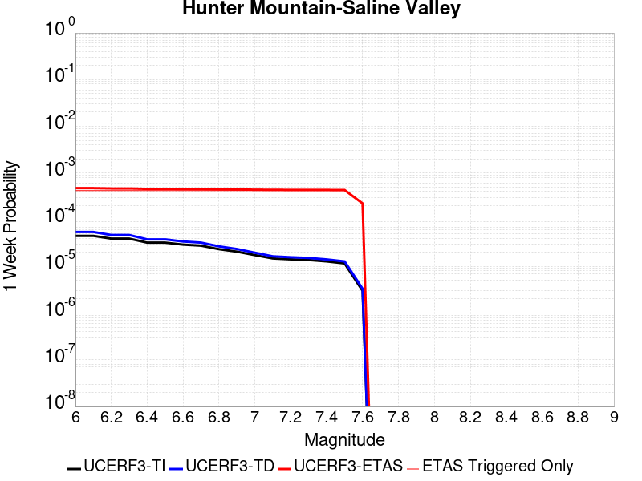 |  |  |  |

| Magnitude | 1 wk TI Prob | 1 wk TD Prob | 1 wk ETAS Prob | 1 wk ETAS/TD Gain | 1 wk ETAS Triggered Only | 1 mo TI Prob | 1 mo TD Prob | 1 mo ETAS Prob | 1 mo ETAS/TD Gain | 1 mo ETAS Triggered Only | 1 yr TI Prob | 1 yr TD Prob | 1 yr ETAS Prob | 1 yr ETAS/TD Gain | 1 yr ETAS Triggered Only | 10 yr TI Prob | 10 yr TD Prob | 10 yr ETAS Prob | 10 yr ETAS/TD Gain | 10 yr ETAS Triggered Only |
|-----|-----|-----|-----|-----|-----|-----|-----|-----|-----|-----|-----|-----|-----|-----|-----|-----|-----|-----|-----|-----|
| 6.0 | 4.5103672E-5 | 5.4569828E-5 | 5.196607E-4 | 9.522858 | 4.651163E-4 | 1.9328714E-4 | 2.3385094E-4 | 8.061679E-4 | 3.447358 | 5.724508E-4 | 0.002350731 | 0.002843498 | 0.0036283797 | 1.2760268 | 7.8711985E-4 | 0.023260195 | 0.028091714 | 0.029152295 | 1.0377542 | 0.0010912344 |
| 6.1 | 4.5103672E-5 | 5.4569828E-5 | 5.196607E-4 | 9.522858 | 4.651163E-4 | 1.9328714E-4 | 2.3385094E-4 | 8.061679E-4 | 3.447358 | 5.724508E-4 | 0.002350731 | 0.002843498 | 0.0036283797 | 1.2760268 | 7.8711985E-4 | 0.023260195 | 0.028091714 | 0.029152295 | 1.0377542 | 0.0010912344 |
| 6.2 | 3.9363465E-5 | 4.7063084E-5 | 5.1215745E-4 | 10.882361 | 4.651163E-4 | 1.6868966E-4 | 2.0168422E-4 | 7.740196E-4 | 3.8377795 | 5.724508E-4 | 0.002051862 | 0.002452803 | 0.0032379923 | 1.3201191 | 7.8711985E-4 | 0.020330196 | 0.024273338 | 0.025338084 | 1.0438648 | 0.0010912344 |
| 6.3 | 3.9363465E-5 | 4.7063084E-5 | 5.1215745E-4 | 10.882361 | 4.651163E-4 | 1.6868966E-4 | 2.0168422E-4 | 7.740196E-4 | 3.8377795 | 5.724508E-4 | 0.002051862 | 0.002452803 | 0.0032379923 | 1.3201191 | 7.8711985E-4 | 0.020330196 | 0.024273338 | 0.025338084 | 1.0438648 | 0.0010912344 |
| 6.4 | 3.2311684E-5 | 3.7950776E-5 | 5.030494E-4 | 13.255313 | 4.651163E-4 | 1.384713E-4 | 1.6263645E-4 | 7.3499413E-4 | 4.519246 | 5.724508E-4 | 0.0016845843 | 0.0019783732 | 0.0027639358 | 1.397075 | 7.8711985E-4 | 0.016718714 | 0.019616365 | 0.020686192 | 1.0545375 | 0.0010912344 |
| 6.5 | 3.2311684E-5 | 3.7950776E-5 | 5.030494E-4 | 13.255313 | 4.651163E-4 | 1.384713E-4 | 1.6263645E-4 | 7.3499413E-4 | 4.519246 | 5.724508E-4 | 0.0016845843 | 0.0019783732 | 0.0027639358 | 1.397075 | 7.8711985E-4 | 0.016718714 | 0.019616365 | 0.020686192 | 1.0545375 | 0.0010912344 |
| 6.6 | 2.9305844E-5 | 3.418164E-5 | 4.9928203E-4 | 14.6067295 | 4.651163E-4 | 1.2559042E-4 | 1.4648488E-4 | 7.188518E-4 | 4.907345 | 5.724508E-4 | 0.0015279909 | 0.0017820572 | 0.0025677744 | 1.4409046 | 7.8711985E-4 | 0.015175272 | 0.017685594 | 0.01875753 | 1.0606107 | 0.0010912344 |
| 6.7 | 2.7826512E-5 | 3.2344098E-5 | 4.9744535E-4 | 15.3797865 | 4.651163E-4 | 1.19251024E-4 | 1.3861054E-4 | 7.10982E-4 | 5.12935 | 5.724508E-4 | 0.0014509142 | 0.0016863372 | 0.0024721297 | 1.4659759 | 7.8711985E-4 | 0.014414776 | 0.016743096 | 0.01781606 | 1.0640839 | 0.0010912344 |
| 6.8 | 2.3389874E-5 | 2.6866572E-5 | 4.9197034E-4 | 18.311617 | 4.651163E-4 | 1.0023846E-4 | 1.15137635E-4 | 6.875225E-4 | 5.97131 | 5.724508E-4 | 0.00121972 | 0.0014009465 | 0.0021869636 | 1.5610615 | 7.8711985E-4 | 0.01213047 | 0.01392736 | 0.015003396 | 1.0772606 | 0.0010912344 |
| 6.9 | 2.069209E-5 | 2.3569908E-5 | 4.886752E-4 | 20.733013 | 4.651163E-4 | 8.867737E-5 | 1.01010184E-4 | 6.7340315E-4 | 6.6666856 | 5.724508E-4 | 0.0010791123 | 0.0012291414 | 0.0020152938 | 1.6395948 | 7.8711985E-4 | 0.010738871 | 0.01222846 | 0.01330635 | 1.0881461 | 0.0010912344 |
| 7.0 | 1.7462342E-5 | 1.9633446E-5 | 4.847406E-4 | 24.689533 | 4.651163E-4 | 7.483646E-5 | 8.414075E-5 | 6.565434E-4 | 7.802918 | 5.724508E-4 | 9.1075303E-4 | 0.0010239548 | 0.0017923979 | 1.7504659 | 7.6923077E-4 | 0.009070295 | 0.010196 | 0.011258402 | 1.1041979 | 0.0010733453 |
| 7.1 | 1.4807709E-5 | 1.6441667E-5 | 4.815503E-4 | 29.288412 | 4.651163E-4 | 6.3460066E-5 | 7.0462476E-5 | 6.4287294E-4 | 9.123622 | 5.724508E-4 | 7.723524E-4 | 8.5755944E-4 | 0.0016261305 | 1.8962307 | 7.6923077E-4 | 0.007696735 | 0.008545489 | 0.009609662 | 1.1245304 | 0.0010733453 |
| 7.2 | 1.4180048E-5 | 1.5698257E-5 | 4.8080724E-4 | 30.628065 | 4.651163E-4 | 6.077022E-5 | 6.72766E-5 | 6.3968886E-4 | 9.508342 | 5.724508E-4 | 7.396263E-4 | 8.18801E-4 | 0.001587402 | 1.9386908 | 7.6923077E-4 | 0.0073716943 | 0.008160792 | 0.009225378 | 1.1304513 | 0.0010733453 |
| 7.3 | 1.3730402E-5 | 1.5171999E-5 | 4.8028122E-4 | 31.655766 | 4.651163E-4 | 5.8843252E-5 | 6.502132E-5 | 6.19547E-4 | 9.528367 | 5.5456173E-4 | 7.161811E-4 | 7.913631E-4 | 0.0015421102 | 1.9486759 | 7.513417E-4 | 0.007138774 | 0.007888383 | 0.008935513 | 1.1327434 | 0.0010554561 |
| 7.4 | 1.2810095E-5 | 1.4109204E-5 | 4.7921893E-4 | 33.964985 | 4.651163E-4 | 5.489925E-5 | 6.0466708E-5 | 6.149949E-4 | 10.170802 | 5.5456173E-4 | 6.681934E-4 | 7.359493E-4 | 0.001486738 | 2.0201638 | 7.513417E-4 | 0.006661878 | 0.0073380154 | 0.008385727 | 1.1427785 | 0.0010554561 |
| 7.5 | 1.1595659E-5 | 1.2800594E-5 | 4.7791091E-4 | 37.33506 | 4.651163E-4 | 4.9694736E-5 | 5.485862E-5 | 6.093899E-4 | 11.108371 | 5.5456173E-4 | 6.0486543E-4 | 6.677147E-4 | 0.0014006776 | 2.0977185 | 7.334526E-4 | 0.006032217 | 0.0066599557 | 0.007672843 | 1.1520861 | 0.001019678 |
| 7.6 | 2.997694E-6 | 3.3251304E-6 | 2.1799347E-4 | 65.55937 | 2.1466905E-4 | 1.28471975E-5 | 1.4250522E-5 | 3.183607E-4 | 22.340282 | 3.0411448E-4 | 1.564034E-4 | 1.7349358E-4 | 5.3121324E-4 | 3.0618613 | 3.5778174E-4 | 0.0015629337 | 0.0017350167 | 0.002199326 | 1.2676109 | 4.651163E-4 |

## Garlock (East)
*[(top)](#table-of-contents)*

| 1 Week | 1 Month | 1 Year | 10 Year |
|-----|-----|-----|-----|
|  |  |  |  |

| Magnitude | 1 wk TI Prob | 1 wk TD Prob | 1 wk ETAS Prob | 1 wk ETAS/TD Gain | 1 wk ETAS Triggered Only | 1 mo TI Prob | 1 mo TD Prob | 1 mo ETAS Prob | 1 mo ETAS/TD Gain | 1 mo ETAS Triggered Only | 1 yr TI Prob | 1 yr TD Prob | 1 yr ETAS Prob | 1 yr ETAS/TD Gain | 1 yr ETAS Triggered Only | 10 yr TI Prob | 10 yr TD Prob | 10 yr ETAS Prob | 10 yr ETAS/TD Gain | 10 yr ETAS Triggered Only |
|-----|-----|-----|-----|-----|-----|-----|-----|-----|-----|-----|-----|-----|-----|-----|-----|-----|-----|-----|-----|-----|
| 6.0 | 4.5092507E-5 | 6.290254E-5 | 4.0277382E-4 | 6.403141 | 3.3989266E-4 | 1.9323928E-4 | 2.6955697E-4 | 6.8089506E-4 | 2.5259783 | 4.1144903E-4 | 0.0023501497 | 0.003277363 | 0.0040440727 | 1.2339411 | 7.6923077E-4 | 0.023254504 | 0.032351483 | 0.033338174 | 1.0304991 | 0.001019678 |
| 6.1 | 4.5092507E-5 | 6.290254E-5 | 4.0277382E-4 | 6.403141 | 3.3989266E-4 | 1.9323928E-4 | 2.6955697E-4 | 6.8089506E-4 | 2.5259783 | 4.1144903E-4 | 0.0023501497 | 0.003277363 | 0.0040440727 | 1.2339411 | 7.6923077E-4 | 0.023254504 | 0.032351483 | 0.033338174 | 1.0304991 | 0.001019678 |
| 6.2 | 2.6674514E-5 | 3.450911E-5 | 3.386131E-4 | 9.812282 | 3.0411448E-4 | 1.1431433E-4 | 1.4788799E-4 | 5.235033E-4 | 3.5398633 | 3.7567085E-4 | 0.0013908884 | 0.0017990824 | 0.0025312153 | 1.4069481 | 7.334526E-4 | 0.01382215 | 0.01789001 | 0.01885631 | 1.0540133 | 9.838998E-4 |
| 6.3 | 2.6674514E-5 | 3.450911E-5 | 3.386131E-4 | 9.812282 | 3.0411448E-4 | 1.1431433E-4 | 1.4788799E-4 | 5.235033E-4 | 3.5398633 | 3.7567085E-4 | 0.0013908884 | 0.0017990824 | 0.0025312153 | 1.4069481 | 7.334526E-4 | 0.01382215 | 0.01789001 | 0.01885631 | 1.0540133 | 9.838998E-4 |
| 6.4 | 2.5312667E-5 | 3.233838E-5 | 3.3644304E-4 | 10.4038315 | 3.0411448E-4 | 1.0847834E-4 | 1.3858585E-4 | 5.142046E-4 | 3.7103689 | 3.7567085E-4 | 0.0013199237 | 0.0016860063 | 0.0024182224 | 1.4342902 | 7.334526E-4 | 0.013121112 | 0.016778054 | 0.017745445 | 1.0576582 | 9.838998E-4 |
| 6.5 | 2.5312667E-5 | 3.233838E-5 | 3.3644304E-4 | 10.4038315 | 3.0411448E-4 | 1.0847834E-4 | 1.3858585E-4 | 5.142046E-4 | 3.7103689 | 3.7567085E-4 | 0.0013199237 | 0.0016860063 | 0.0024182224 | 1.4342902 | 7.334526E-4 | 0.013121112 | 0.016778054 | 0.017745445 | 1.0576582 | 9.838998E-4 |
| 6.6 | 2.246556E-5 | 2.8133245E-5 | 3.3223917E-4 | 11.809486 | 3.0411448E-4 | 9.627742E-5 | 1.20565615E-4 | 4.9619115E-4 | 4.115528 | 3.7567085E-4 | 0.0011715472 | 0.0014669215 | 0.0021992982 | 1.499261 | 7.334526E-4 | 0.011653901 | 0.014618388 | 0.0155879045 | 1.0663217 | 9.838998E-4 |
| 6.7 | 2.2241198E-5 | 2.780299E-5 | 3.3190902E-4 | 11.93789 | 3.0411448E-4 | 9.531594E-5 | 1.1915036E-4 | 4.9477647E-4 | 4.1525383 | 3.7567085E-4 | 0.0011598538 | 0.0014497138 | 0.002182103 | 1.5051957 | 7.334526E-4 | 0.011538187 | 0.014448582 | 0.015418266 | 1.0671127 | 9.838998E-4 |
| 6.8 | 1.9528685E-5 | 2.3897695E-5 | 3.280049E-4 | 13.725378 | 3.0411448E-4 | 8.369167E-5 | 1.02414786E-4 | 4.7804715E-4 | 4.667755 | 3.7567085E-4 | 0.0010184698 | 0.0012462065 | 0.0019608783 | 1.5734779 | 7.155635E-4 | 0.010138147 | 0.012436173 | 0.01339017 | 1.0767115 | 9.6601073E-4 |
| 6.9 | 1.3318621E-5 | 1.5198458E-5 | 3.1930834E-4 | 21.009258 | 3.0411448E-4 | 5.7078556E-5 | 6.5134656E-5 | 4.4078103E-4 | 6.7672276 | 3.7567085E-4 | 6.9470983E-4 | 7.927316E-4 | 0.0015077279 | 1.9019399 | 7.155635E-4 | 0.0069254204 | 0.007939667 | 0.008880261 | 1.1184677 | 9.4812165E-4 |
| 7.0 | 1.1760853E-5 | 1.31073775E-5 | 2.9932903E-4 | 22.836683 | 2.862254E-4 | 5.0402683E-5 | 5.6173292E-5 | 4.1393496E-4 | 7.368892 | 3.5778174E-4 | 6.134799E-4 | 6.8370026E-4 | 0.0013808977 | 2.0197413 | 6.976744E-4 | 0.0061178906 | 0.006856307 | 0.0077801617 | 1.1347452 | 9.302326E-4 |
| 7.1 | 1.0064758E-5 | 1.0902532E-5 | 2.9712482E-4 | 27.252825 | 2.862254E-4 | 4.3133965E-5 | 4.6724323E-5 | 4.0448937E-4 | 8.656934 | 3.5778174E-4 | 5.2502943E-4 | 5.6872366E-4 | 0.0012481224 | 2.1946025 | 6.797853E-4 | 0.005237907 | 0.0057127923 | 0.0066199237 | 1.1587895 | 9.1234344E-4 |
| 7.2 | 9.768808E-6 | 1.0498412E-5 | 2.967208E-4 | 28.2634 | 2.862254E-4 | 4.186565E-5 | 4.4992437E-5 | 4.027581E-4 | 8.951684 | 3.5778174E-4 | 5.095951E-4 | 5.4764876E-4 | 0.0012091825 | 2.2079527 | 6.6189625E-4 | 0.0050842804 | 0.00550306 | 0.0063925916 | 1.1616431 | 8.9445437E-4 |
| 7.3 | 9.344516E-6 | 9.94408E-6 | 2.6038883E-4 | 26.18531 | 2.5044722E-4 | 4.004731E-5 | 4.2616808E-5 | 3.6460668E-4 | 8.555466 | 3.220036E-4 | 4.8746695E-4 | 5.187396E-4 | 0.0011087733 | 2.137437 | 5.903399E-4 | 0.0048639905 | 0.0052147433 | 0.0060155545 | 1.1535667 | 8.050089E-4 |
| 7.4 | 9.023491E-6 | 9.490282E-6 | 2.0626838E-4 | 21.734695 | 1.9677996E-4 | 3.867153E-5 | 4.067202E-5 | 3.0899743E-4 | 7.597297 | 2.6833633E-4 | 4.7072413E-4 | 4.950727E-4 | 9.957191E-4 | 2.0112586 | 5.0089444E-4 | 0.004697283 | 0.0049782004 | 0.0056190016 | 1.1287215 | 6.440072E-4 |
| 7.5 | 7.081253E-6 | 7.0873343E-6 | 9.653214E-5 | 13.620374 | 8.9445435E-5 | 3.0347876E-5 | 3.037394E-5 | 1.5559375E-4 | 5.1226068 | 1.2522361E-4 | 3.6942272E-4 | 3.697407E-4 | 6.0221285E-4 | 1.6287438 | 2.3255814E-4 | 0.003688092 | 0.0037241387 | 0.004044943 | 1.086142 | 3.220036E-4 |
| 7.6 | 6.116396E-6 | 5.958924E-6 | 4.1736886E-5 | 7.004098 | 3.5778176E-5 | 2.6212863E-5 | 2.5537996E-5 | 9.709252E-5 | 3.801885 | 7.155635E-5 | 3.1909486E-4 | 3.10881E-4 | 4.7183273E-4 | 1.5177279 | 1.610018E-4 | 0.0031863707 | 0.003135588 | 0.003331751 | 1.0625602 | 1.9677996E-4 |
| 7.7 | 4.797145E-6 | 4.7569774E-6 | 2.264598E-5 | 4.760582 | 1.7889088E-5 | 2.055903E-5 | 2.0386888E-5 | 7.405306E-5 | 3.6323867 | 5.3667263E-5 | 2.5027743E-4 | 2.4818222E-4 | 3.9125938E-4 | 1.5765005 | 1.431127E-4 | 0.0024999576 | 0.0025091893 | 0.002669787 | 1.0640038 | 1.610018E-4 |
| 7.8 | 3.4028885E-6 | 3.9781908E-6 | 3.9781908E-6 | 1.0 | 0.0 | 1.4583726E-5 | 1.7049279E-5 | 5.2826843E-5 | 3.0984797 | 3.5778176E-5 | 1.775424E-4 | 2.0755526E-4 | 3.148675E-4 | 1.5170298 | 1.0733453E-4 | 0.0017740062 | 0.0021010821 | 0.0022260426 | 1.0594743 | 1.2522361E-4 |
| 7.9 | 2.5928412E-6 | 3.37222E-6 | 3.37222E-6 | 1.0 | 0.0 | 1.1112129E-5 | 1.4452292E-5 | 3.2341122E-5 | 2.2377849 | 1.7889088E-5 | 1.3528178E-4 | 1.759425E-4 | 2.4748626E-4 | 1.4066315 | 7.155635E-5 | 0.0013519945 | 0.0017811217 | 0.0018525505 | 1.0401033 | 7.155635E-5 |
| 8.0 | 1.3743648E-6 | 1.6733709E-6 | 1.6733709E-6 | 1.0 | 0.0 | 5.8901214E-6 | 7.17157E-6 | 7.17157E-6 | 1.0 | 0.0 | 7.1709874E-5 | 8.731039E-5 | 8.731039E-5 | 1.0 | 0.0 | 7.1686733E-4 | 8.8366936E-4 | 8.8366936E-4 | 1.0 | 0.0 |
| 8.1 | 3.6733252E-7 | 3.148811E-7 | 3.148811E-7 | 1.0 | 0.0 | 1.5742813E-6 | 1.3494899E-6 | 1.3494899E-6 | 1.0 | 0.0 | 1.9166706E-5 | 1.6429933E-5 | 1.6429933E-5 | 1.0 | 0.0 | 1.9165053E-4 | 1.6637788E-4 | 1.6637788E-4 | 1.0 | 0.0 |

## Garlock (West)
*[(top)](#table-of-contents)*

| 1 Week | 1 Month | 1 Year | 10 Year |
|-----|-----|-----|-----|
|  |  |  |  |

| Magnitude | 1 wk TI Prob | 1 wk TD Prob | 1 wk ETAS Prob | 1 wk ETAS/TD Gain | 1 wk ETAS Triggered Only | 1 mo TI Prob | 1 mo TD Prob | 1 mo ETAS Prob | 1 mo ETAS/TD Gain | 1 mo ETAS Triggered Only | 1 yr TI Prob | 1 yr TD Prob | 1 yr ETAS Prob | 1 yr ETAS/TD Gain | 1 yr ETAS Triggered Only | 10 yr TI Prob | 10 yr TD Prob | 10 yr ETAS Prob | 10 yr ETAS/TD Gain | 10 yr ETAS Triggered Only |
|-----|-----|-----|-----|-----|-----|-----|-----|-----|-----|-----|-----|-----|-----|-----|-----|-----|-----|-----|-----|-----|
| 6.0 | 2.5181727E-5 | 2.5196328E-5 | 1.6830543E-4 | 6.67976 | 1.431127E-4 | 1.0791722E-4 | 1.0797982E-4 | 3.584E-4 | 3.3191388 | 2.5044722E-4 | 0.0013131002 | 0.0013138648 | 0.0017069076 | 1.2991501 | 3.9355992E-4 | 0.013053683 | 0.0131414775 | 0.013741714 | 1.0456749 | 6.0822896E-4 |
| 6.1 | 2.5077732E-5 | 2.50974E-5 | 1.682065E-4 | 6.7021484 | 1.431127E-4 | 1.0747157E-4 | 1.07555876E-4 | 3.5797615E-4 | 3.328281 | 2.5044722E-4 | 0.001307681 | 0.0013087096 | 0.0017017544 | 1.30033 | 3.9355992E-4 | 0.013000126 | 0.013090534 | 0.013690801 | 1.045855 | 6.0822896E-4 |
| 6.2 | 2.494612E-5 | 2.497908E-5 | 1.6808821E-4 | 6.7291594 | 1.431127E-4 | 1.0690756E-4 | 1.0704882E-4 | 3.5746925E-4 | 3.3393102 | 2.5044722E-4 | 0.0013008224 | 0.0013025437 | 0.0016955909 | 1.3017536 | 3.9355992E-4 | 0.012932341 | 0.013029599 | 0.013629903 | 1.0460724 | 6.0822896E-4 |
| 6.3 | 2.4733758E-5 | 2.479845E-5 | 1.6790761E-4 | 6.770891 | 1.431127E-4 | 1.0599751E-4 | 1.0627476E-4 | 3.5669538E-4 | 3.3563507 | 2.5044722E-4 | 0.0012897556 | 0.0012931306 | 0.0016861816 | 1.303953 | 3.9355992E-4 | 0.012822957 | 0.012936569 | 0.013536929 | 1.046408 | 6.0822896E-4 |
| 6.4 | 2.3237335E-5 | 2.3177769E-5 | 1.6628715E-4 | 7.1744246 | 1.431127E-4 | 9.958477E-5 | 9.9329525E-5 | 3.3186458E-4 | 3.3410466 | 2.3255814E-4 | 0.0012117702 | 0.0012086688 | 0.0015838856 | 1.310438 | 3.7567085E-4 | 0.012051838 | 0.012101421 | 0.012666944 | 1.046732 | 5.724508E-4 |
| 6.5 | 2.2732203E-5 | 2.299234E-5 | 1.6610174E-4 | 7.224221 | 1.431127E-4 | 9.742009E-5 | 9.8534896E-5 | 3.3107013E-4 | 3.3599277 | 2.3255814E-4 | 0.0011854442 | 0.0011990049 | 0.0015742254 | 1.3129432 | 3.7567085E-4 | 0.011791403 | 0.01200583 | 0.012571408 | 1.0471087 | 5.724508E-4 |
| 6.6 | 2.1319436E-5 | 2.177255E-5 | 1.6488213E-4 | 7.5729365 | 1.431127E-4 | 9.136581E-5 | 9.33076E-5 | 3.2584404E-4 | 3.4921489 | 2.3255814E-4 | 0.001111811 | 0.0011354303 | 0.0015106746 | 1.3304864 | 3.7567085E-4 | 0.011062649 | 0.011376739 | 0.011942676 | 1.0497452 | 5.724508E-4 |
| 6.7 | 1.970802E-5 | 2.0392457E-5 | 1.6350223E-4 | 8.01778 | 1.431127E-4 | 8.446021E-5 | 8.7393324E-5 | 3.1993113E-4 | 3.660819 | 2.3255814E-4 | 0.001027818 | 0.0010634961 | 0.0014387674 | 1.3528657 | 3.7567085E-4 | 0.010230771 | 0.010664482 | 0.011230827 | 1.0531058 | 5.724508E-4 |
| 6.8 | 1.8744462E-5 | 1.9900112E-5 | 1.6300996E-4 | 8.19141 | 1.431127E-4 | 8.033094E-5 | 8.528341E-5 | 3.1782172E-4 | 3.7266536 | 2.3255814E-4 | 9.775903E-4 | 0.0010378326 | 0.0014131136 | 1.3616006 | 3.7567085E-4 | 0.009733009 | 0.010410271 | 0.010976762 | 1.0544165 | 5.724508E-4 |
| 6.9 | 1.7559682E-5 | 1.8952487E-5 | 1.6206248E-4 | 8.550987 | 1.431127E-4 | 7.5253614E-5 | 8.1222424E-5 | 3.1376167E-4 | 3.8629932 | 2.3255814E-4 | 9.158276E-4 | 9.884358E-4 | 0.0013637353 | 1.3796903 | 3.7567085E-4 | 0.0091206245 | 0.009920754 | 0.010487526 | 1.0571299 | 5.724508E-4 |
| 7.0 | 1.6794445E-5 | 1.8215316E-5 | 1.6132541E-4 | 8.85658 | 1.431127E-4 | 7.197421E-5 | 7.806331E-5 | 3.106033E-4 | 3.978864 | 2.3255814E-4 | 8.759337E-4 | 9.500078E-4 | 0.0013253217 | 1.3950641 | 3.7567085E-4 | 0.008724891 | 0.009539667 | 0.010106657 | 1.059435 | 5.724508E-4 |
| 7.1 | 1.6337795E-5 | 1.771613E-5 | 1.608263E-4 | 9.077959 | 1.431127E-4 | 7.0017246E-5 | 7.5924065E-5 | 3.0846454E-4 | 4.0628033 | 2.3255814E-4 | 8.521265E-4 | 9.2398486E-4 | 0.0012993086 | 1.4062011 | 3.7567085E-4 | 0.008488664 | 0.009281524 | 0.009848662 | 1.0611039 | 5.724508E-4 |
| 7.2 | 1.5780008E-5 | 1.7164773E-5 | 1.6027501E-4 | 9.337439 | 1.431127E-4 | 6.762685E-5 | 7.356125E-5 | 3.0610227E-4 | 4.161189 | 2.3255814E-4 | 8.2304585E-4 | 8.952415E-4 | 0.001270576 | 1.419255 | 3.7567085E-4 | 0.008200042 | 0.008996368 | 0.009563669 | 1.0630589 | 5.724508E-4 |
| 7.3 | 1.5058865E-5 | 1.6617856E-5 | 1.418394E-4 | 8.53536 | 1.2522361E-4 | 6.45364E-5 | 7.121745E-5 | 2.858712E-4 | 4.0140615 | 2.1466905E-4 | 7.854473E-4 | 8.667287E-4 | 0.0012242004 | 1.4124378 | 3.5778174E-4 | 0.00782677 | 0.008713072 | 0.009262802 | 1.0630926 | 5.5456173E-4 |
| 7.4 | 1.4887923E-5 | 1.6453829E-5 | 1.237866E-4 | 7.523269 | 1.0733453E-4 | 6.380382E-5 | 7.0514514E-5 | 2.493928E-4 | 3.5367582 | 1.7889087E-4 | 7.7653467E-4 | 8.5817726E-4 | 0.0011799044 | 1.374896 | 3.220036E-4 | 0.0077382675 | 0.008627934 | 0.009142241 | 1.0596095 | 5.187835E-4 |
| 7.5 | 1.4509299E-5 | 1.6045851E-5 | 1.2337866E-4 | 7.689131 | 1.0733453E-4 | 6.218123E-5 | 6.876613E-5 | 2.2975684E-4 | 3.3411338 | 1.610018E-4 | 7.567935E-4 | 8.3690725E-4 | 0.0011407672 | 1.3630749 | 3.0411448E-4 | 0.0075422134 | 0.008416242 | 0.008912921 | 1.0590143 | 5.0089444E-4 |
| 7.6 | 1.2756717E-5 | 1.4049988E-5 | 6.771649E-5 | 4.8196836 | 5.3667263E-5 | 5.4670498E-5 | 6.021285E-5 | 1.496529E-4 | 2.485398 | 8.9445435E-5 | 6.6541E-4 | 7.328455E-4 | 9.1160525E-4 | 1.2439256 | 1.7889087E-4 | 0.006634211 | 0.0073812436 | 0.007647599 | 1.0360855 | 2.6833633E-4 |
| 7.7 | 1.0328985E-5 | 1.145975E-5 | 4.7237514E-5 | 4.122037 | 3.5778176E-5 | 4.4266326E-5 | 4.9112292E-5 | 1.2066513E-4 | 2.4569232 | 7.155635E-5 | 5.388092E-4 | 5.9777853E-4 | 7.5868407E-4 | 1.2691725 | 1.610018E-4 | 0.0053750467 | 0.0060380935 | 0.0062514665 | 1.0353378 | 2.1466905E-4 |
| 7.8 | 7.0306583E-6 | 8.8989555E-6 | 8.8989555E-6 | 1.0 | 0.0 | 3.0131043E-5 | 3.8137823E-5 | 7.3914634E-5 | 1.9380926 | 3.5778176E-5 | 3.667837E-4 | 4.6422923E-4 | 5.7151396E-4 | 1.2311028 | 1.0733453E-4 | 0.003661789 | 0.0046949377 | 0.0048551834 | 1.0341316 | 1.610018E-4 |
| 7.9 | 4.060633E-6 | 5.4650154E-6 | 5.4650154E-6 | 1.0 | 0.0 | 1.7402595E-5 | 2.3421284E-5 | 4.130995E-5 | 1.7637783 | 1.7889088E-5 | 2.11856E-4 | 2.8511693E-4 | 3.5665286E-4 | 1.2509004 | 7.155635E-5 | 0.0021165414 | 0.0028840043 | 0.0029731917 | 1.0309249 | 8.9445435E-5 |
| 8.0 | 1.6729537E-6 | 2.0773857E-6 | 2.0773857E-6 | 1.0 | 0.0 | 7.169782E-6 | 8.903051E-6 | 8.903051E-6 | 1.0 | 0.0 | 8.7288594E-5 | 1.08389286E-4 | 1.08389286E-4 | 1.0 | 0.0 | 8.7254314E-4 | 0.0010968668 | 0.0010968668 | 1.0 | 0.0 |
| 8.1 | 3.6733252E-7 | 3.148811E-7 | 3.148811E-7 | 1.0 | 0.0 | 1.5742813E-6 | 1.3494899E-6 | 1.3494899E-6 | 1.0 | 0.0 | 1.9166706E-5 | 1.6429933E-5 | 1.6429933E-5 | 1.0 | 0.0 | 1.9165053E-4 | 1.6637788E-4 | 1.6637788E-4 | 1.0 | 0.0 |

## Ash Hill
*[(top)](#table-of-contents)*

| 1 Week | 1 Month | 1 Year | 10 Year |
|-----|-----|-----|-----|
|  | 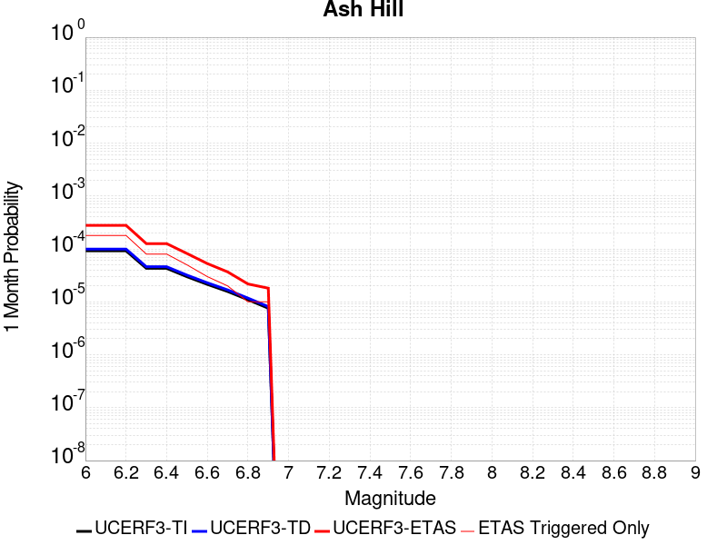 |  |  |

| Magnitude | 1 wk TI Prob | 1 wk TD Prob | 1 wk ETAS Prob | 1 wk ETAS/TD Gain | 1 wk ETAS Triggered Only | 1 mo TI Prob | 1 mo TD Prob | 1 mo ETAS Prob | 1 mo ETAS/TD Gain | 1 mo ETAS Triggered Only | 1 yr TI Prob | 1 yr TD Prob | 1 yr ETAS Prob | 1 yr ETAS/TD Gain | 1 yr ETAS Triggered Only | 10 yr TI Prob | 10 yr TD Prob | 10 yr ETAS Prob | 10 yr ETAS/TD Gain | 10 yr ETAS Triggered Only |
|-----|-----|-----|-----|-----|-----|-----|-----|-----|-----|-----|-----|-----|-----|-----|-----|-----|-----|-----|-----|-----|
| 6.0 | 2.1545662E-5 | 2.31944E-5 | 1.3052643E-4 | 5.627498 | 1.0733453E-4 | 9.2335285E-5 | 9.940123E-5 | 2.9616163E-4 | 2.9794564 | 1.9677996E-4 | 0.0011236023 | 0.001209618 | 0.0014776299 | 1.2215673 | 2.6833633E-4 | 0.011179381 | 0.012038324 | 0.012427147 | 1.0322987 | 3.9355992E-4 |
| 6.1 | 2.1545662E-5 | 2.31944E-5 | 1.3052643E-4 | 5.627498 | 1.0733453E-4 | 9.2335285E-5 | 9.940123E-5 | 2.9616163E-4 | 2.9794564 | 1.9677996E-4 | 0.0011236023 | 0.001209618 | 0.0014776299 | 1.2215673 | 2.6833633E-4 | 0.011179381 | 0.012038324 | 0.012427147 | 1.0322987 | 3.9355992E-4 |
| 6.2 | 2.1545662E-5 | 2.31944E-5 | 1.3052643E-4 | 5.627498 | 1.0733453E-4 | 9.2335285E-5 | 9.940123E-5 | 2.9616163E-4 | 2.9794564 | 1.9677996E-4 | 0.0011236023 | 0.001209618 | 0.0014776299 | 1.2215673 | 2.6833633E-4 | 0.011179381 | 0.012038324 | 0.012427147 | 1.0322987 | 3.9355992E-4 |
| 6.3 | 1.0025529E-5 | 1.0746914E-5 | 4.6524703E-5 | 4.3291225 | 3.5778176E-5 | 4.2965847E-5 | 4.6057463E-5 | 1.3549878E-4 | 2.9419506 | 8.9445435E-5 | 5.229836E-4 | 5.606186E-4 | 7.0365105E-4 | 1.2551333 | 1.431127E-4 | 0.005217545 | 0.0055933557 | 0.005806824 | 1.0381646 | 2.1466905E-4 |
| 6.4 | 1.0025529E-5 | 1.0746914E-5 | 4.6524703E-5 | 4.3291225 | 3.5778176E-5 | 4.2965847E-5 | 4.6057463E-5 | 1.3549878E-4 | 2.9419506 | 8.9445435E-5 | 5.229836E-4 | 5.606186E-4 | 7.0365105E-4 | 1.2551333 | 1.431127E-4 | 0.005217545 | 0.0055933557 | 0.005806824 | 1.0381646 | 2.1466905E-4 |
| 6.5 | 6.9617327E-6 | 7.45662E-6 | 2.5345575E-5 | 3.39907 | 1.7889088E-5 | 2.9835655E-5 | 3.19566E-5 | 8.5622145E-5 | 2.679326 | 5.3667263E-5 | 3.6318856E-4 | 3.8901082E-4 | 4.7842145E-4 | 1.229841 | 8.9445435E-5 | 0.0036259557 | 0.003884153 | 0.00400889 | 1.0321144 | 1.2522361E-4 |
| 6.6 | 4.9919777E-6 | 5.3466783E-6 | 5.3466783E-6 | 1.0 | 0.0 | 2.1394015E-5 | 2.2914171E-5 | 5.8691527E-5 | 2.5613637 | 3.5778176E-5 | 2.60441E-4 | 2.7895102E-4 | 3.5048742E-4 | 1.2564478 | 7.155635E-5 | 0.0026013597 | 0.0027866673 | 0.0028937028 | 1.0384098 | 1.0733453E-4 |
| 6.7 | 3.6630722E-6 | 3.924616E-6 | 3.924616E-6 | 1.0 | 0.0 | 1.5698786E-5 | 1.6819708E-5 | 3.4708493E-5 | 2.0635612 | 1.7889088E-5 | 1.9111596E-4 | 2.0476643E-4 | 2.5842272E-4 | 1.2620364 | 5.3667263E-5 | 0.0019095168 | 0.0020463406 | 0.0020998982 | 1.0261723 | 5.3667263E-5 |
| 6.8 | 2.5599613E-6 | 2.7449198E-6 | 2.7449198E-6 | 1.0 | 0.0 | 1.0971216E-5 | 1.17639165E-5 | 1.17639165E-5 | 1.0 | 0.0 | 1.3356637E-4 | 1.4322122E-4 | 1.6110775E-4 | 1.1248873 | 1.7889088E-5 | 0.0013348613 | 0.0014317741 | 0.0014496376 | 1.0124764 | 1.7889088E-5 |
| 6.9 | 1.7684905E-6 | 1.896867E-6 | 1.896867E-6 | 1.0 | 0.0 | 7.579223E-6 | 8.12943E-6 | 8.12943E-6 | 1.0 | 0.0 | 9.2273134E-5 | 9.897581E-5 | 9.897581E-5 | 1.0 | 0.0 | 9.223483E-4 | 9.897582E-4 | 9.897582E-4 | 1.0 | 0.0 |

## So Sierra Nevada
*[(top)](#table-of-contents)*

| 1 Week | 1 Month | 1 Year | 10 Year |
|-----|-----|-----|-----|
|  |  | 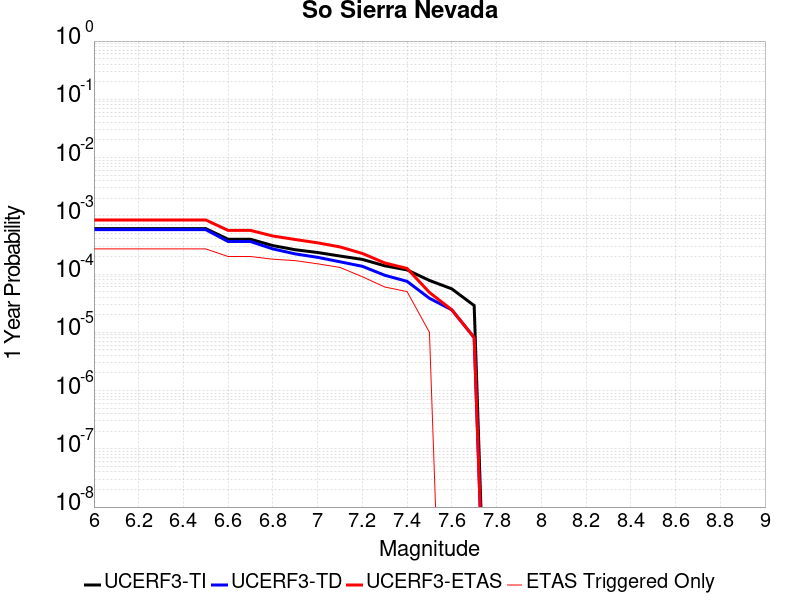 | 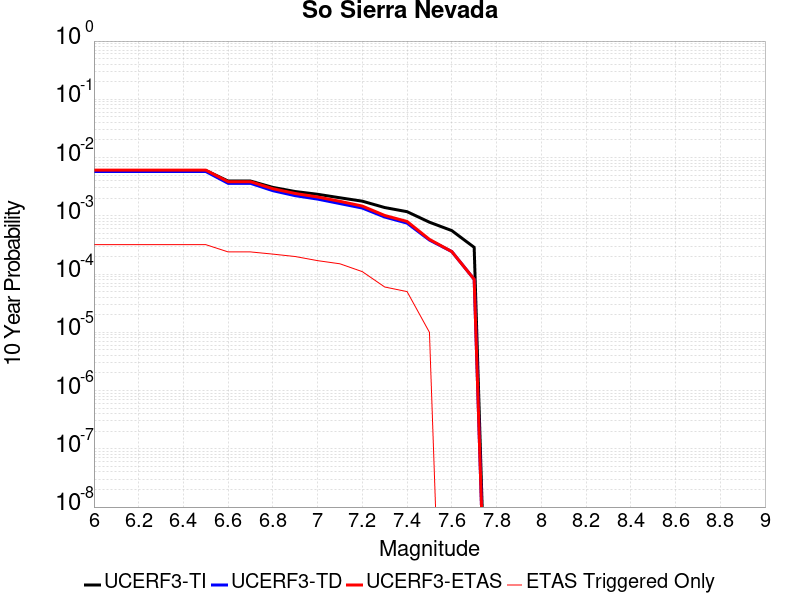 |

| Magnitude | 1 wk TI Prob | 1 wk TD Prob | 1 wk ETAS Prob | 1 wk ETAS/TD Gain | 1 wk ETAS Triggered Only | 1 mo TI Prob | 1 mo TD Prob | 1 mo ETAS Prob | 1 mo ETAS/TD Gain | 1 mo ETAS Triggered Only | 1 yr TI Prob | 1 yr TD Prob | 1 yr ETAS Prob | 1 yr ETAS/TD Gain | 1 yr ETAS Triggered Only | 10 yr TI Prob | 10 yr TD Prob | 10 yr ETAS Prob | 10 yr ETAS/TD Gain | 10 yr ETAS Triggered Only |
|-----|-----|-----|-----|-----|-----|-----|-----|-----|-----|-----|-----|-----|-----|-----|-----|-----|-----|-----|-----|-----|
| 6.0 | 1.15488665E-5 | 1.1079626E-5 | 1.3630185E-4 | 12.302026 | 1.2522361E-4 | 4.9494203E-5 | 4.748332E-5 | 2.2636571E-4 | 4.7672677 | 1.7889087E-4 | 6.024253E-4 | 5.7796884E-4 | 8.4615004E-4 | 1.4640064 | 2.6833633E-4 | 0.006007948 | 0.0057659256 | 0.0061216448 | 1.0616933 | 3.5778174E-4 |
| 6.1 | 1.15488665E-5 | 1.1079626E-5 | 1.3630185E-4 | 12.302026 | 1.2522361E-4 | 4.9494203E-5 | 4.748332E-5 | 2.2636571E-4 | 4.7672677 | 1.7889087E-4 | 6.024253E-4 | 5.7796884E-4 | 8.4615004E-4 | 1.4640064 | 2.6833633E-4 | 0.006007948 | 0.0057659256 | 0.0061216448 | 1.0616933 | 3.5778174E-4 |
| 6.2 | 1.15488665E-5 | 1.1079626E-5 | 1.3630185E-4 | 12.302026 | 1.2522361E-4 | 4.9494203E-5 | 4.748332E-5 | 2.2636571E-4 | 4.7672677 | 1.7889087E-4 | 6.024253E-4 | 5.7796884E-4 | 8.4615004E-4 | 1.4640064 | 2.6833633E-4 | 0.006007948 | 0.0057659256 | 0.0061216448 | 1.0616933 | 3.5778174E-4 |
| 6.3 | 1.15488665E-5 | 1.1079626E-5 | 1.3630185E-4 | 12.302026 | 1.2522361E-4 | 4.9494203E-5 | 4.748332E-5 | 2.2636571E-4 | 4.7672677 | 1.7889087E-4 | 6.024253E-4 | 5.7796884E-4 | 8.4615004E-4 | 1.4640064 | 2.6833633E-4 | 0.006007948 | 0.0057659256 | 0.0061216448 | 1.0616933 | 3.5778174E-4 |
| 6.4 | 1.15488665E-5 | 1.1079626E-5 | 1.3630185E-4 | 12.302026 | 1.2522361E-4 | 4.9494203E-5 | 4.748332E-5 | 2.2636571E-4 | 4.7672677 | 1.7889087E-4 | 6.024253E-4 | 5.7796884E-4 | 8.4615004E-4 | 1.4640064 | 2.6833633E-4 | 0.006007948 | 0.0057659256 | 0.0061216448 | 1.0616933 | 3.5778174E-4 |
| 6.5 | 1.15488665E-5 | 1.1079626E-5 | 1.3630185E-4 | 12.302026 | 1.2522361E-4 | 4.9494203E-5 | 4.748332E-5 | 2.2636571E-4 | 4.7672677 | 1.7889087E-4 | 6.024253E-4 | 5.7796884E-4 | 8.4615004E-4 | 1.4640064 | 2.6833633E-4 | 0.006007948 | 0.0057659256 | 0.0061216448 | 1.0616933 | 3.5778174E-4 |
| 6.6 | 7.587044E-6 | 6.9356242E-6 | 7.849148E-5 | 11.317147 | 7.155635E-5 | 3.2515498E-5 | 2.9723782E-5 | 1.3705512E-4 | 4.610958 | 1.0733453E-4 | 3.9580427E-4 | 3.6182988E-4 | 5.5853865E-4 | 1.5436499 | 1.9677996E-4 | 0.003951 | 0.0036126992 | 0.003880066 | 1.0740075 | 2.6833633E-4 |
| 6.7 | 7.587044E-6 | 6.9356242E-6 | 7.849148E-5 | 11.317147 | 7.155635E-5 | 3.2515498E-5 | 2.9723782E-5 | 1.3705512E-4 | 4.610958 | 1.0733453E-4 | 3.9580427E-4 | 3.6182988E-4 | 5.5853865E-4 | 1.5436499 | 1.9677996E-4 | 0.003951 | 0.0036126992 | 0.003880066 | 1.0740075 | 2.6833633E-4 |
| 6.8 | 5.9026956E-6 | 5.179384E-6 | 7.673536E-5 | 14.815539 | 7.155635E-5 | 2.5297022E-5 | 2.2197177E-5 | 1.2952932E-4 | 5.835396 | 1.0733453E-4 | 3.0794772E-4 | 2.702183E-4 | 4.490608E-4 | 1.6618447 | 1.7889087E-4 | 0.0030752132 | 0.0026990133 | 0.0029487847 | 1.0925417 | 2.5044722E-4 |
| 6.9 | 5.0118915E-6 | 4.2524175E-6 | 7.5808464E-5 | 17.827145 | 7.155635E-5 | 2.1479358E-5 | 1.8224524E-5 | 1.255571E-4 | 6.889458 | 1.0733453E-4 | 2.614798E-4 | 2.218617E-4 | 3.8282777E-4 | 1.7255243 | 1.610018E-4 | 0.0026117235 | 0.0022164746 | 0.0024306679 | 1.0966369 | 2.1466905E-4 |
| 7.0 | 4.4924795E-6 | 3.7139105E-6 | 5.7380974E-5 | 15.450285 | 5.3667263E-5 | 1.925334E-5 | 1.5916665E-5 | 8.7471875E-5 | 5.495616 | 7.155635E-5 | 2.3438422E-4 | 1.937688E-4 | 3.1896814E-4 | 1.6461275 | 1.2522361E-4 | 0.0023413717 | 0.0019360614 | 0.0020967515 | 1.0829984 | 1.610018E-4 |
| 7.1 | 3.9118436E-6 | 3.111971E-6 | 5.6779067E-5 | 18.24537 | 5.3667263E-5 | 1.6764936E-5 | 1.3336953E-5 | 6.70035E-5 | 5.0238986 | 5.3667263E-5 | 2.0409399E-4 | 1.6236588E-4 | 2.6968296E-4 | 1.6609584 | 1.0733453E-4 | 0.0020390663 | 0.0016225285 | 0.0017654091 | 1.0880604 | 1.431127E-4 |
| 7.2 | 3.4200818E-6 | 2.6054481E-6 | 2.049449E-5 | 7.866013 | 1.7889088E-5 | 1.4657411E-5 | 1.1166161E-5 | 2.9055049E-5 | 2.6020625 | 1.7889088E-5 | 1.7843937E-4 | 1.3594003E-4 | 1.896E-4 | 1.3947326 | 5.3667263E-5 | 0.0017829615 | 0.0013586186 | 0.0014479425 | 1.0657462 | 8.9445435E-5 |
| 7.3 | 2.6593618E-6 | 1.828415E-6 | 1.828415E-6 | 1.0 | 0.0 | 1.13972155E-5 | 7.836042E-6 | 7.836042E-6 | 1.0 | 0.0 | 1.3875226E-4 | 9.539993E-5 | 1.3117469E-4 | 1.3749977 | 3.5778176E-5 | 0.0013866565 | 9.5361867E-4 | 9.893627E-4 | 1.0374825 | 3.5778176E-5 |
| 7.4 | 2.2577992E-6 | 1.4364332E-6 | 1.4364332E-6 | 1.0 | 0.0 | 9.676246E-6 | 6.156129E-6 | 6.156129E-6 | 1.0 | 0.0 | 1.1780193E-4 | 7.494855E-5 | 1.1072404E-4 | 1.477334 | 3.5778176E-5 | 0.001177395 | 7.4925774E-4 | 7.850091E-4 | 1.0477157 | 3.5778176E-5 |
| 7.5 | 1.489319E-6 | 7.353898E-7 | 7.353898E-7 | 1.0 | 0.0 | 6.3827797E-6 | 3.1516668E-6 | 3.1516668E-6 | 1.0 | 0.0 | 7.770758E-5 | 3.8370872E-5 | 3.8370872E-5 | 1.0 | 0.0 | 7.7680405E-4 | 3.8364288E-4 | 3.8364288E-4 | 1.0 | 0.0 |
| 7.6 | 1.0680322E-6 | 4.6596273E-7 | 4.6596273E-7 | 1.0 | 0.0 | 4.577273E-6 | 1.9969816E-6 | 1.9969816E-6 | 1.0 | 0.0 | 5.5726876E-5 | 2.4312982E-5 | 2.4312982E-5 | 1.0 | 0.0 | 5.5712904E-4 | 2.4310348E-4 | 2.4310348E-4 | 1.0 | 0.0 |
| 7.7 | 5.509146E-7 | 1.5580342E-7 | 1.5580342E-7 | 1.0 | 0.0 | 2.3610605E-6 | 6.677288E-7 | 6.677288E-7 | 1.0 | 0.0 | 2.8745531E-5 | 8.129569E-6 | 8.129569E-6 | 1.0 | 0.0 | 2.8741814E-4 | 8.1292834E-5 | 8.1292834E-5 | 1.0 | 0.0 |

## Blackwater
*[(top)](#table-of-contents)*

| 1 Week | 1 Month | 1 Year | 10 Year |
|-----|-----|-----|-----|
|  |  |  |  |

| Magnitude | 1 wk TI Prob | 1 wk TD Prob | 1 wk ETAS Prob | 1 wk ETAS/TD Gain | 1 wk ETAS Triggered Only | 1 mo TI Prob | 1 mo TD Prob | 1 mo ETAS Prob | 1 mo ETAS/TD Gain | 1 mo ETAS Triggered Only | 1 yr TI Prob | 1 yr TD Prob | 1 yr ETAS Prob | 1 yr ETAS/TD Gain | 1 yr ETAS Triggered Only | 10 yr TI Prob | 10 yr TD Prob | 10 yr ETAS Prob | 10 yr ETAS/TD Gain | 10 yr ETAS Triggered Only |
|-----|-----|-----|-----|-----|-----|-----|-----|-----|-----|-----|-----|-----|-----|-----|-----|-----|-----|-----|-----|-----|
| 6.0 | 3.0708583E-5 | 3.309578E-5 | 1.5831525E-4 | 4.783548 | 1.2522361E-4 | 1.3160157E-4 | 1.4183212E-4 | 2.8492452E-4 | 2.0088859 | 1.431127E-4 | 0.0016010714 | 0.001725575 | 0.0019398736 | 1.1241897 | 2.1466905E-4 | 0.015895851 | 0.017135598 | 0.017416919 | 1.0164174 | 2.862254E-4 |
| 6.1 | 3.0708583E-5 | 3.309578E-5 | 1.5831525E-4 | 4.783548 | 1.2522361E-4 | 1.3160157E-4 | 1.4183212E-4 | 2.8492452E-4 | 2.0088859 | 1.431127E-4 | 0.0016010714 | 0.001725575 | 0.0019398736 | 1.1241897 | 2.1466905E-4 | 0.015895851 | 0.017135598 | 0.017416919 | 1.0164174 | 2.862254E-4 |
| 6.2 | 1.1707779E-5 | 1.2545098E-5 | 4.8322825E-5 | 3.8519287 | 3.5778176E-5 | 5.017523E-5 | 5.376365E-5 | 8.9539906E-5 | 1.6654357 | 3.5778176E-5 | 6.107122E-4 | 6.543855E-4 | 7.2589505E-4 | 1.1092774 | 7.155635E-5 | 0.006090366 | 0.006525557 | 0.0066144187 | 1.0136175 | 8.9445435E-5 |
| 6.3 | 1.1707779E-5 | 1.2545098E-5 | 4.8322825E-5 | 3.8519287 | 3.5778176E-5 | 5.017523E-5 | 5.376365E-5 | 8.9539906E-5 | 1.6654357 | 3.5778176E-5 | 6.107122E-4 | 6.543855E-4 | 7.2589505E-4 | 1.1092774 | 7.155635E-5 | 0.006090366 | 0.006525557 | 0.0066144187 | 1.0136175 | 8.9445435E-5 |
| 6.4 | 7.929244E-6 | 8.480082E-6 | 8.480082E-6 | 1.0 | 0.0 | 3.3982033E-5 | 3.6342728E-5 | 3.6342728E-5 | 1.0 | 0.0 | 4.136527E-4 | 4.423869E-4 | 4.7814925E-4 | 1.0808395 | 3.5778176E-5 | 0.0041288356 | 0.004415468 | 0.0044688983 | 1.0121007 | 5.3667263E-5 |
| 6.5 | 5.8832115E-6 | 6.2859795E-6 | 6.2859795E-6 | 1.0 | 0.0 | 2.521352E-5 | 2.6939648E-5 | 2.6939648E-5 | 1.0 | 0.0 | 3.0693135E-4 | 3.279434E-4 | 3.4582661E-4 | 1.0545315 | 1.7889088E-5 | 0.0030650778 | 0.0032748478 | 0.0032926784 | 1.0054446 | 1.7889088E-5 |
| 6.6 | 5.8832115E-6 | 6.2859795E-6 | 6.2859795E-6 | 1.0 | 0.0 | 2.521352E-5 | 2.6939648E-5 | 2.6939648E-5 | 1.0 | 0.0 | 3.0693135E-4 | 3.279434E-4 | 3.4582661E-4 | 1.0545315 | 1.7889088E-5 | 0.0030650778 | 0.0032748478 | 0.0032926784 | 1.0054446 | 1.7889088E-5 |
| 6.7 | 3.0715053E-6 | 3.2814603E-6 | 3.2814603E-6 | 1.0 | 0.0 | 1.3163528E-5 | 1.4063332E-5 | 1.4063332E-5 | 1.0 | 0.0 | 1.6025416E-4 | 1.7120877E-4 | 1.7120877E-4 | 1.0 | 0.0 | 0.0016013865 | 0.0017108832 | 0.0017108832 | 1.0 | 0.0 |
| 6.8 | 2.2722281E-6 | 2.4287492E-6 | 2.4287492E-6 | 1.0 | 0.0 | 9.738084E-6 | 1.0408889E-5 | 1.0408889E-5 | 1.0 | 0.0 | 1.1855473E-4 | 1.2672177E-4 | 1.2672177E-4 | 1.0 | 0.0 | 0.001184915 | 0.0012665853 | 0.0012665853 | 1.0 | 0.0 |
| 6.9 | 9.952399E-7 | 1.0653469E-6 | 1.0653469E-6 | 1.0 | 0.0 | 4.265307E-6 | 4.565767E-6 | 4.565767E-6 | 1.0 | 0.0 | 5.1928873E-5 | 5.5587312E-5 | 5.5587312E-5 | 1.0 | 0.0 | 5.191674E-4 | 5.5578473E-4 | 5.5578473E-4 | 1.0 | 0.0 |
| 7.0 | 4.7385504E-7 | 5.07555E-7 | 5.07555E-7 | 1.0 | 0.0 | 2.0308057E-6 | 2.1752357E-6 | 2.1752357E-6 | 1.0 | 0.0 | 2.4724779E-5 | 2.6483494E-5 | 2.6483494E-5 | 1.0 | 0.0 | 2.4722028E-4 | 2.6483493E-4 | 2.6483493E-4 | 1.0 | 0.0 |

## Gravel Hills-Harper Lk
*[(top)](#table-of-contents)*

| 1 Week | 1 Month | 1 Year | 10 Year |
|-----|-----|-----|-----|
|  |  | 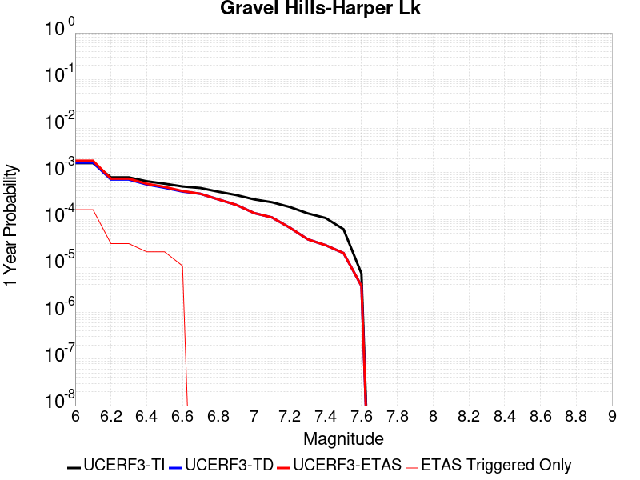 |  |

| Magnitude | 1 wk TI Prob | 1 wk TD Prob | 1 wk ETAS Prob | 1 wk ETAS/TD Gain | 1 wk ETAS Triggered Only | 1 mo TI Prob | 1 mo TD Prob | 1 mo ETAS Prob | 1 mo ETAS/TD Gain | 1 mo ETAS Triggered Only | 1 yr TI Prob | 1 yr TD Prob | 1 yr ETAS Prob | 1 yr ETAS/TD Gain | 1 yr ETAS Triggered Only | 10 yr TI Prob | 10 yr TD Prob | 10 yr ETAS Prob | 10 yr ETAS/TD Gain | 10 yr ETAS Triggered Only |
|-----|-----|-----|-----|-----|-----|-----|-----|-----|-----|-----|-----|-----|-----|-----|-----|-----|-----|-----|-----|-----|
| 6.0 | 3.0679566E-5 | 3.1464537E-5 | 1.7457273E-4 | 5.548238 | 1.431127E-4 | 1.3147724E-4 | 1.3484228E-4 | 2.9582236E-4 | 2.1938398 | 1.610018E-4 | 0.0015995599 | 0.001640685 | 0.0018371422 | 1.119741 | 1.9677996E-4 | 0.015880952 | 0.016307283 | 0.016571242 | 1.0161867 | 2.6833633E-4 |
| 6.1 | 3.0679566E-5 | 3.1464537E-5 | 1.7457273E-4 | 5.548238 | 1.431127E-4 | 1.3147724E-4 | 1.3484228E-4 | 2.9582236E-4 | 2.1938398 | 1.610018E-4 | 0.0015995599 | 0.001640685 | 0.0018371422 | 1.119741 | 1.9677996E-4 | 0.015880952 | 0.016307283 | 0.016571242 | 1.0161867 | 2.6833633E-4 |
| 6.2 | 1.514536E-5 | 1.3635169E-5 | 3.1524014E-5 | 2.3119633 | 1.7889088E-5 | 6.490707E-5 | 5.84352E-5 | 7.632324E-5 | 1.3061175 | 1.7889088E-5 | 7.8995706E-4 | 7.112282E-4 | 7.4698095E-4 | 1.050269 | 3.5778176E-5 | 0.007871548 | 0.0070907213 | 0.007144008 | 1.007515 | 5.3667263E-5 |
| 6.3 | 1.514536E-5 | 1.3635169E-5 | 3.1524014E-5 | 2.3119633 | 1.7889088E-5 | 6.490707E-5 | 5.84352E-5 | 7.632324E-5 | 1.3061175 | 1.7889088E-5 | 7.8995706E-4 | 7.112282E-4 | 7.4698095E-4 | 1.050269 | 3.5778176E-5 | 0.007871548 | 0.0070907213 | 0.007144008 | 1.007515 | 5.3667263E-5 |
| 6.4 | 1.2532521E-5 | 1.0689663E-5 | 1.0689663E-5 | 1.0 | 0.0 | 5.37097E-5 | 4.5812074E-5 | 4.5812074E-5 | 1.0 | 0.0 | 6.537194E-4 | 5.576251E-4 | 5.755042E-4 | 1.032063 | 1.7889088E-5 | 0.0065179965 | 0.005562849 | 0.005580638 | 1.0031979 | 1.7889088E-5 |
| 6.5 | 1.1094058E-5 | 9.083641E-6 | 9.083641E-6 | 1.0 | 0.0 | 4.7545094E-5 | 3.8929335E-5 | 3.8929335E-5 | 1.0 | 0.0 | 5.787078E-4 | 4.738656E-4 | 4.917462E-4 | 1.0377336 | 1.7889088E-5 | 0.0057720304 | 0.004728959 | 0.0047467635 | 1.003765 | 1.7889088E-5 |
| 6.6 | 9.688328E-6 | 7.531677E-6 | 7.531677E-6 | 1.0 | 0.0 | 4.1520743E-5 | 3.2278233E-5 | 3.2278233E-5 | 1.0 | 0.0 | 5.053978E-4 | 3.9291914E-4 | 4.108012E-4 | 1.0455108 | 1.7889088E-5 | 0.0050424994 | 0.003922501 | 0.00394032 | 1.0045427 | 1.7889088E-5 |
| 6.7 | 8.974824E-6 | 6.749397E-6 | 6.749397E-6 | 1.0 | 0.0 | 3.8462964E-5 | 2.892568E-5 | 2.892568E-5 | 1.0 | 0.0 | 4.6818596E-4 | 3.5211546E-4 | 3.5211546E-4 | 1.0 | 0.0 | 0.004672008 | 0.0035157963 | 0.0035157963 | 1.0 | 0.0 |
| 6.8 | 7.4780046E-6 | 5.1161815E-6 | 5.1161815E-6 | 1.0 | 0.0 | 3.20482E-5 | 2.1926315E-5 | 2.1926315E-5 | 1.0 | 0.0 | 3.9011694E-4 | 2.669216E-4 | 2.669216E-4 | 1.0 | 0.0 | 0.0038943281 | 0.002666148 | 0.002666148 | 1.0 | 0.0 |
| 6.9 | 6.3409307E-6 | 3.9074876E-6 | 3.9074876E-6 | 1.0 | 0.0 | 2.7175134E-5 | 1.6746273E-5 | 1.6746273E-5 | 1.0 | 0.0 | 3.3080703E-4 | 2.0386779E-4 | 2.0386779E-4 | 1.0 | 0.0 | 0.0033031502 | 0.0020369058 | 0.0020369058 | 1.0 | 0.0 |
| 7.0 | 5.1239335E-6 | 2.60585E-6 | 2.60585E-6 | 1.0 | 0.0 | 2.195953E-5 | 1.1167882E-5 | 1.1167882E-5 | 1.0 | 0.0 | 2.6732447E-4 | 1.3596074E-4 | 1.3596074E-4 | 1.0 | 0.0 | 0.0026700313 | 0.0013588008 | 0.0013588008 | 1.0 | 0.0 |
| 7.1 | 4.438899E-6 | 2.0984673E-6 | 2.0984673E-6 | 1.0 | 0.0 | 1.9023713E-5 | 8.993402E-6 | 8.993402E-6 | 1.0 | 0.0 | 2.315891E-4 | 1.0948939E-4 | 1.0948939E-4 | 1.0 | 0.0 | 0.002313479 | 0.0010943763 | 0.0010943763 | 1.0 | 0.0 |
| 7.2 | 3.50367E-6 | 1.2615677E-6 | 1.2615677E-6 | 1.0 | 0.0 | 1.5015643E-5 | 5.4067077E-6 | 5.4067077E-6 | 1.0 | 0.0 | 1.8280011E-4 | 6.5824766E-5 | 6.5824766E-5 | 1.0 | 0.0 | 0.0018264982 | 6.580609E-4 | 6.580609E-4 | 1.0 | 0.0 |
| 7.3 | 2.561638E-6 | 7.119129E-7 | 7.119129E-7 | 1.0 | 0.0 | 1.0978401E-5 | 3.0510516E-6 | 3.0510516E-6 | 1.0 | 0.0 | 1.3365384E-4 | 3.7145943E-5 | 3.7145943E-5 | 1.0 | 0.0 | 0.0013357349 | 3.7139934E-4 | 3.7139934E-4 | 1.0 | 0.0 |
| 7.4 | 2.0368864E-6 | 5.304814E-7 | 5.304814E-7 | 1.0 | 0.0 | 8.729483E-6 | 2.2734896E-6 | 2.2734896E-6 | 1.0 | 0.0 | 1.06276275E-4 | 2.7679389E-5 | 2.7679389E-5 | 1.0 | 0.0 | 0.0010622547 | 2.7675997E-4 | 2.7675997E-4 | 1.0 | 0.0 |
| 7.5 | 1.1681728E-6 | 3.6030443E-7 | 3.6030443E-7 | 1.0 | 0.0 | 5.0064455E-6 | 1.544161E-6 | 1.544161E-6 | 1.0 | 0.0 | 6.0951766E-5 | 1.8800003E-5 | 1.8800003E-5 | 1.0 | 0.0 | 6.093505E-4 | 1.879846E-4 | 1.879846E-4 | 1.0 | 0.0 |
| 7.6 | 1.3154387E-7 | 7.1197206E-8 | 7.1197206E-8 | 1.0 | 0.0 | 5.6375933E-7 | 3.0513087E-7 | 3.0513087E-7 | 1.0 | 0.0 | 6.863748E-6 | 3.7149634E-6 | 3.7149634E-6 | 1.0 | 0.0 | 6.863536E-5 | 3.714917E-5 | 3.714917E-5 | 1.0 | 0.0 |

## San Andreas (Mojave N)
*[(top)](#table-of-contents)*

| 1 Week | 1 Month | 1 Year | 10 Year |
|-----|-----|-----|-----|
|  |  |  |  |

| Magnitude | 1 wk TI Prob | 1 wk TD Prob | 1 wk ETAS Prob | 1 wk ETAS/TD Gain | 1 wk ETAS Triggered Only | 1 mo TI Prob | 1 mo TD Prob | 1 mo ETAS Prob | 1 mo ETAS/TD Gain | 1 mo ETAS Triggered Only | 1 yr TI Prob | 1 yr TD Prob | 1 yr ETAS Prob | 1 yr ETAS/TD Gain | 1 yr ETAS Triggered Only | 10 yr TI Prob | 10 yr TD Prob | 10 yr ETAS Prob | 10 yr ETAS/TD Gain | 10 yr ETAS Triggered Only |
|-----|-----|-----|-----|-----|-----|-----|-----|-----|-----|-----|-----|-----|-----|-----|-----|-----|-----|-----|-----|-----|
| 6.0 | 9.877682E-5 | 1.9398969E-4 | 2.6553214E-4 | 1.3687953 | 7.155635E-5 | 4.2326056E-4 | 8.3111966E-4 | 9.38365E-4 | 1.1290371 | 1.0733453E-4 | 0.0051410277 | 0.010072061 | 0.010266858 | 1.0193404 | 1.9677996E-4 | 0.05023708 | 0.09830668 | 0.098532505 | 1.0022972 | 2.5044722E-4 |
| 6.1 | 9.877682E-5 | 1.9398969E-4 | 2.6553214E-4 | 1.3687953 | 7.155635E-5 | 4.2326056E-4 | 8.3111966E-4 | 9.38365E-4 | 1.1290371 | 1.0733453E-4 | 0.0051410277 | 0.010072061 | 0.010266858 | 1.0193404 | 1.9677996E-4 | 0.05023708 | 0.09830668 | 0.098532505 | 1.0022972 | 2.5044722E-4 |
| 6.2 | 9.877682E-5 | 1.9398969E-4 | 2.6553214E-4 | 1.3687953 | 7.155635E-5 | 4.2326056E-4 | 8.3111966E-4 | 9.38365E-4 | 1.1290371 | 1.0733453E-4 | 0.0051410277 | 0.010072061 | 0.010266858 | 1.0193404 | 1.9677996E-4 | 0.05023708 | 0.09830668 | 0.098532505 | 1.0022972 | 2.5044722E-4 |
| 6.3 | 9.877682E-5 | 1.9398969E-4 | 2.6553214E-4 | 1.3687953 | 7.155635E-5 | 4.2326056E-4 | 8.3111966E-4 | 9.38365E-4 | 1.1290371 | 1.0733453E-4 | 0.0051410277 | 0.010072061 | 0.010266858 | 1.0193404 | 1.9677996E-4 | 0.05023708 | 0.09830668 | 0.098532505 | 1.0022972 | 2.5044722E-4 |
| 6.4 | 9.877682E-5 | 1.9398969E-4 | 2.6553214E-4 | 1.3687953 | 7.155635E-5 | 4.2326056E-4 | 8.3111966E-4 | 9.38365E-4 | 1.1290371 | 1.0733453E-4 | 0.0051410277 | 0.010072061 | 0.010266858 | 1.0193404 | 1.9677996E-4 | 0.05023708 | 0.09830668 | 0.098532505 | 1.0022972 | 2.5044722E-4 |
| 6.5 | 9.861474E-5 | 1.9372735E-4 | 2.6526983E-4 | 1.3692948 | 7.155635E-5 | 4.2256617E-4 | 8.299961E-4 | 9.3724154E-4 | 1.129212 | 1.0733453E-4 | 0.0051326132 | 0.010058507 | 0.010253308 | 1.0193667 | 1.9677996E-4 | 0.050156746 | 0.098184474 | 0.09841033 | 1.0023004 | 2.5044722E-4 |
| 6.6 | 9.861474E-5 | 1.9372735E-4 | 2.6526983E-4 | 1.3692948 | 7.155635E-5 | 4.2256617E-4 | 8.299961E-4 | 9.3724154E-4 | 1.129212 | 1.0733453E-4 | 0.0051326132 | 0.010058507 | 0.010253308 | 1.0193667 | 1.9677996E-4 | 0.050156746 | 0.098184474 | 0.09841033 | 1.0023004 | 2.5044722E-4 |
| 6.7 | 9.8552715E-5 | 1.9362688E-4 | 2.651694E-4 | 1.3694863 | 7.155635E-5 | 4.223004E-4 | 8.295658E-4 | 9.3681127E-4 | 1.129279 | 1.0733453E-4 | 0.0051293927 | 0.010053317 | 0.010248119 | 1.0193769 | 1.9677996E-4 | 0.050125998 | 0.09813766 | 0.09836353 | 1.0023016 | 2.5044722E-4 |
| 6.8 | 9.8464974E-5 | 1.9347853E-4 | 2.6502102E-4 | 1.3697698 | 7.155635E-5 | 4.219245E-4 | 8.2893035E-4 | 9.3617593E-4 | 1.1293782 | 1.0733453E-4 | 0.0051248376 | 0.010045652 | 0.010240455 | 1.0193918 | 1.9677996E-4 | 0.05008251 | 0.098067686 | 0.09829357 | 1.0023034 | 2.5044722E-4 |
| 6.9 | 9.825824E-5 | 1.9315863E-4 | 2.6470117E-4 | 1.3703823 | 7.155635E-5 | 4.2103877E-4 | 8.2756026E-4 | 9.3480595E-4 | 1.1295927 | 1.0733453E-4 | 0.0051141046 | 0.010029125 | 0.010223931 | 1.0194241 | 1.9677996E-4 | 0.049980022 | 0.09791679 | 0.09814271 | 1.0023073 | 2.5044722E-4 |
| 7.0 | 9.781462E-5 | 1.924723E-4 | 2.640149E-4 | 1.3717033 | 7.155635E-5 | 4.1913814E-4 | 8.246208E-4 | 9.3186676E-4 | 1.130055 | 1.0733453E-4 | 0.005091073 | 0.009993665 | 0.010188478 | 1.0194937 | 1.9677996E-4 | 0.04976007 | 0.09759319 | 0.097819194 | 1.0023158 | 2.5044722E-4 |
| 7.1 | 9.7121134E-5 | 1.9148945E-4 | 2.630321E-4 | 1.3736115 | 7.155635E-5 | 4.1616702E-4 | 8.2041114E-4 | 9.2765765E-4 | 1.1307229 | 1.0733453E-4 | 0.005055068 | 0.009942883 | 0.010137706 | 1.0195943 | 1.9677996E-4 | 0.04941613 | 0.09712971 | 0.09735583 | 1.002328 | 2.5044722E-4 |
| 7.2 | 9.663819E-5 | 1.9079732E-4 | 2.6234004E-4 | 1.374967 | 7.155635E-5 | 4.1409794E-4 | 8.1744674E-4 | 9.2469354E-4 | 1.1311972 | 1.0733453E-4 | 0.0050299936 | 0.00990712 | 0.01010195 | 1.0196657 | 1.9677996E-4 | 0.049176537 | 0.09680298 | 0.09702918 | 1.0023367 | 2.5044722E-4 |
| 7.3 | 9.6277574E-5 | 1.9032248E-4 | 2.618652E-4 | 1.3759027 | 7.155635E-5 | 4.125529E-4 | 8.1541296E-4 | 9.2266E-4 | 1.1315248 | 1.0733453E-4 | 0.0050112694 | 0.009882583 | 0.010077419 | 1.0197151 | 1.9677996E-4 | 0.04899759 | 0.09657645 | 0.09680271 | 1.0023428 | 2.5044722E-4 |
| 7.4 | 9.593308E-5 | 1.8972032E-4 | 2.6126308E-4 | 1.377096 | 7.155635E-5 | 4.1107697E-4 | 8.128339E-4 | 9.2008116E-4 | 1.1319424 | 1.0733453E-4 | 0.0049933824 | 0.009851467 | 0.010046309 | 1.0197779 | 1.9677996E-4 | 0.04882661 | 0.096294634 | 0.09652097 | 1.0023504 | 2.5044722E-4 |
| 7.5 | 9.561707E-5 | 1.8918114E-4 | 2.6072396E-4 | 1.378171 | 7.155635E-5 | 4.0972308E-4 | 8.105246E-4 | 9.177721E-4 | 1.1323186 | 1.0733453E-4 | 0.0049769743 | 0.009823605 | 0.010018452 | 1.0198345 | 1.9677996E-4 | 0.048669744 | 0.09604082 | 0.096267216 | 1.0023572 | 2.5044722E-4 |
| 7.6 | 9.418194E-5 | 1.8570402E-4 | 2.572471E-4 | 1.3852532 | 7.155635E-5 | 4.0357444E-4 | 7.956318E-4 | 9.028809E-4 | 1.1347975 | 1.0733453E-4 | 0.004902454 | 0.009643905 | 0.009838787 | 1.0202078 | 1.9677996E-4 | 0.047957025 | 0.0944232 | 0.09464999 | 1.002402 | 2.5044722E-4 |
| 7.7 | 8.202141E-5 | 1.6019761E-4 | 2.1385627E-4 | 1.334953 | 5.3667263E-5 | 3.51473E-4 | 6.863806E-4 | 7.7576464E-4 | 1.1302252 | 8.9445435E-5 | 0.00427079 | 0.00832472 | 0.008502122 | 1.0213102 | 1.7889087E-4 | 0.04189639 | 0.08222524 | 0.08243868 | 1.0025958 | 2.3255814E-4 |
| 7.8 | 7.2859846E-5 | 1.4515074E-4 | 1.6303724E-4 | 1.123227 | 1.7889088E-5 | 3.1221908E-4 | 6.2192633E-4 | 6.7556027E-4 | 1.0862383 | 5.3667263E-5 | 0.003794643 | 0.007545706 | 0.007669985 | 1.0164701 | 1.2522361E-4 | 0.037304975 | 0.07471838 | 0.07488391 | 1.0022153 | 1.7889087E-4 |
| 7.9 | 5.3874453E-5 | 1.0044695E-4 | 1.0044695E-4 | 1.0 | 0.0 | 2.3087008E-4 | 4.3041594E-4 | 4.4829733E-4 | 1.0415444 | 1.7889088E-5 | 0.0028072202 | 0.005227734 | 0.0052989163 | 1.0136163 | 7.155635E-5 | 0.02772022 | 0.052419845 | 0.052504603 | 1.0016168 | 8.9445435E-5 |
| 8.0 | 3.468538E-5 | 5.4254586E-5 | 5.4254586E-5 | 1.0 | 0.0 | 1.4864317E-4 | 2.3249893E-4 | 2.3249893E-4 | 1.0 | 0.0 | 0.0018082283 | 0.002827002 | 0.002827002 | 1.0 | 0.0 | 0.017935853 | 0.028944723 | 0.028944723 | 1.0 | 0.0 |
| 8.1 | 1.9152367E-5 | 1.9399953E-5 | 1.9399953E-5 | 1.0 | 0.0 | 8.207899E-5 | 8.314001E-5 | 8.314001E-5 | 1.0 | 0.0 | 9.988535E-4 | 0.0010117602 | 0.0010117602 | 1.0 | 0.0 | 0.009943757 | 0.01085485 | 0.01085485 | 1.0 | 0.0 |
| 8.2 | 8.643924E-6 | 5.4738607E-6 | 5.4738607E-6 | 1.0 | 0.0 | 3.704486E-5 | 2.3459192E-5 | 2.3459192E-5 | 1.0 | 0.0 | 4.5092785E-4 | 2.855783E-4 | 2.855783E-4 | 1.0 | 0.0 | 0.0045001395 | 0.0032481598 | 0.0032481598 | 1.0 | 0.0 |
| 8.3 | 1.983087E-6 | 7.658221E-7 | 7.658221E-7 | 1.0 | 0.0 | 8.498917E-6 | 3.2820906E-6 | 3.2820906E-6 | 1.0 | 0.0 | 1.034694E-4 | 3.9958737E-5 | 3.9958737E-5 | 1.0 | 0.0 | 0.0010342124 | 4.7187202E-4 | 4.7187202E-4 | 1.0 | 0.0 |

## San Andreas (Mojave S)
*[(top)](#table-of-contents)*

| 1 Week | 1 Month | 1 Year | 10 Year |
|-----|-----|-----|-----|
| 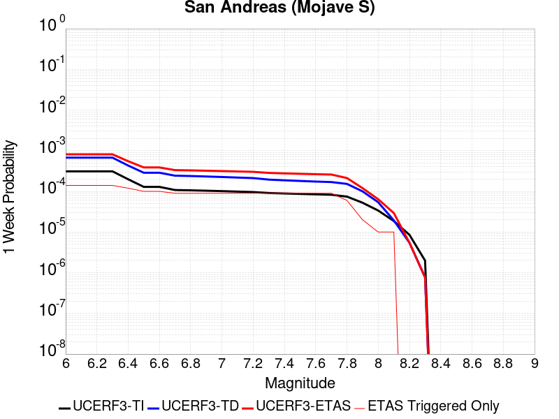 | 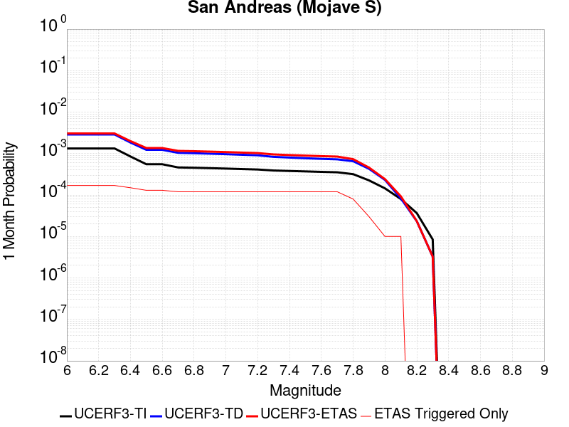 |  |  |

| Magnitude | 1 wk TI Prob | 1 wk TD Prob | 1 wk ETAS Prob | 1 wk ETAS/TD Gain | 1 wk ETAS Triggered Only | 1 mo TI Prob | 1 mo TD Prob | 1 mo ETAS Prob | 1 mo ETAS/TD Gain | 1 mo ETAS Triggered Only | 1 yr TI Prob | 1 yr TD Prob | 1 yr ETAS Prob | 1 yr ETAS/TD Gain | 1 yr ETAS Triggered Only | 10 yr TI Prob | 10 yr TD Prob | 10 yr ETAS Prob | 10 yr ETAS/TD Gain | 10 yr ETAS Triggered Only |
|-----|-----|-----|-----|-----|-----|-----|-----|-----|-----|-----|-----|-----|-----|-----|-----|-----|-----|-----|-----|-----|
| 6.0 | 3.1064058E-4 | 6.74589E-4 | 7.639741E-4 | 1.132503 | 8.9445435E-5 | 0.0013306376 | 0.0028880206 | 0.0030128825 | 1.0432345 | 1.2522361E-4 | 0.016080605 | 0.03462137 | 0.034811337 | 1.005487 | 1.9677996E-4 | 0.1496549 | 0.286598 | 0.28677666 | 1.0006235 | 2.5044722E-4 |
| 6.1 | 3.1064058E-4 | 6.74589E-4 | 7.639741E-4 | 1.132503 | 8.9445435E-5 | 0.0013306376 | 0.0028880206 | 0.0030128825 | 1.0432345 | 1.2522361E-4 | 0.016080605 | 0.03462137 | 0.034811337 | 1.005487 | 1.9677996E-4 | 0.1496549 | 0.286598 | 0.28677666 | 1.0006235 | 2.5044722E-4 |
| 6.2 | 3.1064058E-4 | 6.74589E-4 | 7.639741E-4 | 1.132503 | 8.9445435E-5 | 0.0013306376 | 0.0028880206 | 0.0030128825 | 1.0432345 | 1.2522361E-4 | 0.016080605 | 0.03462137 | 0.034811337 | 1.005487 | 1.9677996E-4 | 0.1496549 | 0.286598 | 0.28677666 | 1.0006235 | 2.5044722E-4 |
| 6.3 | 3.1064058E-4 | 6.74589E-4 | 7.639741E-4 | 1.132503 | 8.9445435E-5 | 0.0013306376 | 0.0028880206 | 0.0030128825 | 1.0432345 | 1.2522361E-4 | 0.016080605 | 0.03462137 | 0.034811337 | 1.005487 | 1.9677996E-4 | 0.1496549 | 0.286598 | 0.28677666 | 1.0006235 | 2.5044722E-4 |
| 6.4 | 1.9872203E-4 | 4.317752E-4 | 5.0330063E-4 | 1.1656544 | 7.155635E-5 | 8.5138786E-4 | 0.001849181 | 0.001956317 | 1.057937 | 1.0733453E-4 | 0.010316478 | 0.022287503 | 0.022462405 | 1.0078477 | 1.7889087E-4 | 0.098504856 | 0.19699045 | 0.19717719 | 1.000948 | 2.3255814E-4 |
| 6.5 | 1.291105E-4 | 2.875093E-4 | 3.4116113E-4 | 1.186609 | 5.3667263E-5 | 5.5321335E-4 | 0.0012316036 | 0.0013209388 | 1.0725358 | 8.9445435E-5 | 0.006714592 | 0.014892505 | 0.015051109 | 1.0106499 | 1.610018E-4 | 0.065152965 | 0.13802715 | 0.13821217 | 1.0013406 | 2.1466905E-4 |
| 6.6 | 1.291105E-4 | 2.875093E-4 | 3.4116113E-4 | 1.186609 | 5.3667263E-5 | 5.5321335E-4 | 0.0012316036 | 0.0013209388 | 1.0725358 | 8.9445435E-5 | 0.006714592 | 0.014892505 | 0.015051109 | 1.0106499 | 1.610018E-4 | 0.065152965 | 0.13802715 | 0.13821217 | 1.0013406 | 2.1466905E-4 |
| 6.7 | 1.08001186E-4 | 2.4332175E-4 | 2.9697595E-4 | 1.2205073 | 5.3667263E-5 | 4.6278012E-4 | 0.0010423913 | 0.0011317435 | 1.0857185 | 8.9445435E-5 | 0.0056198016 | 0.012617563 | 0.012776533 | 1.0125991 | 1.610018E-4 | 0.054797906 | 0.119169496 | 0.119358584 | 1.0015867 | 2.1466905E-4 |
| 6.8 | 1.0624356E-4 | 2.3849847E-4 | 2.9215292E-4 | 1.2249677 | 5.3667263E-5 | 4.5525006E-4 | 0.0010217364 | 0.0011110904 | 1.0874531 | 8.9445435E-5 | 0.0055285925 | 0.012368962 | 0.012527972 | 1.0128556 | 1.610018E-4 | 0.053930566 | 0.117118634 | 0.11730816 | 1.0016183 | 2.1466905E-4 |
| 6.9 | 1.0393785E-4 | 2.3220196E-4 | 2.8585678E-4 | 1.2310696 | 5.3667263E-5 | 4.4537184E-4 | 9.947722E-4 | 0.0010841286 | 1.0898261 | 8.9445435E-5 | 0.0054089287 | 0.012044343 | 0.012203407 | 1.0132064 | 1.610018E-4 | 0.05279156 | 0.11441608 | 0.11460619 | 1.0016615 | 2.1466905E-4 |
| 7.0 | 1.0155622E-4 | 2.258978E-4 | 2.7955294E-4 | 1.2375195 | 5.3667263E-5 | 4.3516833E-4 | 9.6777466E-4 | 0.0010571335 | 1.0923344 | 8.9445435E-5 | 0.005285311 | 0.011719226 | 0.0118783405 | 1.0135772 | 1.610018E-4 | 0.05161361 | 0.111676484 | 0.11186718 | 1.0017076 | 2.1466905E-4 |
| 7.1 | 9.885595E-5 | 2.1878199E-4 | 2.7243752E-4 | 1.2452465 | 5.3667263E-5 | 4.2359953E-4 | 9.373005E-4 | 0.0010266622 | 1.0953393 | 8.9445435E-5 | 0.0051451353 | 0.011352123 | 0.011511297 | 1.0140215 | 1.610018E-4 | 0.05027629 | 0.10856094 | 0.1087523 | 1.0017627 | 2.1466905E-4 |
| 7.2 | 9.6411415E-5 | 2.1241202E-4 | 2.660679E-4 | 1.2526028 | 5.3667263E-5 | 4.1312634E-4 | 9.1001997E-4 | 9.99384E-4 | 1.0982001 | 8.9445435E-5 | 0.005018219 | 0.011023389 | 0.011182616 | 1.0144445 | 1.610018E-4 | 0.049064007 | 0.10575075 | 0.10594272 | 1.0018153 | 2.1466905E-4 |
| 7.3 | 9.1180635E-5 | 1.9469624E-4 | 2.4835306E-4 | 1.2755924 | 5.3667263E-5 | 3.907156E-4 | 8.3414576E-4 | 9.235166E-4 | 1.1071405 | 8.9445435E-5 | 0.004746591 | 0.010108546 | 0.010267921 | 1.0157663 | 1.610018E-4 | 0.046464786 | 0.097944014 | 0.09813766 | 1.0019771 | 2.1466905E-4 |
| 7.4 | 8.887388E-5 | 1.8718264E-4 | 2.4083986E-4 | 1.286657 | 5.3667263E-5 | 3.8083247E-4 | 8.019648E-4 | 8.9133845E-4 | 1.1114434 | 8.9445435E-5 | 0.0046267817 | 0.009720306 | 0.009879743 | 1.0164025 | 1.610018E-4 | 0.045316286 | 0.094579056 | 0.09477343 | 1.002055 | 2.1466905E-4 |
| 7.5 | 8.6750515E-5 | 1.804986E-4 | 2.3415618E-4 | 1.2972742 | 5.3667263E-5 | 3.7173493E-4 | 7.7333616E-4 | 8.6271245E-4 | 1.1155723 | 8.9445435E-5 | 0.004516484 | 0.009374807 | 0.009534298 | 1.0170128 | 1.610018E-4 | 0.04425787 | 0.091542855 | 0.091737874 | 1.0021304 | 2.1466905E-4 |
| 7.6 | 8.453092E-5 | 1.7437496E-4 | 2.2803286E-4 | 1.3077157 | 5.3667263E-5 | 3.6222505E-4 | 7.4710726E-4 | 8.364859E-4 | 1.119633 | 8.9445435E-5 | 0.0044011753 | 0.009058169 | 0.009217713 | 1.0176132 | 1.610018E-4 | 0.04315024 | 0.08870201 | 0.08889763 | 1.0022055 | 2.1466905E-4 |
| 7.7 | 8.259102E-5 | 1.6959656E-4 | 2.2325473E-4 | 1.316387 | 5.3667263E-5 | 3.539135E-4 | 7.2664E-4 | 8.160205E-4 | 1.1230052 | 8.9445435E-5 | 0.004300386 | 0.008811024 | 0.008970607 | 1.0181117 | 1.610018E-4 | 0.042181134 | 0.08645291 | 0.08664902 | 1.0022684 | 2.1466905E-4 |
| 7.8 | 7.444844E-5 | 1.5282084E-4 | 1.707072E-4 | 1.1170413 | 1.7889088E-5 | 3.1902574E-4 | 6.5478205E-4 | 7.084142E-4 | 1.0819083 | 5.3667263E-5 | 0.0038772223 | 0.007942881 | 0.008067111 | 1.0156403 | 1.2522361E-4 | 0.03810269 | 0.07828439 | 0.07844927 | 1.0021063 | 1.7889087E-4 |
| 7.9 | 5.2586525E-5 | 1.0005448E-4 | 1.0005448E-4 | 1.0 | 0.0 | 2.2535135E-4 | 4.2873443E-4 | 4.4661586E-4 | 1.0417074 | 1.7889088E-5 | 0.0027402006 | 0.00520736 | 0.0052785436 | 1.0136698 | 7.155635E-5 | 0.027066574 | 0.0521955 | 0.05228028 | 1.0016242 | 8.9445435E-5 |
| 8.0 | 3.379877E-5 | 5.4068532E-5 | 5.4068532E-5 | 1.0 | 0.0 | 1.4484383E-4 | 2.317017E-4 | 2.317017E-4 | 1.0 | 0.0 | 0.0017620471 | 0.0028173209 | 0.0028173209 | 1.0 | 0.0 | 0.017481409 | 0.028832143 | 0.028832143 | 1.0 | 0.0 |
| 8.1 | 1.8668277E-5 | 1.9306746E-5 | 1.9306746E-5 | 1.0 | 0.0 | 8.000444E-5 | 8.2740575E-5 | 8.2740575E-5 | 1.0 | 0.0 | 9.736188E-4 | 0.0010069016 | 0.0010069016 | 1.0 | 0.0 | 0.009693642 | 0.0107975025 | 0.0107975025 | 1.0 | 0.0 |
| 8.2 | 8.541571E-6 | 5.4598204E-6 | 5.4598204E-6 | 1.0 | 0.0 | 3.660622E-5 | 2.3399021E-5 | 2.3399021E-5 | 1.0 | 0.0 | 4.455896E-4 | 2.8484594E-4 | 2.8484594E-4 | 1.0 | 0.0 | 0.0044469717 | 0.0032402598 | 0.0032402598 | 1.0 | 0.0 |
| 8.3 | 1.983087E-6 | 7.658221E-7 | 7.658221E-7 | 1.0 | 0.0 | 8.498917E-6 | 3.2820906E-6 | 3.2820906E-6 | 1.0 | 0.0 | 1.034694E-4 | 3.9958737E-5 | 3.9958737E-5 | 1.0 | 0.0 | 0.0010342124 | 4.7187202E-4 | 4.7187202E-4 | 1.0 | 0.0 |

## Death Valley (So)
*[(top)](#table-of-contents)*

| 1 Week | 1 Month | 1 Year | 10 Year |
|-----|-----|-----|-----|
|  | 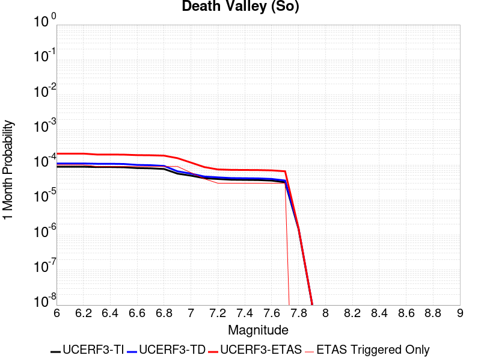 |  |  |

| Magnitude | 1 wk TI Prob | 1 wk TD Prob | 1 wk ETAS Prob | 1 wk ETAS/TD Gain | 1 wk ETAS Triggered Only | 1 mo TI Prob | 1 mo TD Prob | 1 mo ETAS Prob | 1 mo ETAS/TD Gain | 1 mo ETAS Triggered Only | 1 yr TI Prob | 1 yr TD Prob | 1 yr ETAS Prob | 1 yr ETAS/TD Gain | 1 yr ETAS Triggered Only | 10 yr TI Prob | 10 yr TD Prob | 10 yr ETAS Prob | 10 yr ETAS/TD Gain | 10 yr ETAS Triggered Only |
|-----|-----|-----|-----|-----|-----|-----|-----|-----|-----|-----|-----|-----|-----|-----|-----|-----|-----|-----|-----|-----|
| 6.0 | 2.0684236E-5 | 2.5617646E-5 | 1.1506079E-4 | 4.491466 | 8.9445435E-5 | 8.864371E-5 | 1.0978539E-4 | 2.3499526E-4 | 2.1404967 | 1.2522361E-4 | 0.0010787029 | 0.0013358344 | 0.001478756 | 1.1069905 | 1.431127E-4 | 0.010734817 | 0.0132813305 | 0.013493148 | 1.0159485 | 2.1466905E-4 |
| 6.1 | 2.0684236E-5 | 2.5617646E-5 | 1.1506079E-4 | 4.491466 | 8.9445435E-5 | 8.864371E-5 | 1.0978539E-4 | 2.3499526E-4 | 2.1404967 | 1.2522361E-4 | 0.0010787029 | 0.0013358344 | 0.001478756 | 1.1069905 | 1.431127E-4 | 0.010734817 | 0.0132813305 | 0.013493148 | 1.0159485 | 2.1466905E-4 |
| 6.2 | 2.0684236E-5 | 2.5617646E-5 | 1.1506079E-4 | 4.491466 | 8.9445435E-5 | 8.864371E-5 | 1.0978539E-4 | 2.3499526E-4 | 2.1404967 | 1.2522361E-4 | 0.0010787029 | 0.0013358344 | 0.001478756 | 1.1069905 | 1.431127E-4 | 0.010734817 | 0.0132813305 | 0.013493148 | 1.0159485 | 2.1466905E-4 |
| 6.3 | 2.0240292E-5 | 2.5117732E-5 | 1.1456092E-4 | 4.560958 | 8.9445435E-5 | 8.6741224E-5 | 1.0764308E-4 | 2.1496604E-4 | 1.9970262 | 1.0733453E-4 | 0.0010555626 | 0.0013097833 | 0.0014348429 | 1.0954812 | 1.2522361E-4 | 0.010505628 | 0.013023891 | 0.013218108 | 1.0149124 | 1.9677996E-4 |
| 6.4 | 2.0240292E-5 | 2.5117732E-5 | 1.1456092E-4 | 4.560958 | 8.9445435E-5 | 8.6741224E-5 | 1.0764308E-4 | 2.1496604E-4 | 1.9970262 | 1.0733453E-4 | 0.0010555626 | 0.0013097833 | 0.0014348429 | 1.0954812 | 1.2522361E-4 | 0.010505628 | 0.013023891 | 0.013218108 | 1.0149124 | 1.9677996E-4 |
| 6.5 | 1.9962767E-5 | 2.4806986E-5 | 1.1425021E-4 | 4.6055655 | 8.9445435E-5 | 8.55519E-5 | 1.0631142E-4 | 2.1363453E-4 | 2.0095162 | 1.0733453E-4 | 0.0010410968 | 0.0012935897 | 0.0014186513 | 1.096678 | 1.2522361E-4 | 0.010362327 | 0.012863837 | 0.013058086 | 1.0151004 | 1.9677996E-4 |
| 6.6 | 1.8937297E-5 | 2.3310844E-5 | 1.127542E-4 | 4.8369846 | 8.9445435E-5 | 8.115732E-5 | 9.989987E-5 | 2.0722367E-4 | 2.0743136 | 1.0733453E-4 | 9.876423E-4 | 0.0012156168 | 0.0013406882 | 1.1028872 | 1.2522361E-4 | 0.009832645 | 0.012092726 | 0.012287127 | 1.0160758 | 1.9677996E-4 |
| 6.7 | 1.8621096E-5 | 2.2911487E-5 | 1.1235487E-4 | 4.903867 | 8.9445435E-5 | 7.980225E-5 | 9.818847E-5 | 2.0551246E-4 | 2.0930407 | 1.0733453E-4 | 9.711593E-4 | 0.0011948035 | 0.0013198776 | 1.1046816 | 1.2522361E-4 | 0.009669261 | 0.011886842 | 0.012081283 | 1.0163577 | 1.9677996E-4 |
| 6.8 | 1.7830353E-5 | 2.1805576E-5 | 1.11249065E-4 | 5.1018634 | 8.9445435E-5 | 7.641356E-5 | 9.34492E-5 | 2.0077369E-4 | 2.1484797 | 1.0733453E-4 | 9.29938E-4 | 0.0011371642 | 0.0012622454 | 1.1099939 | 1.2522361E-4 | 0.009260561 | 0.011316297 | 0.01151085 | 1.0171922 | 1.9677996E-4 |
| 6.9 | 1.3135183E-5 | 1.5303862E-5 | 1.0474793E-4 | 6.8445425 | 8.9445435E-5 | 5.6292425E-5 | 6.558636E-5 | 1.7291385E-4 | 2.6364298 | 1.0733453E-4 | 6.8514474E-4 | 7.982279E-4 | 9.2335156E-4 | 1.1567518 | 1.2522361E-4 | 0.006830362 | 0.007954616 | 0.008132083 | 1.02231 | 1.7889087E-4 |
| 7.0 | 1.1507512E-5 | 1.315415E-5 | 8.470956E-5 | 6.4397593 | 7.155635E-5 | 4.9316975E-5 | 5.6373745E-5 | 1.4581413E-4 | 2.5865612 | 8.9445435E-5 | 6.002687E-4 | 6.8614E-4 | 7.9340086E-4 | 1.1563251 | 1.0733453E-4 | 0.0059864987 | 0.006840916 | 0.0070008165 | 1.0233741 | 1.610018E-4 |
| 7.1 | 9.715903E-6 | 1.0865243E-5 | 6.453192E-5 | 5.9392986 | 5.3667263E-5 | 4.1638916E-5 | 4.656452E-5 | 1.1811754E-4 | 2.5366426 | 7.155635E-5 | 5.068359E-4 | 5.667798E-4 | 6.382956E-4 | 1.1261791 | 7.155635E-5 | 0.0050568148 | 0.0056537963 | 0.0057783118 | 1.0220233 | 1.2522361E-4 |
| 7.2 | 9.233269E-6 | 1.0286278E-5 | 6.395299E-5 | 6.217311 | 5.3667263E-5 | 3.9570554E-5 | 4.4083325E-5 | 9.774823E-5 | 2.2173514 | 5.3667263E-5 | 4.81665E-4 | 5.3658657E-4 | 5.9022504E-4 | 1.0999624 | 5.3667263E-5 | 0.0048062233 | 0.005353341 | 0.0054601007 | 1.0199426 | 1.0733453E-4 |
| 7.3 | 8.8041315E-6 | 9.808134E-6 | 6.347487E-5 | 6.4716563 | 5.3667263E-5 | 3.7731446E-5 | 4.2034208E-5 | 9.5699215E-5 | 2.2766986 | 5.3667263E-5 | 4.592835E-4 | 5.116505E-4 | 5.652903E-4 | 1.1048368 | 5.3667263E-5 | 0.0045833546 | 0.005105152 | 0.0051763426 | 1.013945 | 7.155635E-5 |
| 7.4 | 8.708749E-6 | 9.707145E-6 | 6.337389E-5 | 6.528581 | 5.3667263E-5 | 3.7322676E-5 | 4.160141E-5 | 9.526644E-5 | 2.2899811 | 5.3667263E-5 | 4.5430884E-4 | 5.0638366E-4 | 5.6002376E-4 | 1.1059277 | 5.3667263E-5 | 0.004533812 | 0.0050527244 | 0.005123919 | 1.0140904 | 7.155635E-5 |
| 7.5 | 8.612678E-6 | 9.604788E-6 | 6.327154E-5 | 6.5874996 | 5.3667263E-5 | 3.6910955E-5 | 4.116275E-5 | 9.48278E-5 | 2.3037286 | 5.3667263E-5 | 4.492982E-4 | 5.0104543E-4 | 5.5468583E-4 | 1.1070569 | 5.3667263E-5 | 0.004483909 | 0.004999583 | 0.005070782 | 1.0142409 | 7.155635E-5 |
| 7.6 | 8.319024E-6 | 9.283887E-6 | 6.2950654E-5 | 6.780635 | 5.3667263E-5 | 3.5652476E-5 | 3.9787505E-5 | 9.345263E-5 | 2.3487935 | 5.3667263E-5 | 4.3398244E-4 | 4.8430942E-4 | 5.3795066E-4 | 1.1107583 | 5.3667263E-5 | 0.0043313587 | 0.0048329635 | 0.004904174 | 1.0147344 | 7.155635E-5 |
| 7.7 | 7.4718328E-6 | 8.345144E-6 | 6.201196E-5 | 7.4309034 | 5.3667263E-5 | 3.2021748E-5 | 3.5764435E-5 | 8.942978E-5 | 2.5005226 | 5.3667263E-5 | 3.8979502E-4 | 4.3534904E-4 | 4.8899296E-4 | 1.1232204 | 5.3667263E-5 | 0.00389112 | 0.004345367 | 0.004398801 | 1.0122968 | 5.3667263E-5 |
| 7.8 | 3.4586725E-7 | 3.648256E-7 | 3.648256E-7 | 1.0 | 0.0 | 1.4822873E-6 | 1.5635374E-6 | 1.5635374E-6 | 1.0 | 0.0 | 1.80467E-5 | 1.9035906E-5 | 1.9035906E-5 | 1.0 | 0.0 | 1.8045233E-4 | 1.903432E-4 | 1.903432E-4 | 1.0 | 0.0 |
| 7.9 | 2.5591178E-9 | 2.6696687E-9 | 2.6696687E-9 | 1.0 | 0.0 | 1.0967647E-8 | 1.1441437E-8 | 1.1441437E-8 | 1.0 | 0.0 | 1.335311E-7 | 1.392995E-7 | 1.392995E-7 | 1.0 | 0.0 | 1.3353102E-6 | 1.3929949E-6 | 1.3929949E-6 | 1.0 | 0.0 |

## Death Valley (Black Mtns Frontal)
*[(top)](#table-of-contents)*

| 1 Week | 1 Month | 1 Year | 10 Year |
|-----|-----|-----|-----|
|  |  |  |  |

| Magnitude | 1 wk TI Prob | 1 wk TD Prob | 1 wk ETAS Prob | 1 wk ETAS/TD Gain | 1 wk ETAS Triggered Only | 1 mo TI Prob | 1 mo TD Prob | 1 mo ETAS Prob | 1 mo ETAS/TD Gain | 1 mo ETAS Triggered Only | 1 yr TI Prob | 1 yr TD Prob | 1 yr ETAS Prob | 1 yr ETAS/TD Gain | 1 yr ETAS Triggered Only | 10 yr TI Prob | 10 yr TD Prob | 10 yr ETAS Prob | 10 yr ETAS/TD Gain | 10 yr ETAS Triggered Only |
|-----|-----|-----|-----|-----|-----|-----|-----|-----|-----|-----|-----|-----|-----|-----|-----|-----|-----|-----|-----|-----|
| 6.0 | 1.6707214E-5 | 1.867021E-5 | 1.2600273E-4 | 6.748865 | 1.0733453E-4 | 7.160038E-5 | 8.0012775E-5 | 2.2311402E-4 | 2.78848 | 1.431127E-4 | 8.71386E-4 | 9.737278E-4 | 0.0011167012 | 1.1468309 | 1.431127E-4 | 0.00867977 | 0.009695467 | 0.009872623 | 1.018272 | 1.7889087E-4 |
| 6.1 | 1.6707214E-5 | 1.867021E-5 | 1.2600273E-4 | 6.748865 | 1.0733453E-4 | 7.160038E-5 | 8.0012775E-5 | 2.2311402E-4 | 2.78848 | 1.431127E-4 | 8.71386E-4 | 9.737278E-4 | 0.0011167012 | 1.1468309 | 1.431127E-4 | 0.00867977 | 0.009695467 | 0.009872623 | 1.018272 | 1.7889087E-4 |
| 6.2 | 1.6707214E-5 | 1.867021E-5 | 1.2600273E-4 | 6.748865 | 1.0733453E-4 | 7.160038E-5 | 8.0012775E-5 | 2.2311402E-4 | 2.78848 | 1.431127E-4 | 8.71386E-4 | 9.737278E-4 | 0.0011167012 | 1.1468309 | 1.431127E-4 | 0.00867977 | 0.009695467 | 0.009872623 | 1.018272 | 1.7889087E-4 |
| 6.3 | 1.6707214E-5 | 1.867021E-5 | 1.2600273E-4 | 6.748865 | 1.0733453E-4 | 7.160038E-5 | 8.0012775E-5 | 2.2311402E-4 | 2.78848 | 1.431127E-4 | 8.71386E-4 | 9.737278E-4 | 0.0011167012 | 1.1468309 | 1.431127E-4 | 0.00867977 | 0.009695467 | 0.009872623 | 1.018272 | 1.7889087E-4 |
| 6.4 | 1.5515609E-5 | 1.733816E-5 | 1.2467083E-4 | 7.1905456 | 1.0733453E-4 | 6.649377E-5 | 7.430431E-5 | 2.1740638E-4 | 2.9258919 | 1.431127E-4 | 8.0926094E-4 | 9.0428564E-4 | 0.001047269 | 1.1581174 | 1.431127E-4 | 0.008063202 | 0.009006744 | 0.009184024 | 1.019683 | 1.7889087E-4 |
| 6.5 | 1.5515609E-5 | 1.733816E-5 | 1.2467083E-4 | 7.1905456 | 1.0733453E-4 | 6.649377E-5 | 7.430431E-5 | 2.1740638E-4 | 2.9258919 | 1.431127E-4 | 8.0926094E-4 | 9.0428564E-4 | 0.001047269 | 1.1581174 | 1.431127E-4 | 0.008063202 | 0.009006744 | 0.009184024 | 1.019683 | 1.7889087E-4 |
| 6.6 | 1.5041828E-5 | 1.6809092E-5 | 1.241418E-4 | 7.385397 | 1.0733453E-4 | 6.4463384E-5 | 7.203701E-5 | 2.151394E-4 | 2.9865122 | 1.431127E-4 | 7.8455906E-4 | 8.767036E-4 | 0.0010196908 | 1.1630964 | 1.431127E-4 | 0.00781795 | 0.008733105 | 0.008910433 | 1.0203053 | 1.7889087E-4 |
| 6.7 | 1.4634985E-5 | 1.6355965E-5 | 1.2368873E-4 | 7.562301 | 1.0733453E-4 | 6.271985E-5 | 7.009514E-5 | 2.1319781E-4 | 3.041549 | 1.431127E-4 | 7.6334673E-4 | 8.5307995E-4 | 9.960706E-4 | 1.1676168 | 1.431127E-4 | 0.007607299 | 0.008498689 | 0.00867606 | 1.0208703 | 1.7889087E-4 |
| 6.8 | 1.4209158E-5 | 1.5881998E-5 | 1.2321482E-4 | 7.7581434 | 1.0733453E-4 | 6.089497E-5 | 6.806396E-5 | 2.1116692E-4 | 3.1024778 | 1.431127E-4 | 7.4114406E-4 | 8.283693E-4 | 9.713634E-4 | 1.1726213 | 1.431127E-4 | 0.007386771 | 0.00825343 | 0.008430845 | 1.0214958 | 1.7889087E-4 |
| 6.9 | 1.3780098E-5 | 1.5404545E-5 | 1.2273742E-4 | 7.967611 | 1.0733453E-4 | 5.9056227E-5 | 6.6017834E-5 | 2.0912109E-4 | 3.1676452 | 1.431127E-4 | 7.1877235E-4 | 8.034762E-4 | 9.464739E-4 | 1.1779737 | 1.431127E-4 | 0.0071645193 | 0.008006307 | 0.008183766 | 1.0221648 | 1.7889087E-4 |
| 7.0 | 1.3585064E-5 | 1.5188108E-5 | 1.22521E-4 | 8.066904 | 1.0733453E-4 | 5.8220405E-5 | 6.5090295E-5 | 2.0819368E-4 | 3.1985364 | 1.431127E-4 | 7.086029E-4 | 7.9219165E-4 | 9.35191E-4 | 1.180511 | 1.431127E-4 | 0.007063476 | 0.007894269 | 0.008071748 | 1.0224819 | 1.7889087E-4 |
| 7.1 | 1.3398601E-5 | 1.4981292E-5 | 1.0442539E-4 | 6.970386 | 8.9445435E-5 | 5.742131E-5 | 6.420399E-5 | 1.8941956E-4 | 2.950277 | 1.2522361E-4 | 6.9888023E-4 | 7.814087E-4 | 9.0653443E-4 | 1.1601285 | 1.2522361E-4 | 0.0069668638 | 0.0077871997 | 0.007946948 | 1.0205141 | 1.610018E-4 |
| 7.2 | 1.3126312E-5 | 1.4679515E-5 | 1.0412364E-4 | 7.093126 | 8.9445435E-5 | 5.6254412E-5 | 6.2910716E-5 | 1.7023849E-4 | 2.7060332 | 1.0733453E-4 | 6.846822E-4 | 7.656743E-4 | 8.729266E-4 | 1.1400757 | 1.0733453E-4 | 0.006825765 | 0.007630946 | 0.0077729668 | 1.0186112 | 1.431127E-4 |
| 7.3 | 1.2922429E-5 | 1.4453743E-5 | 1.0389789E-4 | 7.1883035 | 8.9445435E-5 | 5.5380664E-5 | 6.194317E-5 | 1.6927105E-4 | 2.732683 | 1.0733453E-4 | 6.74051E-4 | 7.5390254E-4 | 8.6115615E-4 | 1.1422646 | 1.0733453E-4 | 0.006720101 | 0.007514031 | 0.007638314 | 1.01654 | 1.2522361E-4 |
| 7.4 | 1.2768878E-5 | 1.4283726E-5 | 1.03727885E-4 | 7.261963 | 8.9445435E-5 | 5.4722615E-5 | 6.121456E-5 | 1.6854252E-4 | 2.7533076 | 1.0733453E-4 | 6.660441E-4 | 7.4503786E-4 | 8.5229246E-4 | 1.1439586 | 1.0733453E-4 | 0.0066405144 | 0.00742598 | 0.0075502736 | 1.0167377 | 1.2522361E-4 |
| 7.5 | 1.2521929E-5 | 1.401197E-5 | 1.0345616E-4 | 7.3834124 | 8.9445435E-5 | 5.366431E-5 | 6.004995E-5 | 1.6737804E-4 | 2.7873135 | 1.0733453E-4 | 6.531671E-4 | 7.308683E-4 | 8.381244E-4 | 1.1467515 | 1.0733453E-4 | 0.006512506 | 0.007285223 | 0.007409534 | 1.0170635 | 1.2522361E-4 |
| 7.6 | 1.1301089E-5 | 1.2648108E-5 | 1.0209242E-4 | 8.0717535 | 8.9445435E-5 | 4.8432343E-5 | 5.4205084E-5 | 1.615338E-4 | 2.9800487 | 1.0733453E-4 | 5.895042E-4 | 6.5975235E-4 | 7.670161E-4 | 1.1625818 | 1.0733453E-4 | 0.0058794282 | 0.006578489 | 0.006702889 | 1.01891 | 1.2522361E-4 |
| 7.7 | 9.189108E-6 | 1.02833255E-5 | 9.972785E-5 | 9.698015 | 8.9445435E-5 | 3.93813E-5 | 4.407068E-5 | 1.3351218E-4 | 3.0295012 | 8.9445435E-5 | 4.7936183E-4 | 5.364335E-4 | 6.258309E-4 | 1.1666515 | 8.9445435E-5 | 0.004783291 | 0.005351897 | 0.005440864 | 1.0166234 | 8.9445435E-5 |
| 7.8 | 3.4586725E-7 | 3.648256E-7 | 3.648256E-7 | 1.0 | 0.0 | 1.4822873E-6 | 1.5635374E-6 | 1.5635374E-6 | 1.0 | 0.0 | 1.80467E-5 | 1.9035906E-5 | 1.9035906E-5 | 1.0 | 0.0 | 1.8045233E-4 | 1.903432E-4 | 1.903432E-4 | 1.0 | 0.0 |
| 7.9 | 2.5591178E-9 | 2.6696687E-9 | 2.6696687E-9 | 1.0 | 0.0 | 1.0967647E-8 | 1.1441437E-8 | 1.1441437E-8 | 1.0 | 0.0 | 1.335311E-7 | 1.392995E-7 | 1.392995E-7 | 1.0 | 0.0 | 1.3353102E-6 | 1.3929949E-6 | 1.3929949E-6 | 1.0 | 0.0 |

## McLean Lake
*[(top)](#table-of-contents)*

| 1 Week | 1 Month | 1 Year | 10 Year |
|-----|-----|-----|-----|
|  |  |  |  |

| Magnitude | 1 wk TI Prob | 1 wk TD Prob | 1 wk ETAS Prob | 1 wk ETAS/TD Gain | 1 wk ETAS Triggered Only | 1 mo TI Prob | 1 mo TD Prob | 1 mo ETAS Prob | 1 mo ETAS/TD Gain | 1 mo ETAS Triggered Only | 1 yr TI Prob | 1 yr TD Prob | 1 yr ETAS Prob | 1 yr ETAS/TD Gain | 1 yr ETAS Triggered Only | 10 yr TI Prob | 10 yr TD Prob | 10 yr ETAS Prob | 10 yr ETAS/TD Gain | 10 yr ETAS Triggered Only |
|-----|-----|-----|-----|-----|-----|-----|-----|-----|-----|-----|-----|-----|-----|-----|-----|-----|-----|-----|-----|-----|
| 6.0 | 1.7360222E-5 | 1.8501594E-5 | 7.2167866E-5 | 3.9006293 | 5.3667263E-5 | 7.439883E-5 | 7.929042E-5 | 1.3295343E-4 | 1.6767906 | 5.3667263E-5 | 9.0542925E-4 | 9.6498185E-4 | 0.0010900847 | 1.1296426 | 1.2522361E-4 | 0.009017491 | 0.009612758 | 0.009789929 | 1.0184308 | 1.7889087E-4 |
| 6.1 | 9.062689E-6 | 9.592179E-6 | 2.7481095E-5 | 2.8649483 | 1.7889088E-5 | 3.8839516E-5 | 4.110874E-5 | 5.899709E-5 | 1.4351472 | 1.7889088E-5 | 4.727685E-4 | 5.0039287E-4 | 5.719134E-4 | 1.1429288 | 7.155635E-5 | 0.0047176396 | 0.004993544 | 0.0051003424 | 1.0213873 | 1.0733453E-4 |
| 6.2 | 9.062689E-6 | 9.592179E-6 | 2.7481095E-5 | 2.8649483 | 1.7889088E-5 | 3.8839516E-5 | 4.110874E-5 | 5.899709E-5 | 1.4351472 | 1.7889088E-5 | 4.727685E-4 | 5.0039287E-4 | 5.719134E-4 | 1.1429288 | 7.155635E-5 | 0.0047176396 | 0.004993544 | 0.0051003424 | 1.0213873 | 1.0733453E-4 |
| 6.3 | 7.2575485E-6 | 7.667698E-6 | 2.5556648E-5 | 3.3330276 | 1.7889088E-5 | 3.110341E-5 | 3.286119E-5 | 5.0749688E-5 | 1.5443655 | 1.7889088E-5 | 3.786182E-4 | 4.0001865E-4 | 4.5366446E-4 | 1.1341082 | 5.3667263E-5 | 0.0037797375 | 0.003993691 | 0.004082779 | 1.0223073 | 8.9445435E-5 |
| 6.4 | 7.2575485E-6 | 7.667698E-6 | 2.5556648E-5 | 3.3330276 | 1.7889088E-5 | 3.110341E-5 | 3.286119E-5 | 5.0749688E-5 | 1.5443655 | 1.7889088E-5 | 3.786182E-4 | 4.0001865E-4 | 4.5366446E-4 | 1.1341082 | 5.3667263E-5 | 0.0037797375 | 0.003993691 | 0.004082779 | 1.0223073 | 8.9445435E-5 |
| 6.5 | 6.06582E-6 | 6.4038677E-6 | 2.429284E-5 | 3.793464 | 1.7889088E-5 | 2.5996113E-5 | 2.7444894E-5 | 4.533349E-5 | 1.6518005 | 1.7889088E-5 | 3.164567E-4 | 3.3409684E-4 | 3.6986306E-4 | 1.1070534 | 3.5778176E-5 | 0.0031600643 | 0.0033365842 | 0.0034079019 | 1.0213745 | 7.155635E-5 |
| 6.6 | 5.598744E-6 | 5.9102535E-6 | 2.3799235E-5 | 4.0267706 | 1.7889088E-5 | 2.3994397E-5 | 2.5329447E-5 | 4.3218082E-5 | 1.7062386 | 1.7889088E-5 | 2.9209262E-4 | 3.0834877E-4 | 3.4411592E-4 | 1.1159958 | 3.5778176E-5 | 0.0029170897 | 0.0030798386 | 0.0031511744 | 1.0231622 | 7.155635E-5 |
| 6.7 | 5.246996E-6 | 5.539154E-6 | 2.3428142E-5 | 4.2295527 | 1.7889088E-5 | 2.2486933E-5 | 2.373905E-5 | 4.1627714E-5 | 1.7535542 | 1.7889088E-5 | 2.73744E-4 | 2.8899097E-4 | 3.247588E-4 | 1.123768 | 3.5778176E-5 | 0.0027340704 | 0.0028867754 | 0.0029581252 | 1.0247161 | 7.155635E-5 |
| 6.8 | 4.02324E-6 | 4.2468982E-6 | 4.2468982E-6 | 1.0 | 0.0 | 1.7242342E-5 | 1.8200899E-5 | 1.8200899E-5 | 1.0 | 0.0 | 2.099053E-4 | 2.2157936E-4 | 2.3946448E-4 | 1.0807166 | 1.7889088E-5 | 0.0020970714 | 0.0022141687 | 0.0022498677 | 1.0161229 | 3.5778176E-5 |
| 6.9 | 6.835972E-7 | 7.13992E-7 | 7.13992E-7 | 1.0 | 0.0 | 2.9296991E-6 | 3.0599638E-6 | 3.0599638E-6 | 1.0 | 0.0 | 3.56685E-5 | 3.725474E-5 | 3.725474E-5 | 1.0 | 0.0 | 3.5662777E-4 | 3.7251622E-4 | 3.7251622E-4 | 1.0 | 0.0 |

## Paradise
*[(top)](#table-of-contents)*

| 1 Week | 1 Month | 1 Year | 10 Year |
|-----|-----|-----|-----|
|  |  |  |  |

| Magnitude | 1 wk TI Prob | 1 wk TD Prob | 1 wk ETAS Prob | 1 wk ETAS/TD Gain | 1 wk ETAS Triggered Only | 1 mo TI Prob | 1 mo TD Prob | 1 mo ETAS Prob | 1 mo ETAS/TD Gain | 1 mo ETAS Triggered Only | 1 yr TI Prob | 1 yr TD Prob | 1 yr ETAS Prob | 1 yr ETAS/TD Gain | 1 yr ETAS Triggered Only | 10 yr TI Prob | 10 yr TD Prob | 10 yr ETAS Prob | 10 yr ETAS/TD Gain | 10 yr ETAS Triggered Only |
|-----|-----|-----|-----|-----|-----|-----|-----|-----|-----|-----|-----|-----|-----|-----|-----|-----|-----|-----|-----|-----|
| 6.0 | 1.4851273E-5 | 1.669466E-5 | 8.824981E-5 | 5.286111 | 7.155635E-5 | 6.364676E-5 | 7.154671E-5 | 1.4309795E-4 | 2.0000632 | 7.155635E-5 | 7.7462377E-4 | 8.707567E-4 | 0.0010316182 | 1.1847377 | 1.610018E-4 | 0.0077192914 | 0.008675828 | 0.008853166 | 1.0204406 | 1.7889087E-4 |
| 6.1 | 1.4851273E-5 | 1.669466E-5 | 8.824981E-5 | 5.286111 | 7.155635E-5 | 6.364676E-5 | 7.154671E-5 | 1.4309795E-4 | 2.0000632 | 7.155635E-5 | 7.7462377E-4 | 8.707567E-4 | 0.0010316182 | 1.1847377 | 1.610018E-4 | 0.0077192914 | 0.008675828 | 0.008853166 | 1.0204406 | 1.7889087E-4 |
| 6.2 | 1.4851273E-5 | 1.669466E-5 | 8.824981E-5 | 5.286111 | 7.155635E-5 | 6.364676E-5 | 7.154671E-5 | 1.4309795E-4 | 2.0000632 | 7.155635E-5 | 7.7462377E-4 | 8.707567E-4 | 0.0010316182 | 1.1847377 | 1.610018E-4 | 0.0077192914 | 0.008675828 | 0.008853166 | 1.0204406 | 1.7889087E-4 |
| 6.3 | 1.0426831E-5 | 1.1888599E-5 | 4.7666348E-5 | 4.009417 | 3.5778176E-5 | 4.4685654E-5 | 5.0950177E-5 | 8.6726526E-5 | 1.7021831 | 3.5778176E-5 | 5.43912E-4 | 6.201478E-4 | 7.4529374E-4 | 1.2018002 | 1.2522361E-4 | 0.0054258266 | 0.0061847805 | 0.0063092294 | 1.0201218 | 1.2522361E-4 |
| 6.4 | 1.0426831E-5 | 1.1888599E-5 | 4.7666348E-5 | 4.009417 | 3.5778176E-5 | 4.4685654E-5 | 5.0950177E-5 | 8.6726526E-5 | 1.7021831 | 3.5778176E-5 | 5.43912E-4 | 6.201478E-4 | 7.4529374E-4 | 1.2018002 | 1.2522361E-4 | 0.0054258266 | 0.0061847805 | 0.0063092294 | 1.0201218 | 1.2522361E-4 |
| 6.5 | 9.25027E-6 | 1.061994E-5 | 2.8508839E-5 | 2.684463 | 1.7889088E-5 | 3.964341E-5 | 4.5513265E-5 | 6.340154E-5 | 1.3930342 | 1.7889088E-5 | 4.8255164E-4 | 5.5398804E-4 | 6.6126307E-4 | 1.1936414 | 1.0733453E-4 | 0.0048150513 | 0.0055265697 | 0.005633311 | 1.0193142 | 1.0733453E-4 |
| 6.6 | 7.904275E-6 | 9.159509E-6 | 9.159509E-6 | 1.0 | 0.0 | 3.3875025E-5 | 3.925447E-5 | 3.925447E-5 | 1.0 | 0.0 | 4.1235037E-4 | 4.7782232E-4 | 5.3146394E-4 | 1.1122627 | 5.3667263E-5 | 0.0041158604 | 0.0047683464 | 0.004821758 | 1.0112013 | 5.3667263E-5 |
| 6.7 | 7.2061953E-6 | 8.407234E-6 | 8.407234E-6 | 1.0 | 0.0 | 3.088333E-5 | 3.6030528E-5 | 3.6030528E-5 | 1.0 | 0.0 | 3.7593965E-4 | 4.3858704E-4 | 4.9223076E-4 | 1.1223103 | 5.3667263E-5 | 0.003753043 | 0.0043775835 | 0.004431016 | 1.0122058 | 5.3667263E-5 |
| 6.8 | 6.6948724E-6 | 7.842153E-6 | 7.842153E-6 | 1.0 | 0.0 | 2.8691995E-5 | 3.3608812E-5 | 3.3608812E-5 | 1.0 | 0.0 | 3.4926904E-4 | 4.0911406E-4 | 4.6275937E-4 | 1.1311256 | 5.3667263E-5 | 0.003487206 | 0.0040839664 | 0.0041374145 | 1.0130873 | 5.3667263E-5 |
| 6.9 | 6.0421025E-6 | 7.1306094E-6 | 7.1306094E-6 | 1.0 | 0.0 | 2.5894467E-5 | 3.0559415E-5 | 3.0559415E-5 | 1.0 | 0.0 | 3.1521954E-4 | 3.7200077E-4 | 4.0776562E-4 | 1.0961419 | 3.5778176E-5 | 0.0031477278 | 0.0037141186 | 0.003749764 | 1.0095972 | 3.5778176E-5 |
| 7.0 | 4.134091E-6 | 5.080301E-6 | 5.080301E-6 | 1.0 | 0.0 | 1.7717413E-5 | 2.1772545E-5 | 2.1772545E-5 | 1.0 | 0.0 | 2.1568815E-4 | 2.6505004E-4 | 2.6505004E-4 | 1.0 | 0.0 | 0.0021547892 | 0.002647492 | 0.002647492 | 1.0 | 0.0 |
| 7.1 | 3.7674888E-6 | 4.6318623E-6 | 4.6318623E-6 | 1.0 | 0.0 | 1.6146281E-5 | 1.9850695E-5 | 1.9850695E-5 | 1.0 | 0.0 | 1.9656324E-4 | 2.4165693E-4 | 2.4165693E-4 | 1.0 | 0.0 | 0.0019638946 | 0.0024140922 | 0.0024140922 | 1.0 | 0.0 |
| 7.2 | 3.4065345E-6 | 4.156717E-6 | 4.156717E-6 | 1.0 | 0.0 | 1.4599351E-5 | 1.7814387E-5 | 1.7814387E-5 | 1.0 | 0.0 | 1.777326E-4 | 2.1687007E-4 | 2.1687007E-4 | 1.0 | 0.0 | 0.0017759053 | 0.0021667324 | 0.0021667324 | 1.0 | 0.0 |
| 7.3 | 2.9934936E-6 | 3.6293113E-6 | 3.6293113E-6 | 1.0 | 0.0 | 1.2829195E-5 | 1.5554107E-5 | 1.5554107E-5 | 1.0 | 0.0 | 1.5618425E-4 | 1.8935627E-4 | 1.8935627E-4 | 1.0 | 0.0 | 0.0015607453 | 0.0018920946 | 0.0018920946 | 1.0 | 0.0 |
| 7.4 | 2.4049796E-6 | 2.8889801E-6 | 2.8889801E-6 | 1.0 | 0.0 | 1.0307015E-5 | 1.2381293E-5 | 1.2381293E-5 | 1.0 | 0.0 | 1.2548068E-4 | 1.5073326E-4 | 1.5073326E-4 | 1.0 | 0.0 | 0.0012540985 | 0.0015064516 | 0.0015064516 | 1.0 | 0.0 |
| 7.5 | 1.2710091E-6 | 1.5134664E-6 | 1.5134664E-6 | 1.0 | 0.0 | 5.44717E-6 | 6.486275E-6 | 6.486275E-6 | 1.0 | 0.0 | 6.631728E-5 | 7.896879E-5 | 7.896879E-5 | 1.0 | 0.0 | 6.6297496E-4 | 7.8952993E-4 | 7.8952993E-4 | 1.0 | 0.0 |
| 7.6 | 2.21172E-7 | 2.603958E-7 | 2.603958E-7 | 1.0 | 0.0 | 9.478797E-7 | 1.1159817E-6 | 1.1159817E-6 | 1.0 | 0.0 | 1.1540374E-5 | 1.3587022E-5 | 1.3587022E-5 | 1.0 | 0.0 | 1.1539775E-4 | 1.3586473E-4 | 1.3586473E-4 | 1.0 | 0.0 |

## Death Valley (No)
*[(top)](#table-of-contents)*

| 1 Week | 1 Month | 1 Year | 10 Year |
|-----|-----|-----|-----|
|  |  |  |  |

| Magnitude | 1 wk TI Prob | 1 wk TD Prob | 1 wk ETAS Prob | 1 wk ETAS/TD Gain | 1 wk ETAS Triggered Only | 1 mo TI Prob | 1 mo TD Prob | 1 mo ETAS Prob | 1 mo ETAS/TD Gain | 1 mo ETAS Triggered Only | 1 yr TI Prob | 1 yr TD Prob | 1 yr ETAS Prob | 1 yr ETAS/TD Gain | 1 yr ETAS Triggered Only | 10 yr TI Prob | 10 yr TD Prob | 10 yr ETAS Prob | 10 yr ETAS/TD Gain | 10 yr ETAS Triggered Only |
|-----|-----|-----|-----|-----|-----|-----|-----|-----|-----|-----|-----|-----|-----|-----|-----|-----|-----|-----|-----|-----|
| 6.0 | 2.0074807E-5 | 2.2500011E-5 | 1.2983211E-4 | 5.7703137 | 1.0733453E-4 | 8.603206E-5 | 9.6425094E-5 | 2.2163663E-4 | 2.2985368 | 1.2522361E-4 | 0.001046937 | 0.0011733507 | 0.0012984273 | 1.1065979 | 1.2522361E-4 | 0.010420183 | 0.011672469 | 0.011831592 | 1.0136323 | 1.610018E-4 |
| 6.1 | 2.0074807E-5 | 2.2500011E-5 | 1.2983211E-4 | 5.7703137 | 1.0733453E-4 | 8.603206E-5 | 9.6425094E-5 | 2.2163663E-4 | 2.2985368 | 1.2522361E-4 | 0.001046937 | 0.0011733507 | 0.0012984273 | 1.1065979 | 1.2522361E-4 | 0.010420183 | 0.011672469 | 0.011831592 | 1.0136323 | 1.610018E-4 |
| 6.2 | 2.0074807E-5 | 2.2500011E-5 | 1.2983211E-4 | 5.7703137 | 1.0733453E-4 | 8.603206E-5 | 9.6425094E-5 | 2.2163663E-4 | 2.2985368 | 1.2522361E-4 | 0.001046937 | 0.0011733507 | 0.0012984273 | 1.1065979 | 1.2522361E-4 | 0.010420183 | 0.011672469 | 0.011831592 | 1.0136323 | 1.610018E-4 |
| 6.3 | 1.9050609E-5 | 2.1336878E-5 | 1.10780406E-4 | 5.191969 | 8.9445435E-5 | 8.164292E-5 | 9.14406E-5 | 1.9876531E-4 | 2.1737096 | 1.0733453E-4 | 9.935491E-4 | 0.0011127274 | 0.0012199426 | 1.0963534 | 1.0733453E-4 | 0.009891188 | 0.011072383 | 0.011213912 | 1.0127821 | 1.431127E-4 |
| 6.4 | 1.9050609E-5 | 2.1336878E-5 | 1.10780406E-4 | 5.191969 | 8.9445435E-5 | 8.164292E-5 | 9.14406E-5 | 1.9876531E-4 | 2.1737096 | 1.0733453E-4 | 9.935491E-4 | 0.0011127274 | 0.0012199426 | 1.0963534 | 1.0733453E-4 | 0.009891188 | 0.011072383 | 0.011213912 | 1.0127821 | 1.431127E-4 |
| 6.5 | 1.8367004E-5 | 2.0560943E-5 | 1.1000454E-4 | 5.35017 | 8.9445435E-5 | 7.8713354E-5 | 8.811538E-5 | 1.9544046E-4 | 2.218006 | 1.0733453E-4 | 9.5791375E-4 | 0.0010722834 | 0.0011795028 | 1.0999917 | 1.0733453E-4 | 0.009537951 | 0.010671882 | 0.010813467 | 1.0132672 | 1.431127E-4 |
| 6.6 | 1.779439E-5 | 1.9910865E-5 | 1.0935452E-4 | 5.4922037 | 8.9445435E-5 | 7.625944E-5 | 8.532952E-5 | 1.9265489E-4 | 2.2577753 | 1.0733453E-4 | 9.280632E-4 | 0.0010383982 | 0.0011456213 | 1.1032581 | 1.0733453E-4 | 0.009241969 | 0.01033622 | 0.010477853 | 1.0137026 | 1.431127E-4 |
| 6.7 | 1.7025437E-5 | 1.9043366E-5 | 1.084871E-4 | 5.696845 | 8.9445435E-5 | 7.296412E-5 | 8.16119E-5 | 1.8893767E-4 | 2.315075 | 1.0733453E-4 | 8.87976E-4 | 9.931781E-4 | 0.001100406 | 1.1079644 | 1.0733453E-4 | 0.008844362 | 0.009888114 | 0.010029811 | 1.0143301 | 1.431127E-4 |
| 6.8 | 1.6545107E-5 | 1.8512486E-5 | 1.0795627E-4 | 5.831538 | 8.9445435E-5 | 7.090568E-5 | 7.933685E-5 | 1.8666286E-4 | 2.352789 | 1.0733453E-4 | 8.629347E-4 | 9.655042E-4 | 0.0010727351 | 1.111062 | 1.0733453E-4 | 0.008595915 | 0.009613798 | 0.009755535 | 1.0147431 | 1.431127E-4 |
| 6.9 | 1.615478E-5 | 1.8087536E-5 | 1.07531356E-4 | 5.9450526 | 8.9445435E-5 | 6.9232934E-5 | 7.7515746E-5 | 1.8484195E-4 | 2.384573 | 1.0733453E-4 | 8.4258494E-4 | 9.4335165E-4 | 0.001050585 | 1.1136726 | 1.0733453E-4 | 0.008393973 | 0.009394166 | 0.009518213 | 1.0132047 | 1.2522361E-4 |
| 7.0 | 1.5894311E-5 | 1.7805492E-5 | 1.0724934E-4 | 6.023385 | 8.9445435E-5 | 6.81167E-5 | 7.630706E-5 | 1.836334E-4 | 2.406506 | 1.0733453E-4 | 8.2900526E-4 | 9.286485E-4 | 0.0010358833 | 1.1154741 | 1.0733453E-4 | 0.008259195 | 0.0092483675 | 0.009372434 | 1.0134149 | 1.2522361E-4 |
| 7.1 | 1.5602263E-5 | 1.7483448E-5 | 1.0692732E-4 | 6.1159177 | 8.9445435E-5 | 6.6865134E-5 | 7.492694E-5 | 1.8225343E-4 | 2.4324152 | 1.0733453E-4 | 8.137789E-4 | 9.118598E-4 | 0.0010190965 | 1.1176021 | 1.0733453E-4 | 0.008108052 | 0.009081865 | 0.009205951 | 1.013663 | 1.2522361E-4 |
| 7.2 | 1.5323829E-5 | 1.7170574E-5 | 1.06614476E-4 | 6.2091384 | 8.9445435E-5 | 6.56719E-5 | 7.358614E-5 | 1.8091276E-4 | 2.458517 | 1.0733453E-4 | 7.99262E-4 | 8.95549E-4 | 0.0010027874 | 1.119746 | 1.0733453E-4 | 0.007963934 | 0.008920078 | 0.009044184 | 1.0139132 | 1.2522361E-4 |
| 7.3 | 1.4556212E-5 | 1.6302403E-5 | 1.0574638E-4 | 6.486552 | 8.9445435E-5 | 6.238227E-5 | 6.98656E-5 | 1.7719263E-4 | 2.5361927 | 1.0733453E-4 | 7.592395E-4 | 8.502876E-4 | 9.5753086E-4 | 1.1261258 | 1.0733453E-4 | 0.0075665074 | 0.008470987 | 0.00859515 | 1.0146574 | 1.2522361E-4 |
| 7.4 | 1.411725E-5 | 1.580791E-5 | 1.0525194E-4 | 6.6581817 | 8.9445435E-5 | 6.0501097E-5 | 6.7746456E-5 | 1.7507371E-4 | 2.584249 | 1.0733453E-4 | 7.363519E-4 | 8.245068E-4 | 9.3175285E-4 | 1.130073 | 1.0733453E-4 | 0.0073391674 | 0.008215112 | 0.008339307 | 1.0151179 | 1.2522361E-4 |
| 7.5 | 1.3503312E-5 | 1.512624E-5 | 1.04570325E-4 | 6.9131737 | 8.9445435E-5 | 5.7870053E-5 | 6.4825166E-5 | 1.7215274E-4 | 2.6556466 | 1.0733453E-4 | 7.043401E-4 | 7.889664E-4 | 8.9621625E-4 | 1.1359371 | 1.0733453E-4 | 0.007021119 | 0.007862279 | 0.007986519 | 1.0158019 | 1.2522361E-4 |
| 7.6 | 1.1279839E-5 | 1.2626287E-5 | 1.020706E-4 | 8.083976 | 8.9445435E-5 | 4.834127E-5 | 5.4111566E-5 | 1.6144029E-4 | 2.983471 | 1.0733453E-4 | 5.88396E-4 | 6.5861444E-4 | 7.658783E-4 | 1.1628629 | 1.0733453E-4 | 0.005868405 | 0.006567178 | 0.006691579 | 1.0189428 | 1.2522361E-4 |
| 7.7 | 9.189108E-6 | 1.02833255E-5 | 9.972785E-5 | 9.698015 | 8.9445435E-5 | 3.93813E-5 | 4.407068E-5 | 1.3351218E-4 | 3.0295012 | 8.9445435E-5 | 4.7936183E-4 | 5.364335E-4 | 6.258309E-4 | 1.1666515 | 8.9445435E-5 | 0.004783291 | 0.005351897 | 0.005440864 | 1.0166234 | 8.9445435E-5 |
| 7.8 | 3.4586725E-7 | 3.648256E-7 | 3.648256E-7 | 1.0 | 0.0 | 1.4822873E-6 | 1.5635374E-6 | 1.5635374E-6 | 1.0 | 0.0 | 1.80467E-5 | 1.9035906E-5 | 1.9035906E-5 | 1.0 | 0.0 | 1.8045233E-4 | 1.903432E-4 | 1.903432E-4 | 1.0 | 0.0 |
| 7.9 | 2.5591178E-9 | 2.6696687E-9 | 2.6696687E-9 | 1.0 | 0.0 | 1.0967647E-8 | 1.1441437E-8 | 1.1441437E-8 | 1.0 | 0.0 | 1.335311E-7 | 1.392995E-7 | 1.392995E-7 | 1.0 | 0.0 | 1.3353102E-6 | 1.3929949E-6 | 1.3929949E-6 | 1.0 | 0.0 |

## Lenwood-Lockhart-Old Woman Springs
*[(top)](#table-of-contents)*

| 1 Week | 1 Month | 1 Year | 10 Year |
|-----|-----|-----|-----|
|  |  |  |  |

| Magnitude | 1 wk TI Prob | 1 wk TD Prob | 1 wk ETAS Prob | 1 wk ETAS/TD Gain | 1 wk ETAS Triggered Only | 1 mo TI Prob | 1 mo TD Prob | 1 mo ETAS Prob | 1 mo ETAS/TD Gain | 1 mo ETAS Triggered Only | 1 yr TI Prob | 1 yr TD Prob | 1 yr ETAS Prob | 1 yr ETAS/TD Gain | 1 yr ETAS Triggered Only | 10 yr TI Prob | 10 yr TD Prob | 10 yr ETAS Prob | 10 yr ETAS/TD Gain | 10 yr ETAS Triggered Only |
|-----|-----|-----|-----|-----|-----|-----|-----|-----|-----|-----|-----|-----|-----|-----|-----|-----|-----|-----|-----|-----|
| 6.0 | 3.744542E-5 | 4.396243E-5 | 1.15515635E-4 | 2.627599 | 7.155635E-5 | 1.604705E-4 | 1.8839778E-4 | 2.7782636E-4 | 1.4746796 | 8.9445435E-5 | 0.0019519776 | 0.0022915022 | 0.0023807427 | 1.0389441 | 8.9445435E-5 | 0.019349206 | 0.02269674 | 0.02280164 | 1.0046217 | 1.0733453E-4 |
| 6.1 | 3.744542E-5 | 4.396243E-5 | 1.15515635E-4 | 2.627599 | 7.155635E-5 | 1.604705E-4 | 1.8839778E-4 | 2.7782636E-4 | 1.4746796 | 8.9445435E-5 | 0.0019519776 | 0.0022915022 | 0.0023807427 | 1.0389441 | 8.9445435E-5 | 0.019349206 | 0.02269674 | 0.02280164 | 1.0046217 | 1.0733453E-4 |
| 6.2 | 3.744542E-5 | 4.396243E-5 | 1.15515635E-4 | 2.627599 | 7.155635E-5 | 1.604705E-4 | 1.8839778E-4 | 2.7782636E-4 | 1.4746796 | 8.9445435E-5 | 0.0019519776 | 0.0022915022 | 0.0023807427 | 1.0389441 | 8.9445435E-5 | 0.019349206 | 0.02269674 | 0.02280164 | 1.0046217 | 1.0733453E-4 |
| 6.3 | 2.1079984E-5 | 2.5353402E-5 | 7.90193E-5 | 3.1167142 | 5.3667263E-5 | 9.0339665E-5 | 1.0865302E-4 | 1.8020159E-4 | 1.6585052 | 7.155635E-5 | 0.0010993304 | 0.0013220677 | 0.0013935295 | 1.0540531 | 7.155635E-5 | 0.010939079 | 0.013144241 | 0.013214856 | 1.0053724 | 7.155635E-5 |
| 6.4 | 2.1079984E-5 | 2.5353402E-5 | 7.90193E-5 | 3.1167142 | 5.3667263E-5 | 9.0339665E-5 | 1.0865302E-4 | 1.8020159E-4 | 1.6585052 | 7.155635E-5 | 0.0010993304 | 0.0013220677 | 0.0013935295 | 1.0540531 | 7.155635E-5 | 0.010939079 | 0.013144241 | 0.013214856 | 1.0053724 | 7.155635E-5 |
| 6.5 | 1.7397282E-5 | 2.0662384E-5 | 7.432854E-5 | 3.5972874 | 5.3667263E-5 | 7.455765E-5 | 8.8550136E-5 | 1.6010016E-4 | 1.808017 | 7.155635E-5 | 9.073613E-4 | 0.0010775764 | 0.0011490557 | 1.0663333 | 7.155635E-5 | 0.009036654 | 0.010724808 | 0.010795597 | 1.0066005 | 7.155635E-5 |
| 6.6 | 1.52050325E-5 | 1.7679673E-5 | 7.134599E-5 | 4.035481 | 5.3667263E-5 | 6.51628E-5 | 7.576787E-5 | 1.473188E-4 | 1.9443439 | 7.155635E-5 | 7.9306826E-4 | 9.220913E-4 | 9.935817E-4 | 1.0775307 | 7.155635E-5 | 0.007902439 | 0.009183516 | 0.009254415 | 1.0077202 | 7.155635E-5 |
| 6.7 | 1.332523E-5 | 1.5263984E-5 | 6.893043E-5 | 4.515887 | 5.3667263E-5 | 5.7106878E-5 | 6.541547E-5 | 1.3696714E-4 | 2.0938034 | 7.155635E-5 | 6.950544E-4 | 7.9614815E-4 | 8.676475E-4 | 1.0898067 | 7.155635E-5 | 0.006928845 | 0.00793359 | 0.008004578 | 1.0089478 | 7.155635E-5 |
| 6.8 | 1.1525329E-5 | 1.30309645E-5 | 6.669753E-5 | 5.1183877 | 5.3667263E-5 | 4.9393333E-5 | 5.584582E-5 | 1.2739818E-4 | 2.281248 | 7.155635E-5 | 6.011979E-4 | 6.79715E-4 | 7.512227E-4 | 1.1052024 | 7.155635E-5 | 0.00599574 | 0.0067768116 | 0.006847883 | 1.0104874 | 7.155635E-5 |
| 6.9 | 1.0253909E-5 | 1.1514427E-5 | 6.518107E-5 | 5.6608176 | 5.3667263E-5 | 4.3944583E-5 | 4.9346632E-5 | 1.2089945E-4 | 2.450004 | 7.155635E-5 | 5.3489394E-4 | 6.006332E-4 | 6.721466E-4 | 1.1190633 | 7.155635E-5 | 0.0053360825 | 0.005990478 | 0.0060616056 | 1.0118735 | 7.155635E-5 |
| 7.0 | 8.104563E-6 | 8.99127E-6 | 4.4769124E-5 | 4.9791765 | 3.5778176E-5 | 3.4733377E-5 | 3.853346E-5 | 7.431026E-5 | 1.9284605 | 3.5778176E-5 | 4.2279682E-4 | 4.690463E-4 | 5.048077E-4 | 1.0762428 | 3.5778176E-5 | 0.0042199334 | 0.0046808114 | 0.004716422 | 1.0076078 | 3.5778176E-5 |
| 7.1 | 6.7986157E-6 | 7.515809E-6 | 2.5404763E-5 | 3.3801765 | 1.7889088E-5 | 2.91366E-5 | 3.2210224E-5 | 5.0098737E-5 | 1.5553675 | 1.7889088E-5 | 3.5468035E-4 | 3.9209108E-4 | 4.0997314E-4 | 1.045607 | 1.7889088E-5 | 0.003541148 | 0.003914209 | 0.003932028 | 1.0045524 | 1.7889088E-5 |
| 7.2 | 5.6893327E-6 | 6.2800086E-6 | 6.2800086E-6 | 1.0 | 0.0 | 2.4382627E-5 | 2.6914056E-5 | 2.6914056E-5 | 1.0 | 0.0 | 2.9681803E-4 | 3.2763137E-4 | 3.2763137E-4 | 1.0 | 0.0 | 0.002964219 | 0.003271682 | 0.003271682 | 1.0 | 0.0 |
| 7.3 | 4.253348E-6 | 4.706907E-6 | 4.706907E-6 | 1.0 | 0.0 | 1.8228506E-5 | 2.0172314E-5 | 2.0172314E-5 | 1.0 | 0.0 | 2.2190946E-4 | 2.4557207E-4 | 2.4557207E-4 | 1.0 | 0.0 | 0.00221688 | 0.002453188 | 0.002453188 | 1.0 | 0.0 |
| 7.4 | 2.5448119E-6 | 2.8520433E-6 | 2.8520433E-6 | 1.0 | 0.0 | 1.0906291E-5 | 1.2222995E-5 | 1.2222995E-5 | 1.0 | 0.0 | 1.3277601E-4 | 1.4880644E-4 | 1.4880644E-4 | 1.0 | 0.0 | 0.001326967 | 0.0014872303 | 0.0014872303 | 1.0 | 0.0 |
| 7.5 | 4.3706837E-8 | 4.5629037E-8 | 4.5629037E-8 | 1.0 | 0.0 | 1.8731501E-7 | 1.9555301E-7 | 1.9555301E-7 | 1.0 | 0.0 | 2.2805577E-6 | 2.380856E-6 | 2.380856E-6 | 1.0 | 0.0 | 2.2805343E-5 | 2.3808358E-5 | 2.3808358E-5 | 1.0 | 0.0 |

## Lake Isabella (Seismicity)
*[(top)](#table-of-contents)*

| 1 Week | 1 Month | 1 Year | 10 Year |
|-----|-----|-----|-----|
|  |  |  |  |

| Magnitude | 1 wk TI Prob | 1 wk TD Prob | 1 wk ETAS Prob | 1 wk ETAS/TD Gain | 1 wk ETAS Triggered Only | 1 mo TI Prob | 1 mo TD Prob | 1 mo ETAS Prob | 1 mo ETAS/TD Gain | 1 mo ETAS Triggered Only | 1 yr TI Prob | 1 yr TD Prob | 1 yr ETAS Prob | 1 yr ETAS/TD Gain | 1 yr ETAS Triggered Only | 10 yr TI Prob | 10 yr TD Prob | 10 yr ETAS Prob | 10 yr ETAS/TD Gain | 10 yr ETAS Triggered Only |
|-----|-----|-----|-----|-----|-----|-----|-----|-----|-----|-----|-----|-----|-----|-----|-----|-----|-----|-----|-----|-----|
| 6.0 | 9.431637E-6 | 9.741643E-6 | 4.551947E-5 | 4.6726685 | 3.5778176E-5 | 4.0420677E-5 | 4.1749303E-5 | 1.1330267E-4 | 2.7138815 | 7.155635E-5 | 4.920106E-4 | 5.081923E-4 | 6.1547227E-4 | 1.2111012 | 1.0733453E-4 | 0.004909227 | 0.0050715944 | 0.005196183 | 1.0245659 | 1.2522361E-4 |
| 6.1 | 9.431637E-6 | 9.741643E-6 | 4.551947E-5 | 4.6726685 | 3.5778176E-5 | 4.0420677E-5 | 4.1749303E-5 | 1.1330267E-4 | 2.7138815 | 7.155635E-5 | 4.920106E-4 | 5.081923E-4 | 6.1547227E-4 | 1.2111012 | 1.0733453E-4 | 0.004909227 | 0.0050715944 | 0.005196183 | 1.0245659 | 1.2522361E-4 |
| 6.2 | 9.431637E-6 | 9.741643E-6 | 4.551947E-5 | 4.6726685 | 3.5778176E-5 | 4.0420677E-5 | 4.1749303E-5 | 1.1330267E-4 | 2.7138815 | 7.155635E-5 | 4.920106E-4 | 5.081923E-4 | 6.1547227E-4 | 1.2111012 | 1.0733453E-4 | 0.004909227 | 0.0050715944 | 0.005196183 | 1.0245659 | 1.2522361E-4 |
| 6.3 | 9.431637E-6 | 9.741643E-6 | 4.551947E-5 | 4.6726685 | 3.5778176E-5 | 4.0420677E-5 | 4.1749303E-5 | 1.1330267E-4 | 2.7138815 | 7.155635E-5 | 4.920106E-4 | 5.081923E-4 | 6.1547227E-4 | 1.2111012 | 1.0733453E-4 | 0.004909227 | 0.0050715944 | 0.005196183 | 1.0245659 | 1.2522361E-4 |
| 6.4 | 5.144063E-6 | 5.3000717E-6 | 4.1078056E-5 | 7.7504716 | 3.5778176E-5 | 2.2045799E-5 | 2.2714416E-5 | 9.426914E-5 | 4.15019 | 7.155635E-5 | 2.6837454E-4 | 2.7651637E-4 | 3.838212E-4 | 1.3880596 | 1.0733453E-4 | 0.0026805066 | 0.0027620634 | 0.0028691015 | 1.0387529 | 1.0733453E-4 |
| 6.5 | 5.144063E-6 | 5.3000717E-6 | 4.1078056E-5 | 7.7504716 | 3.5778176E-5 | 2.2045799E-5 | 2.2714416E-5 | 9.426914E-5 | 4.15019 | 7.155635E-5 | 2.6837454E-4 | 2.7651637E-4 | 3.838212E-4 | 1.3880596 | 1.0733453E-4 | 0.0026805066 | 0.0027620634 | 0.0028691015 | 1.0387529 | 1.0733453E-4 |
| 6.6 | 3.4009804E-6 | 3.4987834E-6 | 3.4987834E-6 | 1.0 | 0.0 | 1.4575549E-5 | 1.4994709E-5 | 3.2883527E-5 | 2.1930087 | 1.7889088E-5 | 1.7744285E-4 | 1.825469E-4 | 2.0043271E-4 | 1.0979793 | 1.7889088E-5 | 0.0017730123 | 0.0018241272 | 0.0018419836 | 1.009789 | 1.7889088E-5 |
| 6.7 | 3.3880428E-6 | 3.48565E-6 | 3.48565E-6 | 1.0 | 0.0 | 1.4520103E-5 | 1.4938424E-5 | 3.2827244E-5 | 2.1975038 | 1.7889088E-5 | 1.767679E-4 | 1.8186173E-4 | 1.9974756E-4 | 1.0983485 | 1.7889088E-5 | 0.0017662736 | 0.0018172868 | 0.0018351434 | 1.009826 | 1.7889088E-5 |
| 6.8 | 2.6582E-6 | 2.733698E-6 | 2.733698E-6 | 1.0 | 0.0 | 1.1392236E-5 | 1.1715804E-5 | 2.9604682E-5 | 2.5269015 | 1.7889088E-5 | 1.3869164E-4 | 1.4263192E-4 | 1.6051845E-4 | 1.1254034 | 1.7889088E-5 | 0.0013860512 | 0.0014255359 | 0.0014433995 | 1.0125312 | 1.7889088E-5 |
| 6.9 | 2.406011E-6 | 2.474327E-6 | 2.474327E-6 | 1.0 | 0.0 | 1.0311434E-5 | 1.0604223E-5 | 2.8493121E-5 | 2.6869597 | 1.7889088E-5 | 1.2553448E-4 | 1.2910008E-4 | 1.4698686E-4 | 1.1385497 | 1.7889088E-5 | 0.0012546359 | 0.0012903805 | 0.0013082464 | 1.0138456 | 1.7889088E-5 |
| 7.0 | 1.6953097E-6 | 1.7429359E-6 | 1.7429359E-6 | 1.0 | 0.0 | 7.265593E-6 | 7.4697095E-6 | 2.5358664E-5 | 3.394866 | 1.7889088E-5 | 8.8455E-5 | 9.0940965E-5 | 1.08828426E-4 | 1.1966931 | 1.7889088E-5 | 8.84198E-4 | 9.091403E-4 | 9.270131E-4 | 1.019659 | 1.7889088E-5 |
| 7.1 | 3.5013824E-7 | 3.5714805E-7 | 3.5714805E-7 | 1.0 | 0.0 | 1.5005916E-6 | 1.5306335E-6 | 1.5306335E-6 | 1.0 | 0.0 | 1.826955E-5 | 1.8635306E-5 | 1.8635306E-5 | 1.0 | 0.0 | 1.8268047E-4 | 1.863377E-4 | 1.863377E-4 | 1.0 | 0.0 |
| 7.2 | 2.2321095E-7 | 2.2750562E-7 | 2.2750562E-7 | 1.0 | 0.0 | 9.56618E-7 | 9.750237E-7 | 9.750237E-7 | 1.0 | 0.0 | 1.1646762E-5 | 1.187085E-5 | 1.187085E-5 | 1.0 | 0.0 | 1.1646151E-4 | 1.18702264E-4 | 1.18702264E-4 | 1.0 | 0.0 |
| 7.3 | 1.5760406E-7 | 1.6060915E-7 | 1.6060915E-7 | 1.0 | 0.0 | 6.7544585E-7 | 6.883247E-7 | 6.883247E-7 | 1.0 | 0.0 | 8.223522E-6 | 8.380322E-6 | 8.380322E-6 | 1.0 | 0.0 | 8.2232174E-5 | 8.380012E-5 | 8.380012E-5 | 1.0 | 0.0 |
| 7.4 | 1.1216497E-7 | 1.14317004E-7 | 1.14317004E-7 | 1.0 | 0.0 | 4.8070694E-7 | 4.899299E-7 | 4.899299E-7 | 1.0 | 0.0 | 5.852591E-6 | 5.964881E-6 | 5.964881E-6 | 1.0 | 0.0 | 5.8524372E-5 | 5.9647253E-5 | 5.9647253E-5 | 1.0 | 0.0 |
| 7.5 | 4.885185E-8 | 4.978771E-8 | 4.978771E-8 | 1.0 | 0.0 | 2.0936506E-7 | 2.133759E-7 | 2.133759E-7 | 1.0 | 0.0 | 2.5490165E-6 | 2.5978486E-6 | 2.5978486E-6 | 1.0 | 0.0 | 2.5489873E-5 | 2.5978201E-5 | 2.5978201E-5 | 1.0 | 0.0 |
| 7.6 | 1.504641E-9 | 1.5317896E-9 | 1.5317896E-9 | 1.0 | 0.0 | 6.4484613E-9 | 6.5648122E-9 | 6.5648122E-9 | 1.0 | 0.0 | 7.851001E-8 | 7.992659E-8 | 7.992659E-8 | 1.0 | 0.0 | 7.8509987E-7 | 7.992659E-7 | 7.992659E-7 | 1.0 | 0.0 |

## San Andreas (San Bernardino N)
*[(top)](#table-of-contents)*

| 1 Week | 1 Month | 1 Year | 10 Year |
|-----|-----|-----|-----|
|  |  |  |  |

| Magnitude | 1 wk TI Prob | 1 wk TD Prob | 1 wk ETAS Prob | 1 wk ETAS/TD Gain | 1 wk ETAS Triggered Only | 1 mo TI Prob | 1 mo TD Prob | 1 mo ETAS Prob | 1 mo ETAS/TD Gain | 1 mo ETAS Triggered Only | 1 yr TI Prob | 1 yr TD Prob | 1 yr ETAS Prob | 1 yr ETAS/TD Gain | 1 yr ETAS Triggered Only | 10 yr TI Prob | 10 yr TD Prob | 10 yr ETAS Prob | 10 yr ETAS/TD Gain | 10 yr ETAS Triggered Only |
|-----|-----|-----|-----|-----|-----|-----|-----|-----|-----|-----|-----|-----|-----|-----|-----|-----|-----|-----|-----|-----|
| 6.0 | 1.4273766E-4 | 3.160502E-4 | 3.3393363E-4 | 1.0565841 | 1.7889088E-5 | 6.115894E-4 | 0.0013538037 | 0.0013895334 | 1.0263921 | 3.5778176E-5 | 0.0074207084 | 0.016359491 | 0.016447473 | 1.005378 | 8.9445435E-5 | 0.07177748 | 0.1502609 | 0.1503673 | 1.0007081 | 1.2522361E-4 |
| 6.1 | 1.4273766E-4 | 3.160502E-4 | 3.3393363E-4 | 1.0565841 | 1.7889088E-5 | 6.115894E-4 | 0.0013538037 | 0.0013895334 | 1.0263921 | 3.5778176E-5 | 0.0074207084 | 0.016359491 | 0.016447473 | 1.005378 | 8.9445435E-5 | 0.07177748 | 0.1502609 | 0.1503673 | 1.0007081 | 1.2522361E-4 |
| 6.2 | 1.4273766E-4 | 3.160502E-4 | 3.3393363E-4 | 1.0565841 | 1.7889088E-5 | 6.115894E-4 | 0.0013538037 | 0.0013895334 | 1.0263921 | 3.5778176E-5 | 0.0074207084 | 0.016359491 | 0.016447473 | 1.005378 | 8.9445435E-5 | 0.07177748 | 0.1502609 | 0.1503673 | 1.0007081 | 1.2522361E-4 |
| 6.3 | 1.3730655E-4 | 3.050988E-4 | 3.2298244E-4 | 1.0586158 | 1.7889088E-5 | 5.883239E-4 | 0.0013069167 | 0.0013426482 | 1.0273403 | 3.5778176E-5 | 0.0071393442 | 0.015797025 | 0.015885057 | 1.0055727 | 8.9445435E-5 | 0.06914291 | 0.14556077 | 0.14566778 | 1.000735 | 1.2522361E-4 |
| 6.4 | 1.3730655E-4 | 3.050988E-4 | 3.2298244E-4 | 1.0586158 | 1.7889088E-5 | 5.883239E-4 | 0.0013069167 | 0.0013426482 | 1.0273403 | 3.5778176E-5 | 0.0071393442 | 0.015797025 | 0.015885057 | 1.0055727 | 8.9445435E-5 | 0.06914291 | 0.14556077 | 0.14566778 | 1.000735 | 1.2522361E-4 |
| 6.5 | 1.2942807E-4 | 2.8924362E-4 | 3.071275E-4 | 1.0618299 | 1.7889088E-5 | 5.545738E-4 | 0.0012390317 | 0.0012747656 | 1.0288402 | 3.5778176E-5 | 0.0067310524 | 0.014982116 | 0.015070221 | 1.0058807 | 8.9445435E-5 | 0.06530788 | 0.13870342 | 0.13881128 | 1.0007776 | 1.2522361E-4 |
| 6.6 | 1.1125901E-4 | 2.53633E-4 | 2.7151758E-4 | 1.0705135 | 1.7889088E-5 | 4.767372E-4 | 0.0010865482 | 0.0011222875 | 1.0328925 | 3.5778176E-5 | 0.005788839 | 0.013149117 | 0.013237386 | 1.0067129 | 8.9445435E-5 | 0.056403454 | 0.122993305 | 0.12310313 | 1.0008929 | 1.2522361E-4 |
| 6.7 | 1.02209575E-4 | 2.3498294E-4 | 2.5286782E-4 | 1.0761114 | 1.7889088E-5 | 4.3796748E-4 | 0.0010066825 | 0.0010424247 | 1.0355049 | 3.5778176E-5 | 0.0053192247 | 0.012187905 | 0.012276259 | 1.0072495 | 8.9445435E-5 | 0.051936906 | 0.11478492 | 0.11489577 | 1.0009657 | 1.2522361E-4 |
| 6.8 | 9.610582E-5 | 2.2024135E-4 | 2.381265E-4 | 1.081207 | 1.7889088E-5 | 4.1181705E-4 | 9.435507E-4 | 9.792951E-4 | 1.0378829 | 3.5778176E-5 | 0.0050023515 | 0.011427486 | 0.011515909 | 1.0077378 | 8.9445435E-5 | 0.048912346 | 0.10818693 | 0.10829861 | 1.0010322 | 1.2522361E-4 |
| 6.9 | 9.3877505E-5 | 2.1479696E-4 | 2.3268221E-4 | 1.0832658 | 1.7889088E-5 | 4.0227012E-4 | 9.202343E-4 | 9.559796E-4 | 1.0388436 | 3.5778176E-5 | 0.0048866454 | 0.011146543 | 0.011234991 | 1.007935 | 8.9445435E-5 | 0.04780577 | 0.10577726 | 0.105889246 | 1.0010586 | 1.2522361E-4 |
| 7.0 | 9.1019785E-5 | 2.080665E-4 | 2.2595187E-4 | 1.0859598 | 1.7889088E-5 | 3.900265E-4 | 8.9140947E-4 | 9.271558E-4 | 1.0401008 | 3.5778176E-5 | 0.0047382377 | 0.010799129 | 0.010887608 | 1.0081933 | 8.9445435E-5 | 0.046384744 | 0.102747776 | 0.10286013 | 1.0010935 | 1.2522361E-4 |
| 7.1 | 8.771155E-5 | 1.9981233E-4 | 2.1769785E-4 | 1.0895115 | 1.7889088E-5 | 3.758525E-4 | 8.560581E-4 | 8.918056E-4 | 1.0417583 | 3.5778176E-5 | 0.0045664064 | 0.010372897 | 0.010461414 | 1.0085336 | 8.9445435E-5 | 0.044737056 | 0.099059336 | 0.09917216 | 1.0011389 | 1.2522361E-4 |
| 7.2 | 8.0830236E-5 | 1.8386859E-4 | 2.0175437E-4 | 1.0972749 | 1.7889088E-5 | 3.4636928E-4 | 7.877704E-4 | 8.2352036E-4 | 1.0453812 | 3.5778176E-5 | 0.0042088944 | 0.009549032 | 0.009637623 | 1.0092775 | 8.9445435E-5 | 0.041300658 | 0.091790274 | 0.091904 | 1.0012391 | 1.2522361E-4 |
| 7.3 | 7.7668235E-5 | 1.7330446E-4 | 1.9119044E-4 | 1.1032056 | 1.7889088E-5 | 3.328214E-4 | 7.4252207E-4 | 7.782737E-4 | 1.0481489 | 3.5778176E-5 | 0.0040445733 | 0.009002813 | 0.009091454 | 1.0098459 | 8.9445435E-5 | 0.03971748 | 0.08705745 | 0.08717177 | 1.0013132 | 1.2522361E-4 |
| 7.4 | 7.520177E-5 | 1.65506E-4 | 1.8339213E-4 | 1.1080693 | 1.7889088E-5 | 3.2225347E-4 | 7.0911867E-4 | 7.448715E-4 | 1.0504186 | 3.5778176E-5 | 0.0039163795 | 0.00859941 | 0.008688087 | 1.0103118 | 8.9445435E-5 | 0.038480744 | 0.08351379 | 0.08362855 | 1.0013742 | 1.2522361E-4 |
| 7.5 | 7.274697E-5 | 1.5838286E-4 | 1.7626911E-4 | 1.1129305 | 1.7889088E-5 | 3.1173544E-4 | 6.7860715E-4 | 7.14361E-4 | 1.0526872 | 3.5778176E-5 | 0.003788775 | 0.0082308 | 0.008319509 | 1.0107777 | 8.9445435E-5 | 0.03724827 | 0.08023059 | 0.08034577 | 1.0014355 | 1.2522361E-4 |
| 7.6 | 7.1185845E-5 | 1.5408162E-4 | 1.7196794E-4 | 1.1160835 | 1.7889088E-5 | 3.0504653E-4 | 6.6018273E-4 | 6.9593725E-4 | 1.0541586 | 3.5778176E-5 | 0.0037076178 | 0.008008154 | 0.008096883 | 1.0110799 | 8.9445435E-5 | 0.036463667 | 0.0782203 | 0.07833573 | 1.0014757 | 1.2522361E-4 |
| 7.7 | 6.709961E-5 | 1.4317075E-4 | 1.6105728E-4 | 1.1249315 | 1.7889088E-5 | 2.8753807E-4 | 6.1344466E-4 | 6.492009E-4 | 1.0582876 | 3.5778176E-5 | 0.003495157 | 0.007443151 | 0.0075319307 | 1.0119277 | 8.9445435E-5 | 0.034406938 | 0.07304912 | 0.0731652 | 1.0015891 | 1.2522361E-4 |
| 7.8 | 6.300812E-5 | 1.3201238E-4 | 1.498991E-4 | 1.1354928 | 1.7889088E-5 | 2.7000686E-4 | 5.656447E-4 | 6.0140266E-4 | 1.0632162 | 3.5778176E-5 | 0.0032823787 | 0.0068650073 | 0.0069538387 | 1.0129397 | 8.9445435E-5 | 0.032343175 | 0.06770821 | 0.06782496 | 1.0017242 | 1.2522361E-4 |
| 7.9 | 4.983037E-5 | 9.722561E-5 | 9.722561E-5 | 1.0 | 0.0 | 2.1354125E-4 | 4.1661464E-4 | 4.344963E-4 | 1.0429213 | 1.7889088E-5 | 0.0025967648 | 0.0050604967 | 0.005131691 | 1.0140686 | 7.155635E-5 | 0.025666296 | 0.05064454 | 0.050729454 | 1.0016767 | 8.9445435E-5 |
| 8.0 | 3.2211527E-5 | 5.329913E-5 | 5.329913E-5 | 1.0 | 0.0 | 1.380421E-4 | 2.2840484E-4 | 2.2840484E-4 | 1.0 | 0.0 | 0.0016793669 | 0.0027772845 | 0.0027772845 | 1.0 | 0.0 | 0.016667323 | 0.028358717 | 0.028358717 | 1.0 | 0.0 |
| 8.1 | 1.743376E-5 | 1.8821896E-5 | 1.8821896E-5 | 1.0 | 0.0 | 7.471398E-5 | 8.066278E-5 | 8.066278E-5 | 1.0 | 0.0 | 9.0926304E-4 | 9.816275E-4 | 9.816275E-4 | 1.0 | 0.0 | 0.009055517 | 0.01048279 | 0.01048279 | 1.0 | 0.0 |
| 8.2 | 7.831616E-6 | 5.1541824E-6 | 5.1541824E-6 | 1.0 | 0.0 | 3.3563636E-5 | 2.2089165E-5 | 2.2089165E-5 | 1.0 | 0.0 | 4.0856065E-4 | 2.6890248E-4 | 2.6890248E-4 | 1.0 | 0.0 | 0.004078103 | 0.0030413123 | 0.0030413123 | 1.0 | 0.0 |
| 8.3 | 1.983087E-6 | 7.658221E-7 | 7.658221E-7 | 1.0 | 0.0 | 8.498917E-6 | 3.2820906E-6 | 3.2820906E-6 | 1.0 | 0.0 | 1.034694E-4 | 3.9958737E-5 | 3.9958737E-5 | 1.0 | 0.0 | 0.0010342124 | 4.7187202E-4 | 4.7187202E-4 | 1.0 | 0.0 |

## Death Valley (Fish Lake Valley)
*[(top)](#table-of-contents)*

| 1 Week | 1 Month | 1 Year | 10 Year |
|-----|-----|-----|-----|
|  |  |  |  |

| Magnitude | 1 wk TI Prob | 1 wk TD Prob | 1 wk ETAS Prob | 1 wk ETAS/TD Gain | 1 wk ETAS Triggered Only | 1 mo TI Prob | 1 mo TD Prob | 1 mo ETAS Prob | 1 mo ETAS/TD Gain | 1 mo ETAS Triggered Only | 1 yr TI Prob | 1 yr TD Prob | 1 yr ETAS Prob | 1 yr ETAS/TD Gain | 1 yr ETAS Triggered Only | 10 yr TI Prob | 10 yr TD Prob | 10 yr ETAS Prob | 10 yr ETAS/TD Gain | 10 yr ETAS Triggered Only |
|-----|-----|-----|-----|-----|-----|-----|-----|-----|-----|-----|-----|-----|-----|-----|-----|-----|-----|-----|-----|-----|
| 6.0 | 3.872328E-5 | 4.7267185E-5 | 1.367084E-4 | 2.8922474 | 8.9445435E-5 | 1.6594635E-4 | 2.0255962E-4 | 3.098724E-4 | 1.5297837 | 1.0733453E-4 | 0.0020185246 | 0.00246352 | 0.00257059 | 1.0434623 | 1.0733453E-4 | 0.02000288 | 0.02438804 | 0.024492757 | 1.0042938 | 1.0733453E-4 |
| 6.1 | 3.872328E-5 | 4.7267185E-5 | 1.367084E-4 | 2.8922474 | 8.9445435E-5 | 1.6594635E-4 | 2.0255962E-4 | 3.098724E-4 | 1.5297837 | 1.0733453E-4 | 0.0020185246 | 0.00246352 | 0.00257059 | 1.0434623 | 1.0733453E-4 | 0.02000288 | 0.02438804 | 0.024492757 | 1.0042938 | 1.0733453E-4 |
| 6.2 | 3.872328E-5 | 4.7267185E-5 | 1.367084E-4 | 2.8922474 | 8.9445435E-5 | 1.6594635E-4 | 2.0255962E-4 | 3.098724E-4 | 1.5297837 | 1.0733453E-4 | 0.0020185246 | 0.00246352 | 0.00257059 | 1.0434623 | 1.0733453E-4 | 0.02000288 | 0.02438804 | 0.024492757 | 1.0042938 | 1.0733453E-4 |
| 6.3 | 2.8356371E-5 | 3.3609682E-5 | 1.2305212E-4 | 3.6612103 | 8.9445435E-5 | 1.2152165E-4 | 1.4403398E-4 | 2.5135305E-4 | 1.7450955 | 1.0733453E-4 | 0.0014785219 | 0.0017522823 | 0.0018594287 | 1.0611467 | 1.0733453E-4 | 0.014687235 | 0.017391697 | 0.017497165 | 1.0060643 | 1.0733453E-4 |
| 6.4 | 2.8356371E-5 | 3.3609682E-5 | 1.2305212E-4 | 3.6612103 | 8.9445435E-5 | 1.2152165E-4 | 1.4403398E-4 | 2.5135305E-4 | 1.7450955 | 1.0733453E-4 | 0.0014785219 | 0.0017522823 | 0.0018594287 | 1.0611467 | 1.0733453E-4 | 0.014687235 | 0.017391697 | 0.017497165 | 1.0060643 | 1.0733453E-4 |
| 6.5 | 2.4448687E-5 | 2.8607421E-5 | 1.180503E-4 | 4.126562 | 8.9445435E-5 | 1.0477588E-4 | 1.2259776E-4 | 2.2991913E-4 | 1.8753942 | 1.0733453E-4 | 0.0012748998 | 0.0014916563 | 0.0015988307 | 1.0718492 | 1.0733453E-4 | 0.012676105 | 0.01482131 | 0.014927053 | 1.0071346 | 1.0733453E-4 |
| 6.6 | 2.1298161E-5 | 2.465998E-5 | 1.1410321E-4 | 4.6270604 | 8.9445435E-5 | 9.127464E-5 | 1.0568153E-4 | 2.1300472E-4 | 2.015534 | 1.0733453E-4 | 0.0011107022 | 0.001285947 | 0.0013931436 | 1.08336 | 1.0733453E-4 | 0.011051672 | 0.012788472 | 0.012894433 | 1.0082858 | 1.0733453E-4 |
| 6.7 | 1.8959729E-5 | 2.1780937E-5 | 1.1122443E-4 | 5.106503 | 8.9445435E-5 | 8.125345E-5 | 9.334368E-5 | 2.0066819E-4 | 2.149778 | 1.0733453E-4 | 9.888117E-4 | 0.0011358924 | 0.001243105 | 1.0943862 | 1.0733453E-4 | 0.009844234 | 0.0113035245 | 0.011409646 | 1.0093883 | 1.0733453E-4 |
| 6.8 | 1.6691629E-5 | 1.901828E-5 | 1.08462016E-4 | 5.70304 | 8.9445435E-5 | 7.153359E-5 | 8.150447E-5 | 1.8883025E-4 | 2.3168085 | 1.0733453E-4 | 8.7057345E-4 | 9.918819E-4 | 0.00109911 | 1.1081057 | 1.0733453E-4 | 0.008671708 | 0.009876307 | 0.009982581 | 1.0107605 | 1.0733453E-4 |
| 6.9 | 1.450505E-5 | 1.6389482E-5 | 1.0583345E-4 | 6.457401 | 8.9445435E-5 | 6.216302E-5 | 7.02388E-5 | 1.7756579E-4 | 2.52803 | 1.0733453E-4 | 7.5657194E-4 | 8.5483067E-4 | 9.6207345E-4 | 1.125455 | 1.0733453E-4 | 0.007540013 | 0.008516356 | 0.008622777 | 1.012496 | 1.0733453E-4 |
| 7.0 | 1.2940855E-5 | 1.4537924E-5 | 1.0398206E-4 | 7.1524696 | 8.9445435E-5 | 5.545963E-5 | 6.230393E-5 | 1.6963178E-4 | 2.7226496 | 1.0733453E-4 | 6.750118E-4 | 7.5829215E-4 | 8.655453E-4 | 1.1414404 | 1.0733453E-4 | 0.006729651 | 0.007557665 | 0.0076641883 | 1.0140947 | 1.0733453E-4 |
| 7.1 | 1.2544658E-5 | 1.4078161E-5 | 1.0352234E-4 | 7.3533993 | 8.9445435E-5 | 5.3761712E-5 | 6.0333616E-5 | 1.6766167E-4 | 2.7789097 | 1.0733453E-4 | 6.5435225E-4 | 7.343198E-4 | 8.415755E-4 | 1.1460613 | 1.0733453E-4 | 0.006524288 | 0.007319527 | 0.007426076 | 1.0145568 | 1.0733453E-4 |
| 7.2 | 1.2489416E-5 | 1.4015628E-5 | 1.0345981E-4 | 7.3817463 | 8.9445435E-5 | 5.3524967E-5 | 6.0065628E-5 | 1.6739371E-4 | 2.7868469 | 1.0733453E-4 | 6.514716E-4 | 7.3105923E-4 | 8.383153E-4 | 1.1467133 | 1.0733453E-4 | 0.006495651 | 0.007287136 | 0.0073936884 | 1.014622 | 1.0733453E-4 |
| 7.3 | 1.2368307E-5 | 1.3879767E-5 | 1.0332396E-4 | 7.4442143 | 8.9445435E-5 | 5.3005948E-5 | 5.948339E-5 | 1.6681153E-4 | 2.804338 | 1.0733453E-4 | 6.451563E-4 | 7.2397524E-4 | 8.3123206E-4 | 1.1481498 | 1.0733453E-4 | 0.0064328653 | 0.0072167586 | 0.007323318 | 1.0147656 | 1.0733453E-4 |
| 7.4 | 1.2161707E-5 | 1.3647823E-5 | 1.0309204E-4 | 7.553735 | 8.9445435E-5 | 5.212056E-5 | 5.8489393E-5 | 1.6581763E-4 | 2.8350036 | 1.0733453E-4 | 6.3438306E-4 | 7.1188126E-4 | 8.191394E-4 | 1.1506685 | 1.0733453E-4 | 0.006325751 | 0.0070965975 | 0.00720317 | 1.0150175 | 1.0733453E-4 |
| 7.5 | 1.1707948E-5 | 1.3145472E-5 | 1.02589736E-4 | 7.804188 | 8.9445435E-5 | 5.0175953E-5 | 5.633655E-5 | 1.6366503E-4 | 2.9051304 | 1.0733453E-4 | 6.10721E-4 | 6.8568724E-4 | 7.929482E-4 | 1.1564283 | 1.0733453E-4 | 0.0060904534 | 0.006836299 | 0.0069428994 | 1.0155933 | 1.0733453E-4 |
| 7.6 | 1.0319538E-5 | 1.1579585E-5 | 1.0102399E-4 | 8.7243185 | 8.9445435E-5 | 4.4225842E-5 | 4.9625876E-5 | 1.5695508E-4 | 3.162767 | 1.0733453E-4 | 5.383166E-4 | 6.040327E-4 | 7.113024E-4 | 1.1775892 | 1.0733453E-4 | 0.0053701443 | 0.0060244408 | 0.006131129 | 1.0177091 | 1.0733453E-4 |
| 7.7 | 8.937764E-6 | 1.0022746E-5 | 9.946729E-5 | 9.924154 | 8.9445435E-5 | 3.830414E-5 | 4.295395E-5 | 1.3239555E-4 | 3.082267 | 8.9445435E-5 | 4.6625308E-4 | 5.228439E-4 | 6.1224255E-4 | 1.1709855 | 8.9445435E-5 | 0.0046527605 | 0.0052166474 | 0.0053056264 | 1.0170567 | 8.9445435E-5 |
| 7.8 | 3.108007E-7 | 3.284649E-7 | 3.284649E-7 | 1.0 | 0.0 | 1.3320023E-6 | 1.407706E-6 | 1.407706E-6 | 1.0 | 0.0 | 1.6217007E-5 | 1.713869E-5 | 1.713869E-5 | 1.0 | 0.0 | 1.6215823E-4 | 1.7137405E-4 | 1.7137405E-4 | 1.0 | 0.0 |
| 7.9 | 2.5591178E-9 | 2.6696687E-9 | 2.6696687E-9 | 1.0 | 0.0 | 1.0967647E-8 | 1.1441437E-8 | 1.1441437E-8 | 1.0 | 0.0 | 1.335311E-7 | 1.392995E-7 | 1.392995E-7 | 1.0 | 0.0 | 1.3353102E-6 | 1.3929949E-6 | 1.3929949E-6 | 1.0 | 0.0 |

## White Wolf (Extension)
*[(top)](#table-of-contents)*

| 1 Week | 1 Month | 1 Year | 10 Year |
|-----|-----|-----|-----|
|  |  |  |  |

| Magnitude | 1 wk TI Prob | 1 wk TD Prob | 1 wk ETAS Prob | 1 wk ETAS/TD Gain | 1 wk ETAS Triggered Only | 1 mo TI Prob | 1 mo TD Prob | 1 mo ETAS Prob | 1 mo ETAS/TD Gain | 1 mo ETAS Triggered Only | 1 yr TI Prob | 1 yr TD Prob | 1 yr ETAS Prob | 1 yr ETAS/TD Gain | 1 yr ETAS Triggered Only | 10 yr TI Prob | 10 yr TD Prob | 10 yr ETAS Prob | 10 yr ETAS/TD Gain | 10 yr ETAS Triggered Only |
|-----|-----|-----|-----|-----|-----|-----|-----|-----|-----|-----|-----|-----|-----|-----|-----|-----|-----|-----|-----|-----|
| 6.0 | 8.222555E-6 | 6.0666575E-6 | 5.9733597E-5 | 9.846211 | 5.3667263E-5 | 3.5239045E-5 | 2.599974E-5 | 7.966561E-5 | 3.0640926 | 5.3667263E-5 | 4.289509E-4 | 3.1650747E-4 | 4.059246E-4 | 1.282512 | 8.9445435E-5 | 0.0042812387 | 0.0031612187 | 0.003268214 | 1.0338461 | 1.0733453E-4 |
| 6.1 | 8.222555E-6 | 6.0666575E-6 | 5.9733597E-5 | 9.846211 | 5.3667263E-5 | 3.5239045E-5 | 2.599974E-5 | 7.966561E-5 | 3.0640926 | 5.3667263E-5 | 4.289509E-4 | 3.1650747E-4 | 4.059246E-4 | 1.282512 | 8.9445435E-5 | 0.0042812387 | 0.0031612187 | 0.003268214 | 1.0338461 | 1.0733453E-4 |
| 6.2 | 8.222555E-6 | 6.0666575E-6 | 5.9733597E-5 | 9.846211 | 5.3667263E-5 | 3.5239045E-5 | 2.599974E-5 | 7.966561E-5 | 3.0640926 | 5.3667263E-5 | 4.289509E-4 | 3.1650747E-4 | 4.059246E-4 | 1.282512 | 8.9445435E-5 | 0.0042812387 | 0.0031612187 | 0.003268214 | 1.0338461 | 1.0733453E-4 |
| 6.3 | 8.222555E-6 | 6.0666575E-6 | 5.9733597E-5 | 9.846211 | 5.3667263E-5 | 3.5239045E-5 | 2.599974E-5 | 7.966561E-5 | 3.0640926 | 5.3667263E-5 | 4.289509E-4 | 3.1650747E-4 | 4.059246E-4 | 1.282512 | 8.9445435E-5 | 0.0042812387 | 0.0031612187 | 0.003268214 | 1.0338461 | 1.0733453E-4 |
| 6.4 | 5.821773E-6 | 3.5571713E-6 | 2.1446196E-5 | 6.0290027 | 1.7889088E-5 | 2.4950215E-5 | 1.52449375E-5 | 3.3133754E-5 | 2.1734266 | 1.7889088E-5 | 3.0372653E-4 | 1.855924E-4 | 2.2136394E-4 | 1.1927425 | 3.5778176E-5 | 0.0030331176 | 0.0018544825 | 0.0019080502 | 1.0288856 | 5.3667263E-5 |
| 6.5 | 5.766023E-6 | 3.4991056E-6 | 2.138813E-5 | 6.1124563 | 1.7889088E-5 | 2.4711293E-5 | 1.4996087E-5 | 3.2884906E-5 | 2.1928992 | 1.7889088E-5 | 3.0081844E-4 | 1.8256316E-4 | 2.183348E-4 | 1.1959412 | 3.5778176E-5 | 0.0030041158 | 0.00182424 | 0.0018778094 | 1.0293653 | 5.3667263E-5 |
| 6.6 | 4.643576E-6 | 2.3326204E-6 | 2.0221667E-5 | 8.669078 | 1.7889088E-5 | 1.9900888E-5 | 9.996908E-6 | 2.7885817E-5 | 2.7894442 | 1.7889088E-5 | 2.4226638E-4 | 1.2170599E-4 | 1.395929E-4 | 1.1469682 | 1.7889088E-5 | 0.0024200242 | 0.0012164358 | 0.0012521704 | 1.0293765 | 3.5778176E-5 |
| 6.7 | 3.9529173E-6 | 1.6483448E-6 | 1.6483448E-6 | 1.0 | 0.0 | 1.6940963E-5 | 7.064317E-6 | 7.064317E-6 | 1.0 | 0.0 | 2.0623671E-4 | 8.6004846E-5 | 8.6004846E-5 | 1.0 | 0.0 | 0.002060454 | 8.5973414E-4 | 8.5973414E-4 | 1.0 | 0.0 |
| 6.8 | 3.4377522E-6 | 1.2245212E-6 | 1.2245212E-6 | 1.0 | 0.0 | 1.473314E-5 | 5.247938E-6 | 5.247938E-6 | 1.0 | 0.0 | 1.7936122E-4 | 6.3891865E-5 | 6.3891865E-5 | 1.0 | 0.0 | 0.0017921652 | 6.3874404E-4 | 6.3874404E-4 | 1.0 | 0.0 |
| 6.9 | 3.1367306E-6 | 1.0033762E-6 | 1.0033762E-6 | 1.0 | 0.0 | 1.3443062E-5 | 4.300177E-6 | 4.300177E-6 | 1.0 | 0.0 | 1.63657E-4 | 5.2353473E-5 | 5.2353473E-5 | 1.0 | 0.0 | 0.0016353652 | 5.2341906E-4 | 5.2341906E-4 | 1.0 | 0.0 |
| 7.0 | 2.8298145E-6 | 7.4286453E-7 | 7.4286453E-7 | 1.0 | 0.0 | 1.2127721E-5 | 3.1837017E-6 | 3.1837017E-6 | 1.0 | 0.0 | 1.47645E-4 | 3.876093E-5 | 3.876093E-5 | 1.0 | 0.0 | 0.0014754693 | 3.8754666E-4 | 3.8754666E-4 | 1.0 | 0.0 |
| 7.1 | 2.4091064E-6 | 5.422737E-7 | 5.422737E-7 | 1.0 | 0.0 | 1.03247E-5 | 2.3240282E-6 | 2.3240282E-6 | 1.0 | 0.0 | 1.2569598E-4 | 2.8294719E-5 | 2.8294719E-5 | 1.0 | 0.0 | 0.001256249 | 2.829152E-4 | 2.829152E-4 | 1.0 | 0.0 |
| 7.2 | 1.3875518E-6 | 1.0742987E-7 | 1.0742987E-7 | 1.0 | 0.0 | 5.9466374E-6 | 4.6041367E-7 | 4.6041367E-7 | 1.0 | 0.0 | 7.23979E-5 | 5.6055233E-6 | 5.6055233E-6 | 1.0 | 0.0 | 7.2374323E-4 | 5.605393E-5 | 5.605393E-5 | 1.0 | 0.0 |
| 7.3 | 7.056077E-7 | 5.0019906E-8 | 5.0019906E-8 | 1.0 | 0.0 | 3.0240296E-6 | 2.14371E-7 | 2.14371E-7 | 1.0 | 0.0 | 3.681694E-5 | 2.6099644E-6 | 2.6099644E-6 | 1.0 | 0.0 | 3.681084E-4 | 2.6099384E-5 | 2.6099384E-5 | 1.0 | 0.0 |
| 7.4 | 5.9334678E-8 | 4.868311E-9 | 4.868311E-9 | 1.0 | 0.0 | 2.5429145E-7 | 2.0864192E-8 | 2.0864192E-8 | 1.0 | 0.0 | 3.095994E-6 | 2.540215E-7 | 2.540215E-7 | 1.0 | 0.0 | 3.095951E-5 | 2.5402135E-6 | 2.5402135E-6 | 1.0 | 0.0 |

## Towne Pass
*[(top)](#table-of-contents)*

| 1 Week | 1 Month | 1 Year | 10 Year |
|-----|-----|-----|-----|
|  |  |  |  |

| Magnitude | 1 wk TI Prob | 1 wk TD Prob | 1 wk ETAS Prob | 1 wk ETAS/TD Gain | 1 wk ETAS Triggered Only | 1 mo TI Prob | 1 mo TD Prob | 1 mo ETAS Prob | 1 mo ETAS/TD Gain | 1 mo ETAS Triggered Only | 1 yr TI Prob | 1 yr TD Prob | 1 yr ETAS Prob | 1 yr ETAS/TD Gain | 1 yr ETAS Triggered Only | 10 yr TI Prob | 10 yr TD Prob | 10 yr ETAS Prob | 10 yr ETAS/TD Gain | 10 yr ETAS Triggered Only |
|-----|-----|-----|-----|-----|-----|-----|-----|-----|-----|-----|-----|-----|-----|-----|-----|-----|-----|-----|-----|-----|
| 6.0 | 3.849728E-6 | 3.8945395E-6 | 3.8945395E-6 | 1.0 | 0.0 | 1.649873E-5 | 1.6690803E-5 | 3.4579592E-5 | 2.0717752 | 1.7889088E-5 | 2.0085352E-4 | 2.0319594E-4 | 2.210814E-4 | 1.0880207 | 1.7889088E-5 | 0.0020067208 | 0.0020305307 | 0.0021019417 | 1.0351686 | 7.155635E-5 |
| 6.1 | 3.849728E-6 | 3.8945395E-6 | 3.8945395E-6 | 1.0 | 0.0 | 1.649873E-5 | 1.6690803E-5 | 3.4579592E-5 | 2.0717752 | 1.7889088E-5 | 2.0085352E-4 | 2.0319594E-4 | 2.210814E-4 | 1.0880207 | 1.7889088E-5 | 0.0020067208 | 0.0020305307 | 0.0021019417 | 1.0351686 | 7.155635E-5 |
| 6.2 | 3.849728E-6 | 3.8945395E-6 | 3.8945395E-6 | 1.0 | 0.0 | 1.649873E-5 | 1.6690803E-5 | 3.4579592E-5 | 2.0717752 | 1.7889088E-5 | 2.0085352E-4 | 2.0319594E-4 | 2.210814E-4 | 1.0880207 | 1.7889088E-5 | 0.0020067208 | 0.0020305307 | 0.0021019417 | 1.0351686 | 7.155635E-5 |
| 6.3 | 3.849728E-6 | 3.8945395E-6 | 3.8945395E-6 | 1.0 | 0.0 | 1.649873E-5 | 1.6690803E-5 | 3.4579592E-5 | 2.0717752 | 1.7889088E-5 | 2.0085352E-4 | 2.0319594E-4 | 2.210814E-4 | 1.0880207 | 1.7889088E-5 | 0.0020067208 | 0.0020305307 | 0.0021019417 | 1.0351686 | 7.155635E-5 |
| 6.4 | 3.849728E-6 | 3.8945395E-6 | 3.8945395E-6 | 1.0 | 0.0 | 1.649873E-5 | 1.6690803E-5 | 3.4579592E-5 | 2.0717752 | 1.7889088E-5 | 2.0085352E-4 | 2.0319594E-4 | 2.210814E-4 | 1.0880207 | 1.7889088E-5 | 0.0020067208 | 0.0020305307 | 0.0021019417 | 1.0351686 | 7.155635E-5 |
| 6.5 | 1.1953545E-6 | 1.2030514E-6 | 1.2030514E-6 | 1.0 | 0.0 | 5.1229376E-6 | 5.155925E-6 | 5.155925E-6 | 1.0 | 0.0 | 6.236998E-5 | 6.2771695E-5 | 6.2771695E-5 | 1.0 | 0.0 | 6.235248E-4 | 6.275514E-4 | 6.633071E-4 | 1.0569766 | 3.5778176E-5 |
| 6.6 | 1.1953545E-6 | 1.2030514E-6 | 1.2030514E-6 | 1.0 | 0.0 | 5.1229376E-6 | 5.155925E-6 | 5.155925E-6 | 1.0 | 0.0 | 6.236998E-5 | 6.2771695E-5 | 6.2771695E-5 | 1.0 | 0.0 | 6.235248E-4 | 6.275514E-4 | 6.633071E-4 | 1.0569766 | 3.5778176E-5 |
| 6.7 | 8.375951E-7 | 8.410665E-7 | 8.410665E-7 | 1.0 | 0.0 | 3.5896885E-6 | 3.604566E-6 | 3.604566E-6 | 1.0 | 0.0 | 4.370358E-5 | 4.3884767E-5 | 4.3884767E-5 | 1.0 | 0.0 | 4.3694986E-4 | 4.387667E-4 | 4.745292E-4 | 1.0815068 | 3.5778176E-5 |
| 6.8 | 6.38041E-7 | 6.3921516E-7 | 6.3921516E-7 | 1.0 | 0.0 | 2.7344586E-6 | 2.7394908E-6 | 2.7394908E-6 | 1.0 | 0.0 | 3.3291526E-5 | 3.335283E-5 | 3.335283E-5 | 1.0 | 0.0 | 3.3286537E-4 | 3.3348205E-4 | 3.692483E-4 | 1.1072509 | 3.5778176E-5 |
| 6.9 | 5.3460053E-7 | 5.345329E-7 | 5.345329E-7 | 1.0 | 0.0 | 2.2911431E-6 | 2.2908532E-6 | 2.2908532E-6 | 1.0 | 0.0 | 2.789431E-5 | 2.7890816E-5 | 2.7890816E-5 | 1.0 | 0.0 | 2.789081E-4 | 2.7887648E-4 | 2.9676058E-4 | 1.0641291 | 1.7889088E-5 |
| 7.0 | 3.557783E-7 | 3.532419E-7 | 3.532419E-7 | 1.0 | 0.0 | 1.5247632E-6 | 1.5138929E-6 | 1.5138929E-6 | 1.0 | 0.0 | 1.8563835E-5 | 1.84315E-5 | 1.84315E-5 | 1.0 | 0.0 | 1.8562283E-4 | 1.8430054E-4 | 2.0218633E-4 | 1.0970469 | 1.7889088E-5 |
| 7.1 | 3.037942E-7 | 3.0002184E-7 | 3.0002184E-7 | 1.0 | 0.0 | 1.3019744E-6 | 1.2858072E-6 | 1.2858072E-6 | 1.0 | 0.0 | 1.5851423E-5 | 1.56546E-5 | 1.56546E-5 | 1.0 | 0.0 | 1.5850292E-4 | 1.5653571E-4 | 1.7442199E-4 | 1.1142633 | 1.7889088E-5 |
| 7.2 | 2.0808248E-7 | 2.0217661E-7 | 2.0217661E-7 | 1.0 | 0.0 | 8.917818E-7 | 8.664709E-7 | 8.664709E-7 | 1.0 | 0.0 | 1.0857389E-5 | 1.0549237E-5 | 1.0549237E-5 | 1.0 | 0.0 | 1.0856859E-4 | 1.0548782E-4 | 1.2337502E-4 | 1.1695665 | 1.7889088E-5 |
| 7.3 | 1.1162073E-7 | 1.0636875E-7 | 1.0636875E-7 | 1.0 | 0.0 | 4.7837443E-7 | 4.5586603E-7 | 4.5586603E-7 | 1.0 | 0.0 | 5.8241935E-6 | 5.550157E-6 | 5.550157E-6 | 1.0 | 0.0 | 5.8240406E-5 | 5.5500383E-5 | 5.5500383E-5 | 1.0 | 0.0 |

## Helendale-So Lockhart
*[(top)](#table-of-contents)*

| 1 Week | 1 Month | 1 Year | 10 Year |
|-----|-----|-----|-----|
|  |  |  |  |

| Magnitude | 1 wk TI Prob | 1 wk TD Prob | 1 wk ETAS Prob | 1 wk ETAS/TD Gain | 1 wk ETAS Triggered Only | 1 mo TI Prob | 1 mo TD Prob | 1 mo ETAS Prob | 1 mo ETAS/TD Gain | 1 mo ETAS Triggered Only | 1 yr TI Prob | 1 yr TD Prob | 1 yr ETAS Prob | 1 yr ETAS/TD Gain | 1 yr ETAS Triggered Only | 10 yr TI Prob | 10 yr TD Prob | 10 yr ETAS Prob | 10 yr ETAS/TD Gain | 10 yr ETAS Triggered Only |
|-----|-----|-----|-----|-----|-----|-----|-----|-----|-----|-----|-----|-----|-----|-----|-----|-----|-----|-----|-----|-----|
| 6.0 | 1.7296055E-5 | 1.8103707E-5 | 1.8103707E-5 | 1.0 | 0.0 | 7.412385E-5 | 7.758512E-5 | 1.13360526E-4 | 1.4611115 | 3.5778176E-5 | 9.0208417E-4 | 9.442103E-4 | 9.978268E-4 | 1.0567846 | 5.3667263E-5 | 0.008984311 | 0.009404104 | 0.009474988 | 1.0075375 | 7.155635E-5 |
| 6.1 | 1.7296055E-5 | 1.8103707E-5 | 1.8103707E-5 | 1.0 | 0.0 | 7.412385E-5 | 7.758512E-5 | 1.13360526E-4 | 1.4611115 | 3.5778176E-5 | 9.0208417E-4 | 9.442103E-4 | 9.978268E-4 | 1.0567846 | 5.3667263E-5 | 0.008984311 | 0.009404104 | 0.009474988 | 1.0075375 | 7.155635E-5 |
| 6.2 | 1.7296055E-5 | 1.8103707E-5 | 1.8103707E-5 | 1.0 | 0.0 | 7.412385E-5 | 7.758512E-5 | 1.13360526E-4 | 1.4611115 | 3.5778176E-5 | 9.0208417E-4 | 9.442103E-4 | 9.978268E-4 | 1.0567846 | 5.3667263E-5 | 0.008984311 | 0.009404104 | 0.009474988 | 1.0075375 | 7.155635E-5 |
| 6.3 | 1.0669118E-5 | 1.1135411E-5 | 1.1135411E-5 | 1.0 | 0.0 | 4.5723988E-5 | 4.7722333E-5 | 6.561057E-5 | 1.3748399 | 1.7889088E-5 | 5.5654737E-4 | 5.8086734E-4 | 6.166247E-4 | 1.0615586 | 3.5778176E-5 | 0.0055515557 | 0.0057937866 | 0.0058293575 | 1.0061395 | 3.5778176E-5 |
| 6.4 | 1.0669118E-5 | 1.1135411E-5 | 1.1135411E-5 | 1.0 | 0.0 | 4.5723988E-5 | 4.7722333E-5 | 6.561057E-5 | 1.3748399 | 1.7889088E-5 | 5.5654737E-4 | 5.8086734E-4 | 6.166247E-4 | 1.0615586 | 3.5778176E-5 | 0.0055515557 | 0.0057937866 | 0.0058293575 | 1.0061395 | 3.5778176E-5 |
| 6.5 | 8.790038E-6 | 9.170186E-6 | 9.170186E-6 | 1.0 | 0.0 | 3.767105E-5 | 3.9300216E-5 | 3.9300216E-5 | 1.0 | 0.0 | 4.585485E-4 | 4.783766E-4 | 4.9625715E-4 | 1.0373775 | 1.7889088E-5 | 0.0045760344 | 0.004773633 | 0.0047914367 | 1.0037296 | 1.7889088E-5 |
| 6.6 | 7.396949E-6 | 7.715528E-6 | 7.715528E-6 | 1.0 | 0.0 | 3.1700827E-5 | 3.3066135E-5 | 3.3066135E-5 | 1.0 | 0.0 | 3.858892E-4 | 4.0250685E-4 | 4.2038874E-4 | 1.0444263 | 1.7889088E-5 | 0.003852198 | 0.0040178853 | 0.0040357024 | 1.0044345 | 1.7889088E-5 |
| 6.7 | 6.4600285E-6 | 6.7380233E-6 | 6.7380233E-6 | 1.0 | 0.0 | 2.7685543E-5 | 2.8876928E-5 | 2.8876928E-5 | 1.0 | 0.0 | 3.3701936E-4 | 3.5152066E-4 | 3.6940345E-4 | 1.0508727 | 1.7889088E-5 | 0.0033650869 | 0.003509728 | 0.0035275542 | 1.0050792 | 1.7889088E-5 |
| 6.8 | 5.600104E-6 | 5.836003E-6 | 5.836003E-6 | 1.0 | 0.0 | 2.4000226E-5 | 2.5011204E-5 | 2.5011204E-5 | 1.0 | 0.0 | 2.9216358E-4 | 3.0446946E-4 | 3.223531E-4 | 1.058737 | 1.7889088E-5 | 0.0029177975 | 0.0030405847 | 0.0030584193 | 1.0058656 | 1.7889088E-5 |
| 6.9 | 4.839122E-6 | 5.039504E-6 | 5.039504E-6 | 1.0 | 0.0 | 2.0738931E-5 | 2.1597696E-5 | 2.1597696E-5 | 1.0 | 0.0 | 2.5246723E-4 | 2.629207E-4 | 2.8080508E-4 | 1.068022 | 1.7889088E-5 | 0.002521806 | 0.0026261439 | 0.002643986 | 1.006794 | 1.7889088E-5 |
| 7.0 | 3.6937633E-6 | 3.845204E-6 | 3.845204E-6 | 1.0 | 0.0 | 1.5830317E-5 | 1.6479342E-5 | 1.6479342E-5 | 1.0 | 0.0 | 1.9271708E-4 | 2.0061784E-4 | 2.1850334E-4 | 1.0891521 | 1.7889088E-5 | 0.0019255003 | 0.0020043987 | 0.002022252 | 1.0089071 | 1.7889088E-5 |
| 7.1 | 2.7858857E-6 | 2.8978507E-6 | 2.8978507E-6 | 1.0 | 0.0 | 1.1939455E-5 | 1.2419302E-5 | 1.2419302E-5 | 1.0 | 0.0 | 1.4535317E-4 | 1.5119473E-4 | 1.690811E-4 | 1.1183003 | 1.7889088E-5 | 0.0014525814 | 0.0015109401 | 0.0015288022 | 1.0118219 | 1.7889088E-5 |
| 7.2 | 2.1672065E-6 | 2.2540103E-6 | 2.2540103E-6 | 1.0 | 0.0 | 9.2879945E-6 | 9.66001E-6 | 9.66001E-6 | 1.0 | 0.0 | 1.1307546E-4 | 1.1760445E-4 | 1.3549144E-4 | 1.1520945 | 1.7889088E-5 | 0.0011301794 | 0.0011754404 | 0.0011933085 | 1.0152012 | 1.7889088E-5 |
| 7.3 | 1.4823496E-6 | 1.5422086E-6 | 1.5422086E-6 | 1.0 | 0.0 | 6.3529114E-6 | 6.6094494E-6 | 6.6094494E-6 | 1.0 | 0.0 | 7.734395E-5 | 8.046723E-5 | 8.046723E-5 | 1.0 | 0.0 | 7.731704E-4 | 8.04396E-4 | 8.04396E-4 | 1.0 | 0.0 |
| 7.4 | 4.2321457E-7 | 4.4108717E-7 | 4.4108717E-7 | 1.0 | 0.0 | 1.8137755E-6 | 1.8903725E-6 | 1.8903725E-6 | 1.0 | 0.0 | 2.2082493E-5 | 2.3015087E-5 | 2.3015087E-5 | 1.0 | 0.0 | 2.2080299E-4 | 2.3013157E-4 | 2.3013157E-4 | 1.0 | 0.0 |
| 7.5 | 5.6942316E-8 | 5.9415576E-8 | 5.9415576E-8 | 1.0 | 0.0 | 2.440385E-7 | 2.5463817E-7 | 2.5463817E-7 | 1.0 | 0.0 | 2.9711643E-6 | 3.1002162E-6 | 3.1002162E-6 | 1.0 | 0.0 | 2.9711247E-5 | 3.1001808E-5 | 3.1001808E-5 | 1.0 | 0.0 |

## Elsinore (Glen Ivy) rev
*[(top)](#table-of-contents)*

| 1 Week | 1 Month | 1 Year | 10 Year |
|-----|-----|-----|-----|
|  |  |  |  |

| Magnitude | 1 wk TI Prob | 1 wk TD Prob | 1 wk ETAS Prob | 1 wk ETAS/TD Gain | 1 wk ETAS Triggered Only | 1 mo TI Prob | 1 mo TD Prob | 1 mo ETAS Prob | 1 mo ETAS/TD Gain | 1 mo ETAS Triggered Only | 1 yr TI Prob | 1 yr TD Prob | 1 yr ETAS Prob | 1 yr ETAS/TD Gain | 1 yr ETAS Triggered Only | 10 yr TI Prob | 10 yr TD Prob | 10 yr ETAS Prob | 10 yr ETAS/TD Gain | 10 yr ETAS Triggered Only |
|-----|-----|-----|-----|-----|-----|-----|-----|-----|-----|-----|-----|-----|-----|-----|-----|-----|-----|-----|-----|-----|
| 6.0 | 1.6204086E-4 | 2.9360445E-4 | 3.114883E-4 | 1.0609113 | 1.7889088E-5 | 6.94276E-4 | 0.0012578527 | 0.0012757193 | 1.014204 | 1.7889088E-5 | 0.008420097 | 0.01523435 | 0.015251966 | 1.0011563 | 1.7889088E-5 | 0.081081145 | 0.139691 | 0.13972177 | 1.0002203 | 3.5778176E-5 |
| 6.1 | 1.6204086E-4 | 2.9360445E-4 | 3.114883E-4 | 1.0609113 | 1.7889088E-5 | 6.94276E-4 | 0.0012578527 | 0.0012757193 | 1.014204 | 1.7889088E-5 | 0.008420097 | 0.01523435 | 0.015251966 | 1.0011563 | 1.7889088E-5 | 0.081081145 | 0.139691 | 0.13972177 | 1.0002203 | 3.5778176E-5 |
| 6.2 | 1.6204086E-4 | 2.9360445E-4 | 3.114883E-4 | 1.0609113 | 1.7889088E-5 | 6.94276E-4 | 0.0012578527 | 0.0012757193 | 1.014204 | 1.7889088E-5 | 0.008420097 | 0.01523435 | 0.015251966 | 1.0011563 | 1.7889088E-5 | 0.081081145 | 0.139691 | 0.13972177 | 1.0002203 | 3.5778176E-5 |
| 6.3 | 1.0111737E-4 | 1.7703307E-4 | 1.7703307E-4 | 1.0 | 0.0 | 4.332882E-4 | 7.586092E-4 | 7.586092E-4 | 1.0 | 0.0 | 0.005262531 | 0.009217643 | 0.009235367 | 1.0019228 | 1.7889088E-5 | 0.0513964 | 0.087018766 | 0.0870351 | 1.0001876 | 1.7889088E-5 |
| 6.4 | 1.0111737E-4 | 1.7703307E-4 | 1.7703307E-4 | 1.0 | 0.0 | 4.332882E-4 | 7.586092E-4 | 7.586092E-4 | 1.0 | 0.0 | 0.005262531 | 0.009217643 | 0.009235367 | 1.0019228 | 1.7889088E-5 | 0.0513964 | 0.087018766 | 0.0870351 | 1.0001876 | 1.7889088E-5 |
| 6.5 | 3.6624708E-5 | 4.639072E-5 | 4.639072E-5 | 1.0 | 0.0 | 1.569536E-4 | 1.9880426E-4 | 1.9880426E-4 | 1.0 | 0.0 | 0.001909235 | 0.002418118 | 0.002418118 | 1.0 | 0.0 | 0.01892915 | 0.023739774 | 0.023739774 | 1.0 | 0.0 |
| 6.6 | 2.5051324E-5 | 2.6147469E-5 | 2.6147469E-5 | 1.0 | 0.0 | 1.073584E-4 | 1.1205602E-4 | 1.1205602E-4 | 1.0 | 0.0 | 0.0013063047 | 0.0013634728 | 0.0013634728 | 1.0 | 0.0 | 0.012986525 | 0.01356449 | 0.01356449 | 1.0 | 0.0 |
| 6.7 | 2.2189772E-5 | 2.2072634E-5 | 2.2072634E-5 | 1.0 | 0.0 | 9.509556E-5 | 9.459378E-5 | 9.459378E-5 | 1.0 | 0.0 | 0.0011571734 | 0.0011511071 | 0.0011511071 | 1.0 | 0.0 | 0.011511663 | 0.011465305 | 0.011465305 | 1.0 | 0.0 |
| 6.8 | 1.6654378E-5 | 1.443758E-5 | 1.443758E-5 | 1.0 | 0.0 | 7.137396E-5 | 6.18739E-5 | 6.18739E-5 | 1.0 | 0.0 | 8.686314E-4 | 7.530596E-4 | 7.530596E-4 | 1.0 | 0.0 | 0.008652439 | 0.0075104153 | 0.0075104153 | 1.0 | 0.0 |
| 6.9 | 1.5042909E-5 | 1.2331914E-5 | 1.2331914E-5 | 1.0 | 0.0 | 6.446802E-5 | 5.285001E-5 | 5.285001E-5 | 1.0 | 0.0 | 7.8461546E-4 | 6.4326206E-4 | 6.4326206E-4 | 1.0 | 0.0 | 0.007818509 | 0.006418224 | 0.006418224 | 1.0 | 0.0 |
| 7.0 | 1.4361385E-5 | 1.1451223E-5 | 1.1451223E-5 | 1.0 | 0.0 | 6.154734E-5 | 4.9075763E-5 | 4.9075763E-5 | 1.0 | 0.0 | 7.490812E-4 | 5.973365E-4 | 5.973365E-4 | 1.0 | 0.0 | 0.007465612 | 0.005961301 | 0.005961301 | 1.0 | 0.0 |
| 7.1 | 1.3265571E-5 | 1.0244836E-5 | 1.0244836E-5 | 1.0 | 0.0 | 5.6851208E-5 | 4.390571E-5 | 4.390571E-5 | 1.0 | 0.0 | 6.919436E-4 | 5.3442345E-4 | 5.3442345E-4 | 1.0 | 0.0 | 0.006897931 | 0.0053347396 | 0.0053347396 | 1.0 | 0.0 |
| 7.2 | 1.1596403E-5 | 8.504992E-6 | 8.504992E-6 | 1.0 | 0.0 | 4.9697923E-5 | 3.6449466E-5 | 3.6449466E-5 | 1.0 | 0.0 | 6.049042E-4 | 4.436836E-4 | 4.436836E-4 | 1.0 | 0.0 | 0.006032603 | 0.004429393 | 0.004429393 | 1.0 | 0.0 |
| 7.3 | 1.0150827E-5 | 7.2386983E-6 | 7.2386983E-6 | 1.0 | 0.0 | 4.3502816E-5 | 3.102263E-5 | 3.102263E-5 | 1.0 | 0.0 | 5.2951806E-4 | 3.7763652E-4 | 3.7763652E-4 | 1.0 | 0.0 | 0.005282581 | 0.0037703344 | 0.0037703344 | 1.0 | 0.0 |
| 7.4 | 9.080705E-6 | 6.3524662E-6 | 6.3524662E-6 | 1.0 | 0.0 | 3.8916725E-5 | 2.7224578E-5 | 2.7224578E-5 | 1.0 | 0.0 | 4.7370812E-4 | 3.3141018E-4 | 3.3141018E-4 | 1.0 | 0.0 | 0.004726996 | 0.0033093104 | 0.0033093104 | 1.0 | 0.0 |
| 7.5 | 7.671649E-6 | 5.22559E-6 | 5.22559E-6 | 1.0 | 0.0 | 3.287808E-5 | 2.2395201E-5 | 2.2395201E-5 | 1.0 | 0.0 | 4.0021708E-4 | 2.726287E-4 | 2.726287E-4 | 1.0 | 0.0 | 0.0039949706 | 0.0027230675 | 0.0027230675 | 1.0 | 0.0 |
| 7.6 | 6.990086E-6 | 4.687506E-6 | 4.687506E-6 | 1.0 | 0.0 | 2.9957167E-5 | 2.0089165E-5 | 2.0089165E-5 | 1.0 | 0.0 | 3.6466747E-4 | 2.4455928E-4 | 2.4455928E-4 | 1.0 | 0.0 | 0.0036406964 | 0.002443018 | 0.002443018 | 1.0 | 0.0 |
| 7.7 | 4.163505E-6 | 2.3295113E-6 | 2.3295113E-6 | 1.0 | 0.0 | 1.7843471E-5 | 9.983586E-6 | 9.983586E-6 | 1.0 | 0.0 | 2.172226E-4 | 1.2154412E-4 | 1.2154412E-4 | 1.0 | 0.0 | 0.0021701038 | 0.0012148495 | 0.0012148495 | 1.0 | 0.0 |
| 7.8 | 2.2692414E-7 | 9.385374E-8 | 9.385374E-8 | 1.0 | 0.0 | 9.725317E-7 | 4.0223028E-7 | 4.0223028E-7 | 1.0 | 0.0 | 1.1840509E-5 | 4.897146E-6 | 4.897146E-6 | 1.0 | 0.0 | 1.1839878E-4 | 4.897071E-5 | 4.897071E-5 | 1.0 | 0.0 |
| 7.9 | 6.676829E-9 | 3.439828E-9 | 3.439828E-9 | 1.0 | 0.0 | 2.861498E-8 | 1.47421195E-8 | 1.47421195E-8 | 1.0 | 0.0 | 3.4838732E-7 | 1.7948528E-7 | 1.7948528E-7 | 1.0 | 0.0 | 3.4838679E-6 | 1.7948516E-6 | 1.7948516E-6 | 1.0 | 0.0 |

## San Andreas (Carrizo) rev
*[(top)](#table-of-contents)*

| 1 Week | 1 Month | 1 Year | 10 Year |
|-----|-----|-----|-----|
|  |  |  |  |

| Magnitude | 1 wk TI Prob | 1 wk TD Prob | 1 wk ETAS Prob | 1 wk ETAS/TD Gain | 1 wk ETAS Triggered Only | 1 mo TI Prob | 1 mo TD Prob | 1 mo ETAS Prob | 1 mo ETAS/TD Gain | 1 mo ETAS Triggered Only | 1 yr TI Prob | 1 yr TD Prob | 1 yr ETAS Prob | 1 yr ETAS/TD Gain | 1 yr ETAS Triggered Only | 10 yr TI Prob | 10 yr TD Prob | 10 yr ETAS Prob | 10 yr ETAS/TD Gain | 10 yr ETAS Triggered Only |
|-----|-----|-----|-----|-----|-----|-----|-----|-----|-----|-----|-----|-----|-----|-----|-----|-----|-----|-----|-----|-----|
| 6.0 | 1.1674632E-4 | 2.4321114E-4 | 2.9686536E-4 | 1.2206075 | 5.3667263E-5 | 5.002454E-4 | 0.0010419186 | 0.00109553 | 1.0514544 | 5.3667263E-5 | 0.006073493 | 0.01261206 | 0.01266505 | 1.0042015 | 5.3667263E-5 | 0.0591016 | 0.12060616 | 0.12065335 | 1.0003914 | 5.3667263E-5 |
| 6.1 | 1.1674632E-4 | 2.4321114E-4 | 2.9686536E-4 | 1.2206075 | 5.3667263E-5 | 5.002454E-4 | 0.0010419186 | 0.00109553 | 1.0514544 | 5.3667263E-5 | 0.006073493 | 0.01261206 | 0.01266505 | 1.0042015 | 5.3667263E-5 | 0.0591016 | 0.12060616 | 0.12065335 | 1.0003914 | 5.3667263E-5 |
| 6.2 | 1.1674632E-4 | 2.4321114E-4 | 2.9686536E-4 | 1.2206075 | 5.3667263E-5 | 5.002454E-4 | 0.0010419186 | 0.00109553 | 1.0514544 | 5.3667263E-5 | 0.006073493 | 0.01261206 | 0.01266505 | 1.0042015 | 5.3667263E-5 | 0.0591016 | 0.12060616 | 0.12065335 | 1.0003914 | 5.3667263E-5 |
| 6.3 | 1.1674632E-4 | 2.4321114E-4 | 2.9686536E-4 | 1.2206075 | 5.3667263E-5 | 5.002454E-4 | 0.0010419186 | 0.00109553 | 1.0514544 | 5.3667263E-5 | 0.006073493 | 0.01261206 | 0.01266505 | 1.0042015 | 5.3667263E-5 | 0.0591016 | 0.12060616 | 0.12065335 | 1.0003914 | 5.3667263E-5 |
| 6.4 | 1.1674632E-4 | 2.4321114E-4 | 2.9686536E-4 | 1.2206075 | 5.3667263E-5 | 5.002454E-4 | 0.0010419186 | 0.00109553 | 1.0514544 | 5.3667263E-5 | 0.006073493 | 0.01261206 | 0.01266505 | 1.0042015 | 5.3667263E-5 | 0.0591016 | 0.12060616 | 0.12065335 | 1.0003914 | 5.3667263E-5 |
| 6.5 | 1.13136164E-4 | 2.3641133E-4 | 2.9006592E-4 | 1.2269543 | 5.3667263E-5 | 4.847792E-4 | 0.0010127996 | 0.0010664124 | 1.0529354 | 5.3667263E-5 | 0.0058862255 | 0.012261566 | 0.012314575 | 1.0043232 | 5.3667263E-5 | 0.057327334 | 0.11757754 | 0.1176249 | 1.0004028 | 5.3667263E-5 |
| 6.6 | 1.13136164E-4 | 2.3641133E-4 | 2.9006592E-4 | 1.2269543 | 5.3667263E-5 | 4.847792E-4 | 0.0010127996 | 0.0010664124 | 1.0529354 | 5.3667263E-5 | 0.0058862255 | 0.012261566 | 0.012314575 | 1.0043232 | 5.3667263E-5 | 0.057327334 | 0.11757754 | 0.1176249 | 1.0004028 | 5.3667263E-5 |
| 6.7 | 1.1149675E-4 | 2.3332359E-4 | 2.8697835E-4 | 1.2299585 | 5.3667263E-5 | 4.777557E-4 | 9.995765E-4 | 0.0010531902 | 1.0536363 | 5.3667263E-5 | 0.0058011734 | 0.012102372 | 0.01215539 | 1.0043808 | 5.3667263E-5 | 0.05652051 | 0.11619909 | 0.11624652 | 1.0004082 | 5.3667263E-5 |
| 6.8 | 1.1103589E-4 | 2.323452E-4 | 2.86E-4 | 1.2309271 | 5.3667263E-5 | 4.7578133E-4 | 9.953866E-4 | 0.0010490005 | 1.0538623 | 5.3667263E-5 | 0.005777263 | 0.012051926 | 0.012104946 | 1.0043993 | 5.3667263E-5 | 0.056293584 | 0.115759395 | 0.115806855 | 1.00041 | 5.3667263E-5 |
| 6.9 | 1.1053259E-4 | 2.3126906E-4 | 2.849239E-4 | 1.2320019 | 5.3667263E-5 | 4.7362508E-4 | 9.907781E-4 | 0.0010443922 | 1.0541131 | 5.3667263E-5 | 0.0057511497 | 0.011996436 | 0.01204946 | 1.0044199 | 5.3667263E-5 | 0.05604569 | 0.1152756 | 0.11532308 | 1.0004119 | 5.3667263E-5 |
| 7.0 | 1.1005377E-4 | 2.3027751E-4 | 2.839324E-4 | 1.2330011 | 5.3667263E-5 | 4.7157376E-4 | 9.865318E-4 | 0.0010401461 | 1.0543463 | 5.3667263E-5 | 0.0057263062 | 0.011945305 | 0.011998332 | 1.0044391 | 5.3667263E-5 | 0.055809796 | 0.11482792 | 0.11487543 | 1.0004137 | 5.3667263E-5 |
| 7.1 | 1.0308142E-4 | 2.1537494E-4 | 2.6903063E-4 | 1.249127 | 5.3667263E-5 | 4.417027E-4 | 9.2270994E-4 | 9.763277E-4 | 1.058109 | 5.3667263E-5 | 0.0053644776 | 0.011176443 | 0.0112295095 | 1.0047481 | 5.3667263E-5 | 0.052368138 | 0.10808435 | 0.10813222 | 1.0004429 | 5.3667263E-5 |
| 7.2 | 1.0027479E-4 | 2.0945404E-4 | 2.6311007E-4 | 1.2561709 | 5.3667263E-5 | 4.296783E-4 | 8.973524E-4 | 9.509715E-4 | 1.0597526 | 5.3667263E-5 | 0.0052187922 | 0.010870834 | 0.010923918 | 1.0048832 | 5.3667263E-5 | 0.050979212 | 0.10538838 | 0.10543639 | 1.0004556 | 5.3667263E-5 |
| 7.3 | 9.816942E-5 | 2.0420653E-4 | 2.5786285E-4 | 1.262755 | 5.3667263E-5 | 4.2065824E-4 | 8.748783E-4 | 9.2849863E-4 | 1.0612888 | 5.3667263E-5 | 0.005109493 | 0.010599907 | 0.010653005 | 1.0050093 | 5.3667263E-5 | 0.049935985 | 0.10297221 | 0.103020355 | 1.0004675 | 5.3667263E-5 |
| 7.4 | 9.5634205E-5 | 1.9790219E-4 | 2.5155884E-4 | 1.2711271 | 5.3667263E-5 | 4.0979648E-4 | 8.478775E-4 | 9.0149924E-4 | 1.0632423 | 5.3667263E-5 | 0.0049778637 | 0.010274311 | 0.010327427 | 1.0051697 | 5.3667263E-5 | 0.048678253 | 0.10005864 | 0.10010694 | 1.0004827 | 5.3667263E-5 |
| 7.5 | 8.052417E-5 | 1.611105E-4 | 1.968829E-4 | 1.2220365 | 3.5778176E-5 | 3.4505792E-4 | 6.90291E-4 | 7.2604447E-4 | 1.0517948 | 3.5778176E-5 | 0.0041929903 | 0.008371988 | 0.008407467 | 1.0042378 | 3.5778176E-5 | 0.04114753 | 0.08280355 | 0.08283637 | 1.0003963 | 3.5778176E-5 |
| 7.6 | 7.897024E-5 | 1.5764312E-4 | 1.9341566E-4 | 1.226921 | 3.5778176E-5 | 3.384E-4 | 6.754386E-4 | 7.111926E-4 | 1.0529345 | 3.5778176E-5 | 0.0041122385 | 0.008192535 | 0.008228019 | 1.0043314 | 3.5778176E-5 | 0.040369697 | 0.08114483 | 0.081177704 | 1.0004052 | 3.5778176E-5 |
| 7.7 | 6.707427E-5 | 1.3274715E-4 | 1.5063386E-4 | 1.1347427 | 1.7889088E-5 | 2.8742946E-4 | 5.6879234E-4 | 5.8667123E-4 | 1.0314331 | 1.7889088E-5 | 0.003493839 | 0.0069030905 | 0.0069208564 | 1.0025736 | 1.7889088E-5 | 0.034394164 | 0.06904176 | 0.06905841 | 1.0002412 | 1.7889088E-5 |
| 7.8 | 6.147705E-5 | 1.219623E-4 | 1.398492E-4 | 1.1466593 | 1.7889088E-5 | 2.6344648E-4 | 5.225909E-4 | 5.4047065E-4 | 1.0342137 | 1.7889088E-5 | 0.0032027436 | 0.0063440073 | 0.006361783 | 1.0028019 | 1.7889088E-5 | 0.031569764 | 0.06350883 | 0.06352558 | 1.0002638 | 1.7889088E-5 |
| 7.9 | 4.7636717E-5 | 8.8788634E-5 | 8.8788634E-5 | 1.0 | 0.0 | 2.0414138E-4 | 3.8046725E-4 | 3.8046725E-4 | 1.0 | 0.0 | 0.0024825884 | 0.004622358 | 0.004622358 | 1.0 | 0.0 | 0.024550365 | 0.04662383 | 0.04662383 | 1.0 | 0.0 |
| 8.0 | 3.3554235E-5 | 5.213132E-5 | 5.213132E-5 | 1.0 | 0.0 | 1.4379594E-4 | 2.2340081E-4 | 2.2340081E-4 | 1.0 | 0.0 | 0.0017493097 | 0.002716514 | 0.002716514 | 1.0 | 0.0 | 0.017356034 | 0.027878206 | 0.027878206 | 1.0 | 0.0 |
| 8.1 | 1.9175432E-5 | 1.918229E-5 | 1.918229E-5 | 1.0 | 0.0 | 8.217783E-5 | 8.2207225E-5 | 8.2207225E-5 | 1.0 | 0.0 | 0.0010000558 | 0.001000414 | 0.001000414 | 1.0 | 0.0 | 0.009955673 | 0.010756618 | 0.010756618 | 1.0 | 0.0 |
| 8.2 | 8.643924E-6 | 5.4738607E-6 | 5.4738607E-6 | 1.0 | 0.0 | 3.704486E-5 | 2.3459192E-5 | 2.3459192E-5 | 1.0 | 0.0 | 4.5092785E-4 | 2.855783E-4 | 2.855783E-4 | 1.0 | 0.0 | 0.0045001395 | 0.0032481598 | 0.0032481598 | 1.0 | 0.0 |
| 8.3 | 1.983087E-6 | 7.658221E-7 | 7.658221E-7 | 1.0 | 0.0 | 8.498917E-6 | 3.2820906E-6 | 3.2820906E-6 | 1.0 | 0.0 | 1.034694E-4 | 3.9958737E-5 | 3.9958737E-5 | 1.0 | 0.0 | 0.0010342124 | 4.7187202E-4 | 4.7187202E-4 | 1.0 | 0.0 |

## San Andreas (Cholame) rev
*[(top)](#table-of-contents)*

| 1 Week | 1 Month | 1 Year | 10 Year |
|-----|-----|-----|-----|
|  |  |  |  |

| Magnitude | 1 wk TI Prob | 1 wk TD Prob | 1 wk ETAS Prob | 1 wk ETAS/TD Gain | 1 wk ETAS Triggered Only | 1 mo TI Prob | 1 mo TD Prob | 1 mo ETAS Prob | 1 mo ETAS/TD Gain | 1 mo ETAS Triggered Only | 1 yr TI Prob | 1 yr TD Prob | 1 yr ETAS Prob | 1 yr ETAS/TD Gain | 1 yr ETAS Triggered Only | 10 yr TI Prob | 10 yr TD Prob | 10 yr ETAS Prob | 10 yr ETAS/TD Gain | 10 yr ETAS Triggered Only |
|-----|-----|-----|-----|-----|-----|-----|-----|-----|-----|-----|-----|-----|-----|-----|-----|-----|-----|-----|-----|-----|
| 6.0 | 1.2302514E-4 | 2.520236E-4 | 3.0567736E-4 | 1.2128917 | 5.3667263E-5 | 5.27144E-4 | 0.0010796557 | 0.001133265 | 1.0496541 | 5.3667263E-5 | 0.0063991086 | 0.013066091 | 0.013119057 | 1.0040537 | 5.3667263E-5 | 0.06217949 | 0.124382704 | 0.124429695 | 1.0003778 | 5.3667263E-5 |
| 6.1 | 1.2302514E-4 | 2.520236E-4 | 3.0567736E-4 | 1.2128917 | 5.3667263E-5 | 5.27144E-4 | 0.0010796557 | 0.001133265 | 1.0496541 | 5.3667263E-5 | 0.0063991086 | 0.013066091 | 0.013119057 | 1.0040537 | 5.3667263E-5 | 0.06217949 | 0.124382704 | 0.124429695 | 1.0003778 | 5.3667263E-5 |
| 6.2 | 1.2203569E-4 | 2.501916E-4 | 3.0384545E-4 | 1.214451 | 5.3667263E-5 | 5.2290526E-4 | 0.0010718107 | 0.0011254204 | 1.050018 | 5.3667263E-5 | 0.006347804 | 0.012971719 | 0.01302469 | 1.0040836 | 5.3667263E-5 | 0.061695136 | 0.123568885 | 0.12361592 | 1.0003806 | 5.3667263E-5 |
| 6.3 | 1.2142645E-4 | 2.4905134E-4 | 3.0270524E-4 | 1.2154331 | 5.3667263E-5 | 5.202953E-4 | 0.0010669279 | 0.0011205379 | 1.0502471 | 5.3667263E-5 | 0.006316212 | 0.012912977 | 0.012965951 | 1.0041023 | 5.3667263E-5 | 0.06139677 | 0.12306301 | 0.12311008 | 1.0003824 | 5.3667263E-5 |
| 6.4 | 1.1865206E-4 | 2.4410691E-4 | 2.9776106E-4 | 1.2197978 | 5.3667263E-5 | 5.0840975E-4 | 0.0010457546 | 0.0010993658 | 1.0512655 | 5.3667263E-5 | 0.006172335 | 0.012658212 | 0.0127112 | 1.004186 | 5.3667263E-5 | 0.060036868 | 0.120855816 | 0.12090299 | 1.0003904 | 5.3667263E-5 |
| 6.5 | 1.17443946E-4 | 2.4204017E-4 | 2.9569445E-4 | 1.221675 | 5.3667263E-5 | 5.032341E-4 | 0.0010369042 | 0.0010905159 | 1.0517036 | 5.3667263E-5 | 0.006109677 | 0.012551703 | 0.012604696 | 1.004222 | 5.3667263E-5 | 0.059444077 | 0.11993009 | 0.11997732 | 1.0003939 | 5.3667263E-5 |
| 6.6 | 1.13579066E-4 | 2.3513076E-4 | 2.887854E-4 | 1.2281907 | 5.3667263E-5 | 4.866766E-4 | 0.0010073156 | 0.0010609288 | 1.0532238 | 5.3667263E-5 | 0.0059092017 | 0.012195546 | 0.012248559 | 1.0043468 | 5.3667263E-5 | 0.057545185 | 0.11684424 | 0.11689164 | 1.0004057 | 5.3667263E-5 |
| 6.7 | 1.1271412E-4 | 2.3357396E-4 | 2.8722867E-4 | 1.229712 | 5.3667263E-5 | 4.829711E-4 | 0.0010006487 | 0.0010542623 | 1.0535789 | 5.3667263E-5 | 0.005864331 | 0.012115283 | 0.012168299 | 1.004376 | 5.3667263E-5 | 0.057119697 | 0.116147816 | 0.116195254 | 1.0004084 | 5.3667263E-5 |
| 6.8 | 1.1217975E-4 | 2.3245826E-4 | 2.8611303E-4 | 1.2308147 | 5.3667263E-5 | 4.8068175E-4 | 9.958708E-4 | 0.0010494846 | 1.0538361 | 5.3667263E-5 | 0.005836608 | 0.012057758 | 0.012110777 | 1.0043972 | 5.3667263E-5 | 0.056856725 | 0.11564609 | 0.11569355 | 1.0004104 | 5.3667263E-5 |
| 6.9 | 1.1146753E-4 | 2.309458E-4 | 2.8460068E-4 | 1.2323266 | 5.3667263E-5 | 4.7763053E-4 | 9.893938E-4 | 0.0010430081 | 1.0541888 | 5.3667263E-5 | 0.0057996577 | 0.01197977 | 0.012032795 | 1.0044261 | 5.3667263E-5 | 0.056506127 | 0.11496652 | 0.11501402 | 1.0004132 | 5.3667263E-5 |
| 7.0 | 1.0965793E-4 | 2.2717941E-4 | 2.8083447E-4 | 1.2361794 | 5.3667263E-5 | 4.698779E-4 | 9.732642E-4 | 0.0010268793 | 1.0550878 | 5.3667263E-5 | 0.005705768 | 0.011785533 | 0.011838568 | 1.0045 | 5.3667263E-5 | 0.055614736 | 0.113268144 | 0.11331573 | 1.0004201 | 5.3667263E-5 |
| 7.1 | 9.927982E-5 | 2.0537146E-4 | 2.590277E-4 | 1.2612643 | 5.3667263E-5 | 4.2541555E-4 | 8.798675E-4 | 9.3348755E-4 | 1.0609411 | 5.3667263E-5 | 0.0051671406 | 0.0106600635 | 0.010713158 | 1.0049808 | 5.3667263E-5 | 0.05048634 | 0.10336296 | 0.103411086 | 1.0004655 | 5.3667263E-5 |
| 7.2 | 9.696786E-5 | 2.0041419E-4 | 2.540707E-4 | 1.2677281 | 5.3667263E-5 | 4.1551032E-4 | 8.586362E-4 | 9.122574E-4 | 1.0624492 | 5.3667263E-5 | 0.00504711 | 0.010404069 | 0.010457178 | 1.0051047 | 5.3667263E-5 | 0.04934009 | 0.101101 | 0.10114924 | 1.0004772 | 5.3667263E-5 |
| 7.3 | 9.4727984E-5 | 1.9470732E-4 | 2.4836414E-4 | 1.2755767 | 5.3667263E-5 | 4.0591392E-4 | 8.3419407E-4 | 8.8781654E-4 | 1.0642806 | 5.3667263E-5 | 0.0049308087 | 0.010109286 | 0.01016241 | 1.005255 | 5.3667263E-5 | 0.048228268 | 0.09847201 | 0.09852038 | 1.0004914 | 5.3667263E-5 |
| 7.4 | 9.220358E-5 | 1.8841372E-4 | 2.4207088E-4 | 1.2847837 | 5.3667263E-5 | 3.9509835E-4 | 8.072384E-4 | 8.608624E-4 | 1.0664289 | 5.3667263E-5 | 0.004799717 | 0.009784087 | 0.009837228 | 1.0054315 | 5.3667263E-5 | 0.046973653 | 0.0955501 | 0.09559864 | 1.000508 | 5.3667263E-5 |
| 7.5 | 7.71631E-5 | 1.5176479E-4 | 1.8753753E-4 | 1.2357118 | 3.5778176E-5 | 3.306571E-4 | 6.5025856E-4 | 6.860135E-4 | 1.0549856 | 3.5778176E-5 | 0.0040183207 | 0.007888231 | 0.007923727 | 1.0044999 | 3.5778176E-5 | 0.03946433 | 0.078278646 | 0.07831162 | 1.0004213 | 3.5778176E-5 |
| 7.6 | 7.5634416E-5 | 1.483597E-4 | 1.8413257E-4 | 1.2411225 | 3.5778176E-5 | 3.241072E-4 | 6.3567254E-4 | 6.71428E-4 | 1.0562482 | 3.5778176E-5 | 0.0039388672 | 0.007711917 | 0.007747419 | 1.0046035 | 3.5778176E-5 | 0.038697794 | 0.076642126 | 0.07667516 | 1.0004311 | 3.5778176E-5 |
| 7.7 | 6.3783E-5 | 1.2357405E-4 | 1.4146093E-4 | 1.1447462 | 1.7889088E-5 | 2.7332708E-4 | 5.294956E-4 | 5.4737524E-4 | 1.0337672 | 1.7889088E-5 | 0.0033226798 | 0.00642758 | 0.0064453543 | 1.0027653 | 1.7889088E-5 | 0.032734364 | 0.064534284 | 0.06455102 | 1.0002593 | 1.7889088E-5 |
| 7.8 | 5.863422E-5 | 1.1414911E-4 | 1.3203615E-4 | 1.156699 | 1.7889088E-5 | 2.512653E-4 | 4.891188E-4 | 5.0699915E-4 | 1.0365562 | 1.7889088E-5 | 0.003054864 | 0.005938782 | 0.005956565 | 1.0029944 | 1.7889088E-5 | 0.030132094 | 0.059653696 | 0.05967052 | 1.000282 | 1.7889088E-5 |
| 7.9 | 4.595283E-5 | 8.425456E-5 | 8.425456E-5 | 1.0 | 0.0 | 1.9692584E-4 | 3.6104105E-4 | 3.6104105E-4 | 1.0 | 0.0 | 0.0023949358 | 0.0043868218 | 0.0043868218 | 1.0 | 0.0 | 0.023692891 | 0.044357877 | 0.044357877 | 1.0 | 0.0 |
| 8.0 | 3.2950178E-5 | 5.076746E-5 | 5.076746E-5 | 1.0 | 0.0 | 1.412074E-4 | 2.1755669E-4 | 2.1755669E-4 | 1.0 | 0.0 | 0.0017178444 | 0.002645537 | 0.002645537 | 1.0 | 0.0 | 0.017046256 | 0.027177438 | 0.027177438 | 1.0 | 0.0 |
| 8.1 | 1.9177472E-5 | 1.9182458E-5 | 1.9182458E-5 | 1.0 | 0.0 | 8.218658E-5 | 8.220795E-5 | 8.220795E-5 | 1.0 | 0.0 | 0.0010001622 | 0.0010004229 | 0.0010004229 | 1.0 | 0.0 | 0.009956728 | 0.010756734 | 0.010756734 | 1.0 | 0.0 |
| 8.2 | 8.643924E-6 | 5.4738607E-6 | 5.4738607E-6 | 1.0 | 0.0 | 3.704486E-5 | 2.3459192E-5 | 2.3459192E-5 | 1.0 | 0.0 | 4.5092785E-4 | 2.855783E-4 | 2.855783E-4 | 1.0 | 0.0 | 0.0045001395 | 0.0032481598 | 0.0032481598 | 1.0 | 0.0 |
| 8.3 | 1.983087E-6 | 7.658221E-7 | 7.658221E-7 | 1.0 | 0.0 | 8.498917E-6 | 3.2820906E-6 | 3.2820906E-6 | 1.0 | 0.0 | 1.034694E-4 | 3.9958737E-5 | 3.9958737E-5 | 1.0 | 0.0 | 0.0010342124 | 4.7187202E-4 | 4.7187202E-4 | 1.0 | 0.0 |

## San Andreas (San Bernardino S)
*[(top)](#table-of-contents)*

| 1 Week | 1 Month | 1 Year | 10 Year |
|-----|-----|-----|-----|
|  |  | 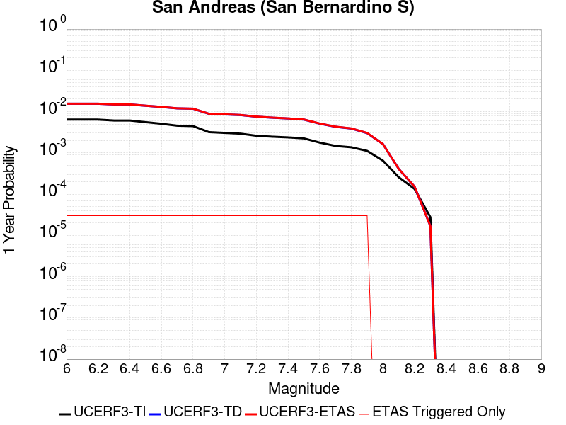 |  |

| Magnitude | 1 wk TI Prob | 1 wk TD Prob | 1 wk ETAS Prob | 1 wk ETAS/TD Gain | 1 wk ETAS Triggered Only | 1 mo TI Prob | 1 mo TD Prob | 1 mo ETAS Prob | 1 mo ETAS/TD Gain | 1 mo ETAS Triggered Only | 1 yr TI Prob | 1 yr TD Prob | 1 yr ETAS Prob | 1 yr ETAS/TD Gain | 1 yr ETAS Triggered Only | 10 yr TI Prob | 10 yr TD Prob | 10 yr ETAS Prob | 10 yr ETAS/TD Gain | 10 yr ETAS Triggered Only |
|-----|-----|-----|-----|-----|-----|-----|-----|-----|-----|-----|-----|-----|-----|-----|-----|-----|-----|-----|-----|-----|
| 6.0 | 1.2336002E-4 | 3.0003127E-4 | 3.0003127E-4 | 1.0 | 0.0 | 5.2857865E-4 | 0.0012852408 | 0.0012852408 | 1.0 | 0.0 | 0.006416472 | 0.015540493 | 0.015575715 | 1.0022665 | 3.5778176E-5 | 0.06234337 | 0.14283332 | 0.14287932 | 1.0003221 | 5.3667263E-5 |
| 6.1 | 1.2336002E-4 | 3.0003127E-4 | 3.0003127E-4 | 1.0 | 0.0 | 5.2857865E-4 | 0.0012852408 | 0.0012852408 | 1.0 | 0.0 | 0.006416472 | 0.015540493 | 0.015575715 | 1.0022665 | 3.5778176E-5 | 0.06234337 | 0.14283332 | 0.14287932 | 1.0003221 | 5.3667263E-5 |
| 6.2 | 1.2336002E-4 | 3.0003127E-4 | 3.0003127E-4 | 1.0 | 0.0 | 5.2857865E-4 | 0.0012852408 | 0.0012852408 | 1.0 | 0.0 | 0.006416472 | 0.015540493 | 0.015575715 | 1.0022665 | 3.5778176E-5 | 0.06234337 | 0.14283332 | 0.14287932 | 1.0003221 | 5.3667263E-5 |
| 6.3 | 1.1712257E-4 | 2.879145E-4 | 2.879145E-4 | 1.0 | 0.0 | 5.018573E-4 | 0.0012333614 | 0.0012333614 | 1.0 | 0.0 | 0.006093008 | 0.014917629 | 0.014952874 | 1.0023626 | 3.5778176E-5 | 0.059286322 | 0.1375418 | 0.13758808 | 1.0003365 | 5.3667263E-5 |
| 6.4 | 1.1712257E-4 | 2.879145E-4 | 2.879145E-4 | 1.0 | 0.0 | 5.018573E-4 | 0.0012333614 | 0.0012333614 | 1.0 | 0.0 | 0.006093008 | 0.014917629 | 0.014952874 | 1.0023626 | 3.5778176E-5 | 0.059286322 | 0.1375418 | 0.13758808 | 1.0003365 | 5.3667263E-5 |
| 6.5 | 1.0689076E-4 | 2.6804334E-4 | 2.6804334E-4 | 1.0 | 0.0 | 4.5802278E-4 | 0.0011482761 | 0.0011482761 | 1.0 | 0.0 | 0.0055621783 | 0.013895263 | 0.013930544 | 1.002539 | 3.5778176E-5 | 0.05425003 | 0.12878914 | 0.1288359 | 1.000363 | 5.3667263E-5 |
| 6.6 | 9.7648895E-5 | 2.5049172E-4 | 2.5049172E-4 | 1.0 | 0.0 | 4.1842813E-4 | 0.0010731178 | 0.0010731178 | 1.0 | 0.0 | 0.005082469 | 0.012991305 | 0.013026619 | 1.0027182 | 3.5778176E-5 | 0.049677886 | 0.12094915 | 0.120996326 | 1.00039 | 5.3667263E-5 |
| 6.7 | 8.757013E-5 | 2.3119988E-4 | 2.3119988E-4 | 1.0 | 0.0 | 3.7524657E-4 | 9.905027E-4 | 9.905027E-4 | 1.0 | 0.0 | 0.00455906 | 0.011996774 | 0.012032122 | 1.0029465 | 3.5778176E-5 | 0.04466656 | 0.11225749 | 0.11230513 | 1.0004244 | 5.3667263E-5 |
| 6.8 | 8.562978E-5 | 2.2679876E-4 | 2.2679876E-4 | 1.0 | 0.0 | 3.6693315E-4 | 9.7165484E-4 | 9.7165484E-4 | 1.0 | 0.0 | 0.004458263 | 0.011769796 | 0.0118051525 | 1.0030041 | 3.5778176E-5 | 0.043698758 | 0.11026781 | 0.11031556 | 1.0004331 | 5.3667263E-5 |
| 6.9 | 6.124075E-5 | 1.7064936E-4 | 1.7064936E-4 | 1.0 | 0.0 | 2.6243398E-4 | 7.311502E-4 | 7.311502E-4 | 1.0 | 0.0 | 0.0031904527 | 0.008865628 | 0.008901089 | 1.0039998 | 3.5778176E-5 | 0.031450346 | 0.08417915 | 0.08422829 | 1.0005839 | 5.3667263E-5 |
| 7.0 | 5.8598747E-5 | 1.6493963E-4 | 1.6493963E-4 | 1.0 | 0.0 | 2.5111332E-4 | 7.0669345E-4 | 7.0669345E-4 | 1.0 | 0.0 | 0.0030530186 | 0.008570245 | 0.008605717 | 1.004139 | 3.5778176E-5 | 0.03011414 | 0.08149692 | 0.08154621 | 1.0006049 | 5.3667263E-5 |
| 7.1 | 5.613814E-5 | 1.5912524E-4 | 1.5912524E-4 | 1.0 | 0.0 | 2.4056983E-4 | 6.817878E-4 | 6.817878E-4 | 1.0 | 0.0 | 0.0029250039 | 0.008269355 | 0.008304837 | 1.0042908 | 3.5778176E-5 | 0.028868021 | 0.07879588 | 0.078845315 | 1.0006274 | 5.3667263E-5 |
| 7.2 | 4.991222E-5 | 1.4519015E-4 | 1.4519015E-4 | 1.0 | 0.0 | 2.1389198E-4 | 6.220955E-4 | 6.220955E-4 | 1.0 | 0.0 | 0.002601025 | 0.007547813 | 0.007583321 | 1.0047045 | 3.5778176E-5 | 0.025707912 | 0.072249845 | 0.07229964 | 1.0006891 | 5.3667263E-5 |
| 7.3 | 4.7410045E-5 | 1.371324E-4 | 1.371324E-4 | 1.0 | 0.0 | 2.0317009E-4 | 5.875783E-4 | 5.875783E-4 | 1.0 | 0.0 | 0.0024707897 | 0.007130386 | 0.0071659093 | 1.0049819 | 3.5778176E-5 | 0.024434982 | 0.06853227 | 0.06858226 | 1.0007294 | 5.3667263E-5 |
| 7.4 | 4.5556746E-5 | 1.3121162E-4 | 1.3121162E-4 | 1.0 | 0.0 | 1.952286E-4 | 5.6221464E-4 | 5.6221464E-4 | 1.0 | 0.0 | 0.002374317 | 0.006823559 | 0.006859093 | 1.0052075 | 3.5778176E-5 | 0.023491086 | 0.06578475 | 0.06583489 | 1.0007621 | 5.3667263E-5 |
| 7.5 | 4.3084514E-5 | 1.2356513E-4 | 1.2356513E-4 | 1.0 | 0.0 | 1.8463485E-4 | 5.2945764E-4 | 5.2945764E-4 | 1.0 | 0.0 | 0.0022456115 | 0.006427166 | 0.006462714 | 1.005531 | 3.5778176E-5 | 0.022230545 | 0.062185578 | 0.062235907 | 1.0008093 | 5.3667263E-5 |
| 7.6 | 3.408608E-5 | 9.834847E-5 | 9.834847E-5 | 1.0 | 0.0 | 1.4607502E-4 | 4.2142547E-4 | 4.2142547E-4 | 1.0 | 0.0 | 0.0017770125 | 0.00511881 | 0.005154405 | 1.0069537 | 3.5778176E-5 | 0.017628696 | 0.050017312 | 0.050068296 | 1.0010194 | 5.3667263E-5 |
| 7.7 | 2.8315713E-5 | 8.2480474E-5 | 8.2480474E-5 | 1.0 | 0.0 | 1.2134742E-4 | 3.534399E-4 | 3.534399E-4 | 1.0 | 0.0 | 0.0014764034 | 0.004294649 | 0.0043302737 | 1.008295 | 3.5778176E-5 | 0.01466633 | 0.04226858 | 0.042319983 | 1.001216 | 5.3667263E-5 |
| 7.8 | 2.6222975E-5 | 7.462497E-5 | 7.462497E-5 | 1.0 | 0.0 | 1.1237934E-4 | 3.1978212E-4 | 3.1978212E-4 | 1.0 | 0.0 | 0.0013673597 | 0.003886403 | 0.0039220424 | 1.0091702 | 3.5778176E-5 | 0.013589768 | 0.038434092 | 0.0384857 | 1.0013427 | 5.3667263E-5 |
| 7.9 | 2.1469694E-5 | 5.7873713E-5 | 5.7873713E-5 | 1.0 | 0.0 | 9.200973E-5 | 2.4800663E-4 | 2.4800663E-4 | 1.0 | 0.0 | 0.0011196428 | 0.003015303 | 0.0030509734 | 1.0118297 | 3.5778176E-5 | 0.011140184 | 0.03014987 | 0.030201918 | 1.0017264 | 5.3667263E-5 |
| 8.0 | 1.2420249E-5 | 3.1316227E-5 | 3.1316227E-5 | 1.0 | 0.0 | 5.322855E-5 | 1.342055E-4 | 1.342055E-4 | 1.0 | 0.0 | 6.478649E-4 | 0.0016327285 | 0.0016327285 | 1.0 | 0.0 | 0.0064597935 | 0.01652123 | 0.01652123 | 1.0 | 0.0 |
| 8.1 | 4.9197724E-6 | 7.82136E-6 | 7.82136E-6 | 1.0 | 0.0 | 2.1084568E-5 | 3.3519682E-5 | 3.3519682E-5 | 1.0 | 0.0 | 2.566744E-4 | 4.0802584E-4 | 4.0802584E-4 | 1.0 | 0.0 | 0.002563781 | 0.004383873 | 0.004383873 | 1.0 | 0.0 |
| 8.2 | 2.5634774E-6 | 2.9062624E-6 | 2.9062624E-6 | 1.0 | 0.0 | 1.0986286E-5 | 1.2455351E-5 | 1.2455351E-5 | 1.0 | 0.0 | 1.3374983E-4 | 1.5163339E-4 | 1.5163339E-4 | 1.0 | 0.0 | 0.0013366934 | 0.001704734 | 0.001704734 | 1.0 | 0.0 |
| 8.3 | 5.2850464E-7 | 3.2082596E-7 | 3.2082596E-7 | 1.0 | 0.0 | 2.2650179E-6 | 1.3749678E-6 | 1.3749678E-6 | 1.0 | 0.0 | 2.7576245E-5 | 1.6740116E-5 | 1.6740116E-5 | 1.0 | 0.0 | 2.7572823E-4 | 1.9866871E-4 | 1.9866871E-4 | 1.0 | 0.0 |

## Ludlow
*[(top)](#table-of-contents)*

| 1 Week | 1 Month | 1 Year | 10 Year |
|-----|-----|-----|-----|
|  |  |  |  |

| Magnitude | 1 wk TI Prob | 1 wk TD Prob | 1 wk ETAS Prob | 1 wk ETAS/TD Gain | 1 wk ETAS Triggered Only | 1 mo TI Prob | 1 mo TD Prob | 1 mo ETAS Prob | 1 mo ETAS/TD Gain | 1 mo ETAS Triggered Only | 1 yr TI Prob | 1 yr TD Prob | 1 yr ETAS Prob | 1 yr ETAS/TD Gain | 1 yr ETAS Triggered Only | 10 yr TI Prob | 10 yr TD Prob | 10 yr ETAS Prob | 10 yr ETAS/TD Gain | 10 yr ETAS Triggered Only |
|-----|-----|-----|-----|-----|-----|-----|-----|-----|-----|-----|-----|-----|-----|-----|-----|-----|-----|-----|-----|-----|
| 6.0 | 2.2407607E-5 | 2.3657218E-5 | 2.3657218E-5 | 1.0 | 0.0 | 9.602906E-5 | 1.0138439E-4 | 1.1927166E-4 | 1.1764302 | 1.7889088E-5 | 0.0011685267 | 0.0012337001 | 0.0012515672 | 1.0144825 | 1.7889088E-5 | 0.011624013 | 0.012273024 | 0.012326033 | 1.0043191 | 5.3667263E-5 |
| 6.1 | 2.2407607E-5 | 2.3657218E-5 | 2.3657218E-5 | 1.0 | 0.0 | 9.602906E-5 | 1.0138439E-4 | 1.1927166E-4 | 1.1764302 | 1.7889088E-5 | 0.0011685267 | 0.0012337001 | 0.0012515672 | 1.0144825 | 1.7889088E-5 | 0.011624013 | 0.012273024 | 0.012326033 | 1.0043191 | 5.3667263E-5 |
| 6.2 | 1.0781252E-5 | 1.1365647E-5 | 1.1365647E-5 | 1.0 | 0.0 | 4.620455E-5 | 4.870903E-5 | 6.659725E-5 | 1.3672464 | 1.7889088E-5 | 5.623952E-4 | 5.928751E-4 | 6.107536E-4 | 1.0301555 | 1.7889088E-5 | 0.00560974 | 0.0059133526 | 0.0059489193 | 1.0060146 | 3.5778176E-5 |
| 6.3 | 1.0781252E-5 | 1.1365647E-5 | 1.1365647E-5 | 1.0 | 0.0 | 4.620455E-5 | 4.870903E-5 | 6.659725E-5 | 1.3672464 | 1.7889088E-5 | 5.623952E-4 | 5.928751E-4 | 6.107536E-4 | 1.0301555 | 1.7889088E-5 | 0.00560974 | 0.0059133526 | 0.0059489193 | 1.0060146 | 3.5778176E-5 |
| 6.4 | 7.814439E-6 | 8.237717E-6 | 8.237717E-6 | 1.0 | 0.0 | 3.3490025E-5 | 3.530403E-5 | 5.319249E-5 | 1.5066973 | 1.7889088E-5 | 4.0766477E-4 | 4.297432E-4 | 4.476246E-4 | 1.0416095 | 1.7889088E-5 | 0.0040691774 | 0.0042892685 | 0.0043070805 | 1.0041528 | 1.7889088E-5 |
| 6.5 | 6.4986366E-6 | 6.85091E-6 | 6.85091E-6 | 1.0 | 0.0 | 2.7851002E-5 | 2.9360717E-5 | 4.724928E-5 | 1.6092685 | 1.7889088E-5 | 3.390332E-4 | 3.57409E-4 | 3.752917E-4 | 1.0500343 | 1.7889088E-5 | 0.003385164 | 0.003568438 | 0.0035862634 | 1.0049952 | 1.7889088E-5 |
| 6.6 | 5.582177E-6 | 5.885997E-6 | 5.885997E-6 | 1.0 | 0.0 | 2.3923398E-5 | 2.5225461E-5 | 4.3114098E-5 | 1.70915 | 1.7889088E-5 | 2.9122844E-4 | 3.0707743E-4 | 3.2496103E-4 | 1.058238 | 1.7889088E-5 | 0.0029084706 | 0.0030666045 | 0.0030844386 | 1.0058156 | 1.7889088E-5 |
| 6.7 | 4.6858763E-6 | 4.9404202E-6 | 4.9404202E-6 | 1.0 | 0.0 | 2.0082172E-5 | 2.117306E-5 | 3.9061768E-5 | 1.8448807 | 1.7889088E-5 | 2.4447302E-4 | 2.5775208E-4 | 2.7563656E-4 | 1.0693864 | 1.7889088E-5 | 0.0024420423 | 0.0025745875 | 0.0025924307 | 1.0069305 | 1.7889088E-5 |
| 6.8 | 3.5584908E-6 | 3.7520128E-6 | 3.7520128E-6 | 1.0 | 0.0 | 1.5250586E-5 | 1.607996E-5 | 1.607996E-5 | 1.0 | 0.0 | 1.8566006E-4 | 1.9575632E-4 | 1.9575632E-4 | 1.0 | 0.0 | 0.0018550502 | 0.0019558799 | 0.0019558799 | 1.0 | 0.0 |
| 6.9 | 2.532834E-6 | 2.6709995E-6 | 2.6709995E-6 | 1.0 | 0.0 | 1.0854958E-5 | 1.1447092E-5 | 1.1447092E-5 | 1.0 | 0.0 | 1.3215111E-4 | 1.3935972E-4 | 1.3935972E-4 | 1.0 | 0.0 | 0.0013207254 | 0.0013927508 | 0.0013927508 | 1.0 | 0.0 |
| 7.0 | 1.7083285E-6 | 1.8019413E-6 | 1.8019413E-6 | 1.0 | 0.0 | 7.3213873E-6 | 7.722583E-6 | 7.722583E-6 | 1.0 | 0.0 | 8.913424E-5 | 9.4018564E-5 | 9.4018564E-5 | 1.0 | 0.0 | 8.9098496E-4 | 9.3980436E-4 | 9.3980436E-4 | 1.0 | 0.0 |
| 7.1 | 1.0905424E-6 | 1.1497604E-6 | 1.1497604E-6 | 1.0 | 0.0 | 4.6737446E-6 | 4.9275354E-6 | 4.9275354E-6 | 1.0 | 0.0 | 5.6901354E-5 | 5.999119E-5 | 5.999119E-5 | 1.0 | 0.0 | 5.6886784E-4 | 5.9975975E-4 | 5.9975975E-4 | 1.0 | 0.0 |
| 7.2 | 6.06668E-7 | 6.387269E-7 | 6.387269E-7 | 1.0 | 0.0 | 2.600003E-6 | 2.7373983E-6 | 2.7373983E-6 | 1.0 | 0.0 | 3.1654577E-5 | 3.3327386E-5 | 3.3327386E-5 | 1.0 | 0.0 | 3.1650066E-4 | 3.332307E-4 | 3.332307E-4 | 1.0 | 0.0 |

## Scodie Lineament
*[(top)](#table-of-contents)*

| 1 Week | 1 Month | 1 Year | 10 Year |
|-----|-----|-----|-----|
|  | 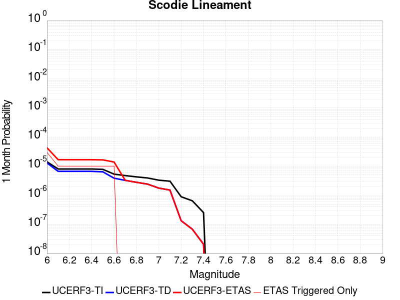 |  |  |

| Magnitude | 1 wk TI Prob | 1 wk TD Prob | 1 wk ETAS Prob | 1 wk ETAS/TD Gain | 1 wk ETAS Triggered Only | 1 mo TI Prob | 1 mo TD Prob | 1 mo ETAS Prob | 1 mo ETAS/TD Gain | 1 mo ETAS Triggered Only | 1 yr TI Prob | 1 yr TD Prob | 1 yr ETAS Prob | 1 yr ETAS/TD Gain | 1 yr ETAS Triggered Only | 10 yr TI Prob | 10 yr TD Prob | 10 yr ETAS Prob | 10 yr ETAS/TD Gain | 10 yr ETAS Triggered Only |
|-----|-----|-----|-----|-----|-----|-----|-----|-----|-----|-----|-----|-----|-----|-----|-----|-----|-----|-----|-----|-----|
| 6.0 | 3.2919327E-6 | 3.0133394E-6 | 5.668044E-5 | 18.809843 | 5.3667263E-5 | 1.4108206E-5 | 1.2914265E-5 | 6.658083E-5 | 5.155604 | 5.3667263E-5 | 1.7175387E-4 | 1.5722301E-4 | 2.1088184E-4 | 1.3412912 | 5.3667263E-5 | 0.0017162118 | 0.0015714294 | 0.0016250124 | 1.0340983 | 5.3667263E-5 |
| 6.1 | 1.8663811E-6 | 1.5490481E-6 | 1.9438108E-5 | 12.548421 | 1.7889088E-5 | 7.998751E-6 | 6.638764E-6 | 2.4527733E-5 | 3.6946235 | 1.7889088E-5 | 9.738045E-5 | 8.0824444E-5 | 9.871209E-5 | 1.2213148 | 1.7889088E-5 | 9.7337784E-4 | 8.0799934E-4 | 8.258739E-4 | 1.0221221 | 1.7889088E-5 |
| 6.2 | 1.8663811E-6 | 1.5490481E-6 | 1.9438108E-5 | 12.548421 | 1.7889088E-5 | 7.998751E-6 | 6.638764E-6 | 2.4527733E-5 | 3.6946235 | 1.7889088E-5 | 9.738045E-5 | 8.0824444E-5 | 9.871209E-5 | 1.2213148 | 1.7889088E-5 | 9.7337784E-4 | 8.0799934E-4 | 8.258739E-4 | 1.0221221 | 1.7889088E-5 |
| 6.3 | 1.8663811E-6 | 1.5490481E-6 | 1.9438108E-5 | 12.548421 | 1.7889088E-5 | 7.998751E-6 | 6.638764E-6 | 2.4527733E-5 | 3.6946235 | 1.7889088E-5 | 9.738045E-5 | 8.0824444E-5 | 9.871209E-5 | 1.2213148 | 1.7889088E-5 | 9.7337784E-4 | 8.0799934E-4 | 8.258739E-4 | 1.0221221 | 1.7889088E-5 |
| 6.4 | 1.8663811E-6 | 1.5490481E-6 | 1.9438108E-5 | 12.548421 | 1.7889088E-5 | 7.998751E-6 | 6.638764E-6 | 2.4527733E-5 | 3.6946235 | 1.7889088E-5 | 9.738045E-5 | 8.0824444E-5 | 9.871209E-5 | 1.2213148 | 1.7889088E-5 | 9.7337784E-4 | 8.0799934E-4 | 8.258739E-4 | 1.0221221 | 1.7889088E-5 |
| 6.5 | 1.8106311E-6 | 1.4909822E-6 | 1.9380042E-5 | 12.998172 | 1.7889088E-5 | 7.759824E-6 | 6.389911E-6 | 2.4278885E-5 | 3.7995653 | 1.7889088E-5 | 9.447177E-5 | 7.779488E-5 | 9.568258E-5 | 1.2299341 | 1.7889088E-5 | 9.4431615E-4 | 7.777252E-4 | 7.9560035E-4 | 1.0229839 | 1.7889088E-5 |
| 6.6 | 1.2414679E-6 | 8.9975464E-7 | 1.8788825E-5 | 20.882166 | 1.7889088E-5 | 5.320566E-6 | 3.856086E-6 | 2.1745105E-5 | 5.639165 | 1.7889088E-5 | 6.477596E-5 | 4.6946923E-5 | 6.483517E-5 | 1.3810313 | 1.7889088E-5 | 6.475708E-4 | 4.6937872E-4 | 4.872594E-4 | 1.0380944 | 1.7889088E-5 |
| 6.7 | 1.1062215E-6 | 7.594301E-7 | 7.594301E-7 | 1.0 | 0.0 | 4.7409408E-6 | 3.2546968E-6 | 3.2546968E-6 | 1.0 | 0.0 | 5.7719422E-5 | 3.9625284E-5 | 3.9625284E-5 | 1.0 | 0.0 | 5.770443E-4 | 3.9618916E-4 | 3.9618916E-4 | 1.0 | 0.0 |
| 6.8 | 1.0006736E-6 | 6.5003877E-7 | 6.5003877E-7 | 1.0 | 0.0 | 4.288594E-6 | 2.785878E-6 | 2.785878E-6 | 1.0 | 0.0 | 5.221238E-5 | 3.3917597E-5 | 3.3917597E-5 | 1.0 | 0.0 | 5.220012E-4 | 3.391303E-4 | 3.391303E-4 | 1.0 | 0.0 |
| 6.9 | 9.167364E-7 | 5.631617E-7 | 5.631617E-7 | 1.0 | 0.0 | 3.9288643E-6 | 2.4135481E-6 | 2.4135481E-6 | 1.0 | 0.0 | 4.7832873E-5 | 2.938461E-5 | 2.938461E-5 | 1.0 | 0.0 | 4.782258E-4 | 2.9381292E-4 | 2.9381292E-4 | 1.0 | 0.0 |
| 7.0 | 7.6987664E-7 | 4.1133762E-7 | 4.1133762E-7 | 1.0 | 0.0 | 3.2994672E-6 | 1.7628746E-6 | 1.7628746E-6 | 1.0 | 0.0 | 4.0170275E-5 | 2.1462827E-5 | 2.1462827E-5 | 1.0 | 0.0 | 4.0163012E-4 | 2.1461138E-4 | 2.1461138E-4 | 1.0 | 0.0 |
| 7.1 | 7.1038727E-7 | 3.521143E-7 | 3.521143E-7 | 1.0 | 0.0 | 3.0445133E-6 | 1.5090607E-6 | 1.5090607E-6 | 1.0 | 0.0 | 3.706632E-5 | 1.8372695E-5 | 1.8372695E-5 | 1.0 | 0.0 | 3.7060137E-4 | 1.8371525E-4 | 1.8371525E-4 | 1.0 | 0.0 |
| 7.2 | 2.0799602E-7 | 3.1186687E-8 | 3.1186687E-8 | 1.0 | 0.0 | 8.914113E-7 | 1.3365722E-7 | 1.3365722E-7 | 1.0 | 0.0 | 1.0852878E-5 | 1.6272755E-6 | 1.6272755E-6 | 1.0 | 0.0 | 1.08523476E-4 | 1.6272643E-5 | 1.6272643E-5 | 1.0 | 0.0 |
| 7.3 | 1.5048182E-7 | 1.5945583E-8 | 1.5945583E-8 | 1.0 | 0.0 | 6.449219E-7 | 6.833821E-8 | 6.833821E-8 | 1.0 | 0.0 | 7.851896E-6 | 8.320174E-7 | 8.320174E-7 | 1.0 | 0.0 | 7.851618E-5 | 8.320146E-6 | 8.320146E-6 | 1.0 | 0.0 |
| 7.4 | 5.9334678E-8 | 4.868311E-9 | 4.868311E-9 | 1.0 | 0.0 | 2.5429145E-7 | 2.0864192E-8 | 2.0864192E-8 | 1.0 | 0.0 | 3.095994E-6 | 2.540215E-7 | 2.540215E-7 | 1.0 | 0.0 | 3.095951E-5 | 2.5402135E-6 | 2.5402135E-6 | 1.0 | 0.0 |

## San Jacinto (Lytle Creek connector)
*[(top)](#table-of-contents)*

| 1 Week | 1 Month | 1 Year | 10 Year |
|-----|-----|-----|-----|
|  |  |  |  |

| Magnitude | 1 wk TI Prob | 1 wk TD Prob | 1 wk ETAS Prob | 1 wk ETAS/TD Gain | 1 wk ETAS Triggered Only | 1 mo TI Prob | 1 mo TD Prob | 1 mo ETAS Prob | 1 mo ETAS/TD Gain | 1 mo ETAS Triggered Only | 1 yr TI Prob | 1 yr TD Prob | 1 yr ETAS Prob | 1 yr ETAS/TD Gain | 1 yr ETAS Triggered Only | 10 yr TI Prob | 10 yr TD Prob | 10 yr ETAS Prob | 10 yr ETAS/TD Gain | 10 yr ETAS Triggered Only |
|-----|-----|-----|-----|-----|-----|-----|-----|-----|-----|-----|-----|-----|-----|-----|-----|-----|-----|-----|-----|-----|
| 6.0 | 6.693995E-6 | 6.6596795E-6 | 6.6596795E-6 | 1.0 | 0.0 | 2.8688235E-5 | 2.8541172E-5 | 2.8541172E-5 | 1.0 | 0.0 | 3.492233E-4 | 3.4743344E-4 | 3.8319916E-4 | 1.1029427 | 3.5778176E-5 | 0.00348675 | 0.0035491067 | 0.0035847577 | 1.0100452 | 3.5778176E-5 |
| 6.1 | 6.693995E-6 | 6.6596795E-6 | 6.6596795E-6 | 1.0 | 0.0 | 2.8688235E-5 | 2.8541172E-5 | 2.8541172E-5 | 1.0 | 0.0 | 3.492233E-4 | 3.4743344E-4 | 3.8319916E-4 | 1.1029427 | 3.5778176E-5 | 0.00348675 | 0.0035491067 | 0.0035847577 | 1.0100452 | 3.5778176E-5 |
| 6.2 | 6.693995E-6 | 6.6596795E-6 | 6.6596795E-6 | 1.0 | 0.0 | 2.8688235E-5 | 2.8541172E-5 | 2.8541172E-5 | 1.0 | 0.0 | 3.492233E-4 | 3.4743344E-4 | 3.8319916E-4 | 1.1029427 | 3.5778176E-5 | 0.00348675 | 0.0035491067 | 0.0035847577 | 1.0100452 | 3.5778176E-5 |
| 6.3 | 6.693995E-6 | 6.6596795E-6 | 6.6596795E-6 | 1.0 | 0.0 | 2.8688235E-5 | 2.8541172E-5 | 2.8541172E-5 | 1.0 | 0.0 | 3.492233E-4 | 3.4743344E-4 | 3.8319916E-4 | 1.1029427 | 3.5778176E-5 | 0.00348675 | 0.0035491067 | 0.0035847577 | 1.0100452 | 3.5778176E-5 |
| 6.4 | 6.693995E-6 | 6.6596795E-6 | 6.6596795E-6 | 1.0 | 0.0 | 2.8688235E-5 | 2.8541172E-5 | 2.8541172E-5 | 1.0 | 0.0 | 3.492233E-4 | 3.4743344E-4 | 3.8319916E-4 | 1.1029427 | 3.5778176E-5 | 0.00348675 | 0.0035491067 | 0.0035847577 | 1.0100452 | 3.5778176E-5 |
| 6.5 | 6.6561875E-6 | 6.6198977E-6 | 6.6198977E-6 | 1.0 | 0.0 | 2.8526205E-5 | 2.8370681E-5 | 2.8370681E-5 | 1.0 | 0.0 | 3.472512E-4 | 3.4535836E-4 | 3.811242E-4 | 1.1035615 | 3.5778176E-5 | 0.0034670907 | 0.003528422 | 0.003564074 | 1.0101042 | 3.5778176E-5 |
| 6.6 | 6.6561875E-6 | 6.6198977E-6 | 6.6198977E-6 | 1.0 | 0.0 | 2.8526205E-5 | 2.8370681E-5 | 2.8370681E-5 | 1.0 | 0.0 | 3.472512E-4 | 3.4535836E-4 | 3.811242E-4 | 1.1035615 | 3.5778176E-5 | 0.0034670907 | 0.003528422 | 0.003564074 | 1.0101042 | 3.5778176E-5 |
| 6.7 | 6.5802237E-6 | 6.5390745E-6 | 6.5390745E-6 | 1.0 | 0.0 | 2.8200653E-5 | 2.8024304E-5 | 2.8024304E-5 | 1.0 | 0.0 | 3.4328885E-4 | 3.4114256E-4 | 3.7690852E-4 | 1.1048417 | 3.5778176E-5 | 0.0034275902 | 0.0034863965 | 0.00352205 | 1.0102265 | 3.5778176E-5 |
| 6.8 | 6.575632E-6 | 6.533564E-6 | 6.533564E-6 | 1.0 | 0.0 | 2.8180975E-5 | 2.8000688E-5 | 2.8000688E-5 | 1.0 | 0.0 | 3.4304935E-4 | 3.4085513E-4 | 3.7662112E-4 | 1.1049302 | 3.5778176E-5 | 0.0034252026 | 0.0034835313 | 0.003519185 | 1.0102348 | 3.5778176E-5 |
| 6.9 | 6.570433E-6 | 6.5249583E-6 | 6.5249583E-6 | 1.0 | 0.0 | 2.8158694E-5 | 2.7963808E-5 | 2.7963808E-5 | 1.0 | 0.0 | 3.4277816E-4 | 3.4040623E-4 | 3.7617225E-4 | 1.1050686 | 3.5778176E-5 | 0.0034224992 | 0.0034790565 | 0.0035147103 | 1.0102481 | 3.5778176E-5 |
| 7.0 | 6.5643826E-6 | 6.5150793E-6 | 6.5150793E-6 | 1.0 | 0.0 | 2.8132765E-5 | 2.7921471E-5 | 2.7921471E-5 | 1.0 | 0.0 | 3.424626E-4 | 3.3989095E-4 | 3.7565696E-4 | 1.105228 | 3.5778176E-5 | 0.0034193532 | 0.0034739198 | 0.0035095736 | 1.0102633 | 3.5778176E-5 |
| 7.1 | 6.557402E-6 | 6.5037916E-6 | 6.5037916E-6 | 1.0 | 0.0 | 2.8102848E-5 | 2.7873095E-5 | 2.7873095E-5 | 1.0 | 0.0 | 3.4209844E-4 | 3.3930215E-4 | 3.750682E-4 | 1.1054106 | 3.5778176E-5 | 0.0034157229 | 0.0034680513 | 0.0035037054 | 1.0102807 | 3.5778176E-5 |
| 7.2 | 6.546394E-6 | 6.485758E-6 | 6.485758E-6 | 1.0 | 0.0 | 2.8055672E-5 | 2.7795812E-5 | 2.7795812E-5 | 1.0 | 0.0 | 3.4152428E-4 | 3.383615E-4 | 3.741276E-4 | 1.1057037 | 3.5778176E-5 | 0.0034099987 | 0.0034586787 | 0.003494333 | 1.0103087 | 3.5778176E-5 |
| 7.3 | 6.5364216E-6 | 6.4665446E-6 | 6.4665446E-6 | 1.0 | 0.0 | 2.8012933E-5 | 2.7713468E-5 | 2.7713468E-5 | 1.0 | 0.0 | 3.4100408E-4 | 3.3735932E-4 | 3.7312543E-4 | 1.1060178 | 3.5778176E-5 | 0.003404813 | 0.0034487005 | 0.0034843553 | 1.0103387 | 3.5778176E-5 |
| 7.4 | 6.5269523E-6 | 6.447632E-6 | 6.447632E-6 | 1.0 | 0.0 | 2.7972354E-5 | 2.7632417E-5 | 2.7632417E-5 | 1.0 | 0.0 | 3.4051016E-4 | 3.3637282E-4 | 3.7213895E-4 | 1.1063288 | 3.5778176E-5 | 0.0033998888 | 0.0034388828 | 0.003474538 | 1.0103682 | 3.5778176E-5 |
| 7.5 | 6.5111835E-6 | 6.423907E-6 | 6.423907E-6 | 1.0 | 0.0 | 2.7904773E-5 | 2.753074E-5 | 2.753074E-5 | 1.0 | 0.0 | 3.3968766E-4 | 3.3513526E-4 | 3.7090146E-4 | 1.1067216 | 3.5778176E-5 | 0.0033916887 | 0.0034265562 | 0.0034622117 | 1.0104057 | 3.5778176E-5 |
| 7.6 | 6.4768806E-6 | 6.3830166E-6 | 6.3830166E-6 | 1.0 | 0.0 | 2.7757764E-5 | 2.73555E-5 | 2.73555E-5 | 1.0 | 0.0 | 3.3789838E-4 | 3.330024E-4 | 3.6876864E-4 | 1.1074054 | 3.5778176E-5 | 0.0033738504 | 0.0034052888 | 0.003440945 | 1.0104709 | 3.5778176E-5 |
| 7.7 | 6.1655364E-6 | 6.1755063E-6 | 6.1755063E-6 | 1.0 | 0.0 | 2.642346E-5 | 2.6466189E-5 | 2.6466189E-5 | 1.0 | 0.0 | 3.2165812E-4 | 3.2217827E-4 | 3.579449E-4 | 1.1110151 | 3.5778176E-5 | 0.0032119295 | 0.0032969064 | 0.0033325667 | 1.0108162 | 3.5778176E-5 |
| 7.8 | 5.5043524E-6 | 5.736582E-6 | 5.736582E-6 | 1.0 | 0.0 | 2.3589868E-5 | 2.4585119E-5 | 2.4585119E-5 | 1.0 | 0.0 | 2.871688E-4 | 2.9928278E-4 | 3.3505025E-4 | 1.1195107 | 3.5778176E-5 | 0.0028679797 | 0.0030670157 | 0.0031026842 | 1.0116297 | 3.5778176E-5 |
| 7.9 | 3.889249E-6 | 4.076342E-6 | 4.076342E-6 | 1.0 | 0.0 | 1.6668104E-5 | 1.7469922E-5 | 1.7469922E-5 | 1.0 | 0.0 | 2.0291525E-4 | 2.1267557E-4 | 2.3056085E-4 | 1.0840966 | 1.7889088E-5 | 0.0020273007 | 0.0021941126 | 0.0022119626 | 1.0081353 | 1.7889088E-5 |
| 8.0 | 2.668535E-6 | 2.5312252E-6 | 2.5312252E-6 | 1.0 | 0.0 | 1.1436528E-5 | 1.0848063E-5 | 1.0848063E-5 | 1.0 | 0.0 | 1.3923083E-4 | 1.3206719E-4 | 1.3206719E-4 | 1.0 | 0.0 | 0.0013914363 | 0.0013756427 | 0.0013756427 | 1.0 | 0.0 |
| 8.1 | 1.5911459E-6 | 1.2185061E-6 | 1.2185061E-6 | 1.0 | 0.0 | 6.8191785E-6 | 5.2221585E-6 | 5.2221585E-6 | 1.0 | 0.0 | 8.3020335E-5 | 6.357795E-5 | 6.357795E-5 | 1.0 | 0.0 | 8.298933E-4 | 6.692392E-4 | 6.692392E-4 | 1.0 | 0.0 |
| 8.2 | 6.1294963E-7 | 2.1807648E-7 | 2.1807648E-7 | 1.0 | 0.0 | 2.6269242E-6 | 9.346131E-7 | 9.346131E-7 | 1.0 | 0.0 | 3.1982334E-5 | 1.1378856E-5 | 1.1378856E-5 | 1.0 | 0.0 | 3.1977732E-4 | 1.2781945E-4 | 1.2781945E-4 | 1.0 | 0.0 |
| 8.3 | 1.762871E-7 | 4.753523E-8 | 4.753523E-8 | 1.0 | 0.0 | 7.5551594E-7 | 2.037224E-7 | 2.037224E-7 | 1.0 | 0.0 | 9.1983675E-6 | 2.4803173E-6 | 2.4803173E-6 | 1.0 | 0.0 | 9.197987E-5 | 2.8680868E-5 | 2.8680868E-5 | 1.0 | 0.0 |

## Johnson Valley (No) 2011 rev
*[(top)](#table-of-contents)*

| 1 Week | 1 Month | 1 Year | 10 Year |
|-----|-----|-----|-----|
|  |  |  |  |

| Magnitude | 1 wk TI Prob | 1 wk TD Prob | 1 wk ETAS Prob | 1 wk ETAS/TD Gain | 1 wk ETAS Triggered Only | 1 mo TI Prob | 1 mo TD Prob | 1 mo ETAS Prob | 1 mo ETAS/TD Gain | 1 mo ETAS Triggered Only | 1 yr TI Prob | 1 yr TD Prob | 1 yr ETAS Prob | 1 yr ETAS/TD Gain | 1 yr ETAS Triggered Only | 10 yr TI Prob | 10 yr TD Prob | 10 yr ETAS Prob | 10 yr ETAS/TD Gain | 10 yr ETAS Triggered Only |
|-----|-----|-----|-----|-----|-----|-----|-----|-----|-----|-----|-----|-----|-----|-----|-----|-----|-----|-----|-----|-----|
| 6.0 | 2.577707E-5 | 1.2900895E-5 | 1.2900895E-5 | 1.0 | 0.0 | 1.1046848E-4 | 5.52886E-5 | 5.52886E-5 | 1.0 | 0.0 | 0.0013441239 | 6.7297055E-4 | 6.7297055E-4 | 1.0 | 0.0 | 0.013360229 | 0.006713235 | 0.0067487727 | 1.0052937 | 3.5778176E-5 |
| 6.1 | 2.577707E-5 | 1.2900895E-5 | 1.2900895E-5 | 1.0 | 0.0 | 1.1046848E-4 | 5.52886E-5 | 5.52886E-5 | 1.0 | 0.0 | 0.0013441239 | 6.7297055E-4 | 6.7297055E-4 | 1.0 | 0.0 | 0.013360229 | 0.006713235 | 0.0067487727 | 1.0052937 | 3.5778176E-5 |
| 6.2 | 2.577707E-5 | 1.2900895E-5 | 1.2900895E-5 | 1.0 | 0.0 | 1.1046848E-4 | 5.52886E-5 | 5.52886E-5 | 1.0 | 0.0 | 0.0013441239 | 6.7297055E-4 | 6.7297055E-4 | 1.0 | 0.0 | 0.013360229 | 0.006713235 | 0.0067487727 | 1.0052937 | 3.5778176E-5 |
| 6.3 | 2.577707E-5 | 1.2900895E-5 | 1.2900895E-5 | 1.0 | 0.0 | 1.1046848E-4 | 5.52886E-5 | 5.52886E-5 | 1.0 | 0.0 | 0.0013441239 | 6.7297055E-4 | 6.7297055E-4 | 1.0 | 0.0 | 0.013360229 | 0.006713235 | 0.0067487727 | 1.0052937 | 3.5778176E-5 |
| 6.4 | 1.5296591E-5 | 7.536715E-6 | 7.536715E-6 | 1.0 | 0.0 | 6.555518E-5 | 3.229991E-5 | 3.229991E-5 | 1.0 | 0.0 | 7.97842E-4 | 3.9319924E-4 | 3.9319924E-4 | 1.0 | 0.0 | 0.007949836 | 0.0039268765 | 0.0039446955 | 1.0045377 | 1.7889088E-5 |
| 6.5 | 1.5296591E-5 | 7.536715E-6 | 7.536715E-6 | 1.0 | 0.0 | 6.555518E-5 | 3.229991E-5 | 3.229991E-5 | 1.0 | 0.0 | 7.97842E-4 | 3.9319924E-4 | 3.9319924E-4 | 1.0 | 0.0 | 0.007949836 | 0.0039268765 | 0.0039446955 | 1.0045377 | 1.7889088E-5 |
| 6.6 | 1.3289383E-5 | 5.991708E-6 | 5.991708E-6 | 1.0 | 0.0 | 5.6953253E-5 | 2.5678592E-5 | 2.5678592E-5 | 1.0 | 0.0 | 6.9318525E-4 | 3.1260896E-4 | 3.1260896E-4 | 1.0 | 0.0 | 0.0069102696 | 0.0031233565 | 0.0031233565 | 1.0 | 0.0 |
| 6.7 | 1.3289383E-5 | 5.991708E-6 | 5.991708E-6 | 1.0 | 0.0 | 5.6953253E-5 | 2.5678592E-5 | 2.5678592E-5 | 1.0 | 0.0 | 6.9318525E-4 | 3.1260896E-4 | 3.1260896E-4 | 1.0 | 0.0 | 0.0069102696 | 0.0031233565 | 0.0031233565 | 1.0 | 0.0 |
| 6.8 | 8.330789E-6 | 2.9211749E-6 | 2.9211749E-6 | 1.0 | 0.0 | 3.570289E-5 | 1.2519293E-5 | 1.2519293E-5 | 1.0 | 0.0 | 4.34596E-4 | 1.5241744E-4 | 1.5241744E-4 | 1.0 | 0.0 | 0.0043374705 | 0.0015236889 | 0.0015236889 | 1.0 | 0.0 |
| 6.9 | 7.2359003E-6 | 2.3013124E-6 | 2.3013124E-6 | 1.0 | 0.0 | 3.1010633E-5 | 9.86276E-6 | 9.86276E-6 | 1.0 | 0.0 | 3.7748902E-4 | 1.2007781E-4 | 1.2007781E-4 | 1.0 | 0.0 | 0.0037684843 | 0.0012006522 | 0.0012006522 | 1.0 | 0.0 |
| 7.0 | 6.5149957E-6 | 2.0884709E-6 | 2.0884709E-6 | 1.0 | 0.0 | 2.792111E-5 | 8.950588E-6 | 8.950588E-6 | 1.0 | 0.0 | 3.398865E-4 | 1.0897326E-4 | 1.0897326E-4 | 1.0 | 0.0 | 0.003393671 | 0.001089718 | 0.001089718 | 1.0 | 0.0 |
| 7.1 | 1.1662233E-6 | 2.8801654E-8 | 2.8801654E-8 | 1.0 | 0.0 | 4.9980904E-6 | 1.2343565E-7 | 1.2343565E-7 | 1.0 | 0.0 | 6.0850052E-5 | 1.5028284E-6 | 1.5028284E-6 | 1.0 | 0.0 | 6.083339E-4 | 1.5028198E-5 | 1.5028198E-5 | 1.0 | 0.0 |
| 7.2 | 5.413881E-7 | 2.8801654E-8 | 2.8801654E-8 | 1.0 | 0.0 | 2.3202326E-6 | 1.2343565E-7 | 1.2343565E-7 | 1.0 | 0.0 | 2.8248465E-5 | 1.5028284E-6 | 1.5028284E-6 | 1.0 | 0.0 | 2.8244875E-4 | 1.5028198E-5 | 1.5028198E-5 | 1.0 | 0.0 |
| 7.3 | 5.076821E-7 | 2.8801654E-8 | 2.8801654E-8 | 1.0 | 0.0 | 2.1757785E-6 | 1.2343565E-7 | 1.2343565E-7 | 1.0 | 0.0 | 2.648978E-5 | 1.5028282E-6 | 1.5028282E-6 | 1.0 | 0.0 | 2.6486625E-4 | 1.5028198E-5 | 1.5028198E-5 | 1.0 | 0.0 |
| 7.4 | 4.7568687E-7 | 2.878358E-8 | 2.878358E-8 | 1.0 | 0.0 | 2.0386565E-6 | 1.2335819E-7 | 1.2335819E-7 | 1.0 | 0.0 | 2.482036E-5 | 1.5018852E-6 | 1.5018852E-6 | 1.0 | 0.0 | 2.4817587E-4 | 1.5018766E-5 | 1.5018766E-5 | 1.0 | 0.0 |
| 7.5 | 3.435626E-7 | 2.535737E-8 | 2.535737E-8 | 1.0 | 0.0 | 1.4724103E-6 | 1.08674435E-7 | 1.08674435E-7 | 1.0 | 0.0 | 1.7926448E-5 | 1.3231106E-6 | 1.3231106E-6 | 1.0 | 0.0 | 1.7925001E-4 | 1.3231043E-5 | 1.3231043E-5 | 1.0 | 0.0 |

## Hosgri
*[(top)](#table-of-contents)*

| 1 Week | 1 Month | 1 Year | 10 Year |
|-----|-----|-----|-----|
|  |  |  |  |

| Magnitude | 1 wk TI Prob | 1 wk TD Prob | 1 wk ETAS Prob | 1 wk ETAS/TD Gain | 1 wk ETAS Triggered Only | 1 mo TI Prob | 1 mo TD Prob | 1 mo ETAS Prob | 1 mo ETAS/TD Gain | 1 mo ETAS Triggered Only | 1 yr TI Prob | 1 yr TD Prob | 1 yr ETAS Prob | 1 yr ETAS/TD Gain | 1 yr ETAS Triggered Only | 10 yr TI Prob | 10 yr TD Prob | 10 yr ETAS Prob | 10 yr ETAS/TD Gain | 10 yr ETAS Triggered Only |
|-----|-----|-----|-----|-----|-----|-----|-----|-----|-----|-----|-----|-----|-----|-----|-----|-----|-----|-----|-----|-----|
| 6.0 | 2.883978E-5 | 2.9128276E-5 | 6.490541E-5 | 2.2282612 | 3.5778176E-5 | 1.235932E-4 | 1.2482965E-4 | 1.6060336E-4 | 1.2865802 | 3.5778176E-5 | 0.0015037085 | 0.0015187687 | 0.0015544925 | 1.0235215 | 3.5778176E-5 | 0.01493574 | 0.015087668 | 0.015122906 | 1.0023355 | 3.5778176E-5 |
| 6.1 | 2.883978E-5 | 2.9128276E-5 | 6.490541E-5 | 2.2282612 | 3.5778176E-5 | 1.235932E-4 | 1.2482965E-4 | 1.6060336E-4 | 1.2865802 | 3.5778176E-5 | 0.0015037085 | 0.0015187687 | 0.0015544925 | 1.0235215 | 3.5778176E-5 | 0.01493574 | 0.015087668 | 0.015122906 | 1.0023355 | 3.5778176E-5 |
| 6.2 | 2.883978E-5 | 2.9128276E-5 | 6.490541E-5 | 2.2282612 | 3.5778176E-5 | 1.235932E-4 | 1.2482965E-4 | 1.6060336E-4 | 1.2865802 | 3.5778176E-5 | 0.0015037085 | 0.0015187687 | 0.0015544925 | 1.0235215 | 3.5778176E-5 | 0.01493574 | 0.015087668 | 0.015122906 | 1.0023355 | 3.5778176E-5 |
| 6.3 | 2.2914428E-5 | 2.2641847E-5 | 5.8419213E-5 | 2.5801435 | 3.5778176E-5 | 9.8200995E-5 | 9.7032906E-5 | 1.328076E-4 | 1.3686863 | 3.5778176E-5 | 0.0011949413 | 0.0011807403 | 0.0012164762 | 1.0302657 | 3.5778176E-5 | 0.011885363 | 0.011746069 | 0.011781427 | 1.0030102 | 3.5778176E-5 |
| 6.4 | 2.0195741E-5 | 1.9696443E-5 | 5.5473913E-5 | 2.8164432 | 3.5778176E-5 | 8.65503E-5 | 8.441061E-5 | 1.2018577E-4 | 1.423823 | 3.5778176E-5 | 0.0010532405 | 0.0010272167 | 0.001062958 | 1.0347944 | 3.5778176E-5 | 0.010482626 | 0.010225733 | 0.0102611445 | 1.003463 | 3.5778176E-5 |
| 6.5 | 1.9924333E-5 | 1.9408866E-5 | 5.5186345E-5 | 2.8433576 | 3.5778176E-5 | 8.53872E-5 | 8.317821E-5 | 1.1895341E-4 | 1.4301031 | 3.5778176E-5 | 0.0010390934 | 0.0010122261 | 0.0010479682 | 1.0353103 | 3.5778176E-5 | 0.010342481 | 0.010077193 | 0.010112611 | 1.0035146 | 3.5778176E-5 |
| 6.6 | 1.809694E-5 | 1.7458187E-5 | 5.3235737E-5 | 3.0493279 | 3.5778176E-5 | 7.7556004E-5 | 7.4818665E-5 | 1.1059416E-4 | 1.4781628 | 3.5778176E-5 | 9.438353E-4 | 9.105379E-4 | 9.462835E-4 | 1.0392576 | 3.5778176E-5 | 0.009398366 | 0.009069015 | 0.009104469 | 1.0039093 | 3.5778176E-5 |
| 6.7 | 1.675989E-5 | 1.6042655E-5 | 5.1820258E-5 | 3.2301545 | 3.5778176E-5 | 7.182612E-5 | 6.875243E-5 | 1.04528146E-4 | 1.5203556 | 3.5778176E-5 | 8.7413215E-4 | 8.3674054E-4 | 8.724888E-4 | 1.0427232 | 3.5778176E-5 | 0.008707017 | 0.008336807 | 0.008372286 | 1.0042558 | 3.5778176E-5 |
| 6.8 | 1.5401129E-5 | 1.46139755E-5 | 5.0391627E-5 | 3.4481807 | 3.5778176E-5 | 6.6003166E-5 | 6.262983E-5 | 9.840576E-5 | 1.5712284 | 3.5778176E-5 | 8.032922E-4 | 7.622522E-4 | 7.980031E-4 | 1.0469017 | 3.5778176E-5 | 0.008003947 | 0.0075972406 | 0.0076327473 | 1.0046736 | 3.5778176E-5 |
| 6.9 | 1.356559E-5 | 1.2689864E-5 | 4.8467584E-5 | 3.8193936 | 3.5778176E-5 | 5.8136946E-5 | 5.4384E-5 | 9.0160225E-5 | 1.6578448 | 3.5778176E-5 | 7.0758746E-4 | 6.619245E-4 | 6.97679E-4 | 1.054016 | 3.5778176E-5 | 0.007053386 | 0.0066003343 | 0.006635876 | 1.0053849 | 3.5778176E-5 |
| 7.0 | 1.2030819E-5 | 1.1095861E-5 | 1.1095861E-5 | 1.0 | 0.0 | 5.155963E-5 | 4.755282E-5 | 4.755282E-5 | 1.0 | 0.0 | 6.275577E-4 | 5.788019E-4 | 5.788019E-4 | 1.0 | 0.0 | 0.006257884 | 0.0057737045 | 0.0057737045 | 1.0 | 0.0 |
| 7.1 | 1.0972698E-5 | 1.002208E-5 | 1.002208E-5 | 1.0 | 0.0 | 4.7025E-5 | 4.2951062E-5 | 4.2951062E-5 | 1.0 | 0.0 | 5.72379E-4 | 5.228038E-4 | 5.228038E-4 | 1.0 | 0.0 | 0.0057090693 | 0.0052164905 | 0.0052164905 | 1.0 | 0.0 |
| 7.2 | 9.961926E-6 | 9.0346475E-6 | 9.0346475E-6 | 1.0 | 0.0 | 4.2693267E-5 | 3.8719343E-5 | 3.8719343E-5 | 1.0 | 0.0 | 5.1966653E-4 | 4.713061E-4 | 4.713061E-4 | 1.0 | 0.0 | 0.00518453 | 0.004703812 | 0.004703812 | 1.0 | 0.0 |
| 7.3 | 8.700929E-6 | 7.828004E-6 | 7.828004E-6 | 1.0 | 0.0 | 3.7289166E-5 | 3.3548156E-5 | 3.3548156E-5 | 1.0 | 0.0 | 4.53901E-4 | 4.083723E-4 | 4.083723E-4 | 1.0 | 0.0 | 0.00452975 | 0.004076958 | 0.004076958 | 1.0 | 0.0 |
| 7.4 | 7.866285E-6 | 6.9986436E-6 | 6.9986436E-6 | 1.0 | 0.0 | 3.3712215E-5 | 2.9993842E-5 | 2.9993842E-5 | 1.0 | 0.0 | 4.103689E-4 | 3.6511387E-4 | 3.6511387E-4 | 1.0 | 0.0 | 0.004096119 | 0.003645877 | 0.003645877 | 1.0 | 0.0 |
| 7.5 | 6.8381305E-6 | 5.9596014E-6 | 5.9596014E-6 | 1.0 | 0.0 | 2.9305946E-5 | 2.5540898E-5 | 2.5540898E-5 | 1.0 | 0.0 | 3.5674145E-4 | 3.1091608E-4 | 3.1091608E-4 | 1.0 | 0.0 | 0.0035616932 | 0.0031055456 | 0.0031055456 | 1.0 | 0.0 |
| 7.6 | 5.503376E-6 | 4.5951515E-6 | 4.5951515E-6 | 1.0 | 0.0 | 2.3585684E-5 | 1.9693358E-5 | 1.9693358E-5 | 1.0 | 0.0 | 2.8711787E-4 | 2.3974029E-4 | 2.3974029E-4 | 1.0 | 0.0 | 0.002867472 | 0.0023955493 | 0.0023955493 | 1.0 | 0.0 |
| 7.7 | 3.6144982E-6 | 2.6521213E-6 | 2.6521213E-6 | 1.0 | 0.0 | 1.5490614E-5 | 1.13661845E-5 | 1.13661845E-5 | 1.0 | 0.0 | 1.8858191E-4 | 1.3837451E-4 | 1.3837451E-4 | 1.0 | 0.0 | 0.0018842196 | 0.0013836145 | 0.0013836145 | 1.0 | 0.0 |
| 7.8 | 1.9853494E-6 | 1.136086E-6 | 1.136086E-6 | 1.0 | 0.0 | 8.508612E-6 | 4.868931E-6 | 4.868931E-6 | 1.0 | 0.0 | 1.0358743E-4 | 5.927762E-5 | 5.927762E-5 | 1.0 | 0.0 | 0.0010353916 | 5.933477E-4 | 5.933477E-4 | 1.0 | 0.0 |
| 7.9 | 1.1818757E-6 | 5.294974E-7 | 5.294974E-7 | 1.0 | 0.0 | 5.0651715E-6 | 2.2692725E-6 | 2.2692725E-6 | 1.0 | 0.0 | 6.1666724E-5 | 2.7628043E-5 | 2.7628043E-5 | 1.0 | 0.0 | 6.1649614E-4 | 2.7693406E-4 | 2.7693406E-4 | 1.0 | 0.0 |
| 8.0 | 6.962958E-7 | 2.713834E-7 | 2.713834E-7 | 1.0 | 0.0 | 2.9841215E-6 | 1.1630713E-6 | 1.1630713E-6 | 1.0 | 0.0 | 3.6331072E-5 | 1.41603E-5 | 1.41603E-5 | 1.0 | 0.0 | 3.6325134E-4 | 1.4216424E-4 | 1.4216424E-4 | 1.0 | 0.0 |
| 8.1 | 1.5033264E-7 | 6.527309E-8 | 6.527309E-8 | 1.0 | 0.0 | 6.442826E-7 | 2.7974178E-7 | 2.7974178E-7 | 1.0 | 0.0 | 7.844113E-6 | 3.4058512E-6 | 3.4058512E-6 | 1.0 | 0.0 | 7.843835E-5 | 3.407529E-5 | 3.407529E-5 | 1.0 | 0.0 |

## San Jacinto (San Jacinto Valley) rev
*[(top)](#table-of-contents)*

| 1 Week | 1 Month | 1 Year | 10 Year |
|-----|-----|-----|-----|
|  |  |  |  |

| Magnitude | 1 wk TI Prob | 1 wk TD Prob | 1 wk ETAS Prob | 1 wk ETAS/TD Gain | 1 wk ETAS Triggered Only | 1 mo TI Prob | 1 mo TD Prob | 1 mo ETAS Prob | 1 mo ETAS/TD Gain | 1 mo ETAS Triggered Only | 1 yr TI Prob | 1 yr TD Prob | 1 yr ETAS Prob | 1 yr ETAS/TD Gain | 1 yr ETAS Triggered Only | 10 yr TI Prob | 10 yr TD Prob | 10 yr ETAS Prob | 10 yr ETAS/TD Gain | 10 yr ETAS Triggered Only |
|-----|-----|-----|-----|-----|-----|-----|-----|-----|-----|-----|-----|-----|-----|-----|-----|-----|-----|-----|-----|-----|
| 6.0 | 3.652694E-5 | 3.4395853E-5 | 3.4395853E-5 | 1.0 | 0.0 | 1.5653463E-4 | 1.4740248E-4 | 1.4740248E-4 | 1.0 | 0.0 | 0.0019041431 | 0.0017931493 | 0.0018288633 | 1.0199169 | 3.5778176E-5 | 0.018879099 | 0.018523198 | 0.018558314 | 1.0018958 | 3.5778176E-5 |
| 6.1 | 3.652694E-5 | 3.4395853E-5 | 3.4395853E-5 | 1.0 | 0.0 | 1.5653463E-4 | 1.4740248E-4 | 1.4740248E-4 | 1.0 | 0.0 | 0.0019041431 | 0.0017931493 | 0.0018288633 | 1.0199169 | 3.5778176E-5 | 0.018879099 | 0.018523198 | 0.018558314 | 1.0018958 | 3.5778176E-5 |
| 6.2 | 3.652694E-5 | 3.4395853E-5 | 3.4395853E-5 | 1.0 | 0.0 | 1.5653463E-4 | 1.4740248E-4 | 1.4740248E-4 | 1.0 | 0.0 | 0.0019041431 | 0.0017931493 | 0.0018288633 | 1.0199169 | 3.5778176E-5 | 0.018879099 | 0.018523198 | 0.018558314 | 1.0018958 | 3.5778176E-5 |
| 6.3 | 3.652694E-5 | 3.4395853E-5 | 3.4395853E-5 | 1.0 | 0.0 | 1.5653463E-4 | 1.4740248E-4 | 1.4740248E-4 | 1.0 | 0.0 | 0.0019041431 | 0.0017931493 | 0.0018288633 | 1.0199169 | 3.5778176E-5 | 0.018879099 | 0.018523198 | 0.018558314 | 1.0018958 | 3.5778176E-5 |
| 6.4 | 3.646941E-5 | 3.431743E-5 | 3.431743E-5 | 1.0 | 0.0 | 1.5628811E-4 | 1.4706641E-4 | 1.4706641E-4 | 1.0 | 0.0 | 0.0019011468 | 0.001789065 | 0.0018247792 | 1.0199624 | 3.5778176E-5 | 0.018849645 | 0.01848308 | 0.018518196 | 1.0019 | 3.5778176E-5 |
| 6.5 | 3.646941E-5 | 3.431743E-5 | 3.431743E-5 | 1.0 | 0.0 | 1.5628811E-4 | 1.4706641E-4 | 1.4706641E-4 | 1.0 | 0.0 | 0.0019011468 | 0.001789065 | 0.0018247792 | 1.0199624 | 3.5778176E-5 | 0.018849645 | 0.01848308 | 0.018518196 | 1.0019 | 3.5778176E-5 |
| 6.6 | 3.6442503E-5 | 3.4280816E-5 | 3.4280816E-5 | 1.0 | 0.0 | 1.561728E-4 | 1.4690952E-4 | 1.4690952E-4 | 1.0 | 0.0 | 0.0018997455 | 0.0017871578 | 0.0018228721 | 1.0199838 | 3.5778176E-5 | 0.018835869 | 0.01846435 | 0.018499466 | 1.0019019 | 3.5778176E-5 |
| 6.7 | 3.6432113E-5 | 3.4266388E-5 | 3.4266388E-5 | 1.0 | 0.0 | 1.5612828E-4 | 1.4684768E-4 | 1.4684768E-4 | 1.0 | 0.0 | 0.0018992044 | 0.0017864066 | 0.0018221209 | 1.0199922 | 3.5778176E-5 | 0.018830549 | 0.018456973 | 0.01849209 | 1.0019027 | 3.5778176E-5 |
| 6.8 | 3.6409598E-5 | 3.4235443E-5 | 3.4235443E-5 | 1.0 | 0.0 | 1.560318E-4 | 1.4671509E-4 | 1.4671509E-4 | 1.0 | 0.0 | 0.0018980318 | 0.0017847948 | 0.0018205092 | 1.0200104 | 3.5778176E-5 | 0.018819023 | 0.018441128 | 0.018476246 | 1.0019044 | 3.5778176E-5 |
| 6.9 | 3.638078E-5 | 3.4195866E-5 | 3.4195866E-5 | 1.0 | 0.0 | 1.5590832E-4 | 1.465455E-4 | 1.465455E-4 | 1.0 | 0.0 | 0.0018965311 | 0.0017827335 | 0.0018184478 | 1.0200335 | 3.5778176E-5 | 0.018804269 | 0.018420862 | 0.01845598 | 1.0019065 | 3.5778176E-5 |
| 7.0 | 3.6294874E-5 | 3.4077882E-5 | 3.4077882E-5 | 1.0 | 0.0 | 1.5554018E-4 | 1.460399E-4 | 1.460399E-4 | 1.0 | 0.0 | 0.0018920569 | 0.0017765884 | 0.0018123031 | 1.020103 | 3.5778176E-5 | 0.018760284 | 0.018360443 | 0.018395565 | 1.0019128 | 3.5778176E-5 |
| 7.1 | 3.6260717E-5 | 3.4034165E-5 | 3.4034165E-5 | 1.0 | 0.0 | 1.5539382E-4 | 1.4585257E-4 | 1.4585257E-4 | 1.0 | 0.0 | 0.001890278 | 0.0017743113 | 0.001810026 | 1.0201287 | 3.5778176E-5 | 0.018742796 | 0.018338045 | 0.018373167 | 1.0019152 | 3.5778176E-5 |
| 7.2 | 3.6210204E-5 | 3.3968383E-5 | 3.3968383E-5 | 1.0 | 0.0 | 1.5517735E-4 | 1.4557068E-4 | 1.4557068E-4 | 1.0 | 0.0 | 0.001887647 | 0.001770885 | 0.0018065998 | 1.0201678 | 3.5778176E-5 | 0.01871693 | 0.018304324 | 0.018339448 | 1.0019188 | 3.5778176E-5 |
| 7.3 | 3.6119454E-5 | 3.385667E-5 | 3.385667E-5 | 1.0 | 0.0 | 1.5478847E-4 | 1.4509197E-4 | 1.4509197E-4 | 1.0 | 0.0 | 0.0018829206 | 0.0017650661 | 0.0018007811 | 1.0202343 | 3.5778176E-5 | 0.018670462 | 0.018246878 | 0.018282004 | 1.001925 | 3.5778176E-5 |
| 7.4 | 3.607848E-5 | 3.38042E-5 | 3.38042E-5 | 1.0 | 0.0 | 1.5461289E-4 | 1.4486712E-4 | 1.4486712E-4 | 1.0 | 0.0 | 0.0018807866 | 0.001762333 | 0.0017980481 | 1.0202658 | 3.5778176E-5 | 0.018649481 | 0.018219888 | 0.018255014 | 1.0019279 | 3.5778176E-5 |
| 7.5 | 3.5856774E-5 | 3.361402E-5 | 3.361402E-5 | 1.0 | 0.0 | 1.5366284E-4 | 1.4405213E-4 | 1.4405213E-4 | 1.0 | 0.0 | 0.0018692396 | 0.0017524265 | 0.001788142 | 1.0203806 | 3.5778176E-5 | 0.018535944 | 0.018121008 | 0.018156137 | 1.0019386 | 3.5778176E-5 |
| 7.6 | 3.286655E-5 | 3.213729E-5 | 3.213729E-5 | 1.0 | 0.0 | 1.4084904E-4 | 1.3772398E-4 | 1.3772398E-4 | 1.0 | 0.0 | 0.001713488 | 0.0016755019 | 0.0017112201 | 1.021318 | 3.5778176E-5 | 0.017003361 | 0.01734083 | 0.017375987 | 1.0020275 | 3.5778176E-5 |
| 7.7 | 2.8882527E-5 | 2.9233452E-5 | 2.9233452E-5 | 1.0 | 0.0 | 1.237764E-4 | 1.252802E-4 | 1.252802E-4 | 1.0 | 0.0 | 0.0015059357 | 0.0015242205 | 0.001559944 | 1.0234373 | 3.5778176E-5 | 0.014957713 | 0.01582899 | 0.0158642 | 1.0022246 | 3.5778176E-5 |
| 7.8 | 2.4950225E-5 | 2.6524469E-5 | 2.6524469E-5 | 1.0 | 0.0 | 1.0692515E-4 | 1.1367135E-4 | 1.1367135E-4 | 1.0 | 0.0 | 0.0013010362 | 0.0013830708 | 0.0014187996 | 1.0258329 | 3.5778176E-5 | 0.012934455 | 0.014410337 | 0.0144456 | 1.002447 | 3.5778176E-5 |
| 7.9 | 1.9881603E-5 | 2.150498E-5 | 2.150498E-5 | 1.0 | 0.0 | 8.520408E-5 | 9.2160946E-5 | 9.2160946E-5 | 1.0 | 0.0 | 0.001036866 | 0.0011214828 | 0.0011393517 | 1.0159334 | 1.7889088E-5 | 0.010320415 | 0.011775744 | 0.0117934225 | 1.0015012 | 1.7889088E-5 |
| 8.0 | 1.563292E-5 | 1.5935346E-5 | 1.5935346E-5 | 1.0 | 0.0 | 6.6996516E-5 | 6.829255E-5 | 6.829255E-5 | 1.0 | 0.0 | 8.153773E-4 | 8.311453E-4 | 8.311453E-4 | 1.0 | 0.0 | 0.00812392 | 0.008809454 | 0.008809454 | 1.0 | 0.0 |
| 8.1 | 1.0045313E-5 | 8.300641E-6 | 8.300641E-6 | 1.0 | 0.0 | 4.305063E-5 | 3.5573692E-5 | 3.5573692E-5 | 1.0 | 0.0 | 5.2401534E-4 | 4.3302414E-4 | 4.3302414E-4 | 1.0 | 0.0 | 0.0052278144 | 0.0046584895 | 0.0046584895 | 1.0 | 0.0 |
| 8.2 | 4.1554413E-6 | 1.565228E-6 | 1.565228E-6 | 1.0 | 0.0 | 1.7808914E-5 | 6.708103E-6 | 6.708103E-6 | 1.0 | 0.0 | 2.1680194E-4 | 8.166812E-5 | 8.166812E-5 | 1.0 | 0.0 | 0.0021659054 | 9.481009E-4 | 9.481009E-4 | 1.0 | 0.0 |
| 8.3 | 1.2758221E-6 | 3.6140935E-7 | 3.6140935E-7 | 1.0 | 0.0 | 5.4677976E-6 | 1.5488963E-6 | 1.5488963E-6 | 1.0 | 0.0 | 6.65684E-5 | 1.8857654E-5 | 1.8857654E-5 | 1.0 | 0.0 | 6.6548464E-4 | 2.2746001E-4 | 2.2746001E-4 | 1.0 | 0.0 |

## Nelson Lake
*[(top)](#table-of-contents)*

| 1 Week | 1 Month | 1 Year | 10 Year |
|-----|-----|-----|-----|
|  | 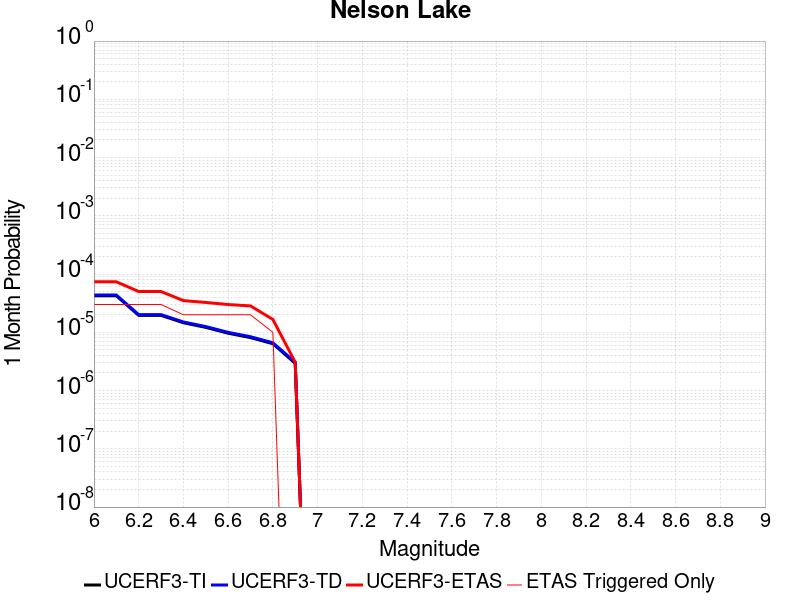 |  |  |

| Magnitude | 1 wk TI Prob | 1 wk TD Prob | 1 wk ETAS Prob | 1 wk ETAS/TD Gain | 1 wk ETAS Triggered Only | 1 mo TI Prob | 1 mo TD Prob | 1 mo ETAS Prob | 1 mo ETAS/TD Gain | 1 mo ETAS Triggered Only | 1 yr TI Prob | 1 yr TD Prob | 1 yr ETAS Prob | 1 yr ETAS/TD Gain | 1 yr ETAS Triggered Only | 10 yr TI Prob | 10 yr TD Prob | 10 yr ETAS Prob | 10 yr ETAS/TD Gain | 10 yr ETAS Triggered Only |
|-----|-----|-----|-----|-----|-----|-----|-----|-----|-----|-----|-----|-----|-----|-----|-----|-----|-----|-----|-----|-----|
| 6.0 | 9.913453E-6 | 1.0192248E-5 | 1.0192248E-5 | 1.0 | 0.0 | 4.2485535E-5 | 4.368039E-5 | 6.1568695E-5 | 1.4095272 | 1.7889088E-5 | 5.1713863E-4 | 5.316893E-4 | 5.6744844E-4 | 1.0672557 | 3.5778176E-5 | 0.0051593683 | 0.0053052 | 0.0053407885 | 1.0067081 | 3.5778176E-5 |
| 6.1 | 9.913453E-6 | 1.0192248E-5 | 1.0192248E-5 | 1.0 | 0.0 | 4.2485535E-5 | 4.368039E-5 | 6.1568695E-5 | 1.4095272 | 1.7889088E-5 | 5.1713863E-4 | 5.316893E-4 | 5.6744844E-4 | 1.0672557 | 3.5778176E-5 | 0.0051593683 | 0.0053052 | 0.0053407885 | 1.0067081 | 3.5778176E-5 |
| 6.2 | 4.5596407E-6 | 4.696309E-6 | 4.696309E-6 | 1.0 | 0.0 | 1.954117E-5 | 2.0126892E-5 | 3.801562E-5 | 1.8887973 | 1.7889088E-5 | 2.3788778E-4 | 2.4501863E-4 | 2.6290334E-4 | 1.0729933 | 1.7889088E-5 | 0.0023763329 | 0.002447611 | 0.0024654563 | 1.007291 | 1.7889088E-5 |
| 6.3 | 4.5596407E-6 | 4.696309E-6 | 4.696309E-6 | 1.0 | 0.0 | 1.954117E-5 | 2.0126892E-5 | 3.801562E-5 | 1.8887973 | 1.7889088E-5 | 2.3788778E-4 | 2.4501863E-4 | 2.6290334E-4 | 1.0729933 | 1.7889088E-5 | 0.0023763329 | 0.002447611 | 0.0024654563 | 1.007291 | 1.7889088E-5 |
| 6.4 | 3.4025713E-6 | 3.5098942E-6 | 3.5098942E-6 | 1.0 | 0.0 | 1.4582367E-5 | 1.5042322E-5 | 3.293114E-5 | 2.1892326 | 1.7889088E-5 | 1.7752586E-4 | 1.8312573E-4 | 2.0101153E-4 | 1.0976696 | 1.7889088E-5 | 0.001773841 | 0.0018298312 | 0.0018476875 | 1.0097585 | 1.7889088E-5 |
| 6.5 | 2.8352947E-6 | 2.9278535E-6 | 2.9278535E-6 | 1.0 | 0.0 | 1.2151207E-5 | 1.2547887E-5 | 3.0436751E-5 | 2.4256475 | 1.7889088E-5 | 1.479309E-4 | 1.5276058E-4 | 1.7064693E-4 | 1.1170875 | 1.7889088E-5 | 0.0014783246 | 0.0015266296 | 0.0015444913 | 1.0117002 | 1.7889088E-5 |
| 6.6 | 2.251518E-6 | 2.3290654E-6 | 2.3290654E-6 | 1.0 | 0.0 | 9.649328E-6 | 9.981674E-6 | 2.7870583E-5 | 2.7921753 | 1.7889088E-5 | 1.1747423E-4 | 1.2152074E-4 | 1.3940765E-4 | 1.1471922 | 1.7889088E-5 | 0.0011741214 | 0.0012146046 | 0.0012324719 | 1.0147104 | 1.7889088E-5 |
| 6.7 | 1.8911853E-6 | 1.9591378E-6 | 1.9591378E-6 | 1.0 | 0.0 | 8.105055E-6 | 8.396281E-6 | 2.6285219E-5 | 3.1305788 | 1.7889088E-5 | 9.867457E-5 | 1.0222051E-4 | 1.2010777E-4 | 1.174987 | 1.7889088E-5 | 9.863076E-4 | 0.0010217924 | 0.0010396632 | 1.0174897 | 1.7889088E-5 |
| 6.8 | 1.4874814E-6 | 1.543829E-6 | 1.543829E-6 | 1.0 | 0.0 | 6.374905E-6 | 6.6163957E-6 | 6.6163957E-6 | 1.0 | 0.0 | 7.76117E-5 | 8.055216E-5 | 8.055216E-5 | 1.0 | 0.0 | 7.75846E-4 | 8.0528075E-4 | 8.0528075E-4 | 1.0 | 0.0 |
| 6.9 | 6.835972E-7 | 7.13992E-7 | 7.13992E-7 | 1.0 | 0.0 | 2.9296991E-6 | 3.0599638E-6 | 3.0599638E-6 | 1.0 | 0.0 | 3.56685E-5 | 3.725474E-5 | 3.725474E-5 | 1.0 | 0.0 | 3.5662777E-4 | 3.7251622E-4 | 3.7251622E-4 | 1.0 | 0.0 |

## Kern Canyon (Lake Isabella) 2011
*[(top)](#table-of-contents)*

| 1 Week | 1 Month | 1 Year | 10 Year |
|-----|-----|-----|-----|
|  |  |  |  |

| Magnitude | 1 wk TI Prob | 1 wk TD Prob | 1 wk ETAS Prob | 1 wk ETAS/TD Gain | 1 wk ETAS Triggered Only | 1 mo TI Prob | 1 mo TD Prob | 1 mo ETAS Prob | 1 mo ETAS/TD Gain | 1 mo ETAS Triggered Only | 1 yr TI Prob | 1 yr TD Prob | 1 yr ETAS Prob | 1 yr ETAS/TD Gain | 1 yr ETAS Triggered Only | 10 yr TI Prob | 10 yr TD Prob | 10 yr ETAS Prob | 10 yr ETAS/TD Gain | 10 yr ETAS Triggered Only |
|-----|-----|-----|-----|-----|-----|-----|-----|-----|-----|-----|-----|-----|-----|-----|-----|-----|-----|-----|-----|-----|
| 6.0 | 4.2387383E-6 | 4.001636E-6 | 2.1890652E-5 | 5.470425 | 1.7889088E-5 | 1.8165894E-5 | 1.7149767E-5 | 3.503855E-5 | 2.0430918 | 1.7889088E-5 | 2.2114732E-4 | 2.0878029E-4 | 2.2666564E-4 | 1.085666 | 1.7889088E-5 | 0.0022092736 | 0.0020860252 | 0.002103877 | 1.0085578 | 1.7889088E-5 |
| 6.1 | 4.2387383E-6 | 4.001636E-6 | 2.1890652E-5 | 5.470425 | 1.7889088E-5 | 1.8165894E-5 | 1.7149767E-5 | 3.503855E-5 | 2.0430918 | 1.7889088E-5 | 2.2114732E-4 | 2.0878029E-4 | 2.2666564E-4 | 1.085666 | 1.7889088E-5 | 0.0022092736 | 0.0020860252 | 0.002103877 | 1.0085578 | 1.7889088E-5 |
| 6.2 | 4.2387383E-6 | 4.001636E-6 | 2.1890652E-5 | 5.470425 | 1.7889088E-5 | 1.8165894E-5 | 1.7149767E-5 | 3.503855E-5 | 2.0430918 | 1.7889088E-5 | 2.2114732E-4 | 2.0878029E-4 | 2.2666564E-4 | 1.085666 | 1.7889088E-5 | 0.0022092736 | 0.0020860252 | 0.002103877 | 1.0085578 | 1.7889088E-5 |
| 6.3 | 4.2387383E-6 | 4.001636E-6 | 2.1890652E-5 | 5.470425 | 1.7889088E-5 | 1.8165894E-5 | 1.7149767E-5 | 3.503855E-5 | 2.0430918 | 1.7889088E-5 | 2.2114732E-4 | 2.0878029E-4 | 2.2666564E-4 | 1.085666 | 1.7889088E-5 | 0.0022092736 | 0.0020860252 | 0.002103877 | 1.0085578 | 1.7889088E-5 |
| 6.4 | 4.2387383E-6 | 4.001636E-6 | 2.1890652E-5 | 5.470425 | 1.7889088E-5 | 1.8165894E-5 | 1.7149767E-5 | 3.503855E-5 | 2.0430918 | 1.7889088E-5 | 2.2114732E-4 | 2.0878029E-4 | 2.2666564E-4 | 1.085666 | 1.7889088E-5 | 0.0022092736 | 0.0020860252 | 0.002103877 | 1.0085578 | 1.7889088E-5 |
| 6.5 | 2.7857532E-6 | 2.5178654E-6 | 2.5178654E-6 | 1.0 | 0.0 | 1.1938888E-5 | 1.0790809E-5 | 1.0790809E-5 | 1.0 | 0.0 | 1.4534626E-4 | 1.313705E-4 | 1.313705E-4 | 1.0 | 0.0 | 0.0014525123 | 0.0013129612 | 0.0013129612 | 1.0 | 0.0 |
| 6.6 | 2.2233348E-6 | 1.9441222E-6 | 1.9441222E-6 | 1.0 | 0.0 | 9.528543E-6 | 8.331926E-6 | 8.331926E-6 | 1.0 | 0.0 | 1.1600384E-4 | 1.0143657E-4 | 1.0143657E-4 | 1.0 | 0.0 | 0.001159433 | 0.0010139113 | 0.0010139113 | 1.0 | 0.0 |
| 6.7 | 2.1635126E-6 | 1.8835024E-6 | 1.8835024E-6 | 1.0 | 0.0 | 9.272164E-6 | 8.072128E-6 | 8.072128E-6 | 1.0 | 0.0 | 1.1288274E-4 | 9.827381E-5 | 9.827381E-5 | 1.0 | 0.0 | 0.0011282542 | 9.823117E-4 | 9.823117E-4 | 1.0 | 0.0 |
| 6.8 | 1.8685711E-6 | 1.5831414E-6 | 1.5831414E-6 | 1.0 | 0.0 | 8.008137E-6 | 6.7848746E-6 | 6.7848746E-6 | 1.0 | 0.0 | 9.74947E-5 | 8.260277E-5 | 8.260277E-5 | 1.0 | 0.0 | 9.745194E-4 | 8.2572555E-4 | 8.2572555E-4 | 1.0 | 0.0 |
| 6.9 | 1.5815071E-6 | 1.3064919E-6 | 1.3064919E-6 | 1.0 | 0.0 | 6.77787E-6 | 5.599239E-6 | 5.599239E-6 | 1.0 | 0.0 | 8.251744E-5 | 6.816863E-5 | 6.816863E-5 | 1.0 | 0.0 | 8.248681E-4 | 6.8147987E-4 | 6.8147987E-4 | 1.0 | 0.0 |
| 7.0 | 1.3772564E-6 | 1.121071E-6 | 1.121071E-6 | 1.0 | 0.0 | 5.9025137E-6 | 4.8045813E-6 | 4.8045813E-6 | 1.0 | 0.0 | 7.186073E-5 | 5.8494225E-5 | 5.8494225E-5 | 1.0 | 0.0 | 7.18375E-4 | 5.8479037E-4 | 5.8479037E-4 | 1.0 | 0.0 |
| 7.1 | 1.0916998E-6 | 8.763771E-7 | 8.763771E-7 | 1.0 | 0.0 | 4.678705E-6 | 3.7558964E-6 | 3.7558964E-6 | 1.0 | 0.0 | 5.6961744E-5 | 4.5727094E-5 | 4.5727094E-5 | 1.0 | 0.0 | 5.6947145E-4 | 4.571782E-4 | 4.571782E-4 | 1.0 | 0.0 |
| 7.2 | 7.6277024E-7 | 5.90145E-7 | 5.90145E-7 | 1.0 | 0.0 | 3.2690114E-6 | 2.5291904E-6 | 2.5291904E-6 | 1.0 | 0.0 | 3.9799485E-5 | 3.0792464E-5 | 3.0792464E-5 | 1.0 | 0.0 | 3.9792358E-4 | 3.0788258E-4 | 3.0788258E-4 | 1.0 | 0.0 |
| 7.3 | 5.3265916E-7 | 4.3824386E-7 | 4.3824386E-7 | 1.0 | 0.0 | 2.282823E-6 | 1.8781866E-6 | 1.8781866E-6 | 1.0 | 0.0 | 2.7793016E-5 | 2.2866687E-5 | 2.2866687E-5 | 1.0 | 0.0 | 2.778954E-4 | 2.2864371E-4 | 2.2864371E-4 | 1.0 | 0.0 |
| 7.4 | 3.4946007E-7 | 3.006569E-7 | 3.006569E-7 | 1.0 | 0.0 | 1.497685E-6 | 1.2885289E-6 | 1.2885289E-6 | 1.0 | 0.0 | 1.8234163E-5 | 1.5687729E-5 | 1.5687729E-5 | 1.0 | 0.0 | 1.8232666E-4 | 1.5686643E-4 | 1.5686643E-4 | 1.0 | 0.0 |
| 7.5 | 1.8317026E-7 | 1.42448E-7 | 1.42448E-7 | 1.0 | 0.0 | 7.850152E-7 | 6.104913E-7 | 6.104913E-7 | 1.0 | 0.0 | 9.557518E-6 | 7.432707E-6 | 7.432707E-6 | 1.0 | 0.0 | 9.5571064E-5 | 7.4324664E-5 | 7.4324664E-5 | 1.0 | 0.0 |
| 7.6 | 2.572245E-8 | 1.7352539E-8 | 1.7352539E-8 | 1.0 | 0.0 | 1.10239064E-7 | 7.436802E-8 | 7.436802E-8 | 1.0 | 0.0 | 1.3421597E-6 | 9.0543034E-7 | 9.0543034E-7 | 1.0 | 0.0 | 1.3421517E-5 | 9.054272E-6 | 9.054272E-6 | 1.0 | 0.0 |

## Kern Canyon (South Kern) 2011
*[(top)](#table-of-contents)*

| 1 Week | 1 Month | 1 Year | 10 Year |
|-----|-----|-----|-----|
|  |  |  |  |

| Magnitude | 1 wk TI Prob | 1 wk TD Prob | 1 wk ETAS Prob | 1 wk ETAS/TD Gain | 1 wk ETAS Triggered Only | 1 mo TI Prob | 1 mo TD Prob | 1 mo ETAS Prob | 1 mo ETAS/TD Gain | 1 mo ETAS Triggered Only | 1 yr TI Prob | 1 yr TD Prob | 1 yr ETAS Prob | 1 yr ETAS/TD Gain | 1 yr ETAS Triggered Only | 10 yr TI Prob | 10 yr TD Prob | 10 yr ETAS Prob | 10 yr ETAS/TD Gain | 10 yr ETAS Triggered Only |
|-----|-----|-----|-----|-----|-----|-----|-----|-----|-----|-----|-----|-----|-----|-----|-----|-----|-----|-----|-----|-----|
| 6.0 | 4.105075E-6 | 4.1137246E-6 | 2.2002738E-5 | 5.3486176 | 1.7889088E-5 | 1.7593058E-5 | 1.7630131E-5 | 3.5518904E-5 | 2.0146704 | 1.7889088E-5 | 2.1417443E-4 | 2.1462636E-4 | 2.5039684E-4 | 1.166664 | 3.5778176E-5 | 0.0021396813 | 0.0021442545 | 0.002179956 | 1.0166498 | 3.5778176E-5 |
| 6.1 | 4.105075E-6 | 4.1137246E-6 | 2.2002738E-5 | 5.3486176 | 1.7889088E-5 | 1.7593058E-5 | 1.7630131E-5 | 3.5518904E-5 | 2.0146704 | 1.7889088E-5 | 2.1417443E-4 | 2.1462636E-4 | 2.5039684E-4 | 1.166664 | 3.5778176E-5 | 0.0021396813 | 0.0021442545 | 0.002179956 | 1.0166498 | 3.5778176E-5 |
| 6.2 | 4.105075E-6 | 4.1137246E-6 | 2.2002738E-5 | 5.3486176 | 1.7889088E-5 | 1.7593058E-5 | 1.7630131E-5 | 3.5518904E-5 | 2.0146704 | 1.7889088E-5 | 2.1417443E-4 | 2.1462636E-4 | 2.5039684E-4 | 1.166664 | 3.5778176E-5 | 0.0021396813 | 0.0021442545 | 0.002179956 | 1.0166498 | 3.5778176E-5 |
| 6.3 | 4.105075E-6 | 4.1137246E-6 | 2.2002738E-5 | 5.3486176 | 1.7889088E-5 | 1.7593058E-5 | 1.7630131E-5 | 3.5518904E-5 | 2.0146704 | 1.7889088E-5 | 2.1417443E-4 | 2.1462636E-4 | 2.5039684E-4 | 1.166664 | 3.5778176E-5 | 0.0021396813 | 0.0021442545 | 0.002179956 | 1.0166498 | 3.5778176E-5 |
| 6.4 | 4.105075E-6 | 4.1137246E-6 | 2.2002738E-5 | 5.3486176 | 1.7889088E-5 | 1.7593058E-5 | 1.7630131E-5 | 3.5518904E-5 | 2.0146704 | 1.7889088E-5 | 2.1417443E-4 | 2.1462636E-4 | 2.5039684E-4 | 1.166664 | 3.5778176E-5 | 0.0021396813 | 0.0021442545 | 0.002179956 | 1.0166498 | 3.5778176E-5 |
| 6.5 | 2.9849807E-6 | 2.9731532E-6 | 2.9731532E-6 | 1.0 | 0.0 | 1.2792712E-5 | 1.27420235E-5 | 1.27420235E-5 | 1.0 | 0.0 | 1.5574014E-4 | 1.5512324E-4 | 1.5512324E-4 | 1.0 | 0.0 | 0.0015563103 | 0.0015501648 | 0.0015501648 | 1.0 | 0.0 |
| 6.6 | 2.9849807E-6 | 2.9731532E-6 | 2.9731532E-6 | 1.0 | 0.0 | 1.2792712E-5 | 1.27420235E-5 | 1.27420235E-5 | 1.0 | 0.0 | 1.5574014E-4 | 1.5512324E-4 | 1.5512324E-4 | 1.0 | 0.0 | 0.0015563103 | 0.0015501648 | 0.0015501648 | 1.0 | 0.0 |
| 6.7 | 2.6756725E-6 | 2.6582195E-6 | 2.6582195E-6 | 1.0 | 0.0 | 1.1467117E-5 | 1.139232E-5 | 1.139232E-5 | 1.0 | 0.0 | 1.396032E-4 | 1.3869278E-4 | 1.3869278E-4 | 1.0 | 0.0 | 0.0013951553 | 0.0013860731 | 0.0013860731 | 1.0 | 0.0 |
| 6.8 | 2.3283721E-6 | 2.3047776E-6 | 2.3047776E-6 | 1.0 | 0.0 | 9.9787E-6 | 9.877582E-6 | 9.877582E-6 | 1.0 | 0.0 | 1.214839E-4 | 1.2025299E-4 | 1.2025299E-4 | 1.0 | 0.0 | 0.001214175 | 0.0012018867 | 0.0012018867 | 1.0 | 0.0 |
| 6.9 | 2.0972677E-6 | 2.06964E-6 | 2.06964E-6 | 1.0 | 0.0 | 8.988259E-6 | 8.869856E-6 | 8.869856E-6 | 1.0 | 0.0 | 1.0942656E-4 | 1.079852E-4 | 1.079852E-4 | 1.0 | 0.0 | 0.0010937268 | 0.0010793331 | 0.0010793331 | 1.0 | 0.0 |
| 7.0 | 1.7132242E-6 | 1.6787027E-6 | 1.6787027E-6 | 1.0 | 0.0 | 7.3423685E-6 | 7.1944205E-6 | 7.1944205E-6 | 1.0 | 0.0 | 8.938967E-5 | 8.758859E-5 | 8.758859E-5 | 1.0 | 0.0 | 8.935372E-4 | 8.755445E-4 | 8.755445E-4 | 1.0 | 0.0 |
| 7.1 | 1.4215541E-6 | 1.3815744E-6 | 1.3815744E-6 | 1.0 | 0.0 | 6.0923603E-6 | 5.92102E-6 | 5.92102E-6 | 1.0 | 0.0 | 7.417196E-5 | 7.208606E-5 | 7.208606E-5 | 1.0 | 0.0 | 7.414721E-4 | 7.2062947E-4 | 7.2062947E-4 | 1.0 | 0.0 |
| 7.2 | 9.097853E-7 | 8.6037704E-7 | 8.6037704E-7 | 1.0 | 0.0 | 3.899074E-6 | 3.687325E-6 | 3.687325E-6 | 1.0 | 0.0 | 4.7470192E-5 | 4.489227E-5 | 4.489227E-5 | 1.0 | 0.0 | 4.7460053E-4 | 4.488331E-4 | 4.488331E-4 | 1.0 | 0.0 |
| 7.3 | 6.144169E-7 | 5.628203E-7 | 5.628203E-7 | 1.0 | 0.0 | 2.6332125E-6 | 2.4120848E-6 | 2.4120848E-6 | 1.0 | 0.0 | 3.205889E-5 | 2.9366742E-5 | 2.9366742E-5 | 1.0 | 0.0 | 3.2054266E-4 | 2.9362913E-4 | 2.9362913E-4 | 1.0 | 0.0 |
| 7.4 | 4.049844E-7 | 3.5728291E-7 | 3.5728291E-7 | 1.0 | 0.0 | 1.7356463E-6 | 1.5312115E-6 | 1.5312115E-6 | 1.0 | 0.0 | 2.1131287E-5 | 1.8642344E-5 | 1.8642344E-5 | 1.0 | 0.0 | 2.1129279E-4 | 1.8640806E-4 | 1.8640806E-4 | 1.0 | 0.0 |
| 7.5 | 1.9871162E-7 | 1.5830427E-7 | 1.5830427E-7 | 1.0 | 0.0 | 8.5162094E-7 | 6.784467E-7 | 6.784467E-7 | 1.0 | 0.0 | 1.0368436E-5 | 8.260059E-6 | 8.260059E-6 | 1.0 | 0.0 | 1.0367952E-4 | 8.25976E-5 | 8.25976E-5 | 1.0 | 0.0 |
| 7.6 | 2.572245E-8 | 1.7352539E-8 | 1.7352539E-8 | 1.0 | 0.0 | 1.10239064E-7 | 7.436802E-8 | 7.436802E-8 | 1.0 | 0.0 | 1.3421597E-6 | 9.0543034E-7 | 9.0543034E-7 | 1.0 | 0.0 | 1.3421517E-5 | 9.054272E-6 | 9.054272E-6 | 1.0 | 0.0 |

## Shoreline
*[(top)](#table-of-contents)*

| 1 Week | 1 Month | 1 Year | 10 Year |
|-----|-----|-----|-----|
|  |  |  | 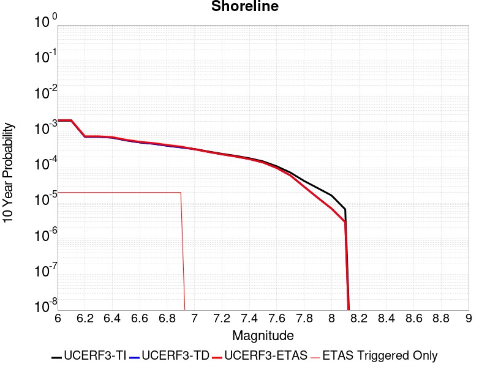 |

| Magnitude | 1 wk TI Prob | 1 wk TD Prob | 1 wk ETAS Prob | 1 wk ETAS/TD Gain | 1 wk ETAS Triggered Only | 1 mo TI Prob | 1 mo TD Prob | 1 mo ETAS Prob | 1 mo ETAS/TD Gain | 1 mo ETAS Triggered Only | 1 yr TI Prob | 1 yr TD Prob | 1 yr ETAS Prob | 1 yr ETAS/TD Gain | 1 yr ETAS Triggered Only | 10 yr TI Prob | 10 yr TD Prob | 10 yr ETAS Prob | 10 yr ETAS/TD Gain | 10 yr ETAS Triggered Only |
|-----|-----|-----|-----|-----|-----|-----|-----|-----|-----|-----|-----|-----|-----|-----|-----|-----|-----|-----|-----|-----|
| 6.0 | 3.9888673E-6 | 4.047926E-6 | 3.9825958E-5 | 9.838608 | 3.5778176E-5 | 1.7095033E-5 | 1.734817E-5 | 5.3125725E-5 | 3.0623245 | 3.5778176E-5 | 2.0811215E-4 | 2.1119909E-4 | 2.469697E-4 | 1.1693692 | 3.5778176E-5 | 0.0020791737 | 0.0021105325 | 0.0021462352 | 1.0169164 | 3.5778176E-5 |
| 6.1 | 3.9888673E-6 | 4.047926E-6 | 3.9825958E-5 | 9.838608 | 3.5778176E-5 | 1.7095033E-5 | 1.734817E-5 | 5.3125725E-5 | 3.0623245 | 3.5778176E-5 | 2.0811215E-4 | 2.1119909E-4 | 2.469697E-4 | 1.1693692 | 3.5778176E-5 | 0.0020791737 | 0.0021105325 | 0.0021462352 | 1.0169164 | 3.5778176E-5 |
| 6.2 | 1.4039653E-6 | 1.4100874E-6 | 3.7188212E-5 | 26.372984 | 3.5778176E-5 | 6.0169805E-6 | 6.043218E-6 | 4.182118E-5 | 6.920349 | 3.5778176E-5 | 7.325427E-5 | 7.3573756E-5 | 1.093493E-4 | 1.4862541 | 3.5778176E-5 | 7.3230127E-4 | 7.3549995E-4 | 7.712518E-4 | 1.0486089 | 3.5778176E-5 |
| 6.3 | 1.4039653E-6 | 1.4100874E-6 | 3.7188212E-5 | 26.372984 | 3.5778176E-5 | 6.0169805E-6 | 6.043218E-6 | 4.182118E-5 | 6.920349 | 3.5778176E-5 | 7.325427E-5 | 7.3573756E-5 | 1.093493E-4 | 1.4862541 | 3.5778176E-5 | 7.3230127E-4 | 7.3549995E-4 | 7.712518E-4 | 1.0486089 | 3.5778176E-5 |
| 6.4 | 1.3314152E-6 | 1.3361588E-6 | 3.7114285E-5 | 27.776854 | 3.5778176E-5 | 5.7060524E-6 | 5.7263824E-6 | 4.1504354E-5 | 7.247918 | 3.5778176E-5 | 6.946897E-5 | 6.971653E-5 | 1.0549221E-4 | 1.5131593 | 3.5778176E-5 | 6.9447263E-4 | 6.96952E-4 | 7.3270523E-4 | 1.0512995 | 3.5778176E-5 |
| 6.5 | 1.1187026E-6 | 1.1203624E-6 | 3.68985E-5 | 32.934433 | 3.5778176E-5 | 4.794431E-6 | 4.801544E-6 | 4.0579547E-5 | 8.451353 | 3.5778176E-5 | 5.8370628E-5 | 5.845726E-5 | 9.423334E-5 | 1.6120042 | 3.5778176E-5 | 5.83553E-4 | 5.8442133E-4 | 6.201786E-4 | 1.061184 | 3.5778176E-5 |
| 6.6 | 9.793089E-7 | 9.784904E-7 | 3.675663E-5 | 37.56463 | 3.5778176E-5 | 4.1970316E-6 | 4.1935236E-6 | 3.997155E-5 | 9.5317335 | 3.5778176E-5 | 5.1097657E-5 | 5.1054965E-5 | 8.6831315E-5 | 1.7007418 | 3.5778176E-5 | 5.108591E-4 | 5.104337E-4 | 5.4619357E-4 | 1.0700579 | 3.5778176E-5 |
| 6.7 | 8.995986E-7 | 8.972785E-7 | 3.667542E-5 | 40.87407 | 3.5778176E-5 | 3.8554167E-6 | 3.8454737E-6 | 3.9623512E-5 | 10.303935 | 3.5778176E-5 | 4.693869E-5 | 4.6817644E-5 | 8.2594146E-5 | 1.7641671 | 3.5778176E-5 | 4.6928777E-4 | 4.6807877E-4 | 5.038402E-4 | 1.0764004 | 3.5778176E-5 |
| 6.8 | 7.931612E-7 | 7.8803885E-7 | 3.6566187E-5 | 46.4015 | 3.5778176E-5 | 3.3992578E-6 | 3.377305E-6 | 3.915536E-5 | 11.59367 | 3.5778176E-5 | 4.1385178E-5 | 4.1117917E-5 | 7.689462E-5 | 1.8701001 | 3.5778176E-5 | 4.1377472E-4 | 4.1110365E-4 | 4.468671E-4 | 1.0869938 | 3.5778176E-5 |
| 6.9 | 7.1465956E-7 | 7.077992E-7 | 3.6485948E-5 | 51.548447 | 3.5778176E-5 | 3.062823E-6 | 3.0334215E-6 | 3.881149E-5 | 12.794623 | 3.5778176E-5 | 3.7289232E-5 | 3.6931287E-5 | 7.270814E-5 | 1.968741 | 3.5778176E-5 | 3.7282976E-4 | 3.6925185E-4 | 4.0501682E-4 | 1.0968579 | 3.5778176E-5 |
| 7.0 | 6.389046E-7 | 6.299445E-7 | 6.299445E-7 | 1.0 | 0.0 | 2.7381598E-6 | 2.6997593E-6 | 2.6997593E-6 | 1.0 | 0.0 | 3.3336586E-5 | 3.2869077E-5 | 3.2869077E-5 | 1.0 | 0.0 | 3.3331584E-4 | 3.286424E-4 | 3.286424E-4 | 1.0 | 0.0 |
| 7.1 | 5.4300875E-7 | 5.311119E-7 | 5.311119E-7 | 1.0 | 0.0 | 2.3271782E-6 | 2.2761917E-6 | 2.2761917E-6 | 1.0 | 0.0 | 2.8333026E-5 | 2.7712282E-5 | 2.7712282E-5 | 1.0 | 0.0 | 2.8329415E-4 | 2.7708837E-4 | 2.7708837E-4 | 1.0 | 0.0 |
| 7.2 | 4.6768855E-7 | 4.5348835E-7 | 4.5348835E-7 | 1.0 | 0.0 | 2.0043778E-6 | 1.94352E-6 | 1.94352E-6 | 1.0 | 0.0 | 2.4403027E-5 | 2.36621E-5 | 2.36621E-5 | 1.0 | 0.0 | 2.4400349E-4 | 2.3659585E-4 | 2.3659585E-4 | 1.0 | 0.0 |
| 7.3 | 4.0966103E-7 | 3.938555E-7 | 3.938555E-7 | 1.0 | 0.0 | 1.7556889E-6 | 1.687951E-6 | 1.687951E-6 | 1.0 | 0.0 | 2.1375303E-5 | 2.055061E-5 | 2.055061E-5 | 1.0 | 0.0 | 2.1373246E-4 | 2.0548713E-4 | 2.0548713E-4 | 1.0 | 0.0 |
| 7.4 | 3.5105785E-7 | 3.3363864E-7 | 3.3363864E-7 | 1.0 | 0.0 | 1.5045327E-6 | 1.429879E-6 | 1.429879E-6 | 1.0 | 0.0 | 1.8317533E-5 | 1.7408638E-5 | 1.7408638E-5 | 1.0 | 0.0 | 1.8316023E-4 | 1.7407277E-4 | 1.7407277E-4 | 1.0 | 0.0 |
| 7.5 | 2.8737534E-7 | 2.6819936E-7 | 2.6819936E-7 | 1.0 | 0.0 | 1.2316079E-6 | 1.1494252E-6 | 1.1494252E-6 | 1.0 | 0.0 | 1.4994724E-5 | 1.3994162E-5 | 1.3994162E-5 | 1.0 | 0.0 | 1.4993713E-4 | 1.3993283E-4 | 1.3993283E-4 | 1.0 | 0.0 |
| 7.6 | 2.0924051E-7 | 1.877889E-7 | 1.877889E-7 | 1.0 | 0.0 | 8.967448E-7 | 8.0480925E-7 | 8.0480925E-7 | 1.0 | 0.0 | 1.0917813E-5 | 9.7985085E-6 | 9.7985085E-6 | 1.0 | 0.0 | 1.0917276E-4 | 9.798078E-5 | 9.798078E-5 | 1.0 | 0.0 |
| 7.7 | 1.392265E-7 | 1.1543299E-7 | 1.1543299E-7 | 1.0 | 0.0 | 5.9668486E-7 | 4.947127E-7 | 4.947127E-7 | 1.0 | 0.0 | 7.2646135E-6 | 6.0231105E-6 | 6.0231105E-6 | 1.0 | 0.0 | 7.2643765E-5 | 6.0229475E-5 | 6.0229475E-5 | 1.0 | 0.0 |
| 7.8 | 8.1080074E-8 | 5.5866355E-8 | 5.5866355E-8 | 1.0 | 0.0 | 3.4748598E-7 | 2.394272E-7 | 2.394272E-7 | 1.0 | 0.0 | 4.2306337E-6 | 2.9150224E-6 | 2.9150224E-6 | 1.0 | 0.0 | 4.230553E-5 | 2.9149844E-5 | 2.9149844E-5 | 1.0 | 0.0 |
| 7.9 | 5.0859036E-8 | 2.7243644E-8 | 2.7243644E-8 | 1.0 | 0.0 | 2.1796728E-7 | 1.1675847E-7 | 1.1675847E-7 | 1.0 | 0.0 | 2.6537484E-6 | 1.4215334E-6 | 1.4215334E-6 | 1.0 | 0.0 | 2.6537167E-5 | 1.4215244E-5 | 1.4215244E-5 | 1.0 | 0.0 |
| 8.0 | 3.1760536E-8 | 1.3576587E-8 | 1.3576587E-8 | 1.0 | 0.0 | 1.3611657E-7 | 5.818537E-8 | 5.818537E-8 | 1.0 | 0.0 | 1.6572179E-6 | 7.084067E-7 | 7.084067E-7 | 1.0 | 0.0 | 1.6572056E-5 | 7.0840442E-6 | 7.0840442E-6 | 1.0 | 0.0 |
| 8.1 | 1.2947896E-8 | 5.6626024E-9 | 5.6626024E-9 | 1.0 | 0.0 | 5.5490982E-8 | 2.4268296E-8 | 2.4268296E-8 | 1.0 | 0.0 | 6.756025E-7 | 2.9546646E-7 | 2.9546646E-7 | 1.0 | 0.0 | 6.7560045E-6 | 2.9546607E-6 | 2.9546607E-6 | 1.0 | 0.0 |

## Cady
*[(top)](#table-of-contents)*

| 1 Week | 1 Month | 1 Year | 10 Year |
|-----|-----|-----|-----|
|  |  |  |  |

| Magnitude | 1 wk TI Prob | 1 wk TD Prob | 1 wk ETAS Prob | 1 wk ETAS/TD Gain | 1 wk ETAS Triggered Only | 1 mo TI Prob | 1 mo TD Prob | 1 mo ETAS Prob | 1 mo ETAS/TD Gain | 1 mo ETAS Triggered Only | 1 yr TI Prob | 1 yr TD Prob | 1 yr ETAS Prob | 1 yr ETAS/TD Gain | 1 yr ETAS Triggered Only | 10 yr TI Prob | 10 yr TD Prob | 10 yr ETAS Prob | 10 yr ETAS/TD Gain | 10 yr ETAS Triggered Only |
|-----|-----|-----|-----|-----|-----|-----|-----|-----|-----|-----|-----|-----|-----|-----|-----|-----|-----|-----|-----|-----|
| 6.0 | 1.9892565E-5 | 2.1858672E-5 | 3.9747367E-5 | 1.8183799 | 1.7889088E-5 | 8.525106E-5 | 9.367717E-5 | 1.1156458E-4 | 1.1909474 | 1.7889088E-5 | 0.0010374374 | 0.0011400137 | 0.0011757511 | 1.0313482 | 3.5778176E-5 | 0.010326075 | 0.011350671 | 0.011386042 | 1.0031163 | 3.5778176E-5 |
| 6.1 | 1.9892565E-5 | 2.1858672E-5 | 3.9747367E-5 | 1.8183799 | 1.7889088E-5 | 8.525106E-5 | 9.367717E-5 | 1.1156458E-4 | 1.1909474 | 1.7889088E-5 | 0.0010374374 | 0.0011400137 | 0.0011757511 | 1.0313482 | 3.5778176E-5 | 0.010326075 | 0.011350671 | 0.011386042 | 1.0031163 | 3.5778176E-5 |
| 6.2 | 1.9892565E-5 | 2.1858672E-5 | 3.9747367E-5 | 1.8183799 | 1.7889088E-5 | 8.525106E-5 | 9.367717E-5 | 1.1156458E-4 | 1.1909474 | 1.7889088E-5 | 0.0010374374 | 0.0011400137 | 0.0011757511 | 1.0313482 | 3.5778176E-5 | 0.010326075 | 0.011350671 | 0.011386042 | 1.0031163 | 3.5778176E-5 |
| 6.3 | 1.1117327E-5 | 1.2176552E-5 | 1.2176552E-5 | 1.0 | 0.0 | 4.764482E-5 | 5.2184358E-5 | 5.2184358E-5 | 1.0 | 0.0 | 5.7992124E-4 | 6.3519087E-4 | 6.3519087E-4 | 1.0 | 0.0 | 0.0057841022 | 0.0063368594 | 0.0063368594 | 1.0 | 0.0 |
| 6.4 | 1.1117327E-5 | 1.2176552E-5 | 1.2176552E-5 | 1.0 | 0.0 | 4.764482E-5 | 5.2184358E-5 | 5.2184358E-5 | 1.0 | 0.0 | 5.7992124E-4 | 6.3519087E-4 | 6.3519087E-4 | 1.0 | 0.0 | 0.0057841022 | 0.0063368594 | 0.0063368594 | 1.0 | 0.0 |
| 6.5 | 6.103093E-6 | 6.672004E-6 | 6.672004E-6 | 1.0 | 0.0 | 2.615585E-5 | 2.859406E-5 | 2.859406E-5 | 1.0 | 0.0 | 3.1840094E-4 | 3.4808964E-4 | 3.4808964E-4 | 1.0 | 0.0 | 0.0031794512 | 0.003476678 | 0.003476678 | 1.0 | 0.0 |
| 6.6 | 5.817237E-6 | 6.3656425E-6 | 6.3656425E-6 | 1.0 | 0.0 | 2.4930776E-5 | 2.728111E-5 | 2.728111E-5 | 1.0 | 0.0 | 3.034899E-4 | 3.3210934E-4 | 3.3210934E-4 | 1.0 | 0.0 | 0.0030307577 | 0.0033173522 | 0.0033173522 | 1.0 | 0.0 |
| 6.7 | 4.8846314E-6 | 5.3405547E-6 | 5.3405547E-6 | 1.0 | 0.0 | 2.0933967E-5 | 2.2887958E-5 | 2.2887958E-5 | 1.0 | 0.0 | 2.5484123E-4 | 2.7863705E-4 | 2.7863705E-4 | 1.0 | 0.0 | 0.0025454918 | 0.0027840321 | 0.0027840321 | 1.0 | 0.0 |
| 6.8 | 1.7788773E-6 | 1.9399033E-6 | 1.9399033E-6 | 1.0 | 0.0 | 7.6237375E-6 | 8.313854E-6 | 8.313854E-6 | 1.0 | 0.0 | 9.281505E-5 | 1.01218044E-4 | 1.01218044E-4 | 1.0 | 0.0 | 9.2776294E-4 | 0.0010118741 | 0.0010118741 | 1.0 | 0.0 |
| 6.9 | 7.5455404E-7 | 8.29707E-7 | 8.29707E-7 | 1.0 | 0.0 | 3.233799E-6 | 3.5558842E-6 | 3.5558842E-6 | 1.0 | 0.0 | 3.937079E-5 | 4.3292366E-5 | 4.3292366E-5 | 1.0 | 0.0 | 3.9363815E-4 | 4.3287227E-4 | 4.3287227E-4 | 1.0 | 0.0 |
| 7.0 | 6.8578805E-7 | 7.541796E-7 | 7.541796E-7 | 1.0 | 0.0 | 2.9390883E-6 | 3.2321961E-6 | 3.2321961E-6 | 1.0 | 0.0 | 3.578281E-5 | 3.935161E-5 | 3.935161E-5 | 1.0 | 0.0 | 3.577705E-4 | 3.9347887E-4 | 3.9347887E-4 | 1.0 | 0.0 |

## North Frontal  (East)
*[(top)](#table-of-contents)*

| 1 Week | 1 Month | 1 Year | 10 Year |
|-----|-----|-----|-----|
| 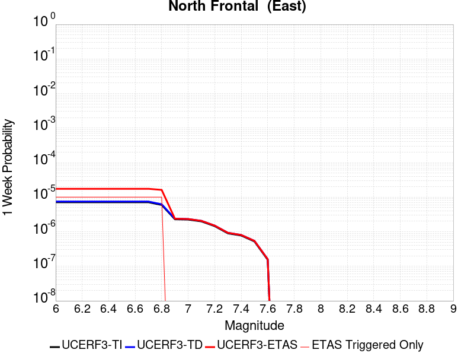 | 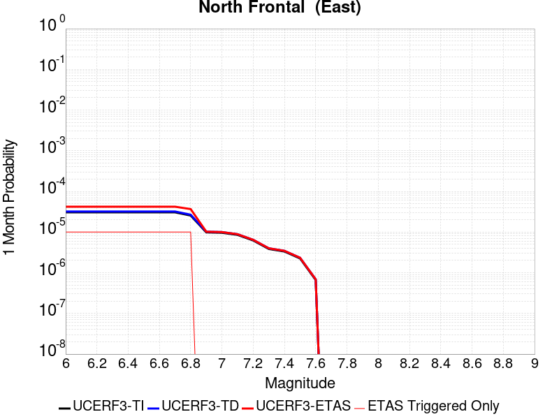 | 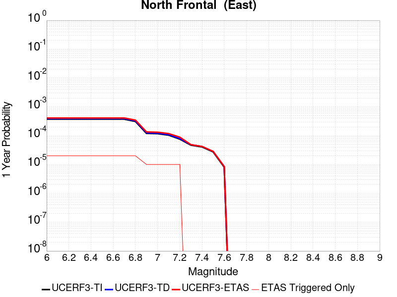 |  |

| Magnitude | 1 wk TI Prob | 1 wk TD Prob | 1 wk ETAS Prob | 1 wk ETAS/TD Gain | 1 wk ETAS Triggered Only | 1 mo TI Prob | 1 mo TD Prob | 1 mo ETAS Prob | 1 mo ETAS/TD Gain | 1 mo ETAS Triggered Only | 1 yr TI Prob | 1 yr TD Prob | 1 yr ETAS Prob | 1 yr ETAS/TD Gain | 1 yr ETAS Triggered Only | 10 yr TI Prob | 10 yr TD Prob | 10 yr ETAS Prob | 10 yr ETAS/TD Gain | 10 yr ETAS Triggered Only |
|-----|-----|-----|-----|-----|-----|-----|-----|-----|-----|-----|-----|-----|-----|-----|-----|-----|-----|-----|-----|-----|
| 6.0 | 7.135738E-6 | 7.477167E-6 | 2.536612E-5 | 3.3924775 | 1.7889088E-5 | 3.0581377E-5 | 3.204472E-5 | 4.9933235E-5 | 1.5582359 | 1.7889088E-5 | 3.7226462E-4 | 3.9009456E-4 | 4.2585877E-4 | 1.0916809 | 3.5778176E-5 | 0.0037164164 | 0.0038960557 | 0.0039316947 | 1.0091474 | 3.5778176E-5 |
| 6.1 | 7.135738E-6 | 7.477167E-6 | 2.536612E-5 | 3.3924775 | 1.7889088E-5 | 3.0581377E-5 | 3.204472E-5 | 4.9933235E-5 | 1.5582359 | 1.7889088E-5 | 3.7226462E-4 | 3.9009456E-4 | 4.2585877E-4 | 1.0916809 | 3.5778176E-5 | 0.0037164164 | 0.0038960557 | 0.0039316947 | 1.0091474 | 3.5778176E-5 |
| 6.2 | 7.135738E-6 | 7.477167E-6 | 2.536612E-5 | 3.3924775 | 1.7889088E-5 | 3.0581377E-5 | 3.204472E-5 | 4.9933235E-5 | 1.5582359 | 1.7889088E-5 | 3.7226462E-4 | 3.9009456E-4 | 4.2585877E-4 | 1.0916809 | 3.5778176E-5 | 0.0037164164 | 0.0038960557 | 0.0039316947 | 1.0091474 | 3.5778176E-5 |
| 6.3 | 7.135738E-6 | 7.477167E-6 | 2.536612E-5 | 3.3924775 | 1.7889088E-5 | 3.0581377E-5 | 3.204472E-5 | 4.9933235E-5 | 1.5582359 | 1.7889088E-5 | 3.7226462E-4 | 3.9009456E-4 | 4.2585877E-4 | 1.0916809 | 3.5778176E-5 | 0.0037164164 | 0.0038960557 | 0.0039316947 | 1.0091474 | 3.5778176E-5 |
| 6.4 | 7.135738E-6 | 7.477167E-6 | 2.536612E-5 | 3.3924775 | 1.7889088E-5 | 3.0581377E-5 | 3.204472E-5 | 4.9933235E-5 | 1.5582359 | 1.7889088E-5 | 3.7226462E-4 | 3.9009456E-4 | 4.2585877E-4 | 1.0916809 | 3.5778176E-5 | 0.0037164164 | 0.0038960557 | 0.0039316947 | 1.0091474 | 3.5778176E-5 |
| 6.5 | 7.135738E-6 | 7.477167E-6 | 2.536612E-5 | 3.3924775 | 1.7889088E-5 | 3.0581377E-5 | 3.204472E-5 | 4.9933235E-5 | 1.5582359 | 1.7889088E-5 | 3.7226462E-4 | 3.9009456E-4 | 4.2585877E-4 | 1.0916809 | 3.5778176E-5 | 0.0037164164 | 0.0038960557 | 0.0039316947 | 1.0091474 | 3.5778176E-5 |
| 6.6 | 7.135738E-6 | 7.477167E-6 | 2.536612E-5 | 3.3924775 | 1.7889088E-5 | 3.0581377E-5 | 3.204472E-5 | 4.9933235E-5 | 1.5582359 | 1.7889088E-5 | 3.7226462E-4 | 3.9009456E-4 | 4.2585877E-4 | 1.0916809 | 3.5778176E-5 | 0.0037164164 | 0.0038960557 | 0.0039316947 | 1.0091474 | 3.5778176E-5 |
| 6.7 | 7.135738E-6 | 7.477167E-6 | 2.536612E-5 | 3.3924775 | 1.7889088E-5 | 3.0581377E-5 | 3.204472E-5 | 4.9933235E-5 | 1.5582359 | 1.7889088E-5 | 3.7226462E-4 | 3.9009456E-4 | 4.2585877E-4 | 1.0916809 | 3.5778176E-5 | 0.0037164164 | 0.0038960557 | 0.0039316947 | 1.0091474 | 3.5778176E-5 |
| 6.8 | 5.959142E-6 | 6.2366753E-6 | 2.4125651E-5 | 3.8683515 | 1.7889088E-5 | 2.553893E-5 | 2.6728436E-5 | 4.4617045E-5 | 1.6692725 | 1.7889088E-5 | 3.108921E-4 | 3.253882E-4 | 3.611547E-4 | 1.1099195 | 3.5778176E-5 | 0.0031045752 | 0.0032508906 | 0.0032865526 | 1.0109699 | 3.5778176E-5 |
| 6.9 | 2.2946929E-6 | 2.382458E-6 | 2.382458E-6 | 1.0 | 0.0 | 9.834361E-6 | 1.0210498E-5 | 1.0210498E-5 | 1.0 | 0.0 | 1.1972676E-4 | 1.2430619E-4 | 1.4219305E-4 | 1.1438936 | 1.7889088E-5 | 0.0011966228 | 0.0012424131 | 0.0012602799 | 1.0143808 | 1.7889088E-5 |
| 7.0 | 2.2468673E-6 | 2.3321513E-6 | 2.3321513E-6 | 1.0 | 0.0 | 9.629396E-6 | 9.994899E-6 | 9.994899E-6 | 1.0 | 0.0 | 1.1723159E-4 | 1.2168157E-4 | 1.3956848E-4 | 1.1469977 | 1.7889088E-5 | 0.0011716976 | 0.0012161958 | 0.0012340631 | 1.0146911 | 1.7889088E-5 |
| 7.1 | 1.9921076E-6 | 2.0646012E-6 | 2.0646012E-6 | 1.0 | 0.0 | 8.537577E-6 | 8.848263E-6 | 8.848263E-6 | 1.0 | 0.0 | 1.0394004E-4 | 1.0772271E-4 | 1.2560988E-4 | 1.1660482 | 1.7889088E-5 | 0.0010389143 | 0.0010767477 | 0.0010946175 | 1.0165961 | 1.7889088E-5 |
| 7.2 | 1.4524545E-6 | 1.5045133E-6 | 1.5045133E-6 | 1.0 | 0.0 | 6.2247905E-6 | 6.4479E-6 | 6.4479E-6 | 1.0 | 0.0 | 7.5784184E-5 | 7.85006E-5 | 9.6388285E-5 | 1.2278669 | 1.7889088E-5 | 7.575835E-4 | 7.847532E-4 | 8.0262823E-4 | 1.0227779 | 1.7889088E-5 |
| 7.3 | 8.9802575E-7 | 9.308719E-7 | 9.308719E-7 | 1.0 | 0.0 | 3.848676E-6 | 3.9894453E-6 | 3.9894453E-6 | 1.0 | 0.0 | 4.685662E-5 | 4.857053E-5 | 4.857053E-5 | 1.0 | 0.0 | 4.6846745E-4 | 4.8561045E-4 | 4.8561045E-4 | 1.0 | 0.0 |
| 7.4 | 7.776139E-7 | 8.0604667E-7 | 8.0604667E-7 | 1.0 | 0.0 | 3.3326266E-6 | 3.4544819E-6 | 3.4544819E-6 | 1.0 | 0.0 | 4.0573974E-5 | 4.2057614E-5 | 4.2057614E-5 | 1.0 | 0.0 | 4.0566566E-4 | 4.205073E-4 | 4.205073E-4 | 1.0 | 0.0 |
| 7.5 | 5.244417E-7 | 5.441214E-7 | 5.441214E-7 | 1.0 | 0.0 | 2.2476054E-6 | 2.3319471E-6 | 2.3319471E-6 | 1.0 | 0.0 | 2.7364253E-5 | 2.8391152E-5 | 2.8391152E-5 | 1.0 | 0.0 | 2.7360884E-4 | 2.8388176E-4 | 2.8388176E-4 | 1.0 | 0.0 |
| 7.6 | 1.5489647E-7 | 1.6089487E-7 | 1.6089487E-7 | 1.0 | 0.0 | 6.6384183E-7 | 6.895494E-7 | 6.895494E-7 | 1.0 | 0.0 | 8.082245E-6 | 8.395252E-6 | 8.395252E-6 | 1.0 | 0.0 | 8.08195E-5 | 8.3951345E-5 | 8.3951345E-5 | 1.0 | 0.0 |

## Goldstone Lake
*[(top)](#table-of-contents)*

| 1 Week | 1 Month | 1 Year | 10 Year |
|-----|-----|-----|-----|
|  |  |  |  |

| Magnitude | 1 wk TI Prob | 1 wk TD Prob | 1 wk ETAS Prob | 1 wk ETAS/TD Gain | 1 wk ETAS Triggered Only | 1 mo TI Prob | 1 mo TD Prob | 1 mo ETAS Prob | 1 mo ETAS/TD Gain | 1 mo ETAS Triggered Only | 1 yr TI Prob | 1 yr TD Prob | 1 yr ETAS Prob | 1 yr ETAS/TD Gain | 1 yr ETAS Triggered Only | 10 yr TI Prob | 10 yr TD Prob | 10 yr ETAS Prob | 10 yr ETAS/TD Gain | 10 yr ETAS Triggered Only |
|-----|-----|-----|-----|-----|-----|-----|-----|-----|-----|-----|-----|-----|-----|-----|-----|-----|-----|-----|-----|-----|
| 6.0 | 2.671352E-5 | 3.037598E-5 | 3.037598E-5 | 1.0 | 0.0 | 1.1448149E-4 | 1.3017739E-4 | 1.3017739E-4 | 1.0 | 0.0 | 0.001392921 | 0.0015839539 | 0.0016018145 | 1.011276 | 1.7889088E-5 | 0.013842222 | 0.01574614 | 0.015781356 | 1.0022364 | 3.5778176E-5 |
| 6.1 | 2.671352E-5 | 3.037598E-5 | 3.037598E-5 | 1.0 | 0.0 | 1.1448149E-4 | 1.3017739E-4 | 1.3017739E-4 | 1.0 | 0.0 | 0.001392921 | 0.0015839539 | 0.0016018145 | 1.011276 | 1.7889088E-5 | 0.013842222 | 0.01574614 | 0.015781356 | 1.0022364 | 3.5778176E-5 |
| 6.2 | 1.4197047E-5 | 1.609619E-5 | 1.609619E-5 | 1.0 | 0.0 | 6.0843064E-5 | 6.89824E-5 | 6.89824E-5 | 1.0 | 0.0 | 7.4051257E-4 | 8.396358E-4 | 8.5750985E-4 | 1.0212879 | 1.7889088E-5 | 0.007380498 | 0.008374331 | 0.008409809 | 1.0042366 | 3.5778176E-5 |
| 6.3 | 1.4197047E-5 | 1.609619E-5 | 1.609619E-5 | 1.0 | 0.0 | 6.0843064E-5 | 6.89824E-5 | 6.89824E-5 | 1.0 | 0.0 | 7.4051257E-4 | 8.396358E-4 | 8.5750985E-4 | 1.0212879 | 1.7889088E-5 | 0.007380498 | 0.008374331 | 0.008409809 | 1.0042366 | 3.5778176E-5 |
| 6.4 | 1.3238931E-5 | 1.5008409E-5 | 1.5008409E-5 | 1.0 | 0.0 | 5.6737044E-5 | 6.432072E-5 | 6.432072E-5 | 1.0 | 0.0 | 6.9055456E-4 | 7.829214E-4 | 8.007965E-4 | 1.0228312 | 1.7889088E-5 | 0.006884126 | 0.007811257 | 0.007846756 | 1.0045446 | 3.5778176E-5 |
| 6.5 | 1.3238931E-5 | 1.5008409E-5 | 1.5008409E-5 | 1.0 | 0.0 | 5.6737044E-5 | 6.432072E-5 | 6.432072E-5 | 1.0 | 0.0 | 6.9055456E-4 | 7.829214E-4 | 8.007965E-4 | 1.0228312 | 1.7889088E-5 | 0.006884126 | 0.007811257 | 0.007846756 | 1.0045446 | 3.5778176E-5 |
| 6.6 | 1.1328278E-5 | 1.2855122E-5 | 1.2855122E-5 | 1.0 | 0.0 | 4.8548856E-5 | 5.5092758E-5 | 5.5092758E-5 | 1.0 | 0.0 | 5.90922E-4 | 6.706436E-4 | 6.706436E-4 | 1.0 | 0.0 | 0.0058935313 | 0.006695586 | 0.0067133554 | 1.0026538 | 1.7889088E-5 |
| 6.7 | 8.651175E-6 | 9.824532E-6 | 9.824532E-6 | 1.0 | 0.0 | 3.707594E-5 | 4.2104966E-5 | 4.2104966E-5 | 1.0 | 0.0 | 4.5130608E-4 | 5.125979E-4 | 5.125979E-4 | 1.0 | 0.0 | 0.0045039062 | 0.005123034 | 0.0051408317 | 1.003474 | 1.7889088E-5 |
| 6.8 | 1.0215377E-6 | 1.1754685E-6 | 1.1754685E-6 | 1.0 | 0.0 | 4.378012E-6 | 5.0377125E-6 | 5.0377125E-6 | 1.0 | 0.0 | 5.3300988E-5 | 6.133254E-5 | 6.133254E-5 | 1.0 | 0.0 | 5.3288206E-4 | 6.131674E-4 | 6.131674E-4 | 1.0 | 0.0 |
| 6.9 | 7.9360774E-7 | 9.283384E-7 | 9.283384E-7 | 1.0 | 0.0 | 3.4011714E-6 | 3.9785873E-6 | 3.9785873E-6 | 1.0 | 0.0 | 4.1408475E-5 | 4.8438294E-5 | 4.8438294E-5 | 1.0 | 0.0 | 4.140076E-4 | 4.842844E-4 | 4.842844E-4 | 1.0 | 0.0 |
| 7.0 | 7.4382757E-7 | 8.747317E-7 | 8.747317E-7 | 1.0 | 0.0 | 3.1878285E-6 | 3.748845E-6 | 3.748845E-6 | 1.0 | 0.0 | 3.8811122E-5 | 4.56413E-5 | 4.56413E-5 | 1.0 | 0.0 | 3.8804344E-4 | 4.563259E-4 | 4.563259E-4 | 1.0 | 0.0 |
| 7.1 | 6.4709513E-7 | 7.71129E-7 | 7.71129E-7 | 1.0 | 0.0 | 2.773262E-6 | 3.304835E-6 | 3.304835E-6 | 1.0 | 0.0 | 3.376394E-5 | 4.023568E-5 | 4.023568E-5 | 1.0 | 0.0 | 3.375881E-4 | 4.0228994E-4 | 4.0228994E-4 | 1.0 | 0.0 |
| 7.2 | 6.356704E-7 | 7.5883503E-7 | 7.5883503E-7 | 1.0 | 0.0 | 2.7242988E-6 | 3.2521464E-6 | 3.2521464E-6 | 1.0 | 0.0 | 3.3167835E-5 | 3.9594222E-5 | 3.9594222E-5 | 1.0 | 0.0 | 3.3162883E-4 | 3.9587764E-4 | 3.9587764E-4 | 1.0 | 0.0 |
| 7.3 | 5.7695723E-7 | 6.896557E-7 | 6.896557E-7 | 1.0 | 0.0 | 2.4726714E-6 | 2.955664E-6 | 2.955664E-6 | 1.0 | 0.0 | 3.0104358E-5 | 3.5984674E-5 | 3.5984674E-5 | 1.0 | 0.0 | 3.0100282E-4 | 3.597942E-4 | 3.597942E-4 | 1.0 | 0.0 |
| 7.4 | 5.209647E-7 | 6.1935066E-7 | 6.1935066E-7 | 1.0 | 0.0 | 2.232704E-6 | 2.6543576E-6 | 2.6543576E-6 | 1.0 | 0.0 | 2.718283E-5 | 3.231638E-5 | 3.231638E-5 | 1.0 | 0.0 | 2.7179506E-4 | 3.2312237E-4 | 3.2312237E-4 | 1.0 | 0.0 |
| 7.5 | 4.512955E-7 | 5.348879E-7 | 5.348879E-7 | 1.0 | 0.0 | 1.934122E-6 | 2.292375E-6 | 2.292375E-6 | 1.0 | 0.0 | 2.3547682E-5 | 2.7909362E-5 | 2.7909362E-5 | 1.0 | 0.0 | 2.3545188E-4 | 2.7906388E-4 | 2.7906388E-4 | 1.0 | 0.0 |
| 7.6 | 2.21172E-7 | 2.603958E-7 | 2.603958E-7 | 1.0 | 0.0 | 9.478797E-7 | 1.1159817E-6 | 1.1159817E-6 | 1.0 | 0.0 | 1.1540374E-5 | 1.3587022E-5 | 1.3587022E-5 | 1.0 | 0.0 | 1.1539775E-4 | 1.3586473E-4 | 1.3586473E-4 | 1.0 | 0.0 |

## Coyote Lake
*[(top)](#table-of-contents)*

| 1 Week | 1 Month | 1 Year | 10 Year |
|-----|-----|-----|-----|
|  |  |  |  |

| Magnitude | 1 wk TI Prob | 1 wk TD Prob | 1 wk ETAS Prob | 1 wk ETAS/TD Gain | 1 wk ETAS Triggered Only | 1 mo TI Prob | 1 mo TD Prob | 1 mo ETAS Prob | 1 mo ETAS/TD Gain | 1 mo ETAS Triggered Only | 1 yr TI Prob | 1 yr TD Prob | 1 yr ETAS Prob | 1 yr ETAS/TD Gain | 1 yr ETAS Triggered Only | 10 yr TI Prob | 10 yr TD Prob | 10 yr ETAS Prob | 10 yr ETAS/TD Gain | 10 yr ETAS Triggered Only |
|-----|-----|-----|-----|-----|-----|-----|-----|-----|-----|-----|-----|-----|-----|-----|-----|-----|-----|-----|-----|-----|
| 6.0 | 1.980352E-5 | 2.170669E-5 | 3.959539E-5 | 1.82411 | 1.7889088E-5 | 8.486947E-5 | 9.302576E-5 | 1.1091318E-4 | 1.1922846 | 1.7889088E-5 | 0.0010327959 | 0.0011320722 | 0.0011678098 | 1.0315684 | 3.5778176E-5 | 0.010280091 | 0.01127023 | 0.011305604 | 1.0031388 | 3.5778176E-5 |
| 6.1 | 1.980352E-5 | 2.170669E-5 | 3.959539E-5 | 1.82411 | 1.7889088E-5 | 8.486947E-5 | 9.302576E-5 | 1.1091318E-4 | 1.1922846 | 1.7889088E-5 | 0.0010327959 | 0.0011320722 | 0.0011678098 | 1.0315684 | 3.5778176E-5 | 0.010280091 | 0.01127023 | 0.011305604 | 1.0031388 | 3.5778176E-5 |
| 6.2 | 1.980352E-5 | 2.170669E-5 | 3.959539E-5 | 1.82411 | 1.7889088E-5 | 8.486947E-5 | 9.302576E-5 | 1.1091318E-4 | 1.1922846 | 1.7889088E-5 | 0.0010327959 | 0.0011320722 | 0.0011678098 | 1.0315684 | 3.5778176E-5 | 0.010280091 | 0.01127023 | 0.011305604 | 1.0031388 | 3.5778176E-5 |
| 6.3 | 1.5344787E-5 | 1.6820626E-5 | 3.4709414E-5 | 2.063503 | 1.7889088E-5 | 6.576172E-5 | 7.2086754E-5 | 8.997455E-5 | 1.2481427 | 1.7889088E-5 | 8.003548E-4 | 8.77364E-4 | 9.131108E-4 | 1.0407434 | 3.5778176E-5 | 0.007974784 | 0.008745047 | 0.008780512 | 1.0040555 | 3.5778176E-5 |
| 6.4 | 1.5344787E-5 | 1.6820626E-5 | 3.4709414E-5 | 2.063503 | 1.7889088E-5 | 6.576172E-5 | 7.2086754E-5 | 8.997455E-5 | 1.2481427 | 1.7889088E-5 | 8.003548E-4 | 8.77364E-4 | 9.131108E-4 | 1.0407434 | 3.5778176E-5 | 0.007974784 | 0.008745047 | 0.008780512 | 1.0040555 | 3.5778176E-5 |
| 6.5 | 1.4189697E-5 | 1.5557947E-5 | 3.3446755E-5 | 2.1498182 | 1.7889088E-5 | 6.081157E-5 | 6.667555E-5 | 8.456344E-5 | 1.2682827 | 1.7889088E-5 | 7.401293E-4 | 8.115328E-4 | 8.4728195E-4 | 1.0440514 | 3.5778176E-5 | 0.0073766913 | 0.008091635 | 0.008127124 | 1.0043858 | 3.5778176E-5 |
| 6.6 | 1.3469301E-5 | 1.4771539E-5 | 3.2660362E-5 | 2.211033 | 1.7889088E-5 | 5.7724297E-5 | 6.33054E-5 | 8.119336E-5 | 1.2825661 | 1.7889088E-5 | 7.025667E-4 | 7.7053066E-4 | 8.062813E-4 | 1.0463973 | 3.5778176E-5 | 0.0070034964 | 0.0076844944 | 0.007719998 | 1.0046201 | 3.5778176E-5 |
| 6.7 | 1.3027966E-5 | 1.4281708E-5 | 3.217054E-5 | 2.2525694 | 1.7889088E-5 | 5.5832945E-5 | 6.120622E-5 | 7.9094214E-5 | 1.2922578 | 1.7889088E-5 | 6.7955407E-4 | 7.449907E-4 | 7.8074227E-4 | 1.0479892 | 3.5778176E-5 | 0.006774798 | 0.0074308095 | 0.0074663223 | 1.0047791 | 3.5778176E-5 |
| 6.8 | 5.695434E-6 | 6.2244026E-6 | 2.4113378E-5 | 3.874007 | 1.7889088E-5 | 2.4408775E-5 | 2.6675907E-5 | 4.4564516E-5 | 1.6705905 | 1.7889088E-5 | 2.971363E-4 | 3.2476074E-4 | 3.605273E-4 | 1.110132 | 3.5778176E-5 | 0.0029673933 | 0.0032458024 | 0.0032814643 | 1.0109872 | 3.5778176E-5 |
| 6.9 | 4.385688E-6 | 4.7930434E-6 | 2.2682045E-5 | 4.7322845 | 1.7889088E-5 | 1.879567E-5 | 2.0541615E-5 | 3.8430335E-5 | 1.8708527 | 1.7889088E-5 | 2.2881327E-4 | 2.5009416E-4 | 2.8586338E-4 | 1.143023 | 3.5778176E-5 | 0.002285778 | 0.0025009417 | 0.0025366303 | 1.0142701 | 3.5778176E-5 |

## Mission Creek
*[(top)](#table-of-contents)*

| 1 Week | 1 Month | 1 Year | 10 Year |
|-----|-----|-----|-----|
|  |  |  |  |

| Magnitude | 1 wk TI Prob | 1 wk TD Prob | 1 wk ETAS Prob | 1 wk ETAS/TD Gain | 1 wk ETAS Triggered Only | 1 mo TI Prob | 1 mo TD Prob | 1 mo ETAS Prob | 1 mo ETAS/TD Gain | 1 mo ETAS Triggered Only | 1 yr TI Prob | 1 yr TD Prob | 1 yr ETAS Prob | 1 yr ETAS/TD Gain | 1 yr ETAS Triggered Only | 10 yr TI Prob | 10 yr TD Prob | 10 yr ETAS Prob | 10 yr ETAS/TD Gain | 10 yr ETAS Triggered Only |
|-----|-----|-----|-----|-----|-----|-----|-----|-----|-----|-----|-----|-----|-----|-----|-----|-----|-----|-----|-----|-----|
| 6.0 | 1.1549387E-5 | 1.63219E-5 | 1.63219E-5 | 1.0 | 0.0 | 4.9496433E-5 | 6.994921E-5 | 6.994921E-5 | 1.0 | 0.0 | 6.0245243E-4 | 8.513139E-4 | 8.691877E-4 | 1.0209956 | 1.7889088E-5 | 0.006008218 | 0.00850976 | 0.008545234 | 1.0041686 | 3.5778176E-5 |
| 6.1 | 1.1549387E-5 | 1.63219E-5 | 1.63219E-5 | 1.0 | 0.0 | 4.9496433E-5 | 6.994921E-5 | 6.994921E-5 | 1.0 | 0.0 | 6.0245243E-4 | 8.513139E-4 | 8.691877E-4 | 1.0209956 | 1.7889088E-5 | 0.006008218 | 0.00850976 | 0.008545234 | 1.0041686 | 3.5778176E-5 |
| 6.2 | 1.1549387E-5 | 1.63219E-5 | 1.63219E-5 | 1.0 | 0.0 | 4.9496433E-5 | 6.994921E-5 | 6.994921E-5 | 1.0 | 0.0 | 6.0245243E-4 | 8.513139E-4 | 8.691877E-4 | 1.0209956 | 1.7889088E-5 | 0.006008218 | 0.00850976 | 0.008545234 | 1.0041686 | 3.5778176E-5 |
| 6.3 | 1.1549387E-5 | 1.63219E-5 | 1.63219E-5 | 1.0 | 0.0 | 4.9496433E-5 | 6.994921E-5 | 6.994921E-5 | 1.0 | 0.0 | 6.0245243E-4 | 8.513139E-4 | 8.691877E-4 | 1.0209956 | 1.7889088E-5 | 0.006008218 | 0.00850976 | 0.008545234 | 1.0041686 | 3.5778176E-5 |
| 6.4 | 1.1549387E-5 | 1.63219E-5 | 1.63219E-5 | 1.0 | 0.0 | 4.9496433E-5 | 6.994921E-5 | 6.994921E-5 | 1.0 | 0.0 | 6.0245243E-4 | 8.513139E-4 | 8.691877E-4 | 1.0209956 | 1.7889088E-5 | 0.006008218 | 0.00850976 | 0.008545234 | 1.0041686 | 3.5778176E-5 |
| 6.5 | 1.1549387E-5 | 1.63219E-5 | 1.63219E-5 | 1.0 | 0.0 | 4.9496433E-5 | 6.994921E-5 | 6.994921E-5 | 1.0 | 0.0 | 6.0245243E-4 | 8.513139E-4 | 8.691877E-4 | 1.0209956 | 1.7889088E-5 | 0.006008218 | 0.00850976 | 0.008545234 | 1.0041686 | 3.5778176E-5 |
| 6.6 | 9.202681E-6 | 1.384518E-5 | 1.384518E-5 | 1.0 | 0.0 | 3.9439463E-5 | 5.9335187E-5 | 5.9335187E-5 | 1.0 | 0.0 | 4.800697E-4 | 7.2217546E-4 | 7.400516E-4 | 1.0247532 | 1.7889088E-5 | 0.004790339 | 0.007226945 | 0.0072624646 | 1.0049149 | 3.5778176E-5 |
| 6.7 | 9.019164E-6 | 1.365085E-5 | 1.365085E-5 | 1.0 | 0.0 | 3.8652986E-5 | 5.850238E-5 | 5.850238E-5 | 1.0 | 0.0 | 4.7049852E-4 | 7.120427E-4 | 7.2991906E-4 | 1.0251057 | 1.7889088E-5 | 0.004695036 | 0.0071262694 | 0.0071617924 | 1.0049849 | 3.5778176E-5 |
| 6.8 | 8.673558E-6 | 1.3272961E-5 | 1.3272961E-5 | 1.0 | 0.0 | 3.717186E-5 | 5.688293E-5 | 5.688293E-5 | 1.0 | 0.0 | 4.524734E-4 | 6.9233845E-4 | 7.102151E-4 | 1.0258207 | 1.7889088E-5 | 0.0045155324 | 0.006930458 | 0.0069659883 | 1.0051267 | 3.5778176E-5 |
| 6.9 | 7.002255E-6 | 1.1477195E-5 | 1.1477195E-5 | 1.0 | 0.0 | 3.000932E-5 | 4.918709E-5 | 4.918709E-5 | 1.0 | 0.0 | 3.653022E-4 | 5.986951E-4 | 6.165735E-4 | 1.0298623 | 1.7889088E-5 | 0.0036470229 | 0.005999283 | 0.0060348464 | 1.0059279 | 3.5778176E-5 |
| 7.0 | 5.84644E-6 | 9.674542E-6 | 9.674542E-6 | 1.0 | 0.0 | 2.5055931E-5 | 4.1461688E-5 | 4.1461688E-5 | 1.0 | 0.0 | 3.0501327E-4 | 5.046837E-4 | 5.2256376E-4 | 1.0354283 | 1.7889088E-5 | 0.0030459496 | 0.0050636297 | 0.0050992267 | 1.0070299 | 3.5778176E-5 |
| 7.1 | 5.54703E-6 | 9.329019E-6 | 9.329019E-6 | 1.0 | 0.0 | 2.377277E-5 | 3.998092E-5 | 3.998092E-5 | 1.0 | 0.0 | 2.8939504E-4 | 4.8666348E-4 | 5.0454383E-4 | 1.0367408 | 1.7889088E-5 | 0.0028901845 | 0.004884225 | 0.004919828 | 1.0072895 | 3.5778176E-5 |
| 7.2 | 4.384709E-6 | 7.681153E-6 | 7.681153E-6 | 1.0 | 0.0 | 1.8791474E-5 | 3.2918833E-5 | 3.2918833E-5 | 1.0 | 0.0 | 2.2876218E-4 | 4.0071676E-4 | 4.1859868E-4 | 1.0446248 | 1.7889088E-5 | 0.0022852682 | 0.004028154 | 0.0040637883 | 1.0088463 | 3.5778176E-5 |
| 7.3 | 3.7888456E-6 | 6.915043E-6 | 6.915043E-6 | 1.0 | 0.0 | 1.623781E-5 | 2.963558E-5 | 2.963558E-5 | 1.0 | 0.0 | 1.9767738E-4 | 3.607568E-4 | 3.7863944E-4 | 1.0495697 | 1.7889088E-5 | 0.0019750162 | 0.0036299077 | 0.003665556 | 1.0098207 | 3.5778176E-5 |
| 7.4 | 2.1982462E-6 | 5.0233793E-6 | 5.0233793E-6 | 1.0 | 0.0 | 9.421021E-6 | 2.1528593E-5 | 2.1528593E-5 | 1.0 | 0.0 | 1.1469489E-4 | 2.6207927E-4 | 2.799637E-4 | 1.0682404 | 1.7889088E-5 | 0.0011463572 | 0.0026456832 | 0.0026813666 | 1.0134875 | 3.5778176E-5 |
| 7.5 | 2.051923E-6 | 4.61463E-6 | 4.61463E-6 | 1.0 | 0.0 | 8.793926E-6 | 1.9776837E-5 | 1.9776837E-5 | 1.0 | 0.0 | 1.0706078E-4 | 2.4075652E-4 | 2.586413E-4 | 1.0742857 | 1.7889088E-5 | 0.0010700922 | 0.0024333464 | 0.0024690374 | 1.0146675 | 3.5778176E-5 |
| 7.6 | 1.8733427E-6 | 4.123002E-6 | 4.123002E-6 | 1.0 | 0.0 | 8.028587E-6 | 1.7669889E-5 | 1.7669889E-5 | 1.0 | 0.0 | 9.774366E-5 | 2.1510974E-4 | 2.32995E-4 | 1.0831447 | 1.7889088E-5 | 9.770069E-4 | 0.002177891 | 0.0022135915 | 1.0163921 | 3.5778176E-5 |
| 7.7 | 1.8411953E-6 | 4.0426794E-6 | 4.0426794E-6 | 1.0 | 0.0 | 7.890813E-6 | 1.7325654E-5 | 1.7325654E-5 | 1.0 | 0.0 | 9.606641E-5 | 2.1091949E-4 | 2.2880481E-4 | 1.0847969 | 1.7889088E-5 | 9.6024893E-4 | 0.0021361776 | 0.0021718792 | 1.0167129 | 3.5778176E-5 |
| 7.8 | 1.7194251E-6 | 3.7100826E-6 | 3.7100826E-6 | 1.0 | 0.0 | 7.368944E-6 | 1.5900257E-5 | 1.5900257E-5 | 1.0 | 0.0 | 8.97132E-5 | 1.9356851E-4 | 2.1145414E-4 | 1.0923995 | 1.7889088E-5 | 8.967699E-4 | 0.0019621777 | 0.0019978855 | 1.0181981 | 3.5778176E-5 |
| 7.9 | 1.4035052E-6 | 2.9497803E-6 | 2.9497803E-6 | 1.0 | 0.0 | 6.0150082E-6 | 1.26418545E-5 | 1.26418545E-5 | 1.0 | 0.0 | 7.3230265E-5 | 1.5390378E-4 | 1.717901E-4 | 1.1162176 | 1.7889088E-5 | 7.3206134E-4 | 0.0015629655 | 0.0015986877 | 1.0228554 | 3.5778176E-5 |
| 8.0 | 3.9318823E-7 | 5.5278343E-7 | 5.5278343E-7 | 1.0 | 0.0 | 1.6850913E-6 | 2.3690698E-6 | 2.3690698E-6 | 1.0 | 0.0 | 2.0515794E-5 | 2.8843047E-5 | 2.8843047E-5 | 1.0 | 0.0 | 2.0513899E-4 | 2.98954E-4 | 2.98954E-4 | 1.0 | 0.0 |
| 8.1 | 1.596793E-7 | 1.1377612E-7 | 1.1377612E-7 | 1.0 | 0.0 | 6.8433974E-7 | 4.876118E-7 | 4.876118E-7 | 1.0 | 0.0 | 8.331805E-6 | 5.9366585E-6 | 5.9366585E-6 | 1.0 | 0.0 | 8.331492E-5 | 6.548667E-5 | 6.548667E-5 | 1.0 | 0.0 |
| 8.2 | 4.9003038E-8 | 2.543886E-8 | 2.543886E-8 | 1.0 | 0.0 | 2.10013E-7 | 1.0902368E-7 | 1.0902368E-7 | 1.0 | 0.0 | 2.5569052E-6 | 1.3273626E-6 | 1.3273626E-6 | 1.0 | 0.0 | 2.556876E-5 | 1.495299E-5 | 1.495299E-5 | 1.0 | 0.0 |

## San Andreas (Big Bend)
*[(top)](#table-of-contents)*

| 1 Week | 1 Month | 1 Year | 10 Year |
|-----|-----|-----|-----|
|  |  |  |  |

| Magnitude | 1 wk TI Prob | 1 wk TD Prob | 1 wk ETAS Prob | 1 wk ETAS/TD Gain | 1 wk ETAS Triggered Only | 1 mo TI Prob | 1 mo TD Prob | 1 mo ETAS Prob | 1 mo ETAS/TD Gain | 1 mo ETAS Triggered Only | 1 yr TI Prob | 1 yr TD Prob | 1 yr ETAS Prob | 1 yr ETAS/TD Gain | 1 yr ETAS Triggered Only | 10 yr TI Prob | 10 yr TD Prob | 10 yr ETAS Prob | 10 yr ETAS/TD Gain | 10 yr ETAS Triggered Only |
|-----|-----|-----|-----|-----|-----|-----|-----|-----|-----|-----|-----|-----|-----|-----|-----|-----|-----|-----|-----|-----|
| 6.0 | 1.0179969E-4 | 2.0070563E-4 | 2.3647663E-4 | 1.1782261 | 3.5778176E-5 | 4.362114E-4 | 8.598845E-4 | 8.9563185E-4 | 1.0415723 | 3.5778176E-5 | 0.0052979486 | 0.010419123 | 0.010454528 | 1.0033981 | 3.5778176E-5 | 0.051734097 | 0.10144164 | 0.101473786 | 1.000317 | 3.5778176E-5 |
| 6.1 | 1.0179969E-4 | 2.0070563E-4 | 2.3647663E-4 | 1.1782261 | 3.5778176E-5 | 4.362114E-4 | 8.598845E-4 | 8.9563185E-4 | 1.0415723 | 3.5778176E-5 | 0.0052979486 | 0.010419123 | 0.010454528 | 1.0033981 | 3.5778176E-5 | 0.051734097 | 0.10144164 | 0.101473786 | 1.000317 | 3.5778176E-5 |
| 6.2 | 1.0179969E-4 | 2.0070563E-4 | 2.3647663E-4 | 1.1782261 | 3.5778176E-5 | 4.362114E-4 | 8.598845E-4 | 8.9563185E-4 | 1.0415723 | 3.5778176E-5 | 0.0052979486 | 0.010419123 | 0.010454528 | 1.0033981 | 3.5778176E-5 | 0.051734097 | 0.10144164 | 0.101473786 | 1.000317 | 3.5778176E-5 |
| 6.3 | 1.0179969E-4 | 2.0070563E-4 | 2.3647663E-4 | 1.1782261 | 3.5778176E-5 | 4.362114E-4 | 8.598845E-4 | 8.9563185E-4 | 1.0415723 | 3.5778176E-5 | 0.0052979486 | 0.010419123 | 0.010454528 | 1.0033981 | 3.5778176E-5 | 0.051734097 | 0.10144164 | 0.101473786 | 1.000317 | 3.5778176E-5 |
| 6.4 | 9.1639464E-5 | 1.842787E-4 | 2.2005028E-4 | 1.1941167 | 3.5778176E-5 | 3.9268145E-4 | 7.89527E-4 | 8.2527695E-4 | 1.0452802 | 3.5778176E-5 | 0.0047704205 | 0.009570243 | 0.009605679 | 1.0037028 | 3.5778176E-5 | 0.046693064 | 0.09376797 | 0.093800396 | 1.0003458 | 3.5778176E-5 |
| 6.5 | 9.1639464E-5 | 1.842787E-4 | 2.2005028E-4 | 1.1941167 | 3.5778176E-5 | 3.9268145E-4 | 7.89527E-4 | 8.2527695E-4 | 1.0452802 | 3.5778176E-5 | 0.0047704205 | 0.009570243 | 0.009605679 | 1.0037028 | 3.5778176E-5 | 0.046693064 | 0.09376797 | 0.093800396 | 1.0003458 | 3.5778176E-5 |
| 6.6 | 9.042622E-5 | 1.8234932E-4 | 2.1812097E-4 | 1.196171 | 3.5778176E-5 | 3.8748336E-4 | 7.812632E-4 | 8.1701344E-4 | 1.0457596 | 3.5778176E-5 | 0.0047074095 | 0.009470508 | 0.009505947 | 1.0037421 | 3.5778176E-5 | 0.046089325 | 0.09286199 | 0.09289444 | 1.0003495 | 3.5778176E-5 |
| 6.7 | 8.9836685E-5 | 1.814927E-4 | 2.1726437E-4 | 1.1970971 | 3.5778176E-5 | 3.8495753E-4 | 7.7759416E-4 | 8.1334455E-4 | 1.0459756 | 3.5778176E-5 | 0.00467679 | 0.009426224 | 0.009461665 | 1.0037599 | 3.5778176E-5 | 0.045795817 | 0.09245627 | 0.092488736 | 1.0003512 | 3.5778176E-5 |
| 6.8 | 8.9471854E-5 | 1.8096055E-4 | 2.1673224E-4 | 1.1976768 | 3.5778176E-5 | 3.8339442E-4 | 7.7531487E-4 | 8.110653E-4 | 1.0461109 | 3.5778176E-5 | 0.004657841 | 0.009398713 | 0.009434155 | 1.003771 | 3.5778176E-5 | 0.04561414 | 0.092203476 | 0.09223596 | 1.0003523 | 3.5778176E-5 |
| 6.9 | 8.858234E-5 | 1.797803E-4 | 2.1555203E-4 | 1.1989747 | 3.5778176E-5 | 3.7958333E-4 | 7.7025965E-4 | 8.0601027E-4 | 1.0464138 | 3.5778176E-5 | 0.004611638 | 0.009337694 | 0.009373139 | 1.0037959 | 3.5778176E-5 | 0.04517103 | 0.0916436 | 0.0916761 | 1.0003546 | 3.5778176E-5 |
| 7.0 | 8.7433385E-5 | 1.7816834E-4 | 2.1394013E-4 | 1.2007753 | 3.5778176E-5 | 3.746607E-4 | 7.633553E-4 | 7.991062E-4 | 1.0468339 | 3.5778176E-5 | 0.004551957 | 0.009254351 | 0.009289798 | 1.0038303 | 3.5778176E-5 | 0.044598386 | 0.090878054 | 0.090910584 | 1.0003579 | 3.5778176E-5 |
| 7.1 | 8.684964E-5 | 1.7728789E-4 | 2.1305973E-4 | 1.2017726 | 3.5778176E-5 | 3.7215967E-4 | 7.595842E-4 | 7.953352E-4 | 1.0470666 | 3.5778176E-5 | 0.0045216335 | 0.009208827 | 0.009244275 | 1.0038494 | 3.5778176E-5 | 0.04430731 | 0.09045961 | 0.09049215 | 1.0003598 | 3.5778176E-5 |
| 7.2 | 8.606521E-5 | 1.7619408E-4 | 2.1196595E-4 | 1.2030253 | 3.5778176E-5 | 3.6879873E-4 | 7.548991E-4 | 7.906503E-4 | 1.0473589 | 3.5778176E-5 | 0.0044808835 | 0.009152266 | 0.009187717 | 1.0038735 | 3.5778176E-5 | 0.043916024 | 0.08994013 | 0.08997269 | 1.000362 | 3.5778176E-5 |
| 7.3 | 8.568266E-5 | 1.7561417E-4 | 2.1138605E-4 | 1.2036959 | 3.5778176E-5 | 3.6715972E-4 | 7.524153E-4 | 7.8816654E-4 | 1.0475153 | 3.5778176E-5 | 0.0044610105 | 0.0091222795 | 0.009157731 | 1.0038863 | 3.5778176E-5 | 0.043725148 | 0.0896613 | 0.08969387 | 1.0003632 | 3.5778176E-5 |
| 7.4 | 8.5432206E-5 | 1.7524007E-4 | 2.1101197E-4 | 1.2041309 | 3.5778176E-5 | 3.6608664E-4 | 7.508129E-4 | 7.865642E-4 | 1.0476168 | 3.5778176E-5 | 0.004447999 | 0.009102933 | 0.009138386 | 1.0038946 | 3.5778176E-5 | 0.043600157 | 0.08948149 | 0.08951406 | 1.0003641 | 3.5778176E-5 |
| 7.5 | 8.4791965E-5 | 1.7393343E-4 | 2.0970538E-4 | 1.2056646 | 3.5778176E-5 | 3.633435E-4 | 7.452162E-4 | 7.809677E-4 | 1.0479747 | 3.5778176E-5 | 0.0044147377 | 0.009035361 | 0.0090708155 | 1.003924 | 3.5778176E-5 | 0.043280575 | 0.08885915 | 0.088891745 | 1.0003668 | 3.5778176E-5 |
| 7.6 | 8.241105E-5 | 1.68388E-4 | 2.0416015E-4 | 1.2124388 | 3.5778176E-5 | 3.531424E-4 | 7.2146347E-4 | 7.5721584E-4 | 1.0495553 | 3.5778176E-5 | 0.0042910352 | 0.0087485295 | 0.008783994 | 1.0040538 | 3.5778176E-5 | 0.042091176 | 0.086236194 | 0.08626889 | 1.0003791 | 3.5778176E-5 |
| 7.7 | 7.00432E-5 | 1.4203055E-4 | 1.599171E-4 | 1.1259345 | 1.7889088E-5 | 3.001506E-4 | 6.085604E-4 | 6.264386E-4 | 1.0293778 | 1.7889088E-5 | 0.0036482112 | 0.0073840916 | 0.0074018487 | 1.0024048 | 1.7889088E-5 | 0.035888977 | 0.07351081 | 0.07352738 | 1.0002254 | 1.7889088E-5 |
| 7.8 | 6.415362E-5 | 1.2967631E-4 | 1.4756307E-4 | 1.137934 | 1.7889088E-5 | 2.749151E-4 | 5.5563723E-4 | 5.735164E-4 | 1.0321777 | 1.7889088E-5 | 0.0033419547 | 0.00674393 | 0.006761698 | 1.0026348 | 1.7889088E-5 | 0.03292141 | 0.067246385 | 0.067263074 | 1.0002481 | 1.7889088E-5 |
| 7.9 | 4.939911E-5 | 9.340218E-5 | 9.340218E-5 | 1.0 | 0.0 | 2.116933E-4 | 4.0023366E-4 | 4.0023366E-4 | 1.0 | 0.0 | 0.0025743195 | 0.0048619667 | 0.0048619667 | 1.0 | 0.0 | 0.025447013 | 0.04891005 | 0.04891005 | 1.0 | 0.0 |
| 8.0 | 3.344983E-5 | 5.222126E-5 | 5.222126E-5 | 1.0 | 0.0 | 1.4334853E-4 | 2.2378622E-4 | 2.2378622E-4 | 1.0 | 0.0 | 0.0017438711 | 0.0027211946 | 0.0027211946 | 1.0 | 0.0 | 0.017302496 | 0.027919443 | 0.027919443 | 1.0 | 0.0 |
| 8.1 | 1.9104898E-5 | 1.917038E-5 | 1.917038E-5 | 1.0 | 0.0 | 8.1875565E-5 | 8.215619E-5 | 8.215619E-5 | 1.0 | 0.0 | 9.963791E-4 | 9.997933E-4 | 9.997933E-4 | 1.0 | 0.0 | 0.009919235 | 0.010748395 | 0.010748395 | 1.0 | 0.0 |
| 8.2 | 8.643924E-6 | 5.4738607E-6 | 5.4738607E-6 | 1.0 | 0.0 | 3.704486E-5 | 2.3459192E-5 | 2.3459192E-5 | 1.0 | 0.0 | 4.5092785E-4 | 2.855783E-4 | 2.855783E-4 | 1.0 | 0.0 | 0.0045001395 | 0.0032481598 | 0.0032481598 | 1.0 | 0.0 |
| 8.3 | 1.983087E-6 | 7.658221E-7 | 7.658221E-7 | 1.0 | 0.0 | 8.498917E-6 | 3.2820906E-6 | 3.2820906E-6 | 1.0 | 0.0 | 1.034694E-4 | 3.9958737E-5 | 3.9958737E-5 | 1.0 | 0.0 | 0.0010342124 | 4.7187202E-4 | 4.7187202E-4 | 1.0 | 0.0 |

## San Jacinto (San Bernardino)
*[(top)](#table-of-contents)*

| 1 Week | 1 Month | 1 Year | 10 Year |
|-----|-----|-----|-----|
|  |  |  |  |

| Magnitude | 1 wk TI Prob | 1 wk TD Prob | 1 wk ETAS Prob | 1 wk ETAS/TD Gain | 1 wk ETAS Triggered Only | 1 mo TI Prob | 1 mo TD Prob | 1 mo ETAS Prob | 1 mo ETAS/TD Gain | 1 mo ETAS Triggered Only | 1 yr TI Prob | 1 yr TD Prob | 1 yr ETAS Prob | 1 yr ETAS/TD Gain | 1 yr ETAS Triggered Only | 10 yr TI Prob | 10 yr TD Prob | 10 yr ETAS Prob | 10 yr ETAS/TD Gain | 10 yr ETAS Triggered Only |
|-----|-----|-----|-----|-----|-----|-----|-----|-----|-----|-----|-----|-----|-----|-----|-----|-----|-----|-----|-----|-----|
| 6.0 | 3.409352E-5 | 3.597972E-5 | 3.597972E-5 | 1.0 | 0.0 | 1.461069E-4 | 1.541897E-4 | 1.541897E-4 | 1.0 | 0.0 | 0.0017774 | 0.0018756451 | 0.0019113562 | 1.0190394 | 3.5778176E-5 | 0.01763251 | 0.019346429 | 0.019381514 | 1.0018135 | 3.5778176E-5 |
| 6.1 | 3.409352E-5 | 3.597972E-5 | 3.597972E-5 | 1.0 | 0.0 | 1.461069E-4 | 1.541897E-4 | 1.541897E-4 | 1.0 | 0.0 | 0.0017774 | 0.0018756451 | 0.0019113562 | 1.0190394 | 3.5778176E-5 | 0.01763251 | 0.019346429 | 0.019381514 | 1.0018135 | 3.5778176E-5 |
| 6.2 | 3.409352E-5 | 3.597972E-5 | 3.597972E-5 | 1.0 | 0.0 | 1.461069E-4 | 1.541897E-4 | 1.541897E-4 | 1.0 | 0.0 | 0.0017774 | 0.0018756451 | 0.0019113562 | 1.0190394 | 3.5778176E-5 | 0.01763251 | 0.019346429 | 0.019381514 | 1.0018135 | 3.5778176E-5 |
| 6.3 | 3.409352E-5 | 3.597972E-5 | 3.597972E-5 | 1.0 | 0.0 | 1.461069E-4 | 1.541897E-4 | 1.541897E-4 | 1.0 | 0.0 | 0.0017774 | 0.0018756451 | 0.0019113562 | 1.0190394 | 3.5778176E-5 | 0.01763251 | 0.019346429 | 0.019381514 | 1.0018135 | 3.5778176E-5 |
| 6.4 | 3.400795E-5 | 3.5872385E-5 | 3.5872385E-5 | 1.0 | 0.0 | 1.4574021E-4 | 1.5372974E-4 | 1.5372974E-4 | 1.0 | 0.0 | 0.0017729428 | 0.0018700549 | 0.0019057662 | 1.0190964 | 3.5778176E-5 | 0.017588645 | 0.01929151 | 0.019326597 | 1.0018188 | 3.5778176E-5 |
| 6.5 | 3.341482E-5 | 3.5133027E-5 | 3.5133027E-5 | 1.0 | 0.0 | 1.4319851E-4 | 1.5056143E-4 | 1.5056143E-4 | 1.0 | 0.0 | 0.0017420477 | 0.0018315457 | 0.0018672583 | 1.0194986 | 3.5778176E-5 | 0.017284546 | 0.018913053 | 0.018948155 | 1.001856 | 3.5778176E-5 |
| 6.6 | 3.3364955E-5 | 3.5070247E-5 | 3.5070247E-5 | 1.0 | 0.0 | 1.4298483E-4 | 1.5029241E-4 | 1.5029241E-4 | 1.0 | 0.0 | 0.0017394501 | 0.0018282757 | 0.0018639886 | 1.0195336 | 3.5778176E-5 | 0.017258976 | 0.018880919 | 0.01891602 | 1.0018592 | 3.5778176E-5 |
| 6.7 | 3.335922E-5 | 3.506002E-5 | 3.506002E-5 | 1.0 | 0.0 | 1.4296026E-4 | 1.5024858E-4 | 1.5024858E-4 | 1.0 | 0.0 | 0.0017391514 | 0.0018277431 | 0.001863456 | 1.0195392 | 3.5778176E-5 | 0.017256035 | 0.018875709 | 0.018910812 | 1.0018597 | 3.5778176E-5 |
| 6.8 | 3.327683E-5 | 3.495409E-5 | 3.495409E-5 | 1.0 | 0.0 | 1.4260718E-4 | 1.4979464E-4 | 1.4979464E-4 | 1.0 | 0.0 | 0.0017348597 | 0.0018222256 | 0.0018579386 | 1.0195986 | 3.5778176E-5 | 0.017213784 | 0.018821482 | 0.018856587 | 1.0018651 | 3.5778176E-5 |
| 6.9 | 3.3235785E-5 | 3.489504E-5 | 3.489504E-5 | 1.0 | 0.0 | 1.4243131E-4 | 1.4954162E-4 | 1.4954162E-4 | 1.0 | 0.0 | 0.0017327217 | 0.0018191502 | 0.0018548633 | 1.0196317 | 3.5778176E-5 | 0.017192734 | 0.01879135 | 0.018826457 | 1.0018682 | 3.5778176E-5 |
| 7.0 | 3.3197095E-5 | 3.4834975E-5 | 3.4834975E-5 | 1.0 | 0.0 | 1.422655E-4 | 1.4928421E-4 | 1.4928421E-4 | 1.0 | 0.0 | 0.0017307063 | 0.0018160215 | 0.0018517347 | 1.0196656 | 3.5778176E-5 | 0.017172894 | 0.018760728 | 0.018795835 | 1.0018713 | 3.5778176E-5 |
| 7.1 | 3.3129716E-5 | 3.4715187E-5 | 3.4715187E-5 | 1.0 | 0.0 | 1.4197677E-4 | 1.487709E-4 | 1.487709E-4 | 1.0 | 0.0 | 0.0017271966 | 0.0018097822 | 0.0018454957 | 1.0197335 | 3.5778176E-5 | 0.017138338 | 0.018699808 | 0.018734917 | 1.0018775 | 3.5778176E-5 |
| 7.2 | 3.3034008E-5 | 3.4582634E-5 | 3.4582634E-5 | 1.0 | 0.0 | 1.4156665E-4 | 1.4820287E-4 | 1.4820287E-4 | 1.0 | 0.0 | 0.0017222111 | 0.0018028781 | 0.0018385918 | 1.0198092 | 3.5778176E-5 | 0.017089253 | 0.018632201 | 0.018667312 | 1.0018845 | 3.5778176E-5 |
| 7.3 | 3.2956614E-5 | 3.4450393E-5 | 3.4450393E-5 | 1.0 | 0.0 | 1.4123498E-4 | 1.476362E-4 | 1.476362E-4 | 1.0 | 0.0 | 0.0017181796 | 0.0017959902 | 0.001831704 | 1.0198854 | 3.5778176E-5 | 0.017049557 | 0.018564949 | 0.018600063 | 1.0018914 | 3.5778176E-5 |
| 7.4 | 3.2915937E-5 | 3.437212E-5 | 3.437212E-5 | 1.0 | 0.0 | 1.4106068E-4 | 1.4730077E-4 | 1.4730077E-4 | 1.0 | 0.0 | 0.0017160608 | 0.0017919131 | 0.0018276271 | 1.0199307 | 3.5778176E-5 | 0.017028693 | 0.01852523 | 0.018560344 | 1.0018955 | 3.5778176E-5 |
| 7.5 | 3.281791E-5 | 3.4237073E-5 | 3.4237073E-5 | 1.0 | 0.0 | 1.406406E-4 | 1.4672207E-4 | 1.4672207E-4 | 1.0 | 0.0 | 0.0017109542 | 0.0017848789 | 0.0018205933 | 1.0200094 | 3.5778176E-5 | 0.016978411 | 0.018456137 | 0.018491255 | 1.0019028 | 3.5778176E-5 |
| 7.6 | 3.2521442E-5 | 3.3962282E-5 | 3.3962282E-5 | 1.0 | 0.0 | 1.3937015E-4 | 1.4554452E-4 | 1.4554452E-4 | 1.0 | 0.0 | 0.0016955109 | 0.0017705658 | 0.0018062806 | 1.0201714 | 3.5778176E-5 | 0.016826328 | 0.018313898 | 0.018349022 | 1.0019178 | 3.5778176E-5 |
| 7.7 | 3.0287873E-5 | 3.2449603E-5 | 3.2449603E-5 | 1.0 | 0.0 | 1.297987E-4 | 1.3906232E-4 | 1.3906232E-4 | 1.0 | 0.0 | 0.0015791537 | 0.00169177 | 0.0017274877 | 1.0211126 | 3.5778176E-5 | 0.01567979 | 0.017526472 | 0.017561624 | 1.0020056 | 3.5778176E-5 |
| 7.8 | 2.6316151E-5 | 2.9660547E-5 | 2.9660547E-5 | 1.0 | 0.0 | 1.1277862E-4 | 1.2711044E-4 | 1.2711044E-4 | 1.0 | 0.0 | 0.0013722149 | 0.001546472 | 0.0015821948 | 1.0230995 | 3.5778176E-5 | 0.013637724 | 0.016068073 | 0.016103275 | 1.0021908 | 3.5778176E-5 |
| 7.9 | 2.0761147E-5 | 2.341544E-5 | 2.341544E-5 | 1.0 | 0.0 | 8.897331E-5 | 1.0034803E-4 | 1.0034803E-4 | 1.0 | 0.0 | 0.0010827117 | 0.0012210533 | 0.0012389206 | 1.0146327 | 1.7889088E-5 | 0.010774517 | 0.012791798 | 0.012809459 | 1.0013806 | 1.7889088E-5 |
| 8.0 | 1.5738568E-5 | 1.6031558E-5 | 1.6031558E-5 | 1.0 | 0.0 | 6.744926E-5 | 6.8704874E-5 | 6.8704874E-5 | 1.0 | 0.0 | 8.2088535E-4 | 8.361615E-4 | 8.361615E-4 | 1.0 | 0.0 | 0.008178596 | 0.008864859 | 0.008864859 | 1.0 | 0.0 |
| 8.1 | 1.0105832E-5 | 8.329329E-6 | 8.329329E-6 | 1.0 | 0.0 | 4.3309992E-5 | 3.5696637E-5 | 3.5696637E-5 | 1.0 | 0.0 | 5.2717153E-4 | 4.3452042E-4 | 4.3452042E-4 | 1.0 | 0.0 | 0.005259227 | 0.0046766037 | 0.0046766037 | 1.0 | 0.0 |
| 8.2 | 4.189207E-6 | 1.5781004E-6 | 1.5781004E-6 | 1.0 | 0.0 | 1.7953622E-5 | 6.76327E-6 | 6.76327E-6 | 1.0 | 0.0 | 2.1856341E-4 | 8.233973E-5 | 8.233973E-5 | 1.0 | 0.0 | 0.0021834858 | 9.5639535E-4 | 9.5639535E-4 | 1.0 | 0.0 |
| 8.3 | 1.2758221E-6 | 3.6140935E-7 | 3.6140935E-7 | 1.0 | 0.0 | 5.4677976E-6 | 1.5488963E-6 | 1.5488963E-6 | 1.0 | 0.0 | 6.65684E-5 | 1.8857654E-5 | 1.8857654E-5 | 1.0 | 0.0 | 6.6548464E-4 | 2.2746001E-4 | 2.2746001E-4 | 1.0 | 0.0 |

## Greenville (So) 2011 CFM
*[(top)](#table-of-contents)*

| 1 Week | 1 Month | 1 Year | 10 Year |
|-----|-----|-----|-----|
|  |  |  |  |

| Magnitude | 1 wk TI Prob | 1 wk TD Prob | 1 wk ETAS Prob | 1 wk ETAS/TD Gain | 1 wk ETAS Triggered Only | 1 mo TI Prob | 1 mo TD Prob | 1 mo ETAS Prob | 1 mo ETAS/TD Gain | 1 mo ETAS Triggered Only | 1 yr TI Prob | 1 yr TD Prob | 1 yr ETAS Prob | 1 yr ETAS/TD Gain | 1 yr ETAS Triggered Only | 10 yr TI Prob | 10 yr TD Prob | 10 yr ETAS Prob | 10 yr ETAS/TD Gain | 10 yr ETAS Triggered Only |
|-----|-----|-----|-----|-----|-----|-----|-----|-----|-----|-----|-----|-----|-----|-----|-----|-----|-----|-----|-----|-----|
| 6.0 | 4.279693E-5 | 5.5039694E-5 | 5.5039694E-5 | 1.0 | 0.0 | 1.8340252E-4 | 2.3586513E-4 | 2.3586513E-4 | 1.0 | 0.0 | 0.0022306389 | 0.002868222 | 0.0028860597 | 1.0062191 | 1.7889088E-5 | 0.022083808 | 0.028337948 | 0.02835533 | 1.0006133 | 1.7889088E-5 |
| 6.1 | 3.4037297E-5 | 4.3192107E-5 | 4.3192107E-5 | 1.0 | 0.0 | 1.4586597E-4 | 1.850971E-4 | 1.850971E-4 | 1.0 | 0.0 | 0.0017744715 | 0.0022514241 | 0.002269273 | 1.0079278 | 1.7889088E-5 | 0.01760369 | 0.022302428 | 0.022319918 | 1.0007843 | 1.7889088E-5 |
| 6.2 | 3.4037297E-5 | 4.3192107E-5 | 4.3192107E-5 | 1.0 | 0.0 | 1.4586597E-4 | 1.850971E-4 | 1.850971E-4 | 1.0 | 0.0 | 0.0017744715 | 0.0022514241 | 0.002269273 | 1.0079278 | 1.7889088E-5 | 0.01760369 | 0.022302428 | 0.022319918 | 1.0007843 | 1.7889088E-5 |
| 6.3 | 2.5956324E-5 | 3.242872E-5 | 3.242872E-5 | 1.0 | 0.0 | 1.11236644E-4 | 1.3897326E-4 | 1.3897326E-4 | 1.0 | 0.0 | 0.0013534647 | 0.0016907613 | 0.0017086201 | 1.0105627 | 1.7889088E-5 | 0.013452509 | 0.01678579 | 0.016803378 | 1.0010478 | 1.7889088E-5 |
| 6.4 | 2.1145053E-5 | 2.6197542E-5 | 2.6197542E-5 | 1.0 | 0.0 | 9.061851E-5 | 1.12270536E-4 | 1.12270536E-4 | 1.0 | 0.0 | 0.0011027219 | 0.0013660681 | 0.0013839328 | 1.0130774 | 1.7889088E-5 | 0.01097266 | 0.013580111 | 0.013597757 | 1.0012994 | 1.7889088E-5 |
| 6.5 | 2.0030959E-5 | 2.4795654E-5 | 2.4795654E-5 | 1.0 | 0.0 | 8.584414E-5 | 1.06262945E-4 | 1.06262945E-4 | 1.0 | 0.0 | 0.0010446513 | 0.0012930155 | 0.0013108816 | 1.0138173 | 1.7889088E-5 | 0.010397541 | 0.012858273 | 0.012875933 | 1.0013734 | 1.7889088E-5 |
| 6.6 | 1.8395405E-5 | 2.2754353E-5 | 2.2754353E-5 | 1.0 | 0.0 | 7.8835066E-5 | 9.751518E-5 | 9.751518E-5 | 1.0 | 0.0 | 9.5939427E-4 | 0.001186629 | 0.001186629 | 1.0 | 0.0 | 0.009552629 | 0.011805983 | 0.011805983 | 1.0 | 0.0 |
| 6.7 | 1.7883482E-5 | 2.2125403E-5 | 2.2125403E-5 | 1.0 | 0.0 | 7.664124E-5 | 9.481987E-5 | 9.481987E-5 | 1.0 | 0.0 | 9.3270757E-4 | 0.0011538488 | 0.0011538488 | 1.0 | 0.0 | 0.009288026 | 0.0114816325 | 0.0114816325 | 1.0 | 0.0 |
| 6.8 | 1.3373564E-5 | 1.6505895E-5 | 1.6505895E-5 | 1.0 | 0.0 | 5.7314013E-5 | 7.073771E-5 | 7.073771E-5 | 1.0 | 0.0 | 6.975747E-4 | 8.6090615E-4 | 8.6090615E-4 | 1.0 | 0.0 | 0.0069538904 | 0.00857732 | 0.00857732 | 1.0 | 0.0 |
| 6.9 | 1.06692905E-5 | 1.3152532E-5 | 1.3152532E-5 | 1.0 | 0.0 | 4.5724726E-5 | 5.636684E-5 | 5.636684E-5 | 1.0 | 0.0 | 5.5655633E-4 | 6.860614E-4 | 6.860614E-4 | 1.0 | 0.0 | 0.005551645 | 0.006840667 | 0.006840667 | 1.0 | 0.0 |
| 7.0 | 8.157512E-6 | 1.0062608E-5 | 1.0062608E-5 | 1.0 | 0.0 | 3.4960296E-5 | 4.312477E-5 | 4.312477E-5 | 1.0 | 0.0 | 4.2555845E-4 | 5.249213E-4 | 5.249213E-4 | 1.0 | 0.0 | 0.004247444 | 0.005237291 | 0.005237291 | 1.0 | 0.0 |
| 7.1 | 6.1467113E-6 | 7.6274146E-6 | 7.6274146E-6 | 1.0 | 0.0 | 2.6342783E-5 | 3.2688517E-5 | 3.2688517E-5 | 1.0 | 0.0 | 3.206762E-4 | 3.9791086E-4 | 3.9791086E-4 | 1.0 | 0.0 | 0.0032021382 | 0.003972172 | 0.003972172 | 1.0 | 0.0 |
| 7.2 | 4.713467E-6 | 5.9141453E-6 | 5.9141453E-6 | 1.0 | 0.0 | 2.0200418E-5 | 2.5346093E-5 | 2.5346093E-5 | 1.0 | 0.0 | 2.4591232E-4 | 3.085456E-4 | 3.085456E-4 | 1.0 | 0.0 | 0.0024564038 | 0.0030813254 | 0.0030813254 | 1.0 | 0.0 |
| 7.3 | 2.3266216E-6 | 2.9540058E-6 | 2.9540058E-6 | 1.0 | 0.0 | 9.971197E-6 | 1.2659964E-5 | 1.2659964E-5 | 1.0 | 0.0 | 1.2139256E-4 | 1.5412433E-4 | 1.5412433E-4 | 1.0 | 0.0 | 0.0012132627 | 0.0015402437 | 0.0015402437 | 1.0 | 0.0 |
| 7.4 | 1.3314E-6 | 1.7179458E-6 | 1.7179458E-6 | 1.0 | 0.0 | 5.7059874E-6 | 7.3626043E-6 | 7.3626043E-6 | 1.0 | 0.0 | 6.946818E-5 | 8.9636065E-5 | 8.9636065E-5 | 1.0 | 0.0 | 6.9446466E-4 | 8.9603796E-4 | 8.9603796E-4 | 1.0 | 0.0 |
| 7.5 | 1.0362941E-6 | 1.3468812E-6 | 1.3468812E-6 | 1.0 | 0.0 | 4.4412527E-6 | 5.7723355E-6 | 5.7723355E-6 | 1.0 | 0.0 | 5.407091E-5 | 7.0275964E-5 | 7.0275964E-5 | 1.0 | 0.0 | 5.405776E-4 | 7.0256763E-4 | 7.0256763E-4 | 1.0 | 0.0 |
| 7.6 | 7.764784E-7 | 1.0088587E-6 | 1.0088587E-6 | 1.0 | 0.0 | 3.3277602E-6 | 4.3236732E-6 | 4.3236732E-6 | 1.0 | 0.0 | 4.0514726E-5 | 5.263949E-5 | 5.263949E-5 | 1.0 | 0.0 | 4.050734E-4 | 5.262916E-4 | 5.262916E-4 | 1.0 | 0.0 |
| 7.7 | 1.6927763E-7 | 2.2139231E-7 | 2.2139231E-7 | 1.0 | 0.0 | 7.2547533E-7 | 9.4882387E-7 | 9.4882387E-7 | 1.0 | 0.0 | 8.832627E-6 | 1.1551872E-5 | 1.1551872E-5 | 1.0 | 0.0 | 8.8322755E-5 | 1.15515446E-4 | 1.15515446E-4 | 1.0 | 0.0 |

## Calaveras (Central) 2011 CFM
*[(top)](#table-of-contents)*

| 1 Week | 1 Month | 1 Year | 10 Year |
|-----|-----|-----|-----|
|  |  |  |  |

| Magnitude | 1 wk TI Prob | 1 wk TD Prob | 1 wk ETAS Prob | 1 wk ETAS/TD Gain | 1 wk ETAS Triggered Only | 1 mo TI Prob | 1 mo TD Prob | 1 mo ETAS Prob | 1 mo ETAS/TD Gain | 1 mo ETAS Triggered Only | 1 yr TI Prob | 1 yr TD Prob | 1 yr ETAS Prob | 1 yr ETAS/TD Gain | 1 yr ETAS Triggered Only | 10 yr TI Prob | 10 yr TD Prob | 10 yr ETAS Prob | 10 yr ETAS/TD Gain | 10 yr ETAS Triggered Only |
|-----|-----|-----|-----|-----|-----|-----|-----|-----|-----|-----|-----|-----|-----|-----|-----|-----|-----|-----|-----|-----|
| 6.0 | 1.5010907E-4 | 2.481505E-4 | 2.481505E-4 | 1.0 | 0.0 | 6.4316596E-4 | 0.0010621375 | 0.0010621375 | 1.0 | 0.0 | 0.0078024664 | 0.012849847 | 0.012867507 | 1.0013742 | 1.7889088E-5 | 0.07534136 | 0.120399095 | 0.12041483 | 1.0001307 | 1.7889088E-5 |
| 6.1 | 1.4521465E-4 | 2.3979212E-4 | 2.3979212E-4 | 1.0 | 0.0 | 6.222001E-4 | 0.0010263444 | 0.0010263444 | 1.0 | 0.0 | 0.0075490056 | 0.012419128 | 0.012436795 | 1.0014225 | 1.7889088E-5 | 0.07297657 | 0.11667092 | 0.116686724 | 1.0001354 | 1.7889088E-5 |
| 6.2 | 1.429998E-4 | 2.3910476E-4 | 2.3910476E-4 | 1.0 | 0.0 | 6.127123E-4 | 0.0010234008 | 0.0010234008 | 1.0 | 0.0 | 0.007434286 | 0.01238373 | 0.012401397 | 1.0014267 | 1.7889088E-5 | 0.07190444 | 0.116324924 | 0.11634073 | 1.0001359 | 1.7889088E-5 |
| 6.3 | 1.3536277E-4 | 2.3242012E-4 | 2.3242012E-4 | 1.0 | 0.0 | 5.799972E-4 | 9.947744E-4 | 9.947744E-4 | 1.0 | 0.0 | 0.0070386264 | 0.012039932 | 0.012057606 | 1.001468 | 1.7889088E-5 | 0.0681982 | 0.11323759 | 0.11325345 | 1.0001401 | 1.7889088E-5 |
| 6.4 | 1.2993296E-4 | 2.266558E-4 | 2.266558E-4 | 1.0 | 0.0 | 5.5673666E-4 | 9.7008876E-4 | 9.7008876E-4 | 1.0 | 0.0 | 0.006757223 | 0.011742746 | 0.011760426 | 1.0015055 | 1.7889088E-5 | 0.06555412 | 0.1105156 | 0.11053151 | 1.000144 | 1.7889088E-5 |
| 6.5 | 1.0498927E-4 | 1.7981282E-4 | 1.7981282E-4 | 1.0 | 0.0 | 4.498764E-4 | 7.703966E-4 | 7.703966E-4 | 1.0 | 0.0 | 0.005463498 | 0.0093390085 | 0.009356731 | 1.0018977 | 1.7889088E-5 | 0.053311124 | 0.0891972 | 0.0892135 | 1.0001826 | 1.7889088E-5 |
| 6.6 | 1.0157505E-4 | 1.7468796E-4 | 1.7468796E-4 | 1.0 | 0.0 | 4.35249E-4 | 7.4844563E-4 | 7.4844563E-4 | 1.0 | 0.0 | 0.0052862884 | 0.009074068 | 0.0090917945 | 1.0019536 | 1.7889088E-5 | 0.05162293 | 0.08677472 | 0.08679106 | 1.0001882 | 1.7889088E-5 |
| 6.7 | 9.660386E-5 | 1.6728124E-4 | 1.6728124E-4 | 1.0 | 0.0 | 4.1395082E-4 | 7.167203E-4 | 7.167203E-4 | 1.0 | 0.0 | 0.0050282106 | 0.008690982 | 0.008708716 | 1.0020405 | 1.7889088E-5 | 0.049159497 | 0.0832641 | 0.0832805 | 1.0001969 | 1.7889088E-5 |
| 6.8 | 9.089927E-5 | 1.5642591E-4 | 1.5642591E-4 | 1.0 | 0.0 | 3.8951015E-4 | 6.702257E-4 | 6.702257E-4 | 1.0 | 0.0 | 0.0047319788 | 0.008129261 | 0.008147005 | 1.0021827 | 1.7889088E-5 | 0.046324775 | 0.07815751 | 0.078174 | 1.000211 | 1.7889088E-5 |
| 6.9 | 7.353187E-5 | 1.2294986E-4 | 1.2294986E-4 | 1.0 | 0.0 | 3.150985E-4 | 5.268222E-4 | 5.268222E-4 | 1.0 | 0.0 | 0.0038295772 | 0.006395317 | 0.006413092 | 1.0027794 | 1.7889088E-5 | 0.037642512 | 0.062186148 | 0.062202923 | 1.0002698 | 1.7889088E-5 |
| 7.0 | 5.746064E-5 | 9.388408E-5 | 9.388408E-5 | 1.0 | 0.0 | 2.4623662E-4 | 4.0229867E-4 | 4.0229867E-4 | 1.0 | 0.0 | 0.0029938098 | 0.0048870575 | 0.0049048592 | 1.0036426 | 1.7889088E-5 | 0.02953797 | 0.04798525 | 0.048002277 | 1.0003549 | 1.7889088E-5 |
| 7.1 | 4.9557195E-5 | 8.052138E-5 | 8.052138E-5 | 1.0 | 0.0 | 2.123707E-4 | 3.450463E-4 | 3.450463E-4 | 1.0 | 0.0 | 0.0025825473 | 0.004192909 | 0.0042107236 | 1.0042486 | 1.7889088E-5 | 0.0255274 | 0.041371524 | 0.04138867 | 1.0004145 | 1.7889088E-5 |
| 7.2 | 3.687595E-5 | 5.952145E-5 | 5.952145E-5 | 1.0 | 0.0 | 1.5803022E-4 | 2.5506716E-4 | 2.5506716E-4 | 1.0 | 0.0 | 0.0019223199 | 0.0031010495 | 0.0031010495 | 1.0 | 0.0 | 0.01905776 | 0.030882219 | 0.030882219 | 1.0 | 0.0 |
| 7.3 | 2.5846984E-5 | 4.2469303E-5 | 4.2469303E-5 | 1.0 | 0.0 | 1.1076809E-4 | 1.819987E-4 | 1.819987E-4 | 1.0 | 0.0 | 0.0013477671 | 0.0022135996 | 0.0022135996 | 1.0 | 0.0 | 0.013396223 | 0.022174144 | 0.022174144 | 1.0 | 0.0 |
| 7.4 | 1.7747854E-5 | 2.9933528E-5 | 2.9933528E-5 | 1.0 | 0.0 | 7.6060016E-5 | 1.2828026E-4 | 1.2828026E-4 | 1.0 | 0.0 | 9.2563726E-4 | 0.0015606962 | 0.0015606962 | 1.0 | 0.0 | 0.009217911 | 0.015707906 | 0.015707906 | 1.0 | 0.0 |
| 7.5 | 1.4883479E-5 | 2.6240761E-5 | 2.6240761E-5 | 1.0 | 0.0 | 6.378478E-5 | 1.1245557E-4 | 1.1245557E-4 | 1.0 | 0.0 | 7.76303E-4 | 0.0013682895 | 0.0013682895 | 1.0 | 0.0 | 0.0077359667 | 0.013801122 | 0.013801122 | 1.0 | 0.0 |
| 7.6 | 8.166975E-6 | 1.4961152E-5 | 1.4961152E-5 | 1.0 | 0.0 | 3.5000852E-5 | 6.411765E-5 | 6.411765E-5 | 1.0 | 0.0 | 4.2605202E-4 | 7.803542E-4 | 7.803542E-4 | 1.0 | 0.0 | 0.004252361 | 0.007938672 | 0.007938672 | 1.0 | 0.0 |
| 7.7 | 3.3858064E-6 | 6.2532777E-6 | 6.2532777E-6 | 1.0 | 0.0 | 1.4510518E-5 | 2.6799486E-5 | 2.6799486E-5 | 1.0 | 0.0 | 1.7665124E-4 | 3.2623496E-4 | 3.2623496E-4 | 1.0 | 0.0 | 0.0017651088 | 0.0033879161 | 0.0033879161 | 1.0 | 0.0 |
| 7.8 | 2.7721615E-6 | 5.365835E-6 | 5.365835E-6 | 1.0 | 0.0 | 1.1880637E-5 | 2.2996233E-5 | 2.2996233E-5 | 1.0 | 0.0 | 1.4463716E-4 | 2.7994323E-4 | 2.7994323E-4 | 1.0 | 0.0 | 0.0014454306 | 0.0029071951 | 0.0029071951 | 1.0 | 0.0 |
| 7.9 | 1.9736292E-6 | 4.12802E-6 | 4.12802E-6 | 1.0 | 0.0 | 8.4583835E-6 | 1.7691395E-5 | 1.7691395E-5 | 1.0 | 0.0 | 1.0297595E-4 | 2.1537147E-4 | 2.1537147E-4 | 1.0 | 0.0 | 0.0010292825 | 0.0022234174 | 0.0022234174 | 1.0 | 0.0 |
| 8.0 | 1.1767289E-6 | 2.554244E-6 | 2.554244E-6 | 1.0 | 0.0 | 5.0431145E-6 | 1.0946714E-5 | 1.0946714E-5 | 1.0 | 0.0 | 6.139818E-5 | 1.3326813E-4 | 1.3326813E-4 | 1.0 | 0.0 | 6.1381224E-4 | 0.0013659728 | 0.0013659728 | 1.0 | 0.0 |
| 8.1 | 7.5112825E-7 | 1.5408434E-6 | 1.5408434E-6 | 1.0 | 0.0 | 3.2191172E-6 | 6.6035977E-6 | 6.6035977E-6 | 1.0 | 0.0 | 3.9192048E-5 | 8.039586E-5 | 8.039586E-5 | 1.0 | 0.0 | 3.9185135E-4 | 8.234898E-4 | 8.234898E-4 | 1.0 | 0.0 |

## Calaveras (So) 2011 CFM
*[(top)](#table-of-contents)*

| 1 Week | 1 Month | 1 Year | 10 Year |
|-----|-----|-----|-----|
|  |  |  |  |

| Magnitude | 1 wk TI Prob | 1 wk TD Prob | 1 wk ETAS Prob | 1 wk ETAS/TD Gain | 1 wk ETAS Triggered Only | 1 mo TI Prob | 1 mo TD Prob | 1 mo ETAS Prob | 1 mo ETAS/TD Gain | 1 mo ETAS Triggered Only | 1 yr TI Prob | 1 yr TD Prob | 1 yr ETAS Prob | 1 yr ETAS/TD Gain | 1 yr ETAS Triggered Only | 10 yr TI Prob | 10 yr TD Prob | 10 yr ETAS Prob | 10 yr ETAS/TD Gain | 10 yr ETAS Triggered Only |
|-----|-----|-----|-----|-----|-----|-----|-----|-----|-----|-----|-----|-----|-----|-----|-----|-----|-----|-----|-----|-----|
| 6.0 | 1.5950744E-4 | 3.0710758E-4 | 3.0710758E-4 | 1.0 | 0.0 | 6.834242E-4 | 0.0013155134 | 0.0013155134 | 1.0 | 0.0 | 0.00828899 | 0.015858818 | 0.015876422 | 1.0011101 | 1.7889088E-5 | 0.079865426 | 0.14439851 | 0.14441381 | 1.000106 | 1.7889088E-5 |
| 6.1 | 1.3584697E-4 | 2.6036007E-4 | 2.6036007E-4 | 1.0 | 0.0 | 5.8207137E-4 | 0.0011153528 | 0.0011153528 | 1.0 | 0.0 | 0.007063716 | 0.013461906 | 0.013479554 | 1.001311 | 1.7889088E-5 | 0.06843361 | 0.12402653 | 0.1240422 | 1.0001264 | 1.7889088E-5 |
| 6.2 | 1.14676266E-4 | 2.1725375E-4 | 2.1725375E-4 | 1.0 | 0.0 | 4.9137714E-4 | 9.307542E-4 | 9.307542E-4 | 1.0 | 0.0 | 0.0059661185 | 0.011245421 | 0.011263109 | 1.0015728 | 1.7889088E-5 | 0.058084648 | 0.10501737 | 0.10503338 | 1.0001525 | 1.7889088E-5 |
| 6.3 | 8.691518E-5 | 1.5986769E-4 | 1.5986769E-4 | 1.0 | 0.0 | 3.7244044E-4 | 6.849467E-4 | 6.849467E-4 | 1.0 | 0.0 | 0.004525038 | 0.0083006825 | 0.008318423 | 1.0021373 | 1.7889088E-5 | 0.044339992 | 0.07933282 | 0.07934929 | 1.0002077 | 1.7889088E-5 |
| 6.4 | 8.50982E-5 | 1.5693177E-4 | 1.5693177E-4 | 1.0 | 0.0 | 3.646556E-4 | 6.7237066E-4 | 6.7237066E-4 | 1.0 | 0.0 | 0.0044306475 | 0.008148721 | 0.008166464 | 1.0021775 | 1.7889088E-5 | 0.04343345 | 0.077938974 | 0.07795546 | 1.0002116 | 1.7889088E-5 |
| 6.5 | 8.4062965E-5 | 1.5517746E-4 | 1.5517746E-4 | 1.0 | 0.0 | 3.602201E-4 | 6.6485605E-4 | 6.6485605E-4 | 1.0 | 0.0 | 0.004376863 | 0.008057924 | 0.008075669 | 1.0022022 | 1.7889088E-5 | 0.042916555 | 0.077110246 | 0.07712676 | 1.0002141 | 1.7889088E-5 |
| 6.6 | 8.194716E-5 | 1.5153716E-4 | 1.5153716E-4 | 1.0 | 0.0 | 3.5115483E-4 | 6.4926257E-4 | 6.4926257E-4 | 1.0 | 0.0 | 0.0042669317 | 0.007869773 | 0.007887521 | 1.0022552 | 1.7889088E-5 | 0.04185927 | 0.07539553 | 0.07541207 | 1.0002193 | 1.7889088E-5 |
| 6.7 | 8.012326E-5 | 1.4821463E-4 | 1.4821463E-4 | 1.0 | 0.0 | 3.433402E-4 | 6.350302E-4 | 6.350302E-4 | 1.0 | 0.0 | 0.004172157 | 0.0076982686 | 0.0077160196 | 1.0023059 | 1.7889088E-5 | 0.040946912 | 0.07383767 | 0.07385424 | 1.0002244 | 1.7889088E-5 |
| 6.8 | 7.119773E-5 | 1.288018E-4 | 1.288018E-4 | 1.0 | 0.0 | 3.0509746E-4 | 5.5188267E-4 | 5.5188267E-4 | 1.0 | 0.0 | 0.0037082357 | 0.006695695 | 0.0067134644 | 1.0026538 | 1.7889088E-5 | 0.036469642 | 0.064682275 | 0.06469901 | 1.0002587 | 1.7889088E-5 |
| 6.9 | 5.7343088E-5 | 9.9185636E-5 | 9.9185636E-5 | 1.0 | 0.0 | 2.4573295E-4 | 4.250125E-4 | 4.250125E-4 | 1.0 | 0.0 | 0.0029876942 | 0.005162333 | 0.00518013 | 1.0034474 | 1.7889088E-5 | 0.02947844 | 0.050507538 | 0.05052452 | 1.0003363 | 1.7889088E-5 |
| 7.0 | 4.8746577E-5 | 8.2844235E-5 | 8.2844235E-5 | 1.0 | 0.0 | 2.0889717E-4 | 3.5499875E-4 | 3.5499875E-4 | 1.0 | 0.0 | 0.0025403565 | 0.0043136105 | 0.0043314225 | 1.0041293 | 1.7889088E-5 | 0.025115121 | 0.042483483 | 0.04250061 | 1.0004032 | 1.7889088E-5 |
| 7.1 | 4.2998014E-5 | 7.264594E-5 | 7.264594E-5 | 1.0 | 0.0 | 1.8426418E-4 | 3.1130292E-4 | 3.1130292E-4 | 1.0 | 0.0 | 0.002241108 | 0.0037835862 | 0.0038014078 | 1.0047102 | 1.7889088E-5 | 0.022186412 | 0.0374217 | 0.037438918 | 1.0004601 | 1.7889088E-5 |
| 7.2 | 3.221292E-5 | 5.390257E-5 | 5.390257E-5 | 1.0 | 0.0 | 1.3804805E-4 | 2.3099071E-4 | 2.3099071E-4 | 1.0 | 0.0 | 0.0016794393 | 0.0028087131 | 0.0028087131 | 1.0 | 0.0 | 0.016668037 | 0.028034493 | 0.028034493 | 1.0 | 0.0 |
| 7.3 | 2.3756531E-5 | 3.946884E-5 | 3.946884E-5 | 1.0 | 0.0 | 1.0180973E-4 | 1.691413E-4 | 1.691413E-4 | 1.0 | 0.0 | 0.0012388286 | 0.0020573675 | 0.0020573675 | 1.0 | 0.0 | 0.012319452 | 0.020642038 | 0.020642038 | 1.0 | 0.0 |
| 7.4 | 1.5997684E-5 | 2.733813E-5 | 2.733813E-5 | 1.0 | 0.0 | 6.8559704E-5 | 1.1715816E-4 | 1.1715816E-4 | 1.0 | 0.0 | 8.343947E-4 | 0.0014254698 | 0.0014254698 | 1.0 | 0.0 | 0.008312687 | 0.0143752 | 0.0143752 | 1.0 | 0.0 |
| 7.5 | 1.3814293E-5 | 2.4779916E-5 | 2.4779916E-5 | 1.0 | 0.0 | 5.9202768E-5 | 1.0619533E-4 | 1.0619533E-4 | 1.0 | 0.0 | 7.205553E-4 | 0.0012921637 | 0.0012921637 | 1.0 | 0.0 | 0.007182234 | 0.013054431 | 0.013054431 | 1.0 | 0.0 |
| 7.6 | 8.817309E-6 | 1.642736E-5 | 1.642736E-5 | 1.0 | 0.0 | 3.7787922E-5 | 7.040108E-5 | 7.040108E-5 | 1.0 | 0.0 | 4.5997082E-4 | 8.567974E-4 | 8.567974E-4 | 1.0 | 0.0 | 0.004590199 | 0.008718628 | 0.008718628 | 1.0 | 0.0 |
| 7.7 | 4.0352206E-6 | 7.706098E-6 | 7.706098E-6 | 1.0 | 0.0 | 1.7293689E-5 | 3.3025717E-5 | 3.3025717E-5 | 1.0 | 0.0 | 2.1053031E-4 | 4.0201397E-4 | 4.0201397E-4 | 1.0 | 0.0 | 0.0021033096 | 0.004164605 | 0.004164605 | 1.0 | 0.0 |
| 7.8 | 3.413169E-6 | 6.786183E-6 | 6.786183E-6 | 1.0 | 0.0 | 1.4627784E-5 | 2.9083318E-5 | 2.9083318E-5 | 1.0 | 0.0 | 1.7807873E-4 | 3.5403192E-4 | 3.5403192E-4 | 1.0 | 0.0 | 0.0017793609 | 0.0036659774 | 0.0036659774 | 1.0 | 0.0 |
| 7.9 | 2.4740732E-6 | 5.2783053E-6 | 5.2783053E-6 | 1.0 | 0.0 | 1.06031275E-5 | 2.2621112E-5 | 2.2621112E-5 | 1.0 | 0.0 | 1.2908543E-4 | 2.753773E-4 | 2.753773E-4 | 1.0 | 0.0 | 0.0012901047 | 0.002834394 | 0.002834394 | 1.0 | 0.0 |
| 8.0 | 1.5231818E-6 | 3.2884188E-6 | 3.2884188E-6 | 1.0 | 0.0 | 6.527906E-6 | 1.4093148E-5 | 1.4093148E-5 | 1.0 | 0.0 | 7.9474354E-5 | 1.715706E-4 | 1.715706E-4 | 1.0 | 0.0 | 7.944594E-4 | 0.0017562305 | 0.0017562305 | 1.0 | 0.0 |
| 8.1 | 1.0104524E-6 | 2.0454734E-6 | 2.0454734E-6 | 1.0 | 0.0 | 4.330503E-6 | 8.766285E-6 | 8.766285E-6 | 1.0 | 0.0 | 5.2722597E-5 | 1.0672433E-4 | 1.0672433E-4 | 1.0 | 0.0 | 5.271009E-4 | 0.0010928321 | 0.0010928321 | 1.0 | 0.0 |

## Camp Rock 2011
*[(top)](#table-of-contents)*

| 1 Week | 1 Month | 1 Year | 10 Year |
|-----|-----|-----|-----|
|  |  |  |  |

| Magnitude | 1 wk TI Prob | 1 wk TD Prob | 1 wk ETAS Prob | 1 wk ETAS/TD Gain | 1 wk ETAS Triggered Only | 1 mo TI Prob | 1 mo TD Prob | 1 mo ETAS Prob | 1 mo ETAS/TD Gain | 1 mo ETAS Triggered Only | 1 yr TI Prob | 1 yr TD Prob | 1 yr ETAS Prob | 1 yr ETAS/TD Gain | 1 yr ETAS Triggered Only | 10 yr TI Prob | 10 yr TD Prob | 10 yr ETAS Prob | 10 yr ETAS/TD Gain | 10 yr ETAS Triggered Only |
|-----|-----|-----|-----|-----|-----|-----|-----|-----|-----|-----|-----|-----|-----|-----|-----|-----|-----|-----|-----|-----|
| 6.0 | 1.6710783E-5 | 4.25025E-6 | 2.2139262E-5 | 5.2089314 | 1.7889088E-5 | 7.161568E-5 | 1.8215234E-5 | 3.6103997E-5 | 1.982077 | 1.7889088E-5 | 8.7157206E-4 | 2.2174843E-4 | 2.3963355E-4 | 1.080655 | 1.7889088E-5 | 0.008681616 | 0.0022153244 | 0.002233174 | 1.0080572 | 1.7889088E-5 |
| 6.1 | 1.6710783E-5 | 4.25025E-6 | 2.2139262E-5 | 5.2089314 | 1.7889088E-5 | 7.161568E-5 | 1.8215234E-5 | 3.6103997E-5 | 1.982077 | 1.7889088E-5 | 8.7157206E-4 | 2.2174843E-4 | 2.3963355E-4 | 1.080655 | 1.7889088E-5 | 0.008681616 | 0.0022153244 | 0.002233174 | 1.0080572 | 1.7889088E-5 |
| 6.2 | 1.6710783E-5 | 4.25025E-6 | 2.2139262E-5 | 5.2089314 | 1.7889088E-5 | 7.161568E-5 | 1.8215234E-5 | 3.6103997E-5 | 1.982077 | 1.7889088E-5 | 8.7157206E-4 | 2.2174843E-4 | 2.3963355E-4 | 1.080655 | 1.7889088E-5 | 0.008681616 | 0.0022153244 | 0.002233174 | 1.0080572 | 1.7889088E-5 |
| 6.3 | 1.6710783E-5 | 4.25025E-6 | 2.2139262E-5 | 5.2089314 | 1.7889088E-5 | 7.161568E-5 | 1.8215234E-5 | 3.6103997E-5 | 1.982077 | 1.7889088E-5 | 8.7157206E-4 | 2.2174843E-4 | 2.3963355E-4 | 1.080655 | 1.7889088E-5 | 0.008681616 | 0.0022153244 | 0.002233174 | 1.0080572 | 1.7889088E-5 |
| 6.4 | 7.982846E-6 | 3.6820795E-6 | 3.6820795E-6 | 1.0 | 0.0 | 3.421175E-5 | 1.5780248E-5 | 1.5780248E-5 | 1.0 | 0.0 | 4.1644843E-4 | 1.9210792E-4 | 1.9210792E-4 | 1.0 | 0.0 | 0.0041566887 | 0.0019194534 | 0.0019194534 | 1.0 | 0.0 |
| 6.5 | 7.982846E-6 | 3.6820795E-6 | 3.6820795E-6 | 1.0 | 0.0 | 3.421175E-5 | 1.5780248E-5 | 1.5780248E-5 | 1.0 | 0.0 | 4.1644843E-4 | 1.9210792E-4 | 1.9210792E-4 | 1.0 | 0.0 | 0.0041566887 | 0.0019194534 | 0.0019194534 | 1.0 | 0.0 |
| 6.6 | 7.048869E-6 | 3.4243487E-6 | 3.4243487E-6 | 1.0 | 0.0 | 3.0209088E-5 | 1.4675699E-5 | 1.4675699E-5 | 1.0 | 0.0 | 3.677336E-4 | 1.786623E-4 | 1.786623E-4 | 1.0 | 0.0 | 0.0036712566 | 0.0017852184 | 0.0017852184 | 1.0 | 0.0 |
| 6.7 | 6.987307E-6 | 3.3623264E-6 | 3.3623264E-6 | 1.0 | 0.0 | 2.9945259E-5 | 1.4409892E-5 | 1.4409892E-5 | 1.0 | 0.0 | 3.6452254E-4 | 1.7542663E-4 | 1.7542663E-4 | 1.0 | 0.0 | 0.0036392517 | 0.0017529125 | 0.0017529125 | 1.0 | 0.0 |
| 6.8 | 6.3737602E-6 | 3.1178997E-6 | 3.1178997E-6 | 1.0 | 0.0 | 2.731583E-5 | 1.3362361E-5 | 1.3362361E-5 | 1.0 | 0.0 | 3.3251947E-4 | 1.6267489E-4 | 1.6267489E-4 | 1.0 | 0.0 | 0.0033202237 | 0.0016255867 | 0.0016255867 | 1.0 | 0.0 |
| 6.9 | 6.112211E-6 | 2.933108E-6 | 2.933108E-6 | 1.0 | 0.0 | 2.6194928E-5 | 1.2570404E-5 | 1.2570404E-5 | 1.0 | 0.0 | 3.1887658E-4 | 1.530342E-4 | 1.530342E-4 | 1.0 | 0.0 | 0.003184194 | 0.001529316 | 0.001529316 | 1.0 | 0.0 |
| 7.0 | 5.5140117E-6 | 2.6419164E-6 | 2.6419164E-6 | 1.0 | 0.0 | 2.3631264E-5 | 1.13224505E-5 | 1.13224505E-5 | 1.0 | 0.0 | 2.8767265E-4 | 1.3784238E-4 | 1.3784238E-4 | 1.0 | 0.0 | 0.0028730053 | 0.001377594 | 0.001377594 | 1.0 | 0.0 |
| 7.1 | 4.8151105E-6 | 2.1342648E-6 | 2.1342648E-6 | 1.0 | 0.0 | 2.0636026E-5 | 9.146818E-6 | 9.146818E-6 | 1.0 | 0.0 | 2.5121463E-4 | 1.1135704E-4 | 1.1135704E-4 | 1.0 | 0.0 | 0.0025093083 | 0.0011130343 | 0.0011130343 | 1.0 | 0.0 |
| 7.2 | 3.818335E-6 | 1.2937384E-6 | 1.2937384E-6 | 1.0 | 0.0 | 1.6364189E-5 | 5.5445817E-6 | 5.5445817E-6 | 1.0 | 0.0 | 1.9921579E-4 | 6.750327E-5 | 6.750327E-5 | 1.0 | 0.0 | 0.0019903728 | 6.7483593E-4 | 6.7483593E-4 | 1.0 | 0.0 |
| 7.3 | 2.7166698E-6 | 7.3835463E-7 | 7.3835463E-7 | 1.0 | 0.0 | 1.1642818E-5 | 3.1643733E-6 | 3.1643733E-6 | 1.0 | 0.0 | 1.4174209E-4 | 3.8525584E-5 | 3.8525584E-5 | 1.0 | 0.0 | 0.0014165172 | 3.8519106E-4 | 3.8519106E-4 | 1.0 | 0.0 |
| 7.4 | 2.0893426E-6 | 5.461814E-7 | 5.461814E-7 | 1.0 | 0.0 | 8.954295E-6 | 2.3407754E-6 | 2.3407754E-6 | 1.0 | 0.0 | 1.0901308E-4 | 2.8498573E-5 | 2.8498573E-5 | 1.0 | 0.0 | 0.0010895962 | 2.8494973E-4 | 2.8494973E-4 | 1.0 | 0.0 |
| 7.5 | 1.1681728E-6 | 3.6030443E-7 | 3.6030443E-7 | 1.0 | 0.0 | 5.0064455E-6 | 1.544161E-6 | 1.544161E-6 | 1.0 | 0.0 | 6.0951766E-5 | 1.8800003E-5 | 1.8800003E-5 | 1.0 | 0.0 | 6.093505E-4 | 1.879846E-4 | 1.879846E-4 | 1.0 | 0.0 |
| 7.6 | 1.3154387E-7 | 7.1197206E-8 | 7.1197206E-8 | 1.0 | 0.0 | 5.6375933E-7 | 3.0513087E-7 | 3.0513087E-7 | 1.0 | 0.0 | 6.863748E-6 | 3.7149634E-6 | 3.7149634E-6 | 1.0 | 0.0 | 6.863536E-5 | 3.714917E-5 | 3.714917E-5 | 1.0 | 0.0 |

## Sierra Madre
*[(top)](#table-of-contents)*

| 1 Week | 1 Month | 1 Year | 10 Year |
|-----|-----|-----|-----|
|  |  |  |  |

| Magnitude | 1 wk TI Prob | 1 wk TD Prob | 1 wk ETAS Prob | 1 wk ETAS/TD Gain | 1 wk ETAS Triggered Only | 1 mo TI Prob | 1 mo TD Prob | 1 mo ETAS Prob | 1 mo ETAS/TD Gain | 1 mo ETAS Triggered Only | 1 yr TI Prob | 1 yr TD Prob | 1 yr ETAS Prob | 1 yr ETAS/TD Gain | 1 yr ETAS Triggered Only | 10 yr TI Prob | 10 yr TD Prob | 10 yr ETAS Prob | 10 yr ETAS/TD Gain | 10 yr ETAS Triggered Only |
|-----|-----|-----|-----|-----|-----|-----|-----|-----|-----|-----|-----|-----|-----|-----|-----|-----|-----|-----|-----|-----|
| 6.0 | 1.3379373E-5 | 1.1000673E-5 | 1.1000673E-5 | 1.0 | 0.0 | 5.7338908E-5 | 4.71449E-5 | 4.71449E-5 | 1.0 | 0.0 | 6.978776E-4 | 5.738394E-4 | 5.9171824E-4 | 1.0311565 | 1.7889088E-5 | 0.0069569005 | 0.0057239407 | 0.0057417275 | 1.0031074 | 1.7889088E-5 |
| 6.1 | 1.3379373E-5 | 1.1000673E-5 | 1.1000673E-5 | 1.0 | 0.0 | 5.7338908E-5 | 4.71449E-5 | 4.71449E-5 | 1.0 | 0.0 | 6.978776E-4 | 5.738394E-4 | 5.9171824E-4 | 1.0311565 | 1.7889088E-5 | 0.0069569005 | 0.0057239407 | 0.0057417275 | 1.0031074 | 1.7889088E-5 |
| 6.2 | 1.3379373E-5 | 1.1000673E-5 | 1.1000673E-5 | 1.0 | 0.0 | 5.7338908E-5 | 4.71449E-5 | 4.71449E-5 | 1.0 | 0.0 | 6.978776E-4 | 5.738394E-4 | 5.9171824E-4 | 1.0311565 | 1.7889088E-5 | 0.0069569005 | 0.0057239407 | 0.0057417275 | 1.0031074 | 1.7889088E-5 |
| 6.3 | 1.3379373E-5 | 1.1000673E-5 | 1.1000673E-5 | 1.0 | 0.0 | 5.7338908E-5 | 4.71449E-5 | 4.71449E-5 | 1.0 | 0.0 | 6.978776E-4 | 5.738394E-4 | 5.9171824E-4 | 1.0311565 | 1.7889088E-5 | 0.0069569005 | 0.0057239407 | 0.0057417275 | 1.0031074 | 1.7889088E-5 |
| 6.4 | 1.3379373E-5 | 1.1000673E-5 | 1.1000673E-5 | 1.0 | 0.0 | 5.7338908E-5 | 4.71449E-5 | 4.71449E-5 | 1.0 | 0.0 | 6.978776E-4 | 5.738394E-4 | 5.9171824E-4 | 1.0311565 | 1.7889088E-5 | 0.0069569005 | 0.0057239407 | 0.0057417275 | 1.0031074 | 1.7889088E-5 |
| 6.5 | 1.26563245E-5 | 1.023013E-5 | 1.023013E-5 | 1.0 | 0.0 | 5.4240263E-5 | 4.3842683E-5 | 4.3842683E-5 | 1.0 | 0.0 | 6.601751E-4 | 5.33655E-4 | 5.515346E-4 | 1.0335039 | 1.7889088E-5 | 0.006582173 | 0.005324057 | 0.0053418507 | 1.0033422 | 1.7889088E-5 |
| 6.6 | 1.26563245E-5 | 1.023013E-5 | 1.023013E-5 | 1.0 | 0.0 | 5.4240263E-5 | 4.3842683E-5 | 4.3842683E-5 | 1.0 | 0.0 | 6.601751E-4 | 5.33655E-4 | 5.515346E-4 | 1.0335039 | 1.7889088E-5 | 0.006582173 | 0.005324057 | 0.0053418507 | 1.0033422 | 1.7889088E-5 |
| 6.7 | 1.2502474E-5 | 1.0066275E-5 | 1.0066275E-5 | 1.0 | 0.0 | 5.3580934E-5 | 4.314047E-5 | 4.314047E-5 | 1.0 | 0.0 | 6.521526E-4 | 5.251097E-4 | 5.429894E-4 | 1.0340494 | 1.7889088E-5 | 0.0065024206 | 0.0052390085 | 0.0052568037 | 1.0033967 | 1.7889088E-5 |
| 6.8 | 1.2454966E-5 | 1.001856E-5 | 1.001856E-5 | 1.0 | 0.0 | 5.3377335E-5 | 4.2935986E-5 | 4.2935986E-5 | 1.0 | 0.0 | 6.4967526E-4 | 5.226213E-4 | 5.4050103E-4 | 1.0342116 | 1.7889088E-5 | 0.006477792 | 0.0052142413 | 0.005232037 | 1.003413 | 1.7889088E-5 |
| 6.9 | 1.2225574E-5 | 9.792538E-6 | 9.792538E-6 | 1.0 | 0.0 | 5.2394265E-5 | 4.196735E-5 | 4.196735E-5 | 1.0 | 0.0 | 6.3771347E-4 | 5.108337E-4 | 5.287137E-4 | 1.0350015 | 1.7889088E-5 | 0.006358865 | 0.005096911 | 0.0051147086 | 1.0034919 | 1.7889088E-5 |
| 7.0 | 1.182946E-5 | 9.399079E-6 | 9.399079E-6 | 1.0 | 0.0 | 5.06967E-5 | 4.0281153E-5 | 4.0281153E-5 | 1.0 | 0.0 | 6.1705755E-4 | 4.903137E-4 | 5.08194E-4 | 1.0364671 | 1.7889088E-5 | 0.006153469 | 0.0048926305 | 0.0049104323 | 1.0036384 | 1.7889088E-5 |
| 7.1 | 1.14369095E-5 | 8.986096E-6 | 8.986096E-6 | 1.0 | 0.0 | 4.9014405E-5 | 3.851128E-5 | 3.851128E-5 | 1.0 | 0.0 | 5.9658696E-4 | 4.687749E-4 | 4.8665563E-4 | 1.0381435 | 1.7889088E-5 | 0.005949879 | 0.0046781665 | 0.004695972 | 1.0038061 | 1.7889088E-5 |
| 7.2 | 1.0836419E-5 | 8.3994955E-6 | 8.3994955E-6 | 1.0 | 0.0 | 4.644097E-5 | 3.599735E-5 | 3.599735E-5 | 1.0 | 0.0 | 5.652721E-4 | 4.381805E-4 | 4.5606174E-4 | 1.040808 | 1.7889088E-5 | 0.0056383642 | 0.0043734624 | 0.0043912735 | 1.0040724 | 1.7889088E-5 |
| 7.3 | 1.0403439E-5 | 8.02076E-6 | 8.02076E-6 | 1.0 | 0.0 | 4.4585406E-5 | 3.437424E-5 | 3.437424E-5 | 1.0 | 0.0 | 5.426921E-4 | 4.1842688E-4 | 4.3630847E-4 | 1.0427353 | 1.7889088E-5 | 0.005413687 | 0.004176686 | 0.0041945004 | 1.0042652 | 1.7889088E-5 |
| 7.4 | 9.768864E-6 | 7.4143904E-6 | 7.4143904E-6 | 1.0 | 0.0 | 4.186589E-5 | 3.1775577E-5 | 3.1775577E-5 | 1.0 | 0.0 | 5.09598E-4 | 3.8679986E-4 | 4.0468204E-4 | 1.046231 | 1.7889088E-5 | 0.0050843097 | 0.0038615582 | 0.003879378 | 1.0046147 | 1.7889088E-5 |
| 7.5 | 8.687089E-6 | 6.450101E-6 | 6.450101E-6 | 1.0 | 0.0 | 3.722985E-5 | 2.7643002E-5 | 2.7643002E-5 | 1.0 | 0.0 | 4.5317915E-4 | 3.3650245E-4 | 3.5438553E-4 | 1.053144 | 1.7889088E-5 | 0.004522561 | 0.0033602165 | 0.0033780455 | 1.0053059 | 1.7889088E-5 |
| 7.6 | 6.3506063E-6 | 4.430282E-6 | 4.430282E-6 | 1.0 | 0.0 | 2.72166E-5 | 1.8986786E-5 | 1.8986786E-5 | 1.0 | 0.0 | 3.3131172E-4 | 2.3113986E-4 | 2.490248E-4 | 1.0773772 | 1.7889088E-5 | 0.003308182 | 0.0023092194 | 0.0023270673 | 1.0077289 | 1.7889088E-5 |
| 7.7 | 4.62223E-6 | 2.93293E-6 | 2.93293E-6 | 1.0 | 0.0 | 1.9809406E-5 | 1.2569641E-5 | 1.2569641E-5 | 1.0 | 0.0 | 2.4115283E-4 | 1.5302465E-4 | 1.70911E-4 | 1.1168854 | 1.7889088E-5 | 0.0024089129 | 0.0015293938 | 0.0015472556 | 1.0116789 | 1.7889088E-5 |
| 7.8 | 3.2145008E-6 | 1.9494078E-6 | 1.9494078E-6 | 1.0 | 0.0 | 1.3776359E-5 | 8.354577E-6 | 8.354577E-6 | 1.0 | 0.0 | 1.6771426E-4 | 1.0171225E-4 | 1.19599514E-4 | 1.1758615 | 1.7889088E-5 | 0.0016758774 | 0.0010168012 | 0.0010346721 | 1.0175756 | 1.7889088E-5 |
| 7.9 | 1.0391769E-6 | 5.602568E-7 | 5.602568E-7 | 1.0 | 0.0 | 4.4536077E-6 | 2.4010983E-6 | 2.4010983E-6 | 1.0 | 0.0 | 5.4221324E-5 | 2.9232984E-5 | 2.9232984E-5 | 1.0 | 0.0 | 5.4208096E-4 | 2.922918E-4 | 2.922918E-4 | 1.0 | 0.0 |
| 8.0 | 1.210983E-7 | 6.61375E-8 | 6.61375E-8 | 1.0 | 0.0 | 5.1899264E-7 | 2.8344644E-7 | 2.8344644E-7 | 1.0 | 0.0 | 6.3187167E-6 | 3.4509549E-6 | 3.4509549E-6 | 1.0 | 0.0 | 6.318537E-5 | 3.450903E-5 | 3.450903E-5 | 1.0 | 0.0 |

## San Juan
*[(top)](#table-of-contents)*

| 1 Week | 1 Month | 1 Year | 10 Year |
|-----|-----|-----|-----|
|  |  |  |  |

| Magnitude | 1 wk TI Prob | 1 wk TD Prob | 1 wk ETAS Prob | 1 wk ETAS/TD Gain | 1 wk ETAS Triggered Only | 1 mo TI Prob | 1 mo TD Prob | 1 mo ETAS Prob | 1 mo ETAS/TD Gain | 1 mo ETAS Triggered Only | 1 yr TI Prob | 1 yr TD Prob | 1 yr ETAS Prob | 1 yr ETAS/TD Gain | 1 yr ETAS Triggered Only | 10 yr TI Prob | 10 yr TD Prob | 10 yr ETAS Prob | 10 yr ETAS/TD Gain | 10 yr ETAS Triggered Only |
|-----|-----|-----|-----|-----|-----|-----|-----|-----|-----|-----|-----|-----|-----|-----|-----|-----|-----|-----|-----|-----|
| 6.0 | 8.682808E-6 | 8.749081E-6 | 2.6638012E-5 | 3.0446641 | 1.7889088E-5 | 3.72115E-5 | 3.749555E-5 | 5.5383967E-5 | 1.4770811 | 1.7889088E-5 | 4.5295584E-4 | 4.564175E-4 | 4.7429843E-4 | 1.0391767 | 1.7889088E-5 | 0.004520337 | 0.0045553423 | 0.0045731496 | 1.0039091 | 1.7889088E-5 |
| 6.1 | 8.682808E-6 | 8.749081E-6 | 2.6638012E-5 | 3.0446641 | 1.7889088E-5 | 3.72115E-5 | 3.749555E-5 | 5.5383967E-5 | 1.4770811 | 1.7889088E-5 | 4.5295584E-4 | 4.564175E-4 | 4.7429843E-4 | 1.0391767 | 1.7889088E-5 | 0.004520337 | 0.0045553423 | 0.0045731496 | 1.0039091 | 1.7889088E-5 |
| 6.2 | 8.682808E-6 | 8.749081E-6 | 2.6638012E-5 | 3.0446641 | 1.7889088E-5 | 3.72115E-5 | 3.749555E-5 | 5.5383967E-5 | 1.4770811 | 1.7889088E-5 | 4.5295584E-4 | 4.564175E-4 | 4.7429843E-4 | 1.0391767 | 1.7889088E-5 | 0.004520337 | 0.0045553423 | 0.0045731496 | 1.0039091 | 1.7889088E-5 |
| 6.3 | 6.3054235E-6 | 6.2825047E-6 | 6.2825047E-6 | 1.0 | 0.0 | 2.7022963E-5 | 2.692475E-5 | 2.692475E-5 | 1.0 | 0.0 | 3.2895492E-4 | 3.2776094E-4 | 3.2776094E-4 | 1.0 | 0.0 | 0.003284684 | 0.003272975 | 0.003272975 | 1.0 | 0.0 |
| 6.4 | 6.1490473E-6 | 6.1143965E-6 | 6.1143965E-6 | 1.0 | 0.0 | 2.6352795E-5 | 2.62043E-5 | 2.62043E-5 | 1.0 | 0.0 | 3.2079802E-4 | 3.18992E-4 | 3.18992E-4 | 1.0 | 0.0 | 0.0032033534 | 0.0031855376 | 0.0031855376 | 1.0 | 0.0 |
| 6.5 | 5.204848E-6 | 5.1371658E-6 | 5.1371658E-6 | 1.0 | 0.0 | 2.23063E-5 | 2.2016246E-5 | 2.2016246E-5 | 1.0 | 0.0 | 2.7154534E-4 | 2.6801578E-4 | 2.6801578E-4 | 1.0 | 0.0 | 0.0027121378 | 0.0026770793 | 0.0026770793 | 1.0 | 0.0 |
| 6.6 | 4.5179986E-6 | 4.414979E-6 | 4.414979E-6 | 1.0 | 0.0 | 1.9362706E-5 | 1.8921204E-5 | 1.8921204E-5 | 1.0 | 0.0 | 2.3571544E-4 | 2.303421E-4 | 2.303421E-4 | 1.0 | 0.0 | 0.0023546559 | 0.0023011705 | 0.0023011705 | 1.0 | 0.0 |
| 6.7 | 3.9442616E-6 | 3.819782E-6 | 3.819782E-6 | 1.0 | 0.0 | 1.6903869E-5 | 1.6370395E-5 | 1.6370395E-5 | 1.0 | 0.0 | 2.0578515E-4 | 1.99292E-4 | 1.99292E-4 | 1.0 | 0.0 | 0.002055947 | 0.0019912578 | 0.0019912578 | 1.0 | 0.0 |
| 6.8 | 3.4536245E-6 | 3.316291E-6 | 3.316291E-6 | 1.0 | 0.0 | 1.4801163E-5 | 1.4212602E-5 | 1.4212602E-5 | 1.0 | 0.0 | 1.8018926E-4 | 1.730253E-4 | 1.730253E-4 | 1.0 | 0.0 | 0.0018004322 | 0.0017290247 | 0.0017290247 | 1.0 | 0.0 |
| 6.9 | 3.059865E-6 | 2.911989E-6 | 2.911989E-6 | 1.0 | 0.0 | 1.3113641E-5 | 1.2479896E-5 | 1.2479896E-5 | 1.0 | 0.0 | 1.596469E-4 | 1.5193272E-4 | 1.5193272E-4 | 1.0 | 0.0 | 0.0015953224 | 0.0015184031 | 0.0015184031 | 1.0 | 0.0 |
| 7.0 | 2.6504351E-6 | 2.49196E-6 | 2.49196E-6 | 1.0 | 0.0 | 1.1358958E-5 | 1.0679788E-5 | 1.0679788E-5 | 1.0 | 0.0 | 1.3828653E-4 | 1.3001921E-4 | 1.3001921E-4 | 1.0 | 0.0 | 0.0013820052 | 0.0012995432 | 0.0012995432 | 1.0 | 0.0 |
| 7.1 | 2.2039317E-6 | 2.0337961E-6 | 2.0337961E-6 | 1.0 | 0.0 | 9.445387E-6 | 8.7162425E-6 | 8.7162425E-6 | 1.0 | 0.0 | 1.1499152E-4 | 1.06115614E-4 | 1.06115614E-4 | 1.0 | 0.0 | 0.0011493203 | 0.0010607594 | 0.0010607594 | 1.0 | 0.0 |
| 7.2 | 1.0786707E-6 | 8.769899E-7 | 8.769899E-7 | 1.0 | 0.0 | 4.622866E-6 | 3.7585226E-6 | 3.7585226E-6 | 1.0 | 0.0 | 5.628194E-5 | 4.5759065E-5 | 4.5759065E-5 | 1.0 | 0.0 | 5.6267687E-4 | 4.5755546E-4 | 4.5755546E-4 | 1.0 | 0.0 |
| 7.3 | 6.846433E-7 | 4.8686087E-7 | 4.8686087E-7 | 1.0 | 0.0 | 2.9341822E-6 | 2.086545E-6 | 2.086545E-6 | 1.0 | 0.0 | 3.5723086E-5 | 2.540339E-5 | 2.540339E-5 | 1.0 | 0.0 | 3.571734E-4 | 2.5403837E-4 | 2.5403837E-4 | 1.0 | 0.0 |
| 7.4 | 5.23043E-7 | 3.262663E-7 | 3.262663E-7 | 1.0 | 0.0 | 2.2416111E-6 | 1.3982833E-6 | 1.3982833E-6 | 1.0 | 0.0 | 2.7291273E-5 | 1.7023967E-5 | 1.7023967E-5 | 1.0 | 0.0 | 2.7287923E-4 | 1.7025857E-4 | 1.7025857E-4 | 1.0 | 0.0 |
| 7.5 | 4.648444E-7 | 2.7233583E-7 | 2.7233583E-7 | 1.0 | 0.0 | 1.9921886E-6 | 1.167153E-6 | 1.167153E-6 | 1.0 | 0.0 | 2.4254627E-5 | 1.4209995E-5 | 1.4209995E-5 | 1.0 | 0.0 | 2.425198E-4 | 1.4212048E-4 | 1.4212048E-4 | 1.0 | 0.0 |
| 7.6 | 3.9906567E-7 | 2.2082162E-7 | 2.2082162E-7 | 1.0 | 0.0 | 1.7102802E-6 | 9.46378E-7 | 9.46378E-7 | 1.0 | 0.0 | 2.0822463E-5 | 1.1522092E-5 | 1.1522092E-5 | 1.0 | 0.0 | 2.0820512E-4 | 1.1523955E-4 | 1.1523955E-4 | 1.0 | 0.0 |
| 7.7 | 1.8784601E-7 | 5.3663786E-8 | 5.3663786E-8 | 1.0 | 0.0 | 8.0505407E-7 | 2.2998763E-7 | 2.2998763E-7 | 1.0 | 0.0 | 9.80149E-6 | 2.800096E-6 | 2.800096E-6 | 1.0 | 0.0 | 9.801057E-5 | 2.8009652E-5 | 2.8009652E-5 | 1.0 | 0.0 |
| 7.8 | 1.00154914E-7 | 1.2414834E-8 | 1.2414834E-8 | 1.0 | 0.0 | 4.2923529E-7 | 5.3206428E-8 | 5.3206428E-8 | 1.0 | 0.0 | 5.225927E-6 | 6.477881E-7 | 6.477881E-7 | 1.0 | 0.0 | 5.225804E-5 | 6.4837495E-6 | 6.4837495E-6 | 1.0 | 0.0 |
| 7.9 | 6.171429E-8 | 4.296096E-9 | 4.296096E-9 | 1.0 | 0.0 | 2.6448978E-7 | 1.8411841E-8 | 1.8411841E-8 | 1.0 | 0.0 | 3.2201583E-6 | 2.2416414E-7 | 2.2416414E-7 | 1.0 | 0.0 | 3.2201115E-5 | 2.2469278E-6 | 2.2469278E-6 | 1.0 | 0.0 |
| 8.0 | 1.3974572E-8 | 3.3778746E-10 | 3.3778746E-10 | 1.0 | 0.0 | 5.989102E-8 | 1.4476622E-9 | 1.4476622E-9 | 1.0 | 0.0 | 7.2917294E-7 | 1.762528E-8 | 1.762528E-8 | 1.0 | 0.0 | 7.2917055E-6 | 1.8055306E-7 | 1.8055306E-7 | 1.0 | 0.0 |
| 8.1 | 1.8403477E-9 | 1.13004495E-10 | 1.13004495E-10 | 1.0 | 0.0 | 7.887204E-9 | 4.843056E-10 | 4.843056E-10 | 1.0 | 0.0 | 9.602671E-8 | 5.8964202E-9 | 5.8964202E-9 | 1.0 | 0.0 | 9.602667E-7 | 6.020749E-8 | 6.020749E-8 | 1.0 | 0.0 |

## Raymond
*[(top)](#table-of-contents)*

| 1 Week | 1 Month | 1 Year | 10 Year |
|-----|-----|-----|-----|
|  |  |  |  |

| Magnitude | 1 wk TI Prob | 1 wk TD Prob | 1 wk ETAS Prob | 1 wk ETAS/TD Gain | 1 wk ETAS Triggered Only | 1 mo TI Prob | 1 mo TD Prob | 1 mo ETAS Prob | 1 mo ETAS/TD Gain | 1 mo ETAS Triggered Only | 1 yr TI Prob | 1 yr TD Prob | 1 yr ETAS Prob | 1 yr ETAS/TD Gain | 1 yr ETAS Triggered Only | 10 yr TI Prob | 10 yr TD Prob | 10 yr ETAS Prob | 10 yr ETAS/TD Gain | 10 yr ETAS Triggered Only |
|-----|-----|-----|-----|-----|-----|-----|-----|-----|-----|-----|-----|-----|-----|-----|-----|-----|-----|-----|-----|-----|
| 6.0 | 1.5157413E-5 | 1.5810077E-5 | 1.5810077E-5 | 1.0 | 0.0 | 6.4958724E-5 | 6.775586E-5 | 6.775586E-5 | 1.0 | 0.0 | 7.905855E-4 | 8.2464045E-4 | 8.425148E-4 | 1.0216753 | 1.7889088E-5 | 0.007877788 | 0.008218322 | 0.008236065 | 1.0021589 | 1.7889088E-5 |
| 6.1 | 1.5157413E-5 | 1.5810077E-5 | 1.5810077E-5 | 1.0 | 0.0 | 6.4958724E-5 | 6.775586E-5 | 6.775586E-5 | 1.0 | 0.0 | 7.905855E-4 | 8.2464045E-4 | 8.425148E-4 | 1.0216753 | 1.7889088E-5 | 0.007877788 | 0.008218322 | 0.008236065 | 1.0021589 | 1.7889088E-5 |
| 6.2 | 1.5157413E-5 | 1.5810077E-5 | 1.5810077E-5 | 1.0 | 0.0 | 6.4958724E-5 | 6.775586E-5 | 6.775586E-5 | 1.0 | 0.0 | 7.905855E-4 | 8.2464045E-4 | 8.425148E-4 | 1.0216753 | 1.7889088E-5 | 0.007877788 | 0.008218322 | 0.008236065 | 1.0021589 | 1.7889088E-5 |
| 6.3 | 1.5157413E-5 | 1.5810077E-5 | 1.5810077E-5 | 1.0 | 0.0 | 6.4958724E-5 | 6.775586E-5 | 6.775586E-5 | 1.0 | 0.0 | 7.905855E-4 | 8.2464045E-4 | 8.425148E-4 | 1.0216753 | 1.7889088E-5 | 0.007877788 | 0.008218322 | 0.008236065 | 1.0021589 | 1.7889088E-5 |
| 6.4 | 1.3941944E-5 | 1.4454645E-5 | 1.4454645E-5 | 1.0 | 0.0 | 5.9749822E-5 | 6.194714E-5 | 6.194714E-5 | 1.0 | 0.0 | 7.2721124E-4 | 7.539688E-4 | 7.7184435E-4 | 1.0237087 | 1.7889088E-5 | 0.007248361 | 0.007516441 | 0.0075341957 | 1.0023621 | 1.7889088E-5 |
| 6.5 | 1.3941944E-5 | 1.4454645E-5 | 1.4454645E-5 | 1.0 | 0.0 | 5.9749822E-5 | 6.194714E-5 | 6.194714E-5 | 1.0 | 0.0 | 7.2721124E-4 | 7.539688E-4 | 7.7184435E-4 | 1.0237087 | 1.7889088E-5 | 0.007248361 | 0.007516441 | 0.0075341957 | 1.0023621 | 1.7889088E-5 |
| 6.6 | 1.0542609E-5 | 1.0671079E-5 | 1.0671079E-5 | 1.0 | 0.0 | 4.5181827E-5 | 4.5732424E-5 | 4.5732424E-5 | 1.0 | 0.0 | 5.499499E-4 | 5.5665546E-4 | 5.745346E-4 | 1.0321188 | 1.7889088E-5 | 0.005485909 | 0.0055531724 | 0.005570962 | 1.0032035 | 1.7889088E-5 |
| 6.7 | 1.0542609E-5 | 1.0671079E-5 | 1.0671079E-5 | 1.0 | 0.0 | 4.5181827E-5 | 4.5732424E-5 | 4.5732424E-5 | 1.0 | 0.0 | 5.499499E-4 | 5.5665546E-4 | 5.745346E-4 | 1.0321188 | 1.7889088E-5 | 0.005485909 | 0.0055531724 | 0.005570962 | 1.0032035 | 1.7889088E-5 |
| 6.8 | 1.0079132E-5 | 1.0176613E-5 | 1.0176613E-5 | 1.0 | 0.0 | 4.3195567E-5 | 4.3613356E-5 | 4.3613356E-5 | 1.0 | 0.0 | 5.257791E-4 | 5.308686E-4 | 5.487482E-4 | 1.0336798 | 1.7889088E-5 | 0.0052453685 | 0.005296554 | 0.0053143483 | 1.0033596 | 1.7889088E-5 |
| 6.9 | 7.721598E-6 | 7.5488792E-6 | 7.5488792E-6 | 1.0 | 0.0 | 3.3092143E-5 | 3.2351945E-5 | 3.2351945E-5 | 1.0 | 0.0 | 4.0282236E-4 | 3.9381496E-4 | 4.11697E-4 | 1.0454072 | 1.7889088E-5 | 0.0040209293 | 0.0039313044 | 0.0039491234 | 1.0045326 | 1.7889088E-5 |
| 7.0 | 7.137566E-6 | 6.911282E-6 | 6.911282E-6 | 1.0 | 0.0 | 3.058921E-5 | 2.9619448E-5 | 2.9619448E-5 | 1.0 | 0.0 | 3.7236E-4 | 3.605582E-4 | 3.7844083E-4 | 1.0495971 | 1.7889088E-5 | 0.0037173668 | 0.0035998505 | 0.003617675 | 1.0049515 | 1.7889088E-5 |
| 7.1 | 5.654976E-6 | 5.29952E-6 | 5.29952E-6 | 1.0 | 0.0 | 2.4235387E-5 | 2.2712033E-5 | 2.2712033E-5 | 1.0 | 0.0 | 2.9502588E-4 | 2.7648412E-4 | 2.9436828E-4 | 1.0646842 | 1.7889088E-5 | 0.0029463451 | 0.0027614324 | 0.0027792722 | 1.0064603 | 1.7889088E-5 |
| 7.2 | 4.9358455E-6 | 4.5266393E-6 | 4.5266393E-6 | 1.0 | 0.0 | 2.1153453E-5 | 1.9399738E-5 | 1.9399738E-5 | 1.0 | 0.0 | 2.5751285E-4 | 2.3616636E-4 | 2.5405124E-4 | 1.07573 | 1.7889088E-5 | 0.0025721465 | 0.002359176 | 0.0023770228 | 1.0075649 | 1.7889088E-5 |
| 7.3 | 4.2368597E-6 | 3.8055998E-6 | 3.8055998E-6 | 1.0 | 0.0 | 1.8157843E-5 | 1.6309612E-5 | 1.6309612E-5 | 1.0 | 0.0 | 2.2104931E-4 | 1.9855154E-4 | 2.1643707E-4 | 1.09008 | 1.7889088E-5 | 0.0022082955 | 0.0019837602 | 0.0020016138 | 1.0089998 | 1.7889088E-5 |
| 7.4 | 3.4999923E-6 | 3.043729E-6 | 3.043729E-6 | 1.0 | 0.0 | 1.49998805E-5 | 1.3044489E-5 | 1.3044489E-5 | 1.0 | 0.0 | 1.8260824E-4 | 1.5880515E-4 | 1.766914E-4 | 1.1126301 | 1.7889088E-5 | 0.0018245826 | 0.0015869325 | 0.0016047931 | 1.0112549 | 1.7889088E-5 |
| 7.5 | 2.738017E-6 | 2.302034E-6 | 2.302034E-6 | 1.0 | 0.0 | 1.1734306E-5 | 9.865823E-6 | 9.865823E-6 | 1.0 | 0.0 | 1.428558E-4 | 1.2010984E-4 | 1.3799679E-4 | 1.1489215 | 1.7889088E-5 | 0.0014276401 | 0.0012004636 | 0.0012183313 | 1.0148839 | 1.7889088E-5 |
| 7.6 | 1.8186392E-6 | 1.4423032E-6 | 1.4423032E-6 | 1.0 | 0.0 | 7.794145E-6 | 6.181285E-6 | 6.181285E-6 | 1.0 | 0.0 | 9.488958E-5 | 7.525458E-5 | 9.314233E-5 | 1.2376964 | 1.7889088E-5 | 9.4849075E-4 | 7.523025E-4 | 7.7017816E-4 | 1.0237613 | 1.7889088E-5 |
| 7.7 | 1.0660348E-6 | 7.643733E-7 | 7.643733E-7 | 1.0 | 0.0 | 4.5687125E-6 | 3.2758817E-6 | 3.2758817E-6 | 1.0 | 0.0 | 5.5622655E-5 | 3.9883143E-5 | 5.777152E-5 | 1.4485196 | 1.7889088E-5 | 5.5608735E-4 | 3.9876899E-4 | 4.1665096E-4 | 1.0448428 | 1.7889088E-5 |
| 7.8 | 6.913602E-7 | 4.3203528E-7 | 4.3203528E-7 | 1.0 | 0.0 | 2.962969E-6 | 1.8515785E-6 | 1.8515785E-6 | 1.0 | 0.0 | 3.607355E-5 | 2.2542741E-5 | 4.0431427E-5 | 1.7935452 | 1.7889088E-5 | 3.6067693E-4 | 2.254124E-4 | 2.4329746E-4 | 1.0793437 | 1.7889088E-5 |
| 7.9 | 7.425201E-8 | 5.3221502E-8 | 5.3221502E-8 | 1.0 | 0.0 | 3.1822285E-7 | 2.2809213E-7 | 2.2809213E-7 | 1.0 | 0.0 | 3.874356E-6 | 2.7770195E-6 | 2.7770195E-6 | 1.0 | 0.0 | 3.8742884E-5 | 2.7769978E-5 | 2.7769978E-5 | 1.0 | 0.0 |

## San Jacinto (Anza) rev
*[(top)](#table-of-contents)*

| 1 Week | 1 Month | 1 Year | 10 Year |
|-----|-----|-----|-----|
|  |  |  |  |

| Magnitude | 1 wk TI Prob | 1 wk TD Prob | 1 wk ETAS Prob | 1 wk ETAS/TD Gain | 1 wk ETAS Triggered Only | 1 mo TI Prob | 1 mo TD Prob | 1 mo ETAS Prob | 1 mo ETAS/TD Gain | 1 mo ETAS Triggered Only | 1 yr TI Prob | 1 yr TD Prob | 1 yr ETAS Prob | 1 yr ETAS/TD Gain | 1 yr ETAS Triggered Only | 10 yr TI Prob | 10 yr TD Prob | 10 yr ETAS Prob | 10 yr ETAS/TD Gain | 10 yr ETAS Triggered Only |
|-----|-----|-----|-----|-----|-----|-----|-----|-----|-----|-----|-----|-----|-----|-----|-----|-----|-----|-----|-----|-----|
| 6.0 | 6.3015636E-5 | 4.329564E-5 | 4.329564E-5 | 1.0 | 0.0 | 2.7003905E-4 | 1.8553961E-4 | 1.8553961E-4 | 1.0 | 0.0 | 0.0032827691 | 0.0022566165 | 0.002274465 | 1.0079095 | 1.7889088E-5 | 0.032346968 | 0.023292562 | 0.023310035 | 1.0007502 | 1.7889088E-5 |
| 6.1 | 6.3015636E-5 | 4.329564E-5 | 4.329564E-5 | 1.0 | 0.0 | 2.7003905E-4 | 1.8553961E-4 | 1.8553961E-4 | 1.0 | 0.0 | 0.0032827691 | 0.0022566165 | 0.002274465 | 1.0079095 | 1.7889088E-5 | 0.032346968 | 0.023292562 | 0.023310035 | 1.0007502 | 1.7889088E-5 |
| 6.2 | 6.3015636E-5 | 4.329564E-5 | 4.329564E-5 | 1.0 | 0.0 | 2.7003905E-4 | 1.8553961E-4 | 1.8553961E-4 | 1.0 | 0.0 | 0.0032827691 | 0.0022566165 | 0.002274465 | 1.0079095 | 1.7889088E-5 | 0.032346968 | 0.023292562 | 0.023310035 | 1.0007502 | 1.7889088E-5 |
| 6.3 | 6.3015636E-5 | 4.329564E-5 | 4.329564E-5 | 1.0 | 0.0 | 2.7003905E-4 | 1.8553961E-4 | 1.8553961E-4 | 1.0 | 0.0 | 0.0032827691 | 0.0022566165 | 0.002274465 | 1.0079095 | 1.7889088E-5 | 0.032346968 | 0.023292562 | 0.023310035 | 1.0007502 | 1.7889088E-5 |
| 6.4 | 6.3015636E-5 | 4.329564E-5 | 4.329564E-5 | 1.0 | 0.0 | 2.7003905E-4 | 1.8553961E-4 | 1.8553961E-4 | 1.0 | 0.0 | 0.0032827691 | 0.0022566165 | 0.002274465 | 1.0079095 | 1.7889088E-5 | 0.032346968 | 0.023292562 | 0.023310035 | 1.0007502 | 1.7889088E-5 |
| 6.5 | 5.811017E-5 | 4.007568E-5 | 4.007568E-5 | 1.0 | 0.0 | 2.4901982E-4 | 1.7174163E-4 | 1.7174163E-4 | 1.0 | 0.0 | 0.0030276014 | 0.002088955 | 0.0021068065 | 1.0085458 | 1.7889088E-5 | 0.02986684 | 0.021590188 | 0.021607691 | 1.0008107 | 1.7889088E-5 |
| 6.6 | 5.811017E-5 | 4.007568E-5 | 4.007568E-5 | 1.0 | 0.0 | 2.4901982E-4 | 1.7174163E-4 | 1.7174163E-4 | 1.0 | 0.0 | 0.0030276014 | 0.002088955 | 0.0021068065 | 1.0085458 | 1.7889088E-5 | 0.02986684 | 0.021590188 | 0.021607691 | 1.0008107 | 1.7889088E-5 |
| 6.7 | 5.712442E-5 | 3.9498424E-5 | 3.9498424E-5 | 1.0 | 0.0 | 2.4479596E-4 | 1.6926801E-4 | 1.6926801E-4 | 1.0 | 0.0 | 0.0029763177 | 0.0020588955 | 0.0020767478 | 1.0086708 | 1.7889088E-5 | 0.029367693 | 0.02128203 | 0.02129954 | 1.0008227 | 1.7889088E-5 |
| 6.8 | 5.6967532E-5 | 3.935485E-5 | 3.935485E-5 | 1.0 | 0.0 | 2.4412372E-4 | 1.6865278E-4 | 1.6865278E-4 | 1.0 | 0.0 | 0.0029681553 | 0.0020514193 | 0.0020692716 | 1.0087025 | 1.7889088E-5 | 0.029288229 | 0.021206751 | 0.021224262 | 1.0008256 | 1.7889088E-5 |
| 6.9 | 5.6211324E-5 | 3.9059665E-5 | 3.9059665E-5 | 1.0 | 0.0 | 2.4088343E-4 | 1.6738786E-4 | 1.6738786E-4 | 1.0 | 0.0 | 0.0029288116 | 0.0020360479 | 0.0020539004 | 1.0087683 | 1.7889088E-5 | 0.028905109 | 0.021046195 | 0.021063708 | 1.0008321 | 1.7889088E-5 |
| 7.0 | 5.4383527E-5 | 3.7920276E-5 | 3.7920276E-5 | 1.0 | 0.0 | 2.3305144E-4 | 1.6250537E-4 | 1.6250537E-4 | 1.0 | 0.0 | 0.0028337094 | 0.0019767124 | 0.001994566 | 1.009032 | 1.7889088E-5 | 0.027978465 | 0.020437196 | 0.02045472 | 1.0008575 | 1.7889088E-5 |
| 7.1 | 5.1393665E-5 | 3.6383335E-5 | 3.6383335E-5 | 1.0 | 0.0 | 2.2023996E-4 | 1.5591929E-4 | 1.5591929E-4 | 1.0 | 0.0 | 0.0026781242 | 0.0018966687 | 0.0019145238 | 1.009414 | 1.7889088E-5 | 0.026460782 | 0.019610861 | 0.019628398 | 1.0008943 | 1.7889088E-5 |
| 7.2 | 4.785222E-5 | 3.4735345E-5 | 3.4735345E-5 | 1.0 | 0.0 | 2.0506482E-4 | 1.4885729E-4 | 1.4885729E-4 | 1.0 | 0.0 | 0.0024938055 | 0.0018108344 | 0.0018286911 | 1.009861 | 1.7889088E-5 | 0.024660049 | 0.018725628 | 0.018743183 | 1.0009375 | 1.7889088E-5 |
| 7.3 | 4.2143256E-5 | 3.382991E-5 | 3.382991E-5 | 1.0 | 0.0 | 1.8060145E-4 | 1.4497728E-4 | 1.4497728E-4 | 1.0 | 0.0 | 0.002196605 | 0.0017636728 | 0.0017815303 | 1.0101252 | 1.7889088E-5 | 0.02175019 | 0.018233923 | 0.018251486 | 1.0009632 | 1.7889088E-5 |
| 7.4 | 4.0264713E-5 | 3.3468146E-5 | 3.3468146E-5 | 1.0 | 0.0 | 1.7255165E-4 | 1.4342705E-4 | 1.4342705E-4 | 1.0 | 0.0 | 0.002098792 | 0.0017448291 | 0.001762687 | 1.0102347 | 1.7889088E-5 | 0.020790804 | 0.01803853 | 0.018056097 | 1.0009738 | 1.7889088E-5 |
| 7.5 | 3.694492E-5 | 3.218225E-5 | 3.218225E-5 | 1.0 | 0.0 | 1.5832575E-4 | 1.3791666E-4 | 1.3791666E-4 | 1.0 | 0.0 | 0.0019259118 | 0.0016778451 | 0.0016957042 | 1.0106441 | 1.7889088E-5 | 0.01909306 | 0.017355029 | 0.017372608 | 1.0010129 | 1.7889088E-5 |
| 7.6 | 3.200565E-5 | 2.949823E-5 | 2.949823E-5 | 1.0 | 0.0 | 1.3715986E-4 | 1.2641487E-4 | 1.2641487E-4 | 1.0 | 0.0 | 0.001668642 | 0.0015380166 | 0.0015558782 | 1.0116134 | 1.7889088E-5 | 0.01656168 | 0.015943231 | 0.015960835 | 1.0011041 | 1.7889088E-5 |
| 7.7 | 2.731642E-5 | 2.6090234E-5 | 2.6090234E-5 | 1.0 | 0.0 | 1.1706512E-4 | 1.1181051E-4 | 1.1181051E-4 | 1.0 | 0.0 | 0.001424336 | 0.0013604438 | 0.0013783085 | 1.0131316 | 1.7889088E-5 | 0.014152412 | 0.014165673 | 0.014183309 | 1.0012449 | 1.7889088E-5 |
| 7.8 | 2.3466424E-5 | 2.3502365E-5 | 2.3502365E-5 | 1.0 | 0.0 | 1.0056651E-4 | 1.0072054E-4 | 1.0072054E-4 | 1.0 | 0.0 | 0.0012237094 | 0.0012255836 | 0.0012434508 | 1.0145785 | 1.7889088E-5 | 0.012169928 | 0.012807612 | 0.012825272 | 1.0013789 | 1.7889088E-5 |
| 7.9 | 1.8611925E-5 | 1.89059E-5 | 1.89059E-5 | 1.0 | 0.0 | 7.9762955E-5 | 8.102277E-5 | 8.102277E-5 | 1.0 | 0.0 | 9.7068126E-4 | 9.860066E-4 | 9.860066E-4 | 1.0 | 0.0 | 0.0096645225 | 0.010392662 | 0.010392662 | 1.0 | 0.0 |
| 8.0 | 1.5460775E-5 | 1.5738988E-5 | 1.5738988E-5 | 1.0 | 0.0 | 6.6258784E-5 | 6.745106E-5 | 6.745106E-5 | 1.0 | 0.0 | 8.0640207E-4 | 8.2090794E-4 | 8.2090794E-4 | 1.0 | 0.0 | 0.008034821 | 0.008701843 | 0.008701843 | 1.0 | 0.0 |
| 8.1 | 9.983884E-6 | 8.268797E-6 | 8.268797E-6 | 1.0 | 0.0 | 4.2787375E-5 | 3.543722E-5 | 3.543722E-5 | 1.0 | 0.0 | 5.2081177E-4 | 4.3136327E-4 | 4.3136327E-4 | 1.0 | 0.0 | 0.0051959283 | 0.0046394016 | 0.0046394016 | 1.0 | 0.0 |
| 8.2 | 4.1226E-6 | 1.5526499E-6 | 1.5526499E-6 | 1.0 | 0.0 | 1.7668166E-5 | 6.654197E-6 | 6.654197E-6 | 1.0 | 0.0 | 2.1508869E-4 | 8.1011865E-5 | 8.1011865E-5 | 1.0 | 0.0 | 0.0021488064 | 9.40314E-4 | 9.40314E-4 | 1.0 | 0.0 |
| 8.3 | 1.2750878E-6 | 3.6112328E-7 | 3.6112328E-7 | 1.0 | 0.0 | 5.4646503E-6 | 1.5476703E-6 | 1.5476703E-6 | 1.0 | 0.0 | 6.653009E-5 | 1.8842728E-5 | 1.8842728E-5 | 1.0 | 0.0 | 6.6510175E-4 | 2.2728964E-4 | 2.2728964E-4 | 1.0 | 0.0 |

## Bicycle Lake
*[(top)](#table-of-contents)*

| 1 Week | 1 Month | 1 Year | 10 Year |
|-----|-----|-----|-----|
|  |  |  |  |

| Magnitude | 1 wk TI Prob | 1 wk TD Prob | 1 wk ETAS Prob | 1 wk ETAS/TD Gain | 1 wk ETAS Triggered Only | 1 mo TI Prob | 1 mo TD Prob | 1 mo ETAS Prob | 1 mo ETAS/TD Gain | 1 mo ETAS Triggered Only | 1 yr TI Prob | 1 yr TD Prob | 1 yr ETAS Prob | 1 yr ETAS/TD Gain | 1 yr ETAS Triggered Only | 10 yr TI Prob | 10 yr TD Prob | 10 yr ETAS Prob | 10 yr ETAS/TD Gain | 10 yr ETAS Triggered Only |
|-----|-----|-----|-----|-----|-----|-----|-----|-----|-----|-----|-----|-----|-----|-----|-----|-----|-----|-----|-----|-----|
| 6.0 | 1.9621975E-5 | 2.2097003E-5 | 3.9985694E-5 | 1.8095529 | 1.7889088E-5 | 8.4091465E-5 | 9.469877E-5 | 1.1258616E-4 | 1.1888872 | 1.7889088E-5 | 0.0010233327 | 0.0011524827 | 0.0011703512 | 1.0155044 | 1.7889088E-5 | 0.01018633 | 0.011478369 | 0.011496053 | 1.0015407 | 1.7889088E-5 |
| 6.1 | 1.9621975E-5 | 2.2097003E-5 | 3.9985694E-5 | 1.8095529 | 1.7889088E-5 | 8.4091465E-5 | 9.469877E-5 | 1.1258616E-4 | 1.1888872 | 1.7889088E-5 | 0.0010233327 | 0.0011524827 | 0.0011703512 | 1.0155044 | 1.7889088E-5 | 0.01018633 | 0.011478369 | 0.011496053 | 1.0015407 | 1.7889088E-5 |
| 6.2 | 9.9971285E-6 | 1.1255602E-5 | 1.1255602E-5 | 1.0 | 0.0 | 4.2844134E-5 | 4.8237693E-5 | 4.8237693E-5 | 1.0 | 0.0 | 5.2150246E-4 | 5.871877E-4 | 5.871877E-4 | 1.0 | 0.0 | 0.0052028033 | 0.0058614668 | 0.0058614668 | 1.0 | 0.0 |
| 6.3 | 9.589428E-6 | 1.079831E-5 | 1.079831E-5 | 1.0 | 0.0 | 4.10969E-5 | 4.6277943E-5 | 4.6277943E-5 | 1.0 | 0.0 | 5.002399E-4 | 5.6334015E-4 | 5.6334015E-4 | 1.0 | 0.0 | 0.0049911533 | 0.005624211 | 0.005624211 | 1.0 | 0.0 |
| 6.4 | 9.589428E-6 | 1.079831E-5 | 1.079831E-5 | 1.0 | 0.0 | 4.10969E-5 | 4.6277943E-5 | 4.6277943E-5 | 1.0 | 0.0 | 5.002399E-4 | 5.6334015E-4 | 5.6334015E-4 | 1.0 | 0.0 | 0.0049911533 | 0.005624211 | 0.005624211 | 1.0 | 0.0 |
| 6.5 | 5.557707E-6 | 6.2855797E-6 | 6.2855797E-6 | 1.0 | 0.0 | 2.3818526E-5 | 2.693807E-5 | 2.693807E-5 | 1.0 | 0.0 | 2.8995197E-4 | 3.2794854E-4 | 3.2794854E-4 | 1.0 | 0.0 | 0.0028957394 | 0.003277282 | 0.003277282 | 1.0 | 0.0 |
| 6.6 | 4.8742945E-6 | 5.5132705E-6 | 5.5132705E-6 | 1.0 | 0.0 | 2.0889667E-5 | 2.3628236E-5 | 2.3628236E-5 | 1.0 | 0.0 | 2.54302E-4 | 2.87662E-4 | 2.87662E-4 | 1.0 | 0.0 | 0.002540112 | 0.0028754652 | 0.0028754652 | 1.0 | 0.0 |
| 6.7 | 3.991108E-6 | 4.5158945E-6 | 4.5158945E-6 | 1.0 | 0.0 | 1.7104636E-5 | 1.9353833E-5 | 1.9353833E-5 | 1.0 | 0.0 | 2.0822904E-4 | 2.3563292E-4 | 2.3563292E-4 | 1.0 | 0.0 | 0.0020803404 | 0.0023563292 | 0.0023563292 | 1.0 | 0.0 |

## Mission Ridge-Arroyo Parida-Santa Ana
*[(top)](#table-of-contents)*

| 1 Week | 1 Month | 1 Year | 10 Year |
|-----|-----|-----|-----|
|  |  |  |  |

| Magnitude | 1 wk TI Prob | 1 wk TD Prob | 1 wk ETAS Prob | 1 wk ETAS/TD Gain | 1 wk ETAS Triggered Only | 1 mo TI Prob | 1 mo TD Prob | 1 mo ETAS Prob | 1 mo ETAS/TD Gain | 1 mo ETAS Triggered Only | 1 yr TI Prob | 1 yr TD Prob | 1 yr ETAS Prob | 1 yr ETAS/TD Gain | 1 yr ETAS Triggered Only | 10 yr TI Prob | 10 yr TD Prob | 10 yr ETAS Prob | 10 yr ETAS/TD Gain | 10 yr ETAS Triggered Only |
|-----|-----|-----|-----|-----|-----|-----|-----|-----|-----|-----|-----|-----|-----|-----|-----|-----|-----|-----|-----|-----|
| 6.0 | 4.169034E-5 | 4.7138004E-5 | 6.5026245E-5 | 1.3794867 | 1.7889088E-5 | 1.7866064E-4 | 2.0200922E-4 | 2.198947E-4 | 1.0885379 | 1.7889088E-5 | 0.0021730233 | 0.0024574373 | 0.0024752824 | 1.0072616 | 1.7889088E-5 | 0.021518968 | 0.024384484 | 0.024401937 | 1.0007157 | 1.7889088E-5 |
| 6.1 | 1.73813E-5 | 1.6854168E-5 | 1.6854168E-5 | 1.0 | 0.0 | 7.4489166E-5 | 7.2230214E-5 | 7.2230214E-5 | 1.0 | 0.0 | 9.065282E-4 | 8.7905885E-4 | 8.7905885E-4 | 1.0 | 0.0 | 0.009028391 | 0.008756958 | 0.008756958 | 1.0 | 0.0 |
| 6.2 | 1.4622182E-5 | 1.3673245E-5 | 1.3673245E-5 | 1.0 | 0.0 | 6.2664985E-5 | 5.859833E-5 | 5.859833E-5 | 1.0 | 0.0 | 7.6267915E-4 | 7.13205E-4 | 7.13205E-4 | 1.0 | 0.0 | 0.007600669 | 0.0071096043 | 0.0071096043 | 1.0 | 0.0 |
| 6.3 | 1.3552434E-5 | 1.248216E-5 | 1.248216E-5 | 1.0 | 0.0 | 5.8080568E-5 | 5.349389E-5 | 5.349389E-5 | 1.0 | 0.0 | 7.069015E-4 | 6.510967E-4 | 6.510967E-4 | 1.0 | 0.0 | 0.00704657 | 0.006492254 | 0.006492254 | 1.0 | 0.0 |
| 6.4 | 1.30977305E-5 | 1.1979117E-5 | 1.1979117E-5 | 1.0 | 0.0 | 5.613192E-5 | 5.133808E-5 | 5.133808E-5 | 1.0 | 0.0 | 6.831918E-4 | 6.248649E-4 | 6.248649E-4 | 1.0 | 0.0 | 0.006810953 | 0.006231424 | 0.006231424 | 1.0 | 0.0 |
| 6.5 | 1.225205E-5 | 1.1048766E-5 | 1.1048766E-5 | 1.0 | 0.0 | 5.2507727E-5 | 4.735101E-5 | 4.735101E-5 | 1.0 | 0.0 | 6.3909404E-4 | 5.763488E-4 | 5.763488E-4 | 1.0 | 0.0 | 0.006372592 | 0.00574885 | 0.00574885 | 1.0 | 0.0 |
| 6.6 | 1.1352241E-5 | 1.0063501E-5 | 1.0063501E-5 | 1.0 | 0.0 | 4.8651553E-5 | 4.3128588E-5 | 4.3128588E-5 | 1.0 | 0.0 | 5.921717E-4 | 5.2496616E-4 | 5.2496616E-4 | 1.0 | 0.0 | 0.0059059616 | 0.0052375067 | 0.0052375067 | 1.0 | 0.0 |
| 6.7 | 1.0864116E-5 | 9.516994E-6 | 9.516994E-6 | 1.0 | 0.0 | 4.6559664E-5 | 4.0786494E-5 | 4.0786494E-5 | 1.0 | 0.0 | 5.667165E-4 | 4.9646443E-4 | 4.9646443E-4 | 1.0 | 0.0 | 0.005652734 | 0.004953787 | 0.004953787 | 1.0 | 0.0 |
| 6.8 | 1.0666365E-5 | 9.299747E-6 | 9.299747E-6 | 1.0 | 0.0 | 4.571219E-5 | 3.985546E-5 | 3.985546E-5 | 1.0 | 0.0 | 5.564038E-4 | 4.851342E-4 | 4.851342E-4 | 1.0 | 0.0 | 0.005550127 | 0.0048409835 | 0.0048409835 | 1.0 | 0.0 |
| 6.9 | 1.0038665E-5 | 8.592016E-6 | 8.592016E-6 | 1.0 | 0.0 | 4.302214E-5 | 3.6822417E-5 | 3.6822417E-5 | 1.0 | 0.0 | 5.236687E-4 | 4.482225E-4 | 4.482225E-4 | 1.0 | 0.0 | 0.005224364 | 0.0044733956 | 0.0044733956 | 1.0 | 0.0 |
| 7.0 | 9.5379955E-6 | 8.025046E-6 | 8.025046E-6 | 1.0 | 0.0 | 4.0876483E-5 | 3.439261E-5 | 3.439261E-5 | 1.0 | 0.0 | 4.975576E-4 | 4.186513E-4 | 4.186513E-4 | 1.0 | 0.0 | 0.00496445 | 0.0041788258 | 0.0041788258 | 1.0 | 0.0 |
| 7.1 | 9.207389E-6 | 7.652349E-6 | 7.652349E-6 | 1.0 | 0.0 | 3.945964E-5 | 3.279538E-5 | 3.279538E-5 | 1.0 | 0.0 | 4.803152E-4 | 3.992123E-4 | 3.992123E-4 | 1.0 | 0.0 | 0.004792784 | 0.0039851475 | 0.0039851475 | 1.0 | 0.0 |
| 7.2 | 7.638091E-6 | 5.9310996E-6 | 5.9310996E-6 | 1.0 | 0.0 | 3.2734264E-5 | 2.5418753E-5 | 2.5418753E-5 | 1.0 | 0.0 | 3.984668E-4 | 3.0942968E-4 | 3.0942968E-4 | 1.0 | 0.0 | 0.0039775306 | 0.0030900452 | 0.0030900452 | 1.0 | 0.0 |
| 7.3 | 7.2500147E-6 | 5.596136E-6 | 5.596136E-6 | 1.0 | 0.0 | 3.1071122E-5 | 2.398322E-5 | 2.398322E-5 | 1.0 | 0.0 | 3.7822526E-4 | 2.9195688E-4 | 2.9195688E-4 | 1.0 | 0.0 | 0.0037758215 | 0.0029157887 | 0.0029157887 | 1.0 | 0.0 |
| 7.4 | 6.3899715E-6 | 4.9184823E-6 | 4.9184823E-6 | 1.0 | 0.0 | 2.7385306E-5 | 2.107904E-5 | 2.107904E-5 | 1.0 | 0.0 | 3.3336508E-4 | 2.5660728E-4 | 2.5660728E-4 | 1.0 | 0.0 | 0.0033286542 | 0.0025631543 | 0.0025631543 | 1.0 | 0.0 |
| 7.5 | 5.379025E-6 | 4.0838413E-6 | 4.0838413E-6 | 1.0 | 0.0 | 2.305276E-5 | 1.7502061E-5 | 1.7502061E-5 | 1.0 | 0.0 | 2.806312E-4 | 2.1306686E-4 | 2.1306686E-4 | 1.0 | 0.0 | 0.0028027708 | 0.0021286372 | 0.0021286372 | 1.0 | 0.0 |
| 7.6 | 4.1270696E-6 | 3.088336E-6 | 3.088336E-6 | 1.0 | 0.0 | 1.768732E-5 | 1.3235658E-5 | 1.3235658E-5 | 1.0 | 0.0 | 2.1532185E-4 | 1.611323E-4 | 1.611323E-4 | 1.0 | 0.0 | 0.0021511333 | 0.0016101628 | 0.0016101628 | 1.0 | 0.0 |
| 7.7 | 2.5406805E-6 | 1.8281963E-6 | 1.8281963E-6 | 1.0 | 0.0 | 1.0888585E-5 | 7.835104E-6 | 7.835104E-6 | 1.0 | 0.0 | 1.3256045E-4 | 9.538828E-5 | 9.538828E-5 | 1.0 | 0.0 | 0.0013248142 | 9.534795E-4 | 9.534795E-4 | 1.0 | 0.0 |
| 7.8 | 4.8608285E-7 | 3.509878E-7 | 3.509878E-7 | 1.0 | 0.0 | 2.0832106E-6 | 1.5042325E-6 | 1.5042325E-6 | 1.0 | 0.0 | 2.5362791E-5 | 1.8313878E-5 | 1.8313878E-5 | 1.0 | 0.0 | 2.5359896E-4 | 1.831238E-4 | 1.831238E-4 | 1.0 | 0.0 |
| 7.9 | 2.0472514E-8 | 1.268872E-8 | 1.268872E-8 | 1.0 | 0.0 | 8.7739345E-8 | 5.438023E-8 | 5.438023E-8 | 1.0 | 0.0 | 1.068226E-6 | 6.620791E-7 | 6.620791E-7 | 1.0 | 0.0 | 1.0682209E-5 | 6.6207726E-6 | 6.6207726E-6 | 1.0 | 0.0 |
| 8.0 | 4.443582E-9 | 2.0320927E-9 | 2.0320927E-9 | 1.0 | 0.0 | 1.9043922E-8 | 8.7089695E-9 | 8.7089695E-9 | 1.0 | 0.0 | 2.3185973E-7 | 1.060317E-7 | 1.060317E-7 | 1.0 | 0.0 | 2.3185949E-6 | 1.0603165E-6 | 1.0603165E-6 | 1.0 | 0.0 |

## San Jacinto (Stepovers Combined)
*[(top)](#table-of-contents)*

| 1 Week | 1 Month | 1 Year | 10 Year |
|-----|-----|-----|-----|
|  |  |  |  |

| Magnitude | 1 wk TI Prob | 1 wk TD Prob | 1 wk ETAS Prob | 1 wk ETAS/TD Gain | 1 wk ETAS Triggered Only | 1 mo TI Prob | 1 mo TD Prob | 1 mo ETAS Prob | 1 mo ETAS/TD Gain | 1 mo ETAS Triggered Only | 1 yr TI Prob | 1 yr TD Prob | 1 yr ETAS Prob | 1 yr ETAS/TD Gain | 1 yr ETAS Triggered Only | 10 yr TI Prob | 10 yr TD Prob | 10 yr ETAS Prob | 10 yr ETAS/TD Gain | 10 yr ETAS Triggered Only |
|-----|-----|-----|-----|-----|-----|-----|-----|-----|-----|-----|-----|-----|-----|-----|-----|-----|-----|-----|-----|-----|
| 6.0 | 4.0667746E-5 | 3.5266257E-5 | 3.5266257E-5 | 1.0 | 0.0 | 1.742787E-4 | 1.5113236E-4 | 1.5113236E-4 | 1.0 | 0.0 | 0.0021197782 | 0.0018384842 | 0.0018563404 | 1.0097125 | 1.7889088E-5 | 0.020996714 | 0.018983515 | 0.019001065 | 1.0009245 | 1.7889088E-5 |
| 6.1 | 4.0667746E-5 | 3.5266257E-5 | 3.5266257E-5 | 1.0 | 0.0 | 1.742787E-4 | 1.5113236E-4 | 1.5113236E-4 | 1.0 | 0.0 | 0.0021197782 | 0.0018384842 | 0.0018563404 | 1.0097125 | 1.7889088E-5 | 0.020996714 | 0.018983515 | 0.019001065 | 1.0009245 | 1.7889088E-5 |
| 6.2 | 4.0667746E-5 | 3.5266257E-5 | 3.5266257E-5 | 1.0 | 0.0 | 1.742787E-4 | 1.5113236E-4 | 1.5113236E-4 | 1.0 | 0.0 | 0.0021197782 | 0.0018384842 | 0.0018563404 | 1.0097125 | 1.7889088E-5 | 0.020996714 | 0.018983515 | 0.019001065 | 1.0009245 | 1.7889088E-5 |
| 6.3 | 4.0667746E-5 | 3.5266257E-5 | 3.5266257E-5 | 1.0 | 0.0 | 1.742787E-4 | 1.5113236E-4 | 1.5113236E-4 | 1.0 | 0.0 | 0.0021197782 | 0.0018384842 | 0.0018563404 | 1.0097125 | 1.7889088E-5 | 0.020996714 | 0.018983515 | 0.019001065 | 1.0009245 | 1.7889088E-5 |
| 6.4 | 4.0577226E-5 | 3.513816E-5 | 3.513816E-5 | 1.0 | 0.0 | 1.738908E-4 | 1.5058344E-4 | 1.5058344E-4 | 1.0 | 0.0 | 0.0021150648 | 0.001831814 | 0.0018496702 | 1.0097479 | 1.7889088E-5 | 0.020950472 | 0.018918084 | 0.018935634 | 1.0009277 | 1.7889088E-5 |
| 6.5 | 4.0577226E-5 | 3.513816E-5 | 3.513816E-5 | 1.0 | 0.0 | 1.738908E-4 | 1.5058344E-4 | 1.5058344E-4 | 1.0 | 0.0 | 0.0021150648 | 0.001831814 | 0.0018496702 | 1.0097479 | 1.7889088E-5 | 0.020950472 | 0.018918084 | 0.018935634 | 1.0009277 | 1.7889088E-5 |
| 6.6 | 4.053861E-5 | 3.5083507E-5 | 3.5083507E-5 | 1.0 | 0.0 | 1.7372532E-4 | 1.5034924E-4 | 1.5034924E-4 | 1.0 | 0.0 | 0.0021130538 | 0.0018289674 | 0.0018468237 | 1.0097631 | 1.7889088E-5 | 0.020930743 | 0.018890161 | 0.018907713 | 1.0009291 | 1.7889088E-5 |
| 6.7 | 4.0516545E-5 | 3.5052573E-5 | 3.5052573E-5 | 1.0 | 0.0 | 1.7363077E-4 | 1.5021669E-4 | 1.5021669E-4 | 1.0 | 0.0 | 0.002111905 | 0.0018273568 | 0.0018452131 | 1.0097717 | 1.7889088E-5 | 0.020919468 | 0.018874358 | 0.01889191 | 1.00093 | 1.7889088E-5 |
| 6.8 | 4.049434E-5 | 3.5024135E-5 | 3.5024135E-5 | 1.0 | 0.0 | 1.7353562E-4 | 1.5009483E-4 | 1.5009483E-4 | 1.0 | 0.0 | 0.0021107488 | 0.0018258755 | 0.001843732 | 1.0097797 | 1.7889088E-5 | 0.020908125 | 0.018859772 | 0.018877324 | 1.0009307 | 1.7889088E-5 |
| 6.9 | 4.046386E-5 | 3.4986697E-5 | 3.4986697E-5 | 1.0 | 0.0 | 1.73405E-4 | 1.4993439E-4 | 1.4993439E-4 | 1.0 | 0.0 | 0.0021091616 | 0.0018239255 | 0.001841782 | 1.0097902 | 1.7889088E-5 | 0.020892553 | 0.018840544 | 0.018858097 | 1.0009316 | 1.7889088E-5 |
| 7.0 | 4.036382E-5 | 3.4867266E-5 | 3.4867266E-5 | 1.0 | 0.0 | 1.7297632E-4 | 1.494226E-4 | 1.494226E-4 | 1.0 | 0.0 | 0.0021039525 | 0.0018177053 | 0.0018355619 | 1.0098237 | 1.7889088E-5 | 0.02084144 | 0.01877916 | 0.018796714 | 1.0009347 | 1.7889088E-5 |
| 7.1 | 4.0343282E-5 | 3.484573E-5 | 3.484573E-5 | 1.0 | 0.0 | 1.7288832E-4 | 1.493303E-4 | 1.493303E-4 | 1.0 | 0.0 | 0.002102883 | 0.0018165836 | 0.0018344402 | 1.0098298 | 1.7889088E-5 | 0.020830948 | 0.018768037 | 0.01878559 | 1.0009353 | 1.7889088E-5 |
| 7.2 | 4.0257353E-5 | 3.4750232E-5 | 3.4750232E-5 | 1.0 | 0.0 | 1.725201E-4 | 1.4892107E-4 | 1.4892107E-4 | 1.0 | 0.0 | 0.0020984085 | 0.0018116096 | 0.0018294662 | 1.0098568 | 1.7889088E-5 | 0.020787042 | 0.018718777 | 0.01873633 | 1.0009378 | 1.7889088E-5 |
| 7.3 | 3.9940667E-5 | 3.4577894E-5 | 3.4577894E-5 | 1.0 | 0.0 | 1.7116306E-4 | 1.4818257E-4 | 1.4818257E-4 | 1.0 | 0.0 | 0.0020819185 | 0.0018026332 | 0.00182049 | 1.0099059 | 1.7889088E-5 | 0.020625217 | 0.018627413 | 0.018644968 | 1.0009425 | 1.7889088E-5 |
| 7.4 | 3.9721202E-5 | 3.4463315E-5 | 3.4463315E-5 | 1.0 | 0.0 | 1.7022261E-4 | 1.4769158E-4 | 1.4769158E-4 | 1.0 | 0.0 | 0.0020704903 | 0.0017966651 | 0.0018145221 | 1.009939 | 1.7889088E-5 | 0.020513052 | 0.01856655 | 0.018584108 | 1.0009456 | 1.7889088E-5 |
| 7.5 | 3.7036873E-5 | 3.353082E-5 | 3.353082E-5 | 1.0 | 0.0 | 1.5871979E-4 | 1.4369562E-4 | 1.4369562E-4 | 1.0 | 0.0 | 0.0019307006 | 0.0017480933 | 0.0017659512 | 1.0102156 | 1.7889088E-5 | 0.019140124 | 0.018068153 | 0.01808572 | 1.0009722 | 1.7889088E-5 |
| 7.6 | 3.2940967E-5 | 3.1311945E-5 | 3.1311945E-5 | 1.0 | 0.0 | 1.4116794E-4 | 1.3418717E-4 | 1.3418717E-4 | 1.0 | 0.0 | 0.0017173645 | 0.0016325067 | 0.0016503666 | 1.0109402 | 1.7889088E-5 | 0.01704153 | 0.016901208 | 0.016918795 | 1.0010406 | 1.7889088E-5 |
| 7.7 | 2.8236149E-5 | 2.7881175E-5 | 2.7881175E-5 | 1.0 | 0.0 | 1.2100645E-4 | 1.1948528E-4 | 1.1948528E-4 | 1.0 | 0.0 | 0.0014722579 | 0.0014537636 | 0.0014716267 | 1.0122875 | 1.7889088E-5 | 0.014625421 | 0.015113685 | 0.015131304 | 1.0011657 | 1.7889088E-5 |
| 7.8 | 2.4329287E-5 | 2.5204929E-5 | 2.5204929E-5 | 1.0 | 0.0 | 1.042642E-4 | 1.08016655E-4 | 1.08016655E-4 | 1.0 | 0.0 | 0.0012686774 | 0.0013143102 | 0.0013321758 | 1.0135931 | 1.7889088E-5 | 0.012614589 | 0.013711039 | 0.013728683 | 1.0012869 | 1.7889088E-5 |
| 7.9 | 1.9370926E-5 | 2.0419093E-5 | 2.0419093E-5 | 1.0 | 0.0 | 8.301561E-5 | 8.750747E-5 | 8.750747E-5 | 1.0 | 0.0 | 0.0010102465 | 0.0010648834 | 0.0010648834 | 1.0 | 0.0 | 0.0100566605 | 0.011198251 | 0.011198251 | 1.0 | 0.0 |
| 8.0 | 1.5583017E-5 | 1.5884476E-5 | 1.5884476E-5 | 1.0 | 0.0 | 6.6782646E-5 | 6.807455E-5 | 6.807455E-5 | 1.0 | 0.0 | 8.127754E-4 | 8.284932E-4 | 8.284932E-4 | 1.0 | 0.0 | 0.008098091 | 0.008780761 | 0.008780761 | 1.0 | 0.0 |
| 8.1 | 1.0024873E-5 | 8.291244E-6 | 8.291244E-6 | 1.0 | 0.0 | 4.2963035E-5 | 3.5533423E-5 | 3.5533423E-5 | 1.0 | 0.0 | 5.229494E-4 | 4.3253406E-4 | 4.3253406E-4 | 1.0 | 0.0 | 0.0052172043 | 0.0046527875 | 0.0046527875 | 1.0 | 0.0 |
| 8.2 | 4.142796E-6 | 1.5606732E-6 | 1.5606732E-6 | 1.0 | 0.0 | 1.775472E-5 | 6.6885823E-6 | 6.6885823E-6 | 1.0 | 0.0 | 2.1614227E-4 | 8.143048E-5 | 8.143048E-5 | 1.0 | 0.0 | 0.0021593217 | 9.452761E-4 | 9.452761E-4 | 1.0 | 0.0 |
| 8.3 | 1.2750878E-6 | 3.6112328E-7 | 3.6112328E-7 | 1.0 | 0.0 | 5.4646503E-6 | 1.5476703E-6 | 1.5476703E-6 | 1.0 | 0.0 | 6.653009E-5 | 1.8842728E-5 | 1.8842728E-5 | 1.0 | 0.0 | 6.6510175E-4 | 2.2728964E-4 | 2.2728964E-4 | 1.0 | 0.0 |

## San Andreas (Creeping Section) 2011 CFM
*[(top)](#table-of-contents)*

| 1 Week | 1 Month | 1 Year | 10 Year |
|-----|-----|-----|-----|
|  |  |  |  |

| Magnitude | 1 wk TI Prob | 1 wk TD Prob | 1 wk ETAS Prob | 1 wk ETAS/TD Gain | 1 wk ETAS Triggered Only | 1 mo TI Prob | 1 mo TD Prob | 1 mo ETAS Prob | 1 mo ETAS/TD Gain | 1 mo ETAS Triggered Only | 1 yr TI Prob | 1 yr TD Prob | 1 yr ETAS Prob | 1 yr ETAS/TD Gain | 1 yr ETAS Triggered Only | 10 yr TI Prob | 10 yr TD Prob | 10 yr ETAS Prob | 10 yr ETAS/TD Gain | 10 yr ETAS Triggered Only |
|-----|-----|-----|-----|-----|-----|-----|-----|-----|-----|-----|-----|-----|-----|-----|-----|-----|-----|-----|-----|-----|
| 6.0 | 5.986481E-4 | 0.0012286972 | 0.0012286972 | 1.0 | 0.0 | 0.0025631124 | 0.00524696 | 0.00524696 | 1.0 | 0.0 | 0.030762846 | 0.061202604 | 0.061219398 | 1.0002744 | 1.7889088E-5 | 0.26835477 | 0.42592302 | 0.4259333 | 1.0000241 | 1.7889088E-5 |
| 6.1 | 5.015945E-4 | 0.0010229645 | 0.0010229645 | 1.0 | 0.0 | 0.00214792 | 0.004369588 | 0.004369588 | 1.0 | 0.0 | 0.025839351 | 0.051246066 | 0.051263038 | 1.0003312 | 1.7889088E-5 | 0.23032776 | 0.37284485 | 0.37285608 | 1.00003 | 1.7889088E-5 |
| 6.2 | 4.073338E-4 | 8.115361E-4 | 8.115361E-4 | 1.0 | 0.0 | 0.0017445484 | 0.003468385 | 0.003468385 | 1.0 | 0.0 | 0.021034058 | 0.040931217 | 0.040948372 | 1.0004191 | 1.7889088E-5 | 0.19150782 | 0.31302088 | 0.3130332 | 1.0000392 | 1.7889088E-5 |
| 6.3 | 3.464099E-4 | 6.745419E-4 | 6.745419E-4 | 1.0 | 0.0 | 0.0014837692 | 0.002883343 | 0.002883343 | 1.0 | 0.0 | 0.017915873 | 0.034187317 | 0.034204595 | 1.0005053 | 1.7889088E-5 | 0.16538359 | 0.2713031 | 0.2713161 | 1.000048 | 1.7889088E-5 |
| 6.4 | 2.935057E-4 | 5.551342E-4 | 5.551342E-4 | 1.0 | 0.0 | 0.0012572751 | 0.002372886 | 0.002372886 | 1.0 | 0.0 | 0.015200248 | 0.028262215 | 0.028279599 | 1.0006151 | 1.7889088E-5 | 0.14201577 | 0.23297104 | 0.23298477 | 1.0000589 | 1.7889088E-5 |
| 6.5 | 2.3409708E-4 | 4.2130658E-4 | 4.2130658E-4 | 1.0 | 0.0 | 0.0010028875 | 0.0018018549 | 0.0018018549 | 1.0 | 0.0 | 0.012141965 | 0.021585694 | 0.021603195 | 1.0008109 | 1.7889088E-5 | 0.11499573 | 0.18680891 | 0.18682346 | 1.0000778 | 1.7889088E-5 |
| 6.6 | 1.5842178E-4 | 2.5067228E-4 | 2.5067228E-4 | 1.0 | 0.0 | 6.7877385E-4 | 0.0010738597 | 0.0010738597 | 1.0 | 0.0 | 0.0082328 | 0.012994494 | 0.012994494 | 1.0 | 0.0 | 0.07934396 | 0.1231311 | 0.1231311 | 1.0 | 0.0 |
| 6.7 | 1.5616413E-4 | 2.4603796E-4 | 2.4603796E-4 | 1.0 | 0.0 | 6.691031E-4 | 0.0010540152 | 0.0010540152 | 1.0 | 0.0 | 0.0081159435 | 0.012756367 | 0.012756367 | 1.0 | 0.0 | 0.0782586 | 0.12115822 | 0.12115822 | 1.0 | 0.0 |
| 6.8 | 1.5538467E-4 | 2.442769E-4 | 2.442769E-4 | 1.0 | 0.0 | 6.6576427E-4 | 0.0010464739 | 0.0010464739 | 1.0 | 0.0 | 0.008075596 | 0.012665753 | 0.012665753 | 1.0 | 0.0 | 0.07788358 | 0.12038911 | 0.12038911 | 1.0 | 0.0 |
| 6.9 | 1.5153569E-4 | 2.3536953E-4 | 2.3536953E-4 | 1.0 | 0.0 | 6.49277E-4 | 0.0010083386 | 0.0010083386 | 1.0 | 0.0 | 0.007876333 | 0.012207948 | 0.012207948 | 1.0 | 0.0 | 0.07602952 | 0.11645927 | 0.11645927 | 1.0 | 0.0 |
| 7.0 | 1.4588932E-4 | 2.239424E-4 | 2.239424E-4 | 1.0 | 0.0 | 6.250901E-4 | 9.594021E-4 | 9.594021E-4 | 1.0 | 0.0 | 0.0075839474 | 0.011618658 | 0.011618658 | 1.0 | 0.0 | 0.073302895 | 0.11130563 | 0.11130563 | 1.0 | 0.0 |
| 7.1 | 1.1565079E-4 | 1.6279978E-4 | 1.6279978E-4 | 1.0 | 0.0 | 4.955521E-4 | 6.9752766E-4 | 6.9752766E-4 | 1.0 | 0.0 | 0.006016669 | 0.008459533 | 0.008459533 | 1.0 | 0.0 | 0.058563538 | 0.08365876 | 0.08365876 | 1.0 | 0.0 |
| 7.2 | 1.0393792E-4 | 1.4614112E-4 | 1.4614112E-4 | 1.0 | 0.0 | 4.4537216E-4 | 6.261695E-4 | 6.261695E-4 | 1.0 | 0.0 | 0.005408933 | 0.007597135 | 0.007597135 | 1.0 | 0.0 | 0.052791595 | 0.075609244 | 0.075609244 | 1.0 | 0.0 |
| 7.3 | 9.332884E-5 | 1.277942E-4 | 1.277942E-4 | 1.0 | 0.0 | 3.999194E-4 | 5.475752E-4 | 5.475752E-4 | 1.0 | 0.0 | 0.0048581534 | 0.006646483 | 0.006646483 | 1.0 | 0.0 | 0.047533102 | 0.06647413 | 0.06647413 | 1.0 | 0.0 |
| 7.4 | 8.670252E-5 | 1.1701832E-4 | 1.1701832E-4 | 1.0 | 0.0 | 3.715293E-4 | 5.0141127E-4 | 5.0141127E-4 | 1.0 | 0.0 | 0.004513991 | 0.0060877153 | 0.0060877153 | 1.0 | 0.0 | 0.044233937 | 0.061143413 | 0.061143413 | 1.0 | 0.0 |
| 7.5 | 7.3036405E-5 | 9.004733E-5 | 9.004733E-5 | 1.0 | 0.0 | 3.129756E-4 | 3.8586016E-4 | 3.8586016E-4 | 1.0 | 0.0 | 0.0038038217 | 0.0046877493 | 0.0046877493 | 1.0 | 0.0 | 0.03739367 | 0.047871016 | 0.047871016 | 1.0 | 0.0 |
| 7.6 | 6.3935775E-5 | 8.279309E-5 | 8.279309E-5 | 1.0 | 0.0 | 2.7398168E-4 | 3.5477936E-4 | 3.5477936E-4 | 1.0 | 0.0 | 0.0033306254 | 0.0043109027 | 0.0043109027 | 1.0 | 0.0 | 0.032811474 | 0.04398585 | 0.04398585 | 1.0 | 0.0 |
| 7.7 | 5.5050095E-5 | 6.66093E-5 | 6.66093E-5 | 1.0 | 0.0 | 2.3590765E-4 | 2.854372E-4 | 2.854372E-4 | 1.0 | 0.0 | 0.0028683927 | 0.0034696644 | 0.0034696644 | 1.0 | 0.0 | 0.0283165 | 0.035791222 | 0.035791222 | 1.0 | 0.0 |
| 7.8 | 5.027131E-5 | 6.1620405E-5 | 6.1620405E-5 | 1.0 | 0.0 | 2.1543067E-4 | 2.640607E-4 | 2.640607E-4 | 1.0 | 0.0 | 0.0026197135 | 0.0032102033 | 0.0032102033 | 1.0 | 0.0 | 0.025890453 | 0.03312217 | 0.03312217 | 1.0 | 0.0 |
| 7.9 | 3.7271806E-5 | 5.0218474E-5 | 5.0218474E-5 | 1.0 | 0.0 | 1.5972654E-4 | 2.1520429E-4 | 2.1520429E-4 | 1.0 | 0.0 | 0.0019429359 | 0.002616966 | 0.002616966 | 1.0 | 0.0 | 0.019260362 | 0.027063787 | 0.027063787 | 1.0 | 0.0 |
| 8.0 | 2.7310243E-5 | 3.1424468E-5 | 3.1424468E-5 | 1.0 | 0.0 | 1.17038646E-4 | 1.3466935E-4 | 1.3466935E-4 | 1.0 | 0.0 | 0.0014240141 | 0.0016383671 | 0.0016383671 | 1.0 | 0.0 | 0.014149235 | 0.017211871 | 0.017211871 | 1.0 | 0.0 |
| 8.1 | 1.7940547E-5 | 1.7398293E-5 | 1.7398293E-5 | 1.0 | 0.0 | 7.688579E-5 | 7.456199E-5 | 7.456199E-5 | 1.0 | 0.0 | 9.3568244E-4 | 9.074147E-4 | 9.074147E-4 | 1.0 | 0.0 | 0.009317525 | 0.009797759 | 0.009797759 | 1.0 | 0.0 |
| 8.2 | 8.643924E-6 | 5.4738607E-6 | 5.4738607E-6 | 1.0 | 0.0 | 3.704486E-5 | 2.3459192E-5 | 2.3459192E-5 | 1.0 | 0.0 | 4.5092785E-4 | 2.855783E-4 | 2.855783E-4 | 1.0 | 0.0 | 0.0045001395 | 0.0032481598 | 0.0032481598 | 1.0 | 0.0 |
| 8.3 | 1.983087E-6 | 7.658221E-7 | 7.658221E-7 | 1.0 | 0.0 | 8.498917E-6 | 3.2820906E-6 | 3.2820906E-6 | 1.0 | 0.0 | 1.034694E-4 | 3.9958737E-5 | 3.9958737E-5 | 1.0 | 0.0 | 0.0010342124 | 4.7187202E-4 | 4.7187202E-4 | 1.0 | 0.0 |

## San Andreas (Parkfield)
*[(top)](#table-of-contents)*

| 1 Week | 1 Month | 1 Year | 10 Year |
|-----|-----|-----|-----|
|  |  |  |  |

| Magnitude | 1 wk TI Prob | 1 wk TD Prob | 1 wk ETAS Prob | 1 wk ETAS/TD Gain | 1 wk ETAS Triggered Only | 1 mo TI Prob | 1 mo TD Prob | 1 mo ETAS Prob | 1 mo ETAS/TD Gain | 1 mo ETAS Triggered Only | 1 yr TI Prob | 1 yr TD Prob | 1 yr ETAS Prob | 1 yr ETAS/TD Gain | 1 yr ETAS Triggered Only | 10 yr TI Prob | 10 yr TD Prob | 10 yr ETAS Prob | 10 yr ETAS/TD Gain | 10 yr ETAS Triggered Only |
|-----|-----|-----|-----|-----|-----|-----|-----|-----|-----|-----|-----|-----|-----|-----|-----|-----|-----|-----|-----|-----|
| 6.0 | 5.556969E-4 | 7.776195E-4 | 7.9549465E-4 | 1.022987 | 1.7889088E-5 | 0.0023793848 | 0.003328946 | 0.0033467754 | 1.005356 | 1.7889088E-5 | 0.028586963 | 0.04018152 | 0.04019869 | 1.0004274 | 1.7889088E-5 | 0.25176284 | 0.33713356 | 0.33714542 | 1.0000352 | 1.7889088E-5 |
| 6.1 | 1.925858E-4 | 3.027076E-4 | 3.2059127E-4 | 1.059079 | 1.7889088E-5 | 8.2510663E-4 | 0.001296767 | 0.0013146328 | 1.0137773 | 1.7889088E-5 | 0.0099994885 | 0.01577525 | 0.015792858 | 1.0011162 | 1.7889088E-5 | 0.095613256 | 0.14970991 | 0.14972512 | 1.0001016 | 1.7889088E-5 |
| 6.2 | 9.4306815E-5 | 1.824128E-4 | 2.0029861E-4 | 1.0980514 | 1.7889088E-5 | 4.0410945E-4 | 7.8153616E-4 | 7.9941127E-4 | 1.0228717 | 1.7889088E-5 | 0.0049089384 | 0.009473897 | 0.009491616 | 1.0018704 | 1.7889088E-5 | 0.048019063 | 0.09184752 | 0.09186376 | 1.0001769 | 1.7889088E-5 |
| 6.3 | 9.283051E-5 | 1.793781E-4 | 1.9726397E-4 | 1.0997105 | 1.7889088E-5 | 3.9778434E-4 | 7.68538E-4 | 7.864133E-4 | 1.0232589 | 1.7889088E-5 | 0.0048322747 | 0.009317007 | 0.00933473 | 1.0019021 | 1.7889088E-5 | 0.047285385 | 0.09050047 | 0.09051674 | 1.0001798 | 1.7889088E-5 |
| 6.4 | 9.138826E-5 | 1.7700029E-4 | 1.9488622E-4 | 1.1010503 | 1.7889088E-5 | 3.916052E-4 | 7.5835333E-4 | 7.7622884E-4 | 1.0235715 | 1.7889088E-5 | 0.0047573745 | 0.009194063 | 0.009211788 | 1.0019279 | 1.7889088E-5 | 0.046568092 | 0.089402735 | 0.08941903 | 1.0001822 | 1.7889088E-5 |
| 6.5 | 9.000255E-5 | 1.7458084E-4 | 1.924668E-4 | 1.1024508 | 1.7889088E-5 | 3.8566816E-4 | 7.479902E-4 | 7.658659E-4 | 1.0238984 | 1.7889088E-5 | 0.0046854047 | 0.00906896 | 0.009086687 | 1.0019547 | 1.7889088E-5 | 0.045878403 | 0.08828856 | 0.08830487 | 1.0001848 | 1.7889088E-5 |
| 6.6 | 8.8109264E-5 | 1.7139279E-4 | 1.8927881E-4 | 1.1043569 | 1.7889088E-5 | 3.7755648E-4 | 7.343349E-4 | 7.5221085E-4 | 1.024343 | 1.7889088E-5 | 0.0045870654 | 0.008904092 | 0.008921822 | 1.0019912 | 1.7889088E-5 | 0.04493529 | 0.08682025 | 0.08683659 | 1.0001881 | 1.7889088E-5 |
| 6.7 | 8.738073E-5 | 1.7006363E-4 | 1.8794968E-4 | 1.1051726 | 1.7889088E-5 | 3.7443507E-4 | 7.286417E-4 | 7.465178E-4 | 1.0245334 | 1.7889088E-5 | 0.0045492216 | 0.008835384 | 0.008853114 | 1.0020068 | 1.7889088E-5 | 0.04457213 | 0.08622064 | 0.08623698 | 1.0001895 | 1.7889088E-5 |
| 6.8 | 8.710195E-5 | 1.695187E-4 | 1.8740474E-4 | 1.1055108 | 1.7889088E-5 | 3.7324068E-4 | 7.263075E-4 | 7.441836E-4 | 1.0246123 | 1.7889088E-5 | 0.0045347405 | 0.008807203 | 0.008824934 | 1.0020133 | 1.7889088E-5 | 0.04443313 | 0.085968256 | 0.0859846 | 1.0001903 | 1.7889088E-5 |
| 6.9 | 8.6801556E-5 | 1.6892828E-4 | 1.8681434E-4 | 1.1058797 | 1.7889088E-5 | 3.7195362E-4 | 7.237786E-4 | 7.416547E-4 | 1.0246984 | 1.7889088E-5 | 0.0045191357 | 0.008776662 | 0.008794393 | 1.0020204 | 1.7889088E-5 | 0.044283327 | 0.08569433 | 0.08571068 | 1.0001909 | 1.7889088E-5 |
| 7.0 | 8.5571606E-5 | 1.6645678E-4 | 1.8434289E-4 | 1.107452 | 1.7889088E-5 | 3.6668387E-4 | 7.131923E-4 | 7.310686E-4 | 1.0250652 | 1.7889088E-5 | 0.004455241 | 0.008648803 | 0.008666538 | 1.0020505 | 1.7889088E-5 | 0.043669727 | 0.08454277 | 0.08455915 | 1.0001937 | 1.7889088E-5 |
| 7.1 | 7.82589E-5 | 1.5126738E-4 | 1.6915376E-4 | 1.1182435 | 1.7889088E-5 | 3.3535215E-4 | 6.4812845E-4 | 6.6600594E-4 | 1.0275832 | 1.7889088E-5 | 0.0040752706 | 0.007862584 | 0.007880332 | 1.0022573 | 1.7889088E-5 | 0.040013418 | 0.07745491 | 0.07747141 | 1.000213 | 1.7889088E-5 |
| 7.2 | 7.690929E-5 | 1.4864003E-4 | 1.6652646E-4 | 1.1203339 | 1.7889088E-5 | 3.2956956E-4 | 6.368739E-4 | 6.547516E-4 | 1.028071 | 1.7889088E-5 | 0.004005129 | 0.007726539 | 0.0077442895 | 1.0022974 | 1.7889088E-5 | 0.0393371 | 0.0762281 | 0.07624462 | 1.0002168 | 1.7889088E-5 |
| 7.3 | 7.5543794E-5 | 1.4560606E-4 | 1.6349254E-4 | 1.1228416 | 1.7889088E-5 | 3.2371894E-4 | 6.2387745E-4 | 6.417554E-4 | 1.0286561 | 1.7889088E-5 | 0.003934157 | 0.007569417 | 0.00758717 | 1.0023454 | 1.7889088E-5 | 0.038652334 | 0.07479123 | 0.074807785 | 1.0002213 | 1.7889088E-5 |
| 7.4 | 7.4214564E-5 | 1.4261607E-4 | 1.6050262E-4 | 1.1254174 | 1.7889088E-5 | 3.1802364E-4 | 6.110693E-4 | 6.2894745E-4 | 1.0292572 | 1.7889088E-5 | 0.003865065 | 0.0074145487 | 0.0074323053 | 1.0023948 | 1.7889088E-5 | 0.03798529 | 0.07336518 | 0.07338176 | 1.0002259 | 1.7889088E-5 |
| 7.5 | 6.149578E-5 | 1.11895584E-4 | 1.11895584E-4 | 1.0 | 0.0 | 2.6352672E-4 | 4.7946448E-4 | 4.7946448E-4 | 1.0 | 0.0 | 0.0032037178 | 0.0058218874 | 0.0058218874 | 1.0 | 0.0 | 0.03157923 | 0.05855221 | 0.05855221 | 1.0 | 0.0 |
| 7.6 | 6.0643448E-5 | 1.10182256E-4 | 1.10182256E-4 | 1.0 | 0.0 | 2.598746E-4 | 4.7212432E-4 | 4.7212432E-4 | 1.0 | 0.0 | 0.0031593828 | 0.005732995 | 0.005732995 | 1.0 | 0.0 | 0.031148417 | 0.057713263 | 0.057713263 | 1.0 | 0.0 |
| 7.7 | 5.1652263E-5 | 9.173663E-5 | 9.173663E-5 | 1.0 | 0.0 | 2.2134806E-4 | 3.9309775E-4 | 3.9309775E-4 | 1.0 | 0.0 | 0.002691582 | 0.0047754725 | 0.0047754725 | 1.0 | 0.0 | 0.026592141 | 0.048531387 | 0.048531387 | 1.0 | 0.0 |
| 7.8 | 4.8090482E-5 | 8.558682E-5 | 8.558682E-5 | 1.0 | 0.0 | 2.060858E-4 | 3.6674913E-4 | 3.6674913E-4 | 1.0 | 0.0 | 0.0025062072 | 0.0044560367 | 0.0044560367 | 1.0 | 0.0 | 0.024781305 | 0.045297977 | 0.045297977 | 1.0 | 0.0 |
| 7.9 | 3.970278E-5 | 6.749683E-5 | 6.749683E-5 | 1.0 | 0.0 | 1.7014367E-4 | 2.8924007E-4 | 2.8924007E-4 | 1.0 | 0.0 | 0.002069531 | 0.0035158154 | 0.0035158154 | 1.0 | 0.0 | 0.020503636 | 0.03587781 | 0.03587781 | 1.0 | 0.0 |
| 8.0 | 2.8982335E-5 | 4.0693238E-5 | 4.0693238E-5 | 1.0 | 0.0 | 1.2420409E-4 | 1.7438793E-4 | 1.7438793E-4 | 1.0 | 0.0 | 0.0015111357 | 0.0021211067 | 0.0021211067 | 1.0 | 0.0 | 0.015009012 | 0.022008339 | 0.022008339 | 1.0 | 0.0 |
| 8.1 | 1.8836186E-5 | 1.8678496E-5 | 1.8678496E-5 | 1.0 | 0.0 | 8.0724014E-5 | 8.0048245E-5 | 8.0048245E-5 | 1.0 | 0.0 | 9.823717E-4 | 9.7415224E-4 | 9.7415224E-4 | 1.0 | 0.0 | 0.009780403 | 0.010486731 | 0.010486731 | 1.0 | 0.0 |
| 8.2 | 8.643924E-6 | 5.4738607E-6 | 5.4738607E-6 | 1.0 | 0.0 | 3.704486E-5 | 2.3459192E-5 | 2.3459192E-5 | 1.0 | 0.0 | 4.5092785E-4 | 2.855783E-4 | 2.855783E-4 | 1.0 | 0.0 | 0.0045001395 | 0.0032481598 | 0.0032481598 | 1.0 | 0.0 |
| 8.3 | 1.983087E-6 | 7.658221E-7 | 7.658221E-7 | 1.0 | 0.0 | 8.498917E-6 | 3.2820906E-6 | 3.2820906E-6 | 1.0 | 0.0 | 1.034694E-4 | 3.9958737E-5 | 3.9958737E-5 | 1.0 | 0.0 | 0.0010342124 | 4.7187202E-4 | 4.7187202E-4 | 1.0 | 0.0 |

## Rinconada 2011 CFM
*[(top)](#table-of-contents)*

| 1 Week | 1 Month | 1 Year | 10 Year |
|-----|-----|-----|-----|
|  |  |  |  |

| Magnitude | 1 wk TI Prob | 1 wk TD Prob | 1 wk ETAS Prob | 1 wk ETAS/TD Gain | 1 wk ETAS Triggered Only | 1 mo TI Prob | 1 mo TD Prob | 1 mo ETAS Prob | 1 mo ETAS/TD Gain | 1 mo ETAS Triggered Only | 1 yr TI Prob | 1 yr TD Prob | 1 yr ETAS Prob | 1 yr ETAS/TD Gain | 1 yr ETAS Triggered Only | 10 yr TI Prob | 10 yr TD Prob | 10 yr ETAS Prob | 10 yr ETAS/TD Gain | 10 yr ETAS Triggered Only |
|-----|-----|-----|-----|-----|-----|-----|-----|-----|-----|-----|-----|-----|-----|-----|-----|-----|-----|-----|-----|-----|
| 6.0 | 1.5752368E-5 | 1.6274702E-5 | 3.41635E-5 | 2.099178 | 1.7889088E-5 | 6.75084E-5 | 6.974687E-5 | 8.763471E-5 | 1.2564679 | 1.7889088E-5 | 8.2160486E-4 | 8.4884046E-4 | 8.667144E-4 | 1.0210569 | 1.7889088E-5 | 0.008185739 | 0.008456362 | 0.0084741 | 1.0020976 | 1.7889088E-5 |
| 6.1 | 1.0966133E-5 | 1.1323019E-5 | 1.1323019E-5 | 1.0 | 0.0 | 4.6996865E-5 | 4.8526326E-5 | 4.8526326E-5 | 1.0 | 0.0 | 5.720366E-4 | 5.906486E-4 | 5.906486E-4 | 1.0 | 0.0 | 0.0057056635 | 0.0058908835 | 0.0058908835 | 1.0 | 0.0 |
| 6.2 | 1.0966133E-5 | 1.1323019E-5 | 1.1323019E-5 | 1.0 | 0.0 | 4.6996865E-5 | 4.8526326E-5 | 4.8526326E-5 | 1.0 | 0.0 | 5.720366E-4 | 5.906486E-4 | 5.906486E-4 | 1.0 | 0.0 | 0.0057056635 | 0.0058908835 | 0.0058908835 | 1.0 | 0.0 |
| 6.3 | 8.926149E-6 | 9.212764E-6 | 9.212764E-6 | 1.0 | 0.0 | 3.8254362E-5 | 3.948268E-5 | 3.948268E-5 | 1.0 | 0.0 | 4.6564735E-4 | 4.805959E-4 | 4.805959E-4 | 1.0 | 0.0 | 0.0046467283 | 0.0047956104 | 0.0047956104 | 1.0 | 0.0 |
| 6.4 | 7.676955E-6 | 7.920184E-6 | 7.920184E-6 | 1.0 | 0.0 | 3.290082E-5 | 3.3943204E-5 | 3.3943204E-5 | 1.0 | 0.0 | 4.0049385E-4 | 4.1318033E-4 | 4.1318033E-4 | 1.0 | 0.0 | 0.0039977287 | 0.004124148 | 0.004124148 | 1.0 | 0.0 |
| 6.5 | 6.1671026E-6 | 6.3589496E-6 | 6.3589496E-6 | 1.0 | 0.0 | 2.6430173E-5 | 2.7252356E-5 | 2.7252356E-5 | 1.0 | 0.0 | 3.2173982E-4 | 3.31747E-4 | 3.31747E-4 | 1.0 | 0.0 | 0.003212744 | 0.0033125298 | 0.0033125298 | 1.0 | 0.0 |
| 6.6 | 5.553456E-6 | 5.7248076E-6 | 5.7248076E-6 | 1.0 | 0.0 | 2.3800309E-5 | 2.453466E-5 | 2.453466E-5 | 1.0 | 0.0 | 2.897302E-4 | 2.986686E-4 | 2.986686E-4 | 1.0 | 0.0 | 0.0028935277 | 0.0029826807 | 0.0029826807 | 1.0 | 0.0 |
| 6.7 | 4.787857E-6 | 4.9333053E-6 | 4.9333053E-6 | 1.0 | 0.0 | 2.0519226E-5 | 2.1142567E-5 | 2.1142567E-5 | 1.0 | 0.0 | 2.4979294E-4 | 2.5738036E-4 | 2.5738036E-4 | 1.0 | 0.0 | 0.0024951235 | 0.0025708287 | 0.0025708287 | 1.0 | 0.0 |
| 6.8 | 3.9955166E-6 | 4.1134726E-6 | 4.1134726E-6 | 1.0 | 0.0 | 1.7123532E-5 | 1.762905E-5 | 1.762905E-5 | 1.0 | 0.0 | 2.0845905E-4 | 2.1461258E-4 | 2.1461258E-4 | 1.0 | 0.0 | 0.002082636 | 0.0021440568 | 0.0021440568 | 1.0 | 0.0 |
| 6.9 | 3.4250072E-6 | 3.5224436E-6 | 3.5224436E-6 | 1.0 | 0.0 | 1.46785205E-5 | 1.50961E-5 | 1.50961E-5 | 1.0 | 0.0 | 1.7869633E-4 | 1.8377953E-4 | 1.8377953E-4 | 1.0 | 0.0 | 0.001785527 | 0.0018362779 | 0.0018362779 | 1.0 | 0.0 |
| 7.0 | 2.7712713E-6 | 2.8466977E-6 | 2.8466977E-6 | 1.0 | 0.0 | 1.1876823E-5 | 1.22000765E-5 | 1.22000765E-5 | 1.0 | 0.0 | 1.4459073E-4 | 1.4852583E-4 | 1.4852583E-4 | 1.0 | 0.0 | 0.0014449668 | 0.0014842671 | 0.0014842671 | 1.0 | 0.0 |
| 7.1 | 2.227358E-6 | 2.2856968E-6 | 2.2856968E-6 | 1.0 | 0.0 | 9.545785E-6 | 9.795806E-6 | 9.795806E-6 | 1.0 | 0.0 | 1.16213734E-4 | 1.1925743E-4 | 1.1925743E-4 | 1.0 | 0.0 | 0.0011615298 | 0.0011919354 | 0.0011919354 | 1.0 | 0.0 |
| 7.2 | 1.581796E-6 | 1.6209E-6 | 1.6209E-6 | 1.0 | 0.0 | 6.779108E-6 | 6.946696E-6 | 6.946696E-6 | 1.0 | 0.0 | 8.253252E-5 | 8.457275E-5 | 8.457275E-5 | 1.0 | 0.0 | 8.250187E-4 | 8.4540615E-4 | 8.4540615E-4 | 1.0 | 0.0 |
| 7.3 | 1.0306567E-6 | 1.054647E-6 | 1.054647E-6 | 1.0 | 0.0 | 4.4170924E-6 | 4.5199076E-6 | 4.5199076E-6 | 1.0 | 0.0 | 5.3776774E-5 | 5.502849E-5 | 5.502849E-5 | 1.0 | 0.0 | 5.376376E-4 | 5.501489E-4 | 5.501489E-4 | 1.0 | 0.0 |
| 7.4 | 6.535541E-7 | 6.6827374E-7 | 6.6827374E-7 | 1.0 | 0.0 | 2.800943E-6 | 2.8640272E-6 | 2.8640272E-6 | 1.0 | 0.0 | 3.4100947E-5 | 3.4868972E-5 | 3.4868972E-5 | 1.0 | 0.0 | 3.4095717E-4 | 3.4863513E-4 | 3.4863513E-4 | 1.0 | 0.0 |
| 7.5 | 3.2656962E-7 | 3.3316664E-7 | 3.3316664E-7 | 1.0 | 0.0 | 1.3995833E-6 | 1.4278562E-6 | 1.4278562E-6 | 1.0 | 0.0 | 1.7039794E-5 | 1.738401E-5 | 1.738401E-5 | 1.0 | 0.0 | 1.7038487E-4 | 1.7382656E-4 | 1.7382656E-4 | 1.0 | 0.0 |
| 7.6 | 9.754343E-8 | 9.820984E-8 | 9.820984E-8 | 1.0 | 0.0 | 4.180432E-7 | 4.2089923E-7 | 4.2089923E-7 | 1.0 | 0.0 | 5.089664E-6 | 5.124436E-6 | 5.124436E-6 | 1.0 | 0.0 | 5.0895473E-5 | 5.124319E-5 | 5.124319E-5 | 1.0 | 0.0 |
| 7.7 | 6.0001453E-9 | 5.849038E-9 | 5.849038E-9 | 1.0 | 0.0 | 2.5714908E-8 | 2.5067308E-8 | 2.5067308E-8 | 1.0 | 0.0 | 3.1307894E-7 | 3.0519442E-7 | 3.0519442E-7 | 1.0 | 0.0 | 3.1307852E-6 | 3.0519402E-6 | 3.0519402E-6 | 1.0 | 0.0 |
| 7.8 | 7.400003E-11 | 7.4654394E-11 | 7.4654394E-11 | 1.0 | 0.0 | 3.171432E-10 | 3.1994762E-10 | 3.1994762E-10 | 1.0 | 0.0 | 3.861218E-9 | 3.8953623E-9 | 3.8953623E-9 | 1.0 | 0.0 | 3.861218E-8 | 3.8953623E-8 | 3.8953623E-8 | 1.0 | 0.0 |

## San Andreas (Coachella) rev
*[(top)](#table-of-contents)*

| 1 Week | 1 Month | 1 Year | 10 Year |
|-----|-----|-----|-----|
|  |  |  |  |

| Magnitude | 1 wk TI Prob | 1 wk TD Prob | 1 wk ETAS Prob | 1 wk ETAS/TD Gain | 1 wk ETAS Triggered Only | 1 mo TI Prob | 1 mo TD Prob | 1 mo ETAS Prob | 1 mo ETAS/TD Gain | 1 mo ETAS Triggered Only | 1 yr TI Prob | 1 yr TD Prob | 1 yr ETAS Prob | 1 yr ETAS/TD Gain | 1 yr ETAS Triggered Only | 10 yr TI Prob | 10 yr TD Prob | 10 yr ETAS Prob | 10 yr ETAS/TD Gain | 10 yr ETAS Triggered Only |
|-----|-----|-----|-----|-----|-----|-----|-----|-----|-----|-----|-----|-----|-----|-----|-----|-----|-----|-----|-----|-----|
| 6.0 | 1.1925945E-4 | 3.2723017E-4 | 3.2723017E-4 | 1.0 | 0.0 | 5.110118E-4 | 0.001401666 | 0.00141953 | 1.0127448 | 1.7889088E-5 | 0.0062038354 | 0.016933087 | 0.016950674 | 1.0010386 | 1.7889088E-5 | 0.060334753 | 0.15262908 | 0.15264425 | 1.0000993 | 1.7889088E-5 |
| 6.1 | 1.1925945E-4 | 3.2723017E-4 | 3.2723017E-4 | 1.0 | 0.0 | 5.110118E-4 | 0.001401666 | 0.00141953 | 1.0127448 | 1.7889088E-5 | 0.0062038354 | 0.016933087 | 0.016950674 | 1.0010386 | 1.7889088E-5 | 0.060334753 | 0.15262908 | 0.15264425 | 1.0000993 | 1.7889088E-5 |
| 6.2 | 1.07432395E-4 | 3.0223778E-4 | 3.0223778E-4 | 1.0 | 0.0 | 4.603433E-4 | 0.0012946657 | 0.0012946657 | 1.0 | 0.0 | 0.005590286 | 0.01564973 | 0.01564973 | 1.0 | 0.0 | 0.05451731 | 0.1417999 | 0.1417999 | 1.0 | 0.0 |
| 6.3 | 1.0718766E-4 | 3.0169083E-4 | 3.0169083E-4 | 1.0 | 0.0 | 4.592948E-4 | 0.001292324 | 0.001292324 | 1.0 | 0.0 | 0.005577586 | 0.01562163 | 0.01562163 | 1.0 | 0.0 | 0.054396555 | 0.14156814 | 0.14156814 | 1.0 | 0.0 |
| 6.4 | 1.0355944E-4 | 2.9377177E-4 | 2.9377177E-4 | 1.0 | 0.0 | 4.4375064E-4 | 0.0012584183 | 0.0012584183 | 1.0 | 0.0 | 0.0053892885 | 0.015214663 | 0.015214663 | 1.0 | 0.0 | 0.052604496 | 0.13812812 | 0.13812812 | 1.0 | 0.0 |
| 6.5 | 1.0227914E-4 | 2.909661E-4 | 2.909661E-4 | 1.0 | 0.0 | 4.382655E-4 | 0.0012464056 | 0.0012464056 | 1.0 | 0.0 | 0.0053228354 | 0.015070442 | 0.015070442 | 1.0 | 0.0 | 0.051971316 | 0.13690725 | 0.13690725 | 1.0 | 0.0 |
| 6.6 | 1.0116757E-4 | 2.8862362E-4 | 2.8862362E-4 | 1.0 | 0.0 | 4.3350324E-4 | 0.0012363759 | 0.0012363759 | 1.0 | 0.0 | 0.0052651367 | 0.014950012 | 0.014950012 | 1.0 | 0.0 | 0.051421247 | 0.1358854 | 0.1358854 | 1.0 | 0.0 |
| 6.7 | 1.0050676E-4 | 2.8720926E-4 | 2.8720926E-4 | 1.0 | 0.0 | 4.3067214E-4 | 0.0012303201 | 0.0012303201 | 1.0 | 0.0 | 0.005230834 | 0.014877291 | 0.014877291 | 1.0 | 0.0 | 0.051094085 | 0.1352701 | 0.1352701 | 1.0 | 0.0 |
| 6.8 | 9.976819E-5 | 2.8524583E-4 | 2.8524583E-4 | 1.0 | 0.0 | 4.2750788E-4 | 0.0012219134 | 0.0012219134 | 1.0 | 0.0 | 0.0051924936 | 0.014776332 | 0.014776332 | 1.0 | 0.0 | 0.050728295 | 0.13442177 | 0.13442177 | 1.0 | 0.0 |
| 6.9 | 9.77719E-5 | 2.8021506E-4 | 2.8021506E-4 | 1.0 | 0.0 | 4.1895514E-4 | 0.0012003728 | 0.0012003728 | 1.0 | 0.0 | 0.0050888555 | 0.014517602 | 0.014517602 | 1.0 | 0.0 | 0.049738888 | 0.13225023 | 0.13225023 | 1.0 | 0.0 |
| 7.0 | 8.500761E-5 | 2.4756166E-4 | 2.4756166E-4 | 1.0 | 0.0 | 3.6426744E-4 | 0.0010605503 | 0.0010605503 | 1.0 | 0.0 | 0.0044259406 | 0.012836529 | 0.012836529 | 1.0 | 0.0 | 0.04338823 | 0.11810792 | 0.11810792 | 1.0 | 0.0 |
| 7.1 | 8.319876E-5 | 2.4358921E-4 | 2.4358921E-4 | 1.0 | 0.0 | 3.5651738E-4 | 0.0010435393 | 0.0010435393 | 1.0 | 0.0 | 0.004331963 | 0.01263184 | 0.01263184 | 1.0 | 0.0 | 0.042484846 | 0.11632819 | 0.11632819 | 1.0 | 0.0 |
| 7.2 | 7.563917E-5 | 2.2407399E-4 | 2.2407399E-4 | 1.0 | 0.0 | 3.2412758E-4 | 9.599667E-4 | 9.599667E-4 | 1.0 | 0.0 | 0.0039391145 | 0.01162565 | 0.01162565 | 1.0 | 0.0 | 0.03870018 | 0.10773429 | 0.10773429 | 1.0 | 0.0 |
| 7.3 | 7.082985E-5 | 2.0723743E-4 | 2.0723743E-4 | 1.0 | 0.0 | 3.0352117E-4 | 8.87861E-4 | 8.87861E-4 | 1.0 | 0.0 | 0.0036891096 | 0.010756755 | 0.010756755 | 1.0 | 0.0 | 0.03628465 | 0.10025747 | 0.10025747 | 1.0 | 0.0 |
| 7.4 | 5.146215E-5 | 1.4271007E-4 | 1.4271007E-4 | 1.0 | 0.0 | 2.2053342E-4 | 6.1147206E-4 | 6.1147206E-4 | 1.0 | 0.0 | 0.0026816884 | 0.007419449 | 0.007419449 | 1.0 | 0.0 | 0.02649557 | 0.070837796 | 0.070837796 | 1.0 | 0.0 |
| 7.5 | 4.0285166E-5 | 1.0941066E-4 | 1.0941066E-4 | 1.0 | 0.0 | 1.7263928E-4 | 4.688189E-4 | 4.688189E-4 | 1.0 | 0.0 | 0.002099857 | 0.005693001 | 0.005693001 | 1.0 | 0.0 | 0.020801254 | 0.055008773 | 0.055008773 | 1.0 | 0.0 |
| 7.6 | 3.1168736E-5 | 8.438435E-5 | 8.438435E-5 | 1.0 | 0.0 | 1.3357346E-4 | 3.6159722E-4 | 3.6159722E-4 | 1.0 | 0.0 | 0.0016250437 | 0.004393586 | 0.004393586 | 1.0 | 0.0 | 0.016132116 | 0.04280791 | 0.04280791 | 1.0 | 0.0 |
| 7.7 | 2.2100989E-5 | 6.2383384E-5 | 6.2383384E-5 | 1.0 | 0.0 | 9.4715084E-5 | 2.6733E-4 | 2.6733E-4 | 1.0 | 0.0 | 0.001152546 | 0.0032498916 | 0.0032498916 | 1.0 | 0.0 | 0.011465867 | 0.031898305 | 0.031898305 | 1.0 | 0.0 |
| 7.8 | 1.7484861E-5 | 5.1792E-5 | 5.1792E-5 | 1.0 | 0.0 | 7.493296E-5 | 2.2194686E-4 | 2.2194686E-4 | 1.0 | 0.0 | 9.1192697E-4 | 0.0026988573 | 0.0026988573 | 1.0 | 0.0 | 0.009081938 | 0.026638424 | 0.026638424 | 1.0 | 0.0 |
| 7.9 | 1.3967285E-5 | 3.8219507E-5 | 3.8219507E-5 | 1.0 | 0.0 | 5.985842E-5 | 1.6378761E-4 | 1.6378761E-4 | 1.0 | 0.0 | 7.2853256E-4 | 0.0019922915 | 0.0019922915 | 1.0 | 0.0 | 0.0072614877 | 0.01990803 | 0.01990803 | 1.0 | 0.0 |
| 8.0 | 1.1887396E-5 | 3.10626E-5 | 3.10626E-5 | 1.0 | 0.0 | 5.094499E-5 | 1.3311864E-4 | 1.3311864E-4 | 1.0 | 0.0 | 6.200787E-4 | 0.0016195155 | 0.0016195155 | 1.0 | 0.0 | 0.006183513 | 0.016278049 | 0.016278049 | 1.0 | 0.0 |
| 8.1 | 5.100864E-6 | 8.972364E-6 | 8.972364E-6 | 1.0 | 0.0 | 2.1860664E-5 | 3.8452425E-5 | 3.8452425E-5 | 1.0 | 0.0 | 2.6612106E-4 | 4.680578E-4 | 4.680578E-4 | 1.0 | 0.0 | 0.002658026 | 0.004917206 | 0.004917206 | 1.0 | 0.0 |
| 8.2 | 2.3004484E-6 | 2.7860247E-6 | 2.7860247E-6 | 1.0 | 0.0 | 9.859027E-6 | 1.1940051E-5 | 1.1940051E-5 | 1.0 | 0.0 | 1.2002704E-4 | 1.4536046E-4 | 1.4536046E-4 | 1.0 | 0.0 | 0.0011996223 | 0.0015971722 | 0.0015971722 | 1.0 | 0.0 |
| 8.3 | 1.0424446E-7 | 5.814984E-8 | 5.814984E-8 | 1.0 | 0.0 | 4.4676187E-7 | 2.4921357E-7 | 2.4921357E-7 | 1.0 | 0.0 | 5.439312E-6 | 3.0341714E-6 | 3.0341714E-6 | 1.0 | 0.0 | 5.4391792E-5 | 3.1900923E-5 | 3.1900923E-5 | 1.0 | 0.0 |

## Fontana (Seismicity)
*[(top)](#table-of-contents)*

| 1 Week | 1 Month | 1 Year | 10 Year |
|-----|-----|-----|-----|
|  |  |  |  |

| Magnitude | 1 wk TI Prob | 1 wk TD Prob | 1 wk ETAS Prob | 1 wk ETAS/TD Gain | 1 wk ETAS Triggered Only | 1 mo TI Prob | 1 mo TD Prob | 1 mo ETAS Prob | 1 mo ETAS/TD Gain | 1 mo ETAS Triggered Only | 1 yr TI Prob | 1 yr TD Prob | 1 yr ETAS Prob | 1 yr ETAS/TD Gain | 1 yr ETAS Triggered Only | 10 yr TI Prob | 10 yr TD Prob | 10 yr ETAS Prob | 10 yr ETAS/TD Gain | 10 yr ETAS Triggered Only |
|-----|-----|-----|-----|-----|-----|-----|-----|-----|-----|-----|-----|-----|-----|-----|-----|-----|-----|-----|-----|-----|
| 6.0 | 7.1789214E-6 | 7.55199E-6 | 2.5440942E-5 | 3.3687732 | 1.7889088E-5 | 3.076644E-5 | 3.23655E-5 | 5.025401E-5 | 1.552703 | 1.7889088E-5 | 3.7451705E-4 | 3.940195E-4 | 4.1190156E-4 | 1.0453837 | 1.7889088E-5 | 0.003738865 | 0.0039372086 | 0.003955027 | 1.0045257 | 1.7889088E-5 |
| 6.1 | 7.1789214E-6 | 7.55199E-6 | 2.5440942E-5 | 3.3687732 | 1.7889088E-5 | 3.076644E-5 | 3.23655E-5 | 5.025401E-5 | 1.552703 | 1.7889088E-5 | 3.7451705E-4 | 3.940195E-4 | 4.1190156E-4 | 1.0453837 | 1.7889088E-5 | 0.003738865 | 0.0039372086 | 0.003955027 | 1.0045257 | 1.7889088E-5 |
| 6.2 | 7.1789214E-6 | 7.55199E-6 | 2.5440942E-5 | 3.3687732 | 1.7889088E-5 | 3.076644E-5 | 3.23655E-5 | 5.025401E-5 | 1.552703 | 1.7889088E-5 | 3.7451705E-4 | 3.940195E-4 | 4.1190156E-4 | 1.0453837 | 1.7889088E-5 | 0.003738865 | 0.0039372086 | 0.003955027 | 1.0045257 | 1.7889088E-5 |
| 6.3 | 7.1789214E-6 | 7.55199E-6 | 2.5440942E-5 | 3.3687732 | 1.7889088E-5 | 3.076644E-5 | 3.23655E-5 | 5.025401E-5 | 1.552703 | 1.7889088E-5 | 3.7451705E-4 | 3.940195E-4 | 4.1190156E-4 | 1.0453837 | 1.7889088E-5 | 0.003738865 | 0.0039372086 | 0.003955027 | 1.0045257 | 1.7889088E-5 |
| 6.4 | 7.1789214E-6 | 7.55199E-6 | 2.5440942E-5 | 3.3687732 | 1.7889088E-5 | 3.076644E-5 | 3.23655E-5 | 5.025401E-5 | 1.552703 | 1.7889088E-5 | 3.7451705E-4 | 3.940195E-4 | 4.1190156E-4 | 1.0453837 | 1.7889088E-5 | 0.003738865 | 0.0039372086 | 0.003955027 | 1.0045257 | 1.7889088E-5 |
| 6.5 | 5.2611317E-6 | 5.532718E-6 | 2.3421708E-5 | 4.2333093 | 1.7889088E-5 | 2.2547512E-5 | 2.371165E-5 | 4.1600313E-5 | 1.754425 | 1.7889088E-5 | 2.744814E-4 | 2.8868933E-4 | 3.0657326E-4 | 1.0619487 | 1.7889088E-5 | 0.002741426 | 0.0028868932 | 0.0029047308 | 1.0061787 | 1.7889088E-5 |
| 6.6 | 5.2611317E-6 | 5.532718E-6 | 2.3421708E-5 | 4.2333093 | 1.7889088E-5 | 2.2547512E-5 | 2.371165E-5 | 4.1600313E-5 | 1.754425 | 1.7889088E-5 | 2.744814E-4 | 2.8868933E-4 | 3.0657326E-4 | 1.0619487 | 1.7889088E-5 | 0.002741426 | 0.0028868932 | 0.0029047308 | 1.0061787 | 1.7889088E-5 |

## Great Valley 11
*[(top)](#table-of-contents)*

| 1 Week | 1 Month | 1 Year | 10 Year |
|-----|-----|-----|-----|
|  |  |  |  |

| Magnitude | 1 wk TI Prob | 1 wk TD Prob | 1 wk ETAS Prob | 1 wk ETAS/TD Gain | 1 wk ETAS Triggered Only | 1 mo TI Prob | 1 mo TD Prob | 1 mo ETAS Prob | 1 mo ETAS/TD Gain | 1 mo ETAS Triggered Only | 1 yr TI Prob | 1 yr TD Prob | 1 yr ETAS Prob | 1 yr ETAS/TD Gain | 1 yr ETAS Triggered Only | 10 yr TI Prob | 10 yr TD Prob | 10 yr ETAS Prob | 10 yr ETAS/TD Gain | 10 yr ETAS Triggered Only |
|-----|-----|-----|-----|-----|-----|-----|-----|-----|-----|-----|-----|-----|-----|-----|-----|-----|-----|-----|-----|-----|
| 6.0 | 2.8099583E-5 | 2.9832023E-5 | 4.7720576E-5 | 1.5996426 | 1.7889088E-5 | 1.20421224E-4 | 1.278456E-4 | 1.4573241E-4 | 1.1399094 | 1.7889088E-5 | 0.0014651422 | 0.0015554836 | 0.0015733448 | 1.0114827 | 1.7889088E-5 | 0.0145552 | 0.015453488 | 0.0154711 | 1.0011398 | 1.7889088E-5 |
| 6.1 | 2.483194E-5 | 2.5907042E-5 | 4.3795666E-5 | 1.6904927 | 1.7889088E-5 | 1.0641825E-4 | 1.1102574E-4 | 1.2891284E-4 | 1.1611077 | 1.7889088E-5 | 0.0012948721 | 0.0013509643 | 0.0013688292 | 1.0132239 | 1.7889088E-5 | 0.012873529 | 0.013433931 | 0.01345158 | 1.0013137 | 1.7889088E-5 |
| 6.2 | 2.483194E-5 | 2.5907042E-5 | 4.3795666E-5 | 1.6904927 | 1.7889088E-5 | 1.0641825E-4 | 1.1102574E-4 | 1.2891284E-4 | 1.1611077 | 1.7889088E-5 | 0.0012948721 | 0.0013509643 | 0.0013688292 | 1.0132239 | 1.7889088E-5 | 0.012873529 | 0.013433931 | 0.01345158 | 1.0013137 | 1.7889088E-5 |
| 6.3 | 2.0257901E-5 | 2.0398844E-5 | 2.0398844E-5 | 1.0 | 0.0 | 8.681669E-5 | 8.742085E-5 | 8.742085E-5 | 1.0 | 0.0 | 0.0010564806 | 0.0010638708 | 0.0010638708 | 1.0 | 0.0 | 0.01051472 | 0.010591965 | 0.010591965 | 1.0 | 0.0 |
| 6.4 | 1.8054898E-5 | 1.778081E-5 | 1.778081E-5 | 1.0 | 0.0 | 7.737584E-5 | 7.620138E-5 | 7.620138E-5 | 1.0 | 0.0 | 9.416436E-4 | 9.2739455E-4 | 9.2739455E-4 | 1.0 | 0.0 | 0.009376635 | 0.009238996 | 0.009238996 | 1.0 | 0.0 |
| 6.5 | 1.34804895E-5 | 1.2321006E-5 | 1.2321006E-5 | 1.0 | 0.0 | 5.777225E-5 | 5.2803265E-5 | 5.2803265E-5 | 1.0 | 0.0 | 7.031501E-4 | 6.4269424E-4 | 6.4269424E-4 | 1.0 | 0.0 | 0.007009294 | 0.006408793 | 0.006408793 | 1.0 | 0.0 |
| 6.6 | 1.294883E-5 | 1.1732263E-5 | 1.1732263E-5 | 1.0 | 0.0 | 5.5493805E-5 | 5.0280185E-5 | 5.0280185E-5 | 1.0 | 0.0 | 6.754276E-4 | 6.1199337E-4 | 6.1199337E-4 | 1.0 | 0.0 | 0.006733784 | 0.006103506 | 0.006103506 | 1.0 | 0.0 |
| 6.7 | 1.1272237E-5 | 9.811845E-6 | 9.811845E-6 | 1.0 | 0.0 | 4.8308695E-5 | 4.2050106E-5 | 4.2050106E-5 | 1.0 | 0.0 | 5.879996E-4 | 5.118425E-4 | 5.118425E-4 | 1.0 | 0.0 | 0.005864462 | 0.0051069204 | 0.0051069204 | 1.0 | 0.0 |
| 6.8 | 9.8337505E-6 | 8.193735E-6 | 8.193735E-6 | 1.0 | 0.0 | 4.2143965E-5 | 3.5115547E-5 | 3.5115547E-5 | 1.0 | 0.0 | 5.1298196E-4 | 4.2744997E-4 | 4.2744997E-4 | 1.0 | 0.0 | 0.005117994 | 0.004266488 | 0.004266488 | 1.0 | 0.0 |
| 6.9 | 7.4224813E-6 | 5.4131115E-6 | 5.4131115E-6 | 1.0 | 0.0 | 3.1810247E-5 | 2.319885E-5 | 2.319885E-5 | 1.0 | 0.0 | 3.872209E-4 | 2.824108E-4 | 2.824108E-4 | 1.0 | 0.0 | 0.0038654688 | 0.00282066 | 0.00282066 | 1.0 | 0.0 |
| 7.0 | 4.4628923E-6 | 2.011071E-6 | 2.011071E-6 | 1.0 | 0.0 | 1.912654E-5 | 8.618848E-6 | 8.618848E-6 | 1.0 | 0.0 | 2.3284076E-4 | 1.0492954E-4 | 1.0492954E-4 | 1.0 | 0.0 | 0.0023259693 | 0.0010488115 | 0.0010488115 | 1.0 | 0.0 |
| 7.1 | 3.5546527E-6 | 1.1855784E-6 | 1.1855784E-6 | 1.0 | 0.0 | 1.5234136E-5 | 5.081041E-6 | 5.081041E-6 | 1.0 | 0.0 | 1.8545982E-4 | 6.185999E-5 | 6.185999E-5 | 1.0 | 0.0 | 0.0018530512 | 6.1843445E-4 | 6.1843445E-4 | 1.0 | 0.0 |
| 7.2 | 3.2039936E-6 | 1.1254082E-6 | 1.1254082E-6 | 1.0 | 0.0 | 1.3731329E-5 | 4.823169E-6 | 4.823169E-6 | 1.0 | 0.0 | 1.671661E-4 | 5.8720572E-5 | 5.8720572E-5 | 1.0 | 0.0 | 0.0016704041 | 5.8705726E-4 | 5.8705726E-4 | 1.0 | 0.0 |
| 7.3 | 2.8120473E-6 | 1.0305571E-6 | 1.0305571E-6 | 1.0 | 0.0 | 1.2051575E-5 | 4.416666E-6 | 4.416666E-6 | 1.0 | 0.0 | 1.4671806E-4 | 5.3771648E-5 | 5.3771648E-5 | 1.0 | 0.0 | 0.0014662122 | 5.37593E-4 | 5.37593E-4 | 1.0 | 0.0 |
| 7.4 | 2.4837766E-6 | 9.800546E-7 | 9.800546E-7 | 1.0 | 0.0 | 1.0644713E-5 | 4.2002275E-6 | 4.2002275E-6 | 1.0 | 0.0 | 1.2959167E-4 | 5.1136634E-5 | 5.1136634E-5 | 1.0 | 0.0 | 0.0012951613 | 5.112553E-4 | 5.112553E-4 | 1.0 | 0.0 |
| 7.5 | 1.5002679E-6 | 6.5461217E-7 | 6.5461217E-7 | 1.0 | 0.0 | 6.4297037E-6 | 2.8054778E-6 | 2.8054778E-6 | 1.0 | 0.0 | 7.827883E-5 | 3.41562E-5 | 3.41562E-5 | 1.0 | 0.0 | 7.825126E-4 | 3.4151366E-4 | 3.4151366E-4 | 1.0 | 0.0 |

## Cucamonga
*[(top)](#table-of-contents)*

| 1 Week | 1 Month | 1 Year | 10 Year |
|-----|-----|-----|-----|
|  |  |  |  |

| Magnitude | 1 wk TI Prob | 1 wk TD Prob | 1 wk ETAS Prob | 1 wk ETAS/TD Gain | 1 wk ETAS Triggered Only | 1 mo TI Prob | 1 mo TD Prob | 1 mo ETAS Prob | 1 mo ETAS/TD Gain | 1 mo ETAS Triggered Only | 1 yr TI Prob | 1 yr TD Prob | 1 yr ETAS Prob | 1 yr ETAS/TD Gain | 1 yr ETAS Triggered Only | 10 yr TI Prob | 10 yr TD Prob | 10 yr ETAS Prob | 10 yr ETAS/TD Gain | 10 yr ETAS Triggered Only |
|-----|-----|-----|-----|-----|-----|-----|-----|-----|-----|-----|-----|-----|-----|-----|-----|-----|-----|-----|-----|-----|
| 6.0 | 1.1848348E-5 | 1.1736872E-5 | 1.1736872E-5 | 1.0 | 0.0 | 5.0777642E-5 | 5.0299925E-5 | 5.0299925E-5 | 1.0 | 0.0 | 6.180424E-4 | 6.1223225E-4 | 6.301104E-4 | 1.0292015 | 1.7889088E-5 | 0.0061632637 | 0.0061066314 | 0.0061244112 | 1.0029116 | 1.7889088E-5 |
| 6.1 | 1.1848348E-5 | 1.1736872E-5 | 1.1736872E-5 | 1.0 | 0.0 | 5.0777642E-5 | 5.0299925E-5 | 5.0299925E-5 | 1.0 | 0.0 | 6.180424E-4 | 6.1223225E-4 | 6.301104E-4 | 1.0292015 | 1.7889088E-5 | 0.0061632637 | 0.0061066314 | 0.0061244112 | 1.0029116 | 1.7889088E-5 |
| 6.2 | 1.1848348E-5 | 1.1736872E-5 | 1.1736872E-5 | 1.0 | 0.0 | 5.0777642E-5 | 5.0299925E-5 | 5.0299925E-5 | 1.0 | 0.0 | 6.180424E-4 | 6.1223225E-4 | 6.301104E-4 | 1.0292015 | 1.7889088E-5 | 0.0061632637 | 0.0061066314 | 0.0061244112 | 1.0029116 | 1.7889088E-5 |
| 6.3 | 1.1848348E-5 | 1.1736872E-5 | 1.1736872E-5 | 1.0 | 0.0 | 5.0777642E-5 | 5.0299925E-5 | 5.0299925E-5 | 1.0 | 0.0 | 6.180424E-4 | 6.1223225E-4 | 6.301104E-4 | 1.0292015 | 1.7889088E-5 | 0.0061632637 | 0.0061066314 | 0.0061244112 | 1.0029116 | 1.7889088E-5 |
| 6.4 | 1.1848348E-5 | 1.1736872E-5 | 1.1736872E-5 | 1.0 | 0.0 | 5.0777642E-5 | 5.0299925E-5 | 5.0299925E-5 | 1.0 | 0.0 | 6.180424E-4 | 6.1223225E-4 | 6.301104E-4 | 1.0292015 | 1.7889088E-5 | 0.0061632637 | 0.0061066314 | 0.0061244112 | 1.0029116 | 1.7889088E-5 |
| 6.5 | 1.16988695E-5 | 1.1575903E-5 | 1.1575903E-5 | 1.0 | 0.0 | 5.013705E-5 | 4.9610087E-5 | 4.9610087E-5 | 1.0 | 0.0 | 6.102476E-4 | 6.0383807E-4 | 6.217164E-4 | 1.0296078 | 1.7889088E-5 | 0.006085745 | 0.0060231457 | 0.006040927 | 1.0029522 | 1.7889088E-5 |
| 6.6 | 1.16988695E-5 | 1.1575903E-5 | 1.1575903E-5 | 1.0 | 0.0 | 5.013705E-5 | 4.9610087E-5 | 4.9610087E-5 | 1.0 | 0.0 | 6.102476E-4 | 6.0383807E-4 | 6.217164E-4 | 1.0296078 | 1.7889088E-5 | 0.006085745 | 0.0060231457 | 0.006040927 | 1.0029522 | 1.7889088E-5 |
| 6.7 | 1.1397107E-5 | 1.1114816E-5 | 1.1114816E-5 | 1.0 | 0.0 | 4.884383E-5 | 4.763407E-5 | 4.763407E-5 | 1.0 | 0.0 | 5.9451134E-4 | 5.7979295E-4 | 5.9767166E-4 | 1.0308363 | 1.7889088E-5 | 0.005929234 | 0.005783954 | 0.00580174 | 1.003075 | 1.7889088E-5 |
| 6.8 | 1.058387E-5 | 9.784875E-6 | 9.784875E-6 | 1.0 | 0.0 | 4.5358654E-5 | 4.1934512E-5 | 4.1934512E-5 | 1.0 | 0.0 | 5.521017E-4 | 5.1043415E-4 | 5.2831415E-4 | 1.0350289 | 1.7889088E-5 | 0.00550732 | 0.0050936276 | 0.005111425 | 1.0034941 | 1.7889088E-5 |
| 6.9 | 9.690046E-6 | 8.5793745E-6 | 8.5793745E-6 | 1.0 | 0.0 | 4.1528107E-5 | 3.676823E-5 | 3.676823E-5 | 1.0 | 0.0 | 5.054874E-4 | 4.4756167E-4 | 4.6544275E-4 | 1.0399522 | 1.7889088E-5 | 0.005043391 | 0.004467539 | 0.0044853482 | 1.0039864 | 1.7889088E-5 |
| 7.0 | 9.381461E-6 | 8.1869985E-6 | 8.1869985E-6 | 1.0 | 0.0 | 4.020564E-5 | 3.5086665E-5 | 3.5086665E-5 | 1.0 | 0.0 | 4.893937E-4 | 4.2709676E-4 | 4.449782E-4 | 1.0418675 | 1.7889088E-5 | 0.0048831734 | 0.004263694 | 0.004281507 | 1.0041778 | 1.7889088E-5 |
| 7.1 | 8.946492E-6 | 7.781785E-6 | 7.781785E-6 | 1.0 | 0.0 | 3.8341543E-5 | 3.3350083E-5 | 3.3350083E-5 | 1.0 | 0.0 | 4.667083E-4 | 4.059619E-4 | 4.2384374E-4 | 1.0440481 | 1.7889088E-5 | 0.0046572937 | 0.00405314 | 0.0040709567 | 1.0043957 | 1.7889088E-5 |
| 7.2 | 8.251016E-6 | 6.9751854E-6 | 6.9751854E-6 | 1.0 | 0.0 | 3.5361016E-5 | 2.989331E-5 | 2.989331E-5 | 1.0 | 0.0 | 4.3043532E-4 | 3.6389052E-4 | 3.8177308E-4 | 1.0491427 | 1.7889088E-5 | 0.0042960253 | 0.0036338803 | 0.0036517044 | 1.004905 | 1.7889088E-5 |
| 7.3 | 7.717881E-6 | 6.4862593E-6 | 6.4862593E-6 | 1.0 | 0.0 | 3.3076216E-5 | 2.7797958E-5 | 2.7797958E-5 | 1.0 | 0.0 | 4.026285E-4 | 3.383878E-4 | 3.5627084E-4 | 1.0528477 | 1.7889088E-5 | 0.004018998 | 0.0033796628 | 0.0033974915 | 1.0052752 | 1.7889088E-5 |
| 7.4 | 7.275623E-6 | 6.0319094E-6 | 6.0319094E-6 | 1.0 | 0.0 | 3.118087E-5 | 2.5850786E-5 | 2.5850786E-5 | 1.0 | 0.0 | 3.7956095E-4 | 3.1468808E-4 | 3.3257154E-4 | 1.0568292 | 1.7889088E-5 | 0.0037891332 | 0.0031433608 | 0.0031611938 | 1.0056732 | 1.7889088E-5 |
| 7.5 | 6.5109502E-6 | 5.1005236E-6 | 5.1005236E-6 | 1.0 | 0.0 | 2.7903774E-5 | 2.1859205E-5 | 2.1859205E-5 | 1.0 | 0.0 | 3.3967546E-4 | 2.6610345E-4 | 2.8398779E-4 | 1.0672082 | 1.7889088E-5 | 0.0033915674 | 0.0026587727 | 0.0026766143 | 1.0067104 | 1.7889088E-5 |
| 7.6 | 5.4495326E-6 | 3.908509E-6 | 3.908509E-6 | 1.0 | 0.0 | 2.335493E-5 | 1.6750646E-5 | 1.6750646E-5 | 1.0 | 0.0 | 2.8430918E-4 | 2.0392009E-4 | 2.2180553E-4 | 1.0877081 | 1.7889088E-5 | 0.0028394572 | 0.0020382507 | 0.0020561032 | 1.0087588 | 1.7889088E-5 |
| 7.7 | 4.7997164E-6 | 3.2002004E-6 | 3.2002004E-6 | 1.0 | 0.0 | 2.057005E-5 | 1.3715072E-5 | 1.3715072E-5 | 1.0 | 0.0 | 2.504116E-4 | 1.6696824E-4 | 1.8485435E-4 | 1.1071228 | 1.7889088E-5 | 0.002501296 | 0.0016693595 | 0.0016872188 | 1.0106982 | 1.7889088E-5 |
| 7.8 | 3.3941733E-6 | 2.0641605E-6 | 2.0641605E-6 | 1.0 | 0.0 | 1.4546376E-5 | 8.846372E-6 | 8.846372E-6 | 1.0 | 0.0 | 1.7708774E-4 | 1.0769927E-4 | 1.2558643E-4 | 1.1660843 | 1.7889088E-5 | 0.0017694668 | 0.0010767077 | 0.0010945775 | 1.0165967 | 1.7889088E-5 |
| 7.9 | 9.750552E-7 | 5.1558817E-7 | 5.1558817E-7 | 1.0 | 0.0 | 4.178801E-6 | 2.2096617E-6 | 2.2096617E-6 | 1.0 | 0.0 | 5.0875715E-5 | 2.6902302E-5 | 2.6902302E-5 | 1.0 | 0.0 | 5.086407E-4 | 2.6899087E-4 | 2.6899087E-4 | 1.0 | 0.0 |
| 8.0 | 1.133857E-7 | 6.053637E-8 | 6.053637E-8 | 1.0 | 0.0 | 4.8593864E-7 | 2.5944158E-7 | 2.5944158E-7 | 1.0 | 0.0 | 5.9162867E-6 | 3.1586967E-6 | 3.1586967E-6 | 1.0 | 0.0 | 5.916129E-5 | 3.1586536E-5 | 3.1586536E-5 | 1.0 | 0.0 |

## Calaveras (No) 2011 CFM
*[(top)](#table-of-contents)*

| 1 Week | 1 Month | 1 Year | 10 Year |
|-----|-----|-----|-----|
|  |  |  |  |

| Magnitude | 1 wk TI Prob | 1 wk TD Prob | 1 wk ETAS Prob | 1 wk ETAS/TD Gain | 1 wk ETAS Triggered Only | 1 mo TI Prob | 1 mo TD Prob | 1 mo ETAS Prob | 1 mo ETAS/TD Gain | 1 mo ETAS Triggered Only | 1 yr TI Prob | 1 yr TD Prob | 1 yr ETAS Prob | 1 yr ETAS/TD Gain | 1 yr ETAS Triggered Only | 10 yr TI Prob | 10 yr TD Prob | 10 yr ETAS Prob | 10 yr ETAS/TD Gain | 10 yr ETAS Triggered Only |
|-----|-----|-----|-----|-----|-----|-----|-----|-----|-----|-----|-----|-----|-----|-----|-----|-----|-----|-----|-----|-----|
| 6.0 | 4.8694856E-5 | 6.747043E-5 | 6.747043E-5 | 1.0 | 0.0 | 2.0867554E-4 | 2.8912802E-4 | 2.8912802E-4 | 1.0 | 0.0 | 0.0025376645 | 0.0035145874 | 0.0035324136 | 1.0050721 | 1.7889088E-5 | 0.02508881 | 0.034770876 | 0.034788147 | 1.0004966 | 1.7889088E-5 |
| 6.1 | 4.8694856E-5 | 6.747043E-5 | 6.747043E-5 | 1.0 | 0.0 | 2.0867554E-4 | 2.8912802E-4 | 2.8912802E-4 | 1.0 | 0.0 | 0.0025376645 | 0.0035145874 | 0.0035324136 | 1.0050721 | 1.7889088E-5 | 0.02508881 | 0.034770876 | 0.034788147 | 1.0004966 | 1.7889088E-5 |
| 6.2 | 4.7541962E-5 | 6.5801425E-5 | 6.5801425E-5 | 1.0 | 0.0 | 2.0373536E-4 | 2.819767E-4 | 2.819767E-4 | 1.0 | 0.0 | 0.0024776561 | 0.00342782 | 0.0034456477 | 1.0052009 | 1.7889088E-5 | 0.024502134 | 0.033932317 | 0.0339496 | 1.0005093 | 1.7889088E-5 |
| 6.3 | 4.6717287E-5 | 6.463481E-5 | 6.463481E-5 | 1.0 | 0.0 | 2.0020158E-4 | 2.7697798E-4 | 2.7697798E-4 | 1.0 | 0.0 | 0.0024347296 | 0.0033671719 | 0.0033850006 | 1.0052949 | 1.7889088E-5 | 0.024082264 | 0.03334484 | 0.03336213 | 1.0005186 | 1.7889088E-5 |
| 6.4 | 4.6276386E-5 | 6.399668E-5 | 6.399668E-5 | 1.0 | 0.0 | 1.983123E-4 | 2.7424374E-4 | 2.7424374E-4 | 1.0 | 0.0 | 0.0024117786 | 0.0033339844 | 0.0033518139 | 1.0053478 | 1.7889088E-5 | 0.02385771 | 0.033023722 | 0.03304102 | 1.0005238 | 1.7889088E-5 |
| 6.5 | 4.5720994E-5 | 6.319809E-5 | 6.319809E-5 | 1.0 | 0.0 | 1.9593239E-4 | 2.7082188E-4 | 2.7082188E-4 | 1.0 | 0.0 | 0.002382867 | 0.0032924588 | 0.003310289 | 1.0054154 | 1.7889088E-5 | 0.023574775 | 0.032621685 | 0.032638993 | 1.0005305 | 1.7889088E-5 |
| 6.6 | 4.549134E-5 | 6.285118E-5 | 6.285118E-5 | 1.0 | 0.0 | 1.949483E-4 | 2.6933543E-4 | 2.6933543E-4 | 1.0 | 0.0 | 0.0023709119 | 0.0032744156 | 0.0032922463 | 1.0054454 | 1.7889088E-5 | 0.023457756 | 0.032447044 | 0.03246435 | 1.0005335 | 1.7889088E-5 |
| 6.7 | 3.701047E-5 | 5.035885E-5 | 5.035885E-5 | 1.0 | 0.0 | 1.5860666E-4 | 2.1580602E-4 | 2.1580602E-4 | 1.0 | 0.0 | 0.0019293258 | 0.0026243157 | 0.002642158 | 1.0067987 | 1.7889088E-5 | 0.019126613 | 0.026125036 | 0.02614246 | 1.0006669 | 1.7889088E-5 |
| 6.8 | 3.5523568E-5 | 4.8340455E-5 | 4.8340455E-5 | 1.0 | 0.0 | 1.5223498E-4 | 2.0715717E-4 | 2.0715717E-4 | 1.0 | 0.0 | 0.0018518851 | 0.0025192641 | 0.0025371083 | 1.007083 | 1.7889088E-5 | 0.018365284 | 0.025097271 | 0.025114711 | 1.0006949 | 1.7889088E-5 |
| 6.9 | 3.2946147E-5 | 4.4662145E-5 | 4.4662145E-5 | 1.0 | 0.0 | 1.4119013E-4 | 1.9139539E-4 | 1.9139539E-4 | 1.0 | 0.0 | 0.0017176344 | 0.0023277907 | 0.0023456381 | 1.0076671 | 1.7889088E-5 | 0.017044188 | 0.023219328 | 0.023236802 | 1.0007526 | 1.7889088E-5 |
| 7.0 | 2.7682381E-5 | 3.7021717E-5 | 3.7021717E-5 | 1.0 | 0.0 | 1.1863338E-4 | 1.5865502E-4 | 1.5865502E-4 | 1.0 | 0.0 | 0.0014434044 | 0.0019299437 | 0.0019477982 | 1.0092514 | 1.7889088E-5 | 0.01434065 | 0.019310663 | 0.019328207 | 1.0009085 | 1.7889088E-5 |
| 7.1 | 2.471967E-5 | 3.328621E-5 | 3.328621E-5 | 1.0 | 0.0 | 1.05937135E-4 | 1.4264755E-4 | 1.4264755E-4 | 1.0 | 0.0 | 0.0012890215 | 0.0017353793 | 0.0017532374 | 1.0102906 | 1.7889088E-5 | 0.0128157 | 0.017385712 | 0.01740329 | 1.001011 | 1.7889088E-5 |
| 7.2 | 1.9748062E-5 | 2.6774243E-5 | 2.6774243E-5 | 1.0 | 0.0 | 8.463181E-5 | 1.1474184E-4 | 1.1474184E-4 | 1.0 | 0.0 | 0.0010299052 | 0.00139611 | 0.00139611 | 1.0 | 0.0 | 0.01025145 | 0.014030519 | 0.014030519 | 1.0 | 0.0 |
| 7.3 | 1.1603734E-5 | 1.5783495E-5 | 1.5783495E-5 | 1.0 | 0.0 | 4.9729337E-5 | 6.764187E-5 | 6.764187E-5 | 1.0 | 0.0 | 6.052865E-4 | 8.232428E-4 | 8.232428E-4 | 1.0 | 0.0 | 0.0060364045 | 0.008308491 | 0.008308491 | 1.0 | 0.0 |
| 7.4 | 4.885381E-6 | 6.0347143E-6 | 6.0347143E-6 | 1.0 | 0.0 | 2.0937177E-5 | 2.5862806E-5 | 2.5862806E-5 | 1.0 | 0.0 | 2.5488032E-4 | 3.1483435E-4 | 3.1483435E-4 | 1.0 | 0.0 | 0.0025458818 | 0.0032009233 | 0.0032009233 | 1.0 | 0.0 |
| 7.5 | 3.0571264E-6 | 4.15504E-6 | 4.15504E-6 | 1.0 | 0.0 | 1.3101904E-5 | 1.7807193E-5 | 1.7807193E-5 | 1.0 | 0.0 | 1.5950401E-4 | 2.1678112E-4 | 2.1678112E-4 | 1.0 | 0.0 | 0.0015938957 | 0.0022209908 | 0.0022209908 | 1.0 | 0.0 |
| 7.6 | 1.764948E-6 | 2.7952983E-6 | 2.7952983E-6 | 1.0 | 0.0 | 7.564041E-6 | 1.1979795E-5 | 1.1979795E-5 | 1.0 | 0.0 | 9.208831E-5 | 1.4584431E-4 | 1.4584431E-4 | 1.0 | 0.0 | 9.205016E-4 | 0.0015122244 | 0.0015122244 | 1.0 | 0.0 |
| 7.7 | 1.3173734E-6 | 2.0582536E-6 | 2.0582536E-6 | 1.0 | 0.0 | 5.645874E-6 | 8.821057E-6 | 8.821057E-6 | 1.0 | 0.0 | 6.873634E-5 | 1.073911E-4 | 1.073911E-4 | 1.0 | 0.0 | 6.8715087E-4 | 0.0011260301 | 0.0011260301 | 1.0 | 0.0 |
| 7.8 | 9.4429885E-7 | 1.5487967E-6 | 1.5487967E-6 | 1.0 | 0.0 | 4.0469886E-6 | 6.6376833E-6 | 6.6376833E-6 | 1.0 | 0.0 | 4.9270973E-5 | 8.081081E-5 | 8.081081E-5 | 1.0 | 0.0 | 4.926005E-4 | 8.500613E-4 | 8.500613E-4 | 1.0 | 0.0 |
| 7.9 | 6.388233E-7 | 1.1147582E-6 | 1.1147582E-6 | 1.0 | 0.0 | 2.7378112E-6 | 4.7775266E-6 | 4.7775266E-6 | 1.0 | 0.0 | 3.3332344E-5 | 5.8164846E-5 | 5.8164846E-5 | 1.0 | 0.0 | 3.3327343E-4 | 6.095722E-4 | 6.095722E-4 | 1.0 | 0.0 |
| 8.0 | 3.087986E-7 | 5.7538136E-7 | 5.7538136E-7 | 1.0 | 0.0 | 1.323422E-6 | 2.4659178E-6 | 2.4659178E-6 | 1.0 | 0.0 | 1.6112543E-5 | 3.0022138E-5 | 3.0022138E-5 | 1.0 | 0.0 | 1.6111376E-4 | 3.110024E-4 | 3.110024E-4 | 1.0 | 0.0 |
| 8.1 | 1.6725647E-7 | 2.7407458E-7 | 2.7407458E-7 | 1.0 | 0.0 | 7.168133E-7 | 1.1746048E-6 | 1.1746048E-6 | 1.0 | 0.0 | 8.7271665E-6 | 1.4300721E-5 | 1.4300721E-5 | 1.0 | 0.0 | 8.726824E-5 | 1.4847283E-4 | 1.4847283E-4 | 1.0 | 0.0 |

## Eaton Roughs 2011 CFM
*[(top)](#table-of-contents)*

| 1 Week | 1 Month | 1 Year | 10 Year |
|-----|-----|-----|-----|
|  |  |  |  |

| Magnitude | 1 wk TI Prob | 1 wk TD Prob | 1 wk ETAS Prob | 1 wk ETAS/TD Gain | 1 wk ETAS Triggered Only | 1 mo TI Prob | 1 mo TD Prob | 1 mo ETAS Prob | 1 mo ETAS/TD Gain | 1 mo ETAS Triggered Only | 1 yr TI Prob | 1 yr TD Prob | 1 yr ETAS Prob | 1 yr ETAS/TD Gain | 1 yr ETAS Triggered Only | 10 yr TI Prob | 10 yr TD Prob | 10 yr ETAS Prob | 10 yr ETAS/TD Gain | 10 yr ETAS Triggered Only |
|-----|-----|-----|-----|-----|-----|-----|-----|-----|-----|-----|-----|-----|-----|-----|-----|-----|-----|-----|-----|-----|
| 6.0 | 6.8044945E-5 | 8.843572E-5 | 8.843572E-5 | 1.0 | 0.0 | 2.9158857E-4 | 3.7896173E-4 | 3.7896173E-4 | 1.0 | 0.0 | 0.0035443127 | 0.004605058 | 0.004622865 | 1.0038668 | 1.7889088E-5 | 0.03488314 | 0.045163017 | 0.045180097 | 1.0003783 | 1.7889088E-5 |
| 6.1 | 6.8044945E-5 | 8.843572E-5 | 8.843572E-5 | 1.0 | 0.0 | 2.9158857E-4 | 3.7896173E-4 | 3.7896173E-4 | 1.0 | 0.0 | 0.0035443127 | 0.004605058 | 0.004622865 | 1.0038668 | 1.7889088E-5 | 0.03488314 | 0.045163017 | 0.045180097 | 1.0003783 | 1.7889088E-5 |
| 6.2 | 6.8044945E-5 | 8.843572E-5 | 8.843572E-5 | 1.0 | 0.0 | 2.9158857E-4 | 3.7896173E-4 | 3.7896173E-4 | 1.0 | 0.0 | 0.0035443127 | 0.004605058 | 0.004622865 | 1.0038668 | 1.7889088E-5 | 0.03488314 | 0.045163017 | 0.045180097 | 1.0003783 | 1.7889088E-5 |
| 6.3 | 6.8044945E-5 | 8.843572E-5 | 8.843572E-5 | 1.0 | 0.0 | 2.9158857E-4 | 3.7896173E-4 | 3.7896173E-4 | 1.0 | 0.0 | 0.0035443127 | 0.004605058 | 0.004622865 | 1.0038668 | 1.7889088E-5 | 0.03488314 | 0.045163017 | 0.045180097 | 1.0003783 | 1.7889088E-5 |
| 6.4 | 4.5830013E-5 | 5.7153877E-5 | 5.7153877E-5 | 1.0 | 0.0 | 1.9639956E-4 | 2.4492524E-4 | 2.4492524E-4 | 1.0 | 0.0 | 0.0023885423 | 0.0029784266 | 0.0029962624 | 1.0059884 | 1.7889088E-5 | 0.023630321 | 0.029421404 | 0.029438768 | 1.0005901 | 1.7889088E-5 |
| 6.5 | 4.5830013E-5 | 5.7153877E-5 | 5.7153877E-5 | 1.0 | 0.0 | 1.9639956E-4 | 2.4492524E-4 | 2.4492524E-4 | 1.0 | 0.0 | 0.0023885423 | 0.0029784266 | 0.0029962624 | 1.0059884 | 1.7889088E-5 | 0.023630321 | 0.029421404 | 0.029438768 | 1.0005901 | 1.7889088E-5 |
| 6.6 | 3.222194E-5 | 3.826131E-5 | 3.826131E-5 | 1.0 | 0.0 | 1.3808672E-4 | 1.6396737E-4 | 1.6396737E-4 | 1.0 | 0.0 | 0.0016799092 | 0.0019945889 | 0.0019945889 | 1.0 | 0.0 | 0.016672665 | 0.019776504 | 0.019776504 | 1.0 | 0.0 |
| 6.7 | 2.4155654E-5 | 2.7786129E-5 | 2.7786129E-5 | 1.0 | 0.0 | 1.0352012E-4 | 1.1907802E-4 | 1.1907802E-4 | 1.0 | 0.0 | 0.0012596287 | 0.001448819 | 0.001448819 | 1.0 | 0.0 | 0.012525126 | 0.014394887 | 0.014394887 | 1.0 | 0.0 |
| 6.8 | 2.1814667E-5 | 2.4940775E-5 | 2.4940775E-5 | 1.0 | 0.0 | 9.348808E-5 | 1.06884676E-4 | 1.06884676E-4 | 1.0 | 0.0 | 0.001137623 | 0.0013005479 | 0.0013005479 | 1.0 | 0.0 | 0.011318169 | 0.012929991 | 0.012929991 | 1.0 | 0.0 |
| 6.9 | 2.0700467E-5 | 2.3628847E-5 | 2.3628847E-5 | 1.0 | 0.0 | 8.871327E-5 | 1.0126257E-4 | 1.0126257E-4 | 1.0 | 0.0 | 0.0010795488 | 0.0012321778 | 0.0012321778 | 1.0 | 0.0 | 0.010743194 | 0.012253991 | 0.012253991 | 1.0 | 0.0 |
| 7.0 | 2.0104066E-5 | 2.2936418E-5 | 2.2936418E-5 | 1.0 | 0.0 | 8.615744E-5 | 9.829524E-5 | 9.829524E-5 | 1.0 | 0.0 | 0.0010484619 | 0.0011960906 | 0.0011960906 | 1.0 | 0.0 | 0.010435291 | 0.01189703 | 0.01189703 | 1.0 | 0.0 |
| 7.1 | 1.8225232E-5 | 2.0772972E-5 | 2.0772972E-5 | 1.0 | 0.0 | 7.81058E-5 | 8.9024E-5 | 8.9024E-5 | 1.0 | 0.0 | 9.5052324E-4 | 0.0010833298 | 0.0010833298 | 1.0 | 0.0 | 0.009464677 | 0.010780787 | 0.010780787 | 1.0 | 0.0 |
| 7.2 | 1.7526572E-5 | 1.9993417E-5 | 1.9993417E-5 | 1.0 | 0.0 | 7.511172E-5 | 8.568326E-5 | 8.568326E-5 | 1.0 | 0.0 | 9.141015E-4 | 0.001042696 | 0.001042696 | 1.0 | 0.0 | 0.009103506 | 0.010378314 | 0.010378314 | 1.0 | 0.0 |
| 7.3 | 1.5727232E-5 | 1.802144E-5 | 1.802144E-5 | 1.0 | 0.0 | 6.740067E-5 | 7.7232464E-5 | 7.7232464E-5 | 1.0 | 0.0 | 8.2029426E-4 | 9.3990087E-4 | 9.3990087E-4 | 1.0 | 0.0 | 0.008172729 | 0.009359476 | 0.009359476 | 1.0 | 0.0 |
| 7.4 | 1.4457361E-5 | 1.6598296E-5 | 1.6598296E-5 | 1.0 | 0.0 | 6.195865E-5 | 7.1133625E-5 | 7.1133625E-5 | 1.0 | 0.0 | 7.540854E-4 | 8.657087E-4 | 8.657087E-4 | 1.0 | 0.0 | 0.007515317 | 0.008623524 | 0.008623524 | 1.0 | 0.0 |
| 7.5 | 1.33280955E-5 | 1.5345377E-5 | 1.5345377E-5 | 1.0 | 0.0 | 5.711916E-5 | 6.5764245E-5 | 6.5764245E-5 | 1.0 | 0.0 | 6.9520384E-4 | 8.003864E-4 | 8.003864E-4 | 1.0 | 0.0 | 0.00693033 | 0.007975179 | 0.007975179 | 1.0 | 0.0 |
| 7.6 | 1.0699478E-5 | 1.2387767E-5 | 1.2387767E-5 | 1.0 | 0.0 | 4.5854096E-5 | 5.3089352E-5 | 5.3089352E-5 | 1.0 | 0.0 | 5.581306E-4 | 6.4617174E-4 | 6.4617174E-4 | 1.0 | 0.0 | 0.005567309 | 0.00644301 | 0.00644301 | 1.0 | 0.0 |
| 7.7 | 5.9390236E-6 | 6.8529266E-6 | 6.8529266E-6 | 1.0 | 0.0 | 2.545271E-5 | 2.9369356E-5 | 2.9369356E-5 | 1.0 | 0.0 | 3.0984267E-4 | 3.575135E-4 | 3.575135E-4 | 1.0 | 0.0 | 0.0030941102 | 0.0035694076 | 0.0035694076 | 1.0 | 0.0 |
| 7.8 | 2.1622036E-6 | 2.3296948E-6 | 2.3296948E-6 | 1.0 | 0.0 | 9.266554E-6 | 9.984368E-6 | 9.984368E-6 | 1.0 | 0.0 | 1.1281446E-4 | 1.2155298E-4 | 1.2155298E-4 | 1.0 | 0.0 | 0.001127572 | 0.0012148706 | 0.0012148706 | 1.0 | 0.0 |
| 7.9 | 4.9586197E-7 | 5.218914E-7 | 5.218914E-7 | 1.0 | 0.0 | 2.125121E-6 | 2.2366758E-6 | 2.2366758E-6 | 1.0 | 0.0 | 2.5873042E-5 | 2.7231206E-5 | 2.7231206E-5 | 1.0 | 0.0 | 2.5870028E-4 | 2.722808E-4 | 2.722808E-4 | 1.0 | 0.0 |

## San Jacinto (Clark) rev
*[(top)](#table-of-contents)*

| 1 Week | 1 Month | 1 Year | 10 Year |
|-----|-----|-----|-----|
|  |  |  |  |

| Magnitude | 1 wk TI Prob | 1 wk TD Prob | 1 wk ETAS Prob | 1 wk ETAS/TD Gain | 1 wk ETAS Triggered Only | 1 mo TI Prob | 1 mo TD Prob | 1 mo ETAS Prob | 1 mo ETAS/TD Gain | 1 mo ETAS Triggered Only | 1 yr TI Prob | 1 yr TD Prob | 1 yr ETAS Prob | 1 yr ETAS/TD Gain | 1 yr ETAS Triggered Only | 10 yr TI Prob | 10 yr TD Prob | 10 yr ETAS Prob | 10 yr ETAS/TD Gain | 10 yr ETAS Triggered Only |
|-----|-----|-----|-----|-----|-----|-----|-----|-----|-----|-----|-----|-----|-----|-----|-----|-----|-----|-----|-----|-----|
| 6.0 | 4.482615E-5 | 2.1148973E-5 | 2.1148973E-5 | 1.0 | 0.0 | 1.9209793E-4 | 9.063536E-5 | 9.063536E-5 | 1.0 | 0.0 | 0.0023362834 | 0.0011029361 | 0.0011208055 | 1.0162016 | 1.7889088E-5 | 0.02311874 | 0.011501086 | 0.011518769 | 1.0015376 | 1.7889088E-5 |
| 6.1 | 4.482615E-5 | 2.1148973E-5 | 2.1148973E-5 | 1.0 | 0.0 | 1.9209793E-4 | 9.063536E-5 | 9.063536E-5 | 1.0 | 0.0 | 0.0023362834 | 0.0011029361 | 0.0011208055 | 1.0162016 | 1.7889088E-5 | 0.02311874 | 0.011501086 | 0.011518769 | 1.0015376 | 1.7889088E-5 |
| 6.2 | 4.482615E-5 | 2.1148973E-5 | 2.1148973E-5 | 1.0 | 0.0 | 1.9209793E-4 | 9.063536E-5 | 9.063536E-5 | 1.0 | 0.0 | 0.0023362834 | 0.0011029361 | 0.0011208055 | 1.0162016 | 1.7889088E-5 | 0.02311874 | 0.011501086 | 0.011518769 | 1.0015376 | 1.7889088E-5 |
| 6.3 | 4.482615E-5 | 2.1148973E-5 | 2.1148973E-5 | 1.0 | 0.0 | 1.9209793E-4 | 9.063536E-5 | 9.063536E-5 | 1.0 | 0.0 | 0.0023362834 | 0.0011029361 | 0.0011208055 | 1.0162016 | 1.7889088E-5 | 0.02311874 | 0.011501086 | 0.011518769 | 1.0015376 | 1.7889088E-5 |
| 6.4 | 4.482615E-5 | 2.1148973E-5 | 2.1148973E-5 | 1.0 | 0.0 | 1.9209793E-4 | 9.063536E-5 | 9.063536E-5 | 1.0 | 0.0 | 0.0023362834 | 0.0011029361 | 0.0011208055 | 1.0162016 | 1.7889088E-5 | 0.02311874 | 0.011501086 | 0.011518769 | 1.0015376 | 1.7889088E-5 |
| 6.5 | 3.7294863E-5 | 1.7351053E-5 | 1.7351053E-5 | 1.0 | 0.0 | 1.5982533E-4 | 7.435956E-5 | 7.435956E-5 | 1.0 | 0.0 | 0.0019441366 | 9.0495613E-4 | 9.2282903E-4 | 1.01975 | 1.7889088E-5 | 0.01927216 | 0.009491439 | 0.009509158 | 1.0018668 | 1.7889088E-5 |
| 6.6 | 3.7294863E-5 | 1.7351053E-5 | 1.7351053E-5 | 1.0 | 0.0 | 1.5982533E-4 | 7.435956E-5 | 7.435956E-5 | 1.0 | 0.0 | 0.0019441366 | 9.0495613E-4 | 9.2282903E-4 | 1.01975 | 1.7889088E-5 | 0.01927216 | 0.009491439 | 0.009509158 | 1.0018668 | 1.7889088E-5 |
| 6.7 | 3.6039248E-5 | 1.6599313E-5 | 1.6599313E-5 | 1.0 | 0.0 | 1.5444479E-4 | 7.1138E-5 | 7.1138E-5 | 1.0 | 0.0 | 0.0018787434 | 8.657651E-4 | 8.836387E-4 | 1.0206449 | 1.7889088E-5 | 0.01862939 | 0.0090934 | 0.009111126 | 1.0019494 | 1.7889088E-5 |
| 6.8 | 3.5031844E-5 | 1.6227968E-5 | 1.6227968E-5 | 1.0 | 0.0 | 1.5012783E-4 | 6.954661E-5 | 6.954661E-5 | 1.0 | 0.0 | 0.0018262739 | 8.4640505E-4 | 8.64279E-4 | 1.0211174 | 1.7889088E-5 | 0.01811338 | 0.008893334 | 0.008911065 | 1.0019937 | 1.7889088E-5 |
| 6.9 | 3.435112E-5 | 1.6058235E-5 | 1.6058235E-5 | 1.0 | 0.0 | 1.4721078E-4 | 6.8819216E-5 | 6.8819216E-5 | 1.0 | 0.0 | 0.0017908178 | 8.3755597E-4 | 8.554301E-4 | 1.0213408 | 1.7889088E-5 | 0.017764548 | 0.008801554 | 0.008819286 | 1.0020146 | 1.7889088E-5 |
| 7.0 | 2.8959772E-5 | 1.4331922E-5 | 1.4331922E-5 | 1.0 | 0.0 | 1.241074E-4 | 6.1421095E-5 | 6.1421095E-5 | 1.0 | 0.0 | 0.0015099603 | 7.4754807E-4 | 7.6542376E-4 | 1.0239124 | 1.7889088E-5 | 0.014997416 | 0.007865488 | 0.007883236 | 1.0022565 | 1.7889088E-5 |
| 7.1 | 2.6002877E-5 | 1.28242955E-5 | 1.28242955E-5 | 1.0 | 0.0 | 1.11436144E-4 | 5.496012E-5 | 5.496012E-5 | 1.0 | 0.0 | 0.0013558907 | 6.689362E-4 | 6.8681326E-4 | 1.0267247 | 1.7889088E-5 | 0.013476475 | 0.0070440206 | 0.0070617837 | 1.0025218 | 1.7889088E-5 |
| 7.2 | 2.2544838E-5 | 1.1257961E-5 | 1.1257961E-5 | 1.0 | 0.0 | 9.661716E-5 | 4.824752E-5 | 4.824752E-5 | 1.0 | 0.0 | 0.001175679 | 5.872566E-4 | 6.051352E-4 | 1.0304443 | 1.7889088E-5 | 0.011694785 | 0.006190321 | 0.0062080994 | 1.002872 | 1.7889088E-5 |
| 7.3 | 1.75334E-5 | 1.0807203E-5 | 1.0807203E-5 | 1.0 | 0.0 | 7.514098E-5 | 4.631577E-5 | 4.631577E-5 | 1.0 | 0.0 | 9.144575E-4 | 5.6375E-4 | 5.81629E-4 | 1.0317144 | 1.7889088E-5 | 0.009107036 | 0.0059313844 | 0.0059491675 | 1.0029981 | 1.7889088E-5 |
| 7.4 | 1.5924552E-5 | 1.06070265E-5 | 1.06070265E-5 | 1.0 | 0.0 | 6.82463E-5 | 4.5457902E-5 | 4.5457902E-5 | 1.0 | 0.0 | 8.305819E-4 | 5.533108E-4 | 5.7119E-4 | 1.0323131 | 1.7889088E-5 | 0.008274844 | 0.0058186566 | 0.0058364416 | 1.0030565 | 1.7889088E-5 |
| 7.5 | 1.3428931E-5 | 9.847458E-6 | 9.847458E-6 | 1.0 | 0.0 | 5.7551293E-5 | 4.2202715E-5 | 4.2202715E-5 | 1.0 | 0.0 | 7.004617E-4 | 5.13698E-4 | 5.315779E-4 | 1.0348063 | 1.7889088E-5 | 0.006982579 | 0.00540425 | 0.0054220427 | 1.0032923 | 1.7889088E-5 |
| 7.6 | 1.0688787E-5 | 8.610701E-6 | 8.610701E-6 | 1.0 | 0.0 | 4.5808283E-5 | 3.6902486E-5 | 3.6902486E-5 | 1.0 | 0.0 | 5.5757316E-4 | 4.4919562E-4 | 4.6707666E-4 | 1.0398068 | 1.7889088E-5 | 0.005561762 | 0.0047394587 | 0.0047572628 | 1.0037566 | 1.7889088E-5 |
| 7.7 | 8.81236E-6 | 7.4671725E-6 | 7.4671725E-6 | 1.0 | 0.0 | 3.776671E-5 | 3.2001775E-5 | 3.2001775E-5 | 1.0 | 0.0 | 4.597127E-4 | 3.8955218E-4 | 4.074343E-4 | 1.0459043 | 1.7889088E-5 | 0.0045876284 | 0.004134198 | 0.004152013 | 1.0043092 | 1.7889088E-5 |
| 7.8 | 7.780431E-6 | 6.695772E-6 | 6.695772E-6 | 1.0 | 0.0 | 3.3344273E-5 | 2.8695851E-5 | 2.8695851E-5 | 1.0 | 0.0 | 4.0589093E-4 | 3.4931616E-4 | 3.6719898E-4 | 1.0511938 | 1.7889088E-5 | 0.0040515037 | 0.0037223601 | 0.0037401826 | 1.0047879 | 1.7889088E-5 |
| 7.9 | 6.5437994E-6 | 5.779629E-6 | 5.779629E-6 | 1.0 | 0.0 | 2.8044553E-5 | 2.4769604E-5 | 2.4769604E-5 | 1.0 | 0.0 | 3.4138895E-4 | 3.0152837E-4 | 3.0152837E-4 | 1.0 | 0.0 | 0.0034086495 | 0.0032340821 | 0.0032340821 | 1.0 | 0.0 |
| 8.0 | 5.4488164E-6 | 4.812673E-6 | 4.812673E-6 | 1.0 | 0.0 | 2.3351862E-5 | 2.0625579E-5 | 2.0625579E-5 | 1.0 | 0.0 | 2.8427184E-4 | 2.5108762E-4 | 2.5108762E-4 | 1.0 | 0.0 | 0.0028390845 | 0.0027104812 | 0.0027104812 | 1.0 | 0.0 |
| 8.1 | 2.8397242E-6 | 1.3667719E-6 | 1.3667719E-6 | 1.0 | 0.0 | 1.217019E-5 | 5.8575806E-6 | 5.8575806E-6 | 1.0 | 0.0 | 1.4816198E-4 | 7.131373E-5 | 7.131373E-5 | 1.0 | 0.0 | 0.0014806325 | 8.113878E-4 | 8.113878E-4 | 1.0 | 0.0 |
| 8.2 | 2.030244E-6 | 6.317443E-7 | 6.317443E-7 | 1.0 | 0.0 | 8.701017E-6 | 2.7074727E-6 | 2.7074727E-6 | 1.0 | 0.0 | 1.05929736E-4 | 3.2962987E-5 | 3.2962987E-5 | 1.0 | 0.0 | 0.0010587925 | 3.9477667E-4 | 3.9477667E-4 | 1.0 | 0.0 |
| 8.3 | 1.0659804E-6 | 2.9242594E-7 | 2.9242594E-7 | 1.0 | 0.0 | 4.568479E-6 | 1.2532535E-6 | 1.2532535E-6 | 1.0 | 0.0 | 5.5619817E-5 | 1.5258258E-5 | 1.5258258E-5 | 1.0 | 0.0 | 5.5605895E-4 | 1.8561793E-4 | 1.8561793E-4 | 1.0 | 0.0 |

## Hayward (No) 2011 CFM
*[(top)](#table-of-contents)*

| 1 Week | 1 Month | 1 Year | 10 Year |
|-----|-----|-----|-----|
|  |  |  |  |

| Magnitude | 1 wk TI Prob | 1 wk TD Prob | 1 wk ETAS Prob | 1 wk ETAS/TD Gain | 1 wk ETAS Triggered Only | 1 mo TI Prob | 1 mo TD Prob | 1 mo ETAS Prob | 1 mo ETAS/TD Gain | 1 mo ETAS Triggered Only | 1 yr TI Prob | 1 yr TD Prob | 1 yr ETAS Prob | 1 yr ETAS/TD Gain | 1 yr ETAS Triggered Only | 10 yr TI Prob | 10 yr TD Prob | 10 yr ETAS Prob | 10 yr ETAS/TD Gain | 10 yr ETAS Triggered Only |
|-----|-----|-----|-----|-----|-----|-----|-----|-----|-----|-----|-----|-----|-----|-----|-----|-----|-----|-----|-----|-----|
| 6.0 | 9.3068506E-5 | 1.7395586E-4 | 1.9184184E-4 | 1.1028191 | 1.7889088E-5 | 3.9880406E-4 | 7.453083E-4 | 7.6318404E-4 | 1.0239844 | 1.7889088E-5 | 0.0048446343 | 0.009036233 | 0.0090539595 | 1.0019618 | 1.7889088E-5 | 0.047403704 | 0.08637354 | 0.08638988 | 1.0001892 | 1.7889088E-5 |
| 6.1 | 9.055486E-5 | 1.6946718E-4 | 1.8735323E-4 | 1.1055429 | 1.7889088E-5 | 3.880345E-4 | 7.260854E-4 | 7.439615E-4 | 1.0246198 | 1.7889088E-5 | 0.0047140904 | 0.008804334 | 0.008822066 | 1.0020139 | 1.7889088E-5 | 0.046153355 | 0.084266745 | 0.08428313 | 1.0001944 | 1.7889088E-5 |
| 6.2 | 9.006742E-5 | 1.6867317E-4 | 1.8655925E-4 | 1.1060398 | 1.7889088E-5 | 3.859461E-4 | 7.226844E-4 | 7.405606E-4 | 1.0247358 | 1.7889088E-5 | 0.0046887742 | 0.00876331 | 0.008781042 | 1.0020235 | 1.7889088E-5 | 0.0459107 | 0.083891 | 0.08390738 | 1.0001954 | 1.7889088E-5 |
| 6.3 | 8.8336754E-5 | 1.6546855E-4 | 1.8335468E-4 | 1.1080939 | 1.7889088E-5 | 3.7853114E-4 | 7.08959E-4 | 7.2683545E-4 | 1.025215 | 1.7889088E-5 | 0.004598882 | 0.008597586 | 0.0086153215 | 1.0020628 | 1.7889088E-5 | 0.04504866 | 0.08238421 | 0.08240062 | 1.0001992 | 1.7889088E-5 |
| 6.4 | 8.526157E-5 | 1.5973859E-4 | 1.7762481E-4 | 1.1119719 | 1.7889088E-5 | 3.6535555E-4 | 6.8441505E-4 | 7.022919E-4 | 1.0261198 | 1.7889088E-5 | 0.0044391346 | 0.0083010765 | 0.008318817 | 1.0021372 | 1.7889088E-5 | 0.043514993 | 0.079681054 | 0.07969752 | 1.0002066 | 1.7889088E-5 |
| 6.5 | 8.152396E-5 | 1.5306243E-4 | 1.7094878E-4 | 1.1168566 | 1.7889088E-5 | 3.493416E-4 | 6.558176E-4 | 6.73695E-4 | 1.0272596 | 1.7889088E-5 | 0.0042449418 | 0.007955498 | 0.007973245 | 1.0022308 | 1.7889088E-5 | 0.04164765 | 0.07651191 | 0.07652843 | 1.0002159 | 1.7889088E-5 |
| 6.6 | 7.987405E-5 | 1.5010455E-4 | 1.6799096E-4 | 1.1191596 | 1.7889088E-5 | 3.4227243E-4 | 6.4314733E-4 | 6.610249E-4 | 1.027797 | 1.7889088E-5 | 0.0041592065 | 0.0078023616 | 0.007820111 | 1.0022749 | 1.7889088E-5 | 0.04082218 | 0.07510444 | 0.075120986 | 1.0002203 | 1.7889088E-5 |
| 6.7 | 7.777665E-5 | 1.4649722E-4 | 1.6438369E-4 | 1.1220943 | 1.7889088E-5 | 3.332859E-4 | 6.276948E-4 | 6.4557267E-4 | 1.0284817 | 1.7889088E-5 | 0.004050208 | 0.007615561 | 0.007633314 | 1.0023311 | 1.7889088E-5 | 0.039771806 | 0.07338084 | 0.07339742 | 1.0002259 | 1.7889088E-5 |
| 6.8 | 7.3284005E-5 | 1.3800382E-4 | 1.5589043E-4 | 1.1296096 | 1.7889088E-5 | 3.140365E-4 | 5.913115E-4 | 6.0918997E-4 | 1.0302353 | 1.7889088E-5 | 0.0038166929 | 0.0071755904 | 0.007193351 | 1.0024751 | 1.7889088E-5 | 0.037518036 | 0.06929449 | 0.069311135 | 1.0002403 | 1.7889088E-5 |
| 6.9 | 6.458263E-5 | 1.2131093E-4 | 1.3919784E-4 | 1.1474469 | 1.7889088E-5 | 2.7675333E-4 | 5.198009E-4 | 5.3768064E-4 | 1.0343974 | 1.7889088E-5 | 0.0033642664 | 0.0063103125 | 0.0063280887 | 1.002817 | 1.7889088E-5 | 0.033137884 | 0.061223395 | 0.06124019 | 1.0002743 | 1.7889088E-5 |
| 7.0 | 5.3853604E-5 | 1.0024721E-4 | 1.1813451E-4 | 1.1784319 | 1.7889088E-5 | 2.3078074E-4 | 4.295605E-4 | 4.474419E-4 | 1.0416272 | 1.7889088E-5 | 0.0028061352 | 0.0052174223 | 0.005235218 | 1.0034108 | 1.7889088E-5 | 0.027709642 | 0.050956275 | 0.05097325 | 1.0003332 | 1.7889088E-5 |
| 7.1 | 4.4308683E-5 | 8.1703285E-5 | 9.9590914E-5 | 1.2189339 | 1.7889088E-5 | 1.8988053E-4 | 3.5011017E-4 | 3.67993E-4 | 1.0510777 | 1.7889088E-5 | 0.0023093442 | 0.0042543015 | 0.0042721145 | 1.0041871 | 1.7889088E-5 | 0.022854926 | 0.041823294 | 0.041840438 | 1.0004098 | 1.7889088E-5 |
| 7.2 | 3.295973E-5 | 6.076837E-5 | 7.865637E-5 | 1.2943636 | 1.7889088E-5 | 1.4124835E-4 | 2.6041E-4 | 2.7829444E-4 | 1.068678 | 1.7889088E-5 | 0.0017183421 | 0.0031659051 | 0.0031837376 | 1.0056326 | 1.7889088E-5 | 0.017051157 | 0.031368516 | 0.031385846 | 1.0005524 | 1.7889088E-5 |
| 7.3 | 2.452256E-5 | 4.5177785E-5 | 4.5177785E-5 | 1.0 | 0.0 | 1.05092455E-4 | 1.9360479E-4 | 1.9360479E-4 | 1.0 | 0.0 | 0.0012787496 | 0.002354604 | 0.002354604 | 1.0 | 0.0 | 0.0127141625 | 0.023439845 | 0.023439845 | 1.0 | 0.0 |
| 7.4 | 1.8829967E-5 | 3.4600187E-5 | 3.4600187E-5 | 1.0 | 0.0 | 8.069736E-5 | 1.4827815E-4 | 1.4827815E-4 | 1.0 | 0.0 | 9.820475E-4 | 0.0018038014 | 0.0018038014 | 1.0 | 0.0 | 0.009777189 | 0.018018324 | 0.018018324 | 1.0 | 0.0 |
| 7.5 | 1.26374125E-5 | 2.2919028E-5 | 2.2919028E-5 | 1.0 | 0.0 | 5.4159216E-5 | 9.822074E-5 | 9.822074E-5 | 1.0 | 0.0 | 6.5918895E-4 | 0.0011951873 | 0.0011951873 | 1.0 | 0.0 | 0.00657237 | 0.011987788 | 0.011987788 | 1.0 | 0.0 |
| 7.6 | 4.666429E-6 | 8.477469E-6 | 8.477469E-6 | 1.0 | 0.0 | 1.9998828E-5 | 3.6331512E-5 | 3.6331512E-5 | 1.0 | 0.0 | 2.4345852E-4 | 4.4224763E-4 | 4.4224763E-4 | 1.0 | 0.0 | 0.0024319198 | 0.0044582393 | 0.0044582393 | 1.0 | 0.0 |
| 7.7 | 3.8399318E-7 | 7.13327E-7 | 7.13327E-7 | 1.0 | 0.0 | 1.6456839E-6 | 3.0571118E-6 | 3.0571118E-6 | 1.0 | 0.0 | 2.003602E-5 | 3.7219703E-5 | 3.7219703E-5 | 1.0 | 0.0 | 2.0034213E-4 | 3.8612023E-4 | 3.8612023E-4 | 1.0 | 0.0 |
| 7.8 | 2.5637698E-7 | 5.365698E-7 | 5.365698E-7 | 1.0 | 0.0 | 1.098758E-6 | 2.2995828E-6 | 2.2995828E-6 | 1.0 | 0.0 | 1.3377297E-5 | 2.7997063E-5 | 2.7997063E-5 | 1.0 | 0.0 | 1.3376492E-4 | 2.924185E-4 | 2.924185E-4 | 1.0 | 0.0 |
| 7.9 | 1.7141245E-7 | 3.7286972E-7 | 3.7286972E-7 | 1.0 | 0.0 | 7.3462456E-7 | 1.598012E-6 | 1.598012E-6 | 1.0 | 0.0 | 8.944017E-6 | 1.9455623E-5 | 1.9455623E-5 | 1.0 | 0.0 | 8.943657E-5 | 2.0243683E-4 | 2.0243683E-4 | 1.0 | 0.0 |
| 8.0 | 1.1808895E-7 | 2.750723E-7 | 2.750723E-7 | 1.0 | 0.0 | 5.060954E-7 | 1.1788807E-6 | 1.1788807E-6 | 1.0 | 0.0 | 6.161694E-6 | 1.4352779E-5 | 1.4352779E-5 | 1.0 | 0.0 | 6.161523E-5 | 1.4815228E-4 | 1.4815228E-4 | 1.0 | 0.0 |
| 8.1 | 5.138535E-8 | 1.1228883E-7 | 1.1228883E-7 | 1.0 | 0.0 | 2.2022292E-7 | 4.8123775E-7 | 4.8123775E-7 | 1.0 | 0.0 | 2.6812106E-6 | 5.859054E-6 | 5.859054E-6 | 1.0 | 0.0 | 2.6811784E-5 | 6.015367E-5 | 6.015367E-5 | 1.0 | 0.0 |

## Rodgers Creek - Healdsburg 2011 CFM
*[(top)](#table-of-contents)*

| 1 Week | 1 Month | 1 Year | 10 Year |
|-----|-----|-----|-----|
|  |  |  |  |

| Magnitude | 1 wk TI Prob | 1 wk TD Prob | 1 wk ETAS Prob | 1 wk ETAS/TD Gain | 1 wk ETAS Triggered Only | 1 mo TI Prob | 1 mo TD Prob | 1 mo ETAS Prob | 1 mo ETAS/TD Gain | 1 mo ETAS Triggered Only | 1 yr TI Prob | 1 yr TD Prob | 1 yr ETAS Prob | 1 yr ETAS/TD Gain | 1 yr ETAS Triggered Only | 10 yr TI Prob | 10 yr TD Prob | 10 yr ETAS Prob | 10 yr ETAS/TD Gain | 10 yr ETAS Triggered Only |
|-----|-----|-----|-----|-----|-----|-----|-----|-----|-----|-----|-----|-----|-----|-----|-----|-----|-----|-----|-----|-----|
| 6.0 | 7.390182E-5 | 1.3136453E-4 | 1.4925128E-4 | 1.1361611 | 1.7889088E-5 | 3.1668364E-4 | 5.628657E-4 | 5.807447E-4 | 1.0317643 | 1.7889088E-5 | 0.0038488081 | 0.0068313405 | 0.0068491073 | 1.0026008 | 1.7889088E-5 | 0.037828278 | 0.06619032 | 0.06620702 | 1.0002524 | 1.7889088E-5 |
| 6.1 | 7.318768E-5 | 1.3034418E-4 | 1.4823093E-4 | 1.1372272 | 1.7889088E-5 | 3.1362378E-4 | 5.5849546E-4 | 5.763746E-4 | 1.0320129 | 1.7889088E-5 | 0.0038116854 | 0.0067785126 | 0.0067962804 | 1.0026212 | 1.7889088E-5 | 0.037469655 | 0.065694936 | 0.06571165 | 1.0002544 | 1.7889088E-5 |
| 6.2 | 7.1379836E-5 | 1.272728E-4 | 1.451596E-4 | 1.1405392 | 1.7889088E-5 | 3.058777E-4 | 5.4533797E-4 | 5.632173E-4 | 1.0327858 | 1.7889088E-5 | 0.003717703 | 0.006619302 | 0.0066370727 | 1.0026847 | 1.7889088E-5 | 0.0365612 | 0.06421317 | 0.06422991 | 1.0002607 | 1.7889088E-5 |
| 6.3 | 6.9255926E-5 | 1.238175E-4 | 1.4170437E-4 | 1.1444616 | 1.7889088E-5 | 2.9677735E-4 | 5.3053896E-4 | 5.4841855E-4 | 1.0337008 | 1.7889088E-5 | 0.0036072785 | 0.0064402153 | 0.006457989 | 1.0027598 | 1.7889088E-5 | 0.035492823 | 0.062539525 | 0.0625563 | 1.0002681 | 1.7889088E-5 |
| 6.4 | 6.6757144E-5 | 1.19584445E-4 | 1.3747139E-4 | 1.1495758 | 1.7889088E-5 | 2.8607066E-4 | 5.124045E-4 | 5.302844E-4 | 1.0348941 | 1.7889088E-5 | 0.0034773487 | 0.006220751 | 0.0062385285 | 1.0028578 | 1.7889088E-5 | 0.034234364 | 0.06048879 | 0.0605056 | 1.0002779 | 1.7889088E-5 |
| 6.5 | 6.5735134E-5 | 1.1807744E-4 | 1.3596442E-4 | 1.1514851 | 1.7889088E-5 | 2.8169158E-4 | 5.0594844E-4 | 5.238285E-4 | 1.0353396 | 1.7889088E-5 | 0.003424202 | 0.0061426107 | 0.00616039 | 1.0028944 | 1.7889088E-5 | 0.03371918 | 0.059753712 | 0.059770532 | 1.0002815 | 1.7889088E-5 |
| 6.6 | 6.289601E-5 | 1.1343506E-4 | 1.3132211E-4 | 1.1576854 | 1.7889088E-5 | 2.6952647E-4 | 4.8606007E-4 | 5.0394045E-4 | 1.0367864 | 1.7889088E-5 | 0.0032765474 | 0.005901805 | 0.0059195883 | 1.0030133 | 1.7889088E-5 | 0.032286562 | 0.057493072 | 0.057509933 | 1.0002933 | 1.7889088E-5 |
| 6.7 | 6.115274E-5 | 1.10606E-4 | 1.284931E-4 | 1.1617192 | 1.7889088E-5 | 2.6205686E-4 | 4.7393996E-4 | 4.9182057E-4 | 1.0377276 | 1.7889088E-5 | 0.0031858748 | 0.0057550315 | 0.005772818 | 1.0030905 | 1.7889088E-5 | 0.031405866 | 0.05611157 | 0.056128453 | 1.0003009 | 1.7889088E-5 |
| 6.8 | 5.9232367E-5 | 1.07279506E-4 | 1.2516667E-4 | 1.1667342 | 1.7889088E-5 | 2.538283E-4 | 4.5968866E-4 | 4.7756953E-4 | 1.0388978 | 1.7889088E-5 | 0.0030859804 | 0.005582424 | 0.005600213 | 1.0031867 | 1.7889088E-5 | 0.030434765 | 0.054478336 | 0.054495253 | 1.0003105 | 1.7889088E-5 |
| 6.9 | 5.4030377E-5 | 9.822156E-5 | 1.1610889E-4 | 1.1821121 | 1.7889088E-5 | 2.315382E-4 | 4.2088193E-4 | 4.387635E-4 | 1.042486 | 1.7889088E-5 | 0.0028153337 | 0.005112264 | 0.0051300614 | 1.0034814 | 1.7889088E-5 | 0.027799325 | 0.050013777 | 0.05003077 | 1.0003397 | 1.7889088E-5 |
| 7.0 | 4.8260714E-5 | 8.740243E-5 | 1.0528996E-4 | 1.2046571 | 1.7889088E-5 | 2.0681522E-4 | 3.7452838E-4 | 3.9241076E-4 | 1.0477464 | 1.7889088E-5 | 0.0025150678 | 0.0045504034 | 0.0045682113 | 1.0039134 | 1.7889088E-5 | 0.024867928 | 0.04466631 | 0.044683397 | 1.0003827 | 1.7889088E-5 |
| 7.1 | 4.0294493E-5 | 7.3887684E-5 | 9.177545E-5 | 1.242094 | 1.7889088E-5 | 1.7267925E-4 | 3.1662328E-4 | 3.345067E-4 | 1.0564817 | 1.7889088E-5 | 0.0021003427 | 0.0038481127 | 0.0038659328 | 1.0046309 | 1.7889088E-5 | 0.02080602 | 0.037922062 | 0.037939273 | 1.0004538 | 1.7889088E-5 |
| 7.2 | 3.096388E-5 | 5.6974885E-5 | 7.486295E-5 | 1.3139641 | 1.7889088E-5 | 1.326956E-4 | 2.4415535E-4 | 2.6204006E-4 | 1.0732514 | 1.7889088E-5 | 0.0016143717 | 0.0029685611 | 0.0029863971 | 1.0060083 | 1.7889088E-5 | 0.01602694 | 0.0294357 | 0.029453063 | 1.0005898 | 1.7889088E-5 |
| 7.3 | 2.3615226E-5 | 4.362551E-5 | 4.362551E-5 | 1.0 | 0.0 | 1.0120418E-4 | 1.8695316E-4 | 1.8695316E-4 | 1.0 | 0.0 | 0.0012314644 | 0.0022737922 | 0.0022737922 | 1.0 | 0.0 | 0.0122466255 | 0.022635758 | 0.022635758 | 1.0 | 0.0 |
| 7.4 | 1.8251132E-5 | 3.3538727E-5 | 3.3538727E-5 | 1.0 | 0.0 | 7.821679E-5 | 1.4372953E-4 | 1.4372953E-4 | 1.0 | 0.0 | 9.518733E-4 | 0.0017485124 | 0.0017485124 | 1.0 | 0.0 | 0.009478063 | 0.01746438 | 0.01746438 | 1.0 | 0.0 |
| 7.5 | 1.2411432E-5 | 2.2457984E-5 | 2.2457984E-5 | 1.0 | 0.0 | 5.3190768E-5 | 9.6244985E-5 | 9.6244985E-5 | 1.0 | 0.0 | 6.4740516E-4 | 0.0011711585 | 0.0011711585 | 1.0 | 0.0 | 0.006455223 | 0.011742254 | 0.011742254 | 1.0 | 0.0 |
| 7.6 | 4.4771446E-6 | 8.082332E-6 | 8.082332E-6 | 1.0 | 0.0 | 1.918762E-5 | 3.4638113E-5 | 3.4638113E-5 | 1.0 | 0.0 | 2.3358424E-4 | 4.2163866E-4 | 4.2163866E-4 | 1.0 | 0.0 | 0.0023333887 | 0.004245222 | 0.004245222 | 1.0 | 0.0 |
| 7.7 | 2.157941E-7 | 3.5346937E-7 | 3.5346937E-7 | 1.0 | 0.0 | 9.248315E-7 | 1.5148678E-6 | 1.5148678E-6 | 1.0 | 0.0 | 1.1259765E-5 | 1.844336E-5 | 1.844336E-5 | 1.0 | 0.0 | 1.1259195E-4 | 1.906797E-4 | 1.906797E-4 | 1.0 | 0.0 |
| 7.8 | 9.9623286E-8 | 1.9897946E-7 | 1.9897946E-7 | 1.0 | 0.0 | 4.269569E-7 | 8.5276884E-7 | 8.5276884E-7 | 1.0 | 0.0 | 5.1981874E-6 | 1.0382411E-5 | 1.0382411E-5 | 1.0 | 0.0 | 5.198066E-5 | 1.0900968E-4 | 1.0900968E-4 | 1.0 | 0.0 |
| 7.9 | 5.6745257E-8 | 1.1772768E-7 | 1.1772768E-7 | 1.0 | 0.0 | 2.4319394E-7 | 5.045471E-7 | 5.045471E-7 | 1.0 | 0.0 | 2.960882E-6 | 6.1428436E-6 | 6.1428436E-6 | 1.0 | 0.0 | 2.9608427E-5 | 6.470346E-5 | 6.470346E-5 | 1.0 | 0.0 |
| 8.0 | 2.8614323E-8 | 6.577827E-8 | 6.577827E-8 | 1.0 | 0.0 | 1.2263281E-7 | 2.8190686E-7 | 2.8190686E-7 | 1.0 | 0.0 | 1.4930534E-6 | 3.4322109E-6 | 3.4322109E-6 | 1.0 | 0.0 | 1.4930434E-5 | 3.5822894E-5 | 3.5822894E-5 | 1.0 | 0.0 |
| 8.1 | 3.5045191E-9 | 8.964996E-9 | 8.964996E-9 | 1.0 | 0.0 | 1.5019367E-8 | 3.8421412E-8 | 3.8421412E-8 | 1.0 | 0.0 | 1.8286079E-7 | 4.677806E-7 | 4.677806E-7 | 1.0 | 0.0 | 1.8286064E-6 | 4.8324237E-6 | 4.8324237E-6 | 1.0 | 0.0 |

## Santa Cruz Island
*[(top)](#table-of-contents)*

| 1 Week | 1 Month | 1 Year | 10 Year |
|-----|-----|-----|-----|
|  |  |  |  |

| Magnitude | 1 wk TI Prob | 1 wk TD Prob | 1 wk ETAS Prob | 1 wk ETAS/TD Gain | 1 wk ETAS Triggered Only | 1 mo TI Prob | 1 mo TD Prob | 1 mo ETAS Prob | 1 mo ETAS/TD Gain | 1 mo ETAS Triggered Only | 1 yr TI Prob | 1 yr TD Prob | 1 yr ETAS Prob | 1 yr ETAS/TD Gain | 1 yr ETAS Triggered Only | 10 yr TI Prob | 10 yr TD Prob | 10 yr ETAS Prob | 10 yr ETAS/TD Gain | 10 yr ETAS Triggered Only |
|-----|-----|-----|-----|-----|-----|-----|-----|-----|-----|-----|-----|-----|-----|-----|-----|-----|-----|-----|-----|-----|
| 6.0 | 2.9164563E-5 | 3.1599673E-5 | 3.1599673E-5 | 1.0 | 0.0 | 1.2498499E-4 | 1.3542091E-4 | 1.3542091E-4 | 1.0 | 0.0 | 0.0015206301 | 0.0016476389 | 0.0016476389 | 1.0 | 0.0 | 0.015102667 | 0.016367963 | 0.016385559 | 1.001075 | 1.7889088E-5 |
| 6.1 | 2.9164563E-5 | 3.1599673E-5 | 3.1599673E-5 | 1.0 | 0.0 | 1.2498499E-4 | 1.3542091E-4 | 1.3542091E-4 | 1.0 | 0.0 | 0.0015206301 | 0.0016476389 | 0.0016476389 | 1.0 | 0.0 | 0.015102667 | 0.016367963 | 0.016385559 | 1.001075 | 1.7889088E-5 |
| 6.2 | 2.9164563E-5 | 3.1599673E-5 | 3.1599673E-5 | 1.0 | 0.0 | 1.2498499E-4 | 1.3542091E-4 | 1.3542091E-4 | 1.0 | 0.0 | 0.0015206301 | 0.0016476389 | 0.0016476389 | 1.0 | 0.0 | 0.015102667 | 0.016367963 | 0.016385559 | 1.001075 | 1.7889088E-5 |
| 6.3 | 1.6635553E-5 | 1.7804325E-5 | 1.7804325E-5 | 1.0 | 0.0 | 7.1293274E-5 | 7.630212E-5 | 7.630212E-5 | 1.0 | 0.0 | 8.6765E-4 | 9.286006E-4 | 9.286006E-4 | 1.0 | 0.0 | 0.008642701 | 0.009249076 | 0.0092668 | 1.0019163 | 1.7889088E-5 |
| 6.4 | 1.6635553E-5 | 1.7804325E-5 | 1.7804325E-5 | 1.0 | 0.0 | 7.1293274E-5 | 7.630212E-5 | 7.630212E-5 | 1.0 | 0.0 | 8.6765E-4 | 9.286006E-4 | 9.286006E-4 | 1.0 | 0.0 | 0.008642701 | 0.009249076 | 0.0092668 | 1.0019163 | 1.7889088E-5 |
| 6.5 | 1.2238748E-5 | 1.3042973E-5 | 1.3042973E-5 | 1.0 | 0.0 | 5.2450723E-5 | 5.5897275E-5 | 5.5897275E-5 | 1.0 | 0.0 | 6.3840044E-4 | 6.803405E-4 | 6.803405E-4 | 1.0 | 0.0 | 0.0063656955 | 0.006782976 | 0.0068007438 | 1.0026195 | 1.7889088E-5 |
| 6.6 | 1.0489767E-5 | 1.1156617E-5 | 1.1156617E-5 | 1.0 | 0.0 | 4.495537E-5 | 4.7813206E-5 | 4.7813206E-5 | 1.0 | 0.0 | 5.4719415E-4 | 5.8197253E-4 | 5.8197253E-4 | 1.0 | 0.0 | 0.005458487 | 0.005804726 | 0.005822511 | 1.0030639 | 1.7889088E-5 |
| 6.7 | 8.699222E-6 | 9.236766E-6 | 9.236766E-6 | 1.0 | 0.0 | 3.7281847E-5 | 3.9585546E-5 | 3.9585546E-5 | 1.0 | 0.0 | 4.5381195E-4 | 4.8184796E-4 | 4.8184796E-4 | 1.0 | 0.0 | 0.0045288634 | 0.0048081 | 0.0048081 | 1.0 | 0.0 |
| 6.8 | 8.307732E-6 | 8.816889E-6 | 8.816889E-6 | 1.0 | 0.0 | 3.560408E-5 | 3.7786125E-5 | 3.7786125E-5 | 1.0 | 0.0 | 4.3339343E-4 | 4.5994937E-4 | 4.5994937E-4 | 1.0 | 0.0 | 0.004325492 | 0.0045900275 | 0.0045900275 | 1.0 | 0.0 |
| 6.9 | 8.073121E-6 | 8.564924E-6 | 8.564924E-6 | 1.0 | 0.0 | 3.459863E-5 | 3.6706308E-5 | 3.6706308E-5 | 1.0 | 0.0 | 4.2115687E-4 | 4.4680806E-4 | 4.4680806E-4 | 1.0 | 0.0 | 0.004203596 | 0.0044591487 | 0.0044591487 | 1.0 | 0.0 |
| 7.0 | 7.617019E-6 | 8.074651E-6 | 8.074651E-6 | 1.0 | 0.0 | 3.264396E-5 | 3.460519E-5 | 3.460519E-5 | 1.0 | 0.0 | 3.9736772E-4 | 4.2123714E-4 | 4.2123714E-4 | 1.0 | 0.0 | 0.003966579 | 0.0042044343 | 0.0042044343 | 1.0 | 0.0 |
| 7.1 | 7.1224836E-6 | 7.5457756E-6 | 7.5457756E-6 | 1.0 | 0.0 | 3.052457E-5 | 3.2338638E-5 | 3.2338638E-5 | 1.0 | 0.0 | 3.715733E-4 | 3.9365215E-4 | 3.9365215E-4 | 1.0 | 0.0 | 0.003709526 | 0.0039295917 | 0.0039295917 | 1.0 | 0.0 |
| 7.2 | 6.441115E-6 | 6.827372E-6 | 6.827372E-6 | 1.0 | 0.0 | 2.7604487E-5 | 2.925984E-5 | 2.925984E-5 | 1.0 | 0.0 | 3.360328E-4 | 3.5618054E-4 | 3.5618054E-4 | 1.0 | 0.0 | 0.0033552512 | 0.003556125 | 0.003556125 | 1.0 | 0.0 |
| 7.3 | 5.494274E-6 | 5.819985E-6 | 5.819985E-6 | 1.0 | 0.0 | 2.3546674E-5 | 2.4942556E-5 | 2.4942556E-5 | 1.0 | 0.0 | 2.8664304E-4 | 3.0363348E-4 | 3.0363348E-4 | 1.0 | 0.0 | 0.002862736 | 0.0030322094 | 0.0030322094 | 1.0 | 0.0 |
| 7.4 | 4.0802624E-6 | 4.3122495E-6 | 4.3122495E-6 | 1.0 | 0.0 | 1.7486722E-5 | 1.8480938E-5 | 1.8480938E-5 | 1.0 | 0.0 | 2.1288003E-4 | 2.2498227E-4 | 2.2498227E-4 | 1.0 | 0.0 | 0.0021267622 | 0.002247554 | 0.002247554 | 1.0 | 0.0 |
| 7.5 | 2.3584746E-6 | 2.475306E-6 | 2.475306E-6 | 1.0 | 0.0 | 1.0107709E-5 | 1.0608412E-5 | 1.0608412E-5 | 1.0 | 0.0 | 1.2305441E-4 | 1.291498E-4 | 1.291498E-4 | 1.0 | 0.0 | 0.0012298629 | 0.0012907526 | 0.0012907526 | 1.0 | 0.0 |
| 7.6 | 9.4981914E-7 | 9.860919E-7 | 9.860919E-7 | 1.0 | 0.0 | 4.0706473E-6 | 4.2261013E-6 | 4.2261013E-6 | 1.0 | 0.0 | 4.9559E-5 | 5.145158E-5 | 5.145158E-5 | 1.0 | 0.0 | 4.954795E-4 | 5.14398E-4 | 5.14398E-4 | 1.0 | 0.0 |
| 7.7 | 2.6013532E-7 | 2.641658E-7 | 2.641658E-7 | 1.0 | 0.0 | 1.1148652E-6 | 1.1321387E-6 | 1.1321387E-6 | 1.0 | 0.0 | 1.3573399E-5 | 1.3783702E-5 | 1.3783702E-5 | 1.0 | 0.0 | 1.357257E-4 | 1.3782854E-4 | 1.3782854E-4 | 1.0 | 0.0 |
| 7.8 | 4.1522263E-8 | 3.965676E-8 | 3.965676E-8 | 1.0 | 0.0 | 1.7795254E-7 | 1.6995754E-7 | 1.6995754E-7 | 1.0 | 0.0 | 2.16657E-6 | 2.0692314E-6 | 2.0692314E-6 | 1.0 | 0.0 | 2.1665488E-5 | 2.0692141E-5 | 2.0692141E-5 | 1.0 | 0.0 |
| 7.9 | 7.7242046E-10 | 5.946812E-10 | 5.946812E-10 | 1.0 | 0.0 | 3.3103735E-9 | 2.5486335E-9 | 2.5486335E-9 | 1.0 | 0.0 | 4.0303796E-8 | 3.1029614E-8 | 3.1029614E-8 | 1.0 | 0.0 | 4.030379E-7 | 3.102961E-7 | 3.102961E-7 | 1.0 | 0.0 |

## Sierra Nevada  (No Extension)
*[(top)](#table-of-contents)*

| 1 Week | 1 Month | 1 Year | 10 Year |
|-----|-----|-----|-----|
|  |  |  |  |

| Magnitude | 1 wk TI Prob | 1 wk TD Prob | 1 wk ETAS Prob | 1 wk ETAS/TD Gain | 1 wk ETAS Triggered Only | 1 mo TI Prob | 1 mo TD Prob | 1 mo ETAS Prob | 1 mo ETAS/TD Gain | 1 mo ETAS Triggered Only | 1 yr TI Prob | 1 yr TD Prob | 1 yr ETAS Prob | 1 yr ETAS/TD Gain | 1 yr ETAS Triggered Only | 10 yr TI Prob | 10 yr TD Prob | 10 yr ETAS Prob | 10 yr ETAS/TD Gain | 10 yr ETAS Triggered Only |
|-----|-----|-----|-----|-----|-----|-----|-----|-----|-----|-----|-----|-----|-----|-----|-----|-----|-----|-----|-----|-----|
| 6.0 | 7.7690465E-6 | 6.9763096E-6 | 6.9763096E-6 | 1.0 | 0.0 | 3.329549E-5 | 2.9898329E-5 | 2.9898329E-5 | 1.0 | 0.0 | 4.0529718E-4 | 3.639872E-4 | 3.639872E-4 | 1.0 | 0.0 | 0.004045588 | 0.0036374263 | 0.0036552502 | 1.0049002 | 1.7889088E-5 |
| 6.1 | 7.7690465E-6 | 6.9763096E-6 | 6.9763096E-6 | 1.0 | 0.0 | 3.329549E-5 | 2.9898329E-5 | 2.9898329E-5 | 1.0 | 0.0 | 4.0529718E-4 | 3.639872E-4 | 3.639872E-4 | 1.0 | 0.0 | 0.004045588 | 0.0036374263 | 0.0036552502 | 1.0049002 | 1.7889088E-5 |
| 6.2 | 7.7690465E-6 | 6.9763096E-6 | 6.9763096E-6 | 1.0 | 0.0 | 3.329549E-5 | 2.9898329E-5 | 2.9898329E-5 | 1.0 | 0.0 | 4.0529718E-4 | 3.639872E-4 | 3.639872E-4 | 1.0 | 0.0 | 0.004045588 | 0.0036374263 | 0.0036552502 | 1.0049002 | 1.7889088E-5 |
| 6.3 | 7.7690465E-6 | 6.9763096E-6 | 6.9763096E-6 | 1.0 | 0.0 | 3.329549E-5 | 2.9898329E-5 | 2.9898329E-5 | 1.0 | 0.0 | 4.0529718E-4 | 3.639872E-4 | 3.639872E-4 | 1.0 | 0.0 | 0.004045588 | 0.0036374263 | 0.0036552502 | 1.0049002 | 1.7889088E-5 |
| 6.4 | 7.7690465E-6 | 6.9763096E-6 | 6.9763096E-6 | 1.0 | 0.0 | 3.329549E-5 | 2.9898329E-5 | 2.9898329E-5 | 1.0 | 0.0 | 4.0529718E-4 | 3.639872E-4 | 3.639872E-4 | 1.0 | 0.0 | 0.004045588 | 0.0036374263 | 0.0036552502 | 1.0049002 | 1.7889088E-5 |
| 6.5 | 7.7690465E-6 | 6.9763096E-6 | 6.9763096E-6 | 1.0 | 0.0 | 3.329549E-5 | 2.9898329E-5 | 2.9898329E-5 | 1.0 | 0.0 | 4.0529718E-4 | 3.639872E-4 | 3.639872E-4 | 1.0 | 0.0 | 0.004045588 | 0.0036374263 | 0.0036552502 | 1.0049002 | 1.7889088E-5 |
| 6.6 | 2.653E-6 | 1.6148484E-6 | 1.6148484E-6 | 1.0 | 0.0 | 1.136995E-5 | 6.920761E-6 | 6.920761E-6 | 1.0 | 0.0 | 1.3842035E-4 | 8.4257044E-5 | 8.4257044E-5 | 1.0 | 0.0 | 0.0013833415 | 8.422544E-4 | 8.6012844E-4 | 1.0212216 | 1.7889088E-5 |
| 6.7 | 2.5902466E-6 | 1.5501821E-6 | 1.5501821E-6 | 1.0 | 0.0 | 1.11010095E-5 | 6.6436205E-6 | 6.6436205E-6 | 1.0 | 0.0 | 1.351464E-4 | 8.088311E-5 | 8.088311E-5 | 1.0 | 0.0 | 0.0013506424 | 8.085397E-4 | 8.264143E-4 | 1.0221072 | 1.7889088E-5 |
| 6.8 | 2.5853892E-6 | 1.5469824E-6 | 1.5469824E-6 | 1.0 | 0.0 | 1.1080193E-5 | 6.6299076E-6 | 6.6299076E-6 | 1.0 | 0.0 | 1.34893E-4 | 8.071616E-5 | 8.071616E-5 | 1.0 | 0.0 | 0.0013481114 | 8.0687145E-4 | 8.247461E-4 | 1.022153 | 1.7889088E-5 |
| 6.9 | 2.458257E-6 | 1.4220567E-6 | 1.4220567E-6 | 1.0 | 0.0 | 1.0535345E-5 | 6.0945144E-6 | 6.0945144E-6 | 1.0 | 0.0 | 1.2826028E-4 | 7.419821E-5 | 7.419821E-5 | 1.0 | 0.0 | 0.0012818627 | 7.417363E-4 | 7.596121E-4 | 1.0241 | 1.7889088E-5 |
| 7.0 | 2.4341468E-6 | 1.3990206E-6 | 1.3990206E-6 | 1.0 | 0.0 | 1.0432016E-5 | 5.995789E-6 | 5.995789E-6 | 1.0 | 0.0 | 1.270024E-4 | 7.29963E-5 | 7.29963E-5 | 1.0 | 0.0 | 0.0012692984 | 7.297252E-4 | 7.476012E-4 | 1.0244969 | 1.7889088E-5 |
| 7.1 | 2.3652476E-6 | 1.3339702E-6 | 1.3339702E-6 | 1.0 | 0.0 | 1.0136736E-5 | 5.7170028E-6 | 5.7170028E-6 | 1.0 | 0.0 | 1.2340778E-4 | 6.9602305E-5 | 6.9602305E-5 | 1.0 | 0.0 | 0.0012333926 | 6.9580675E-4 | 7.136834E-4 | 1.025692 | 1.7889088E-5 |
| 7.2 | 2.272158E-6 | 1.250277E-6 | 1.250277E-6 | 1.0 | 0.0 | 9.737784E-6 | 5.3583194E-6 | 5.3583194E-6 | 1.0 | 0.0 | 1.1855107E-4 | 6.52356E-5 | 6.52356E-5 | 1.0 | 0.0 | 0.0011848784 | 6.52166E-4 | 6.700434E-4 | 1.0274124 | 1.7889088E-5 |
| 7.3 | 2.1382127E-6 | 1.1419653E-6 | 1.1419653E-6 | 1.0 | 0.0 | 9.163737E-6 | 4.8941283E-6 | 4.8941283E-6 | 1.0 | 0.0 | 1.1156279E-4 | 5.9584392E-5 | 5.9584392E-5 | 1.0 | 0.0 | 0.001115068 | 5.956853E-4 | 5.956853E-4 | 1.0 | 0.0 |
| 7.4 | 1.9048055E-6 | 9.575195E-7 | 9.575195E-7 | 1.0 | 0.0 | 8.163426E-6 | 4.1036487E-6 | 4.1036487E-6 | 1.0 | 0.0 | 9.9385186E-5 | 4.996079E-5 | 4.996079E-5 | 1.0 | 0.0 | 9.934074E-4 | 4.9949624E-4 | 4.9949624E-4 | 1.0 | 0.0 |
| 7.5 | 1.5373403E-6 | 7.5600025E-7 | 7.5600025E-7 | 1.0 | 0.0 | 6.5885843E-6 | 3.239997E-6 | 3.239997E-6 | 1.0 | 0.0 | 8.021306E-5 | 3.9446255E-5 | 3.9446255E-5 | 1.0 | 0.0 | 8.0184115E-4 | 3.9439302E-4 | 3.9439302E-4 | 1.0 | 0.0 |
| 7.6 | 1.0680322E-6 | 4.6596273E-7 | 4.6596273E-7 | 1.0 | 0.0 | 4.577273E-6 | 1.9969816E-6 | 1.9969816E-6 | 1.0 | 0.0 | 5.5726876E-5 | 2.4312982E-5 | 2.4312982E-5 | 1.0 | 0.0 | 5.5712904E-4 | 2.4310348E-4 | 2.4310348E-4 | 1.0 | 0.0 |
| 7.7 | 5.509146E-7 | 1.5580342E-7 | 1.5580342E-7 | 1.0 | 0.0 | 2.3610605E-6 | 6.677288E-7 | 6.677288E-7 | 1.0 | 0.0 | 2.8745531E-5 | 8.129569E-6 | 8.129569E-6 | 1.0 | 0.0 | 2.8741814E-4 | 8.1292834E-5 | 8.1292834E-5 | 1.0 | 0.0 |

## Calaveras (So) - Paicines extension 2011 CFM
*[(top)](#table-of-contents)*

| 1 Week | 1 Month | 1 Year | 10 Year |
|-----|-----|-----|-----|
|  |  |  |  |

| Magnitude | 1 wk TI Prob | 1 wk TD Prob | 1 wk ETAS Prob | 1 wk ETAS/TD Gain | 1 wk ETAS Triggered Only | 1 mo TI Prob | 1 mo TD Prob | 1 mo ETAS Prob | 1 mo ETAS/TD Gain | 1 mo ETAS Triggered Only | 1 yr TI Prob | 1 yr TD Prob | 1 yr ETAS Prob | 1 yr ETAS/TD Gain | 1 yr ETAS Triggered Only | 10 yr TI Prob | 10 yr TD Prob | 10 yr ETAS Prob | 10 yr ETAS/TD Gain | 10 yr ETAS Triggered Only |
|-----|-----|-----|-----|-----|-----|-----|-----|-----|-----|-----|-----|-----|-----|-----|-----|-----|-----|-----|-----|-----|
| 6.0 | 1.5183659E-4 | 3.0531682E-4 | 3.0531682E-4 | 1.0 | 0.0 | 6.5056595E-4 | 0.0013069583 | 0.0013069583 | 1.0 | 0.0 | 0.007891912 | 0.01569548 | 0.015713088 | 1.0011219 | 1.7889088E-5 | 0.076174594 | 0.13848475 | 0.13850015 | 1.0001113 | 1.7889088E-5 |
| 6.1 | 1.5024997E-4 | 3.0225812E-4 | 3.0225812E-4 | 1.0 | 0.0 | 6.437695E-4 | 0.0012938626 | 0.0012938626 | 1.0 | 0.0 | 0.0078097614 | 0.015538875 | 0.015556486 | 1.0011333 | 1.7889088E-5 | 0.075409345 | 0.13715436 | 0.1371698 | 1.0001125 | 1.7889088E-5 |
| 6.2 | 1.2743923E-4 | 2.530527E-4 | 2.530527E-4 | 1.0 | 0.0 | 5.460538E-4 | 0.0010840396 | 0.0010840396 | 1.0 | 0.0 | 0.0066279583 | 0.013046473 | 0.013064128 | 1.0013533 | 1.7889088E-5 | 0.064337276 | 0.117252044 | 0.11726784 | 1.0001347 | 1.7889088E-5 |
| 6.3 | 1.1525114E-4 | 2.259406E-4 | 2.259406E-4 | 1.0 | 0.0 | 4.9383997E-4 | 9.6794113E-4 | 9.6794113E-4 | 1.0 | 0.0 | 0.0059959386 | 0.011667699 | 0.011685379 | 1.0015153 | 1.7889088E-5 | 0.058367174 | 0.106368065 | 0.106384054 | 1.0001503 | 1.7889088E-5 |
| 6.4 | 1.07200925E-4 | 2.08353E-4 | 2.08353E-4 | 1.0 | 0.0 | 4.5935164E-4 | 8.9261803E-4 | 8.9261803E-4 | 1.0 | 0.0 | 0.0055782744 | 0.010772539 | 0.010790236 | 1.0016427 | 1.7889088E-5 | 0.0544031 | 0.09919055 | 0.09920666 | 1.0001625 | 1.7889088E-5 |
| 6.5 | 9.69631E-5 | 1.8728274E-4 | 1.8728274E-4 | 1.0 | 0.0 | 4.1548995E-4 | 8.023749E-4 | 8.023749E-4 | 1.0 | 0.0 | 0.0050468626 | 0.009694443 | 0.009712159 | 1.0018274 | 1.7889088E-5 | 0.04933773 | 0.09008227 | 0.090098545 | 1.0001807 | 1.7889088E-5 |
| 6.6 | 8.0552316E-5 | 1.507013E-4 | 1.507013E-4 | 1.0 | 0.0 | 3.4517853E-4 | 6.456789E-4 | 6.456789E-4 | 1.0 | 0.0 | 0.0041944524 | 0.007826032 | 0.007843781 | 1.002268 | 1.7889088E-5 | 0.04116161 | 0.07485203 | 0.074868575 | 1.0002211 | 1.7889088E-5 |
| 6.7 | 7.815757E-5 | 1.4610207E-4 | 1.4610207E-4 | 1.0 | 0.0 | 3.34918E-4 | 6.2598084E-4 | 6.2598084E-4 | 1.0 | 0.0 | 0.004070005 | 0.0075888694 | 0.0076066228 | 1.0023394 | 1.7889088E-5 | 0.039962657 | 0.072701596 | 0.07271819 | 1.0002282 | 1.7889088E-5 |
| 6.8 | 6.965264E-5 | 1.2721034E-4 | 1.2721034E-4 | 1.0 | 0.0 | 2.9847719E-4 | 5.4506504E-4 | 5.4506504E-4 | 1.0 | 0.0 | 0.0036279052 | 0.006613211 | 0.0066309813 | 1.0026872 | 1.7889088E-5 | 0.03569247 | 0.063797034 | 0.063813776 | 1.0002625 | 1.7889088E-5 |
| 6.9 | 5.8000453E-5 | 1.0143136E-4 | 1.0143136E-4 | 1.0 | 0.0 | 2.4854968E-4 | 4.3463398E-4 | 4.3463398E-4 | 1.0 | 0.0 | 0.0030218933 | 0.0052789357 | 0.0052967304 | 1.0033709 | 1.7889088E-5 | 0.029811295 | 0.05149985 | 0.05151682 | 1.0003295 | 1.7889088E-5 |
| 7.0 | 4.9865852E-5 | 8.567328E-5 | 8.567328E-5 | 1.0 | 0.0 | 2.1369329E-4 | 3.6712E-4 | 3.6712E-4 | 1.0 | 0.0 | 0.0025986114 | 0.0044606146 | 0.004478424 | 1.0039926 | 1.7889088E-5 | 0.025684336 | 0.04377996 | 0.04379707 | 1.0003908 | 1.7889088E-5 |
| 7.1 | 4.283875E-5 | 7.111808E-5 | 7.111808E-5 | 1.0 | 0.0 | 1.8358172E-4 | 3.0475645E-4 | 3.0475645E-4 | 1.0 | 0.0 | 0.0022328163 | 0.0037041532 | 0.0037219762 | 1.0048115 | 1.7889088E-5 | 0.022105146 | 0.036734138 | 0.036751367 | 1.0004691 | 1.7889088E-5 |
| 7.2 | 3.450115E-5 | 5.5772623E-5 | 5.5772623E-5 | 1.0 | 0.0 | 1.478537E-4 | 2.390038E-4 | 2.390038E-4 | 1.0 | 0.0 | 0.0017986323 | 0.0029060172 | 0.0029060172 | 1.0 | 0.0 | 0.017841442 | 0.029077532 | 0.029077532 | 1.0 | 0.0 |
| 7.3 | 2.5709045E-5 | 4.0584997E-5 | 4.0584997E-5 | 1.0 | 0.0 | 1.1017697E-4 | 1.739242E-4 | 1.739242E-4 | 1.0 | 0.0 | 0.0013405791 | 0.0021154876 | 0.0021154876 | 1.0 | 0.0 | 0.013325208 | 0.021295689 | 0.021295689 | 1.0 | 0.0 |
| 7.4 | 1.8003093E-5 | 2.8506938E-5 | 2.8506938E-5 | 1.0 | 0.0 | 7.715383E-5 | 1.2216688E-4 | 1.2216688E-4 | 1.0 | 0.0 | 9.3894306E-4 | 0.0014863693 | 0.0014863693 | 1.0 | 0.0 | 0.009349857 | 0.01505071 | 0.01505071 | 1.0 | 0.0 |
| 7.5 | 1.5595824E-5 | 2.581956E-5 | 2.581956E-5 | 1.0 | 0.0 | 6.683753E-5 | 1.1065057E-4 | 1.1065057E-4 | 1.0 | 0.0 | 8.134431E-4 | 0.0013463404 | 0.0013463404 | 1.0 | 0.0 | 0.008104719 | 0.013650672 | 0.013650672 | 1.0 | 0.0 |
| 7.6 | 1.1110309E-5 | 1.9219342E-5 | 1.9219342E-5 | 1.0 | 0.0 | 4.761474E-5 | 8.2366016E-5 | 8.2366016E-5 | 1.0 | 0.0 | 5.795553E-4 | 0.0010023463 | 0.0010023463 | 1.0 | 0.0 | 0.0057804612 | 0.010202571 | 0.010202571 | 1.0 | 0.0 |
| 7.7 | 6.2140443E-6 | 1.043602E-5 | 1.043602E-5 | 1.0 | 0.0 | 2.6631347E-5 | 4.472503E-5 | 4.472503E-5 | 1.0 | 0.0 | 3.241884E-4 | 5.443913E-4 | 5.443913E-4 | 1.0 | 0.0 | 0.0032371588 | 0.0056193196 | 0.0056193196 | 1.0 | 0.0 |
| 7.8 | 5.305533E-6 | 9.432092E-6 | 9.432092E-6 | 1.0 | 0.0 | 2.27378E-5 | 4.0422627E-5 | 4.0422627E-5 | 1.0 | 0.0 | 2.7679754E-4 | 4.920344E-4 | 4.920344E-4 | 1.0 | 0.0 | 0.0027645302 | 0.005073865 | 0.005073865 | 1.0 | 0.0 |
| 7.9 | 3.363505E-6 | 7.384194E-6 | 7.384194E-6 | 1.0 | 0.0 | 1.4414942E-5 | 3.1646163E-5 | 3.1646163E-5 | 1.0 | 0.0 | 1.7548777E-4 | 3.8522398E-4 | 3.8522398E-4 | 1.0 | 0.0 | 0.0017534926 | 0.00394819 | 0.00394819 | 1.0 | 0.0 |
| 8.0 | 2.0271132E-6 | 4.4127096E-6 | 4.4127096E-6 | 1.0 | 0.0 | 8.687599E-6 | 1.8911476E-5 | 1.8911476E-5 | 1.0 | 0.0 | 1.05766376E-4 | 2.3022295E-4 | 2.3022295E-4 | 1.0 | 0.0 | 0.0010571606 | 0.0023509073 | 0.0023509073 | 1.0 | 0.0 |
| 8.1 | 1.2206116E-6 | 2.3749178E-6 | 2.3749178E-6 | 1.0 | 0.0 | 5.2311816E-6 | 1.017818E-5 | 1.017818E-5 | 1.0 | 0.0 | 6.3687774E-5 | 1.2391232E-4 | 1.2391232E-4 | 1.0 | 0.0 | 6.366953E-4 | 0.0012704411 | 0.0012704411 | 1.0 | 0.0 |

## Sargent 2011 CFM
*[(top)](#table-of-contents)*

| 1 Week | 1 Month | 1 Year | 10 Year |
|-----|-----|-----|-----|
|  |  |  |  |

| Magnitude | 1 wk TI Prob | 1 wk TD Prob | 1 wk ETAS Prob | 1 wk ETAS/TD Gain | 1 wk ETAS Triggered Only | 1 mo TI Prob | 1 mo TD Prob | 1 mo ETAS Prob | 1 mo ETAS/TD Gain | 1 mo ETAS Triggered Only | 1 yr TI Prob | 1 yr TD Prob | 1 yr ETAS Prob | 1 yr ETAS/TD Gain | 1 yr ETAS Triggered Only | 10 yr TI Prob | 10 yr TD Prob | 10 yr ETAS Prob | 10 yr ETAS/TD Gain | 10 yr ETAS Triggered Only |
|-----|-----|-----|-----|-----|-----|-----|-----|-----|-----|-----|-----|-----|-----|-----|-----|-----|-----|-----|-----|-----|
| 6.0 | 3.7327867E-5 | 3.6648773E-5 | 3.6648773E-5 | 1.0 | 0.0 | 1.5996677E-4 | 1.570595E-4 | 1.570595E-4 | 1.0 | 0.0 | 0.0019458556 | 0.0019110052 | 0.0019110052 | 1.0 | 0.0 | 0.01928905 | 0.019017912 | 0.01903546 | 1.0009228 | 1.7889088E-5 |
| 6.1 | 2.3771476E-5 | 1.8479082E-5 | 1.8479082E-5 | 1.0 | 0.0 | 1.01873775E-4 | 7.919416E-5 | 7.919416E-5 | 1.0 | 0.0 | 0.0012396075 | 9.638396E-4 | 9.638396E-4 | 1.0 | 0.0 | 0.012327154 | 0.009635988 | 0.009635988 | 1.0 | 0.0 |
| 6.2 | 2.3112721E-5 | 1.7710445E-5 | 1.7710445E-5 | 1.0 | 0.0 | 9.9050754E-5 | 7.590019E-5 | 7.590019E-5 | 1.0 | 0.0 | 0.0012052758 | 9.237696E-4 | 9.237696E-4 | 1.0 | 0.0 | 0.011987597 | 0.009238642 | 0.009238642 | 1.0 | 0.0 |
| 6.3 | 1.728509E-5 | 1.0458787E-5 | 1.0458787E-5 | 1.0 | 0.0 | 7.407686E-5 | 4.4822875E-5 | 4.4822875E-5 | 1.0 | 0.0 | 9.015125E-4 | 5.456271E-4 | 5.456271E-4 | 1.0 | 0.0 | 0.008978641 | 0.005479044 | 0.005479044 | 1.0 | 0.0 |
| 6.4 | 1.48395575E-5 | 7.4558607E-6 | 7.4558607E-6 | 1.0 | 0.0 | 6.3596555E-5 | 3.1953514E-5 | 3.1953514E-5 | 1.0 | 0.0 | 7.7401294E-4 | 3.8900034E-4 | 3.8900034E-4 | 1.0 | 0.0 | 0.0077132257 | 0.0039185975 | 0.0039185975 | 1.0 | 0.0 |
| 6.5 | 1.4358964E-5 | 6.89464E-6 | 6.89464E-6 | 1.0 | 0.0 | 6.1536964E-5 | 2.9548337E-5 | 2.9548337E-5 | 1.0 | 0.0 | 7.48955E-4 | 3.5972722E-4 | 3.5972722E-4 | 1.0 | 0.0 | 0.0074643586 | 0.003626848 | 0.003626848 | 1.0 | 0.0 |
| 6.6 | 9.772591E-6 | 1.3735269E-6 | 1.3735269E-6 | 1.0 | 0.0 | 4.188186E-5 | 5.8865307E-6 | 5.8865307E-6 | 1.0 | 0.0 | 5.097923E-4 | 7.166618E-5 | 7.166618E-5 | 1.0 | 0.0 | 0.005086244 | 7.4825797E-4 | 7.4825797E-4 | 1.0 | 0.0 |
| 6.7 | 9.752745E-6 | 1.3522183E-6 | 1.3522183E-6 | 1.0 | 0.0 | 4.179681E-5 | 5.7952084E-6 | 5.7952084E-6 | 1.0 | 0.0 | 5.0875737E-4 | 7.055441E-5 | 7.055441E-5 | 1.0 | 0.0 | 0.005075942 | 7.371477E-4 | 7.371477E-4 | 1.0 | 0.0 |
| 6.8 | 9.608213E-6 | 1.236084E-6 | 1.236084E-6 | 1.0 | 0.0 | 4.1177405E-5 | 5.297492E-6 | 5.297492E-6 | 1.0 | 0.0 | 5.012196E-4 | 6.4495085E-5 | 6.4495085E-5 | 1.0 | 0.0 | 0.005000906 | 6.762895E-4 | 6.762895E-4 | 1.0 | 0.0 |
| 6.9 | 9.427164E-6 | 1.1208566E-6 | 1.1208566E-6 | 1.0 | 0.0 | 4.04015E-5 | 4.8036623E-6 | 4.8036623E-6 | 1.0 | 0.0 | 4.9177726E-4 | 5.8483038E-5 | 5.8483038E-5 | 1.0 | 0.0 | 0.004906904 | 6.1552273E-4 | 6.1552273E-4 | 1.0 | 0.0 |
| 7.0 | 9.247601E-6 | 9.87318E-7 | 9.87318E-7 | 1.0 | 0.0 | 3.9631974E-5 | 4.231356E-6 | 4.231356E-6 | 1.0 | 0.0 | 4.8241246E-4 | 5.1515555E-5 | 5.1515555E-5 | 1.0 | 0.0 | 0.0048136655 | 5.4537714E-4 | 5.4537714E-4 | 1.0 | 0.0 |
| 7.1 | 8.995454E-6 | 8.2703673E-7 | 8.2703673E-7 | 1.0 | 0.0 | 3.8551374E-5 | 3.5444384E-6 | 3.5444384E-6 | 1.0 | 0.0 | 4.6926187E-4 | 4.3152697E-5 | 4.3152697E-5 | 1.0 | 0.0 | 0.004682722 | 4.6086175E-4 | 4.6086175E-4 | 1.0 | 0.0 |
| 7.2 | 8.520861E-6 | 5.2759805E-7 | 5.2759805E-7 | 1.0 | 0.0 | 3.6517464E-5 | 2.2611325E-6 | 2.2611325E-6 | 1.0 | 0.0 | 4.445094E-4 | 2.7528948E-5 | 2.7528948E-5 | 1.0 | 0.0 | 0.004436213 | 3.0293173E-4 | 3.0293173E-4 | 1.0 | 0.0 |
| 7.3 | 8.043592E-6 | 3.4559005E-7 | 3.4559005E-7 | 1.0 | 0.0 | 3.4472083E-5 | 1.4810994E-6 | 1.4810994E-6 | 1.0 | 0.0 | 4.196168E-4 | 1.8032237E-5 | 1.8032237E-5 | 1.0 | 0.0 | 0.004188253 | 2.0665982E-4 | 2.0665982E-4 | 1.0 | 0.0 |
| 7.4 | 7.662316E-6 | 2.928401E-7 | 2.928401E-7 | 1.0 | 0.0 | 3.2838085E-5 | 1.2550283E-6 | 1.2550283E-6 | 1.0 | 0.0 | 3.9973034E-4 | 1.5279864E-5 | 1.5279864E-5 | 1.0 | 0.0 | 0.0039901207 | 1.7733092E-4 | 1.7733092E-4 | 1.0 | 0.0 |
| 7.5 | 6.961638E-6 | 2.3569783E-7 | 2.3569783E-7 | 1.0 | 0.0 | 2.9835252E-5 | 1.0101331E-6 | 1.0101331E-6 | 1.0 | 0.0 | 3.6318362E-4 | 1.2298302E-5 | 1.2298302E-5 | 1.0 | 0.0 | 0.0036259065 | 1.4406422E-4 | 1.4406422E-4 | 1.0 | 0.0 |
| 7.6 | 6.282332E-6 | 1.6889287E-7 | 1.6889287E-7 | 1.0 | 0.0 | 2.6924003E-5 | 7.238264E-7 | 7.238264E-7 | 1.0 | 0.0 | 3.2775043E-4 | 8.812552E-6 | 8.812552E-6 | 1.0 | 0.0 | 0.0032726745 | 1.05027466E-4 | 1.05027466E-4 | 1.0 | 0.0 |
| 7.7 | 4.934408E-6 | 4.9998498E-8 | 4.9998498E-8 | 1.0 | 0.0 | 2.114729E-5 | 2.1427925E-7 | 2.1427925E-7 | 1.0 | 0.0 | 2.5743784E-4 | 2.6088467E-6 | 2.6088467E-6 | 1.0 | 0.0 | 0.0025713982 | 3.2536846E-5 | 3.2536846E-5 | 1.0 | 0.0 |
| 7.8 | 2.373212E-6 | 3.5162742E-8 | 3.5162742E-8 | 1.0 | 0.0 | 1.0170869E-5 | 1.5069746E-7 | 1.5069746E-7 | 1.0 | 0.0 | 1.238233E-4 | 1.83474E-6 | 1.83474E-6 | 1.0 | 0.0 | 0.0012375432 | 2.4118299E-5 | 2.4118299E-5 | 1.0 | 0.0 |
| 7.9 | 1.8227792E-6 | 3.061082E-8 | 3.061082E-8 | 1.0 | 0.0 | 7.811887E-6 | 1.3118924E-7 | 1.3118924E-7 | 1.0 | 0.0 | 9.510558E-5 | 1.5972278E-6 | 1.5972278E-6 | 1.0 | 0.0 | 9.5064886E-4 | 2.14045E-5 | 2.14045E-5 | 1.0 | 0.0 |
| 8.0 | 1.9095137E-7 | 1.3262017E-8 | 1.3262017E-8 | 1.0 | 0.0 | 8.1836276E-7 | 5.6837212E-8 | 5.6837212E-8 | 1.0 | 0.0 | 9.963521E-6 | 6.9199285E-7 | 6.9199285E-7 | 1.0 | 0.0 | 9.963074E-5 | 8.461722E-6 | 8.461722E-6 | 1.0 | 0.0 |

## Garlic Springs
*[(top)](#table-of-contents)*

| 1 Week | 1 Month | 1 Year | 10 Year |
|-----|-----|-----|-----|
|  |  |  |  |

| Magnitude | 1 wk TI Prob | 1 wk TD Prob | 1 wk ETAS Prob | 1 wk ETAS/TD Gain | 1 wk ETAS Triggered Only | 1 mo TI Prob | 1 mo TD Prob | 1 mo ETAS Prob | 1 mo ETAS/TD Gain | 1 mo ETAS Triggered Only | 1 yr TI Prob | 1 yr TD Prob | 1 yr ETAS Prob | 1 yr ETAS/TD Gain | 1 yr ETAS Triggered Only | 10 yr TI Prob | 10 yr TD Prob | 10 yr ETAS Prob | 10 yr ETAS/TD Gain | 10 yr ETAS Triggered Only |
|-----|-----|-----|-----|-----|-----|-----|-----|-----|-----|-----|-----|-----|-----|-----|-----|-----|-----|-----|-----|-----|
| 6.0 | 1.6760017E-5 | 1.8776773E-5 | 1.8776773E-5 | 1.0 | 0.0 | 7.182667E-5 | 8.047006E-5 | 9.835771E-5 | 1.2222894 | 1.7889088E-5 | 8.7413884E-4 | 9.794E-4 | 9.972716E-4 | 1.0182475 | 1.7889088E-5 | 0.008707083 | 0.009762381 | 0.009780096 | 1.0018146 | 1.7889088E-5 |
| 6.1 | 9.852767E-6 | 1.0973554E-5 | 1.0973554E-5 | 1.0 | 0.0 | 4.222546E-5 | 4.702907E-5 | 6.4917316E-5 | 1.3803657 | 1.7889088E-5 | 5.139737E-4 | 5.724994E-4 | 5.903783E-4 | 1.0312295 | 1.7889088E-5 | 0.005127866 | 0.005717204 | 0.005734991 | 1.0031111 | 1.7889088E-5 |
| 6.2 | 9.852767E-6 | 1.0973554E-5 | 1.0973554E-5 | 1.0 | 0.0 | 4.222546E-5 | 4.702907E-5 | 6.4917316E-5 | 1.3803657 | 1.7889088E-5 | 5.139737E-4 | 5.724994E-4 | 5.903783E-4 | 1.0312295 | 1.7889088E-5 | 0.005127866 | 0.005717204 | 0.005734991 | 1.0031111 | 1.7889088E-5 |
| 6.3 | 4.3167724E-6 | 4.778015E-6 | 4.778015E-6 | 1.0 | 0.0 | 1.8500323E-5 | 2.0477177E-5 | 2.0477177E-5 | 1.0 | 0.0 | 2.2521814E-4 | 2.4930414E-4 | 2.4930414E-4 | 1.0 | 0.0 | 0.0022499003 | 0.0024925028 | 0.0024925028 | 1.0 | 0.0 |
| 6.4 | 4.3167724E-6 | 4.778015E-6 | 4.778015E-6 | 1.0 | 0.0 | 1.8500323E-5 | 2.0477177E-5 | 2.0477177E-5 | 1.0 | 0.0 | 2.2521814E-4 | 2.4930414E-4 | 2.4930414E-4 | 1.0 | 0.0 | 0.0022499003 | 0.0024925028 | 0.0024925028 | 1.0 | 0.0 |
| 6.5 | 4.3167724E-6 | 4.778015E-6 | 4.778015E-6 | 1.0 | 0.0 | 1.8500323E-5 | 2.0477177E-5 | 2.0477177E-5 | 1.0 | 0.0 | 2.2521814E-4 | 2.4930414E-4 | 2.4930414E-4 | 1.0 | 0.0 | 0.0022499003 | 0.0024925028 | 0.0024925028 | 1.0 | 0.0 |
| 6.6 | 4.301311E-6 | 4.7608837E-6 | 4.7608837E-6 | 1.0 | 0.0 | 1.8434059E-5 | 2.0403757E-5 | 2.0403757E-5 | 1.0 | 0.0 | 2.2441156E-4 | 2.4841045E-4 | 2.4841045E-4 | 1.0 | 0.0 | 0.0022418506 | 0.002483586 | 0.002483586 | 1.0 | 0.0 |
| 6.7 | 3.8599724E-6 | 4.2710476E-6 | 4.2710476E-6 | 1.0 | 0.0 | 1.6542634E-5 | 1.830449E-5 | 1.830449E-5 | 1.0 | 0.0 | 2.0138794E-4 | 2.2285717E-4 | 2.2285717E-4 | 1.0 | 0.0 | 0.0020120554 | 0.0022285716 | 0.0022285716 | 1.0 | 0.0 |

## San Luis Range - Pecho 2011 CFM
*[(top)](#table-of-contents)*

| 1 Week | 1 Month | 1 Year | 10 Year |
|-----|-----|-----|-----|
|  |  |  |  |

| Magnitude | 1 wk TI Prob | 1 wk TD Prob | 1 wk ETAS Prob | 1 wk ETAS/TD Gain | 1 wk ETAS Triggered Only | 1 mo TI Prob | 1 mo TD Prob | 1 mo ETAS Prob | 1 mo ETAS/TD Gain | 1 mo ETAS Triggered Only | 1 yr TI Prob | 1 yr TD Prob | 1 yr ETAS Prob | 1 yr ETAS/TD Gain | 1 yr ETAS Triggered Only | 10 yr TI Prob | 10 yr TD Prob | 10 yr ETAS Prob | 10 yr ETAS/TD Gain | 10 yr ETAS Triggered Only |
|-----|-----|-----|-----|-----|-----|-----|-----|-----|-----|-----|-----|-----|-----|-----|-----|-----|-----|-----|-----|-----|
| 6.0 | 1.687423E-6 | 1.6921935E-6 | 1.958125E-5 | 11.571521 | 1.7889088E-5 | 7.231793E-6 | 7.252239E-6 | 2.5141197E-5 | 3.4666808 | 1.7889088E-5 | 8.804352E-5 | 8.8292676E-5 | 1.0618018E-4 | 1.2025933 | 1.7889088E-5 | 8.8008645E-4 | 8.8259985E-4 | 9.0047315E-4 | 1.0202508 | 1.7889088E-5 |
| 6.1 | 1.687423E-6 | 1.6921935E-6 | 1.958125E-5 | 11.571521 | 1.7889088E-5 | 7.231793E-6 | 7.252239E-6 | 2.5141197E-5 | 3.4666808 | 1.7889088E-5 | 8.804352E-5 | 8.8292676E-5 | 1.0618018E-4 | 1.2025933 | 1.7889088E-5 | 8.8008645E-4 | 8.8259985E-4 | 9.0047315E-4 | 1.0202508 | 1.7889088E-5 |
| 6.2 | 1.0765672E-6 | 1.0770533E-6 | 1.8966122E-5 | 17.60927 | 1.7889088E-5 | 4.613851E-6 | 4.615935E-6 | 2.2504939E-5 | 4.875489 | 1.7889088E-5 | 5.617219E-5 | 5.619762E-5 | 7.40857E-5 | 1.3183068 | 1.7889088E-5 | 5.6157995E-4 | 5.618403E-4 | 5.797194E-4 | 1.0318223 | 1.7889088E-5 |
| 6.3 | 8.523104E-7 | 8.5130137E-7 | 1.8740373E-5 | 22.013794 | 1.7889088E-5 | 3.6527538E-6 | 3.6484296E-6 | 2.1537451E-5 | 5.9032116 | 1.7889088E-5 | 4.447137E-5 | 4.4418757E-5 | 6.230705E-5 | 1.4027194 | 1.7889088E-5 | 4.4462472E-4 | 4.4410198E-4 | 4.6198312E-4 | 1.0402637 | 1.7889088E-5 |
| 6.4 | 8.523104E-7 | 8.5130137E-7 | 1.8740373E-5 | 22.013794 | 1.7889088E-5 | 3.6527538E-6 | 3.6484296E-6 | 2.1537451E-5 | 5.9032116 | 1.7889088E-5 | 4.447137E-5 | 4.4418757E-5 | 6.230705E-5 | 1.4027194 | 1.7889088E-5 | 4.4462472E-4 | 4.4410198E-4 | 4.6198312E-4 | 1.0402637 | 1.7889088E-5 |
| 6.5 | 7.0029404E-7 | 6.976431E-7 | 1.8586717E-5 | 26.642159 | 1.7889088E-5 | 3.0012568E-6 | 2.9898956E-6 | 2.087893E-5 | 6.9831634 | 1.7889088E-5 | 3.6539688E-5 | 3.6401387E-5 | 5.4289823E-5 | 1.4914218 | 1.7889088E-5 | 3.653368E-4 | 3.6395594E-4 | 3.8183853E-4 | 1.0491339 | 1.7889088E-5 |
| 6.6 | 5.583906E-7 | 5.542822E-7 | 1.844336E-5 | 33.27431 | 1.7889088E-5 | 2.3931002E-6 | 2.375493E-6 | 2.0264539E-5 | 8.530665 | 1.7889088E-5 | 2.9135606E-5 | 2.8921253E-5 | 4.6809822E-5 | 1.6185268 | 1.7889088E-5 | 2.9131788E-4 | 2.8917563E-4 | 3.0705956E-4 | 1.0618445 | 1.7889088E-5 |
| 6.7 | 4.73441E-7 | 4.6830593E-7 | 1.8357385E-5 | 39.19956 | 1.7889088E-5 | 2.0290313E-6 | 2.0070238E-6 | 1.9896075E-5 | 9.913223 | 1.7889088E-5 | 2.4703175E-5 | 2.4435245E-5 | 4.2323896E-5 | 1.7320839 | 1.7889088E-5 | 2.470043E-4 | 2.4432605E-4 | 2.6221076E-4 | 1.0732002 | 1.7889088E-5 |
| 6.8 | 4.1466086E-7 | 4.0877885E-7 | 1.8297858E-5 | 44.762245 | 1.7889088E-5 | 1.7771167E-6 | 1.7519081E-6 | 1.9640964E-5 | 11.211184 | 1.7889088E-5 | 2.1636182E-5 | 2.1329277E-5 | 3.9217983E-5 | 1.8386925 | 1.7889088E-5 | 2.1634075E-4 | 2.1327264E-4 | 2.311579E-4 | 1.0838611 | 1.7889088E-5 |
| 6.9 | 3.2056641E-7 | 3.132924E-7 | 1.8202374E-5 | 58.100277 | 1.7889088E-5 | 1.3738553E-6 | 1.3426809E-6 | 1.9231744E-5 | 14.323391 | 1.7889088E-5 | 1.6726559E-5 | 1.634702E-5 | 3.4235814E-5 | 2.0943155 | 1.7889088E-5 | 1.67253E-4 | 1.6345832E-4 | 1.8134448E-4 | 1.1094234 | 1.7889088E-5 |
| 7.0 | 2.6315942E-7 | 2.5489615E-7 | 2.5489615E-7 | 1.0 | 0.0 | 1.1278256E-6 | 1.0924116E-6 | 1.0924116E-6 | 1.0 | 0.0 | 1.3731191E-5 | 1.330003E-5 | 1.330003E-5 | 1.0 | 0.0 | 1.3730342E-4 | 1.3299243E-4 | 1.3299243E-4 | 1.0 | 0.0 |
| 7.1 | 2.1832436E-7 | 2.0917255E-7 | 2.0917255E-7 | 1.0 | 0.0 | 9.356755E-7 | 8.964535E-7 | 8.964535E-7 | 1.0 | 0.0 | 1.13917895E-5 | 1.09142675E-5 | 1.09142675E-5 | 1.0 | 0.0 | 1.1391206E-4 | 1.0913736E-4 | 1.0913736E-4 | 1.0 | 0.0 |
| 7.2 | 1.7393015E-7 | 1.6376538E-7 | 1.6376538E-7 | 1.0 | 0.0 | 7.454147E-7 | 7.0185143E-7 | 7.0185143E-7 | 1.0 | 0.0 | 9.075386E-6 | 8.545007E-6 | 8.545007E-6 | 1.0 | 0.0 | 9.075015E-5 | 8.5446816E-5 | 8.5446816E-5 | 1.0 | 0.0 |
| 7.3 | 1.3744894E-7 | 1.2638569E-7 | 1.2638569E-7 | 1.0 | 0.0 | 5.890667E-7 | 5.416528E-7 | 5.416528E-7 | 1.0 | 0.0 | 7.1718637E-6 | 6.594603E-6 | 6.594603E-6 | 1.0 | 0.0 | 7.171632E-5 | 6.5944085E-5 | 6.5944085E-5 | 1.0 | 0.0 |
| 7.4 | 1.0915278E-7 | 9.727485E-8 | 9.727485E-8 | 1.0 | 0.0 | 4.6779755E-7 | 4.1689214E-7 | 4.1689214E-7 | 1.0 | 0.0 | 5.6954204E-6 | 5.07565E-6 | 5.07565E-6 | 1.0 | 0.0 | 5.6952744E-5 | 5.0755345E-5 | 5.0755345E-5 | 1.0 | 0.0 |
| 7.5 | 9.490291E-8 | 8.2570836E-8 | 8.2570836E-8 | 1.0 | 0.0 | 4.0672668E-7 | 3.5387495E-7 | 3.5387495E-7 | 1.0 | 0.0 | 4.9518862E-6 | 4.308419E-6 | 4.308419E-6 | 1.0 | 0.0 | 4.951776E-5 | 4.308336E-5 | 4.308336E-5 | 1.0 | 0.0 |
| 7.6 | 7.256678E-8 | 5.9424835E-8 | 5.9424835E-8 | 1.0 | 0.0 | 3.1100043E-7 | 2.5467784E-7 | 2.5467784E-7 | 1.0 | 0.0 | 3.7864236E-6 | 3.1006982E-6 | 3.1006982E-6 | 1.0 | 0.0 | 3.7863592E-5 | 3.100655E-5 | 3.100655E-5 | 1.0 | 0.0 |
| 7.7 | 5.446273E-8 | 4.0578932E-8 | 4.0578932E-8 | 1.0 | 0.0 | 2.3341168E-7 | 1.739097E-7 | 1.739097E-7 | 1.0 | 0.0 | 2.8417835E-6 | 2.1173485E-6 | 2.1173485E-6 | 1.0 | 0.0 | 2.8417471E-5 | 2.1173284E-5 | 2.1173284E-5 | 1.0 | 0.0 |
| 7.8 | 3.5850867E-8 | 2.1520076E-8 | 2.1520076E-8 | 1.0 | 0.0 | 1.5364655E-7 | 9.2228895E-8 | 9.2228895E-8 | 1.0 | 0.0 | 1.8706452E-6 | 1.1228861E-6 | 1.1228861E-6 | 1.0 | 0.0 | 1.8706294E-5 | 1.1228805E-5 | 1.1228805E-5 | 1.0 | 0.0 |
| 7.9 | 2.45879E-8 | 1.1394325E-8 | 1.1394325E-8 | 1.0 | 0.0 | 1.0537671E-7 | 4.8832817E-8 | 4.8832817E-8 | 1.0 | 0.0 | 1.2829606E-6 | 5.9453936E-7 | 5.9453936E-7 | 1.0 | 0.0 | 1.2829532E-5 | 5.9453782E-6 | 5.9453782E-6 | 1.0 | 0.0 |
| 8.0 | 1.8151761E-8 | 7.4408124E-9 | 7.4408124E-9 | 1.0 | 0.0 | 7.779326E-8 | 3.1889197E-8 | 3.1889197E-8 | 1.0 | 0.0 | 9.4713255E-7 | 3.8825087E-7 | 3.8825087E-7 | 1.0 | 0.0 | 9.471285E-6 | 3.882502E-6 | 3.882502E-6 | 1.0 | 0.0 |
| 8.1 | 9.559205E-9 | 4.1002974E-9 | 4.1002974E-9 | 1.0 | 0.0 | 4.096802E-8 | 1.75727E-8 | 1.75727E-8 | 1.0 | 0.0 | 4.9878554E-7 | 2.1394762E-7 | 2.1394762E-7 | 1.0 | 0.0 | 4.987844E-6 | 2.1394742E-6 | 2.1394742E-6 | 1.0 | 0.0 |

