# Parent Section Magnitude-Probability Distributions

Only fault sections with at least one triggered aftershock are plotted. Sections are sorted by total supraseismogenic trigger rate (decreasing)

## Table Of Contents

* [Garlock (Central)](#garlock-central)
* [Tank Canyon](#tank-canyon)
* [Little Lake](#little-lake)
* [Airport Lake](#airport-lake)
* [Owl Lake](#owl-lake)
* [Panamint Valley](#panamint-valley)
* [Garlock (East)](#garlock-east)
* [Hunter Mountain-Saline Valley](#hunter-mountain-saline-valley)
* [Ash Hill](#ash-hill)
* [Blackwater](#blackwater)
* [Garlock (West)](#garlock-west)
* [Gravel Hills-Harper Lk](#gravel-hills-harper-lk)
* [McLean Lake](#mclean-lake)
* [Goldstone Lake](#goldstone-lake)
* [So Sierra Nevada](#so-sierra-nevada)
* [San Andreas (Mojave N)](#san-andreas-mojave-n)
* [Coyote Canyon](#coyote-canyon)
* [San Andreas (Mojave S)](#san-andreas-mojave-s)
* [Death Valley (So)](#death-valley-so)
* [Towne Pass](#towne-pass)
* [Nelson Lake](#nelson-lake)
* [Lenwood-Lockhart-Old Woman Springs](#lenwood-lockhart-old-woman-springs)
* [San Andreas (San Bernardino N)](#san-andreas-san-bernardino-n)
* [Bicycle Lake](#bicycle-lake)
* [Paradise](#paradise)
* [Death Valley (Black Mtns Frontal)](#death-valley-black-mtns-frontal)
* [San Andreas (San Bernardino S)](#san-andreas-san-bernardino-s)
* [Garlic Springs](#garlic-springs)
* [Helendale-So Lockhart](#helendale-so-lockhart)
* [Coyote Lake](#coyote-lake)
* [Death Valley (No)](#death-valley-no)
* [San Andreas (Big Bend)](#san-andreas-big-bend)
* [San Jacinto (San Bernardino)](#san-jacinto-san-bernardino)
* [Red Pass](#red-pass)
* [San Andreas (Parkfield)](#san-andreas-parkfield)
* [Manix-Afton Hills](#manix-afton-hills)
* [Sierra Nevada  (No Extension)](#sierra-nevada--no-extension)
* [San Andreas (Cholame) rev](#san-andreas-cholame-rev)
* [Death Valley (Fish Lake Valley)](#death-valley-fish-lake-valley)
* [San Jacinto (Stepovers Combined)](#san-jacinto-stepovers-combined)
* [San Jacinto (San Jacinto Valley) rev](#san-jacinto-san-jacinto-valley-rev)
* [Calico-Hidalgo](#calico-hidalgo)
* [San Andreas (Carrizo) rev](#san-andreas-carrizo-rev)
* [San Jacinto (Anza) rev](#san-jacinto-anza-rev)
* [Cady](#cady)
* [Ludlow](#ludlow)
* [Elsinore (Glen Ivy) rev](#elsinore-glen-ivy-rev)
* [San Andreas (North Branch Mill Creek)](#san-andreas-north-branch-mill-creek)
* [Santa Ynez (East)](#santa-ynez-east)
* [San Jacinto (Coyote Creek)](#san-jacinto-coyote-creek)
* [Baker](#baker)
* [Brawley (Seismic Zone) alt 1](#brawley-seismic-zone-alt-1)
* [Imperial](#imperial)
* [Camp Rock 2011](#camp-rock-2011)
* [San Andreas (Creeping Section) 2011 CFM](#san-andreas-creeping-section-2011-cfm)
* [Scodie Lineament](#scodie-lineament)
* [San Andreas (Coachella) rev](#san-andreas-coachella-rev)
* [San Andreas (San Gorgonio Pass-Garnet HIll)](#san-andreas-san-gorgonio-pass-garnet-hill)
* [San Jacinto (Borrego)](#san-jacinto-borrego)
* [Simi-Santa Rosa](#simi-santa-rosa)
* [San Jacinto (Lytle Creek connector)](#san-jacinto-lytle-creek-connector)
* [Kern Canyon (South Kern) 2011](#kern-canyon-south-kern-2011)
* [Independence rev 2011](#independence-rev-2011)
* [Raymond](#raymond)
* [White Mountains](#white-mountains)
* [Lake Isabella (Seismicity)](#lake-isabella-seismicity)
* [San Andreas (Santa Cruz Mts) 2011 CFM](#san-andreas-santa-cruz-mts-2011-cfm)
* [Santa Susana alt 1](#santa-susana-alt-1)
* [Mission Ridge-Arroyo Parida-Santa Ana](#mission-ridge-arroyo-parida-santa-ana)
* [Pisgah-Bullion Mtn-Mesquite Lk](#pisgah-bullion-mtn-mesquite-lk)
* [Dry Mountain](#dry-mountain)
* [Sierra Madre](#sierra-madre)
* [Oak Ridge (Onshore)](#oak-ridge-onshore)
* [White Wolf (Extension)](#white-wolf-extension)
* [Oceanic - West Huasna](#oceanic---west-huasna)
* [Whittier alt 1](#whittier-alt-1)
* [Chino alt 1](#chino-alt-1)
* [Owens Valley](#owens-valley)
* [Northridge](#northridge)
* [Great Valley 09 (Laguna Seca)](#great-valley-09-laguna-seca)
* [Honey Lake 2011 CFM](#honey-lake-2011-cfm)
* [Santa Susana East (connector)](#santa-susana-east-connector)
* [Lost Hills](#lost-hills)
* [Newport-Inglewood (Offshore)](#newport-inglewood-offshore)
* [White Wolf](#white-wolf)
* [Ventura-Pitas Point](#ventura-pitas-point)
* [Hayward (So) 2011 CFM](#hayward-so-2011-cfm)
* [Cleghorn](#cleghorn)
* [San Juan](#san-juan)
* [Red Mountain](#red-mountain)
* [Almanor 2011 CFM](#almanor-2011-cfm)
* [Great Valley 11](#great-valley-11)
* [Great Valley 03 Mysterious Ridge](#great-valley-03-mysterious-ridge)
* [Verdugo](#verdugo)
* [San Clemente](#san-clemente)
* [Palos Verdes](#palos-verdes)
* [Kern Canyon (Lake Isabella) 2011](#kern-canyon-lake-isabella-2011)
* [Great Valley 05 Pittsburg - Kirby Hills alt1](#great-valley-05-pittsburg---kirby-hills-alt1)
* [Pinto Mtn](#pinto-mtn)
* [Rose Canyon](#rose-canyon)
* [Great Valley 10 (Panoche)](#great-valley-10-panoche)
* [Big Pine (West)](#big-pine-west)
* [San Pedro Basin](#san-pedro-basin)
* [Deep Springs](#deep-springs)
* [Hunting Creek - Berryessa 2011 CFM](#hunting-creek---berryessa-2011-cfm)
* [Pleito](#pleito)
* [Elsinore (Stepovers Combined)](#elsinore-stepovers-combined)
* [Monterey Bay-Tularcitos](#monterey-bay-tularcitos)
* [Kern Canyon (North Kern) 2011](#kern-canyon-north-kern-2011)
* [Elysian Park (Upper)](#elysian-park-upper)
* [Tin Mountain](#tin-mountain)
* [Cleghorn Lake](#cleghorn-lake)
* [San Jacinto (Clark) rev](#san-jacinto-clark-rev)
* [Calaveras (So) - Paicines extension 2011 CFM](#calaveras-so---paicines-extension-2011-cfm)
* [West Tahoe](#west-tahoe)
* [Santa Rosa Island](#santa-rosa-island)
* [Antelope Valley 2011](#antelope-valley-2011)
* [Pine Mtn](#pine-mtn)
* [San Gabriel (Extension)](#san-gabriel-extension)
* [Mission Creek](#mission-creek)
* [Johnson Valley (No) 2011 rev](#johnson-valley-no-2011-rev)
* [Anacapa-Dume alt 1](#anacapa-dume-alt-1)
* [Cleghorn Pass](#cleghorn-pass)
* [Calaveras (So) 2011 CFM](#calaveras-so-2011-cfm)
* [Elsinore (Temecula) rev](#elsinore-temecula-rev)
* [Blue Cut](#blue-cut)
* [Clamshell-Sawpit](#clamshell-sawpit)
* [Big Pine (Central)](#big-pine-central)
* [Fitzhugh Creek](#fitzhugh-creek)
* [Puente Hills](#puente-hills)

## Garlock (Central)
*[(top)](#table-of-contents)*

| 1 Week | 1 Month | 1 Year | 10 Year |
|-----|-----|-----|-----|
|  |  |  |  |

| Magnitude | 1 wk TI Prob | 1 wk TD Prob | 1 wk ETAS Prob | 1 wk ETAS/TD Gain | 1 wk ETAS Triggered Only | 1 mo TI Prob | 1 mo TD Prob | 1 mo ETAS Prob | 1 mo ETAS/TD Gain | 1 mo ETAS Triggered Only | 1 yr TI Prob | 1 yr TD Prob | 1 yr ETAS Prob | 1 yr ETAS/TD Gain | 1 yr ETAS Triggered Only | 10 yr TI Prob | 10 yr TD Prob | 10 yr ETAS Prob | 10 yr ETAS/TD Gain | 10 yr ETAS Triggered Only |
|-----|-----|-----|-----|-----|-----|-----|-----|-----|-----|-----|-----|-----|-----|-----|-----|-----|-----|-----|-----|-----|
| 6.0 | 5.5131142E-5 | 7.024681E-5 | 0.06966412 | 991.70514 | 0.069598764 | 2.3625491E-4 | 3.010234E-4 | 0.07839479 | 260.42758 | 0.07811728 | 0.0028726095 | 0.0036588663 | 0.091484495 | 25.003508 | 0.08814815 | 0.028357591 | 0.036079824 | 0.12652172 | 3.5067165 | 0.09382716 |
| 6.1 | 5.5131142E-5 | 7.024681E-5 | 0.06966412 | 991.70514 | 0.069598764 | 2.3625491E-4 | 3.010234E-4 | 0.07839479 | 260.42758 | 0.07811728 | 0.0028726095 | 0.0036588663 | 0.091484495 | 25.003508 | 0.08814815 | 0.028357591 | 0.036079824 | 0.12652172 | 3.5067165 | 0.09382716 |
| 6.2 | 4.216245E-5 | 5.1661493E-5 | 0.042302564 | 818.8413 | 0.04225309 | 1.806837E-4 | 2.2138779E-4 | 0.047525726 | 214.67186 | 0.047314815 | 0.0021976046 | 0.0026920962 | 0.056497473 | 20.986423 | 0.05395062 | 0.021759989 | 0.026689773 | 0.08265511 | 3.096883 | 0.0575 |
| 6.3 | 4.216245E-5 | 5.1661493E-5 | 0.042302564 | 818.8413 | 0.04225309 | 1.806837E-4 | 2.2138779E-4 | 0.047525726 | 214.67186 | 0.047314815 | 0.0021976046 | 0.0026920962 | 0.056497473 | 20.986423 | 0.05395062 | 0.021759989 | 0.026689773 | 0.08265511 | 3.096883 | 0.0575 |
| 6.4 | 3.6858168E-5 | 4.411054E-5 | 0.033808053 | 766.43933 | 0.03376543 | 1.5795401E-4 | 1.8903162E-4 | 0.03795967 | 200.8112 | 0.037777778 | 0.0019213937 | 0.002299056 | 0.045101658 | 19.617468 | 0.042901233 | 0.019048655 | 0.02284894 | 0.06745408 | 2.9521754 | 0.045648146 |
| 6.5 | 3.39199E-5 | 4.0018083E-5 | 0.030748665 | 768.36926 | 0.030709876 | 1.453629E-4 | 1.7149492E-4 | 0.03442488 | 200.7341 | 0.03425926 | 0.0017683565 | 0.002085973 | 0.040801343 | 19.55986 | 0.038796294 | 0.017543508 | 0.020759864 | 0.061289527 | 2.9523087 | 0.041388888 |
| 6.6 | 3.3571985E-5 | 3.9472274E-5 | 0.030748136 | 778.98065 | 0.030709876 | 1.4387199E-4 | 1.6915603E-4 | 0.03442262 | 203.49626 | 0.03425926 | 0.0017502342 | 0.0020575512 | 0.04074322 | 19.801804 | 0.03876543 | 0.017365133 | 0.020481179 | 0.060992144 | 2.9779606 | 0.041358024 |
| 6.7 | 3.2580007E-5 | 3.8088703E-5 | 0.029481411 | 774.01984 | 0.029444445 | 1.3962112E-4 | 1.632272E-4 | 0.032966513 | 201.96704 | 0.032808643 | 0.0016985617 | 0.0019855013 | 0.039103016 | 19.694279 | 0.037191357 | 0.016856372 | 0.019773813 | 0.058559306 | 2.9614573 | 0.039567903 |
| 6.8 | 3.2185937E-5 | 3.7515918E-5 | 0.02901791 | 773.4826 | 0.02898148 | 1.3793244E-4 | 1.6077272E-4 | 0.032470394 | 201.96455 | 0.032314815 | 0.0016780337 | 0.001955672 | 0.03855063 | 19.712217 | 0.036666665 | 0.016654192 | 0.019480614 | 0.057732977 | 2.9636116 | 0.039012346 |
| 6.9 | 3.165394E-5 | 3.6720503E-5 | 0.028183835 | 767.5231 | 0.028148148 | 1.3565269E-4 | 1.5736422E-4 | 0.031541314 | 200.4351 | 0.03138889 | 0.0016503202 | 0.001914247 | 0.03740174 | 19.538616 | 0.035555556 | 0.01638118 | 0.019073246 | 0.05619103 | 2.9460654 | 0.037839506 |
| 7.0 | 3.0903822E-5 | 3.5625766E-5 | 0.027102564 | 760.7573 | 0.027067902 | 1.3243823E-4 | 1.5267303E-4 | 0.030333249 | 198.68112 | 0.030185185 | 0.0016112428 | 0.0018572307 | 0.036145285 | 19.461924 | 0.03435185 | 0.015996104 | 0.018512413 | 0.05447 | 2.94235 | 0.0366358 |
| 7.1 | 3.0069863E-5 | 3.4392073E-5 | 0.026052015 | 757.5006 | 0.026018519 | 1.2886449E-4 | 1.4738638E-4 | 0.029124597 | 197.6071 | 0.02898148 | 0.0015677959 | 0.0017929734 | 0.034604408 | 19.300013 | 0.03287037 | 0.01556781 | 0.017880075 | 0.052314896 | 2.9258769 | 0.03506173 |
| 7.2 | 2.7957109E-5 | 3.128145E-5 | 0.021357775 | 682.7616 | 0.02132716 | 1.1981068E-4 | 1.340566E-4 | 0.023958024 | 178.71574 | 0.02382716 | 0.0014577188 | 0.0016309366 | 0.028623877 | 17.550577 | 0.027037038 | 0.014481937 | 0.016283695 | 0.044702165 | 2.7452102 | 0.028888889 |
| 7.3 | 2.4519275E-5 | 2.6714795E-5 | 0.015489264 | 579.801 | 0.015462963 | 1.0507837E-4 | 1.1448703E-4 | 0.017242156 | 150.60356 | 0.01712963 | 0.0012785783 | 0.001393003 | 0.020810362 | 14.939207 | 0.019444445 | 0.012712469 | 0.013928054 | 0.034471218 | 2.474949 | 0.020833334 |
| 7.4 | 2.3225532E-5 | 2.51994E-5 | 0.01446928 | 574.19147 | 0.014444444 | 9.95342E-5 | 1.0799304E-4 | 0.015970478 | 147.88432 | 0.015864197 | 0.0012111551 | 0.0013140367 | 0.019160924 | 14.581728 | 0.01787037 | 0.012045753 | 0.013145725 | 0.03190814 | 2.4272635 | 0.019012345 |
| 7.5 | 2.097765E-5 | 2.2483688E-5 | 0.011318526 | 503.41055 | 0.0112962965 | 8.9901114E-5 | 9.635517E-5 | 0.012533428 | 130.0753 | 0.012438271 | 0.0010939965 | 0.0011725046 | 0.015137592 | 12.910476 | 0.013981481 | 0.010886264 | 0.011740365 | 0.026472755 | 2.2548492 | 0.014907408 |
| 7.6 | 1.511254E-5 | 1.5991332E-5 | 0.0058183675 | 363.84506 | 0.0058024693 | 6.476642E-5 | 6.853253E-5 | 0.0065187076 | 95.11845 | 0.006450617 | 7.882459E-4 | 8.3407195E-4 | 0.008235301 | 9.8736105 | 0.0074074073 | 0.007854558 | 0.008383559 | 0.016249157 | 1.9382173 | 0.007932099 |
| 7.7 | 9.934069E-6 | 1.0678794E-5 | 0.0014612806 | 136.83948 | 0.0014506173 | 4.2573887E-5 | 4.5765457E-5 | 0.0016197675 | 35.392796 | 0.001574074 | 5.182138E-4 | 5.570524E-4 | 0.0023461787 | 4.211774 | 0.0017901234 | 0.00517007 | 0.005627684 | 0.0075611854 | 1.3435698 | 0.0019444445 |
| 7.8 | 6.7562896E-6 | 8.428449E-6 | 0.0010886663 | 129.16566 | 0.0010802469 | 2.8955206E-5 | 3.6121426E-5 | 0.0012397816 | 34.322613 | 0.0012037037 | 3.5247262E-4 | 4.3968976E-4 | 0.0017971173 | 4.0872393 | 0.0013580247 | 0.0035191406 | 0.004446654 | 0.0058600944 | 1.317866 | 0.0014197531 |
| 7.9 | 3.975453E-6 | 5.37103E-6 | 4.9919554E-4 | 92.94223 | 4.9382716E-4 | 1.7037546E-5 | 2.3018498E-5 | 5.4769777E-4 | 23.79381 | 5.2469136E-4 | 2.0741238E-4 | 2.8021427E-4 | 8.973253E-4 | 3.2022824 | 6.17284E-4 | 0.002072189 | 0.0028336283 | 0.0035107166 | 1.2389475 | 6.7901233E-4 |
| 8.0 | 1.6729537E-6 | 2.0775144E-6 | 1.8726231E-4 | 90.13767 | 1.8518518E-4 | 7.169782E-6 | 8.903603E-6 | 2.2495106E-4 | 25.265173 | 2.1604939E-4 | 8.7288594E-5 | 1.0839601E-4 | 3.5528283E-4 | 3.2776375 | 2.4691358E-4 | 8.7254314E-4 | 0.0010969337 | 0.0014052372 | 1.2810593 | 3.08642E-4 |
| 8.1 | 3.6733252E-7 | 3.1489964E-7 | 9.290746E-5 | 295.03833 | 9.259259E-5 | 1.5742813E-6 | 1.3495693E-6 | 1.2480619E-4 | 92.47854 | 1.2345679E-4 | 1.9166706E-5 | 1.6430899E-5 | 1.3988565E-4 | 8.513574 | 1.2345679E-4 | 1.9165053E-4 | 1.6638759E-4 | 3.2068288E-4 | 1.9273247 | 1.54321E-4 |

## Tank Canyon
*[(top)](#table-of-contents)*

| 1 Week | 1 Month | 1 Year | 10 Year |
|-----|-----|-----|-----|
|  |  |  |  |

| Magnitude | 1 wk TI Prob | 1 wk TD Prob | 1 wk ETAS Prob | 1 wk ETAS/TD Gain | 1 wk ETAS Triggered Only | 1 mo TI Prob | 1 mo TD Prob | 1 mo ETAS Prob | 1 mo ETAS/TD Gain | 1 mo ETAS Triggered Only | 1 yr TI Prob | 1 yr TD Prob | 1 yr ETAS Prob | 1 yr ETAS/TD Gain | 1 yr ETAS Triggered Only | 10 yr TI Prob | 10 yr TD Prob | 10 yr ETAS Prob | 10 yr ETAS/TD Gain | 10 yr ETAS Triggered Only |
|-----|-----|-----|-----|-----|-----|-----|-----|-----|-----|-----|-----|-----|-----|-----|-----|-----|-----|-----|-----|-----|
| 6.0 | 4.8284557E-5 | 5.7964822E-5 | 0.040796343 | 703.8121 | 0.04074074 | 2.0691741E-4 | 2.4840087E-4 | 0.047983453 | 193.16943 | 0.047746915 | 0.0025163088 | 0.0030207601 | 0.059054688 | 19.54961 | 0.056203704 | 0.02488006 | 0.029863637 | 0.08938929 | 2.9932487 | 0.061358023 |
| 6.1 | 1.7796336E-5 | 2.0873314E-5 | 0.015329196 | 734.392 | 0.015308642 | 7.626778E-5 | 8.945422E-5 | 0.01826684 | 204.20323 | 0.018179012 | 9.281647E-4 | 0.0010885983 | 0.021930084 | 20.14525 | 0.020864198 | 0.009242975 | 0.010836744 | 0.033398215 | 3.0819418 | 0.022808641 |
| 6.2 | 1.7796336E-5 | 2.0873314E-5 | 0.015329196 | 734.392 | 0.015308642 | 7.626778E-5 | 8.945422E-5 | 0.01826684 | 204.20323 | 0.018179012 | 9.281647E-4 | 0.0010885983 | 0.021930084 | 20.14525 | 0.020864198 | 0.009242975 | 0.010836744 | 0.033398215 | 3.0819418 | 0.022808641 |
| 6.3 | 1.3515912E-5 | 1.5759564E-5 | 0.011157559 | 707.9865 | 0.011141975 | 5.792405E-5 | 6.753938E-5 | 0.013338248 | 197.48846 | 0.013271605 | 7.049971E-4 | 8.2200574E-4 | 0.016179742 | 19.683247 | 0.015370371 | 0.007027647 | 0.0081922645 | 0.024967285 | 3.0476658 | 0.01691358 |
| 6.4 | 1.0870146E-5 | 1.2618021E-5 | 0.008438437 | 668.7608 | 0.008425926 | 4.658551E-5 | 5.4076212E-5 | 0.01011526 | 187.05563 | 0.010061729 | 5.67031E-4 | 6.581969E-4 | 0.012255497 | 18.619802 | 0.011604939 | 0.005655863 | 0.0065644905 | 0.01925839 | 2.9337218 | 0.012777777 |
| 6.5 | 7.964826E-6 | 9.196094E-6 | 0.0054412447 | 591.69086 | 0.0054320986 | 3.4134522E-5 | 3.9411298E-5 | 0.0064589116 | 163.88477 | 0.006419753 | 4.1550855E-4 | 4.7973756E-4 | 0.00794529 | 16.561743 | 0.007469136 | 0.0041473247 | 0.004788321 | 0.01283602 | 2.6806934 | 0.00808642 |
| 6.6 | 6.6317E-6 | 7.6122988E-6 | 0.0041742474 | 548.35565 | 0.004166667 | 2.8421264E-5 | 3.2623782E-5 | 0.004909008 | 150.4733 | 0.0048765433 | 3.4597394E-4 | 3.9713128E-4 | 0.0059813326 | 15.061348 | 0.0055864197 | 0.0034543579 | 0.003965368 | 0.009960021 | 2.511752 | 0.0060185185 |
| 6.7 | 4.793663E-6 | 5.4307857E-6 | 0.002289369 | 421.55392 | 0.0022839506 | 2.0544108E-5 | 2.3274613E-5 | 0.0025849433 | 111.06279 | 0.0025617285 | 2.500958E-4 | 2.8333595E-4 | 0.0033071702 | 11.672258 | 0.0030246913 | 0.0024981452 | 0.0028304397 | 0.0060620075 | 2.1417193 | 0.0032407406 |
| 6.8 | 4.382823E-6 | 4.9692567E-6 | 0.0020728603 | 417.13687 | 0.0020679012 | 1.8783392E-5 | 2.1296666E-5 | 0.0023051987 | 108.24223 | 0.0022839506 | 2.286638E-4 | 2.5926033E-4 | 0.0029746057 | 11.473432 | 0.0027160493 | 0.0022842865 | 0.002590253 | 0.0054531884 | 2.1052725 | 0.0028703704 |
| 6.9 | 2.729601E-6 | 3.0735416E-6 | 8.3640433E-4 | 272.13046 | 8.3333335E-4 | 1.1698237E-5 | 1.3172262E-5 | 9.3908596E-4 | 71.29269 | 9.259259E-4 | 1.4241673E-4 | 1.6036171E-4 | 0.0012095761 | 7.542799 | 0.0010493827 | 0.001423255 | 0.0016026258 | 0.0026503268 | 1.6537402 | 0.0010493827 |
| 7.0 | 1.8987357E-6 | 2.126939E-6 | 2.7990414E-4 | 131.5995 | 2.7777778E-4 | 8.137413E-6 | 9.115425E-6 | 2.8689066E-4 | 31.473099 | 2.7777778E-4 | 9.90685E-5 | 1.1097535E-4 | 4.5044385E-4 | 4.0589542 | 3.3950616E-4 | 9.902435E-4 | 0.0011092679 | 0.0014483975 | 1.3057238 | 3.3950616E-4 |
| 7.1 | 1.4928986E-6 | 1.6641272E-6 | 2.485773E-4 | 149.37398 | 2.4691358E-4 | 6.398121E-6 | 7.1319573E-6 | 2.5404379E-4 | 35.620483 | 2.4691358E-4 | 7.789434E-5 | 8.682871E-5 | 3.6458237E-4 | 4.1988688 | 2.7777778E-4 | 7.786704E-4 | 8.6800574E-4 | 0.0011455424 | 1.3197405 | 2.7777778E-4 |
| 7.2 | 1.069082E-6 | 1.1828573E-6 | 6.291118E-5 | 53.185776 | 6.1728395E-5 | 4.581772E-6 | 5.0693816E-6 | 6.679746E-5 | 13.17665 | 6.1728395E-5 | 5.5781646E-5 | 6.171851E-5 | 1.234431E-4 | 2.0000985 | 6.1728395E-5 | 5.576765E-4 | 6.170659E-4 | 6.787562E-4 | 1.0999736 | 6.1728395E-5 |
| 7.3 | 8.776551E-7 | 9.770005E-7 | 3.184117E-5 | 32.59074 | 3.0864197E-5 | 3.7613736E-6 | 4.1871413E-6 | 3.505121E-5 | 8.371156 | 3.0864197E-5 | 4.579376E-5 | 5.097777E-5 | 8.184039E-5 | 1.6054133 | 3.0864197E-5 | 4.5784327E-4 | 5.097118E-4 | 5.405602E-4 | 1.0605214 | 3.0864197E-5 |
| 7.4 | 7.55721E-7 | 8.510244E-7 | 3.1715197E-5 | 37.26708 | 3.0864197E-5 | 3.2388E-6 | 3.6472454E-6 | 3.451133E-5 | 9.4623 | 3.0864197E-5 | 3.9431678E-5 | 4.4404827E-5 | 7.526766E-5 | 1.6950332 | 3.0864197E-5 | 3.942468E-4 | 4.440104E-4 | 4.748609E-4 | 1.0694815 | 3.0864197E-5 |
| 7.5 | 5.587665E-7 | 6.305619E-7 | 3.149474E-5 | 49.947105 | 3.0864197E-5 | 2.3947114E-6 | 2.702408E-6 | 3.356652E-5 | 12.420967 | 3.0864197E-5 | 2.915522E-5 | 3.290182E-5 | 6.3765E-5 | 1.9380388 | 3.0864197E-5 | 2.9151395E-4 | 3.290182E-4 | 3.5987224E-4 | 1.0937761 | 3.0864197E-5 |

## Little Lake
*[(top)](#table-of-contents)*

| 1 Week | 1 Month | 1 Year | 10 Year |
|-----|-----|-----|-----|
|  |  |  |  |

| Magnitude | 1 wk TI Prob | 1 wk TD Prob | 1 wk ETAS Prob | 1 wk ETAS/TD Gain | 1 wk ETAS Triggered Only | 1 mo TI Prob | 1 mo TD Prob | 1 mo ETAS Prob | 1 mo ETAS/TD Gain | 1 mo ETAS Triggered Only | 1 yr TI Prob | 1 yr TD Prob | 1 yr ETAS Prob | 1 yr ETAS/TD Gain | 1 yr ETAS Triggered Only | 10 yr TI Prob | 10 yr TD Prob | 10 yr ETAS Prob | 10 yr ETAS/TD Gain | 10 yr ETAS Triggered Only |
|-----|-----|-----|-----|-----|-----|-----|-----|-----|-----|-----|-----|-----|-----|-----|-----|-----|-----|-----|-----|-----|
| 6.0 | 2.8424427E-5 | 3.120572E-5 | 0.034752343 | 1113.653 | 0.034722224 | 1.2181328E-4 | 1.337327E-4 | 0.03846194 | 287.60312 | 0.038333334 | 0.0014820677 | 0.0016271127 | 0.0441504 | 27.1342 | 0.042592593 | 0.014722223 | 0.016165402 | 0.060832705 | 3.7631423 | 0.045401234 |
| 6.1 | 2.8424427E-5 | 3.120572E-5 | 0.034752343 | 1113.653 | 0.034722224 | 1.2181328E-4 | 1.337327E-4 | 0.03846194 | 287.60312 | 0.038333334 | 0.0014820677 | 0.0016271127 | 0.0441504 | 27.1342 | 0.042592593 | 0.014722223 | 0.016165402 | 0.060832705 | 3.7631423 | 0.045401234 |
| 6.2 | 2.8424427E-5 | 3.120572E-5 | 0.034752343 | 1113.653 | 0.034722224 | 1.2181328E-4 | 1.337327E-4 | 0.03846194 | 287.60312 | 0.038333334 | 0.0014820677 | 0.0016271127 | 0.0441504 | 27.1342 | 0.042592593 | 0.014722223 | 0.016165402 | 0.060832705 | 3.7631423 | 0.045401234 |
| 6.3 | 1.48860645E-5 | 1.6081389E-5 | 0.024058904 | 1496.0713 | 0.02404321 | 6.379586E-5 | 6.8918576E-5 | 0.026394265 | 382.9775 | 0.026327161 | 7.7643775E-4 | 8.3878887E-4 | 0.030042667 | 35.816723 | 0.029228395 | 0.007737305 | 0.008359048 | 0.03936313 | 4.709045 | 0.031265434 |
| 6.4 | 1.48860645E-5 | 1.6081389E-5 | 0.024058904 | 1496.0713 | 0.02404321 | 6.379586E-5 | 6.8918576E-5 | 0.026394265 | 382.9775 | 0.026327161 | 7.7643775E-4 | 8.3878887E-4 | 0.030042667 | 35.816723 | 0.029228395 | 0.007737305 | 0.008359048 | 0.03936313 | 4.709045 | 0.031265434 |
| 6.5 | 1.2797581E-5 | 1.3765565E-5 | 0.022575183 | 1639.9751 | 0.022561729 | 5.4845623E-5 | 5.899409E-5 | 0.024656309 | 417.9454 | 0.024598766 | 6.675408E-4 | 7.18042E-4 | 0.028013244 | 39.013374 | 0.027314816 | 0.006655392 | 0.00715977 | 0.036086965 | 5.0402412 | 0.029135803 |
| 6.6 | 9.661896E-6 | 1.0289038E-5 | 0.020040948 | 1947.796 | 0.020030864 | 4.1407468E-5 | 4.409522E-5 | 0.021833258 | 495.13885 | 0.021790123 | 5.040193E-4 | 5.367433E-4 | 0.024690438 | 46.000458 | 0.024166666 | 0.005028777 | 0.0053560743 | 0.030744053 | 5.740035 | 0.02552469 |
| 6.7 | 7.767871E-6 | 8.199687E-6 | 0.017600648 | 2146.5024 | 0.017592592 | 3.329045E-5 | 3.5141118E-5 | 0.01926286 | 548.1573 | 0.019228395 | 4.0523586E-4 | 4.2777284E-4 | 0.021622406 | 50.546467 | 0.021203704 | 0.004044977 | 0.004270846 | 0.026582554 | 6.2241898 | 0.022407407 |
| 6.8 | 6.4235196E-6 | 6.7357446E-6 | 0.014265899 | 2117.9395 | 0.014259259 | 2.752908E-5 | 2.8867229E-5 | 0.015491384 | 536.6426 | 0.015462963 | 3.35115E-4 | 3.5141467E-4 | 0.017567584 | 49.99104 | 0.017222222 | 0.003346101 | 0.00350985 | 0.021563545 | 6.1437225 | 0.018117284 |
| 6.9 | 3.1283696E-6 | 3.1121804E-6 | 0.008737653 | 2807.5664 | 0.008734568 | 1.3407229E-5 | 1.3337856E-5 | 0.00948852 | 711.3977 | 0.0094753085 | 1.6322079E-4 | 1.6237781E-4 | 0.010777938 | 66.37568 | 0.010617284 | 0.0016310095 | 0.00162274 | 0.0126850065 | 7.8170295 | 0.011080247 |
| 7.0 | 2.290603E-6 | 2.2286815E-6 | 0.005156538 | 2313.7168 | 0.005154321 | 9.816834E-6 | 9.551463E-6 | 0.005626782 | 589.10156 | 0.0056172838 | 1.19513395E-4 | 1.162839E-4 | 0.006411848 | 55.139603 | 0.006296296 | 0.0011944914 | 0.0011623327 | 0.007759594 | 6.67588 | 0.0066049383 |
| 7.1 | 1.293693E-6 | 1.1776827E-6 | 0.0026246314 | 2228.6404 | 0.0026234568 | 5.5443866E-6 | 5.0472063E-6 | 0.002813675 | 557.4718 | 0.0028086419 | 6.750081E-5 | 6.14487E-5 | 0.003055092 | 49.717762 | 0.0029938272 | 6.7480316E-4 | 6.143856E-4 | 0.0036680638 | 5.9702964 | 0.0030555555 |
| 7.2 | 4.715842E-7 | 3.0917857E-7 | 9.290174E-5 | 300.47925 | 9.259259E-5 | 2.0210737E-6 | 1.3250503E-6 | 9.391752E-5 | 70.878456 | 9.259259E-5 | 2.4606294E-5 | 1.6132375E-5 | 1.0872347E-4 | 6.739459 | 9.259259E-5 | 2.460357E-4 | 1.6131258E-4 | 2.5389023E-4 | 1.5739022 | 9.259259E-5 |
| 7.3 | 3.9430947E-7 | 2.3097488E-7 | 9.2823546E-5 | 401.87726 | 9.259259E-5 | 1.6898966E-6 | 9.89892E-7 | 9.358239E-5 | 94.53799 | 9.259259E-5 | 2.0574296E-5 | 1.2051869E-5 | 1.04643346E-4 | 8.682749 | 9.259259E-5 | 2.0572392E-4 | 1.20512224E-4 | 2.1309366E-4 | 1.7682327 | 9.259259E-5 |
| 7.4 | 3.547123E-7 | 1.9679135E-7 | 6.192517E-5 | 314.67426 | 6.1728395E-5 | 1.5201948E-6 | 8.4339126E-7 | 6.257174E-5 | 74.190636 | 6.1728395E-5 | 1.8508214E-5 | 1.0268241E-5 | 7.1996E-5 | 7.011523 | 6.1728395E-5 | 1.8506673E-4 | 1.02677724E-4 | 1.6439978E-4 | 1.601124 | 6.1728395E-5 |
| 7.5 | 2.6354266E-7 | 1.4423138E-7 | 6.187262E-5 | 428.98166 | 6.1728395E-5 | 1.129468E-6 | 6.181344E-7 | 6.2346495E-5 | 100.862366 | 6.1728395E-5 | 1.3751187E-5 | 7.5257603E-6 | 6.925369E-5 | 9.202218 | 6.1728395E-5 | 1.3750336E-4 | 7.5255106E-5 | 1.3697885E-4 | 1.8201935 | 6.1728395E-5 |
| 7.6 | 1.269913E-7 | 7.572556E-8 | 3.0939922E-5 | 408.57962 | 3.0864197E-5 | 5.4424834E-7 | 3.245381E-7 | 3.1188727E-5 | 96.1019 | 3.0864197E-5 | 6.6262032E-6 | 3.9512443E-6 | 3.481532E-5 | 8.81123 | 3.0864197E-5 | 6.626006E-5 | 3.9511775E-5 | 7.037476E-5 | 1.7811084 | 3.0864197E-5 |

## Airport Lake
*[(top)](#table-of-contents)*

| 1 Week | 1 Month | 1 Year | 10 Year |
|-----|-----|-----|-----|
|  |  |  |  |

| Magnitude | 1 wk TI Prob | 1 wk TD Prob | 1 wk ETAS Prob | 1 wk ETAS/TD Gain | 1 wk ETAS Triggered Only | 1 mo TI Prob | 1 mo TD Prob | 1 mo ETAS Prob | 1 mo ETAS/TD Gain | 1 mo ETAS Triggered Only | 1 yr TI Prob | 1 yr TD Prob | 1 yr ETAS Prob | 1 yr ETAS/TD Gain | 1 yr ETAS Triggered Only | 10 yr TI Prob | 10 yr TD Prob | 10 yr ETAS Prob | 10 yr ETAS/TD Gain | 10 yr ETAS Triggered Only |
|-----|-----|-----|-----|-----|-----|-----|-----|-----|-----|-----|-----|-----|-----|-----|-----|-----|-----|-----|-----|-----|
| 6.0 | 1.2387061E-5 | 1.3103157E-5 | 0.032420088 | 2474.2195 | 0.032407407 | 5.3086325E-5 | 5.615534E-5 | 0.035023328 | 623.6865 | 0.034969136 | 6.461343E-4 | 6.8350515E-4 | 0.039083168 | 57.1805 | 0.038425926 | 0.0064425888 | 0.0068168393 | 0.046973318 | 6.890777 | 0.0404321 |
| 6.1 | 1.2387061E-5 | 1.3103157E-5 | 0.032420088 | 2474.2195 | 0.032407407 | 5.3086325E-5 | 5.615534E-5 | 0.035023328 | 623.6865 | 0.034969136 | 6.461343E-4 | 6.8350515E-4 | 0.039083168 | 57.1805 | 0.038425926 | 0.0064425888 | 0.0068168393 | 0.046973318 | 6.890777 | 0.0404321 |
| 6.2 | 1.2387061E-5 | 1.3103157E-5 | 0.032420088 | 2474.2195 | 0.032407407 | 5.3086325E-5 | 5.615534E-5 | 0.035023328 | 623.6865 | 0.034969136 | 6.461343E-4 | 6.8350515E-4 | 0.039083168 | 57.1805 | 0.038425926 | 0.0064425888 | 0.0068168393 | 0.046973318 | 6.890777 | 0.0404321 |
| 6.3 | 1.2387061E-5 | 1.3103157E-5 | 0.032420088 | 2474.2195 | 0.032407407 | 5.3086325E-5 | 5.615534E-5 | 0.035023328 | 623.6865 | 0.034969136 | 6.461343E-4 | 6.8350515E-4 | 0.039083168 | 57.1805 | 0.038425926 | 0.0064425888 | 0.0068168393 | 0.046973318 | 6.890777 | 0.0404321 |
| 6.4 | 1.2387061E-5 | 1.3103157E-5 | 0.032420088 | 2474.2195 | 0.032407407 | 5.3086325E-5 | 5.615534E-5 | 0.035023328 | 623.6865 | 0.034969136 | 6.461343E-4 | 6.8350515E-4 | 0.039083168 | 57.1805 | 0.038425926 | 0.0064425888 | 0.0068168393 | 0.046973318 | 6.890777 | 0.0404321 |
| 6.5 | 6.9922594E-6 | 7.384925E-6 | 0.024852881 | 3365.353 | 0.024845678 | 2.996648E-5 | 3.1649324E-5 | 0.027098693 | 856.2171 | 0.027067902 | 3.6478083E-4 | 3.8526783E-4 | 0.030126892 | 78.197266 | 0.029753087 | 0.003641826 | 0.0038465366 | 0.035083942 | 9.120917 | 0.031358026 |
| 6.6 | 6.9922594E-6 | 7.384925E-6 | 0.024852881 | 3365.353 | 0.024845678 | 2.996648E-5 | 3.1649324E-5 | 0.027098693 | 856.2171 | 0.027067902 | 3.6478083E-4 | 3.8526783E-4 | 0.030126892 | 78.197266 | 0.029753087 | 0.003641826 | 0.0038465366 | 0.035083942 | 9.120917 | 0.031358026 |
| 6.7 | 5.477277E-6 | 5.7860684E-6 | 0.020900726 | 3612.2502 | 0.020895062 | 2.3473833E-5 | 2.4797222E-5 | 0.02280201 | 919.5389 | 0.022777777 | 2.8575645E-4 | 3.0186825E-4 | 0.025325177 | 83.8948 | 0.025030864 | 0.0028538927 | 0.003014966 | 0.029293522 | 9.716038 | 0.026358025 |
| 6.8 | 3.9950432E-6 | 4.2190873E-6 | 0.016362175 | 3878.1316 | 0.016358025 | 1.7121502E-5 | 1.8081691E-5 | 0.017764674 | 982.46747 | 0.017746914 | 2.0843433E-4 | 2.2012512E-4 | 0.019938005 | 90.57579 | 0.019722221 | 0.0020823893 | 0.0021993418 | 0.02286367 | 10.395688 | 0.020709876 |
| 6.9 | 2.95695E-6 | 3.1230243E-6 | 0.011731481 | 3756.449 | 0.011728395 | 1.2672582E-5 | 1.3384334E-5 | 0.012852719 | 960.28076 | 0.012839506 | 1.5427776E-4 | 1.6294434E-4 | 0.0144815985 | 88.874504 | 0.014320987 | 0.001541707 | 0.0016284712 | 0.016665671 | 10.233937 | 0.015061729 |
| 7.0 | 1.456072E-6 | 1.540812E-6 | 0.0050323973 | 3266.0684 | 0.0050308644 | 6.2402937E-6 | 6.603469E-6 | 0.0054695304 | 828.2814 | 0.005462963 | 7.597293E-5 | 8.039528E-5 | 0.006221877 | 77.391075 | 0.0061419755 | 7.594696E-4 | 8.0376083E-4 | 0.0071875146 | 8.942355 | 0.0063888887 |
| 7.1 | 6.995192E-7 | 7.4089746E-7 | 0.0025316032 | 3416.9414 | 0.0025308642 | 2.997936E-6 | 3.1752747E-6 | 0.002719216 | 856.3719 | 0.0027160493 | 3.649926E-5 | 3.865897E-5 | 0.0029397814 | 76.04397 | 0.0029012347 | 3.6493264E-4 | 3.865897E-4 | 0.003348407 | 8.661398 | 0.002962963 |

## Owl Lake
*[(top)](#table-of-contents)*

| 1 Week | 1 Month | 1 Year | 10 Year |
|-----|-----|-----|-----|
|  |  |  |  |

| Magnitude | 1 wk TI Prob | 1 wk TD Prob | 1 wk ETAS Prob | 1 wk ETAS/TD Gain | 1 wk ETAS Triggered Only | 1 mo TI Prob | 1 mo TD Prob | 1 mo ETAS Prob | 1 mo ETAS/TD Gain | 1 mo ETAS Triggered Only | 1 yr TI Prob | 1 yr TD Prob | 1 yr ETAS Prob | 1 yr ETAS/TD Gain | 1 yr ETAS Triggered Only | 10 yr TI Prob | 10 yr TD Prob | 10 yr ETAS Prob | 10 yr ETAS/TD Gain | 10 yr ETAS Triggered Only |
|-----|-----|-----|-----|-----|-----|-----|-----|-----|-----|-----|-----|-----|-----|-----|-----|-----|-----|-----|-----|-----|
| 6.0 | 5.0320643E-5 | 6.635816E-5 | 0.01762692 | 265.6331 | 0.017561728 | 2.1564208E-4 | 2.843674E-4 | 0.020834077 | 73.264656 | 0.020555556 | 0.0026222812 | 0.0034577388 | 0.027510086 | 7.9560914 | 0.024135802 | 0.02591553 | 0.034140717 | 0.059479617 | 1.74219 | 0.026234567 |
| 6.1 | 5.0320643E-5 | 6.635816E-5 | 0.01762692 | 265.6331 | 0.017561728 | 2.1564208E-4 | 2.843674E-4 | 0.020834077 | 73.264656 | 0.020555556 | 0.0026222812 | 0.0034577388 | 0.027510086 | 7.9560914 | 0.024135802 | 0.02591553 | 0.034140717 | 0.059479617 | 1.74219 | 0.026234567 |
| 6.2 | 2.4125871E-5 | 3.0981035E-5 | 0.014104619 | 455.2662 | 0.014074074 | 1.0339249E-4 | 1.3277028E-4 | 0.016457763 | 123.95668 | 0.016327161 | 0.0012580766 | 0.001615439 | 0.02038137 | 12.616614 | 0.018796297 | 0.012509781 | 0.016070465 | 0.03596163 | 2.237747 | 0.02021605 |
| 6.3 | 1.7433485E-5 | 2.2355514E-5 | 0.012244305 | 547.7085 | 0.012222222 | 7.471279E-5 | 9.580672E-5 | 0.014261116 | 148.85298 | 0.014166667 | 9.0924866E-4 | 0.0011659743 | 0.017381612 | 14.907372 | 0.016234567 | 0.009055373 | 0.011628896 | 0.028742358 | 2.4716327 | 0.017314814 |
| 6.4 | 1.7433485E-5 | 2.2355514E-5 | 0.012244305 | 547.7085 | 0.012222222 | 7.471279E-5 | 9.580672E-5 | 0.014261116 | 148.85298 | 0.014166667 | 9.0924866E-4 | 0.0011659743 | 0.017381612 | 14.907372 | 0.016234567 | 0.009055373 | 0.011628896 | 0.028742358 | 2.4716327 | 0.017314814 |
| 6.5 | 1.5182742E-5 | 1.9429144E-5 | 0.011994505 | 617.346 | 0.011975309 | 6.506727E-5 | 8.326596E-5 | 0.013940137 | 167.41699 | 0.013858025 | 7.919061E-4 | 0.0010134429 | 0.016923228 | 16.69875 | 0.015925925 | 0.0078909 | 0.010118429 | 0.026891422 | 2.6576679 | 0.016944444 |
| 6.6 | 6.7271576E-6 | 8.547361E-6 | 0.0098232785 | 1149.2761 | 0.009814815 | 2.8830356E-5 | 3.6631063E-5 | 0.011332514 | 309.36893 | 0.0112962965 | 3.5095305E-4 | 4.458976E-4 | 0.013125426 | 29.435965 | 0.012685185 | 0.0035039932 | 0.004467813 | 0.017772302 | 3.9778528 | 0.013364198 |
| 6.7 | 6.682835E-6 | 8.479807E-6 | 0.009792347 | 1154.7842 | 0.009783951 | 2.8640408E-5 | 3.6341557E-5 | 0.011301364 | 310.97635 | 0.011265432 | 3.4864116E-4 | 4.4237426E-4 | 0.013091098 | 29.59281 | 0.012654321 | 0.003480947 | 0.0044327388 | 0.01770697 | 3.9945889 | 0.013333334 |
| 6.8 | 6.5774975E-6 | 8.32628E-6 | 0.009792196 | 1176.0588 | 0.009783951 | 2.8188972E-5 | 3.5683603E-5 | 0.011300714 | 316.69205 | 0.011265432 | 3.4314668E-4 | 4.343669E-4 | 0.013083192 | 30.120138 | 0.012654321 | 0.0034261728 | 0.004352885 | 0.01762818 | 4.0497694 | 0.013333334 |
| 6.9 | 6.363419E-6 | 7.999454E-6 | 0.0097301435 | 1216.351 | 0.009722223 | 2.727151E-5 | 3.428296E-5 | 0.01120674 | 326.88953 | 0.011172839 | 3.3198006E-4 | 4.1732067E-4 | 0.012973807 | 31.08834 | 0.012561728 | 0.0033148455 | 0.0041828766 | 0.017368233 | 4.152222 | 0.013240741 |
| 7.0 | 6.1342453E-6 | 7.6316555E-6 | 0.00957546 | 1254.7029 | 0.0095679015 | 2.6289357E-5 | 3.2706717E-5 | 0.011020002 | 336.9339 | 0.010987654 | 3.2002592E-4 | 3.9813702E-4 | 0.012769753 | 32.073765 | 0.012376543 | 0.0031956544 | 0.003991571 | 0.016995015 | 4.257726 | 0.0130555555 |
| 7.1 | 5.842926E-6 | 7.142211E-6 | 0.009081151 | 1271.4762 | 0.009074074 | 2.504087E-5 | 3.0609146E-5 | 0.0105241155 | 343.82254 | 0.010493827 | 3.0482994E-4 | 3.7260808E-4 | 0.012127486 | 32.547565 | 0.011759259 | 0.0030441214 | 0.0037370329 | 0.016036576 | 4.291259 | 0.012345679 |
| 7.2 | 4.77173E-6 | 5.358483E-6 | 0.005437428 | 1014.73267 | 0.0054320986 | 2.045011E-5 | 2.2964748E-5 | 0.0065042973 | 283.22964 | 0.0064814813 | 2.4895166E-4 | 2.79564E-4 | 0.007438056 | 26.605915 | 0.0071604936 | 0.0024867293 | 0.002808645 | 0.01028758 | 3.6628268 | 0.0075 |
| 7.3 | 3.0494948E-6 | 2.710463E-6 | 0.0012681391 | 467.8681 | 0.0012654321 | 1.3069198E-5 | 1.1616219E-5 | 0.0016165358 | 139.16196 | 0.0016049383 | 1.5910587E-4 | 1.4141845E-4 | 0.0018078494 | 12.783689 | 0.0016666667 | 0.0015899199 | 0.0014232415 | 0.0031183562 | 2.191024 | 0.0016975309 |
| 7.4 | 2.7263884E-6 | 2.3056762E-6 | 9.5909357E-4 | 415.97064 | 9.567901E-4 | 1.1684469E-5 | 9.881433E-6 | 0.0011518454 | 116.56664 | 0.0011419753 | 1.4224913E-4 | 1.20299905E-4 | 0.0012929983 | 10.748124 | 0.0011728395 | 0.0014215811 | 0.0012112238 | 0.0024134696 | 1.9925876 | 0.0012037037 |
| 7.5 | 2.6090431E-6 | 2.1656133E-6 | 8.3549717E-4 | 385.80164 | 8.3333335E-4 | 1.1181565E-5 | 9.281167E-6 | 9.969263E-4 | 107.413895 | 9.876543E-4 | 1.3612706E-4 | 1.1299244E-4 | 0.0011313959 | 10.013022 | 0.0010185185 | 0.001360437 | 0.0011379806 | 0.00215534 | 1.8940042 | 0.0010185185 |
| 7.6 | 2.3008756E-6 | 1.8727933E-6 | 6.191556E-4 | 330.6054 | 6.17284E-4 | 9.860858E-6 | 8.0262325E-6 | 7.178971E-4 | 89.44384 | 7.0987653E-4 | 1.20049335E-4 | 9.7715085E-5 | 8.075223E-4 | 8.264049 | 7.0987653E-4 | 0.001199845 | 9.849932E-4 | 0.0016941705 | 1.7199819 | 7.0987653E-4 |
| 7.7 | 1.7184348E-6 | 1.3419171E-6 | 3.0998347E-4 | 231.00047 | 3.08642E-4 | 7.3646997E-6 | 5.7510606E-6 | 3.1439125E-4 | 54.666656 | 3.08642E-4 | 8.966153E-5 | 7.0016955E-5 | 3.786373E-4 | 5.4077945 | 3.08642E-4 | 8.962536E-4 | 7.078345E-4 | 0.001016258 | 1.4357283 | 3.08642E-4 |
| 7.8 | 8.4612907E-7 | 8.4058576E-7 | 1.8602562E-4 | 221.30475 | 1.8518518E-4 | 3.6262625E-6 | 3.6025056E-6 | 1.8878702E-4 | 52.404366 | 1.8518518E-4 | 4.4148852E-5 | 4.3859643E-5 | 2.2903671E-4 | 5.2220373 | 1.8518518E-4 | 4.414008E-4 | 4.4398365E-4 | 6.2908663E-4 | 1.416914 | 1.8518518E-4 |
| 7.9 | 2.716738E-7 | 3.768106E-7 | 6.210518E-5 | 164.81804 | 6.1728395E-5 | 1.1643157E-6 | 1.6149015E-6 | 6.33432E-5 | 39.224186 | 6.1728395E-5 | 1.4175452E-5 | 1.966126E-5 | 8.138844E-5 | 4.1395335 | 6.1728395E-5 | 1.4174548E-4 | 1.9836679E-4 | 2.6008295E-4 | 1.3111213 | 6.1728395E-5 |
| 8.0 | 2.1995428E-8 | 3.384878E-8 | 3.384878E-8 | 1.0 | 0.0 | 9.426611E-8 | 1.4506621E-7 | 1.4506621E-7 | 1.0 | 0.0 | 1.1476893E-6 | 1.7661803E-6 | 1.7661803E-6 | 1.0 | 0.0 | 1.14768345E-5 | 1.7963059E-5 | 1.7963059E-5 | 1.0 | 0.0 |

## Panamint Valley
*[(top)](#table-of-contents)*

| 1 Week | 1 Month | 1 Year | 10 Year |
|-----|-----|-----|-----|
|  |  |  |  |

| Magnitude | 1 wk TI Prob | 1 wk TD Prob | 1 wk ETAS Prob | 1 wk ETAS/TD Gain | 1 wk ETAS Triggered Only | 1 mo TI Prob | 1 mo TD Prob | 1 mo ETAS Prob | 1 mo ETAS/TD Gain | 1 mo ETAS Triggered Only | 1 yr TI Prob | 1 yr TD Prob | 1 yr ETAS Prob | 1 yr ETAS/TD Gain | 1 yr ETAS Triggered Only | 10 yr TI Prob | 10 yr TD Prob | 10 yr ETAS Prob | 10 yr ETAS/TD Gain | 10 yr ETAS Triggered Only |
|-----|-----|-----|-----|-----|-----|-----|-----|-----|-----|-----|-----|-----|-----|-----|-----|-----|-----|-----|-----|-----|
| 6.0 | 3.0211835E-5 | 3.3984514E-5 | 0.015218654 | 447.81143 | 0.015185185 | 1.2947287E-4 | 1.4563995E-4 | 0.017211055 | 118.17538 | 0.017067902 | 0.0015751923 | 0.0017717537 | 0.021428224 | 12.094358 | 0.019691357 | 0.015640736 | 0.017583137 | 0.038444337 | 2.1864321 | 0.021234568 |
| 6.1 | 3.0211835E-5 | 3.3984514E-5 | 0.015218654 | 447.81143 | 0.015185185 | 1.2947287E-4 | 1.4563995E-4 | 0.017211055 | 118.17538 | 0.017067902 | 0.0015751923 | 0.0017717537 | 0.021428224 | 12.094358 | 0.019691357 | 0.015640736 | 0.017583137 | 0.038444337 | 2.1864321 | 0.021234568 |
| 6.2 | 3.0211835E-5 | 3.3984514E-5 | 0.015218654 | 447.81143 | 0.015185185 | 1.2947287E-4 | 1.4563995E-4 | 0.017211055 | 118.17538 | 0.017067902 | 0.0015751923 | 0.0017717537 | 0.021428224 | 12.094358 | 0.019691357 | 0.015640736 | 0.017583137 | 0.038444337 | 2.1864321 | 0.021234568 |
| 6.3 | 2.8573924E-5 | 3.210268E-5 | 0.014506946 | 451.8921 | 0.014475308 | 1.2245393E-4 | 1.3757581E-4 | 0.01630819 | 118.53966 | 0.01617284 | 0.001489857 | 0.0016737265 | 0.020346126 | 12.156183 | 0.018703703 | 0.01479908 | 0.016617801 | 0.03640685 | 2.1908345 | 0.020123458 |
| 6.4 | 2.8573924E-5 | 3.210268E-5 | 0.014506946 | 451.8921 | 0.014475308 | 1.2245393E-4 | 1.3757581E-4 | 0.01630819 | 118.53966 | 0.01617284 | 0.001489857 | 0.0016737265 | 0.020346126 | 12.156183 | 0.018703703 | 0.01479908 | 0.016617801 | 0.03640685 | 2.1908345 | 0.020123458 |
| 6.5 | 2.7468774E-5 | 3.0828433E-5 | 0.014289648 | 463.5217 | 0.014259259 | 1.1771801E-4 | 1.3211532E-4 | 0.016055938 | 121.52972 | 0.015925925 | 0.0014322745 | 0.0016073446 | 0.019880395 | 12.368471 | 0.018302469 | 0.014230782 | 0.015963677 | 0.035310317 | 2.2119162 | 0.019660493 |
| 6.6 | 2.6135967E-5 | 2.925248E-5 | 0.013886872 | 474.72458 | 0.013858025 | 1.1200648E-4 | 1.253619E-4 | 0.015555526 | 124.08496 | 0.015432099 | 0.0013628257 | 0.0015252391 | 0.019152634 | 12.557136 | 0.01765432 | 0.013544982 | 0.015154043 | 0.033878274 | 2.235593 | 0.019012345 |
| 6.7 | 2.4498746E-5 | 2.7341335E-5 | 0.013452901 | 492.03525 | 0.013425926 | 1.04990395E-4 | 1.1717203E-4 | 0.015022833 | 128.21176 | 0.014907408 | 0.0012775084 | 0.0014256609 | 0.018438408 | 12.933235 | 0.017037038 | 0.012701893 | 0.014171274 | 0.03227523 | 2.2775106 | 0.018364197 |
| 6.8 | 2.2244329E-5 | 2.4935423E-5 | 0.012864121 | 515.89746 | 0.012839506 | 9.532935E-5 | 1.0686185E-4 | 0.014272015 | 133.55576 | 0.014166667 | 0.0011600169 | 0.0013002884 | 0.017297978 | 13.303186 | 0.01601852 | 0.011539802 | 0.0129325185 | 0.02977969 | 2.3026984 | 0.017067902 |
| 6.9 | 1.9902658E-5 | 2.2290267E-5 | 0.011688697 | 524.3857 | 0.011666667 | 8.529431E-5 | 9.552632E-5 | 0.012933806 | 135.3952 | 0.012839506 | 0.0010379635 | 0.0011624309 | 0.0154976 | 13.332061 | 0.014351852 | 0.010331288 | 0.011568608 | 0.02670015 | 2.307983 | 0.015308642 |
| 7.0 | 1.8353881E-5 | 2.0566185E-5 | 0.010946267 | 532.24585 | 0.010925926 | 7.865712E-5 | 8.813792E-5 | 0.012062391 | 136.85814 | 0.011975309 | 9.5722964E-4 | 0.0010725686 | 0.014514925 | 13.532865 | 0.01345679 | 0.009531168 | 0.010678849 | 0.024938509 | 2.335318 | 0.01441358 |
| 7.1 | 1.7667631E-5 | 1.9772613E-5 | 0.010667711 | 539.51953 | 0.010648148 | 7.571623E-5 | 8.473711E-5 | 0.011719554 | 138.30486 | 0.011635803 | 9.2145515E-4 | 0.0010312037 | 0.014104129 | 13.677345 | 0.01308642 | 0.009176437 | 0.010269073 | 0.024168072 | 2.3534815 | 0.01404321 |
| 7.2 | 1.6381597E-5 | 1.8158249E-5 | 0.009524158 | 524.5086 | 0.0095061725 | 7.020495E-5 | 7.781885E-5 | 0.010478244 | 134.64919 | 0.010401235 | 8.544101E-4 | 9.4704994E-4 | 0.012695173 | 13.404966 | 0.011759259 | 0.008511325 | 0.009434792 | 0.02193915 | 2.3253453 | 0.012623457 |
| 7.3 | 1.4520491E-5 | 1.5966476E-5 | 0.008133121 | 509.38736 | 0.008117284 | 6.222919E-5 | 6.842605E-5 | 0.008956707 | 130.89615 | 0.008888889 | 7.57377E-4 | 8.327849E-4 | 0.010793619 | 12.960872 | 0.009969136 | 0.0075480095 | 0.00829975 | 0.018920738 | 2.2796755 | 0.010709876 |
| 7.4 | 1.2852287E-5 | 1.4145411E-5 | 0.00800786 | 566.11005 | 0.007993828 | 5.5080065E-5 | 6.062187E-5 | 0.008825523 | 145.58315 | 0.008765432 | 6.7039346E-4 | 7.378371E-4 | 0.010514569 | 14.250528 | 0.009783951 | 0.0066837464 | 0.0073567946 | 0.017773421 | 2.415919 | 0.010493827 |
| 7.5 | 1.1637851E-5 | 1.2836797E-5 | 0.0079448335 | 618.9109 | 0.007932099 | 4.987555E-5 | 5.5013777E-5 | 0.008727376 | 158.63983 | 0.00867284 | 6.070656E-4 | 6.6960254E-4 | 0.010354471 | 15.463608 | 0.009691358 | 0.006054099 | 0.0066787465 | 0.016979856 | 2.5423717 | 0.01037037 |
| 7.6 | 3.0068115E-6 | 3.3330316E-6 | 0.0034292475 | 1028.8674 | 0.003425926 | 1.2886271E-5 | 1.4284384E-5 | 0.003748799 | 262.44037 | 0.003734568 | 1.5687906E-4 | 1.7390578E-4 | 0.0044632833 | 25.664951 | 0.0042901235 | 0.0015676835 | 0.0017391363 | 0.006329904 | 3.6396825 | 0.0045987656 |

## Garlock (East)
*[(top)](#table-of-contents)*

| 1 Week | 1 Month | 1 Year | 10 Year |
|-----|-----|-----|-----|
|  |  |  |  |

| Magnitude | 1 wk TI Prob | 1 wk TD Prob | 1 wk ETAS Prob | 1 wk ETAS/TD Gain | 1 wk ETAS Triggered Only | 1 mo TI Prob | 1 mo TD Prob | 1 mo ETAS Prob | 1 mo ETAS/TD Gain | 1 mo ETAS Triggered Only | 1 yr TI Prob | 1 yr TD Prob | 1 yr ETAS Prob | 1 yr ETAS/TD Gain | 1 yr ETAS Triggered Only | 10 yr TI Prob | 10 yr TD Prob | 10 yr ETAS Prob | 10 yr ETAS/TD Gain | 10 yr ETAS Triggered Only |
|-----|-----|-----|-----|-----|-----|-----|-----|-----|-----|-----|-----|-----|-----|-----|-----|-----|-----|-----|-----|-----|
| 6.0 | 4.5092507E-5 | 6.290325E-5 | 0.010988142 | 174.68321 | 0.010925926 | 1.9323928E-4 | 2.6956003E-4 | 0.012766191 | 47.359364 | 0.0125 | 0.0023501497 | 0.0032774 | 0.018166713 | 5.543026 | 0.014938272 | 0.023254504 | 0.032351844 | 0.04824039 | 1.4911171 | 0.016419753 |
| 6.1 | 4.5092507E-5 | 6.290325E-5 | 0.010988142 | 174.68321 | 0.010925926 | 1.9323928E-4 | 2.6956003E-4 | 0.012766191 | 47.359364 | 0.0125 | 0.0023501497 | 0.0032774 | 0.018166713 | 5.543026 | 0.014938272 | 0.023254504 | 0.032351844 | 0.04824039 | 1.4911171 | 0.016419753 |
| 6.2 | 2.6674514E-5 | 3.4509674E-5 | 0.008398418 | 243.36417 | 0.008364198 | 1.1431433E-4 | 1.4789042E-4 | 0.009529219 | 64.434326 | 0.009382716 | 0.0013908884 | 0.0017991117 | 0.012859424 | 7.1476517 | 0.011080247 | 0.01382215 | 0.017890299 | 0.029742302 | 1.6624821 | 0.012067901 |
| 6.3 | 2.6674514E-5 | 3.4509674E-5 | 0.008398418 | 243.36417 | 0.008364198 | 1.1431433E-4 | 1.4789042E-4 | 0.009529219 | 64.434326 | 0.009382716 | 0.0013908884 | 0.0017991117 | 0.012859424 | 7.1476517 | 0.011080247 | 0.01382215 | 0.017890299 | 0.029742302 | 1.6624821 | 0.012067901 |
| 6.4 | 2.5312667E-5 | 3.233893E-5 | 0.008365403 | 258.67902 | 0.008333334 | 1.0847834E-4 | 1.3858822E-4 | 0.0094274245 | 68.02472 | 0.009290123 | 0.0013199237 | 0.0016860351 | 0.012624351 | 7.4875975 | 0.01095679 | 0.013121112 | 0.016778335 | 0.028492026 | 1.6981437 | 0.01191358 |
| 6.5 | 2.5312667E-5 | 3.233893E-5 | 0.008365403 | 258.67902 | 0.008333334 | 1.0847834E-4 | 1.3858822E-4 | 0.0094274245 | 68.02472 | 0.009290123 | 0.0013199237 | 0.0016860351 | 0.012624351 | 7.4875975 | 0.01095679 | 0.013121112 | 0.016778335 | 0.028492026 | 1.6981437 | 0.01191358 |
| 6.6 | 2.246556E-5 | 2.8133776E-5 | 0.007960009 | 282.93427 | 0.007932099 | 9.627742E-5 | 1.20567885E-4 | 0.008884943 | 73.69245 | 0.008765432 | 0.0011715472 | 0.0014669491 | 0.011852926 | 8.079984 | 0.010401235 | 0.011653901 | 0.01461866 | 0.025810646 | 1.7655958 | 0.011358025 |
| 6.7 | 2.2241198E-5 | 2.7803519E-5 | 0.007959682 | 286.28323 | 0.007932099 | 9.531594E-5 | 1.1915263E-4 | 0.0088835405 | 74.55598 | 0.008765432 | 0.0011598538 | 0.0014497414 | 0.011835896 | 8.164144 | 0.010401235 | 0.011538187 | 0.014448853 | 0.025642768 | 1.7747269 | 0.011358025 |
| 6.8 | 1.9528685E-5 | 2.389819E-5 | 0.0075545823 | 316.11523 | 0.0075308643 | 8.369167E-5 | 1.0241691E-4 | 0.008434896 | 82.35844 | 0.008333334 | 0.0010184698 | 0.0012462323 | 0.011079641 | 8.890511 | 0.009845679 | 0.010138147 | 0.012436427 | 0.023074072 | 1.8553618 | 0.010771605 |
| 6.9 | 1.3318621E-5 | 1.5198884E-5 | 0.0069904015 | 459.9286 | 0.0069753085 | 5.7078556E-5 | 6.513648E-5 | 0.007780683 | 119.452 | 0.0077160494 | 6.9470983E-4 | 7.927538E-4 | 0.009767115 | 12.320489 | 0.008981481 | 0.0069254204 | 0.007939888 | 0.017676774 | 2.2263255 | 0.009814815 |
| 7.0 | 1.1760853E-5 | 1.31077895E-5 | 0.006679687 | 509.59677 | 0.006666667 | 5.0402683E-5 | 5.6175057E-5 | 0.0074631665 | 132.85551 | 0.0074074073 | 6.134799E-4 | 6.8372174E-4 | 0.009350631 | 13.676078 | 0.00867284 | 0.0061178906 | 0.00685652 | 0.016266862 | 2.372466 | 0.0094753085 |
| 7.1 | 1.0064758E-5 | 1.0902931E-5 | 0.0065849056 | 603.9574 | 0.0065740743 | 4.3133965E-5 | 4.672603E-5 | 0.0072994735 | 156.21858 | 0.007253086 | 5.2502943E-4 | 5.687444E-4 | 0.009051572 | 15.915008 | 0.008487654 | 0.005237907 | 0.0057129986 | 0.01491936 | 2.6114762 | 0.009259259 |
| 7.2 | 9.768808E-6 | 1.0498807E-5 | 0.006491912 | 618.3476 | 0.0064814813 | 4.186565E-5 | 4.499413E-5 | 0.00714344 | 158.76382 | 0.0070987656 | 5.095951E-4 | 5.4766936E-4 | 0.008845592 | 16.151337 | 0.008302469 | 0.0050842804 | 0.0055032647 | 0.014527402 | 2.6397789 | 0.009074074 |
| 7.3 | 9.344516E-6 | 9.944468E-6 | 0.006028403 | 606.2067 | 0.0060185185 | 4.004731E-5 | 4.261847E-5 | 0.0065855496 | 154.52336 | 0.00654321 | 4.8746695E-4 | 5.1875977E-4 | 0.008199958 | 15.80685 | 0.0076851854 | 0.0048639905 | 0.0052149445 | 0.013566227 | 2.6014135 | 0.008395062 |
| 7.4 | 9.023491E-6 | 9.490661E-6 | 0.005410674 | 570.10504 | 0.0054012346 | 3.867153E-5 | 4.0673647E-5 | 0.0058737695 | 144.41217 | 0.0058333334 | 4.7072413E-4 | 4.950925E-4 | 0.0072818543 | 14.708069 | 0.0067901234 | 0.004697283 | 0.0049783974 | 0.012226085 | 2.4558275 | 0.0072839507 |
| 7.5 | 7.081253E-6 | 7.087672E-6 | 0.0023527502 | 331.94962 | 0.002345679 | 3.0347876E-5 | 3.0375388E-5 | 0.0025611627 | 84.31704 | 0.0025308642 | 3.6942272E-4 | 3.6975832E-4 | 0.0033933313 | 9.17716 | 0.0030246913 | 0.003688092 | 0.0037243143 | 0.007014484 | 1.8834296 | 0.0033024692 |
| 7.6 | 6.116396E-6 | 5.959245E-6 | 0.0012405198 | 208.16728 | 0.001234568 | 2.6212863E-5 | 2.5539372E-5 | 0.0013835294 | 54.172413 | 0.0013580247 | 3.1909486E-4 | 3.1089774E-4 | 0.0019770463 | 6.359153 | 0.0016666667 | 0.0031863707 | 0.0031357552 | 0.0050125676 | 1.59852 | 0.0018827161 |
| 7.7 | 4.797145E-6 | 4.757281E-6 | 7.454945E-4 | 156.70601 | 7.4074074E-4 | 2.055903E-5 | 2.0388188E-5 | 7.919774E-4 | 38.844913 | 7.7160494E-4 | 2.5027743E-4 | 2.4819805E-4 | 0.0011738942 | 4.729667 | 9.259259E-4 | 0.0024999576 | 0.0025093474 | 0.0035868834 | 1.4294089 | 0.0010802469 |
| 7.8 | 3.4028885E-6 | 3.978462E-6 | 4.978037E-4 | 125.12466 | 4.9382716E-4 | 1.4583726E-5 | 1.7050439E-5 | 5.417329E-4 | 31.77237 | 5.2469136E-4 | 1.775424E-4 | 2.0756939E-4 | 8.247252E-4 | 3.9732506 | 6.17284E-4 | 0.0017740062 | 0.0021012232 | 0.0027788088 | 1.322472 | 6.7901233E-4 |
| 7.9 | 2.5928412E-6 | 3.3724489E-6 | 3.4287747E-4 | 101.67018 | 3.3950616E-4 | 1.1112129E-5 | 1.4453272E-5 | 3.848183E-4 | 26.624994 | 3.7037037E-4 | 1.3528178E-4 | 1.7595445E-4 | 6.3883595E-4 | 3.6306894 | 4.6296295E-4 | 0.0013519945 | 0.0017812408 | 0.0023049975 | 1.2940404 | 5.2469136E-4 |
| 8.0 | 1.3743648E-6 | 1.6734747E-6 | 1.8685835E-4 | 111.658905 | 1.8518518E-4 | 5.8901214E-6 | 7.1720146E-6 | 2.2321985E-4 | 31.12373 | 2.1604939E-4 | 7.1709874E-5 | 8.731581E-5 | 3.3420784E-4 | 3.8275752 | 2.4691358E-4 | 7.1686733E-4 | 8.837234E-4 | 0.0011920925 | 1.3489431 | 3.08642E-4 |
| 8.1 | 3.6733252E-7 | 3.1489964E-7 | 9.290746E-5 | 295.03833 | 9.259259E-5 | 1.5742813E-6 | 1.3495693E-6 | 1.2480619E-4 | 92.47854 | 1.2345679E-4 | 1.9166706E-5 | 1.6430899E-5 | 1.3988565E-4 | 8.513574 | 1.2345679E-4 | 1.9165053E-4 | 1.6638759E-4 | 3.2068288E-4 | 1.9273247 | 1.54321E-4 |

## Hunter Mountain-Saline Valley
*[(top)](#table-of-contents)*

| 1 Week | 1 Month | 1 Year | 10 Year |
|-----|-----|-----|-----|
|  |  |  |  |

| Magnitude | 1 wk TI Prob | 1 wk TD Prob | 1 wk ETAS Prob | 1 wk ETAS/TD Gain | 1 wk ETAS Triggered Only | 1 mo TI Prob | 1 mo TD Prob | 1 mo ETAS Prob | 1 mo ETAS/TD Gain | 1 mo ETAS Triggered Only | 1 yr TI Prob | 1 yr TD Prob | 1 yr ETAS Prob | 1 yr ETAS/TD Gain | 1 yr ETAS Triggered Only | 10 yr TI Prob | 10 yr TD Prob | 10 yr ETAS Prob | 10 yr ETAS/TD Gain | 10 yr ETAS Triggered Only |
|-----|-----|-----|-----|-----|-----|-----|-----|-----|-----|-----|-----|-----|-----|-----|-----|-----|-----|-----|-----|-----|
| 6.0 | 4.5103672E-5 | 5.4570177E-5 | 0.008387449 | 153.70023 | 0.008333334 | 1.9328714E-4 | 2.3385242E-4 | 0.009398376 | 40.189342 | 0.009166666 | 0.002350731 | 0.0028435152 | 0.013092068 | 4.604184 | 0.010277778 | 0.023260195 | 0.028091887 | 0.038770877 | 1.380145 | 0.010987654 |
| 6.1 | 4.5103672E-5 | 5.4570177E-5 | 0.008387449 | 153.70023 | 0.008333334 | 1.9328714E-4 | 2.3385242E-4 | 0.009398376 | 40.189342 | 0.009166666 | 0.002350731 | 0.0028435152 | 0.013092068 | 4.604184 | 0.010277778 | 0.023260195 | 0.028091887 | 0.038770877 | 1.380145 | 0.010987654 |
| 6.2 | 3.9363465E-5 | 4.706337E-5 | 0.008349142 | 177.40213 | 0.008302469 | 1.6868966E-4 | 2.0168544E-4 | 0.0093356455 | 46.288147 | 0.009135802 | 0.002051862 | 0.0024528175 | 0.0126438085 | 5.1548104 | 0.010216049 | 0.020330196 | 0.024273481 | 0.034934197 | 1.4391918 | 0.010925926 |
| 6.3 | 3.9363465E-5 | 4.706337E-5 | 0.008349142 | 177.40213 | 0.008302469 | 1.6868966E-4 | 2.0168544E-4 | 0.0093356455 | 46.288147 | 0.009135802 | 0.002051862 | 0.0024528175 | 0.0126438085 | 5.1548104 | 0.010216049 | 0.020330196 | 0.024273481 | 0.034934197 | 1.4391918 | 0.010925926 |
| 6.4 | 3.2311684E-5 | 3.795099E-5 | 0.008216653 | 216.50694 | 0.008179013 | 1.384713E-4 | 1.6263737E-4 | 0.009173517 | 56.40473 | 0.009012345 | 0.0016845843 | 0.0019783843 | 0.012020207 | 6.075769 | 0.010061729 | 0.016718714 | 0.019616475 | 0.03017678 | 1.5383385 | 0.010771605 |
| 6.5 | 3.2311684E-5 | 3.795099E-5 | 0.008216653 | 216.50694 | 0.008179013 | 1.384713E-4 | 1.6263737E-4 | 0.009173517 | 56.40473 | 0.009012345 | 0.0016845843 | 0.0019783843 | 0.012020207 | 6.075769 | 0.010061729 | 0.016718714 | 0.019616475 | 0.03017678 | 1.5383385 | 0.010771605 |
| 6.6 | 2.9305844E-5 | 3.418183E-5 | 0.0081511885 | 238.46552 | 0.008117284 | 1.2559042E-4 | 1.4648569E-4 | 0.009064932 | 61.882713 | 0.008919753 | 0.0015279909 | 0.001782067 | 0.011733437 | 6.5841727 | 0.009969136 | 0.015175272 | 0.01768569 | 0.028175838 | 1.5931431 | 0.010679012 |
| 6.7 | 2.7826512E-5 | 3.2344276E-5 | 0.008149366 | 251.95697 | 0.008117284 | 1.19251024E-4 | 1.386113E-4 | 0.009057128 | 65.34192 | 0.008919753 | 0.0014509142 | 0.0016863465 | 0.011638671 | 6.901708 | 0.009969136 | 0.014414776 | 0.016743187 | 0.027243398 | 1.6271334 | 0.010679012 |
| 6.8 | 2.3389874E-5 | 2.6866714E-5 | 0.008051342 | 299.67722 | 0.008024692 | 1.0023846E-4 | 1.15138246E-4 | 0.0089412825 | 77.65693 | 0.00882716 | 0.00121972 | 0.001400954 | 0.01126366 | 8.039993 | 0.009876544 | 0.01213047 | 0.013927434 | 0.024366412 | 1.7495263 | 0.01058642 |
| 6.9 | 2.069209E-5 | 2.3570032E-5 | 0.008048072 | 341.4536 | 0.008024692 | 8.867737E-5 | 1.01010715E-4 | 0.008927279 | 88.37953 | 0.00882716 | 0.0010791123 | 0.0012291478 | 0.011093551 | 9.025401 | 0.009876544 | 0.010738871 | 0.012228523 | 0.022685487 | 1.8551289 | 0.01058642 |
| 7.0 | 1.7462342E-5 | 1.9633546E-5 | 0.008013303 | 408.1435 | 0.007993828 | 7.483646E-5 | 8.414118E-5 | 0.008879697 | 105.53331 | 0.008796296 | 9.1075303E-4 | 0.0010239601 | 0.010828725 | 10.575339 | 0.009814815 | 0.009070295 | 0.0101960525 | 0.020613434 | 2.0217073 | 0.010524691 |
| 7.1 | 1.4807709E-5 | 1.6441749E-5 | 0.007979274 | 485.30563 | 0.007962963 | 6.3460066E-5 | 7.046283E-5 | 0.008804415 | 124.9512 | 0.008734568 | 7.723524E-4 | 8.575638E-4 | 0.010602286 | 12.363262 | 0.009753087 | 0.007696735 | 0.008545532 | 0.018919082 | 2.2139153 | 0.010462963 |
| 7.2 | 1.4180048E-5 | 1.5698337E-5 | 0.007978536 | 508.24088 | 0.007962963 | 6.077022E-5 | 6.727694E-5 | 0.008801257 | 130.8213 | 0.008734568 | 7.396263E-4 | 8.188051E-4 | 0.010563905 | 12.901611 | 0.009753087 | 0.0073716943 | 0.008160833 | 0.01853841 | 2.271632 | 0.010462963 |
| 7.3 | 1.3730402E-5 | 1.5172075E-5 | 0.007978015 | 525.8354 | 0.007962963 | 5.8843252E-5 | 6.502165E-5 | 0.008799022 | 135.3245 | 0.008734568 | 7.161811E-4 | 7.9136714E-4 | 0.010536735 | 13.314598 | 0.009753087 | 0.007138774 | 0.007888422 | 0.01826885 | 2.3159065 | 0.010462963 |
| 7.4 | 1.2810095E-5 | 1.4109277E-5 | 0.007946096 | 563.1824 | 0.007932099 | 5.489925E-5 | 6.0467017E-5 | 0.008763645 | 144.93263 | 0.008703704 | 6.681934E-4 | 7.359531E-4 | 0.010451021 | 14.200661 | 0.009722223 | 0.006661878 | 0.007338053 | 0.017693602 | 2.4112117 | 0.010432099 |
| 7.5 | 1.1595659E-5 | 1.2800664E-5 | 0.00788307 | 615.83295 | 0.0078703705 | 4.9694736E-5 | 5.4858923E-5 | 0.008665497 | 157.95967 | 0.008611111 | 6.0486543E-4 | 6.6771836E-4 | 0.010290918 | 15.412064 | 0.00962963 | 0.006032217 | 0.0066599925 | 0.016899979 | 2.5375373 | 0.010308642 |
| 7.6 | 2.997694E-6 | 3.3251579E-6 | 0.0034292396 | 1031.3013 | 0.003425926 | 1.28471975E-5 | 1.425064E-5 | 0.0037487652 | 263.05945 | 0.003734568 | 1.564034E-4 | 1.73495E-4 | 0.004462874 | 25.723358 | 0.0042901235 | 0.0015629337 | 0.001735031 | 0.0063258177 | 3.645939 | 0.0045987656 |

## Ash Hill
*[(top)](#table-of-contents)*

| 1 Week | 1 Month | 1 Year | 10 Year |
|-----|-----|-----|-----|
|  |  |  |  |

| Magnitude | 1 wk TI Prob | 1 wk TD Prob | 1 wk ETAS Prob | 1 wk ETAS/TD Gain | 1 wk ETAS Triggered Only | 1 mo TI Prob | 1 mo TD Prob | 1 mo ETAS Prob | 1 mo ETAS/TD Gain | 1 mo ETAS Triggered Only | 1 yr TI Prob | 1 yr TD Prob | 1 yr ETAS Prob | 1 yr ETAS/TD Gain | 1 yr ETAS Triggered Only | 10 yr TI Prob | 10 yr TD Prob | 10 yr ETAS Prob | 10 yr ETAS/TD Gain | 10 yr ETAS Triggered Only |
|-----|-----|-----|-----|-----|-----|-----|-----|-----|-----|-----|-----|-----|-----|-----|-----|-----|-----|-----|-----|-----|
| 6.0 | 2.1545662E-5 | 2.3194447E-5 | 0.0044983993 | 193.94295 | 0.0044753086 | 9.2335285E-5 | 9.940143E-5 | 0.0054383767 | 54.71125 | 0.005339506 | 0.0011236023 | 0.0012096206 | 0.0077757426 | 6.4282494 | 0.0065740743 | 0.011179381 | 0.012038348 | 0.019387076 | 1.6104431 | 0.007438272 |
| 6.1 | 2.1545662E-5 | 2.3194447E-5 | 0.0044983993 | 193.94295 | 0.0044753086 | 9.2335285E-5 | 9.940143E-5 | 0.0054383767 | 54.71125 | 0.005339506 | 0.0011236023 | 0.0012096206 | 0.0077757426 | 6.4282494 | 0.0065740743 | 0.011179381 | 0.012038348 | 0.019387076 | 1.6104431 | 0.007438272 |
| 6.2 | 2.1545662E-5 | 2.3194447E-5 | 0.0044983993 | 193.94295 | 0.0044753086 | 9.2335285E-5 | 9.940143E-5 | 0.0054383767 | 54.71125 | 0.005339506 | 0.0011236023 | 0.0012096206 | 0.0077757426 | 6.4282494 | 0.0065740743 | 0.011179381 | 0.012038348 | 0.019387076 | 1.6104431 | 0.007438272 |
| 6.3 | 1.0025529E-5 | 1.0746934E-5 | 0.0017082596 | 158.9532 | 0.0016975309 | 4.2965847E-5 | 4.605755E-5 | 0.002175589 | 47.236317 | 0.0021296297 | 5.229836E-4 | 5.6061964E-4 | 0.003367687 | 6.00708 | 0.0028086419 | 0.005217545 | 0.0055933665 | 0.008785289 | 1.5706621 | 0.0032098766 |
| 6.4 | 1.0025529E-5 | 1.0746934E-5 | 0.0017082596 | 158.9532 | 0.0016975309 | 4.2965847E-5 | 4.605755E-5 | 0.002175589 | 47.236317 | 0.0021296297 | 5.229836E-4 | 5.6061964E-4 | 0.003367687 | 6.00708 | 0.0028086419 | 0.005217545 | 0.0055933665 | 0.008785289 | 1.5706621 | 0.0032098766 |
| 6.5 | 6.9617327E-6 | 7.456634E-6 | 0.0011802875 | 158.28688 | 0.0011728395 | 2.9835655E-5 | 3.195666E-5 | 0.0013899379 | 43.49447 | 0.0013580247 | 3.6318856E-4 | 3.8901155E-4 | 0.0021475866 | 5.5206237 | 0.0017592593 | 0.0036259557 | 0.0038841602 | 0.0058517964 | 1.5065795 | 0.0019753086 |
| 6.6 | 4.9919777E-6 | 5.3466883E-6 | 9.0040365E-4 | 168.40399 | 8.950617E-4 | 2.1394015E-5 | 2.2914215E-5 | 0.0010414094 | 45.44818 | 0.0010185185 | 2.60441E-4 | 2.7895154E-4 | 0.0015440306 | 5.535121 | 0.0012654321 | 0.0026013597 | 0.0027866727 | 0.0042640255 | 1.5301495 | 0.0014814815 |
| 6.7 | 3.6630722E-6 | 3.924624E-6 | 6.212061E-4 | 158.28426 | 6.17284E-4 | 1.5698786E-5 | 1.681974E-5 | 7.57548E-4 | 45.039223 | 7.4074074E-4 | 1.9111596E-4 | 2.0476682E-4 | 0.0010996453 | 5.3702316 | 8.950617E-4 | 0.0019095168 | 0.0020463446 | 0.003124381 | 1.5268108 | 0.0010802469 |
| 6.8 | 2.5599613E-6 | 2.744925E-6 | 4.039784E-4 | 147.17282 | 4.0123457E-4 | 1.0971216E-5 | 1.1763939E-5 | 4.7472146E-4 | 40.35395 | 4.6296295E-4 | 1.3356637E-4 | 1.4322149E-4 | 7.2955724E-4 | 5.093909 | 5.864198E-4 | 0.0013348613 | 0.0014317769 | 0.002140637 | 1.4950912 | 7.0987653E-4 |
| 6.9 | 1.7684905E-6 | 1.8968707E-6 | 2.7967413E-4 | 147.43974 | 2.7777778E-4 | 7.579223E-6 | 8.129446E-6 | 2.8590497E-4 | 35.16906 | 2.7777778E-4 | 9.2273134E-5 | 9.8976E-5 | 5.0017086E-4 | 5.053456 | 4.0123457E-4 | 9.223483E-4 | 9.8976E-4 | 0.0014522648 | 1.4672898 | 4.6296295E-4 |

## Blackwater
*[(top)](#table-of-contents)*

| 1 Week | 1 Month | 1 Year | 10 Year |
|-----|-----|-----|-----|
|  |  |  |  |

| Magnitude | 1 wk TI Prob | 1 wk TD Prob | 1 wk ETAS Prob | 1 wk ETAS/TD Gain | 1 wk ETAS Triggered Only | 1 mo TI Prob | 1 mo TD Prob | 1 mo ETAS Prob | 1 mo ETAS/TD Gain | 1 mo ETAS Triggered Only | 1 yr TI Prob | 1 yr TD Prob | 1 yr ETAS Prob | 1 yr ETAS/TD Gain | 1 yr ETAS Triggered Only | 10 yr TI Prob | 10 yr TD Prob | 10 yr ETAS Prob | 10 yr ETAS/TD Gain | 10 yr ETAS Triggered Only |
|-----|-----|-----|-----|-----|-----|-----|-----|-----|-----|-----|-----|-----|-----|-----|-----|-----|-----|-----|-----|-----|
| 6.0 | 3.0708583E-5 | 3.3095846E-5 | 0.0043539405 | 131.5555 | 0.0043209875 | 1.3160157E-4 | 1.4183241E-4 | 0.00563488 | 39.729145 | 0.005493827 | 0.0016010714 | 0.0017255784 | 0.008195875 | 4.7496395 | 0.0064814813 | 0.015895851 | 0.017135633 | 0.024112757 | 1.4071704 | 0.0070987656 |
| 6.1 | 3.0708583E-5 | 3.3095846E-5 | 0.0043539405 | 131.5555 | 0.0043209875 | 1.3160157E-4 | 1.4183241E-4 | 0.00563488 | 39.729145 | 0.005493827 | 0.0016010714 | 0.0017255784 | 0.008195875 | 4.7496395 | 0.0064814813 | 0.015895851 | 0.017135633 | 0.024112757 | 1.4071704 | 0.0070987656 |
| 6.2 | 1.1707779E-5 | 1.2545122E-5 | 0.001494008 | 119.09075 | 0.0014814815 | 5.017523E-5 | 5.3763757E-5 | 0.0018746535 | 34.86835 | 0.0018209877 | 6.107122E-4 | 6.5438676E-4 | 0.0028751548 | 4.393663 | 0.0022222223 | 0.006090366 | 0.0065255696 | 0.00894793 | 1.3712106 | 0.0024382717 |
| 6.3 | 1.1707779E-5 | 1.2545122E-5 | 0.001494008 | 119.09075 | 0.0014814815 | 5.017523E-5 | 5.3763757E-5 | 0.0018746535 | 34.86835 | 0.0018209877 | 6.107122E-4 | 6.5438676E-4 | 0.0028751548 | 4.393663 | 0.0022222223 | 0.006090366 | 0.0065255696 | 0.00894793 | 1.3712106 | 0.0024382717 |
| 6.4 | 7.929244E-6 | 8.480098E-6 | 0.0010887178 | 128.38506 | 0.0010802469 | 3.3982033E-5 | 3.6342793E-5 | 0.0013017289 | 35.818073 | 0.0012654321 | 4.136527E-4 | 4.423877E-4 | 0.0019540645 | 4.4170856 | 0.0015123456 | 0.0041288356 | 0.0044154758 | 0.0061055114 | 1.3827528 | 0.0016975309 |
| 6.5 | 5.8832115E-6 | 6.285991E-6 | 7.778861E-4 | 123.74916 | 7.7160494E-4 | 2.521352E-5 | 2.6939697E-5 | 8.9111394E-4 | 33.0781 | 8.6419756E-4 | 3.0693135E-4 | 3.27944E-4 | 0.0014078367 | 4.2929177 | 0.0010802469 | 0.0030650778 | 0.0032748538 | 0.0044746157 | 1.3663558 | 0.0012037037 |
| 6.6 | 5.8832115E-6 | 6.285991E-6 | 7.778861E-4 | 123.74916 | 7.7160494E-4 | 2.521352E-5 | 2.6939697E-5 | 8.9111394E-4 | 33.0781 | 8.6419756E-4 | 3.0693135E-4 | 3.27944E-4 | 0.0014078367 | 4.2929177 | 0.0010802469 | 0.0030650778 | 0.0032748538 | 0.0044746157 | 1.3663558 | 0.0012037037 |
| 6.7 | 3.0715053E-6 | 3.2814662E-6 | 2.1933013E-4 | 66.839066 | 2.1604939E-4 | 1.3163528E-5 | 1.4063357E-5 | 2.6097347E-4 | 18.556982 | 2.4691358E-4 | 1.6025416E-4 | 1.7120909E-4 | 5.7237496E-4 | 3.3431342 | 4.0123457E-4 | 0.0016013865 | 0.0017108864 | 0.0021422459 | 1.2521263 | 4.3209878E-4 |
| 6.8 | 2.2722281E-6 | 2.4287538E-6 | 1.5674936E-4 | 64.53902 | 1.54321E-4 | 9.738084E-6 | 1.0408908E-5 | 1.6472829E-4 | 15.825704 | 1.54321E-4 | 1.1855473E-4 | 1.26722E-4 | 3.736043E-4 | 2.9482195 | 2.4691358E-4 | 0.001184915 | 0.0012665876 | 0.0015440135 | 1.2190342 | 2.7777778E-4 |
| 6.9 | 9.952399E-7 | 1.0653489E-6 | 9.365784E-5 | 87.91284 | 9.259259E-5 | 4.265307E-6 | 4.5657757E-6 | 9.715794E-5 | 21.279613 | 9.259259E-5 | 5.1928873E-5 | 5.5587418E-5 | 1.7903735E-4 | 3.220825 | 1.2345679E-4 | 5.191674E-4 | 5.557858E-4 | 6.791739E-4 | 1.2220067 | 1.2345679E-4 |
| 7.0 | 4.7385504E-7 | 5.0755597E-7 | 5.0755597E-7 | 1.0 | 0.0 | 2.0308057E-6 | 2.1752398E-6 | 2.1752398E-6 | 1.0 | 0.0 | 2.4724779E-5 | 2.6483543E-5 | 2.6483543E-5 | 1.0 | 0.0 | 2.4722028E-4 | 2.6483546E-4 | 2.6483546E-4 | 1.0 | 0.0 |

## Garlock (West)
*[(top)](#table-of-contents)*

| 1 Week | 1 Month | 1 Year | 10 Year |
|-----|-----|-----|-----|
|  |  |  |  |

| Magnitude | 1 wk TI Prob | 1 wk TD Prob | 1 wk ETAS Prob | 1 wk ETAS/TD Gain | 1 wk ETAS Triggered Only | 1 mo TI Prob | 1 mo TD Prob | 1 mo ETAS Prob | 1 mo ETAS/TD Gain | 1 mo ETAS Triggered Only | 1 yr TI Prob | 1 yr TD Prob | 1 yr ETAS Prob | 1 yr ETAS/TD Gain | 1 yr ETAS Triggered Only | 10 yr TI Prob | 10 yr TD Prob | 10 yr ETAS Prob | 10 yr ETAS/TD Gain | 10 yr ETAS Triggered Only |
|-----|-----|-----|-----|-----|-----|-----|-----|-----|-----|-----|-----|-----|-----|-----|-----|-----|-----|-----|-----|-----|
| 6.0 | 2.5181727E-5 | 2.51973E-5 | 0.004407803 | 174.93156 | 0.004382716 | 1.0791722E-4 | 1.0798398E-4 | 0.0050148615 | 46.440792 | 0.0049074073 | 0.0013131002 | 0.0013139155 | 0.006923819 | 5.2696075 | 0.0056172838 | 0.013053683 | 0.013141977 | 0.01905094 | 1.4496253 | 0.0059876544 |
| 6.1 | 2.5077732E-5 | 2.5098372E-5 | 0.0044077043 | 175.61714 | 0.004382716 | 1.0747157E-4 | 1.0756004E-4 | 0.0050144396 | 46.619915 | 0.0049074073 | 0.001307681 | 0.0013087603 | 0.0069186925 | 5.286448 | 0.0056172838 | 0.013000126 | 0.013091032 | 0.019000303 | 1.4513983 | 0.0059876544 |
| 6.2 | 2.494612E-5 | 2.498005E-5 | 0.0044075865 | 176.44426 | 0.004382716 | 1.0690756E-4 | 1.0705298E-4 | 0.0050139353 | 46.836014 | 0.0049074073 | 0.0013008224 | 0.0013025942 | 0.006912561 | 5.3067646 | 0.0056172838 | 0.012932341 | 0.013030097 | 0.018939732 | 1.4535372 | 0.0059876544 |
| 6.3 | 2.4733758E-5 | 2.479942E-5 | 0.004407407 | 177.72218 | 0.004382716 | 1.0599751E-4 | 1.06278916E-4 | 0.0050131646 | 47.16989 | 0.0049074073 | 0.0012897556 | 0.0012931811 | 0.006903201 | 5.338155 | 0.0056172838 | 0.012822957 | 0.012937066 | 0.018847259 | 1.4568417 | 0.0059876544 |
| 6.4 | 2.3237335E-5 | 2.317873E-5 | 0.0043749297 | 188.7476 | 0.004351852 | 9.958477E-5 | 9.933365E-5 | 0.0049753925 | 50.087685 | 0.0048765433 | 0.0012117702 | 0.001208719 | 0.0067883865 | 5.6161823 | 0.0055864197 | 0.012051838 | 0.012101916 | 0.017986618 | 1.486262 | 0.00595679 |
| 6.5 | 2.2732203E-5 | 2.2993298E-5 | 0.0043747453 | 190.26175 | 0.004351852 | 9.742009E-5 | 9.8539E-5 | 0.004974602 | 50.48358 | 0.0048765433 | 0.0011854442 | 0.0011990548 | 0.006778776 | 5.653433 | 0.0055864197 | 0.011791403 | 0.012006322 | 0.017891593 | 1.490181 | 0.00595679 |
| 6.6 | 2.1319436E-5 | 2.17735E-5 | 0.0043735304 | 200.86485 | 0.004351852 | 9.136581E-5 | 9.331167E-5 | 0.0049694 | 53.25593 | 0.0048765433 | 0.001111811 | 0.0011354799 | 0.006684727 | 5.8871384 | 0.0055555557 | 0.011062649 | 0.011377227 | 0.017235732 | 1.5149326 | 0.005925926 |
| 6.7 | 1.970802E-5 | 2.0393396E-5 | 0.0043721567 | 214.39081 | 0.004351852 | 8.446021E-5 | 8.739735E-5 | 0.0049635144 | 56.792503 | 0.0048765433 | 0.001027818 | 0.001063545 | 0.006613192 | 6.218065 | 0.0055555557 | 0.010230771 | 0.010664964 | 0.01652769 | 1.5497183 | 0.005925926 |
| 6.8 | 1.8744462E-5 | 1.9901045E-5 | 0.0043716663 | 219.6702 | 0.004351852 | 8.033094E-5 | 8.5287415E-5 | 0.0049614147 | 58.172882 | 0.0048765433 | 9.775903E-4 | 0.0010378812 | 0.0065876707 | 6.3472295 | 0.0055555557 | 0.009733009 | 0.01041075 | 0.016274983 | 1.5632862 | 0.005925926 |
| 6.9 | 1.7559682E-5 | 1.8953415E-5 | 0.004370723 | 230.60345 | 0.004351852 | 7.5253614E-5 | 8.12264E-5 | 0.004926512 | 60.651608 | 0.004845679 | 9.158276E-4 | 9.884841E-4 | 0.0065077143 | 6.583529 | 0.005524691 | 0.0091206245 | 0.009921231 | 0.015757807 | 1.5882914 | 0.005895062 |
| 7.0 | 1.6794445E-5 | 1.8216237E-5 | 0.004339125 | 238.20096 | 0.0043209875 | 7.197421E-5 | 7.8067256E-5 | 0.004892506 | 62.6704 | 0.004814815 | 8.759337E-4 | 9.5005584E-4 | 0.0064386637 | 6.7771425 | 0.005493827 | 0.008724891 | 0.009540141 | 0.015348393 | 1.6088225 | 0.0058641974 |
| 7.1 | 1.6337795E-5 | 1.7717046E-5 | 0.004338628 | 244.88441 | 0.0043209875 | 7.0017246E-5 | 7.5927994E-5 | 0.004890377 | 64.4081 | 0.004814815 | 8.521265E-4 | 9.240326E-4 | 0.006412783 | 6.9399967 | 0.005493827 | 0.008488664 | 0.009281996 | 0.015091762 | 1.6259178 | 0.0058641974 |
| 7.2 | 1.5780008E-5 | 1.7165687E-5 | 0.0043072156 | 250.92009 | 0.0042901235 | 6.762685E-5 | 7.356516E-5 | 0.004857164 | 66.02533 | 0.0047839507 | 8.2304585E-4 | 8.9528906E-4 | 0.006353361 | 7.0964355 | 0.005462963 | 0.008200042 | 0.008996838 | 0.01477769 | 1.6425426 | 0.0058333334 |
| 7.3 | 1.5058865E-5 | 1.6618762E-5 | 0.0043066707 | 259.1451 | 0.0042901235 | 6.45364E-5 | 7.122133E-5 | 0.0048548314 | 68.16541 | 0.0047839507 | 7.854473E-4 | 8.667759E-4 | 0.0063250037 | 7.2971616 | 0.005462963 | 0.00782677 | 0.008713539 | 0.014496042 | 1.663623 | 0.0058333334 |
| 7.4 | 1.4887923E-5 | 1.6454731E-5 | 0.0042756437 | 259.84283 | 0.0042592594 | 6.380382E-5 | 7.051838E-5 | 0.00482327 | 68.39734 | 0.0047530863 | 7.7653467E-4 | 8.582243E-4 | 0.006285661 | 7.324031 | 0.0054320986 | 0.0077382675 | 0.008628399 | 0.014380802 | 1.6666826 | 0.0058024693 |
| 7.5 | 1.4509299E-5 | 1.6046748E-5 | 0.0039048733 | 243.34358 | 0.003888889 | 6.218123E-5 | 6.876997E-5 | 0.0044203224 | 64.27693 | 0.004351852 | 7.567935E-4 | 8.36954E-4 | 0.005832769 | 6.969044 | 0.005 | 0.0075422134 | 0.008416704 | 0.013711269 | 1.6290544 | 0.005339506 |
| 7.6 | 1.2756717E-5 | 1.4050848E-5 | 0.0023905607 | 170.1364 | 0.0023765431 | 5.4670498E-5 | 6.0216535E-5 | 0.0027761024 | 46.101994 | 0.0027160493 | 6.6541E-4 | 7.328904E-4 | 0.0038478896 | 5.2502937 | 0.003117284 | 0.006634211 | 0.0073816874 | 0.010690415 | 1.4482346 | 0.0033333334 |
| 7.7 | 1.0328985E-5 | 1.1460557E-5 | 0.0014620612 | 127.57331 | 0.0014506173 | 4.4266326E-5 | 4.911575E-5 | 0.0016231125 | 33.04668 | 0.001574074 | 5.388092E-4 | 5.978206E-4 | 0.0023868738 | 3.9926257 | 0.0017901234 | 0.0053750467 | 0.006038511 | 0.007971214 | 1.3200628 | 0.0019444445 |
| 7.8 | 7.0306583E-6 | 8.899601E-6 | 0.0010891369 | 122.38042 | 0.0010802469 | 3.0131043E-5 | 3.814059E-5 | 0.0012417984 | 32.558445 | 0.0012037037 | 3.667837E-4 | 4.642629E-4 | 0.0018216572 | 3.9237618 | 0.0013580247 | 0.003661789 | 0.0046952725 | 0.0061083594 | 1.3009595 | 0.0014197531 |
| 7.9 | 4.060633E-6 | 5.4653938E-6 | 4.9928983E-4 | 91.35478 | 4.9382716E-4 | 1.7402595E-5 | 2.3422906E-5 | 5.4810196E-4 | 23.400253 | 5.2469136E-4 | 2.11856E-4 | 2.851367E-4 | 9.022446E-4 | 3.164253 | 6.17284E-4 | 0.0021165414 | 0.002884201 | 0.003561255 | 1.2347457 | 6.7901233E-4 |
| 8.0 | 1.6729537E-6 | 2.0775144E-6 | 1.8726231E-4 | 90.13767 | 1.8518518E-4 | 7.169782E-6 | 8.903603E-6 | 2.2495106E-4 | 25.265173 | 2.1604939E-4 | 8.7288594E-5 | 1.0839601E-4 | 3.5528283E-4 | 3.2776375 | 2.4691358E-4 | 8.7254314E-4 | 0.0010969337 | 0.0014052372 | 1.2810593 | 3.08642E-4 |
| 8.1 | 3.6733252E-7 | 3.1489964E-7 | 9.290746E-5 | 295.03833 | 9.259259E-5 | 1.5742813E-6 | 1.3495693E-6 | 1.2480619E-4 | 92.47854 | 1.2345679E-4 | 1.9166706E-5 | 1.6430899E-5 | 1.3988565E-4 | 8.513574 | 1.2345679E-4 | 1.9165053E-4 | 1.6638759E-4 | 3.2068288E-4 | 1.9273247 | 1.54321E-4 |

## Gravel Hills-Harper Lk
*[(top)](#table-of-contents)*

| 1 Week | 1 Month | 1 Year | 10 Year |
|-----|-----|-----|-----|
|  |  |  |  |

| Magnitude | 1 wk TI Prob | 1 wk TD Prob | 1 wk ETAS Prob | 1 wk ETAS/TD Gain | 1 wk ETAS Triggered Only | 1 mo TI Prob | 1 mo TD Prob | 1 mo ETAS Prob | 1 mo ETAS/TD Gain | 1 mo ETAS Triggered Only | 1 yr TI Prob | 1 yr TD Prob | 1 yr ETAS Prob | 1 yr ETAS/TD Gain | 1 yr ETAS Triggered Only | 10 yr TI Prob | 10 yr TD Prob | 10 yr ETAS Prob | 10 yr ETAS/TD Gain | 10 yr ETAS Triggered Only |
|-----|-----|-----|-----|-----|-----|-----|-----|-----|-----|-----|-----|-----|-----|-----|-----|-----|-----|-----|-----|-----|
| 6.0 | 3.0679566E-5 | 3.1464646E-5 | 0.0025931124 | 82.41353 | 0.0025617285 | 1.3147724E-4 | 1.3484273E-4 | 0.0033134264 | 24.572523 | 0.0031790123 | 0.0015995599 | 0.0016406906 | 0.0054615717 | 3.328825 | 0.0038271605 | 0.015880952 | 0.01630734 | 0.020588223 | 1.2625128 | 0.004351852 |
| 6.1 | 3.0679566E-5 | 3.1464646E-5 | 0.0025931124 | 82.41353 | 0.0025617285 | 1.3147724E-4 | 1.3484273E-4 | 0.0033134264 | 24.572523 | 0.0031790123 | 0.0015995599 | 0.0016406906 | 0.0054615717 | 3.328825 | 0.0038271605 | 0.015880952 | 0.01630734 | 0.020588223 | 1.2625128 | 0.004351852 |
| 6.2 | 1.514536E-5 | 1.3635206E-5 | 5.074556E-4 | 37.21657 | 4.9382716E-4 | 6.490707E-5 | 5.843536E-5 | 8.608576E-4 | 14.731793 | 8.0246915E-4 | 7.8995706E-4 | 7.1123015E-4 | 0.0016673398 | 2.344304 | 9.567901E-4 | 0.007871548 | 0.0070907404 | 0.008193973 | 1.1555878 | 0.0011111111 |
| 6.3 | 1.514536E-5 | 1.3635206E-5 | 5.074556E-4 | 37.21657 | 4.9382716E-4 | 6.490707E-5 | 5.843536E-5 | 8.608576E-4 | 14.731793 | 8.0246915E-4 | 7.8995706E-4 | 7.1123015E-4 | 0.0016673398 | 2.344304 | 9.567901E-4 | 0.007871548 | 0.0070907404 | 0.008193973 | 1.1555878 | 0.0011111111 |
| 6.4 | 1.2532521E-5 | 1.06896905E-5 | 4.4278384E-4 | 41.421577 | 4.3209878E-4 | 5.37097E-5 | 4.581219E-5 | 6.013423E-4 | 13.126251 | 5.5555557E-4 | 6.537194E-4 | 5.576265E-4 | 0.0012362602 | 2.217004 | 6.7901233E-4 | 0.0065179965 | 0.005562863 | 0.006360868 | 1.1434523 | 8.0246915E-4 |
| 6.5 | 1.1094058E-5 | 9.083664E-6 | 3.1772282E-4 | 34.97739 | 3.08642E-4 | 4.7545094E-5 | 3.892943E-5 | 4.4014837E-4 | 11.306315 | 4.0123457E-4 | 5.787078E-4 | 4.7386673E-4 | 9.6745987E-4 | 2.0416286 | 4.9382716E-4 | 0.0057720304 | 0.0047289706 | 0.0052818987 | 1.1169236 | 5.5555557E-4 |
| 6.6 | 9.688328E-6 | 7.5316952E-6 | 1.6185152E-4 | 21.489388 | 1.54321E-4 | 4.1520743E-5 | 3.227831E-5 | 2.791839E-4 | 8.649274 | 2.4691358E-4 | 5.053978E-4 | 3.9292008E-4 | 7.322929E-4 | 1.8637196 | 3.3950616E-4 | 0.0050424994 | 0.0039225104 | 0.004322171 | 1.101889 | 4.0123457E-4 |
| 6.7 | 8.974824E-6 | 6.749413E-6 | 1.6106936E-4 | 23.864202 | 1.54321E-4 | 3.8462964E-5 | 2.8925748E-5 | 2.1410557E-4 | 7.401903 | 1.8518518E-4 | 4.6818596E-4 | 3.5211627E-4 | 5.989429E-4 | 1.7009805 | 2.4691358E-4 | 0.004672008 | 0.0035158044 | 0.0038233614 | 1.0874784 | 3.08642E-4 |
| 6.8 | 7.4780046E-6 | 5.1161933E-6 | 6.684427E-5 | 13.065236 | 6.1728395E-5 | 3.20482E-5 | 2.1926366E-5 | 1.1451693E-4 | 5.2227955 | 9.259259E-5 | 3.9011694E-4 | 2.669222E-4 | 3.9034602E-4 | 1.4623963 | 1.2345679E-4 | 0.0038943281 | 0.0026661542 | 0.0028200636 | 1.0577272 | 1.54321E-4 |
| 6.9 | 6.3409307E-6 | 3.9074966E-6 | 6.563565E-5 | 16.797365 | 6.1728395E-5 | 2.7175134E-5 | 1.6746313E-5 | 1.0933736E-4 | 6.5290403 | 9.259259E-5 | 3.3080703E-4 | 2.0386827E-4 | 3.272999E-4 | 1.6054479 | 1.2345679E-4 | 0.0033031502 | 0.0020369107 | 0.0021909173 | 1.0756079 | 1.54321E-4 |
| 7.0 | 5.1239335E-6 | 2.6058565E-6 | 3.3469973E-5 | 12.844135 | 3.0864197E-5 | 2.195953E-5 | 1.116791E-5 | 7.2895615E-5 | 6.527239 | 6.1728395E-5 | 2.6732447E-4 | 1.3596108E-4 | 1.9768107E-4 | 1.4539535 | 6.1728395E-5 | 0.0026700313 | 0.0013588042 | 0.001451271 | 1.0680501 | 9.259259E-5 |
| 7.1 | 4.438899E-6 | 2.0984728E-6 | 2.0984728E-6 | 1.0 | 0.0 | 1.9023713E-5 | 8.993425E-6 | 3.9857347E-5 | 4.4318314 | 3.0864197E-5 | 2.315891E-4 | 1.0948967E-4 | 1.4035049E-4 | 1.2818606 | 3.0864197E-5 | 0.002313479 | 0.0010943791 | 0.00115604 | 1.0563432 | 6.1728395E-5 |
| 7.2 | 3.50367E-6 | 1.2615716E-6 | 1.2615716E-6 | 1.0 | 0.0 | 1.5015643E-5 | 5.4067245E-6 | 3.6270754E-5 | 6.708452 | 3.0864197E-5 | 1.8280011E-4 | 6.582497E-5 | 9.668714E-5 | 1.4688519 | 3.0864197E-5 | 0.0018264982 | 6.580629E-4 | 6.889068E-4 | 1.0468707 | 3.0864197E-5 |
| 7.3 | 2.561638E-6 | 7.1191585E-7 | 7.1191585E-7 | 1.0 | 0.0 | 1.0978401E-5 | 3.0510646E-6 | 3.3915167E-5 | 11.115848 | 3.0864197E-5 | 1.3365384E-4 | 3.71461E-5 | 6.800915E-5 | 1.8308558 | 3.0864197E-5 | 0.0013357349 | 3.7140088E-4 | 4.0225362E-4 | 1.0830712 | 3.0864197E-5 |
| 7.4 | 2.0368864E-6 | 5.304837E-7 | 5.304837E-7 | 1.0 | 0.0 | 8.729483E-6 | 2.2734996E-6 | 2.2734996E-6 | 1.0 | 0.0 | 1.06276275E-4 | 2.7679513E-5 | 2.7679513E-5 | 1.0 | 0.0 | 0.0010622547 | 2.767612E-4 | 2.767612E-4 | 1.0 | 0.0 |
| 7.5 | 1.1681728E-6 | 3.6030585E-7 | 3.6030585E-7 | 1.0 | 0.0 | 5.0064455E-6 | 1.544167E-6 | 1.544167E-6 | 1.0 | 0.0 | 6.0951766E-5 | 1.8800076E-5 | 1.8800076E-5 | 1.0 | 0.0 | 6.093505E-4 | 1.8798532E-4 | 1.8798532E-4 | 1.0 | 0.0 |
| 7.6 | 1.3154387E-7 | 7.1197384E-8 | 7.1197384E-8 | 1.0 | 0.0 | 5.6375933E-7 | 3.051316E-7 | 3.051316E-7 | 1.0 | 0.0 | 6.863748E-6 | 3.7149728E-6 | 3.7149728E-6 | 1.0 | 0.0 | 6.863536E-5 | 3.7149264E-5 | 3.7149264E-5 | 1.0 | 0.0 |

## McLean Lake
*[(top)](#table-of-contents)*

| 1 Week | 1 Month | 1 Year | 10 Year |
|-----|-----|-----|-----|
|  |  |  |  |

| Magnitude | 1 wk TI Prob | 1 wk TD Prob | 1 wk ETAS Prob | 1 wk ETAS/TD Gain | 1 wk ETAS Triggered Only | 1 mo TI Prob | 1 mo TD Prob | 1 mo ETAS Prob | 1 mo ETAS/TD Gain | 1 mo ETAS Triggered Only | 1 yr TI Prob | 1 yr TD Prob | 1 yr ETAS Prob | 1 yr ETAS/TD Gain | 1 yr ETAS Triggered Only | 10 yr TI Prob | 10 yr TD Prob | 10 yr ETAS Prob | 10 yr ETAS/TD Gain | 10 yr ETAS Triggered Only |
|-----|-----|-----|-----|-----|-----|-----|-----|-----|-----|-----|-----|-----|-----|-----|-----|-----|-----|-----|-----|-----|
| 6.0 | 1.7360222E-5 | 1.8501627E-5 | 0.0020863647 | 112.76655 | 0.0020679012 | 7.439883E-5 | 7.9290556E-5 | 0.002733401 | 34.473225 | 0.002654321 | 9.0542925E-4 | 9.6498354E-4 | 0.004356769 | 4.5148635 | 0.0033950617 | 0.009017491 | 0.0096127745 | 0.013525415 | 1.4070251 | 0.0039506173 |
| 6.1 | 9.062689E-6 | 9.592193E-6 | 0.0010589649 | 110.39861 | 0.0010493827 | 3.8839516E-5 | 4.1108804E-5 | 0.0012756259 | 31.030481 | 0.001234568 | 4.727685E-4 | 5.003936E-4 | 0.0022279238 | 4.4523425 | 0.0017283951 | 0.0047176396 | 0.004993552 | 0.0069589964 | 1.3935965 | 0.0019753086 |
| 6.2 | 9.062689E-6 | 9.592193E-6 | 0.0010589649 | 110.39861 | 0.0010493827 | 3.8839516E-5 | 4.1108804E-5 | 0.0012756259 | 31.030481 | 0.001234568 | 4.727685E-4 | 5.003936E-4 | 0.0022279238 | 4.4523425 | 0.0017283951 | 0.0047176396 | 0.004993552 | 0.0069589964 | 1.3935965 | 0.0019753086 |
| 6.3 | 7.2575485E-6 | 7.66771E-6 | 7.175388E-4 | 93.57929 | 7.0987653E-4 | 3.110341E-5 | 3.2861237E-5 | 8.661672E-4 | 26.358326 | 8.3333335E-4 | 3.786182E-4 | 4.0001926E-4 | 0.0015723896 | 3.930785 | 0.0011728395 | 0.0037797375 | 0.0039936965 | 0.005377039 | 1.3463813 | 0.0013888889 |
| 6.4 | 7.2575485E-6 | 7.66771E-6 | 7.175388E-4 | 93.57929 | 7.0987653E-4 | 3.110341E-5 | 3.2861237E-5 | 8.661672E-4 | 26.358326 | 8.3333335E-4 | 3.786182E-4 | 4.0001926E-4 | 0.0015723896 | 3.930785 | 0.0011728395 | 0.0037797375 | 0.0039936965 | 0.005377039 | 1.3463813 | 0.0013888889 |
| 6.5 | 6.06582E-6 | 6.4038773E-6 | 6.545479E-4 | 102.21119 | 6.481481E-4 | 2.5996113E-5 | 2.7444936E-5 | 7.6816534E-4 | 27.98933 | 7.4074074E-4 | 3.164567E-4 | 3.3409733E-4 | 0.0014139833 | 4.2322497 | 0.0010802469 | 0.0031600643 | 0.0033365893 | 0.0046285605 | 1.3872131 | 0.0012962963 |
| 6.6 | 5.598744E-6 | 5.910262E-6 | 6.540546E-4 | 110.66422 | 6.481481E-4 | 2.3994397E-5 | 2.5329486E-5 | 7.6605147E-4 | 30.243467 | 7.4074074E-4 | 2.9209262E-4 | 3.0834923E-4 | 0.0013574084 | 4.4021783 | 0.0010493827 | 0.0029170897 | 0.003079843 | 0.0042798393 | 1.3896291 | 0.0012037037 |
| 6.7 | 5.246996E-6 | 5.539162E-6 | 5.919557E-4 | 106.86737 | 5.864198E-4 | 2.2486933E-5 | 2.3739085E-5 | 6.718718E-4 | 28.302347 | 6.481481E-4 | 2.73744E-4 | 2.8899137E-4 | 0.001245505 | 4.3098345 | 9.567901E-4 | 0.0027340704 | 0.0028867796 | 0.0039946833 | 1.3837852 | 0.0011111111 |
| 6.8 | 4.02324E-6 | 4.2469046E-6 | 5.2893604E-4 | 124.54625 | 5.2469136E-4 | 1.7242342E-5 | 1.8200926E-5 | 6.0461E-4 | 33.21864 | 5.864198E-4 | 2.099053E-4 | 2.2157968E-4 | 9.930136E-4 | 4.481519 | 7.7160494E-4 | 0.0020970714 | 0.002214172 | 0.0031072518 | 1.4033471 | 8.950617E-4 |
| 6.9 | 6.835972E-7 | 7.1399285E-7 | 1.2417069E-4 | 173.91028 | 1.2345679E-4 | 2.9296991E-6 | 3.0599674E-6 | 1.2651637E-4 | 41.34566 | 1.2345679E-4 | 3.56685E-5 | 3.7254784E-5 | 1.9157003E-4 | 5.142159 | 1.54321E-4 | 3.5662777E-4 | 3.7251666E-4 | 5.576329E-4 | 1.496934 | 1.8518518E-4 |

## Goldstone Lake
*[(top)](#table-of-contents)*

| 1 Week | 1 Month | 1 Year | 10 Year |
|-----|-----|-----|-----|
|  |  |  |  |

| Magnitude | 1 wk TI Prob | 1 wk TD Prob | 1 wk ETAS Prob | 1 wk ETAS/TD Gain | 1 wk ETAS Triggered Only | 1 mo TI Prob | 1 mo TD Prob | 1 mo ETAS Prob | 1 mo ETAS/TD Gain | 1 mo ETAS Triggered Only | 1 yr TI Prob | 1 yr TD Prob | 1 yr ETAS Prob | 1 yr ETAS/TD Gain | 1 yr ETAS Triggered Only | 10 yr TI Prob | 10 yr TD Prob | 10 yr ETAS Prob | 10 yr ETAS/TD Gain | 10 yr ETAS Triggered Only |
|-----|-----|-----|-----|-----|-----|-----|-----|-----|-----|-----|-----|-----|-----|-----|-----|-----|-----|-----|-----|-----|
| 6.0 | 2.671352E-5 | 3.037609E-5 | 0.0020982146 | 69.07455 | 0.0020679012 | 1.1448149E-4 | 1.3017785E-4 | 0.0027532931 | 21.150242 | 0.0026234568 | 0.001392921 | 0.0015839594 | 0.004819567 | 3.042734 | 0.0032407406 | 0.013842222 | 0.015746197 | 0.01942196 | 1.2334381 | 0.003734568 |
| 6.1 | 2.671352E-5 | 3.037609E-5 | 0.0020982146 | 69.07455 | 0.0020679012 | 1.1448149E-4 | 1.3017785E-4 | 0.0027532931 | 21.150242 | 0.0026234568 | 0.001392921 | 0.0015839594 | 0.004819567 | 3.042734 | 0.0032407406 | 0.013842222 | 0.015746197 | 0.01942196 | 1.2334381 | 0.003734568 |
| 6.2 | 1.4197047E-5 | 1.6096245E-5 | 0.0011889169 | 73.863 | 0.0011728395 | 6.0843064E-5 | 6.8982634E-5 | 0.001550362 | 22.474669 | 0.0014814815 | 7.4051257E-4 | 8.3963864E-4 | 0.002751612 | 3.2771387 | 0.0019135802 | 0.007380498 | 0.0083743585 | 0.010455549 | 1.2485193 | 0.0020987655 |
| 6.3 | 1.4197047E-5 | 1.6096245E-5 | 0.0011889169 | 73.863 | 0.0011728395 | 6.0843064E-5 | 6.8982634E-5 | 0.001550362 | 22.474669 | 0.0014814815 | 7.4051257E-4 | 8.3963864E-4 | 0.002751612 | 3.2771387 | 0.0019135802 | 0.007380498 | 0.0083743585 | 0.010455549 | 1.2485193 | 0.0020987655 |
| 6.4 | 1.3238931E-5 | 1.500846E-5 | 0.0010335117 | 68.861946 | 0.0010185185 | 5.6737044E-5 | 6.4320935E-5 | 0.001391396 | 21.632088 | 0.0013271605 | 6.9055456E-4 | 7.82924E-4 | 0.0025099658 | 3.2058868 | 0.0017283951 | 0.006884126 | 0.0078112837 | 0.009679293 | 1.2391424 | 0.0018827161 |
| 6.5 | 1.3238931E-5 | 1.500846E-5 | 0.0010335117 | 68.861946 | 0.0010185185 | 5.6737044E-5 | 6.4320935E-5 | 0.001391396 | 21.632088 | 0.0013271605 | 6.9055456E-4 | 7.82924E-4 | 0.0025099658 | 3.2058868 | 0.0017283951 | 0.006884126 | 0.0078112837 | 0.009679293 | 1.2391424 | 0.0018827161 |
| 6.6 | 1.1328278E-5 | 1.2855166E-5 | 8.15314E-4 | 63.423065 | 8.0246915E-4 | 4.8548856E-5 | 5.5092944E-5 | 0.0011044178 | 20.04645 | 0.0010493827 | 5.90922E-4 | 6.7064585E-4 | 0.0020586033 | 3.0695834 | 0.0013888889 | 0.0058935313 | 0.0066956086 | 0.0082284855 | 1.2289377 | 0.0015432099 |
| 6.7 | 8.651175E-6 | 9.824565E-6 | 5.3451076E-4 | 54.405544 | 5.2469136E-4 | 3.707594E-5 | 4.2105108E-5 | 8.1367756E-4 | 19.324913 | 7.7160494E-4 | 4.5130608E-4 | 5.1259965E-4 | 0.0015614445 | 3.0461287 | 0.0010493827 | 0.0045039062 | 0.005123051 | 0.0063205883 | 1.2337546 | 0.0012037037 |
| 6.8 | 1.0215377E-6 | 1.1754702E-6 | 1.1754702E-6 | 1.0 | 0.0 | 4.378012E-6 | 5.0377203E-6 | 5.0377203E-6 | 1.0 | 0.0 | 5.3300988E-5 | 6.1332634E-5 | 6.1332634E-5 | 1.0 | 0.0 | 5.3288206E-4 | 6.1316835E-4 | 6.1316835E-4 | 1.0 | 0.0 |
| 6.9 | 7.9360774E-7 | 9.2833966E-7 | 9.2833966E-7 | 1.0 | 0.0 | 3.4011714E-6 | 3.9785928E-6 | 3.9785928E-6 | 1.0 | 0.0 | 4.1408475E-5 | 4.843836E-5 | 4.843836E-5 | 1.0 | 0.0 | 4.140076E-4 | 4.8428503E-4 | 4.8428503E-4 | 1.0 | 0.0 |
| 7.0 | 7.4382757E-7 | 8.7473285E-7 | 8.7473285E-7 | 1.0 | 0.0 | 3.1878285E-6 | 3.74885E-6 | 3.74885E-6 | 1.0 | 0.0 | 3.8811122E-5 | 4.564136E-5 | 4.564136E-5 | 1.0 | 0.0 | 3.8804344E-4 | 4.5632652E-4 | 4.5632652E-4 | 1.0 | 0.0 |
| 7.1 | 6.4709513E-7 | 7.7113E-7 | 7.7113E-7 | 1.0 | 0.0 | 2.773262E-6 | 3.3048389E-6 | 3.3048389E-6 | 1.0 | 0.0 | 3.376394E-5 | 4.0235733E-5 | 4.0235733E-5 | 1.0 | 0.0 | 3.375881E-4 | 4.0229043E-4 | 4.0229043E-4 | 1.0 | 0.0 |
| 7.2 | 6.356704E-7 | 7.5883594E-7 | 7.5883594E-7 | 1.0 | 0.0 | 2.7242988E-6 | 3.2521505E-6 | 3.2521505E-6 | 1.0 | 0.0 | 3.3167835E-5 | 3.959427E-5 | 3.959427E-5 | 1.0 | 0.0 | 3.3162883E-4 | 3.958781E-4 | 3.958781E-4 | 1.0 | 0.0 |
| 7.3 | 5.7695723E-7 | 6.8965653E-7 | 6.8965653E-7 | 1.0 | 0.0 | 2.4726714E-6 | 2.9556677E-6 | 2.9556677E-6 | 1.0 | 0.0 | 3.0104358E-5 | 3.5984718E-5 | 3.5984718E-5 | 1.0 | 0.0 | 3.0100282E-4 | 3.5979465E-4 | 3.5979465E-4 | 1.0 | 0.0 |
| 7.4 | 5.209647E-7 | 6.193514E-7 | 6.193514E-7 | 1.0 | 0.0 | 2.232704E-6 | 2.6543607E-6 | 2.6543607E-6 | 1.0 | 0.0 | 2.718283E-5 | 3.2316417E-5 | 3.2316417E-5 | 1.0 | 0.0 | 2.7179506E-4 | 3.2312275E-4 | 3.2312275E-4 | 1.0 | 0.0 |
| 7.5 | 4.512955E-7 | 5.348885E-7 | 5.348885E-7 | 1.0 | 0.0 | 1.934122E-6 | 2.2923775E-6 | 2.2923775E-6 | 1.0 | 0.0 | 2.3547682E-5 | 2.7909393E-5 | 2.7909393E-5 | 1.0 | 0.0 | 2.3545188E-4 | 2.7906417E-4 | 2.7906417E-4 | 1.0 | 0.0 |
| 7.6 | 2.21172E-7 | 2.603961E-7 | 2.603961E-7 | 1.0 | 0.0 | 9.478797E-7 | 1.1159829E-6 | 1.1159829E-6 | 1.0 | 0.0 | 1.1540374E-5 | 1.3587036E-5 | 1.3587036E-5 | 1.0 | 0.0 | 1.1539775E-4 | 1.3586486E-4 | 1.3586486E-4 | 1.0 | 0.0 |

## So Sierra Nevada
*[(top)](#table-of-contents)*

| 1 Week | 1 Month | 1 Year | 10 Year |
|-----|-----|-----|-----|
|  |  |  |  |

| Magnitude | 1 wk TI Prob | 1 wk TD Prob | 1 wk ETAS Prob | 1 wk ETAS/TD Gain | 1 wk ETAS Triggered Only | 1 mo TI Prob | 1 mo TD Prob | 1 mo ETAS Prob | 1 mo ETAS/TD Gain | 1 mo ETAS Triggered Only | 1 yr TI Prob | 1 yr TD Prob | 1 yr ETAS Prob | 1 yr ETAS/TD Gain | 1 yr ETAS Triggered Only | 10 yr TI Prob | 10 yr TD Prob | 10 yr ETAS Prob | 10 yr ETAS/TD Gain | 10 yr ETAS Triggered Only |
|-----|-----|-----|-----|-----|-----|-----|-----|-----|-----|-----|-----|-----|-----|-----|-----|-----|-----|-----|-----|-----|
| 6.0 | 1.15488665E-5 | 1.1079643E-5 | 0.0021406857 | 193.20891 | 0.0021296297 | 4.9494203E-5 | 4.748339E-5 | 0.0026708157 | 56.247368 | 0.0026234568 | 6.024253E-4 | 5.7796965E-4 | 0.0035700665 | 6.17691 | 0.0029938272 | 0.006007948 | 0.005765934 | 0.009018675 | 1.5641308 | 0.003271605 |
| 6.1 | 1.15488665E-5 | 1.1079643E-5 | 0.0021406857 | 193.20891 | 0.0021296297 | 4.9494203E-5 | 4.748339E-5 | 0.0026708157 | 56.247368 | 0.0026234568 | 6.024253E-4 | 5.7796965E-4 | 0.0035700665 | 6.17691 | 0.0029938272 | 0.006007948 | 0.005765934 | 0.009018675 | 1.5641308 | 0.003271605 |
| 6.2 | 1.15488665E-5 | 1.1079643E-5 | 0.0021406857 | 193.20891 | 0.0021296297 | 4.9494203E-5 | 4.748339E-5 | 0.0026708157 | 56.247368 | 0.0026234568 | 6.024253E-4 | 5.7796965E-4 | 0.0035700665 | 6.17691 | 0.0029938272 | 0.006007948 | 0.005765934 | 0.009018675 | 1.5641308 | 0.003271605 |
| 6.3 | 1.15488665E-5 | 1.1079643E-5 | 0.0021406857 | 193.20891 | 0.0021296297 | 4.9494203E-5 | 4.748339E-5 | 0.0026708157 | 56.247368 | 0.0026234568 | 6.024253E-4 | 5.7796965E-4 | 0.0035700665 | 6.17691 | 0.0029938272 | 0.006007948 | 0.005765934 | 0.009018675 | 1.5641308 | 0.003271605 |
| 6.4 | 1.15488665E-5 | 1.1079643E-5 | 0.0021406857 | 193.20891 | 0.0021296297 | 4.9494203E-5 | 4.748339E-5 | 0.0026708157 | 56.247368 | 0.0026234568 | 6.024253E-4 | 5.7796965E-4 | 0.0035700665 | 6.17691 | 0.0029938272 | 0.006007948 | 0.005765934 | 0.009018675 | 1.5641308 | 0.003271605 |
| 6.5 | 1.15488665E-5 | 1.1079643E-5 | 0.0021406857 | 193.20891 | 0.0021296297 | 4.9494203E-5 | 4.748339E-5 | 0.0026708157 | 56.247368 | 0.0026234568 | 6.024253E-4 | 5.7796965E-4 | 0.0035700665 | 6.17691 | 0.0029938272 | 0.006007948 | 0.005765934 | 0.009018675 | 1.5641308 | 0.003271605 |
| 6.6 | 7.587044E-6 | 6.935635E-6 | 0.0010871751 | 156.75206 | 0.0010802469 | 3.2515498E-5 | 2.9723828E-5 | 0.0015420245 | 51.878395 | 0.0015123456 | 3.9580427E-4 | 3.6183043E-4 | 0.0021204532 | 5.86035 | 0.0017592593 | 0.003951 | 0.0036127048 | 0.005519372 | 1.5277672 | 0.0019135802 |
| 6.7 | 7.587044E-6 | 6.935635E-6 | 0.0010871751 | 156.75206 | 0.0010802469 | 3.2515498E-5 | 2.9723828E-5 | 0.0015420245 | 51.878395 | 0.0015123456 | 3.9580427E-4 | 3.6183043E-4 | 0.0021204532 | 5.86035 | 0.0017592593 | 0.003951 | 0.0036127048 | 0.005519372 | 1.5277672 | 0.0019135802 |
| 6.8 | 5.9026956E-6 | 5.1793927E-6 | 7.7678036E-4 | 149.97517 | 7.7160494E-4 | 2.5297022E-5 | 2.2197215E-5 | 0.0010098296 | 45.493526 | 9.876543E-4 | 3.0794772E-4 | 2.7021873E-4 | 0.0014118855 | 5.2249722 | 0.0011419753 | 0.0030752132 | 0.002699018 | 0.0038994728 | 1.4447747 | 0.0012037037 |
| 6.9 | 5.0118915E-6 | 4.2524252E-6 | 6.523978E-4 | 153.41782 | 6.481481E-4 | 2.1479358E-5 | 1.8224557E-5 | 8.2067907E-4 | 45.031498 | 8.0246915E-4 | 2.614798E-4 | 2.2186211E-4 | 0.0011475827 | 5.172504 | 9.259259E-4 | 0.0026117235 | 0.0022164788 | 0.003201944 | 1.4446084 | 9.876543E-4 |
| 7.0 | 4.4924795E-6 | 3.7139177E-6 | 4.6667515E-4 | 125.65576 | 4.6296295E-4 | 1.925334E-5 | 1.5916696E-5 | 6.023271E-4 | 37.842472 | 5.864198E-4 | 2.3438422E-4 | 1.9376918E-4 | 9.0350816E-4 | 4.6628065 | 7.0987653E-4 | 0.0023413717 | 0.0019360651 | 0.0027061764 | 1.3977712 | 7.7160494E-4 |
| 7.1 | 3.9118436E-6 | 3.1119775E-6 | 3.426171E-4 | 110.09626 | 3.3950616E-4 | 1.6764936E-5 | 1.3336982E-5 | 4.4543E-4 | 33.39811 | 4.3209878E-4 | 2.0409399E-4 | 1.6236622E-4 | 7.178316E-4 | 4.421065 | 5.5555557E-4 | 0.0020390663 | 0.001622532 | 0.002177186 | 1.3418448 | 5.5555557E-4 |
| 7.2 | 3.4200818E-6 | 2.6054543E-6 | 3.4211075E-4 | 131.3056 | 3.3950616E-4 | 1.4657411E-5 | 1.11661875E-5 | 4.1239627E-4 | 36.932594 | 4.0123457E-4 | 1.7843937E-4 | 1.3594035E-4 | 6.297004E-4 | 4.632181 | 4.9382716E-4 | 0.0017829615 | 0.0013586218 | 0.001851778 | 1.3629827 | 4.9382716E-4 |
| 7.3 | 2.6593618E-6 | 1.8284203E-6 | 2.4874156E-4 | 136.04178 | 2.4691358E-4 | 1.13972155E-5 | 7.836065E-6 | 2.8561166E-4 | 36.448353 | 2.7777778E-4 | 1.3875226E-4 | 9.540021E-5 | 4.34874E-4 | 4.558418 | 3.3950616E-4 | 0.0013866565 | 9.5362146E-4 | 0.0012928039 | 1.3556782 | 3.3950616E-4 |
| 7.4 | 2.2577992E-6 | 1.436438E-6 | 1.8662136E-4 | 129.91954 | 1.8518518E-4 | 9.676246E-6 | 6.15615E-6 | 2.2220421E-4 | 36.09467 | 2.1604939E-4 | 1.1780193E-4 | 7.49488E-5 | 3.2184387E-4 | 4.2941833 | 2.4691358E-4 | 0.001177395 | 7.492603E-4 | 9.959888E-4 | 1.3292962 | 2.4691358E-4 |
| 7.5 | 1.489319E-6 | 7.353936E-7 | 6.246375E-5 | 84.9392 | 6.1728395E-5 | 6.3827797E-6 | 3.1516831E-6 | 9.5743984E-5 | 30.378683 | 9.259259E-5 | 7.770758E-5 | 3.8371072E-5 | 1.309601E-4 | 3.4129908 | 9.259259E-5 | 7.7680405E-4 | 3.836449E-4 | 4.7620197E-4 | 1.2412572 | 9.259259E-5 |
| 7.6 | 1.0680322E-6 | 4.6596554E-7 | 3.133015E-5 | 67.23705 | 3.0864197E-5 | 4.577273E-6 | 1.9969937E-6 | 6.372527E-5 | 31.9106 | 6.1728395E-5 | 5.5726876E-5 | 2.4313129E-5 | 8.6040025E-5 | 3.5388298 | 6.1728395E-5 | 5.5712904E-4 | 2.4310495E-4 | 3.0481836E-4 | 1.2538549 | 6.1728395E-5 |
| 7.7 | 5.509146E-7 | 1.5580486E-7 | 1.5580486E-7 | 1.0 | 0.0 | 2.3610605E-6 | 6.677349E-7 | 3.1531912E-5 | 47.2222 | 3.0864197E-5 | 2.8745531E-5 | 8.129644E-6 | 3.8993592E-5 | 4.7964697 | 3.0864197E-5 | 2.8741814E-4 | 8.1293576E-5 | 1.1215527E-4 | 1.3796326 | 3.0864197E-5 |

## San Andreas (Mojave N)
*[(top)](#table-of-contents)*

| 1 Week | 1 Month | 1 Year | 10 Year |
|-----|-----|-----|-----|
|  |  |  |  |

| Magnitude | 1 wk TI Prob | 1 wk TD Prob | 1 wk ETAS Prob | 1 wk ETAS/TD Gain | 1 wk ETAS Triggered Only | 1 mo TI Prob | 1 mo TD Prob | 1 mo ETAS Prob | 1 mo ETAS/TD Gain | 1 mo ETAS Triggered Only | 1 yr TI Prob | 1 yr TD Prob | 1 yr ETAS Prob | 1 yr ETAS/TD Gain | 1 yr ETAS Triggered Only | 10 yr TI Prob | 10 yr TD Prob | 10 yr ETAS Prob | 10 yr ETAS/TD Gain | 10 yr ETAS Triggered Only |
|-----|-----|-----|-----|-----|-----|-----|-----|-----|-----|-----|-----|-----|-----|-----|-----|-----|-----|-----|-----|-----|
| 6.0 | 9.877682E-5 | 1.9400702E-4 | 0.0020146414 | 10.384374 | 0.0018209877 | 4.2326056E-4 | 8.311939E-4 | 0.0028973762 | 3.4858007 | 0.0020679012 | 0.0051410277 | 0.010072956 | 0.012395007 | 1.2305233 | 0.002345679 | 0.05023708 | 0.09831428 | 0.10056849 | 1.0229287 | 0.0025 |
| 6.1 | 9.877682E-5 | 1.9400702E-4 | 0.0020146414 | 10.384374 | 0.0018209877 | 4.2326056E-4 | 8.311939E-4 | 0.0028973762 | 3.4858007 | 0.0020679012 | 0.0051410277 | 0.010072956 | 0.012395007 | 1.2305233 | 0.002345679 | 0.05023708 | 0.09831428 | 0.10056849 | 1.0229287 | 0.0025 |
| 6.2 | 9.877682E-5 | 1.9400702E-4 | 0.0020146414 | 10.384374 | 0.0018209877 | 4.2326056E-4 | 8.311939E-4 | 0.0028973762 | 3.4858007 | 0.0020679012 | 0.0051410277 | 0.010072956 | 0.012395007 | 1.2305233 | 0.002345679 | 0.05023708 | 0.09831428 | 0.10056849 | 1.0229287 | 0.0025 |
| 6.3 | 9.877682E-5 | 1.9400702E-4 | 0.0020146414 | 10.384374 | 0.0018209877 | 4.2326056E-4 | 8.311939E-4 | 0.0028973762 | 3.4858007 | 0.0020679012 | 0.0051410277 | 0.010072956 | 0.012395007 | 1.2305233 | 0.002345679 | 0.05023708 | 0.09831428 | 0.10056849 | 1.0229287 | 0.0025 |
| 6.4 | 9.877682E-5 | 1.9400702E-4 | 0.0020146414 | 10.384374 | 0.0018209877 | 4.2326056E-4 | 8.311939E-4 | 0.0028973762 | 3.4858007 | 0.0020679012 | 0.0051410277 | 0.010072956 | 0.012395007 | 1.2305233 | 0.002345679 | 0.05023708 | 0.09831428 | 0.10056849 | 1.0229287 | 0.0025 |
| 6.5 | 9.861474E-5 | 1.9374468E-4 | 0.0020143795 | 10.397083 | 0.0018209877 | 4.2256617E-4 | 8.300703E-4 | 0.002896255 | 3.4891684 | 0.0020679012 | 0.0051326132 | 0.010059402 | 0.012381486 | 1.2308371 | 0.002345679 | 0.050156746 | 0.098192066 | 0.10044659 | 1.0229603 | 0.0025 |
| 6.6 | 9.861474E-5 | 1.9374468E-4 | 0.0020143795 | 10.397083 | 0.0018209877 | 4.2256617E-4 | 8.300703E-4 | 0.002896255 | 3.4891684 | 0.0020679012 | 0.0051326132 | 0.010059402 | 0.012381486 | 1.2308371 | 0.002345679 | 0.050156746 | 0.098192066 | 0.10044659 | 1.0229603 | 0.0025 |
| 6.7 | 9.8552715E-5 | 1.9364421E-4 | 0.0020142791 | 10.401959 | 0.0018209877 | 4.223004E-4 | 8.2964E-4 | 0.0028958255 | 3.4904604 | 0.0020679012 | 0.0051293927 | 0.010054212 | 0.0123763075 | 1.2309574 | 0.002345679 | 0.050125998 | 0.098145254 | 0.10039989 | 1.0229725 | 0.0025 |
| 6.8 | 9.8464974E-5 | 1.9349584E-4 | 0.002014131 | 10.40917 | 0.0018209877 | 4.219245E-4 | 8.290045E-4 | 0.0028951915 | 3.492371 | 0.0020679012 | 0.0051248376 | 0.010046546 | 0.0123686595 | 1.2311355 | 0.002345679 | 0.05008251 | 0.09807528 | 0.10033009 | 1.0229906 | 0.0025 |
| 6.9 | 9.825824E-5 | 1.9317595E-4 | 0.0020138118 | 10.424755 | 0.0018209877 | 4.2103877E-4 | 8.276344E-4 | 0.0028938241 | 3.4965005 | 0.0020679012 | 0.0051141046 | 0.010030019 | 0.01235217 | 1.2315202 | 0.002345679 | 0.049980022 | 0.09792438 | 0.10017957 | 1.0230299 | 0.0025 |
| 7.0 | 9.781462E-5 | 1.924896E-4 | 0.0020131266 | 10.458366 | 0.0018209877 | 4.1913814E-4 | 8.246948E-4 | 0.0028908907 | 3.5054066 | 0.0020679012 | 0.005091073 | 0.009994558 | 0.012316793 | 1.23235 | 0.002345679 | 0.04976007 | 0.09760077 | 0.09985677 | 1.0231146 | 0.0025 |
| 7.1 | 9.7121134E-5 | 1.9150671E-4 | 0.0020121457 | 10.506919 | 0.0018209877 | 4.1616702E-4 | 8.204851E-4 | 0.0028866897 | 3.518272 | 0.0020679012 | 0.005055068 | 0.009943774 | 0.012266128 | 1.2335485 | 0.002345679 | 0.04941613 | 0.09713728 | 0.09939444 | 1.0232368 | 0.0025 |
| 7.2 | 9.663819E-5 | 1.9081456E-4 | 0.0020114547 | 10.54141 | 0.0018209877 | 4.1409794E-4 | 8.175206E-4 | 0.0028837314 | 3.527411 | 0.0020679012 | 0.0050299936 | 0.00990801 | 0.012230448 | 1.2344 | 0.002345679 | 0.049176537 | 0.09681055 | 0.09906852 | 1.0233237 | 0.0025 |
| 7.3 | 9.6277574E-5 | 1.9033969E-4 | 0.0020109809 | 10.56522 | 0.0018209877 | 4.125529E-4 | 8.154867E-4 | 0.0028817016 | 3.5337198 | 0.0020679012 | 0.0050112694 | 0.009883473 | 0.012205969 | 1.2349879 | 0.002345679 | 0.04899759 | 0.09658401 | 0.09884255 | 1.0233842 | 0.0025 |
| 7.4 | 9.593308E-5 | 1.897375E-4 | 0.0020103797 | 10.595584 | 0.0018209877 | 4.1107697E-4 | 8.129075E-4 | 0.0028791276 | 3.5417655 | 0.0020679012 | 0.0049933824 | 0.009852355 | 0.012174924 | 1.2357374 | 0.002345679 | 0.04882661 | 0.09630218 | 0.09856143 | 1.0234599 | 0.0025 |
| 7.5 | 9.561707E-5 | 1.8919831E-4 | 0.0020098414 | 10.622935 | 0.0018209877 | 4.0972308E-4 | 8.1059814E-4 | 0.002876823 | 3.5490127 | 0.0020679012 | 0.0049769743 | 0.009824493 | 0.012147127 | 1.2364126 | 0.002345679 | 0.048669744 | 0.09604836 | 0.09830824 | 1.0235286 | 0.0025 |
| 7.6 | 9.418194E-5 | 1.8572104E-4 | 0.0020063706 | 10.803141 | 0.0018209877 | 4.0357444E-4 | 7.957047E-4 | 0.0028619606 | 3.596762 | 0.0020679012 | 0.004902454 | 0.009644784 | 0.01196784 | 1.2408613 | 0.002345679 | 0.047957025 | 0.094430685 | 0.09669461 | 1.0239744 | 0.0025 |
| 7.7 | 8.202141E-5 | 1.6021315E-4 | 0.0016723166 | 10.438073 | 0.0015123456 | 3.51473E-4 | 6.8644714E-4 | 0.0023828128 | 3.4712253 | 0.0016975309 | 0.00427079 | 0.008325525 | 0.010223174 | 1.2279314 | 0.0019135802 | 0.04189639 | 0.08223219 | 0.08413005 | 1.0230792 | 0.0020679012 |
| 7.8 | 7.2859846E-5 | 1.4516473E-4 | 0.0012869743 | 8.865613 | 0.0011419753 | 3.1221908E-4 | 6.219862E-4 | 0.0019483212 | 3.1324186 | 0.0013271605 | 0.003794643 | 0.0075464295 | 0.009016731 | 1.1948341 | 0.0014814815 | 0.037304975 | 0.07472468 | 0.07615258 | 1.0191088 | 0.0015432099 |
| 7.9 | 5.3874453E-5 | 1.0045676E-4 | 6.250954E-4 | 6.222532 | 5.2469136E-4 | 2.3087008E-4 | 4.3045796E-4 | 0.0010474762 | 2.4333994 | 6.17284E-4 | 0.0028072202 | 0.0052282433 | 0.0059344084 | 1.1350673 | 7.0987653E-4 | 0.02772022 | 0.05242443 | 0.053155582 | 1.0139468 | 7.7160494E-4 |
| 8.0 | 3.468538E-5 | 5.4260272E-5 | 2.3943541E-4 | 4.41272 | 1.8518518E-4 | 1.4864317E-4 | 2.325233E-4 | 4.7937947E-4 | 2.0616405 | 2.4691358E-4 | 0.0018082283 | 0.002827298 | 0.0031042902 | 1.0979707 | 2.7777778E-4 | 0.017935853 | 0.028947512 | 0.029277189 | 1.0113888 | 3.3950616E-4 |
| 8.1 | 1.9152367E-5 | 1.940263E-5 | 1.11993424E-4 | 5.772074 | 9.259259E-5 | 8.207899E-5 | 8.3151484E-5 | 2.0659801E-4 | 2.484598 | 1.2345679E-4 | 9.988535E-4 | 0.0010118998 | 0.0011352316 | 1.1218815 | 1.2345679E-4 | 0.009943757 | 0.01085625 | 0.011008896 | 1.0140606 | 1.54321E-4 |
| 8.2 | 8.643924E-6 | 5.4748625E-6 | 5.4748625E-6 | 1.0 | 0.0 | 3.704486E-5 | 2.3463486E-5 | 2.3463486E-5 | 1.0 | 0.0 | 4.5092785E-4 | 2.8563058E-4 | 2.8563058E-4 | 1.0 | 0.0 | 0.0045001395 | 0.0032487072 | 0.0032487072 | 1.0 | 0.0 |
| 8.3 | 1.983087E-6 | 7.6599065E-7 | 7.6599065E-7 | 1.0 | 0.0 | 8.498917E-6 | 3.282813E-6 | 3.282813E-6 | 1.0 | 0.0 | 1.034694E-4 | 3.9967534E-5 | 3.9967534E-5 | 1.0 | 0.0 | 0.0010342124 | 4.719687E-4 | 4.719687E-4 | 1.0 | 0.0 |

## Coyote Canyon
*[(top)](#table-of-contents)*

| 1 Week | 1 Month | 1 Year | 10 Year |
|-----|-----|-----|-----|
|  |  |  |  |

| Magnitude | 1 wk TI Prob | 1 wk TD Prob | 1 wk ETAS Prob | 1 wk ETAS/TD Gain | 1 wk ETAS Triggered Only | 1 mo TI Prob | 1 mo TD Prob | 1 mo ETAS Prob | 1 mo ETAS/TD Gain | 1 mo ETAS Triggered Only | 1 yr TI Prob | 1 yr TD Prob | 1 yr ETAS Prob | 1 yr ETAS/TD Gain | 1 yr ETAS Triggered Only | 10 yr TI Prob | 10 yr TD Prob | 10 yr ETAS Prob | 10 yr ETAS/TD Gain | 10 yr ETAS Triggered Only |
|-----|-----|-----|-----|-----|-----|-----|-----|-----|-----|-----|-----|-----|-----|-----|-----|-----|-----|-----|-----|-----|
| 6.0 | 3.5090034E-5 | 4.0364324E-5 | 0.0013674713 | 33.878216 | 0.0013271605 | 1.503772E-4 | 1.7297994E-4 | 0.0017467818 | 10.098175 | 0.001574074 | 0.0018293047 | 0.0021042528 | 0.0040754047 | 1.9367468 | 0.0019753086 | 0.018143194 | 0.020869201 | 0.023075268 | 1.1057092 | 0.0022530863 |
| 6.1 | 3.5090034E-5 | 4.0364324E-5 | 0.0013674713 | 33.878216 | 0.0013271605 | 1.503772E-4 | 1.7297994E-4 | 0.0017467818 | 10.098175 | 0.001574074 | 0.0018293047 | 0.0021042528 | 0.0040754047 | 1.9367468 | 0.0019753086 | 0.018143194 | 0.020869201 | 0.023075268 | 1.1057092 | 0.0022530863 |
| 6.2 | 1.841879E-5 | 2.1059794E-5 | 9.1610267E-4 | 43.50008 | 8.950617E-4 | 7.8935285E-5 | 9.0253714E-5 | 0.0010469574 | 11.60016 | 9.567901E-4 | 9.606133E-4 | 0.001098387 | 0.0023007686 | 2.0946794 | 0.0012037037 | 0.0095647145 | 0.010939667 | 0.012343888 | 1.1283605 | 0.0014197531 |
| 6.3 | 1.841879E-5 | 2.1059794E-5 | 9.1610267E-4 | 43.50008 | 8.950617E-4 | 7.8935285E-5 | 9.0253714E-5 | 0.0010469574 | 11.60016 | 9.567901E-4 | 9.606133E-4 | 0.001098387 | 0.0023007686 | 2.0946794 | 0.0012037037 | 0.0095647145 | 0.010939667 | 0.012343888 | 1.1283605 | 0.0014197531 |
| 6.4 | 1.712201E-5 | 1.9565212E-5 | 9.146094E-4 | 46.74672 | 8.950617E-4 | 7.337798E-5 | 8.3848776E-5 | 0.0010405587 | 12.409945 | 9.567901E-4 | 8.930107E-4 | 0.0010204813 | 0.0022229566 | 2.1783414 | 0.0012037037 | 0.008894307 | 0.010167871 | 0.011573188 | 1.1382116 | 0.0014197531 |
| 6.5 | 1.4744935E-5 | 1.6836972E-5 | 7.8842894E-4 | 46.82724 | 7.7160494E-4 | 6.3191044E-5 | 7.215698E-5 | 9.054302E-4 | 12.54806 | 8.3333335E-4 | 7.6907943E-4 | 8.7825063E-4 | 0.0018650376 | 2.1235824 | 9.876543E-4 | 0.007664232 | 0.008756994 | 0.009950157 | 1.1362525 | 0.0012037037 |
| 6.6 | 1.2017839E-5 | 1.37240895E-5 | 7.5445464E-4 | 54.973022 | 7.4074074E-4 | 5.150401E-5 | 5.88167E-5 | 8.6123863E-4 | 14.642757 | 8.0246915E-4 | 6.268809E-4 | 7.159466E-4 | 0.0016720517 | 2.3354418 | 9.567901E-4 | 0.0062511545 | 0.0071450938 | 0.008248266 | 1.1543957 | 0.0011111111 |
| 6.7 | 1.00956095E-5 | 1.1533517E-5 | 7.5226574E-4 | 65.22431 | 7.4074074E-4 | 4.326618E-5 | 4.942891E-5 | 8.209957E-4 | 16.609627 | 7.7160494E-4 | 5.266384E-4 | 6.017178E-4 | 0.0015270866 | 2.5378783 | 9.259259E-4 | 0.005253921 | 0.0060094125 | 0.007083168 | 1.1786789 | 0.0010802469 |

## San Andreas (Mojave S)
*[(top)](#table-of-contents)*

| 1 Week | 1 Month | 1 Year | 10 Year |
|-----|-----|-----|-----|
|  |  |  |  |

| Magnitude | 1 wk TI Prob | 1 wk TD Prob | 1 wk ETAS Prob | 1 wk ETAS/TD Gain | 1 wk ETAS Triggered Only | 1 mo TI Prob | 1 mo TD Prob | 1 mo ETAS Prob | 1 mo ETAS/TD Gain | 1 mo ETAS Triggered Only | 1 yr TI Prob | 1 yr TD Prob | 1 yr ETAS Prob | 1 yr ETAS/TD Gain | 1 yr ETAS Triggered Only | 10 yr TI Prob | 10 yr TD Prob | 10 yr ETAS Prob | 10 yr ETAS/TD Gain | 10 yr ETAS Triggered Only |
|-----|-----|-----|-----|-----|-----|-----|-----|-----|-----|-----|-----|-----|-----|-----|-----|-----|-----|-----|-----|-----|
| 6.0 | 3.1064058E-4 | 6.7460834E-4 | 0.002370994 | 3.5146232 | 0.0016975309 | 0.0013306376 | 0.0028881032 | 0.0048269317 | 1.6713156 | 0.0019444445 | 0.016080605 | 0.03462235 | 0.03676763 | 1.0619624 | 0.0022222223 | 0.1496549 | 0.28660452 | 0.28829995 | 1.0059155 | 0.0023765431 |
| 6.1 | 3.1064058E-4 | 6.7460834E-4 | 0.002370994 | 3.5146232 | 0.0016975309 | 0.0013306376 | 0.0028881032 | 0.0048269317 | 1.6713156 | 0.0019444445 | 0.016080605 | 0.03462235 | 0.03676763 | 1.0619624 | 0.0022222223 | 0.1496549 | 0.28660452 | 0.28829995 | 1.0059155 | 0.0023765431 |
| 6.2 | 3.1064058E-4 | 6.7460834E-4 | 0.002370994 | 3.5146232 | 0.0016975309 | 0.0013306376 | 0.0028881032 | 0.0048269317 | 1.6713156 | 0.0019444445 | 0.016080605 | 0.03462235 | 0.03676763 | 1.0619624 | 0.0022222223 | 0.1496549 | 0.28660452 | 0.28829995 | 1.0059155 | 0.0023765431 |
| 6.3 | 3.1064058E-4 | 6.7460834E-4 | 0.002370994 | 3.5146232 | 0.0016975309 | 0.0013306376 | 0.0028881032 | 0.0048269317 | 1.6713156 | 0.0019444445 | 0.016080605 | 0.03462235 | 0.03676763 | 1.0619624 | 0.0022222223 | 0.1496549 | 0.28660452 | 0.28829995 | 1.0059155 | 0.0023765431 |
| 6.4 | 1.9872203E-4 | 4.3179357E-4 | 0.0019126354 | 4.4295135 | 0.0014814815 | 8.5138786E-4 | 0.0018492596 | 0.0035436512 | 1.916254 | 0.0016975309 | 0.010316478 | 0.02228844 | 0.024099017 | 1.0812339 | 0.0018518518 | 0.098504856 | 0.19699748 | 0.19855887 | 1.007926 | 0.0019444445 |
| 6.5 | 1.291105E-4 | 2.875267E-4 | 0.001645161 | 5.7217674 | 0.0013580247 | 5.5321335E-4 | 0.0012316781 | 0.0028038134 | 2.2764175 | 0.001574074 | 0.006714592 | 0.0148934 | 0.016596053 | 1.1143227 | 0.0017283951 | 0.065152965 | 0.13803436 | 0.13960399 | 1.0113713 | 0.0018209877 |
| 6.6 | 1.291105E-4 | 2.875267E-4 | 0.001645161 | 5.7217674 | 0.0013580247 | 5.5321335E-4 | 0.0012316781 | 0.0028038134 | 2.2764175 | 0.001574074 | 0.006714592 | 0.0148934 | 0.016596053 | 1.1143227 | 0.0017283951 | 0.065152965 | 0.13803436 | 0.13960399 | 1.0113713 | 0.0018209877 |
| 6.7 | 1.08001186E-4 | 2.4333889E-4 | 0.0016010331 | 6.579438 | 0.0013580247 | 4.6278012E-4 | 0.0010424647 | 0.002614898 | 2.5083802 | 0.001574074 | 0.0056198016 | 0.012618446 | 0.014325031 | 1.1352453 | 0.0017283951 | 0.054797906 | 0.119176775 | 0.12078074 | 1.0134587 | 0.0018209877 |
| 6.8 | 1.0624356E-4 | 2.3851555E-4 | 0.0015962163 | 6.6922946 | 0.0013580247 | 4.5525006E-4 | 0.0010218095 | 0.0025942752 | 2.5389028 | 0.001574074 | 0.0055285925 | 0.012369843 | 0.014076859 | 1.1379981 | 0.0017283951 | 0.053930566 | 0.11712591 | 0.118733615 | 1.0137262 | 0.0018209877 |
| 6.9 | 1.0393785E-4 | 2.3221898E-4 | 0.0015899283 | 6.846677 | 0.0013580247 | 4.4537184E-4 | 9.948451E-4 | 0.0025673532 | 2.5806563 | 0.001574074 | 0.0054089287 | 0.012045221 | 0.013752798 | 1.1417638 | 0.0017283951 | 0.05279156 | 0.11442335 | 0.116035976 | 1.0140935 | 0.0018209877 |
| 7.0 | 1.0155622E-4 | 2.2591476E-4 | 0.0015836327 | 7.009868 | 0.0013580247 | 4.3516833E-4 | 9.6784724E-4 | 0.002540398 | 2.624792 | 0.001574074 | 0.005285311 | 0.0117200995 | 0.013428238 | 1.1457443 | 0.0017283951 | 0.05161361 | 0.111683756 | 0.11330137 | 1.0144839 | 0.0018209877 |
| 7.1 | 9.885595E-5 | 2.1879886E-4 | 0.0015765264 | 7.2053685 | 0.0013580247 | 4.2359953E-4 | 9.3737274E-4 | 0.0025099714 | 2.6776662 | 0.001574074 | 0.0051451353 | 0.011352993 | 0.013061766 | 1.1505129 | 0.0017283951 | 0.05027629 | 0.1085682 | 0.11019149 | 1.0149517 | 0.0018209877 |
| 7.2 | 9.6411415E-5 | 2.124288E-4 | 0.001570165 | 7.391488 | 0.0013580247 | 4.1312634E-4 | 9.1009185E-4 | 0.0024827335 | 2.728003 | 0.001574074 | 0.005018219 | 0.011024255 | 0.012733596 | 1.1550527 | 0.0017283951 | 0.049064007 | 0.105758004 | 0.1073864 | 1.0153974 | 0.0018209877 |
| 7.3 | 9.1180635E-5 | 1.9471257E-4 | 0.0014907565 | 7.65619 | 0.0012962963 | 3.907156E-4 | 8.342157E-4 | 0.0023144614 | 2.774416 | 0.0014814815 | 0.004746591 | 0.01010939 | 0.011728656 | 1.1601744 | 0.0016358024 | 0.046464786 | 0.09795115 | 0.09951025 | 1.0159171 | 0.0017283951 |
| 7.4 | 8.887388E-5 | 1.8719878E-4 | 0.001452394 | 7.7585654 | 0.0012654321 | 3.8083247E-4 | 8.020339E-4 | 0.0022514877 | 2.8072226 | 0.0014506173 | 0.0046267817 | 0.00972114 | 0.011310477 | 1.1634928 | 0.0016049383 | 0.045316286 | 0.09458615 | 0.096123114 | 1.0162494 | 0.0016975309 |
| 7.5 | 8.6750515E-5 | 1.8051457E-4 | 0.0014457182 | 8.008873 | 0.0012654321 | 3.7173493E-4 | 7.7340455E-4 | 0.0022229 | 2.8741748 | 0.0014506173 | 0.004516484 | 0.009375632 | 0.010965523 | 1.1695769 | 0.0016049383 | 0.04425787 | 0.091549896 | 0.09309202 | 1.0168446 | 0.0016975309 |
| 7.6 | 8.453092E-5 | 1.7439072E-4 | 0.0014396021 | 8.255038 | 0.0012654321 | 3.6222505E-4 | 7.471748E-4 | 0.0021967082 | 2.9400191 | 0.0014506173 | 0.0044011753 | 0.009058985 | 0.010649384 | 1.1755605 | 0.0016049383 | 0.04315024 | 0.08870898 | 0.09025592 | 1.0174384 | 0.0016975309 |
| 7.7 | 8.259102E-5 | 1.6961215E-4 | 0.0014348297 | 8.459475 | 0.0012654321 | 3.539135E-4 | 7.2670676E-4 | 0.00217627 | 2.9947016 | 0.0014506173 | 0.004300386 | 0.008811831 | 0.010402626 | 1.1805296 | 0.0016049383 | 0.042181134 | 0.08645982 | 0.08801059 | 1.0179362 | 0.0016975309 |
| 7.8 | 7.444844E-5 | 1.5283503E-4 | 0.0012946358 | 8.470805 | 0.0011419753 | 3.1902574E-4 | 6.548429E-4 | 0.0019811343 | 3.0253582 | 0.0013271605 | 0.0038772223 | 0.007943616 | 0.009413329 | 1.1850182 | 0.0014814815 | 0.03810269 | 0.078290746 | 0.079713136 | 1.0181681 | 0.0015432099 |
| 7.9 | 5.2586525E-5 | 1.00064186E-4 | 6.2470307E-4 | 6.2430234 | 5.2469136E-4 | 2.2535135E-4 | 4.2877605E-4 | 0.0010457953 | 2.4390247 | 6.17284E-4 | 0.0027402006 | 0.005207864 | 0.0059140436 | 1.1355987 | 7.0987653E-4 | 0.027066574 | 0.052200034 | 0.05293136 | 1.0140101 | 7.7160494E-4 |
| 8.0 | 3.379877E-5 | 5.4074168E-5 | 2.3924933E-4 | 4.4244666 | 1.8518518E-4 | 1.4484383E-4 | 2.3172585E-4 | 4.7858222E-4 | 2.065295 | 2.4691358E-4 | 0.0017620471 | 0.002817614 | 0.0030946091 | 1.0983084 | 2.7777778E-4 | 0.017481409 | 0.028834904 | 0.02916462 | 1.0114347 | 3.3950616E-4 |
| 8.1 | 1.8668277E-5 | 1.9309397E-5 | 1.11900205E-4 | 5.7951164 | 9.259259E-5 | 8.000444E-5 | 8.275194E-5 | 2.0619851E-4 | 2.4917667 | 1.2345679E-4 | 9.736188E-4 | 0.0010070398 | 0.0011303723 | 1.1224703 | 1.2345679E-4 | 0.009693642 | 0.010798888 | 0.010951542 | 1.0141361 | 1.54321E-4 |
| 8.2 | 8.541571E-6 | 5.460819E-6 | 5.460819E-6 | 1.0 | 0.0 | 3.660622E-5 | 2.3403301E-5 | 2.3403301E-5 | 1.0 | 0.0 | 4.455896E-4 | 2.84898E-4 | 2.84898E-4 | 1.0 | 0.0 | 0.0044469717 | 0.0032408056 | 0.0032408056 | 1.0 | 0.0 |
| 8.3 | 1.983087E-6 | 7.6599065E-7 | 7.6599065E-7 | 1.0 | 0.0 | 8.498917E-6 | 3.282813E-6 | 3.282813E-6 | 1.0 | 0.0 | 1.034694E-4 | 3.9967534E-5 | 3.9967534E-5 | 1.0 | 0.0 | 0.0010342124 | 4.719687E-4 | 4.719687E-4 | 1.0 | 0.0 |

## Death Valley (So)
*[(top)](#table-of-contents)*

| 1 Week | 1 Month | 1 Year | 10 Year |
|-----|-----|-----|-----|
|  |  |  |  |

| Magnitude | 1 wk TI Prob | 1 wk TD Prob | 1 wk ETAS Prob | 1 wk ETAS/TD Gain | 1 wk ETAS Triggered Only | 1 mo TI Prob | 1 mo TD Prob | 1 mo ETAS Prob | 1 mo ETAS/TD Gain | 1 mo ETAS Triggered Only | 1 yr TI Prob | 1 yr TD Prob | 1 yr ETAS Prob | 1 yr ETAS/TD Gain | 1 yr ETAS Triggered Only | 10 yr TI Prob | 10 yr TD Prob | 10 yr ETAS Prob | 10 yr ETAS/TD Gain | 10 yr ETAS Triggered Only |
|-----|-----|-----|-----|-----|-----|-----|-----|-----|-----|-----|-----|-----|-----|-----|-----|-----|-----|-----|-----|-----|
| 6.0 | 2.0684236E-5 | 2.5617775E-5 | 0.0012601541 | 49.19061 | 0.001234568 | 8.864371E-5 | 1.0978594E-4 | 0.0015911048 | 14.492791 | 0.0014814815 | 0.0010787029 | 0.0013358411 | 0.0032160422 | 2.4075034 | 0.0018827161 | 0.010734817 | 0.013281397 | 0.015413196 | 1.1605102 | 0.0021604938 |
| 6.1 | 2.0684236E-5 | 2.5617775E-5 | 0.0012601541 | 49.19061 | 0.001234568 | 8.864371E-5 | 1.0978594E-4 | 0.0015911048 | 14.492791 | 0.0014814815 | 0.0010787029 | 0.0013358411 | 0.0032160422 | 2.4075034 | 0.0018827161 | 0.010734817 | 0.013281397 | 0.015413196 | 1.1605102 | 0.0021604938 |
| 6.2 | 2.0684236E-5 | 2.5617775E-5 | 0.0012601541 | 49.19061 | 0.001234568 | 8.864371E-5 | 1.0978594E-4 | 0.0015911048 | 14.492791 | 0.0014814815 | 0.0010787029 | 0.0013358411 | 0.0032160422 | 2.4075034 | 0.0018827161 | 0.010734817 | 0.013281397 | 0.015413196 | 1.1605102 | 0.0021604938 |
| 6.3 | 2.0240292E-5 | 2.511786E-5 | 0.0012287913 | 48.92102 | 0.0012037037 | 8.6741224E-5 | 1.07643624E-4 | 0.0015581048 | 14.474659 | 0.0014506173 | 0.0010555626 | 0.00130979 | 0.0031592164 | 2.412002 | 0.0018518518 | 0.010505628 | 0.013023956 | 0.015095388 | 1.1590477 | 0.0020987655 |
| 6.4 | 2.0240292E-5 | 2.511786E-5 | 0.0012287913 | 48.92102 | 0.0012037037 | 8.6741224E-5 | 1.07643624E-4 | 0.0015581048 | 14.474659 | 0.0014506173 | 0.0010555626 | 0.00130979 | 0.0031592164 | 2.412002 | 0.0018518518 | 0.010505628 | 0.013023956 | 0.015095388 | 1.1590477 | 0.0020987655 |
| 6.5 | 1.9962767E-5 | 2.4807114E-5 | 0.0011976175 | 48.27718 | 0.0011728395 | 8.55519E-5 | 1.0631196E-4 | 0.0015259141 | 14.353174 | 0.0014197531 | 0.0010410968 | 0.0012935963 | 0.0031122284 | 2.4058728 | 0.0018209877 | 0.010362327 | 0.012863902 | 0.014905202 | 1.1586844 | 0.0020679012 |
| 6.6 | 1.8937297E-5 | 2.3310964E-5 | 0.0011035327 | 47.33964 | 0.0010802469 | 8.115732E-5 | 9.990039E-5 | 0.0014269283 | 14.28351 | 0.0013271605 | 9.876423E-4 | 0.0012156231 | 0.0029110904 | 2.394731 | 0.0016975309 | 0.009832645 | 0.012092789 | 0.013983228 | 1.1563278 | 0.0019135802 |
| 6.7 | 1.8621096E-5 | 2.2911607E-5 | 0.0010414068 | 45.453243 | 0.0010185185 | 7.980225E-5 | 9.818898E-5 | 0.0013634969 | 13.886454 | 0.0012654321 | 9.711593E-4 | 0.0011948098 | 0.0028286579 | 2.3674545 | 0.0016358024 | 0.009669261 | 0.011886904 | 0.013686245 | 1.1513717 | 0.0018209877 |
| 6.8 | 1.7830353E-5 | 2.1805688E-5 | 9.477114E-4 | 43.461662 | 9.259259E-4 | 7.641356E-5 | 9.344968E-5 | 0.0012661796 | 13.549319 | 0.0011728395 | 9.29938E-4 | 0.00113717 | 0.002678625 | 2.3555186 | 0.0015432099 | 0.009260561 | 0.011316354 | 0.013025191 | 1.1510059 | 0.0017283951 |
| 6.9 | 1.3135183E-5 | 1.5303925E-5 | 6.3257845E-4 | 41.334393 | 6.17284E-4 | 5.6292425E-5 | 6.558664E-5 | 8.680031E-4 | 13.234451 | 8.0246915E-4 | 6.8514474E-4 | 7.982312E-4 | 0.0017542576 | 2.197681 | 9.567901E-4 | 0.006830362 | 0.007954649 | 0.008995684 | 1.1308713 | 0.0010493827 |
| 7.0 | 1.1507512E-5 | 1.3154199E-5 | 2.9092832E-4 | 22.116764 | 2.7777778E-4 | 4.9316975E-5 | 5.6373956E-5 | 5.193108E-4 | 9.211893 | 4.6296295E-4 | 6.002687E-4 | 6.8614254E-4 | 0.0013030029 | 1.8990266 | 6.17284E-4 | 0.0059864987 | 0.0068409415 | 0.007515309 | 1.0985781 | 6.7901233E-4 |
| 7.1 | 9.715903E-6 | 1.0865278E-5 | 2.269123E-4 | 20.88417 | 2.1604939E-4 | 4.1638916E-5 | 4.656467E-5 | 4.1691778E-4 | 8.953522 | 3.7037037E-4 | 5.068359E-4 | 5.667817E-4 | 0.0010603289 | 1.870789 | 4.9382716E-4 | 0.0050568148 | 0.0056538144 | 0.0061448496 | 1.0868503 | 4.9382716E-4 |
| 7.2 | 9.233269E-6 | 1.02863105E-5 | 1.646057E-4 | 16.002405 | 1.54321E-4 | 3.9570554E-5 | 4.4083466E-5 | 2.9098615E-4 | 6.6008005 | 2.4691358E-4 | 4.81665E-4 | 5.3658825E-4 | 9.067599E-4 | 1.6898617 | 3.7037037E-4 | 0.0048062233 | 0.0053533576 | 0.0057217455 | 1.0688143 | 3.7037037E-4 |
| 7.3 | 8.8041315E-6 | 9.808164E-6 | 1.3326375E-4 | 13.587023 | 1.2345679E-4 | 3.7731446E-5 | 4.2034335E-5 | 2.2721174E-4 | 5.4053845 | 1.8518518E-4 | 4.592835E-4 | 5.1165203E-4 | 7.8928773E-4 | 1.5426259 | 2.7777778E-4 | 0.0045833546 | 0.005105167 | 0.005381527 | 1.0541333 | 2.7777778E-4 |
| 7.4 | 8.708749E-6 | 9.707175E-6 | 1.3316277E-4 | 13.717974 | 1.2345679E-4 | 3.7322676E-5 | 4.160154E-5 | 2.2677903E-4 | 5.451217 | 1.8518518E-4 | 4.5430884E-4 | 5.0638523E-4 | 7.840223E-4 | 1.5482725 | 2.7777778E-4 | 0.004533812 | 0.0050527398 | 0.005329114 | 1.0546979 | 2.7777778E-4 |
| 7.5 | 8.612678E-6 | 9.604817E-6 | 1.3306043E-4 | 13.853509 | 1.2345679E-4 | 3.6910955E-5 | 4.1162875E-5 | 2.2634045E-4 | 5.4986544 | 1.8518518E-4 | 4.492982E-4 | 5.01047E-4 | 7.7868556E-4 | 1.5541168 | 2.7777778E-4 | 0.004483909 | 0.0049995985 | 0.0052759876 | 1.0552822 | 2.7777778E-4 |
| 7.6 | 8.319024E-6 | 9.283916E-6 | 1.3273956E-4 | 14.297798 | 1.2345679E-4 | 3.5652476E-5 | 3.978763E-5 | 2.2496545E-4 | 5.6541557 | 1.8518518E-4 | 4.3398244E-4 | 4.8431093E-4 | 7.311049E-4 | 1.5095776 | 2.4691358E-4 | 0.0043313587 | 0.0048329784 | 0.0050786985 | 1.0508424 | 2.4691358E-4 |
| 7.7 | 7.4718328E-6 | 8.34517E-6 | 1.0093699E-4 | 12.095259 | 9.259259E-5 | 3.2021748E-5 | 3.5764548E-5 | 1.5921691E-4 | 4.451809 | 1.2345679E-4 | 3.8979502E-4 | 4.353504E-4 | 6.2045496E-4 | 1.4251852 | 1.8518518E-4 | 0.00389112 | 0.0043453807 | 0.004529761 | 1.0424314 | 1.8518518E-4 |
| 7.8 | 3.4586725E-7 | 3.6482615E-7 | 3.6482615E-7 | 1.0 | 0.0 | 1.4822873E-6 | 1.5635396E-6 | 1.5635396E-6 | 1.0 | 0.0 | 1.80467E-5 | 1.9035933E-5 | 1.9035933E-5 | 1.0 | 0.0 | 1.8045233E-4 | 1.9034347E-4 | 1.9034347E-4 | 1.0 | 0.0 |
| 7.9 | 2.5591178E-9 | 2.6696718E-9 | 2.6696718E-9 | 1.0 | 0.0 | 1.0967647E-8 | 1.14414505E-8 | 1.14414505E-8 | 1.0 | 0.0 | 1.335311E-7 | 1.3929966E-7 | 1.3929966E-7 | 1.0 | 0.0 | 1.3353102E-6 | 1.3929966E-6 | 1.3929966E-6 | 1.0 | 0.0 |

## Towne Pass
*[(top)](#table-of-contents)*

| 1 Week | 1 Month | 1 Year | 10 Year |
|-----|-----|-----|-----|
|  |  |  |  |

| Magnitude | 1 wk TI Prob | 1 wk TD Prob | 1 wk ETAS Prob | 1 wk ETAS/TD Gain | 1 wk ETAS Triggered Only | 1 mo TI Prob | 1 mo TD Prob | 1 mo ETAS Prob | 1 mo ETAS/TD Gain | 1 mo ETAS Triggered Only | 1 yr TI Prob | 1 yr TD Prob | 1 yr ETAS Prob | 1 yr ETAS/TD Gain | 1 yr ETAS Triggered Only | 10 yr TI Prob | 10 yr TD Prob | 10 yr ETAS Prob | 10 yr ETAS/TD Gain | 10 yr ETAS Triggered Only |
|-----|-----|-----|-----|-----|-----|-----|-----|-----|-----|-----|-----|-----|-----|-----|-----|-----|-----|-----|-----|-----|
| 6.0 | 3.849728E-6 | 3.8945414E-6 | 0.0010224091 | 262.52362 | 0.0010185185 | 1.649873E-5 | 1.669081E-5 | 0.0013129655 | 78.66398 | 0.0012962963 | 2.0085352E-4 | 2.0319603E-4 | 0.0018386662 | 9.048731 | 0.0016358024 | 0.0020067208 | 0.0020305314 | 0.0039094244 | 1.9253209 | 0.0018827161 |
| 6.1 | 3.849728E-6 | 3.8945414E-6 | 0.0010224091 | 262.52362 | 0.0010185185 | 1.649873E-5 | 1.669081E-5 | 0.0013129655 | 78.66398 | 0.0012962963 | 2.0085352E-4 | 2.0319603E-4 | 0.0018386662 | 9.048731 | 0.0016358024 | 0.0020067208 | 0.0020305314 | 0.0039094244 | 1.9253209 | 0.0018827161 |
| 6.2 | 3.849728E-6 | 3.8945414E-6 | 0.0010224091 | 262.52362 | 0.0010185185 | 1.649873E-5 | 1.669081E-5 | 0.0013129655 | 78.66398 | 0.0012962963 | 2.0085352E-4 | 2.0319603E-4 | 0.0018386662 | 9.048731 | 0.0016358024 | 0.0020067208 | 0.0020305314 | 0.0039094244 | 1.9253209 | 0.0018827161 |
| 6.3 | 3.849728E-6 | 3.8945414E-6 | 0.0010224091 | 262.52362 | 0.0010185185 | 1.649873E-5 | 1.669081E-5 | 0.0013129655 | 78.66398 | 0.0012962963 | 2.0085352E-4 | 2.0319603E-4 | 0.0018386662 | 9.048731 | 0.0016358024 | 0.0020067208 | 0.0020305314 | 0.0039094244 | 1.9253209 | 0.0018827161 |
| 6.4 | 3.849728E-6 | 3.8945414E-6 | 0.0010224091 | 262.52362 | 0.0010185185 | 1.649873E-5 | 1.669081E-5 | 0.0013129655 | 78.66398 | 0.0012962963 | 2.0085352E-4 | 2.0319603E-4 | 0.0018386662 | 9.048731 | 0.0016358024 | 0.0020067208 | 0.0020305314 | 0.0039094244 | 1.9253209 | 0.0018827161 |
| 6.5 | 1.1953545E-6 | 1.203052E-6 | 2.1725218E-4 | 180.58418 | 2.1604939E-4 | 5.1229376E-6 | 5.1559277E-6 | 2.5206825E-4 | 48.889015 | 2.4691358E-4 | 6.236998E-5 | 6.277173E-5 | 3.4053207E-4 | 5.424927 | 2.7777778E-4 | 6.235248E-4 | 6.275517E-4 | 9.976897E-4 | 1.5898126 | 3.7037037E-4 |
| 6.6 | 1.1953545E-6 | 1.203052E-6 | 2.1725218E-4 | 180.58418 | 2.1604939E-4 | 5.1229376E-6 | 5.1559277E-6 | 2.5206825E-4 | 48.889015 | 2.4691358E-4 | 6.236998E-5 | 6.277173E-5 | 3.4053207E-4 | 5.424927 | 2.7777778E-4 | 6.235248E-4 | 6.275517E-4 | 9.976897E-4 | 1.5898126 | 3.7037037E-4 |
| 6.7 | 8.375951E-7 | 8.4106705E-7 | 1.2429776E-4 | 147.78578 | 1.2345679E-4 | 3.5896885E-6 | 3.6045683E-6 | 1.270609E-4 | 35.249966 | 1.2345679E-4 | 4.370358E-5 | 4.3884793E-5 | 1.98199E-4 | 4.5163484 | 1.54321E-4 | 4.3694986E-4 | 4.38767E-4 | 6.2387093E-4 | 1.421873 | 1.8518518E-4 |
| 6.8 | 6.38041E-7 | 6.392156E-7 | 9.323175E-5 | 145.85336 | 9.259259E-5 | 2.7344586E-6 | 2.7394929E-6 | 9.533183E-5 | 34.79908 | 9.259259E-5 | 3.3291526E-5 | 3.3352855E-5 | 1.5680553E-4 | 4.7014127 | 1.2345679E-4 | 3.3286537E-4 | 3.334823E-4 | 4.8775182E-4 | 1.4626018 | 1.54321E-4 |
| 6.9 | 5.3460053E-7 | 5.345333E-7 | 3.1398715E-5 | 58.740425 | 3.0864197E-5 | 2.2911431E-6 | 2.2908553E-6 | 3.315498E-5 | 14.472754 | 3.0864197E-5 | 2.789431E-5 | 2.789084E-5 | 5.8754176E-5 | 2.1065762 | 3.0864197E-5 | 2.789081E-4 | 2.7887672E-4 | 3.405879E-4 | 1.2212849 | 6.1728395E-5 |
| 7.0 | 3.557783E-7 | 3.5324226E-7 | 3.5324226E-7 | 1.0 | 0.0 | 1.5247632E-6 | 1.5138945E-6 | 1.5138945E-6 | 1.0 | 0.0 | 1.8563835E-5 | 1.843152E-5 | 1.843152E-5 | 1.0 | 0.0 | 1.8562283E-4 | 1.8430075E-4 | 1.8430075E-4 | 1.0 | 0.0 |
| 7.1 | 3.037942E-7 | 3.0002218E-7 | 3.0002218E-7 | 1.0 | 0.0 | 1.3019744E-6 | 1.2858087E-6 | 1.2858087E-6 | 1.0 | 0.0 | 1.5851423E-5 | 1.5654618E-5 | 1.5654618E-5 | 1.0 | 0.0 | 1.5850292E-4 | 1.5653588E-4 | 1.5653588E-4 | 1.0 | 0.0 |
| 7.2 | 2.0808248E-7 | 2.0217689E-7 | 2.0217689E-7 | 1.0 | 0.0 | 8.917818E-7 | 8.6647213E-7 | 8.6647213E-7 | 1.0 | 0.0 | 1.0857389E-5 | 1.0549252E-5 | 1.0549252E-5 | 1.0 | 0.0 | 1.0856859E-4 | 1.0548797E-4 | 1.0548797E-4 | 1.0 | 0.0 |
| 7.3 | 1.1162073E-7 | 1.0636894E-7 | 1.0636894E-7 | 1.0 | 0.0 | 4.7837443E-7 | 4.558668E-7 | 4.558668E-7 | 1.0 | 0.0 | 5.8241935E-6 | 5.550166E-6 | 5.550166E-6 | 1.0 | 0.0 | 5.8240406E-5 | 5.5500474E-5 | 5.5500474E-5 | 1.0 | 0.0 |

## Nelson Lake
*[(top)](#table-of-contents)*

| 1 Week | 1 Month | 1 Year | 10 Year |
|-----|-----|-----|-----|
|  |  |  |  |

| Magnitude | 1 wk TI Prob | 1 wk TD Prob | 1 wk ETAS Prob | 1 wk ETAS/TD Gain | 1 wk ETAS Triggered Only | 1 mo TI Prob | 1 mo TD Prob | 1 mo ETAS Prob | 1 mo ETAS/TD Gain | 1 mo ETAS Triggered Only | 1 yr TI Prob | 1 yr TD Prob | 1 yr ETAS Prob | 1 yr ETAS/TD Gain | 1 yr ETAS Triggered Only | 10 yr TI Prob | 10 yr TD Prob | 10 yr ETAS Prob | 10 yr ETAS/TD Gain | 10 yr ETAS Triggered Only |
|-----|-----|-----|-----|-----|-----|-----|-----|-----|-----|-----|-----|-----|-----|-----|-----|-----|-----|-----|-----|-----|
| 6.0 | 9.913453E-6 | 1.0192255E-5 | 9.3610876E-4 | 91.8451 | 9.259259E-4 | 4.2485535E-5 | 4.3680422E-5 | 0.0012164688 | 27.849289 | 0.0011728395 | 5.1713863E-4 | 5.316897E-4 | 0.0020432314 | 3.8429017 | 0.0015123456 | 0.0051593683 | 0.005305204 | 0.006901628 | 1.3009166 | 0.0016049383 |
| 6.1 | 9.913453E-6 | 1.0192255E-5 | 9.3610876E-4 | 91.8451 | 9.259259E-4 | 4.2485535E-5 | 4.3680422E-5 | 0.0012164688 | 27.849289 | 0.0011728395 | 5.1713863E-4 | 5.316897E-4 | 0.0020432314 | 3.8429017 | 0.0015123456 | 0.0051593683 | 0.005305204 | 0.006901628 | 1.3009166 | 0.0016049383 |
| 6.2 | 4.5596407E-6 | 4.696313E-6 | 3.1333684E-4 | 66.71975 | 3.08642E-4 | 1.954117E-5 | 2.0126909E-5 | 4.5221698E-4 | 22.468279 | 4.3209878E-4 | 2.3788778E-4 | 2.4501883E-4 | 8.3129486E-4 | 3.3927798 | 5.864198E-4 | 0.0023763329 | 0.0024476128 | 0.0030633858 | 1.2515811 | 6.17284E-4 |
| 6.3 | 4.5596407E-6 | 4.696313E-6 | 3.1333684E-4 | 66.71975 | 3.08642E-4 | 1.954117E-5 | 2.0126909E-5 | 4.5221698E-4 | 22.468279 | 4.3209878E-4 | 2.3788778E-4 | 2.4501883E-4 | 8.3129486E-4 | 3.3927798 | 5.864198E-4 | 0.0023763329 | 0.0024476128 | 0.0030633858 | 1.2515811 | 6.17284E-4 |
| 6.4 | 3.4025713E-6 | 3.5098972E-6 | 2.1955853E-4 | 62.554115 | 2.1604939E-4 | 1.4582367E-5 | 1.5042335E-5 | 3.2367968E-4 | 21.517914 | 3.08642E-4 | 1.7752586E-4 | 1.8312587E-4 | 6.151455E-4 | 3.3591404 | 4.3209878E-4 | 0.001773841 | 0.0018298327 | 0.0022919485 | 1.2525454 | 4.6296295E-4 |
| 6.5 | 2.8352947E-6 | 2.927856E-6 | 2.1897661E-4 | 74.79077 | 2.1604939E-4 | 1.2151207E-5 | 1.2547898E-5 | 3.21186E-4 | 25.596796 | 3.08642E-4 | 1.479309E-4 | 1.5276071E-4 | 5.8479345E-4 | 3.8281667 | 4.3209878E-4 | 0.0014783246 | 0.0015266308 | 0.001988887 | 1.302795 | 4.6296295E-4 |
| 6.6 | 2.251518E-6 | 2.3290677E-6 | 1.566497E-4 | 67.258545 | 1.54321E-4 | 9.649328E-6 | 9.981683E-6 | 2.568928E-4 | 25.73642 | 2.4691358E-4 | 1.1747423E-4 | 1.2152085E-4 | 4.9184624E-4 | 4.0474224 | 3.7037037E-4 | 0.0011741214 | 0.0012146058 | 0.0016153529 | 1.3299402 | 4.0123457E-4 |
| 6.7 | 1.8911853E-6 | 1.9591396E-6 | 1.5627983E-4 | 79.769615 | 1.54321E-4 | 8.105055E-6 | 8.39629E-6 | 2.2444385E-4 | 26.731316 | 2.1604939E-4 | 9.867457E-5 | 1.0222061E-4 | 4.4169207E-4 | 4.320969 | 3.3950616E-4 | 9.863076E-4 | 0.0010217935 | 0.0013917853 | 1.3621005 | 3.7037037E-4 |
| 6.8 | 1.4874814E-6 | 1.5438305E-6 | 1.5586457E-4 | 100.95965 | 1.54321E-4 | 6.374905E-6 | 6.6164025E-6 | 1.9180037E-4 | 28.988617 | 1.8518518E-4 | 7.76117E-5 | 8.055224E-5 | 3.5830765E-4 | 4.4481397 | 2.7777778E-4 | 7.75846E-4 | 8.0528157E-4 | 0.001113675 | 1.3829635 | 3.08642E-4 |
| 6.9 | 6.835972E-7 | 7.1399285E-7 | 1.2417069E-4 | 173.91028 | 1.2345679E-4 | 2.9296991E-6 | 3.0599674E-6 | 1.2651637E-4 | 41.34566 | 1.2345679E-4 | 3.56685E-5 | 3.7254784E-5 | 1.9157003E-4 | 5.142159 | 1.54321E-4 | 3.5662777E-4 | 3.7251666E-4 | 5.576329E-4 | 1.496934 | 1.8518518E-4 |

## Lenwood-Lockhart-Old Woman Springs
*[(top)](#table-of-contents)*

| 1 Week | 1 Month | 1 Year | 10 Year |
|-----|-----|-----|-----|
|  |  |  |  |

| Magnitude | 1 wk TI Prob | 1 wk TD Prob | 1 wk ETAS Prob | 1 wk ETAS/TD Gain | 1 wk ETAS Triggered Only | 1 mo TI Prob | 1 mo TD Prob | 1 mo ETAS Prob | 1 mo ETAS/TD Gain | 1 mo ETAS Triggered Only | 1 yr TI Prob | 1 yr TD Prob | 1 yr ETAS Prob | 1 yr ETAS/TD Gain | 1 yr ETAS Triggered Only | 10 yr TI Prob | 10 yr TD Prob | 10 yr ETAS Prob | 10 yr ETAS/TD Gain | 10 yr ETAS Triggered Only |
|-----|-----|-----|-----|-----|-----|-----|-----|-----|-----|-----|-----|-----|-----|-----|-----|-----|-----|-----|-----|-----|
| 6.0 | 3.744542E-5 | 4.396252E-5 | 0.0010007105 | 22.762812 | 9.567901E-4 | 1.604705E-4 | 1.8839816E-4 | 0.0013301583 | 7.060357 | 0.0011419753 | 0.0019519776 | 0.0022915069 | 0.0037080066 | 1.6181521 | 0.0014197531 | 0.019349206 | 0.022696787 | 0.024174808 | 1.0651202 | 0.0015123456 |
| 6.1 | 3.744542E-5 | 4.396252E-5 | 0.0010007105 | 22.762812 | 9.567901E-4 | 1.604705E-4 | 1.8839816E-4 | 0.0013301583 | 7.060357 | 0.0011419753 | 0.0019519776 | 0.0022915069 | 0.0037080066 | 1.6181521 | 0.0014197531 | 0.019349206 | 0.022696787 | 0.024174808 | 1.0651202 | 0.0015123456 |
| 6.2 | 3.744542E-5 | 4.396252E-5 | 0.0010007105 | 22.762812 | 9.567901E-4 | 1.604705E-4 | 1.8839816E-4 | 0.0013301583 | 7.060357 | 0.0011419753 | 0.0019519776 | 0.0022915069 | 0.0037080066 | 1.6181521 | 0.0014197531 | 0.019349206 | 0.022696787 | 0.024174808 | 1.0651202 | 0.0015123456 |
| 6.3 | 2.1079984E-5 | 2.5353434E-5 | 3.0312416E-4 | 11.955941 | 2.7777778E-4 | 9.0339665E-5 | 1.0865316E-4 | 5.0984416E-4 | 4.6924005 | 4.0123457E-4 | 0.0010993304 | 0.0013220694 | 0.001907714 | 1.4429755 | 5.864198E-4 | 0.010939079 | 0.0131442575 | 0.013783886 | 1.0486622 | 6.481481E-4 |
| 6.4 | 2.1079984E-5 | 2.5353434E-5 | 3.0312416E-4 | 11.955941 | 2.7777778E-4 | 9.0339665E-5 | 1.0865316E-4 | 5.0984416E-4 | 4.6924005 | 4.0123457E-4 | 0.0010993304 | 0.0013220694 | 0.001907714 | 1.4429755 | 5.864198E-4 | 0.010939079 | 0.0131442575 | 0.013783886 | 1.0486622 | 6.481481E-4 |
| 6.5 | 1.7397282E-5 | 2.066241E-5 | 1.749802E-4 | 8.468529 | 1.54321E-4 | 7.455765E-5 | 8.8550245E-5 | 3.045805E-4 | 3.4396346 | 2.1604939E-4 | 9.073613E-4 | 0.0010775778 | 0.0014167181 | 1.3147247 | 3.3950616E-4 | 0.009036654 | 0.010724821 | 0.011091219 | 1.0341636 | 3.7037037E-4 |
| 6.6 | 1.52050325E-5 | 1.7679693E-5 | 1.411343E-4 | 7.9828477 | 1.2345679E-4 | 6.51628E-5 | 7.576796E-5 | 2.6093912E-4 | 3.4439242 | 1.8518518E-4 | 7.9306826E-4 | 9.220924E-4 | 0.0012304498 | 1.3344105 | 3.08642E-4 | 0.007902439 | 0.009183526 | 0.009519915 | 1.0366296 | 3.3950616E-4 |
| 6.7 | 1.332523E-5 | 1.5264002E-5 | 1.0785518E-4 | 7.065983 | 9.259259E-5 | 5.7106878E-5 | 6.5415545E-5 | 2.1972644E-4 | 3.358933 | 1.54321E-4 | 6.950544E-4 | 7.961491E-4 | 0.0010428661 | 1.3098879 | 2.4691358E-4 | 0.006928845 | 0.007933599 | 0.008209173 | 1.0347351 | 2.7777778E-4 |
| 6.8 | 1.1525329E-5 | 1.3030979E-5 | 7.475857E-5 | 5.736988 | 6.1728395E-5 | 4.9393333E-5 | 5.584588E-5 | 1.484333E-4 | 2.6579096 | 9.259259E-5 | 6.011979E-4 | 6.797157E-4 | 8.6477504E-4 | 1.2722598 | 1.8518518E-4 | 0.00599574 | 0.006776819 | 0.0069914046 | 1.0316646 | 2.1604939E-4 |
| 6.9 | 1.0253909E-5 | 1.15144385E-5 | 7.3242125E-5 | 6.3608937 | 6.1728395E-5 | 4.3944583E-5 | 4.9346683E-5 | 1.1107203E-4 | 2.2508512 | 6.1728395E-5 | 5.3489394E-4 | 6.0063385E-4 | 7.5486215E-4 | 1.2567759 | 1.54321E-4 | 0.0053360825 | 0.0059904843 | 0.00617456 | 1.030728 | 1.8518518E-4 |
| 7.0 | 8.104563E-6 | 8.991279E-6 | 3.98552E-5 | 4.4326506 | 3.0864197E-5 | 3.4733377E-5 | 3.8533497E-5 | 6.9396505E-5 | 1.8009397 | 3.0864197E-5 | 4.2279682E-4 | 4.6904673E-4 | 5.924456E-4 | 1.2630844 | 1.2345679E-4 | 0.0042199334 | 0.0046808156 | 0.004803695 | 1.0262516 | 1.2345679E-4 |
| 7.1 | 6.7986157E-6 | 7.515816E-6 | 3.837978E-5 | 5.1065354 | 3.0864197E-5 | 2.91366E-5 | 3.2210253E-5 | 6.307346E-5 | 1.9581795 | 3.0864197E-5 | 3.5468035E-4 | 3.920914E-4 | 5.154998E-4 | 1.3147439 | 1.2345679E-4 | 0.003541148 | 0.003914213 | 0.004037186 | 1.0314171 | 1.2345679E-4 |
| 7.2 | 5.6893327E-6 | 6.2800136E-6 | 6.2800136E-6 | 1.0 | 0.0 | 2.4382627E-5 | 2.6914078E-5 | 2.6914078E-5 | 1.0 | 0.0 | 2.9681803E-4 | 3.2763163E-4 | 3.8933978E-4 | 1.1883461 | 6.1728395E-5 | 0.002964219 | 0.0032716845 | 0.003333211 | 1.0188057 | 6.1728395E-5 |
| 7.3 | 4.253348E-6 | 4.7069107E-6 | 4.7069107E-6 | 1.0 | 0.0 | 1.8228506E-5 | 2.0172329E-5 | 2.0172329E-5 | 1.0 | 0.0 | 2.2190946E-4 | 2.4557224E-4 | 3.072855E-4 | 1.2513038 | 6.1728395E-5 | 0.00221688 | 0.0024531898 | 0.0025147668 | 1.0251008 | 6.1728395E-5 |
| 7.4 | 2.5448119E-6 | 2.852045E-6 | 2.852045E-6 | 1.0 | 0.0 | 1.0906291E-5 | 1.2223002E-5 | 1.2223002E-5 | 1.0 | 0.0 | 1.3277601E-4 | 1.4880655E-4 | 2.1052574E-4 | 1.4147614 | 6.1728395E-5 | 0.001326967 | 0.0014872311 | 0.0015488678 | 1.0414438 | 6.1728395E-5 |
| 7.5 | 4.3706837E-8 | 4.562909E-8 | 4.562909E-8 | 1.0 | 0.0 | 1.8731501E-7 | 1.9555324E-7 | 1.9555324E-7 | 1.0 | 0.0 | 2.2805577E-6 | 2.3808586E-6 | 2.3808586E-6 | 1.0 | 0.0 | 2.2805343E-5 | 2.3808387E-5 | 2.3808387E-5 | 1.0 | 0.0 |

## San Andreas (San Bernardino N)
*[(top)](#table-of-contents)*

| 1 Week | 1 Month | 1 Year | 10 Year |
|-----|-----|-----|-----|
|  |  |  |  |

| Magnitude | 1 wk TI Prob | 1 wk TD Prob | 1 wk ETAS Prob | 1 wk ETAS/TD Gain | 1 wk ETAS Triggered Only | 1 mo TI Prob | 1 mo TD Prob | 1 mo ETAS Prob | 1 mo ETAS/TD Gain | 1 mo ETAS Triggered Only | 1 yr TI Prob | 1 yr TD Prob | 1 yr ETAS Prob | 1 yr ETAS/TD Gain | 1 yr ETAS Triggered Only | 10 yr TI Prob | 10 yr TD Prob | 10 yr ETAS Prob | 10 yr ETAS/TD Gain | 10 yr ETAS Triggered Only |
|-----|-----|-----|-----|-----|-----|-----|-----|-----|-----|-----|-----|-----|-----|-----|-----|-----|-----|-----|-----|-----|
| 6.0 | 1.4273766E-4 | 3.1606483E-4 | 0.0012108437 | 3.8309977 | 8.950617E-4 | 6.115894E-4 | 0.0013538664 | 0.002432651 | 1.7968174 | 0.0010802469 | 0.0074207084 | 0.016360244 | 0.017604973 | 1.0760826 | 0.0012654321 | 0.07177748 | 0.15026689 | 0.15139462 | 1.0075048 | 0.0013271605 |
| 6.1 | 1.4273766E-4 | 3.1606483E-4 | 0.0012108437 | 3.8309977 | 8.950617E-4 | 6.115894E-4 | 0.0013538664 | 0.002432651 | 1.7968174 | 0.0010802469 | 0.0074207084 | 0.016360244 | 0.017604973 | 1.0760826 | 0.0012654321 | 0.07177748 | 0.15026689 | 0.15139462 | 1.0075048 | 0.0013271605 |
| 6.2 | 1.4273766E-4 | 3.1606483E-4 | 0.0012108437 | 3.8309977 | 8.950617E-4 | 6.115894E-4 | 0.0013538664 | 0.002432651 | 1.7968174 | 0.0010802469 | 0.0074207084 | 0.016360244 | 0.017604973 | 1.0760826 | 0.0012654321 | 0.07177748 | 0.15026689 | 0.15139462 | 1.0075048 | 0.0013271605 |
| 6.3 | 1.3730655E-4 | 3.0511338E-4 | 0.001199902 | 3.932643 | 8.950617E-4 | 5.883239E-4 | 0.0013069791 | 0.0023858142 | 1.8254417 | 0.0010802469 | 0.0071393442 | 0.015797773 | 0.017043214 | 1.0788364 | 0.0012654321 | 0.06914291 | 0.14556676 | 0.14670074 | 1.0077901 | 0.0013271605 |
| 6.4 | 1.3730655E-4 | 3.0511338E-4 | 0.001199902 | 3.932643 | 8.950617E-4 | 5.883239E-4 | 0.0013069791 | 0.0023858142 | 1.8254417 | 0.0010802469 | 0.0071393442 | 0.015797773 | 0.017043214 | 1.0788364 | 0.0012654321 | 0.06914291 | 0.14556676 | 0.14670074 | 1.0077901 | 0.0013271605 |
| 6.5 | 1.2942807E-4 | 2.8925808E-4 | 0.0011840609 | 4.093441 | 8.950617E-4 | 5.545738E-4 | 0.0012390936 | 0.002318002 | 1.8707238 | 0.0010802469 | 0.0067310524 | 0.01498286 | 0.016229331 | 1.0831932 | 0.0012654321 | 0.06530788 | 0.13870941 | 0.1398525 | 1.0082407 | 0.0013271605 |
| 6.6 | 1.1125901E-4 | 2.536472E-4 | 0.0011484819 | 4.5278716 | 8.950617E-4 | 4.767372E-4 | 0.0010866089 | 0.002165682 | 1.9930649 | 0.0010802469 | 0.005788839 | 0.013149847 | 0.01436818 | 1.09265 | 0.001234568 | 0.056403454 | 0.122999296 | 0.12413614 | 1.0092428 | 0.0012962963 |
| 6.7 | 1.02209575E-4 | 2.3499702E-4 | 0.0011298484 | 4.8079267 | 8.950617E-4 | 4.3796748E-4 | 0.0010067427 | 0.002085902 | 2.0719316 | 0.0010802469 | 0.0053192247 | 0.012188629 | 0.01340815 | 1.1000539 | 0.001234568 | 0.051936906 | 0.114790924 | 0.11593842 | 1.0099964 | 0.0012962963 |
| 6.8 | 9.610582E-5 | 2.2025521E-4 | 0.0011151198 | 5.0628533 | 8.950617E-4 | 4.1181705E-4 | 9.436101E-4 | 0.0020228378 | 2.143722 | 0.0010802469 | 0.0050023515 | 0.011428202 | 0.012648661 | 1.1067936 | 0.001234568 | 0.048912346 | 0.1081929 | 0.109348945 | 1.0106851 | 0.0012962963 |
| 6.9 | 9.3877505E-5 | 2.1481077E-4 | 0.0011096803 | 5.16585 | 8.950617E-4 | 4.0227012E-4 | 9.2029345E-4 | 0.0019995463 | 2.1727269 | 0.0010802469 | 0.0048866454 | 0.011147255 | 0.012368062 | 1.1095163 | 0.001234568 | 0.04780577 | 0.10578323 | 0.1069424 | 1.010958 | 0.0012962963 |
| 7.0 | 9.1019785E-5 | 2.0808022E-4 | 0.0011029557 | 5.300627 | 8.950617E-4 | 3.900265E-4 | 8.914682E-4 | 0.0019707521 | 2.2106812 | 0.0010802469 | 0.0047382377 | 0.010799837 | 0.012021072 | 1.113079 | 0.001234568 | 0.046384744 | 0.102753714 | 0.10391681 | 1.0113193 | 0.0012962963 |
| 7.1 | 8.771155E-5 | 1.9982594E-4 | 0.0010947088 | 5.4783115 | 8.950617E-4 | 3.758525E-4 | 8.5611636E-4 | 0.0019354385 | 2.2607188 | 0.0010802469 | 0.0045664064 | 0.0103736 | 0.01159536 | 1.117776 | 0.001234568 | 0.044737056 | 0.09906527 | 0.100233145 | 1.011789 | 0.0012962963 |
| 7.2 | 8.0830236E-5 | 1.8388197E-4 | 0.0010787791 | 5.866693 | 8.950617E-4 | 3.4636928E-4 | 7.8782777E-4 | 0.0018672236 | 2.3700912 | 0.0010802469 | 0.0042088944 | 0.009549725 | 0.010772503 | 1.1280433 | 0.001234568 | 0.041300658 | 0.09179615 | 0.09297345 | 1.0128251 | 0.0012962963 |
| 7.3 | 7.7668235E-5 | 1.7331762E-4 | 0.0010682242 | 6.1633906 | 8.950617E-4 | 3.328214E-4 | 7.425784E-4 | 0.0018220232 | 2.453644 | 0.0010802469 | 0.0040445733 | 0.009003494 | 0.010226946 | 1.1358864 | 0.001234568 | 0.03971748 | 0.08706327 | 0.0882467 | 1.0135928 | 0.0012962963 |
| 7.4 | 7.520177E-5 | 1.6551897E-4 | 0.0010295735 | 6.2202744 | 8.6419756E-4 | 3.2225347E-4 | 7.0917426E-4 | 0.0017578128 | 2.4786754 | 0.0010493827 | 0.0039163795 | 0.008600081 | 0.009793433 | 1.1387606 | 0.0012037037 | 0.038480744 | 0.08351955 | 0.08467929 | 1.0138859 | 0.0012654321 |
| 7.5 | 7.274697E-5 | 1.5839566E-4 | 0.0010224563 | 6.4550776 | 8.6419756E-4 | 3.1173544E-4 | 6.78662E-4 | 0.0017273325 | 2.545203 | 0.0010493827 | 0.003788775 | 0.008231463 | 0.009425258 | 1.1450284 | 0.0012037037 | 0.03724827 | 0.08023631 | 0.08140021 | 1.0145059 | 0.0012654321 |
| 7.6 | 7.1185845E-5 | 1.540943E-4 | 0.0010181586 | 6.6073737 | 8.6419756E-4 | 3.0504653E-4 | 6.6023704E-4 | 0.001708927 | 2.5883536 | 0.0010493827 | 0.0037076178 | 0.008008812 | 0.009202875 | 1.1490937 | 0.0012037037 | 0.036463667 | 0.07822598 | 0.07939242 | 1.0149112 | 0.0012654321 |
| 7.7 | 6.709961E-5 | 1.4318313E-4 | 0.0010072569 | 7.0347457 | 8.6419756E-4 | 2.8753807E-4 | 6.1349774E-4 | 0.0016622366 | 2.7094421 | 0.0010493827 | 0.003495157 | 0.0074437927 | 0.008638536 | 1.160502 | 0.0012037037 | 0.034406938 | 0.07305469 | 0.07422768 | 1.0160563 | 0.0012654321 |
| 7.8 | 6.300812E-5 | 1.3202413E-4 | 9.961076E-4 | 7.5448904 | 8.6419756E-4 | 2.7000686E-4 | 5.65695E-4 | 0.0016144841 | 2.8539832 | 0.0010493827 | 0.0032823787 | 0.006865616 | 0.008061055 | 1.1741198 | 0.0012037037 | 0.032343175 | 0.06771354 | 0.06889328 | 1.0174226 | 0.0012654321 |
| 7.9 | 4.983037E-5 | 9.723488E-5 | 6.218752E-4 | 6.3955984 | 5.2469136E-4 | 2.1354125E-4 | 4.1665437E-4 | 0.0010336811 | 2.480908 | 6.17284E-4 | 0.0025967648 | 0.0050609782 | 0.005767262 | 1.1395549 | 7.0987653E-4 | 0.025666296 | 0.05064886 | 0.051381383 | 1.0144628 | 7.7160494E-4 |
| 8.0 | 3.2211527E-5 | 5.3304586E-5 | 2.384799E-4 | 4.4739094 | 1.8518518E-4 | 1.380421E-4 | 2.2842824E-4 | 4.752854E-4 | 2.0806773 | 2.4691358E-4 | 0.0016793669 | 0.0027775685 | 0.0030545748 | 1.0997298 | 2.7777778E-4 | 0.016667323 | 0.028361378 | 0.028691256 | 1.0116313 | 3.3950616E-4 |
| 8.1 | 1.743376E-5 | 1.8824427E-5 | 1.1141528E-4 | 5.9186544 | 9.259259E-5 | 7.471398E-5 | 8.067362E-5 | 2.0412046E-4 | 2.5302007 | 1.2345679E-4 | 9.0926304E-4 | 9.817594E-4 | 0.001105095 | 1.125627 | 1.2345679E-4 | 0.009055517 | 0.010484105 | 0.010636808 | 1.0145652 | 1.54321E-4 |
| 8.2 | 7.831616E-6 | 5.1551065E-6 | 5.1551065E-6 | 1.0 | 0.0 | 3.3563636E-5 | 2.2093127E-5 | 2.2093127E-5 | 1.0 | 0.0 | 4.0856065E-4 | 2.6895068E-4 | 2.6895068E-4 | 1.0 | 0.0 | 0.004078103 | 0.0030418145 | 0.0030418145 | 1.0 | 0.0 |
| 8.3 | 1.983087E-6 | 7.6599065E-7 | 7.6599065E-7 | 1.0 | 0.0 | 8.498917E-6 | 3.282813E-6 | 3.282813E-6 | 1.0 | 0.0 | 1.034694E-4 | 3.9967534E-5 | 3.9967534E-5 | 1.0 | 0.0 | 0.0010342124 | 4.719687E-4 | 4.719687E-4 | 1.0 | 0.0 |

## Bicycle Lake
*[(top)](#table-of-contents)*

| 1 Week | 1 Month | 1 Year | 10 Year |
|-----|-----|-----|-----|
|  |  |  |  |

| Magnitude | 1 wk TI Prob | 1 wk TD Prob | 1 wk ETAS Prob | 1 wk ETAS/TD Gain | 1 wk ETAS Triggered Only | 1 mo TI Prob | 1 mo TD Prob | 1 mo ETAS Prob | 1 mo ETAS/TD Gain | 1 mo ETAS Triggered Only | 1 yr TI Prob | 1 yr TD Prob | 1 yr ETAS Prob | 1 yr ETAS/TD Gain | 1 yr ETAS Triggered Only | 10 yr TI Prob | 10 yr TD Prob | 10 yr ETAS Prob | 10 yr ETAS/TD Gain | 10 yr ETAS Triggered Only |
|-----|-----|-----|-----|-----|-----|-----|-----|-----|-----|-----|-----|-----|-----|-----|-----|-----|-----|-----|-----|-----|
| 6.0 | 1.9621975E-5 | 2.2097078E-5 | 8.245485E-4 | 37.31482 | 8.0246915E-4 | 8.4091465E-5 | 9.4699084E-5 | 9.279535E-4 | 9.79897 | 8.3333335E-4 | 0.0010233327 | 0.0011524865 | 0.0022006598 | 1.9094886 | 0.0010493827 | 0.01018633 | 0.011478408 | 0.012698805 | 1.1063211 | 0.001234568 |
| 6.1 | 1.9621975E-5 | 2.2097078E-5 | 8.245485E-4 | 37.31482 | 8.0246915E-4 | 8.4091465E-5 | 9.4699084E-5 | 9.279535E-4 | 9.79897 | 8.3333335E-4 | 0.0010233327 | 0.0011524865 | 0.0022006598 | 1.9094886 | 0.0010493827 | 0.01018633 | 0.011478408 | 0.012698805 | 1.1063211 | 0.001234568 |
| 6.2 | 9.9971285E-6 | 1.1255639E-5 | 3.1989414E-4 | 28.420788 | 3.08642E-4 | 4.2844134E-5 | 4.8237856E-5 | 3.5686494E-4 | 7.3980265 | 3.08642E-4 | 5.2150246E-4 | 5.871896E-4 | 0.0010498808 | 1.7879755 | 4.6296295E-4 | 0.0052028033 | 0.005861487 | 0.006444469 | 1.0994599 | 5.864198E-4 |
| 6.3 | 9.589428E-6 | 1.0798346E-5 | 3.1943698E-4 | 29.58203 | 3.08642E-4 | 4.10969E-5 | 4.62781E-5 | 3.549058E-4 | 7.6689796 | 3.08642E-4 | 5.002399E-4 | 5.6334207E-4 | 0.0010260443 | 1.8213521 | 4.6296295E-4 | 0.0049911533 | 0.0056242296 | 0.006207351 | 1.1036803 | 5.864198E-4 |
| 6.4 | 9.589428E-6 | 1.0798346E-5 | 3.1943698E-4 | 29.58203 | 3.08642E-4 | 4.10969E-5 | 4.62781E-5 | 3.549058E-4 | 7.6689796 | 3.08642E-4 | 5.002399E-4 | 5.6334207E-4 | 0.0010260443 | 1.8213521 | 4.6296295E-4 | 0.0049911533 | 0.0056242296 | 0.006207351 | 1.1036803 | 5.864198E-4 |
| 6.5 | 5.557707E-6 | 6.2856016E-6 | 2.2233362E-4 | 35.371895 | 2.1604939E-4 | 2.3818526E-5 | 2.6938165E-5 | 2.4298173E-4 | 9.01998 | 2.1604939E-4 | 2.8995197E-4 | 3.2794967E-4 | 6.3649047E-4 | 1.9408174 | 3.08642E-4 | 0.0028957394 | 0.0032772934 | 0.00364645 | 1.1126407 | 3.7037037E-4 |
| 6.6 | 4.8742945E-6 | 5.5132896E-6 | 2.2156148E-4 | 40.186802 | 2.1604939E-4 | 2.0889667E-5 | 2.3628318E-5 | 2.3967259E-4 | 10.143447 | 2.1604939E-4 | 2.54302E-4 | 2.87663E-4 | 5.962162E-4 | 2.0726204 | 3.08642E-4 | 0.002540112 | 0.0028754752 | 0.0032140051 | 1.1177301 | 3.3950616E-4 |
| 6.7 | 3.991108E-6 | 4.5159104E-6 | 2.2056431E-4 | 48.841606 | 2.1604939E-4 | 1.7104636E-5 | 1.9353902E-5 | 2.353991E-4 | 12.162876 | 2.1604939E-4 | 2.0822904E-4 | 2.3563375E-4 | 5.44203E-4 | 2.309529 | 3.08642E-4 | 0.0020803404 | 0.0023563374 | 0.0026950436 | 1.1437427 | 3.3950616E-4 |

## Paradise
*[(top)](#table-of-contents)*

| 1 Week | 1 Month | 1 Year | 10 Year |
|-----|-----|-----|-----|
|  |  |  |  |

| Magnitude | 1 wk TI Prob | 1 wk TD Prob | 1 wk ETAS Prob | 1 wk ETAS/TD Gain | 1 wk ETAS Triggered Only | 1 mo TI Prob | 1 mo TD Prob | 1 mo ETAS Prob | 1 mo ETAS/TD Gain | 1 mo ETAS Triggered Only | 1 yr TI Prob | 1 yr TD Prob | 1 yr ETAS Prob | 1 yr ETAS/TD Gain | 1 yr ETAS Triggered Only | 10 yr TI Prob | 10 yr TD Prob | 10 yr ETAS Prob | 10 yr ETAS/TD Gain | 10 yr ETAS Triggered Only |
|-----|-----|-----|-----|-----|-----|-----|-----|-----|-----|-----|-----|-----|-----|-----|-----|-----|-----|-----|-----|-----|
| 6.0 | 1.4851273E-5 | 1.6694692E-5 | 8.500141E-4 | 50.915234 | 8.3333335E-4 | 6.364676E-5 | 7.154685E-5 | 0.0010282685 | 14.371961 | 9.567901E-4 | 7.7462377E-4 | 8.707584E-4 | 0.0019500647 | 2.2395015 | 0.0010802469 | 0.0077192914 | 0.008675844 | 0.009930298 | 1.1445915 | 0.0012654321 |
| 6.1 | 1.4851273E-5 | 1.6694692E-5 | 8.500141E-4 | 50.915234 | 8.3333335E-4 | 6.364676E-5 | 7.154685E-5 | 0.0010282685 | 14.371961 | 9.567901E-4 | 7.7462377E-4 | 8.707584E-4 | 0.0019500647 | 2.2395015 | 0.0010802469 | 0.0077192914 | 0.008675844 | 0.009930298 | 1.1445915 | 0.0012654321 |
| 6.2 | 1.4851273E-5 | 1.6694692E-5 | 8.500141E-4 | 50.915234 | 8.3333335E-4 | 6.364676E-5 | 7.154685E-5 | 0.0010282685 | 14.371961 | 9.567901E-4 | 7.7462377E-4 | 8.707584E-4 | 0.0019500647 | 2.2395015 | 0.0010802469 | 0.0077192914 | 0.008675844 | 0.009930298 | 1.1445915 | 0.0012654321 |
| 6.3 | 1.0426831E-5 | 1.188862E-5 | 5.3657376E-4 | 45.13339 | 5.2469136E-4 | 4.4685654E-5 | 5.0950268E-5 | 6.373401E-4 | 12.509064 | 5.864198E-4 | 5.43912E-4 | 6.201489E-4 | 0.00123705 | 1.9947629 | 6.17284E-4 | 0.0054258266 | 0.0061847917 | 0.0068596043 | 1.1091084 | 6.7901233E-4 |
| 6.4 | 1.0426831E-5 | 1.188862E-5 | 5.3657376E-4 | 45.13339 | 5.2469136E-4 | 4.4685654E-5 | 5.0950268E-5 | 6.373401E-4 | 12.509064 | 5.864198E-4 | 5.43912E-4 | 6.201489E-4 | 0.00123705 | 1.9947629 | 6.17284E-4 | 0.0054258266 | 0.0061847917 | 0.0068596043 | 1.1091084 | 6.7901233E-4 |
| 6.5 | 9.25027E-6 | 1.06199595E-5 | 4.1185025E-4 | 38.780773 | 4.0123457E-4 | 3.964341E-5 | 4.551335E-5 | 4.7759243E-4 | 10.493459 | 4.3209878E-4 | 4.8255164E-4 | 5.53989E-4 | 0.0010166955 | 1.8352268 | 4.6296295E-4 | 0.0048150513 | 0.0055265795 | 0.0060176775 | 1.0888611 | 4.9382716E-4 |
| 6.6 | 7.904275E-6 | 9.159525E-6 | 2.8693475E-4 | 31.32638 | 2.7777778E-4 | 3.3875025E-5 | 3.9254537E-5 | 3.478844E-4 | 8.862272 | 3.08642E-4 | 4.1235037E-4 | 4.7782314E-4 | 8.171671E-4 | 1.7101873 | 3.3950616E-4 | 0.0041158604 | 0.0047683544 | 0.005106242 | 1.0708604 | 3.3950616E-4 |
| 6.7 | 7.2061953E-6 | 8.407248E-6 | 1.31863E-4 | 15.6844425 | 1.2345679E-4 | 3.088333E-5 | 3.6030586E-5 | 1.9034602E-4 | 5.282901 | 1.54321E-4 | 3.7593965E-4 | 4.3858777E-4 | 5.9284107E-4 | 1.3517045 | 1.54321E-4 | 0.003753043 | 0.004377591 | 0.0045312364 | 1.0350982 | 1.54321E-4 |
| 6.8 | 6.6948724E-6 | 7.842166E-6 | 6.957008E-5 | 8.871284 | 6.1728395E-5 | 2.8691995E-5 | 3.360887E-5 | 9.533519E-5 | 2.8366082 | 6.1728395E-5 | 3.4926904E-4 | 4.0911473E-4 | 4.7081787E-4 | 1.1508211 | 6.1728395E-5 | 0.003487206 | 0.0040839734 | 0.0041454495 | 1.015053 | 6.1728395E-5 |
| 6.9 | 6.0421025E-6 | 7.130621E-6 | 6.885858E-5 | 9.656743 | 6.1728395E-5 | 2.5894467E-5 | 3.0559466E-5 | 9.2285976E-5 | 3.019882 | 6.1728395E-5 | 3.1521954E-4 | 3.7200135E-4 | 4.337068E-4 | 1.1658742 | 6.1728395E-5 | 0.0031477278 | 0.0037141247 | 0.0037756239 | 1.0165582 | 6.1728395E-5 |
| 7.0 | 4.134091E-6 | 5.0803087E-6 | 6.680839E-5 | 13.150458 | 6.1728395E-5 | 1.7717413E-5 | 2.177258E-5 | 8.349963E-5 | 3.835082 | 6.1728395E-5 | 2.1568815E-4 | 2.6505045E-4 | 3.267625E-4 | 1.2328312 | 6.1728395E-5 | 0.0021547892 | 0.0026474963 | 0.0027090614 | 1.023254 | 6.1728395E-5 |
| 7.1 | 3.7674888E-6 | 4.6318696E-6 | 3.5495923E-5 | 7.663412 | 3.0864197E-5 | 1.6146281E-5 | 1.9850726E-5 | 5.0714312E-5 | 2.5547836 | 3.0864197E-5 | 1.9656324E-4 | 2.4165731E-4 | 2.7251407E-4 | 1.127688 | 3.0864197E-5 | 0.0019638946 | 0.002414096 | 0.0024448857 | 1.0127541 | 3.0864197E-5 |
| 7.2 | 3.4065345E-6 | 4.156723E-6 | 3.5020792E-5 | 8.4250965 | 3.0864197E-5 | 1.4599351E-5 | 1.7814415E-5 | 4.8678063E-5 | 2.7325099 | 3.0864197E-5 | 1.777326E-4 | 2.1687041E-4 | 2.477279E-4 | 1.1422855 | 3.0864197E-5 | 0.0017759053 | 0.002166736 | 0.0021975331 | 1.0142137 | 3.0864197E-5 |
| 7.3 | 2.9934936E-6 | 3.6293168E-6 | 3.6293168E-6 | 1.0 | 0.0 | 1.2829195E-5 | 1.555413E-5 | 1.555413E-5 | 1.0 | 0.0 | 1.5618425E-4 | 1.8935655E-4 | 1.8935655E-4 | 1.0 | 0.0 | 0.0015607453 | 0.0018920974 | 0.0018920974 | 1.0 | 0.0 |
| 7.4 | 2.4049796E-6 | 2.8889842E-6 | 2.8889842E-6 | 1.0 | 0.0 | 1.0307015E-5 | 1.238131E-5 | 1.238131E-5 | 1.0 | 0.0 | 1.2548068E-4 | 1.5073347E-4 | 1.5073347E-4 | 1.0 | 0.0 | 0.0012540985 | 0.0015064536 | 0.0015064536 | 1.0 | 0.0 |
| 7.5 | 1.2710091E-6 | 1.5134682E-6 | 1.5134682E-6 | 1.0 | 0.0 | 5.44717E-6 | 6.4862834E-6 | 6.4862834E-6 | 1.0 | 0.0 | 6.631728E-5 | 7.8968886E-5 | 7.8968886E-5 | 1.0 | 0.0 | 6.6297496E-4 | 7.8953087E-4 | 7.8953087E-4 | 1.0 | 0.0 |
| 7.6 | 2.21172E-7 | 2.603961E-7 | 2.603961E-7 | 1.0 | 0.0 | 9.478797E-7 | 1.1159829E-6 | 1.1159829E-6 | 1.0 | 0.0 | 1.1540374E-5 | 1.3587036E-5 | 1.3587036E-5 | 1.0 | 0.0 | 1.1539775E-4 | 1.3586486E-4 | 1.3586486E-4 | 1.0 | 0.0 |

## Death Valley (Black Mtns Frontal)
*[(top)](#table-of-contents)*

| 1 Week | 1 Month | 1 Year | 10 Year |
|-----|-----|-----|-----|
|  |  |  |  |

| Magnitude | 1 wk TI Prob | 1 wk TD Prob | 1 wk ETAS Prob | 1 wk ETAS/TD Gain | 1 wk ETAS Triggered Only | 1 mo TI Prob | 1 mo TD Prob | 1 mo ETAS Prob | 1 mo ETAS/TD Gain | 1 mo ETAS Triggered Only | 1 yr TI Prob | 1 yr TD Prob | 1 yr ETAS Prob | 1 yr ETAS/TD Gain | 1 yr ETAS Triggered Only | 10 yr TI Prob | 10 yr TD Prob | 10 yr ETAS Prob | 10 yr ETAS/TD Gain | 10 yr ETAS Triggered Only |
|-----|-----|-----|-----|-----|-----|-----|-----|-----|-----|-----|-----|-----|-----|-----|-----|-----|-----|-----|-----|-----|
| 6.0 | 1.6707214E-5 | 1.867027E-5 | 3.581701E-4 | 19.183983 | 3.3950616E-4 | 7.160038E-5 | 8.001302E-5 | 5.1207724E-4 | 6.3999233 | 4.3209878E-4 | 8.71386E-4 | 9.737309E-4 | 0.0015595796 | 1.6016537 | 5.864198E-4 | 0.00867977 | 0.009695496 | 0.0104596205 | 1.0788122 | 7.7160494E-4 |
| 6.1 | 1.6707214E-5 | 1.867027E-5 | 3.581701E-4 | 19.183983 | 3.3950616E-4 | 7.160038E-5 | 8.001302E-5 | 5.1207724E-4 | 6.3999233 | 4.3209878E-4 | 8.71386E-4 | 9.737309E-4 | 0.0015595796 | 1.6016537 | 5.864198E-4 | 0.00867977 | 0.009695496 | 0.0104596205 | 1.0788122 | 7.7160494E-4 |
| 6.2 | 1.6707214E-5 | 1.867027E-5 | 3.581701E-4 | 19.183983 | 3.3950616E-4 | 7.160038E-5 | 8.001302E-5 | 5.1207724E-4 | 6.3999233 | 4.3209878E-4 | 8.71386E-4 | 9.737309E-4 | 0.0015595796 | 1.6016537 | 5.864198E-4 | 0.00867977 | 0.009695496 | 0.0104596205 | 1.0788122 | 7.7160494E-4 |
| 6.3 | 1.6707214E-5 | 1.867027E-5 | 3.581701E-4 | 19.183983 | 3.3950616E-4 | 7.160038E-5 | 8.001302E-5 | 5.1207724E-4 | 6.3999233 | 4.3209878E-4 | 8.71386E-4 | 9.737309E-4 | 0.0015595796 | 1.6016537 | 5.864198E-4 | 0.00867977 | 0.009695496 | 0.0104596205 | 1.0788122 | 7.7160494E-4 |
| 6.4 | 1.5515609E-5 | 1.7338214E-5 | 2.642475E-4 | 15.240758 | 2.4691358E-4 | 6.649377E-5 | 7.4304546E-5 | 4.1378548E-4 | 5.5687776 | 3.3950616E-4 | 8.0926094E-4 | 9.042885E-4 | 0.0013668328 | 1.5115008 | 4.6296295E-4 | 0.008063202 | 0.009006773 | 0.009618497 | 1.0679183 | 6.17284E-4 |
| 6.5 | 1.5515609E-5 | 1.7338214E-5 | 2.642475E-4 | 15.240758 | 2.4691358E-4 | 6.649377E-5 | 7.4304546E-5 | 4.1378548E-4 | 5.5687776 | 3.3950616E-4 | 8.0926094E-4 | 9.042885E-4 | 0.0013668328 | 1.5115008 | 4.6296295E-4 | 0.008063202 | 0.009006773 | 0.009618497 | 1.0679183 | 6.17284E-4 |
| 6.6 | 1.5041828E-5 | 1.6809145E-5 | 2.6371857E-4 | 15.688994 | 2.4691358E-4 | 6.4463384E-5 | 7.203723E-5 | 3.8065697E-4 | 5.2841697 | 3.08642E-4 | 7.8455906E-4 | 8.767063E-4 | 0.0013084263 | 1.4924339 | 4.3209878E-4 | 0.00781795 | 0.008733132 | 0.009314431 | 1.0665624 | 5.864198E-4 |
| 6.7 | 1.4634985E-5 | 1.6356016E-5 | 2.6326557E-4 | 16.095945 | 2.4691358E-4 | 6.271985E-5 | 7.009536E-5 | 3.787157E-4 | 5.402864 | 3.08642E-4 | 7.6334673E-4 | 8.5308263E-4 | 0.0012848128 | 1.5060824 | 4.3209878E-4 | 0.007607299 | 0.008498715 | 0.008988346 | 1.0576123 | 4.9382716E-4 |
| 6.8 | 1.4209158E-5 | 1.5882048E-5 | 2.31928E-4 | 14.603155 | 2.1604939E-4 | 6.089497E-5 | 6.8064175E-5 | 3.4582303E-4 | 5.080838 | 2.7777778E-4 | 7.4114406E-4 | 8.2837185E-4 | 0.0012292741 | 1.4839641 | 4.0123457E-4 | 0.007386771 | 0.008253456 | 0.008681988 | 1.0519216 | 4.3209878E-4 |
| 6.9 | 1.3780098E-5 | 1.5404594E-5 | 2.0058693E-4 | 13.021241 | 1.8518518E-4 | 5.9056227E-5 | 6.6018045E-5 | 3.1291533E-4 | 4.7398453 | 2.4691358E-4 | 7.1877235E-4 | 8.0347876E-4 | 0.0011735515 | 1.4605881 | 3.7037037E-4 | 0.0071645193 | 0.008006332 | 0.008404355 | 1.0497134 | 4.0123457E-4 |
| 7.0 | 1.3585064E-5 | 1.5188155E-5 | 2.0037053E-4 | 13.192552 | 1.8518518E-4 | 5.8220405E-5 | 6.50905E-5 | 3.11988E-4 | 4.793142 | 2.4691358E-4 | 7.086029E-4 | 7.9219416E-4 | 0.0011622711 | 1.4671544 | 3.7037037E-4 | 0.007063476 | 0.007894293 | 0.00826174 | 1.0465459 | 3.7037037E-4 |
| 7.1 | 1.3398601E-5 | 1.49813395E-5 | 2.0016375E-4 | 13.360871 | 1.8518518E-4 | 5.742131E-5 | 6.420419E-5 | 3.1110193E-4 | 4.845508 | 2.4691358E-4 | 6.9888023E-4 | 7.8141113E-4 | 0.0011514921 | 1.473606 | 3.7037037E-4 | 0.0069668638 | 0.007787224 | 0.00815471 | 1.0471909 | 3.7037037E-4 |
| 7.2 | 1.3126312E-5 | 1.4679561E-5 | 1.6899829E-4 | 11.512489 | 1.54321E-4 | 5.6254412E-5 | 6.291092E-5 | 2.789467E-4 | 4.4339952 | 2.1604939E-4 | 6.846822E-4 | 7.6567667E-4 | 0.0011049228 | 1.4430672 | 3.3950616E-4 | 0.006825765 | 0.00763097 | 0.007967886 | 1.0441511 | 3.3950616E-4 |
| 7.3 | 1.2922429E-5 | 1.4453788E-5 | 1.6877255E-4 | 11.6767 | 1.54321E-4 | 5.5380664E-5 | 6.194336E-5 | 2.7797936E-4 | 4.4876375 | 2.1604939E-4 | 6.74051E-4 | 7.53905E-4 | 0.0010623143 | 1.4090824 | 3.08642E-4 | 0.006720101 | 0.007514055 | 0.007820377 | 1.0407666 | 3.08642E-4 |
| 7.4 | 1.2768878E-5 | 1.4283772E-5 | 1.6860255E-4 | 11.803784 | 1.54321E-4 | 5.4722615E-5 | 6.1214756E-5 | 2.7725092E-4 | 4.5291514 | 2.1604939E-4 | 6.660441E-4 | 7.4504025E-4 | 0.0010534523 | 1.4139535 | 3.08642E-4 | 0.0066405144 | 0.0074260035 | 0.0077323536 | 1.0412537 | 3.08642E-4 |
| 7.5 | 1.2521929E-5 | 1.40120155E-5 | 1.6833084E-4 | 12.013321 | 1.54321E-4 | 5.366431E-5 | 6.005014E-5 | 2.7608656E-4 | 4.5976005 | 2.1604939E-4 | 6.531671E-4 | 7.3087064E-4 | 0.0010392871 | 1.4219849 | 3.08642E-4 | 0.006512506 | 0.0072852457 | 0.007591639 | 1.0420567 | 3.08642E-4 |
| 7.6 | 1.1301089E-5 | 1.2648149E-5 | 1.3610338E-4 | 10.760735 | 1.2345679E-4 | 4.8432343E-5 | 5.4205255E-5 | 2.393804E-4 | 4.4161844 | 1.8518518E-4 | 5.895042E-4 | 6.5975444E-4 | 9.0650516E-4 | 1.3740038 | 2.4691358E-4 | 0.0058794282 | 0.00657851 | 0.0068237996 | 1.0372864 | 2.4691358E-4 |
| 7.7 | 9.189108E-6 | 1.0283358E-5 | 1.02875E-4 | 10.004027 | 9.259259E-5 | 3.93813E-5 | 4.407082E-5 | 1.6752217E-4 | 3.8012037 | 1.2345679E-4 | 4.7936183E-4 | 5.3643517E-4 | 7.2152104E-4 | 1.3450292 | 1.8518518E-4 | 0.004783291 | 0.005351914 | 0.005536108 | 1.0344164 | 1.8518518E-4 |
| 7.8 | 3.4586725E-7 | 3.6482615E-7 | 3.6482615E-7 | 1.0 | 0.0 | 1.4822873E-6 | 1.5635396E-6 | 1.5635396E-6 | 1.0 | 0.0 | 1.80467E-5 | 1.9035933E-5 | 1.9035933E-5 | 1.0 | 0.0 | 1.8045233E-4 | 1.9034347E-4 | 1.9034347E-4 | 1.0 | 0.0 |
| 7.9 | 2.5591178E-9 | 2.6696718E-9 | 2.6696718E-9 | 1.0 | 0.0 | 1.0967647E-8 | 1.14414505E-8 | 1.14414505E-8 | 1.0 | 0.0 | 1.335311E-7 | 1.3929966E-7 | 1.3929966E-7 | 1.0 | 0.0 | 1.3353102E-6 | 1.3929966E-6 | 1.3929966E-6 | 1.0 | 0.0 |

## San Andreas (San Bernardino S)
*[(top)](#table-of-contents)*

| 1 Week | 1 Month | 1 Year | 10 Year |
|-----|-----|-----|-----|
|  |  |  |  |

| Magnitude | 1 wk TI Prob | 1 wk TD Prob | 1 wk ETAS Prob | 1 wk ETAS/TD Gain | 1 wk ETAS Triggered Only | 1 mo TI Prob | 1 mo TD Prob | 1 mo ETAS Prob | 1 mo ETAS/TD Gain | 1 mo ETAS Triggered Only | 1 yr TI Prob | 1 yr TD Prob | 1 yr ETAS Prob | 1 yr ETAS/TD Gain | 1 yr ETAS Triggered Only | 10 yr TI Prob | 10 yr TD Prob | 10 yr ETAS Prob | 10 yr ETAS/TD Gain | 10 yr ETAS Triggered Only |
|-----|-----|-----|-----|-----|-----|-----|-----|-----|-----|-----|-----|-----|-----|-----|-----|-----|-----|-----|-----|-----|
| 6.0 | 1.2336002E-4 | 3.0004102E-4 | 7.320101E-4 | 2.4397001 | 4.3209878E-4 | 5.2857865E-4 | 0.0012852824 | 0.0017784749 | 1.383723 | 4.9382716E-4 | 0.006416472 | 0.015540994 | 0.016087916 | 1.0351923 | 5.5555557E-4 | 0.06234337 | 0.14283717 | 0.14333983 | 1.003519 | 5.864198E-4 |
| 6.1 | 1.2336002E-4 | 3.0004102E-4 | 7.320101E-4 | 2.4397001 | 4.3209878E-4 | 5.2857865E-4 | 0.0012852824 | 0.0017784749 | 1.383723 | 4.9382716E-4 | 0.006416472 | 0.015540994 | 0.016087916 | 1.0351923 | 5.5555557E-4 | 0.06234337 | 0.14283717 | 0.14333983 | 1.003519 | 5.864198E-4 |
| 6.2 | 1.2336002E-4 | 3.0004102E-4 | 7.320101E-4 | 2.4397001 | 4.3209878E-4 | 5.2857865E-4 | 0.0012852824 | 0.0017784749 | 1.383723 | 4.9382716E-4 | 0.006416472 | 0.015540994 | 0.016087916 | 1.0351923 | 5.5555557E-4 | 0.06234337 | 0.14283717 | 0.14333983 | 1.003519 | 5.864198E-4 |
| 6.3 | 1.1712257E-4 | 2.8792414E-4 | 7.198985E-4 | 2.5003061 | 4.3209878E-4 | 5.018573E-4 | 0.0012334028 | 0.0017266208 | 1.399884 | 4.9382716E-4 | 0.006093008 | 0.014918125 | 0.015465393 | 1.0366848 | 5.5555557E-4 | 0.059286322 | 0.13754563 | 0.13805139 | 1.003677 | 5.864198E-4 |
| 6.4 | 1.1712257E-4 | 2.8792414E-4 | 7.198985E-4 | 2.5003061 | 4.3209878E-4 | 5.018573E-4 | 0.0012334028 | 0.0017266208 | 1.399884 | 4.9382716E-4 | 0.006093008 | 0.014918125 | 0.015465393 | 1.0366848 | 5.5555557E-4 | 0.059286322 | 0.13754563 | 0.13805139 | 1.003677 | 5.864198E-4 |
| 6.5 | 1.0689076E-4 | 2.680528E-4 | 7.000357E-4 | 2.6115592 | 4.3209878E-4 | 4.5802278E-4 | 0.0011483167 | 0.0016415768 | 1.4295505 | 4.9382716E-4 | 0.0055621783 | 0.01389575 | 0.014443586 | 1.0394247 | 5.5555557E-4 | 0.05425003 | 0.12879294 | 0.12930384 | 1.0039668 | 5.864198E-4 |
| 6.6 | 9.7648895E-5 | 2.50501E-4 | 6.5163505E-4 | 2.6013272 | 4.0123457E-4 | 4.1842813E-4 | 0.0010731576 | 0.0015356238 | 1.4309396 | 4.6296295E-4 | 0.005082469 | 0.012991785 | 0.0134791965 | 1.037517 | 4.9382716E-4 | 0.049677886 | 0.12095292 | 0.12141415 | 1.0038133 | 5.2469136E-4 |
| 6.7 | 8.757013E-5 | 2.3120902E-4 | 6.323508E-4 | 2.7349746 | 4.0123457E-4 | 3.7524657E-4 | 9.905418E-4 | 0.0014530462 | 1.4669206 | 4.6296295E-4 | 0.00455906 | 0.011997245 | 0.012485147 | 1.0406679 | 4.9382716E-4 | 0.04466656 | 0.11226123 | 0.112727016 | 1.0041492 | 5.2469136E-4 |
| 6.8 | 8.562978E-5 | 2.2680782E-4 | 6.279514E-4 | 2.7686496 | 4.0123457E-4 | 3.6693315E-4 | 9.7169366E-4 | 0.0014342067 | 1.4759866 | 4.6296295E-4 | 0.004458263 | 0.011770263 | 0.012258278 | 1.0414617 | 4.9382716E-4 | 0.043698758 | 0.11027153 | 0.11073837 | 1.0042335 | 5.2469136E-4 |
| 6.9 | 6.124075E-5 | 1.7065753E-4 | 5.1010575E-4 | 2.989061 | 3.3950616E-4 | 2.6243398E-4 | 7.311852E-4 | 0.0011012848 | 1.506164 | 3.7037037E-4 | 0.0031904527 | 0.008866051 | 0.009233138 | 1.0414037 | 3.7037037E-4 | 0.031450346 | 0.08418263 | 0.08455009 | 1.004365 | 4.0123457E-4 |
| 7.0 | 5.8598747E-5 | 1.649477E-4 | 5.043979E-4 | 3.057926 | 3.3950616E-4 | 2.5111332E-4 | 7.06728E-4 | 0.0010768366 | 1.5236931 | 3.7037037E-4 | 0.0030530186 | 0.008570663 | 0.008937859 | 1.0428433 | 3.7037037E-4 | 0.03011414 | 0.081500374 | 0.0818689 | 1.0045218 | 4.0123457E-4 |
| 7.1 | 5.613814E-5 | 1.5913323E-4 | 4.985854E-4 | 3.1331317 | 3.3950616E-4 | 2.4056983E-4 | 6.818221E-4 | 0.0010519399 | 1.5428364 | 3.7037037E-4 | 0.0029250039 | 0.008269769 | 0.008637076 | 1.0444157 | 3.7037037E-4 | 0.028868021 | 0.07879931 | 0.07916893 | 1.0046906 | 4.0123457E-4 |
| 7.2 | 4.991222E-5 | 1.4519796E-4 | 4.8465483E-4 | 3.3378901 | 3.3950616E-4 | 2.1389198E-4 | 6.2212895E-4 | 9.922689E-4 | 1.594957 | 3.7037037E-4 | 0.002601025 | 0.007548217 | 0.007915792 | 1.0486969 | 3.7037037E-4 | 0.025707912 | 0.07225321 | 0.07262545 | 1.005152 | 4.0123457E-4 |
| 7.3 | 4.7410045E-5 | 1.3714004E-4 | 4.7659964E-4 | 3.4752772 | 3.3950616E-4 | 2.0317009E-4 | 5.8761094E-4 | 9.577637E-4 | 1.6299282 | 3.7037037E-4 | 0.0024707897 | 0.0071307817 | 0.0074985106 | 1.0515693 | 3.7037037E-4 | 0.024434982 | 0.06853558 | 0.06890932 | 1.0054531 | 4.0123457E-4 |
| 7.4 | 4.5556746E-5 | 1.3121912E-4 | 4.398206E-4 | 3.3518026 | 3.08642E-4 | 1.952286E-4 | 5.622468E-4 | 9.0156205E-4 | 1.6034989 | 3.3950616E-4 | 0.002374317 | 0.0068239477 | 0.007161137 | 1.0494126 | 3.3950616E-4 | 0.023491086 | 0.065788016 | 0.06613402 | 1.0052594 | 3.7037037E-4 |
| 7.5 | 4.3084514E-5 | 1.2357246E-4 | 4.321763E-4 | 3.497351 | 3.08642E-4 | 1.8463485E-4 | 5.2948913E-4 | 8.688155E-4 | 1.6408563 | 3.3950616E-4 | 0.0022456115 | 0.0064275465 | 0.0067648706 | 1.0524809 | 3.3950616E-4 | 0.022230545 | 0.062188786 | 0.06253612 | 1.0055852 | 3.7037037E-4 |
| 7.6 | 3.408608E-5 | 9.83552E-5 | 4.069668E-4 | 4.1377254 | 3.08642E-4 | 1.4607502E-4 | 4.214543E-4 | 7.608174E-4 | 1.8052192 | 3.3950616E-4 | 0.0017770125 | 0.0051191594 | 0.005456927 | 1.0659811 | 3.3950616E-4 | 0.017628696 | 0.050020292 | 0.050372135 | 1.0070341 | 3.7037037E-4 |
| 7.7 | 2.8315713E-5 | 8.248679E-5 | 3.911033E-4 | 4.741405 | 3.08642E-4 | 1.2134742E-4 | 3.5346695E-4 | 6.928531E-4 | 1.9601637 | 3.3950616E-4 | 0.0014764034 | 0.0042949775 | 0.0046330253 | 1.0787077 | 3.3950616E-4 | 0.01466633 | 0.0422714 | 0.042626116 | 1.0083914 | 3.7037037E-4 |
| 7.8 | 2.6222975E-5 | 7.463088E-5 | 3.8324983E-4 | 5.1352715 | 3.08642E-4 | 1.1237934E-4 | 3.1980744E-4 | 6.59205E-4 | 2.0612562 | 3.3950616E-4 | 0.0013673597 | 0.0038867102 | 0.004224897 | 1.087011 | 3.3950616E-4 | 0.013589768 | 0.03843674 | 0.038792875 | 1.0092654 | 3.7037037E-4 |
| 7.9 | 2.1469694E-5 | 5.787864E-5 | 3.0477793E-4 | 5.26581 | 2.4691358E-4 | 9.200973E-5 | 2.4802773E-4 | 5.257366E-4 | 2.1196687 | 2.7777778E-4 | 0.0011196428 | 0.0030155594 | 0.0032924996 | 1.091837 | 2.7777778E-4 | 0.011140184 | 0.030152109 | 0.030451445 | 1.0099275 | 3.08642E-4 |
| 8.0 | 1.2420249E-5 | 3.131896E-5 | 6.218219E-5 | 1.9854488 | 3.0864197E-5 | 5.322855E-5 | 1.342172E-4 | 1.6507726E-4 | 1.2299262 | 3.0864197E-5 | 6.478649E-4 | 0.0016328706 | 0.0016636845 | 1.018871 | 3.0864197E-5 | 0.0064597935 | 0.016522504 | 0.016583212 | 1.0036743 | 6.1728395E-5 |
| 8.1 | 4.9197724E-6 | 7.822348E-6 | 7.822348E-6 | 1.0 | 0.0 | 2.1084568E-5 | 3.352392E-5 | 3.352392E-5 | 1.0 | 0.0 | 2.566744E-4 | 4.0807744E-4 | 4.0807744E-4 | 1.0 | 0.0 | 0.002563781 | 0.0043843705 | 0.0043843705 | 1.0 | 0.0 |
| 8.2 | 2.5634774E-6 | 2.9067196E-6 | 2.9067196E-6 | 1.0 | 0.0 | 1.0986286E-5 | 1.2457311E-5 | 1.2457311E-5 | 1.0 | 0.0 | 1.3374983E-4 | 1.5165724E-4 | 1.5165724E-4 | 1.0 | 0.0 | 0.0013366934 | 0.0017049741 | 0.0017049741 | 1.0 | 0.0 |
| 8.3 | 5.2850464E-7 | 3.2088764E-7 | 3.2088764E-7 | 1.0 | 0.0 | 2.2650179E-6 | 1.375232E-6 | 1.375232E-6 | 1.0 | 0.0 | 2.7576245E-5 | 1.6743334E-5 | 1.6743334E-5 | 1.0 | 0.0 | 2.7572823E-4 | 1.9870348E-4 | 1.9870348E-4 | 1.0 | 0.0 |

## Garlic Springs
*[(top)](#table-of-contents)*

| 1 Week | 1 Month | 1 Year | 10 Year |
|-----|-----|-----|-----|
|  |  |  |  |

| Magnitude | 1 wk TI Prob | 1 wk TD Prob | 1 wk ETAS Prob | 1 wk ETAS/TD Gain | 1 wk ETAS Triggered Only | 1 mo TI Prob | 1 mo TD Prob | 1 mo ETAS Prob | 1 mo ETAS/TD Gain | 1 mo ETAS Triggered Only | 1 yr TI Prob | 1 yr TD Prob | 1 yr ETAS Prob | 1 yr ETAS/TD Gain | 1 yr ETAS Triggered Only | 10 yr TI Prob | 10 yr TD Prob | 10 yr ETAS Prob | 10 yr ETAS/TD Gain | 10 yr ETAS Triggered Only |
|-----|-----|-----|-----|-----|-----|-----|-----|-----|-----|-----|-----|-----|-----|-----|-----|-----|-----|-----|-----|-----|
| 6.0 | 1.6760017E-5 | 1.8776833E-5 | 4.2000387E-4 | 22.368196 | 4.0123457E-4 | 7.182667E-5 | 8.0470316E-5 | 5.4339605E-4 | 6.752751 | 4.6296295E-4 | 8.7413884E-4 | 9.794032E-4 | 0.0015035806 | 1.535201 | 5.2469136E-4 | 0.008707083 | 0.009762413 | 0.010404234 | 1.065744 | 6.481481E-4 |
| 6.1 | 9.852767E-6 | 1.09735865E-5 | 2.8874833E-4 | 26.31303 | 2.7777778E-4 | 4.222546E-5 | 4.702921E-5 | 3.2479392E-4 | 6.9062166 | 2.7777778E-4 | 5.139737E-4 | 5.7250116E-4 | 9.11813E-4 | 1.5926832 | 3.3950616E-4 | 0.005127866 | 0.005717221 | 0.0061468496 | 1.0751463 | 4.3209878E-4 |
| 6.2 | 9.852767E-6 | 1.09735865E-5 | 2.8874833E-4 | 26.31303 | 2.7777778E-4 | 4.222546E-5 | 4.702921E-5 | 3.2479392E-4 | 6.9062166 | 2.7777778E-4 | 5.139737E-4 | 5.7250116E-4 | 9.11813E-4 | 1.5926832 | 3.3950616E-4 | 0.005127866 | 0.005717221 | 0.0061468496 | 1.0751463 | 4.3209878E-4 |
| 6.3 | 4.3167724E-6 | 4.7780286E-6 | 1.2823423E-4 | 26.838314 | 1.2345679E-4 | 1.8500323E-5 | 2.0477235E-5 | 1.439315E-4 | 7.0288544 | 1.2345679E-4 | 2.2521814E-4 | 2.4930484E-4 | 3.7273084E-4 | 1.4950807 | 1.2345679E-4 | 0.0022499003 | 0.00249251 | 0.0026772337 | 1.0741115 | 1.8518518E-4 |
| 6.4 | 4.3167724E-6 | 4.7780286E-6 | 1.2823423E-4 | 26.838314 | 1.2345679E-4 | 1.8500323E-5 | 2.0477235E-5 | 1.439315E-4 | 7.0288544 | 1.2345679E-4 | 2.2521814E-4 | 2.4930484E-4 | 3.7273084E-4 | 1.4950807 | 1.2345679E-4 | 0.0022499003 | 0.00249251 | 0.0026772337 | 1.0741115 | 1.8518518E-4 |
| 6.5 | 4.3167724E-6 | 4.7780286E-6 | 1.2823423E-4 | 26.838314 | 1.2345679E-4 | 1.8500323E-5 | 2.0477235E-5 | 1.439315E-4 | 7.0288544 | 1.2345679E-4 | 2.2521814E-4 | 2.4930484E-4 | 3.7273084E-4 | 1.4950807 | 1.2345679E-4 | 0.0022499003 | 0.00249251 | 0.0026772337 | 1.0741115 | 1.8518518E-4 |
| 6.6 | 4.301311E-6 | 4.760897E-6 | 1.282171E-4 | 26.93129 | 1.2345679E-4 | 1.8434059E-5 | 2.0403815E-5 | 1.4385808E-4 | 7.0505486 | 1.2345679E-4 | 2.2441156E-4 | 2.4841115E-4 | 3.718373E-4 | 1.4968623 | 1.2345679E-4 | 0.0022418506 | 0.002483593 | 0.0026683183 | 1.0743783 | 1.8518518E-4 |
| 6.7 | 3.8599724E-6 | 4.27106E-6 | 1.2772733E-4 | 29.9053 | 1.2345679E-4 | 1.6542634E-5 | 1.8304541E-5 | 1.4175907E-4 | 7.7444754 | 1.2345679E-4 | 2.0138794E-4 | 2.228578E-4 | 3.4628707E-4 | 1.5538477 | 1.2345679E-4 | 0.0020120554 | 0.002228578 | 0.0024133504 | 1.0829105 | 1.8518518E-4 |

## Helendale-So Lockhart
*[(top)](#table-of-contents)*

| 1 Week | 1 Month | 1 Year | 10 Year |
|-----|-----|-----|-----|
|  |  |  |  |

| Magnitude | 1 wk TI Prob | 1 wk TD Prob | 1 wk ETAS Prob | 1 wk ETAS/TD Gain | 1 wk ETAS Triggered Only | 1 mo TI Prob | 1 mo TD Prob | 1 mo ETAS Prob | 1 mo ETAS/TD Gain | 1 mo ETAS Triggered Only | 1 yr TI Prob | 1 yr TD Prob | 1 yr ETAS Prob | 1 yr ETAS/TD Gain | 1 yr ETAS Triggered Only | 10 yr TI Prob | 10 yr TD Prob | 10 yr ETAS Prob | 10 yr ETAS/TD Gain | 10 yr ETAS Triggered Only |
|-----|-----|-----|-----|-----|-----|-----|-----|-----|-----|-----|-----|-----|-----|-----|-----|-----|-----|-----|-----|-----|
| 6.0 | 1.7296055E-5 | 1.8103729E-5 | 1.7242192E-4 | 9.524111 | 1.54321E-4 | 7.412385E-5 | 7.7585224E-5 | 3.2447965E-4 | 4.1822352 | 2.4691358E-4 | 9.0208417E-4 | 9.4421144E-4 | 0.0013142321 | 1.3918833 | 3.7037037E-4 | 0.008984311 | 0.009404116 | 0.009893299 | 1.0520179 | 4.9382716E-4 |
| 6.1 | 1.7296055E-5 | 1.8103729E-5 | 1.7242192E-4 | 9.524111 | 1.54321E-4 | 7.412385E-5 | 7.7585224E-5 | 3.2447965E-4 | 4.1822352 | 2.4691358E-4 | 9.0208417E-4 | 9.4421144E-4 | 0.0013142321 | 1.3918833 | 3.7037037E-4 | 0.008984311 | 0.009404116 | 0.009893299 | 1.0520179 | 4.9382716E-4 |
| 6.2 | 1.7296055E-5 | 1.8103729E-5 | 1.7242192E-4 | 9.524111 | 1.54321E-4 | 7.412385E-5 | 7.7585224E-5 | 3.2447965E-4 | 4.1822352 | 2.4691358E-4 | 9.0208417E-4 | 9.4421144E-4 | 0.0013142321 | 1.3918833 | 3.7037037E-4 | 0.008984311 | 0.009404116 | 0.009893299 | 1.0520179 | 4.9382716E-4 |
| 6.3 | 1.0669118E-5 | 1.1135425E-5 | 1.0372698E-4 | 9.315045 | 9.259259E-5 | 4.5723988E-5 | 4.772239E-5 | 2.0203601E-4 | 4.2335687 | 1.54321E-4 | 5.5654737E-4 | 5.80868E-4 | 8.2763814E-4 | 1.42483 | 2.4691358E-4 | 0.0055515557 | 0.0057937936 | 0.006069962 | 1.0476662 | 2.7777778E-4 |
| 6.4 | 1.0669118E-5 | 1.1135425E-5 | 1.0372698E-4 | 9.315045 | 9.259259E-5 | 4.5723988E-5 | 4.772239E-5 | 2.0203601E-4 | 4.2335687 | 1.54321E-4 | 5.5654737E-4 | 5.80868E-4 | 8.2763814E-4 | 1.42483 | 2.4691358E-4 | 0.0055515557 | 0.0057937936 | 0.006069962 | 1.0476662 | 2.7777778E-4 |
| 6.5 | 8.790038E-6 | 9.170197E-6 | 7.089802E-5 | 7.731353 | 6.1728395E-5 | 3.767105E-5 | 3.930026E-5 | 1.3188922E-4 | 3.3559375 | 9.259259E-5 | 4.585485E-4 | 4.7837716E-4 | 6.6347374E-4 | 1.386926 | 1.8518518E-4 | 0.0045760344 | 0.004773638 | 0.0049886564 | 1.0450428 | 2.1604939E-4 |
| 6.6 | 7.396949E-6 | 7.715537E-6 | 6.944346E-5 | 9.000469 | 6.1728395E-5 | 3.1700827E-5 | 3.3066175E-5 | 1.256557E-4 | 3.8001285 | 9.259259E-5 | 3.858892E-4 | 4.025073E-4 | 5.87618E-4 | 1.4598938 | 1.8518518E-4 | 0.003852198 | 0.00401789 | 0.004202331 | 1.045905 | 1.8518518E-4 |
| 6.7 | 6.4600285E-6 | 6.738031E-6 | 6.846601E-5 | 10.16113 | 6.1728395E-5 | 2.7685543E-5 | 2.887696E-5 | 1.2146688E-4 | 4.2063594 | 9.259259E-5 | 3.3701936E-4 | 3.5152107E-4 | 5.057878E-4 | 1.4388549 | 1.54321E-4 | 0.0033650869 | 0.003509732 | 0.0036635112 | 1.0438151 | 1.54321E-4 |
| 6.8 | 5.600104E-6 | 5.836009E-6 | 3.670003E-5 | 6.2885485 | 3.0864197E-5 | 2.4000226E-5 | 2.5011232E-5 | 5.5874658E-5 | 2.2339826 | 3.0864197E-5 | 2.9216358E-4 | 3.044698E-4 | 3.970342E-4 | 1.3040184 | 9.259259E-5 | 0.0029177975 | 0.003040588 | 0.003132899 | 1.0303596 | 9.259259E-5 |
| 6.9 | 4.839122E-6 | 5.0395092E-6 | 3.590355E-5 | 7.124414 | 3.0864197E-5 | 2.0738931E-5 | 2.159772E-5 | 5.246125E-5 | 2.429018 | 3.0864197E-5 | 2.5246723E-4 | 2.6292098E-4 | 3.5548923E-4 | 1.3520763 | 9.259259E-5 | 0.002521806 | 0.002626147 | 0.0027184961 | 1.0351654 | 9.259259E-5 |
| 7.0 | 3.6937633E-6 | 3.845208E-6 | 3.4709286E-5 | 9.026634 | 3.0864197E-5 | 1.5830317E-5 | 1.647936E-5 | 4.734305E-5 | 2.8728693 | 3.0864197E-5 | 1.9271708E-4 | 2.0061806E-4 | 2.9319208E-4 | 1.4614441 | 9.259259E-5 | 0.0019255003 | 0.002004401 | 0.002096808 | 1.046102 | 9.259259E-5 |
| 7.1 | 2.7858857E-6 | 2.8978538E-6 | 2.8978538E-6 | 1.0 | 0.0 | 1.1939455E-5 | 1.2419316E-5 | 1.2419316E-5 | 1.0 | 0.0 | 1.4535317E-4 | 1.511949E-4 | 2.1291395E-4 | 1.4082086 | 6.1728395E-5 | 0.0014525814 | 0.0015109418 | 0.0015725769 | 1.0407925 | 6.1728395E-5 |
| 7.2 | 2.1672065E-6 | 2.2540128E-6 | 2.2540128E-6 | 1.0 | 0.0 | 9.2879945E-6 | 9.66002E-6 | 9.66002E-6 | 1.0 | 0.0 | 1.1307546E-4 | 1.1760458E-4 | 1.4846514E-4 | 1.2624096 | 3.0864197E-5 | 0.0011301794 | 0.0011754417 | 0.0012062696 | 1.0262266 | 3.0864197E-5 |
| 7.3 | 1.4823496E-6 | 1.5422102E-6 | 1.5422102E-6 | 1.0 | 0.0 | 6.3529114E-6 | 6.6094562E-6 | 6.6094562E-6 | 1.0 | 0.0 | 7.734395E-5 | 8.046731E-5 | 1.1132903E-4 | 1.3835311 | 3.0864197E-5 | 7.731704E-4 | 8.0439687E-4 | 8.352363E-4 | 1.0383385 | 3.0864197E-5 |
| 7.4 | 4.2321457E-7 | 4.4108765E-7 | 4.4108765E-7 | 1.0 | 0.0 | 1.8137755E-6 | 1.8903745E-6 | 1.8903745E-6 | 1.0 | 0.0 | 2.2082493E-5 | 2.3015113E-5 | 5.38786E-5 | 2.3410096 | 3.0864197E-5 | 2.2080299E-4 | 2.3013182E-4 | 2.6098892E-4 | 1.1340845 | 3.0864197E-5 |
| 7.5 | 5.6942316E-8 | 5.9415648E-8 | 5.9415648E-8 | 1.0 | 0.0 | 2.440385E-7 | 2.5463845E-7 | 2.5463845E-7 | 1.0 | 0.0 | 2.9711643E-6 | 3.1002196E-6 | 3.1002196E-6 | 1.0 | 0.0 | 2.9711247E-5 | 3.1001844E-5 | 3.1001844E-5 | 1.0 | 0.0 |

## Coyote Lake
*[(top)](#table-of-contents)*

| 1 Week | 1 Month | 1 Year | 10 Year |
|-----|-----|-----|-----|
|  | 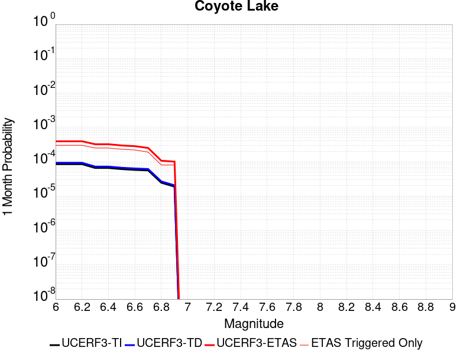 |  |  |

| Magnitude | 1 wk TI Prob | 1 wk TD Prob | 1 wk ETAS Prob | 1 wk ETAS/TD Gain | 1 wk ETAS Triggered Only | 1 mo TI Prob | 1 mo TD Prob | 1 mo ETAS Prob | 1 mo ETAS/TD Gain | 1 mo ETAS Triggered Only | 1 yr TI Prob | 1 yr TD Prob | 1 yr ETAS Prob | 1 yr ETAS/TD Gain | 1 yr ETAS Triggered Only | 10 yr TI Prob | 10 yr TD Prob | 10 yr ETAS Prob | 10 yr ETAS/TD Gain | 10 yr ETAS Triggered Only |
|-----|-----|-----|-----|-----|-----|-----|-----|-----|-----|-----|-----|-----|-----|-----|-----|-----|-----|-----|-----|-----|
| 6.0 | 1.980352E-5 | 2.1706745E-5 | 2.994785E-4 | 13.796564 | 2.7777778E-4 | 8.486947E-5 | 9.302599E-5 | 3.7077794E-4 | 3.9857454 | 2.7777778E-4 | 0.0010327959 | 0.0011320751 | 0.0014403677 | 1.2723252 | 3.08642E-4 | 0.010280091 | 0.011270258 | 0.01166697 | 1.0352 | 4.0123457E-4 |
| 6.1 | 1.980352E-5 | 2.1706745E-5 | 2.994785E-4 | 13.796564 | 2.7777778E-4 | 8.486947E-5 | 9.302599E-5 | 3.7077794E-4 | 3.9857454 | 2.7777778E-4 | 0.0010327959 | 0.0011320751 | 0.0014403677 | 1.2723252 | 3.08642E-4 | 0.010280091 | 0.011270258 | 0.01166697 | 1.0352 | 4.0123457E-4 |
| 6.2 | 1.980352E-5 | 2.1706745E-5 | 2.994785E-4 | 13.796564 | 2.7777778E-4 | 8.486947E-5 | 9.302599E-5 | 3.7077794E-4 | 3.9857454 | 2.7777778E-4 | 0.0010327959 | 0.0011320751 | 0.0014403677 | 1.2723252 | 3.08642E-4 | 0.010280091 | 0.011270258 | 0.01166697 | 1.0352 | 4.0123457E-4 |
| 6.3 | 1.5344787E-5 | 1.682067E-5 | 2.3286641E-4 | 13.844064 | 2.1604939E-4 | 6.576172E-5 | 7.2086936E-5 | 2.8812073E-4 | 3.996851 | 2.1604939E-4 | 8.003548E-4 | 8.773662E-4 | 0.0011240632 | 1.281179 | 2.4691358E-4 | 0.007974784 | 0.00874507 | 0.009051012 | 1.0349846 | 3.08642E-4 |
| 6.4 | 1.5344787E-5 | 1.682067E-5 | 2.3286641E-4 | 13.844064 | 2.1604939E-4 | 6.576172E-5 | 7.2086936E-5 | 2.8812073E-4 | 3.996851 | 2.1604939E-4 | 8.003548E-4 | 8.773662E-4 | 0.0011240632 | 1.281179 | 2.4691358E-4 | 0.007974784 | 0.00874507 | 0.009051012 | 1.0349846 | 3.08642E-4 |
| 6.5 | 1.4189697E-5 | 1.5557987E-5 | 2.31604E-4 | 14.886502 | 2.1604939E-4 | 6.081157E-5 | 6.6675726E-5 | 2.827107E-4 | 4.2400846 | 2.1604939E-4 | 7.401293E-4 | 8.115349E-4 | 0.001027409 | 1.2660071 | 2.1604939E-4 | 0.0073766913 | 0.008091656 | 0.008367186 | 1.0340512 | 2.7777778E-4 |
| 6.6 | 1.3469301E-5 | 1.4771577E-5 | 2.3081776E-4 | 15.625804 | 2.1604939E-4 | 5.7724297E-5 | 6.330556E-5 | 2.7934127E-4 | 4.4125867 | 2.1604939E-4 | 7.025667E-4 | 7.7053264E-4 | 9.864155E-4 | 1.2801737 | 2.1604939E-4 | 0.0070034964 | 0.0076845144 | 0.0079601575 | 1.03587 | 2.7777778E-4 |
| 6.7 | 1.3027966E-5 | 1.4281745E-5 | 2.3032805E-4 | 16.127443 | 2.1604939E-4 | 5.5832945E-5 | 6.120638E-5 | 2.7724254E-4 | 4.5296345 | 2.1604939E-4 | 6.7955407E-4 | 7.4499263E-4 | 9.6088107E-4 | 1.289786 | 2.1604939E-4 | 0.006774798 | 0.0074308286 | 0.0077065425 | 1.037104 | 2.7777778E-4 |
| 6.8 | 5.695434E-6 | 6.2244176E-6 | 9.881643E-5 | 15.87561 | 9.259259E-5 | 2.4408775E-5 | 2.6675973E-5 | 1.1926609E-4 | 4.470918 | 9.259259E-5 | 2.971363E-4 | 3.2476155E-4 | 4.1732407E-4 | 1.2850169 | 9.259259E-5 | 0.0029673933 | 0.0032458105 | 0.0033381025 | 1.0284342 | 9.259259E-5 |
| 6.9 | 4.385688E-6 | 4.7930553E-6 | 9.738521E-5 | 20.31798 | 9.259259E-5 | 1.879567E-5 | 2.0541665E-5 | 1.1313236E-4 | 5.5074577 | 9.259259E-5 | 2.2881327E-4 | 2.5009477E-4 | 3.4266422E-4 | 1.3701375 | 9.259259E-5 | 0.002285778 | 0.0025009478 | 0.002593309 | 1.0369304 | 9.259259E-5 |

## Death Valley (No)
*[(top)](#table-of-contents)*

| 1 Week | 1 Month | 1 Year | 10 Year |
|-----|-----|-----|-----|
|  |  |  |  |

| Magnitude | 1 wk TI Prob | 1 wk TD Prob | 1 wk ETAS Prob | 1 wk ETAS/TD Gain | 1 wk ETAS Triggered Only | 1 mo TI Prob | 1 mo TD Prob | 1 mo ETAS Prob | 1 mo ETAS/TD Gain | 1 mo ETAS Triggered Only | 1 yr TI Prob | 1 yr TD Prob | 1 yr ETAS Prob | 1 yr ETAS/TD Gain | 1 yr ETAS Triggered Only | 10 yr TI Prob | 10 yr TD Prob | 10 yr ETAS Prob | 10 yr ETAS/TD Gain | 10 yr ETAS Triggered Only |
|-----|-----|-----|-----|-----|-----|-----|-----|-----|-----|-----|-----|-----|-----|-----|-----|-----|-----|-----|-----|-----|
| 6.0 | 2.0074807E-5 | 2.2500084E-5 | 2.385446E-4 | 10.601943 | 2.1604939E-4 | 8.603206E-5 | 9.642541E-5 | 3.741764E-4 | 3.8804753 | 2.7777778E-4 | 0.001046937 | 0.0011733545 | 0.0015432902 | 1.3152806 | 3.7037037E-4 | 0.010420183 | 0.011672506 | 0.012069058 | 1.0339731 | 4.0123457E-4 |
| 6.1 | 2.0074807E-5 | 2.2500084E-5 | 2.385446E-4 | 10.601943 | 2.1604939E-4 | 8.603206E-5 | 9.642541E-5 | 3.741764E-4 | 3.8804753 | 2.7777778E-4 | 0.001046937 | 0.0011733545 | 0.0015432902 | 1.3152806 | 3.7037037E-4 | 0.010420183 | 0.011672506 | 0.012069058 | 1.0339731 | 4.0123457E-4 |
| 6.2 | 2.0074807E-5 | 2.2500084E-5 | 2.385446E-4 | 10.601943 | 2.1604939E-4 | 8.603206E-5 | 9.642541E-5 | 3.741764E-4 | 3.8804753 | 2.7777778E-4 | 0.001046937 | 0.0011733545 | 0.0015432902 | 1.3152806 | 3.7037037E-4 | 0.010420183 | 0.011672506 | 0.012069058 | 1.0339731 | 4.0123457E-4 |
| 6.3 | 1.9050609E-5 | 2.1336948E-5 | 2.0651818E-4 | 9.6789 | 1.8518518E-4 | 8.164292E-5 | 9.1440896E-5 | 3.3833188E-4 | 3.7000065 | 2.4691358E-4 | 9.935491E-4 | 0.001112731 | 0.0014518595 | 1.3047712 | 3.3950616E-4 | 0.009891188 | 0.011072419 | 0.011438688 | 1.0330795 | 3.7037037E-4 |
| 6.4 | 1.9050609E-5 | 2.1336948E-5 | 2.0651818E-4 | 9.6789 | 1.8518518E-4 | 8.164292E-5 | 9.1440896E-5 | 3.3833188E-4 | 3.7000065 | 2.4691358E-4 | 9.935491E-4 | 0.001112731 | 0.0014518595 | 1.3047712 | 3.3950616E-4 | 0.009891188 | 0.011072419 | 0.011438688 | 1.0330795 | 3.7037037E-4 |
| 6.5 | 1.8367004E-5 | 2.0561009E-5 | 2.0574238E-4 | 10.006434 | 1.8518518E-4 | 7.8713354E-5 | 8.811567E-5 | 3.350075E-4 | 3.801906 | 2.4691358E-4 | 9.5791375E-4 | 0.0010722869 | 0.0014114289 | 1.3162793 | 3.3950616E-4 | 0.009537951 | 0.0106719155 | 0.011038333 | 1.0343348 | 3.7037037E-4 |
| 6.6 | 1.779439E-5 | 1.9910927E-5 | 1.7422884E-4 | 8.750413 | 1.54321E-4 | 7.625944E-5 | 8.53298E-5 | 3.0136073E-4 | 3.5317178 | 2.1604939E-4 | 9.280632E-4 | 0.0010384015 | 0.001346723 | 1.2969193 | 3.08642E-4 | 0.009241969 | 0.010336253 | 0.01067225 | 1.0325067 | 3.3950616E-4 |
| 6.7 | 1.7025437E-5 | 1.9043426E-5 | 1.7336148E-4 | 9.103481 | 1.54321E-4 | 7.296412E-5 | 8.161216E-5 | 2.976439E-4 | 3.6470535 | 2.1604939E-4 | 8.87976E-4 | 9.931813E-4 | 0.0013015168 | 1.3104523 | 3.08642E-4 | 0.008844362 | 0.009888145 | 0.010224294 | 1.0339952 | 3.3950616E-4 |
| 6.8 | 1.6545107E-5 | 1.8512545E-5 | 1.7283068E-4 | 9.335868 | 1.54321E-4 | 7.090568E-5 | 7.93371E-5 | 2.9536933E-4 | 3.7229662 | 2.1604939E-4 | 8.629347E-4 | 9.655073E-4 | 0.0012738513 | 1.3193595 | 3.08642E-4 | 0.008595915 | 0.009613829 | 0.009950071 | 1.0349748 | 3.3950616E-4 |
| 6.9 | 1.615478E-5 | 1.8087594E-5 | 1.724058E-4 | 9.531715 | 1.54321E-4 | 6.9232934E-5 | 7.751599E-5 | 2.9354863E-4 | 3.786943 | 2.1604939E-4 | 8.4258494E-4 | 9.433546E-4 | 0.0012517055 | 1.3268663 | 3.08642E-4 | 0.008393973 | 0.009394196 | 0.009730512 | 1.0358005 | 3.3950616E-4 |
| 7.0 | 1.5894311E-5 | 1.780555E-5 | 1.721238E-4 | 9.666862 | 1.54321E-4 | 6.81167E-5 | 7.6307304E-5 | 2.923402E-4 | 3.8310907 | 2.1604939E-4 | 8.2900526E-4 | 9.286515E-4 | 0.0012370069 | 1.3320464 | 3.08642E-4 | 0.008259195 | 0.009248397 | 0.009584764 | 1.0363703 | 3.3950616E-4 |
| 7.1 | 1.5602263E-5 | 1.7483504E-5 | 1.7180179E-4 | 9.8265085 | 1.54321E-4 | 6.6865134E-5 | 7.492718E-5 | 2.9096036E-4 | 3.883242 | 2.1604939E-4 | 8.137789E-4 | 9.118627E-4 | 0.0012202233 | 1.3381655 | 3.08642E-4 | 0.008108052 | 0.009081894 | 0.009418317 | 1.0370432 | 3.3950616E-4 |
| 7.2 | 1.5323829E-5 | 1.717063E-5 | 1.7148897E-4 | 9.987343 | 1.54321E-4 | 6.56719E-5 | 7.358637E-5 | 2.8961987E-4 | 3.935781 | 2.1604939E-4 | 7.99262E-4 | 8.9555193E-4 | 0.0012039174 | 1.3443302 | 3.08642E-4 | 0.007963934 | 0.008920107 | 0.009256585 | 1.0377213 | 3.3950616E-4 |
| 7.3 | 1.4556212E-5 | 1.6302456E-5 | 1.7062093E-4 | 10.465965 | 1.54321E-4 | 6.238227E-5 | 6.9865826E-5 | 2.859001E-4 | 4.092131 | 2.1604939E-4 | 7.592395E-4 | 8.5029035E-4 | 0.0011586699 | 1.3626755 | 3.08642E-4 | 0.0075665074 | 0.008471014 | 0.008807644 | 1.039739 | 3.3950616E-4 |
| 7.4 | 1.411725E-5 | 1.580796E-5 | 1.7012651E-4 | 10.762078 | 1.54321E-4 | 6.0501097E-5 | 6.7746674E-5 | 2.837814E-4 | 4.1888614 | 2.1604939E-4 | 7.363519E-4 | 8.245094E-4 | 0.001132897 | 1.3740255 | 3.08642E-4 | 0.0073391674 | 0.008215138 | 0.008551856 | 1.0409874 | 3.3950616E-4 |
| 7.5 | 1.3503312E-5 | 1.5126289E-5 | 1.6944495E-4 | 11.202017 | 1.54321E-4 | 5.7870053E-5 | 6.482538E-5 | 2.8086075E-4 | 4.3325744 | 2.1604939E-4 | 7.043401E-4 | 7.8896893E-4 | 0.0010973674 | 1.390888 | 3.08642E-4 | 0.007021119 | 0.007862304 | 0.008199141 | 1.042842 | 3.3950616E-4 |
| 7.6 | 1.1279839E-5 | 1.2626327E-5 | 1.3608155E-4 | 10.777605 | 1.2345679E-4 | 4.834127E-5 | 5.4111737E-5 | 2.392869E-4 | 4.4220886 | 1.8518518E-4 | 5.88396E-4 | 6.5861654E-4 | 9.0536755E-4 | 1.3746504 | 2.4691358E-4 | 0.005868405 | 0.006567199 | 0.0068124905 | 1.0373511 | 2.4691358E-4 |
| 7.7 | 9.189108E-6 | 1.0283358E-5 | 1.02875E-4 | 10.004027 | 9.259259E-5 | 3.93813E-5 | 4.407082E-5 | 1.6752217E-4 | 3.8012037 | 1.2345679E-4 | 4.7936183E-4 | 5.3643517E-4 | 7.2152104E-4 | 1.3450292 | 1.8518518E-4 | 0.004783291 | 0.005351914 | 0.005536108 | 1.0344164 | 1.8518518E-4 |
| 7.8 | 3.4586725E-7 | 3.6482615E-7 | 3.6482615E-7 | 1.0 | 0.0 | 1.4822873E-6 | 1.5635396E-6 | 1.5635396E-6 | 1.0 | 0.0 | 1.80467E-5 | 1.9035933E-5 | 1.9035933E-5 | 1.0 | 0.0 | 1.8045233E-4 | 1.9034347E-4 | 1.9034347E-4 | 1.0 | 0.0 |
| 7.9 | 2.5591178E-9 | 2.6696718E-9 | 2.6696718E-9 | 1.0 | 0.0 | 1.0967647E-8 | 1.14414505E-8 | 1.14414505E-8 | 1.0 | 0.0 | 1.335311E-7 | 1.3929966E-7 | 1.3929966E-7 | 1.0 | 0.0 | 1.3353102E-6 | 1.3929966E-6 | 1.3929966E-6 | 1.0 | 0.0 |

## San Andreas (Big Bend)
*[(top)](#table-of-contents)*

| 1 Week | 1 Month | 1 Year | 10 Year |
|-----|-----|-----|-----|
|  |  |  |  |

| Magnitude | 1 wk TI Prob | 1 wk TD Prob | 1 wk ETAS Prob | 1 wk ETAS/TD Gain | 1 wk ETAS Triggered Only | 1 mo TI Prob | 1 mo TD Prob | 1 mo ETAS Prob | 1 mo ETAS/TD Gain | 1 mo ETAS Triggered Only | 1 yr TI Prob | 1 yr TD Prob | 1 yr ETAS Prob | 1 yr ETAS/TD Gain | 1 yr ETAS Triggered Only | 10 yr TI Prob | 10 yr TD Prob | 10 yr ETAS Prob | 10 yr ETAS/TD Gain | 10 yr ETAS Triggered Only |
|-----|-----|-----|-----|-----|-----|-----|-----|-----|-----|-----|-----|-----|-----|-----|-----|-----|-----|-----|-----|-----|
| 6.0 | 1.0179969E-4 | 2.0072258E-4 | 3.241546E-4 | 1.6149383 | 1.2345679E-4 | 4.362114E-4 | 8.599571E-4 | 0.0011066584 | 1.2868762 | 2.4691358E-4 | 0.0052979486 | 0.010419999 | 0.01078651 | 1.0351738 | 3.7037037E-4 | 0.051734097 | 0.10144902 | 0.101809554 | 1.0035537 | 4.0123457E-4 |
| 6.1 | 1.0179969E-4 | 2.0072258E-4 | 3.241546E-4 | 1.6149383 | 1.2345679E-4 | 4.362114E-4 | 8.599571E-4 | 0.0011066584 | 1.2868762 | 2.4691358E-4 | 0.0052979486 | 0.010419999 | 0.01078651 | 1.0351738 | 3.7037037E-4 | 0.051734097 | 0.10144902 | 0.101809554 | 1.0035537 | 4.0123457E-4 |
| 6.2 | 1.0179969E-4 | 2.0072258E-4 | 3.241546E-4 | 1.6149383 | 1.2345679E-4 | 4.362114E-4 | 8.599571E-4 | 0.0011066584 | 1.2868762 | 2.4691358E-4 | 0.0052979486 | 0.010419999 | 0.01078651 | 1.0351738 | 3.7037037E-4 | 0.051734097 | 0.10144902 | 0.101809554 | 1.0035537 | 4.0123457E-4 |
| 6.3 | 1.0179969E-4 | 2.0072258E-4 | 3.241546E-4 | 1.6149383 | 1.2345679E-4 | 4.362114E-4 | 8.599571E-4 | 0.0011066584 | 1.2868762 | 2.4691358E-4 | 0.0052979486 | 0.010419999 | 0.01078651 | 1.0351738 | 3.7037037E-4 | 0.051734097 | 0.10144902 | 0.101809554 | 1.0035537 | 4.0123457E-4 |
| 6.4 | 9.1639464E-5 | 1.8429532E-4 | 3.0772935E-4 | 1.6697621 | 1.2345679E-4 | 3.9268145E-4 | 7.895982E-4 | 9.7463717E-4 | 1.2343457 | 1.8518518E-4 | 0.0047704205 | 0.009571102 | 0.00987679 | 1.0319387 | 3.08642E-4 | 0.046693064 | 0.09377527 | 0.094054975 | 1.0029826 | 3.08642E-4 |
| 6.5 | 9.1639464E-5 | 1.8429532E-4 | 3.0772935E-4 | 1.6697621 | 1.2345679E-4 | 3.9268145E-4 | 7.895982E-4 | 9.7463717E-4 | 1.2343457 | 1.8518518E-4 | 0.0047704205 | 0.009571102 | 0.00987679 | 1.0319387 | 3.08642E-4 | 0.046693064 | 0.09377527 | 0.094054975 | 1.0029826 | 3.08642E-4 |
| 6.6 | 9.042622E-5 | 1.823659E-4 | 3.0580017E-4 | 1.6768495 | 1.2345679E-4 | 3.8748336E-4 | 7.8133424E-4 | 9.6637476E-4 | 1.2368263 | 1.8518518E-4 | 0.0047074095 | 0.009471365 | 0.009746512 | 1.0290504 | 2.7777778E-4 | 0.046089325 | 0.092869274 | 0.09312126 | 1.0027133 | 2.7777778E-4 |
| 6.7 | 8.9836685E-5 | 1.8150927E-4 | 3.0494365E-4 | 1.6800445 | 1.2345679E-4 | 3.8495753E-4 | 7.776651E-4 | 9.627063E-4 | 1.2379445 | 1.8518518E-4 | 0.00467679 | 0.00942708 | 0.009702239 | 1.0291882 | 2.7777778E-4 | 0.045795817 | 0.09246355 | 0.09271564 | 1.0027264 | 2.7777778E-4 |
| 6.8 | 8.9471854E-5 | 1.8097709E-4 | 3.0441154E-4 | 1.6820446 | 1.2345679E-4 | 3.8339442E-4 | 7.7538576E-4 | 9.6042734E-4 | 1.2386446 | 1.8518518E-4 | 0.004657841 | 0.009399569 | 0.009674735 | 1.0292745 | 2.7777778E-4 | 0.04561414 | 0.092210755 | 0.09246292 | 1.0027347 | 2.7777778E-4 |
| 6.9 | 8.858234E-5 | 1.7979681E-4 | 3.032314E-4 | 1.6865227 | 1.2345679E-4 | 3.7958333E-4 | 7.703304E-4 | 9.55373E-4 | 1.2402118 | 1.8518518E-4 | 0.004611638 | 0.009338548 | 0.009613733 | 1.0294675 | 2.7777778E-4 | 0.04517103 | 0.09165087 | 0.091903195 | 1.002753 | 2.7777778E-4 |
| 7.0 | 8.7433385E-5 | 1.7818481E-4 | 2.707609E-4 | 1.5195509 | 9.259259E-5 | 3.746607E-4 | 7.634259E-4 | 9.176291E-4 | 1.2019883 | 1.54321E-4 | 0.004551957 | 0.009255203 | 0.009499831 | 1.0264314 | 2.4691358E-4 | 0.044598386 | 0.09088532 | 0.09110979 | 1.0024699 | 2.4691358E-4 |
| 7.1 | 8.684964E-5 | 1.7730435E-4 | 2.6988052E-4 | 1.5221314 | 9.259259E-5 | 3.7215967E-4 | 7.596547E-4 | 9.138585E-4 | 1.202992 | 1.54321E-4 | 0.0045216335 | 0.009209678 | 0.009423737 | 1.023243 | 2.1604939E-4 | 0.04430731 | 0.09046686 | 0.090663366 | 1.0021721 | 2.1604939E-4 |
| 7.2 | 8.606521E-5 | 1.762105E-4 | 2.6878677E-4 | 1.5253732 | 9.259259E-5 | 3.6879873E-4 | 7.549695E-4 | 9.09174E-4 | 1.2042526 | 1.54321E-4 | 0.0044808835 | 0.0091531165 | 0.0093671875 | 1.0233879 | 2.1604939E-4 | 0.043916024 | 0.089947365 | 0.090143986 | 1.002186 | 2.1604939E-4 |
| 7.3 | 8.568266E-5 | 1.7563057E-4 | 2.682069E-4 | 1.5271083 | 9.259259E-5 | 3.6715972E-4 | 7.524855E-4 | 9.066904E-4 | 1.2049273 | 1.54321E-4 | 0.0044610105 | 0.009123127 | 0.009337205 | 1.0234655 | 2.1604939E-4 | 0.043725148 | 0.08966853 | 0.0898652 | 1.0021933 | 2.1604939E-4 |
| 7.4 | 8.5432206E-5 | 1.7525644E-4 | 2.678328E-4 | 1.5282338 | 9.259259E-5 | 3.6608664E-4 | 7.50883E-4 | 9.0508815E-4 | 1.2053651 | 1.54321E-4 | 0.004447999 | 0.009103781 | 0.009317863 | 1.0235158 | 2.1604939E-4 | 0.043600157 | 0.08948871 | 0.089685425 | 1.0021982 | 2.1604939E-4 |
| 7.5 | 8.4791965E-5 | 1.7394972E-4 | 2.665262E-4 | 1.5322025 | 9.259259E-5 | 3.633435E-4 | 7.4528606E-4 | 8.99492E-4 | 1.2069085 | 1.54321E-4 | 0.0044147377 | 0.009036204 | 0.009250301 | 1.0236932 | 2.1604939E-4 | 0.043280575 | 0.088866346 | 0.0890632 | 1.0022151 | 2.1604939E-4 |
| 7.6 | 8.241105E-5 | 1.6840403E-4 | 2.6098103E-4 | 1.5497315 | 9.259259E-5 | 3.531424E-4 | 7.215321E-4 | 8.7574177E-4 | 1.2137252 | 1.54321E-4 | 0.0042910352 | 0.008749358 | 0.008963518 | 1.0244771 | 2.1604939E-4 | 0.042091176 | 0.086243294 | 0.08644071 | 1.002289 | 2.1604939E-4 |
| 7.7 | 7.00432E-5 | 1.42045E-4 | 2.0376463E-4 | 1.4345075 | 6.1728395E-5 | 3.001506E-4 | 6.0862233E-4 | 7.32004E-4 | 1.2027229 | 1.2345679E-4 | 0.0036482112 | 0.0073848404 | 0.007507385 | 1.0165942 | 1.2345679E-4 | 0.035888977 | 0.07351733 | 0.07363171 | 1.0015558 | 1.2345679E-4 |
| 7.8 | 6.415362E-5 | 1.2968935E-4 | 1.9140972E-4 | 1.4759095 | 6.1728395E-5 | 2.749151E-4 | 5.556931E-4 | 6.790813E-4 | 1.2220438 | 1.2345679E-4 | 0.0033419547 | 0.0067446055 | 0.00686723 | 1.0181811 | 1.2345679E-4 | 0.03292141 | 0.06725231 | 0.06736746 | 1.0017123 | 1.2345679E-4 |
| 7.9 | 4.939911E-5 | 9.3411545E-5 | 1.2427286E-4 | 1.3303801 | 3.0864197E-5 | 2.116933E-4 | 4.0027377E-4 | 4.928293E-4 | 1.2312306 | 9.259259E-5 | 0.0025743195 | 0.004862453 | 0.004954595 | 1.0189497 | 9.259259E-5 | 0.025447013 | 0.048914436 | 0.049002502 | 1.0018003 | 9.259259E-5 |
| 8.0 | 3.344983E-5 | 5.222685E-5 | 5.222685E-5 | 1.0 | 0.0 | 1.4334853E-4 | 2.2381016E-4 | 2.5466745E-4 | 1.1378726 | 3.0864197E-5 | 0.0017438711 | 0.0027214854 | 0.0027522657 | 1.0113101 | 3.0864197E-5 | 0.017302496 | 0.027922187 | 0.02795219 | 1.0010746 | 3.0864197E-5 |
| 8.1 | 1.9104898E-5 | 1.9173063E-5 | 1.9173063E-5 | 1.0 | 0.0 | 8.1875565E-5 | 8.216769E-5 | 8.216769E-5 | 1.0 | 0.0 | 9.963791E-4 | 9.999331E-4 | 9.999331E-4 | 1.0 | 0.0 | 0.009919235 | 0.010749801 | 0.010749801 | 1.0 | 0.0 |
| 8.2 | 8.643924E-6 | 5.4748625E-6 | 5.4748625E-6 | 1.0 | 0.0 | 3.704486E-5 | 2.3463486E-5 | 2.3463486E-5 | 1.0 | 0.0 | 4.5092785E-4 | 2.8563058E-4 | 2.8563058E-4 | 1.0 | 0.0 | 0.0045001395 | 0.0032487072 | 0.0032487072 | 1.0 | 0.0 |
| 8.3 | 1.983087E-6 | 7.6599065E-7 | 7.6599065E-7 | 1.0 | 0.0 | 8.498917E-6 | 3.282813E-6 | 3.282813E-6 | 1.0 | 0.0 | 1.034694E-4 | 3.9967534E-5 | 3.9967534E-5 | 1.0 | 0.0 | 0.0010342124 | 4.719687E-4 | 4.719687E-4 | 1.0 | 0.0 |

## San Jacinto (San Bernardino)
*[(top)](#table-of-contents)*

| 1 Week | 1 Month | 1 Year | 10 Year |
|-----|-----|-----|-----|
|  |  |  |  |

| Magnitude | 1 wk TI Prob | 1 wk TD Prob | 1 wk ETAS Prob | 1 wk ETAS/TD Gain | 1 wk ETAS Triggered Only | 1 mo TI Prob | 1 mo TD Prob | 1 mo ETAS Prob | 1 mo ETAS/TD Gain | 1 mo ETAS Triggered Only | 1 yr TI Prob | 1 yr TD Prob | 1 yr ETAS Prob | 1 yr ETAS/TD Gain | 1 yr ETAS Triggered Only | 10 yr TI Prob | 10 yr TD Prob | 10 yr ETAS Prob | 10 yr ETAS/TD Gain | 10 yr ETAS Triggered Only |
|-----|-----|-----|-----|-----|-----|-----|-----|-----|-----|-----|-----|-----|-----|-----|-----|-----|-----|-----|-----|-----|
| 6.0 | 3.409352E-5 | 3.5986508E-5 | 2.2116503E-4 | 6.1457763 | 1.8518518E-4 | 1.461069E-4 | 1.542188E-4 | 4.010943E-4 | 2.6008134 | 2.4691358E-4 | 0.0017774 | 0.0018759987 | 0.0021532553 | 1.1477915 | 2.7777778E-4 | 0.01763251 | 0.019349935 | 0.019652605 | 1.0156419 | 3.08642E-4 |
| 6.1 | 3.409352E-5 | 3.5986508E-5 | 2.2116503E-4 | 6.1457763 | 1.8518518E-4 | 1.461069E-4 | 1.542188E-4 | 4.010943E-4 | 2.6008134 | 2.4691358E-4 | 0.0017774 | 0.0018759987 | 0.0021532553 | 1.1477915 | 2.7777778E-4 | 0.01763251 | 0.019349935 | 0.019652605 | 1.0156419 | 3.08642E-4 |
| 6.2 | 3.409352E-5 | 3.5986508E-5 | 2.2116503E-4 | 6.1457763 | 1.8518518E-4 | 1.461069E-4 | 1.542188E-4 | 4.010943E-4 | 2.6008134 | 2.4691358E-4 | 0.0017774 | 0.0018759987 | 0.0021532553 | 1.1477915 | 2.7777778E-4 | 0.01763251 | 0.019349935 | 0.019652605 | 1.0156419 | 3.08642E-4 |
| 6.3 | 3.409352E-5 | 3.5986508E-5 | 2.2116503E-4 | 6.1457763 | 1.8518518E-4 | 1.461069E-4 | 1.542188E-4 | 4.010943E-4 | 2.6008134 | 2.4691358E-4 | 0.0017774 | 0.0018759987 | 0.0021532553 | 1.1477915 | 2.7777778E-4 | 0.01763251 | 0.019349935 | 0.019652605 | 1.0156419 | 3.08642E-4 |
| 6.4 | 3.400795E-5 | 3.5879173E-5 | 2.2105771E-4 | 6.161171 | 1.8518518E-4 | 1.4574021E-4 | 1.5375883E-4 | 4.0063445E-4 | 2.6056027 | 2.4691358E-4 | 0.0017729428 | 0.0018704084 | 0.0021476666 | 1.148234 | 2.7777778E-4 | 0.017588645 | 0.019295016 | 0.019597704 | 1.0156873 | 3.08642E-4 |
| 6.5 | 3.341482E-5 | 3.5139812E-5 | 2.2031848E-4 | 6.2697687 | 1.8518518E-4 | 1.4319851E-4 | 1.5059051E-4 | 3.974669E-4 | 2.6393888 | 2.4691358E-4 | 0.0017420477 | 0.0018318989 | 0.0021091679 | 1.151356 | 2.7777778E-4 | 0.017284546 | 0.018916558 | 0.019219363 | 1.0160073 | 3.08642E-4 |
| 6.6 | 3.3364955E-5 | 3.5077028E-5 | 2.2025572E-4 | 6.279201 | 1.8518518E-4 | 1.4298483E-4 | 1.5032147E-4 | 3.9719793E-4 | 2.6423233 | 2.4691358E-4 | 0.0017394501 | 0.001828629 | 0.002105899 | 1.1516272 | 2.7777778E-4 | 0.017258976 | 0.018884424 | 0.019187236 | 1.0160351 | 3.08642E-4 |
| 6.7 | 3.335922E-5 | 3.5066805E-5 | 2.2024549E-4 | 6.2807407 | 1.8518518E-4 | 1.4296026E-4 | 1.5027766E-4 | 3.9715413E-4 | 2.6428022 | 2.4691358E-4 | 0.0017391514 | 0.0018280965 | 0.0021053664 | 1.1516714 | 2.7777778E-4 | 0.017256035 | 0.018879214 | 0.01918203 | 1.0160396 | 3.08642E-4 |
| 6.8 | 3.327683E-5 | 3.496087E-5 | 2.2013958E-4 | 6.296742 | 1.8518518E-4 | 1.4260718E-4 | 1.498237E-4 | 3.9670028E-4 | 2.6477807 | 2.4691358E-4 | 0.0017348597 | 0.0018225788 | 0.0020998502 | 1.1521314 | 2.7777778E-4 | 0.017213784 | 0.018824987 | 0.019127818 | 1.0160867 | 3.08642E-4 |
| 6.9 | 3.3235785E-5 | 3.4901823E-5 | 2.2008055E-4 | 6.305703 | 1.8518518E-4 | 1.4243131E-4 | 1.4957068E-4 | 3.964473E-4 | 2.6505685 | 2.4691358E-4 | 0.0017327217 | 0.0018195034 | 0.0020967757 | 1.152389 | 2.7777778E-4 | 0.017192734 | 0.018794855 | 0.019097697 | 1.0161129 | 3.08642E-4 |
| 7.0 | 3.3197095E-5 | 3.4841752E-5 | 2.2002049E-4 | 6.3148513 | 1.8518518E-4 | 1.422655E-4 | 1.4931326E-4 | 3.9618998E-4 | 2.6534145 | 2.4691358E-4 | 0.0017307063 | 0.0018163746 | 0.0020936478 | 1.152652 | 2.7777778E-4 | 0.017172894 | 0.018764233 | 0.019067083 | 1.0161397 | 3.08642E-4 |
| 7.1 | 3.3129716E-5 | 3.4721965E-5 | 2.1990071E-4 | 6.3331876 | 1.8518518E-4 | 1.4197677E-4 | 1.4879994E-4 | 3.956768E-4 | 2.6591191 | 2.4691358E-4 | 0.0017271966 | 0.0018101353 | 0.0020874103 | 1.1531792 | 2.7777778E-4 | 0.017138338 | 0.018703312 | 0.019006182 | 1.0161934 | 3.08642E-4 |
| 7.2 | 3.3034008E-5 | 3.458941E-5 | 2.1976819E-4 | 6.3536263 | 1.8518518E-4 | 1.4156665E-4 | 1.4823192E-4 | 3.9510892E-4 | 2.6654778 | 2.4691358E-4 | 0.0017222111 | 0.0018032312 | 0.002080508 | 1.1537666 | 2.7777778E-4 | 0.017089253 | 0.018635705 | 0.018938595 | 1.0162532 | 3.08642E-4 |
| 7.3 | 3.2956614E-5 | 3.445717E-5 | 2.1963597E-4 | 6.374173 | 1.8518518E-4 | 1.4123498E-4 | 1.4766524E-4 | 3.9454235E-4 | 2.6718702 | 2.4691358E-4 | 0.0017181796 | 0.0017963431 | 0.0020736218 | 1.1543573 | 2.7777778E-4 | 0.017049557 | 0.018568452 | 0.018871363 | 1.0163132 | 3.08642E-4 |
| 7.4 | 3.2915937E-5 | 3.4378863E-5 | 2.1955768E-4 | 6.3864145 | 1.8518518E-4 | 1.4106068E-4 | 1.4732967E-4 | 3.9420687E-4 | 2.6756787 | 2.4691358E-4 | 0.0017160608 | 0.0017922645 | 0.0020695445 | 1.1547092 | 2.7777778E-4 | 0.017028693 | 0.018528719 | 0.018831642 | 1.0163488 | 3.08642E-4 |
| 7.5 | 3.281791E-5 | 3.4243778E-5 | 2.1942263E-4 | 6.407664 | 1.8518518E-4 | 1.406406E-4 | 1.4675081E-4 | 3.9362814E-4 | 2.6822896 | 2.4691358E-4 | 0.0017109542 | 0.0017852283 | 0.0020625102 | 1.1553202 | 2.7777778E-4 | 0.016978411 | 0.018459605 | 0.01876255 | 1.0164112 | 3.08642E-4 |
| 7.6 | 3.2521442E-5 | 3.396873E-5 | 2.1914762E-4 | 6.451452 | 1.8518518E-4 | 1.3937015E-4 | 1.4557215E-4 | 3.924498E-4 | 2.6959126 | 2.4691358E-4 | 0.0016955109 | 0.0017709016 | 0.0020481874 | 1.1565789 | 2.7777778E-4 | 0.016826328 | 0.018317232 | 0.018620221 | 1.0165411 | 3.08642E-4 |
| 7.7 | 3.0287873E-5 | 3.245276E-5 | 2.1763194E-4 | 6.7061143 | 1.8518518E-4 | 1.297987E-4 | 1.3907586E-4 | 3.859551E-4 | 2.7751408 | 2.4691358E-4 | 0.0015791537 | 0.0016919347 | 0.0019692425 | 1.1638998 | 2.7777778E-4 | 0.01567979 | 0.01752809 | 0.017831322 | 1.0172998 | 3.08642E-4 |
| 7.8 | 2.6316151E-5 | 2.9663592E-5 | 2.1484328E-4 | 7.242659 | 1.8518518E-4 | 1.1277862E-4 | 1.2712348E-4 | 3.7400567E-4 | 2.942066 | 2.4691358E-4 | 0.0013722149 | 0.0015466306 | 0.0018239787 | 1.1793242 | 2.7777778E-4 | 0.013637724 | 0.016069634 | 0.016373316 | 1.0188979 | 3.08642E-4 |
| 7.9 | 2.0761147E-5 | 2.34181E-5 | 1.7773548E-4 | 7.589662 | 1.54321E-4 | 8.897331E-5 | 1.0035944E-4 | 2.8552604E-4 | 2.8450344 | 1.8518518E-4 | 0.0010827117 | 0.0012211921 | 0.0014061511 | 1.1514578 | 1.8518518E-4 | 0.010774517 | 0.012793174 | 0.01300646 | 1.0166718 | 2.1604939E-4 |
| 8.0 | 1.5738568E-5 | 1.6033575E-5 | 1.3948839E-4 | 8.699768 | 1.2345679E-4 | 6.744926E-5 | 6.871352E-5 | 2.230239E-4 | 3.2457063 | 1.54321E-4 | 8.2088535E-4 | 8.3626667E-4 | 9.904585E-4 | 1.1843812 | 1.54321E-4 | 0.008178596 | 0.008865921 | 0.009049464 | 1.0207021 | 1.8518518E-4 |
| 8.1 | 1.0105832E-5 | 8.3304985E-6 | 1.0092232E-4 | 12.1147995 | 9.259259E-5 | 4.3309992E-5 | 3.570165E-5 | 1.5915403E-4 | 4.45789 | 1.2345679E-4 | 5.2717153E-4 | 4.345814E-4 | 5.579845E-4 | 1.2839587 | 1.2345679E-4 | 0.005259227 | 0.004677232 | 0.004830831 | 1.0328398 | 1.54321E-4 |
| 8.2 | 4.189207E-6 | 1.5784357E-6 | 1.5784357E-6 | 1.0 | 0.0 | 1.7953622E-5 | 6.7647065E-6 | 6.7647065E-6 | 1.0 | 0.0 | 2.1856341E-4 | 8.235722E-5 | 8.235722E-5 | 1.0 | 0.0 | 0.0021834858 | 9.565867E-4 | 9.565867E-4 | 1.0 | 0.0 |
| 8.3 | 1.2758221E-6 | 3.6149942E-7 | 3.6149942E-7 | 1.0 | 0.0 | 5.4677976E-6 | 1.5492824E-6 | 1.5492824E-6 | 1.0 | 0.0 | 6.65684E-5 | 1.8862354E-5 | 1.8862354E-5 | 1.0 | 0.0 | 6.6548464E-4 | 2.2751294E-4 | 2.2751294E-4 | 1.0 | 0.0 |

## Red Pass
*[(top)](#table-of-contents)*

| 1 Week | 1 Month | 1 Year | 10 Year |
|-----|-----|-----|-----|
|  |  |  |  |

| Magnitude | 1 wk TI Prob | 1 wk TD Prob | 1 wk ETAS Prob | 1 wk ETAS/TD Gain | 1 wk ETAS Triggered Only | 1 mo TI Prob | 1 mo TD Prob | 1 mo ETAS Prob | 1 mo ETAS/TD Gain | 1 mo ETAS Triggered Only | 1 yr TI Prob | 1 yr TD Prob | 1 yr ETAS Prob | 1 yr ETAS/TD Gain | 1 yr ETAS Triggered Only | 10 yr TI Prob | 10 yr TD Prob | 10 yr ETAS Prob | 10 yr ETAS/TD Gain | 10 yr ETAS Triggered Only |
|-----|-----|-----|-----|-----|-----|-----|-----|-----|-----|-----|-----|-----|-----|-----|-----|-----|-----|-----|-----|-----|
| 6.0 | 8.258278E-6 | 8.551265E-6 | 1.32007E-4 | 15.437131 | 1.2345679E-4 | 3.539214E-5 | 3.6647863E-5 | 1.909632E-4 | 5.210759 | 1.54321E-4 | 4.308141E-4 | 4.4611428E-4 | 6.6206726E-4 | 1.4840755 | 2.1604939E-4 | 0.0042997985 | 0.004453945 | 0.0047304854 | 1.062089 | 2.7777778E-4 |
| 6.1 | 3.649988E-6 | 3.7753161E-6 | 6.5503475E-5 | 17.350462 | 6.1728395E-5 | 1.5642712E-5 | 1.6179853E-5 | 1.08770946E-4 | 6.7226167 | 9.259259E-5 | 1.9043336E-4 | 1.9697666E-4 | 3.2040913E-4 | 1.626635 | 1.2345679E-4 | 0.0019027026 | 0.001968488 | 0.0020917018 | 1.0625931 | 1.2345679E-4 |
| 6.2 | 3.649988E-6 | 3.7753161E-6 | 6.5503475E-5 | 17.350462 | 6.1728395E-5 | 1.5642712E-5 | 1.6179853E-5 | 1.08770946E-4 | 6.7226167 | 9.259259E-5 | 1.9043336E-4 | 1.9697666E-4 | 3.2040913E-4 | 1.626635 | 1.2345679E-4 | 0.0019027026 | 0.001968488 | 0.0020917018 | 1.0625931 | 1.2345679E-4 |
| 6.3 | 1.3924937E-6 | 1.4411166E-6 | 1.4411166E-6 | 1.0 | 0.0 | 5.9678164E-6 | 6.1762075E-6 | 6.1762075E-6 | 1.0 | 0.0 | 7.265574E-5 | 7.519415E-5 | 7.519415E-5 | 1.0 | 0.0 | 7.263199E-4 | 7.518258E-4 | 7.518258E-4 | 1.0 | 0.0 |
| 6.4 | 1.3924937E-6 | 1.4411166E-6 | 1.4411166E-6 | 1.0 | 0.0 | 5.9678164E-6 | 6.1762075E-6 | 6.1762075E-6 | 1.0 | 0.0 | 7.265574E-5 | 7.519415E-5 | 7.519415E-5 | 1.0 | 0.0 | 7.263199E-4 | 7.518258E-4 | 7.518258E-4 | 1.0 | 0.0 |
| 6.5 | 9.876812E-7 | 1.0221912E-6 | 1.0221912E-6 | 1.0 | 0.0 | 4.2329125E-6 | 4.3808195E-6 | 4.3808195E-6 | 1.0 | 0.0 | 5.153449E-5 | 5.3336476E-5 | 5.3336476E-5 | 1.0 | 0.0 | 5.1522546E-4 | 5.333648E-4 | 5.333648E-4 | 1.0 | 0.0 |

## San Andreas (Parkfield)
*[(top)](#table-of-contents)*

| 1 Week | 1 Month | 1 Year | 10 Year |
|-----|-----|-----|-----|
|  |  |  |  |

| Magnitude | 1 wk TI Prob | 1 wk TD Prob | 1 wk ETAS Prob | 1 wk ETAS/TD Gain | 1 wk ETAS Triggered Only | 1 mo TI Prob | 1 mo TD Prob | 1 mo ETAS Prob | 1 mo ETAS/TD Gain | 1 mo ETAS Triggered Only | 1 yr TI Prob | 1 yr TD Prob | 1 yr ETAS Prob | 1 yr ETAS/TD Gain | 1 yr ETAS Triggered Only | 10 yr TI Prob | 10 yr TD Prob | 10 yr ETAS Prob | 10 yr ETAS/TD Gain | 10 yr ETAS Triggered Only |
|-----|-----|-----|-----|-----|-----|-----|-----|-----|-----|-----|-----|-----|-----|-----|-----|-----|-----|-----|-----|-----|
| 6.0 | 5.556969E-4 | 7.7782426E-4 | 9.320252E-4 | 1.1982465 | 1.54321E-4 | 0.0023793848 | 0.0033298214 | 0.0034836286 | 1.0461909 | 1.54321E-4 | 0.028586963 | 0.040191233 | 0.04042822 | 1.0058966 | 2.4691358E-4 | 0.25176284 | 0.33716413 | 0.3373278 | 1.0004854 | 2.4691358E-4 |
| 6.1 | 1.925858E-4 | 3.0276453E-4 | 3.953291E-4 | 1.3057312 | 9.259259E-5 | 8.2510663E-4 | 0.0012970108 | 0.0013894832 | 1.0712966 | 9.259259E-5 | 0.0099994885 | 0.015778083 | 0.015929969 | 1.0096264 | 1.54321E-4 | 0.095613256 | 0.1497237 | 0.1498549 | 1.0008764 | 1.54321E-4 |
| 6.2 | 9.4306815E-5 | 1.8242796E-4 | 2.7500367E-4 | 1.5074644 | 9.259259E-5 | 4.0410945E-4 | 7.816011E-4 | 8.741213E-4 | 1.1183727 | 9.259259E-5 | 0.0049089384 | 0.009474681 | 0.00962754 | 1.0161334 | 1.54321E-4 | 0.048019063 | 0.09185409 | 0.09199423 | 1.0015258 | 1.54321E-4 |
| 6.3 | 9.283051E-5 | 1.7939322E-4 | 2.7196918E-4 | 1.5160507 | 9.259259E-5 | 3.9778434E-4 | 7.686027E-4 | 8.6112414E-4 | 1.1203761 | 9.259259E-5 | 0.0048322747 | 0.009317789 | 0.009470672 | 1.0164076 | 1.54321E-4 | 0.047285385 | 0.09050704 | 0.09064739 | 1.0015508 | 1.54321E-4 |
| 6.4 | 9.138826E-5 | 1.770153E-4 | 2.6959152E-4 | 1.5229841 | 9.259259E-5 | 3.916052E-4 | 7.5841765E-4 | 8.5094E-4 | 1.1219939 | 9.259259E-5 | 0.0047573745 | 0.00919484 | 0.0093477415 | 1.0166291 | 1.54321E-4 | 0.046568092 | 0.08940927 | 0.089549795 | 1.0015717 | 1.54321E-4 |
| 6.5 | 9.000255E-5 | 1.7459576E-4 | 2.6717217E-4 | 1.5302329 | 9.259259E-5 | 3.8566816E-4 | 7.480541E-4 | 8.405775E-4 | 1.1236854 | 9.259259E-5 | 0.0046854047 | 0.009069731 | 0.009222654 | 1.0168606 | 1.54321E-4 | 0.045878403 | 0.088295065 | 0.08843576 | 1.0015935 | 1.54321E-4 |
| 6.6 | 8.8109264E-5 | 1.7140752E-4 | 2.6398423E-4 | 1.5400972 | 9.259259E-5 | 3.7755648E-4 | 7.3439797E-4 | 8.269226E-4 | 1.1259869 | 9.259259E-5 | 0.0045870654 | 0.008904854 | 0.0090578 | 1.0171757 | 1.54321E-4 | 0.04493529 | 0.0868267 | 0.08696762 | 1.001623 | 1.54321E-4 |
| 6.7 | 8.738073E-5 | 1.7007832E-4 | 2.3179622E-4 | 1.3628793 | 6.1728395E-5 | 3.7443507E-4 | 7.287046E-4 | 7.9038803E-4 | 1.084648 | 6.1728395E-5 | 0.0045492216 | 0.008836143 | 0.008958509 | 1.0138483 | 1.2345679E-4 | 0.04457213 | 0.08622707 | 0.086339876 | 1.0013083 | 1.2345679E-4 |
| 6.8 | 8.710195E-5 | 1.6953335E-4 | 2.3125127E-4 | 1.364046 | 6.1728395E-5 | 3.7324068E-4 | 7.263703E-4 | 7.8805385E-4 | 1.0849203 | 6.1728395E-5 | 0.0045347405 | 0.008807961 | 0.00893033 | 1.013893 | 1.2345679E-4 | 0.04443313 | 0.08597467 | 0.08608751 | 1.0013125 | 1.2345679E-4 |
| 6.9 | 8.6801556E-5 | 1.689429E-4 | 2.3066087E-4 | 1.3653185 | 6.1728395E-5 | 3.7195362E-4 | 7.2384125E-4 | 7.8552496E-4 | 1.0852172 | 6.1728395E-5 | 0.0045191357 | 0.008777418 | 0.008899791 | 1.0139418 | 1.2345679E-4 | 0.044283327 | 0.085700735 | 0.08581361 | 1.0013171 | 1.2345679E-4 |
| 7.0 | 8.5571606E-5 | 1.6647128E-4 | 2.281894E-4 | 1.3707434 | 6.1728395E-5 | 3.6668387E-4 | 7.132544E-4 | 7.749388E-4 | 1.086483 | 6.1728395E-5 | 0.004455241 | 0.008649553 | 0.008771942 | 1.0141498 | 1.2345679E-4 | 0.043669727 | 0.08454914 | 0.084662154 | 1.0013367 | 1.2345679E-4 |
| 7.1 | 7.82589E-5 | 1.5128135E-4 | 2.1300041E-4 | 1.4079753 | 6.1728395E-5 | 3.3535215E-4 | 6.481883E-4 | 7.0987665E-4 | 1.0951705 | 6.1728395E-5 | 0.0040752706 | 0.007863307 | 0.007985793 | 1.015577 | 1.2345679E-4 | 0.040013418 | 0.07746111 | 0.077575006 | 1.0014703 | 1.2345679E-4 |
| 7.2 | 7.690929E-5 | 1.4865391E-4 | 2.1037312E-4 | 1.4151874 | 6.1728395E-5 | 3.2956956E-4 | 6.369334E-4 | 6.9862243E-4 | 1.0968533 | 6.1728395E-5 | 0.004005129 | 0.007727258 | 0.00784976 | 1.0158533 | 1.2345679E-4 | 0.0393371 | 0.07623427 | 0.07634832 | 1.001496 | 1.2345679E-4 |
| 7.3 | 7.5543794E-5 | 1.4561978E-4 | 2.0733918E-4 | 1.4238394 | 6.1728395E-5 | 3.2371894E-4 | 6.2393624E-4 | 6.856261E-4 | 1.0988721 | 6.1728395E-5 | 0.003934157 | 0.007570127 | 0.0076926495 | 1.0161849 | 1.2345679E-4 | 0.038652334 | 0.074797355 | 0.07491157 | 1.0015271 | 1.2345679E-4 |
| 7.4 | 7.4214564E-5 | 1.4262961E-4 | 2.043492E-4 | 1.4327264 | 6.1728395E-5 | 3.1802364E-4 | 6.111273E-4 | 6.72818E-4 | 1.1009457 | 6.1728395E-5 | 0.003865065 | 0.00741525 | 0.007537791 | 1.0165256 | 1.2345679E-4 | 0.03798529 | 0.07337123 | 0.073485635 | 1.0015591 | 1.2345679E-4 |
| 7.5 | 6.149578E-5 | 1.11907226E-4 | 1.7362871E-4 | 1.5515416 | 6.1728395E-5 | 2.6352672E-4 | 4.7951436E-4 | 5.4121314E-4 | 1.1286694 | 6.1728395E-5 | 0.0032037178 | 0.0058224914 | 0.0059452294 | 1.02108 | 1.2345679E-4 | 0.03157923 | 0.058557566 | 0.05867379 | 1.0019848 | 1.2345679E-4 |
| 7.6 | 6.0643448E-5 | 1.10193796E-4 | 1.719154E-4 | 1.5601186 | 6.1728395E-5 | 2.598746E-4 | 4.7217376E-4 | 5.3387304E-4 | 1.1306707 | 6.1728395E-5 | 0.0031593828 | 0.0057335934 | 0.0058563426 | 1.0214087 | 1.2345679E-4 | 0.031148417 | 0.057718582 | 0.057834912 | 1.0020155 | 1.2345679E-4 |
| 7.7 | 5.1652263E-5 | 9.174698E-5 | 1.5346971E-4 | 1.6727495 | 6.1728395E-5 | 2.2134806E-4 | 3.931421E-4 | 4.5484625E-4 | 1.1569512 | 6.1728395E-5 | 0.002691582 | 0.0047760103 | 0.0048374436 | 1.0128629 | 6.1728395E-5 | 0.026592141 | 0.04853623 | 0.04859496 | 1.0012101 | 6.1728395E-5 |
| 7.8 | 4.8090482E-5 | 8.559635E-5 | 1.4731947E-4 | 1.7210951 | 6.1728395E-5 | 2.060858E-4 | 3.6678996E-4 | 4.2849572E-4 | 1.1682318 | 6.1728395E-5 | 0.0025062072 | 0.0044565317 | 0.004517985 | 1.0137895 | 6.1728395E-5 | 0.024781305 | 0.04530245 | 0.04536138 | 1.0013008 | 6.1728395E-5 |
| 7.9 | 3.970278E-5 | 6.750426E-5 | 9.836637E-5 | 1.4571877 | 3.0864197E-5 | 1.7014367E-4 | 2.892719E-4 | 3.2012718E-4 | 1.1066653 | 3.0864197E-5 | 0.002069531 | 0.0035162016 | 0.0035469572 | 1.0087469 | 3.0864197E-5 | 0.020503636 | 0.035881363 | 0.035911117 | 1.0008293 | 3.0864197E-5 |
| 8.0 | 2.8982335E-5 | 4.069796E-5 | 4.069796E-5 | 1.0 | 0.0 | 1.2420409E-4 | 1.7440817E-4 | 1.7440817E-4 | 1.0 | 0.0 | 0.0015111357 | 0.0021213528 | 0.0021213528 | 1.0 | 0.0 | 0.015009012 | 0.022010697 | 0.022010697 | 1.0 | 0.0 |
| 8.1 | 1.8836186E-5 | 1.8681134E-5 | 1.8681134E-5 | 1.0 | 0.0 | 8.0724014E-5 | 8.005955E-5 | 8.005955E-5 | 1.0 | 0.0 | 9.823717E-4 | 9.742898E-4 | 9.742898E-4 | 1.0 | 0.0 | 0.009780403 | 0.010488115 | 0.010488115 | 1.0 | 0.0 |
| 8.2 | 8.643924E-6 | 5.4748625E-6 | 5.4748625E-6 | 1.0 | 0.0 | 3.704486E-5 | 2.3463486E-5 | 2.3463486E-5 | 1.0 | 0.0 | 4.5092785E-4 | 2.8563058E-4 | 2.8563058E-4 | 1.0 | 0.0 | 0.0045001395 | 0.0032487072 | 0.0032487072 | 1.0 | 0.0 |
| 8.3 | 1.983087E-6 | 7.6599065E-7 | 7.6599065E-7 | 1.0 | 0.0 | 8.498917E-6 | 3.282813E-6 | 3.282813E-6 | 1.0 | 0.0 | 1.034694E-4 | 3.9967534E-5 | 3.9967534E-5 | 1.0 | 0.0 | 0.0010342124 | 4.719687E-4 | 4.719687E-4 | 1.0 | 0.0 |

## Manix-Afton Hills
*[(top)](#table-of-contents)*

| 1 Week | 1 Month | 1 Year | 10 Year |
|-----|-----|-----|-----|
|  |  |  |  |

| Magnitude | 1 wk TI Prob | 1 wk TD Prob | 1 wk ETAS Prob | 1 wk ETAS/TD Gain | 1 wk ETAS Triggered Only | 1 mo TI Prob | 1 mo TD Prob | 1 mo ETAS Prob | 1 mo ETAS/TD Gain | 1 mo ETAS Triggered Only | 1 yr TI Prob | 1 yr TD Prob | 1 yr ETAS Prob | 1 yr ETAS/TD Gain | 1 yr ETAS Triggered Only | 10 yr TI Prob | 10 yr TD Prob | 10 yr ETAS Prob | 10 yr ETAS/TD Gain | 10 yr ETAS Triggered Only |
|-----|-----|-----|-----|-----|-----|-----|-----|-----|-----|-----|-----|-----|-----|-----|-----|-----|-----|-----|-----|-----|
| 6.0 | 1.3783202E-5 | 1.47110895E-5 | 1.3816607E-4 | 9.391967 | 1.2345679E-4 | 5.906953E-5 | 6.30461E-5 | 2.482196E-4 | 3.9371128 | 1.8518518E-4 | 7.189342E-4 | 7.6733343E-4 | 9.83217E-4 | 1.2813426 | 2.1604939E-4 | 0.0071661277 | 0.007648596 | 0.007924249 | 1.0360397 | 2.7777778E-4 |
| 6.1 | 1.3783202E-5 | 1.47110895E-5 | 1.3816607E-4 | 9.391967 | 1.2345679E-4 | 5.906953E-5 | 6.30461E-5 | 2.482196E-4 | 3.9371128 | 1.8518518E-4 | 7.189342E-4 | 7.6733343E-4 | 9.83217E-4 | 1.2813426 | 2.1604939E-4 | 0.0071661277 | 0.007648596 | 0.007924249 | 1.0360397 | 2.7777778E-4 |
| 6.2 | 1.3783202E-5 | 1.47110895E-5 | 1.3816607E-4 | 9.391967 | 1.2345679E-4 | 5.906953E-5 | 6.30461E-5 | 2.482196E-4 | 3.9371128 | 1.8518518E-4 | 7.189342E-4 | 7.6733343E-4 | 9.83217E-4 | 1.2813426 | 2.1604939E-4 | 0.0071661277 | 0.007648596 | 0.007924249 | 1.0360397 | 2.7777778E-4 |
| 6.3 | 1.10494875E-5 | 1.1793136E-5 | 7.35208E-5 | 6.2342033 | 6.1728395E-5 | 4.7354086E-5 | 5.054109E-5 | 1.7399163E-4 | 3.442578 | 1.2345679E-4 | 5.763835E-4 | 6.151744E-4 | 7.385553E-4 | 1.2005624 | 1.2345679E-4 | 0.005748908 | 0.0061357557 | 0.0062891296 | 1.0249968 | 1.54321E-4 |
| 6.4 | 1.10494875E-5 | 1.1793136E-5 | 7.35208E-5 | 6.2342033 | 6.1728395E-5 | 4.7354086E-5 | 5.054109E-5 | 1.7399163E-4 | 3.442578 | 1.2345679E-4 | 5.763835E-4 | 6.151744E-4 | 7.385553E-4 | 1.2005624 | 1.2345679E-4 | 0.005748908 | 0.0061357557 | 0.0062891296 | 1.0249968 | 1.54321E-4 |
| 6.5 | 9.788949E-6 | 1.045432E-5 | 7.218207E-5 | 6.904521 | 6.1728395E-5 | 4.1951964E-5 | 4.480351E-5 | 1.6825477E-4 | 3.7553926 | 1.2345679E-4 | 5.1064545E-4 | 5.453555E-4 | 6.6874496E-4 | 1.226255 | 1.2345679E-4 | 0.0050947363 | 0.0054410985 | 0.0055638836 | 1.0225662 | 1.2345679E-4 |
| 6.6 | 8.810006E-6 | 9.4136285E-6 | 7.114144E-5 | 7.557282 | 6.1728395E-5 | 3.775662E-5 | 4.0343548E-5 | 1.6379535E-4 | 4.060014 | 1.2345679E-4 | 4.5958988E-4 | 4.9108086E-4 | 6.1447703E-4 | 1.2512746 | 1.2345679E-4 | 0.0045864056 | 0.004900839 | 0.005023691 | 1.0250674 | 1.2345679E-4 |
| 6.7 | 8.80128E-6 | 9.404108E-6 | 7.113192E-5 | 7.56392 | 6.1728395E-5 | 3.7719226E-5 | 4.0302748E-5 | 1.6375456E-4 | 4.063112 | 1.2345679E-4 | 4.591348E-4 | 4.9058435E-4 | 6.139806E-4 | 1.2515291 | 1.2345679E-4 | 0.004581874 | 0.0048958957 | 0.0050187483 | 1.025093 | 1.2345679E-4 |
| 6.8 | 6.8994877E-6 | 7.380076E-6 | 6.910801E-5 | 9.364133 | 6.1728395E-5 | 2.9568899E-5 | 3.162856E-5 | 1.5508145E-4 | 4.903209 | 1.2345679E-4 | 3.5994186E-4 | 3.8501783E-4 | 5.084271E-4 | 1.3205286 | 1.2345679E-4 | 0.003593594 | 0.0038443129 | 0.003967295 | 1.0319906 | 1.2345679E-4 |
| 6.9 | 4.9328037E-6 | 5.2709615E-6 | 3.6134996E-5 | 6.855485 | 3.0864197E-5 | 2.1140417E-5 | 2.2589675E-5 | 1.1518018E-4 | 5.098798 | 9.259259E-5 | 2.5735417E-4 | 2.7500073E-4 | 3.6756785E-4 | 1.3366069 | 9.259259E-5 | 0.0025705635 | 0.0027472095 | 0.0028395476 | 1.0336117 | 9.259259E-5 |
| 7.0 | 3.347973E-6 | 3.59003E-6 | 3.4454115E-5 | 9.597167 | 3.0864197E-5 | 1.4348378E-5 | 1.5385775E-5 | 7.711322E-5 | 5.0119815 | 6.1728395E-5 | 1.746775E-4 | 1.8730981E-4 | 2.4902663E-4 | 1.3294907 | 6.1728395E-5 | 0.0017454025 | 0.0018719219 | 0.0019335349 | 1.0329142 | 6.1728395E-5 |
| 7.1 | 1.2073567E-6 | 1.293482E-6 | 1.293482E-6 | 1.0 | 0.0 | 5.1743755E-6 | 5.543492E-6 | 3.6407517E-5 | 6.5676146 | 3.0864197E-5 | 6.29962E-5 | 6.749156E-5 | 9.8353674E-5 | 1.4572737 | 3.0864197E-5 | 6.297835E-4 | 6.7487074E-4 | 7.057141E-4 | 1.0457026 | 3.0864197E-5 |

## Sierra Nevada  (No Extension)
*[(top)](#table-of-contents)*

| 1 Week | 1 Month | 1 Year | 10 Year |
|-----|-----|-----|-----|
|  |  |  |  |

| Magnitude | 1 wk TI Prob | 1 wk TD Prob | 1 wk ETAS Prob | 1 wk ETAS/TD Gain | 1 wk ETAS Triggered Only | 1 mo TI Prob | 1 mo TD Prob | 1 mo ETAS Prob | 1 mo ETAS/TD Gain | 1 mo ETAS Triggered Only | 1 yr TI Prob | 1 yr TD Prob | 1 yr ETAS Prob | 1 yr ETAS/TD Gain | 1 yr ETAS Triggered Only | 10 yr TI Prob | 10 yr TD Prob | 10 yr ETAS Prob | 10 yr ETAS/TD Gain | 10 yr ETAS Triggered Only |
|-----|-----|-----|-----|-----|-----|-----|-----|-----|-----|-----|-----|-----|-----|-----|-----|-----|-----|-----|-----|-----|
| 6.0 | 7.7690465E-6 | 6.976322E-6 | 1.6129624E-4 | 23.120527 | 1.54321E-4 | 3.329549E-5 | 2.9898381E-5 | 2.1507803E-4 | 7.1936345 | 1.8518518E-4 | 4.0529718E-4 | 3.6398784E-4 | 5.799586E-4 | 1.593346 | 2.1604939E-4 | 0.004045588 | 0.0036374326 | 0.0038526962 | 1.05918 | 2.1604939E-4 |
| 6.1 | 7.7690465E-6 | 6.976322E-6 | 1.6129624E-4 | 23.120527 | 1.54321E-4 | 3.329549E-5 | 2.9898381E-5 | 2.1507803E-4 | 7.1936345 | 1.8518518E-4 | 4.0529718E-4 | 3.6398784E-4 | 5.799586E-4 | 1.593346 | 2.1604939E-4 | 0.004045588 | 0.0036374326 | 0.0038526962 | 1.05918 | 2.1604939E-4 |
| 6.2 | 7.7690465E-6 | 6.976322E-6 | 1.6129624E-4 | 23.120527 | 1.54321E-4 | 3.329549E-5 | 2.9898381E-5 | 2.1507803E-4 | 7.1936345 | 1.8518518E-4 | 4.0529718E-4 | 3.6398784E-4 | 5.799586E-4 | 1.593346 | 2.1604939E-4 | 0.004045588 | 0.0036374326 | 0.0038526962 | 1.05918 | 2.1604939E-4 |
| 6.3 | 7.7690465E-6 | 6.976322E-6 | 1.6129624E-4 | 23.120527 | 1.54321E-4 | 3.329549E-5 | 2.9898381E-5 | 2.1507803E-4 | 7.1936345 | 1.8518518E-4 | 4.0529718E-4 | 3.6398784E-4 | 5.799586E-4 | 1.593346 | 2.1604939E-4 | 0.004045588 | 0.0036374326 | 0.0038526962 | 1.05918 | 2.1604939E-4 |
| 6.4 | 7.7690465E-6 | 6.976322E-6 | 1.6129624E-4 | 23.120527 | 1.54321E-4 | 3.329549E-5 | 2.9898381E-5 | 2.1507803E-4 | 7.1936345 | 1.8518518E-4 | 4.0529718E-4 | 3.6398784E-4 | 5.799586E-4 | 1.593346 | 2.1604939E-4 | 0.004045588 | 0.0036374326 | 0.0038526962 | 1.05918 | 2.1604939E-4 |
| 6.5 | 7.7690465E-6 | 6.976322E-6 | 1.6129624E-4 | 23.120527 | 1.54321E-4 | 3.329549E-5 | 2.9898381E-5 | 2.1507803E-4 | 7.1936345 | 1.8518518E-4 | 4.0529718E-4 | 3.6398784E-4 | 5.799586E-4 | 1.593346 | 2.1604939E-4 | 0.004045588 | 0.0036374326 | 0.0038526962 | 1.05918 | 2.1604939E-4 |
| 6.6 | 2.653E-6 | 1.614854E-6 | 9.4207295E-5 | 58.337967 | 9.259259E-5 | 1.136995E-5 | 6.9207845E-6 | 1.3037672E-4 | 18.83843 | 1.2345679E-4 | 1.3842035E-4 | 8.425733E-5 | 2.3856532E-4 | 2.8313894 | 1.54321E-4 | 0.0013833415 | 8.422573E-4 | 9.964483E-4 | 1.1830688 | 1.54321E-4 |
| 6.7 | 2.5902466E-6 | 1.5501876E-6 | 9.414263E-5 | 60.72984 | 9.259259E-5 | 1.11010095E-5 | 6.643644E-6 | 1.3009961E-4 | 19.58257 | 1.2345679E-4 | 1.351464E-4 | 8.0883394E-5 | 2.351919E-4 | 2.9077897 | 1.54321E-4 | 0.0013506424 | 8.0854254E-4 | 9.6273876E-4 | 1.1907089 | 1.54321E-4 |
| 6.8 | 2.5853892E-6 | 1.5469877E-6 | 9.413944E-5 | 60.853382 | 9.259259E-5 | 1.1080193E-5 | 6.629931E-6 | 1.300859E-4 | 19.621004 | 1.2345679E-4 | 1.34893E-4 | 8.071645E-5 | 2.3502499E-4 | 2.911736 | 1.54321E-4 | 0.0013481114 | 8.068743E-4 | 9.6107076E-4 | 1.1911035 | 1.54321E-4 |
| 6.9 | 2.458257E-6 | 1.4220619E-6 | 9.4014526E-5 | 66.11141 | 9.259259E-5 | 1.0535345E-5 | 6.094537E-6 | 1.2955058E-4 | 21.256836 | 1.2345679E-4 | 1.2826028E-4 | 7.4198484E-5 | 2.2850803E-4 | 3.079686 | 1.54321E-4 | 0.0012818627 | 7.4173906E-4 | 8.959456E-4 | 1.2078986 | 1.54321E-4 |
| 7.0 | 2.4341468E-6 | 1.3990258E-6 | 9.399149E-5 | 67.183525 | 9.259259E-5 | 1.0432016E-5 | 5.9958115E-6 | 1.2945186E-4 | 21.590384 | 1.2345679E-4 | 1.270024E-4 | 7.2996576E-5 | 2.273063E-4 | 3.113931 | 1.54321E-4 | 0.0012692984 | 7.297279E-4 | 8.839363E-4 | 1.2113231 | 1.54321E-4 |
| 7.1 | 2.3652476E-6 | 1.3339754E-6 | 9.392644E-5 | 70.41093 | 9.259259E-5 | 1.0136736E-5 | 5.717025E-6 | 1.291731E-4 | 22.594461 | 1.2345679E-4 | 1.2340778E-4 | 6.9602575E-5 | 2.2391282E-4 | 3.2170193 | 1.54321E-4 | 0.0012333926 | 6.9580943E-4 | 8.5002306E-4 | 1.221632 | 1.54321E-4 |
| 7.2 | 2.272158E-6 | 1.2502821E-6 | 9.384276E-5 | 75.05727 | 9.259259E-5 | 9.737784E-6 | 5.3583412E-6 | 1.2881447E-4 | 24.039991 | 1.2345679E-4 | 1.1855107E-4 | 6.5235865E-5 | 2.1954678E-4 | 3.3654308 | 1.54321E-4 | 0.0011848784 | 6.5216864E-4 | 8.06389E-4 | 1.2364731 | 1.54321E-4 |
| 7.3 | 2.1382127E-6 | 1.1419703E-6 | 9.373446E-5 | 82.081345 | 9.259259E-5 | 9.163737E-6 | 4.8941492E-6 | 1.2835034E-4 | 26.22526 | 1.2345679E-4 | 1.1156279E-4 | 5.958465E-5 | 2.1389645E-4 | 3.589791 | 1.54321E-4 | 0.001115068 | 5.956879E-4 | 7.4991694E-4 | 1.2589092 | 1.54321E-4 |
| 7.4 | 1.9048055E-6 | 9.575242E-7 | 6.268586E-5 | 65.466606 | 6.1728395E-5 | 8.163426E-6 | 4.1036687E-6 | 9.669588E-5 | 23.563276 | 9.259259E-5 | 9.9385186E-5 | 4.996103E-5 | 1.7341165E-4 | 3.4709382 | 1.2345679E-4 | 9.934074E-4 | 4.994987E-4 | 6.228938E-4 | 1.2470379 | 1.2345679E-4 |
| 7.5 | 1.5373403E-6 | 7.560042E-7 | 6.248435E-5 | 82.650795 | 6.1728395E-5 | 6.5885843E-6 | 3.2400142E-6 | 9.583231E-5 | 29.577744 | 9.259259E-5 | 8.021306E-5 | 3.9446462E-5 | 1.320354E-4 | 3.3472052 | 9.259259E-5 | 8.0184115E-4 | 3.943951E-4 | 4.8695115E-4 | 1.2346786 | 9.259259E-5 |
| 7.6 | 1.0680322E-6 | 4.6596554E-7 | 3.133015E-5 | 67.23705 | 3.0864197E-5 | 4.577273E-6 | 1.9969937E-6 | 6.372527E-5 | 31.9106 | 6.1728395E-5 | 5.5726876E-5 | 2.4313129E-5 | 8.6040025E-5 | 3.5388298 | 6.1728395E-5 | 5.5712904E-4 | 2.4310495E-4 | 3.0481836E-4 | 1.2538549 | 6.1728395E-5 |
| 7.7 | 5.509146E-7 | 1.5580486E-7 | 1.5580486E-7 | 1.0 | 0.0 | 2.3610605E-6 | 6.677349E-7 | 3.1531912E-5 | 47.2222 | 3.0864197E-5 | 2.8745531E-5 | 8.129644E-6 | 3.8993592E-5 | 4.7964697 | 3.0864197E-5 | 2.8741814E-4 | 8.1293576E-5 | 1.1215527E-4 | 1.3796326 | 3.0864197E-5 |

## San Andreas (Cholame) rev
*[(top)](#table-of-contents)*

| 1 Week | 1 Month | 1 Year | 10 Year |
|-----|-----|-----|-----|
|  |  |  |  |

| Magnitude | 1 wk TI Prob | 1 wk TD Prob | 1 wk ETAS Prob | 1 wk ETAS/TD Gain | 1 wk ETAS Triggered Only | 1 mo TI Prob | 1 mo TD Prob | 1 mo ETAS Prob | 1 mo ETAS/TD Gain | 1 mo ETAS Triggered Only | 1 yr TI Prob | 1 yr TD Prob | 1 yr ETAS Prob | 1 yr ETAS/TD Gain | 1 yr ETAS Triggered Only | 10 yr TI Prob | 10 yr TD Prob | 10 yr ETAS Prob | 10 yr ETAS/TD Gain | 10 yr ETAS Triggered Only |
|-----|-----|-----|-----|-----|-----|-----|-----|-----|-----|-----|-----|-----|-----|-----|-----|-----|-----|-----|-----|-----|
| 6.0 | 1.2302514E-4 | 2.5204287E-4 | 3.4461214E-4 | 1.3672758 | 9.259259E-5 | 5.27144E-4 | 0.0010797381 | 0.0012030617 | 1.1142161 | 1.2345679E-4 | 0.0063991086 | 0.0130670825 | 0.013249848 | 1.0139867 | 1.8518518E-4 | 0.06217949 | 0.12439073 | 0.124552876 | 1.0013036 | 1.8518518E-4 |
| 6.1 | 1.2302514E-4 | 2.5204287E-4 | 3.4461214E-4 | 1.3672758 | 9.259259E-5 | 5.27144E-4 | 0.0010797381 | 0.0012030617 | 1.1142161 | 1.2345679E-4 | 0.0063991086 | 0.0130670825 | 0.013249848 | 1.0139867 | 1.8518518E-4 | 0.06217949 | 0.12439073 | 0.124552876 | 1.0013036 | 1.8518518E-4 |
| 6.2 | 1.2203569E-4 | 2.5021084E-4 | 3.4278026E-4 | 1.3699657 | 9.259259E-5 | 5.2290526E-4 | 0.0010718931 | 0.0011952176 | 1.1150529 | 1.2345679E-4 | 0.006347804 | 0.01297271 | 0.013155493 | 1.0140898 | 1.8518518E-4 | 0.061695136 | 0.12357691 | 0.123739205 | 1.0013133 | 1.8518518E-4 |
| 6.3 | 1.2142645E-4 | 2.4907055E-4 | 3.416401E-4 | 1.3716599 | 9.259259E-5 | 5.202953E-4 | 0.0010670102 | 0.0011903353 | 1.11558 | 1.2345679E-4 | 0.006316212 | 0.012913967 | 0.013096761 | 1.0141547 | 1.8518518E-4 | 0.06139677 | 0.12307103 | 0.12323342 | 1.0013195 | 1.8518518E-4 |
| 6.4 | 1.1865206E-4 | 2.44126E-4 | 3.36696E-4 | 1.3791894 | 9.259259E-5 | 5.0840975E-4 | 0.0010458364 | 0.0011691641 | 1.1179225 | 1.2345679E-4 | 0.006172335 | 0.012659196 | 0.012842037 | 1.0144433 | 1.8518518E-4 | 0.060036868 | 0.1208638 | 0.121026605 | 1.001347 | 1.8518518E-4 |
| 6.5 | 1.17443946E-4 | 2.4205919E-4 | 3.3462938E-4 | 1.3824278 | 9.259259E-5 | 5.032341E-4 | 0.0010369857 | 0.0011603144 | 1.1189301 | 1.2345679E-4 | 0.006109677 | 0.012552682 | 0.012735543 | 1.0145675 | 1.8518518E-4 | 0.059444077 | 0.11993805 | 0.12010103 | 1.0013589 | 1.8518518E-4 |
| 6.6 | 1.13579066E-4 | 2.3514954E-4 | 3.2772037E-4 | 1.3936678 | 9.259259E-5 | 4.866766E-4 | 0.001007396 | 0.0011307284 | 1.122427 | 1.2345679E-4 | 0.0059092017 | 0.012196515 | 0.012379441 | 1.0149983 | 1.8518518E-4 | 0.057545185 | 0.11685214 | 0.11701569 | 1.0013996 | 1.8518518E-4 |
| 6.7 | 1.1271412E-4 | 2.3359268E-4 | 3.2616366E-4 | 1.3962922 | 9.259259E-5 | 4.829711E-4 | 0.0010007289 | 0.0011240622 | 1.1232435 | 1.2345679E-4 | 0.005864331 | 0.012116249 | 0.01229919 | 1.0150988 | 1.8518518E-4 | 0.057119697 | 0.116155714 | 0.11631939 | 1.001409 | 1.8518518E-4 |
| 6.8 | 1.1217975E-4 | 2.3247694E-4 | 3.2504802E-4 | 1.3981946 | 9.259259E-5 | 4.8068175E-4 | 9.959509E-4 | 0.0011192847 | 1.1238352 | 1.2345679E-4 | 0.005836608 | 0.012058721 | 0.012241674 | 1.0151718 | 1.8518518E-4 | 0.056856725 | 0.11565396 | 0.11581773 | 1.001416 | 1.8518518E-4 |
| 6.9 | 1.1146753E-4 | 2.3096445E-4 | 3.2353567E-4 | 1.4008029 | 9.259259E-5 | 4.7763053E-4 | 9.894737E-4 | 0.0011128082 | 1.1246467 | 1.2345679E-4 | 0.0057996577 | 0.011980731 | 0.012163698 | 1.0152718 | 1.8518518E-4 | 0.056506127 | 0.11497439 | 0.115138285 | 1.0014255 | 1.8518518E-4 |
| 7.0 | 1.0965793E-4 | 2.2719789E-4 | 3.1976943E-4 | 1.407449 | 9.259259E-5 | 4.698779E-4 | 9.733434E-4 | 0.0010966801 | 1.1267143 | 1.2345679E-4 | 0.005705768 | 0.011786487 | 0.011969489 | 1.0155264 | 1.8518518E-4 | 0.055614736 | 0.11327597 | 0.11344017 | 1.0014496 | 1.8518518E-4 |
| 7.1 | 9.927982E-5 | 2.0538924E-4 | 2.979628E-4 | 1.4507226 | 9.259259E-5 | 4.2541555E-4 | 8.7994366E-4 | 0.0010032918 | 1.1401774 | 1.2345679E-4 | 0.0051671406 | 0.010660981 | 0.010844192 | 1.0171852 | 1.8518518E-4 | 0.05048634 | 0.1033706 | 0.10353664 | 1.0016062 | 1.8518518E-4 |
| 7.2 | 9.696786E-5 | 2.0043184E-4 | 2.9300587E-4 | 1.4618729 | 9.259259E-5 | 4.1551032E-4 | 8.5871184E-4 | 9.820627E-4 | 1.1436462 | 1.2345679E-4 | 0.00504711 | 0.010404981 | 0.010588239 | 1.0176126 | 1.8518518E-4 | 0.04934009 | 0.1011086 | 0.101275064 | 1.0016464 | 1.8518518E-4 |
| 7.3 | 9.4727984E-5 | 1.9472468E-4 | 2.8729925E-4 | 1.4754126 | 9.259259E-5 | 4.0591392E-4 | 8.3426846E-4 | 9.5762225E-4 | 1.1478586 | 1.2345679E-4 | 0.0049308087 | 0.010110183 | 0.010293496 | 1.0181315 | 1.8518518E-4 | 0.048228268 | 0.09847952 | 0.09864646 | 1.0016953 | 1.8518518E-4 |
| 7.4 | 9.220358E-5 | 1.8843076E-4 | 2.810059E-4 | 1.4912953 | 9.259259E-5 | 3.9509835E-4 | 8.073114E-4 | 9.306685E-4 | 1.1528 | 1.2345679E-4 | 0.004799717 | 0.009784967 | 0.009968339 | 1.0187403 | 1.8518518E-4 | 0.046973653 | 0.095557496 | 0.095724985 | 1.0017527 | 1.8518518E-4 |
| 7.5 | 7.71631E-5 | 1.5177966E-4 | 2.443582E-4 | 1.6099535 | 9.259259E-5 | 3.306571E-4 | 6.503223E-4 | 7.736988E-4 | 1.189716 | 1.2345679E-4 | 0.0040183207 | 0.007889002 | 0.0080727255 | 1.0232886 | 1.8518518E-4 | 0.03946433 | 0.07828531 | 0.07845599 | 1.0021803 | 1.8518518E-4 |
| 7.6 | 7.5634416E-5 | 1.483744E-4 | 2.4095325E-4 | 1.6239544 | 9.259259E-5 | 3.241072E-4 | 6.3573546E-4 | 7.5911375E-4 | 1.1940718 | 1.2345679E-4 | 0.0039388672 | 0.0077126776 | 0.0078964345 | 1.0238253 | 1.8518518E-4 | 0.038697794 | 0.07664872 | 0.07681971 | 1.0022309 | 1.8518518E-4 |
| 7.7 | 6.3783E-5 | 1.235872E-4 | 1.8530797E-4 | 1.4994106 | 6.1728395E-5 | 2.7332708E-4 | 5.29552E-4 | 6.2209554E-4 | 1.1747582 | 9.259259E-5 | 0.0033226798 | 0.0064282627 | 0.00652026 | 1.0143114 | 9.259259E-5 | 0.032734364 | 0.06454029 | 0.06462691 | 1.001342 | 9.259259E-5 |
| 7.8 | 5.863422E-5 | 1.1416107E-4 | 1.7588242E-4 | 1.5406514 | 6.1728395E-5 | 2.512653E-4 | 4.8917E-4 | 5.8171735E-4 | 1.1891925 | 9.259259E-5 | 0.003054864 | 0.0059394026 | 0.006031445 | 1.015497 | 9.259259E-5 | 0.030132094 | 0.059659187 | 0.059746254 | 1.0014595 | 9.259259E-5 |
| 7.9 | 4.595283E-5 | 8.426331E-5 | 1.1512491E-4 | 1.3662518 | 3.0864197E-5 | 1.9692584E-4 | 3.610785E-4 | 4.2278462E-4 | 1.1708939 | 6.1728395E-5 | 0.0023949358 | 0.0043872762 | 0.0044487338 | 1.0140082 | 6.1728395E-5 | 0.023692891 | 0.044362005 | 0.044420995 | 1.0013298 | 6.1728395E-5 |
| 8.0 | 3.2950178E-5 | 5.0772942E-5 | 5.0772942E-5 | 1.0 | 0.0 | 1.412074E-4 | 2.1758018E-4 | 2.4843766E-4 | 1.1418211 | 3.0864197E-5 | 0.0017178444 | 0.0026458222 | 0.0026766048 | 1.0116343 | 3.0864197E-5 | 0.017046256 | 0.027180137 | 0.027210163 | 1.0011047 | 3.0864197E-5 |
| 8.1 | 1.9177472E-5 | 1.9185145E-5 | 1.9185145E-5 | 1.0 | 0.0 | 8.218658E-5 | 8.221946E-5 | 8.221946E-5 | 1.0 | 0.0 | 0.0010001622 | 0.0010005629 | 0.0010005629 | 1.0 | 0.0 | 0.009956728 | 0.010758142 | 0.010758142 | 1.0 | 0.0 |
| 8.2 | 8.643924E-6 | 5.4748625E-6 | 5.4748625E-6 | 1.0 | 0.0 | 3.704486E-5 | 2.3463486E-5 | 2.3463486E-5 | 1.0 | 0.0 | 4.5092785E-4 | 2.8563058E-4 | 2.8563058E-4 | 1.0 | 0.0 | 0.0045001395 | 0.0032487072 | 0.0032487072 | 1.0 | 0.0 |
| 8.3 | 1.983087E-6 | 7.6599065E-7 | 7.6599065E-7 | 1.0 | 0.0 | 8.498917E-6 | 3.282813E-6 | 3.282813E-6 | 1.0 | 0.0 | 1.034694E-4 | 3.9967534E-5 | 3.9967534E-5 | 1.0 | 0.0 | 0.0010342124 | 4.719687E-4 | 4.719687E-4 | 1.0 | 0.0 |

## Death Valley (Fish Lake Valley)
*[(top)](#table-of-contents)*

| 1 Week | 1 Month | 1 Year | 10 Year |
|-----|-----|-----|-----|
|  |  |  |  |

| Magnitude | 1 wk TI Prob | 1 wk TD Prob | 1 wk ETAS Prob | 1 wk ETAS/TD Gain | 1 wk ETAS Triggered Only | 1 mo TI Prob | 1 mo TD Prob | 1 mo ETAS Prob | 1 mo ETAS/TD Gain | 1 mo ETAS Triggered Only | 1 yr TI Prob | 1 yr TD Prob | 1 yr ETAS Prob | 1 yr ETAS/TD Gain | 1 yr ETAS Triggered Only | 10 yr TI Prob | 10 yr TD Prob | 10 yr ETAS Prob | 10 yr ETAS/TD Gain | 10 yr ETAS Triggered Only |
|-----|-----|-----|-----|-----|-----|-----|-----|-----|-----|-----|-----|-----|-----|-----|-----|-----|-----|-----|-----|-----|
| 6.0 | 3.872328E-5 | 4.7267473E-5 | 1.0899295E-4 | 2.3058765 | 6.1728395E-5 | 1.6594635E-4 | 2.0256084E-4 | 3.2599262E-4 | 1.6093565 | 1.2345679E-4 | 0.0020185246 | 0.002463534 | 0.002648263 | 1.0749854 | 1.8518518E-4 | 0.02000288 | 0.024388181 | 0.024598962 | 1.0086427 | 2.1604939E-4 |
| 6.1 | 3.872328E-5 | 4.7267473E-5 | 1.0899295E-4 | 2.3058765 | 6.1728395E-5 | 1.6594635E-4 | 2.0256084E-4 | 3.2599262E-4 | 1.6093565 | 1.2345679E-4 | 0.0020185246 | 0.002463534 | 0.002648263 | 1.0749854 | 1.8518518E-4 | 0.02000288 | 0.024388181 | 0.024598962 | 1.0086427 | 2.1604939E-4 |
| 6.2 | 3.872328E-5 | 4.7267473E-5 | 1.0899295E-4 | 2.3058765 | 6.1728395E-5 | 1.6594635E-4 | 2.0256084E-4 | 3.2599262E-4 | 1.6093565 | 1.2345679E-4 | 0.0020185246 | 0.002463534 | 0.002648263 | 1.0749854 | 1.8518518E-4 | 0.02000288 | 0.024388181 | 0.024598962 | 1.0086427 | 2.1604939E-4 |
| 6.3 | 2.8356371E-5 | 3.3609853E-5 | 9.5336174E-5 | 2.8365545 | 6.1728395E-5 | 1.2152165E-4 | 1.4403471E-4 | 2.6747372E-4 | 1.8570087 | 1.2345679E-4 | 0.0014785219 | 0.0017522911 | 0.0019371518 | 1.1054965 | 1.8518518E-4 | 0.014687235 | 0.017391782 | 0.017604074 | 1.0122064 | 2.1604939E-4 |
| 6.4 | 2.8356371E-5 | 3.3609853E-5 | 9.5336174E-5 | 2.8365545 | 6.1728395E-5 | 1.2152165E-4 | 1.4403471E-4 | 2.6747372E-4 | 1.8570087 | 1.2345679E-4 | 0.0014785219 | 0.0017522911 | 0.0019371518 | 1.1054965 | 1.8518518E-4 | 0.014687235 | 0.017391782 | 0.017604074 | 1.0122064 | 2.1604939E-4 |
| 6.5 | 2.4448687E-5 | 2.8607552E-5 | 9.033418E-5 | 3.1577039 | 6.1728395E-5 | 1.0477588E-4 | 1.2259831E-4 | 2.4603997E-4 | 2.0068789 | 1.2345679E-4 | 0.0012748998 | 0.0014916632 | 0.001676572 | 1.1239616 | 1.8518518E-4 | 0.012676105 | 0.014821377 | 0.015034224 | 1.0143608 | 2.1604939E-4 |
| 6.6 | 2.1298161E-5 | 2.4660083E-5 | 8.638696E-5 | 3.5031087 | 6.1728395E-5 | 9.127464E-5 | 1.0568198E-4 | 1.982648E-4 | 1.876051 | 9.259259E-5 | 0.0011107022 | 0.0012859525 | 0.0014400751 | 1.1198509 | 1.54321E-4 | 0.011051672 | 0.012788526 | 0.012971343 | 1.0142953 | 1.8518518E-4 |
| 6.7 | 1.8959729E-5 | 2.1781025E-5 | 8.350808E-5 | 3.8339827 | 6.1728395E-5 | 8.125345E-5 | 9.334405E-5 | 1.85928E-4 | 1.9918569 | 9.259259E-5 | 9.888117E-4 | 0.001135897 | 0.0012900427 | 1.1357039 | 1.54321E-4 | 0.009844234 | 0.01130357 | 0.011486662 | 1.0161977 | 1.8518518E-4 |
| 6.8 | 1.6691629E-5 | 1.9018353E-5 | 8.074557E-5 | 4.245666 | 6.1728395E-5 | 7.153359E-5 | 8.150477E-5 | 1.7408982E-4 | 2.1359463 | 9.259259E-5 | 8.7057345E-4 | 9.918857E-4 | 0.0011460537 | 1.1554291 | 1.54321E-4 | 0.008671708 | 0.009876343 | 0.010059699 | 1.0185652 | 1.8518518E-4 |
| 6.9 | 1.450505E-5 | 1.638954E-5 | 7.811692E-5 | 4.766267 | 6.1728395E-5 | 6.216302E-5 | 7.0239046E-5 | 1.6282513E-4 | 2.318157 | 9.259259E-5 | 7.5657194E-4 | 8.5483363E-4 | 0.0010090227 | 1.1803732 | 1.54321E-4 | 0.007540013 | 0.008516385 | 0.008699994 | 1.0215594 | 1.8518518E-4 |
| 7.0 | 1.2940855E-5 | 1.4537972E-5 | 7.626547E-5 | 5.2459497 | 6.1728395E-5 | 5.545963E-5 | 6.230414E-5 | 1.5489096E-4 | 2.486046 | 9.259259E-5 | 6.750118E-4 | 7.5829466E-4 | 9.124986E-4 | 1.2033563 | 1.54321E-4 | 0.006729651 | 0.0075576897 | 0.0077414755 | 1.0243177 | 1.8518518E-4 |
| 7.1 | 1.2544658E-5 | 1.4078208E-5 | 7.5805736E-5 | 5.3846154 | 6.1728395E-5 | 5.3761712E-5 | 6.0333812E-5 | 1.5292082E-4 | 2.534579 | 9.259259E-5 | 6.5435225E-4 | 7.343222E-4 | 8.885299E-4 | 1.21 | 1.54321E-4 | 0.006524288 | 0.007319551 | 0.0075033805 | 1.0251149 | 1.8518518E-4 |
| 7.2 | 1.2489416E-5 | 1.4015674E-5 | 7.5743206E-5 | 5.4041786 | 6.1728395E-5 | 5.3524967E-5 | 6.0065824E-5 | 1.5265285E-4 | 2.5414262 | 9.259259E-5 | 6.514716E-4 | 7.310616E-4 | 8.852698E-4 | 1.2109373 | 1.54321E-4 | 0.006495651 | 0.0072871596 | 0.007470995 | 1.0252273 | 1.8518518E-4 |
| 7.3 | 1.2368307E-5 | 1.3879812E-5 | 7.560735E-5 | 5.447289 | 6.1728395E-5 | 5.3005948E-5 | 5.9483587E-5 | 1.5207067E-4 | 2.5565147 | 9.259259E-5 | 6.451563E-4 | 7.2397763E-4 | 8.781869E-4 | 1.2130028 | 1.54321E-4 | 0.0064328653 | 0.007216782 | 0.0074006305 | 1.0254751 | 1.8518518E-4 |
| 7.4 | 1.2161707E-5 | 1.36478675E-5 | 7.537542E-5 | 5.5228715 | 6.1728395E-5 | 5.212056E-5 | 5.8489582E-5 | 1.5107676E-4 | 2.5829687 | 9.259259E-5 | 6.3438306E-4 | 7.118836E-4 | 8.660947E-4 | 1.216624 | 1.54321E-4 | 0.006325751 | 0.0070966207 | 0.0072804918 | 1.0259097 | 1.8518518E-4 |
| 7.5 | 1.1707948E-5 | 1.3145515E-5 | 7.4873096E-5 | 5.6957145 | 6.1728395E-5 | 5.0175953E-5 | 5.6336736E-5 | 1.4892411E-4 | 2.6434636 | 9.259259E-5 | 6.10721E-4 | 6.856895E-4 | 8.3990465E-4 | 1.2249053 | 1.54321E-4 | 0.0060904534 | 0.006836321 | 0.00702024 | 1.0269033 | 1.8518518E-4 |
| 7.6 | 1.0319538E-5 | 1.1579622E-5 | 7.33073E-5 | 6.330716 | 6.1728395E-5 | 4.4225842E-5 | 4.9626036E-5 | 1.4221403E-4 | 2.865714 | 9.259259E-5 | 5.383166E-4 | 6.040347E-4 | 7.5826247E-4 | 1.2553294 | 1.54321E-4 | 0.0053701443 | 0.0060244603 | 0.0061778515 | 1.0254614 | 1.54321E-4 |
| 7.7 | 8.937764E-6 | 1.0022779E-5 | 7.175055E-5 | 7.1587486 | 6.1728395E-5 | 3.830414E-5 | 4.295409E-5 | 1.3554271E-4 | 3.155525 | 9.259259E-5 | 4.6625308E-4 | 5.228456E-4 | 6.770859E-4 | 1.2950016 | 1.54321E-4 | 0.0046527605 | 0.005216664 | 0.00537018 | 1.029428 | 1.54321E-4 |
| 7.8 | 3.108007E-7 | 3.284654E-7 | 3.284654E-7 | 1.0 | 0.0 | 1.3320023E-6 | 1.407708E-6 | 1.407708E-6 | 1.0 | 0.0 | 1.6217007E-5 | 1.7138715E-5 | 1.7138715E-5 | 1.0 | 0.0 | 1.6215823E-4 | 1.7137431E-4 | 1.7137431E-4 | 1.0 | 0.0 |
| 7.9 | 2.5591178E-9 | 2.6696718E-9 | 2.6696718E-9 | 1.0 | 0.0 | 1.0967647E-8 | 1.14414505E-8 | 1.14414505E-8 | 1.0 | 0.0 | 1.335311E-7 | 1.3929966E-7 | 1.3929966E-7 | 1.0 | 0.0 | 1.3353102E-6 | 1.3929966E-6 | 1.3929966E-6 | 1.0 | 0.0 |

## San Jacinto (Stepovers Combined)
*[(top)](#table-of-contents)*

| 1 Week | 1 Month | 1 Year | 10 Year |
|-----|-----|-----|-----|
|  |  |  |  |

| Magnitude | 1 wk TI Prob | 1 wk TD Prob | 1 wk ETAS Prob | 1 wk ETAS/TD Gain | 1 wk ETAS Triggered Only | 1 mo TI Prob | 1 mo TD Prob | 1 mo ETAS Prob | 1 mo ETAS/TD Gain | 1 mo ETAS Triggered Only | 1 yr TI Prob | 1 yr TD Prob | 1 yr ETAS Prob | 1 yr ETAS/TD Gain | 1 yr ETAS Triggered Only | 10 yr TI Prob | 10 yr TD Prob | 10 yr ETAS Prob | 10 yr ETAS/TD Gain | 10 yr ETAS Triggered Only |
|-----|-----|-----|-----|-----|-----|-----|-----|-----|-----|-----|-----|-----|-----|-----|-----|-----|-----|-----|-----|-----|
| 6.0 | 4.0667746E-5 | 3.5272755E-5 | 1.5872519E-4 | 4.4999375 | 1.2345679E-4 | 1.742787E-4 | 1.5116022E-4 | 3.0545788E-4 | 2.0207558 | 1.54321E-4 | 0.0021197782 | 0.0018388226 | 0.0019928599 | 1.0837694 | 1.54321E-4 | 0.020996714 | 0.018986892 | 0.019168561 | 1.0095681 | 1.8518518E-4 |
| 6.1 | 4.0667746E-5 | 3.5272755E-5 | 1.5872519E-4 | 4.4999375 | 1.2345679E-4 | 1.742787E-4 | 1.5116022E-4 | 3.0545788E-4 | 2.0207558 | 1.54321E-4 | 0.0021197782 | 0.0018388226 | 0.0019928599 | 1.0837694 | 1.54321E-4 | 0.020996714 | 0.018986892 | 0.019168561 | 1.0095681 | 1.8518518E-4 |
| 6.2 | 4.0667746E-5 | 3.5272755E-5 | 1.5872519E-4 | 4.4999375 | 1.2345679E-4 | 1.742787E-4 | 1.5116022E-4 | 3.0545788E-4 | 2.0207558 | 1.54321E-4 | 0.0021197782 | 0.0018388226 | 0.0019928599 | 1.0837694 | 1.54321E-4 | 0.020996714 | 0.018986892 | 0.019168561 | 1.0095681 | 1.8518518E-4 |
| 6.3 | 4.0667746E-5 | 3.5272755E-5 | 1.5872519E-4 | 4.4999375 | 1.2345679E-4 | 1.742787E-4 | 1.5116022E-4 | 3.0545788E-4 | 2.0207558 | 1.54321E-4 | 0.0021197782 | 0.0018388226 | 0.0019928599 | 1.0837694 | 1.54321E-4 | 0.020996714 | 0.018986892 | 0.019168561 | 1.0095681 | 1.8518518E-4 |
| 6.4 | 4.0577226E-5 | 3.5144654E-5 | 1.585971E-4 | 4.512695 | 1.2345679E-4 | 1.738908E-4 | 1.5061127E-4 | 3.0490902E-4 | 2.0244768 | 1.54321E-4 | 0.0021150648 | 0.0018321523 | 0.0019861904 | 1.084075 | 1.54321E-4 | 0.020950472 | 0.018921461 | 0.019103142 | 1.0096018 | 1.8518518E-4 |
| 6.5 | 4.0577226E-5 | 3.5144654E-5 | 1.585971E-4 | 4.512695 | 1.2345679E-4 | 1.738908E-4 | 1.5061127E-4 | 3.0490902E-4 | 2.0244768 | 1.54321E-4 | 0.0021150648 | 0.0018321523 | 0.0019861904 | 1.084075 | 1.54321E-4 | 0.020950472 | 0.018921461 | 0.019103142 | 1.0096018 | 1.8518518E-4 |
| 6.6 | 4.053861E-5 | 3.509E-5 | 1.5854246E-4 | 4.518166 | 1.2345679E-4 | 1.7372532E-4 | 1.5037706E-4 | 3.0467485E-4 | 2.0260725 | 1.54321E-4 | 0.0021130538 | 0.0018293057 | 0.0019833443 | 1.0842061 | 1.54321E-4 | 0.020930743 | 0.018893538 | 0.019075224 | 1.0096164 | 1.8518518E-4 |
| 6.7 | 4.0516545E-5 | 3.5059067E-5 | 1.5851152E-4 | 4.5212703 | 1.2345679E-4 | 1.7363077E-4 | 1.5024451E-4 | 3.045423E-4 | 2.026978 | 1.54321E-4 | 0.002111905 | 0.001827695 | 0.0019817338 | 1.0842805 | 1.54321E-4 | 0.020919468 | 0.018877735 | 0.019059425 | 1.0096245 | 1.8518518E-4 |
| 6.8 | 4.049434E-5 | 3.5030633E-5 | 1.5848309E-4 | 4.524129 | 1.2345679E-4 | 1.7353562E-4 | 1.5012265E-4 | 3.0442048E-4 | 2.0278118 | 1.54321E-4 | 0.0021107488 | 0.0018262138 | 0.001980253 | 1.0843489 | 1.54321E-4 | 0.020908125 | 0.018863149 | 0.01904484 | 1.0096321 | 1.8518518E-4 |
| 6.9 | 4.046386E-5 | 3.499319E-5 | 1.5844566E-4 | 4.5278997 | 1.2345679E-4 | 1.73405E-4 | 1.4996222E-4 | 3.0426006E-4 | 2.0289114 | 1.54321E-4 | 0.0021091616 | 0.0018242638 | 0.0019783033 | 1.0844393 | 1.54321E-4 | 0.020892553 | 0.01884392 | 0.019025616 | 1.0096421 | 1.8518518E-4 |
| 7.0 | 4.036382E-5 | 3.487376E-5 | 1.5832625E-4 | 4.5399823 | 1.2345679E-4 | 1.7297632E-4 | 1.4945042E-4 | 3.0374835E-4 | 2.0324357 | 1.54321E-4 | 0.0021039525 | 0.0018180435 | 0.001972084 | 1.0847287 | 1.54321E-4 | 0.02084144 | 0.018782536 | 0.018964242 | 1.0096742 | 1.8518518E-4 |
| 7.1 | 4.0343282E-5 | 3.4852223E-5 | 1.5830471E-4 | 4.54217 | 1.2345679E-4 | 1.7288832E-4 | 1.4935812E-4 | 3.0365607E-4 | 2.0330737 | 1.54321E-4 | 0.002102883 | 0.0018169218 | 0.0019709624 | 1.084781 | 1.54321E-4 | 0.020830948 | 0.018771412 | 0.018953122 | 1.00968 | 1.8518518E-4 |
| 7.2 | 4.0257353E-5 | 3.4756722E-5 | 1.5820922E-4 | 4.551903 | 1.2345679E-4 | 1.725201E-4 | 1.489489E-4 | 3.032469E-4 | 2.0359123 | 1.54321E-4 | 0.0020984085 | 0.0018119477 | 0.0019659891 | 1.0850142 | 1.54321E-4 | 0.020787042 | 0.018722152 | 0.01890387 | 1.009706 | 1.8518518E-4 |
| 7.3 | 3.9940667E-5 | 3.4584376E-5 | 1.580369E-4 | 4.5696034 | 1.2345679E-4 | 1.7116306E-4 | 1.4821035E-4 | 3.0250847E-4 | 2.0410752 | 1.54321E-4 | 0.0020819185 | 0.0018029709 | 0.0019570137 | 1.0854383 | 1.54321E-4 | 0.020625217 | 0.018630784 | 0.018812519 | 1.0097545 | 1.8518518E-4 |
| 7.4 | 3.9721202E-5 | 3.4469766E-5 | 1.579223E-4 | 4.581473 | 1.2345679E-4 | 1.7022261E-4 | 1.4771923E-4 | 3.020174E-4 | 2.044537 | 1.54321E-4 | 0.0020704903 | 0.0017970012 | 0.0019510449 | 1.0857227 | 1.54321E-4 | 0.020513052 | 0.018569905 | 0.018751653 | 1.0097872 | 1.8518518E-4 |
| 7.5 | 3.7036873E-5 | 3.3537188E-5 | 1.5698983E-4 | 4.6810675 | 1.2345679E-4 | 1.5871979E-4 | 1.437229E-4 | 2.980217E-4 | 2.0735855 | 1.54321E-4 | 0.0019307006 | 0.0017484248 | 0.001902476 | 1.0881085 | 1.54321E-4 | 0.019140124 | 0.018071463 | 0.018253302 | 1.0100622 | 1.8518518E-4 |
| 7.6 | 3.2940967E-5 | 3.1317984E-5 | 1.5477091E-4 | 4.941918 | 1.2345679E-4 | 1.4116794E-4 | 1.3421304E-4 | 2.885133E-4 | 2.1496668 | 1.54321E-4 | 0.0017173645 | 0.0016328214 | 0.0017868903 | 1.0943575 | 1.54321E-4 | 0.01704153 | 0.016904354 | 0.017086409 | 1.0107697 | 1.8518518E-4 |
| 7.7 | 2.8236149E-5 | 2.7883889E-5 | 1.5133724E-4 | 5.4274077 | 1.2345679E-4 | 1.2100645E-4 | 1.19496915E-4 | 2.7379947E-4 | 2.291268 | 1.54321E-4 | 0.0014722579 | 0.001453905 | 0.0016080017 | 1.1059881 | 1.54321E-4 | 0.014625421 | 0.015115095 | 0.015297482 | 1.0120665 | 1.8518518E-4 |
| 7.8 | 2.4329287E-5 | 2.5207537E-5 | 1.4866122E-4 | 5.8974905 | 1.2345679E-4 | 1.042642E-4 | 1.0802783E-4 | 2.6233215E-4 | 2.4283755 | 1.54321E-4 | 0.0012686774 | 0.0013144462 | 0.0014685643 | 1.1172495 | 1.54321E-4 | 0.012614589 | 0.013712396 | 0.013895041 | 1.0133197 | 1.8518518E-4 |
| 7.9 | 1.9370926E-5 | 2.0421452E-5 | 1.4387572E-4 | 7.045323 | 1.2345679E-4 | 8.301561E-5 | 8.7517576E-5 | 2.4182505E-4 | 2.76316 | 1.54321E-4 | 0.0010102465 | 0.0010650064 | 0.0012191631 | 1.1447471 | 1.54321E-4 | 0.0100566605 | 0.011199483 | 0.011382594 | 1.0163499 | 1.8518518E-4 |
| 8.0 | 1.5583017E-5 | 1.588647E-5 | 1.393413E-4 | 8.771068 | 1.2345679E-4 | 6.6782646E-5 | 6.808309E-5 | 2.2239357E-4 | 3.2665021 | 1.54321E-4 | 8.127754E-4 | 8.285971E-4 | 9.827903E-4 | 1.1860894 | 1.54321E-4 | 0.008098091 | 0.008781809 | 0.008965368 | 1.0209022 | 1.8518518E-4 |
| 8.1 | 1.0024873E-5 | 8.292404E-6 | 1.0088423E-4 | 12.16586 | 9.259259E-5 | 4.2963035E-5 | 3.5538393E-5 | 1.5899079E-4 | 4.4737754 | 1.2345679E-4 | 5.229494E-4 | 4.3259456E-4 | 5.5599795E-4 | 1.2852634 | 1.2345679E-4 | 0.0052172043 | 0.0046534105 | 0.0048070136 | 1.0330087 | 1.54321E-4 |
| 8.2 | 4.142796E-6 | 1.5610041E-6 | 1.5610041E-6 | 1.0 | 0.0 | 1.775472E-5 | 6.69E-6 | 6.69E-6 | 1.0 | 0.0 | 2.1614227E-4 | 8.144774E-5 | 8.144774E-5 | 1.0 | 0.0 | 0.0021593217 | 9.454649E-4 | 9.454649E-4 | 1.0 | 0.0 |
| 8.3 | 1.2750878E-6 | 3.612133E-7 | 3.612133E-7 | 1.0 | 0.0 | 5.4646503E-6 | 1.548056E-6 | 1.548056E-6 | 1.0 | 0.0 | 6.653009E-5 | 1.8847424E-5 | 1.8847424E-5 | 1.0 | 0.0 | 6.6510175E-4 | 2.2734253E-4 | 2.2734253E-4 | 1.0 | 0.0 |

## San Jacinto (San Jacinto Valley) rev
*[(top)](#table-of-contents)*

| 1 Week | 1 Month | 1 Year | 10 Year |
|-----|-----|-----|-----|
|  |  |  |  |

| Magnitude | 1 wk TI Prob | 1 wk TD Prob | 1 wk ETAS Prob | 1 wk ETAS/TD Gain | 1 wk ETAS Triggered Only | 1 mo TI Prob | 1 mo TD Prob | 1 mo ETAS Prob | 1 mo ETAS/TD Gain | 1 mo ETAS Triggered Only | 1 yr TI Prob | 1 yr TD Prob | 1 yr ETAS Prob | 1 yr ETAS/TD Gain | 1 yr ETAS Triggered Only | 10 yr TI Prob | 10 yr TD Prob | 10 yr ETAS Prob | 10 yr ETAS/TD Gain | 10 yr ETAS Triggered Only |
|-----|-----|-----|-----|-----|-----|-----|-----|-----|-----|-----|-----|-----|-----|-----|-----|-----|-----|-----|-----|-----|
| 6.0 | 3.652694E-5 | 3.4402394E-5 | 1.5785494E-4 | 4.588487 | 1.2345679E-4 | 1.5653463E-4 | 1.474305E-4 | 3.0172875E-4 | 2.046583 | 1.54321E-4 | 0.0019041431 | 0.00179349 | 0.0019475342 | 1.0858908 | 1.54321E-4 | 0.018879099 | 0.018526595 | 0.01870835 | 1.0098104 | 1.8518518E-4 |
| 6.1 | 3.652694E-5 | 3.4402394E-5 | 1.5785494E-4 | 4.588487 | 1.2345679E-4 | 1.5653463E-4 | 1.474305E-4 | 3.0172875E-4 | 2.046583 | 1.54321E-4 | 0.0019041431 | 0.00179349 | 0.0019475342 | 1.0858908 | 1.54321E-4 | 0.018879099 | 0.018526595 | 0.01870835 | 1.0098104 | 1.8518518E-4 |
| 6.2 | 3.652694E-5 | 3.4402394E-5 | 1.5785494E-4 | 4.588487 | 1.2345679E-4 | 1.5653463E-4 | 1.474305E-4 | 3.0172875E-4 | 2.046583 | 1.54321E-4 | 0.0019041431 | 0.00179349 | 0.0019475342 | 1.0858908 | 1.54321E-4 | 0.018879099 | 0.018526595 | 0.01870835 | 1.0098104 | 1.8518518E-4 |
| 6.3 | 3.652694E-5 | 3.4402394E-5 | 1.5785494E-4 | 4.588487 | 1.2345679E-4 | 1.5653463E-4 | 1.474305E-4 | 3.0172875E-4 | 2.046583 | 1.54321E-4 | 0.0019041431 | 0.00179349 | 0.0019475342 | 1.0858908 | 1.54321E-4 | 0.018879099 | 0.018526595 | 0.01870835 | 1.0098104 | 1.8518518E-4 |
| 6.4 | 3.646941E-5 | 3.432397E-5 | 1.5777652E-4 | 4.5966864 | 1.2345679E-4 | 1.5628811E-4 | 1.4709444E-4 | 3.0139272E-4 | 2.0489743 | 1.54321E-4 | 0.0019011468 | 0.0017894056 | 0.0019434504 | 1.0860871 | 1.54321E-4 | 0.018849645 | 0.018486476 | 0.018668238 | 1.0098321 | 1.8518518E-4 |
| 6.5 | 3.646941E-5 | 3.432397E-5 | 1.5777652E-4 | 4.5966864 | 1.2345679E-4 | 1.5628811E-4 | 1.4709444E-4 | 3.0139272E-4 | 2.0489743 | 1.54321E-4 | 0.0019011468 | 0.0017894056 | 0.0019434504 | 1.0860871 | 1.54321E-4 | 0.018849645 | 0.018486476 | 0.018668238 | 1.0098321 | 1.8518518E-4 |
| 6.6 | 3.6442503E-5 | 3.4287354E-5 | 1.5773991E-4 | 4.6005273 | 1.2345679E-4 | 1.561728E-4 | 1.4693754E-4 | 3.0123585E-4 | 2.0500946 | 1.54321E-4 | 0.0018997455 | 0.0017874985 | 0.0019415437 | 1.0861791 | 1.54321E-4 | 0.018835869 | 0.018467745 | 0.018649511 | 1.0098423 | 1.8518518E-4 |
| 6.7 | 3.6432113E-5 | 3.4272925E-5 | 1.5772549E-4 | 4.602043 | 1.2345679E-4 | 1.5612828E-4 | 1.4687571E-4 | 3.0117403E-4 | 2.0505366 | 1.54321E-4 | 0.0018992044 | 0.0017867472 | 0.0019407925 | 1.0862155 | 1.54321E-4 | 0.018830549 | 0.018460369 | 0.018642135 | 1.0098463 | 1.8518518E-4 |
| 6.8 | 3.6409598E-5 | 3.424198E-5 | 1.5769455E-4 | 4.6052985 | 1.2345679E-4 | 1.560318E-4 | 1.4674311E-4 | 3.0104147E-4 | 2.051486 | 1.54321E-4 | 0.0018980318 | 0.0017851355 | 0.0019391809 | 1.0862935 | 1.54321E-4 | 0.018819023 | 0.018444523 | 0.018626293 | 1.0098549 | 1.8518518E-4 |
| 6.9 | 3.638078E-5 | 3.4202407E-5 | 1.5765497E-4 | 4.6094704 | 1.2345679E-4 | 1.5590832E-4 | 1.4657351E-4 | 3.0087188E-4 | 2.052703 | 1.54321E-4 | 0.0018965311 | 0.001783074 | 0.0019371199 | 1.0863934 | 1.54321E-4 | 0.018804269 | 0.018424258 | 0.018606031 | 1.009866 | 1.8518518E-4 |
| 7.0 | 3.6294874E-5 | 3.408442E-5 | 1.57537E-4 | 4.6219654 | 1.2345679E-4 | 1.5554018E-4 | 1.4606792E-4 | 3.0036637E-4 | 2.0563471 | 1.54321E-4 | 0.0018920569 | 0.001776929 | 0.0019309757 | 1.0866927 | 1.54321E-4 | 0.018760284 | 0.018363839 | 0.018545624 | 1.009899 | 1.8518518E-4 |
| 7.1 | 3.6260717E-5 | 3.4040702E-5 | 1.5749328E-4 | 4.626617 | 1.2345679E-4 | 1.5539382E-4 | 1.4588058E-4 | 3.0017906E-4 | 2.057704 | 1.54321E-4 | 0.001890278 | 0.0017746518 | 0.001928699 | 1.0868042 | 1.54321E-4 | 0.018742796 | 0.018341439 | 0.018523227 | 1.0099114 | 1.8518518E-4 |
| 7.2 | 3.6210204E-5 | 3.397492E-5 | 1.5742752E-4 | 4.633639 | 1.2345679E-4 | 1.5517735E-4 | 1.455987E-4 | 2.9989722E-4 | 2.059752 | 1.54321E-4 | 0.001887647 | 0.0017712255 | 0.0019252731 | 1.0869724 | 1.54321E-4 | 0.01871693 | 0.01830772 | 0.018489514 | 1.00993 | 1.8518518E-4 |
| 7.3 | 3.6119454E-5 | 3.386321E-5 | 1.5731582E-4 | 4.6456265 | 1.2345679E-4 | 1.5478847E-4 | 1.4511998E-4 | 2.9941858E-4 | 2.0632484 | 1.54321E-4 | 0.0018829206 | 0.0017654065 | 0.001919455 | 1.0872595 | 1.54321E-4 | 0.018670462 | 0.018250274 | 0.018432079 | 1.0099618 | 1.8518518E-4 |
| 7.4 | 3.607848E-5 | 3.381071E-5 | 1.5726332E-4 | 4.6512876 | 1.2345679E-4 | 1.5461289E-4 | 1.44895E-4 | 2.9919363E-4 | 2.0648997 | 1.54321E-4 | 0.0018807866 | 0.0017626719 | 0.0019167209 | 1.0873952 | 1.54321E-4 | 0.018649481 | 0.018223269 | 0.018405078 | 1.0099769 | 1.8518518E-4 |
| 7.5 | 3.5856774E-5 | 3.3620483E-5 | 1.5707313E-4 | 4.6719475 | 1.2345679E-4 | 1.5366284E-4 | 1.4407984E-4 | 2.9837858E-4 | 2.0709255 | 1.54321E-4 | 0.0018692396 | 0.0017527633 | 0.0019068137 | 1.08789 | 1.54321E-4 | 0.018535944 | 0.018124366 | 0.018306196 | 1.0100323 | 1.8518518E-4 |
| 7.6 | 3.286655E-5 | 3.2143445E-5 | 1.5559627E-4 | 4.840684 | 1.2345679E-4 | 1.4084904E-4 | 1.3775036E-4 | 2.920501E-4 | 2.1201403 | 1.54321E-4 | 0.001713488 | 0.0016758227 | 0.001829885 | 1.0919324 | 1.54321E-4 | 0.017003361 | 0.017344031 | 0.017526004 | 1.010492 | 1.8518518E-4 |
| 7.7 | 2.8882527E-5 | 2.9236293E-5 | 1.5268948E-4 | 5.2226005 | 1.2345679E-4 | 1.237764E-4 | 1.2529238E-4 | 2.7959404E-4 | 2.2315326 | 1.54321E-4 | 0.0015059357 | 0.0015243685 | 0.0016784542 | 1.1010817 | 1.54321E-4 | 0.014957713 | 0.015830461 | 0.016012713 | 1.0115129 | 1.8518518E-4 |
| 7.8 | 2.4950225E-5 | 2.6527203E-5 | 1.4998071E-4 | 5.653846 | 1.2345679E-4 | 1.0692515E-4 | 1.1368306E-4 | 2.679865E-4 | 2.3573124 | 1.54321E-4 | 0.0013010362 | 0.0013832134 | 0.0015373209 | 1.1114126 | 1.54321E-4 | 0.012934455 | 0.014411755 | 0.014594271 | 1.0126644 | 1.8518518E-4 |
| 7.9 | 1.9881603E-5 | 2.1507445E-5 | 1.4496158E-4 | 6.740065 | 1.2345679E-4 | 8.520408E-5 | 9.217151E-5 | 2.4647827E-4 | 2.6741264 | 1.54321E-4 | 0.001036866 | 0.0011216112 | 0.0012757592 | 1.1374344 | 1.54321E-4 | 0.010320415 | 0.011777027 | 0.0119600305 | 1.015539 | 1.8518518E-4 |
| 8.0 | 1.563292E-5 | 1.5937347E-5 | 1.3939217E-4 | 8.74626 | 1.2345679E-4 | 6.6996516E-5 | 6.8301124E-5 | 2.2261158E-4 | 3.2592664 | 1.54321E-4 | 8.153773E-4 | 8.3124964E-4 | 9.854423E-4 | 1.185495 | 1.54321E-4 | 0.00812392 | 0.008810506 | 0.00899406 | 1.0208335 | 1.8518518E-4 |
| 8.1 | 1.0045313E-5 | 8.301802E-6 | 1.0089362E-4 | 12.153219 | 9.259259E-5 | 4.305063E-5 | 3.5578672E-5 | 1.5903107E-4 | 4.469843 | 1.2345679E-4 | 5.2401534E-4 | 4.3308473E-4 | 5.5648806E-4 | 1.2849404 | 1.2345679E-4 | 0.0052278144 | 0.0046591135 | 0.0048127156 | 1.032968 | 1.54321E-4 |
| 8.2 | 4.1554413E-6 | 1.5655598E-6 | 1.5655598E-6 | 1.0 | 0.0 | 1.7808914E-5 | 6.709525E-6 | 6.709525E-6 | 1.0 | 0.0 | 2.1680194E-4 | 8.168544E-5 | 8.168544E-5 | 1.0 | 0.0 | 0.0021659054 | 9.482903E-4 | 9.482903E-4 | 1.0 | 0.0 |
| 8.3 | 1.2758221E-6 | 3.6149942E-7 | 3.6149942E-7 | 1.0 | 0.0 | 5.4677976E-6 | 1.5492824E-6 | 1.5492824E-6 | 1.0 | 0.0 | 6.65684E-5 | 1.8862354E-5 | 1.8862354E-5 | 1.0 | 0.0 | 6.6548464E-4 | 2.2751294E-4 | 2.2751294E-4 | 1.0 | 0.0 |

## Calico-Hidalgo
*[(top)](#table-of-contents)*

| 1 Week | 1 Month | 1 Year | 10 Year |
|-----|-----|-----|-----|
|  | 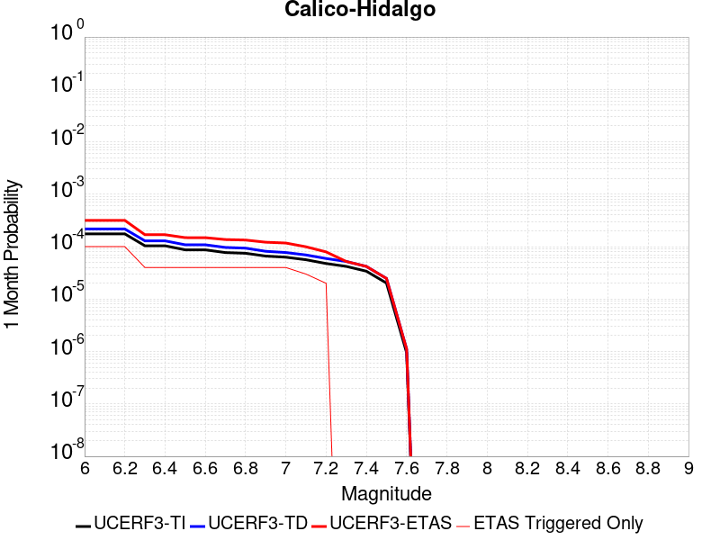 |  |  |

| Magnitude | 1 wk TI Prob | 1 wk TD Prob | 1 wk ETAS Prob | 1 wk ETAS/TD Gain | 1 wk ETAS Triggered Only | 1 mo TI Prob | 1 mo TD Prob | 1 mo ETAS Prob | 1 mo ETAS/TD Gain | 1 mo ETAS Triggered Only | 1 yr TI Prob | 1 yr TD Prob | 1 yr ETAS Prob | 1 yr ETAS/TD Gain | 1 yr ETAS Triggered Only | 10 yr TI Prob | 10 yr TD Prob | 10 yr ETAS Prob | 10 yr ETAS/TD Gain | 10 yr ETAS Triggered Only |
|-----|-----|-----|-----|-----|-----|-----|-----|-----|-----|-----|-----|-----|-----|-----|-----|-----|-----|-----|-----|-----|
| 6.0 | 4.0906612E-5 | 5.0703686E-5 | 1.4329159E-4 | 2.8260584 | 9.259259E-5 | 1.7530227E-4 | 2.172857E-4 | 3.4071566E-4 | 1.5680538 | 1.2345679E-4 | 0.0021322158 | 0.002642648 | 0.0027965612 | 1.0582421 | 1.54321E-4 | 0.02111873 | 0.026152607 | 0.026302893 | 1.0057465 | 1.54321E-4 |
| 6.1 | 4.0906612E-5 | 5.0703686E-5 | 1.4329159E-4 | 2.8260584 | 9.259259E-5 | 1.7530227E-4 | 2.172857E-4 | 3.4071566E-4 | 1.5680538 | 1.2345679E-4 | 0.0021322158 | 0.002642648 | 0.0027965612 | 1.0582421 | 1.54321E-4 | 0.02111873 | 0.026152607 | 0.026302893 | 1.0057465 | 1.54321E-4 |
| 6.2 | 4.0906612E-5 | 5.0703686E-5 | 1.4329159E-4 | 2.8260584 | 9.259259E-5 | 1.7530227E-4 | 2.172857E-4 | 3.4071566E-4 | 1.5680538 | 1.2345679E-4 | 0.0021322158 | 0.002642648 | 0.0027965612 | 1.0582421 | 1.54321E-4 | 0.02111873 | 0.026152607 | 0.026302893 | 1.0057465 | 1.54321E-4 |
| 6.3 | 2.4242801E-5 | 3.0090669E-5 | 9.181721E-5 | 3.0513515 | 6.1728395E-5 | 1.0389358E-4 | 1.2895382E-4 | 2.2153447E-4 | 1.7179365 | 9.259259E-5 | 0.0012641704 | 0.0015689151 | 0.0016921782 | 1.0785658 | 1.2345679E-4 | 0.01257003 | 0.01558206 | 0.015703594 | 1.0077995 | 1.2345679E-4 |
| 6.4 | 2.4242801E-5 | 3.0090669E-5 | 9.181721E-5 | 3.0513515 | 6.1728395E-5 | 1.0389358E-4 | 1.2895382E-4 | 2.2153447E-4 | 1.7179365 | 9.259259E-5 | 0.0012641704 | 0.0015689151 | 0.0016921782 | 1.0785658 | 1.2345679E-4 | 0.01257003 | 0.01558206 | 0.015703594 | 1.0077995 | 1.2345679E-4 |
| 6.5 | 2.0286952E-5 | 2.5315738E-5 | 8.704257E-5 | 3.438279 | 6.1728395E-5 | 8.694118E-5 | 1.0849161E-4 | 2.0107414E-4 | 1.8533614 | 9.259259E-5 | 0.0010579949 | 0.001320102 | 0.0014125725 | 1.0700479 | 9.259259E-5 | 0.010529719 | 0.013124538 | 0.013215915 | 1.0069623 | 9.259259E-5 |
| 6.6 | 2.0269223E-5 | 2.5296687E-5 | 8.702352E-5 | 3.4401152 | 6.1728395E-5 | 8.6865206E-5 | 1.08409964E-4 | 2.0099252E-4 | 1.8540041 | 9.259259E-5 | 0.0010570707 | 0.0013191093 | 0.0014115798 | 1.0701007 | 9.259259E-5 | 0.010520565 | 0.013114728 | 0.013206106 | 1.0069677 | 9.259259E-5 |
| 6.7 | 1.799852E-5 | 2.25406E-5 | 8.42676E-5 | 3.738481 | 6.1728395E-5 | 7.713423E-5 | 9.659908E-5 | 1.8918273E-4 | 1.958432 | 9.259259E-5 | 9.3870464E-4 | 0.0011754738 | 0.0012679575 | 1.0786779 | 9.259259E-5 | 0.009347493 | 0.011694173 | 0.011785683 | 1.0078253 | 9.259259E-5 |
| 6.8 | 1.7458793E-5 | 2.184212E-5 | 8.356917E-5 | 3.8260558 | 6.1728395E-5 | 7.4821255E-5 | 9.3605806E-5 | 1.8618973E-4 | 1.9890832 | 9.259259E-5 | 9.10568E-4 | 0.0011390693 | 0.0012315565 | 1.0811954 | 9.259259E-5 | 0.009068459 | 0.011333893 | 0.0114254365 | 1.0080769 | 9.259259E-5 |
| 6.9 | 1.542884E-5 | 1.9025927E-5 | 8.075315E-5 | 4.244374 | 6.1728395E-5 | 6.612192E-5 | 8.153721E-5 | 1.7412225E-4 | 2.1354942 | 9.259259E-5 | 8.04737E-4 | 9.922766E-4 | 0.0010847773 | 1.0932207 | 9.259259E-5 | 0.008018291 | 0.009879857 | 0.009971536 | 1.0092793 | 9.259259E-5 |
| 7.0 | 1.468253E-5 | 1.8030598E-5 | 7.975788E-5 | 4.423474 | 6.1728395E-5 | 6.292361E-5 | 7.7271776E-5 | 1.6985722E-4 | 2.1981792 | 9.259259E-5 | 7.658257E-4 | 9.4039086E-4 | 0.0010328963 | 1.0983692 | 9.259259E-5 | 0.0076319184 | 0.009365481 | 0.009457206 | 1.009794 | 9.259259E-5 |
| 7.1 | 1.3139281E-5 | 1.6200942E-5 | 4.706464E-5 | 2.9050558 | 3.0864197E-5 | 5.6309986E-5 | 6.943083E-5 | 1.3115494E-4 | 1.8890014 | 6.1728395E-5 | 6.853584E-4 | 8.4500515E-4 | 9.066814E-4 | 1.0729892 | 6.1728395E-5 | 0.0068324856 | 0.0084192185 | 0.008480427 | 1.0072701 | 6.1728395E-5 |
| 7.2 | 1.1127404E-5 | 1.3866597E-5 | 4.473037E-5 | 3.2257638 | 3.0864197E-5 | 4.7688E-5 | 5.942698E-5 | 9.0289344E-5 | 1.5193325 | 3.0864197E-5 | 5.8044674E-4 | 7.232942E-4 | 7.5413607E-4 | 1.0426408 | 3.0864197E-5 | 0.0057893298 | 0.0072105085 | 0.0072411504 | 1.0042496 | 3.0864197E-5 |
| 7.3 | 9.808154E-6 | 1.2176215E-5 | 1.2176215E-5 | 1.0 | 0.0 | 4.2034266E-5 | 5.2182797E-5 | 5.2182797E-5 | 1.0 | 0.0 | 5.11647E-4 | 6.3515105E-4 | 6.3515105E-4 | 1.0 | 0.0 | 0.0051047057 | 0.006334433 | 0.006334433 | 1.0 | 0.0 |
| 7.4 | 7.942452E-6 | 9.792144E-6 | 9.792144E-6 | 1.0 | 0.0 | 3.4038632E-5 | 4.1965708E-5 | 4.1965708E-5 | 1.0 | 0.0 | 4.1434157E-4 | 5.1082217E-4 | 5.1082217E-4 | 1.0 | 0.0 | 0.0041356985 | 0.005097421 | 0.005097421 | 1.0 | 0.0 |
| 7.5 | 4.7121216E-6 | 5.772836E-6 | 5.772836E-6 | 1.0 | 0.0 | 2.019465E-5 | 2.4740535E-5 | 2.4740535E-5 | 1.0 | 0.0 | 2.4584212E-4 | 3.0118204E-4 | 3.0118204E-4 | 1.0 | 0.0 | 0.0024557032 | 0.0030084911 | 0.0030084911 | 1.0 | 0.0 |
| 7.6 | 2.21172E-7 | 2.603961E-7 | 2.603961E-7 | 1.0 | 0.0 | 9.478797E-7 | 1.1159829E-6 | 1.1159829E-6 | 1.0 | 0.0 | 1.1540374E-5 | 1.3587036E-5 | 1.3587036E-5 | 1.0 | 0.0 | 1.1539775E-4 | 1.3586486E-4 | 1.3586486E-4 | 1.0 | 0.0 |

## San Andreas (Carrizo) rev
*[(top)](#table-of-contents)*

| 1 Week | 1 Month | 1 Year | 10 Year |
|-----|-----|-----|-----|
|  |  |  |  |

| Magnitude | 1 wk TI Prob | 1 wk TD Prob | 1 wk ETAS Prob | 1 wk ETAS/TD Gain | 1 wk ETAS Triggered Only | 1 mo TI Prob | 1 mo TD Prob | 1 mo ETAS Prob | 1 mo ETAS/TD Gain | 1 mo ETAS Triggered Only | 1 yr TI Prob | 1 yr TD Prob | 1 yr ETAS Prob | 1 yr ETAS/TD Gain | 1 yr ETAS Triggered Only | 10 yr TI Prob | 10 yr TD Prob | 10 yr ETAS Prob | 10 yr ETAS/TD Gain | 10 yr ETAS Triggered Only |
|-----|-----|-----|-----|-----|-----|-----|-----|-----|-----|-----|-----|-----|-----|-----|-----|-----|-----|-----|-----|-----|
| 6.0 | 1.1674632E-4 | 2.432302E-4 | 3.358003E-4 | 1.3805863 | 9.259259E-5 | 5.002454E-4 | 0.0010420004 | 0.0011653285 | 1.1183571 | 1.2345679E-4 | 0.006073493 | 0.012613042 | 0.012795892 | 1.0144968 | 1.8518518E-4 | 0.0591016 | 0.12061418 | 0.120777026 | 1.0013502 | 1.8518518E-4 |
| 6.1 | 1.1674632E-4 | 2.432302E-4 | 3.358003E-4 | 1.3805863 | 9.259259E-5 | 5.002454E-4 | 0.0010420004 | 0.0011653285 | 1.1183571 | 1.2345679E-4 | 0.006073493 | 0.012613042 | 0.012795892 | 1.0144968 | 1.8518518E-4 | 0.0591016 | 0.12061418 | 0.120777026 | 1.0013502 | 1.8518518E-4 |
| 6.2 | 1.1674632E-4 | 2.432302E-4 | 3.358003E-4 | 1.3805863 | 9.259259E-5 | 5.002454E-4 | 0.0010420004 | 0.0011653285 | 1.1183571 | 1.2345679E-4 | 0.006073493 | 0.012613042 | 0.012795892 | 1.0144968 | 1.8518518E-4 | 0.0591016 | 0.12061418 | 0.120777026 | 1.0013502 | 1.8518518E-4 |
| 6.3 | 1.1674632E-4 | 2.432302E-4 | 3.358003E-4 | 1.3805863 | 9.259259E-5 | 5.002454E-4 | 0.0010420004 | 0.0011653285 | 1.1183571 | 1.2345679E-4 | 0.006073493 | 0.012613042 | 0.012795892 | 1.0144968 | 1.8518518E-4 | 0.0591016 | 0.12061418 | 0.120777026 | 1.0013502 | 1.8518518E-4 |
| 6.4 | 1.1674632E-4 | 2.432302E-4 | 3.358003E-4 | 1.3805863 | 9.259259E-5 | 5.002454E-4 | 0.0010420004 | 0.0011653285 | 1.1183571 | 1.2345679E-4 | 0.006073493 | 0.012613042 | 0.012795892 | 1.0144968 | 1.8518518E-4 | 0.0591016 | 0.12061418 | 0.120777026 | 1.0013502 | 1.8518518E-4 |
| 6.5 | 1.13136164E-4 | 2.3643032E-4 | 3.2900102E-4 | 1.3915348 | 9.259259E-5 | 4.847792E-4 | 0.0010128808 | 0.0011362126 | 1.1217633 | 1.2345679E-4 | 0.0058862255 | 0.012262545 | 0.012445458 | 1.0149165 | 1.8518518E-4 | 0.057327334 | 0.117585555 | 0.11774896 | 1.0013897 | 1.8518518E-4 |
| 6.6 | 1.13136164E-4 | 2.3643032E-4 | 3.2900102E-4 | 1.3915348 | 9.259259E-5 | 4.847792E-4 | 0.0010128808 | 0.0011362126 | 1.1217633 | 1.2345679E-4 | 0.0058862255 | 0.012262545 | 0.012445458 | 1.0149165 | 1.8518518E-4 | 0.057327334 | 0.117585555 | 0.11774896 | 1.0013897 | 1.8518518E-4 |
| 6.7 | 1.1149675E-4 | 2.3334254E-4 | 3.259135E-4 | 1.3967172 | 9.259259E-5 | 4.777557E-4 | 9.996577E-4 | 0.0011229911 | 1.1233757 | 1.2345679E-4 | 0.0058011734 | 0.012103349 | 0.012286293 | 1.0151151 | 1.8518518E-4 | 0.05652051 | 0.1162071 | 0.11637077 | 1.0014083 | 1.8518518E-4 |
| 6.8 | 1.1103589E-4 | 2.3236412E-4 | 3.2493522E-4 | 1.398388 | 9.259259E-5 | 4.7578133E-4 | 9.954676E-4 | 0.0011188015 | 1.1238954 | 1.2345679E-4 | 0.005777263 | 0.012052901 | 0.012235855 | 1.0151792 | 1.8518518E-4 | 0.056293584 | 0.1157674 | 0.115931146 | 1.0014144 | 1.8518518E-4 |
| 6.9 | 1.1053259E-4 | 2.3128795E-4 | 3.2385913E-4 | 1.4002421 | 9.259259E-5 | 4.7362508E-4 | 9.90859E-4 | 0.0011141935 | 1.1244723 | 1.2345679E-4 | 0.0057511497 | 0.01199741 | 0.012180374 | 1.0152502 | 1.8518518E-4 | 0.05604569 | 0.11528359 | 0.11544743 | 1.0014212 | 1.8518518E-4 |
| 7.0 | 1.1005377E-4 | 2.3029637E-4 | 3.2286765E-4 | 1.4019659 | 9.259259E-5 | 4.7157376E-4 | 9.866126E-4 | 0.0011099476 | 1.1250085 | 1.2345679E-4 | 0.0057263062 | 0.011946279 | 0.012129252 | 1.0153164 | 1.8518518E-4 | 0.055809796 | 0.11483591 | 0.11499983 | 1.0014274 | 1.8518518E-4 |
| 7.1 | 1.0308142E-4 | 2.1539345E-4 | 3.0796608E-4 | 1.4297839 | 9.259259E-5 | 4.417027E-4 | 9.227892E-4 | 0.0010461321 | 1.133663 | 1.2345679E-4 | 0.0053644776 | 0.011177397 | 0.011360513 | 1.0163827 | 1.8518518E-4 | 0.052368138 | 0.108092256 | 0.10825743 | 1.001528 | 1.8518518E-4 |
| 7.2 | 1.0027479E-4 | 2.094724E-4 | 3.020456E-4 | 1.4419351 | 9.259259E-5 | 4.296783E-4 | 8.9743105E-4 | 0.001020777 | 1.1374434 | 1.2345679E-4 | 0.0052187922 | 0.010871782 | 0.0110549545 | 1.0168483 | 1.8518518E-4 | 0.050979212 | 0.10539625 | 0.10556191 | 1.0015719 | 1.8518518E-4 |
| 7.3 | 9.816942E-5 | 2.0422463E-4 | 2.9679833E-4 | 1.4532934 | 9.259259E-5 | 4.2065824E-4 | 8.7495585E-4 | 9.983046E-4 | 1.1409771 | 1.2345679E-4 | 0.005109493 | 0.010600842 | 0.0107840635 | 1.0172837 | 1.8518518E-4 | 0.049935985 | 0.102979995 | 0.10314611 | 1.001613 | 1.8518518E-4 |
| 7.4 | 9.5634205E-5 | 1.9791997E-4 | 2.9049424E-4 | 1.4677359 | 9.259259E-5 | 4.0979648E-4 | 8.479536E-4 | 9.713057E-4 | 1.1454704 | 1.2345679E-4 | 0.0049778637 | 0.010275229 | 0.010458511 | 1.0178373 | 1.8518518E-4 | 0.048678253 | 0.10006632 | 0.10023297 | 1.0016655 | 1.8518518E-4 |
| 7.5 | 8.052417E-5 | 1.611261E-4 | 2.5370377E-4 | 1.5745666 | 9.259259E-5 | 3.4505792E-4 | 6.903579E-4 | 8.137294E-4 | 1.1787066 | 1.2345679E-4 | 0.0041929903 | 0.008372796 | 0.00855643 | 1.0219322 | 1.8518518E-4 | 0.04114753 | 0.08281049 | 0.08298034 | 1.0020511 | 1.8518518E-4 |
| 7.6 | 7.897024E-5 | 1.5765853E-4 | 2.5023654E-4 | 1.5872058 | 9.259259E-5 | 3.384E-4 | 6.755046E-4 | 7.98878E-4 | 1.1826389 | 1.2345679E-4 | 0.0041122385 | 0.008193332 | 0.008377 | 1.0224167 | 1.8518518E-4 | 0.040369697 | 0.08115171 | 0.081321865 | 1.0020968 | 1.8518518E-4 |
| 7.7 | 6.707427E-5 | 1.3276102E-4 | 1.9448122E-4 | 1.4648969 | 6.1728395E-5 | 2.8742946E-4 | 5.688518E-4 | 6.613917E-4 | 1.1626785 | 9.259259E-5 | 0.003493839 | 0.00690381 | 0.006995763 | 1.0133193 | 9.259259E-5 | 0.034394164 | 0.069048055 | 0.06913426 | 1.0012484 | 9.259259E-5 |
| 7.8 | 6.147705E-5 | 1.2197486E-4 | 1.8369572E-4 | 1.506013 | 6.1728395E-5 | 2.6344648E-4 | 5.226447E-4 | 6.151889E-4 | 1.1770691 | 9.259259E-5 | 0.0032027436 | 0.006344659 | 0.006436664 | 1.0145012 | 9.259259E-5 | 0.031569764 | 0.06351457 | 0.06360128 | 1.0013652 | 9.259259E-5 |
| 7.9 | 4.7636717E-5 | 8.87977E-5 | 1.19659155E-4 | 1.3475479 | 3.0864197E-5 | 2.0414138E-4 | 3.8050607E-4 | 4.42211E-4 | 1.1621654 | 6.1728395E-5 | 0.0024825884 | 0.0046228287 | 0.0046842718 | 1.0132912 | 6.1728395E-5 | 0.024550365 | 0.046628095 | 0.046686944 | 1.0012621 | 6.1728395E-5 |
| 8.0 | 3.3554235E-5 | 5.2136907E-5 | 5.2136907E-5 | 1.0 | 0.0 | 1.4379594E-4 | 2.2342477E-4 | 2.5428206E-4 | 1.1381105 | 3.0864197E-5 | 0.0017493097 | 0.002716805 | 0.0027475853 | 1.0113297 | 3.0864197E-5 | 0.017356034 | 0.027880952 | 0.027910957 | 1.0010761 | 3.0864197E-5 |
| 8.1 | 1.9175432E-5 | 1.9184976E-5 | 1.9184976E-5 | 1.0 | 0.0 | 8.217783E-5 | 8.2218736E-5 | 8.2218736E-5 | 1.0 | 0.0 | 0.0010000558 | 0.0010005541 | 0.0010005541 | 1.0 | 0.0 | 0.009955673 | 0.0107580265 | 0.0107580265 | 1.0 | 0.0 |
| 8.2 | 8.643924E-6 | 5.4748625E-6 | 5.4748625E-6 | 1.0 | 0.0 | 3.704486E-5 | 2.3463486E-5 | 2.3463486E-5 | 1.0 | 0.0 | 4.5092785E-4 | 2.8563058E-4 | 2.8563058E-4 | 1.0 | 0.0 | 0.0045001395 | 0.0032487072 | 0.0032487072 | 1.0 | 0.0 |
| 8.3 | 1.983087E-6 | 7.6599065E-7 | 7.6599065E-7 | 1.0 | 0.0 | 8.498917E-6 | 3.282813E-6 | 3.282813E-6 | 1.0 | 0.0 | 1.034694E-4 | 3.9967534E-5 | 3.9967534E-5 | 1.0 | 0.0 | 0.0010342124 | 4.719687E-4 | 4.719687E-4 | 1.0 | 0.0 |

## San Jacinto (Anza) rev
*[(top)](#table-of-contents)*

| 1 Week | 1 Month | 1 Year | 10 Year |
|-----|-----|-----|-----|
|  |  |  |  |

| Magnitude | 1 wk TI Prob | 1 wk TD Prob | 1 wk ETAS Prob | 1 wk ETAS/TD Gain | 1 wk ETAS Triggered Only | 1 mo TI Prob | 1 mo TD Prob | 1 mo ETAS Prob | 1 mo ETAS/TD Gain | 1 mo ETAS Triggered Only | 1 yr TI Prob | 1 yr TD Prob | 1 yr ETAS Prob | 1 yr ETAS/TD Gain | 1 yr ETAS Triggered Only | 10 yr TI Prob | 10 yr TD Prob | 10 yr ETAS Prob | 10 yr ETAS/TD Gain | 10 yr ETAS Triggered Only |
|-----|-----|-----|-----|-----|-----|-----|-----|-----|-----|-----|-----|-----|-----|-----|-----|-----|-----|-----|-----|-----|
| 6.0 | 6.3015636E-5 | 4.3302647E-5 | 1.667541E-4 | 3.8508983 | 1.2345679E-4 | 2.7003905E-4 | 1.8556965E-4 | 3.39862E-4 | 1.8314525 | 1.54321E-4 | 0.0032827691 | 0.0022569813 | 0.0024109539 | 1.0682206 | 1.54321E-4 | 0.032346968 | 0.023296192 | 0.023477063 | 1.007764 | 1.8518518E-4 |
| 6.1 | 6.3015636E-5 | 4.3302647E-5 | 1.667541E-4 | 3.8508983 | 1.2345679E-4 | 2.7003905E-4 | 1.8556965E-4 | 3.39862E-4 | 1.8314525 | 1.54321E-4 | 0.0032827691 | 0.0022569813 | 0.0024109539 | 1.0682206 | 1.54321E-4 | 0.032346968 | 0.023296192 | 0.023477063 | 1.007764 | 1.8518518E-4 |
| 6.2 | 6.3015636E-5 | 4.3302647E-5 | 1.667541E-4 | 3.8508983 | 1.2345679E-4 | 2.7003905E-4 | 1.8556965E-4 | 3.39862E-4 | 1.8314525 | 1.54321E-4 | 0.0032827691 | 0.0022569813 | 0.0024109539 | 1.0682206 | 1.54321E-4 | 0.032346968 | 0.023296192 | 0.023477063 | 1.007764 | 1.8518518E-4 |
| 6.3 | 6.3015636E-5 | 4.3302647E-5 | 1.667541E-4 | 3.8508983 | 1.2345679E-4 | 2.7003905E-4 | 1.8556965E-4 | 3.39862E-4 | 1.8314525 | 1.54321E-4 | 0.0032827691 | 0.0022569813 | 0.0024109539 | 1.0682206 | 1.54321E-4 | 0.032346968 | 0.023296192 | 0.023477063 | 1.007764 | 1.8518518E-4 |
| 6.4 | 6.3015636E-5 | 4.3302647E-5 | 1.667541E-4 | 3.8508983 | 1.2345679E-4 | 2.7003905E-4 | 1.8556965E-4 | 3.39862E-4 | 1.8314525 | 1.54321E-4 | 0.0032827691 | 0.0022569813 | 0.0024109539 | 1.0682206 | 1.54321E-4 | 0.032346968 | 0.023296192 | 0.023477063 | 1.007764 | 1.8518518E-4 |
| 6.5 | 5.811017E-5 | 4.0082516E-5 | 1.6353435E-4 | 4.0799427 | 1.2345679E-4 | 2.4901982E-4 | 1.7177092E-4 | 3.260654E-4 | 1.8982573 | 1.54321E-4 | 0.0030276014 | 0.002089311 | 0.0022433093 | 1.0737078 | 1.54321E-4 | 0.02986684 | 0.021593736 | 0.021774923 | 1.0083907 | 1.8518518E-4 |
| 6.6 | 5.811017E-5 | 4.0082516E-5 | 1.6353435E-4 | 4.0799427 | 1.2345679E-4 | 2.4901982E-4 | 1.7177092E-4 | 3.260654E-4 | 1.8982573 | 1.54321E-4 | 0.0030276014 | 0.002089311 | 0.0022433093 | 1.0737078 | 1.54321E-4 | 0.02986684 | 0.021593736 | 0.021774923 | 1.0083907 | 1.8518518E-4 |
| 6.7 | 5.712442E-5 | 3.9505223E-5 | 1.6295713E-4 | 4.124952 | 1.2345679E-4 | 2.4479596E-4 | 1.6929714E-4 | 3.2359202E-4 | 1.9113849 | 1.54321E-4 | 0.0029763177 | 0.0020592497 | 0.002213253 | 1.0747861 | 1.54321E-4 | 0.029367693 | 0.021285562 | 0.021466805 | 1.0085149 | 1.8518518E-4 |
| 6.8 | 5.6967532E-5 | 3.9361643E-5 | 1.6281358E-4 | 4.136351 | 1.2345679E-4 | 2.4412372E-4 | 1.6868189E-4 | 3.2297685E-4 | 1.9147097 | 1.54321E-4 | 0.0029681553 | 0.002051773 | 0.0022057774 | 1.0750592 | 1.54321E-4 | 0.029288229 | 0.021210281 | 0.021391539 | 1.0085458 | 1.8518518E-4 |
| 6.9 | 5.6211324E-5 | 3.9066435E-5 | 1.6251841E-4 | 4.160052 | 1.2345679E-4 | 2.4088343E-4 | 1.6741687E-4 | 3.2171202E-4 | 1.9216225 | 1.54321E-4 | 0.0029288116 | 0.0020364004 | 0.0021904071 | 1.075627 | 1.54321E-4 | 0.028905109 | 0.021049714 | 0.021231001 | 1.0086123 | 1.8518518E-4 |
| 7.0 | 5.4383527E-5 | 3.792697E-5 | 1.6137908E-4 | 4.2549953 | 1.2345679E-4 | 2.3305144E-4 | 1.6253405E-4 | 3.1682994E-4 | 1.9493144 | 1.54321E-4 | 0.0028337094 | 0.001977061 | 0.0021310768 | 1.0779015 | 1.54321E-4 | 0.027978465 | 0.020440677 | 0.020622076 | 1.0088744 | 1.8518518E-4 |
| 7.1 | 5.1393665E-5 | 3.6389913E-5 | 1.5984221E-4 | 4.3924866 | 1.2345679E-4 | 2.2023996E-4 | 1.5594746E-4 | 3.102444E-4 | 1.989416 | 1.54321E-4 | 0.0026781242 | 0.0018970112 | 0.0020510394 | 1.0811952 | 1.54321E-4 | 0.026460782 | 0.019614287 | 0.019795839 | 1.0092561 | 1.8518518E-4 |
| 7.2 | 4.785222E-5 | 3.4741795E-5 | 1.5819429E-4 | 4.5534286 | 1.2345679E-4 | 2.0506482E-4 | 1.4888494E-4 | 3.0318295E-4 | 2.0363574 | 1.54321E-4 | 0.0024938055 | 0.0018111705 | 0.001965212 | 1.0850508 | 1.54321E-4 | 0.024660049 | 0.018728992 | 0.018910708 | 1.0097024 | 1.8518518E-4 |
| 7.3 | 4.2143256E-5 | 3.383628E-5 | 1.5728889E-4 | 4.648528 | 1.2345679E-4 | 1.8060145E-4 | 1.4500458E-4 | 2.9930318E-4 | 2.0640948 | 1.54321E-4 | 0.002196605 | 0.0017640047 | 0.0019180534 | 1.087329 | 1.54321E-4 | 0.02175019 | 0.01823724 | 0.01841905 | 1.009969 | 1.8518518E-4 |
| 7.4 | 4.0264713E-5 | 3.347446E-5 | 1.5692713E-4 | 4.6879654 | 1.2345679E-4 | 1.7255165E-4 | 1.4345412E-4 | 2.9775297E-4 | 2.0755973 | 1.54321E-4 | 0.002098792 | 0.0017451581 | 0.0018992098 | 1.0882738 | 1.54321E-4 | 0.020790804 | 0.018041821 | 0.018223664 | 1.010079 | 1.8518518E-4 |
| 7.5 | 3.694492E-5 | 3.218847E-5 | 1.5564129E-4 | 4.835312 | 1.2345679E-4 | 1.5832575E-4 | 1.379433E-4 | 2.92243E-4 | 2.1185734 | 1.54321E-4 | 0.0019259118 | 0.001678169 | 0.001832231 | 1.0918037 | 1.54321E-4 | 0.01909306 | 0.01735827 | 0.01754024 | 1.0104833 | 1.8518518E-4 |
| 7.6 | 3.200565E-5 | 2.9504106E-5 | 1.5295725E-4 | 5.18427 | 1.2345679E-4 | 1.3715986E-4 | 1.2644005E-4 | 2.8074154E-4 | 2.220353 | 1.54321E-4 | 0.001668642 | 0.0015383229 | 0.0016924065 | 1.1001633 | 1.54321E-4 | 0.01656168 | 0.0159463 | 0.016128533 | 1.0114279 | 1.8518518E-4 |
| 7.7 | 2.731642E-5 | 2.6092788E-5 | 1.4954635E-4 | 5.7313294 | 1.2345679E-4 | 1.1706512E-4 | 1.1182144E-4 | 2.6612516E-4 | 2.379912 | 1.54321E-4 | 0.001424336 | 0.0013605768 | 0.0015146879 | 1.1132689 | 1.54321E-4 | 0.014152412 | 0.014167004 | 0.014349567 | 1.0128864 | 1.8518518E-4 |
| 7.8 | 2.3466424E-5 | 2.3504817E-5 | 1.469587E-4 | 6.25228 | 1.2345679E-4 | 1.0056651E-4 | 1.0073105E-4 | 2.550365E-4 | 2.5318558 | 1.54321E-4 | 0.0012237094 | 0.0012257113 | 0.0013798432 | 1.1257489 | 1.54321E-4 | 0.012169928 | 0.012808893 | 0.012991706 | 1.0142723 | 1.8518518E-4 |
| 7.9 | 1.8611925E-5 | 1.8908117E-5 | 1.4236257E-4 | 7.5291777 | 1.2345679E-4 | 7.9762955E-5 | 8.1032274E-5 | 2.3534076E-4 | 2.9042842 | 1.54321E-4 | 9.7068126E-4 | 9.861222E-4 | 0.001140291 | 1.1563385 | 1.54321E-4 | 0.0096645225 | 0.010393824 | 0.0105770845 | 1.0176316 | 1.8518518E-4 |
| 8.0 | 1.5460775E-5 | 1.5740965E-5 | 1.391958E-4 | 8.842902 | 1.2345679E-4 | 6.6258784E-5 | 6.7459536E-5 | 2.2177011E-4 | 3.287454 | 1.54321E-4 | 8.0640207E-4 | 8.21011E-4 | 9.7520533E-4 | 1.1878103 | 1.54321E-4 | 0.008034821 | 0.0087028835 | 0.008886457 | 1.0210934 | 1.8518518E-4 |
| 8.1 | 9.983884E-6 | 8.269952E-6 | 1.0086178E-4 | 12.196175 | 9.259259E-5 | 4.2787375E-5 | 3.544217E-5 | 1.5889459E-4 | 4.4832067 | 1.2345679E-4 | 5.2081177E-4 | 4.314235E-4 | 5.5482704E-4 | 1.286038 | 1.2345679E-4 | 0.0051959283 | 0.004640022 | 0.004793627 | 1.0331043 | 1.54321E-4 |
| 8.2 | 4.1226E-6 | 1.5529788E-6 | 1.5529788E-6 | 1.0 | 0.0 | 1.7668166E-5 | 6.6556063E-6 | 6.6556063E-6 | 1.0 | 0.0 | 2.1508869E-4 | 8.102902E-5 | 8.102902E-5 | 1.0 | 0.0 | 0.0021488064 | 9.4050163E-4 | 9.4050163E-4 | 1.0 | 0.0 |
| 8.3 | 1.2750878E-6 | 3.612133E-7 | 3.612133E-7 | 1.0 | 0.0 | 5.4646503E-6 | 1.548056E-6 | 1.548056E-6 | 1.0 | 0.0 | 6.653009E-5 | 1.8847424E-5 | 1.8847424E-5 | 1.0 | 0.0 | 6.6510175E-4 | 2.2734253E-4 | 2.2734253E-4 | 1.0 | 0.0 |

## Cady
*[(top)](#table-of-contents)*

| 1 Week | 1 Month | 1 Year | 10 Year |
|-----|-----|-----|-----|
|  |  |  |  |

| Magnitude | 1 wk TI Prob | 1 wk TD Prob | 1 wk ETAS Prob | 1 wk ETAS/TD Gain | 1 wk ETAS Triggered Only | 1 mo TI Prob | 1 mo TD Prob | 1 mo ETAS Prob | 1 mo ETAS/TD Gain | 1 mo ETAS Triggered Only | 1 yr TI Prob | 1 yr TD Prob | 1 yr ETAS Prob | 1 yr ETAS/TD Gain | 1 yr ETAS Triggered Only | 10 yr TI Prob | 10 yr TD Prob | 10 yr ETAS Prob | 10 yr ETAS/TD Gain | 10 yr ETAS Triggered Only |
|-----|-----|-----|-----|-----|-----|-----|-----|-----|-----|-----|-----|-----|-----|-----|-----|-----|-----|-----|-----|-----|
| 6.0 | 1.9892565E-5 | 2.1858728E-5 | 5.272225E-5 | 2.4119542 | 3.0864197E-5 | 8.525106E-5 | 9.3677416E-5 | 1.5540003E-4 | 1.6588846 | 6.1728395E-5 | 0.0010374374 | 0.0011400167 | 0.0012325038 | 1.0811278 | 9.259259E-5 | 0.010326075 | 0.011350701 | 0.01150327 | 1.0134414 | 1.54321E-4 |
| 6.1 | 1.9892565E-5 | 2.1858728E-5 | 5.272225E-5 | 2.4119542 | 3.0864197E-5 | 8.525106E-5 | 9.3677416E-5 | 1.5540003E-4 | 1.6588846 | 6.1728395E-5 | 0.0010374374 | 0.0011400167 | 0.0012325038 | 1.0811278 | 9.259259E-5 | 0.010326075 | 0.011350701 | 0.01150327 | 1.0134414 | 1.54321E-4 |
| 6.2 | 1.9892565E-5 | 2.1858728E-5 | 5.272225E-5 | 2.4119542 | 3.0864197E-5 | 8.525106E-5 | 9.3677416E-5 | 1.5540003E-4 | 1.6588846 | 6.1728395E-5 | 0.0010374374 | 0.0011400167 | 0.0012325038 | 1.0811278 | 9.259259E-5 | 0.010326075 | 0.011350701 | 0.01150327 | 1.0134414 | 1.54321E-4 |
| 6.3 | 1.1117327E-5 | 1.2176583E-5 | 1.2176583E-5 | 1.0 | 0.0 | 4.764482E-5 | 5.2184492E-5 | 8.304708E-5 | 1.591413 | 3.0864197E-5 | 5.7992124E-4 | 6.351925E-4 | 6.968817E-4 | 1.0971189 | 6.1728395E-5 | 0.0057841022 | 0.0063368753 | 0.00645955 | 1.0193589 | 1.2345679E-4 |
| 6.4 | 1.1117327E-5 | 1.2176583E-5 | 1.2176583E-5 | 1.0 | 0.0 | 4.764482E-5 | 5.2184492E-5 | 8.304708E-5 | 1.591413 | 3.0864197E-5 | 5.7992124E-4 | 6.351925E-4 | 6.968817E-4 | 1.0971189 | 6.1728395E-5 | 0.0057841022 | 0.0063368753 | 0.00645955 | 1.0193589 | 1.2345679E-4 |
| 6.5 | 6.103093E-6 | 6.672021E-6 | 6.672021E-6 | 1.0 | 0.0 | 2.615585E-5 | 2.8594131E-5 | 2.8594131E-5 | 1.0 | 0.0 | 3.1840094E-4 | 3.480905E-4 | 3.480905E-4 | 1.0 | 0.0 | 0.0031794512 | 0.0034766865 | 0.0035074435 | 1.0088466 | 3.0864197E-5 |
| 6.6 | 5.817237E-6 | 6.3656585E-6 | 6.3656585E-6 | 1.0 | 0.0 | 2.4930776E-5 | 2.728118E-5 | 2.728118E-5 | 1.0 | 0.0 | 3.034899E-4 | 3.3211018E-4 | 3.3211018E-4 | 1.0 | 0.0 | 0.0030307577 | 0.0033173605 | 0.0033481224 | 1.0092729 | 3.0864197E-5 |
| 6.7 | 4.8846314E-6 | 5.3405684E-6 | 5.3405684E-6 | 1.0 | 0.0 | 2.0933967E-5 | 2.2888014E-5 | 2.2888014E-5 | 1.0 | 0.0 | 2.5484123E-4 | 2.7863772E-4 | 2.7863772E-4 | 1.0 | 0.0 | 0.0025454918 | 0.0027840391 | 0.0028148175 | 1.0110552 | 3.0864197E-5 |
| 6.8 | 1.7788773E-6 | 1.9399079E-6 | 1.9399079E-6 | 1.0 | 0.0 | 7.6237375E-6 | 8.313874E-6 | 8.313874E-6 | 1.0 | 0.0 | 9.281505E-5 | 1.01218284E-4 | 1.01218284E-4 | 1.0 | 0.0 | 9.2776294E-4 | 0.0010118765 | 0.0010118765 | 1.0 | 0.0 |
| 6.9 | 7.5455404E-7 | 8.297092E-7 | 8.297092E-7 | 1.0 | 0.0 | 3.233799E-6 | 3.5558937E-6 | 3.5558937E-6 | 1.0 | 0.0 | 3.937079E-5 | 4.3292483E-5 | 4.3292483E-5 | 1.0 | 0.0 | 3.9363815E-4 | 4.3287344E-4 | 4.3287344E-4 | 1.0 | 0.0 |
| 7.0 | 6.8578805E-7 | 7.541816E-7 | 7.541816E-7 | 1.0 | 0.0 | 2.9390883E-6 | 3.2322048E-6 | 3.2322048E-6 | 1.0 | 0.0 | 3.578281E-5 | 3.9351715E-5 | 3.9351715E-5 | 1.0 | 0.0 | 3.577705E-4 | 3.9347992E-4 | 3.9347992E-4 | 1.0 | 0.0 |

## Ludlow
*[(top)](#table-of-contents)*

| 1 Week | 1 Month | 1 Year | 10 Year |
|-----|-----|-----|-----|
|  |  |  | 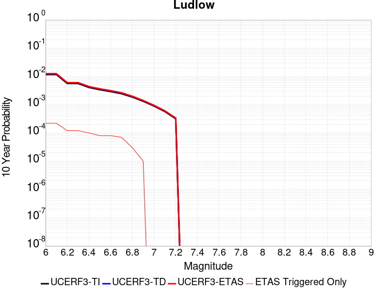 |

| Magnitude | 1 wk TI Prob | 1 wk TD Prob | 1 wk ETAS Prob | 1 wk ETAS/TD Gain | 1 wk ETAS Triggered Only | 1 mo TI Prob | 1 mo TD Prob | 1 mo ETAS Prob | 1 mo ETAS/TD Gain | 1 mo ETAS Triggered Only | 1 yr TI Prob | 1 yr TD Prob | 1 yr ETAS Prob | 1 yr ETAS/TD Gain | 1 yr ETAS Triggered Only | 10 yr TI Prob | 10 yr TD Prob | 10 yr ETAS Prob | 10 yr ETAS/TD Gain | 10 yr ETAS Triggered Only |
|-----|-----|-----|-----|-----|-----|-----|-----|-----|-----|-----|-----|-----|-----|-----|-----|-----|-----|-----|-----|-----|
| 6.0 | 2.2407607E-5 | 2.3657254E-5 | 1.4711112E-4 | 6.2184362 | 1.2345679E-4 | 9.602906E-5 | 1.0138454E-4 | 2.2482881E-4 | 2.2175848 | 1.2345679E-4 | 0.0011685267 | 0.001233702 | 0.0013878326 | 1.1249334 | 1.54321E-4 | 0.011624013 | 0.012273042 | 0.012425469 | 1.0124197 | 1.54321E-4 |
| 6.1 | 2.2407607E-5 | 2.3657254E-5 | 1.4711112E-4 | 6.2184362 | 1.2345679E-4 | 9.602906E-5 | 1.0138454E-4 | 2.2482881E-4 | 2.2175848 | 1.2345679E-4 | 0.0011685267 | 0.001233702 | 0.0013878326 | 1.1249334 | 1.54321E-4 | 0.011624013 | 0.012273042 | 0.012425469 | 1.0124197 | 1.54321E-4 |
| 6.2 | 1.0781252E-5 | 1.1365663E-5 | 4.222951E-5 | 3.715534 | 3.0864197E-5 | 4.620455E-5 | 4.8709102E-5 | 7.957179E-5 | 1.6336125 | 3.0864197E-5 | 5.623952E-4 | 5.9287593E-4 | 6.5456773E-4 | 1.1040552 | 6.1728395E-5 | 0.00560974 | 0.0059133614 | 0.0059747244 | 1.010377 | 6.1728395E-5 |
| 6.3 | 1.0781252E-5 | 1.1365663E-5 | 4.222951E-5 | 3.715534 | 3.0864197E-5 | 4.620455E-5 | 4.8709102E-5 | 7.957179E-5 | 1.6336125 | 3.0864197E-5 | 5.623952E-4 | 5.9287593E-4 | 6.5456773E-4 | 1.1040552 | 6.1728395E-5 | 0.00560974 | 0.0059133614 | 0.0059747244 | 1.010377 | 6.1728395E-5 |
| 6.4 | 7.814439E-6 | 8.237729E-6 | 3.9101673E-5 | 4.746657 | 3.0864197E-5 | 3.3490025E-5 | 3.530408E-5 | 6.616719E-5 | 1.8742079 | 3.0864197E-5 | 4.0766477E-4 | 4.2974384E-4 | 4.914457E-4 | 1.1435783 | 6.1728395E-5 | 0.0040691774 | 0.0042892746 | 0.004350738 | 1.0143296 | 6.1728395E-5 |
| 6.5 | 6.4986366E-6 | 6.85092E-6 | 3.7714904E-5 | 5.5050864 | 3.0864197E-5 | 2.7851002E-5 | 2.9360759E-5 | 6.022405E-5 | 2.0511749 | 3.0864197E-5 | 3.390332E-4 | 3.5740953E-4 | 4.1911585E-4 | 1.1726488 | 6.1728395E-5 | 0.003385164 | 0.0035684432 | 0.0036299515 | 1.0172367 | 6.1728395E-5 |
| 6.6 | 5.582177E-6 | 5.8860055E-6 | 3.675002E-5 | 6.2436266 | 3.0864197E-5 | 2.3923398E-5 | 2.5225498E-5 | 5.6088917E-5 | 2.223501 | 3.0864197E-5 | 2.9122844E-4 | 3.0707786E-4 | 3.6878732E-4 | 1.200957 | 6.1728395E-5 | 0.0029084706 | 0.003066609 | 0.003128148 | 1.0200675 | 6.1728395E-5 |
| 6.7 | 4.6858763E-6 | 4.940427E-6 | 3.580447E-5 | 7.247242 | 3.0864197E-5 | 2.0082172E-5 | 2.1173091E-5 | 5.2036634E-5 | 2.4576778 | 3.0864197E-5 | 2.4447302E-4 | 2.5775246E-4 | 3.1946492E-4 | 1.2394254 | 6.1728395E-5 | 0.0024420423 | 0.0025745912 | 0.0026361607 | 1.0239142 | 6.1728395E-5 |
| 6.8 | 3.5584908E-6 | 3.7520183E-6 | 3.46161E-5 | 9.225994 | 3.0864197E-5 | 1.5250586E-5 | 1.6079981E-5 | 4.694368E-5 | 2.9193866 | 3.0864197E-5 | 1.8566006E-4 | 1.957566E-4 | 2.5747292E-4 | 1.3152707 | 6.1728395E-5 | 0.0018550502 | 0.0019558826 | 0.0020174903 | 1.0314987 | 6.1728395E-5 |
| 6.9 | 2.532834E-6 | 2.6710034E-6 | 3.3535118E-5 | 12.555251 | 3.0864197E-5 | 1.0854958E-5 | 1.1447109E-5 | 4.2310952E-5 | 3.696213 | 3.0864197E-5 | 1.3215111E-4 | 1.3935992E-4 | 1.7021982E-4 | 1.2214403 | 3.0864197E-5 | 0.0013207254 | 0.0013927529 | 0.001423574 | 1.0221297 | 3.0864197E-5 |
| 7.0 | 1.7083285E-6 | 1.8019439E-6 | 1.8019439E-6 | 1.0 | 0.0 | 7.3213873E-6 | 7.722595E-6 | 7.722595E-6 | 1.0 | 0.0 | 8.913424E-5 | 9.40187E-5 | 9.40187E-5 | 1.0 | 0.0 | 8.9098496E-4 | 9.3980576E-4 | 9.3980576E-4 | 1.0 | 0.0 |
| 7.1 | 1.0905424E-6 | 1.1497619E-6 | 1.1497619E-6 | 1.0 | 0.0 | 4.6737446E-6 | 4.9275427E-6 | 4.9275427E-6 | 1.0 | 0.0 | 5.6901354E-5 | 5.999128E-5 | 5.999128E-5 | 1.0 | 0.0 | 5.6886784E-4 | 5.997606E-4 | 5.997606E-4 | 1.0 | 0.0 |
| 7.2 | 6.06668E-7 | 6.387277E-7 | 6.387277E-7 | 1.0 | 0.0 | 2.600003E-6 | 2.7374022E-6 | 2.7374022E-6 | 1.0 | 0.0 | 3.1654577E-5 | 3.3327433E-5 | 3.3327433E-5 | 1.0 | 0.0 | 3.1650066E-4 | 3.3323118E-4 | 3.3323118E-4 | 1.0 | 0.0 |

## Elsinore (Glen Ivy) rev
*[(top)](#table-of-contents)*

| 1 Week | 1 Month | 1 Year | 10 Year |
|-----|-----|-----|-----|
|  |  |  |  |

| Magnitude | 1 wk TI Prob | 1 wk TD Prob | 1 wk ETAS Prob | 1 wk ETAS/TD Gain | 1 wk ETAS Triggered Only | 1 mo TI Prob | 1 mo TD Prob | 1 mo ETAS Prob | 1 mo ETAS/TD Gain | 1 mo ETAS Triggered Only | 1 yr TI Prob | 1 yr TD Prob | 1 yr ETAS Prob | 1 yr ETAS/TD Gain | 1 yr ETAS Triggered Only | 10 yr TI Prob | 10 yr TD Prob | 10 yr ETAS Prob | 10 yr ETAS/TD Gain | 10 yr ETAS Triggered Only |
|-----|-----|-----|-----|-----|-----|-----|-----|-----|-----|-----|-----|-----|-----|-----|-----|-----|-----|-----|-----|-----|
| 6.0 | 1.6204086E-4 | 2.9360707E-4 | 3.8617247E-4 | 1.3152697 | 9.259259E-5 | 6.94276E-4 | 0.0012578638 | 0.00135034 | 1.0735184 | 9.259259E-5 | 0.008420097 | 0.015234485 | 0.015386455 | 1.0099754 | 1.54321E-4 | 0.081081145 | 0.13969168 | 0.13982444 | 1.0009505 | 1.54321E-4 |
| 6.1 | 1.6204086E-4 | 2.9360707E-4 | 3.8617247E-4 | 1.3152697 | 9.259259E-5 | 6.94276E-4 | 0.0012578638 | 0.00135034 | 1.0735184 | 9.259259E-5 | 0.008420097 | 0.015234485 | 0.015386455 | 1.0099754 | 1.54321E-4 | 0.081081145 | 0.13969168 | 0.13982444 | 1.0009505 | 1.54321E-4 |
| 6.2 | 1.6204086E-4 | 2.9360707E-4 | 3.8617247E-4 | 1.3152697 | 9.259259E-5 | 6.94276E-4 | 0.0012578638 | 0.00135034 | 1.0735184 | 9.259259E-5 | 0.008420097 | 0.015234485 | 0.015386455 | 1.0099754 | 1.54321E-4 | 0.081081145 | 0.13969168 | 0.13982444 | 1.0009505 | 1.54321E-4 |
| 6.3 | 1.0111737E-4 | 1.7703383E-4 | 2.387513E-4 | 1.3486196 | 6.1728395E-5 | 4.332882E-4 | 7.5861247E-4 | 8.20294E-4 | 1.0813084 | 6.1728395E-5 | 0.005262531 | 0.009217682 | 0.009340001 | 1.01327 | 1.2345679E-4 | 0.0513964 | 0.0870191 | 0.08713181 | 1.0012953 | 1.2345679E-4 |
| 6.4 | 1.0111737E-4 | 1.7703383E-4 | 2.387513E-4 | 1.3486196 | 6.1728395E-5 | 4.332882E-4 | 7.5861247E-4 | 8.20294E-4 | 1.0813084 | 6.1728395E-5 | 0.005262531 | 0.009217682 | 0.009340001 | 1.01327 | 1.2345679E-4 | 0.0513964 | 0.0870191 | 0.08713181 | 1.0012953 | 1.2345679E-4 |
| 6.5 | 3.6624708E-5 | 4.6391084E-5 | 4.6391084E-5 | 1.0 | 0.0 | 1.569536E-4 | 1.9880582E-4 | 1.9880582E-4 | 1.0 | 0.0 | 0.001909235 | 0.0024181372 | 0.0024797162 | 1.0254655 | 6.1728395E-5 | 0.01892915 | 0.023739954 | 0.023800218 | 1.0025384 | 6.1728395E-5 |
| 6.6 | 2.5051324E-5 | 2.614772E-5 | 2.614772E-5 | 1.0 | 0.0 | 1.073584E-4 | 1.12057096E-4 | 1.12057096E-4 | 1.0 | 0.0 | 0.0013063047 | 0.0013634858 | 0.0013943079 | 1.0226054 | 3.0864197E-5 | 0.012986525 | 0.013564618 | 0.013595064 | 1.0022445 | 3.0864197E-5 |
| 6.7 | 2.2189772E-5 | 2.2072849E-5 | 2.2072849E-5 | 1.0 | 0.0 | 9.509556E-5 | 9.4594696E-5 | 9.4594696E-5 | 1.0 | 0.0 | 0.0011571734 | 0.0011511183 | 0.0011819471 | 1.0267814 | 3.0864197E-5 | 0.011511663 | 0.011465415 | 0.0114959255 | 1.0026611 | 3.0864197E-5 |
| 6.8 | 1.6654378E-5 | 1.4437705E-5 | 1.4437705E-5 | 1.0 | 0.0 | 7.137396E-5 | 6.187444E-5 | 6.187444E-5 | 1.0 | 0.0 | 8.686314E-4 | 7.530661E-4 | 7.839071E-4 | 1.0409539 | 3.0864197E-5 | 0.008652439 | 0.00751048 | 0.0075411126 | 1.0040786 | 3.0864197E-5 |
| 6.9 | 1.5042909E-5 | 1.2332022E-5 | 1.2332022E-5 | 1.0 | 0.0 | 6.446802E-5 | 5.285047E-5 | 5.285047E-5 | 1.0 | 0.0 | 7.8461546E-4 | 6.4326765E-4 | 6.74112E-4 | 1.0479494 | 3.0864197E-5 | 0.007818509 | 0.00641828 | 0.006448946 | 1.0047779 | 3.0864197E-5 |
| 7.0 | 1.4361385E-5 | 1.1451324E-5 | 1.1451324E-5 | 1.0 | 0.0 | 6.154734E-5 | 4.9076196E-5 | 4.9076196E-5 | 1.0 | 0.0 | 7.490812E-4 | 5.973418E-4 | 6.2818755E-4 | 1.0516384 | 3.0864197E-5 | 0.007465612 | 0.0059613534 | 0.0059920335 | 1.0051465 | 3.0864197E-5 |
| 7.1 | 1.3265571E-5 | 1.0244926E-5 | 1.0244926E-5 | 1.0 | 0.0 | 5.6851208E-5 | 4.39061E-5 | 4.39061E-5 | 1.0 | 0.0 | 6.919436E-4 | 5.344282E-4 | 5.652759E-4 | 1.0577209 | 3.0864197E-5 | 0.006897931 | 0.0053347866 | 0.0053654863 | 1.0057546 | 3.0864197E-5 |
| 7.2 | 1.1596403E-5 | 8.505067E-6 | 8.505067E-6 | 1.0 | 0.0 | 4.9697923E-5 | 3.6449786E-5 | 3.6449786E-5 | 1.0 | 0.0 | 6.049042E-4 | 4.436875E-4 | 4.436875E-4 | 1.0 | 0.0 | 0.006032603 | 0.0044294316 | 0.0044294316 | 1.0 | 0.0 |
| 7.3 | 1.0150827E-5 | 7.2387597E-6 | 7.2387597E-6 | 1.0 | 0.0 | 4.3502816E-5 | 3.1022897E-5 | 3.1022897E-5 | 1.0 | 0.0 | 5.2951806E-4 | 3.7763975E-4 | 3.7763975E-4 | 1.0 | 0.0 | 0.005282581 | 0.0037703665 | 0.0037703665 | 1.0 | 0.0 |
| 7.4 | 9.080705E-6 | 6.352519E-6 | 6.352519E-6 | 1.0 | 0.0 | 3.8916725E-5 | 2.7224805E-5 | 2.7224805E-5 | 1.0 | 0.0 | 4.7370812E-4 | 3.3141294E-4 | 3.3141294E-4 | 1.0 | 0.0 | 0.004726996 | 0.0033093381 | 0.0033093381 | 1.0 | 0.0 |
| 7.5 | 7.671649E-6 | 5.2256332E-6 | 5.2256332E-6 | 1.0 | 0.0 | 3.287808E-5 | 2.2395385E-5 | 2.2395385E-5 | 1.0 | 0.0 | 4.0021708E-4 | 2.7263095E-4 | 2.7263095E-4 | 1.0 | 0.0 | 0.0039949706 | 0.00272309 | 0.00272309 | 1.0 | 0.0 |
| 7.6 | 6.990086E-6 | 4.687545E-6 | 4.687545E-6 | 1.0 | 0.0 | 2.9957167E-5 | 2.008933E-5 | 2.008933E-5 | 1.0 | 0.0 | 3.6466747E-4 | 2.445613E-4 | 2.445613E-4 | 1.0 | 0.0 | 0.0036406964 | 0.002443038 | 0.002443038 | 1.0 | 0.0 |
| 7.7 | 4.163505E-6 | 2.3295343E-6 | 2.3295343E-6 | 1.0 | 0.0 | 1.7843471E-5 | 9.983683E-6 | 9.983683E-6 | 1.0 | 0.0 | 2.172226E-4 | 1.21545316E-4 | 1.21545316E-4 | 1.0 | 0.0 | 0.0021701038 | 0.0012148614 | 0.0012148614 | 1.0 | 0.0 |
| 7.8 | 2.2692414E-7 | 9.3854695E-8 | 9.3854695E-8 | 1.0 | 0.0 | 9.725317E-7 | 4.0223435E-7 | 4.0223435E-7 | 1.0 | 0.0 | 1.1840509E-5 | 4.8971956E-6 | 4.8971956E-6 | 1.0 | 0.0 | 1.1839878E-4 | 4.8971204E-5 | 4.8971204E-5 | 1.0 | 0.0 |
| 7.9 | 6.676829E-9 | 3.439853E-9 | 3.439853E-9 | 1.0 | 0.0 | 2.861498E-8 | 1.4742227E-8 | 1.4742227E-8 | 1.0 | 0.0 | 3.4838732E-7 | 1.7948659E-7 | 1.7948659E-7 | 1.0 | 0.0 | 3.4838679E-6 | 1.7948646E-6 | 1.7948646E-6 | 1.0 | 0.0 |

## San Andreas (North Branch Mill Creek)
*[(top)](#table-of-contents)*

| 1 Week | 1 Month | 1 Year | 10 Year |
|-----|-----|-----|-----|
| 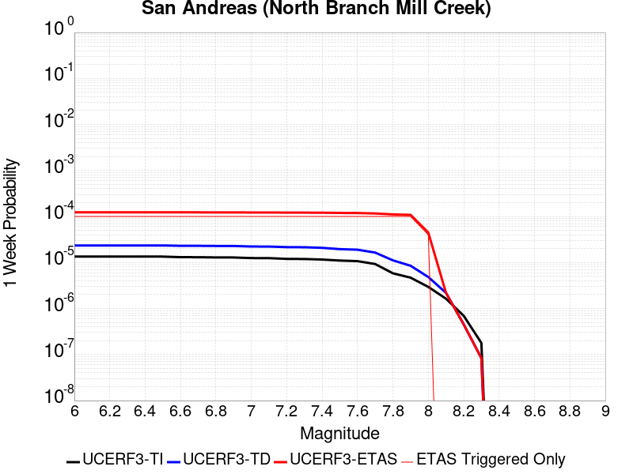 |  |  |  |

| Magnitude | 1 wk TI Prob | 1 wk TD Prob | 1 wk ETAS Prob | 1 wk ETAS/TD Gain | 1 wk ETAS Triggered Only | 1 mo TI Prob | 1 mo TD Prob | 1 mo ETAS Prob | 1 mo ETAS/TD Gain | 1 mo ETAS Triggered Only | 1 yr TI Prob | 1 yr TD Prob | 1 yr ETAS Prob | 1 yr ETAS/TD Gain | 1 yr ETAS Triggered Only | 10 yr TI Prob | 10 yr TD Prob | 10 yr ETAS Prob | 10 yr ETAS/TD Gain | 10 yr ETAS Triggered Only |
|-----|-----|-----|-----|-----|-----|-----|-----|-----|-----|-----|-----|-----|-----|-----|-----|-----|-----|-----|-----|-----|
| 6.0 | 1.3461156E-5 | 2.3499893E-5 | 1.1609031E-4 | 4.940036 | 9.259259E-5 | 5.7689394E-5 | 1.00709956E-4 | 2.2415431E-4 | 2.2257414 | 1.2345679E-4 | 7.02142E-4 | 0.0012254574 | 0.0013795892 | 1.125775 | 1.54321E-4 | 0.0069992766 | 0.01222957 | 0.0123820035 | 1.0124644 | 1.54321E-4 |
| 6.1 | 1.3461156E-5 | 2.3499893E-5 | 1.1609031E-4 | 4.940036 | 9.259259E-5 | 5.7689394E-5 | 1.00709956E-4 | 2.2415431E-4 | 2.2257414 | 1.2345679E-4 | 7.02142E-4 | 0.0012254574 | 0.0013795892 | 1.125775 | 1.54321E-4 | 0.0069992766 | 0.01222957 | 0.0123820035 | 1.0124644 | 1.54321E-4 |
| 6.2 | 1.3461156E-5 | 2.3499893E-5 | 1.1609031E-4 | 4.940036 | 9.259259E-5 | 5.7689394E-5 | 1.00709956E-4 | 2.2415431E-4 | 2.2257414 | 1.2345679E-4 | 7.02142E-4 | 0.0012254574 | 0.0013795892 | 1.125775 | 1.54321E-4 | 0.0069992766 | 0.01222957 | 0.0123820035 | 1.0124644 | 1.54321E-4 |
| 6.3 | 1.3461156E-5 | 2.3499893E-5 | 1.1609031E-4 | 4.940036 | 9.259259E-5 | 5.7689394E-5 | 1.00709956E-4 | 2.2415431E-4 | 2.2257414 | 1.2345679E-4 | 7.02142E-4 | 0.0012254574 | 0.0013795892 | 1.125775 | 1.54321E-4 | 0.0069992766 | 0.01222957 | 0.0123820035 | 1.0124644 | 1.54321E-4 |
| 6.4 | 1.3461156E-5 | 2.3499893E-5 | 1.1609031E-4 | 4.940036 | 9.259259E-5 | 5.7689394E-5 | 1.00709956E-4 | 2.2415431E-4 | 2.2257414 | 1.2345679E-4 | 7.02142E-4 | 0.0012254574 | 0.0013795892 | 1.125775 | 1.54321E-4 | 0.0069992766 | 0.01222957 | 0.0123820035 | 1.0124644 | 1.54321E-4 |
| 6.5 | 1.3450706E-5 | 2.3488852E-5 | 1.1607927E-4 | 4.9418874 | 9.259259E-5 | 5.764461E-5 | 1.0066265E-4 | 2.24107E-4 | 2.2263174 | 1.2345679E-4 | 7.0159714E-4 | 0.001224882 | 0.001379014 | 1.1258341 | 1.54321E-4 | 0.006993862 | 0.01222388 | 0.012376314 | 1.0124702 | 1.54321E-4 |
| 6.6 | 1.3074523E-5 | 2.3103135E-5 | 1.1569359E-4 | 5.007701 | 9.259259E-5 | 5.6032466E-5 | 9.9009696E-5 | 2.2245427E-4 | 2.2467926 | 1.2345679E-4 | 6.8198174E-4 | 0.0012047797 | 0.0013589148 | 1.1279364 | 1.54321E-4 | 0.006798926 | 0.012025044 | 0.01217751 | 1.012679 | 1.54321E-4 |
| 6.7 | 1.3050216E-5 | 2.3078432E-5 | 1.1566889E-4 | 5.0119905 | 9.259259E-5 | 5.59283E-5 | 9.890384E-5 | 2.2234842E-4 | 2.2481272 | 1.2345679E-4 | 6.8071426E-4 | 0.0012034923 | 0.0013576276 | 1.1280733 | 1.54321E-4 | 0.0067863287 | 0.012012309 | 0.012164776 | 1.0126926 | 1.54321E-4 |
| 6.8 | 1.29049395E-5 | 2.292684E-5 | 1.1551731E-4 | 5.0385184 | 9.259259E-5 | 5.530571E-5 | 9.825421E-5 | 2.2169887E-4 | 2.2563803 | 1.2345679E-4 | 6.73139E-4 | 0.0011955918 | 0.0013497282 | 1.1289207 | 1.54321E-4 | 0.0067110364 | 0.011934154 | 0.012086634 | 1.0127767 | 1.54321E-4 |
| 6.9 | 1.2867369E-5 | 2.2886245E-5 | 1.15476716E-4 | 5.0456824 | 9.259259E-5 | 5.51447E-5 | 9.8080236E-5 | 2.2152491E-4 | 2.258609 | 1.2345679E-4 | 6.711799E-4 | 0.0011934759 | 0.0013476127 | 1.1291494 | 1.54321E-4 | 0.006691564 | 0.011913223 | 0.012065706 | 1.0127994 | 1.54321E-4 |
| 7.0 | 1.2495996E-5 | 2.2286325E-5 | 1.1487686E-4 | 5.154589 | 9.259259E-5 | 5.3553173E-5 | 9.550934E-5 | 2.1895434E-4 | 2.2924914 | 1.2345679E-4 | 6.518148E-4 | 0.0011622087 | 0.0013163504 | 1.1326282 | 1.54321E-4 | 0.0064990623 | 0.0116038285 | 0.011756359 | 1.0131449 | 1.54321E-4 |
| 7.1 | 1.2452067E-5 | 2.2231397E-5 | 1.1482193E-4 | 5.164854 | 9.259259E-5 | 5.3364907E-5 | 9.527396E-5 | 2.1871898E-4 | 2.2956848 | 1.2345679E-4 | 6.4952404E-4 | 0.0011593461 | 0.0013134881 | 1.132956 | 1.54321E-4 | 0.0064762887 | 0.0115755 | 0.011728034 | 1.0131774 | 1.54321E-4 |
| 7.2 | 1.2002777E-5 | 2.1609963E-5 | 1.1420056E-4 | 5.284625 | 9.259259E-5 | 5.143946E-5 | 9.2610855E-5 | 2.1605621E-4 | 2.332947 | 1.2345679E-4 | 6.2609545E-4 | 0.0011269567 | 0.0012811037 | 1.1367817 | 1.54321E-4 | 0.006243344 | 0.011254923 | 0.011407507 | 1.0135571 | 1.54321E-4 |
| 7.3 | 1.1923425E-5 | 2.1479793E-5 | 1.140704E-4 | 5.310591 | 9.259259E-5 | 5.109939E-5 | 9.205302E-5 | 2.1549845E-4 | 2.3410254 | 1.2345679E-4 | 6.219575E-4 | 0.001120172 | 0.0012743201 | 1.1376112 | 1.54321E-4 | 0.0062021962 | 0.011187789 | 0.011340383 | 1.0136393 | 1.54321E-4 |
| 7.4 | 1.16105175E-5 | 2.0853771E-5 | 1.1344443E-4 | 5.439996 | 9.259259E-5 | 4.975841E-5 | 8.937026E-5 | 2.1281601E-4 | 2.3812845 | 1.2345679E-4 | 6.0564023E-4 | 0.0010875424 | 0.0012416955 | 1.1417445 | 1.54321E-4 | 0.006039923 | 0.010865397 | 0.011018041 | 1.0140487 | 1.54321E-4 |
| 7.5 | 1.1037265E-5 | 1.9553907E-5 | 1.1214469E-4 | 5.735155 | 9.259259E-5 | 4.7301706E-5 | 8.379978E-5 | 2.0724622E-4 | 2.4731119 | 1.2345679E-4 | 5.757461E-4 | 0.0010197869 | 0.0011739506 | 1.1511724 | 1.54321E-4 | 0.005742567 | 0.010194898 | 0.010347646 | 1.0149827 | 1.54321E-4 |
| 7.6 | 1.0720915E-5 | 1.899582E-5 | 1.11586654E-4 | 5.8742743 | 9.259259E-5 | 4.5945973E-5 | 8.140812E-5 | 2.0485486E-4 | 2.5163934 | 1.2345679E-4 | 5.592486E-4 | 9.906954E-4 | 0.0011448635 | 1.155616 | 1.54321E-4 | 0.005578433 | 0.009906623 | 0.010059414 | 1.0154232 | 1.54321E-4 |
| 7.7 | 9.276279E-6 | 1.6441649E-5 | 1.0903272E-4 | 6.6314955 | 9.259259E-5 | 3.9754876E-5 | 7.0462316E-5 | 1.9391041E-4 | 2.7519732 | 1.2345679E-4 | 4.839081E-4 | 8.575427E-4 | 0.0010117313 | 1.1798029 | 1.54321E-4 | 0.0048285574 | 0.008586041 | 0.008739037 | 1.0178192 | 1.54321E-4 |
| 7.8 | 5.8346777E-6 | 1.1155013E-5 | 1.0374657E-4 | 9.300444 | 9.259259E-5 | 2.5005522E-5 | 4.7806327E-5 | 1.7125721E-4 | 3.5823128 | 1.2345679E-4 | 3.043997E-4 | 5.818867E-4 | 7.361179E-4 | 1.2650536 | 1.54321E-4 | 0.0030398308 | 0.0058469265 | 0.006000345 | 1.0262392 | 1.54321E-4 |
| 7.9 | 4.690204E-6 | 8.509093E-6 | 1.011009E-4 | 11.881513 | 9.259259E-5 | 2.0100719E-5 | 3.6467034E-5 | 1.5991932E-4 | 4.385312 | 1.2345679E-4 | 2.4469878E-4 | 4.4389578E-4 | 5.9814827E-4 | 1.3474971 | 1.54321E-4 | 0.002444295 | 0.0044707474 | 0.0046243784 | 1.0343636 | 1.54321E-4 |
| 8.0 | 2.9570454E-6 | 4.846947E-6 | 3.5710993E-5 | 7.3677297 | 3.0864197E-5 | 1.267299E-5 | 2.0772464E-5 | 8.249957E-5 | 3.9715836 | 6.1728395E-5 | 1.5428272E-4 | 2.5287544E-4 | 3.454446E-4 | 1.3660663 | 9.259259E-5 | 0.0015417566 | 0.002549644 | 0.0026420008 | 1.0362233 | 9.259259E-5 |
| 8.1 | 1.6376824E-6 | 2.1968929E-6 | 2.1968929E-6 | 1.0 | 0.0 | 7.01862E-6 | 9.41522E-6 | 9.41522E-6 | 1.0 | 0.0 | 8.544835E-5 | 1.14624294E-4 | 1.14624294E-4 | 1.0 | 0.0 | 8.54155E-4 | 0.0011606582 | 0.0011606582 | 1.0 | 0.0 |
| 8.2 | 6.9631557E-7 | 4.5360213E-7 | 4.5360213E-7 | 1.0 | 0.0 | 2.984206E-6 | 1.9440076E-6 | 1.9440076E-6 | 1.0 | 0.0 | 3.63321E-5 | 2.3668037E-5 | 2.3668037E-5 | 1.0 | 0.0 | 3.6326164E-4 | 2.451564E-4 | 2.451564E-4 | 1.0 | 0.0 |
| 8.3 | 1.7876137E-7 | 8.360375E-8 | 8.360375E-8 | 1.0 | 0.0 | 7.661199E-7 | 3.5830175E-7 | 3.5830175E-7 | 1.0 | 0.0 | 9.32747E-6 | 4.3623154E-6 | 4.3623154E-6 | 1.0 | 0.0 | 9.3270784E-5 | 4.5817014E-5 | 4.5817014E-5 | 1.0 | 0.0 |

## Santa Ynez (East)
*[(top)](#table-of-contents)*

| 1 Week | 1 Month | 1 Year | 10 Year |
|-----|-----|-----|-----|
|  |  |  |  |

| Magnitude | 1 wk TI Prob | 1 wk TD Prob | 1 wk ETAS Prob | 1 wk ETAS/TD Gain | 1 wk ETAS Triggered Only | 1 mo TI Prob | 1 mo TD Prob | 1 mo ETAS Prob | 1 mo ETAS/TD Gain | 1 mo ETAS Triggered Only | 1 yr TI Prob | 1 yr TD Prob | 1 yr ETAS Prob | 1 yr ETAS/TD Gain | 1 yr ETAS Triggered Only | 10 yr TI Prob | 10 yr TD Prob | 10 yr ETAS Prob | 10 yr ETAS/TD Gain | 10 yr ETAS Triggered Only |
|-----|-----|-----|-----|-----|-----|-----|-----|-----|-----|-----|-----|-----|-----|-----|-----|-----|-----|-----|-----|-----|
| 6.0 | 3.2269712E-5 | 3.67505E-5 | 1.2933969E-4 | 3.5193992 | 9.259259E-5 | 1.3829143E-4 | 1.5749598E-4 | 2.50074E-4 | 1.587812 | 9.259259E-5 | 0.0016823979 | 0.0019164166 | 0.0020396367 | 1.0642972 | 1.2345679E-4 | 0.016697178 | 0.019056441 | 0.019177545 | 1.006355 | 1.2345679E-4 |
| 6.1 | 3.2269712E-5 | 3.67505E-5 | 1.2933969E-4 | 3.5193992 | 9.259259E-5 | 1.3829143E-4 | 1.5749598E-4 | 2.50074E-4 | 1.587812 | 9.259259E-5 | 0.0016823979 | 0.0019164166 | 0.0020396367 | 1.0642972 | 1.2345679E-4 | 0.016697178 | 0.019056441 | 0.019177545 | 1.006355 | 1.2345679E-4 |
| 6.2 | 3.2269712E-5 | 3.67505E-5 | 1.2933969E-4 | 3.5193992 | 9.259259E-5 | 1.3829143E-4 | 1.5749598E-4 | 2.50074E-4 | 1.587812 | 9.259259E-5 | 0.0016823979 | 0.0019164166 | 0.0020396367 | 1.0642972 | 1.2345679E-4 | 0.016697178 | 0.019056441 | 0.019177545 | 1.006355 | 1.2345679E-4 |
| 6.3 | 3.2269712E-5 | 3.67505E-5 | 1.2933969E-4 | 3.5193992 | 9.259259E-5 | 1.3829143E-4 | 1.5749598E-4 | 2.50074E-4 | 1.587812 | 9.259259E-5 | 0.0016823979 | 0.0019164166 | 0.0020396367 | 1.0642972 | 1.2345679E-4 | 0.016697178 | 0.019056441 | 0.019177545 | 1.006355 | 1.2345679E-4 |
| 6.4 | 1.4404779E-5 | 1.4849382E-5 | 4.571312E-5 | 3.0784528 | 3.0864197E-5 | 6.1733306E-5 | 6.363868E-5 | 9.4500916E-5 | 1.4849602 | 3.0864197E-5 | 7.513438E-4 | 7.745306E-4 | 8.053709E-4 | 1.039818 | 3.0864197E-5 | 0.0074880854 | 0.007718862 | 0.0077494876 | 1.0039676 | 3.0864197E-5 |
| 6.5 | 1.4404779E-5 | 1.4849382E-5 | 4.571312E-5 | 3.0784528 | 3.0864197E-5 | 6.1733306E-5 | 6.363868E-5 | 9.4500916E-5 | 1.4849602 | 3.0864197E-5 | 7.513438E-4 | 7.745306E-4 | 8.053709E-4 | 1.039818 | 3.0864197E-5 | 0.0074880854 | 0.007718862 | 0.0077494876 | 1.0039676 | 3.0864197E-5 |
| 6.6 | 1.280208E-5 | 1.3011947E-5 | 1.3011947E-5 | 1.0 | 0.0 | 5.4864904E-5 | 5.5764307E-5 | 5.5764307E-5 | 1.0 | 0.0 | 6.6777546E-4 | 6.787207E-4 | 6.787207E-4 | 1.0 | 0.0 | 0.006657724 | 0.0067666885 | 0.0067666885 | 1.0 | 0.0 |
| 6.7 | 1.2457027E-5 | 1.2628468E-5 | 1.2628468E-5 | 1.0 | 0.0 | 5.3386164E-5 | 5.412089E-5 | 5.412089E-5 | 1.0 | 0.0 | 6.497827E-4 | 6.587243E-4 | 6.587243E-4 | 1.0 | 0.0 | 0.00647886 | 0.006567915 | 0.006567915 | 1.0 | 0.0 |
| 6.8 | 1.2095134E-5 | 1.2230915E-5 | 1.2230915E-5 | 1.0 | 0.0 | 5.1835254E-5 | 5.241716E-5 | 5.241716E-5 | 1.0 | 0.0 | 6.309115E-4 | 6.379937E-4 | 6.379937E-4 | 1.0 | 0.0 | 0.0062912325 | 0.006361809 | 0.006361809 | 1.0 | 0.0 |
| 6.9 | 1.1104036E-5 | 1.1157347E-5 | 1.1157347E-5 | 1.0 | 0.0 | 4.758786E-5 | 4.781633E-5 | 4.781633E-5 | 1.0 | 0.0 | 5.7922816E-4 | 5.820096E-4 | 5.820096E-4 | 1.0 | 0.0 | 0.005777207 | 0.0058049993 | 0.0058049993 | 1.0 | 0.0 |
| 7.0 | 1.0577444E-5 | 1.058168E-5 | 1.058168E-5 | 1.0 | 0.0 | 4.5331115E-5 | 4.5349276E-5 | 4.5349276E-5 | 1.0 | 0.0 | 5.5176654E-4 | 5.519888E-4 | 5.519888E-4 | 1.0 | 0.0 | 0.0055039856 | 0.0055063153 | 0.0055063153 | 1.0 | 0.0 |
| 7.1 | 1.0021775E-5 | 9.980988E-6 | 9.980988E-6 | 1.0 | 0.0 | 4.294976E-5 | 4.2774966E-5 | 4.2774966E-5 | 1.0 | 0.0 | 5.2278786E-4 | 5.2066194E-4 | 5.2066194E-4 | 1.0 | 0.0 | 0.0052155964 | 0.0051945536 | 0.0051945536 | 1.0 | 0.0 |
| 7.2 | 8.874109E-6 | 8.748793E-6 | 8.748793E-6 | 1.0 | 0.0 | 3.8031343E-5 | 3.7494297E-5 | 3.7494297E-5 | 1.0 | 0.0 | 4.629332E-4 | 4.5639853E-4 | 4.5639853E-4 | 1.0 | 0.0 | 0.0046197 | 0.0045547304 | 0.0045547304 | 1.0 | 0.0 |
| 7.3 | 7.5504267E-6 | 7.5051175E-6 | 7.5051175E-6 | 1.0 | 0.0 | 3.235857E-5 | 3.21644E-5 | 3.21644E-5 | 1.0 | 0.0 | 3.9389438E-4 | 3.915322E-4 | 3.915322E-4 | 1.0 | 0.0 | 0.0039319694 | 0.003908531 | 0.003908531 | 1.0 | 0.0 |
| 7.4 | 6.309394E-6 | 6.1831556E-6 | 6.1831556E-6 | 1.0 | 0.0 | 2.703998E-5 | 2.6498974E-5 | 2.6498974E-5 | 1.0 | 0.0 | 3.2916202E-4 | 3.225782E-4 | 3.225782E-4 | 1.0 | 0.0 | 0.003286749 | 0.003221197 | 0.003221197 | 1.0 | 0.0 |
| 7.5 | 4.6103073E-6 | 4.4408903E-6 | 4.4408903E-6 | 1.0 | 0.0 | 1.975831E-5 | 1.9032252E-5 | 1.9032252E-5 | 1.0 | 0.0 | 2.4053088E-4 | 2.3169373E-4 | 2.3169373E-4 | 1.0 | 0.0 | 0.002402707 | 0.002314591 | 0.002314591 | 1.0 | 0.0 |
| 7.6 | 1.2858658E-6 | 1.3008173E-6 | 1.3008173E-6 | 1.0 | 0.0 | 5.5108417E-6 | 5.5749197E-6 | 5.5749197E-6 | 1.0 | 0.0 | 6.7092435E-5 | 6.78726E-5 | 6.78726E-5 | 1.0 | 0.0 | 6.707218E-4 | 6.785256E-4 | 6.785256E-4 | 1.0 | 0.0 |
| 7.7 | 5.3302307E-7 | 5.612138E-7 | 5.612138E-7 | 1.0 | 0.0 | 2.2843826E-6 | 2.4052001E-6 | 2.4052001E-6 | 1.0 | 0.0 | 2.7812002E-5 | 2.9282954E-5 | 2.9282954E-5 | 1.0 | 0.0 | 2.7808524E-4 | 2.9279452E-4 | 2.9279452E-4 | 1.0 | 0.0 |
| 7.8 | 4.613933E-8 | 4.80301E-8 | 4.80301E-8 | 1.0 | 0.0 | 1.9773998E-7 | 2.0584326E-7 | 2.0584326E-7 | 1.0 | 0.0 | 2.4074816E-6 | 2.5061388E-6 | 2.5061388E-6 | 1.0 | 0.0 | 2.4074554E-5 | 2.5061116E-5 | 2.5061116E-5 | 1.0 | 0.0 |

## San Jacinto (Coyote Creek)
*[(top)](#table-of-contents)*

| 1 Week | 1 Month | 1 Year | 10 Year |
|-----|-----|-----|-----|
|  |  |  |  |

| Magnitude | 1 wk TI Prob | 1 wk TD Prob | 1 wk ETAS Prob | 1 wk ETAS/TD Gain | 1 wk ETAS Triggered Only | 1 mo TI Prob | 1 mo TD Prob | 1 mo ETAS Prob | 1 mo ETAS/TD Gain | 1 mo ETAS Triggered Only | 1 yr TI Prob | 1 yr TD Prob | 1 yr ETAS Prob | 1 yr ETAS/TD Gain | 1 yr ETAS Triggered Only | 10 yr TI Prob | 10 yr TD Prob | 10 yr ETAS Prob | 10 yr ETAS/TD Gain | 10 yr ETAS Triggered Only |
|-----|-----|-----|-----|-----|-----|-----|-----|-----|-----|-----|-----|-----|-----|-----|-----|-----|-----|-----|-----|-----|
| 6.0 | 2.7374346E-5 | 2.4145214E-5 | 8.587212E-5 | 3.5564861 | 6.1728395E-5 | 1.1731335E-4 | 1.034754E-4 | 1.960584E-4 | 1.8947345 | 9.259259E-5 | 0.0014273542 | 0.0012590875 | 0.0013515635 | 1.0734469 | 9.259259E-5 | 0.01418221 | 0.012928318 | 0.013050179 | 1.0094259 | 1.2345679E-4 |
| 6.1 | 2.7374346E-5 | 2.4145214E-5 | 8.587212E-5 | 3.5564861 | 6.1728395E-5 | 1.1731335E-4 | 1.034754E-4 | 1.960584E-4 | 1.8947345 | 9.259259E-5 | 0.0014273542 | 0.0012590875 | 0.0013515635 | 1.0734469 | 9.259259E-5 | 0.01418221 | 0.012928318 | 0.013050179 | 1.0094259 | 1.2345679E-4 |
| 6.2 | 2.7374346E-5 | 2.4145214E-5 | 8.587212E-5 | 3.5564861 | 6.1728395E-5 | 1.1731335E-4 | 1.034754E-4 | 1.960584E-4 | 1.8947345 | 9.259259E-5 | 0.0014273542 | 0.0012590875 | 0.0013515635 | 1.0734469 | 9.259259E-5 | 0.01418221 | 0.012928318 | 0.013050179 | 1.0094259 | 1.2345679E-4 |
| 6.3 | 2.7374346E-5 | 2.4145214E-5 | 8.587212E-5 | 3.5564861 | 6.1728395E-5 | 1.1731335E-4 | 1.034754E-4 | 1.960584E-4 | 1.8947345 | 9.259259E-5 | 0.0014273542 | 0.0012590875 | 0.0013515635 | 1.0734469 | 9.259259E-5 | 0.01418221 | 0.012928318 | 0.013050179 | 1.0094259 | 1.2345679E-4 |
| 6.4 | 2.7374346E-5 | 2.4145214E-5 | 8.587212E-5 | 3.5564861 | 6.1728395E-5 | 1.1731335E-4 | 1.034754E-4 | 1.960584E-4 | 1.8947345 | 9.259259E-5 | 0.0014273542 | 0.0012590875 | 0.0013515635 | 1.0734469 | 9.259259E-5 | 0.01418221 | 0.012928318 | 0.013050179 | 1.0094259 | 1.2345679E-4 |
| 6.5 | 2.7282445E-5 | 2.4031293E-5 | 8.5758205E-5 | 3.5686057 | 6.1728395E-5 | 1.16919524E-4 | 1.029872E-4 | 1.9557026E-4 | 1.8989763 | 9.259259E-5 | 0.0014225657 | 0.0012531505 | 0.0013456271 | 1.0737952 | 9.259259E-5 | 0.014134934 | 0.012869646 | 0.012991514 | 1.0094694 | 1.2345679E-4 |
| 6.6 | 2.7282445E-5 | 2.4031293E-5 | 8.5758205E-5 | 3.5686057 | 6.1728395E-5 | 1.16919524E-4 | 1.029872E-4 | 1.9557026E-4 | 1.8989763 | 9.259259E-5 | 0.0014225657 | 0.0012531505 | 0.0013456271 | 1.0737952 | 9.259259E-5 | 0.014134934 | 0.012869646 | 0.012991514 | 1.0094694 | 1.2345679E-4 |
| 6.7 | 2.7216198E-5 | 2.3956412E-5 | 8.568333E-5 | 3.5766344 | 6.1728395E-5 | 1.1663563E-4 | 1.02666316E-4 | 1.952494E-4 | 1.9017864 | 9.259259E-5 | 0.0014191137 | 0.0012492483 | 0.0013417252 | 1.0740261 | 9.259259E-5 | 0.014100855 | 0.0128310565 | 0.012952929 | 1.0094982 | 1.2345679E-4 |
| 6.8 | 2.7078617E-5 | 2.387363E-5 | 8.560055E-5 | 3.5855691 | 6.1728395E-5 | 1.1604605E-4 | 1.0231156E-4 | 1.9489467E-4 | 1.9049135 | 9.259259E-5 | 0.001411945 | 0.0012449342 | 0.0013374115 | 1.0742829 | 9.259259E-5 | 0.014030075 | 0.012788199 | 0.012910076 | 1.0095305 | 1.2345679E-4 |
| 6.9 | 2.6982952E-5 | 2.3793142E-5 | 8.552007E-5 | 3.594316 | 6.1728395E-5 | 1.15636096E-4 | 1.0196664E-4 | 1.945498E-4 | 1.907975 | 9.259259E-5 | 0.0014069602 | 0.0012407395 | 0.0013332171 | 1.0745343 | 9.259259E-5 | 0.013980856 | 0.012746515 | 0.012868398 | 1.0095621 | 1.2345679E-4 |
| 7.0 | 2.6449972E-5 | 2.3370165E-5 | 8.509712E-5 | 3.6412716 | 6.1728395E-5 | 1.1335209E-4 | 1.00154015E-4 | 1.9273734E-4 | 1.9244095 | 9.259259E-5 | 0.001379188 | 0.0012186957 | 0.0013111754 | 1.0758842 | 9.259259E-5 | 0.0137065975 | 0.0125278765 | 0.012649787 | 1.009731 | 1.2345679E-4 |
| 7.1 | 2.6257849E-5 | 2.3196202E-5 | 8.4923166E-5 | 3.6610806 | 6.1728395E-5 | 1.1252879E-4 | 9.940852E-5 | 1.919919E-4 | 1.9313426 | 9.259259E-5 | 0.0013691769 | 0.0012096294 | 0.0013021099 | 1.0764537 | 9.259259E-5 | 0.013607717 | 0.012437741 | 0.012559663 | 1.0098026 | 1.2345679E-4 |
| 7.2 | 2.5270041E-5 | 2.2390966E-5 | 8.411798E-5 | 3.756782 | 6.1728395E-5 | 1.0829568E-4 | 9.595777E-5 | 1.8854148E-4 | 1.964838 | 9.259259E-5 | 0.0013177024 | 0.0011676621 | 0.0012601465 | 1.0792048 | 9.259259E-5 | 0.013099162 | 0.012018777 | 0.012140751 | 1.0101485 | 1.2345679E-4 |
| 7.3 | 2.339701E-5 | 2.1122814E-5 | 8.28499E-5 | 3.9222949 | 6.1728395E-5 | 1.0026905E-4 | 9.0523215E-5 | 1.8310743E-4 | 2.0227675 | 9.259259E-5 | 0.001220092 | 0.0011015651 | 0.0011940557 | 1.0839629 | 9.259259E-5 | 0.012134149 | 0.011357696 | 0.01147975 | 1.0107465 | 1.2345679E-4 |
| 7.4 | 2.296333E-5 | 2.0853171E-5 | 8.258028E-5 | 3.9600828 | 6.1728395E-5 | 9.841056E-5 | 8.936768E-5 | 1.81952E-4 | 2.0359933 | 9.259259E-5 | 0.0011974899 | 0.0010875105 | 0.0011800023 | 1.0850492 | 9.259259E-5 | 0.011910575 | 0.01121681 | 0.011338881 | 1.010883 | 1.2345679E-4 |
| 7.5 | 2.2188895E-5 | 2.0376096E-5 | 8.210323E-5 | 4.02939 | 6.1728395E-5 | 9.50918E-5 | 8.732321E-5 | 1.7990771E-4 | 2.0602508 | 9.259259E-5 | 0.0011571277 | 0.0010626436 | 0.0011551378 | 1.0870416 | 9.259259E-5 | 0.011511209 | 0.010966429 | 0.011088531 | 1.0111343 | 1.2345679E-4 |
| 7.6 | 2.0013189E-5 | 1.8962366E-5 | 8.068959E-5 | 4.255249 | 6.1728395E-5 | 8.5767984E-5 | 8.1264756E-5 | 1.7384982E-4 | 2.1393015 | 9.259259E-5 | 0.001043725 | 9.889511E-4 | 0.0010814521 | 1.0935345 | 9.259259E-5 | 0.010388365 | 0.010224434 | 0.010346628 | 1.0119512 | 1.2345679E-4 |
| 7.7 | 1.7230794E-5 | 1.674371E-5 | 7.847107E-5 | 4.6866 | 6.1728395E-5 | 7.384417E-5 | 7.175679E-5 | 1.6434274E-4 | 2.2902744 | 9.259259E-5 | 8.986819E-4 | 8.7328954E-4 | 9.6580124E-4 | 1.1059347 | 9.259259E-5 | 0.008950562 | 0.009062956 | 0.009185295 | 1.0134987 | 1.2345679E-4 |
| 7.8 | 1.4478809E-5 | 1.4990978E-5 | 7.671845E-5 | 5.1176414 | 6.1728395E-5 | 6.205057E-5 | 6.424547E-5 | 1.5683212E-4 | 2.4411387 | 9.259259E-5 | 7.552038E-4 | 7.819085E-4 | 8.744287E-4 | 1.1183261 | 9.259259E-5 | 0.0075264242 | 0.008141387 | 0.0082638385 | 1.0150406 | 1.2345679E-4 |
| 7.9 | 1.1114467E-5 | 1.1645102E-5 | 7.337278E-5 | 6.3007417 | 6.1728395E-5 | 4.7632562E-5 | 4.990663E-5 | 1.424946E-4 | 2.855224 | 9.259259E-5 | 5.797721E-4 | 6.074444E-4 | 6.999807E-4 | 1.1523372 | 9.259259E-5 | 0.0057826187 | 0.0063803247 | 0.006502994 | 1.0192262 | 1.2345679E-4 |
| 8.0 | 9.327402E-6 | 9.899186E-6 | 7.162697E-5 | 7.2356424 | 6.1728395E-5 | 3.9973966E-5 | 4.2424395E-5 | 1.3501306E-4 | 3.182439 | 9.259259E-5 | 4.8657437E-4 | 5.1639514E-4 | 6.089399E-4 | 1.179213 | 9.259259E-5 | 0.0048551033 | 0.0054499684 | 0.0055727526 | 1.0225292 | 1.2345679E-4 |
| 8.1 | 7.0235833E-6 | 6.827495E-6 | 6.855547E-5 | 10.041086 | 6.1728395E-5 | 3.0100724E-5 | 2.9260367E-5 | 1.2185025E-4 | 4.1643443 | 9.259259E-5 | 3.664147E-4 | 3.5618723E-4 | 4.4874687E-4 | 1.2598622 | 9.259259E-5 | 0.003658111 | 0.0037876023 | 0.0039105914 | 1.0324715 | 1.2345679E-4 |
| 8.2 | 2.0358202E-6 | 8.994527E-7 | 8.994527E-7 | 1.0 | 0.0 | 8.724915E-6 | 3.854792E-6 | 3.854792E-6 | 1.0 | 0.0 | 1.06220665E-4 | 4.69311E-5 | 4.69311E-5 | 1.0 | 0.0 | 0.001061699 | 5.3254166E-4 | 5.3254166E-4 | 1.0 | 0.0 |
| 8.3 | 2.0051264E-7 | 6.617272E-8 | 6.617272E-8 | 1.0 | 0.0 | 8.5933965E-7 | 2.8359733E-7 | 2.8359733E-7 | 1.0 | 0.0 | 1.046241E-5 | 3.4527925E-6 | 3.4527925E-6 | 1.0 | 0.0 | 1.0461917E-4 | 4.01389E-5 | 4.01389E-5 | 1.0 | 0.0 |

## Baker
*[(top)](#table-of-contents)*

| 1 Week | 1 Month | 1 Year | 10 Year |
|-----|-----|-----|-----|
|  |  |  |  |

| Magnitude | 1 wk TI Prob | 1 wk TD Prob | 1 wk ETAS Prob | 1 wk ETAS/TD Gain | 1 wk ETAS Triggered Only | 1 mo TI Prob | 1 mo TD Prob | 1 mo ETAS Prob | 1 mo ETAS/TD Gain | 1 mo ETAS Triggered Only | 1 yr TI Prob | 1 yr TD Prob | 1 yr ETAS Prob | 1 yr ETAS/TD Gain | 1 yr ETAS Triggered Only | 10 yr TI Prob | 10 yr TD Prob | 10 yr ETAS Prob | 10 yr ETAS/TD Gain | 10 yr ETAS Triggered Only |
|-----|-----|-----|-----|-----|-----|-----|-----|-----|-----|-----|-----|-----|-----|-----|-----|-----|-----|-----|-----|-----|
| 6.0 | 5.695525E-6 | 5.8348373E-6 | 9.842689E-5 | 16.868832 | 9.259259E-5 | 2.4409164E-5 | 2.5006228E-5 | 1.4845993E-4 | 5.9369183 | 1.2345679E-4 | 2.9714106E-4 | 3.044123E-4 | 4.2783152E-4 | 1.4054344 | 1.2345679E-4 | 0.0029674405 | 0.0030403486 | 0.0031634301 | 1.0404826 | 1.2345679E-4 |
| 6.1 | 5.695525E-6 | 5.8348373E-6 | 9.842689E-5 | 16.868832 | 9.259259E-5 | 2.4409164E-5 | 2.5006228E-5 | 1.4845993E-4 | 5.9369183 | 1.2345679E-4 | 2.9714106E-4 | 3.044123E-4 | 4.2783152E-4 | 1.4054344 | 1.2345679E-4 | 0.0029674405 | 0.0030403486 | 0.0031634301 | 1.0404826 | 1.2345679E-4 |
| 6.2 | 5.695525E-6 | 5.8348373E-6 | 9.842689E-5 | 16.868832 | 9.259259E-5 | 2.4409164E-5 | 2.5006228E-5 | 1.4845993E-4 | 5.9369183 | 1.2345679E-4 | 2.9714106E-4 | 3.044123E-4 | 4.2783152E-4 | 1.4054344 | 1.2345679E-4 | 0.0029674405 | 0.0030403486 | 0.0031634301 | 1.0404826 | 1.2345679E-4 |
| 6.3 | 3.2995713E-6 | 3.383667E-6 | 6.511185E-5 | 19.242985 | 6.1728395E-5 | 1.4140943E-5 | 1.4501353E-5 | 1.070926E-4 | 7.385008 | 9.259259E-5 | 1.7215237E-4 | 1.7654014E-4 | 2.6911637E-4 | 1.524392 | 9.259259E-5 | 0.0017201907 | 0.001764046 | 0.0018564753 | 1.0523962 | 9.259259E-5 |
| 6.4 | 3.2995713E-6 | 3.383667E-6 | 6.511185E-5 | 19.242985 | 6.1728395E-5 | 1.4140943E-5 | 1.4501353E-5 | 1.070926E-4 | 7.385008 | 9.259259E-5 | 1.7215237E-4 | 1.7654014E-4 | 2.6911637E-4 | 1.524392 | 9.259259E-5 | 0.0017201907 | 0.001764046 | 0.0018564753 | 1.0523962 | 9.259259E-5 |
| 6.5 | 2.782202E-6 | 2.8558404E-6 | 6.458406E-5 | 22.614729 | 6.1728395E-5 | 1.1923668E-5 | 1.223926E-5 | 1.0483072E-4 | 8.565119 | 9.259259E-5 | 1.4516099E-4 | 1.4900314E-4 | 2.4158193E-4 | 1.6213211 | 9.259259E-5 | 0.001450662 | 0.0014890651 | 0.0015815198 | 1.0620891 | 9.259259E-5 |
| 6.6 | 2.3163404E-6 | 2.38092E-6 | 6.410917E-5 | 26.926218 | 6.1728395E-5 | 9.927136E-6 | 1.0203904E-5 | 1.0279555E-4 | 10.07414 | 9.259259E-5 | 1.20856166E-4 | 1.2422565E-4 | 2.1680674E-4 | 1.7452655 | 9.259259E-5 | 0.0012079047 | 0.0012415823 | 0.00133406 | 1.0744836 | 9.259259E-5 |
| 6.7 | 2.037056E-6 | 2.0965003E-6 | 6.3824766E-5 | 30.443478 | 6.1728395E-5 | 8.7302105E-6 | 8.984972E-6 | 1.01576734E-4 | 11.305181 | 9.259259E-5 | 1.0628513E-4 | 1.093867E-4 | 2.0196917E-4 | 1.8463777 | 9.259259E-5 | 0.0010623431 | 0.0010933448 | 0.0011858362 | 1.0845948 | 9.259259E-5 |
| 6.8 | 1.8356744E-6 | 1.8915287E-6 | 6.361981E-5 | 33.63407 | 6.1728395E-5 | 7.867153E-6 | 8.106527E-6 | 1.00698366E-4 | 12.421887 | 9.259259E-5 | 9.577837E-5 | 9.869264E-5 | 1.9127609E-4 | 1.9380989 | 9.259259E-5 | 9.57371E-4 | 9.86502E-4 | 0.0010790033 | 1.0937669 | 9.259259E-5 |
| 6.9 | 1.6310546E-6 | 1.6832072E-6 | 6.34115E-5 | 37.67302 | 6.1728395E-5 | 6.9902153E-6 | 7.213726E-6 | 9.980565E-5 | 13.835521 | 9.259259E-5 | 8.510255E-5 | 8.782368E-5 | 1.8040814E-4 | 2.0542083 | 9.259259E-5 | 8.5069967E-4 | 8.7790104E-4 | 9.7041234E-4 | 1.1053778 | 9.259259E-5 |
| 7.0 | 1.2058036E-6 | 1.2508665E-6 | 3.2115026E-5 | 25.674223 | 3.0864197E-5 | 5.1677193E-6 | 5.3608455E-6 | 6.708891E-5 | 12.514613 | 6.1728395E-5 | 6.291517E-5 | 6.5266366E-5 | 1.2699074E-4 | 1.9457301 | 6.1728395E-5 | 6.289736E-4 | 6.524743E-4 | 7.141624E-4 | 1.0945449 | 6.1728395E-5 |
| 7.1 | 1.052382E-6 | 1.0951609E-6 | 3.1959324E-5 | 29.18231 | 3.0864197E-5 | 4.5102006E-6 | 4.693538E-6 | 6.642164E-5 | 14.151721 | 6.1728395E-5 | 5.491031E-5 | 5.7142337E-5 | 1.188672E-4 | 2.080195 | 6.1728395E-5 | 5.4896745E-4 | 5.7127734E-4 | 6.329705E-4 | 1.1079916 | 6.1728395E-5 |
| 7.2 | 1.0067454E-6 | 1.0487711E-6 | 3.1912936E-5 | 30.428886 | 3.0864197E-5 | 4.3146156E-6 | 4.4947255E-6 | 6.622284E-5 | 14.733457 | 6.1728395E-5 | 5.252918E-5 | 5.4721917E-5 | 1.16446936E-4 | 2.1279762 | 6.1728395E-5 | 5.251676E-4 | 5.470853E-4 | 6.087799E-4 | 1.1127697 | 6.1728395E-5 |
| 7.3 | 9.3596316E-7 | 9.767723E-7 | 3.184094E-5 | 32.598118 | 3.0864197E-5 | 4.0112645E-6 | 4.1861604E-6 | 6.59143E-5 | 15.745765 | 6.1728395E-5 | 4.8836053E-5 | 5.096532E-5 | 1.1269057E-4 | 2.2111225 | 6.1728395E-5 | 4.8825322E-4 | 5.095371E-4 | 5.7123404E-4 | 1.1210843 | 6.1728395E-5 |
| 7.4 | 8.8117395E-7 | 9.2076635E-7 | 3.1784937E-5 | 34.52009 | 3.0864197E-5 | 3.7764542E-6 | 3.9461356E-6 | 6.5674285E-5 | 16.642685 | 6.1728395E-5 | 4.5977362E-5 | 4.8043148E-5 | 1.09768574E-4 | 2.2847915 | 6.1728395E-5 | 4.596785E-4 | 4.8032837E-4 | 5.420271E-4 | 1.1284512 | 6.1728395E-5 |
| 7.5 | 8.292386E-7 | 8.6745956E-7 | 3.173163E-5 | 36.579952 | 3.0864197E-5 | 3.5538749E-6 | 3.7176785E-6 | 6.544584E-5 | 17.603954 | 6.1728395E-5 | 4.326757E-5 | 4.5261804E-5 | 1.06987405E-4 | 2.363746 | 6.1728395E-5 | 4.3259145E-4 | 4.5252658E-4 | 5.142271E-4 | 1.1363466 | 6.1728395E-5 |
| 7.6 | 7.553842E-7 | 7.9144706E-7 | 3.165562E-5 | 39.997143 | 3.0864197E-5 | 3.2373566E-6 | 3.3919116E-6 | 6.51201E-5 | 19.198643 | 6.1728395E-5 | 3.9414106E-5 | 4.129575E-5 | 1.0302159E-4 | 2.4947264 | 6.1728395E-5 | 3.9407116E-4 | 4.1288146E-4 | 4.7458435E-4 | 1.1494446 | 6.1728395E-5 |
| 7.7 | 6.5285366E-7 | 6.852797E-7 | 3.1549454E-5 | 46.038803 | 3.0864197E-5 | 2.797941E-6 | 2.9369096E-6 | 3.3801018E-5 | 11.509042 | 3.0864197E-5 | 3.40644E-5 | 3.5756293E-5 | 6.661939E-5 | 1.8631513 | 3.0864197E-5 | 3.405918E-4 | 3.5750607E-4 | 3.8835924E-4 | 1.0863011 | 3.0864197E-5 |
| 7.8 | 3.4586725E-7 | 3.6482615E-7 | 3.6482615E-7 | 1.0 | 0.0 | 1.4822873E-6 | 1.5635396E-6 | 1.5635396E-6 | 1.0 | 0.0 | 1.80467E-5 | 1.9035933E-5 | 1.9035933E-5 | 1.0 | 0.0 | 1.8045233E-4 | 1.9034347E-4 | 1.9034347E-4 | 1.0 | 0.0 |
| 7.9 | 2.5591178E-9 | 2.6696718E-9 | 2.6696718E-9 | 1.0 | 0.0 | 1.0967647E-8 | 1.14414505E-8 | 1.14414505E-8 | 1.0 | 0.0 | 1.335311E-7 | 1.3929966E-7 | 1.3929966E-7 | 1.0 | 0.0 | 1.3353102E-6 | 1.3929966E-6 | 1.3929966E-6 | 1.0 | 0.0 |

## Brawley (Seismic Zone) alt 1
*[(top)](#table-of-contents)*

| 1 Week | 1 Month | 1 Year | 10 Year |
|-----|-----|-----|-----|
|  |  |  |  |

| Magnitude | 1 wk TI Prob | 1 wk TD Prob | 1 wk ETAS Prob | 1 wk ETAS/TD Gain | 1 wk ETAS Triggered Only | 1 mo TI Prob | 1 mo TD Prob | 1 mo ETAS Prob | 1 mo ETAS/TD Gain | 1 mo ETAS Triggered Only | 1 yr TI Prob | 1 yr TD Prob | 1 yr ETAS Prob | 1 yr ETAS/TD Gain | 1 yr ETAS Triggered Only | 10 yr TI Prob | 10 yr TD Prob | 10 yr ETAS Prob | 10 yr ETAS/TD Gain | 10 yr ETAS Triggered Only |
|-----|-----|-----|-----|-----|-----|-----|-----|-----|-----|-----|-----|-----|-----|-----|-----|-----|-----|-----|-----|-----|
| 6.0 | 2.2521618E-4 | 4.7632487E-4 | 5.0717435E-4 | 1.0647657 | 3.0864197E-5 | 9.6485513E-4 | 0.0020398323 | 0.0021630372 | 1.0603995 | 1.2345679E-4 | 0.011683988 | 0.024546238 | 0.024666663 | 1.004906 | 1.2345679E-4 | 0.11088423 | 0.21350002 | 0.21359712 | 1.0004548 | 1.2345679E-4 |
| 6.1 | 2.2521618E-4 | 4.7632487E-4 | 5.0717435E-4 | 1.0647657 | 3.0864197E-5 | 9.6485513E-4 | 0.0020398323 | 0.0021630372 | 1.0603995 | 1.2345679E-4 | 0.011683988 | 0.024546238 | 0.024666663 | 1.004906 | 1.2345679E-4 | 0.11088423 | 0.21350002 | 0.21359712 | 1.0004548 | 1.2345679E-4 |
| 6.2 | 2.198148E-4 | 4.6717093E-4 | 4.9802073E-4 | 1.0660353 | 3.0864197E-5 | 9.417233E-4 | 0.0020006616 | 0.0021238714 | 1.0615845 | 1.2345679E-4 | 0.011405343 | 0.024080504 | 0.024200987 | 1.0050033 | 1.2345679E-4 | 0.10837428 | 0.20993657 | 0.21003412 | 1.0004646 | 1.2345679E-4 |
| 6.3 | 2.1704129E-4 | 4.615278E-4 | 4.9237773E-4 | 1.0668432 | 3.0864197E-5 | 9.298453E-4 | 0.0019765133 | 0.002099726 | 1.0623385 | 1.2345679E-4 | 0.011262234 | 0.02379366 | 0.02391418 | 1.0050652 | 1.2345679E-4 | 0.107082725 | 0.20782755 | 0.20792535 | 1.0004705 | 1.2345679E-4 |
| 6.4 | 1.876142E-4 | 4.00449E-4 | 4.00449E-4 | 1.0 | 0.0 | 8.038131E-4 | 0.0017150956 | 0.0018075294 | 1.0538943 | 9.259259E-5 | 0.00974259 | 0.020680401 | 0.020771079 | 1.0043848 | 9.259259E-5 | 0.093263686 | 0.18457815 | 0.18465365 | 1.000409 | 9.259259E-5 |
| 6.5 | 1.7390939E-4 | 3.7477075E-4 | 3.7477075E-4 | 1.0 | 0.0 | 7.45113E-4 | 0.0016051838 | 0.0016976278 | 1.0575908 | 9.259259E-5 | 0.009034078 | 0.019368723 | 0.019459523 | 1.0046879 | 9.259259E-5 | 0.086755216 | 0.17440031 | 0.17447676 | 1.0004383 | 9.259259E-5 |
| 6.6 | 1.591791E-4 | 3.4891962E-4 | 3.4891962E-4 | 1.0 | 0.0 | 6.8201777E-4 | 0.0014945229 | 0.001556159 | 1.0412414 | 6.1728395E-5 | 0.008271996 | 0.018045569 | 0.018106185 | 1.003359 | 6.1728395E-5 | 0.07970774 | 0.16380852 | 0.16386014 | 1.0003151 | 6.1728395E-5 |
| 6.7 | 1.4268003E-4 | 3.20582E-4 | 3.20582E-4 | 1.0 | 0.0 | 6.1134255E-4 | 0.0013732077 | 0.0014348513 | 1.0448903 | 6.1728395E-5 | 0.007417723 | 0.016592601 | 0.016653307 | 1.0036585 | 6.1728395E-5 | 0.07174956 | 0.15193306 | 0.15198542 | 1.0003445 | 6.1728395E-5 |
| 6.8 | 1.239713E-4 | 2.9053655E-4 | 2.9053655E-4 | 1.0 | 0.0 | 5.3119735E-4 | 0.0012445687 | 0.0013062202 | 1.0495365 | 6.1728395E-5 | 0.0064481674 | 0.015048777 | 0.015109576 | 1.0040401 | 6.1728395E-5 | 0.06264243 | 0.13837762 | 0.13843082 | 1.0003843 | 6.1728395E-5 |
| 6.9 | 1.0180238E-4 | 2.625439E-4 | 2.625439E-4 | 1.0 | 0.0 | 4.3622297E-4 | 0.0011247073 | 0.0011863662 | 1.0548222 | 6.1728395E-5 | 0.005298089 | 0.013608336 | 0.013669224 | 1.0044744 | 6.1728395E-5 | 0.05173543 | 0.124961674 | 0.12501569 | 1.0004323 | 6.1728395E-5 |
| 7.0 | 7.6619996E-5 | 2.23993E-4 | 2.23993E-4 | 1.0 | 0.0 | 3.283301E-4 | 9.5962E-4 | 0.0010212892 | 1.0642642 | 6.1728395E-5 | 0.0039900932 | 0.011621496 | 0.011682507 | 1.0052499 | 6.1728395E-5 | 0.039192066 | 0.107266866 | 0.10732197 | 1.0005138 | 6.1728395E-5 |
| 7.1 | 7.5127435E-5 | 2.2082464E-4 | 2.2082464E-4 | 1.0 | 0.0 | 3.2193496E-4 | 9.4605127E-4 | 0.0010077213 | 1.0651867 | 6.1728395E-5 | 0.0039125155 | 0.011458045 | 0.011519066 | 1.0053256 | 6.1728395E-5 | 0.038443442 | 0.10583085 | 0.10588604 | 1.0005215 | 6.1728395E-5 |
| 7.2 | 6.788582E-5 | 2.0210193E-4 | 2.0210193E-4 | 1.0 | 0.0 | 2.9090676E-4 | 8.6586666E-4 | 9.2754164E-4 | 1.0712291 | 6.1728395E-5 | 0.0035360386 | 0.0104916105 | 0.010552691 | 1.0058218 | 6.1728395E-5 | 0.034803 | 0.09750131 | 0.09755702 | 1.0005714 | 6.1728395E-5 |
| 7.3 | 6.399602E-5 | 1.8841137E-4 | 1.8841137E-4 | 1.0 | 0.0 | 2.7423984E-4 | 8.072303E-4 | 8.689089E-4 | 1.0764077 | 6.1728395E-5 | 0.0033337586 | 0.009784332 | 0.009845455 | 1.0062472 | 6.1728395E-5 | 0.03284188 | 0.09139617 | 0.09145225 | 1.0006137 | 6.1728395E-5 |
| 7.4 | 4.506759E-5 | 1.2529209E-4 | 1.2529209E-4 | 1.0 | 0.0 | 1.9313251E-4 | 5.368565E-4 | 5.985517E-4 | 1.1149194 | 6.1728395E-5 | 0.0023488526 | 0.0065168133 | 0.0065781395 | 1.0094105 | 6.1728395E-5 | 0.023241805 | 0.062363707 | 0.062421583 | 1.000928 | 6.1728395E-5 |
| 7.5 | 3.43289E-5 | 9.33541E-5 | 9.33541E-5 | 1.0 | 0.0 | 1.4711556E-4 | 4.00028E-4 | 4.617317E-4 | 1.1542485 | 6.1728395E-5 | 0.0017896603 | 0.0048595266 | 0.004920955 | 1.0126408 | 6.1728395E-5 | 0.01775316 | 0.04705519 | 0.047114015 | 1.0012501 | 6.1728395E-5 |
| 7.6 | 2.5980507E-5 | 7.053101E-5 | 7.053101E-5 | 1.0 | 0.0 | 1.1134028E-4 | 3.0224086E-4 | 3.6395062E-4 | 1.204174 | 6.1728395E-5 | 0.001354725 | 0.003673598 | 0.0037350995 | 1.0167415 | 6.1728395E-5 | 0.013464959 | 0.035840835 | 0.03590035 | 1.0016606 | 6.1728395E-5 |
| 7.7 | 1.7292105E-5 | 4.9407296E-5 | 4.9407296E-5 | 1.0 | 0.0 | 7.4106916E-5 | 2.117284E-4 | 2.7344373E-4 | 1.2914834 | 6.1728395E-5 | 9.018782E-4 | 0.0025747516 | 0.0026363211 | 1.0239128 | 6.1728395E-5 | 0.008982267 | 0.025290398 | 0.025350565 | 1.0023791 | 6.1728395E-5 |
| 7.8 | 1.2927471E-5 | 3.9693266E-5 | 3.9693266E-5 | 1.0 | 0.0 | 5.5402274E-5 | 1.7010293E-4 | 2.3182083E-4 | 1.3628267 | 6.1728395E-5 | 6.743139E-4 | 0.0020690386 | 0.0021306393 | 1.0297726 | 6.1728395E-5 | 0.0067227143 | 0.020431727 | 0.020492194 | 1.0029595 | 6.1728395E-5 |
| 7.9 | 1.0200774E-5 | 2.874569E-5 | 2.874569E-5 | 1.0 | 0.0 | 4.371687E-5 | 1.2319001E-4 | 1.849108E-4 | 1.5010211 | 6.1728395E-5 | 5.321229E-4 | 0.0014988075 | 0.0015604433 | 1.0411233 | 6.1728395E-5 | 0.005308505 | 0.014991644 | 0.015052447 | 1.0040557 | 6.1728395E-5 |
| 8.0 | 8.650396E-6 | 2.3277367E-5 | 2.3277367E-5 | 1.0 | 0.0 | 3.70726E-5 | 9.975634E-5 | 1.3061745E-4 | 1.309365 | 3.0864197E-5 | 4.5126543E-4 | 0.0012138576 | 0.0012446843 | 1.0253956 | 3.0864197E-5 | 0.0045035016 | 0.012211097 | 0.012241584 | 1.0024967 | 3.0864197E-5 |
| 8.1 | 3.9368224E-6 | 7.3279825E-6 | 7.3279825E-6 | 1.0 | 0.0 | 1.6871985E-5 | 3.140526E-5 | 3.140526E-5 | 1.0 | 0.0 | 2.0539707E-4 | 3.8229208E-4 | 3.8229208E-4 | 1.0 | 0.0 | 0.0020520731 | 0.004001185 | 0.004001185 | 1.0 | 0.0 |
| 8.2 | 1.7101195E-6 | 2.217876E-6 | 2.217876E-6 | 1.0 | 0.0 | 7.329063E-6 | 9.505149E-6 | 9.505149E-6 | 1.0 | 0.0 | 8.922769E-5 | 1.1571907E-4 | 1.1571907E-4 | 1.0 | 0.0 | 8.9191867E-4 | 0.0012666774 | 0.0012666774 | 1.0 | 0.0 |
| 8.3 | 3.0346666E-8 | 1.721586E-8 | 1.721586E-8 | 1.0 | 0.0 | 1.3005713E-7 | 7.378226E-8 | 7.378226E-8 | 1.0 | 0.0 | 1.5834444E-6 | 8.9829894E-7 | 8.9829894E-7 | 1.0 | 0.0 | 1.5834332E-5 | 9.367729E-6 | 9.367729E-6 | 1.0 | 0.0 |

## Imperial
*[(top)](#table-of-contents)*

| 1 Week | 1 Month | 1 Year | 10 Year |
|-----|-----|-----|-----|
|  |  |  |  |

| Magnitude | 1 wk TI Prob | 1 wk TD Prob | 1 wk ETAS Prob | 1 wk ETAS/TD Gain | 1 wk ETAS Triggered Only | 1 mo TI Prob | 1 mo TD Prob | 1 mo ETAS Prob | 1 mo ETAS/TD Gain | 1 mo ETAS Triggered Only | 1 yr TI Prob | 1 yr TD Prob | 1 yr ETAS Prob | 1 yr ETAS/TD Gain | 1 yr ETAS Triggered Only | 10 yr TI Prob | 10 yr TD Prob | 10 yr ETAS Prob | 10 yr ETAS/TD Gain | 10 yr ETAS Triggered Only |
|-----|-----|-----|-----|-----|-----|-----|-----|-----|-----|-----|-----|-----|-----|-----|-----|-----|-----|-----|-----|-----|
| 6.0 | 2.7496446E-4 | 5.0552754E-4 | 5.3637614E-4 | 1.0610226 | 3.0864197E-5 | 0.0011778869 | 0.002164787 | 0.0022879764 | 1.0569061 | 1.2345679E-4 | 0.0142467655 | 0.026038699 | 0.02615894 | 1.0046178 | 1.2345679E-4 | 0.13367249 | 0.2280438 | 0.22813909 | 1.000418 | 1.2345679E-4 |
| 6.1 | 2.5356023E-4 | 4.8656776E-4 | 5.17417E-4 | 1.0634016 | 3.0864197E-5 | 0.001086234 | 0.0020836622 | 0.0022068617 | 1.0591265 | 1.2345679E-4 | 0.013144928 | 0.025071215 | 0.025191575 | 1.0048008 | 1.2345679E-4 | 0.123940155 | 0.21947981 | 0.21957617 | 1.000439 | 1.2345679E-4 |
| 6.2 | 2.4820742E-4 | 4.7752203E-4 | 5.083715E-4 | 1.0646032 | 3.0864197E-5 | 0.0010633124 | 0.0020449557 | 0.0021681602 | 1.0602479 | 1.2345679E-4 | 0.01286919 | 0.024611235 | 0.024731653 | 1.0048928 | 1.2345679E-4 | 0.12148927 | 0.21598552 | 0.21608232 | 1.0004481 | 1.2345679E-4 |
| 6.3 | 2.3205351E-4 | 4.5890483E-4 | 4.8975484E-4 | 1.0672253 | 3.0864197E-5 | 9.94136E-4 | 0.0019652895 | 0.0020885037 | 1.0626951 | 1.2345679E-4 | 0.012036599 | 0.02366133 | 0.023781866 | 1.0050942 | 1.2345679E-4 | 0.11405133 | 0.20793462 | 0.2080324 | 1.0004703 | 1.2345679E-4 |
| 6.4 | 2.0304754E-4 | 3.987652E-4 | 3.987652E-4 | 1.0 | 0.0 | 8.6991355E-4 | 0.0017078889 | 0.0018003234 | 1.0541221 | 9.259259E-5 | 0.010539869 | 0.020595672 | 0.020686356 | 1.0044031 | 9.259259E-5 | 0.100537635 | 0.1850669 | 0.18514235 | 1.0004077 | 9.259259E-5 |
| 6.5 | 1.854992E-4 | 3.6988858E-4 | 3.6988858E-4 | 1.0 | 0.0 | 7.9475436E-4 | 0.0015842861 | 0.001676732 | 1.0583518 | 9.259259E-5 | 0.009633281 | 0.01911948 | 0.019210303 | 1.0047503 | 9.259259E-5 | 0.0922623 | 0.173298 | 0.17337455 | 1.0004417 | 9.259259E-5 |
| 6.6 | 1.6586106E-4 | 3.403506E-4 | 3.403506E-4 | 1.0 | 0.0 | 7.106394E-4 | 0.0014578402 | 0.0015194786 | 1.0422807 | 6.1728395E-5 | 0.008617763 | 0.01760642 | 0.01766706 | 1.0034443 | 6.1728395E-5 | 0.08291132 | 0.16077545 | 0.16082725 | 1.0003222 | 6.1728395E-5 |
| 6.7 | 1.4224656E-4 | 3.076692E-4 | 3.076692E-4 | 1.0 | 0.0 | 6.094856E-4 | 0.001317924 | 0.0013795712 | 1.0467758 | 6.1728395E-5 | 0.0073952693 | 0.015929576 | 0.015990322 | 1.0038134 | 6.1728395E-5 | 0.07153955 | 0.14648417 | 0.14653686 | 1.0003597 | 6.1728395E-5 |
| 6.8 | 1.2317259E-4 | 2.779122E-4 | 2.779122E-4 | 1.0 | 0.0 | 5.2777573E-4 | 0.0011905148 | 0.0012521696 | 1.0517884 | 6.1728395E-5 | 0.0064067547 | 0.0143995695 | 0.014460409 | 1.0042251 | 6.1728395E-5 | 0.06225166 | 0.13293684 | 0.13299035 | 1.0004026 | 6.1728395E-5 |
| 6.9 | 9.859898E-5 | 2.5014306E-4 | 2.5014306E-4 | 1.0 | 0.0 | 4.2249862E-4 | 0.0010716055 | 0.0011332678 | 1.057542 | 6.1728395E-5 | 0.0051317946 | 0.012969712 | 0.01303064 | 1.0046977 | 6.1728395E-5 | 0.05014893 | 0.11940631 | 0.11946067 | 1.0004553 | 6.1728395E-5 |
| 7.0 | 7.3191884E-5 | 2.1266776E-4 | 2.1266776E-4 | 1.0 | 0.0 | 3.136418E-4 | 9.1111806E-4 | 9.7279024E-4 | 1.0676885 | 6.1728395E-5 | 0.003811904 | 0.011037128 | 0.011098174 | 1.0055311 | 6.1728395E-5 | 0.037471764 | 0.10206493 | 0.102120355 | 1.0005431 | 6.1728395E-5 |
| 7.1 | 7.1760296E-5 | 2.0968143E-4 | 2.0968143E-4 | 1.0 | 0.0 | 3.0750787E-4 | 8.983284E-4 | 9.600013E-4 | 1.068653 | 6.1728395E-5 | 0.003737482 | 0.010882978 | 0.010944035 | 1.0056102 | 6.1728395E-5 | 0.03675245 | 0.10070146 | 0.100756966 | 1.0005512 | 6.1728395E-5 |
| 7.2 | 6.46614E-5 | 1.9136685E-4 | 1.9136685E-4 | 1.0 | 0.0 | 2.7709085E-4 | 8.1988896E-4 | 8.815667E-4 | 1.075227 | 6.1728395E-5 | 0.0033683628 | 0.0099370815 | 0.009998197 | 1.0061502 | 6.1728395E-5 | 0.033177625 | 0.09250898 | 0.092565 | 1.0006056 | 6.1728395E-5 |
| 7.3 | 6.088115E-5 | 1.78084E-4 | 1.78084E-4 | 1.0 | 0.0 | 2.6089314E-4 | 7.6299673E-4 | 8.2467805E-4 | 1.0808408 | 6.1728395E-5 | 0.0031717476 | 0.009250494 | 0.009311651 | 1.0066112 | 6.1728395E-5 | 0.031268585 | 0.08655989 | 0.08661628 | 1.0006514 | 6.1728395E-5 |
| 7.4 | 4.199346E-5 | 1.1510366E-4 | 1.1510366E-4 | 1.0 | 0.0 | 1.7995955E-4 | 4.9320905E-4 | 5.5490696E-4 | 1.1250949 | 6.1728395E-5 | 0.0021888057 | 0.0059884563 | 0.006049815 | 1.0102462 | 6.1728395E-5 | 0.02167372 | 0.057439793 | 0.05749798 | 1.0010129 | 6.1728395E-5 |
| 7.5 | 3.130448E-5 | 8.33328E-5 | 8.33328E-5 | 1.0 | 0.0 | 1.3415517E-4 | 3.57092E-4 | 4.1879836E-4 | 1.1728024 | 6.1728395E-5 | 0.0016321153 | 0.004338988 | 0.0044004484 | 1.0141647 | 6.1728395E-5 | 0.016201803 | 0.04213201 | 0.042191137 | 1.0014033 | 6.1728395E-5 |
| 7.6 | 2.3074248E-5 | 6.0844646E-5 | 6.0844646E-5 | 1.0 | 0.0 | 9.888588E-5 | 2.6073685E-4 | 3.2244914E-4 | 1.2366842 | 6.1728395E-5 | 0.0012032706 | 0.0031698733 | 0.003231406 | 1.0194117 | 6.1728395E-5 | 0.011967761 | 0.031026395 | 0.031086208 | 1.0019279 | 6.1728395E-5 |
| 7.7 | 1.45864815E-5 | 4.0124698E-5 | 4.0124698E-5 | 1.0 | 0.0 | 6.2511994E-5 | 1.7195169E-4 | 2.3366947E-4 | 1.3589251 | 6.1728395E-5 | 7.608177E-4 | 0.0020915072 | 0.0021531065 | 1.0294521 | 6.1728395E-5 | 0.007582182 | 0.020627763 | 0.020688219 | 1.0029308 | 6.1728395E-5 |
| 7.8 | 1.0352979E-5 | 3.0960902E-5 | 3.0960902E-5 | 1.0 | 0.0 | 4.4369157E-5 | 1.3268284E-4 | 1.9440304E-4 | 1.465171 | 6.1728395E-5 | 5.400606E-4 | 0.0016142189 | 0.0016758477 | 1.0381787 | 6.1728395E-5 | 0.0053875 | 0.016016833 | 0.016077572 | 1.0037923 | 6.1728395E-5 |
| 7.9 | 8.137906E-6 | 2.2149103E-5 | 2.2149103E-5 | 1.0 | 0.0 | 3.4876273E-5 | 9.492128E-5 | 1.5664381E-4 | 1.6502497 | 6.1728395E-5 | 4.2453592E-4 | 0.0011550548 | 0.001216712 | 1.0533803 | 6.1728395E-5 | 0.004237258 | 0.011617903 | 0.011678914 | 1.0052515 | 6.1728395E-5 |
| 8.0 | 6.93792E-6 | 1.8008766E-5 | 1.8008766E-5 | 1.0 | 0.0 | 2.9733603E-5 | 7.717814E-5 | 1.0803996E-4 | 1.3998777 | 3.0864197E-5 | 3.6194647E-4 | 9.3923963E-4 | 9.700748E-4 | 1.03283 | 3.0864197E-5 | 0.0036135751 | 0.00950155 | 0.009532122 | 1.0032175 | 3.0864197E-5 |
| 8.1 | 3.4286315E-6 | 6.379872E-6 | 6.379872E-6 | 1.0 | 0.0 | 1.4694053E-5 | 2.7342023E-5 | 2.7342023E-5 | 1.0 | 0.0 | 1.7888541E-4 | 3.328384E-4 | 3.328384E-4 | 1.0 | 0.0 | 0.0017874148 | 0.003486031 | 0.003486031 | 1.0 | 0.0 |
| 8.2 | 1.4906886E-6 | 1.9366646E-6 | 1.9366646E-6 | 1.0 | 0.0 | 6.3886496E-6 | 8.299965E-6 | 8.299965E-6 | 1.0 | 0.0 | 7.7779034E-5 | 1.0104742E-4 | 1.0104742E-4 | 1.0 | 0.0 | 7.775182E-4 | 0.0011075331 | 0.0011075331 | 1.0 | 0.0 |
| 8.3 | 2.5758007E-8 | 1.4500102E-8 | 1.4500102E-8 | 1.0 | 0.0 | 1.10391454E-7 | 6.214329E-8 | 6.214329E-8 | 1.0 | 0.0 | 1.3440151E-6 | 7.565946E-7 | 7.565946E-7 | 1.0 | 0.0 | 1.344007E-5 | 7.887763E-6 | 7.887763E-6 | 1.0 | 0.0 |

## Camp Rock 2011
*[(top)](#table-of-contents)*

| 1 Week | 1 Month | 1 Year | 10 Year |
|-----|-----|-----|-----|
|  |  |  |  |

| Magnitude | 1 wk TI Prob | 1 wk TD Prob | 1 wk ETAS Prob | 1 wk ETAS/TD Gain | 1 wk ETAS Triggered Only | 1 mo TI Prob | 1 mo TD Prob | 1 mo ETAS Prob | 1 mo ETAS/TD Gain | 1 mo ETAS Triggered Only | 1 yr TI Prob | 1 yr TD Prob | 1 yr ETAS Prob | 1 yr ETAS/TD Gain | 1 yr ETAS Triggered Only | 10 yr TI Prob | 10 yr TD Prob | 10 yr ETAS Prob | 10 yr ETAS/TD Gain | 10 yr ETAS Triggered Only |
|-----|-----|-----|-----|-----|-----|-----|-----|-----|-----|-----|-----|-----|-----|-----|-----|-----|-----|-----|-----|-----|
| 6.0 | 1.6710783E-5 | 4.25026E-6 | 3.5114328E-5 | 8.261688 | 3.0864197E-5 | 7.161568E-5 | 1.8215276E-5 | 7.994255E-5 | 4.388764 | 6.1728395E-5 | 8.7157206E-4 | 2.2174895E-4 | 2.8346365E-4 | 1.2783089 | 6.1728395E-5 | 0.008681616 | 0.0022153298 | 0.0023077172 | 1.0417037 | 9.259259E-5 |
| 6.1 | 1.6710783E-5 | 4.25026E-6 | 3.5114328E-5 | 8.261688 | 3.0864197E-5 | 7.161568E-5 | 1.8215276E-5 | 7.994255E-5 | 4.388764 | 6.1728395E-5 | 8.7157206E-4 | 2.2174895E-4 | 2.8346365E-4 | 1.2783089 | 6.1728395E-5 | 0.008681616 | 0.0022153298 | 0.0023077172 | 1.0417037 | 9.259259E-5 |
| 6.2 | 1.6710783E-5 | 4.25026E-6 | 3.5114328E-5 | 8.261688 | 3.0864197E-5 | 7.161568E-5 | 1.8215276E-5 | 7.994255E-5 | 4.388764 | 6.1728395E-5 | 8.7157206E-4 | 2.2174895E-4 | 2.8346365E-4 | 1.2783089 | 6.1728395E-5 | 0.008681616 | 0.0022153298 | 0.0023077172 | 1.0417037 | 9.259259E-5 |
| 6.3 | 1.6710783E-5 | 4.25026E-6 | 3.5114328E-5 | 8.261688 | 3.0864197E-5 | 7.161568E-5 | 1.8215276E-5 | 7.994255E-5 | 4.388764 | 6.1728395E-5 | 8.7157206E-4 | 2.2174895E-4 | 2.8346365E-4 | 1.2783089 | 6.1728395E-5 | 0.008681616 | 0.0022153298 | 0.0023077172 | 1.0417037 | 9.259259E-5 |
| 6.4 | 7.982846E-6 | 3.6820884E-6 | 3.4546174E-5 | 9.382222 | 3.0864197E-5 | 3.421175E-5 | 1.5780286E-5 | 7.7507706E-5 | 4.9116797 | 6.1728395E-5 | 4.1644843E-4 | 1.9210839E-4 | 2.5382492E-4 | 1.3212589 | 6.1728395E-5 | 0.0041566887 | 0.001919458 | 0.0020118728 | 1.0481464 | 9.259259E-5 |
| 6.5 | 7.982846E-6 | 3.6820884E-6 | 3.4546174E-5 | 9.382222 | 3.0864197E-5 | 3.421175E-5 | 1.5780286E-5 | 7.7507706E-5 | 4.9116797 | 6.1728395E-5 | 4.1644843E-4 | 1.9210839E-4 | 2.5382492E-4 | 1.3212589 | 6.1728395E-5 | 0.0041566887 | 0.001919458 | 0.0020118728 | 1.0481464 | 9.259259E-5 |
| 6.6 | 7.048869E-6 | 3.4243571E-6 | 3.428845E-5 | 10.013105 | 3.0864197E-5 | 3.0209088E-5 | 1.4675736E-5 | 7.640322E-5 | 5.2060914 | 6.1728395E-5 | 3.677336E-4 | 1.7866275E-4 | 2.4038012E-4 | 1.3454406 | 6.1728395E-5 | 0.0036712566 | 0.0017852228 | 0.00187765 | 1.0517735 | 9.259259E-5 |
| 6.7 | 6.987307E-6 | 3.3623348E-6 | 3.422643E-5 | 10.179364 | 3.0864197E-5 | 2.9945259E-5 | 1.4409929E-5 | 7.613743E-5 | 5.283679 | 6.1728395E-5 | 3.6452254E-4 | 1.7542706E-4 | 2.3714463E-4 | 1.3518133 | 6.1728395E-5 | 0.0036392517 | 0.001752917 | 0.0018453472 | 1.0527294 | 9.259259E-5 |
| 6.8 | 6.3737602E-6 | 3.1179077E-6 | 3.3982007E-5 | 10.898978 | 3.0864197E-5 | 2.731583E-5 | 1.3362394E-5 | 7.508996E-5 | 5.619499 | 6.1728395E-5 | 3.3251947E-4 | 1.626753E-4 | 2.2439365E-4 | 1.379396 | 6.1728395E-5 | 0.0033202237 | 0.0016255907 | 0.0017180329 | 1.0568668 | 9.259259E-5 |
| 6.9 | 6.112211E-6 | 2.9331156E-6 | 3.3797223E-5 | 11.522635 | 3.0864197E-5 | 2.6194928E-5 | 1.2570436E-5 | 7.4298056E-5 | 5.910539 | 6.1728395E-5 | 3.1887658E-4 | 1.5303459E-4 | 2.1475354E-4 | 1.4033006 | 6.1728395E-5 | 0.003184194 | 0.0015293199 | 0.0016217708 | 1.0604523 | 9.259259E-5 |
| 7.0 | 5.5140117E-6 | 2.641923E-6 | 3.350604E-5 | 12.682444 | 3.0864197E-5 | 2.3631264E-5 | 1.132248E-5 | 7.305018E-5 | 6.4517827 | 6.1728395E-5 | 2.8767265E-4 | 1.3784273E-4 | 1.9956261E-4 | 1.4477558 | 6.1728395E-5 | 0.0028730053 | 0.0013775975 | 0.0014700625 | 1.0671206 | 9.259259E-5 |
| 7.1 | 4.8151105E-6 | 2.1342705E-6 | 2.1342705E-6 | 1.0 | 0.0 | 2.0636026E-5 | 9.146843E-6 | 4.0010756E-5 | 4.37427 | 3.0864197E-5 | 2.5121463E-4 | 1.1135734E-4 | 1.422181E-4 | 1.2771327 | 3.0864197E-5 | 0.0025093083 | 0.0011130372 | 0.001174697 | 1.0553976 | 6.1728395E-5 |
| 7.2 | 3.818335E-6 | 1.2937425E-6 | 1.2937425E-6 | 1.0 | 0.0 | 1.6364189E-5 | 5.5445994E-6 | 3.6408626E-5 | 6.5665026 | 3.0864197E-5 | 1.9921579E-4 | 6.750349E-5 | 9.83656E-5 | 1.4571929 | 3.0864197E-5 | 0.0019903728 | 6.748381E-4 | 7.0568145E-4 | 1.0457048 | 3.0864197E-5 |
| 7.3 | 2.7166698E-6 | 7.3835776E-7 | 7.3835776E-7 | 1.0 | 0.0 | 1.1642818E-5 | 3.1643867E-6 | 3.4028486E-5 | 10.75358 | 3.0864197E-5 | 1.4174209E-4 | 3.8525748E-5 | 6.9388756E-5 | 1.8011009 | 3.0864197E-5 | 0.0014165172 | 3.851927E-4 | 4.16045E-4 | 1.0800958 | 3.0864197E-5 |
| 7.4 | 2.0893426E-6 | 5.4618386E-7 | 5.4618386E-7 | 1.0 | 0.0 | 8.954295E-6 | 2.3407858E-6 | 2.3407858E-6 | 1.0 | 0.0 | 1.0901308E-4 | 2.84987E-5 | 2.84987E-5 | 1.0 | 0.0 | 0.0010895962 | 2.84951E-4 | 2.84951E-4 | 1.0 | 0.0 |
| 7.5 | 1.1681728E-6 | 3.6030585E-7 | 3.6030585E-7 | 1.0 | 0.0 | 5.0064455E-6 | 1.544167E-6 | 1.544167E-6 | 1.0 | 0.0 | 6.0951766E-5 | 1.8800076E-5 | 1.8800076E-5 | 1.0 | 0.0 | 6.093505E-4 | 1.8798532E-4 | 1.8798532E-4 | 1.0 | 0.0 |
| 7.6 | 1.3154387E-7 | 7.1197384E-8 | 7.1197384E-8 | 1.0 | 0.0 | 5.6375933E-7 | 3.051316E-7 | 3.051316E-7 | 1.0 | 0.0 | 6.863748E-6 | 3.7149728E-6 | 3.7149728E-6 | 1.0 | 0.0 | 6.863536E-5 | 3.7149264E-5 | 3.7149264E-5 | 1.0 | 0.0 |

## San Andreas (Creeping Section) 2011 CFM
*[(top)](#table-of-contents)*

| 1 Week | 1 Month | 1 Year | 10 Year |
|-----|-----|-----|-----|
|  |  |  |  |

| Magnitude | 1 wk TI Prob | 1 wk TD Prob | 1 wk ETAS Prob | 1 wk ETAS/TD Gain | 1 wk ETAS Triggered Only | 1 mo TI Prob | 1 mo TD Prob | 1 mo ETAS Prob | 1 mo ETAS/TD Gain | 1 mo ETAS Triggered Only | 1 yr TI Prob | 1 yr TD Prob | 1 yr ETAS Prob | 1 yr ETAS/TD Gain | 1 yr ETAS Triggered Only | 10 yr TI Prob | 10 yr TD Prob | 10 yr ETAS Prob | 10 yr ETAS/TD Gain | 10 yr ETAS Triggered Only |
|-----|-----|-----|-----|-----|-----|-----|-----|-----|-----|-----|-----|-----|-----|-----|-----|-----|-----|-----|-----|-----|
| 6.0 | 5.986481E-4 | 0.001228691 | 0.0012903436 | 1.0501775 | 6.1728395E-5 | 0.0025631124 | 0.005246795 | 0.0053081997 | 1.0117033 | 6.1728395E-5 | 0.030762846 | 0.061203245 | 0.06129017 | 1.0014203 | 9.259259E-5 | 0.26835477 | 0.425928 | 0.42598116 | 1.0001248 | 9.259259E-5 |
| 6.1 | 5.015945E-4 | 0.0010230356 | 0.0010847008 | 1.0602767 | 6.1728395E-5 | 0.00214792 | 0.004369436 | 0.0044308943 | 1.0140656 | 6.1728395E-5 | 0.025839351 | 0.051246606 | 0.051334456 | 1.0017142 | 9.259259E-5 | 0.23032776 | 0.37284943 | 0.37290752 | 1.0001557 | 9.259259E-5 |
| 6.2 | 4.073338E-4 | 8.1157376E-4 | 8.7325205E-4 | 1.0759984 | 6.1728395E-5 | 0.0017445484 | 0.0034683137 | 0.0035298278 | 1.0177361 | 6.1728395E-5 | 0.021034058 | 0.04093177 | 0.041020572 | 1.0021695 | 9.259259E-5 | 0.19150782 | 0.31302592 | 0.31308952 | 1.0002033 | 9.259259E-5 |
| 6.3 | 3.464099E-4 | 6.7455834E-4 | 7.3624507E-4 | 1.0914476 | 6.1728395E-5 | 0.0014837692 | 0.0028832308 | 0.0029447812 | 1.0213478 | 6.1728395E-5 | 0.017915873 | 0.034187846 | 0.034277275 | 1.0026158 | 9.259259E-5 | 0.16538359 | 0.27130842 | 0.2713759 | 1.0002487 | 9.259259E-5 |
| 6.4 | 2.935057E-4 | 5.5516965E-4 | 5.8601674E-4 | 1.0555633 | 3.0864197E-5 | 0.0012572751 | 0.0023727308 | 0.002403522 | 1.012977 | 3.0864197E-5 | 0.015200248 | 0.02826279 | 0.028322775 | 1.0021224 | 6.1728395E-5 | 0.14201577 | 0.23297668 | 0.23302402 | 1.0002033 | 6.1728395E-5 |
| 6.5 | 2.3409708E-4 | 4.2132285E-4 | 4.5217405E-4 | 1.0732245 | 3.0864197E-5 | 0.0010028875 | 0.0018017791 | 0.0018325878 | 1.017099 | 3.0864197E-5 | 0.012141965 | 0.021586355 | 0.02164675 | 1.0027978 | 6.1728395E-5 | 0.11499573 | 0.1868149 | 0.1868651 | 1.0002687 | 6.1728395E-5 |
| 6.6 | 1.5842178E-4 | 2.5068692E-4 | 2.8154338E-4 | 1.1230876 | 3.0864197E-5 | 6.7877385E-4 | 0.0010739256 | 0.0011047566 | 1.0287087 | 3.0864197E-5 | 0.0082328 | 0.012995283 | 0.013056209 | 1.0046884 | 6.1728395E-5 | 0.07934396 | 0.12313759 | 0.12319172 | 1.0004395 | 6.1728395E-5 |
| 6.7 | 1.5616413E-4 | 2.4605254E-4 | 2.7690915E-4 | 1.1254065 | 3.0864197E-5 | 6.691031E-4 | 0.0010540807 | 0.0010849123 | 1.0292498 | 3.0864197E-5 | 0.0081159435 | 0.012757154 | 0.012818095 | 1.004777 | 6.1728395E-5 | 0.0782586 | 0.12116472 | 0.121218964 | 1.0004478 | 6.1728395E-5 |
| 6.8 | 1.5538467E-4 | 2.442914E-4 | 2.7514808E-4 | 1.1263108 | 3.0864197E-5 | 6.6576427E-4 | 0.001046539 | 0.001077371 | 1.0294608 | 3.0864197E-5 | 0.008075596 | 0.012666538 | 0.012727484 | 1.0048116 | 6.1728395E-5 | 0.07788358 | 0.12039561 | 0.1204499 | 1.000451 | 6.1728395E-5 |
| 6.9 | 1.5153569E-4 | 2.3538464E-4 | 2.6624158E-4 | 1.1310915 | 3.0864197E-5 | 6.49277E-4 | 0.0010084033 | 0.0010392364 | 1.0305761 | 3.0864197E-5 | 0.007876333 | 0.012208726 | 0.012269701 | 1.0049944 | 6.1728395E-5 | 0.07602952 | 0.11646574 | 0.11652028 | 1.0004683 | 6.1728395E-5 |
| 7.0 | 1.4588932E-4 | 2.2395732E-4 | 2.548146E-4 | 1.137782 | 3.0864197E-5 | 6.250901E-4 | 9.59466E-4 | 9.903006E-4 | 1.0321373 | 3.0864197E-5 | 0.0075839474 | 0.011619428 | 0.011680439 | 1.0052508 | 6.1728395E-5 | 0.073302895 | 0.11131206 | 0.11136692 | 1.0004928 | 6.1728395E-5 |
| 7.1 | 1.1565079E-4 | 1.6281323E-4 | 1.936724E-4 | 1.1895373 | 3.0864197E-5 | 4.955521E-4 | 6.9758523E-4 | 7.284279E-4 | 1.0442135 | 3.0864197E-5 | 0.006016669 | 0.008460228 | 0.008521434 | 1.0072346 | 6.1728395E-5 | 0.058563538 | 0.08366478 | 0.08372135 | 1.000676 | 6.1728395E-5 |
| 7.2 | 1.0393792E-4 | 1.4615392E-4 | 1.770136E-4 | 1.2111452 | 3.0864197E-5 | 4.4537216E-4 | 6.262243E-4 | 6.570692E-4 | 1.0492553 | 3.0864197E-5 | 0.005408933 | 0.0075977976 | 0.007659057 | 1.0080628 | 6.1728395E-5 | 0.052791595 | 0.07561503 | 0.0756721 | 1.0007546 | 6.1728395E-5 |
| 7.3 | 9.332884E-5 | 1.2780601E-4 | 1.5866625E-4 | 1.2414616 | 3.0864197E-5 | 3.999194E-4 | 5.4762565E-4 | 5.78473E-4 | 1.0563291 | 3.0864197E-5 | 0.0048581534 | 0.0066470946 | 0.0066777533 | 1.0046124 | 3.0864197E-5 | 0.047533102 | 0.06647954 | 0.06650835 | 1.0004334 | 3.0864197E-5 |
| 7.4 | 8.670252E-5 | 1.1702972E-4 | 1.478903E-4 | 1.2636987 | 3.0864197E-5 | 3.715293E-4 | 5.014601E-4 | 5.323088E-4 | 1.0615178 | 3.0864197E-5 | 0.004513991 | 0.0060883067 | 0.006118983 | 1.0050385 | 3.0864197E-5 | 0.044233937 | 0.061148684 | 0.06117766 | 1.0004739 | 3.0864197E-5 |
| 7.5 | 7.3036405E-5 | 9.005699E-5 | 1.20918405E-4 | 1.3426877 | 3.0864197E-5 | 3.129756E-4 | 3.859015E-4 | 4.1675378E-4 | 1.0799487 | 3.0864197E-5 | 0.0038038217 | 0.0046882504 | 0.00471897 | 1.0065525 | 3.0864197E-5 | 0.03739367 | 0.047875606 | 0.047904994 | 1.0006138 | 3.0864197E-5 |
| 7.6 | 6.3935775E-5 | 8.280209E-5 | 1.1366373E-4 | 1.3727157 | 3.0864197E-5 | 2.7398168E-4 | 3.5481792E-4 | 3.8567116E-4 | 1.0869552 | 3.0864197E-5 | 0.0033306254 | 0.00431137 | 0.004342101 | 1.0071279 | 3.0864197E-5 | 0.032811474 | 0.043990135 | 0.04401964 | 1.0006708 | 3.0864197E-5 |
| 7.7 | 5.5050095E-5 | 6.661729E-5 | 9.747944E-5 | 1.4632752 | 3.0864197E-5 | 2.3590765E-4 | 2.8547147E-4 | 3.1632686E-4 | 1.1080858 | 3.0864197E-5 | 0.0028683927 | 0.0034700802 | 0.0035008371 | 1.0088636 | 3.0864197E-5 | 0.0283165 | 0.03579509 | 0.035824846 | 1.0008314 | 3.0864197E-5 |
| 7.8 | 5.027131E-5 | 6.1627725E-5 | 9.2490016E-5 | 1.500786 | 3.0864197E-5 | 2.1543067E-4 | 2.640921E-4 | 2.9494814E-4 | 1.1168382 | 3.0864197E-5 | 0.0026197135 | 0.003210584 | 0.003241349 | 1.0095824 | 3.0864197E-5 | 0.025890453 | 0.03312572 | 0.03315556 | 1.0009009 | 3.0864197E-5 |
| 7.9 | 3.7271806E-5 | 5.0224386E-5 | 5.0224386E-5 | 1.0 | 0.0 | 1.5972654E-4 | 2.1522962E-4 | 2.1522962E-4 | 1.0 | 0.0 | 0.0019429359 | 0.0026172737 | 0.0026172737 | 1.0 | 0.0 | 0.019260362 | 0.027066687 | 0.027066687 | 1.0 | 0.0 |
| 8.0 | 2.7310243E-5 | 3.1428404E-5 | 3.1428404E-5 | 1.0 | 0.0 | 1.17038646E-4 | 1.3468621E-4 | 1.3468621E-4 | 1.0 | 0.0 | 0.0014240141 | 0.0016385721 | 0.0016385721 | 1.0 | 0.0 | 0.014149235 | 0.01721387 | 0.01721387 | 1.0 | 0.0 |
| 8.1 | 1.7940547E-5 | 1.7400796E-5 | 1.7400796E-5 | 1.0 | 0.0 | 7.688579E-5 | 7.457271E-5 | 7.457271E-5 | 1.0 | 0.0 | 9.3568244E-4 | 9.075451E-4 | 9.075451E-4 | 1.0 | 0.0 | 0.009317525 | 0.009799073 | 0.009799073 | 1.0 | 0.0 |
| 8.2 | 8.643924E-6 | 5.4748625E-6 | 5.4748625E-6 | 1.0 | 0.0 | 3.704486E-5 | 2.3463486E-5 | 2.3463486E-5 | 1.0 | 0.0 | 4.5092785E-4 | 2.8563058E-4 | 2.8563058E-4 | 1.0 | 0.0 | 0.0045001395 | 0.0032487072 | 0.0032487072 | 1.0 | 0.0 |
| 8.3 | 1.983087E-6 | 7.6599065E-7 | 7.6599065E-7 | 1.0 | 0.0 | 8.498917E-6 | 3.282813E-6 | 3.282813E-6 | 1.0 | 0.0 | 1.034694E-4 | 3.9967534E-5 | 3.9967534E-5 | 1.0 | 0.0 | 0.0010342124 | 4.719687E-4 | 4.719687E-4 | 1.0 | 0.0 |

## Scodie Lineament
*[(top)](#table-of-contents)*

| 1 Week | 1 Month | 1 Year | 10 Year |
|-----|-----|-----|-----|
|  |  | 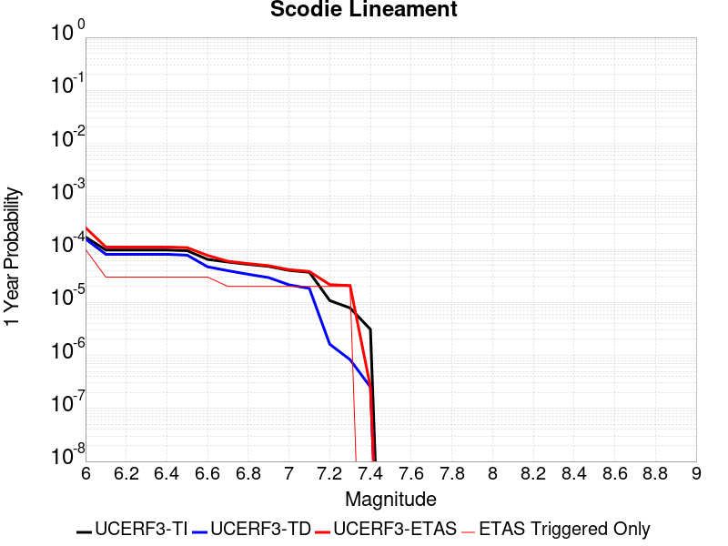 |  |

| Magnitude | 1 wk TI Prob | 1 wk TD Prob | 1 wk ETAS Prob | 1 wk ETAS/TD Gain | 1 wk ETAS Triggered Only | 1 mo TI Prob | 1 mo TD Prob | 1 mo ETAS Prob | 1 mo ETAS/TD Gain | 1 mo ETAS Triggered Only | 1 yr TI Prob | 1 yr TD Prob | 1 yr ETAS Prob | 1 yr ETAS/TD Gain | 1 yr ETAS Triggered Only | 10 yr TI Prob | 10 yr TD Prob | 10 yr ETAS Prob | 10 yr ETAS/TD Gain | 10 yr ETAS Triggered Only |
|-----|-----|-----|-----|-----|-----|-----|-----|-----|-----|-----|-----|-----|-----|-----|-----|-----|-----|-----|-----|-----|
| 6.0 | 3.2919327E-6 | 3.0133422E-6 | 6.474155E-5 | 21.484964 | 6.1728395E-5 | 1.4108206E-5 | 1.2914278E-5 | 7.4641874E-5 | 5.7797947 | 6.1728395E-5 | 1.7175387E-4 | 1.5722317E-4 | 2.498012E-4 | 1.588832 | 9.259259E-5 | 0.0017162118 | 0.0015714309 | 0.001663878 | 1.0588299 | 9.259259E-5 |
| 6.1 | 1.8663811E-6 | 1.5490499E-6 | 1.5490499E-6 | 1.0 | 0.0 | 7.998751E-6 | 6.6387715E-6 | 6.6387715E-6 | 1.0 | 0.0 | 9.738045E-5 | 8.082454E-5 | 8.082454E-5 | 1.0 | 0.0 | 9.7337784E-4 | 8.080003E-4 | 8.080003E-4 | 1.0 | 0.0 |
| 6.2 | 1.8663811E-6 | 1.5490499E-6 | 1.5490499E-6 | 1.0 | 0.0 | 7.998751E-6 | 6.6387715E-6 | 6.6387715E-6 | 1.0 | 0.0 | 9.738045E-5 | 8.082454E-5 | 8.082454E-5 | 1.0 | 0.0 | 9.7337784E-4 | 8.080003E-4 | 8.080003E-4 | 1.0 | 0.0 |
| 6.3 | 1.8663811E-6 | 1.5490499E-6 | 1.5490499E-6 | 1.0 | 0.0 | 7.998751E-6 | 6.6387715E-6 | 6.6387715E-6 | 1.0 | 0.0 | 9.738045E-5 | 8.082454E-5 | 8.082454E-5 | 1.0 | 0.0 | 9.7337784E-4 | 8.080003E-4 | 8.080003E-4 | 1.0 | 0.0 |
| 6.4 | 1.8663811E-6 | 1.5490499E-6 | 1.5490499E-6 | 1.0 | 0.0 | 7.998751E-6 | 6.6387715E-6 | 6.6387715E-6 | 1.0 | 0.0 | 9.738045E-5 | 8.082454E-5 | 8.082454E-5 | 1.0 | 0.0 | 9.7337784E-4 | 8.080003E-4 | 8.080003E-4 | 1.0 | 0.0 |
| 6.5 | 1.8106311E-6 | 1.4909839E-6 | 1.4909839E-6 | 1.0 | 0.0 | 7.759824E-6 | 6.3899183E-6 | 6.3899183E-6 | 1.0 | 0.0 | 9.447177E-5 | 7.7794975E-5 | 7.7794975E-5 | 1.0 | 0.0 | 9.4431615E-4 | 7.7772606E-4 | 7.7772606E-4 | 1.0 | 0.0 |
| 6.6 | 1.2414679E-6 | 8.997558E-7 | 8.997558E-7 | 1.0 | 0.0 | 5.320566E-6 | 3.856091E-6 | 3.856091E-6 | 1.0 | 0.0 | 6.477596E-5 | 4.6946985E-5 | 4.6946985E-5 | 1.0 | 0.0 | 6.475708E-4 | 4.693793E-4 | 4.693793E-4 | 1.0 | 0.0 |
| 6.7 | 1.1062215E-6 | 7.594311E-7 | 7.594311E-7 | 1.0 | 0.0 | 4.7409408E-6 | 3.2547011E-6 | 3.2547011E-6 | 1.0 | 0.0 | 5.7719422E-5 | 3.9625334E-5 | 3.9625334E-5 | 1.0 | 0.0 | 5.770443E-4 | 3.961897E-4 | 3.961897E-4 | 1.0 | 0.0 |
| 6.8 | 1.0006736E-6 | 6.500397E-7 | 6.500397E-7 | 1.0 | 0.0 | 4.288594E-6 | 2.7858816E-6 | 2.7858816E-6 | 1.0 | 0.0 | 5.221238E-5 | 3.3917644E-5 | 3.3917644E-5 | 1.0 | 0.0 | 5.220012E-4 | 3.3913075E-4 | 3.3913075E-4 | 1.0 | 0.0 |
| 6.9 | 9.167364E-7 | 5.631625E-7 | 5.631625E-7 | 1.0 | 0.0 | 3.9288643E-6 | 2.4135516E-6 | 2.4135516E-6 | 1.0 | 0.0 | 4.7832873E-5 | 2.9384651E-5 | 2.9384651E-5 | 1.0 | 0.0 | 4.782258E-4 | 2.9381333E-4 | 2.9381333E-4 | 1.0 | 0.0 |
| 7.0 | 7.6987664E-7 | 4.113383E-7 | 4.113383E-7 | 1.0 | 0.0 | 3.2994672E-6 | 1.7628774E-6 | 1.7628774E-6 | 1.0 | 0.0 | 4.0170275E-5 | 2.1462862E-5 | 2.1462862E-5 | 1.0 | 0.0 | 4.0163012E-4 | 2.1461173E-4 | 2.1461173E-4 | 1.0 | 0.0 |
| 7.1 | 7.1038727E-7 | 3.5211494E-7 | 3.5211494E-7 | 1.0 | 0.0 | 3.0445133E-6 | 1.5090633E-6 | 1.5090633E-6 | 1.0 | 0.0 | 3.706632E-5 | 1.8372726E-5 | 1.8372726E-5 | 1.0 | 0.0 | 3.7060137E-4 | 1.8371557E-4 | 1.8371557E-4 | 1.0 | 0.0 |
| 7.2 | 2.0799602E-7 | 3.1186854E-8 | 3.1186854E-8 | 1.0 | 0.0 | 8.914113E-7 | 1.3365793E-7 | 1.3365793E-7 | 1.0 | 0.0 | 1.0852878E-5 | 1.6272843E-6 | 1.6272843E-6 | 1.0 | 0.0 | 1.08523476E-4 | 1.627273E-5 | 1.627273E-5 | 1.0 | 0.0 |
| 7.3 | 1.5048182E-7 | 1.5945696E-8 | 1.5945696E-8 | 1.0 | 0.0 | 6.449219E-7 | 6.83387E-8 | 6.83387E-8 | 1.0 | 0.0 | 7.851896E-6 | 8.320234E-7 | 8.320234E-7 | 1.0 | 0.0 | 7.851618E-5 | 8.320206E-6 | 8.320206E-6 | 1.0 | 0.0 |
| 7.4 | 5.9334678E-8 | 4.8683537E-9 | 4.8683537E-9 | 1.0 | 0.0 | 2.5429145E-7 | 2.0864372E-8 | 2.0864372E-8 | 1.0 | 0.0 | 3.095994E-6 | 2.5402372E-7 | 2.5402372E-7 | 1.0 | 0.0 | 3.095951E-5 | 2.5402353E-6 | 2.5402353E-6 | 1.0 | 0.0 |

## San Andreas (Coachella) rev
*[(top)](#table-of-contents)*

| 1 Week | 1 Month | 1 Year | 10 Year |
|-----|-----|-----|-----|
|  |  |  | 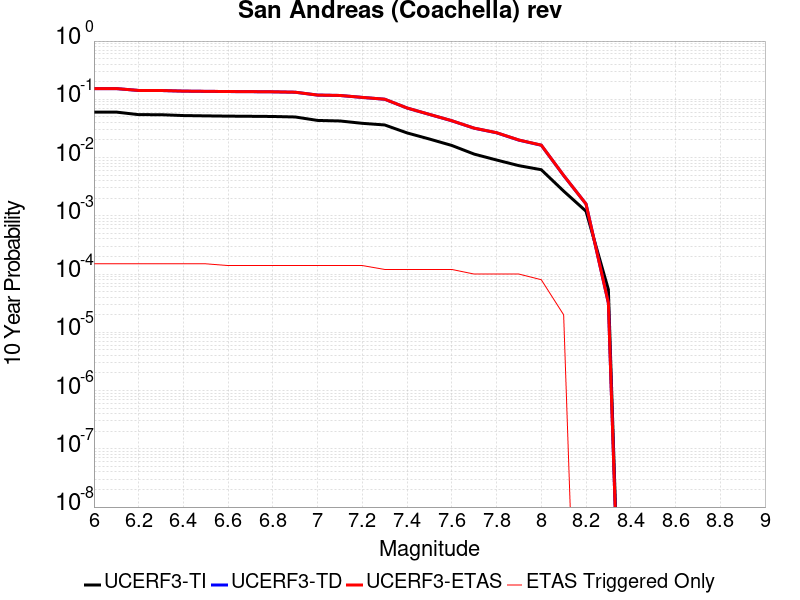 |

| Magnitude | 1 wk TI Prob | 1 wk TD Prob | 1 wk ETAS Prob | 1 wk ETAS/TD Gain | 1 wk ETAS Triggered Only | 1 mo TI Prob | 1 mo TD Prob | 1 mo ETAS Prob | 1 mo ETAS/TD Gain | 1 mo ETAS Triggered Only | 1 yr TI Prob | 1 yr TD Prob | 1 yr ETAS Prob | 1 yr ETAS/TD Gain | 1 yr ETAS Triggered Only | 10 yr TI Prob | 10 yr TD Prob | 10 yr ETAS Prob | 10 yr ETAS/TD Gain | 10 yr ETAS Triggered Only |
|-----|-----|-----|-----|-----|-----|-----|-----|-----|-----|-----|-----|-----|-----|-----|-----|-----|-----|-----|-----|-----|
| 6.0 | 1.1925945E-4 | 3.2729402E-4 | 3.581481E-4 | 1.0942702 | 3.0864197E-5 | 5.110118E-4 | 0.0014019393 | 0.0014944021 | 1.0659535 | 9.259259E-5 | 0.0062038354 | 0.016936364 | 0.01702739 | 1.0053746 | 9.259259E-5 | 0.060334753 | 0.15265316 | 0.15273161 | 1.0005139 | 9.259259E-5 |
| 6.1 | 1.1925945E-4 | 3.2729402E-4 | 3.581481E-4 | 1.0942702 | 3.0864197E-5 | 5.110118E-4 | 0.0014019393 | 0.0014944021 | 1.0659535 | 9.259259E-5 | 0.0062038354 | 0.016936364 | 0.01702739 | 1.0053746 | 9.259259E-5 | 0.060334753 | 0.15265316 | 0.15273161 | 1.0005139 | 9.259259E-5 |
| 6.2 | 1.07432395E-4 | 3.0230157E-4 | 3.3315644E-4 | 1.1020665 | 3.0864197E-5 | 4.603433E-4 | 0.0012949388 | 0.0013874115 | 1.0714109 | 9.259259E-5 | 0.005590286 | 0.015653009 | 0.015744152 | 1.0058228 | 9.259259E-5 | 0.05451731 | 0.14182423 | 0.1419037 | 1.0005603 | 9.259259E-5 |
| 6.3 | 1.0718766E-4 | 3.0175463E-4 | 3.326095E-4 | 1.1022515 | 3.0864197E-5 | 4.592948E-4 | 0.0012925972 | 0.00138507 | 1.0715404 | 9.259259E-5 | 0.005577586 | 0.015624908 | 0.015716054 | 1.0058334 | 9.259259E-5 | 0.054396555 | 0.14159249 | 0.14167197 | 1.0005614 | 9.259259E-5 |
| 6.4 | 1.0355944E-4 | 2.9383553E-4 | 3.2469066E-4 | 1.1050081 | 3.0864197E-5 | 4.4375064E-4 | 0.0012586913 | 0.0013511673 | 1.07347 | 9.259259E-5 | 0.0053892885 | 0.015217941 | 0.015309125 | 1.0059918 | 9.259259E-5 | 0.052604496 | 0.13815255 | 0.13823235 | 1.0005776 | 9.259259E-5 |
| 6.5 | 1.0227914E-4 | 2.9102986E-4 | 3.2188508E-4 | 1.1060208 | 3.0864197E-5 | 4.382655E-4 | 0.0012466786 | 0.0013391557 | 1.0741788 | 9.259259E-5 | 0.0053228354 | 0.01507372 | 0.015164917 | 1.0060501 | 9.259259E-5 | 0.051971316 | 0.13693172 | 0.13701163 | 1.0005836 | 9.259259E-5 |
| 6.6 | 1.0116757E-4 | 2.8868738E-4 | 3.1954268E-4 | 1.1068813 | 3.0864197E-5 | 4.3350324E-4 | 0.0012366489 | 0.001329127 | 1.0747812 | 9.259259E-5 | 0.0052651367 | 0.01495329 | 0.015044498 | 1.0060996 | 9.259259E-5 | 0.051421247 | 0.1359099 | 0.1359899 | 1.0005887 | 9.259259E-5 |
| 6.7 | 1.0050676E-4 | 2.8727303E-4 | 3.1812835E-4 | 1.1074077 | 3.0864197E-5 | 4.3067214E-4 | 0.0012305931 | 0.0013230718 | 1.0751497 | 9.259259E-5 | 0.005230834 | 0.014880571 | 0.014971785 | 1.0061297 | 9.259259E-5 | 0.051094085 | 0.13529462 | 0.13537468 | 1.0005918 | 9.259259E-5 |
| 6.8 | 9.976819E-5 | 2.853096E-4 | 3.1616498E-4 | 1.108147 | 3.0864197E-5 | 4.2750788E-4 | 0.0012221863 | 0.0013146658 | 1.0756673 | 9.259259E-5 | 0.0051924936 | 0.0147796115 | 0.0148708355 | 1.0061723 | 9.259259E-5 | 0.050728295 | 0.13444631 | 0.13452645 | 1.000596 | 9.259259E-5 |
| 6.9 | 9.77719E-5 | 2.8027873E-4 | 3.111343E-4 | 1.1100888 | 3.0864197E-5 | 4.1895514E-4 | 0.0012006456 | 0.001293127 | 1.0770264 | 9.259259E-5 | 0.0050888555 | 0.014520878 | 0.014612126 | 1.0062839 | 9.259259E-5 | 0.049738888 | 0.1322748 | 0.13235515 | 1.0006074 | 9.259259E-5 |
| 7.0 | 8.500761E-5 | 2.4762485E-4 | 2.784814E-4 | 1.1246101 | 3.0864197E-5 | 3.6426744E-4 | 0.001060821 | 0.0011533153 | 1.0871913 | 9.259259E-5 | 0.0044259406 | 0.012839786 | 0.0129311895 | 1.0071188 | 9.259259E-5 | 0.04338823 | 0.11813272 | 0.118214376 | 1.0006912 | 9.259259E-5 |
| 7.1 | 8.319876E-5 | 2.4365232E-4 | 2.74509E-4 | 1.1266422 | 3.0864197E-5 | 3.5651738E-4 | 0.0010438096 | 0.0011363055 | 1.0886139 | 9.259259E-5 | 0.004331963 | 0.012635092 | 0.0127265155 | 1.0072356 | 9.259259E-5 | 0.042484846 | 0.116353 | 0.11643482 | 1.0007032 | 9.259259E-5 |
| 7.2 | 7.563917E-5 | 2.2413683E-4 | 2.549941E-4 | 1.1376716 | 3.0864197E-5 | 3.2412758E-4 | 9.602359E-4 | 0.0010527396 | 1.0963343 | 9.259259E-5 | 0.0039391145 | 0.011628893 | 0.01172041 | 1.0078697 | 9.259259E-5 | 0.03870018 | 0.10775925 | 0.107841864 | 1.0007666 | 9.259259E-5 |
| 7.3 | 7.082985E-5 | 2.0729867E-4 | 2.0729867E-4 | 1.0 | 0.0 | 3.0352117E-4 | 8.881233E-4 | 9.497969E-4 | 1.0694426 | 6.1728395E-5 | 0.0036891096 | 0.010759917 | 0.010820981 | 1.0056752 | 6.1728395E-5 | 0.03628465 | 0.100282 | 0.100337535 | 1.0005538 | 6.1728395E-5 |
| 7.4 | 5.146215E-5 | 1.4273795E-4 | 1.4273795E-4 | 1.0 | 0.0 | 2.2053342E-4 | 6.115915E-4 | 6.7328213E-4 | 1.100869 | 6.1728395E-5 | 0.0026816884 | 0.0074208933 | 0.0074821636 | 1.0082564 | 6.1728395E-5 | 0.02649557 | 0.070849575 | 0.07090693 | 1.0008096 | 6.1728395E-5 |
| 7.5 | 4.0285166E-5 | 1.09416E-4 | 1.09416E-4 | 1.0 | 0.0 | 1.7263928E-4 | 4.6884175E-4 | 5.3054123E-4 | 1.1315998 | 6.1728395E-5 | 0.002099857 | 0.0056932783 | 0.005754655 | 1.0107806 | 6.1728395E-5 | 0.020801254 | 0.055011146 | 0.05506948 | 1.0010604 | 6.1728395E-5 |
| 7.6 | 3.1168736E-5 | 8.4389096E-5 | 8.4389096E-5 | 1.0 | 0.0 | 1.3357346E-4 | 3.6161754E-4 | 4.2332363E-4 | 1.170639 | 6.1728395E-5 | 0.0016250437 | 0.0043938323 | 0.0044552893 | 1.0139872 | 6.1728395E-5 | 0.016132116 | 0.04281005 | 0.042869136 | 1.0013802 | 6.1728395E-5 |
| 7.7 | 2.2100989E-5 | 6.238755E-5 | 6.238755E-5 | 1.0 | 0.0 | 9.4715084E-5 | 2.6734784E-4 | 3.2905975E-4 | 1.23083 | 6.1728395E-5 | 0.001152546 | 0.0032501083 | 0.0033116362 | 1.018931 | 6.1728395E-5 | 0.011465867 | 0.0319002 | 0.03195996 | 1.0018734 | 6.1728395E-5 |
| 7.8 | 1.7484861E-5 | 5.179572E-5 | 5.179572E-5 | 1.0 | 0.0 | 7.493296E-5 | 2.2196278E-4 | 2.8367748E-4 | 1.2780408 | 6.1728395E-5 | 9.1192697E-4 | 0.0026990508 | 0.0027606126 | 1.0228087 | 6.1728395E-5 | 0.009081938 | 0.026640115 | 0.0267002 | 1.0022554 | 6.1728395E-5 |
| 7.9 | 1.3967285E-5 | 3.822255E-5 | 3.822255E-5 | 1.0 | 0.0 | 5.985842E-5 | 1.6380067E-4 | 2.2551895E-4 | 1.376789 | 6.1728395E-5 | 7.2853256E-4 | 0.00199245 | 0.0020540555 | 1.0309194 | 6.1728395E-5 | 0.0072614877 | 0.019909438 | 0.019969936 | 1.0030388 | 6.1728395E-5 |
| 8.0 | 1.1887396E-5 | 3.106521E-5 | 3.106521E-5 | 1.0 | 0.0 | 5.094499E-5 | 1.3312983E-4 | 1.6398991E-4 | 1.2318045 | 3.0864197E-5 | 6.200787E-4 | 0.0016196516 | 0.0016504658 | 1.0190252 | 3.0864197E-5 | 0.006183513 | 0.016279267 | 0.01630963 | 1.001865 | 3.0864197E-5 |
| 8.1 | 5.100864E-6 | 8.973418E-6 | 8.973418E-6 | 1.0 | 0.0 | 2.1860664E-5 | 3.8456936E-5 | 3.8456936E-5 | 1.0 | 0.0 | 2.6612106E-4 | 4.6811273E-4 | 4.6811273E-4 | 1.0 | 0.0 | 0.002658026 | 0.004917731 | 0.004917731 | 1.0 | 0.0 |
| 8.2 | 2.3004484E-6 | 2.7864487E-6 | 2.7864487E-6 | 1.0 | 0.0 | 9.859027E-6 | 1.1941868E-5 | 1.1941868E-5 | 1.0 | 0.0 | 1.2002704E-4 | 1.4538258E-4 | 1.4538258E-4 | 1.0 | 0.0 | 0.0011996223 | 0.0015973912 | 0.0015973912 | 1.0 | 0.0 |
| 8.3 | 1.0424446E-7 | 5.8161504E-8 | 5.8161504E-8 | 1.0 | 0.0 | 4.4676187E-7 | 2.4926356E-7 | 2.4926356E-7 | 1.0 | 0.0 | 5.439312E-6 | 3.03478E-6 | 3.03478E-6 | 1.0 | 0.0 | 5.4391792E-5 | 3.190716E-5 | 3.190716E-5 | 1.0 | 0.0 |

## San Andreas (San Gorgonio Pass-Garnet HIll)
*[(top)](#table-of-contents)*

| 1 Week | 1 Month | 1 Year | 10 Year |
|-----|-----|-----|-----|
|  |  |  |  |

| Magnitude | 1 wk TI Prob | 1 wk TD Prob | 1 wk ETAS Prob | 1 wk ETAS/TD Gain | 1 wk ETAS Triggered Only | 1 mo TI Prob | 1 mo TD Prob | 1 mo ETAS Prob | 1 mo ETAS/TD Gain | 1 mo ETAS Triggered Only | 1 yr TI Prob | 1 yr TD Prob | 1 yr ETAS Prob | 1 yr ETAS/TD Gain | 1 yr ETAS Triggered Only | 10 yr TI Prob | 10 yr TD Prob | 10 yr ETAS Prob | 10 yr ETAS/TD Gain | 10 yr ETAS Triggered Only |
|-----|-----|-----|-----|-----|-----|-----|-----|-----|-----|-----|-----|-----|-----|-----|-----|-----|-----|-----|-----|-----|
| 6.0 | 8.31567E-5 | 2.3382473E-4 | 2.646817E-4 | 1.1319662 | 3.0864197E-5 | 3.5633717E-4 | 0.0010017233 | 0.0010633899 | 1.0615605 | 6.1728395E-5 | 0.004329778 | 0.012127888 | 0.012188869 | 1.005028 | 6.1728395E-5 | 0.042463828 | 0.11257892 | 0.112661086 | 1.0007299 | 9.259259E-5 |
| 6.1 | 8.31567E-5 | 2.3382473E-4 | 2.646817E-4 | 1.1319662 | 3.0864197E-5 | 3.5633717E-4 | 0.0010017233 | 0.0010633899 | 1.0615605 | 6.1728395E-5 | 0.004329778 | 0.012127888 | 0.012188869 | 1.005028 | 6.1728395E-5 | 0.042463828 | 0.11257892 | 0.112661086 | 1.0007299 | 9.259259E-5 |
| 6.2 | 8.31567E-5 | 2.3382473E-4 | 2.646817E-4 | 1.1319662 | 3.0864197E-5 | 3.5633717E-4 | 0.0010017233 | 0.0010633899 | 1.0615605 | 6.1728395E-5 | 0.004329778 | 0.012127888 | 0.012188869 | 1.005028 | 6.1728395E-5 | 0.042463828 | 0.11257892 | 0.112661086 | 1.0007299 | 9.259259E-5 |
| 6.3 | 8.31567E-5 | 2.3382473E-4 | 2.646817E-4 | 1.1319662 | 3.0864197E-5 | 3.5633717E-4 | 0.0010017233 | 0.0010633899 | 1.0615605 | 6.1728395E-5 | 0.004329778 | 0.012127888 | 0.012188869 | 1.005028 | 6.1728395E-5 | 0.042463828 | 0.11257892 | 0.112661086 | 1.0007299 | 9.259259E-5 |
| 6.4 | 8.059055E-5 | 2.2940808E-4 | 2.602652E-4 | 1.1345075 | 3.0864197E-5 | 3.4534236E-4 | 9.828096E-4 | 0.0010444772 | 1.0627464 | 6.1728395E-5 | 0.0041964394 | 0.011900152 | 0.011961145 | 1.0051255 | 6.1728395E-5 | 0.041180745 | 0.11056015 | 0.1106425 | 1.0007449 | 9.259259E-5 |
| 6.5 | 8.059055E-5 | 2.2940808E-4 | 2.602652E-4 | 1.1345075 | 3.0864197E-5 | 3.4534236E-4 | 9.828096E-4 | 0.0010444772 | 1.0627464 | 6.1728395E-5 | 0.0041964394 | 0.011900152 | 0.011961145 | 1.0051255 | 6.1728395E-5 | 0.041180745 | 0.11056015 | 0.1106425 | 1.0007449 | 9.259259E-5 |
| 6.6 | 7.619237E-5 | 2.218517E-4 | 2.5270905E-4 | 1.13909 | 3.0864197E-5 | 3.2649786E-4 | 9.5044886E-4 | 0.0010121186 | 1.0648849 | 6.1728395E-5 | 0.0039678677 | 0.01151087 | 0.011571888 | 1.0053009 | 6.1728395E-5 | 0.03897764 | 0.10709683 | 0.10717951 | 1.000772 | 9.259259E-5 |
| 6.7 | 7.440636E-5 | 2.1860997E-4 | 2.494674E-4 | 1.141153 | 3.0864197E-5 | 3.188454E-4 | 9.3656575E-4 | 9.982364E-4 | 1.0658475 | 6.1728395E-5 | 0.0038750346 | 0.011343609 | 0.011404636 | 1.0053799 | 6.1728395E-5 | 0.038081564 | 0.105605274 | 0.10568809 | 1.0007842 | 9.259259E-5 |
| 6.8 | 7.3735864E-5 | 2.1708169E-4 | 2.4793917E-4 | 1.142147 | 3.0864197E-5 | 3.1597257E-4 | 9.3002064E-4 | 9.916916E-4 | 1.0663114 | 6.1728395E-5 | 0.0038401815 | 0.011264749 | 0.011325782 | 1.0054181 | 6.1728395E-5 | 0.03774495 | 0.10490683 | 0.10498971 | 1.00079 | 9.259259E-5 |
| 6.9 | 7.27575E-5 | 2.1477141E-4 | 2.45629E-4 | 1.1436763 | 3.0864197E-5 | 3.117806E-4 | 9.201265E-4 | 9.81798E-4 | 1.0670252 | 6.1728395E-5 | 0.003789323 | 0.011145527 | 0.011206566 | 1.0054767 | 6.1728395E-5 | 0.037253562 | 0.103854746 | 0.10393772 | 1.000799 | 9.259259E-5 |
| 7.0 | 7.102591E-5 | 2.1061185E-4 | 2.4146955E-4 | 1.1465145 | 3.0864197E-5 | 3.0436125E-4 | 9.023122E-4 | 9.639849E-4 | 1.0683496 | 6.1728395E-5 | 0.003699303 | 0.010930831 | 0.010991884 | 1.0055854 | 6.1728395E-5 | 0.03638325 | 0.10195695 | 0.1020401 | 1.0008155 | 9.259259E-5 |
| 7.1 | 7.028513E-5 | 2.0896831E-4 | 2.3982605E-4 | 1.1476672 | 3.0864197E-5 | 3.0118722E-4 | 8.9527335E-4 | 9.5694646E-4 | 1.0688875 | 6.1728395E-5 | 0.0036607897 | 0.010845989 | 0.010907048 | 1.0056297 | 6.1728395E-5 | 0.036010686 | 0.101199985 | 0.10128321 | 1.0008223 | 9.259259E-5 |
| 7.2 | 6.8498244E-5 | 2.0504706E-4 | 2.3590494E-4 | 1.1504916 | 3.0864197E-5 | 2.9353087E-4 | 8.784794E-4 | 9.4015355E-4 | 1.0702056 | 6.1728395E-5 | 0.003567883 | 0.010643536 | 0.010704608 | 1.0057379 | 6.1728395E-5 | 0.035111405 | 0.09939202 | 0.099475406 | 1.000839 | 9.259259E-5 |
| 7.3 | 6.622592E-5 | 1.9732013E-4 | 1.9732013E-4 | 1.0 | 0.0 | 2.8379448E-4 | 8.453858E-4 | 8.762239E-4 | 1.0364782 | 3.0864197E-5 | 0.0034497243 | 0.0102444785 | 0.010275027 | 1.0029819 | 3.0864197E-5 | 0.033966612 | 0.095888525 | 0.09594434 | 1.000582 | 6.1728395E-5 |
| 7.4 | 5.1050705E-5 | 1.4689034E-4 | 1.4689034E-4 | 1.0 | 0.0 | 2.1877038E-4 | 6.29379E-4 | 6.6022377E-4 | 1.0490083 | 3.0864197E-5 | 0.002660276 | 0.0076359594 | 0.0076665883 | 1.004011 | 3.0864197E-5 | 0.02628654 | 0.07286301 | 0.07292025 | 1.0007855 | 6.1728395E-5 |
| 7.5 | 3.9302922E-5 | 1.1129847E-4 | 1.1129847E-4 | 1.0 | 0.0 | 1.6843023E-4 | 4.7690657E-4 | 5.07756E-4 | 1.0646867 | 3.0864197E-5 | 0.0020487092 | 0.005790949 | 0.005821634 | 1.0052989 | 3.0864197E-5 | 0.020299247 | 0.05600951 | 0.05606778 | 1.0010403 | 6.1728395E-5 |
| 7.6 | 2.9851626E-5 | 8.4949745E-5 | 8.4949745E-5 | 1.0 | 0.0 | 1.2792926E-4 | 3.6401965E-4 | 3.9487262E-4 | 1.0847563 | 3.0864197E-5 | 0.0015564259 | 0.0044229585 | 0.004453686 | 1.0069473 | 3.0864197E-5 | 0.0154556995 | 0.04319374 | 0.0432528 | 1.0013673 | 6.1728395E-5 |
| 7.7 | 2.1135214E-5 | 6.3529005E-5 | 6.3529005E-5 | 1.0 | 0.0 | 9.0576345E-5 | 2.7223877E-4 | 3.0309457E-4 | 1.113341 | 3.0864197E-5 | 0.0011022091 | 0.0033094748 | 0.0033402368 | 1.0092951 | 3.0864197E-5 | 0.010967582 | 0.032582592 | 0.032642312 | 1.0018328 | 6.1728395E-5 |
| 7.8 | 1.883379E-5 | 5.564028E-5 | 5.564028E-5 | 1.0 | 0.0 | 8.0713755E-5 | 2.3843657E-4 | 2.692934E-4 | 1.1294132 | 3.0864197E-5 | 9.822468E-4 | 0.0028991038 | 0.0029298787 | 1.0106152 | 3.0864197E-5 | 0.0097791655 | 0.028695205 | 0.028755164 | 1.0020895 | 6.1728395E-5 |
| 7.9 | 1.5156185E-5 | 4.1658426E-5 | 4.1658426E-5 | 1.0 | 0.0 | 6.495346E-5 | 1.785239E-4 | 2.0938259E-4 | 1.1728547 | 3.0864197E-5 | 7.9052144E-4 | 0.0021713632 | 0.0022021604 | 1.0141833 | 3.0864197E-5 | 0.007877152 | 0.021759422 | 0.021819808 | 1.0027751 | 6.1728395E-5 |
| 8.0 | 1.1405907E-5 | 2.9974231E-5 | 2.9974231E-5 | 1.0 | 0.0 | 4.8881542E-5 | 1.2845467E-4 | 1.2845467E-4 | 1.0 | 0.0 | 5.9497025E-4 | 0.0015628147 | 0.0015628147 | 1.0 | 0.0 | 0.005933798 | 0.015772851 | 0.015803227 | 1.001926 | 3.0864197E-5 |
| 8.1 | 4.3511436E-6 | 7.369219E-6 | 7.369219E-6 | 1.0 | 0.0 | 1.8647626E-5 | 3.1581985E-5 | 3.1581985E-5 | 1.0 | 0.0 | 2.2701119E-4 | 3.8444297E-4 | 3.8444297E-4 | 1.0 | 0.0 | 0.0022677942 | 0.0041163345 | 0.0041163345 | 1.0 | 0.0 |
| 8.2 | 2.3042528E-6 | 2.7329415E-6 | 2.7329415E-6 | 1.0 | 0.0 | 9.875332E-6 | 1.1712554E-5 | 1.1712554E-5 | 1.0 | 0.0 | 1.2022553E-4 | 1.4259106E-4 | 1.4259106E-4 | 1.0 | 0.0 | 0.0012016051 | 0.0015979785 | 0.0015979785 | 1.0 | 0.0 |
| 8.3 | 5.202968E-7 | 3.1598344E-7 | 3.1598344E-7 | 1.0 | 0.0 | 2.2298414E-6 | 1.3542141E-6 | 1.3542141E-6 | 1.0 | 0.0 | 2.714798E-5 | 1.6487444E-5 | 1.6487444E-5 | 1.0 | 0.0 | 2.7144665E-4 | 1.9563142E-4 | 1.9563142E-4 | 1.0 | 0.0 |

## San Jacinto (Borrego)
*[(top)](#table-of-contents)*

| 1 Week | 1 Month | 1 Year | 10 Year |
|-----|-----|-----|-----|
|  |  |  |  |

| Magnitude | 1 wk TI Prob | 1 wk TD Prob | 1 wk ETAS Prob | 1 wk ETAS/TD Gain | 1 wk ETAS Triggered Only | 1 mo TI Prob | 1 mo TD Prob | 1 mo ETAS Prob | 1 mo ETAS/TD Gain | 1 mo ETAS Triggered Only | 1 yr TI Prob | 1 yr TD Prob | 1 yr ETAS Prob | 1 yr ETAS/TD Gain | 1 yr ETAS Triggered Only | 10 yr TI Prob | 10 yr TD Prob | 10 yr ETAS Prob | 10 yr ETAS/TD Gain | 10 yr ETAS Triggered Only |
|-----|-----|-----|-----|-----|-----|-----|-----|-----|-----|-----|-----|-----|-----|-----|-----|-----|-----|-----|-----|-----|
| 6.0 | 3.543992E-5 | 2.7926513E-5 | 5.8789847E-5 | 2.1051626 | 3.0864197E-5 | 1.5187653E-4 | 1.1967963E-4 | 1.8140064E-4 | 1.5157186 | 6.1728395E-5 | 0.0018475284 | 0.0014561379 | 0.0015177764 | 1.0423301 | 6.1728395E-5 | 0.018322436 | 0.014869647 | 0.014960863 | 1.0061344 | 9.259259E-5 |
| 6.1 | 3.542281E-5 | 2.7926513E-5 | 5.8789847E-5 | 2.1051626 | 3.0864197E-5 | 1.5180321E-4 | 1.1967963E-4 | 1.8140064E-4 | 1.5157186 | 6.1728395E-5 | 0.0018466372 | 0.0014561379 | 0.0015177764 | 1.0423301 | 6.1728395E-5 | 0.018313672 | 0.014869647 | 0.014960863 | 1.0061344 | 9.259259E-5 |
| 6.2 | 3.4688688E-5 | 2.7926511E-5 | 5.8789847E-5 | 2.1051626 | 3.0864197E-5 | 1.4865733E-4 | 1.1967963E-4 | 1.8140064E-4 | 1.5157186 | 6.1728395E-5 | 0.0018084005 | 0.0014561379 | 0.0015177763 | 1.0423301 | 6.1728395E-5 | 0.017937548 | 0.014869647 | 0.014960863 | 1.0061344 | 9.259259E-5 |
| 6.3 | 3.2087122E-5 | 2.7771865E-5 | 5.8635203E-5 | 2.111317 | 3.0864197E-5 | 1.3750899E-4 | 1.1901691E-4 | 1.8073796E-4 | 1.5185906 | 6.1728395E-5 | 0.0016728862 | 0.00144808 | 0.001509719 | 1.0425661 | 6.1728395E-5 | 0.016603488 | 0.014790683 | 0.014881906 | 1.0061677 | 9.259259E-5 |
| 6.4 | 3.1828724E-5 | 2.7738852E-5 | 5.8602192E-5 | 2.1126394 | 3.0864197E-5 | 1.364017E-4 | 1.1887544E-4 | 1.805965E-4 | 1.5192078 | 6.1728395E-5 | 0.0016594254 | 0.0014463598 | 0.0015079989 | 1.0426167 | 6.1728395E-5 | 0.016470885 | 0.014773762 | 0.014864987 | 1.0061748 | 9.259259E-5 |
| 6.5 | 3.1563577E-5 | 2.747857E-5 | 5.834192E-5 | 2.123179 | 3.0864197E-5 | 1.3526545E-4 | 1.1776006E-4 | 1.7948118E-4 | 1.5241262 | 6.1728395E-5 | 0.0016456128 | 0.0014327979 | 0.0014944378 | 1.0430207 | 6.1728395E-5 | 0.0163348 | 0.014640348 | 0.014731585 | 1.0062319 | 9.259259E-5 |
| 6.6 | 3.1467625E-5 | 2.7322796E-5 | 5.818615E-5 | 2.1295826 | 3.0864197E-5 | 1.3485427E-4 | 1.1709251E-4 | 1.7881367E-4 | 1.5271146 | 6.1728395E-5 | 0.0016406142 | 0.0014246812 | 0.0014863217 | 1.0432662 | 6.1728395E-5 | 0.016285548 | 0.014560594 | 0.014651839 | 1.0062665 | 9.259259E-5 |
| 6.7 | 3.1223695E-5 | 2.6940816E-5 | 5.780418E-5 | 2.145599 | 3.0864197E-5 | 1.3380898E-4 | 1.15455594E-4 | 1.7717686E-4 | 1.5345888 | 6.1728395E-5 | 0.0016279068 | 0.0014047775 | 0.0014664192 | 1.04388 | 6.1728395E-5 | 0.01616033 | 0.014364966 | 0.014456228 | 1.0063531 | 9.259259E-5 |
| 6.8 | 3.1015585E-5 | 2.6761822E-5 | 5.7625195E-5 | 2.1532612 | 3.0864197E-5 | 1.3291716E-4 | 1.1468855E-4 | 1.7640987E-4 | 1.5381646 | 6.1728395E-5 | 0.001617065 | 0.0013954508 | 0.001457093 | 1.0441737 | 6.1728395E-5 | 0.016053487 | 0.014272246 | 0.014363517 | 1.006395 | 9.259259E-5 |
| 6.9 | 2.6641965E-5 | 2.2184247E-5 | 5.304776E-5 | 2.3912356 | 3.0864197E-5 | 1.1417485E-4 | 9.50719E-5 | 1.5679443E-4 | 1.6492194 | 6.1728395E-5 | 0.0013891924 | 0.0011568897 | 0.0012185466 | 1.0532955 | 6.1728395E-5 | 0.0138054015 | 0.011882438 | 0.011973931 | 1.0076998 | 9.259259E-5 |
| 7.0 | 2.3854353E-5 | 2.0479023E-5 | 5.1342588E-5 | 2.507082 | 3.0864197E-5 | 1.02228936E-4 | 8.77643E-5 | 1.4948728E-4 | 1.7032812 | 6.1728395E-5 | 0.0012439266 | 0.0010680092 | 0.0011296717 | 1.0577359 | 6.1728395E-5 | 0.012369866 | 0.0109828 | 0.011074376 | 1.0083381 | 9.259259E-5 |
| 7.1 | 2.3672901E-5 | 2.031551E-5 | 5.1179082E-5 | 2.5192122 | 3.0864197E-5 | 1.0145135E-4 | 8.7063585E-5 | 1.4878661E-4 | 1.7089419 | 6.1728395E-5 | 0.0012344702 | 0.0010594862 | 0.0011211493 | 1.0582008 | 6.1728395E-5 | 0.0122763505 | 0.010897976 | 0.01098956 | 1.0084037 | 9.259259E-5 |
| 7.2 | 2.2717244E-5 | 1.9542893E-5 | 5.040649E-5 | 2.5792747 | 3.0864197E-5 | 9.735599E-5 | 8.375258E-5 | 1.454758E-4 | 1.736971 | 6.1728395E-5 | 0.0011846646 | 0.001019213 | 0.0010808784 | 1.060503 | 6.1728395E-5 | 0.01178369 | 0.010495341 | 0.010586962 | 1.0087297 | 9.259259E-5 |
| 7.3 | 2.1016205E-5 | 1.8384526E-5 | 4.9248156E-5 | 2.6787832 | 3.0864197E-5 | 9.006634E-5 | 7.878846E-5 | 1.4051198E-4 | 1.7834083 | 6.1728395E-5 | 0.001096006 | 9.5882936E-4 | 0.0010204986 | 1.0643172 | 6.1728395E-5 | 0.010906163 | 0.009890967 | 0.009982644 | 1.0092688 | 9.259259E-5 |
| 7.4 | 2.0683625E-5 | 1.8187047E-5 | 4.9050683E-5 | 2.697012 | 3.0864197E-5 | 8.86411E-5 | 7.794217E-5 | 1.3966576E-4 | 1.7919152 | 6.1728395E-5 | 0.001078671 | 9.485349E-4 | 0.0010102047 | 1.0650159 | 6.1728395E-5 | 0.010734501 | 0.009787692 | 0.009879379 | 1.0093675 | 9.259259E-5 |
| 7.5 | 1.9993966E-5 | 1.7782075E-5 | 4.864572E-5 | 2.7356608 | 3.0864197E-5 | 8.568561E-5 | 7.620667E-5 | 1.3793036E-4 | 1.8099513 | 6.1728395E-5 | 0.001042723 | 9.2742336E-4 | 9.890945E-4 | 1.0664973 | 6.1728395E-5 | 0.010378438 | 0.009574614 | 0.009666321 | 1.009578 | 9.259259E-5 |
| 7.6 | 1.788966E-5 | 1.6435291E-5 | 4.729898E-5 | 2.8778913 | 3.0864197E-5 | 7.666772E-5 | 7.043507E-5 | 1.3215911E-4 | 1.8763255 | 6.1728395E-5 | 9.3302975E-4 | 8.572113E-4 | 9.188868E-4 | 1.071949 | 6.1728395E-5 | 0.00929122 | 0.008866487 | 0.008958259 | 1.0103503 | 9.259259E-5 |
| 7.7 | 1.5125781E-5 | 1.4237377E-5 | 4.5101136E-5 | 3.167798 | 3.0864197E-5 | 6.4823165E-5 | 6.1015908E-5 | 1.2274054E-4 | 2.0116153 | 6.1728395E-5 | 7.889362E-4 | 7.426163E-4 | 8.0429885E-4 | 1.0830611 | 6.1728395E-5 | 0.007861412 | 0.0077142045 | 0.0078060827 | 1.0119103 | 9.259259E-5 |
| 7.8 | 1.250089E-5 | 1.26304985E-5 | 4.3494307E-5 | 3.4435937 | 3.0864197E-5 | 5.3574146E-5 | 5.412959E-5 | 1.15854644E-4 | 2.14032 | 6.1728395E-5 | 6.5207E-4 | 6.588291E-4 | 7.2051684E-4 | 1.0936323 | 6.1728395E-5 | 0.006501599 | 0.0068677636 | 0.0069597205 | 1.0133896 | 9.259259E-5 |
| 7.9 | 9.561E-6 | 9.754616E-6 | 4.0618514E-5 | 4.1640296 | 3.0864197E-5 | 4.0975072E-5 | 4.1804833E-5 | 1.0353065E-4 | 2.4765234 | 6.1728395E-5 | 4.987573E-4 | 5.088555E-4 | 5.7055254E-4 | 1.1212466 | 6.1728395E-5 | 0.0049763937 | 0.0053523467 | 0.005444444 | 1.0172068 | 9.259259E-5 |
| 8.0 | 8.01699E-6 | 8.293488E-6 | 3.915743E-5 | 4.721467 | 3.0864197E-5 | 3.4358076E-5 | 3.554304E-5 | 9.7269236E-5 | 2.736661 | 6.1728395E-5 | 4.1822926E-4 | 4.3265108E-4 | 4.943528E-4 | 1.142613 | 6.1728395E-5 | 0.0041744304 | 0.004573375 | 0.0046655443 | 1.0201534 | 9.259259E-5 |
| 8.1 | 6.541947E-6 | 6.4622354E-6 | 3.7326234E-5 | 5.776056 | 3.0864197E-5 | 2.8036617E-5 | 2.7695003E-5 | 8.942169E-5 | 3.2288022 | 6.1728395E-5 | 3.4129233E-4 | 3.37135E-4 | 3.988426E-4 | 1.1830353 | 6.1728395E-5 | 0.0034076865 | 0.0035806994 | 0.0036729604 | 1.0257663 | 9.259259E-5 |
| 8.2 | 1.7968189E-6 | 7.9713476E-7 | 7.9713476E-7 | 1.0 | 0.0 | 7.70063E-6 | 3.4162877E-6 | 3.4162877E-6 | 1.0 | 0.0 | 9.3751136E-5 | 4.159253E-5 | 4.159253E-5 | 1.0 | 0.0 | 9.371159E-4 | 4.712058E-4 | 4.712058E-4 | 1.0 | 0.0 |
| 8.3 | 1.5167889E-7 | 4.897714E-8 | 4.897714E-8 | 1.0 | 0.0 | 6.500522E-7 | 2.09902E-7 | 2.09902E-7 | 1.0 | 0.0 | 7.9143565E-6 | 2.5555544E-6 | 2.5555544E-6 | 1.0 | 0.0 | 7.914075E-5 | 2.969505E-5 | 2.969505E-5 | 1.0 | 0.0 |

## Simi-Santa Rosa
*[(top)](#table-of-contents)*

| 1 Week | 1 Month | 1 Year | 10 Year |
|-----|-----|-----|-----|
|  |  |  |  |

| Magnitude | 1 wk TI Prob | 1 wk TD Prob | 1 wk ETAS Prob | 1 wk ETAS/TD Gain | 1 wk ETAS Triggered Only | 1 mo TI Prob | 1 mo TD Prob | 1 mo ETAS Prob | 1 mo ETAS/TD Gain | 1 mo ETAS Triggered Only | 1 yr TI Prob | 1 yr TD Prob | 1 yr ETAS Prob | 1 yr ETAS/TD Gain | 1 yr ETAS Triggered Only | 10 yr TI Prob | 10 yr TD Prob | 10 yr ETAS Prob | 10 yr ETAS/TD Gain | 10 yr ETAS Triggered Only |
|-----|-----|-----|-----|-----|-----|-----|-----|-----|-----|-----|-----|-----|-----|-----|-----|-----|-----|-----|-----|-----|
| 6.0 | 2.198912E-5 | 2.2275442E-5 | 5.3138952E-5 | 2.3855398 | 3.0864197E-5 | 9.4235686E-5 | 9.5462936E-5 | 1.5718544E-4 | 1.6465598 | 6.1728395E-5 | 0.0011467156 | 0.0011616853 | 0.0012541704 | 1.0796129 | 9.259259E-5 | 0.011408163 | 0.011560575 | 0.011652097 | 1.0079168 | 9.259259E-5 |
| 6.1 | 2.198912E-5 | 2.2275442E-5 | 5.3138952E-5 | 2.3855398 | 3.0864197E-5 | 9.4235686E-5 | 9.5462936E-5 | 1.5718544E-4 | 1.6465598 | 6.1728395E-5 | 0.0011467156 | 0.0011616853 | 0.0012541704 | 1.0796129 | 9.259259E-5 | 0.011408163 | 0.011560575 | 0.011652097 | 1.0079168 | 9.259259E-5 |
| 6.2 | 1.69983E-5 | 1.6668559E-5 | 1.6668559E-5 | 1.0 | 0.0 | 7.284782E-5 | 7.143489E-5 | 7.143489E-5 | 1.0 | 0.0 | 8.865613E-4 | 8.6940196E-4 | 8.6940196E-4 | 1.0 | 0.0 | 0.008830327 | 0.008662928 | 0.008662928 | 1.0 | 0.0 |
| 6.3 | 1.69983E-5 | 1.6668559E-5 | 1.6668559E-5 | 1.0 | 0.0 | 7.284782E-5 | 7.143489E-5 | 7.143489E-5 | 1.0 | 0.0 | 8.865613E-4 | 8.6940196E-4 | 8.6940196E-4 | 1.0 | 0.0 | 0.008830327 | 0.008662928 | 0.008662928 | 1.0 | 0.0 |
| 6.4 | 1.4666188E-5 | 1.4052543E-5 | 1.4052543E-5 | 1.0 | 0.0 | 6.285358E-5 | 6.0223934E-5 | 6.0223934E-5 | 1.0 | 0.0 | 7.6497364E-4 | 7.3300465E-4 | 7.3300465E-4 | 1.0 | 0.0 | 0.0076234564 | 0.007308344 | 0.007308344 | 1.0 | 0.0 |
| 6.5 | 1.4666188E-5 | 1.4052543E-5 | 1.4052543E-5 | 1.0 | 0.0 | 6.285358E-5 | 6.0223934E-5 | 6.0223934E-5 | 1.0 | 0.0 | 7.6497364E-4 | 7.3300465E-4 | 7.3300465E-4 | 1.0 | 0.0 | 0.0076234564 | 0.007308344 | 0.007308344 | 1.0 | 0.0 |
| 6.6 | 1.4377586E-5 | 1.3729583E-5 | 1.3729583E-5 | 1.0 | 0.0 | 6.1616774E-5 | 5.883988E-5 | 5.883988E-5 | 1.0 | 0.0 | 7.4992597E-4 | 7.1616494E-4 | 7.1616494E-4 | 1.0 | 0.0 | 0.007474003 | 0.0071410383 | 0.0071410383 | 1.0 | 0.0 |
| 6.7 | 1.3881404E-5 | 1.320755E-5 | 1.320755E-5 | 1.0 | 0.0 | 5.9490372E-5 | 5.66027E-5 | 5.66027E-5 | 1.0 | 0.0 | 7.240546E-4 | 6.8894465E-4 | 6.8894465E-4 | 1.0 | 0.0 | 0.007217 | 0.006870538 | 0.006870538 | 1.0 | 0.0 |
| 6.8 | 1.0176516E-5 | 9.154151E-6 | 9.154151E-6 | 1.0 | 0.0 | 4.3612912E-5 | 3.9231574E-5 | 3.9231574E-5 | 1.0 | 0.0 | 5.308578E-4 | 4.7755634E-4 | 4.7755634E-4 | 1.0 | 0.0 | 0.0052959146 | 0.004766934 | 0.004766934 | 1.0 | 0.0 |
| 6.9 | 9.699797E-6 | 8.774719E-6 | 8.774719E-6 | 1.0 | 0.0 | 4.15699E-5 | 3.7605492E-5 | 3.7605492E-5 | 1.0 | 0.0 | 5.05996E-4 | 4.577671E-4 | 4.577671E-4 | 1.0 | 0.0 | 0.005048454 | 0.0045698597 | 0.0045698597 | 1.0 | 0.0 |
| 7.0 | 7.4049476E-6 | 6.559333E-6 | 6.559333E-6 | 1.0 | 0.0 | 3.1735104E-5 | 2.8111197E-5 | 2.8111197E-5 | 1.0 | 0.0 | 3.8630638E-4 | 3.422127E-4 | 3.422127E-4 | 1.0 | 0.0 | 0.0038563553 | 0.0034180996 | 0.0034180996 | 1.0 | 0.0 |
| 7.1 | 3.873439E-6 | 2.7595095E-6 | 2.7595095E-6 | 1.0 | 0.0 | 1.6600346E-5 | 1.1826417E-5 | 1.1826417E-5 | 1.0 | 0.0 | 2.0209046E-4 | 1.4397735E-4 | 1.4397735E-4 | 1.0 | 0.0 | 0.0020190678 | 0.0014388643 | 0.0014388643 | 1.0 | 0.0 |
| 7.2 | 3.417706E-6 | 2.3676484E-6 | 2.3676484E-6 | 1.0 | 0.0 | 1.4647229E-5 | 1.0147027E-5 | 1.0147027E-5 | 1.0 | 0.0 | 1.7831543E-4 | 1.2353327E-4 | 1.2353327E-4 | 1.0 | 0.0 | 0.0017817242 | 0.0012346683 | 0.0012346683 | 1.0 | 0.0 |
| 7.3 | 1.90225E-6 | 1.4073753E-6 | 1.4073753E-6 | 1.0 | 0.0 | 8.152474E-6 | 6.0315947E-6 | 6.0315947E-6 | 1.0 | 0.0 | 9.9251854E-5 | 7.343221E-5 | 7.343221E-5 | 1.0 | 0.0 | 9.920754E-4 | 7.340817E-4 | 7.340817E-4 | 1.0 | 0.0 |
| 7.4 | 1.5170556E-6 | 1.1024773E-6 | 1.1024773E-6 | 1.0 | 0.0 | 6.5016507E-6 | 4.724894E-6 | 4.724894E-6 | 1.0 | 0.0 | 7.915472E-5 | 5.7524077E-5 | 5.7524077E-5 | 1.0 | 0.0 | 7.9126534E-4 | 5.7509297E-4 | 5.7509297E-4 | 1.0 | 0.0 |
| 7.5 | 1.178732E-6 | 8.535102E-7 | 8.535102E-7 | 1.0 | 0.0 | 5.0516987E-6 | 3.6578958E-6 | 3.6578958E-6 | 1.0 | 0.0 | 6.1502695E-5 | 4.453398E-5 | 4.453398E-5 | 1.0 | 0.0 | 6.148568E-4 | 4.452515E-4 | 4.452515E-4 | 1.0 | 0.0 |
| 7.6 | 6.8722386E-7 | 4.793198E-7 | 4.793198E-7 | 1.0 | 0.0 | 2.9452417E-6 | 2.054226E-6 | 2.054226E-6 | 1.0 | 0.0 | 3.5857727E-5 | 2.5009915E-5 | 2.5009915E-5 | 1.0 | 0.0 | 3.5851944E-4 | 2.5007114E-4 | 2.5007114E-4 | 1.0 | 0.0 |
| 7.7 | 5.5126515E-7 | 3.6731157E-7 | 3.6731157E-7 | 1.0 | 0.0 | 2.3625628E-6 | 1.5741915E-6 | 1.5741915E-6 | 1.0 | 0.0 | 2.8763823E-5 | 1.9165615E-5 | 1.9165615E-5 | 1.0 | 0.0 | 2.87601E-4 | 1.9163972E-4 | 1.9163972E-4 | 1.0 | 0.0 |
| 7.8 | 3.3860243E-7 | 2.0075942E-7 | 2.0075942E-7 | 1.0 | 0.0 | 1.4511525E-6 | 8.6039717E-7 | 8.6039717E-7 | 1.0 | 0.0 | 1.7667637E-5 | 1.0475286E-5 | 1.0475286E-5 | 1.0 | 0.0 | 1.7666233E-4 | 1.04747975E-4 | 1.04747975E-4 | 1.0 | 0.0 |
| 7.9 | 2.7955386E-7 | 1.4649108E-7 | 1.4649108E-7 | 1.0 | 0.0 | 1.1980875E-6 | 6.278188E-7 | 6.278188E-7 | 1.0 | 0.0 | 1.4586617E-5 | 7.643667E-6 | 7.643667E-6 | 1.0 | 0.0 | 1.458566E-4 | 7.643409E-5 | 7.643409E-5 | 1.0 | 0.0 |
| 8.0 | 5.6259015E-8 | 3.3355324E-8 | 3.3355324E-8 | 1.0 | 0.0 | 2.4111003E-7 | 1.4295138E-7 | 1.4295138E-7 | 1.0 | 0.0 | 2.9355108E-6 | 1.7404317E-6 | 1.7404317E-6 | 1.0 | 0.0 | 2.935472E-5 | 1.7404194E-5 | 1.7404194E-5 | 1.0 | 0.0 |

## San Jacinto (Lytle Creek connector)
*[(top)](#table-of-contents)*

| 1 Week | 1 Month | 1 Year | 10 Year |
|-----|-----|-----|-----|
|  |  |  |  |

| Magnitude | 1 wk TI Prob | 1 wk TD Prob | 1 wk ETAS Prob | 1 wk ETAS/TD Gain | 1 wk ETAS Triggered Only | 1 mo TI Prob | 1 mo TD Prob | 1 mo ETAS Prob | 1 mo ETAS/TD Gain | 1 mo ETAS Triggered Only | 1 yr TI Prob | 1 yr TD Prob | 1 yr ETAS Prob | 1 yr ETAS/TD Gain | 1 yr ETAS Triggered Only | 10 yr TI Prob | 10 yr TD Prob | 10 yr ETAS Prob | 10 yr ETAS/TD Gain | 10 yr ETAS Triggered Only |
|-----|-----|-----|-----|-----|-----|-----|-----|-----|-----|-----|-----|-----|-----|-----|-----|-----|-----|-----|-----|-----|
| 6.0 | 6.693995E-6 | 6.660216E-6 | 3.752421E-5 | 5.634083 | 3.0864197E-5 | 2.8688235E-5 | 2.854347E-5 | 9.027011E-5 | 3.1625483 | 6.1728395E-5 | 3.492233E-4 | 3.4746144E-4 | 4.0916837E-4 | 1.1775937 | 6.1728395E-5 | 0.00348675 | 0.0035493854 | 0.0036416491 | 1.0259943 | 9.259259E-5 |
| 6.1 | 6.693995E-6 | 6.660216E-6 | 3.752421E-5 | 5.634083 | 3.0864197E-5 | 2.8688235E-5 | 2.854347E-5 | 9.027011E-5 | 3.1625483 | 6.1728395E-5 | 3.492233E-4 | 3.4746144E-4 | 4.0916837E-4 | 1.1775937 | 6.1728395E-5 | 0.00348675 | 0.0035493854 | 0.0036416491 | 1.0259943 | 9.259259E-5 |
| 6.2 | 6.693995E-6 | 6.660216E-6 | 3.752421E-5 | 5.634083 | 3.0864197E-5 | 2.8688235E-5 | 2.854347E-5 | 9.027011E-5 | 3.1625483 | 6.1728395E-5 | 3.492233E-4 | 3.4746144E-4 | 4.0916837E-4 | 1.1775937 | 6.1728395E-5 | 0.00348675 | 0.0035493854 | 0.0036416491 | 1.0259943 | 9.259259E-5 |
| 6.3 | 6.693995E-6 | 6.660216E-6 | 3.752421E-5 | 5.634083 | 3.0864197E-5 | 2.8688235E-5 | 2.854347E-5 | 9.027011E-5 | 3.1625483 | 6.1728395E-5 | 3.492233E-4 | 3.4746144E-4 | 4.0916837E-4 | 1.1775937 | 6.1728395E-5 | 0.00348675 | 0.0035493854 | 0.0036416491 | 1.0259943 | 9.259259E-5 |
| 6.4 | 6.693995E-6 | 6.660216E-6 | 3.752421E-5 | 5.634083 | 3.0864197E-5 | 2.8688235E-5 | 2.854347E-5 | 9.027011E-5 | 3.1625483 | 6.1728395E-5 | 3.492233E-4 | 3.4746144E-4 | 4.0916837E-4 | 1.1775937 | 6.1728395E-5 | 0.00348675 | 0.0035493854 | 0.0036416491 | 1.0259943 | 9.259259E-5 |
| 6.5 | 6.6561875E-6 | 6.6204343E-6 | 3.7484428E-5 | 5.6619287 | 3.0864197E-5 | 2.8526205E-5 | 2.837298E-5 | 9.0099624E-5 | 3.175543 | 6.1728395E-5 | 3.472512E-4 | 3.4538636E-4 | 4.0709344E-4 | 1.178661 | 6.1728395E-5 | 0.0034670907 | 0.003528701 | 0.0036209668 | 1.0261472 | 9.259259E-5 |
| 6.6 | 6.6561875E-6 | 6.6204343E-6 | 3.7484428E-5 | 5.6619287 | 3.0864197E-5 | 2.8526205E-5 | 2.837298E-5 | 9.0099624E-5 | 3.175543 | 6.1728395E-5 | 3.472512E-4 | 3.4538636E-4 | 4.0709344E-4 | 1.178661 | 6.1728395E-5 | 0.0034670907 | 0.003528701 | 0.0036209668 | 1.0261472 | 9.259259E-5 |
| 6.7 | 6.5802237E-6 | 6.539611E-6 | 3.7403606E-5 | 5.7195463 | 3.0864197E-5 | 2.8200653E-5 | 2.8026603E-5 | 8.975327E-5 | 3.2024312 | 6.1728395E-5 | 3.4328885E-4 | 3.4117055E-4 | 4.028779E-4 | 1.1808695 | 6.1728395E-5 | 0.0034275902 | 0.0034866752 | 0.003578945 | 1.0264635 | 9.259259E-5 |
| 6.8 | 6.575632E-6 | 6.5341005E-6 | 3.73981E-5 | 5.723526 | 3.0864197E-5 | 2.8180975E-5 | 2.8002989E-5 | 8.9729656E-5 | 3.2042885 | 6.1728395E-5 | 3.4304935E-4 | 3.4088313E-4 | 4.0259046E-4 | 1.181022 | 6.1728395E-5 | 0.0034252026 | 0.00348381 | 0.00357608 | 1.0264853 | 9.259259E-5 |
| 6.9 | 6.570433E-6 | 6.525495E-6 | 3.738949E-5 | 5.729756 | 3.0864197E-5 | 2.8158694E-5 | 2.7966107E-5 | 8.9692774E-5 | 3.2071955 | 6.1728395E-5 | 3.4277816E-4 | 3.4043423E-4 | 4.021416E-4 | 1.1812608 | 6.1728395E-5 | 0.0034224992 | 0.0034793352 | 0.0035716055 | 1.0265195 | 9.259259E-5 |
| 7.0 | 6.5643826E-6 | 6.515616E-6 | 3.7379614E-5 | 5.736927 | 3.0864197E-5 | 2.8132765E-5 | 2.792377E-5 | 8.965044E-5 | 3.2105422 | 6.1728395E-5 | 3.424626E-4 | 3.3991894E-4 | 4.0162634E-4 | 1.1815357 | 6.1728395E-5 | 0.0034193532 | 0.0034741985 | 0.0035664693 | 1.0265589 | 9.259259E-5 |
| 7.1 | 6.557402E-6 | 6.5043278E-6 | 3.7368325E-5 | 5.7451477 | 3.0864197E-5 | 2.8102848E-5 | 2.7875392E-5 | 8.9602065E-5 | 3.2143786 | 6.1728395E-5 | 3.4209844E-4 | 3.3933012E-4 | 4.0103757E-4 | 1.1818508 | 6.1728395E-5 | 0.0034157229 | 0.0034683298 | 0.0035606013 | 1.026604 | 9.259259E-5 |
| 7.2 | 6.546394E-6 | 6.4862943E-6 | 3.735029E-5 | 5.7583404 | 3.0864197E-5 | 2.8055672E-5 | 2.7798109E-5 | 8.952479E-5 | 3.2205353 | 6.1728395E-5 | 3.4152428E-4 | 3.3838948E-4 | 4.00097E-4 | 1.1823565 | 6.1728395E-5 | 0.0034099987 | 0.0034589572 | 0.0035512294 | 1.0266763 | 9.259259E-5 |
| 7.3 | 6.5364216E-6 | 6.4670803E-6 | 3.733108E-5 | 5.7724776 | 3.0864197E-5 | 2.8012933E-5 | 2.7715765E-5 | 8.944245E-5 | 3.2271326 | 6.1728395E-5 | 3.4100408E-4 | 3.3738726E-4 | 3.9909483E-4 | 1.1828983 | 6.1728395E-5 | 0.003404813 | 0.0034489788 | 0.003541252 | 1.0267538 | 9.259259E-5 |
| 7.4 | 6.5269523E-6 | 6.4481674E-6 | 3.7312166E-5 | 5.7864757 | 3.0864197E-5 | 2.7972354E-5 | 2.7634711E-5 | 8.93614E-5 | 3.233665 | 6.1728395E-5 | 3.4051016E-4 | 3.3640073E-4 | 3.9810836E-4 | 1.1834348 | 6.1728395E-5 | 0.0033998888 | 0.003439161 | 0.003531435 | 1.0268304 | 9.259259E-5 |
| 7.5 | 6.5111835E-6 | 6.424442E-6 | 3.7288442E-5 | 5.8041525 | 3.0864197E-5 | 2.7904773E-5 | 2.7533031E-5 | 8.925973E-5 | 3.2419143 | 6.1728395E-5 | 3.3968766E-4 | 3.3516317E-4 | 3.968709E-4 | 1.1841124 | 6.1728395E-5 | 0.0033916887 | 0.003426834 | 0.0035191095 | 1.0269272 | 9.259259E-5 |
| 7.6 | 6.4768806E-6 | 6.383551E-6 | 3.724755E-5 | 5.8349266 | 3.0864197E-5 | 2.7757764E-5 | 2.735779E-5 | 8.90845E-5 | 3.2562754 | 6.1728395E-5 | 3.3789838E-4 | 3.3303024E-4 | 3.9473808E-4 | 1.185292 | 6.1728395E-5 | 0.0033738504 | 0.0034055663 | 0.0034978434 | 1.027096 | 9.259259E-5 |
| 7.7 | 6.1655364E-6 | 6.1760365E-6 | 3.7040045E-5 | 5.9973807 | 3.0864197E-5 | 2.642346E-5 | 2.646846E-5 | 8.819522E-5 | 3.3320875 | 6.1728395E-5 | 3.2165812E-4 | 3.2220592E-4 | 3.8391442E-4 | 1.1915189 | 6.1728395E-5 | 0.0032119295 | 0.0032971818 | 0.003389469 | 1.0279897 | 9.259259E-5 |
| 7.8 | 5.5043524E-6 | 5.737097E-6 | 3.660112E-5 | 6.379728 | 3.0864197E-5 | 2.3589868E-5 | 2.4587327E-5 | 8.6314205E-5 | 3.510516 | 6.1728395E-5 | 2.871688E-4 | 2.9930964E-4 | 3.6101957E-4 | 1.2061741 | 6.1728395E-5 | 0.0028679797 | 0.0030672832 | 0.003159592 | 1.0300946 | 9.259259E-5 |
| 7.9 | 3.889249E-6 | 4.076761E-6 | 3.4940833E-5 | 8.570734 | 3.0864197E-5 | 1.6668104E-5 | 1.7471715E-5 | 7.919903E-5 | 4.532985 | 6.1728395E-5 | 2.0291525E-4 | 2.1269741E-4 | 2.7441268E-4 | 1.2901552 | 6.1728395E-5 | 0.0020273007 | 0.0021943315 | 0.0022867208 | 1.0421036 | 9.259259E-5 |
| 8.0 | 2.668535E-6 | 2.5315155E-6 | 3.3395634E-5 | 13.191954 | 3.0864197E-5 | 1.1436528E-5 | 1.0849307E-5 | 7.257703E-5 | 6.6895547 | 6.1728395E-5 | 1.3923083E-4 | 1.3208234E-4 | 1.9380257E-4 | 1.4672861 | 6.1728395E-5 | 0.0013914363 | 0.0013757964 | 0.0014682616 | 1.0672085 | 9.259259E-5 |
| 8.1 | 1.5911459E-6 | 1.218661E-6 | 3.2082822E-5 | 26.326288 | 3.0864197E-5 | 6.8191785E-6 | 5.2228224E-6 | 6.6950895E-5 | 12.818911 | 6.1728395E-5 | 8.3020335E-5 | 6.3586034E-5 | 1.253105E-4 | 1.9707237 | 6.1728395E-5 | 8.298933E-4 | 6.6932244E-4 | 7.6185307E-4 | 1.1382452 | 9.259259E-5 |
| 8.2 | 6.1294963E-7 | 2.1812275E-7 | 2.1812275E-7 | 1.0 | 0.0 | 2.6269242E-6 | 9.3481145E-7 | 9.3481145E-7 | 1.0 | 0.0 | 3.1982334E-5 | 1.138127E-5 | 1.138127E-5 | 1.0 | 0.0 | 3.1977732E-4 | 1.2784546E-4 | 1.2784546E-4 | 1.0 | 0.0 |
| 8.3 | 1.762871E-7 | 4.7546838E-8 | 4.7546838E-8 | 1.0 | 0.0 | 7.5551594E-7 | 2.0377215E-7 | 2.0377215E-7 | 1.0 | 0.0 | 9.1983675E-6 | 2.480923E-6 | 2.480923E-6 | 1.0 | 0.0 | 9.197987E-5 | 2.868753E-5 | 2.868753E-5 | 1.0 | 0.0 |

## Kern Canyon (South Kern) 2011
*[(top)](#table-of-contents)*

| 1 Week | 1 Month | 1 Year | 10 Year |
|-----|-----|-----|-----|
|  |  |  |  |

| Magnitude | 1 wk TI Prob | 1 wk TD Prob | 1 wk ETAS Prob | 1 wk ETAS/TD Gain | 1 wk ETAS Triggered Only | 1 mo TI Prob | 1 mo TD Prob | 1 mo ETAS Prob | 1 mo ETAS/TD Gain | 1 mo ETAS Triggered Only | 1 yr TI Prob | 1 yr TD Prob | 1 yr ETAS Prob | 1 yr ETAS/TD Gain | 1 yr ETAS Triggered Only | 10 yr TI Prob | 10 yr TD Prob | 10 yr ETAS Prob | 10 yr ETAS/TD Gain | 10 yr ETAS Triggered Only |
|-----|-----|-----|-----|-----|-----|-----|-----|-----|-----|-----|-----|-----|-----|-----|-----|-----|-----|-----|-----|-----|
| 6.0 | 4.105075E-6 | 4.1137264E-6 | 6.5841865E-5 | 16.005407 | 6.1728395E-5 | 1.7593058E-5 | 1.763014E-5 | 7.935745E-5 | 4.5012374 | 6.1728395E-5 | 2.1417443E-4 | 2.1462646E-4 | 3.0719917E-4 | 1.4313202 | 9.259259E-5 | 0.0021396813 | 0.0021442557 | 0.0022366496 | 1.0430892 | 9.259259E-5 |
| 6.1 | 4.105075E-6 | 4.1137264E-6 | 6.5841865E-5 | 16.005407 | 6.1728395E-5 | 1.7593058E-5 | 1.763014E-5 | 7.935745E-5 | 4.5012374 | 6.1728395E-5 | 2.1417443E-4 | 2.1462646E-4 | 3.0719917E-4 | 1.4313202 | 9.259259E-5 | 0.0021396813 | 0.0021442557 | 0.0022366496 | 1.0430892 | 9.259259E-5 |
| 6.2 | 4.105075E-6 | 4.1137264E-6 | 6.5841865E-5 | 16.005407 | 6.1728395E-5 | 1.7593058E-5 | 1.763014E-5 | 7.935745E-5 | 4.5012374 | 6.1728395E-5 | 2.1417443E-4 | 2.1462646E-4 | 3.0719917E-4 | 1.4313202 | 9.259259E-5 | 0.0021396813 | 0.0021442557 | 0.0022366496 | 1.0430892 | 9.259259E-5 |
| 6.3 | 4.105075E-6 | 4.1137264E-6 | 6.5841865E-5 | 16.005407 | 6.1728395E-5 | 1.7593058E-5 | 1.763014E-5 | 7.935745E-5 | 4.5012374 | 6.1728395E-5 | 2.1417443E-4 | 2.1462646E-4 | 3.0719917E-4 | 1.4313202 | 9.259259E-5 | 0.0021396813 | 0.0021442557 | 0.0022366496 | 1.0430892 | 9.259259E-5 |
| 6.4 | 4.105075E-6 | 4.1137264E-6 | 6.5841865E-5 | 16.005407 | 6.1728395E-5 | 1.7593058E-5 | 1.763014E-5 | 7.935745E-5 | 4.5012374 | 6.1728395E-5 | 2.1417443E-4 | 2.1462646E-4 | 3.0719917E-4 | 1.4313202 | 9.259259E-5 | 0.0021396813 | 0.0021442557 | 0.0022366496 | 1.0430892 | 9.259259E-5 |
| 6.5 | 2.9849807E-6 | 2.9731548E-6 | 6.4701366E-5 | 21.761856 | 6.1728395E-5 | 1.2792712E-5 | 1.274203E-5 | 7.446964E-5 | 5.844409 | 6.1728395E-5 | 1.5574014E-4 | 1.5512333E-4 | 2.4770157E-4 | 1.596804 | 9.259259E-5 | 0.0015563103 | 0.0015501656 | 0.0016426147 | 1.0596381 | 9.259259E-5 |
| 6.6 | 2.9849807E-6 | 2.9731548E-6 | 6.4701366E-5 | 21.761856 | 6.1728395E-5 | 1.2792712E-5 | 1.274203E-5 | 7.446964E-5 | 5.844409 | 6.1728395E-5 | 1.5574014E-4 | 1.5512333E-4 | 2.4770157E-4 | 1.596804 | 9.259259E-5 | 0.0015563103 | 0.0015501656 | 0.0016426147 | 1.0596381 | 9.259259E-5 |
| 6.7 | 2.6756725E-6 | 2.6582206E-6 | 3.3522338E-5 | 12.610817 | 3.0864197E-5 | 1.1467117E-5 | 1.1392325E-5 | 4.225617E-5 | 3.7091787 | 3.0864197E-5 | 1.396032E-4 | 1.3869285E-4 | 2.0041267E-4 | 1.4450109 | 6.1728395E-5 | 0.0013951553 | 0.0013860738 | 0.0014477166 | 1.0444729 | 6.1728395E-5 |
| 6.8 | 2.3283721E-6 | 2.3047787E-6 | 3.3168904E-5 | 14.391361 | 3.0864197E-5 | 9.9787E-6 | 9.877586E-6 | 4.074148E-5 | 4.124639 | 3.0864197E-5 | 1.214839E-4 | 1.20253055E-4 | 1.8197403E-4 | 1.513259 | 6.1728395E-5 | 0.001214175 | 0.0012018873 | 0.0012635415 | 1.0512978 | 6.1728395E-5 |
| 6.9 | 2.0972677E-6 | 2.0696411E-6 | 3.2933774E-5 | 15.912795 | 3.0864197E-5 | 8.988259E-6 | 8.869861E-6 | 3.9733783E-5 | 4.47964 | 3.0864197E-5 | 1.0942656E-4 | 1.0798526E-4 | 1.6970698E-4 | 1.5715755 | 6.1728395E-5 | 0.0010937268 | 0.0010793337 | 0.0011409955 | 1.0571295 | 6.1728395E-5 |
| 7.0 | 1.7132242E-6 | 1.6787036E-6 | 1.6787036E-6 | 1.0 | 0.0 | 7.3423685E-6 | 7.194424E-6 | 7.194424E-6 | 1.0 | 0.0 | 8.938967E-5 | 8.758863E-5 | 1.1845012E-4 | 1.352346 | 3.0864197E-5 | 8.935372E-4 | 8.7554497E-4 | 9.063821E-4 | 1.0352205 | 3.0864197E-5 |
| 7.1 | 1.4215541E-6 | 1.3815752E-6 | 1.3815752E-6 | 1.0 | 0.0 | 6.0923603E-6 | 5.9210233E-6 | 5.9210233E-6 | 1.0 | 0.0 | 7.417196E-5 | 7.20861E-5 | 7.20861E-5 | 1.0 | 0.0 | 7.414721E-4 | 7.206299E-4 | 7.206299E-4 | 1.0 | 0.0 |
| 7.2 | 9.097853E-7 | 8.6037755E-7 | 8.6037755E-7 | 1.0 | 0.0 | 3.899074E-6 | 3.6873273E-6 | 3.6873273E-6 | 1.0 | 0.0 | 4.7470192E-5 | 4.4892295E-5 | 4.4892295E-5 | 1.0 | 0.0 | 4.7460053E-4 | 4.4883334E-4 | 4.4883334E-4 | 1.0 | 0.0 |
| 7.3 | 6.144169E-7 | 5.628206E-7 | 5.628206E-7 | 1.0 | 0.0 | 2.6332125E-6 | 2.4120861E-6 | 2.4120861E-6 | 1.0 | 0.0 | 3.205889E-5 | 2.9366758E-5 | 2.9366758E-5 | 1.0 | 0.0 | 3.2054266E-4 | 2.936293E-4 | 2.936293E-4 | 1.0 | 0.0 |
| 7.4 | 4.049844E-7 | 3.5728314E-7 | 3.5728314E-7 | 1.0 | 0.0 | 1.7356463E-6 | 1.5312125E-6 | 1.5312125E-6 | 1.0 | 0.0 | 2.1131287E-5 | 1.8642357E-5 | 1.8642357E-5 | 1.0 | 0.0 | 2.1129279E-4 | 1.8640817E-4 | 1.8640817E-4 | 1.0 | 0.0 |
| 7.5 | 1.9871162E-7 | 1.583044E-7 | 1.583044E-7 | 1.0 | 0.0 | 8.5162094E-7 | 6.7844724E-7 | 6.7844724E-7 | 1.0 | 0.0 | 1.0368436E-5 | 8.260065E-6 | 8.260065E-6 | 1.0 | 0.0 | 1.0367952E-4 | 8.259767E-5 | 8.259767E-5 | 1.0 | 0.0 |
| 7.6 | 2.572245E-8 | 1.7352555E-8 | 1.7352555E-8 | 1.0 | 0.0 | 1.10239064E-7 | 7.436809E-8 | 7.436809E-8 | 1.0 | 0.0 | 1.3421597E-6 | 9.054312E-7 | 9.054312E-7 | 1.0 | 0.0 | 1.3421517E-5 | 9.05428E-6 | 9.05428E-6 | 1.0 | 0.0 |

## Independence rev 2011
*[(top)](#table-of-contents)*

| 1 Week | 1 Month | 1 Year | 10 Year |
|-----|-----|-----|-----|
|  |  |  |  |

| Magnitude | 1 wk TI Prob | 1 wk TD Prob | 1 wk ETAS Prob | 1 wk ETAS/TD Gain | 1 wk ETAS Triggered Only | 1 mo TI Prob | 1 mo TD Prob | 1 mo ETAS Prob | 1 mo ETAS/TD Gain | 1 mo ETAS Triggered Only | 1 yr TI Prob | 1 yr TD Prob | 1 yr ETAS Prob | 1 yr ETAS/TD Gain | 1 yr ETAS Triggered Only | 10 yr TI Prob | 10 yr TD Prob | 10 yr ETAS Prob | 10 yr ETAS/TD Gain | 10 yr ETAS Triggered Only |
|-----|-----|-----|-----|-----|-----|-----|-----|-----|-----|-----|-----|-----|-----|-----|-----|-----|-----|-----|-----|-----|
| 6.0 | 4.422171E-6 | 4.326227E-6 | 3.5190293E-5 | 8.134176 | 3.0864197E-5 | 1.8952025E-5 | 1.8540857E-5 | 8.026811E-5 | 4.3292556 | 6.1728395E-5 | 2.3071647E-4 | 2.2571455E-4 | 3.1828624E-4 | 1.4101273 | 9.259259E-5 | 0.0023047708 | 0.0022551466 | 0.0023475303 | 1.0409658 | 9.259259E-5 |
| 6.1 | 4.422171E-6 | 4.326227E-6 | 3.5190293E-5 | 8.134176 | 3.0864197E-5 | 1.8952025E-5 | 1.8540857E-5 | 8.026811E-5 | 4.3292556 | 6.1728395E-5 | 2.3071647E-4 | 2.2571455E-4 | 3.1828624E-4 | 1.4101273 | 9.259259E-5 | 0.0023047708 | 0.0022551466 | 0.0023475303 | 1.0409658 | 9.259259E-5 |
| 6.2 | 4.422171E-6 | 4.326227E-6 | 3.5190293E-5 | 8.134176 | 3.0864197E-5 | 1.8952025E-5 | 1.8540857E-5 | 8.026811E-5 | 4.3292556 | 6.1728395E-5 | 2.3071647E-4 | 2.2571455E-4 | 3.1828624E-4 | 1.4101273 | 9.259259E-5 | 0.0023047708 | 0.0022551466 | 0.0023475303 | 1.0409658 | 9.259259E-5 |
| 6.3 | 4.422171E-6 | 4.326227E-6 | 3.5190293E-5 | 8.134176 | 3.0864197E-5 | 1.8952025E-5 | 1.8540857E-5 | 8.026811E-5 | 4.3292556 | 6.1728395E-5 | 2.3071647E-4 | 2.2571455E-4 | 3.1828624E-4 | 1.4101273 | 9.259259E-5 | 0.0023047708 | 0.0022551466 | 0.0023475303 | 1.0409658 | 9.259259E-5 |
| 6.4 | 4.422171E-6 | 4.326227E-6 | 3.5190293E-5 | 8.134176 | 3.0864197E-5 | 1.8952025E-5 | 1.8540857E-5 | 8.026811E-5 | 4.3292556 | 6.1728395E-5 | 2.3071647E-4 | 2.2571455E-4 | 3.1828624E-4 | 1.4101273 | 9.259259E-5 | 0.0023047708 | 0.0022551466 | 0.0023475303 | 1.0409658 | 9.259259E-5 |
| 6.5 | 4.422171E-6 | 4.326227E-6 | 3.5190293E-5 | 8.134176 | 3.0864197E-5 | 1.8952025E-5 | 1.8540857E-5 | 8.026811E-5 | 4.3292556 | 6.1728395E-5 | 2.3071647E-4 | 2.2571455E-4 | 3.1828624E-4 | 1.4101273 | 9.259259E-5 | 0.0023047708 | 0.0022551466 | 0.0023475303 | 1.0409658 | 9.259259E-5 |
| 6.6 | 2.663744E-6 | 2.5319862E-6 | 3.3396107E-5 | 13.189687 | 3.0864197E-5 | 1.1415996E-5 | 1.0851327E-5 | 7.257905E-5 | 6.6884956 | 6.1728395E-5 | 1.3898089E-4 | 1.3210738E-4 | 2.2468774E-4 | 1.7007962 | 9.259259E-5 | 0.0013889399 | 0.0013203367 | 0.0014128071 | 1.0700355 | 9.259259E-5 |
| 6.7 | 2.663744E-6 | 2.5319862E-6 | 3.3396107E-5 | 13.189687 | 3.0864197E-5 | 1.1415996E-5 | 1.0851327E-5 | 7.257905E-5 | 6.6884956 | 6.1728395E-5 | 1.3898089E-4 | 1.3210738E-4 | 2.2468774E-4 | 1.7007962 | 9.259259E-5 | 0.0013889399 | 0.0013203367 | 0.0014128071 | 1.0700355 | 9.259259E-5 |
| 6.8 | 1.9716529E-6 | 1.8322585E-6 | 3.26964E-5 | 17.844862 | 3.0864197E-5 | 8.449913E-6 | 7.852514E-6 | 6.958043E-5 | 8.860911 | 6.1728395E-5 | 1.0287284E-4 | 9.5600284E-5 | 1.8818403E-4 | 1.9684463 | 9.259259E-5 | 0.0010282523 | 9.556045E-4 | 0.0010481086 | 1.0968016 | 9.259259E-5 |
| 6.9 | 1.8788617E-6 | 1.7429993E-6 | 3.2607142E-5 | 18.70749 | 3.0864197E-5 | 8.0522395E-6 | 7.4699765E-6 | 6.919791E-5 | 9.263472 | 6.1728395E-5 | 9.80316E-5 | 9.0943286E-5 | 1.8352746E-4 | 2.018043 | 9.259259E-5 | 9.798837E-4 | 9.0907275E-4 | 0.0010015812 | 1.1017613 | 9.259259E-5 |
| 7.0 | 1.5045488E-6 | 1.3849503E-6 | 3.2249107E-5 | 23.285387 | 3.0864197E-5 | 6.44805E-6 | 5.9354884E-6 | 6.766352E-5 | 11.399823 | 6.1728395E-5 | 7.8502184E-5 | 7.226223E-5 | 1.6484813E-4 | 2.281249 | 9.259259E-5 | 7.8474457E-4 | 7.2239246E-4 | 8.1491814E-4 | 1.1280823 | 9.259259E-5 |
| 7.1 | 1.272341E-6 | 1.1625096E-6 | 3.202667E-5 | 27.549595 | 3.0864197E-5 | 5.4528787E-6 | 4.982175E-6 | 6.6710265E-5 | 13.389787 | 6.1728395E-5 | 6.6386776E-5 | 6.0656326E-5 | 1.532433E-4 | 2.5264192 | 9.259259E-5 | 6.636695E-4 | 6.064009E-4 | 6.9893734E-4 | 1.1525995 | 9.259259E-5 |
| 7.2 | 1.0416892E-6 | 9.4098806E-7 | 3.1805157E-5 | 33.799744 | 3.0864197E-5 | 4.464375E-6 | 4.0328E-6 | 6.576095E-5 | 16.306524 | 6.1728395E-5 | 5.4352407E-5 | 4.909825E-5 | 1.416863E-4 | 2.8857708 | 9.259259E-5 | 5.4339116E-4 | 4.9087586E-4 | 5.83423E-4 | 1.1885347 | 9.259259E-5 |
| 7.3 | 7.9450155E-7 | 7.235002E-7 | 3.1587675E-5 | 43.659527 | 3.0864197E-5 | 3.4050022E-6 | 3.1007114E-6 | 6.482891E-5 | 20.907755 | 6.1728395E-5 | 4.1455114E-5 | 3.775052E-5 | 1.3033961E-4 | 3.4526577 | 9.259259E-5 | 4.144738E-4 | 3.7744216E-4 | 4.6999982E-4 | 1.2452234 | 9.259259E-5 |
| 7.4 | 5.3893444E-7 | 5.019512E-7 | 3.1366133E-5 | 62.48841 | 3.0864197E-5 | 2.309717E-6 | 2.1512178E-6 | 6.387948E-5 | 29.694567 | 6.1728395E-5 | 2.8120441E-5 | 2.6190766E-5 | 1.1878093E-4 | 4.5352216 | 9.259259E-5 | 2.8116882E-4 | 2.6187726E-4 | 3.544456E-4 | 1.3534799 | 9.259259E-5 |
| 7.5 | 3.8852085E-7 | 3.682554E-7 | 3.123244E-5 | 84.811905 | 3.0864197E-5 | 1.6650882E-6 | 1.5782365E-6 | 6.3306536E-5 | 40.112198 | 6.1728395E-5 | 2.027226E-5 | 1.9214862E-5 | 8.094207E-5 | 4.2124724 | 6.1728395E-5 | 2.0270412E-4 | 1.9213221E-4 | 2.5384876E-4 | 1.3212191 | 6.1728395E-5 |
| 7.6 | 2.414929E-7 | 2.345755E-7 | 2.345755E-7 | 1.0 | 0.0 | 1.0349692E-6 | 1.0053232E-6 | 3.186949E-5 | 31.70074 | 3.0864197E-5 | 1.2600677E-5 | 1.2239742E-5 | 4.3103562E-5 | 3.521607 | 3.0864197E-5 | 1.2599962E-4 | 1.223908E-4 | 1.5325123E-4 | 1.2521466 | 3.0864197E-5 |
| 7.7 | 6.8298014E-8 | 6.85897E-8 | 6.85897E-8 | 1.0 | 0.0 | 2.9270575E-7 | 2.9395582E-7 | 3.1158143E-5 | 105.99602 | 3.0864197E-5 | 3.5636867E-6 | 3.5789067E-6 | 3.4442994E-5 | 9.623887 | 3.0864197E-5 | 3.5636294E-5 | 3.5788536E-5 | 6.665163E-5 | 1.8623737 | 3.0864197E-5 |

## Raymond
*[(top)](#table-of-contents)*

| 1 Week | 1 Month | 1 Year | 10 Year |
|-----|-----|-----|-----|
|  |  |  |  |

| Magnitude | 1 wk TI Prob | 1 wk TD Prob | 1 wk ETAS Prob | 1 wk ETAS/TD Gain | 1 wk ETAS Triggered Only | 1 mo TI Prob | 1 mo TD Prob | 1 mo ETAS Prob | 1 mo ETAS/TD Gain | 1 mo ETAS Triggered Only | 1 yr TI Prob | 1 yr TD Prob | 1 yr ETAS Prob | 1 yr ETAS/TD Gain | 1 yr ETAS Triggered Only | 10 yr TI Prob | 10 yr TD Prob | 10 yr ETAS Prob | 10 yr ETAS/TD Gain | 10 yr ETAS Triggered Only |
|-----|-----|-----|-----|-----|-----|-----|-----|-----|-----|-----|-----|-----|-----|-----|-----|-----|-----|-----|-----|-----|
| 6.0 | 1.5157413E-5 | 1.5810128E-5 | 4.667384E-5 | 2.952148 | 3.0864197E-5 | 6.4958724E-5 | 6.7756075E-5 | 1.2948028E-4 | 1.9109769 | 6.1728395E-5 | 7.905855E-4 | 8.2464307E-4 | 9.1715925E-4 | 1.1121894 | 9.259259E-5 | 0.007877788 | 0.008218348 | 0.00831018 | 1.011174 | 9.259259E-5 |
| 6.1 | 1.5157413E-5 | 1.5810128E-5 | 4.667384E-5 | 2.952148 | 3.0864197E-5 | 6.4958724E-5 | 6.7756075E-5 | 1.2948028E-4 | 1.9109769 | 6.1728395E-5 | 7.905855E-4 | 8.2464307E-4 | 9.1715925E-4 | 1.1121894 | 9.259259E-5 | 0.007877788 | 0.008218348 | 0.00831018 | 1.011174 | 9.259259E-5 |
| 6.2 | 1.5157413E-5 | 1.5810128E-5 | 4.667384E-5 | 2.952148 | 3.0864197E-5 | 6.4958724E-5 | 6.7756075E-5 | 1.2948028E-4 | 1.9109769 | 6.1728395E-5 | 7.905855E-4 | 8.2464307E-4 | 9.1715925E-4 | 1.1121894 | 9.259259E-5 | 0.007877788 | 0.008218348 | 0.00831018 | 1.011174 | 9.259259E-5 |
| 6.3 | 1.5157413E-5 | 1.5810128E-5 | 4.667384E-5 | 2.952148 | 3.0864197E-5 | 6.4958724E-5 | 6.7756075E-5 | 1.2948028E-4 | 1.9109769 | 6.1728395E-5 | 7.905855E-4 | 8.2464307E-4 | 9.1715925E-4 | 1.1121894 | 9.259259E-5 | 0.007877788 | 0.008218348 | 0.00831018 | 1.011174 | 9.259259E-5 |
| 6.4 | 1.3941944E-5 | 1.445469E-5 | 1.445469E-5 | 1.0 | 0.0 | 5.9749822E-5 | 6.1947336E-5 | 9.280962E-5 | 1.498202 | 3.0864197E-5 | 7.2721124E-4 | 7.5397117E-4 | 7.848121E-4 | 1.0409046 | 3.0864197E-5 | 0.007248361 | 0.0075164647 | 0.007547097 | 1.0040753 | 3.0864197E-5 |
| 6.5 | 1.3941944E-5 | 1.445469E-5 | 1.445469E-5 | 1.0 | 0.0 | 5.9749822E-5 | 6.1947336E-5 | 9.280962E-5 | 1.498202 | 3.0864197E-5 | 7.2721124E-4 | 7.5397117E-4 | 7.848121E-4 | 1.0409046 | 3.0864197E-5 | 0.007248361 | 0.0075164647 | 0.007547097 | 1.0040753 | 3.0864197E-5 |
| 6.6 | 1.0542609E-5 | 1.0671113E-5 | 1.0671113E-5 | 1.0 | 0.0 | 4.5181827E-5 | 4.573257E-5 | 7.659536E-5 | 1.6748536 | 3.0864197E-5 | 5.499499E-4 | 5.5665727E-4 | 5.8750424E-4 | 1.0554148 | 3.0864197E-5 | 0.005485909 | 0.00555319 | 0.0055838833 | 1.005527 | 3.0864197E-5 |
| 6.7 | 1.0542609E-5 | 1.0671113E-5 | 1.0671113E-5 | 1.0 | 0.0 | 4.5181827E-5 | 4.573257E-5 | 7.659536E-5 | 1.6748536 | 3.0864197E-5 | 5.499499E-4 | 5.5665727E-4 | 5.8750424E-4 | 1.0554148 | 3.0864197E-5 | 0.005485909 | 0.00555319 | 0.0055838833 | 1.005527 | 3.0864197E-5 |
| 6.8 | 1.0079132E-5 | 1.0176646E-5 | 1.0176646E-5 | 1.0 | 0.0 | 4.3195567E-5 | 4.3613498E-5 | 7.447635E-5 | 1.7076445 | 3.0864197E-5 | 5.257791E-4 | 5.3087034E-4 | 5.6171813E-4 | 1.058108 | 3.0864197E-5 | 0.0052453685 | 0.005296571 | 0.0053272718 | 1.0057963 | 3.0864197E-5 |
| 6.9 | 7.721598E-6 | 7.5489047E-6 | 7.5489047E-6 | 1.0 | 0.0 | 3.3092143E-5 | 3.2352054E-5 | 6.321525E-5 | 1.9539796 | 3.0864197E-5 | 4.0282236E-4 | 3.9381627E-4 | 4.2466834E-4 | 1.0783412 | 3.0864197E-5 | 0.0040209293 | 0.0039313175 | 0.0039620604 | 1.00782 | 3.0864197E-5 |
| 7.0 | 7.137566E-6 | 6.9113057E-6 | 6.9113057E-6 | 1.0 | 0.0 | 3.058921E-5 | 2.961955E-5 | 6.0482835E-5 | 2.0419903 | 3.0864197E-5 | 3.7236E-4 | 3.6055944E-4 | 3.914125E-4 | 1.08557 | 3.0864197E-5 | 0.0037173668 | 0.0035998628 | 0.0036306158 | 1.0085429 | 3.0864197E-5 |
| 7.1 | 5.654976E-6 | 5.29954E-6 | 5.29954E-6 | 1.0 | 0.0 | 2.4235387E-5 | 2.2712118E-5 | 5.3575615E-5 | 2.3588998 | 3.0864197E-5 | 2.9502588E-4 | 2.7648517E-4 | 3.0734084E-4 | 1.1115997 | 3.0864197E-5 | 0.0029463451 | 0.002761443 | 0.002792222 | 1.011146 | 3.0864197E-5 |
| 7.2 | 4.9358455E-6 | 4.5266574E-6 | 4.5266574E-6 | 1.0 | 0.0 | 2.1153453E-5 | 1.9399817E-5 | 5.0263418E-5 | 2.590922 | 3.0864197E-5 | 2.5751285E-4 | 2.3616731E-4 | 2.670242E-4 | 1.130657 | 3.0864197E-5 | 0.0025721465 | 0.0023591854 | 0.0023899768 | 1.0130517 | 3.0864197E-5 |
| 7.3 | 4.2368597E-6 | 3.8056164E-6 | 3.8056164E-6 | 1.0 | 0.0 | 1.8157843E-5 | 1.6309683E-5 | 4.7173377E-5 | 2.892354 | 3.0864197E-5 | 2.2104931E-4 | 1.9855241E-4 | 2.2941048E-4 | 1.1554152 | 3.0864197E-5 | 0.0022082955 | 0.0019837688 | 0.0020145718 | 1.0155275 | 3.0864197E-5 |
| 7.4 | 3.4999923E-6 | 3.043744E-6 | 3.043744E-6 | 1.0 | 0.0 | 1.49998805E-5 | 1.3044552E-5 | 4.390835E-5 | 3.3660293 | 3.0864197E-5 | 1.8260824E-4 | 1.5880594E-4 | 1.8966522E-4 | 1.1943208 | 3.0864197E-5 | 0.0018245826 | 0.0015869403 | 0.0016177555 | 1.019418 | 3.0864197E-5 |
| 7.5 | 2.738017E-6 | 2.3020468E-6 | 2.3020468E-6 | 1.0 | 0.0 | 1.1734306E-5 | 9.865878E-6 | 9.865878E-6 | 1.0 | 0.0 | 1.428558E-4 | 1.2011051E-4 | 1.2011051E-4 | 1.0 | 0.0 | 0.0014276401 | 0.0012004703 | 0.0012004703 | 1.0 | 0.0 |
| 7.6 | 1.8186392E-6 | 1.442312E-6 | 1.442312E-6 | 1.0 | 0.0 | 7.794145E-6 | 6.181323E-6 | 6.181323E-6 | 1.0 | 0.0 | 9.488958E-5 | 7.5255055E-5 | 7.5255055E-5 | 1.0 | 0.0 | 9.4849075E-4 | 7.523072E-4 | 7.523072E-4 | 1.0 | 0.0 |
| 7.7 | 1.0660348E-6 | 7.6438056E-7 | 7.6438056E-7 | 1.0 | 0.0 | 4.5687125E-6 | 3.2759126E-6 | 3.2759126E-6 | 1.0 | 0.0 | 5.5622655E-5 | 3.9883522E-5 | 3.9883522E-5 | 1.0 | 0.0 | 5.5608735E-4 | 3.9877277E-4 | 3.9877277E-4 | 1.0 | 0.0 |
| 7.8 | 6.913602E-7 | 4.3204133E-7 | 4.3204133E-7 | 1.0 | 0.0 | 2.962969E-6 | 1.8516045E-6 | 1.8516045E-6 | 1.0 | 0.0 | 3.607355E-5 | 2.2543056E-5 | 2.2543056E-5 | 1.0 | 0.0 | 3.6067693E-4 | 2.2541556E-4 | 2.2541556E-4 | 1.0 | 0.0 |
| 7.9 | 7.425201E-8 | 5.3222113E-8 | 5.3222113E-8 | 1.0 | 0.0 | 3.1822285E-7 | 2.2809476E-7 | 2.2809476E-7 | 1.0 | 0.0 | 3.874356E-6 | 2.7770516E-6 | 2.7770516E-6 | 1.0 | 0.0 | 3.8742884E-5 | 2.7770298E-5 | 2.7770298E-5 | 1.0 | 0.0 |

## White Mountains
*[(top)](#table-of-contents)*

| 1 Week | 1 Month | 1 Year | 10 Year |
|-----|-----|-----|-----|
|  |  |  |  |

| Magnitude | 1 wk TI Prob | 1 wk TD Prob | 1 wk ETAS Prob | 1 wk ETAS/TD Gain | 1 wk ETAS Triggered Only | 1 mo TI Prob | 1 mo TD Prob | 1 mo ETAS Prob | 1 mo ETAS/TD Gain | 1 mo ETAS Triggered Only | 1 yr TI Prob | 1 yr TD Prob | 1 yr ETAS Prob | 1 yr ETAS/TD Gain | 1 yr ETAS Triggered Only | 10 yr TI Prob | 10 yr TD Prob | 10 yr ETAS Prob | 10 yr ETAS/TD Gain | 10 yr ETAS Triggered Only |
|-----|-----|-----|-----|-----|-----|-----|-----|-----|-----|-----|-----|-----|-----|-----|-----|-----|-----|-----|-----|-----|
| 6.0 | 3.503579E-5 | 3.378405E-5 | 9.551036E-5 | 2.8270843 | 6.1728395E-5 | 1.5014476E-4 | 1.4478143E-4 | 2.3736063E-4 | 1.639441 | 9.259259E-5 | 0.0018264796 | 0.0017614096 | 0.001853839 | 1.0524747 | 9.259259E-5 | 0.018115403 | 0.017486818 | 0.017577792 | 1.0052024 | 9.259259E-5 |
| 6.1 | 3.503579E-5 | 3.378405E-5 | 9.551036E-5 | 2.8270843 | 6.1728395E-5 | 1.5014476E-4 | 1.4478143E-4 | 2.3736063E-4 | 1.639441 | 9.259259E-5 | 0.0018264796 | 0.0017614096 | 0.001853839 | 1.0524747 | 9.259259E-5 | 0.018115403 | 0.017486818 | 0.017577792 | 1.0052024 | 9.259259E-5 |
| 6.2 | 3.503579E-5 | 3.378405E-5 | 9.551036E-5 | 2.8270843 | 6.1728395E-5 | 1.5014476E-4 | 1.4478143E-4 | 2.3736063E-4 | 1.639441 | 9.259259E-5 | 0.0018264796 | 0.0017614096 | 0.001853839 | 1.0524747 | 9.259259E-5 | 0.018115403 | 0.017486818 | 0.017577792 | 1.0052024 | 9.259259E-5 |
| 6.3 | 1.7818425E-5 | 1.5916074E-5 | 1.5916074E-5 | 1.0 | 0.0 | 7.636245E-5 | 6.821004E-5 | 6.821004E-5 | 1.0 | 0.0 | 9.293162E-4 | 8.301551E-4 | 8.301551E-4 | 1.0 | 0.0 | 0.009254395 | 0.008271999 | 0.008271999 | 1.0 | 0.0 |
| 6.4 | 1.7818425E-5 | 1.5916074E-5 | 1.5916074E-5 | 1.0 | 0.0 | 7.636245E-5 | 6.821004E-5 | 6.821004E-5 | 1.0 | 0.0 | 9.293162E-4 | 8.301551E-4 | 8.301551E-4 | 1.0 | 0.0 | 0.009254395 | 0.008271999 | 0.008271999 | 1.0 | 0.0 |
| 6.5 | 1.3397557E-5 | 1.13362685E-5 | 1.13362685E-5 | 1.0 | 0.0 | 5.741684E-5 | 4.858314E-5 | 4.858314E-5 | 1.0 | 0.0 | 6.988258E-4 | 5.913462E-4 | 5.913462E-4 | 1.0 | 0.0 | 0.006966323 | 0.005898432 | 0.005898432 | 1.0 | 0.0 |
| 6.6 | 1.0818695E-5 | 8.625366E-6 | 8.625366E-6 | 1.0 | 0.0 | 4.6365014E-5 | 3.6965357E-5 | 3.6965357E-5 | 1.0 | 0.0 | 5.6434784E-4 | 4.4996463E-4 | 4.4996463E-4 | 1.0 | 0.0 | 0.005629168 | 0.004490972 | 0.004490972 | 1.0 | 0.0 |
| 6.7 | 9.067908E-6 | 6.802442E-6 | 6.802442E-6 | 1.0 | 0.0 | 3.8861883E-5 | 2.9153016E-5 | 2.9153016E-5 | 1.0 | 0.0 | 4.7304068E-4 | 3.5488335E-4 | 3.5488335E-4 | 1.0 | 0.0 | 0.00472035 | 0.0035434833 | 0.0035434833 | 1.0 | 0.0 |
| 6.8 | 7.295947E-6 | 4.936391E-6 | 4.936391E-6 | 1.0 | 0.0 | 3.126797E-5 | 2.1155796E-5 | 2.1155796E-5 | 1.0 | 0.0 | 3.8062103E-4 | 2.575425E-4 | 2.575425E-4 | 1.0 | 0.0 | 0.0037996976 | 0.0025725532 | 0.0025725532 | 1.0 | 0.0 |
| 6.9 | 6.2243444E-6 | 3.832213E-6 | 3.832213E-6 | 1.0 | 0.0 | 2.6675489E-5 | 1.642367E-5 | 1.642367E-5 | 1.0 | 0.0 | 3.2472567E-4 | 1.9994036E-4 | 1.9994036E-4 | 1.0 | 0.0 | 0.0032425157 | 0.0019976576 | 0.0019976576 | 1.0 | 0.0 |
| 7.0 | 4.9878413E-6 | 2.6795342E-6 | 2.6795342E-6 | 1.0 | 0.0 | 2.1376287E-5 | 1.14836685E-5 | 1.14836685E-5 | 1.0 | 0.0 | 2.602252E-4 | 1.3980496E-4 | 1.3980496E-4 | 1.0 | 0.0 | 0.002599207 | 0.0013971963 | 0.0013971963 | 1.0 | 0.0 |
| 7.1 | 4.0252844E-6 | 1.8857575E-6 | 1.8857575E-6 | 1.0 | 0.0 | 1.7251105E-5 | 8.081794E-6 | 8.081794E-6 | 1.0 | 0.0 | 2.1001195E-4 | 9.8391516E-5 | 9.8391516E-5 | 1.0 | 0.0 | 0.0020981359 | 9.834924E-4 | 9.834924E-4 | 1.0 | 0.0 |
| 7.2 | 3.3284066E-6 | 1.281964E-6 | 1.281964E-6 | 1.0 | 0.0 | 1.4264522E-5 | 5.494121E-6 | 5.494121E-6 | 1.0 | 0.0 | 1.736567E-4 | 6.688897E-5 | 6.688897E-5 | 1.0 | 0.0 | 0.0017352107 | 6.6869846E-4 | 6.6869846E-4 | 1.0 | 0.0 |
| 7.3 | 2.458226E-6 | 6.05722E-7 | 6.05722E-7 | 1.0 | 0.0 | 1.0535211E-5 | 2.5959491E-6 | 2.5959491E-6 | 1.0 | 0.0 | 1.2825865E-4 | 3.1605257E-5 | 3.1605257E-5 | 1.0 | 0.0 | 0.0012818464 | 3.160114E-4 | 3.160114E-4 | 1.0 | 0.0 |
| 7.4 | 1.965953E-6 | 3.1089303E-7 | 3.1089303E-7 | 1.0 | 0.0 | 8.425486E-6 | 1.332398E-6 | 1.332398E-6 | 1.0 | 0.0 | 1.0257547E-4 | 1.6221828E-5 | 1.6221828E-5 | 1.0 | 0.0 | 0.0010252813 | 1.6220656E-4 | 1.6220656E-4 | 1.0 | 0.0 |
| 7.5 | 1.2014192E-6 | 1.8244253E-7 | 1.8244253E-7 | 1.0 | 0.0 | 5.148929E-6 | 7.8189635E-7 | 7.8189635E-7 | 1.0 | 0.0 | 6.2686406E-5 | 9.519547E-6 | 9.519547E-6 | 1.0 | 0.0 | 6.266873E-4 | 9.519148E-5 | 9.519148E-5 | 1.0 | 0.0 |
| 7.6 | 2.5612175E-7 | 4.8946475E-8 | 4.8946475E-8 | 1.0 | 0.0 | 1.0976642E-6 | 2.0977059E-7 | 2.0977059E-7 | 1.0 | 0.0 | 1.3363979E-5 | 2.5539543E-6 | 2.5539543E-6 | 1.0 | 0.0 | 1.3363175E-4 | 2.5539286E-5 | 2.5539286E-5 | 1.0 | 0.0 |

## Lake Isabella (Seismicity)
*[(top)](#table-of-contents)*

| 1 Week | 1 Month | 1 Year | 10 Year |
|-----|-----|-----|-----|
|  |  |  |  |

| Magnitude | 1 wk TI Prob | 1 wk TD Prob | 1 wk ETAS Prob | 1 wk ETAS/TD Gain | 1 wk ETAS Triggered Only | 1 mo TI Prob | 1 mo TD Prob | 1 mo ETAS Prob | 1 mo ETAS/TD Gain | 1 mo ETAS Triggered Only | 1 yr TI Prob | 1 yr TD Prob | 1 yr ETAS Prob | 1 yr ETAS/TD Gain | 1 yr ETAS Triggered Only | 10 yr TI Prob | 10 yr TD Prob | 10 yr ETAS Prob | 10 yr ETAS/TD Gain | 10 yr ETAS Triggered Only |
|-----|-----|-----|-----|-----|-----|-----|-----|-----|-----|-----|-----|-----|-----|-----|-----|-----|-----|-----|-----|-----|
| 6.0 | 9.431637E-6 | 9.741651E-6 | 7.146945E-5 | 7.336481 | 6.1728395E-5 | 4.0420677E-5 | 4.1749343E-5 | 1.0347516E-4 | 2.478486 | 6.1728395E-5 | 4.920106E-4 | 5.0819275E-4 | 6.007383E-4 | 1.1821072 | 9.259259E-5 | 0.004909227 | 0.005071599 | 0.0051637217 | 1.0181645 | 9.259259E-5 |
| 6.1 | 9.431637E-6 | 9.741651E-6 | 7.146945E-5 | 7.336481 | 6.1728395E-5 | 4.0420677E-5 | 4.1749343E-5 | 1.0347516E-4 | 2.478486 | 6.1728395E-5 | 4.920106E-4 | 5.0819275E-4 | 6.007383E-4 | 1.1821072 | 9.259259E-5 | 0.004909227 | 0.005071599 | 0.0051637217 | 1.0181645 | 9.259259E-5 |
| 6.2 | 9.431637E-6 | 9.741651E-6 | 7.146945E-5 | 7.336481 | 6.1728395E-5 | 4.0420677E-5 | 4.1749343E-5 | 1.0347516E-4 | 2.478486 | 6.1728395E-5 | 4.920106E-4 | 5.0819275E-4 | 6.007383E-4 | 1.1821072 | 9.259259E-5 | 0.004909227 | 0.005071599 | 0.0051637217 | 1.0181645 | 9.259259E-5 |
| 6.3 | 9.431637E-6 | 9.741651E-6 | 7.146945E-5 | 7.336481 | 6.1728395E-5 | 4.0420677E-5 | 4.1749343E-5 | 1.0347516E-4 | 2.478486 | 6.1728395E-5 | 4.920106E-4 | 5.0819275E-4 | 6.007383E-4 | 1.1821072 | 9.259259E-5 | 0.004909227 | 0.005071599 | 0.0051637217 | 1.0181645 | 9.259259E-5 |
| 6.4 | 5.144063E-6 | 5.3000763E-6 | 3.616411E-5 | 6.823319 | 3.0864197E-5 | 2.2045799E-5 | 2.2714434E-5 | 5.357793E-5 | 2.3587615 | 3.0864197E-5 | 2.6837454E-4 | 2.765166E-4 | 3.3822792E-4 | 1.2231741 | 6.1728395E-5 | 0.0026805066 | 0.0027620657 | 0.0028236236 | 1.0222869 | 6.1728395E-5 |
| 6.5 | 5.144063E-6 | 5.3000763E-6 | 3.616411E-5 | 6.823319 | 3.0864197E-5 | 2.2045799E-5 | 2.2714434E-5 | 5.357793E-5 | 2.3587615 | 3.0864197E-5 | 2.6837454E-4 | 2.765166E-4 | 3.3822792E-4 | 1.2231741 | 6.1728395E-5 | 0.0026805066 | 0.0027620657 | 0.0028236236 | 1.0222869 | 6.1728395E-5 |
| 6.6 | 3.4009804E-6 | 3.498786E-6 | 3.498786E-6 | 1.0 | 0.0 | 1.4575549E-5 | 1.4994721E-5 | 1.4994721E-5 | 1.0 | 0.0 | 1.7744285E-4 | 1.8254704E-4 | 2.134056E-4 | 1.1690445 | 3.0864197E-5 | 0.0017730123 | 0.0018241286 | 0.0018549365 | 1.0168891 | 3.0864197E-5 |
| 6.7 | 3.3880428E-6 | 3.4856528E-6 | 3.4856528E-6 | 1.0 | 0.0 | 1.4520103E-5 | 1.4938435E-5 | 1.4938435E-5 | 1.0 | 0.0 | 1.767679E-4 | 1.8186188E-4 | 2.1272046E-4 | 1.1696814 | 3.0864197E-5 | 0.0017662736 | 0.0018172882 | 0.0018480963 | 1.0169528 | 3.0864197E-5 |
| 6.8 | 2.6582E-6 | 2.7337003E-6 | 2.7337003E-6 | 1.0 | 0.0 | 1.1392236E-5 | 1.1715813E-5 | 1.1715813E-5 | 1.0 | 0.0 | 1.3869164E-4 | 1.4263204E-4 | 1.7349182E-4 | 1.2163595 | 3.0864197E-5 | 0.0013860512 | 0.0014255369 | 0.0014563571 | 1.02162 | 3.0864197E-5 |
| 6.9 | 2.406011E-6 | 2.4743288E-6 | 2.4743288E-6 | 1.0 | 0.0 | 1.0311434E-5 | 1.0604231E-5 | 1.0604231E-5 | 1.0 | 0.0 | 1.2553448E-4 | 1.2910018E-4 | 1.599604E-4 | 1.2390409 | 3.0864197E-5 | 0.0012546359 | 0.0012903814 | 0.0013212058 | 1.0238878 | 3.0864197E-5 |
| 7.0 | 1.6953097E-6 | 1.7429371E-6 | 1.7429371E-6 | 1.0 | 0.0 | 7.265593E-6 | 7.469715E-6 | 7.469715E-6 | 1.0 | 0.0 | 8.8455E-5 | 9.094104E-5 | 1.21802426E-4 | 1.3393561 | 3.0864197E-5 | 8.84198E-4 | 9.09141E-4 | 9.3997706E-4 | 1.0339179 | 3.0864197E-5 |
| 7.1 | 3.5013824E-7 | 3.5714822E-7 | 3.5714822E-7 | 1.0 | 0.0 | 1.5005916E-6 | 1.5306344E-6 | 1.5306344E-6 | 1.0 | 0.0 | 1.826955E-5 | 1.8635317E-5 | 1.8635317E-5 | 1.0 | 0.0 | 1.8268047E-4 | 1.863378E-4 | 1.863378E-4 | 1.0 | 0.0 |
| 7.2 | 2.2321095E-7 | 2.2750574E-7 | 2.2750574E-7 | 1.0 | 0.0 | 9.56618E-7 | 9.750242E-7 | 9.750242E-7 | 1.0 | 0.0 | 1.1646762E-5 | 1.1870856E-5 | 1.1870856E-5 | 1.0 | 0.0 | 1.1646151E-4 | 1.1870232E-4 | 1.1870232E-4 | 1.0 | 0.0 |
| 7.3 | 1.5760406E-7 | 1.6060922E-7 | 1.6060922E-7 | 1.0 | 0.0 | 6.7544585E-7 | 6.8832503E-7 | 6.8832503E-7 | 1.0 | 0.0 | 8.223522E-6 | 8.380326E-6 | 8.380326E-6 | 1.0 | 0.0 | 8.2232174E-5 | 8.3800165E-5 | 8.3800165E-5 | 1.0 | 0.0 |
| 7.4 | 1.1216497E-7 | 1.1431706E-7 | 1.1431706E-7 | 1.0 | 0.0 | 4.8070694E-7 | 4.899302E-7 | 4.899302E-7 | 1.0 | 0.0 | 5.852591E-6 | 5.964884E-6 | 5.964884E-6 | 1.0 | 0.0 | 5.8524372E-5 | 5.9647282E-5 | 5.9647282E-5 | 1.0 | 0.0 |
| 7.5 | 4.885185E-8 | 4.9787737E-8 | 4.9787737E-8 | 1.0 | 0.0 | 2.0936506E-7 | 2.13376E-7 | 2.13376E-7 | 1.0 | 0.0 | 2.5490165E-6 | 2.59785E-6 | 2.59785E-6 | 1.0 | 0.0 | 2.5489873E-5 | 2.5978214E-5 | 2.5978214E-5 | 1.0 | 0.0 |
| 7.6 | 1.504641E-9 | 1.5317903E-9 | 1.5317903E-9 | 1.0 | 0.0 | 6.4484613E-9 | 6.5648154E-9 | 6.5648154E-9 | 1.0 | 0.0 | 7.851001E-8 | 7.992663E-8 | 7.992663E-8 | 1.0 | 0.0 | 7.8509987E-7 | 7.992663E-7 | 7.992663E-7 | 1.0 | 0.0 |

## San Andreas (Santa Cruz Mts) 2011 CFM
*[(top)](#table-of-contents)*

| 1 Week | 1 Month | 1 Year | 10 Year |
|-----|-----|-----|-----|
|  |  |  |  |

| Magnitude | 1 wk TI Prob | 1 wk TD Prob | 1 wk ETAS Prob | 1 wk ETAS/TD Gain | 1 wk ETAS Triggered Only | 1 mo TI Prob | 1 mo TD Prob | 1 mo ETAS Prob | 1 mo ETAS/TD Gain | 1 mo ETAS Triggered Only | 1 yr TI Prob | 1 yr TD Prob | 1 yr ETAS Prob | 1 yr ETAS/TD Gain | 1 yr ETAS Triggered Only | 10 yr TI Prob | 10 yr TD Prob | 10 yr ETAS Prob | 10 yr ETAS/TD Gain | 10 yr ETAS Triggered Only |
|-----|-----|-----|-----|-----|-----|-----|-----|-----|-----|-----|-----|-----|-----|-----|-----|-----|-----|-----|-----|-----|
| 6.0 | 1.7221631E-4 | 1.3793171E-4 | 1.6879165E-4 | 1.2237334 | 3.0864197E-5 | 7.378611E-4 | 5.9100403E-4 | 6.2184996E-4 | 1.0521924 | 3.0864197E-5 | 0.008946515 | 0.007172124 | 0.0072334097 | 1.008545 | 6.1728395E-5 | 0.08594794 | 0.0705551 | 0.07061247 | 1.0008131 | 6.1728395E-5 |
| 6.1 | 1.7221631E-4 | 1.3793171E-4 | 1.6879165E-4 | 1.2237334 | 3.0864197E-5 | 7.378611E-4 | 5.9100403E-4 | 6.2184996E-4 | 1.0521924 | 3.0864197E-5 | 0.008946515 | 0.007172124 | 0.0072334097 | 1.008545 | 6.1728395E-5 | 0.08594794 | 0.0705551 | 0.07061247 | 1.0008131 | 6.1728395E-5 |
| 6.2 | 1.7221631E-4 | 1.3793171E-4 | 1.6879165E-4 | 1.2237334 | 3.0864197E-5 | 7.378611E-4 | 5.9100403E-4 | 6.2184996E-4 | 1.0521924 | 3.0864197E-5 | 0.008946515 | 0.007172124 | 0.0072334097 | 1.008545 | 6.1728395E-5 | 0.08594794 | 0.0705551 | 0.07061247 | 1.0008131 | 6.1728395E-5 |
| 6.3 | 1.716926E-4 | 1.3712609E-4 | 1.6798604E-4 | 1.2250481 | 3.0864197E-5 | 7.3561794E-4 | 5.875529E-4 | 6.1839895E-4 | 1.0524992 | 3.0864197E-5 | 0.008919428 | 0.0071303817 | 0.0071916697 | 1.0085953 | 6.1728395E-5 | 0.08569809 | 0.070167266 | 0.070224665 | 1.000818 | 6.1728395E-5 |
| 6.4 | 1.6392978E-4 | 1.3588481E-4 | 1.6674481E-4 | 1.2271042 | 3.0864197E-5 | 7.02367E-4 | 5.822355E-4 | 6.1308173E-4 | 1.052979 | 3.0864197E-5 | 0.008517839 | 0.007066063 | 0.0071273553 | 1.0086741 | 6.1728395E-5 | 0.08198654 | 0.06940135 | 0.0694588 | 1.0008277 | 6.1728395E-5 |
| 6.5 | 1.5742714E-4 | 1.2648388E-4 | 1.5734417E-4 | 1.243986 | 3.0864197E-5 | 6.745133E-4 | 5.4196286E-4 | 5.728103E-4 | 1.056918 | 3.0864197E-5 | 0.00818132 | 0.0065787593 | 0.0066400813 | 1.0093212 | 6.1728395E-5 | 0.078865945 | 0.06486309 | 0.06492082 | 1.0008899 | 6.1728395E-5 |
| 6.6 | 1.3038084E-4 | 1.1588213E-4 | 1.4674275E-4 | 1.2663105 | 3.0864197E-5 | 5.5865536E-4 | 4.9654447E-4 | 5.2739336E-4 | 1.0621271 | 3.0864197E-5 | 0.006780438 | 0.0060289134 | 0.0060902694 | 1.010177 | 6.1728395E-5 | 0.0657725 | 0.05932738 | 0.059385445 | 1.0009787 | 6.1728395E-5 |
| 6.7 | 1.2867592E-4 | 1.1314701E-4 | 1.4400772E-4 | 1.2727487 | 3.0864197E-5 | 5.5135164E-4 | 4.8482692E-4 | 5.1567616E-4 | 1.0636294 | 3.0864197E-5 | 0.0066920654 | 0.00588703 | 0.0059483955 | 1.0104238 | 6.1728395E-5 | 0.06494093 | 0.058038417 | 0.05809656 | 1.0010018 | 6.1728395E-5 |
| 6.8 | 1.2801298E-4 | 1.1252261E-4 | 1.4338334E-4 | 1.2742624 | 3.0864197E-5 | 5.485117E-4 | 4.8215193E-4 | 5.130012E-4 | 1.0639826 | 3.0864197E-5 | 0.0066577005 | 0.0058546383 | 0.0059160055 | 1.0104817 | 6.1728395E-5 | 0.06461738 | 0.057752274 | 0.057810437 | 1.0010071 | 6.1728395E-5 |
| 6.9 | 1.269149E-4 | 1.1094465E-4 | 1.4180543E-4 | 1.2781637 | 3.0864197E-5 | 5.4380763E-4 | 4.7539172E-4 | 5.062412E-4 | 1.0648929 | 3.0864197E-5 | 0.006600777 | 0.005772772 | 0.0058341436 | 1.0106313 | 6.1728395E-5 | 0.06408122 | 0.0570241 | 0.057082307 | 1.0010208 | 6.1728395E-5 |
| 7.0 | 1.2030331E-4 | 1.0824504E-4 | 1.3910589E-4 | 1.2851018 | 3.0864197E-5 | 5.154837E-4 | 4.638261E-4 | 4.9467594E-4 | 1.0665118 | 3.0864197E-5 | 0.006257969 | 0.0056326967 | 0.0056940774 | 1.0108972 | 6.1728395E-5 | 0.06084648 | 0.055696685 | 0.05575498 | 1.0010465 | 6.1728395E-5 |
| 7.1 | 8.049617E-5 | 5.3926604E-5 | 8.4789135E-5 | 1.5723063 | 3.0864197E-5 | 3.4493793E-4 | 2.3109373E-4 | 2.619508E-4 | 1.1335262 | 3.0864197E-5 | 0.0041915346 | 0.0028099709 | 0.0028715257 | 1.0219059 | 6.1728395E-5 | 0.041133516 | 0.029618956 | 0.029678857 | 1.0020224 | 6.1728395E-5 |
| 7.2 | 7.093979E-5 | 4.2937932E-5 | 7.38008E-5 | 1.7187787 | 3.0864197E-5 | 3.0399222E-4 | 1.8400686E-4 | 2.1486537E-4 | 1.1677032 | 3.0864197E-5 | 0.0036948253 | 0.0022380045 | 0.0022995947 | 1.0275202 | 6.1728395E-5 | 0.03633994 | 0.023941692 | 0.024001941 | 1.0025165 | 6.1728395E-5 |
| 7.3 | 6.193693E-5 | 2.8894141E-5 | 5.9757447E-5 | 2.068151 | 3.0864197E-5 | 2.6541698E-4 | 1.2382616E-4 | 1.5468654E-4 | 1.2492234 | 3.0864197E-5 | 0.0032266637 | 0.0015065427 | 0.0015373605 | 1.020456 | 3.0864197E-5 | 0.031802133 | 0.016499156 | 0.016529512 | 1.0018398 | 3.0864197E-5 |
| 7.4 | 5.906492E-5 | 2.702346E-5 | 5.7886824E-5 | 2.142095 | 3.0864197E-5 | 2.5311083E-4 | 1.1580969E-4 | 1.4667033E-4 | 1.266477 | 3.0864197E-5 | 0.0030772698 | 0.0014090725 | 0.0014398932 | 1.021873 | 3.0864197E-5 | 0.030350044 | 0.015471023 | 0.015501409 | 1.0019641 | 3.0864197E-5 |
| 7.5 | 5.424296E-5 | 2.4678277E-5 | 5.554171E-5 | 2.2506318 | 3.0864197E-5 | 2.324491E-4 | 1.05759755E-4 | 1.3662069E-4 | 1.2918023 | 3.0864197E-5 | 0.002826395 | 0.0012868657 | 0.0013176901 | 1.0239532 | 3.0864197E-5 | 0.027907165 | 0.014163188 | 0.014193615 | 1.0021483 | 3.0864197E-5 |
| 7.6 | 4.43084E-5 | 1.990431E-5 | 5.0767892E-5 | 2.550598 | 3.0864197E-5 | 1.8987931E-4 | 8.53014E-5 | 1.1616296E-4 | 1.3617944 | 3.0864197E-5 | 0.0023093296 | 0.0010380499 | 0.0010688822 | 1.029702 | 3.0864197E-5 | 0.022854783 | 0.011412679 | 0.011443191 | 1.0026735 | 3.0864197E-5 |
| 7.7 | 4.118098E-5 | 1.8936442E-5 | 4.9800055E-5 | 2.6298528 | 3.0864197E-5 | 1.7647797E-4 | 8.115366E-5 | 1.1201535E-4 | 1.3802872 | 3.0864197E-5 | 0.002146502 | 9.875982E-4 | 0.0010184319 | 1.0312209 | 3.0864197E-5 | 0.021258866 | 0.010870468 | 0.010900997 | 1.0028085 | 3.0864197E-5 |
| 7.8 | 3.5408906E-5 | 1.856446E-5 | 4.9428087E-5 | 2.6625113 | 3.0864197E-5 | 1.5174363E-4 | 7.955955E-5 | 1.1042129E-4 | 1.3879075 | 3.0864197E-5 | 0.0018459131 | 9.682073E-4 | 9.990416E-4 | 1.0318468 | 3.0864197E-5 | 0.018306552 | 0.010652021 | 0.010682556 | 1.0028666 | 3.0864197E-5 |
| 7.9 | 2.5860836E-5 | 1.7315993E-5 | 1.7315993E-5 | 1.0 | 0.0 | 1.10827445E-4 | 7.420929E-5 | 7.420929E-5 | 1.0 | 0.0 | 0.001348489 | 9.031238E-4 | 9.031238E-4 | 1.0 | 0.0 | 0.013403354 | 0.009907599 | 0.009907599 | 1.0 | 0.0 |
| 8.0 | 1.9777332E-5 | 1.4839596E-5 | 1.4839596E-5 | 1.0 | 0.0 | 8.4757245E-5 | 6.3596715E-5 | 6.3596715E-5 | 1.0 | 0.0 | 0.0010314309 | 7.740152E-4 | 7.740152E-4 | 1.0 | 0.0 | 0.010266567 | 0.008508967 | 0.008508967 | 1.0 | 0.0 |
| 8.1 | 1.468494E-5 | 1.2107374E-5 | 1.2107374E-5 | 1.0 | 0.0 | 6.293394E-5 | 5.1887713E-5 | 5.1887713E-5 | 1.0 | 0.0 | 7.6595135E-4 | 6.3155E-4 | 6.3155E-4 | 1.0 | 0.0 | 0.0076331664 | 0.006969149 | 0.006969149 | 1.0 | 0.0 |
| 8.2 | 8.63836E-6 | 5.469061E-6 | 5.469061E-6 | 1.0 | 0.0 | 3.7021015E-5 | 2.3438623E-5 | 2.3438623E-5 | 1.0 | 0.0 | 4.5063766E-4 | 2.8532793E-4 | 2.8532793E-4 | 1.0 | 0.0 | 0.004497249 | 0.00324569 | 0.00324569 | 1.0 | 0.0 |
| 8.3 | 1.983087E-6 | 7.6599065E-7 | 7.6599065E-7 | 1.0 | 0.0 | 8.498917E-6 | 3.282813E-6 | 3.282813E-6 | 1.0 | 0.0 | 1.034694E-4 | 3.9967534E-5 | 3.9967534E-5 | 1.0 | 0.0 | 0.0010342124 | 4.719687E-4 | 4.719687E-4 | 1.0 | 0.0 |

## Santa Susana alt 1
*[(top)](#table-of-contents)*

| 1 Week | 1 Month | 1 Year | 10 Year |
|-----|-----|-----|-----|
|  |  |  |  |

| Magnitude | 1 wk TI Prob | 1 wk TD Prob | 1 wk ETAS Prob | 1 wk ETAS/TD Gain | 1 wk ETAS Triggered Only | 1 mo TI Prob | 1 mo TD Prob | 1 mo ETAS Prob | 1 mo ETAS/TD Gain | 1 mo ETAS Triggered Only | 1 yr TI Prob | 1 yr TD Prob | 1 yr ETAS Prob | 1 yr ETAS/TD Gain | 1 yr ETAS Triggered Only | 10 yr TI Prob | 10 yr TD Prob | 10 yr ETAS Prob | 10 yr ETAS/TD Gain | 10 yr ETAS Triggered Only |
|-----|-----|-----|-----|-----|-----|-----|-----|-----|-----|-----|-----|-----|-----|-----|-----|-----|-----|-----|-----|-----|
| 6.0 | 2.674877E-5 | 2.7198023E-5 | 2.7198023E-5 | 1.0 | 0.0 | 1.1463255E-4 | 1.1655839E-4 | 1.4741899E-4 | 1.2647651 | 3.0864197E-5 | 0.0013947578 | 0.0014182882 | 0.0014799291 | 1.0434614 | 6.1728395E-5 | 0.013860362 | 0.014104128 | 0.014164985 | 1.0043149 | 6.1728395E-5 |
| 6.1 | 2.674877E-5 | 2.7198023E-5 | 2.7198023E-5 | 1.0 | 0.0 | 1.1463255E-4 | 1.1655839E-4 | 1.4741899E-4 | 1.2647651 | 3.0864197E-5 | 0.0013947578 | 0.0014182882 | 0.0014799291 | 1.0434614 | 6.1728395E-5 | 0.013860362 | 0.014104128 | 0.014164985 | 1.0043149 | 6.1728395E-5 |
| 6.2 | 2.674877E-5 | 2.7198023E-5 | 2.7198023E-5 | 1.0 | 0.0 | 1.1463255E-4 | 1.1655839E-4 | 1.4741899E-4 | 1.2647651 | 3.0864197E-5 | 0.0013947578 | 0.0014182882 | 0.0014799291 | 1.0434614 | 6.1728395E-5 | 0.013860362 | 0.014104128 | 0.014164985 | 1.0043149 | 6.1728395E-5 |
| 6.3 | 2.674877E-5 | 2.7198023E-5 | 2.7198023E-5 | 1.0 | 0.0 | 1.1463255E-4 | 1.1655839E-4 | 1.4741899E-4 | 1.2647651 | 3.0864197E-5 | 0.0013947578 | 0.0014182882 | 0.0014799291 | 1.0434614 | 6.1728395E-5 | 0.013860362 | 0.014104128 | 0.014164985 | 1.0043149 | 6.1728395E-5 |
| 6.4 | 2.674877E-5 | 2.7198023E-5 | 2.7198023E-5 | 1.0 | 0.0 | 1.1463255E-4 | 1.1655839E-4 | 1.4741899E-4 | 1.2647651 | 3.0864197E-5 | 0.0013947578 | 0.0014182882 | 0.0014799291 | 1.0434614 | 6.1728395E-5 | 0.013860362 | 0.014104128 | 0.014164985 | 1.0043149 | 6.1728395E-5 |
| 6.5 | 2.674877E-5 | 2.7198023E-5 | 2.7198023E-5 | 1.0 | 0.0 | 1.1463255E-4 | 1.1655839E-4 | 1.4741899E-4 | 1.2647651 | 3.0864197E-5 | 0.0013947578 | 0.0014182882 | 0.0014799291 | 1.0434614 | 6.1728395E-5 | 0.013860362 | 0.014104128 | 0.014164985 | 1.0043149 | 6.1728395E-5 |
| 6.6 | 2.6647976E-5 | 2.7074359E-5 | 2.7074359E-5 | 1.0 | 0.0 | 1.14200615E-4 | 1.1602845E-4 | 1.4688907E-4 | 1.2659745 | 3.0864197E-5 | 0.0013895056 | 0.0014118447 | 0.0014734861 | 1.04366 | 6.1728395E-5 | 0.013808494 | 0.014040513 | 0.014101375 | 1.0043347 | 6.1728395E-5 |
| 6.7 | 2.6647976E-5 | 2.7074359E-5 | 2.7074359E-5 | 1.0 | 0.0 | 1.14200615E-4 | 1.1602845E-4 | 1.4688907E-4 | 1.2659745 | 3.0864197E-5 | 0.0013895056 | 0.0014118447 | 0.0014734861 | 1.04366 | 6.1728395E-5 | 0.013808494 | 0.014040513 | 0.014101375 | 1.0043347 | 6.1728395E-5 |
| 6.8 | 1.9073179E-5 | 1.7637283E-5 | 1.7637283E-5 | 1.0 | 0.0 | 8.1739636E-5 | 7.558627E-5 | 1.0644814E-4 | 1.4082998 | 3.0864197E-5 | 9.947256E-4 | 9.198925E-4 | 9.81564E-4 | 1.0670422 | 6.1728395E-5 | 0.009902848 | 0.009163101 | 0.009224264 | 1.0066749 | 6.1728395E-5 |
| 6.9 | 1.9041876E-5 | 1.7619415E-5 | 1.7619415E-5 | 1.0 | 0.0 | 8.160549E-5 | 7.55097E-5 | 1.0637156E-4 | 1.4087139 | 3.0864197E-5 | 9.930939E-4 | 9.1896096E-4 | 9.806326E-4 | 1.0671102 | 6.1728395E-5 | 0.0098866755 | 0.0091538625 | 0.009215026 | 1.0066817 | 6.1728395E-5 |
| 7.0 | 1.5917482E-5 | 1.3863864E-5 | 1.3863864E-5 | 1.0 | 0.0 | 6.8215995E-5 | 5.9415237E-5 | 9.02776E-5 | 1.5194352 | 3.0864197E-5 | 8.302132E-4 | 7.231451E-4 | 7.8482885E-4 | 1.0852993 | 6.1728395E-5 | 0.008271185 | 0.0072088144 | 0.0072700977 | 1.0085012 | 6.1728395E-5 |
| 7.1 | 1.577788E-5 | 1.3743872E-5 | 1.3743872E-5 | 1.0 | 0.0 | 6.761774E-5 | 5.8901005E-5 | 8.976339E-5 | 1.5239704 | 3.0864197E-5 | 8.2293496E-4 | 7.1688846E-4 | 7.785726E-4 | 1.0860443 | 6.1728395E-5 | 0.008198941 | 0.007146652 | 0.0072079394 | 1.0085757 | 6.1728395E-5 |
| 7.2 | 1.5416446E-5 | 1.3469944E-5 | 1.3469944E-5 | 1.0 | 0.0 | 6.606882E-5 | 5.772708E-5 | 8.85895E-5 | 1.5346262 | 3.0864197E-5 | 8.0409093E-4 | 7.026052E-4 | 7.642902E-4 | 1.0877947 | 6.1728395E-5 | 0.008011877 | 0.0070047234 | 0.0070660193 | 1.0087507 | 6.1728395E-5 |
| 7.3 | 1.4534083E-5 | 1.2717879E-5 | 1.2717879E-5 | 1.0 | 0.0 | 6.228744E-5 | 5.4504082E-5 | 8.53666E-5 | 1.5662423 | 3.0864197E-5 | 7.580857E-4 | 6.633896E-4 | 7.2507706E-4 | 1.0929883 | 6.1728395E-5 | 0.007555048 | 0.0066149444 | 0.0066762646 | 1.00927 | 6.1728395E-5 |
| 7.4 | 1.2858995E-5 | 1.1229652E-5 | 1.1229652E-5 | 1.0 | 0.0 | 5.5108816E-5 | 4.8126214E-5 | 7.898892E-5 | 1.641287 | 3.0864197E-5 | 6.7074323E-4 | 5.857831E-4 | 6.474753E-4 | 1.1053158 | 6.1728395E-5 | 0.0066872234 | 0.005843165 | 0.0059045325 | 1.0105025 | 6.1728395E-5 |
| 7.5 | 8.827668E-6 | 7.805457E-6 | 7.805457E-6 | 1.0 | 0.0 | 3.7832317E-5 | 3.3451546E-5 | 3.3451546E-5 | 1.0 | 0.0 | 4.605111E-4 | 4.071989E-4 | 4.3805054E-4 | 1.0757655 | 3.0864197E-5 | 0.0045955796 | 0.0040647765 | 0.0040955152 | 1.0075623 | 3.0864197E-5 |
| 7.6 | 3.2533426E-6 | 2.871988E-6 | 2.871988E-6 | 1.0 | 0.0 | 1.3942822E-5 | 1.2308465E-5 | 1.2308465E-5 | 1.0 | 0.0 | 1.6974064E-4 | 1.4984563E-4 | 1.4984563E-4 | 1.0 | 0.0 | 0.0016961104 | 0.0014974826 | 0.0014974826 | 1.0 | 0.0 |
| 7.7 | 1.2751709E-6 | 1.1491089E-6 | 1.1491089E-6 | 1.0 | 0.0 | 5.4650063E-6 | 4.9247437E-6 | 4.9247437E-6 | 1.0 | 0.0 | 6.653442E-5 | 5.9957198E-5 | 5.9957198E-5 | 1.0 | 0.0 | 6.6514505E-4 | 5.994191E-4 | 5.994191E-4 | 1.0 | 0.0 |
| 7.8 | 3.067544E-7 | 3.2400436E-7 | 3.2400436E-7 | 1.0 | 0.0 | 1.3146611E-6 | 1.3885895E-6 | 1.3885895E-6 | 1.0 | 0.0 | 1.600588E-5 | 1.6905957E-5 | 1.6905957E-5 | 1.0 | 0.0 | 1.6004729E-4 | 1.6904772E-4 | 1.6904772E-4 | 1.0 | 0.0 |
| 7.9 | 7.622999E-8 | 8.087964E-8 | 8.087964E-8 | 1.0 | 0.0 | 3.2669993E-7 | 3.4662696E-7 | 3.4662696E-7 | 1.0 | 0.0 | 3.977564E-6 | 4.2201773E-6 | 4.2201773E-6 | 1.0 | 0.0 | 3.977493E-5 | 4.220118E-5 | 4.220118E-5 | 1.0 | 0.0 |

## Mission Ridge-Arroyo Parida-Santa Ana
*[(top)](#table-of-contents)*

| 1 Week | 1 Month | 1 Year | 10 Year |
|-----|-----|-----|-----|
|  |  |  |  |

| Magnitude | 1 wk TI Prob | 1 wk TD Prob | 1 wk ETAS Prob | 1 wk ETAS/TD Gain | 1 wk ETAS Triggered Only | 1 mo TI Prob | 1 mo TD Prob | 1 mo ETAS Prob | 1 mo ETAS/TD Gain | 1 mo ETAS Triggered Only | 1 yr TI Prob | 1 yr TD Prob | 1 yr ETAS Prob | 1 yr ETAS/TD Gain | 1 yr ETAS Triggered Only | 10 yr TI Prob | 10 yr TD Prob | 10 yr ETAS Prob | 10 yr ETAS/TD Gain | 10 yr ETAS Triggered Only |
|-----|-----|-----|-----|-----|-----|-----|-----|-----|-----|-----|-----|-----|-----|-----|-----|-----|-----|-----|-----|-----|
| 6.0 | 4.169034E-5 | 4.7138263E-5 | 7.800101E-5 | 1.654728 | 3.0864197E-5 | 1.7866064E-4 | 2.0201034E-4 | 2.328683E-4 | 1.1527544 | 3.0864197E-5 | 0.0021730233 | 0.00245745 | 0.0024882383 | 1.0125285 | 3.0864197E-5 | 0.021518968 | 0.024384614 | 0.024444837 | 1.0024698 | 6.1728395E-5 |
| 6.1 | 1.73813E-5 | 1.6854226E-5 | 1.6854226E-5 | 1.0 | 0.0 | 7.4489166E-5 | 7.223046E-5 | 7.223046E-5 | 1.0 | 0.0 | 9.065282E-4 | 8.790618E-4 | 8.790618E-4 | 1.0 | 0.0 | 0.009028391 | 0.008756988 | 0.008756988 | 1.0 | 0.0 |
| 6.2 | 1.4622182E-5 | 1.367329E-5 | 1.367329E-5 | 1.0 | 0.0 | 6.2664985E-5 | 5.8598518E-5 | 5.8598518E-5 | 1.0 | 0.0 | 7.6267915E-4 | 7.132073E-4 | 7.132073E-4 | 1.0 | 0.0 | 0.007600669 | 0.007109627 | 0.007109627 | 1.0 | 0.0 |
| 6.3 | 1.3552434E-5 | 1.2482201E-5 | 1.2482201E-5 | 1.0 | 0.0 | 5.8080568E-5 | 5.3494066E-5 | 5.3494066E-5 | 1.0 | 0.0 | 7.069015E-4 | 6.510988E-4 | 6.510988E-4 | 1.0 | 0.0 | 0.00704657 | 0.006492275 | 0.006492275 | 1.0 | 0.0 |
| 6.4 | 1.30977305E-5 | 1.1979156E-5 | 1.1979156E-5 | 1.0 | 0.0 | 5.613192E-5 | 5.1338247E-5 | 5.1338247E-5 | 1.0 | 0.0 | 6.831918E-4 | 6.248669E-4 | 6.248669E-4 | 1.0 | 0.0 | 0.006810953 | 0.0062314444 | 0.0062314444 | 1.0 | 0.0 |
| 6.5 | 1.225205E-5 | 1.1048803E-5 | 1.1048803E-5 | 1.0 | 0.0 | 5.2507727E-5 | 4.7351168E-5 | 4.7351168E-5 | 1.0 | 0.0 | 6.3909404E-4 | 5.7635066E-4 | 5.7635066E-4 | 1.0 | 0.0 | 0.006372592 | 0.005748869 | 0.005748869 | 1.0 | 0.0 |
| 6.6 | 1.1352241E-5 | 1.0063535E-5 | 1.0063535E-5 | 1.0 | 0.0 | 4.8651553E-5 | 4.3128734E-5 | 4.3128734E-5 | 1.0 | 0.0 | 5.921717E-4 | 5.2496797E-4 | 5.2496797E-4 | 1.0 | 0.0 | 0.0059059616 | 0.0052375244 | 0.0052375244 | 1.0 | 0.0 |
| 6.7 | 1.0864116E-5 | 9.517027E-6 | 9.517027E-6 | 1.0 | 0.0 | 4.6559664E-5 | 4.0786632E-5 | 4.0786632E-5 | 1.0 | 0.0 | 5.667165E-4 | 4.964661E-4 | 4.964661E-4 | 1.0 | 0.0 | 0.005652734 | 0.004953804 | 0.004953804 | 1.0 | 0.0 |
| 6.8 | 1.0666365E-5 | 9.299779E-6 | 9.299779E-6 | 1.0 | 0.0 | 4.571219E-5 | 3.9855597E-5 | 3.9855597E-5 | 1.0 | 0.0 | 5.564038E-4 | 4.8513585E-4 | 4.8513585E-4 | 1.0 | 0.0 | 0.005550127 | 0.0048410003 | 0.0048410003 | 1.0 | 0.0 |
| 6.9 | 1.0038665E-5 | 8.592046E-6 | 8.592046E-6 | 1.0 | 0.0 | 4.302214E-5 | 3.682254E-5 | 3.682254E-5 | 1.0 | 0.0 | 5.236687E-4 | 4.4822405E-4 | 4.4822405E-4 | 1.0 | 0.0 | 0.005224364 | 0.004473411 | 0.004473411 | 1.0 | 0.0 |
| 7.0 | 9.5379955E-6 | 8.025073E-6 | 8.025073E-6 | 1.0 | 0.0 | 4.0876483E-5 | 3.4392728E-5 | 3.4392728E-5 | 1.0 | 0.0 | 4.975576E-4 | 4.1865272E-4 | 4.1865272E-4 | 1.0 | 0.0 | 0.00496445 | 0.0041788397 | 0.0041788397 | 1.0 | 0.0 |
| 7.1 | 9.207389E-6 | 7.652375E-6 | 7.652375E-6 | 1.0 | 0.0 | 3.945964E-5 | 3.279549E-5 | 3.279549E-5 | 1.0 | 0.0 | 4.803152E-4 | 3.9921363E-4 | 3.9921363E-4 | 1.0 | 0.0 | 0.004792784 | 0.003985161 | 0.003985161 | 1.0 | 0.0 |
| 7.2 | 7.638091E-6 | 5.9311183E-6 | 5.9311183E-6 | 1.0 | 0.0 | 3.2734264E-5 | 2.541883E-5 | 2.541883E-5 | 1.0 | 0.0 | 3.984668E-4 | 3.0943064E-4 | 3.0943064E-4 | 1.0 | 0.0 | 0.0039775306 | 0.0030900547 | 0.0030900547 | 1.0 | 0.0 |
| 7.3 | 7.2500147E-6 | 5.5961527E-6 | 5.5961527E-6 | 1.0 | 0.0 | 3.1071122E-5 | 2.3983293E-5 | 2.3983293E-5 | 1.0 | 0.0 | 3.7822526E-4 | 2.9195778E-4 | 2.9195778E-4 | 1.0 | 0.0 | 0.0037758215 | 0.0029157975 | 0.0029157975 | 1.0 | 0.0 |
| 7.4 | 6.3899715E-6 | 4.9184964E-6 | 4.9184964E-6 | 1.0 | 0.0 | 2.7385306E-5 | 2.10791E-5 | 2.10791E-5 | 1.0 | 0.0 | 3.3336508E-4 | 2.5660804E-4 | 2.5660804E-4 | 1.0 | 0.0 | 0.0033286542 | 0.0025631618 | 0.0025631618 | 1.0 | 0.0 |
| 7.5 | 5.379025E-6 | 4.0838527E-6 | 4.0838527E-6 | 1.0 | 0.0 | 2.305276E-5 | 1.7502109E-5 | 1.7502109E-5 | 1.0 | 0.0 | 2.806312E-4 | 2.1306744E-4 | 2.1306744E-4 | 1.0 | 0.0 | 0.0028027708 | 0.002128643 | 0.002128643 | 1.0 | 0.0 |
| 7.6 | 4.1270696E-6 | 3.0883439E-6 | 3.0883439E-6 | 1.0 | 0.0 | 1.768732E-5 | 1.3235693E-5 | 1.3235693E-5 | 1.0 | 0.0 | 2.1532185E-4 | 1.6113273E-4 | 1.6113273E-4 | 1.0 | 0.0 | 0.0021511333 | 0.001610167 | 0.001610167 | 1.0 | 0.0 |
| 7.7 | 2.5406805E-6 | 1.8282013E-6 | 1.8282013E-6 | 1.0 | 0.0 | 1.0888585E-5 | 7.835125E-6 | 7.835125E-6 | 1.0 | 0.0 | 1.3256045E-4 | 9.538854E-5 | 9.538854E-5 | 1.0 | 0.0 | 0.0013248142 | 9.534821E-4 | 9.534821E-4 | 1.0 | 0.0 |
| 7.8 | 4.8608285E-7 | 3.5098864E-7 | 3.5098864E-7 | 1.0 | 0.0 | 2.0832106E-6 | 1.5042363E-6 | 1.5042363E-6 | 1.0 | 0.0 | 2.5362791E-5 | 1.8313924E-5 | 1.8313924E-5 | 1.0 | 0.0 | 2.5359896E-4 | 1.8312426E-4 | 1.8312426E-4 | 1.0 | 0.0 |
| 7.9 | 2.0472514E-8 | 1.2688783E-8 | 1.2688783E-8 | 1.0 | 0.0 | 8.7739345E-8 | 5.43805E-8 | 5.43805E-8 | 1.0 | 0.0 | 1.068226E-6 | 6.6208236E-7 | 6.6208236E-7 | 1.0 | 0.0 | 1.0682209E-5 | 6.620805E-6 | 6.620805E-6 | 1.0 | 0.0 |
| 8.0 | 4.443582E-9 | 2.0321211E-9 | 2.0321211E-9 | 1.0 | 0.0 | 1.9043922E-8 | 8.70909E-9 | 8.70909E-9 | 1.0 | 0.0 | 2.3185973E-7 | 1.0603316E-7 | 1.0603316E-7 | 1.0 | 0.0 | 2.3185949E-6 | 1.0603312E-6 | 1.0603312E-6 | 1.0 | 0.0 |

## Pisgah-Bullion Mtn-Mesquite Lk
*[(top)](#table-of-contents)*

| 1 Week | 1 Month | 1 Year | 10 Year |
|-----|-----|-----|-----|
|  |  |  |  |

| Magnitude | 1 wk TI Prob | 1 wk TD Prob | 1 wk ETAS Prob | 1 wk ETAS/TD Gain | 1 wk ETAS Triggered Only | 1 mo TI Prob | 1 mo TD Prob | 1 mo ETAS Prob | 1 mo ETAS/TD Gain | 1 mo ETAS Triggered Only | 1 yr TI Prob | 1 yr TD Prob | 1 yr ETAS Prob | 1 yr ETAS/TD Gain | 1 yr ETAS Triggered Only | 10 yr TI Prob | 10 yr TD Prob | 10 yr ETAS Prob | 10 yr ETAS/TD Gain | 10 yr ETAS Triggered Only |
|-----|-----|-----|-----|-----|-----|-----|-----|-----|-----|-----|-----|-----|-----|-----|-----|-----|-----|-----|-----|-----|
| 6.0 | 3.0240792E-5 | 2.4091114E-5 | 2.4091114E-5 | 1.0 | 0.0 | 1.2959696E-4 | 1.03244114E-4 | 1.03244114E-4 | 1.0 | 0.0 | 0.0015767008 | 0.0012563728 | 0.0012871982 | 1.0245353 | 3.0864197E-5 | 0.015655609 | 0.012502721 | 0.0125636775 | 1.0048754 | 6.1728395E-5 |
| 6.1 | 3.0240792E-5 | 2.4091114E-5 | 2.4091114E-5 | 1.0 | 0.0 | 1.2959696E-4 | 1.03244114E-4 | 1.03244114E-4 | 1.0 | 0.0 | 0.0015767008 | 0.0012563728 | 0.0012871982 | 1.0245353 | 3.0864197E-5 | 0.015655609 | 0.012502721 | 0.0125636775 | 1.0048754 | 6.1728395E-5 |
| 6.2 | 3.0240792E-5 | 2.4091114E-5 | 2.4091114E-5 | 1.0 | 0.0 | 1.2959696E-4 | 1.03244114E-4 | 1.03244114E-4 | 1.0 | 0.0 | 0.0015767008 | 0.0012563728 | 0.0012871982 | 1.0245353 | 3.0864197E-5 | 0.015655609 | 0.012502721 | 0.0125636775 | 1.0048754 | 6.1728395E-5 |
| 6.3 | 2.0498217E-5 | 1.36380695E-5 | 1.36380695E-5 | 1.0 | 0.0 | 8.784654E-5 | 5.844765E-5 | 5.844765E-5 | 1.0 | 0.0 | 0.0010690069 | 7.1138405E-4 | 7.1138405E-4 | 1.0 | 0.0 | 0.01063879 | 0.0070926943 | 0.00712334 | 1.0043207 | 3.0864197E-5 |
| 6.4 | 2.0498217E-5 | 1.36380695E-5 | 1.36380695E-5 | 1.0 | 0.0 | 8.784654E-5 | 5.844765E-5 | 5.844765E-5 | 1.0 | 0.0 | 0.0010690069 | 7.1138405E-4 | 7.1138405E-4 | 1.0 | 0.0 | 0.01063879 | 0.0070926943 | 0.00712334 | 1.0043207 | 3.0864197E-5 |
| 6.5 | 1.7316182E-5 | 1.0477042E-5 | 1.0477042E-5 | 1.0 | 0.0 | 7.42101E-5 | 4.4900895E-5 | 4.4900895E-5 | 1.0 | 0.0 | 9.0313336E-4 | 5.465413E-4 | 5.465413E-4 | 1.0 | 0.0 | 0.008994718 | 0.0054529672 | 0.0054529672 | 1.0 | 0.0 |
| 6.6 | 1.5251077E-5 | 8.414273E-6 | 8.414273E-6 | 1.0 | 0.0 | 6.536012E-5 | 3.6060712E-5 | 3.6060712E-5 | 1.0 | 0.0 | 7.9546886E-4 | 4.3895794E-4 | 4.3895794E-4 | 1.0 | 0.0 | 0.007926274 | 0.0043816264 | 0.0043816264 | 1.0 | 0.0 |
| 6.7 | 1.2997425E-5 | 6.4114965E-6 | 6.4114965E-6 | 1.0 | 0.0 | 5.570206E-5 | 2.7477578E-5 | 2.7477578E-5 | 1.0 | 0.0 | 6.7796157E-4 | 3.3449283E-4 | 3.3449283E-4 | 1.0 | 0.0 | 0.0067589693 | 0.0033403537 | 0.0033403537 | 1.0 | 0.0 |
| 6.8 | 1.035386E-5 | 4.3332193E-6 | 4.3332193E-6 | 1.0 | 0.0 | 4.437293E-5 | 1.8570812E-5 | 1.8570812E-5 | 1.0 | 0.0 | 5.401065E-4 | 2.2607706E-4 | 2.2607706E-4 | 1.0 | 0.0 | 0.0053879567 | 0.0022585576 | 0.0022585576 | 1.0 | 0.0 |
| 6.9 | 8.816252E-6 | 3.580638E-6 | 3.580638E-6 | 1.0 | 0.0 | 3.778339E-5 | 1.5345504E-5 | 1.5345504E-5 | 1.0 | 0.0 | 4.5991567E-4 | 1.8681608E-4 | 1.8681608E-4 | 1.0 | 0.0 | 0.00458965 | 0.0018666488 | 0.0018666488 | 1.0 | 0.0 |
| 7.0 | 6.8232207E-6 | 2.5675843E-6 | 2.5675843E-6 | 1.0 | 0.0 | 2.9242048E-5 | 1.1003888E-5 | 1.1003888E-5 | 1.0 | 0.0 | 3.5596377E-4 | 1.3396442E-4 | 1.3396442E-4 | 1.0 | 0.0 | 0.0035539411 | 0.0013388677 | 0.0013388677 | 1.0 | 0.0 |
| 7.1 | 5.837013E-6 | 2.22738E-6 | 2.22738E-6 | 1.0 | 0.0 | 2.501553E-5 | 9.545881E-6 | 9.545881E-6 | 1.0 | 0.0 | 3.045215E-4 | 1.16215204E-4 | 1.16215204E-4 | 1.0 | 0.0 | 0.0030410455 | 0.0011615733 | 0.0011615733 | 1.0 | 0.0 |
| 7.2 | 4.278052E-6 | 1.6275711E-6 | 1.6275711E-6 | 1.0 | 0.0 | 1.833438E-5 | 6.9752873E-6 | 6.9752873E-6 | 1.0 | 0.0 | 2.231982E-4 | 8.492105E-5 | 8.492105E-5 | 1.0 | 0.0 | 0.0022297418 | 8.489092E-4 | 8.489092E-4 | 1.0 | 0.0 |
| 7.3 | 1.8803692E-6 | 8.344926E-7 | 8.344926E-7 | 1.0 | 0.0 | 8.0587E-6 | 3.5763926E-6 | 3.5763926E-6 | 1.0 | 0.0 | 9.811026E-5 | 4.354186E-5 | 4.354186E-5 | 1.0 | 0.0 | 9.806695E-4 | 4.3534773E-4 | 4.3534773E-4 | 1.0 | 0.0 |

## Dry Mountain
*[(top)](#table-of-contents)*

| 1 Week | 1 Month | 1 Year | 10 Year |
|-----|-----|-----|-----|
|  |  |  |  |

| Magnitude | 1 wk TI Prob | 1 wk TD Prob | 1 wk ETAS Prob | 1 wk ETAS/TD Gain | 1 wk ETAS Triggered Only | 1 mo TI Prob | 1 mo TD Prob | 1 mo ETAS Prob | 1 mo ETAS/TD Gain | 1 mo ETAS Triggered Only | 1 yr TI Prob | 1 yr TD Prob | 1 yr ETAS Prob | 1 yr ETAS/TD Gain | 1 yr ETAS Triggered Only | 10 yr TI Prob | 10 yr TD Prob | 10 yr ETAS Prob | 10 yr ETAS/TD Gain | 10 yr ETAS Triggered Only |
|-----|-----|-----|-----|-----|-----|-----|-----|-----|-----|-----|-----|-----|-----|-----|-----|-----|-----|-----|-----|-----|
| 6.0 | 6.222801E-6 | 6.439381E-6 | 6.816738E-5 | 10.586014 | 6.1728395E-5 | 2.6668875E-5 | 2.7597147E-5 | 8.932384E-5 | 3.2367055 | 6.1728395E-5 | 3.2464517E-4 | 3.3595937E-4 | 3.9766703E-4 | 1.183676 | 6.1728395E-5 | 0.0032417132 | 0.0033560768 | 0.003417598 | 1.0183313 | 6.1728395E-5 |
| 6.1 | 6.222801E-6 | 6.439381E-6 | 6.816738E-5 | 10.586014 | 6.1728395E-5 | 2.6668875E-5 | 2.7597147E-5 | 8.932384E-5 | 3.2367055 | 6.1728395E-5 | 3.2464517E-4 | 3.3595937E-4 | 3.9766703E-4 | 1.183676 | 6.1728395E-5 | 0.0032417132 | 0.0033560768 | 0.003417598 | 1.0183313 | 6.1728395E-5 |
| 6.2 | 6.222801E-6 | 6.439381E-6 | 6.816738E-5 | 10.586014 | 6.1728395E-5 | 2.6668875E-5 | 2.7597147E-5 | 8.932384E-5 | 3.2367055 | 6.1728395E-5 | 3.2464517E-4 | 3.3595937E-4 | 3.9766703E-4 | 1.183676 | 6.1728395E-5 | 0.0032417132 | 0.0033560768 | 0.003417598 | 1.0183313 | 6.1728395E-5 |
| 6.3 | 6.222801E-6 | 6.439381E-6 | 6.816738E-5 | 10.586014 | 6.1728395E-5 | 2.6668875E-5 | 2.7597147E-5 | 8.932384E-5 | 3.2367055 | 6.1728395E-5 | 3.2464517E-4 | 3.3595937E-4 | 3.9766703E-4 | 1.183676 | 6.1728395E-5 | 0.0032417132 | 0.0033560768 | 0.003417598 | 1.0183313 | 6.1728395E-5 |
| 6.4 | 6.222801E-6 | 6.439381E-6 | 6.816738E-5 | 10.586014 | 6.1728395E-5 | 2.6668875E-5 | 2.7597147E-5 | 8.932384E-5 | 3.2367055 | 6.1728395E-5 | 3.2464517E-4 | 3.3595937E-4 | 3.9766703E-4 | 1.183676 | 6.1728395E-5 | 0.0032417132 | 0.0033560768 | 0.003417598 | 1.0183313 | 6.1728395E-5 |
| 6.5 | 2.8528623E-6 | 2.9521684E-6 | 3.3816275E-5 | 11.454724 | 3.0864197E-5 | 1.22264955E-5 | 1.2652138E-5 | 4.3515945E-5 | 3.4394143 | 3.0864197E-5 | 1.4884741E-4 | 1.540376E-4 | 1.8489704E-4 | 1.200337 | 3.0864197E-5 | 0.0014874774 | 0.0015401616 | 0.0015709783 | 1.0200087 | 3.0864197E-5 |
| 6.6 | 2.8528623E-6 | 2.9521684E-6 | 3.3816275E-5 | 11.454724 | 3.0864197E-5 | 1.22264955E-5 | 1.2652138E-5 | 4.3515945E-5 | 3.4394143 | 3.0864197E-5 | 1.4884741E-4 | 1.540376E-4 | 1.8489704E-4 | 1.200337 | 3.0864197E-5 | 0.0014874774 | 0.0015401616 | 0.0015709783 | 1.0200087 | 3.0864197E-5 |
| 6.7 | 2.541E-6 | 2.6293578E-6 | 3.3493474E-5 | 12.738272 | 3.0864197E-5 | 1.0889954E-5 | 1.1268677E-5 | 4.2132528E-5 | 3.7389064 | 3.0864197E-5 | 1.3257713E-4 | 1.3719614E-4 | 1.680561E-4 | 1.2249331 | 3.0864197E-5 | 0.0013249806 | 0.0013719613 | 0.0014027832 | 1.0224656 | 3.0864197E-5 |

## Sierra Madre
*[(top)](#table-of-contents)*

| 1 Week | 1 Month | 1 Year | 10 Year |
|-----|-----|-----|-----|
|  |  |  |  |

| Magnitude | 1 wk TI Prob | 1 wk TD Prob | 1 wk ETAS Prob | 1 wk ETAS/TD Gain | 1 wk ETAS Triggered Only | 1 mo TI Prob | 1 mo TD Prob | 1 mo ETAS Prob | 1 mo ETAS/TD Gain | 1 mo ETAS Triggered Only | 1 yr TI Prob | 1 yr TD Prob | 1 yr ETAS Prob | 1 yr ETAS/TD Gain | 1 yr ETAS Triggered Only | 10 yr TI Prob | 10 yr TD Prob | 10 yr ETAS Prob | 10 yr ETAS/TD Gain | 10 yr ETAS Triggered Only |
|-----|-----|-----|-----|-----|-----|-----|-----|-----|-----|-----|-----|-----|-----|-----|-----|-----|-----|-----|-----|-----|
| 6.0 | 1.3379373E-5 | 1.10007395E-5 | 4.1864598E-5 | 3.8056166 | 3.0864197E-5 | 5.7338908E-5 | 4.7145186E-5 | 7.800793E-5 | 1.654632 | 3.0864197E-5 | 6.978776E-4 | 5.738429E-4 | 6.046894E-4 | 1.0537542 | 3.0864197E-5 | 0.0069569005 | 0.0057239756 | 0.0057853507 | 1.0107224 | 6.1728395E-5 |
| 6.1 | 1.3379373E-5 | 1.10007395E-5 | 4.1864598E-5 | 3.8056166 | 3.0864197E-5 | 5.7338908E-5 | 4.7145186E-5 | 7.800793E-5 | 1.654632 | 3.0864197E-5 | 6.978776E-4 | 5.738429E-4 | 6.046894E-4 | 1.0537542 | 3.0864197E-5 | 0.0069569005 | 0.0057239756 | 0.0057853507 | 1.0107224 | 6.1728395E-5 |
| 6.2 | 1.3379373E-5 | 1.10007395E-5 | 4.1864598E-5 | 3.8056166 | 3.0864197E-5 | 5.7338908E-5 | 4.7145186E-5 | 7.800793E-5 | 1.654632 | 3.0864197E-5 | 6.978776E-4 | 5.738429E-4 | 6.046894E-4 | 1.0537542 | 3.0864197E-5 | 0.0069569005 | 0.0057239756 | 0.0057853507 | 1.0107224 | 6.1728395E-5 |
| 6.3 | 1.3379373E-5 | 1.10007395E-5 | 4.1864598E-5 | 3.8056166 | 3.0864197E-5 | 5.7338908E-5 | 4.7145186E-5 | 7.800793E-5 | 1.654632 | 3.0864197E-5 | 6.978776E-4 | 5.738429E-4 | 6.046894E-4 | 1.0537542 | 3.0864197E-5 | 0.0069569005 | 0.0057239756 | 0.0057853507 | 1.0107224 | 6.1728395E-5 |
| 6.4 | 1.3379373E-5 | 1.10007395E-5 | 4.1864598E-5 | 3.8056166 | 3.0864197E-5 | 5.7338908E-5 | 4.7145186E-5 | 7.800793E-5 | 1.654632 | 3.0864197E-5 | 6.978776E-4 | 5.738429E-4 | 6.046894E-4 | 1.0537542 | 3.0864197E-5 | 0.0069569005 | 0.0057239756 | 0.0057853507 | 1.0107224 | 6.1728395E-5 |
| 6.5 | 1.26563245E-5 | 1.0230196E-5 | 1.0230196E-5 | 1.0 | 0.0 | 5.4240263E-5 | 4.3842967E-5 | 4.3842967E-5 | 1.0 | 0.0 | 6.601751E-4 | 5.336584E-4 | 5.336584E-4 | 1.0 | 0.0 | 0.006582173 | 0.0053240913 | 0.005354791 | 1.0057663 | 3.0864197E-5 |
| 6.6 | 1.26563245E-5 | 1.0230196E-5 | 1.0230196E-5 | 1.0 | 0.0 | 5.4240263E-5 | 4.3842967E-5 | 4.3842967E-5 | 1.0 | 0.0 | 6.601751E-4 | 5.336584E-4 | 5.336584E-4 | 1.0 | 0.0 | 0.006582173 | 0.0053240913 | 0.005354791 | 1.0057663 | 3.0864197E-5 |
| 6.7 | 1.2502474E-5 | 1.006634E-5 | 1.006634E-5 | 1.0 | 0.0 | 5.3580934E-5 | 4.314075E-5 | 4.314075E-5 | 1.0 | 0.0 | 6.521526E-4 | 5.251131E-4 | 5.251131E-4 | 1.0 | 0.0 | 0.0065024206 | 0.0052390425 | 0.005269745 | 1.0058603 | 3.0864197E-5 |
| 6.8 | 1.2454966E-5 | 1.0018625E-5 | 1.0018625E-5 | 1.0 | 0.0 | 5.3377335E-5 | 4.2936266E-5 | 4.2936266E-5 | 1.0 | 0.0 | 6.4967526E-4 | 5.226247E-4 | 5.226247E-4 | 1.0 | 0.0 | 0.006477792 | 0.0052142753 | 0.0052449787 | 1.0058883 | 3.0864197E-5 |
| 6.9 | 1.2225574E-5 | 9.792602E-6 | 9.792602E-6 | 1.0 | 0.0 | 5.2394265E-5 | 4.1967625E-5 | 4.1967625E-5 | 1.0 | 0.0 | 6.3771347E-4 | 5.108371E-4 | 5.108371E-4 | 1.0 | 0.0 | 0.006358865 | 0.0050969445 | 0.0050969445 | 1.0 | 0.0 |
| 7.0 | 1.182946E-5 | 9.399144E-6 | 9.399144E-6 | 1.0 | 0.0 | 5.06967E-5 | 4.0281426E-5 | 4.0281426E-5 | 1.0 | 0.0 | 6.1705755E-4 | 4.9031706E-4 | 4.9031706E-4 | 1.0 | 0.0 | 0.006153469 | 0.004892664 | 0.004892664 | 1.0 | 0.0 |
| 7.1 | 1.14369095E-5 | 8.986159E-6 | 8.986159E-6 | 1.0 | 0.0 | 4.9014405E-5 | 3.8511545E-5 | 3.8511545E-5 | 1.0 | 0.0 | 5.9658696E-4 | 4.687782E-4 | 4.687782E-4 | 1.0 | 0.0 | 0.005949879 | 0.004678199 | 0.004678199 | 1.0 | 0.0 |
| 7.2 | 1.0836419E-5 | 8.3995565E-6 | 8.3995565E-6 | 1.0 | 0.0 | 4.644097E-5 | 3.5997607E-5 | 3.5997607E-5 | 1.0 | 0.0 | 5.652721E-4 | 4.3818366E-4 | 4.3818366E-4 | 1.0 | 0.0 | 0.0056383642 | 0.004373494 | 0.004373494 | 1.0 | 0.0 |
| 7.3 | 1.0403439E-5 | 8.02082E-6 | 8.02082E-6 | 1.0 | 0.0 | 4.4585406E-5 | 3.4374494E-5 | 3.4374494E-5 | 1.0 | 0.0 | 5.426921E-4 | 4.1843E-4 | 4.1843E-4 | 1.0 | 0.0 | 0.005413687 | 0.004176717 | 0.004176717 | 1.0 | 0.0 |
| 7.4 | 9.768864E-6 | 7.414448E-6 | 7.414448E-6 | 1.0 | 0.0 | 4.186589E-5 | 3.1775824E-5 | 3.1775824E-5 | 1.0 | 0.0 | 5.09598E-4 | 3.868029E-4 | 3.868029E-4 | 1.0 | 0.0 | 0.0050843097 | 0.0038615882 | 0.0038615882 | 1.0 | 0.0 |
| 7.5 | 8.687089E-6 | 6.4501564E-6 | 6.4501564E-6 | 1.0 | 0.0 | 3.722985E-5 | 2.764324E-5 | 2.764324E-5 | 1.0 | 0.0 | 4.5317915E-4 | 3.3650533E-4 | 3.3650533E-4 | 1.0 | 0.0 | 0.004522561 | 0.0033602451 | 0.0033602451 | 1.0 | 0.0 |
| 7.6 | 6.3506063E-6 | 4.4303215E-6 | 4.4303215E-6 | 1.0 | 0.0 | 2.72166E-5 | 1.8986955E-5 | 1.8986955E-5 | 1.0 | 0.0 | 3.3131172E-4 | 2.3114192E-4 | 2.3114192E-4 | 1.0 | 0.0 | 0.003308182 | 0.0023092402 | 0.0023092402 | 1.0 | 0.0 |
| 7.7 | 4.62223E-6 | 2.932967E-6 | 2.932967E-6 | 1.0 | 0.0 | 1.9809406E-5 | 1.2569798E-5 | 1.2569798E-5 | 1.0 | 0.0 | 2.4115283E-4 | 1.5302657E-4 | 1.5302657E-4 | 1.0 | 0.0 | 0.0024089129 | 0.001529413 | 0.001529413 | 1.0 | 0.0 |
| 7.8 | 3.2145008E-6 | 1.9494332E-6 | 1.9494332E-6 | 1.0 | 0.0 | 1.3776359E-5 | 8.3546865E-6 | 8.3546865E-6 | 1.0 | 0.0 | 1.6771426E-4 | 1.0171358E-4 | 1.0171358E-4 | 1.0 | 0.0 | 0.0016758774 | 0.0010168145 | 0.0010168145 | 1.0 | 0.0 |
| 7.9 | 1.0391769E-6 | 5.6026335E-7 | 5.6026335E-7 | 1.0 | 0.0 | 4.4536077E-6 | 2.4011265E-6 | 2.4011265E-6 | 1.0 | 0.0 | 5.4221324E-5 | 2.9233326E-5 | 2.9233326E-5 | 1.0 | 0.0 | 5.4208096E-4 | 2.9229524E-4 | 2.9229524E-4 | 1.0 | 0.0 |
| 8.0 | 1.210983E-7 | 6.613821E-8 | 6.613821E-8 | 1.0 | 0.0 | 5.1899264E-7 | 2.8344945E-7 | 2.8344945E-7 | 1.0 | 0.0 | 6.3187167E-6 | 3.4509917E-6 | 3.4509917E-6 | 1.0 | 0.0 | 6.318537E-5 | 3.45094E-5 | 3.45094E-5 | 1.0 | 0.0 |

## Oak Ridge (Onshore)
*[(top)](#table-of-contents)*

| 1 Week | 1 Month | 1 Year | 10 Year |
|-----|-----|-----|-----|
|  |  |  |  |

| Magnitude | 1 wk TI Prob | 1 wk TD Prob | 1 wk ETAS Prob | 1 wk ETAS/TD Gain | 1 wk ETAS Triggered Only | 1 mo TI Prob | 1 mo TD Prob | 1 mo ETAS Prob | 1 mo ETAS/TD Gain | 1 mo ETAS Triggered Only | 1 yr TI Prob | 1 yr TD Prob | 1 yr ETAS Prob | 1 yr ETAS/TD Gain | 1 yr ETAS Triggered Only | 10 yr TI Prob | 10 yr TD Prob | 10 yr ETAS Prob | 10 yr ETAS/TD Gain | 10 yr ETAS Triggered Only |
|-----|-----|-----|-----|-----|-----|-----|-----|-----|-----|-----|-----|-----|-----|-----|-----|-----|-----|-----|-----|-----|
| 6.0 | 3.155064E-5 | 2.9525974E-5 | 2.9525974E-5 | 1.0 | 0.0 | 1.3521002E-4 | 1.2653397E-4 | 1.5739426E-4 | 1.2438895 | 3.0864197E-5 | 0.001644939 | 0.0015395004 | 0.0016011338 | 1.0400347 | 6.1728395E-5 | 0.01632816 | 0.015292859 | 0.015353643 | 1.0039747 | 6.1728395E-5 |
| 6.1 | 3.155064E-5 | 2.9525974E-5 | 2.9525974E-5 | 1.0 | 0.0 | 1.3521002E-4 | 1.2653397E-4 | 1.5739426E-4 | 1.2438895 | 3.0864197E-5 | 0.001644939 | 0.0015395004 | 0.0016011338 | 1.0400347 | 6.1728395E-5 | 0.01632816 | 0.015292859 | 0.015353643 | 1.0039747 | 6.1728395E-5 |
| 6.2 | 3.155064E-5 | 2.9525974E-5 | 2.9525974E-5 | 1.0 | 0.0 | 1.3521002E-4 | 1.2653397E-4 | 1.5739426E-4 | 1.2438895 | 3.0864197E-5 | 0.001644939 | 0.0015395004 | 0.0016011338 | 1.0400347 | 6.1728395E-5 | 0.01632816 | 0.015292859 | 0.015353643 | 1.0039747 | 6.1728395E-5 |
| 6.3 | 3.155064E-5 | 2.9525974E-5 | 2.9525974E-5 | 1.0 | 0.0 | 1.3521002E-4 | 1.2653397E-4 | 1.5739426E-4 | 1.2438895 | 3.0864197E-5 | 0.001644939 | 0.0015395004 | 0.0016011338 | 1.0400347 | 6.1728395E-5 | 0.01632816 | 0.015292859 | 0.015353643 | 1.0039747 | 6.1728395E-5 |
| 6.4 | 3.155064E-5 | 2.9525974E-5 | 2.9525974E-5 | 1.0 | 0.0 | 1.3521002E-4 | 1.2653397E-4 | 1.5739426E-4 | 1.2438895 | 3.0864197E-5 | 0.001644939 | 0.0015395004 | 0.0016011338 | 1.0400347 | 6.1728395E-5 | 0.01632816 | 0.015292859 | 0.015353643 | 1.0039747 | 6.1728395E-5 |
| 6.5 | 3.155064E-5 | 2.9525974E-5 | 2.9525974E-5 | 1.0 | 0.0 | 1.3521002E-4 | 1.2653397E-4 | 1.5739426E-4 | 1.2438895 | 3.0864197E-5 | 0.001644939 | 0.0015395004 | 0.0016011338 | 1.0400347 | 6.1728395E-5 | 0.01632816 | 0.015292859 | 0.015353643 | 1.0039747 | 6.1728395E-5 |
| 6.6 | 3.155064E-5 | 2.9525974E-5 | 2.9525974E-5 | 1.0 | 0.0 | 1.3521002E-4 | 1.2653397E-4 | 1.5739426E-4 | 1.2438895 | 3.0864197E-5 | 0.001644939 | 0.0015395004 | 0.0016011338 | 1.0400347 | 6.1728395E-5 | 0.01632816 | 0.015292859 | 0.015353643 | 1.0039747 | 6.1728395E-5 |
| 6.7 | 3.098897E-5 | 2.8864175E-5 | 2.8864175E-5 | 1.0 | 0.0 | 1.328031E-4 | 1.2369796E-4 | 1.5455834E-4 | 1.2494817 | 3.0864197E-5 | 0.0016156785 | 0.0015050198 | 0.0015666554 | 1.0409533 | 6.1728395E-5 | 0.016039822 | 0.014952714 | 0.015013519 | 1.0040665 | 6.1728395E-5 |
| 6.8 | 3.0449872E-5 | 2.8239372E-5 | 2.8239372E-5 | 1.0 | 0.0 | 1.3049292E-4 | 1.2102048E-4 | 1.5188094E-4 | 1.255002 | 3.0864197E-5 | 0.0015875935 | 0.0014724657 | 0.0015341032 | 1.0418601 | 6.1728395E-5 | 0.015762992 | 0.014631462 | 0.014692287 | 1.0041572 | 6.1728395E-5 |
| 6.9 | 2.697928E-5 | 2.4219773E-5 | 2.4219773E-5 | 1.0 | 0.0 | 1.15620365E-4 | 1.0379502E-4 | 1.3465602E-4 | 1.2973263 | 3.0864197E-5 | 0.0014067689 | 0.0012629933 | 0.0013246437 | 1.048813 | 6.1728395E-5 | 0.0139789665 | 0.01256087 | 0.012621823 | 1.0048527 | 6.1728395E-5 |
| 7.0 | 2.4893961E-5 | 2.1862043E-5 | 2.1862043E-5 | 1.0 | 0.0 | 1.0668404E-4 | 9.3691204E-5 | 1.245525E-4 | 1.3293939 | 3.0864197E-5 | 0.0012981043 | 0.0011401111 | 0.0012017692 | 1.0540807 | 6.1728395E-5 | 0.012905477 | 0.011344905 | 0.011405934 | 1.0053793 | 6.1728395E-5 |
| 7.1 | 2.0945363E-5 | 1.7354487E-5 | 1.7354487E-5 | 1.0 | 0.0 | 8.976275E-5 | 7.437428E-5 | 1.05236184E-4 | 1.414954 | 3.0864197E-5 | 0.0010923136 | 9.051354E-4 | 9.6680794E-4 | 1.0681362 | 6.1728395E-5 | 0.0108696 | 0.009015423 | 0.009076595 | 1.0067853 | 6.1728395E-5 |
| 7.2 | 2.0439404E-5 | 1.6809423E-5 | 1.6809423E-5 | 1.0 | 0.0 | 8.7594504E-5 | 7.203843E-5 | 1.029004E-4 | 1.4284099 | 3.0864197E-5 | 0.0010659413 | 8.767196E-4 | 9.383939E-4 | 1.0703466 | 6.1728395E-5 | 0.010608427 | 0.008733526 | 0.008794716 | 1.0070063 | 6.1728395E-5 |
| 7.3 | 1.8463334E-5 | 1.5381811E-5 | 1.5381811E-5 | 1.0 | 0.0 | 7.912617E-5 | 6.59204E-5 | 9.678257E-5 | 1.4681731 | 3.0864197E-5 | 9.6293533E-4 | 8.0228975E-4 | 8.639686E-4 | 1.0768785 | 6.1728395E-5 | 0.009587734 | 0.007994797 | 0.008056032 | 1.0076593 | 6.1728395E-5 |
| 7.4 | 1.763139E-5 | 1.451684E-5 | 1.451684E-5 | 1.0 | 0.0 | 7.556091E-5 | 6.221356E-5 | 9.307585E-5 | 1.4960699 | 3.0864197E-5 | 9.1956573E-4 | 7.571909E-4 | 8.1887253E-4 | 1.0814612 | 6.1728395E-5 | 0.009157699 | 0.007546914 | 0.007608176 | 1.0081176 | 6.1728395E-5 |
| 7.5 | 1.3594944E-5 | 1.1163356E-5 | 1.1163356E-5 | 1.0 | 0.0 | 5.8262744E-5 | 4.784209E-5 | 4.784209E-5 | 1.0 | 0.0 | 7.0911803E-4 | 5.8232434E-4 | 6.1317056E-4 | 1.0529709 | 3.0864197E-5 | 0.007068595 | 0.0058082556 | 0.0058389404 | 1.005283 | 3.0864197E-5 |
| 7.6 | 6.9889534E-6 | 5.6367144E-6 | 5.6367144E-6 | 1.0 | 0.0 | 2.9952313E-5 | 2.4157125E-5 | 2.4157125E-5 | 1.0 | 0.0 | 3.646084E-4 | 2.9407372E-4 | 2.9407372E-4 | 1.0 | 0.0 | 0.0036401073 | 0.0029368899 | 0.0029368899 | 1.0 | 0.0 |
| 7.7 | 4.0824193E-6 | 3.2832586E-6 | 3.2832586E-6 | 1.0 | 0.0 | 1.7495966E-5 | 1.4071033E-5 | 1.4071033E-5 | 1.0 | 0.0 | 2.1299256E-4 | 1.713015E-4 | 1.713015E-4 | 1.0 | 0.0 | 0.0021278851 | 0.0017117079 | 0.0017117079 | 1.0 | 0.0 |
| 7.8 | 1.7023609E-6 | 1.4370495E-6 | 1.4370495E-6 | 1.0 | 0.0 | 7.295812E-6 | 6.1587693E-6 | 6.1587693E-6 | 1.0 | 0.0 | 8.882289E-5 | 7.498047E-5 | 7.498047E-5 | 1.0 | 0.0 | 8.8787393E-4 | 7.495545E-4 | 7.495545E-4 | 1.0 | 0.0 |
| 7.9 | 2.721225E-7 | 2.2616497E-7 | 2.2616497E-7 | 1.0 | 0.0 | 1.1662388E-6 | 9.692781E-7 | 9.692781E-7 | 1.0 | 0.0 | 1.4198865E-5 | 1.1800899E-5 | 1.1800899E-5 | 1.0 | 0.0 | 1.4197957E-4 | 1.1800301E-4 | 1.1800301E-4 | 1.0 | 0.0 |
| 8.0 | 9.364255E-9 | 5.1206666E-9 | 5.1206666E-9 | 1.0 | 0.0 | 4.0132523E-8 | 2.1945715E-8 | 2.1945715E-8 | 1.0 | 0.0 | 4.8861335E-7 | 2.6718905E-7 | 2.6718905E-7 | 1.0 | 0.0 | 4.8861225E-6 | 2.6718876E-6 | 2.6718876E-6 | 1.0 | 0.0 |

## White Wolf (Extension)
*[(top)](#table-of-contents)*

| 1 Week | 1 Month | 1 Year | 10 Year |
|-----|-----|-----|-----|
|  |  | 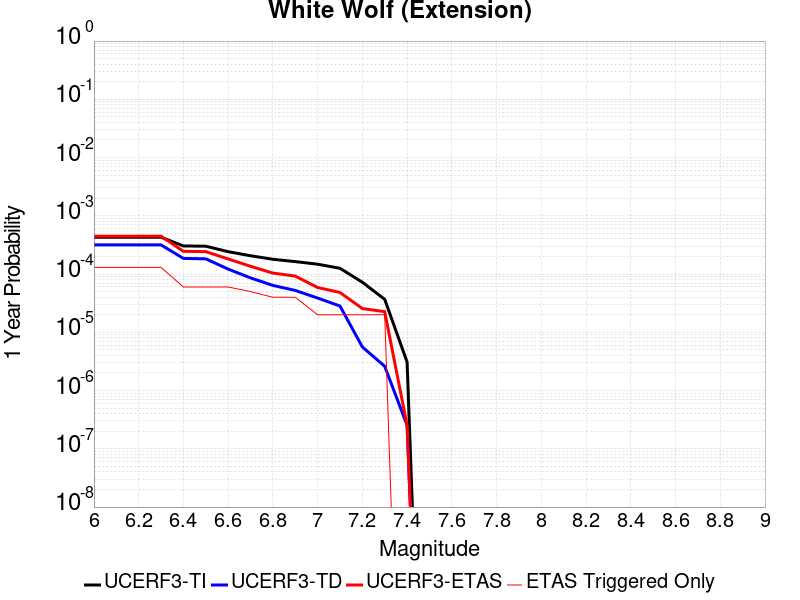 |  |

| Magnitude | 1 wk TI Prob | 1 wk TD Prob | 1 wk ETAS Prob | 1 wk ETAS/TD Gain | 1 wk ETAS Triggered Only | 1 mo TI Prob | 1 mo TD Prob | 1 mo ETAS Prob | 1 mo ETAS/TD Gain | 1 mo ETAS Triggered Only | 1 yr TI Prob | 1 yr TD Prob | 1 yr ETAS Prob | 1 yr ETAS/TD Gain | 1 yr ETAS Triggered Only | 10 yr TI Prob | 10 yr TD Prob | 10 yr ETAS Prob | 10 yr ETAS/TD Gain | 10 yr ETAS Triggered Only |
|-----|-----|-----|-----|-----|-----|-----|-----|-----|-----|-----|-----|-----|-----|-----|-----|-----|-----|-----|-----|-----|
| 6.0 | 8.222555E-6 | 6.0666657E-6 | 6.779469E-5 | 11.17495 | 6.1728395E-5 | 3.5239045E-5 | 2.5999774E-5 | 8.772656E-5 | 3.3741279 | 6.1728395E-5 | 4.289509E-4 | 3.1650788E-4 | 3.7821676E-4 | 1.1949679 | 6.1728395E-5 | 0.0042812387 | 0.003161223 | 0.0032227563 | 1.019465 | 6.1728395E-5 |
| 6.1 | 8.222555E-6 | 6.0666657E-6 | 6.779469E-5 | 11.17495 | 6.1728395E-5 | 3.5239045E-5 | 2.5999774E-5 | 8.772656E-5 | 3.3741279 | 6.1728395E-5 | 4.289509E-4 | 3.1650788E-4 | 3.7821676E-4 | 1.1949679 | 6.1728395E-5 | 0.0042812387 | 0.003161223 | 0.0032227563 | 1.019465 | 6.1728395E-5 |
| 6.2 | 8.222555E-6 | 6.0666657E-6 | 6.779469E-5 | 11.17495 | 6.1728395E-5 | 3.5239045E-5 | 2.5999774E-5 | 8.772656E-5 | 3.3741279 | 6.1728395E-5 | 4.289509E-4 | 3.1650788E-4 | 3.7821676E-4 | 1.1949679 | 6.1728395E-5 | 0.0042812387 | 0.003161223 | 0.0032227563 | 1.019465 | 6.1728395E-5 |
| 6.3 | 8.222555E-6 | 6.0666657E-6 | 6.779469E-5 | 11.17495 | 6.1728395E-5 | 3.5239045E-5 | 2.5999774E-5 | 8.772656E-5 | 3.3741279 | 6.1728395E-5 | 4.289509E-4 | 3.1650788E-4 | 3.7821676E-4 | 1.1949679 | 6.1728395E-5 | 0.0042812387 | 0.003161223 | 0.0032227563 | 1.019465 | 6.1728395E-5 |
| 6.4 | 5.821773E-6 | 3.5571766E-6 | 3.4421264E-5 | 9.676569 | 3.0864197E-5 | 2.4950215E-5 | 1.5244959E-5 | 4.6108686E-5 | 3.0245202 | 3.0864197E-5 | 3.0372653E-4 | 1.8559267E-4 | 2.1645114E-4 | 1.1662699 | 3.0864197E-5 | 0.0030331176 | 0.001854485 | 0.001885292 | 1.0166122 | 3.0864197E-5 |
| 6.5 | 5.766023E-6 | 3.4991106E-6 | 3.4363202E-5 | 9.820553 | 3.0864197E-5 | 2.4711293E-5 | 1.4996108E-5 | 4.5859844E-5 | 3.0581162 | 3.0864197E-5 | 3.0081844E-4 | 1.8256342E-4 | 2.1342198E-4 | 1.1690292 | 3.0864197E-5 | 0.0030041158 | 0.0018242426 | 0.0018550504 | 1.016888 | 3.0864197E-5 |
| 6.6 | 4.643576E-6 | 2.332624E-6 | 3.319675E-5 | 14.231504 | 3.0864197E-5 | 1.9900888E-5 | 9.996925E-6 | 4.0860814E-5 | 4.0873384 | 3.0864197E-5 | 2.4226638E-4 | 1.2170619E-4 | 1.5256663E-4 | 1.2535651 | 3.0864197E-5 | 0.0024200242 | 0.0012164378 | 0.0012472644 | 1.0253417 | 3.0864197E-5 |
| 6.7 | 3.9529173E-6 | 1.6483477E-6 | 3.2512493E-5 | 19.724293 | 3.0864197E-5 | 1.6940963E-5 | 7.0643296E-6 | 3.792831E-5 | 5.368989 | 3.0864197E-5 | 2.0623671E-4 | 8.6005006E-5 | 1.1686655E-4 | 1.3588343 | 3.0864197E-5 | 0.002060454 | 8.597357E-4 | 8.9057337E-4 | 1.0358688 | 3.0864197E-5 |
| 6.8 | 3.4377522E-6 | 1.2245237E-6 | 3.2088683E-5 | 26.205032 | 3.0864197E-5 | 1.473314E-5 | 5.2479486E-6 | 3.6111986E-5 | 6.8811617 | 3.0864197E-5 | 1.7936122E-4 | 6.3891996E-5 | 9.475422E-5 | 1.4830375 | 3.0864197E-5 | 0.0017921652 | 6.387454E-4 | 6.6958985E-4 | 1.0482892 | 3.0864197E-5 |
| 6.9 | 3.1367306E-6 | 1.0033783E-6 | 3.1867545E-5 | 31.760248 | 3.0864197E-5 | 1.3443062E-5 | 4.3001864E-6 | 3.5164252E-5 | 8.177379 | 3.0864197E-5 | 1.63657E-4 | 5.235359E-5 | 8.321617E-5 | 1.5895027 | 3.0864197E-5 | 0.0016353652 | 5.2342017E-4 | 5.5426825E-4 | 1.0589355 | 3.0864197E-5 |
| 7.0 | 2.8298145E-6 | 7.4286646E-7 | 7.4286646E-7 | 1.0 | 0.0 | 1.2127721E-5 | 3.1837099E-6 | 3.1837099E-6 | 1.0 | 0.0 | 1.47645E-4 | 3.8761027E-5 | 3.8761027E-5 | 1.0 | 0.0 | 0.0014754693 | 3.8754768E-4 | 3.8754768E-4 | 1.0 | 0.0 |
| 7.1 | 2.4091064E-6 | 5.4227525E-7 | 5.4227525E-7 | 1.0 | 0.0 | 1.03247E-5 | 2.3240348E-6 | 2.3240348E-6 | 1.0 | 0.0 | 1.2569598E-4 | 2.8294799E-5 | 2.8294799E-5 | 1.0 | 0.0 | 0.001256249 | 2.8291598E-4 | 2.8291598E-4 | 1.0 | 0.0 |
| 7.2 | 1.3875518E-6 | 1.0743063E-7 | 1.0743063E-7 | 1.0 | 0.0 | 5.9466374E-6 | 4.6041689E-7 | 4.6041689E-7 | 1.0 | 0.0 | 7.23979E-5 | 5.6055624E-6 | 5.6055624E-6 | 1.0 | 0.0 | 7.2374323E-4 | 5.6054323E-5 | 5.6054323E-5 | 1.0 | 0.0 |
| 7.3 | 7.056077E-7 | 5.002034E-8 | 5.002034E-8 | 1.0 | 0.0 | 3.0240296E-6 | 2.1437286E-7 | 2.1437286E-7 | 1.0 | 0.0 | 3.681694E-5 | 2.609987E-6 | 2.609987E-6 | 1.0 | 0.0 | 3.681084E-4 | 2.609961E-5 | 2.609961E-5 | 1.0 | 0.0 |
| 7.4 | 5.9334678E-8 | 4.8683537E-9 | 4.8683537E-9 | 1.0 | 0.0 | 2.5429145E-7 | 2.0864372E-8 | 2.0864372E-8 | 1.0 | 0.0 | 3.095994E-6 | 2.5402372E-7 | 2.5402372E-7 | 1.0 | 0.0 | 3.095951E-5 | 2.5402353E-6 | 2.5402353E-6 | 1.0 | 0.0 |

## Oceanic - West Huasna
*[(top)](#table-of-contents)*

| 1 Week | 1 Month | 1 Year | 10 Year |
|-----|-----|-----|-----|
|  |  |  |  |

| Magnitude | 1 wk TI Prob | 1 wk TD Prob | 1 wk ETAS Prob | 1 wk ETAS/TD Gain | 1 wk ETAS Triggered Only | 1 mo TI Prob | 1 mo TD Prob | 1 mo ETAS Prob | 1 mo ETAS/TD Gain | 1 mo ETAS Triggered Only | 1 yr TI Prob | 1 yr TD Prob | 1 yr ETAS Prob | 1 yr ETAS/TD Gain | 1 yr ETAS Triggered Only | 10 yr TI Prob | 10 yr TD Prob | 10 yr ETAS Prob | 10 yr ETAS/TD Gain | 10 yr ETAS Triggered Only |
|-----|-----|-----|-----|-----|-----|-----|-----|-----|-----|-----|-----|-----|-----|-----|-----|-----|-----|-----|-----|-----|
| 6.0 | 3.195567E-5 | 2.7926868E-5 | 8.965354E-5 | 3.2102969 | 6.1728395E-5 | 1.3694567E-4 | 1.1968133E-4 | 1.8140234E-4 | 1.5157112 | 6.1728395E-5 | 0.0016660384 | 0.0014561893 | 0.0015178279 | 1.0423286 | 6.1728395E-5 | 0.016536033 | 0.014471028 | 0.014531863 | 1.0042039 | 6.1728395E-5 |
| 6.1 | 2.1156782E-5 | 1.7573486E-5 | 4.843714E-5 | 2.7562625 | 3.0864197E-5 | 9.066878E-5 | 7.531282E-5 | 1.0617469E-4 | 1.4097825 | 3.0864197E-5 | 0.0011033333 | 9.165572E-4 | 9.473931E-4 | 1.0336432 | 3.0864197E-5 | 0.010978713 | 0.009128777 | 0.00915936 | 1.0033501 | 3.0864197E-5 |
| 6.2 | 1.6195117E-5 | 1.3327152E-5 | 4.419094E-5 | 3.3158574 | 3.0864197E-5 | 6.9405796E-5 | 5.7115132E-5 | 8.797757E-5 | 1.5403547 | 3.0864197E-5 | 8.44688E-4 | 6.9515745E-4 | 7.2600023E-4 | 1.044368 | 3.0864197E-5 | 0.008414844 | 0.006930123 | 0.0069607734 | 1.0044228 | 3.0864197E-5 |
| 6.3 | 1.3559345E-5 | 1.1179142E-5 | 4.2042997E-5 | 3.7608426 | 3.0864197E-5 | 5.811018E-5 | 4.7909736E-5 | 7.877246E-5 | 1.6441847 | 3.0864197E-5 | 7.072618E-4 | 5.831459E-4 | 6.139921E-4 | 1.0528961 | 3.0864197E-5 | 0.0070501505 | 0.0058162753 | 0.00584696 | 1.0052756 | 3.0864197E-5 |
| 6.4 | 1.2120619E-5 | 1.0000977E-5 | 4.0864867E-5 | 4.086087 | 3.0864197E-5 | 5.1944477E-5 | 4.2860633E-5 | 7.372351E-5 | 1.7200751 | 3.0864197E-5 | 6.322405E-4 | 5.2170374E-4 | 5.525518E-4 | 1.0591295 | 3.0864197E-5 | 0.006304447 | 0.0052048573 | 0.005235561 | 1.0058991 | 3.0864197E-5 |
| 6.5 | 1.13511915E-5 | 9.3674735E-6 | 4.023138E-5 | 4.2947955 | 3.0864197E-5 | 4.8647056E-5 | 4.01457E-5 | 7.100866E-5 | 1.7687737 | 3.0864197E-5 | 5.9211696E-4 | 4.886647E-4 | 5.1951385E-4 | 1.0631294 | 3.0864197E-5 | 0.0059054173 | 0.0048759608 | 0.0049066744 | 1.006299 | 3.0864197E-5 |
| 6.6 | 9.850605E-6 | 8.135418E-6 | 8.135418E-6 | 1.0 | 0.0 | 4.2216197E-5 | 3.4865614E-5 | 3.4865614E-5 | 1.0 | 0.0 | 5.1386096E-4 | 4.2440637E-4 | 4.2440637E-4 | 1.0 | 0.0 | 0.0051267436 | 0.004235991 | 0.004235991 | 1.0 | 0.0 |
| 6.7 | 8.8558645E-6 | 7.318433E-6 | 7.318433E-6 | 1.0 | 0.0 | 3.7953152E-5 | 3.1364336E-5 | 3.1364336E-5 | 1.0 | 0.0 | 4.6198163E-4 | 3.8179406E-4 | 3.8179406E-4 | 1.0 | 0.0 | 0.004610224 | 0.0038114067 | 0.0038114067 | 1.0 | 0.0 |
| 6.8 | 7.67136E-6 | 6.391756E-6 | 6.391756E-6 | 1.0 | 0.0 | 3.2876844E-5 | 2.7392953E-5 | 2.7392953E-5 | 1.0 | 0.0 | 4.0020206E-4 | 3.3345833E-4 | 3.3345833E-4 | 1.0 | 0.0 | 0.003994821 | 0.0033296007 | 0.0033296007 | 1.0 | 0.0 |
| 6.9 | 6.534529E-6 | 5.4583297E-6 | 5.4583297E-6 | 1.0 | 0.0 | 2.8004823E-5 | 2.3392633E-5 | 2.3392633E-5 | 1.0 | 0.0 | 3.4090536E-4 | 2.847682E-4 | 2.847682E-4 | 1.0 | 0.0 | 0.0034038287 | 0.0028440498 | 0.0028440498 | 1.0 | 0.0 |
| 7.0 | 5.460525E-6 | 4.5699517E-6 | 4.5699517E-6 | 1.0 | 0.0 | 2.3402039E-5 | 1.958536E-5 | 1.958536E-5 | 1.0 | 0.0 | 2.8488258E-4 | 2.3842578E-4 | 2.3842578E-4 | 1.0 | 0.0 | 0.0028451765 | 0.0023817138 | 0.0023817138 | 1.0 | 0.0 |
| 7.1 | 4.4825083E-6 | 3.7524428E-6 | 3.7524428E-6 | 1.0 | 0.0 | 1.9210609E-5 | 1.60818E-5 | 1.60818E-5 | 1.0 | 0.0 | 2.3386406E-4 | 1.9577841E-4 | 1.9577841E-4 | 1.0 | 0.0 | 0.002336181 | 0.0019560715 | 0.0019560715 | 1.0 | 0.0 |
| 7.2 | 2.821708E-6 | 2.4249334E-6 | 2.4249334E-6 | 1.0 | 0.0 | 1.2092979E-5 | 1.039253E-5 | 1.039253E-5 | 1.0 | 0.0 | 1.4722206E-4 | 1.2652173E-4 | 1.2652173E-4 | 1.0 | 0.0 | 0.0014712457 | 0.0012644994 | 0.0012644994 | 1.0 | 0.0 |
| 7.3 | 2.0644757E-6 | 1.7687412E-6 | 1.7687412E-6 | 1.0 | 0.0 | 8.847723E-6 | 7.5802973E-6 | 7.5802973E-6 | 1.0 | 0.0 | 1.0771569E-4 | 9.228622E-5 | 9.228622E-5 | 1.0 | 0.0 | 0.001076635 | 9.2248066E-4 | 9.2248066E-4 | 1.0 | 0.0 |
| 7.4 | 1.6980367E-6 | 1.4379892E-6 | 1.4379892E-6 | 1.0 | 0.0 | 7.27728E-6 | 6.162796E-6 | 6.162796E-6 | 1.0 | 0.0 | 8.8597284E-5 | 7.5029464E-5 | 7.5029464E-5 | 1.0 | 0.0 | 8.8561967E-4 | 7.500429E-4 | 7.500429E-4 | 1.0 | 0.0 |
| 7.5 | 1.3637683E-6 | 1.1302635E-6 | 1.1302635E-6 | 1.0 | 0.0 | 5.844708E-6 | 4.8439774E-6 | 4.8439774E-6 | 1.0 | 0.0 | 7.1156996E-5 | 5.897383E-5 | 5.897383E-5 | 1.0 | 0.0 | 7.1134215E-4 | 5.895833E-4 | 5.895833E-4 | 1.0 | 0.0 |
| 7.6 | 9.802994E-7 | 7.677247E-7 | 7.677247E-7 | 1.0 | 0.0 | 4.2012766E-6 | 3.2902446E-6 | 3.2902446E-6 | 1.0 | 0.0 | 5.1149345E-5 | 4.0057992E-5 | 4.0057992E-5 | 1.0 | 0.0 | 5.113757E-4 | 4.0050913E-4 | 4.0050913E-4 | 1.0 | 0.0 |
| 7.7 | 5.986191E-7 | 4.0050548E-7 | 4.0050548E-7 | 1.0 | 0.0 | 2.5655079E-6 | 1.7164509E-6 | 1.7164509E-6 | 1.0 | 0.0 | 3.1234613E-5 | 2.089759E-5 | 2.089759E-5 | 1.0 | 0.0 | 3.123022E-4 | 2.089576E-4 | 2.089576E-4 | 1.0 | 0.0 |
| 7.8 | 2.9189815E-7 | 1.5285792E-7 | 1.5285792E-7 | 1.0 | 0.0 | 1.2509914E-6 | 6.5510517E-7 | 6.5510517E-7 | 1.0 | 0.0 | 1.5230714E-5 | 7.9758765E-6 | 7.9758765E-6 | 1.0 | 0.0 | 1.522967E-4 | 7.9757214E-5 | 7.9757214E-5 | 1.0 | 0.0 |
| 7.9 | 1.2057845E-7 | 4.621248E-8 | 4.621248E-8 | 1.0 | 0.0 | 5.1676466E-7 | 1.9805347E-7 | 1.9805347E-7 | 1.0 | 0.0 | 6.2915915E-6 | 2.4112983E-6 | 2.4112983E-6 | 1.0 | 0.0 | 6.2914136E-5 | 2.4114026E-5 | 2.4114026E-5 | 1.0 | 0.0 |
| 8.0 | 3.3806387E-9 | 9.011393E-10 | 9.011393E-10 | 1.0 | 0.0 | 1.4488451E-8 | 3.8620254E-9 | 3.8620254E-9 | 1.0 | 0.0 | 1.7639688E-7 | 4.702016E-8 | 4.702016E-8 | 1.0 | 0.0 | 1.7639674E-6 | 4.7129527E-7 | 4.7129527E-7 | 1.0 | 0.0 |

## Whittier alt 1
*[(top)](#table-of-contents)*

| 1 Week | 1 Month | 1 Year | 10 Year |
|-----|-----|-----|-----|
|  |  |  |  |

| Magnitude | 1 wk TI Prob | 1 wk TD Prob | 1 wk ETAS Prob | 1 wk ETAS/TD Gain | 1 wk ETAS Triggered Only | 1 mo TI Prob | 1 mo TD Prob | 1 mo ETAS Prob | 1 mo ETAS/TD Gain | 1 mo ETAS Triggered Only | 1 yr TI Prob | 1 yr TD Prob | 1 yr ETAS Prob | 1 yr ETAS/TD Gain | 1 yr ETAS Triggered Only | 10 yr TI Prob | 10 yr TD Prob | 10 yr ETAS Prob | 10 yr ETAS/TD Gain | 10 yr ETAS Triggered Only |
|-----|-----|-----|-----|-----|-----|-----|-----|-----|-----|-----|-----|-----|-----|-----|-----|-----|-----|-----|-----|-----|
| 6.0 | 4.2554693E-5 | 4.725218E-5 | 7.811492E-5 | 1.6531496 | 3.0864197E-5 | 1.8236451E-4 | 2.0249544E-4 | 2.3335339E-4 | 1.1523883 | 3.0864197E-5 | 0.002218027 | 0.0024629154 | 0.0025244916 | 1.0250014 | 6.1728395E-5 | 0.02196019 | 0.024390234 | 0.024450457 | 1.0024692 | 6.1728395E-5 |
| 6.1 | 4.2554693E-5 | 4.725218E-5 | 7.811492E-5 | 1.6531496 | 3.0864197E-5 | 1.8236451E-4 | 2.0249544E-4 | 2.3335339E-4 | 1.1523883 | 3.0864197E-5 | 0.002218027 | 0.0024629154 | 0.0025244916 | 1.0250014 | 6.1728395E-5 | 0.02196019 | 0.024390234 | 0.024450457 | 1.0024692 | 6.1728395E-5 |
| 6.2 | 4.2554693E-5 | 4.725218E-5 | 7.811492E-5 | 1.6531496 | 3.0864197E-5 | 1.8236451E-4 | 2.0249544E-4 | 2.3335339E-4 | 1.1523883 | 3.0864197E-5 | 0.002218027 | 0.0024629154 | 0.0025244916 | 1.0250014 | 6.1728395E-5 | 0.02196019 | 0.024390234 | 0.024450457 | 1.0024692 | 6.1728395E-5 |
| 6.3 | 1.9617712E-5 | 1.8268593E-5 | 4.9132224E-5 | 2.689437 | 3.0864197E-5 | 8.40732E-5 | 7.829172E-5 | 1.091535E-4 | 1.3941896 | 3.0864197E-5 | 0.0010231105 | 9.52804E-4 | 0.0010144735 | 1.0647243 | 6.1728395E-5 | 0.01018413 | 0.009490474 | 0.009551617 | 1.0064425 | 6.1728395E-5 |
| 6.4 | 1.5611336E-5 | 1.3604271E-5 | 1.3604271E-5 | 1.0 | 0.0 | 6.690401E-5 | 5.8302747E-5 | 5.8302747E-5 | 1.0 | 0.0 | 8.142519E-4 | 7.0961076E-4 | 7.404531E-4 | 1.0434637 | 3.0864197E-5 | 0.008112748 | 0.0070754145 | 0.0071060606 | 1.0043314 | 3.0864197E-5 |
| 6.5 | 1.5150166E-5 | 1.3100925E-5 | 1.3100925E-5 | 1.0 | 0.0 | 6.492767E-5 | 5.6145647E-5 | 5.6145647E-5 | 1.0 | 0.0 | 7.9020765E-4 | 6.8336475E-4 | 7.142078E-4 | 1.0451342 | 3.0864197E-5 | 0.007874036 | 0.0068145846 | 0.0068452386 | 1.0044982 | 3.0864197E-5 |
| 6.6 | 1.295588E-5 | 1.0380725E-5 | 1.0380725E-5 | 1.0 | 0.0 | 5.552402E-5 | 4.4488075E-5 | 4.4488075E-5 | 1.0 | 0.0 | 6.7579525E-4 | 5.4150965E-4 | 5.4150965E-4 | 1.0 | 0.0 | 0.006737438 | 0.0054033357 | 0.0054033357 | 1.0 | 0.0 |
| 6.7 | 1.2542085E-5 | 9.899369E-6 | 9.899369E-6 | 1.0 | 0.0 | 5.3750682E-5 | 4.242519E-5 | 4.242519E-5 | 1.0 | 0.0 | 6.542181E-4 | 5.164061E-4 | 5.164061E-4 | 1.0 | 0.0 | 0.006522954 | 0.0051534795 | 0.0051534795 | 1.0 | 0.0 |
| 6.8 | 1.2195878E-5 | 9.495415E-6 | 9.495415E-6 | 1.0 | 0.0 | 5.2267E-5 | 4.069401E-5 | 4.069401E-5 | 1.0 | 0.0 | 6.36165E-4 | 4.9533875E-4 | 4.9533875E-4 | 1.0 | 0.0 | 0.0063434686 | 0.004943688 | 0.004943688 | 1.0 | 0.0 |
| 6.9 | 1.1580298E-5 | 8.772933E-6 | 8.772933E-6 | 1.0 | 0.0 | 4.9628903E-5 | 3.7597754E-5 | 3.7597754E-5 | 1.0 | 0.0 | 6.040644E-4 | 4.5765814E-4 | 4.5765814E-4 | 1.0 | 0.0 | 0.00602425 | 0.0045684157 | 0.0045684157 | 1.0 | 0.0 |
| 7.0 | 1.0964795E-5 | 8.083994E-6 | 8.083994E-6 | 1.0 | 0.0 | 4.6991136E-5 | 3.4645236E-5 | 3.4645236E-5 | 1.0 | 0.0 | 5.7196687E-4 | 4.2172565E-4 | 4.2172565E-4 | 1.0 | 0.0 | 0.0057049696 | 0.004210462 | 0.004210462 | 1.0 | 0.0 |
| 7.1 | 1.0230601E-5 | 7.3266697E-6 | 7.3266697E-6 | 1.0 | 0.0 | 4.3844695E-5 | 3.1399642E-5 | 3.1399642E-5 | 1.0 | 0.0 | 5.336784E-4 | 3.8222488E-4 | 3.8222488E-4 | 1.0 | 0.0 | 0.005323986 | 0.0038168381 | 0.0038168381 | 1.0 | 0.0 |
| 7.2 | 9.40865E-6 | 6.543289E-6 | 6.543289E-6 | 1.0 | 0.0 | 4.032216E-5 | 2.8042374E-5 | 2.8042374E-5 | 1.0 | 0.0 | 4.908117E-4 | 3.4136363E-4 | 3.4136363E-4 | 1.0 | 0.0 | 0.0048972913 | 0.003409485 | 0.003409485 | 1.0 | 0.0 |
| 7.3 | 8.237384E-6 | 5.5977525E-6 | 5.5977525E-6 | 1.0 | 0.0 | 3.5302593E-5 | 2.3990153E-5 | 2.3990153E-5 | 1.0 | 0.0 | 4.2972428E-4 | 2.92042E-4 | 2.92042E-4 | 1.0 | 0.0 | 0.0042889426 | 0.002916903 | 0.002916903 | 1.0 | 0.0 |
| 7.4 | 7.5316966E-6 | 5.027819E-6 | 5.027819E-6 | 1.0 | 0.0 | 3.2278298E-5 | 2.1547625E-5 | 2.1547625E-5 | 1.0 | 0.0 | 3.9291743E-4 | 2.6231175E-4 | 2.6231175E-4 | 1.0 | 0.0 | 0.0039222343 | 0.0026201333 | 0.0026201333 | 1.0 | 0.0 |
| 7.5 | 6.149649E-6 | 3.933841E-6 | 3.933841E-6 | 1.0 | 0.0 | 2.6355372E-5 | 1.6859214E-5 | 1.6859214E-5 | 1.0 | 0.0 | 3.208294E-4 | 2.052425E-4 | 2.052425E-4 | 1.0 | 0.0 | 0.003203666 | 0.0020506186 | 0.0020506186 | 1.0 | 0.0 |
| 7.6 | 5.457711E-6 | 3.3953788E-6 | 3.3953788E-6 | 1.0 | 0.0 | 2.338998E-5 | 1.4551547E-5 | 1.4551547E-5 | 1.0 | 0.0 | 2.8473578E-4 | 1.771515E-4 | 1.771515E-4 | 1.0 | 0.0 | 0.0028437122 | 0.0017701836 | 0.0017701836 | 1.0 | 0.0 |
| 7.7 | 4.1676276E-6 | 2.3331952E-6 | 2.3331952E-6 | 1.0 | 0.0 | 1.7861139E-5 | 9.999374E-6 | 9.999374E-6 | 1.0 | 0.0 | 2.1743766E-4 | 1.2173632E-4 | 1.2173632E-4 | 1.0 | 0.0 | 0.0021722503 | 0.0012167693 | 0.0012167693 | 1.0 | 0.0 |
| 7.8 | 2.2692414E-7 | 9.3854695E-8 | 9.3854695E-8 | 1.0 | 0.0 | 9.725317E-7 | 4.0223435E-7 | 4.0223435E-7 | 1.0 | 0.0 | 1.1840509E-5 | 4.8971956E-6 | 4.8971956E-6 | 1.0 | 0.0 | 1.1839878E-4 | 4.8971204E-5 | 4.8971204E-5 | 1.0 | 0.0 |
| 7.9 | 6.676829E-9 | 3.439853E-9 | 3.439853E-9 | 1.0 | 0.0 | 2.861498E-8 | 1.4742227E-8 | 1.4742227E-8 | 1.0 | 0.0 | 3.4838732E-7 | 1.7948659E-7 | 1.7948659E-7 | 1.0 | 0.0 | 3.4838679E-6 | 1.7948646E-6 | 1.7948646E-6 | 1.0 | 0.0 |

## Chino alt 1
*[(top)](#table-of-contents)*

| 1 Week | 1 Month | 1 Year | 10 Year |
|-----|-----|-----|-----|
|  |  |  |  |

| Magnitude | 1 wk TI Prob | 1 wk TD Prob | 1 wk ETAS Prob | 1 wk ETAS/TD Gain | 1 wk ETAS Triggered Only | 1 mo TI Prob | 1 mo TD Prob | 1 mo ETAS Prob | 1 mo ETAS/TD Gain | 1 mo ETAS Triggered Only | 1 yr TI Prob | 1 yr TD Prob | 1 yr ETAS Prob | 1 yr ETAS/TD Gain | 1 yr ETAS Triggered Only | 10 yr TI Prob | 10 yr TD Prob | 10 yr ETAS Prob | 10 yr ETAS/TD Gain | 10 yr ETAS Triggered Only |
|-----|-----|-----|-----|-----|-----|-----|-----|-----|-----|-----|-----|-----|-----|-----|-----|-----|-----|-----|-----|-----|
| 6.0 | 3.939946E-5 | 4.8948554E-5 | 1.1067393E-4 | 2.2610254 | 6.1728395E-5 | 1.6884391E-4 | 2.097656E-4 | 2.7148105E-4 | 1.2942115 | 6.1728395E-5 | 0.0020537362 | 0.0025513945 | 0.0026129654 | 1.0241323 | 6.1728395E-5 | 0.020348595 | 0.025277847 | 0.025338015 | 1.0023803 | 6.1728395E-5 |
| 6.1 | 2.1505624E-5 | 2.6879026E-5 | 2.6879026E-5 | 1.0 | 0.0 | 9.2163704E-5 | 1.1519137E-4 | 1.1519137E-4 | 1.0 | 0.0 | 0.0011215154 | 0.001401664 | 0.001401664 | 1.0 | 0.0 | 0.011158722 | 0.013945141 | 0.013945141 | 1.0 | 0.0 |
| 6.2 | 2.1505624E-5 | 2.6879026E-5 | 2.6879026E-5 | 1.0 | 0.0 | 9.2163704E-5 | 1.1519137E-4 | 1.1519137E-4 | 1.0 | 0.0 | 0.0011215154 | 0.001401664 | 0.001401664 | 1.0 | 0.0 | 0.011158722 | 0.013945141 | 0.013945141 | 1.0 | 0.0 |
| 6.3 | 1.4290785E-5 | 1.8165128E-5 | 1.8165128E-5 | 1.0 | 0.0 | 6.1244784E-5 | 7.784848E-5 | 7.784848E-5 | 1.0 | 0.0 | 7.454001E-4 | 9.4743853E-4 | 9.4743853E-4 | 1.0 | 0.0 | 0.007429048 | 0.0094444575 | 0.0094444575 | 1.0 | 0.0 |
| 6.4 | 1.4290785E-5 | 1.8165128E-5 | 1.8165128E-5 | 1.0 | 0.0 | 6.1244784E-5 | 7.784848E-5 | 7.784848E-5 | 1.0 | 0.0 | 7.454001E-4 | 9.4743853E-4 | 9.4743853E-4 | 1.0 | 0.0 | 0.007429048 | 0.0094444575 | 0.0094444575 | 1.0 | 0.0 |
| 6.5 | 1.3017944E-5 | 1.6652088E-5 | 1.6652088E-5 | 1.0 | 0.0 | 5.5789995E-5 | 7.136439E-5 | 7.136439E-5 | 1.0 | 0.0 | 6.790315E-4 | 8.685589E-4 | 8.685589E-4 | 1.0 | 0.0 | 0.0067696036 | 0.008661949 | 0.008661949 | 1.0 | 0.0 |
| 6.6 | 9.470016E-6 | 1.2039424E-5 | 1.2039424E-5 | 1.0 | 0.0 | 4.058515E-5 | 5.1596704E-5 | 5.1596704E-5 | 1.0 | 0.0 | 4.940122E-4 | 6.280428E-4 | 6.280428E-4 | 1.0 | 0.0 | 0.004929154 | 0.0062718987 | 0.0062718987 | 1.0 | 0.0 |
| 6.7 | 8.314155E-6 | 1.0407736E-5 | 1.0407736E-5 | 1.0 | 0.0 | 3.5631605E-5 | 4.4604003E-5 | 4.4604003E-5 | 1.0 | 0.0 | 4.3372845E-4 | 5.429507E-4 | 5.429507E-4 | 1.0 | 0.0 | 0.004328829 | 0.005425775 | 0.005425775 | 1.0 | 0.0 |
| 6.8 | 3.4856364E-6 | 3.8133708E-6 | 3.8133708E-6 | 1.0 | 0.0 | 1.4938357E-5 | 1.6342927E-5 | 1.6342927E-5 | 1.0 | 0.0 | 1.8185932E-4 | 1.9895904E-4 | 1.9895904E-4 | 1.0 | 0.0 | 0.0018171056 | 0.0019894864 | 0.0019894864 | 1.0 | 0.0 |
| 6.9 | 2.2645952E-6 | 2.1529022E-6 | 2.1529022E-6 | 1.0 | 0.0 | 9.705372E-6 | 9.226692E-6 | 9.226692E-6 | 1.0 | 0.0 | 1.18156495E-4 | 1.123294E-4 | 1.123294E-4 | 1.0 | 0.0 | 0.0011809369 | 0.0011233423 | 0.0011233423 | 1.0 | 0.0 |
| 7.0 | 1.7864003E-6 | 1.5430785E-6 | 1.5430785E-6 | 1.0 | 0.0 | 7.655979E-6 | 6.613177E-6 | 6.613177E-6 | 1.0 | 0.0 | 9.3207556E-5 | 8.051251E-5 | 8.051251E-5 | 1.0 | 0.0 | 9.316847E-4 | 8.0528046E-4 | 8.0528046E-4 | 1.0 | 0.0 |
| 7.1 | 1.7315456E-6 | 1.4733511E-6 | 1.4733511E-6 | 1.0 | 0.0 | 7.420889E-6 | 6.3143466E-6 | 6.3143466E-6 | 1.0 | 0.0 | 9.034557E-5 | 7.6874516E-5 | 7.6874516E-5 | 1.0 | 0.0 | 9.0308854E-4 | 7.6891703E-4 | 7.6891703E-4 | 1.0 | 0.0 |
| 7.2 | 1.6008337E-6 | 1.3574215E-6 | 1.3574215E-6 | 1.0 | 0.0 | 6.860698E-6 | 5.817508E-6 | 5.817508E-6 | 1.0 | 0.0 | 8.352579E-5 | 7.082591E-5 | 7.082591E-5 | 1.0 | 0.0 | 8.34944E-4 | 7.0845755E-4 | 7.0845755E-4 | 1.0 | 0.0 |
| 7.3 | 1.3320939E-6 | 1.121782E-6 | 1.121782E-6 | 1.0 | 0.0 | 5.7089615E-6 | 4.807629E-6 | 4.807629E-6 | 1.0 | 0.0 | 6.9504385E-5 | 5.8531357E-5 | 5.8531357E-5 | 1.0 | 0.0 | 6.9482654E-4 | 5.8530393E-4 | 5.8530393E-4 | 1.0 | 0.0 |
| 7.4 | 1.114294E-6 | 9.237111E-7 | 9.237111E-7 | 1.0 | 0.0 | 4.775537E-6 | 3.958756E-6 | 3.958756E-6 | 1.0 | 0.0 | 5.8140613E-5 | 4.8196827E-5 | 4.8196827E-5 | 1.0 | 0.0 | 5.81254E-4 | 4.8188053E-4 | 4.8188053E-4 | 1.0 | 0.0 |
| 7.5 | 9.354081E-7 | 7.6234323E-7 | 7.6234323E-7 | 1.0 | 0.0 | 4.0088858E-6 | 3.2671815E-6 | 3.2671815E-6 | 1.0 | 0.0 | 4.8807087E-5 | 3.9777242E-5 | 3.9777242E-5 | 1.0 | 0.0 | 4.879637E-4 | 3.977046E-4 | 3.977046E-4 | 1.0 | 0.0 |
| 7.6 | 8.521771E-7 | 6.88071E-7 | 6.88071E-7 | 1.0 | 0.0 | 3.6521824E-6 | 2.9488726E-6 | 2.9488726E-6 | 1.0 | 0.0 | 4.4464414E-5 | 3.5901965E-5 | 3.5901965E-5 | 1.0 | 0.0 | 4.4455516E-4 | 3.589648E-4 | 3.589648E-4 | 1.0 | 0.0 |
| 7.7 | 2.1803626E-7 | 1.418649E-7 | 1.418649E-7 | 1.0 | 0.0 | 9.344408E-7 | 6.079923E-7 | 6.079923E-7 | 1.0 | 0.0 | 1.1376757E-5 | 7.4022914E-6 | 7.4022914E-6 | 1.0 | 0.0 | 1.13761744E-4 | 7.402141E-5 | 7.402141E-5 | 1.0 | 0.0 |

## Owens Valley
*[(top)](#table-of-contents)*

| 1 Week | 1 Month | 1 Year | 10 Year |
|-----|-----|-----|-----|
|  |  |  |  |

| Magnitude | 1 wk TI Prob | 1 wk TD Prob | 1 wk ETAS Prob | 1 wk ETAS/TD Gain | 1 wk ETAS Triggered Only | 1 mo TI Prob | 1 mo TD Prob | 1 mo ETAS Prob | 1 mo ETAS/TD Gain | 1 mo ETAS Triggered Only | 1 yr TI Prob | 1 yr TD Prob | 1 yr ETAS Prob | 1 yr ETAS/TD Gain | 1 yr ETAS Triggered Only | 10 yr TI Prob | 10 yr TD Prob | 10 yr ETAS Prob | 10 yr ETAS/TD Gain | 10 yr ETAS Triggered Only |
|-----|-----|-----|-----|-----|-----|-----|-----|-----|-----|-----|-----|-----|-----|-----|-----|-----|-----|-----|-----|-----|
| 6.0 | 4.83821E-5 | 3.626567E-6 | 3.449065E-5 | 9.510551 | 3.0864197E-5 | 2.0733538E-4 | 1.5542342E-5 | 4.640606E-5 | 2.9857829 | 3.0864197E-5 | 0.002521386 | 1.8921259E-4 | 2.509293E-4 | 1.3261766 | 6.1728395E-5 | 0.024929691 | 0.001925011 | 0.0019866205 | 1.0320048 | 6.1728395E-5 |
| 6.1 | 4.83821E-5 | 3.626567E-6 | 3.449065E-5 | 9.510551 | 3.0864197E-5 | 2.0733538E-4 | 1.5542342E-5 | 4.640606E-5 | 2.9857829 | 3.0864197E-5 | 0.002521386 | 1.8921259E-4 | 2.509293E-4 | 1.3261766 | 6.1728395E-5 | 0.024929691 | 0.001925011 | 0.0019866205 | 1.0320048 | 6.1728395E-5 |
| 6.2 | 4.83821E-5 | 3.626567E-6 | 3.449065E-5 | 9.510551 | 3.0864197E-5 | 2.0733538E-4 | 1.5542342E-5 | 4.640606E-5 | 2.9857829 | 3.0864197E-5 | 0.002521386 | 1.8921259E-4 | 2.509293E-4 | 1.3261766 | 6.1728395E-5 | 0.024929691 | 0.001925011 | 0.0019866205 | 1.0320048 | 6.1728395E-5 |
| 6.3 | 3.953008E-5 | 3.1553948E-6 | 3.4019497E-5 | 10.781375 | 3.0864197E-5 | 1.6940363E-4 | 1.3523055E-5 | 4.4386834E-5 | 3.2823083 | 3.0864197E-5 | 0.002060538 | 1.6463149E-4 | 1.954906E-4 | 1.1874436 | 3.0864197E-5 | 0.020415364 | 0.0016592 | 0.0016900129 | 1.018571 | 3.0864197E-5 |
| 6.4 | 3.953008E-5 | 3.1553948E-6 | 3.4019497E-5 | 10.781375 | 3.0864197E-5 | 1.6940363E-4 | 1.3523055E-5 | 4.4386834E-5 | 3.2823083 | 3.0864197E-5 | 0.002060538 | 1.6463149E-4 | 1.954906E-4 | 1.1874436 | 3.0864197E-5 | 0.020415364 | 0.0016592 | 0.0016900129 | 1.018571 | 3.0864197E-5 |
| 6.5 | 3.457342E-5 | 2.9715961E-6 | 3.3835702E-5 | 11.386373 | 3.0864197E-5 | 1.4816338E-4 | 1.2735354E-5 | 4.3599157E-5 | 3.4234743 | 3.0864197E-5 | 0.0018023965 | 1.550426E-4 | 1.8590201E-4 | 1.1990383 | 3.0864197E-5 | 0.017878477 | 0.001555719 | 0.0015865351 | 1.0198083 | 3.0864197E-5 |
| 6.6 | 3.1127765E-5 | 2.8744932E-6 | 3.37386E-5 | 11.737234 | 3.0864197E-5 | 1.3339789E-4 | 1.2319203E-5 | 4.318302E-5 | 3.505342 | 3.0864197E-5 | 0.0016229092 | 1.4997667E-4 | 1.8083623E-4 | 1.2057625 | 3.0864197E-5 | 0.016111081 | 0.0015012559 | 0.0015320737 | 1.0205281 | 3.0864197E-5 |
| 6.7 | 2.806885E-5 | 2.8104134E-6 | 3.3674525E-5 | 11.982054 | 3.0864197E-5 | 1.2028952E-4 | 1.20445775E-5 | 4.2908403E-5 | 3.5624666 | 3.0864197E-5 | 0.001463541 | 1.4663354E-4 | 1.7749322E-4 | 1.2104543 | 3.0864197E-5 | 0.014539397 | 0.0014657511 | 0.0014965701 | 1.021026 | 3.0864197E-5 |
| 6.8 | 2.524524E-5 | 2.2353688E-6 | 3.30995E-5 | 14.807176 | 3.0864197E-5 | 1.0818939E-4 | 9.580118E-6 | 4.044402E-5 | 4.221662 | 3.0864197E-5 | 0.0013164099 | 1.16632E-4 | 1.474926E-4 | 1.264598 | 3.0864197E-5 | 0.01308639 | 0.0011659812 | 0.0011968093 | 1.0264397 | 3.0864197E-5 |
| 6.9 | 2.2704568E-5 | 1.6081682E-6 | 3.2472315E-5 | 20.192114 | 3.0864197E-5 | 9.730166E-5 | 6.8921313E-6 | 3.7756115E-5 | 5.478148 | 3.0864197E-5 | 0.0011840039 | 8.390849E-5 | 1.147701E-4 | 1.3678008 | 3.0864197E-5 | 0.011777153 | 8.3897985E-4 | 8.6981815E-4 | 1.0367569 | 3.0864197E-5 |
| 7.0 | 2.0871712E-5 | 1.5395453E-6 | 3.2403696E-5 | 21.047575 | 3.0864197E-5 | 8.944713E-5 | 6.598035E-6 | 3.746203E-5 | 5.677756 | 3.0864197E-5 | 0.0010884746 | 8.032813E-5 | 1.11189845E-4 | 1.3841957 | 3.0864197E-5 | 0.010831586 | 8.0316263E-4 | 8.3400204E-4 | 1.0383974 | 3.0864197E-5 |
| 7.1 | 1.944928E-5 | 1.3864178E-6 | 3.2250573E-5 | 23.261799 | 3.0864197E-5 | 8.335139E-5 | 5.941777E-6 | 3.680579E-5 | 6.194408 | 3.0864197E-5 | 0.0010143308 | 7.233874E-5 | 1.03200706E-4 | 1.4266312 | 3.0864197E-5 | 0.010097133 | 7.2330976E-4 | 7.541516E-4 | 1.04264 | 3.0864197E-5 |
| 7.2 | 1.7876306E-5 | 1.2489141E-6 | 3.2113072E-5 | 25.712795 | 3.0864197E-5 | 7.6610486E-5 | 5.352478E-6 | 3.6216512E-5 | 6.766307 | 3.0864197E-5 | 9.3233347E-4 | 6.516448E-5 | 9.602667E-5 | 1.4736044 | 3.0864197E-5 | 0.009284316 | 6.5159105E-4 | 6.824351E-4 | 1.0473366 | 3.0864197E-5 |
| 7.3 | 1.2618672E-5 | 1.1115209E-6 | 3.1975684E-5 | 28.767506 | 3.0864197E-5 | 5.40789E-5 | 4.763652E-6 | 3.56277E-5 | 7.479073 | 3.0864197E-5 | 6.582117E-4 | 5.799593E-5 | 8.885834E-5 | 1.5321478 | 3.0864197E-5 | 0.0065626553 | 5.7994033E-4 | 6.1078666E-4 | 1.0531888 | 3.0864197E-5 |
| 7.4 | 7.4874442E-6 | 8.5486437E-7 | 3.1719035E-5 | 37.10417 | 3.0864197E-5 | 3.208865E-5 | 3.6636993E-6 | 3.4527784E-5 | 9.424295 | 3.0864197E-5 | 3.906093E-4 | 4.4604632E-5 | 7.5467455E-5 | 1.6919197 | 3.0864197E-5 | 0.003899234 | 4.4604883E-4 | 4.7689927E-4 | 1.0691638 | 3.0864197E-5 |
| 7.5 | 2.4734156E-6 | 6.068616E-7 | 3.147104E-5 | 51.85868 | 3.0864197E-5 | 1.060031E-5 | 2.6008327E-6 | 3.346495E-5 | 12.867014 | 3.0864197E-5 | 1.2905113E-4 | 3.166468E-5 | 6.25279E-5 | 1.9746891 | 3.0864197E-5 | 0.0012897621 | 3.1660203E-4 | 3.4745646E-4 | 1.0974549 | 3.0864197E-5 |
| 7.6 | 1.1328841E-6 | 3.196531E-7 | 3.118384E-5 | 97.55526 | 3.0864197E-5 | 4.8552088E-6 | 1.3699412E-6 | 3.2234097E-5 | 23.529549 | 3.0864197E-5 | 5.9110564E-5 | 1.6678909E-5 | 4.754259E-5 | 2.850462 | 3.0864197E-5 | 5.9094845E-4 | 1.6677675E-4 | 1.976358E-4 | 1.1850321 | 3.0864197E-5 |
| 7.7 | 4.8613185E-7 | 8.964689E-8 | 8.964689E-8 | 1.0 | 0.0 | 2.0834207E-6 | 3.8420092E-7 | 3.8420092E-7 | 1.0 | 0.0 | 2.536535E-5 | 4.6776368E-6 | 4.6776368E-6 | 1.0 | 0.0 | 2.5362454E-4 | 4.677545E-5 | 4.677545E-5 | 1.0 | 0.0 |

## Northridge
*[(top)](#table-of-contents)*

| 1 Week | 1 Month | 1 Year | 10 Year |
|-----|-----|-----|-----|
|  |  |  |  |

| Magnitude | 1 wk TI Prob | 1 wk TD Prob | 1 wk ETAS Prob | 1 wk ETAS/TD Gain | 1 wk ETAS Triggered Only | 1 mo TI Prob | 1 mo TD Prob | 1 mo ETAS Prob | 1 mo ETAS/TD Gain | 1 mo ETAS Triggered Only | 1 yr TI Prob | 1 yr TD Prob | 1 yr ETAS Prob | 1 yr ETAS/TD Gain | 1 yr ETAS Triggered Only | 10 yr TI Prob | 10 yr TD Prob | 10 yr ETAS Prob | 10 yr ETAS/TD Gain | 10 yr ETAS Triggered Only |
|-----|-----|-----|-----|-----|-----|-----|-----|-----|-----|-----|-----|-----|-----|-----|-----|-----|-----|-----|-----|-----|
| 6.0 | 1.8340852E-5 | 7.5880193E-6 | 7.5880193E-6 | 1.0 | 0.0 | 7.860128E-5 | 3.251969E-5 | 6.338288E-5 | 1.9490618 | 3.0864197E-5 | 9.565505E-4 | 3.958575E-4 | 4.5756146E-4 | 1.1558741 | 6.1728395E-5 | 0.009524435 | 0.003951746 | 0.0040132306 | 1.0155588 | 6.1728395E-5 |
| 6.1 | 1.8340852E-5 | 7.5880193E-6 | 7.5880193E-6 | 1.0 | 0.0 | 7.860128E-5 | 3.251969E-5 | 6.338288E-5 | 1.9490618 | 3.0864197E-5 | 9.565505E-4 | 3.958575E-4 | 4.5756146E-4 | 1.1558741 | 6.1728395E-5 | 0.009524435 | 0.003951746 | 0.0040132306 | 1.0155588 | 6.1728395E-5 |
| 6.2 | 1.8340852E-5 | 7.5880193E-6 | 7.5880193E-6 | 1.0 | 0.0 | 7.860128E-5 | 3.251969E-5 | 6.338288E-5 | 1.9490618 | 3.0864197E-5 | 9.565505E-4 | 3.958575E-4 | 4.5756146E-4 | 1.1558741 | 6.1728395E-5 | 0.009524435 | 0.003951746 | 0.0040132306 | 1.0155588 | 6.1728395E-5 |
| 6.3 | 1.8340852E-5 | 7.5880193E-6 | 7.5880193E-6 | 1.0 | 0.0 | 7.860128E-5 | 3.251969E-5 | 6.338288E-5 | 1.9490618 | 3.0864197E-5 | 9.565505E-4 | 3.958575E-4 | 4.5756146E-4 | 1.1558741 | 6.1728395E-5 | 0.009524435 | 0.003951746 | 0.0040132306 | 1.0155588 | 6.1728395E-5 |
| 6.4 | 1.7361892E-5 | 7.5880193E-6 | 7.5880193E-6 | 1.0 | 0.0 | 7.440598E-5 | 3.251969E-5 | 6.338288E-5 | 1.9490618 | 3.0864197E-5 | 9.055163E-4 | 3.958575E-4 | 4.5756146E-4 | 1.1558741 | 6.1728395E-5 | 0.009018354 | 0.003951746 | 0.0040132306 | 1.0155588 | 6.1728395E-5 |
| 6.5 | 1.7361892E-5 | 7.5880193E-6 | 7.5880193E-6 | 1.0 | 0.0 | 7.440598E-5 | 3.251969E-5 | 6.338288E-5 | 1.9490618 | 3.0864197E-5 | 9.055163E-4 | 3.958575E-4 | 4.5756146E-4 | 1.1558741 | 6.1728395E-5 | 0.009018354 | 0.003951746 | 0.0040132306 | 1.0155588 | 6.1728395E-5 |
| 6.6 | 1.5458201E-5 | 7.5880193E-6 | 7.5880193E-6 | 1.0 | 0.0 | 6.624775E-5 | 3.251969E-5 | 6.338288E-5 | 1.9490618 | 3.0864197E-5 | 8.0626784E-4 | 3.958575E-4 | 4.5756146E-4 | 1.1558741 | 6.1728395E-5 | 0.008033488 | 0.003951746 | 0.0040132306 | 1.0155588 | 6.1728395E-5 |
| 6.7 | 1.2538368E-5 | 6.381603E-6 | 6.381603E-6 | 1.0 | 0.0 | 5.3734755E-5 | 2.7349442E-5 | 5.8212798E-5 | 2.1284819 | 3.0864197E-5 | 6.5402425E-4 | 3.3292902E-4 | 3.9463688E-4 | 1.1853484 | 6.1728395E-5 | 0.0065210275 | 0.0033243506 | 0.0033858737 | 1.0185069 | 6.1728395E-5 |
| 6.8 | 1.1438097E-5 | 6.3502566E-6 | 6.3502566E-6 | 1.0 | 0.0 | 4.9019498E-5 | 2.7215105E-5 | 5.807846E-5 | 2.1340525 | 3.0864197E-5 | 5.9664896E-4 | 3.3129397E-4 | 3.9300192E-4 | 1.1862634 | 6.1728395E-5 | 0.005950495 | 0.0033080487 | 0.0033695728 | 1.0185983 | 6.1728395E-5 |
| 6.9 | 1.1204891E-5 | 6.2867084E-6 | 6.2867084E-6 | 1.0 | 0.0 | 4.8020076E-5 | 2.694276E-5 | 5.7806126E-5 | 2.1455162 | 3.0864197E-5 | 5.8448757E-4 | 3.2797916E-4 | 3.896873E-4 | 1.1881466 | 6.1728395E-5 | 0.0058295266 | 0.0032749989 | 0.003336525 | 1.0187867 | 6.1728395E-5 |
| 7.0 | 1.061046E-5 | 6.115359E-6 | 6.115359E-6 | 1.0 | 0.0 | 4.5472607E-5 | 2.6208421E-5 | 5.707181E-5 | 2.1776135 | 3.0864197E-5 | 5.534883E-4 | 3.1904122E-4 | 3.8074993E-4 | 1.1934192 | 6.1728395E-5 | 0.0055211177 | 0.0031858785 | 0.0032474103 | 1.0193139 | 6.1728395E-5 |
| 7.1 | 1.0266979E-5 | 6.004274E-6 | 6.004274E-6 | 1.0 | 0.0 | 4.40006E-5 | 2.5732352E-5 | 5.6595756E-5 | 2.199401 | 3.0864197E-5 | 5.355756E-4 | 3.1324677E-4 | 3.7495582E-4 | 1.1969982 | 6.1728395E-5 | 0.0053428668 | 0.003128098 | 0.0031896336 | 1.0196718 | 6.1728395E-5 |
| 7.2 | 9.91273E-6 | 5.819984E-6 | 5.819984E-6 | 1.0 | 0.0 | 4.248244E-5 | 2.4942554E-5 | 5.580598E-5 | 2.2373805 | 3.0864197E-5 | 5.171009E-4 | 3.036337E-4 | 3.6534335E-4 | 1.2032372 | 6.1728395E-5 | 0.0051589934 | 0.0030322333 | 0.0030937747 | 1.0202956 | 6.1728395E-5 |
| 7.3 | 8.4959265E-6 | 5.193062E-6 | 5.193062E-6 | 1.0 | 0.0 | 3.6410605E-5 | 2.225579E-5 | 5.31193E-5 | 2.386763 | 3.0864197E-5 | 4.4320893E-4 | 2.709308E-4 | 3.3264246E-4 | 1.2277765 | 6.1728395E-5 | 0.00442326 | 0.0027060313 | 0.002767593 | 1.0227497 | 6.1728395E-5 |
| 7.4 | 8.0847185E-6 | 4.9819355E-6 | 4.9819355E-6 | 1.0 | 0.0 | 3.4648332E-5 | 2.135098E-5 | 5.2214516E-5 | 2.4455328 | 3.0864197E-5 | 4.2176177E-4 | 2.599174E-4 | 3.2162975E-4 | 1.2374306 | 6.1728395E-5 | 0.0042096223 | 0.00259616 | 0.002657728 | 1.0237151 | 6.1728395E-5 |
| 7.5 | 6.8220684E-6 | 4.2533075E-6 | 4.2533075E-6 | 1.0 | 0.0 | 2.9237108E-5 | 1.8228335E-5 | 1.8228335E-5 | 1.0 | 0.0 | 3.5590364E-4 | 2.2190758E-4 | 2.5276493E-4 | 1.139055 | 3.0864197E-5 | 0.0035533418 | 0.002216881 | 0.0022476767 | 1.0138915 | 3.0864197E-5 |
| 7.6 | 4.4224143E-6 | 2.8999582E-6 | 2.8999582E-6 | 1.0 | 0.0 | 1.8953066E-5 | 1.2428334E-5 | 1.2428334E-5 | 1.0 | 0.0 | 2.3072914E-4 | 1.5130457E-4 | 1.5130457E-4 | 1.0 | 0.0 | 0.0023048974 | 0.0015120271 | 0.0015120271 | 1.0 | 0.0 |
| 7.7 | 2.5297056E-6 | 1.6045905E-6 | 1.6045905E-6 | 1.0 | 0.0 | 1.0841551E-5 | 6.8767986E-6 | 6.8767986E-6 | 1.0 | 0.0 | 1.319879E-4 | 8.3721854E-5 | 8.3721854E-5 | 1.0 | 0.0 | 0.0013190953 | 8.369078E-4 | 8.369078E-4 | 1.0 | 0.0 |
| 7.8 | 1.2508156E-6 | 8.780076E-7 | 8.780076E-7 | 1.0 | 0.0 | 5.3606273E-6 | 3.7628845E-6 | 3.7628845E-6 | 1.0 | 0.0 | 6.526368E-5 | 4.581217E-5 | 4.581217E-5 | 1.0 | 0.0 | 6.524452E-4 | 4.5802852E-4 | 4.5802852E-4 | 1.0 | 0.0 |
| 7.9 | 2.262199E-7 | 1.4664671E-7 | 1.4664671E-7 | 1.0 | 0.0 | 9.695135E-7 | 6.284858E-7 | 6.284858E-7 | 1.0 | 0.0 | 1.1803763E-5 | 7.651788E-6 | 7.651788E-6 | 1.0 | 0.0 | 1.1803136E-4 | 7.651533E-5 | 7.651533E-5 | 1.0 | 0.0 |
| 8.0 | 2.865362E-9 | 1.2753101E-9 | 1.2753101E-9 | 1.0 | 0.0 | 1.2280123E-8 | 5.4656146E-9 | 5.4656146E-9 | 1.0 | 0.0 | 1.4951048E-7 | 6.654386E-8 | 6.654386E-8 | 1.0 | 0.0 | 1.4951038E-6 | 6.654386E-7 | 6.654386E-7 | 1.0 | 0.0 |

## Great Valley 09 (Laguna Seca)
*[(top)](#table-of-contents)*

| 1 Week | 1 Month | 1 Year | 10 Year |
|-----|-----|-----|-----|
|  |  |  |  |

| Magnitude | 1 wk TI Prob | 1 wk TD Prob | 1 wk ETAS Prob | 1 wk ETAS/TD Gain | 1 wk ETAS Triggered Only | 1 mo TI Prob | 1 mo TD Prob | 1 mo ETAS Prob | 1 mo ETAS/TD Gain | 1 mo ETAS Triggered Only | 1 yr TI Prob | 1 yr TD Prob | 1 yr ETAS Prob | 1 yr ETAS/TD Gain | 1 yr ETAS Triggered Only | 10 yr TI Prob | 10 yr TD Prob | 10 yr ETAS Prob | 10 yr ETAS/TD Gain | 10 yr ETAS Triggered Only |
|-----|-----|-----|-----|-----|-----|-----|-----|-----|-----|-----|-----|-----|-----|-----|-----|-----|-----|-----|-----|-----|
| 6.0 | 5.4353277E-5 | 7.05022E-5 | 1.3222624E-4 | 1.875491 | 6.1728395E-5 | 2.3292181E-4 | 3.0211566E-4 | 3.638254E-4 | 1.2042587 | 6.1728395E-5 | 0.0028321352 | 0.0036721937 | 0.0037336955 | 1.016748 | 6.1728395E-5 | 0.02796312 | 0.03611547 | 0.03617497 | 1.0016475 | 6.1728395E-5 |
| 6.1 | 4.5578287E-5 | 5.822118E-5 | 1.1994598E-4 | 2.0601778 | 6.1728395E-5 | 1.953209E-4 | 2.4949326E-4 | 3.1120624E-4 | 1.2473533 | 6.1728395E-5 | 0.0023754383 | 0.003033432 | 0.003094973 | 1.0202876 | 6.1728395E-5 | 0.023502063 | 0.029919548 | 0.029979428 | 1.0020014 | 6.1728395E-5 |
| 6.2 | 2.8536782E-5 | 3.4737273E-5 | 9.6463526E-5 | 2.7769458 | 6.1728395E-5 | 1.2229476E-4 | 1.4886224E-4 | 2.1058143E-4 | 1.4146062 | 6.1728395E-5 | 0.0014879217 | 0.001810813 | 0.0018724296 | 1.0340271 | 6.1728395E-5 | 0.014779986 | 0.017958116 | 0.018018737 | 1.0033756 | 6.1728395E-5 |
| 6.3 | 2.3698774E-5 | 2.8213295E-5 | 8.9939946E-5 | 3.187857 | 6.1728395E-5 | 1.01562226E-4 | 1.20905075E-4 | 1.8262601E-4 | 1.5104908 | 6.1728395E-5 | 0.0012358186 | 0.0014710218 | 0.0015326594 | 1.0419012 | 6.1728395E-5 | 0.012289686 | 0.014611342 | 0.0146721685 | 1.0041629 | 6.1728395E-5 |
| 6.4 | 1.9191197E-5 | 2.2123184E-5 | 5.29867E-5 | 2.3950756 | 3.0864197E-5 | 8.2245395E-5 | 9.4806666E-5 | 1.2566794E-4 | 1.3255179 | 3.0864197E-5 | 0.0010008777 | 0.0011536429 | 0.0011844714 | 1.0267228 | 3.0864197E-5 | 0.009963818 | 0.011476948 | 0.011507458 | 1.0026584 | 3.0864197E-5 |
| 6.5 | 1.5203241E-5 | 1.6802203E-5 | 4.7665882E-5 | 2.8368828 | 3.0864197E-5 | 6.5155116E-5 | 7.200386E-5 | 1.0286584E-4 | 1.4286156 | 3.0864197E-5 | 7.9297484E-4 | 8.7626575E-4 | 9.0710295E-4 | 1.0351915 | 3.0864197E-5 | 0.007901512 | 0.0087295165 | 0.008760111 | 1.0035048 | 3.0864197E-5 |
| 6.6 | 1.0984925E-5 | 1.1242595E-5 | 4.2106447E-5 | 3.7452602 | 3.0864197E-5 | 4.70774E-5 | 4.8181686E-5 | 7.9044396E-5 | 1.6405486 | 3.0864197E-5 | 5.730166E-4 | 5.8645656E-4 | 6.173026E-4 | 1.0525974 | 3.0864197E-5 | 0.005715413 | 0.0058494853 | 0.005880169 | 1.0052456 | 3.0864197E-5 |
| 6.7 | 9.134616E-6 | 9.019894E-6 | 3.9883813E-5 | 4.4217606 | 3.0864197E-5 | 3.9147766E-5 | 3.865613E-5 | 6.9519134E-5 | 1.7983987 | 3.0864197E-5 | 4.7651984E-4 | 4.7053912E-4 | 5.013888E-4 | 1.0655624 | 3.0864197E-5 | 0.004754993 | 0.0046956735 | 0.0047263927 | 1.0065421 | 3.0864197E-5 |
| 6.8 | 7.785589E-6 | 7.4519444E-6 | 3.8315913E-5 | 5.1417336 | 3.0864197E-5 | 3.3366385E-5 | 3.1936524E-5 | 6.2799736E-5 | 1.9663923 | 3.0864197E-5 | 4.0616E-4 | 3.8875983E-4 | 4.19612E-4 | 1.0793606 | 3.0864197E-5 | 0.0040541845 | 0.0038810016 | 0.0039117457 | 1.0079218 | 3.0864197E-5 |
| 6.9 | 5.579095E-6 | 4.898492E-6 | 4.898492E-6 | 1.0 | 0.0 | 2.3910188E-5 | 2.0993377E-5 | 2.0993377E-5 | 1.0 | 0.0 | 2.9106764E-4 | 2.5556577E-4 | 2.5556577E-4 | 1.0 | 0.0 | 0.002906867 | 0.002552856 | 0.002552856 | 1.0 | 0.0 |
| 7.0 | 2.6816688E-6 | 1.5216126E-6 | 1.5216126E-6 | 1.0 | 0.0 | 1.1492816E-5 | 6.521181E-6 | 6.521181E-6 | 1.0 | 0.0 | 1.3991605E-4 | 7.939258E-5 | 7.939258E-5 | 1.0 | 0.0 | 0.0013982799 | 7.9365086E-4 | 7.9365086E-4 | 1.0 | 0.0 |
| 7.1 | 1.9951021E-6 | 7.453827E-7 | 7.453827E-7 | 1.0 | 0.0 | 8.55041E-6 | 3.1944935E-6 | 3.1944935E-6 | 1.0 | 0.0 | 1.0409627E-4 | 3.8892307E-5 | 3.8892307E-5 | 1.0 | 0.0 | 0.0010404752 | 3.8885913E-4 | 3.8885913E-4 | 1.0 | 0.0 |
| 7.2 | 1.9951021E-6 | 7.453827E-7 | 7.453827E-7 | 1.0 | 0.0 | 8.55041E-6 | 3.1944935E-6 | 3.1944935E-6 | 1.0 | 0.0 | 1.0409627E-4 | 3.8892307E-5 | 3.8892307E-5 | 1.0 | 0.0 | 0.0010404752 | 3.8885913E-4 | 3.8885913E-4 | 1.0 | 0.0 |
| 7.3 | 1.7087556E-6 | 6.578881E-7 | 6.578881E-7 | 1.0 | 0.0 | 7.3232177E-6 | 2.8195177E-6 | 2.8195177E-6 | 1.0 | 0.0 | 8.915652E-5 | 3.4327128E-5 | 3.4327128E-5 | 1.0 | 0.0 | 8.9120766E-4 | 3.432223E-4 | 3.432223E-4 | 1.0 | 0.0 |
| 7.4 | 1.3804846E-6 | 6.073852E-7 | 6.073852E-7 | 1.0 | 0.0 | 5.916349E-6 | 2.6030768E-6 | 2.6030768E-6 | 1.0 | 0.0 | 7.2029165E-5 | 3.169204E-5 | 3.169204E-5 | 1.0 | 0.0 | 7.200583E-4 | 3.1687922E-4 | 3.1687922E-4 | 1.0 | 0.0 |
| 7.5 | 1.3804846E-6 | 6.073852E-7 | 6.073852E-7 | 1.0 | 0.0 | 5.916349E-6 | 2.6030768E-6 | 2.6030768E-6 | 1.0 | 0.0 | 7.2029165E-5 | 3.169204E-5 | 3.169204E-5 | 1.0 | 0.0 | 7.200583E-4 | 3.1687922E-4 | 3.1687922E-4 | 1.0 | 0.0 |

## Honey Lake 2011 CFM
*[(top)](#table-of-contents)*

| 1 Week | 1 Month | 1 Year | 10 Year |
|-----|-----|-----|-----|
|  |  |  |  |

| Magnitude | 1 wk TI Prob | 1 wk TD Prob | 1 wk ETAS Prob | 1 wk ETAS/TD Gain | 1 wk ETAS Triggered Only | 1 mo TI Prob | 1 mo TD Prob | 1 mo ETAS Prob | 1 mo ETAS/TD Gain | 1 mo ETAS Triggered Only | 1 yr TI Prob | 1 yr TD Prob | 1 yr ETAS Prob | 1 yr ETAS/TD Gain | 1 yr ETAS Triggered Only | 10 yr TI Prob | 10 yr TD Prob | 10 yr ETAS Prob | 10 yr ETAS/TD Gain | 10 yr ETAS Triggered Only |
|-----|-----|-----|-----|-----|-----|-----|-----|-----|-----|-----|-----|-----|-----|-----|-----|-----|-----|-----|-----|-----|
| 6.0 | 6.155506E-5 | 7.954667E-5 | 7.954667E-5 | 1.0 | 0.0 | 2.6378073E-4 | 3.40873E-4 | 3.40873E-4 | 1.0 | 0.0 | 0.0032068014 | 0.0041427943 | 0.0041427943 | 1.0 | 0.0 | 0.03160919 | 0.040702924 | 0.040732533 | 1.0007274 | 3.0864197E-5 |
| 6.1 | 6.155506E-5 | 7.954667E-5 | 7.954667E-5 | 1.0 | 0.0 | 2.6378073E-4 | 3.40873E-4 | 3.40873E-4 | 1.0 | 0.0 | 0.0032068014 | 0.0041427943 | 0.0041427943 | 1.0 | 0.0 | 0.03160919 | 0.040702924 | 0.040732533 | 1.0007274 | 3.0864197E-5 |
| 6.2 | 4.1335024E-5 | 5.257629E-5 | 5.257629E-5 | 1.0 | 0.0 | 1.7713808E-4 | 2.253086E-4 | 2.253086E-4 | 1.0 | 0.0 | 0.0021545228 | 0.0027398595 | 0.0027398595 | 1.0 | 0.0 | 0.021337535 | 0.027076708 | 0.027076708 | 1.0 | 0.0 |
| 6.3 | 4.1335024E-5 | 5.257629E-5 | 5.257629E-5 | 1.0 | 0.0 | 1.7713808E-4 | 2.253086E-4 | 2.253086E-4 | 1.0 | 0.0 | 0.0021545228 | 0.0027398595 | 0.0027398595 | 1.0 | 0.0 | 0.021337535 | 0.027076708 | 0.027076708 | 1.0 | 0.0 |
| 6.4 | 3.2393702E-5 | 4.0887444E-5 | 4.0887444E-5 | 1.0 | 0.0 | 1.3882275E-4 | 1.7522085E-4 | 1.7522085E-4 | 1.0 | 0.0 | 0.0016888566 | 0.002131335 | 0.002131335 | 1.0 | 0.0 | 0.016760793 | 0.02111982 | 0.02111982 | 1.0 | 0.0 |
| 6.5 | 2.7205504E-5 | 3.4211684E-5 | 3.4211684E-5 | 1.0 | 0.0 | 1.1658981E-4 | 1.4661385E-4 | 1.4661385E-4 | 1.0 | 0.0 | 0.0014185566 | 0.0017836588 | 0.0017836588 | 1.0 | 0.0 | 0.014095354 | 0.017702932 | 0.017702932 | 1.0 | 0.0 |
| 6.6 | 2.069265E-5 | 2.5955307E-5 | 2.5955307E-5 | 1.0 | 0.0 | 8.867977E-5 | 1.1123277E-4 | 1.1123277E-4 | 1.0 | 0.0 | 0.0010791414 | 0.0013535038 | 0.0013535038 | 1.0 | 0.0 | 0.010739161 | 0.013461002 | 0.013461002 | 1.0 | 0.0 |
| 6.7 | 1.8060919E-5 | 2.2656828E-5 | 2.2656828E-5 | 1.0 | 0.0 | 7.7401644E-5 | 9.709754E-5 | 9.709754E-5 | 1.0 | 0.0 | 9.419576E-4 | 0.0011816026 | 0.0011816026 | 1.0 | 0.0 | 0.009379748 | 0.011761238 | 0.011761238 | 1.0 | 0.0 |
| 6.8 | 1.4474663E-5 | 1.818127E-5 | 1.818127E-5 | 1.0 | 0.0 | 6.203279E-5 | 7.791784E-5 | 7.791784E-5 | 1.0 | 0.0 | 7.5498753E-4 | 9.483136E-4 | 9.483136E-4 | 1.0 | 0.0 | 0.007524277 | 0.009450192 | 0.009450192 | 1.0 | 0.0 |
| 6.9 | 8.564552E-6 | 1.0802308E-5 | 1.0802308E-5 | 1.0 | 0.0 | 3.6704707E-5 | 4.6295158E-5 | 4.6295158E-5 | 1.0 | 0.0 | 4.4678818E-4 | 5.635644E-4 | 5.635644E-4 | 1.0 | 0.0 | 0.0044589094 | 0.0056278477 | 0.0056278477 | 1.0 | 0.0 |

## Santa Susana East (connector)
*[(top)](#table-of-contents)*

| 1 Week | 1 Month | 1 Year | 10 Year |
|-----|-----|-----|-----|
| 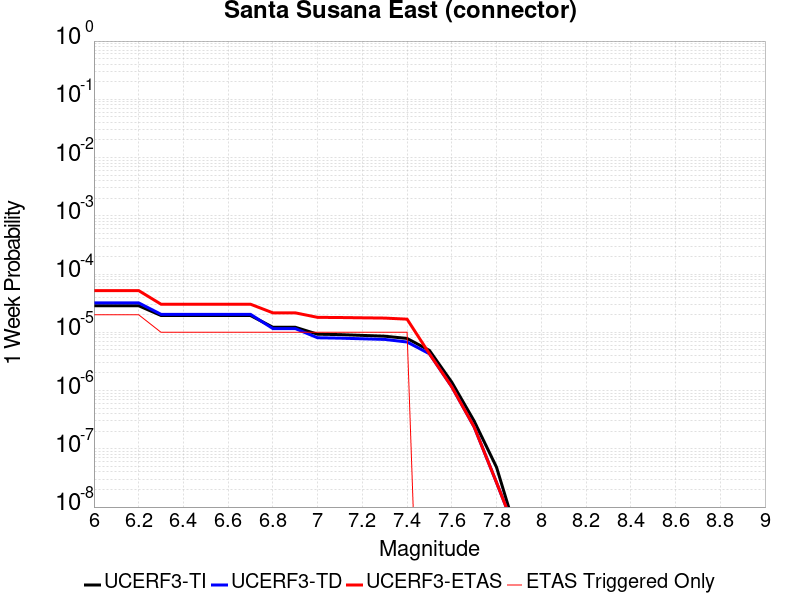 |  |  |  |

| Magnitude | 1 wk TI Prob | 1 wk TD Prob | 1 wk ETAS Prob | 1 wk ETAS/TD Gain | 1 wk ETAS Triggered Only | 1 mo TI Prob | 1 mo TD Prob | 1 mo ETAS Prob | 1 mo ETAS/TD Gain | 1 mo ETAS Triggered Only | 1 yr TI Prob | 1 yr TD Prob | 1 yr ETAS Prob | 1 yr ETAS/TD Gain | 1 yr ETAS Triggered Only | 10 yr TI Prob | 10 yr TD Prob | 10 yr ETAS Prob | 10 yr ETAS/TD Gain | 10 yr ETAS Triggered Only |
|-----|-----|-----|-----|-----|-----|-----|-----|-----|-----|-----|-----|-----|-----|-----|-----|-----|-----|-----|-----|-----|
| 6.0 | 2.858397E-5 | 3.202091E-5 | 6.288412E-5 | 1.9638455 | 3.0864197E-5 | 1.2249697E-4 | 1.3722685E-4 | 1.6808682E-4 | 1.2248828 | 3.0864197E-5 | 0.0014903803 | 0.0016697381 | 0.0017005508 | 1.0184536 | 3.0864197E-5 | 0.014804244 | 0.016599052 | 0.016629403 | 1.0018286 | 3.0864197E-5 |
| 6.1 | 2.858397E-5 | 3.202091E-5 | 6.288412E-5 | 1.9638455 | 3.0864197E-5 | 1.2249697E-4 | 1.3722685E-4 | 1.6808682E-4 | 1.2248828 | 3.0864197E-5 | 0.0014903803 | 0.0016697381 | 0.0017005508 | 1.0184536 | 3.0864197E-5 | 0.014804244 | 0.016599052 | 0.016629403 | 1.0018286 | 3.0864197E-5 |
| 6.2 | 2.858397E-5 | 3.202091E-5 | 6.288412E-5 | 1.9638455 | 3.0864197E-5 | 1.2249697E-4 | 1.3722685E-4 | 1.6808682E-4 | 1.2248828 | 3.0864197E-5 | 0.0014903803 | 0.0016697381 | 0.0017005508 | 1.0184536 | 3.0864197E-5 | 0.014804244 | 0.016599052 | 0.016629403 | 1.0018286 | 3.0864197E-5 |
| 6.3 | 1.943582E-5 | 2.036718E-5 | 2.036718E-5 | 1.0 | 0.0 | 8.329371E-5 | 8.7285625E-5 | 8.7285625E-5 | 1.0 | 0.0 | 0.001013629 | 0.0010622967 | 0.0010622967 | 1.0 | 0.0 | 0.010090181 | 0.010583619 | 0.010583619 | 1.0 | 0.0 |
| 6.4 | 1.943582E-5 | 2.036718E-5 | 2.036718E-5 | 1.0 | 0.0 | 8.329371E-5 | 8.7285625E-5 | 8.7285625E-5 | 1.0 | 0.0 | 0.001013629 | 0.0010622967 | 0.0010622967 | 1.0 | 0.0 | 0.010090181 | 0.010583619 | 0.010583619 | 1.0 | 0.0 |
| 6.5 | 1.943582E-5 | 2.036718E-5 | 2.036718E-5 | 1.0 | 0.0 | 8.329371E-5 | 8.7285625E-5 | 8.7285625E-5 | 1.0 | 0.0 | 0.001013629 | 0.0010622967 | 0.0010622967 | 1.0 | 0.0 | 0.010090181 | 0.010583619 | 0.010583619 | 1.0 | 0.0 |
| 6.6 | 1.943582E-5 | 2.036718E-5 | 2.036718E-5 | 1.0 | 0.0 | 8.329371E-5 | 8.7285625E-5 | 8.7285625E-5 | 1.0 | 0.0 | 0.001013629 | 0.0010622967 | 0.0010622967 | 1.0 | 0.0 | 0.010090181 | 0.010583619 | 0.010583619 | 1.0 | 0.0 |
| 6.7 | 1.9404439E-5 | 2.03546E-5 | 2.03546E-5 | 1.0 | 0.0 | 8.3159226E-5 | 8.723172E-5 | 8.723172E-5 | 1.0 | 0.0 | 0.0010119933 | 0.0010616409 | 0.0010616409 | 1.0 | 0.0 | 0.010073971 | 0.010577125 | 0.010577125 | 1.0 | 0.0 |
| 6.8 | 1.2217526E-5 | 1.1592998E-5 | 1.1592998E-5 | 1.0 | 0.0 | 5.2359774E-5 | 4.9683425E-5 | 4.9683425E-5 | 1.0 | 0.0 | 6.372938E-4 | 6.0474465E-4 | 6.0474465E-4 | 1.0 | 0.0 | 0.0063546924 | 0.006033037 | 0.006033037 | 1.0 | 0.0 |
| 6.9 | 1.2217526E-5 | 1.1592998E-5 | 1.1592998E-5 | 1.0 | 0.0 | 5.2359774E-5 | 4.9683425E-5 | 4.9683425E-5 | 1.0 | 0.0 | 6.372938E-4 | 6.0474465E-4 | 6.0474465E-4 | 1.0 | 0.0 | 0.0063546924 | 0.006033037 | 0.006033037 | 1.0 | 0.0 |
| 7.0 | 9.276017E-6 | 8.059113E-6 | 8.059113E-6 | 1.0 | 0.0 | 3.9753755E-5 | 3.4538618E-5 | 3.4538618E-5 | 1.0 | 0.0 | 4.8389446E-4 | 4.2042998E-4 | 4.2042998E-4 | 1.0 | 0.0 | 0.0048284214 | 0.0041970722 | 0.0041970722 | 1.0 | 0.0 |
| 7.1 | 9.130355E-6 | 7.942286E-6 | 7.942286E-6 | 1.0 | 0.0 | 3.9129503E-5 | 3.4037945E-5 | 3.4037945E-5 | 1.0 | 0.0 | 4.7629757E-4 | 4.1433662E-4 | 4.1433662E-4 | 1.0 | 0.0 | 0.00475278 | 0.004136367 | 0.004136367 | 1.0 | 0.0 |
| 7.2 | 8.851015E-6 | 7.741445E-6 | 7.741445E-6 | 1.0 | 0.0 | 3.7932372E-5 | 3.317722E-5 | 3.317722E-5 | 1.0 | 0.0 | 4.6172875E-4 | 4.038612E-4 | 4.038612E-4 | 1.0 | 0.0 | 0.0046077054 | 0.0040319953 | 0.0040319953 | 1.0 | 0.0 |
| 7.3 | 8.573006E-6 | 7.550166E-6 | 7.550166E-6 | 1.0 | 0.0 | 3.6740938E-5 | 3.2357475E-5 | 3.2357475E-5 | 1.0 | 0.0 | 4.472291E-4 | 3.9388443E-4 | 3.9388443E-4 | 1.0 | 0.0 | 0.004463301 | 0.0039325804 | 0.0039325804 | 1.0 | 0.0 |
| 7.4 | 7.852282E-6 | 6.817687E-6 | 6.817687E-6 | 1.0 | 0.0 | 3.36522E-5 | 2.9218349E-5 | 2.9218349E-5 | 1.0 | 0.0 | 4.096385E-4 | 3.5567835E-4 | 3.5567835E-4 | 1.0 | 0.0 | 0.0040888423 | 0.0035517553 | 0.0035517553 | 1.0 | 0.0 |
| 7.5 | 4.8869324E-6 | 4.279055E-6 | 4.279055E-6 | 1.0 | 0.0 | 2.0943828E-5 | 1.8338687E-5 | 1.8338687E-5 | 1.0 | 0.0 | 2.5496128E-4 | 2.232523E-4 | 2.232523E-4 | 1.0 | 0.0 | 0.0025466895 | 0.0022304445 | 0.0022304445 | 1.0 | 0.0 |
| 7.6 | 1.3894544E-6 | 1.1568179E-6 | 1.1568179E-6 | 1.0 | 0.0 | 5.954791E-6 | 4.957783E-6 | 4.957783E-6 | 1.0 | 0.0 | 7.249717E-5 | 6.0359558E-5 | 6.0359558E-5 | 1.0 | 0.0 | 7.247352E-4 | 6.0345343E-4 | 6.0345343E-4 | 1.0 | 0.0 |
| 7.7 | 2.9924632E-7 | 2.371928E-7 | 2.371928E-7 | 1.0 | 0.0 | 1.2824837E-6 | 1.0165402E-6 | 1.0165402E-6 | 1.0 | 0.0 | 1.5614127E-5 | 1.2376314E-5 | 1.2376314E-5 | 1.0 | 0.0 | 1.5613029E-4 | 1.2375697E-4 | 1.2375697E-4 | 1.0 | 0.0 |
| 7.8 | 4.8188564E-8 | 2.6323061E-8 | 2.6323061E-8 | 1.0 | 0.0 | 2.065224E-7 | 1.1281311E-7 | 1.1281311E-7 | 1.0 | 0.0 | 2.5144072E-6 | 1.3734989E-6 | 1.3734989E-6 | 1.0 | 0.0 | 2.5143789E-5 | 1.3734912E-5 | 1.3734912E-5 | 1.0 | 0.0 |
| 7.9 | 2.6127251E-9 | 2.7681102E-9 | 2.7681102E-9 | 1.0 | 0.0 | 1.1197393E-8 | 1.186333E-8 | 1.186333E-8 | 1.0 | 0.0 | 1.3632825E-7 | 1.4443603E-7 | 1.4443603E-7 | 1.0 | 0.0 | 1.3632817E-6 | 1.4443604E-6 | 1.4443604E-6 | 1.0 | 0.0 |

## Lost Hills
*[(top)](#table-of-contents)*

| 1 Week | 1 Month | 1 Year | 10 Year |
|-----|-----|-----|-----|
|  |  |  |  |

| Magnitude | 1 wk TI Prob | 1 wk TD Prob | 1 wk ETAS Prob | 1 wk ETAS/TD Gain | 1 wk ETAS Triggered Only | 1 mo TI Prob | 1 mo TD Prob | 1 mo ETAS Prob | 1 mo ETAS/TD Gain | 1 mo ETAS Triggered Only | 1 yr TI Prob | 1 yr TD Prob | 1 yr ETAS Prob | 1 yr ETAS/TD Gain | 1 yr ETAS Triggered Only | 10 yr TI Prob | 10 yr TD Prob | 10 yr ETAS Prob | 10 yr ETAS/TD Gain | 10 yr ETAS Triggered Only |
|-----|-----|-----|-----|-----|-----|-----|-----|-----|-----|-----|-----|-----|-----|-----|-----|-----|-----|-----|-----|-----|
| 6.0 | 2.233523E-5 | 2.5106583E-5 | 2.5106583E-5 | 1.0 | 0.0 | 9.571891E-5 | 1.0759615E-4 | 1.3845702E-4 | 1.2868214 | 3.0864197E-5 | 0.0011647546 | 0.001309364 | 0.0013401879 | 1.0235411 | 3.0864197E-5 | 0.011586686 | 0.013033091 | 0.013063553 | 1.0023372 | 3.0864197E-5 |
| 6.1 | 2.233523E-5 | 2.5106583E-5 | 2.5106583E-5 | 1.0 | 0.0 | 9.571891E-5 | 1.0759615E-4 | 1.3845702E-4 | 1.2868214 | 3.0864197E-5 | 0.0011647546 | 0.001309364 | 0.0013401879 | 1.0235411 | 3.0864197E-5 | 0.011586686 | 0.013033091 | 0.013063553 | 1.0023372 | 3.0864197E-5 |
| 6.2 | 2.233523E-5 | 2.5106583E-5 | 2.5106583E-5 | 1.0 | 0.0 | 9.571891E-5 | 1.0759615E-4 | 1.3845702E-4 | 1.2868214 | 3.0864197E-5 | 0.0011647546 | 0.001309364 | 0.0013401879 | 1.0235411 | 3.0864197E-5 | 0.011586686 | 0.013033091 | 0.013063553 | 1.0023372 | 3.0864197E-5 |
| 6.3 | 2.233523E-5 | 2.5106583E-5 | 2.5106583E-5 | 1.0 | 0.0 | 9.571891E-5 | 1.0759615E-4 | 1.3845702E-4 | 1.2868214 | 3.0864197E-5 | 0.0011647546 | 0.001309364 | 0.0013401879 | 1.0235411 | 3.0864197E-5 | 0.011586686 | 0.013033091 | 0.013063553 | 1.0023372 | 3.0864197E-5 |
| 6.4 | 1.2288092E-5 | 1.3781108E-5 | 1.3781108E-5 | 1.0 | 0.0 | 5.2662188E-5 | 5.906108E-5 | 5.906108E-5 | 1.0 | 0.0 | 6.409735E-4 | 7.189252E-4 | 7.189252E-4 | 1.0 | 0.0 | 0.006391279 | 0.0071752006 | 0.0071752006 | 1.0 | 0.0 |
| 6.5 | 1.2288092E-5 | 1.3781108E-5 | 1.3781108E-5 | 1.0 | 0.0 | 5.2662188E-5 | 5.906108E-5 | 5.906108E-5 | 1.0 | 0.0 | 6.409735E-4 | 7.189252E-4 | 7.189252E-4 | 1.0 | 0.0 | 0.006391279 | 0.0071752006 | 0.0071752006 | 1.0 | 0.0 |
| 6.6 | 8.58281E-6 | 9.63377E-6 | 9.63377E-6 | 1.0 | 0.0 | 3.6782953E-5 | 4.12874E-5 | 4.12874E-5 | 1.0 | 0.0 | 4.4774043E-4 | 5.026414E-4 | 5.026414E-4 | 1.0 | 0.0 | 0.0044683935 | 0.005023205 | 0.005023205 | 1.0 | 0.0 |
| 6.7 | 7.205685E-6 | 8.088302E-6 | 8.088302E-6 | 1.0 | 0.0 | 3.088114E-5 | 3.466415E-5 | 3.466415E-5 | 1.0 | 0.0 | 3.7591302E-4 | 4.2203604E-4 | 4.2203604E-4 | 1.0 | 0.0 | 0.0037527776 | 0.0042203604 | 0.0042203604 | 1.0 | 0.0 |

## Newport-Inglewood (Offshore)
*[(top)](#table-of-contents)*

| 1 Week | 1 Month | 1 Year | 10 Year |
|-----|-----|-----|-----|
|  |  |  |  |

| Magnitude | 1 wk TI Prob | 1 wk TD Prob | 1 wk ETAS Prob | 1 wk ETAS/TD Gain | 1 wk ETAS Triggered Only | 1 mo TI Prob | 1 mo TD Prob | 1 mo ETAS Prob | 1 mo ETAS/TD Gain | 1 mo ETAS Triggered Only | 1 yr TI Prob | 1 yr TD Prob | 1 yr ETAS Prob | 1 yr ETAS/TD Gain | 1 yr ETAS Triggered Only | 10 yr TI Prob | 10 yr TD Prob | 10 yr ETAS Prob | 10 yr ETAS/TD Gain | 10 yr ETAS Triggered Only |
|-----|-----|-----|-----|-----|-----|-----|-----|-----|-----|-----|-----|-----|-----|-----|-----|-----|-----|-----|-----|-----|
| 6.0 | 1.9626508E-5 | 1.8965357E-5 | 4.9828966E-5 | 2.627368 | 3.0864197E-5 | 8.411089E-5 | 8.1277634E-5 | 1.1213932E-4 | 1.379707 | 3.0864197E-5 | 0.001023569 | 9.891186E-4 | 0.0010199522 | 1.0311729 | 3.0864197E-5 | 0.010188672 | 0.009848503 | 0.009879064 | 1.003103 | 3.0864197E-5 |
| 6.1 | 1.331886E-5 | 1.2218092E-5 | 4.3081913E-5 | 3.5260754 | 3.0864197E-5 | 5.707958E-5 | 5.2362207E-5 | 8.322479E-5 | 1.5894057 | 3.0864197E-5 | 6.947222E-4 | 6.3732493E-4 | 6.6816946E-4 | 1.0483968 | 3.0864197E-5 | 0.006925544 | 0.006355149 | 0.006385817 | 1.0048257 | 3.0864197E-5 |
| 6.2 | 1.2250852E-5 | 1.1076029E-5 | 1.1076029E-5 | 1.0 | 0.0 | 5.2502597E-5 | 4.7467838E-5 | 4.7467838E-5 | 1.0 | 0.0 | 6.3903164E-4 | 5.777687E-4 | 5.777687E-4 | 1.0 | 0.0 | 0.006371971 | 0.0057627866 | 0.0057627866 | 1.0 | 0.0 |
| 6.3 | 1.2106258E-5 | 1.0918891E-5 | 1.0918891E-5 | 1.0 | 0.0 | 5.1882926E-5 | 4.6794412E-5 | 4.6794412E-5 | 1.0 | 0.0 | 6.3149154E-4 | 5.69574E-4 | 5.69574E-4 | 1.0 | 0.0 | 0.0062970007 | 0.005681259 | 0.005681259 | 1.0 | 0.0 |
| 6.4 | 1.1348758E-5 | 1.0109362E-5 | 1.0109362E-5 | 1.0 | 0.0 | 4.8636626E-5 | 4.3325123E-5 | 4.3325123E-5 | 1.0 | 0.0 | 5.919901E-4 | 5.273565E-4 | 5.273565E-4 | 1.0 | 0.0 | 0.005904155 | 0.0052611465 | 0.0052611465 | 1.0 | 0.0 |
| 6.5 | 1.100837E-5 | 9.7433895E-6 | 9.7433895E-6 | 1.0 | 0.0 | 4.7177873E-5 | 4.1756717E-5 | 4.1756717E-5 | 1.0 | 0.0 | 5.7423924E-4 | 5.082702E-4 | 5.082702E-4 | 1.0 | 0.0 | 0.005727576 | 0.0050711688 | 0.0050711688 | 1.0 | 0.0 |
| 6.6 | 1.0634696E-5 | 9.345544E-6 | 9.345544E-6 | 1.0 | 0.0 | 4.557647E-5 | 4.0051716E-5 | 4.0051716E-5 | 1.0 | 0.0 | 5.5475225E-4 | 4.8752132E-4 | 4.8752132E-4 | 1.0 | 0.0 | 0.0055336943 | 0.0048646047 | 0.0048646047 | 1.0 | 0.0 |
| 6.7 | 9.9780855E-6 | 8.667911E-6 | 8.667911E-6 | 1.0 | 0.0 | 4.276252E-5 | 3.7147664E-5 | 3.7147664E-5 | 1.0 | 0.0 | 5.205093E-4 | 4.5217964E-4 | 4.5217964E-4 | 1.0 | 0.0 | 0.0051929182 | 0.004512675 | 0.004512675 | 1.0 | 0.0 |
| 6.8 | 9.59546E-6 | 8.27295E-6 | 8.27295E-6 | 1.0 | 0.0 | 4.1122752E-5 | 3.5455025E-5 | 3.5455025E-5 | 1.0 | 0.0 | 5.0055445E-4 | 4.315801E-4 | 4.315801E-4 | 1.0 | 0.0 | 0.004994285 | 0.004307495 | 0.004307495 | 1.0 | 0.0 |
| 6.9 | 9.000614E-6 | 7.70684E-6 | 7.70684E-6 | 1.0 | 0.0 | 3.857349E-5 | 3.30289E-5 | 3.30289E-5 | 1.0 | 0.0 | 4.6953102E-4 | 4.0205332E-4 | 4.0205332E-4 | 1.0 | 0.0 | 0.004685402 | 0.0040133307 | 0.0040133307 | 1.0 | 0.0 |
| 7.0 | 7.4070194E-6 | 6.148904E-6 | 6.148904E-6 | 1.0 | 0.0 | 3.1743984E-5 | 2.635218E-5 | 2.635218E-5 | 1.0 | 0.0 | 3.8641447E-4 | 3.207907E-4 | 3.207907E-4 | 1.0 | 0.0 | 0.0038574322 | 0.0032032963 | 0.0032032963 | 1.0 | 0.0 |
| 7.1 | 6.299615E-6 | 5.0565927E-6 | 5.0565927E-6 | 1.0 | 0.0 | 2.699807E-5 | 2.1670932E-5 | 2.1670932E-5 | 1.0 | 0.0 | 3.2865192E-4 | 2.638118E-4 | 2.638118E-4 | 1.0 | 0.0 | 0.003281663 | 0.002635001 | 0.002635001 | 1.0 | 0.0 |
| 7.2 | 5.096653E-6 | 3.892769E-6 | 3.892769E-6 | 1.0 | 0.0 | 2.1842614E-5 | 1.668319E-5 | 1.668319E-5 | 1.0 | 0.0 | 2.6590136E-4 | 2.0309901E-4 | 2.0309901E-4 | 1.0 | 0.0 | 0.0026558342 | 0.0020291451 | 0.0020291451 | 1.0 | 0.0 |
| 7.3 | 3.9753018E-6 | 2.9099103E-6 | 2.9099103E-6 | 1.0 | 0.0 | 1.7036897E-5 | 1.2470985E-5 | 1.2470985E-5 | 1.0 | 0.0 | 2.0740448E-4 | 1.5182374E-4 | 1.5182374E-4 | 1.0 | 0.0 | 0.00207211 | 0.0015172083 | 0.0015172083 | 1.0 | 0.0 |
| 7.4 | 3.0568392E-6 | 2.1449955E-6 | 2.1449955E-6 | 1.0 | 0.0 | 1.3100675E-5 | 9.192806E-6 | 9.192806E-6 | 1.0 | 0.0 | 1.5948903E-4 | 1.1191672E-4 | 1.1191672E-4 | 1.0 | 0.0 | 0.0015937461 | 0.0011186098 | 0.0011186098 | 1.0 | 0.0 |
| 7.5 | 1.7279019E-6 | 1.1469883E-6 | 1.1469883E-6 | 1.0 | 0.0 | 7.405273E-6 | 4.915655E-6 | 4.915655E-6 | 1.0 | 0.0 | 9.015547E-5 | 5.9846494E-5 | 5.9846494E-5 | 1.0 | 0.0 | 9.01189E-4 | 5.9830764E-4 | 5.9830764E-4 | 1.0 | 0.0 |
| 7.6 | 1.1156416E-6 | 7.223012E-7 | 7.223012E-7 | 1.0 | 0.0 | 4.7813123E-6 | 3.095573E-6 | 3.095573E-6 | 1.0 | 0.0 | 5.821092E-5 | 3.7687976E-5 | 3.7687976E-5 | 1.0 | 0.0 | 5.8195676E-4 | 3.7681818E-4 | 3.7681818E-4 | 1.0 | 0.0 |
| 7.7 | 9.117973E-8 | 6.734145E-8 | 6.734145E-8 | 1.0 | 0.0 | 3.907702E-7 | 2.886062E-7 | 2.886062E-7 | 1.0 | 0.0 | 4.757617E-6 | 3.513775E-6 | 3.513775E-6 | 1.0 | 0.0 | 4.7575148E-5 | 3.5137225E-5 | 3.5137225E-5 | 1.0 | 0.0 |

## White Wolf
*[(top)](#table-of-contents)*

| 1 Week | 1 Month | 1 Year | 10 Year |
|-----|-----|-----|-----|
|  |  |  |  |

| Magnitude | 1 wk TI Prob | 1 wk TD Prob | 1 wk ETAS Prob | 1 wk ETAS/TD Gain | 1 wk ETAS Triggered Only | 1 mo TI Prob | 1 mo TD Prob | 1 mo ETAS Prob | 1 mo ETAS/TD Gain | 1 mo ETAS Triggered Only | 1 yr TI Prob | 1 yr TD Prob | 1 yr ETAS Prob | 1 yr ETAS/TD Gain | 1 yr ETAS Triggered Only | 10 yr TI Prob | 10 yr TD Prob | 10 yr ETAS Prob | 10 yr ETAS/TD Gain | 10 yr ETAS Triggered Only |
|-----|-----|-----|-----|-----|-----|-----|-----|-----|-----|-----|-----|-----|-----|-----|-----|-----|-----|-----|-----|-----|
| 6.0 | 2.0037822E-5 | 1.0469162E-6 | 3.191108E-5 | 30.481028 | 3.0864197E-5 | 8.587355E-5 | 4.486776E-6 | 3.5350837E-5 | 7.8788943 | 3.0864197E-5 | 0.001045009 | 5.4625183E-5 | 8.548769E-5 | 1.564987 | 3.0864197E-5 | 0.010401085 | 5.461226E-4 | 5.7696993E-4 | 1.0564842 | 3.0864197E-5 |
| 6.1 | 2.0037822E-5 | 1.0469162E-6 | 3.191108E-5 | 30.481028 | 3.0864197E-5 | 8.587355E-5 | 4.486776E-6 | 3.5350837E-5 | 7.8788943 | 3.0864197E-5 | 0.001045009 | 5.4625183E-5 | 8.548769E-5 | 1.564987 | 3.0864197E-5 | 0.010401085 | 5.461226E-4 | 5.7696993E-4 | 1.0564842 | 3.0864197E-5 |
| 6.2 | 2.0037822E-5 | 1.0469162E-6 | 3.191108E-5 | 30.481028 | 3.0864197E-5 | 8.587355E-5 | 4.486776E-6 | 3.5350837E-5 | 7.8788943 | 3.0864197E-5 | 0.001045009 | 5.4625183E-5 | 8.548769E-5 | 1.564987 | 3.0864197E-5 | 0.010401085 | 5.461226E-4 | 5.7696993E-4 | 1.0564842 | 3.0864197E-5 |
| 6.3 | 2.0037822E-5 | 1.0469162E-6 | 3.191108E-5 | 30.481028 | 3.0864197E-5 | 8.587355E-5 | 4.486776E-6 | 3.5350837E-5 | 7.8788943 | 3.0864197E-5 | 0.001045009 | 5.4625183E-5 | 8.548769E-5 | 1.564987 | 3.0864197E-5 | 0.010401085 | 5.461226E-4 | 5.7696993E-4 | 1.0564842 | 3.0864197E-5 |
| 6.4 | 1.132487E-5 | 1.0469162E-6 | 3.191108E-5 | 30.481028 | 3.0864197E-5 | 4.8534253E-5 | 4.486776E-6 | 3.5350837E-5 | 7.8788943 | 3.0864197E-5 | 5.907443E-4 | 5.4625183E-5 | 8.548769E-5 | 1.564987 | 3.0864197E-5 | 0.005891764 | 5.461226E-4 | 5.7696993E-4 | 1.0564842 | 3.0864197E-5 |
| 6.5 | 1.132487E-5 | 1.0469162E-6 | 3.191108E-5 | 30.481028 | 3.0864197E-5 | 4.8534253E-5 | 4.486776E-6 | 3.5350837E-5 | 7.8788943 | 3.0864197E-5 | 5.907443E-4 | 5.4625183E-5 | 8.548769E-5 | 1.564987 | 3.0864197E-5 | 0.005891764 | 5.461226E-4 | 5.7696993E-4 | 1.0564842 | 3.0864197E-5 |
| 6.6 | 9.347473E-6 | 1.0469162E-6 | 3.191108E-5 | 30.481028 | 3.0864197E-5 | 4.0059982E-5 | 4.486776E-6 | 3.5350837E-5 | 7.8788943 | 3.0864197E-5 | 4.8762115E-4 | 5.4625183E-5 | 8.548769E-5 | 1.564987 | 3.0864197E-5 | 0.0048655253 | 5.461226E-4 | 5.7696993E-4 | 1.0564842 | 3.0864197E-5 |
| 6.7 | 7.842647E-6 | 1.0048342E-6 | 3.1869E-5 | 31.715681 | 3.0864197E-5 | 3.361091E-5 | 4.3064256E-6 | 3.517049E-5 | 8.16698 | 3.0864197E-5 | 4.0913603E-4 | 5.2429517E-5 | 8.32921E-5 | 1.5886489 | 3.0864197E-5 | 0.004083836 | 5.2417646E-4 | 5.550245E-4 | 1.0588504 | 3.0864197E-5 |
| 6.8 | 6.26597E-6 | 9.734822E-7 | 3.183765E-5 | 32.704914 | 3.0864197E-5 | 2.685388E-5 | 4.17206E-6 | 3.503613E-5 | 8.3978 | 3.0864197E-5 | 3.2689696E-4 | 5.0793697E-5 | 8.1656326E-5 | 1.6076075 | 3.0864197E-5 | 0.003264165 | 5.078258E-4 | 5.386743E-4 | 1.0607463 | 3.0864197E-5 |
| 6.9 | 5.258436E-6 | 9.183254E-7 | 3.1782496E-5 | 34.609188 | 3.0864197E-5 | 2.2535958E-5 | 3.9356746E-6 | 3.4799752E-5 | 8.842132 | 3.0864197E-5 | 2.7434074E-4 | 4.7915833E-5 | 7.8778554E-5 | 1.6441027 | 3.0864197E-5 | 0.0027400232 | 4.790598E-4 | 5.0990924E-4 | 1.0643958 | 3.0864197E-5 |
| 7.0 | 4.675028E-6 | 8.6611794E-7 | 8.6611794E-7 | 1.0 | 0.0 | 2.003568E-5 | 3.7119291E-6 | 3.7119291E-6 | 1.0 | 0.0 | 2.4390711E-4 | 4.5191846E-5 | 4.5191846E-5 | 1.0 | 0.0 | 0.0024363957 | 4.518313E-4 | 4.518313E-4 | 1.0 | 0.0 |
| 7.1 | 2.8270078E-6 | 6.8741696E-7 | 6.8741696E-7 | 1.0 | 0.0 | 1.2115692E-5 | 2.9460696E-6 | 2.9460696E-6 | 1.0 | 0.0 | 1.4749856E-4 | 3.5867848E-5 | 3.5867848E-5 | 1.0 | 0.0 | 0.001474007 | 3.586247E-4 | 3.586247E-4 | 1.0 | 0.0 |
| 7.2 | 1.6881406E-6 | 2.2706382E-7 | 2.2706382E-7 | 1.0 | 0.0 | 7.2348685E-6 | 9.731303E-7 | 9.731303E-7 | 1.0 | 0.0 | 8.808096E-5 | 1.1847799E-5 | 1.1847799E-5 | 1.0 | 0.0 | 8.8046055E-4 | 1.1847183E-4 | 1.1847183E-4 | 1.0 | 0.0 |
| 7.3 | 9.086107E-7 | 1.5266386E-7 | 1.5266386E-7 | 1.0 | 0.0 | 3.8940398E-6 | 6.5427355E-7 | 6.5427355E-7 | 1.0 | 0.0 | 4.7408903E-5 | 7.965752E-6 | 7.965752E-6 | 1.0 | 0.0 | 4.739879E-4 | 7.965475E-5 | 7.965475E-5 | 1.0 | 0.0 |
| 7.4 | 1.9717383E-7 | 9.003913E-8 | 9.003913E-8 | 1.0 | 0.0 | 8.450304E-7 | 3.8588192E-7 | 3.8588192E-7 | 1.0 | 0.0 | 1.0288197E-5 | 4.6981027E-6 | 4.6981027E-6 | 1.0 | 0.0 | 1.028772E-4 | 4.6980065E-5 | 4.6980065E-5 | 1.0 | 0.0 |
| 7.5 | 1.086975E-7 | 6.6597195E-8 | 6.6597195E-8 | 1.0 | 0.0 | 4.6584634E-7 | 2.8541652E-7 | 2.8541652E-7 | 1.0 | 0.0 | 5.6716644E-6 | 3.474941E-6 | 3.474941E-6 | 1.0 | 0.0 | 5.6715195E-5 | 3.474889E-5 | 3.474889E-5 | 1.0 | 0.0 |
| 7.6 | 2.4217808E-8 | 1.5820765E-8 | 1.5820765E-8 | 1.0 | 0.0 | 1.03790605E-7 | 6.780328E-8 | 6.780328E-8 | 1.0 | 0.0 | 1.2636499E-6 | 8.255046E-7 | 8.255046E-7 | 1.0 | 0.0 | 1.2636427E-5 | 8.2550205E-6 | 8.2550205E-6 | 1.0 | 0.0 |

## Ventura-Pitas Point
*[(top)](#table-of-contents)*

| 1 Week | 1 Month | 1 Year | 10 Year |
|-----|-----|-----|-----|
|  |  |  |  |

| Magnitude | 1 wk TI Prob | 1 wk TD Prob | 1 wk ETAS Prob | 1 wk ETAS/TD Gain | 1 wk ETAS Triggered Only | 1 mo TI Prob | 1 mo TD Prob | 1 mo ETAS Prob | 1 mo ETAS/TD Gain | 1 mo ETAS Triggered Only | 1 yr TI Prob | 1 yr TD Prob | 1 yr ETAS Prob | 1 yr ETAS/TD Gain | 1 yr ETAS Triggered Only | 10 yr TI Prob | 10 yr TD Prob | 10 yr ETAS Prob | 10 yr ETAS/TD Gain | 10 yr ETAS Triggered Only |
|-----|-----|-----|-----|-----|-----|-----|-----|-----|-----|-----|-----|-----|-----|-----|-----|-----|-----|-----|-----|-----|
| 6.0 | 3.3179622E-5 | 3.3735185E-5 | 3.3735185E-5 | 1.0 | 0.0 | 1.4219063E-4 | 1.445728E-4 | 1.445728E-4 | 1.0 | 0.0 | 0.0017297962 | 0.0017590096 | 0.0017898196 | 1.0175155 | 3.0864197E-5 | 0.017163932 | 0.0174764 | 0.017506726 | 1.0017352 | 3.0864197E-5 |
| 6.1 | 3.3179622E-5 | 3.3735185E-5 | 3.3735185E-5 | 1.0 | 0.0 | 1.4219063E-4 | 1.445728E-4 | 1.445728E-4 | 1.0 | 0.0 | 0.0017297962 | 0.0017590096 | 0.0017898196 | 1.0175155 | 3.0864197E-5 | 0.017163932 | 0.0174764 | 0.017506726 | 1.0017352 | 3.0864197E-5 |
| 6.2 | 3.3179622E-5 | 3.3735185E-5 | 3.3735185E-5 | 1.0 | 0.0 | 1.4219063E-4 | 1.445728E-4 | 1.445728E-4 | 1.0 | 0.0 | 0.0017297962 | 0.0017590096 | 0.0017898196 | 1.0175155 | 3.0864197E-5 | 0.017163932 | 0.0174764 | 0.017506726 | 1.0017352 | 3.0864197E-5 |
| 6.3 | 3.3179622E-5 | 3.3735185E-5 | 3.3735185E-5 | 1.0 | 0.0 | 1.4219063E-4 | 1.445728E-4 | 1.445728E-4 | 1.0 | 0.0 | 0.0017297962 | 0.0017590096 | 0.0017898196 | 1.0175155 | 3.0864197E-5 | 0.017163932 | 0.0174764 | 0.017506726 | 1.0017352 | 3.0864197E-5 |
| 6.4 | 1.8754668E-5 | 1.701961E-5 | 1.701961E-5 | 1.0 | 0.0 | 8.037467E-5 | 7.293928E-5 | 7.293928E-5 | 1.0 | 0.0 | 9.781223E-4 | 8.8769704E-4 | 9.185338E-4 | 1.034738 | 3.0864197E-5 | 0.009738282 | 0.008843848 | 0.008874439 | 1.0034591 | 3.0864197E-5 |
| 6.5 | 1.8754668E-5 | 1.701961E-5 | 1.701961E-5 | 1.0 | 0.0 | 8.037467E-5 | 7.293928E-5 | 7.293928E-5 | 1.0 | 0.0 | 9.781223E-4 | 8.8769704E-4 | 9.185338E-4 | 1.034738 | 3.0864197E-5 | 0.009738282 | 0.008843848 | 0.008874439 | 1.0034591 | 3.0864197E-5 |
| 6.6 | 1.4361558E-5 | 1.2122275E-5 | 1.2122275E-5 | 1.0 | 0.0 | 6.154808E-5 | 5.1951585E-5 | 5.1951585E-5 | 1.0 | 0.0 | 7.490902E-4 | 6.3232926E-4 | 6.6317397E-4 | 1.0487795 | 3.0864197E-5 | 0.0074657016 | 0.0063055577 | 0.006336227 | 1.0048639 | 3.0864197E-5 |
| 6.7 | 1.4361558E-5 | 1.2122275E-5 | 1.2122275E-5 | 1.0 | 0.0 | 6.154808E-5 | 5.1951585E-5 | 5.1951585E-5 | 1.0 | 0.0 | 7.490902E-4 | 6.3232926E-4 | 6.6317397E-4 | 1.0487795 | 3.0864197E-5 | 0.0074657016 | 0.0063055577 | 0.006336227 | 1.0048639 | 3.0864197E-5 |
| 6.8 | 1.3663846E-5 | 1.13444175E-5 | 1.13444175E-5 | 1.0 | 0.0 | 5.8558027E-5 | 4.861804E-5 | 4.861804E-5 | 1.0 | 0.0 | 7.127108E-4 | 5.917658E-4 | 6.226117E-4 | 1.0521252 | 3.0864197E-5 | 0.007104293 | 0.005902116 | 0.005932798 | 1.0051985 | 3.0864197E-5 |
| 6.9 | 1.3644157E-5 | 1.1322519E-5 | 1.1322519E-5 | 1.0 | 0.0 | 5.8473648E-5 | 4.8524187E-5 | 4.8524187E-5 | 1.0 | 0.0 | 7.116841E-4 | 5.9062376E-4 | 6.2146975E-4 | 1.0522261 | 3.0864197E-5 | 0.007094092 | 0.0058907564 | 0.005921439 | 1.0052086 | 3.0864197E-5 |
| 7.0 | 1.3568845E-5 | 1.1242086E-5 | 1.1242086E-5 | 1.0 | 0.0 | 5.8150898E-5 | 4.817949E-5 | 4.817949E-5 | 1.0 | 0.0 | 7.077572E-4 | 5.864293E-4 | 6.172754E-4 | 1.0525999 | 3.0864197E-5 | 0.007055073 | 0.0058490336 | 0.005879717 | 1.0052459 | 3.0864197E-5 |
| 7.1 | 1.306572E-5 | 1.072054E-5 | 1.072054E-5 | 1.0 | 0.0 | 5.599474E-5 | 4.5944373E-5 | 4.5944373E-5 | 1.0 | 0.0 | 6.815227E-4 | 5.5923103E-4 | 5.9007795E-4 | 1.0551596 | 3.0864197E-5 | 0.0067943637 | 0.0055784425 | 0.005609134 | 1.0055019 | 3.0864197E-5 |
| 7.2 | 1.232604E-5 | 9.995143E-6 | 9.995143E-6 | 1.0 | 0.0 | 5.2824813E-5 | 4.2835632E-5 | 4.2835632E-5 | 1.0 | 0.0 | 6.429523E-4 | 5.214008E-4 | 5.522489E-4 | 1.0591639 | 3.0864197E-5 | 0.0064109527 | 0.005201967 | 0.0052326703 | 1.0059023 | 3.0864197E-5 |
| 7.3 | 1.0917261E-5 | 8.84384E-6 | 8.84384E-6 | 1.0 | 0.0 | 4.678742E-5 | 3.790163E-5 | 3.790163E-5 | 1.0 | 0.0 | 5.69488E-4 | 4.6135622E-4 | 4.922062E-4 | 1.066868 | 3.0864197E-5 | 0.0056803077 | 0.00460415 | 0.004634872 | 1.0066727 | 3.0864197E-5 |
| 7.4 | 1.039959E-5 | 8.423562E-6 | 8.423562E-6 | 1.0 | 0.0 | 4.456891E-5 | 3.610049E-5 | 3.610049E-5 | 1.0 | 0.0 | 5.424914E-4 | 4.3943635E-4 | 4.70287E-4 | 1.070205 | 3.0864197E-5 | 0.0054116896 | 0.004385836 | 0.0044165645 | 1.0070064 | 3.0864197E-5 |
| 7.5 | 9.015877E-6 | 7.2975445E-6 | 7.2975445E-6 | 1.0 | 0.0 | 3.86389E-5 | 3.1274823E-5 | 3.1274823E-5 | 1.0 | 0.0 | 4.7032707E-4 | 3.8070587E-4 | 4.115583E-4 | 1.0810401 | 3.0864197E-5 | 0.004693329 | 0.0038006818 | 0.0038314287 | 1.0080898 | 3.0864197E-5 |
| 7.6 | 4.900162E-6 | 3.8741155E-6 | 3.8741155E-6 | 1.0 | 0.0 | 2.1000526E-5 | 1.6603248E-5 | 1.6603248E-5 | 1.0 | 0.0 | 2.556514E-4 | 2.0212591E-4 | 2.0212591E-4 | 1.0 | 0.0 | 0.0025535747 | 0.0020194345 | 0.0020194345 | 1.0 | 0.0 |
| 7.7 | 3.8850626E-6 | 3.1267302E-6 | 3.1267302E-6 | 1.0 | 0.0 | 1.6650163E-5 | 1.3400205E-5 | 1.3400205E-5 | 1.0 | 0.0 | 2.0269687E-4 | 1.6313537E-4 | 1.6313537E-4 | 1.0 | 0.0 | 0.002025121 | 0.0016301654 | 0.0016301654 | 1.0 | 0.0 |
| 7.8 | 2.4654719E-6 | 2.029875E-6 | 2.029875E-6 | 1.0 | 0.0 | 1.0566265E-5 | 8.699436E-6 | 8.699436E-6 | 1.0 | 0.0 | 1.2863669E-4 | 1.0591053E-4 | 1.0591053E-4 | 1.0 | 0.0 | 0.0012856225 | 0.0010586053 | 0.0010586053 | 1.0 | 0.0 |
| 7.9 | 4.095894E-7 | 3.2764765E-7 | 3.2764765E-7 | 1.0 | 0.0 | 1.7553821E-6 | 1.4042034E-6 | 1.4042034E-6 | 1.0 | 0.0 | 2.1371567E-5 | 1.7096047E-5 | 1.7096047E-5 | 1.0 | 0.0 | 2.1369511E-4 | 1.7094762E-4 | 1.7094762E-4 | 1.0 | 0.0 |
| 8.0 | 7.791402E-9 | 5.683497E-9 | 5.683497E-9 | 1.0 | 0.0 | 3.3391725E-8 | 2.4357844E-8 | 2.4357844E-8 | 1.0 | 0.0 | 4.0654416E-7 | 2.9655675E-7 | 2.9655675E-7 | 1.0 | 0.0 | 4.065434E-6 | 2.9655655E-6 | 2.9655655E-6 | 1.0 | 0.0 |

## Hayward (So) 2011 CFM
*[(top)](#table-of-contents)*

| 1 Week | 1 Month | 1 Year | 10 Year |
|-----|-----|-----|-----|
|  |  |  |  |

| Magnitude | 1 wk TI Prob | 1 wk TD Prob | 1 wk ETAS Prob | 1 wk ETAS/TD Gain | 1 wk ETAS Triggered Only | 1 mo TI Prob | 1 mo TD Prob | 1 mo ETAS Prob | 1 mo ETAS/TD Gain | 1 mo ETAS Triggered Only | 1 yr TI Prob | 1 yr TD Prob | 1 yr ETAS Prob | 1 yr ETAS/TD Gain | 1 yr ETAS Triggered Only | 10 yr TI Prob | 10 yr TD Prob | 10 yr ETAS Prob | 10 yr ETAS/TD Gain | 10 yr ETAS Triggered Only |
|-----|-----|-----|-----|-----|-----|-----|-----|-----|-----|-----|-----|-----|-----|-----|-----|-----|-----|-----|-----|-----|
| 6.0 | 1.8091932E-4 | 3.570541E-4 | 3.570541E-4 | 1.0 | 0.0 | 7.751381E-4 | 0.0015293444 | 0.0015293444 | 1.0 | 0.0 | 0.00939654 | 0.018463207 | 0.018493503 | 1.0016408 | 3.0864197E-5 | 0.090090066 | 0.16673161 | 0.16675733 | 1.0001543 | 3.0864197E-5 |
| 6.1 | 1.8091932E-4 | 3.570541E-4 | 3.570541E-4 | 1.0 | 0.0 | 7.751381E-4 | 0.0015293444 | 0.0015293444 | 1.0 | 0.0 | 0.00939654 | 0.018463207 | 0.018493503 | 1.0016408 | 3.0864197E-5 | 0.090090066 | 0.16673161 | 0.16675733 | 1.0001543 | 3.0864197E-5 |
| 6.2 | 1.8091932E-4 | 3.570541E-4 | 3.570541E-4 | 1.0 | 0.0 | 7.751381E-4 | 0.0015293444 | 0.0015293444 | 1.0 | 0.0 | 0.00939654 | 0.018463207 | 0.018493503 | 1.0016408 | 3.0864197E-5 | 0.090090066 | 0.16673161 | 0.16675733 | 1.0001543 | 3.0864197E-5 |
| 6.3 | 1.7322872E-4 | 3.426234E-4 | 3.426234E-4 | 1.0 | 0.0 | 7.4219756E-4 | 0.0014675693 | 0.0014675693 | 1.0 | 0.0 | 0.0089988755 | 0.017723544 | 0.017753862 | 1.0017105 | 3.0864197E-5 | 0.08643075 | 0.16066726 | 0.16069315 | 1.0001613 | 3.0864197E-5 |
| 6.4 | 1.6334097E-4 | 3.234411E-4 | 3.234411E-4 | 1.0 | 0.0 | 6.998449E-4 | 0.0013854484 | 0.0013854484 | 1.0 | 0.0 | 0.008487372 | 0.016739385 | 0.016769733 | 1.0018129 | 3.0864197E-5 | 0.081704415 | 0.15255594 | 0.1525821 | 1.0001714 | 3.0864197E-5 |
| 6.5 | 1.5600289E-4 | 3.1018828E-4 | 3.1018828E-4 | 1.0 | 0.0 | 6.684125E-4 | 0.0013287093 | 0.0013287093 | 1.0 | 0.0 | 0.008107598 | 0.016058935 | 0.016089303 | 1.001891 | 3.0864197E-5 | 0.078181036 | 0.14683272 | 0.14685905 | 1.0001793 | 3.0864197E-5 |
| 6.6 | 1.4046066E-4 | 2.8032906E-4 | 2.8032906E-4 | 1.0 | 0.0 | 6.018354E-4 | 0.0012008639 | 0.0012008639 | 1.0 | 0.0 | 0.0073027555 | 0.014524006 | 0.014554422 | 1.0020941 | 3.0864197E-5 | 0.07067384 | 0.13391982 | 0.13394655 | 1.0001996 | 3.0864197E-5 |
| 6.7 | 1.14696966E-4 | 2.3271477E-4 | 2.3271477E-4 | 1.0 | 0.0 | 4.914658E-4 | 9.969729E-4 | 9.969729E-4 | 1.0 | 0.0 | 0.0059671924 | 0.012071652 | 0.012102145 | 1.0025259 | 3.0864197E-5 | 0.058094822 | 0.11274672 | 0.11277411 | 1.0002428 | 3.0864197E-5 |
| 6.8 | 9.3874296E-5 | 1.8861453E-4 | 1.8861453E-4 | 1.0 | 0.0 | 4.0225635E-4 | 8.0810126E-4 | 8.0810126E-4 | 1.0 | 0.0 | 0.0048864787 | 0.009794984 | 0.009794984 | 1.0 | 0.0 | 0.047804173 | 0.09259856 | 0.09259856 | 1.0 | 0.0 |
| 6.9 | 5.551852E-5 | 1.072948E-4 | 1.072948E-4 | 1.0 | 0.0 | 2.3791482E-4 | 4.5975443E-4 | 4.5975443E-4 | 1.0 | 0.0 | 0.0028927654 | 0.0055832625 | 0.0055832625 | 1.0 | 0.0 | 0.028553981 | 0.054245494 | 0.054245494 | 1.0 | 0.0 |
| 7.0 | 4.2662363E-5 | 8.2464416E-5 | 8.2464416E-5 | 1.0 | 0.0 | 1.8282588E-4 | 3.5337146E-4 | 3.5337146E-4 | 1.0 | 0.0 | 0.0022236328 | 0.0042938837 | 0.0042938837 | 1.0 | 0.0 | 0.022015138 | 0.042064495 | 0.042064495 | 1.0 | 0.0 |
| 7.1 | 3.305886E-5 | 6.3019055E-5 | 6.3019055E-5 | 1.0 | 0.0 | 1.4167312E-4 | 2.700538E-4 | 2.700538E-4 | 1.0 | 0.0 | 0.0017235056 | 0.0032829668 | 0.0032829668 | 1.0 | 0.0 | 0.017101998 | 0.032452874 | 0.032452874 | 1.0 | 0.0 |
| 7.2 | 2.9856887E-5 | 5.7013647E-5 | 5.7013647E-5 | 1.0 | 0.0 | 1.2795182E-4 | 2.4432142E-4 | 2.4432142E-4 | 1.0 | 0.0 | 0.0015567001 | 0.0029705726 | 0.0029705726 | 1.0 | 0.0 | 0.015458403 | 0.029453589 | 0.029453589 | 1.0 | 0.0 |
| 7.3 | 2.4559737E-5 | 4.599088E-5 | 4.599088E-5 | 1.0 | 0.0 | 1.0525176E-4 | 1.9708896E-4 | 1.9708896E-4 | 1.0 | 0.0 | 0.0012806869 | 0.0023969305 | 0.0023969305 | 1.0 | 0.0 | 0.012733313 | 0.023857482 | 0.023857482 | 1.0 | 0.0 |
| 7.4 | 1.9002231E-5 | 3.5049303E-5 | 3.5049303E-5 | 1.0 | 0.0 | 8.143559E-5 | 1.502027E-4 | 1.502027E-4 | 1.0 | 0.0 | 9.910273E-4 | 0.0018271938 | 0.0018271938 | 1.0 | 0.0 | 0.009866194 | 0.018258283 | 0.018258283 | 1.0 | 0.0 |
| 7.5 | 1.2783333E-5 | 2.3330069E-5 | 2.3330069E-5 | 1.0 | 0.0 | 5.4784563E-5 | 9.998221E-5 | 9.998221E-5 | 1.0 | 0.0 | 6.667979E-4 | 0.0012166094 | 0.0012166094 | 1.0 | 0.0 | 0.006648007 | 0.012209582 | 0.012209582 | 1.0 | 0.0 |
| 7.6 | 4.8149627E-6 | 8.887544E-6 | 8.887544E-6 | 1.0 | 0.0 | 2.063539E-5 | 3.8088925E-5 | 3.8088925E-5 | 1.0 | 0.0 | 2.5120692E-4 | 4.636352E-4 | 4.636352E-4 | 1.0 | 0.0 | 0.0025092314 | 0.0046812436 | 0.0046812436 | 1.0 | 0.0 |
| 7.7 | 6.0838227E-7 | 1.2056693E-6 | 1.2056693E-6 | 1.0 | 0.0 | 2.6073499E-6 | 5.1671436E-6 | 5.1671436E-6 | 1.0 | 0.0 | 3.174402E-5 | 6.290816E-5 | 6.290816E-5 | 1.0 | 0.0 | 3.1739488E-4 | 6.5293367E-4 | 6.5293367E-4 | 1.0 | 0.0 |
| 7.8 | 4.5542808E-7 | 9.792182E-7 | 9.792182E-7 | 1.0 | 0.0 | 1.9518332E-6 | 4.1966427E-6 | 4.1966427E-6 | 1.0 | 0.0 | 2.376331E-5 | 5.1092928E-5 | 5.1092928E-5 | 1.0 | 0.0 | 2.3760769E-4 | 5.321372E-4 | 5.321372E-4 | 1.0 | 0.0 |
| 7.9 | 3.3016747E-7 | 7.386335E-7 | 7.386335E-7 | 1.0 | 0.0 | 1.4150027E-6 | 3.1655684E-6 | 3.1655684E-6 | 1.0 | 0.0 | 1.7227521E-5 | 3.8540114E-5 | 3.8540114E-5 | 1.0 | 0.0 | 1.7226185E-4 | 3.9930744E-4 | 3.9930744E-4 | 1.0 | 0.0 |
| 8.0 | 2.347038E-7 | 5.4714894E-7 | 5.4714894E-7 | 1.0 | 0.0 | 1.0058731E-6 | 2.344922E-6 | 2.344922E-6 | 1.0 | 0.0 | 1.2246436E-5 | 2.8549053E-5 | 2.8549053E-5 | 1.0 | 0.0 | 1.2245761E-4 | 2.9355253E-4 | 2.9355253E-4 | 1.0 | 0.0 |
| 8.1 | 1.18822804E-7 | 2.6058973E-7 | 2.6058973E-7 | 1.0 | 0.0 | 5.092405E-7 | 1.1168127E-6 | 1.1168127E-6 | 1.0 | 0.0 | 6.1999854E-6 | 1.359711E-5 | 1.359711E-5 | 1.0 | 0.0 | 6.199812E-5 | 1.3917852E-4 | 1.3917852E-4 | 1.0 | 0.0 |

## Cleghorn
*[(top)](#table-of-contents)*

| 1 Week | 1 Month | 1 Year | 10 Year |
|-----|-----|-----|-----|
|  |  |  |  |

| Magnitude | 1 wk TI Prob | 1 wk TD Prob | 1 wk ETAS Prob | 1 wk ETAS/TD Gain | 1 wk ETAS Triggered Only | 1 mo TI Prob | 1 mo TD Prob | 1 mo ETAS Prob | 1 mo ETAS/TD Gain | 1 mo ETAS Triggered Only | 1 yr TI Prob | 1 yr TD Prob | 1 yr ETAS Prob | 1 yr ETAS/TD Gain | 1 yr ETAS Triggered Only | 10 yr TI Prob | 10 yr TD Prob | 10 yr ETAS Prob | 10 yr ETAS/TD Gain | 10 yr ETAS Triggered Only |
|-----|-----|-----|-----|-----|-----|-----|-----|-----|-----|-----|-----|-----|-----|-----|-----|-----|-----|-----|-----|-----|
| 6.0 | 7.9267165E-6 | 9.831582E-6 | 9.831582E-6 | 1.0 | 0.0 | 3.39712E-5 | 4.2134732E-5 | 4.2134732E-5 | 1.0 | 0.0 | 4.1352084E-4 | 5.128803E-4 | 5.4372865E-4 | 1.0601473 | 3.0864197E-5 | 0.004127522 | 0.0051320773 | 0.005162783 | 1.0059831 | 3.0864197E-5 |
| 6.1 | 7.9267165E-6 | 9.831582E-6 | 9.831582E-6 | 1.0 | 0.0 | 3.39712E-5 | 4.2134732E-5 | 4.2134732E-5 | 1.0 | 0.0 | 4.1352084E-4 | 5.128803E-4 | 5.4372865E-4 | 1.0601473 | 3.0864197E-5 | 0.004127522 | 0.0051320773 | 0.005162783 | 1.0059831 | 3.0864197E-5 |
| 6.2 | 7.9267165E-6 | 9.831582E-6 | 9.831582E-6 | 1.0 | 0.0 | 3.39712E-5 | 4.2134732E-5 | 4.2134732E-5 | 1.0 | 0.0 | 4.1352084E-4 | 5.128803E-4 | 5.4372865E-4 | 1.0601473 | 3.0864197E-5 | 0.004127522 | 0.0051320773 | 0.005162783 | 1.0059831 | 3.0864197E-5 |
| 6.3 | 7.9267165E-6 | 9.831582E-6 | 9.831582E-6 | 1.0 | 0.0 | 3.39712E-5 | 4.2134732E-5 | 4.2134732E-5 | 1.0 | 0.0 | 4.1352084E-4 | 5.128803E-4 | 5.4372865E-4 | 1.0601473 | 3.0864197E-5 | 0.004127522 | 0.0051320773 | 0.005162783 | 1.0059831 | 3.0864197E-5 |
| 6.4 | 4.3445207E-6 | 6.0914435E-6 | 6.0914435E-6 | 1.0 | 0.0 | 1.8619241E-5 | 2.610593E-5 | 2.610593E-5 | 1.0 | 0.0 | 2.2666567E-4 | 3.1779436E-4 | 3.4864875E-4 | 1.0970892 | 3.0864197E-5 | 0.0022643462 | 0.0031875873 | 0.003218353 | 1.0096518 | 3.0864197E-5 |
| 6.5 | 4.3445207E-6 | 6.0914435E-6 | 6.0914435E-6 | 1.0 | 0.0 | 1.8619241E-5 | 2.610593E-5 | 2.610593E-5 | 1.0 | 0.0 | 2.2666567E-4 | 3.1779436E-4 | 3.4864875E-4 | 1.0970892 | 3.0864197E-5 | 0.0022643462 | 0.0031875873 | 0.003218353 | 1.0096518 | 3.0864197E-5 |
| 6.6 | 4.040109E-6 | 5.773851E-6 | 5.773851E-6 | 1.0 | 0.0 | 1.7314638E-5 | 2.4744846E-5 | 2.4744846E-5 | 1.0 | 0.0 | 2.1078532E-4 | 3.012278E-4 | 3.320827E-4 | 1.1024305 | 3.0864197E-5 | 0.002105855 | 0.003022377 | 0.0030531478 | 1.0101811 | 3.0864197E-5 |
| 6.7 | 3.3632055E-6 | 5.067348E-6 | 5.067348E-6 | 1.0 | 0.0 | 1.4413658E-5 | 2.1717027E-5 | 2.1717027E-5 | 1.0 | 0.0 | 1.7547216E-4 | 2.6437303E-4 | 2.6437303E-4 | 1.0 | 0.0 | 0.0017533366 | 0.0026547113 | 0.0026547113 | 1.0 | 0.0 |
| 6.8 | 3.2902772E-6 | 4.9892556E-6 | 4.9892556E-6 | 1.0 | 0.0 | 1.4101111E-5 | 2.1382351E-5 | 2.1382351E-5 | 1.0 | 0.0 | 1.716675E-4 | 2.6029933E-4 | 2.6029933E-4 | 1.0 | 0.0 | 0.0017153495 | 0.0026140702 | 0.0026140702 | 1.0 | 0.0 |
| 6.9 | 3.031547E-6 | 4.6910186E-6 | 4.6910186E-6 | 1.0 | 0.0 | 1.299228E-5 | 2.0104211E-5 | 2.0104211E-5 | 1.0 | 0.0 | 1.5816953E-4 | 2.4474156E-4 | 2.4474156E-4 | 1.0 | 0.0 | 0.00158057 | 0.0024588439 | 0.0024588439 | 1.0 | 0.0 |
| 7.0 | 2.8259715E-6 | 4.3705895E-6 | 4.3705895E-6 | 1.0 | 0.0 | 1.211125E-5 | 1.8730963E-5 | 1.8730963E-5 | 1.0 | 0.0 | 1.4744449E-4 | 2.2802586E-4 | 2.2802586E-4 | 1.0 | 0.0 | 0.001473467 | 0.0022920412 | 0.0022920412 | 1.0 | 0.0 |
| 7.1 | 2.5962665E-6 | 4.0658106E-6 | 4.0658106E-6 | 1.0 | 0.0 | 1.1126809E-5 | 1.7424789E-5 | 1.7424789E-5 | 1.0 | 0.0 | 1.3546048E-4 | 2.1212637E-4 | 2.1212637E-4 | 1.0 | 0.0 | 0.0013537793 | 0.002133366 | 0.002133366 | 1.0 | 0.0 |
| 7.2 | 2.3247253E-6 | 3.6763672E-6 | 3.6763672E-6 | 1.0 | 0.0 | 9.96307E-6 | 1.5755764E-5 | 1.5755764E-5 | 1.0 | 0.0 | 1.21293626E-4 | 1.9180974E-4 | 1.9180974E-4 | 1.0 | 0.0 | 0.0012122744 | 0.0019305905 | 0.0019305905 | 1.0 | 0.0 |
| 7.3 | 2.056928E-6 | 3.2350938E-6 | 3.2350938E-6 | 1.0 | 0.0 | 8.815376E-6 | 1.3864615E-5 | 1.3864615E-5 | 1.0 | 0.0 | 1.0732192E-4 | 1.6878877E-4 | 1.6878877E-4 | 1.0 | 0.0 | 0.001072701 | 0.0017008206 | 0.0017008206 | 1.0 | 0.0 |
| 7.4 | 1.8055999E-6 | 2.8255042E-6 | 2.8255042E-6 | 1.0 | 0.0 | 7.738263E-6 | 1.2109249E-5 | 1.2109249E-5 | 1.0 | 0.0 | 9.4209274E-5 | 1.4742027E-4 | 1.4742027E-4 | 1.0 | 0.0 | 9.4169343E-4 | 0.0014875771 | 0.0014875771 | 1.0 | 0.0 |
| 7.5 | 1.4683443E-6 | 2.4247483E-6 | 2.4247483E-6 | 1.0 | 0.0 | 6.292889E-6 | 1.0391738E-5 | 1.0391738E-5 | 1.0 | 0.0 | 7.661323E-5 | 1.2651215E-4 | 1.2651215E-4 | 1.0 | 0.0 | 7.658682E-4 | 0.0012787961 | 0.0012787961 | 1.0 | 0.0 |
| 7.6 | 9.804088E-7 | 1.900266E-6 | 1.900266E-6 | 1.0 | 0.0 | 4.201745E-6 | 8.143972E-6 | 8.143972E-6 | 1.0 | 0.0 | 5.1155046E-5 | 9.91484E-5 | 9.91484E-5 | 1.0 | 0.0 | 5.114327E-4 | 0.001005471 | 0.001005471 | 1.0 | 0.0 |
| 7.7 | 7.3434086E-7 | 1.6284146E-6 | 1.6284146E-6 | 1.0 | 0.0 | 3.1471714E-6 | 6.978901E-6 | 6.978901E-6 | 1.0 | 0.0 | 3.831614E-5 | 8.4964835E-5 | 8.4964835E-5 | 1.0 | 0.0 | 3.8309532E-4 | 8.6378685E-4 | 8.6378685E-4 | 1.0 | 0.0 |
| 7.8 | 6.434184E-7 | 1.5220047E-6 | 1.5220047E-6 | 1.0 | 0.0 | 2.7575045E-6 | 6.5228614E-6 | 6.5228614E-6 | 1.0 | 0.0 | 3.35721E-5 | 7.941297E-5 | 7.941297E-5 | 1.0 | 0.0 | 3.3567028E-4 | 8.079678E-4 | 8.079678E-4 | 1.0 | 0.0 |
| 7.9 | 3.4943926E-7 | 7.574459E-7 | 7.574459E-7 | 1.0 | 0.0 | 1.497596E-6 | 3.2461926E-6 | 3.2461926E-6 | 1.0 | 0.0 | 1.8233079E-5 | 3.952169E-5 | 3.952169E-5 | 1.0 | 0.0 | 1.8231584E-4 | 4.040099E-4 | 4.040099E-4 | 1.0 | 0.0 |
| 8.0 | 6.717524E-8 | 5.838828E-8 | 5.838828E-8 | 1.0 | 0.0 | 2.8789387E-7 | 2.5023547E-7 | 2.5023547E-7 | 1.0 | 0.0 | 3.505102E-6 | 3.0466126E-6 | 3.0466126E-6 | 1.0 | 0.0 | 3.5050467E-5 | 3.273506E-5 | 3.273506E-5 | 1.0 | 0.0 |
| 8.1 | 3.1984914E-8 | 1.2956093E-8 | 1.2956093E-8 | 1.0 | 0.0 | 1.370782E-7 | 5.552611E-8 | 5.552611E-8 | 1.0 | 0.0 | 1.6689258E-6 | 6.760302E-7 | 6.760302E-7 | 1.0 | 0.0 | 1.6689133E-5 | 7.74454E-6 | 7.74454E-6 | 1.0 | 0.0 |
| 8.2 | 1.21887656E-8 | 3.6495305E-9 | 3.6495305E-9 | 1.0 | 0.0 | 5.2237567E-8 | 1.5640845E-8 | 1.5640845E-8 | 1.0 | 0.0 | 6.359922E-7 | 1.9042727E-7 | 1.9042727E-7 | 1.0 | 0.0 | 6.3599036E-6 | 2.2470974E-6 | 2.2470974E-6 | 1.0 | 0.0 |

## San Juan
*[(top)](#table-of-contents)*

| 1 Week | 1 Month | 1 Year | 10 Year |
|-----|-----|-----|-----|
|  |  |  |  |

| Magnitude | 1 wk TI Prob | 1 wk TD Prob | 1 wk ETAS Prob | 1 wk ETAS/TD Gain | 1 wk ETAS Triggered Only | 1 mo TI Prob | 1 mo TD Prob | 1 mo ETAS Prob | 1 mo ETAS/TD Gain | 1 mo ETAS Triggered Only | 1 yr TI Prob | 1 yr TD Prob | 1 yr ETAS Prob | 1 yr ETAS/TD Gain | 1 yr ETAS Triggered Only | 10 yr TI Prob | 10 yr TD Prob | 10 yr ETAS Prob | 10 yr ETAS/TD Gain | 10 yr ETAS Triggered Only |
|-----|-----|-----|-----|-----|-----|-----|-----|-----|-----|-----|-----|-----|-----|-----|-----|-----|-----|-----|-----|-----|
| 6.0 | 8.682808E-6 | 8.7491635E-6 | 3.9613093E-5 | 4.527643 | 3.0864197E-5 | 3.72115E-5 | 3.74959E-5 | 6.8358946E-5 | 1.8231044 | 3.0864197E-5 | 4.5295584E-4 | 4.564218E-4 | 4.8727193E-4 | 1.0675912 | 3.0864197E-5 | 0.004520337 | 0.004555385 | 0.0045861085 | 1.0067445 | 3.0864197E-5 |
| 6.1 | 8.682808E-6 | 8.7491635E-6 | 3.9613093E-5 | 4.527643 | 3.0864197E-5 | 3.72115E-5 | 3.74959E-5 | 6.8358946E-5 | 1.8231044 | 3.0864197E-5 | 4.5295584E-4 | 4.564218E-4 | 4.8727193E-4 | 1.0675912 | 3.0864197E-5 | 0.004520337 | 0.004555385 | 0.0045861085 | 1.0067445 | 3.0864197E-5 |
| 6.2 | 8.682808E-6 | 8.7491635E-6 | 3.9613093E-5 | 4.527643 | 3.0864197E-5 | 3.72115E-5 | 3.74959E-5 | 6.8358946E-5 | 1.8231044 | 3.0864197E-5 | 4.5295584E-4 | 4.564218E-4 | 4.8727193E-4 | 1.0675912 | 3.0864197E-5 | 0.004520337 | 0.004555385 | 0.0045861085 | 1.0067445 | 3.0864197E-5 |
| 6.3 | 6.3054235E-6 | 6.2825848E-6 | 3.714659E-5 | 5.912628 | 3.0864197E-5 | 2.7022963E-5 | 2.6925094E-5 | 5.778846E-5 | 2.1462677 | 3.0864197E-5 | 3.2895492E-4 | 3.2776513E-4 | 3.586192E-4 | 1.0941347 | 3.0864197E-5 | 0.003284684 | 0.003273017 | 0.00330378 | 1.009399 | 3.0864197E-5 |
| 6.4 | 6.1490473E-6 | 6.1144656E-6 | 3.6978476E-5 | 6.0477033 | 3.0864197E-5 | 2.6352795E-5 | 2.6204598E-5 | 5.7067988E-5 | 2.1777852 | 3.0864197E-5 | 3.2079802E-4 | 3.1899565E-4 | 3.4985E-4 | 1.0967234 | 3.0864197E-5 | 0.0032033534 | 0.0031855737 | 0.0032163397 | 1.0096579 | 3.0864197E-5 |
| 6.5 | 5.204848E-6 | 5.137233E-6 | 3.600127E-5 | 7.0079107 | 3.0864197E-5 | 2.23063E-5 | 2.2016533E-5 | 5.2880052E-5 | 2.4018338 | 3.0864197E-5 | 2.7154534E-4 | 2.6801927E-4 | 2.988752E-4 | 1.1151258 | 3.0864197E-5 | 0.0027121378 | 0.0026771144 | 0.002707896 | 1.0114981 | 3.0864197E-5 |
| 6.6 | 4.5179986E-6 | 4.4150297E-6 | 3.5279092E-5 | 7.99068 | 3.0864197E-5 | 1.9362706E-5 | 1.8921424E-5 | 4.9785038E-5 | 2.6311464 | 3.0864197E-5 | 2.3571544E-4 | 2.3034477E-4 | 2.6120187E-4 | 1.1339605 | 3.0864197E-5 | 0.0023546559 | 0.0023011973 | 0.0023319903 | 1.0133814 | 3.0864197E-5 |
| 6.7 | 3.9442616E-6 | 3.819828E-6 | 3.819828E-6 | 1.0 | 0.0 | 1.6903869E-5 | 1.6370592E-5 | 1.6370592E-5 | 1.0 | 0.0 | 2.0578515E-4 | 1.992944E-4 | 1.992944E-4 | 1.0 | 0.0 | 0.002055947 | 0.0019912818 | 0.0019912818 | 1.0 | 0.0 |
| 6.8 | 3.4536245E-6 | 3.3163353E-6 | 3.3163353E-6 | 1.0 | 0.0 | 1.4801163E-5 | 1.4212792E-5 | 1.4212792E-5 | 1.0 | 0.0 | 1.8018926E-4 | 1.7302761E-4 | 1.7302761E-4 | 1.0 | 0.0 | 0.0018004322 | 0.0017290477 | 0.0017290477 | 1.0 | 0.0 |
| 6.9 | 3.059865E-6 | 2.9120315E-6 | 2.9120315E-6 | 1.0 | 0.0 | 1.3113641E-5 | 1.2480078E-5 | 1.2480078E-5 | 1.0 | 0.0 | 1.596469E-4 | 1.5193493E-4 | 1.5193493E-4 | 1.0 | 0.0 | 0.0015953224 | 0.0015184252 | 0.0015184252 | 1.0 | 0.0 |
| 7.0 | 2.6504351E-6 | 2.4920002E-6 | 2.4920002E-6 | 1.0 | 0.0 | 1.1358958E-5 | 1.0679961E-5 | 1.0679961E-5 | 1.0 | 0.0 | 1.3828653E-4 | 1.300213E-4 | 1.300213E-4 | 1.0 | 0.0 | 0.0013820052 | 0.0012995641 | 0.0012995641 | 1.0 | 0.0 |
| 7.1 | 2.2039317E-6 | 2.0338296E-6 | 2.0338296E-6 | 1.0 | 0.0 | 9.445387E-6 | 8.716386E-6 | 8.716386E-6 | 1.0 | 0.0 | 1.1499152E-4 | 1.0611736E-4 | 1.0611736E-4 | 1.0 | 0.0 | 0.0011493203 | 0.0010607769 | 0.0010607769 | 1.0 | 0.0 |
| 7.2 | 1.0786707E-6 | 8.7701903E-7 | 8.7701903E-7 | 1.0 | 0.0 | 4.622866E-6 | 3.7586476E-6 | 3.7586476E-6 | 1.0 | 0.0 | 5.628194E-5 | 4.5760586E-5 | 4.5760586E-5 | 1.0 | 0.0 | 5.6267687E-4 | 4.5757066E-4 | 4.5757066E-4 | 1.0 | 0.0 |
| 7.3 | 6.846433E-7 | 4.868805E-7 | 4.868805E-7 | 1.0 | 0.0 | 2.9341822E-6 | 2.086629E-6 | 2.086629E-6 | 1.0 | 0.0 | 3.5723086E-5 | 2.5404412E-5 | 2.5404412E-5 | 1.0 | 0.0 | 3.571734E-4 | 2.540486E-4 | 2.540486E-4 | 1.0 | 0.0 |
| 7.4 | 5.23043E-7 | 3.2628162E-7 | 3.2628162E-7 | 1.0 | 0.0 | 2.2416111E-6 | 1.398349E-6 | 1.398349E-6 | 1.0 | 0.0 | 2.7291273E-5 | 1.7024766E-5 | 1.7024766E-5 | 1.0 | 0.0 | 2.7287923E-4 | 1.7026656E-4 | 1.7026656E-4 | 1.0 | 0.0 |
| 7.5 | 4.648444E-7 | 2.7234944E-7 | 2.7234944E-7 | 1.0 | 0.0 | 1.9921886E-6 | 1.1672114E-6 | 1.1672114E-6 | 1.0 | 0.0 | 2.4254627E-5 | 1.42107065E-5 | 1.42107065E-5 | 1.0 | 0.0 | 2.425198E-4 | 1.421276E-4 | 1.421276E-4 | 1.0 | 0.0 |
| 7.6 | 3.9906567E-7 | 2.2083314E-7 | 2.2083314E-7 | 1.0 | 0.0 | 1.7102802E-6 | 9.464274E-7 | 9.464274E-7 | 1.0 | 0.0 | 2.0822463E-5 | 1.1522693E-5 | 1.1522693E-5 | 1.0 | 0.0 | 2.0820512E-4 | 1.15245566E-4 | 1.15245566E-4 | 1.0 | 0.0 |
| 7.7 | 1.8784601E-7 | 5.3666906E-8 | 5.3666906E-8 | 1.0 | 0.0 | 8.0505407E-7 | 2.30001E-7 | 2.30001E-7 | 1.0 | 0.0 | 9.80149E-6 | 2.8002585E-6 | 2.8002585E-6 | 1.0 | 0.0 | 9.801057E-5 | 2.8011282E-5 | 2.8011282E-5 | 1.0 | 0.0 |
| 7.8 | 1.00154914E-7 | 1.2415832E-8 | 1.2415832E-8 | 1.0 | 0.0 | 4.2923529E-7 | 5.3210716E-8 | 5.3210716E-8 | 1.0 | 0.0 | 5.225927E-6 | 6.4784024E-7 | 6.4784024E-7 | 1.0 | 0.0 | 5.225804E-5 | 6.484273E-6 | 6.484273E-6 | 1.0 | 0.0 |
| 7.9 | 6.171429E-8 | 4.2966155E-9 | 4.2966155E-9 | 1.0 | 0.0 | 2.6448978E-7 | 1.8414067E-8 | 1.8414067E-8 | 1.0 | 0.0 | 3.2201583E-6 | 2.2419121E-7 | 2.2419121E-7 | 1.0 | 0.0 | 3.2201115E-5 | 2.2472002E-6 | 2.2472002E-6 | 1.0 | 0.0 |
| 8.0 | 1.3974572E-8 | 3.3788217E-10 | 3.3788217E-10 | 1.0 | 0.0 | 5.989102E-8 | 1.448067E-9 | 1.448067E-9 | 1.0 | 0.0 | 7.2917294E-7 | 1.763022E-8 | 1.763022E-8 | 1.0 | 0.0 | 7.2917055E-6 | 1.8060365E-7 | 1.8060365E-7 | 1.0 | 0.0 |
| 8.1 | 1.8403477E-9 | 1.1302803E-10 | 1.1302803E-10 | 1.0 | 0.0 | 7.887204E-9 | 4.844063E-10 | 4.844063E-10 | 1.0 | 0.0 | 9.602671E-8 | 5.8976446E-9 | 5.8976446E-9 | 1.0 | 0.0 | 9.602667E-7 | 6.021993E-8 | 6.021993E-8 | 1.0 | 0.0 |

## Red Mountain
*[(top)](#table-of-contents)*

| 1 Week | 1 Month | 1 Year | 10 Year |
|-----|-----|-----|-----|
|  |  |  |  |

| Magnitude | 1 wk TI Prob | 1 wk TD Prob | 1 wk ETAS Prob | 1 wk ETAS/TD Gain | 1 wk ETAS Triggered Only | 1 mo TI Prob | 1 mo TD Prob | 1 mo ETAS Prob | 1 mo ETAS/TD Gain | 1 mo ETAS Triggered Only | 1 yr TI Prob | 1 yr TD Prob | 1 yr ETAS Prob | 1 yr ETAS/TD Gain | 1 yr ETAS Triggered Only | 10 yr TI Prob | 10 yr TD Prob | 10 yr ETAS Prob | 10 yr ETAS/TD Gain | 10 yr ETAS Triggered Only |
|-----|-----|-----|-----|-----|-----|-----|-----|-----|-----|-----|-----|-----|-----|-----|-----|-----|-----|-----|-----|-----|
| 6.0 | 4.1810763E-5 | 4.7589947E-5 | 4.7589947E-5 | 1.0 | 0.0 | 1.7917668E-4 | 2.039419E-4 | 2.039419E-4 | 1.0 | 0.0 | 0.0021792934 | 0.0024803306 | 0.0024803306 | 1.0 | 0.0 | 0.021580452 | 0.024544092 | 0.024574198 | 1.0012267 | 3.0864197E-5 |
| 6.1 | 4.1810763E-5 | 4.7589947E-5 | 4.7589947E-5 | 1.0 | 0.0 | 1.7917668E-4 | 2.039419E-4 | 2.039419E-4 | 1.0 | 0.0 | 0.0021792934 | 0.0024803306 | 0.0024803306 | 1.0 | 0.0 | 0.021580452 | 0.024544092 | 0.024574198 | 1.0012267 | 3.0864197E-5 |
| 6.2 | 4.1810763E-5 | 4.7589947E-5 | 4.7589947E-5 | 1.0 | 0.0 | 1.7917668E-4 | 2.039419E-4 | 2.039419E-4 | 1.0 | 0.0 | 0.0021792934 | 0.0024803306 | 0.0024803306 | 1.0 | 0.0 | 0.021580452 | 0.024544092 | 0.024574198 | 1.0012267 | 3.0864197E-5 |
| 6.3 | 4.1810763E-5 | 4.7589947E-5 | 4.7589947E-5 | 1.0 | 0.0 | 1.7917668E-4 | 2.039419E-4 | 2.039419E-4 | 1.0 | 0.0 | 0.0021792934 | 0.0024803306 | 0.0024803306 | 1.0 | 0.0 | 0.021580452 | 0.024544092 | 0.024574198 | 1.0012267 | 3.0864197E-5 |
| 6.4 | 4.1810763E-5 | 4.7589947E-5 | 4.7589947E-5 | 1.0 | 0.0 | 1.7917668E-4 | 2.039419E-4 | 2.039419E-4 | 1.0 | 0.0 | 0.0021792934 | 0.0024803306 | 0.0024803306 | 1.0 | 0.0 | 0.021580452 | 0.024544092 | 0.024574198 | 1.0012267 | 3.0864197E-5 |
| 6.5 | 3.154503E-5 | 3.5359728E-5 | 3.5359728E-5 | 1.0 | 0.0 | 1.3518598E-4 | 1.5153342E-4 | 1.5153342E-4 | 1.0 | 0.0 | 0.0016446467 | 0.0018434501 | 0.0018434501 | 1.0 | 0.0 | 0.01632528 | 0.018291233 | 0.018321533 | 1.0016565 | 3.0864197E-5 |
| 6.6 | 3.1535834E-5 | 3.534911E-5 | 3.534911E-5 | 1.0 | 0.0 | 1.3514658E-4 | 1.5148791E-4 | 1.5148791E-4 | 1.0 | 0.0 | 0.0016441676 | 0.001842897 | 0.001842897 | 1.0 | 0.0 | 0.01632056 | 0.018285794 | 0.018316094 | 1.001657 | 3.0864197E-5 |
| 6.7 | 2.8267326E-5 | 3.146934E-5 | 3.146934E-5 | 1.0 | 0.0 | 1.2114006E-4 | 1.348621E-4 | 1.348621E-4 | 1.0 | 0.0 | 0.0014738824 | 0.0016407946 | 0.0016407946 | 1.0 | 0.0 | 0.014641452 | 0.016295563 | 0.016325925 | 1.0018631 | 3.0864197E-5 |
| 6.8 | 2.8212884E-5 | 3.1407224E-5 | 3.1407224E-5 | 1.0 | 0.0 | 1.20906756E-4 | 1.3459593E-4 | 1.3459593E-4 | 1.0 | 0.0 | 0.0014710457 | 0.0016375587 | 0.0016375587 | 1.0 | 0.0 | 0.014613459 | 0.01626368 | 0.016294042 | 1.0018668 | 3.0864197E-5 |
| 6.9 | 2.4227871E-5 | 2.6706979E-5 | 2.6706979E-5 | 1.0 | 0.0 | 1.03829596E-4 | 1.14453884E-4 | 1.14453884E-4 | 1.0 | 0.0 | 0.0012633923 | 0.0013926612 | 0.0013926612 | 1.0 | 0.0 | 0.012562336 | 0.013847026 | 0.013877463 | 1.0021981 | 3.0864197E-5 |
| 7.0 | 2.348524E-5 | 2.5835763E-5 | 2.5835763E-5 | 1.0 | 0.0 | 1.0064714E-4 | 1.1072042E-4 | 1.1072042E-4 | 1.0 | 0.0 | 0.0012246901 | 0.0013472632 | 0.0013472632 | 1.0 | 0.0 | 0.012179627 | 0.01339859 | 0.01342904 | 1.0022727 | 3.0864197E-5 |
| 7.1 | 2.2311642E-5 | 2.4462828E-5 | 2.4462828E-5 | 1.0 | 0.0 | 9.561782E-5 | 1.048369E-4 | 1.048369E-4 | 1.0 | 0.0 | 0.0011635252 | 0.0012757168 | 0.0012757168 | 1.0 | 0.0 | 0.01157452 | 0.012691451 | 0.012721924 | 1.002401 | 3.0864197E-5 |
| 7.2 | 1.6533986E-5 | 1.7670347E-5 | 1.7670347E-5 | 1.0 | 0.0 | 7.085802E-5 | 7.572822E-5 | 7.572822E-5 | 1.0 | 0.0 | 8.623549E-4 | 9.216645E-4 | 9.216645E-4 | 1.0 | 0.0 | 0.008590161 | 0.009184699 | 0.009184699 | 1.0 | 0.0 |
| 7.3 | 1.4703092E-5 | 1.555952E-5 | 1.555952E-5 | 1.0 | 0.0 | 6.301173E-5 | 6.66823E-5 | 6.66823E-5 | 1.0 | 0.0 | 7.668978E-4 | 8.1161625E-4 | 8.1161625E-4 | 1.0 | 0.0 | 0.0076425658 | 0.008092596 | 0.008092596 | 1.0 | 0.0 |
| 7.4 | 6.1331984E-6 | 5.528872E-6 | 5.528872E-6 | 1.0 | 0.0 | 2.6284872E-5 | 2.3694953E-5 | 2.3694953E-5 | 1.0 | 0.0 | 3.199713E-4 | 2.8844838E-4 | 2.8844838E-4 | 1.0 | 0.0 | 0.0031951098 | 0.0028807942 | 0.0028807942 | 1.0 | 0.0 |
| 7.5 | 5.954766E-6 | 5.3385015E-6 | 5.3385015E-6 | 1.0 | 0.0 | 2.5520176E-5 | 2.2879094E-5 | 2.2879094E-5 | 1.0 | 0.0 | 3.1066386E-4 | 2.785179E-4 | 2.785179E-4 | 1.0 | 0.0 | 0.003102299 | 0.0027817423 | 0.0027817423 | 1.0 | 0.0 |
| 7.6 | 4.9726646E-6 | 4.315295E-6 | 4.315295E-6 | 1.0 | 0.0 | 2.1311245E-5 | 1.8493993E-5 | 1.8493993E-5 | 1.0 | 0.0 | 2.5943352E-4 | 2.2514143E-4 | 2.2514143E-4 | 1.0 | 0.0 | 0.0025913084 | 0.002249168 | 0.002249168 | 1.0 | 0.0 |
| 7.7 | 3.3613894E-6 | 2.8526642E-6 | 2.8526642E-6 | 1.0 | 0.0 | 1.4405875E-5 | 1.2225649E-5 | 1.2225649E-5 | 1.0 | 0.0 | 1.7537741E-4 | 1.4883737E-4 | 1.4883737E-4 | 1.0 | 0.0 | 0.0017523908 | 0.0014874031 | 0.0014874031 | 1.0 | 0.0 |
| 7.8 | 1.1828961E-6 | 1.0122756E-6 | 1.0122756E-6 | 1.0 | 0.0 | 5.069545E-6 | 4.338317E-6 | 4.338317E-6 | 1.0 | 0.0 | 6.171996E-5 | 5.281776E-5 | 5.281776E-5 | 1.0 | 0.0 | 6.170282E-4 | 5.2805495E-4 | 5.2805495E-4 | 1.0 | 0.0 |
| 7.9 | 2.2967266E-7 | 1.8618952E-7 | 1.8618952E-7 | 1.0 | 0.0 | 9.843111E-7 | 7.9795484E-7 | 7.9795484E-7 | 1.0 | 0.0 | 1.19839215E-5 | 9.7150605E-6 | 9.7150605E-6 | 1.0 | 0.0 | 1.1983275E-4 | 9.714664E-5 | 9.714664E-5 | 1.0 | 0.0 |

## Almanor 2011 CFM
*[(top)](#table-of-contents)*

| 1 Week | 1 Month | 1 Year | 10 Year |
|-----|-----|-----|-----|
|  |  |  |  |

| Magnitude | 1 wk TI Prob | 1 wk TD Prob | 1 wk ETAS Prob | 1 wk ETAS/TD Gain | 1 wk ETAS Triggered Only | 1 mo TI Prob | 1 mo TD Prob | 1 mo ETAS Prob | 1 mo ETAS/TD Gain | 1 mo ETAS Triggered Only | 1 yr TI Prob | 1 yr TD Prob | 1 yr ETAS Prob | 1 yr ETAS/TD Gain | 1 yr ETAS Triggered Only | 10 yr TI Prob | 10 yr TD Prob | 10 yr ETAS Prob | 10 yr ETAS/TD Gain | 10 yr ETAS Triggered Only |
|-----|-----|-----|-----|-----|-----|-----|-----|-----|-----|-----|-----|-----|-----|-----|-----|-----|-----|-----|-----|-----|
| 6.0 | 6.1479834E-5 | 8.32787E-5 | 1.14140326E-4 | 1.3705825 | 3.0864197E-5 | 2.6345838E-4 | 3.5686578E-4 | 3.8771896E-4 | 1.086456 | 3.0864197E-5 | 0.0032028882 | 0.0043366123 | 0.0043673427 | 1.0070863 | 3.0864197E-5 | 0.031571172 | 0.04258577 | 0.04261532 | 1.0006939 | 3.0864197E-5 |
| 6.1 | 4.4387216E-5 | 5.9770442E-5 | 5.9770442E-5 | 1.0 | 0.0 | 1.9021705E-4 | 2.561381E-4 | 2.561381E-4 | 1.0 | 0.0 | 0.0023134327 | 0.003114426 | 0.003114426 | 1.0 | 0.0 | 0.022894967 | 0.030755036 | 0.030755036 | 1.0 | 0.0 |
| 6.2 | 4.4387216E-5 | 5.9770442E-5 | 5.9770442E-5 | 1.0 | 0.0 | 1.9021705E-4 | 2.561381E-4 | 2.561381E-4 | 1.0 | 0.0 | 0.0023134327 | 0.003114426 | 0.003114426 | 1.0 | 0.0 | 0.022894967 | 0.030755036 | 0.030755036 | 1.0 | 0.0 |
| 6.3 | 2.9523822E-5 | 3.954719E-5 | 3.954719E-5 | 1.0 | 0.0 | 1.2652454E-4 | 1.6947983E-4 | 1.6947983E-4 | 1.0 | 0.0 | 0.0015393476 | 0.0020618725 | 0.0020618725 | 1.0 | 0.0 | 0.015287281 | 0.020460794 | 0.020460794 | 1.0 | 0.0 |
| 6.4 | 2.0512744E-5 | 2.7431617E-5 | 2.7431617E-5 | 1.0 | 0.0 | 8.79088E-5 | 1.175612E-4 | 1.175612E-4 | 1.0 | 0.0 | 0.001069764 | 0.0014307408 | 0.0014307408 | 1.0 | 0.0 | 0.010646289 | 0.014244413 | 0.014244413 | 1.0 | 0.0 |
| 6.5 | 1.6750226E-5 | 2.23913E-5 | 2.23913E-5 | 1.0 | 0.0 | 7.178471E-5 | 9.596152E-5 | 9.596152E-5 | 1.0 | 0.0 | 8.7362836E-4 | 0.0011680633 | 0.0011680633 | 1.0 | 0.0 | 0.008702018 | 0.011649038 | 0.011649038 | 1.0 | 0.0 |
| 6.6 | 1.4745303E-5 | 1.9707952E-5 | 1.9707952E-5 | 1.0 | 0.0 | 6.319262E-5 | 8.446223E-5 | 8.446223E-5 | 1.0 | 0.0 | 7.690986E-4 | 0.0010281964 | 0.0010281964 | 1.0 | 0.0 | 0.0076644225 | 0.010264971 | 0.010264971 | 1.0 | 0.0 |
| 6.7 | 9.951145E-7 | 1.1616347E-6 | 1.1616347E-6 | 1.0 | 0.0 | 4.26477E-6 | 4.9784257E-6 | 4.9784257E-6 | 1.0 | 0.0 | 5.1922336E-5 | 6.0610826E-5 | 6.0610826E-5 | 1.0 | 0.0 | 5.1910203E-4 | 6.059602E-4 | 6.059602E-4 | 1.0 | 0.0 |
| 6.8 | 5.866312E-7 | 6.849384E-7 | 6.849384E-7 | 1.0 | 0.0 | 2.5141312E-6 | 2.9354478E-6 | 2.9354478E-6 | 1.0 | 0.0 | 3.0609117E-5 | 3.5738623E-5 | 3.5738623E-5 | 1.0 | 0.0 | 3.06049E-4 | 3.5734157E-4 | 3.5734157E-4 | 1.0 | 0.0 |

## Great Valley 11
*[(top)](#table-of-contents)*

| 1 Week | 1 Month | 1 Year | 10 Year |
|-----|-----|-----|-----|
|  |  |  |  |

| Magnitude | 1 wk TI Prob | 1 wk TD Prob | 1 wk ETAS Prob | 1 wk ETAS/TD Gain | 1 wk ETAS Triggered Only | 1 mo TI Prob | 1 mo TD Prob | 1 mo ETAS Prob | 1 mo ETAS/TD Gain | 1 mo ETAS Triggered Only | 1 yr TI Prob | 1 yr TD Prob | 1 yr ETAS Prob | 1 yr ETAS/TD Gain | 1 yr ETAS Triggered Only | 10 yr TI Prob | 10 yr TD Prob | 10 yr ETAS Prob | 10 yr ETAS/TD Gain | 10 yr ETAS Triggered Only |
|-----|-----|-----|-----|-----|-----|-----|-----|-----|-----|-----|-----|-----|-----|-----|-----|-----|-----|-----|-----|-----|
| 6.0 | 2.8099583E-5 | 2.9832152E-5 | 6.0695427E-5 | 2.0345643 | 3.0864197E-5 | 1.20421224E-4 | 1.278462E-4 | 1.5870645E-4 | 1.2413857 | 3.0864197E-5 | 0.0014651422 | 0.0015554909 | 0.0015863071 | 1.0198113 | 3.0864197E-5 | 0.0145552 | 0.01545356 | 0.0154839475 | 1.0019664 | 3.0864197E-5 |
| 6.1 | 2.483194E-5 | 2.590715E-5 | 5.6770547E-5 | 2.191308 | 3.0864197E-5 | 1.0641825E-4 | 1.11026246E-4 | 1.4188701E-4 | 1.2779592 | 3.0864197E-5 | 0.0012948721 | 0.0013509706 | 0.0013817931 | 1.0228151 | 3.0864197E-5 | 0.012873529 | 0.013433994 | 0.013464443 | 1.0022666 | 3.0864197E-5 |
| 6.2 | 2.483194E-5 | 2.590715E-5 | 5.6770547E-5 | 2.191308 | 3.0864197E-5 | 1.0641825E-4 | 1.11026246E-4 | 1.4188701E-4 | 1.2779592 | 3.0864197E-5 | 0.0012948721 | 0.0013509706 | 0.0013817931 | 1.0228151 | 3.0864197E-5 | 0.012873529 | 0.013433994 | 0.013464443 | 1.0022666 | 3.0864197E-5 |
| 6.3 | 2.0257901E-5 | 2.0398922E-5 | 5.126249E-5 | 2.513 | 3.0864197E-5 | 8.681669E-5 | 8.742122E-5 | 1.1828272E-4 | 1.3530207 | 3.0864197E-5 | 0.0010564806 | 0.0010638756 | 0.0010947069 | 1.0289803 | 3.0864197E-5 | 0.01051472 | 0.010592012 | 0.010622549 | 1.0028831 | 3.0864197E-5 |
| 6.4 | 1.8054898E-5 | 1.7780874E-5 | 4.8644524E-5 | 2.7357779 | 3.0864197E-5 | 7.737584E-5 | 7.62017E-5 | 1.0706355E-4 | 1.4050021 | 3.0864197E-5 | 9.416436E-4 | 9.2739856E-4 | 9.582342E-4 | 1.0332495 | 3.0864197E-5 | 0.009376635 | 0.009239036 | 0.009269615 | 1.0033097 | 3.0864197E-5 |
| 6.5 | 1.34804895E-5 | 1.2321055E-5 | 4.318487E-5 | 3.5049655 | 3.0864197E-5 | 5.777225E-5 | 5.2803476E-5 | 8.366604E-5 | 1.5844798 | 3.0864197E-5 | 7.031501E-4 | 6.4269686E-4 | 6.735412E-4 | 1.0479921 | 3.0864197E-5 | 0.007009294 | 0.0064088185 | 0.0064394847 | 1.0047851 | 3.0864197E-5 |
| 6.6 | 1.294883E-5 | 1.1732312E-5 | 4.2596148E-5 | 3.6306696 | 3.0864197E-5 | 5.5493805E-5 | 5.028039E-5 | 8.114304E-5 | 1.6138108 | 3.0864197E-5 | 6.754276E-4 | 6.1199587E-4 | 6.4284116E-4 | 1.0504012 | 3.0864197E-5 | 0.006733784 | 0.0061035305 | 0.0061342064 | 1.0050259 | 3.0864197E-5 |
| 6.7 | 1.1272237E-5 | 9.811886E-6 | 4.067578E-5 | 4.145562 | 3.0864197E-5 | 4.8308695E-5 | 4.2050277E-5 | 7.291318E-5 | 1.7339524 | 3.0864197E-5 | 5.879996E-4 | 5.118446E-4 | 5.42693E-4 | 1.0602691 | 3.0864197E-5 | 0.005864462 | 0.0051069413 | 0.005137648 | 1.0060127 | 3.0864197E-5 |
| 6.8 | 9.8337505E-6 | 8.19377E-6 | 3.9057715E-5 | 4.7667575 | 3.0864197E-5 | 4.2143965E-5 | 3.5115696E-5 | 6.5978806E-5 | 1.878898 | 3.0864197E-5 | 5.1298196E-4 | 4.2745177E-4 | 4.583028E-4 | 1.0721742 | 3.0864197E-5 | 0.005117994 | 0.0042665056 | 0.0042972383 | 1.0072032 | 3.0864197E-5 |
| 6.9 | 7.4224813E-6 | 5.4131347E-6 | 5.4131347E-6 | 1.0 | 0.0 | 3.1810247E-5 | 2.319895E-5 | 2.319895E-5 | 1.0 | 0.0 | 3.872209E-4 | 2.8241202E-4 | 2.8241202E-4 | 1.0 | 0.0 | 0.0038654688 | 0.0028206722 | 0.0028206722 | 1.0 | 0.0 |
| 7.0 | 4.4628923E-6 | 2.0110795E-6 | 2.0110795E-6 | 1.0 | 0.0 | 1.912654E-5 | 8.618884E-6 | 8.618884E-6 | 1.0 | 0.0 | 2.3284076E-4 | 1.04929975E-4 | 1.04929975E-4 | 1.0 | 0.0 | 0.0023259693 | 0.0010488159 | 0.0010488159 | 1.0 | 0.0 |
| 7.1 | 3.5546527E-6 | 1.1855836E-6 | 1.1855836E-6 | 1.0 | 0.0 | 1.5234136E-5 | 5.081063E-6 | 5.081063E-6 | 1.0 | 0.0 | 1.8545982E-4 | 6.186026E-5 | 6.186026E-5 | 1.0 | 0.0 | 0.0018530512 | 6.1843713E-4 | 6.1843713E-4 | 1.0 | 0.0 |
| 7.2 | 3.2039936E-6 | 1.1254128E-6 | 1.1254128E-6 | 1.0 | 0.0 | 1.3731329E-5 | 4.823189E-6 | 4.823189E-6 | 1.0 | 0.0 | 1.671661E-4 | 5.8720816E-5 | 5.8720816E-5 | 1.0 | 0.0 | 0.0016704041 | 5.870597E-4 | 5.870597E-4 | 1.0 | 0.0 |
| 7.3 | 2.8120473E-6 | 1.0305612E-6 | 1.0305612E-6 | 1.0 | 0.0 | 1.2051575E-5 | 4.4166836E-6 | 4.4166836E-6 | 1.0 | 0.0 | 1.4671806E-4 | 5.3771862E-5 | 5.3771862E-5 | 1.0 | 0.0 | 0.0014662122 | 5.3759513E-4 | 5.3759513E-4 | 1.0 | 0.0 |
| 7.4 | 2.4837766E-6 | 9.800582E-7 | 9.800582E-7 | 1.0 | 0.0 | 1.0644713E-5 | 4.200243E-6 | 4.200243E-6 | 1.0 | 0.0 | 1.2959167E-4 | 5.1136827E-5 | 5.1136827E-5 | 1.0 | 0.0 | 0.0012951613 | 5.112572E-4 | 5.112572E-4 | 1.0 | 0.0 |
| 7.5 | 1.5002679E-6 | 6.546144E-7 | 6.546144E-7 | 1.0 | 0.0 | 6.4297037E-6 | 2.8054874E-6 | 2.8054874E-6 | 1.0 | 0.0 | 7.827883E-5 | 3.4156317E-5 | 3.4156317E-5 | 1.0 | 0.0 | 7.825126E-4 | 3.4151482E-4 | 3.4151482E-4 | 1.0 | 0.0 |

## Great Valley 03 Mysterious Ridge
*[(top)](#table-of-contents)*

| 1 Week | 1 Month | 1 Year | 10 Year |
|-----|-----|-----|-----|
|  |  |  |  |

| Magnitude | 1 wk TI Prob | 1 wk TD Prob | 1 wk ETAS Prob | 1 wk ETAS/TD Gain | 1 wk ETAS Triggered Only | 1 mo TI Prob | 1 mo TD Prob | 1 mo ETAS Prob | 1 mo ETAS/TD Gain | 1 mo ETAS Triggered Only | 1 yr TI Prob | 1 yr TD Prob | 1 yr ETAS Prob | 1 yr ETAS/TD Gain | 1 yr ETAS Triggered Only | 10 yr TI Prob | 10 yr TD Prob | 10 yr ETAS Prob | 10 yr ETAS/TD Gain | 10 yr ETAS Triggered Only |
|-----|-----|-----|-----|-----|-----|-----|-----|-----|-----|-----|-----|-----|-----|-----|-----|-----|-----|-----|-----|-----|
| 6.0 | 3.1182444E-5 | 3.603423E-5 | 6.6897315E-5 | 1.8564936 | 3.0864197E-5 | 1.336322E-4 | 1.544242E-4 | 1.8528363E-4 | 1.1998354 | 3.0864197E-5 | 0.0016257578 | 0.0018786696 | 0.0019094759 | 1.0163978 | 3.0864197E-5 | 0.016139153 | 0.018646652 | 0.01867694 | 1.0016243 | 3.0864197E-5 |
| 6.1 | 3.1182444E-5 | 3.603423E-5 | 6.6897315E-5 | 1.8564936 | 3.0864197E-5 | 1.336322E-4 | 1.544242E-4 | 1.8528363E-4 | 1.1998354 | 3.0864197E-5 | 0.0016257578 | 0.0018786696 | 0.0019094759 | 1.0163978 | 3.0864197E-5 | 0.016139153 | 0.018646652 | 0.01867694 | 1.0016243 | 3.0864197E-5 |
| 6.2 | 3.1182444E-5 | 3.603423E-5 | 6.6897315E-5 | 1.8564936 | 3.0864197E-5 | 1.336322E-4 | 1.544242E-4 | 1.8528363E-4 | 1.1998354 | 3.0864197E-5 | 0.0016257578 | 0.0018786696 | 0.0019094759 | 1.0163978 | 3.0864197E-5 | 0.016139153 | 0.018646652 | 0.01867694 | 1.0016243 | 3.0864197E-5 |
| 6.3 | 2.106934E-5 | 2.3850307E-5 | 5.4713768E-5 | 2.2940488 | 3.0864197E-5 | 9.0294045E-5 | 1.0221177E-4 | 1.3307281E-4 | 1.3019323 | 3.0864197E-5 | 0.0010987755 | 0.0012437489 | 0.0012745748 | 1.0247846 | 3.0864197E-5 | 0.010933585 | 0.012371127 | 0.012401609 | 1.0024639 | 3.0864197E-5 |
| 6.4 | 2.106934E-5 | 2.3850307E-5 | 5.4713768E-5 | 2.2940488 | 3.0864197E-5 | 9.0294045E-5 | 1.0221177E-4 | 1.3307281E-4 | 1.3019323 | 3.0864197E-5 | 0.0010987755 | 0.0012437489 | 0.0012745748 | 1.0247846 | 3.0864197E-5 | 0.010933585 | 0.012371127 | 0.012401609 | 1.0024639 | 3.0864197E-5 |
| 6.5 | 1.9389783E-5 | 2.1884984E-5 | 5.2748506E-5 | 2.4102602 | 3.0864197E-5 | 8.309642E-5 | 9.3789575E-5 | 1.2465088E-4 | 1.3290484 | 3.0864197E-5 | 0.0010112294 | 0.0011413174 | 0.0011721464 | 1.0270118 | 3.0864197E-5 | 0.010066401 | 0.011357434 | 0.011387948 | 1.0026866 | 3.0864197E-5 |
| 6.6 | 1.9370193E-5 | 2.1864906E-5 | 5.272843E-5 | 2.4115553 | 3.0864197E-5 | 8.301247E-5 | 9.370353E-5 | 1.2456483E-4 | 1.3293505 | 3.0864197E-5 | 0.0010102082 | 0.001140271 | 0.0011711 | 1.0270365 | 3.0864197E-5 | 0.010056281 | 0.011347076 | 0.01137759 | 1.0026891 | 3.0864197E-5 |
| 6.7 | 1.6723505E-5 | 1.8799281E-5 | 1.8799281E-5 | 1.0 | 0.0 | 7.16702E-5 | 8.056597E-5 | 8.056597E-5 | 1.0 | 0.0 | 8.722353E-4 | 9.804688E-4 | 9.804688E-4 | 1.0 | 0.0 | 0.008688197 | 0.009763439 | 0.009763439 | 1.0 | 0.0 |
| 6.8 | 1.426937E-5 | 1.599721E-5 | 1.599721E-5 | 1.0 | 0.0 | 6.115301E-5 | 6.855775E-5 | 6.855775E-5 | 1.0 | 0.0 | 7.4428355E-4 | 8.343854E-4 | 8.343854E-4 | 1.0 | 0.0 | 0.007417957 | 0.008314005 | 0.008314005 | 1.0 | 0.0 |
| 6.9 | 1.2469891E-5 | 1.3956928E-5 | 1.3956928E-5 | 1.0 | 0.0 | 5.3441294E-5 | 5.9814105E-5 | 5.9814105E-5 | 1.0 | 0.0 | 6.504535E-4 | 7.280055E-4 | 7.280055E-4 | 1.0 | 0.0 | 0.006485529 | 0.00725743 | 0.00725743 | 1.0 | 0.0 |
| 7.0 | 8.7746275E-6 | 9.791734E-6 | 9.791734E-6 | 1.0 | 0.0 | 3.7605005E-5 | 4.196394E-5 | 4.196394E-5 | 1.0 | 0.0 | 4.5774475E-4 | 5.1079853E-4 | 5.1079853E-4 | 1.0 | 0.0 | 0.00456803 | 0.005096977 | 0.005096977 | 1.0 | 0.0 |
| 7.1 | 6.1067153E-6 | 6.813725E-6 | 6.813725E-6 | 1.0 | 0.0 | 2.6171374E-5 | 2.9201385E-5 | 2.9201385E-5 | 1.0 | 0.0 | 3.1858988E-4 | 3.5547445E-4 | 3.5547445E-4 | 1.0 | 0.0 | 0.0031813353 | 0.003549609 | 0.003549609 | 1.0 | 0.0 |
| 7.2 | 2.939283E-6 | 3.2741057E-6 | 3.2741057E-6 | 1.0 | 0.0 | 1.2596866E-5 | 1.4031816E-5 | 1.4031816E-5 | 1.0 | 0.0 | 1.5335606E-4 | 1.7082572E-4 | 1.7082572E-4 | 1.0 | 0.0 | 0.0015325027 | 0.001707116 | 0.001707116 | 1.0 | 0.0 |
| 7.3 | 7.2387763E-7 | 8.008505E-7 | 8.008505E-7 | 1.0 | 0.0 | 3.102329E-6 | 3.4322145E-6 | 3.4322145E-6 | 1.0 | 0.0 | 3.77702E-5 | 4.178687E-5 | 4.178687E-5 | 1.0 | 0.0 | 3.7763783E-4 | 4.1783508E-4 | 4.1783508E-4 | 1.0 | 0.0 |
| 7.4 | 3.112171E-8 | 3.2068368E-8 | 3.2068368E-8 | 1.0 | 0.0 | 1.3337875E-7 | 1.3743585E-7 | 1.3743585E-7 | 1.0 | 0.0 | 1.6238852E-6 | 1.6732803E-6 | 1.6732803E-6 | 1.0 | 0.0 | 1.6238733E-5 | 1.6732685E-5 | 1.6732685E-5 | 1.0 | 0.0 |

## Verdugo
*[(top)](#table-of-contents)*

| 1 Week | 1 Month | 1 Year | 10 Year |
|-----|-----|-----|-----|
|  |  |  |  |

| Magnitude | 1 wk TI Prob | 1 wk TD Prob | 1 wk ETAS Prob | 1 wk ETAS/TD Gain | 1 wk ETAS Triggered Only | 1 mo TI Prob | 1 mo TD Prob | 1 mo ETAS Prob | 1 mo ETAS/TD Gain | 1 mo ETAS Triggered Only | 1 yr TI Prob | 1 yr TD Prob | 1 yr ETAS Prob | 1 yr ETAS/TD Gain | 1 yr ETAS Triggered Only | 10 yr TI Prob | 10 yr TD Prob | 10 yr ETAS Prob | 10 yr ETAS/TD Gain | 10 yr ETAS Triggered Only |
|-----|-----|-----|-----|-----|-----|-----|-----|-----|-----|-----|-----|-----|-----|-----|-----|-----|-----|-----|-----|-----|
| 6.0 | 5.392987E-6 | 4.216517E-6 | 4.216517E-6 | 1.0 | 0.0 | 2.3112598E-5 | 1.8070665E-5 | 4.8934304E-5 | 2.7079415 | 3.0864197E-5 | 2.8135953E-4 | 2.1998861E-4 | 2.5084603E-4 | 1.1402682 | 3.0864197E-5 | 0.0028100356 | 0.0021977562 | 0.0022285525 | 1.0140127 | 3.0864197E-5 |
| 6.1 | 5.392987E-6 | 4.216517E-6 | 4.216517E-6 | 1.0 | 0.0 | 2.3112598E-5 | 1.8070665E-5 | 4.8934304E-5 | 2.7079415 | 3.0864197E-5 | 2.8135953E-4 | 2.1998861E-4 | 2.5084603E-4 | 1.1402682 | 3.0864197E-5 | 0.0028100356 | 0.0021977562 | 0.0022285525 | 1.0140127 | 3.0864197E-5 |
| 6.2 | 5.392987E-6 | 4.216517E-6 | 4.216517E-6 | 1.0 | 0.0 | 2.3112598E-5 | 1.8070665E-5 | 4.8934304E-5 | 2.7079415 | 3.0864197E-5 | 2.8135953E-4 | 2.1998861E-4 | 2.5084603E-4 | 1.1402682 | 3.0864197E-5 | 0.0028100356 | 0.0021977562 | 0.0022285525 | 1.0140127 | 3.0864197E-5 |
| 6.3 | 5.392987E-6 | 4.216517E-6 | 4.216517E-6 | 1.0 | 0.0 | 2.3112598E-5 | 1.8070665E-5 | 4.8934304E-5 | 2.7079415 | 3.0864197E-5 | 2.8135953E-4 | 2.1998861E-4 | 2.5084603E-4 | 1.1402682 | 3.0864197E-5 | 0.0028100356 | 0.0021977562 | 0.0022285525 | 1.0140127 | 3.0864197E-5 |
| 6.4 | 5.392987E-6 | 4.216517E-6 | 4.216517E-6 | 1.0 | 0.0 | 2.3112598E-5 | 1.8070665E-5 | 4.8934304E-5 | 2.7079415 | 3.0864197E-5 | 2.8135953E-4 | 2.1998861E-4 | 2.5084603E-4 | 1.1402682 | 3.0864197E-5 | 0.0028100356 | 0.0021977562 | 0.0022285525 | 1.0140127 | 3.0864197E-5 |
| 6.5 | 4.9154837E-6 | 3.722465E-6 | 3.722465E-6 | 1.0 | 0.0 | 2.1066187E-5 | 1.5953325E-5 | 4.681703E-5 | 2.9346251 | 3.0864197E-5 | 2.5645064E-4 | 1.9421462E-4 | 2.2507283E-4 | 1.1588871 | 3.0864197E-5 | 0.002561549 | 0.0019404698 | 0.0019712741 | 1.0158746 | 3.0864197E-5 |
| 6.6 | 4.9154837E-6 | 3.722465E-6 | 3.722465E-6 | 1.0 | 0.0 | 2.1066187E-5 | 1.5953325E-5 | 4.681703E-5 | 2.9346251 | 3.0864197E-5 | 2.5645064E-4 | 1.9421462E-4 | 2.2507283E-4 | 1.1588871 | 3.0864197E-5 | 0.002561549 | 0.0019404698 | 0.0019712741 | 1.0158746 | 3.0864197E-5 |
| 6.7 | 4.817006E-6 | 3.6206518E-6 | 3.6206518E-6 | 1.0 | 0.0 | 2.0644147E-5 | 1.5516987E-5 | 4.6380705E-5 | 2.9890277 | 3.0864197E-5 | 2.513135E-4 | 1.8890314E-4 | 2.1976151E-4 | 1.1633555 | 3.0864197E-5 | 0.0025102948 | 0.0018874453 | 0.0019182513 | 1.0163215 | 3.0864197E-5 |
| 6.8 | 4.507407E-6 | 3.3071042E-6 | 3.3071042E-6 | 1.0 | 0.0 | 1.9317316E-5 | 1.4173227E-5 | 4.5036988E-5 | 3.17761 | 3.0864197E-5 | 2.3516294E-4 | 1.7254551E-4 | 2.0340439E-4 | 1.1788448 | 3.0864197E-5 | 0.0023491425 | 0.0017241298 | 0.0017549407 | 1.0178704 | 3.0864197E-5 |
| 6.9 | 4.3573054E-6 | 3.161011E-6 | 3.161011E-6 | 1.0 | 0.0 | 1.8674033E-5 | 1.354712E-5 | 4.44109E-5 | 3.278254 | 3.0864197E-5 | 2.2733262E-4 | 1.6492383E-4 | 1.9578292E-4 | 1.1871113 | 3.0864197E-5 | 0.0022710022 | 0.0016480266 | 0.00167884 | 1.0186971 | 3.0864197E-5 |
| 7.0 | 4.171527E-6 | 2.9836704E-6 | 2.9836704E-6 | 1.0 | 0.0 | 1.787785E-5 | 1.2787096E-5 | 4.36509E-5 | 3.413668 | 3.0864197E-5 | 2.1764109E-4 | 1.5567189E-4 | 1.8653128E-4 | 1.1982336 | 3.0864197E-5 | 0.0021742806 | 0.0015556397 | 0.0015864559 | 1.0198094 | 3.0864197E-5 |
| 7.1 | 4.0405484E-6 | 2.882261E-6 | 2.882261E-6 | 1.0 | 0.0 | 1.731652E-5 | 1.235249E-5 | 4.3216307E-5 | 3.4985907 | 3.0864197E-5 | 2.1080824E-4 | 1.503813E-4 | 1.8124084E-4 | 1.2052088 | 3.0864197E-5 | 0.0021060838 | 0.0015028063 | 0.0015336241 | 1.0205069 | 3.0864197E-5 |
| 7.2 | 3.8306007E-6 | 2.7018452E-6 | 2.7018452E-6 | 1.0 | 0.0 | 1.6416758E-5 | 1.15792855E-5 | 4.2443127E-5 | 3.6654356 | 3.0864197E-5 | 1.9985568E-4 | 1.4096878E-4 | 1.7182864E-4 | 1.2189126 | 3.0864197E-5 | 0.0019967605 | 0.0014088044 | 0.001439625 | 1.0218772 | 3.0864197E-5 |
| 7.3 | 3.5750938E-6 | 2.5121758E-6 | 2.5121758E-6 | 1.0 | 0.0 | 1.532174E-5 | 1.0766424E-5 | 4.163029E-5 | 3.8666775 | 3.0864197E-5 | 1.8652623E-4 | 1.3107344E-4 | 1.6193358E-4 | 1.2354417 | 3.0864197E-5 | 0.0018636974 | 0.0013099718 | 0.0013407955 | 1.0235301 | 3.0864197E-5 |
| 7.4 | 3.3510041E-6 | 2.3408586E-6 | 2.3408586E-6 | 1.0 | 0.0 | 1.4361368E-5 | 1.0032213E-5 | 4.0896102E-5 | 4.0764785 | 3.0864197E-5 | 1.7483562E-4 | 1.2213545E-4 | 1.5299588E-4 | 1.2526737 | 3.0864197E-5 | 0.0017469813 | 0.0012206937 | 0.0012515202 | 1.0252533 | 3.0864197E-5 |
| 7.5 | 2.948287E-6 | 2.0391124E-6 | 2.0391124E-6 | 1.0 | 0.0 | 1.2635454E-5 | 8.739024E-6 | 8.739024E-6 | 1.0 | 0.0 | 1.538258E-4 | 1.0639253E-4 | 1.0639253E-4 | 1.0 | 0.0 | 0.0015371935 | 0.0010634261 | 0.0010634261 | 1.0 | 0.0 |
| 7.6 | 2.0134323E-6 | 1.4471265E-6 | 1.4471265E-6 | 1.0 | 0.0 | 8.628967E-6 | 6.2019562E-6 | 6.2019562E-6 | 1.0 | 0.0 | 1.05052604E-4 | 7.550629E-5 | 7.550629E-5 | 1.0 | 0.0 | 0.0010500296 | 7.548152E-4 | 7.548152E-4 | 1.0 | 0.0 |
| 7.7 | 5.726436E-7 | 4.045248E-7 | 4.045248E-7 | 1.0 | 0.0 | 2.4541846E-6 | 1.7336766E-6 | 1.7336766E-6 | 1.0 | 0.0 | 2.9879287E-5 | 2.1107335E-5 | 2.1107335E-5 | 1.0 | 0.0 | 2.987527E-4 | 2.1105584E-4 | 2.1105584E-4 | 1.0 | 0.0 |
| 7.8 | 1.6248204E-7 | 1.0687696E-7 | 1.0687696E-7 | 1.0 | 0.0 | 6.963514E-7 | 4.5804404E-7 | 4.5804404E-7 | 1.0 | 0.0 | 8.478045E-6 | 5.5766723E-6 | 5.5766723E-6 | 1.0 | 0.0 | 8.477722E-5 | 5.5765355E-5 | 5.5765355E-5 | 1.0 | 0.0 |
| 7.9 | 4.4475744E-8 | 3.0375546E-8 | 3.0375546E-8 | 1.0 | 0.0 | 1.9061031E-7 | 1.301809E-7 | 1.301809E-7 | 1.0 | 0.0 | 2.320678E-6 | 1.5849514E-6 | 1.5849514E-6 | 1.0 | 0.0 | 2.3206538E-5 | 1.5849415E-5 | 1.5849415E-5 | 1.0 | 0.0 |

## San Clemente
*[(top)](#table-of-contents)*

| 1 Week | 1 Month | 1 Year | 10 Year |
|-----|-----|-----|-----|
|  |  |  |  |

| Magnitude | 1 wk TI Prob | 1 wk TD Prob | 1 wk ETAS Prob | 1 wk ETAS/TD Gain | 1 wk ETAS Triggered Only | 1 mo TI Prob | 1 mo TD Prob | 1 mo ETAS Prob | 1 mo ETAS/TD Gain | 1 mo ETAS Triggered Only | 1 yr TI Prob | 1 yr TD Prob | 1 yr ETAS Prob | 1 yr ETAS/TD Gain | 1 yr ETAS Triggered Only | 10 yr TI Prob | 10 yr TD Prob | 10 yr ETAS Prob | 10 yr ETAS/TD Gain | 10 yr ETAS Triggered Only |
|-----|-----|-----|-----|-----|-----|-----|-----|-----|-----|-----|-----|-----|-----|-----|-----|-----|-----|-----|-----|-----|
| 6.0 | 6.681379E-5 | 8.163422E-5 | 1.124959E-4 | 1.3780483 | 3.0864197E-5 | 2.8631336E-4 | 3.498173E-4 | 3.806707E-4 | 1.0881987 | 3.0864197E-5 | 0.003480294 | 0.0042512873 | 0.0042820205 | 1.0072291 | 3.0864197E-5 | 0.03426291 | 0.041755714 | 0.04178529 | 1.0007083 | 3.0864197E-5 |
| 6.1 | 6.681379E-5 | 8.163422E-5 | 1.124959E-4 | 1.3780483 | 3.0864197E-5 | 2.8631336E-4 | 3.498173E-4 | 3.806707E-4 | 1.0881987 | 3.0864197E-5 | 0.003480294 | 0.0042512873 | 0.0042820205 | 1.0072291 | 3.0864197E-5 | 0.03426291 | 0.041755714 | 0.04178529 | 1.0007083 | 3.0864197E-5 |
| 6.2 | 3.9400576E-5 | 4.6451984E-5 | 7.731475E-5 | 1.6644014 | 3.0864197E-5 | 1.6884868E-4 | 1.9906509E-4 | 2.2992314E-4 | 1.1550149 | 3.0864197E-5 | 0.0020537945 | 0.002420985 | 0.0024517742 | 1.0127177 | 3.0864197E-5 | 0.020349167 | 0.02395286 | 0.023982985 | 1.0012577 | 3.0864197E-5 |
| 6.3 | 3.2590255E-5 | 3.7929087E-5 | 6.879211E-5 | 1.8137034 | 3.0864197E-5 | 1.3966505E-4 | 1.6254328E-4 | 1.9340246E-4 | 1.1898521 | 3.0864197E-5 | 0.0016990956 | 0.0019771985 | 0.0020080016 | 1.0155792 | 3.0864197E-5 | 0.01686163 | 0.019599866 | 0.019630125 | 1.0015439 | 3.0864197E-5 |
| 6.4 | 2.9454652E-5 | 3.4097775E-5 | 6.496092E-5 | 1.9051366 | 3.0864197E-5 | 1.2622811E-4 | 1.4612528E-4 | 1.7698498E-4 | 1.2111865 | 3.0864197E-5 | 0.0015357438 | 0.0017776482 | 0.0018084575 | 1.0173315 | 3.0864197E-5 | 0.015251739 | 0.017637458 | 0.017667778 | 1.0017191 | 3.0864197E-5 |
| 6.5 | 2.790836E-5 | 3.2247463E-5 | 6.311067E-5 | 1.9570738 | 3.0864197E-5 | 1.1960178E-4 | 1.3819622E-4 | 1.6905616E-4 | 1.2233052 | 3.0864197E-5 | 0.001455179 | 0.0016812651 | 0.0017120774 | 1.0183269 | 3.0864197E-5 | 0.014456868 | 0.016688475 | 0.016718823 | 1.0018185 | 3.0864197E-5 |
| 6.6 | 2.2492153E-5 | 2.5762707E-5 | 5.6626108E-5 | 2.1979876 | 3.0864197E-5 | 9.639138E-5 | 1.1040701E-4 | 1.412678E-4 | 1.2795184 | 3.0864197E-5 | 0.0011729331 | 0.0013433908 | 0.0013742136 | 1.022944 | 3.0864197E-5 | 0.011667615 | 0.013354415 | 0.013384867 | 1.0022804 | 3.0864197E-5 |
| 6.7 | 1.9862755E-5 | 2.2666423E-5 | 2.2666423E-5 | 1.0 | 0.0 | 8.512331E-5 | 9.713826E-5 | 9.713826E-5 | 1.0 | 0.0 | 0.0010358836 | 0.0011820279 | 0.0011820279 | 1.0 | 0.0 | 0.010310682 | 0.011758701 | 0.011758701 | 1.0 | 0.0 |
| 6.8 | 1.6697575E-5 | 1.897771E-5 | 1.897771E-5 | 1.0 | 0.0 | 7.155907E-5 | 8.133056E-5 | 8.133056E-5 | 1.0 | 0.0 | 8.7088346E-4 | 9.897591E-4 | 9.897591E-4 | 1.0 | 0.0 | 0.008674784 | 0.0098545365 | 0.0098545365 | 1.0 | 0.0 |
| 6.9 | 1.5218415E-5 | 1.72694E-5 | 1.72694E-5 | 1.0 | 0.0 | 6.522015E-5 | 7.4009666E-5 | 7.4009666E-5 | 1.0 | 0.0 | 7.93766E-4 | 9.00704E-4 | 9.00704E-4 | 1.0 | 0.0 | 0.007909367 | 0.008971481 | 0.008971481 | 1.0 | 0.0 |
| 7.0 | 1.2392958E-5 | 1.4033016E-5 | 1.4033016E-5 | 1.0 | 0.0 | 5.3111595E-5 | 6.014015E-5 | 6.014015E-5 | 1.0 | 0.0 | 6.4644177E-4 | 7.319679E-4 | 7.319679E-4 | 1.0 | 0.0 | 0.0064456454 | 0.0072963564 | 0.0072963564 | 1.0 | 0.0 |
| 7.1 | 1.0934128E-5 | 1.2375138E-5 | 1.2375138E-5 | 1.0 | 0.0 | 4.6859706E-5 | 5.303527E-5 | 5.303527E-5 | 1.0 | 0.0 | 5.7036756E-4 | 6.455204E-4 | 6.455204E-4 | 1.0 | 0.0 | 0.0056890585 | 0.0064371997 | 0.0064371997 | 1.0 | 0.0 |
| 7.2 | 9.5798805E-6 | 1.0844935E-5 | 1.0844935E-5 | 1.0 | 0.0 | 4.1055984E-5 | 4.6477508E-5 | 4.6477508E-5 | 1.0 | 0.0 | 4.9974193E-4 | 5.657239E-4 | 5.657239E-4 | 1.0 | 0.0 | 0.0049861963 | 0.0056435615 | 0.0056435615 | 1.0 | 0.0 |
| 7.3 | 8.0167365E-6 | 9.083918E-6 | 9.083918E-6 | 1.0 | 0.0 | 3.4356988E-5 | 3.8930535E-5 | 3.8930535E-5 | 1.0 | 0.0 | 4.1821605E-4 | 4.7388324E-4 | 4.7388324E-4 | 1.0 | 0.0 | 0.0041742986 | 0.0047294297 | 0.0047294297 | 1.0 | 0.0 |
| 7.4 | 2.9581017E-6 | 3.3623792E-6 | 3.3623792E-6 | 1.0 | 0.0 | 1.2677518E-5 | 1.4410146E-5 | 1.4410146E-5 | 1.0 | 0.0 | 1.5433785E-4 | 1.7543444E-4 | 1.7543444E-4 | 1.0 | 0.0 | 0.001542307 | 0.0017534546 | 0.0017534546 | 1.0 | 0.0 |

## Palos Verdes
*[(top)](#table-of-contents)*

| 1 Week | 1 Month | 1 Year | 10 Year |
|-----|-----|-----|-----|
|  |  |  |  |

| Magnitude | 1 wk TI Prob | 1 wk TD Prob | 1 wk ETAS Prob | 1 wk ETAS/TD Gain | 1 wk ETAS Triggered Only | 1 mo TI Prob | 1 mo TD Prob | 1 mo ETAS Prob | 1 mo ETAS/TD Gain | 1 mo ETAS Triggered Only | 1 yr TI Prob | 1 yr TD Prob | 1 yr ETAS Prob | 1 yr ETAS/TD Gain | 1 yr ETAS Triggered Only | 10 yr TI Prob | 10 yr TD Prob | 10 yr ETAS Prob | 10 yr ETAS/TD Gain | 10 yr ETAS Triggered Only |
|-----|-----|-----|-----|-----|-----|-----|-----|-----|-----|-----|-----|-----|-----|-----|-----|-----|-----|-----|-----|-----|
| 6.0 | 6.126063E-5 | 7.622612E-5 | 7.622612E-5 | 1.0 | 0.0 | 2.6251914E-4 | 3.2664582E-4 | 3.2664582E-4 | 1.0 | 0.0 | 0.0031914865 | 0.003970174 | 0.0040009157 | 1.0077431 | 3.0864197E-5 | 0.031460393 | 0.039048895 | 0.039078556 | 1.0007595 | 3.0864197E-5 |
| 6.1 | 6.126063E-5 | 7.622612E-5 | 7.622612E-5 | 1.0 | 0.0 | 2.6251914E-4 | 3.2664582E-4 | 3.2664582E-4 | 1.0 | 0.0 | 0.0031914865 | 0.003970174 | 0.0040009157 | 1.0077431 | 3.0864197E-5 | 0.031460393 | 0.039048895 | 0.039078556 | 1.0007595 | 3.0864197E-5 |
| 6.2 | 6.126063E-5 | 7.622612E-5 | 7.622612E-5 | 1.0 | 0.0 | 2.6251914E-4 | 3.2664582E-4 | 3.2664582E-4 | 1.0 | 0.0 | 0.0031914865 | 0.003970174 | 0.0040009157 | 1.0077431 | 3.0864197E-5 | 0.031460393 | 0.039048895 | 0.039078556 | 1.0007595 | 3.0864197E-5 |
| 6.3 | 4.0838047E-5 | 4.9749437E-5 | 4.9749437E-5 | 1.0 | 0.0 | 1.7500846E-4 | 2.1319572E-4 | 2.1319572E-4 | 1.0 | 0.0 | 0.0021286458 | 0.0025927818 | 0.0025927818 | 1.0 | 0.0 | 0.021083709 | 0.025646681 | 0.025646681 | 1.0 | 0.0 |
| 6.4 | 4.0838047E-5 | 4.9749437E-5 | 4.9749437E-5 | 1.0 | 0.0 | 1.7500846E-4 | 2.1319572E-4 | 2.1319572E-4 | 1.0 | 0.0 | 0.0021286458 | 0.0025927818 | 0.0025927818 | 1.0 | 0.0 | 0.021083709 | 0.025646681 | 0.025646681 | 1.0 | 0.0 |
| 6.5 | 3.0512005E-5 | 3.656162E-5 | 3.656162E-5 | 1.0 | 0.0 | 1.3075917E-4 | 1.5668393E-4 | 1.5668393E-4 | 1.0 | 0.0 | 0.0015908304 | 0.0019060767 | 0.0019060767 | 1.0 | 0.0 | 0.015794903 | 0.018909154 | 0.018909154 | 1.0 | 0.0 |
| 6.6 | 2.9255087E-5 | 3.515442E-5 | 3.515442E-5 | 1.0 | 0.0 | 1.2537291E-4 | 1.5065377E-4 | 1.5065377E-4 | 1.0 | 0.0 | 0.0015253464 | 0.0018327828 | 0.0018327828 | 1.0 | 0.0 | 0.015149189 | 0.018188225 | 0.018188225 | 1.0 | 0.0 |
| 6.7 | 2.287198E-5 | 2.7248278E-5 | 2.7248278E-5 | 1.0 | 0.0 | 9.801909E-5 | 1.16773626E-4 | 1.16773626E-4 | 1.0 | 0.0 | 0.001192729 | 0.0014208833 | 0.0014208833 | 1.0 | 0.0 | 0.011863477 | 0.014127217 | 0.014127217 | 1.0 | 0.0 |
| 6.8 | 2.1325764E-5 | 2.5431877E-5 | 2.5431877E-5 | 1.0 | 0.0 | 9.139293E-5 | 1.0898971E-4 | 1.0898971E-4 | 1.0 | 0.0 | 0.001112141 | 0.0013262323 | 0.0013262323 | 1.0 | 0.0 | 0.011065915 | 0.013192211 | 0.013192211 | 1.0 | 0.0 |
| 6.9 | 1.9009392E-5 | 2.2613547E-5 | 2.2613547E-5 | 1.0 | 0.0 | 8.1466285E-5 | 9.6912096E-5 | 9.6912096E-5 | 1.0 | 0.0 | 9.914007E-4 | 0.0011793535 | 0.0011793535 | 1.0 | 0.0 | 0.009869894 | 0.011739632 | 0.011739632 | 1.0 | 0.0 |
| 7.0 | 1.7098473E-5 | 2.0319356E-5 | 2.0319356E-5 | 1.0 | 0.0 | 7.3277115E-5 | 8.708052E-5 | 8.708052E-5 | 1.0 | 0.0 | 8.917837E-4 | 0.001059775 | 0.001059775 | 1.0 | 0.0 | 0.008882134 | 0.010555646 | 0.010555646 | 1.0 | 0.0 |
| 7.1 | 1.5982785E-5 | 1.899476E-5 | 1.899476E-5 | 1.0 | 0.0 | 6.849585E-5 | 8.1404054E-5 | 8.1404054E-5 | 1.0 | 0.0 | 8.336179E-4 | 9.907284E-4 | 9.907284E-4 | 1.0 | 0.0 | 0.008304977 | 0.009871479 | 0.009871479 | 1.0 | 0.0 |
| 7.2 | 1.4468002E-5 | 1.7197237E-5 | 1.7197237E-5 | 1.0 | 0.0 | 6.200425E-5 | 7.370083E-5 | 7.370083E-5 | 1.0 | 0.0 | 7.546402E-4 | 8.970222E-4 | 8.970222E-4 | 1.0 | 0.0 | 0.007520827 | 0.008942284 | 0.008942284 | 1.0 | 0.0 |
| 7.3 | 5.288233E-6 | 6.2036747E-6 | 6.2036747E-6 | 1.0 | 0.0 | 2.2663658E-5 | 2.6587102E-5 | 2.6587102E-5 | 1.0 | 0.0 | 2.7589512E-4 | 3.236848E-4 | 3.236848E-4 | 1.0 | 0.0 | 0.0027555283 | 0.0032355562 | 0.0032355562 | 1.0 | 0.0 |
| 7.4 | 8.279556E-7 | 8.408347E-7 | 8.408347E-7 | 1.0 | 0.0 | 3.5483763E-6 | 3.6035726E-6 | 3.6035726E-6 | 1.0 | 0.0 | 4.3200624E-5 | 4.3872686E-5 | 4.3872686E-5 | 1.0 | 0.0 | 4.3192226E-4 | 4.3864746E-4 | 4.3864746E-4 | 1.0 | 0.0 |
| 7.5 | 6.559831E-7 | 6.667229E-7 | 6.667229E-7 | 1.0 | 0.0 | 2.8113532E-6 | 2.857381E-6 | 2.857381E-6 | 1.0 | 0.0 | 3.4227687E-5 | 3.4788125E-5 | 3.4788125E-5 | 1.0 | 0.0 | 3.4222414E-4 | 3.4783344E-4 | 3.4783344E-4 | 1.0 | 0.0 |
| 7.6 | 3.5018968E-7 | 3.5620027E-7 | 3.5620027E-7 | 1.0 | 0.0 | 1.500812E-6 | 1.526572E-6 | 1.526572E-6 | 1.0 | 0.0 | 1.8272232E-5 | 1.8585903E-5 | 1.8585903E-5 | 1.0 | 0.0 | 1.8270731E-4 | 1.8584808E-4 | 1.8584808E-4 | 1.0 | 0.0 |
| 7.7 | 1.1986104E-7 | 1.2198376E-7 | 1.2198376E-7 | 1.0 | 0.0 | 5.1369005E-7 | 5.2278745E-7 | 5.2278745E-7 | 1.0 | 0.0 | 6.2541585E-6 | 6.364919E-6 | 6.364919E-6 | 1.0 | 0.0 | 6.2539824E-5 | 6.364741E-5 | 6.364741E-5 | 1.0 | 0.0 |
| 7.8 | 3.0445005E-8 | 3.1027582E-8 | 3.1027582E-8 | 1.0 | 0.0 | 1.3047858E-7 | 1.3297536E-7 | 1.3297536E-7 | 1.0 | 0.0 | 1.5885756E-6 | 1.6189739E-6 | 1.6189739E-6 | 1.0 | 0.0 | 1.5885644E-5 | 1.6189642E-5 | 1.6189642E-5 | 1.0 | 0.0 |

## Kern Canyon (Lake Isabella) 2011
*[(top)](#table-of-contents)*

| 1 Week | 1 Month | 1 Year | 10 Year |
|-----|-----|-----|-----|
|  |  |  |  |

| Magnitude | 1 wk TI Prob | 1 wk TD Prob | 1 wk ETAS Prob | 1 wk ETAS/TD Gain | 1 wk ETAS Triggered Only | 1 mo TI Prob | 1 mo TD Prob | 1 mo ETAS Prob | 1 mo ETAS/TD Gain | 1 mo ETAS Triggered Only | 1 yr TI Prob | 1 yr TD Prob | 1 yr ETAS Prob | 1 yr ETAS/TD Gain | 1 yr ETAS Triggered Only | 10 yr TI Prob | 10 yr TD Prob | 10 yr ETAS Prob | 10 yr ETAS/TD Gain | 10 yr ETAS Triggered Only |
|-----|-----|-----|-----|-----|-----|-----|-----|-----|-----|-----|-----|-----|-----|-----|-----|-----|-----|-----|-----|-----|
| 6.0 | 4.2387383E-6 | 4.001639E-6 | 4.001639E-6 | 1.0 | 0.0 | 1.8165894E-5 | 1.7149778E-5 | 1.7149778E-5 | 1.0 | 0.0 | 2.2114732E-4 | 2.087804E-4 | 2.3963816E-4 | 1.1478001 | 3.0864197E-5 | 0.0022092736 | 0.0020860266 | 0.0021168264 | 1.0147648 | 3.0864197E-5 |
| 6.1 | 4.2387383E-6 | 4.001639E-6 | 4.001639E-6 | 1.0 | 0.0 | 1.8165894E-5 | 1.7149778E-5 | 1.7149778E-5 | 1.0 | 0.0 | 2.2114732E-4 | 2.087804E-4 | 2.3963816E-4 | 1.1478001 | 3.0864197E-5 | 0.0022092736 | 0.0020860266 | 0.0021168264 | 1.0147648 | 3.0864197E-5 |
| 6.2 | 4.2387383E-6 | 4.001639E-6 | 4.001639E-6 | 1.0 | 0.0 | 1.8165894E-5 | 1.7149778E-5 | 1.7149778E-5 | 1.0 | 0.0 | 2.2114732E-4 | 2.087804E-4 | 2.3963816E-4 | 1.1478001 | 3.0864197E-5 | 0.0022092736 | 0.0020860266 | 0.0021168264 | 1.0147648 | 3.0864197E-5 |
| 6.3 | 4.2387383E-6 | 4.001639E-6 | 4.001639E-6 | 1.0 | 0.0 | 1.8165894E-5 | 1.7149778E-5 | 1.7149778E-5 | 1.0 | 0.0 | 2.2114732E-4 | 2.087804E-4 | 2.3963816E-4 | 1.1478001 | 3.0864197E-5 | 0.0022092736 | 0.0020860266 | 0.0021168264 | 1.0147648 | 3.0864197E-5 |
| 6.4 | 4.2387383E-6 | 4.001639E-6 | 4.001639E-6 | 1.0 | 0.0 | 1.8165894E-5 | 1.7149778E-5 | 1.7149778E-5 | 1.0 | 0.0 | 2.2114732E-4 | 2.087804E-4 | 2.3963816E-4 | 1.1478001 | 3.0864197E-5 | 0.0022092736 | 0.0020860266 | 0.0021168264 | 1.0147648 | 3.0864197E-5 |
| 6.5 | 2.7857532E-6 | 2.517867E-6 | 2.517867E-6 | 1.0 | 0.0 | 1.1938888E-5 | 1.0790815E-5 | 1.0790815E-5 | 1.0 | 0.0 | 1.4534626E-4 | 1.3137059E-4 | 1.6223073E-4 | 1.234909 | 3.0864197E-5 | 0.0014525123 | 0.001312962 | 0.0013437857 | 1.0234765 | 3.0864197E-5 |
| 6.6 | 2.2233348E-6 | 1.9441236E-6 | 1.9441236E-6 | 1.0 | 0.0 | 9.528543E-6 | 8.331932E-6 | 8.331932E-6 | 1.0 | 0.0 | 1.1600384E-4 | 1.01436635E-4 | 1.01436635E-4 | 1.0 | 0.0 | 0.001159433 | 0.001013912 | 0.001013912 | 1.0 | 0.0 |
| 6.7 | 2.1635126E-6 | 1.8835036E-6 | 1.8835036E-6 | 1.0 | 0.0 | 9.272164E-6 | 8.072134E-6 | 8.072134E-6 | 1.0 | 0.0 | 1.1288274E-4 | 9.827388E-5 | 9.827388E-5 | 1.0 | 0.0 | 0.0011282542 | 9.823124E-4 | 9.823124E-4 | 1.0 | 0.0 |
| 6.8 | 1.8685711E-6 | 1.5831425E-6 | 1.5831425E-6 | 1.0 | 0.0 | 8.008137E-6 | 6.784879E-6 | 6.784879E-6 | 1.0 | 0.0 | 9.74947E-5 | 8.260282E-5 | 8.260282E-5 | 1.0 | 0.0 | 9.745194E-4 | 8.2572614E-4 | 8.2572614E-4 | 1.0 | 0.0 |
| 6.9 | 1.5815071E-6 | 1.3064928E-6 | 1.3064928E-6 | 1.0 | 0.0 | 6.77787E-6 | 5.599243E-6 | 5.599243E-6 | 1.0 | 0.0 | 8.251744E-5 | 6.816868E-5 | 6.816868E-5 | 1.0 | 0.0 | 8.248681E-4 | 6.8148033E-4 | 6.8148033E-4 | 1.0 | 0.0 |
| 7.0 | 1.3772564E-6 | 1.1210718E-6 | 1.1210718E-6 | 1.0 | 0.0 | 5.9025137E-6 | 4.8045845E-6 | 4.8045845E-6 | 1.0 | 0.0 | 7.186073E-5 | 5.8494268E-5 | 5.8494268E-5 | 1.0 | 0.0 | 7.18375E-4 | 5.847908E-4 | 5.847908E-4 | 1.0 | 0.0 |
| 7.1 | 1.0916998E-6 | 8.763777E-7 | 8.763777E-7 | 1.0 | 0.0 | 4.678705E-6 | 3.7558991E-6 | 3.7558991E-6 | 1.0 | 0.0 | 5.6961744E-5 | 4.5727127E-5 | 4.5727127E-5 | 1.0 | 0.0 | 5.6947145E-4 | 4.571785E-4 | 4.571785E-4 | 1.0 | 0.0 |
| 7.2 | 7.6277024E-7 | 5.901454E-7 | 5.901454E-7 | 1.0 | 0.0 | 3.2690114E-6 | 2.5291922E-6 | 2.5291922E-6 | 1.0 | 0.0 | 3.9799485E-5 | 3.0792486E-5 | 3.0792486E-5 | 1.0 | 0.0 | 3.9792358E-4 | 3.0788282E-4 | 3.0788282E-4 | 1.0 | 0.0 |
| 7.3 | 5.3265916E-7 | 4.3824414E-7 | 4.3824414E-7 | 1.0 | 0.0 | 2.282823E-6 | 1.878188E-6 | 1.878188E-6 | 1.0 | 0.0 | 2.7793016E-5 | 2.2866701E-5 | 2.2866701E-5 | 1.0 | 0.0 | 2.778954E-4 | 2.2864387E-4 | 2.2864387E-4 | 1.0 | 0.0 |
| 7.4 | 3.4946007E-7 | 3.006571E-7 | 3.006571E-7 | 1.0 | 0.0 | 1.497685E-6 | 1.2885298E-6 | 1.2885298E-6 | 1.0 | 0.0 | 1.8234163E-5 | 1.568774E-5 | 1.568774E-5 | 1.0 | 0.0 | 1.8232666E-4 | 1.5686655E-4 | 1.5686655E-4 | 1.0 | 0.0 |
| 7.5 | 1.8317026E-7 | 1.4244812E-7 | 1.4244812E-7 | 1.0 | 0.0 | 7.850152E-7 | 6.104918E-7 | 6.104918E-7 | 1.0 | 0.0 | 9.557518E-6 | 7.432713E-6 | 7.432713E-6 | 1.0 | 0.0 | 9.5571064E-5 | 7.432472E-5 | 7.432472E-5 | 1.0 | 0.0 |
| 7.6 | 2.572245E-8 | 1.7352555E-8 | 1.7352555E-8 | 1.0 | 0.0 | 1.10239064E-7 | 7.436809E-8 | 7.436809E-8 | 1.0 | 0.0 | 1.3421597E-6 | 9.054312E-7 | 9.054312E-7 | 1.0 | 0.0 | 1.3421517E-5 | 9.05428E-6 | 9.05428E-6 | 1.0 | 0.0 |

## Great Valley 05 Pittsburg - Kirby Hills alt1
*[(top)](#table-of-contents)*

| 1 Week | 1 Month | 1 Year | 10 Year |
|-----|-----|-----|-----|
|  |  |  |  |

| Magnitude | 1 wk TI Prob | 1 wk TD Prob | 1 wk ETAS Prob | 1 wk ETAS/TD Gain | 1 wk ETAS Triggered Only | 1 mo TI Prob | 1 mo TD Prob | 1 mo ETAS Prob | 1 mo ETAS/TD Gain | 1 mo ETAS Triggered Only | 1 yr TI Prob | 1 yr TD Prob | 1 yr ETAS Prob | 1 yr ETAS/TD Gain | 1 yr ETAS Triggered Only | 10 yr TI Prob | 10 yr TD Prob | 10 yr ETAS Prob | 10 yr ETAS/TD Gain | 10 yr ETAS Triggered Only |
|-----|-----|-----|-----|-----|-----|-----|-----|-----|-----|-----|-----|-----|-----|-----|-----|-----|-----|-----|-----|-----|
| 6.0 | 4.187212E-5 | 5.3442072E-5 | 5.3442072E-5 | 1.0 | 0.0 | 1.794396E-4 | 2.290231E-4 | 2.290231E-4 | 1.0 | 0.0 | 0.002182488 | 0.0027857882 | 0.0028165663 | 1.0110483 | 3.0864197E-5 | 0.021611776 | 0.02760304 | 0.02763305 | 1.0010873 | 3.0864197E-5 |
| 6.1 | 4.187212E-5 | 5.3442072E-5 | 5.3442072E-5 | 1.0 | 0.0 | 1.794396E-4 | 2.290231E-4 | 2.290231E-4 | 1.0 | 0.0 | 0.002182488 | 0.0027857882 | 0.0028165663 | 1.0110483 | 3.0864197E-5 | 0.021611776 | 0.02760304 | 0.02763305 | 1.0010873 | 3.0864197E-5 |
| 6.2 | 1.7353306E-5 | 2.2154374E-5 | 2.2154374E-5 | 1.0 | 0.0 | 7.436919E-5 | 9.494618E-5 | 9.494618E-5 | 1.0 | 0.0 | 9.050688E-4 | 0.0011557543 | 0.0011557543 | 1.0 | 0.0 | 0.009013915 | 0.011535114 | 0.011535114 | 1.0 | 0.0 |
| 6.3 | 1.7353306E-5 | 2.2154374E-5 | 2.2154374E-5 | 1.0 | 0.0 | 7.436919E-5 | 9.494618E-5 | 9.494618E-5 | 1.0 | 0.0 | 9.050688E-4 | 0.0011557543 | 0.0011557543 | 1.0 | 0.0 | 0.009013915 | 0.011535114 | 0.011535114 | 1.0 | 0.0 |
| 6.4 | 1.4028824E-5 | 1.7900597E-5 | 1.7900597E-5 | 1.0 | 0.0 | 6.0122147E-5 | 7.671684E-5 | 7.671684E-5 | 1.0 | 0.0 | 7.3174125E-4 | 9.340275E-4 | 9.340275E-4 | 1.0 | 0.0 | 0.0072933645 | 0.009338138 | 0.009338138 | 1.0 | 0.0 |

## Pinto Mtn
*[(top)](#table-of-contents)*

| 1 Week | 1 Month | 1 Year | 10 Year |
|-----|-----|-----|-----|
|  | 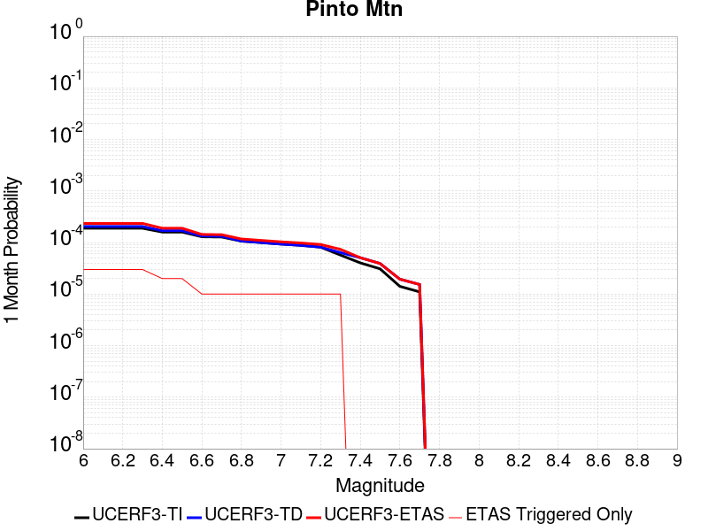 |  |  |

| Magnitude | 1 wk TI Prob | 1 wk TD Prob | 1 wk ETAS Prob | 1 wk ETAS/TD Gain | 1 wk ETAS Triggered Only | 1 mo TI Prob | 1 mo TD Prob | 1 mo ETAS Prob | 1 mo ETAS/TD Gain | 1 mo ETAS Triggered Only | 1 yr TI Prob | 1 yr TD Prob | 1 yr ETAS Prob | 1 yr ETAS/TD Gain | 1 yr ETAS Triggered Only | 10 yr TI Prob | 10 yr TD Prob | 10 yr ETAS Prob | 10 yr ETAS/TD Gain | 10 yr ETAS Triggered Only |
|-----|-----|-----|-----|-----|-----|-----|-----|-----|-----|-----|-----|-----|-----|-----|-----|-----|-----|-----|-----|-----|
| 6.0 | 4.4194956E-5 | 4.785362E-5 | 7.871634E-5 | 1.6449401 | 3.0864197E-5 | 1.893932E-4 | 2.0507174E-4 | 2.3592962E-4 | 1.1504735 | 3.0864197E-5 | 0.0023034236 | 0.0024940541 | 0.0025248413 | 1.0123442 | 3.0864197E-5 | 0.022796938 | 0.024678145 | 0.024708247 | 1.0012197 | 3.0864197E-5 |
| 6.1 | 4.4194956E-5 | 4.785362E-5 | 7.871634E-5 | 1.6449401 | 3.0864197E-5 | 1.893932E-4 | 2.0507174E-4 | 2.3592962E-4 | 1.1504735 | 3.0864197E-5 | 0.0023034236 | 0.0024940541 | 0.0025248413 | 1.0123442 | 3.0864197E-5 | 0.022796938 | 0.024678145 | 0.024708247 | 1.0012197 | 3.0864197E-5 |
| 6.2 | 4.4194956E-5 | 4.785362E-5 | 7.871634E-5 | 1.6449401 | 3.0864197E-5 | 1.893932E-4 | 2.0507174E-4 | 2.3592962E-4 | 1.1504735 | 3.0864197E-5 | 0.0023034236 | 0.0024940541 | 0.0025248413 | 1.0123442 | 3.0864197E-5 | 0.022796938 | 0.024678145 | 0.024708247 | 1.0012197 | 3.0864197E-5 |
| 6.3 | 4.4194956E-5 | 4.785362E-5 | 7.871634E-5 | 1.6449401 | 3.0864197E-5 | 1.893932E-4 | 2.0507174E-4 | 2.3592962E-4 | 1.1504735 | 3.0864197E-5 | 0.0023034236 | 0.0024940541 | 0.0025248413 | 1.0123442 | 3.0864197E-5 | 0.022796938 | 0.024678145 | 0.024708247 | 1.0012197 | 3.0864197E-5 |
| 6.4 | 3.729929E-5 | 3.9603186E-5 | 3.9603186E-5 | 1.0 | 0.0 | 1.5984432E-4 | 1.6971743E-4 | 1.6971743E-4 | 1.0 | 0.0 | 0.0019443673 | 0.002064445 | 0.002064445 | 1.0 | 0.0 | 0.019274427 | 0.02046269 | 0.02046269 | 1.0 | 0.0 |
| 6.5 | 3.729929E-5 | 3.9603186E-5 | 3.9603186E-5 | 1.0 | 0.0 | 1.5984432E-4 | 1.6971743E-4 | 1.6971743E-4 | 1.0 | 0.0 | 0.0019443673 | 0.002064445 | 0.002064445 | 1.0 | 0.0 | 0.019274427 | 0.02046269 | 0.02046269 | 1.0 | 0.0 |
| 6.6 | 3.0204548E-5 | 3.1205298E-5 | 3.1205298E-5 | 1.0 | 0.0 | 1.2944164E-4 | 1.3373033E-4 | 1.3373033E-4 | 1.0 | 0.0 | 0.0015748127 | 0.0016269855 | 0.0016269855 | 1.0 | 0.0 | 0.015636992 | 0.01615461 | 0.01615461 | 1.0 | 0.0 |
| 6.7 | 2.9857754E-5 | 3.081468E-5 | 3.081468E-5 | 1.0 | 0.0 | 1.2795553E-4 | 1.3205643E-4 | 1.3205643E-4 | 1.0 | 0.0 | 0.0015567453 | 0.001606636 | 0.001606636 | 1.0 | 0.0 | 0.015458848 | 0.01595405 | 0.01595405 | 1.0 | 0.0 |
| 6.8 | 2.4819734E-5 | 2.5009364E-5 | 2.5009364E-5 | 1.0 | 0.0 | 1.0636595E-4 | 1.07178705E-4 | 1.07178705E-4 | 1.0 | 0.0 | 0.0012942362 | 0.0013041412 | 0.0013041412 | 1.0 | 0.0 | 0.012867244 | 0.0129672475 | 0.0129672475 | 1.0 | 0.0 |
| 6.9 | 2.331124E-5 | 2.3337643E-5 | 2.3337643E-5 | 1.0 | 0.0 | 9.990149E-5 | 1.00014746E-4 | 1.00014746E-4 | 1.0 | 0.0 | 0.001215622 | 0.0012170197 | 0.0012170197 | 1.0 | 0.0 | 0.012089936 | 0.012105742 | 0.012105742 | 1.0 | 0.0 |
| 7.0 | 2.1818534E-5 | 2.1760772E-5 | 2.1760772E-5 | 1.0 | 0.0 | 9.3504656E-5 | 9.325723E-5 | 9.325723E-5 | 1.0 | 0.0 | 0.0011378246 | 0.0011348352 | 0.0011348352 | 1.0 | 0.0 | 0.011320163 | 0.011292503 | 0.011292503 | 1.0 | 0.0 |
| 7.1 | 2.066081E-5 | 2.0540418E-5 | 2.0540418E-5 | 1.0 | 0.0 | 8.854332E-5 | 8.8027504E-5 | 8.8027504E-5 | 1.0 | 0.0 | 0.0010774818 | 0.0010712275 | 0.0010712275 | 1.0 | 0.0 | 0.010722724 | 0.010662688 | 0.010662688 | 1.0 | 0.0 |
| 7.2 | 1.8990233E-5 | 1.9053701E-5 | 1.9053701E-5 | 1.0 | 0.0 | 8.138417E-5 | 8.1656275E-5 | 8.1656275E-5 | 1.0 | 0.0 | 9.904018E-4 | 9.937311E-4 | 9.937311E-4 | 1.0 | 0.0 | 0.009859995 | 0.009894874 | 0.009894874 | 1.0 | 0.0 |
| 7.3 | 1.3335872E-5 | 1.4906372E-5 | 1.4906372E-5 | 1.0 | 0.0 | 5.7152483E-5 | 6.388296E-5 | 6.388296E-5 | 1.0 | 0.0 | 6.956093E-4 | 7.775102E-4 | 7.775102E-4 | 1.0 | 0.0 | 0.006934359 | 0.0077491994 | 0.0077491994 | 1.0 | 0.0 |
| 7.4 | 9.414066E-6 | 1.186061E-5 | 1.186061E-5 | 1.0 | 0.0 | 4.0345374E-5 | 5.0830247E-5 | 5.0830247E-5 | 1.0 | 0.0 | 4.910942E-4 | 6.1869196E-4 | 6.1869196E-4 | 1.0 | 0.0 | 0.0049001034 | 0.006170644 | 0.006170644 | 1.0 | 0.0 |
| 7.5 | 7.2101157E-6 | 9.157893E-6 | 9.157893E-6 | 1.0 | 0.0 | 3.090013E-5 | 3.924757E-5 | 3.924757E-5 | 1.0 | 0.0 | 3.7614413E-4 | 4.7774217E-4 | 4.7774217E-4 | 1.0 | 0.0 | 0.0037550807 | 0.004767927 | 0.004767927 | 1.0 | 0.0 |
| 7.6 | 3.296375E-6 | 4.5453176E-6 | 4.5453176E-6 | 1.0 | 0.0 | 1.4127245E-5 | 1.9479796E-5 | 1.9479796E-5 | 1.0 | 0.0 | 1.7198564E-4 | 2.3714209E-4 | 2.3714209E-4 | 1.0 | 0.0 | 0.0017185259 | 0.0023690276 | 0.0023690276 | 1.0 | 0.0 |
| 7.7 | 2.5741092E-6 | 3.584251E-6 | 3.584251E-6 | 1.0 | 0.0 | 1.103185E-5 | 1.5360993E-5 | 1.5360993E-5 | 1.0 | 0.0 | 1.3430449E-4 | 1.8700535E-4 | 1.8700535E-4 | 1.0 | 0.0 | 0.0013422335 | 0.0018686098 | 0.0018686098 | 1.0 | 0.0 |

## Rose Canyon
*[(top)](#table-of-contents)*

| 1 Week | 1 Month | 1 Year | 10 Year |
|-----|-----|-----|-----|
|  |  |  |  |

| Magnitude | 1 wk TI Prob | 1 wk TD Prob | 1 wk ETAS Prob | 1 wk ETAS/TD Gain | 1 wk ETAS Triggered Only | 1 mo TI Prob | 1 mo TD Prob | 1 mo ETAS Prob | 1 mo ETAS/TD Gain | 1 mo ETAS Triggered Only | 1 yr TI Prob | 1 yr TD Prob | 1 yr ETAS Prob | 1 yr ETAS/TD Gain | 1 yr ETAS Triggered Only | 10 yr TI Prob | 10 yr TD Prob | 10 yr ETAS Prob | 10 yr ETAS/TD Gain | 10 yr ETAS Triggered Only |
|-----|-----|-----|-----|-----|-----|-----|-----|-----|-----|-----|-----|-----|-----|-----|-----|-----|-----|-----|-----|-----|
| 6.0 | 4.5923203E-5 | 4.9714225E-5 | 8.057689E-5 | 1.6208014 | 3.0864197E-5 | 1.9679888E-4 | 2.1304491E-4 | 2.4390254E-4 | 1.144841 | 3.0864197E-5 | 0.0023933933 | 0.0025909345 | 0.0026217187 | 1.0118815 | 3.0864197E-5 | 0.023677798 | 0.02563999 | 0.025670063 | 1.0011729 | 3.0864197E-5 |
| 6.1 | 4.5923203E-5 | 4.9714225E-5 | 8.057689E-5 | 1.6208014 | 3.0864197E-5 | 1.9679888E-4 | 2.1304491E-4 | 2.4390254E-4 | 1.144841 | 3.0864197E-5 | 0.0023933933 | 0.0025909345 | 0.0026217187 | 1.0118815 | 3.0864197E-5 | 0.023677798 | 0.02563999 | 0.025670063 | 1.0011729 | 3.0864197E-5 |
| 6.2 | 2.8844734E-5 | 2.9668723E-5 | 2.9668723E-5 | 1.0 | 0.0 | 1.2361443E-4 | 1.2714567E-4 | 1.2714567E-4 | 1.0 | 0.0 | 0.0015039665 | 0.0015468939 | 0.0015468939 | 1.0 | 0.0 | 0.0149382865 | 0.015374276 | 0.015374276 | 1.0 | 0.0 |
| 6.3 | 2.3171577E-5 | 2.3161238E-5 | 2.3161238E-5 | 1.0 | 0.0 | 9.9302975E-5 | 9.9258745E-5 | 9.9258745E-5 | 1.0 | 0.0 | 0.0012083431 | 0.0012078186 | 0.0012078186 | 1.0 | 0.0 | 0.012017938 | 0.012022437 | 0.012022437 | 1.0 | 0.0 |
| 6.4 | 2.0066604E-5 | 1.9667024E-5 | 1.9667024E-5 | 1.0 | 0.0 | 8.599689E-5 | 8.4284584E-5 | 8.4284584E-5 | 1.0 | 0.0 | 0.0010465092 | 0.0010256917 | 0.0010256917 | 1.0 | 0.0 | 0.010415946 | 0.010217559 | 0.010217559 | 1.0 | 0.0 |
| 6.5 | 1.776989E-5 | 1.7113807E-5 | 1.7113807E-5 | 1.0 | 0.0 | 7.615444E-5 | 7.334287E-5 | 7.334287E-5 | 1.0 | 0.0 | 9.267859E-4 | 8.925905E-4 | 8.925905E-4 | 1.0 | 0.0 | 0.009229303 | 0.008896211 | 0.008896211 | 1.0 | 0.0 |
| 6.6 | 1.5227364E-5 | 1.433926E-5 | 1.433926E-5 | 1.0 | 0.0 | 6.52585E-5 | 6.1452556E-5 | 6.1452556E-5 | 1.0 | 0.0 | 7.942326E-4 | 7.479332E-4 | 7.479332E-4 | 1.0 | 0.0 | 0.007914 | 0.007458359 | 0.007458359 | 1.0 | 0.0 |
| 6.7 | 1.2703898E-5 | 1.1673274E-5 | 1.1673274E-5 | 1.0 | 0.0 | 5.4444143E-5 | 5.0027378E-5 | 5.0027378E-5 | 1.0 | 0.0 | 6.626558E-4 | 6.089174E-4 | 6.089174E-4 | 1.0 | 0.0 | 0.006606833 | 0.0060750856 | 0.0060750856 | 1.0 | 0.0 |
| 6.8 | 1.1554917E-5 | 1.0609337E-5 | 1.0609337E-5 | 1.0 | 0.0 | 4.9520135E-5 | 4.546782E-5 | 4.546782E-5 | 1.0 | 0.0 | 6.0274085E-4 | 5.5343413E-4 | 5.5343413E-4 | 1.0 | 0.0 | 0.0060110865 | 0.0055225673 | 0.0055225673 | 1.0 | 0.0 |
| 6.9 | 8.732078E-6 | 7.881357E-6 | 7.881357E-6 | 1.0 | 0.0 | 3.7422655E-5 | 3.3776825E-5 | 3.3776825E-5 | 1.0 | 0.0 | 4.5552556E-4 | 4.111582E-4 | 4.111582E-4 | 1.0 | 0.0 | 0.0045459294 | 0.0041048084 | 0.0041048084 | 1.0 | 0.0 |
| 7.0 | 5.9337494E-6 | 5.1074853E-6 | 5.1074853E-6 | 1.0 | 0.0 | 2.5430107E-5 | 2.188904E-5 | 2.188904E-5 | 1.0 | 0.0 | 3.0956755E-4 | 2.664666E-4 | 2.664666E-4 | 1.0 | 0.0 | 0.0030913667 | 0.0026614866 | 0.0026614866 | 1.0 | 0.0 |
| 7.1 | 5.013409E-6 | 4.1773833E-6 | 4.1773833E-6 | 1.0 | 0.0 | 2.1485863E-5 | 1.7902948E-5 | 1.7902948E-5 | 1.0 | 0.0 | 2.6155898E-4 | 2.179467E-4 | 2.179467E-4 | 1.0 | 0.0 | 0.0026125133 | 0.0021773411 | 0.0021773411 | 1.0 | 0.0 |
| 7.2 | 4.120763E-6 | 3.2821383E-6 | 3.2821383E-6 | 1.0 | 0.0 | 1.7660293E-5 | 1.4066231E-5 | 1.4066231E-5 | 1.0 | 0.0 | 2.1499286E-4 | 1.7124301E-4 | 1.7124301E-4 | 1.0 | 0.0 | 0.0021478499 | 0.00171112 | 0.00171112 | 1.0 | 0.0 |
| 7.3 | 3.2081239E-6 | 2.4405372E-6 | 2.4405372E-6 | 1.0 | 0.0 | 1.374903E-5 | 1.0459404E-5 | 1.0459404E-5 | 1.0 | 0.0 | 1.6738157E-4 | 1.2733586E-4 | 1.2733586E-4 | 1.0 | 0.0 | 0.0016725556 | 0.001272636 | 0.001272636 | 1.0 | 0.0 |
| 7.4 | 2.4194755E-6 | 1.7680634E-6 | 1.7680634E-6 | 1.0 | 0.0 | 1.0369139E-5 | 7.577393E-6 | 7.577393E-6 | 1.0 | 0.0 | 1.2623696E-4 | 9.2250906E-5 | 9.2250906E-5 | 1.0 | 0.0 | 0.0012616527 | 9.2213147E-4 | 9.2213147E-4 | 1.0 | 0.0 |
| 7.5 | 1.3842889E-6 | 9.3786275E-7 | 9.3786275E-7 | 1.0 | 0.0 | 5.9326535E-6 | 4.019406E-6 | 4.019406E-6 | 1.0 | 0.0 | 7.222766E-5 | 4.8935202E-5 | 4.8935202E-5 | 1.0 | 0.0 | 7.220419E-4 | 4.892478E-4 | 4.892478E-4 | 1.0 | 0.0 |
| 7.6 | 1.0021575E-6 | 6.411463E-7 | 6.411463E-7 | 1.0 | 0.0 | 4.2949537E-6 | 2.7477672E-6 | 2.7477672E-6 | 1.0 | 0.0 | 5.2289808E-5 | 3.3453573E-5 | 3.3453573E-5 | 1.0 | 0.0 | 5.2277505E-4 | 3.344875E-4 | 3.344875E-4 | 1.0 | 0.0 |
| 7.7 | 8.7620116E-8 | 6.4492404E-8 | 6.4492404E-8 | 1.0 | 0.0 | 3.7551473E-7 | 2.76396E-7 | 2.76396E-7 | 1.0 | 0.0 | 4.5718825E-6 | 3.3651165E-6 | 3.3651165E-6 | 1.0 | 0.0 | 4.5717883E-5 | 3.3650686E-5 | 3.3650686E-5 | 1.0 | 0.0 |

## Great Valley 10 (Panoche)
*[(top)](#table-of-contents)*

| 1 Week | 1 Month | 1 Year | 10 Year |
|-----|-----|-----|-----|
|  |  |  |  |

| Magnitude | 1 wk TI Prob | 1 wk TD Prob | 1 wk ETAS Prob | 1 wk ETAS/TD Gain | 1 wk ETAS Triggered Only | 1 mo TI Prob | 1 mo TD Prob | 1 mo ETAS Prob | 1 mo ETAS/TD Gain | 1 mo ETAS Triggered Only | 1 yr TI Prob | 1 yr TD Prob | 1 yr ETAS Prob | 1 yr ETAS/TD Gain | 1 yr ETAS Triggered Only | 10 yr TI Prob | 10 yr TD Prob | 10 yr ETAS Prob | 10 yr ETAS/TD Gain | 10 yr ETAS Triggered Only |
|-----|-----|-----|-----|-----|-----|-----|-----|-----|-----|-----|-----|-----|-----|-----|-----|-----|-----|-----|-----|-----|
| 6.0 | 1.6014626E-5 | 1.6575399E-5 | 4.7439084E-5 | 2.8620176 | 3.0864197E-5 | 6.863231E-5 | 7.103552E-5 | 1.0189753E-4 | 1.4344587 | 3.0864197E-5 | 8.35278E-4 | 8.645185E-4 | 8.95356E-4 | 1.0356702 | 3.0864197E-5 | 0.008321454 | 0.008612172 | 0.00864277 | 1.0035529 | 3.0864197E-5 |
| 6.1 | 1.6014626E-5 | 1.6575399E-5 | 4.7439084E-5 | 2.8620176 | 3.0864197E-5 | 6.863231E-5 | 7.103552E-5 | 1.0189753E-4 | 1.4344587 | 3.0864197E-5 | 8.35278E-4 | 8.645185E-4 | 8.95356E-4 | 1.0356702 | 3.0864197E-5 | 0.008321454 | 0.008612172 | 0.00864277 | 1.0035529 | 3.0864197E-5 |
| 6.2 | 1.56782E-5 | 1.6198446E-5 | 4.7062145E-5 | 2.9053493 | 3.0864197E-5 | 6.719056E-5 | 6.94201E-5 | 1.0028215E-4 | 1.4445695 | 3.0864197E-5 | 8.17738E-4 | 8.4486604E-4 | 8.7570417E-4 | 1.0365006 | 3.0864197E-5 | 0.008147354 | 0.008417147 | 0.008447751 | 1.003636 | 3.0864197E-5 |
| 6.3 | 1.5263338E-5 | 1.5723514E-5 | 4.6587225E-5 | 2.9629016 | 3.0864197E-5 | 6.541267E-5 | 6.738478E-5 | 9.82469E-5 | 1.4579983 | 3.0864197E-5 | 7.961082E-4 | 8.201049E-4 | 8.509438E-4 | 1.0376036 | 3.0864197E-5 | 0.007932622 | 0.008171377 | 0.008201988 | 1.0037463 | 3.0864197E-5 |
| 6.4 | 1.4720723E-5 | 1.5099376E-5 | 4.596311E-5 | 3.0440402 | 3.0864197E-5 | 6.308728E-5 | 6.471004E-5 | 9.5572235E-5 | 1.4769306 | 3.0864197E-5 | 7.67817E-4 | 7.8756385E-4 | 8.184037E-4 | 1.0391586 | 3.0864197E-5 | 0.007651695 | 0.007848303 | 0.007878925 | 1.0039017 | 3.0864197E-5 |
| 6.5 | 1.408264E-5 | 1.4355969E-5 | 4.5219724E-5 | 3.14989 | 3.0864197E-5 | 6.0352773E-5 | 6.1524166E-5 | 9.2386465E-5 | 1.5016289 | 3.0864197E-5 | 7.3454727E-4 | 7.488031E-4 | 7.796442E-4 | 1.0411872 | 3.0864197E-5 | 0.0073212404 | 0.0074633555 | 0.0074939895 | 1.0041046 | 3.0864197E-5 |
| 6.6 | 1.3197086E-5 | 1.3321889E-5 | 4.4185676E-5 | 3.3167725 | 3.0864197E-5 | 5.6557717E-5 | 5.709259E-5 | 8.795503E-5 | 1.5405681 | 3.0864197E-5 | 6.8837265E-4 | 6.9488434E-4 | 7.2572706E-4 | 1.0443854 | 3.0864197E-5 | 0.006862442 | 0.0069276537 | 0.006958304 | 1.0044243 | 3.0864197E-5 |
| 6.7 | 1.017583E-5 | 9.745382E-6 | 4.060928E-5 | 4.167028 | 3.0864197E-5 | 4.360997E-5 | 4.176527E-5 | 7.262818E-5 | 1.7389611 | 3.0864197E-5 | 5.30822E-4 | 5.0837593E-4 | 5.392244E-4 | 1.0606805 | 3.0864197E-5 | 0.0052955584 | 0.005072382 | 0.0051030894 | 1.0060539 | 3.0864197E-5 |
| 6.8 | 8.557912E-6 | 7.872707E-6 | 3.8736664E-5 | 4.9203734 | 3.0864197E-5 | 3.667625E-5 | 3.373975E-5 | 6.460291E-5 | 1.9147418 | 3.0864197E-5 | 4.4644187E-4 | 4.1070607E-4 | 4.4155758E-4 | 1.0751183 | 3.0864197E-5 | 0.0044554602 | 0.004099677 | 0.0041304147 | 1.0074975 | 3.0864197E-5 |
| 6.9 | 6.14664E-6 | 5.092071E-6 | 5.092071E-6 | 1.0 | 0.0 | 2.6342475E-5 | 2.1822989E-5 | 2.1822989E-5 | 1.0 | 0.0 | 3.2067244E-4 | 2.6566387E-4 | 2.6566387E-4 | 1.0 | 0.0 | 0.003202101 | 0.002653601 | 0.002653601 | 1.0 | 0.0 |
| 7.0 | 3.2310581E-6 | 1.6951219E-6 | 1.6951219E-6 | 1.0 | 0.0 | 1.3847319E-5 | 7.264788E-6 | 7.264788E-6 | 1.0 | 0.0 | 1.6857806E-4 | 8.8445304E-5 | 8.8445304E-5 | 1.0 | 0.0 | 0.0016845023 | 8.841104E-4 | 8.841104E-4 | 1.0 | 0.0 |
| 7.1 | 2.544492E-6 | 9.1889206E-7 | 9.1889206E-7 | 1.0 | 0.0 | 1.090492E-5 | 3.938103E-6 | 3.938103E-6 | 1.0 | 0.0 | 1.327593E-4 | 4.79454E-5 | 4.79454E-5 | 1.0 | 0.0 | 0.0013268003 | 4.793553E-4 | 4.793553E-4 | 1.0 | 0.0 |
| 7.2 | 2.4479045E-6 | 8.841304E-7 | 8.841304E-7 | 1.0 | 0.0 | 1.0490977E-5 | 3.789125E-6 | 3.789125E-6 | 1.0 | 0.0 | 1.2772017E-4 | 4.6131667E-5 | 4.6131667E-5 | 1.0 | 0.0 | 0.0012764678 | 4.6122566E-4 | 4.6122566E-4 | 1.0 | 0.0 |
| 7.3 | 2.0559578E-6 | 7.892787E-7 | 7.892787E-7 | 1.0 | 0.0 | 8.811218E-6 | 3.3826188E-6 | 3.3826188E-6 | 1.0 | 0.0 | 1.072713E-4 | 4.1182655E-5 | 4.1182655E-5 | 1.0 | 0.0 | 0.0010721954 | 4.1175485E-4 | 4.1175485E-4 | 1.0 | 0.0 |
| 7.4 | 1.727687E-6 | 7.387757E-7 | 7.387757E-7 | 1.0 | 0.0 | 7.404352E-6 | 3.1661782E-6 | 3.1661782E-6 | 1.0 | 0.0 | 9.0144255E-5 | 3.8547583E-5 | 3.8547583E-5 | 1.0 | 0.0 | 9.0107694E-4 | 3.854136E-4 | 3.854136E-4 | 1.0 | 0.0 |
| 7.5 | 1.5002679E-6 | 6.546144E-7 | 6.546144E-7 | 1.0 | 0.0 | 6.4297037E-6 | 2.8054874E-6 | 2.8054874E-6 | 1.0 | 0.0 | 7.827883E-5 | 3.4156317E-5 | 3.4156317E-5 | 1.0 | 0.0 | 7.825126E-4 | 3.4151482E-4 | 3.4151482E-4 | 1.0 | 0.0 |

## Big Pine (West)
*[(top)](#table-of-contents)*

| 1 Week | 1 Month | 1 Year | 10 Year |
|-----|-----|-----|-----|
|  | 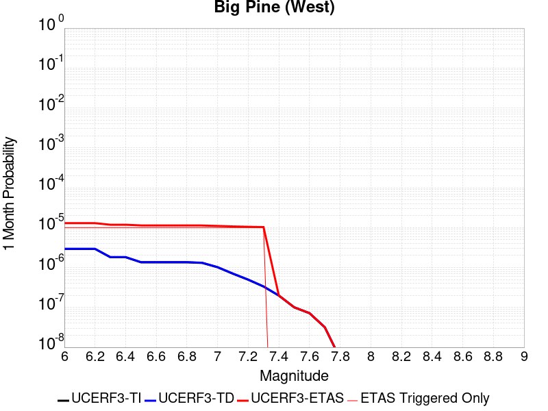 |  |  |

| Magnitude | 1 wk TI Prob | 1 wk TD Prob | 1 wk ETAS Prob | 1 wk ETAS/TD Gain | 1 wk ETAS Triggered Only | 1 mo TI Prob | 1 mo TD Prob | 1 mo ETAS Prob | 1 mo ETAS/TD Gain | 1 mo ETAS Triggered Only | 1 yr TI Prob | 1 yr TD Prob | 1 yr ETAS Prob | 1 yr ETAS/TD Gain | 1 yr ETAS Triggered Only | 10 yr TI Prob | 10 yr TD Prob | 10 yr ETAS Prob | 10 yr ETAS/TD Gain | 10 yr ETAS Triggered Only |
|-----|-----|-----|-----|-----|-----|-----|-----|-----|-----|-----|-----|-----|-----|-----|-----|-----|-----|-----|-----|-----|
| 6.0 | 6.8306974E-7 | 6.8818304E-7 | 3.1552358E-5 | 45.84879 | 3.0864197E-5 | 2.9274386E-6 | 2.949353E-6 | 3.381346E-5 | 11.4647045 | 3.0864197E-5 | 3.564098E-5 | 3.5907877E-5 | 6.677097E-5 | 1.8595074 | 3.0864197E-5 | 3.5635266E-4 | 3.5903015E-4 | 3.8988327E-4 | 1.0859346 | 3.0864197E-5 |
| 6.1 | 6.8306974E-7 | 6.8818304E-7 | 3.1552358E-5 | 45.84879 | 3.0864197E-5 | 2.9274386E-6 | 2.949353E-6 | 3.381346E-5 | 11.4647045 | 3.0864197E-5 | 3.564098E-5 | 3.5907877E-5 | 6.677097E-5 | 1.8595074 | 3.0864197E-5 | 3.5635266E-4 | 3.5903015E-4 | 3.8988327E-4 | 1.0859346 | 3.0864197E-5 |
| 6.2 | 6.8306974E-7 | 6.8818304E-7 | 3.1552358E-5 | 45.84879 | 3.0864197E-5 | 2.9274386E-6 | 2.949353E-6 | 3.381346E-5 | 11.4647045 | 3.0864197E-5 | 3.564098E-5 | 3.5907877E-5 | 6.677097E-5 | 1.8595074 | 3.0864197E-5 | 3.5635266E-4 | 3.5903015E-4 | 3.8988327E-4 | 1.0859346 | 3.0864197E-5 |
| 6.3 | 4.227652E-7 | 4.2665604E-7 | 3.129084E-5 | 73.33974 | 3.0864197E-5 | 1.8118495E-6 | 1.8285248E-6 | 3.2692667E-5 | 17.87926 | 3.0864197E-5 | 2.2059045E-5 | 2.226208E-5 | 5.312559E-5 | 2.3863714 | 3.0864197E-5 | 2.2056856E-4 | 2.2260031E-4 | 2.5345763E-4 | 1.1386222 | 3.0864197E-5 |
| 6.4 | 4.227652E-7 | 4.2665604E-7 | 3.129084E-5 | 73.33974 | 3.0864197E-5 | 1.8118495E-6 | 1.8285248E-6 | 3.2692667E-5 | 17.87926 | 3.0864197E-5 | 2.2059045E-5 | 2.226208E-5 | 5.312559E-5 | 2.3863714 | 3.0864197E-5 | 2.2056856E-4 | 2.2260031E-4 | 2.5345763E-4 | 1.1386222 | 3.0864197E-5 |
| 6.5 | 3.1538403E-7 | 3.1884528E-7 | 3.1183034E-5 | 97.79989 | 3.0864197E-5 | 1.3516451E-6 | 1.3664791E-6 | 3.2230633E-5 | 23.58663 | 3.0864197E-5 | 1.6456155E-5 | 1.6636759E-5 | 4.750044E-5 | 2.85515 | 3.0864197E-5 | 1.6454936E-4 | 1.6635554E-4 | 1.972146E-4 | 1.1855006 | 3.0864197E-5 |
| 6.6 | 3.1538403E-7 | 3.1884528E-7 | 3.1183034E-5 | 97.79989 | 3.0864197E-5 | 1.3516451E-6 | 1.3664791E-6 | 3.2230633E-5 | 23.58663 | 3.0864197E-5 | 1.6456155E-5 | 1.6636759E-5 | 4.750044E-5 | 2.85515 | 3.0864197E-5 | 1.6454936E-4 | 1.6635554E-4 | 1.972146E-4 | 1.1855006 | 3.0864197E-5 |
| 6.7 | 3.1538403E-7 | 3.1884528E-7 | 3.1183034E-5 | 97.79989 | 3.0864197E-5 | 1.3516451E-6 | 1.3664791E-6 | 3.2230633E-5 | 23.58663 | 3.0864197E-5 | 1.6456155E-5 | 1.6636759E-5 | 4.750044E-5 | 2.85515 | 3.0864197E-5 | 1.6454936E-4 | 1.6635554E-4 | 1.972146E-4 | 1.1855006 | 3.0864197E-5 |
| 6.8 | 3.1538403E-7 | 3.1884528E-7 | 3.1183034E-5 | 97.79989 | 3.0864197E-5 | 1.3516451E-6 | 1.3664791E-6 | 3.2230633E-5 | 23.58663 | 3.0864197E-5 | 1.6456155E-5 | 1.6636759E-5 | 4.750044E-5 | 2.85515 | 3.0864197E-5 | 1.6454936E-4 | 1.6635554E-4 | 1.972146E-4 | 1.1855006 | 3.0864197E-5 |
| 6.9 | 3.0402092E-7 | 3.0739798E-7 | 3.1171585E-5 | 101.404655 | 3.0864197E-5 | 1.3029462E-6 | 1.3174192E-6 | 3.2181575E-5 | 24.42774 | 3.0864197E-5 | 1.5863254E-5 | 1.6039465E-5 | 4.690317E-5 | 2.924235 | 3.0864197E-5 | 1.5862122E-4 | 1.6038347E-4 | 1.9124271E-4 | 1.1924092 | 3.0864197E-5 |
| 7.0 | 2.3673063E-7 | 2.3944315E-7 | 3.1103635E-5 | 129.89987 | 3.0864197E-5 | 1.0145594E-6 | 1.0261845E-6 | 3.189035E-5 | 31.076624 | 3.0864197E-5 | 1.235219E-5 | 1.2493728E-5 | 4.335754E-5 | 3.4703445 | 3.0864197E-5 | 1.2351504E-4 | 1.2493054E-4 | 1.5579087E-4 | 1.24702 | 3.0864197E-5 |
| 7.1 | 1.632138E-7 | 1.6514511E-7 | 3.1029336E-5 | 187.89134 | 3.0864197E-5 | 6.9948754E-7 | 7.0776457E-7 | 3.157194E-5 | 44.607967 | 3.0864197E-5 | 8.516227E-6 | 8.617002E-6 | 3.9480932E-5 | 4.5817485 | 3.0864197E-5 | 8.5159016E-5 | 8.616685E-5 | 1.1702839E-4 | 1.3581603 | 3.0864197E-5 |
| 7.2 | 1.1523723E-7 | 1.1657165E-7 | 3.0980766E-5 | 265.76587 | 3.0864197E-5 | 4.9387376E-7 | 4.9959266E-7 | 3.1363776E-5 | 62.77869 | 3.0864197E-5 | 6.0128964E-6 | 6.082525E-6 | 3.6946534E-5 | 6.07421 | 3.0864197E-5 | 6.0127335E-5 | 6.0823695E-5 | 9.1686015E-5 | 1.5074062 | 3.0864197E-5 |
| 7.3 | 7.777805E-8 | 7.862446E-8 | 3.0942818E-5 | 393.5521 | 3.0864197E-5 | 3.3333444E-7 | 3.3696193E-7 | 3.120115E-5 | 92.595474 | 3.0864197E-5 | 4.0583395E-6 | 4.102504E-6 | 3.4966575E-5 | 8.523227 | 3.0864197E-5 | 4.0582654E-5 | 4.102434E-5 | 7.1887276E-5 | 1.7523078 | 3.0864197E-5 |
| 7.4 | 4.609946E-8 | 4.6522135E-8 | 4.6522135E-8 | 1.0 | 0.0 | 1.975691E-7 | 1.9938055E-7 | 1.9938055E-7 | 1.0 | 0.0 | 2.4054011E-6 | 2.4274557E-6 | 2.4274557E-6 | 1.0 | 0.0 | 2.405375E-5 | 2.427431E-5 | 2.427431E-5 | 1.0 | 0.0 |
| 7.5 | 2.3439137E-8 | 2.3608283E-8 | 2.3608283E-8 | 1.0 | 0.0 | 1.00453434E-7 | 1.0117836E-7 | 1.0117836E-7 | 1.0 | 0.0 | 1.2230199E-6 | 1.2318458E-6 | 1.2318458E-6 | 1.0 | 0.0 | 1.2230132E-5 | 1.2318393E-5 | 1.2318393E-5 | 1.0 | 0.0 |
| 7.6 | 1.6699769E-8 | 1.6817072E-8 | 1.6817072E-8 | 1.0 | 0.0 | 7.157044E-8 | 7.207316E-8 | 7.207316E-8 | 1.0 | 0.0 | 8.713697E-7 | 8.7749044E-7 | 8.7749044E-7 | 1.0 | 0.0 | 8.713663E-6 | 8.774871E-6 | 8.774871E-6 | 1.0 | 0.0 |
| 7.7 | 7.4061512E-9 | 7.4541635E-9 | 7.4541635E-9 | 1.0 | 0.0 | 3.1740647E-8 | 3.1946417E-8 | 3.1946417E-8 | 1.0 | 0.0 | 3.864423E-7 | 3.8894754E-7 | 3.8894754E-7 | 1.0 | 0.0 | 3.8644166E-6 | 3.8894696E-6 | 3.8894696E-6 | 1.0 | 0.0 |
| 7.8 | 1.2189427E-9 | 1.2270763E-9 | 1.2270763E-9 | 1.0 | 0.0 | 5.2240403E-9 | 5.258898E-9 | 5.258898E-9 | 1.0 | 0.0 | 6.3602684E-8 | 6.4027084E-8 | 6.4027084E-8 | 1.0 | 0.0 | 6.360267E-7 | 6.4027074E-7 | 6.4027074E-7 | 1.0 | 0.0 |

## San Pedro Basin
*[(top)](#table-of-contents)*

| 1 Week | 1 Month | 1 Year | 10 Year |
|-----|-----|-----|-----|
|  |  |  |  |

| Magnitude | 1 wk TI Prob | 1 wk TD Prob | 1 wk ETAS Prob | 1 wk ETAS/TD Gain | 1 wk ETAS Triggered Only | 1 mo TI Prob | 1 mo TD Prob | 1 mo ETAS Prob | 1 mo ETAS/TD Gain | 1 mo ETAS Triggered Only | 1 yr TI Prob | 1 yr TD Prob | 1 yr ETAS Prob | 1 yr ETAS/TD Gain | 1 yr ETAS Triggered Only | 10 yr TI Prob | 10 yr TD Prob | 10 yr ETAS Prob | 10 yr ETAS/TD Gain | 10 yr ETAS Triggered Only |
|-----|-----|-----|-----|-----|-----|-----|-----|-----|-----|-----|-----|-----|-----|-----|-----|-----|-----|-----|-----|-----|
| 6.0 | 5.3449043E-5 | 6.336954E-5 | 9.423178E-5 | 1.4870201 | 3.0864197E-5 | 2.2904722E-4 | 2.715589E-4 | 3.0241473E-4 | 1.1136248 | 3.0864197E-5 | 0.0027850836 | 0.0033018254 | 0.0033325877 | 1.0093168 | 3.0864197E-5 | 0.027504366 | 0.03258945 | 0.03261931 | 1.0009162 | 3.0864197E-5 |
| 6.1 | 5.3449043E-5 | 6.336954E-5 | 9.423178E-5 | 1.4870201 | 3.0864197E-5 | 2.2904722E-4 | 2.715589E-4 | 3.0241473E-4 | 1.1136248 | 3.0864197E-5 | 0.0027850836 | 0.0033018254 | 0.0033325877 | 1.0093168 | 3.0864197E-5 | 0.027504366 | 0.03258945 | 0.03261931 | 1.0009162 | 3.0864197E-5 |
| 6.2 | 2.3189454E-5 | 2.6642796E-5 | 5.750617E-5 | 2.1584134 | 3.0864197E-5 | 9.9379584E-5 | 1.14178685E-4 | 1.4503936E-4 | 1.270284 | 3.0864197E-5 | 0.0012092749 | 0.0013892864 | 0.0014201077 | 1.022185 | 3.0864197E-5 | 0.012027155 | 0.013810883 | 0.013841322 | 1.002204 | 3.0864197E-5 |
| 6.3 | 2.3189454E-5 | 2.6642796E-5 | 5.750617E-5 | 2.1584134 | 3.0864197E-5 | 9.9379584E-5 | 1.14178685E-4 | 1.4503936E-4 | 1.270284 | 3.0864197E-5 | 0.0012092749 | 0.0013892864 | 0.0014201077 | 1.022185 | 3.0864197E-5 | 0.012027155 | 0.013810883 | 0.013841322 | 1.002204 | 3.0864197E-5 |
| 6.4 | 1.966056E-5 | 2.2463413E-5 | 5.3326916E-5 | 2.3739455 | 3.0864197E-5 | 8.425682E-5 | 9.626844E-5 | 1.2712966E-4 | 1.3205746 | 3.0864197E-5 | 0.001025344 | 0.0011714783 | 0.0012023064 | 1.0263155 | 3.0864197E-5 | 0.010206259 | 0.011657117 | 0.011687621 | 1.0026168 | 3.0864197E-5 |
| 6.5 | 1.7342953E-5 | 1.9745148E-5 | 5.0608738E-5 | 2.5630972 | 3.0864197E-5 | 7.4324824E-5 | 8.4619525E-5 | 1.1548111E-4 | 1.36471 | 3.0864197E-5 | 9.04529E-4 | 0.0010297928 | 0.0010606252 | 1.0299404 | 3.0864197E-5 | 0.009008561 | 0.010253931 | 0.010284479 | 1.0029792 | 3.0864197E-5 |
| 6.6 | 1.439804E-5 | 1.6322716E-5 | 4.7186408E-5 | 2.8908432 | 3.0864197E-5 | 6.170443E-5 | 6.99528E-5 | 1.0081484E-4 | 1.4411837 | 3.0864197E-5 | 7.509924E-4 | 8.513747E-4 | 8.822126E-4 | 1.0362214 | 3.0864197E-5 | 0.0074845953 | 0.008484332 | 0.008514934 | 1.0036069 | 3.0864197E-5 |
| 6.7 | 1.2634884E-5 | 1.4285297E-5 | 4.5149052E-5 | 3.160526 | 3.0864197E-5 | 5.414838E-5 | 6.1221435E-5 | 9.208374E-5 | 1.5041095 | 3.0864197E-5 | 6.590571E-4 | 7.4514654E-4 | 7.7598775E-4 | 1.0413895 | 3.0864197E-5 | 0.006571059 | 0.007429501 | 0.007460136 | 1.0041234 | 3.0864197E-5 |
| 6.8 | 1.146091E-5 | 1.2933192E-5 | 4.379699E-5 | 3.3864024 | 3.0864197E-5 | 4.911726E-5 | 5.5426954E-5 | 8.6289445E-5 | 1.5568137 | 3.0864197E-5 | 5.9783855E-4 | 6.7464396E-4 | 7.054873E-4 | 1.045718 | 3.0864197E-5 | 0.0059623276 | 0.006728899 | 0.0067595555 | 1.004556 | 3.0864197E-5 |
| 6.9 | 9.109035E-6 | 1.0235011E-5 | 4.1098894E-5 | 4.01552 | 3.0864197E-5 | 3.9038136E-5 | 4.3863754E-5 | 7.47266E-5 | 1.703607 | 3.0864197E-5 | 4.7518566E-4 | 5.3393835E-4 | 5.647861E-4 | 1.057774 | 3.0864197E-5 | 0.0047417083 | 0.005329309 | 0.0053600087 | 1.0057606 | 3.0864197E-5 |
| 7.0 | 5.9351028E-6 | 6.583964E-6 | 3.7447957E-5 | 5.6877527 | 3.0864197E-5 | 2.5435906E-5 | 2.8216817E-5 | 5.9080143E-5 | 2.093792 | 3.0864197E-5 | 3.0963816E-4 | 3.435092E-4 | 3.743628E-4 | 1.0898188 | 3.0864197E-5 | 0.0030920706 | 0.0034320992 | 0.0034628573 | 1.0089619 | 3.0864197E-5 |
| 7.1 | 2.1557585E-6 | 2.209648E-6 | 3.307378E-5 | 14.967894 | 3.0864197E-5 | 9.238933E-6 | 9.469887E-6 | 4.033379E-5 | 4.259163 | 3.0864197E-5 | 1.1247819E-4 | 1.1528993E-4 | 1.4615057E-4 | 1.2676785 | 3.0864197E-5 | 0.0011242128 | 0.0011523166 | 0.0011831452 | 1.0267537 | 3.0864197E-5 |
| 7.2 | 2.1251979E-6 | 2.1779945E-6 | 3.3042124E-5 | 15.170896 | 3.0864197E-5 | 9.107958E-6 | 9.334229E-6 | 4.0198138E-5 | 4.30653 | 3.0864197E-5 | 1.1088375E-4 | 1.1363847E-4 | 1.4449915E-4 | 1.271569 | 3.0864197E-5 | 0.0011082845 | 0.0011358189 | 0.001166648 | 1.0271426 | 3.0864197E-5 |
| 7.3 | 1.7145798E-6 | 1.7442874E-6 | 3.260843E-5 | 18.694414 | 3.0864197E-5 | 7.3481783E-6 | 7.4754967E-6 | 3.833946E-5 | 5.1286845 | 3.0864197E-5 | 8.94604E-5 | 9.1010465E-5 | 1.2187185E-4 | 1.3390971 | 3.0864197E-5 | 8.9424395E-4 | 9.0974104E-4 | 9.405771E-4 | 1.0338955 | 3.0864197E-5 |
| 7.4 | 1.4467993E-6 | 1.4641868E-6 | 1.4641868E-6 | 1.0 | 0.0 | 6.200554E-6 | 6.2750714E-6 | 6.2750714E-6 | 1.0 | 0.0 | 7.548913E-5 | 7.639639E-5 | 7.639639E-5 | 1.0 | 0.0 | 7.546349E-4 | 7.6370855E-4 | 7.6370855E-4 | 1.0 | 0.0 |
| 7.5 | 1.2803735E-6 | 1.2931497E-6 | 1.2931497E-6 | 1.0 | 0.0 | 5.487303E-6 | 5.5420587E-6 | 5.5420587E-6 | 1.0 | 0.0 | 6.680587E-5 | 6.7472545E-5 | 6.7472545E-5 | 1.0 | 0.0 | 6.678579E-4 | 6.7452766E-4 | 6.7452766E-4 | 1.0 | 0.0 |
| 7.6 | 6.755009E-7 | 6.769465E-7 | 6.769465E-7 | 1.0 | 0.0 | 2.8950008E-6 | 2.9011965E-6 | 2.9011965E-6 | 1.0 | 0.0 | 3.5246063E-5 | 3.5321555E-5 | 3.5321555E-5 | 1.0 | 0.0 | 3.5240475E-4 | 3.5316512E-4 | 3.5316512E-4 | 1.0 | 0.0 |
| 7.7 | 6.211885E-8 | 4.569953E-8 | 4.569953E-8 | 1.0 | 0.0 | 2.6622362E-7 | 1.9585512E-7 | 1.9585512E-7 | 1.0 | 0.0 | 3.2412677E-6 | 2.3845337E-6 | 2.3845337E-6 | 1.0 | 0.0 | 3.2412205E-5 | 2.3845101E-5 | 2.3845101E-5 | 1.0 | 0.0 |
| 7.8 | 2.6580573E-9 | 1.5138163E-9 | 1.5138163E-9 | 1.0 | 0.0 | 1.1391674E-8 | 6.487784E-9 | 6.487784E-9 | 1.0 | 0.0 | 1.3869362E-7 | 7.898877E-8 | 7.898877E-8 | 1.0 | 0.0 | 1.3869354E-6 | 7.898877E-7 | 7.898877E-7 | 1.0 | 0.0 |

## Deep Springs
*[(top)](#table-of-contents)*

| 1 Week | 1 Month | 1 Year | 10 Year |
|-----|-----|-----|-----|
| 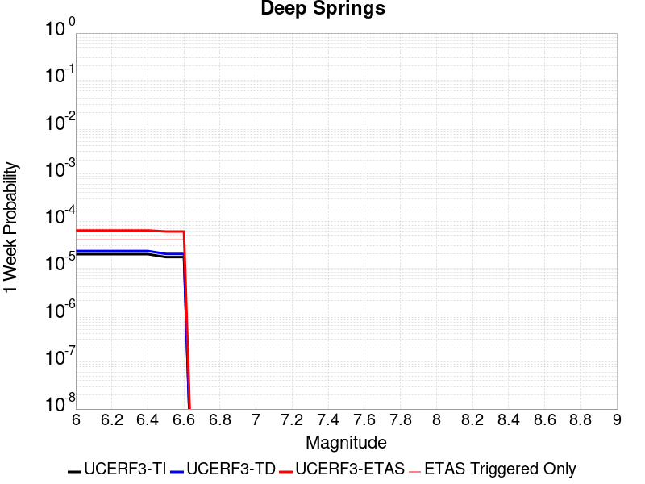 |  |  |  |

| Magnitude | 1 wk TI Prob | 1 wk TD Prob | 1 wk ETAS Prob | 1 wk ETAS/TD Gain | 1 wk ETAS Triggered Only | 1 mo TI Prob | 1 mo TD Prob | 1 mo ETAS Prob | 1 mo ETAS/TD Gain | 1 mo ETAS Triggered Only | 1 yr TI Prob | 1 yr TD Prob | 1 yr ETAS Prob | 1 yr ETAS/TD Gain | 1 yr ETAS Triggered Only | 10 yr TI Prob | 10 yr TD Prob | 10 yr ETAS Prob | 10 yr ETAS/TD Gain | 10 yr ETAS Triggered Only |
|-----|-----|-----|-----|-----|-----|-----|-----|-----|-----|-----|-----|-----|-----|-----|-----|-----|-----|-----|-----|-----|
| 6.0 | 1.9810619E-5 | 2.311252E-5 | 2.311252E-5 | 1.0 | 0.0 | 8.489989E-5 | 9.905276E-5 | 9.905276E-5 | 1.0 | 0.0 | 0.001033166 | 0.0012058079 | 0.0012366349 | 1.0255654 | 3.0864197E-5 | 0.010283757 | 0.012042425 | 0.012072917 | 1.0025321 | 3.0864197E-5 |
| 6.1 | 1.9810619E-5 | 2.311252E-5 | 2.311252E-5 | 1.0 | 0.0 | 8.489989E-5 | 9.905276E-5 | 9.905276E-5 | 1.0 | 0.0 | 0.001033166 | 0.0012058079 | 0.0012366349 | 1.0255654 | 3.0864197E-5 | 0.010283757 | 0.012042425 | 0.012072917 | 1.0025321 | 3.0864197E-5 |
| 6.2 | 1.9810619E-5 | 2.311252E-5 | 2.311252E-5 | 1.0 | 0.0 | 8.489989E-5 | 9.905276E-5 | 9.905276E-5 | 1.0 | 0.0 | 0.001033166 | 0.0012058079 | 0.0012366349 | 1.0255654 | 3.0864197E-5 | 0.010283757 | 0.012042425 | 0.012072917 | 1.0025321 | 3.0864197E-5 |
| 6.3 | 1.9810619E-5 | 2.311252E-5 | 2.311252E-5 | 1.0 | 0.0 | 8.489989E-5 | 9.905276E-5 | 9.905276E-5 | 1.0 | 0.0 | 0.001033166 | 0.0012058079 | 0.0012366349 | 1.0255654 | 3.0864197E-5 | 0.010283757 | 0.012042425 | 0.012072917 | 1.0025321 | 3.0864197E-5 |
| 6.4 | 1.9810619E-5 | 2.311252E-5 | 2.311252E-5 | 1.0 | 0.0 | 8.489989E-5 | 9.905276E-5 | 9.905276E-5 | 1.0 | 0.0 | 0.001033166 | 0.0012058079 | 0.0012366349 | 1.0255654 | 3.0864197E-5 | 0.010283757 | 0.012042425 | 0.012072917 | 1.0025321 | 3.0864197E-5 |
| 6.5 | 1.7190405E-5 | 2.0050555E-5 | 2.0050555E-5 | 1.0 | 0.0 | 7.367108E-5 | 8.593095E-5 | 8.593095E-5 | 1.0 | 0.0 | 8.9657627E-4 | 0.0010462094 | 0.0010770413 | 1.0294701 | 3.0864197E-5 | 0.008929676 | 0.010462056 | 0.010492598 | 1.0029192 | 3.0864197E-5 |
| 6.6 | 1.7190405E-5 | 2.0050555E-5 | 2.0050555E-5 | 1.0 | 0.0 | 7.367108E-5 | 8.593095E-5 | 8.593095E-5 | 1.0 | 0.0 | 8.9657627E-4 | 0.0010462094 | 0.0010770413 | 1.0294701 | 3.0864197E-5 | 0.008929676 | 0.010462056 | 0.010492598 | 1.0029192 | 3.0864197E-5 |

## Hunting Creek - Berryessa 2011 CFM
*[(top)](#table-of-contents)*

| 1 Week | 1 Month | 1 Year | 10 Year |
|-----|-----|-----|-----|
|  |  |  |  |

| Magnitude | 1 wk TI Prob | 1 wk TD Prob | 1 wk ETAS Prob | 1 wk ETAS/TD Gain | 1 wk ETAS Triggered Only | 1 mo TI Prob | 1 mo TD Prob | 1 mo ETAS Prob | 1 mo ETAS/TD Gain | 1 mo ETAS Triggered Only | 1 yr TI Prob | 1 yr TD Prob | 1 yr ETAS Prob | 1 yr ETAS/TD Gain | 1 yr ETAS Triggered Only | 10 yr TI Prob | 10 yr TD Prob | 10 yr ETAS Prob | 10 yr ETAS/TD Gain | 10 yr ETAS Triggered Only |
|-----|-----|-----|-----|-----|-----|-----|-----|-----|-----|-----|-----|-----|-----|-----|-----|-----|-----|-----|-----|-----|
| 6.0 | 1.1270982E-4 | 2.0012174E-4 | 2.0012174E-4 | 1.0 | 0.0 | 4.8295266E-4 | 8.5739547E-4 | 8.8823325E-4 | 1.0359668 | 3.0864197E-5 | 0.0058641075 | 0.010386313 | 0.010416857 | 1.0029408 | 3.0864197E-5 | 0.057117578 | 0.09803703 | 0.09806486 | 1.000284 | 3.0864197E-5 |
| 6.1 | 1.1239393E-4 | 1.9960315E-4 | 1.9960315E-4 | 1.0 | 0.0 | 4.8159933E-4 | 8.551744E-4 | 8.551744E-4 | 1.0 | 0.0 | 0.0058477195 | 0.010359551 | 0.010359551 | 1.0 | 0.0 | 0.056962132 | 0.09779551 | 0.09779551 | 1.0 | 0.0 |
| 6.2 | 7.596265E-5 | 1.2940196E-4 | 1.2940196E-4 | 1.0 | 0.0 | 3.2551357E-4 | 5.5444165E-4 | 5.5444165E-4 | 1.0 | 0.0 | 0.0039559277 | 0.0067210156 | 0.0067210156 | 1.0 | 0.0 | 0.038862433 | 0.0645915 | 0.0645915 | 1.0 | 0.0 |
| 6.3 | 6.78794E-5 | 1.145119E-4 | 1.145119E-4 | 1.0 | 0.0 | 2.9087928E-4 | 4.906513E-4 | 4.906513E-4 | 1.0 | 0.0 | 0.003535705 | 0.005952679 | 0.005952679 | 1.0 | 0.0 | 0.034799766 | 0.057465393 | 0.057465393 | 1.0 | 0.0 |
| 6.4 | 6.2165134E-5 | 1.0436625E-4 | 1.0436625E-4 | 1.0 | 0.0 | 2.6639478E-4 | 4.4721062E-4 | 4.4721062E-4 | 1.0 | 0.0 | 0.0032385332 | 0.005427573 | 0.005427573 | 1.0 | 0.0 | 0.03191742 | 0.052550517 | 0.052550517 | 1.0 | 0.0 |
| 6.5 | 5.4368087E-5 | 9.071415E-5 | 9.071415E-5 | 1.0 | 0.0 | 2.3298527E-4 | 3.8872007E-4 | 3.8872007E-4 | 1.0 | 0.0 | 0.0028329059 | 0.0047198683 | 0.0047198683 | 1.0 | 0.0 | 0.027970633 | 0.045880128 | 0.045880128 | 1.0 | 0.0 |
| 6.6 | 4.729947E-5 | 7.847572E-5 | 7.847572E-5 | 1.0 | 0.0 | 2.0269625E-4 | 3.362842E-4 | 3.362842E-4 | 1.0 | 0.0 | 0.002465034 | 0.0040849647 | 0.0040849647 | 1.0 | 0.0 | 0.02437869 | 0.03985155 | 0.03985155 | 1.0 | 0.0 |
| 6.7 | 3.6875328E-5 | 6.0451803E-5 | 6.0451803E-5 | 1.0 | 0.0 | 1.5802756E-4 | 2.59056E-4 | 2.59056E-4 | 1.0 | 0.0 | 0.0019222875 | 0.0031482063 | 0.0031482063 | 1.0 | 0.0 | 0.019057442 | 0.03089237 | 0.03089237 | 1.0 | 0.0 |
| 6.8 | 2.0292036E-5 | 2.8976308E-5 | 2.8976308E-5 | 1.0 | 0.0 | 8.6962966E-5 | 1.2417832E-4 | 1.2417832E-4 | 1.0 | 0.0 | 0.0010582599 | 0.0015108072 | 0.0015108072 | 1.0 | 0.0 | 0.010532344 | 0.014978523 | 0.014978523 | 1.0 | 0.0 |
| 6.9 | 1.7871042E-5 | 2.4472254E-5 | 2.4472254E-5 | 1.0 | 0.0 | 7.658793E-5 | 1.048769E-4 | 1.048769E-4 | 1.0 | 0.0 | 9.320591E-4 | 0.0012761299 | 0.0012761299 | 1.0 | 0.0 | 0.009281595 | 0.012679775 | 0.012679775 | 1.0 | 0.0 |
| 7.0 | 1.6415532E-5 | 2.1906277E-5 | 2.1906277E-5 | 1.0 | 0.0 | 7.035038E-5 | 9.3880684E-5 | 9.3880684E-5 | 1.0 | 0.0 | 8.561793E-4 | 0.0011424015 | 0.0011424015 | 1.0 | 0.0 | 0.008528882 | 0.01136452 | 0.01136452 | 1.0 | 0.0 |
| 7.1 | 1.5409885E-5 | 2.0346342E-5 | 2.0346342E-5 | 1.0 | 0.0 | 6.6040695E-5 | 8.7195716E-5 | 8.7195716E-5 | 1.0 | 0.0 | 8.0374884E-4 | 0.0010610938 | 0.0010610938 | 1.0 | 0.0 | 0.00800848 | 0.010560595 | 0.010560595 | 1.0 | 0.0 |
| 7.2 | 1.4497423E-5 | 1.9054964E-5 | 1.9054964E-5 | 1.0 | 0.0 | 6.213033E-5 | 8.166159E-5 | 8.166159E-5 | 1.0 | 0.0 | 7.5617427E-4 | 9.937795E-4 | 9.937795E-4 | 1.0 | 0.0 | 0.0075360634 | 0.009893929 | 0.009893929 | 1.0 | 0.0 |
| 7.3 | 1.3615175E-5 | 1.7826127E-5 | 1.7826127E-5 | 1.0 | 0.0 | 5.8349444E-5 | 7.639547E-5 | 7.639547E-5 | 1.0 | 0.0 | 7.101729E-4 | 9.297209E-4 | 9.297209E-4 | 1.0 | 0.0 | 0.0070790765 | 0.009258823 | 0.009258823 | 1.0 | 0.0 |
| 7.4 | 1.2252825E-5 | 1.602625E-5 | 1.602625E-5 | 1.0 | 0.0 | 5.251105E-5 | 6.868213E-5 | 6.868213E-5 | 1.0 | 0.0 | 6.391345E-4 | 8.35887E-4 | 8.35887E-4 | 1.0 | 0.0 | 0.0063729943 | 0.008327872 | 0.008327872 | 1.0 | 0.0 |
| 7.5 | 1.0913301E-5 | 1.4241117E-5 | 1.4241117E-5 | 1.0 | 0.0 | 4.6770452E-5 | 6.1031948E-5 | 6.1031948E-5 | 1.0 | 0.0 | 5.6928146E-4 | 7.4281334E-4 | 7.4281334E-4 | 1.0 | 0.0 | 0.0056782532 | 0.0074036797 | 0.0074036797 | 1.0 | 0.0 |
| 7.6 | 8.623192E-6 | 1.12346415E-5 | 1.12346415E-5 | 1.0 | 0.0 | 3.6956015E-5 | 4.814759E-5 | 4.814759E-5 | 1.0 | 0.0 | 4.4984656E-4 | 5.8604183E-4 | 5.8604183E-4 | 1.0 | 0.0 | 0.00448937 | 0.0058452785 | 0.0058452785 | 1.0 | 0.0 |
| 7.7 | 2.0993634E-6 | 2.662584E-6 | 2.662584E-6 | 1.0 | 0.0 | 8.997241E-6 | 1.1411025E-5 | 1.1411025E-5 | 1.0 | 0.0 | 1.09535904E-4 | 1.3892044E-4 | 1.3892044E-4 | 1.0 | 0.0 | 0.0010948193 | 0.0013883426 | 0.0013883426 | 1.0 | 0.0 |
| 7.8 | 1.8428308E-7 | 2.167437E-7 | 2.167437E-7 | 1.0 | 0.0 | 7.897844E-7 | 9.289013E-7 | 9.289013E-7 | 1.0 | 0.0 | 9.615583E-6 | 1.1309318E-5 | 1.1309318E-5 | 1.0 | 0.0 | 9.615166E-5 | 1.13086026E-4 | 1.13086026E-4 | 1.0 | 0.0 |

## Pleito
*[(top)](#table-of-contents)*

| 1 Week | 1 Month | 1 Year | 10 Year |
|-----|-----|-----|-----|
|  |  |  |  |

| Magnitude | 1 wk TI Prob | 1 wk TD Prob | 1 wk ETAS Prob | 1 wk ETAS/TD Gain | 1 wk ETAS Triggered Only | 1 mo TI Prob | 1 mo TD Prob | 1 mo ETAS Prob | 1 mo ETAS/TD Gain | 1 mo ETAS Triggered Only | 1 yr TI Prob | 1 yr TD Prob | 1 yr ETAS Prob | 1 yr ETAS/TD Gain | 1 yr ETAS Triggered Only | 10 yr TI Prob | 10 yr TD Prob | 10 yr ETAS Prob | 10 yr ETAS/TD Gain | 10 yr ETAS Triggered Only |
|-----|-----|-----|-----|-----|-----|-----|-----|-----|-----|-----|-----|-----|-----|-----|-----|-----|-----|-----|-----|-----|
| 6.0 | 1.6763008E-5 | 2.4763838E-5 | 5.562727E-5 | 2.2463105 | 3.0864197E-5 | 7.183948E-5 | 1.0612683E-4 | 1.3698774E-4 | 1.2907928 | 3.0864197E-5 | 8.742947E-4 | 0.0012914003 | 0.0013222246 | 1.0238689 | 3.0864197E-5 | 0.00870863 | 0.0129538905 | 0.012984355 | 1.0023518 | 3.0864197E-5 |
| 6.1 | 1.6763008E-5 | 2.4763838E-5 | 5.562727E-5 | 2.2463105 | 3.0864197E-5 | 7.183948E-5 | 1.0612683E-4 | 1.3698774E-4 | 1.2907928 | 3.0864197E-5 | 8.742947E-4 | 0.0012914003 | 0.0013222246 | 1.0238689 | 3.0864197E-5 | 0.00870863 | 0.0129538905 | 0.012984355 | 1.0023518 | 3.0864197E-5 |
| 6.2 | 1.6763008E-5 | 2.4763838E-5 | 5.562727E-5 | 2.2463105 | 3.0864197E-5 | 7.183948E-5 | 1.0612683E-4 | 1.3698774E-4 | 1.2907928 | 3.0864197E-5 | 8.742947E-4 | 0.0012914003 | 0.0013222246 | 1.0238689 | 3.0864197E-5 | 0.00870863 | 0.0129538905 | 0.012984355 | 1.0023518 | 3.0864197E-5 |
| 6.3 | 1.6763008E-5 | 2.4763838E-5 | 5.562727E-5 | 2.2463105 | 3.0864197E-5 | 7.183948E-5 | 1.0612683E-4 | 1.3698774E-4 | 1.2907928 | 3.0864197E-5 | 8.742947E-4 | 0.0012914003 | 0.0013222246 | 1.0238689 | 3.0864197E-5 | 0.00870863 | 0.0129538905 | 0.012984355 | 1.0023518 | 3.0864197E-5 |
| 6.4 | 1.6763008E-5 | 2.4763838E-5 | 5.562727E-5 | 2.2463105 | 3.0864197E-5 | 7.183948E-5 | 1.0612683E-4 | 1.3698774E-4 | 1.2907928 | 3.0864197E-5 | 8.742947E-4 | 0.0012914003 | 0.0013222246 | 1.0238689 | 3.0864197E-5 | 0.00870863 | 0.0129538905 | 0.012984355 | 1.0023518 | 3.0864197E-5 |
| 6.5 | 1.6763008E-5 | 2.4763838E-5 | 5.562727E-5 | 2.2463105 | 3.0864197E-5 | 7.183948E-5 | 1.0612683E-4 | 1.3698774E-4 | 1.2907928 | 3.0864197E-5 | 8.742947E-4 | 0.0012914003 | 0.0013222246 | 1.0238689 | 3.0864197E-5 | 0.00870863 | 0.0129538905 | 0.012984355 | 1.0023518 | 3.0864197E-5 |
| 6.6 | 9.910213E-6 | 1.7214623E-5 | 4.807829E-5 | 2.7928748 | 3.0864197E-5 | 4.247165E-5 | 7.377489E-5 | 1.0463681E-4 | 1.4183255 | 3.0864197E-5 | 5.169696E-4 | 8.978429E-4 | 9.2867936E-4 | 1.034345 | 3.0864197E-5 | 0.0051576863 | 0.009050702 | 0.009081287 | 1.0033792 | 3.0864197E-5 |
| 6.7 | 9.910213E-6 | 1.7214623E-5 | 4.807829E-5 | 2.7928748 | 3.0864197E-5 | 4.247165E-5 | 7.377489E-5 | 1.0463681E-4 | 1.4183255 | 3.0864197E-5 | 5.169696E-4 | 8.978429E-4 | 9.2867936E-4 | 1.034345 | 3.0864197E-5 | 0.0051576863 | 0.009050702 | 0.009081287 | 1.0033792 | 3.0864197E-5 |
| 6.8 | 8.300162E-6 | 1.5474232E-5 | 4.633795E-5 | 2.9945235 | 3.0864197E-5 | 3.557164E-5 | 6.631646E-5 | 9.7178614E-5 | 1.465377 | 3.0864197E-5 | 4.3299864E-4 | 8.071053E-4 | 8.3794456E-4 | 1.0382098 | 3.0864197E-5 | 0.004321559 | 0.008150139 | 0.008180751 | 1.003756 | 3.0864197E-5 |
| 6.9 | 8.183114E-6 | 1.5345448E-5 | 4.620917E-5 | 3.0112627 | 3.0864197E-5 | 3.5070017E-5 | 6.576455E-5 | 9.662672E-5 | 1.4692827 | 3.0864197E-5 | 4.2689382E-4 | 8.003907E-4 | 8.3123025E-4 | 1.0385306 | 3.0864197E-5 | 0.0042607468 | 0.008083483 | 0.008114099 | 1.0037873 | 3.0864197E-5 |
| 7.0 | 7.1748823E-6 | 1.413244E-5 | 1.413244E-5 | 1.0 | 0.0 | 3.0749135E-5 | 6.0566195E-5 | 6.0566195E-5 | 1.0 | 0.0 | 3.743064E-4 | 7.371445E-4 | 7.371445E-4 | 1.0 | 0.0 | 0.0037367654 | 0.007454939 | 0.007454939 | 1.0 | 0.0 |
| 7.1 | 7.1671807E-6 | 1.412281E-5 | 1.412281E-5 | 1.0 | 0.0 | 3.0716128E-5 | 6.052493E-5 | 6.052493E-5 | 1.0 | 0.0 | 3.7390468E-4 | 7.366424E-4 | 7.366424E-4 | 1.0 | 0.0 | 0.0037327618 | 0.0074499524 | 0.0074499524 | 1.0 | 0.0 |
| 7.2 | 7.0649667E-6 | 1.39701015E-5 | 1.39701015E-5 | 1.0 | 0.0 | 3.0278077E-5 | 5.9870494E-5 | 5.9870494E-5 | 1.0 | 0.0 | 3.6857324E-4 | 7.2868E-4 | 7.2868E-4 | 1.0 | 0.0 | 0.0036796255 | 0.0073707094 | 0.0073707094 | 1.0 | 0.0 |
| 7.3 | 7.02082E-6 | 1.3913556E-5 | 1.3913556E-5 | 1.0 | 0.0 | 3.008888E-5 | 5.9628168E-5 | 5.9628168E-5 | 1.0 | 0.0 | 3.6627054E-4 | 7.2573166E-4 | 7.2573166E-4 | 1.0 | 0.0 | 0.0036566744 | 0.007341209 | 0.007341209 | 1.0 | 0.0 |
| 7.4 | 6.987146E-6 | 1.3873118E-5 | 1.3873118E-5 | 1.0 | 0.0 | 2.9944567E-5 | 5.945487E-5 | 5.945487E-5 | 1.0 | 0.0 | 3.6451413E-4 | 7.2362315E-4 | 7.2362315E-4 | 1.0 | 0.0 | 0.0036391679 | 0.007320144 | 0.007320144 | 1.0 | 0.0 |
| 7.5 | 6.9494554E-6 | 1.3830024E-5 | 1.3830024E-5 | 1.0 | 0.0 | 2.9783041E-5 | 5.9270187E-5 | 5.9270187E-5 | 1.0 | 0.0 | 3.625482E-4 | 7.2137616E-4 | 7.2137616E-4 | 1.0 | 0.0 | 0.0036195726 | 0.0072977724 | 0.0072977724 | 1.0 | 0.0 |
| 7.6 | 6.92694E-6 | 1.3789138E-5 | 1.3789138E-5 | 1.0 | 0.0 | 2.9686547E-5 | 5.909497E-5 | 5.909497E-5 | 1.0 | 0.0 | 3.6137376E-4 | 7.1924424E-4 | 7.1924424E-4 | 1.0 | 0.0 | 0.0036078666 | 0.0072765257 | 0.0072765257 | 1.0 | 0.0 |
| 7.7 | 6.395867E-6 | 1.2668219E-5 | 1.2668219E-5 | 1.0 | 0.0 | 2.741057E-5 | 5.429124E-5 | 5.429124E-5 | 1.0 | 0.0 | 3.336726E-4 | 6.6079566E-4 | 6.6079566E-4 | 1.0 | 0.0 | 0.0033317201 | 0.0066951844 | 0.0066951844 | 1.0 | 0.0 |
| 7.8 | 5.8664327E-6 | 1.153586E-5 | 1.153586E-5 | 1.0 | 0.0 | 2.5141611E-5 | 4.9438466E-5 | 4.9438466E-5 | 1.0 | 0.0 | 3.060561E-4 | 6.017473E-4 | 6.017473E-4 | 1.0 | 0.0 | 0.0030563495 | 0.0061006667 | 0.0061006667 | 1.0 | 0.0 |
| 7.9 | 3.7167474E-6 | 7.1140853E-6 | 7.1140853E-6 | 1.0 | 0.0 | 1.592882E-5 | 3.0488582E-5 | 3.0488582E-5 | 1.0 | 0.0 | 1.9391612E-4 | 3.7113542E-4 | 3.7113542E-4 | 1.0 | 0.0 | 0.0019374699 | 0.0037674906 | 0.0037674906 | 1.0 | 0.0 |
| 8.0 | 1.0903841E-6 | 1.2879392E-6 | 1.2879392E-6 | 1.0 | 0.0 | 4.6730665E-6 | 5.5197274E-6 | 5.5197274E-6 | 1.0 | 0.0 | 5.68931E-5 | 6.720063E-5 | 6.720063E-5 | 1.0 | 0.0 | 5.6878536E-4 | 6.941948E-4 | 6.941948E-4 | 1.0 | 0.0 |
| 8.1 | 2.6894583E-7 | 1.1060341E-7 | 1.1060341E-7 | 1.0 | 0.0 | 1.1526245E-6 | 4.740145E-7 | 4.740145E-7 | 1.0 | 0.0 | 1.4033113E-5 | 5.7711113E-6 | 5.7711113E-6 | 1.0 | 0.0 | 1.4032227E-4 | 6.456908E-5 | 6.456908E-5 | 1.0 | 0.0 |
| 8.2 | 5.2967013E-9 | 2.4578228E-9 | 2.4578228E-9 | 1.0 | 0.0 | 2.2700148E-8 | 1.0533527E-8 | 1.0533527E-8 | 1.0 | 0.0 | 2.7637427E-7 | 1.2824569E-7 | 1.2824569E-7 | 1.0 | 0.0 | 2.7637393E-6 | 1.4592787E-6 | 1.4592787E-6 | 1.0 | 0.0 |

## Elsinore (Stepovers Combined)
*[(top)](#table-of-contents)*

| 1 Week | 1 Month | 1 Year | 10 Year |
|-----|-----|-----|-----|
|  |  |  |  |

| Magnitude | 1 wk TI Prob | 1 wk TD Prob | 1 wk ETAS Prob | 1 wk ETAS/TD Gain | 1 wk ETAS Triggered Only | 1 mo TI Prob | 1 mo TD Prob | 1 mo ETAS Prob | 1 mo ETAS/TD Gain | 1 mo ETAS Triggered Only | 1 yr TI Prob | 1 yr TD Prob | 1 yr ETAS Prob | 1 yr ETAS/TD Gain | 1 yr ETAS Triggered Only | 10 yr TI Prob | 10 yr TD Prob | 10 yr ETAS Prob | 10 yr ETAS/TD Gain | 10 yr ETAS Triggered Only |
|-----|-----|-----|-----|-----|-----|-----|-----|-----|-----|-----|-----|-----|-----|-----|-----|-----|-----|-----|-----|-----|
| 6.0 | 2.144392E-5 | 1.9760193E-5 | 1.9760193E-5 | 1.0 | 0.0 | 9.189928E-5 | 8.468392E-5 | 8.468392E-5 | 1.0 | 0.0 | 0.0011182994 | 0.0010305607 | 0.0010613931 | 1.0299181 | 3.0864197E-5 | 0.011126885 | 0.010264917 | 0.010295465 | 1.002976 | 3.0864197E-5 |
| 6.1 | 2.144392E-5 | 1.9760193E-5 | 1.9760193E-5 | 1.0 | 0.0 | 9.189928E-5 | 8.468392E-5 | 8.468392E-5 | 1.0 | 0.0 | 0.0011182994 | 0.0010305607 | 0.0010613931 | 1.0299181 | 3.0864197E-5 | 0.011126885 | 0.010264917 | 0.010295465 | 1.002976 | 3.0864197E-5 |
| 6.2 | 2.144392E-5 | 1.9760193E-5 | 1.9760193E-5 | 1.0 | 0.0 | 9.189928E-5 | 8.468392E-5 | 8.468392E-5 | 1.0 | 0.0 | 0.0011182994 | 0.0010305607 | 0.0010613931 | 1.0299181 | 3.0864197E-5 | 0.011126885 | 0.010264917 | 0.010295465 | 1.002976 | 3.0864197E-5 |
| 6.3 | 1.9751555E-5 | 1.7741453E-5 | 1.7741453E-5 | 1.0 | 0.0 | 8.4646774E-5 | 7.603267E-5 | 7.603267E-5 | 1.0 | 0.0 | 0.0010300872 | 9.253213E-4 | 9.5615693E-4 | 1.0333242 | 3.0864197E-5 | 0.010253254 | 0.009221276 | 0.009251856 | 1.0033162 | 3.0864197E-5 |
| 6.4 | 1.9751555E-5 | 1.7741453E-5 | 1.7741453E-5 | 1.0 | 0.0 | 8.4646774E-5 | 7.603267E-5 | 7.603267E-5 | 1.0 | 0.0 | 0.0010300872 | 9.253213E-4 | 9.5615693E-4 | 1.0333242 | 3.0864197E-5 | 0.010253254 | 0.009221276 | 0.009251856 | 1.0033162 | 3.0864197E-5 |
| 6.5 | 1.9751555E-5 | 1.7741453E-5 | 1.7741453E-5 | 1.0 | 0.0 | 8.4646774E-5 | 7.603267E-5 | 7.603267E-5 | 1.0 | 0.0 | 0.0010300872 | 9.253213E-4 | 9.5615693E-4 | 1.0333242 | 3.0864197E-5 | 0.010253254 | 0.009221276 | 0.009251856 | 1.0033162 | 3.0864197E-5 |
| 6.6 | 1.9188685E-5 | 1.7003393E-5 | 1.7003393E-5 | 1.0 | 0.0 | 8.2234634E-5 | 7.286974E-5 | 7.286974E-5 | 1.0 | 0.0 | 0.0010007467 | 8.868442E-4 | 9.1768097E-4 | 1.0347714 | 3.0864197E-5 | 0.00996252 | 0.0088398475 | 0.008870439 | 1.0034606 | 3.0864197E-5 |
| 6.7 | 1.7608272E-5 | 1.4732616E-5 | 1.4732616E-5 | 1.0 | 0.0 | 7.546184E-5 | 6.3138315E-5 | 6.3138315E-5 | 1.0 | 0.0 | 9.183606E-4 | 7.684476E-4 | 7.992881E-4 | 1.0401335 | 3.0864197E-5 | 0.009145746 | 0.00766491 | 0.0076955375 | 1.0039958 | 3.0864197E-5 |
| 6.8 | 1.697165E-5 | 1.3783365E-5 | 1.3783365E-5 | 1.0 | 0.0 | 7.273361E-5 | 5.9070277E-5 | 5.9070277E-5 | 1.0 | 0.0 | 8.8517193E-4 | 7.18952E-4 | 7.49794E-4 | 1.0428985 | 3.0864197E-5 | 0.008816543 | 0.007172675 | 0.0072033177 | 1.0042721 | 3.0864197E-5 |
| 6.9 | 1.600365E-5 | 1.2846671E-5 | 1.2846671E-5 | 1.0 | 0.0 | 6.858527E-5 | 5.5056043E-5 | 5.5056043E-5 | 1.0 | 0.0 | 8.347058E-4 | 6.7010894E-4 | 7.009525E-4 | 1.0460277 | 3.0864197E-5 | 0.008315775 | 0.0066867657 | 0.006717424 | 1.0045849 | 3.0864197E-5 |
| 7.0 | 1.3314581E-5 | 1.0447548E-5 | 1.0447548E-5 | 1.0 | 0.0 | 5.7061243E-5 | 4.4774453E-5 | 4.4774453E-5 | 1.0 | 0.0 | 6.944992E-4 | 5.449953E-4 | 5.758427E-4 | 1.0566012 | 3.0864197E-5 | 0.006923327 | 0.0054405155 | 0.0054712114 | 1.0056422 | 3.0864197E-5 |
| 7.1 | 1.2865345E-5 | 9.937536E-6 | 9.937536E-6 | 1.0 | 0.0 | 5.5136024E-5 | 4.258876E-5 | 4.258876E-5 | 1.0 | 0.0 | 6.710743E-4 | 5.183973E-4 | 5.492455E-4 | 1.0595069 | 3.0864197E-5 | 0.0066905143 | 0.0051752133 | 0.005205918 | 1.0059329 | 3.0864197E-5 |
| 7.2 | 1.1650051E-5 | 8.633809E-6 | 8.633809E-6 | 1.0 | 0.0 | 4.9927836E-5 | 3.7001522E-5 | 3.7001522E-5 | 1.0 | 0.0 | 6.0770183E-4 | 4.504022E-4 | 4.504022E-4 | 1.0 | 0.0 | 0.0060604266 | 0.0044963174 | 0.0044963174 | 1.0 | 0.0 |
| 7.3 | 1.0008533E-5 | 7.2010425E-6 | 7.2010425E-6 | 1.0 | 0.0 | 4.2893007E-5 | 3.0861254E-5 | 3.0861254E-5 | 1.0 | 0.0 | 5.220972E-4 | 3.7567242E-4 | 3.7567242E-4 | 1.0 | 0.0 | 0.005208723 | 0.003750761 | 0.003750761 | 1.0 | 0.0 |
| 7.4 | 9.116759E-6 | 6.410068E-6 | 6.410068E-6 | 1.0 | 0.0 | 3.907124E-5 | 2.747144E-5 | 2.747144E-5 | 1.0 | 0.0 | 4.7558855E-4 | 3.3441483E-4 | 3.3441483E-4 | 1.0 | 0.0 | 0.00474572 | 0.0033392678 | 0.0033392678 | 1.0 | 0.0 |
| 7.5 | 7.870524E-6 | 5.3825365E-6 | 5.3825365E-6 | 1.0 | 0.0 | 3.3730383E-5 | 2.3067816E-5 | 2.3067816E-5 | 1.0 | 0.0 | 4.1059E-4 | 2.8081573E-4 | 2.8081573E-4 | 1.0 | 0.0 | 0.0040983222 | 0.0028047354 | 0.0028047354 | 1.0 | 0.0 |
| 7.6 | 6.9774537E-6 | 4.6776067E-6 | 4.6776067E-6 | 1.0 | 0.0 | 2.990303E-5 | 2.0046738E-5 | 2.0046738E-5 | 1.0 | 0.0 | 3.640086E-4 | 2.4404288E-4 | 2.4404288E-4 | 1.0 | 0.0 | 0.003634129 | 0.0024378651 | 0.0024378651 | 1.0 | 0.0 |
| 7.7 | 4.1616954E-6 | 2.32834E-6 | 2.32834E-6 | 1.0 | 0.0 | 1.7835715E-5 | 9.978567E-6 | 9.978567E-6 | 1.0 | 0.0 | 2.171282E-4 | 1.2148302E-4 | 1.2148302E-4 | 1.0 | 0.0 | 0.0021691616 | 0.0012142392 | 0.0012142392 | 1.0 | 0.0 |
| 7.8 | 2.2692414E-7 | 9.3854695E-8 | 9.3854695E-8 | 1.0 | 0.0 | 9.725317E-7 | 4.0223435E-7 | 4.0223435E-7 | 1.0 | 0.0 | 1.1840509E-5 | 4.8971956E-6 | 4.8971956E-6 | 1.0 | 0.0 | 1.1839878E-4 | 4.8971204E-5 | 4.8971204E-5 | 1.0 | 0.0 |
| 7.9 | 6.676829E-9 | 3.439853E-9 | 3.439853E-9 | 1.0 | 0.0 | 2.861498E-8 | 1.4742227E-8 | 1.4742227E-8 | 1.0 | 0.0 | 3.4838732E-7 | 1.7948659E-7 | 1.7948659E-7 | 1.0 | 0.0 | 3.4838679E-6 | 1.7948646E-6 | 1.7948646E-6 | 1.0 | 0.0 |

## Monterey Bay-Tularcitos
*[(top)](#table-of-contents)*

| 1 Week | 1 Month | 1 Year | 10 Year |
|-----|-----|-----|-----|
|  |  |  |  |

| Magnitude | 1 wk TI Prob | 1 wk TD Prob | 1 wk ETAS Prob | 1 wk ETAS/TD Gain | 1 wk ETAS Triggered Only | 1 mo TI Prob | 1 mo TD Prob | 1 mo ETAS Prob | 1 mo ETAS/TD Gain | 1 mo ETAS Triggered Only | 1 yr TI Prob | 1 yr TD Prob | 1 yr ETAS Prob | 1 yr ETAS/TD Gain | 1 yr ETAS Triggered Only | 10 yr TI Prob | 10 yr TD Prob | 10 yr ETAS Prob | 10 yr ETAS/TD Gain | 10 yr ETAS Triggered Only |
|-----|-----|-----|-----|-----|-----|-----|-----|-----|-----|-----|-----|-----|-----|-----|-----|-----|-----|-----|-----|-----|
| 6.0 | 3.0131365E-5 | 3.279877E-5 | 3.279877E-5 | 1.0 | 0.0 | 1.2912804E-4 | 1.4055918E-4 | 1.4055918E-4 | 1.0 | 0.0 | 0.001571 | 0.0017100703 | 0.0017408817 | 1.0180176 | 3.0864197E-5 | 0.015599402 | 0.016979916 | 0.017010257 | 1.0017868 | 3.0864197E-5 |
| 6.1 | 3.0131365E-5 | 3.279877E-5 | 3.279877E-5 | 1.0 | 0.0 | 1.2912804E-4 | 1.4055918E-4 | 1.4055918E-4 | 1.0 | 0.0 | 0.001571 | 0.0017100703 | 0.0017408817 | 1.0180176 | 3.0864197E-5 | 0.015599402 | 0.016979916 | 0.017010257 | 1.0017868 | 3.0864197E-5 |
| 6.2 | 3.0131365E-5 | 3.279877E-5 | 3.279877E-5 | 1.0 | 0.0 | 1.2912804E-4 | 1.4055918E-4 | 1.4055918E-4 | 1.0 | 0.0 | 0.001571 | 0.0017100703 | 0.0017408817 | 1.0180176 | 3.0864197E-5 | 0.015599402 | 0.016979916 | 0.017010257 | 1.0017868 | 3.0864197E-5 |
| 6.3 | 1.6998249E-5 | 1.8330798E-5 | 1.8330798E-5 | 1.0 | 0.0 | 7.28476E-5 | 7.85583E-5 | 7.85583E-5 | 1.0 | 0.0 | 8.865586E-4 | 9.5604634E-4 | 9.5604634E-4 | 1.0 | 0.0 | 0.0088303005 | 0.009521258 | 0.009521258 | 1.0 | 0.0 |
| 6.4 | 1.6998249E-5 | 1.8330798E-5 | 1.8330798E-5 | 1.0 | 0.0 | 7.28476E-5 | 7.85583E-5 | 7.85583E-5 | 1.0 | 0.0 | 8.865586E-4 | 9.5604634E-4 | 9.5604634E-4 | 1.0 | 0.0 | 0.0088303005 | 0.009521258 | 0.009521258 | 1.0 | 0.0 |
| 6.5 | 1.27470785E-5 | 1.3693312E-5 | 1.3693312E-5 | 1.0 | 0.0 | 5.4629192E-5 | 5.8684363E-5 | 5.8684363E-5 | 1.0 | 0.0 | 6.649074E-4 | 7.1425823E-4 | 7.1425823E-4 | 1.0 | 0.0 | 0.0066292146 | 0.007120678 | 0.007120678 | 1.0 | 0.0 |
| 6.6 | 1.2739422E-5 | 1.36854E-5 | 1.36854E-5 | 1.0 | 0.0 | 5.4596385E-5 | 5.8650454E-5 | 5.8650454E-5 | 1.0 | 0.0 | 6.645082E-4 | 7.1384566E-4 | 7.1384566E-4 | 1.0 | 0.0 | 0.0066252467 | 0.007116579 | 0.007116579 | 1.0 | 0.0 |
| 6.7 | 1.0160109E-5 | 1.0885755E-5 | 1.0885755E-5 | 1.0 | 0.0 | 4.35426E-5 | 4.665244E-5 | 4.665244E-5 | 1.0 | 0.0 | 5.300022E-4 | 5.6785246E-4 | 5.6785246E-4 | 1.0 | 0.0 | 0.005287399 | 0.0056647263 | 0.0056647263 | 1.0 | 0.0 |
| 6.8 | 8.349859E-6 | 8.932587E-6 | 8.932587E-6 | 1.0 | 0.0 | 3.578462E-5 | 3.8281985E-5 | 3.8281985E-5 | 1.0 | 0.0 | 4.3559066E-4 | 4.6598914E-4 | 4.6598914E-4 | 1.0 | 0.0 | 0.004347378 | 0.004650685 | 0.004650685 | 1.0 | 0.0 |
| 6.9 | 5.193639E-6 | 5.53643E-6 | 5.53643E-6 | 1.0 | 0.0 | 2.2258262E-5 | 2.372736E-5 | 2.372736E-5 | 1.0 | 0.0 | 2.7096065E-4 | 2.8884556E-4 | 2.8884556E-4 | 1.0 | 0.0 | 0.0027063051 | 0.0028850222 | 0.0028850222 | 1.0 | 0.0 |
| 7.0 | 4.359381E-6 | 4.643366E-6 | 4.643366E-6 | 1.0 | 0.0 | 1.8682927E-5 | 1.9900004E-5 | 1.9900004E-5 | 1.0 | 0.0 | 2.274409E-4 | 2.422586E-4 | 2.422586E-4 | 1.0 | 0.0 | 0.0022720827 | 0.002420238 | 0.002420238 | 1.0 | 0.0 |
| 7.1 | 3.0398533E-6 | 3.2310427E-6 | 3.2310427E-6 | 1.0 | 0.0 | 1.3027877E-5 | 1.3847267E-5 | 1.3847267E-5 | 1.0 | 0.0 | 1.5860285E-4 | 1.6858005E-4 | 1.6858005E-4 | 1.0 | 0.0 | 0.001584897 | 0.0016847793 | 0.0016847793 | 1.0 | 0.0 |
| 7.2 | 1.642335E-6 | 1.7333153E-6 | 1.7333153E-6 | 1.0 | 0.0 | 7.0385595E-6 | 7.428485E-6 | 7.428485E-6 | 1.0 | 0.0 | 8.569109E-5 | 9.044012E-5 | 9.044012E-5 | 1.0 | 0.0 | 8.5658056E-4 | 9.042358E-4 | 9.042358E-4 | 1.0 | 0.0 |
| 7.3 | 3.356842E-7 | 3.2952389E-7 | 3.2952389E-7 | 1.0 | 0.0 | 1.4386458E-6 | 1.4122444E-6 | 1.4122444E-6 | 1.0 | 0.0 | 1.7515373E-5 | 1.7193941E-5 | 1.7193941E-5 | 1.0 | 0.0 | 1.7513991E-4 | 1.719262E-4 | 1.719262E-4 | 1.0 | 0.0 |
| 7.4 | 2.1973483E-7 | 2.1006413E-7 | 2.1006413E-7 | 1.0 | 0.0 | 9.417204E-7 | 9.0027453E-7 | 9.0027453E-7 | 1.0 | 0.0 | 1.1465385E-5 | 1.0960787E-5 | 1.0960787E-5 | 1.0 | 0.0 | 1.1464794E-4 | 1.096025E-4 | 1.096025E-4 | 1.0 | 0.0 |
| 7.5 | 1.1944135E-7 | 1.0696043E-7 | 1.0696043E-7 | 1.0 | 0.0 | 5.118914E-7 | 4.5840173E-7 | 4.5840173E-7 | 1.0 | 0.0 | 6.23226E-6 | 5.581027E-6 | 5.581027E-6 | 1.0 | 0.0 | 6.2320854E-5 | 5.5808883E-5 | 5.5808883E-5 | 1.0 | 0.0 |
| 7.6 | 4.636058E-8 | 3.336489E-8 | 3.336489E-8 | 1.0 | 0.0 | 1.9868818E-7 | 1.4299238E-7 | 1.4299238E-7 | 1.0 | 0.0 | 2.419026E-6 | 1.7409308E-6 | 1.7409308E-6 | 1.0 | 0.0 | 2.4189996E-5 | 1.7409173E-5 | 1.7409173E-5 | 1.0 | 0.0 |
| 7.7 | 1.8588572E-8 | 8.003744E-9 | 8.003744E-9 | 1.0 | 0.0 | 7.9665305E-8 | 3.430176E-8 | 3.430176E-8 | 1.0 | 0.0 | 9.699246E-7 | 4.1762385E-7 | 4.1762385E-7 | 1.0 | 0.0 | 9.699204E-6 | 4.176231E-6 | 4.176231E-6 | 1.0 | 0.0 |
| 7.8 | 2.7960154E-9 | 7.6099427E-10 | 7.6099427E-10 | 1.0 | 0.0 | 1.1982923E-8 | 3.2614043E-9 | 3.2614043E-9 | 1.0 | 0.0 | 1.4589209E-7 | 3.9707597E-8 | 3.9707597E-8 | 1.0 | 0.0 | 1.4589199E-6 | 3.9707595E-7 | 3.9707595E-7 | 1.0 | 0.0 |

## Kern Canyon (North Kern) 2011
*[(top)](#table-of-contents)*

| 1 Week | 1 Month | 1 Year | 10 Year |
|-----|-----|-----|-----|
|  |  |  |  |

| Magnitude | 1 wk TI Prob | 1 wk TD Prob | 1 wk ETAS Prob | 1 wk ETAS/TD Gain | 1 wk ETAS Triggered Only | 1 mo TI Prob | 1 mo TD Prob | 1 mo ETAS Prob | 1 mo ETAS/TD Gain | 1 mo ETAS Triggered Only | 1 yr TI Prob | 1 yr TD Prob | 1 yr ETAS Prob | 1 yr ETAS/TD Gain | 1 yr ETAS Triggered Only | 10 yr TI Prob | 10 yr TD Prob | 10 yr ETAS Prob | 10 yr ETAS/TD Gain | 10 yr ETAS Triggered Only |
|-----|-----|-----|-----|-----|-----|-----|-----|-----|-----|-----|-----|-----|-----|-----|-----|-----|-----|-----|-----|-----|
| 6.0 | 6.6264497E-6 | 6.75733E-6 | 6.75733E-6 | 1.0 | 0.0 | 2.8398761E-5 | 2.895971E-5 | 2.895971E-5 | 1.0 | 0.0 | 3.4570007E-4 | 3.5253543E-4 | 3.8338875E-4 | 1.0875183 | 3.0864197E-5 | 0.0034516277 | 0.0035205502 | 0.0035513057 | 1.008736 | 3.0864197E-5 |
| 6.1 | 6.6264497E-6 | 6.75733E-6 | 6.75733E-6 | 1.0 | 0.0 | 2.8398761E-5 | 2.895971E-5 | 2.895971E-5 | 1.0 | 0.0 | 3.4570007E-4 | 3.5253543E-4 | 3.8338875E-4 | 1.0875183 | 3.0864197E-5 | 0.0034516277 | 0.0035205502 | 0.0035513057 | 1.008736 | 3.0864197E-5 |
| 6.2 | 6.6264497E-6 | 6.75733E-6 | 6.75733E-6 | 1.0 | 0.0 | 2.8398761E-5 | 2.895971E-5 | 2.895971E-5 | 1.0 | 0.0 | 3.4570007E-4 | 3.5253543E-4 | 3.8338875E-4 | 1.0875183 | 3.0864197E-5 | 0.0034516277 | 0.0035205502 | 0.0035513057 | 1.008736 | 3.0864197E-5 |
| 6.3 | 6.6264497E-6 | 6.75733E-6 | 6.75733E-6 | 1.0 | 0.0 | 2.8398761E-5 | 2.895971E-5 | 2.895971E-5 | 1.0 | 0.0 | 3.4570007E-4 | 3.5253543E-4 | 3.8338875E-4 | 1.0875183 | 3.0864197E-5 | 0.0034516277 | 0.0035205502 | 0.0035513057 | 1.008736 | 3.0864197E-5 |
| 6.4 | 6.6264497E-6 | 6.75733E-6 | 6.75733E-6 | 1.0 | 0.0 | 2.8398761E-5 | 2.895971E-5 | 2.895971E-5 | 1.0 | 0.0 | 3.4570007E-4 | 3.5253543E-4 | 3.8338875E-4 | 1.0875183 | 3.0864197E-5 | 0.0034516277 | 0.0035205502 | 0.0035513057 | 1.008736 | 3.0864197E-5 |
| 6.5 | 3.2162225E-6 | 3.2570915E-6 | 3.2570915E-6 | 1.0 | 0.0 | 1.3783738E-5 | 1.3958893E-5 | 1.3958893E-5 | 1.0 | 0.0 | 1.6780409E-4 | 1.6993708E-4 | 2.0079603E-4 | 1.1815904 | 3.0864197E-5 | 0.0016767744 | 0.001698151 | 0.0017289628 | 1.0181444 | 3.0864197E-5 |
| 6.6 | 3.2162225E-6 | 3.2570915E-6 | 3.2570915E-6 | 1.0 | 0.0 | 1.3783738E-5 | 1.3958893E-5 | 1.3958893E-5 | 1.0 | 0.0 | 1.6780409E-4 | 1.6993708E-4 | 2.0079603E-4 | 1.1815904 | 3.0864197E-5 | 0.0016767744 | 0.001698151 | 0.0017289628 | 1.0181444 | 3.0864197E-5 |
| 6.7 | 2.1908265E-6 | 2.2071222E-6 | 2.2071222E-6 | 1.0 | 0.0 | 9.389223E-6 | 9.459061E-6 | 9.459061E-6 | 1.0 | 0.0 | 1.1430779E-4 | 1.1515819E-4 | 1.4601884E-4 | 1.2679847 | 3.0864197E-5 | 0.0011424901 | 0.0011510046 | 0.0011818332 | 1.0267842 | 3.0864197E-5 |
| 6.8 | 1.7303895E-6 | 1.7365529E-6 | 1.7365529E-6 | 1.0 | 0.0 | 7.415934E-6 | 7.4423488E-6 | 7.4423488E-6 | 1.0 | 0.0 | 9.028525E-5 | 9.0606925E-5 | 1.2146833E-4 | 1.3406075 | 3.0864197E-5 | 9.024858E-4 | 9.057096E-4 | 9.3654584E-4 | 1.0340465 | 3.0864197E-5 |
| 6.9 | 1.3700314E-6 | 1.3688622E-6 | 1.3688622E-6 | 1.0 | 0.0 | 5.87155E-6 | 5.8665396E-6 | 5.8665396E-6 | 1.0 | 0.0 | 7.148377E-5 | 7.142282E-5 | 1.02284816E-4 | 1.4321027 | 3.0864197E-5 | 7.146078E-4 | 7.140032E-4 | 7.448454E-4 | 1.0431961 | 3.0864197E-5 |
| 7.0 | 1.1467797E-6 | 1.1413804E-6 | 1.1413804E-6 | 1.0 | 0.0 | 4.9147607E-6 | 4.8916213E-6 | 4.8916213E-6 | 1.0 | 0.0 | 5.983557E-5 | 5.9553895E-5 | 9.041625E-5 | 1.5182257 | 3.0864197E-5 | 5.981946E-4 | 5.953825E-4 | 6.2622834E-4 | 1.0518084 | 3.0864197E-5 |
| 7.1 | 9.3952065E-7 | 9.3026904E-7 | 9.3026904E-7 | 1.0 | 0.0 | 4.026511E-6 | 3.9868614E-6 | 3.9868614E-6 | 1.0 | 0.0 | 4.9021666E-5 | 4.8538972E-5 | 4.8538972E-5 | 1.0 | 0.0 | 4.901085E-4 | 4.8528548E-4 | 4.8528548E-4 | 1.0 | 0.0 |
| 7.2 | 6.858055E-7 | 6.7193E-7 | 6.7193E-7 | 1.0 | 0.0 | 2.939163E-6 | 2.879697E-6 | 2.879697E-6 | 1.0 | 0.0 | 3.5783723E-5 | 3.5059755E-5 | 3.5059755E-5 | 1.0 | 0.0 | 3.5777962E-4 | 3.5054312E-4 | 3.5054312E-4 | 1.0 | 0.0 |
| 7.3 | 5.1101983E-7 | 4.9393E-7 | 4.9393E-7 | 1.0 | 0.0 | 2.1900833E-6 | 2.116841E-6 | 2.116841E-6 | 1.0 | 0.0 | 2.6663936E-5 | 2.5772239E-5 | 2.5772239E-5 | 1.0 | 0.0 | 2.6660739E-4 | 2.57693E-4 | 2.57693E-4 | 1.0 | 0.0 |
| 7.4 | 3.4999414E-7 | 3.2995905E-7 | 3.2995905E-7 | 1.0 | 0.0 | 1.499974E-6 | 1.4141094E-6 | 1.4141094E-6 | 1.0 | 0.0 | 1.8262032E-5 | 1.721665E-5 | 1.721665E-5 | 1.0 | 0.0 | 1.826053E-4 | 1.7215339E-4 | 1.7215339E-4 | 1.0 | 0.0 |
| 7.5 | 1.7021522E-7 | 1.4750044E-7 | 1.4750044E-7 | 1.0 | 0.0 | 7.2949354E-7 | 6.321446E-7 | 6.321446E-7 | 1.0 | 0.0 | 8.881548E-6 | 7.696334E-6 | 7.696334E-6 | 1.0 | 0.0 | 8.8811925E-5 | 7.696076E-5 | 7.696076E-5 | 1.0 | 0.0 |
| 7.6 | 2.572245E-8 | 1.7352555E-8 | 1.7352555E-8 | 1.0 | 0.0 | 1.10239064E-7 | 7.436809E-8 | 7.436809E-8 | 1.0 | 0.0 | 1.3421597E-6 | 9.054312E-7 | 9.054312E-7 | 1.0 | 0.0 | 1.3421517E-5 | 9.05428E-6 | 9.05428E-6 | 1.0 | 0.0 |

## Elysian Park (Upper)
*[(top)](#table-of-contents)*

| 1 Week | 1 Month | 1 Year | 10 Year |
|-----|-----|-----|-----|
|  |  |  |  |

| Magnitude | 1 wk TI Prob | 1 wk TD Prob | 1 wk ETAS Prob | 1 wk ETAS/TD Gain | 1 wk ETAS Triggered Only | 1 mo TI Prob | 1 mo TD Prob | 1 mo ETAS Prob | 1 mo ETAS/TD Gain | 1 mo ETAS Triggered Only | 1 yr TI Prob | 1 yr TD Prob | 1 yr ETAS Prob | 1 yr ETAS/TD Gain | 1 yr ETAS Triggered Only | 10 yr TI Prob | 10 yr TD Prob | 10 yr ETAS Prob | 10 yr ETAS/TD Gain | 10 yr ETAS Triggered Only |
|-----|-----|-----|-----|-----|-----|-----|-----|-----|-----|-----|-----|-----|-----|-----|-----|-----|-----|-----|-----|-----|
| 6.0 | 3.1876025E-5 | 3.7035516E-5 | 3.7035516E-5 | 1.0 | 0.0 | 1.3660437E-4 | 1.587167E-4 | 1.587167E-4 | 1.0 | 0.0 | 0.0016618895 | 0.0019311075 | 0.001961912 | 1.0159518 | 3.0864197E-5 | 0.016495159 | 0.019189782 | 0.019220056 | 1.0015775 | 3.0864197E-5 |
| 6.1 | 3.1876025E-5 | 3.7035516E-5 | 3.7035516E-5 | 1.0 | 0.0 | 1.3660437E-4 | 1.587167E-4 | 1.587167E-4 | 1.0 | 0.0 | 0.0016618895 | 0.0019311075 | 0.001961912 | 1.0159518 | 3.0864197E-5 | 0.016495159 | 0.019189782 | 0.019220056 | 1.0015775 | 3.0864197E-5 |
| 6.2 | 3.1876025E-5 | 3.7035516E-5 | 3.7035516E-5 | 1.0 | 0.0 | 1.3660437E-4 | 1.587167E-4 | 1.587167E-4 | 1.0 | 0.0 | 0.0016618895 | 0.0019311075 | 0.001961912 | 1.0159518 | 3.0864197E-5 | 0.016495159 | 0.019189782 | 0.019220056 | 1.0015775 | 3.0864197E-5 |
| 6.3 | 3.1876025E-5 | 3.7035516E-5 | 3.7035516E-5 | 1.0 | 0.0 | 1.3660437E-4 | 1.587167E-4 | 1.587167E-4 | 1.0 | 0.0 | 0.0016618895 | 0.0019311075 | 0.001961912 | 1.0159518 | 3.0864197E-5 | 0.016495159 | 0.019189782 | 0.019220056 | 1.0015775 | 3.0864197E-5 |
| 6.4 | 1.9273462E-5 | 2.1202266E-5 | 2.1202266E-5 | 1.0 | 0.0 | 8.259794E-5 | 9.086466E-5 | 9.086466E-5 | 1.0 | 0.0 | 0.001005166 | 0.0011058892 | 0.0011367194 | 1.027878 | 3.0864197E-5 | 0.010006315 | 0.011020724 | 0.011051248 | 1.0027697 | 3.0864197E-5 |
| 6.5 | 1.9273462E-5 | 2.1202266E-5 | 2.1202266E-5 | 1.0 | 0.0 | 8.259794E-5 | 9.086466E-5 | 9.086466E-5 | 1.0 | 0.0 | 0.001005166 | 0.0011058892 | 0.0011367194 | 1.027878 | 3.0864197E-5 | 0.010006315 | 0.011020724 | 0.011051248 | 1.0027697 | 3.0864197E-5 |
| 6.6 | 9.813258E-6 | 9.665599E-6 | 9.665599E-6 | 1.0 | 0.0 | 4.205614E-5 | 4.1423376E-5 | 4.1423376E-5 | 1.0 | 0.0 | 5.119132E-4 | 5.0422014E-4 | 5.0422014E-4 | 1.0 | 0.0 | 0.005107356 | 0.0050314846 | 0.0050314846 | 1.0 | 0.0 |
| 6.7 | 9.801478E-6 | 9.653168E-6 | 9.653168E-6 | 1.0 | 0.0 | 4.2005657E-5 | 4.1370105E-5 | 4.1370105E-5 | 1.0 | 0.0 | 5.112989E-4 | 5.035719E-4 | 5.035719E-4 | 1.0 | 0.0 | 0.0051012407 | 0.0050250315 | 0.0050250315 | 1.0 | 0.0 |
| 6.8 | 8.102489E-6 | 7.773004E-6 | 7.773004E-6 | 1.0 | 0.0 | 3.4724493E-5 | 3.3312477E-5 | 3.3312477E-5 | 1.0 | 0.0 | 4.2268867E-4 | 4.055089E-4 | 4.055089E-4 | 1.0 | 0.0 | 0.004218856 | 0.0040481836 | 0.0040481836 | 1.0 | 0.0 |
| 6.9 | 6.08275E-6 | 5.4814514E-6 | 5.4814514E-6 | 1.0 | 0.0 | 2.6068668E-5 | 2.3491726E-5 | 2.3491726E-5 | 1.0 | 0.0 | 3.173398E-4 | 2.85975E-4 | 2.85975E-4 | 1.0 | 0.0 | 0.0031688702 | 0.0028561477 | 0.0028561477 | 1.0 | 0.0 |
| 7.0 | 5.5995934E-6 | 4.98278E-6 | 4.98278E-6 | 1.0 | 0.0 | 2.3998036E-5 | 2.13546E-5 | 2.13546E-5 | 1.0 | 0.0 | 2.9213692E-4 | 2.599619E-4 | 2.599619E-4 | 1.0 | 0.0 | 0.0029175316 | 0.0025966454 | 0.0025966454 | 1.0 | 0.0 |
| 7.1 | 4.709881E-6 | 4.0874015E-6 | 4.0874015E-6 | 1.0 | 0.0 | 2.0185047E-5 | 1.7517319E-5 | 1.7517319E-5 | 1.0 | 0.0 | 2.4572524E-4 | 2.132529E-4 | 2.132529E-4 | 1.0 | 0.0 | 0.002454537 | 0.002130524 | 0.002130524 | 1.0 | 0.0 |
| 7.2 | 3.6063436E-6 | 2.9779544E-6 | 2.9779544E-6 | 1.0 | 0.0 | 1.5455667E-5 | 1.27626E-5 | 1.27626E-5 | 1.0 | 0.0 | 1.881565E-4 | 1.5537368E-4 | 1.5537368E-4 | 1.0 | 0.0 | 0.0018799726 | 0.0015526618 | 0.0015526618 | 1.0 | 0.0 |
| 7.3 | 2.471135E-6 | 2.0954615E-6 | 2.0954615E-6 | 1.0 | 0.0 | 1.0590536E-5 | 8.980519E-6 | 8.980519E-6 | 1.0 | 0.0 | 1.2893214E-4 | 1.093324E-4 | 1.093324E-4 | 1.0 | 0.0 | 0.0012885736 | 0.0010927934 | 0.0010927934 | 1.0 | 0.0 |
| 7.4 | 1.163943E-6 | 1.0275091E-6 | 1.0275091E-6 | 1.0 | 0.0 | 4.988318E-6 | 4.4036033E-6 | 4.4036033E-6 | 1.0 | 0.0 | 6.0731076E-5 | 5.3612584E-5 | 5.3612584E-5 | 1.0 | 0.0 | 6.071448E-4 | 5.359995E-4 | 5.359995E-4 | 1.0 | 0.0 |
| 7.5 | 4.99459E-7 | 4.917604E-7 | 4.917604E-7 | 1.0 | 0.0 | 2.140537E-6 | 2.1075427E-6 | 2.1075427E-6 | 1.0 | 0.0 | 2.6060725E-5 | 2.5659048E-5 | 2.5659048E-5 | 1.0 | 0.0 | 2.605767E-4 | 2.5656243E-4 | 2.5656243E-4 | 1.0 | 0.0 |
| 7.6 | 2.4667852E-7 | 2.4778336E-7 | 2.4778336E-7 | 1.0 | 0.0 | 1.0571932E-6 | 1.0619283E-6 | 1.0619283E-6 | 1.0 | 0.0 | 1.2871251E-5 | 1.2928905E-5 | 1.2928905E-5 | 1.0 | 0.0 | 1.2870505E-4 | 1.2928189E-4 | 1.2928189E-4 | 1.0 | 0.0 |
| 7.7 | 8.2312795E-8 | 7.3864456E-8 | 7.3864456E-8 | 1.0 | 0.0 | 3.527691E-7 | 3.165619E-7 | 3.165619E-7 | 1.0 | 0.0 | 4.294955E-6 | 3.8541357E-6 | 3.8541357E-6 | 1.0 | 0.0 | 4.2948723E-5 | 3.8540802E-5 | 3.8540802E-5 | 1.0 | 0.0 |
| 7.8 | 2.7819295E-8 | 1.7566023E-8 | 1.7566023E-8 | 1.0 | 0.0 | 1.1922555E-7 | 7.5282955E-8 | 7.5282955E-8 | 1.0 | 0.0 | 1.45157E-6 | 9.165697E-7 | 9.165697E-7 | 1.0 | 0.0 | 1.45156055E-5 | 9.165675E-6 | 9.165675E-6 | 1.0 | 0.0 |

## Tin Mountain
*[(top)](#table-of-contents)*

| 1 Week | 1 Month | 1 Year | 10 Year |
|-----|-----|-----|-----|
|  |  |  |  |

| Magnitude | 1 wk TI Prob | 1 wk TD Prob | 1 wk ETAS Prob | 1 wk ETAS/TD Gain | 1 wk ETAS Triggered Only | 1 mo TI Prob | 1 mo TD Prob | 1 mo ETAS Prob | 1 mo ETAS/TD Gain | 1 mo ETAS Triggered Only | 1 yr TI Prob | 1 yr TD Prob | 1 yr ETAS Prob | 1 yr ETAS/TD Gain | 1 yr ETAS Triggered Only | 10 yr TI Prob | 10 yr TD Prob | 10 yr ETAS Prob | 10 yr ETAS/TD Gain | 10 yr ETAS Triggered Only |
|-----|-----|-----|-----|-----|-----|-----|-----|-----|-----|-----|-----|-----|-----|-----|-----|-----|-----|-----|-----|-----|
| 6.0 | 4.083776E-6 | 4.1815365E-6 | 3.5045607E-5 | 8.381035 | 3.0864197E-5 | 1.750178E-5 | 1.792077E-5 | 4.8784415E-5 | 2.7222276 | 3.0864197E-5 | 2.1306332E-4 | 2.1816725E-4 | 2.490247E-4 | 1.1414394 | 3.0864197E-5 | 0.0021285915 | 0.0021798965 | 0.0022106932 | 1.0141277 | 3.0864197E-5 |
| 6.1 | 4.083776E-6 | 4.1815365E-6 | 3.5045607E-5 | 8.381035 | 3.0864197E-5 | 1.750178E-5 | 1.792077E-5 | 4.8784415E-5 | 2.7222276 | 3.0864197E-5 | 2.1306332E-4 | 2.1816725E-4 | 2.490247E-4 | 1.1414394 | 3.0864197E-5 | 0.0021285915 | 0.0021798965 | 0.0022106932 | 1.0141277 | 3.0864197E-5 |
| 6.2 | 4.083776E-6 | 4.1815365E-6 | 3.5045607E-5 | 8.381035 | 3.0864197E-5 | 1.750178E-5 | 1.792077E-5 | 4.8784415E-5 | 2.7222276 | 3.0864197E-5 | 2.1306332E-4 | 2.1816725E-4 | 2.490247E-4 | 1.1414394 | 3.0864197E-5 | 0.0021285915 | 0.0021798965 | 0.0022106932 | 1.0141277 | 3.0864197E-5 |
| 6.3 | 4.083776E-6 | 4.1815365E-6 | 3.5045607E-5 | 8.381035 | 3.0864197E-5 | 1.750178E-5 | 1.792077E-5 | 4.8784415E-5 | 2.7222276 | 3.0864197E-5 | 2.1306332E-4 | 2.1816725E-4 | 2.490247E-4 | 1.1414394 | 3.0864197E-5 | 0.0021285915 | 0.0021798965 | 0.0022106932 | 1.0141277 | 3.0864197E-5 |
| 6.4 | 4.083776E-6 | 4.1815365E-6 | 3.5045607E-5 | 8.381035 | 3.0864197E-5 | 1.750178E-5 | 1.792077E-5 | 4.8784415E-5 | 2.7222276 | 3.0864197E-5 | 2.1306332E-4 | 2.1816725E-4 | 2.490247E-4 | 1.1414394 | 3.0864197E-5 | 0.0021285915 | 0.0021798965 | 0.0022106932 | 1.0141277 | 3.0864197E-5 |
| 6.5 | 2.3143427E-6 | 2.3731573E-6 | 3.323728E-5 | 14.005512 | 3.0864197E-5 | 9.9185745E-6 | 1.0170638E-5 | 4.103452E-5 | 4.0346065 | 3.0864197E-5 | 1.2075195E-4 | 1.2382126E-4 | 1.5468163E-4 | 1.2492332 | 3.0864197E-5 | 0.0012068636 | 0.0012375986 | 0.0012684247 | 1.024908 | 3.0864197E-5 |
| 6.6 | 2.3143427E-6 | 2.3731573E-6 | 3.323728E-5 | 14.005512 | 3.0864197E-5 | 9.9185745E-6 | 1.0170638E-5 | 4.103452E-5 | 4.0346065 | 3.0864197E-5 | 1.2075195E-4 | 1.2382126E-4 | 1.5468163E-4 | 1.2492332 | 3.0864197E-5 | 0.0012068636 | 0.0012375986 | 0.0012684247 | 1.024908 | 3.0864197E-5 |
| 6.7 | 1.7029532E-6 | 1.7497915E-6 | 3.2613934E-5 | 18.638756 | 3.0864197E-5 | 7.2983503E-6 | 7.499088E-6 | 3.8363054E-5 | 5.115696 | 3.0864197E-5 | 8.885379E-5 | 9.1298105E-5 | 1.2215949E-4 | 1.3380287 | 3.0864197E-5 | 8.881827E-4 | 9.1265864E-4 | 9.4349467E-4 | 1.033787 | 3.0864197E-5 |
| 6.8 | 1.2914646E-6 | 1.3299378E-6 | 1.3299378E-6 | 1.0 | 0.0 | 5.534837E-6 | 5.6997237E-6 | 5.6997237E-6 | 1.0 | 0.0 | 6.738455E-5 | 6.939237E-5 | 6.939237E-5 | 1.0 | 0.0 | 6.736412E-4 | 6.9375033E-4 | 6.9375033E-4 | 1.0 | 0.0 |
| 6.9 | 5.8708974E-7 | 6.1169936E-7 | 6.1169936E-7 | 1.0 | 0.0 | 2.5160964E-6 | 2.6215664E-6 | 2.6215664E-6 | 1.0 | 0.0 | 3.0633044E-5 | 3.1917145E-5 | 3.1917145E-5 | 1.0 | 0.0 | 3.0628822E-4 | 3.191297E-4 | 3.191297E-4 | 1.0 | 0.0 |
| 7.0 | 4.6248786E-7 | 4.832015E-7 | 4.832015E-7 | 1.0 | 0.0 | 1.9820893E-6 | 2.0708624E-6 | 2.0708624E-6 | 1.0 | 0.0 | 2.413167E-5 | 2.5212494E-5 | 2.5212494E-5 | 1.0 | 0.0 | 2.412905E-4 | 2.5210003E-4 | 2.5210003E-4 | 1.0 | 0.0 |
| 7.1 | 3.804606E-7 | 3.987147E-7 | 3.987147E-7 | 1.0 | 0.0 | 1.6305444E-6 | 1.7087764E-6 | 1.7087764E-6 | 1.0 | 0.0 | 1.9851697E-5 | 2.0804187E-5 | 2.0804187E-5 | 1.0 | 0.0 | 1.9849923E-4 | 2.0802575E-4 | 2.0802575E-4 | 1.0 | 0.0 |
| 7.2 | 3.5864858E-7 | 3.7616863E-7 | 3.7616863E-7 | 1.0 | 0.0 | 1.5370645E-6 | 1.6121504E-6 | 1.6121504E-6 | 1.0 | 0.0 | 1.87136E-5 | 1.9627789E-5 | 1.9627789E-5 | 1.0 | 0.0 | 1.8712023E-4 | 1.9626386E-4 | 1.9626386E-4 | 1.0 | 0.0 |
| 7.3 | 3.342063E-7 | 3.506347E-7 | 3.506347E-7 | 1.0 | 0.0 | 1.4323119E-6 | 1.5027196E-6 | 1.5027196E-6 | 1.0 | 0.0 | 1.7438259E-5 | 1.829549E-5 | 1.829549E-5 | 1.0 | 0.0 | 1.743689E-4 | 1.8294314E-4 | 1.8294314E-4 | 1.0 | 0.0 |
| 7.4 | 2.971242E-7 | 3.1165817E-7 | 3.1165817E-7 | 1.0 | 0.0 | 1.2733886E-6 | 1.3356774E-6 | 1.3356774E-6 | 1.0 | 0.0 | 1.5503398E-5 | 1.6261785E-5 | 1.6261785E-5 | 1.0 | 0.0 | 1.5502315E-4 | 1.6260923E-4 | 1.6260923E-4 | 1.0 | 0.0 |
| 7.5 | 1.4326713E-7 | 1.5012525E-7 | 1.5012525E-7 | 1.0 | 0.0 | 6.140018E-7 | 6.433939E-7 | 6.433939E-7 | 1.0 | 0.0 | 7.4754466E-6 | 7.8333205E-6 | 7.8333205E-6 | 1.0 | 0.0 | 7.475195E-5 | 7.833321E-5 | 7.833321E-5 | 1.0 | 0.0 |

## Cleghorn Lake
*[(top)](#table-of-contents)*

| 1 Week | 1 Month | 1 Year | 10 Year |
|-----|-----|-----|-----|
|  |  |  |  |

| Magnitude | 1 wk TI Prob | 1 wk TD Prob | 1 wk ETAS Prob | 1 wk ETAS/TD Gain | 1 wk ETAS Triggered Only | 1 mo TI Prob | 1 mo TD Prob | 1 mo ETAS Prob | 1 mo ETAS/TD Gain | 1 mo ETAS Triggered Only | 1 yr TI Prob | 1 yr TD Prob | 1 yr ETAS Prob | 1 yr ETAS/TD Gain | 1 yr ETAS Triggered Only | 10 yr TI Prob | 10 yr TD Prob | 10 yr ETAS Prob | 10 yr ETAS/TD Gain | 10 yr ETAS Triggered Only |
|-----|-----|-----|-----|-----|-----|-----|-----|-----|-----|-----|-----|-----|-----|-----|-----|-----|-----|-----|-----|-----|
| 6.0 | 1.5467183E-5 | 1.6794203E-5 | 1.6794203E-5 | 1.0 | 0.0 | 6.6286244E-5 | 7.197348E-5 | 1.0283546E-4 | 1.4287965 | 3.0864197E-5 | 8.067362E-4 | 8.759797E-4 | 9.068169E-4 | 1.0352031 | 3.0864197E-5 | 0.008038137 | 0.008730696 | 0.00876129 | 1.0035043 | 3.0864197E-5 |
| 6.1 | 1.5467183E-5 | 1.6794203E-5 | 1.6794203E-5 | 1.0 | 0.0 | 6.6286244E-5 | 7.197348E-5 | 1.0283546E-4 | 1.4287965 | 3.0864197E-5 | 8.067362E-4 | 8.759797E-4 | 9.068169E-4 | 1.0352031 | 3.0864197E-5 | 0.008038137 | 0.008730696 | 0.00876129 | 1.0035043 | 3.0864197E-5 |
| 6.2 | 1.2624631E-5 | 1.3681544E-5 | 1.3681544E-5 | 1.0 | 0.0 | 5.410444E-5 | 5.863415E-5 | 8.9496534E-5 | 1.5263551 | 3.0864197E-5 | 6.585225E-4 | 7.1368564E-4 | 7.445278E-4 | 1.0432154 | 3.0864197E-5 | 0.0065657445 | 0.0071187317 | 0.0071493764 | 1.0043048 | 3.0864197E-5 |
| 6.3 | 1.2624631E-5 | 1.3681544E-5 | 1.3681544E-5 | 1.0 | 0.0 | 5.410444E-5 | 5.863415E-5 | 8.9496534E-5 | 1.5263551 | 3.0864197E-5 | 6.585225E-4 | 7.1368564E-4 | 7.445278E-4 | 1.0432154 | 3.0864197E-5 | 0.0065657445 | 0.0071187317 | 0.0071493764 | 1.0043048 | 3.0864197E-5 |
| 6.4 | 9.417684E-6 | 1.0170118E-5 | 1.0170118E-5 | 1.0 | 0.0 | 4.036088E-5 | 4.3585722E-5 | 7.444857E-5 | 1.7080954 | 3.0864197E-5 | 4.912829E-4 | 5.3056807E-4 | 5.6141586E-4 | 1.0581411 | 3.0864197E-5 | 0.004901982 | 0.005297049 | 0.0053277495 | 1.0057958 | 3.0864197E-5 |
| 6.5 | 9.368219E-6 | 1.0117545E-5 | 1.0117545E-5 | 1.0 | 0.0 | 4.014889E-5 | 4.3360415E-5 | 7.422327E-5 | 1.711775 | 3.0864197E-5 | 4.8870314E-4 | 5.2782625E-4 | 5.5867416E-4 | 1.0584433 | 3.0864197E-5 | 0.004876298 | 0.0052697617 | 0.005300463 | 1.005826 | 3.0864197E-5 |
| 6.6 | 7.803798E-6 | 8.441831E-6 | 8.441831E-6 | 1.0 | 0.0 | 3.3444423E-5 | 3.6179E-5 | 6.704208E-5 | 1.8530662 | 3.0864197E-5 | 4.0710976E-4 | 4.4043022E-4 | 4.712808E-4 | 1.0700465 | 3.0864197E-5 | 0.0040636472 | 0.0043994905 | 0.0044302186 | 1.0069846 | 3.0864197E-5 |
| 6.7 | 2.3108669E-6 | 2.4438336E-6 | 2.4438336E-6 | 1.0 | 0.0 | 9.903678E-6 | 1.0473532E-5 | 1.0473532E-5 | 1.0 | 0.0 | 1.205706E-4 | 1.2750797E-4 | 1.2750797E-4 | 1.0 | 0.0 | 0.001205052 | 0.0012743667 | 0.0012743667 | 1.0 | 0.0 |
| 6.8 | 2.0882828E-6 | 2.2062823E-6 | 2.2062823E-6 | 1.0 | 0.0 | 8.949753E-6 | 9.455462E-6 | 9.455462E-6 | 1.0 | 0.0 | 1.08957785E-4 | 1.1511434E-4 | 1.1511434E-4 | 1.0 | 0.0 | 0.0010890438 | 0.0011505639 | 0.0011505639 | 1.0 | 0.0 |
| 6.9 | 1.876935E-6 | 1.981051E-6 | 1.981051E-6 | 1.0 | 0.0 | 8.043982E-6 | 8.490192E-6 | 8.490192E-6 | 1.0 | 0.0 | 9.7931086E-5 | 1.03363345E-4 | 1.03363345E-4 | 1.0 | 0.0 | 9.788794E-4 | 0.0010331686 | 0.0010331686 | 1.0 | 0.0 |
| 7.0 | 1.5357559E-6 | 1.6202807E-6 | 1.6202807E-6 | 1.0 | 0.0 | 6.5817944E-6 | 6.9440425E-6 | 6.9440425E-6 | 1.0 | 0.0 | 8.01304E-5 | 8.454057E-5 | 8.454057E-5 | 1.0 | 0.0 | 8.010151E-4 | 8.450965E-4 | 8.450965E-4 | 1.0 | 0.0 |
| 7.1 | 1.0905424E-6 | 1.1497619E-6 | 1.1497619E-6 | 1.0 | 0.0 | 4.6737446E-6 | 4.9275427E-6 | 4.9275427E-6 | 1.0 | 0.0 | 5.6901354E-5 | 5.999128E-5 | 5.999128E-5 | 1.0 | 0.0 | 5.6886784E-4 | 5.997606E-4 | 5.997606E-4 | 1.0 | 0.0 |
| 7.2 | 6.06668E-7 | 6.387277E-7 | 6.387277E-7 | 1.0 | 0.0 | 2.600003E-6 | 2.7374022E-6 | 2.7374022E-6 | 1.0 | 0.0 | 3.1654577E-5 | 3.3327433E-5 | 3.3327433E-5 | 1.0 | 0.0 | 3.1650066E-4 | 3.3323118E-4 | 3.3323118E-4 | 1.0 | 0.0 |

## San Jacinto (Clark) rev
*[(top)](#table-of-contents)*

| 1 Week | 1 Month | 1 Year | 10 Year |
|-----|-----|-----|-----|
|  |  |  |  |

| Magnitude | 1 wk TI Prob | 1 wk TD Prob | 1 wk ETAS Prob | 1 wk ETAS/TD Gain | 1 wk ETAS Triggered Only | 1 mo TI Prob | 1 mo TD Prob | 1 mo ETAS Prob | 1 mo ETAS/TD Gain | 1 mo ETAS Triggered Only | 1 yr TI Prob | 1 yr TD Prob | 1 yr ETAS Prob | 1 yr ETAS/TD Gain | 1 yr ETAS Triggered Only | 10 yr TI Prob | 10 yr TD Prob | 10 yr ETAS Prob | 10 yr ETAS/TD Gain | 10 yr ETAS Triggered Only |
|-----|-----|-----|-----|-----|-----|-----|-----|-----|-----|-----|-----|-----|-----|-----|-----|-----|-----|-----|-----|-----|
| 6.0 | 4.482615E-5 | 2.1154196E-5 | 5.201774E-5 | 2.4589798 | 3.0864197E-5 | 1.9209793E-4 | 9.065773E-5 | 1.2151914E-4 | 1.3404167 | 3.0864197E-5 | 0.0023362834 | 0.0011032083 | 0.0011340384 | 1.0279459 | 3.0864197E-5 | 0.02311874 | 0.011503847 | 0.0115343565 | 1.002652 | 3.0864197E-5 |
| 6.1 | 4.482615E-5 | 2.1154196E-5 | 5.201774E-5 | 2.4589798 | 3.0864197E-5 | 1.9209793E-4 | 9.065773E-5 | 1.2151914E-4 | 1.3404167 | 3.0864197E-5 | 0.0023362834 | 0.0011032083 | 0.0011340384 | 1.0279459 | 3.0864197E-5 | 0.02311874 | 0.011503847 | 0.0115343565 | 1.002652 | 3.0864197E-5 |
| 6.2 | 4.482615E-5 | 2.1154196E-5 | 5.201774E-5 | 2.4589798 | 3.0864197E-5 | 1.9209793E-4 | 9.065773E-5 | 1.2151914E-4 | 1.3404167 | 3.0864197E-5 | 0.0023362834 | 0.0011032083 | 0.0011340384 | 1.0279459 | 3.0864197E-5 | 0.02311874 | 0.011503847 | 0.0115343565 | 1.002652 | 3.0864197E-5 |
| 6.3 | 4.482615E-5 | 2.1154196E-5 | 5.201774E-5 | 2.4589798 | 3.0864197E-5 | 1.9209793E-4 | 9.065773E-5 | 1.2151914E-4 | 1.3404167 | 3.0864197E-5 | 0.0023362834 | 0.0011032083 | 0.0011340384 | 1.0279459 | 3.0864197E-5 | 0.02311874 | 0.011503847 | 0.0115343565 | 1.002652 | 3.0864197E-5 |
| 6.4 | 4.482615E-5 | 2.1154196E-5 | 5.201774E-5 | 2.4589798 | 3.0864197E-5 | 1.9209793E-4 | 9.065773E-5 | 1.2151914E-4 | 1.3404167 | 3.0864197E-5 | 0.0023362834 | 0.0011032083 | 0.0011340384 | 1.0279459 | 3.0864197E-5 | 0.02311874 | 0.011503847 | 0.0115343565 | 1.002652 | 3.0864197E-5 |
| 6.5 | 3.7294863E-5 | 1.7356087E-5 | 4.821975E-5 | 2.7782614 | 3.0864197E-5 | 1.5982533E-4 | 7.438113E-5 | 1.0524304E-4 | 1.4149157 | 3.0864197E-5 | 0.0019441366 | 9.052186E-4 | 9.360548E-4 | 1.034065 | 3.0864197E-5 | 0.01927216 | 0.0094941035 | 0.009524674 | 1.00322 | 3.0864197E-5 |
| 6.6 | 3.7294863E-5 | 1.7356087E-5 | 4.821975E-5 | 2.7782614 | 3.0864197E-5 | 1.5982533E-4 | 7.438113E-5 | 1.0524304E-4 | 1.4149157 | 3.0864197E-5 | 0.0019441366 | 9.052186E-4 | 9.360548E-4 | 1.034065 | 3.0864197E-5 | 0.01927216 | 0.0094941035 | 0.009524674 | 1.00322 | 3.0864197E-5 |
| 6.7 | 3.6039248E-5 | 1.6604314E-5 | 4.7468E-5 | 2.8587751 | 3.0864197E-5 | 1.5444479E-4 | 7.1159426E-5 | 1.02021426E-4 | 1.4337022 | 3.0864197E-5 | 0.0018787434 | 8.6602574E-4 | 8.9686323E-4 | 1.035608 | 3.0864197E-5 | 0.01862939 | 0.009096047 | 0.009126631 | 1.0033623 | 3.0864197E-5 |
| 6.8 | 3.5031844E-5 | 1.6232942E-5 | 4.7096637E-5 | 2.9013002 | 3.0864197E-5 | 1.5012783E-4 | 6.956792E-5 | 1.0042997E-4 | 1.4436247 | 3.0864197E-5 | 0.0018262739 | 8.4666436E-4 | 8.7750243E-4 | 1.036423 | 3.0864197E-5 | 0.01811338 | 0.008895969 | 0.008926559 | 1.0034386 | 3.0864197E-5 |
| 6.9 | 3.435112E-5 | 1.6063195E-5 | 4.6926896E-5 | 2.9213924 | 3.0864197E-5 | 1.4721078E-4 | 6.884047E-5 | 9.970254E-5 | 1.448313 | 3.0864197E-5 | 0.0017908178 | 8.3781447E-4 | 8.6865283E-4 | 1.0368081 | 3.0864197E-5 | 0.017764548 | 0.008804181 | 0.008834773 | 1.0034747 | 3.0864197E-5 |
| 7.0 | 2.8959772E-5 | 1.4336745E-5 | 4.52005E-5 | 3.152773 | 3.0864197E-5 | 1.241074E-4 | 6.144176E-5 | 9.2304064E-5 | 1.5023017 | 3.0864197E-5 | 0.0015099603 | 7.477995E-4 | 7.786406E-4 | 1.0412425 | 3.0864197E-5 | 0.014997416 | 0.007868037 | 0.007898658 | 1.0038918 | 3.0864197E-5 |
| 7.1 | 2.6002877E-5 | 1.2829002E-5 | 4.3692802E-5 | 3.4057837 | 3.0864197E-5 | 1.11436144E-4 | 5.498029E-5 | 8.584279E-5 | 1.5613376 | 3.0864197E-5 | 0.0013558907 | 6.691816E-4 | 7.000251E-4 | 1.0460914 | 3.0864197E-5 | 0.013476475 | 0.0070465137 | 0.0070771608 | 1.0043492 | 3.0864197E-5 |
| 7.2 | 2.2544838E-5 | 1.1262543E-5 | 4.2126394E-5 | 3.740398 | 3.0864197E-5 | 9.661716E-5 | 4.8267157E-5 | 7.9129866E-5 | 1.6394142 | 3.0864197E-5 | 0.001175679 | 5.874956E-4 | 6.183417E-4 | 1.0525043 | 3.0864197E-5 | 0.011694785 | 0.0061927503 | 0.006223423 | 1.004953 | 3.0864197E-5 |
| 7.3 | 1.75334E-5 | 1.0811715E-5 | 4.167558E-5 | 3.8546689 | 3.0864197E-5 | 7.514098E-5 | 4.6335106E-5 | 7.7197874E-5 | 1.6660774 | 3.0864197E-5 | 9.144575E-4 | 5.6398526E-4 | 5.9483206E-4 | 1.0546943 | 3.0864197E-5 | 0.009107036 | 0.0059337732 | 0.0059644547 | 1.0051706 | 3.0864197E-5 |
| 7.4 | 1.5924552E-5 | 1.0611516E-5 | 4.1475385E-5 | 3.908526 | 3.0864197E-5 | 6.82463E-5 | 4.547714E-5 | 7.633994E-5 | 1.6786441 | 3.0864197E-5 | 8.305819E-4 | 5.535449E-4 | 5.84392E-4 | 1.0557265 | 3.0864197E-5 | 0.008274844 | 0.0058210334 | 0.0058517177 | 1.0052713 | 3.0864197E-5 |
| 7.5 | 1.3428931E-5 | 9.8519E-6 | 4.0715793E-5 | 4.132786 | 3.0864197E-5 | 5.7551293E-5 | 4.2221753E-5 | 7.3084644E-5 | 1.7309715 | 3.0864197E-5 | 7.004617E-4 | 5.1392964E-4 | 5.44778E-4 | 1.0600244 | 3.0864197E-5 | 0.006982579 | 0.0054066023 | 0.0054372996 | 1.0056777 | 3.0864197E-5 |
| 7.6 | 1.0688787E-5 | 8.614839E-6 | 3.947877E-5 | 4.5826473 | 3.0864197E-5 | 4.5808283E-5 | 3.692022E-5 | 6.778328E-5 | 1.8359392 | 3.0864197E-5 | 5.5757316E-4 | 4.4941145E-4 | 4.8026178E-4 | 1.0686461 | 3.0864197E-5 | 0.005561762 | 0.0047416524 | 0.00477237 | 1.0064783 | 3.0864197E-5 |
| 7.7 | 8.81236E-6 | 7.4680274E-6 | 3.8331993E-5 | 5.132814 | 3.0864197E-5 | 3.776671E-5 | 3.2005442E-5 | 6.2868654E-5 | 1.9643114 | 3.0864197E-5 | 4.597127E-4 | 3.8959677E-4 | 4.2044895E-4 | 1.07919 | 3.0864197E-5 | 0.0045876284 | 0.0041346536 | 0.00416539 | 1.0074339 | 3.0864197E-5 |
| 7.8 | 7.780431E-6 | 6.696579E-6 | 3.756057E-5 | 5.608919 | 3.0864197E-5 | 3.3344273E-5 | 2.8699309E-5 | 5.9562622E-5 | 2.0754025 | 3.0864197E-5 | 4.0589093E-4 | 3.4935825E-4 | 3.8021166E-4 | 1.0883145 | 3.0864197E-5 | 0.0040515037 | 0.0037227906 | 0.0037535399 | 1.0082598 | 3.0864197E-5 |
| 7.9 | 6.5437994E-6 | 5.780382E-6 | 3.66444E-5 | 6.339443 | 3.0864197E-5 | 2.8044553E-5 | 2.477283E-5 | 5.5636265E-5 | 2.2458582 | 3.0864197E-5 | 3.4138895E-4 | 3.0156763E-4 | 3.3242253E-4 | 1.102315 | 3.0864197E-5 | 0.0034086495 | 0.0032344845 | 0.0032652488 | 1.0095114 | 3.0864197E-5 |
| 8.0 | 5.4488164E-6 | 4.8133406E-6 | 3.567739E-5 | 7.4121885 | 3.0864197E-5 | 2.3351862E-5 | 2.062844E-5 | 5.1492003E-5 | 2.4961655 | 3.0864197E-5 | 2.8427184E-4 | 2.5112246E-4 | 2.8197892E-4 | 1.1228741 | 3.0864197E-5 | 0.0028390845 | 0.002710839 | 0.0027416195 | 1.0113546 | 3.0864197E-5 |
| 8.1 | 2.8397242E-6 | 1.3670389E-6 | 3.2231193E-5 | 23.57738 | 3.0864197E-5 | 1.217019E-5 | 5.858725E-6 | 3.672274E-5 | 6.268043 | 3.0864197E-5 | 1.4816198E-4 | 7.132765E-5 | 1.0218965E-4 | 1.4326793 | 3.0864197E-5 | 0.0014806325 | 8.115382E-4 | 8.423773E-4 | 1.0380008 | 3.0864197E-5 |
| 8.2 | 2.030244E-6 | 6.318974E-7 | 6.318974E-7 | 1.0 | 0.0 | 8.701017E-6 | 2.708129E-6 | 2.708129E-6 | 1.0 | 0.0 | 1.05929736E-4 | 3.2970976E-5 | 3.2970976E-5 | 1.0 | 0.0 | 0.0010587925 | 3.9486602E-4 | 3.9486602E-4 | 1.0 | 0.0 |
| 8.3 | 1.0659804E-6 | 2.9250086E-7 | 2.9250086E-7 | 1.0 | 0.0 | 4.568479E-6 | 1.2535745E-6 | 1.2535745E-6 | 1.0 | 0.0 | 5.5619817E-5 | 1.5262167E-5 | 1.5262167E-5 | 1.0 | 0.0 | 5.5605895E-4 | 1.8566217E-4 | 1.8566217E-4 | 1.0 | 0.0 |

## Calaveras (So) - Paicines extension 2011 CFM
*[(top)](#table-of-contents)*

| 1 Week | 1 Month | 1 Year | 10 Year |
|-----|-----|-----|-----|
|  |  |  |  |

| Magnitude | 1 wk TI Prob | 1 wk TD Prob | 1 wk ETAS Prob | 1 wk ETAS/TD Gain | 1 wk ETAS Triggered Only | 1 mo TI Prob | 1 mo TD Prob | 1 mo ETAS Prob | 1 mo ETAS/TD Gain | 1 mo ETAS Triggered Only | 1 yr TI Prob | 1 yr TD Prob | 1 yr ETAS Prob | 1 yr ETAS/TD Gain | 1 yr ETAS Triggered Only | 10 yr TI Prob | 10 yr TD Prob | 10 yr ETAS Prob | 10 yr ETAS/TD Gain | 10 yr ETAS Triggered Only |
|-----|-----|-----|-----|-----|-----|-----|-----|-----|-----|-----|-----|-----|-----|-----|-----|-----|-----|-----|-----|-----|
| 6.0 | 1.5183659E-4 | 3.0533716E-4 | 3.0533716E-4 | 1.0 | 0.0 | 6.5056595E-4 | 0.0013069661 | 0.0013069661 | 1.0 | 0.0 | 0.007891912 | 0.01569571 | 0.01572609 | 1.0019356 | 3.0864197E-5 | 0.076174594 | 0.13848671 | 0.13851331 | 1.000192 | 3.0864197E-5 |
| 6.1 | 1.5024997E-4 | 3.0227835E-4 | 3.0227835E-4 | 1.0 | 0.0 | 6.437695E-4 | 0.00129387 | 0.00129387 | 1.0 | 0.0 | 0.0078097614 | 0.015539104 | 0.0155694885 | 1.0019554 | 3.0864197E-5 | 0.075409345 | 0.13715632 | 0.13718295 | 1.0001942 | 3.0864197E-5 |
| 6.2 | 1.2743923E-4 | 2.5306802E-4 | 2.5306802E-4 | 1.0 | 0.0 | 5.460538E-4 | 0.0010841049 | 0.0010841049 | 1.0 | 0.0 | 0.0066279583 | 0.013046704 | 0.013077166 | 1.0023348 | 3.0864197E-5 | 0.064337276 | 0.11725405 | 0.11728129 | 1.0002323 | 3.0864197E-5 |
| 6.3 | 1.1525114E-4 | 2.2595265E-4 | 2.2595265E-4 | 1.0 | 0.0 | 4.9383997E-4 | 9.6799526E-4 | 9.6799526E-4 | 1.0 | 0.0 | 0.0059959386 | 0.011667927 | 0.011698431 | 1.0026144 | 3.0864197E-5 | 0.058367174 | 0.10637007 | 0.10639765 | 1.0002593 | 3.0864197E-5 |
| 6.4 | 1.07200925E-4 | 2.0836305E-4 | 2.0836305E-4 | 1.0 | 0.0 | 4.5935164E-4 | 8.926636E-4 | 8.926636E-4 | 1.0 | 0.0 | 0.0055782744 | 0.010772766 | 0.010803297 | 1.0028342 | 3.0864197E-5 | 0.0544031 | 0.09919256 | 0.099220365 | 1.0002803 | 3.0864197E-5 |
| 6.5 | 9.69631E-5 | 1.8729115E-4 | 1.8729115E-4 | 1.0 | 0.0 | 4.1548995E-4 | 8.024135E-4 | 8.024135E-4 | 1.0 | 0.0 | 0.0050468626 | 0.009694662 | 0.009725227 | 1.0031527 | 3.0864197E-5 | 0.04933773 | 0.090084255 | 0.09011234 | 1.0003117 | 3.0864197E-5 |
| 6.6 | 8.0552316E-5 | 1.5070537E-4 | 1.5070537E-4 | 1.0 | 0.0 | 3.4517853E-4 | 6.456994E-4 | 6.456994E-4 | 1.0 | 0.0 | 0.0041944524 | 0.007826256 | 0.007856878 | 1.0039128 | 3.0864197E-5 | 0.04116161 | 0.074854024 | 0.07488258 | 1.0003815 | 3.0864197E-5 |
| 6.7 | 7.815757E-5 | 1.4610609E-4 | 1.4610609E-4 | 1.0 | 0.0 | 3.34918E-4 | 6.260017E-4 | 6.260017E-4 | 1.0 | 0.0 | 0.004070005 | 0.0075890915 | 0.007619722 | 1.0040361 | 3.0864197E-5 | 0.039962657 | 0.072703585 | 0.0727322 | 1.0003936 | 3.0864197E-5 |
| 6.8 | 6.965264E-5 | 1.2721405E-4 | 1.2721405E-4 | 1.0 | 0.0 | 2.9847719E-4 | 5.450839E-4 | 5.450839E-4 | 1.0 | 0.0 | 0.0036279052 | 0.00661342 | 0.00664408 | 1.004636 | 3.0864197E-5 | 0.03569247 | 0.06379891 | 0.063827805 | 1.0004529 | 3.0864197E-5 |
| 6.9 | 5.8000453E-5 | 1.01435086E-4 | 1.01435086E-4 | 1.0 | 0.0 | 2.4854968E-4 | 4.3464993E-4 | 4.3464993E-4 | 1.0 | 0.0 | 0.0030218933 | 0.0052791284 | 0.0052791284 | 1.0 | 0.0 | 0.029811295 | 0.051501602 | 0.051501602 | 1.0 | 0.0 |
| 7.0 | 4.9865852E-5 | 8.567692E-5 | 8.567692E-5 | 1.0 | 0.0 | 2.1369329E-4 | 3.671356E-4 | 3.671356E-4 | 1.0 | 0.0 | 0.0025986114 | 0.0044608037 | 0.0044608037 | 1.0 | 0.0 | 0.025684336 | 0.043781694 | 0.043781694 | 1.0 | 0.0 |
| 7.1 | 4.283875E-5 | 7.112159E-5 | 7.112159E-5 | 1.0 | 0.0 | 1.8358172E-4 | 3.047715E-4 | 3.047715E-4 | 1.0 | 0.0 | 0.0022328163 | 0.003704336 | 0.003704336 | 1.0 | 0.0 | 0.022105146 | 0.03673583 | 0.03673583 | 1.0 | 0.0 |
| 7.2 | 3.450115E-5 | 5.5776054E-5 | 5.5776054E-5 | 1.0 | 0.0 | 1.478537E-4 | 2.390185E-4 | 2.390185E-4 | 1.0 | 0.0 | 0.0017986323 | 0.0029061958 | 0.0029061958 | 1.0 | 0.0 | 0.017841442 | 0.029079199 | 0.029079199 | 1.0 | 0.0 |
| 7.3 | 2.5709045E-5 | 4.0588155E-5 | 4.0588155E-5 | 1.0 | 0.0 | 1.1017697E-4 | 1.7393773E-4 | 1.7393773E-4 | 1.0 | 0.0 | 0.0013405791 | 0.002115652 | 0.002115652 | 1.0 | 0.0 | 0.013325208 | 0.021297242 | 0.021297242 | 1.0 | 0.0 |
| 7.4 | 1.8003093E-5 | 2.8509934E-5 | 2.8509934E-5 | 1.0 | 0.0 | 7.715383E-5 | 1.2217973E-4 | 1.2217973E-4 | 1.0 | 0.0 | 9.3894306E-4 | 0.0014865254 | 0.0014865254 | 1.0 | 0.0 | 0.009349857 | 0.015052196 | 0.015052196 | 1.0 | 0.0 |
| 7.5 | 1.5595824E-5 | 2.5822499E-5 | 2.5822499E-5 | 1.0 | 0.0 | 6.683753E-5 | 1.1066317E-4 | 1.1066317E-4 | 1.0 | 0.0 | 8.134431E-4 | 0.0013464936 | 0.0013464936 | 1.0 | 0.0 | 0.008104719 | 0.01365213 | 0.01365213 | 1.0 | 0.0 |
| 7.6 | 1.1110309E-5 | 1.9222098E-5 | 1.9222098E-5 | 1.0 | 0.0 | 4.761474E-5 | 8.2377825E-5 | 8.2377825E-5 | 1.0 | 0.0 | 5.795553E-4 | 0.0010024898 | 0.0010024898 | 1.0 | 0.0 | 0.0057804612 | 0.010203943 | 0.010203943 | 1.0 | 0.0 |
| 7.7 | 6.2140443E-6 | 1.0437076E-5 | 1.0437076E-5 | 1.0 | 0.0 | 2.6631347E-5 | 4.4729557E-5 | 4.4729557E-5 | 1.0 | 0.0 | 3.241884E-4 | 5.444464E-4 | 5.444464E-4 | 1.0 | 0.0 | 0.0032371588 | 0.005619835 | 0.005619835 | 1.0 | 0.0 |
| 7.8 | 5.305533E-6 | 9.433038E-6 | 9.433038E-6 | 1.0 | 0.0 | 2.27378E-5 | 4.042668E-5 | 4.042668E-5 | 1.0 | 0.0 | 2.7679754E-4 | 4.920837E-4 | 4.920837E-4 | 1.0 | 0.0 | 0.0027645302 | 0.005074324 | 0.005074324 | 1.0 | 0.0 |
| 7.9 | 3.363505E-6 | 7.3848937E-6 | 7.3848937E-6 | 1.0 | 0.0 | 1.4414942E-5 | 3.164916E-5 | 3.164916E-5 | 1.0 | 0.0 | 1.7548777E-4 | 3.8526047E-4 | 3.8526047E-4 | 1.0 | 0.0 | 0.0017534926 | 0.003948527 | 0.003948527 | 1.0 | 0.0 |
| 8.0 | 2.0271132E-6 | 4.413104E-6 | 4.413104E-6 | 1.0 | 0.0 | 8.687599E-6 | 1.8913164E-5 | 1.8913164E-5 | 1.0 | 0.0 | 1.05766376E-4 | 2.302435E-4 | 2.302435E-4 | 1.0 | 0.0 | 0.0010571606 | 0.002351099 | 0.002351099 | 1.0 | 0.0 |
| 8.1 | 1.2206116E-6 | 2.3751331E-6 | 2.3751331E-6 | 1.0 | 0.0 | 5.2311816E-6 | 1.0179103E-5 | 1.0179103E-5 | 1.0 | 0.0 | 6.3687774E-5 | 1.2392356E-4 | 1.2392356E-4 | 1.0 | 0.0 | 6.366953E-4 | 0.0012705477 | 0.0012705477 | 1.0 | 0.0 |

## West Tahoe
*[(top)](#table-of-contents)*

| 1 Week | 1 Month | 1 Year | 10 Year |
|-----|-----|-----|-----|
|  |  |  |  |

| Magnitude | 1 wk TI Prob | 1 wk TD Prob | 1 wk ETAS Prob | 1 wk ETAS/TD Gain | 1 wk ETAS Triggered Only | 1 mo TI Prob | 1 mo TD Prob | 1 mo ETAS Prob | 1 mo ETAS/TD Gain | 1 mo ETAS Triggered Only | 1 yr TI Prob | 1 yr TD Prob | 1 yr ETAS Prob | 1 yr ETAS/TD Gain | 1 yr ETAS Triggered Only | 10 yr TI Prob | 10 yr TD Prob | 10 yr ETAS Prob | 10 yr ETAS/TD Gain | 10 yr ETAS Triggered Only |
|-----|-----|-----|-----|-----|-----|-----|-----|-----|-----|-----|-----|-----|-----|-----|-----|-----|-----|-----|-----|-----|
| 6.0 | 1.952444E-5 | 2.118317E-5 | 5.2046715E-5 | 2.4569843 | 3.0864197E-5 | 8.367348E-5 | 9.078217E-5 | 1.2164356E-4 | 1.33995 | 3.0864197E-5 | 0.0010182485 | 0.0011047672 | 0.0011355972 | 1.0279064 | 3.0864197E-5 | 0.010135954 | 0.010998235 | 0.01102876 | 1.0027754 | 3.0864197E-5 |
| 6.1 | 1.952444E-5 | 2.118317E-5 | 5.2046715E-5 | 2.4569843 | 3.0864197E-5 | 8.367348E-5 | 9.078217E-5 | 1.2164356E-4 | 1.33995 | 3.0864197E-5 | 0.0010182485 | 0.0011047672 | 0.0011355972 | 1.0279064 | 3.0864197E-5 | 0.010135954 | 0.010998235 | 0.01102876 | 1.0027754 | 3.0864197E-5 |
| 6.2 | 1.952444E-5 | 2.118317E-5 | 5.2046715E-5 | 2.4569843 | 3.0864197E-5 | 8.367348E-5 | 9.078217E-5 | 1.2164356E-4 | 1.33995 | 3.0864197E-5 | 0.0010182485 | 0.0011047672 | 0.0011355972 | 1.0279064 | 3.0864197E-5 | 0.010135954 | 0.010998235 | 0.01102876 | 1.0027754 | 3.0864197E-5 |
| 6.3 | 1.952444E-5 | 2.118317E-5 | 5.2046715E-5 | 2.4569843 | 3.0864197E-5 | 8.367348E-5 | 9.078217E-5 | 1.2164356E-4 | 1.33995 | 3.0864197E-5 | 0.0010182485 | 0.0011047672 | 0.0011355972 | 1.0279064 | 3.0864197E-5 | 0.010135954 | 0.010998235 | 0.01102876 | 1.0027754 | 3.0864197E-5 |
| 6.4 | 1.952444E-5 | 2.118317E-5 | 5.2046715E-5 | 2.4569843 | 3.0864197E-5 | 8.367348E-5 | 9.078217E-5 | 1.2164356E-4 | 1.33995 | 3.0864197E-5 | 0.0010182485 | 0.0011047672 | 0.0011355972 | 1.0279064 | 3.0864197E-5 | 0.010135954 | 0.010998235 | 0.01102876 | 1.0027754 | 3.0864197E-5 |
| 6.5 | 1.2685271E-5 | 1.3690627E-5 | 1.3690627E-5 | 1.0 | 0.0 | 5.4364315E-5 | 5.8672893E-5 | 5.8672893E-5 | 1.0 | 0.0 | 6.616845E-4 | 7.141248E-4 | 7.141248E-4 | 1.0 | 0.0 | 0.0065971776 | 0.00711995 | 0.00711995 | 1.0 | 0.0 |
| 6.6 | 1.2685271E-5 | 1.3690627E-5 | 1.3690627E-5 | 1.0 | 0.0 | 5.4364315E-5 | 5.8672893E-5 | 5.8672893E-5 | 1.0 | 0.0 | 6.616845E-4 | 7.141248E-4 | 7.141248E-4 | 1.0 | 0.0 | 0.0065971776 | 0.00711995 | 0.00711995 | 1.0 | 0.0 |
| 6.7 | 9.117886E-6 | 9.809846E-6 | 9.809846E-6 | 1.0 | 0.0 | 3.9076072E-5 | 4.2041564E-5 | 4.2041564E-5 | 1.0 | 0.0 | 4.756473E-4 | 5.11743E-4 | 5.11743E-4 | 1.0 | 0.0 | 0.0047463053 | 0.0051063634 | 0.0051063634 | 1.0 | 0.0 |
| 6.8 | 8.786828E-6 | 9.457863E-6 | 9.457863E-6 | 1.0 | 0.0 | 3.7657293E-5 | 4.053311E-5 | 4.053311E-5 | 1.0 | 0.0 | 4.5838108E-4 | 4.933859E-4 | 4.933859E-4 | 1.0 | 0.0 | 0.0045743673 | 0.0049236063 | 0.0049236063 | 1.0 | 0.0 |
| 6.9 | 6.7562123E-6 | 7.2638086E-6 | 7.2638086E-6 | 1.0 | 0.0 | 2.8954875E-5 | 3.1130265E-5 | 3.1130265E-5 | 1.0 | 0.0 | 3.5246857E-4 | 3.789498E-4 | 3.789498E-4 | 1.0 | 0.0 | 0.0035191004 | 0.0037835082 | 0.0037835082 | 1.0 | 0.0 |
| 7.0 | 5.1792854E-6 | 5.567338E-6 | 5.567338E-6 | 1.0 | 0.0 | 2.2196748E-5 | 2.3859824E-5 | 2.3859824E-5 | 1.0 | 0.0 | 2.702119E-4 | 2.9045844E-4 | 2.9045844E-4 | 1.0 | 0.0 | 0.0026988357 | 0.0029011632 | 0.0029011632 | 1.0 | 0.0 |
| 7.1 | 4.090765E-6 | 4.3974223E-6 | 4.3974223E-6 | 1.0 | 0.0 | 1.7531731E-5 | 1.884598E-5 | 1.884598E-5 | 1.0 | 0.0 | 2.134279E-4 | 2.2942905E-4 | 2.2942905E-4 | 1.0 | 0.0 | 0.0021322304 | 0.0022922563 | 0.0022922563 | 1.0 | 0.0 |
| 7.2 | 2.2356758E-6 | 2.4023684E-6 | 2.4023684E-6 | 1.0 | 0.0 | 9.581432E-6 | 1.0295834E-5 | 1.0295834E-5 | 1.0 | 0.0 | 1.1664769E-4 | 1.2534647E-4 | 1.2534647E-4 | 1.0 | 0.0 | 0.0011658648 | 0.0012529434 | 0.0012529434 | 1.0 | 0.0 |

## Santa Rosa Island
*[(top)](#table-of-contents)*

| 1 Week | 1 Month | 1 Year | 10 Year |
|-----|-----|-----|-----|
|  |  |  |  |

| Magnitude | 1 wk TI Prob | 1 wk TD Prob | 1 wk ETAS Prob | 1 wk ETAS/TD Gain | 1 wk ETAS Triggered Only | 1 mo TI Prob | 1 mo TD Prob | 1 mo ETAS Prob | 1 mo ETAS/TD Gain | 1 mo ETAS Triggered Only | 1 yr TI Prob | 1 yr TD Prob | 1 yr ETAS Prob | 1 yr ETAS/TD Gain | 1 yr ETAS Triggered Only | 10 yr TI Prob | 10 yr TD Prob | 10 yr ETAS Prob | 10 yr ETAS/TD Gain | 10 yr ETAS Triggered Only |
|-----|-----|-----|-----|-----|-----|-----|-----|-----|-----|-----|-----|-----|-----|-----|-----|-----|-----|-----|-----|-----|
| 6.0 | 4.1143165E-5 | 4.7091133E-5 | 7.7953875E-5 | 1.6553833 | 3.0864197E-5 | 1.7631594E-4 | 2.0180465E-4 | 2.3266261E-4 | 1.1529101 | 3.0864197E-5 | 0.002144533 | 0.0024544 | 0.0024851884 | 1.0125442 | 3.0864197E-5 | 0.021239553 | 0.024293551 | 0.024323665 | 1.0012397 | 3.0864197E-5 |
| 6.1 | 2.1061249E-5 | 2.3864959E-5 | 5.472842E-5 | 2.2932544 | 3.0864197E-5 | 9.0259375E-5 | 1.0227455E-4 | 1.3313559E-4 | 1.301747 | 3.0864197E-5 | 0.0010983539 | 0.0012445104 | 0.0012753361 | 1.0247694 | 3.0864197E-5 | 0.01092941 | 0.012378449 | 0.012408931 | 1.0024625 | 3.0864197E-5 |
| 6.2 | 2.1061249E-5 | 2.3864959E-5 | 5.472842E-5 | 2.2932544 | 3.0864197E-5 | 9.0259375E-5 | 1.0227455E-4 | 1.3313559E-4 | 1.301747 | 3.0864197E-5 | 0.0010983539 | 0.0012445104 | 0.0012753361 | 1.0247694 | 3.0864197E-5 | 0.01092941 | 0.012378449 | 0.012408931 | 1.0024625 | 3.0864197E-5 |
| 6.3 | 1.5158236E-5 | 1.7074419E-5 | 4.793809E-5 | 2.8075972 | 3.0864197E-5 | 6.496225E-5 | 7.3174095E-5 | 1.0403604E-4 | 1.4217604 | 3.0864197E-5 | 7.906284E-4 | 8.905424E-4 | 9.2137913E-4 | 1.0346268 | 3.0864197E-5 | 0.007878214 | 0.008870989 | 0.00890158 | 1.0034484 | 3.0864197E-5 |
| 6.4 | 1.2341918E-5 | 1.3852917E-5 | 4.4716686E-5 | 3.2279618 | 3.0864197E-5 | 5.2892858E-5 | 5.9368336E-5 | 9.02307E-5 | 1.5198455 | 3.0864197E-5 | 6.437803E-4 | 7.225779E-4 | 7.534198E-4 | 1.0426831 | 3.0864197E-5 | 0.006419184 | 0.007203121 | 0.007233763 | 1.004254 | 3.0864197E-5 |
| 6.5 | 9.061158E-6 | 1.0117031E-5 | 4.0980914E-5 | 4.050686 | 3.0864197E-5 | 3.883296E-5 | 4.3358013E-5 | 7.422087E-5 | 1.7118144 | 3.0864197E-5 | 4.726887E-4 | 5.277613E-4 | 5.586092E-4 | 1.0584505 | 3.0864197E-5 | 0.004716845 | 0.0052656173 | 0.0052963193 | 1.0058306 | 3.0864197E-5 |
| 6.6 | 7.5461685E-6 | 8.400733E-6 | 3.9264673E-5 | 4.6739573 | 3.0864197E-5 | 3.2340322E-5 | 3.600267E-5 | 6.686576E-5 | 1.8572444 | 3.0864197E-5 | 3.936723E-4 | 4.3824865E-4 | 4.6909932E-4 | 1.0703954 | 3.0864197E-5 | 0.003929756 | 0.0043742736 | 0.004405003 | 1.007025 | 3.0864197E-5 |
| 6.7 | 5.5023775E-6 | 6.087381E-6 | 6.087381E-6 | 1.0 | 0.0 | 2.3581404E-5 | 2.6088532E-5 | 2.6088532E-5 | 1.0 | 0.0 | 2.8706578E-4 | 3.1758484E-4 | 3.1758484E-4 | 1.0 | 0.0 | 0.0028669522 | 0.0031716314 | 0.0031716314 | 1.0 | 0.0 |
| 6.8 | 3.7351679E-6 | 4.0831405E-6 | 4.0831405E-6 | 1.0 | 0.0 | 1.6007763E-5 | 1.749907E-5 | 1.749907E-5 | 1.0 | 0.0 | 1.948771E-4 | 2.1303284E-4 | 2.1303284E-4 | 1.0 | 0.0 | 0.0019470629 | 0.0021285315 | 0.0021285315 | 1.0 | 0.0 |
| 6.9 | 2.456366E-6 | 2.6292705E-6 | 2.6292705E-6 | 1.0 | 0.0 | 1.0527241E-5 | 1.1268254E-5 | 1.1268254E-5 | 1.0 | 0.0 | 1.2816161E-4 | 1.3718237E-4 | 1.3718237E-4 | 1.0 | 0.0 | 0.0012808773 | 0.0013709799 | 0.0013709799 | 1.0 | 0.0 |
| 7.0 | 2.3245157E-6 | 2.4827782E-6 | 2.4827782E-6 | 1.0 | 0.0 | 9.962172E-6 | 1.0640435E-5 | 1.0640435E-5 | 1.0 | 0.0 | 1.2128269E-4 | 1.2953962E-4 | 1.2953962E-4 | 1.0 | 0.0 | 0.0012121652 | 0.0012946434 | 0.0012946434 | 1.0 | 0.0 |
| 7.1 | 2.2248344E-6 | 2.37325E-6 | 2.37325E-6 | 1.0 | 0.0 | 9.53497E-6 | 1.0171032E-5 | 1.0171032E-5 | 1.0 | 0.0 | 1.1608207E-4 | 1.2382529E-4 | 1.2382529E-4 | 1.0 | 0.0 | 0.0011602144 | 0.001237565 | 0.001237565 | 1.0 | 0.0 |
| 7.2 | 2.1350402E-6 | 2.276154E-6 | 2.276154E-6 | 1.0 | 0.0 | 9.150141E-6 | 9.754909E-6 | 9.754909E-6 | 1.0 | 0.0 | 1.1139726E-4 | 1.1875956E-4 | 1.1875956E-4 | 1.0 | 0.0 | 0.0011134144 | 0.0011869629 | 0.0011869629 | 1.0 | 0.0 |
| 7.3 | 1.9793572E-6 | 2.108719E-6 | 2.108719E-6 | 1.0 | 0.0 | 8.482932E-6 | 9.037336E-6 | 9.037336E-6 | 1.0 | 0.0 | 1.032748E-4 | 1.10024026E-4 | 1.10024026E-4 | 1.0 | 0.0 | 0.0010322682 | 0.0010996973 | 0.0010996973 | 1.0 | 0.0 |
| 7.4 | 1.6951194E-6 | 1.8045733E-6 | 1.8045733E-6 | 1.0 | 0.0 | 7.264777E-6 | 7.733863E-6 | 7.733863E-6 | 1.0 | 0.0 | 8.844508E-5 | 9.415573E-5 | 9.415573E-5 | 1.0 | 0.0 | 8.840988E-4 | 9.4116E-4 | 9.4116E-4 | 1.0 | 0.0 |
| 7.5 | 8.987207E-7 | 9.5122147E-7 | 9.5122147E-7 | 1.0 | 0.0 | 3.8516546E-6 | 4.076657E-6 | 4.076657E-6 | 1.0 | 0.0 | 4.6892885E-5 | 4.963218E-5 | 4.963218E-5 | 1.0 | 0.0 | 4.688299E-4 | 4.9621216E-4 | 4.9621216E-4 | 1.0 | 0.0 |
| 7.6 | 3.8783037E-7 | 4.052932E-7 | 4.052932E-7 | 1.0 | 0.0 | 1.6621291E-6 | 1.7369698E-6 | 1.7369698E-6 | 1.0 | 0.0 | 2.0236233E-5 | 2.1147409E-5 | 2.1147409E-5 | 1.0 | 0.0 | 2.023439E-4 | 2.1145462E-4 | 2.1145462E-4 | 1.0 | 0.0 |
| 7.7 | 6.181804E-8 | 6.339035E-8 | 6.339035E-8 | 1.0 | 0.0 | 2.6493444E-7 | 2.7167292E-7 | 2.7167292E-7 | 1.0 | 0.0 | 3.225572E-6 | 3.3076128E-6 | 3.3076128E-6 | 1.0 | 0.0 | 3.225525E-5 | 3.307564E-5 | 3.307564E-5 | 1.0 | 0.0 |
| 7.8 | 1.3704449E-9 | 1.3964153E-9 | 1.3964153E-9 | 1.0 | 0.0 | 5.873335E-9 | 5.984637E-9 | 5.984637E-9 | 1.0 | 0.0 | 7.1507856E-8 | 7.286295E-8 | 7.286295E-8 | 1.0 | 0.0 | 7.1507833E-7 | 7.286294E-7 | 7.286294E-7 | 1.0 | 0.0 |

## Antelope Valley 2011
*[(top)](#table-of-contents)*

| 1 Week | 1 Month | 1 Year | 10 Year |
|-----|-----|-----|-----|
|  |  |  |  |

| Magnitude | 1 wk TI Prob | 1 wk TD Prob | 1 wk ETAS Prob | 1 wk ETAS/TD Gain | 1 wk ETAS Triggered Only | 1 mo TI Prob | 1 mo TD Prob | 1 mo ETAS Prob | 1 mo ETAS/TD Gain | 1 mo ETAS Triggered Only | 1 yr TI Prob | 1 yr TD Prob | 1 yr ETAS Prob | 1 yr ETAS/TD Gain | 1 yr ETAS Triggered Only | 10 yr TI Prob | 10 yr TD Prob | 10 yr ETAS Prob | 10 yr ETAS/TD Gain | 10 yr ETAS Triggered Only |
|-----|-----|-----|-----|-----|-----|-----|-----|-----|-----|-----|-----|-----|-----|-----|-----|-----|-----|-----|-----|-----|
| 6.0 | 3.1646934E-5 | 3.6904403E-5 | 3.6904403E-5 | 1.0 | 0.0 | 1.3562266E-4 | 1.5815363E-4 | 1.5815363E-4 | 1.0 | 0.0 | 0.0016499552 | 0.0019240845 | 0.0019548892 | 1.0160102 | 3.0864197E-5 | 0.016377583 | 0.019100651 | 0.019130925 | 1.001585 | 3.0864197E-5 |
| 6.1 | 3.1646934E-5 | 3.6904403E-5 | 3.6904403E-5 | 1.0 | 0.0 | 1.3562266E-4 | 1.5815363E-4 | 1.5815363E-4 | 1.0 | 0.0 | 0.0016499552 | 0.0019240845 | 0.0019548892 | 1.0160102 | 3.0864197E-5 | 0.016377583 | 0.019100651 | 0.019130925 | 1.001585 | 3.0864197E-5 |
| 6.2 | 3.1646934E-5 | 3.6904403E-5 | 3.6904403E-5 | 1.0 | 0.0 | 1.3562266E-4 | 1.5815363E-4 | 1.5815363E-4 | 1.0 | 0.0 | 0.0016499552 | 0.0019240845 | 0.0019548892 | 1.0160102 | 3.0864197E-5 | 0.016377583 | 0.019100651 | 0.019130925 | 1.001585 | 3.0864197E-5 |
| 6.3 | 3.1646934E-5 | 3.6904403E-5 | 3.6904403E-5 | 1.0 | 0.0 | 1.3562266E-4 | 1.5815363E-4 | 1.5815363E-4 | 1.0 | 0.0 | 0.0016499552 | 0.0019240845 | 0.0019548892 | 1.0160102 | 3.0864197E-5 | 0.016377583 | 0.019100651 | 0.019130925 | 1.001585 | 3.0864197E-5 |
| 6.4 | 3.1646934E-5 | 3.6904403E-5 | 3.6904403E-5 | 1.0 | 0.0 | 1.3562266E-4 | 1.5815363E-4 | 1.5815363E-4 | 1.0 | 0.0 | 0.0016499552 | 0.0019240845 | 0.0019548892 | 1.0160102 | 3.0864197E-5 | 0.016377583 | 0.019100651 | 0.019130925 | 1.001585 | 3.0864197E-5 |
| 6.5 | 1.8034107E-5 | 2.0940959E-5 | 2.0940959E-5 | 1.0 | 0.0 | 7.7286735E-5 | 8.974457E-5 | 8.974457E-5 | 1.0 | 0.0 | 9.405598E-4 | 0.0010922146 | 0.0010922146 | 1.0 | 0.0 | 0.009365888 | 0.010880542 | 0.010880542 | 1.0 | 0.0 |
| 6.6 | 1.8034107E-5 | 2.0940959E-5 | 2.0940959E-5 | 1.0 | 0.0 | 7.7286735E-5 | 8.974457E-5 | 8.974457E-5 | 1.0 | 0.0 | 9.405598E-4 | 0.0010922146 | 0.0010922146 | 1.0 | 0.0 | 0.009365888 | 0.010880542 | 0.010880542 | 1.0 | 0.0 |
| 6.7 | 1.3567667E-5 | 1.5749509E-5 | 1.5749509E-5 | 1.0 | 0.0 | 5.814585E-5 | 6.749675E-5 | 6.749675E-5 | 1.0 | 0.0 | 7.076958E-4 | 8.2156935E-4 | 8.2156935E-4 | 1.0 | 0.0 | 0.007054463 | 0.008195754 | 0.008195754 | 1.0 | 0.0 |
| 6.8 | 9.867387E-6 | 1.1467935E-5 | 1.1467935E-5 | 1.0 | 0.0 | 4.2288117E-5 | 4.91479E-5 | 4.91479E-5 | 1.0 | 0.0 | 5.1473617E-4 | 5.9830636E-4 | 5.9830636E-4 | 1.0 | 0.0 | 0.005135455 | 0.005976268 | 0.005976268 | 1.0 | 0.0 |
| 6.9 | 7.273233E-6 | 8.454864E-6 | 8.454864E-6 | 1.0 | 0.0 | 3.1170628E-5 | 3.623513E-5 | 3.623513E-5 | 1.0 | 0.0 | 3.794363E-4 | 4.411627E-4 | 4.411627E-4 | 1.0 | 0.0 | 0.0037878908 | 0.004411627 | 0.004411627 | 1.0 | 0.0 |

## Pine Mtn
*[(top)](#table-of-contents)*

| 1 Week | 1 Month | 1 Year | 10 Year |
|-----|-----|-----|-----|
|  |  |  |  |

| Magnitude | 1 wk TI Prob | 1 wk TD Prob | 1 wk ETAS Prob | 1 wk ETAS/TD Gain | 1 wk ETAS Triggered Only | 1 mo TI Prob | 1 mo TD Prob | 1 mo ETAS Prob | 1 mo ETAS/TD Gain | 1 mo ETAS Triggered Only | 1 yr TI Prob | 1 yr TD Prob | 1 yr ETAS Prob | 1 yr ETAS/TD Gain | 1 yr ETAS Triggered Only | 10 yr TI Prob | 10 yr TD Prob | 10 yr ETAS Prob | 10 yr ETAS/TD Gain | 10 yr ETAS Triggered Only |
|-----|-----|-----|-----|-----|-----|-----|-----|-----|-----|-----|-----|-----|-----|-----|-----|-----|-----|-----|-----|-----|
| 6.0 | 6.894797E-6 | 7.225461E-6 | 3.8089434E-5 | 5.271558 | 3.0864197E-5 | 2.9548795E-5 | 3.096591E-5 | 6.182915E-5 | 1.9966844 | 3.0864197E-5 | 3.596972E-4 | 3.7694772E-4 | 4.0780028E-4 | 1.0818484 | 3.0864197E-5 | 0.0035911554 | 0.003763381 | 0.003794129 | 1.0081704 | 3.0864197E-5 |
| 6.1 | 6.894797E-6 | 7.225461E-6 | 3.8089434E-5 | 5.271558 | 3.0864197E-5 | 2.9548795E-5 | 3.096591E-5 | 6.182915E-5 | 1.9966844 | 3.0864197E-5 | 3.596972E-4 | 3.7694772E-4 | 4.0780028E-4 | 1.0818484 | 3.0864197E-5 | 0.0035911554 | 0.003763381 | 0.003794129 | 1.0081704 | 3.0864197E-5 |
| 6.2 | 6.894797E-6 | 7.225461E-6 | 3.8089434E-5 | 5.271558 | 3.0864197E-5 | 2.9548795E-5 | 3.096591E-5 | 6.182915E-5 | 1.9966844 | 3.0864197E-5 | 3.596972E-4 | 3.7694772E-4 | 4.0780028E-4 | 1.0818484 | 3.0864197E-5 | 0.0035911554 | 0.003763381 | 0.003794129 | 1.0081704 | 3.0864197E-5 |
| 6.3 | 6.894797E-6 | 7.225461E-6 | 3.8089434E-5 | 5.271558 | 3.0864197E-5 | 2.9548795E-5 | 3.096591E-5 | 6.182915E-5 | 1.9966844 | 3.0864197E-5 | 3.596972E-4 | 3.7694772E-4 | 4.0780028E-4 | 1.0818484 | 3.0864197E-5 | 0.0035911554 | 0.003763381 | 0.003794129 | 1.0081704 | 3.0864197E-5 |
| 6.4 | 6.894797E-6 | 7.225461E-6 | 3.8089434E-5 | 5.271558 | 3.0864197E-5 | 2.9548795E-5 | 3.096591E-5 | 6.182915E-5 | 1.9966844 | 3.0864197E-5 | 3.596972E-4 | 3.7694772E-4 | 4.0780028E-4 | 1.0818484 | 3.0864197E-5 | 0.0035911554 | 0.003763381 | 0.003794129 | 1.0081704 | 3.0864197E-5 |
| 6.5 | 6.894797E-6 | 7.225461E-6 | 3.8089434E-5 | 5.271558 | 3.0864197E-5 | 2.9548795E-5 | 3.096591E-5 | 6.182915E-5 | 1.9966844 | 3.0864197E-5 | 3.596972E-4 | 3.7694772E-4 | 4.0780028E-4 | 1.0818484 | 3.0864197E-5 | 0.0035911554 | 0.003763381 | 0.003794129 | 1.0081704 | 3.0864197E-5 |
| 6.6 | 6.894797E-6 | 7.225461E-6 | 3.8089434E-5 | 5.271558 | 3.0864197E-5 | 2.9548795E-5 | 3.096591E-5 | 6.182915E-5 | 1.9966844 | 3.0864197E-5 | 3.596972E-4 | 3.7694772E-4 | 4.0780028E-4 | 1.0818484 | 3.0864197E-5 | 0.0035911554 | 0.003763381 | 0.003794129 | 1.0081704 | 3.0864197E-5 |
| 6.7 | 6.0867933E-6 | 6.3971133E-6 | 3.7261114E-5 | 5.824676 | 3.0864197E-5 | 2.6085996E-5 | 2.7415923E-5 | 5.8279275E-5 | 2.1257455 | 3.0864197E-5 | 3.1755073E-4 | 3.3373994E-4 | 3.6459384E-4 | 1.092449 | 3.0864197E-5 | 0.0031709734 | 0.0033326065 | 0.0033633676 | 1.0092304 | 3.0864197E-5 |
| 6.8 | 5.6530425E-6 | 5.9505956E-6 | 3.681461E-5 | 6.18671 | 3.0864197E-5 | 2.42271E-5 | 2.5502315E-5 | 5.6365727E-5 | 2.2102199 | 3.0864197E-5 | 2.94925E-4 | 3.104485E-4 | 3.4130312E-4 | 1.0993872 | 3.0864197E-5 | 0.002945339 | 0.0031003528 | 0.0031311214 | 1.0099242 | 3.0864197E-5 |
| 6.9 | 4.6015225E-6 | 4.863834E-6 | 3.572788E-5 | 7.345621 | 3.0864197E-5 | 1.9720663E-5 | 2.0844845E-5 | 5.1708397E-5 | 2.4806325 | 3.0864197E-5 | 2.4007261E-4 | 2.5375787E-4 | 2.8461425E-4 | 1.1215976 | 3.0864197E-5 | 0.0023981342 | 0.0025348254 | 0.0025656114 | 1.0121452 | 3.0864197E-5 |
| 7.0 | 4.4875965E-6 | 4.747473E-6 | 3.5611523E-5 | 7.5011535 | 3.0864197E-5 | 1.9232413E-5 | 2.0346162E-5 | 5.1209732E-5 | 2.5169234 | 3.0864197E-5 | 2.3412947E-4 | 2.4768783E-4 | 2.7854438E-4 | 1.1245784 | 3.0864197E-5 | 0.0023388295 | 0.0024742614 | 0.0025050493 | 1.0124432 | 3.0864197E-5 |
| 7.1 | 3.203907E-6 | 3.4294096E-6 | 3.42935E-5 | 9.999826 | 3.0864197E-5 | 1.3730958E-5 | 1.4697391E-5 | 4.5561133E-5 | 3.0999472 | 3.0864197E-5 | 1.6716159E-4 | 1.789267E-4 | 2.0978537E-4 | 1.1724654 | 3.0864197E-5 | 0.0016703589 | 0.0017878925 | 0.0018187015 | 1.0172321 | 3.0864197E-5 |
| 7.2 | 2.2060601E-6 | 2.3784817E-6 | 3.3242606E-5 | 13.976398 | 3.0864197E-5 | 9.4545085E-6 | 1.0193455E-5 | 4.1057338E-5 | 4.027814 | 3.0864197E-5 | 1.15102564E-4 | 1.240987E-4 | 1.5495907E-4 | 1.248676 | 3.0864197E-5 | 0.0011504296 | 0.0012403389 | 0.0012711647 | 1.0248529 | 3.0864197E-5 |
| 7.3 | 1.3765207E-6 | 1.5216481E-6 | 3.23858E-5 | 21.283371 | 3.0864197E-5 | 5.899361E-6 | 6.521333E-6 | 3.738533E-5 | 5.7327743 | 3.0864197E-5 | 7.182235E-5 | 7.939443E-5 | 1.1025617E-4 | 1.3887143 | 3.0864197E-5 | 7.1799144E-4 | 7.936697E-4 | 8.245094E-4 | 1.0388571 | 3.0864197E-5 |
| 7.4 | 1.1245983E-6 | 1.2587075E-6 | 1.2587075E-6 | 1.0 | 0.0 | 4.819698E-6 | 5.39445E-6 | 5.39445E-6 | 1.0 | 0.0 | 5.8678244E-5 | 6.567554E-5 | 6.567554E-5 | 1.0 | 0.0 | 5.866275E-4 | 6.5656955E-4 | 6.5656955E-4 | 1.0 | 0.0 |
| 7.5 | 8.031682E-7 | 9.276951E-7 | 9.276951E-7 | 1.0 | 0.0 | 3.4421448E-6 | 3.9758306E-6 | 3.9758306E-6 | 1.0 | 0.0 | 4.1907308E-5 | 4.840473E-5 | 4.840473E-5 | 1.0 | 0.0 | 4.1899405E-4 | 4.8394862E-4 | 4.8394862E-4 | 1.0 | 0.0 |
| 7.6 | 4.8953444E-7 | 6.003009E-7 | 6.003009E-7 | 1.0 | 0.0 | 2.098003E-6 | 2.5727159E-6 | 2.5727159E-6 | 1.0 | 0.0 | 2.5542888E-5 | 3.1322415E-5 | 3.1322415E-5 | 1.0 | 0.0 | 2.5539953E-4 | 3.1318486E-4 | 3.1318486E-4 | 1.0 | 0.0 |
| 7.7 | 6.634529E-8 | 6.788826E-8 | 6.788826E-8 | 1.0 | 0.0 | 2.843369E-7 | 2.9094966E-7 | 2.9094966E-7 | 1.0 | 0.0 | 3.4617963E-6 | 3.5423066E-6 | 3.5423066E-6 | 1.0 | 0.0 | 3.4617424E-5 | 3.542255E-5 | 3.542255E-5 | 1.0 | 0.0 |
| 7.8 | 9.235578E-9 | 9.488566E-9 | 9.488566E-9 | 1.0 | 0.0 | 3.9581046E-8 | 4.0665284E-8 | 4.0665284E-8 | 1.0 | 0.0 | 4.818991E-7 | 4.950997E-7 | 4.950997E-7 | 1.0 | 0.0 | 4.8189804E-6 | 4.950988E-6 | 4.950988E-6 | 1.0 | 0.0 |

## San Gabriel (Extension)
*[(top)](#table-of-contents)*

| 1 Week | 1 Month | 1 Year | 10 Year |
|-----|-----|-----|-----|
|  |  |  |  |

| Magnitude | 1 wk TI Prob | 1 wk TD Prob | 1 wk ETAS Prob | 1 wk ETAS/TD Gain | 1 wk ETAS Triggered Only | 1 mo TI Prob | 1 mo TD Prob | 1 mo ETAS Prob | 1 mo ETAS/TD Gain | 1 mo ETAS Triggered Only | 1 yr TI Prob | 1 yr TD Prob | 1 yr ETAS Prob | 1 yr ETAS/TD Gain | 1 yr ETAS Triggered Only | 10 yr TI Prob | 10 yr TD Prob | 10 yr ETAS Prob | 10 yr ETAS/TD Gain | 10 yr ETAS Triggered Only |
|-----|-----|-----|-----|-----|-----|-----|-----|-----|-----|-----|-----|-----|-----|-----|-----|-----|-----|-----|-----|-----|
| 6.0 | 5.6486106E-6 | 5.7168304E-6 | 3.6580852E-5 | 6.3987994 | 3.0864197E-5 | 2.4208108E-5 | 2.450048E-5 | 5.536392E-5 | 2.2597077 | 3.0864197E-5 | 2.9469383E-4 | 2.9825376E-4 | 3.2910876E-4 | 1.1034522 | 3.0864197E-5 | 0.0029430336 | 0.0029786653 | 0.0030094374 | 1.0103309 | 3.0864197E-5 |
| 6.1 | 5.6486106E-6 | 5.7168304E-6 | 3.6580852E-5 | 6.3987994 | 3.0864197E-5 | 2.4208108E-5 | 2.450048E-5 | 5.536392E-5 | 2.2597077 | 3.0864197E-5 | 2.9469383E-4 | 2.9825376E-4 | 3.2910876E-4 | 1.1034522 | 3.0864197E-5 | 0.0029430336 | 0.0029786653 | 0.0030094374 | 1.0103309 | 3.0864197E-5 |
| 6.2 | 5.6486106E-6 | 5.7168304E-6 | 3.6580852E-5 | 6.3987994 | 3.0864197E-5 | 2.4208108E-5 | 2.450048E-5 | 5.536392E-5 | 2.2597077 | 3.0864197E-5 | 2.9469383E-4 | 2.9825376E-4 | 3.2910876E-4 | 1.1034522 | 3.0864197E-5 | 0.0029430336 | 0.0029786653 | 0.0030094374 | 1.0103309 | 3.0864197E-5 |
| 6.3 | 5.6486106E-6 | 5.7168304E-6 | 3.6580852E-5 | 6.3987994 | 3.0864197E-5 | 2.4208108E-5 | 2.450048E-5 | 5.536392E-5 | 2.2597077 | 3.0864197E-5 | 2.9469383E-4 | 2.9825376E-4 | 3.2910876E-4 | 1.1034522 | 3.0864197E-5 | 0.0029430336 | 0.0029786653 | 0.0030094374 | 1.0103309 | 3.0864197E-5 |
| 6.4 | 5.6486106E-6 | 5.7168304E-6 | 3.6580852E-5 | 6.3987994 | 3.0864197E-5 | 2.4208108E-5 | 2.450048E-5 | 5.536392E-5 | 2.2597077 | 3.0864197E-5 | 2.9469383E-4 | 2.9825376E-4 | 3.2910876E-4 | 1.1034522 | 3.0864197E-5 | 0.0029430336 | 0.0029786653 | 0.0030094374 | 1.0103309 | 3.0864197E-5 |
| 6.5 | 4.7134554E-6 | 4.7542544E-6 | 4.7542544E-6 | 1.0 | 0.0 | 2.0200367E-5 | 2.0375222E-5 | 2.0375222E-5 | 1.0 | 0.0 | 2.459117E-4 | 2.4804095E-4 | 2.4804095E-4 | 1.0 | 0.0 | 0.0024563975 | 0.002477729 | 0.002477729 | 1.0 | 0.0 |
| 6.6 | 4.7134554E-6 | 4.7542544E-6 | 4.7542544E-6 | 1.0 | 0.0 | 2.0200367E-5 | 2.0375222E-5 | 2.0375222E-5 | 1.0 | 0.0 | 2.459117E-4 | 2.4804095E-4 | 2.4804095E-4 | 1.0 | 0.0 | 0.0024563975 | 0.002477729 | 0.002477729 | 1.0 | 0.0 |
| 6.7 | 4.2468837E-6 | 4.2740717E-6 | 4.2740717E-6 | 1.0 | 0.0 | 1.8200803E-5 | 1.8317325E-5 | 1.8317325E-5 | 1.0 | 0.0 | 2.2157225E-4 | 2.2299135E-4 | 2.2299135E-4 | 1.0 | 0.0 | 0.0022135144 | 0.0022277518 | 0.0022277518 | 1.0 | 0.0 |
| 6.8 | 4.1180615E-6 | 4.1414614E-6 | 4.1414614E-6 | 1.0 | 0.0 | 1.7648716E-5 | 1.7749004E-5 | 1.7749004E-5 | 1.0 | 0.0 | 2.1485193E-4 | 2.160734E-4 | 2.160734E-4 | 1.0 | 0.0 | 0.0021464431 | 0.0021587082 | 0.0021587082 | 1.0 | 0.0 |
| 6.9 | 3.863861E-6 | 3.8797766E-6 | 3.8797766E-6 | 1.0 | 0.0 | 1.65593E-5 | 1.6627511E-5 | 1.6627511E-5 | 1.0 | 0.0 | 2.0159081E-4 | 2.0242184E-4 | 2.0242184E-4 | 1.0 | 0.0 | 0.0020140803 | 0.002022446 | 0.002022446 | 1.0 | 0.0 |
| 7.0 | 3.6947372E-6 | 3.705676E-6 | 3.705676E-6 | 1.0 | 0.0 | 1.5834492E-5 | 1.5881375E-5 | 1.5881375E-5 | 1.0 | 0.0 | 1.9276788E-4 | 1.9333926E-4 | 1.9333926E-4 | 1.0 | 0.0 | 0.0019260074 | 0.0019317807 | 0.0019317807 | 1.0 | 0.0 |
| 7.1 | 3.5686835E-6 | 3.5728963E-6 | 3.5728963E-6 | 1.0 | 0.0 | 1.5294268E-5 | 1.5312327E-5 | 1.5312327E-5 | 1.0 | 0.0 | 1.861918E-4 | 1.8641229E-4 | 1.8641229E-4 | 1.0 | 0.0 | 0.0018603588 | 0.0018626289 | 0.0018626289 | 1.0 | 0.0 |
| 7.2 | 2.8023446E-6 | 2.7767885E-6 | 2.7767885E-6 | 1.0 | 0.0 | 1.2009994E-5 | 1.1900468E-5 | 1.1900468E-5 | 1.0 | 0.0 | 1.4621185E-4 | 1.4487868E-4 | 1.4487868E-4 | 1.0 | 0.0 | 0.001461157 | 0.0014478569 | 0.0014478569 | 1.0 | 0.0 |
| 7.3 | 2.5843012E-6 | 2.5459642E-6 | 2.5459642E-6 | 1.0 | 0.0 | 1.1075529E-5 | 1.0911231E-5 | 1.0911231E-5 | 1.0 | 0.0 | 1.3483623E-4 | 1.3283623E-4 | 1.3283623E-4 | 1.0 | 0.0 | 0.0013475444 | 0.0013275818 | 0.0013275818 | 1.0 | 0.0 |
| 7.4 | 2.4464468E-6 | 2.396665E-6 | 2.396665E-6 | 1.0 | 0.0 | 1.04847295E-5 | 1.0271382E-5 | 1.0271382E-5 | 1.0 | 0.0 | 1.276441E-4 | 1.25047E-4 | 1.25047E-4 | 1.0 | 0.0 | 0.0012757082 | 0.0012497796 | 0.0012497796 | 1.0 | 0.0 |
| 7.5 | 2.0420266E-6 | 1.8910426E-6 | 1.8910426E-6 | 1.0 | 0.0 | 8.751514E-6 | 8.104444E-6 | 8.104444E-6 | 1.0 | 0.0 | 1.0654447E-4 | 9.8667166E-5 | 9.8667166E-5 | 1.0 | 0.0 | 0.001064934 | 9.862408E-4 | 9.862408E-4 | 1.0 | 0.0 |
| 7.6 | 1.8326596E-6 | 1.6398341E-6 | 1.6398341E-6 | 1.0 | 0.0 | 7.854232E-6 | 7.0278415E-6 | 7.0278415E-6 | 1.0 | 0.0 | 9.562107E-5 | 8.5560634E-5 | 8.5560634E-5 | 1.0 | 0.0 | 9.5579936E-4 | 8.5528276E-4 | 8.5528276E-4 | 1.0 | 0.0 |
| 7.7 | 1.4786998E-6 | 1.2523838E-6 | 1.2523838E-6 | 1.0 | 0.0 | 6.3372695E-6 | 5.367348E-6 | 5.367348E-6 | 1.0 | 0.0 | 7.715353E-5 | 6.534551E-5 | 6.534551E-5 | 1.0 | 0.0 | 7.7126746E-4 | 6.532707E-4 | 6.532707E-4 | 1.0 | 0.0 |
| 7.8 | 7.6975533E-7 | 6.0693884E-7 | 6.0693884E-7 | 1.0 | 0.0 | 3.2989474E-6 | 2.601164E-6 | 2.601164E-6 | 1.0 | 0.0 | 4.0163945E-5 | 3.166871E-5 | 3.166871E-5 | 1.0 | 0.0 | 4.0156685E-4 | 3.1664805E-4 | 3.1664805E-4 | 1.0 | 0.0 |
| 7.9 | 1.7645915E-7 | 9.213256E-8 | 9.213256E-8 | 1.0 | 0.0 | 7.562533E-7 | 3.9485377E-7 | 3.9485377E-7 | 1.0 | 0.0 | 9.207345E-6 | 4.807334E-6 | 4.807334E-6 | 1.0 | 0.0 | 9.206964E-5 | 4.807699E-5 | 4.807699E-5 | 1.0 | 0.0 |
| 8.0 | 1.0463461E-7 | 2.4949307E-8 | 2.4949307E-8 | 1.0 | 0.0 | 4.4843398E-7 | 1.0692559E-7 | 1.0692559E-7 | 1.0 | 0.0 | 5.45967E-6 | 1.3018183E-6 | 1.3018183E-6 | 1.0 | 0.0 | 5.459536E-5 | 1.3022789E-5 | 1.3022789E-5 | 1.0 | 0.0 |
| 8.1 | 7.875717E-8 | 1.3866874E-8 | 1.3866874E-8 | 1.0 | 0.0 | 3.3753068E-7 | 5.942946E-8 | 5.942946E-8 | 1.0 | 0.0 | 4.109428E-6 | 7.235534E-7 | 7.235534E-7 | 1.0 | 0.0 | 4.109352E-5 | 7.2401926E-6 | 7.2401926E-6 | 1.0 | 0.0 |
| 8.2 | 1.33163E-8 | 1.7733891E-9 | 1.7733891E-9 | 1.0 | 0.0 | 5.7069855E-8 | 7.600239E-9 | 7.600239E-9 | 1.0 | 0.0 | 6.9482525E-7 | 9.25329E-8 | 9.25329E-8 | 1.0 | 0.0 | 6.9482307E-6 | 9.272953E-7 | 9.272953E-7 | 1.0 | 0.0 |

## Mission Creek
*[(top)](#table-of-contents)*

| 1 Week | 1 Month | 1 Year | 10 Year |
|-----|-----|-----|-----|
|  |  |  |  |

| Magnitude | 1 wk TI Prob | 1 wk TD Prob | 1 wk ETAS Prob | 1 wk ETAS/TD Gain | 1 wk ETAS Triggered Only | 1 mo TI Prob | 1 mo TD Prob | 1 mo ETAS Prob | 1 mo ETAS/TD Gain | 1 mo ETAS Triggered Only | 1 yr TI Prob | 1 yr TD Prob | 1 yr ETAS Prob | 1 yr ETAS/TD Gain | 1 yr ETAS Triggered Only | 10 yr TI Prob | 10 yr TD Prob | 10 yr ETAS Prob | 10 yr ETAS/TD Gain | 10 yr ETAS Triggered Only |
|-----|-----|-----|-----|-----|-----|-----|-----|-----|-----|-----|-----|-----|-----|-----|-----|-----|-----|-----|-----|-----|
| 6.0 | 1.1549387E-5 | 1.632237E-5 | 4.7186062E-5 | 2.8908832 | 3.0864197E-5 | 4.9496433E-5 | 6.9951224E-5 | 1.0081326E-4 | 1.4411937 | 3.0864197E-5 | 6.0245243E-4 | 8.513384E-4 | 8.821763E-4 | 1.0362228 | 3.0864197E-5 | 0.006008218 | 0.008509998 | 0.0085406 | 1.003596 | 3.0864197E-5 |
| 6.1 | 1.1549387E-5 | 1.632237E-5 | 4.7186062E-5 | 2.8908832 | 3.0864197E-5 | 4.9496433E-5 | 6.9951224E-5 | 1.0081326E-4 | 1.4411937 | 3.0864197E-5 | 6.0245243E-4 | 8.513384E-4 | 8.821763E-4 | 1.0362228 | 3.0864197E-5 | 0.006008218 | 0.008509998 | 0.0085406 | 1.003596 | 3.0864197E-5 |
| 6.2 | 1.1549387E-5 | 1.632237E-5 | 4.7186062E-5 | 2.8908832 | 3.0864197E-5 | 4.9496433E-5 | 6.9951224E-5 | 1.0081326E-4 | 1.4411937 | 3.0864197E-5 | 6.0245243E-4 | 8.513384E-4 | 8.821763E-4 | 1.0362228 | 3.0864197E-5 | 0.006008218 | 0.008509998 | 0.0085406 | 1.003596 | 3.0864197E-5 |
| 6.3 | 1.1549387E-5 | 1.632237E-5 | 4.7186062E-5 | 2.8908832 | 3.0864197E-5 | 4.9496433E-5 | 6.9951224E-5 | 1.0081326E-4 | 1.4411937 | 3.0864197E-5 | 6.0245243E-4 | 8.513384E-4 | 8.821763E-4 | 1.0362228 | 3.0864197E-5 | 0.006008218 | 0.008509998 | 0.0085406 | 1.003596 | 3.0864197E-5 |
| 6.4 | 1.1549387E-5 | 1.632237E-5 | 4.7186062E-5 | 2.8908832 | 3.0864197E-5 | 4.9496433E-5 | 6.9951224E-5 | 1.0081326E-4 | 1.4411937 | 3.0864197E-5 | 6.0245243E-4 | 8.513384E-4 | 8.821763E-4 | 1.0362228 | 3.0864197E-5 | 0.006008218 | 0.008509998 | 0.0085406 | 1.003596 | 3.0864197E-5 |
| 6.5 | 1.1549387E-5 | 1.632237E-5 | 4.7186062E-5 | 2.8908832 | 3.0864197E-5 | 4.9496433E-5 | 6.9951224E-5 | 1.0081326E-4 | 1.4411937 | 3.0864197E-5 | 6.0245243E-4 | 8.513384E-4 | 8.821763E-4 | 1.0362228 | 3.0864197E-5 | 0.006008218 | 0.008509998 | 0.0085406 | 1.003596 | 3.0864197E-5 |
| 6.6 | 9.202681E-6 | 1.3845646E-5 | 4.4709417E-5 | 3.2291317 | 3.0864197E-5 | 3.9439463E-5 | 5.9337188E-5 | 9.019955E-5 | 1.5201185 | 3.0864197E-5 | 4.800697E-4 | 7.221998E-4 | 7.530417E-4 | 1.0427055 | 3.0864197E-5 | 0.004790339 | 0.0072271815 | 0.0072578224 | 1.0042397 | 3.0864197E-5 |
| 6.7 | 9.019164E-6 | 1.3651316E-5 | 4.451509E-5 | 3.2608645 | 3.0864197E-5 | 3.8652986E-5 | 5.8504378E-5 | 8.936677E-5 | 1.5275228 | 3.0864197E-5 | 4.7049852E-4 | 7.12067E-4 | 7.4290927E-4 | 1.0433136 | 3.0864197E-5 | 0.004695036 | 0.007126506 | 0.00715715 | 1.0043 | 3.0864197E-5 |
| 6.8 | 8.673558E-6 | 1.3273427E-5 | 4.4137214E-5 | 3.3252313 | 3.0864197E-5 | 3.717186E-5 | 5.6884925E-5 | 8.7747365E-5 | 1.5425416 | 3.0864197E-5 | 4.524734E-4 | 6.923627E-4 | 7.2320557E-4 | 1.0445472 | 3.0864197E-5 | 0.0045155324 | 0.006930694 | 0.0069613443 | 1.0044224 | 3.0864197E-5 |
| 6.9 | 7.002255E-6 | 1.1477657E-5 | 4.23415E-5 | 3.689037 | 3.0864197E-5 | 3.000932E-5 | 4.9189068E-5 | 8.0051745E-5 | 1.6274296 | 3.0864197E-5 | 3.653022E-4 | 5.9871917E-4 | 6.295649E-4 | 1.0515195 | 3.0864197E-5 | 0.0036470229 | 0.005999517 | 0.0060301963 | 1.0051136 | 3.0864197E-5 |
| 7.0 | 5.84644E-6 | 9.67498E-6 | 4.053888E-5 | 4.1900735 | 3.0864197E-5 | 2.5055931E-5 | 4.1463565E-5 | 7.232648E-5 | 1.7443383 | 3.0864197E-5 | 3.0501327E-4 | 5.047066E-4 | 5.355552E-4 | 1.061122 | 3.0864197E-5 | 0.0030459496 | 0.0050638523 | 0.00509456 | 1.0060642 | 3.0864197E-5 |
| 7.1 | 5.54703E-6 | 9.329456E-6 | 4.0193365E-5 | 4.308222 | 3.0864197E-5 | 2.377277E-5 | 3.9982795E-5 | 7.084576E-5 | 1.7719061 | 3.0864197E-5 | 2.8939504E-4 | 4.8668624E-4 | 5.1753543E-4 | 1.0633862 | 3.0864197E-5 | 0.0028901845 | 0.004884446 | 0.0049151597 | 1.006288 | 3.0864197E-5 |
| 7.2 | 4.384709E-6 | 7.68157E-6 | 3.854553E-5 | 5.0179234 | 3.0864197E-5 | 1.8791474E-5 | 3.2920623E-5 | 6.37838E-5 | 1.937503 | 3.0864197E-5 | 2.2876218E-4 | 4.0073853E-4 | 4.3159034E-4 | 1.0769874 | 3.0864197E-5 | 0.0022852682 | 0.004028366 | 0.0040591056 | 1.0076308 | 3.0864197E-5 |
| 7.3 | 3.7888456E-6 | 6.915452E-6 | 3.7779435E-5 | 5.4630466 | 3.0864197E-5 | 1.623781E-5 | 2.9637333E-5 | 6.0500617E-5 | 2.0413651 | 3.0864197E-5 | 1.9767738E-4 | 3.6077813E-4 | 3.916312E-4 | 1.0855181 | 3.0864197E-5 | 0.0019750162 | 0.0036301152 | 0.0036608672 | 1.0084714 | 3.0864197E-5 |
| 7.4 | 2.1982462E-6 | 5.0237763E-6 | 3.588782E-5 | 7.143594 | 3.0864197E-5 | 9.421021E-6 | 2.1530293E-5 | 5.239383E-5 | 2.4334934 | 3.0864197E-5 | 1.1469489E-4 | 2.621E-4 | 2.929561E-4 | 1.1177264 | 3.0864197E-5 | 0.0011463572 | 0.0026458844 | 0.002676667 | 1.0116341 | 3.0864197E-5 |
| 7.5 | 2.051923E-6 | 4.615016E-6 | 3.547907E-5 | 7.687746 | 3.0864197E-5 | 8.793926E-6 | 1.9778492E-5 | 5.064208E-5 | 2.5604622 | 3.0864197E-5 | 1.0706078E-4 | 2.4077666E-4 | 2.7163344E-4 | 1.1281551 | 3.0864197E-5 | 0.0010700922 | 0.0024335422 | 0.0024643312 | 1.0126519 | 3.0864197E-5 |
| 7.6 | 1.8733427E-6 | 4.1233748E-6 | 3.4987446E-5 | 8.485147 | 3.0864197E-5 | 8.028587E-6 | 1.7671488E-5 | 4.853514E-5 | 2.7465227 | 3.0864197E-5 | 9.774366E-5 | 2.151292E-4 | 2.4598677E-4 | 1.1434373 | 3.0864197E-5 | 9.770069E-4 | 0.0021780801 | 0.0022088771 | 1.0141395 | 3.0864197E-5 |
| 7.7 | 1.8411953E-6 | 4.0430496E-6 | 3.4907123E-5 | 8.63386 | 3.0864197E-5 | 7.890813E-6 | 1.732724E-5 | 4.8190905E-5 | 2.781222 | 3.0864197E-5 | 9.606641E-5 | 2.1093882E-4 | 2.417965E-4 | 1.1462873 | 3.0864197E-5 | 9.6024893E-4 | 0.0021363653 | 0.0021671636 | 1.0144162 | 3.0864197E-5 |
| 7.8 | 1.7194251E-6 | 3.7104276E-6 | 3.457451E-5 | 9.318201 | 3.0864197E-5 | 7.368944E-6 | 1.5901736E-5 | 4.6765443E-5 | 2.9409018 | 3.0864197E-5 | 8.97132E-5 | 1.9358651E-4 | 2.2444474E-4 | 1.1594027 | 3.0864197E-5 | 8.967699E-4 | 0.0019623525 | 0.001993156 | 1.0156972 | 3.0864197E-5 |
| 7.9 | 1.4035052E-6 | 2.9500632E-6 | 3.381417E-5 | 11.462185 | 3.0864197E-5 | 6.0150082E-6 | 1.2643067E-5 | 4.3506872E-5 | 3.4411647 | 3.0864197E-5 | 7.3230265E-5 | 1.5391852E-4 | 1.8477798E-4 | 1.2004921 | 3.0864197E-5 | 7.3206134E-4 | 0.0015631086 | 0.0015939246 | 1.0197145 | 3.0864197E-5 |
| 8.0 | 3.9318823E-7 | 5.528522E-7 | 3.1417032E-5 | 56.82718 | 3.0864197E-5 | 1.6850913E-6 | 2.3693647E-6 | 3.323349E-5 | 14.02633 | 3.0864197E-5 | 2.0515794E-5 | 2.8846638E-5 | 5.9709946E-5 | 2.06991 | 3.0864197E-5 | 2.0513899E-4 | 2.9899E-4 | 3.2984497E-4 | 1.1031973 | 3.0864197E-5 |
| 8.1 | 1.596793E-7 | 1.1380002E-7 | 1.1380002E-7 | 1.0 | 0.0 | 6.8433974E-7 | 4.877143E-7 | 4.877143E-7 | 1.0 | 0.0 | 8.331805E-6 | 5.937906E-6 | 5.937906E-6 | 1.0 | 0.0 | 8.331492E-5 | 6.549966E-5 | 6.549966E-5 | 1.0 | 0.0 |
| 8.2 | 4.9003038E-8 | 2.5444924E-8 | 2.5444924E-8 | 1.0 | 0.0 | 2.10013E-7 | 1.0904967E-7 | 1.0904967E-7 | 1.0 | 0.0 | 2.5569052E-6 | 1.327679E-6 | 1.327679E-6 | 1.0 | 0.0 | 2.556876E-5 | 1.495635E-5 | 1.495635E-5 | 1.0 | 0.0 |

## Johnson Valley (No) 2011 rev
*[(top)](#table-of-contents)*

| 1 Week | 1 Month | 1 Year | 10 Year |
|-----|-----|-----|-----|
|  |  |  |  |

| Magnitude | 1 wk TI Prob | 1 wk TD Prob | 1 wk ETAS Prob | 1 wk ETAS/TD Gain | 1 wk ETAS Triggered Only | 1 mo TI Prob | 1 mo TD Prob | 1 mo ETAS Prob | 1 mo ETAS/TD Gain | 1 mo ETAS Triggered Only | 1 yr TI Prob | 1 yr TD Prob | 1 yr ETAS Prob | 1 yr ETAS/TD Gain | 1 yr ETAS Triggered Only | 10 yr TI Prob | 10 yr TD Prob | 10 yr ETAS Prob | 10 yr ETAS/TD Gain | 10 yr ETAS Triggered Only |
|-----|-----|-----|-----|-----|-----|-----|-----|-----|-----|-----|-----|-----|-----|-----|-----|-----|-----|-----|-----|-----|
| 6.0 | 2.577707E-5 | 1.2900938E-5 | 4.3764736E-5 | 3.3923686 | 3.0864197E-5 | 1.1046848E-4 | 5.5288787E-5 | 8.6151274E-5 | 1.5582052 | 3.0864197E-5 | 0.0013441239 | 6.7297276E-4 | 7.038162E-4 | 1.0458316 | 3.0864197E-5 | 0.013360229 | 0.006713257 | 0.006743914 | 1.0045667 | 3.0864197E-5 |
| 6.1 | 2.577707E-5 | 1.2900938E-5 | 4.3764736E-5 | 3.3923686 | 3.0864197E-5 | 1.1046848E-4 | 5.5288787E-5 | 8.6151274E-5 | 1.5582052 | 3.0864197E-5 | 0.0013441239 | 6.7297276E-4 | 7.038162E-4 | 1.0458316 | 3.0864197E-5 | 0.013360229 | 0.006713257 | 0.006743914 | 1.0045667 | 3.0864197E-5 |
| 6.2 | 2.577707E-5 | 1.2900938E-5 | 4.3764736E-5 | 3.3923686 | 3.0864197E-5 | 1.1046848E-4 | 5.5288787E-5 | 8.6151274E-5 | 1.5582052 | 3.0864197E-5 | 0.0013441239 | 6.7297276E-4 | 7.038162E-4 | 1.0458316 | 3.0864197E-5 | 0.013360229 | 0.006713257 | 0.006743914 | 1.0045667 | 3.0864197E-5 |
| 6.3 | 2.577707E-5 | 1.2900938E-5 | 4.3764736E-5 | 3.3923686 | 3.0864197E-5 | 1.1046848E-4 | 5.5288787E-5 | 8.6151274E-5 | 1.5582052 | 3.0864197E-5 | 0.0013441239 | 6.7297276E-4 | 7.038162E-4 | 1.0458316 | 3.0864197E-5 | 0.013360229 | 0.006713257 | 0.006743914 | 1.0045667 | 3.0864197E-5 |
| 6.4 | 1.5296591E-5 | 7.536742E-6 | 3.8400707E-5 | 5.0951333 | 3.0864197E-5 | 6.555518E-5 | 3.2300028E-5 | 6.316323E-5 | 1.9555162 | 3.0864197E-5 | 7.97842E-4 | 3.9320064E-4 | 4.240527E-4 | 1.0784639 | 3.0864197E-5 | 0.007949836 | 0.0039268904 | 0.003957634 | 1.0078288 | 3.0864197E-5 |
| 6.5 | 1.5296591E-5 | 7.536742E-6 | 3.8400707E-5 | 5.0951333 | 3.0864197E-5 | 6.555518E-5 | 3.2300028E-5 | 6.316323E-5 | 1.9555162 | 3.0864197E-5 | 7.97842E-4 | 3.9320064E-4 | 4.240527E-4 | 1.0784639 | 3.0864197E-5 | 0.007949836 | 0.0039268904 | 0.003957634 | 1.0078288 | 3.0864197E-5 |
| 6.6 | 1.3289383E-5 | 5.9917306E-6 | 5.9917306E-6 | 1.0 | 0.0 | 5.6953253E-5 | 2.5678688E-5 | 2.5678688E-5 | 1.0 | 0.0 | 6.9318525E-4 | 3.1261015E-4 | 3.1261015E-4 | 1.0 | 0.0 | 0.0069102696 | 0.0031233684 | 0.0031233684 | 1.0 | 0.0 |
| 6.7 | 1.3289383E-5 | 5.9917306E-6 | 5.9917306E-6 | 1.0 | 0.0 | 5.6953253E-5 | 2.5678688E-5 | 2.5678688E-5 | 1.0 | 0.0 | 6.9318525E-4 | 3.1261015E-4 | 3.1261015E-4 | 1.0 | 0.0 | 0.0069102696 | 0.0031233684 | 0.0031233684 | 1.0 | 0.0 |
| 6.8 | 8.330789E-6 | 2.9211888E-6 | 2.9211888E-6 | 1.0 | 0.0 | 3.570289E-5 | 1.2519352E-5 | 1.2519352E-5 | 1.0 | 0.0 | 4.34596E-4 | 1.5241816E-4 | 1.5241816E-4 | 1.0 | 0.0 | 0.0043374705 | 0.0015236961 | 0.0015236961 | 1.0 | 0.0 |
| 6.9 | 7.2359003E-6 | 2.3013247E-6 | 2.3013247E-6 | 1.0 | 0.0 | 3.1010633E-5 | 9.8628125E-6 | 9.8628125E-6 | 1.0 | 0.0 | 3.7748902E-4 | 1.2007845E-4 | 1.2007845E-4 | 1.0 | 0.0 | 0.0037684843 | 0.0012006586 | 0.0012006586 | 1.0 | 0.0 |
| 7.0 | 6.5149957E-6 | 2.088482E-6 | 2.088482E-6 | 1.0 | 0.0 | 2.792111E-5 | 8.950637E-6 | 8.950637E-6 | 1.0 | 0.0 | 3.398865E-4 | 1.0897385E-4 | 1.0897385E-4 | 1.0 | 0.0 | 0.003393671 | 0.0010897239 | 0.0010897239 | 1.0 | 0.0 |
| 7.1 | 1.1662233E-6 | 2.8802024E-8 | 2.8802024E-8 | 1.0 | 0.0 | 4.9980904E-6 | 1.2343725E-7 | 1.2343725E-7 | 1.0 | 0.0 | 6.0850052E-5 | 1.5028476E-6 | 1.5028476E-6 | 1.0 | 0.0 | 6.083339E-4 | 1.50283895E-5 | 1.50283895E-5 | 1.0 | 0.0 |
| 7.2 | 5.413881E-7 | 2.8802024E-8 | 2.8802024E-8 | 1.0 | 0.0 | 2.3202326E-6 | 1.2343725E-7 | 1.2343725E-7 | 1.0 | 0.0 | 2.8248465E-5 | 1.5028476E-6 | 1.5028476E-6 | 1.0 | 0.0 | 2.8244875E-4 | 1.50283895E-5 | 1.50283895E-5 | 1.0 | 0.0 |
| 7.3 | 5.076821E-7 | 2.8802024E-8 | 2.8802024E-8 | 1.0 | 0.0 | 2.1757785E-6 | 1.2343723E-7 | 1.2343723E-7 | 1.0 | 0.0 | 2.648978E-5 | 1.5028475E-6 | 1.5028475E-6 | 1.0 | 0.0 | 2.6486625E-4 | 1.50283895E-5 | 1.50283895E-5 | 1.0 | 0.0 |
| 7.4 | 4.7568687E-7 | 2.8783948E-8 | 2.8783948E-8 | 1.0 | 0.0 | 2.0386565E-6 | 1.2335977E-7 | 1.2335977E-7 | 1.0 | 0.0 | 2.482036E-5 | 1.5019043E-6 | 1.5019043E-6 | 1.0 | 0.0 | 2.4817587E-4 | 1.5018958E-5 | 1.5018958E-5 | 1.0 | 0.0 |
| 7.5 | 3.435626E-7 | 2.5357679E-8 | 2.5357679E-8 | 1.0 | 0.0 | 1.4724103E-6 | 1.0867576E-7 | 1.0867576E-7 | 1.0 | 0.0 | 1.7926448E-5 | 1.3231268E-6 | 1.3231268E-6 | 1.0 | 0.0 | 1.7925001E-4 | 1.3231205E-5 | 1.3231205E-5 | 1.0 | 0.0 |

## Anacapa-Dume alt 1
*[(top)](#table-of-contents)*

| 1 Week | 1 Month | 1 Year | 10 Year |
|-----|-----|-----|-----|
|  |  |  |  |

| Magnitude | 1 wk TI Prob | 1 wk TD Prob | 1 wk ETAS Prob | 1 wk ETAS/TD Gain | 1 wk ETAS Triggered Only | 1 mo TI Prob | 1 mo TD Prob | 1 mo ETAS Prob | 1 mo ETAS/TD Gain | 1 mo ETAS Triggered Only | 1 yr TI Prob | 1 yr TD Prob | 1 yr ETAS Prob | 1 yr ETAS/TD Gain | 1 yr ETAS Triggered Only | 10 yr TI Prob | 10 yr TD Prob | 10 yr ETAS Prob | 10 yr ETAS/TD Gain | 10 yr ETAS Triggered Only |
|-----|-----|-----|-----|-----|-----|-----|-----|-----|-----|-----|-----|-----|-----|-----|-----|-----|-----|-----|-----|-----|
| 6.0 | 5.1871802E-6 | 5.3673907E-6 | 3.6231424E-5 | 6.750286 | 3.0864197E-5 | 2.2230583E-5 | 2.3002905E-5 | 5.386639E-5 | 2.3417213 | 3.0864197E-5 | 2.7062374E-4 | 2.8002524E-4 | 3.1088077E-4 | 1.1101885 | 3.0864197E-5 | 0.002702944 | 0.0027968092 | 0.002827587 | 1.0110047 | 3.0864197E-5 |
| 6.1 | 5.1871802E-6 | 5.3673907E-6 | 3.6231424E-5 | 6.750286 | 3.0864197E-5 | 2.2230583E-5 | 2.3002905E-5 | 5.386639E-5 | 2.3417213 | 3.0864197E-5 | 2.7062374E-4 | 2.8002524E-4 | 3.1088077E-4 | 1.1101885 | 3.0864197E-5 | 0.002702944 | 0.0027968092 | 0.002827587 | 1.0110047 | 3.0864197E-5 |
| 6.2 | 5.1871802E-6 | 5.3673907E-6 | 3.6231424E-5 | 6.750286 | 3.0864197E-5 | 2.2230583E-5 | 2.3002905E-5 | 5.386639E-5 | 2.3417213 | 3.0864197E-5 | 2.7062374E-4 | 2.8002524E-4 | 3.1088077E-4 | 1.1101885 | 3.0864197E-5 | 0.002702944 | 0.0027968092 | 0.002827587 | 1.0110047 | 3.0864197E-5 |
| 6.3 | 5.1871802E-6 | 5.3673907E-6 | 3.6231424E-5 | 6.750286 | 3.0864197E-5 | 2.2230583E-5 | 2.3002905E-5 | 5.386639E-5 | 2.3417213 | 3.0864197E-5 | 2.7062374E-4 | 2.8002524E-4 | 3.1088077E-4 | 1.1101885 | 3.0864197E-5 | 0.002702944 | 0.0027968092 | 0.002827587 | 1.0110047 | 3.0864197E-5 |
| 6.4 | 5.1871802E-6 | 5.3673907E-6 | 3.6231424E-5 | 6.750286 | 3.0864197E-5 | 2.2230583E-5 | 2.3002905E-5 | 5.386639E-5 | 2.3417213 | 3.0864197E-5 | 2.7062374E-4 | 2.8002524E-4 | 3.1088077E-4 | 1.1101885 | 3.0864197E-5 | 0.002702944 | 0.0027968092 | 0.002827587 | 1.0110047 | 3.0864197E-5 |
| 6.5 | 5.1871802E-6 | 5.3673907E-6 | 3.6231424E-5 | 6.750286 | 3.0864197E-5 | 2.2230583E-5 | 2.3002905E-5 | 5.386639E-5 | 2.3417213 | 3.0864197E-5 | 2.7062374E-4 | 2.8002524E-4 | 3.1088077E-4 | 1.1101885 | 3.0864197E-5 | 0.002702944 | 0.0027968092 | 0.002827587 | 1.0110047 | 3.0864197E-5 |
| 6.6 | 5.1871802E-6 | 5.3673907E-6 | 3.6231424E-5 | 6.750286 | 3.0864197E-5 | 2.2230583E-5 | 2.3002905E-5 | 5.386639E-5 | 2.3417213 | 3.0864197E-5 | 2.7062374E-4 | 2.8002524E-4 | 3.1088077E-4 | 1.1101885 | 3.0864197E-5 | 0.002702944 | 0.0027968092 | 0.002827587 | 1.0110047 | 3.0864197E-5 |
| 6.7 | 4.7693475E-6 | 4.9366918E-6 | 3.580074E-5 | 7.2519693 | 3.0864197E-5 | 2.04399E-5 | 2.1157082E-5 | 5.2020627E-5 | 2.4587808 | 3.0864197E-5 | 2.4882736E-4 | 2.5755778E-4 | 2.8841404E-4 | 1.1198032 | 3.0864197E-5 | 0.0024854892 | 0.002572669 | 0.0026034536 | 1.0119661 | 3.0864197E-5 |
| 6.8 | 4.753408E-6 | 4.92024E-6 | 3.5784287E-5 | 7.2728744 | 3.0864197E-5 | 2.037159E-5 | 2.1086576E-5 | 5.1950123E-5 | 2.4636586 | 3.0864197E-5 | 2.4799586E-4 | 2.5669957E-4 | 2.8755586E-4 | 1.1202039 | 3.0864197E-5 | 0.002477193 | 0.0025641066 | 0.0025948917 | 1.0120062 | 3.0864197E-5 |
| 6.9 | 3.800069E-6 | 3.937126E-6 | 3.4801204E-5 | 8.83924 | 3.0864197E-5 | 1.6285909E-5 | 1.687329E-5 | 4.7736965E-5 | 2.829144 | 3.0864197E-5 | 1.9826289E-4 | 2.0541316E-4 | 2.3627102E-4 | 1.1502234 | 3.0864197E-5 | 0.001980861 | 0.0020522568 | 0.0020830575 | 1.0150083 | 3.0864197E-5 |
| 7.0 | 3.6671938E-6 | 3.7999182E-6 | 3.4663997E-5 | 9.122301 | 3.0864197E-5 | 1.571645E-5 | 1.6285263E-5 | 4.714896E-5 | 2.8951917 | 3.0864197E-5 | 1.9133097E-4 | 1.9825528E-4 | 2.2911336E-4 | 1.1556482 | 3.0864197E-5 | 0.0019116632 | 0.0019808074 | 0.0020116104 | 1.0155507 | 3.0864197E-5 |
| 7.1 | 3.2394885E-6 | 3.3587933E-6 | 3.422289E-5 | 10.189043 | 3.0864197E-5 | 1.3883448E-5 | 1.4394749E-5 | 4.52585E-5 | 3.144098 | 3.0864197E-5 | 1.6901788E-4 | 1.7524208E-4 | 2.0610087E-4 | 1.1760924 | 3.0864197E-5 | 0.0016888938 | 0.0017510501 | 0.0017818603 | 1.0175953 | 3.0864197E-5 |
| 7.2 | 3.0935948E-6 | 3.2079258E-6 | 3.4072025E-5 | 10.621201 | 3.0864197E-5 | 1.3258196E-5 | 1.3748182E-5 | 4.4611956E-5 | 3.2449348 | 3.0864197E-5 | 1.6140658E-4 | 1.6737137E-4 | 1.982304E-4 | 1.1843746 | 3.0864197E-5 | 0.001612894 | 0.0016724641 | 0.0017032766 | 1.0184234 | 3.0864197E-5 |
| 7.3 | 2.5604163E-6 | 2.647073E-6 | 3.3511187E-5 | 12.659715 | 3.0864197E-5 | 1.0973167E-5 | 1.1344549E-5 | 4.2208398E-5 | 3.7205882 | 3.0864197E-5 | 1.3359012E-4 | 1.3811118E-4 | 1.6897112E-4 | 1.2234427 | 3.0864197E-5 | 0.0013350984 | 0.0013802581 | 0.0014110797 | 1.0223303 | 3.0864197E-5 |
| 7.4 | 2.1429005E-6 | 2.2106028E-6 | 2.2106028E-6 | 1.0 | 0.0 | 9.1838265E-6 | 9.473977E-6 | 9.473977E-6 | 1.0 | 0.0 | 1.11807356E-4 | 1.1533959E-4 | 1.1533959E-4 | 1.0 | 0.0 | 0.0011175112 | 0.0011527999 | 0.0011527999 | 1.0 | 0.0 |
| 7.5 | 1.7237151E-6 | 1.7761449E-6 | 1.7761449E-6 | 1.0 | 0.0 | 7.3873293E-6 | 7.6120277E-6 | 7.6120277E-6 | 1.0 | 0.0 | 8.993702E-5 | 9.267252E-5 | 9.267252E-5 | 1.0 | 0.0 | 8.990063E-4 | 9.2634105E-4 | 9.2634105E-4 | 1.0 | 0.0 |
| 7.6 | 9.541696E-7 | 9.823206E-7 | 9.823206E-7 | 1.0 | 0.0 | 4.089292E-6 | 4.2099387E-6 | 4.2099387E-6 | 1.0 | 0.0 | 4.9785995E-5 | 5.1254807E-5 | 5.1254807E-5 | 1.0 | 0.0 | 4.9774844E-4 | 5.1243114E-4 | 5.1243114E-4 | 1.0 | 0.0 |
| 7.7 | 2.7226676E-7 | 2.7172416E-7 | 2.7172416E-7 | 1.0 | 0.0 | 1.166857E-6 | 1.1645316E-6 | 1.1645316E-6 | 1.0 | 0.0 | 1.4206392E-5 | 1.4178081E-5 | 1.4178081E-5 | 1.0 | 0.0 | 1.4205484E-4 | 1.4177183E-4 | 1.4177183E-4 | 1.0 | 0.0 |
| 7.8 | 4.5017995E-8 | 4.2157676E-8 | 4.2157676E-8 | 1.0 | 0.0 | 1.9293425E-7 | 1.8067574E-7 | 1.8067574E-7 | 1.0 | 0.0 | 2.348972E-6 | 2.1997253E-6 | 2.1997253E-6 | 1.0 | 0.0 | 2.348947E-5 | 2.1997055E-5 | 2.1997055E-5 | 1.0 | 0.0 |
| 7.9 | 8.007447E-10 | 6.1608785E-10 | 6.1608785E-10 | 1.0 | 0.0 | 3.4317629E-9 | 2.6403764E-9 | 2.6403764E-9 | 1.0 | 0.0 | 4.1781714E-8 | 3.2146584E-8 | 3.2146584E-8 | 1.0 | 0.0 | 4.1781706E-7 | 3.214658E-7 | 3.214658E-7 | 1.0 | 0.0 |

## Cleghorn Pass
*[(top)](#table-of-contents)*

| 1 Week | 1 Month | 1 Year | 10 Year |
|-----|-----|-----|-----|
|  |  |  |  |

| Magnitude | 1 wk TI Prob | 1 wk TD Prob | 1 wk ETAS Prob | 1 wk ETAS/TD Gain | 1 wk ETAS Triggered Only | 1 mo TI Prob | 1 mo TD Prob | 1 mo ETAS Prob | 1 mo ETAS/TD Gain | 1 mo ETAS Triggered Only | 1 yr TI Prob | 1 yr TD Prob | 1 yr ETAS Prob | 1 yr ETAS/TD Gain | 1 yr ETAS Triggered Only | 10 yr TI Prob | 10 yr TD Prob | 10 yr ETAS Prob | 10 yr ETAS/TD Gain | 10 yr ETAS Triggered Only |
|-----|-----|-----|-----|-----|-----|-----|-----|-----|-----|-----|-----|-----|-----|-----|-----|-----|-----|-----|-----|-----|
| 6.0 | 1.0522846E-5 | 1.1040642E-5 | 1.1040642E-5 | 1.0 | 0.0 | 4.509713E-5 | 4.7316473E-5 | 4.7316473E-5 | 1.0 | 0.0 | 5.4891926E-4 | 5.759784E-4 | 6.068249E-4 | 1.0535548 | 3.0864197E-5 | 0.0054756533 | 0.005750022 | 0.0057807085 | 1.0053368 | 3.0864197E-5 |
| 6.1 | 1.0522846E-5 | 1.1040642E-5 | 1.1040642E-5 | 1.0 | 0.0 | 4.509713E-5 | 4.7316473E-5 | 4.7316473E-5 | 1.0 | 0.0 | 5.4891926E-4 | 5.759784E-4 | 6.068249E-4 | 1.0535548 | 3.0864197E-5 | 0.0054756533 | 0.005750022 | 0.0057807085 | 1.0053368 | 3.0864197E-5 |
| 6.2 | 2.1045846E-6 | 2.2082024E-6 | 2.2082024E-6 | 1.0 | 0.0 | 9.019617E-6 | 9.463714E-6 | 9.463714E-6 | 1.0 | 0.0 | 1.098083E-4 | 1.1521882E-4 | 1.1521882E-4 | 1.0 | 0.0 | 0.0010975406 | 0.0011520023 | 0.0011520023 | 1.0 | 0.0 |
| 6.3 | 2.1045846E-6 | 2.2082024E-6 | 2.2082024E-6 | 1.0 | 0.0 | 9.019617E-6 | 9.463714E-6 | 9.463714E-6 | 1.0 | 0.0 | 1.098083E-4 | 1.1521882E-4 | 1.1521882E-4 | 1.0 | 0.0 | 0.0010975406 | 0.0011520023 | 0.0011520023 | 1.0 | 0.0 |
| 6.4 | 1.7259927E-6 | 1.810877E-6 | 1.810877E-6 | 1.0 | 0.0 | 7.3970905E-6 | 7.760902E-6 | 7.760902E-6 | 1.0 | 0.0 | 9.005586E-5 | 9.4488976E-5 | 9.4488976E-5 | 1.0 | 0.0 | 9.001937E-4 | 9.448898E-4 | 9.448898E-4 | 1.0 | 0.0 |

## Calaveras (So) 2011 CFM
*[(top)](#table-of-contents)*

| 1 Week | 1 Month | 1 Year | 10 Year |
|-----|-----|-----|-----|
|  |  |  |  |

| Magnitude | 1 wk TI Prob | 1 wk TD Prob | 1 wk ETAS Prob | 1 wk ETAS/TD Gain | 1 wk ETAS Triggered Only | 1 mo TI Prob | 1 mo TD Prob | 1 mo ETAS Prob | 1 mo ETAS/TD Gain | 1 mo ETAS Triggered Only | 1 yr TI Prob | 1 yr TD Prob | 1 yr ETAS Prob | 1 yr ETAS/TD Gain | 1 yr ETAS Triggered Only | 10 yr TI Prob | 10 yr TD Prob | 10 yr ETAS Prob | 10 yr ETAS/TD Gain | 10 yr ETAS Triggered Only |
|-----|-----|-----|-----|-----|-----|-----|-----|-----|-----|-----|-----|-----|-----|-----|-----|-----|-----|-----|-----|-----|
| 6.0 | 1.5950744E-4 | 3.071188E-4 | 3.071188E-4 | 1.0 | 0.0 | 6.834242E-4 | 0.0013155643 | 0.0013155643 | 1.0 | 0.0 | 0.00828899 | 0.01585904 | 0.015889414 | 1.0019153 | 3.0864197E-5 | 0.079865426 | 0.14440064 | 0.14442705 | 1.0001829 | 3.0864197E-5 |
| 6.1 | 1.3584697E-4 | 2.6036944E-4 | 2.6036944E-4 | 1.0 | 0.0 | 5.8207137E-4 | 0.0011153965 | 0.0011153965 | 1.0 | 0.0 | 0.007063716 | 0.013462106 | 0.013492554 | 1.0022618 | 3.0864197E-5 | 0.06843361 | 0.12402854 | 0.12405558 | 1.000218 | 3.0864197E-5 |
| 6.2 | 1.14676266E-4 | 2.1726108E-4 | 2.1726108E-4 | 1.0 | 0.0 | 4.9137714E-4 | 9.307893E-4 | 9.307893E-4 | 1.0 | 0.0 | 0.0059661185 | 0.011245592 | 0.011276108 | 1.0027137 | 3.0864197E-5 | 0.058084648 | 0.105019294 | 0.10504691 | 1.000263 | 3.0864197E-5 |
| 6.3 | 8.691518E-5 | 1.5987165E-4 | 1.5987165E-4 | 1.0 | 0.0 | 3.7244044E-4 | 6.8496726E-4 | 6.8496726E-4 | 1.0 | 0.0 | 0.004525038 | 0.008300893 | 0.008331501 | 1.0036873 | 3.0864197E-5 | 0.044339992 | 0.0793347 | 0.079363115 | 1.0003582 | 3.0864197E-5 |
| 6.4 | 8.50982E-5 | 1.5693568E-4 | 1.5693568E-4 | 1.0 | 0.0 | 3.646556E-4 | 6.7239115E-4 | 6.7239115E-4 | 1.0 | 0.0 | 0.0044306475 | 0.008148931 | 0.008179544 | 1.0037566 | 3.0864197E-5 | 0.04343345 | 0.077940844 | 0.077969305 | 1.0003651 | 3.0864197E-5 |
| 6.5 | 8.4062965E-5 | 1.5518135E-4 | 1.5518135E-4 | 1.0 | 0.0 | 3.602201E-4 | 6.648764E-4 | 6.648764E-4 | 1.0 | 0.0 | 0.004376863 | 0.008058134 | 0.008088749 | 1.0037993 | 3.0864197E-5 | 0.042916555 | 0.077112116 | 0.0771406 | 1.0003694 | 3.0864197E-5 |
| 6.6 | 8.194716E-5 | 1.5154095E-4 | 1.5154095E-4 | 1.0 | 0.0 | 3.5115483E-4 | 6.492825E-4 | 6.492825E-4 | 1.0 | 0.0 | 0.0042669317 | 0.007869979 | 0.0079006 | 1.0038909 | 3.0864197E-5 | 0.04185927 | 0.07539739 | 0.07542592 | 1.0003785 | 3.0864197E-5 |
| 6.7 | 8.012326E-5 | 1.4821833E-4 | 1.4821833E-4 | 1.0 | 0.0 | 3.433402E-4 | 6.350497E-4 | 6.350497E-4 | 1.0 | 0.0 | 0.004172157 | 0.007698474 | 0.007729101 | 1.0039783 | 3.0864197E-5 | 0.040946912 | 0.073839515 | 0.0738681 | 1.0003871 | 3.0864197E-5 |
| 6.8 | 7.119773E-5 | 1.2880519E-4 | 1.2880519E-4 | 1.0 | 0.0 | 3.0509746E-4 | 5.519001E-4 | 5.519001E-4 | 1.0 | 0.0 | 0.0037082357 | 0.0066958875 | 0.0067265453 | 1.0045786 | 3.0864197E-5 | 0.036469642 | 0.06468402 | 0.06471288 | 1.0004463 | 3.0864197E-5 |
| 6.9 | 5.7343088E-5 | 9.9189E-5 | 9.9189E-5 | 1.0 | 0.0 | 2.4573295E-4 | 4.2502693E-4 | 4.2502693E-4 | 1.0 | 0.0 | 0.0029876942 | 0.0051625078 | 0.0051625078 | 1.0 | 0.0 | 0.02947844 | 0.050509132 | 0.050509132 | 1.0 | 0.0 |
| 7.0 | 4.8746577E-5 | 8.284751E-5 | 8.284751E-5 | 1.0 | 0.0 | 2.0889717E-4 | 3.550128E-4 | 3.550128E-4 | 1.0 | 0.0 | 0.0025403565 | 0.004313781 | 0.004313781 | 1.0 | 0.0 | 0.025115121 | 0.04248505 | 0.04248505 | 1.0 | 0.0 |
| 7.1 | 4.2998014E-5 | 7.264914E-5 | 7.264914E-5 | 1.0 | 0.0 | 1.8426418E-4 | 3.1131663E-4 | 3.1131663E-4 | 1.0 | 0.0 | 0.002241108 | 0.0037837527 | 0.0037837527 | 1.0 | 0.0 | 0.022186412 | 0.037423246 | 0.037423246 | 1.0 | 0.0 |
| 7.2 | 3.221292E-5 | 5.390566E-5 | 5.390566E-5 | 1.0 | 0.0 | 1.3804805E-4 | 2.3100396E-4 | 2.3100396E-4 | 1.0 | 0.0 | 0.0016794393 | 0.0028088738 | 0.0028088738 | 1.0 | 0.0 | 0.016668037 | 0.028035998 | 0.028035998 | 1.0 | 0.0 |
| 7.3 | 2.3756531E-5 | 3.9471706E-5 | 3.9471706E-5 | 1.0 | 0.0 | 1.0180973E-4 | 1.6915359E-4 | 1.6915359E-4 | 1.0 | 0.0 | 0.0012388286 | 0.0020575167 | 0.0020575167 | 1.0 | 0.0 | 0.012319452 | 0.02064345 | 0.02064345 | 1.0 | 0.0 |
| 7.4 | 1.5997684E-5 | 2.734085E-5 | 2.734085E-5 | 1.0 | 0.0 | 6.8559704E-5 | 1.1716982E-4 | 1.1716982E-4 | 1.0 | 0.0 | 8.343947E-4 | 0.0014256114 | 0.0014256114 | 1.0 | 0.0 | 0.008312687 | 0.014376549 | 0.014376549 | 1.0 | 0.0 |
| 7.5 | 1.3814293E-5 | 2.4782603E-5 | 2.4782603E-5 | 1.0 | 0.0 | 5.9202768E-5 | 1.0620684E-4 | 1.0620684E-4 | 1.0 | 0.0 | 7.205553E-4 | 0.0012923037 | 0.0012923037 | 1.0 | 0.0 | 0.007182234 | 0.013055766 | 0.013055766 | 1.0 | 0.0 |
| 7.6 | 8.817309E-6 | 1.6429829E-5 | 1.6429829E-5 | 1.0 | 0.0 | 3.7787922E-5 | 7.041166E-5 | 7.041166E-5 | 1.0 | 0.0 | 4.5997082E-4 | 8.5692614E-4 | 8.5692614E-4 | 1.0 | 0.0 | 0.004590199 | 0.008719863 | 0.008719863 | 1.0 | 0.0 |
| 7.7 | 4.0352206E-6 | 7.706877E-6 | 7.706877E-6 | 1.0 | 0.0 | 1.7293689E-5 | 3.3029053E-5 | 3.3029053E-5 | 1.0 | 0.0 | 2.1053031E-4 | 4.020546E-4 | 4.020546E-4 | 1.0 | 0.0 | 0.0021033096 | 0.0041649863 | 0.0041649863 | 1.0 | 0.0 |
| 7.8 | 3.413169E-6 | 6.7868646E-6 | 6.7868646E-6 | 1.0 | 0.0 | 1.4627784E-5 | 2.9086239E-5 | 2.9086239E-5 | 1.0 | 0.0 | 1.7807873E-4 | 3.5406748E-4 | 3.5406748E-4 | 1.0 | 0.0 | 0.0017793609 | 0.0036663096 | 0.0036663096 | 1.0 | 0.0 |
| 7.9 | 2.4740732E-6 | 5.278809E-6 | 5.278809E-6 | 1.0 | 0.0 | 1.06031275E-5 | 2.2623271E-5 | 2.2623271E-5 | 1.0 | 0.0 | 1.2908543E-4 | 2.7540355E-4 | 2.7540355E-4 | 1.0 | 0.0 | 0.0012901047 | 0.002834638 | 0.002834638 | 1.0 | 0.0 |
| 8.0 | 1.5231818E-6 | 3.2887135E-6 | 3.2887135E-6 | 1.0 | 0.0 | 6.527906E-6 | 1.409441E-5 | 1.409441E-5 | 1.0 | 0.0 | 7.9474354E-5 | 1.7158597E-4 | 1.7158597E-4 | 1.0 | 0.0 | 7.944594E-4 | 0.001756374 | 0.001756374 | 1.0 | 0.0 |
| 8.1 | 1.0104524E-6 | 2.0456548E-6 | 2.0456548E-6 | 1.0 | 0.0 | 4.330503E-6 | 8.767062E-6 | 8.767062E-6 | 1.0 | 0.0 | 5.2722597E-5 | 1.06733794E-4 | 1.06733794E-4 | 1.0 | 0.0 | 5.271009E-4 | 0.0010929212 | 0.0010929212 | 1.0 | 0.0 |

## Elsinore (Temecula) rev
*[(top)](#table-of-contents)*

| 1 Week | 1 Month | 1 Year | 10 Year |
|-----|-----|-----|-----|
|  |  |  |  |

| Magnitude | 1 wk TI Prob | 1 wk TD Prob | 1 wk ETAS Prob | 1 wk ETAS/TD Gain | 1 wk ETAS Triggered Only | 1 mo TI Prob | 1 mo TD Prob | 1 mo ETAS Prob | 1 mo ETAS/TD Gain | 1 mo ETAS Triggered Only | 1 yr TI Prob | 1 yr TD Prob | 1 yr ETAS Prob | 1 yr ETAS/TD Gain | 1 yr ETAS Triggered Only | 10 yr TI Prob | 10 yr TD Prob | 10 yr ETAS Prob | 10 yr ETAS/TD Gain | 10 yr ETAS Triggered Only |
|-----|-----|-----|-----|-----|-----|-----|-----|-----|-----|-----|-----|-----|-----|-----|-----|-----|-----|-----|-----|-----|
| 6.0 | 2.9514995E-5 | 2.2517117E-5 | 2.2517117E-5 | 1.0 | 0.0 | 1.264867E-4 | 9.649849E-5 | 9.649849E-5 | 1.0 | 0.0 | 0.0015388876 | 0.0011742581 | 0.001205086 | 1.0262531 | 3.0864197E-5 | 0.015282745 | 0.011696897 | 0.011727401 | 1.0026078 | 3.0864197E-5 |
| 6.1 | 2.9514995E-5 | 2.2517117E-5 | 2.2517117E-5 | 1.0 | 0.0 | 1.264867E-4 | 9.649849E-5 | 9.649849E-5 | 1.0 | 0.0 | 0.0015388876 | 0.0011742581 | 0.001205086 | 1.0262531 | 3.0864197E-5 | 0.015282745 | 0.011696897 | 0.011727401 | 1.0026078 | 3.0864197E-5 |
| 6.2 | 2.9514995E-5 | 2.2517117E-5 | 2.2517117E-5 | 1.0 | 0.0 | 1.264867E-4 | 9.649849E-5 | 9.649849E-5 | 1.0 | 0.0 | 0.0015388876 | 0.0011742581 | 0.001205086 | 1.0262531 | 3.0864197E-5 | 0.015282745 | 0.011696897 | 0.011727401 | 1.0026078 | 3.0864197E-5 |
| 6.3 | 2.3223649E-5 | 1.8406454E-5 | 1.8406454E-5 | 1.0 | 0.0 | 9.952613E-5 | 7.888251E-5 | 7.888251E-5 | 1.0 | 0.0 | 0.001211057 | 9.599888E-4 | 9.908234E-4 | 1.0321198 | 3.0864197E-5 | 0.012044783 | 0.009569948 | 0.009600516 | 1.0031942 | 3.0864197E-5 |
| 6.4 | 2.3223649E-5 | 1.8406454E-5 | 1.8406454E-5 | 1.0 | 0.0 | 9.952613E-5 | 7.888251E-5 | 7.888251E-5 | 1.0 | 0.0 | 0.001211057 | 9.599888E-4 | 9.908234E-4 | 1.0321198 | 3.0864197E-5 | 0.012044783 | 0.009569948 | 0.009600516 | 1.0031942 | 3.0864197E-5 |
| 6.5 | 1.8338875E-5 | 1.4750118E-5 | 1.4750118E-5 | 1.0 | 0.0 | 7.8592806E-5 | 6.321331E-5 | 6.321331E-5 | 1.0 | 0.0 | 9.5644733E-4 | 7.69359E-4 | 8.0019946E-4 | 1.0400859 | 3.0864197E-5 | 0.009523412 | 0.0076739118 | 0.007704539 | 1.0039911 | 3.0864197E-5 |
| 6.6 | 1.8223333E-5 | 1.4612673E-5 | 1.4612673E-5 | 1.0 | 0.0 | 7.809766E-5 | 6.262429E-5 | 6.262429E-5 | 1.0 | 0.0 | 9.504242E-4 | 7.6219277E-4 | 7.9303345E-4 | 1.0404631 | 3.0864197E-5 | 0.009463696 | 0.0076027405 | 0.0076333703 | 1.0040288 | 3.0864197E-5 |
| 6.7 | 1.7512752E-5 | 1.402721E-5 | 1.402721E-5 | 1.0 | 0.0 | 7.505249E-5 | 6.011528E-5 | 6.011528E-5 | 1.0 | 0.0 | 9.13381E-4 | 7.3166634E-4 | 7.625079E-4 | 1.0421525 | 3.0864197E-5 | 0.00909636 | 0.00729892 | 0.007329559 | 1.0041977 | 3.0864197E-5 |
| 6.8 | 1.7417142E-5 | 1.3951195E-5 | 1.3951195E-5 | 1.0 | 0.0 | 7.4642754E-5 | 5.9789512E-5 | 5.9789512E-5 | 1.0 | 0.0 | 9.083966E-4 | 7.277028E-4 | 7.5854454E-4 | 1.0423824 | 3.0864197E-5 | 0.009046922 | 0.0072594886 | 0.0072901286 | 1.0042207 | 3.0864197E-5 |
| 6.9 | 1.6402591E-5 | 1.2988613E-5 | 1.2988613E-5 | 1.0 | 0.0 | 7.0294926E-5 | 5.5664343E-5 | 5.5664343E-5 | 1.0 | 0.0 | 8.5550465E-4 | 6.775103E-4 | 7.083536E-4 | 1.0455245 | 3.0864197E-5 | 0.008522186 | 0.006760169 | 0.0067908242 | 1.0045347 | 3.0864197E-5 |
| 7.0 | 1.3912486E-5 | 1.0878233E-5 | 1.0878233E-5 | 1.0 | 0.0 | 5.9623577E-5 | 4.6620182E-5 | 4.6620182E-5 | 1.0 | 0.0 | 7.2567526E-4 | 5.674556E-4 | 5.983023E-4 | 1.0543597 | 3.0864197E-5 | 0.0072331014 | 0.005663986 | 0.0056946753 | 1.0054183 | 3.0864197E-5 |
| 7.1 | 1.3405147E-5 | 1.03274215E-5 | 1.03274215E-5 | 1.0 | 0.0 | 5.7449364E-5 | 4.425964E-5 | 4.425964E-5 | 1.0 | 0.0 | 6.9922156E-4 | 5.3873047E-4 | 5.69578E-4 | 1.0572598 | 3.0864197E-5 | 0.0069702556 | 0.005377577 | 0.005408275 | 1.0057086 | 3.0864197E-5 |
| 7.2 | 1.21402E-5 | 8.996737E-6 | 8.996737E-6 | 1.0 | 0.0 | 5.202839E-5 | 3.8556886E-5 | 3.8556886E-5 | 1.0 | 0.0 | 6.332616E-4 | 4.6933076E-4 | 4.6933076E-4 | 1.0 | 0.0 | 0.0063146 | 0.004684821 | 0.004684821 | 1.0 | 0.0 |
| 7.3 | 1.05047775E-5 | 7.571771E-6 | 7.571771E-6 | 1.0 | 0.0 | 4.5019697E-5 | 3.245005E-5 | 3.245005E-5 | 1.0 | 0.0 | 5.4797693E-4 | 3.950092E-4 | 3.950092E-4 | 1.0 | 0.0 | 0.005466277 | 0.00394346 | 0.00394346 | 1.0 | 0.0 |
| 7.4 | 9.624483E-6 | 6.7868696E-6 | 6.7868696E-6 | 1.0 | 0.0 | 4.124713E-5 | 2.9086266E-5 | 2.9086266E-5 | 1.0 | 0.0 | 5.0206814E-4 | 3.5406914E-4 | 3.5406914E-4 | 1.0 | 0.0 | 0.005009353 | 0.003535204 | 0.003535204 | 1.0 | 0.0 |
| 7.5 | 8.215151E-6 | 5.635538E-6 | 5.635538E-6 | 1.0 | 0.0 | 3.5207315E-5 | 2.4152088E-5 | 2.4152088E-5 | 1.0 | 0.0 | 4.2856473E-4 | 2.9401327E-4 | 2.9401327E-4 | 1.0 | 0.0 | 0.004277392 | 0.002936371 | 0.002936371 | 1.0 | 0.0 |
| 7.6 | 6.975058E-6 | 4.676045E-6 | 4.676045E-6 | 1.0 | 0.0 | 2.9892764E-5 | 2.0040046E-5 | 2.0040046E-5 | 1.0 | 0.0 | 3.6388362E-4 | 2.439614E-4 | 2.439614E-4 | 1.0 | 0.0 | 0.0036328835 | 0.002437052 | 0.002437052 | 1.0 | 0.0 |
| 7.7 | 4.159604E-6 | 2.3269924E-6 | 2.3269924E-6 | 1.0 | 0.0 | 1.7826753E-5 | 9.97279E-6 | 9.97279E-6 | 1.0 | 0.0 | 2.1701909E-4 | 1.21412704E-4 | 1.21412704E-4 | 1.0 | 0.0 | 0.0021680726 | 0.0012135367 | 0.0012135367 | 1.0 | 0.0 |
| 7.8 | 2.2692414E-7 | 9.3854695E-8 | 9.3854695E-8 | 1.0 | 0.0 | 9.725317E-7 | 4.0223435E-7 | 4.0223435E-7 | 1.0 | 0.0 | 1.1840509E-5 | 4.8971956E-6 | 4.8971956E-6 | 1.0 | 0.0 | 1.1839878E-4 | 4.8971204E-5 | 4.8971204E-5 | 1.0 | 0.0 |
| 7.9 | 6.676829E-9 | 3.439853E-9 | 3.439853E-9 | 1.0 | 0.0 | 2.861498E-8 | 1.4742227E-8 | 1.4742227E-8 | 1.0 | 0.0 | 3.4838732E-7 | 1.7948659E-7 | 1.7948659E-7 | 1.0 | 0.0 | 3.4838679E-6 | 1.7948646E-6 | 1.7948646E-6 | 1.0 | 0.0 |

## Blue Cut
*[(top)](#table-of-contents)*

| 1 Week | 1 Month | 1 Year | 10 Year |
|-----|-----|-----|-----|
|  |  |  |  |

| Magnitude | 1 wk TI Prob | 1 wk TD Prob | 1 wk ETAS Prob | 1 wk ETAS/TD Gain | 1 wk ETAS Triggered Only | 1 mo TI Prob | 1 mo TD Prob | 1 mo ETAS Prob | 1 mo ETAS/TD Gain | 1 mo ETAS Triggered Only | 1 yr TI Prob | 1 yr TD Prob | 1 yr ETAS Prob | 1 yr ETAS/TD Gain | 1 yr ETAS Triggered Only | 10 yr TI Prob | 10 yr TD Prob | 10 yr ETAS Prob | 10 yr ETAS/TD Gain | 10 yr ETAS Triggered Only |
|-----|-----|-----|-----|-----|-----|-----|-----|-----|-----|-----|-----|-----|-----|-----|-----|-----|-----|-----|-----|-----|
| 6.0 | 2.1227985E-5 | 2.2719574E-5 | 2.2719574E-5 | 1.0 | 0.0 | 9.097391E-5 | 9.73663E-5 | 1.2822749E-4 | 1.3169597 | 3.0864197E-5 | 0.0011070445 | 0.0011848481 | 0.0012156757 | 1.0260183 | 3.0864197E-5 | 0.011015458 | 0.011791152 | 0.011821652 | 1.0025867 | 3.0864197E-5 |
| 6.1 | 2.1227985E-5 | 2.2719574E-5 | 2.2719574E-5 | 1.0 | 0.0 | 9.097391E-5 | 9.73663E-5 | 1.2822749E-4 | 1.3169597 | 3.0864197E-5 | 0.0011070445 | 0.0011848481 | 0.0012156757 | 1.0260183 | 3.0864197E-5 | 0.011015458 | 0.011791152 | 0.011821652 | 1.0025867 | 3.0864197E-5 |
| 6.2 | 2.1227985E-5 | 2.2719574E-5 | 2.2719574E-5 | 1.0 | 0.0 | 9.097391E-5 | 9.73663E-5 | 1.2822749E-4 | 1.3169597 | 3.0864197E-5 | 0.0011070445 | 0.0011848481 | 0.0012156757 | 1.0260183 | 3.0864197E-5 | 0.011015458 | 0.011791152 | 0.011821652 | 1.0025867 | 3.0864197E-5 |
| 6.3 | 1.1613981E-5 | 1.2353542E-5 | 1.2353542E-5 | 1.0 | 0.0 | 4.9773254E-5 | 5.2942745E-5 | 5.2942745E-5 | 1.0 | 0.0 | 6.0582085E-4 | 6.443998E-4 | 6.443998E-4 | 1.0 | 0.0 | 0.0060417196 | 0.0064265593 | 0.0064265593 | 1.0 | 0.0 |
| 6.4 | 1.1613981E-5 | 1.2353542E-5 | 1.2353542E-5 | 1.0 | 0.0 | 4.9773254E-5 | 5.2942745E-5 | 5.2942745E-5 | 1.0 | 0.0 | 6.0582085E-4 | 6.443998E-4 | 6.443998E-4 | 1.0 | 0.0 | 0.0060417196 | 0.0064265593 | 0.0064265593 | 1.0 | 0.0 |
| 6.5 | 8.931326E-6 | 9.4816E-6 | 9.4816E-6 | 1.0 | 0.0 | 3.8276554E-5 | 4.0634844E-5 | 4.0634844E-5 | 1.0 | 0.0 | 4.6591737E-4 | 4.946261E-4 | 4.946261E-4 | 1.0 | 0.0 | 0.0046494175 | 0.004936161 | 0.004936161 | 1.0 | 0.0 |
| 6.6 | 7.345353E-6 | 7.79028E-6 | 7.79028E-6 | 1.0 | 0.0 | 3.1479703E-5 | 3.338653E-5 | 3.338653E-5 | 1.0 | 0.0 | 3.83198E-4 | 4.064132E-4 | 4.064132E-4 | 1.0 | 0.0 | 0.0038253788 | 0.0040574907 | 0.0040574907 | 1.0 | 0.0 |
| 6.7 | 6.2775666E-6 | 6.655149E-6 | 6.655149E-6 | 1.0 | 0.0 | 2.690358E-5 | 2.8521798E-5 | 2.8521798E-5 | 1.0 | 0.0 | 3.2750185E-4 | 3.472051E-4 | 3.472051E-4 | 1.0 | 0.0 | 0.0032701963 | 0.003467367 | 0.003467367 | 1.0 | 0.0 |
| 6.8 | 5.5234095E-6 | 5.8551113E-6 | 5.8551113E-6 | 1.0 | 0.0 | 2.367154E-5 | 2.5093133E-5 | 2.5093133E-5 | 1.0 | 0.0 | 2.8816288E-4 | 3.0547334E-4 | 3.0547334E-4 | 1.0 | 0.0 | 0.002877895 | 0.0030512505 | 0.0030512505 | 1.0 | 0.0 |
| 6.9 | 4.7780054E-6 | 5.0654203E-6 | 5.0654203E-6 | 1.0 | 0.0 | 2.0477004E-5 | 2.1708804E-5 | 2.1708804E-5 | 1.0 | 0.0 | 2.4927902E-4 | 2.642797E-4 | 2.642797E-4 | 1.0 | 0.0 | 0.0024899957 | 0.002640346 | 0.002640346 | 1.0 | 0.0 |
| 7.0 | 3.883171E-6 | 4.118487E-6 | 4.118487E-6 | 1.0 | 0.0 | 1.6642054E-5 | 1.7650578E-5 | 1.7650578E-5 | 1.0 | 0.0 | 2.0259817E-4 | 2.1488148E-4 | 2.1488148E-4 | 1.0 | 0.0 | 0.0020241356 | 0.0021474129 | 0.0021474129 | 1.0 | 0.0 |
| 7.1 | 2.8358215E-6 | 3.0097158E-6 | 3.0097158E-6 | 1.0 | 0.0 | 1.2153464E-5 | 1.2898756E-5 | 1.2898756E-5 | 1.0 | 0.0 | 1.4795837E-4 | 1.5703762E-4 | 1.5703762E-4 | 1.0 | 0.0 | 0.001478599 | 0.0015699116 | 0.0015699116 | 1.0 | 0.0 |

## Clamshell-Sawpit
*[(top)](#table-of-contents)*

| 1 Week | 1 Month | 1 Year | 10 Year |
|-----|-----|-----|-----|
|  |  |  |  |

| Magnitude | 1 wk TI Prob | 1 wk TD Prob | 1 wk ETAS Prob | 1 wk ETAS/TD Gain | 1 wk ETAS Triggered Only | 1 mo TI Prob | 1 mo TD Prob | 1 mo ETAS Prob | 1 mo ETAS/TD Gain | 1 mo ETAS Triggered Only | 1 yr TI Prob | 1 yr TD Prob | 1 yr ETAS Prob | 1 yr ETAS/TD Gain | 1 yr ETAS Triggered Only | 10 yr TI Prob | 10 yr TD Prob | 10 yr ETAS Prob | 10 yr ETAS/TD Gain | 10 yr ETAS Triggered Only |
|-----|-----|-----|-----|-----|-----|-----|-----|-----|-----|-----|-----|-----|-----|-----|-----|-----|-----|-----|-----|-----|
| 6.0 | 3.202998E-6 | 3.0127644E-6 | 3.0127644E-6 | 1.0 | 0.0 | 1.3727062E-5 | 1.2911788E-5 | 1.2911788E-5 | 1.0 | 0.0 | 1.6711417E-4 | 1.5719049E-4 | 1.5719049E-4 | 1.0 | 0.0 | 0.0016698855 | 0.0015708724 | 0.001601688 | 1.019617 | 3.0864197E-5 |
| 6.1 | 3.202998E-6 | 3.0127644E-6 | 3.0127644E-6 | 1.0 | 0.0 | 1.3727062E-5 | 1.2911788E-5 | 1.2911788E-5 | 1.0 | 0.0 | 1.6711417E-4 | 1.5719049E-4 | 1.5719049E-4 | 1.0 | 0.0 | 0.0016698855 | 0.0015708724 | 0.001601688 | 1.019617 | 3.0864197E-5 |
| 6.2 | 3.202998E-6 | 3.0127644E-6 | 3.0127644E-6 | 1.0 | 0.0 | 1.3727062E-5 | 1.2911788E-5 | 1.2911788E-5 | 1.0 | 0.0 | 1.6711417E-4 | 1.5719049E-4 | 1.5719049E-4 | 1.0 | 0.0 | 0.0016698855 | 0.0015708724 | 0.001601688 | 1.019617 | 3.0864197E-5 |
| 6.3 | 3.202998E-6 | 3.0127644E-6 | 3.0127644E-6 | 1.0 | 0.0 | 1.3727062E-5 | 1.2911788E-5 | 1.2911788E-5 | 1.0 | 0.0 | 1.6711417E-4 | 1.5719049E-4 | 1.5719049E-4 | 1.0 | 0.0 | 0.0016698855 | 0.0015708724 | 0.001601688 | 1.019617 | 3.0864197E-5 |
| 6.4 | 3.202998E-6 | 3.0127644E-6 | 3.0127644E-6 | 1.0 | 0.0 | 1.3727062E-5 | 1.2911788E-5 | 1.2911788E-5 | 1.0 | 0.0 | 1.6711417E-4 | 1.5719049E-4 | 1.5719049E-4 | 1.0 | 0.0 | 0.0016698855 | 0.0015708724 | 0.001601688 | 1.019617 | 3.0864197E-5 |
| 6.5 | 2.5862723E-6 | 2.380775E-6 | 2.380775E-6 | 1.0 | 0.0 | 1.1083977E-5 | 1.0203283E-5 | 1.0203283E-5 | 1.0 | 0.0 | 1.3493907E-4 | 1.2421819E-4 | 1.2421819E-4 | 1.0 | 0.0 | 0.0013485716 | 0.0012415178 | 0.0012723438 | 1.0248291 | 3.0864197E-5 |
| 6.6 | 2.5862723E-6 | 2.380775E-6 | 2.380775E-6 | 1.0 | 0.0 | 1.1083977E-5 | 1.0203283E-5 | 1.0203283E-5 | 1.0 | 0.0 | 1.3493907E-4 | 1.2421819E-4 | 1.2421819E-4 | 1.0 | 0.0 | 0.0013485716 | 0.0012415178 | 0.0012723438 | 1.0248291 | 3.0864197E-5 |
| 6.7 | 2.5862723E-6 | 2.380775E-6 | 2.380775E-6 | 1.0 | 0.0 | 1.1083977E-5 | 1.0203283E-5 | 1.0203283E-5 | 1.0 | 0.0 | 1.3493907E-4 | 1.2421819E-4 | 1.2421819E-4 | 1.0 | 0.0 | 0.0013485716 | 0.0012415178 | 0.0012723438 | 1.0248291 | 3.0864197E-5 |
| 6.8 | 2.4098806E-6 | 2.1977307E-6 | 2.1977307E-6 | 1.0 | 0.0 | 1.0328019E-5 | 9.4188135E-6 | 9.4188135E-6 | 1.0 | 0.0 | 1.2573638E-4 | 1.1466829E-4 | 1.1466829E-4 | 1.0 | 0.0 | 0.0012566525 | 0.0011461178 | 0.0011769467 | 1.0268985 | 3.0864197E-5 |
| 6.9 | 2.0073985E-6 | 1.7784248E-6 | 1.7784248E-6 | 1.0 | 0.0 | 8.603109E-6 | 7.621799E-6 | 7.621799E-6 | 1.0 | 0.0 | 1.0473781E-4 | 9.279157E-5 | 9.279157E-5 | 1.0 | 0.0 | 0.0010468846 | 9.275401E-4 | 9.275401E-4 | 1.0 | 0.0 |
| 7.0 | 1.8166766E-6 | 1.5807095E-6 | 1.5807095E-6 | 1.0 | 0.0 | 7.785734E-6 | 6.7744522E-6 | 6.7744522E-6 | 1.0 | 0.0 | 9.478718E-5 | 8.247593E-5 | 8.247593E-5 | 1.0 | 0.0 | 9.4746763E-4 | 8.244633E-4 | 8.244633E-4 | 1.0 | 0.0 |
| 7.1 | 1.5471421E-6 | 1.3052961E-6 | 1.3052961E-6 | 1.0 | 0.0 | 6.6305925E-6 | 5.5941146E-6 | 5.5941146E-6 | 1.0 | 0.0 | 8.072447E-5 | 6.8106274E-5 | 6.8106274E-5 | 1.0 | 0.0 | 8.0695155E-4 | 6.808595E-4 | 6.808595E-4 | 1.0 | 0.0 |
| 7.2 | 1.3608037E-6 | 1.1153443E-6 | 1.1153443E-6 | 1.0 | 0.0 | 5.8320024E-6 | 4.7800386E-6 | 4.7800386E-6 | 1.0 | 0.0 | 7.1002316E-5 | 5.8195463E-5 | 5.8195463E-5 | 1.0 | 0.0 | 7.097964E-4 | 5.818069E-4 | 5.818069E-4 | 1.0 | 0.0 |
| 7.3 | 1.0749634E-6 | 8.384254E-7 | 8.384254E-7 | 1.0 | 0.0 | 4.6069777E-6 | 3.593247E-6 | 3.593247E-6 | 1.0 | 0.0 | 5.608851E-5 | 4.374693E-5 | 4.374693E-5 | 1.0 | 0.0 | 5.6074356E-4 | 4.37386E-4 | 4.37386E-4 | 1.0 | 0.0 |
| 7.4 | 8.416856E-7 | 6.200048E-7 | 6.200048E-7 | 1.0 | 0.0 | 3.607219E-6 | 2.6571608E-6 | 2.6571608E-6 | 1.0 | 0.0 | 4.3917007E-5 | 3.2350472E-5 | 3.2350472E-5 | 1.0 | 0.0 | 4.390833E-4 | 3.2345962E-4 | 3.2345962E-4 | 1.0 | 0.0 |
| 7.5 | 6.2779594E-7 | 4.496886E-7 | 4.496886E-7 | 1.0 | 0.0 | 2.6905511E-6 | 1.9272356E-6 | 1.9272356E-6 | 1.0 | 0.0 | 3.275697E-5 | 2.346386E-5 | 2.346386E-5 | 1.0 | 0.0 | 3.275214E-4 | 2.346157E-4 | 2.346157E-4 | 1.0 | 0.0 |
| 7.6 | 4.3822078E-7 | 3.0595405E-7 | 3.0595405E-7 | 1.0 | 0.0 | 1.8780877E-6 | 1.311231E-6 | 1.311231E-6 | 1.0 | 0.0 | 2.2865479E-5 | 1.5964137E-5 | 1.5964137E-5 | 1.0 | 0.0 | 2.2863125E-4 | 1.5963144E-4 | 1.5963144E-4 | 1.0 | 0.0 |
| 7.7 | 1.8704569E-7 | 1.12379205E-7 | 1.12379205E-7 | 1.0 | 0.0 | 8.0162414E-7 | 4.816251E-7 | 4.816251E-7 | 1.0 | 0.0 | 9.75973E-6 | 5.86377E-6 | 5.86377E-6 | 1.0 | 0.0 | 9.7593016E-5 | 5.863622E-5 | 5.863622E-5 | 1.0 | 0.0 |
| 7.8 | 3.5378733E-8 | 2.1838144E-8 | 2.1838144E-8 | 1.0 | 0.0 | 1.5162313E-7 | 9.359204E-8 | 9.359204E-8 | 1.0 | 0.0 | 1.84601E-6 | 1.1394826E-6 | 1.1394826E-6 | 1.0 | 0.0 | 1.8459947E-5 | 1.139477E-5 | 1.139477E-5 | 1.0 | 0.0 |
| 7.9 | 7.504945E-9 | 5.1920326E-9 | 5.1920326E-9 | 1.0 | 0.0 | 3.2164053E-8 | 2.225157E-8 | 2.225157E-8 | 1.0 | 0.0 | 3.9159727E-7 | 2.7091284E-7 | 2.7091284E-7 | 1.0 | 0.0 | 3.915966E-6 | 2.7091257E-6 | 2.7091257E-6 | 1.0 | 0.0 |
| 8.0 | 1.6554036E-10 | 1.4180768E-10 | 1.4180768E-10 | 1.0 | 0.0 | 7.0945894E-10 | 6.077475E-10 | 6.077475E-10 | 1.0 | 0.0 | 8.637662E-9 | 7.3993256E-9 | 7.3993256E-9 | 1.0 | 0.0 | 8.6376616E-8 | 7.3993256E-8 | 7.3993256E-8 | 1.0 | 0.0 |

## Big Pine (Central)
*[(top)](#table-of-contents)*

| 1 Week | 1 Month | 1 Year | 10 Year |
|-----|-----|-----|-----|
|  |  |  |  |

| Magnitude | 1 wk TI Prob | 1 wk TD Prob | 1 wk ETAS Prob | 1 wk ETAS/TD Gain | 1 wk ETAS Triggered Only | 1 mo TI Prob | 1 mo TD Prob | 1 mo ETAS Prob | 1 mo ETAS/TD Gain | 1 mo ETAS Triggered Only | 1 yr TI Prob | 1 yr TD Prob | 1 yr ETAS Prob | 1 yr ETAS/TD Gain | 1 yr ETAS Triggered Only | 10 yr TI Prob | 10 yr TD Prob | 10 yr ETAS Prob | 10 yr ETAS/TD Gain | 10 yr ETAS Triggered Only |
|-----|-----|-----|-----|-----|-----|-----|-----|-----|-----|-----|-----|-----|-----|-----|-----|-----|-----|-----|-----|-----|
| 6.0 | 1.2706755E-5 | 1.4250529E-5 | 1.4250529E-5 | 1.0 | 0.0 | 5.4456385E-5 | 6.107247E-5 | 6.107247E-5 | 1.0 | 0.0 | 6.628048E-4 | 7.433402E-4 | 7.7418145E-4 | 1.0414901 | 3.0864197E-5 | 0.006608314 | 0.0074135666 | 0.007444202 | 1.0041324 | 3.0864197E-5 |
| 6.1 | 8.342579E-6 | 9.510762E-6 | 9.510762E-6 | 1.0 | 0.0 | 3.5753423E-5 | 4.0759893E-5 | 4.0759893E-5 | 1.0 | 0.0 | 4.3521097E-4 | 4.961604E-4 | 5.270093E-4 | 1.0621753 | 3.0864197E-5 | 0.0043435963 | 0.0049540824 | 0.0049847937 | 1.0061992 | 3.0864197E-5 |
| 6.2 | 6.923899E-6 | 7.967147E-6 | 7.967147E-6 | 1.0 | 0.0 | 2.9673516E-5 | 3.4144578E-5 | 3.4144578E-5 | 1.0 | 0.0 | 3.6121515E-4 | 4.156502E-4 | 4.4650157E-4 | 1.0742244 | 3.0864197E-5 | 0.003606286 | 0.0041520367 | 0.0041827727 | 1.0074027 | 3.0864197E-5 |
| 6.3 | 2.728396E-6 | 3.4242908E-6 | 3.4242908E-6 | 1.0 | 0.0 | 1.1693074E-5 | 1.4675454E-5 | 1.4675454E-5 | 1.0 | 0.0 | 1.4235388E-4 | 1.7865987E-4 | 1.7865987E-4 | 1.0 | 0.0 | 0.0014226272 | 0.0017866704 | 0.0017866704 | 1.0 | 0.0 |
| 6.4 | 2.7136944E-6 | 3.408584E-6 | 3.408584E-6 | 1.0 | 0.0 | 1.1630066E-5 | 1.4608141E-5 | 1.4608141E-5 | 1.0 | 0.0 | 1.4158686E-4 | 1.7784047E-4 | 1.7784047E-4 | 1.0 | 0.0 | 0.0014149669 | 0.0017784894 | 0.0017784894 | 1.0 | 0.0 |
| 6.5 | 2.6971882E-6 | 3.3909291E-6 | 3.3909291E-6 | 1.0 | 0.0 | 1.1559327E-5 | 1.45324775E-5 | 1.45324775E-5 | 1.0 | 0.0 | 1.4072572E-4 | 1.7691942E-4 | 1.7691942E-4 | 1.0 | 0.0 | 0.0014063664 | 0.0017692937 | 0.0017692937 | 1.0 | 0.0 |
| 6.6 | 2.669092E-6 | 3.3609497E-6 | 3.3609497E-6 | 1.0 | 0.0 | 1.1438916E-5 | 1.4403995E-5 | 1.4403995E-5 | 1.0 | 0.0 | 1.3925991E-4 | 1.753554E-4 | 1.753554E-4 | 1.0 | 0.0 | 0.0013917267 | 0.0017536782 | 0.0017536782 | 1.0 | 0.0 |
| 6.7 | 2.6408059E-6 | 3.3309752E-6 | 3.3309752E-6 | 1.0 | 0.0 | 1.1317691E-5 | 1.4275535E-5 | 1.4275535E-5 | 1.0 | 0.0 | 1.3778417E-4 | 1.7379165E-4 | 1.7379165E-4 | 1.0 | 0.0 | 0.0013769877 | 0.0017380653 | 0.0017380653 | 1.0 | 0.0 |
| 6.8 | 2.1786943E-6 | 2.8544325E-6 | 2.8544325E-6 | 1.0 | 0.0 | 9.337228E-6 | 1.2233229E-5 | 1.2233229E-5 | 1.0 | 0.0 | 1.1367482E-4 | 1.4893012E-4 | 1.4893012E-4 | 1.0 | 0.0 | 0.0011361669 | 0.0014897975 | 0.0014897975 | 1.0 | 0.0 |
| 6.9 | 1.4411696E-6 | 2.068499E-6 | 2.068499E-6 | 1.0 | 0.0 | 6.1764263E-6 | 8.864968E-6 | 8.864968E-6 | 1.0 | 0.0 | 7.51954E-5 | 1.079259E-4 | 1.079259E-4 | 1.0 | 0.0 | 7.5169955E-4 | 0.0010801847 | 0.0010801847 | 1.0 | 0.0 |
| 7.0 | 1.0073411E-6 | 1.554261E-6 | 1.554261E-6 | 1.0 | 0.0 | 4.317169E-6 | 6.6611024E-6 | 6.6611024E-6 | 1.0 | 0.0 | 5.2560266E-5 | 8.1096056E-5 | 8.1096056E-5 | 1.0 | 0.0 | 5.2547833E-4 | 8.1210316E-4 | 8.1210316E-4 | 1.0 | 0.0 |
| 7.1 | 8.947104E-7 | 1.4302494E-6 | 1.4302494E-6 | 1.0 | 0.0 | 3.834468E-6 | 6.129627E-6 | 6.129627E-6 | 1.0 | 0.0 | 4.6683643E-5 | 7.46258E-5 | 7.46258E-5 | 1.0 | 0.0 | 4.6673836E-4 | 7.474457E-4 | 7.474457E-4 | 1.0 | 0.0 |
| 7.2 | 5.215166E-7 | 1.0111678E-6 | 1.0111678E-6 | 1.0 | 0.0 | 2.2350691E-6 | 4.3335694E-6 | 4.3335694E-6 | 1.0 | 0.0 | 2.7211627E-5 | 5.2759973E-5 | 5.2759973E-5 | 1.0 | 0.0 | 2.7208295E-4 | 5.2890263E-4 | 5.2890263E-4 | 1.0 | 0.0 |
| 7.3 | 4.4024807E-7 | 9.219589E-7 | 9.219589E-7 | 1.0 | 0.0 | 1.8867761E-6 | 3.9512465E-6 | 3.9512465E-6 | 1.0 | 0.0 | 2.2971257E-5 | 4.810541E-5 | 4.810541E-5 | 1.0 | 0.0 | 2.2968883E-4 | 4.8237795E-4 | 4.8237795E-4 | 1.0 | 0.0 |
| 7.4 | 3.6130905E-7 | 8.358523E-7 | 8.358523E-7 | 1.0 | 0.0 | 1.5484665E-6 | 3.5822195E-6 | 3.5822195E-6 | 1.0 | 0.0 | 1.8852415E-5 | 4.3612687E-5 | 4.3612687E-5 | 1.0 | 0.0 | 1.8850817E-4 | 4.374597E-4 | 4.374597E-4 | 1.0 | 0.0 |
| 7.5 | 3.408184E-7 | 8.108147E-7 | 8.108147E-7 | 1.0 | 0.0 | 1.4606494E-6 | 3.4749157E-6 | 3.4749157E-6 | 1.0 | 0.0 | 1.7783263E-5 | 4.2306317E-5 | 4.2306317E-5 | 1.0 | 0.0 | 1.778184E-4 | 4.2437963E-4 | 4.2437963E-4 | 1.0 | 0.0 |
| 7.6 | 3.1428627E-7 | 7.7316E-7 | 7.7316E-7 | 1.0 | 0.0 | 1.3469405E-6 | 3.3135389E-6 | 3.3135389E-6 | 1.0 | 0.0 | 1.6398877E-5 | 4.0341627E-5 | 4.0341627E-5 | 1.0 | 0.0 | 1.6397667E-4 | 4.0471106E-4 | 4.0471106E-4 | 1.0 | 0.0 |
| 7.7 | 1.7972785E-7 | 5.077752E-7 | 5.077752E-7 | 1.0 | 0.0 | 7.70262E-7 | 2.1761778E-6 | 2.1761778E-6 | 1.0 | 0.0 | 9.377899E-6 | 2.6494654E-5 | 2.6494654E-5 | 1.0 | 0.0 | 9.377503E-5 | 2.662899E-4 | 2.662899E-4 | 1.0 | 0.0 |
| 7.8 | 4.9230927E-8 | 1.198079E-7 | 1.198079E-7 | 1.0 | 0.0 | 2.1098968E-7 | 5.134623E-7 | 5.134623E-7 | 1.0 | 0.0 | 2.5687964E-6 | 6.2513873E-6 | 6.2513873E-6 | 1.0 | 0.0 | 2.5687666E-5 | 6.295415E-5 | 6.295415E-5 | 1.0 | 0.0 |
| 7.9 | 3.6805972E-9 | 4.105293E-9 | 4.105293E-9 | 1.0 | 0.0 | 1.5773987E-8 | 1.7594115E-8 | 1.7594115E-8 | 1.0 | 0.0 | 1.9204828E-7 | 2.1420831E-7 | 2.1420831E-7 | 1.0 | 0.0 | 1.920481E-6 | 2.1900614E-6 | 2.1900614E-6 | 1.0 | 0.0 |

## Fitzhugh Creek
*[(top)](#table-of-contents)*

| 1 Week | 1 Month | 1 Year | 10 Year |
|-----|-----|-----|-----|
|  | 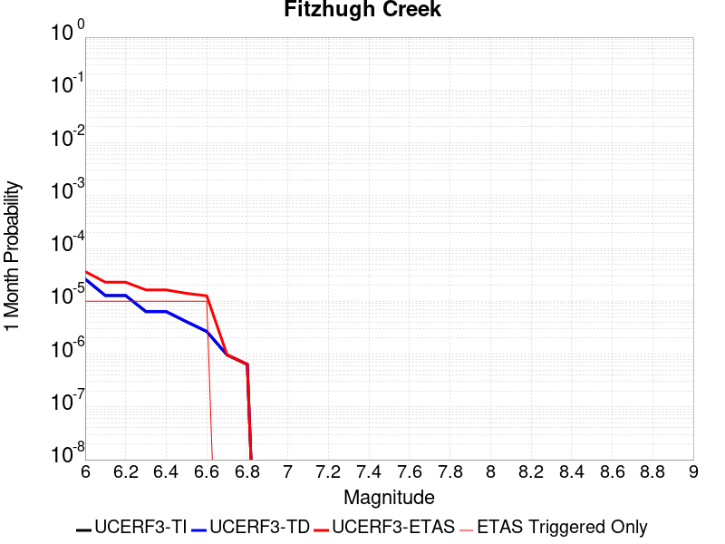 |  |  |

| Magnitude | 1 wk TI Prob | 1 wk TD Prob | 1 wk ETAS Prob | 1 wk ETAS/TD Gain | 1 wk ETAS Triggered Only | 1 mo TI Prob | 1 mo TD Prob | 1 mo ETAS Prob | 1 mo ETAS/TD Gain | 1 mo ETAS Triggered Only | 1 yr TI Prob | 1 yr TD Prob | 1 yr ETAS Prob | 1 yr ETAS/TD Gain | 1 yr ETAS Triggered Only | 10 yr TI Prob | 10 yr TD Prob | 10 yr ETAS Prob | 10 yr ETAS/TD Gain | 10 yr ETAS Triggered Only |
|-----|-----|-----|-----|-----|-----|-----|-----|-----|-----|-----|-----|-----|-----|-----|-----|-----|-----|-----|-----|-----|
| 6.0 | 6.1090436E-6 | 6.2101562E-6 | 3.707416E-5 | 5.9699244 | 3.0864197E-5 | 2.6181353E-5 | 2.6614709E-5 | 5.7478086E-5 | 2.159636 | 3.0864197E-5 | 3.1871133E-4 | 3.239904E-4 | 3.5484458E-4 | 1.0952318 | 3.0864197E-5 | 0.0031825465 | 0.0032356246 | 0.003266389 | 1.009508 | 3.0864197E-5 |
| 6.1 | 2.9741811E-6 | 3.021581E-6 | 3.3885684E-5 | 11.214555 | 3.0864197E-5 | 1.2746428E-5 | 1.2949574E-5 | 4.3813372E-5 | 3.3833833 | 3.0864197E-5 | 1.5517672E-4 | 1.576506E-4 | 1.8850993E-4 | 1.1957451 | 3.0864197E-5 | 0.001550684 | 0.0015754806 | 0.0016062962 | 1.0195595 | 3.0864197E-5 |
| 6.2 | 2.9741811E-6 | 3.021581E-6 | 3.3885684E-5 | 11.214555 | 3.0864197E-5 | 1.2746428E-5 | 1.2949574E-5 | 4.3813372E-5 | 3.3833833 | 3.0864197E-5 | 1.5517672E-4 | 1.576506E-4 | 1.8850993E-4 | 1.1957451 | 3.0864197E-5 | 0.001550684 | 0.0015754806 | 0.0016062962 | 1.0195595 | 3.0864197E-5 |
| 6.3 | 1.4781198E-6 | 1.5012708E-6 | 3.236542E-5 | 21.558683 | 3.0864197E-5 | 6.3347834E-6 | 6.4340034E-6 | 3.7298003E-5 | 5.7970133 | 3.0864197E-5 | 7.712326E-5 | 7.833137E-5 | 1.09193155E-4 | 1.39399 | 3.0864197E-5 | 7.70965E-4 | 7.830576E-4 | 8.138976E-4 | 1.0393841 | 3.0864197E-5 |
| 6.4 | 1.4781198E-6 | 1.5012708E-6 | 3.236542E-5 | 21.558683 | 3.0864197E-5 | 6.3347834E-6 | 6.4340034E-6 | 3.7298003E-5 | 5.7970133 | 3.0864197E-5 | 7.712326E-5 | 7.833137E-5 | 1.09193155E-4 | 1.39399 | 3.0864197E-5 | 7.70965E-4 | 7.830576E-4 | 8.138976E-4 | 1.0393841 | 3.0864197E-5 |
| 6.5 | 9.5176676E-7 | 9.66606E-7 | 3.1830772E-5 | 32.930454 | 3.0864197E-5 | 4.078994E-6 | 4.142591E-6 | 3.5006662E-5 | 8.450426 | 3.0864197E-5 | 4.9660623E-5 | 5.0434985E-5 | 8.129763E-5 | 1.6119292 | 3.0864197E-5 | 4.964952E-4 | 5.042458E-4 | 5.350944E-4 | 1.0611777 | 3.0864197E-5 |
| 6.6 | 6.21145E-7 | 6.3085855E-7 | 3.1495038E-5 | 49.924084 | 3.0864197E-5 | 2.662047E-6 | 2.7036772E-6 | 3.356779E-5 | 12.4156065 | 3.0864197E-5 | 3.2409942E-5 | 3.291684E-5 | 6.378002E-5 | 1.9376107 | 3.0864197E-5 | 3.2405215E-4 | 3.2912623E-4 | 3.5998024E-4 | 1.0937454 | 3.0864197E-5 |
| 6.7 | 2.2377962E-7 | 2.2734636E-7 | 2.2734636E-7 | 1.0 | 0.0 | 9.590551E-7 | 9.743413E-7 | 9.743413E-7 | 1.0 | 0.0 | 1.1676434E-5 | 1.1862574E-5 | 1.1862574E-5 | 1.0 | 0.0 | 1.1675821E-4 | 1.1862254E-4 | 1.1862254E-4 | 1.0 | 0.0 |
| 6.8 | 1.4785022E-7 | 1.5021492E-7 | 1.5021492E-7 | 1.0 | 0.0 | 6.3364365E-7 | 6.4377826E-7 | 6.4377826E-7 | 1.0 | 0.0 | 7.714584E-6 | 7.838E-6 | 7.838E-6 | 1.0 | 0.0 | 7.714316E-5 | 7.838E-5 | 7.838E-5 | 1.0 | 0.0 |

## Puente Hills
*[(top)](#table-of-contents)*

| 1 Week | 1 Month | 1 Year | 10 Year |
|-----|-----|-----|-----|
|  |  |  |  |

| Magnitude | 1 wk TI Prob | 1 wk TD Prob | 1 wk ETAS Prob | 1 wk ETAS/TD Gain | 1 wk ETAS Triggered Only | 1 mo TI Prob | 1 mo TD Prob | 1 mo ETAS Prob | 1 mo ETAS/TD Gain | 1 mo ETAS Triggered Only | 1 yr TI Prob | 1 yr TD Prob | 1 yr ETAS Prob | 1 yr ETAS/TD Gain | 1 yr ETAS Triggered Only | 10 yr TI Prob | 10 yr TD Prob | 10 yr ETAS Prob | 10 yr ETAS/TD Gain | 10 yr ETAS Triggered Only |
|-----|-----|-----|-----|-----|-----|-----|-----|-----|-----|-----|-----|-----|-----|-----|-----|-----|-----|-----|-----|-----|
| 6.0 | 1.2101656E-5 | 8.098625E-6 | 8.098625E-6 | 1.0 | 0.0 | 5.1863204E-5 | 3.4707962E-5 | 3.4707962E-5 | 1.0 | 0.0 | 6.312516E-4 | 4.2249315E-4 | 4.533443E-4 | 1.0730217 | 3.0864197E-5 | 0.0062946146 | 0.0042174594 | 0.0042481935 | 1.0072874 | 3.0864197E-5 |
| 6.1 | 1.2101656E-5 | 8.098625E-6 | 8.098625E-6 | 1.0 | 0.0 | 5.1863204E-5 | 3.4707962E-5 | 3.4707962E-5 | 1.0 | 0.0 | 6.312516E-4 | 4.2249315E-4 | 4.533443E-4 | 1.0730217 | 3.0864197E-5 | 0.0062946146 | 0.0042174594 | 0.0042481935 | 1.0072874 | 3.0864197E-5 |
| 6.2 | 1.2101656E-5 | 8.098625E-6 | 8.098625E-6 | 1.0 | 0.0 | 5.1863204E-5 | 3.4707962E-5 | 3.4707962E-5 | 1.0 | 0.0 | 6.312516E-4 | 4.2249315E-4 | 4.533443E-4 | 1.0730217 | 3.0864197E-5 | 0.0062946146 | 0.0042174594 | 0.0042481935 | 1.0072874 | 3.0864197E-5 |
| 6.3 | 1.2101656E-5 | 8.098625E-6 | 8.098625E-6 | 1.0 | 0.0 | 5.1863204E-5 | 3.4707962E-5 | 3.4707962E-5 | 1.0 | 0.0 | 6.312516E-4 | 4.2249315E-4 | 4.533443E-4 | 1.0730217 | 3.0864197E-5 | 0.0062946146 | 0.0042174594 | 0.0042481935 | 1.0072874 | 3.0864197E-5 |
| 6.4 | 1.2101656E-5 | 8.098625E-6 | 8.098625E-6 | 1.0 | 0.0 | 5.1863204E-5 | 3.4707962E-5 | 3.4707962E-5 | 1.0 | 0.0 | 6.312516E-4 | 4.2249315E-4 | 4.533443E-4 | 1.0730217 | 3.0864197E-5 | 0.0062946146 | 0.0042174594 | 0.0042481935 | 1.0072874 | 3.0864197E-5 |
| 6.5 | 1.2101656E-5 | 8.098625E-6 | 8.098625E-6 | 1.0 | 0.0 | 5.1863204E-5 | 3.4707962E-5 | 3.4707962E-5 | 1.0 | 0.0 | 6.312516E-4 | 4.2249315E-4 | 4.533443E-4 | 1.0730217 | 3.0864197E-5 | 0.0062946146 | 0.0042174594 | 0.0042481935 | 1.0072874 | 3.0864197E-5 |
| 6.6 | 1.0222488E-5 | 6.3991847E-6 | 6.3991847E-6 | 1.0 | 0.0 | 4.3809923E-5 | 2.7424803E-5 | 2.7424803E-5 | 1.0 | 0.0 | 5.332553E-4 | 3.3384826E-4 | 3.3384826E-4 | 1.0 | 0.0 | 0.0053197746 | 0.0033337125 | 0.0033337125 | 1.0 | 0.0 |
| 6.7 | 1.0222488E-5 | 6.3991847E-6 | 6.3991847E-6 | 1.0 | 0.0 | 4.3809923E-5 | 2.7424803E-5 | 2.7424803E-5 | 1.0 | 0.0 | 5.332553E-4 | 3.3384826E-4 | 3.3384826E-4 | 1.0 | 0.0 | 0.0053197746 | 0.0033337125 | 0.0033337125 | 1.0 | 0.0 |
| 6.8 | 8.6367845E-6 | 5.0282533E-6 | 5.0282533E-6 | 1.0 | 0.0 | 3.7014266E-5 | 2.1549482E-5 | 2.1549482E-5 | 1.0 | 0.0 | 4.505555E-4 | 2.623339E-4 | 2.623339E-4 | 1.0 | 0.0 | 0.004496431 | 0.0026202986 | 0.0026202986 | 1.0 | 0.0 |
| 6.9 | 8.066481E-6 | 4.836117E-6 | 4.836117E-6 | 1.0 | 0.0 | 3.4570177E-5 | 2.0726053E-5 | 2.0726053E-5 | 1.0 | 0.0 | 4.2081063E-4 | 2.52311E-4 | 2.52311E-4 | 1.0 | 0.0 | 0.0042001465 | 0.0025202993 | 0.0025202993 | 1.0 | 0.0 |
| 7.0 | 7.393828E-6 | 4.417296E-6 | 4.417296E-6 | 1.0 | 0.0 | 3.168745E-5 | 1.8931134E-5 | 1.8931134E-5 | 1.0 | 0.0 | 3.857264E-4 | 2.3046264E-4 | 2.3046264E-4 | 1.0 | 0.0 | 0.0038505755 | 0.0023022818 | 0.0023022818 | 1.0 | 0.0 |
| 7.1 | 6.4660953E-6 | 3.8044495E-6 | 3.8044495E-6 | 1.0 | 0.0 | 2.7711543E-5 | 1.6304684E-5 | 1.6304684E-5 | 1.0 | 0.0 | 3.373358E-4 | 1.984918E-4 | 1.984918E-4 | 1.0 | 0.0 | 0.0033682417 | 0.001983181 | 0.001983181 | 1.0 | 0.0 |
| 7.2 | 5.143232E-6 | 2.7865456E-6 | 2.7865456E-6 | 1.0 | 0.0 | 2.2042237E-5 | 1.1942284E-5 | 1.1942284E-5 | 1.0 | 0.0 | 2.6833118E-4 | 1.453877E-4 | 1.453877E-4 | 1.0 | 0.0 | 0.002680074 | 0.0014529356 | 0.0014529356 | 1.0 | 0.0 |
| 7.3 | 3.928255E-6 | 2.0913774E-6 | 2.0913774E-6 | 1.0 | 0.0 | 1.683527E-5 | 8.963015E-6 | 8.963015E-6 | 1.0 | 0.0 | 2.0495013E-4 | 1.0911931E-4 | 1.0911931E-4 | 1.0 | 0.0 | 0.002047612 | 0.001090664 | 0.001090664 | 1.0 | 0.0 |
| 7.4 | 2.7894434E-6 | 1.3546753E-6 | 1.3546753E-6 | 1.0 | 0.0 | 1.1954703E-5 | 5.8057385E-6 | 5.8057385E-6 | 1.0 | 0.0 | 1.4553878E-4 | 7.068262E-5 | 7.068262E-5 | 1.0 | 0.0 | 0.001454435 | 7.066058E-4 | 7.066058E-4 | 1.0 | 0.0 |
| 7.5 | 2.041735E-6 | 8.787305E-7 | 8.787305E-7 | 1.0 | 0.0 | 8.750263E-6 | 3.7659825E-6 | 3.7659825E-6 | 1.0 | 0.0 | 1.06529245E-4 | 4.5849905E-5 | 4.5849905E-5 | 1.0 | 0.0 | 0.0010647819 | 4.5840783E-4 | 4.5840783E-4 | 1.0 | 0.0 |
| 7.6 | 1.6959062E-6 | 6.6986263E-7 | 6.6986263E-7 | 1.0 | 0.0 | 7.268149E-6 | 2.8708366E-6 | 2.8708366E-6 | 1.0 | 0.0 | 8.848612E-5 | 3.4951907E-5 | 3.4951907E-5 | 1.0 | 0.0 | 8.84509E-4 | 3.4946698E-4 | 3.4946698E-4 | 1.0 | 0.0 |
| 7.7 | 1.4767965E-6 | 5.407607E-7 | 5.407607E-7 | 1.0 | 0.0 | 6.3291122E-6 | 2.317544E-6 | 2.317544E-6 | 1.0 | 0.0 | 7.705422E-5 | 2.8215758E-5 | 2.8215758E-5 | 1.0 | 0.0 | 7.702751E-4 | 2.8212433E-4 | 2.8212433E-4 | 1.0 | 0.0 |
| 7.8 | 1.8432911E-7 | 7.28201E-8 | 7.28201E-8 | 1.0 | 0.0 | 7.8998164E-7 | 3.1208612E-7 | 3.1208612E-7 | 1.0 | 0.0 | 9.617985E-6 | 3.7996451E-6 | 3.7996451E-6 | 1.0 | 0.0 | 9.617568E-5 | 3.7996128E-5 | 3.7996128E-5 | 1.0 | 0.0 |

